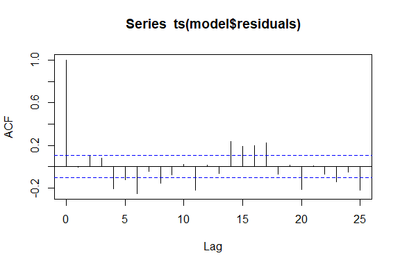
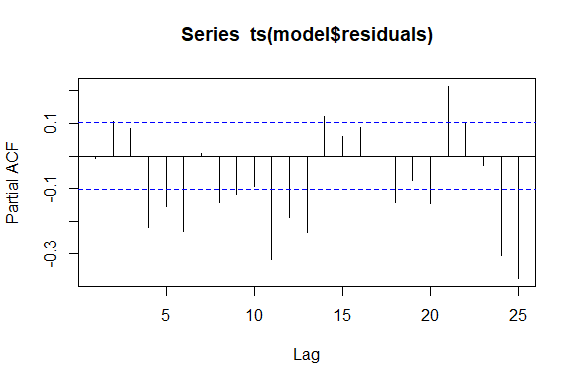
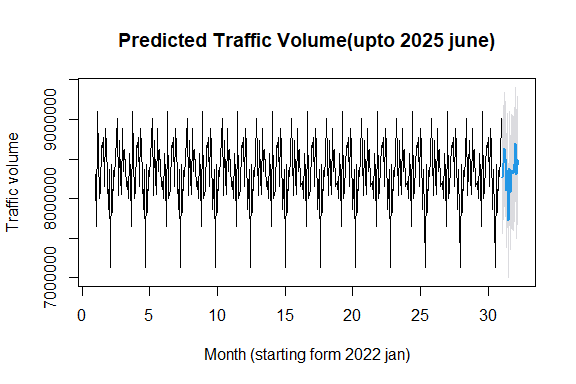

``` r
# package loading 
library(dplyr)
library(tidyverse)
library(ggplot2)
library(scales)
library(lubridate)
library(plotly)
library(htmlwidgets)
library(tseries)
library(forcats)
library(forecast)
library(DT) 
library(readr)
```

# Abstract

Bangalore, known for its rapid urbanization and expanding population, faces significant challenges with traffic congestion. This project aims to analyze traffic patterns in Bangalore with a focus on how weekdays and climatic changes influence average traffic speed and congestion levels. By leveraging historical traffic data and weather conditions, the study examines the interplay between climate variables (such as rainfall, temperature, and humidity) and traffic flow dynamics.

The project seeks to:

1.  Evaluate the impact of climate changes on average traffic speed and congestion during weekdays.

2.  Identify critical weather conditions that exacerbate traffic delays.

3.  Predict future average traffic patterns over a month using ARIMA (Auto-Regressive Integrated Moving Average) modeling.

The analysis integrates statistical and machine learning techniques to understand variability in traffic across different weather scenarios and weekdays. ARIMA modeling will be employed to forecast traffic trends, providing actionable insights for urban planners and policymakers to devise traffic management strategies.

This study not only contributes to understanding the implications of climate change on urban traffic but also supports the development of adaptive measures to mitigate congestion, ensuring smoother traffic flow in Bangalore's growing metropolis.

# About Data

The data is secondary dataset downloaded in kaggle.com website

### Here are brief explanations for each variable:

1.  **Date**: The specific date of the traffic observation or data collection.\
2.  **Area.Name**: The name of the region or locality within Bangalore where data was recorded.\
3.  **Road.Intersection.Name**: The specific road or intersection where the traffic data was collected.\
4.  **Traffic.Volume**: The total number of vehicles passing through a particular road or intersection.\
5.  **Average.Speed**: The mean speed of vehicles in the observed area during the given time frame.\
6.  **Travel.Time.Index**: A measure comparing actual travel time to free-flow travel time; indicates traffic efficiency.\
7.  **Congestion.Level**: A qualitative or quantitative indicator of the severity of traffic congestion.\
8.  **Road.Capacity.Utilization**: The extent to which the road’s capacity is being used, expressed as a percentage.\
9.  **Incident.Reports**: The count or details of traffic-related incidents (e.g., accidents, breakdowns) during the observation period.\
10. **Environmental.Impact**: The effect of traffic activity on the environment, such as emissions or noise levels.\
11. **Public.Transport.Usage**: The number of commuters using public transportation within the area.\
12. **Traffic.Signal.Compliance**: The percentage or count of vehicles adhering to traffic signal rules.\
13. **Parking.Usage**: The utilization of parking spaces in the area, indicating demand for parking facilities.\
14. **Pedestrian.and.Cyclist.Count**: The count of pedestrians and cyclists in the observed area.\
15. **Weather.Conditions**: The prevailing climatic factors (e.g., temperature, rainfall, humidity) during the observation period.\
16. **Roadwork.and.Construction.Activity**: Information about ongoing roadwork or construction impacting traffic flow.

Converting the respectives data into Date types , catagorical Types and Numerical types

**Example dataset:**


``` r
datam=read.csv("Banglore_traffic_Dataset.csv")
data=datam
data$Date=as.Date(datam$Date,formate="%Y-%m-%d")
data$Average.Speed=data$Average.Speed %>% round(2)
data$Travel.Time.Index=data$Travel.Time.Index %>% round(2)
data$Congestion.Level=data$Congestion.Level %>% round(2)
data$Road.Capacity.Utilization=data$Road.Capacity.Utilization %>% round(2)
data$Environmental.Impact=data$Environmental.Impact %>% round(2)
data$Public.Transport.Usage=data$Public.Transport.Usage %>% round(2)
data$Traffic.Signal.Compliance=data$Traffic.Signal.Compliance %>% round(2)
data$Parking.Usage=data$Parking.Usage %>% round(2)
data$Area.Name=data$Area.Name %>% as.factor()
data$Road.Intersection.Name=data$Road.Intersection.Name %>% as.factor()
data$Weather.Conditions=data$Weather.Conditions %>% as.factor()
data$Roadwork.and.Construction.Activity=data$Roadwork.and.Construction.Activity %>% as.factor()
data$Days=weekdays(data$Date) %>%  as.factor()
data$month=month(data$Date)|>as.factor()
levels(data$month)=month.abb
data$year=year(data$Date)
data %>% datatable(filter="top")
```

```{=html}
<div class="datatables html-widget html-fill-item" id="htmlwidget-93f614a6c51100c8788a" style="width:100%;height:auto;"></div>
<script type="application/json" data-for="htmlwidget-93f614a6c51100c8788a">{"x":{"filter":"top","vertical":false,"filterHTML":"<tr>\n  <td><\/td>\n  <td data-type=\"date\" style=\"vertical-align: top;\">\n    <div class=\"form-group has-feedback\" style=\"margin-bottom: auto;\">\n      <input type=\"search\" placeholder=\"All\" class=\"form-control\" style=\"width: 100%;\"/>\n      <span class=\"glyphicon glyphicon-remove-circle form-control-feedback\"><\/span>\n    <\/div>\n    <div style=\"display: none;position: absolute;width: 200px;opacity: 1\">\n      <div data-min=\"1640995200000\" data-max=\"1723161600000\"><\/div>\n      <span style=\"float: left;\"><\/span>\n      <span style=\"float: right;\"><\/span>\n    <\/div>\n  <\/td>\n  <td data-type=\"factor\" style=\"vertical-align: top;\">\n    <div class=\"form-group has-feedback\" style=\"margin-bottom: auto;\">\n      <input type=\"search\" placeholder=\"All\" class=\"form-control\" style=\"width: 100%;\"/>\n      <span class=\"glyphicon glyphicon-remove-circle form-control-feedback\"><\/span>\n    <\/div>\n    <div style=\"width: 100%; display: none;\">\n      <select multiple=\"multiple\" style=\"width: 100%;\" data-options=\"[&quot;Electronic City&quot;,&quot;Hebbal&quot;,&quot;Indiranagar&quot;,&quot;Jayanagar&quot;,&quot;Koramangala&quot;,&quot;M.G. Road&quot;,&quot;Whitefield&quot;,&quot;Yeshwanthpur&quot;]\"><\/select>\n    <\/div>\n  <\/td>\n  <td data-type=\"factor\" style=\"vertical-align: top;\">\n    <div class=\"form-group has-feedback\" style=\"margin-bottom: auto;\">\n      <input type=\"search\" placeholder=\"All\" class=\"form-control\" style=\"width: 100%;\"/>\n      <span class=\"glyphicon glyphicon-remove-circle form-control-feedback\"><\/span>\n    <\/div>\n    <div style=\"width: 100%; display: none;\">\n      <select multiple=\"multiple\" style=\"width: 100%;\" data-options=\"[&quot;100 Feet Road&quot;,&quot;Anil Kumble Circle&quot;,&quot;Ballari Road&quot;,&quot;CMH Road&quot;,&quot;Hebbal Flyover&quot;,&quot;Hosur Road&quot;,&quot;ITPL Main Road&quot;,&quot;Jayanagar 4th Block&quot;,&quot;Marathahalli Bridge&quot;,&quot;Sarjapur Road&quot;,&quot;Silk Board Junction&quot;,&quot;Sony World Junction&quot;,&quot;South End Circle&quot;,&quot;Trinity Circle&quot;,&quot;Tumkur Road&quot;,&quot;Yeshwanthpur Circle&quot;]\"><\/select>\n    <\/div>\n  <\/td>\n  <td data-type=\"integer\" style=\"vertical-align: top;\">\n    <div class=\"form-group has-feedback\" style=\"margin-bottom: auto;\">\n      <input type=\"search\" placeholder=\"All\" class=\"form-control\" style=\"width: 100%;\"/>\n      <span class=\"glyphicon glyphicon-remove-circle form-control-feedback\"><\/span>\n    <\/div>\n    <div style=\"display: none;position: absolute;width: 200px;opacity: 1\">\n      <div data-min=\"4233\" data-max=\"72039\"><\/div>\n      <span style=\"float: left;\"><\/span>\n      <span style=\"float: right;\"><\/span>\n    <\/div>\n  <\/td>\n  <td data-type=\"number\" style=\"vertical-align: top;\">\n    <div class=\"form-group has-feedback\" style=\"margin-bottom: auto;\">\n      <input type=\"search\" placeholder=\"All\" class=\"form-control\" style=\"width: 100%;\"/>\n      <span class=\"glyphicon glyphicon-remove-circle form-control-feedback\"><\/span>\n    <\/div>\n    <div style=\"display: none;position: absolute;width: 200px;opacity: 1\">\n      <div data-min=\"20\" data-max=\"89.79\" data-scale=\"2\"><\/div>\n      <span style=\"float: left;\"><\/span>\n      <span style=\"float: right;\"><\/span>\n    <\/div>\n  <\/td>\n  <td data-type=\"number\" style=\"vertical-align: top;\">\n    <div class=\"form-group has-feedback\" style=\"margin-bottom: auto;\">\n      <input type=\"search\" placeholder=\"All\" class=\"form-control\" style=\"width: 100%;\"/>\n      <span class=\"glyphicon glyphicon-remove-circle form-control-feedback\"><\/span>\n    <\/div>\n    <div style=\"display: none;position: absolute;width: 200px;opacity: 1\">\n      <div data-min=\"1\" data-max=\"1.5\" data-scale=\"2\"><\/div>\n      <span style=\"float: left;\"><\/span>\n      <span style=\"float: right;\"><\/span>\n    <\/div>\n  <\/td>\n  <td data-type=\"number\" style=\"vertical-align: top;\">\n    <div class=\"form-group has-feedback\" style=\"margin-bottom: auto;\">\n      <input type=\"search\" placeholder=\"All\" class=\"form-control\" style=\"width: 100%;\"/>\n      <span class=\"glyphicon glyphicon-remove-circle form-control-feedback\"><\/span>\n    <\/div>\n    <div style=\"display: none;position: absolute;width: 200px;opacity: 1\">\n      <div data-min=\"5.16\" data-max=\"100\" data-scale=\"2\"><\/div>\n      <span style=\"float: left;\"><\/span>\n      <span style=\"float: right;\"><\/span>\n    <\/div>\n  <\/td>\n  <td data-type=\"number\" style=\"vertical-align: top;\">\n    <div class=\"form-group has-feedback\" style=\"margin-bottom: auto;\">\n      <input type=\"search\" placeholder=\"All\" class=\"form-control\" style=\"width: 100%;\"/>\n      <span class=\"glyphicon glyphicon-remove-circle form-control-feedback\"><\/span>\n    <\/div>\n    <div style=\"display: none;position: absolute;width: 200px;opacity: 1\">\n      <div data-min=\"18.73\" data-max=\"100\" data-scale=\"2\"><\/div>\n      <span style=\"float: left;\"><\/span>\n      <span style=\"float: right;\"><\/span>\n    <\/div>\n  <\/td>\n  <td data-type=\"integer\" style=\"vertical-align: top;\">\n    <div class=\"form-group has-feedback\" style=\"margin-bottom: auto;\">\n      <input type=\"search\" placeholder=\"All\" class=\"form-control\" style=\"width: 100%;\"/>\n      <span class=\"glyphicon glyphicon-remove-circle form-control-feedback\"><\/span>\n    <\/div>\n    <div style=\"display: none;position: absolute;width: 200px;opacity: 1\">\n      <div data-min=\"0\" data-max=\"10\"><\/div>\n      <span style=\"float: left;\"><\/span>\n      <span style=\"float: right;\"><\/span>\n    <\/div>\n  <\/td>\n  <td data-type=\"number\" style=\"vertical-align: top;\">\n    <div class=\"form-group has-feedback\" style=\"margin-bottom: auto;\">\n      <input type=\"search\" placeholder=\"All\" class=\"form-control\" style=\"width: 100%;\"/>\n      <span class=\"glyphicon glyphicon-remove-circle form-control-feedback\"><\/span>\n    <\/div>\n    <div style=\"display: none;position: absolute;width: 200px;opacity: 1\">\n      <div data-min=\"58.47\" data-max=\"194.08\" data-scale=\"2\"><\/div>\n      <span style=\"float: left;\"><\/span>\n      <span style=\"float: right;\"><\/span>\n    <\/div>\n  <\/td>\n  <td data-type=\"number\" style=\"vertical-align: top;\">\n    <div class=\"form-group has-feedback\" style=\"margin-bottom: auto;\">\n      <input type=\"search\" placeholder=\"All\" class=\"form-control\" style=\"width: 100%;\"/>\n      <span class=\"glyphicon glyphicon-remove-circle form-control-feedback\"><\/span>\n    <\/div>\n    <div style=\"display: none;position: absolute;width: 200px;opacity: 1\">\n      <div data-min=\"10.01\" data-max=\"79.98\" data-scale=\"2\"><\/div>\n      <span style=\"float: left;\"><\/span>\n      <span style=\"float: right;\"><\/span>\n    <\/div>\n  <\/td>\n  <td data-type=\"number\" style=\"vertical-align: top;\">\n    <div class=\"form-group has-feedback\" style=\"margin-bottom: auto;\">\n      <input type=\"search\" placeholder=\"All\" class=\"form-control\" style=\"width: 100%;\"/>\n      <span class=\"glyphicon glyphicon-remove-circle form-control-feedback\"><\/span>\n    <\/div>\n    <div style=\"display: none;position: absolute;width: 200px;opacity: 1\">\n      <div data-min=\"60\" data-max=\"99.99\" data-scale=\"2\"><\/div>\n      <span style=\"float: left;\"><\/span>\n      <span style=\"float: right;\"><\/span>\n    <\/div>\n  <\/td>\n  <td data-type=\"number\" style=\"vertical-align: top;\">\n    <div class=\"form-group has-feedback\" style=\"margin-bottom: auto;\">\n      <input type=\"search\" placeholder=\"All\" class=\"form-control\" style=\"width: 100%;\"/>\n      <span class=\"glyphicon glyphicon-remove-circle form-control-feedback\"><\/span>\n    <\/div>\n    <div style=\"display: none;position: absolute;width: 200px;opacity: 1\">\n      <div data-min=\"50.02\" data-max=\"100\" data-scale=\"2\"><\/div>\n      <span style=\"float: left;\"><\/span>\n      <span style=\"float: right;\"><\/span>\n    <\/div>\n  <\/td>\n  <td data-type=\"integer\" style=\"vertical-align: top;\">\n    <div class=\"form-group has-feedback\" style=\"margin-bottom: auto;\">\n      <input type=\"search\" placeholder=\"All\" class=\"form-control\" style=\"width: 100%;\"/>\n      <span class=\"glyphicon glyphicon-remove-circle form-control-feedback\"><\/span>\n    <\/div>\n    <div style=\"display: none;position: absolute;width: 200px;opacity: 1\">\n      <div data-min=\"66\" data-max=\"243\"><\/div>\n      <span style=\"float: left;\"><\/span>\n      <span style=\"float: right;\"><\/span>\n    <\/div>\n  <\/td>\n  <td data-type=\"factor\" style=\"vertical-align: top;\">\n    <div class=\"form-group has-feedback\" style=\"margin-bottom: auto;\">\n      <input type=\"search\" placeholder=\"All\" class=\"form-control\" style=\"width: 100%;\"/>\n      <span class=\"glyphicon glyphicon-remove-circle form-control-feedback\"><\/span>\n    <\/div>\n    <div style=\"width: 100%; display: none;\">\n      <select multiple=\"multiple\" style=\"width: 100%;\" data-options=\"[&quot;Clear&quot;,&quot;Fog&quot;,&quot;Overcast&quot;,&quot;Rain&quot;,&quot;Windy&quot;]\"><\/select>\n    <\/div>\n  <\/td>\n  <td data-type=\"factor\" style=\"vertical-align: top;\">\n    <div class=\"form-group has-feedback\" style=\"margin-bottom: auto;\">\n      <input type=\"search\" placeholder=\"All\" class=\"form-control\" style=\"width: 100%;\"/>\n      <span class=\"glyphicon glyphicon-remove-circle form-control-feedback\"><\/span>\n    <\/div>\n    <div style=\"width: 100%; display: none;\">\n      <select multiple=\"multiple\" style=\"width: 100%;\" data-options=\"[&quot;No&quot;,&quot;Yes&quot;]\"><\/select>\n    <\/div>\n  <\/td>\n  <td data-type=\"factor\" style=\"vertical-align: top;\">\n    <div class=\"form-group has-feedback\" style=\"margin-bottom: auto;\">\n      <input type=\"search\" placeholder=\"All\" class=\"form-control\" style=\"width: 100%;\"/>\n      <span class=\"glyphicon glyphicon-remove-circle form-control-feedback\"><\/span>\n    <\/div>\n    <div style=\"width: 100%; display: none;\">\n      <select multiple=\"multiple\" style=\"width: 100%;\" data-options=\"[&quot;Friday&quot;,&quot;Monday&quot;,&quot;Saturday&quot;,&quot;Sunday&quot;,&quot;Thursday&quot;,&quot;Tuesday&quot;,&quot;Wednesday&quot;]\"><\/select>\n    <\/div>\n  <\/td>\n  <td data-type=\"factor\" style=\"vertical-align: top;\">\n    <div class=\"form-group has-feedback\" style=\"margin-bottom: auto;\">\n      <input type=\"search\" placeholder=\"All\" class=\"form-control\" style=\"width: 100%;\"/>\n      <span class=\"glyphicon glyphicon-remove-circle form-control-feedback\"><\/span>\n    <\/div>\n    <div style=\"width: 100%; display: none;\">\n      <select multiple=\"multiple\" style=\"width: 100%;\" data-options=\"[&quot;Jan&quot;,&quot;Feb&quot;,&quot;Mar&quot;,&quot;Apr&quot;,&quot;May&quot;,&quot;Jun&quot;,&quot;Jul&quot;,&quot;Aug&quot;,&quot;Sep&quot;,&quot;Oct&quot;,&quot;Nov&quot;,&quot;Dec&quot;]\"><\/select>\n    <\/div>\n  <\/td>\n  <td data-type=\"number\" style=\"vertical-align: top;\">\n    <div class=\"form-group has-feedback\" style=\"margin-bottom: auto;\">\n      <input type=\"search\" placeholder=\"All\" class=\"form-control\" style=\"width: 100%;\"/>\n      <span class=\"glyphicon glyphicon-remove-circle form-control-feedback\"><\/span>\n    <\/div>\n    <div style=\"display: none;position: absolute;width: 200px;opacity: 1\">\n      <div data-min=\"2022\" data-max=\"2024\"><\/div>\n      <span style=\"float: left;\"><\/span>\n      <span style=\"float: right;\"><\/span>\n    <\/div>\n  <\/td>\n<\/tr>","data":[["1","2","3","4","5","6","7","8","9","10","11","12","13","14","15","16","17","18","19","20","21","22","23","24","25","26","27","28","29","30","31","32","33","34","35","36","37","38","39","40","41","42","43","44","45","46","47","48","49","50","51","52","53","54","55","56","57","58","59","60","61","62","63","64","65","66","67","68","69","70","71","72","73","74","75","76","77","78","79","80","81","82","83","84","85","86","87","88","89","90","91","92","93","94","95","96","97","98","99","100","101","102","103","104","105","106","107","108","109","110","111","112","113","114","115","116","117","118","119","120","121","122","123","124","125","126","127","128","129","130","131","132","133","134","135","136","137","138","139","140","141","142","143","144","145","146","147","148","149","150","151","152","153","154","155","156","157","158","159","160","161","162","163","164","165","166","167","168","169","170","171","172","173","174","175","176","177","178","179","180","181","182","183","184","185","186","187","188","189","190","191","192","193","194","195","196","197","198","199","200","201","202","203","204","205","206","207","208","209","210","211","212","213","214","215","216","217","218","219","220","221","222","223","224","225","226","227","228","229","230","231","232","233","234","235","236","237","238","239","240","241","242","243","244","245","246","247","248","249","250","251","252","253","254","255","256","257","258","259","260","261","262","263","264","265","266","267","268","269","270","271","272","273","274","275","276","277","278","279","280","281","282","283","284","285","286","287","288","289","290","291","292","293","294","295","296","297","298","299","300","301","302","303","304","305","306","307","308","309","310","311","312","313","314","315","316","317","318","319","320","321","322","323","324","325","326","327","328","329","330","331","332","333","334","335","336","337","338","339","340","341","342","343","344","345","346","347","348","349","350","351","352","353","354","355","356","357","358","359","360","361","362","363","364","365","366","367","368","369","370","371","372","373","374","375","376","377","378","379","380","381","382","383","384","385","386","387","388","389","390","391","392","393","394","395","396","397","398","399","400","401","402","403","404","405","406","407","408","409","410","411","412","413","414","415","416","417","418","419","420","421","422","423","424","425","426","427","428","429","430","431","432","433","434","435","436","437","438","439","440","441","442","443","444","445","446","447","448","449","450","451","452","453","454","455","456","457","458","459","460","461","462","463","464","465","466","467","468","469","470","471","472","473","474","475","476","477","478","479","480","481","482","483","484","485","486","487","488","489","490","491","492","493","494","495","496","497","498","499","500","501","502","503","504","505","506","507","508","509","510","511","512","513","514","515","516","517","518","519","520","521","522","523","524","525","526","527","528","529","530","531","532","533","534","535","536","537","538","539","540","541","542","543","544","545","546","547","548","549","550","551","552","553","554","555","556","557","558","559","560","561","562","563","564","565","566","567","568","569","570","571","572","573","574","575","576","577","578","579","580","581","582","583","584","585","586","587","588","589","590","591","592","593","594","595","596","597","598","599","600","601","602","603","604","605","606","607","608","609","610","611","612","613","614","615","616","617","618","619","620","621","622","623","624","625","626","627","628","629","630","631","632","633","634","635","636","637","638","639","640","641","642","643","644","645","646","647","648","649","650","651","652","653","654","655","656","657","658","659","660","661","662","663","664","665","666","667","668","669","670","671","672","673","674","675","676","677","678","679","680","681","682","683","684","685","686","687","688","689","690","691","692","693","694","695","696","697","698","699","700","701","702","703","704","705","706","707","708","709","710","711","712","713","714","715","716","717","718","719","720","721","722","723","724","725","726","727","728","729","730","731","732","733","734","735","736","737","738","739","740","741","742","743","744","745","746","747","748","749","750","751","752","753","754","755","756","757","758","759","760","761","762","763","764","765","766","767","768","769","770","771","772","773","774","775","776","777","778","779","780","781","782","783","784","785","786","787","788","789","790","791","792","793","794","795","796","797","798","799","800","801","802","803","804","805","806","807","808","809","810","811","812","813","814","815","816","817","818","819","820","821","822","823","824","825","826","827","828","829","830","831","832","833","834","835","836","837","838","839","840","841","842","843","844","845","846","847","848","849","850","851","852","853","854","855","856","857","858","859","860","861","862","863","864","865","866","867","868","869","870","871","872","873","874","875","876","877","878","879","880","881","882","883","884","885","886","887","888","889","890","891","892","893","894","895","896","897","898","899","900","901","902","903","904","905","906","907","908","909","910","911","912","913","914","915","916","917","918","919","920","921","922","923","924","925","926","927","928","929","930","931","932","933","934","935","936","937","938","939","940","941","942","943","944","945","946","947","948","949","950","951","952","953","954","955","956","957","958","959","960","961","962","963","964","965","966","967","968","969","970","971","972","973","974","975","976","977","978","979","980","981","982","983","984","985","986","987","988","989","990","991","992","993","994","995","996","997","998","999","1000","1001","1002","1003","1004","1005","1006","1007","1008","1009","1010","1011","1012","1013","1014","1015","1016","1017","1018","1019","1020","1021","1022","1023","1024","1025","1026","1027","1028","1029","1030","1031","1032","1033","1034","1035","1036","1037","1038","1039","1040","1041","1042","1043","1044","1045","1046","1047","1048","1049","1050","1051","1052","1053","1054","1055","1056","1057","1058","1059","1060","1061","1062","1063","1064","1065","1066","1067","1068","1069","1070","1071","1072","1073","1074","1075","1076","1077","1078","1079","1080","1081","1082","1083","1084","1085","1086","1087","1088","1089","1090","1091","1092","1093","1094","1095","1096","1097","1098","1099","1100","1101","1102","1103","1104","1105","1106","1107","1108","1109","1110","1111","1112","1113","1114","1115","1116","1117","1118","1119","1120","1121","1122","1123","1124","1125","1126","1127","1128","1129","1130","1131","1132","1133","1134","1135","1136","1137","1138","1139","1140","1141","1142","1143","1144","1145","1146","1147","1148","1149","1150","1151","1152","1153","1154","1155","1156","1157","1158","1159","1160","1161","1162","1163","1164","1165","1166","1167","1168","1169","1170","1171","1172","1173","1174","1175","1176","1177","1178","1179","1180","1181","1182","1183","1184","1185","1186","1187","1188","1189","1190","1191","1192","1193","1194","1195","1196","1197","1198","1199","1200","1201","1202","1203","1204","1205","1206","1207","1208","1209","1210","1211","1212","1213","1214","1215","1216","1217","1218","1219","1220","1221","1222","1223","1224","1225","1226","1227","1228","1229","1230","1231","1232","1233","1234","1235","1236","1237","1238","1239","1240","1241","1242","1243","1244","1245","1246","1247","1248","1249","1250","1251","1252","1253","1254","1255","1256","1257","1258","1259","1260","1261","1262","1263","1264","1265","1266","1267","1268","1269","1270","1271","1272","1273","1274","1275","1276","1277","1278","1279","1280","1281","1282","1283","1284","1285","1286","1287","1288","1289","1290","1291","1292","1293","1294","1295","1296","1297","1298","1299","1300","1301","1302","1303","1304","1305","1306","1307","1308","1309","1310","1311","1312","1313","1314","1315","1316","1317","1318","1319","1320","1321","1322","1323","1324","1325","1326","1327","1328","1329","1330","1331","1332","1333","1334","1335","1336","1337","1338","1339","1340","1341","1342","1343","1344","1345","1346","1347","1348","1349","1350","1351","1352","1353","1354","1355","1356","1357","1358","1359","1360","1361","1362","1363","1364","1365","1366","1367","1368","1369","1370","1371","1372","1373","1374","1375","1376","1377","1378","1379","1380","1381","1382","1383","1384","1385","1386","1387","1388","1389","1390","1391","1392","1393","1394","1395","1396","1397","1398","1399","1400","1401","1402","1403","1404","1405","1406","1407","1408","1409","1410","1411","1412","1413","1414","1415","1416","1417","1418","1419","1420","1421","1422","1423","1424","1425","1426","1427","1428","1429","1430","1431","1432","1433","1434","1435","1436","1437","1438","1439","1440","1441","1442","1443","1444","1445","1446","1447","1448","1449","1450","1451","1452","1453","1454","1455","1456","1457","1458","1459","1460","1461","1462","1463","1464","1465","1466","1467","1468","1469","1470","1471","1472","1473","1474","1475","1476","1477","1478","1479","1480","1481","1482","1483","1484","1485","1486","1487","1488","1489","1490","1491","1492","1493","1494","1495","1496","1497","1498","1499","1500","1501","1502","1503","1504","1505","1506","1507","1508","1509","1510","1511","1512","1513","1514","1515","1516","1517","1518","1519","1520","1521","1522","1523","1524","1525","1526","1527","1528","1529","1530","1531","1532","1533","1534","1535","1536","1537","1538","1539","1540","1541","1542","1543","1544","1545","1546","1547","1548","1549","1550","1551","1552","1553","1554","1555","1556","1557","1558","1559","1560","1561","1562","1563","1564","1565","1566","1567","1568","1569","1570","1571","1572","1573","1574","1575","1576","1577","1578","1579","1580","1581","1582","1583","1584","1585","1586","1587","1588","1589","1590","1591","1592","1593","1594","1595","1596","1597","1598","1599","1600","1601","1602","1603","1604","1605","1606","1607","1608","1609","1610","1611","1612","1613","1614","1615","1616","1617","1618","1619","1620","1621","1622","1623","1624","1625","1626","1627","1628","1629","1630","1631","1632","1633","1634","1635","1636","1637","1638","1639","1640","1641","1642","1643","1644","1645","1646","1647","1648","1649","1650","1651","1652","1653","1654","1655","1656","1657","1658","1659","1660","1661","1662","1663","1664","1665","1666","1667","1668","1669","1670","1671","1672","1673","1674","1675","1676","1677","1678","1679","1680","1681","1682","1683","1684","1685","1686","1687","1688","1689","1690","1691","1692","1693","1694","1695","1696","1697","1698","1699","1700","1701","1702","1703","1704","1705","1706","1707","1708","1709","1710","1711","1712","1713","1714","1715","1716","1717","1718","1719","1720","1721","1722","1723","1724","1725","1726","1727","1728","1729","1730","1731","1732","1733","1734","1735","1736","1737","1738","1739","1740","1741","1742","1743","1744","1745","1746","1747","1748","1749","1750","1751","1752","1753","1754","1755","1756","1757","1758","1759","1760","1761","1762","1763","1764","1765","1766","1767","1768","1769","1770","1771","1772","1773","1774","1775","1776","1777","1778","1779","1780","1781","1782","1783","1784","1785","1786","1787","1788","1789","1790","1791","1792","1793","1794","1795","1796","1797","1798","1799","1800","1801","1802","1803","1804","1805","1806","1807","1808","1809","1810","1811","1812","1813","1814","1815","1816","1817","1818","1819","1820","1821","1822","1823","1824","1825","1826","1827","1828","1829","1830","1831","1832","1833","1834","1835","1836","1837","1838","1839","1840","1841","1842","1843","1844","1845","1846","1847","1848","1849","1850","1851","1852","1853","1854","1855","1856","1857","1858","1859","1860","1861","1862","1863","1864","1865","1866","1867","1868","1869","1870","1871","1872","1873","1874","1875","1876","1877","1878","1879","1880","1881","1882","1883","1884","1885","1886","1887","1888","1889","1890","1891","1892","1893","1894","1895","1896","1897","1898","1899","1900","1901","1902","1903","1904","1905","1906","1907","1908","1909","1910","1911","1912","1913","1914","1915","1916","1917","1918","1919","1920","1921","1922","1923","1924","1925","1926","1927","1928","1929","1930","1931","1932","1933","1934","1935","1936","1937","1938","1939","1940","1941","1942","1943","1944","1945","1946","1947","1948","1949","1950","1951","1952","1953","1954","1955","1956","1957","1958","1959","1960","1961","1962","1963","1964","1965","1966","1967","1968","1969","1970","1971","1972","1973","1974","1975","1976","1977","1978","1979","1980","1981","1982","1983","1984","1985","1986","1987","1988","1989","1990","1991","1992","1993","1994","1995","1996","1997","1998","1999","2000","2001","2002","2003","2004","2005","2006","2007","2008","2009","2010","2011","2012","2013","2014","2015","2016","2017","2018","2019","2020","2021","2022","2023","2024","2025","2026","2027","2028","2029","2030","2031","2032","2033","2034","2035","2036","2037","2038","2039","2040","2041","2042","2043","2044","2045","2046","2047","2048","2049","2050","2051","2052","2053","2054","2055","2056","2057","2058","2059","2060","2061","2062","2063","2064","2065","2066","2067","2068","2069","2070","2071","2072","2073","2074","2075","2076","2077","2078","2079","2080","2081","2082","2083","2084","2085","2086","2087","2088","2089","2090","2091","2092","2093","2094","2095","2096","2097","2098","2099","2100","2101","2102","2103","2104","2105","2106","2107","2108","2109","2110","2111","2112","2113","2114","2115","2116","2117","2118","2119","2120","2121","2122","2123","2124","2125","2126","2127","2128","2129","2130","2131","2132","2133","2134","2135","2136","2137","2138","2139","2140","2141","2142","2143","2144","2145","2146","2147","2148","2149","2150","2151","2152","2153","2154","2155","2156","2157","2158","2159","2160","2161","2162","2163","2164","2165","2166","2167","2168","2169","2170","2171","2172","2173","2174","2175","2176","2177","2178","2179","2180","2181","2182","2183","2184","2185","2186","2187","2188","2189","2190","2191","2192","2193","2194","2195","2196","2197","2198","2199","2200","2201","2202","2203","2204","2205","2206","2207","2208","2209","2210","2211","2212","2213","2214","2215","2216","2217","2218","2219","2220","2221","2222","2223","2224","2225","2226","2227","2228","2229","2230","2231","2232","2233","2234","2235","2236","2237","2238","2239","2240","2241","2242","2243","2244","2245","2246","2247","2248","2249","2250","2251","2252","2253","2254","2255","2256","2257","2258","2259","2260","2261","2262","2263","2264","2265","2266","2267","2268","2269","2270","2271","2272","2273","2274","2275","2276","2277","2278","2279","2280","2281","2282","2283","2284","2285","2286","2287","2288","2289","2290","2291","2292","2293","2294","2295","2296","2297","2298","2299","2300","2301","2302","2303","2304","2305","2306","2307","2308","2309","2310","2311","2312","2313","2314","2315","2316","2317","2318","2319","2320","2321","2322","2323","2324","2325","2326","2327","2328","2329","2330","2331","2332","2333","2334","2335","2336","2337","2338","2339","2340","2341","2342","2343","2344","2345","2346","2347","2348","2349","2350","2351","2352","2353","2354","2355","2356","2357","2358","2359","2360","2361","2362","2363","2364","2365","2366","2367","2368","2369","2370","2371","2372","2373","2374","2375","2376","2377","2378","2379","2380","2381","2382","2383","2384","2385","2386","2387","2388","2389","2390","2391","2392","2393","2394","2395","2396","2397","2398","2399","2400","2401","2402","2403","2404","2405","2406","2407","2408","2409","2410","2411","2412","2413","2414","2415","2416","2417","2418","2419","2420","2421","2422","2423","2424","2425","2426","2427","2428","2429","2430","2431","2432","2433","2434","2435","2436","2437","2438","2439","2440","2441","2442","2443","2444","2445","2446","2447","2448","2449","2450","2451","2452","2453","2454","2455","2456","2457","2458","2459","2460","2461","2462","2463","2464","2465","2466","2467","2468","2469","2470","2471","2472","2473","2474","2475","2476","2477","2478","2479","2480","2481","2482","2483","2484","2485","2486","2487","2488","2489","2490","2491","2492","2493","2494","2495","2496","2497","2498","2499","2500","2501","2502","2503","2504","2505","2506","2507","2508","2509","2510","2511","2512","2513","2514","2515","2516","2517","2518","2519","2520","2521","2522","2523","2524","2525","2526","2527","2528","2529","2530","2531","2532","2533","2534","2535","2536","2537","2538","2539","2540","2541","2542","2543","2544","2545","2546","2547","2548","2549","2550","2551","2552","2553","2554","2555","2556","2557","2558","2559","2560","2561","2562","2563","2564","2565","2566","2567","2568","2569","2570","2571","2572","2573","2574","2575","2576","2577","2578","2579","2580","2581","2582","2583","2584","2585","2586","2587","2588","2589","2590","2591","2592","2593","2594","2595","2596","2597","2598","2599","2600","2601","2602","2603","2604","2605","2606","2607","2608","2609","2610","2611","2612","2613","2614","2615","2616","2617","2618","2619","2620","2621","2622","2623","2624","2625","2626","2627","2628","2629","2630","2631","2632","2633","2634","2635","2636","2637","2638","2639","2640","2641","2642","2643","2644","2645","2646","2647","2648","2649","2650","2651","2652","2653","2654","2655","2656","2657","2658","2659","2660","2661","2662","2663","2664","2665","2666","2667","2668","2669","2670","2671","2672","2673","2674","2675","2676","2677","2678","2679","2680","2681","2682","2683","2684","2685","2686","2687","2688","2689","2690","2691","2692","2693","2694","2695","2696","2697","2698","2699","2700","2701","2702","2703","2704","2705","2706","2707","2708","2709","2710","2711","2712","2713","2714","2715","2716","2717","2718","2719","2720","2721","2722","2723","2724","2725","2726","2727","2728","2729","2730","2731","2732","2733","2734","2735","2736","2737","2738","2739","2740","2741","2742","2743","2744","2745","2746","2747","2748","2749","2750","2751","2752","2753","2754","2755","2756","2757","2758","2759","2760","2761","2762","2763","2764","2765","2766","2767","2768","2769","2770","2771","2772","2773","2774","2775","2776","2777","2778","2779","2780","2781","2782","2783","2784","2785","2786","2787","2788","2789","2790","2791","2792","2793","2794","2795","2796","2797","2798","2799","2800","2801","2802","2803","2804","2805","2806","2807","2808","2809","2810","2811","2812","2813","2814","2815","2816","2817","2818","2819","2820","2821","2822","2823","2824","2825","2826","2827","2828","2829","2830","2831","2832","2833","2834","2835","2836","2837","2838","2839","2840","2841","2842","2843","2844","2845","2846","2847","2848","2849","2850","2851","2852","2853","2854","2855","2856","2857","2858","2859","2860","2861","2862","2863","2864","2865","2866","2867","2868","2869","2870","2871","2872","2873","2874","2875","2876","2877","2878","2879","2880","2881","2882","2883","2884","2885","2886","2887","2888","2889","2890","2891","2892","2893","2894","2895","2896","2897","2898","2899","2900","2901","2902","2903","2904","2905","2906","2907","2908","2909","2910","2911","2912","2913","2914","2915","2916","2917","2918","2919","2920","2921","2922","2923","2924","2925","2926","2927","2928","2929","2930","2931","2932","2933","2934","2935","2936","2937","2938","2939","2940","2941","2942","2943","2944","2945","2946","2947","2948","2949","2950","2951","2952","2953","2954","2955","2956","2957","2958","2959","2960","2961","2962","2963","2964","2965","2966","2967","2968","2969","2970","2971","2972","2973","2974","2975","2976","2977","2978","2979","2980","2981","2982","2983","2984","2985","2986","2987","2988","2989","2990","2991","2992","2993","2994","2995","2996","2997","2998","2999","3000","3001","3002","3003","3004","3005","3006","3007","3008","3009","3010","3011","3012","3013","3014","3015","3016","3017","3018","3019","3020","3021","3022","3023","3024","3025","3026","3027","3028","3029","3030","3031","3032","3033","3034","3035","3036","3037","3038","3039","3040","3041","3042","3043","3044","3045","3046","3047","3048","3049","3050","3051","3052","3053","3054","3055","3056","3057","3058","3059","3060","3061","3062","3063","3064","3065","3066","3067","3068","3069","3070","3071","3072","3073","3074","3075","3076","3077","3078","3079","3080","3081","3082","3083","3084","3085","3086","3087","3088","3089","3090","3091","3092","3093","3094","3095","3096","3097","3098","3099","3100","3101","3102","3103","3104","3105","3106","3107","3108","3109","3110","3111","3112","3113","3114","3115","3116","3117","3118","3119","3120","3121","3122","3123","3124","3125","3126","3127","3128","3129","3130","3131","3132","3133","3134","3135","3136","3137","3138","3139","3140","3141","3142","3143","3144","3145","3146","3147","3148","3149","3150","3151","3152","3153","3154","3155","3156","3157","3158","3159","3160","3161","3162","3163","3164","3165","3166","3167","3168","3169","3170","3171","3172","3173","3174","3175","3176","3177","3178","3179","3180","3181","3182","3183","3184","3185","3186","3187","3188","3189","3190","3191","3192","3193","3194","3195","3196","3197","3198","3199","3200","3201","3202","3203","3204","3205","3206","3207","3208","3209","3210","3211","3212","3213","3214","3215","3216","3217","3218","3219","3220","3221","3222","3223","3224","3225","3226","3227","3228","3229","3230","3231","3232","3233","3234","3235","3236","3237","3238","3239","3240","3241","3242","3243","3244","3245","3246","3247","3248","3249","3250","3251","3252","3253","3254","3255","3256","3257","3258","3259","3260","3261","3262","3263","3264","3265","3266","3267","3268","3269","3270","3271","3272","3273","3274","3275","3276","3277","3278","3279","3280","3281","3282","3283","3284","3285","3286","3287","3288","3289","3290","3291","3292","3293","3294","3295","3296","3297","3298","3299","3300","3301","3302","3303","3304","3305","3306","3307","3308","3309","3310","3311","3312","3313","3314","3315","3316","3317","3318","3319","3320","3321","3322","3323","3324","3325","3326","3327","3328","3329","3330","3331","3332","3333","3334","3335","3336","3337","3338","3339","3340","3341","3342","3343","3344","3345","3346","3347","3348","3349","3350","3351","3352","3353","3354","3355","3356","3357","3358","3359","3360","3361","3362","3363","3364","3365","3366","3367","3368","3369","3370","3371","3372","3373","3374","3375","3376","3377","3378","3379","3380","3381","3382","3383","3384","3385","3386","3387","3388","3389","3390","3391","3392","3393","3394","3395","3396","3397","3398","3399","3400","3401","3402","3403","3404","3405","3406","3407","3408","3409","3410","3411","3412","3413","3414","3415","3416","3417","3418","3419","3420","3421","3422","3423","3424","3425","3426","3427","3428","3429","3430","3431","3432","3433","3434","3435","3436","3437","3438","3439","3440","3441","3442","3443","3444","3445","3446","3447","3448","3449","3450","3451","3452","3453","3454","3455","3456","3457","3458","3459","3460","3461","3462","3463","3464","3465","3466","3467","3468","3469","3470","3471","3472","3473","3474","3475","3476","3477","3478","3479","3480","3481","3482","3483","3484","3485","3486","3487","3488","3489","3490","3491","3492","3493","3494","3495","3496","3497","3498","3499","3500","3501","3502","3503","3504","3505","3506","3507","3508","3509","3510","3511","3512","3513","3514","3515","3516","3517","3518","3519","3520","3521","3522","3523","3524","3525","3526","3527","3528","3529","3530","3531","3532","3533","3534","3535","3536","3537","3538","3539","3540","3541","3542","3543","3544","3545","3546","3547","3548","3549","3550","3551","3552","3553","3554","3555","3556","3557","3558","3559","3560","3561","3562","3563","3564","3565","3566","3567","3568","3569","3570","3571","3572","3573","3574","3575","3576","3577","3578","3579","3580","3581","3582","3583","3584","3585","3586","3587","3588","3589","3590","3591","3592","3593","3594","3595","3596","3597","3598","3599","3600","3601","3602","3603","3604","3605","3606","3607","3608","3609","3610","3611","3612","3613","3614","3615","3616","3617","3618","3619","3620","3621","3622","3623","3624","3625","3626","3627","3628","3629","3630","3631","3632","3633","3634","3635","3636","3637","3638","3639","3640","3641","3642","3643","3644","3645","3646","3647","3648","3649","3650","3651","3652","3653","3654","3655","3656","3657","3658","3659","3660","3661","3662","3663","3664","3665","3666","3667","3668","3669","3670","3671","3672","3673","3674","3675","3676","3677","3678","3679","3680","3681","3682","3683","3684","3685","3686","3687","3688","3689","3690","3691","3692","3693","3694","3695","3696","3697","3698","3699","3700","3701","3702","3703","3704","3705","3706","3707","3708","3709","3710","3711","3712","3713","3714","3715","3716","3717","3718","3719","3720","3721","3722","3723","3724","3725","3726","3727","3728","3729","3730","3731","3732","3733","3734","3735","3736","3737","3738","3739","3740","3741","3742","3743","3744","3745","3746","3747","3748","3749","3750","3751","3752","3753","3754","3755","3756","3757","3758","3759","3760","3761","3762","3763","3764","3765","3766","3767","3768","3769","3770","3771","3772","3773","3774","3775","3776","3777","3778","3779","3780","3781","3782","3783","3784","3785","3786","3787","3788","3789","3790","3791","3792","3793","3794","3795","3796","3797","3798","3799","3800","3801","3802","3803","3804","3805","3806","3807","3808","3809","3810","3811","3812","3813","3814","3815","3816","3817","3818","3819","3820","3821","3822","3823","3824","3825","3826","3827","3828","3829","3830","3831","3832","3833","3834","3835","3836","3837","3838","3839","3840","3841","3842","3843","3844","3845","3846","3847","3848","3849","3850","3851","3852","3853","3854","3855","3856","3857","3858","3859","3860","3861","3862","3863","3864","3865","3866","3867","3868","3869","3870","3871","3872","3873","3874","3875","3876","3877","3878","3879","3880","3881","3882","3883","3884","3885","3886","3887","3888","3889","3890","3891","3892","3893","3894","3895","3896","3897","3898","3899","3900","3901","3902","3903","3904","3905","3906","3907","3908","3909","3910","3911","3912","3913","3914","3915","3916","3917","3918","3919","3920","3921","3922","3923","3924","3925","3926","3927","3928","3929","3930","3931","3932","3933","3934","3935","3936","3937","3938","3939","3940","3941","3942","3943","3944","3945","3946","3947","3948","3949","3950","3951","3952","3953","3954","3955","3956","3957","3958","3959","3960","3961","3962","3963","3964","3965","3966","3967","3968","3969","3970","3971","3972","3973","3974","3975","3976","3977","3978","3979","3980","3981","3982","3983","3984","3985","3986","3987","3988","3989","3990","3991","3992","3993","3994","3995","3996","3997","3998","3999","4000","4001","4002","4003","4004","4005","4006","4007","4008","4009","4010","4011","4012","4013","4014","4015","4016","4017","4018","4019","4020","4021","4022","4023","4024","4025","4026","4027","4028","4029","4030","4031","4032","4033","4034","4035","4036","4037","4038","4039","4040","4041","4042","4043","4044","4045","4046","4047","4048","4049","4050","4051","4052","4053","4054","4055","4056","4057","4058","4059","4060","4061","4062","4063","4064","4065","4066","4067","4068","4069","4070","4071","4072","4073","4074","4075","4076","4077","4078","4079","4080","4081","4082","4083","4084","4085","4086","4087","4088","4089","4090","4091","4092","4093","4094","4095","4096","4097","4098","4099","4100","4101","4102","4103","4104","4105","4106","4107","4108","4109","4110","4111","4112","4113","4114","4115","4116","4117","4118","4119","4120","4121","4122","4123","4124","4125","4126","4127","4128","4129","4130","4131","4132","4133","4134","4135","4136","4137","4138","4139","4140","4141","4142","4143","4144","4145","4146","4147","4148","4149","4150","4151","4152","4153","4154","4155","4156","4157","4158","4159","4160","4161","4162","4163","4164","4165","4166","4167","4168","4169","4170","4171","4172","4173","4174","4175","4176","4177","4178","4179","4180","4181","4182","4183","4184","4185","4186","4187","4188","4189","4190","4191","4192","4193","4194","4195","4196","4197","4198","4199","4200","4201","4202","4203","4204","4205","4206","4207","4208","4209","4210","4211","4212","4213","4214","4215","4216","4217","4218","4219","4220","4221","4222","4223","4224","4225","4226","4227","4228","4229","4230","4231","4232","4233","4234","4235","4236","4237","4238","4239","4240","4241","4242","4243","4244","4245","4246","4247","4248","4249","4250","4251","4252","4253","4254","4255","4256","4257","4258","4259","4260","4261","4262","4263","4264","4265","4266","4267","4268","4269","4270","4271","4272","4273","4274","4275","4276","4277","4278","4279","4280","4281","4282","4283","4284","4285","4286","4287","4288","4289","4290","4291","4292","4293","4294","4295","4296","4297","4298","4299","4300","4301","4302","4303","4304","4305","4306","4307","4308","4309","4310","4311","4312","4313","4314","4315","4316","4317","4318","4319","4320","4321","4322","4323","4324","4325","4326","4327","4328","4329","4330","4331","4332","4333","4334","4335","4336","4337","4338","4339","4340","4341","4342","4343","4344","4345","4346","4347","4348","4349","4350","4351","4352","4353","4354","4355","4356","4357","4358","4359","4360","4361","4362","4363","4364","4365","4366","4367","4368","4369","4370","4371","4372","4373","4374","4375","4376","4377","4378","4379","4380","4381","4382","4383","4384","4385","4386","4387","4388","4389","4390","4391","4392","4393","4394","4395","4396","4397","4398","4399","4400","4401","4402","4403","4404","4405","4406","4407","4408","4409","4410","4411","4412","4413","4414","4415","4416","4417","4418","4419","4420","4421","4422","4423","4424","4425","4426","4427","4428","4429","4430","4431","4432","4433","4434","4435","4436","4437","4438","4439","4440","4441","4442","4443","4444","4445","4446","4447","4448","4449","4450","4451","4452","4453","4454","4455","4456","4457","4458","4459","4460","4461","4462","4463","4464","4465","4466","4467","4468","4469","4470","4471","4472","4473","4474","4475","4476","4477","4478","4479","4480","4481","4482","4483","4484","4485","4486","4487","4488","4489","4490","4491","4492","4493","4494","4495","4496","4497","4498","4499","4500","4501","4502","4503","4504","4505","4506","4507","4508","4509","4510","4511","4512","4513","4514","4515","4516","4517","4518","4519","4520","4521","4522","4523","4524","4525","4526","4527","4528","4529","4530","4531","4532","4533","4534","4535","4536","4537","4538","4539","4540","4541","4542","4543","4544","4545","4546","4547","4548","4549","4550","4551","4552","4553","4554","4555","4556","4557","4558","4559","4560","4561","4562","4563","4564","4565","4566","4567","4568","4569","4570","4571","4572","4573","4574","4575","4576","4577","4578","4579","4580","4581","4582","4583","4584","4585","4586","4587","4588","4589","4590","4591","4592","4593","4594","4595","4596","4597","4598","4599","4600","4601","4602","4603","4604","4605","4606","4607","4608","4609","4610","4611","4612","4613","4614","4615","4616","4617","4618","4619","4620","4621","4622","4623","4624","4625","4626","4627","4628","4629","4630","4631","4632","4633","4634","4635","4636","4637","4638","4639","4640","4641","4642","4643","4644","4645","4646","4647","4648","4649","4650","4651","4652","4653","4654","4655","4656","4657","4658","4659","4660","4661","4662","4663","4664","4665","4666","4667","4668","4669","4670","4671","4672","4673","4674","4675","4676","4677","4678","4679","4680","4681","4682","4683","4684","4685","4686","4687","4688","4689","4690","4691","4692","4693","4694","4695","4696","4697","4698","4699","4700","4701","4702","4703","4704","4705","4706","4707","4708","4709","4710","4711","4712","4713","4714","4715","4716","4717","4718","4719","4720","4721","4722","4723","4724","4725","4726","4727","4728","4729","4730","4731","4732","4733","4734","4735","4736","4737","4738","4739","4740","4741","4742","4743","4744","4745","4746","4747","4748","4749","4750","4751","4752","4753","4754","4755","4756","4757","4758","4759","4760","4761","4762","4763","4764","4765","4766","4767","4768","4769","4770","4771","4772","4773","4774","4775","4776","4777","4778","4779","4780","4781","4782","4783","4784","4785","4786","4787","4788","4789","4790","4791","4792","4793","4794","4795","4796","4797","4798","4799","4800","4801","4802","4803","4804","4805","4806","4807","4808","4809","4810","4811","4812","4813","4814","4815","4816","4817","4818","4819","4820","4821","4822","4823","4824","4825","4826","4827","4828","4829","4830","4831","4832","4833","4834","4835","4836","4837","4838","4839","4840","4841","4842","4843","4844","4845","4846","4847","4848","4849","4850","4851","4852","4853","4854","4855","4856","4857","4858","4859","4860","4861","4862","4863","4864","4865","4866","4867","4868","4869","4870","4871","4872","4873","4874","4875","4876","4877","4878","4879","4880","4881","4882","4883","4884","4885","4886","4887","4888","4889","4890","4891","4892","4893","4894","4895","4896","4897","4898","4899","4900","4901","4902","4903","4904","4905","4906","4907","4908","4909","4910","4911","4912","4913","4914","4915","4916","4917","4918","4919","4920","4921","4922","4923","4924","4925","4926","4927","4928","4929","4930","4931","4932","4933","4934","4935","4936","4937","4938","4939","4940","4941","4942","4943","4944","4945","4946","4947","4948","4949","4950","4951","4952","4953","4954","4955","4956","4957","4958","4959","4960","4961","4962","4963","4964","4965","4966","4967","4968","4969","4970","4971","4972","4973","4974","4975","4976","4977","4978","4979","4980","4981","4982","4983","4984","4985","4986","4987","4988","4989","4990","4991","4992","4993","4994","4995","4996","4997","4998","4999","5000","5001","5002","5003","5004","5005","5006","5007","5008","5009","5010","5011","5012","5013","5014","5015","5016","5017","5018","5019","5020","5021","5022","5023","5024","5025","5026","5027","5028","5029","5030","5031","5032","5033","5034","5035","5036","5037","5038","5039","5040","5041","5042","5043","5044","5045","5046","5047","5048","5049","5050","5051","5052","5053","5054","5055","5056","5057","5058","5059","5060","5061","5062","5063","5064","5065","5066","5067","5068","5069","5070","5071","5072","5073","5074","5075","5076","5077","5078","5079","5080","5081","5082","5083","5084","5085","5086","5087","5088","5089","5090","5091","5092","5093","5094","5095","5096","5097","5098","5099","5100","5101","5102","5103","5104","5105","5106","5107","5108","5109","5110","5111","5112","5113","5114","5115","5116","5117","5118","5119","5120","5121","5122","5123","5124","5125","5126","5127","5128","5129","5130","5131","5132","5133","5134","5135","5136","5137","5138","5139","5140","5141","5142","5143","5144","5145","5146","5147","5148","5149","5150","5151","5152","5153","5154","5155","5156","5157","5158","5159","5160","5161","5162","5163","5164","5165","5166","5167","5168","5169","5170","5171","5172","5173","5174","5175","5176","5177","5178","5179","5180","5181","5182","5183","5184","5185","5186","5187","5188","5189","5190","5191","5192","5193","5194","5195","5196","5197","5198","5199","5200","5201","5202","5203","5204","5205","5206","5207","5208","5209","5210","5211","5212","5213","5214","5215","5216","5217","5218","5219","5220","5221","5222","5223","5224","5225","5226","5227","5228","5229","5230","5231","5232","5233","5234","5235","5236","5237","5238","5239","5240","5241","5242","5243","5244","5245","5246","5247","5248","5249","5250","5251","5252","5253","5254","5255","5256","5257","5258","5259","5260","5261","5262","5263","5264","5265","5266","5267","5268","5269","5270","5271","5272","5273","5274","5275","5276","5277","5278","5279","5280","5281","5282","5283","5284","5285","5286","5287","5288","5289","5290","5291","5292","5293","5294","5295","5296","5297","5298","5299","5300","5301","5302","5303","5304","5305","5306","5307","5308","5309","5310","5311","5312","5313","5314","5315","5316","5317","5318","5319","5320","5321","5322","5323","5324","5325","5326","5327","5328","5329","5330","5331","5332","5333","5334","5335","5336","5337","5338","5339","5340","5341","5342","5343","5344","5345","5346","5347","5348","5349","5350","5351","5352","5353","5354","5355","5356","5357","5358","5359","5360","5361","5362","5363","5364","5365","5366","5367","5368","5369","5370","5371","5372","5373","5374","5375","5376","5377","5378","5379","5380","5381","5382","5383","5384","5385","5386","5387","5388","5389","5390","5391","5392","5393","5394","5395","5396","5397","5398","5399","5400","5401","5402","5403","5404","5405","5406","5407","5408","5409","5410","5411","5412","5413","5414","5415","5416","5417","5418","5419","5420","5421","5422","5423","5424","5425","5426","5427","5428","5429","5430","5431","5432","5433","5434","5435","5436","5437","5438","5439","5440","5441","5442","5443","5444","5445","5446","5447","5448","5449","5450","5451","5452","5453","5454","5455","5456","5457","5458","5459","5460","5461","5462","5463","5464","5465","5466","5467","5468","5469","5470","5471","5472","5473","5474","5475","5476","5477","5478","5479","5480","5481","5482","5483","5484","5485","5486","5487","5488","5489","5490","5491","5492","5493","5494","5495","5496","5497","5498","5499","5500","5501","5502","5503","5504","5505","5506","5507","5508","5509","5510","5511","5512","5513","5514","5515","5516","5517","5518","5519","5520","5521","5522","5523","5524","5525","5526","5527","5528","5529","5530","5531","5532","5533","5534","5535","5536","5537","5538","5539","5540","5541","5542","5543","5544","5545","5546","5547","5548","5549","5550","5551","5552","5553","5554","5555","5556","5557","5558","5559","5560","5561","5562","5563","5564","5565","5566","5567","5568","5569","5570","5571","5572","5573","5574","5575","5576","5577","5578","5579","5580","5581","5582","5583","5584","5585","5586","5587","5588","5589","5590","5591","5592","5593","5594","5595","5596","5597","5598","5599","5600","5601","5602","5603","5604","5605","5606","5607","5608","5609","5610","5611","5612","5613","5614","5615","5616","5617","5618","5619","5620","5621","5622","5623","5624","5625","5626","5627","5628","5629","5630","5631","5632","5633","5634","5635","5636","5637","5638","5639","5640","5641","5642","5643","5644","5645","5646","5647","5648","5649","5650","5651","5652","5653","5654","5655","5656","5657","5658","5659","5660","5661","5662","5663","5664","5665","5666","5667","5668","5669","5670","5671","5672","5673","5674","5675","5676","5677","5678","5679","5680","5681","5682","5683","5684","5685","5686","5687","5688","5689","5690","5691","5692","5693","5694","5695","5696","5697","5698","5699","5700","5701","5702","5703","5704","5705","5706","5707","5708","5709","5710","5711","5712","5713","5714","5715","5716","5717","5718","5719","5720","5721","5722","5723","5724","5725","5726","5727","5728","5729","5730","5731","5732","5733","5734","5735","5736","5737","5738","5739","5740","5741","5742","5743","5744","5745","5746","5747","5748","5749","5750","5751","5752","5753","5754","5755","5756","5757","5758","5759","5760","5761","5762","5763","5764","5765","5766","5767","5768","5769","5770","5771","5772","5773","5774","5775","5776","5777","5778","5779","5780","5781","5782","5783","5784","5785","5786","5787","5788","5789","5790","5791","5792","5793","5794","5795","5796","5797","5798","5799","5800","5801","5802","5803","5804","5805","5806","5807","5808","5809","5810","5811","5812","5813","5814","5815","5816","5817","5818","5819","5820","5821","5822","5823","5824","5825","5826","5827","5828","5829","5830","5831","5832","5833","5834","5835","5836","5837","5838","5839","5840","5841","5842","5843","5844","5845","5846","5847","5848","5849","5850","5851","5852","5853","5854","5855","5856","5857","5858","5859","5860","5861","5862","5863","5864","5865","5866","5867","5868","5869","5870","5871","5872","5873","5874","5875","5876","5877","5878","5879","5880","5881","5882","5883","5884","5885","5886","5887","5888","5889","5890","5891","5892","5893","5894","5895","5896","5897","5898","5899","5900","5901","5902","5903","5904","5905","5906","5907","5908","5909","5910","5911","5912","5913","5914","5915","5916","5917","5918","5919","5920","5921","5922","5923","5924","5925","5926","5927","5928","5929","5930","5931","5932","5933","5934","5935","5936","5937","5938","5939","5940","5941","5942","5943","5944","5945","5946","5947","5948","5949","5950","5951","5952","5953","5954","5955","5956","5957","5958","5959","5960","5961","5962","5963","5964","5965","5966","5967","5968","5969","5970","5971","5972","5973","5974","5975","5976","5977","5978","5979","5980","5981","5982","5983","5984","5985","5986","5987","5988","5989","5990","5991","5992","5993","5994","5995","5996","5997","5998","5999","6000","6001","6002","6003","6004","6005","6006","6007","6008","6009","6010","6011","6012","6013","6014","6015","6016","6017","6018","6019","6020","6021","6022","6023","6024","6025","6026","6027","6028","6029","6030","6031","6032","6033","6034","6035","6036","6037","6038","6039","6040","6041","6042","6043","6044","6045","6046","6047","6048","6049","6050","6051","6052","6053","6054","6055","6056","6057","6058","6059","6060","6061","6062","6063","6064","6065","6066","6067","6068","6069","6070","6071","6072","6073","6074","6075","6076","6077","6078","6079","6080","6081","6082","6083","6084","6085","6086","6087","6088","6089","6090","6091","6092","6093","6094","6095","6096","6097","6098","6099","6100","6101","6102","6103","6104","6105","6106","6107","6108","6109","6110","6111","6112","6113","6114","6115","6116","6117","6118","6119","6120","6121","6122","6123","6124","6125","6126","6127","6128","6129","6130","6131","6132","6133","6134","6135","6136","6137","6138","6139","6140","6141","6142","6143","6144","6145","6146","6147","6148","6149","6150","6151","6152","6153","6154","6155","6156","6157","6158","6159","6160","6161","6162","6163","6164","6165","6166","6167","6168","6169","6170","6171","6172","6173","6174","6175","6176","6177","6178","6179","6180","6181","6182","6183","6184","6185","6186","6187","6188","6189","6190","6191","6192","6193","6194","6195","6196","6197","6198","6199","6200","6201","6202","6203","6204","6205","6206","6207","6208","6209","6210","6211","6212","6213","6214","6215","6216","6217","6218","6219","6220","6221","6222","6223","6224","6225","6226","6227","6228","6229","6230","6231","6232","6233","6234","6235","6236","6237","6238","6239","6240","6241","6242","6243","6244","6245","6246","6247","6248","6249","6250","6251","6252","6253","6254","6255","6256","6257","6258","6259","6260","6261","6262","6263","6264","6265","6266","6267","6268","6269","6270","6271","6272","6273","6274","6275","6276","6277","6278","6279","6280","6281","6282","6283","6284","6285","6286","6287","6288","6289","6290","6291","6292","6293","6294","6295","6296","6297","6298","6299","6300","6301","6302","6303","6304","6305","6306","6307","6308","6309","6310","6311","6312","6313","6314","6315","6316","6317","6318","6319","6320","6321","6322","6323","6324","6325","6326","6327","6328","6329","6330","6331","6332","6333","6334","6335","6336","6337","6338","6339","6340","6341","6342","6343","6344","6345","6346","6347","6348","6349","6350","6351","6352","6353","6354","6355","6356","6357","6358","6359","6360","6361","6362","6363","6364","6365","6366","6367","6368","6369","6370","6371","6372","6373","6374","6375","6376","6377","6378","6379","6380","6381","6382","6383","6384","6385","6386","6387","6388","6389","6390","6391","6392","6393","6394","6395","6396","6397","6398","6399","6400","6401","6402","6403","6404","6405","6406","6407","6408","6409","6410","6411","6412","6413","6414","6415","6416","6417","6418","6419","6420","6421","6422","6423","6424","6425","6426","6427","6428","6429","6430","6431","6432","6433","6434","6435","6436","6437","6438","6439","6440","6441","6442","6443","6444","6445","6446","6447","6448","6449","6450","6451","6452","6453","6454","6455","6456","6457","6458","6459","6460","6461","6462","6463","6464","6465","6466","6467","6468","6469","6470","6471","6472","6473","6474","6475","6476","6477","6478","6479","6480","6481","6482","6483","6484","6485","6486","6487","6488","6489","6490","6491","6492","6493","6494","6495","6496","6497","6498","6499","6500","6501","6502","6503","6504","6505","6506","6507","6508","6509","6510","6511","6512","6513","6514","6515","6516","6517","6518","6519","6520","6521","6522","6523","6524","6525","6526","6527","6528","6529","6530","6531","6532","6533","6534","6535","6536","6537","6538","6539","6540","6541","6542","6543","6544","6545","6546","6547","6548","6549","6550","6551","6552","6553","6554","6555","6556","6557","6558","6559","6560","6561","6562","6563","6564","6565","6566","6567","6568","6569","6570","6571","6572","6573","6574","6575","6576","6577","6578","6579","6580","6581","6582","6583","6584","6585","6586","6587","6588","6589","6590","6591","6592","6593","6594","6595","6596","6597","6598","6599","6600","6601","6602","6603","6604","6605","6606","6607","6608","6609","6610","6611","6612","6613","6614","6615","6616","6617","6618","6619","6620","6621","6622","6623","6624","6625","6626","6627","6628","6629","6630","6631","6632","6633","6634","6635","6636","6637","6638","6639","6640","6641","6642","6643","6644","6645","6646","6647","6648","6649","6650","6651","6652","6653","6654","6655","6656","6657","6658","6659","6660","6661","6662","6663","6664","6665","6666","6667","6668","6669","6670","6671","6672","6673","6674","6675","6676","6677","6678","6679","6680","6681","6682","6683","6684","6685","6686","6687","6688","6689","6690","6691","6692","6693","6694","6695","6696","6697","6698","6699","6700","6701","6702","6703","6704","6705","6706","6707","6708","6709","6710","6711","6712","6713","6714","6715","6716","6717","6718","6719","6720","6721","6722","6723","6724","6725","6726","6727","6728","6729","6730","6731","6732","6733","6734","6735","6736","6737","6738","6739","6740","6741","6742","6743","6744","6745","6746","6747","6748","6749","6750","6751","6752","6753","6754","6755","6756","6757","6758","6759","6760","6761","6762","6763","6764","6765","6766","6767","6768","6769","6770","6771","6772","6773","6774","6775","6776","6777","6778","6779","6780","6781","6782","6783","6784","6785","6786","6787","6788","6789","6790","6791","6792","6793","6794","6795","6796","6797","6798","6799","6800","6801","6802","6803","6804","6805","6806","6807","6808","6809","6810","6811","6812","6813","6814","6815","6816","6817","6818","6819","6820","6821","6822","6823","6824","6825","6826","6827","6828","6829","6830","6831","6832","6833","6834","6835","6836","6837","6838","6839","6840","6841","6842","6843","6844","6845","6846","6847","6848","6849","6850","6851","6852","6853","6854","6855","6856","6857","6858","6859","6860","6861","6862","6863","6864","6865","6866","6867","6868","6869","6870","6871","6872","6873","6874","6875","6876","6877","6878","6879","6880","6881","6882","6883","6884","6885","6886","6887","6888","6889","6890","6891","6892","6893","6894","6895","6896","6897","6898","6899","6900","6901","6902","6903","6904","6905","6906","6907","6908","6909","6910","6911","6912","6913","6914","6915","6916","6917","6918","6919","6920","6921","6922","6923","6924","6925","6926","6927","6928","6929","6930","6931","6932","6933","6934","6935","6936","6937","6938","6939","6940","6941","6942","6943","6944","6945","6946","6947","6948","6949","6950","6951","6952","6953","6954","6955","6956","6957","6958","6959","6960","6961","6962","6963","6964","6965","6966","6967","6968","6969","6970","6971","6972","6973","6974","6975","6976","6977","6978","6979","6980","6981","6982","6983","6984","6985","6986","6987","6988","6989","6990","6991","6992","6993","6994","6995","6996","6997","6998","6999","7000","7001","7002","7003","7004","7005","7006","7007","7008","7009","7010","7011","7012","7013","7014","7015","7016","7017","7018","7019","7020","7021","7022","7023","7024","7025","7026","7027","7028","7029","7030","7031","7032","7033","7034","7035","7036","7037","7038","7039","7040","7041","7042","7043","7044","7045","7046","7047","7048","7049","7050","7051","7052","7053","7054","7055","7056","7057","7058","7059","7060","7061","7062","7063","7064","7065","7066","7067","7068","7069","7070","7071","7072","7073","7074","7075","7076","7077","7078","7079","7080","7081","7082","7083","7084","7085","7086","7087","7088","7089","7090","7091","7092","7093","7094","7095","7096","7097","7098","7099","7100","7101","7102","7103","7104","7105","7106","7107","7108","7109","7110","7111","7112","7113","7114","7115","7116","7117","7118","7119","7120","7121","7122","7123","7124","7125","7126","7127","7128","7129","7130","7131","7132","7133","7134","7135","7136","7137","7138","7139","7140","7141","7142","7143","7144","7145","7146","7147","7148","7149","7150","7151","7152","7153","7154","7155","7156","7157","7158","7159","7160","7161","7162","7163","7164","7165","7166","7167","7168","7169","7170","7171","7172","7173","7174","7175","7176","7177","7178","7179","7180","7181","7182","7183","7184","7185","7186","7187","7188","7189","7190","7191","7192","7193","7194","7195","7196","7197","7198","7199","7200","7201","7202","7203","7204","7205","7206","7207","7208","7209","7210","7211","7212","7213","7214","7215","7216","7217","7218","7219","7220","7221","7222","7223","7224","7225","7226","7227","7228","7229","7230","7231","7232","7233","7234","7235","7236","7237","7238","7239","7240","7241","7242","7243","7244","7245","7246","7247","7248","7249","7250","7251","7252","7253","7254","7255","7256","7257","7258","7259","7260","7261","7262","7263","7264","7265","7266","7267","7268","7269","7270","7271","7272","7273","7274","7275","7276","7277","7278","7279","7280","7281","7282","7283","7284","7285","7286","7287","7288","7289","7290","7291","7292","7293","7294","7295","7296","7297","7298","7299","7300","7301","7302","7303","7304","7305","7306","7307","7308","7309","7310","7311","7312","7313","7314","7315","7316","7317","7318","7319","7320","7321","7322","7323","7324","7325","7326","7327","7328","7329","7330","7331","7332","7333","7334","7335","7336","7337","7338","7339","7340","7341","7342","7343","7344","7345","7346","7347","7348","7349","7350","7351","7352","7353","7354","7355","7356","7357","7358","7359","7360","7361","7362","7363","7364","7365","7366","7367","7368","7369","7370","7371","7372","7373","7374","7375","7376","7377","7378","7379","7380","7381","7382","7383","7384","7385","7386","7387","7388","7389","7390","7391","7392","7393","7394","7395","7396","7397","7398","7399","7400","7401","7402","7403","7404","7405","7406","7407","7408","7409","7410","7411","7412","7413","7414","7415","7416","7417","7418","7419","7420","7421","7422","7423","7424","7425","7426","7427","7428","7429","7430","7431","7432","7433","7434","7435","7436","7437","7438","7439","7440","7441","7442","7443","7444","7445","7446","7447","7448","7449","7450","7451","7452","7453","7454","7455","7456","7457","7458","7459","7460","7461","7462","7463","7464","7465","7466","7467","7468","7469","7470","7471","7472","7473","7474","7475","7476","7477","7478","7479","7480","7481","7482","7483","7484","7485","7486","7487","7488","7489","7490","7491","7492","7493","7494","7495","7496","7497","7498","7499","7500","7501","7502","7503","7504","7505","7506","7507","7508","7509","7510","7511","7512","7513","7514","7515","7516","7517","7518","7519","7520","7521","7522","7523","7524","7525","7526","7527","7528","7529","7530","7531","7532","7533","7534","7535","7536","7537","7538","7539","7540","7541","7542","7543","7544","7545","7546","7547","7548","7549","7550","7551","7552","7553","7554","7555","7556","7557","7558","7559","7560","7561","7562","7563","7564","7565","7566","7567","7568","7569","7570","7571","7572","7573","7574","7575","7576","7577","7578","7579","7580","7581","7582","7583","7584","7585","7586","7587","7588","7589","7590","7591","7592","7593","7594","7595","7596","7597","7598","7599","7600","7601","7602","7603","7604","7605","7606","7607","7608","7609","7610","7611","7612","7613","7614","7615","7616","7617","7618","7619","7620","7621","7622","7623","7624","7625","7626","7627","7628","7629","7630","7631","7632","7633","7634","7635","7636","7637","7638","7639","7640","7641","7642","7643","7644","7645","7646","7647","7648","7649","7650","7651","7652","7653","7654","7655","7656","7657","7658","7659","7660","7661","7662","7663","7664","7665","7666","7667","7668","7669","7670","7671","7672","7673","7674","7675","7676","7677","7678","7679","7680","7681","7682","7683","7684","7685","7686","7687","7688","7689","7690","7691","7692","7693","7694","7695","7696","7697","7698","7699","7700","7701","7702","7703","7704","7705","7706","7707","7708","7709","7710","7711","7712","7713","7714","7715","7716","7717","7718","7719","7720","7721","7722","7723","7724","7725","7726","7727","7728","7729","7730","7731","7732","7733","7734","7735","7736","7737","7738","7739","7740","7741","7742","7743","7744","7745","7746","7747","7748","7749","7750","7751","7752","7753","7754","7755","7756","7757","7758","7759","7760","7761","7762","7763","7764","7765","7766","7767","7768","7769","7770","7771","7772","7773","7774","7775","7776","7777","7778","7779","7780","7781","7782","7783","7784","7785","7786","7787","7788","7789","7790","7791","7792","7793","7794","7795","7796","7797","7798","7799","7800","7801","7802","7803","7804","7805","7806","7807","7808","7809","7810","7811","7812","7813","7814","7815","7816","7817","7818","7819","7820","7821","7822","7823","7824","7825","7826","7827","7828","7829","7830","7831","7832","7833","7834","7835","7836","7837","7838","7839","7840","7841","7842","7843","7844","7845","7846","7847","7848","7849","7850","7851","7852","7853","7854","7855","7856","7857","7858","7859","7860","7861","7862","7863","7864","7865","7866","7867","7868","7869","7870","7871","7872","7873","7874","7875","7876","7877","7878","7879","7880","7881","7882","7883","7884","7885","7886","7887","7888","7889","7890","7891","7892","7893","7894","7895","7896","7897","7898","7899","7900","7901","7902","7903","7904","7905","7906","7907","7908","7909","7910","7911","7912","7913","7914","7915","7916","7917","7918","7919","7920","7921","7922","7923","7924","7925","7926","7927","7928","7929","7930","7931","7932","7933","7934","7935","7936","7937","7938","7939","7940","7941","7942","7943","7944","7945","7946","7947","7948","7949","7950","7951","7952","7953","7954","7955","7956","7957","7958","7959","7960","7961","7962","7963","7964","7965","7966","7967","7968","7969","7970","7971","7972","7973","7974","7975","7976","7977","7978","7979","7980","7981","7982","7983","7984","7985","7986","7987","7988","7989","7990","7991","7992","7993","7994","7995","7996","7997","7998","7999","8000","8001","8002","8003","8004","8005","8006","8007","8008","8009","8010","8011","8012","8013","8014","8015","8016","8017","8018","8019","8020","8021","8022","8023","8024","8025","8026","8027","8028","8029","8030","8031","8032","8033","8034","8035","8036","8037","8038","8039","8040","8041","8042","8043","8044","8045","8046","8047","8048","8049","8050","8051","8052","8053","8054","8055","8056","8057","8058","8059","8060","8061","8062","8063","8064","8065","8066","8067","8068","8069","8070","8071","8072","8073","8074","8075","8076","8077","8078","8079","8080","8081","8082","8083","8084","8085","8086","8087","8088","8089","8090","8091","8092","8093","8094","8095","8096","8097","8098","8099","8100","8101","8102","8103","8104","8105","8106","8107","8108","8109","8110","8111","8112","8113","8114","8115","8116","8117","8118","8119","8120","8121","8122","8123","8124","8125","8126","8127","8128","8129","8130","8131","8132","8133","8134","8135","8136","8137","8138","8139","8140","8141","8142","8143","8144","8145","8146","8147","8148","8149","8150","8151","8152","8153","8154","8155","8156","8157","8158","8159","8160","8161","8162","8163","8164","8165","8166","8167","8168","8169","8170","8171","8172","8173","8174","8175","8176","8177","8178","8179","8180","8181","8182","8183","8184","8185","8186","8187","8188","8189","8190","8191","8192","8193","8194","8195","8196","8197","8198","8199","8200","8201","8202","8203","8204","8205","8206","8207","8208","8209","8210","8211","8212","8213","8214","8215","8216","8217","8218","8219","8220","8221","8222","8223","8224","8225","8226","8227","8228","8229","8230","8231","8232","8233","8234","8235","8236","8237","8238","8239","8240","8241","8242","8243","8244","8245","8246","8247","8248","8249","8250","8251","8252","8253","8254","8255","8256","8257","8258","8259","8260","8261","8262","8263","8264","8265","8266","8267","8268","8269","8270","8271","8272","8273","8274","8275","8276","8277","8278","8279","8280","8281","8282","8283","8284","8285","8286","8287","8288","8289","8290","8291","8292","8293","8294","8295","8296","8297","8298","8299","8300","8301","8302","8303","8304","8305","8306","8307","8308","8309","8310","8311","8312","8313","8314","8315","8316","8317","8318","8319","8320","8321","8322","8323","8324","8325","8326","8327","8328","8329","8330","8331","8332","8333","8334","8335","8336","8337","8338","8339","8340","8341","8342","8343","8344","8345","8346","8347","8348","8349","8350","8351","8352","8353","8354","8355","8356","8357","8358","8359","8360","8361","8362","8363","8364","8365","8366","8367","8368","8369","8370","8371","8372","8373","8374","8375","8376","8377","8378","8379","8380","8381","8382","8383","8384","8385","8386","8387","8388","8389","8390","8391","8392","8393","8394","8395","8396","8397","8398","8399","8400","8401","8402","8403","8404","8405","8406","8407","8408","8409","8410","8411","8412","8413","8414","8415","8416","8417","8418","8419","8420","8421","8422","8423","8424","8425","8426","8427","8428","8429","8430","8431","8432","8433","8434","8435","8436","8437","8438","8439","8440","8441","8442","8443","8444","8445","8446","8447","8448","8449","8450","8451","8452","8453","8454","8455","8456","8457","8458","8459","8460","8461","8462","8463","8464","8465","8466","8467","8468","8469","8470","8471","8472","8473","8474","8475","8476","8477","8478","8479","8480","8481","8482","8483","8484","8485","8486","8487","8488","8489","8490","8491","8492","8493","8494","8495","8496","8497","8498","8499","8500","8501","8502","8503","8504","8505","8506","8507","8508","8509","8510","8511","8512","8513","8514","8515","8516","8517","8518","8519","8520","8521","8522","8523","8524","8525","8526","8527","8528","8529","8530","8531","8532","8533","8534","8535","8536","8537","8538","8539","8540","8541","8542","8543","8544","8545","8546","8547","8548","8549","8550","8551","8552","8553","8554","8555","8556","8557","8558","8559","8560","8561","8562","8563","8564","8565","8566","8567","8568","8569","8570","8571","8572","8573","8574","8575","8576","8577","8578","8579","8580","8581","8582","8583","8584","8585","8586","8587","8588","8589","8590","8591","8592","8593","8594","8595","8596","8597","8598","8599","8600","8601","8602","8603","8604","8605","8606","8607","8608","8609","8610","8611","8612","8613","8614","8615","8616","8617","8618","8619","8620","8621","8622","8623","8624","8625","8626","8627","8628","8629","8630","8631","8632","8633","8634","8635","8636","8637","8638","8639","8640","8641","8642","8643","8644","8645","8646","8647","8648","8649","8650","8651","8652","8653","8654","8655","8656","8657","8658","8659","8660","8661","8662","8663","8664","8665","8666","8667","8668","8669","8670","8671","8672","8673","8674","8675","8676","8677","8678","8679","8680","8681","8682","8683","8684","8685","8686","8687","8688","8689","8690","8691","8692","8693","8694","8695","8696","8697","8698","8699","8700","8701","8702","8703","8704","8705","8706","8707","8708","8709","8710","8711","8712","8713","8714","8715","8716","8717","8718","8719","8720","8721","8722","8723","8724","8725","8726","8727","8728","8729","8730","8731","8732","8733","8734","8735","8736","8737","8738","8739","8740","8741","8742","8743","8744","8745","8746","8747","8748","8749","8750","8751","8752","8753","8754","8755","8756","8757","8758","8759","8760","8761","8762","8763","8764","8765","8766","8767","8768","8769","8770","8771","8772","8773","8774","8775","8776","8777","8778","8779","8780","8781","8782","8783","8784","8785","8786","8787","8788","8789","8790","8791","8792","8793","8794","8795","8796","8797","8798","8799","8800","8801","8802","8803","8804","8805","8806","8807","8808","8809","8810","8811","8812","8813","8814","8815","8816","8817","8818","8819","8820","8821","8822","8823","8824","8825","8826","8827","8828","8829","8830","8831","8832","8833","8834","8835","8836","8837","8838","8839","8840","8841","8842","8843","8844","8845","8846","8847","8848","8849","8850","8851","8852","8853","8854","8855","8856","8857","8858","8859","8860","8861","8862","8863","8864","8865","8866","8867","8868","8869","8870","8871","8872","8873","8874","8875","8876","8877","8878","8879","8880","8881","8882","8883","8884","8885","8886","8887","8888","8889","8890","8891","8892","8893","8894","8895","8896","8897","8898","8899","8900","8901","8902","8903","8904","8905","8906","8907","8908","8909","8910","8911","8912","8913","8914","8915","8916","8917","8918","8919","8920","8921","8922","8923","8924","8925","8926","8927","8928","8929","8930","8931","8932","8933","8934","8935","8936"],["2022-01-01","2022-01-01","2022-01-01","2022-01-01","2022-01-01","2022-01-01","2022-01-01","2022-01-01","2022-01-01","2022-01-01","2022-01-01","2022-01-01","2022-01-02","2022-01-02","2022-01-02","2022-01-02","2022-01-02","2022-01-02","2022-01-02","2022-01-02","2022-01-02","2022-01-02","2022-01-02","2022-01-03","2022-01-03","2022-01-03","2022-01-03","2022-01-03","2022-01-03","2022-01-03","2022-01-04","2022-01-04","2022-01-04","2022-01-04","2022-01-04","2022-01-04","2022-01-04","2022-01-04","2022-01-04","2022-01-04","2022-01-04","2022-01-05","2022-01-05","2022-01-05","2022-01-05","2022-01-05","2022-01-05","2022-01-05","2022-01-05","2022-01-05","2022-01-05","2022-01-06","2022-01-06","2022-01-06","2022-01-06","2022-01-06","2022-01-06","2022-01-06","2022-01-06","2022-01-06","2022-01-06","2022-01-06","2022-01-06","2022-01-07","2022-01-07","2022-01-07","2022-01-07","2022-01-07","2022-01-07","2022-01-07","2022-01-07","2022-01-08","2022-01-08","2022-01-08","2022-01-08","2022-01-08","2022-01-08","2022-01-08","2022-01-08","2022-01-08","2022-01-09","2022-01-09","2022-01-09","2022-01-09","2022-01-09","2022-01-09","2022-01-09","2022-01-10","2022-01-10","2022-01-10","2022-01-10","2022-01-10","2022-01-10","2022-01-10","2022-01-10","2022-01-10","2022-01-10","2022-01-10","2022-01-11","2022-01-11","2022-01-11","2022-01-11","2022-01-11","2022-01-11","2022-01-11","2022-01-11","2022-01-11","2022-01-12","2022-01-12","2022-01-12","2022-01-12","2022-01-12","2022-01-12","2022-01-12","2022-01-12","2022-01-12","2022-01-13","2022-01-13","2022-01-13","2022-01-13","2022-01-13","2022-01-13","2022-01-13","2022-01-14","2022-01-14","2022-01-14","2022-01-14","2022-01-14","2022-01-14","2022-01-14","2022-01-14","2022-01-14","2022-01-14","2022-01-15","2022-01-15","2022-01-15","2022-01-15","2022-01-15","2022-01-15","2022-01-15","2022-01-15","2022-01-16","2022-01-16","2022-01-16","2022-01-16","2022-01-16","2022-01-16","2022-01-16","2022-01-16","2022-01-17","2022-01-17","2022-01-17","2022-01-17","2022-01-17","2022-01-17","2022-01-18","2022-01-18","2022-01-18","2022-01-18","2022-01-18","2022-01-18","2022-01-18","2022-01-19","2022-01-19","2022-01-19","2022-01-19","2022-01-19","2022-01-19","2022-01-19","2022-01-19","2022-01-19","2022-01-20","2022-01-20","2022-01-20","2022-01-20","2022-01-20","2022-01-20","2022-01-20","2022-01-21","2022-01-21","2022-01-21","2022-01-21","2022-01-21","2022-01-21","2022-01-21","2022-01-21","2022-01-21","2022-01-21","2022-01-22","2022-01-22","2022-01-22","2022-01-22","2022-01-22","2022-01-22","2022-01-22","2022-01-22","2022-01-22","2022-01-23","2022-01-23","2022-01-23","2022-01-23","2022-01-23","2022-01-23","2022-01-23","2022-01-23","2022-01-23","2022-01-24","2022-01-24","2022-01-24","2022-01-24","2022-01-24","2022-01-24","2022-01-24","2022-01-24","2022-01-24","2022-01-24","2022-01-24","2022-01-25","2022-01-25","2022-01-25","2022-01-25","2022-01-25","2022-01-25","2022-01-25","2022-01-26","2022-01-26","2022-01-26","2022-01-26","2022-01-26","2022-01-26","2022-01-27","2022-01-27","2022-01-27","2022-01-27","2022-01-27","2022-01-27","2022-01-27","2022-01-27","2022-01-27","2022-01-27","2022-01-27","2022-01-27","2022-01-28","2022-01-28","2022-01-28","2022-01-28","2022-01-28","2022-01-28","2022-01-28","2022-01-28","2022-01-28","2022-01-29","2022-01-29","2022-01-29","2022-01-29","2022-01-29","2022-01-29","2022-01-29","2022-01-29","2022-01-29","2022-01-29","2022-01-29","2022-01-30","2022-01-30","2022-01-30","2022-01-30","2022-01-30","2022-01-30","2022-01-30","2022-01-30","2022-01-30","2022-01-30","2022-01-30","2022-01-30","2022-01-30","2022-01-31","2022-01-31","2022-01-31","2022-01-31","2022-01-31","2022-01-31","2022-01-31","2022-01-31","2022-01-31","2022-02-01","2022-02-01","2022-02-01","2022-02-01","2022-02-01","2022-02-01","2022-02-01","2022-02-01","2022-02-01","2022-02-02","2022-02-02","2022-02-02","2022-02-02","2022-02-02","2022-02-02","2022-02-02","2022-02-02","2022-02-02","2022-02-02","2022-02-03","2022-02-03","2022-02-03","2022-02-03","2022-02-03","2022-02-03","2022-02-03","2022-02-03","2022-02-03","2022-02-04","2022-02-04","2022-02-04","2022-02-04","2022-02-04","2022-02-04","2022-02-04","2022-02-04","2022-02-04","2022-02-04","2022-02-04","2022-02-05","2022-02-05","2022-02-05","2022-02-05","2022-02-05","2022-02-05","2022-02-05","2022-02-05","2022-02-06","2022-02-06","2022-02-06","2022-02-06","2022-02-06","2022-02-06","2022-02-06","2022-02-06","2022-02-06","2022-02-07","2022-02-07","2022-02-07","2022-02-07","2022-02-07","2022-02-07","2022-02-07","2022-02-07","2022-02-08","2022-02-08","2022-02-08","2022-02-08","2022-02-08","2022-02-08","2022-02-08","2022-02-08","2022-02-08","2022-02-08","2022-02-08","2022-02-09","2022-02-09","2022-02-09","2022-02-09","2022-02-09","2022-02-09","2022-02-09","2022-02-09","2022-02-09","2022-02-09","2022-02-09","2022-02-10","2022-02-10","2022-02-10","2022-02-10","2022-02-10","2022-02-10","2022-02-10","2022-02-10","2022-02-11","2022-02-11","2022-02-11","2022-02-11","2022-02-11","2022-02-11","2022-02-11","2022-02-11","2022-02-12","2022-02-12","2022-02-12","2022-02-12","2022-02-12","2022-02-12","2022-02-12","2022-02-12","2022-02-12","2022-02-12","2022-02-12","2022-02-13","2022-02-13","2022-02-13","2022-02-13","2022-02-13","2022-02-13","2022-02-13","2022-02-13","2022-02-13","2022-02-13","2022-02-13","2022-02-14","2022-02-14","2022-02-14","2022-02-14","2022-02-14","2022-02-14","2022-02-14","2022-02-14","2022-02-14","2022-02-15","2022-02-15","2022-02-15","2022-02-15","2022-02-15","2022-02-15","2022-02-15","2022-02-15","2022-02-15","2022-02-16","2022-02-16","2022-02-16","2022-02-16","2022-02-16","2022-02-16","2022-02-16","2022-02-16","2022-02-16","2022-02-16","2022-02-16","2022-02-17","2022-02-17","2022-02-17","2022-02-17","2022-02-17","2022-02-17","2022-02-17","2022-02-17","2022-02-17","2022-02-17","2022-02-17","2022-02-18","2022-02-18","2022-02-18","2022-02-18","2022-02-18","2022-02-18","2022-02-18","2022-02-18","2022-02-18","2022-02-18","2022-02-18","2022-02-18","2022-02-18","2022-02-19","2022-02-19","2022-02-19","2022-02-19","2022-02-19","2022-02-19","2022-02-19","2022-02-19","2022-02-19","2022-02-19","2022-02-20","2022-02-20","2022-02-20","2022-02-20","2022-02-20","2022-02-20","2022-02-20","2022-02-20","2022-02-20","2022-02-21","2022-02-21","2022-02-21","2022-02-21","2022-02-21","2022-02-21","2022-02-21","2022-02-21","2022-02-21","2022-02-21","2022-02-21","2022-02-22","2022-02-22","2022-02-22","2022-02-22","2022-02-22","2022-02-22","2022-02-22","2022-02-22","2022-02-22","2022-02-22","2022-02-22","2022-02-23","2022-02-23","2022-02-23","2022-02-23","2022-02-23","2022-02-23","2022-02-23","2022-02-23","2022-02-23","2022-02-23","2022-02-23","2022-02-24","2022-02-24","2022-02-24","2022-02-24","2022-02-24","2022-02-24","2022-02-24","2022-02-24","2022-02-24","2022-02-25","2022-02-25","2022-02-25","2022-02-25","2022-02-25","2022-02-25","2022-02-25","2022-02-25","2022-02-26","2022-02-26","2022-02-26","2022-02-26","2022-02-26","2022-02-26","2022-02-26","2022-02-27","2022-02-27","2022-02-27","2022-02-27","2022-02-27","2022-02-27","2022-02-27","2022-02-28","2022-02-28","2022-02-28","2022-02-28","2022-02-28","2022-02-28","2022-02-28","2022-02-28","2022-02-28","2022-03-01","2022-03-01","2022-03-01","2022-03-01","2022-03-01","2022-03-01","2022-03-01","2022-03-01","2022-03-01","2022-03-01","2022-03-01","2022-03-02","2022-03-02","2022-03-02","2022-03-02","2022-03-02","2022-03-02","2022-03-02","2022-03-02","2022-03-03","2022-03-03","2022-03-03","2022-03-03","2022-03-03","2022-03-03","2022-03-03","2022-03-03","2022-03-03","2022-03-03","2022-03-03","2022-03-03","2022-03-04","2022-03-04","2022-03-04","2022-03-04","2022-03-04","2022-03-04","2022-03-04","2022-03-04","2022-03-05","2022-03-05","2022-03-05","2022-03-05","2022-03-05","2022-03-05","2022-03-05","2022-03-05","2022-03-05","2022-03-06","2022-03-06","2022-03-06","2022-03-06","2022-03-06","2022-03-06","2022-03-06","2022-03-06","2022-03-06","2022-03-06","2022-03-06","2022-03-06","2022-03-07","2022-03-07","2022-03-07","2022-03-07","2022-03-07","2022-03-07","2022-03-07","2022-03-07","2022-03-07","2022-03-07","2022-03-07","2022-03-07","2022-03-08","2022-03-08","2022-03-08","2022-03-08","2022-03-08","2022-03-08","2022-03-08","2022-03-08","2022-03-08","2022-03-08","2022-03-09","2022-03-09","2022-03-09","2022-03-09","2022-03-09","2022-03-09","2022-03-09","2022-03-09","2022-03-09","2022-03-09","2022-03-10","2022-03-10","2022-03-10","2022-03-10","2022-03-10","2022-03-10","2022-03-10","2022-03-10","2022-03-10","2022-03-10","2022-03-10","2022-03-10","2022-03-11","2022-03-11","2022-03-11","2022-03-11","2022-03-11","2022-03-11","2022-03-11","2022-03-11","2022-03-11","2022-03-11","2022-03-12","2022-03-12","2022-03-12","2022-03-12","2022-03-12","2022-03-12","2022-03-12","2022-03-12","2022-03-13","2022-03-13","2022-03-13","2022-03-13","2022-03-13","2022-03-13","2022-03-13","2022-03-13","2022-03-14","2022-03-14","2022-03-14","2022-03-14","2022-03-14","2022-03-14","2022-03-14","2022-03-14","2022-03-14","2022-03-14","2022-03-14","2022-03-15","2022-03-15","2022-03-15","2022-03-15","2022-03-15","2022-03-15","2022-03-15","2022-03-15","2022-03-15","2022-03-15","2022-03-16","2022-03-16","2022-03-16","2022-03-16","2022-03-16","2022-03-16","2022-03-16","2022-03-16","2022-03-16","2022-03-16","2022-03-17","2022-03-17","2022-03-17","2022-03-17","2022-03-17","2022-03-17","2022-03-17","2022-03-17","2022-03-17","2022-03-17","2022-03-18","2022-03-18","2022-03-18","2022-03-18","2022-03-18","2022-03-18","2022-03-18","2022-03-18","2022-03-18","2022-03-18","2022-03-18","2022-03-19","2022-03-19","2022-03-19","2022-03-19","2022-03-19","2022-03-19","2022-03-19","2022-03-19","2022-03-19","2022-03-20","2022-03-20","2022-03-20","2022-03-20","2022-03-20","2022-03-20","2022-03-20","2022-03-21","2022-03-21","2022-03-21","2022-03-21","2022-03-21","2022-03-21","2022-03-21","2022-03-21","2022-03-21","2022-03-22","2022-03-22","2022-03-22","2022-03-22","2022-03-22","2022-03-22","2022-03-22","2022-03-22","2022-03-23","2022-03-23","2022-03-23","2022-03-23","2022-03-23","2022-03-23","2022-03-23","2022-03-23","2022-03-23","2022-03-23","2022-03-24","2022-03-24","2022-03-24","2022-03-24","2022-03-24","2022-03-24","2022-03-24","2022-03-24","2022-03-24","2022-03-24","2022-03-24","2022-03-25","2022-03-25","2022-03-25","2022-03-25","2022-03-25","2022-03-25","2022-03-25","2022-03-25","2022-03-25","2022-03-26","2022-03-26","2022-03-26","2022-03-26","2022-03-26","2022-03-26","2022-03-26","2022-03-26","2022-03-26","2022-03-26","2022-03-26","2022-03-27","2022-03-27","2022-03-27","2022-03-27","2022-03-27","2022-03-27","2022-03-27","2022-03-27","2022-03-27","2022-03-28","2022-03-28","2022-03-28","2022-03-28","2022-03-28","2022-03-28","2022-03-28","2022-03-28","2022-03-29","2022-03-29","2022-03-29","2022-03-29","2022-03-29","2022-03-29","2022-03-29","2022-03-29","2022-03-29","2022-03-30","2022-03-30","2022-03-30","2022-03-30","2022-03-30","2022-03-30","2022-03-30","2022-03-30","2022-03-30","2022-03-30","2022-03-30","2022-03-30","2022-03-30","2022-03-31","2022-03-31","2022-03-31","2022-03-31","2022-03-31","2022-03-31","2022-03-31","2022-03-31","2022-03-31","2022-03-31","2022-04-01","2022-04-01","2022-04-01","2022-04-01","2022-04-01","2022-04-01","2022-04-01","2022-04-01","2022-04-01","2022-04-01","2022-04-02","2022-04-02","2022-04-02","2022-04-02","2022-04-02","2022-04-03","2022-04-03","2022-04-03","2022-04-03","2022-04-03","2022-04-03","2022-04-03","2022-04-03","2022-04-04","2022-04-04","2022-04-04","2022-04-04","2022-04-04","2022-04-04","2022-04-04","2022-04-04","2022-04-04","2022-04-04","2022-04-04","2022-04-05","2022-04-05","2022-04-05","2022-04-05","2022-04-05","2022-04-05","2022-04-05","2022-04-05","2022-04-05","2022-04-06","2022-04-06","2022-04-06","2022-04-06","2022-04-06","2022-04-06","2022-04-06","2022-04-06","2022-04-06","2022-04-06","2022-04-06","2022-04-07","2022-04-07","2022-04-07","2022-04-07","2022-04-07","2022-04-07","2022-04-07","2022-04-07","2022-04-07","2022-04-07","2022-04-07","2022-04-07","2022-04-08","2022-04-08","2022-04-08","2022-04-08","2022-04-08","2022-04-08","2022-04-08","2022-04-08","2022-04-09","2022-04-09","2022-04-09","2022-04-09","2022-04-09","2022-04-09","2022-04-09","2022-04-09","2022-04-09","2022-04-09","2022-04-09","2022-04-10","2022-04-10","2022-04-10","2022-04-10","2022-04-10","2022-04-10","2022-04-10","2022-04-10","2022-04-10","2022-04-11","2022-04-11","2022-04-11","2022-04-11","2022-04-11","2022-04-11","2022-04-11","2022-04-12","2022-04-12","2022-04-12","2022-04-12","2022-04-12","2022-04-12","2022-04-12","2022-04-12","2022-04-12","2022-04-13","2022-04-13","2022-04-13","2022-04-13","2022-04-13","2022-04-13","2022-04-13","2022-04-14","2022-04-14","2022-04-14","2022-04-14","2022-04-14","2022-04-14","2022-04-14","2022-04-15","2022-04-15","2022-04-15","2022-04-15","2022-04-15","2022-04-15","2022-04-15","2022-04-15","2022-04-15","2022-04-15","2022-04-16","2022-04-16","2022-04-16","2022-04-16","2022-04-16","2022-04-16","2022-04-16","2022-04-16","2022-04-16","2022-04-17","2022-04-17","2022-04-17","2022-04-17","2022-04-17","2022-04-17","2022-04-17","2022-04-17","2022-04-17","2022-04-18","2022-04-18","2022-04-18","2022-04-18","2022-04-18","2022-04-18","2022-04-18","2022-04-18","2022-04-18","2022-04-18","2022-04-19","2022-04-19","2022-04-19","2022-04-19","2022-04-19","2022-04-19","2022-04-19","2022-04-19","2022-04-19","2022-04-20","2022-04-20","2022-04-20","2022-04-20","2022-04-20","2022-04-20","2022-04-20","2022-04-20","2022-04-20","2022-04-21","2022-04-21","2022-04-21","2022-04-21","2022-04-21","2022-04-21","2022-04-21","2022-04-21","2022-04-21","2022-04-21","2022-04-22","2022-04-22","2022-04-22","2022-04-22","2022-04-22","2022-04-22","2022-04-22","2022-04-22","2022-04-23","2022-04-23","2022-04-23","2022-04-23","2022-04-23","2022-04-23","2022-04-23","2022-04-23","2022-04-24","2022-04-24","2022-04-24","2022-04-24","2022-04-24","2022-04-24","2022-04-24","2022-04-24","2022-04-25","2022-04-25","2022-04-25","2022-04-25","2022-04-25","2022-04-25","2022-04-25","2022-04-25","2022-04-25","2022-04-25","2022-04-25","2022-04-25","2022-04-26","2022-04-26","2022-04-26","2022-04-26","2022-04-26","2022-04-26","2022-04-26","2022-04-26","2022-04-26","2022-04-27","2022-04-27","2022-04-27","2022-04-27","2022-04-27","2022-04-27","2022-04-27","2022-04-27","2022-04-27","2022-04-27","2022-04-28","2022-04-28","2022-04-28","2022-04-28","2022-04-28","2022-04-28","2022-04-28","2022-04-28","2022-04-29","2022-04-29","2022-04-29","2022-04-29","2022-04-29","2022-04-29","2022-04-29","2022-04-29","2022-04-29","2022-04-29","2022-04-30","2022-04-30","2022-04-30","2022-04-30","2022-04-30","2022-04-30","2022-04-30","2022-04-30","2022-04-30","2022-04-30","2022-04-30","2022-05-01","2022-05-01","2022-05-01","2022-05-01","2022-05-01","2022-05-01","2022-05-01","2022-05-01","2022-05-01","2022-05-01","2022-05-01","2022-05-02","2022-05-02","2022-05-02","2022-05-02","2022-05-02","2022-05-02","2022-05-02","2022-05-02","2022-05-02","2022-05-02","2022-05-02","2022-05-03","2022-05-03","2022-05-03","2022-05-03","2022-05-03","2022-05-03","2022-05-03","2022-05-03","2022-05-03","2022-05-03","2022-05-03","2022-05-03","2022-05-04","2022-05-04","2022-05-04","2022-05-04","2022-05-04","2022-05-04","2022-05-04","2022-05-04","2022-05-04","2022-05-04","2022-05-04","2022-05-04","2022-05-05","2022-05-05","2022-05-05","2022-05-05","2022-05-05","2022-05-05","2022-05-05","2022-05-06","2022-05-06","2022-05-06","2022-05-06","2022-05-06","2022-05-06","2022-05-06","2022-05-06","2022-05-06","2022-05-06","2022-05-06","2022-05-06","2022-05-07","2022-05-07","2022-05-07","2022-05-07","2022-05-07","2022-05-07","2022-05-07","2022-05-07","2022-05-08","2022-05-08","2022-05-08","2022-05-08","2022-05-08","2022-05-08","2022-05-08","2022-05-08","2022-05-09","2022-05-09","2022-05-09","2022-05-09","2022-05-09","2022-05-09","2022-05-09","2022-05-09","2022-05-09","2022-05-10","2022-05-10","2022-05-10","2022-05-10","2022-05-10","2022-05-10","2022-05-10","2022-05-11","2022-05-11","2022-05-11","2022-05-11","2022-05-11","2022-05-11","2022-05-11","2022-05-11","2022-05-12","2022-05-12","2022-05-12","2022-05-12","2022-05-12","2022-05-12","2022-05-12","2022-05-12","2022-05-13","2022-05-13","2022-05-13","2022-05-13","2022-05-13","2022-05-13","2022-05-13","2022-05-13","2022-05-13","2022-05-14","2022-05-14","2022-05-14","2022-05-14","2022-05-14","2022-05-14","2022-05-14","2022-05-14","2022-05-15","2022-05-15","2022-05-15","2022-05-15","2022-05-15","2022-05-15","2022-05-15","2022-05-15","2022-05-15","2022-05-15","2022-05-16","2022-05-16","2022-05-16","2022-05-16","2022-05-16","2022-05-16","2022-05-16","2022-05-17","2022-05-17","2022-05-17","2022-05-17","2022-05-17","2022-05-17","2022-05-17","2022-05-17","2022-05-18","2022-05-18","2022-05-18","2022-05-18","2022-05-18","2022-05-18","2022-05-18","2022-05-18","2022-05-19","2022-05-19","2022-05-19","2022-05-19","2022-05-19","2022-05-19","2022-05-19","2022-05-19","2022-05-19","2022-05-20","2022-05-20","2022-05-20","2022-05-20","2022-05-20","2022-05-20","2022-05-20","2022-05-20","2022-05-20","2022-05-21","2022-05-21","2022-05-21","2022-05-21","2022-05-21","2022-05-21","2022-05-21","2022-05-21","2022-05-22","2022-05-22","2022-05-22","2022-05-22","2022-05-22","2022-05-22","2022-05-22","2022-05-23","2022-05-23","2022-05-23","2022-05-23","2022-05-23","2022-05-23","2022-05-23","2022-05-23","2022-05-23","2022-05-23","2022-05-23","2022-05-23","2022-05-24","2022-05-24","2022-05-24","2022-05-24","2022-05-24","2022-05-24","2022-05-24","2022-05-24","2022-05-24","2022-05-24","2022-05-24","2022-05-24","2022-05-24","2022-05-25","2022-05-25","2022-05-25","2022-05-25","2022-05-25","2022-05-25","2022-05-26","2022-05-26","2022-05-26","2022-05-26","2022-05-26","2022-05-26","2022-05-26","2022-05-26","2022-05-27","2022-05-27","2022-05-27","2022-05-27","2022-05-27","2022-05-27","2022-05-27","2022-05-27","2022-05-27","2022-05-27","2022-05-28","2022-05-28","2022-05-28","2022-05-28","2022-05-28","2022-05-28","2022-05-28","2022-05-28","2022-05-29","2022-05-29","2022-05-29","2022-05-29","2022-05-29","2022-05-29","2022-05-29","2022-05-29","2022-05-29","2022-05-30","2022-05-30","2022-05-30","2022-05-30","2022-05-30","2022-05-30","2022-05-30","2022-05-30","2022-05-31","2022-05-31","2022-05-31","2022-05-31","2022-05-31","2022-05-31","2022-05-31","2022-05-31","2022-05-31","2022-05-31","2022-05-31","2022-06-01","2022-06-01","2022-06-01","2022-06-01","2022-06-01","2022-06-01","2022-06-01","2022-06-01","2022-06-02","2022-06-02","2022-06-02","2022-06-02","2022-06-02","2022-06-02","2022-06-02","2022-06-02","2022-06-03","2022-06-03","2022-06-03","2022-06-03","2022-06-03","2022-06-03","2022-06-03","2022-06-03","2022-06-03","2022-06-03","2022-06-03","2022-06-04","2022-06-04","2022-06-04","2022-06-04","2022-06-04","2022-06-04","2022-06-04","2022-06-04","2022-06-04","2022-06-04","2022-06-05","2022-06-05","2022-06-05","2022-06-05","2022-06-05","2022-06-05","2022-06-05","2022-06-05","2022-06-06","2022-06-06","2022-06-06","2022-06-06","2022-06-06","2022-06-06","2022-06-06","2022-06-07","2022-06-07","2022-06-07","2022-06-07","2022-06-07","2022-06-07","2022-06-07","2022-06-07","2022-06-07","2022-06-07","2022-06-07","2022-06-07","2022-06-08","2022-06-08","2022-06-08","2022-06-08","2022-06-08","2022-06-08","2022-06-08","2022-06-08","2022-06-09","2022-06-09","2022-06-09","2022-06-09","2022-06-09","2022-06-10","2022-06-10","2022-06-10","2022-06-10","2022-06-10","2022-06-10","2022-06-10","2022-06-10","2022-06-10","2022-06-10","2022-06-11","2022-06-11","2022-06-11","2022-06-11","2022-06-11","2022-06-11","2022-06-11","2022-06-11","2022-06-11","2022-06-11","2022-06-11","2022-06-12","2022-06-12","2022-06-12","2022-06-12","2022-06-12","2022-06-12","2022-06-12","2022-06-12","2022-06-12","2022-06-12","2022-06-12","2022-06-13","2022-06-13","2022-06-13","2022-06-13","2022-06-13","2022-06-13","2022-06-13","2022-06-13","2022-06-13","2022-06-13","2022-06-14","2022-06-14","2022-06-14","2022-06-14","2022-06-14","2022-06-14","2022-06-14","2022-06-14","2022-06-14","2022-06-15","2022-06-15","2022-06-15","2022-06-15","2022-06-15","2022-06-15","2022-06-15","2022-06-15","2022-06-15","2022-06-15","2022-06-16","2022-06-16","2022-06-16","2022-06-16","2022-06-16","2022-06-16","2022-06-16","2022-06-16","2022-06-16","2022-06-17","2022-06-17","2022-06-17","2022-06-17","2022-06-17","2022-06-17","2022-06-17","2022-06-17","2022-06-17","2022-06-17","2022-06-18","2022-06-18","2022-06-18","2022-06-18","2022-06-18","2022-06-18","2022-06-18","2022-06-18","2022-06-18","2022-06-18","2022-06-18","2022-06-18","2022-06-19","2022-06-19","2022-06-19","2022-06-19","2022-06-19","2022-06-19","2022-06-19","2022-06-19","2022-06-19","2022-06-19","2022-06-20","2022-06-20","2022-06-20","2022-06-20","2022-06-20","2022-06-20","2022-06-20","2022-06-20","2022-06-20","2022-06-20","2022-06-20","2022-06-20","2022-06-20","2022-06-21","2022-06-21","2022-06-21","2022-06-21","2022-06-21","2022-06-21","2022-06-21","2022-06-21","2022-06-21","2022-06-22","2022-06-22","2022-06-22","2022-06-22","2022-06-22","2022-06-22","2022-06-22","2022-06-22","2022-06-22","2022-06-23","2022-06-23","2022-06-23","2022-06-23","2022-06-23","2022-06-23","2022-06-23","2022-06-23","2022-06-23","2022-06-24","2022-06-24","2022-06-24","2022-06-24","2022-06-24","2022-06-24","2022-06-24","2022-06-24","2022-06-24","2022-06-25","2022-06-25","2022-06-25","2022-06-25","2022-06-25","2022-06-25","2022-06-25","2022-06-25","2022-06-25","2022-06-26","2022-06-26","2022-06-26","2022-06-26","2022-06-26","2022-06-26","2022-06-26","2022-06-26","2022-06-26","2022-06-26","2022-06-26","2022-06-27","2022-06-27","2022-06-27","2022-06-27","2022-06-27","2022-06-27","2022-06-27","2022-06-27","2022-06-28","2022-06-28","2022-06-28","2022-06-28","2022-06-28","2022-06-28","2022-06-28","2022-06-28","2022-06-29","2022-06-29","2022-06-29","2022-06-29","2022-06-29","2022-06-29","2022-06-29","2022-06-29","2022-06-29","2022-06-29","2022-06-30","2022-06-30","2022-06-30","2022-06-30","2022-06-30","2022-06-30","2022-06-30","2022-06-30","2022-06-30","2022-06-30","2022-06-30","2022-07-01","2022-07-01","2022-07-01","2022-07-01","2022-07-01","2022-07-01","2022-07-01","2022-07-01","2022-07-01","2022-07-01","2022-07-02","2022-07-02","2022-07-02","2022-07-02","2022-07-02","2022-07-02","2022-07-02","2022-07-02","2022-07-03","2022-07-03","2022-07-03","2022-07-03","2022-07-03","2022-07-03","2022-07-03","2022-07-03","2022-07-03","2022-07-03","2022-07-03","2022-07-03","2022-07-04","2022-07-04","2022-07-04","2022-07-04","2022-07-04","2022-07-04","2022-07-04","2022-07-04","2022-07-04","2022-07-04","2022-07-05","2022-07-05","2022-07-05","2022-07-05","2022-07-05","2022-07-05","2022-07-05","2022-07-05","2022-07-05","2022-07-05","2022-07-06","2022-07-06","2022-07-06","2022-07-06","2022-07-06","2022-07-06","2022-07-06","2022-07-07","2022-07-07","2022-07-07","2022-07-07","2022-07-07","2022-07-07","2022-07-07","2022-07-07","2022-07-07","2022-07-07","2022-07-07","2022-07-08","2022-07-08","2022-07-08","2022-07-08","2022-07-08","2022-07-08","2022-07-08","2022-07-08","2022-07-08","2022-07-08","2022-07-08","2022-07-09","2022-07-09","2022-07-09","2022-07-09","2022-07-09","2022-07-09","2022-07-09","2022-07-09","2022-07-09","2022-07-10","2022-07-10","2022-07-10","2022-07-10","2022-07-10","2022-07-10","2022-07-10","2022-07-10","2022-07-10","2022-07-10","2022-07-11","2022-07-11","2022-07-11","2022-07-11","2022-07-11","2022-07-11","2022-07-11","2022-07-11","2022-07-12","2022-07-12","2022-07-12","2022-07-12","2022-07-12","2022-07-12","2022-07-12","2022-07-12","2022-07-12","2022-07-12","2022-07-12","2022-07-12","2022-07-12","2022-07-13","2022-07-13","2022-07-13","2022-07-13","2022-07-13","2022-07-13","2022-07-13","2022-07-13","2022-07-13","2022-07-13","2022-07-13","2022-07-14","2022-07-14","2022-07-14","2022-07-14","2022-07-14","2022-07-14","2022-07-14","2022-07-14","2022-07-15","2022-07-15","2022-07-15","2022-07-15","2022-07-15","2022-07-15","2022-07-15","2022-07-15","2022-07-15","2022-07-15","2022-07-16","2022-07-16","2022-07-16","2022-07-16","2022-07-16","2022-07-16","2022-07-16","2022-07-16","2022-07-16","2022-07-17","2022-07-17","2022-07-17","2022-07-17","2022-07-17","2022-07-17","2022-07-17","2022-07-17","2022-07-17","2022-07-17","2022-07-18","2022-07-18","2022-07-18","2022-07-18","2022-07-18","2022-07-18","2022-07-18","2022-07-18","2022-07-18","2022-07-19","2022-07-19","2022-07-19","2022-07-19","2022-07-19","2022-07-19","2022-07-19","2022-07-19","2022-07-19","2022-07-19","2022-07-19","2022-07-20","2022-07-20","2022-07-20","2022-07-20","2022-07-20","2022-07-20","2022-07-20","2022-07-21","2022-07-21","2022-07-21","2022-07-21","2022-07-21","2022-07-21","2022-07-21","2022-07-21","2022-07-21","2022-07-21","2022-07-21","2022-07-22","2022-07-22","2022-07-22","2022-07-22","2022-07-22","2022-07-22","2022-07-22","2022-07-22","2022-07-22","2022-07-23","2022-07-23","2022-07-23","2022-07-23","2022-07-23","2022-07-23","2022-07-23","2022-07-23","2022-07-23","2022-07-23","2022-07-23","2022-07-23","2022-07-23","2022-07-24","2022-07-24","2022-07-24","2022-07-24","2022-07-24","2022-07-24","2022-07-24","2022-07-25","2022-07-25","2022-07-25","2022-07-25","2022-07-25","2022-07-25","2022-07-25","2022-07-25","2022-07-25","2022-07-25","2022-07-26","2022-07-26","2022-07-26","2022-07-26","2022-07-26","2022-07-26","2022-07-26","2022-07-26","2022-07-26","2022-07-27","2022-07-27","2022-07-27","2022-07-27","2022-07-27","2022-07-27","2022-07-27","2022-07-28","2022-07-28","2022-07-28","2022-07-28","2022-07-28","2022-07-28","2022-07-28","2022-07-28","2022-07-28","2022-07-28","2022-07-28","2022-07-29","2022-07-29","2022-07-29","2022-07-29","2022-07-29","2022-07-29","2022-07-29","2022-07-29","2022-07-29","2022-07-29","2022-07-30","2022-07-30","2022-07-30","2022-07-30","2022-07-30","2022-07-30","2022-07-30","2022-07-30","2022-07-31","2022-07-31","2022-07-31","2022-07-31","2022-07-31","2022-07-31","2022-07-31","2022-07-31","2022-07-31","2022-07-31","2022-08-01","2022-08-01","2022-08-01","2022-08-01","2022-08-01","2022-08-01","2022-08-01","2022-08-01","2022-08-01","2022-08-01","2022-08-01","2022-08-01","2022-08-02","2022-08-02","2022-08-02","2022-08-02","2022-08-02","2022-08-02","2022-08-02","2022-08-02","2022-08-02","2022-08-03","2022-08-03","2022-08-03","2022-08-03","2022-08-03","2022-08-03","2022-08-03","2022-08-04","2022-08-04","2022-08-04","2022-08-04","2022-08-04","2022-08-04","2022-08-04","2022-08-04","2022-08-05","2022-08-05","2022-08-05","2022-08-05","2022-08-05","2022-08-05","2022-08-05","2022-08-05","2022-08-05","2022-08-05","2022-08-05","2022-08-06","2022-08-06","2022-08-06","2022-08-06","2022-08-06","2022-08-06","2022-08-06","2022-08-07","2022-08-07","2022-08-07","2022-08-07","2022-08-07","2022-08-07","2022-08-07","2022-08-07","2022-08-07","2022-08-08","2022-08-08","2022-08-08","2022-08-08","2022-08-08","2022-08-08","2022-08-08","2022-08-08","2022-08-08","2022-08-08","2022-08-08","2022-08-09","2022-08-09","2022-08-09","2022-08-09","2022-08-09","2022-08-09","2022-08-09","2022-08-09","2022-08-09","2022-08-09","2022-08-10","2022-08-10","2022-08-10","2022-08-10","2022-08-10","2022-08-10","2022-08-10","2022-08-10","2022-08-10","2022-08-11","2022-08-11","2022-08-11","2022-08-11","2022-08-11","2022-08-11","2022-08-11","2022-08-11","2022-08-11","2022-08-12","2022-08-12","2022-08-12","2022-08-12","2022-08-12","2022-08-12","2022-08-12","2022-08-12","2022-08-12","2022-08-12","2022-08-12","2022-08-13","2022-08-13","2022-08-13","2022-08-13","2022-08-13","2022-08-13","2022-08-13","2022-08-13","2022-08-13","2022-08-13","2022-08-13","2022-08-14","2022-08-14","2022-08-14","2022-08-14","2022-08-14","2022-08-14","2022-08-14","2022-08-14","2022-08-14","2022-08-14","2022-08-14","2022-08-15","2022-08-15","2022-08-15","2022-08-15","2022-08-15","2022-08-15","2022-08-15","2022-08-15","2022-08-15","2022-08-16","2022-08-16","2022-08-16","2022-08-16","2022-08-16","2022-08-17","2022-08-17","2022-08-17","2022-08-17","2022-08-17","2022-08-17","2022-08-17","2022-08-17","2022-08-17","2022-08-18","2022-08-18","2022-08-18","2022-08-18","2022-08-18","2022-08-18","2022-08-18","2022-08-18","2022-08-19","2022-08-19","2022-08-19","2022-08-19","2022-08-19","2022-08-19","2022-08-19","2022-08-19","2022-08-19","2022-08-19","2022-08-19","2022-08-20","2022-08-20","2022-08-20","2022-08-20","2022-08-20","2022-08-20","2022-08-20","2022-08-20","2022-08-20","2022-08-20","2022-08-20","2022-08-21","2022-08-21","2022-08-21","2022-08-21","2022-08-21","2022-08-21","2022-08-21","2022-08-21","2022-08-21","2022-08-21","2022-08-22","2022-08-22","2022-08-22","2022-08-22","2022-08-22","2022-08-22","2022-08-22","2022-08-22","2022-08-22","2022-08-23","2022-08-23","2022-08-23","2022-08-23","2022-08-23","2022-08-23","2022-08-23","2022-08-23","2022-08-23","2022-08-23","2022-08-24","2022-08-24","2022-08-24","2022-08-24","2022-08-24","2022-08-24","2022-08-24","2022-08-24","2022-08-25","2022-08-25","2022-08-25","2022-08-25","2022-08-25","2022-08-25","2022-08-25","2022-08-25","2022-08-25","2022-08-25","2022-08-25","2022-08-26","2022-08-26","2022-08-26","2022-08-26","2022-08-26","2022-08-26","2022-08-26","2022-08-26","2022-08-26","2022-08-26","2022-08-26","2022-08-27","2022-08-27","2022-08-27","2022-08-27","2022-08-27","2022-08-27","2022-08-27","2022-08-27","2022-08-27","2022-08-28","2022-08-28","2022-08-28","2022-08-28","2022-08-28","2022-08-28","2022-08-28","2022-08-28","2022-08-28","2022-08-28","2022-08-28","2022-08-29","2022-08-29","2022-08-29","2022-08-29","2022-08-29","2022-08-29","2022-08-29","2022-08-29","2022-08-29","2022-08-29","2022-08-30","2022-08-30","2022-08-30","2022-08-30","2022-08-30","2022-08-30","2022-08-30","2022-08-30","2022-08-30","2022-08-30","2022-08-30","2022-08-31","2022-08-31","2022-08-31","2022-08-31","2022-08-31","2022-08-31","2022-08-31","2022-09-01","2022-09-01","2022-09-01","2022-09-01","2022-09-01","2022-09-01","2022-09-01","2022-09-01","2022-09-01","2022-09-01","2022-09-01","2022-09-02","2022-09-02","2022-09-02","2022-09-02","2022-09-02","2022-09-02","2022-09-02","2022-09-02","2022-09-02","2022-09-03","2022-09-03","2022-09-03","2022-09-03","2022-09-03","2022-09-03","2022-09-03","2022-09-03","2022-09-03","2022-09-03","2022-09-04","2022-09-04","2022-09-04","2022-09-04","2022-09-04","2022-09-04","2022-09-04","2022-09-04","2022-09-04","2022-09-04","2022-09-05","2022-09-05","2022-09-05","2022-09-05","2022-09-05","2022-09-05","2022-09-05","2022-09-06","2022-09-06","2022-09-06","2022-09-06","2022-09-07","2022-09-07","2022-09-07","2022-09-07","2022-09-07","2022-09-07","2022-09-07","2022-09-07","2022-09-07","2022-09-07","2022-09-08","2022-09-08","2022-09-08","2022-09-08","2022-09-08","2022-09-08","2022-09-08","2022-09-08","2022-09-09","2022-09-09","2022-09-09","2022-09-09","2022-09-09","2022-09-09","2022-09-09","2022-09-09","2022-09-09","2022-09-09","2022-09-10","2022-09-10","2022-09-10","2022-09-10","2022-09-10","2022-09-10","2022-09-10","2022-09-10","2022-09-10","2022-09-11","2022-09-11","2022-09-11","2022-09-11","2022-09-11","2022-09-11","2022-09-11","2022-09-11","2022-09-11","2022-09-11","2022-09-11","2022-09-12","2022-09-12","2022-09-12","2022-09-12","2022-09-12","2022-09-12","2022-09-12","2022-09-12","2022-09-13","2022-09-13","2022-09-13","2022-09-13","2022-09-13","2022-09-13","2022-09-13","2022-09-13","2022-09-13","2022-09-13","2022-09-14","2022-09-14","2022-09-14","2022-09-14","2022-09-14","2022-09-14","2022-09-14","2022-09-14","2022-09-14","2022-09-15","2022-09-15","2022-09-15","2022-09-15","2022-09-15","2022-09-15","2022-09-15","2022-09-15","2022-09-15","2022-09-15","2022-09-15","2022-09-15","2022-09-16","2022-09-16","2022-09-16","2022-09-16","2022-09-16","2022-09-16","2022-09-16","2022-09-16","2022-09-17","2022-09-17","2022-09-17","2022-09-17","2022-09-17","2022-09-17","2022-09-17","2022-09-17","2022-09-17","2022-09-17","2022-09-18","2022-09-18","2022-09-18","2022-09-18","2022-09-18","2022-09-18","2022-09-18","2022-09-18","2022-09-18","2022-09-19","2022-09-19","2022-09-19","2022-09-19","2022-09-19","2022-09-19","2022-09-19","2022-09-19","2022-09-19","2022-09-19","2022-09-19","2022-09-20","2022-09-20","2022-09-20","2022-09-20","2022-09-20","2022-09-20","2022-09-20","2022-09-20","2022-09-20","2022-09-20","2022-09-20","2022-09-21","2022-09-21","2022-09-21","2022-09-21","2022-09-21","2022-09-21","2022-09-21","2022-09-22","2022-09-22","2022-09-22","2022-09-22","2022-09-22","2022-09-22","2022-09-22","2022-09-22","2022-09-22","2022-09-22","2022-09-23","2022-09-23","2022-09-23","2022-09-23","2022-09-23","2022-09-23","2022-09-23","2022-09-24","2022-09-24","2022-09-24","2022-09-24","2022-09-24","2022-09-24","2022-09-24","2022-09-24","2022-09-24","2022-09-25","2022-09-25","2022-09-25","2022-09-25","2022-09-25","2022-09-25","2022-09-25","2022-09-25","2022-09-25","2022-09-26","2022-09-26","2022-09-26","2022-09-26","2022-09-26","2022-09-26","2022-09-26","2022-09-26","2022-09-26","2022-09-26","2022-09-27","2022-09-27","2022-09-27","2022-09-27","2022-09-27","2022-09-27","2022-09-27","2022-09-27","2022-09-27","2022-09-27","2022-09-28","2022-09-28","2022-09-28","2022-09-28","2022-09-28","2022-09-28","2022-09-28","2022-09-28","2022-09-28","2022-09-28","2022-09-28","2022-09-29","2022-09-29","2022-09-29","2022-09-29","2022-09-29","2022-09-29","2022-09-29","2022-09-29","2022-09-29","2022-09-29","2022-09-29","2022-09-30","2022-09-30","2022-09-30","2022-09-30","2022-09-30","2022-09-30","2022-09-30","2022-09-30","2022-10-01","2022-10-01","2022-10-01","2022-10-01","2022-10-01","2022-10-01","2022-10-01","2022-10-01","2022-10-01","2022-10-02","2022-10-02","2022-10-02","2022-10-02","2022-10-02","2022-10-02","2022-10-02","2022-10-02","2022-10-02","2022-10-03","2022-10-03","2022-10-03","2022-10-03","2022-10-03","2022-10-03","2022-10-03","2022-10-03","2022-10-03","2022-10-03","2022-10-03","2022-10-04","2022-10-04","2022-10-04","2022-10-04","2022-10-04","2022-10-04","2022-10-04","2022-10-04","2022-10-05","2022-10-05","2022-10-05","2022-10-05","2022-10-05","2022-10-05","2022-10-05","2022-10-05","2022-10-06","2022-10-06","2022-10-06","2022-10-06","2022-10-06","2022-10-06","2022-10-06","2022-10-06","2022-10-06","2022-10-06","2022-10-06","2022-10-07","2022-10-07","2022-10-07","2022-10-07","2022-10-07","2022-10-07","2022-10-07","2022-10-07","2022-10-07","2022-10-07","2022-10-07","2022-10-07","2022-10-08","2022-10-08","2022-10-08","2022-10-08","2022-10-08","2022-10-08","2022-10-08","2022-10-08","2022-10-08","2022-10-08","2022-10-08","2022-10-09","2022-10-09","2022-10-09","2022-10-09","2022-10-09","2022-10-09","2022-10-09","2022-10-09","2022-10-09","2022-10-09","2022-10-10","2022-10-10","2022-10-10","2022-10-10","2022-10-10","2022-10-10","2022-10-10","2022-10-10","2022-10-10","2022-10-10","2022-10-10","2022-10-11","2022-10-11","2022-10-11","2022-10-11","2022-10-11","2022-10-11","2022-10-11","2022-10-12","2022-10-12","2022-10-12","2022-10-12","2022-10-12","2022-10-12","2022-10-12","2022-10-12","2022-10-12","2022-10-13","2022-10-13","2022-10-13","2022-10-13","2022-10-13","2022-10-13","2022-10-13","2022-10-13","2022-10-13","2022-10-13","2022-10-13","2022-10-14","2022-10-14","2022-10-14","2022-10-14","2022-10-14","2022-10-14","2022-10-14","2022-10-14","2022-10-14","2022-10-15","2022-10-15","2022-10-15","2022-10-15","2022-10-15","2022-10-15","2022-10-15","2022-10-15","2022-10-15","2022-10-15","2022-10-15","2022-10-16","2022-10-16","2022-10-16","2022-10-16","2022-10-16","2022-10-16","2022-10-16","2022-10-17","2022-10-17","2022-10-17","2022-10-17","2022-10-17","2022-10-17","2022-10-17","2022-10-17","2022-10-17","2022-10-17","2022-10-17","2022-10-18","2022-10-18","2022-10-18","2022-10-18","2022-10-18","2022-10-18","2022-10-18","2022-10-18","2022-10-18","2022-10-18","2022-10-19","2022-10-19","2022-10-19","2022-10-19","2022-10-19","2022-10-19","2022-10-19","2022-10-19","2022-10-20","2022-10-20","2022-10-20","2022-10-20","2022-10-20","2022-10-20","2022-10-20","2022-10-20","2022-10-20","2022-10-20","2022-10-20","2022-10-21","2022-10-21","2022-10-21","2022-10-21","2022-10-21","2022-10-21","2022-10-21","2022-10-21","2022-10-22","2022-10-22","2022-10-22","2022-10-22","2022-10-22","2022-10-22","2022-10-22","2022-10-22","2022-10-22","2022-10-22","2022-10-23","2022-10-23","2022-10-23","2022-10-23","2022-10-23","2022-10-23","2022-10-23","2022-10-23","2022-10-23","2022-10-24","2022-10-24","2022-10-24","2022-10-24","2022-10-24","2022-10-24","2022-10-24","2022-10-24","2022-10-24","2022-10-24","2022-10-25","2022-10-25","2022-10-25","2022-10-25","2022-10-25","2022-10-25","2022-10-25","2022-10-25","2022-10-25","2022-10-25","2022-10-26","2022-10-26","2022-10-26","2022-10-26","2022-10-26","2022-10-26","2022-10-27","2022-10-27","2022-10-27","2022-10-27","2022-10-27","2022-10-27","2022-10-27","2022-10-27","2022-10-27","2022-10-27","2022-10-27","2022-10-28","2022-10-28","2022-10-28","2022-10-28","2022-10-28","2022-10-28","2022-10-28","2022-10-28","2022-10-29","2022-10-29","2022-10-29","2022-10-29","2022-10-29","2022-10-29","2022-10-29","2022-10-29","2022-10-29","2022-10-30","2022-10-30","2022-10-30","2022-10-30","2022-10-30","2022-10-30","2022-10-30","2022-10-30","2022-10-30","2022-10-30","2022-10-30","2022-10-31","2022-10-31","2022-10-31","2022-10-31","2022-10-31","2022-10-31","2022-10-31","2022-10-31","2022-10-31","2022-10-31","2022-11-01","2022-11-01","2022-11-01","2022-11-01","2022-11-01","2022-11-01","2022-11-01","2022-11-01","2022-11-02","2022-11-02","2022-11-02","2022-11-02","2022-11-02","2022-11-02","2022-11-02","2022-11-02","2022-11-02","2022-11-02","2022-11-03","2022-11-03","2022-11-03","2022-11-03","2022-11-03","2022-11-03","2022-11-03","2022-11-03","2022-11-03","2022-11-03","2022-11-03","2022-11-03","2022-11-03","2022-11-04","2022-11-04","2022-11-04","2022-11-04","2022-11-04","2022-11-04","2022-11-04","2022-11-04","2022-11-04","2022-11-05","2022-11-05","2022-11-05","2022-11-05","2022-11-05","2022-11-05","2022-11-05","2022-11-05","2022-11-05","2022-11-05","2022-11-05","2022-11-06","2022-11-06","2022-11-06","2022-11-06","2022-11-06","2022-11-06","2022-11-06","2022-11-06","2022-11-06","2022-11-06","2022-11-07","2022-11-07","2022-11-07","2022-11-07","2022-11-07","2022-11-07","2022-11-07","2022-11-07","2022-11-07","2022-11-07","2022-11-07","2022-11-08","2022-11-08","2022-11-08","2022-11-08","2022-11-08","2022-11-08","2022-11-08","2022-11-08","2022-11-09","2022-11-09","2022-11-09","2022-11-09","2022-11-09","2022-11-09","2022-11-09","2022-11-09","2022-11-09","2022-11-09","2022-11-09","2022-11-09","2022-11-09","2022-11-10","2022-11-10","2022-11-10","2022-11-10","2022-11-10","2022-11-10","2022-11-10","2022-11-11","2022-11-11","2022-11-11","2022-11-11","2022-11-11","2022-11-11","2022-11-11","2022-11-11","2022-11-11","2022-11-11","2022-11-11","2022-11-12","2022-11-12","2022-11-12","2022-11-12","2022-11-12","2022-11-12","2022-11-12","2022-11-13","2022-11-13","2022-11-13","2022-11-13","2022-11-13","2022-11-13","2022-11-13","2022-11-13","2022-11-13","2022-11-13","2022-11-14","2022-11-14","2022-11-14","2022-11-14","2022-11-14","2022-11-14","2022-11-14","2022-11-14","2022-11-14","2022-11-15","2022-11-15","2022-11-15","2022-11-15","2022-11-15","2022-11-15","2022-11-15","2022-11-15","2022-11-15","2022-11-15","2022-11-16","2022-11-16","2022-11-16","2022-11-16","2022-11-16","2022-11-16","2022-11-16","2022-11-16","2022-11-16","2022-11-17","2022-11-17","2022-11-17","2022-11-17","2022-11-17","2022-11-17","2022-11-17","2022-11-17","2022-11-17","2022-11-17","2022-11-17","2022-11-18","2022-11-18","2022-11-18","2022-11-18","2022-11-18","2022-11-18","2022-11-18","2022-11-18","2022-11-18","2022-11-18","2022-11-19","2022-11-19","2022-11-19","2022-11-19","2022-11-19","2022-11-19","2022-11-19","2022-11-19","2022-11-19","2022-11-19","2022-11-20","2022-11-20","2022-11-20","2022-11-20","2022-11-20","2022-11-20","2022-11-20","2022-11-21","2022-11-21","2022-11-21","2022-11-21","2022-11-21","2022-11-21","2022-11-21","2022-11-21","2022-11-21","2022-11-22","2022-11-22","2022-11-22","2022-11-22","2022-11-22","2022-11-22","2022-11-22","2022-11-22","2022-11-22","2022-11-22","2022-11-22","2022-11-22","2022-11-22","2022-11-23","2022-11-23","2022-11-23","2022-11-23","2022-11-23","2022-11-23","2022-11-23","2022-11-23","2022-11-23","2022-11-24","2022-11-24","2022-11-24","2022-11-24","2022-11-24","2022-11-24","2022-11-24","2022-11-24","2022-11-24","2022-11-25","2022-11-25","2022-11-25","2022-11-25","2022-11-25","2022-11-25","2022-11-25","2022-11-25","2022-11-25","2022-11-25","2022-11-26","2022-11-26","2022-11-26","2022-11-26","2022-11-26","2022-11-26","2022-11-26","2022-11-26","2022-11-26","2022-11-26","2022-11-26","2022-11-27","2022-11-27","2022-11-27","2022-11-27","2022-11-27","2022-11-27","2022-11-27","2022-11-28","2022-11-28","2022-11-28","2022-11-28","2022-11-28","2022-11-28","2022-11-28","2022-11-28","2022-11-28","2022-11-29","2022-11-29","2022-11-29","2022-11-29","2022-11-29","2022-11-29","2022-11-29","2022-11-29","2022-11-29","2022-11-29","2022-11-29","2022-11-29","2022-11-30","2022-11-30","2022-11-30","2022-11-30","2022-11-30","2022-11-30","2022-11-30","2022-11-30","2022-11-30","2022-11-30","2022-12-01","2022-12-01","2022-12-01","2022-12-01","2022-12-02","2022-12-02","2022-12-02","2022-12-02","2022-12-02","2022-12-02","2022-12-02","2022-12-02","2022-12-02","2022-12-02","2022-12-02","2022-12-02","2022-12-03","2022-12-03","2022-12-03","2022-12-03","2022-12-03","2022-12-03","2022-12-03","2022-12-04","2022-12-04","2022-12-04","2022-12-04","2022-12-04","2022-12-04","2022-12-04","2022-12-05","2022-12-05","2022-12-05","2022-12-05","2022-12-05","2022-12-05","2022-12-05","2022-12-05","2022-12-05","2022-12-06","2022-12-06","2022-12-06","2022-12-06","2022-12-06","2022-12-06","2022-12-06","2022-12-06","2022-12-07","2022-12-07","2022-12-07","2022-12-07","2022-12-07","2022-12-07","2022-12-07","2022-12-07","2022-12-07","2022-12-07","2022-12-08","2022-12-08","2022-12-08","2022-12-08","2022-12-08","2022-12-08","2022-12-08","2022-12-08","2022-12-08","2022-12-08","2022-12-09","2022-12-09","2022-12-09","2022-12-09","2022-12-09","2022-12-09","2022-12-09","2022-12-10","2022-12-10","2022-12-10","2022-12-10","2022-12-10","2022-12-10","2022-12-10","2022-12-10","2022-12-11","2022-12-11","2022-12-11","2022-12-11","2022-12-11","2022-12-11","2022-12-11","2022-12-11","2022-12-11","2022-12-11","2022-12-11","2022-12-12","2022-12-12","2022-12-12","2022-12-12","2022-12-12","2022-12-12","2022-12-12","2022-12-12","2022-12-12","2022-12-12","2022-12-13","2022-12-13","2022-12-13","2022-12-13","2022-12-13","2022-12-13","2022-12-13","2022-12-13","2022-12-14","2022-12-14","2022-12-14","2022-12-14","2022-12-14","2022-12-14","2022-12-14","2022-12-14","2022-12-14","2022-12-15","2022-12-15","2022-12-15","2022-12-15","2022-12-15","2022-12-15","2022-12-15","2022-12-15","2022-12-15","2022-12-16","2022-12-16","2022-12-16","2022-12-16","2022-12-16","2022-12-16","2022-12-16","2022-12-17","2022-12-17","2022-12-17","2022-12-17","2022-12-17","2022-12-17","2022-12-17","2022-12-18","2022-12-18","2022-12-18","2022-12-18","2022-12-18","2022-12-18","2022-12-18","2022-12-18","2022-12-18","2022-12-18","2022-12-19","2022-12-19","2022-12-19","2022-12-19","2022-12-19","2022-12-19","2022-12-20","2022-12-20","2022-12-20","2022-12-20","2022-12-20","2022-12-20","2022-12-20","2022-12-20","2022-12-20","2022-12-21","2022-12-21","2022-12-21","2022-12-21","2022-12-21","2022-12-21","2022-12-21","2022-12-21","2022-12-21","2022-12-22","2022-12-22","2022-12-22","2022-12-22","2022-12-22","2022-12-22","2022-12-23","2022-12-23","2022-12-23","2022-12-23","2022-12-23","2022-12-24","2022-12-24","2022-12-24","2022-12-24","2022-12-24","2022-12-24","2022-12-24","2022-12-24","2022-12-24","2022-12-24","2022-12-25","2022-12-25","2022-12-25","2022-12-25","2022-12-25","2022-12-25","2022-12-25","2022-12-25","2022-12-25","2022-12-25","2022-12-26","2022-12-26","2022-12-26","2022-12-26","2022-12-26","2022-12-26","2022-12-26","2022-12-26","2022-12-26","2022-12-26","2022-12-26","2022-12-27","2022-12-27","2022-12-27","2022-12-27","2022-12-27","2022-12-27","2022-12-27","2022-12-27","2022-12-27","2022-12-28","2022-12-28","2022-12-28","2022-12-28","2022-12-28","2022-12-28","2022-12-28","2022-12-28","2022-12-29","2022-12-29","2022-12-29","2022-12-29","2022-12-29","2022-12-29","2022-12-29","2022-12-29","2022-12-29","2022-12-29","2022-12-30","2022-12-30","2022-12-30","2022-12-30","2022-12-30","2022-12-30","2022-12-30","2022-12-30","2022-12-30","2022-12-31","2022-12-31","2022-12-31","2022-12-31","2022-12-31","2022-12-31","2022-12-31","2022-12-31","2022-12-31","2023-01-01","2023-01-01","2023-01-01","2023-01-01","2023-01-01","2023-01-01","2023-01-02","2023-01-02","2023-01-02","2023-01-02","2023-01-02","2023-01-02","2023-01-02","2023-01-02","2023-01-02","2023-01-02","2023-01-02","2023-01-03","2023-01-03","2023-01-03","2023-01-03","2023-01-03","2023-01-03","2023-01-03","2023-01-03","2023-01-03","2023-01-04","2023-01-04","2023-01-04","2023-01-04","2023-01-04","2023-01-04","2023-01-04","2023-01-04","2023-01-04","2023-01-04","2023-01-04","2023-01-05","2023-01-05","2023-01-05","2023-01-05","2023-01-05","2023-01-05","2023-01-05","2023-01-06","2023-01-06","2023-01-06","2023-01-06","2023-01-06","2023-01-06","2023-01-06","2023-01-06","2023-01-06","2023-01-06","2023-01-06","2023-01-07","2023-01-07","2023-01-07","2023-01-07","2023-01-07","2023-01-07","2023-01-07","2023-01-07","2023-01-08","2023-01-08","2023-01-08","2023-01-08","2023-01-08","2023-01-08","2023-01-08","2023-01-08","2023-01-08","2023-01-08","2023-01-08","2023-01-08","2023-01-09","2023-01-09","2023-01-09","2023-01-09","2023-01-09","2023-01-09","2023-01-09","2023-01-09","2023-01-09","2023-01-10","2023-01-10","2023-01-10","2023-01-10","2023-01-10","2023-01-10","2023-01-10","2023-01-10","2023-01-10","2023-01-11","2023-01-11","2023-01-11","2023-01-11","2023-01-11","2023-01-11","2023-01-11","2023-01-11","2023-01-11","2023-01-11","2023-01-12","2023-01-12","2023-01-12","2023-01-12","2023-01-12","2023-01-12","2023-01-12","2023-01-12","2023-01-12","2023-01-13","2023-01-13","2023-01-13","2023-01-13","2023-01-13","2023-01-13","2023-01-13","2023-01-13","2023-01-13","2023-01-14","2023-01-14","2023-01-14","2023-01-14","2023-01-14","2023-01-14","2023-01-14","2023-01-14","2023-01-14","2023-01-15","2023-01-15","2023-01-15","2023-01-15","2023-01-15","2023-01-15","2023-01-15","2023-01-16","2023-01-16","2023-01-16","2023-01-16","2023-01-16","2023-01-16","2023-01-16","2023-01-16","2023-01-17","2023-01-17","2023-01-17","2023-01-17","2023-01-17","2023-01-17","2023-01-17","2023-01-17","2023-01-17","2023-01-17","2023-01-18","2023-01-18","2023-01-18","2023-01-18","2023-01-18","2023-01-18","2023-01-18","2023-01-18","2023-01-18","2023-01-19","2023-01-19","2023-01-19","2023-01-19","2023-01-19","2023-01-19","2023-01-19","2023-01-19","2023-01-19","2023-01-19","2023-01-19","2023-01-19","2023-01-20","2023-01-20","2023-01-20","2023-01-20","2023-01-20","2023-01-20","2023-01-20","2023-01-21","2023-01-21","2023-01-21","2023-01-21","2023-01-21","2023-01-21","2023-01-21","2023-01-21","2023-01-22","2023-01-22","2023-01-22","2023-01-22","2023-01-22","2023-01-22","2023-01-22","2023-01-22","2023-01-23","2023-01-23","2023-01-23","2023-01-23","2023-01-23","2023-01-23","2023-01-23","2023-01-23","2023-01-23","2023-01-23","2023-01-23","2023-01-23","2023-01-24","2023-01-24","2023-01-24","2023-01-24","2023-01-24","2023-01-24","2023-01-24","2023-01-24","2023-01-24","2023-01-24","2023-01-24","2023-01-24","2023-01-24","2023-01-24","2023-01-24","2023-01-25","2023-01-25","2023-01-25","2023-01-25","2023-01-25","2023-01-25","2023-01-25","2023-01-25","2023-01-25","2023-01-25","2023-01-25","2023-01-26","2023-01-26","2023-01-26","2023-01-26","2023-01-26","2023-01-26","2023-01-26","2023-01-26","2023-01-27","2023-01-27","2023-01-27","2023-01-27","2023-01-27","2023-01-27","2023-01-27","2023-01-27","2023-01-27","2023-01-27","2023-01-28","2023-01-28","2023-01-28","2023-01-28","2023-01-28","2023-01-28","2023-01-28","2023-01-28","2023-01-28","2023-01-28","2023-01-28","2023-01-29","2023-01-29","2023-01-29","2023-01-29","2023-01-29","2023-01-29","2023-01-29","2023-01-29","2023-01-29","2023-01-29","2023-01-30","2023-01-30","2023-01-30","2023-01-30","2023-01-30","2023-01-30","2023-01-30","2023-01-30","2023-01-30","2023-01-31","2023-01-31","2023-01-31","2023-01-31","2023-01-31","2023-01-31","2023-01-31","2023-01-31","2023-01-31","2023-01-31","2023-02-01","2023-02-01","2023-02-01","2023-02-01","2023-02-01","2023-02-01","2023-02-01","2023-02-01","2023-02-02","2023-02-02","2023-02-02","2023-02-02","2023-02-02","2023-02-02","2023-02-03","2023-02-03","2023-02-03","2023-02-03","2023-02-03","2023-02-03","2023-02-03","2023-02-04","2023-02-04","2023-02-04","2023-02-04","2023-02-04","2023-02-04","2023-02-05","2023-02-05","2023-02-05","2023-02-05","2023-02-05","2023-02-05","2023-02-05","2023-02-05","2023-02-05","2023-02-06","2023-02-06","2023-02-06","2023-02-06","2023-02-06","2023-02-06","2023-02-06","2023-02-06","2023-02-06","2023-02-06","2023-02-07","2023-02-07","2023-02-07","2023-02-07","2023-02-07","2023-02-07","2023-02-07","2023-02-07","2023-02-07","2023-02-07","2023-02-08","2023-02-08","2023-02-08","2023-02-08","2023-02-08","2023-02-08","2023-02-08","2023-02-08","2023-02-08","2023-02-08","2023-02-08","2023-02-09","2023-02-09","2023-02-09","2023-02-09","2023-02-09","2023-02-09","2023-02-09","2023-02-09","2023-02-09","2023-02-09","2023-02-09","2023-02-09","2023-02-10","2023-02-10","2023-02-10","2023-02-10","2023-02-10","2023-02-10","2023-02-10","2023-02-10","2023-02-10","2023-02-10","2023-02-11","2023-02-11","2023-02-11","2023-02-11","2023-02-11","2023-02-12","2023-02-12","2023-02-12","2023-02-12","2023-02-12","2023-02-12","2023-02-12","2023-02-12","2023-02-13","2023-02-13","2023-02-13","2023-02-13","2023-02-13","2023-02-13","2023-02-13","2023-02-13","2023-02-14","2023-02-14","2023-02-14","2023-02-14","2023-02-14","2023-02-14","2023-02-14","2023-02-14","2023-02-15","2023-02-15","2023-02-15","2023-02-15","2023-02-15","2023-02-15","2023-02-15","2023-02-15","2023-02-16","2023-02-16","2023-02-16","2023-02-16","2023-02-16","2023-02-16","2023-02-16","2023-02-16","2023-02-16","2023-02-16","2023-02-17","2023-02-17","2023-02-17","2023-02-17","2023-02-17","2023-02-17","2023-02-17","2023-02-17","2023-02-17","2023-02-17","2023-02-18","2023-02-18","2023-02-18","2023-02-18","2023-02-18","2023-02-18","2023-02-18","2023-02-18","2023-02-18","2023-02-18","2023-02-18","2023-02-18","2023-02-19","2023-02-19","2023-02-19","2023-02-19","2023-02-19","2023-02-19","2023-02-19","2023-02-19","2023-02-19","2023-02-20","2023-02-20","2023-02-20","2023-02-20","2023-02-20","2023-02-20","2023-02-20","2023-02-20","2023-02-20","2023-02-21","2023-02-21","2023-02-21","2023-02-21","2023-02-21","2023-02-21","2023-02-21","2023-02-21","2023-02-21","2023-02-21","2023-02-21","2023-02-22","2023-02-22","2023-02-22","2023-02-22","2023-02-22","2023-02-22","2023-02-22","2023-02-22","2023-02-22","2023-02-22","2023-02-22","2023-02-22","2023-02-23","2023-02-23","2023-02-23","2023-02-23","2023-02-23","2023-02-23","2023-02-23","2023-02-23","2023-02-24","2023-02-24","2023-02-24","2023-02-24","2023-02-24","2023-02-24","2023-02-24","2023-02-25","2023-02-25","2023-02-25","2023-02-25","2023-02-25","2023-02-25","2023-02-25","2023-02-25","2023-02-25","2023-02-26","2023-02-26","2023-02-26","2023-02-26","2023-02-26","2023-02-26","2023-02-26","2023-02-26","2023-02-26","2023-02-26","2023-02-27","2023-02-27","2023-02-27","2023-02-27","2023-02-27","2023-02-27","2023-02-27","2023-02-27","2023-02-27","2023-02-27","2023-02-28","2023-02-28","2023-02-28","2023-02-28","2023-02-28","2023-02-28","2023-02-28","2023-02-28","2023-03-01","2023-03-01","2023-03-01","2023-03-01","2023-03-01","2023-03-01","2023-03-01","2023-03-01","2023-03-01","2023-03-02","2023-03-02","2023-03-02","2023-03-02","2023-03-02","2023-03-02","2023-03-02","2023-03-03","2023-03-03","2023-03-03","2023-03-03","2023-03-03","2023-03-03","2023-03-03","2023-03-03","2023-03-03","2023-03-03","2023-03-03","2023-03-04","2023-03-04","2023-03-04","2023-03-04","2023-03-04","2023-03-04","2023-03-04","2023-03-04","2023-03-04","2023-03-04","2023-03-05","2023-03-05","2023-03-05","2023-03-05","2023-03-05","2023-03-05","2023-03-05","2023-03-05","2023-03-05","2023-03-06","2023-03-06","2023-03-06","2023-03-06","2023-03-06","2023-03-07","2023-03-07","2023-03-07","2023-03-07","2023-03-07","2023-03-07","2023-03-07","2023-03-07","2023-03-07","2023-03-08","2023-03-08","2023-03-08","2023-03-08","2023-03-08","2023-03-08","2023-03-08","2023-03-08","2023-03-08","2023-03-08","2023-03-08","2023-03-08","2023-03-09","2023-03-09","2023-03-09","2023-03-09","2023-03-09","2023-03-09","2023-03-09","2023-03-10","2023-03-10","2023-03-10","2023-03-10","2023-03-10","2023-03-10","2023-03-10","2023-03-10","2023-03-11","2023-03-11","2023-03-11","2023-03-11","2023-03-11","2023-03-11","2023-03-11","2023-03-12","2023-03-12","2023-03-12","2023-03-12","2023-03-12","2023-03-12","2023-03-12","2023-03-12","2023-03-12","2023-03-13","2023-03-13","2023-03-13","2023-03-13","2023-03-13","2023-03-13","2023-03-13","2023-03-13","2023-03-13","2023-03-13","2023-03-14","2023-03-14","2023-03-14","2023-03-14","2023-03-14","2023-03-14","2023-03-14","2023-03-14","2023-03-14","2023-03-14","2023-03-15","2023-03-15","2023-03-15","2023-03-15","2023-03-15","2023-03-15","2023-03-15","2023-03-15","2023-03-15","2023-03-16","2023-03-16","2023-03-16","2023-03-16","2023-03-16","2023-03-16","2023-03-16","2023-03-16","2023-03-16","2023-03-17","2023-03-17","2023-03-17","2023-03-17","2023-03-17","2023-03-17","2023-03-17","2023-03-17","2023-03-17","2023-03-17","2023-03-18","2023-03-18","2023-03-18","2023-03-18","2023-03-18","2023-03-18","2023-03-18","2023-03-18","2023-03-18","2023-03-18","2023-03-18","2023-03-19","2023-03-19","2023-03-19","2023-03-19","2023-03-19","2023-03-19","2023-03-19","2023-03-19","2023-03-19","2023-03-19","2023-03-20","2023-03-20","2023-03-20","2023-03-20","2023-03-20","2023-03-20","2023-03-20","2023-03-20","2023-03-20","2023-03-21","2023-03-21","2023-03-21","2023-03-21","2023-03-21","2023-03-21","2023-03-21","2023-03-21","2023-03-21","2023-03-22","2023-03-22","2023-03-22","2023-03-22","2023-03-22","2023-03-22","2023-03-22","2023-03-22","2023-03-23","2023-03-23","2023-03-23","2023-03-23","2023-03-23","2023-03-23","2023-03-23","2023-03-23","2023-03-23","2023-03-23","2023-03-24","2023-03-24","2023-03-24","2023-03-24","2023-03-24","2023-03-24","2023-03-24","2023-03-24","2023-03-24","2023-03-24","2023-03-25","2023-03-25","2023-03-25","2023-03-25","2023-03-25","2023-03-25","2023-03-25","2023-03-25","2023-03-25","2023-03-25","2023-03-25","2023-03-25","2023-03-26","2023-03-26","2023-03-26","2023-03-26","2023-03-26","2023-03-26","2023-03-26","2023-03-26","2023-03-27","2023-03-27","2023-03-27","2023-03-27","2023-03-27","2023-03-27","2023-03-27","2023-03-27","2023-03-27","2023-03-28","2023-03-28","2023-03-28","2023-03-28","2023-03-28","2023-03-28","2023-03-28","2023-03-28","2023-03-28","2023-03-29","2023-03-29","2023-03-29","2023-03-29","2023-03-29","2023-03-29","2023-03-29","2023-03-29","2023-03-30","2023-03-30","2023-03-30","2023-03-30","2023-03-30","2023-03-30","2023-03-30","2023-03-30","2023-03-30","2023-03-30","2023-03-30","2023-03-31","2023-03-31","2023-03-31","2023-03-31","2023-03-31","2023-03-31","2023-03-31","2023-03-31","2023-03-31","2023-03-31","2023-03-31","2023-03-31","2023-03-31","2023-04-01","2023-04-01","2023-04-01","2023-04-01","2023-04-01","2023-04-01","2023-04-01","2023-04-01","2023-04-02","2023-04-02","2023-04-02","2023-04-02","2023-04-02","2023-04-02","2023-04-02","2023-04-02","2023-04-02","2023-04-02","2023-04-03","2023-04-03","2023-04-03","2023-04-03","2023-04-03","2023-04-03","2023-04-03","2023-04-03","2023-04-04","2023-04-04","2023-04-04","2023-04-04","2023-04-04","2023-04-04","2023-04-04","2023-04-04","2023-04-04","2023-04-05","2023-04-05","2023-04-05","2023-04-05","2023-04-05","2023-04-05","2023-04-05","2023-04-05","2023-04-05","2023-04-05","2023-04-06","2023-04-06","2023-04-06","2023-04-06","2023-04-06","2023-04-06","2023-04-06","2023-04-06","2023-04-07","2023-04-07","2023-04-07","2023-04-07","2023-04-07","2023-04-07","2023-04-07","2023-04-07","2023-04-07","2023-04-07","2023-04-08","2023-04-08","2023-04-08","2023-04-08","2023-04-08","2023-04-08","2023-04-08","2023-04-09","2023-04-09","2023-04-09","2023-04-09","2023-04-09","2023-04-09","2023-04-09","2023-04-10","2023-04-10","2023-04-10","2023-04-10","2023-04-10","2023-04-10","2023-04-10","2023-04-10","2023-04-11","2023-04-11","2023-04-11","2023-04-11","2023-04-11","2023-04-11","2023-04-11","2023-04-11","2023-04-11","2023-04-11","2023-04-12","2023-04-12","2023-04-12","2023-04-12","2023-04-12","2023-04-12","2023-04-12","2023-04-12","2023-04-13","2023-04-13","2023-04-13","2023-04-13","2023-04-13","2023-04-13","2023-04-13","2023-04-13","2023-04-13","2023-04-14","2023-04-14","2023-04-14","2023-04-14","2023-04-14","2023-04-14","2023-04-14","2023-04-14","2023-04-15","2023-04-15","2023-04-15","2023-04-15","2023-04-15","2023-04-15","2023-04-15","2023-04-15","2023-04-15","2023-04-15","2023-04-15","2023-04-16","2023-04-16","2023-04-16","2023-04-16","2023-04-16","2023-04-16","2023-04-16","2023-04-16","2023-04-16","2023-04-16","2023-04-16","2023-04-17","2023-04-17","2023-04-17","2023-04-17","2023-04-17","2023-04-17","2023-04-17","2023-04-18","2023-04-18","2023-04-18","2023-04-18","2023-04-18","2023-04-18","2023-04-18","2023-04-18","2023-04-18","2023-04-18","2023-04-18","2023-04-19","2023-04-19","2023-04-19","2023-04-19","2023-04-19","2023-04-20","2023-04-20","2023-04-20","2023-04-20","2023-04-20","2023-04-20","2023-04-20","2023-04-20","2023-04-20","2023-04-21","2023-04-21","2023-04-21","2023-04-21","2023-04-21","2023-04-21","2023-04-21","2023-04-21","2023-04-22","2023-04-22","2023-04-22","2023-04-22","2023-04-22","2023-04-22","2023-04-22","2023-04-22","2023-04-22","2023-04-22","2023-04-23","2023-04-23","2023-04-23","2023-04-23","2023-04-23","2023-04-23","2023-04-23","2023-04-23","2023-04-23","2023-04-23","2023-04-23","2023-04-24","2023-04-24","2023-04-24","2023-04-24","2023-04-24","2023-04-24","2023-04-24","2023-04-24","2023-04-25","2023-04-25","2023-04-25","2023-04-25","2023-04-25","2023-04-25","2023-04-25","2023-04-25","2023-04-25","2023-04-25","2023-04-25","2023-04-25","2023-04-26","2023-04-26","2023-04-26","2023-04-26","2023-04-26","2023-04-26","2023-04-26","2023-04-26","2023-04-27","2023-04-27","2023-04-27","2023-04-27","2023-04-27","2023-04-27","2023-04-27","2023-04-28","2023-04-28","2023-04-28","2023-04-28","2023-04-28","2023-04-28","2023-04-28","2023-04-29","2023-04-29","2023-04-29","2023-04-29","2023-04-29","2023-04-29","2023-04-29","2023-04-29","2023-04-30","2023-04-30","2023-04-30","2023-04-30","2023-04-30","2023-04-30","2023-04-30","2023-04-30","2023-04-30","2023-04-30","2023-05-01","2023-05-01","2023-05-01","2023-05-01","2023-05-01","2023-05-01","2023-05-01","2023-05-01","2023-05-01","2023-05-01","2023-05-02","2023-05-02","2023-05-02","2023-05-02","2023-05-02","2023-05-02","2023-05-02","2023-05-03","2023-05-03","2023-05-03","2023-05-03","2023-05-03","2023-05-03","2023-05-03","2023-05-03","2023-05-03","2023-05-03","2023-05-04","2023-05-04","2023-05-04","2023-05-04","2023-05-04","2023-05-04","2023-05-04","2023-05-04","2023-05-04","2023-05-05","2023-05-05","2023-05-05","2023-05-05","2023-05-05","2023-05-05","2023-05-05","2023-05-05","2023-05-05","2023-05-05","2023-05-06","2023-05-06","2023-05-06","2023-05-06","2023-05-06","2023-05-06","2023-05-06","2023-05-06","2023-05-06","2023-05-07","2023-05-07","2023-05-07","2023-05-07","2023-05-07","2023-05-07","2023-05-07","2023-05-07","2023-05-07","2023-05-08","2023-05-08","2023-05-08","2023-05-08","2023-05-08","2023-05-08","2023-05-08","2023-05-08","2023-05-08","2023-05-08","2023-05-09","2023-05-09","2023-05-09","2023-05-09","2023-05-09","2023-05-09","2023-05-09","2023-05-09","2023-05-10","2023-05-10","2023-05-10","2023-05-10","2023-05-10","2023-05-10","2023-05-10","2023-05-10","2023-05-10","2023-05-11","2023-05-11","2023-05-11","2023-05-11","2023-05-11","2023-05-11","2023-05-11","2023-05-11","2023-05-11","2023-05-11","2023-05-11","2023-05-11","2023-05-12","2023-05-12","2023-05-12","2023-05-12","2023-05-12","2023-05-12","2023-05-12","2023-05-12","2023-05-12","2023-05-13","2023-05-13","2023-05-13","2023-05-13","2023-05-13","2023-05-13","2023-05-13","2023-05-13","2023-05-13","2023-05-14","2023-05-14","2023-05-14","2023-05-14","2023-05-14","2023-05-14","2023-05-14","2023-05-14","2023-05-14","2023-05-14","2023-05-14","2023-05-15","2023-05-15","2023-05-15","2023-05-15","2023-05-15","2023-05-15","2023-05-15","2023-05-16","2023-05-16","2023-05-16","2023-05-16","2023-05-16","2023-05-16","2023-05-16","2023-05-16","2023-05-17","2023-05-17","2023-05-17","2023-05-17","2023-05-17","2023-05-17","2023-05-17","2023-05-17","2023-05-17","2023-05-17","2023-05-18","2023-05-18","2023-05-18","2023-05-18","2023-05-18","2023-05-18","2023-05-18","2023-05-18","2023-05-18","2023-05-18","2023-05-18","2023-05-19","2023-05-19","2023-05-19","2023-05-19","2023-05-19","2023-05-19","2023-05-19","2023-05-19","2023-05-19","2023-05-20","2023-05-20","2023-05-20","2023-05-20","2023-05-20","2023-05-20","2023-05-20","2023-05-20","2023-05-20","2023-05-20","2023-05-20","2023-05-20","2023-05-21","2023-05-21","2023-05-21","2023-05-21","2023-05-21","2023-05-21","2023-05-21","2023-05-21","2023-05-22","2023-05-22","2023-05-22","2023-05-22","2023-05-22","2023-05-22","2023-05-22","2023-05-22","2023-05-23","2023-05-23","2023-05-23","2023-05-23","2023-05-23","2023-05-23","2023-05-23","2023-05-23","2023-05-23","2023-05-23","2023-05-24","2023-05-24","2023-05-24","2023-05-24","2023-05-25","2023-05-25","2023-05-25","2023-05-25","2023-05-25","2023-05-25","2023-05-25","2023-05-25","2023-05-25","2023-05-25","2023-05-26","2023-05-26","2023-05-26","2023-05-26","2023-05-26","2023-05-26","2023-05-26","2023-05-27","2023-05-27","2023-05-27","2023-05-27","2023-05-27","2023-05-27","2023-05-27","2023-05-27","2023-05-27","2023-05-28","2023-05-28","2023-05-28","2023-05-28","2023-05-28","2023-05-28","2023-05-28","2023-05-28","2023-05-28","2023-05-28","2023-05-29","2023-05-29","2023-05-29","2023-05-29","2023-05-29","2023-05-29","2023-05-29","2023-05-29","2023-05-29","2023-05-29","2023-05-29","2023-05-29","2023-05-29","2023-05-30","2023-05-30","2023-05-30","2023-05-30","2023-05-30","2023-05-30","2023-05-30","2023-05-30","2023-05-30","2023-05-30","2023-05-31","2023-05-31","2023-05-31","2023-05-31","2023-05-31","2023-05-31","2023-05-31","2023-05-31","2023-05-31","2023-05-31","2023-05-31","2023-06-01","2023-06-01","2023-06-01","2023-06-01","2023-06-01","2023-06-01","2023-06-01","2023-06-01","2023-06-01","2023-06-02","2023-06-02","2023-06-02","2023-06-02","2023-06-02","2023-06-02","2023-06-02","2023-06-02","2023-06-02","2023-06-02","2023-06-02","2023-06-02","2023-06-03","2023-06-03","2023-06-03","2023-06-03","2023-06-03","2023-06-03","2023-06-03","2023-06-03","2023-06-04","2023-06-04","2023-06-04","2023-06-04","2023-06-04","2023-06-04","2023-06-04","2023-06-04","2023-06-04","2023-06-05","2023-06-05","2023-06-05","2023-06-05","2023-06-05","2023-06-05","2023-06-05","2023-06-05","2023-06-05","2023-06-05","2023-06-05","2023-06-06","2023-06-06","2023-06-06","2023-06-06","2023-06-06","2023-06-06","2023-06-06","2023-06-06","2023-06-06","2023-06-06","2023-06-06","2023-06-06","2023-06-07","2023-06-07","2023-06-07","2023-06-07","2023-06-07","2023-06-07","2023-06-07","2023-06-07","2023-06-07","2023-06-08","2023-06-08","2023-06-08","2023-06-08","2023-06-08","2023-06-08","2023-06-08","2023-06-09","2023-06-09","2023-06-09","2023-06-09","2023-06-09","2023-06-10","2023-06-10","2023-06-10","2023-06-10","2023-06-10","2023-06-10","2023-06-10","2023-06-11","2023-06-11","2023-06-11","2023-06-11","2023-06-11","2023-06-11","2023-06-11","2023-06-12","2023-06-12","2023-06-12","2023-06-12","2023-06-12","2023-06-12","2023-06-12","2023-06-12","2023-06-13","2023-06-13","2023-06-13","2023-06-13","2023-06-13","2023-06-13","2023-06-13","2023-06-13","2023-06-13","2023-06-14","2023-06-14","2023-06-14","2023-06-14","2023-06-14","2023-06-14","2023-06-14","2023-06-14","2023-06-14","2023-06-15","2023-06-15","2023-06-15","2023-06-15","2023-06-15","2023-06-15","2023-06-15","2023-06-15","2023-06-15","2023-06-15","2023-06-15","2023-06-16","2023-06-16","2023-06-16","2023-06-16","2023-06-16","2023-06-16","2023-06-16","2023-06-16","2023-06-17","2023-06-17","2023-06-17","2023-06-17","2023-06-17","2023-06-17","2023-06-17","2023-06-17","2023-06-17","2023-06-17","2023-06-18","2023-06-18","2023-06-18","2023-06-18","2023-06-18","2023-06-18","2023-06-18","2023-06-18","2023-06-18","2023-06-18","2023-06-19","2023-06-19","2023-06-19","2023-06-19","2023-06-19","2023-06-19","2023-06-19","2023-06-19","2023-06-20","2023-06-20","2023-06-20","2023-06-20","2023-06-20","2023-06-20","2023-06-20","2023-06-20","2023-06-20","2023-06-20","2023-06-21","2023-06-21","2023-06-21","2023-06-21","2023-06-21","2023-06-21","2023-06-21","2023-06-21","2023-06-21","2023-06-21","2023-06-21","2023-06-22","2023-06-22","2023-06-22","2023-06-22","2023-06-22","2023-06-22","2023-06-22","2023-06-22","2023-06-22","2023-06-23","2023-06-23","2023-06-23","2023-06-23","2023-06-23","2023-06-23","2023-06-23","2023-06-23","2023-06-23","2023-06-24","2023-06-24","2023-06-24","2023-06-24","2023-06-24","2023-06-24","2023-06-24","2023-06-24","2023-06-24","2023-06-25","2023-06-25","2023-06-25","2023-06-25","2023-06-25","2023-06-25","2023-06-25","2023-06-25","2023-06-25","2023-06-25","2023-06-25","2023-06-25","2023-06-26","2023-06-26","2023-06-26","2023-06-26","2023-06-26","2023-06-26","2023-06-26","2023-06-26","2023-06-27","2023-06-27","2023-06-27","2023-06-27","2023-06-27","2023-06-27","2023-06-27","2023-06-27","2023-06-27","2023-06-27","2023-06-27","2023-06-28","2023-06-28","2023-06-28","2023-06-28","2023-06-28","2023-06-28","2023-06-28","2023-06-28","2023-06-29","2023-06-29","2023-06-29","2023-06-29","2023-06-29","2023-06-29","2023-06-29","2023-06-29","2023-06-30","2023-06-30","2023-06-30","2023-06-30","2023-06-30","2023-06-30","2023-06-30","2023-07-01","2023-07-01","2023-07-01","2023-07-01","2023-07-01","2023-07-01","2023-07-01","2023-07-01","2023-07-01","2023-07-02","2023-07-02","2023-07-02","2023-07-02","2023-07-02","2023-07-02","2023-07-02","2023-07-02","2023-07-02","2023-07-03","2023-07-03","2023-07-03","2023-07-03","2023-07-03","2023-07-03","2023-07-03","2023-07-03","2023-07-04","2023-07-04","2023-07-04","2023-07-04","2023-07-04","2023-07-04","2023-07-04","2023-07-04","2023-07-04","2023-07-04","2023-07-05","2023-07-05","2023-07-05","2023-07-05","2023-07-05","2023-07-05","2023-07-05","2023-07-05","2023-07-05","2023-07-05","2023-07-05","2023-07-06","2023-07-06","2023-07-06","2023-07-06","2023-07-06","2023-07-06","2023-07-06","2023-07-07","2023-07-07","2023-07-07","2023-07-07","2023-07-07","2023-07-07","2023-07-08","2023-07-08","2023-07-08","2023-07-08","2023-07-08","2023-07-08","2023-07-08","2023-07-08","2023-07-08","2023-07-08","2023-07-08","2023-07-08","2023-07-09","2023-07-09","2023-07-09","2023-07-09","2023-07-09","2023-07-09","2023-07-09","2023-07-09","2023-07-09","2023-07-10","2023-07-10","2023-07-10","2023-07-10","2023-07-10","2023-07-10","2023-07-10","2023-07-10","2023-07-10","2023-07-10","2023-07-10","2023-07-11","2023-07-11","2023-07-11","2023-07-11","2023-07-11","2023-07-11","2023-07-11","2023-07-11","2023-07-11","2023-07-11","2023-07-11","2023-07-12","2023-07-12","2023-07-12","2023-07-12","2023-07-12","2023-07-12","2023-07-12","2023-07-12","2023-07-12","2023-07-13","2023-07-13","2023-07-13","2023-07-13","2023-07-13","2023-07-13","2023-07-13","2023-07-13","2023-07-13","2023-07-14","2023-07-14","2023-07-14","2023-07-14","2023-07-14","2023-07-14","2023-07-14","2023-07-14","2023-07-15","2023-07-15","2023-07-15","2023-07-15","2023-07-15","2023-07-15","2023-07-15","2023-07-15","2023-07-15","2023-07-15","2023-07-16","2023-07-16","2023-07-16","2023-07-16","2023-07-16","2023-07-16","2023-07-16","2023-07-16","2023-07-16","2023-07-16","2023-07-16","2023-07-17","2023-07-17","2023-07-17","2023-07-17","2023-07-17","2023-07-17","2023-07-17","2023-07-17","2023-07-17","2023-07-18","2023-07-18","2023-07-18","2023-07-18","2023-07-18","2023-07-18","2023-07-18","2023-07-18","2023-07-18","2023-07-18","2023-07-19","2023-07-19","2023-07-19","2023-07-19","2023-07-19","2023-07-19","2023-07-19","2023-07-19","2023-07-20","2023-07-20","2023-07-20","2023-07-20","2023-07-20","2023-07-20","2023-07-20","2023-07-20","2023-07-21","2023-07-21","2023-07-21","2023-07-21","2023-07-21","2023-07-21","2023-07-21","2023-07-21","2023-07-21","2023-07-21","2023-07-21","2023-07-21","2023-07-22","2023-07-22","2023-07-22","2023-07-22","2023-07-22","2023-07-22","2023-07-22","2023-07-22","2023-07-22","2023-07-22","2023-07-22","2023-07-23","2023-07-23","2023-07-23","2023-07-23","2023-07-23","2023-07-23","2023-07-23","2023-07-23","2023-07-23","2023-07-24","2023-07-24","2023-07-24","2023-07-24","2023-07-24","2023-07-24","2023-07-24","2023-07-24","2023-07-24","2023-07-25","2023-07-25","2023-07-25","2023-07-25","2023-07-25","2023-07-25","2023-07-25","2023-07-26","2023-07-26","2023-07-26","2023-07-26","2023-07-26","2023-07-26","2023-07-26","2023-07-26","2023-07-26","2023-07-26","2023-07-26","2023-07-27","2023-07-27","2023-07-27","2023-07-27","2023-07-27","2023-07-27","2023-07-27","2023-07-27","2023-07-27","2023-07-27","2023-07-27","2023-07-28","2023-07-28","2023-07-28","2023-07-28","2023-07-28","2023-07-28","2023-07-28","2023-07-28","2023-07-28","2023-07-28","2023-07-29","2023-07-29","2023-07-29","2023-07-29","2023-07-29","2023-07-29","2023-07-29","2023-07-29","2023-07-29","2023-07-29","2023-07-29","2023-07-30","2023-07-30","2023-07-30","2023-07-30","2023-07-30","2023-07-30","2023-07-30","2023-07-30","2023-07-30","2023-07-30","2023-07-30","2023-07-30","2023-07-31","2023-07-31","2023-07-31","2023-07-31","2023-07-31","2023-07-31","2023-07-31","2023-07-31","2023-07-31","2023-08-01","2023-08-01","2023-08-01","2023-08-01","2023-08-01","2023-08-01","2023-08-01","2023-08-01","2023-08-01","2023-08-01","2023-08-01","2023-08-01","2023-08-02","2023-08-02","2023-08-02","2023-08-02","2023-08-02","2023-08-02","2023-08-02","2023-08-02","2023-08-02","2023-08-03","2023-08-03","2023-08-03","2023-08-03","2023-08-03","2023-08-03","2023-08-03","2023-08-03","2023-08-03","2023-08-03","2023-08-03","2023-08-03","2023-08-03","2023-08-03","2023-08-04","2023-08-04","2023-08-04","2023-08-04","2023-08-04","2023-08-04","2023-08-04","2023-08-04","2023-08-04","2023-08-04","2023-08-04","2023-08-04","2023-08-05","2023-08-05","2023-08-05","2023-08-05","2023-08-05","2023-08-05","2023-08-05","2023-08-05","2023-08-05","2023-08-05","2023-08-06","2023-08-06","2023-08-06","2023-08-06","2023-08-06","2023-08-06","2023-08-06","2023-08-06","2023-08-06","2023-08-06","2023-08-07","2023-08-07","2023-08-07","2023-08-07","2023-08-07","2023-08-07","2023-08-07","2023-08-07","2023-08-07","2023-08-07","2023-08-07","2023-08-08","2023-08-08","2023-08-08","2023-08-08","2023-08-08","2023-08-08","2023-08-08","2023-08-08","2023-08-09","2023-08-09","2023-08-09","2023-08-09","2023-08-09","2023-08-09","2023-08-09","2023-08-09","2023-08-10","2023-08-10","2023-08-10","2023-08-10","2023-08-10","2023-08-10","2023-08-10","2023-08-10","2023-08-10","2023-08-10","2023-08-11","2023-08-11","2023-08-11","2023-08-11","2023-08-11","2023-08-11","2023-08-11","2023-08-11","2023-08-11","2023-08-12","2023-08-12","2023-08-12","2023-08-12","2023-08-12","2023-08-12","2023-08-12","2023-08-12","2023-08-12","2023-08-13","2023-08-13","2023-08-13","2023-08-13","2023-08-13","2023-08-13","2023-08-13","2023-08-13","2023-08-13","2023-08-13","2023-08-14","2023-08-14","2023-08-14","2023-08-14","2023-08-14","2023-08-14","2023-08-14","2023-08-14","2023-08-14","2023-08-15","2023-08-15","2023-08-15","2023-08-15","2023-08-15","2023-08-15","2023-08-15","2023-08-15","2023-08-15","2023-08-15","2023-08-16","2023-08-16","2023-08-16","2023-08-16","2023-08-16","2023-08-16","2023-08-16","2023-08-16","2023-08-17","2023-08-17","2023-08-17","2023-08-17","2023-08-17","2023-08-17","2023-08-17","2023-08-17","2023-08-17","2023-08-18","2023-08-18","2023-08-18","2023-08-18","2023-08-18","2023-08-18","2023-08-18","2023-08-19","2023-08-19","2023-08-19","2023-08-19","2023-08-19","2023-08-19","2023-08-19","2023-08-19","2023-08-19","2023-08-19","2023-08-20","2023-08-20","2023-08-20","2023-08-20","2023-08-20","2023-08-20","2023-08-20","2023-08-20","2023-08-20","2023-08-21","2023-08-21","2023-08-21","2023-08-21","2023-08-21","2023-08-21","2023-08-21","2023-08-21","2023-08-21","2023-08-21","2023-08-21","2023-08-22","2023-08-22","2023-08-22","2023-08-22","2023-08-22","2023-08-22","2023-08-22","2023-08-22","2023-08-22","2023-08-22","2023-08-23","2023-08-23","2023-08-23","2023-08-23","2023-08-23","2023-08-23","2023-08-23","2023-08-23","2023-08-23","2023-08-23","2023-08-23","2023-08-24","2023-08-24","2023-08-24","2023-08-24","2023-08-24","2023-08-24","2023-08-24","2023-08-24","2023-08-24","2023-08-24","2023-08-24","2023-08-24","2023-08-25","2023-08-25","2023-08-25","2023-08-25","2023-08-25","2023-08-25","2023-08-25","2023-08-25","2023-08-26","2023-08-26","2023-08-26","2023-08-26","2023-08-26","2023-08-26","2023-08-26","2023-08-26","2023-08-26","2023-08-26","2023-08-27","2023-08-27","2023-08-27","2023-08-27","2023-08-27","2023-08-27","2023-08-27","2023-08-27","2023-08-27","2023-08-27","2023-08-28","2023-08-28","2023-08-28","2023-08-28","2023-08-28","2023-08-28","2023-08-28","2023-08-28","2023-08-28","2023-08-28","2023-08-28","2023-08-29","2023-08-29","2023-08-29","2023-08-29","2023-08-29","2023-08-29","2023-08-29","2023-08-29","2023-08-29","2023-08-29","2023-08-29","2023-08-29","2023-08-30","2023-08-30","2023-08-30","2023-08-30","2023-08-30","2023-08-30","2023-08-30","2023-08-30","2023-08-30","2023-08-30","2023-08-31","2023-08-31","2023-08-31","2023-08-31","2023-08-31","2023-08-31","2023-08-31","2023-09-01","2023-09-01","2023-09-01","2023-09-01","2023-09-01","2023-09-01","2023-09-01","2023-09-02","2023-09-02","2023-09-02","2023-09-02","2023-09-02","2023-09-03","2023-09-03","2023-09-03","2023-09-03","2023-09-03","2023-09-03","2023-09-03","2023-09-03","2023-09-03","2023-09-04","2023-09-04","2023-09-04","2023-09-04","2023-09-04","2023-09-04","2023-09-04","2023-09-04","2023-09-04","2023-09-04","2023-09-04","2023-09-04","2023-09-05","2023-09-05","2023-09-05","2023-09-05","2023-09-05","2023-09-05","2023-09-05","2023-09-05","2023-09-05","2023-09-05","2023-09-06","2023-09-06","2023-09-06","2023-09-06","2023-09-06","2023-09-06","2023-09-06","2023-09-06","2023-09-06","2023-09-06","2023-09-06","2023-09-06","2023-09-07","2023-09-07","2023-09-07","2023-09-07","2023-09-07","2023-09-07","2023-09-08","2023-09-08","2023-09-08","2023-09-08","2023-09-08","2023-09-08","2023-09-09","2023-09-09","2023-09-09","2023-09-09","2023-09-09","2023-09-09","2023-09-09","2023-09-09","2023-09-09","2023-09-10","2023-09-10","2023-09-10","2023-09-10","2023-09-10","2023-09-10","2023-09-10","2023-09-10","2023-09-10","2023-09-10","2023-09-10","2023-09-11","2023-09-11","2023-09-11","2023-09-11","2023-09-11","2023-09-11","2023-09-11","2023-09-11","2023-09-11","2023-09-11","2023-09-12","2023-09-12","2023-09-12","2023-09-12","2023-09-12","2023-09-12","2023-09-12","2023-09-12","2023-09-12","2023-09-12","2023-09-12","2023-09-12","2023-09-13","2023-09-13","2023-09-13","2023-09-13","2023-09-13","2023-09-13","2023-09-13","2023-09-13","2023-09-13","2023-09-13","2023-09-14","2023-09-14","2023-09-14","2023-09-14","2023-09-14","2023-09-14","2023-09-14","2023-09-14","2023-09-14","2023-09-14","2023-09-15","2023-09-15","2023-09-15","2023-09-15","2023-09-15","2023-09-15","2023-09-15","2023-09-15","2023-09-16","2023-09-16","2023-09-16","2023-09-16","2023-09-16","2023-09-16","2023-09-16","2023-09-16","2023-09-16","2023-09-16","2023-09-16","2023-09-17","2023-09-17","2023-09-17","2023-09-17","2023-09-17","2023-09-17","2023-09-17","2023-09-17","2023-09-17","2023-09-17","2023-09-17","2023-09-18","2023-09-18","2023-09-18","2023-09-18","2023-09-18","2023-09-18","2023-09-18","2023-09-18","2023-09-19","2023-09-19","2023-09-19","2023-09-19","2023-09-19","2023-09-19","2023-09-19","2023-09-20","2023-09-20","2023-09-20","2023-09-20","2023-09-20","2023-09-20","2023-09-20","2023-09-20","2023-09-20","2023-09-20","2023-09-21","2023-09-21","2023-09-21","2023-09-21","2023-09-21","2023-09-21","2023-09-21","2023-09-21","2023-09-21","2023-09-21","2023-09-22","2023-09-22","2023-09-22","2023-09-22","2023-09-22","2023-09-22","2023-09-23","2023-09-23","2023-09-23","2023-09-23","2023-09-23","2023-09-23","2023-09-23","2023-09-23","2023-09-23","2023-09-23","2023-09-23","2023-09-24","2023-09-24","2023-09-24","2023-09-24","2023-09-24","2023-09-24","2023-09-24","2023-09-24","2023-09-24","2023-09-24","2023-09-24","2023-09-24","2023-09-25","2023-09-25","2023-09-25","2023-09-25","2023-09-25","2023-09-25","2023-09-25","2023-09-25","2023-09-25","2023-09-26","2023-09-26","2023-09-26","2023-09-26","2023-09-26","2023-09-26","2023-09-26","2023-09-26","2023-09-26","2023-09-27","2023-09-27","2023-09-27","2023-09-27","2023-09-27","2023-09-27","2023-09-27","2023-09-27","2023-09-27","2023-09-27","2023-09-27","2023-09-27","2023-09-28","2023-09-28","2023-09-28","2023-09-28","2023-09-28","2023-09-28","2023-09-28","2023-09-28","2023-09-28","2023-09-29","2023-09-29","2023-09-29","2023-09-29","2023-09-29","2023-09-29","2023-09-29","2023-09-29","2023-09-29","2023-09-30","2023-09-30","2023-09-30","2023-09-30","2023-09-30","2023-09-30","2023-09-30","2023-10-01","2023-10-01","2023-10-01","2023-10-01","2023-10-01","2023-10-01","2023-10-01","2023-10-01","2023-10-01","2023-10-02","2023-10-02","2023-10-02","2023-10-02","2023-10-02","2023-10-02","2023-10-02","2023-10-02","2023-10-03","2023-10-03","2023-10-03","2023-10-03","2023-10-03","2023-10-03","2023-10-03","2023-10-03","2023-10-03","2023-10-03","2023-10-03","2023-10-03","2023-10-04","2023-10-04","2023-10-04","2023-10-04","2023-10-04","2023-10-04","2023-10-04","2023-10-04","2023-10-04","2023-10-04","2023-10-05","2023-10-05","2023-10-05","2023-10-05","2023-10-05","2023-10-05","2023-10-05","2023-10-05","2023-10-05","2023-10-05","2023-10-05","2023-10-06","2023-10-06","2023-10-06","2023-10-06","2023-10-06","2023-10-06","2023-10-06","2023-10-06","2023-10-06","2023-10-06","2023-10-06","2023-10-06","2023-10-06","2023-10-06","2023-10-07","2023-10-07","2023-10-07","2023-10-07","2023-10-07","2023-10-07","2023-10-07","2023-10-07","2023-10-07","2023-10-07","2023-10-07","2023-10-07","2023-10-08","2023-10-08","2023-10-08","2023-10-08","2023-10-08","2023-10-08","2023-10-08","2023-10-08","2023-10-08","2023-10-08","2023-10-09","2023-10-09","2023-10-09","2023-10-09","2023-10-09","2023-10-09","2023-10-09","2023-10-09","2023-10-09","2023-10-09","2023-10-09","2023-10-10","2023-10-10","2023-10-10","2023-10-10","2023-10-10","2023-10-10","2023-10-10","2023-10-10","2023-10-10","2023-10-10","2023-10-11","2023-10-11","2023-10-11","2023-10-11","2023-10-11","2023-10-11","2023-10-11","2023-10-11","2023-10-12","2023-10-12","2023-10-12","2023-10-12","2023-10-12","2023-10-12","2023-10-12","2023-10-12","2023-10-13","2023-10-13","2023-10-13","2023-10-13","2023-10-13","2023-10-13","2023-10-13","2023-10-13","2023-10-13","2023-10-14","2023-10-14","2023-10-14","2023-10-14","2023-10-14","2023-10-14","2023-10-14","2023-10-14","2023-10-14","2023-10-15","2023-10-15","2023-10-15","2023-10-15","2023-10-15","2023-10-15","2023-10-15","2023-10-15","2023-10-15","2023-10-15","2023-10-15","2023-10-15","2023-10-16","2023-10-16","2023-10-16","2023-10-16","2023-10-16","2023-10-16","2023-10-16","2023-10-16","2023-10-16","2023-10-16","2023-10-16","2023-10-17","2023-10-17","2023-10-17","2023-10-17","2023-10-17","2023-10-17","2023-10-17","2023-10-17","2023-10-17","2023-10-17","2023-10-18","2023-10-18","2023-10-18","2023-10-18","2023-10-18","2023-10-18","2023-10-18","2023-10-19","2023-10-19","2023-10-19","2023-10-19","2023-10-19","2023-10-19","2023-10-19","2023-10-19","2023-10-20","2023-10-20","2023-10-20","2023-10-20","2023-10-20","2023-10-20","2023-10-20","2023-10-20","2023-10-20","2023-10-20","2023-10-20","2023-10-21","2023-10-21","2023-10-21","2023-10-21","2023-10-21","2023-10-21","2023-10-21","2023-10-21","2023-10-21","2023-10-21","2023-10-21","2023-10-22","2023-10-22","2023-10-22","2023-10-22","2023-10-22","2023-10-22","2023-10-22","2023-10-23","2023-10-23","2023-10-23","2023-10-23","2023-10-23","2023-10-23","2023-10-23","2023-10-23","2023-10-23","2023-10-23","2023-10-24","2023-10-24","2023-10-24","2023-10-24","2023-10-24","2023-10-24","2023-10-24","2023-10-24","2023-10-25","2023-10-25","2023-10-25","2023-10-25","2023-10-25","2023-10-25","2023-10-25","2023-10-25","2023-10-25","2023-10-25","2023-10-26","2023-10-26","2023-10-26","2023-10-26","2023-10-26","2023-10-26","2023-10-26","2023-10-26","2023-10-26","2023-10-26","2023-10-26","2023-10-26","2023-10-27","2023-10-27","2023-10-27","2023-10-27","2023-10-27","2023-10-27","2023-10-27","2023-10-27","2023-10-27","2023-10-27","2023-10-27","2023-10-27","2023-10-28","2023-10-28","2023-10-28","2023-10-28","2023-10-28","2023-10-28","2023-10-28","2023-10-28","2023-10-28","2023-10-29","2023-10-29","2023-10-29","2023-10-29","2023-10-29","2023-10-29","2023-10-29","2023-10-29","2023-10-29","2023-10-29","2023-10-30","2023-10-30","2023-10-30","2023-10-30","2023-10-30","2023-10-30","2023-10-30","2023-10-31","2023-10-31","2023-10-31","2023-10-31","2023-10-31","2023-10-31","2023-10-31","2023-10-31","2023-11-01","2023-11-01","2023-11-01","2023-11-01","2023-11-01","2023-11-01","2023-11-01","2023-11-02","2023-11-02","2023-11-02","2023-11-02","2023-11-02","2023-11-02","2023-11-02","2023-11-02","2023-11-02","2023-11-03","2023-11-03","2023-11-03","2023-11-03","2023-11-03","2023-11-03","2023-11-03","2023-11-03","2023-11-04","2023-11-04","2023-11-04","2023-11-04","2023-11-04","2023-11-04","2023-11-04","2023-11-04","2023-11-04","2023-11-04","2023-11-05","2023-11-05","2023-11-05","2023-11-05","2023-11-05","2023-11-05","2023-11-05","2023-11-05","2023-11-05","2023-11-05","2023-11-05","2023-11-05","2023-11-06","2023-11-06","2023-11-06","2023-11-06","2023-11-06","2023-11-06","2023-11-06","2023-11-06","2023-11-06","2023-11-07","2023-11-07","2023-11-07","2023-11-07","2023-11-07","2023-11-07","2023-11-07","2023-11-07","2023-11-07","2023-11-08","2023-11-08","2023-11-08","2023-11-08","2023-11-08","2023-11-08","2023-11-08","2023-11-08","2023-11-09","2023-11-09","2023-11-09","2023-11-09","2023-11-09","2023-11-09","2023-11-09","2023-11-09","2023-11-09","2023-11-09","2023-11-09","2023-11-10","2023-11-10","2023-11-10","2023-11-10","2023-11-10","2023-11-10","2023-11-10","2023-11-10","2023-11-10","2023-11-11","2023-11-11","2023-11-11","2023-11-11","2023-11-11","2023-11-11","2023-11-11","2023-11-11","2023-11-11","2023-11-11","2023-11-12","2023-11-12","2023-11-12","2023-11-12","2023-11-12","2023-11-12","2023-11-12","2023-11-13","2023-11-13","2023-11-13","2023-11-13","2023-11-13","2023-11-13","2023-11-13","2023-11-14","2023-11-14","2023-11-14","2023-11-14","2023-11-14","2023-11-14","2023-11-14","2023-11-14","2023-11-14","2023-11-14","2023-11-14","2023-11-15","2023-11-15","2023-11-15","2023-11-15","2023-11-15","2023-11-15","2023-11-15","2023-11-15","2023-11-15","2023-11-16","2023-11-16","2023-11-16","2023-11-16","2023-11-16","2023-11-16","2023-11-16","2023-11-17","2023-11-17","2023-11-17","2023-11-17","2023-11-17","2023-11-17","2023-11-17","2023-11-18","2023-11-18","2023-11-18","2023-11-18","2023-11-18","2023-11-18","2023-11-18","2023-11-18","2023-11-18","2023-11-19","2023-11-19","2023-11-19","2023-11-19","2023-11-19","2023-11-19","2023-11-19","2023-11-19","2023-11-19","2023-11-19","2023-11-20","2023-11-20","2023-11-20","2023-11-20","2023-11-20","2023-11-20","2023-11-20","2023-11-20","2023-11-20","2023-11-20","2023-11-20","2023-11-21","2023-11-21","2023-11-21","2023-11-21","2023-11-21","2023-11-21","2023-11-21","2023-11-21","2023-11-21","2023-11-21","2023-11-21","2023-11-22","2023-11-22","2023-11-22","2023-11-22","2023-11-22","2023-11-22","2023-11-22","2023-11-22","2023-11-22","2023-11-22","2023-11-23","2023-11-23","2023-11-23","2023-11-23","2023-11-23","2023-11-23","2023-11-23","2023-11-23","2023-11-23","2023-11-24","2023-11-24","2023-11-24","2023-11-24","2023-11-24","2023-11-24","2023-11-24","2023-11-24","2023-11-24","2023-11-24","2023-11-25","2023-11-25","2023-11-25","2023-11-25","2023-11-25","2023-11-25","2023-11-25","2023-11-25","2023-11-25","2023-11-25","2023-11-26","2023-11-26","2023-11-26","2023-11-26","2023-11-26","2023-11-26","2023-11-26","2023-11-26","2023-11-26","2023-11-26","2023-11-26","2023-11-27","2023-11-27","2023-11-27","2023-11-27","2023-11-27","2023-11-27","2023-11-27","2023-11-27","2023-11-27","2023-11-27","2023-11-28","2023-11-28","2023-11-28","2023-11-28","2023-11-28","2023-11-28","2023-11-28","2023-11-28","2023-11-28","2023-11-28","2023-11-28","2023-11-29","2023-11-29","2023-11-29","2023-11-29","2023-11-29","2023-11-29","2023-11-29","2023-11-29","2023-11-29","2023-11-29","2023-11-29","2023-11-29","2023-11-29","2023-11-30","2023-11-30","2023-11-30","2023-11-30","2023-11-30","2023-11-30","2023-11-30","2023-11-30","2023-11-30","2023-11-30","2023-12-01","2023-12-01","2023-12-01","2023-12-01","2023-12-01","2023-12-01","2023-12-02","2023-12-02","2023-12-02","2023-12-02","2023-12-02","2023-12-02","2023-12-02","2023-12-02","2023-12-02","2023-12-03","2023-12-03","2023-12-03","2023-12-03","2023-12-03","2023-12-03","2023-12-03","2023-12-03","2023-12-03","2023-12-04","2023-12-04","2023-12-04","2023-12-04","2023-12-04","2023-12-04","2023-12-04","2023-12-04","2023-12-04","2023-12-04","2023-12-04","2023-12-05","2023-12-05","2023-12-05","2023-12-05","2023-12-05","2023-12-05","2023-12-05","2023-12-05","2023-12-06","2023-12-06","2023-12-06","2023-12-06","2023-12-06","2023-12-06","2023-12-06","2023-12-06","2023-12-06","2023-12-07","2023-12-07","2023-12-07","2023-12-07","2023-12-07","2023-12-07","2023-12-07","2023-12-07","2023-12-07","2023-12-07","2023-12-08","2023-12-08","2023-12-08","2023-12-08","2023-12-08","2023-12-08","2023-12-08","2023-12-08","2023-12-09","2023-12-09","2023-12-09","2023-12-09","2023-12-09","2023-12-09","2023-12-09","2023-12-09","2023-12-09","2023-12-09","2023-12-09","2023-12-10","2023-12-10","2023-12-10","2023-12-10","2023-12-10","2023-12-10","2023-12-10","2023-12-10","2023-12-10","2023-12-10","2023-12-11","2023-12-11","2023-12-11","2023-12-11","2023-12-11","2023-12-11","2023-12-11","2023-12-11","2023-12-11","2023-12-12","2023-12-12","2023-12-12","2023-12-12","2023-12-12","2023-12-12","2023-12-12","2023-12-12","2023-12-13","2023-12-13","2023-12-13","2023-12-13","2023-12-13","2023-12-13","2023-12-13","2023-12-13","2023-12-14","2023-12-14","2023-12-14","2023-12-14","2023-12-14","2023-12-14","2023-12-14","2023-12-14","2023-12-15","2023-12-15","2023-12-15","2023-12-15","2023-12-15","2023-12-15","2023-12-15","2023-12-15","2023-12-16","2023-12-16","2023-12-16","2023-12-16","2023-12-16","2023-12-16","2023-12-16","2023-12-16","2023-12-16","2023-12-16","2023-12-17","2023-12-17","2023-12-17","2023-12-17","2023-12-17","2023-12-17","2023-12-17","2023-12-17","2023-12-17","2023-12-18","2023-12-18","2023-12-18","2023-12-18","2023-12-18","2023-12-18","2023-12-18","2023-12-18","2023-12-18","2023-12-18","2023-12-19","2023-12-19","2023-12-19","2023-12-19","2023-12-19","2023-12-19","2023-12-19","2023-12-19","2023-12-19","2023-12-19","2023-12-20","2023-12-20","2023-12-20","2023-12-20","2023-12-20","2023-12-20","2023-12-20","2023-12-20","2023-12-20","2023-12-20","2023-12-21","2023-12-21","2023-12-21","2023-12-21","2023-12-21","2023-12-21","2023-12-21","2023-12-21","2023-12-22","2023-12-22","2023-12-22","2023-12-22","2023-12-22","2023-12-22","2023-12-22","2023-12-23","2023-12-23","2023-12-23","2023-12-23","2023-12-23","2023-12-23","2023-12-23","2023-12-23","2023-12-23","2023-12-24","2023-12-24","2023-12-24","2023-12-24","2023-12-24","2023-12-24","2023-12-24","2023-12-24","2023-12-24","2023-12-24","2023-12-24","2023-12-25","2023-12-25","2023-12-25","2023-12-25","2023-12-25","2023-12-25","2023-12-25","2023-12-25","2023-12-25","2023-12-25","2023-12-25","2023-12-25","2023-12-26","2023-12-26","2023-12-26","2023-12-26","2023-12-26","2023-12-26","2023-12-26","2023-12-26","2023-12-26","2023-12-26","2023-12-26","2023-12-26","2023-12-27","2023-12-27","2023-12-27","2023-12-27","2023-12-27","2023-12-27","2023-12-27","2023-12-27","2023-12-27","2023-12-27","2023-12-28","2023-12-28","2023-12-28","2023-12-28","2023-12-28","2023-12-28","2023-12-28","2023-12-29","2023-12-29","2023-12-29","2023-12-29","2023-12-29","2023-12-29","2023-12-29","2023-12-29","2023-12-30","2023-12-30","2023-12-30","2023-12-30","2023-12-30","2023-12-30","2023-12-30","2023-12-30","2023-12-30","2023-12-30","2023-12-31","2023-12-31","2023-12-31","2023-12-31","2023-12-31","2023-12-31","2023-12-31","2023-12-31","2023-12-31","2023-12-31","2023-12-31","2024-01-01","2024-01-01","2024-01-01","2024-01-01","2024-01-01","2024-01-01","2024-01-01","2024-01-01","2024-01-02","2024-01-02","2024-01-02","2024-01-02","2024-01-02","2024-01-02","2024-01-02","2024-01-02","2024-01-02","2024-01-02","2024-01-03","2024-01-03","2024-01-03","2024-01-03","2024-01-03","2024-01-03","2024-01-03","2024-01-03","2024-01-03","2024-01-03","2024-01-03","2024-01-03","2024-01-03","2024-01-04","2024-01-04","2024-01-04","2024-01-04","2024-01-04","2024-01-04","2024-01-04","2024-01-04","2024-01-04","2024-01-05","2024-01-05","2024-01-05","2024-01-05","2024-01-05","2024-01-05","2024-01-05","2024-01-05","2024-01-06","2024-01-06","2024-01-06","2024-01-06","2024-01-06","2024-01-06","2024-01-06","2024-01-06","2024-01-06","2024-01-06","2024-01-06","2024-01-06","2024-01-07","2024-01-07","2024-01-07","2024-01-07","2024-01-07","2024-01-07","2024-01-07","2024-01-07","2024-01-07","2024-01-07","2024-01-08","2024-01-08","2024-01-08","2024-01-08","2024-01-08","2024-01-08","2024-01-08","2024-01-08","2024-01-08","2024-01-08","2024-01-08","2024-01-08","2024-01-08","2024-01-09","2024-01-09","2024-01-09","2024-01-09","2024-01-09","2024-01-09","2024-01-09","2024-01-09","2024-01-09","2024-01-09","2024-01-09","2024-01-10","2024-01-10","2024-01-10","2024-01-10","2024-01-10","2024-01-10","2024-01-10","2024-01-10","2024-01-11","2024-01-11","2024-01-11","2024-01-11","2024-01-11","2024-01-11","2024-01-11","2024-01-11","2024-01-11","2024-01-12","2024-01-12","2024-01-12","2024-01-12","2024-01-12","2024-01-12","2024-01-12","2024-01-12","2024-01-12","2024-01-12","2024-01-13","2024-01-13","2024-01-13","2024-01-13","2024-01-13","2024-01-13","2024-01-13","2024-01-13","2024-01-13","2024-01-13","2024-01-13","2024-01-13","2024-01-14","2024-01-14","2024-01-14","2024-01-14","2024-01-14","2024-01-14","2024-01-14","2024-01-14","2024-01-14","2024-01-15","2024-01-15","2024-01-15","2024-01-15","2024-01-15","2024-01-15","2024-01-15","2024-01-15","2024-01-15","2024-01-15","2024-01-16","2024-01-16","2024-01-16","2024-01-16","2024-01-16","2024-01-16","2024-01-16","2024-01-16","2024-01-16","2024-01-17","2024-01-17","2024-01-17","2024-01-17","2024-01-17","2024-01-17","2024-01-17","2024-01-17","2024-01-17","2024-01-17","2024-01-18","2024-01-18","2024-01-18","2024-01-18","2024-01-18","2024-01-18","2024-01-18","2024-01-18","2024-01-18","2024-01-18","2024-01-18","2024-01-19","2024-01-19","2024-01-19","2024-01-19","2024-01-19","2024-01-19","2024-01-19","2024-01-19","2024-01-19","2024-01-19","2024-01-19","2024-01-20","2024-01-20","2024-01-20","2024-01-20","2024-01-20","2024-01-20","2024-01-20","2024-01-20","2024-01-20","2024-01-20","2024-01-21","2024-01-21","2024-01-21","2024-01-21","2024-01-21","2024-01-21","2024-01-21","2024-01-21","2024-01-21","2024-01-21","2024-01-22","2024-01-22","2024-01-22","2024-01-22","2024-01-22","2024-01-22","2024-01-22","2024-01-22","2024-01-22","2024-01-22","2024-01-22","2024-01-23","2024-01-23","2024-01-23","2024-01-23","2024-01-23","2024-01-23","2024-01-23","2024-01-24","2024-01-24","2024-01-24","2024-01-24","2024-01-24","2024-01-24","2024-01-24","2024-01-25","2024-01-25","2024-01-25","2024-01-25","2024-01-25","2024-01-25","2024-01-25","2024-01-25","2024-01-25","2024-01-25","2024-01-26","2024-01-26","2024-01-26","2024-01-26","2024-01-26","2024-01-26","2024-01-26","2024-01-26","2024-01-26","2024-01-26","2024-01-26","2024-01-26","2024-01-27","2024-01-27","2024-01-27","2024-01-27","2024-01-27","2024-01-27","2024-01-27","2024-01-27","2024-01-27","2024-01-27","2024-01-28","2024-01-28","2024-01-28","2024-01-28","2024-01-28","2024-01-28","2024-01-28","2024-01-28","2024-01-28","2024-01-28","2024-01-29","2024-01-29","2024-01-29","2024-01-29","2024-01-29","2024-01-29","2024-01-29","2024-01-29","2024-01-29","2024-01-29","2024-01-30","2024-01-30","2024-01-30","2024-01-30","2024-01-30","2024-01-30","2024-01-30","2024-01-30","2024-01-30","2024-01-31","2024-01-31","2024-01-31","2024-01-31","2024-01-31","2024-01-31","2024-01-31","2024-01-31","2024-01-31","2024-02-01","2024-02-01","2024-02-01","2024-02-01","2024-02-01","2024-02-01","2024-02-01","2024-02-01","2024-02-01","2024-02-02","2024-02-02","2024-02-02","2024-02-02","2024-02-02","2024-02-02","2024-02-02","2024-02-02","2024-02-03","2024-02-03","2024-02-03","2024-02-03","2024-02-03","2024-02-03","2024-02-03","2024-02-03","2024-02-03","2024-02-03","2024-02-03","2024-02-03","2024-02-04","2024-02-04","2024-02-04","2024-02-04","2024-02-04","2024-02-04","2024-02-04","2024-02-04","2024-02-04","2024-02-05","2024-02-05","2024-02-05","2024-02-05","2024-02-05","2024-02-05","2024-02-05","2024-02-05","2024-02-05","2024-02-05","2024-02-05","2024-02-06","2024-02-06","2024-02-06","2024-02-06","2024-02-06","2024-02-06","2024-02-06","2024-02-06","2024-02-06","2024-02-06","2024-02-06","2024-02-06","2024-02-07","2024-02-07","2024-02-07","2024-02-07","2024-02-07","2024-02-07","2024-02-07","2024-02-07","2024-02-07","2024-02-08","2024-02-08","2024-02-08","2024-02-08","2024-02-08","2024-02-08","2024-02-08","2024-02-09","2024-02-09","2024-02-09","2024-02-09","2024-02-09","2024-02-09","2024-02-09","2024-02-09","2024-02-09","2024-02-10","2024-02-10","2024-02-10","2024-02-10","2024-02-10","2024-02-10","2024-02-10","2024-02-10","2024-02-10","2024-02-11","2024-02-11","2024-02-11","2024-02-11","2024-02-11","2024-02-11","2024-02-11","2024-02-11","2024-02-11","2024-02-11","2024-02-12","2024-02-12","2024-02-12","2024-02-12","2024-02-12","2024-02-12","2024-02-12","2024-02-12","2024-02-12","2024-02-13","2024-02-13","2024-02-13","2024-02-13","2024-02-13","2024-02-13","2024-02-13","2024-02-13","2024-02-13","2024-02-13","2024-02-14","2024-02-14","2024-02-14","2024-02-14","2024-02-14","2024-02-14","2024-02-14","2024-02-14","2024-02-14","2024-02-15","2024-02-15","2024-02-15","2024-02-15","2024-02-15","2024-02-15","2024-02-15","2024-02-15","2024-02-15","2024-02-16","2024-02-16","2024-02-16","2024-02-16","2024-02-16","2024-02-16","2024-02-16","2024-02-16","2024-02-16","2024-02-16","2024-02-17","2024-02-17","2024-02-17","2024-02-17","2024-02-17","2024-02-17","2024-02-17","2024-02-17","2024-02-17","2024-02-17","2024-02-17","2024-02-18","2024-02-18","2024-02-18","2024-02-18","2024-02-18","2024-02-18","2024-02-18","2024-02-18","2024-02-18","2024-02-18","2024-02-19","2024-02-19","2024-02-19","2024-02-19","2024-02-19","2024-02-19","2024-02-19","2024-02-19","2024-02-19","2024-02-20","2024-02-20","2024-02-20","2024-02-20","2024-02-20","2024-02-20","2024-02-20","2024-02-20","2024-02-20","2024-02-20","2024-02-20","2024-02-21","2024-02-21","2024-02-21","2024-02-21","2024-02-21","2024-02-21","2024-02-21","2024-02-21","2024-02-21","2024-02-22","2024-02-22","2024-02-22","2024-02-22","2024-02-22","2024-02-22","2024-02-22","2024-02-22","2024-02-22","2024-02-22","2024-02-22","2024-02-23","2024-02-23","2024-02-23","2024-02-23","2024-02-23","2024-02-23","2024-02-23","2024-02-23","2024-02-23","2024-02-23","2024-02-24","2024-02-24","2024-02-24","2024-02-24","2024-02-24","2024-02-24","2024-02-24","2024-02-24","2024-02-25","2024-02-25","2024-02-25","2024-02-25","2024-02-25","2024-02-25","2024-02-25","2024-02-25","2024-02-25","2024-02-25","2024-02-26","2024-02-26","2024-02-26","2024-02-26","2024-02-26","2024-02-26","2024-02-26","2024-02-26","2024-02-26","2024-02-26","2024-02-27","2024-02-27","2024-02-27","2024-02-27","2024-02-27","2024-02-27","2024-02-28","2024-02-28","2024-02-28","2024-02-28","2024-02-28","2024-02-28","2024-02-28","2024-02-28","2024-02-28","2024-02-29","2024-02-29","2024-02-29","2024-02-29","2024-02-29","2024-02-29","2024-02-29","2024-03-01","2024-03-01","2024-03-01","2024-03-01","2024-03-01","2024-03-01","2024-03-01","2024-03-01","2024-03-01","2024-03-01","2024-03-01","2024-03-01","2024-03-01","2024-03-02","2024-03-02","2024-03-02","2024-03-02","2024-03-02","2024-03-02","2024-03-02","2024-03-02","2024-03-02","2024-03-02","2024-03-02","2024-03-02","2024-03-02","2024-03-03","2024-03-03","2024-03-03","2024-03-03","2024-03-03","2024-03-03","2024-03-03","2024-03-03","2024-03-03","2024-03-03","2024-03-03","2024-03-03","2024-03-04","2024-03-04","2024-03-04","2024-03-04","2024-03-04","2024-03-04","2024-03-04","2024-03-04","2024-03-04","2024-03-04","2024-03-05","2024-03-05","2024-03-05","2024-03-05","2024-03-05","2024-03-05","2024-03-05","2024-03-05","2024-03-06","2024-03-06","2024-03-06","2024-03-06","2024-03-06","2024-03-06","2024-03-06","2024-03-06","2024-03-06","2024-03-06","2024-03-07","2024-03-07","2024-03-07","2024-03-07","2024-03-07","2024-03-07","2024-03-07","2024-03-07","2024-03-08","2024-03-08","2024-03-08","2024-03-08","2024-03-08","2024-03-08","2024-03-08","2024-03-08","2024-03-08","2024-03-08","2024-03-09","2024-03-09","2024-03-09","2024-03-09","2024-03-09","2024-03-09","2024-03-09","2024-03-09","2024-03-09","2024-03-10","2024-03-10","2024-03-10","2024-03-10","2024-03-10","2024-03-10","2024-03-10","2024-03-10","2024-03-10","2024-03-10","2024-03-10","2024-03-11","2024-03-11","2024-03-11","2024-03-11","2024-03-11","2024-03-11","2024-03-11","2024-03-11","2024-03-11","2024-03-12","2024-03-12","2024-03-12","2024-03-12","2024-03-12","2024-03-12","2024-03-12","2024-03-12","2024-03-12","2024-03-12","2024-03-13","2024-03-13","2024-03-13","2024-03-13","2024-03-13","2024-03-13","2024-03-13","2024-03-13","2024-03-13","2024-03-13","2024-03-13","2024-03-14","2024-03-14","2024-03-14","2024-03-14","2024-03-15","2024-03-15","2024-03-15","2024-03-15","2024-03-15","2024-03-15","2024-03-15","2024-03-15","2024-03-15","2024-03-15","2024-03-15","2024-03-15","2024-03-15","2024-03-16","2024-03-16","2024-03-16","2024-03-16","2024-03-16","2024-03-16","2024-03-16","2024-03-16","2024-03-16","2024-03-16","2024-03-17","2024-03-17","2024-03-17","2024-03-17","2024-03-17","2024-03-17","2024-03-17","2024-03-17","2024-03-18","2024-03-18","2024-03-18","2024-03-18","2024-03-18","2024-03-18","2024-03-18","2024-03-18","2024-03-18","2024-03-18","2024-03-18","2024-03-19","2024-03-19","2024-03-19","2024-03-19","2024-03-19","2024-03-19","2024-03-19","2024-03-19","2024-03-19","2024-03-20","2024-03-20","2024-03-20","2024-03-20","2024-03-20","2024-03-20","2024-03-20","2024-03-20","2024-03-20","2024-03-21","2024-03-21","2024-03-21","2024-03-21","2024-03-21","2024-03-21","2024-03-21","2024-03-21","2024-03-22","2024-03-22","2024-03-22","2024-03-22","2024-03-22","2024-03-22","2024-03-22","2024-03-23","2024-03-23","2024-03-23","2024-03-23","2024-03-23","2024-03-23","2024-03-23","2024-03-23","2024-03-23","2024-03-23","2024-03-24","2024-03-24","2024-03-24","2024-03-24","2024-03-24","2024-03-24","2024-03-25","2024-03-25","2024-03-25","2024-03-25","2024-03-25","2024-03-25","2024-03-25","2024-03-25","2024-03-25","2024-03-25","2024-03-25","2024-03-26","2024-03-26","2024-03-26","2024-03-26","2024-03-26","2024-03-26","2024-03-26","2024-03-26","2024-03-26","2024-03-26","2024-03-26","2024-03-27","2024-03-27","2024-03-27","2024-03-27","2024-03-27","2024-03-27","2024-03-27","2024-03-27","2024-03-28","2024-03-28","2024-03-28","2024-03-28","2024-03-28","2024-03-28","2024-03-28","2024-03-28","2024-03-28","2024-03-28","2024-03-29","2024-03-29","2024-03-29","2024-03-29","2024-03-29","2024-03-29","2024-03-29","2024-03-29","2024-03-30","2024-03-30","2024-03-30","2024-03-30","2024-03-30","2024-03-30","2024-03-30","2024-03-30","2024-03-31","2024-03-31","2024-03-31","2024-03-31","2024-03-31","2024-03-31","2024-03-31","2024-03-31","2024-04-01","2024-04-01","2024-04-01","2024-04-01","2024-04-01","2024-04-01","2024-04-01","2024-04-01","2024-04-01","2024-04-01","2024-04-01","2024-04-02","2024-04-02","2024-04-02","2024-04-02","2024-04-02","2024-04-02","2024-04-02","2024-04-02","2024-04-02","2024-04-02","2024-04-02","2024-04-02","2024-04-02","2024-04-03","2024-04-03","2024-04-03","2024-04-03","2024-04-03","2024-04-03","2024-04-03","2024-04-04","2024-04-04","2024-04-04","2024-04-04","2024-04-04","2024-04-04","2024-04-04","2024-04-04","2024-04-04","2024-04-04","2024-04-04","2024-04-05","2024-04-05","2024-04-05","2024-04-05","2024-04-05","2024-04-05","2024-04-06","2024-04-06","2024-04-06","2024-04-06","2024-04-06","2024-04-06","2024-04-06","2024-04-06","2024-04-07","2024-04-07","2024-04-07","2024-04-07","2024-04-07","2024-04-07","2024-04-07","2024-04-07","2024-04-08","2024-04-08","2024-04-08","2024-04-08","2024-04-08","2024-04-08","2024-04-08","2024-04-08","2024-04-08","2024-04-08","2024-04-08","2024-04-08","2024-04-08","2024-04-09","2024-04-09","2024-04-09","2024-04-09","2024-04-09","2024-04-09","2024-04-09","2024-04-09","2024-04-09","2024-04-10","2024-04-10","2024-04-10","2024-04-10","2024-04-10","2024-04-10","2024-04-10","2024-04-10","2024-04-10","2024-04-10","2024-04-10","2024-04-10","2024-04-11","2024-04-11","2024-04-11","2024-04-11","2024-04-11","2024-04-11","2024-04-11","2024-04-11","2024-04-11","2024-04-11","2024-04-12","2024-04-12","2024-04-12","2024-04-12","2024-04-12","2024-04-12","2024-04-12","2024-04-13","2024-04-13","2024-04-13","2024-04-13","2024-04-13","2024-04-13","2024-04-13","2024-04-13","2024-04-14","2024-04-14","2024-04-14","2024-04-14","2024-04-14","2024-04-14","2024-04-14","2024-04-14","2024-04-14","2024-04-15","2024-04-15","2024-04-15","2024-04-15","2024-04-15","2024-04-15","2024-04-15","2024-04-16","2024-04-16","2024-04-16","2024-04-16","2024-04-16","2024-04-16","2024-04-16","2024-04-16","2024-04-16","2024-04-16","2024-04-16","2024-04-16","2024-04-16","2024-04-16","2024-04-17","2024-04-17","2024-04-17","2024-04-17","2024-04-17","2024-04-17","2024-04-17","2024-04-18","2024-04-18","2024-04-18","2024-04-18","2024-04-18","2024-04-18","2024-04-18","2024-04-18","2024-04-18","2024-04-18","2024-04-19","2024-04-19","2024-04-19","2024-04-19","2024-04-19","2024-04-19","2024-04-19","2024-04-19","2024-04-19","2024-04-19","2024-04-20","2024-04-20","2024-04-20","2024-04-20","2024-04-20","2024-04-20","2024-04-20","2024-04-21","2024-04-21","2024-04-21","2024-04-21","2024-04-21","2024-04-21","2024-04-22","2024-04-22","2024-04-22","2024-04-22","2024-04-22","2024-04-22","2024-04-22","2024-04-22","2024-04-23","2024-04-23","2024-04-23","2024-04-23","2024-04-23","2024-04-23","2024-04-23","2024-04-23","2024-04-23","2024-04-24","2024-04-24","2024-04-24","2024-04-24","2024-04-24","2024-04-24","2024-04-24","2024-04-24","2024-04-24","2024-04-24","2024-04-25","2024-04-25","2024-04-25","2024-04-25","2024-04-25","2024-04-25","2024-04-25","2024-04-26","2024-04-26","2024-04-26","2024-04-26","2024-04-26","2024-04-26","2024-04-26","2024-04-26","2024-04-26","2024-04-27","2024-04-27","2024-04-27","2024-04-27","2024-04-27","2024-04-27","2024-04-27","2024-04-27","2024-04-27","2024-04-28","2024-04-28","2024-04-28","2024-04-28","2024-04-28","2024-04-28","2024-04-29","2024-04-29","2024-04-29","2024-04-29","2024-04-29","2024-04-29","2024-04-29","2024-04-29","2024-04-29","2024-04-29","2024-04-29","2024-04-29","2024-04-30","2024-04-30","2024-04-30","2024-04-30","2024-04-30","2024-04-30","2024-04-30","2024-04-30","2024-04-30","2024-04-30","2024-04-30","2024-05-01","2024-05-01","2024-05-01","2024-05-01","2024-05-01","2024-05-01","2024-05-01","2024-05-01","2024-05-01","2024-05-02","2024-05-02","2024-05-02","2024-05-02","2024-05-02","2024-05-02","2024-05-02","2024-05-02","2024-05-02","2024-05-02","2024-05-03","2024-05-03","2024-05-03","2024-05-03","2024-05-03","2024-05-03","2024-05-03","2024-05-03","2024-05-03","2024-05-03","2024-05-03","2024-05-03","2024-05-03","2024-05-04","2024-05-04","2024-05-04","2024-05-04","2024-05-04","2024-05-04","2024-05-04","2024-05-04","2024-05-04","2024-05-04","2024-05-04","2024-05-04","2024-05-05","2024-05-05","2024-05-05","2024-05-05","2024-05-05","2024-05-05","2024-05-05","2024-05-06","2024-05-06","2024-05-06","2024-05-06","2024-05-06","2024-05-06","2024-05-06","2024-05-06","2024-05-06","2024-05-07","2024-05-07","2024-05-07","2024-05-07","2024-05-07","2024-05-07","2024-05-07","2024-05-07","2024-05-08","2024-05-08","2024-05-08","2024-05-08","2024-05-08","2024-05-08","2024-05-08","2024-05-08","2024-05-08","2024-05-08","2024-05-08","2024-05-08","2024-05-08","2024-05-08","2024-05-09","2024-05-09","2024-05-09","2024-05-09","2024-05-09","2024-05-09","2024-05-09","2024-05-10","2024-05-10","2024-05-10","2024-05-10","2024-05-10","2024-05-10","2024-05-10","2024-05-11","2024-05-11","2024-05-11","2024-05-11","2024-05-11","2024-05-11","2024-05-11","2024-05-11","2024-05-11","2024-05-11","2024-05-11","2024-05-12","2024-05-12","2024-05-12","2024-05-12","2024-05-12","2024-05-12","2024-05-12","2024-05-13","2024-05-13","2024-05-13","2024-05-13","2024-05-13","2024-05-13","2024-05-13","2024-05-14","2024-05-14","2024-05-14","2024-05-14","2024-05-14","2024-05-14","2024-05-14","2024-05-14","2024-05-14","2024-05-14","2024-05-14","2024-05-14","2024-05-15","2024-05-15","2024-05-15","2024-05-15","2024-05-15","2024-05-15","2024-05-15","2024-05-15","2024-05-15","2024-05-16","2024-05-16","2024-05-16","2024-05-16","2024-05-16","2024-05-16","2024-05-16","2024-05-16","2024-05-17","2024-05-17","2024-05-17","2024-05-17","2024-05-17","2024-05-18","2024-05-18","2024-05-18","2024-05-18","2024-05-18","2024-05-18","2024-05-18","2024-05-18","2024-05-18","2024-05-19","2024-05-19","2024-05-19","2024-05-19","2024-05-19","2024-05-19","2024-05-19","2024-05-19","2024-05-20","2024-05-20","2024-05-20","2024-05-20","2024-05-20","2024-05-20","2024-05-20","2024-05-20","2024-05-20","2024-05-21","2024-05-21","2024-05-21","2024-05-21","2024-05-21","2024-05-21","2024-05-21","2024-05-21","2024-05-21","2024-05-22","2024-05-22","2024-05-22","2024-05-22","2024-05-22","2024-05-22","2024-05-22","2024-05-22","2024-05-22","2024-05-22","2024-05-23","2024-05-23","2024-05-23","2024-05-23","2024-05-23","2024-05-23","2024-05-24","2024-05-24","2024-05-24","2024-05-24","2024-05-24","2024-05-24","2024-05-24","2024-05-24","2024-05-24","2024-05-24","2024-05-25","2024-05-25","2024-05-25","2024-05-25","2024-05-25","2024-05-25","2024-05-25","2024-05-25","2024-05-25","2024-05-25","2024-05-25","2024-05-26","2024-05-26","2024-05-26","2024-05-26","2024-05-26","2024-05-26","2024-05-27","2024-05-27","2024-05-27","2024-05-27","2024-05-27","2024-05-27","2024-05-27","2024-05-27","2024-05-27","2024-05-28","2024-05-28","2024-05-28","2024-05-28","2024-05-28","2024-05-28","2024-05-28","2024-05-28","2024-05-28","2024-05-29","2024-05-29","2024-05-29","2024-05-29","2024-05-29","2024-05-29","2024-05-29","2024-05-29","2024-05-29","2024-05-29","2024-05-29","2024-05-29","2024-05-29","2024-05-29","2024-05-30","2024-05-30","2024-05-30","2024-05-30","2024-05-30","2024-05-30","2024-05-30","2024-05-30","2024-05-30","2024-05-31","2024-05-31","2024-05-31","2024-05-31","2024-05-31","2024-05-31","2024-05-31","2024-05-31","2024-05-31","2024-05-31","2024-06-01","2024-06-01","2024-06-01","2024-06-01","2024-06-01","2024-06-01","2024-06-01","2024-06-01","2024-06-01","2024-06-02","2024-06-02","2024-06-02","2024-06-02","2024-06-02","2024-06-02","2024-06-02","2024-06-02","2024-06-02","2024-06-03","2024-06-03","2024-06-03","2024-06-03","2024-06-03","2024-06-03","2024-06-03","2024-06-03","2024-06-03","2024-06-04","2024-06-04","2024-06-04","2024-06-04","2024-06-04","2024-06-05","2024-06-05","2024-06-05","2024-06-05","2024-06-05","2024-06-05","2024-06-05","2024-06-05","2024-06-05","2024-06-05","2024-06-05","2024-06-06","2024-06-06","2024-06-06","2024-06-06","2024-06-06","2024-06-06","2024-06-06","2024-06-06","2024-06-07","2024-06-07","2024-06-07","2024-06-07","2024-06-07","2024-06-07","2024-06-07","2024-06-07","2024-06-07","2024-06-07","2024-06-08","2024-06-08","2024-06-08","2024-06-08","2024-06-08","2024-06-08","2024-06-08","2024-06-08","2024-06-08","2024-06-08","2024-06-09","2024-06-09","2024-06-09","2024-06-09","2024-06-09","2024-06-09","2024-06-09","2024-06-09","2024-06-09","2024-06-09","2024-06-10","2024-06-10","2024-06-10","2024-06-10","2024-06-10","2024-06-10","2024-06-10","2024-06-10","2024-06-10","2024-06-10","2024-06-11","2024-06-11","2024-06-11","2024-06-11","2024-06-11","2024-06-11","2024-06-11","2024-06-11","2024-06-11","2024-06-11","2024-06-11","2024-06-12","2024-06-12","2024-06-12","2024-06-12","2024-06-12","2024-06-12","2024-06-12","2024-06-12","2024-06-12","2024-06-13","2024-06-13","2024-06-13","2024-06-13","2024-06-13","2024-06-13","2024-06-13","2024-06-13","2024-06-13","2024-06-13","2024-06-14","2024-06-14","2024-06-14","2024-06-14","2024-06-14","2024-06-14","2024-06-14","2024-06-14","2024-06-14","2024-06-15","2024-06-15","2024-06-15","2024-06-15","2024-06-15","2024-06-15","2024-06-15","2024-06-15","2024-06-15","2024-06-15","2024-06-15","2024-06-16","2024-06-16","2024-06-16","2024-06-16","2024-06-16","2024-06-16","2024-06-16","2024-06-16","2024-06-16","2024-06-16","2024-06-16","2024-06-16","2024-06-17","2024-06-17","2024-06-17","2024-06-17","2024-06-17","2024-06-17","2024-06-17","2024-06-17","2024-06-17","2024-06-17","2024-06-17","2024-06-18","2024-06-18","2024-06-18","2024-06-18","2024-06-18","2024-06-18","2024-06-18","2024-06-19","2024-06-19","2024-06-19","2024-06-19","2024-06-19","2024-06-19","2024-06-20","2024-06-20","2024-06-20","2024-06-20","2024-06-20","2024-06-20","2024-06-20","2024-06-20","2024-06-20","2024-06-20","2024-06-20","2024-06-21","2024-06-21","2024-06-21","2024-06-21","2024-06-21","2024-06-21","2024-06-21","2024-06-21","2024-06-21","2024-06-21","2024-06-22","2024-06-22","2024-06-22","2024-06-22","2024-06-22","2024-06-22","2024-06-22","2024-06-22","2024-06-22","2024-06-23","2024-06-23","2024-06-23","2024-06-23","2024-06-23","2024-06-23","2024-06-23","2024-06-24","2024-06-24","2024-06-24","2024-06-24","2024-06-24","2024-06-24","2024-06-24","2024-06-24","2024-06-25","2024-06-25","2024-06-25","2024-06-25","2024-06-25","2024-06-25","2024-06-25","2024-06-25","2024-06-25","2024-06-26","2024-06-26","2024-06-26","2024-06-26","2024-06-26","2024-06-26","2024-06-26","2024-06-26","2024-06-26","2024-06-26","2024-06-26","2024-06-27","2024-06-27","2024-06-27","2024-06-27","2024-06-27","2024-06-27","2024-06-27","2024-06-27","2024-06-27","2024-06-27","2024-06-28","2024-06-28","2024-06-28","2024-06-28","2024-06-28","2024-06-28","2024-06-28","2024-06-28","2024-06-28","2024-06-29","2024-06-29","2024-06-29","2024-06-29","2024-06-29","2024-06-29","2024-06-29","2024-06-29","2024-06-29","2024-06-29","2024-06-29","2024-06-29","2024-06-30","2024-06-30","2024-06-30","2024-06-30","2024-06-30","2024-06-30","2024-06-30","2024-06-30","2024-06-30","2024-06-30","2024-07-01","2024-07-01","2024-07-01","2024-07-01","2024-07-01","2024-07-01","2024-07-01","2024-07-01","2024-07-01","2024-07-01","2024-07-01","2024-07-02","2024-07-02","2024-07-02","2024-07-02","2024-07-02","2024-07-02","2024-07-02","2024-07-02","2024-07-03","2024-07-03","2024-07-03","2024-07-03","2024-07-03","2024-07-03","2024-07-03","2024-07-03","2024-07-03","2024-07-04","2024-07-04","2024-07-04","2024-07-04","2024-07-04","2024-07-04","2024-07-05","2024-07-05","2024-07-05","2024-07-05","2024-07-05","2024-07-05","2024-07-05","2024-07-05","2024-07-05","2024-07-05","2024-07-05","2024-07-06","2024-07-06","2024-07-06","2024-07-06","2024-07-06","2024-07-06","2024-07-06","2024-07-06","2024-07-06","2024-07-06","2024-07-07","2024-07-07","2024-07-07","2024-07-07","2024-07-07","2024-07-07","2024-07-07","2024-07-07","2024-07-08","2024-07-08","2024-07-08","2024-07-08","2024-07-08","2024-07-08","2024-07-08","2024-07-08","2024-07-08","2024-07-08","2024-07-08","2024-07-09","2024-07-09","2024-07-09","2024-07-09","2024-07-09","2024-07-09","2024-07-09","2024-07-09","2024-07-10","2024-07-10","2024-07-10","2024-07-10","2024-07-10","2024-07-10","2024-07-10","2024-07-10","2024-07-10","2024-07-10","2024-07-10","2024-07-10","2024-07-11","2024-07-11","2024-07-11","2024-07-11","2024-07-11","2024-07-11","2024-07-11","2024-07-12","2024-07-12","2024-07-12","2024-07-12","2024-07-12","2024-07-12","2024-07-12","2024-07-12","2024-07-12","2024-07-13","2024-07-13","2024-07-13","2024-07-13","2024-07-13","2024-07-13","2024-07-13","2024-07-13","2024-07-13","2024-07-13","2024-07-13","2024-07-14","2024-07-14","2024-07-14","2024-07-14","2024-07-14","2024-07-14","2024-07-14","2024-07-14","2024-07-14","2024-07-14","2024-07-14","2024-07-14","2024-07-14","2024-07-15","2024-07-15","2024-07-15","2024-07-15","2024-07-15","2024-07-15","2024-07-15","2024-07-15","2024-07-15","2024-07-16","2024-07-16","2024-07-16","2024-07-16","2024-07-16","2024-07-16","2024-07-16","2024-07-16","2024-07-16","2024-07-16","2024-07-16","2024-07-16","2024-07-17","2024-07-17","2024-07-17","2024-07-17","2024-07-17","2024-07-17","2024-07-17","2024-07-17","2024-07-17","2024-07-18","2024-07-18","2024-07-18","2024-07-18","2024-07-18","2024-07-18","2024-07-18","2024-07-18","2024-07-19","2024-07-19","2024-07-19","2024-07-19","2024-07-19","2024-07-19","2024-07-19","2024-07-19","2024-07-19","2024-07-19","2024-07-19","2024-07-20","2024-07-20","2024-07-20","2024-07-20","2024-07-20","2024-07-20","2024-07-20","2024-07-21","2024-07-21","2024-07-21","2024-07-21","2024-07-21","2024-07-21","2024-07-21","2024-07-21","2024-07-21","2024-07-22","2024-07-22","2024-07-22","2024-07-22","2024-07-22","2024-07-22","2024-07-22","2024-07-22","2024-07-23","2024-07-23","2024-07-23","2024-07-23","2024-07-23","2024-07-23","2024-07-23","2024-07-23","2024-07-23","2024-07-24","2024-07-24","2024-07-24","2024-07-24","2024-07-24","2024-07-24","2024-07-24","2024-07-24","2024-07-24","2024-07-24","2024-07-25","2024-07-25","2024-07-25","2024-07-25","2024-07-25","2024-07-25","2024-07-25","2024-07-25","2024-07-25","2024-07-25","2024-07-26","2024-07-26","2024-07-26","2024-07-26","2024-07-26","2024-07-26","2024-07-26","2024-07-26","2024-07-26","2024-07-26","2024-07-27","2024-07-27","2024-07-27","2024-07-27","2024-07-27","2024-07-27","2024-07-27","2024-07-27","2024-07-27","2024-07-28","2024-07-28","2024-07-28","2024-07-28","2024-07-28","2024-07-28","2024-07-28","2024-07-28","2024-07-28","2024-07-28","2024-07-29","2024-07-29","2024-07-29","2024-07-29","2024-07-29","2024-07-29","2024-07-29","2024-07-29","2024-07-29","2024-07-29","2024-07-30","2024-07-30","2024-07-30","2024-07-30","2024-07-30","2024-07-30","2024-07-30","2024-07-30","2024-07-30","2024-07-30","2024-07-30","2024-07-30","2024-07-31","2024-07-31","2024-07-31","2024-07-31","2024-07-31","2024-07-31","2024-07-31","2024-07-31","2024-08-01","2024-08-01","2024-08-01","2024-08-01","2024-08-01","2024-08-01","2024-08-01","2024-08-01","2024-08-01","2024-08-01","2024-08-01","2024-08-01","2024-08-02","2024-08-02","2024-08-02","2024-08-02","2024-08-02","2024-08-02","2024-08-02","2024-08-02","2024-08-03","2024-08-03","2024-08-03","2024-08-03","2024-08-03","2024-08-03","2024-08-03","2024-08-03","2024-08-03","2024-08-03","2024-08-03","2024-08-04","2024-08-04","2024-08-04","2024-08-04","2024-08-04","2024-08-04","2024-08-04","2024-08-04","2024-08-05","2024-08-05","2024-08-05","2024-08-05","2024-08-05","2024-08-05","2024-08-05","2024-08-05","2024-08-05","2024-08-06","2024-08-06","2024-08-06","2024-08-06","2024-08-06","2024-08-06","2024-08-06","2024-08-06","2024-08-06","2024-08-06","2024-08-06","2024-08-07","2024-08-07","2024-08-07","2024-08-07","2024-08-07","2024-08-07","2024-08-07","2024-08-07","2024-08-07","2024-08-07","2024-08-07","2024-08-08","2024-08-08","2024-08-08","2024-08-08","2024-08-08","2024-08-08","2024-08-08","2024-08-08","2024-08-08","2024-08-08","2024-08-09","2024-08-09","2024-08-09","2024-08-09","2024-08-09","2024-08-09","2024-08-09","2024-08-09","2024-08-09"],["Indiranagar","Indiranagar","Whitefield","Koramangala","Koramangala","M.G. Road","M.G. Road","Jayanagar","Jayanagar","Hebbal","Hebbal","Yeshwanthpur","Indiranagar","Indiranagar","Koramangala","M.G. Road","M.G. Road","Jayanagar","Jayanagar","Hebbal","Hebbal","Yeshwanthpur","Yeshwanthpur","Indiranagar","Indiranagar","Whitefield","Whitefield","Koramangala","Koramangala","Jayanagar","Indiranagar","Indiranagar","Whitefield","Whitefield","Koramangala","Koramangala","M.G. Road","M.G. Road","Jayanagar","Yeshwanthpur","Yeshwanthpur","Indiranagar","Indiranagar","Whitefield","Koramangala","Koramangala","Jayanagar","Jayanagar","Hebbal","Yeshwanthpur","Yeshwanthpur","Indiranagar","Indiranagar","Whitefield","Koramangala","Koramangala","M.G. Road","M.G. Road","Jayanagar","Hebbal","Hebbal","Yeshwanthpur","Yeshwanthpur","Indiranagar","Indiranagar","Whitefield","Electronic City","M.G. Road","Jayanagar","Hebbal","Hebbal","Indiranagar","Indiranagar","Whitefield","Koramangala","Electronic City","M.G. Road","M.G. Road","Jayanagar","Yeshwanthpur","Indiranagar","Whitefield","Koramangala","Koramangala","M.G. Road","Jayanagar","Hebbal","Indiranagar","Indiranagar","Koramangala","Koramangala","M.G. Road","M.G. Road","Jayanagar","Jayanagar","Hebbal","Hebbal","Yeshwanthpur","Indiranagar","Indiranagar","Whitefield","Koramangala","Electronic City","M.G. Road","Jayanagar","Hebbal","Yeshwanthpur","Indiranagar","Whitefield","Whitefield","Koramangala","Electronic City","M.G. Road","Jayanagar","Hebbal","Yeshwanthpur","Indiranagar","Indiranagar","Koramangala","M.G. Road","M.G. Road","Jayanagar","Hebbal","Indiranagar","Koramangala","Koramangala","Electronic City","M.G. Road","M.G. Road","Jayanagar","Hebbal","Yeshwanthpur","Yeshwanthpur","Indiranagar","Indiranagar","Koramangala","Electronic City","M.G. Road","Jayanagar","Jayanagar","Hebbal","Indiranagar","Indiranagar","Koramangala","M.G. Road","M.G. Road","Jayanagar","Jayanagar","Hebbal","Indiranagar","Indiranagar","Whitefield","Koramangala","M.G. Road","Jayanagar","Indiranagar","Whitefield","Koramangala","M.G. Road","Hebbal","Hebbal","Yeshwanthpur","Indiranagar","Indiranagar","Whitefield","Koramangala","M.G. Road","M.G. Road","Jayanagar","Jayanagar","Hebbal","Indiranagar","Indiranagar","Whitefield","Koramangala","Koramangala","Electronic City","Yeshwanthpur","Indiranagar","Indiranagar","Whitefield","Koramangala","M.G. Road","M.G. Road","Jayanagar","Hebbal","Yeshwanthpur","Yeshwanthpur","Indiranagar","Indiranagar","Koramangala","Koramangala","Electronic City","M.G. Road","M.G. Road","Jayanagar","Yeshwanthpur","Indiranagar","Indiranagar","Whitefield","Electronic City","M.G. Road","M.G. Road","Jayanagar","Hebbal","Yeshwanthpur","Indiranagar","Indiranagar","Whitefield","Whitefield","Koramangala","Koramangala","M.G. Road","Jayanagar","Jayanagar","Hebbal","Yeshwanthpur","Indiranagar","Indiranagar","Koramangala","Electronic City","M.G. Road","Hebbal","Yeshwanthpur","Indiranagar","Whitefield","Koramangala","Electronic City","M.G. Road","Yeshwanthpur","Indiranagar","Indiranagar","Whitefield","Whitefield","Koramangala","Koramangala","Electronic City","Electronic City","M.G. Road","Jayanagar","Hebbal","Hebbal","Indiranagar","Indiranagar","Whitefield","Koramangala","Electronic City","M.G. Road","M.G. Road","Jayanagar","Yeshwanthpur","Indiranagar","Indiranagar","Whitefield","Koramangala","Koramangala","Electronic City","M.G. Road","M.G. Road","Hebbal","Yeshwanthpur","Yeshwanthpur","Indiranagar","Indiranagar","Whitefield","Koramangala","Koramangala","Electronic City","M.G. Road","M.G. Road","Jayanagar","Hebbal","Hebbal","Yeshwanthpur","Yeshwanthpur","Indiranagar","Indiranagar","Whitefield","Whitefield","Koramangala","M.G. Road","Jayanagar","Hebbal","Yeshwanthpur","Indiranagar","Indiranagar","Whitefield","Koramangala","Koramangala","Electronic City","M.G. Road","Jayanagar","Yeshwanthpur","Indiranagar","Indiranagar","Koramangala","Electronic City","M.G. Road","M.G. Road","Jayanagar","Hebbal","Yeshwanthpur","Yeshwanthpur","Indiranagar","Indiranagar","Whitefield","Koramangala","Electronic City","M.G. Road","M.G. Road","Jayanagar","Yeshwanthpur","Indiranagar","Indiranagar","Whitefield","Whitefield","Koramangala","Koramangala","M.G. Road","Jayanagar","Jayanagar","Hebbal","Yeshwanthpur","Indiranagar","Whitefield","Koramangala","Koramangala","Jayanagar","Hebbal","Yeshwanthpur","Yeshwanthpur","Indiranagar","Indiranagar","Koramangala","Koramangala","M.G. Road","M.G. Road","Jayanagar","Hebbal","Hebbal","Indiranagar","Indiranagar","Whitefield","Koramangala","M.G. Road","M.G. Road","Jayanagar","Hebbal","Indiranagar","Indiranagar","Whitefield","Whitefield","Koramangala","Koramangala","M.G. Road","M.G. Road","Jayanagar","Hebbal","Hebbal","Indiranagar","Indiranagar","Whitefield","Koramangala","Koramangala","Electronic City","M.G. Road","M.G. Road","Hebbal","Hebbal","Yeshwanthpur","Indiranagar","Whitefield","Koramangala","Koramangala","Electronic City","M.G. Road","Jayanagar","Jayanagar","Indiranagar","Indiranagar","Whitefield","Whitefield","Electronic City","M.G. Road","M.G. Road","Jayanagar","Indiranagar","Indiranagar","Whitefield","Koramangala","Electronic City","M.G. Road","M.G. Road","Jayanagar","Hebbal","Hebbal","Yeshwanthpur","Indiranagar","Indiranagar","Whitefield","Koramangala","Electronic City","M.G. Road","M.G. Road","Jayanagar","Hebbal","Hebbal","Yeshwanthpur","Indiranagar","Whitefield","Koramangala","Koramangala","Electronic City","M.G. Road","Jayanagar","Hebbal","Hebbal","Indiranagar","Whitefield","Whitefield","Koramangala","M.G. Road","M.G. Road","Jayanagar","Jayanagar","Hebbal","Indiranagar","Indiranagar","Koramangala","Koramangala","M.G. Road","M.G. Road","Jayanagar","Jayanagar","Hebbal","Hebbal","Yeshwanthpur","Indiranagar","Indiranagar","Whitefield","Koramangala","Electronic City","Electronic City","M.G. Road","M.G. Road","Jayanagar","Jayanagar","Yeshwanthpur","Indiranagar","Indiranagar","Whitefield","Koramangala","Koramangala","Electronic City","M.G. Road","M.G. Road","Jayanagar","Jayanagar","Hebbal","Yeshwanthpur","Yeshwanthpur","Indiranagar","Indiranagar","Whitefield","Koramangala","Koramangala","Electronic City","M.G. Road","M.G. Road","Jayanagar","Jayanagar","Indiranagar","Koramangala","Koramangala","Electronic City","M.G. Road","M.G. Road","Jayanagar","Hebbal","Yeshwanthpur","Indiranagar","Indiranagar","Whitefield","Koramangala","Electronic City","M.G. Road","M.G. Road","Jayanagar","Hebbal","Yeshwanthpur","Yeshwanthpur","Indiranagar","Indiranagar","Whitefield","Koramangala","M.G. Road","M.G. Road","Jayanagar","Jayanagar","Hebbal","Hebbal","Yeshwanthpur","Indiranagar","Indiranagar","Whitefield","Koramangala","Koramangala","M.G. Road","M.G. Road","Jayanagar","Jayanagar","Yeshwanthpur","Yeshwanthpur","Indiranagar","Indiranagar","Whitefield","Whitefield","Koramangala","Electronic City","Jayanagar","Hebbal","Hebbal","Indiranagar","Indiranagar","Koramangala","Koramangala","Electronic City","M.G. Road","Jayanagar","Hebbal","Indiranagar","Indiranagar","Koramangala","Koramangala","M.G. Road","Jayanagar","Yeshwanthpur","Indiranagar","Indiranagar","Whitefield","Koramangala","M.G. Road","Jayanagar","Hebbal","Indiranagar","Indiranagar","Koramangala","Electronic City","M.G. Road","M.G. Road","Jayanagar","Jayanagar","Yeshwanthpur","Indiranagar","Indiranagar","Whitefield","Koramangala","Koramangala","Electronic City","M.G. Road","M.G. Road","Jayanagar","Jayanagar","Yeshwanthpur","Indiranagar","Indiranagar","Koramangala","M.G. Road","M.G. Road","Jayanagar","Jayanagar","Hebbal","Indiranagar","Indiranagar","Whitefield","Koramangala","Koramangala","Electronic City","M.G. Road","M.G. Road","Jayanagar","Hebbal","Hebbal","Yeshwanthpur","Indiranagar","Indiranagar","Koramangala","Koramangala","Electronic City","M.G. Road","Jayanagar","Hebbal","Indiranagar","Indiranagar","Whitefield","Whitefield","Koramangala","M.G. Road","M.G. Road","Jayanagar","Jayanagar","Indiranagar","Indiranagar","Whitefield","Whitefield","Koramangala","Koramangala","M.G. Road","M.G. Road","Jayanagar","Hebbal","Hebbal","Yeshwanthpur","Indiranagar","Indiranagar","Whitefield","Koramangala","Koramangala","Electronic City","M.G. Road","M.G. Road","Jayanagar","Hebbal","Hebbal","Yeshwanthpur","Indiranagar","Indiranagar","Koramangala","M.G. Road","M.G. Road","Jayanagar","Jayanagar","Hebbal","Hebbal","Yeshwanthpur","Indiranagar","Indiranagar","Whitefield","Koramangala","Koramangala","Electronic City","M.G. Road","M.G. Road","Jayanagar","Yeshwanthpur","Indiranagar","Koramangala","Koramangala","Electronic City","M.G. Road","M.G. Road","Jayanagar","Jayanagar","Hebbal","Hebbal","Yeshwanthpur","Yeshwanthpur","Indiranagar","Indiranagar","Whitefield","Koramangala","Koramangala","Electronic City","M.G. Road","M.G. Road","Yeshwanthpur","Yeshwanthpur","Indiranagar","Indiranagar","Koramangala","Koramangala","M.G. Road","Jayanagar","Hebbal","Hebbal","Indiranagar","Indiranagar","Whitefield","Whitefield","Koramangala","Koramangala","Electronic City","M.G. Road","Indiranagar","Indiranagar","Whitefield","Whitefield","Koramangala","Electronic City","M.G. Road","M.G. Road","Jayanagar","Hebbal","Yeshwanthpur","Indiranagar","Indiranagar","Koramangala","M.G. Road","M.G. Road","Jayanagar","Jayanagar","Hebbal","Hebbal","Yeshwanthpur","Indiranagar","Koramangala","Koramangala","Electronic City","M.G. Road","M.G. Road","Jayanagar","Hebbal","Yeshwanthpur","Yeshwanthpur","Indiranagar","Indiranagar","Whitefield","Koramangala","Electronic City","Electronic City","M.G. Road","M.G. Road","Jayanagar","Hebbal","Indiranagar","Indiranagar","Whitefield","Koramangala","Electronic City","Electronic City","M.G. Road","Jayanagar","Jayanagar","Hebbal","Yeshwanthpur","Indiranagar","Indiranagar","Whitefield","Koramangala","Koramangala","Electronic City","M.G. Road","M.G. Road","Hebbal","Indiranagar","Indiranagar","Koramangala","M.G. Road","M.G. Road","Jayanagar","Hebbal","Indiranagar","Indiranagar","Koramangala","M.G. Road","M.G. Road","Jayanagar","Jayanagar","Yeshwanthpur","Yeshwanthpur","Indiranagar","Indiranagar","Whitefield","Koramangala","Hebbal","Hebbal","Yeshwanthpur","Yeshwanthpur","Indiranagar","Indiranagar","Whitefield","Whitefield","Electronic City","Electronic City","M.G. Road","M.G. Road","Hebbal","Hebbal","Indiranagar","Indiranagar","Whitefield","Whitefield","Koramangala","M.G. Road","M.G. Road","Jayanagar","Hebbal","Yeshwanthpur","Yeshwanthpur","Indiranagar","Indiranagar","Whitefield","Koramangala","Koramangala","M.G. Road","M.G. Road","Jayanagar","Jayanagar","Indiranagar","Whitefield","Whitefield","Koramangala","Electronic City","M.G. Road","M.G. Road","Jayanagar","Jayanagar","Hebbal","Hebbal","Indiranagar","Indiranagar","Whitefield","Koramangala","Electronic City","M.G. Road","M.G. Road","Jayanagar","Yeshwanthpur","Indiranagar","Indiranagar","Whitefield","M.G. Road","M.G. Road","Jayanagar","Jayanagar","Yeshwanthpur","Indiranagar","Indiranagar","Whitefield","Electronic City","M.G. Road","Jayanagar","Jayanagar","Hebbal","Yeshwanthpur","Indiranagar","Indiranagar","Whitefield","Koramangala","Koramangala","M.G. Road","M.G. Road","Jayanagar","Jayanagar","Hebbal","Hebbal","Yeshwanthpur","Yeshwanthpur","Indiranagar","Indiranagar","Koramangala","Koramangala","Electronic City","M.G. Road","M.G. Road","Jayanagar","Jayanagar","Hebbal","Indiranagar","Indiranagar","Whitefield","Koramangala","Electronic City","M.G. Road","M.G. Road","Jayanagar","Jayanagar","Hebbal","Indiranagar","Indiranagar","Whitefield","Koramangala","M.G. Road","Indiranagar","Koramangala","Koramangala","M.G. Road","M.G. Road","Jayanagar","Jayanagar","Hebbal","Indiranagar","Indiranagar","Whitefield","Koramangala","Electronic City","M.G. Road","M.G. Road","Jayanagar","Jayanagar","Hebbal","Hebbal","Indiranagar","Indiranagar","Whitefield","Koramangala","Koramangala","M.G. Road","Jayanagar","Hebbal","Yeshwanthpur","Indiranagar","Indiranagar","Whitefield","Koramangala","M.G. Road","M.G. Road","Jayanagar","Jayanagar","Hebbal","Yeshwanthpur","Yeshwanthpur","Indiranagar","Indiranagar","Whitefield","Whitefield","Koramangala","Koramangala","Electronic City","M.G. Road","Jayanagar","Hebbal","Yeshwanthpur","Yeshwanthpur","Indiranagar","Indiranagar","Whitefield","Koramangala","Electronic City","M.G. Road","Jayanagar","Yeshwanthpur","Indiranagar","Indiranagar","Whitefield","Whitefield","Koramangala","Koramangala","M.G. Road","M.G. Road","Jayanagar","Hebbal","Yeshwanthpur","Indiranagar","Indiranagar","Whitefield","Koramangala","Koramangala","Electronic City","M.G. Road","Jayanagar","Jayanagar","Indiranagar","Indiranagar","Koramangala","Electronic City","M.G. Road","Jayanagar","Hebbal","Indiranagar","Indiranagar","Whitefield","Koramangala","Koramangala","M.G. Road","Jayanagar","Jayanagar","Hebbal","Indiranagar","Indiranagar","Koramangala","Koramangala","M.G. Road","M.G. Road","Hebbal","Indiranagar","Indiranagar","Koramangala","Koramangala","Jayanagar","Hebbal","Yeshwanthpur","Indiranagar","Indiranagar","Whitefield","Koramangala","M.G. Road","M.G. Road","Jayanagar","Jayanagar","Hebbal","Yeshwanthpur","Indiranagar","Whitefield","Koramangala","Koramangala","Electronic City","M.G. Road","Jayanagar","Jayanagar","Hebbal","Indiranagar","Indiranagar","Whitefield","Koramangala","M.G. Road","M.G. Road","Jayanagar","Yeshwanthpur","Yeshwanthpur","Indiranagar","Indiranagar","Whitefield","Whitefield","Koramangala","Electronic City","M.G. Road","Jayanagar","Hebbal","Yeshwanthpur","Indiranagar","Indiranagar","Whitefield","Koramangala","Koramangala","Electronic City","M.G. Road","M.G. Road","Jayanagar","Indiranagar","Indiranagar","Whitefield","Koramangala","Koramangala","M.G. Road","Jayanagar","Jayanagar","Hebbal","Indiranagar","Indiranagar","Whitefield","Whitefield","Koramangala","Koramangala","M.G. Road","M.G. Road","Jayanagar","Hebbal","Indiranagar","Indiranagar","Electronic City","Electronic City","M.G. Road","M.G. Road","Jayanagar","Yeshwanthpur","Indiranagar","Indiranagar","Electronic City","M.G. Road","M.G. Road","Jayanagar","Hebbal","Hebbal","Indiranagar","Indiranagar","Whitefield","Koramangala","Electronic City","M.G. Road","M.G. Road","Jayanagar","Indiranagar","Indiranagar","Whitefield","Whitefield","Koramangala","M.G. Road","M.G. Road","Jayanagar","Jayanagar","Hebbal","Hebbal","Yeshwanthpur","Indiranagar","Indiranagar","Whitefield","Koramangala","Koramangala","Electronic City","M.G. Road","Jayanagar","Jayanagar","Indiranagar","Indiranagar","Koramangala","Koramangala","Electronic City","Electronic City","M.G. Road","M.G. Road","Yeshwanthpur","Yeshwanthpur","Indiranagar","Indiranagar","Whitefield","Koramangala","M.G. Road","M.G. Road","Jayanagar","Hebbal","Indiranagar","Indiranagar","Koramangala","Koramangala","Electronic City","M.G. Road","M.G. Road","Jayanagar","Hebbal","Yeshwanthpur","Indiranagar","Indiranagar","Whitefield","Whitefield","Koramangala","Electronic City","Electronic City","M.G. Road","Jayanagar","Hebbal","Hebbal","Indiranagar","Indiranagar","Whitefield","Koramangala","Electronic City","M.G. Road","M.G. Road","Jayanagar","Hebbal","Yeshwanthpur","Yeshwanthpur","Indiranagar","Indiranagar","Whitefield","Koramangala","Koramangala","M.G. Road","M.G. Road","Jayanagar","Jayanagar","Hebbal","Yeshwanthpur","Indiranagar","Indiranagar","Whitefield","Koramangala","Koramangala","M.G. Road","Jayanagar","Jayanagar","Hebbal","Hebbal","Yeshwanthpur","Yeshwanthpur","Indiranagar","Whitefield","Whitefield","Koramangala","Electronic City","M.G. Road","M.G. Road","Jayanagar","Jayanagar","Hebbal","Yeshwanthpur","Yeshwanthpur","Indiranagar","Koramangala","M.G. Road","Jayanagar","Jayanagar","Hebbal","Yeshwanthpur","Indiranagar","Whitefield","Koramangala","Koramangala","Electronic City","Electronic City","M.G. Road","M.G. Road","Jayanagar","Hebbal","Yeshwanthpur","Yeshwanthpur","Indiranagar","Whitefield","Whitefield","Koramangala","Electronic City","M.G. Road","Hebbal","Yeshwanthpur","Indiranagar","Whitefield","Koramangala","Electronic City","M.G. Road","M.G. Road","Jayanagar","Hebbal","Indiranagar","Indiranagar","Whitefield","Koramangala","Koramangala","M.G. Road","M.G. Road","Jayanagar","Jayanagar","Indiranagar","Indiranagar","Whitefield","Whitefield","Koramangala","Electronic City","Yeshwanthpur","Indiranagar","Whitefield","Koramangala","M.G. Road","Jayanagar","Hebbal","Hebbal","Yeshwanthpur","Indiranagar","Indiranagar","Whitefield","Whitefield","Koramangala","Koramangala","Electronic City","Hebbal","Indiranagar","Koramangala","Koramangala","Electronic City","M.G. Road","M.G. Road","Jayanagar","Jayanagar","Hebbal","Indiranagar","Indiranagar","Koramangala","Electronic City","M.G. Road","M.G. Road","Jayanagar","Yeshwanthpur","Indiranagar","Whitefield","Koramangala","Electronic City","M.G. Road","M.G. Road","Jayanagar","Hebbal","Hebbal","Yeshwanthpur","Indiranagar","Indiranagar","Whitefield","Koramangala","M.G. Road","Jayanagar","Hebbal","Indiranagar","Koramangala","Koramangala","M.G. Road","M.G. Road","Jayanagar","Hebbal","Yeshwanthpur","Indiranagar","Whitefield","Whitefield","Koramangala","Electronic City","Jayanagar","Jayanagar","Hebbal","Indiranagar","Indiranagar","Whitefield","Koramangala","Electronic City","M.G. Road","M.G. Road","Jayanagar","Yeshwanthpur","Indiranagar","Indiranagar","Whitefield","Whitefield","Koramangala","Koramangala","M.G. Road","Jayanagar","Yeshwanthpur","Indiranagar","Indiranagar","Koramangala","Electronic City","M.G. Road","M.G. Road","Hebbal","Yeshwanthpur","Indiranagar","Whitefield","Koramangala","Koramangala","M.G. Road","Jayanagar","Yeshwanthpur","Indiranagar","Indiranagar","Whitefield","Whitefield","Koramangala","Koramangala","Electronic City","Jayanagar","Jayanagar","Hebbal","Hebbal","Yeshwanthpur","Indiranagar","Indiranagar","Whitefield","Koramangala","Koramangala","Electronic City","M.G. Road","M.G. Road","Jayanagar","Jayanagar","Hebbal","Hebbal","Yeshwanthpur","Indiranagar","Whitefield","Koramangala","Koramangala","M.G. Road","Jayanagar","Indiranagar","Indiranagar","Whitefield","Koramangala","M.G. Road","Jayanagar","Hebbal","Yeshwanthpur","Indiranagar","Indiranagar","Whitefield","Koramangala","Koramangala","M.G. Road","M.G. Road","Jayanagar","Hebbal","Yeshwanthpur","Indiranagar","Indiranagar","Whitefield","Whitefield","Koramangala","Koramangala","M.G. Road","M.G. Road","Indiranagar","Indiranagar","Whitefield","Koramangala","Electronic City","M.G. Road","Jayanagar","Hebbal","Yeshwanthpur","Indiranagar","Indiranagar","Whitefield","Koramangala","Electronic City","M.G. Road","Jayanagar","Yeshwanthpur","Indiranagar","Indiranagar","Koramangala","Electronic City","M.G. Road","M.G. Road","Jayanagar","Jayanagar","Hebbal","Yeshwanthpur","Yeshwanthpur","Indiranagar","Indiranagar","Koramangala","Electronic City","Electronic City","M.G. Road","Jayanagar","Jayanagar","Indiranagar","Indiranagar","Whitefield","Koramangala","Koramangala","M.G. Road","M.G. Road","Yeshwanthpur","Indiranagar","Indiranagar","Whitefield","Whitefield","Koramangala","Electronic City","M.G. Road","M.G. Road","Jayanagar","Hebbal","Hebbal","Indiranagar","Indiranagar","Koramangala","Koramangala","Electronic City","M.G. Road","M.G. Road","Jayanagar","Hebbal","Yeshwanthpur","Indiranagar","Indiranagar","Koramangala","Koramangala","M.G. Road","Jayanagar","Jayanagar","Hebbal","Indiranagar","Indiranagar","Whitefield","Koramangala","Electronic City","M.G. Road","Jayanagar","Indiranagar","Indiranagar","Whitefield","Koramangala","Electronic City","Electronic City","M.G. Road","Jayanagar","Jayanagar","Hebbal","Hebbal","Yeshwanthpur","Indiranagar","Indiranagar","Koramangala","M.G. Road","M.G. Road","Jayanagar","Jayanagar","Yeshwanthpur","Indiranagar","Indiranagar","Koramangala","M.G. Road","Hebbal","Indiranagar","Indiranagar","Koramangala","Electronic City","M.G. Road","Jayanagar","Jayanagar","Hebbal","Yeshwanthpur","Yeshwanthpur","Indiranagar","Indiranagar","Whitefield","Koramangala","Koramangala","Electronic City","Electronic City","M.G. Road","M.G. Road","Hebbal","Yeshwanthpur","Indiranagar","Indiranagar","Whitefield","Koramangala","Koramangala","Electronic City","M.G. Road","M.G. Road","Jayanagar","Yeshwanthpur","Yeshwanthpur","Indiranagar","Indiranagar","Whitefield","Koramangala","Koramangala","Electronic City","M.G. Road","M.G. Road","Jayanagar","Hebbal","Indiranagar","Indiranagar","Whitefield","Electronic City","M.G. Road","Jayanagar","Hebbal","Yeshwanthpur","Yeshwanthpur","Indiranagar","Indiranagar","Whitefield","Koramangala","Electronic City","M.G. Road","M.G. Road","Jayanagar","Hebbal","Yeshwanthpur","Indiranagar","Indiranagar","Whitefield","Whitefield","Koramangala","Koramangala","M.G. Road","Jayanagar","Jayanagar","Indiranagar","Indiranagar","Whitefield","Koramangala","Koramangala","M.G. Road","M.G. Road","Jayanagar","Jayanagar","Hebbal","Indiranagar","Indiranagar","Whitefield","Whitefield","Koramangala","Electronic City","M.G. Road","M.G. Road","Jayanagar","Hebbal","Hebbal","Yeshwanthpur","Indiranagar","Indiranagar","Whitefield","Whitefield","Koramangala","Koramangala","M.G. Road","M.G. Road","Jayanagar","Hebbal","Indiranagar","Indiranagar","Whitefield","Whitefield","Koramangala","Koramangala","Electronic City","M.G. Road","Jayanagar","Jayanagar","Hebbal","Hebbal","Yeshwanthpur","Indiranagar","Indiranagar","Koramangala","Koramangala","M.G. Road","M.G. Road","Jayanagar","Jayanagar","Yeshwanthpur","Indiranagar","Indiranagar","Whitefield","Koramangala","Koramangala","Electronic City","M.G. Road","M.G. Road","Hebbal","Indiranagar","Indiranagar","Whitefield","Koramangala","Electronic City","M.G. Road","Jayanagar","Yeshwanthpur","Yeshwanthpur","Indiranagar","Whitefield","Whitefield","Koramangala","M.G. Road","M.G. Road","Jayanagar","Jayanagar","Hebbal","Indiranagar","Indiranagar","Whitefield","Koramangala","M.G. Road","M.G. Road","Jayanagar","Hebbal","Hebbal","Indiranagar","Indiranagar","Whitefield","Koramangala","Koramangala","M.G. Road","Jayanagar","Jayanagar","Hebbal","Hebbal","Yeshwanthpur","Indiranagar","Indiranagar","Whitefield","Koramangala","Koramangala","M.G. Road","Jayanagar","Jayanagar","Indiranagar","Koramangala","Koramangala","M.G. Road","M.G. Road","Jayanagar","Hebbal","Hebbal","Indiranagar","Indiranagar","Whitefield","Koramangala","Koramangala","M.G. Road","M.G. Road","Jayanagar","Hebbal","Yeshwanthpur","Indiranagar","Indiranagar","Whitefield","Koramangala","Koramangala","Electronic City","Electronic City","M.G. Road","Jayanagar","Hebbal","Hebbal","Indiranagar","Whitefield","Koramangala","Koramangala","Electronic City","M.G. Road","M.G. Road","Jayanagar","Hebbal","Yeshwanthpur","Indiranagar","Whitefield","Koramangala","Koramangala","M.G. Road","Jayanagar","Hebbal","Yeshwanthpur","Indiranagar","Indiranagar","Whitefield","Whitefield","Koramangala","Koramangala","M.G. Road","Jayanagar","Jayanagar","Hebbal","Hebbal","Yeshwanthpur","Indiranagar","Indiranagar","Whitefield","Koramangala","M.G. Road","M.G. Road","Jayanagar","Jayanagar","Hebbal","Hebbal","Indiranagar","Indiranagar","Whitefield","Koramangala","Koramangala","Electronic City","M.G. Road","M.G. Road","Jayanagar","Hebbal","Indiranagar","Whitefield","Koramangala","M.G. Road","M.G. Road","Jayanagar","Jayanagar","Indiranagar","Indiranagar","Whitefield","Koramangala","Koramangala","Electronic City","M.G. Road","Jayanagar","Hebbal","Hebbal","Yeshwanthpur","Indiranagar","Indiranagar","Whitefield","Koramangala","Koramangala","Electronic City","M.G. Road","M.G. Road","Jayanagar","Jayanagar","Yeshwanthpur","Indiranagar","Indiranagar","Whitefield","Whitefield","Koramangala","Koramangala","M.G. Road","Hebbal","Yeshwanthpur","Indiranagar","Indiranagar","Whitefield","Koramangala","Koramangala","M.G. Road","M.G. Road","Jayanagar","Jayanagar","Hebbal","Indiranagar","Koramangala","M.G. Road","M.G. Road","Jayanagar","Jayanagar","Hebbal","Yeshwanthpur","Indiranagar","Indiranagar","Whitefield","Whitefield","Koramangala","Koramangala","Electronic City","M.G. Road","M.G. Road","Jayanagar","Jayanagar","Hebbal","Yeshwanthpur","Indiranagar","Indiranagar","Whitefield","Koramangala","Koramangala","Electronic City","M.G. Road","M.G. Road","Jayanagar","Hebbal","Yeshwanthpur","Indiranagar","Indiranagar","Whitefield","Koramangala","Koramangala","Electronic City","M.G. Road","Jayanagar","Indiranagar","Indiranagar","Whitefield","Koramangala","Koramangala","Electronic City","M.G. Road","Jayanagar","Hebbal","Hebbal","Indiranagar","Indiranagar","Koramangala","M.G. Road","M.G. Road","Jayanagar","Hebbal","Hebbal","Yeshwanthpur","Indiranagar","Indiranagar","Whitefield","Koramangala","Koramangala","M.G. Road","Jayanagar","Hebbal","Hebbal","Yeshwanthpur","Indiranagar","Indiranagar","Whitefield","Koramangala","Electronic City","M.G. Road","M.G. Road","Jayanagar","Jayanagar","Indiranagar","Whitefield","Koramangala","Koramangala","Electronic City","M.G. Road","M.G. Road","Jayanagar","Jayanagar","Hebbal","Yeshwanthpur","Indiranagar","Indiranagar","Koramangala","M.G. Road","M.G. Road","Jayanagar","Jayanagar","Indiranagar","Indiranagar","Whitefield","Koramangala","Koramangala","M.G. Road","M.G. Road","Jayanagar","Hebbal","Yeshwanthpur","Yeshwanthpur","Indiranagar","Indiranagar","Whitefield","Whitefield","Koramangala","Koramangala","M.G. Road","M.G. Road","Jayanagar","Indiranagar","Indiranagar","Whitefield","Whitefield","Koramangala","Koramangala","M.G. Road","M.G. Road","Jayanagar","Jayanagar","Hebbal","Yeshwanthpur","Yeshwanthpur","Indiranagar","Indiranagar","Whitefield","Koramangala","M.G. Road","M.G. Road","Jayanagar","Indiranagar","Indiranagar","Whitefield","Koramangala","M.G. Road","M.G. Road","Jayanagar","Jayanagar","Hebbal","Yeshwanthpur","Indiranagar","Indiranagar","Whitefield","Koramangala","Koramangala","Electronic City","M.G. Road","Jayanagar","Hebbal","Indiranagar","Indiranagar","Koramangala","Koramangala","M.G. Road","Jayanagar","Hebbal","Indiranagar","Indiranagar","Whitefield","Koramangala","Electronic City","M.G. Road","M.G. Road","Jayanagar","Jayanagar","Hebbal","Yeshwanthpur","Indiranagar","Indiranagar","Whitefield","Koramangala","Koramangala","Electronic City","Electronic City","M.G. Road","M.G. Road","Jayanagar","Indiranagar","Indiranagar","Whitefield","Koramangala","Koramangala","M.G. Road","Jayanagar","Hebbal","Indiranagar","Indiranagar","Whitefield","Whitefield","Koramangala","Electronic City","M.G. Road","M.G. Road","Jayanagar","Yeshwanthpur","Indiranagar","Indiranagar","Whitefield","Whitefield","Koramangala","Koramangala","M.G. Road","M.G. Road","Jayanagar","Jayanagar","Hebbal","Yeshwanthpur","Indiranagar","Whitefield","Koramangala","Koramangala","Electronic City","M.G. Road","M.G. Road","Jayanagar","Jayanagar","Indiranagar","Indiranagar","Koramangala","Koramangala","M.G. Road","Jayanagar","Hebbal","Indiranagar","Indiranagar","Whitefield","Whitefield","Koramangala","M.G. Road","Hebbal","Yeshwanthpur","Indiranagar","Indiranagar","Whitefield","Koramangala","Koramangala","M.G. Road","Jayanagar","Jayanagar","Hebbal","Yeshwanthpur","Yeshwanthpur","Indiranagar","Indiranagar","Whitefield","Whitefield","M.G. Road","Jayanagar","Hebbal","Indiranagar","Whitefield","Koramangala","Electronic City","M.G. Road","M.G. Road","Jayanagar","Hebbal","Hebbal","Indiranagar","Indiranagar","Whitefield","Whitefield","Koramangala","Koramangala","M.G. Road","M.G. Road","Jayanagar","Hebbal","Yeshwanthpur","Indiranagar","Indiranagar","Whitefield","Whitefield","Koramangala","M.G. Road","Jayanagar","Hebbal","Yeshwanthpur","Yeshwanthpur","Indiranagar","Indiranagar","Whitefield","Koramangala","Koramangala","Electronic City","M.G. Road","Hebbal","Hebbal","Indiranagar","Indiranagar","Whitefield","Koramangala","Koramangala","Electronic City","M.G. Road","M.G. Road","Jayanagar","Indiranagar","Indiranagar","Whitefield","Electronic City","M.G. Road","M.G. Road","Jayanagar","Jayanagar","Hebbal","Hebbal","Yeshwanthpur","Indiranagar","Indiranagar","Whitefield","Whitefield","Koramangala","M.G. Road","M.G. Road","Jayanagar","Jayanagar","Hebbal","Yeshwanthpur","Indiranagar","Indiranagar","Whitefield","Koramangala","M.G. Road","M.G. Road","Jayanagar","Jayanagar","Hebbal","Hebbal","Yeshwanthpur","Indiranagar","Indiranagar","Koramangala","Koramangala","M.G. Road","Jayanagar","Hebbal","Yeshwanthpur","Yeshwanthpur","Indiranagar","Indiranagar","Koramangala","M.G. Road","Jayanagar","Indiranagar","Indiranagar","Whitefield","Koramangala","M.G. Road","Jayanagar","Jayanagar","Hebbal","Yeshwanthpur","Indiranagar","Indiranagar","Whitefield","Whitefield","M.G. Road","M.G. Road","Hebbal","Yeshwanthpur","Indiranagar","Indiranagar","Koramangala","Koramangala","Electronic City","Electronic City","M.G. Road","M.G. Road","Hebbal","Yeshwanthpur","Yeshwanthpur","Indiranagar","Indiranagar","Whitefield","Koramangala","Electronic City","M.G. Road","M.G. Road","Jayanagar","Jayanagar","Hebbal","Yeshwanthpur","Indiranagar","Indiranagar","Whitefield","Whitefield","Koramangala","Koramangala","M.G. Road","M.G. Road","Jayanagar","Jayanagar","Indiranagar","Indiranagar","Whitefield","Koramangala","Koramangala","Electronic City","M.G. Road","Jayanagar","Yeshwanthpur","Indiranagar","Indiranagar","Koramangala","Koramangala","M.G. Road","M.G. Road","Jayanagar","Hebbal","Hebbal","Yeshwanthpur","Indiranagar","Indiranagar","Koramangala","M.G. Road","M.G. Road","Jayanagar","Hebbal","Yeshwanthpur","Indiranagar","Indiranagar","Whitefield","Koramangala","Koramangala","M.G. Road","M.G. Road","Jayanagar","Jayanagar","Yeshwanthpur","Yeshwanthpur","Indiranagar","Indiranagar","Whitefield","Koramangala","Koramangala","Electronic City","M.G. Road","M.G. Road","Jayanagar","Jayanagar","Hebbal","Indiranagar","Indiranagar","Whitefield","Whitefield","Koramangala","M.G. Road","M.G. Road","Jayanagar","Hebbal","Indiranagar","Indiranagar","Whitefield","Koramangala","Electronic City","M.G. Road","M.G. Road","Jayanagar","Jayanagar","Hebbal","Hebbal","Indiranagar","Indiranagar","Koramangala","Koramangala","M.G. Road","M.G. Road","Jayanagar","Hebbal","Hebbal","Yeshwanthpur","Indiranagar","Indiranagar","Whitefield","Whitefield","Koramangala","Electronic City","M.G. Road","M.G. Road","Jayanagar","Hebbal","Yeshwanthpur","Indiranagar","Indiranagar","Koramangala","Koramangala","M.G. Road","Jayanagar","Hebbal","Indiranagar","Indiranagar","Whitefield","Whitefield","Koramangala","Koramangala","M.G. Road","M.G. Road","Jayanagar","Jayanagar","Hebbal","Indiranagar","Indiranagar","Whitefield","Whitefield","Koramangala","M.G. Road","Jayanagar","Hebbal","Yeshwanthpur","Indiranagar","Whitefield","Koramangala","Koramangala","Electronic City","Electronic City","M.G. Road","M.G. Road","Jayanagar","Hebbal","Indiranagar","Indiranagar","Whitefield","Koramangala","Electronic City","M.G. Road","M.G. Road","Jayanagar","Yeshwanthpur","Yeshwanthpur","Indiranagar","Koramangala","Koramangala","M.G. Road","M.G. Road","Jayanagar","Yeshwanthpur","Indiranagar","Whitefield","Koramangala","M.G. Road","Indiranagar","Indiranagar","Koramangala","Electronic City","M.G. Road","M.G. Road","Jayanagar","Hebbal","Yeshwanthpur","Yeshwanthpur","Indiranagar","Indiranagar","Whitefield","Whitefield","Koramangala","Koramangala","M.G. Road","Hebbal","Indiranagar","Indiranagar","Whitefield","Koramangala","M.G. Road","Jayanagar","Jayanagar","Hebbal","Hebbal","Yeshwanthpur","Indiranagar","Whitefield","Whitefield","Electronic City","M.G. Road","Jayanagar","Hebbal","Yeshwanthpur","Yeshwanthpur","Indiranagar","Indiranagar","Whitefield","Koramangala","Koramangala","M.G. Road","M.G. Road","Jayanagar","Jayanagar","Hebbal","Yeshwanthpur","Indiranagar","Whitefield","Koramangala","Koramangala","Electronic City","M.G. Road","M.G. Road","Hebbal","Indiranagar","Indiranagar","Whitefield","Koramangala","Koramangala","M.G. Road","M.G. Road","Jayanagar","Jayanagar","Hebbal","Indiranagar","Indiranagar","Koramangala","Koramangala","M.G. Road","M.G. Road","Jayanagar","Hebbal","Hebbal","Indiranagar","Whitefield","Whitefield","Koramangala","Koramangala","Electronic City","Electronic City","M.G. Road","M.G. Road","Jayanagar","Hebbal","Yeshwanthpur","Indiranagar","Indiranagar","Whitefield","Koramangala","M.G. Road","Jayanagar","Hebbal","Yeshwanthpur","Indiranagar","Indiranagar","Whitefield","Koramangala","M.G. Road","M.G. Road","Jayanagar","Hebbal","Yeshwanthpur","Yeshwanthpur","Indiranagar","Whitefield","Koramangala","Koramangala","Electronic City","Jayanagar","Jayanagar","Hebbal","Yeshwanthpur","Indiranagar","Indiranagar","Whitefield","Koramangala","Koramangala","Electronic City","M.G. Road","M.G. Road","Jayanagar","Hebbal","Yeshwanthpur","Indiranagar","Indiranagar","Whitefield","Whitefield","Koramangala","Koramangala","Electronic City","Jayanagar","Jayanagar","Hebbal","Hebbal","Indiranagar","Whitefield","Whitefield","Koramangala","M.G. Road","M.G. Road","Hebbal","Indiranagar","Indiranagar","Whitefield","Koramangala","Koramangala","M.G. Road","M.G. Road","Jayanagar","Jayanagar","Yeshwanthpur","Indiranagar","Indiranagar","Electronic City","M.G. Road","M.G. Road","Hebbal","Yeshwanthpur","Indiranagar","Indiranagar","Koramangala","Koramangala","Electronic City","M.G. Road","M.G. Road","Jayanagar","Hebbal","Indiranagar","Indiranagar","Whitefield","Whitefield","Koramangala","M.G. Road","M.G. Road","Jayanagar","Yeshwanthpur","Indiranagar","Indiranagar","Whitefield","Koramangala","Electronic City","M.G. Road","Jayanagar","Hebbal","Hebbal","Yeshwanthpur","Indiranagar","Indiranagar","Koramangala","Electronic City","M.G. Road","M.G. Road","Hebbal","Hebbal","Yeshwanthpur","Yeshwanthpur","Indiranagar","Indiranagar","Whitefield","Koramangala","Koramangala","Electronic City","M.G. Road","M.G. Road","Jayanagar","Jayanagar","Hebbal","Indiranagar","Indiranagar","Whitefield","Koramangala","Koramangala","M.G. Road","Jayanagar","Hebbal","Hebbal","Yeshwanthpur","Yeshwanthpur","Indiranagar","Indiranagar","Whitefield","Koramangala","Electronic City","M.G. Road","Hebbal","Hebbal","Indiranagar","Indiranagar","Whitefield","Koramangala","Koramangala","M.G. Road","M.G. Road","Jayanagar","Hebbal","Indiranagar","Indiranagar","Whitefield","Koramangala","Electronic City","M.G. Road","Jayanagar","Hebbal","Hebbal","Indiranagar","Indiranagar","Whitefield","Whitefield","Koramangala","Koramangala","M.G. Road","Jayanagar","Jayanagar","Hebbal","Hebbal","Indiranagar","Indiranagar","Whitefield","Koramangala","Koramangala","Electronic City","Hebbal","Yeshwanthpur","Indiranagar","Indiranagar","Whitefield","Whitefield","Koramangala","Koramangala","M.G. Road","Jayanagar","Indiranagar","Indiranagar","Whitefield","Whitefield","Koramangala","Koramangala","M.G. Road","Jayanagar","Jayanagar","Hebbal","Hebbal","Indiranagar","Indiranagar","Whitefield","Koramangala","Electronic City","M.G. Road","M.G. Road","Jayanagar","Jayanagar","Hebbal","Hebbal","Yeshwanthpur","Indiranagar","Indiranagar","Whitefield","Koramangala","Koramangala","Electronic City","M.G. Road","Jayanagar","Hebbal","Hebbal","Yeshwanthpur","Indiranagar","Indiranagar","Whitefield","Koramangala","Koramangala","M.G. Road","Jayanagar","Jayanagar","Hebbal","Yeshwanthpur","Indiranagar","Indiranagar","Koramangala","Koramangala","Electronic City","M.G. Road","Jayanagar","Jayanagar","Hebbal","Yeshwanthpur","Yeshwanthpur","Indiranagar","Indiranagar","Whitefield","Electronic City","M.G. Road","Hebbal","Yeshwanthpur","Indiranagar","Indiranagar","Whitefield","Koramangala","M.G. Road","M.G. Road","Jayanagar","Hebbal","Yeshwanthpur","Indiranagar","Indiranagar","Whitefield","Whitefield","Koramangala","Koramangala","Electronic City","M.G. Road","Jayanagar","Hebbal","Yeshwanthpur","Indiranagar","Indiranagar","Whitefield","Koramangala","Koramangala","Electronic City","M.G. Road","M.G. Road","Jayanagar","Indiranagar","Indiranagar","Whitefield","Whitefield","Koramangala","Electronic City","Electronic City","M.G. Road","Jayanagar","Jayanagar","Hebbal","Indiranagar","Koramangala","Electronic City","M.G. Road","M.G. Road","Jayanagar","Hebbal","Indiranagar","Indiranagar","Whitefield","Whitefield","Koramangala","Koramangala","M.G. Road","Jayanagar","Hebbal","Hebbal","Yeshwanthpur","Indiranagar","Whitefield","Koramangala","Koramangala","Electronic City","M.G. Road","M.G. Road","Jayanagar","Hebbal","Yeshwanthpur","Indiranagar","Indiranagar","Koramangala","Electronic City","M.G. Road","Jayanagar","Jayanagar","Hebbal","Indiranagar","Indiranagar","Whitefield","Koramangala","Koramangala","M.G. Road","M.G. Road","Jayanagar","Hebbal","Hebbal","Yeshwanthpur","Whitefield","Koramangala","M.G. Road","M.G. Road","Jayanagar","Jayanagar","Hebbal","Hebbal","Indiranagar","Indiranagar","Whitefield","Koramangala","M.G. Road","M.G. Road","Jayanagar","Hebbal","Yeshwanthpur","Yeshwanthpur","Indiranagar","Whitefield","Whitefield","Koramangala","Koramangala","M.G. Road","Jayanagar","Jayanagar","Hebbal","Indiranagar","Indiranagar","Whitefield","Whitefield","Koramangala","Koramangala","M.G. Road","Jayanagar","Hebbal","Yeshwanthpur","Indiranagar","Indiranagar","Whitefield","Koramangala","Koramangala","Electronic City","M.G. Road","M.G. Road","Jayanagar","Yeshwanthpur","Indiranagar","Indiranagar","Koramangala","M.G. Road","M.G. Road","Jayanagar","Indiranagar","Koramangala","Koramangala","Electronic City","Electronic City","M.G. Road","M.G. Road","Jayanagar","Jayanagar","Hebbal","Yeshwanthpur","Indiranagar","Indiranagar","Koramangala","M.G. Road","M.G. Road","Jayanagar","Hebbal","Yeshwanthpur","Indiranagar","Whitefield","Whitefield","Koramangala","Koramangala","M.G. Road","M.G. Road","Jayanagar","Hebbal","Indiranagar","Indiranagar","Whitefield","Whitefield","Koramangala","Koramangala","Electronic City","Electronic City","M.G. Road","Jayanagar","Hebbal","Indiranagar","Indiranagar","Whitefield","Koramangala","Koramangala","M.G. Road","Jayanagar","Jayanagar","Hebbal","Yeshwanthpur","Indiranagar","Koramangala","Electronic City","M.G. Road","M.G. Road","Hebbal","Yeshwanthpur","Yeshwanthpur","Indiranagar","Indiranagar","Whitefield","Whitefield","Koramangala","M.G. Road","M.G. Road","Jayanagar","Hebbal","Yeshwanthpur","Indiranagar","Indiranagar","Whitefield","Whitefield","Koramangala","Electronic City","M.G. Road","M.G. Road","Jayanagar","Hebbal","Hebbal","Yeshwanthpur","Yeshwanthpur","Indiranagar","Indiranagar","Whitefield","Koramangala","Electronic City","M.G. Road","M.G. Road","Hebbal","Hebbal","Indiranagar","Indiranagar","Koramangala","Koramangala","Electronic City","M.G. Road","M.G. Road","Jayanagar","Jayanagar","Hebbal","Yeshwanthpur","Indiranagar","Indiranagar","Koramangala","Koramangala","M.G. Road","M.G. Road","Jayanagar","Hebbal","Yeshwanthpur","Yeshwanthpur","Indiranagar","Indiranagar","Whitefield","Whitefield","Koramangala","Koramangala","Electronic City","Electronic City","M.G. Road","M.G. Road","Hebbal","Indiranagar","Whitefield","Koramangala","Koramangala","M.G. Road","M.G. Road","Jayanagar","Hebbal","Indiranagar","Indiranagar","Whitefield","Whitefield","Koramangala","Electronic City","M.G. Road","M.G. Road","Jayanagar","Jayanagar","Hebbal","Hebbal","Yeshwanthpur","Indiranagar","Indiranagar","Koramangala","M.G. Road","M.G. Road","Yeshwanthpur","Yeshwanthpur","Indiranagar","Indiranagar","Whitefield","Whitefield","Koramangala","Koramangala","M.G. Road","M.G. Road","Jayanagar","Hebbal","Yeshwanthpur","Indiranagar","Indiranagar","Whitefield","Electronic City","Jayanagar","Jayanagar","Yeshwanthpur","Indiranagar","Whitefield","Koramangala","Koramangala","Electronic City","Electronic City","M.G. Road","Jayanagar","Jayanagar","Hebbal","Indiranagar","Indiranagar","Whitefield","Koramangala","Electronic City","Electronic City","M.G. Road","Jayanagar","Hebbal","Indiranagar","Indiranagar","Whitefield","Koramangala","Koramangala","Electronic City","M.G. Road","M.G. Road","Jayanagar","Hebbal","Indiranagar","Indiranagar","Koramangala","Electronic City","M.G. Road","M.G. Road","Jayanagar","Hebbal","Hebbal","Indiranagar","Indiranagar","Koramangala","Electronic City","Electronic City","M.G. Road","M.G. Road","Jayanagar","Hebbal","Yeshwanthpur","Yeshwanthpur","Indiranagar","Indiranagar","Koramangala","Koramangala","Electronic City","M.G. Road","M.G. Road","Jayanagar","Jayanagar","Yeshwanthpur","Indiranagar","Indiranagar","Whitefield","Whitefield","Koramangala","Koramangala","M.G. Road","Jayanagar","Jayanagar","Yeshwanthpur","Indiranagar","Indiranagar","Whitefield","Whitefield","M.G. Road","Jayanagar","Yeshwanthpur","Indiranagar","Indiranagar","Koramangala","Koramangala","M.G. Road","Jayanagar","Hebbal","Yeshwanthpur","Yeshwanthpur","Indiranagar","Indiranagar","Whitefield","Whitefield","Koramangala","Electronic City","M.G. Road","M.G. Road","Jayanagar","Jayanagar","Hebbal","Hebbal","Yeshwanthpur","Indiranagar","Indiranagar","Whitefield","Electronic City","M.G. Road","M.G. Road","Jayanagar","Jayanagar","Yeshwanthpur","Indiranagar","Indiranagar","Whitefield","Whitefield","M.G. Road","M.G. Road","Jayanagar","Hebbal","Yeshwanthpur","Indiranagar","Indiranagar","Whitefield","Koramangala","Electronic City","Electronic City","M.G. Road","M.G. Road","Jayanagar","Hebbal","Indiranagar","Indiranagar","Whitefield","Koramangala","Koramangala","Electronic City","M.G. Road","Jayanagar","Jayanagar","Hebbal","Yeshwanthpur","Indiranagar","Indiranagar","Whitefield","Koramangala","Jayanagar","Jayanagar","Hebbal","Indiranagar","Indiranagar","Whitefield","Koramangala","M.G. Road","M.G. Road","Jayanagar","Jayanagar","Hebbal","Indiranagar","Indiranagar","Whitefield","Koramangala","Koramangala","M.G. Road","M.G. Road","Jayanagar","Jayanagar","Hebbal","Yeshwanthpur","Yeshwanthpur","Indiranagar","Whitefield","Koramangala","Koramangala","M.G. Road","Jayanagar","Jayanagar","Hebbal","Hebbal","Yeshwanthpur","Indiranagar","M.G. Road","M.G. Road","Yeshwanthpur","Indiranagar","Indiranagar","Whitefield","Koramangala","Koramangala","M.G. Road","Jayanagar","Jayanagar","Hebbal","Hebbal","Yeshwanthpur","Yeshwanthpur","Indiranagar","Indiranagar","Whitefield","M.G. Road","Jayanagar","Jayanagar","Yeshwanthpur","Indiranagar","Whitefield","Koramangala","M.G. Road","M.G. Road","Jayanagar","Hebbal","Indiranagar","Koramangala","M.G. Road","M.G. Road","Jayanagar","Jayanagar","Hebbal","Yeshwanthpur","Yeshwanthpur","Indiranagar","Indiranagar","Whitefield","Koramangala","Electronic City","M.G. Road","M.G. Road","Jayanagar","Indiranagar","Indiranagar","Electronic City","M.G. Road","M.G. Road","Jayanagar","Jayanagar","Hebbal","Yeshwanthpur","Yeshwanthpur","Indiranagar","Indiranagar","Whitefield","Koramangala","Koramangala","M.G. Road","M.G. Road","Jayanagar","Jayanagar","Yeshwanthpur","Indiranagar","Indiranagar","Koramangala","Koramangala","Electronic City","M.G. Road","Jayanagar","Indiranagar","Whitefield","Whitefield","Electronic City","M.G. Road","M.G. Road","Jayanagar","Yeshwanthpur","Indiranagar","Indiranagar","Whitefield","Whitefield","Koramangala","M.G. Road","M.G. Road","Jayanagar","Hebbal","Hebbal","Yeshwanthpur","Indiranagar","Whitefield","Whitefield","Koramangala","Koramangala","M.G. Road","Jayanagar","Jayanagar","Hebbal","Hebbal","Indiranagar","Indiranagar","Whitefield","Koramangala","Electronic City","M.G. Road","Hebbal","Yeshwanthpur","Indiranagar","Indiranagar","Whitefield","Koramangala","M.G. Road","M.G. Road","Jayanagar","Hebbal","Yeshwanthpur","Indiranagar","Electronic City","M.G. Road","M.G. Road","Jayanagar","Jayanagar","Hebbal","Yeshwanthpur","Yeshwanthpur","Indiranagar","Indiranagar","Whitefield","M.G. Road","M.G. Road","Jayanagar","Hebbal","Indiranagar","Whitefield","Whitefield","M.G. Road","M.G. Road","Jayanagar","Hebbal","Indiranagar","Whitefield","Koramangala","Koramangala","Electronic City","M.G. Road","M.G. Road","Jayanagar","Hebbal","Yeshwanthpur","Indiranagar","Whitefield","Koramangala","M.G. Road","M.G. Road","Hebbal","Indiranagar","Indiranagar","Whitefield","Koramangala","Koramangala","M.G. Road","Jayanagar","Hebbal","Yeshwanthpur","Indiranagar","Indiranagar","Whitefield","Koramangala","Koramangala","M.G. Road","Jayanagar","Hebbal","Hebbal","Indiranagar","Whitefield","Koramangala","Koramangala","M.G. Road","Jayanagar","Indiranagar","Koramangala","M.G. Road","Hebbal","Yeshwanthpur","Indiranagar","Indiranagar","Whitefield","Koramangala","Electronic City","M.G. Road","M.G. Road","Jayanagar","Yeshwanthpur","Yeshwanthpur","Indiranagar","Indiranagar","Whitefield","Koramangala","M.G. Road","M.G. Road","Jayanagar","Hebbal","Hebbal","Yeshwanthpur","Indiranagar","Whitefield","Koramangala","Koramangala","Electronic City","M.G. Road","M.G. Road","Jayanagar","Jayanagar","Hebbal","Yeshwanthpur","Indiranagar","Indiranagar","Koramangala","Electronic City","M.G. Road","Jayanagar","Jayanagar","Hebbal","Hebbal","Indiranagar","Whitefield","Koramangala","Electronic City","M.G. Road","M.G. Road","Jayanagar","Yeshwanthpur","Indiranagar","Indiranagar","Whitefield","Koramangala","M.G. Road","Jayanagar","Jayanagar","Hebbal","Hebbal","Yeshwanthpur","Indiranagar","Indiranagar","Koramangala","Koramangala","Electronic City","Electronic City","M.G. Road","Jayanagar","Yeshwanthpur","Indiranagar","Indiranagar","Whitefield","Koramangala","M.G. Road","M.G. Road","Jayanagar","Jayanagar","Yeshwanthpur","Indiranagar","Indiranagar","Koramangala","Electronic City","M.G. Road","Jayanagar","Indiranagar","Indiranagar","Whitefield","Koramangala","Koramangala","M.G. Road","Jayanagar","Jayanagar","Hebbal","Hebbal","Yeshwanthpur","Indiranagar","Indiranagar","Whitefield","Koramangala","Electronic City","M.G. Road","Jayanagar","Hebbal","Yeshwanthpur","Indiranagar","Indiranagar","Whitefield","Whitefield","Koramangala","Electronic City","M.G. Road","M.G. Road","Jayanagar","Hebbal","Hebbal","Whitefield","Koramangala","M.G. Road","Jayanagar","Hebbal","Hebbal","Yeshwanthpur","Indiranagar","Indiranagar","Whitefield","Whitefield","Koramangala","Koramangala","Electronic City","M.G. Road","Jayanagar","Jayanagar","Hebbal","Indiranagar","Indiranagar","Whitefield","Koramangala","M.G. Road","M.G. Road","Yeshwanthpur","Yeshwanthpur","Indiranagar","Indiranagar","Whitefield","Koramangala","Koramangala","Electronic City","M.G. Road","M.G. Road","Jayanagar","Hebbal","Yeshwanthpur","Yeshwanthpur","Indiranagar","Indiranagar","Whitefield","Koramangala","Koramangala","M.G. Road","M.G. Road","Jayanagar","Hebbal","Indiranagar","Indiranagar","Whitefield","Koramangala","Koramangala","M.G. Road","M.G. Road","Jayanagar","Jayanagar","Indiranagar","Indiranagar","Whitefield","Koramangala","Electronic City","M.G. Road","M.G. Road","Jayanagar","Hebbal","Yeshwanthpur","Indiranagar","Indiranagar","Whitefield","Koramangala","Koramangala","M.G. Road","M.G. Road","Jayanagar","Jayanagar","Indiranagar","Indiranagar","Whitefield","Koramangala","Koramangala","M.G. Road","Hebbal","Hebbal","Yeshwanthpur","Indiranagar","Indiranagar","Whitefield","Koramangala","Koramangala","M.G. Road","Jayanagar","Jayanagar","Hebbal","Indiranagar","Indiranagar","Whitefield","Jayanagar","Jayanagar","Hebbal","Yeshwanthpur","Indiranagar","Whitefield","Koramangala","Koramangala","M.G. Road","Jayanagar","Hebbal","Yeshwanthpur","Indiranagar","Koramangala","Koramangala","Electronic City","M.G. Road","Jayanagar","Jayanagar","Hebbal","Yeshwanthpur","Yeshwanthpur","Indiranagar","Koramangala","Koramangala","Electronic City","M.G. Road","M.G. Road","Jayanagar","Hebbal","Hebbal","Indiranagar","Indiranagar","Whitefield","Whitefield","Koramangala","Koramangala","Electronic City","M.G. Road","Jayanagar","Jayanagar","Hebbal","Yeshwanthpur","Indiranagar","Indiranagar","Koramangala","M.G. Road","M.G. Road","Jayanagar","Jayanagar","Indiranagar","Indiranagar","Whitefield","Koramangala","Koramangala","M.G. Road","Jayanagar","Hebbal","Indiranagar","Indiranagar","Koramangala","Koramangala","M.G. Road","Jayanagar","Hebbal","Yeshwanthpur","Indiranagar","Indiranagar","Whitefield","Koramangala","Koramangala","Electronic City","M.G. Road","M.G. Road","Jayanagar","Jayanagar","Hebbal","Yeshwanthpur","Indiranagar","Indiranagar","Whitefield","Whitefield","Koramangala","Koramangala","Electronic City","Electronic City","M.G. Road","M.G. Road","Jayanagar","Hebbal","Hebbal","Yeshwanthpur","Yeshwanthpur","Indiranagar","Indiranagar","Koramangala","Koramangala","Electronic City","Electronic City","M.G. Road","M.G. Road","Jayanagar","Jayanagar","Hebbal","Indiranagar","Indiranagar","Whitefield","Whitefield","Koramangala","Jayanagar","Jayanagar","Hebbal","Indiranagar","Indiranagar","Whitefield","Koramangala","M.G. Road","M.G. Road","Jayanagar","Hebbal","Hebbal","Yeshwanthpur","Indiranagar","Indiranagar","Whitefield","Koramangala","M.G. Road","Jayanagar","Jayanagar","Hebbal","Hebbal","Yeshwanthpur","Yeshwanthpur","Indiranagar","Whitefield","Whitefield","Koramangala","Electronic City","M.G. Road","M.G. Road","Jayanagar","Jayanagar","Hebbal","Indiranagar","Indiranagar","Whitefield","Koramangala","Koramangala","Electronic City","M.G. Road","Hebbal","Yeshwanthpur","Indiranagar","Indiranagar","Whitefield","Whitefield","Koramangala","Koramangala","Electronic City","M.G. Road","M.G. Road","Yeshwanthpur","Indiranagar","Koramangala","Koramangala","M.G. Road","M.G. Road","Jayanagar","Hebbal","Yeshwanthpur","Indiranagar","Whitefield","Koramangala","M.G. Road","Jayanagar","Hebbal","Indiranagar","Indiranagar","Koramangala","M.G. Road","Jayanagar","Hebbal","Yeshwanthpur","Indiranagar","Indiranagar","Whitefield","Koramangala","Jayanagar","Hebbal","Indiranagar","Indiranagar","Koramangala","Koramangala","Electronic City","Electronic City","M.G. Road","Jayanagar","Hebbal","Indiranagar","Indiranagar","Whitefield","Koramangala","Koramangala","Electronic City","Electronic City","M.G. Road","Jayanagar","Yeshwanthpur","Indiranagar","Indiranagar","Koramangala","Koramangala","M.G. Road","M.G. Road","Jayanagar","Hebbal","Hebbal","Yeshwanthpur","Indiranagar","Indiranagar","Whitefield","Koramangala","Koramangala","Electronic City","M.G. Road","M.G. Road","Jayanagar","Hebbal","Hebbal","Indiranagar","Indiranagar","Whitefield","Koramangala","Koramangala","Electronic City","M.G. Road","M.G. Road","Jayanagar","Jayanagar","Hebbal","Yeshwanthpur","Indiranagar","Indiranagar","Whitefield","Whitefield","Koramangala","Electronic City","M.G. Road","M.G. Road","Jayanagar","Hebbal","Indiranagar","Indiranagar","Koramangala","M.G. Road","M.G. Road","Indiranagar","Whitefield","Koramangala","M.G. Road","Jayanagar","Jayanagar","Hebbal","Hebbal","Indiranagar","Indiranagar","Whitefield","Koramangala","M.G. Road","M.G. Road","Hebbal","Yeshwanthpur","Indiranagar","Indiranagar","Koramangala","Electronic City","M.G. Road","Jayanagar","Jayanagar","Yeshwanthpur","Indiranagar","Whitefield","Koramangala","Koramangala","Electronic City","M.G. Road","Jayanagar","Yeshwanthpur","Indiranagar","Indiranagar","Whitefield","M.G. Road","M.G. Road","Jayanagar","Jayanagar","Hebbal","Yeshwanthpur","Yeshwanthpur","Indiranagar","Indiranagar","Whitefield","Koramangala","M.G. Road","M.G. Road","Jayanagar","Jayanagar","Hebbal","Yeshwanthpur","Indiranagar","Indiranagar","Whitefield","Whitefield","Koramangala","Koramangala","M.G. Road","Jayanagar","Jayanagar","Hebbal","Yeshwanthpur","Yeshwanthpur","Indiranagar","Indiranagar","Whitefield","Koramangala","M.G. Road","Jayanagar","Hebbal","Yeshwanthpur","Yeshwanthpur","Indiranagar","Indiranagar","Koramangala","Koramangala","Electronic City","Electronic City","M.G. Road","M.G. Road","Yeshwanthpur","Indiranagar","Indiranagar","Whitefield","Koramangala","Electronic City","Electronic City","M.G. Road","M.G. Road","Hebbal","Yeshwanthpur","Yeshwanthpur","Indiranagar","Whitefield","Whitefield","Koramangala","Koramangala","Electronic City","M.G. Road","M.G. Road","Jayanagar","Jayanagar","Hebbal","Yeshwanthpur","Indiranagar","Indiranagar","Koramangala","Electronic City","M.G. Road","M.G. Road","Jayanagar","Hebbal","Indiranagar","Whitefield","Whitefield","Koramangala","Electronic City","Jayanagar","Hebbal","Indiranagar","Indiranagar","Whitefield","Koramangala","Koramangala","M.G. Road","M.G. Road","Jayanagar","Yeshwanthpur","Indiranagar","Indiranagar","Whitefield","Koramangala","M.G. Road","M.G. Road","Jayanagar","Jayanagar","Hebbal","Yeshwanthpur","Indiranagar","Indiranagar","Koramangala","Koramangala","M.G. Road","M.G. Road","Jayanagar","Hebbal","Hebbal","Yeshwanthpur","Indiranagar","Whitefield","Koramangala","Electronic City","M.G. Road","M.G. Road","Jayanagar","Jayanagar","Indiranagar","Indiranagar","Whitefield","Koramangala","Koramangala","Electronic City","M.G. Road","Jayanagar","Hebbal","Indiranagar","Koramangala","M.G. Road","Jayanagar","Jayanagar","Hebbal","Hebbal","Indiranagar","Indiranagar","Whitefield","Koramangala","M.G. Road","Jayanagar","Jayanagar","Hebbal","Hebbal","Yeshwanthpur","Yeshwanthpur","Indiranagar","Indiranagar","Whitefield","Koramangala","Koramangala","Electronic City","M.G. Road","M.G. Road","Jayanagar","Yeshwanthpur","Indiranagar","Indiranagar","Whitefield","Koramangala","Electronic City","M.G. Road","Jayanagar","Hebbal","Hebbal","Indiranagar","Koramangala","Jayanagar","Jayanagar","Hebbal","Indiranagar","Indiranagar","Whitefield","Koramangala","M.G. Road","M.G. Road","Jayanagar","Hebbal","Yeshwanthpur","Indiranagar","Whitefield","Koramangala","Koramangala","Electronic City","M.G. Road","M.G. Road","Jayanagar","Jayanagar","Hebbal","Yeshwanthpur","Yeshwanthpur","Indiranagar","Indiranagar","Koramangala","Koramangala","Hebbal","Yeshwanthpur","Yeshwanthpur","Indiranagar","Koramangala","Koramangala","M.G. Road","M.G. Road","Jayanagar","Hebbal","Yeshwanthpur","Indiranagar","Indiranagar","Whitefield","Koramangala","Koramangala","M.G. Road","M.G. Road","Indiranagar","Indiranagar","Whitefield","Koramangala","Koramangala","Electronic City","M.G. Road","Jayanagar","Yeshwanthpur","Indiranagar","Indiranagar","Whitefield","M.G. Road","M.G. Road","Jayanagar","Jayanagar","Hebbal","Yeshwanthpur","Yeshwanthpur","Indiranagar","Indiranagar","Koramangala","Koramangala","Electronic City","M.G. Road","M.G. Road","Jayanagar","Jayanagar","Hebbal","Indiranagar","Indiranagar","Whitefield","Koramangala","M.G. Road","M.G. Road","Jayanagar","Jayanagar","Yeshwanthpur","Indiranagar","Indiranagar","Whitefield","Koramangala","Electronic City","M.G. Road","M.G. Road","Jayanagar","Hebbal","Indiranagar","Indiranagar","Whitefield","Koramangala","Koramangala","M.G. Road","Jayanagar","Hebbal","Yeshwanthpur","Yeshwanthpur","Indiranagar","Indiranagar","Whitefield","Whitefield","Koramangala","Koramangala","M.G. Road","M.G. Road","Jayanagar","Jayanagar","Hebbal","Indiranagar","Indiranagar","Whitefield","Koramangala","Electronic City","M.G. Road","Jayanagar","Jayanagar","Hebbal","Yeshwanthpur","Indiranagar","Indiranagar","Whitefield","Whitefield","Koramangala","Koramangala","M.G. Road","M.G. Road","Yeshwanthpur","Indiranagar","Indiranagar","Whitefield","Whitefield","Koramangala","M.G. Road","Jayanagar","Hebbal","Yeshwanthpur","Indiranagar","Indiranagar","Whitefield","Whitefield","Koramangala","Koramangala","M.G. Road","M.G. Road","Indiranagar","Indiranagar","Whitefield","Koramangala","M.G. Road","M.G. Road","Jayanagar","Hebbal","Yeshwanthpur","Yeshwanthpur","Indiranagar","Indiranagar","Whitefield","Koramangala","Koramangala","Electronic City","M.G. Road","M.G. Road","Jayanagar","Yeshwanthpur","Indiranagar","Indiranagar","Whitefield","Whitefield","Koramangala","Electronic City","M.G. Road","Jayanagar","Jayanagar","Hebbal","Yeshwanthpur","Yeshwanthpur","Indiranagar","Indiranagar","Whitefield","M.G. Road","M.G. Road","Jayanagar","Jayanagar","Hebbal","Indiranagar","Indiranagar","Koramangala","Koramangala","M.G. Road","M.G. Road","Jayanagar","Jayanagar","Hebbal","Indiranagar","Indiranagar","Whitefield","Whitefield","Koramangala","M.G. Road","M.G. Road","Jayanagar","Hebbal","Indiranagar","Koramangala","Koramangala","M.G. Road","Jayanagar","Hebbal","Hebbal","Yeshwanthpur","Indiranagar","Indiranagar","Whitefield","Koramangala","Koramangala","Electronic City","M.G. Road","M.G. Road","Jayanagar","Jayanagar","Hebbal","Indiranagar","Indiranagar","Whitefield","Koramangala","Koramangala","Electronic City","Electronic City","M.G. Road","M.G. Road","Jayanagar","Jayanagar","Hebbal","Hebbal","Indiranagar","Indiranagar","Whitefield","Koramangala","M.G. Road","Jayanagar","Jayanagar","Hebbal","Indiranagar","Indiranagar","Koramangala","Koramangala","Electronic City","M.G. Road","M.G. Road","Jayanagar","Jayanagar","Hebbal","Indiranagar","Indiranagar","Koramangala","Koramangala","M.G. Road","M.G. Road","Jayanagar","Hebbal","Indiranagar","Whitefield","Koramangala","Electronic City","M.G. Road","M.G. Road","Jayanagar","Hebbal","Hebbal","Indiranagar","Indiranagar","Whitefield","Koramangala","Koramangala","M.G. Road","M.G. Road","Hebbal","Hebbal","Yeshwanthpur","Indiranagar","Indiranagar","Koramangala","M.G. Road","M.G. Road","Hebbal","Hebbal","Yeshwanthpur","Indiranagar","Indiranagar","Whitefield","Koramangala","Electronic City","M.G. Road","Jayanagar","Jayanagar","Hebbal","Yeshwanthpur","Indiranagar","Indiranagar","Whitefield","M.G. Road","M.G. Road","Jayanagar","Jayanagar","Indiranagar","Indiranagar","Koramangala","Electronic City","M.G. Road","M.G. Road","Jayanagar","Indiranagar","Indiranagar","Koramangala","Koramangala","M.G. Road","Jayanagar","Hebbal","Yeshwanthpur","Indiranagar","Indiranagar","Whitefield","Koramangala","Electronic City","M.G. Road","M.G. Road","Jayanagar","Jayanagar","Hebbal","Indiranagar","Indiranagar","Koramangala","Electronic City","M.G. Road","M.G. Road","Jayanagar","Jayanagar","Indiranagar","Indiranagar","Whitefield","Koramangala","Koramangala","Electronic City","M.G. Road","M.G. Road","Jayanagar","Indiranagar","Indiranagar","Whitefield","Koramangala","M.G. Road","Hebbal","Hebbal","Yeshwanthpur","Indiranagar","Whitefield","Koramangala","Electronic City","M.G. Road","M.G. Road","Jayanagar","Jayanagar","Hebbal","Hebbal","Yeshwanthpur","Indiranagar","Indiranagar","Whitefield","Koramangala","Koramangala","Electronic City","M.G. Road","M.G. Road","Hebbal","Hebbal","Yeshwanthpur","Indiranagar","Koramangala","Electronic City","Electronic City","M.G. Road","M.G. Road","Jayanagar","Indiranagar","Indiranagar","Whitefield","Koramangala","Koramangala","Electronic City","M.G. Road","M.G. Road","Jayanagar","Hebbal","Hebbal","Indiranagar","Koramangala","Koramangala","Jayanagar","Yeshwanthpur","Indiranagar","Indiranagar","Whitefield","Koramangala","Electronic City","M.G. Road","M.G. Road","Jayanagar","Yeshwanthpur","Indiranagar","Indiranagar","Whitefield","Koramangala","Electronic City","M.G. Road","M.G. Road","Hebbal","Indiranagar","Indiranagar","Koramangala","Electronic City","Electronic City","M.G. Road","M.G. Road","Jayanagar","Hebbal","Hebbal","Indiranagar","Indiranagar","Whitefield","Koramangala","Koramangala","M.G. Road","M.G. Road","Jayanagar","Jayanagar","Hebbal","Yeshwanthpur","Indiranagar","Whitefield","Koramangala","M.G. Road","M.G. Road","Jayanagar","Hebbal","Yeshwanthpur","Indiranagar","Indiranagar","Whitefield","Whitefield","Koramangala","Electronic City","M.G. Road","M.G. Road","Jayanagar","Jayanagar","Hebbal","Hebbal","Indiranagar","Indiranagar","Koramangala","M.G. Road","M.G. Road","Hebbal","Yeshwanthpur","Yeshwanthpur","Indiranagar","Indiranagar","Koramangala","Koramangala","M.G. Road","Jayanagar","Yeshwanthpur","Indiranagar","Indiranagar","Electronic City","M.G. Road","M.G. Road","Jayanagar","Hebbal","Indiranagar","Indiranagar","Whitefield","Koramangala","M.G. Road","M.G. Road","Jayanagar","Yeshwanthpur","Indiranagar","Indiranagar","Whitefield","Koramangala","Koramangala","M.G. Road","M.G. Road","Jayanagar","Jayanagar","Hebbal","Indiranagar","Whitefield","Koramangala","Koramangala","M.G. Road","M.G. Road","Jayanagar","Jayanagar","Hebbal","Hebbal","Indiranagar","Indiranagar","Whitefield","Koramangala","M.G. Road","Jayanagar","Jayanagar","Indiranagar","Whitefield","Koramangala","Electronic City","M.G. Road","M.G. Road","Hebbal","Hebbal","Yeshwanthpur","Yeshwanthpur","Indiranagar","Indiranagar","Whitefield","Koramangala","Koramangala","Electronic City","M.G. Road","Jayanagar","Hebbal","Indiranagar","Indiranagar","Whitefield","Whitefield","Koramangala","M.G. Road","M.G. Road","Jayanagar","Jayanagar","Yeshwanthpur","Indiranagar","Whitefield","Koramangala","M.G. Road","M.G. Road","Jayanagar","Jayanagar","Hebbal","Yeshwanthpur","Indiranagar","Indiranagar","Whitefield","Koramangala","Koramangala","Electronic City","Electronic City","M.G. Road","Jayanagar","Indiranagar","Indiranagar","Koramangala","Koramangala","M.G. Road","M.G. Road","Jayanagar","Jayanagar","Hebbal","Yeshwanthpur","Indiranagar","Indiranagar","Whitefield","Koramangala","Koramangala","M.G. Road","Jayanagar","Hebbal","Indiranagar","Indiranagar","Whitefield","Koramangala","Koramangala","Electronic City","Electronic City","M.G. Road","Hebbal","Indiranagar","Indiranagar","Whitefield","Koramangala","Koramangala","M.G. Road","M.G. Road","Jayanagar","Jayanagar","Hebbal","Yeshwanthpur","Yeshwanthpur","Indiranagar","Indiranagar","Whitefield","Koramangala","Electronic City","M.G. Road","Jayanagar","Jayanagar","Hebbal","Indiranagar","Indiranagar","Whitefield","Whitefield","Koramangala","M.G. Road","Jayanagar","Hebbal","Yeshwanthpur","Indiranagar","Indiranagar","Whitefield","Koramangala","Electronic City","M.G. Road","Jayanagar","Jayanagar","Hebbal","Hebbal","Yeshwanthpur","Indiranagar","Indiranagar","Whitefield","Koramangala","M.G. Road","M.G. Road","Hebbal","Indiranagar","Whitefield","Koramangala","Koramangala","Electronic City","Electronic City","M.G. Road","Jayanagar","Indiranagar","Whitefield","Whitefield","Koramangala","Electronic City","M.G. Road","Jayanagar","Hebbal","Yeshwanthpur","Yeshwanthpur","Indiranagar","Indiranagar","Whitefield","Koramangala","Electronic City","M.G. Road","M.G. Road","Jayanagar","Hebbal","Yeshwanthpur","Yeshwanthpur","Indiranagar","Indiranagar","Whitefield","Koramangala","M.G. Road","Jayanagar","Jayanagar","Hebbal","Yeshwanthpur","Indiranagar","Indiranagar","Whitefield","Whitefield","Koramangala","Electronic City","M.G. Road","M.G. Road","Jayanagar","Jayanagar","Hebbal","Hebbal","Indiranagar","Indiranagar","Whitefield","Koramangala","Koramangala","Electronic City","Hebbal","Yeshwanthpur","Indiranagar","Whitefield","Koramangala","Koramangala","Electronic City","M.G. Road","M.G. Road","Jayanagar","Indiranagar","Whitefield","Whitefield","Koramangala","Koramangala","M.G. Road","M.G. Road","Jayanagar","Jayanagar","Yeshwanthpur","Indiranagar","Indiranagar","Electronic City","M.G. Road","Indiranagar","Indiranagar","Whitefield","Whitefield","Koramangala","M.G. Road","M.G. Road","Jayanagar","Hebbal","Yeshwanthpur","Indiranagar","Indiranagar","Whitefield","Whitefield","M.G. Road","Hebbal","Yeshwanthpur","Indiranagar","Indiranagar","Koramangala","Koramangala","Electronic City","M.G. Road","M.G. Road","Hebbal","Yeshwanthpur","Indiranagar","Indiranagar","Whitefield","Electronic City","Electronic City","M.G. Road","M.G. Road","Jayanagar","Hebbal","Yeshwanthpur","Indiranagar","Indiranagar","Whitefield","Whitefield","Koramangala","Koramangala","Electronic City","M.G. Road","M.G. Road","Jayanagar","Jayanagar","Hebbal","Yeshwanthpur","Indiranagar","Indiranagar","Whitefield","Koramangala","Koramangala","Electronic City","M.G. Road","Jayanagar","Hebbal","Yeshwanthpur","Indiranagar","Indiranagar","Whitefield","Whitefield","Koramangala","Koramangala","M.G. Road","M.G. Road","Jayanagar","Jayanagar","Yeshwanthpur","Indiranagar","Indiranagar","Whitefield","Koramangala","Koramangala","M.G. Road","M.G. Road","Hebbal","Yeshwanthpur","Indiranagar","Indiranagar","Whitefield","Whitefield","Koramangala","Koramangala","Electronic City","M.G. Road","Jayanagar","Jayanagar","Hebbal","Yeshwanthpur","Indiranagar","Indiranagar","Whitefield","Koramangala","Electronic City","M.G. Road","M.G. Road","Hebbal","Indiranagar","Whitefield","Koramangala","Koramangala","Electronic City","M.G. Road","Jayanagar","Hebbal","Hebbal","Indiranagar","Indiranagar","Whitefield","Koramangala","Electronic City","M.G. Road","M.G. Road","Jayanagar","Hebbal","Yeshwanthpur","Yeshwanthpur","Indiranagar","Indiranagar","Whitefield","Koramangala","Koramangala","Electronic City","Electronic City","M.G. Road","M.G. Road","Jayanagar","Jayanagar","Hebbal","Indiranagar","Indiranagar","Whitefield","Whitefield","Koramangala","Electronic City","M.G. Road","M.G. Road","Hebbal","Indiranagar","Whitefield","Koramangala","M.G. Road","Jayanagar","Hebbal","Yeshwanthpur","Indiranagar","Indiranagar","Koramangala","M.G. Road","Yeshwanthpur","Indiranagar","Indiranagar","Whitefield","Electronic City","M.G. Road","Jayanagar","Hebbal","Indiranagar","Koramangala","M.G. Road","M.G. Road","Jayanagar","Jayanagar","Hebbal","Indiranagar","Indiranagar","Whitefield","Whitefield","Koramangala","M.G. Road","M.G. Road","Hebbal","Indiranagar","Indiranagar","Whitefield","Koramangala","M.G. Road","M.G. Road","Jayanagar","Jayanagar","Yeshwanthpur","Indiranagar","Indiranagar","Whitefield","Whitefield","Koramangala","Koramangala","M.G. Road","M.G. Road","Hebbal","Indiranagar","Indiranagar","Whitefield","Whitefield","Koramangala","Koramangala","Electronic City","Jayanagar","Jayanagar","Hebbal","Yeshwanthpur","Indiranagar","Whitefield","Koramangala","M.G. Road","M.G. Road","Hebbal","Hebbal","Yeshwanthpur","Indiranagar","Indiranagar","Whitefield","Whitefield","Koramangala","Koramangala","M.G. Road","Jayanagar","Jayanagar","Hebbal","Indiranagar","Indiranagar","Whitefield","Koramangala","Electronic City","M.G. Road","Jayanagar","Jayanagar","Hebbal","Yeshwanthpur","Indiranagar","Indiranagar","Whitefield","M.G. Road","M.G. Road","Jayanagar","Hebbal","Hebbal","Indiranagar","Indiranagar","Whitefield","Koramangala","Koramangala","M.G. Road","Hebbal","Hebbal","Yeshwanthpur","Yeshwanthpur","Indiranagar","Indiranagar","Whitefield","Whitefield","Koramangala","Koramangala","M.G. Road","M.G. Road","Jayanagar","Hebbal","Yeshwanthpur","Indiranagar","Indiranagar","Whitefield","Koramangala","Electronic City","M.G. Road","M.G. Road","Jayanagar","Yeshwanthpur","Indiranagar","Indiranagar","Whitefield","Whitefield","Koramangala","M.G. Road","M.G. Road","Jayanagar","Yeshwanthpur","Indiranagar","Koramangala","Koramangala","M.G. Road","M.G. Road","Jayanagar","Jayanagar","Hebbal","Yeshwanthpur","Indiranagar","Indiranagar","Whitefield","Whitefield","Koramangala","Koramangala","Electronic City","M.G. Road","M.G. Road","Jayanagar","Hebbal","Hebbal","Indiranagar","Indiranagar","Whitefield","Koramangala","Electronic City","M.G. Road","Hebbal","Yeshwanthpur","Indiranagar","Indiranagar","Whitefield","Electronic City","M.G. Road","M.G. Road","Jayanagar","Hebbal","Hebbal","Yeshwanthpur","Yeshwanthpur","Indiranagar","Indiranagar","Koramangala","M.G. Road","M.G. Road","Jayanagar","Jayanagar","Yeshwanthpur","Indiranagar","Indiranagar","Koramangala","Koramangala","Electronic City","M.G. Road","Hebbal","Yeshwanthpur","Indiranagar","Whitefield","Koramangala","M.G. Road","M.G. Road","Hebbal","Hebbal","Indiranagar","Indiranagar","Whitefield","Whitefield","Koramangala","Koramangala","M.G. Road","Jayanagar","Hebbal","Indiranagar","Indiranagar","Whitefield","Koramangala","Koramangala","Electronic City","M.G. Road","Hebbal","Yeshwanthpur","Indiranagar","Indiranagar","Koramangala","Koramangala","M.G. Road","Jayanagar","Hebbal","Hebbal","Indiranagar","Whitefield","Whitefield","Koramangala","Koramangala","M.G. Road","M.G. Road","Jayanagar","Jayanagar","Hebbal","Indiranagar","Indiranagar","Whitefield","Whitefield","Koramangala","Koramangala","M.G. Road","M.G. Road","Jayanagar","Jayanagar","Hebbal","Indiranagar","Koramangala","Electronic City","M.G. Road","M.G. Road","Hebbal","Yeshwanthpur","Indiranagar","Indiranagar","Koramangala","Jayanagar","Hebbal","Yeshwanthpur","Indiranagar","Indiranagar","Whitefield","Electronic City","Electronic City","M.G. Road","M.G. Road","Jayanagar","Jayanagar","Hebbal","Hebbal","Yeshwanthpur","Indiranagar","Indiranagar","Whitefield","Koramangala","Electronic City","M.G. Road","M.G. Road","Jayanagar","Jayanagar","Indiranagar","Indiranagar","Whitefield","Koramangala","Koramangala","Electronic City","Electronic City","M.G. Road","Jayanagar","Hebbal","Yeshwanthpur","Indiranagar","Indiranagar","Whitefield","Koramangala","Koramangala","Electronic City","M.G. Road","Jayanagar","Jayanagar","Hebbal","Yeshwanthpur","Indiranagar","Indiranagar","Whitefield","Whitefield","Koramangala","Koramangala","Electronic City","M.G. Road","Hebbal","Indiranagar","Indiranagar","Koramangala","M.G. Road","M.G. Road","Jayanagar","Jayanagar","Hebbal","Hebbal","Indiranagar","Whitefield","Whitefield","Koramangala","M.G. Road","Jayanagar","Jayanagar","Hebbal","Indiranagar","Indiranagar","Whitefield","Koramangala","M.G. Road","M.G. Road","Jayanagar","Jayanagar","Hebbal","Yeshwanthpur","Indiranagar","Indiranagar","Whitefield","Koramangala","M.G. Road","M.G. Road","Jayanagar","Jayanagar","Hebbal","Hebbal","Yeshwanthpur","Indiranagar","Indiranagar","Koramangala","Koramangala","M.G. Road","M.G. Road","Hebbal","Hebbal","Yeshwanthpur","Indiranagar","Indiranagar","Whitefield","Koramangala","Electronic City","Jayanagar","Jayanagar","Hebbal","Yeshwanthpur","Yeshwanthpur","Indiranagar","Indiranagar","Koramangala","M.G. Road","M.G. Road","Hebbal","Hebbal","Yeshwanthpur","Indiranagar","Koramangala","Koramangala","M.G. Road","M.G. Road","Jayanagar","Yeshwanthpur","Yeshwanthpur","Indiranagar","Indiranagar","Whitefield","Koramangala","Koramangala","Electronic City","M.G. Road","M.G. Road","Jayanagar","Jayanagar","Hebbal","Yeshwanthpur","Indiranagar","Indiranagar","Whitefield","Whitefield","Koramangala","Koramangala","M.G. Road","M.G. Road","Jayanagar","Jayanagar","Yeshwanthpur","Indiranagar","Indiranagar","Whitefield","Koramangala","Koramangala","M.G. Road","Jayanagar","Hebbal","Yeshwanthpur","Indiranagar","Indiranagar","Koramangala","Koramangala","Electronic City","M.G. Road","M.G. Road","Hebbal","Yeshwanthpur","Indiranagar","Whitefield","Koramangala","M.G. Road","M.G. Road","Hebbal","Hebbal","Indiranagar","Indiranagar","Whitefield","Koramangala","Koramangala","M.G. Road","M.G. Road","Jayanagar","Jayanagar","Hebbal","Yeshwanthpur","Indiranagar","Indiranagar","Whitefield","Koramangala","Electronic City","Electronic City","M.G. Road","M.G. Road","Jayanagar","Jayanagar","Hebbal","Indiranagar","Indiranagar","Whitefield","Koramangala","M.G. Road","Jayanagar","Hebbal","Hebbal","Yeshwanthpur","Yeshwanthpur","Indiranagar","Indiranagar","Whitefield","Whitefield","Koramangala","Koramangala","M.G. Road","Jayanagar","Jayanagar","Hebbal","Hebbal","Indiranagar","Indiranagar","Whitefield","Whitefield","Koramangala","Koramangala","Electronic City","M.G. Road","M.G. Road","Jayanagar","Jayanagar","Hebbal","Indiranagar","Indiranagar","Whitefield","Koramangala","Koramangala","M.G. Road","Jayanagar","Jayanagar","Hebbal","Indiranagar","Indiranagar","Whitefield","Whitefield","Koramangala","Electronic City","M.G. Road","M.G. Road","Jayanagar","Hebbal","Hebbal","Yeshwanthpur","Indiranagar","Indiranagar","Koramangala","Koramangala","M.G. Road","M.G. Road","Jayanagar","Hebbal","Yeshwanthpur","Indiranagar","Indiranagar","Whitefield","Whitefield","Koramangala","Koramangala","M.G. Road","M.G. Road","Jayanagar","Jayanagar","Hebbal","Hebbal","Yeshwanthpur","Yeshwanthpur","Indiranagar","Indiranagar","Whitefield","Koramangala","Electronic City","Electronic City","M.G. Road","M.G. Road","Jayanagar","Jayanagar","Hebbal","Yeshwanthpur","Indiranagar","Indiranagar","Whitefield","Koramangala","M.G. Road","M.G. Road","Jayanagar","Hebbal","Yeshwanthpur","Yeshwanthpur","Indiranagar","Whitefield","Koramangala","Electronic City","M.G. Road","M.G. Road","Jayanagar","Hebbal","Hebbal","Yeshwanthpur","Indiranagar","Indiranagar","Whitefield","Koramangala","Electronic City","M.G. Road","M.G. Road","Jayanagar","Jayanagar","Hebbal","Hebbal","Indiranagar","Indiranagar","Whitefield","Koramangala","M.G. Road","Jayanagar","Hebbal","Yeshwanthpur","Indiranagar","Indiranagar","Koramangala","Electronic City","M.G. Road","Jayanagar","Hebbal","Yeshwanthpur","Indiranagar","Indiranagar","Whitefield","Whitefield","Koramangala","M.G. Road","M.G. Road","Jayanagar","Yeshwanthpur","Yeshwanthpur","Indiranagar","Indiranagar","Whitefield","Koramangala","Koramangala","Electronic City","M.G. Road","Jayanagar","Jayanagar","Indiranagar","Indiranagar","Whitefield","Koramangala","M.G. Road","M.G. Road","Jayanagar","Jayanagar","Yeshwanthpur","Indiranagar","Indiranagar","Whitefield","Whitefield","Koramangala","Koramangala","M.G. Road","Jayanagar","Yeshwanthpur","Yeshwanthpur","Indiranagar","Indiranagar","Whitefield","Koramangala","Koramangala","M.G. Road","Jayanagar","Jayanagar","Hebbal","Indiranagar","Indiranagar","Whitefield","Koramangala","Electronic City","M.G. Road","Jayanagar","Jayanagar","Yeshwanthpur","Yeshwanthpur","Indiranagar","Indiranagar","Whitefield","Electronic City","M.G. Road","Jayanagar","Hebbal","Hebbal","Indiranagar","Indiranagar","Koramangala","Electronic City","M.G. Road","M.G. Road","Jayanagar","Hebbal","Yeshwanthpur","Indiranagar","Koramangala","M.G. Road","M.G. Road","Jayanagar","Hebbal","Yeshwanthpur","Indiranagar","Indiranagar","Whitefield","Koramangala","Koramangala","M.G. Road","M.G. Road","Jayanagar","Jayanagar","Hebbal","Indiranagar","Indiranagar","Whitefield","Koramangala","M.G. Road","Jayanagar","Jayanagar","Hebbal","Hebbal","Indiranagar","Indiranagar","Whitefield","Koramangala","Koramangala","M.G. Road","M.G. Road","Jayanagar","Jayanagar","Hebbal","Yeshwanthpur","Indiranagar","Indiranagar","Koramangala","Koramangala","M.G. Road","M.G. Road","Jayanagar","Hebbal","Hebbal","Yeshwanthpur","Indiranagar","Indiranagar","Whitefield","Whitefield","Koramangala","Koramangala","M.G. Road","M.G. Road","Hebbal","Yeshwanthpur","Yeshwanthpur","Indiranagar","Indiranagar","Whitefield","Koramangala","Electronic City","M.G. Road","Jayanagar","Jayanagar","Hebbal","Hebbal","Yeshwanthpur","Yeshwanthpur","Indiranagar","Indiranagar","Whitefield","M.G. Road","Jayanagar","Hebbal","Hebbal","Yeshwanthpur","Indiranagar","Indiranagar","Whitefield","Koramangala","Koramangala","M.G. Road","Jayanagar","Jayanagar","Hebbal","Yeshwanthpur","Indiranagar","Indiranagar","Koramangala","Koramangala","M.G. Road","Jayanagar","Jayanagar","Hebbal","Yeshwanthpur","Yeshwanthpur","Indiranagar","Indiranagar","Whitefield","Koramangala","Koramangala","M.G. Road","M.G. Road","Jayanagar","Jayanagar","Hebbal","Yeshwanthpur","Indiranagar","Indiranagar","Whitefield","Whitefield","Koramangala","Koramangala","Electronic City","M.G. Road","M.G. Road","Jayanagar","Hebbal","Yeshwanthpur","Indiranagar","Indiranagar","Koramangala","Koramangala","Electronic City","M.G. Road","M.G. Road","Jayanagar","Hebbal","Yeshwanthpur","Indiranagar","Indiranagar","Koramangala","M.G. Road","M.G. Road","Hebbal","Yeshwanthpur","Indiranagar","Whitefield","Koramangala","Electronic City","Electronic City","M.G. Road","Jayanagar","Indiranagar","Whitefield","Whitefield","M.G. Road","Yeshwanthpur","Indiranagar","Indiranagar","Koramangala","Electronic City","M.G. Road","M.G. Road","Jayanagar","Jayanagar","Yeshwanthpur","Indiranagar","Indiranagar","Whitefield","Koramangala","Koramangala","Electronic City","M.G. Road","M.G. Road","Jayanagar","Jayanagar","Yeshwanthpur","Yeshwanthpur","Indiranagar","Indiranagar","Whitefield","Koramangala","M.G. Road","M.G. Road","Jayanagar","Hebbal","Hebbal","Yeshwanthpur","Indiranagar","Whitefield","Whitefield","Koramangala","Koramangala","Electronic City","M.G. Road","Jayanagar","Jayanagar","Hebbal","Hebbal","Yeshwanthpur","Indiranagar","Koramangala","Electronic City","Jayanagar","Jayanagar","Yeshwanthpur","Indiranagar","Indiranagar","Whitefield","M.G. Road","Jayanagar","Hebbal","Indiranagar","Whitefield","Koramangala","Koramangala","Electronic City","M.G. Road","Jayanagar","Jayanagar","Yeshwanthpur","Indiranagar","Indiranagar","Koramangala","Koramangala","Electronic City","M.G. Road","M.G. Road","Jayanagar","Jayanagar","Hebbal","Yeshwanthpur","Indiranagar","Indiranagar","Whitefield","Koramangala","Electronic City","Electronic City","M.G. Road","M.G. Road","Jayanagar","Yeshwanthpur","Indiranagar","Indiranagar","Whitefield","Whitefield","Koramangala","Koramangala","M.G. Road","M.G. Road","Jayanagar","Jayanagar","Hebbal","Hebbal","Indiranagar","Indiranagar","Whitefield","Koramangala","Electronic City","M.G. Road","M.G. Road","Jayanagar","Yeshwanthpur","Yeshwanthpur","Indiranagar","Indiranagar","Whitefield","Koramangala","Koramangala","M.G. Road","M.G. Road","Jayanagar","Hebbal","Yeshwanthpur","Indiranagar","Indiranagar","Whitefield","Koramangala","Electronic City","Electronic City","Jayanagar","Hebbal","Indiranagar","Indiranagar","Whitefield","Koramangala","Koramangala","M.G. Road","M.G. Road","Jayanagar","Jayanagar","Hebbal","Yeshwanthpur","Indiranagar","Indiranagar","Whitefield","Whitefield","Koramangala","Koramangala","M.G. Road","M.G. Road","Jayanagar","Yeshwanthpur","Yeshwanthpur","Indiranagar","Whitefield","Whitefield","Koramangala","Koramangala","M.G. Road","Jayanagar","Hebbal","Indiranagar","Indiranagar","Koramangala","Electronic City","Jayanagar","Hebbal","Yeshwanthpur","Indiranagar","Indiranagar","Koramangala","Koramangala","M.G. Road","M.G. Road","Jayanagar","Jayanagar","Hebbal","Yeshwanthpur","Indiranagar","Indiranagar","Koramangala","Electronic City","M.G. Road","M.G. Road","Jayanagar","Jayanagar","Hebbal","Yeshwanthpur","Indiranagar","Koramangala","Electronic City","M.G. Road","Hebbal","Hebbal","Indiranagar","Indiranagar","Whitefield","Koramangala","Electronic City","M.G. Road","M.G. Road","Jayanagar","Hebbal","Yeshwanthpur","Yeshwanthpur","Indiranagar","Indiranagar","Whitefield","Koramangala","Koramangala","Electronic City","Electronic City","M.G. Road","M.G. Road","Jayanagar","Hebbal","Yeshwanthpur","Indiranagar","Indiranagar","Whitefield","Koramangala","Koramangala","M.G. Road","M.G. Road","Jayanagar","Hebbal","Indiranagar","Indiranagar","Koramangala","Electronic City","M.G. Road","M.G. Road","Jayanagar","Hebbal","Hebbal","Indiranagar","Indiranagar","Whitefield","Whitefield","Koramangala","Koramangala","M.G. Road","M.G. Road","Jayanagar","Hebbal","Yeshwanthpur","Yeshwanthpur","Indiranagar","Indiranagar","Koramangala","Koramangala","M.G. Road","M.G. Road","Jayanagar","Hebbal","Yeshwanthpur","Indiranagar","Whitefield","Koramangala","Koramangala","Electronic City","M.G. Road","M.G. Road","Jayanagar","Yeshwanthpur","Indiranagar","Indiranagar","Whitefield","M.G. Road","Jayanagar","Jayanagar","Hebbal","Indiranagar","Indiranagar","Koramangala","Electronic City","M.G. Road","M.G. Road","Jayanagar","Hebbal","Yeshwanthpur","Indiranagar","Whitefield","Whitefield","Koramangala","Electronic City","M.G. Road","Jayanagar","Jayanagar","Indiranagar","Indiranagar","Whitefield","Whitefield","Koramangala","Koramangala","Electronic City","M.G. Road","Jayanagar","Hebbal","Hebbal","Yeshwanthpur","Indiranagar","Whitefield","Koramangala","Koramangala","M.G. Road","M.G. Road","Jayanagar","Hebbal","Yeshwanthpur","Yeshwanthpur","Indiranagar","Whitefield","Koramangala","Koramangala","M.G. Road","M.G. Road","Jayanagar","Jayanagar","Hebbal","Yeshwanthpur","Yeshwanthpur","Indiranagar","Indiranagar","Whitefield","Whitefield","Koramangala","Koramangala","Electronic City","M.G. Road","M.G. Road","Jayanagar","Jayanagar","Hebbal","Hebbal","Yeshwanthpur","Indiranagar","Indiranagar","Whitefield","Whitefield","Koramangala","Koramangala","Electronic City","M.G. Road","M.G. Road","Jayanagar","Jayanagar","Yeshwanthpur","Indiranagar","Indiranagar","Whitefield","Koramangala","M.G. Road","M.G. Road","Jayanagar","Jayanagar","Hebbal","Yeshwanthpur","Indiranagar","Indiranagar","Whitefield","Whitefield","Koramangala","Koramangala","Electronic City","M.G. Road","M.G. Road","Hebbal","Hebbal","Indiranagar","Indiranagar","Koramangala","Koramangala","Electronic City","M.G. Road","Jayanagar","Jayanagar","Hebbal","Yeshwanthpur","Indiranagar","Indiranagar","Whitefield","Koramangala","Koramangala","Jayanagar","Hebbal","Yeshwanthpur","Indiranagar","Indiranagar","Whitefield","Koramangala","M.G. Road","Jayanagar","Hebbal","Yeshwanthpur","Indiranagar","Whitefield","Whitefield","Koramangala","M.G. Road","M.G. Road","Jayanagar","Jayanagar","Hebbal","Indiranagar","Indiranagar","Koramangala","Koramangala","M.G. Road","Jayanagar","Jayanagar","Hebbal","Yeshwanthpur","Indiranagar","Indiranagar","Whitefield","Whitefield","Koramangala","M.G. Road","M.G. Road","Jayanagar","Jayanagar","Hebbal","Hebbal","Yeshwanthpur","Indiranagar","Indiranagar","Koramangala","Koramangala","Electronic City","M.G. Road","M.G. Road","Jayanagar","Jayanagar","Hebbal","Yeshwanthpur","Indiranagar","Indiranagar","Koramangala","Electronic City","M.G. Road","M.G. Road","Jayanagar","Jayanagar","Hebbal","Yeshwanthpur","Indiranagar","Indiranagar","Koramangala","M.G. Road","Jayanagar","Jayanagar","Yeshwanthpur","Indiranagar","Whitefield","Koramangala","M.G. Road","M.G. Road","Jayanagar","Jayanagar","Hebbal","Indiranagar","Indiranagar","Whitefield","Whitefield","Koramangala","Koramangala","M.G. Road","Jayanagar","Jayanagar","Hebbal","Yeshwanthpur","Indiranagar","Indiranagar","Whitefield","Koramangala","Koramangala","Electronic City","M.G. Road","M.G. Road","Jayanagar","Jayanagar","Yeshwanthpur","Indiranagar","Indiranagar","Whitefield","Koramangala","M.G. Road","M.G. Road","Jayanagar","Indiranagar","Indiranagar","Whitefield","Whitefield","Koramangala","Electronic City","M.G. Road","Jayanagar","Hebbal","Yeshwanthpur","Indiranagar","Indiranagar","Koramangala","M.G. Road","M.G. Road","Jayanagar","Hebbal","Yeshwanthpur","Indiranagar","Indiranagar","Whitefield","Koramangala","Koramangala","M.G. Road","M.G. Road","Jayanagar","Hebbal","Hebbal","Indiranagar","Indiranagar","Whitefield","Koramangala","Electronic City","M.G. Road","M.G. Road","Jayanagar","Jayanagar","Hebbal","Yeshwanthpur","Yeshwanthpur","Indiranagar","Indiranagar","Whitefield","Whitefield","Koramangala","Koramangala","M.G. Road","M.G. Road","Jayanagar","Hebbal","Hebbal","Yeshwanthpur","Indiranagar","Indiranagar","Koramangala","M.G. Road","M.G. Road","Jayanagar","Jayanagar","Hebbal","Hebbal","Indiranagar","Indiranagar","Whitefield","Koramangala","Electronic City","Electronic City","M.G. Road","M.G. Road","Jayanagar","Jayanagar","Indiranagar","Indiranagar","Whitefield","Whitefield","M.G. Road","Jayanagar","Hebbal","Indiranagar","Indiranagar","Koramangala","Electronic City","M.G. Road","M.G. Road","Jayanagar","Jayanagar","Indiranagar","Indiranagar","Koramangala","Koramangala","Jayanagar","Hebbal","Yeshwanthpur","Indiranagar","Indiranagar","Whitefield","Electronic City","M.G. Road","Jayanagar","Hebbal","Yeshwanthpur","Yeshwanthpur","Indiranagar","Whitefield","Koramangala","Koramangala","M.G. Road","M.G. Road","Jayanagar","Hebbal","Indiranagar","Indiranagar","Whitefield","Koramangala","Electronic City","M.G. Road","Jayanagar","Jayanagar","Hebbal","Hebbal","Indiranagar","Indiranagar","Whitefield","Whitefield","Koramangala","Koramangala","M.G. Road","M.G. Road","Jayanagar","Jayanagar","Hebbal","Hebbal","Indiranagar","Whitefield","Whitefield","Koramangala","Koramangala","Electronic City","M.G. Road","Jayanagar","Yeshwanthpur","Indiranagar","Indiranagar","Koramangala","Koramangala","M.G. Road","M.G. Road","Jayanagar","Jayanagar","Hebbal","Indiranagar","Indiranagar","Whitefield","Koramangala","Electronic City","Electronic City","M.G. Road","M.G. Road","Indiranagar","Indiranagar","Whitefield","Koramangala","Koramangala","Electronic City","M.G. Road","M.G. Road","Jayanagar","Hebbal","Yeshwanthpur","Indiranagar","Indiranagar","Whitefield","Whitefield","Electronic City","Electronic City","M.G. Road","Hebbal","Yeshwanthpur","Indiranagar","Whitefield","Koramangala","M.G. Road","M.G. Road","Jayanagar","Jayanagar","Hebbal","Hebbal","Yeshwanthpur","Indiranagar","Indiranagar","Koramangala","Electronic City","M.G. Road","Jayanagar","Hebbal","Indiranagar","Indiranagar","Koramangala","Koramangala","M.G. Road","M.G. Road","Yeshwanthpur","Indiranagar","Indiranagar","Whitefield","Koramangala","Electronic City","Electronic City","M.G. Road","M.G. Road","Jayanagar","Hebbal","Yeshwanthpur","Indiranagar","Indiranagar","Whitefield","Whitefield","M.G. Road","M.G. Road","Jayanagar","Jayanagar","Hebbal","Indiranagar","Indiranagar","Whitefield","Whitefield","Koramangala","M.G. Road","Hebbal","Indiranagar","Indiranagar","Koramangala","Koramangala","Electronic City","M.G. Road","M.G. Road","Indiranagar","Indiranagar","Whitefield","Koramangala","Koramangala","Electronic City","Electronic City","Jayanagar","Hebbal","Indiranagar","Indiranagar","Whitefield","Koramangala","Koramangala","Electronic City","M.G. Road","Hebbal","Yeshwanthpur","Yeshwanthpur","Indiranagar","Indiranagar","Whitefield","Whitefield","Koramangala","Koramangala","M.G. Road","Jayanagar","Jayanagar","Hebbal","Yeshwanthpur","Indiranagar","Indiranagar","Koramangala","Koramangala","Electronic City","M.G. Road","Jayanagar","Jayanagar","Hebbal","Hebbal","Yeshwanthpur","Indiranagar","Indiranagar","Koramangala","Koramangala","Electronic City","M.G. Road","Hebbal","Hebbal","Yeshwanthpur","Yeshwanthpur","Indiranagar","Whitefield","Koramangala","Koramangala","M.G. Road","M.G. Road","Jayanagar","Hebbal","Yeshwanthpur","Indiranagar","Indiranagar","Whitefield","Whitefield","Koramangala","Koramangala","M.G. Road","M.G. Road","Hebbal","Yeshwanthpur","Indiranagar","Indiranagar","Koramangala","Koramangala","Electronic City","M.G. Road","M.G. Road","Jayanagar","Jayanagar","Hebbal","Indiranagar","Indiranagar","Koramangala","Koramangala","Electronic City","M.G. Road","M.G. Road","Jayanagar","Jayanagar","Hebbal","Yeshwanthpur","Indiranagar","Indiranagar","Whitefield","Whitefield","Koramangala","M.G. Road","M.G. Road","Jayanagar","Hebbal","Yeshwanthpur","Indiranagar","Indiranagar","Whitefield","Whitefield","Koramangala","Koramangala","M.G. Road","M.G. Road","Jayanagar","Hebbal","Yeshwanthpur","Indiranagar","Indiranagar","Whitefield","Whitefield","Koramangala","Koramangala","Electronic City","M.G. Road","M.G. Road","Jayanagar","Jayanagar","Hebbal","Yeshwanthpur","Indiranagar","Indiranagar","Whitefield","Koramangala","M.G. Road","M.G. Road","Jayanagar","Jayanagar","Hebbal","Yeshwanthpur","Koramangala","M.G. Road","Jayanagar","Hebbal","Hebbal","Yeshwanthpur","Indiranagar","Koramangala","Koramangala","Electronic City","M.G. Road","M.G. Road","Jayanagar","Hebbal","Yeshwanthpur","Indiranagar","Indiranagar","Whitefield","Whitefield","Koramangala","M.G. Road","M.G. Road","Hebbal","Yeshwanthpur","Indiranagar","Indiranagar","Whitefield","Koramangala","Electronic City","M.G. Road","M.G. Road","Jayanagar","Hebbal","Hebbal","Yeshwanthpur","Indiranagar","Indiranagar","Whitefield","Koramangala","Koramangala","M.G. Road","M.G. Road","Hebbal","Indiranagar","Indiranagar","Whitefield","Whitefield","Koramangala","M.G. Road","M.G. Road","Jayanagar","Hebbal","Indiranagar","Indiranagar","Whitefield","Whitefield","Electronic City","M.G. Road","M.G. Road","Jayanagar","Hebbal","Yeshwanthpur","Indiranagar","Indiranagar","Koramangala","M.G. Road","Jayanagar","Hebbal","Yeshwanthpur","Yeshwanthpur","Indiranagar","Indiranagar","Whitefield","Koramangala","Koramangala","Electronic City","M.G. Road","Hebbal","Hebbal","Yeshwanthpur","Yeshwanthpur","Indiranagar","Indiranagar","Whitefield","Whitefield","Koramangala","M.G. Road","M.G. Road","Hebbal","Yeshwanthpur","Yeshwanthpur","Indiranagar","Indiranagar","Koramangala","Koramangala","M.G. Road","M.G. Road","Jayanagar","Jayanagar","Hebbal","Indiranagar","Indiranagar","Electronic City","Electronic City","M.G. Road","Jayanagar","Jayanagar","Hebbal","Indiranagar","Indiranagar","Koramangala","M.G. Road","M.G. Road","Jayanagar","Jayanagar","Hebbal","Whitefield","Koramangala","Koramangala","M.G. Road","Jayanagar","Jayanagar","Hebbal","Yeshwanthpur","Indiranagar","Indiranagar","Whitefield","Koramangala","Koramangala","M.G. Road","Jayanagar","Hebbal","Indiranagar","Indiranagar","Whitefield","Koramangala","Koramangala","M.G. Road","M.G. Road","Jayanagar","Hebbal","Yeshwanthpur","Indiranagar","Whitefield","Koramangala","Koramangala","Electronic City","M.G. Road","M.G. Road","Jayanagar","Yeshwanthpur","Indiranagar","Indiranagar","Whitefield","Koramangala","Koramangala","Electronic City","M.G. Road","M.G. Road","Jayanagar","Yeshwanthpur","Indiranagar","Indiranagar","Whitefield","Koramangala","Electronic City","M.G. Road","M.G. Road","Jayanagar","Jayanagar","Yeshwanthpur","Indiranagar","Indiranagar","Whitefield","Koramangala","Koramangala","Electronic City","M.G. Road","Hebbal","Hebbal","Yeshwanthpur","Indiranagar","Indiranagar","Whitefield","Koramangala","M.G. Road","M.G. Road","Jayanagar","Jayanagar","Indiranagar","Koramangala","M.G. Road","Jayanagar","Jayanagar","Hebbal","Yeshwanthpur","Indiranagar","Indiranagar","Koramangala","M.G. Road","M.G. Road","Jayanagar","Jayanagar","Hebbal","Yeshwanthpur","Indiranagar","Indiranagar","Whitefield","Koramangala","Koramangala","M.G. Road","M.G. Road","Jayanagar","Hebbal","Hebbal","Yeshwanthpur","Indiranagar","Indiranagar","Whitefield","Whitefield","Koramangala","M.G. Road","Jayanagar","Jayanagar","Hebbal","Hebbal","Yeshwanthpur","Yeshwanthpur","Indiranagar","Indiranagar","Whitefield","Koramangala","Koramangala","Electronic City","Electronic City","M.G. Road","M.G. Road","Jayanagar","Jayanagar","Hebbal","Indiranagar","Indiranagar","Whitefield","Koramangala","Koramangala","M.G. Road","Jayanagar","Jayanagar","Hebbal","Hebbal","Indiranagar","Whitefield","Koramangala","M.G. Road","M.G. Road","Jayanagar","Hebbal","Indiranagar","Indiranagar","Whitefield","Koramangala","Koramangala","M.G. Road","M.G. Road","Jayanagar","Indiranagar","Indiranagar","Whitefield","Koramangala","Electronic City","M.G. Road","M.G. Road","Jayanagar","Hebbal","Yeshwanthpur","Indiranagar","Indiranagar","Whitefield","Whitefield","Koramangala","Koramangala","M.G. Road","M.G. Road","Jayanagar","Jayanagar","Yeshwanthpur","Indiranagar","Koramangala","Koramangala","M.G. Road","M.G. Road","Jayanagar","Hebbal","Hebbal","Indiranagar","Indiranagar","Whitefield","Koramangala","Koramangala","Electronic City","Electronic City","M.G. Road","Jayanagar","Hebbal","Indiranagar","Indiranagar","Whitefield","Whitefield","Koramangala","Electronic City","M.G. Road","M.G. Road","Jayanagar","Hebbal","Hebbal","Yeshwanthpur","Yeshwanthpur","Indiranagar","Indiranagar","Whitefield","Whitefield","Electronic City","M.G. Road","M.G. Road","Jayanagar","Yeshwanthpur","Indiranagar","Indiranagar","Whitefield","Whitefield","Koramangala","M.G. Road","Hebbal","Yeshwanthpur","Indiranagar","Indiranagar","Whitefield","Koramangala","Koramangala","Electronic City","Electronic City","M.G. Road","M.G. Road","Jayanagar","Jayanagar","Yeshwanthpur","Indiranagar","Indiranagar","Whitefield","Koramangala","Koramangala","Electronic City","M.G. Road","M.G. Road","Jayanagar","Jayanagar","Indiranagar","Indiranagar","Whitefield","Whitefield","Koramangala","Koramangala","Electronic City","Electronic City","M.G. Road","Hebbal","Hebbal","Yeshwanthpur","Yeshwanthpur","Indiranagar","Indiranagar","Whitefield","Koramangala","Koramangala","Electronic City","M.G. Road","M.G. Road","Jayanagar","Jayanagar","Yeshwanthpur","Indiranagar","Electronic City","M.G. Road","M.G. Road","Jayanagar","Jayanagar","Hebbal","Yeshwanthpur","Indiranagar","Indiranagar","Koramangala","Koramangala","M.G. Road","M.G. Road","Jayanagar","Hebbal","Yeshwanthpur","Indiranagar","Indiranagar","Whitefield","Koramangala","Koramangala","Electronic City","Jayanagar","Jayanagar","Hebbal","Hebbal","Indiranagar","Indiranagar","Whitefield","Whitefield","Koramangala","Koramangala","M.G. Road","M.G. Road","Jayanagar","Hebbal","Hebbal","Yeshwanthpur","Indiranagar","Indiranagar","Koramangala","Electronic City","M.G. Road","M.G. Road","Hebbal","Hebbal","Yeshwanthpur","Indiranagar","Indiranagar","Whitefield","Koramangala","Koramangala","M.G. Road","M.G. Road","Jayanagar","Jayanagar","Yeshwanthpur","Indiranagar","Indiranagar","Whitefield","Whitefield","Koramangala","Koramangala","M.G. Road","Jayanagar","Hebbal","Indiranagar","Indiranagar","Koramangala","Koramangala","Electronic City","M.G. Road","M.G. Road","Jayanagar","Hebbal","Yeshwanthpur","Indiranagar","Indiranagar","Whitefield","Koramangala","Koramangala","Electronic City","M.G. Road","M.G. Road","Jayanagar","Hebbal","Yeshwanthpur","Indiranagar","Whitefield","Koramangala","Koramangala","Electronic City","M.G. Road","M.G. Road","Jayanagar","Jayanagar","Hebbal","Yeshwanthpur","Indiranagar","Whitefield","Koramangala","Koramangala","M.G. Road","M.G. Road","Hebbal","Hebbal","Yeshwanthpur","Yeshwanthpur","Indiranagar","Indiranagar","Whitefield","Whitefield","Koramangala","Electronic City","M.G. Road","M.G. Road","Jayanagar","Jayanagar","Indiranagar","Whitefield","Koramangala","Koramangala","Electronic City","M.G. Road","M.G. Road","Jayanagar","Jayanagar","Hebbal","Yeshwanthpur","Indiranagar","Indiranagar","Koramangala","Electronic City","M.G. Road","M.G. Road","Hebbal","Indiranagar","Indiranagar","Whitefield","Koramangala","M.G. Road","M.G. Road","Jayanagar","Indiranagar","Indiranagar","Whitefield","Koramangala","M.G. Road","Jayanagar","Jayanagar","Hebbal","Yeshwanthpur","Yeshwanthpur","Indiranagar","Indiranagar","Whitefield","Whitefield","Koramangala","Koramangala","Electronic City","M.G. Road","M.G. Road","Jayanagar","Hebbal","Yeshwanthpur","Indiranagar","Whitefield","Koramangala","Koramangala","M.G. Road","Jayanagar","Jayanagar","Hebbal","Yeshwanthpur","Yeshwanthpur","Indiranagar","Indiranagar","Koramangala","Koramangala","M.G. Road","Jayanagar","Hebbal","Hebbal","Yeshwanthpur","Yeshwanthpur","Indiranagar","Indiranagar","Whitefield","Koramangala","Koramangala","M.G. Road","M.G. Road","Jayanagar","Hebbal","Hebbal","Indiranagar","Indiranagar","Koramangala","Koramangala","M.G. Road","M.G. Road","Jayanagar","Hebbal","Hebbal","Indiranagar","Indiranagar","Whitefield","Whitefield","Koramangala","Jayanagar","Hebbal","Yeshwanthpur","Yeshwanthpur","Indiranagar","Indiranagar","Whitefield","Koramangala","M.G. Road","M.G. Road","Jayanagar","Jayanagar","Hebbal","Indiranagar","Indiranagar","Whitefield","Koramangala","Koramangala","M.G. Road","M.G. Road","Jayanagar","Indiranagar","Indiranagar","Whitefield","Whitefield","Koramangala","Koramangala","M.G. Road","M.G. Road","Jayanagar","Hebbal","Yeshwanthpur","Yeshwanthpur","Indiranagar","Indiranagar","Whitefield","Koramangala","M.G. Road","M.G. Road","Jayanagar","Hebbal","Hebbal","Indiranagar","Indiranagar","Whitefield","Whitefield","Koramangala","Koramangala","M.G. Road","Jayanagar","Jayanagar","Hebbal","Yeshwanthpur","Indiranagar","Indiranagar","Whitefield","Koramangala","Electronic City","Electronic City","M.G. Road","M.G. Road","Jayanagar","Hebbal","Hebbal","Yeshwanthpur","Whitefield","Whitefield","Koramangala","Koramangala","Electronic City","M.G. Road","Jayanagar","Jayanagar","Yeshwanthpur","Indiranagar","Whitefield","Koramangala","Koramangala","Electronic City","M.G. Road","M.G. Road","Indiranagar","Indiranagar","Koramangala","Koramangala","Electronic City","M.G. Road","M.G. Road","Hebbal","Yeshwanthpur","Indiranagar","Indiranagar","Whitefield","Koramangala","M.G. Road","M.G. Road","Jayanagar","Hebbal","Yeshwanthpur","Indiranagar","Indiranagar","Koramangala","Koramangala","M.G. Road","Jayanagar","Jayanagar","Hebbal","Hebbal","Yeshwanthpur","Indiranagar","Indiranagar","Whitefield","Koramangala","Electronic City","M.G. Road","M.G. Road","Jayanagar","Hebbal","Indiranagar","Indiranagar","Whitefield","Whitefield","Koramangala","M.G. Road","M.G. Road","Jayanagar","Jayanagar","Yeshwanthpur","Indiranagar","Indiranagar","Whitefield","Koramangala","Electronic City","M.G. Road","M.G. Road","Jayanagar","Hebbal","Indiranagar","Indiranagar","Koramangala","Koramangala","Electronic City","M.G. Road","Jayanagar","Hebbal","Yeshwanthpur","Indiranagar","Koramangala","Koramangala","Electronic City","Electronic City","M.G. Road","Jayanagar","Jayanagar","Hebbal","Yeshwanthpur","Indiranagar","Indiranagar","Whitefield","Koramangala","M.G. Road","M.G. Road","Jayanagar","Jayanagar","Hebbal","Hebbal","Yeshwanthpur","Indiranagar","Indiranagar","Whitefield","Whitefield","Koramangala","Koramangala","Electronic City","Jayanagar","Jayanagar","Yeshwanthpur","Indiranagar","Indiranagar","Whitefield","Koramangala","M.G. Road","M.G. Road","Jayanagar","Jayanagar","Hebbal","Indiranagar","Indiranagar","Koramangala","Koramangala","Electronic City","M.G. Road","M.G. Road","Jayanagar","Hebbal","Hebbal","Yeshwanthpur","Indiranagar","Indiranagar","Koramangala","Koramangala","Electronic City","M.G. Road","Jayanagar","Hebbal","Hebbal","Indiranagar","Indiranagar","Whitefield","Whitefield","Koramangala","Electronic City","Jayanagar","Jayanagar","Hebbal","Yeshwanthpur","Yeshwanthpur","Indiranagar","Indiranagar","Whitefield","Koramangala","M.G. Road","M.G. Road","Jayanagar","Jayanagar","Hebbal","Hebbal","Indiranagar","Whitefield","Whitefield","Koramangala","Koramangala","M.G. Road","Jayanagar","Yeshwanthpur","Indiranagar","Indiranagar","Whitefield","Koramangala","Koramangala","Electronic City","M.G. Road","Jayanagar","Hebbal","Hebbal","Indiranagar","Indiranagar","Whitefield","Koramangala","Koramangala","Electronic City","M.G. Road","M.G. Road","Jayanagar","Yeshwanthpur","Indiranagar","Indiranagar","M.G. Road","M.G. Road","Jayanagar","Hebbal","Indiranagar","Indiranagar","Whitefield","Koramangala","Electronic City","M.G. Road","M.G. Road","Hebbal","Hebbal","Indiranagar","Indiranagar","Koramangala","M.G. Road","Jayanagar","Hebbal","Hebbal","Indiranagar","Indiranagar","Whitefield","Whitefield","Koramangala","Electronic City","M.G. Road","M.G. Road","Jayanagar","Jayanagar","Hebbal","Hebbal","Yeshwanthpur","Indiranagar","Indiranagar","Whitefield","Koramangala","Electronic City","Electronic City","M.G. Road","Jayanagar","Jayanagar","Hebbal","Hebbal","Yeshwanthpur","Yeshwanthpur","Indiranagar","Indiranagar","Whitefield","Koramangala","Koramangala","Electronic City","M.G. Road","M.G. Road","Hebbal","Hebbal","Yeshwanthpur","Yeshwanthpur","Indiranagar","Indiranagar","Whitefield","Koramangala","Electronic City","M.G. Road","M.G. Road","Jayanagar","Hebbal","Yeshwanthpur","Indiranagar","Indiranagar","Koramangala","Koramangala","M.G. Road","M.G. Road","Hebbal","Yeshwanthpur","Indiranagar","Indiranagar","Whitefield","Whitefield","Koramangala","M.G. Road","M.G. Road","Jayanagar","Hebbal","Yeshwanthpur","Indiranagar","Indiranagar","Whitefield","Whitefield","Electronic City","M.G. Road","Jayanagar","Hebbal","Indiranagar","Whitefield","Whitefield","Koramangala","Electronic City","M.G. Road","M.G. Road","Jayanagar","Jayanagar","Hebbal","Indiranagar","Whitefield","Koramangala","M.G. Road","M.G. Road","Jayanagar","Hebbal","Hebbal","Yeshwanthpur","Indiranagar","Indiranagar","Whitefield","Koramangala","Koramangala","Electronic City","M.G. Road","Jayanagar","Jayanagar","Hebbal","Yeshwanthpur","Indiranagar","Indiranagar","Whitefield","Whitefield","Koramangala","Electronic City","M.G. Road","Hebbal","Hebbal","Indiranagar","Indiranagar","Whitefield","Koramangala","Koramangala","Electronic City","M.G. Road","Jayanagar","Jayanagar","Yeshwanthpur","Indiranagar","Indiranagar","Whitefield","Koramangala","Electronic City","M.G. Road","Jayanagar","Jayanagar","Hebbal","Hebbal","Yeshwanthpur","Indiranagar","Koramangala","M.G. Road","Jayanagar","Indiranagar","Indiranagar","Whitefield","Whitefield","Koramangala","Koramangala","Electronic City","M.G. Road","M.G. Road","Jayanagar","Jayanagar","Hebbal","Yeshwanthpur","Indiranagar","Indiranagar","Whitefield","Whitefield","Koramangala","Electronic City","M.G. Road","Jayanagar","Hebbal","Yeshwanthpur","Indiranagar","Whitefield","Koramangala","M.G. Road","Jayanagar","Jayanagar","Hebbal","Yeshwanthpur","Indiranagar","Indiranagar","Whitefield","Koramangala","Koramangala","Electronic City","M.G. Road","M.G. Road","Jayanagar","Jayanagar","Yeshwanthpur","Indiranagar","Whitefield","Whitefield","Koramangala","M.G. Road","M.G. Road","Jayanagar","Hebbal","Hebbal","Indiranagar","Indiranagar","Whitefield","Koramangala","Koramangala","Electronic City","M.G. Road","Hebbal","Yeshwanthpur","Indiranagar","Indiranagar","Koramangala","Koramangala","M.G. Road","M.G. Road","Jayanagar","Hebbal","Indiranagar","Indiranagar","Koramangala","M.G. Road","M.G. Road","Hebbal","Hebbal","Indiranagar","Indiranagar","Whitefield","Koramangala","Electronic City","M.G. Road","M.G. Road","Jayanagar","Hebbal","Yeshwanthpur","Indiranagar","Indiranagar","Koramangala","Jayanagar","Hebbal","Hebbal","Indiranagar","Indiranagar","Whitefield","Whitefield","Koramangala","M.G. Road","M.G. Road","Jayanagar","Hebbal","Hebbal","Yeshwanthpur","Indiranagar","Indiranagar","Whitefield","Whitefield","Koramangala","Koramangala","M.G. Road","M.G. Road","Jayanagar","Hebbal","Yeshwanthpur","Indiranagar","Indiranagar","Koramangala","M.G. Road","Jayanagar","Hebbal","Yeshwanthpur","Yeshwanthpur","Indiranagar","Indiranagar","Whitefield","Koramangala","Koramangala","Electronic City","M.G. Road","M.G. Road","Jayanagar","Yeshwanthpur","Indiranagar","Indiranagar","Whitefield","Koramangala","Electronic City","M.G. Road","Jayanagar","Hebbal","Indiranagar","Whitefield","Whitefield","Koramangala","Koramangala","Electronic City","M.G. Road","Yeshwanthpur","Indiranagar","Indiranagar","Koramangala","Electronic City","M.G. Road","M.G. Road","Jayanagar","Jayanagar","Indiranagar","Indiranagar","Whitefield","Koramangala","Koramangala","Electronic City","Electronic City","M.G. Road","Jayanagar","Jayanagar","Yeshwanthpur","Indiranagar","Indiranagar","Whitefield","Whitefield","Koramangala","Koramangala","Electronic City","M.G. Road","Jayanagar","Jayanagar","Hebbal","Hebbal","Yeshwanthpur","Indiranagar","Indiranagar","Koramangala","M.G. Road","M.G. Road","Jayanagar","Jayanagar","Indiranagar","Whitefield","Koramangala","M.G. Road","M.G. Road","Jayanagar","Jayanagar","Hebbal","Hebbal","Yeshwanthpur","Yeshwanthpur","Indiranagar","Koramangala","Koramangala","M.G. Road","Yeshwanthpur","Yeshwanthpur","Indiranagar","Indiranagar","Koramangala","Koramangala","M.G. Road","M.G. Road","Hebbal","Hebbal","Indiranagar","Indiranagar","Whitefield","Koramangala","Koramangala","M.G. Road","M.G. Road","Yeshwanthpur","Indiranagar","Indiranagar","Whitefield","Koramangala","Koramangala","Electronic City","M.G. Road","M.G. Road","Jayanagar","Jayanagar","Hebbal","Yeshwanthpur","Yeshwanthpur","Indiranagar","Indiranagar","Whitefield","Koramangala","Koramangala","Electronic City","M.G. Road","Jayanagar","Yeshwanthpur","Indiranagar","Indiranagar","Koramangala","Koramangala","Electronic City","Electronic City","M.G. Road","Jayanagar","Jayanagar","Hebbal","Hebbal","Yeshwanthpur","Indiranagar","Indiranagar","Whitefield","Koramangala","M.G. Road","M.G. Road","Jayanagar","Jayanagar","Hebbal","Hebbal","Indiranagar","Whitefield","Koramangala","Electronic City","M.G. Road","Jayanagar","Hebbal","Whitefield","Koramangala","Koramangala","M.G. Road","M.G. Road","Jayanagar","Hebbal","Hebbal","Indiranagar","Koramangala","Electronic City","M.G. Road","Jayanagar","Hebbal","Hebbal","Yeshwanthpur","Yeshwanthpur","Indiranagar","Koramangala","Electronic City","M.G. Road","Jayanagar","Hebbal","Yeshwanthpur","Indiranagar","Indiranagar","Whitefield","Whitefield","Koramangala","Koramangala","Electronic City","M.G. Road","M.G. Road","Jayanagar","Hebbal","Hebbal","Yeshwanthpur","Yeshwanthpur","Indiranagar","Whitefield","Koramangala","Koramangala","M.G. Road","Jayanagar","Yeshwanthpur","Indiranagar","Indiranagar","Whitefield","Koramangala","Koramangala","Electronic City","M.G. Road","M.G. Road","Jayanagar","Yeshwanthpur","Indiranagar","Indiranagar","Whitefield","Koramangala","M.G. Road","M.G. Road","Jayanagar","Jayanagar","Hebbal","Yeshwanthpur","Indiranagar","Indiranagar","Whitefield","Koramangala","Koramangala","M.G. Road","Jayanagar","Indiranagar","Koramangala","Koramangala","Electronic City","M.G. Road","M.G. Road","Indiranagar","Indiranagar","Whitefield","Koramangala","M.G. Road","M.G. Road","Hebbal","Yeshwanthpur","Indiranagar","Whitefield","Whitefield","Koramangala","Electronic City","M.G. Road","M.G. Road","Jayanagar","Hebbal","Indiranagar","Indiranagar","Whitefield","Koramangala","Koramangala","Electronic City","M.G. Road","Jayanagar","Hebbal","Hebbal","Indiranagar","Indiranagar","Koramangala","Electronic City","M.G. Road","M.G. Road","Jayanagar","Indiranagar","Whitefield","Koramangala","M.G. Road","M.G. Road","Jayanagar","Hebbal","Hebbal","Yeshwanthpur","Indiranagar","Whitefield","Whitefield","Koramangala","M.G. Road","M.G. Road","Jayanagar","Yeshwanthpur","Yeshwanthpur","Indiranagar","Indiranagar","Koramangala","M.G. Road","M.G. Road","Yeshwanthpur","Indiranagar","Indiranagar","Whitefield","Koramangala","Electronic City","M.G. Road","M.G. Road","Jayanagar","Jayanagar","Hebbal","Yeshwanthpur","Yeshwanthpur","Indiranagar","Indiranagar","Whitefield","Koramangala","Koramangala","Electronic City","M.G. Road","Jayanagar","Hebbal","Hebbal","Yeshwanthpur","Indiranagar","Whitefield","Koramangala","Koramangala","Electronic City","Electronic City","M.G. Road","Jayanagar","Hebbal","Indiranagar","Indiranagar","Whitefield","Koramangala","Koramangala","Electronic City","M.G. Road","M.G. Road","Hebbal","Yeshwanthpur","Indiranagar","Whitefield","Koramangala","Koramangala","Electronic City","M.G. Road","M.G. Road","Jayanagar","Jayanagar","Hebbal","Hebbal","Yeshwanthpur","Yeshwanthpur","Indiranagar","Indiranagar","Whitefield","Whitefield","Koramangala","Electronic City","M.G. Road","M.G. Road","Jayanagar","Jayanagar","Hebbal","Yeshwanthpur","Indiranagar","Indiranagar","Whitefield","Koramangala","Koramangala","Electronic City","Jayanagar","Indiranagar","Indiranagar","Whitefield","Whitefield","Koramangala","Koramangala","Electronic City","M.G. Road","Jayanagar","Indiranagar","Whitefield","Electronic City","Electronic City","M.G. Road","M.G. Road","Jayanagar","Yeshwanthpur","Indiranagar","Indiranagar","Whitefield","Koramangala","Koramangala","Electronic City","M.G. Road","M.G. Road","Jayanagar","Jayanagar","Hebbal","Hebbal","Yeshwanthpur","Yeshwanthpur","Indiranagar","Whitefield","Electronic City","M.G. Road","M.G. Road","Jayanagar","Yeshwanthpur","Indiranagar","Indiranagar","Electronic City","M.G. Road","M.G. Road","Jayanagar","Yeshwanthpur","Indiranagar","Indiranagar","Whitefield","Koramangala","Koramangala","Electronic City","M.G. Road","M.G. Road","Jayanagar","Hebbal","Yeshwanthpur","Indiranagar","Indiranagar","Whitefield","Koramangala","M.G. Road","M.G. Road","Yeshwanthpur","Indiranagar","Indiranagar","Whitefield","Koramangala","M.G. Road","M.G. Road","Hebbal","Indiranagar","Indiranagar","Whitefield","Whitefield","Koramangala","Koramangala","Electronic City","M.G. Road","M.G. Road","Jayanagar","Hebbal","Yeshwanthpur","Indiranagar","Indiranagar","Koramangala","Koramangala","M.G. Road","M.G. Road","Jayanagar","Hebbal","Yeshwanthpur","Indiranagar","Indiranagar","Koramangala","M.G. Road","M.G. Road","Jayanagar","Hebbal","Yeshwanthpur","Indiranagar","Whitefield","M.G. Road","M.G. Road","Hebbal","Indiranagar","Indiranagar","Whitefield","Whitefield","Koramangala","Electronic City","M.G. Road","M.G. Road","Yeshwanthpur","Indiranagar","Indiranagar","Whitefield","Koramangala","Koramangala","M.G. Road","Jayanagar","Yeshwanthpur","Indiranagar","Whitefield","Koramangala","Koramangala","Electronic City","Electronic City","M.G. Road","Jayanagar","Hebbal","Indiranagar","Indiranagar","Whitefield","Whitefield","Electronic City","M.G. Road","M.G. Road","Jayanagar","Jayanagar","Indiranagar","Indiranagar","Whitefield","Whitefield","Koramangala","Koramangala","M.G. Road","M.G. Road","Jayanagar","Yeshwanthpur","Indiranagar","Indiranagar","Whitefield","Whitefield","Electronic City","M.G. Road","Indiranagar","Indiranagar","Whitefield","Koramangala","Koramangala","Electronic City","M.G. Road","Jayanagar","Jayanagar","Hebbal","Indiranagar","Indiranagar","Whitefield","Koramangala","Koramangala","Electronic City","M.G. Road","M.G. Road","Jayanagar","Hebbal","Yeshwanthpur","Indiranagar","Indiranagar","Electronic City","M.G. Road","M.G. Road","Hebbal","Indiranagar","Indiranagar","Whitefield","Whitefield","Electronic City","M.G. Road","Jayanagar","Jayanagar","Hebbal","Whitefield","Whitefield","Koramangala","Electronic City","M.G. Road","M.G. Road","Jayanagar","Hebbal","Yeshwanthpur","Indiranagar","Whitefield","Whitefield","Koramangala","Koramangala","Electronic City","M.G. Road","M.G. Road","Jayanagar","Jayanagar","Hebbal","Hebbal","Yeshwanthpur","Yeshwanthpur","Indiranagar","Whitefield","Whitefield","Koramangala","Koramangala","Jayanagar","Jayanagar","Hebbal","Yeshwanthpur","Indiranagar","Indiranagar","Whitefield","Whitefield","Koramangala","Electronic City","Electronic City","M.G. Road","Jayanagar","Yeshwanthpur","Indiranagar","Indiranagar","Koramangala","Koramangala","M.G. Road","M.G. Road","Jayanagar","Jayanagar","Hebbal","Indiranagar","Indiranagar","Whitefield","Koramangala","Koramangala","M.G. Road","Jayanagar","Hebbal","Yeshwanthpur","Indiranagar","Indiranagar","Whitefield","M.G. Road","M.G. Road","Jayanagar","Hebbal","Yeshwanthpur","Yeshwanthpur","Indiranagar","Indiranagar","Electronic City","Electronic City","Hebbal","Indiranagar","Indiranagar","Koramangala","Koramangala","Electronic City","M.G. Road","Jayanagar","Jayanagar","Hebbal","Yeshwanthpur","Yeshwanthpur","Indiranagar","Koramangala","Koramangala","M.G. Road","Jayanagar","Jayanagar","Hebbal","Yeshwanthpur","Indiranagar","Indiranagar","Koramangala","Electronic City","Electronic City","M.G. Road","M.G. Road","Jayanagar","Jayanagar","Yeshwanthpur","Indiranagar","Indiranagar","Whitefield","Whitefield","Koramangala","Koramangala","M.G. Road","Jayanagar","Jayanagar","Hebbal","Indiranagar","Indiranagar","Koramangala","Koramangala","M.G. Road","Jayanagar","Jayanagar","Hebbal","Hebbal","Yeshwanthpur","Indiranagar","Indiranagar","Whitefield","Koramangala","Koramangala","M.G. Road","M.G. Road","Jayanagar","Hebbal","Yeshwanthpur","Indiranagar","Indiranagar","Whitefield","Koramangala","Electronic City","M.G. Road","Jayanagar","Jayanagar","Hebbal","Hebbal","Yeshwanthpur","Indiranagar","Indiranagar","Whitefield","Koramangala","Electronic City","M.G. Road","Jayanagar","Jayanagar","Hebbal","Indiranagar","Indiranagar","Whitefield","Whitefield","Electronic City","M.G. Road","M.G. Road","Jayanagar","Jayanagar","Yeshwanthpur","Indiranagar","Indiranagar","Koramangala","Koramangala","M.G. Road","M.G. Road","Jayanagar","Hebbal","Yeshwanthpur","Indiranagar","Indiranagar","Whitefield","Koramangala","Koramangala","Electronic City","Electronic City","M.G. Road","Jayanagar","Jayanagar","Hebbal","Indiranagar","Indiranagar","Whitefield","Whitefield","Electronic City","Electronic City","M.G. Road","M.G. Road","Jayanagar","Jayanagar","Hebbal","Yeshwanthpur","Indiranagar","Indiranagar","Whitefield","Whitefield","Koramangala","Koramangala","M.G. Road","Jayanagar","Jayanagar","Hebbal","Yeshwanthpur","Indiranagar","Indiranagar","Whitefield","M.G. Road","M.G. Road","Jayanagar","Hebbal","Indiranagar","Indiranagar","Whitefield","M.G. Road","M.G. Road","Hebbal","Indiranagar","Indiranagar","Whitefield","Whitefield","Koramangala","Koramangala","Electronic City","M.G. Road","M.G. Road","Jayanagar","Jayanagar","Indiranagar","Whitefield","Koramangala","Koramangala","Electronic City","M.G. Road","M.G. Road","Jayanagar","Yeshwanthpur","Yeshwanthpur","Indiranagar","Indiranagar","Whitefield","Whitefield","Koramangala","M.G. Road","M.G. Road","Jayanagar","Jayanagar","Indiranagar","Whitefield","Koramangala","Koramangala","M.G. Road","Jayanagar","Jayanagar","Indiranagar","Indiranagar","Whitefield","Koramangala","Koramangala","M.G. Road","M.G. Road","Jayanagar","Indiranagar","Indiranagar","Koramangala","M.G. Road","M.G. Road","Jayanagar","Hebbal","Hebbal","Yeshwanthpur","Indiranagar","Indiranagar","Whitefield","Koramangala","Electronic City","Electronic City","M.G. Road","M.G. Road","Jayanagar","Hebbal","Yeshwanthpur","Indiranagar","Indiranagar","Whitefield","Koramangala","Electronic City","M.G. Road","M.G. Road","Jayanagar","Hebbal","Yeshwanthpur","Indiranagar","Indiranagar","Whitefield","Koramangala","Koramangala","Electronic City","M.G. Road","M.G. Road","Jayanagar","Indiranagar","Indiranagar","Whitefield","Whitefield","Koramangala","Koramangala","M.G. Road","M.G. Road","Jayanagar","Hebbal","Hebbal","Yeshwanthpur","Indiranagar","Indiranagar","Whitefield","Koramangala","Koramangala","M.G. Road","M.G. Road","Jayanagar","Hebbal","Yeshwanthpur","Indiranagar","Indiranagar","Whitefield","Whitefield","Koramangala","Koramangala","M.G. Road","M.G. Road","Jayanagar","Hebbal","Yeshwanthpur","Indiranagar","Indiranagar","Koramangala","Koramangala","Electronic City","M.G. Road","M.G. Road","Yeshwanthpur","Indiranagar","Indiranagar","Whitefield","Whitefield","Koramangala","M.G. Road","M.G. Road","Hebbal","Hebbal","Indiranagar","Indiranagar","Electronic City","M.G. Road","M.G. Road","Hebbal","Indiranagar","Indiranagar","Whitefield","Koramangala","Electronic City","M.G. Road","M.G. Road","Jayanagar","Hebbal","Yeshwanthpur","Yeshwanthpur","Indiranagar","Indiranagar","Whitefield","Koramangala","M.G. Road","Jayanagar","Jayanagar","Hebbal","Hebbal","Yeshwanthpur","Indiranagar","Indiranagar","Koramangala","M.G. Road","Jayanagar","Hebbal","Yeshwanthpur","Yeshwanthpur","Indiranagar","Indiranagar","Koramangala","Koramangala","M.G. Road","M.G. Road","Jayanagar","Jayanagar","Hebbal","Hebbal","Yeshwanthpur","Indiranagar","Indiranagar","Whitefield","Koramangala","Koramangala","M.G. Road","Jayanagar","Yeshwanthpur","Indiranagar","Indiranagar","Whitefield","Koramangala","Koramangala","Electronic City","M.G. Road","Jayanagar","Jayanagar","Hebbal","Hebbal","Yeshwanthpur","Indiranagar","Indiranagar","Koramangala","Koramangala","M.G. Road","Jayanagar","Yeshwanthpur","Indiranagar","Indiranagar","Whitefield","Koramangala","M.G. Road","M.G. Road","Jayanagar","Hebbal","Yeshwanthpur","Indiranagar","Whitefield","Koramangala","Koramangala","Electronic City","Electronic City","M.G. Road","Hebbal","Hebbal","Yeshwanthpur","Yeshwanthpur","Indiranagar","Indiranagar","Whitefield","Whitefield","Koramangala","Koramangala","M.G. Road","M.G. Road","Jayanagar","Jayanagar","Hebbal","Hebbal","Yeshwanthpur","Indiranagar","Whitefield","Electronic City","M.G. Road","M.G. Road","Jayanagar","Hebbal","Hebbal","Yeshwanthpur","Indiranagar","Indiranagar","Whitefield","Koramangala","Koramangala","M.G. Road","M.G. Road","Jayanagar","Jayanagar","Hebbal","Hebbal","Yeshwanthpur","Indiranagar","Indiranagar","Koramangala","Koramangala","M.G. Road","Jayanagar","Jayanagar","Hebbal","Hebbal","Indiranagar","Indiranagar","Whitefield","M.G. Road","Jayanagar","Jayanagar","Hebbal","Yeshwanthpur","Indiranagar","Indiranagar","Koramangala","Koramangala","Electronic City","M.G. Road","M.G. Road","Jayanagar","Jayanagar","Hebbal","Yeshwanthpur","Indiranagar","Indiranagar","Electronic City","M.G. Road","Jayanagar","Jayanagar","Yeshwanthpur","Indiranagar","Indiranagar","Whitefield","Whitefield","Electronic City","M.G. Road","M.G. Road","Jayanagar","Hebbal","Indiranagar","Whitefield","M.G. Road","Jayanagar","Hebbal","Hebbal","Yeshwanthpur","Yeshwanthpur","Indiranagar","Indiranagar","Whitefield","Koramangala","M.G. Road","Jayanagar","Hebbal","Yeshwanthpur","Yeshwanthpur","Indiranagar","Indiranagar","Koramangala","Koramangala","Electronic City","M.G. Road","M.G. Road","Jayanagar","Jayanagar","Hebbal","Indiranagar","Indiranagar","Whitefield","Whitefield","Koramangala","Koramangala","M.G. Road","M.G. Road","Jayanagar","Jayanagar","Indiranagar","Indiranagar","Whitefield","Koramangala","Electronic City","M.G. Road","Jayanagar","Jayanagar","Hebbal","Hebbal","Indiranagar","Indiranagar","Whitefield","Koramangala","Koramangala","M.G. Road","M.G. Road","Jayanagar","Yeshwanthpur","Indiranagar","Indiranagar","Whitefield","Koramangala","M.G. Road","M.G. Road","Jayanagar","Hebbal","Hebbal","Yeshwanthpur","Indiranagar","Whitefield","Koramangala","Koramangala","Electronic City","M.G. Road","M.G. Road","Jayanagar","Jayanagar","Hebbal","Indiranagar","Indiranagar","Whitefield","Whitefield","Koramangala","Electronic City","Electronic City","M.G. Road","Jayanagar","Hebbal","Hebbal","Yeshwanthpur","Indiranagar","Indiranagar","Whitefield","Koramangala","Koramangala","Electronic City","M.G. Road","Jayanagar","Indiranagar","Indiranagar","Whitefield","Koramangala","Koramangala","Electronic City","Electronic City","M.G. Road","M.G. Road","Jayanagar","Hebbal","Yeshwanthpur","Indiranagar","Koramangala","M.G. Road","M.G. Road","Jayanagar","Hebbal","Hebbal","Yeshwanthpur","Indiranagar","Indiranagar","Whitefield","Koramangala","Koramangala","Electronic City","M.G. Road","M.G. Road","Jayanagar","Hebbal","Yeshwanthpur","Indiranagar","Indiranagar","Whitefield","Koramangala","Koramangala","M.G. Road","M.G. Road","Hebbal","Indiranagar","Indiranagar","Whitefield","Koramangala","Electronic City","M.G. Road","M.G. Road","Hebbal","Hebbal","Indiranagar","Indiranagar","Whitefield","Koramangala","Koramangala","Electronic City","M.G. Road","M.G. Road","Hebbal","Yeshwanthpur","Yeshwanthpur","Indiranagar","Indiranagar","Whitefield","Whitefield","Koramangala","Koramangala","Electronic City","M.G. Road","M.G. Road","Hebbal","Yeshwanthpur","Indiranagar","Whitefield","Koramangala","Koramangala","Electronic City","M.G. Road","Jayanagar","Jayanagar","Hebbal","Hebbal","Indiranagar","Indiranagar","Koramangala","Koramangala","Electronic City","M.G. Road","M.G. Road","Jayanagar","Yeshwanthpur"],["100 Feet Road","CMH Road","Marathahalli Bridge","Sony World Junction","Sarjapur Road","Trinity Circle","Anil Kumble Circle","Jayanagar 4th Block","South End Circle","Hebbal Flyover","Ballari Road","Yeshwanthpur Circle","100 Feet Road","CMH Road","Sarjapur Road","Trinity Circle","Anil Kumble Circle","Jayanagar 4th Block","South End Circle","Hebbal Flyover","Ballari Road","Yeshwanthpur Circle","Tumkur Road","100 Feet Road","CMH Road","Marathahalli Bridge","ITPL Main Road","Sony World Junction","Sarjapur Road","Jayanagar 4th Block","100 Feet Road","CMH Road","Marathahalli Bridge","ITPL Main Road","Sony World Junction","Sarjapur Road","Trinity Circle","Anil Kumble Circle","Jayanagar 4th Block","Yeshwanthpur Circle","Tumkur Road","100 Feet Road","CMH Road","ITPL Main Road","Sony World Junction","Sarjapur Road","Jayanagar 4th Block","South End Circle","Hebbal Flyover","Yeshwanthpur Circle","Tumkur Road","100 Feet Road","CMH Road","Marathahalli Bridge","Sony World Junction","Sarjapur Road","Trinity Circle","Anil Kumble Circle","South End Circle","Hebbal Flyover","Ballari Road","Yeshwanthpur Circle","Tumkur Road","100 Feet Road","CMH Road","ITPL Main Road","Silk Board Junction","Anil Kumble Circle","Jayanagar 4th Block","Hebbal Flyover","Ballari Road","100 Feet Road","CMH Road","Marathahalli Bridge","Sarjapur Road","Hosur Road","Trinity Circle","Anil Kumble Circle","South End Circle","Yeshwanthpur Circle","CMH Road","ITPL Main Road","Sony World Junction","Sarjapur Road","Anil Kumble Circle","South End Circle","Ballari Road","100 Feet Road","CMH Road","Sony World Junction","Sarjapur Road","Trinity Circle","Anil Kumble Circle","Jayanagar 4th Block","South End Circle","Hebbal Flyover","Ballari Road","Tumkur Road","100 Feet Road","CMH Road","Marathahalli Bridge","Sony World Junction","Hosur Road","Trinity Circle","South End Circle","Ballari Road","Yeshwanthpur Circle","CMH Road","Marathahalli Bridge","ITPL Main Road","Sony World Junction","Silk Board Junction","Trinity Circle","Jayanagar 4th Block","Hebbal Flyover","Tumkur Road","100 Feet Road","CMH Road","Sarjapur Road","Trinity Circle","Anil Kumble Circle","South End Circle","Ballari Road","100 Feet Road","Sony World Junction","Sarjapur Road","Hosur Road","Trinity Circle","Anil Kumble Circle","South End Circle","Hebbal Flyover","Yeshwanthpur Circle","Tumkur Road","100 Feet Road","CMH Road","Sony World Junction","Silk Board Junction","Anil Kumble Circle","Jayanagar 4th Block","South End Circle","Ballari Road","100 Feet Road","CMH Road","Sarjapur Road","Trinity Circle","Anil Kumble Circle","Jayanagar 4th Block","South End Circle","Hebbal Flyover","100 Feet Road","CMH Road","ITPL Main Road","Sony World Junction","Trinity Circle","South End Circle","CMH Road","Marathahalli Bridge","Sony World Junction","Anil Kumble Circle","Hebbal Flyover","Ballari Road","Yeshwanthpur Circle","100 Feet Road","CMH Road","ITPL Main Road","Sarjapur Road","Trinity Circle","Anil Kumble Circle","Jayanagar 4th Block","South End Circle","Ballari Road","100 Feet Road","CMH Road","Marathahalli Bridge","Sony World Junction","Sarjapur Road","Silk Board Junction","Yeshwanthpur Circle","100 Feet Road","CMH Road","Marathahalli Bridge","Sony World Junction","Trinity Circle","Anil Kumble Circle","Jayanagar 4th Block","Ballari Road","Yeshwanthpur Circle","Tumkur Road","100 Feet Road","CMH Road","Sony World Junction","Sarjapur Road","Silk Board Junction","Trinity Circle","Anil Kumble Circle","Jayanagar 4th Block","Yeshwanthpur Circle","100 Feet Road","CMH Road","Marathahalli Bridge","Silk Board Junction","Trinity Circle","Anil Kumble Circle","South End Circle","Ballari Road","Yeshwanthpur Circle","100 Feet Road","CMH Road","Marathahalli Bridge","ITPL Main Road","Sony World Junction","Sarjapur Road","Trinity Circle","Jayanagar 4th Block","South End Circle","Hebbal Flyover","Tumkur Road","100 Feet Road","CMH Road","Sony World Junction","Silk Board Junction","Anil Kumble Circle","Ballari Road","Yeshwanthpur Circle","100 Feet Road","ITPL Main Road","Sony World Junction","Silk Board Junction","Trinity Circle","Tumkur Road","100 Feet Road","CMH Road","Marathahalli Bridge","ITPL Main Road","Sony World Junction","Sarjapur Road","Hosur Road","Silk Board Junction","Trinity Circle","Jayanagar 4th Block","Hebbal Flyover","Ballari Road","100 Feet Road","CMH Road","Marathahalli Bridge","Sarjapur Road","Silk Board Junction","Trinity Circle","Anil Kumble Circle","South End Circle","Yeshwanthpur Circle","100 Feet Road","CMH Road","ITPL Main Road","Sony World Junction","Sarjapur Road","Silk Board Junction","Trinity Circle","Anil Kumble Circle","Hebbal Flyover","Yeshwanthpur Circle","Tumkur Road","100 Feet Road","CMH Road","Marathahalli Bridge","Sony World Junction","Sarjapur Road","Silk Board Junction","Trinity Circle","Anil Kumble Circle","Jayanagar 4th Block","Hebbal Flyover","Ballari Road","Yeshwanthpur Circle","Tumkur Road","100 Feet Road","CMH Road","Marathahalli Bridge","ITPL Main Road","Sony World Junction","Trinity Circle","Jayanagar 4th Block","Ballari Road","Tumkur Road","100 Feet Road","CMH Road","Marathahalli Bridge","Sony World Junction","Sarjapur Road","Silk Board Junction","Anil Kumble Circle","Jayanagar 4th Block","Tumkur Road","100 Feet Road","CMH Road","Sarjapur Road","Hosur Road","Trinity Circle","Anil Kumble Circle","Jayanagar 4th Block","Ballari Road","Yeshwanthpur Circle","Tumkur Road","100 Feet Road","CMH Road","Marathahalli Bridge","Sarjapur Road","Hosur Road","Trinity Circle","Anil Kumble Circle","South End Circle","Yeshwanthpur Circle","100 Feet Road","CMH Road","Marathahalli Bridge","ITPL Main Road","Sony World Junction","Sarjapur Road","Trinity Circle","Jayanagar 4th Block","South End Circle","Hebbal Flyover","Tumkur Road","CMH Road","ITPL Main Road","Sony World Junction","Sarjapur Road","Jayanagar 4th Block","Hebbal Flyover","Yeshwanthpur Circle","Tumkur Road","100 Feet Road","CMH Road","Sony World Junction","Sarjapur Road","Trinity Circle","Anil Kumble Circle","Jayanagar 4th Block","Hebbal Flyover","Ballari Road","100 Feet Road","CMH Road","Marathahalli Bridge","Sony World Junction","Trinity Circle","Anil Kumble Circle","South End Circle","Hebbal Flyover","100 Feet Road","CMH Road","Marathahalli Bridge","ITPL Main Road","Sony World Junction","Sarjapur Road","Trinity Circle","Anil Kumble Circle","South End Circle","Hebbal Flyover","Ballari Road","100 Feet Road","CMH Road","Marathahalli Bridge","Sony World Junction","Sarjapur Road","Hosur Road","Trinity Circle","Anil Kumble Circle","Hebbal Flyover","Ballari Road","Yeshwanthpur Circle","CMH Road","Marathahalli Bridge","Sony World Junction","Sarjapur Road","Silk Board Junction","Anil Kumble Circle","Jayanagar 4th Block","South End Circle","100 Feet Road","CMH Road","Marathahalli Bridge","ITPL Main Road","Silk Board Junction","Trinity Circle","Anil Kumble Circle","South End Circle","100 Feet Road","CMH Road","Marathahalli Bridge","Sarjapur Road","Hosur Road","Trinity Circle","Anil Kumble Circle","Jayanagar 4th Block","Hebbal Flyover","Ballari Road","Tumkur Road","100 Feet Road","CMH Road","Marathahalli Bridge","Sarjapur Road","Hosur Road","Trinity Circle","Anil Kumble Circle","Jayanagar 4th Block","Hebbal Flyover","Ballari Road","Yeshwanthpur Circle","100 Feet Road","ITPL Main Road","Sony World Junction","Sarjapur Road","Hosur Road","Anil Kumble Circle","South End Circle","Hebbal Flyover","Ballari Road","CMH Road","Marathahalli Bridge","ITPL Main Road","Sony World Junction","Trinity Circle","Anil Kumble Circle","Jayanagar 4th Block","South End Circle","Hebbal Flyover","100 Feet Road","CMH Road","Sony World Junction","Sarjapur Road","Trinity Circle","Anil Kumble Circle","Jayanagar 4th Block","South End Circle","Hebbal Flyover","Ballari Road","Yeshwanthpur Circle","100 Feet Road","CMH Road","ITPL Main Road","Sony World Junction","Hosur Road","Silk Board Junction","Trinity Circle","Anil Kumble Circle","Jayanagar 4th Block","South End Circle","Tumkur Road","100 Feet Road","CMH Road","ITPL Main Road","Sony World Junction","Sarjapur Road","Silk Board Junction","Trinity Circle","Anil Kumble Circle","Jayanagar 4th Block","South End Circle","Hebbal Flyover","Yeshwanthpur Circle","Tumkur Road","100 Feet Road","CMH Road","Marathahalli Bridge","Sony World Junction","Sarjapur Road","Silk Board Junction","Trinity Circle","Anil Kumble Circle","Jayanagar 4th Block","South End Circle","CMH Road","Sony World Junction","Sarjapur Road","Hosur Road","Trinity Circle","Anil Kumble Circle","South End Circle","Hebbal Flyover","Yeshwanthpur Circle","100 Feet Road","CMH Road","Marathahalli Bridge","Sony World Junction","Hosur Road","Trinity Circle","Anil Kumble Circle","Jayanagar 4th Block","Hebbal Flyover","Yeshwanthpur Circle","Tumkur Road","100 Feet Road","CMH Road","ITPL Main Road","Sarjapur Road","Trinity Circle","Anil Kumble Circle","Jayanagar 4th Block","South End Circle","Hebbal Flyover","Ballari Road","Tumkur Road","100 Feet Road","CMH Road","Marathahalli Bridge","Sony World Junction","Sarjapur Road","Trinity Circle","Anil Kumble Circle","Jayanagar 4th Block","South End Circle","Yeshwanthpur Circle","Tumkur Road","100 Feet Road","CMH Road","Marathahalli Bridge","ITPL Main Road","Sarjapur Road","Silk Board Junction","South End Circle","Hebbal Flyover","Ballari Road","100 Feet Road","CMH Road","Sony World Junction","Sarjapur Road","Hosur Road","Anil Kumble Circle","Jayanagar 4th Block","Hebbal Flyover","100 Feet Road","CMH Road","Sony World Junction","Sarjapur Road","Trinity Circle","Jayanagar 4th Block","Yeshwanthpur Circle","100 Feet Road","CMH Road","Marathahalli Bridge","Sony World Junction","Trinity Circle","South End Circle","Ballari Road","100 Feet Road","CMH Road","Sony World Junction","Silk Board Junction","Trinity Circle","Anil Kumble Circle","Jayanagar 4th Block","South End Circle","Tumkur Road","100 Feet Road","CMH Road","Marathahalli Bridge","Sony World Junction","Sarjapur Road","Hosur Road","Trinity Circle","Anil Kumble Circle","Jayanagar 4th Block","South End Circle","Yeshwanthpur Circle","100 Feet Road","CMH Road","Sarjapur Road","Trinity Circle","Anil Kumble Circle","Jayanagar 4th Block","South End Circle","Ballari Road","100 Feet Road","CMH Road","ITPL Main Road","Sony World Junction","Sarjapur Road","Hosur Road","Trinity Circle","Anil Kumble Circle","South End Circle","Hebbal Flyover","Ballari Road","Tumkur Road","100 Feet Road","CMH Road","Sony World Junction","Sarjapur Road","Hosur Road","Trinity Circle","South End Circle","Hebbal Flyover","100 Feet Road","CMH Road","Marathahalli Bridge","ITPL Main Road","Sarjapur Road","Trinity Circle","Anil Kumble Circle","Jayanagar 4th Block","South End Circle","100 Feet Road","CMH Road","Marathahalli Bridge","ITPL Main Road","Sony World Junction","Sarjapur Road","Trinity Circle","Anil Kumble Circle","Jayanagar 4th Block","Hebbal Flyover","Ballari Road","Yeshwanthpur Circle","100 Feet Road","CMH Road","Marathahalli Bridge","Sony World Junction","Sarjapur Road","Hosur Road","Trinity Circle","Anil Kumble Circle","Jayanagar 4th Block","Hebbal Flyover","Ballari Road","Yeshwanthpur Circle","100 Feet Road","CMH Road","Sony World Junction","Trinity Circle","Anil Kumble Circle","Jayanagar 4th Block","South End Circle","Hebbal Flyover","Ballari Road","Yeshwanthpur Circle","100 Feet Road","CMH Road","Marathahalli Bridge","Sony World Junction","Sarjapur Road","Silk Board Junction","Trinity Circle","Anil Kumble Circle","South End Circle","Yeshwanthpur Circle","100 Feet Road","Sony World Junction","Sarjapur Road","Hosur Road","Trinity Circle","Anil Kumble Circle","Jayanagar 4th Block","South End Circle","Hebbal Flyover","Ballari Road","Yeshwanthpur Circle","Tumkur Road","100 Feet Road","CMH Road","Marathahalli Bridge","Sony World Junction","Sarjapur Road","Hosur Road","Trinity Circle","Anil Kumble Circle","Yeshwanthpur Circle","Tumkur Road","100 Feet Road","CMH Road","Sony World Junction","Sarjapur Road","Trinity Circle","South End Circle","Hebbal Flyover","Ballari Road","100 Feet Road","CMH Road","Marathahalli Bridge","ITPL Main Road","Sony World Junction","Sarjapur Road","Hosur Road","Trinity Circle","100 Feet Road","CMH Road","Marathahalli Bridge","ITPL Main Road","Sony World Junction","Hosur Road","Trinity Circle","Anil Kumble Circle","South End Circle","Ballari Road","Tumkur Road","100 Feet Road","CMH Road","Sony World Junction","Trinity Circle","Anil Kumble Circle","Jayanagar 4th Block","South End Circle","Hebbal Flyover","Ballari Road","Yeshwanthpur Circle","CMH Road","Sony World Junction","Sarjapur Road","Silk Board Junction","Trinity Circle","Anil Kumble Circle","Jayanagar 4th Block","Hebbal Flyover","Yeshwanthpur Circle","Tumkur Road","100 Feet Road","CMH Road","Marathahalli Bridge","Sarjapur Road","Hosur Road","Silk Board Junction","Trinity Circle","Anil Kumble Circle","South End Circle","Ballari Road","100 Feet Road","CMH Road","ITPL Main Road","Sony World Junction","Hosur Road","Silk Board Junction","Anil Kumble Circle","Jayanagar 4th Block","South End Circle","Ballari Road","Tumkur Road","100 Feet Road","CMH Road","Marathahalli Bridge","Sony World Junction","Sarjapur Road","Hosur Road","Trinity Circle","Anil Kumble Circle","Ballari Road","100 Feet Road","CMH Road","Sarjapur Road","Trinity Circle","Anil Kumble Circle","South End Circle","Hebbal Flyover","100 Feet Road","CMH Road","Sarjapur Road","Trinity Circle","Anil Kumble Circle","Jayanagar 4th Block","South End Circle","Yeshwanthpur Circle","Tumkur Road","100 Feet Road","CMH Road","Marathahalli Bridge","Sarjapur Road","Hebbal Flyover","Ballari Road","Yeshwanthpur Circle","Tumkur Road","100 Feet Road","CMH Road","Marathahalli Bridge","ITPL Main Road","Hosur Road","Silk Board Junction","Trinity Circle","Anil Kumble Circle","Hebbal Flyover","Ballari Road","100 Feet Road","CMH Road","Marathahalli Bridge","ITPL Main Road","Sony World Junction","Trinity Circle","Anil Kumble Circle","South End Circle","Hebbal Flyover","Yeshwanthpur Circle","Tumkur Road","100 Feet Road","CMH Road","Marathahalli Bridge","Sony World Junction","Sarjapur Road","Trinity Circle","Anil Kumble Circle","Jayanagar 4th Block","South End Circle","100 Feet Road","Marathahalli Bridge","ITPL Main Road","Sony World Junction","Hosur Road","Trinity Circle","Anil Kumble Circle","Jayanagar 4th Block","South End Circle","Hebbal Flyover","Ballari Road","100 Feet Road","CMH Road","Marathahalli Bridge","Sarjapur Road","Silk Board Junction","Trinity Circle","Anil Kumble Circle","Jayanagar 4th Block","Yeshwanthpur Circle","100 Feet Road","CMH Road","Marathahalli Bridge","Trinity Circle","Anil Kumble Circle","Jayanagar 4th Block","South End Circle","Tumkur Road","100 Feet Road","CMH Road","ITPL Main Road","Silk Board Junction","Anil Kumble Circle","Jayanagar 4th Block","South End Circle","Hebbal Flyover","Tumkur Road","100 Feet Road","CMH Road","Marathahalli Bridge","Sony World Junction","Sarjapur Road","Trinity Circle","Anil Kumble Circle","Jayanagar 4th Block","South End Circle","Hebbal Flyover","Ballari Road","Yeshwanthpur Circle","Tumkur Road","100 Feet Road","CMH Road","Sony World Junction","Sarjapur Road","Hosur Road","Trinity Circle","Anil Kumble Circle","Jayanagar 4th Block","South End Circle","Ballari Road","100 Feet Road","CMH Road","ITPL Main Road","Sony World Junction","Silk Board Junction","Trinity Circle","Anil Kumble Circle","Jayanagar 4th Block","South End Circle","Ballari Road","100 Feet Road","CMH Road","ITPL Main Road","Sarjapur Road","Trinity Circle","100 Feet Road","Sony World Junction","Sarjapur Road","Trinity Circle","Anil Kumble Circle","Jayanagar 4th Block","South End Circle","Hebbal Flyover","100 Feet Road","CMH Road","Marathahalli Bridge","Sony World Junction","Hosur Road","Trinity Circle","Anil Kumble Circle","Jayanagar 4th Block","South End Circle","Hebbal Flyover","Ballari Road","100 Feet Road","CMH Road","Marathahalli Bridge","Sony World Junction","Sarjapur Road","Anil Kumble Circle","Jayanagar 4th Block","Ballari Road","Yeshwanthpur Circle","100 Feet Road","CMH Road","ITPL Main Road","Sony World Junction","Trinity Circle","Anil Kumble Circle","Jayanagar 4th Block","South End Circle","Ballari Road","Yeshwanthpur Circle","Tumkur Road","100 Feet Road","CMH Road","Marathahalli Bridge","ITPL Main Road","Sony World Junction","Sarjapur Road","Hosur Road","Anil Kumble Circle","South End Circle","Ballari Road","Yeshwanthpur Circle","Tumkur Road","100 Feet Road","CMH Road","ITPL Main Road","Sarjapur Road","Hosur Road","Trinity Circle","South End Circle","Yeshwanthpur Circle","100 Feet Road","CMH Road","Marathahalli Bridge","ITPL Main Road","Sony World Junction","Sarjapur Road","Trinity Circle","Anil Kumble Circle","South End Circle","Ballari Road","Yeshwanthpur Circle","100 Feet Road","CMH Road","Marathahalli Bridge","Sony World Junction","Sarjapur Road","Silk Board Junction","Anil Kumble Circle","Jayanagar 4th Block","South End Circle","100 Feet Road","CMH Road","Sony World Junction","Hosur Road","Anil Kumble Circle","South End Circle","Hebbal Flyover","100 Feet Road","CMH Road","ITPL Main Road","Sony World Junction","Sarjapur Road","Anil Kumble Circle","Jayanagar 4th Block","South End Circle","Hebbal Flyover","100 Feet Road","CMH Road","Sony World Junction","Sarjapur Road","Trinity Circle","Anil Kumble Circle","Hebbal Flyover","100 Feet Road","CMH Road","Sony World Junction","Sarjapur Road","South End Circle","Ballari Road","Tumkur Road","100 Feet Road","CMH Road","ITPL Main Road","Sony World Junction","Trinity Circle","Anil Kumble Circle","Jayanagar 4th Block","South End Circle","Hebbal Flyover","Yeshwanthpur Circle","100 Feet Road","ITPL Main Road","Sony World Junction","Sarjapur Road","Silk Board Junction","Trinity Circle","Jayanagar 4th Block","South End Circle","Hebbal Flyover","100 Feet Road","CMH Road","Marathahalli Bridge","Sony World Junction","Trinity Circle","Anil Kumble Circle","South End Circle","Yeshwanthpur Circle","Tumkur Road","100 Feet Road","CMH Road","Marathahalli Bridge","ITPL Main Road","Sony World Junction","Hosur Road","Anil Kumble Circle","Jayanagar 4th Block","Ballari Road","Tumkur Road","100 Feet Road","CMH Road","Marathahalli Bridge","Sony World Junction","Sarjapur Road","Hosur Road","Trinity Circle","Anil Kumble Circle","South End Circle","100 Feet Road","CMH Road","Marathahalli Bridge","Sony World Junction","Sarjapur Road","Trinity Circle","Jayanagar 4th Block","South End Circle","Hebbal Flyover","100 Feet Road","CMH Road","Marathahalli Bridge","ITPL Main Road","Sony World Junction","Sarjapur Road","Trinity Circle","Anil Kumble Circle","South End Circle","Hebbal Flyover","100 Feet Road","CMH Road","Hosur Road","Silk Board Junction","Trinity Circle","Anil Kumble Circle","Jayanagar 4th Block","Yeshwanthpur Circle","100 Feet Road","CMH Road","Silk Board Junction","Trinity Circle","Anil Kumble Circle","Jayanagar 4th Block","Hebbal Flyover","Ballari Road","100 Feet Road","CMH Road","ITPL Main Road","Sony World Junction","Hosur Road","Trinity Circle","Anil Kumble Circle","Jayanagar 4th Block","100 Feet Road","CMH Road","Marathahalli Bridge","ITPL Main Road","Sony World Junction","Trinity Circle","Anil Kumble Circle","Jayanagar 4th Block","South End Circle","Hebbal Flyover","Ballari Road","Yeshwanthpur Circle","100 Feet Road","CMH Road","Marathahalli Bridge","Sony World Junction","Sarjapur Road","Silk Board Junction","Trinity Circle","Jayanagar 4th Block","South End Circle","100 Feet Road","CMH Road","Sony World Junction","Sarjapur Road","Hosur Road","Silk Board Junction","Trinity Circle","Anil Kumble Circle","Yeshwanthpur Circle","Tumkur Road","100 Feet Road","CMH Road","Marathahalli Bridge","Sarjapur Road","Trinity Circle","Anil Kumble Circle","Jayanagar 4th Block","Hebbal Flyover","100 Feet Road","CMH Road","Sony World Junction","Sarjapur Road","Silk Board Junction","Trinity Circle","Anil Kumble Circle","Jayanagar 4th Block","Ballari Road","Yeshwanthpur Circle","100 Feet Road","CMH Road","Marathahalli Bridge","ITPL Main Road","Sarjapur Road","Hosur Road","Silk Board Junction","Anil Kumble Circle","South End Circle","Hebbal Flyover","Ballari Road","100 Feet Road","CMH Road","Marathahalli Bridge","Sarjapur Road","Silk Board Junction","Trinity Circle","Anil Kumble Circle","Jayanagar 4th Block","Hebbal Flyover","Yeshwanthpur Circle","Tumkur Road","100 Feet Road","CMH Road","ITPL Main Road","Sony World Junction","Sarjapur Road","Trinity Circle","Anil Kumble Circle","Jayanagar 4th Block","South End Circle","Ballari Road","Tumkur Road","100 Feet Road","CMH Road","Marathahalli Bridge","Sony World Junction","Sarjapur Road","Anil Kumble Circle","Jayanagar 4th Block","South End Circle","Hebbal Flyover","Ballari Road","Yeshwanthpur Circle","Tumkur Road","CMH Road","Marathahalli Bridge","ITPL Main Road","Sarjapur Road","Hosur Road","Trinity Circle","Anil Kumble Circle","Jayanagar 4th Block","South End Circle","Ballari Road","Yeshwanthpur Circle","Tumkur Road","100 Feet Road","Sony World Junction","Trinity Circle","Jayanagar 4th Block","South End Circle","Ballari Road","Tumkur Road","100 Feet Road","Marathahalli Bridge","Sony World Junction","Sarjapur Road","Hosur Road","Silk Board Junction","Trinity Circle","Anil Kumble Circle","South End Circle","Ballari Road","Yeshwanthpur Circle","Tumkur Road","100 Feet Road","Marathahalli Bridge","ITPL Main Road","Sarjapur Road","Hosur Road","Anil Kumble Circle","Hebbal Flyover","Tumkur Road","CMH Road","Marathahalli Bridge","Sarjapur Road","Silk Board Junction","Trinity Circle","Anil Kumble Circle","South End Circle","Ballari Road","100 Feet Road","CMH Road","ITPL Main Road","Sony World Junction","Sarjapur Road","Trinity Circle","Anil Kumble Circle","Jayanagar 4th Block","South End Circle","100 Feet Road","CMH Road","Marathahalli Bridge","ITPL Main Road","Sarjapur Road","Hosur Road","Tumkur Road","100 Feet Road","ITPL Main Road","Sarjapur Road","Trinity Circle","South End Circle","Hebbal Flyover","Ballari Road","Yeshwanthpur Circle","100 Feet Road","CMH Road","Marathahalli Bridge","ITPL Main Road","Sony World Junction","Sarjapur Road","Silk Board Junction","Hebbal Flyover","CMH Road","Sony World Junction","Sarjapur Road","Silk Board Junction","Trinity Circle","Anil Kumble Circle","Jayanagar 4th Block","South End Circle","Ballari Road","100 Feet Road","CMH Road","Sony World Junction","Silk Board Junction","Trinity Circle","Anil Kumble Circle","Jayanagar 4th Block","Yeshwanthpur Circle","CMH Road","Marathahalli Bridge","Sarjapur Road","Silk Board Junction","Trinity Circle","Anil Kumble Circle","Jayanagar 4th Block","Hebbal Flyover","Ballari Road","Tumkur Road","100 Feet Road","CMH Road","Marathahalli Bridge","Sarjapur Road","Anil Kumble Circle","South End Circle","Ballari Road","CMH Road","Sony World Junction","Sarjapur Road","Trinity Circle","Anil Kumble Circle","Jayanagar 4th Block","Ballari Road","Tumkur Road","CMH Road","Marathahalli Bridge","ITPL Main Road","Sony World Junction","Silk Board Junction","Jayanagar 4th Block","South End Circle","Hebbal Flyover","100 Feet Road","CMH Road","ITPL Main Road","Sony World Junction","Hosur Road","Trinity Circle","Anil Kumble Circle","South End Circle","Yeshwanthpur Circle","100 Feet Road","CMH Road","Marathahalli Bridge","ITPL Main Road","Sony World Junction","Sarjapur Road","Anil Kumble Circle","Jayanagar 4th Block","Yeshwanthpur Circle","100 Feet Road","CMH Road","Sony World Junction","Hosur Road","Trinity Circle","Anil Kumble Circle","Hebbal Flyover","Tumkur Road","100 Feet Road","Marathahalli Bridge","Sony World Junction","Sarjapur Road","Trinity Circle","Jayanagar 4th Block","Yeshwanthpur Circle","100 Feet Road","CMH Road","Marathahalli Bridge","ITPL Main Road","Sony World Junction","Sarjapur Road","Silk Board Junction","Jayanagar 4th Block","South End Circle","Hebbal Flyover","Ballari Road","Yeshwanthpur Circle","100 Feet Road","CMH Road","ITPL Main Road","Sony World Junction","Sarjapur Road","Silk Board Junction","Trinity Circle","Anil Kumble Circle","Jayanagar 4th Block","South End Circle","Hebbal Flyover","Ballari Road","Yeshwanthpur Circle","CMH Road","ITPL Main Road","Sony World Junction","Sarjapur Road","Trinity Circle","Jayanagar 4th Block","100 Feet Road","CMH Road","ITPL Main Road","Sarjapur Road","Anil Kumble Circle","Jayanagar 4th Block","Ballari Road","Tumkur Road","100 Feet Road","CMH Road","ITPL Main Road","Sony World Junction","Sarjapur Road","Trinity Circle","Anil Kumble Circle","South End Circle","Hebbal Flyover","Tumkur Road","100 Feet Road","CMH Road","Marathahalli Bridge","ITPL Main Road","Sony World Junction","Sarjapur Road","Trinity Circle","Anil Kumble Circle","100 Feet Road","CMH Road","Marathahalli Bridge","Sony World Junction","Hosur Road","Trinity Circle","Jayanagar 4th Block","Ballari Road","Tumkur Road","100 Feet Road","CMH Road","ITPL Main Road","Sarjapur Road","Hosur Road","Anil Kumble Circle","South End Circle","Yeshwanthpur Circle","100 Feet Road","CMH Road","Sony World Junction","Silk Board Junction","Trinity Circle","Anil Kumble Circle","Jayanagar 4th Block","South End Circle","Hebbal Flyover","Yeshwanthpur Circle","Tumkur Road","100 Feet Road","CMH Road","Sony World Junction","Hosur Road","Silk Board Junction","Trinity Circle","Jayanagar 4th Block","South End Circle","100 Feet Road","CMH Road","Marathahalli Bridge","Sony World Junction","Sarjapur Road","Trinity Circle","Anil Kumble Circle","Tumkur Road","100 Feet Road","CMH Road","Marathahalli Bridge","ITPL Main Road","Sony World Junction","Hosur Road","Trinity Circle","Anil Kumble Circle","South End Circle","Hebbal Flyover","Ballari Road","100 Feet Road","CMH Road","Sony World Junction","Sarjapur Road","Hosur Road","Trinity Circle","Anil Kumble Circle","Jayanagar 4th Block","Ballari Road","Yeshwanthpur Circle","100 Feet Road","CMH Road","Sony World Junction","Sarjapur Road","Anil Kumble Circle","Jayanagar 4th Block","South End Circle","Ballari Road","100 Feet Road","CMH Road","ITPL Main Road","Sony World Junction","Hosur Road","Anil Kumble Circle","South End Circle","100 Feet Road","CMH Road","ITPL Main Road","Sony World Junction","Hosur Road","Silk Board Junction","Anil Kumble Circle","Jayanagar 4th Block","South End Circle","Hebbal Flyover","Ballari Road","Tumkur Road","100 Feet Road","CMH Road","Sony World Junction","Trinity Circle","Anil Kumble Circle","Jayanagar 4th Block","South End Circle","Yeshwanthpur Circle","100 Feet Road","CMH Road","Sarjapur Road","Trinity Circle","Ballari Road","100 Feet Road","CMH Road","Sony World Junction","Hosur Road","Trinity Circle","Jayanagar 4th Block","South End Circle","Ballari Road","Yeshwanthpur Circle","Tumkur Road","100 Feet Road","CMH Road","Marathahalli Bridge","Sony World Junction","Sarjapur Road","Hosur Road","Silk Board Junction","Trinity Circle","Anil Kumble Circle","Hebbal Flyover","Yeshwanthpur Circle","100 Feet Road","CMH Road","ITPL Main Road","Sony World Junction","Sarjapur Road","Hosur Road","Trinity Circle","Anil Kumble Circle","South End Circle","Yeshwanthpur Circle","Tumkur Road","100 Feet Road","CMH Road","Marathahalli Bridge","Sony World Junction","Sarjapur Road","Hosur Road","Trinity Circle","Anil Kumble Circle","Jayanagar 4th Block","Hebbal Flyover","100 Feet Road","CMH Road","ITPL Main Road","Hosur Road","Trinity Circle","South End Circle","Hebbal Flyover","Yeshwanthpur Circle","Tumkur Road","100 Feet Road","CMH Road","ITPL Main Road","Sony World Junction","Silk Board Junction","Trinity Circle","Anil Kumble Circle","Jayanagar 4th Block","Ballari Road","Yeshwanthpur Circle","100 Feet Road","CMH Road","Marathahalli Bridge","ITPL Main Road","Sony World Junction","Sarjapur Road","Anil Kumble Circle","Jayanagar 4th Block","South End Circle","100 Feet Road","CMH Road","Marathahalli Bridge","Sony World Junction","Sarjapur Road","Trinity Circle","Anil Kumble Circle","Jayanagar 4th Block","South End Circle","Hebbal Flyover","100 Feet Road","CMH Road","Marathahalli Bridge","ITPL Main Road","Sony World Junction","Silk Board Junction","Trinity Circle","Anil Kumble Circle","Jayanagar 4th Block","Hebbal Flyover","Ballari Road","Yeshwanthpur Circle","100 Feet Road","CMH Road","Marathahalli Bridge","ITPL Main Road","Sony World Junction","Sarjapur Road","Trinity Circle","Anil Kumble Circle","Jayanagar 4th Block","Ballari Road","100 Feet Road","CMH Road","Marathahalli Bridge","ITPL Main Road","Sony World Junction","Sarjapur Road","Hosur Road","Anil Kumble Circle","Jayanagar 4th Block","South End Circle","Hebbal Flyover","Ballari Road","Tumkur Road","100 Feet Road","CMH Road","Sony World Junction","Sarjapur Road","Trinity Circle","Anil Kumble Circle","Jayanagar 4th Block","South End Circle","Yeshwanthpur Circle","100 Feet Road","CMH Road","ITPL Main Road","Sony World Junction","Sarjapur Road","Silk Board Junction","Trinity Circle","Anil Kumble Circle","Ballari Road","100 Feet Road","CMH Road","Marathahalli Bridge","Sony World Junction","Hosur Road","Anil Kumble Circle","Jayanagar 4th Block","Yeshwanthpur Circle","Tumkur Road","100 Feet Road","Marathahalli Bridge","ITPL Main Road","Sony World Junction","Trinity Circle","Anil Kumble Circle","Jayanagar 4th Block","South End Circle","Ballari Road","100 Feet Road","CMH Road","Marathahalli Bridge","Sony World Junction","Trinity Circle","Anil Kumble Circle","Jayanagar 4th Block","Hebbal Flyover","Ballari Road","100 Feet Road","CMH Road","Marathahalli Bridge","Sony World Junction","Sarjapur Road","Anil Kumble Circle","Jayanagar 4th Block","South End Circle","Hebbal Flyover","Ballari Road","Yeshwanthpur Circle","100 Feet Road","CMH Road","Marathahalli Bridge","Sony World Junction","Sarjapur Road","Trinity Circle","Jayanagar 4th Block","South End Circle","100 Feet Road","Sony World Junction","Sarjapur Road","Trinity Circle","Anil Kumble Circle","South End Circle","Hebbal Flyover","Ballari Road","100 Feet Road","CMH Road","Marathahalli Bridge","Sony World Junction","Sarjapur Road","Trinity Circle","Anil Kumble Circle","Jayanagar 4th Block","Hebbal Flyover","Tumkur Road","100 Feet Road","CMH Road","ITPL Main Road","Sony World Junction","Sarjapur Road","Hosur Road","Silk Board Junction","Anil Kumble Circle","South End Circle","Hebbal Flyover","Ballari Road","CMH Road","ITPL Main Road","Sony World Junction","Sarjapur Road","Silk Board Junction","Trinity Circle","Anil Kumble Circle","South End Circle","Hebbal Flyover","Yeshwanthpur Circle","CMH Road","Marathahalli Bridge","Sony World Junction","Sarjapur Road","Trinity Circle","Jayanagar 4th Block","Hebbal Flyover","Tumkur Road","100 Feet Road","CMH Road","Marathahalli Bridge","ITPL Main Road","Sony World Junction","Sarjapur Road","Anil Kumble Circle","Jayanagar 4th Block","South End Circle","Hebbal Flyover","Ballari Road","Yeshwanthpur Circle","100 Feet Road","CMH Road","Marathahalli Bridge","Sarjapur Road","Trinity Circle","Anil Kumble Circle","Jayanagar 4th Block","South End Circle","Hebbal Flyover","Ballari Road","100 Feet Road","CMH Road","Marathahalli Bridge","Sony World Junction","Sarjapur Road","Hosur Road","Trinity Circle","Anil Kumble Circle","Jayanagar 4th Block","Ballari Road","CMH Road","ITPL Main Road","Sony World Junction","Trinity Circle","Anil Kumble Circle","Jayanagar 4th Block","South End Circle","100 Feet Road","CMH Road","ITPL Main Road","Sony World Junction","Sarjapur Road","Hosur Road","Trinity Circle","Jayanagar 4th Block","Hebbal Flyover","Ballari Road","Tumkur Road","100 Feet Road","CMH Road","ITPL Main Road","Sony World Junction","Sarjapur Road","Hosur Road","Trinity Circle","Anil Kumble Circle","Jayanagar 4th Block","South End Circle","Yeshwanthpur Circle","100 Feet Road","CMH Road","Marathahalli Bridge","ITPL Main Road","Sony World Junction","Sarjapur Road","Anil Kumble Circle","Hebbal Flyover","Tumkur Road","100 Feet Road","CMH Road","ITPL Main Road","Sony World Junction","Sarjapur Road","Trinity Circle","Anil Kumble Circle","Jayanagar 4th Block","South End Circle","Ballari Road","100 Feet Road","Sarjapur Road","Trinity Circle","Anil Kumble Circle","Jayanagar 4th Block","South End Circle","Hebbal Flyover","Tumkur Road","100 Feet Road","CMH Road","Marathahalli Bridge","ITPL Main Road","Sony World Junction","Sarjapur Road","Hosur Road","Trinity Circle","Anil Kumble Circle","Jayanagar 4th Block","South End Circle","Ballari Road","Tumkur Road","100 Feet Road","CMH Road","Marathahalli Bridge","Sony World Junction","Sarjapur Road","Silk Board Junction","Trinity Circle","Anil Kumble Circle","South End Circle","Hebbal Flyover","Yeshwanthpur Circle","100 Feet Road","CMH Road","Marathahalli Bridge","Sony World Junction","Sarjapur Road","Hosur Road","Trinity Circle","South End Circle","100 Feet Road","CMH Road","ITPL Main Road","Sony World Junction","Sarjapur Road","Hosur Road","Trinity Circle","South End Circle","Hebbal Flyover","Ballari Road","100 Feet Road","CMH Road","Sony World Junction","Trinity Circle","Anil Kumble Circle","Jayanagar 4th Block","Hebbal Flyover","Ballari Road","Yeshwanthpur Circle","100 Feet Road","CMH Road","Marathahalli Bridge","Sony World Junction","Sarjapur Road","Trinity Circle","Jayanagar 4th Block","Hebbal Flyover","Ballari Road","Tumkur Road","100 Feet Road","CMH Road","ITPL Main Road","Sarjapur Road","Silk Board Junction","Trinity Circle","Anil Kumble Circle","Jayanagar 4th Block","South End Circle","100 Feet Road","Marathahalli Bridge","Sony World Junction","Sarjapur Road","Silk Board Junction","Trinity Circle","Anil Kumble Circle","Jayanagar 4th Block","South End Circle","Ballari Road","Tumkur Road","100 Feet Road","CMH Road","Sony World Junction","Trinity Circle","Anil Kumble Circle","Jayanagar 4th Block","South End Circle","100 Feet Road","CMH Road","ITPL Main Road","Sony World Junction","Sarjapur Road","Trinity Circle","Anil Kumble Circle","South End Circle","Ballari Road","Yeshwanthpur Circle","Tumkur Road","100 Feet Road","CMH Road","Marathahalli Bridge","ITPL Main Road","Sony World Junction","Sarjapur Road","Trinity Circle","Anil Kumble Circle","South End Circle","100 Feet Road","CMH Road","Marathahalli Bridge","ITPL Main Road","Sony World Junction","Sarjapur Road","Trinity Circle","Anil Kumble Circle","Jayanagar 4th Block","South End Circle","Hebbal Flyover","Yeshwanthpur Circle","Tumkur Road","100 Feet Road","CMH Road","Marathahalli Bridge","Sony World Junction","Trinity Circle","Anil Kumble Circle","South End Circle","100 Feet Road","CMH Road","Marathahalli Bridge","Sony World Junction","Trinity Circle","Anil Kumble Circle","Jayanagar 4th Block","South End Circle","Hebbal Flyover","Tumkur Road","100 Feet Road","CMH Road","Marathahalli Bridge","Sony World Junction","Sarjapur Road","Silk Board Junction","Trinity Circle","Jayanagar 4th Block","Ballari Road","100 Feet Road","CMH Road","Sony World Junction","Sarjapur Road","Trinity Circle","Jayanagar 4th Block","Hebbal Flyover","100 Feet Road","CMH Road","Marathahalli Bridge","Sarjapur Road","Silk Board Junction","Trinity Circle","Anil Kumble Circle","Jayanagar 4th Block","South End Circle","Ballari Road","Yeshwanthpur Circle","100 Feet Road","CMH Road","Marathahalli Bridge","Sony World Junction","Sarjapur Road","Hosur Road","Silk Board Junction","Trinity Circle","Anil Kumble Circle","South End Circle","100 Feet Road","CMH Road","Marathahalli Bridge","Sony World Junction","Sarjapur Road","Anil Kumble Circle","Jayanagar 4th Block","Ballari Road","100 Feet Road","CMH Road","Marathahalli Bridge","ITPL Main Road","Sony World Junction","Silk Board Junction","Trinity Circle","Anil Kumble Circle","Jayanagar 4th Block","Yeshwanthpur Circle","100 Feet Road","CMH Road","Marathahalli Bridge","ITPL Main Road","Sony World Junction","Sarjapur Road","Trinity Circle","Anil Kumble Circle","Jayanagar 4th Block","South End Circle","Ballari Road","Yeshwanthpur Circle","100 Feet Road","Marathahalli Bridge","Sony World Junction","Sarjapur Road","Silk Board Junction","Trinity Circle","Anil Kumble Circle","Jayanagar 4th Block","South End Circle","100 Feet Road","CMH Road","Sony World Junction","Sarjapur Road","Anil Kumble Circle","South End Circle","Hebbal Flyover","100 Feet Road","CMH Road","Marathahalli Bridge","ITPL Main Road","Sarjapur Road","Anil Kumble Circle","Hebbal Flyover","Tumkur Road","100 Feet Road","CMH Road","ITPL Main Road","Sony World Junction","Sarjapur Road","Anil Kumble Circle","Jayanagar 4th Block","South End Circle","Hebbal Flyover","Yeshwanthpur Circle","Tumkur Road","100 Feet Road","CMH Road","Marathahalli Bridge","ITPL Main Road","Anil Kumble Circle","Jayanagar 4th Block","Ballari Road","CMH Road","ITPL Main Road","Sony World Junction","Hosur Road","Trinity Circle","Anil Kumble Circle","Jayanagar 4th Block","Hebbal Flyover","Ballari Road","100 Feet Road","CMH Road","Marathahalli Bridge","ITPL Main Road","Sony World Junction","Sarjapur Road","Trinity Circle","Anil Kumble Circle","Jayanagar 4th Block","Hebbal Flyover","Yeshwanthpur Circle","100 Feet Road","CMH Road","Marathahalli Bridge","ITPL Main Road","Sarjapur Road","Trinity Circle","Jayanagar 4th Block","Ballari Road","Yeshwanthpur Circle","Tumkur Road","100 Feet Road","CMH Road","ITPL Main Road","Sony World Junction","Sarjapur Road","Hosur Road","Anil Kumble Circle","Hebbal Flyover","Ballari Road","100 Feet Road","CMH Road","ITPL Main Road","Sony World Junction","Sarjapur Road","Silk Board Junction","Trinity Circle","Anil Kumble Circle","South End Circle","100 Feet Road","CMH Road","ITPL Main Road","Hosur Road","Trinity Circle","Anil Kumble Circle","Jayanagar 4th Block","South End Circle","Hebbal Flyover","Ballari Road","Yeshwanthpur Circle","100 Feet Road","CMH Road","Marathahalli Bridge","ITPL Main Road","Sony World Junction","Trinity Circle","Anil Kumble Circle","Jayanagar 4th Block","South End Circle","Ballari Road","Tumkur Road","100 Feet Road","CMH Road","Marathahalli Bridge","Sony World Junction","Trinity Circle","Anil Kumble Circle","Jayanagar 4th Block","South End Circle","Hebbal Flyover","Ballari Road","Yeshwanthpur Circle","100 Feet Road","CMH Road","Sony World Junction","Sarjapur Road","Anil Kumble Circle","South End Circle","Ballari Road","Yeshwanthpur Circle","Tumkur Road","100 Feet Road","CMH Road","Sarjapur Road","Trinity Circle","Jayanagar 4th Block","100 Feet Road","CMH Road","Marathahalli Bridge","Sarjapur Road","Trinity Circle","Jayanagar 4th Block","South End Circle","Hebbal Flyover","Tumkur Road","100 Feet Road","CMH Road","Marathahalli Bridge","ITPL Main Road","Trinity Circle","Anil Kumble Circle","Ballari Road","Tumkur Road","100 Feet Road","CMH Road","Sony World Junction","Sarjapur Road","Hosur Road","Silk Board Junction","Trinity Circle","Anil Kumble Circle","Ballari Road","Yeshwanthpur Circle","Tumkur Road","100 Feet Road","CMH Road","Marathahalli Bridge","Sony World Junction","Hosur Road","Trinity Circle","Anil Kumble Circle","Jayanagar 4th Block","South End Circle","Ballari Road","Tumkur Road","100 Feet Road","CMH Road","Marathahalli Bridge","ITPL Main Road","Sony World Junction","Sarjapur Road","Trinity Circle","Anil Kumble Circle","Jayanagar 4th Block","South End Circle","100 Feet Road","CMH Road","ITPL Main Road","Sony World Junction","Sarjapur Road","Silk Board Junction","Anil Kumble Circle","South End Circle","Yeshwanthpur Circle","100 Feet Road","CMH Road","Sony World Junction","Sarjapur Road","Trinity Circle","Anil Kumble Circle","South End Circle","Hebbal Flyover","Ballari Road","Tumkur Road","100 Feet Road","CMH Road","Sony World Junction","Trinity Circle","Anil Kumble Circle","Jayanagar 4th Block","Ballari Road","Yeshwanthpur Circle","100 Feet Road","CMH Road","ITPL Main Road","Sony World Junction","Sarjapur Road","Trinity Circle","Anil Kumble Circle","Jayanagar 4th Block","South End Circle","Yeshwanthpur Circle","Tumkur Road","100 Feet Road","CMH Road","ITPL Main Road","Sony World Junction","Sarjapur Road","Silk Board Junction","Trinity Circle","Anil Kumble Circle","Jayanagar 4th Block","South End Circle","Ballari Road","100 Feet Road","CMH Road","Marathahalli Bridge","ITPL Main Road","Sarjapur Road","Trinity Circle","Anil Kumble Circle","Jayanagar 4th Block","Ballari Road","100 Feet Road","CMH Road","ITPL Main Road","Sony World Junction","Silk Board Junction","Trinity Circle","Anil Kumble Circle","Jayanagar 4th Block","South End Circle","Hebbal Flyover","Ballari Road","100 Feet Road","CMH Road","Sony World Junction","Sarjapur Road","Trinity Circle","Anil Kumble Circle","Jayanagar 4th Block","Hebbal Flyover","Ballari Road","Tumkur Road","100 Feet Road","CMH Road","Marathahalli Bridge","ITPL Main Road","Sony World Junction","Silk Board Junction","Trinity Circle","Anil Kumble Circle","South End Circle","Ballari Road","Tumkur Road","100 Feet Road","CMH Road","Sony World Junction","Sarjapur Road","Anil Kumble Circle","South End Circle","Ballari Road","100 Feet Road","CMH Road","Marathahalli Bridge","ITPL Main Road","Sony World Junction","Sarjapur Road","Trinity Circle","Anil Kumble Circle","Jayanagar 4th Block","South End Circle","Hebbal Flyover","100 Feet Road","CMH Road","Marathahalli Bridge","ITPL Main Road","Sarjapur Road","Anil Kumble Circle","South End Circle","Ballari Road","Yeshwanthpur Circle","CMH Road","Marathahalli Bridge","Sony World Junction","Sarjapur Road","Hosur Road","Silk Board Junction","Trinity Circle","Anil Kumble Circle","Jayanagar 4th Block","Hebbal Flyover","100 Feet Road","CMH Road","Marathahalli Bridge","Sarjapur Road","Hosur Road","Trinity Circle","Anil Kumble Circle","Jayanagar 4th Block","Yeshwanthpur Circle","Tumkur Road","CMH Road","Sony World Junction","Sarjapur Road","Trinity Circle","Anil Kumble Circle","South End Circle","Yeshwanthpur Circle","100 Feet Road","ITPL Main Road","Sony World Junction","Trinity Circle","100 Feet Road","CMH Road","Sarjapur Road","Hosur Road","Trinity Circle","Anil Kumble Circle","Jayanagar 4th Block","Ballari Road","Yeshwanthpur Circle","Tumkur Road","100 Feet Road","CMH Road","Marathahalli Bridge","ITPL Main Road","Sony World Junction","Sarjapur Road","Trinity Circle","Ballari Road","100 Feet Road","CMH Road","Marathahalli Bridge","Sony World Junction","Trinity Circle","Jayanagar 4th Block","South End Circle","Hebbal Flyover","Ballari Road","Yeshwanthpur Circle","CMH Road","Marathahalli Bridge","ITPL Main Road","Silk Board Junction","Anil Kumble Circle","South End Circle","Ballari Road","Yeshwanthpur Circle","Tumkur Road","100 Feet Road","CMH Road","Marathahalli Bridge","Sony World Junction","Sarjapur Road","Trinity Circle","Anil Kumble Circle","Jayanagar 4th Block","South End Circle","Ballari Road","Tumkur Road","100 Feet Road","Marathahalli Bridge","Sony World Junction","Sarjapur Road","Silk Board Junction","Trinity Circle","Anil Kumble Circle","Hebbal Flyover","100 Feet Road","CMH Road","Marathahalli Bridge","Sony World Junction","Sarjapur Road","Trinity Circle","Anil Kumble Circle","Jayanagar 4th Block","South End Circle","Hebbal Flyover","100 Feet Road","CMH Road","Sony World Junction","Sarjapur Road","Trinity Circle","Anil Kumble Circle","South End Circle","Hebbal Flyover","Ballari Road","100 Feet Road","Marathahalli Bridge","ITPL Main Road","Sony World Junction","Sarjapur Road","Hosur Road","Silk Board Junction","Trinity Circle","Anil Kumble Circle","South End Circle","Ballari Road","Yeshwanthpur Circle","100 Feet Road","CMH Road","ITPL Main Road","Sarjapur Road","Trinity Circle","South End Circle","Ballari Road","Tumkur Road","100 Feet Road","CMH Road","Marathahalli Bridge","Sony World Junction","Trinity Circle","Anil Kumble Circle","South End Circle","Ballari Road","Yeshwanthpur Circle","Tumkur Road","CMH Road","ITPL Main Road","Sony World Junction","Sarjapur Road","Silk Board Junction","Jayanagar 4th Block","South End Circle","Ballari Road","Yeshwanthpur Circle","100 Feet Road","CMH Road","Marathahalli Bridge","Sony World Junction","Sarjapur Road","Silk Board Junction","Trinity Circle","Anil Kumble Circle","Jayanagar 4th Block","Hebbal Flyover","Yeshwanthpur Circle","100 Feet Road","CMH Road","Marathahalli Bridge","ITPL Main Road","Sony World Junction","Sarjapur Road","Silk Board Junction","Jayanagar 4th Block","South End Circle","Hebbal Flyover","Ballari Road","100 Feet Road","Marathahalli Bridge","ITPL Main Road","Sony World Junction","Trinity Circle","Anil Kumble Circle","Hebbal Flyover","100 Feet Road","CMH Road","Marathahalli Bridge","Sony World Junction","Sarjapur Road","Trinity Circle","Anil Kumble Circle","Jayanagar 4th Block","South End Circle","Tumkur Road","100 Feet Road","CMH Road","Silk Board Junction","Trinity Circle","Anil Kumble Circle","Ballari Road","Yeshwanthpur Circle","100 Feet Road","CMH Road","Sony World Junction","Sarjapur Road","Silk Board Junction","Trinity Circle","Anil Kumble Circle","Jayanagar 4th Block","Hebbal Flyover","100 Feet Road","CMH Road","Marathahalli Bridge","ITPL Main Road","Sarjapur Road","Trinity Circle","Anil Kumble Circle","Jayanagar 4th Block","Yeshwanthpur Circle","100 Feet Road","CMH Road","Marathahalli Bridge","Sony World Junction","Hosur Road","Trinity Circle","South End Circle","Hebbal Flyover","Ballari Road","Tumkur Road","100 Feet Road","CMH Road","Sony World Junction","Silk Board Junction","Trinity Circle","Anil Kumble Circle","Hebbal Flyover","Ballari Road","Yeshwanthpur Circle","Tumkur Road","100 Feet Road","CMH Road","ITPL Main Road","Sony World Junction","Sarjapur Road","Hosur Road","Trinity Circle","Anil Kumble Circle","Jayanagar 4th Block","South End Circle","Ballari Road","100 Feet Road","CMH Road","Marathahalli Bridge","Sony World Junction","Sarjapur Road","Anil Kumble Circle","South End Circle","Hebbal Flyover","Ballari Road","Yeshwanthpur Circle","Tumkur Road","100 Feet Road","CMH Road","ITPL Main Road","Sony World Junction","Hosur Road","Trinity Circle","Hebbal Flyover","Ballari Road","100 Feet Road","CMH Road","ITPL Main Road","Sony World Junction","Sarjapur Road","Trinity Circle","Anil Kumble Circle","Jayanagar 4th Block","Ballari Road","100 Feet Road","CMH Road","ITPL Main Road","Sony World Junction","Hosur Road","Trinity Circle","Jayanagar 4th Block","Hebbal Flyover","Ballari Road","100 Feet Road","CMH Road","Marathahalli Bridge","ITPL Main Road","Sony World Junction","Sarjapur Road","Anil Kumble Circle","Jayanagar 4th Block","South End Circle","Hebbal Flyover","Ballari Road","100 Feet Road","CMH Road","Marathahalli Bridge","Sony World Junction","Sarjapur Road","Silk Board Junction","Ballari Road","Yeshwanthpur Circle","100 Feet Road","CMH Road","Marathahalli Bridge","ITPL Main Road","Sony World Junction","Sarjapur Road","Anil Kumble Circle","Jayanagar 4th Block","100 Feet Road","CMH Road","Marathahalli Bridge","ITPL Main Road","Sony World Junction","Sarjapur Road","Trinity Circle","Jayanagar 4th Block","South End Circle","Hebbal Flyover","Ballari Road","100 Feet Road","CMH Road","Marathahalli Bridge","Sarjapur Road","Silk Board Junction","Trinity Circle","Anil Kumble Circle","Jayanagar 4th Block","South End Circle","Hebbal Flyover","Ballari Road","Tumkur Road","100 Feet Road","CMH Road","Marathahalli Bridge","Sony World Junction","Sarjapur Road","Hosur Road","Anil Kumble Circle","Jayanagar 4th Block","Hebbal Flyover","Ballari Road","Yeshwanthpur Circle","100 Feet Road","CMH Road","ITPL Main Road","Sony World Junction","Sarjapur Road","Trinity Circle","Jayanagar 4th Block","South End Circle","Ballari Road","Yeshwanthpur Circle","100 Feet Road","CMH Road","Sony World Junction","Sarjapur Road","Hosur Road","Anil Kumble Circle","Jayanagar 4th Block","South End Circle","Hebbal Flyover","Yeshwanthpur Circle","Tumkur Road","100 Feet Road","CMH Road","Marathahalli Bridge","Hosur Road","Trinity Circle","Hebbal Flyover","Tumkur Road","100 Feet Road","CMH Road","ITPL Main Road","Sarjapur Road","Trinity Circle","Anil Kumble Circle","South End Circle","Ballari Road","Yeshwanthpur Circle","100 Feet Road","CMH Road","Marathahalli Bridge","ITPL Main Road","Sony World Junction","Sarjapur Road","Silk Board Junction","Anil Kumble Circle","South End Circle","Ballari Road","Yeshwanthpur Circle","100 Feet Road","CMH Road","ITPL Main Road","Sony World Junction","Sarjapur Road","Silk Board Junction","Trinity Circle","Anil Kumble Circle","South End Circle","100 Feet Road","CMH Road","Marathahalli Bridge","ITPL Main Road","Sarjapur Road","Hosur Road","Silk Board Junction","Trinity Circle","Jayanagar 4th Block","South End Circle","Ballari Road","100 Feet Road","Sony World Junction","Hosur Road","Trinity Circle","Anil Kumble Circle","South End Circle","Ballari Road","100 Feet Road","CMH Road","Marathahalli Bridge","ITPL Main Road","Sony World Junction","Sarjapur Road","Trinity Circle","Jayanagar 4th Block","Hebbal Flyover","Ballari Road","Yeshwanthpur Circle","CMH Road","Marathahalli Bridge","Sony World Junction","Sarjapur Road","Silk Board Junction","Trinity Circle","Anil Kumble Circle","South End Circle","Hebbal Flyover","Yeshwanthpur Circle","100 Feet Road","CMH Road","Sony World Junction","Silk Board Junction","Trinity Circle","Jayanagar 4th Block","South End Circle","Hebbal Flyover","100 Feet Road","CMH Road","Marathahalli Bridge","Sony World Junction","Sarjapur Road","Trinity Circle","Anil Kumble Circle","Jayanagar 4th Block","Hebbal Flyover","Ballari Road","Tumkur Road","Marathahalli Bridge","Sarjapur Road","Trinity Circle","Anil Kumble Circle","Jayanagar 4th Block","South End Circle","Hebbal Flyover","Ballari Road","100 Feet Road","CMH Road","ITPL Main Road","Sarjapur Road","Trinity Circle","Anil Kumble Circle","South End Circle","Ballari Road","Yeshwanthpur Circle","Tumkur Road","100 Feet Road","Marathahalli Bridge","ITPL Main Road","Sony World Junction","Sarjapur Road","Anil Kumble Circle","Jayanagar 4th Block","South End Circle","Hebbal Flyover","100 Feet Road","CMH Road","Marathahalli Bridge","ITPL Main Road","Sony World Junction","Sarjapur Road","Anil Kumble Circle","South End Circle","Ballari Road","Tumkur Road","100 Feet Road","CMH Road","ITPL Main Road","Sony World Junction","Sarjapur Road","Silk Board Junction","Trinity Circle","Anil Kumble Circle","Jayanagar 4th Block","Tumkur Road","100 Feet Road","CMH Road","Sony World Junction","Trinity Circle","Anil Kumble Circle","South End Circle","CMH Road","Sony World Junction","Sarjapur Road","Hosur Road","Silk Board Junction","Trinity Circle","Anil Kumble Circle","Jayanagar 4th Block","South End Circle","Ballari Road","Tumkur Road","100 Feet Road","CMH Road","Sony World Junction","Trinity Circle","Anil Kumble Circle","South End Circle","Hebbal Flyover","Yeshwanthpur Circle","100 Feet Road","Marathahalli Bridge","ITPL Main Road","Sony World Junction","Sarjapur Road","Trinity Circle","Anil Kumble Circle","South End Circle","Hebbal Flyover","100 Feet Road","CMH Road","Marathahalli Bridge","ITPL Main Road","Sony World Junction","Sarjapur Road","Hosur Road","Silk Board Junction","Anil Kumble Circle","South End Circle","Ballari Road","100 Feet Road","CMH Road","Marathahalli Bridge","Sony World Junction","Sarjapur Road","Trinity Circle","Jayanagar 4th Block","South End Circle","Hebbal Flyover","Yeshwanthpur Circle","100 Feet Road","Sarjapur Road","Silk Board Junction","Trinity Circle","Anil Kumble Circle","Ballari Road","Yeshwanthpur Circle","Tumkur Road","100 Feet Road","CMH Road","Marathahalli Bridge","ITPL Main Road","Sony World Junction","Trinity Circle","Anil Kumble Circle","South End Circle","Ballari Road","Yeshwanthpur Circle","100 Feet Road","CMH Road","Marathahalli Bridge","ITPL Main Road","Sarjapur Road","Hosur Road","Trinity Circle","Anil Kumble Circle","Jayanagar 4th Block","Hebbal Flyover","Ballari Road","Yeshwanthpur Circle","Tumkur Road","100 Feet Road","CMH Road","ITPL Main Road","Sarjapur Road","Hosur Road","Trinity Circle","Anil Kumble Circle","Hebbal Flyover","Ballari Road","100 Feet Road","CMH Road","Sony World Junction","Sarjapur Road","Hosur Road","Trinity Circle","Anil Kumble Circle","Jayanagar 4th Block","South End Circle","Ballari Road","Tumkur Road","100 Feet Road","CMH Road","Sony World Junction","Sarjapur Road","Trinity Circle","Anil Kumble Circle","South End Circle","Hebbal Flyover","Yeshwanthpur Circle","Tumkur Road","100 Feet Road","CMH Road","Marathahalli Bridge","ITPL Main Road","Sony World Junction","Sarjapur Road","Hosur Road","Silk Board Junction","Trinity Circle","Anil Kumble Circle","Hebbal Flyover","CMH Road","ITPL Main Road","Sony World Junction","Sarjapur Road","Trinity Circle","Anil Kumble Circle","Jayanagar 4th Block","Hebbal Flyover","100 Feet Road","CMH Road","Marathahalli Bridge","ITPL Main Road","Sony World Junction","Hosur Road","Trinity Circle","Anil Kumble Circle","Jayanagar 4th Block","South End Circle","Hebbal Flyover","Ballari Road","Yeshwanthpur Circle","100 Feet Road","CMH Road","Sarjapur Road","Trinity Circle","Anil Kumble Circle","Yeshwanthpur Circle","Tumkur Road","100 Feet Road","CMH Road","Marathahalli Bridge","ITPL Main Road","Sony World Junction","Sarjapur Road","Trinity Circle","Anil Kumble Circle","South End Circle","Ballari Road","Tumkur Road","100 Feet Road","CMH Road","ITPL Main Road","Hosur Road","Jayanagar 4th Block","South End Circle","Tumkur Road","CMH Road","Marathahalli Bridge","Sony World Junction","Sarjapur Road","Hosur Road","Silk Board Junction","Anil Kumble Circle","Jayanagar 4th Block","South End Circle","Ballari Road","100 Feet Road","CMH Road","ITPL Main Road","Sony World Junction","Hosur Road","Silk Board Junction","Anil Kumble Circle","Jayanagar 4th Block","Ballari Road","100 Feet Road","CMH Road","Marathahalli Bridge","Sony World Junction","Sarjapur Road","Hosur Road","Trinity Circle","Anil Kumble Circle","South End Circle","Ballari Road","100 Feet Road","CMH Road","Sony World Junction","Silk Board Junction","Trinity Circle","Anil Kumble Circle","Jayanagar 4th Block","Hebbal Flyover","Ballari Road","100 Feet Road","CMH Road","Sony World Junction","Hosur Road","Silk Board Junction","Trinity Circle","Anil Kumble Circle","Jayanagar 4th Block","Hebbal Flyover","Yeshwanthpur Circle","Tumkur Road","100 Feet Road","CMH Road","Sony World Junction","Sarjapur Road","Silk Board Junction","Trinity Circle","Anil Kumble Circle","Jayanagar 4th Block","South End Circle","Yeshwanthpur Circle","100 Feet Road","CMH Road","Marathahalli Bridge","ITPL Main Road","Sony World Junction","Sarjapur Road","Anil Kumble Circle","Jayanagar 4th Block","South End Circle","Yeshwanthpur Circle","100 Feet Road","CMH Road","Marathahalli Bridge","ITPL Main Road","Trinity Circle","Jayanagar 4th Block","Yeshwanthpur Circle","100 Feet Road","CMH Road","Sony World Junction","Sarjapur Road","Anil Kumble Circle","South End Circle","Ballari Road","Yeshwanthpur Circle","Tumkur Road","100 Feet Road","CMH Road","Marathahalli Bridge","ITPL Main Road","Sarjapur Road","Hosur Road","Trinity Circle","Anil Kumble Circle","Jayanagar 4th Block","South End Circle","Hebbal Flyover","Ballari Road","Tumkur Road","100 Feet Road","CMH Road","ITPL Main Road","Silk Board Junction","Trinity Circle","Anil Kumble Circle","Jayanagar 4th Block","South End Circle","Yeshwanthpur Circle","100 Feet Road","CMH Road","Marathahalli Bridge","ITPL Main Road","Trinity Circle","Anil Kumble Circle","Jayanagar 4th Block","Hebbal Flyover","Tumkur Road","100 Feet Road","CMH Road","ITPL Main Road","Sarjapur Road","Hosur Road","Silk Board Junction","Trinity Circle","Anil Kumble Circle","South End Circle","Hebbal Flyover","100 Feet Road","CMH Road","Marathahalli Bridge","Sony World Junction","Sarjapur Road","Silk Board Junction","Anil Kumble Circle","Jayanagar 4th Block","South End Circle","Hebbal Flyover","Yeshwanthpur Circle","100 Feet Road","CMH Road","Marathahalli Bridge","Sarjapur Road","Jayanagar 4th Block","South End Circle","Ballari Road","100 Feet Road","CMH Road","Marathahalli Bridge","Sony World Junction","Trinity Circle","Anil Kumble Circle","Jayanagar 4th Block","South End Circle","Ballari Road","100 Feet Road","CMH Road","ITPL Main Road","Sony World Junction","Sarjapur Road","Trinity Circle","Anil Kumble Circle","Jayanagar 4th Block","South End Circle","Hebbal Flyover","Yeshwanthpur Circle","Tumkur Road","CMH Road","ITPL Main Road","Sony World Junction","Sarjapur Road","Trinity Circle","Jayanagar 4th Block","South End Circle","Hebbal Flyover","Ballari Road","Yeshwanthpur Circle","100 Feet Road","Trinity Circle","Anil Kumble Circle","Yeshwanthpur Circle","100 Feet Road","CMH Road","Marathahalli Bridge","Sony World Junction","Sarjapur Road","Anil Kumble Circle","Jayanagar 4th Block","South End Circle","Hebbal Flyover","Ballari Road","Yeshwanthpur Circle","Tumkur Road","100 Feet Road","CMH Road","Marathahalli Bridge","Trinity Circle","Jayanagar 4th Block","South End Circle","Yeshwanthpur Circle","CMH Road","ITPL Main Road","Sony World Junction","Trinity Circle","Anil Kumble Circle","Jayanagar 4th Block","Ballari Road","CMH Road","Sarjapur Road","Trinity Circle","Anil Kumble Circle","Jayanagar 4th Block","South End Circle","Ballari Road","Yeshwanthpur Circle","Tumkur Road","100 Feet Road","CMH Road","Marathahalli Bridge","Sarjapur Road","Silk Board Junction","Trinity Circle","Anil Kumble Circle","South End Circle","100 Feet Road","CMH Road","Silk Board Junction","Trinity Circle","Anil Kumble Circle","Jayanagar 4th Block","South End Circle","Hebbal Flyover","Yeshwanthpur Circle","Tumkur Road","100 Feet Road","CMH Road","ITPL Main Road","Sony World Junction","Sarjapur Road","Trinity Circle","Anil Kumble Circle","Jayanagar 4th Block","South End Circle","Yeshwanthpur Circle","100 Feet Road","CMH Road","Sony World Junction","Sarjapur Road","Hosur Road","Anil Kumble Circle","Jayanagar 4th Block","CMH Road","Marathahalli Bridge","ITPL Main Road","Hosur Road","Trinity Circle","Anil Kumble Circle","Jayanagar 4th Block","Yeshwanthpur Circle","100 Feet Road","CMH Road","Marathahalli Bridge","ITPL Main Road","Sarjapur Road","Trinity Circle","Anil Kumble Circle","Jayanagar 4th Block","Hebbal Flyover","Ballari Road","Yeshwanthpur Circle","CMH Road","Marathahalli Bridge","ITPL Main Road","Sony World Junction","Sarjapur Road","Anil Kumble Circle","Jayanagar 4th Block","South End Circle","Hebbal Flyover","Ballari Road","100 Feet Road","CMH Road","ITPL Main Road","Sony World Junction","Hosur Road","Trinity Circle","Ballari Road","Tumkur Road","100 Feet Road","CMH Road","ITPL Main Road","Sony World Junction","Trinity Circle","Anil Kumble Circle","Jayanagar 4th Block","Ballari Road","Yeshwanthpur Circle","100 Feet Road","Silk Board Junction","Trinity Circle","Anil Kumble Circle","Jayanagar 4th Block","South End Circle","Hebbal Flyover","Yeshwanthpur Circle","Tumkur Road","100 Feet Road","CMH Road","Marathahalli Bridge","Trinity Circle","Anil Kumble Circle","Jayanagar 4th Block","Ballari Road","100 Feet Road","Marathahalli Bridge","ITPL Main Road","Trinity Circle","Anil Kumble Circle","South End Circle","Hebbal Flyover","CMH Road","ITPL Main Road","Sony World Junction","Sarjapur Road","Silk Board Junction","Trinity Circle","Anil Kumble Circle","South End Circle","Ballari Road","Tumkur Road","100 Feet Road","ITPL Main Road","Sarjapur Road","Trinity Circle","Anil Kumble Circle","Ballari Road","100 Feet Road","CMH Road","ITPL Main Road","Sony World Junction","Sarjapur Road","Trinity Circle","Jayanagar 4th Block","Ballari Road","Tumkur Road","100 Feet Road","CMH Road","Marathahalli Bridge","Sony World Junction","Sarjapur Road","Trinity Circle","Jayanagar 4th Block","Hebbal Flyover","Ballari Road","100 Feet Road","Marathahalli Bridge","Sony World Junction","Sarjapur Road","Trinity Circle","Jayanagar 4th Block","CMH Road","Sarjapur Road","Trinity Circle","Hebbal Flyover","Tumkur Road","100 Feet Road","CMH Road","Marathahalli Bridge","Sony World Junction","Hosur Road","Trinity Circle","Anil Kumble Circle","South End Circle","Yeshwanthpur Circle","Tumkur Road","100 Feet Road","CMH Road","Marathahalli Bridge","Sarjapur Road","Trinity Circle","Anil Kumble Circle","Jayanagar 4th Block","Hebbal Flyover","Ballari Road","Tumkur Road","CMH Road","ITPL Main Road","Sony World Junction","Sarjapur Road","Hosur Road","Trinity Circle","Anil Kumble Circle","Jayanagar 4th Block","South End Circle","Ballari Road","Yeshwanthpur Circle","100 Feet Road","CMH Road","Sony World Junction","Silk Board Junction","Trinity Circle","Jayanagar 4th Block","South End Circle","Hebbal Flyover","Ballari Road","100 Feet Road","Marathahalli Bridge","Sony World Junction","Hosur Road","Trinity Circle","Anil Kumble Circle","South End Circle","Yeshwanthpur Circle","100 Feet Road","CMH Road","Marathahalli Bridge","Sarjapur Road","Trinity Circle","Jayanagar 4th Block","South End Circle","Hebbal Flyover","Ballari Road","Yeshwanthpur Circle","100 Feet Road","CMH Road","Sony World Junction","Sarjapur Road","Hosur Road","Silk Board Junction","Anil Kumble Circle","South End Circle","Tumkur Road","100 Feet Road","CMH Road","Marathahalli Bridge","Sony World Junction","Trinity Circle","Anil Kumble Circle","Jayanagar 4th Block","South End Circle","Tumkur Road","100 Feet Road","CMH Road","Sarjapur Road","Hosur Road","Trinity Circle","Jayanagar 4th Block","100 Feet Road","CMH Road","ITPL Main Road","Sony World Junction","Sarjapur Road","Trinity Circle","Jayanagar 4th Block","South End Circle","Hebbal Flyover","Ballari Road","Tumkur Road","100 Feet Road","CMH Road","ITPL Main Road","Sarjapur Road","Silk Board Junction","Trinity Circle","Jayanagar 4th Block","Ballari Road","Tumkur Road","100 Feet Road","CMH Road","Marathahalli Bridge","ITPL Main Road","Sarjapur Road","Silk Board Junction","Trinity Circle","Anil Kumble Circle","South End Circle","Hebbal Flyover","Ballari Road","Marathahalli Bridge","Sarjapur Road","Anil Kumble Circle","Jayanagar 4th Block","Hebbal Flyover","Ballari Road","Tumkur Road","100 Feet Road","CMH Road","Marathahalli Bridge","ITPL Main Road","Sony World Junction","Sarjapur Road","Hosur Road","Trinity Circle","Jayanagar 4th Block","South End Circle","Hebbal Flyover","100 Feet Road","CMH Road","Marathahalli Bridge","Sony World Junction","Trinity Circle","Anil Kumble Circle","Yeshwanthpur Circle","Tumkur Road","100 Feet Road","CMH Road","ITPL Main Road","Sony World Junction","Sarjapur Road","Hosur Road","Trinity Circle","Anil Kumble Circle","South End Circle","Hebbal Flyover","Yeshwanthpur Circle","Tumkur Road","100 Feet Road","CMH Road","ITPL Main Road","Sony World Junction","Sarjapur Road","Trinity Circle","Anil Kumble Circle","Jayanagar 4th Block","Ballari Road","100 Feet Road","CMH Road","Marathahalli Bridge","Sony World Junction","Sarjapur Road","Trinity Circle","Anil Kumble Circle","Jayanagar 4th Block","South End Circle","100 Feet Road","CMH Road","Marathahalli Bridge","Sarjapur Road","Silk Board Junction","Trinity Circle","Anil Kumble Circle","South End Circle","Hebbal Flyover","Tumkur Road","100 Feet Road","CMH Road","ITPL Main Road","Sony World Junction","Sarjapur Road","Trinity Circle","Anil Kumble Circle","Jayanagar 4th Block","South End Circle","100 Feet Road","CMH Road","Marathahalli Bridge","Sony World Junction","Sarjapur Road","Trinity Circle","Hebbal Flyover","Ballari Road","Tumkur Road","100 Feet Road","CMH Road","Marathahalli Bridge","Sony World Junction","Sarjapur Road","Anil Kumble Circle","Jayanagar 4th Block","South End Circle","Ballari Road","100 Feet Road","CMH Road","Marathahalli Bridge","Jayanagar 4th Block","South End Circle","Hebbal Flyover","Yeshwanthpur Circle","CMH Road","Marathahalli Bridge","Sony World Junction","Sarjapur Road","Trinity Circle","South End Circle","Ballari Road","Yeshwanthpur Circle","100 Feet Road","Sony World Junction","Sarjapur Road","Hosur Road","Trinity Circle","Jayanagar 4th Block","South End Circle","Ballari Road","Yeshwanthpur Circle","Tumkur Road","100 Feet Road","Sony World Junction","Sarjapur Road","Silk Board Junction","Trinity Circle","Anil Kumble Circle","Jayanagar 4th Block","Hebbal Flyover","Ballari Road","100 Feet Road","CMH Road","Marathahalli Bridge","ITPL Main Road","Sony World Junction","Sarjapur Road","Silk Board Junction","Trinity Circle","Jayanagar 4th Block","South End Circle","Ballari Road","Tumkur Road","100 Feet Road","CMH Road","Sony World Junction","Trinity Circle","Anil Kumble Circle","Jayanagar 4th Block","South End Circle","100 Feet Road","CMH Road","ITPL Main Road","Sony World Junction","Sarjapur Road","Anil Kumble Circle","Jayanagar 4th Block","Hebbal Flyover","100 Feet Road","CMH Road","Sony World Junction","Sarjapur Road","Anil Kumble Circle","Jayanagar 4th Block","Hebbal Flyover","Tumkur Road","100 Feet Road","CMH Road","Marathahalli Bridge","Sony World Junction","Sarjapur Road","Silk Board Junction","Trinity Circle","Anil Kumble Circle","Jayanagar 4th Block","South End Circle","Ballari Road","Yeshwanthpur Circle","100 Feet Road","CMH Road","Marathahalli Bridge","ITPL Main Road","Sony World Junction","Sarjapur Road","Hosur Road","Silk Board Junction","Trinity Circle","Anil Kumble Circle","South End Circle","Hebbal Flyover","Ballari Road","Yeshwanthpur Circle","Tumkur Road","100 Feet Road","CMH Road","Sony World Junction","Sarjapur Road","Hosur Road","Silk Board Junction","Trinity Circle","Anil Kumble Circle","Jayanagar 4th Block","South End Circle","Ballari Road","100 Feet Road","CMH Road","Marathahalli Bridge","ITPL Main Road","Sarjapur Road","Jayanagar 4th Block","South End Circle","Hebbal Flyover","100 Feet Road","CMH Road","ITPL Main Road","Sony World Junction","Trinity Circle","Anil Kumble Circle","Jayanagar 4th Block","Hebbal Flyover","Ballari Road","Tumkur Road","100 Feet Road","CMH Road","ITPL Main Road","Sarjapur Road","Trinity Circle","Jayanagar 4th Block","South End Circle","Hebbal Flyover","Ballari Road","Yeshwanthpur Circle","Tumkur Road","CMH Road","Marathahalli Bridge","ITPL Main Road","Sarjapur Road","Hosur Road","Trinity Circle","Anil Kumble Circle","Jayanagar 4th Block","South End Circle","Hebbal Flyover","100 Feet Road","CMH Road","Marathahalli Bridge","Sony World Junction","Sarjapur Road","Hosur Road","Anil Kumble Circle","Hebbal Flyover","Tumkur Road","100 Feet Road","CMH Road","Marathahalli Bridge","ITPL Main Road","Sony World Junction","Sarjapur Road","Silk Board Junction","Trinity Circle","Anil Kumble Circle","Yeshwanthpur Circle","100 Feet Road","Sony World Junction","Sarjapur Road","Trinity Circle","Anil Kumble Circle","South End Circle","Ballari Road","Tumkur Road","100 Feet Road","ITPL Main Road","Sony World Junction","Trinity Circle","South End Circle","Ballari Road","100 Feet Road","CMH Road","Sony World Junction","Anil Kumble Circle","South End Circle","Hebbal Flyover","Tumkur Road","100 Feet Road","CMH Road","Marathahalli Bridge","Sony World Junction","Jayanagar 4th Block","Ballari Road","100 Feet Road","CMH Road","Sony World Junction","Sarjapur Road","Hosur Road","Silk Board Junction","Trinity Circle","Jayanagar 4th Block","Ballari Road","100 Feet Road","CMH Road","ITPL Main Road","Sony World Junction","Sarjapur Road","Hosur Road","Silk Board Junction","Anil Kumble Circle","South End Circle","Yeshwanthpur Circle","100 Feet Road","CMH Road","Sony World Junction","Sarjapur Road","Trinity Circle","Anil Kumble Circle","Jayanagar 4th Block","Hebbal Flyover","Ballari Road","Yeshwanthpur Circle","100 Feet Road","CMH Road","Marathahalli Bridge","Sony World Junction","Sarjapur Road","Silk Board Junction","Trinity Circle","Anil Kumble Circle","Jayanagar 4th Block","Hebbal Flyover","Ballari Road","100 Feet Road","CMH Road","Marathahalli Bridge","Sony World Junction","Sarjapur Road","Silk Board Junction","Trinity Circle","Anil Kumble Circle","Jayanagar 4th Block","South End Circle","Hebbal Flyover","Yeshwanthpur Circle","100 Feet Road","CMH Road","Marathahalli Bridge","ITPL Main Road","Sarjapur Road","Hosur Road","Trinity Circle","Anil Kumble Circle","Jayanagar 4th Block","Hebbal Flyover","100 Feet Road","CMH Road","Sarjapur Road","Trinity Circle","Anil Kumble Circle","100 Feet Road","Marathahalli Bridge","Sarjapur Road","Anil Kumble Circle","Jayanagar 4th Block","South End Circle","Hebbal Flyover","Ballari Road","100 Feet Road","CMH Road","Marathahalli Bridge","Sarjapur Road","Trinity Circle","Anil Kumble Circle","Hebbal Flyover","Yeshwanthpur Circle","100 Feet Road","CMH Road","Sarjapur Road","Silk Board Junction","Trinity Circle","Jayanagar 4th Block","South End Circle","Tumkur Road","CMH Road","Marathahalli Bridge","Sony World Junction","Sarjapur Road","Hosur Road","Trinity Circle","South End Circle","Tumkur Road","100 Feet Road","CMH Road","Marathahalli Bridge","Trinity Circle","Anil Kumble Circle","Jayanagar 4th Block","South End Circle","Ballari Road","Yeshwanthpur Circle","Tumkur Road","100 Feet Road","CMH Road","ITPL Main Road","Sarjapur Road","Trinity Circle","Anil Kumble Circle","Jayanagar 4th Block","South End Circle","Hebbal Flyover","Tumkur Road","100 Feet Road","CMH Road","Marathahalli Bridge","ITPL Main Road","Sony World Junction","Sarjapur Road","Trinity Circle","Jayanagar 4th Block","South End Circle","Ballari Road","Yeshwanthpur Circle","Tumkur Road","100 Feet Road","CMH Road","ITPL Main Road","Sony World Junction","Trinity Circle","Jayanagar 4th Block","Hebbal Flyover","Yeshwanthpur Circle","Tumkur Road","100 Feet Road","CMH Road","Sony World Junction","Sarjapur Road","Hosur Road","Silk Board Junction","Trinity Circle","Anil Kumble Circle","Yeshwanthpur Circle","100 Feet Road","CMH Road","Marathahalli Bridge","Sony World Junction","Hosur Road","Silk Board Junction","Trinity Circle","Anil Kumble Circle","Ballari Road","Yeshwanthpur Circle","Tumkur Road","100 Feet Road","Marathahalli Bridge","ITPL Main Road","Sony World Junction","Sarjapur Road","Silk Board Junction","Trinity Circle","Anil Kumble Circle","Jayanagar 4th Block","South End Circle","Ballari Road","Tumkur Road","100 Feet Road","CMH Road","Sarjapur Road","Silk Board Junction","Trinity Circle","Anil Kumble Circle","Jayanagar 4th Block","Hebbal Flyover","100 Feet Road","Marathahalli Bridge","ITPL Main Road","Sarjapur Road","Silk Board Junction","South End Circle","Hebbal Flyover","100 Feet Road","CMH Road","Marathahalli Bridge","Sony World Junction","Sarjapur Road","Trinity Circle","Anil Kumble Circle","South End Circle","Yeshwanthpur Circle","100 Feet Road","CMH Road","Marathahalli Bridge","Sony World Junction","Trinity Circle","Anil Kumble Circle","Jayanagar 4th Block","South End Circle","Hebbal Flyover","Yeshwanthpur Circle","100 Feet Road","CMH Road","Sony World Junction","Sarjapur Road","Trinity Circle","Anil Kumble Circle","Jayanagar 4th Block","Hebbal Flyover","Ballari Road","Tumkur Road","100 Feet Road","Marathahalli Bridge","Sarjapur Road","Hosur Road","Trinity Circle","Anil Kumble Circle","Jayanagar 4th Block","South End Circle","100 Feet Road","CMH Road","ITPL Main Road","Sony World Junction","Sarjapur Road","Silk Board Junction","Trinity Circle","South End Circle","Ballari Road","CMH Road","Sony World Junction","Trinity Circle","Jayanagar 4th Block","South End Circle","Hebbal Flyover","Ballari Road","100 Feet Road","CMH Road","Marathahalli Bridge","Sarjapur Road","Anil Kumble Circle","Jayanagar 4th Block","South End Circle","Hebbal Flyover","Ballari Road","Yeshwanthpur Circle","Tumkur Road","100 Feet Road","CMH Road","ITPL Main Road","Sony World Junction","Sarjapur Road","Hosur Road","Trinity Circle","Anil Kumble Circle","South End Circle","Yeshwanthpur Circle","100 Feet Road","CMH Road","Marathahalli Bridge","Sarjapur Road","Silk Board Junction","Trinity Circle","Jayanagar 4th Block","Hebbal Flyover","Ballari Road","100 Feet Road","Sarjapur Road","Jayanagar 4th Block","South End Circle","Ballari Road","100 Feet Road","CMH Road","Marathahalli Bridge","Sony World Junction","Trinity Circle","Anil Kumble Circle","Jayanagar 4th Block","Ballari Road","Yeshwanthpur Circle","100 Feet Road","Marathahalli Bridge","Sony World Junction","Sarjapur Road","Silk Board Junction","Trinity Circle","Anil Kumble Circle","Jayanagar 4th Block","South End Circle","Hebbal Flyover","Yeshwanthpur Circle","Tumkur Road","100 Feet Road","CMH Road","Sony World Junction","Sarjapur Road","Hebbal Flyover","Yeshwanthpur Circle","Tumkur Road","100 Feet Road","Sony World Junction","Sarjapur Road","Trinity Circle","Anil Kumble Circle","South End Circle","Hebbal Flyover","Tumkur Road","100 Feet Road","CMH Road","ITPL Main Road","Sony World Junction","Sarjapur Road","Trinity Circle","Anil Kumble Circle","100 Feet Road","CMH Road","ITPL Main Road","Sony World Junction","Sarjapur Road","Hosur Road","Anil Kumble Circle","South End Circle","Tumkur Road","100 Feet Road","CMH Road","Marathahalli Bridge","Trinity Circle","Anil Kumble Circle","Jayanagar 4th Block","South End Circle","Hebbal Flyover","Yeshwanthpur Circle","Tumkur Road","100 Feet Road","CMH Road","Sony World Junction","Sarjapur Road","Hosur Road","Trinity Circle","Anil Kumble Circle","Jayanagar 4th Block","South End Circle","Hebbal Flyover","100 Feet Road","CMH Road","ITPL Main Road","Sarjapur Road","Trinity Circle","Anil Kumble Circle","Jayanagar 4th Block","South End Circle","Tumkur Road","100 Feet Road","CMH Road","ITPL Main Road","Sony World Junction","Hosur Road","Trinity Circle","Anil Kumble Circle","Jayanagar 4th Block","Hebbal Flyover","100 Feet Road","CMH Road","ITPL Main Road","Sony World Junction","Sarjapur Road","Anil Kumble Circle","Jayanagar 4th Block","Hebbal Flyover","Yeshwanthpur Circle","Tumkur Road","100 Feet Road","CMH Road","Marathahalli Bridge","ITPL Main Road","Sony World Junction","Sarjapur Road","Trinity Circle","Anil Kumble Circle","Jayanagar 4th Block","South End Circle","Ballari Road","100 Feet Road","CMH Road","Marathahalli Bridge","Sarjapur Road","Hosur Road","Anil Kumble Circle","Jayanagar 4th Block","South End Circle","Hebbal Flyover","Tumkur Road","100 Feet Road","CMH Road","Marathahalli Bridge","ITPL Main Road","Sony World Junction","Sarjapur Road","Trinity Circle","Anil Kumble Circle","Yeshwanthpur Circle","100 Feet Road","CMH Road","Marathahalli Bridge","ITPL Main Road","Sony World Junction","Trinity Circle","Jayanagar 4th Block","Hebbal Flyover","Yeshwanthpur Circle","100 Feet Road","CMH Road","Marathahalli Bridge","ITPL Main Road","Sony World Junction","Sarjapur Road","Trinity Circle","Anil Kumble Circle","100 Feet Road","CMH Road","ITPL Main Road","Sarjapur Road","Trinity Circle","Anil Kumble Circle","Jayanagar 4th Block","Hebbal Flyover","Yeshwanthpur Circle","Tumkur Road","100 Feet Road","CMH Road","ITPL Main Road","Sony World Junction","Sarjapur Road","Silk Board Junction","Trinity Circle","Anil Kumble Circle","South End Circle","Tumkur Road","100 Feet Road","CMH Road","Marathahalli Bridge","ITPL Main Road","Sony World Junction","Silk Board Junction","Anil Kumble Circle","Jayanagar 4th Block","South End Circle","Ballari Road","Yeshwanthpur Circle","Tumkur Road","100 Feet Road","CMH Road","ITPL Main Road","Trinity Circle","Anil Kumble Circle","Jayanagar 4th Block","South End Circle","Hebbal Flyover","100 Feet Road","CMH Road","Sony World Junction","Sarjapur Road","Trinity Circle","Anil Kumble Circle","Jayanagar 4th Block","South End Circle","Hebbal Flyover","100 Feet Road","CMH Road","Marathahalli Bridge","ITPL Main Road","Sony World Junction","Trinity Circle","Anil Kumble Circle","South End Circle","Ballari Road","CMH Road","Sony World Junction","Sarjapur Road","Trinity Circle","South End Circle","Hebbal Flyover","Ballari Road","Tumkur Road","100 Feet Road","CMH Road","ITPL Main Road","Sony World Junction","Sarjapur Road","Silk Board Junction","Trinity Circle","Anil Kumble Circle","Jayanagar 4th Block","South End Circle","Hebbal Flyover","100 Feet Road","CMH Road","Marathahalli Bridge","Sony World Junction","Sarjapur Road","Hosur Road","Silk Board Junction","Trinity Circle","Anil Kumble Circle","Jayanagar 4th Block","South End Circle","Hebbal Flyover","Ballari Road","100 Feet Road","CMH Road","ITPL Main Road","Sony World Junction","Anil Kumble Circle","Jayanagar 4th Block","South End Circle","Hebbal Flyover","100 Feet Road","CMH Road","Sony World Junction","Sarjapur Road","Silk Board Junction","Trinity Circle","Anil Kumble Circle","Jayanagar 4th Block","South End Circle","Ballari Road","100 Feet Road","CMH Road","Sony World Junction","Sarjapur Road","Trinity Circle","Anil Kumble Circle","Jayanagar 4th Block","Ballari Road","CMH Road","ITPL Main Road","Sarjapur Road","Hosur Road","Trinity Circle","Anil Kumble Circle","Jayanagar 4th Block","Hebbal Flyover","Ballari Road","100 Feet Road","CMH Road","Marathahalli Bridge","Sony World Junction","Sarjapur Road","Trinity Circle","Anil Kumble Circle","Hebbal Flyover","Ballari Road","Tumkur Road","100 Feet Road","CMH Road","Sarjapur Road","Trinity Circle","Anil Kumble Circle","Hebbal Flyover","Ballari Road","Yeshwanthpur Circle","100 Feet Road","CMH Road","ITPL Main Road","Sarjapur Road","Silk Board Junction","Anil Kumble Circle","Jayanagar 4th Block","South End Circle","Hebbal Flyover","Yeshwanthpur Circle","100 Feet Road","CMH Road","ITPL Main Road","Trinity Circle","Anil Kumble Circle","Jayanagar 4th Block","South End Circle","100 Feet Road","CMH Road","Sony World Junction","Silk Board Junction","Trinity Circle","Anil Kumble Circle","Jayanagar 4th Block","100 Feet Road","CMH Road","Sony World Junction","Sarjapur Road","Anil Kumble Circle","South End Circle","Ballari Road","Tumkur Road","100 Feet Road","CMH Road","ITPL Main Road","Sarjapur Road","Silk Board Junction","Trinity Circle","Anil Kumble Circle","Jayanagar 4th Block","South End Circle","Hebbal Flyover","100 Feet Road","CMH Road","Sarjapur Road","Silk Board Junction","Trinity Circle","Anil Kumble Circle","Jayanagar 4th Block","South End Circle","100 Feet Road","CMH Road","Marathahalli Bridge","Sony World Junction","Sarjapur Road","Hosur Road","Trinity Circle","Anil Kumble Circle","Jayanagar 4th Block","100 Feet Road","CMH Road","Marathahalli Bridge","Sony World Junction","Anil Kumble Circle","Hebbal Flyover","Ballari Road","Tumkur Road","100 Feet Road","Marathahalli Bridge","Sony World Junction","Hosur Road","Trinity Circle","Anil Kumble Circle","Jayanagar 4th Block","South End Circle","Hebbal Flyover","Ballari Road","Yeshwanthpur Circle","100 Feet Road","CMH Road","ITPL Main Road","Sony World Junction","Sarjapur Road","Silk Board Junction","Trinity Circle","Anil Kumble Circle","Hebbal Flyover","Ballari Road","Tumkur Road","100 Feet Road","Sony World Junction","Hosur Road","Silk Board Junction","Trinity Circle","Anil Kumble Circle","South End Circle","100 Feet Road","CMH Road","Marathahalli Bridge","Sony World Junction","Sarjapur Road","Silk Board Junction","Trinity Circle","Anil Kumble Circle","South End Circle","Hebbal Flyover","Ballari Road","CMH Road","Sony World Junction","Sarjapur Road","South End Circle","Yeshwanthpur Circle","100 Feet Road","CMH Road","ITPL Main Road","Sarjapur Road","Hosur Road","Trinity Circle","Anil Kumble Circle","South End Circle","Tumkur Road","100 Feet Road","CMH Road","Marathahalli Bridge","Sony World Junction","Hosur Road","Trinity Circle","Anil Kumble Circle","Ballari Road","100 Feet Road","CMH Road","Sarjapur Road","Hosur Road","Silk Board Junction","Trinity Circle","Anil Kumble Circle","South End Circle","Hebbal Flyover","Ballari Road","100 Feet Road","CMH Road","ITPL Main Road","Sony World Junction","Sarjapur Road","Trinity Circle","Anil Kumble Circle","Jayanagar 4th Block","South End Circle","Hebbal Flyover","Tumkur Road","CMH Road","Marathahalli Bridge","Sony World Junction","Trinity Circle","Anil Kumble Circle","Jayanagar 4th Block","Hebbal Flyover","Tumkur Road","100 Feet Road","CMH Road","Marathahalli Bridge","ITPL Main Road","Sarjapur Road","Silk Board Junction","Trinity Circle","Anil Kumble Circle","Jayanagar 4th Block","South End Circle","Hebbal Flyover","Ballari Road","100 Feet Road","CMH Road","Sarjapur Road","Trinity Circle","Anil Kumble Circle","Hebbal Flyover","Yeshwanthpur Circle","Tumkur Road","100 Feet Road","CMH Road","Sony World Junction","Sarjapur Road","Anil Kumble Circle","Jayanagar 4th Block","Yeshwanthpur Circle","100 Feet Road","CMH Road","Silk Board Junction","Trinity Circle","Anil Kumble Circle","Jayanagar 4th Block","Ballari Road","100 Feet Road","CMH Road","ITPL Main Road","Sarjapur Road","Trinity Circle","Anil Kumble Circle","Jayanagar 4th Block","Yeshwanthpur Circle","100 Feet Road","CMH Road","ITPL Main Road","Sony World Junction","Sarjapur Road","Trinity Circle","Anil Kumble Circle","Jayanagar 4th Block","South End Circle","Hebbal Flyover","CMH Road","Marathahalli Bridge","Sony World Junction","Sarjapur Road","Trinity Circle","Anil Kumble Circle","Jayanagar 4th Block","South End Circle","Hebbal Flyover","Ballari Road","100 Feet Road","CMH Road","Marathahalli Bridge","Sony World Junction","Trinity Circle","Jayanagar 4th Block","South End Circle","CMH Road","ITPL Main Road","Sony World Junction","Hosur Road","Trinity Circle","Anil Kumble Circle","Hebbal Flyover","Ballari Road","Yeshwanthpur Circle","Tumkur Road","100 Feet Road","CMH Road","Marathahalli Bridge","Sony World Junction","Sarjapur Road","Silk Board Junction","Anil Kumble Circle","Jayanagar 4th Block","Ballari Road","100 Feet Road","CMH Road","Marathahalli Bridge","ITPL Main Road","Sarjapur Road","Trinity Circle","Anil Kumble Circle","Jayanagar 4th Block","South End Circle","Tumkur Road","CMH Road","ITPL Main Road","Sarjapur Road","Trinity Circle","Anil Kumble Circle","Jayanagar 4th Block","South End Circle","Hebbal Flyover","Tumkur Road","100 Feet Road","CMH Road","ITPL Main Road","Sony World Junction","Sarjapur Road","Hosur Road","Silk Board Junction","Trinity Circle","Jayanagar 4th Block","100 Feet Road","CMH Road","Sony World Junction","Sarjapur Road","Trinity Circle","Anil Kumble Circle","Jayanagar 4th Block","South End Circle","Hebbal Flyover","Yeshwanthpur Circle","100 Feet Road","CMH Road","Marathahalli Bridge","Sony World Junction","Sarjapur Road","Anil Kumble Circle","Jayanagar 4th Block","Hebbal Flyover","100 Feet Road","CMH Road","ITPL Main Road","Sony World Junction","Sarjapur Road","Hosur Road","Silk Board Junction","Anil Kumble Circle","Hebbal Flyover","100 Feet Road","CMH Road","Marathahalli Bridge","Sony World Junction","Sarjapur Road","Trinity Circle","Anil Kumble Circle","Jayanagar 4th Block","South End Circle","Ballari Road","Yeshwanthpur Circle","Tumkur Road","100 Feet Road","CMH Road","ITPL Main Road","Sony World Junction","Silk Board Junction","Anil Kumble Circle","Jayanagar 4th Block","South End Circle","Ballari Road","100 Feet Road","CMH Road","Marathahalli Bridge","ITPL Main Road","Sony World Junction","Anil Kumble Circle","South End Circle","Ballari Road","Yeshwanthpur Circle","100 Feet Road","CMH Road","Marathahalli Bridge","Sarjapur Road","Hosur Road","Anil Kumble Circle","Jayanagar 4th Block","South End Circle","Hebbal Flyover","Ballari Road","Yeshwanthpur Circle","100 Feet Road","CMH Road","ITPL Main Road","Sony World Junction","Trinity Circle","Anil Kumble Circle","Ballari Road","100 Feet Road","ITPL Main Road","Sony World Junction","Sarjapur Road","Hosur Road","Silk Board Junction","Anil Kumble Circle","Jayanagar 4th Block","100 Feet Road","Marathahalli Bridge","ITPL Main Road","Sarjapur Road","Hosur Road","Trinity Circle","South End Circle","Ballari Road","Yeshwanthpur Circle","Tumkur Road","100 Feet Road","CMH Road","Marathahalli Bridge","Sarjapur Road","Hosur Road","Trinity Circle","Anil Kumble Circle","Jayanagar 4th Block","Ballari Road","Yeshwanthpur Circle","Tumkur Road","100 Feet Road","CMH Road","Marathahalli Bridge","Sarjapur Road","Anil Kumble Circle","Jayanagar 4th Block","South End Circle","Ballari Road","Yeshwanthpur Circle","100 Feet Road","CMH Road","Marathahalli Bridge","ITPL Main Road","Sarjapur Road","Silk Board Junction","Trinity Circle","Anil Kumble Circle","Jayanagar 4th Block","South End Circle","Hebbal Flyover","Ballari Road","100 Feet Road","CMH Road","Marathahalli Bridge","Sony World Junction","Sarjapur Road","Silk Board Junction","Hebbal Flyover","Tumkur Road","CMH Road","Marathahalli Bridge","Sony World Junction","Sarjapur Road","Hosur Road","Trinity Circle","Anil Kumble Circle","South End Circle","CMH Road","Marathahalli Bridge","ITPL Main Road","Sony World Junction","Sarjapur Road","Trinity Circle","Anil Kumble Circle","Jayanagar 4th Block","South End Circle","Tumkur Road","100 Feet Road","CMH Road","Hosur Road","Trinity Circle","100 Feet Road","CMH Road","Marathahalli Bridge","ITPL Main Road","Sony World Junction","Trinity Circle","Anil Kumble Circle","Jayanagar 4th Block","Hebbal Flyover","Tumkur Road","100 Feet Road","CMH Road","Marathahalli Bridge","ITPL Main Road","Trinity Circle","Hebbal Flyover","Tumkur Road","100 Feet Road","CMH Road","Sony World Junction","Sarjapur Road","Hosur Road","Trinity Circle","Anil Kumble Circle","Ballari Road","Tumkur Road","100 Feet Road","CMH Road","ITPL Main Road","Hosur Road","Silk Board Junction","Trinity Circle","Anil Kumble Circle","South End Circle","Hebbal Flyover","Yeshwanthpur Circle","100 Feet Road","CMH Road","Marathahalli Bridge","ITPL Main Road","Sony World Junction","Sarjapur Road","Hosur Road","Trinity Circle","Anil Kumble Circle","Jayanagar 4th Block","South End Circle","Hebbal Flyover","Yeshwanthpur Circle","100 Feet Road","CMH Road","Marathahalli Bridge","Sony World Junction","Sarjapur Road","Silk Board Junction","Anil Kumble Circle","South End Circle","Ballari Road","Tumkur Road","100 Feet Road","CMH Road","Marathahalli Bridge","ITPL Main Road","Sony World Junction","Sarjapur Road","Trinity Circle","Anil Kumble Circle","Jayanagar 4th Block","South End Circle","Tumkur Road","100 Feet Road","CMH Road","ITPL Main Road","Sony World Junction","Sarjapur Road","Trinity Circle","Anil Kumble Circle","Hebbal Flyover","Yeshwanthpur Circle","100 Feet Road","CMH Road","Marathahalli Bridge","ITPL Main Road","Sony World Junction","Sarjapur Road","Silk Board Junction","Trinity Circle","Jayanagar 4th Block","South End Circle","Ballari Road","Tumkur Road","100 Feet Road","CMH Road","Marathahalli Bridge","Sony World Junction","Hosur Road","Trinity Circle","Anil Kumble Circle","Hebbal Flyover","100 Feet Road","Marathahalli Bridge","Sony World Junction","Sarjapur Road","Hosur Road","Anil Kumble Circle","South End Circle","Hebbal Flyover","Ballari Road","100 Feet Road","CMH Road","Marathahalli Bridge","Sony World Junction","Hosur Road","Trinity Circle","Anil Kumble Circle","Jayanagar 4th Block","Hebbal Flyover","Yeshwanthpur Circle","Tumkur Road","100 Feet Road","CMH Road","ITPL Main Road","Sony World Junction","Sarjapur Road","Hosur Road","Silk Board Junction","Trinity Circle","Anil Kumble Circle","Jayanagar 4th Block","South End Circle","Ballari Road","100 Feet Road","CMH Road","Marathahalli Bridge","ITPL Main Road","Sarjapur Road","Silk Board Junction","Trinity Circle","Anil Kumble Circle","Hebbal Flyover","CMH Road","ITPL Main Road","Sarjapur Road","Anil Kumble Circle","Jayanagar 4th Block","Ballari Road","Yeshwanthpur Circle","100 Feet Road","CMH Road","Sarjapur Road","Anil Kumble Circle","Tumkur Road","100 Feet Road","CMH Road","Marathahalli Bridge","Hosur Road","Trinity Circle","Jayanagar 4th Block","Ballari Road","CMH Road","Sarjapur Road","Trinity Circle","Anil Kumble Circle","Jayanagar 4th Block","South End Circle","Hebbal Flyover","100 Feet Road","CMH Road","Marathahalli Bridge","ITPL Main Road","Sarjapur Road","Trinity Circle","Anil Kumble Circle","Hebbal Flyover","100 Feet Road","CMH Road","Marathahalli Bridge","Sarjapur Road","Trinity Circle","Anil Kumble Circle","Jayanagar 4th Block","South End Circle","Tumkur Road","100 Feet Road","CMH Road","Marathahalli Bridge","ITPL Main Road","Sony World Junction","Sarjapur Road","Trinity Circle","Anil Kumble Circle","Hebbal Flyover","100 Feet Road","CMH Road","Marathahalli Bridge","ITPL Main Road","Sony World Junction","Sarjapur Road","Hosur Road","Jayanagar 4th Block","South End Circle","Hebbal Flyover","Tumkur Road","CMH Road","Marathahalli Bridge","Sarjapur Road","Trinity Circle","Anil Kumble Circle","Hebbal Flyover","Ballari Road","Tumkur Road","100 Feet Road","CMH Road","Marathahalli Bridge","ITPL Main Road","Sony World Junction","Sarjapur Road","Trinity Circle","Jayanagar 4th Block","South End Circle","Ballari Road","100 Feet Road","CMH Road","Marathahalli Bridge","Sarjapur Road","Hosur Road","Trinity Circle","Jayanagar 4th Block","South End Circle","Ballari Road","Yeshwanthpur Circle","100 Feet Road","CMH Road","Marathahalli Bridge","Trinity Circle","Anil Kumble Circle","South End Circle","Hebbal Flyover","Ballari Road","100 Feet Road","CMH Road","Marathahalli Bridge","Sony World Junction","Sarjapur Road","Anil Kumble Circle","Hebbal Flyover","Ballari Road","Yeshwanthpur Circle","Tumkur Road","100 Feet Road","CMH Road","Marathahalli Bridge","ITPL Main Road","Sony World Junction","Sarjapur Road","Trinity Circle","Anil Kumble Circle","Jayanagar 4th Block","Ballari Road","Tumkur Road","100 Feet Road","CMH Road","ITPL Main Road","Sarjapur Road","Silk Board Junction","Trinity Circle","Anil Kumble Circle","South End Circle","Yeshwanthpur Circle","100 Feet Road","CMH Road","Marathahalli Bridge","ITPL Main Road","Sony World Junction","Trinity Circle","Anil Kumble Circle","South End Circle","Yeshwanthpur Circle","CMH Road","Sony World Junction","Sarjapur Road","Trinity Circle","Anil Kumble Circle","Jayanagar 4th Block","South End Circle","Hebbal Flyover","Yeshwanthpur Circle","100 Feet Road","CMH Road","Marathahalli Bridge","ITPL Main Road","Sony World Junction","Sarjapur Road","Hosur Road","Trinity Circle","Anil Kumble Circle","Jayanagar 4th Block","Hebbal Flyover","Ballari Road","100 Feet Road","CMH Road","ITPL Main Road","Sarjapur Road","Silk Board Junction","Trinity Circle","Ballari Road","Tumkur Road","100 Feet Road","CMH Road","ITPL Main Road","Silk Board Junction","Trinity Circle","Anil Kumble Circle","Jayanagar 4th Block","Hebbal Flyover","Ballari Road","Yeshwanthpur Circle","Tumkur Road","100 Feet Road","CMH Road","Sarjapur Road","Trinity Circle","Anil Kumble Circle","Jayanagar 4th Block","South End Circle","Yeshwanthpur Circle","100 Feet Road","CMH Road","Sony World Junction","Sarjapur Road","Hosur Road","Anil Kumble Circle","Ballari Road","Tumkur Road","100 Feet Road","ITPL Main Road","Sarjapur Road","Trinity Circle","Anil Kumble Circle","Hebbal Flyover","Ballari Road","100 Feet Road","CMH Road","Marathahalli Bridge","ITPL Main Road","Sony World Junction","Sarjapur Road","Trinity Circle","Jayanagar 4th Block","Hebbal Flyover","100 Feet Road","CMH Road","Marathahalli Bridge","Sony World Junction","Sarjapur Road","Hosur Road","Trinity Circle","Hebbal Flyover","Tumkur Road","100 Feet Road","CMH Road","Sony World Junction","Sarjapur Road","Anil Kumble Circle","Jayanagar 4th Block","Hebbal Flyover","Ballari Road","100 Feet Road","Marathahalli Bridge","ITPL Main Road","Sony World Junction","Sarjapur Road","Trinity Circle","Anil Kumble Circle","Jayanagar 4th Block","South End Circle","Hebbal Flyover","100 Feet Road","CMH Road","Marathahalli Bridge","ITPL Main Road","Sony World Junction","Sarjapur Road","Trinity Circle","Anil Kumble Circle","Jayanagar 4th Block","South End Circle","Hebbal Flyover","100 Feet Road","Sarjapur Road","Hosur Road","Trinity Circle","Anil Kumble Circle","Ballari Road","Yeshwanthpur Circle","100 Feet Road","CMH Road","Sarjapur Road","South End Circle","Ballari Road","Tumkur Road","100 Feet Road","CMH Road","Marathahalli Bridge","Hosur Road","Silk Board Junction","Trinity Circle","Anil Kumble Circle","Jayanagar 4th Block","South End Circle","Hebbal Flyover","Ballari Road","Yeshwanthpur Circle","100 Feet Road","CMH Road","Marathahalli Bridge","Sony World Junction","Silk Board Junction","Trinity Circle","Anil Kumble Circle","Jayanagar 4th Block","South End Circle","100 Feet Road","CMH Road","ITPL Main Road","Sony World Junction","Sarjapur Road","Hosur Road","Silk Board Junction","Anil Kumble Circle","South End Circle","Hebbal Flyover","Tumkur Road","100 Feet Road","CMH Road","Marathahalli Bridge","Sony World Junction","Sarjapur Road","Silk Board Junction","Anil Kumble Circle","Jayanagar 4th Block","South End Circle","Ballari Road","Yeshwanthpur Circle","100 Feet Road","CMH Road","Marathahalli Bridge","ITPL Main Road","Sony World Junction","Sarjapur Road","Hosur Road","Trinity Circle","Ballari Road","100 Feet Road","CMH Road","Sarjapur Road","Trinity Circle","Anil Kumble Circle","Jayanagar 4th Block","South End Circle","Hebbal Flyover","Ballari Road","CMH Road","Marathahalli Bridge","ITPL Main Road","Sony World Junction","Trinity Circle","Jayanagar 4th Block","South End Circle","Hebbal Flyover","100 Feet Road","CMH Road","Marathahalli Bridge","Sarjapur Road","Trinity Circle","Anil Kumble Circle","Jayanagar 4th Block","South End Circle","Ballari Road","Tumkur Road","100 Feet Road","CMH Road","Marathahalli Bridge","Sarjapur Road","Trinity Circle","Anil Kumble Circle","Jayanagar 4th Block","South End Circle","Hebbal Flyover","Ballari Road","Tumkur Road","100 Feet Road","CMH Road","Sony World Junction","Sarjapur Road","Trinity Circle","Anil Kumble Circle","Hebbal Flyover","Ballari Road","Tumkur Road","100 Feet Road","CMH Road","ITPL Main Road","Sarjapur Road","Silk Board Junction","Jayanagar 4th Block","South End Circle","Hebbal Flyover","Yeshwanthpur Circle","Tumkur Road","100 Feet Road","CMH Road","Sony World Junction","Trinity Circle","Anil Kumble Circle","Hebbal Flyover","Ballari Road","Yeshwanthpur Circle","100 Feet Road","Sony World Junction","Sarjapur Road","Trinity Circle","Anil Kumble Circle","South End Circle","Yeshwanthpur Circle","Tumkur Road","100 Feet Road","CMH Road","ITPL Main Road","Sony World Junction","Sarjapur Road","Silk Board Junction","Trinity Circle","Anil Kumble Circle","Jayanagar 4th Block","South End Circle","Ballari Road","Yeshwanthpur Circle","100 Feet Road","CMH Road","Marathahalli Bridge","ITPL Main Road","Sony World Junction","Sarjapur Road","Trinity Circle","Anil Kumble Circle","Jayanagar 4th Block","South End Circle","Tumkur Road","100 Feet Road","CMH Road","ITPL Main Road","Sony World Junction","Sarjapur Road","Anil Kumble Circle","Jayanagar 4th Block","Hebbal Flyover","Yeshwanthpur Circle","100 Feet Road","CMH Road","Sony World Junction","Sarjapur Road","Silk Board Junction","Trinity Circle","Anil Kumble Circle","Hebbal Flyover","Yeshwanthpur Circle","100 Feet Road","ITPL Main Road","Sony World Junction","Trinity Circle","Anil Kumble Circle","Hebbal Flyover","Ballari Road","100 Feet Road","CMH Road","ITPL Main Road","Sony World Junction","Sarjapur Road","Trinity Circle","Anil Kumble Circle","Jayanagar 4th Block","South End Circle","Ballari Road","Yeshwanthpur Circle","100 Feet Road","CMH Road","Marathahalli Bridge","Sony World Junction","Hosur Road","Silk Board Junction","Trinity Circle","Anil Kumble Circle","Jayanagar 4th Block","South End Circle","Ballari Road","100 Feet Road","CMH Road","ITPL Main Road","Sony World Junction","Anil Kumble Circle","South End Circle","Hebbal Flyover","Ballari Road","Yeshwanthpur Circle","Tumkur Road","100 Feet Road","CMH Road","Marathahalli Bridge","ITPL Main Road","Sony World Junction","Sarjapur Road","Trinity Circle","Jayanagar 4th Block","South End Circle","Hebbal Flyover","Ballari Road","100 Feet Road","CMH Road","Marathahalli Bridge","ITPL Main Road","Sony World Junction","Sarjapur Road","Hosur Road","Trinity Circle","Anil Kumble Circle","Jayanagar 4th Block","South End Circle","Ballari Road","100 Feet Road","CMH Road","Marathahalli Bridge","Sony World Junction","Sarjapur Road","Anil Kumble Circle","Jayanagar 4th Block","South End Circle","Hebbal Flyover","100 Feet Road","CMH Road","Marathahalli Bridge","ITPL Main Road","Sony World Junction","Silk Board Junction","Trinity Circle","Anil Kumble Circle","Jayanagar 4th Block","Hebbal Flyover","Ballari Road","Yeshwanthpur Circle","100 Feet Road","CMH Road","Sony World Junction","Sarjapur Road","Trinity Circle","Anil Kumble Circle","South End Circle","Ballari Road","Yeshwanthpur Circle","100 Feet Road","CMH Road","Marathahalli Bridge","ITPL Main Road","Sony World Junction","Sarjapur Road","Trinity Circle","Anil Kumble Circle","Jayanagar 4th Block","South End Circle","Hebbal Flyover","Ballari Road","Yeshwanthpur Circle","Tumkur Road","100 Feet Road","CMH Road","ITPL Main Road","Sarjapur Road","Hosur Road","Silk Board Junction","Trinity Circle","Anil Kumble Circle","Jayanagar 4th Block","South End Circle","Hebbal Flyover","Tumkur Road","100 Feet Road","CMH Road","ITPL Main Road","Sony World Junction","Trinity Circle","Anil Kumble Circle","Jayanagar 4th Block","Ballari Road","Yeshwanthpur Circle","Tumkur Road","CMH Road","ITPL Main Road","Sarjapur Road","Silk Board Junction","Trinity Circle","Anil Kumble Circle","Jayanagar 4th Block","Hebbal Flyover","Ballari Road","Yeshwanthpur Circle","100 Feet Road","CMH Road","Marathahalli Bridge","Sony World Junction","Silk Board Junction","Trinity Circle","Anil Kumble Circle","Jayanagar 4th Block","South End Circle","Hebbal Flyover","Ballari Road","100 Feet Road","CMH Road","Marathahalli Bridge","Sony World Junction","Trinity Circle","South End Circle","Hebbal Flyover","Tumkur Road","100 Feet Road","CMH Road","Sarjapur Road","Silk Board Junction","Anil Kumble Circle","Jayanagar 4th Block","Hebbal Flyover","Tumkur Road","100 Feet Road","CMH Road","Marathahalli Bridge","ITPL Main Road","Sony World Junction","Trinity Circle","Anil Kumble Circle","Jayanagar 4th Block","Yeshwanthpur Circle","Tumkur Road","100 Feet Road","CMH Road","ITPL Main Road","Sony World Junction","Sarjapur Road","Silk Board Junction","Anil Kumble Circle","Jayanagar 4th Block","South End Circle","100 Feet Road","CMH Road","ITPL Main Road","Sony World Junction","Trinity Circle","Anil Kumble Circle","Jayanagar 4th Block","South End Circle","Tumkur Road","100 Feet Road","CMH Road","Marathahalli Bridge","ITPL Main Road","Sony World Junction","Sarjapur Road","Anil Kumble Circle","South End Circle","Yeshwanthpur Circle","Tumkur Road","100 Feet Road","CMH Road","Marathahalli Bridge","Sony World Junction","Sarjapur Road","Trinity Circle","Jayanagar 4th Block","South End Circle","Hebbal Flyover","100 Feet Road","CMH Road","ITPL Main Road","Sony World Junction","Hosur Road","Trinity Circle","Jayanagar 4th Block","South End Circle","Yeshwanthpur Circle","Tumkur Road","100 Feet Road","CMH Road","Marathahalli Bridge","Hosur Road","Anil Kumble Circle","South End Circle","Hebbal Flyover","Ballari Road","100 Feet Road","CMH Road","Sarjapur Road","Silk Board Junction","Trinity Circle","Anil Kumble Circle","South End Circle","Ballari Road","Yeshwanthpur Circle","CMH Road","Sony World Junction","Trinity Circle","Anil Kumble Circle","Jayanagar 4th Block","Ballari Road","Tumkur Road","100 Feet Road","CMH Road","Marathahalli Bridge","Sony World Junction","Sarjapur Road","Trinity Circle","Anil Kumble Circle","Jayanagar 4th Block","South End Circle","Hebbal Flyover","100 Feet Road","CMH Road","Marathahalli Bridge","Sarjapur Road","Anil Kumble Circle","Jayanagar 4th Block","South End Circle","Hebbal Flyover","Ballari Road","100 Feet Road","CMH Road","Marathahalli Bridge","Sony World Junction","Sarjapur Road","Trinity Circle","Anil Kumble Circle","Jayanagar 4th Block","South End Circle","Hebbal Flyover","Yeshwanthpur Circle","100 Feet Road","CMH Road","Sony World Junction","Sarjapur Road","Trinity Circle","Anil Kumble Circle","Jayanagar 4th Block","Hebbal Flyover","Ballari Road","Tumkur Road","100 Feet Road","CMH Road","Marathahalli Bridge","ITPL Main Road","Sony World Junction","Sarjapur Road","Trinity Circle","Anil Kumble Circle","Hebbal Flyover","Yeshwanthpur Circle","Tumkur Road","100 Feet Road","CMH Road","ITPL Main Road","Sony World Junction","Hosur Road","Anil Kumble Circle","Jayanagar 4th Block","South End Circle","Hebbal Flyover","Ballari Road","Yeshwanthpur Circle","Tumkur Road","100 Feet Road","CMH Road","Marathahalli Bridge","Trinity Circle","South End Circle","Hebbal Flyover","Ballari Road","Yeshwanthpur Circle","100 Feet Road","CMH Road","Marathahalli Bridge","Sony World Junction","Sarjapur Road","Anil Kumble Circle","Jayanagar 4th Block","South End Circle","Ballari Road","Yeshwanthpur Circle","100 Feet Road","CMH Road","Sony World Junction","Sarjapur Road","Anil Kumble Circle","Jayanagar 4th Block","South End Circle","Hebbal Flyover","Yeshwanthpur Circle","Tumkur Road","100 Feet Road","CMH Road","Marathahalli Bridge","Sony World Junction","Sarjapur Road","Trinity Circle","Anil Kumble Circle","Jayanagar 4th Block","South End Circle","Hebbal Flyover","Yeshwanthpur Circle","100 Feet Road","CMH Road","Marathahalli Bridge","ITPL Main Road","Sony World Junction","Sarjapur Road","Hosur Road","Trinity Circle","Anil Kumble Circle","South End Circle","Ballari Road","Yeshwanthpur Circle","100 Feet Road","CMH Road","Sony World Junction","Sarjapur Road","Silk Board Junction","Trinity Circle","Anil Kumble Circle","South End Circle","Ballari Road","Tumkur Road","100 Feet Road","CMH Road","Sarjapur Road","Trinity Circle","Anil Kumble Circle","Ballari Road","Yeshwanthpur Circle","100 Feet Road","ITPL Main Road","Sony World Junction","Hosur Road","Silk Board Junction","Trinity Circle","Jayanagar 4th Block","CMH Road","Marathahalli Bridge","ITPL Main Road","Trinity Circle","Yeshwanthpur Circle","100 Feet Road","CMH Road","Sarjapur Road","Hosur Road","Trinity Circle","Anil Kumble Circle","Jayanagar 4th Block","South End Circle","Tumkur Road","100 Feet Road","CMH Road","ITPL Main Road","Sony World Junction","Sarjapur Road","Hosur Road","Trinity Circle","Anil Kumble Circle","Jayanagar 4th Block","South End Circle","Yeshwanthpur Circle","Tumkur Road","100 Feet Road","CMH Road","Marathahalli Bridge","Sarjapur Road","Trinity Circle","Anil Kumble Circle","South End Circle","Hebbal Flyover","Ballari Road","Yeshwanthpur Circle","100 Feet Road","Marathahalli Bridge","ITPL Main Road","Sony World Junction","Sarjapur Road","Hosur Road","Trinity Circle","Jayanagar 4th Block","South End Circle","Hebbal Flyover","Ballari Road","Tumkur Road","100 Feet Road","Sarjapur Road","Silk Board Junction","Jayanagar 4th Block","South End Circle","Yeshwanthpur Circle","100 Feet Road","CMH Road","ITPL Main Road","Anil Kumble Circle","South End Circle","Hebbal Flyover","100 Feet Road","ITPL Main Road","Sony World Junction","Sarjapur Road","Hosur Road","Anil Kumble Circle","Jayanagar 4th Block","South End Circle","Yeshwanthpur Circle","100 Feet Road","CMH Road","Sony World Junction","Sarjapur Road","Hosur Road","Trinity Circle","Anil Kumble Circle","Jayanagar 4th Block","South End Circle","Hebbal Flyover","Yeshwanthpur Circle","100 Feet Road","CMH Road","Marathahalli Bridge","Sony World Junction","Hosur Road","Silk Board Junction","Trinity Circle","Anil Kumble Circle","South End Circle","Yeshwanthpur Circle","100 Feet Road","CMH Road","Marathahalli Bridge","ITPL Main Road","Sony World Junction","Sarjapur Road","Trinity Circle","Anil Kumble Circle","Jayanagar 4th Block","South End Circle","Hebbal Flyover","Ballari Road","100 Feet Road","CMH Road","Marathahalli Bridge","Sarjapur Road","Silk Board Junction","Trinity Circle","Anil Kumble Circle","Jayanagar 4th Block","Yeshwanthpur Circle","Tumkur Road","100 Feet Road","CMH Road","Marathahalli Bridge","Sony World Junction","Sarjapur Road","Trinity Circle","Anil Kumble Circle","Jayanagar 4th Block","Hebbal Flyover","Tumkur Road","100 Feet Road","CMH Road","Marathahalli Bridge","Sony World Junction","Hosur Road","Silk Board Junction","South End Circle","Hebbal Flyover","100 Feet Road","CMH Road","ITPL Main Road","Sony World Junction","Sarjapur Road","Trinity Circle","Anil Kumble Circle","Jayanagar 4th Block","South End Circle","Ballari Road","Tumkur Road","100 Feet Road","CMH Road","Marathahalli Bridge","ITPL Main Road","Sony World Junction","Sarjapur Road","Trinity Circle","Anil Kumble Circle","Jayanagar 4th Block","Yeshwanthpur Circle","Tumkur Road","CMH Road","Marathahalli Bridge","ITPL Main Road","Sony World Junction","Sarjapur Road","Trinity Circle","South End Circle","Hebbal Flyover","100 Feet Road","CMH Road","Sarjapur Road","Silk Board Junction","South End Circle","Hebbal Flyover","Tumkur Road","100 Feet Road","CMH Road","Sony World Junction","Sarjapur Road","Trinity Circle","Anil Kumble Circle","Jayanagar 4th Block","South End Circle","Hebbal Flyover","Tumkur Road","100 Feet Road","CMH Road","Sarjapur Road","Silk Board Junction","Trinity Circle","Anil Kumble Circle","Jayanagar 4th Block","South End Circle","Ballari Road","Tumkur Road","CMH Road","Sony World Junction","Silk Board Junction","Trinity Circle","Hebbal Flyover","Ballari Road","100 Feet Road","CMH Road","Marathahalli Bridge","Sony World Junction","Silk Board Junction","Trinity Circle","Anil Kumble Circle","South End Circle","Ballari Road","Yeshwanthpur Circle","Tumkur Road","100 Feet Road","CMH Road","ITPL Main Road","Sony World Junction","Sarjapur Road","Hosur Road","Silk Board Junction","Trinity Circle","Anil Kumble Circle","Jayanagar 4th Block","Ballari Road","Yeshwanthpur Circle","100 Feet Road","CMH Road","ITPL Main Road","Sony World Junction","Sarjapur Road","Trinity Circle","Anil Kumble Circle","Jayanagar 4th Block","Hebbal Flyover","100 Feet Road","CMH Road","Sarjapur Road","Silk Board Junction","Trinity Circle","Anil Kumble Circle","Jayanagar 4th Block","Hebbal Flyover","Ballari Road","100 Feet Road","CMH Road","Marathahalli Bridge","ITPL Main Road","Sony World Junction","Sarjapur Road","Trinity Circle","Anil Kumble Circle","South End Circle","Ballari Road","Yeshwanthpur Circle","Tumkur Road","100 Feet Road","CMH Road","Sony World Junction","Sarjapur Road","Trinity Circle","Anil Kumble Circle","Jayanagar 4th Block","Ballari Road","Yeshwanthpur Circle","100 Feet Road","Marathahalli Bridge","Sony World Junction","Sarjapur Road","Hosur Road","Trinity Circle","Anil Kumble Circle","South End Circle","Yeshwanthpur Circle","100 Feet Road","CMH Road","Marathahalli Bridge","Anil Kumble Circle","Jayanagar 4th Block","South End Circle","Hebbal Flyover","100 Feet Road","CMH Road","Sony World Junction","Hosur Road","Trinity Circle","Anil Kumble Circle","Jayanagar 4th Block","Hebbal Flyover","Yeshwanthpur Circle","100 Feet Road","Marathahalli Bridge","ITPL Main Road","Sony World Junction","Silk Board Junction","Anil Kumble Circle","Jayanagar 4th Block","South End Circle","100 Feet Road","CMH Road","Marathahalli Bridge","ITPL Main Road","Sony World Junction","Sarjapur Road","Silk Board Junction","Trinity Circle","Jayanagar 4th Block","Hebbal Flyover","Ballari Road","Yeshwanthpur Circle","100 Feet Road","Marathahalli Bridge","Sony World Junction","Sarjapur Road","Trinity Circle","Anil Kumble Circle","South End Circle","Ballari Road","Yeshwanthpur Circle","Tumkur Road","CMH Road","ITPL Main Road","Sony World Junction","Sarjapur Road","Trinity Circle","Anil Kumble Circle","Jayanagar 4th Block","South End Circle","Ballari Road","Yeshwanthpur Circle","Tumkur Road","100 Feet Road","CMH Road","Marathahalli Bridge","ITPL Main Road","Sony World Junction","Sarjapur Road","Hosur Road","Trinity Circle","Anil Kumble Circle","Jayanagar 4th Block","South End Circle","Hebbal Flyover","Ballari Road","Yeshwanthpur Circle","100 Feet Road","CMH Road","Marathahalli Bridge","ITPL Main Road","Sony World Junction","Sarjapur Road","Hosur Road","Trinity Circle","Anil Kumble Circle","Jayanagar 4th Block","South End Circle","Yeshwanthpur Circle","100 Feet Road","CMH Road","ITPL Main Road","Sarjapur Road","Trinity Circle","Anil Kumble Circle","Jayanagar 4th Block","South End Circle","Ballari Road","Tumkur Road","100 Feet Road","CMH Road","Marathahalli Bridge","ITPL Main Road","Sony World Junction","Sarjapur Road","Hosur Road","Trinity Circle","Anil Kumble Circle","Hebbal Flyover","Ballari Road","100 Feet Road","CMH Road","Sony World Junction","Sarjapur Road","Silk Board Junction","Anil Kumble Circle","Jayanagar 4th Block","South End Circle","Hebbal Flyover","Tumkur Road","100 Feet Road","CMH Road","ITPL Main Road","Sony World Junction","Sarjapur Road","Jayanagar 4th Block","Hebbal Flyover","Tumkur Road","100 Feet Road","CMH Road","Marathahalli Bridge","Sarjapur Road","Anil Kumble Circle","Jayanagar 4th Block","Hebbal Flyover","Tumkur Road","100 Feet Road","Marathahalli Bridge","ITPL Main Road","Sarjapur Road","Trinity Circle","Anil Kumble Circle","Jayanagar 4th Block","South End Circle","Ballari Road","100 Feet Road","CMH Road","Sony World Junction","Sarjapur Road","Trinity Circle","Jayanagar 4th Block","South End Circle","Ballari Road","Tumkur Road","100 Feet Road","CMH Road","Marathahalli Bridge","ITPL Main Road","Sony World Junction","Trinity Circle","Anil Kumble Circle","Jayanagar 4th Block","South End Circle","Hebbal Flyover","Ballari Road","Yeshwanthpur Circle","100 Feet Road","CMH Road","Sony World Junction","Sarjapur Road","Silk Board Junction","Trinity Circle","Anil Kumble Circle","Jayanagar 4th Block","South End Circle","Hebbal Flyover","Tumkur Road","100 Feet Road","CMH Road","Sarjapur Road","Hosur Road","Trinity Circle","Anil Kumble Circle","Jayanagar 4th Block","South End Circle","Ballari Road","Yeshwanthpur Circle","100 Feet Road","CMH Road","Sony World Junction","Anil Kumble Circle","Jayanagar 4th Block","South End Circle","Tumkur Road","100 Feet Road","Marathahalli Bridge","Sony World Junction","Trinity Circle","Anil Kumble Circle","Jayanagar 4th Block","South End Circle","Hebbal Flyover","100 Feet Road","CMH Road","Marathahalli Bridge","ITPL Main Road","Sony World Junction","Sarjapur Road","Anil Kumble Circle","Jayanagar 4th Block","South End Circle","Hebbal Flyover","Tumkur Road","100 Feet Road","CMH Road","Marathahalli Bridge","Sony World Junction","Sarjapur Road","Hosur Road","Trinity Circle","Anil Kumble Circle","Jayanagar 4th Block","South End Circle","Yeshwanthpur Circle","100 Feet Road","CMH Road","ITPL Main Road","Sarjapur Road","Trinity Circle","Anil Kumble Circle","South End Circle","100 Feet Road","CMH Road","Marathahalli Bridge","ITPL Main Road","Sony World Junction","Silk Board Junction","Anil Kumble Circle","Jayanagar 4th Block","Ballari Road","Yeshwanthpur Circle","100 Feet Road","CMH Road","Sarjapur Road","Trinity Circle","Anil Kumble Circle","South End Circle","Ballari Road","Yeshwanthpur Circle","100 Feet Road","CMH Road","ITPL Main Road","Sony World Junction","Sarjapur Road","Trinity Circle","Anil Kumble Circle","Jayanagar 4th Block","Hebbal Flyover","Ballari Road","100 Feet Road","CMH Road","Marathahalli Bridge","Sarjapur Road","Silk Board Junction","Trinity Circle","Anil Kumble Circle","Jayanagar 4th Block","South End Circle","Ballari Road","Yeshwanthpur Circle","Tumkur Road","100 Feet Road","CMH Road","Marathahalli Bridge","ITPL Main Road","Sony World Junction","Sarjapur Road","Trinity Circle","Anil Kumble Circle","South End Circle","Hebbal Flyover","Ballari Road","Tumkur Road","100 Feet Road","CMH Road","Sony World Junction","Trinity Circle","Anil Kumble Circle","Jayanagar 4th Block","South End Circle","Hebbal Flyover","Ballari Road","100 Feet Road","CMH Road","Marathahalli Bridge","Sony World Junction","Hosur Road","Silk Board Junction","Trinity Circle","Anil Kumble Circle","Jayanagar 4th Block","South End Circle","100 Feet Road","CMH Road","Marathahalli Bridge","ITPL Main Road","Trinity Circle","South End Circle","Ballari Road","100 Feet Road","CMH Road","Sony World Junction","Hosur Road","Trinity Circle","Anil Kumble Circle","Jayanagar 4th Block","South End Circle","100 Feet Road","CMH Road","Sony World Junction","Sarjapur Road","Jayanagar 4th Block","Hebbal Flyover","Yeshwanthpur Circle","100 Feet Road","CMH Road","Marathahalli Bridge","Silk Board Junction","Trinity Circle","South End Circle","Hebbal Flyover","Yeshwanthpur Circle","Tumkur Road","CMH Road","ITPL Main Road","Sony World Junction","Sarjapur Road","Trinity Circle","Anil Kumble Circle","Jayanagar 4th Block","Ballari Road","100 Feet Road","CMH Road","Marathahalli Bridge","Sarjapur Road","Silk Board Junction","Trinity Circle","Jayanagar 4th Block","South End Circle","Hebbal Flyover","Ballari Road","100 Feet Road","CMH Road","Marathahalli Bridge","ITPL Main Road","Sony World Junction","Sarjapur Road","Trinity Circle","Anil Kumble Circle","Jayanagar 4th Block","South End Circle","Hebbal Flyover","Ballari Road","100 Feet Road","Marathahalli Bridge","ITPL Main Road","Sony World Junction","Sarjapur Road","Silk Board Junction","Trinity Circle","Jayanagar 4th Block","Yeshwanthpur Circle","100 Feet Road","CMH Road","Sony World Junction","Sarjapur Road","Trinity Circle","Anil Kumble Circle","Jayanagar 4th Block","South End Circle","Ballari Road","100 Feet Road","CMH Road","ITPL Main Road","Sarjapur Road","Hosur Road","Silk Board Junction","Trinity Circle","Anil Kumble Circle","100 Feet Road","CMH Road","Marathahalli Bridge","Sony World Junction","Sarjapur Road","Hosur Road","Trinity Circle","Anil Kumble Circle","Jayanagar 4th Block","Hebbal Flyover","Tumkur Road","100 Feet Road","CMH Road","Marathahalli Bridge","ITPL Main Road","Hosur Road","Silk Board Junction","Anil Kumble Circle","Hebbal Flyover","Yeshwanthpur Circle","100 Feet Road","ITPL Main Road","Sarjapur Road","Trinity Circle","Anil Kumble Circle","Jayanagar 4th Block","South End Circle","Hebbal Flyover","Ballari Road","Yeshwanthpur Circle","100 Feet Road","CMH Road","Sony World Junction","Hosur Road","Trinity Circle","South End Circle","Ballari Road","100 Feet Road","CMH Road","Sony World Junction","Sarjapur Road","Trinity Circle","Anil Kumble Circle","Yeshwanthpur Circle","100 Feet Road","CMH Road","ITPL Main Road","Sony World Junction","Hosur Road","Silk Board Junction","Trinity Circle","Anil Kumble Circle","South End Circle","Hebbal Flyover","Yeshwanthpur Circle","100 Feet Road","CMH Road","Marathahalli Bridge","ITPL Main Road","Trinity Circle","Anil Kumble Circle","Jayanagar 4th Block","South End Circle","Ballari Road","100 Feet Road","CMH Road","Marathahalli Bridge","ITPL Main Road","Sony World Junction","Trinity Circle","Ballari Road","100 Feet Road","CMH Road","Sony World Junction","Sarjapur Road","Silk Board Junction","Trinity Circle","Anil Kumble Circle","100 Feet Road","CMH Road","ITPL Main Road","Sony World Junction","Sarjapur Road","Hosur Road","Silk Board Junction","South End Circle","Hebbal Flyover","100 Feet Road","CMH Road","ITPL Main Road","Sony World Junction","Sarjapur Road","Silk Board Junction","Trinity Circle","Ballari Road","Yeshwanthpur Circle","Tumkur Road","100 Feet Road","CMH Road","Marathahalli Bridge","ITPL Main Road","Sony World Junction","Sarjapur Road","Trinity Circle","Jayanagar 4th Block","South End Circle","Ballari Road","Tumkur Road","100 Feet Road","CMH Road","Sony World Junction","Sarjapur Road","Silk Board Junction","Anil Kumble Circle","Jayanagar 4th Block","South End Circle","Hebbal Flyover","Ballari Road","Yeshwanthpur Circle","100 Feet Road","CMH Road","Sony World Junction","Sarjapur Road","Silk Board Junction","Anil Kumble Circle","Hebbal Flyover","Ballari Road","Yeshwanthpur Circle","Tumkur Road","CMH Road","ITPL Main Road","Sony World Junction","Sarjapur Road","Trinity Circle","Anil Kumble Circle","South End Circle","Ballari Road","Yeshwanthpur Circle","100 Feet Road","CMH Road","Marathahalli Bridge","ITPL Main Road","Sony World Junction","Sarjapur Road","Trinity Circle","Anil Kumble Circle","Ballari Road","Tumkur Road","100 Feet Road","CMH Road","Sony World Junction","Sarjapur Road","Hosur Road","Trinity Circle","Anil Kumble Circle","Jayanagar 4th Block","South End Circle","Hebbal Flyover","100 Feet Road","CMH Road","Sony World Junction","Sarjapur Road","Silk Board Junction","Trinity Circle","Anil Kumble Circle","Jayanagar 4th Block","South End Circle","Hebbal Flyover","Tumkur Road","100 Feet Road","CMH Road","Marathahalli Bridge","ITPL Main Road","Sony World Junction","Trinity Circle","Anil Kumble Circle","South End Circle","Ballari Road","Tumkur Road","100 Feet Road","CMH Road","Marathahalli Bridge","ITPL Main Road","Sony World Junction","Sarjapur Road","Trinity Circle","Anil Kumble Circle","South End Circle","Ballari Road","Tumkur Road","100 Feet Road","CMH Road","Marathahalli Bridge","ITPL Main Road","Sony World Junction","Sarjapur Road","Hosur Road","Trinity Circle","Anil Kumble Circle","Jayanagar 4th Block","South End Circle","Ballari Road","Yeshwanthpur Circle","100 Feet Road","CMH Road","Marathahalli Bridge","Sony World Junction","Trinity Circle","Anil Kumble Circle","Jayanagar 4th Block","South End Circle","Ballari Road","Tumkur Road","Sarjapur Road","Anil Kumble Circle","Jayanagar 4th Block","Hebbal Flyover","Ballari Road","Yeshwanthpur Circle","100 Feet Road","Sony World Junction","Sarjapur Road","Hosur Road","Trinity Circle","Anil Kumble Circle","South End Circle","Hebbal Flyover","Tumkur Road","100 Feet Road","CMH Road","Marathahalli Bridge","ITPL Main Road","Sony World Junction","Trinity Circle","Anil Kumble Circle","Hebbal Flyover","Tumkur Road","100 Feet Road","CMH Road","Marathahalli Bridge","Sony World Junction","Hosur Road","Trinity Circle","Anil Kumble Circle","Jayanagar 4th Block","Hebbal Flyover","Ballari Road","Yeshwanthpur Circle","100 Feet Road","CMH Road","Marathahalli Bridge","Sony World Junction","Sarjapur Road","Trinity Circle","Anil Kumble Circle","Ballari Road","100 Feet Road","CMH Road","Marathahalli Bridge","ITPL Main Road","Sony World Junction","Trinity Circle","Anil Kumble Circle","South End Circle","Ballari Road","100 Feet Road","CMH Road","Marathahalli Bridge","ITPL Main Road","Hosur Road","Trinity Circle","Anil Kumble Circle","Jayanagar 4th Block","Ballari Road","Yeshwanthpur Circle","100 Feet Road","CMH Road","Sarjapur Road","Trinity Circle","South End Circle","Ballari Road","Yeshwanthpur Circle","Tumkur Road","100 Feet Road","CMH Road","ITPL Main Road","Sony World Junction","Sarjapur Road","Silk Board Junction","Anil Kumble Circle","Hebbal Flyover","Ballari Road","Yeshwanthpur Circle","Tumkur Road","100 Feet Road","CMH Road","Marathahalli Bridge","ITPL Main Road","Sarjapur Road","Trinity Circle","Anil Kumble Circle","Ballari Road","Yeshwanthpur Circle","Tumkur Road","100 Feet Road","CMH Road","Sony World Junction","Sarjapur Road","Trinity Circle","Anil Kumble Circle","Jayanagar 4th Block","South End Circle","Hebbal Flyover","100 Feet Road","CMH Road","Hosur Road","Silk Board Junction","Anil Kumble Circle","Jayanagar 4th Block","South End Circle","Hebbal Flyover","100 Feet Road","CMH Road","Sony World Junction","Trinity Circle","Anil Kumble Circle","Jayanagar 4th Block","South End Circle","Hebbal Flyover","Marathahalli Bridge","Sony World Junction","Sarjapur Road","Anil Kumble Circle","Jayanagar 4th Block","South End Circle","Hebbal Flyover","Yeshwanthpur Circle","100 Feet Road","CMH Road","ITPL Main Road","Sony World Junction","Sarjapur Road","Trinity Circle","South End Circle","Hebbal Flyover","100 Feet Road","CMH Road","ITPL Main Road","Sony World Junction","Sarjapur Road","Trinity Circle","Anil Kumble Circle","Jayanagar 4th Block","Hebbal Flyover","Yeshwanthpur Circle","100 Feet Road","ITPL Main Road","Sony World Junction","Sarjapur Road","Hosur Road","Trinity Circle","Anil Kumble Circle","Jayanagar 4th Block","Yeshwanthpur Circle","100 Feet Road","CMH Road","ITPL Main Road","Sony World Junction","Sarjapur Road","Hosur Road","Trinity Circle","Anil Kumble Circle","South End Circle","Yeshwanthpur Circle","100 Feet Road","CMH Road","Marathahalli Bridge","Sony World Junction","Silk Board Junction","Trinity Circle","Anil Kumble Circle","Jayanagar 4th Block","South End Circle","Yeshwanthpur Circle","100 Feet Road","CMH Road","Marathahalli Bridge","Sony World Junction","Sarjapur Road","Silk Board Junction","Anil Kumble Circle","Hebbal Flyover","Ballari Road","Yeshwanthpur Circle","100 Feet Road","CMH Road","Marathahalli Bridge","Sony World Junction","Trinity Circle","Anil Kumble Circle","Jayanagar 4th Block","South End Circle","CMH Road","Sarjapur Road","Trinity Circle","Jayanagar 4th Block","South End Circle","Ballari Road","Tumkur Road","100 Feet Road","CMH Road","Sarjapur Road","Trinity Circle","Anil Kumble Circle","Jayanagar 4th Block","South End Circle","Ballari Road","Yeshwanthpur Circle","100 Feet Road","CMH Road","ITPL Main Road","Sony World Junction","Sarjapur Road","Trinity Circle","Anil Kumble Circle","Jayanagar 4th Block","Hebbal Flyover","Ballari Road","Tumkur Road","100 Feet Road","CMH Road","Marathahalli Bridge","ITPL Main Road","Sarjapur Road","Trinity Circle","Jayanagar 4th Block","South End Circle","Hebbal Flyover","Ballari Road","Yeshwanthpur Circle","Tumkur Road","100 Feet Road","CMH Road","Marathahalli Bridge","Sony World Junction","Sarjapur Road","Hosur Road","Silk Board Junction","Trinity Circle","Anil Kumble Circle","Jayanagar 4th Block","South End Circle","Ballari Road","100 Feet Road","CMH Road","ITPL Main Road","Sony World Junction","Sarjapur Road","Anil Kumble Circle","Jayanagar 4th Block","South End Circle","Hebbal Flyover","Ballari Road","CMH Road","ITPL Main Road","Sony World Junction","Trinity Circle","Anil Kumble Circle","Jayanagar 4th Block","Hebbal Flyover","100 Feet Road","CMH Road","ITPL Main Road","Sony World Junction","Sarjapur Road","Trinity Circle","Anil Kumble Circle","South End Circle","100 Feet Road","CMH Road","Marathahalli Bridge","Sarjapur Road","Hosur Road","Trinity Circle","Anil Kumble Circle","South End Circle","Hebbal Flyover","Yeshwanthpur Circle","100 Feet Road","CMH Road","Marathahalli Bridge","ITPL Main Road","Sony World Junction","Sarjapur Road","Trinity Circle","Anil Kumble Circle","Jayanagar 4th Block","South End Circle","Yeshwanthpur Circle","CMH Road","Sony World Junction","Sarjapur Road","Trinity Circle","Anil Kumble Circle","South End Circle","Hebbal Flyover","Ballari Road","100 Feet Road","CMH Road","Marathahalli Bridge","Sony World Junction","Sarjapur Road","Hosur Road","Silk Board Junction","Anil Kumble Circle","South End Circle","Hebbal Flyover","100 Feet Road","CMH Road","Marathahalli Bridge","ITPL Main Road","Sony World Junction","Silk Board Junction","Trinity Circle","Anil Kumble Circle","South End Circle","Hebbal Flyover","Ballari Road","Yeshwanthpur Circle","Tumkur Road","100 Feet Road","CMH Road","Marathahalli Bridge","ITPL Main Road","Silk Board Junction","Trinity Circle","Anil Kumble Circle","South End Circle","Tumkur Road","100 Feet Road","CMH Road","Marathahalli Bridge","ITPL Main Road","Sony World Junction","Trinity Circle","Hebbal Flyover","Tumkur Road","100 Feet Road","CMH Road","ITPL Main Road","Sony World Junction","Sarjapur Road","Hosur Road","Silk Board Junction","Trinity Circle","Anil Kumble Circle","Jayanagar 4th Block","South End Circle","Yeshwanthpur Circle","100 Feet Road","CMH Road","Marathahalli Bridge","Sony World Junction","Sarjapur Road","Hosur Road","Trinity Circle","Anil Kumble Circle","Jayanagar 4th Block","South End Circle","100 Feet Road","CMH Road","Marathahalli Bridge","ITPL Main Road","Sony World Junction","Sarjapur Road","Hosur Road","Silk Board Junction","Anil Kumble Circle","Hebbal Flyover","Ballari Road","Yeshwanthpur Circle","Tumkur Road","100 Feet Road","CMH Road","Marathahalli Bridge","Sony World Junction","Sarjapur Road","Hosur Road","Trinity Circle","Anil Kumble Circle","Jayanagar 4th Block","South End Circle","Yeshwanthpur Circle","100 Feet Road","Hosur Road","Trinity Circle","Anil Kumble Circle","Jayanagar 4th Block","South End Circle","Hebbal Flyover","Tumkur Road","100 Feet Road","CMH Road","Sony World Junction","Sarjapur Road","Trinity Circle","Anil Kumble Circle","Jayanagar 4th Block","Ballari Road","Tumkur Road","100 Feet Road","CMH Road","ITPL Main Road","Sony World Junction","Sarjapur Road","Silk Board Junction","Jayanagar 4th Block","South End Circle","Hebbal Flyover","Ballari Road","100 Feet Road","CMH Road","Marathahalli Bridge","ITPL Main Road","Sony World Junction","Sarjapur Road","Trinity Circle","Anil Kumble Circle","Jayanagar 4th Block","Hebbal Flyover","Ballari Road","Tumkur Road","100 Feet Road","CMH Road","Sony World Junction","Silk Board Junction","Trinity Circle","Anil Kumble Circle","Hebbal Flyover","Ballari Road","Tumkur Road","100 Feet Road","CMH Road","ITPL Main Road","Sony World Junction","Sarjapur Road","Trinity Circle","Anil Kumble Circle","Jayanagar 4th Block","South End Circle","Yeshwanthpur Circle","100 Feet Road","CMH Road","Marathahalli Bridge","ITPL Main Road","Sony World Junction","Sarjapur Road","Trinity Circle","Jayanagar 4th Block","Ballari Road","100 Feet Road","CMH Road","Sony World Junction","Sarjapur Road","Silk Board Junction","Trinity Circle","Anil Kumble Circle","Jayanagar 4th Block","Hebbal Flyover","Yeshwanthpur Circle","100 Feet Road","CMH Road","ITPL Main Road","Sony World Junction","Sarjapur Road","Silk Board Junction","Trinity Circle","Anil Kumble Circle","South End Circle","Ballari Road","Tumkur Road","CMH Road","Marathahalli Bridge","Sony World Junction","Sarjapur Road","Hosur Road","Trinity Circle","Anil Kumble Circle","Jayanagar 4th Block","South End Circle","Hebbal Flyover","Tumkur Road","CMH Road","Marathahalli Bridge","Sony World Junction","Sarjapur Road","Trinity Circle","Anil Kumble Circle","Hebbal Flyover","Ballari Road","Yeshwanthpur Circle","Tumkur Road","100 Feet Road","CMH Road","Marathahalli Bridge","ITPL Main Road","Sony World Junction","Hosur Road","Trinity Circle","Anil Kumble Circle","Jayanagar 4th Block","South End Circle","100 Feet Road","Marathahalli Bridge","Sony World Junction","Sarjapur Road","Hosur Road","Trinity Circle","Anil Kumble Circle","Jayanagar 4th Block","South End Circle","Hebbal Flyover","Tumkur Road","100 Feet Road","CMH Road","Sony World Junction","Silk Board Junction","Trinity Circle","Anil Kumble Circle","Ballari Road","100 Feet Road","CMH Road","ITPL Main Road","Sarjapur Road","Trinity Circle","Anil Kumble Circle","South End Circle","100 Feet Road","CMH Road","Marathahalli Bridge","Sarjapur Road","Anil Kumble Circle","Jayanagar 4th Block","South End Circle","Hebbal Flyover","Yeshwanthpur Circle","Tumkur Road","100 Feet Road","CMH Road","Marathahalli Bridge","ITPL Main Road","Sony World Junction","Sarjapur Road","Hosur Road","Trinity Circle","Anil Kumble Circle","South End Circle","Hebbal Flyover","Yeshwanthpur Circle","CMH Road","ITPL Main Road","Sony World Junction","Sarjapur Road","Trinity Circle","Jayanagar 4th Block","South End Circle","Hebbal Flyover","Yeshwanthpur Circle","Tumkur Road","100 Feet Road","CMH Road","Sony World Junction","Sarjapur Road","Trinity Circle","Jayanagar 4th Block","Hebbal Flyover","Ballari Road","Yeshwanthpur Circle","Tumkur Road","100 Feet Road","CMH Road","Marathahalli Bridge","Sony World Junction","Sarjapur Road","Trinity Circle","Anil Kumble Circle","South End Circle","Hebbal Flyover","Ballari Road","100 Feet Road","CMH Road","Sony World Junction","Sarjapur Road","Trinity Circle","Anil Kumble Circle","South End Circle","Hebbal Flyover","Ballari Road","100 Feet Road","CMH Road","Marathahalli Bridge","ITPL Main Road","Sarjapur Road","South End Circle","Ballari Road","Yeshwanthpur Circle","Tumkur Road","100 Feet Road","CMH Road","Marathahalli Bridge","Sony World Junction","Trinity Circle","Anil Kumble Circle","Jayanagar 4th Block","South End Circle","Ballari Road","100 Feet Road","CMH Road","ITPL Main Road","Sony World Junction","Sarjapur Road","Trinity Circle","Anil Kumble Circle","South End Circle","100 Feet Road","CMH Road","Marathahalli Bridge","ITPL Main Road","Sony World Junction","Sarjapur Road","Trinity Circle","Anil Kumble Circle","Jayanagar 4th Block","Ballari Road","Yeshwanthpur Circle","Tumkur Road","100 Feet Road","CMH Road","ITPL Main Road","Sarjapur Road","Trinity Circle","Anil Kumble Circle","Jayanagar 4th Block","Hebbal Flyover","Ballari Road","100 Feet Road","CMH Road","Marathahalli Bridge","ITPL Main Road","Sony World Junction","Sarjapur Road","Trinity Circle","Jayanagar 4th Block","South End Circle","Ballari Road","Tumkur Road","100 Feet Road","CMH Road","ITPL Main Road","Sony World Junction","Hosur Road","Silk Board Junction","Trinity Circle","Anil Kumble Circle","Jayanagar 4th Block","Hebbal Flyover","Ballari Road","Yeshwanthpur Circle","Marathahalli Bridge","ITPL Main Road","Sony World Junction","Sarjapur Road","Silk Board Junction","Trinity Circle","Jayanagar 4th Block","South End Circle","Yeshwanthpur Circle","CMH Road","ITPL Main Road","Sony World Junction","Sarjapur Road","Silk Board Junction","Trinity Circle","Anil Kumble Circle","100 Feet Road","CMH Road","Sony World Junction","Sarjapur Road","Hosur Road","Trinity Circle","Anil Kumble Circle","Hebbal Flyover","Tumkur Road","100 Feet Road","CMH Road","ITPL Main Road","Sony World Junction","Trinity Circle","Anil Kumble Circle","South End Circle","Ballari Road","Yeshwanthpur Circle","100 Feet Road","CMH Road","Sony World Junction","Sarjapur Road","Anil Kumble Circle","Jayanagar 4th Block","South End Circle","Hebbal Flyover","Ballari Road","Yeshwanthpur Circle","100 Feet Road","CMH Road","ITPL Main Road","Sony World Junction","Silk Board Junction","Trinity Circle","Anil Kumble Circle","Jayanagar 4th Block","Hebbal Flyover","100 Feet Road","CMH Road","Marathahalli Bridge","ITPL Main Road","Sony World Junction","Trinity Circle","Anil Kumble Circle","Jayanagar 4th Block","South End Circle","Yeshwanthpur Circle","100 Feet Road","CMH Road","ITPL Main Road","Sony World Junction","Hosur Road","Trinity Circle","Anil Kumble Circle","South End Circle","Hebbal Flyover","100 Feet Road","CMH Road","Sony World Junction","Sarjapur Road","Silk Board Junction","Anil Kumble Circle","Jayanagar 4th Block","Hebbal Flyover","Tumkur Road","100 Feet Road","Sony World Junction","Sarjapur Road","Hosur Road","Silk Board Junction","Anil Kumble Circle","Jayanagar 4th Block","South End Circle","Hebbal Flyover","Yeshwanthpur Circle","100 Feet Road","CMH Road","Marathahalli Bridge","Sony World Junction","Trinity Circle","Anil Kumble Circle","Jayanagar 4th Block","South End Circle","Hebbal Flyover","Ballari Road","Tumkur Road","100 Feet Road","CMH Road","Marathahalli Bridge","ITPL Main Road","Sony World Junction","Sarjapur Road","Hosur Road","Jayanagar 4th Block","South End Circle","Yeshwanthpur Circle","100 Feet Road","CMH Road","ITPL Main Road","Sony World Junction","Trinity Circle","Anil Kumble Circle","Jayanagar 4th Block","South End Circle","Hebbal Flyover","100 Feet Road","CMH Road","Sony World Junction","Sarjapur Road","Silk Board Junction","Trinity Circle","Anil Kumble Circle","Jayanagar 4th Block","Hebbal Flyover","Ballari Road","Tumkur Road","100 Feet Road","CMH Road","Sony World Junction","Sarjapur Road","Silk Board Junction","Trinity Circle","Jayanagar 4th Block","Hebbal Flyover","Ballari Road","100 Feet Road","CMH Road","Marathahalli Bridge","ITPL Main Road","Sarjapur Road","Silk Board Junction","Jayanagar 4th Block","South End Circle","Ballari Road","Yeshwanthpur Circle","Tumkur Road","100 Feet Road","CMH Road","Marathahalli Bridge","Sony World Junction","Trinity Circle","Anil Kumble Circle","Jayanagar 4th Block","South End Circle","Hebbal Flyover","Ballari Road","100 Feet Road","Marathahalli Bridge","ITPL Main Road","Sony World Junction","Sarjapur Road","Anil Kumble Circle","South End Circle","Yeshwanthpur Circle","100 Feet Road","CMH Road","Marathahalli Bridge","Sony World Junction","Sarjapur Road","Hosur Road","Trinity Circle","South End Circle","Hebbal Flyover","Ballari Road","100 Feet Road","CMH Road","Marathahalli Bridge","Sony World Junction","Sarjapur Road","Hosur Road","Trinity Circle","Anil Kumble Circle","Jayanagar 4th Block","Yeshwanthpur Circle","100 Feet Road","CMH Road","Trinity Circle","Anil Kumble Circle","Jayanagar 4th Block","Ballari Road","100 Feet Road","CMH Road","ITPL Main Road","Sarjapur Road","Silk Board Junction","Trinity Circle","Anil Kumble Circle","Hebbal Flyover","Ballari Road","100 Feet Road","CMH Road","Sarjapur Road","Trinity Circle","South End Circle","Hebbal Flyover","Ballari Road","100 Feet Road","CMH Road","Marathahalli Bridge","ITPL Main Road","Sarjapur Road","Hosur Road","Trinity Circle","Anil Kumble Circle","Jayanagar 4th Block","South End Circle","Hebbal Flyover","Ballari Road","Yeshwanthpur Circle","100 Feet Road","CMH Road","ITPL Main Road","Sarjapur Road","Hosur Road","Silk Board Junction","Trinity Circle","Jayanagar 4th Block","South End Circle","Hebbal Flyover","Ballari Road","Yeshwanthpur Circle","Tumkur Road","100 Feet Road","CMH Road","Marathahalli Bridge","Sony World Junction","Sarjapur Road","Hosur Road","Trinity Circle","Anil Kumble Circle","Hebbal Flyover","Ballari Road","Yeshwanthpur Circle","Tumkur Road","100 Feet Road","CMH Road","Marathahalli Bridge","Sony World Junction","Hosur Road","Trinity Circle","Anil Kumble Circle","South End Circle","Ballari Road","Tumkur Road","100 Feet Road","CMH Road","Sony World Junction","Sarjapur Road","Trinity Circle","Anil Kumble Circle","Ballari Road","Tumkur Road","100 Feet Road","CMH Road","Marathahalli Bridge","ITPL Main Road","Sarjapur Road","Trinity Circle","Anil Kumble Circle","South End Circle","Hebbal Flyover","Yeshwanthpur Circle","100 Feet Road","CMH Road","Marathahalli Bridge","ITPL Main Road","Silk Board Junction","Trinity Circle","South End Circle","Ballari Road","100 Feet Road","Marathahalli Bridge","ITPL Main Road","Sarjapur Road","Hosur Road","Trinity Circle","Anil Kumble Circle","Jayanagar 4th Block","South End Circle","Hebbal Flyover","100 Feet Road","Marathahalli Bridge","Sony World Junction","Trinity Circle","Anil Kumble Circle","Jayanagar 4th Block","Hebbal Flyover","Ballari Road","Yeshwanthpur Circle","100 Feet Road","CMH Road","ITPL Main Road","Sony World Junction","Sarjapur Road","Silk Board Junction","Trinity Circle","Jayanagar 4th Block","South End Circle","Hebbal Flyover","Yeshwanthpur Circle","100 Feet Road","CMH Road","Marathahalli Bridge","ITPL Main Road","Sarjapur Road","Silk Board Junction","Anil Kumble Circle","Hebbal Flyover","Ballari Road","100 Feet Road","CMH Road","Marathahalli Bridge","Sony World Junction","Sarjapur Road","Silk Board Junction","Anil Kumble Circle","Jayanagar 4th Block","South End Circle","Tumkur Road","100 Feet Road","CMH Road","Marathahalli Bridge","Sony World Junction","Hosur Road","Anil Kumble Circle","Jayanagar 4th Block","South End Circle","Hebbal Flyover","Ballari Road","Tumkur Road","CMH Road","Sony World Junction","Anil Kumble Circle","South End Circle","100 Feet Road","CMH Road","Marathahalli Bridge","ITPL Main Road","Sony World Junction","Sarjapur Road","Hosur Road","Trinity Circle","Anil Kumble Circle","Jayanagar 4th Block","South End Circle","Hebbal Flyover","Yeshwanthpur Circle","100 Feet Road","CMH Road","Marathahalli Bridge","ITPL Main Road","Sarjapur Road","Hosur Road","Trinity Circle","South End Circle","Hebbal Flyover","Yeshwanthpur Circle","CMH Road","ITPL Main Road","Sarjapur Road","Anil Kumble Circle","Jayanagar 4th Block","South End Circle","Ballari Road","Tumkur Road","100 Feet Road","CMH Road","Marathahalli Bridge","Sony World Junction","Sarjapur Road","Hosur Road","Trinity Circle","Anil Kumble Circle","Jayanagar 4th Block","South End Circle","Yeshwanthpur Circle","100 Feet Road","Marathahalli Bridge","ITPL Main Road","Sony World Junction","Trinity Circle","Anil Kumble Circle","South End Circle","Hebbal Flyover","Ballari Road","100 Feet Road","CMH Road","Marathahalli Bridge","Sony World Junction","Sarjapur Road","Silk Board Junction","Anil Kumble Circle","Hebbal Flyover","Tumkur Road","100 Feet Road","CMH Road","Sony World Junction","Sarjapur Road","Trinity Circle","Anil Kumble Circle","Jayanagar 4th Block","Hebbal Flyover","100 Feet Road","CMH Road","Sarjapur Road","Trinity Circle","Anil Kumble Circle","Hebbal Flyover","Ballari Road","100 Feet Road","CMH Road","ITPL Main Road","Sony World Junction","Silk Board Junction","Trinity Circle","Anil Kumble Circle","South End Circle","Ballari Road","Tumkur Road","100 Feet Road","CMH Road","Sony World Junction","South End Circle","Hebbal Flyover","Ballari Road","100 Feet Road","CMH Road","Marathahalli Bridge","ITPL Main Road","Sony World Junction","Trinity Circle","Anil Kumble Circle","South End Circle","Hebbal Flyover","Ballari Road","Yeshwanthpur Circle","100 Feet Road","CMH Road","Marathahalli Bridge","ITPL Main Road","Sony World Junction","Sarjapur Road","Trinity Circle","Anil Kumble Circle","South End Circle","Ballari Road","Yeshwanthpur Circle","100 Feet Road","CMH Road","Sarjapur Road","Anil Kumble Circle","South End Circle","Ballari Road","Yeshwanthpur Circle","Tumkur Road","100 Feet Road","CMH Road","Marathahalli Bridge","Sony World Junction","Sarjapur Road","Hosur Road","Trinity Circle","Anil Kumble Circle","Jayanagar 4th Block","Yeshwanthpur Circle","100 Feet Road","CMH Road","ITPL Main Road","Sarjapur Road","Hosur Road","Anil Kumble Circle","South End Circle","Ballari Road","100 Feet Road","Marathahalli Bridge","ITPL Main Road","Sony World Junction","Sarjapur Road","Hosur Road","Anil Kumble Circle","Tumkur Road","100 Feet Road","CMH Road","Sony World Junction","Silk Board Junction","Trinity Circle","Anil Kumble Circle","Jayanagar 4th Block","South End Circle","100 Feet Road","CMH Road","Marathahalli Bridge","Sony World Junction","Sarjapur Road","Hosur Road","Silk Board Junction","Trinity Circle","Jayanagar 4th Block","South End Circle","Tumkur Road","100 Feet Road","CMH Road","Marathahalli Bridge","ITPL Main Road","Sony World Junction","Sarjapur Road","Silk Board Junction","Anil Kumble Circle","Jayanagar 4th Block","South End Circle","Hebbal Flyover","Ballari Road","Tumkur Road","100 Feet Road","CMH Road","Sarjapur Road","Trinity Circle","Anil Kumble Circle","Jayanagar 4th Block","South End Circle","CMH Road","ITPL Main Road","Sarjapur Road","Trinity Circle","Anil Kumble Circle","Jayanagar 4th Block","South End Circle","Hebbal Flyover","Ballari Road","Yeshwanthpur Circle","Tumkur Road","100 Feet Road","Sony World Junction","Sarjapur Road","Trinity Circle","Yeshwanthpur Circle","Tumkur Road","100 Feet Road","CMH Road","Sony World Junction","Sarjapur Road","Trinity Circle","Anil Kumble Circle","Hebbal Flyover","Ballari Road","100 Feet Road","CMH Road","ITPL Main Road","Sony World Junction","Sarjapur Road","Trinity Circle","Anil Kumble Circle","Yeshwanthpur Circle","100 Feet Road","CMH Road","Marathahalli Bridge","Sony World Junction","Sarjapur Road","Silk Board Junction","Trinity Circle","Anil Kumble Circle","Jayanagar 4th Block","South End Circle","Ballari Road","Yeshwanthpur Circle","Tumkur Road","100 Feet Road","CMH Road","ITPL Main Road","Sony World Junction","Sarjapur Road","Silk Board Junction","Trinity Circle","South End Circle","Yeshwanthpur Circle","100 Feet Road","CMH Road","Sony World Junction","Sarjapur Road","Hosur Road","Silk Board Junction","Anil Kumble Circle","Jayanagar 4th Block","South End Circle","Hebbal Flyover","Ballari Road","Yeshwanthpur Circle","100 Feet Road","CMH Road","ITPL Main Road","Sarjapur Road","Trinity Circle","Anil Kumble Circle","Jayanagar 4th Block","South End Circle","Hebbal Flyover","Ballari Road","CMH Road","Marathahalli Bridge","Sarjapur Road","Silk Board Junction","Anil Kumble Circle","South End Circle","Hebbal Flyover","Marathahalli Bridge","Sony World Junction","Sarjapur Road","Trinity Circle","Anil Kumble Circle","Jayanagar 4th Block","Hebbal Flyover","Ballari Road","100 Feet Road","Sony World Junction","Hosur Road","Trinity Circle","Jayanagar 4th Block","Hebbal Flyover","Ballari Road","Yeshwanthpur Circle","Tumkur Road","100 Feet Road","Sony World Junction","Hosur Road","Trinity Circle","South End Circle","Ballari Road","Yeshwanthpur Circle","100 Feet Road","CMH Road","Marathahalli Bridge","ITPL Main Road","Sony World Junction","Sarjapur Road","Silk Board Junction","Trinity Circle","Anil Kumble Circle","Jayanagar 4th Block","Hebbal Flyover","Ballari Road","Yeshwanthpur Circle","Tumkur Road","CMH Road","ITPL Main Road","Sony World Junction","Sarjapur Road","Anil Kumble Circle","Jayanagar 4th Block","Tumkur Road","100 Feet Road","CMH Road","ITPL Main Road","Sony World Junction","Sarjapur Road","Hosur Road","Trinity Circle","Anil Kumble Circle","South End Circle","Yeshwanthpur Circle","100 Feet Road","CMH Road","ITPL Main Road","Sarjapur Road","Trinity Circle","Anil Kumble Circle","Jayanagar 4th Block","South End Circle","Hebbal Flyover","Tumkur Road","100 Feet Road","CMH Road","Marathahalli Bridge","Sony World Junction","Sarjapur Road","Trinity Circle","South End Circle","CMH Road","Sony World Junction","Sarjapur Road","Silk Board Junction","Trinity Circle","Anil Kumble Circle","100 Feet Road","CMH Road","Marathahalli Bridge","Sony World Junction","Trinity Circle","Anil Kumble Circle","Ballari Road","Tumkur Road","CMH Road","Marathahalli Bridge","ITPL Main Road","Sony World Junction","Silk Board Junction","Trinity Circle","Anil Kumble Circle","Jayanagar 4th Block","Hebbal Flyover","100 Feet Road","CMH Road","Marathahalli Bridge","Sony World Junction","Sarjapur Road","Silk Board Junction","Anil Kumble Circle","Jayanagar 4th Block","Hebbal Flyover","Ballari Road","100 Feet Road","CMH Road","Sarjapur Road","Silk Board Junction","Trinity Circle","Anil Kumble Circle","South End Circle","CMH Road","Marathahalli Bridge","Sony World Junction","Trinity Circle","Anil Kumble Circle","South End Circle","Hebbal Flyover","Ballari Road","Tumkur Road","100 Feet Road","Marathahalli Bridge","ITPL Main Road","Sarjapur Road","Trinity Circle","Anil Kumble Circle","South End Circle","Yeshwanthpur Circle","Tumkur Road","100 Feet Road","CMH Road","Sony World Junction","Trinity Circle","Anil Kumble Circle","Yeshwanthpur Circle","100 Feet Road","CMH Road","ITPL Main Road","Sarjapur Road","Hosur Road","Trinity Circle","Anil Kumble Circle","Jayanagar 4th Block","South End Circle","Hebbal Flyover","Yeshwanthpur Circle","Tumkur Road","100 Feet Road","CMH Road","ITPL Main Road","Sony World Junction","Sarjapur Road","Hosur Road","Anil Kumble Circle","Jayanagar 4th Block","Hebbal Flyover","Ballari Road","Tumkur Road","CMH Road","ITPL Main Road","Sony World Junction","Sarjapur Road","Hosur Road","Silk Board Junction","Anil Kumble Circle","Jayanagar 4th Block","Hebbal Flyover","100 Feet Road","CMH Road","Marathahalli Bridge","Sony World Junction","Sarjapur Road","Hosur Road","Trinity Circle","Anil Kumble Circle","Ballari Road","Tumkur Road","CMH Road","Marathahalli Bridge","Sony World Junction","Sarjapur Road","Hosur Road","Trinity Circle","Anil Kumble Circle","Jayanagar 4th Block","South End Circle","Hebbal Flyover","Ballari Road","Yeshwanthpur Circle","Tumkur Road","100 Feet Road","CMH Road","Marathahalli Bridge","ITPL Main Road","Sony World Junction","Silk Board Junction","Trinity Circle","Anil Kumble Circle","Jayanagar 4th Block","South End Circle","Hebbal Flyover","Yeshwanthpur Circle","100 Feet Road","CMH Road","Marathahalli Bridge","Sony World Junction","Sarjapur Road","Hosur Road","Jayanagar 4th Block","100 Feet Road","CMH Road","Marathahalli Bridge","ITPL Main Road","Sony World Junction","Sarjapur Road","Hosur Road","Anil Kumble Circle","South End Circle","100 Feet Road","ITPL Main Road","Hosur Road","Silk Board Junction","Trinity Circle","Anil Kumble Circle","Jayanagar 4th Block","Tumkur Road","100 Feet Road","CMH Road","Marathahalli Bridge","Sony World Junction","Sarjapur Road","Hosur Road","Trinity Circle","Anil Kumble Circle","Jayanagar 4th Block","South End Circle","Hebbal Flyover","Ballari Road","Yeshwanthpur Circle","Tumkur Road","CMH Road","ITPL Main Road","Hosur Road","Trinity Circle","Anil Kumble Circle","South End Circle","Tumkur Road","100 Feet Road","CMH Road","Hosur Road","Trinity Circle","Anil Kumble Circle","Jayanagar 4th Block","Tumkur Road","100 Feet Road","CMH Road","Marathahalli Bridge","Sony World Junction","Sarjapur Road","Silk Board Junction","Trinity Circle","Anil Kumble Circle","South End Circle","Ballari Road","Yeshwanthpur Circle","100 Feet Road","CMH Road","Marathahalli Bridge","Sarjapur Road","Trinity Circle","Anil Kumble Circle","Tumkur Road","100 Feet Road","CMH Road","Marathahalli Bridge","Sarjapur Road","Trinity Circle","Anil Kumble Circle","Ballari Road","100 Feet Road","CMH Road","Marathahalli Bridge","ITPL Main Road","Sony World Junction","Sarjapur Road","Hosur Road","Trinity Circle","Anil Kumble Circle","South End Circle","Hebbal Flyover","Tumkur Road","100 Feet Road","CMH Road","Sony World Junction","Sarjapur Road","Trinity Circle","Anil Kumble Circle","Jayanagar 4th Block","Hebbal Flyover","Yeshwanthpur Circle","100 Feet Road","CMH Road","Sarjapur Road","Trinity Circle","Anil Kumble Circle","Jayanagar 4th Block","Ballari Road","Tumkur Road","CMH Road","Marathahalli Bridge","Trinity Circle","Anil Kumble Circle","Ballari Road","100 Feet Road","CMH Road","Marathahalli Bridge","ITPL Main Road","Sony World Junction","Hosur Road","Trinity Circle","Anil Kumble Circle","Yeshwanthpur Circle","100 Feet Road","CMH Road","Marathahalli Bridge","Sony World Junction","Sarjapur Road","Trinity Circle","South End Circle","Tumkur Road","100 Feet Road","ITPL Main Road","Sony World Junction","Sarjapur Road","Hosur Road","Silk Board Junction","Anil Kumble Circle","South End Circle","Hebbal Flyover","100 Feet Road","CMH Road","Marathahalli Bridge","ITPL Main Road","Silk Board Junction","Trinity Circle","Anil Kumble Circle","Jayanagar 4th Block","South End Circle","100 Feet Road","CMH Road","Marathahalli Bridge","ITPL Main Road","Sony World Junction","Sarjapur Road","Trinity Circle","Anil Kumble Circle","South End Circle","Yeshwanthpur Circle","100 Feet Road","CMH Road","Marathahalli Bridge","ITPL Main Road","Hosur Road","Trinity Circle","100 Feet Road","CMH Road","Marathahalli Bridge","Sony World Junction","Sarjapur Road","Silk Board Junction","Trinity Circle","Jayanagar 4th Block","South End Circle","Hebbal Flyover","100 Feet Road","CMH Road","Marathahalli Bridge","Sony World Junction","Sarjapur Road","Silk Board Junction","Trinity Circle","Anil Kumble Circle","Jayanagar 4th Block","Ballari Road","Yeshwanthpur Circle","100 Feet Road","CMH Road","Hosur Road","Trinity Circle","Anil Kumble Circle","Ballari Road","100 Feet Road","CMH Road","Marathahalli Bridge","ITPL Main Road","Silk Board Junction","Trinity Circle","Jayanagar 4th Block","South End Circle","Hebbal Flyover","Marathahalli Bridge","ITPL Main Road","Sony World Junction","Hosur Road","Trinity Circle","Anil Kumble Circle","Jayanagar 4th Block","Ballari Road","Tumkur Road","100 Feet Road","Marathahalli Bridge","ITPL Main Road","Sony World Junction","Sarjapur Road","Silk Board Junction","Trinity Circle","Anil Kumble Circle","Jayanagar 4th Block","South End Circle","Hebbal Flyover","Ballari Road","Yeshwanthpur Circle","Tumkur Road","CMH Road","Marathahalli Bridge","ITPL Main Road","Sony World Junction","Sarjapur Road","Jayanagar 4th Block","South End Circle","Hebbal Flyover","Tumkur Road","100 Feet Road","CMH Road","Marathahalli Bridge","ITPL Main Road","Sarjapur Road","Hosur Road","Silk Board Junction","Anil Kumble Circle","Jayanagar 4th Block","Yeshwanthpur Circle","100 Feet Road","CMH Road","Sony World Junction","Sarjapur Road","Trinity Circle","Anil Kumble Circle","Jayanagar 4th Block","South End Circle","Hebbal Flyover","100 Feet Road","CMH Road","ITPL Main Road","Sony World Junction","Sarjapur Road","Anil Kumble Circle","Jayanagar 4th Block","Hebbal Flyover","Tumkur Road","100 Feet Road","CMH Road","ITPL Main Road","Trinity Circle","Anil Kumble Circle","South End Circle","Hebbal Flyover","Yeshwanthpur Circle","Tumkur Road","100 Feet Road","CMH Road","Hosur Road","Silk Board Junction","Hebbal Flyover","100 Feet Road","CMH Road","Sony World Junction","Sarjapur Road","Silk Board Junction","Anil Kumble Circle","Jayanagar 4th Block","South End Circle","Hebbal Flyover","Yeshwanthpur Circle","Tumkur Road","100 Feet Road","Sony World Junction","Sarjapur Road","Trinity Circle","Jayanagar 4th Block","South End Circle","Hebbal Flyover","Tumkur Road","100 Feet Road","CMH Road","Sony World Junction","Hosur Road","Silk Board Junction","Trinity Circle","Anil Kumble Circle","Jayanagar 4th Block","South End Circle","Tumkur Road","100 Feet Road","CMH Road","Marathahalli Bridge","ITPL Main Road","Sony World Junction","Sarjapur Road","Anil Kumble Circle","Jayanagar 4th Block","South End Circle","Ballari Road","100 Feet Road","CMH Road","Sony World Junction","Sarjapur Road","Anil Kumble Circle","Jayanagar 4th Block","South End Circle","Hebbal Flyover","Ballari Road","Yeshwanthpur Circle","100 Feet Road","CMH Road","ITPL Main Road","Sony World Junction","Sarjapur Road","Trinity Circle","Anil Kumble Circle","Jayanagar 4th Block","Hebbal Flyover","Tumkur Road","100 Feet Road","CMH Road","ITPL Main Road","Sony World Junction","Silk Board Junction","Anil Kumble Circle","Jayanagar 4th Block","South End Circle","Hebbal Flyover","Ballari Road","Yeshwanthpur Circle","100 Feet Road","CMH Road","Marathahalli Bridge","Sarjapur Road","Silk Board Junction","Anil Kumble Circle","Jayanagar 4th Block","South End Circle","Hebbal Flyover","100 Feet Road","CMH Road","Marathahalli Bridge","ITPL Main Road","Silk Board Junction","Trinity Circle","Anil Kumble Circle","Jayanagar 4th Block","South End Circle","Tumkur Road","100 Feet Road","CMH Road","Sony World Junction","Sarjapur Road","Trinity Circle","Anil Kumble Circle","South End Circle","Ballari Road","Tumkur Road","100 Feet Road","CMH Road","Marathahalli Bridge","Sony World Junction","Sarjapur Road","Hosur Road","Silk Board Junction","Anil Kumble Circle","Jayanagar 4th Block","South End Circle","Ballari Road","100 Feet Road","CMH Road","Marathahalli Bridge","ITPL Main Road","Hosur Road","Silk Board Junction","Trinity Circle","Anil Kumble Circle","Jayanagar 4th Block","South End Circle","Hebbal Flyover","Tumkur Road","100 Feet Road","CMH Road","Marathahalli Bridge","ITPL Main Road","Sony World Junction","Sarjapur Road","Anil Kumble Circle","Jayanagar 4th Block","South End Circle","Hebbal Flyover","Yeshwanthpur Circle","100 Feet Road","CMH Road","Marathahalli Bridge","Trinity Circle","Anil Kumble Circle","South End Circle","Hebbal Flyover","100 Feet Road","CMH Road","ITPL Main Road","Trinity Circle","Anil Kumble Circle","Hebbal Flyover","100 Feet Road","CMH Road","Marathahalli Bridge","ITPL Main Road","Sony World Junction","Sarjapur Road","Hosur Road","Trinity Circle","Anil Kumble Circle","Jayanagar 4th Block","South End Circle","100 Feet Road","ITPL Main Road","Sony World Junction","Sarjapur Road","Hosur Road","Trinity Circle","Anil Kumble Circle","South End Circle","Yeshwanthpur Circle","Tumkur Road","100 Feet Road","CMH Road","Marathahalli Bridge","ITPL Main Road","Sarjapur Road","Trinity Circle","Anil Kumble Circle","Jayanagar 4th Block","South End Circle","CMH Road","Marathahalli Bridge","Sony World Junction","Sarjapur Road","Trinity Circle","Jayanagar 4th Block","South End Circle","100 Feet Road","CMH Road","ITPL Main Road","Sony World Junction","Sarjapur Road","Trinity Circle","Anil Kumble Circle","Jayanagar 4th Block","100 Feet Road","CMH Road","Sarjapur Road","Trinity Circle","Anil Kumble Circle","South End Circle","Hebbal Flyover","Ballari Road","Tumkur Road","100 Feet Road","CMH Road","Marathahalli Bridge","Sony World Junction","Hosur Road","Silk Board Junction","Trinity Circle","Anil Kumble Circle","South End Circle","Hebbal Flyover","Tumkur Road","100 Feet Road","CMH Road","ITPL Main Road","Sarjapur Road","Hosur Road","Trinity Circle","Anil Kumble Circle","South End Circle","Hebbal Flyover","Tumkur Road","100 Feet Road","CMH Road","Marathahalli Bridge","Sony World Junction","Sarjapur Road","Hosur Road","Trinity Circle","Anil Kumble Circle","South End Circle","100 Feet Road","CMH Road","Marathahalli Bridge","ITPL Main Road","Sony World Junction","Sarjapur Road","Trinity Circle","Anil Kumble Circle","South End Circle","Hebbal Flyover","Ballari Road","Tumkur Road","100 Feet Road","CMH Road","ITPL Main Road","Sony World Junction","Sarjapur Road","Trinity Circle","Anil Kumble Circle","Jayanagar 4th Block","Ballari Road","Yeshwanthpur Circle","100 Feet Road","CMH Road","Marathahalli Bridge","ITPL Main Road","Sony World Junction","Sarjapur Road","Trinity Circle","Anil Kumble Circle","South End Circle","Ballari Road","Tumkur Road","100 Feet Road","CMH Road","Sony World Junction","Sarjapur Road","Hosur Road","Trinity Circle","Anil Kumble Circle","Yeshwanthpur Circle","100 Feet Road","CMH Road","Marathahalli Bridge","ITPL Main Road","Sarjapur Road","Trinity Circle","Anil Kumble Circle","Hebbal Flyover","Ballari Road","100 Feet Road","CMH Road","Hosur Road","Trinity Circle","Anil Kumble Circle","Hebbal Flyover","100 Feet Road","CMH Road","ITPL Main Road","Sarjapur Road","Hosur Road","Trinity Circle","Anil Kumble Circle","Jayanagar 4th Block","Hebbal Flyover","Yeshwanthpur Circle","Tumkur Road","100 Feet Road","CMH Road","Marathahalli Bridge","Sarjapur Road","Anil Kumble Circle","Jayanagar 4th Block","South End Circle","Hebbal Flyover","Ballari Road","Yeshwanthpur Circle","100 Feet Road","CMH Road","Sony World Junction","Anil Kumble Circle","Jayanagar 4th Block","Hebbal Flyover","Yeshwanthpur Circle","Tumkur Road","100 Feet Road","CMH Road","Sony World Junction","Sarjapur Road","Trinity Circle","Anil Kumble Circle","Jayanagar 4th Block","South End Circle","Hebbal Flyover","Ballari Road","Tumkur Road","100 Feet Road","CMH Road","Marathahalli Bridge","Sony World Junction","Sarjapur Road","Trinity Circle","Jayanagar 4th Block","Yeshwanthpur Circle","100 Feet Road","CMH Road","Marathahalli Bridge","Sony World Junction","Sarjapur Road","Hosur Road","Trinity Circle","Jayanagar 4th Block","South End Circle","Hebbal Flyover","Ballari Road","Tumkur Road","100 Feet Road","CMH Road","Sony World Junction","Sarjapur Road","Anil Kumble Circle","Jayanagar 4th Block","Tumkur Road","100 Feet Road","CMH Road","Marathahalli Bridge","Sarjapur Road","Trinity Circle","Anil Kumble Circle","South End Circle","Ballari Road","Tumkur Road","100 Feet Road","ITPL Main Road","Sony World Junction","Sarjapur Road","Hosur Road","Silk Board Junction","Anil Kumble Circle","Hebbal Flyover","Ballari Road","Yeshwanthpur Circle","Tumkur Road","100 Feet Road","CMH Road","Marathahalli Bridge","ITPL Main Road","Sony World Junction","Sarjapur Road","Trinity Circle","Anil Kumble Circle","Jayanagar 4th Block","South End Circle","Hebbal Flyover","Ballari Road","Tumkur Road","CMH Road","Marathahalli Bridge","Hosur Road","Trinity Circle","Anil Kumble Circle","South End Circle","Hebbal Flyover","Ballari Road","Tumkur Road","100 Feet Road","CMH Road","Marathahalli Bridge","Sony World Junction","Sarjapur Road","Trinity Circle","Anil Kumble Circle","Jayanagar 4th Block","South End Circle","Hebbal Flyover","Ballari Road","Yeshwanthpur Circle","100 Feet Road","CMH Road","Sony World Junction","Sarjapur Road","Trinity Circle","Jayanagar 4th Block","South End Circle","Hebbal Flyover","Ballari Road","100 Feet Road","CMH Road","ITPL Main Road","Anil Kumble Circle","Jayanagar 4th Block","South End Circle","Hebbal Flyover","Yeshwanthpur Circle","100 Feet Road","CMH Road","Sony World Junction","Sarjapur Road","Hosur Road","Trinity Circle","Anil Kumble Circle","Jayanagar 4th Block","South End Circle","Ballari Road","Yeshwanthpur Circle","100 Feet Road","CMH Road","Hosur Road","Anil Kumble Circle","Jayanagar 4th Block","South End Circle","Tumkur Road","100 Feet Road","CMH Road","Marathahalli Bridge","ITPL Main Road","Silk Board Junction","Trinity Circle","Anil Kumble Circle","Jayanagar 4th Block","Ballari Road","CMH Road","ITPL Main Road","Trinity Circle","Jayanagar 4th Block","Hebbal Flyover","Ballari Road","Yeshwanthpur Circle","Tumkur Road","100 Feet Road","CMH Road","Marathahalli Bridge","Sony World Junction","Trinity Circle","South End Circle","Hebbal Flyover","Yeshwanthpur Circle","Tumkur Road","100 Feet Road","CMH Road","Sony World Junction","Sarjapur Road","Silk Board Junction","Trinity Circle","Anil Kumble Circle","Jayanagar 4th Block","South End Circle","Ballari Road","100 Feet Road","CMH Road","Marathahalli Bridge","ITPL Main Road","Sony World Junction","Sarjapur Road","Trinity Circle","Anil Kumble Circle","Jayanagar 4th Block","South End Circle","100 Feet Road","CMH Road","Marathahalli Bridge","Sony World Junction","Hosur Road","Anil Kumble Circle","Jayanagar 4th Block","South End Circle","Hebbal Flyover","Ballari Road","100 Feet Road","CMH Road","ITPL Main Road","Sony World Junction","Sarjapur Road","Trinity Circle","Anil Kumble Circle","South End Circle","Yeshwanthpur Circle","100 Feet Road","CMH Road","Marathahalli Bridge","Sony World Junction","Trinity Circle","Anil Kumble Circle","South End Circle","Hebbal Flyover","Ballari Road","Tumkur Road","100 Feet Road","ITPL Main Road","Sony World Junction","Sarjapur Road","Silk Board Junction","Trinity Circle","Anil Kumble Circle","Jayanagar 4th Block","South End Circle","Ballari Road","100 Feet Road","CMH Road","Marathahalli Bridge","ITPL Main Road","Sarjapur Road","Hosur Road","Silk Board Junction","Trinity Circle","Jayanagar 4th Block","Hebbal Flyover","Ballari Road","Tumkur Road","100 Feet Road","CMH Road","ITPL Main Road","Sony World Junction","Sarjapur Road","Silk Board Junction","Anil Kumble Circle","South End Circle","100 Feet Road","CMH Road","Marathahalli Bridge","Sony World Junction","Sarjapur Road","Hosur Road","Silk Board Junction","Trinity Circle","Anil Kumble Circle","South End Circle","Hebbal Flyover","Yeshwanthpur Circle","CMH Road","Sony World Junction","Trinity Circle","Anil Kumble Circle","Jayanagar 4th Block","Hebbal Flyover","Ballari Road","Tumkur Road","100 Feet Road","CMH Road","ITPL Main Road","Sony World Junction","Sarjapur Road","Hosur Road","Trinity Circle","Anil Kumble Circle","Jayanagar 4th Block","Ballari Road","Tumkur Road","100 Feet Road","CMH Road","Marathahalli Bridge","Sony World Junction","Sarjapur Road","Trinity Circle","Anil Kumble Circle","Hebbal Flyover","100 Feet Road","CMH Road","Marathahalli Bridge","Sarjapur Road","Hosur Road","Trinity Circle","Anil Kumble Circle","Hebbal Flyover","Ballari Road","100 Feet Road","CMH Road","ITPL Main Road","Sony World Junction","Sarjapur Road","Hosur Road","Trinity Circle","Anil Kumble Circle","Ballari Road","Yeshwanthpur Circle","Tumkur Road","100 Feet Road","CMH Road","Marathahalli Bridge","ITPL Main Road","Sony World Junction","Sarjapur Road","Hosur Road","Trinity Circle","Anil Kumble Circle","Hebbal Flyover","Tumkur Road","100 Feet Road","Marathahalli Bridge","Sony World Junction","Sarjapur Road","Silk Board Junction","Trinity Circle","Jayanagar 4th Block","South End Circle","Hebbal Flyover","Ballari Road","100 Feet Road","CMH Road","Sony World Junction","Sarjapur Road","Hosur Road","Trinity Circle","Anil Kumble Circle","South End Circle","Yeshwanthpur Circle"],[50590,30825,7399,60874,57292,47848,36574,25379,25022,31760,38446,15043,22050,37877,29106,53217,37584,16676,37509,6758,30209,20375,15636,23457,38925,9154,24968,51459,28481,10179,46199,56242,20450,13391,28369,31228,34180,43569,16342,19306,16012,49952,33970,17018,58920,46963,18111,22491,38924,25165,15871,46556,22591,20310,61024,28153,12965,57145,40516,22893,28470,6965,32668,24405,25768,34362,12382,50214,21131,39110,42022,36384,11033,16390,65269,17926,22876,49798,30323,13356,38748,34188,32010,13903,34831,14614,28195,43024,13224,31137,60935,39508,39400,28165,28609,18780,27100,16397,11423,10806,40629,14197,13734,48585,35331,31483,24863,37767,29583,14566,43533,19320,48094,21711,31399,18517,11371,11938,55123,52096,26541,17216,19195,24545,56258,32100,6265,35956,38339,28132,16393,9696,21620,20081,40722,13316,4901,45841,14041,11644,29959,37666,33681,47091,44425,50941,28429,8373,29521,43778,11546,28643,14771,13672,38680,22675,24990,43308,30048,29980,27611,25136,37647,24022,21972,32388,22823,55355,35758,34084,22499,34920,34071,9673,29570,56542,12718,23607,37614,32230,21898,63687,12718,34242,18866,10280,13448,17523,38113,38352,14092,26948,18286,56645,28669,35174,16461,32690,25259,33372,14390,11081,51532,25726,34430,22204,12829,45895,5915,37716,62021,13360,30151,24526,19822,46065,7129,20961,24321,29069,19060,25628,30220,16992,22812,25420,47525,10387,23066,17057,50653,30838,23141,24554,45333,39089,7170,11936,39649,30365,21672,26920,22144,33499,23387,61743,17296,61089,24965,44414,12421,21212,46015,17369,41459,47061,18698,46919,24561,38893,23280,14218,46490,24746,7796,64872,41932,6995,38991,38640,33230,25736,15848,29940,11222,22992,39591,14771,22903,62650,22934,27478,19766,21544,34763,26233,16695,67693,42409,21532,41586,38802,15527,25267,43605,64219,16635,13154,48936,19972,9027,26775,22482,27713,36829,28961,12738,13279,39786,27628,7862,26137,36972,25298,22498,7392,32160,16081,42766,27932,20299,21700,21598,34232,33173,27712,64361,32454,29267,13430,20982,37265,23468,32192,44299,25353,27862,15112,27021,38147,48104,33627,8584,27633,50643,30299,28978,39749,22330,45752,14625,13319,29150,31341,39337,37493,32244,21046,20878,11122,39145,30103,15731,16508,19133,23642,40475,40230,29597,6726,25264,17493,15794,44625,15594,33872,16311,23831,44136,22683,36452,34393,15723,27309,14225,29999,23302,32273,25826,29289,21483,27173,51289,18837,23998,41557,24552,40743,22426,14663,41833,29805,39819,36481,20320,29493,9063,21614,40343,22537,42146,50133,18175,53801,17359,17508,31711,41665,16914,20230,64412,14861,35316,8109,16685,25045,38008,36303,31288,50020,26268,32480,28340,18997,31403,35289,5034,35163,43926,15317,48663,17511,19529,40655,35988,27443,33130,17158,33207,33978,20583,27828,61164,5395,50451,48902,39242,16554,36221,19387,23920,38723,14098,26527,14634,59067,11020,36701,27314,21510,28206,39196,30290,15019,16413,24040,38934,30474,27359,18570,12061,23213,17194,46399,19107,52064,28624,30217,28502,31246,13816,49188,35250,35905,30525,25651,26884,21742,21386,18430,37084,13177,22280,34513,23595,43085,47072,50081,12282,25501,38829,20003,21714,48571,31883,24414,7779,28192,13160,22044,33503,9831,36474,32188,27430,29623,25746,41621,17834,28122,10949,36263,32421,14497,35142,9531,7816,44916,21542,29081,28766,12904,17324,31672,36715,36263,60047,5859,42529,14189,22281,9235,21740,26871,47746,15991,43076,16031,12665,39495,47130,16935,34796,20316,24147,40261,47806,41110,49397,23911,26733,22660,49220,36902,7825,32629,43455,24733,39974,58576,19844,35776,9739,7225,38842,32571,48448,69293,17452,52401,8120,32927,13161,37812,30619,21950,58269,51304,42365,30093,30081,40234,33106,31359,18030,13610,30499,43890,53773,16843,24661,23539,22012,24956,23799,17558,28003,43576,24325,26533,54192,17468,45091,28622,22638,21726,39430,58801,47772,40531,19696,20215,26315,22944,25375,34407,50717,20497,45116,29026,16968,40414,25710,27928,13553,36665,46429,56997,11400,39921,35632,26533,17611,20344,41689,17905,17412,24681,25517,30896,46711,45746,12625,27262,38486,17074,21741,22597,26937,42580,46833,50301,27486,22266,19072,37514,26793,33299,19043,31063,16686,26860,40676,20041,11027,16322,37734,53718,14352,50385,28059,19640,31082,29880,21835,53009,39924,39777,11298,35353,16150,32963,20247,20804,24004,27079,26713,19698,38194,38531,39022,19647,11786,15183,36346,32671,27755,31940,23764,18179,42525,37102,23961,33582,34188,23926,16247,32190,5292,23545,41019,35692,14725,19393,21513,24566,37666,28655,59997,48562,15318,50085,24185,9851,52168,12426,57861,48292,37416,36564,10245,35484,23109,16696,48182,45933,25978,8704,18850,18420,37476,32927,18542,26933,19040,28149,6193,13674,53125,34618,24376,14059,20339,17349,43133,32649,21277,29613,30316,46720,10060,15482,63722,22852,36932,34475,20640,22701,17783,24436,22399,13908,41649,48929,37936,53149,18101,29824,36650,7366,7813,61234,15708,43672,27123,9586,28636,40239,10655,39068,34896,22005,44144,5055,12548,48562,41662,18575,34038,22423,21453,45322,36929,31168,41320,20758,46778,25636,23896,14687,23549,26843,31422,27671,32740,25784,39834,33720,15569,62089,12409,53006,32148,29931,11146,26775,27609,17903,21501,34528,15198,41323,15336,39022,25840,28347,28950,21445,13099,29150,18715,44415,11638,43657,40270,23322,33435,22548,22349,22393,8077,14593,50527,21300,47597,28791,12758,39643,26387,7762,40678,51373,21921,24153,29064,19524,13052,12359,28358,28210,30581,18197,25278,50491,30987,43164,16540,26658,8307,26005,19403,33908,24639,22745,44289,41757,13041,7011,26369,33865,27717,25677,38586,24897,26921,6939,54199,60884,19506,53914,26000,46418,27901,25822,47572,13297,22893,52509,22446,37545,18563,14020,36592,24079,15303,21543,28960,31886,23594,39791,23155,34628,32313,38415,33311,20795,29070,29749,18332,62718,30673,8400,12675,25308,44756,6166,37330,25241,37875,37837,22341,34190,32282,62260,21894,38046,24520,40924,30410,25166,59274,47542,25109,27408,34320,12829,21442,63860,46282,16637,35016,18094,13816,37085,12193,32569,36876,38967,23573,32399,42194,18658,52085,26034,12475,42231,29015,25195,21171,30459,30973,12674,24603,29229,41675,33000,28416,31402,22355,22207,25666,34433,21101,27673,28792,11895,54979,10402,10008,30174,40077,35509,39760,41115,56855,5435,40375,44413,7254,39051,40631,25780,60573,15809,50843,16632,18954,22900,24205,38097,8970,21647,48373,59327,38516,27658,36121,18418,36123,26105,20728,10047,37328,28444,30044,15407,45339,43255,13655,24676,36221,26613,26997,21085,37670,28992,33202,64007,15811,27650,39944,37747,37842,35550,23597,28356,25613,25955,38997,27053,15136,22474,19073,6567,43058,33428,18077,62658,43428,14381,23081,17351,25596,37423,39916,45623,58987,9882,27649,33369,52115,22102,7454,31032,46471,11712,44329,24592,25467,9720,31286,54821,37256,27328,28891,13485,12707,12955,20396,30896,19755,25391,27268,12485,29774,15281,20626,12915,51898,25959,15140,16492,11109,49897,12337,33182,6356,53732,26419,41555,19539,11690,22095,30608,21812,21994,28866,46737,42214,36517,38512,32150,22015,24946,23214,20585,27025,63898,42815,39165,19347,21190,18010,21454,6823,23470,23912,37008,23928,29023,16367,39235,23182,18097,28386,10566,15848,36833,30798,45636,53459,27373,37157,47146,16369,46696,41527,57740,46602,14638,23124,34565,38155,17842,18017,21905,31702,44744,24896,22829,17036,15931,34668,10227,7161,11286,21194,16583,19715,51935,26821,23020,16972,22545,37490,8159,17034,30666,54921,40367,9172,20847,21238,23432,16371,31647,44134,19384,6961,24471,30318,60655,23617,28174,18957,9214,7454,36038,41356,15194,16523,52602,41982,18325,8536,37075,57299,59488,15577,41495,54447,32081,17628,28513,22198,23166,30001,9359,25936,21780,25976,23548,22841,17173,32697,27586,55125,50403,14563,28319,17601,5435,51625,11859,22157,49598,39845,13839,32772,31178,14877,50672,55635,30488,17758,18575,16193,49780,16523,22540,43310,19015,29377,35575,26320,34525,46721,13591,16086,21032,42380,39479,17304,14915,45393,21303,19892,14529,47068,42878,38289,26019,12596,25966,29655,48220,10947,37674,49801,30208,22700,24370,22535,39668,46507,33806,17478,13984,38115,33825,22824,22301,45206,48953,7977,11516,28143,29009,27239,20862,29697,48449,25240,49536,45300,24642,11827,25397,16468,32561,37538,22857,30781,45943,21754,49598,33254,24535,17931,26324,40716,15169,39236,40831,18011,30123,23609,34959,33490,23015,53977,45103,38377,30709,35392,36986,29892,25210,10466,26736,14343,31193,62146,42494,41994,38799,24813,15473,16198,30788,13574,15359,11154,26050,39009,51607,24389,34492,17924,24267,32783,26148,38325,38050,30724,10601,38131,44521,37195,10077,41812,14614,13296,23207,46932,31569,21458,9035,32687,9417,40201,35247,36395,34267,52151,15472,26128,55499,24390,47439,22317,8718,23954,42799,17304,41081,34505,17251,9181,27999,51835,20001,45446,63572,22687,12131,41231,18317,42237,21042,27483,23498,29380,45175,36525,23356,35756,36512,22044,36454,27073,42418,26845,12789,8604,36859,31519,34723,47296,15540,23022,40715,24140,28548,9292,17958,9395,43089,44466,29130,39832,25557,21102,30738,6552,23420,27215,65770,23708,43017,53060,45182,42613,28383,14345,20940,34266,20505,22987,14123,35179,49200,25025,45680,43087,13630,13708,41828,36741,42527,19687,36913,37405,33274,42892,30714,17914,40334,14379,8570,19908,24075,12847,33920,20684,32418,31760,20674,26149,56559,22762,18534,45022,44114,36227,12497,35975,25719,43242,27017,26718,21497,11348,23465,45897,15096,37432,36886,33718,20862,33081,35829,32295,9085,28358,15821,45776,34426,29800,8341,24363,21313,38935,47252,32116,49571,27071,9914,27586,26456,40783,41105,22567,31354,30294,5916,30693,39269,25355,11136,41555,23733,48190,23997,30553,23145,42820,28551,34221,28038,32086,21369,34662,20972,6611,21309,64796,45083,16821,25498,26161,37438,30300,15901,17399,50507,31619,28662,50455,26379,26329,17113,27333,8885,33610,25893,31933,44464,47983,16045,24159,63389,16188,25484,31893,17574,65333,22102,52072,22671,7215,10564,19998,13333,30858,45662,49110,41106,30467,8106,29276,36912,38935,20262,43171,42388,53948,33379,21782,31933,23093,35604,15167,69874,31665,59219,37180,15539,28223,31643,22594,37366,38152,6975,45153,60175,27972,9254,26732,24634,29850,59596,36833,47678,20684,42237,22386,44583,25795,35054,45998,63748,42886,35202,32725,31290,17995,24500,12286,16789,65636,42811,17583,20655,24049,15264,17402,34346,23806,27083,25989,15794,14210,28327,36762,37737,30399,27846,39984,15757,62526,14581,54248,35471,19606,17673,32561,34348,26646,8876,40524,29615,28436,27091,25434,32071,21510,15182,12518,36945,20748,30014,28212,32798,20527,28485,19872,37623,39092,45766,24290,49842,28573,18037,36404,33156,28881,17435,44582,20351,61767,43652,34397,28664,19382,24195,25695,16009,29798,48418,21311,50896,9417,31291,23761,11807,36751,40282,24868,47430,29668,23148,24925,46792,14590,23881,13084,36030,44850,14445,18623,45604,29210,26224,23139,25766,23948,25989,8285,31026,29855,37774,26128,31304,18783,33109,20542,28592,58842,23484,16869,35462,16560,29215,21955,38540,24363,18772,54547,44736,20102,12913,53176,32287,26074,9137,25875,41154,39121,17335,31339,66519,7337,36282,29725,33529,8571,25447,39117,32877,17858,46500,30946,22437,47001,18401,54002,26735,8423,14153,29150,5889,44237,17806,10522,22012,12758,11596,30568,26167,39863,5893,18595,31566,15596,33369,22825,39144,30240,30957,27506,30276,20366,30673,14188,55689,12844,18011,28283,21400,24227,40012,41272,40404,26938,23757,32476,16062,11680,35499,42904,18665,27424,36614,27259,33834,12544,16414,24234,41720,8400,9348,48809,46600,27041,62918,58659,37456,53372,18348,26997,14878,6406,11311,31879,29734,25265,31708,26415,14985,46560,9430,21711,48677,17047,20294,49729,46462,29433,36155,8608,24432,17540,7758,11603,38811,26937,26956,44704,21662,28300,16034,52326,45816,16281,56434,50566,26004,34460,23305,45581,13840,13491,51364,28321,53981,32393,8819,42439,17832,19394,24306,40361,42479,30847,38615,24540,30240,24020,22227,31787,33554,11837,48952,54395,17322,25746,31802,25386,34916,25786,7581,43779,46793,11166,24425,27988,38834,20536,43862,19532,14541,45391,46627,36697,34349,17965,33805,21325,20344,11895,46783,19305,40856,26041,26640,21492,39708,37649,16736,32220,44869,71610,24307,28246,32100,31202,21168,5758,24211,10394,25143,30810,18365,28509,26880,34303,9133,23527,37300,15525,43145,40058,19533,39532,34845,34258,6294,19247,29158,26326,32184,6797,35901,36467,16906,61179,30501,48219,27433,37289,18821,22071,20857,37008,53499,16349,32112,37991,17959,9623,36452,30044,44009,14045,54139,37833,30619,23197,21642,49319,35091,34303,14928,12647,31517,25840,39064,8104,27122,13913,24439,42137,17366,18501,53945,27474,16142,26794,32155,6025,25407,24005,24869,33232,32857,14200,43204,21450,17048,33669,33691,28764,52008,59480,16972,40423,25934,47068,24191,57597,14069,18926,29012,38273,40198,19441,35152,22189,37705,24851,49311,18172,22954,26787,35052,24410,26580,33162,18845,27234,26459,44254,27326,43316,52223,26021,9854,26639,20295,18515,12973,26726,34793,62277,43867,42451,17345,15839,8213,26033,43699,24616,46460,25510,29199,19503,54359,23884,15083,37338,14843,24742,23199,27761,52501,47024,29153,30423,14024,56002,27319,6541,36957,23006,60076,43897,12900,12627,53700,61241,44236,15631,28382,49747,34798,22829,40402,5679,12769,38443,11151,32252,38261,25652,25610,35063,6736,6897,30148,43448,25194,26190,35708,29375,38815,35701,23359,49228,58363,25938,36170,15753,27703,38055,26942,14735,61237,45606,23973,19927,35440,18579,15837,47864,54585,66888,39070,40845,27812,30659,8560,13093,40097,26754,59245,41877,12271,36805,18008,28292,11913,11897,46715,33842,11489,40466,26781,11323,37333,32685,20542,28189,30465,11925,47121,16119,15502,33645,27756,27386,22966,29784,45640,8796,28898,29592,15119,14323,28275,15402,25038,9871,9897,37078,22569,29601,31094,58199,37642,30505,24834,24127,18360,25546,25490,29229,22662,43958,19523,55092,51856,38140,22564,22119,11821,39971,63191,41586,44455,26308,8918,36839,23379,26331,21262,34415,27289,39080,50453,31500,20548,39933,10468,32743,18056,23506,31924,38210,28803,32683,17614,61638,7098,69407,44345,17442,18374,30342,37645,18758,35450,44277,41225,17562,49823,21044,11746,25616,9559,20219,18316,11327,48284,45992,42870,41278,22181,20815,38314,14028,46257,37655,10664,38057,42769,24728,34597,14000,30885,33003,5423,19143,22582,23070,32273,20736,45524,44981,35322,28193,26909,24231,19952,15486,24256,19152,18792,33081,16993,6729,10737,26837,15788,13126,26222,7980,39751,25865,15870,36681,35719,26945,48695,60237,52394,27506,39250,24816,20750,15707,39495,25714,47293,29449,25149,29787,37726,21112,37075,51555,24754,32377,31283,13954,42555,38083,36762,34847,35832,48858,44799,15407,36697,48277,24662,42219,39594,49643,15372,24341,32506,14576,21149,10655,57617,35802,25364,21295,19764,39951,27194,25084,51293,41548,16072,25188,16312,12757,34811,7250,46682,40751,37399,17747,10196,15729,15832,39506,34088,48981,44158,7083,14540,15689,21694,23481,36322,34429,16156,44685,17605,4537,30975,38736,26036,27266,25938,25347,33214,23792,24244,47443,14918,20336,21111,9250,38307,32425,21949,15036,34207,62720,38940,42816,30733,23025,34289,16112,43119,62613,25127,27703,28349,16226,27864,46348,37232,11735,41825,24812,19487,19376,24127,48069,48387,45668,20228,45930,11770,17299,28139,24146,26555,34653,21968,31373,38985,39267,18898,16060,37343,26691,16658,49945,19186,42884,19522,20777,42841,18111,25807,19926,44315,16526,40681,27338,21360,43320,20532,17531,32360,39892,21636,43016,29036,27058,23175,28160,19515,37902,25193,27381,20693,8139,60662,13898,12626,27396,34418,20103,23845,14538,44024,42950,21174,45286,14237,50025,39692,21419,23657,31303,15686,47147,31630,24497,36649,40755,10443,37095,24960,7836,42457,14046,52343,37429,22146,21907,23473,49602,36606,14578,30717,29616,40430,26681,28591,36275,18157,42698,47769,15899,46366,45363,18448,31214,18387,25606,38652,27047,14569,45793,51954,39459,27703,36210,24794,7883,29155,13283,26514,27789,16618,25757,39632,20002,46681,24921,29414,28508,18412,24262,51640,37012,28896,17531,21880,6530,31313,32124,32330,30797,48747,9948,27069,27724,19587,34169,7336,21123,52571,13649,62181,61445,35235,34096,18749,44050,20190,29483,41083,42718,61366,14554,50932,33884,14000,27575,26098,18383,22225,11830,24643,13422,40500,29605,26205,27702,54116,34048,54451,26479,23596,24943,20447,25920,21387,47553,25246,21042,61937,26634,30200,26225,27053,38720,13615,24898,11505,26240,46306,43674,15219,12735,53793,25934,22619,24775,21356,25601,62262,19048,6254,56026,27871,5820,8913,38269,63496,31548,26179,27035,8369,37108,25100,41834,14759,24104,52233,47162,56531,16260,26302,18651,20191,25429,14247,57838,65516,18161,41580,23847,15034,31106,24408,38006,35613,48260,10825,42960,24203,16095,9020,50029,50455,16654,38438,57319,40533,37074,18552,27574,48279,18022,24725,56221,37267,37721,20278,28235,41167,20351,34536,36453,31269,41639,35213,22576,23350,20676,33072,23547,27229,6953,17220,32045,43423,39305,31949,22997,10272,11396,26810,29850,16594,43317,47256,36632,21478,30461,16173,23139,32262,33963,31463,31225,25893,25653,11840,23170,24096,23847,23507,69272,23293,24440,15019,22777,57938,30567,15681,19121,56247,38016,28355,27567,31999,17136,48026,44737,47167,40356,38464,9654,20584,26195,36207,22483,27932,43232,45989,38192,26280,24548,17382,38879,12114,33062,24928,13799,37558,19289,20643,38799,36860,36858,33412,34449,20048,43030,28516,23081,18032,34826,10744,25942,36903,43889,21212,44963,50186,23590,26795,28803,47849,12429,25308,22268,31821,42451,40664,17163,33919,17365,46145,23405,21609,15144,54560,13930,51478,24979,9491,44656,27541,19645,13856,40586,22156,17150,60411,24435,37895,49065,30047,22423,22356,37441,29764,56662,7977,28665,28371,26786,23985,29203,18345,12335,48733,47365,25987,36230,52720,31334,37610,23740,29338,54941,45103,8569,13324,41901,60280,23612,23137,41162,38320,31627,13099,25452,30939,27515,55839,14072,19807,37349,47359,10943,6785,12201,29956,19496,25970,45828,21024,19911,38595,20235,35900,21996,52196,40287,24541,25830,12458,15956,45120,21473,21876,25327,15092,46639,25016,11758,15962,31519,18823,46732,33279,25917,19129,18711,23353,24960,24558,22553,59327,46238,6092,8021,48572,18571,22958,10481,34255,48231,25226,48806,10764,22556,41224,25049,27007,21700,32251,29255,32452,33967,21197,26064,38262,31998,23372,11230,11757,28421,14713,25871,25715,30613,21682,17739,37446,52281,48792,13619,17315,24190,11503,17243,27294,28120,16542,23626,37606,29904,46053,5523,37205,53978,31819,28404,27928,24442,21402,15759,17095,29246,42539,38284,24997,31864,23955,12624,42595,17659,16555,36260,22663,20948,35593,33495,66047,39766,35647,28136,29332,15314,5371,36833,38100,17078,29756,60818,22425,25665,12483,42085,19177,31832,19020,12002,31873,39926,8684,15621,41464,24833,20397,26085,21095,37067,37872,24387,33894,56752,26818,9563,24797,22017,11461,37458,36116,45983,15549,24217,25701,38212,27775,28479,35324,23888,21374,29313,64615,32087,51892,44004,17984,23047,20282,55106,24335,14170,56394,35218,9591,30369,39136,38129,32978,28173,41973,53902,29941,35251,31017,53569,37833,16809,44206,45374,53479,29194,28469,18284,40256,22515,16267,43381,23326,45363,47214,40809,16428,31258,16073,26732,12954,36310,39268,27401,6983,10423,36120,15316,65742,46106,39559,20272,14585,20840,38165,20072,19757,23813,12796,12004,52458,18766,20297,22702,13437,22927,62902,36295,33420,28308,24007,34629,55447,40597,34864,27521,24213,19717,21487,20519,20174,47619,8209,46721,29268,25861,12320,29177,47356,51829,19613,37675,54227,10073,36222,19605,14342,30760,11069,24151,16909,47093,59664,23559,37072,15716,15035,25683,37367,53109,31242,39569,14923,35470,29071,39998,38180,31981,11696,12464,14231,20533,13359,35993,52955,16249,38008,29249,14114,26532,42147,27918,28878,30490,44994,17926,22598,13963,29782,51947,18663,16576,27963,39083,38636,13746,29385,45907,10566,51853,43499,23168,25233,39653,8280,41545,36912,15403,19559,20918,6770,36302,22983,51493,12025,36683,17950,28155,26679,19107,53247,35876,22933,13839,36742,16483,21038,26244,18949,27469,36849,51104,28648,30242,28091,31712,62267,65437,18376,38788,35412,18885,34237,24948,14202,10167,52019,34979,23955,10081,24681,31368,31485,61908,66660,26247,30566,18372,19127,37345,38793,20880,49474,51844,27541,16483,32162,10769,23174,25473,58437,60477,38148,9512,47327,32001,39105,32065,15608,42996,28314,19544,53106,18388,37117,41244,34753,22468,25102,34120,52718,14352,44136,13359,47161,20220,34125,21149,25262,12003,18616,47285,39729,19388,40882,14098,26780,20626,20389,26068,23938,45895,43620,13009,27411,22255,8486,30597,41150,35740,10180,40311,25505,50654,44548,27270,16140,38270,35755,16170,40659,36289,38851,40774,34935,28157,29154,32530,23779,14170,16599,9934,25065,41634,34459,26091,43430,21723,15329,42875,51809,38519,20737,21282,15724,38088,11455,57026,29119,41318,17109,24106,24152,11160,43541,59924,35381,26557,33013,23788,31494,13936,38288,32720,30730,45187,13038,23004,35327,36561,15615,24452,38671,22341,15827,29832,11838,40620,38704,33465,35273,47449,18409,45897,41455,39964,42662,9935,20527,24943,24139,26781,13298,59850,66055,13810,13530,20076,29504,19516,24589,37688,7382,15465,39254,40230,14755,22551,21858,24569,6813,29254,30103,12983,24747,23069,14457,35716,27136,14771,27038,19430,18348,35875,44103,38326,27451,25974,18713,35323,44821,25703,29681,29144,33882,13000,21256,9509,36016,10347,9585,32097,6323,49285,53004,29390,32279,12682,32680,34130,16199,45122,44066,37019,57347,25516,25095,35408,28595,15311,44659,46871,26671,10706,31631,6936,26182,33423,15407,29281,48832,52201,31563,17222,9225,49820,37195,17473,25888,36506,28206,28225,25055,17718,49631,31265,38118,17266,19367,7083,24218,46404,30655,17385,25071,38647,11864,18068,6259,19103,39999,43505,16164,19217,37594,27797,29197,36081,40111,20520,33572,7189,23675,30811,51972,6139,41992,32220,31682,39494,9066,44958,27670,49849,54667,28173,26105,22963,32664,34904,16318,29627,65332,34717,44464,20196,10156,13148,28441,14553,35341,33997,21002,38708,21531,27609,12518,33196,32717,12361,53813,26434,22224,33876,20131,20467,35549,27807,13543,32788,14680,49010,14729,12465,12452,39383,39355,31608,26406,22217,15585,32376,23047,29580,51743,12593,4233,39413,12872,24582,37615,10106,33226,35292,25403,35801,56293,13920,39674,20022,49899,37244,35404,29322,51311,10658,8495,31217,31334,21559,11383,41545,30799,63264,26596,17752,20715,9934,16436,10993,15638,44054,14125,10768,14664,18065,28793,59667,24663,21905,20280,57944,13135,32122,15185,13258,26123,54450,10024,6383,22026,36190,33992,17628,45464,48317,27967,42361,44068,20807,23629,61208,46062,24575,23250,40977,22760,24509,38874,23089,46815,13140,33777,20595,23375,10288,64048,41207,30093,18292,14919,36590,24078,35745,14474,24636,30774,26344,13572,55463,61639,26134,19321,41050,6900,28284,21818,43281,29576,29267,45771,12957,4734,37366,36210,12929,11040,20190,45200,28169,25519,27136,34614,30424,31384,18601,36099,42153,23625,26656,58229,25159,27310,34339,28432,39362,25998,22791,53001,15026,62127,46223,15625,37706,24514,29870,8967,18888,27390,47705,19914,28797,6584,30916,11464,24820,13899,31552,8843,38220,32931,16299,38892,25000,11761,9054,49125,12345,9513,30462,18062,28922,45747,47002,13705,47718,40257,35989,40563,9757,45608,24146,29106,6362,49872,8418,24433,10019,34880,13435,44613,48931,20836,43979,27712,28681,40226,13331,40342,44735,27343,27273,7908,34393,18708,14996,36943,12182,33711,45876,13009,49334,18067,35930,31212,16063,51656,42440,23198,7799,32479,45452,27063,16725,24682,18527,13265,13165,39377,23785,13481,46100,14513,33506,40645,11095,20579,23589,41122,45365,58808,24677,11842,41458,10736,13189,11325,23865,22039,58395,15317,26140,14189,33997,17936,21784,13323,24229,15994,24770,45539,14675,20625,12265,39119,17446,29736,20226,8039,24547,43955,28806,4355,58610,25026,28331,30321,37781,17587,17619,46474,5859,21436,9018,36605,11981,13570,61508,45015,25015,37977,20054,23060,26272,49534,36952,58250,34844,12908,29319,41189,37954,13229,45227,40035,15578,43238,40154,43384,19416,12537,27543,15770,25402,8521,47286,8678,42139,41268,34048,30969,53158,43317,33998,14242,61404,7290,34467,20009,20341,50183,14161,24989,34153,13863,24082,31135,35513,40823,24455,53535,24834,34769,40435,11521,28967,14870,24620,29500,36515,22153,14597,27803,11186,14019,26302,34313,7269,33110,13792,34770,69494,11840,42189,15481,39761,21458,26348,14148,25608,28730,28837,11014,38063,26091,31072,13871,22412,24869,24520,21304,21160,20947,45034,14992,18994,40856,42618,22147,25656,27174,25274,19427,36329,23369,27993,46756,21904,7670,6177,35103,60273,28426,53681,31974,9181,23939,25990,20987,12496,25561,31406,29081,43831,50635,49336,31659,11260,47742,56194,8290,47618,36194,25349,12738,33315,14203,26470,40441,30733,25488,20699,35165,21340,38685,20524,31104,27291,5048,13300,35130,25831,10372,34599,55288,27167,13368,30343,53156,45221,30790,14346,21470,12830,38188,19256,67016,14713,45334,26787,26269,18993,24373,23189,16811,41388,31246,38653,27364,32407,32516,23570,20790,48350,17894,33435,46073,29883,59435,26893,30883,14059,23677,31111,37605,17269,29042,22373,13346,17684,24359,17343,19296,40983,52764,17326,15597,27841,51330,39298,57125,7289,24341,32823,23406,21830,42688,47567,19745,17148,27253,50485,24101,24646,32278,42606,48288,13153,48055,29719,29332,14347,27524,54190,53149,25887,30975,24105,17334,34541,32737,24735,49340,47599,13000,41125,50740,36929,7929,36204,52491,9208,15562,50347,22799,34262,16003,26569,19676,26102,27534,45475,39526,34970,12821,34322,16318,33954,26327,35514,52279,44843,15660,36536,48745,16775,7256,20567,36211,26877,23911,22120,44140,43111,52264,23496,41250,35874,30261,44557,46483,32412,29862,32035,24834,22178,30499,27378,45188,48692,14914,11323,28334,17703,29341,23018,24550,24776,14034,39920,30859,6743,20108,41668,11677,13058,23806,33056,17151,12279,34755,15617,40997,34177,27725,18344,18849,24523,50784,43780,27689,10441,47032,27696,25778,18703,10098,25362,36112,49256,44740,26356,37550,20062,28841,45427,22345,29140,20313,29458,13535,23332,17889,17795,46354,11101,9146,43199,44467,37688,44192,30525,30456,26620,48946,35359,42613,22728,28455,32229,10574,22541,23171,25652,19456,13193,14841,38547,9962,18501,9411,24646,36045,27124,26013,57996,25755,8746,35971,48452,10917,49903,17995,47676,40557,30581,33704,47578,13608,55556,38415,28269,10857,29900,37222,20460,16224,30976,16483,38897,37125,15108,30954,32096,25051,30634,46597,22527,24201,28345,32080,27539,10803,23041,23805,63444,42885,13600,38691,38529,19711,22819,21284,24328,47648,25749,43826,9834,23420,41824,20696,62703,20240,35398,25378,18777,31877,8193,35186,22081,44975,38809,25018,31886,49293,13135,53313,55474,41302,18330,26241,38635,42943,13524,15108,51750,54520,23175,22801,38443,18041,46344,44541,14941,13186,13662,23033,44922,43057,34646,45263,30517,25097,17988,37674,38429,23204,29379,21113,24716,51772,19054,31859,23945,12170,17848,58679,4924,37683,39894,31281,38600,48402,67271,18637,21791,34935,13987,27416,40697,9625,32263,34195,34717,52173,58371,43459,25812,25975,28622,31717,16754,23508,25390,51447,22582,11199,29031,37535,11255,22730,40912,16932,8400,60314,22017,40508,24906,23397,18095,21798,9636,11814,36512,14165,50640,39805,25228,29735,22177,38544,10537,31940,57462,53516,33922,12386,11213,37166,6970,36705,44069,9742,29128,32628,40228,16752,30690,54608,13780,17567,7013,41972,38978,20831,41887,55212,11818,36676,20258,18297,43120,31236,25186,42608,14607,37401,23534,19066,18255,30784,19434,38297,39523,15182,55703,25471,9521,29259,24362,11523,30565,18701,42983,38258,21366,38242,29263,8336,12783,27074,16337,30041,48012,20998,45911,18361,20576,40205,37243,13275,27219,30666,41346,48326,16727,29637,17752,52646,16291,45449,52640,53409,42892,27674,33159,14044,46987,35813,16954,58253,26452,11928,20818,37279,27025,24722,48088,56121,28505,49841,37524,16270,37604,18540,12045,45897,44015,27515,28477,43595,42395,34345,7950,24188,35939,28175,59361,29133,6132,12808,43208,40949,35849,40509,30117,66418,30659,55528,56454,25812,27809,19588,14813,14023,48873,34833,23602,14477,13432,23668,41263,35546,39106,24921,40757,9083,34589,44840,24409,25717,39653,19065,43879,35998,23326,44448,21877,25273,26556,22010,31673,28352,14675,25295,24669,17339,44778,36246,28409,19058,34233,22023,61485,30187,14937,14664,46067,25302,38608,17825,25237,14455,20619,27049,27902,35475,26222,19487,35985,26731,17022,63327,9151,36672,28376,25085,10909,19789,6812,36508,32119,23264,13751,13625,18183,24162,10130,6358,34881,36968,29790,16202,12803,30581,48412,45187,27671,31772,43576,33962,24487,50110,22809,43301,44256,17001,26198,21527,45528,19055,50513,45669,14101,41033,29052,30366,23364,15612,22667,59438,50414,40509,28774,30410,9110,12528,11740,27340,6812,13258,13135,25633,38680,20169,31384,37968,47848,25439,15777,16042,12301,23248,6900,12717,37449,17063,20397,33157,45815,60037,64353,20612,12679,56628,29915,21498,33627,22379,23854,14106,11495,25699,36780,30330,28593,13124,39182,33821,15855,19126,17671,29397,5862,29587,50136,23199,14180,28748,13878,24784,37482,21280,30706,14513,17255,39549,20776,19561,20296,12584,33200,17274,33762,33859,44763,35199,48418,17264,24916,24070,48988,21517,16155,50593,56430,53302,37763,31368,14822,48959,35669,35745,14098,62795,61836,10635,51573,27249,17998,37345,30729,50330,39048,14165,47971,16754,26837,12822,28767,59306,17310,50806,63934,19380,55660,13205,32761,41923,19479,47933,28799,58732,20651,40344,37537,23747,11172,28559,13722,24294,23303,24743,66530,17078,15738,21058,23545,24607,9305,14374,32904,36597,50560,16358,32003,43016,19636,14297,42964,38226,36000,27890,29305,40155,23778,20267,14975,24063,11531,48287,38540,13166,13380,22729,25458,21799,37914,7259,28015,32926,44493,26865,43178,33465,32603,47525,35363,34643,22610,33464,49748,43860,27274,8603,33601,45627,9204,65844,40755,41268,9409,23591,21636,13192,24455,19243,23135,43983,29855,54728,41900,43031,20682,21811,6430,24537,44244,13587,8550,30644,8087,38869,25400,22779,14442,29834,41935,37009,31023,29610,6347,38900,21964,7162,14388,60249,60931,39255,30444,38951,30817,22672,39987,15808,32770,14609,26934,15454,29000,11515,26831,24668,37049,23232,12419,34775,16633,41894,30006,24864,47880,24893,48311,30376,44037,29806,19495,21376,27260,42649,53855,15021,8705,31114,34030,40984,26707,38539,27394,13682,23752,34829,20790,42614,15676,54774,13681,30301,16538,47359,12968,24136,21842,28204,40666,27180,18267,27069,57360,49818,47881,25906,40940,27281,10002,30397,23250,39230,36952,30648,29774,59728,29323,33855,33030,25899,18329,37841,10871,49697,55005,35134,46115,17150,24803,28069,29205,44934,12359,22135,15188,44326,29401,43160,38383,26699,7610,19476,44878,24452,32721,40852,45167,25391,39179,6503,20405,53275,62412,30301,11015,46221,10469,17006,32935,21911,28205,26713,40910,41831,20663,20626,27248,23045,15013,29721,59793,42336,16880,19428,22143,12836,33619,49262,14680,21091,23075,8853,11897,39753,36349,42853,43886,56287,19102,19467,10025,53266,9307,16423,47840,50254,24319,34490,28048,25963,8848,27199,20107,17336,28688,45044,47340,23041,12918,34598,9823,14089,25701,49541,14745,37812,12063,31457,22276,54102,24338,28707,30138,36693,14017,22426,32759,22429,19832,8933,36383,52603,29946,22859,19909,20778,25035,24316,32003,13526,29656,20948,39420,27534,28114,28538,45777,23118,14073,32118,47989,16290,11575,53422,18772,30681,12477,34425,9790,16469,59189,14182,16589,38959,36620,23627,22108,15307,38257,13137,23154,32554,27375,46876,5907,24806,19047,22458,47890,49489,25275,39881,41714,20127,19294,31041,35825,17203,29034,60293,38747,8282,22751,26666,11417,25475,30080,61903,13758,25799,16292,27225,18861,7329,11991,21574,22663,29973,28769,24728,32541,8050,19450,17709,34041,25332,37398,58139,40768,25077,39422,23815,28816,22451,24247,34363,12454,60192,7654,29590,17454,31487,21959,37885,25170,40275,45046,43598,39561,22417,19565,27534,22244,43076,46775,45710,41705,28951,23968,16003,37246,24043,22627,31534,50908,13970,37754,36232,34605,24384,9224,29339,37557,34576,22164,18889,41043,60017,39638,13247,14604,35338,6524,23585,31691,23474,61405,46083,25627,38922,39972,17460,36023,25643,31521,29015,24224,42034,53781,20505,19109,38710,26773,28139,39404,41086,7950,40176,23895,49590,14390,44533,28962,37340,26502,27591,9193,19033,10847,35199,33349,21445,31076,30326,26722,52519,41597,28331,9562,29477,25369,37427,26414,65535,39193,32714,9713,18297,18311,17426,40005,47838,21688,22036,31949,32046,13134,19087,32588,31712,40808,52222,30150,11347,27393,43253,13027,10349,24665,39204,36806,10694,29568,24062,12394,19731,48868,31167,12460,22294,34185,30272,22729,27637,41056,17890,48650,15570,34602,40973,28318,18152,47271,23648,39967,25464,68275,48207,43586,30385,33016,31481,22373,31832,24246,6181,21901,31590,32628,48222,26389,26540,30636,37864,20140,24631,23435,49518,50387,16697,27815,23003,10782,24044,45939,29111,28347,34113,23938,25698,10830,25029,27640,28564,38123,35331,32195,32157,20238,55034,8437,55017,18180,46665,39538,27409,35783,31236,7525,27828,44144,28215,14441,17869,27312,41839,28026,9426,8912,18223,29901,35080,27234,27670,52113,25516,39136,14226,25543,47533,35602,14586,26614,16876,20568,31453,26750,25022,33015,36281,31207,42102,25684,8580,17097,12590,23952,42988,6077,56283,42393,8051,42094,26636,16890,37319,42635,12376,31386,53962,42182,31430,18903,23383,23928,35384,7324,23394,33821,29422,40151,16577,23049,21536,23687,32747,13317,16225,27336,55736,25188,18208,48827,34375,34896,27874,41972,7118,24410,18691,36117,22885,22383,22320,12980,25855,13226,39677,20011,18187,10097,38297,10852,39676,14036,22992,43210,19880,38377,14127,25251,46075,12480,36232,22353,28827,19351,31910,26844,16313,14761,26585,25815,40510,19348,17403,31566,37851,15011,15783,49257,36343,43257,14803,28042,35058,11500,33911,21905,30798,28725,12444,40421,16344,39824,22530,8874,22030,52996,15712,31101,40303,25183,37526,27415,42707,14495,47373,56361,28420,16935,32693,41135,26840,42202,19000,21447,13812,37184,38235,24237,50094,15382,24334,15951,36101,30308,42595,25014,15293,43778,26084,30900,23471,27207,32934,21292,18279,34852,37418,20966,62636,64203,58576,16475,32528,8541,14973,41526,33281,46299,31457,53106,35721,26630,23500,34000,31666,22337,35060,17133,66958,60076,56511,39271,26407,25665,31384,24337,21274,45405,27802,8449,61041,44971,19325,36612,36036,15690,38145,13714,10587,26619,37612,43513,20229,41070,61554,27228,29798,15322,34362,23930,28243,32546,40479,8926,31762,47965,17156,14226,17319,13089,38965,37527,26601,18708,28901,38393,8197,33219,48370,47029,17083,36627,39586,8081,18850,19877,50769,44067,26173,61815,45560,17380,24216,15197,29117,34022,12218,30418,36054,22544,15088,43880,41318,37098,27173,21836,26641,23086,24538,18807,15879,28016,47610,15619,26305,21257,17924,33342,30828,12684,35248,30593,17275,31140,18655,24764,11608,49995,14749,41548,22467,28697,24382,19585,53777,58367,17332,38820,10187,27022,24098,22512,29570,46041,47166,26479,28356,24848,23436,15597,28435,6451,43569,11825,23308,30699,13028,32802,38877,39818,33706,11398,12157,45099,22159,14274,32197,27180,36593,42166,36642,23995,28917,39901,36394,34206,16639,40125,5657,25260,12850,37387,5220,19234,34886,27411,19999,57812,50886,23205,38332,26473,20853,15537,28589,45304,24031,15312,21699,5816,20999,28173,34303,49247,25046,64609,67805,40113,11854,18555,26533,39759,8985,32299,11570,26027,21814,14004,62000,29433,53342,30152,14825,13835,39046,26820,21415,44934,32488,39046,31238,10930,12128,37149,44748,8277,9548,33454,6436,24036,31045,60867,29343,24882,25362,27517,9801,42666,11437,34557,49784,28038,6976,41088,44993,29243,37059,9435,18995,23627,43484,23470,40571,27451,44053,9469,33434,22870,49533,11772,33442,50950,24583,19291,15329,24689,25999,49334,14052,15571,42166,20504,18614,40579,25778,19835,23616,24906,39225,40559,26278,30037,14752,38891,39520,24387,27215,49234,44915,56420,13061,12632,24733,19338,33481,35701,36050,48794,32427,7425,46333,45660,43866,39330,26258,37301,19603,13924,30341,23702,65056,15674,37518,27223,21504,28488,31397,40598,15283,32396,14891,15091,38019,37161,26603,22122,21431,39366,7355,53939,33999,33513,29668,48932,23616,59519,26436,21675,38498,17867,18052,24505,37032,26223,21742,15671,13876,26502,14965,34594,23168,46757,15688,32461,30575,30943,6258,43108,28504,22414,27824,14912,46292,22670,44444,15822,34463,51464,19770,20612,5627,29553,21319,19448,45697,27583,34572,40095,38728,27133,19252,16516,20113,28957,33707,22872,24346,44007,30646,17164,22344,43863,28483,28641,21436,22817,4471,38278,38129,29261,27569,48103,27319,25607,39435,26972,31492,19387,17128,34061,30924,31354,42603,40896,46049,14742,17462,25914,21507,31832,25068,15338,14919,29202,32935,19656,37572,34209,32612,31249,35333,23674,60222,42721,13961,26030,18907,16413,30860,15645,37692,40008,21263,72039,58452,23711,39142,15691,23163,21741,9055,57096,29993,28116,34442,14250,12441,16400,25893,45674,25605,22529,23428,31816,16660,23220,51719,50866,29149,42873,26720,20224,17283,12252,36671,22588,14532,31312,26603,12777,13906,24081,19548,24817,29375,7739,36130,37045,42253,34297,23444,13173,23972,27464,45441,31648,13084,11175,35790,40364,12029,43175,25538,17681,22053,33335,15384,22793,10716,29765,13053,37839,17270,15562,35152,27988,45642,13060,47587,28194,27203,31511,11034,43702,18918,21990,49197,61900,52879,28700,15201,32547,15974,52282,10797,30830,64536,45014,12161,24859,33068,15710,24464,30258,24434,43862,27768,52194,12411,27952,13962,24495,33458,13414,27417,45702,16305,49623,27566,35403,18962,18092,34831,65375,13631,24993,35393,36805,13250,31365,36365,16084,57040,56395,26610,28001,29064,20237,42668,40112,22185,18532,51353,13667,35426,49080,22992,28776,9738,29111,20505,32957,22366,6530,15909,15309,66063,27528,24455,29084,19899,26846,15343,54706,26461,29469,40798,37815,26532,34405,21314,29964,26579,36721,28454,44098,15793,19690,49382,33630,17632,17656,36442,51906,26660,24174,28401,22085,22437,24316,21296,17680,18334,57027,26481,36105,9224,54628,32355,32790,27999,33752,32912,11520,53564,36745,8264,10931,37016,36475,22270,27616,23608,44658,33168,56429,15362,43377,23848,28721,32172,24445,26007,16370,28827,22364,24105,29730,34441,18476,9020,36775,35018,16894,23559,43420,44888,36732,35665,37223,27409,9534,18342,44795,24148,33258,29930,46074,21532,39376,27266,7307,21772,22140,44392,49105,26760,34572,38226,32625,25573,25982,25813,20976,49975,12611,15021,51213,56312,10976,25779,25440,14535,41746,24503,23654,37815,30208,25780,15267,38096,44404,24352,18525,22119,14622,40795,35308,27683,24788,29286,44317,52290,40368,25719,29529,39680,22300,33243,22745,37332,40323,15795,25259,26205,20533,21497,23609,41743,52910,37211,40478,14815,36059,37436,23725,30680,17584,21989,13024,22186,27309,30481,28940,37732,33995,15532,32494,49158,36438,26864,24175,28976,33522,34371,31492,21059,13671,48543,20999,23567,35638,61109,28056,28222,25546,11218,12675,31352,21400,37536,30790,12830,15135,18446,20306,20454,22916,29501,15492,31529,21763,43468,24813,12346,19496,48988,12526,35907,21416,33258,15060,40906,19490,18303,34147,13702,42792,27252,29831,44298,8984,38922,36716,17600,23524,18364,13935,11763,37025,65484,66169,26789,51570,34455,28734,12935,13922,38138,14567,31965,28458,36915,27491,32547,37519,12370,22897,34578,23682,24733,44066,29717,39824,36152,26713,18119,47274,36727,43792,28326,17944,40478,13244,35155,24079,19088,21470,13654,47097,30781,12346,37547,41512,33396,10991,29750,13438,49615,37397,18986,24205,41093,27529,49396,26946,9472,13548,36570,30912,22030,21941,33867,13697,53635,33061,31053,15272,24657,35315,47810,16736,27049,28085,16390,16331,53914,42171,22505,17549,9992,14654,34715,26805,7224,42685,26848,52527,30264,32761,20514,11445,61961,28491,8717,48195,46493,28491,37865,32632,29006,13612,14065,13048,18077,25740,15430,24062,26507,27008,15821,47199,38651,12270,33375,18066,33120,32040,29266,30631,13502,27719,63390,20546,10195,9200,21319,38341,39097,22346,65926,37703,50466,37918,20019,34584,49776,8547,14527,41796,50425,37387,36694,19434,11596,26174,6382,14435,16101,25395,40093,21028,34613,11873,34026,24659,62879,58028,18961,38173,13547,7358,24250,35215,19961,43921,61157,11962,48216,31090,30140,28231,6443,36421,27915,17431,33080,33091,24714,44949,21572,30555,29418,27387,12867,31743,45941,40950,53620,16482,9890,18520,38466,10833,15019,10789,24083,33706,36662,20727,41341,37376,29265,49353,24041,25348,20774,40633,18198,13571,33164,38653,15277,10747,41253,18806,11958,49782,18617,47788,47773,12597,20816,30067,36097,12806,25353,31772,32077,39800,13504,23040,18808,25149,46301,13678,57658,31279,5839,40112,23916,22949,33335,45496,50839,15007,28412,15580,12216,41124,41345,39338,19869,22625,41184,6505,43309,18424,40434,39799,32452,16284,20987,23846,48620,16164,15821,47447,16866,12188,16860,31157,14712,11990,39897,20469,44649,40309,28945,29483,17386,40861,41483,27955,17289,28920,23756,25372,11349,42964,29319,25446,40189,26463,34981,24024,18624,24473,23905,20581,41927,45458,37685,46879,28077,35241,28454,14897,11722,24467,27117,18397,29818,24265,28695,8639,38695,31157,15625,4776,12191,40619,9873,45054,13835,22763,6135,24624,13864,23962,17209,47867,24445,35320,23540,32470,40840,26011,39102,8685,30857,10880,22390,15580,29051,44489,53222,17702,30861,39927,25371,15142,15409,43925,34512,38878,23595,25176,24569,7533,43698,15093,35098,36857,17886,31295,14496,33554,24033,28848,23576,16132,44701,41703,39454,26134,17394,28346,11091,41919,30067,40243,27620,18866,9570,26650,35552,50801,19548,44801,50282,13585,14978,13610,34913,20195,38200,37328,22653,14278,49680,28182,26883,35067,16769,25757,40403,14959,14243,28297,13109,35843,33348,21261,44676,53812,34150,19670,46067,50340,13639,23645,58859,40711,18866,22899,24279,57134,25505,46739,32901,9122,14413,38906,23130,36013,35396,28102,39251,22276,27456,29919,33040,27091,25562,14019,21505,9369,35900,22508,6716,26806,58148,43798,16942,23663,28006,33028,27498,5305,17320,29282,22177,30360,57834,15574,20151,41636,57031,32697,41906,21551,23833,19872,27621,44888,17566,9718,35638,7947,42204,50058,30042,28708,42078,11834,16055,34295,16648,34839,45510,8047,44550,15107,23650,24344,25095,11033,29978,48274,35680,15073,28876,46114,27584,40043,50928,39177,20748,29298,20555,36423,11495,33176,16925,52437,26253,21054,8621,18423,29402,20464,24133,58205,30452,49330,26030,15363,28407,27024,25646,32912,34524,16503,29489,44768,26035,8302,15818,47410,25438,30813,44738,5151,48952,46765,30467,45359,19438,39865,38786,27335,44227,15990,18415,27462,50933,24866,31821,11932,29805,8018,31729,45390,10267,37172,22297,19265,18111,10399,13285,40315,11947,52464,40490,13696,22994,10998,37711,8678,19282,32652,21690,24208,16237,56184,12381,39987,36726,23660,30101,34995,12803,66286,62996,14797,39135,35858,20617,18701,33540,13705,19057,23954,32338,5791,22497,27160,34109,29267,35825,29590,32248,25802,37931,17459,25955,25664,31585,33208,25840,25134,8949,34899,23516,20082,11459,26694,27001,33105,32524,28850,19519,13774,40536,27929,32418,15913,43056,23755,33493,31490,48901,16756,40383,39573,20103,13796,29617,34514,14062,60114,26094,18745,28196,34158,30975,16564,25977,36437,21591,58966,28784,34288,38716,19681,19102,30660,10807,33394,42378,57860,41545,52000,26502,28199,29530,51290,25029,6120,17164,42389,19225,38216,9679,19337,32285,44557,15410,51665,36384,41692,29831,10915,25909,37720,26712,33467,27426,28611,22739,14731,27411,11202,30432,14800,22635,61293,15116,29328,37491,8989,19769,31228,27135,12161,25601,7828,42997,54454,53622,28044,29887,37412,12874,12139,27407,21040,34578,62431,34271,33216,25597,19199,23954,34070,43325,29047,41277,23496,18595,23460,42904,33302,11811,29654,27676,17201,30568,53038,44432,17753,54725,27818,24968,15783,31466,22525,41778,44058,16609,14018,39016,22266,39086,43334,27374,26575,50690,34199,31345,8210,25465,43629,14077,42862,36773,28103,35880,36148,33383,50673,37242,30973,29975,23095,30841,36166,29827,34660,25957,35945,23918,7976,64251,28358,36941,50713,38629,17551,25646,12489,23744,32177,14445,46755,35077,16880,37276,11973,38397,34155,26906,16295,19435,37916,26123,33555,29939,33317,27304,30173,29758,13479,27900,27357,18301,20899,32860,42536,33564,12589,5962,40331,16011,32281,21870,30553,38488,28475,37034,30875,43104,42711,38075,19386,9872,49783,15816,25157,35038,22683,35354,45961,25828,11367,35649,35433,17938,46265,57774,22845,44907,37119,58725,28844,18614,18364,41173,36776,42726,44802,13317,47795,23173,7512,46712,43488,7282,52161,21997,62906,29494,19778,56207,18622,40458,34547,35515,54274,8657,21976,63021,33472,26346,8993,21883,22515,20404,38516,40161,25866,49412,28848,35686,20887,19734,11240,36705,33162,30886,16640,26571,43718,39854,23018,15695,33142,52728,23635,28203,60496,12083,39914,25674,30387,30928,25395,11496,19990,60021,43072,12098,35189,27357,28695,21478,38703,23614,11980,25076,27145,24937,41200,27136,34516,32235,27261,20715,45307,29555,22040,55267,43920,14867,60578,31716,19723,36580,38557,42638,23538,34226,49382,15343,43428,52650,8904,17016,27676,28232,15411,12819,47132,8893,42877,21986,16446,45740,28146,30081,36258,19721,28386,11117,32497,24751,16008,43191,24947,8799,38473,24951,36537,19445,19252,20195,35431,36491,29396,61087,8720,13340,53361,35053,10228,20869,25192,25339,45757,45959,37989,42917,37301,13251,46298,46082,22572,25431,44960,24470,45848,31298,8239,28648,12759,30864,12820,27291,5458,50304,23148,23485,26028,19301,22625,57349,24470,28132,51746,20820,29028,21240,36948,21186,31541,36344,42633,27649,21894,32780,24946,23717,48968,7524,51194,16250,18947,39819,30159,27344,9300,12537,35399,27026,15784,25255,53377,13538,58483,22425,40342,34575,39508,14266,30620,47061,6317,52084,34242,24555,12001,25521,52243,15574,55641,12315,39202,18910,27094,32440,42346,12836,45313,30235,52366,28218,48093,44169,21070,22850,29108,47061,21585,47461,28594,17636,21821,38491,33746,37421,26226,26464,33921,49504,22056,34640,36368,35647,23108,23233,24969,16041,27351,19803,19916,11335,15694,23916,47199,27232,54627,58314,29485,33199,13113,27207,17527,11876,23957,21246,31591,14314,27039,41548,33734,39350,18733,35753,37705,17077,61403,44316,20608,11188,28900,19231,48824,31027,30781,55172,25843,33301,41048,41478,26029,41828,29427,25885,55871,30777,30218,37008,24686,7241,47034,13488,25077,13312,36057,20012,28971,11450,23779,48654,30205,36177,31146,33561,23315,33507,19172,60483,25557,43385,23261,10112,8578,13540,47430,11774,9214,17112,29057,56404,12424,40876,16044,34510,28639,22786,44823,63816,41230,18774,9045,13172,6228,11467,37680,30794,43087,30581,19709,39404,24563,37234,25595,38472,24859,9585,31306,12306,24184,27385,34075,36163,17914,17268,55658,46776,21548,43680,25740,27671,21588,27863,8465,26537,40016,17678,23566,35649,36725,17045,38044,32180,26929,16910,49514,26704,21275,21615,35061,36243,20317,24495,45210,55962,17976,26435,21533,8979,8205,21429,8059,23648,10979,28881,39870,25897,31876,26004,25065,24362,15990,39992,13502,14725,17792,39856,18736,18400,15801,25941,29624,48098,39137,18934,32697,25898,35584,15406,45794,39513,26750,27333,31533,37083,25921,22478,62232,28415,24585,40837,16150,45170,39519,31151,14539,55823,11007,47630,13257,7192,26081,41289,18215,21472,35295,22538,20213,28792,64168,16401,27815,29319,17602,33249,41564,48883,29805,4772,5554,28286,9343,37852,22527,29785,23852,34203,40375,14255,63725,43873,36320,19254,32850,36279,29639,45083,30213,45431,19536,35603,36998,31730,15406,59084,28806,21695,24926,36062,18976,10914,31662,61462,9219,26469,36700,9443,28158,30015,16563,39405,64229,11360,25639,17983,42126,38877,52777,32513,24151,28196,27237,33275,19049,23995,50193,29125,9733,19492,13677,16015,49894,14319,46684,59040,49213,21430,14141,10697,35421,22334,48725,57899,21018,55650,41279,27901,22927,44407,48125,20699,27727,37990,25666,19704,36326,27927,33150,40226,11587,7703,15230,47203,21753,21997,45951,56322,59444,17850,30160,35289,39327,41168,19833,42076,23966,36323,32255,21650,39425,8216,23790,57024,19404,38996,25016,25397,35283,24480,13205,30381,58310,38115,8556,34780,28676,9807,32952,33164,42266,33459,22151,37749,25721,20709,11137,7916,44933,38948,53764,35290,20380,30776,26603,24802,20809,14666,31415,40481,27287,35269,22042,21226,40409,43900,45971,24640,39050,17648,35545,20341,34329,29348,12138,48478,39418,25739,22803,19775,6973,17981,55240,38017,24935,28787,56130,11392,28269,28414,22344,44978,17722,23658,17470,61853,42926,16598,29839,41499,14854,41550,41516,31125,23671,47725,27146,19388,26399,41830,43333,23843,36257,17382,48939,41988,5600,25154,34370,30906,32182,17369,28897,8650,13725,20399,21770,17299,20092,31210,25137,51218,53513,28648,37181,21274,24386,39745,11955,32569,27883,44709,5983,29630,31211,24666,22672,39446,44227,41013,19602,39152,25622,39841,26836,12281,12306,11096,38277,10273,23402,49599,24379,14948,43984,13490,24161,39851,27693,30873,39033,21660,27932,17876,36312,35987,23833,22999,38413,35760,19741,29903,25470,51242,19651,52559,24221,17020,19628,20513,37916,24301,58986,28243,11424,12868,23342,36368,8620,20775,48134,11292,18228,44891,26076,52949,9576,38537,38963,18922,29791,38956,39188,39410,26757,47334,23384,17781,48638,14293,20786,37578,26179,33263,19071,21783,20120,48843,42028,42965,49041,22234,15655,10624,8926,12961,36453,28934,41315,24116,40851,18414,21917,36484,16876,55105,38292,43966,34571,22692,27452,9371,47660,14025,44839,52327,21064,36933,24354,22316,45738,45112,35428,8636,8730,21801,8157,29507,44282,6162,10676,36951,26203,32189,12521,50643,9404,17178,5995,45284,38497,30627,33668,45542,11921,21578,15867,14293,45947,48742,39126,33408,15945,23255,39517,9272,23676,11224,54201,22564,34602,14189,33200,31134,21421,26303,31694,15474,16723,50908,30108,30289,57991,60798,25129,43582,37983,33043,20914,11827,35592,12748,20930,38813,50200,11013,42162,41340,23784,15721,19088,26570,17908,29568,42725,40114,14989,29244,15862,12469,26697,23185,32241,15164,34519,15912,24659,43845,62443,13734,39552,25485,32546,24075,34425,38029,20613,14823,25923,31325,24691,52761,47819,21981,17648,31365,26563,23414,33569,29891,36174,45582,11532,10241,39059,24779,16119,36961,32194,43437,43090,40419,40136,23130,15279,20906,11270,49913,39655,44945,43347,26482,37085,17768,14408,22995,36027,29073,39794,41559,25930,21394,21884,15591,23821,50576,19492,14267,19481,41304,39100,31226,30303,14253,25973,17200,29850,30265,6399,31752,52656,48499,47166,25486,24189,39401,19386,22211,25625,26757,17818,11941,10390,24761,38781,21250,24658,16336,11246,23681,19360,13668,29837,31736,23669,10952,7684,37515,21747,20940,59463,12051,24420,18085,33392,28545,21100,24841,35208,53374,21956,46937,49428,26177,38819,17950,30599,11800,32724,24061,26294,32528,10939,52780,8312,18858,29459,23724,8424,43611,48078,19169,44573,5844,23753,20802,18059,43680,41762,43318,21337,18238,10689,54808,34576,29238,34749,18702,25944,11265,46018,15746,54602,43709,34859,33779,17877,28112,24876,25156,16199,29802,20223,15669,33412,40690,27568,37971,46404,34620,7919,13172,9779,29941,44240,23037,19225,15848,7772,31913,24942,29834,15110,24812,28040,44924,36540,27380,32138,30090,24046,43635,37987,25193,25820,26658,40122,28811,36703,25171,18538,33330,29276,19899,21486,42956,16815,12083,28750,28005,18982,37887,44973,15400,40761,32766,19798,16604,29306,11444,37891,12690,15891,26125,6310,33600,23191,12125,16185,59279,41838,40360,29607,18628,38259,13561,57513,32536,40696,8839,24044,22027,38412,34010,44268,43131,41080,29078,37946,38041,13044,39831,37920,24162,14353,32624,39197,19849,46366,22842,21542,29762,10362,20646,55858,25082,36661,48753,9242,24057,24741,9854,49927,13625,54054,30040,15226,9599,23522,44956,10165,20918,15703,43716,11376,38872,13078,30632,48547,21761,18055,8805,45797,16141,12832,14075,43481,35627,33781,19318,37670,51059,30486,42430,17804,36442,57030,16555,19090,19750,43525,24970,33093,14415,27245,28984,42222,48821,33727,30497,22082,36852,48539,47736,41515,18891,49805,28413,13709,25752,24464,35091,20820,29465,36313,26761,36813,28390,40605,46890,10603,39146,13699,29299,34315,24558,7388,41598,20910,24025,35728,9795,20541,14449,17336,36724,25180,6290,35045,30183,24805,19522,24669,31418,31721,36755,26610,55191,24834,23081,16942,22019,14385,35228,26566,47853,63018,37115,25299,16712,42615,48259,22030,16136,50420,34626,35310,47292,54500,50510,14856,12496,33762,28394,28470,15010,45376,19451,38942,30978,21033,9535,21513,28245,37551,42031,42823,46720,46004,23306,8319,30534,39204,16290,31902,12423,24149,16381,44605,21079,23892,8498,41595,14586,9900,22075,40623,16133,25906,28206,24017,42493,23240,25431,34082,49124,33251,46153,27616,44405,29442,23607,19549,17110,37789,28694,20420,34991,24544,15353,19075,19316,16335,42375,49625,21663,59437,27273,11853,35496,22833,27026,17825,42107,6411,21974,22800,50908,63933,52301,33972,27939,29847,37901,35397,35680,23460,41264,9521,27449,31155,23896,34099,20170,45745,33692,8295,24632,54580,41178,30400,17939,12182,38412,39521,20541,54821,31085,32019,15227,11733,35517,15938,27585,16474,25888,12543,21553,41673,34750,23086,13116,25776,10647,19750,21523,13697,34216,32048,30196,31333,45598,33068,28004,27122,17647,49128,17660,40158,50233,11540,22989,23785,20350,33634,31383,11375,39949,27553,34022,42046,41635,56193,26144,22606,16509,11173,35350,15456,15363,4987,12621,9944,38502,7667,20893,56031,34501,32674,47150,45783,37852,13551,25192,19802,11193,47446,21867,47403,36733,36141,19262,21236,27700,31010,22519,7613,47602,42010,28052,51489,40217,27215,8965,18400,47177,32232,31240,16637,45072,29908,28018,26777,8630,15047,31793,11170,13689,44444,10136,44374,48639,20560,36016,9734,26424,27236,23665,46495,29666,10001,15323,29838,37728,26073,39137,13685,11561,50361,52751,56673,29447,41300,23143,13888,22703,41887,26640,43258,46853,16943,53539,14447,20727,18183,11503,41104,11907,34371,57795,31136,40723,26739,32945,24718,11208,24916,45301,18127,24949,25575,29910,31166,37154,32723,24933,69158,42179,14428,37064,26629,8985,12561,20912,10893,37221,24793,8152,29731,44529,15234,11751,14164,22027,21547,52465,23999,24579,43994,28605,27399,16410,27385,27809,10563,33339,37265,27673,58992,11387,36477,42822,20540,14705],[50.23,29.38,54.47,43.82,41.12,34.24,29.98,38.46,35.04,56.9,26.14,47.97,52.87,26.43,43.56,37.57,45.89,53.52,51.51,34.76,31.15,40.07,32.79,38.87,33.53,40.23,36.73,27.33,36.5,40.31,41.23,52.55,24.61,51.7,29.41,42.58,37.03,40.39,39.55,34.98,39.23,50.8,20,57.47,25.21,34.44,55.94,42.39,23.93,20,57.72,46.59,30.92,51.72,44.83,21.48,62.71,45.62,34.2,46.97,20,47.34,51.21,29.84,25.49,46.09,45.46,36.94,44.34,23.53,34.71,28.19,44.52,34.37,36.98,66.42,65.02,28.28,27.92,65.77,38.46,25.83,32.48,30.6,20,44.02,38.2,28.07,61.23,51.28,20,20.86,33.48,59.93,26.02,43.13,39.17,54.12,20,44.6,28.94,57.99,60.01,38.59,37.83,42.24,40.77,38.39,53.87,26.33,23.8,20,26.08,34.73,34.64,45.86,51.02,37.64,36.18,49.12,38.04,35.78,50.24,51.5,45.86,26.36,51.42,42.83,20,33.2,29.16,37.81,52.59,52.33,28.07,36.94,41.38,20.14,52.48,29.97,38.91,35.9,39.07,46.82,37.13,20,40.05,45.15,44.45,45.58,59.52,27.39,35.06,50.92,41.77,39.02,51.2,34.17,21.37,50.62,38.39,22.55,61.34,52.1,45.34,25.19,52.93,28.83,39.55,26.37,29.85,21.74,52.02,58.4,37.77,33.59,50.68,53.87,36.84,43.13,57.45,39.83,49.25,20,36.94,62.59,54.41,42.17,42.89,38.11,60.19,41.18,42.37,26.89,41.3,40.6,61.85,31.87,26.96,38.08,34.58,43.5,28.64,45.36,23.32,49.68,44.73,48.88,62.25,28.85,36.96,41.08,31.28,38.91,46.06,41.02,41.98,20,45.53,32.11,42.44,38.1,31.64,40.24,43.94,32.32,31.31,31.54,39.99,62.67,27.76,53.28,23.85,54.38,36.52,42.09,46.34,47.75,24.74,58.2,47.39,47.3,42.61,31.38,53.04,20,53.07,43.89,39.52,40.96,46.02,39.34,40.96,56.04,37.64,49.67,37.43,37.87,29.37,39.51,55.54,45.76,42.17,48.12,63.07,45.57,31.97,62.03,35.21,42.4,20,29.83,44.14,30.32,29,44.05,20.24,37.9,43.49,26.93,43.04,40.71,61.65,57.15,44.13,36.86,45.87,27.25,34.69,42.87,20.84,63.15,56.27,28.02,49.21,33.13,34.6,44.58,34.65,37.88,54.82,42.35,20,30.18,35.09,27.79,35.98,32.79,28.9,56.86,36.07,20,57.78,40.82,49.39,40.96,44.43,40.44,44.46,20,47.97,49.18,44.19,30.41,27.57,40.42,47,43.51,39.34,40.01,52.84,48.1,55.37,39.25,61.38,23.42,42.32,40.17,20.55,42.69,31.96,35.34,41.3,32.47,46.67,53.33,26.96,37.41,30.51,39.79,31.49,49.32,40,41.04,43.57,24.93,45.4,43.72,22.55,20.95,39.88,36.89,50.38,39.8,33.78,42.8,35.41,28.28,40.19,44.86,28.77,48.26,54.74,35.16,20.45,47.3,51.42,42.43,29.61,49.62,24.07,20,35.21,35.93,43.17,26.02,25.42,23.74,29.43,22,46.97,28.26,41.56,48.6,56.4,43.26,55.36,30.93,37.16,37.19,31.46,27.61,25.02,47.17,48.2,42.69,33.16,43.89,44.39,30.64,31.58,40.24,38.96,32.38,20.95,50.23,31.69,33.36,65.98,46.69,49.42,35.54,29.09,51.28,38.02,30.53,38.13,39.7,35.82,39.42,28.52,43.95,28.61,52.54,23.3,37.26,39.13,55.53,40.98,50.35,36.34,36.29,37.74,31.56,43.35,33.54,31.55,38.88,50.27,44.58,63.67,31.9,31.36,49.98,24.03,31.14,44.01,41.51,27.14,56.23,51.24,40.06,31.15,42.55,50.04,40.48,41.42,30.39,33.61,51.16,48.21,32.42,27.96,36.98,40.08,51.54,42.07,37.21,37.69,46.88,28.78,37.38,33.64,33.79,46.24,36.43,44.36,49.29,46.97,38.32,43.25,51.67,31.32,23.68,20,45.02,27.49,36.49,45.31,52.11,33.11,50.41,36.09,20,28.04,32.58,35.18,34.7,62.09,34.39,42.77,48.18,35.68,20,46.8,26.14,43.73,48.96,45.91,42.61,27.25,51.04,35.33,46.55,34.85,31.47,39.01,35.78,52.7,25.22,35.28,36.75,34.83,56.79,29.95,49.57,34.41,49.34,45.3,44.42,21.52,62.3,38.73,34.12,52.85,30.6,25.19,39.75,29.16,51.67,34.47,20,57.99,20,39.83,44.59,39.18,30.91,31.67,35.13,40.2,52.04,20,35.6,56.94,26.78,40.08,34.22,31.73,60.75,28.11,43.79,36.63,42.68,58.6,46.16,34.97,45.45,40.81,21.52,39.35,23.97,48.71,45.61,41.75,26.09,47.24,31.29,65.25,32.86,50.12,64.93000000000001,40.63,30.9,35.8,52.42,56.86,48.39,37.29,45.58,28.69,20,34.49,32.57,48.32,43.82,20,38.7,36.82,47.95,39.67,57.48,51.76,39.23,45.46,51.59,20,38.2,56.79,45.85,36.29,50.57,20,40.82,40.34,32.25,36.85,51.85,43.65,37.02,51.48,50.67,44.07,52.95,47.69,22.85,27.9,53.11,36.3,44.44,46.21,47.72,50.42,42.02,47.82,21.17,33.47,40.14,55.13,34.49,44.73,23.44,51.66,45.46,23.71,51.68,47.74,52.44,39.48,25.36,44.94,31.09,50.74,23.49,34.34,59.14,53.87,34.68,38.82,51.77,27.34,38.98,25.36,46.44,34.02,32.72,39.45,39.8,34.98,20,38.1,31.07,30.95,65.27,45.8,60.37,20,37.61,31.68,43.29,54.82,40.32,35.72,36.03,41.61,46.36,42.96,35.05,48.74,32.8,47.69,27.24,51.15,49.48,31.25,36.88,21.93,44.4,38.57,47.57,37.09,29.66,58.35,50.69,34.7,52.13,44.16,22.42,45.47,46.24,30.91,25.08,27.4,48.01,49.59,33.7,42.83,20.27,50.45,31.92,38.05,48.13,52.49,36.99,44.14,43.98,54.86,32.34,46.97,40.21,33.96,40.16,45.26,50.05,37.33,64.88,35.93,51.8,23.73,20,32.57,33.53,50.42,64.90000000000001,40.07,31.51,32.74,44.03,62.39,58,23.69,22.98,63.69,22.36,61.29,34.74,44.23,48.39,20,40.97,43.18,52.4,44.4,30.03,56.49,47.46,37.92,20.9,33.4,51.01,58.63,40.03,28.39,48.72,28.15,32.93,31.85,51.64,53.32,42.31,44.82,42.91,24.52,23.29,29.54,36.6,47.1,35.77,20.83,41.4,66.70999999999999,31.61,54.71,24.57,33.01,45.53,20,33.27,63.06,38.03,42.66,43.79,44.58,51.56,60.33,41.79,45.21,49.8,38.84,34.42,31.91,42.12,33.89,42.61,26.13,47.97,45.1,31.2,39.89,28.21,48.8,27.82,35.7,63.34,45.62,22.22,40.25,40.09,38.24,29.74,43.8,46.11,33.19,36.8,44.35,41.46,20,45.78,38.47,42.79,49.6,36.35,48.06,24.17,28.88,38.2,25.19,57.38,44.06,32.87,53.87,31.95,37.85,20,29.37,49.35,51.59,20,45.46,36.79,53.89,35.53,30.92,50.91,45.69,37.19,48.48,30.59,42.2,41.11,39.82,26.01,51.82,32.72,46.33,32.15,46.27,22.74,32.34,34.11,45.27,42.6,28.47,43.23,51.19,20.5,54.68,54.68,57.9,27.5,54.28,21.5,43.9,42.13,33.66,42.46,47.29,45.3,29.85,29.06,31.42,34.51,22.92,35.28,43.63,28.9,32.99,23.49,28.78,36.56,23.85,31.18,40.38,50.05,43.7,51.46,54.46,35.24,47.23,29.47,43.18,31,36.14,41.91,54.94,27.65,20,34.91,66.18000000000001,37.41,44.28,22.69,25.02,34.64,30.14,41.37,37.88,30.78,30.74,28.95,44.41,49.31,43.35,46.29,20,59.61,40.17,41.25,33.31,34.17,45.22,42.26,39.86,50.14,37.75,45.21,36.33,28.29,32.59,31.73,45.78,30.62,37.35,38.1,38.52,54.27,46.06,45.67,20,38.41,39.97,41.89,58.48,22.78,50.4,30.26,35.77,52.86,48.82,29.51,29.26,52.14,43.22,37.06,40.05,35.94,29.02,42.45,54.56,31.93,49.6,60.16,39.88,46.09,20,20,37.45,64.62,52.87,44.3,37.27,54.19,42.87,31.17,31.65,50.8,23.83,41.56,45.78,51.02,24.8,41.71,42.42,49.59,46.35,46.83,42.72,32.66,43.18,36.26,20,37.62,27.43,43.52,39.07,26.74,47.18,33.78,38.73,41.73,32.27,28.37,47.13,36.5,52.63,20,50.81,42.18,40.55,30.27,46.41,67.06,28.61,35.62,33.77,67.45,29.16,34.69,53.02,48.43,22.68,59.87,45.43,57.59,26.87,26.85,53.06,35,40.92,39.82,43.06,36.14,31.4,23.85,36.27,48.17,31.49,48.69,43.25,61.98,73.23999999999999,58.12,57.36,30.48,23.08,30.55,38.31,42.75,20,46.97,52.67,42.36,23.53,20,20.28,39.86,25.21,23.19,43.76,40.16,31.95,31.75,51.95,41.29,37.95,46.02,34.8,37.58,28.36,40.92,32.17,43.45,32.95,53.48,24.86,35.7,25.11,43.34,56.21,46.86,67.75,36.91,43.89,48.11,37.86,45.46,41.9,63.11,27.15,34.61,47.36,47.31,25.52,50.51,38.05,40.43,45.56,38.13,48.24,31.44,65.98,33.01,49.45,52.47,63.12,89.79000000000001,55.73,25.68,48.26,24.56,37.58,35.82,40.32,54.4,56.07,56.32,41.37,21.99,38.91,29.98,29.82,27.57,43.34,60.08,52.97,45.17,54.87,34.39,37.58,38.59,47.08,29.23,34.53,56.42,45.47,54.67,60.03,27.87,38.37,38.36,40.39,38.95,46.42,31.09,54.67,56.75,37.27,41.29,34.17,51.47,41.9,38.1,27.09,45.8,36.2,41.74,20.39,28.9,30.44,39.2,40.83,46.33,30.17,34.1,42.19,61.55,33.7,27.44,43.58,20,35.1,49.31,25.44,57.18,23.42,55.39,53.22,38.27,32.21,29.44,63.96,56.88,42.67,51.13,35.59,52.78,22.6,49.59,57.52,56.52,37.22,39.1,37.94,37.46,58.99,29.35,50.51,31.93,26.44,39.93,24.94,31.83,35.38,33.23,47.44,30.92,46.97,27.39,29.13,42.22,52.15,43.57,29.33,26.44,66.04000000000001,47.21,40.6,35.47,24.23,42.17,33.36,36.33,53.23,49.41,20,28.31,25.69,39,40.28,35.53,52.5,47.25,54.38,44.32,28.47,38.65,41.51,37.05,47.97,23.21,36.81,42.07,27.79,35.73,34.8,41.51,51.88,37.79,30.1,55.33,58.6,46.94,44.95,43.94,33.14,48.46,40.15,34.39,54.44,37.07,28.57,40.96,55.64,56.65,42.8,45.99,41.96,43.45,33.41,35.75,28.06,24.12,42.43,35.12,32.47,26.21,31.03,28.54,34.19,37.01,37.61,44.33,42.34,39.76,35.11,30.01,45.61,48.13,23.36,33.57,36.75,52.07,45.54,27.02,54.29,38.16,43.18,45.42,35.41,44.37,20,34.69,60.93,34.63,32.97,44.82,27.51,31.61,37.24,40.75,20,78.77,46.27,44.49,40.88,44.88,46.07,39.47,44.18,74.42,37.91,31.64,29.64,35.46,45.9,34.25,36.57,20,43.29,44.52,32.38,31.18,27.9,29.15,38.39,46.04,46.02,26.32,27.58,38.15,48.15,28.42,25.17,37.73,47.57,28.89,51.62,42,54.81,30.52,38.29,55.37,43.77,25.04,37.32,30.63,46.79,40.57,43.59,47.79,35,41.72,47.04,33.49,29.75,33.02,52.11,32.38,45.69,46.2,32.61,45.44,47.42,47.14,51.76,29.33,35.37,35.63,35.31,45.93,35.79,20.43,20,29.53,49.24,46.39,45.74,31.77,62.59,48.77,62.42,31.65,60.79,27.74,42.88,25.14,58.4,39.19,52.27,27.93,21.43,60.59,31.64,36.48,41.48,61.74,41.8,56.93,20,59.19,42.85,58.98,29.84,35.85,43.62,40.42,46.77,40.41,32.93,49.01,28.29,24.13,35.93,52.7,48.87,24.12,37.22,35.53,33.05,51.03,47.16,22.78,41.78,50.3,59,36.84,43.47,35.44,35.58,35.2,43.66,36.81,52.69,40,42.22,64.33,39.16,50.63,31.19,20,22.45,40.57,36.42,22.96,45.88,56.85,40.67,60.98,66.28,44.15,30.26,29.83,43.95,53.85,23.65,46.68,54.03,31.72,43.11,26.92,37.28,32.57,36.05,24.04,20,26.59,33.51,47.18,21.86,34.27,37.55,43.05,35.5,42.22,51.28,38.25,34.2,27.4,20,34.18,48.03,51.59,49.23,40.65,38.14,46.68,21.46,38.11,54.79,47.63,20,55.61,46.16,34.47,31.98,28.88,37.36,45.46,35.17,46.34,24.69,21.29,50.53,41.45,20,26.47,28.41,51.96,31.47,61.37,42.88,32.72,47.77,20,38.55,40.76,37.6,31.96,36.79,29.99,22.89,43.55,45.48,31.83,43.61,44.7,41.2,28.4,28.33,58.44,41.62,58.67,25.13,35.95,30.92,56,29.52,44.97,25.83,31.73,29.44,42.56,30.84,47.52,53.75,37.71,23.51,24.39,45.73,37.38,31.48,20,20.13,66.31999999999999,46.23,27.65,32.24,20.94,27.61,61.26,39.74,56.57,39.69,26.63,30.38,33.2,43.26,37.52,27.36,47.69,37.03,39.03,55.56,49.15,45.25,37.23,31.62,37.91,49.36,27.17,30.76,39.3,54.53,51.72,29.81,44.15,39.41,27.64,29.35,33.41,39.41,35.95,57.12,45.72,36.15,39.74,35.93,33.8,53.98,46.73,45.63,34.99,24.9,37.31,39.84,32.84,40.88,49.14,45.66,34.19,23.92,28.47,25.08,46.86,33.49,20,36.88,38.5,29.42,62.9,34.93,29,46.35,49.15,44.77,51.08,44.14,41.86,33.02,44.6,36.18,30.75,42.38,20,24.01,39.31,60.1,53.26,34.74,36.72,39.57,40.83,41.52,53.71,50.62,38.78,28.82,41.77,32.15,31.89,38.14,43.08,39.69,32.43,37.34,21.11,34.38,29.9,38.47,57.46,27.72,20.3,41.68,38.4,29.68,38.61,29.9,43.43,30.56,41.33,20,43.45,31.27,29.62,32.66,45.9,52.41,39.86,31.06,47.38,38.41,23.09,42.88,25.29,47.39,28.94,51.81,20,40.6,47.16,31.33,46.95,38.76,48.43,44.32,53.82,40.36,49.31,34.52,25.22,30.54,42.42,26.29,20,34.25,35.97,36.76,45.26,34.97,20,32.57,33.18,60,31.42,51.73,52.36,23.26,20,45.72,32.95,35.56,45.74,59.12,44.54,36.47,47.97,38.72,41.31,42.43,41.75,52.49,48.87,26.44,20,52.68,21.08,32.22,34.99,43.07,34.33,48.74,34.77,30.17,50.73,46.31,37.49,32.01,20,28.35,42.11,57.87,33.99,37.97,38.17,34.14,41.84,49.32,33.04,36,49.45,37.02,59.13,42.73,40.95,32.24,52.02,57.57,33.46,40.38,38.85,30.15,28.09,45.8,49.99,44.84,41.88,41.26,40.84,29.66,39.49,42.9,43.53,22.08,52.41,27.02,44.88,26.89,20.15,38.82,37.32,53.92,29.95,24.79,40.56,49.23,35.65,37.86,52.83,31.13,21.51,29.17,40.48,48.66,39.3,52.89,30.59,31.76,35.33,27.89,20,23.85,29.5,47.5,40.84,37.84,47.5,58.52,46.58,30.03,28.14,59.12,47.1,38.43,60.88,36.23,47.05,42.01,54.22,25.75,30.89,30.78,45.81,25.47,46.1,20,30.12,46.14,33.66,41.38,30.98,43.68,42.98,31.21,43.25,29.5,35.93,42.15,25.8,43.12,51.05,35.56,29.65,50.56,41.06,35.91,46.99,20,37.79,36.18,58.41,20,40.73,42.67,24.6,52.88,45.64,39.95,25.63,28.43,39.91,45.18,62.57,62.48,49.45,57.32,24.08,37.51,46.91,55.34,30.47,30.54,30.94,29.16,25.98,36.38,30.62,22.97,39.67,59.43,62.4,23.14,28.25,50.16,33.5,43.04,30.25,31.36,45.59,37.86,42.18,38.53,55.86,41.26,27.62,43.08,33.66,25.66,30.93,56.24,49.4,38.45,41.73,32,30.5,36.81,42.23,27.64,38.13,36.74,36.15,52.04,36.49,32.98,44.66,43.97,46.7,25.3,35.22,36.61,36.88,60.23,37.9,40.75,29.72,38.73,42.17,36.41,27.95,20.92,42.55,57.61,33.63,52.83,25.76,34.81,20,40.24,37.6,31.09,34.23,20,31.64,39.58,43.62,37.68,31.81,27.4,33.16,49.39,44.18,44.8,29.73,46.45,46.19,52.96,30.38,37.03,41.22,52.42,34.12,43.32,27.12,36.35,46.85,20,43.48,25.82,56.53,37.71,43.36,46.85,44.4,48.48,23.97,25.65,28.93,30.25,36.34,20,35.38,35.76,44.27,37.91,46.7,36,36.63,43.44,43.79,37.49,24.18,26.43,32.19,43.59,21.85,40.24,41.17,41.67,38.85,47.43,46.58,20,27.02,25.69,40.99,47.39,20.67,30.11,20,40.59,31.08,42.33,76.81999999999999,43.79,48.1,33.5,30.1,42.73,53.66,21.22,21.83,56.42,44.89,37.76,33.08,40.77,32.32,45.16,35.98,41.4,36.25,24.13,44.63,29.16,36.93,30.07,29.86,31.97,34.93,29.27,43.58,43.3,55.56,67.88,41.83,38.09,53.4,52.72,45.15,30.71,47.18,59.41,33.93,37.48,52.86,37.27,24.67,48.33,39.39,28.81,48.89,52.65,34.37,33.94,53.18,32.94,49.57,26.2,55.7,30.45,45.54,57.13,49.65,40.08,33.08,39.66,41.97,51.15,53.85,48.31,57.83,20.3,33.54,50.09,32.48,37.53,41.52,45.37,28.27,45.13,37.13,35.63,42.72,45.7,54.5,43.61,20,40.82,21.59,37.58,51.94,42.43,52.8,52.66,44.05,39.04,34.67,43.43,44.27,35.07,28.51,31.27,32.38,52.16,32.41,45.38,45.13,45.27,39.38,32.61,62.24,43.33,41.7,31.08,30.05,61.08,44.05,36.22,47.17,46.63,26.38,33.42,24.88,28.08,34.92,45.48,31.82,34.27,47.26,43.39,21.29,43.67,41.67,32.94,24.46,58,20,40.57,38.95,35.8,40.06,35.98,46.95,50.4,53.61,43.17,46.99,42,23.65,31.16,28.42,40.9,42.78,67.18000000000001,26.23,35.1,39.33,48.52,48.41,40.99,58.1,32.82,67.58,27.67,36.81,46.6,41.75,20.31,38.74,35.85,38.63,26.62,44.71,36.38,45.94,65.92,25.4,45.24,53.42,36.78,20,30.32,41.99,21.47,28.39,57.43,32.1,37.79,40.35,44.27,33.8,40.92,49.39,55.42,46.97,30.88,41.52,20,47.49,34.34,41.45,21.85,66.39,45.98,36.51,21.67,40.98,20,43.82,37,46.13,31.31,25.76,29.75,41.49,35.83,55.25,40.5,32.59,40.61,39.06,20,55.82,49.69,53.9,45.63,42.72,28.9,29.05,33.19,50.65,30.25,28.81,22.24,62.9,32.04,42.63,62.8,29.98,25.83,37.27,38.32,33.71,43.99,34.12,44.73,45.25,49.53,46.67,31.56,35.88,50.66,32.21,25.38,30.94,42.12,44.78,32.64,29.81,36.41,46.5,57.35,30.49,46.96,35.86,21.58,47.99,33.8,45.61,38.61,23.38,61.53,23.26,45.11,64.08,35.56,38.35,43.11,26.26,37.83,28.29,32.02,51.72,31.9,64.84,65.98,41.81,67.81,38.03,49.09,48.48,20,32.84,34.83,45.61,34.49,48.64,37.02,49.5,32.41,45.48,29.35,56.57,38.19,57.68,41.88,35.71,29.56,20.18,47.67,38.65,28.84,38.99,27.31,31.28,50.69,26.95,33.57,34.76,38.84,43.07,64.75,29.7,23.19,23.89,31.14,44.8,40.22,27.84,53.9,33.97,28.35,60.68,43.46,25.74,44.71,31.21,27.85,46.29,25.31,33.95,27.55,29.7,44.08,35.29,44.4,51.52,43.82,59.37,20,31.88,29.27,33.88,38.3,28.57,37.85,23.57,40.49,20,39.13,48.97,20,25.86,48.73,39.79,44.89,57.51,48.17,30.39,29.71,20,56.57,31.4,51.47,48.16,50.61,42.05,30.89,47.58,38.92,25.49,29.42,22.31,48.87,46.15,38.19,37.27,39.57,38.19,37.87,36.54,32.93,51.04,62.32,47.67,20,45.92,42.46,35.78,34.64,20,47.65,44.36,28,46.9,62.85,30.18,55.7,34.13,27.31,32.49,35.24,34.76,20,52.3,27.53,38.28,50.18,43.87,34.53,42.3,50.62,20,39.32,39.49,58.97,33.75,52.15,34.66,46.37,37.02,38.66,39.39,38.98,57.6,38.24,40.53,38.58,44.37,44.96,72.58,49.2,27.83,51.22,32.5,39.81,50.56,35.76,29.23,29.11,48.8,38.79,25.82,42.55,36.27,35.29,60.61,32.06,60.24,48.24,32.32,50,55.72,50.02,29.76,42.3,36.13,23.53,50.93,40.46,51.74,43.65,33.11,21.4,44.72,20,29.05,41.23,48.5,42.39,56.62,31.81,37.11,48.35,32.42,44.19,45.15,36.61,42.56,34.79,36.74,29.39,64.06999999999999,41.82,23.27,26.06,39.69,52.64,55.87,29.89,20,57.94,48.17,22.34,42.65,32.44,29,31.98,32.34,20,31.15,23.89,63.76,54.01,25.79,42.97,42.83,42.08,49.46,50.73,37.34,40.76,43.38,45.62,22.09,37.83,53.45,41.35,20,27.99,46.82,33.16,47.51,61.16,39.7,23.81,49.15,39.39,66.16,45.83,39.22,40.53,44.21,31.86,41.33,40.78,29.67,20,31.78,43.7,55.02,36.47,38.51,39.68,35.65,47.43,41.94,59.14,47.47,56.65,48.97,33.4,35.05,50.18,22.02,47.87,33.67,51.65,36.41,41.17,38.92,26.09,40.97,41.59,38.15,50.51,37.34,30.22,52.49,20.69,48.66,51.96,43.04,37.48,53.04,34.77,34.53,36.55,48.98,23.03,59.22,37.32,23.63,43.84,30.95,39.98,31.51,40.8,45.86,45.24,20,41.67,53.92,46.09,46.44,54.13,56.14,39.46,41.13,31.49,26.71,50.76,20,31.35,39.53,41.1,28.13,48.31,39.65,42.45,25,42.66,20.81,28.72,40.43,46.26,37.45,33.16,54,34.01,42.34,28,32.89,29.73,50.99,30.96,28.75,33.73,42.83,52.15,38.84,25.06,45.11,56.16,54.57,35.47,37.83,57.08,47.61,39.07,47.56,27.32,20,36.94,43.93,20,34.56,41.24,40.36,36.92,30.97,37.63,48.28,20,34.51,33.76,56.15,38.92,41.99,28,29.25,42.61,25.36,54.25,29.23,31.71,54.42,20,32.64,35.57,56.91,30.34,35.48,52.22,52.81,41.09,30.34,45.69,25.63,20,22.71,37.8,44.08,48.23,27.78,61.67,52.07,39.74,28.59,25.09,45.58,32.83,45.79,44.64,24.69,44.05,43.87,26.88,33.91,26.23,31.96,47.26,25.5,37.7,34.91,53.56,54.94,33.56,27.54,20.61,29.15,36.31,49.32,47.63,51.38,20.96,29.2,20,42.5,38.18,44.09,38.21,39.51,24.46,39.74,52.13,35.98,20,35.38,40.61,41.56,48.68,29.2,44.13,47.45,37.31,64.12,54.79,38.01,21.15,20,43.25,50.73,46.65,32.88,29.05,50.49,31.44,36.84,36.69,39.9,52.13,20,23.71,42.57,47.62,41.78,34.65,29.6,51.89,35.83,20.61,46.31,33.04,51.6,47.64,53.63,42.3,44.76,35.97,25.33,56.24,29.15,52.07,42.32,33.13,37.44,33.45,39.61,43.38,48.1,28.87,32.4,41.5,49.77,20,46.72,48.03,39.27,24.48,50.76,28.89,29.65,58.97,52.28,35.51,37.03,35.41,21.55,54.16,30.06,47.39,41.96,46.96,48.65,51.28,52.3,51.07,37.01,40.32,20,59.41,35.3,39.64,41.91,47.5,40.02,63.34,49.6,40.55,43.4,71.52,24.44,40.64,20,36.54,21.74,44.52,37.21,51.91,25.61,35.42,37.09,51.54,49.05,20,43.88,35.76,60.68,45.42,44.07,23.22,42.71,35.66,38.51,54.67,38.16,25.34,44.85,20,45.26,47.7,46.94,23.09,42.22,45.55,48.5,55.03,30.41,42.6,43.15,20,30.35,44.89,42.58,51.18,39.92,30.93,41.37,40.97,29.76,26.71,49.01,44.48,43.88,49.89,30.68,21.47,47.65,51.79,39.92,29.56,21.29,42.83,55.91,34.5,42.67,47.58,44.08,35.49,33.51,25.53,39.07,25.78,38.83,50.08,31.11,37.53,55.1,20.44,55.42,34.36,36.06,45.85,33.72,45.99,34.21,45.29,34.7,45.35,41.7,67.04000000000001,38.6,33.9,38.11,30.37,28.86,43.19,21.87,21.03,44.07,52.78,30.57,41.15,40.2,40.46,40.09,27.63,41.73,35.23,32.7,35.48,24.5,25.8,44.9,54.78,52.04,50.41,58.2,34.11,44.82,42.61,41.58,65.03,20,44.06,39.28,41.88,38.84,46.44,22.44,61.58,34.91,20,54.3,53.51,20,49.41,44.33,58.58,33.83,20,37.93,27.79,50.28,49.9,46.79,37.51,51.32,21.66,31.77,45.43,47.3,34.88,47.56,47.72,50.6,46.32,51.22,29.87,50.28,49.63,20.57,27.72,34.48,39.97,24.6,36.93,30.68,35.2,32.8,44.04,34.42,47.29,45.31,20,56.23,38.16,54.71,47.6,51.61,47.01,33.1,37.92,34.49,28.85,51.04,35.24,54.27,52.14,37.36,21.77,51.03,31.98,58.9,58.09,50.76,38.53,26.23,50.86,47.53,41.91,51.55,30.24,41.13,44.98,39.13,50.86,44.13,29.16,30.08,36.09,22.96,55.62,59.53,30.06,40.18,52.93,47.5,31.39,55.44,50.16,40.53,22.53,51.76,54.51,61.84,29.98,46.05,39.97,29.15,28.72,20,46.02,37.39,40.55,20,21.24,20,37.33,35.23,48.37,30.93,37.46,48.72,33.47,26.28,40.01,21.5,58.74,47.82,43.7,27.05,59.98,47.7,32.05,49.66,37.72,37.41,23.82,30.08,51.3,36.87,43.77,32.87,35.95,20,34.95,50.18,46.29,46.09,51.51,53.8,53.04,40.38,41.44,43.84,42.41,33.91,36.82,50.22,50.26,35.14,46.63,45.82,43.43,39.78,40.1,49.93,34.9,46.47,38.91,22.92,27.69,26.87,31.63,39.39,32.13,27.58,28.56,44.18,33.05,46.96,36.15,37.52,40.74,40.02,20,32.67,27.92,42.77,27,48.18,63.24,40.23,64.20999999999999,53.08,21.94,25.83,43.38,45.47,20,20,62.27,36.21,42.88,45.47,42.73,31.84,45.44,30.62,28.67,65.42,24.21,20,20,47.01,33.02,50.62,43.27,42.12,34.26,32.02,22.52,34.74,43.57,29.18,49.3,40.17,20,26.2,24.05,42.78,35.16,22.87,50.9,45.24,54.53,51.03,27.26,34.24,34.91,43.19,52.93,35.2,38.85,37.69,30.33,29.53,20,34.07,58.16,28.55,37.1,43.62,24.98,30.53,55.95,35.61,42.72,37.23,40.17,50.16,51.35,64.66,42.42,32.02,43.12,54.48,49.63,46.18,31.66,53.97,65.8,32.76,46.77,33.22,33.79,30.42,30.4,32.58,27.71,36.69,36.68,45.02,44.02,44.9,32.54,55.18,20,36.79,51.69,20.9,41.41,35.43,57.27,33.96,29.03,41.26,49.48,37.78,33.76,43.41,41.14,26.07,27.81,35.61,52.95,41.8,20.16,40.51,57.73,38.03,27.57,36.02,53.61,37.53,44.47,46.82,48.59,24.31,50.65,43.77,31.59,37.99,44.96,21.13,40.78,37.95,42.4,39.27,25.83,44.08,59.95,33.03,29.65,28.07,38.45,62.65,47.49,39.28,53.97,35.17,61.15,20.45,46.95,40.47,45.5,24.62,56.95,54.41,20,20.75,28.2,33.88,38.68,30.05,43.51,60.73,34.79,56.84,24.04,42.07,32.49,51.73,33.17,40.72,28,52.35,35.44,32.81,39.18,20,33.23,40.89,55.77,56.79,47.09,44.28,43.05,36.29,25.21,38.39,20,31.05,33.1,54.41,25.89,51.27,45.04,52.24,37.17,21.26,25.13,27.25,38.73,44.55,37.8,33.73,29.79,30.91,33.12,41.05,56.91,40.4,34.52,55.24,41.12,22.38,31.12,26.57,50.81,35.67,43.9,44.35,33.7,41.75,22.52,27.28,41.41,28.05,36.77,36.6,40.22,24.89,37.04,58.06,38.44,31.57,46.21,54.33,51.63,20,60.43,61.34,34.77,49.39,37.01,43.58,60.23,31.26,24.94,43.74,41.89,33.66,27.46,40.32,31.72,48.3,42.44,37.68,38.12,47.92,40.38,39.34,44.13,58.63,40.79,21.19,50.01,56.52,51.57,50.83,63.03,27.06,35.13,53.97,39.56,52.38,32.4,34.74,23.57,42.54,39.39,54.08,43.73,37.24,30.98,21.88,50.94,28.92,46.03,63.67,37.06,29.36,36.14,36.19,29.77,35.15,27.9,25.62,39.62,30.79,36,35.11,38.96,40.95,66.66,33.21,36.32,37.65,45.28,33.91,31.05,31.79,30.44,38.11,45.45,27.74,20,42.44,34.34,39.68,33.99,26.79,44.04,31.68,39.06,20,52.33,25.52,38.52,44.88,37.23,44.27,44.06,36.11,41.62,58.24,33.76,33.96,27.31,27.21,49.53,47.91,40.44,20,49.98,39.02,36.27,41.01,26.51,23.11,47.44,41.67,32.51,62.13,68.20999999999999,34.46,38.66,59.93,50.39,20.34,52.77,27.98,20,41.05,49.68,49.51,35.42,43.14,44.24,35.13,36.31,37.89,47.52,40.31,35.6,42.78,48.83,57.95,57.2,67.42,36.33,25.83,43.72,25.55,30.82,37.46,20,39.43,34.12,28.82,41.8,20.97,42.35,34.98,38.5,42.41,27.61,55.14,26.27,21.89,23.46,40.78,44.36,25.35,42.54,32.62,31.46,46.33,49.17,31.86,57.26,27.85,32.67,56.86,28.43,46.65,34.02,39.55,42.43,72.73,23.65,60.2,35.64,42.79,27.74,45.34,39.05,40.49,32.11,36.17,43.24,33.52,40.91,42.26,28.65,32.58,43.77,41.34,36.81,53.58,20.94,32.92,31.52,49.87,38.71,54.6,30.11,51.28,40.92,35.73,20,29.31,38.89,26.04,43.5,50.72,36.81,39.5,34.88,29.3,41.77,53.46,62.01,46.63,26.43,27.55,36.7,36.78,42.37,45.96,20,26.76,44.33,57.33,50.1,36.54,45.66,50.26,37.37,49.37,34.29,35.42,45.74,39.52,23.96,61.01,59.46,69.06999999999999,32.8,44.56,30.22,49.01,44.01,26.94,38.36,46.23,34.14,42.5,38.31,31.32,49.7,50.28,31.66,35.67,36.76,44.21,41.25,59.13,40.82,31.72,66.63,41.09,39.73,60.07,46.16,36.14,43.38,53.31,59.89,20.75,51.38,44.09,39.77,20,40.65,40.52,36.12,21.13,62.08,58.4,34.46,60.59,37,38.72,44.26,44.55,32.23,28.65,34.32,63.24,44.24,32.01,26.74,28.82,33.42,47,37.41,45.66,48.03,47.46,22.84,31.26,47.97,41.76,27.34,34.55,34.87,31.77,28.66,34.17,39.29,39.75,51.6,47.78,39.2,37.67,33.96,26.55,51.17,40.79,49.19,25.56,29.38,38.09,52.66,20.47,57.51,39.28,20,31.41,40.76,49.41,22.64,40.43,49.02,20,42.02,51.19,45.9,42.84,49.55,47.17,45.23,48.03,57.36,28.32,30.73,36.06,45.76,28.71,43.92,58.77,61.45,40.7,35.92,38.5,49.57,20.94,47.36,52.71,35.01,52.21,44.72,26.42,48.38,46.69,44.91,31.67,33.68,43.33,44.06,40.86,27.75,40.73,39.47,28.03,31.32,31.24,29.41,48.09,45.67,20.93,27.95,40.84,61.49,21.37,25.13,35.97,37.68,20.11,55.6,58.97,30.89,31.27,57.5,29.47,27.1,38.07,38.45,42.2,36.35,38.95,31.37,48.64,39.43,41.28,32.22,31.88,33.94,34.31,57.29,35.59,38.46,58.69,42.5,26.42,49.53,43.13,22.64,53.69,38.17,35.9,36.09,55.23,40.05,47.19,37.65,41.67,60.11,46.43,41.53,35.31,59.59,59.52,34.43,32,40.53,48.29,41.82,34.53,28.29,47.94,24.86,36.64,43.48,51.76,39.7,33.46,51.5,37.53,42.89,37.23,20,24.64,46.93,64.15000000000001,41.95,38.57,33.8,37.13,27.47,41.33,34.55,37.43,47.23,56.05,45.4,30.92,61.19,37.24,45.49,24.4,47.95,44.77,36.04,32.93,36.25,33.72,37.56,39.1,32.29,34.65,35.97,25.87,38.69,46.73,25.95,45.02,20,42.36,53.89,44.35,48.9,40.69,42.94,38.88,55.28,31.01,20,48.34,27.17,57.91,51.62,42.83,34.96,51.85,36.21,32.75,20,31.72,30.72,26.84,20.95,49.3,22.28,35.16,64.44,32.69,35.27,41.36,45.72,48.48,42.4,35.04,34.71,20,47.32,36.21,40.93,38.78,30.35,33.31,34.46,43.91,55.61,39.47,35.16,27.64,58.3,53.95,42.46,29.16,36,44.15,43.96,28.23,41.07,42.21,54.62,44.65,34.33,35.8,30.03,34.87,45.44,54.71,38.16,33.51,56.06,32.47,35.71,33.39,33.72,42.19,44.34,43.32,44.16,46.85,42.76,24.95,28.57,56.61,53.12,52.55,20,27.26,42.16,53.67,43.98,39.25,21.06,32.65,39.59,40.75,50.59,41.3,53.05,22.23,20,22.81,41.06,34.5,56.35,58.67,52.79,38.55,40.73,20,22.5,24.25,33.94,36.99,39.46,38.23,65.2,27.47,35.06,42.18,41.2,33.55,40.3,49.8,48.16,29.17,32.53,30.63,47.47,36.62,57.71,39.03,37.15,34.49,42.68,23.99,43.3,50.17,33.46,44.49,21.43,52.94,34.27,43.3,28.35,37.04,23.5,33.53,35.5,30.65,41.61,28.7,45.08,41.32,38.8,27.85,42.63,20,44.24,35.85,28.36,54.54,60.33,42.3,34.65,26.54,31.59,20,22.22,42.83,54.54,51.79,35.83,46.88,38.55,24.42,20,39.17,31.7,31.39,50.69,32.25,20,31.22,32.72,54.63,30.11,51.34,24.96,47.15,27.39,50.27,36.81,28.71,49.74,49.99,31.55,39.98,38.28,39.19,37.18,45.68,42.6,32.74,43.91,30.05,24.37,57.83,37.54,42.08,38.76,44.51,46.14,40.09,46.81,37.08,23.37,45.94,39.9,33.79,55.3,41.33,27.93,43.01,20,38.01,48.37,44.37,31.6,42.6,54.47,41.08,43.31,33.94,37.09,47.88,21.71,53.32,46.07,20.2,52.6,31.62,28.83,46.48,20,45.36,41,33.3,34.45,20,27.5,35.33,27.09,45.46,33.19,48.19,39.63,52.6,48.24,30.85,42.68,59.25,41.18,30.33,56.26,53.12,52.3,31.56,46.04,60.04,57.28,44.79,34.05,31,47.02,20,30.35,38.8,31.09,39.16,45.07,39.15,35.43,41.42,47.59,40.74,33.04,28.2,20,59.18,28.09,33.18,51.38,35.3,54.61,61.04,40.7,40.63,37.65,31.84,30.06,44.43,40.03,48.78,46.66,33.3,56.15,46.13,44.9,36.76,36.66,37.93,46.02,33.45,52.2,43.25,52.19,33.89,35.53,40.77,57.38,42.72,52.04,31.27,49.43,36.11,37.91,32.13,24.15,25.25,23.97,60.14,37.98,23.85,28.64,37.77,40.34,33.41,25.84,46.64,30.49,53.5,40.08,37.73,49.79,52.06,28.27,35.34,33.95,30.14,49.25,40.59,36.31,28.77,47.5,31.58,40.11,44.41,41.74,56.9,47.81,47.08,20,43.14,41.86,25.31,28.24,39.48,67.73,40.71,52.18,42.74,38.97,33.7,36.1,20,53.5,32.85,31.94,55.66,33.92,33.77,40.71,20.64,35.35,47.51,27.83,43.46,21.04,24.82,41.85,36.04,34.85,46.21,52.43,25.12,23.99,51.08,37.36,28.05,41.86,37.33,43.01,41.1,39.27,27.03,45.26,47.74,40.32,43.5,43.37,50.76,33.41,56.27,30.31,32.58,26.02,33.27,29.93,26.66,34.84,48.89,51.78,48.22,29.81,36.62,55.25,39.48,20,72.18000000000001,37.85,52.01,29.45,49.06,28.45,34.96,56.28,33.39,48.59,23.48,33.55,38.3,49.9,37.63,46.62,30.79,35.83,32.24,32.4,54.12,30.25,25.11,56.85,45.68,31.88,34.85,57.07,60.63,32.83,35.56,30.64,37.59,44.63,26.39,57.21,45.51,56.27,38.86,62.39,44.61,42.06,31.63,57.02,30.11,37.74,34.13,33.72,51.54,38.92,47.12,44.31,30.24,34.07,58.43,54.96,58.93,53.78,32.12,32.7,29.8,25,45.74,34.4,40.42,50.46,43.29,40.17,38.39,39.74,51.52,27.32,47.75,36.84,20,36.43,43.55,45.51,28.32,20,32.49,35.52,36.56,20,31.46,54.11,46.37,36.77,22.6,45.77,40.51,44.63,46.79,32.95,20,28.7,35.51,48.12,43.49,56.48,65.31999999999999,36.52,42.95,47.19,32.19,34.83,33.46,30.02,31.75,48.17,21.61,48.22,52.03,35.01,31.96,26.41,34.01,43.78,24.44,39.31,33.49,43.78,41.18,20,25.86,33.95,52.97,23.33,20,38.67,35.81,50.27,28,42.16,32.29,30.9,30.76,44.17,20.2,39.34,26.99,20,35.09,30.24,43.76,45.98,38.21,49.03,36.65,43.79,32.64,36.96,22.93,44.98,39.72,21.16,21.61,41.58,41.09,38.51,27.05,38.3,59.7,46.95,32.72,46.05,24.27,20,55.71,45.02,20,39.47,50.3,31.65,36.87,42.81,54.9,58.18,34.6,38.29,48.85,26.18,44.9,27.99,21.89,41.3,31.34,48.55,34.77,40.81,25.09,40.18,29.9,57.56,55.52,30.2,44.29,46.78,47.45,55.99,28.46,25.5,38.68,53.03,36.63,33.67,22.42,49.47,23.9,20,34.37,47.77,62.48,29.56,33.38,51.78,40.77,49.53,46.13,42.26,48.96,26.4,57.51,67.8,30.29,41.53,50.92,44.99,24.04,39.69,30.26,46.66,25.11,34.01,52.78,52.5,40.81,38.01,29.65,27.8,38.62,34.4,67.84,46.93,48.11,25.25,28.55,44.55,43.46,44.01,41.48,39,36.54,49.47,47.11,45.67,42.84,40.89,58.06,49.94,38.14,28.03,58.02,39.75,41.11,20,34.36,52.25,25.24,34.52,35.59,35.15,28.26,42.85,20,48.26,25.41,20,46.78,22.51,37.41,38.82,36.87,42.84,36,36.11,32.72,40.95,48.13,26.16,55.54,39.16,61.56,43.17,23.47,27.32,34.26,25.63,50.86,44.31,32.42,47.66,41.11,64.23,43.15,33.83,24.01,62.42,49.48,40.07,36.22,43.06,39.83,30.04,39.46,67.28,46.42,43.44,33,26.38,30.43,39.05,49.54,52.34,46.77,39.34,33.12,46.21,37.36,47.77,39.72,47.97,27.17,31.61,30.16,44.03,36.63,20,38.24,38.04,54.66,20,45.3,57.14,24.23,43.35,40.58,38.01,48.17,45.06,35.88,42.01,34.69,43.24,54.71,31.05,39.78,67.18000000000001,25.93,45.01,45.28,45.91,41.92,35.43,38.17,20,33.42,40.12,33.46,47.85,47.51,36.09,41.47,53.34,43.09,49.78,54.74,54.01,39.95,29.88,44.24,45.46,55.85,46.73,21.92,52.36,37.34,29.14,33.42,47.83,47.09,64.8,31.86,44.8,45.59,38.56,41.78,20,34.39,67.27,62.81,36.93,27.82,57.33,20,33.39,33.75,51.94,36.06,28.09,44.68,52.15,45.76,29.82,52.74,55.41,26.07,28.15,45.21,47.5,49.19,20,28.05,36.18,48.12,20,53.67,24.9,34.3,46.02,48.63,28.35,62.39,54.58,49.74,34.14,20.69,46.7,60.04,43.56,38.7,30.7,20.72,48.7,20,50.62,52.09,49.57,41.13,52.48,38.28,47.7,32.56,42.26,48.7,29.75,46.39,32.78,60.24,34.32,51.78,41.44,20,20,61.52,45.26,38.94,48.54,20,20,39.79,46.22,34.95,53.7,37.06,37.25,46.17,46.64,45.96,49.67,57.01,47.66,48.5,31.4,45.09,41.79,46.41,44.36,38.25,37.01,54.31,35.36,25.03,46.14,45.32,41.64,25.02,52.25,41.66,47.65,33.47,42.17,29.22,61.7,37,58.97,55.29,68.11,43.48,44.99,29.66,20,43.59,33.25,37.87,36.22,64.29000000000001,20,37.46,40.47,46.41,43.7,40.81,36.52,24.31,28.07,33.87,29.5,40.42,52.06,27.1,33.92,39.39,31.66,44.02,38.45,39.53,61.57,44.29,21.89,43.38,26.84,43.19,60.08,54.16,59.83,56.21,46.68,41.88,59.58,25.41,31.67,35.88,42.22,47.64,55.66,42.35,33.72,34.31,32.84,39.33,52.9,20.83,31.16,35.48,50.08,20,32.55,27.54,44.86,22.98,50.19,31.85,59.45,43.66,41.72,27.17,39.87,47.7,43.94,51.01,33.54,27.84,22.59,44.01,47.11,44.01,36.98,44.54,39.57,44.51,35.14,42.24,32.23,69.09,42.93,60.47,45.36,22.18,24.35,47.89,39.71,38.73,33.18,27.35,31,34.08,27.82,50.89,24.99,20,34.19,47.72,38.58,43.56,29.86,20,47.95,41.6,36.03,30.83,36.74,28,44.83,20,37.7,49.48,39.88,43.52,48.5,56.88,49.6,51.04,38.24,31.19,44.14,34.73,54.77,41.64,31.18,28.95,35.56,37.92,36.99,42.37,52.55,26.59,20.17,40.87,39.34,43.89,20,41.62,28.61,36.57,23.73,20,46.84,45.01,34.84,56.57,37.98,63.46,20,44.25,42.95,33.51,36.66,31.18,59.15,32.76,51.25,24.89,21.9,23.42,44.45,28.74,53.69,47.14,46.28,45.36,30.75,33.72,26.57,52.54,22.68,43.37,20,23.97,40.21,50.47,67.56999999999999,35.47,52.89,55.04,31.21,49.82,44.85,22.61,34.18,33.09,40.94,43.66,28.45,40.07,48.34,20.07,33.44,38.11,37.76,50.03,54.02,55.24,28.79,25.16,42.31,34.51,49.46,44.02,41.61,39.28,34.4,33.82,34.22,41.62,41.29,54.13,42.27,20,43.95,43.79,30.34,20,54.69,30.35,33.89,38.41,41.99,32.72,45.88,44.17,59.39,53.77,27.28,52.28,46.93,31.96,52.4,36.96,34.65,28.29,33.83,27.54,58.47,54.35,45.05,29.34,37.91,35.2,62.36,47.5,58.1,53.9,36.62,34.1,44.28,45.09,35.04,30.25,47.08,33.4,42.13,37.57,32.92,32.59,23.7,40.3,37.39,44.4,24.09,35,25.69,28.98,50.73,28.8,42.85,47.6,34.82,45.14,62.15,20,49.22,28.3,39.55,27.66,34.05,49.06,20.78,43.12,20,32.79,26.3,47.28,37.21,36.56,20,33.29,53.55,25.32,20.54,26.32,58.58,44.05,43.56,35.01,39.6,55.78,42.02,43.67,34.1,57.53,51.51,40.85,35.33,58.47,40.25,30.82,51.12,52.38,55.11,33.85,38.86,38.27,23.49,50.71,47.93,50.1,46.11,32.86,41.45,45.25,41.58,54.95,39.4,48.3,29.5,51.92,58.15,52.78,40.56,54.54,35.7,21.15,39.39,34.6,41.69,49.3,21.75,49.8,49.2,52.31,40.33,34.83,56.44,22.33,31.97,46.32,51.13,37.4,41.5,43.87,48.31,33.57,49.9,43.64,40.89,45.84,33.09,46.29,27.04,20.52,22.4,53,21.84,26.5,20,71.37,48.71,33.21,47.32,25.39,20,43.65,42.1,37.79,55.07,55.12,48.11,47.54,29.23,38.24,31.17,44.56,39.54,46.35,22.01,49.95,40.57,33.03,47.33,43.32,53.48,57.64,35.56,20,51.04,28.98,34.29,45.27,27.08,42.01,42.03,35.62,48.83,36.82,36.31,52.04,43.12,40.65,32.04,31.81,26.01,30.07,41.75,33.75,47.89,51.58,48.03,33.25,20,38.33,33.65,34.52,50.56,39.03,37.95,25.62,46.15,20,20,20,28.78,38.08,39.73,27.83,43.85,32.25,45.36,38.71,42.48,20,35.87,33.69,52.76,39.65,42.11,42.97,29.52,20,40.35,41.71,25.73,46.95,46.37,57.73,44.17,27.9,34.1,21.97,36.66,46.78,33.49,41.76,35.19,60.22,41.98,28.78,38.41,33.73,50.07,40.48,63.26,43.77,51.72,37.87,52.52,51.75,20,34.42,45.09,38.76,45.64,45.75,36.53,21.99,23.89,34.06,30.59,52.08,39.98,24.26,34.57,20,38.3,33.93,39.62,34.92,38.28,41.96,63.27,28.84,30.98,39.68,40.71,30.05,45.97,30,44.75,41.57,41.17,30.5,42.37,64.2,63.67,29.59,32.05,42.52,32.1,40.22,43.6,43.59,24.24,32.53,40.05,36.91,41.88,38.6,48.39,50.38,39.58,35.95,23.97,24.59,34.66,22.2,55.26,35.9,37.54,22.42,57.41,45.85,52.71,45.75,42.29,46.54,44.5,51.65,29.19,33.9,54.24,30.9,40.22,29.42,20,42.26,43.44,42.02,36.67,39.92,20,34.22,39.75,38.61,47.38,34.54,42.81,29.73,27.42,37.51,43.75,55.58,31.09,41.91,22.62,55.92,23.54,45.68,38.14,30.62,20,50.76,41.74,49.65,30.75,30.38,51.73,34.36,22.46,63.59,46.11,42.76,52.01,26.18,33.08,28.91,29.08,40.81,38.56,22.69,30.06,51.76,59.58,45.41,45.73,40.17,39.9,43.16,20.45,31.4,35.65,44.52,43.9,34.82,43.47,46.51,20,26.08,29.89,29.94,26.27,42.46,35.51,41.93,20,53.03,46.7,48.77,24.9,54.94,55.64,41.33,42.95,44.75,44.14,39.37,33.72,29.22,45.21,26.46,43.7,46.37,51.92,50.83,28.88,65.72,40.26,54.15,32.09,38.25,37.45,24.73,50.4,32.06,42.93,50.75,35.1,41.53,53.73,47.79,38.98,39.32,50.23,66.31,33.65,26.07,34.8,38.04,41.72,43.28,53.61,38.78,20,38.76,52.53,34.41,58.49,22.53,20.63,51.84,24.5,35.24,23.57,26.34,32.64,56.16,34.48,57.38,20.15,37.12,25.1,34.95,41.85,24.79,57.42,24.27,52.95,29.4,48.48,42.22,46.42,27.19,33.65,45.59,41.8,62.71,45.6,30.09,43.19,58.96,51.68,57.11,29.15,34.28,24.19,26.34,43.82,40.71,47.84,72.90000000000001,25.87,56.09,39.96,56.38,51.01,39.27,27.37,54.11,66.48,36.69,21.98,51.46,61.41,52.31,55.65,45,37.5,48.29,44.03,41.08,37.6,49.56,20,49.87,30.08,38.71,38.23,64.06999999999999,56.61,40.23,35.79,43.91,25.01,25,26.85,46.58,48.05,20,40.08,30.47,46.52,48.86,24.41,46.4,35.35,42.59,27.3,37.91,39.35,50.17,32.54,23.75,25.53,43.34,39.34,26.38,32.57,25.25,51.98,32.88,32.35,46.36,38.89,29.07,22.29,42.03,31.64,57.63,51.52,46.19,55.4,25.5,28.6,20,44.28,30.88,35.82,36.55,35.14,23.82,36.08,40.62,42.55,51.83,46.19,32.65,35.27,26.26,47.09,20,35.31,54.19,53.57,60.78,34.17,23.22,33.11,36.31,42.27,26.91,60.14,57.43,37.74,26.48,24.64,20,35.04,35.83,52.95,41,53.92,49.3,48.51,34.47,54.4,32.5,55.96,41.83,44.54,38.52,64.34999999999999,32.32,52.07,25.92,38.47,36.97,44.38,27.53,41.65,46.41,30.94,32.46,20,72.41,53.09,45.79,61.52,51.02,28.47,41.06,32.21,48.14,49.2,38.2,32.19,33.84,28.89,49,31.13,46.65,21.78,40.81,41.32,41.2,50.98,47.1,23.55,47.86,26.22,20,45.51,26.72,38.03,37.67,26.37,48.13,37.74,37,35.2,42.3,42.57,36.55,45.66,34.51,48.6,37.75,35.49,48.4,20,44,26.49,51.71,55.77,65.28,50.11,36.71,48.33,43.16,22.68,34.36,39.77,23.92,30.29,46.8,28.9,47.49,38.41,49.27,55.29,35.7,38.16,44.64,33.52,41.82,26.25,40.76,44.85,31.98,35.06,51.3,55.36,40.58,38.81,46.7,45.18,48,35.41,48.35,23.66,30.57,31.43,34.7,20,45.18,62.03,23.01,35.5,58.39,32.94,20,35.81,39.5,65.45999999999999,46.99,43.15,31.26,49.26,55.36,33.41,22.93,52.75,20,31.31,39.15,42.24,54.33,28.19,36.35,22.32,34.59,37.77,31.4,37.06,32.5,38.55,30.52,37.1,36.24,68.98999999999999,34.43,35.06,20,44.54,25.25,44.16,29.38,52.42,25.59,42.8,57.26,44.24,38.55,20.99,38.15,40.44,49.72,41.15,37.68,30.46,21.3,54.51,32.09,46.35,44.12,49.62,31.43,64.88,40.68,49.18,39.8,32.52,27.39,30.12,40.36,30.36,31.97,30.52,36.23,22.99,23.65,37.53,24.02,52.68,44.36,46.44,40.39,34.84,20,41.43,36.03,39.64,33.18,41.11,35.06,38.74,34.08,30.75,39.49,45.42,44.9,51.4,50.29,37.49,25.68,41.47,34.27,40.78,42.96,20,50.84,36.95,44.86,37.63,27.37,38.41,36.96,27.48,46.35,26.87,53.99,23.97,49.17,47,41.48,34.97,54.15,32,38.23,49.5,25.26,50.45,51.93,45.1,42.51,20,45.21,38.37,32.61,26.11,45.58,36.26,45.91,33.95,64.14,45.51,40.11,49.76,48.24,36.21,45.67,51.32,41.26,31.64,41.1,41.29,20,42.24,34.62,42.41,51.87,30.37,57.07,35.51,52.22,27.84,31.74,31.67,24.86,49.2,32.71,42.78,49.03,38.03,42.66,37.32,32.33,58.03,34.71,20,59.98,26.39,64.23,26.48,36.26,30.78,40.03,34.52,59.23,32.8,35.82,63.93,48.22,31.45,26.63,53.6,41,41.87,37.23,36.14,51.36,22.62,53.49,36.43,32.01,40.18,45.86,44.5,37.74,31.64,41.42,32.47,48.84,41.29,41.9,24.23,43.37,51.39,20,26.69,31.24,28.12,20,54.18,27.78,37.45,55.12,33.94,44.45,52.38,41.62,35.55,45.33,41.1,39.47,29.98,52.48,44.94,32.36,39.79,50.9,34.51,48.27,20,39.71,30.68,29.02,30.01,45.99,34.85,38.33,31.37,49.35,34.87,32.26,63.76,41.54,38.16,25.08,48.87,33.21,28.52,28.37,56.92,47.01,43.5,33.78,36.48,47.59,27.45,35.09,47.68,51.99,39.66,45.84,60.58,50.5,58.84,28.02,28.19,20,28.79,49.06,47.19,38.09,56.89,34.01,39.15,46.42,32.56,30.16,44.33,50.62,20,37.62,49.08,26.84,45.72,54.82,34.78,34.04,25.34,50.25,23.87,34.92,69.72,42.69,31.4,24.37,40.15,37.45,34.1,44.61,26.07,49.42,22.04,43.69,27.43,32.48,48.18,46.95,33.74,41.71,24.71,53.67,28.47,53.91,49.3,39.05,35.15,43.98,51.06,36.99,26.83,43.07,41.33,43.78,41.54,26.77,28.44,46.77,48.27,46.16,43.11,34.81,44.72,20,35.5,43.59,34.43,31.02,47.87,47.3,37.73,36.79,38.47,46.12,53.56,27.52,43.07,47.64,35.99,42.66,44.18,42.56,36.51,33.06,34.78,36.18,37.63,29.82,23.38,37.89,43.54,36.73,50.52,41.56,20,39.62,26.85,36.81,21.81,44.87,47.37,75.86,55.79,50.62,47.94,47.59,29.22,51.99,63.72,52.95,60.73,45.56,29.72,23.09,26.94,31.73,36.67,26.02,29.39,23.25,28.77,35.8,57.73,45.56,38.4,40.01,54.66,40.84,35.59,51.25,32.73,47.31,24.27,24.7,64.45,40.92,43.35,50.16,34.26,68.48999999999999,44.63,42.7,27.27,30.13,29.8,61.64,44.96,33.44,29.88,27.92,38.22,38.64,64.63,41.2,47.58,41.62,42.07,31.7,33.62,50.13,22.45,50.3,37.54,29.68,20,53.87,31.52,53.27,55.99,47.69,42.23,40.46,48.17,20,49.88,33.34,31.48,47.56,53.17,54.75,43.63,34.47,66.27,38.65,27.08,24.62,26.07,42.51,29.94,41.56,47.19,56.41,38.47,47.63,48.41,20,21.34,30.74,36.24,46.66,59.49,42.45,45.54,51.67,20,40.3,51.19,20,46.88,37.26,33.82,20,60.85,37.79,42.9,32.86,35.45,31.98,56.17,40.12,20,37.74,42.92,46,32.79,41.35,44.45,30.82,47.8,28.13,30.05,44.21,36.93,38.73,44.67,20,46.21,48.14,52.73,32,20.05,33.66,37.15,30.8,29.21,46.7,42.7,41.69,61.37,21.48,32.42,62.78,37.43,28.57,41.99,35.72,49.38,57.68,32.98,25.5,46.95,39.03,29.85,28.4,29.27,48.59,50.81,34.84,44.53,41.03,20,27.4,20,44.47,33.72,43.3,35.59,42.12,40.05,35.73,55.58,26.89,39.75,28.32,32.23,37.85,28.54,61.7,49.3,38.66,36.69,26.61,47.5,20,41.02,26.15,40.81,38.59,40.43,28.28,31.3,42.87,32.03,53.4,43.98,55.45,56.17,42.65,47.83,46.57,54.06,44.03,31.97,56.95,32.7,41.69,50.67,39.32,56.77,36.26,50.63,37.85,29.76,64.52,54.4,40.73,43.84,34.69,42.69,39.57,51.6,53.24,43.66,37.06,35.68,55.5,39.87,32.97,46.09,41.18,33.39,46.7,46.53,41.71,35.99,26.88,35.61,44.51,38.05,24.26,60.89,44.74,44.99,20,40.44,62.97,39.91,21.99,36.75,45.16,40.64,30.74,26.9,27.44,41.5,20,38.11,32.19,20,41.47,40.82,39.82,36.45,40.84,46.83,54.3,82.13,26.73,39.63,41.98,38.73,43.6,51.62,27.03,25.4,41.86,54.58,38.57,58.15,28.7,51.61,31.92,28.26,31.69,28,35.66,52.88,37.35,39.57,46.13,59.22,33.15,48.45,34.86,38.61,33.04,51.72,52.89,38.04,36.23,45.86,37.28,41.38,39.87,56.84,28.05,46.23,48.75,40.91,33.02,38.06,27.75,26.08,35.39,42.04,20,44.65,28.11,35.6,31.29,47.41,33.45,32.71,46.52,23.98,42.88,31.44,20,38.8,43.54,50.59,44.06,27.7,27.18,29.94,31.15,47.49,43.2,30.63,49.25,37.73,46.84,44.9,29.28,52.81,40.68,46.01,27.43,36.63,47.28,32.87,63.46,34.25,45.04,52.52,48.15,27.68,32.99,45.2,45.67,33.16,20,23.95,36.11,40.12,20,37.77,62.65,31.31,39.82,30.06,35.93,58.54,39.53,33.61,53.42,31.15,53.72,22.89,40.14,45.59,43.72,50.89,37.8,34.9,21.28,43.14,40.63,30.65,47.95,43.39,30.99,23.89,57.78,34.28,35.26,61.4,37.76,29.16,42.56,26.83,20,24.02,50.21,43.35,20,48.7,42.48,37.23,49.32,45.05,40.14,44.91,75.12,20,20,43.67,20,63.64,42.81,62.81,33.2,59.52,38.78,45.37,56.42,45.13,34.56,53.61,52.18,39.98,40.24,27.86,41.18,37.04,46.25,50.33,44.94,45.52,53.67,39.48,39.79,49.27,28.59,43.67,50.25,33.91,56.58,33.53,35.56,62.51,29.36,32.25,33.43,39.47,32.27,52.08,33.44,34.72,50.11,20,41.89,33.1,44.96,38.1,36.56,34.86,36.43,40.4,39.19,55.73,35.43,42.21,41.48,53.84,32.58,38.97,40.72,44.43,39.44,31.52,44.63,40.51,25.1,39.82,43.76,45.41,20,28.56,31.36,40.58,46.6,28.66,28.76,36.45,44.27,20,33.38,50.45,38.31,23.12,50.79,53.33,45.24,53.01,39.28,43.47,41.59,34.2,46.51,32.57,44.4,39.63,37.31,25.27,69.81999999999999,28.81,53.57,33.09,32.7,29.83,21.62,36.94,28.19,32.2,21.04,34.17,60.21,39.11,32.93,38.35,20,27.29,43.89,44.63,34.6,39.46,30.98,48.05,47.72,47.82,37.17,47.65,28.3,46.01,32.08,35.56,57.11,20,40.35,20,48.48,31.62,51.24,34.14,43.6,43.14,47.36,44.56,57.13,38.83,56.26,33.22,48.22,50.58,35.81,35.23,41.21,36.23,51.26,50.72,54.31,45.88,30.58,34.88,51.56,50.07,42.53,50.83,38.6,55.78,54.28,20.92,31.24,30.81,40.79,27.38,38.7,31.69,42.54,65.69,31.73,32.4,50.78,20.4,39.83,53.19,52.26,35.93,60.89,35.22,33.24,25.59,41.91,20,31.82,42.44,33.02,35.3,44.58,34.06,38.4,49.17,44.09,37.52,53.35,41.97,50.73,27.45,45.3,31.36,55.96,51.33,30.55,49.43,20.34,26.57,56.61,50.39,41.4,36.86,36.49,20,39.65,44.41,29.07,43.21,47,42.8,42.89,32.23,41.7,40,34.93,24.12,51.16,59.25,36.22,42.01,28.67,38.38,20,42.23,48.92,63.82,35.16,39.65,20,31.66,32.39,41.6,69.73,49.85,33.79,33.89,33.73,36.91,53.71,46.96,51.31,32.21,29.36,20,43.57,40.71,42.04,31.41,32.9,48.5,42.7,33.02,33.91,32.33,34.06,31.22,20,25.7,39.7,49.29,35.07,20.76,60.76,40.2,38.45,32.16,66.7,36.89,37.22,24.48,45.29,45.2,38.93,43.82,55.78,30.21,47.6,39.93,20.19,55.82,37.98,31.01,31.11,45.39,22.58,47.84,25.35,23.44,49.5,42.89,38.61,31.63,20,23.06,47.99,42.36,35.63,37.04,20,24.5,29.38,62.45,41.6,39.64,27.53,26.92,27.91,30.91,62,33.08,37.2,46.77,51.06,43.06,54.79,42.43,32.98,43.71,28.56,47.79,39.48,47.69,35.84,41.67,50.76,26.8,34.78,31.21,48.82,40.01,20,31.33,52.19,31.6,35.17,20,32.75,26.42,53.86,23.51,27.53,23.82,20,46.19,35.11,45.52,20,23.69,37.77,48.45,39.49,20,31.81,39.8,25.49,23.83,32.82,38.01,51.93,45.87,29.7,43.92,45.4,33.58,48.81,21.58,46.68,39.91,50.78,44.57,45.29,39.51,49.84,40.22,58.62,29.58,31.63,41.14,35.75,29.28,33.74,39.65,53.4,49.02,48.61,30.67,42.84,40.05,35.5,41.52,39.59,55.4,29.02,26.96,22.38,37.92,24.88,22.39,37.56,63.48,43.13,45.13,34.34,37.82,25.97,51.84,31.77,38.16,42.86,35.48,48.51,43.23,31.44,43.52,30.03,41,39.92,30.32,51.03,45.94,44.78,26.12,51.37,35.83,32.07,47.4,33.84,45.62,47.17,41.65,37.6,38.73,32.32,43.12,28.39,38.56,50.03,31.86,50.46,33.78,27.96,35.1,43.66,42.74,35.68,25.21,42.65,48.88,38.9,34.46,53.21,53.16,31.44,36.41,46.02,26.24,30.41,36.8,21.73,31.97,74.84999999999999,29.23,42.78,20.37,20.51,38.4,38.84,40.85,36.93,37.46,41.26,54.49,52.82,20,44.89,35.1,29.28,35.89,31.12,56.46,40.44,28.52,37.24,37.52,40.5,42.74,37.68,25.84,32.96,22.31,20,51.18,56.31,46.87,20,25.02,29.6,34.01,28.07,30.6,35.58,51.8,39.26,55.56,38.04,57.81,40.51,49.36,51.09,43.7,42.3,38.85,43.78,30.28,20,45.41,26.96,50.28,34.35,36.92,32.27,34.44,34.78,44.46,43.22,45.4,20,55.07,28.65,30.58,33.28,52.86,27.46,60.97,37.84,36.92,42.55,34.41,44.8,54.91,25.74,45.3,44.54,39.75,60.08,35.67,49.8,54.79,21.38,25.59,24.09,47.29,31.7,28.29,53.88,41.83,50.47,34.37,41.04,35.92,61.06,43.61,40.47,39.6,35.05,48.32,45.31,43.26,35.48,20,35.39,65.33,39.63,26.27,39.6,31.98,44.3,32.04,33.21,32.18,36.82,32.74,41.07,35.52,23.98,30.62,29.22,20,40.11,46.7,30.1,48.44,43.73,34.69,35.62,81.94,30.2,34.15,44.75,52.84,20,50.71,45.77,23.84,46.23,47.06,32.69,34.13,28.96,62.21,32.61,30.32,32.27,30.76,29.11,41.87,39.83,47.11,31.92,46.53,35.18,33.4,33.02,50.44,43.4,39.47,37.84,35.28,27.66,28.69,38.63,55.39,23.64,28.52,40.32,34.1,70.08,36,50.02,48.64,45.8,40.25,43.22,39.49,36.95,46.13,37.08,33.75,30.64,49.84,21.2,38.56,34.03,41.03,38.95,66.5,59.89,21.1,32.26,45.55,34.33,51.07,40.25,30.72,30.98,28.84,45.27,51.74,25.67,33.9,20,37.96,46.53,47.58,37.52,23.76,38.98,35.56,28.8,20,56.78,31.01,26.17,37.66,26.3,29.01,47.64,44.47,20,29.78,46.27,26.07,51.05,64.01000000000001,44.69,34.35,53.09,38.8,44.11,43.09,60.27,34.29,44.11,20.81,20,49.42,51.3,47.4,20,20.82,27.79,41.37,38.49,29.67,34.71,29.59,55.25,33.53,38.61,36.38,36.28,23.48,63.32,26.91,37.52,36.07,52.15,28.89,64.56,43.97,37.61,28.1,48.33,32.34,54.42,31.38,39.18,36.32,27.6,31.07,29.15,26.4,41.02,41.66,20,33.22,30.36,20,54.64,28.02,31.92,54.69,31.6,20,58.7,46.53,30.88,25,35.15,27.15,35.2,52.12,42.45,33.24,65.31,52.6,34.75,35.43,54.22,44.92,37.04,45.84,37.34,33.51,51.96,51.15,56.38,36.57,41.91,32.78,32.35,22.7,35.17,32.89,34.34,37.28,80.48999999999999,47.72,40.44,43.31,40.44,41.71,48.24,20.08,45.28,41.33,20,28.91,23.49,33.97,31.14,52.12,37.48,35.6,34.13,49.57,52.41,37.97,36.97,58.63,20,34.51,20,37.22,30.39,42.4,56.14,51.83,46.89,43.81,52.79,20,31.02,36.5,20,32.38,29.17,49.75,43.53,44.91,46.23,42.86,35.05,20,46.42,58.43,28.72,37.9,38.39,37.39,43.14,36.57,46.14,46.85,41.19,29.63,30.74,35.25,24.75,37.89,44.45,50.51,49.39,26.05,58.82,36.59,25.36,47.65,41.17,40.1,36.16,25.56,42.38,33.34,41.73,44.8,46.29,53.74,45.85,34.15,42.39,31.51,26.53,53.45,49.43,42.07,40.48,57.19,46.04,26.84,55.62,62.26,32.39,27.42,31.89,21.7,42.62,36.74,48.57,49.19,38.47,26.54,69.19,46.07,37.36,36.84,20,42.53,42.11,48.24,47.78,41.98,38.62,45.29,36.55,48.24,42.12,31.24,39.83,32.8,30.75,40.66,34.94,44.44,48.13,50.3,28.14,22.8,22.27,34.29,33.74,50.73,60.19,31.97,65.59999999999999,45.95,48.57,30.61,50.37,40.97,50.35,43.54,41.86,58.12,35.59,40.77,30.38,46.35,33.23,59.4,36.39,32.27,46.1,28.22,28.93,26.3,43.2,36.57,38.82,30.84,48.07,40.19,29.31,46.02,20.8,38.06,58.29,26.27,27.68,29.34,43.36,35.54,40.2,23.83,32.33,43.5,38.82,43.17,37.41,20.25,29.76,28.35,29.68,23.73,41.49,22.4,58.43,27.91,54.67,43.01,42.47,20,40.02,35.25,34.79,40.07,26.73,38.16,28.79,31.09,30.04,35.28,35.98,22.46,33.82,44.86,54.86,40.71,48.42,38.44,50.03,38.84,43.47,35.49,28.12,33.5,32.07,36.81,31.73,36.08,46.63,30.99,28.28,49.06,46.18,28.71,49.24,47.25,41.99,39.43,51.02,25.56,46.85,48.95,34.11,43.93,20,29.6,21.76,21.73,33.73,24.01,42.44,23.9,20,20.09,53.08,53.78,33.27,25.5,36.23,47.28,30.31,39.77,36.64,47.63,21.11,48.22,40.48,47.19,52.09,42.09,22.3,29.78,38.95,28.28,35.7,32.59,50.72,43.94,36.55,48.15,35.81,26.53,41.01,36.19,32.11,20.8,39.58,36.35,40.71,38.83,40,40.69,44.73,37.44,55.5,34.91,39.94,45.42,47.08,38.89,20,20,62.46,54.29,45.16,41.18,58.67,37.35,39.98,39.67,40.56,46.71,36.75,44.09,38.66,30.77,54.92,20.99,43.52,37.63,68.64,29.55,41.12,30.32,26.51,27.53,38.92,36.22,39.13,32.71,30.8,52.5,45.73,43.84,22.01,42.74,23.71,43.35,32.47,37.25,33.43,30.23,32.92,23.88,41.03,45.21,60.81,35.94,45.71,41.57,26.28,37.4,67.09,43.26,33.26,50.56,32.02,36.96,37.56,49.38,51.87,32.99,43.64,36.67,35.6,51.43,30.91,60.28,25.48,23.81,55.53,37.52,49.02,60.02,32.31,38.06,31.75,50.64,20,30.62,31.44,52.31,39.44,28.86,42.91,58.38,30.49,48.91,49.49,47,26.32,38.04,53.94,46.18,30.2,51.98,38.98,47.48,32.16,37.29,56.4,39.29,29.5,38.46,54.32,45.02,40.79,40.44,34.99,49.72,29.56,50.84,34.11,33.39,31.13,46.34,48.3,36.76,20,51.08,48.67,54.19,39.62,35,46.64,41.59,42.42,34.78,48.99,50.6,52.97,41.23,37.53,40.05,34.2,44.65,43.6,54.27,26.71,56.92,22.44,20,22.51,36.88,25.59,39.39,39.42,20,44.23,41.9,31.6,56.78,45.12,34.2,25.61,28.92,39.78,37.4,35.85,37.67,29.19,33.93,59.71,43.76,34.61,39.41,52.06,39.78,30.81,50.67,40.46,33.18,54.46,43.09,40.4,29.43,38.27,42.05,20,36.05,56,80.23,33.18,38.5,47.33,35.62,44.7,42.63,42.72,27.27,39.04,52.58,32.56,50.31,41.63,28.38,44.61,56.97,37.09,28.65,46.01,38.03,21.88,71.3,28.6,34.6,49.09,39.31,43.17,44.72,48.74,26.56,42.45,31.95,53.27,37.99,20,39.62,56.5,25.08,41.78,52.6,25.63,36.82,23.77,27.46,22.96,29.3,41.57,44.9,40.97,33.96,41.98,42.62,39.29,35.29,23.05,30.02,36.04,41.25,20.51,44.93,26.01,46.01,38.49,37.61,20,49.49,41.4,45.3,39.04,64.58,32.56,31.71,36.73,33.19,35.73,54.57,32,34.69,40.69,48.72,60.38,51.37,25.03,49.17,20,48.2,25.09,27.95,42.25,50.49,45.73,25.54,41.34,54.94,43.43,58.66,40.19,47.37,31.1,20,26.98,52.05,30.97,20.88,39.7,43.7,40.47,46.66,44.3,47.94,35.68,46.08,45.02,20,38.94,39.32,49.65,34.81,27.45,44.29,37.13,31.42,48.14,25.25,27.24,46.67,43.97,38.59,66.63,51.09,20,56.86,43.91,58.4,33.28,47.01,53.06,34.39,33.66,35.53,41.72,32.41,57.99,52.14,22.52,50.78,33.12,28.15,39.58,41.74,32.6,43.47,37.03,30.04,36.01,45.57,53.23,52.91,46.78,20,41.3,40.54,47.47,51.6,33.25,48.67,28.93,52.7,52.99,35.87,53.91,49.93,32.45,20,41.44,50.49,23.04,31.96,61.67,32.18,26.8,41.95,31.23,39.08,34.52,50.95,42.24,49.58,36.97,41.09,52.21,36.79,42.23,47.79,56.95,48.21,33.68,33.06,39.09,30.15,54.27,62.08,52.15,55.88,44.84,26.72,36.9,36.47,41.16,36.1,48.88,48.15,37.03,55.43,42.39,20.33,38.11,25.95,55.14,20,44.74,33.58,35.6,36.02,36.13,54.81,45.12,42.75,47.17,36.73,45.19,47.14,55.17,21.96,51.74,46.94,42.62,48.07,49.04,63.53,44.36,25.43,20,53.33,44.86,45.24,28.95,47.23,37.86,41.13,27.56,48.21,27.92,50.94,37.32,49.88,42.78,29.09,43.07,59.52,20,29.53,46.78,29.61,49.01,57.43,31.89,52.85,33.35,34.9,44.64,28.84,38.77,45.32,42.94,47.97,50.62,58.59,39.05,41.05,27.44,42.09,47.65,26.2,37.11,40.37,33.34,61.34,35.51,29.81,73.06,57.43,29.59,31.02,37.63,37.86,27.66,28.71,47.59,37.16,30.31,40.95,51.34,20,41.34,55.38,50.5,30.81,45.36,33.39,46.12,27.38,51.53,26.85,38.51,45.31,23.37,32.97,46.75,20,33.63,43.84,35.34,43.62,35.23,41.01,46.45,21.9,21.17,50.19,40.24,34.73,35.67,36.76,38.75,57.5,56.49,44.62,29.06,39.3,32.22,43.73,42.53,41.25,45.69,70.91,55.09,29.83,37.7,30.72,20,31.28,48.7,35.01,48.28,60.56,20,32.25,20,33.21,40.74,39.71,45.2,37.35,45.1,20.81,36.49,51.93,47.22,30.52,48.57,39.29,36.02,48.5,55.73,50.63,20,49.71,39.68,36.17,54.7,50.62,38.04,47.98,48.98,32.6,44.02,28.63,52.28,55.93,34.42,27.79,20,50.59,27.59,45.97,35.59,30.39,38.17,54.8,35.7,47.94,26.93,32.5,46.52,46.26,54.32,52.26,59.38,36.6,47.15,39.57,39.83,40.91,40.57,49.3,39.28,64.45999999999999,20,35.99,44.48,50.69,49.06,31.62,21.43,41.92,49.84,43.06,30.66,51.22,36.4,40.77,49.33,28.58,54.11,24.74,40.32,23.68,44.41,44.63,21.45,42.99,26.88,67.40000000000001,58.01,41.35,63.73,41.42,34.38,33.03,34.11,38.73,40.96,40.54,57.99,64.45,52.14,27.94,32.37,33.83,55.65,69.16,29.21,32.69,36.93,52.72,65.23,34.95,40.99,50.48,40.6,24.05,26.89,36.34,36.77,31.49,29.3,43.85,36.29,48.64,23.62,38.87,45.18,29.11,47.05,24.08,42.07,28.92,31.89,53.32,32.91,54.99,34.78,51.81,49.37,27.72,20,29.46,39.2,36.12,32.37,52.99,63.29,20,39.48,45.58,39.36,52.09,46.7,43.01,35.11,39.87,20,34.07,31.49,23.28,40.98,24.98,41.4,47.38,35.81,20,55.22,47.69,43.52,45.12,37.72,28.07,37.95,38.3,38.27,43.17,37.76,33.31,20,52.67,43.97,32.3,55.9,36.77,32.9,28.94,24.57,57.57,35.65,59.48,41.4,46.28,44.75,44.98,41.51,22.25,49.56,39.8,44.79,28.14,52.8,35.5,59.33,49.66,41.87,23.89,39.79,20,41.76,30.64,40.47,20,41.97,43.87,32.87,21.3,49.48,24.87,41.09,37.16,50.11,56.88,51.86,51.96,29.45,45.13,26.71,50.71,32.31,39.85,29.42,46.38,46.74,46.78,30.56,29.96,37.6,39.32,69.44,52.13,48.21,49.19,57.25,51.16,38.85,23.65,26.94,42.93,20,33.13,21.27,20,65.2,47.2,75.53,31.6,33.62,35.69,54.74,34.87,38.14,33.94,40.28,32.86,44.18,45.97,22.56,43.69,51.73,30.7,34.2,39.39,48.12,39.53,28.33,37.85,49.24,33.65,34.38,44.52,41.83,50.05,33.09,48.27,39.1,37.79,23,40.41,37.23,36.44,40.13,50.11,32.15,66.25,20,50.43,38.47,36.43,43.7,32.45,25.58,35.57,33.38,46.85,52.44,25.91,42.34,60.04,49.68,51.66,39.73,48.2,37.59,23.43,42.39,44.3,55.36,39.61,37.44,24.18,25.24,63.17,38.15,47.86,36.38,34.1,30.37,34.11,33.25,35.1,47.71,59.79,37.2,42.89,50.37,50.69,43.62,20,26.15,24.39,24.27,26.06,59.5,29.33,55.41,44.95,50.41,38.57,20,36.64,41.04,22.08,61.61,45.6,42.96,20,38.26,44,46.18,53.59,60.03,48.44,46.59,41.32,55.5,34.7,28.97,43.03,37.48,23.54,37.3,26.81,48.18,38.04,20,39.04,44.86,32.91,44.18,39.3,39.44,51.53,44.16,27.05,30.28,34.36,61.09,30.98,32.45,50.31,51.23,36.02,39.64,41.4,35.63,46.01,36.28,30.84,37.73,36.37,33.26,35.51,55.78,39.12,56.43,28.7,48.98,46.93,43.7,24.63,36.06,36.67,53.89,38.19,40.86,49.54,20,32.72,22.92,41.49,20,65.69,45.97,60.36,53.54,38.26,20,51.43,52.56,47.66,42.43,31.19,31.83,39.17,35.66,30.1,31.43,20,47.52,45.26,26.56,38.08,43.93,38.67,20,41.43,46.31,39.79,34.92,41.27,31.45,34.4,48.22,36.85,41.91,37.32,43.84,23.23,48.1,53.82,20,32.72,39.58,36.55,50.74,44,21.45,20.24,30.84,30.71,47.17,20,39.38,46.94,51.71,51.45,53.53,65.31999999999999,48.07,37.65,32.9,28.52,41.57,44.91,30.05,33.15,44.68,20,56.85,39.89,22.73,48.88,44.47,44.59,43.47,56.67,38.56,34.89,36.44,46.55,45.76,33.51,55.48,42.88,34.57,35.54,37.59,47.85,40.67,44.35,35.53,44.21,56.92,67.75,63.98,26.68,30.07,36.96,45.24,36.41,28.06,41.75,24.7,35.61,56.87,38.32,39.13,40.27,50.15,20.76,49.32,36.74,34.24,33.2,56.78,49.02,40.75,42.71,50.76,37.04,47.33,23.37,39.48,48.45,49.37,50.2,50.42,53.28,33.7,38.54,28.82,46.4,39.3,34.12,44.92,32.64,47.26,41.89,55.7,60.24,38.98,47.16,48.89,44.05,37.71,34.78,40.55,51.74,44.66,22.18,36.07,35.5,31.95,36.99,49.78,32.59,49.21,37.18,42.73,20,46.22,35.68,39.67,27.4,34.22,30.04,52.74,34.23,46.08,35.31,38.18,35.41,33.06,51.19,29.03,54.13,45.06,39.87,30.08,45.62,39.82,27.62,27.83,38.92,37.99,29.77,41.1,57.83,40.32,58.6,37.49,48.76,48.38,33.46,31.78,31.99,35.46,36.69,39.29,21.64,31.88,39.98,43.7,29.92,40.75,44.63,37.7,39.87,35.38,32.33,56.59,34.67,48.58,41.7,32.83,46.88,56.67,39.33,20,32.73,61.12,31.05,31.52,42.18,52.3,36.97,35.87,40.28,24.93,38.47,20,43.14,23.44,45.17,22.03,52.25,31.13],[1.5,1.5,1.04,1.5,1.5,1.5,1.5,1.5,1.5,1.5,1.5,1.35,1.13,1.5,1.5,1.5,1.5,1.18,1.5,1.07,1.5,1.34,1.31,1.38,1.5,1.38,1.3,1.5,1.5,1.39,1.5,1.5,1.36,1.03,1.5,1.5,1.5,1.5,1.36,1.17,1.1,1.5,1.5,1.21,1.5,1.5,1.24,1.18,1.5,1.5,1.01,1.5,1.24,1.1,1.5,1.5,1.28,1.5,1.5,1.13,1.5,1.15,1.5,1.24,1.5,1.5,1.25,1.5,1.27,1.5,1.5,1.5,1.1,1.28,1.5,1.22,1.29,1.5,1.5,1.34,1.5,1.5,1.5,1.16,1.5,1.11,1.5,1.5,1.22,1.5,1.5,1.5,1.5,1.5,1.5,1.01,1.5,1.25,1.01,1.13,1.5,1.12,1.08,1.5,1.5,1.5,1.08,1.5,1.5,1.04,1.5,1.05,1.5,1.36,1.5,1.18,1.1,1.36,1.5,1.5,1.5,1.18,1.33,1.22,1.5,1.5,1.33,1.5,1.5,1.5,1.36,1.05,1.35,1.29,1.5,1.27,1.01,1.5,1.23,1.09,1.5,1.5,1.5,1.5,1.5,1.5,1.5,1.11,1.5,1.5,1.33,1.5,1.2,1.05,1.5,1.06,1.02,1.5,1.5,1.5,1.5,1.5,1.5,1.16,1.39,1.5,1.29,1.5,1.5,1.5,1.13,1.5,1.5,1.26,1.5,1.5,1.01,1.21,1.5,1.5,1.14,1.5,1.14,1.5,1.08,1.33,1.22,1.26,1.5,1.5,1.33,1.5,1.13,1.5,1.5,1.5,1.07,1.5,1.5,1.5,1.09,1.23,1.5,1.5,1.5,1.07,1.02,1.5,1.34,1.5,1.5,1.14,1.5,1.07,1.14,1.5,1.18,1.34,1.22,1.5,1.37,1.5,1.5,1.36,1.02,1.5,1.5,1.16,1.27,1.17,1.5,1.5,1.37,1.23,1.5,1.5,1.38,1.21,1.5,1.5,1.32,1.5,1.35,1.5,1.12,1.5,1.09,1.5,1.15,1.5,1,1.04,1.5,1.21,1.5,1.5,1.22,1.5,1.32,1.5,1.39,1.15,1.5,1.05,1.34,1.5,1.5,1.17,1.5,1.5,1.5,1.5,1.04,1.5,1.22,1.11,1.5,1.12,1.24,1.5,1.3,1.5,1.09,1.06,1.5,1.5,1.29,1.5,1.5,1.1,1.5,1.5,1.12,1.5,1.5,1.5,1.16,1.17,1.5,1.19,1.07,1.5,1.1,1.5,1.5,1.5,1.35,1.13,1.5,1.5,1.2,1.5,1.5,1.5,1.04,1.1,1.5,1.28,1.5,1.5,1.01,1.39,1.01,1.5,1.5,1.5,1.5,1.5,1.5,1.33,1.34,1.5,1.3,1.5,1.5,1.5,1.5,1.01,1.5,1.5,1.5,1.5,1.05,1.5,1.5,1.5,1.5,1.5,1.3,1.5,1.1,1.05,1.5,1.5,1.5,1.5,1.5,1.13,1.32,1.02,1.5,1.5,1.39,1.28,1.2,1.38,1.5,1.5,1.5,1.03,1.5,1.18,1.15,1.5,1.02,1.5,1.15,1.27,1.5,1.05,1.5,1.5,1.31,1.5,1.23,1.5,1.11,1.5,1.5,1.5,1.36,1.5,1.5,1.19,1.02,1.5,1.38,1.5,1.03,1.32,1.5,1.5,1.5,1.5,1.02,1.5,1.38,1.29,1.5,1.31,1.5,1.5,1.14,1.5,1.14,1.2,1.5,1.5,1.38,1.3,1.5,1.01,1.5,1.28,1.11,1.5,1.5,1.5,1.5,1.5,1.5,1.5,1.5,1.36,1.5,1.5,1.18,1.5,1.5,1.24,1.5,1.37,1.12,1.5,1.5,1.5,1.5,1.18,1.5,1.5,1.26,1.5,1.5,1.33,1.5,1.5,1.5,1.11,1.5,1.26,1.16,1.5,1.39,1.5,1.31,1.5,1.15,1.5,1.5,1.12,1.5,1.5,1.5,1.39,1.14,1.18,1.5,1.5,1.5,1.24,1.15,1.05,1.17,1.5,1,1.5,1.5,1.5,1.5,1.5,1.31,1.5,1.5,1.5,1.5,1.5,1.5,1.11,1.2,1.16,1.5,1.13,1.22,1.5,1.4,1.5,1.5,1.5,1.23,1.5,1.5,1.24,1.18,1.5,1.5,1.07,1.04,1.5,1.21,1.2,1.5,1.23,1.5,1.5,1.5,1.5,1.5,1.5,1.29,1.5,1.06,1.5,1.5,1.26,1.5,1.07,1.16,1.5,1.27,1.5,1.5,1.33,1.25,1.5,1.5,1.5,1.5,1.13,1.5,1.33,1.24,1.13,1.1,1.5,1.5,1.14,1.5,1,1.37,1.5,1.5,1.31,1.5,1.34,1.37,1.5,1.5,1.5,1.5,1.1,1.5,1.05,1.5,1.5,1.36,1.5,1.5,1.14,1.5,1.5,1.37,1.5,1.37,1.13,1.5,1.5,1.5,1.5,1.39,1.5,1.31,1.5,1.15,1.5,1.5,1.12,1.5,1.5,1.5,1.5,1.5,1.5,1.5,1.5,1.03,1.08,1.5,1.5,1.5,1.36,1.18,1.22,1.16,1.09,1.16,1.08,1.5,1.5,1.09,1.5,1.5,1.18,1.5,1.5,1.17,1.27,1.5,1.5,1.5,1.5,1.38,1.4,1.5,1.16,1.5,1.5,1.5,1.13,1.5,1.5,1.33,1.5,1.5,1.5,1.38,1.5,1.5,1.5,1,1.5,1.5,1.5,1.3,1.19,1.5,1.34,1.16,1.14,1.5,1.5,1.5,1.5,1.26,1.5,1.5,1.19,1.38,1.25,1.5,1.5,1.5,1.5,1.5,1.27,1.15,1.5,1.5,1.5,1.25,1.5,1.3,1.5,1.5,1.35,1.16,1.37,1.5,1.5,1.3,1.5,1.5,1.3,1.5,1.5,1.15,1.5,1.5,1.5,1.25,1.5,1.37,1.5,1.14,1.39,1.32,1.5,1.5,1.1,1.5,1.5,1.5,1.17,1.09,1.08,1.5,1.5,1.5,1.5,1.05,1.35,1.5,1.5,1.07,1.5,1.5,1.1,1.28,1.5,1.15,1.3,1.5,1.5,1.02,1.07,1.35,1.21,1.5,1.5,1.5,1.5,1.21,1.5,1.37,1,1.5,1.18,1.5,1.5,1.5,1.5,1.28,1.5,1.29,1.34,1.5,1.5,1.5,1.07,1.34,1.04,1.5,1.5,1.22,1.5,1.18,1.5,1.38,1.21,1.5,1.5,1.4,1.26,1.1,1.12,1.5,1.5,1.12,1.5,1.5,1.5,1.39,1.39,1.5,1.39,1.5,1.5,1.13,1.32,1.1,1,1.01,1.28,1.5,1.5,1.5,1.5,1.07,1.5,1.5,1.04,1.32,1.5,1.16,1.5,1.5,1.16,1.5,1.5,1.14,1.5,1.5,1.2,1.5,1.36,1.4,1.5,1.5,1.26,1.5,1.38,1.04,1.5,1.5,1.5,1.5,1.15,1.5,1.5,1.35,1.14,1.11,1.5,1.5,1.5,1.5,1.5,1.5,1.5,1.16,1.5,1.22,1.5,1.5,1.5,1.36,1.5,1.5,1.25,1.23,1.5,1.01,1.5,1.24,1.5,1.5,1.5,1.5,1.07,1.34,1.5,1.23,1.5,1.27,1.5,1.5,1.11,1.5,1.18,1.05,1.15,1.34,1.33,1.5,1.03,1.5,1.5,1.22,1.5,1.5,1.25,1.5,1.5,1.28,1.24,1.5,1.29,1.15,1.24,1.5,1.5,1.5,1.01,1.5,1.5,1.5,1.5,1.08,1.5,1.3,1.5,1.15,1.5,1.32,1.02,1.5,1.5,1.1,1.07,1.5,1.5,1.5,1.5,1.5,1.35,1.5,1.4,1.5,1.5,1.39,1.5,1.5,1.5,1.5,1.5,1.5,1.31,1.13,1.5,1.01,1.5,1.2,1.17,1.5,1.05,1.01,1.38,1.5,1.5,1.24,1.5,1.29,1.5,1.5,1.5,1.5,1.39,1.5,1.5,1.14,1.5,1.5,1.35,1.25,1.5,1.5,1.23,1.5,1.5,1.5,1.5,1.23,1.5,1.5,1.5,1.27,1.5,1.35,1.5,1.5,1.5,1.5,1.5,1.5,1.5,1.5,1.37,1.32,1.5,1.5,1.16,1.5,1.34,1.29,1.5,1.17,1.5,1.5,1.5,1.36,1.5,1.5,1.2,1.5,1.5,1.24,1.5,1.5,1.5,1.2,1.5,1.5,1.26,1.13,1.5,1.5,1.5,1.5,1.5,1.31,1.29,1.5,1.5,1.13,1.5,1.5,1.08,1.5,1.29,1.28,1.5,1.5,1.5,1.5,1.5,1.5,1.29,1.5,1.5,1.29,1.5,1.5,1.5,1.5,1.29,1.5,1.29,1.07,1.09,1.28,1.5,1.04,1.12,1.5,1.5,1.5,1.5,1.5,1.13,1.5,1.5,1.24,1.31,1.5,1.5,1.5,1.36,1.5,1.5,1.26,1.33,1.5,1.5,1.5,1.34,1.5,1.5,1.5,1.5,1.31,1.5,1.5,1.5,1.5,1.5,1.01,1.5,1.5,1.5,1.5,1.5,1.2,1.34,1.08,1.05,1.5,1.5,1.19,1.5,1.5,1.06,1.02,1.09,1.5,1.5,1.5,1.5,1.5,1.37,1.5,1.5,1.5,1.27,1.28,1.5,1.5,1.23,1.5,1.17,1.5,1.14,1.5,1.5,1.5,1.5,1.5,1.2,1.4,1.3,1.26,1.5,1.05,1.5,1.5,1.2,1.5,1.17,1.37,1.03,1.5,1.5,1.06,1.32,1.1,1.5,1.28,1.5,1.33,1.5,1.5,1.5,1.3,1.27,1.36,1.5,1.24,1.28,1.5,1.5,1.5,1.5,1.5,1.5,1.15,1.01,1.33,1.19,1.5,1.5,1.5,1.5,1.37,1.22,1.17,1.2,1.19,1.34,1.05,1.5,1.17,1.5,1.13,1.5,1.28,1.21,1.5,1.34,1.26,1.5,1.5,1.5,1.5,1.5,1.5,1.5,1.29,1.5,1.5,1.5,1.5,1.2,1.2,1.5,1.5,1.38,1.37,1.13,1.5,1.5,1.19,1.02,1.27,1.05,1.5,1.24,1.05,1.12,1.32,1.28,1.04,1.5,1.5,1.08,1.16,1.05,1.5,1.13,1.08,1.5,1.5,1.5,1.2,1.3,1.03,1.05,1.03,1.5,1.5,1.23,1.33,1.25,1.5,1.5,1.39,1.5,1.2,1.22,1.03,1.5,1.5,1,1.26,1.5,1.5,1.23,1.34,1.5,1.5,1.5,1.24,1.5,1.5,1.5,1.37,1.5,1.36,1.15,1.5,1.24,1.5,1.3,1.5,1.02,1.37,1.23,1.5,1.5,1.5,1.5,1.31,1.5,1.38,1.12,1.5,1.36,1.15,1.5,1.5,1.39,1.5,1.5,1.09,1.5,1.5,1.5,1.22,1.18,1.35,1.5,1.36,1.03,1.5,1.35,1.5,1.5,1.5,1.5,1.5,1.04,1.4,1.1,1.5,1.5,1.21,1.08,1.5,1.11,1.26,1.3,1.5,1.5,1.5,1.5,1.13,1.5,1.5,1.5,1.09,1.5,1.5,1.5,1.05,1.1,1.11,1.5,1.5,1.5,1.4,1.1,1.5,1.5,1.03,1.31,1.5,1.5,1.02,1.17,1.5,1.5,1.5,1.14,1.5,1.5,1.5,1.5,1.5,1.2,1.36,1.5,1.27,1.5,1.5,1.3,1.5,1.5,1.17,1.5,1.5,1.22,1.23,1.5,1.5,1.08,1.5,1.5,1.15,1.5,1.07,1.5,1.5,1.22,1.5,1.5,1.5,1.5,1.5,1.5,1.5,1.5,1.13,1.5,1.04,1.5,1.5,1.5,1.5,1.5,1.09,1.32,1.25,1.5,1.09,1.1,1.19,1.5,1.5,1.5,1.08,1.5,1.37,1.1,1.5,1.5,1.5,1.5,1.5,1.11,1.5,1.5,1.5,1.31,1.5,1.09,1.09,1.05,1.5,1.5,1.2,1.1,1.5,1.2,1.5,1.5,1.5,1.5,1.5,1.03,1.5,1.5,1.27,1.5,1.01,1.03,1.32,1.5,1.25,1.5,1.5,1.04,1.38,1.5,1.5,1.26,1.5,1.5,1.11,1.22,1.5,1.17,1.5,1.32,1.5,1.13,1.5,1.5,1.5,1.06,1.5,1.5,1.17,1.5,1.5,1.5,1.5,1.14,1.16,1.5,1.5,1.5,1.5,1.31,1.01,1.5,1.24,1.5,1.38,1.4,1.16,1.5,1.5,1.5,1.5,1.5,1.33,1.5,1.13,1.13,1.5,1.5,1.13,1.5,1.5,1.5,1.5,1.5,1.34,1.25,1.5,1.13,1.19,1.17,1.5,1.5,1.5,1.5,1.5,1.36,1.36,1.5,1.5,1.5,1.25,1.5,1.5,1.5,1.5,1.5,1.17,1.5,1.14,1.23,1.26,1.38,1.11,1.5,1.14,1.5,1.5,1.14,1.5,1.5,1.09,1.24,1.5,1.5,1.5,1.24,1.5,1.5,1.5,1.5,1.5,1.11,1.31,1.28,1.5,1.38,1.5,1.5,1.5,1.19,1.5,1.5,1.5,1.15,1.5,1.02,1.5,1.5,1.5,1.08,1.16,1.37,1.5,1.5,1.5,1.5,1.5,1.26,1.5,1.5,1.5,1.5,1.26,1.5,1.5,1.33,1.5,1.5,1.5,1.32,1.5,1.19,1.5,1.28,1.5,1.39,1.5,1.5,1.5,1.5,1.5,1.4,1.5,1.33,1.26,1.23,1.5,1.5,1.39,1.5,1.5,1.5,1.5,1.13,1.07,1.5,1.5,1.5,1.5,1.5,1.5,1.02,1.5,1.12,1.5,1.5,1.5,1.5,1.5,1.05,1.2,1.5,1.22,1.5,1.5,1.23,1.5,1.17,1.5,1.26,1.07,1.32,1.2,1.2,1.5,1.5,1.5,1.5,1.5,1.22,1.5,1.5,1.5,1.04,1.5,1.5,1.5,1.5,1.11,1.5,1.12,1.5,1.34,1.5,1.5,1.5,1.5,1.02,1.5,1.5,1.3,1.5,1.5,1.31,1.5,1.5,1.5,1.24,1.5,1.37,1.5,1.5,1.5,1.5,1.34,1.5,1.4,1.5,1.5,1.5,1.5,1.5,1.5,1.5,1.5,1.5,1.23,1.17,1.21,1.26,1.5,1.5,1.25,1.2,1.15,1.09,1.05,1.5,1.32,1.5,1.5,1.35,1.29,1.5,1.5,1.5,1.5,1.5,1.5,1.13,1.5,1.07,1.5,1.5,1,1.25,1.5,1.5,1.5,1.38,1.5,1.5,1.5,1.5,1.5,1.5,1.33,1.08,1.23,1.5,1.4,1.5,1.5,1.5,1.22,1.5,1.4,1.5,1.5,1.5,1.2,1.5,1.5,1.17,1.5,1.5,1.5,1.33,1.5,1.06,1.5,1.5,1.5,1.5,1.13,1.34,1.5,1.28,1.5,1.5,1.06,1.5,1.33,1.5,1.32,1.22,1.5,1.5,1.38,1.5,1.5,1.15,1.33,1.5,1.1,1.38,1.07,1.5,1.5,1.35,1.03,1.5,1.5,1.5,1.38,1.5,1.02,1.5,1.21,1.5,1.5,1.5,1.5,1.5,1.12,1.5,1.27,1.5,1.5,1.31,1,1.5,1.04,1.5,1.16,1.5,1.02,1.21,1.5,1.5,1.37,1.33,1.5,1.5,1.5,1.18,1.5,1.5,1.5,1.36,1.5,1.5,1.01,1.5,1.5,1.5,1.14,1.5,1.5,1.5,1.08,1.5,1.5,1,1.5,1.29,1.5,1.5,1.13,1.1,1.5,1.3,1.5,1.33,1.31,1.1,1.36,1.04,1.5,1.5,1.5,1.23,1.19,1.5,1.23,1.5,1.24,1.5,1.5,1.5,1.5,1.5,1.28,1.5,1.24,1.5,1.36,1.19,1.5,1.19,1.04,1.5,1.5,1.5,1.5,1.26,1.5,1.34,1.22,1.5,1.5,1.22,1.5,1.5,1.5,1.5,1.26,1.09,1.24,1.5,1.28,1.27,1.5,1.5,1.5,1.5,1.5,1.5,1.5,1.19,1.5,1.35,1.14,1.2,1.5,1.5,1.5,1.5,1.5,1.06,1.5,1.32,1.17,1.5,1.32,1.36,1.5,1.5,1.5,1.5,1.29,1.33,1.31,1.06,1.23,1.5,1.5,1.5,1.5,1.1,1.5,1.2,1.5,1.5,1.15,1.5,1.5,1.5,1.5,1.04,1.5,1.29,1.13,1.5,1.5,1.5,1.5,1.35,1.5,1.34,1.19,1.36,1.5,1.5,1.5,1.5,1.09,1.5,1.11,1.09,1.5,1.5,1.04,1.5,1.5,1.24,1.5,1.5,1.5,1.5,1.5,1.12,1.5,1.5,1.37,1.31,1.5,1.5,1.12,1.5,1.22,1.26,1.5,1.5,1.5,1.5,1.31,1.5,1.21,1.31,1.32,1.5,1.24,1.5,1.5,1.5,1.15,1.5,1.5,1.24,1.5,1.5,1.5,1.4,1.5,1.5,1.5,1.21,1.28,1.26,1.31,1.5,1.5,1.26,1.5,1.5,1.5,1.24,1.32,1.5,1.26,1.5,1.5,1.2,1.5,1.5,1.5,1.17,1.11,1.5,1.5,1.5,1.29,1.5,1.5,1.03,1.5,1.5,1.5,1.5,1.5,1.2,1.1,1.35,1.5,1.5,1.17,1.5,1.5,1.1,1.16,1.5,1.5,1.5,1.15,1.5,1.5,1.5,1.15,1.35,1.5,1.5,1.5,1.19,1.1,1.5,1.5,1.5,1.36,1.5,1.07,1.19,1.5,1.17,1.2,1.5,1.5,1.07,1.5,1.5,1.26,1.5,1.01,1.09,1.5,1.5,1.39,1.5,1.1,1.27,1.5,1.5,1.5,1.5,1.5,1.23,1.5,1.5,1.5,1.26,1.5,1.35,1.15,1.5,1.5,1.5,1.12,1.5,1.28,1.5,1.16,1.5,1.13,1.14,1.5,1.5,1.08,1.5,1.5,1.07,1.5,1.5,1.5,1.5,1.5,1.5,1.5,1.32,1.5,1.24,1.02,1.24,1.5,1.5,1.5,1.5,1.5,1.17,1.39,1.3,1.5,1.5,1.07,1.5,1.5,1.5,1.05,1.5,1.22,1.11,1.5,1.04,1.09,1.3,1.5,1.5,1.5,1.5,1.5,1.16,1.5,1.5,1.27,1.5,1,1.5,1.5,1.16,1.04,1.5,1.5,1.5,1.31,1.5,1.5,1.5,1.21,1.5,1.3,1.29,1.5,1.01,1.5,1.5,1.5,1.5,1.5,1.34,1.27,1.5,1.5,1.5,1.5,1.5,1.5,1.5,1.5,1.09,1.5,1.5,1.5,1.5,1.26,1.5,1.5,1.5,1.21,1.5,1.5,1.13,1.31,1.5,1.16,1.19,1.5,1.5,1.5,1.5,1.5,1.5,1.5,1.01,1.24,1.5,1.5,1.5,1.5,1.1,1.5,1.32,1.5,1.31,1.07,1.5,1.5,1.14,1.5,1.5,1.24,1.5,1.5,1.21,1.5,1.5,1.3,1.5,1.26,1.11,1.5,1.5,1.5,1.29,1.5,1.5,1.14,1.5,1.5,1.14,1.11,1.5,1.23,1.5,1.27,1.15,1.5,1.03,1.5,1.5,1.5,1.5,1.5,1.37,1.36,1.33,1.5,1.5,1.5,1.34,1.5,1.38,1.5,1.5,1.5,1.25,1.02,1.13,1.5,1.5,1.5,1.5,1.5,1.09,1.5,1.34,1.5,1.04,1.5,1.5,1.5,1.5,1.5,1.06,1.5,1.03,1.5,1.21,1.02,1.5,1.5,1.5,1.5,1.04,1.5,1.4,1.5,1.5,1.06,1.01,1.5,1.5,1.14,1.5,1.5,1.5,1.2,1.5,1.22,1.03,1.5,1.29,1.23,1.14,1.03,1.5,1.5,1.5,1.5,1.05,1.25,1.5,1.33,1.5,1.5,1.21,1.5,1.5,1.11,1.5,1.18,1.5,1.5,1.06,1.04,1.39,1.24,1.5,1.2,1.5,1.5,1.5,1.5,1.5,1.05,1.32,1.06,1.33,1.36,1.27,1.5,1.29,1.13,1.19,1.5,1.2,1.02,1.5,1.3,1.5,1.5,1.37,1.5,1.5,1.5,1.5,1.5,1.5,1.5,1.5,1.26,1.32,1.08,1.5,1.5,1.5,1.5,1.5,1.5,1.5,1.09,1.5,1.5,1.24,1.5,1.5,1.18,1.5,1.5,1.5,1.5,1.5,1.5,1.5,1.28,1.5,1.5,1.37,1.5,1.5,1.5,1.26,1.26,1.5,1.35,1.08,1.12,1.5,1.5,1.5,1.03,1.29,1.5,1.5,1.5,1.5,1.5,1.03,1.5,1.08,1.14,1.5,1.09,1.5,1.5,1.5,1.13,1.01,1.26,1.37,1.5,1.5,1.5,1.5,1.35,1.2,1.34,1.37,1.37,1.5,1.5,1.11,1.5,1.01,1.36,1.5,1.5,1.5,1.5,1.5,1.5,1.5,1.09,1.17,1.5,1.24,1.35,1.15,1.07,1.5,1.5,1.02,1.22,1.5,1.5,1.5,1.5,1.5,1.22,1.5,1.04,1.5,1.5,1.5,1.5,1.5,1.14,1.5,1.5,1.5,1.09,1.5,1.01,1.1,1.11,1.21,1.5,1.5,1.5,1.02,1.5,1.36,1.13,1.5,1.37,1.5,1.5,1.13,1.5,1.5,1.5,1.09,1.4,1.5,1.5,1.27,1.5,1.08,1.5,1.24,1.39,1.5,1.24,1.5,1.34,1.5,1.35,1.5,1.5,1.22,1.5,1.12,1.16,1.5,1.5,1.07,1.5,1.5,1.5,1.33,1.5,1.13,1.5,1.5,1.5,1.11,1.32,1.5,1.34,1.14,1.5,1.5,1.32,1.33,1.09,1.5,1.5,1.19,1.5,1.23,1.5,1.5,1.08,1.26,1.5,1.22,1.5,1.5,1.26,1.5,1.5,1.07,1.5,1.32,1.37,1.5,1.17,1.5,1.5,1.22,1.05,1.02,1.5,1.5,1.3,1.5,1.5,1.5,1.5,1.5,1.5,1.12,1.5,1.5,1.22,1.5,1.5,1.26,1.5,1.08,1.5,1.5,1.5,1.05,1.5,1.5,1.5,1.5,1.5,1.3,1.08,1.5,1.24,1.5,1.5,1.23,1.5,1.5,1.11,1.5,1.34,1.5,1.5,1.02,1.33,1.5,1.5,1.5,1.3,1.28,1,1.5,1.5,1.5,1.5,1.5,1.37,1.5,1.5,1.31,1.5,1.09,1.19,1.5,1.32,1.5,1.5,1.5,1.5,1.06,1.5,1.08,1.5,1.5,1.5,1.5,1.27,1.5,1.5,1.31,1.5,1.5,1.2,1.29,1.37,1.06,1.11,1.5,1.5,1.5,1.5,1.5,1.5,1.5,1.5,1.3,1.08,1.11,1.5,1.09,1.5,1.5,1.35,1.5,1.5,1.5,1.5,1.5,1.5,1.03,1.03,1.35,1.5,1.5,1.5,1.31,1.27,1.5,1.5,1.25,1.12,1.02,1.5,1.5,1.38,1.25,1.5,1.5,1.03,1.31,1.5,1.5,1.5,1.5,1.5,1.28,1.5,1.5,1.5,1.18,1.03,1.5,1.5,1.5,1.14,1.5,1.37,1.14,1.5,1.33,1.5,1.5,1.21,1.5,1.11,1.32,1.5,1.26,1.5,1.5,1.5,1.16,1.5,1.19,1.3,1.16,1.5,1.5,1.07,1.5,1.5,1.5,1.5,1.26,1.5,1.5,1.36,1.19,1.5,1.5,1.5,1.22,1.5,1.5,1.32,1.5,1.5,1.5,1.5,1.5,1.09,1.1,1.02,1.5,1.2,1.5,1.13,1.27,1.5,1.5,1.5,1.5,1.07,1.33,1.3,1.5,1.5,1.12,1.5,1.5,1.5,1.2,1.5,1.31,1.28,1.5,1.5,1.5,1.5,1.5,1.5,1.11,1.1,1.34,1.12,1.13,1.5,1.04,1.22,1.02,1.08,1.5,1.5,1.1,1.07,1.5,1.5,1.5,1.5,1.5,1.05,1.5,1.5,1.5,1.5,1.5,1.22,1.18,1.5,1.5,1.3,1.5,1.5,1.5,1.5,1.5,1.3,1.35,1.5,1.35,1.5,1.28,1.14,1.5,1.23,1.22,1.5,1.5,1.5,1.5,1.5,1.3,1.5,1.5,1.2,1.3,1.5,1.25,1.5,1.5,1.5,1.16,1.5,1.5,1.23,1.5,1.5,1.5,1.12,1.5,1.37,1.5,1.5,1.5,1.33,1.5,1.35,1.5,1.13,1.32,1.39,1.5,1.37,1.5,1.07,1.07,1.5,1.5,1.35,1.16,1.5,1.16,1.22,1.5,1.12,1.5,1.5,1.5,1.04,1.33,1.5,1.5,1.5,1.1,1.5,1.5,1.5,1.1,1.5,1.03,1.11,1.5,1.5,1.5,1.5,1.5,1.5,1.5,1.39,1.5,1.5,1.5,1.32,1.31,1.5,1.5,1.15,1.19,1.5,1.5,1.5,1.33,1.5,1.5,1.5,1.5,1.18,1.02,1.5,1.5,1.29,1.31,1.39,1.5,1.33,1.5,1.5,1.13,1.3,1.5,1.17,1.5,1.24,1.5,1.5,1.21,1.5,1.21,1.07,1.5,1.14,1.2,1.5,1.34,1.5,1.5,1.13,1.13,1.5,1.29,1.5,1.5,1.5,1.02,1.24,1.02,1.29,1.18,1.23,1.5,1.5,1.39,1.38,1.5,1.03,1.24,1.02,1.5,1.5,1.5,1.5,1.27,1.1,1.5,1.5,1.5,1.26,1.5,1.5,1.5,1.5,1.02,1.5,1.5,1.5,1.32,1.35,1.12,1.5,1.08,1.5,1.5,1.5,1.38,1.27,1.5,1.5,1.5,1.28,1.2,1.07,1.06,1.16,1.5,1.5,1.17,1.32,1.5,1.5,1.5,1.19,1.5,1.5,1.5,1.5,1.5,1.26,1.03,1.24,1.25,1.5,1.5,1.5,1.06,1.5,1.12,1.07,1.5,1.26,1.04,1.5,1.14,1.38,1.5,1.5,1.5,1.5,1.5,1.5,1.5,1.38,1.04,1.5,1.5,1.23,1.5,1.5,1.34,1.5,1.27,1.5,1.33,1.5,1.15,1.32,1.5,1.5,1.35,1.16,1.5,1.23,1.28,1.5,1.34,1.5,1.5,1.18,1.5,1.5,1.5,1.03,1.13,1.29,1.29,1.5,1.5,1.5,1.17,1.29,1.5,1.5,1.5,1.5,1.5,1.04,1.13,1.5,1.5,1.5,1.5,1.5,1.07,1.21,1.3,1.5,1.09,1.24,1.5,1.5,1.05,1.5,1.5,1.5,1.5,1.5,1.5,1.5,1.5,1.5,1.5,1.5,1.5,1.11,1.5,1.5,1.5,1.5,1.5,1.23,1.5,1.33,1.21,1.5,1.33,1.5,1.5,1.5,1.1,1.5,1.26,1.5,1.1,1.5,1.5,1.5,1.23,1.35,1.5,1.01,1.5,1.5,1.5,1.34,1.25,1.16,1.5,1.37,1.33,1.06,1.33,1.2,1.5,1.27,1.23,1.23,1.11,1.07,1.5,1.5,1.5,1.5,1.01,1.5,1.5,1.5,1.5,1.5,1.28,1.04,1.25,1.21,1.03,1.5,1.19,1.5,1.5,1.5,1.08,1.5,1.5,1.5,1,1.5,1.5,1.34,1.5,1.24,1.25,1.5,1.3,1.2,1.06,1.5,1.5,1.18,1.5,1.38,1.29,1.5,1.5,1.5,1.5,1.5,1.26,1.5,1.5,1.5,1.5,1.5,1.22,1.07,1.12,1.01,1.35,1.5,1.5,1.3,1.5,1.5,1.14,1.5,1.5,1.5,1.5,1.5,1.5,1.11,1.03,1.21,1.5,1.5,1.09,1.4,1.5,1.5,1.5,1.09,1.5,1.5,1.26,1.5,1.5,1.27,1.5,1.5,1.18,1.5,1.5,1.13,1.02,1.3,1.13,1.5,1.22,1.5,1.07,1.5,1.17,1.5,1.5,1.36,1.5,1.5,1.33,1.25,1.5,1.02,1.27,1.5,1.13,1.5,1.5,1.5,1.5,1.5,1.5,1.5,1.5,1.5,1.13,1.5,1.5,1.14,1.5,1.35,1.29,1.36,1.5,1.5,1.14,1.07,1.05,1.5,1.5,1.5,1.5,1.5,1.5,1.16,1.12,1.5,1.5,1.32,1.5,1.5,1.5,1.28,1.5,1.04,1.01,1.5,1.5,1.5,1.5,1.33,1.5,1.5,1.5,1.5,1.21,1.5,1.5,1.16,1.5,1.14,1.5,1.5,1.5,1.26,1.5,1.5,1.5,1.32,1.5,1.3,1.5,1.23,1.5,1.38,1.5,1.27,1.06,1.5,1.5,1.09,1.5,1.29,1.5,1.14,1.31,1.5,1.12,1.5,1.5,1.12,1.5,1.35,1.2,1.5,1.5,1.5,1.02,1.5,1.5,1.5,1.5,1.5,1.2,1.5,1.5,1.25,1.5,1.5,1.5,1.5,1.5,1.5,1.5,1.5,1.32,1.32,1.03,1.19,1.5,1.5,1.5,1.5,1.5,1.07,1.03,1.5,1.5,1.5,1.38,1,1.35,1.5,1.29,1.5,1.5,1.5,1.24,1.09,1,1.33,1.5,1.5,1.5,1.5,1.5,1.25,1.5,1.01,1.5,1.5,1.5,1.5,1.08,1.13,1.5,1.5,1.35,1.22,1.5,1.29,1.01,1.5,1.31,1.5,1.5,1.5,1.5,1.5,1.18,1.5,1.5,1.5,1.5,1.15,1.16,1.19,1.18,1.5,1.15,1.5,1.5,1.36,1.16,1.08,1.5,1.03,1.27,1.5,1.07,1.17,1.5,1.5,1.08,1.14,1.39,1.14,1.29,1.5,1.5,1.2,1.19,1.03,1.33,1.5,1.5,1.06,1.5,1.02,1.08,1.5,1.5,1.5,1.5,1.5,1.13,1.5,1.5,1.5,1.5,1.5,1.5,1.24,1.29,1.37,1.5,1.15,1.11,1.5,1.26,1.5,1.5,1.5,1.5,1.38,1.5,1.5,1.13,1.5,1.5,1.5,1.5,1.5,1.5,1.5,1.5,1.14,1.5,1.5,1.5,1.24,1.5,1.3,1.5,1.5,1,1.5,1.5,1.5,1.5,1.29,1.22,1.5,1.5,1.14,1.5,1.5,1.5,1.5,1.5,1.07,1.5,1.5,1.5,1.28,1.09,1.22,1.1,1.5,1.5,1.1,1.5,1.5,1.1,1.26,1.29,1.38,1.5,1.5,1.2,1.38,1.5,1.5,1.5,1.5,1.5,1.33,1.5,1.17,1.33,1.5,1.5,1.13,1.5,1.5,1.5,1.5,1.32,1.5,1.5,1.5,1.5,1.5,1.5,1.18,1.5,1.5,1.2,1.5,1.5,1.5,1.5,1.28,1.32,1.04,1.5,1.04,1.5,1.5,1.28,1.5,1.13,1.5,1.18,1.5,1.5,1.2,1.5,1.5,1.18,1.5,1.28,1.38,1.5,1.5,1.01,1.5,1.09,1.5,1.38,1.28,1.21,1.5,1.5,1.5,1.5,1.34,1.02,1.5,1.26,1.5,1.5,1.28,1.38,1.5,1.07,1.19,1.5,1.03,1.5,1.5,1.5,1.5,1.5,1.18,1.5,1.27,1.5,1.5,1.5,1.5,1.5,1.12,1.06,1.5,1.5,1.32,1.05,1.5,1.5,1.5,1.5,1.23,1.2,1.24,1.21,1.35,1.33,1.5,1.28,1.39,1.07,1.11,1.5,1.5,1.38,1.09,1.19,1.5,1.05,1.5,1.36,1.19,1.5,1.5,1.09,1.03,1.23,1.5,1.5,1.31,1.5,1.5,1.5,1.5,1.5,1.15,1.01,1.5,1.5,1.02,1.25,1.5,1.04,1.22,1.5,1.3,1.5,1.3,1.5,1.07,1.2,1.4,1.5,1.5,1.5,1.04,1.05,1.5,1.1,1.5,1.26,1.06,1.5,1.5,1.24,1.5,1.5,1.5,1.01,1.5,1.06,1.5,1.26,1.5,1.5,1.5,1.5,1.37,1.06,1.5,1.5,1.25,1.38,1.39,1.5,1.5,1.5,1.5,1.5,1.5,1.5,1.04,1.5,1.5,1.1,1.5,1.5,1.5,1.5,1.5,1.5,1.5,1.5,1.27,1.5,1.28,1.5,1.5,1.03,1.5,1.23,1.5,1.26,1.34,1.5,1.5,1.17,1.5,1.03,1.5,1.4,1.1,1.02,1.5,1.06,1.5,1.5,1.24,1.5,1.19,1.19,1.36,1.5,1.15,1.15,1.5,1.21,1.5,1.5,1.5,1.27,1.5,1.5,1.5,1.5,1.31,1.5,1.04,1.5,1.14,1.5,1.24,1.13,1.08,1.5,1.17,1.5,1.5,1.3,1.5,1.5,1.5,1.5,1.14,1.5,1.5,1.5,1.5,1.26,1.5,1.08,1.34,1.5,1.17,1.5,1.5,1.29,1.5,1.35,1.5,1.5,1.17,1.5,1.5,1.27,1.17,1.5,1.5,1.5,1.19,1.01,1.39,1.04,1.2,1.5,1.15,1.37,1.5,1.05,1.5,1.5,1.28,1.04,1.08,1.5,1.5,1.5,1.19,1.26,1.5,1.35,1.36,1.05,1.31,1.23,1.5,1.14,1.5,1.09,1.5,1.07,1.32,1.36,1.27,1.25,1.18,1.5,1.31,1.38,1.07,1.5,1.06,1.5,1.11,1.13,1.06,1.5,1.5,1.1,1.5,1.5,1.5,1.5,1.5,1.09,1.38,1.5,1.02,1.21,1.17,1.5,1.25,1.3,1.5,1.5,1.5,1.5,1.29,1.34,1.5,1.5,1.5,1.5,1.5,1.27,1.5,1.5,1.5,1.39,1.5,1.5,1.35,1.5,1.5,1.5,1.18,1.22,1.5,1.37,1.5,1.21,1.5,1.35,1.5,1.5,1.5,1.5,1.5,1.5,1.5,1.26,1.5,1.4,1.5,1.29,1.3,1.5,1.09,1.01,1.5,1.14,1.26,1.5,1.5,1.5,1.26,1.5,1.32,1.5,1.5,1.11,1.5,1.19,1.23,1.5,1.5,1.04,1.39,1.5,1.03,1.27,1.5,1.5,1.19,1.5,1.14,1.5,1.5,1.08,1.5,1.21,1.5,1.38,1.5,1.22,1.5,1.5,1.5,1.4,1.5,1.5,1.5,1.28,1.03,1.38,1.06,1.21,1.16,1.33,1.5,1.17,1.31,1.5,1.5,1.08,1.5,1.5,1.5,1.05,1.5,1.07,1.5,1.5,1.22,1.12,1.18,1.5,1.5,1.5,1.5,1.5,1.35,1.15,1.5,1.18,1.35,1.5,1.5,1.5,1.5,1.5,1.5,1.5,1.36,1.5,1.5,1.02,1.5,1.5,1.5,1.1,1.5,1.19,1.5,1.5,1.5,1.5,1.38,1.5,1.07,1.5,1.24,1.5,1.5,1.27,1.14,1.5,1.5,1.31,1.5,1.5,1.5,1.34,1.5,1.5,1.5,1.5,1.28,1.12,1.35,1.5,1.37,1.5,1.12,1.5,1.5,1.5,1.25,1.21,1.34,1.38,1.5,1.5,1.5,1.5,1.5,1.5,1.29,1.26,1.5,1.17,1.5,1.5,1.5,1.5,1.5,1.5,1.07,1.14,1.5,1.5,1.2,1.5,1.31,1.08,1.19,1.38,1.22,1.18,1.5,1.5,1.29,1.33,1.5,1.5,1.5,1.5,1.05,1.1,1.5,1.26,1.36,1.5,1.5,1.16,1.09,1.5,1.5,1.09,1.15,1.5,1.5,1.5,1.02,1.5,1.5,1.5,1.05,1.5,1.5,1.5,1.5,1.5,1.21,1.3,1.5,1.5,1.38,1.5,1.5,1.28,1.5,1.5,1.5,1.37,1.5,1.5,1.32,1.16,1.5,1.23,1.5,1.15,1.5,1.35,1.5,1.5,1.5,1.5,1.5,1.3,1.5,1.15,1.5,1.5,1.5,1.5,1.5,1.08,1.5,1.5,1.3,1.28,1.12,1.5,1.5,1.22,1,1.5,1.5,1.5,1.38,1.5,1.5,1.5,1.5,1.5,1.5,1.5,1.5,1.13,1.19,1.5,1.5,1.5,1.5,1.11,1.28,1.5,1.34,1.5,1.1,1.33,1.38,1.21,1.5,1.5,1.33,1.09,1.5,1.35,1.05,1.09,1.5,1.37,1.36,1.5,1.06,1.5,1.5,1.5,1.24,1.29,1.07,1.5,1.5,1.5,1.08,1.5,1.5,1.5,1.22,1.01,1.5,1.5,1.5,1.5,1.5,1.5,1.4,1.5,1.5,1.39,1.5,1.1,1.5,1.18,1.23,1.18,1.25,1.5,1.12,1.18,1.5,1.5,1.5,1.5,1.5,1.5,1.5,1.5,1.5,1.5,1.25,1.5,1.5,1.32,1.06,1.02,1.5,1.33,1.27,1.08,1.5,1.13,1.05,1.32,1.23,1.5,1.5,1.5,1.5,1.5,1.02,1.5,1.5,1.04,1.5,1.14,1.5,1.5,1.5,1.5,1.5,1,1.5,1.5,1.5,1.37,1.5,1.5,1.02,1.08,1.5,1.17,1.5,1.5,1.32,1.5,1.5,1.5,1.5,1.5,1.34,1.25,1.5,1.5,1.5,1.34,1.28,1.1,1.5,1.5,1.38,1.5,1.5,1.36,1.14,1.08,1.33,1.5,1.5,1.5,1.29,1.11,1.5,1.29,1.5,1.26,1.5,1.5,1.27,1.5,1.08,1.5,1.26,1.5,1.5,1.5,1.5,1.5,1.23,1.5,1.5,1.5,1.27,1.5,1.5,1.5,1.06,1.37,1.5,1.5,1.4,1.27,1.5,1.17,1.5,1.5,1.17,1.19,1.05,1.06,1.5,1.5,1.5,1.5,1.5,1.5,1.29,1.5,1.5,1.13,1.5,1.13,1.07,1.5,1.39,1.5,1.14,1.27,1.01,1.5,1.15,1.5,1.5,1.5,1.5,1.5,1.5,1.23,1.15,1.5,1.1,1.5,1.5,1.19,1.5,1.5,1.5,1.5,1.5,1.5,1.5,1.5,1.5,1.5,1.17,1.02,1.5,1.5,1.06,1.03,1.5,1.5,1.4,1.11,1.5,1.34,1.12,1.5,1.07,1.5,1.21,1.03,1.17,1.21,1.38,1.03,1.5,1.38,1.5,1.5,1.5,1.5,1.19,1.5,1.3,1.5,1.5,1.5,1.5,1.24,1.02,1.5,1.01,1.5,1.5,1.04,1.5,1.5,1.5,1.21,1.5,1.5,1.14,1.02,1.03,1.5,1.5,1.3,1.5,1.5,1.14,1.5,1.14,1.22,1.5,1.5,1.5,1.5,1.07,1.5,1.31,1.33,1.16,1.5,1.19,1.5,1.5,1.35,1.5,1.5,1.15,1.5,1.06,1.34,1.5,1.04,1.5,1.5,1.18,1.5,1.5,1.36,1.33,1.5,1.31,1.5,1.5,1.06,1.5,1.28,1.02,1.5,1.5,1.22,1.5,1.5,1.5,1.5,1.24,1.5,1.22,1.5,1.39,1.5,1.5,1.5,1.5,1.5,1.5,1.31,1.5,1.5,1.08,1.5,1.5,1.19,1.02,1.5,1.5,1.04,1.5,1.5,1.5,1.5,1.5,1.1,1.5,1.2,1.21,1.5,1.5,1.5,1.5,1.5,1.5,1.5,1.37,1.2,1.5,1.5,1.5,1.5,1.07,1.08,1.5,1.5,1.5,1.5,1.5,1.5,1.5,1.5,1.5,1.5,1.5,1.3,1.13,1.09,1.5,1.5,1.11,1.18,1.23,1.05,1.5,1.5,1.5,1.02,1.5,1.31,1.5,1.5,1.26,1.5,1.5,1.37,1.5,1.5,1.22,1.5,1.1,1.5,1.5,1.04,1.5,1.5,1.15,1.5,1.03,1.14,1.5,1.5,1.5,1.14,1.5,1.06,1.5,1.5,1.32,1.3,1.5,1.5,1.5,1.38,1.5,1.24,1.19,1.5,1.5,1.5,1.5,1.13,1.5,1.5,1.2,1.5,1.07,1.5,1.5,1.5,1.08,1.26,1.37,1.5,1.5,1.25,1.12,1.13,1.06,1.18,1.36,1.38,1.5,1.5,1.5,1.12,1.3,1.5,1.5,1.5,1.5,1.5,1.5,1.5,1.01,1.5,1.07,1.5,1.5,1.06,1.5,1.07,1.5,1.04,1.5,1.5,1.31,1.5,1.5,1.5,1.3,1.03,1.2,1.5,1.5,1.5,1.5,1.5,1.32,1.12,1.04,1.5,1.1,1.17,1.33,1.5,1.5,1.07,1.5,1.5,1.5,1.5,1.23,1.36,1.24,1.18,1.12,1.37,1.5,1.26,1.34,1.5,1.5,1.5,1.5,1.33,1.24,1.5,1.5,1.29,1.5,1.05,1.21,1.24,1.34,1.5,1.5,1.5,1.5,1.13,1.5,1.5,1.39,1.34,1,1.5,1.22,1.5,1.5,1.31,1.16,1.5,1.17,1.38,1.5,1.3,1.5,1.19,1.39,1.5,1.29,1.01,1.39,1.11,1.5,1.36,1.5,1.5,1.5,1.5,1.5,1.29,1.32,1.02,1.5,1.13,1.04,1.5,1.5,1.5,1.5,1.5,1.37,1.5,1.5,1.5,1.14,1.5,1.5,1.01,1.5,1.5,1.38,1.5,1.5,1.5,1.5,1.31,1.5,1.35,1.5,1.33,1.5,1.5,1.04,1.5,1.5,1.27,1.5,1.17,1.5,1.5,1.02,1.5,1.5,1.5,1.1,1.5,1.5,1.21,1.16,1.5,1.07,1.14,1.3,1.1,1.5,1.27,1.25,1.02,1.16,1.11,1.25,1.14,1.5,1.5,1.5,1.31,1.5,1.5,1.01,1.18,1.5,1.5,1.5,1.5,1.5,1.5,1.33,1.17,1.02,1.39,1.25,1.5,1.5,1.39,1.37,1.17,1.5,1.04,1.5,1.02,1.5,1.5,1.5,1.5,1.5,1.5,1.5,1.5,1.5,1.5,1.24,1.5,1.5,1.5,1.5,1.37,1.5,1.5,1.29,1.5,1.5,1.5,1.07,1.4,1.16,1.31,1.02,1.08,1.04,1.5,1.5,1.5,1.5,1.5,1.11,1.02,1.36,1.28,1.5,1.25,1.1,1.5,1.19,1.5,1.5,1,1.26,1.5,1.5,1.5,1.5,1.5,1.03,1.5,1.09,1.16,1.18,1.5,1.5,1.5,1.5,1.5,1.5,1.27,1.5,1.35,1.5,1.01,1.5,1.32,1.5,1.38,1.5,1.11,1.5,1.29,1.34,1.5,1.29,1.5,1.5,1.21,1.5,1.24,1.5,1.5,1.5,1.5,1.26,1.12,1.5,1.5,1.5,1.2,1.24,1.5,1.5,1.5,1.5,1.5,1.5,1.03,1.04,1.5,1.12,1.5,1.12,1.5,1.03,1.5,1.3,1.5,1.01,1.16,1.04,1.5,1.5,1.5,1.27,1.5,1.5,1.5,1.5,1.5,1.5,1.5,1.05,1.5,1.24,1.5,1.5,1.5,1.5,1.5,1.5,1.5,1.5,1.5,1.01,1.5,1.07,1.5,1.5,1.5,1.5,1.38,1,1.5,1.5,1.5,1.19,1.18,1.04,1.5,1.5,1.5,1.5,1.5,1.04,1.26,1.5,1.08,1.5,1.5,1.5,1.5,1.5,1.35,1.22,1.5,1.5,1.5,1.04,1.5,1.16,1.18,1.5,1.21,1.5,1.5,1.5,1.5,1.13,1.12,1.5,1.2,1.4,1.5,1.5,1.5,1.31,1.13,1.08,1.3,1.5,1.5,1.08,1.15,1.22,1.13,1.1,1.5,1.5,1.5,1.5,1.5,1.28,1.34,1.21,1.5,1.02,1.35,1.5,1.5,1.15,1.5,1.5,1.5,1.07,1.5,1.29,1.26,1.5,1.5,1.5,1.17,1.22,1.5,1.15,1.33,1.5,1.5,1.26,1.5,1.19,1.5,1.17,1.5,1.25,1.5,1.5,1.5,1.32,1.33,1.5,1.28,1.24,1.34,1.5,1.5,1.5,1.05,1.21,1.01,1.5,1.16,1.5,1.02,1.5,1.11,1.5,1.5,1.5,1.5,1.5,1.02,1.16,1.5,1.5,1.29,1.11,1.5,1.32,1.5,1.1,1.5,1.12,1.36,1.5,1.26,1.4,1.5,1.5,1.05,1.26,1.26,1.5,1.39,1.13,1.5,1.5,1.5,1.15,1.16,1.33,1.31,1.5,1.5,1.5,1.5,1.5,1.14,1.3,1.5,1.5,1.09,1.5,1.5,1.5,1.24,1.06,1.5,1.04,1.5,1.5,1.5,1.21,1.5,1.02,1.5,1.32,1.16,1.13,1.33,1.22,1.5,1.5,1.07,1.5,1.21,1.15,1.33,1.5,1.5,1.5,1.5,1.5,1.5,1.5,1.3,1.5,1.34,1,1.5,1.2,1.5,1.37,1.5,1.06,1.5,1.2,1.5,1.5,1.5,1.5,1.5,1.5,1.16,1.32,1.5,1.31,1.5,1.5,1.5,1.5,1.5,1.05,1.17,1.5,1.02,1.09,1.5,1.5,1.35,1.5,1.5,1.5,1.19,1.35,1.5,1.5,1.5,1.01,1.28,1.5,1.5,1.5,1.03,1.22,1.5,1.16,1.11,1.5,1.26,1.5,1.5,1.5,1.5,1.5,1.14,1.5,1.5,1.5,1.5,1.16,1.5,1.5,1.22,1.24,1.5,1.5,1.5,1.5,1.5,1.03,1.5,1.07,1.5,1.22,1.5,1.5,1.5,1.5,1.5,1.03,1.05,1.12,1.5,1.5,1.33,1.5,1.5,1.5,1.5,1.5,1.5,1.26,1.5,1.5,1.5,1.5,1.5,1.5,1.5,1.22,1.17,1.19,1.02,1.5,1.5,1.07,1.4,1.5,1.5,1.22,1.35,1.5,1.5,1.5,1.5,1.5,1.3,1.5,1.5,1.08,1.18,1.33,1.5,1.5,1.28,1.5,1.31,1.06,1.3,1.5,1.5,1.36,1.03,1.5,1.5,1.09,1.5,1.5,1.3,1.5,1.18,1.5,1.5,1.5,1.15,1.5,1.29,1.5,1.5,1.5,1.5,1.5,1.5,1.5,1.5,1.29,1.5,1.21,1.11,1.12,1.5,1.5,1.5,1.5,1.5,1.5,1.5,1.03,1.1,1.18,1.5,1.5,1.26,1.5,1.34,1.01,1.03,1.5,1.5,1.5,1.5,1.08,1.5,1.37,1.5,1.5,1.5,1.5,1.5,1.5,1.5,1.17,1.5,1.05,1.5,1.24,1.5,1.5,1.5,1.5,1.5,1.22,1.5,1.5,1.5,1.29,1.24,1.5,1.5,1.5,1.24,1.17,1.02,1.5,1.5,1.5,1.5,1.5,1.5,1.5,1.39,1.5,1.5,1.5,1.39,1.5,1.16,1.39,1.5,1.5,1.5,1.5,1.5,1.5,1.5,1.5,1.33,1.3,1.26,1.11,1.5,1.17,1.5,1.5,1.15,1.5,1.5,1.24,1.5,1.5,1.26,1.5,1.5,1.5,1.5,1.1,1.37,1.28,1.5,1.4,1.28,1.5,1.5,1.5,1.01,1.09,1.09,1.21,1.5,1.03,1.21,1.5,1.5,1.5,1.06,1.5,1.5,1.5,1.5,1.5,1.25,1.35,1.26,1.5,1.07,1.27,1.14,1.38,1.5,1.02,1.5,1.37,1.03,1.34,1.5,1.34,1.5,1.33,1.03,1.5,1.4,1.5,1,1.5,1.5,1.25,1.5,1.4,1.5,1.32,1.5,1.5,1.05,1.17,1.5,1.5,1.5,1.24,1.38,1.5,1.5,1.14,1.03,1.5,1.5,1.5,1.1,1.5,1.5,1.25,1.5,1.36,1.5,1.5,1.04,1.5,1.18,1.5,1,1.08,1.32,1.5,1.07,1.5,1.5,1.5,1.5,1.5,1.5,1.06,1.5,1.5,1.5,1.03,1.5,1.5,1.5,1.5,1.27,1.21,1.2,1.5,1.5,1.13,1.5,1.26,1.38,1.2,1.5,1.5,1.5,1.5,1.07,1.5,1.5,1.5,1.12,1.5,1.5,1.03,1.14,1.5,1.5,1.09,1.5,1.5,1.5,1.15,1.5,1.11,1.39,1.5,1.5,1.5,1.5,1.5,1.5,1.5,1,1.5,1.5,1.03,1.5,1.1,1.5,1.5,1.5,1.5,1.5,1.5,1.5,1.1,1.34,1.5,1.5,1.33,1.5,1.5,1.3,1.5,1.5,1.02,1.5,1.34,1.22,1.5,1.5,1.5,1.31,1.5,1.5,1.5,1.5,1.13,1.5,1.38,1.5,1.5,1.5,1.15,1.5,1.5,1.27,1.33,1.08,1.14,1.5,1.5,1.5,1.11,1.5,1.5,1.07,1.5,1.5,1.5,1.16,1.5,1.5,1.32,1.29,1.08,1.5,1.5,1.5,1.5,1.5,1.22,1.04,1.4,1.5,1.5,1.21,1.5,1.5,1.4,1.04,1.5,1.5,1.5,1.5,1.19,1.5,1.32,1.22,1.12,1.06,1.5,1.5,1.36,1.5,1.29,1.38,1.5,1.5,1.02,1.5,1.5,1.07,1.5,1.06,1.17,1.1,1.5,1.34,1.5,1.29,1.5,1.16,1.14,1.5,1.5,1.35,1.5,1.36,1.5,1.31,1.35,1.5,1.5,1.5,1.5,1.5,1.32,1.24,1.35,1.5,1.11,1.5,1.25,1.27,1.5,1.01,1.5,1.5,1.5,1.5,1.38,1.1,1.5,1.08,1.01,1.5,1.5,1.5,1.5,1.5,1.29,1.5,1.5,1.5,1.5,1.26,1.5,1.14,1.5,1.12,1.5,1.05,1.32,1.5,1.5,1.04,1.5,1.5,1.06,1.5,1.5,1.01,1.25,1.5,1.5,1.14,1.13,1.29,1.32,1.11,1.5,1.5,1.5,1.5,1.5,1.5,1.5,1.1,1.34,1.5,1.5,1.29,1.5,1.04,1.5,1.34,1.34,1.5,1.5,1.5,1.5,1.31,1.31,1.5,1.5,1.39,1.5,1.5,1.5,1.5,1.2,1.09,1.5,1.5,1.33,1.2,1.5,1.03,1.06,1.5,1.5,1.5,1.24,1.5,1.5,1.32,1.5,1.32,1.5,1.5,1.5,1.04,1.5,1.5,1.5,1.5,1.15,1.22,1.15,1.5,1.21,1.5,1.5,1.5,1.32,1.5,1.28,1.5,1.26,1.5,1.5,1.09,1.36,1.23,1.26,1.5,1.5,1.11,1.1,1.5,1.35,1.25,1.5,1.5,1.37,1.14,1.12,1.5,1.5,1.5,1.5,1.23,1.5,1.5,1.22,1.5,1.5,1.5,1.5,1.27,1.13,1.16,1.31,1.5,1.5,1.5,1.5,1.5,1.24,1.5,1.5,1.5,1.5,1.5,1.5,1.4,1.37,1.5,1.08,1.5,1.08,1.5,1.5,1.04,1.5,1.5,1.5,1.15,1.5,1.15,1.23,1.5,1.5,1.5,1.14,1.05,1.5,1.06,1.5,1.5,1.5,1.5,1.5,1.23,1.5,1.5,1.33,1.5,1.14,1.33,1.19,1.5,1.5,1.25,1.34,1.34,1.5,1.33,1.5,1.13,1.5,1.1,1.5,1.5,1.5,1.05,1.5,1.5,1.17,1.5,1.14,1.5,1.14,1.5,1.28,1.5,1.5,1.31,1.16,1.15,1.5,1.08,1.35,1.5,1.5,1.5,1.5,1.5,1.5,1.18,1.13,1.05,1.5,1.5,1.01,1.29,1.5,1.5,1.37,1.12,1.5,1.5,1.5,1.3,1.1,1.31,1.5,1.5,1.5,1.5,1.5,1.5,1.5,1.5,1.5,1.5,1.23,1.17,1.5,1.5,1.5,1.5,1.5,1.5,1.02,1.06,1.5,1.32,1.5,1.5,1.31,1.37,1.5,1.5,1.18,1.5,1.5,1.5,1.5,1.5,1.09,1.5,1.5,1.22,1.5,1.11,1.13,1.5,1.3,1.5,1.5,1.07,1.5,1.5,1.23,1.5,1.17,1.22,1.26,1.35,1.5,1.5,1.5,1.5,1.05,1.17,1.31,1.5,1.5,1.5,1.01,1.04,1.5,1.19,1.21,1.5,1.5,1.5,1.5,1.5,1.36,1.06,1.22,1.5,1.24,1.16,1.5,1.5,1.4,1.29,1.06,1.37,1.04,1.5,1.33,1.5,1.5,1.5,1.5,1.33,1.25,1.39,1.5,1.5,1.5,1.2,1.2,1.5,1.5,1.04,1.5,1.5,1.14,1.09,1.5,1.08,1,1.36,1.5,1.31,1.5,1.23,1.36,1.5,1.5,1.5,1.02,1.5,1.5,1.5,1.5,1.22,1.5,1.12,1.06,1.5,1.5,1.5,1.5,1.16,1.5,1.24,1.5,1.19,1.5,1.5,1.5,1.24,1.09,1.5,1.13,1.24,1.5,1.06,1.5,1.5,1.5,1.22,1.5,1.33,1.13,1.5,1.04,1.5,1.5,1.09,1.5,1.5,1.5,1.17,1.12,1.5,1.5,1.36,1.11,1.5,1.5,1.08,1.5,1.5,1.29,1.5,1.5,1.5,1.5,1.5,1.04,1.5,1.5,1.22,1.29,1.5,1.36,1.5,1.5,1.25,1.5,1.12,1.5,1.29,1.5,1.1,1.25,1.32,1.3,1.5,1.5,1.25,1.5,1.36,1.5,1.24,1.5,1.5,1.5,1.5,1.5,1.5,1.5,1.16,1.5,1.5,1.5,1.5,1.5,1.16,1.17,1.5,1.5,1.04,1.09,1.5,1.5,1.5,1.32,1.5,1.25,1.29,1.13,1.19,1.14,1.2,1.5,1.5,1.5,1.26,1.5,1.5,1.5,1.5,1.5,1.5,1.06,1.5,1.5,1.21,1.35,1.5,1.5,1.3,1.5,1.32,1.5,1.5,1.5,1.15,1.5,1.16,1.5,1.5,1.28,1.5,1.37,1.5,1.39,1.06,1.5,1.5,1.12,1.19,1.5,1.5,1.15,1.08,1.5,1.5,1.5,1.5,1.5,1.5,1.06,1.15,1.5,1.24,1.5,1.5,1.5,1.3,1.5,1.5,1.25,1.07,1.24,1.5,1.5,1.5,1.5,1.5,1.5,1.5,1.5,1.5,1.28,1.5,1.19,1.32,1.5,1.5,1.17,1.5,1.5,1.39,1.5,1.05,1.08,1.5,1.5,1.5,1.03,1.5,1.5,1.38,1.13,1.21,1.29,1.5,1.5,1.5,1.19,1.5,1.5,1.5,1.5,1.5,1.5,1.5,1.01,1.5,1.33,1.5,1.5,1.03,1.5,1.5,1.09,1.1,1.23,1.5,1.5,1.5,1.5,1.19,1.5,1.5,1.34,1.5,1.06,1.38,1.22,1.06,1.5,1.5,1.5,1.5,1.5,1.13,1.5,1.5,1.5,1.5,1.08,1.5,1.5,1.5,1.5,1.1,1.31,1.5,1.04,1.23,1.5,1.5,1.5,1.5,1.5,1.01,1.4,1.5,1.03,1.5,1.5,1.33,1.28,1.03,1.3,1.02,1.08,1.5,1.13,1.5,1.19,1.5,1.17,1.18,1.38,1.5,1.05,1.5,1.37,1.5,1.33,1.5,1.12,1.39,1.5,1.39,1.5,1.5,1.5,1.5,1.36,1.5,1.5,1.32,1.06,1.35,1.21,1.15,1.5,1.5,1.5,1.5,1.5,1.5,1.5,1.03,1.03,1.5,1.03,1.5,1.5,1.5,1.5,1.5,1.5,1.01,1.38,1.5,1.06,1.25,1.5,1.5,1.5,1.5,1.5,1.32,1.5,1.5,1.5,1.5,1.1,1.5,1.37,1.5,1.06,1.19,1.21,1.3,1.5,1.5,1.04,1.5,1.5,1.5,1.23,1.5,1.02,1.5,1.5,1.32,1.36,1.5,1.5,1.5,1.5,1.28,1.17,1.5,1.5,1.14,1.11,1.5,1.03,1.5,1.5,1.5,1.1,1.25,1.5,1.5,1.1,1.5,1.5,1.25,1.38,1.5,1.5,1.02,1.08,1.08,1.14,1.5,1.5,1.03,1.5,1.5,1.5,1.5,1.5,1.39,1.21,1.5,1.5,1.3,1.5,1.5,1.5,1.5,1.5,1.5,1.15,1.05,1.07,1.39,1.5,1.01,1.34,1.5,1.5,1.37,1.5,1.5,1.38,1.5,1.29,1.5,1.5,1.5,1.5,1.19,1.5,1.5,1.12,1.13,1.3,1.09,1.5,1.5,1.07,1.5,1.5,1.5,1.5,1.12,1.5,1.5,1.34,1.25,1.5,1.5,1.5,1.5,1.4,1.21,1.5,1.14,1.18,1.03,1.5,1.5,1.21,1.5,1.04,1.5,1.18,1.5,1.5,1.1,1.5,1.37,1.36,1.22,1.5,1.16,1.5,1.5,1.12,1.5,1.5,1.5,1.5,1.35,1.5,1.5,1.08,1.5,1.5,1.04,1.5,1.38,1.5,1.5,1.5,1.03,1.5,1.5,1.5,1.5,1.02,1.28,1.06,1.5,1.36,1.38,1.31,1.18,1.5,1.5,1.05,1.5,1.5,1.5,1.5,1.15,1.5,1.27,1.5,1.21,1.35,1.5,1.5,1.18,1.04,1.5,1.16,1.36,1.5,1.18,1.5,1.5,1.02,1.06,1.5,1.5,1.2,1.5,1.5,1.5,1.5,1.38,1.26,1,1.5,1.5,1.04,1.5,1.5,1,1.5,1.08,1.4,1.5,1.5,1.5,1.33,1.5,1.32,1.29,1.5,1.5,1.5,1.4,1.4,1.5,1.29,1.5,1.18,1.5,1.5,1.5,1.05,1.02,1.31,1.5,1.01,1.16,1.5,1.09,1.16,1.26,1.5,1.03,1.13,1.5,1.14,1.5,1.5,1.5,1.5,1.19,1.5,1.5,1.5,1.16,1.5,1.39,1.5,1.01,1.5,1.5,1.5,1.5,1.5,1.5,1.09,1.29,1.25,1.24,1.1,1.5,1.5,1.5,1.5,1.5,1.5,1.5,1.19,1.14,1.26,1.5,1.06,1.5,1.34,1.5,1.24,1.5,1.5,1.08,1.26,1.39,1.5,1.01,1.5,1.24,1.4,1.07,1.07,1.08,1.13,1.23,1.5,1.02,1.5,1.08,1.5,1.5,1.5,1.5,1.24,1.5,1.22,1.16,1.19,1.5,1.5,1.5,1.17,1.5,1.5,1.5,1.25,1.27,1.5,1.5,1.5,1.34,1.5,1.24,1.04,1.5,1.29,1.5,1.5,1.08,1.5,1.29,1.5,1.39,1.5,1.32,1.15,1.5,1.5,1.5,1.5,1.12,1.5,1.25,1.5,1.5,1.5,1.5,1.09,1.13,1.5,1.5,1.5,1.17,1.5,1.5,1.35,1.31,1.3,1.5,1.2,1.5,1.5,1.39,1.02,1.5,1.5,1.5,1.5,1.27,1.5,1.5,1.1,1.31,1.5,1.04,1.5,1.5,1.39,1.5,1.5,1.5,1.06,1.5,1.5,1.15,1.32,1.5,1.5,1.27,1.3,1.31,1.5,1.5,1.5,1.5,1.02,1.11,1.5,1.37,1.5,1.5,1.5,1.5,1.07,1.5,1.5,1.5,1.5,1.5,1.32,1.29,1.33,1.5,1.26,1.15,1.5,1.5,1.5,1.01,1.12,1.5,1.5,1.5,1.12,1,1.5,1.09,1.5,1.5,1.04,1.4,1.5,1.5,1.5,1.5,1.3,1.12,1.31,1.5,1.5,1.26,1.1,1.5,1.11,1.5,1.5,1.5,1.5,1.5,1.23,1.16,1.5,1.16,1.5,1.5,1.18,1.5,1.3,1.01,1.3,1.5,1.16,1.5,1.5,1.5,1.13,1.5,1.5,1.5,1.5,1.5,1.5,1.32,1.5,1.17,1.5,1.25,1.5,1.25,1.5,1.5,1.23,1.14,1.22,1.5,1.06,1.02,1.5,1.5,1.5,1.5,1.26,1.5,1.5,1.5,1.5,1.5,1.21,1.5,1.5,1.5,1.2,1.24,1.5,1.5,1.5,1.5,1,1.5,1.5,1.5,1.5,1,1.5,1.5,1.5,1.5,1.3,1.17,1.5,1.5,1.17,1.5,1.23,1.5,1.14,1.5,1.5,1.23,1.5,1.07,1.34,1.29,1.18,1.29,1.5,1.06,1.5,1.5,1.14,1.25,1.27,1.5,1.13,1.1,1.5,1.03,1.05,1.24,1.5,1.32,1.5,1.5,1.26,1.5,1.5,1.26,1.5,1.5,1.28,1.5,1.5,1.29,1.11,1.5,1.08,1.13,1.18,1.5,1.31,1.28,1.5,1.5,1.5,1.5,1.5,1.5,1.5,1.5,1.06,1.5,1.5,1.5,1.5,1.5,1.5,1.4,1.5,1.3,1.21,1.17,1.5,1.5,1.5,1.5,1.5,1.19,1.25,1.5,1.5,1.5,1.13,1.5,1.18,1.5,1.5,1.5,1.07,1.5,1.5,1.05,1.36,1.5,1.5,1.39,1.5,1.5,1.03,1.5,1.5,1.5,1.08,1.5,1.5,1.15,1.5,1.5,1.5,1.5,1.04,1,1.5,1.04,1.5,1.5,1.5,1.5,1.5,1.5,1.5,1.5,1.5,1.5,1.07,1.25,1.5,1.33,1.5,1.13,1.34,1.5,1.5,1.12,1.5,1.5,1.5,1.5,1.31,1.5,1.5,1.5,1.5,1.5,1.5,1.23,1.16,1.5,1.17,1.5,1.11,1.11,1.5,1.38,1.5,1.5,1.38,1.24,1.5,1.5,1.21,1.5,1.04,1.5,1.5,1.5,1.5,1.5,1.5,1.21,1.19,1.5,1.08,1.5,1.5,1.5,1.5,1.5,1.19,1.36,1.5,1.5,1.5,1.5,1.32,1.04,1.12,1.5,1.5,1.34,1.5,1.5,1.3,1.5,1.5,1.5,1.07,1.5,1.5,1.16,1.22,1.5,1.21,1.5,1.5,1.19,1.01,1.5,1.28,1.5,1.5,1.5,1.5,1.5,1.5,1.5,1.25,1.5,1.5,1.11,1.5,1.5,1.5,1.5,1.5,1.5,1.5,1.5,1.5,1.5,1.31,1.5,1.5,1.5,1.5,1.5,1.5,1.13,1.32,1.5,1.5,1.5,1.5,1.5,1.15,1.5,1.19,1.33,1.5,1.09,1.5,1.5,1.33,1.5,1.15,1.5,1.5,1.5,1.31,1.39,1.5,1.5,1.5,1.5,1.5,1.5,1.5,1.5,1.24,1.5,1.5,1.19,1.08,1.5,1.5,1.5,1,1.02,1.5,1,1.5,1.08,1.5,1.5,1.5,1.5,1.5,1.5,1.5,1.5,1.06,1.22,1.5,1.15,1.5,1.5,1.06,1.5,1.5,1.5,1.24,1.5,1.5,1.31,1.5,1.5,1.18,1.5,1.5,1.5,1.5,1.33,1.07,1.5,1.5,1.5,1.5,1.16,1.5,1.39,1.38,1.5,1.5,1.1,1.5,1.27,1.5,1.5,1.16,1.5,1.33,1.5,1.5,1.5,1.5,1.06,1.08,1.5,1.5,1.5,1.14,1.27,1.18,1.36,1.5,1.5,1.5,1.5,1.5,1.5,1.31,1.29,1.39,1.5,1.5,1.5,1.15,1.5,1.5,1.5,1.23,1.22,1.5,1.5,1.39,1.5,1.5,1.22,1.5,1.5,1.5,1.5,1.5,1.04,1.14,1.5,1.5,1,1.5,1.5,1.5,1.17,1.5,1.06,1.2,1.5,1.5,1.14,1.5,1.5,1.5,1.5,1.5,1.08,1.5,1.5,1.03,1.5,1.5,1.38,1.5,1.5,1.14,1.5,1.5,1.5,1.37,1.5,1.5,1.14,1.5,1.5,1.36,1.22,1.5,1.5,1.27,1.23,1.5,1.06,1.5,1.38,1.29,1.5,1.5,1.5,1.5,1.15,1.5,1.2,1.5,1.35,1.33,1.5,1.06,1.29,1.5,1.01,1.5,1.19,1.19,1.04,1.5,1.5,1.5,1.5,1.18,1.16,1.5,1.5,1.35,1.35,1.5,1.5,1.5,1.5,1.5,1.5,1.5,1.4,1.5,1.5,1.1,1.5,1.5,1.08,1.5,1.5,1.32,1.5,1.1,1.5,1.39,1.5,1.19,1.5,1.39,1.26,1.5,1.21,1.19,1.5,1.03,1.5,1.5,1.26,1.5,1.3,1.5,1.03,1.5,1.5,1.5,1.5,1.3,1.5,1.22,1.23,1.5,1.02,1.5,1.31,1.38,1.5,1.5,1.5,1.28,1.39,1.5,1.5,1.32,1.5,1.5,1.32,1.5,1.3,1.5,1.5,1.5,1.05,1.5,1.5,1.29,1.5,1.5,1.35,1.02,1.5,1.5,1.3,1.5,1.1,1.5,1.17,1.5,1.5,1.5,1.2,1.5,1.5,1.5,1.5,1.5,1.5,1.18,1.05,1.5,1.5,1.04,1.5,1.5,1.31,1.07,1.5,1.5,1.5,1.5,1.5,1.5,1.5,1.31,1.5,1.5,1.5,1.33,1.17,1.19,1.35,1.5,1.4,1.35,1.04,1.15,1.34,1.5,1.5,1.5,1.5,1.5,1.5,1.06,1.5,1.39,1.04,1.01,1.17,1.5,1,1.5,1.5,1.5,1.5,1.32,1.5,1.5,1.36,1.5,1.5,1.03,1.26,1.5,1.37,1.5,1.5,1.5,1.5,1.5,1.5,1.5,1.5,1.5,1.5,1.5,1.5,1.5,1.5,1.5,1.5,1.19,1.19,1.5,1.01,1.5,1.01,1.5,1.24,1.5,1.33,1.25,1.5,1.5,1.5,1.5,1.5,1.15,1.5,1.13,1.5,1.5,1.5,1.34,1.21,1.39,1.23,1.5,1.2,1.32,1.05,1.5,1.5,1.25,1.5,1.31,1.5,1.5,1.36,1.5,1.5,1.5,1.35,1.07,1.16,1.07,1.19,1.5,1.5,1.5,1.5,1.12,1.5,1.36,1.5,1.5,1.5,1.05,1.05,1.5,1.02,1.26,1.5,1.5,1.5,1.16,1.28,1.5,1.5,1.2,1.5,1.5,1.5,1.31,1.5,1.23,1.5,1.5,1.4,1.27,1.5,1.5,1.24,1.5,1.5,1.5,1.34,1.5,1.5,1.14,1.24,1.5,1.5,1.04,1.27,1.5,1.5,1.21,1.5,1.34,1.1,1.23,1.23,1.19,1.12,1.08,1.5,1.5,1.5,1.5,1.5,1.5,1.16,1.35,1.5,1.1,1.01,1.06,1.5,1.19,1.32,1.08,1.5,1.5,1.5,1.5,1.38,1.5,1.5,1.5,1.14,1.5,1.5,1.5,1.5,1.5,1.5,1.5,1.32,1.5,1.5,1.12,1.5,1.05,1.5,1.5,1.5,1.17,1.5,1.34,1.5,1.19,1.3,1.5,1.5,1.24,1.16,1.5,1.02,1.08,1.5,1.5,1.08,1.5,1.5,1.16,1.5,1.5,1.5,1.5,1.07,1.27,1.5,1.3,1.5,1.05,1.5,1.29,1.5,1.5,1.25,1.5,1.5,1.5,1.2,1.5,1.5,1.5,1.5,1.5,1.5,1.13,1.5,1.5,1.5,1.06,1.5,1.5,1.04,1.38,1.5,1.02,1.33,1.5,1.5,1.39,1.5,1.5,1.06,1.5,1.5,1.26,1.5,1.5,1.01,1.5,1.18,1.5,1.5,1.5,1.5,1.24,1.5,1.5,1.5,1.19,1.27,1.5,1.5,1.37,1.31,1.09,1.04,1.5,1.13,1.5,1.5,1.5,1.06,1.09,1.27,1.5,1.28,1.5,1.5,1.29,1.5,1.5,1.5,1.08,1.5,1.5,1.04,1.5,1.5,1.5,1.4,1.5,1.5,1.5,1.5,1.17,1.22,1.37,1.5,1.04,1.35,1.5,1.5,1.5,1.32,1.5,1.5,1.5,1.5,1.29,1.5,1.01,1.5,1.5,1.33,1.5,1.1,1.37,1.5,1.16,1.5,1.5,1.5,1.5,1.23,1.4,1.5,1.5,1.5,1.1,1.5,1.5,1.06,1.5,1.5,1.5,1.5,1.04,1.5,1.5,1.35,1.14,1.08,1.5,1.5,1.5,1.5,1.03,1.5,1.5,1.1,1.36,1.25,1.5,1.5,1.5,1.5,1.15,1.26,1.5,1.5,1.5,1.29,1.5,1.01,1.5,1.33,1.5,1.5,1.03,1.5,1.5,1.5,1.19,1.09,1.16,1.17,1.5,1.5,1.3,1.5,1.5,1.16,1.5,1.5,1.17,1.5,1.02,1.02,1.14,1.5,1.5,1.27,1.5,1.5,1.01,1.5,1.5,1.5,1.34,1.5,1.5,1.21,1.5,1.5,1.5,1.28,1.5,1.14,1.5,1.5,1.16,1.5,1.5,1.5,1.5,1.02,1.5,1.27,1.11,1.17,1.39,1.4,1.16,1.5,1.5,1.5,1.5,1.5,1.5,1.23,1.11,1.5,1.22,1.5,1.5,1.5,1.29,1.5,1.5,1.33,1.38,1.5,1.5,1.5,1.14,1.5,1.5,1.5,1.5,1.03,1.25,1.27,1.5,1.17,1.38,1.5,1.31,1.13,1.5,1.08,1.14,1.5,1.5,1.5,1.5,1.08,1.5,1.17,1.5,1.5,1.36,1,1.5,1.5,1.18,1.5,1.5,1.5,1.31,1.5,1.38,1.23,1.23,1.04,1.5,1.34,1.5,1.5,1.19,1.3,1.28,1.5,1.3,1.02,1.5,1.28,1.17,1.5,1.5,1.5,1.28,1.5,1.5,1.21,1.5,1.5,1.5,1.5,1.5,1.5,1.09,1.11,1.5,1.01,1.33,1.5,1.5,1.5,1.05,1.29,1.35,1.5,1.5,1.5,1.5,1.2,1.29,1.37,1.29,1.1,1.5,1.5,1.5,1.12,1.5,1.06,1.29,1.5,1.07,1.5,1.5,1.5,1.5,1.18,1.5,1.27,1.5,1.38,1.5,1.5,1.39,1.5,1.14,1.31,1.5,1.5,1.5,1.24,1.1,1.27,1.17,1.5,1.5,1.37,1.28,1.5,1.5,1.5,1.1,1.5,1.1,1.3,1.05,1.5,1.5,1.5,1.5,1.5,1.26,1.34,1.11,1.02,1.5,1.5,1.5,1.5,1.02,1.37,1.5,1.29,1.29,1.15,1.5,1.04,1.5,1.25,1.5,1.5,1.37,1.5,1.5,1.31,1.39,1.5,1.5,1.5,1.5,1.5,1.5,1.5,1.5,1.5,1.29,1.19,1.5,1.05,1.26,1.5,1.5,1.34,1.5,1.5,1.35,1,1.35,1.5,1.27,1.5,1.5,1.5,1.34,1.5,1.02,1.33,1.5,1.1,1.5,1.07,1.5,1.36,1.03,1.5,1.5,1.16,1.5,1.5,1.5,1.29,1.5,1.5,1.2,1.37,1.5,1.5,1.09,1.5,1.5,1.4,1.27,1.5,1.5,1.24,1.5,1.5,1.5,1.5,1.14,1.38,1.5,1.26,1.09,1.5,1.5,1.5,1.5,1.5,1.5,1.03,1.15,1.24,1.12,1.5,1.5,1.5,1.5,1.5,1.5,1.35,1.09,1.12,1.5,1.5,1.5,1.5,1.5,1.07,1.27,1.18,1.18,1.5,1.37,1.13,1.35,1.5,1.5,1.5,1.5,1.19,1.5,1.17,1.5,1.5,1.3,1.5,1.5,1.5,1.5,1.5,1.21,1.5,1.36,1.27,1.5,1.5,1.17,1.31,1.37,1.01,1.5,1.4,1.16,1.07,1.06,1.33,1.15,1.26,1.5,1.5,1.19,1.22,1.24,1.5,1.18,1.4,1.5,1.11,1.2,1.35,1.5,1.5,1.02,1.32,1.5,1.5,1.08,1.5,1.5,1.5,1.5,1.27,1.5,1.08,1.5,1.38,1.5,1.5,1.05,1.5,1.09,1.03,1.5,1.29,1.14,1.5,1.5,1.19,1.5,1.07,1.11,1.13,1.29,1.5,1.5,1.5,1.3,1.21,1.1,1.5,1.5,1.5,1.5,1.37,1.5,1.13,1.5,1.06,1.5,1.5,1.5,1.5,1.07,1.5,1.06,1.5,1.25,1.5,1.06,1.3,1.5,1.5,1.5,1.5,1.5,1.5,1.35,1.15,1.04,1.5,1.5,1.38,1.06,1.16,1.09,1.5,1.14,1.5,1.36,1.35,1.5,1.5,1.5,1.5,1.5,1.5,1.29,1.5,1.5,1.5,1.5,1.5,1.5,1.5,1.5,1.5,1.21,1.5,1.5,1.3,1.33,1.5,1.11,1.24,1.5,1.5,1.26,1.5,1.5,1.26,1.5,1.5,1.34,1.37,1.5,1.28,1.5,1.29,1.15,1.5,1.28,1.5,1.03,1.24,1.14,1.5,1.5,1.5,1.5,1.21,1.5,1.27,1.5,1.5,1.5,1.35,1.31,1.04,1.5,1.5,1.5,1.5,1.5,1.5,1.5,1.5,1.27,1.5,1.5,1.24,1.35,1.5,1.5,1.26,1.5,1.37,1.37,1.5,1.01,1.37,1.5,1.5,1.5,1.5,1.23,1.09,1.03,1.04,1.5,1.24,1.5,1.5,1.02,1.3,1.09,1.5,1.04,1.21,1.33,1.5,1.1,1.5,1.1,1.5,1.5,1.36,1.27,1.14,1.5,1.11,1.2,1.33,1.5,1.5,1.5,1.29,1.5,1.5,1.5,1.5,1.02,1.5,1.5,1.01,1.36,1.36,1.5,1,1.5,1.35,1.5,1.5,1.5,1.5,1.5,1.5,1.08,1.5,1.5,1.5,1.5,1.01,1.5,1.5,1.28,1.5,1.31,1.5,1.22,1.5,1.5,1.5,1.5,1.5,1.5,1.5,1.04,1.5,1.37,1.5,1.5,1.35,1.28,1.5,1.38,1.36,1.5,1.18,1.37,1.11,1.12,1.5,1.5,1.13,1.5,1.5,1.11,1.01,1.01,1.5,1.5,1.5,1.5,1.5,1.1,1.3,1.07,1.11,1.25,1.5,1.5,1.5,1.5,1.5,1.5,1.36,1.5,1.5,1.2,1.31,1.5,1.5,1.5,1.5,1.5,1.5,1.04,1.39,1.5,1.5,1.5,1.16,1.5,1.12,1.5,1.5,1.29,1.29,1.22,1.5,1.5,1.5,1.5,1.5,1.5,1.35,1.16,1.5,1.5,1.14,1.5,1.2,1.25,1.22,1.5,1.24,1.27,1.13,1.5,1.26,1.35,1.03,1.5,1.36,1.5,1.5,1.23,1.5,1.31,1.5,1.5,1.5,1.5,1.5,1.5,1.5,1.5,1.32,1.27,1.11,1.5,1.5,1.01,1.5,1.23,1.36,1.06,1.03,1.29,1.5,1.5,1.36,1.5,1.5,1.08,1.5,1.09,1.5,1.14,1.5,1.34,1.2,1.24,1.5,1.5,1.5,1.5,1.5,1.5,1.5,1.5,1.5,1.17,1.5,1.2,1.5,1.5,1.26,1.5,1.05,1.5,1.5,1.17,1.16,1.5,1.5,1.5,1.38,1.16,1.5,1.5,1.29,1.5,1.5,1.5,1.08,1.14,1.5,1.12,1.5,1.1,1.5,1.27,1.15,1.5,1.5,1.37,1.09,1.5,1.11,1.07,1,1.31,1.5,1.5,1.5,1.5,1.5,1.5,1.5,1.5,1.01,1.5,1.2,1.5,1.5,1.34,1.38,1.01,1.16,1.5,1.5,1.02,1.5,1.5,1.5,1.5,1.5,1.5,1.5,1.12,1.24,1.07,1.5,1.16,1.11,1.19,1.27,1.32,1.5,1.35,1.24,1.5,1.5,1.5,1.5,1.5,1.5,1.36,1.5,1.04,1.29,1.5,1.01,1.5,1.5,1.5,1.31,1.27,1.5,1.5,1.39,1.19,1.5,1.5,1.5,1.5,1.5,1.5,1.4,1.04,1.5,1.5,1.5,1.1,1.5,1.5,1.5,1.5,1.12,1.12,1.5,1.19,1.24,1.5,1.35,1.5,1.5,1.15,1.5,1.4,1.5,1.5,1.18,1.5,1.5,1.29,1.03,1.5,1.5,1.5,1.5,1.23,1.35,1.5,1.5,1.5,1.5,1.5,1.07,1.39,1.32,1.5,1.5,1.5,1.5,1.02,1.5,1.12,1.25,1.02,1.1,1.5,1.04,1.5,1.5,1.5,1.5,1.5,1.5,1.38,1.35,1.37,1.5,1.38,1.25,1.5,1.5,1.5,1.5,1.5,1.21,1.5,1.5,1.32,1.5,1.5,1.22,1.03,1.35,1.04,1.5,1.25,1.14,1.5,1.5,1.15,1.33,1.13,1.39,1.1,1.5,1.21,1.3,1.5,1.5,1.5,1.36,1.5,1.5,1.38,1.5,1.5,1.5,1.5,1.26,1.5,1.5,1.02,1.05],[100,100,28.35,100,100,100,100,79.04000000000001,78.98,97.67,100,55.74,78.43000000000001,100,90.41,100,100,47.16,100,21.2,100,58.38,48.94,87.2,100,40.23,84.89,100,100,26.94,100,100,65.13,37.21,86.34,97.78,100,100,46.08,64.51000000000001,57,100,100,64.59999999999999,100,100,58.35,67.79000000000001,100,82.7,47.34,100,70.66,60.49,100,98.22,41.91,100,100,78.83,97.45,26.81,100,82.95,85.81,100,36.47,100,69.34999999999999,100,100,100,46.51,60.65,100,64.14,75.98999999999999,100,93.69,50.63,100,100,100,50.25,100,44.86,95.33,100,38.72,99.27,100,100,100,100,92.29000000000001,55.3,81.56,55.2,33.27,40.77,100,44.32,38.21,100,100,100,83.98,100,100,42.97,100,56.01,100,62.81,100,61.42,31.2,40.57,100,100,89.29000000000001,62.36,59.57,74.04000000000001,100,97.95999999999999,28.46,100,100,91.70999999999999,58.92,30.7,76.55,69.98,100,46.5,21.46,100,39.59,48.09,100,100,100,100,100,100,95.81,32.05,100,100,45.49,89.45999999999999,47.32,40.88,100,78.03,76.25,100,91.62,90.18000000000001,87.81,78.59,100,86.29000000000001,67.76000000000001,100,81.26000000000001,100,100,100,79.65000000000001,100,100,27.59,100,100,37.36,70.06,100,100,70.06999999999999,100,34.5,100,60.72,40.69,54.19,62.59,100,100,50.16,93.06999999999999,68.91,100,86.34,100,58.97,100,79.93000000000001,100,40.56,43.01,100,92.95,100,77.47,38.59,100,12.93,100,100,51.22,100,78.59999999999999,70.73,100,18.29,64.29000000000001,85.37,93.98999999999999,71.86,92.31,100,48.32,77.52,82.23,100,38.22,83.41,53.46,100,98.31,73.78,81.84999999999999,100,100,25.21,47.26,100,92.94,73.90000000000001,93.25,72.11,100,70.83,100,56.5,100,74.23999999999999,100,44.81,64.29000000000001,100,67.83,100,100,60.47,100,72.15000000000001,100,75.47,52.42,100,91.53,23.65,100,100,21.76,100,100,100,92.16,61.89,100,30.6,85.75,100,52.09,71.16,100,84.83,96.43000000000001,75.23,76.38,100,90.78,64.09999999999999,100,100,70.20999999999999,100,100,45.44,82.73,100,100,46.6,43.89,100,61.12,20.88,91.55,71.27,97.04000000000001,100,96.63,37.34,44.08,100,84.61,31.76,91.66,100,89.68000000000001,67.90000000000001,22.34,100,52.79,100,86.95999999999999,58.64,74.90000000000001,73.59,100,100,84.33,100,99.53,100,42.33,68.86,100,71.09999999999999,100,100,93.04000000000001,96.34,57.96,95.45999999999999,100,100,100,33.01,96.12,100,98.13,87.64,100,75.23,100,48.53,53.8,88.62,97.54000000000001,100,100,100,77.52,66.83,27.82,100,99.66,60.23,64.84,72.59,84.14,100,100,97.14,28.57,77.95,60.45,43.71,100,45.8,100,54.4,79.93000000000001,100,72.52,100,100,43.92,81.11,57.4,99.06,86.91,100,80.03,96.61,80.77,85.89,100,61.11,78.05,100,82.47,100,83.31999999999999,44.47,100,89.76000000000001,100,100,62.47,92.14,25.86,77.12,100,80.55,100,100,60.05,100,54.28,59.26,96.52,100,54.31,77.13,100,55.74,100,24.84,48.16,85.56,100,100,100,100,97.34,100,84.63,55.67,100,100,12.03,100,100,59.78,100,59.22,64.36,100,100,99.95999999999999,100,64.33,100,100,66.34999999999999,92.83,100,23.37,100,100,100,49.37,100,59.54,76.45999999999999,100,47.64,88.42,50.95,100,27.78,100,88.59,76.37,85.95999999999999,100,100,53.93,53.08,71.43000000000001,100,97.93000000000001,84.31999999999999,53.69,39.17,87.09,50.91,100,58.65,100,99.17,100,92.77,100,53.75,100,100,100,100,83.75,90.29000000000001,62.71,62.64,68.75,100,38.12,72.48999999999999,100,82.38,100,100,100,43.92,81.40000000000001,100,68.55,70.18000000000001,100,100,90.93000000000001,32.19,100,50.25,64.09,100,38.61,100,100,83.95999999999999,92.73999999999999,77.69,100,56.79,84.59,32.28,100,100,52.83,100,38.86,33.58,100,76.89,100,95.40000000000001,52.11,63.83,99.87,100,100,100,23.89,100,47.17,81.70999999999999,23.43,67.72,98.53,100,54.4,100,44.1,35.15,100,100,65.59,100,65.06999999999999,86.61,100,100,100,100,73.03,82.83,82.69,100,100,24.28,100,100,86.5,100,100,58.66,100,36.81,16.46,100,100,100,100,65.66,100,22.07,100,45.9,100,100,81.93000000000001,100,100,100,95.23999999999999,98.90000000000001,100,100,95.45999999999999,68.01000000000001,48.59,100,100,100,50.44,73.63,81.70999999999999,70.81999999999999,83.72,83.43000000000001,67.70999999999999,90.31999999999999,100,73.52,96.23,100,59.1,100,85.52,77,63.58,100,100,100,100,67.81999999999999,64.31,83.06999999999999,84.58,89.27,100,100,75.02,100,96.51000000000001,51.53,100,82.72,87.18000000000001,42.02,100,100,100,33.48,100,100,96.06999999999999,59.31,74.16,100,50.86,54.91,83.14,88.77,100,100,100,45.36,88.56999999999999,100,54.93,82.45,76.01000000000001,98.34999999999999,100,100,100,86.59,70.14,73.44,100,81.18000000000001,100,69.98999999999999,100,61.22,79.62,100,58.8,38.54,52.98,100,100,52.83,100,95.77,61.41,100,100,75.34999999999999,100,100,100,47.2,100,45.39,100,70,62.15,73.02,96.48999999999999,84.73999999999999,69.31,100,100,100,61.27,36.77,47.33,100,99.23,87.62,100,81.09999999999999,63.37,100,100,73.95,100,100,84.84,45.33,100,8.210000000000001,79.40000000000001,100,100,39.13,62.11,63.39,79.90000000000001,100,95.39,100,100,45.38,100,77.5,36.62,100,44.11,100,100,100,100,28.2,100,82.18000000000001,65.56999999999999,100,100,79.56,33.95,68.26000000000001,61.74,100,100,55.76,87.22,59.64,83.98,28.22,43.41,100,100,81.88,40.15,63.19,57.04,100,100,61.35,98.54000000000001,100,100,30.76,52.78,100,82.09999999999999,100,100,75.20999999999999,83.26000000000001,61.85,77.7,74.04000000000001,45.48,100,100,100,100,63.92,100,100,16.1,34.37,100,52.84,100,83.33,30.36,90.44,100,39.62,100,100,79.62,100,25.42,33.77,100,100,53.6,100,76.31,70.06999999999999,100,100,100,100,63.09,100,90.38,76.89,55.48,76.83,96.03,99.13,98.94,100,78.34,100,100,59.35,100,37.51,100,100,90.12,46.28,95.98999999999999,92.05,65.75,77.63,100,57.04,100,48.96,100,85.18000000000001,86.56999999999999,100,62.51,43.89,100,55.25,100,38.19,100,100,80.55,100,75.02,68.01000000000001,81.01000000000001,18.09,56.5,100,61.01,100,98.04000000000001,45.41,100,93.26000000000001,29.46,100,100,81.77,79.66,92.76000000000001,69.53,52.28,31.33,90.20999999999999,86.06999999999999,100,63.79,87.98,100,100,100,61.52,80.52,25.72,91.7,72.87,100,81.3,77.98,100,100,44.74,28.37,82.55,100,83.02,94.55,100,90.84,97.84,17.29,100,100,72.53,100,81.27,100,85.08,83.84,100,49.73,76.65000000000001,100,79.20999999999999,100,65,51.31,100,71.86,48.82,63.27,95.72,100,74.45999999999999,100,71.93000000000001,100,100,100,100,78.25,100,96.76000000000001,61.62,100,100,30.87,33.93,88.02,100,11.61,100,84.68000000000001,100,100,65.09999999999999,100,100,100,82.31,100,82.04000000000001,100,100,93.23,100,100,85.16,82.02,100,47.37,71.16,100,100,65.29000000000001,100,62.59,51.28,100,40.49,100,100,100,72.59,100,100,59.2,100,80.34999999999999,40.36,100,93.23,83.06,74.45,95.23,100,50.22,77.31999999999999,100,100,100,88.56999999999999,100,70.16,64.33,81.69,100,74.83,96.41,98.59999999999999,43.79,100,41.89,31.49,95.33,100,100,100,100,100,18.9,100,100,33.32,100,100,92.44,100,59.01,100,45.7,54.83,71.14,77.20999999999999,100,31.11,63.76,100,100,100,85.63,100,54.77,100,77.20999999999999,72.81999999999999,32,100,93.54000000000001,93.09999999999999,59.49,100,100,45.66,87.47,100,96.97,91.01000000000001,75.47,100,100,100,100,47.05,94.06,100,100,100,100,75.59,99.20999999999999,85.2,96.41,100,99.59,45.41,67.72,54.88,13.98,100,100,58.84,100,100,38.59,85.18000000000001,60.68,85.76000000000001,100,100,100,100,34.14,100,100,100,83.62,21.64,100,100,30.11,100,90.54000000000001,90.34999999999999,24.87,100,100,100,98.81,100,49.97,40.98,36.64,66.3,95.91,59.26,76.56,90.23,40.35,100,45.18,59.24,50.92,100,95.3,58.24,45.13,30.48,100,48.53,100,19.9,100,95.44,100,74.34999999999999,39.58,64.56,100,71.11,78.20999999999999,100,100,100,100,100,100,78.48,75.52,74.05,65.18000000000001,84.47,100,100,100,71.62,72.27,66.81,73.98999999999999,29.65,87.61,77.39,100,84.01000000000001,100,44.91,100,70.51000000000001,67.54000000000001,91.90000000000001,37.23,50.31,100,100,100,100,100,100,100,60.21,100,100,100,100,56.44,83.69,100,100,59.62,66.17,72.09999999999999,100,100,84.5,67.55,50.68,56.38,100,37.83,26.32,30.7,64.45,61.48,68.67,100,81.89,72.26000000000001,56.65,71.45,100,24.08,61.68,100,100,100,26.58,73.89,75.15000000000001,84.64,56.62,100,100,57.28,19.46,75.31999999999999,100,100,81.76000000000001,90.06,66.08,26.57,22.14,100,100,45.19,60.06,100,100,69.53,27.37,100,100,100,47.76,100,100,100,60.48,100,73.83,68.48,97.95999999999999,36.7,86.89,80.14,78.22,81.12,80.31999999999999,50.47,100,91.73,100,100,40.68,100,48.89,13.02,100,44.03,80.90000000000001,100,100,52.83,100,100,59.28,100,100,98.17,53.42,71.59999999999999,47.08,100,63.33,71.06,100,70.22,94.48999999999999,100,79.62,100,100,46.24,57.49,73.79000000000001,100,100,60.66,47.81,100,71.33,70.95999999999999,54.18,100,100,100,89.84999999999999,44.55,93.93000000000001,92.39,100,33.54,100,100,100,70.45999999999999,89.27,71.54000000000001,100,100,100,51.93,52.01,100,100,79.11,80.42,100,100,23.97,34.92,91.06,100,100,70.36,100,100,90.73999999999999,100,100,83.15000000000001,35.91,75.92,62.08,100,100,69.97,100,100,64.33,100,100,82.84999999999999,57.96,89.95,100,59.81,100,100,57.75,100,85.63,100,100,86.5,100,100,100,94.5,100,100,100,75.04000000000001,36.04,79.14,51.01,100,100,100,100,100,85.01000000000001,50.37,50.83,100,54.63,50.96,40.4,95.52,100,100,85.95999999999999,100,57.44,74.45,100,81.06,100,100,100,33.61,100,100,100,37.61,100,58.43,34.49,85.20999999999999,100,100,69.14,21.11,100,22.42,100,100,100,100,100,53.22,94.78,100,79.33,100,71.33,21.21,75.06999999999999,100,53.9,100,100,57.77,30.33,89.44,100,66.34999999999999,100,100,69.97,35.5,100,64.91,100,70.64,95.22,83.11,89.23999999999999,100,100,83.69,100,100,76.59,100,81.25,100,83.01000000000001,36.72,35.13,100,100,100,100,48.75,84.75,100,85.02,88.66,29.37,51.19,36.95,100,100,95.73,100,81.22,78.87,99.25,22.6,73.37,93.38,100,79,100,100,100,100,100,42.53,78.75,100,62.46,75.48999999999999,53.1,100,100,80.79000000000001,100,100,38.46,43.46,100,100,100,70.15000000000001,100,100,100,100,96.90000000000001,62.88,100,42.78,31.7,59.51,73.70999999999999,43.05,100,74.59999999999999,99.04000000000001,100,66.77,79.84,100,82.09,65.78,100,100,100,32.7,100,80.88,100,98.77,91.75,77.93000000000001,29.3,76.36,100,48.24,100,100,100,78.75,100,100,100,36.92,84.90000000000001,54.93,100,100,95.7,32.85,78.17,62.02,100,100,100,100,82.11,24.52,89.41,96.88,100,100,77.92,95.3,100,19.55,100,100,82.41,39.44,100,82.61,100,85.01000000000001,93.97,71.47,100,96.78,100,87.78,100,76.70999999999999,100,60.76,16.24,68.48,100,100,52.23,87.33,85.36,100,93.81999999999999,58.72,67.78,100,100,88.44,100,91.83,88.42,56.13,85.37,25.67,100,87.78,100,100,100,61.84,76.36,100,53.93,84.64,100,49.22,100,80.48,100,78.81,30.73,34.69,69.08,44.09,95.05,100,100,100,100,32.5,100,100,100,63.33,100,100,100,100,80.06,100,83.09999999999999,100,59.31,100,95.95,100,100,59.74,87.02,100,67.56,100,100,18.4,100,100,93.65000000000001,33.8,81.05,76.89,96.48,100,100,100,73.45,100,77.23999999999999,100,83.17,100,100,100,100,100,100,99.98999999999999,51.52,84.13,34.32,47.99,100,100,65.43000000000001,59.08,77.70999999999999,46.93,52.52,100,76.17,87.28,92.44,46.39,51.15,89.52,100,100,100,84.48,100,53.75,100,39.48,100,100,65.98,60.16,100,100,92.98,38.45,100,100,93.09,85.44,88.95,100,78.52,59.09,37.52,100,72.58,100,85.47,100,77.34999999999999,96.45999999999999,67.03,100,100,100,83.05,100,100,57.49,100,100,91.16,58.58,100,71.98999999999999,100,100,100,87.89,61.46,87.98,93.88,53.89,100,100,64.94,100,22.9,95.2,81.88,37.08,100,100,88.19,100,98.54000000000001,77.31999999999999,92.61,100,45.41,76.52,47.09,100,100,50.46,53.43,100,92.98,94.44,76.13,83.34,70.55,86,33.93,100,92.44,100,92.88,100,69.70999999999999,100,65.64,98.20999999999999,100,85.70999999999999,54.51,100,47.49,100,79.47,100,90.98999999999999,64.66,100,100,58.83,49.54,100,100,84.78,39.99,78.72,100,100,55.62,100,100,21.44,100,99.59999999999999,100,23.76,88.79000000000001,100,100,53.96,100,100,81.15000000000001,100,61.69,100,91.22,28.23,47.05,100,14,100,67.67,26.56,80.08,43.11,43.85,100,81.38,100,25.08,68.31999999999999,100,45.4,100,79.52,100,98.03,100,93.22,100,70.98999999999999,100,54.6,100,43.21,60.14,86.48999999999999,65.59999999999999,87.16,100,100,100,88.43000000000001,75.52,100,54.61,37.52,100,100,62.87,83.36,100,91.53,100,33.53,60.91,82.42,100,33.21,39.55,100,100,82.34,100,100,100,100,62.76,95.91,47.96,19.24,46.35,100,100,85.45999999999999,100,89.26000000000001,51.98,100,28.24,76.40000000000001,100,66.62,74.29000000000001,100,100,88.97,100,28.45,86.03,50.96,23.57,34.67,100,96.38,98.79000000000001,100,68,96.81,57.1,100,100,45.2,100,100,93.81,100,86.63,100,45.35,44.74,100,85.88,100,100,22.86,100,55.33,67.48999999999999,71.06999999999999,100,100,100,100,86.84999999999999,100,84.83,81.67,100,100,47.35,100,100,61.5,85.83,100,93.5,100,83.2,31.28,100,100,33.87,88.90000000000001,87.69,100,78.34,100,57.82,46.16,100,100,100,100,53.48,100,80.43000000000001,62.2,30.75,100,62.45,100,79.27,79.81999999999999,65.70999999999999,100,100,57.51,100,100,100,86.13,100,100,94.33,71.45,24.9,85.48,43.51,83.53,100,55.63,91.79000000000001,84.77,100,33.7,69.06,100,59.55,100,100,55.17,100,100,100,19.43,73.22,92.97,89.8,100,13.87,100,100,64.95,100,100,100,82.26000000000001,100,71.31,75.02,63.26,100,100,63.76,100,100,65.52,36.69,100,100,100,56.49,100,100,100,70.05,80.69,100,100,100,56.45,44.85,100,95.91,100,20.53,99.68000000000001,53.49,80.68000000000001,100,59.09,70.33,100,84.41,51.44,87.43000000000001,99.93000000000001,20.99,76.45999999999999,79.47,91.58,100,100,50.08,100,68.56999999999999,60.88,100,100,99.23,100,100,64.89,100,95.83,100,73.87,100,40.21,69.04000000000001,91.62,100,100,61.37,100,81.59,100,85.56,100,55.36,84.06999999999999,88.34,100,81.93000000000001,87.36,100,67.98999999999999,88.13,95.26000000000001,100,86.95,100,100,88.03,40.54,94.95,58.78,58.59,34.27,86.04000000000001,100,100,100,100,52.24,46.22,19.55,88.43000000000001,100,81.5,100,88.34999999999999,89.01000000000001,60.77,100,85.31,52.73,100,41.74,91.05,67.83,98.5,100,100,95.31,100,40.24,100,81.90000000000001,21.98,100,80.16,100,100,50.02,43.49,100,100,100,61.48,90.70999999999999,100,100,73.97,100,14.38,49.1,100,39.6,100,100,94.73999999999999,92.15000000000001,100,24,16.7,90.78,100,74.39,89.81,100,100,100,100,78.11,100,100,89.59999999999999,100,52.43,93.09,100,85.69,41.41,100,100,77.73999999999999,67,100,67.12,61.73,100,100,100,100,100,96.15000000000001,100,20.78,46.01,100,98.64,100,100,37.02,100,55.36,100,47.02,49.22,100,100,48.17,100,98.06999999999999,28.2,100,100,63.36,99.51000000000001,96.48,33.58,100,48.95,60.31,100,90.92,99.88,67.09,93.05,100,30.88,92.06,90.98,52.3,54.7,88,55.59,90.76000000000001,27.73,36.63,100,67.54000000000001,100,100,100,100,98.83,87.86,81.48999999999999,58.81,91.72,92.98999999999999,100,75.29000000000001,100,56.09,100,100,100,84.39,71.20999999999999,42.29,100,100,100,100,86.40000000000001,34.43,100,78.01000000000001,93.18000000000001,63.25,100,95.76000000000001,100,100,100,59.38,100,36.81,100,57.3,68.7,100,100,97.31,100,59.91,100,33.49,100,100,63.25,68.87,100,100,67.83,100,100,100,62.18,100,78.68000000000001,45.44,90.92,26.15,76.83,66.23,40.19,100,100,100,100,68.16,74.28,100,46.86,100,100,42.14,100,100,91.62,100,42.48,96.04000000000001,100,26.9,62.72,84.64,67.70999999999999,99.26000000000001,72.33,100,100,100,97.22,96.77,77.69,65.95,51.25,78.26000000000001,61.71,56.56,100,53.79,13.08,36.74,79.52,47.21,51.55,84.23,17.55,100,93.8,43.06,100,100,96.11,100,100,100,85.73999999999999,100,89.69,76.84999999999999,47.23,100,94,100,97.69,90.51000000000001,95.56999999999999,100,69.28,100,100,84.8,100,100,37.91,100,100,100,100,100,100,100,55.49,100,100,82.73999999999999,100,100,100,51.58,90.89,100,55.7,69.47,28.03,100,100,82.41,73.73999999999999,68.3,100,88.88,81.92,100,100,50.09,76.08,44.98,46.68,100,29.73,100,100,100,54.62,29.78,46.56,53.95,100,100,100,100,27.38,44.57,43.6,63.76,72.55,100,100,57.53,100,58.99,12.12,95.48,100,92.09,89.04000000000001,89.18000000000001,79.89,100,86.69,80.34999999999999,100,55.79,61.51,74.53,38.14,100,100,68.86,42.71,100,100,100,100,98.3,75.68000000000001,100,48.83,100,100,90.89,85.48,100,47.97,83.78,100,100,31.51,100,87.03,62.73,57.08,76.39,100,100,100,64.2,100,40.35,51.22,95.53,84.27,93.18000000000001,100,70.81999999999999,100,100,100,54.91,60.81,100,82.18000000000001,58.81,100,71.51000000000001,100,57.56,61.57,100,62.51,89.04000000000001,66.31,100,50.94,100,94.95999999999999,79.12,100,64.03,62.89,100,100,79.98,100,89.39,92.25,84.84999999999999,87.61,55.97,100,83.83,96.58,63.58,23.99,100,53.65,44.99,100,100,58.44,79.48999999999999,46.79,100,100,63.53,100,56.9,100,100,77.29000000000001,78.78,97.31999999999999,57.36,100,100,88.01000000000001,100,100,41.04,100,82.37,32.47,100,47.42,100,100,64.03,66.93000000000001,76.03,100,100,40.72,100,89.72,100,90.66,97.98999999999999,100,63.28,100,100,43.74,100,100,51.63,95.67,53.93,83.25,100,88.13,54.82,100,100,100,89.75,100,92.3,31.76,95.95999999999999,38.8,79.04000000000001,86.66,53.98,85.39,100,62.94,100,76.27,92.28,87.23999999999999,66.75,80.28,100,100,100,62.99,64.83,24.23,100,100,100,100,100,40.01,80.62,86.06,75.08,100,24.29,60.9,100,50.49,100,100,100,100,66.61,100,75.79000000000001,100,100,100,100,51.14,100,100,38.96,94.88,95.58,54.32,72.86,38.29,74.84999999999999,51.69,100,90.62,91.51000000000001,83.73,100,100,100,80.23999999999999,82.8,73.15000000000001,75.55,78.06999999999999,70.7,100,93.3,78.78,100,80.59999999999999,100,77.81,99.95,100,38.17,86.76000000000001,29.67,95.34999999999999,100,100,59.62,48,100,93.45,68.89,77.55,78.7,95.28,100,68.29000000000001,27.42,100,87.98999999999999,25.3,28.03,100,100,100,93.61,88.89,37.08,100,88.20999999999999,100,46.02,77.09,100,100,100,62.45,92.05,62.92,61.19,78.58,41.51,100,100,65.64,100,80.90000000000001,49.49,100,80.06999999999999,100,100,100,33.37,100,75.3,49.91,25.76,100,100,52.1,100,100,100,100,62.71,85.16,100,51.09,74.59999999999999,100,100,100,72.55,100,100,72.84999999999999,100,100,100,100,100,80.54000000000001,70.53,70.75,100,70.93000000000001,92.15000000000001,17.11,65.84,100,100,100,100,84.11,33.37,40.56,98.76000000000001,100,61.55,100,100,100,69.11,98.64,48.96,74.17,100,100,100,94.40000000000001,95.16,93.8,34.51,82.95,71.23,79.73999999999999,80.18000000000001,100,83.76000000000001,83.64,55.34,67.58,100,100,47.45,64.16,100,100,98.53,96.12,98,56.71,100,100,100,100,100,34.09,70.06999999999999,78.84,100,72.81,94.81999999999999,100,100,100,94.83,78.29000000000001,61.16,100,32.03,100,92.13,44.11,100,57.31,71.26000000000001,100,100,100,100,100,75.39,100,88.17,75.28,56.65,100,26.47,77.77,100,100,61.14,100,100,82.77,97.95999999999999,94.02,100,34.82,87.73999999999999,68.48999999999999,100,100,100,66.08,100,67.23999999999999,100,83.55,72.23999999999999,52.37,100,49.25,100,89.39,41.58,100,89,63.96,41.54,100,79.34999999999999,64.04000000000001,100,85.2,100,100,98.93000000000001,78.29000000000001,84.22,100,100,100,26.4,93.38,100,94.73999999999999,74.34,92.29000000000001,53.88,44.77,100,100,96.61,100,100,100,100,84.33,88.04000000000001,100,100,31.01,45.66,100,100,70.88,77.5,100,100,100,45.74,79.56,93.19,92.33,100,47.84,58.59,100,100,34.78,22.29,33.22,100,64.2,94.34999999999999,100,72.38,73.16,100,68.73,100,65.86,100,100,72.72,93.39,31.62,58.55,100,75.86,68.81999999999999,82.54000000000001,41.19,100,83.64,32.08,58.59,100,57.02,100,100,91.59,60.43,58.91,86.98,74.62,76.37,69.81999999999999,100,100,25.73,22,100,56.06,81.43000000000001,24.95,100,100,86.91,100,40.87,69.62,100,88.69,87.44,77.8,100,90.18000000000001,100,100,70.06999999999999,85.27,100,100,82.48999999999999,31.13,37.52,96.5,44.1,91.04000000000001,95.5,100,80.01000000000001,68.59999999999999,100,100,100,43.29,56.66,71.88,37.85,60.66,88.70999999999999,95.70999999999999,58.69,72.81,100,90.34,100,27.09,100,100,100,88.56999999999999,100,84.61,75.64,58.47,52.83,99.16,100,100,85.81,96.56999999999999,69.87,36.82,100,60.18,59.44,100,69.56,60.52,100,100,100,100,100,93.95999999999999,88.56999999999999,42.84,23,100,100,47.13,100,100,79.41,86.29000000000001,43.94,100,60.37,100,55.74,30.79,98.58,100,29.39,58.63,100,83.93000000000001,60.08,84.13,76.84,100,100,82.73,100,100,92.12,27.03,88.26000000000001,67.83,40.24,100,100,100,45.33,89.43000000000001,79.64,100,94.87,92.62,100,74.72,66.02,94.62,100,100,100,100,52.87,69.53,68.40000000000001,100,71.34999999999999,54.17,100,100,32.02,100,100,100,100,92.83,100,100,93.81,100,100,100,100,54.44,100,100,100,96.2,100,70.18000000000001,100,70.36,48.66,100,77.09,100,100,100,48.36,95.47,43.83,90.06999999999999,34.82,100,100,99.84,15.55,40.27,100,51.24,100,100,100,63.79,42.67,79.31999999999999,100,57.1,68.54000000000001,84.28,39.6,34.74,100,55.48,69.87,66.45999999999999,43.57,74.45999999999999,100,100,100,94.73,74,100,100,100,100,95.77,88.63,68.78,77.45,73.01000000000001,72.62,100,17.78,100,100,82.27,48.28,100,100,100,71.45,100,100,24.21,100,68.31999999999999,38.74,100,30.54,88.66,53.71,100,100,74.45999999999999,100,55.79,58.86,83.33,100,100,100,100,56.9,100,100,100,100,100,44.26,32.95,52.76,70.88,52.16,100,100,53.02,100,98.95,42.88,87.8,100,98.01000000000001,86.63,98.06,100,65.94,82.11,36.81,100,100,66.34,53.7,87.41,100,100,52.02,90.95,100,29.08,100,100,85.08,84.05,100,31.09,100,100,54.17,65.37,68.54000000000001,30.05,100,85.73999999999999,100,40.54,100,60.2,91.48,89.39,53.87,100,100,74.95,47.65,100,57.49,61.5,85.77,67.40000000000001,85.2,100,100,100,100,89.87,96.79000000000001,100,100,64.68000000000001,100,100,70.89,100,93.12,55.37,25.24,100,100,84.37,36.15,81.51000000000001,100,100,100,100,81.02,91.89,68.84999999999999,63.17,100,100,67.95999999999999,100,100,86.09,63.25,100,30.36,73,75.41,100,100,100,25.11,100,100,100,100,47.08,100,100,56.5,100,58.83,100,100,100,79.34999999999999,93.02,100,100,39.66,100,53.52,100,61.72,100,67.06,84.06999999999999,38.84,72.01000000000001,100,100,64.26000000000001,100,53.44,98.43000000000001,66.36,63.77,79.69,89.04000000000001,100,100,34.08,95.26000000000001,83.65000000000001,34.62,93.53,100,100,27.1,100,84.14,100,100,100,54.55,100,100,62.81,100,100,100,100,100,90.34999999999999,95.28,100,82.01000000000001,44.69,58.51,39.89,91.8,100,100,84.31999999999999,100,70.65000000000001,47.52,100,100,100,71.59999999999999,67.17,43.24,100,29.48,100,100,100,50.15,74.55,79.81999999999999,43.63,100,100,100,95.95,100,82.02,95.05,53.37,100,100,100,100,38,83.91,100,100,53.15,84.26000000000001,100,68.5,58.39,97.62,47.86,100,100,100,100,100,58.08,100,100,100,100,26.1,70.19,77.83,73.93000000000001,96.17,46.9,100,100,46.04,54.76,75.84999999999999,98.81999999999999,66.31,84.04000000000001,100,18.78,45.58,100,100,48.51,68.90000000000001,73.48,82.06,22.2,91.15000000000001,100,52.32,83.36,75.54000000000001,58.13,100,84.68000000000001,46.96,89.40000000000001,62.78,70.23,100,100,100,90.14,84.91,55.49,100,100,95.02,89.13,100,100,39.58,67.59999999999999,30.96,100,35.67,22.02,100,24.02,100,100,100,100,39.51,100,100,60.51,100,100,100,100,82.76000000000001,78.84999999999999,100,91.63,46.36,100,100,79.69,36.46,100,15.06,88.13,100,42.09,99.22,100,100,100,51.92,35.17,100,100,55.39,80.56999999999999,100,85.78,89.18000000000001,78.95999999999999,49.5,100,100,100,59.91,63.1,27.74,83.86,100,100,57.77,91.97,100,36.06,68.38,15.55,56.78,100,100,53.64,63.47,100,92.03,92.43000000000001,100,100,74.11,100,25.2,86.06,100,100,11.27,100,100,100,100,29.17,100,91.20999999999999,100,100,100,88.84999999999999,67.47,100,100,60.09,96.33,100,100,100,69.66,27.48,52.71,91.09999999999999,55.33,100,100,61.93,100,66.12,97.51000000000001,49.02,100,100,36.13,100,80.65000000000001,79.31,100,58.44,77.13,100,85.8,41.69,100,45.49,100,46.41,49.19,41.22,100,100,99.06,81.92,82.09999999999999,42.95,100,83.81,100,100,46.75,21.16,100,37.69,83.89,100,25.11,100,100,92.87,100,100,54.63,100,59.99,100,100,100,100,100,44.94,28.56,100,94.52,64.78,29.83,100,95.28,100,85.93000000000001,51.71,72.64,38.18,47.25,31.53,57.26,100,51.28,27.74,45.77,69.16,97.08,100,80.39,71,69.45,100,47.92,100,60.27,35.97,77.38,100,33.24,15.05,64.22,100,100,64.56,100,100,92,100,100,78.34999999999999,73.23999999999999,100,100,89.98999999999999,87.27,100,70.59999999999999,76.75,100,73.55,100,44.07,100,65.65000000000001,72.09,42.75,100,100,96.81,67.94,48.44,100,70.62,100,47.61,86.65000000000001,100,85.66,42.05,100,100,85.25,61.67,100,18.27,91.05,75.86,100,95.66,100,100,38.32,14.69,100,100,44.73,36.42,57.68,100,96.02,89.33,99.40000000000001,100,100,100,59.9,100,100,85.08,90.90000000000001,100,81.2,95.34,100,95.94,100,93.02,77.83,100,50.86,100,100,44.02,100,81.09999999999999,92.73999999999999,21.16,59.59,98.23999999999999,100,58.55,92.7,25.11,100,41.78,76.23999999999999,40.69,100,26.36,100,100,56.71,100,81.48999999999999,35.72,22.53,100,42.69,37.81,100,65.77,100,100,100,46.65,100,100,100,100,35.61,100,87.88,100,20.27,100,21.1,80.31999999999999,29.87,100,35.2,100,100,68.45,100,89.69,97.40000000000001,100,50.15,100,100,90.83,82.47,19.18,100,60.05,43.34,100,49.11,100,100,46.65,100,66.52,100,100,46.23,100,100,83.90000000000001,19.81,100,100,81.68000000000001,49.48,90.15000000000001,59.38,36.14,40.43,100,74.62,49.05,100,41.71,100,100,40.1,59.44,74.45,100,100,100,75.09999999999999,36.76,100,42.58,45.12,35.49,79.97,76.03,100,45.35,81.59,46.99,100,68.02,66.23999999999999,44.74,81.20999999999999,53.97,83.17,100,55.45,77.34999999999999,36.31,100,54.57,100,76.37,27.06,74.75,100,92.06,8.74,100,87.81999999999999,99.16,100,100,62.78,68.64,100,19.17,73.94,25.47,100,39.17,46.86,100,100,81.69,100,57.72,76.22,80.31,100,100,100,100,51.89,91.23,100,100,38.81,100,100,50.26,100,100,100,56.46,34.97,92.62,50.77,79.94,27.36,100,27.2,100,100,100,100,100,100,100,53.6,100,33.02,100,57.6,73.45,100,54.01,74.36,100,53.18,88.40000000000001,96.97,100,100,83.59,100,90.84,100,100,37.32,97.69,46.07,72.26000000000001,100,100,69.28,55.26,99.70999999999999,40.22,54.43,78.27,100,25.63,100,54.18,100,100,35.97,100,56.65,100,71.33,95.23,47.64,93.13,87.42,95.27,36,100,94.98999999999999,100,44.61,84.34999999999999,78.09,80.36,80.03,63.66,60.1,100,55.23,70.06,100,100,77.98,91.79000000000001,91.84,76.59,70.59,100,70.98,96.36,100,64.03,23.91,12.82,100,100,94.06,100,100,34.5,75.3,96.43000000000001,62.21,43.13,91.19,100,99.92,100,100,100,100,37.68,100,100,20.39,100,100,88.88,41.86,100,52.24,86.45999999999999,100,100,90.12,71.95,100,80.33,100,67.23,96.5,91.51000000000001,13.22,36.59,100,88.16,24.79,100,100,83.04000000000001,47.42,97.06,100,100,100,50.11,75.81,40.1,100,56.23,100,44.94,100,80.84,90.44,57.06,72.31,84.7,52.51,100,100,100,93.75,98.73999999999999,100,87.37,61.99,100,67.09,100,100,100,100,96.27,95.89,50.32,84.27,100,100,55.63,100,78.78,46.62,63.23,74.16,56.88,56.01,100,100,47.89,60.99,89.8,100,100,100,32.43,85.47,100,85.40000000000001,65.3,100,100,60.39,66.16,92.65000000000001,100,75.17,87.23999999999999,100,100,100,42.38,100,89.08,100,38.84,84.48,100,100,77.66,100,84.92,48.66,100,100,84.48,100,100,41.25,100,100,100,32.91,100,100,26.86,54.02,100,66.56999999999999,100,52.31,90.79000000000001,68.98999999999999,80.02,98.87,100,100,100,33.96,100,60.62,100,95.7,100,100,100,46.57,100,100,49.54,23.28,69.87,100,82.54000000000001,88.06,82.51000000000001,100,100,100,83.31,100,100,94.22,100,100,100,96.54000000000001,100,89.90000000000001,73.2,94.09999999999999,100,100,100,53.37,39.24,100,53.76,99.27,76.17,78.16,90.62,47.18,100,98.20999999999999,29.14,62.98,100,41,45.39,87.92,100,58.9,32.37,100,48.08,100,100,86.7,62.83,66.23,82.94,100,100,91.97,26.97,100,94.59999999999999,88.08,68.34999999999999,38.16,93.15000000000001,100,100,100,78.77,100,76.26000000000001,100,100,79.06,100,69.76000000000001,93.05,43.44,81.56999999999999,60.41,54.85,100,41.78,28.36,100,100,100,100,93.66,100,78.83,100,100,100,80.08,87.42,98.92,36.58,76.7,73.73999999999999,92.01000000000001,70.16,43.86,39.72,100,36.53,54.74,26.17,83.70999999999999,100,95.28,93.2,100,76.27,35.53,100,100,41.95,100,54.02,100,100,100,100,100,40.65,100,100,88.56,29.29,92.66,100,68.34,58.87,100,50.27,100,100,52.04,100,98.72,75.19,100,100,80.45,88.59999999999999,88.31999999999999,99.55,99.72,40.44,85.98999999999999,77.92,100,100,42.31,100,100,73.65000000000001,82.29000000000001,72.86,89.55,100,94.33,100,42.75,86.09999999999999,100,63.76,100,70.52,100,85.87,72.18000000000001,100,19.6,100,68.62,100,100,86.48,100,100,50.57,100,100,100,68.98999999999999,95.08,100,100,36.33,52.58,100,100,69.43000000000001,71.5,100,61.88,100,100,43.75,35.71,49.3,83.66,100,100,100,100,97.53,90.43000000000001,62.55,100,100,69.48,98.73999999999999,66.59,89.91,100,67.69,100,72.62,34.95,50.91,100,12.57,100,100,97.04000000000001,100,100,100,61.88,80.31,100,49.29,92.2,100,31.83,100,100,100,100,100,100,93.11,91.38,90.98999999999999,99.11,57.31,81.26000000000001,91.09999999999999,100,76.04000000000001,42.77,90.44,100,27.6,81.61,100,65.7,21.89,100,65.79000000000001,100,79.22,69.12,53.27,78.11,22.98,42.01,100,41.57,100,100,86.26000000000001,100,73.40000000000001,100,34.16,100,100,100,100,48.83,41.65,100,16.23,100,100,36.81,95.7,100,100,62.46,100,100,48.72,66.66,15.45,100,100,73.01000000000001,100,100,41.12,100,68.06999999999999,62.19,100,100,77.01000000000001,100,40.29,100,78.08,68.06999999999999,63.26,100,67.52,100,100,46.51,100,75.22,35.52,99.20999999999999,88.47,37.15,95.56,64.15000000000001,100,100,73.90000000000001,100,96.3,35.61,48.13,92.17,61.61,91.86,100,60.86,100,69.70999999999999,69.90000000000001,100,100,48.54,84.45999999999999,100,100,100,51.39,98.58,51.54,100,46.67,100,100,100,100,94.53,100,47.03,100,100,46.75,100,95.22,43.15,66.06999999999999,100,94.73,84.23,100,100,100,100,100,61.83,100,69.18000000000001,40.92,100,100,92.40000000000001,99.48,100,100,100,21.11,76.13,100,100,100,100,27.69,50,100,100,100,100,100,100,95.98,100,100,94.95999999999999,89.98,75.25,49.89,53.03,100,100,71.15000000000001,43.08,36.32,76.14,100,100,100,88.33,100,25.44,100,100,78.03,91.7,100,67.55,100,100,87.55,100,63.25,85.3,87.86,64.77,100,91.23,57.23,90.41,80.04000000000001,66.94,100,100,95.51000000000001,64.59,100,71.34999999999999,100,100,43.28,50.05,100,76.94,100,63.99,85.84999999999999,48.34,61.81,93.42,95.43000000000001,100,96.98,68.5,100,97.73,46.76,100,35.24,100,94.3,78.59999999999999,30.09,73.72,22.37,100,100,87.45999999999999,46.37,41.81,55.75,74.7,30.49,28.97,100,100,99.27,58.91,47.65,94.94,100,100,100,100,100,100,89.28,100,79.37,100,100,66.16,94.79000000000001,72.08,100,60.39,100,100,48.51,100,97.64,100,80.09999999999999,53.51,65.75,100,100,100,92.97,98.3,24,50.82,30.9,99.69,27.82,45.24,42.17,84.05,100,66.3,97.90000000000001,100,100,75.93000000000001,53.36,54.16,47.82,80.20999999999999,13.94,48.57,100,61.18,73.87,100,100,100,100,77.83,50.62,100,100,66.42,100,84.14,85.48,51.87,30.05,79.77,100,97.58,100,46.97,100,100,56.82,69.76000000000001,61.96,97.40000000000001,26.29,100,100,82.98,37.79,98.02,53.34,90.66,100,61.41,100,46.6,60.14,100,72.20999999999999,57.46,72.67,37.98,100,59.96,100,100,100,100,100,53.1,89.45,86.31999999999999,100,71.87,50.76,100,100,100,100,97.76000000000001,41.11,100,100,100,51.52,100,100,29.32,100,91.86,59.98,100,100,100,100,41.37,100,56.07,83.67,52.38,100,100,59.38,100,100,60.46,100,42.39,100,100,71.88,100,98.33,100,78.04000000000001,100,100,75.64,38.26,100,50.45,85.26000000000001,69.65000000000001,89.97,100,63.92,61.79,64.02,72.29000000000001,72.40000000000001,25.8,40.71,100,100,100,49.45,100,100,60.94,40.48,100,100,100,95.02,94.45,100,81.98,76.28,58.62,78.62,39.6,100,100,48.68,52.19,79.89,83.93000000000001,69.86,100,15.63,91.73,100,100,85.19,100,100,100,100,100,100,82.65000000000001,100,100,100,99.44,20.82,100,100,33.04,100,100,100,32.1,69.18000000000001,69.52,47.25,77.69,66.62,68.59,100,92.89,100,100,100,66.76000000000001,67.59,28.06,86.52,100,45.27,35.5,94.20999999999999,18.85,100,80.8,79.13,51.46,96.7,100,100,100,100,21.02,100,77.09,29.08,43.34,100,100,100,100,100,100,84.90000000000001,100,55.09,100,39.05,92.09,43.44,90.70999999999999,29.89,92.56999999999999,76.84999999999999,100,72.67,45.71,100,65.26000000000001,100,94.23,73.75,100,79.34999999999999,100,100,100,100,65.78,68.34999999999999,95.09,100,100,50.79,26.24,100,100,100,94.75,100,84.84,40.3,86.59999999999999,100,75.20999999999999,100,46.22,100,44.81,100,45.73,100,43.08,84.62,82.39,100,100,87.42,58.94,96.84999999999999,100,100,100,93.04000000000001,100,81.48999999999999,24.32,98.84,71.44,100,100,94.17,100,100,87.78,100,100,77.59999999999999,65.73999999999999,100,29,100,100,100,100,50.79,74.92,87.67,88.72,100,34.11,77.56,44.14,100,98.01000000000001,100,100,98.92,29.99,55.61,100,72.84999999999999,100,100,100,79.31999999999999,100,15.44,61.62,100,100,92.70999999999999,27.36,100,40.83,63.88,100,73.17,97.56999999999999,85.81,100,100,61.22,71.02,86.59999999999999,73.77,52,98.83,100,100,53.28,73.14,72.65000000000001,38.93,100,100,49.16,78.58,85.38,22.94,34.39,100,100,100,100,100,68.42,58.46,35.69,100,21.75,62.89,100,100,82.68000000000001,100,95.55,83.05,22.74,84.03,71.75,54.89,92.81999999999999,100,100,75.90000000000001,46.01,100,38.71,50.77,85.68000000000001,100,52.48,100,45.44,97.48999999999999,79.23,100,79.73999999999999,87.67,96.55,100,48.94,69.04000000000001,100,65.73999999999999,60.46,20.16,100,100,94.75,70.23,66.27,76.76000000000001,79.36,80.31999999999999,100,39.59,100,73.83,100,100,88.81,95.76000000000001,100,82.43000000000001,54.15,100,100,47.13,32.02,100,67.43000000000001,94.97,48.99,100,26.59,59.16,100,55.52,49.67,100,100,71.41,68.08,60.76,100,33.96,80.89,100,100,100,11.53,82.62,58.6,75.83,100,100,84.22,100,100,60.33,55.84,100,100,58.73,100,100,100,29.78,74.63,94.72,38.6,75.33,90.94,100,49.9,77.81,55.13,86.98,63.14,14.83,40.75,78.59999999999999,70.3,99.06999999999999,96.70999999999999,79.53,100,18.62,61.66,62.15,100,78.45999999999999,100,100,100,74.56,100,81.79000000000001,96.87,67.8,76.04000000000001,100,46.39,100,18.28,90.70999999999999,56.84,100,71.45,100,76.92,100,100,100,100,77.92,55.46,98.25,67.87,100,100,100,100,89.92,86.52,58.87,100,77.03,68.56999999999999,100,100,48.54,100,100,100,79.98,37.19,100,100,100,74.3,55.27,100,100,100,37.65,43.33,100,24.99,83.69,100,84.39,100,100,78.79000000000001,100,100,52.29,100,78.42,100,88.56,76.66,100,100,73.15000000000001,66.51000000000001,100,93.93000000000001,91,100,100,19.5,100,84.43000000000001,100,49.45,100,89.18000000000001,100,80.73999999999999,93.65000000000001,38.43,66.14,30.14,100,100,73.97,95.39,100,91.94,100,100,100,30.59,91.42,87.56,100,86.37,100,100,100,39.1,53.48,61.2,57.5,100,100,79.18000000000001,67.05,98.09999999999999,100,37.72,59.89,100,100,100,100,100,29.73,84.86,100,43.64,37.3,91.89,100,100,36.3,100,74.63,40.02,67.67,100,100,33.17,78.95,100,96.28,72.93000000000001,97.86,100,54.96,100,52.38,100,100,100,65.58,100,76.68000000000001,100,86.70999999999999,100,100,100,100,100,100,70.17,100,80.95,25.1,73.98999999999999,100,100,100,94.41,96.43000000000001,96.94,100,61.18,76.22,73.48999999999999,100,100,50,84.97,69.51000000000001,37.94,84.84999999999999,100,87.89,89.84999999999999,100,82.44,77.28,28.55,86.56999999999999,95.03,90.17,100,100,100,98.29000000000001,64.20999999999999,100,18.2,100,69.95999999999999,100,100,100,100,100,22.63,98.61,100,94.14,54.54,62.05,99.48,100,85.42,38.66,25.29,51.86,100,100,97.06,84.18000000000001,100,84.48,100,42.29,77.59,100,100,45.88,82.41,59.07,76.58,98.47,96.45,85.22,100,100,100,100,95.23999999999999,28.26,66.36,43.48,82.69,100,21.63,100,100,21.05,100,86.84,66.08,100,100,33.51,96.76000000000001,100,100,100,62.57,79.81,82.56999999999999,100,24.45,70.78,100,100,100,58.59,67.11,70.08,83.48999999999999,100,34.59,52.77,93.69,100,78.69,51,100,100,100,86.48,100,20.73,81.43000000000001,72.09,100,74.13,83.42,82.65000000000001,48.14,90.95,42.94,100,59.08,51.66,23.76,100,34.44,100,38.26,69.34999999999999,100,57.29,100,48.73,93.05,100,33.21,100,76.28,91.87,68.73999999999999,100,92.68000000000001,60.82,49.1,94.7,82.12,100,74.36,53.15,96.59999999999999,100,45.55,42.88,100,100,100,44.23,90.38,100,43.84,100,68.58,97.61,86.91,44.7,100,62.93,100,81.8,37,65.93000000000001,100,54.78,100,100,86.79000000000001,100,81.81999999999999,100,54.09,100,100,98.2,47.7,100,100,97.58,100,72.93000000000001,76.33,40.99,100,100,73.34,100,46.26,87.2,47.14,100,94.65000000000001,100,77.97,54.47,100,84.14,93.12,74.34999999999999,93,100,61.31,56.08,100,100,62.73,100,100,100,54.24,100,30.39,49.48,100,100,100,100,100,100,82.63,72.06,100,100,79.59999999999999,100,54.96,100,100,100,100,81.34,81.68000000000001,100,78.58,68.16,100,99.15000000000001,34.38,100,100,57.84,100,100,57.07,100,51.71,31.65,98.15000000000001,100,100,74.77,100,100,84.70999999999999,100,50.22,100,77.98,100,100,100,35.31,100,100,65.62,55.55,63.57,53.06,100,100,94.09999999999999,60.17,92.37,100,30.89,100,100,100,61.18,100,100,22.79,67.84999999999999,60.28,100,100,88.18000000000001,100,100,61.49,70.8,48.64,89.81,100,32.79,100,100,67.95,53.06,100,100,100,99.52,72.37,87.73999999999999,78.7,88.34999999999999,58.32,55.15,100,100,51.82,85.25,66.37,65.29000000000001,100,100,41.13,100,100,62.09,100,69.8,82.73999999999999,43.08,100,48.71,100,76.88,100,72.81,63.86,100,100,48.29,100,34.12,96.27,73.81999999999999,66.68000000000001,100,100,100,89.23,100,88.48,72.39,57.33,95.02,17.62,100,37.7,75.90000000000001,100,48.86,100,100,100,100,31.42,31.09,100,69.63,54.82,100,87.36,100,100,100,73.55,100,100,100,100,49.02,100,18.35,79.68000000000001,35.85,100,24.59,56.55,100,85.81,76.22,100,100,77.48999999999999,100,89.45999999999999,59.95,53.25,88.54000000000001,100,73.34999999999999,44.1,77.62,26.4,68.13,91.12,100,100,90.56999999999999,100,100,100,32.49,63.26,98.08,100,23.43,99.55,30.31,92.26000000000001,72.78,40.57,100,100,100,99.89,53.94,37.96,100,82.69,68.43000000000001,100,100,100,100,30.57,34.95,100,100,29.23,35.57,100,14.22,83.48999999999999,100,100,100,78.01000000000001,75.84999999999999,95.52,22.75,100,34.14,100,100,97.37,30.28,100,100,100,100,28.56,57.58,80.66,100,75.40000000000001,100,100,100,32.75,100,77.68000000000001,100,31.33,100,100,86.54000000000001,73.69,50.3,85,77.34999999999999,100,42.71,47.27,100,58.76,67.31999999999999,100,76.36,65.78,88.14,88.5,100,100,88.59999999999999,100,57.91,100,100,79.84,92.67,100,100,100,37,41.42,91.66,58.21,100,100,100,100,100,33.17,100,100,100,100,79.36,100,59.4,55.56,92.94,86.78,100,61.67,100,93.68000000000001,62.61,92.86,100,100,42.98,99.98999999999999,55.18,41.88,100,100,94.95,81.03,66.90000000000001,100,16.82,100,100,100,89.67,100,77.86,100,84.13,64.93000000000001,100,52.08,67.77,80.73,100,92.69,66.67,56.27,38.99,97.98,42.57,100,74.14,100,47.97,100,100,95.64,13.12,100,93.7,76.83,100,40.71,100,71.89,100,54.11,100,100,62.39,60.58,22.76,100,69.41,74.61,100,95.43000000000001,100,100,100,95.09999999999999,68.23999999999999,60.32,74.70999999999999,94.34,100,84.91,83.8,100,98.7,67.06,76.25,100,96.12,92.81,67.58,75.69,5.16,100,100,100,90.58,100,82.70999999999999,86.44,100,80.66,97.97,72.40000000000001,64.33,100,100,100,100,100,100,41.65,51.1,91.88,68.37,100,79.98,46.01,42.64,100,100,61.78,100,100,98.97,100,100,80.95,100,100,49.05,91.69,60.72,45.54,100,50.31,100,100,64.27,100,100,70.91,100,44.71,76.95999999999999,75.31,38.21,100,100,100,100,54.83,47.76,54.45,87.84999999999999,100,91.34999999999999,70.84999999999999,68.31,100,45.78,85.95999999999999,100,100,89.64,100,81.84999999999999,71.37,47.8,37.66,100,77.05,46.31,100,93.8,51.82,49.89,75.52,69.45,73.54000000000001,91.59999999999999,29.58,100,100,100,100,74.11,35.01,79.38,83.34,100,99.45999999999999,35,41.21,100,100,31.62,100,79.31999999999999,53.72,79.56999999999999,100,44.88,72.19,43.19,100,44.54,100,63.66,52.71,100,90.17,100,50.12,100,87.81999999999999,85.29000000000001,97.36,45.6,100,63.14,67.91,100,100,100,90.69,51.98,100,58.28,100,27.18,95.04000000000001,100,100,49.84,82.03,100,55.3,87.13,100,80.86,100,83.37,100,45.36,85.36,38.81,74.70999999999999,100,35.75,91.5,100,59.87,100,97.13,100,71.48999999999999,50.63,100,100,49.65,86.83,100,100,53.09,100,100,49.41,100,100,96.67,92,92.33,65.42,100,100,68.55,55.23,100,37.12,100,100,77.09999999999999,92.70999999999999,36.66,93.20999999999999,59.04,100,77.91,31.05,45.81,56.46,100,96.8,89.13,91.87,57.43,98.63,41.53,100,96.81999999999999,95.62,100,100,83.98,100,67.39,100,92.29000000000001,100,98.55,100,45.6,68.7,100,100,65.31999999999999,68.54000000000001,100,100,84.36,85.55,86.11,74.20999999999999,76.25,82.59999999999999,74.3,61.53,55.28,100,87.79000000000001,100,39.62,100,100,100,83.55,100,100,47.94,100,100,25.27,42.7,100,100,80.29000000000001,96.65000000000001,74.23,100,100,100,58.31,100,76.09,88.61,100,87.54000000000001,84.69,59.84,95.20999999999999,80.25,70.61,91.97,100,53.99,23.37,100,100,54.97,81.56999999999999,100,100,100,100,100,85.98,37.63,62.26,100,86.37,100,100,100,79.36,100,85.16,31.4,76.31999999999999,63.89,100,100,83.90000000000001,100,100,100,83.43000000000001,90.55,84.86,78.20999999999999,100,42.79,45.1,100,100,38.74,78.94,80.03,52.95,100,78.98,70.94,100,100,95.04000000000001,42.55,100,100,79.36,57.34,83.27,57.86,100,100,88.64,89.59,100,100,100,100,87.42,90.48,100,71.42,100,70.05,100,100,48.2,92.23999999999999,80.83,62.84,81.12,81.79000000000001,100,100,100,100,40.53,100,100,87.92,95.34,59.69,81.25,35.85,79.09,88.41,100,100,100,100,58.02,100,100,100,88.51000000000001,71.94,94.93000000000001,100,100,100,65.18000000000001,48.74,100,71.73999999999999,83.06,100,100,100,100,76.79000000000001,31.43,40.71,100,62.28,100,99.15000000000001,48.89,51.88,64.86,70.51000000000001,77.42,74.66,100,58.43,100,69.65000000000001,100,85.20999999999999,39.71,71.56999999999999,100,37.24,100,75.59999999999999,100,48.78,100,69.36,57.41,100,45.12,100,87.44,100,100,36.61,100,100,68.05,73.25,53.18,39.27,32.06,100,100,100,91.26000000000001,100,100,92.48999999999999,49.44,51.58,100,47.89,100,88,100,83.93000000000001,100,100,42.47,71.55,100,78.34,83.06999999999999,100,97.23,100,100,88.97,52.73,100,100,100,99.33,60.92,100,43.06,100,81.98999999999999,60.88,78.61,36.63,100,100,35.28,100,100,100,44.97,100,41.74,100,100,55.67,72.45999999999999,100,87.39,100,96.12,32.31,54.53,100,100,70.09999999999999,76.64,100,39.24,100,100,100,52.86,76.68000000000001,100,100,52.6,98.01000000000001,92.31999999999999,62.58,61.08,100,100,82.81,53.97,37.53,42.62,100,88.94,14.31,100,94.33,100,92.87,100,61.06,48.13,100,88.95999999999999,33.33,100,100,96.05,100,100,100,42.7,43.66,48.96,54.42,77.3,58.91,83.91,91.15000000000001,90.73999999999999,50.73,100,100,43.43,100,54.84,100,100,95.37,100,39.48,84.47,100,58.79,30.3,35.07,63.49,100,100,77.63,100,100,100,100,73.87,100,100,20.24,49.72,100,100,100,100,70.19,47.87,79.04000000000001,15.41,45.3,50.27,92.17,100,72.41,100,42,100,76.59999999999999,100,100,59.64,100,53.07,23.21,79.22,100,57.29,100,100,36.71,100,98.63,99.06999999999999,88.67,30.06,100,89.03,57.71,100,100,92.01000000000001,100,69.16,100,100,100,37.57,100,100,100,100,46.66,34.37,69.66,100,36.87,41.78,30.63,90.27,100,100,69.31,100,100,99.26000000000001,100,70.42,92.84,66.81999999999999,100,66.5,38.52,100,100,52.76,35.21,100,60.85,33.16,100,58.92,100,100,46.42,73.17,100,100,48.46,77.02,100,100,100,52.33,68.11,59.23,81.37,100,44.91,100,100,18.72,100,85.59999999999999,80.52,100,100,100,51.17,87.83,60.18,38.79,100,100,100,70.39,84.86,100,22.98,100,62.52,100,100,100,62.9,74.53,87.69,100,59.58,56.76,100,62.13,46.72,64.38,100,44.56,31.07,100,69.29000000000001,100,100,91.22,97.95999999999999,55.62,100,100,100,48.4,100,78.2,77.61,43.77,100,93.76000000000001,91.73,100,87.48999999999999,100,88.63,65.09,82.95,76.41,76.68000000000001,100,100,100,100,100,100,90.59,57.54,30.11,87.06999999999999,85.06,69.81,100,89.45,88.51000000000001,29.01,100,100,58.14,20.91,42.62,100,33.26,100,49.69,66.69,20.11,88.95,56.11,79.89,58.18,100,80.5,100,82.31999999999999,100,100,83.73,100,25.99,99.59,30.18,80.58,50.38,89.61,100,100,61.18,100,100,87.06999999999999,58.18,52.93,100,100,100,69.69,84.3,80.31,27.7,100,40.97,100,100,68.93000000000001,100,57.49,100,88.01000000000001,97.65000000000001,80.78,47.66,100,100,100,77.26000000000001,64.64,90.79000000000001,44.32,100,92.39,100,89.02,60.12,29.85,97.5,100,100,72.48999999999999,100,100,38.92,58.11,38.37,100,62.26,100,100,67.25,51.99,100,99.8,92.20999999999999,100,59.04,86.53,100,41.56,51.21,100,34.97,100,100,65.14,100,100,100,72.33,100,100,35.71,83.77,100,100,59.46,73.84,79.06999999999999,100,87.44,100,100,27.07,39.58,100,73.88,100,100,98.88,100,73.31,86.22,97.06999999999999,100,90.31,82.33,39.98,79.98999999999999,27.05,100,79.56,29.7,97.67,100,100,63.32,80.84,84.88,100,82.47,25.33,52.77,100,74.23999999999999,98.55,100,45.35,69.03,100,100,100,100,78.59,88.79000000000001,72.3,89.61,100,65.66,31.83,100,35.55,100,100,91.3,100,100,45.26,57.69,100,46.27,100,100,24.61,100,47.66,75.67,80.98,86.04000000000001,40.71,90.84999999999999,100,100,49.22,100,100,94.28,100,100,100,62.49,90.79000000000001,62.04,100,37.06,100,57.32,100,82.33,79.12,29.01,65.73,100,60.14,79.97,100,98.22,100,89.66,53.03,91.68000000000001,81.03,83.94,100,100,62.09,100,100,87.2,22.87,53.59,100,92.67,95.86,100,21.98,100,100,100,100,71.92,100,100,89.25,100,53.57,53.36,95.28,100,81.93000000000001,100,35.09,99.25,22.33,100,100,24.25,100,69.18000000000001,72.23,59.48,30.12,37.09,100,38.42,100,100,52.65,72.78,29.31,100,25.03,67.26000000000001,100,63.56,86.69,50.53,100,34.82,100,100,70.27,100,100,38.35,100,100,58.06,100,100,68.01000000000001,67.56999999999999,100,54.82,65.90000000000001,79.67,100,18.04,65.37,88.67,100,97.42,100,93.37,100,83.19,100,58.47,95.08,88.38,100,100,89.17,79.81,25.41,100,70.5,63.7,29.65,91.76000000000001,96.37,100,100,88.63,65.84,49.66,100,86.79000000000001,100,43.35,100,78.04000000000001,100,100,100,58.92,100,100,74.33,50.08,100,100,52.95,100,80.59,64.72,91.94,100,100,58.03,88.73,100,78.66,100,92.61,100,100,64.20999999999999,68.25,94.81,44.3,100,100,100,100,100,85.52,92.39,95.7,100,76.81999999999999,24.38,50.9,100,71.13,100,24.19,65.55,100,100,48.23,100,100,100,97.58,39.7,87.27,100,80.98999999999999,100,89.53,100,80.33,57.37,87.20999999999999,28.17,99.2,49.72,79.29000000000001,100,47.34,93.83,100,36.89,65.55,96.90000000000001,81.66,46.2,93.27,19.07,100,100,100,100,100,100,33.7,44.22,88.23999999999999,60.23,100,100,100,100,83.79000000000001,65.84,81.29000000000001,100,100,100,100,87.31999999999999,70.33,75.36,100,100,46.13,96.75,99,54.61,97.40000000000001,100,100,57.32,100,91.34999999999999,74.91,48.44,100,84.12,100,100,49.8,53.29,100,80.59,100,100,86.67,95.51000000000001,100,100,100,35.98,76.72,100,53.34,100,100,91.7,100,100,100,100,100,100,100,75.94,100,100,91.28,100,94.65000000000001,100,77.77,30.98,100,96.09,100,100,100,55.92,76.95,49.24,81.84,100,45.12,100,100,65.36,100,36.85,100,100,92.88,59.55,64.95,100,87.78,100,95.19,100,81.72,94.45999999999999,90.73999999999999,42.2,90.59,97.47,68.17,59.88,100,100,100,44.15,29.31,100,53.3,100,79.81,100,100,93.45999999999999,100,99.77,100,100,100,74.11,39.4,100,60.08,76.34,100,72.27,100,100,80.61,39.81,100,100,53.42,100,100,81.84999999999999,100,100,100,100,63.11,61.59,100,100,100,100,48.1,100,73.01000000000001,18.51,100,100,30.64,100,74.27,100,96.09,60.09,100,61.51,100,100,100,100,32.02,66.8,100,100,79.44,24.03,69.76000000000001,78.15000000000001,72.11,100,100,95.8,100,100,100,71.69,74.95999999999999,32.21,100,100,98.51000000000001,57.85,78.95999999999999,100,100,70,48.21,100,100,86.33,100,100,43.28,100,92.51000000000001,100,100,84.43000000000001,35.95,64.91,100,100,32.9,100,97.23,91.20999999999999,75.47,100,77.02,32.39,88.61,92.69,91.90000000000001,100,82.27,100,100,81.54000000000001,74.65000000000001,100,95.12,66.43000000000001,100,100,56.55,100,100,56.2,100,100,100,86.54000000000001,100,100,52.44,100,100,35.1,62.87,85.97,100,50.38,32.75,100,38.66,100,69.03,56.83,100,99.59,95.77,100,72.67,97.15000000000001,45.05,99.29000000000001,80.84999999999999,61.5,100,90.93000000000001,35.99,100,88.98999999999999,100,69.61,64.27,66.28,100,100,99.37,100,37.61,51.27,100,100,30.55,60.01,91.37,85.95999999999999,100,100,100,100,100,54.13,100,100,82.88,79.89,100,76.56,100,100,22.92,100,36.79,97.05,34.93,86.22,27.09,100,73.2,83.81999999999999,92.02,67.92,75.29000000000001,100,87.39,96.29000000000001,100,71.83,100,74.56999999999999,100,61.82,100,100,100,85.59,80.8,100,88.29000000000001,82.78,100,22.91,100,49.41,54.84,100,100,89.22,40.59,37.83,100,99.84999999999999,60.93,84.62,100,54.12,100,73.89,100,100,100,41.24,100,100,26.29,100,100,80.84,48.04,86.14,100,55.12,100,41.67,100,64.18000000000001,97.01000000000001,100,100,38.23,100,96.44,100,85.06,100,100,75.02,70.55,98.90000000000001,100,79.40000000000001,100,89.05,61.45,81.25,100,100,100,79.05,82.53,100,100,74.52,100,100,100,83.3,86.69,87.93000000000001,60.72,95.18000000000001,67.66,60.36,30.22,55.71,83.77,100,85.51000000000001,100,100,100,100,46.83,94.77,48.66,30.41,72.91,67.17,100,46.06,84.53,100,100,100,67.48,100,100,53.18,100,100,61.54,44.19,93.16,72.06,100,100,94.81999999999999,100,86.81,100,100,100,79.2,100,97.16,76.54000000000001,100,100,93.59999999999999,100,80.5,19.99,100,44.86,76.28,53.11,100,70.67,87.43000000000001,29.36,75.59999999999999,100,94.56999999999999,100,100,100,81.34,100,58.13,100,89.52,100,72.84999999999999,38.52,22.96,54.68,100,43.15,28.3,57.3,97.03,100,37.3,100,50.29,100,96.26000000000001,78.48,100,100,100,54.12,34.85,45.37,10.85,32,100,100,100,100,67.5,100,78.29000000000001,100,90.26000000000001,100,82.2,40.72,100,49.94,82.95,83.38,100,100,55.69,52.46,100,100,70.78,100,92.83,82.86,80.13,95.98999999999999,22.06,90.89,100,53.89,77.11,100,100,57.64,100,100,82.84999999999999,55.8,100,84.56,73.86,79.01000000000001,100,100,57.86,87.88,100,100,53.53,86.34999999999999,72.72,38.67,31.52,78.8,21.17,85.95,37.5,100,100,86.56999999999999,100,82.05,92.01000000000001,83.26000000000001,59.08,100,44.59,51.6,57.92,100,57.79,68.7,54.39,95.43000000000001,100,100,100,68.17,100,83.65000000000001,100,48.05,100,100,87.29000000000001,84.72,100,100,79.05,70.88,100,100,80.77,100,53.89,100,100,100,48.27,100,36.92,100,48,24.04,89.25,100,70.28,75.13,100,81.45999999999999,59.19,100,100,53.77,90.62,91.08,58.31,100,100,100,100,19.46,18.67,86.33,34.59,100,72.65000000000001,100,74.34,100,100,51.04,100,100,100,57.18,100,100,93.58,100,100,100,57.87,100,100,100,59.74,100,93.12,69.2,77.75,100,69.08,39.48,96.45,100,21.82,79.05,100,37.23,95.66,95.5,49.08,100,100,46.64,92,54.94,100,100,100,100,88.53,87.06,83.97,100,66.34999999999999,89.06999999999999,100,89.28,33.11,55.48,37.31,52.22,100,42.96,100,100,100,77.09,48.44,45.52,100,83.78,100,100,75.20999999999999,100,100,93.64,76.42,100,100,70.28,98.53,100,91.03,66.08,100,99.12,100,100,44.34,24.67,50.12,100,68.09999999999999,82.23999999999999,100,100,100,59.27,100,100,100,100,62.79,100,72.27,100,99.75,80.81,100,35.07,76.62,100,69.95999999999999,100,76.91,82.09999999999999,100,82.78,53.95,100,100,100,27.68,100,93.31,29.5,100,100,100,100,66.37,100,92.42,59.21,45.96,21.73,100,100,100,100,70.94,93.75,88.2,83.44,60.2,57.83,100,100,81.06,100,81.53,62.52,100,100,100,81.95999999999999,100,56.8,100,58.22,100,100,40.25,100,100,89.39,69.31,74.89,15.29,58.39,100,100,81.93000000000001,96.16,100,38.44,86.31,89.93000000000001,72.31999999999999,100,57.14,78.51000000000001,56.38,100,100,50.03,100,100,52.27,100,100,100,79.03,100,98.67,56.56,93.58,100,100,75.7,100,56.55,100,100,20.88,87.31,100,100,100,51.5,89.09,34.35,41.82,72.92,80.68000000000001,63.44,67.37,100,90.98999999999999,100,100,87.72,100,73.67,91,100,37.93,100,90.33,100,29.9,96.45999999999999,100,89.56999999999999,85.55,100,100,100,75.17,100,91,100,84.17,38.16,49.36,39.21,100,36.91,85.59,100,91.26000000000001,43.4,100,37.58,83.76000000000001,100,90.63,100,100,76.28,89.36,69.36,100,100,72.98999999999999,85.73,100,100,62.66,100,77.72,100,62.18,100,78.56999999999999,59.69,58.54,76.33,100,78.51000000000001,100,100,28.51,43.02,74.58,100,20.78,73.67,100,28.42,60.47,100,78.29000000000001,100,24.29,100,100,53.53,99.66,100,100,100,93.97,100,87.02,65.14,100,56.02,72.3,100,79.69,100,59.87,78.03,71.09,100,100,100,100,73.54000000000001,46.6,27.72,31.14,39.6,100,95.91,100,81.68000000000001,100,66.98,78.19,100,58.4,100,100,100,100,84.77,98.54000000000001,24.31,100,53.33,100,100,60.63,100,89.45999999999999,67.34,100,100,100,19.09,19.17,63.49,33.22,89.17,100,17.37,41.47,100,85.01000000000001,100,38.17,100,38.41,64.76000000000001,18.89,100,100,96.15000000000001,100,100,32.46,66.28,44.98,37.73,100,100,100,100,46.35,67.81,100,40.32,72.19,44.59,100,82.87,100,52.88,100,100,79.13,91.56,100,60.78,56.31,100,100,99.28,100,100,87.34999999999999,100,100,100,71.37,39.01,100,43.67,75.05,100,100,34.91,100,100,75.23,50.95,64.09,95.56999999999999,49.7,100,100,100,43.86,91.79000000000001,51.5,40.04,80.91,70.56,100,55.97,100,61.05,79.61,100,100,47.65,100,76.43000000000001,100,87.84,100,100,69.76000000000001,41.3,85.81,100,73.63,100,100,66.23,60.3,100,97.84,79.86,100,100,100,100,35.38,36.48,100,79.12,57.49,100,100,100,100,100,100,86.7,44.33,60.03,34.39,100,100,100,100,88.98,100,65.89,47.87,70.22,100,100,100,100,79.8,79.86,69.3,44.36,70.86,100,63.74,45.63,57.95,100,100,97.70999999999999,97.09999999999999,52.1,94.62,48.04,94.22,98.27,13.88,100,100,100,100,86.09,88.7,100,69,80.34,90.08,94.69,68.77,39.43,37.75,79.53,100,78.95999999999999,91.23999999999999,60.8,47.47,85.81,70.79000000000001,49.24,98.95,100,87.48,27.14,19.97,100,78.45,70.86,100,36.12,78.65000000000001,55.22,100,100,76.72,89.33,100,100,75.43000000000001,100,100,90.65000000000001,100,58.84,100,42.65,100,87.88,81.89,100,40.16,100,21.95,57.19,94.37,71.75,18.08,100,100,57.09,100,18.52,88.84999999999999,74.20999999999999,62.38,100,100,100,68.81999999999999,63.7,41.15,100,100,100,100,71.98,87.31999999999999,37.97,100,59.04,100,100,100,100,59.36,100,89.79000000000001,81.39,49.63,92.26000000000001,58.88,58.03,100,100,95.77,100,100,100,27.27,35.44,35.94,97.17,100,83.98999999999999,60.55,45.54,24.72,100,81.64,100,48.71,86.95999999999999,92.89,100,100,89.51000000000001,98.58,100,75.12,100,100,90.31,90.93000000000001,91.40000000000001,100,100,100,89.73999999999999,62.23,100,91.83,68.62,68.92,100,50.22,38.35,100,86.79000000000001,54.6,100,100,46.17,100,100,66.25,58.64,91.11,39.02,100,42.79,54.4,86.55,21.8,100,76.92,31.77,51.07,100,100,100,100,62.89,100,43.38,100,100,100,35.66,81.86,82.06,100,100,100,100,100,100,100,100,49.68,100,100,84.48999999999999,48.33,100,100,71.41,100,73.42,66.09999999999999,100,37.84,69.86,100,78.77,100,100,36.54,83.64,76.02,24.12,100,53.47,100,100,56.63,24.14,72.48999999999999,100,27.69,75.65000000000001,56.53,100,42.69,100,43.27,94.59,100,71.06,53.88,21.94,100,55.3,36.09,46.61,100,100,100,70.73,100,100,100,100,51.98,100,100,61.8,58.33,74.14,100,75.27,100,52.1,97.31,99.72,100,100,100,100,67.43000000000001,100,100,100,100,55.11,100,100,43.37,93.56,81.98,100,68.76000000000001,89.83,100,86.52,100,89.31999999999999,100,100,39.31,100,42.24,93.11,100,78.88,22.93,100,73.41,80.25,100,24.3,77.48,53.32,52.54,100,85.43000000000001,13.07,100,100,81,74.33,74.48999999999999,100,100,100,81.68000000000001,100,75.08,81.76000000000001,55.95,67.98999999999999,53.72,100,81.75,100,100,100,84.2,62.25,100,100,71.19,52.77,100,100,100,100,100,100,57.46,46.58,100,89.34999999999999,87.70999999999999,46.82,100,69.8,100,100,70.81999999999999,28.62,66.45999999999999,95.31999999999999,100,100,100,100,100,71.65000000000001,33.26,95.02,100,53.29,100,31.98,87.89,64.43000000000001,100,71.78,71.25,20.99,100,56.1,33.25,63.75,100,63.59,83.20999999999999,92.83,83.34999999999999,100,78.56999999999999,87.54000000000001,100,100,100,100,87.84,100,100,83.33,56.03,56.85,100,100,71.09,100,77.06999999999999,51.91,69.63,59.55,56.05,100,100,63.33,100,99.22,39.01,100,69.92,94.04000000000001,62.67,100,18.78,64.17,84.59999999999999,100,100,100,100,97.45,91.90000000000001,100,100,100,82.09999999999999,100,24.97,84.87,100,72.09999999999999,100,58.9,100,100,36.22,75.78,100,100,96.93000000000001,66.59999999999999,44.38,100,100,71.43000000000001,100,97.22,100,54.66,47.52,100,45.7,90.84999999999999,57.58,86.19,39.43,73.94,100,100,71.61,46.33,86.52,28.27,70.88,80.69,51.28,100,100,98.72,100,100,100,95.54000000000001,81.28,50.16,100,67.84,100,100,33.7,84.68000000000001,80.98,65.40000000000001,100,100,40.38,100,87.16,100,100,100,100,91.67,79.93000000000001,49.86,36.69,100,46.81,60.97,15.14,50.04,38.11,100,23.28,60.25,100,100,100,100,100,100,42.54,87.12,67.81999999999999,30.68,100,71.91,100,100,100,70.65000000000001,62.54,88.40000000000001,100,79.13,16.61,100,100,98.55,100,100,87.3,26.39,58.9,100,100,100,46.99,100,100,100,92.97,38.73,55.81,100,32.34,47.54,100,41.89,100,100,75.5,100,26.74,95.37,82.01000000000001,84.34999999999999,100,93.88,33.54,46.4,99.2,100,93.22,100,49.7,41.1,100,100,100,100,100,84.34,54.44,81.19,100,87.47,100,100,55.97,100,53.77,74.67,64.26000000000001,31,100,34.33,100,100,100,100,93.83,100,85.37,28.13,80.40000000000001,100,52.01,76.98999999999999,87.59,94.91,100,100,100,89.06,100,100,43.33,100,80.09,33.7,39.94,69.94,41.61,100,79.02,31.42,100,100,54.68,37.21,53.72,64.2,62.1,100,86.83,73.31999999999999,100,90.48999999999999,100,46.15,98.89,95.08,30.46,100,100,93.97,100,35.87,100,100,72.64,43.41],[100,100,36.4,100,100,100,100,100,100,100,100,76.64,100,100,100,100,100,78.63,100,32.78,100,100,82.48999999999999,100,100,48.3,100,100,100,51.84,100,100,100,63.24,100,100,100,100,81.95999999999999,93.95,82.66,100,100,87.98,100,100,86.09999999999999,100,100,100,76.67,100,100,100,100,100,62.29,100,100,100,100,32.01,100,100,100,100,63.25,100,100,100,100,100,51.59,78.95,100,86.91,100,100,100,67.63,100,100,100,68.40000000000001,100,76.09999999999999,100,100,65.03,100,100,100,100,100,100,98.53,100,81.25,59.72,53.79,100,73.73,69.81999999999999,100,100,100,100,100,100,73.81,100,98.88,100,100,100,89.23999999999999,55.16,59.67,100,100,100,87.59,97.40000000000001,100,100,100,32.04,100,100,100,83.04000000000001,50.99,100,100,100,65.23,24.09,100,69.65000000000001,62.31,100,100,100,100,100,100,100,37.49,100,100,54.85,100,74.16,63.54,100,100,100,100,100,100,100,100,100,100,100,100,100,100,100,100,100,100,100,43.52,100,100,60.73,100,100,100,100,100,60.81,100,98.29000000000001,54.83,62.91,82.7,100,100,73.42,100,95.31,100,100,100,81.86,100,100,100,69.51000000000001,51.78,100,100,100,100,61.22,100,24.82,100,100,71.15000000000001,100,100,100,100,36.78,100,100,100,96.65000000000001,100,100,83.89,100,100,100,47.5,100,85.93000000000001,100,100,100,100,100,100,35.99,64.64,100,100,100,100,100,100,100,100,81.95999999999999,100,100,100,63.52,100,100,83.2,100,100,93.7,100,100,100,100,75.06,100,100,35.66,100,100,37.83,100,100,100,100,74.84,100,58.02,100,100,74.86,100,100,100,100,100,100,100,100,86.09999999999999,100,100,100,100,100,80.2,100,100,100,84.01000000000001,69.87,100,96.52,40.35,100,100,100,100,100,68.36,64.59999999999999,100,100,42.89,100,100,100,100,41.39,100,75.95999999999999,100,100,100,100,100,100,100,100,100,100,100,63.03,100,100,100,100,100,100,100,80.22,100,100,100,100,38.93,100,100,100,100,100,100,100,72.2,61.81,100,100,100,100,100,100,100,57.78,100,100,79.66,80.31999999999999,91.14,100,100,100,100,36.34,100,84.34999999999999,81.52,100,80.88,100,83.81,100,100,100,100,100,81.89,100,68.98999999999999,100,100,100,100,100,100,100,100,98.95999999999999,100,100,100,100,100,70.23,100,100,100,100,100,100,44.92,100,100,100,100,100,92.01000000000001,100,91.43000000000001,85.38,100,100,86.51000000000001,100,100,74.67,100,39.7,84.81999999999999,100,100,100,100,100,100,100,100,99.89,100,100,21.82,100,100,78.37,100,87.83,98.64,100,100,100,100,90.23,100,100,100,100,100,27.94,100,100,100,82.31999999999999,100,93.03,100,100,74.54000000000001,100,77.88,100,56.96,100,100,100,100,100,100,70.8,82.15000000000001,100,100,100,100,97.44,65.11,100,87.86,100,99.81,100,100,100,100,100,66.3,100,100,100,100,100,100,100,100,94.39,100,65.8,100,100,100,100,100,100,59.91,100,100,96.66,100,100,100,100,34.28,100,66.27,100,100,47.4,100,100,100,100,100,100,84.36,100,52.84,100,100,69.58,100,49.52,37.06,100,100,100,100,68.78,90.61,100,100,100,100,31.72,100,68,100,44.94,100,100,100,76.84,100,83.67,68.03,100,100,86.64,100,100,100,100,100,100,100,100,100,100,100,100,39.37,100,100,100,100,100,98.40000000000001,100,51.32,36.83,100,100,100,100,85.84999999999999,100,39.77,100,66.87,100,100,100,100,100,100,100,100,100,100,100,93.18000000000001,72.16,100,100,100,81.26000000000001,100,100,100,100,100,87.81,100,100,100,100,100,83.34,100,100,100,100,100,100,100,100,96.03,100,100,100,100,100,100,100,100,100,84.16,100,100,100,67.17,100,100,100,57.98,100,100,100,90.09999999999999,100,100,86.68000000000001,86.06999999999999,100,100,100,100,100,62.27,100,100,90.23,100,100,100,100,100,100,100,100,100,100,100,100,99.58,100,83.20999999999999,100,100,97.78,52.89,85.31,100,100,71.86,100,100,97.47,100,100,100,100,100,100,52.6,100,85.05,100,100,100,100,100,100,100,100,100,100,94.95999999999999,56.65,72.26000000000001,100,100,100,100,100,89.77,100,100,100,100,100,100,81.84,100,22.83,100,100,100,69.64,96.14,100,100,100,100,100,100,80.43000000000001,100,100,54.06,100,65.41,100,100,100,100,52.91,100,100,83.56,100,100,100,41.77,89.90000000000001,89.23,100,100,92.02,100,96.27,100,33.51,72.97,100,100,100,65.84999999999999,100,84.26000000000001,100,100,100,100,100,100,49.24,76.14,100,100,100,100,100,100,91.54000000000001,100,100,69.84999999999999,100,100,100,100,93.14,100,100,37.76,37.95,100,74.89,100,100,52.62,100,100,53.65,100,100,100,100,30.03,66.3,100,100,89.69,100,100,100,100,100,100,100,99.93000000000001,100,100,100,72.95999999999999,100,100,100,100,100,100,100,100,78.09,100,62.38,100,100,100,59.53,100,100,89.04000000000001,100,100,72.98999999999999,100,72.86,100,100,100,100,100,67.56,100,93.03,100,57.03,100,100,100,100,100,100,100,40.65,69.83,100,100,100,100,60.48,100,100,38.69,100,100,100,100,100,100,66.89,66.69,100,100,100,92.09,100,100,100,100,86.81,100,37.24,100,100,100,100,100,100,100,60.97,32.1,100,100,100,100,100,100,100,35.14,100,100,100,100,100,100,100,100,100,63.75,100,100,100,100,91.97,67.52,100,100,78.06,100,100,100,100,100,100,100,100,100,100,100,100,100,88.98,100,100,39.29,67.22,100,100,28.38,100,100,100,100,100,100,100,100,100,100,100,100,100,100,100,100,100,100,100,67.43000000000001,100,100,100,78.19,100,89.02,71.79000000000001,100,64.53,100,100,100,100,100,100,96.01000000000001,100,100,66.72,100,100,100,100,100,100,66.20999999999999,100,100,100,100,100,100,100,100,100,100,100,100,100,57.32,100,47.11,50.52,100,100,100,100,100,100,24.16,100,100,38.18,100,100,100,100,82.76000000000001,100,81.31999999999999,98.59,100,100,100,41.05,100,100,100,100,100,100,96.51000000000001,100,100,100,46.77,100,100,100,80.25,100,100,64.77,100,100,100,100,100,100,100,100,100,76.29000000000001,100,100,100,100,100,100,100,100,100,100,100,77.53,100,91.16,36.8,100,100,91.83,100,100,69.37,100,86.31,100,100,100,100,100,44.86,100,100,100,100,36.07,100,100,58.66,100,100,100,50.06,100,100,100,100,100,67.58,65.8,65.83,97.98,100,100,100,100,60.12,100,76.62,100,65.69,100,100,80.61,85.89,51.93,100,64.53,100,32.15,100,100,100,93.86,57.3,100,100,100,100,100,100,100,100,100,100,100,100,100,100,100,100,100,100,96.34,100,91.28,100,35.21,100,100,100,100,100,84.33,100,100,90.39,100,49.17,76.31999999999999,100,100,100,100,100,100,100,86.18000000000001,100,100,100,100,68.59,100,100,100,93.47,86.5,100,100,100,100,100,82.18000000000001,79.87,100,50.07,34.05,59.83,100,84.02,97.95,100,100,100,88.01000000000001,100,100,38.7,86.63,100,100,100,49.91,100,100,100,85.36,100,100,92.09999999999999,33.78,100,100,100,100,100,98.88,50.91,41.82,100,100,74.3,80.06999999999999,100,100,92.90000000000001,44.64,100,100,100,82.09,100,100,100,85.23999999999999,100,100,100,100,46.35,100,100,100,100,100,81.02,100,100,100,100,76.98999999999999,100,83.06,28.68,100,64.26000000000001,100,100,100,68.98999999999999,100,100,74.81,100,100,100,84.06,93.02,84.19,100,78.16,100,100,99.53,100,100,100,100,100,70.59,82.3,100,100,100,85,74.95999999999999,100,100,95.70999999999999,73.39,100,100,100,100,66.92,100,100,100,57.02,100,100,100,100,100,100,100,100,100,89.5,67.56,100,100,100,100,100,100,39.87,58.99,100,100,100,100,100,100,100,100,100,100,57.93,100,81.20999999999999,100,100,100,100,100,100,100,100,100,87.48,100,100,72.39,100,100,87,100,100,100,100,100,100,100,100,100,100,100,100,100,50.79,100,72.18000000000001,100,100,100,100,100,100,73.84,81.29000000000001,100,69.23,73.95999999999999,51.01,100,100,100,100,100,85.55,100,100,100,100,100,100,55.15,100,100,100,46.78,100,75.20999999999999,71.16,100,100,100,100,48.54,100,44.3,100,100,100,100,100,81.51000000000001,100,100,100,100,100,45.06,100,100,85.93000000000001,100,100,81.95,45.37,100,100,100,100,100,100,56.01,100,91.11,100,100,100,100,100,100,100,100,100,100,100,100,100,100,100,67.92,40.08,100,100,100,100,78.01000000000001,100,100,100,100,49.63,93.23,42.12,100,100,100,100,100,100,100,37.5,100,100,100,100,100,100,100,100,100,72.72,100,100,100,100,68.34,100,100,100,100,100,67,68.69,100,100,100,93.83,100,100,100,100,100,93.75,100,73.62,41.16,97.63,100,68.39,100,100,100,100,100,100,100,100,94.20999999999999,100,100,100,61.45,100,100,100,100,100,100,57.14,100,100,75.44,100,100,100,100,100,100,100,46.99,100,79.34,100,100,100,44.81,100,100,100,100,100,100,100,47.44,100,100,100,100,100,100,100,31,100,100,100,52.25,100,100,100,100,100,100,100,100,100,100,100,100,100,100,35.91,100,100,100,83.59999999999999,100,100,100,100,75.44,86.52,100,100,100,100,100,100,83.44,100,43.67,100,100,100,100,100,77.48,100,100,81.95999999999999,100,100,88.3,100,100,100,100,38.85,52.67,100,66.2,100,100,100,100,100,39.49,100,100,100,100,100,100,100,100,100,100,100,100,75.09,100,100,100,100,78.04000000000001,100,100,100,100,100,36.62,100,100,100,48.15,100,100,100,100,100,100,100,100,100,100,100,100,100,100,100,100,100,100,92.51000000000001,100,57.72,83.62,100,100,90.22,100,100,79.95999999999999,84.63,100,100,100,100,77.95999999999999,66.27,100,100,100,100,100,100,76.39,100,69.8,100,100,100,87.98999999999999,100,100,100,48.2,100,100,100,100,100,100,100,77.58,59.67,100,100,100,100,100,99.06999999999999,100,100,100,100,100,100,100,100,93.03,100,100,100,84.44,100,100,100,100,100,100,93.23,100,100,82.73999999999999,100,100,100,100,48.3,100,100,63.65,100,100,100,100,100,100,100,100,69.58,100,64.63,100,100,75.19,89.65000000000001,100,100,100,100,100,100,100,41.98,100,100,100,100,100,93.98,100,97.91,100,100,100,81.63,100,80.78,100,100,100,100,93.52,100,100,99.65000000000001,62.74,100,100,100,48.88,100,100,100,87.31,100,100,38.32,100,100,100,38.78,100,100,100,92.75,100,100,100,100,95.05,100,100,44.78,71.59999999999999,100,25.58,100,86.39,55.23,100,62.32,58.22,100,100,100,28.24,93.7,100,73.2,100,100,100,100,100,100,100,97.89,100,74.13,100,64.52,86.40000000000001,100,100,100,100,100,100,100,100,100,82.56,60.03,100,100,88.68000000000001,100,100,100,100,63.12,79.27,100,100,45.55,46.2,100,100,100,100,100,100,100,94.22,100,74.84999999999999,36.2,52.56,100,100,100,100,100,79.44,100,48.83,100,100,88.88,100,100,100,100,100,42.63,100,84.62,35.38,60.85,100,100,100,100,100,100,80.20999999999999,100,100,83.44,100,100,100,100,100,100,65.45999999999999,71.73999999999999,100,100,100,100,39.3,100,84.53,91.98,100,100,100,100,100,100,100,100,100,100,100,55.19,100,100,88.64,100,100,100,100,100,41.34,100,100,56.2,100,100,100,100,100,96.27,69.42,100,100,100,100,89.47,100,100,98.16,56.45,100,97.88,100,100,100,100,100,100,85.09999999999999,100,100,100,100,100,100,100,100,32.29,100,56.12,100,100,94.13,100,100,100,45.72,100,100,80.48,100,100,94.84999999999999,100,100,100,32.79,93.62,100,100,100,36.59,100,100,82.23999999999999,100,100,100,100,100,89.34999999999999,100,100,100,100,82.58,100,100,91.89,46.21,100,100,100,72.45999999999999,100,100,100,100,100,100,100,100,79.19,61.88,100,100,100,39.46,100,72.06999999999999,100,100,84.11,89.63,100,100,81.01000000000001,100,100,34.99,100,100,100,100,100,69.51000000000001,100,100,88.04000000000001,100,100,100,100,100,88.78,100,100,100,100,100,67.98999999999999,93.06999999999999,100,100,100,94.40000000000001,100,100,100,100,100,92.34999999999999,100,100,100,100,100,100,96.93000000000001,100,100,100,100,100,100,100,51.85,100,100,93.95999999999999,65.36,100,100,100,100,100,85.98,82.13,45.51,100,100,100,100,100,100,100,100,100,76.40000000000001,100,72.41,100,100,100,100,100,100,100,65.41,100,100,29.93,100,100,100,100,68.77,64.02,100,100,100,82,100,100,100,100,100,27.75,62.07,100,57.28,100,100,100,100,100,29.27,29.98,100,100,100,100,100,100,100,100,100,100,100,100,100,81.45,100,100,100,78.03,100,100,100,95.84,100,96.95999999999999,76.20999999999999,100,100,100,100,100,100,100,45,65.47,100,100,100,100,63.82,100,90.65000000000001,100,58.11,55.94,100,100,55.81,100,100,60.32,100,100,98.16,100,100,58.29,100,80.79000000000001,74.48,100,100,100,100,100,100,46.27,100,100,75.90000000000001,73.66,100,80.56999999999999,100,49.38,46.85,100,100,100,100,100,100,100,100,100,91.31,100,100,100,100,100,94.22,100,100,100,100,100,62.17,100,100,100,100,100,46.38,100,100,100,100,100,100,100,100,100,98.09,100,47.44,100,88.70999999999999,100,100,100,100,100,85.52,100,32.36,100,100,85.94,91.39,100,100,95.06999999999999,100,100,100,92.56999999999999,100,100,57.79,100,52.51,100,90.16,57.55,100,100,100,100,100,100,100,71.68000000000001,100,100,57.61,100,100,100,100,68.05,100,100,23.33,98.76000000000001,100,100,100,100,100,100,100,100,100,100,96.29000000000001,79.42,100,92.12,93.76000000000001,100,80.34999999999999,29.81,52.77,100,80.42,68.59999999999999,100,37.03,100,100,75.56999999999999,100,100,100,100,100,100,100,100,100,100,76.98,100,100,100,100,100,100,100,100,100,100,100,100,100,66.78,100,100,100,100,100,100,100,76.56999999999999,100,100,100,100,100,100,75.62,100,100,68.52,100,51.05,100,100,100,100,96.15000000000001,100,100,100,100,100,77.20999999999999,100,79.72,62.7,100,32.68,100,100,100,89.39,47.27,75.81,74.51000000000001,100,100,100,100,32.42,76.67,77.52,100,100,100,100,77.11,100,88.37,21.79,100,100,100,100,100,100,100,100,100,100,70.92,99.33,100,43.79,100,100,100,76.94,100,100,100,100,100,100,100,80.08,100,100,100,100,100,82.08,100,100,100,56.63,100,100,100,99.09,100,100,100,100,98.73,100,55.22,90.76000000000001,100,100,100,100,100,100,100,100,97.97,79.86,100,100,83.70999999999999,100,95.68000000000001,100,98.79000000000001,100,100,90.33,100,100,100,81.08,100,100,100,100,100,86.31999999999999,100,100,100,100,100,100,100,100,94.40000000000001,100,100,100,100,45.24,100,67.33,63.32,100,100,100,100,67.84999999999999,100,100,100,100,70.34,100,100,100,100,100,82.20999999999999,100,100,100,100,100,51.3,100,100,42.56,100,68.40000000000001,100,100,100,100,100,100,100,70.59999999999999,100,100,100,100,100,100,86.79000000000001,100,100,80.72,100,100,92.36,100,91.86,100,100,100,77.3,100,100,100,100,100,100,38.88,100,61.77,100,100,80.02,100,100,95.41,100,100,100,100,96.61,100,100,100,100,84.08,100,35.61,100,100,100,100,100,48.23,100,100,98.70999999999999,100,40.76,100,100,64.06,100,100,100,100,95.01000000000001,100,96.15000000000001,100,100,100,100,76.3,100,100,72.98,100,100,96.23999999999999,100,61.73,100,63.54,100,100,100,100,100,100,100,100,100,100,100,100,100,100,100,100,100,100,100,100,100,100,71.90000000000001,100,61.13,100,100,100,80.06999999999999,58.98,100,100,100,100,100,100,100,99.31,31.36,100,100,26.94,42.95,100,100,100,100,100,43.43,100,100,100,76.23999999999999,100,100,100,100,82.89,100,93.81999999999999,96.44,100,73.78,100,100,93.09,100,100,70.79000000000001,100,100,100,100,100,50.74,100,100,84.73,42.1,100,100,84.14,100,100,100,100,89.03,100,100,93.29000000000001,100,100,100,100,100,100,100,99.5,100,100,100,100,100,100,100,100,100,100,100,32.85,85.02,100,100,100,100,100,50.96,52.14,100,100,81.44,100,100,100,100,100,76.42,100,100,100,100,100,100,100,54.66,100,100,100,100,100,100,100,73.01000000000001,100,100,100,82.8,97.56999999999999,100,100,100,100,100,83.43000000000001,100,100,100,100,100,48.65,100,100,100,100,100,100,100,100,100,100,90.61,100,65.04000000000001,100,100,67.48999999999999,100,100,100,100,100,100,100,100,100,100,100,100,90.48999999999999,100,54.68,100,100,100,100,100,100,100,100,100,100,58.93,100,100,100,100,100,90.45999999999999,100,90.73999999999999,100,100,100,78.34999999999999,100,71.11,100,100,50.51,100,100,99.06,69.40000000000001,100,100,83.92,100,100,100,100,100,100,100,100,100,100,39.47,100,100,100,100,100,92.7,58.4,100,100,100,100,100,100,100,100,100,100,100,47.62,63.64,100,100,100,100,100,100,100,62.06,100,100,100,100,67.63,97.06,100,100,56.76,32.75,60.84,100,98.53,100,100,100,100,100,96.23,100,100,100,100,100,100,59.99,75.27,100,100,100,100,75.53,100,100,59.15,76.53,100,94.88,100,100,100,100,96.73,100,100,100,100,100,100,28,36.02,100,93.31,100,53.8,100,100,100,100,52.27,100,100,100,100,100,100,100,100,100,100,100,100,100,100,57.01,57.88,100,73.43000000000001,100,100,100,100,84.22,100,100,100,64.67,86.18000000000001,100,55.55,88.48999999999999,100,100,78.72,100,100,100,100,28.51,100,100,100,100,100,100,100,74.31,89.81999999999999,100,100,100,100,100,100,62.39,100,88.09999999999999,83.25,100,100,100,100,100,100,100,100,100,100,73.98999999999999,27.39,100,100,83.03,100,100,100,100,61.82,100,100,100,92.56999999999999,57.86,100,100,45.22,79.73,100,100,100,100,100,100,100,100,100,100,100,47.31,100,100,52.81,100,100,100,75.14,100,100,100,100,100,100,100,100,100,100,100,100,100,87.48,100,100,100,100,74.22,100,100,49.83,100,100,100,100,100,100,100,100,100,100,100,100,79.86,100,100,100,100,100,95.34,100,100,80.56,100,100,100,100,100,83.45,100,84.17,100,63.02,100,100,100,30.64,51.41,100,80.05,100,100,100,100,75.5,100,100,97.33,93.81,100,64.2,61.7,100,96.53,100,100,63.91,100,100,100,100,100,100,100,100,100,100,100,100,95.28,100,100,100,100,37.07,100,100,100,65.75,100,100,100,100,100,100,54.05,100,98.61,71.75,100,53.21,100,80.29000000000001,100,100,100,100,77.91,74.11,100,100,100,100,100,77.19,100,100,100,100,100,55.92,66.09,66.70999999999999,100,67.7,100,100,77.2,100,100,74.76000000000001,100,100,100,100,100,100,87.34999999999999,100,70.06,100,100,89.45999999999999,84.86,100,100,100,64.26000000000001,100,100,52.85,100,100,100,100,100,38.62,100,100,72.39,96.40000000000001,100,29.69,100,100,100,62.93,100,92.03,100,100,94.88,100,100,100,65.56999999999999,100,87.23,100,100,91.40000000000001,100,100,100,100,100,100,100,100,100,93,100,100,96.08,100,100,68.84,52.76,100,100,100,45.83,100,100,100,100,100,100,100,87.14,93.59999999999999,100,100,100,100,100,100,83.31999999999999,100,56,100,100,100,100,100,48.41,100,100,100,100,74.40000000000001,100,100,93.94,100,90.61,100,100,100,100,100,100,100,72.70999999999999,100,66.31999999999999,100,100,100,100,100,59.14,89.16,100,100,98.73999999999999,100,69.45999999999999,100,100,100,100,100,100,100,65.36,100,100,40.1,100,100,100,52.93,100,100,100,100,100,78.59999999999999,100,100,79.87,100,100,100,100,100,100,100,100,100,74.97,86.03,47.09,100,100,100,100,100,100,75.38,100,100,100,100,100,76.87,100,57.51,100,100,100,84.87,100,100,54.16,100,100,100,100,100,100,100,64.94,100,100,100,100,64.93000000000001,100,100,100,75.87,100,100,100,78.48999999999999,100,56.23,100,100,100,100,100,94.45999999999999,100,100,100,100,48.62,98.56999999999999,100,100,100,64.34,100,100,68.76000000000001,62.75,95.81999999999999,100,97.41,100,100,34.17,78.56999999999999,100,100,69.65000000000001,100,100,100,31.98,100,100,69.40000000000001,100,100,69.09999999999999,100,100,78.59,100,100,94.29000000000001,100,100,100,100,100,91.66,100,100,100,100,100,100,60.99,100,48.97,100,47.04,48.5,100,28.15,100,100,100,100,63.3,100,100,84.47,100,100,100,100,100,100,100,100,81.23,100,100,100,51.34,100,38.01,100,100,76.98999999999999,100,100,100,100,81.98999999999999,45.2,100,100,90.09999999999999,100,100,100,100,100,92.43000000000001,100,100,100,87,99.02,31.73,100,100,100,90.89,100,100,62.29,87.94,36.22,93.06,100,100,77.34,93.09,100,100,100,100,100,100,100,32.05,100,100,100,28.1,100,100,100,100,49.73,100,100,100,100,100,100,100,100,100,82.12,100,100,100,100,100,48.53,63.83,100,74.53,100,100,100,100,100,100,60.79,100,100,66.23,100,100,100,100,100,100,100,100,70.95999999999999,100,68.94,100,74.29000000000001,66.45999999999999,65.79000000000001,100,100,100,100,100,78.44,100,100,100,100,61.67,24.2,100,67.84,100,100,49.78,100,100,100,100,100,67.42,100,99.31999999999999,100,100,100,100,100,56.47,37.93,100,100,100,57.33,100,100,100,100,88.87,100,52.09,81.15000000000001,53.1,73.23999999999999,100,68.33,52.08,72.76000000000001,89.20999999999999,100,100,100,100,100,100,61.14,100,75.72,66.45999999999999,100,100,49.1,34.28,100,100,100,85.75,100,100,100,100,100,100,100,100,100,100,100,100,100,100,100,100,100,61.29,100,100,100,47.92,100,100,100,88.06,77.26000000000001,100,100,100,67.63,100,100,100,65.31,100,100,100,96.02,100,39.24,100,100,100,100,100,100,68.73,26.83,100,100,61.32,51.31,100,100,100,100,100,100,100,100,93.84,100,100,100,100,100,100,100,100,100,100,100,100,100,74.08,100,100,79.27,100,100,100,43.49,96.68000000000001,100,100,100,100,33.65,100,61.43,100,67.67,100,48.56,100,100,77.89,100,100,59.88,45.5,100,60.39,47.58,100,87.48999999999999,100,100,100,72.54000000000001,100,100,100,100,44.47,100,100,100,34.95,100,42.24,100,46.99,100,70.64,100,100,100,100,100,100,100,69.92,100,100,100,100,36.69,100,94.84999999999999,75.93000000000001,100,63.57,100,100,68.69,100,93.45,100,100,75.37,100,100,100,42.22,100,100,100,85.78,100,94.15000000000001,63.7,66.04000000000001,100,100,66.73999999999999,100,77.2,100,100,58.91,98.52,100,100,100,100,100,58.92,100,57.74,67.26000000000001,52.61,100,100,100,81.43000000000001,100,74.81999999999999,100,94.23999999999999,100,67.18000000000001,100,78.94,100,100,78.25,99.38,64.31999999999999,100,90.81999999999999,100,100,42.04,100,100,100,19.94,100,100,100,100,100,86.48999999999999,87.83,100,24.92,100,49.79,100,55,64.95999999999999,100,100,100,100,96.15000000000001,100,100,100,100,100,100,67.72,100,100,100,66.45,100,100,77.84,100,100,100,93.34,65.52,100,83.61,100,44.62,100,45.37,100,100,100,100,100,100,100,68.61,100,31.94,100,100,100,100,75.59,100,100,73.65000000000001,100,100,100,100,100,100,100,100,100,57.52,100,72.20999999999999,100,100,100,100,68.15000000000001,100,60.34,71,100,100,38.95,100,71.51000000000001,100,100,55.66,100,80.34,100,100,100,73.92,100,100,100,57.69,100,100,100,66.18000000000001,100,100,100,100,100,100,100,70.29000000000001,92.23,100,100,100,100,100,100,96.91,100,100,100,100,100,36.45,26.57,100,100,100,100,100,45.61,100,100,100,66.34,100,100,100,100,100,100,100,56.11,100,100,45.77,100,100,100,68.3,100,74,100,100,100,100,100,100,100,100,99.79000000000001,100,100,20.67,63.88,100,100,53.59,100,100,100,70.13,100,100,100,100,70.61,100,60.31,100,98.73,100,71.34,100,100,100,91.31,100,100,85.22,100,100,100,100,100,100,100,100,100,89.65000000000001,100,100,100,100,100,100,65.68000000000001,100,100,100,84.79000000000001,100,100,66.94,89.68000000000001,100,91.59999999999999,94.89,100,100,82.8,78.18000000000001,100,100,100,100,38.48,100,100,100,100,100,100,99.91,84.19,100,100,100,100,100,100,100,63.3,100,100,100,75.23999999999999,100,100,100,100,100,100,87.78,100,100,100,100,100,67.37,100,100,100,41.04,100,100,43.86,82.23,100,100,100,82.05,100,100,100,100,100,100,100,68.94,100,77.98999999999999,100,100,100,100,100,77.76000000000001,100,100,84.16,38.94,100,100,100,100,100,100,100,100,100,100,100,100,100,100,100,100,100,100,100,100,100,100,100,74.27,59.32,100,84.48,100,100,100,100,71.08,100,100,37.01,100,100,58.95,62.43,100,100,89.61,58.27,100,76.39,100,100,100,91.44,97.83,100,100,100,100,50.69,100,100,100,96.73999999999999,55.43,100,100,100,100,100,100,100,100,100,100,100,96.76000000000001,100,68.08,100,89.03,92.43000000000001,100,52.14,46.7,100,100,100,100,100,100,100,100,100,100,100,100,100,52.16,100,100,100,98.55,65.95999999999999,72.59999999999999,100,54.47,87.7,47.22,100,100,100,100,100,100,42.91,100,100,51.76,100,94.45999999999999,100,100,100,100,100,65.19,100,100,100,51.53,100,100,99.3,85.37,100,78.09,100,100,71.11,100,100,100,100,100,100,100,100,100,100,56.67,100,100,100,100,72.92,100,100,97.69,100,100,100,100,100,100,48.5,100,100,100,100,100,100,100,91.04000000000001,100,42.77,100,100,100,100,100,100,100,66.33,100,100,100,92.59,100,100,100,69.44,73.55,100,100,100,100,100,90.22,100,100,78.45999999999999,66.23999999999999,69.06,100,100,100,100,100,100,100,87.90000000000001,100,100,100,100,100,100,100,98.04000000000001,100,100,55.85,85.44,100,25.77,100,100,100,100,100,100,98.18000000000001,100,100,69.33,100,100,53.08,100,100,100,100,100,100,100,100,100,100,81.63,100,100,100,100,51.91,100,100,55.76,100,100,87.48,43.84,100,100,100,100,100,89.66,100,52.38,56.37,100,74.09,100,100,100,100,100,100,50.19,100,100,100,100,65.84,53.64,100,30.91,100,100,46.37,100,100,100,88.52,100,100,65.15000000000001,87.34999999999999,34.41,100,100,100,100,100,63.48,100,100,86.95999999999999,100,100,100,100,73.38,100,100,100,93.8,100,100,100,100,73.65000000000001,100,100,48.74,100,100,62.4,100,89.68000000000001,100,100,100,100,100,43.73,64.97,100,83.93000000000001,100,100,100,100,88.86,100,100,100,62.03,100,100,100,100,80.65000000000001,100,85.22,100,84.17,100,100,100,100,100,100,68.98999999999999,100,100,82.40000000000001,100,100,56.64,100,100,100,100,100,100,100,100,100,84.59999999999999,100,89.45999999999999,64.39,100,100,100,100,100,100,100,43.57,100,100,100,100,100,34.51,63.53,100,100,100,100,100,100,100,100,100,100,100,93.76000000000001,72.79000000000001,68.75,100,100,100,72.37,67.25,100,100,100,100,100,100,46.65,100,100,100,100,100,98.59,100,100,100,100,100,100,100,100,100,100,75.88,100,100,86.73999999999999,100,100,100,96.34999999999999,100,100,100,100,78.31,70.18000000000001,100,100,100,84.54000000000001,100,75.31999999999999,99.48,100,100,100,100,95.84999999999999,100,100,80.45,100,48.78,100,100,100,53.99,100,31.21,100,100,100,65.68000000000001,67.62,92.81999999999999,100,55.22,27.01,100,100,100,78.90000000000001,66.78,100,100,100,100,100,100,100,100,100,100,100,100,82.86,100,100,100,92.3,100,100,70.43000000000001,100,100,100,100,77.12,100,100,100,100,100,100,42.19,58.5,53.77,100,32.26,63.49,69.06999999999999,100,100,100,100,100,100,100,83.78,81.79000000000001,61.64,100,29.58,61.35,100,86.55,100,100,100,100,100,100,62.59,100,100,100,100,100,100,72.87,59.55,100,100,100,100,64.45,100,100,81.86,95.72,88.54000000000001,100,33.77,100,100,100,71.39,100,65.52,100,100,100,100,74.34999999999999,88.84,100,100,100,100,58.95,100,87.56999999999999,100,100,100,100,100,87.5,100,100,100,100,82.83,100,100,100,100,100,72.47,100,100,100,71.23,100,100,52.18,100,100,86.53,100,100,100,100,66.41,100,81.04000000000001,100,60.83,100,100,83.41,100,100,99.51000000000001,100,64.44,100,100,100,100,100,100,100,100,100,100,52.27,100,72.41,100,100,100,100,89.34,74.98999999999999,100,100,100,48.71,70.23,100,100,100,83.87,100,100,99.47,71.37,100,100,100,100,100,100,100,100,77.45999999999999,100,56.45,100,100,62.96,68.79000000000001,100,100,100,100,33.04,100,100,100,100,100,100,100,100,100,100,100,100,100,100,100,39.18,100,100,45.44,100,100,100,45.17,100,100,62.19,100,92.52,100,100,100,100,100,100,98.89,100,35.83,100,100,69.72,40.55,100,42.54,100,100,100,67.86,100,100,100,100,100,27.26,100,100,37.42,69.66,100,100,100,100,100,100,100,100,78.25,100,68.38,100,73.13,100,59.66,100,100,100,100,60.14,100,86.28,100,100,100,100,100,100,100,100,100,100,100,100,100,100,79.66,40.94,100,100,100,100,100,100,70.61,100,100,99.73,100,75.5,100,65.2,100,85.01000000000001,100,60.18,100,100,100,100,100,93.79000000000001,100,100,100,100,100,100,100,45.18,100,100,100,100,100,100,100,100,100,100,100,88.48999999999999,100,57.82,100,100,100,100,84.09999999999999,100,100,100,100,59.14,100,80.17,100,100,100,100,100,39.03,100,100,100,100,100,100,100,100,28.93,100,100,100,100,50.32,100,47.88,83.55,100,100,100,100,100,100,100,100,100,100,73.06,100,100,100,85.23999999999999,93.40000000000001,100,60.08,100,100,71.61,100,100,42.37,62.59,100,100,100,100,100,100,95.67,45.27,100,49.75,80.90000000000001,100,100,100,100,100,100,46.44,100,99.33,86.26000000000001,100,100,100,100,64.79000000000001,100,46.96,72.28,100,100,73.47,100,63.94,100,100,100,100,100,100,100,73.55,100,100,100,97.28,41.29,100,100,100,100,97.95,100,100,100,100,69.92,100,100,100,100,100,100,100,100,69.09,100,100,78.58,60.1,100,97.75,100,65.09,100,49.44,78.58,100,73.31999999999999,86.14,100,100,100,100,75.44,100,66.15000000000001,100,100,100,100,30.12,100,90.76000000000001,100,100,100,100,100,100,100,91.77,100,100,84.09999999999999,100,100,100,42.71,100,100,61.84,100,100,100,71.58,100,80.8,100,95.2,36.65,58.34,100,100,100,100,100,100,40.93,97.20999999999999,90.91,100,100,100,100,100,100,100,100,100,100,100,100,66.92,100,39.63,100,87.41,100,100,100,100,100,100,100,100,100,98.56999999999999,100,100,100,100,100,100,100,100,80,100,100,100,100,100,66.15000000000001,100,100,100,100,48.26,100,100,100,100,98.93000000000001,100,100,100,67.27,77.01000000000001,100,37.6,100,100,100,100,100,100,100,100,86.67,100,100,100,100,100,100,100,100,99.89,100,100,100,100,100,37.32,100,100,100,68.91,100,100,100,100,100,45.17,90.59999999999999,58.8,100,100,100,100,100,100,100,100,100,47.75,100,100,100,100,100,100,100,46.07,94.86,94.43000000000001,85.7,100,100,100,100,100,100,68.84,96.05,100,100,100,100,100,56.88,100,100,67.04000000000001,48.65,100,100,100,52.83,100,100,62.21,100,100,100,59.58,100,100,100,100,100,100,88.43000000000001,100,75.62,100,100,100,89.52,100,100,100,100,100,100,100,100,100,100,100,100,100,27.39,100,100,100,100,100,100,100,100,100,100,100,100,100,87.58,100,100,50.97,100,100,100,100,100,100,100,49.92,100,100,100,100,100,100,100,98.79000000000001,100,44.94,100,89.09,100,100,100,100,100,38.15,100,100,100,75.01000000000001,84.95,100,100,100,45.18,44.47,90.45999999999999,100,100,100,100,100,100,100,67.73,100,100,100,74.04000000000001,100,86.55,100,100,100,100,100,100,100,100,100,43.82,82.01000000000001,64.70999999999999,100,100,32.27,100,100,41.45,100,100,82.89,100,100,64.44,100,100,100,100,96.67,100,100,100,40.63,100,100,100,100,83.44,100,100,100,100,65.37,85.48999999999999,100,100,100,87.66,100,100,100,100,100,31.76,100,93.73999999999999,100,100,100,100,62.16,100,68.04000000000001,100,100,95.86,51.24,100,51.58,100,74.59999999999999,100,100,100,100,71.12,100,100,59.23,100,100,100,94.59,100,100,80.2,71.05,100,100,100,100,83.05,100,100,77.45999999999999,74.06999999999999,100,100,100,72.70999999999999,100,100,61.48,100,100,100,100,59.4,100,83.31,100,100,42.21,100,100,82.81999999999999,100,100,100,100,100,100,73.34,100,100,100,87.59999999999999,100,100,100,100,98.28,100,65.73,100,100,100,100,78.45,100,79.40000000000001,100,100,100,100,76.36,100,100,100,100,100,100,100,90.73,100,100,100,100,100,100,78.52,100,39.65,77.91,100,100,100,100,100,100,100,100,100,100,100,100,83.64,100,100,100,100,100,100,100,100,100,100,100,44.99,100,100,93.69,100,100,83.37,100,67.12,54.16,100,100,100,100,100,100,100,100,81.09999999999999,100,100,100,100,100,47.34,100,100,85.22,67.18000000000001,83.23,69.34,100,100,100,89.95,100,100,43.4,100,100,100,84.34999999999999,100,100,38.85,92.51000000000001,100,100,100,100,100,100,91.05,100,77.67,100,100,58.97,100,100,100,78.94,100,100,100,100,100,100,100,100,91.18000000000001,82.48,100,100,78.11,100,100,87.63,100,100,66.01000000000001,100,100,86.40000000000001,100,96.13,100,61.66,100,73.36,100,100,100,100,96.68000000000001,100,100,82.56999999999999,100,51.95,100,100,100,100,100,100,100,100,100,100,74.94,100,31.81,100,56.26,100,100,64.76000000000001,100,100,100,100,53.69,56.55,100,100,73.18000000000001,100,100,100,100,100,100,100,100,100,100,87.40000000000001,100,26.86,100,63.5,100,26.07,93.8,100,100,100,100,100,100,100,100,100,78.29000000000001,100,100,100,78.95,100,26.76,100,100,100,100,100,100,100,100,56.83,90.05,100,100,40.45,100,59.29,100,100,65.67,100,100,100,100,73.5,67.34,100,100,100,100,100,100,100,54.59,62.51,100,100,43.09,52.05,100,32.43,100,100,100,100,100,100,100,45.07,100,55.98,100,100,100,36.8,100,100,100,100,50.77,98.90000000000001,100,100,100,100,100,100,52.08,100,100,100,57.82,100,100,100,91.79000000000001,71.79000000000001,100,100,100,72.36,77.78,100,100,92.41,100,100,98.84,100,100,100,100,100,100,69.79000000000001,100,100,100,100,100,100,100,61.84,65.23999999999999,100,98.53,100,100,100,100,100,35.29,100,100,100,100,100,100,96.03,70.43000000000001,100,100,100,77.04000000000001,100,100,100,100,100,100,71.88,100,70.73999999999999,77.70999999999999,100,100,100,100,100,100,32.85,100,100,100,100,100,100,100,100,100,100,86,89.40000000000001,100,100,100,100,77.69,64.70999999999999,100,71.48999999999999,100,100,100,80.08,100,100,100,33.71,100,100,100,100,71.09,100,100,100,82.3,100,100,100,99.64,29.3,100,100,96.79000000000001,100,100,100,100,100,100,98.38,82.56,100,100,100,100,100,100,100,86.17,100,100,100,100,100,100,18.74,100,100,100,100,100,100,100,100,100,100,94.13,84.11,100,100,100,100,100,100,71.09,87.55,100,100,100,100,73.89,73.23999999999999,100,100,94.59,100,100,100,100,100,100,100,100,70.97,100,97.95,81.33,100,73.98,100,100,100,100,100,100,100,82.86,100,100,48.35,100,100,100,100,66.84999999999999,61.91,77.98,100,100,100,100,100,100,81.06999999999999,100,100,100,100,100,100,100,91.23999999999999,57.61,100,100,72.77,100,100,67.45,68.43000000000001,100,97.59,100,100,35.24,100,100,100,100,100,65.95,100,100,100,100,63.74,57.44,100,100,64.79000000000001,100,100,87.72,100,100,74.09999999999999,100,56.81,100,67.88,100,86.48,77.92,100,100,100,67.44,100,100,100,100,57.2,100,94.97,100,100,100,100,100,72.13,100,79.11,100,55.96,100,100,100,62.99,100,100,83.19,100,100,100,100,100,100,63.8,100,66.45,100,100,62.23,100,100,85.05,100,100,100,91,93.7,100,100,66.55,100,100,100,64.86,100,100,81.23,100,100,100,100,100,100,100,100,100,96.91,100,71.40000000000001,100,100,100,100,49.94,100,100,100,100,36.48,81.95,73.68000000000001,100,100,100,100,97.98,100,81.34999999999999,100,100,100,100,100,100,100,100,100,100,100,100,100,75.77,100,100,100,89.29000000000001,90.95,100,100,100,100,100,100,100,100,100,84.91,92.7,100,100,100,50.55,100,100,100,100,100,100,53.07,100,100,38.98,57.56,100,100,100,100,100,100,100,100,75.93000000000001,100,100,100,100,100,100,80.70999999999999,100,100,100,100,100,94.47,40.75,100,100,89.13,100,100,100,100,100,100,100,46.81,91.81999999999999,100,100,100,100,100,100,100,100,32.86,100,100,100,100,100,100,100,100,100,100,100,100,100,65.45999999999999,72.56999999999999,100,100,59.39,100,100,69.13,100,100,100,100,100,100,72.45,100,100,100,95.56,100,70.22,100,100,100,100,100,100,100,100,100,100,100,100,100,100,100,100,79.11,100,100,100,100,100,100,100,100,100,69.23999999999999,100,100,100,100,87.23999999999999,100,68.73999999999999,100,100,100,100,100,100,74.13,100,100,100,100,100,100,100,100,100,100,72.79000000000001,100,100,100,100,100,100,100,100,52.29,63.05,100,100,100,100,59.4,73.56,89.36,100,100,100,100,78.34999999999999,100,100,100,100,63.32,100,100,58.47,100,100,100,74.66,100,98.76000000000001,95.42,100,63.89,100,100,100,100,49.11,100,100,87.95,100,92.13,69.58,60.3,100,100,100,100,100,100,100,60.49,68.45999999999999,100,76.02,100,100,100,100,100,100,59.29,100,100,100,100,100,100,100,100,100,90.15000000000001,100,100,100,100,87.42,100,66.31,100,100,93.91,100,68.48999999999999,100,100,65.61,100,100,100,56.68,100,70.88,100,100,91.44,100,100,100,100,100,42.92,69.79000000000001,100,100,100,100,100,72.16,100,100,100,75.84999999999999,100,100,100,82.76000000000001,100,100,82.69,79.29000000000001,100,100,100,90.78,49.22,70.34,100,100,36.15,100,100,100,100,100,99.95999999999999,56.64,100,100,48.46,100,100,100,100,100,100,64.73999999999999,68.73999999999999,62.34,93.31,100,80.73,100,100,100,81.90000000000001,100,100,64.06999999999999,100,92.08,100,100,100,100,68.33,100,100,100,50.85,50.97,100,100,100,100,100,100,100,100,100,100,100,44.28,69.20999999999999,100,100,100,100,96.22,58.43,100,28.03,73.06999999999999,84.33,100,100,100,100,60.82,100,100,100,100,91.87,100,64.92,34.68,100,100,100,100,100,62.44,100,100,100,100,30.54,100,100,82.25,100,100,100,100,100,100,100,100,60.68,100,100,100,100,81.67,51.47,90.12,100,49.76,70.37,53.29,100,100,100,100,100,100,100,100,100,100,100,100,90.73,69.56,100,100,78.05,56.88,100,90.48999999999999,58.36,100,88.61,100,100,66.84,100,100,100,67.36,100,100,100,100,64.68000000000001,100,89.5,100,100,65.43000000000001,100,100,33.89,100,100,100,100,100,100,75.40000000000001,100,79.51000000000001,61.59,100,100,100,98.04000000000001,100,100,36.87,100,94.22,100,100,100,83.06999999999999,100,100,100,82.31,84.08,100,81.15000000000001,62.04,83.56999999999999,100,70.58,56.12,100,99.66,100,100,100,100,89.34,100,100,100,83.94,100,100,100,57.6,100,100,100,100,100,100,100,92.17,100,100,100,100,100,100,100,100,100,100,69.5,59.59,100,100,91.77,100,100,100,41.25,100,100,81.93000000000001,22.35,60.31,100,48.57,100,65.23999999999999,100,32.67,100,66.42,100,88.01000000000001,100,100,100,100,100,100,100,100,39.16,100,57.47,100,82.27,100,100,100,87.45,100,100,100,74.39,77.65000000000001,100,100,100,100,100,100,34.92,100,78.42,100,100,89.19,100,75.91,100,100,100,100,79.53,100,100,100,100,83.73999999999999,100,60.1,100,100,100,100,98.45,45,100,100,100,98.58,100,100,65.19,75.06999999999999,72.92,100,100,100,100,100,76.02,100,100,100,100,83.76000000000001,100,100,73.91,66.34999999999999,100,67.03,100,100,100,100,100,100,99.75,100,100,72.56999999999999,100,100,100,91.69,100,100,100,100,100,100,45.63,76.25,100,100,100,100,100,100,100,100,100,100,100,100,71.84999999999999,100,49.86,100,100,29.8,100,100,100,81.05,100,100,100,100,28.89,90.54000000000001,100,100,100,100,77.18000000000001,97.97,100,100,100,100,100,100,95.45,100,100,89.03,49.24,100,41.24,100,100,100,100,100,62.91,80.92,100,84.76000000000001,100,100,40.58,100,78.75,100,100,100,53.22,100,100,100,73.52,100,100,100,100,100,100,100,100,100,100,57.52,100,88.06999999999999,100,100,100,47.24,87.59999999999999,100,99.01000000000001,100,100,100,100,100,76.15000000000001,100,100,100,100,100,78.13,100,100,100,40.89,83.84999999999999,100,100,100,100,25.34,100,100,100,100,100,100,100,100,100,79.45999999999999,94.52,100,100,100,100,61.07,100,36.23,100,100,53.65,100,100,96.38,85.56999999999999,56.2,63.22,100,55.63,100,100,71.69,100,59.78,100,39.14,96.33,100,100,100,79.72,100,63.54,100,100,100,100,100,68.05,100,100,74,100,100,100,95.04000000000001,100,67.09999999999999,91.56999999999999,100,100,25.19,100,100,100,100,100,100,100,100,100,89.66,100,100,100,100,100,100,49.53,100,100,98.48,62.09,100,100,100,100,100,99.23999999999999,69.44,100,100,100,76.70999999999999,100,100,100,100,100,81.93000000000001,100,100,98.97,67.45999999999999,100,100,71.56999999999999,100,100,98.36,100,100,100,84.09,100,100,100,100,100,100,100,97.36,97.38,100,55.14,100,100,100,100,100,100,100,100,100,100,33.24,83.37,100,100,100,51.8,94.5,100,100,75.28,100,100,100,100,50.46,100,100,100,100,100,100,100,75.45999999999999,100,52.39,100,69.84999999999999,100,100,77.76000000000001,100,100,44.73,95.36,100,100,58.54,100,38.1,100,100,100,100,100,100,63.11,60.97,100,100,100,100,100,100,100,100,100,100,100,100,100,100,90.72,100,100,100,61.8,100,100,83.23999999999999,100,100,100,86.09,100,100,100,74.8,100,100,100,100,82.19,73.48,100,100,100,100,100,100,100,100,100,38.43,100,100,71.34,100,100,100,100,100,100,100,100,100,100,100,100,100,100,100,100,100,100,41.26,100,100,100,100,100,85.23,100,59.67,100,100,73.68000000000001,100,100,83.8,100,59.83,100,100,100,81.58,100,100,100,100,100,100,100,100,100,64.23999999999999,100,100,92.48999999999999,100,100,100,100,58.45,32.46,100,75.76000000000001,100,100,100,100,100,100,100,100,100,100,96.67,53.43,100,77.09999999999999,100,100,100,100,100,100,58.79,100,100,88.06999999999999,100,100,100,100,100,100,100,93.36,94.23,100,100,100,100,62.43,100,100,37.09,100,100,35,100,100,100,100,100,100,89.08,100,100,100,100,40.88,100,100,100,100,41.21,100,100,100,100,100,100,100,100,100,100,95.09999999999999,59.69,100,100,100,83.58,100,100,100,100,78.7,100,100,100,100,100,64.02,100,100,100,100,100,57.61,95.5,100,100,57.41,100,100,100,100,100,100,60.26,100,100,100,100,100,100,100,100,100,100,100,100,100,100,72.72,100,100,94.54000000000001,100,100,100,100,100,100,72.34,100,100,46.45,82.89,100,100,81.75,65.11,100,40.77,100,100,86.61,100,100,100,100,93.89,100,57.55,100,100,75.04000000000001,100,100,48.56,100,100,100,95.02,97.17,100,100,100,100,100,39.57,69.56999999999999,100,100,47.64,100,100,100,100,100,100,100,100,63.09,100,100,100,100,100,100,100,100,44.01,100,68.16,100,66.87,100,30.71,100,100,100,100,99.2,100,100,100,100,100,100,100,100,100,100,100,100,100,100,100,100,100,100,100,34.23,100,85.64,98.5,100,100,100,45.63,62.99,100,100,80.34,100,100,70.08,100,100,100,100,100,69.31999999999999,100,100,28.09,100,100,100,55.52,100,100,81.59,100,61.15,100,97.22,100,100,100,59.2,100,100,100,100,100,100,100,100,100,100,100,100,100,83.95999999999999,100,100,100,100,100,100,100,100,100,100,100,100,100,100,100,81.52,100,99.44,99.8,52.41,73.54000000000001,100,100,100,100,100,100,100,62.07,100,90.7,56.7,100,100,100,67.18000000000001,100,100,100,100,95.93000000000001,100,100,87.47,100,100,98.52,53.76,100,100,100,100,100,100,100,100,100,100,100,100,100,100,100,100,100,100,100,39.41,100,71.63,100,62.64,100,100,100,58.21,100,100,100,100,100,100,100,100,94.83,100,100,100,100,48.84,45.92,66.5,100,57.56,47.27,82.81999999999999,100,100,60.66,100,76.34,100,100,100,100,100,100,91.65000000000001,41.99,62.2,28.75,53.38,100,100,100,100,94.52,100,100,100,100,100,100,46.29,100,64.88,100,100,100,100,85.03,85.62,100,100,100,100,100,100,100,100,37.75,100,100,90.08,100,100,100,86.79000000000001,100,100,100,80.12,100,100,100,100,100,100,100,100,100,100,88.13,100,100,45.47,42.57,100,40.06,100,50.11,100,100,100,100,100,100,100,80.86,100,72.39,71.68000000000001,91.70999999999999,100,95.55,88.7,74.45999999999999,100,100,100,100,91.90000000000001,100,100,100,79.29000000000001,100,100,100,100,100,100,100,100,100,100,100,100,76.15000000000001,100,100,100,70.44,100,59.48,100,69.22,32.67,100,100,90,100,100,100,100,100,100,85.06999999999999,100,100,91.34999999999999,100,100,100,100,22.94,24.63,100,41.79,100,100,100,100,100,100,75.93000000000001,100,100,100,100,100,100,100,100,100,100,100,100,100,100,79.43000000000001,100,100,100,100,100,95.2,54.96,100,100,46.36,100,100,43.33,100,100,81.77,100,100,53.67,100,94.58,100,100,100,100,100,100,100,100,99.02,100,100,100,53.31,94.27,70.05,76.93000000000001,100,73.8,100,100,100,100,73.98999999999999,52.84,100,100,100,100,100,100,100,100,100,100,100,100,100,100,100,94.73999999999999,100,100,100,100,54.98,36.95,72.56,100,100,100,100,100,100,92.56,100,100,100,100,100,100,100,100,100,100,100,44.58,100,100,100,100,100,100,100,100,65.77,100,100,100,44.56,100,100,47.12,100,100,100,100,100,100,100,100,53.42,39.94,100,100,100,100,100,100,100,100,100,75.36,100,100,100,100,100,100,100,100,100,100,100,84.06,100,97.61,100,100,59.28,100,100,100,100,95.89,31.03,91.27,100,100,100,100,100,59.83,100,100,100,100,87.73,100,90.67,100,100,83.64,100,100,76.40000000000001,100,100,100,100,100,100,100,100,100,100,100,100,87.95999999999999,100,100,32.7,100,100,100,100,85.7,100,39.44,69.97,97.45999999999999,100,84.8,98.3,100,100,100,100,100,100,100,100,100,61.87,100,100,100,25.3,100,100,100,100,100,100,100,93.09999999999999,100,100,100,100,65.65000000000001,57.42,55.02,100,46.78,100,100,100,71.81,100,65.62,100,100,100,100,100,100,100,87.92,100,100,100,100,100,100,95.47,100,100,100,99.95,100,100,86.22,94.69,100,100,100,100,100,58.83,64.65000000000001,100,100,44.43,100,100,58.08,86.2,100,100,100,52.31,100,100,97.86,100,100,100,100,100,100,100,85,100,72.73,100,100,100,100,91.37,100,98.25,100,100,100,100,100,82.12,56.25,46.56,60.13,100,100,100,100,100,96.29000000000001,100,100,85.66,100,100,100,100,100,100,48.46,100,68.98,100,100,100,100,100,100,100,100,100,47.87,40.01,100,43.06,100,100,29.85,52.57,100,100,100,65.22,100,45.14,89.22,26.02,100,100,100,100,100,55.02,100,77.81999999999999,66.67,100,100,100,100,74.75,100,100,50.44,100,59.04,100,100,100,72.23,100,100,100,100,100,81.73,78.77,100,100,100,100,100,100,100,100,100,99.7,60.93,100,58.95,100,100,100,51.3,100,100,100,83.02,92.76000000000001,100,91.09999999999999,100,100,100,73.38,100,77.34999999999999,59.49,100,100,100,73.95,100,82.28,100,100,100,72.66,100,100,100,100,100,100,100,73.34999999999999,100,100,100,100,100,100,88.36,100,100,100,100,100,100,100,57.31,53.68,100,100,80.77,100,100,100,100,100,100,100,79.23,100,52.14,100,100,100,100,100,100,91.61,74.62,100,100,100,100,100,100,100,100,79.77,100,100,96.05,67.17,95.66,100,100,100,100,66.7,100,87.48,100,100,35.57,100,100,100,100,100,100,100,92.69,100,100,100,88.31,57.72,55.5,100,100,100,100,83.86,55.26,100,100,69.81999999999999,100,100,100,51.7,34.69,100,100,100,100,57.43,100,94.87,100,100,100,100,100,100,100,100,100,100,100,85.73999999999999,100,54.14,100,100,100,100,57.79,100,42.49,93.29000000000001,100,100,42.2,100,100,95.23,100,33.04,100,100,95.11,100,100,100,100,95.09999999999999,49.92,100,100,100,100,88.56,100,61.03,100,79.28,100,100,100,100,93.81,100,100,100,80.16,100,99.61,76.16,100,100,100,100,100,100,35.78,64.06,44.78,100,100,100,100,76.11,42.23,100,100,100,77.61,100,100,100,100,100,100,100,100,100,100,100,100,100,100,100,100,100,92.94,100,100,100,100,100,85.66,57.71,100,100,94.58,100,100,81.31,100,100,99.63,86.41,100,60.66,100,64.12,78.81999999999999,100,29.01,100,100,57.91,82.33,100,100,100,100,89.51000000000001,100,66.64,100,100,100,45.05,100,100,100,100,100,100,100,100,100,100,66.31999999999999,100,100,100,74.90000000000001,100,100,97.53,100,100,100,100,51.41,100,100,100,100,100,44.01,100,100,44.72,100,71.95999999999999,100,100,81.09,47.95,100,100,53.73,100,75.51000000000001,100,56.04,100,69.48999999999999,100,100,100,90.08,45.81,100,78.48999999999999,61.66,68.7,100,100,100,100,100,100,100,100,92.78,100,100,86.45,99.52,100,100,100,100,72.37,100,100,100,100,100,100,100,100,100,100,100,96.75,100,100,69.77,100,100,100,99.81999999999999,100,100,100,100,100,100,100,55.37,100,67.23999999999999,100,100,100,34.98,100,100,100,100,45.41,97.73999999999999,68.72,85.47,100,100,35.05,100,100,100,96.34999999999999,100,100,100,100,100,100,100,100,82.44,100,73.22,100,100,100,100,100,100,86.86,100,100,100,78.7,100,100,100,100,100,100,70.65000000000001,57.94,100,100,100,74.63,100,97.48999999999999,100,100,100,52.16,100,100,100,100,100,100,100,100,43.38,100,100,86.3,100,64.59999999999999,100,85.7,100,100,100,39.49,100,77.22,53.32,100,100,81.2,100,100,100,100,100,100,100,100,100,100,100,100,100,100,99.66,89.81,100,100,100,100,100,78.01000000000001,90.95999999999999,93.98999999999999,79.73,100,100,100,100,100,56.14,100,100,100,84.76000000000001,100,36.35,100,100,100,100,100,100,100,100,100,100,100,100,100,42.65,100,100,100,100,99.72,100,100,42.76,100,100,100,100,89.44,63.35,100,100,100,100,100,100,81.09999999999999,53.79,100,75.03,100,79.28,100,64.36,100,100,100,100,66.5,100,49.72,97.18000000000001,100,65.40000000000001,100,100,100,100,100,100,100,100,84.8,100,86.95999999999999,100,100,59.86,100,100,100,100,100,52.58,100,100,100,100,100,100,100,100,86.2,56.05,100,77.83,77.34999999999999,20.19,65.23,45,100,37.67,100,100,100,100,100,100,100,67.28,100,94.45999999999999,52.11,100,100,100,100,100,100,100,100,100,100,41.38,100,100,100,100,100,100,44.38,96.41,100,100,100,80.56999999999999,100,100,100,100,41.78,79.47,100,54.77,73.42,100,52.76,100,100,100,100,49.89,100,100,100,100,100,49.43,79.01000000000001,100,100,100,100,68.09999999999999,53.91,100,100,100,100,100,100,72.41,100,100,100,100,100,83.61,100,70.52,100,91.86,57.71,100,63.07,100,100,100,100,100,100,100,59.12,100,100,94.98999999999999,100,100,100,100,100,100,100,100,100,74.70999999999999,100,100,43.85,58.7,100,56.39,100,100,43.55,100,100,72.26000000000001,61.36,69.01000000000001,100,100,100,100,100,100,100,100,78.52,100,100,49.49,100,100,100,100,57.35,100,100,97.84999999999999,77.73],[0,1,0,1,3,3,3,2,1,1,3,0,3,1,3,5,2,2,1,1,2,0,1,2,1,0,1,0,2,0,2,0,1,0,1,2,0,1,0,0,0,2,1,0,2,2,0,0,2,1,1,2,2,1,2,4,2,1,1,2,3,2,1,2,2,5,0,0,1,2,5,2,0,0,2,3,2,2,1,1,2,4,3,0,5,0,4,3,0,0,2,4,0,4,2,0,1,0,0,0,2,1,1,1,4,2,1,2,3,3,0,0,1,1,0,2,1,0,3,3,2,1,1,3,1,4,0,2,1,1,0,0,1,1,3,0,0,1,1,1,1,4,2,1,2,4,1,1,1,1,1,1,0,0,1,1,2,1,3,2,2,1,4,3,0,5,2,5,3,2,0,1,1,1,2,1,0,3,1,0,4,2,0,1,0,0,1,0,1,1,0,2,0,2,4,6,1,3,1,1,0,0,4,2,1,2,0,0,0,2,5,0,4,1,5,1,0,2,1,2,3,2,0,0,0,0,1,0,2,1,0,2,0,0,2,3,0,0,5,0,2,3,3,2,2,4,2,1,2,2,0,1,3,1,1,1,1,1,3,3,3,1,1,4,1,1,2,0,0,1,2,1,0,3,0,1,5,1,0,2,3,2,4,4,2,4,0,4,2,3,2,3,0,0,4,1,1,1,3,0,1,3,3,2,1,0,1,0,2,1,1,3,2,4,0,1,1,0,0,3,1,0,1,2,4,4,2,3,1,0,1,3,0,3,2,2,1,0,3,1,0,5,1,0,2,2,2,2,0,4,1,2,3,1,6,4,3,1,1,0,3,2,0,0,2,6,4,7,2,2,1,2,1,0,0,0,0,3,1,1,2,2,0,2,0,0,0,0,3,0,2,1,1,0,3,1,3,0,3,0,3,4,1,2,0,2,1,3,2,3,2,2,1,0,1,2,3,2,0,2,0,0,1,0,0,3,0,1,4,3,0,1,5,0,1,5,1,3,0,0,1,0,0,1,0,2,2,0,1,1,0,3,3,0,4,0,2,1,3,1,3,2,0,3,0,1,0,3,1,1,3,2,2,0,0,0,2,1,3,1,0,0,0,4,2,1,3,3,1,3,0,3,0,0,0,3,0,0,1,0,2,0,0,2,2,0,2,0,1,3,5,0,5,4,2,5,1,1,0,2,2,1,4,1,4,2,5,0,0,1,0,4,1,1,2,0,0,2,1,2,3,1,1,4,3,2,1,0,2,1,1,1,0,2,2,1,1,1,2,2,3,0,2,0,0,3,1,0,3,3,4,2,0,6,0,4,2,1,5,4,0,2,0,2,3,2,0,2,0,2,0,0,0,0,1,1,2,0,2,1,2,0,5,4,0,0,0,3,3,0,2,3,1,4,3,2,0,3,1,0,1,1,1,3,2,0,3,3,1,1,2,1,1,4,2,3,3,2,5,1,1,1,5,1,1,0,1,2,1,3,3,2,0,4,1,1,1,2,1,4,2,0,0,4,2,1,4,1,3,0,2,1,2,6,0,3,0,3,1,0,0,1,1,1,0,0,1,1,1,2,1,0,3,2,1,1,1,3,0,5,1,0,2,0,1,1,1,1,0,2,0,2,0,0,2,0,0,5,0,0,4,4,2,3,2,1,0,1,0,2,2,1,2,0,0,2,3,1,0,2,0,3,1,1,1,0,0,7,3,2,0,3,2,0,0,0,3,1,1,0,1,3,0,1,0,2,1,0,3,2,1,0,0,0,3,3,0,1,2,3,0,1,1,1,3,0,1,3,3,2,1,0,3,2,4,0,0,4,2,0,0,1,0,5,1,1,0,3,0,0,1,0,1,1,0,3,1,0,0,2,5,4,0,2,1,1,2,0,3,0,3,2,0,3,1,2,3,1,0,1,0,2,1,4,0,1,2,0,3,2,0,1,1,0,1,2,2,0,0,0,0,0,0,2,0,2,3,1,0,1,0,1,2,0,5,1,1,0,2,0,2,2,1,2,5,1,2,0,2,6,1,1,3,3,1,1,1,4,1,2,2,5,1,4,1,1,3,1,1,4,1,1,2,3,0,4,3,5,1,4,5,0,4,4,3,2,2,2,3,3,1,0,1,0,0,0,0,3,2,1,2,2,1,2,3,4,1,3,0,2,4,0,0,1,2,1,1,6,3,4,0,3,3,3,0,3,0,1,2,2,4,2,2,5,2,1,1,4,6,0,0,0,1,2,0,2,0,2,0,3,3,1,3,2,0,2,1,3,1,5,4,3,2,1,0,2,0,2,2,0,3,1,0,1,2,0,2,1,1,2,1,1,1,1,2,0,1,3,1,3,5,1,2,2,2,1,1,4,0,3,0,0,0,3,2,3,3,0,1,3,2,1,1,3,4,0,0,3,0,3,2,1,5,3,0,2,5,3,0,2,6,1,0,2,0,0,1,0,3,4,1,0,1,0,2,4,1,1,0,2,4,0,3,2,4,4,1,0,2,3,0,0,1,0,3,0,2,1,3,1,1,0,1,1,1,0,1,0,1,2,1,3,3,1,2,1,1,0,2,2,0,2,0,0,0,4,0,1,1,2,2,0,1,1,3,3,3,2,1,3,1,0,4,2,1,1,2,2,3,1,2,3,1,4,1,3,1,3,1,0,1,2,5,1,3,0,1,2,3,3,3,1,2,0,0,1,4,2,5,1,6,1,6,0,2,3,3,2,4,0,0,0,4,2,0,0,1,0,0,1,4,4,2,7,4,0,1,1,1,4,0,2,2,3,0,6,2,1,2,6,2,3,3,4,1,0,0,1,3,0,0,2,4,0,1,2,4,6,1,0,4,2,0,0,3,1,0,1,2,3,2,3,0,1,6,1,1,3,2,3,0,0,2,0,3,2,6,1,5,3,1,2,3,0,1,3,0,2,0,1,1,1,1,1,3,0,3,0,0,0,6,1,0,1,1,0,1,0,2,2,2,3,1,1,4,1,1,2,1,4,3,0,3,1,3,0,0,2,1,2,6,0,1,4,0,0,5,4,2,2,2,1,3,2,5,3,1,3,1,3,1,0,1,3,0,2,2,2,0,3,4,1,1,3,0,1,0,2,1,1,1,4,5,0,1,2,1,1,0,1,0,2,0,4,0,2,1,0,0,2,1,0,0,0,2,1,2,1,0,2,0,4,4,3,0,1,3,8,2,1,2,1,0,2,0,1,1,0,4,0,1,3,2,1,1,0,1,2,3,3,3,1,3,2,0,1,1,0,1,4,3,1,2,1,0,2,2,0,0,1,3,1,1,2,0,2,0,2,0,1,2,2,0,0,1,2,1,2,0,1,1,6,2,1,0,0,1,0,1,1,3,4,1,2,0,1,1,1,4,0,2,2,2,2,1,0,0,0,3,0,4,1,2,4,2,0,0,1,3,1,2,0,3,4,0,1,1,3,0,2,1,0,0,0,3,4,0,3,1,0,2,1,2,5,1,0,4,4,7,3,4,3,0,2,2,0,2,2,2,5,1,2,2,0,1,1,0,0,3,0,2,0,1,2,3,6,2,0,2,2,1,2,2,1,0,0,1,2,1,1,1,5,4,1,4,2,1,1,2,1,4,0,1,0,0,0,1,3,0,1,3,2,1,1,0,3,0,3,4,1,2,0,1,0,2,0,1,1,2,0,3,2,0,3,2,1,3,1,2,3,2,1,0,1,2,4,3,2,1,4,3,2,3,0,1,0,2,2,2,0,1,0,1,0,3,4,1,0,1,1,0,3,1,1,1,2,2,1,3,2,3,2,0,1,2,1,0,4,1,4,3,0,3,5,3,4,1,4,0,1,1,2,0,0,3,1,0,0,3,1,1,1,1,2,2,2,3,1,1,0,4,1,1,2,0,0,6,1,0,1,2,2,2,5,3,1,4,1,2,1,0,1,4,1,0,2,0,5,1,3,4,1,4,0,0,1,0,1,1,1,2,2,4,2,0,3,2,1,2,1,0,1,0,4,3,0,5,6,3,0,1,3,1,2,0,1,0,0,2,0,0,1,6,0,5,3,1,0,2,3,1,3,2,0,1,6,0,1,1,4,1,0,1,0,2,2,2,1,3,1,1,0,2,1,1,2,2,2,3,3,4,3,0,4,0,2,0,4,0,3,1,3,1,1,1,1,2,8,1,0,3,2,6,0,0,1,0,0,3,1,3,0,0,2,0,2,2,2,3,1,3,1,6,2,0,3,1,0,2,0,1,5,0,2,0,4,1,0,0,0,1,1,4,2,1,3,1,0,1,2,2,1,1,3,2,0,1,1,0,0,1,0,1,0,2,3,1,3,0,3,1,0,3,4,0,2,0,2,1,0,0,3,0,0,0,3,3,0,4,0,2,1,1,1,2,2,3,4,2,2,1,0,0,3,3,1,1,0,0,2,1,3,1,1,1,1,0,4,3,1,0,4,1,6,1,0,3,2,3,1,1,0,4,1,0,3,2,1,4,4,1,3,3,0,1,4,4,1,1,0,0,1,0,2,4,2,1,3,3,2,4,0,0,2,2,2,0,1,0,1,1,2,3,1,3,2,3,1,0,1,0,4,1,1,3,0,0,0,0,1,1,2,0,1,1,0,0,5,4,0,1,3,1,0,5,2,0,1,1,0,0,2,4,1,0,2,0,0,1,3,1,1,1,0,0,3,3,2,1,2,0,1,4,0,1,0,3,0,1,3,1,3,3,1,1,0,1,3,1,1,2,3,1,4,1,1,4,3,1,3,1,0,0,0,0,2,2,3,2,1,0,4,0,2,2,8,0,4,2,1,2,2,3,1,0,2,3,1,7,0,2,0,1,1,3,2,3,0,0,0,3,1,1,2,1,1,0,0,1,1,4,0,1,0,2,1,3,0,2,1,4,1,0,6,1,1,1,0,1,2,3,3,0,5,2,3,3,2,1,0,1,0,4,3,2,4,4,0,1,1,2,5,2,2,3,3,1,3,3,2,2,3,1,2,2,1,2,4,3,4,2,3,1,2,1,1,1,4,1,0,0,0,0,2,3,2,1,1,3,0,0,0,1,2,1,0,2,1,1,0,1,1,0,1,4,2,1,1,2,4,2,0,0,3,1,3,5,1,0,2,1,2,0,1,1,0,2,0,5,0,3,1,2,1,1,3,2,5,2,0,3,1,4,2,0,1,1,2,2,3,1,0,2,2,3,0,2,4,2,2,3,0,1,0,3,0,0,1,4,1,2,0,2,0,2,0,1,0,2,1,0,0,4,3,1,2,1,0,5,0,3,2,0,1,2,2,2,0,1,2,0,4,1,1,2,3,1,0,0,1,0,1,0,1,0,1,2,2,0,4,0,5,5,0,0,3,0,0,0,2,0,2,0,1,1,3,1,2,2,1,3,3,3,2,3,0,3,3,2,9,1,2,1,2,3,2,4,1,0,3,0,3,1,3,0,0,1,1,3,1,0,3,3,1,2,2,2,1,3,0,4,4,0,0,1,1,2,1,1,1,1,1,1,1,4,1,1,1,4,3,0,2,5,3,0,1,3,0,3,1,6,3,0,1,1,1,0,1,2,0,5,0,0,0,0,3,4,2,3,1,1,2,1,1,0,1,0,1,3,0,1,1,4,1,3,1,2,2,0,0,2,1,2,1,1,2,3,3,0,0,0,0,1,2,2,2,5,2,2,0,1,2,1,0,2,0,0,2,1,1,0,0,1,1,0,1,1,1,0,2,1,1,0,2,0,0,2,1,2,1,0,1,0,1,0,2,1,1,3,2,2,1,2,0,0,1,0,0,2,3,0,5,0,1,1,3,3,0,3,2,0,2,0,1,6,3,0,1,3,1,1,2,0,2,1,3,5,1,0,4,2,1,1,2,4,3,1,2,3,0,2,4,0,0,7,1,3,0,1,3,1,0,2,1,2,3,0,3,0,3,0,2,3,1,5,1,0,2,0,4,3,0,1,1,6,3,0,1,1,2,3,2,2,2,0,1,2,2,4,1,0,2,1,3,0,1,3,0,3,2,2,1,1,1,0,2,1,1,1,0,1,2,0,2,0,0,2,0,3,0,0,0,3,3,2,4,2,1,1,3,0,5,2,3,2,0,2,0,2,1,4,0,1,0,0,4,4,0,1,0,0,2,2,0,3,5,1,0,4,2,0,1,3,0,0,3,0,0,1,1,4,1,0,0,1,1,0,0,1,4,1,1,1,1,1,1,0,2,2,0,1,0,0,0,3,1,0,0,2,2,6,0,2,1,0,3,3,2,4,2,1,1,3,4,2,1,3,3,4,3,0,0,4,2,1,0,1,3,2,1,3,0,0,2,2,2,3,0,3,0,2,1,3,2,0,3,2,0,4,0,3,1,2,3,2,3,1,2,1,1,0,0,0,0,1,2,1,3,0,2,0,2,1,3,0,3,0,4,0,1,2,1,3,1,2,0,2,0,3,1,2,1,2,1,0,2,2,2,2,4,2,1,2,0,3,1,2,3,0,0,0,2,0,4,2,6,0,4,0,2,2,2,0,5,0,7,3,2,1,3,0,0,1,0,2,4,0,0,2,1,0,5,0,2,4,2,2,0,0,1,3,0,1,1,4,5,3,0,0,2,0,0,2,3,2,0,2,4,2,1,0,3,4,2,3,0,4,2,2,0,2,0,2,1,1,0,2,1,0,1,0,0,3,3,1,1,1,2,1,0,0,3,1,2,4,1,0,2,3,0,3,1,1,5,1,2,1,1,5,1,3,0,0,1,1,4,0,0,4,0,0,1,0,4,0,4,2,3,2,0,0,2,2,4,1,3,1,1,2,0,3,3,1,1,0,0,3,2,3,1,4,2,0,0,4,1,1,1,0,1,1,2,1,0,0,2,2,5,1,3,3,2,5,1,2,4,0,0,1,2,5,4,0,0,0,1,0,0,1,0,2,1,1,3,1,1,0,3,0,0,4,0,2,3,4,2,8,2,1,1,3,0,0,0,1,0,0,2,1,1,1,1,3,2,1,2,2,2,0,0,0,0,2,1,2,0,1,1,1,3,4,2,3,0,2,2,4,4,2,1,0,0,3,2,0,1,2,0,5,2,2,3,5,3,1,1,4,4,0,1,0,2,0,6,2,3,2,2,4,2,4,2,4,1,2,0,2,0,3,1,1,0,1,1,1,1,0,1,0,0,1,1,2,4,0,0,3,0,0,2,0,0,1,0,4,2,1,4,1,2,1,2,0,1,1,1,1,1,2,1,2,2,0,2,1,1,1,2,4,1,1,0,1,3,1,0,2,1,3,0,2,1,1,4,0,0,4,2,0,3,6,0,3,1,0,3,3,0,2,0,3,1,1,2,0,1,1,0,3,4,1,4,1,2,1,2,0,3,0,0,1,0,1,1,0,5,3,2,2,3,1,0,3,0,1,1,0,2,1,0,1,3,0,0,1,1,2,0,0,2,2,1,1,0,0,1,1,0,2,0,0,3,1,2,1,1,4,0,1,1,1,0,1,1,0,2,1,6,0,3,2,1,1,2,3,0,0,1,3,0,0,3,2,2,1,3,0,3,1,3,3,2,0,0,3,3,3,2,3,4,0,2,0,3,0,3,4,3,2,1,1,3,0,3,0,2,1,2,0,3,5,4,0,2,1,1,0,0,3,2,2,1,1,3,2,0,3,2,3,1,0,0,2,1,2,0,1,1,0,0,1,3,2,1,1,1,3,0,0,1,1,0,0,4,2,1,3,0,3,5,3,3,1,1,0,1,0,1,1,0,1,0,0,2,3,1,0,1,2,2,0,2,1,3,3,0,3,1,3,1,0,4,1,1,1,2,2,3,1,1,3,2,1,1,1,2,0,2,2,1,3,0,1,1,1,0,6,2,1,2,3,1,0,3,1,0,1,3,2,0,1,1,0,4,1,1,2,3,0,1,0,2,2,1,3,2,2,1,3,3,4,4,2,1,1,0,0,3,0,1,1,1,0,1,4,2,0,5,2,1,2,4,1,1,2,4,4,1,0,0,3,4,0,3,0,4,4,1,2,2,3,3,2,0,2,1,1,2,5,1,3,3,1,3,2,3,2,1,0,2,2,1,0,4,0,1,0,0,0,2,0,0,1,1,1,3,2,2,0,6,0,0,2,2,0,3,0,3,0,1,2,2,3,3,1,3,2,2,1,1,2,6,2,3,1,0,0,1,0,2,4,1,1,0,1,0,0,3,1,3,3,2,2,0,1,5,2,0,3,1,4,0,1,0,2,1,3,1,4,0,2,0,3,7,1,3,1,0,3,1,0,3,0,1,2,3,3,2,0,2,1,2,2,2,0,0,2,2,0,1,2,2,1,5,0,4,1,1,1,0,5,0,1,1,0,1,1,1,2,1,1,3,1,1,0,1,2,1,1,0,2,2,1,1,0,1,1,2,2,2,2,1,2,4,1,1,0,2,4,0,0,1,1,5,1,2,1,1,1,0,4,2,0,1,3,1,1,1,2,0,3,0,1,0,1,2,4,1,1,4,0,2,1,3,1,1,0,2,2,3,3,0,3,2,1,3,2,4,2,2,3,1,0,2,1,6,0,2,0,1,2,0,0,1,2,0,2,2,3,0,1,1,4,2,2,0,5,1,1,3,1,2,2,1,0,2,1,0,4,0,1,0,1,1,3,1,2,3,0,2,1,2,3,6,0,3,1,2,1,1,0,0,0,2,0,2,0,2,1,3,1,1,3,0,1,0,0,2,4,0,3,0,3,1,0,1,1,4,1,1,4,1,0,1,1,0,0,3,3,0,1,1,1,1,2,0,7,3,1,4,0,0,4,2,0,1,2,3,0,0,1,0,2,0,3,0,3,1,4,0,1,0,1,0,1,2,2,1,3,2,0,2,2,0,0,1,2,1,1,0,0,3,0,1,1,1,3,0,4,1,1,2,2,0,2,0,3,0,0,2,1,0,3,3,0,0,5,1,0,1,1,1,2,1,3,0,2,2,0,4,3,2,1,0,2,0,3,1,0,2,2,1,1,1,0,3,0,1,1,1,1,2,2,2,1,0,0,2,2,0,1,2,1,0,1,1,0,1,0,2,1,1,4,0,2,2,3,1,1,0,1,1,4,0,3,0,1,1,1,1,0,1,2,1,2,2,2,2,1,0,0,2,5,1,4,0,0,2,0,2,5,4,2,3,0,3,0,0,0,1,0,1,2,4,1,1,1,4,0,0,2,2,3,0,2,1,1,0,2,2,2,4,4,1,0,1,3,1,0,2,3,0,2,3,4,1,0,2,1,1,0,1,0,2,0,4,0,4,2,0,1,2,3,1,1,1,4,2,1,4,2,2,3,1,4,2,3,4,1,0,1,2,0,0,0,4,0,2,1,1,0,1,0,0,2,1,4,2,2,1,0,2,2,1,2,2,2,0,0,0,4,2,1,6,2,3,0,1,1,4,0,1,1,4,2,1,3,1,6,1,3,1,3,2,1,2,2,0,1,3,0,0,1,0,0,0,4,0,2,2,2,0,5,1,3,0,2,1,2,2,0,1,2,3,1,1,1,4,3,2,2,1,4,4,1,1,3,3,4,3,1,0,0,3,2,2,3,4,1,0,0,3,2,1,1,5,3,0,3,3,1,0,0,0,0,2,1,0,0,2,0,2,2,4,0,0,1,2,4,1,1,1,1,0,1,0,0,2,1,4,0,5,3,1,2,0,4,0,3,1,3,0,0,3,0,0,2,0,4,3,2,5,5,1,3,4,2,4,2,2,3,1,2,1,0,1,0,1,0,1,2,3,5,1,2,2,0,2,7,0,2,1,2,0,2,3,0,1,2,1,1,0,0,2,1,1,3,0,2,2,1,2,3,1,2,0,2,2,1,0,3,0,1,2,1,0,0,2,0,2,2,4,4,1,2,3,1,0,3,0,4,1,2,2,1,1,0,2,1,3,1,1,2,2,1,2,5,3,1,5,2,0,1,0,1,2,0,0,4,1,3,3,0,0,0,1,3,0,3,2,2,3,0,0,2,0,5,2,1,3,0,1,1,0,0,0,0,2,3,4,0,2,2,1,1,2,0,1,2,0,3,5,2,2,4,2,0,0,2,2,1,2,6,0,5,0,3,2,0,3,3,1,1,3,0,0,1,0,0,3,0,0,2,1,3,2,6,3,2,2,1,1,3,2,3,1,1,3,0,0,1,1,1,2,2,0,2,0,1,0,1,1,2,4,1,2,0,2,1,1,2,1,4,2,1,2,2,0,0,3,1,3,0,0,1,2,0,2,0,0,2,0,1,0,3,3,3,0,0,1,3,1,1,0,2,0,0,5,2,1,4,3,1,3,1,3,0,0,0,2,1,1,2,0,4,0,0,5,0,2,0,0,1,1,3,2,3,2,1,2,5,0,4,1,0,3,1,3,1,2,1,2,1,1,2,2,6,2,1,3,0,1,3,3,2,1,2,2,2,2,7,3,0,0,3,0,3,0,0,0,2,0,1,2,2,0,4,5,1,5,1,1,3,4,0,3,0,3,0,1,1,4,1,3,3,1,2,2,1,1,4,1,1,3,1,1,1,2,3,0,2,0,1,1,2,1,5,1,0,1,0,1,0,5,1,3,0,1,1,4,4,4,2,0,0,2,0,1,2,3,2,0,0,1,2,2,1,1,2,1,2,2,3,6,2,0,3,3,3,0,1,1,0,3,0,3,0,0,0,0,0,4,4,4,1,0,0,1,0,0,0,3,2,1,2,2,3,0,1,1,0,2,1,1,0,0,1,3,4,3,2,1,2,0,3,1,2,1,2,0,1,3,4,3,1,0,3,0,0,0,1,1,0,7,3,3,1,4,0,3,1,0,5,0,0,1,1,0,1,2,2,1,3,3,4,2,2,0,2,5,4,4,0,4,5,0,1,1,0,3,3,4,0,1,3,0,0,1,0,2,5,2,0,1,4,0,2,2,0,2,1,1,1,1,2,1,2,1,2,2,1,1,1,4,3,3,1,1,0,1,1,1,1,1,1,0,2,4,0,0,2,4,2,0,3,2,0,0,1,1,0,0,2,6,3,0,0,0,0,2,0,0,1,2,1,0,1,0,0,2,1,2,2,2,0,1,2,2,3,1,1,6,5,1,2,3,0,2,4,1,1,1,0,0,2,0,0,0,1,3,0,3,3,0,1,2,1,3,0,1,1,5,2,3,0,3,1,1,2,2,0,3,4,2,0,1,4,3,2,0,3,0,3,1,3,0,1,0,1,0,1,4,1,1,0,3,0,2,0,3,2,0,3,2,3,0,1,0,1,6,0,1,1,1,2,2,3,2,0,0,3,1,4,0,0,4,0,1,3,2,1,1,1,2,1,3,0,1,1,2,0,3,2,0,0,3,4,3,0,2,0,2,1,3,1,1,0,1,0,3,3,2,2,0,2,2,4,1,1,2,0,2,2,1,4,2,0,1,0,1,2,2,2,6,1,1,0,3,0,2,0,3,0,1,2,5,4,1,2,0,0,1,3,4,1,1,4,1,1,3,1,2,2,3,0,3,2,2,2,0,2,2,2,1,1,1,0,4,1,0,1,1,3,2,1,1,0,2,2,1,2,1,1,0,0,3,1,0,3,3,0,4,0,1,3,1,4,2,1,1,0,2,2,0,0,1,3,2,2,1,0,3,2,3,1,1,10,0,2,1,2,2,1,2,0,1,1,0,0,3,1,4,0,2,2,1,2,0,0,4,7,1,2,0,1,1,2,0,4,1,1,1,0,3,1,5,2,2,3,0,1,4,3,0,1,0,1,0,2,3,1,1,2,2,0,2,0,4,1,0,1,3,0,4,2,2,2,0,0,1,1,3,1,1,1,4,0,2,4,0,3,1,3,2,2,3,0,2,1,0,4,1,2,2,2,0,0,4,0,0,1,1,2,4,1,2,4,3,0,1,1,1,2,1,1,4,3,2,1,2,4,0,0,4,5,1,0,2,0,1,0,2,0,1,2,3,5,0,0,1,1,1,2,0,2,2,1,4,2,1,2,1,0,4,1,4,1,1,2,0,4,3,0,1,0,1,3,1,1,3,5,0,1,0,0,2,2,1,1,3,3,5,0,1,1,0,1,1,2,1,1,1,0,0,2,1,4,1,3,2,4,4,1,1,2,2,4,0,0,5,0,0,1,0,2,2,2,4,1,1,2,0,2,0,2,2,3,0,2,2,1,2,1,6,0,3,0,1,3,2,3,1,2,4,1,1,1,2,1,2,1,3,1,1,4,0,3,1,0,0,1,0,5,1,2,1,1,1,0,5,3,3,1,0,0,3,1,0,1,1,1,2,2,1,0,3,0,1,0,0,2,2,2,1,0,2,0,1,2,7,3,2,2,0,3,1,5,0,1,1,3,1,2,1,2,2,1,1,5,0,0,1,0,2,0,3,0,0,2,3,1,1,0,0,4,5,0,2,1,2,3,0,0,1,3,2,4,0,0,1,1,1,1,0,0,2,1,0,3,0,1,0,5,1,0,1,0,2,2,0,2,0,1,1,0,1,0,3,0,4,1,1,0,0,4,0,0,1,0,1,2,1,0,2,2,0,0,1,5,2,2,0,1,3,0,0,0,0,1,2,4,1,2,0,0,0,1,0,1,0,2,1,0,0,4,0,1,2,4,1,3,2,0,1,3,0,1,1,1,1,1,3,3,0,2,2,3,2,0,3,0,3,1,3,0,1,1,1,3,2,2,3,0,1,3,0,1,4,1,2,0,3,1,0,1,1,4,1,0,1,2,1,2,2,1,5,3,1,0,0,0,4,5,4,0,0,3,1,0,0,0,0,1,2,1,0,2,0,2,3,3,2,1,1,1,1,1,1,2,1,4,1,0,0,0,0,0,1,1,5,1,0,0,0,0,0,0,4,0,0,5,2,0,0,0,1,2,2,4,0,1,2,1,2,2,0,1,2,0,0,4,3,0,2,3,4,3,4,1,1,3,1,0,1,0,2,1,4,0,1,0,1,4,1,2,0,1,1,3,2,2,2,2,2,0,0,1,2,2,1,2,0,0,6,3,3,4,2,0,3,1,1,3,4,3,1,0,1,3,2,0,0,0,0,0,1,2,0,2,0,2,2,0,2,0,1,1,1,0,0,1,0,0,1,1,3,4,2,2,1,2,0,2,4,3,0,1,1,1,1,1,1,3,0,2,1,2,1,0,0,0,1,4,0,1,2,1,3,2,4,3,0,0,2,2,1,1,2,1,2,0,1,3,3,0,0,3,1,0,0,4,2,1,2,3,2,1,0,7,1,7,0,1,3,3,4,0,0,2,2,1,1,1,3,0,4,1,5,1,1,2,2,4,0,3,2,2,0,1,1,0,0,6,3,0,4,2,1,2,1,2,1,1,2,3,1,3,2,2,0,0,2,1,2,2,0,1,2,1,4,1,3,5,2,3,1,1,2,4,2,0,1,3,1,3,2,0,1,1,1,0,2,2,1,2,2,3,0,1,2,4,2,0,2,0,3,1,1,1,0,1,5,1,1,1,0,3,0,2,3,4,0,2,1,2,1,1,5,1,2,0,1,2,0,1,3,0,2,0,0,9,0,1,2,2,4,3,2,5,0,0,3,2,3,5,3,1,1,0,3,1,1,1,1,0,0,2,1,5,2,2,2,3,1,2,1,2,0,1,1,2,1,1,2,2,0,1,0,3,1,0,0,4,5,2,4,3,2,2,0,3,0,2,1,4,0,0,4,0,1,0,1,2,3,4,2,1,2,2,3,3,0,1,3,1,0,1,0,1,0,0,1,5,2,4,6,2,5,2,3,3,0,0,1,1,0,4,1,0,0,0,0,2,1,0,1,3,1,3,2,1,1,2,3,4,0,1,0,3,0,3,2,0,1,1,0,3,2,2,0,2,1,0,3,2,4,1,4,2,1,4,0,2,0,1,0,1,2,2,0,2,0,1,0,2,7,2,0,4,2,0,0,3,3,1,1,1,0,2,0,1,3,1,3,1,0,1,2,1,2,0,3,2,1,1,0,1,1,2,3,0,1,3,5,5,1,0,3,1,0,0,2,1,2,2,4,2,2,0,1,0,1,0,1,0,0,0,0,2,0,2,2,4,2,4,1,3,5,0,1,0,2,1,2,2,0,1,5,1,0,0,4,3,4,2,3,0,4,2,1,1,0,3,4,1,1,3,5,0,2,1,2,0,3,2,1,0,1,5,1,1,3,0,2,1,1,2,2,2,3,2,0,1,0,2,0,0,2,0,1,1,2,0,3,4,2,2,2,3,2,1,0,2,0,1,1,3,0,5,0,0,0,1,1,3,2,1,0,1,4,5,4,2,1,1,1,5,0,2,0,3,0,1,1,4,1,3,0,0,4,4,1,2,2,0,1,2,3,2,2,3,1,2,3,1,2,1,1,2,2,1,1,1,2,0,2,2,2,5,1,4,0,1,4,2,2,0,2,0,4,2,2,0,2,0,0,1,2,1,3,0,0,4,1,5,0,0,3,1,1,3,4,0,3,2,1,0,1,1,3,1,0,2,0,1,0,1,5,0,1,0,1,2,0,1,0,0,2,3,2,0,1,1,0,0,1,1,3,0,1,0,1,0,2,5,1,0,0,3,0,2,4,2,0,0,0,1,1,0,0,2,4,1,4,4,0,0,1,1,4,1,2,4,3,2,0,2,3,1,4,0,2,0,1,1,2,1,0,4,3,0,5,2,0,1,3,0,2,1,0,1,2,5,2,2,0,1,2,0,0,2,3,0,1,3,1,0,2,2,3,0,2,5,0,0,1,2,3,0,0,0,3,1,0,2,1,0,1,2,0,0,2,0,0,5,2,0,1,4,1,1,0,2,0,1,0,0,0,1,1,3,1,0,0,0,3,1,5,2,1,4,0,2,0,0,0,2,2,1,1,4,0,2,5,3,3,0,0,3,1,1,4,0,1,2,0,0,0,1,0,2,0,0,1,1,1,0,1,0,1,0,7,1,0,1,6,0,2,2,1,4,1,2,0,1,1,1,1,2,2,1,5,3,0,5,0,1,1,1,0,0,0,0,0,0,2,2,2,0,2,0,5,3,1,1,1,0,1,3,3,1,0,1,0,1,3,1,1,2,0,2,1,0,1,1,2,2,1,3,1,0,0,1,1,0,1,1,0,5,2,4,2,1,1,0,2,0,1,3,3,1,2,1,2,1,4,1,2,3,5,0,3,0,3,0,0,1,1,1,0,2,0,0,1,2,4,3,0,1,1,1,2,1,0,1,1,1,0,3,3,2,3,0,1,2,0,1,4,2,1,1,1,1,2,2,6,0,1,2,2,0,2,2,1,0,1,5,3,1,0,2,0,0,0,0,0,2,0,4,1,2,2,2,2,4,3,0,4,1,0,0,0,0,2,4,1,1,3,2,1,1,2,1,0,3,1,0,2,0,0,0,0,1,3,2,0,0,1,2,1,1,2,3,3,1,1,2,0,2,1,2,2,1,1,2,2,1,2,1,2,2,1,1,2,0,2,0,1,0,0,3,1,1,0,3,2,0,0,1,1,0,2,1,3,1,2,0,1,0,1,1,3,2,0,3,1,2,0,2,3,2,3,5,0,2,3,3,2,4,1,0,1,1,1,3,2,0,0,3,0,2,1,1,0,2,0,0,2,0,0,2,2,2,0,1,0,4,4,1,4,2,1,2,2,0,0,0,4,1,1,3,2,2,1,0,0,3,1,0,0,0,1,1,2,1,3,1,1,4,4,0,5,2,2,2,0,1,1,3,2,3,0,1,0,1,0,2,0,0,2,1,2,3,0,0,2,2,0,3,2,4,2,2,1,3,0,0,0,3,2,0,6,0,1,1,2,0,1,2,1,1,2,0,0,3,4,1,1,0,2,1,2,1,0,1,0,3,0,0,0,1,0,1,3,0,0,0,0,0,1,1,0,0,0,1,2,1,0,0,3,3,0,1,2,0,1,2,1,1,1,1,1,3,2,0,0,1,1,1,1,2,1,2,0,0,1,4,2,2,1,1,1,1,1,0,1,5,1,2,1,1,0,1,2,3,2,1,4,1,4,4,2,0,1,4,4,0,2,3,1,2,0,0,2,3,6,0,1,1,3,1,1,0,1,0,1,2,1,4,1,4,3,6,3,0,1,2,1,1,0,1,1,3,0,0,0,2,2,3,2,1,2,0,4,2,2,0,4,7,2,1,3,1,1,1,2,0,1,3,1,0,0,2,2,0,3,1,3,1,3,4,3,4,1,0,4,0,3,0,5,2,2,0,1,0,1,1,1,1,2,1,0,1,1,6,1,1,0,2,1,2,3,0,1,0,0,0,1,0,0,0,2,0,3,4,4,5,4,2,1,1,2,1,1,1,2,1,3,5,2,4,2,3,0,2,0,2,0,1,2,0,2,1,1,4,3,5,1,0,4,0,0,1,0,4,3,2,3,0,0,2,4,0,1,1,2,0,3,4,4,0,2,1,2,1,1,0,2,3,1,0,2,4,1,1,0,5,1,2,2,4,1,2,3,1,0,0,2,4,1,1,3,2,1,2,3,1,0,0,1,1,2,4,3,5,0,0,2,3,3,2,0,4,3,0,3,3,0,2,1,1,4,0,1,0,2,3,2,4,0,0,2,1,1,1,0,2,1,0,3,0,0,2,4,2,4,0,1,3,4,0,4,2,2,0,1,2,0,1,2,2,0,2,2,4,1,3,0,1,1,2,1,1,2,2,2,1,2,0,2,1,5,3,1,3,3,2,0,0,1,0,2,1,0,1,0,0,5,1,1,3,1,3,0,3,2,0,0,2,0,0,0,2,0,3,0,0,1,0,0,0,3,2,1,1,2,0,3,4,1,3,1,2,1,0,1,3,2,1,2,1,2,0,3,1,0,2,3,1,0,2,2,2,2,3,1,5,4,5,1,2,1,0,1,1,4,0,0,0,1,1,2,1,3,0,2,2,1,0,2,2,5,0,2,4,2,1,0,1,2,2,3,1,0,4,0,0,4,2,1,0,0,3,0,1,3,3,0,1,3,2,2,2,2,1,3,0,1,2,0,1,2,5,0,3,0,2,0,2,2,3,0,1,3,4,5,4,2,2,3,0,3,1,0,3,0,1,3,0,1,1,1,0,3,1,5,1,2,2,2,4,0,1,1,2,1,1,6,1,2,4,2,2,1,0,0,0,0,3,1,2,1,1,0,1,1,1,3,3,0,0,2,1,0,1,0,3,1,5,3,3,4,1,0,2,0,1,2,2,4,4,2,2,0,2,0,3,2,3,5,3,0,3,1,3,2,0,3,3,2,0,4,2,0,2,1,1,0,1,1,1,0,3,4,0,1,0,2,1,2,2,2,2,1,1,1,2,1,3,0,3,1,0,3,2,5,1,1,3,0,3,0,0,3,3,3,0,0,3,2,1,0,4,1,0,1,1,1,0,1,1,3,2,1,3,4,0,0,2,6,2,2,0,3,0,3,3,6,0,3,2,1,2,3,1,0,0,2,1,0,1,1,5,1,1,2,0,2,0,2,1,0,1,2,1,0,3,1,4,2,1,0,2,2,1,3,1,1,2,1,0,2,4,2,1,2,4,1,0,2,0,3,2,0,1,4,2,1,2,3,1,2,0,0,1,1,0,4,0,3,2,1,0,2,0,2,1,4,5,1,1,0,2,1,3,2,0,0,3,3,2,5,0,5,0,5,0,2,1,1,3,2,0,0,2,0,2,1,2,0,1,2,0,4,2,0,1,0,3,1,2,5,3,3,3,2,0,2,2,0,0,0,0,1,4,0,3,1,2,4,0,0,4,2,2,4,2,2,2,1,2,2,3,0,0,0,2,1,6,1,1,4,0,0,0,2,0,1,2,2,3,0,0,1,2,1,0,6,2,1,1,2,2,0,6,1,0,0,1,0,3,1,0,1,3,1,0,1,1,0,0,4,1,3,0,2,1,0,0,0,2,0,1,1,1,1,2,1,2,4,0,2,0,1,2,0,3,2,1,2,1,1,3,0,1,3,0,2,0,2,0,2,0,1,3,2,3,0,3,0,3,3,2,4,0,3,0,2,2,0,0,4,0,0,3,2,4,0,3,0,1,0,2,0,1,1,3,2,2,2,4,1,1,0,2,0,1,2,0,0,0,4,1,2,3,3,3,1,3,4,2,0,3,2,0,0,2,4,1,2,2,4,0,2,0,1,5,1,0,1,3,1,3,5,3,2,4,0,2,2,4,5,4,3,1,0,4,3,1,1,4,1,4,2,2,4,1,4,2,1,0,3,1,1,1,3,1,0,0,4,1,1,3,1,2,1,5,4,0,1,1,0,1,4,1,4,1,4,2,0,2,1,1,2,0,1,0,1,4,2,2,1,4,2,0,1,0,2,1,1,2,4,4,0,0,2,0,4,1,0,3,1,1,0,2,1,2,4,1,2,1,0,0,2,4,0,0,0,0,1,1,0,2,3,3,1,1,0,1,1,2,3,4,3,2,1,2,0,2,0,5,1,3,2,0,0,1,0,1,0,3,2,0,0,1,3,1,2,2,0,2,3,1,2,3,0,3,3,1,3,1,0,0,1,2,4,2,2,1,5,1,0,0,4,1,0,4,3,1,1,1,1,3,2,2,3,3,0,2,1,4,0,2,3,2,0,1,0,0,0,3,0,0,2,1,0,0,2,2,2,2,1,2,0,0,1,2,3,1,1,0,5,3,5,1,4,1,0,0,2,2,4,4,0,3,0,0,3,2,3,3,4,2,3,0,0,2,3,0,1,0,1,2,1,2,1,2,0,3,3,0,0,6,4,3,4,3,3,0,1,1,1,0,0,1,2,1,3,2,0,1,1,1,2,1,3,3,0,0,4,2,0,0,1,2,1,3,4,1,2,5,1,3,2,1,1,2,2,1,1,2,1,3,2,1,1,0,1,0,2,0,0,5,2,1,1,2,1,0,2,0,3,1,0,2,0,2,4,2,5,3,0,1,0,2,2,1,1,0,1,2,3,1,3,1,1,2,4,1,2,2,0,1,1,1,2,2,3,0,2,1,0,5,3,0,4,3,1,4,1,3,1,1,2,4,0,3,2,3,1,2,3,0,0,0,0,0,7,0,1,3,1,1,6,2,0,1,2,1,1,0,1,2,0,1,2,0,2,2,2,0,3,4,2,1,1,0,0,3,4,3,0,4,2,3,5,5,1,0,2,0,2,0,0,2,1,1,0,6,2,0,3,0,7,3,0,2,2,1,0,0,2,2,1,4,1,2,1,3,0,2,2,2,1,0,3,1,2,0,2,2,5,0,0,3,0,1,1,1,2,1,0,2,2,3,2,0,1,1,0,1,2,4,0,2,1,0,1,1,2,2,3,0,2,2,2,3,1,4,1,0,1,0,5,0,1,1,3,4,1,4,3,0,2,1,1,2,2,0,2,2,0,2,0,2,2,2,1,1,1,5,2,1,2,3,2,3,1,0,2,3,4,0,0,0,2,3,1,2,2,2,1,4,2,3,0,2,1,3,1,0,0,1,1,0,0,4,0,1,0,1,0,2,0,0,2,2,1,4,1,1,1,1,2,1,0,3,0,3,0,3,4,1,1,0,0,0,1,4,0,2,1,3,1,2,2,2,0,3,1,1,1,0,1,0,1,4,1,1,2,0,0,0,0,0,5,1,0,4,1,2,2,0,0,0,1,1,0,3,4,3,1,4,2,1,6,2,0,0,0,0,5,1,1,2,0,2,2,0,4,3,3,0,1,0,2,3,2,0,3,3,0,1,2,0,1,0,1,0,2,3,4,2,1,2,2,3,1,1,0,1,3,1,2,1,2,0,0,1,0,3,1,0,1,2,2,1,2,1,0,4,0,1,3,1,2,5,1,0,1,0,2,0,0,0,2,1,1,3,3,3,1,0,2,0,1,1,1,4,2,3,2,0,0,0,1,0,5,0,2,4,3,0,2,2,0,0,1,3,2,1,0,3,2,4,0,1,1,0,0,1,2,4,1,4,3,0,2,2,1,2,1,0,1,1,0,1,6,1,0,4,5,2,3,0,4,1,0,3,3,1,1,0,2,1,2,0,0,4,0,1,1,1,2,2,3,2,1,1,3,1,1,4,1,4,1,1,1,3,1,0,0,3,2,1,0,1,2,1,0,3,2,0,0,0,0,0,2,2,1,3,3,2,0,0,0,0,1,4,0,2,1,3,1,2,1],[151.18,111.65,64.8,171.75,164.58,145.7,123.15,100.76,100.04,113.52,126.89,80.09,94.09999999999999,125.75,108.21,156.43,125.17,83.34999999999999,125.02,63.52,110.42,90.75,81.27,96.91,127.85,68.31,99.94,152.92,106.96,70.36,142.4,162.48,90.90000000000001,76.78,106.74,112.46,118.36,137.14,82.68000000000001,88.61,82.02,149.9,117.94,84.04000000000001,167.84,143.93,86.22,94.98,127.85,100.33,81.73999999999999,143.11,95.18000000000001,90.62,172.05,106.31,75.93000000000001,164.29,131.03,95.79000000000001,106.94,63.93,115.34,98.81,101.54,118.72,74.76000000000001,150.43,92.26000000000001,128.22,134.04,122.77,72.06999999999999,82.78,180.54,85.84999999999999,95.75,149.6,110.65,76.70999999999999,127.5,118.38,114.02,77.81,119.66,79.23,106.39,136.05,76.45,112.27,171.87,129.02,128.8,106.33,107.22,87.56,104.2,82.79000000000001,72.84999999999999,71.61,131.26,78.39,77.47,147.17,120.66,112.97,99.73,125.53,109.17,79.13,137.07,88.64,146.19,93.42,112.8,87.03,72.73999999999999,73.88,160.25,154.19,103.08,84.43000000000001,88.39,99.09,162.52,114.2,62.53,121.91,126.68,106.26,82.79000000000001,69.39,93.23999999999999,90.16,131.44,76.63,59.8,141.68,78.08,73.29000000000001,109.92,125.33,117.36,144.18,138.85,151.88,106.86,66.75,109.04,137.56,73.09,107.29,79.54000000000001,77.34,127.36,95.34999999999999,99.98,136.62,110.1,109.96,105.22,100.27,125.29,98.04000000000001,93.94,114.78,95.65000000000001,160.71,121.52,118.17,95,119.84,118.14,69.34999999999999,109.14,163.08,75.44,97.20999999999999,125.23,114.46,93.8,177.37,75.44,118.48,87.73,70.56,76.90000000000001,85.05,126.23,126.7,78.18000000000001,103.9,86.56999999999999,163.29,107.34,120.35,82.92,115.38,100.52,116.74,78.78,72.16,153.06,101.45,118.86,94.41,75.66,141.79,61.83,125.43,174.04,76.72,110.3,99.05,89.64,142.13,64.26000000000001,91.92,98.64,108.14,88.12,101.26,110.44,83.98,95.62,100.84,145.05,70.77,96.13,84.11,151.31,111.68,96.28,99.11,140.67,128.18,64.34,73.87,129.3,110.73,93.34,103.84,94.29000000000001,117,96.77,173.49,84.59,172.18,99.93000000000001,138.83,74.84,92.42,142.03,84.73999999999999,132.92,144.12,87.40000000000001,143.84,99.12,127.79,96.56,78.44,142.98,99.48999999999999,65.59,179.74,133.86,63.99,127.98,127.28,116.46,101.47,81.7,109.88,72.44,95.98,129.18,79.54000000000001,95.81,175.3,95.87,104.96,89.53,93.09,119.53,102.47,83.39,185.39,134.82,93.06,133.17,127.6,81.05,100.53,137.21,178.44,83.27,76.31,147.87,89.94,68.05,103.55,94.95999999999999,105.43,123.66,107.92,75.48,76.56,129.57,105.26,65.72,102.27,123.94,100.6,95,64.78,114.32,82.16,135.53,105.86,90.59999999999999,93.40000000000001,93.2,118.46,116.35,105.42,178.72,114.91,108.53,76.86,91.95999999999999,124.53,96.94,114.38,138.6,100.71,105.72,80.22,104.04,126.29,146.21,117.25,67.17,105.27,151.29,110.6,107.96,129.5,94.66,141.5,79.25,76.64,108.3,112.68,128.67,124.99,114.49,92.09,91.76000000000001,72.23999999999999,128.29,110.21,81.45999999999999,83.02,88.27,97.28,130.95,130.46,109.19,63.45,100.53,84.98999999999999,81.59,139.25,81.19,117.74,82.62,97.66,138.27,95.37,122.9,118.79,81.45,104.62,78.45,110,96.59999999999999,114.55,101.65,108.58,92.97,104.35,152.58,87.67,98,133.11,99.09999999999999,131.49,94.84999999999999,79.33,133.67,109.61,129.64,122.96,90.64,108.99,68.13,93.23,130.69,95.06999999999999,134.29,150.27,86.34999999999999,157.6,84.72,85.02,113.42,133.33,83.83,90.45999999999999,178.82,79.72,120.63,66.22,83.37,100.09,126.02,122.61,112.58,150.04,102.54,114.96,106.68,87.98999999999999,112.81,120.58,60.07,120.33,137.85,80.63,147.33,85.02,89.06,131.31,121.98,104.89,116.26,84.31999999999999,116.41,117.96,91.17,105.66,172.33,60.79,150.9,147.8,128.48,83.11,122.44,88.77,97.84,127.45,78.2,103.05,79.27,168.13,72.04000000000001,123.4,104.63,93.02,106.41,128.39,110.58,80.04000000000001,82.83,98.08,127.87,110.95,104.72,87.14,74.12,96.43000000000001,84.39,142.8,88.20999999999999,154.13,107.25,110.43,107,112.49,77.63,148.38,120.5,121.81,111.05,101.3,103.77,93.48,92.77,86.86,124.17,76.34999999999999,94.56,119.03,97.19,136.17,144.14,150.16,74.56,101,127.66,90.01000000000001,93.43000000000001,147.14,113.77,98.83,65.56,106.38,76.31999999999999,94.09,117.01,69.66,122.95,114.38,104.86,109.25,101.49,133.24,85.67,106.24,71.90000000000001,122.53,114.84,78.98999999999999,120.28,69.06,65.63,139.83,93.08,108.16,107.53,75.81,84.65000000000001,113.34,123.43,122.53,170.09,61.72,135.06,78.38,94.56,68.47,93.48,103.74,145.49,81.98,136.15,82.06,75.33,128.99,144.26,83.87,119.59,90.63,98.29000000000001,130.52,145.61,132.22,148.79,97.81999999999999,103.47,95.31999999999999,148.44,123.8,65.65000000000001,115.26,136.91,99.47,129.95,167.15,89.69,121.55,69.48,64.45,127.68,115.14,146.9,188.59,84.90000000000001,154.8,66.23999999999999,115.85,76.31999999999999,125.62,111.24,93.90000000000001,166.54,152.61,134.73,110.19,110.16,130.47,116.21,112.72,86.06,77.22,111,137.78,157.55,83.69,99.31999999999999,97.08,94.02,99.91,97.59999999999999,85.12,106.01,137.15,98.65000000000001,103.07,158.38,84.94,140.18,107.24,95.28,93.45,128.86,167.6,145.54,131.06,89.39,90.43000000000001,102.63,95.89,100.75,118.81,151.43,90.98999999999999,140.23,108.05,83.94,130.83,101.42,105.86,77.11,123.33,142.86,163.99,72.8,129.84,121.26,103.07,85.22,90.69,133.38,85.81,84.81999999999999,99.36,101.03,111.79,143.42,141.49,75.25,104.52,126.97,84.15000000000001,93.48,95.19,103.87,135.16,143.67,150.6,104.97,94.53,88.14,125.03,103.59,116.6,88.09,112.13,83.37,103.72,131.35,90.08,72.05,82.64,125.47,157.44,78.7,150.77,106.12,89.28,112.16,109.76,93.67,156.02,129.85,129.55,72.59999999999999,120.71,82.3,115.93,90.48999999999999,91.61,98.01000000000001,104.16,103.43,89.40000000000001,126.39,127.06,128.04,89.29000000000001,73.56999999999999,80.37,122.69,115.34,105.51,113.88,97.53,86.36,135.05,124.2,97.92,117.16,118.38,97.84999999999999,82.48999999999999,114.38,60.58,97.09,132.04,121.38,79.45,88.79000000000001,93.03,99.13,125.33,107.31,169.99,147.12,80.64,150.17,98.37,69.7,154.34,74.84999999999999,165.72,146.58,124.83,123.13,70.48999999999999,120.97,96.22,83.39,146.36,141.87,101.96,67.41,87.7,86.84,124.95,115.85,87.08,103.87,88.08,106.3,62.39,77.34999999999999,156.25,119.24,98.75,78.12,90.68000000000001,84.7,136.27,115.3,92.55,109.23,110.63,143.44,70.12,80.95999999999999,177.44,95.7,123.86,118.95,91.28,95.40000000000001,85.56999999999999,98.87,94.8,77.81999999999999,133.3,147.86,125.87,156.3,86.2,109.65,123.3,64.73,65.63,172.47,81.42,137.34,104.25,69.17,107.27,130.48,71.31,128.14,119.79,94.01000000000001,138.29,60.11,75.09999999999999,147.12,133.32,87.15000000000001,118.08,94.84999999999999,92.91,140.64,123.86,112.34,132.64,91.52,143.56,101.27,97.79000000000001,79.37,97.09999999999999,103.69,112.84,105.34,115.48,101.57,129.67,117.44,81.14,174.18,74.81999999999999,156.01,114.3,109.86,72.29000000000001,103.55,105.22,85.81,93,119.06,80.40000000000001,132.65,80.67,128.04,101.68,106.69,107.9,92.89,76.2,108.3,87.43000000000001,138.83,73.28,137.31,130.54,96.64,116.87,95.09999999999999,94.7,94.79000000000001,66.15000000000001,79.19,151.05,92.59999999999999,145.19,107.58,75.52,129.29,102.77,65.52,131.36,152.75,93.84,98.31,108.13,89.05,76.09999999999999,74.72,106.72,106.42,111.16,86.39,100.56,150.98,111.97,136.33,83.08,103.32,66.61,102.01,88.81,117.82,99.28,95.48999999999999,138.58,133.51,76.08,64.02,102.74,117.73,105.43,101.35,127.17,99.79000000000001,103.84,63.88,158.4,171.77,89.01000000000001,157.83,102,142.84,105.8,101.64,145.14,76.59,95.79000000000001,155.02,94.89,125.09,87.13,78.04000000000001,123.18,98.16,80.61,93.09,107.92,113.77,97.19,129.58,96.31,119.26,114.63,126.83,116.62,91.59,108.14,109.5,86.66,175.44,111.35,66.8,75.34999999999999,100.62,139.51,62.33,124.66,100.48,125.75,125.67,94.68000000000001,118.38,114.56,174.52,93.79000000000001,126.09,99.04000000000001,131.85,110.82,100.33,168.55,145.08,100.22,104.82,118.64,75.66,92.88,177.72,142.56,83.27,120.03,86.19,77.63,124.17,74.39,115.14,123.75,127.93,97.15000000000001,114.8,134.39,87.31999999999999,154.17,102.07,74.95,134.46,108.03,100.39,92.34,110.92,111.95,75.34999999999999,99.20999999999999,108.46,133.35,116,106.83,112.8,94.70999999999999,94.41,101.33,118.87,92.2,105.35,107.58,73.79000000000001,159.96,70.8,70.02,110.35,130.15,121.02,129.52,132.23,163.71,60.87,130.75,138.83,64.51000000000001,128.1,131.26,101.56,171.15,81.62,151.69,83.26000000000001,87.91,95.8,98.41,126.19,67.94,93.29000000000001,146.75,168.65,127.03,105.32,122.24,86.84,122.25,102.21,91.45999999999999,70.09,124.66,106.89,110.09,80.81,140.68,136.51,77.31,99.34999999999999,122.44,103.23,103.99,92.17,125.34,107.98,116.4,178.01,81.62,105.3,129.89,125.49,125.68,121.1,97.19,106.71,101.23,101.91,127.99,104.11,80.27,94.95,88.15000000000001,63.13,136.12,116.86,86.15000000000001,175.32,136.86,78.76000000000001,96.16,84.7,101.19,124.85,129.83,141.25,167.97,69.76000000000001,105.3,116.74,154.23,94.2,64.91,112.06,142.94,73.42,138.66,99.18000000000001,100.93,69.44,112.57,159.64,124.51,104.66,107.78,76.97,75.41,75.91,90.79000000000001,111.79,89.51000000000001,100.78,104.54,74.97,109.55,80.56,91.25,75.83,153.8,101.92,80.28,82.98,72.22,149.79,74.67,116.36,62.71,157.46,102.84,133.11,89.08,73.38,94.19,111.22,93.62,93.98999999999999,107.73,143.47,134.43,123.03,127.02,114.3,94.03,99.89,96.43000000000001,91.17,104.05,177.8,135.63,128.33,88.69,92.38,86.02,92.91,63.65,96.94,97.81999999999999,124.02,97.86,108.05,82.73,128.47,96.36,86.19,106.77,71.13,81.7,123.67,111.6,141.27,156.92,104.75,124.31,144.29,82.73999999999999,143.39,133.05,165.48,143.2,79.28,96.25,119.13,126.31,85.68000000000001,86.03,93.81,113.4,139.49,99.79000000000001,95.66,84.06999999999999,81.86,119.34,70.45,64.31999999999999,72.56999999999999,92.39,83.17,89.43000000000001,153.87,103.64,96.04000000000001,83.94,95.09,124.98,66.31999999999999,84.06999999999999,111.33,159.84,130.73,68.34,91.69,92.48,96.86,82.73999999999999,113.29,138.27,88.77,63.92,98.94,110.64,171.31,97.23,106.35,87.91,68.43000000000001,64.91,122.08,132.71,80.39,83.05,155.2,133.96,86.65000000000001,67.06999999999999,124.15,164.6,168.98,81.15000000000001,132.99,158.89,114.16,85.26000000000001,107.03,94.40000000000001,96.33,110,68.72,101.87,93.56,101.95,97.09999999999999,95.68000000000001,84.34999999999999,115.39,105.17,160.25,150.81,79.13,106.64,85.2,60.87,153.25,73.72,94.31,149.2,129.69,77.68000000000001,115.54,112.36,79.75,151.34,161.27,110.98,85.52,87.15000000000001,82.39,149.56,83.05,95.08,136.62,88.03,108.75,121.15,102.64,119.05,143.44,77.18000000000001,82.17,92.06,134.76,128.96,84.61,79.83,140.79,92.61,89.78,79.06,144.14,135.76,126.58,102.04,75.19,101.93,109.31,146.44,71.89,125.35,149.6,110.42,95.40000000000001,98.73999999999999,95.06999999999999,129.34,143.01,117.61,84.95999999999999,77.97,126.23,117.65,95.65000000000001,94.59999999999999,140.41,147.91,65.95,73.03,106.29,108.02,104.48,91.72,109.39,146.9,100.48,149.07,140.6,99.28,73.65000000000001,100.79,82.94,115.12,125.08,95.70999999999999,111.56,141.89,93.51000000000001,149.2,116.51,99.06999999999999,85.86,102.65,131.43,80.34,128.47,131.66,86.02,110.25,97.22,119.92,116.98,96.03,157.95,140.21,126.75,111.42,120.78,123.97,109.78,100.42,70.93000000000001,103.47,78.69,112.39,174.29,134.99,133.99,127.6,99.63,80.95,82.40000000000001,111.58,77.15000000000001,80.72,72.31,102.1,128.02,153.21,98.78,118.98,85.84999999999999,98.53,115.57,102.3,126.65,126.1,111.45,71.2,126.26,139.04,124.39,70.15000000000001,133.62,79.23,76.59,96.41,143.86,113.14,92.92,68.06999999999999,115.37,68.83,130.4,120.49,122.79,118.53,154.3,80.94,102.26,161,98.78,144.88,94.63,67.44,97.91,135.6,84.61,132.16,119.01,84.5,68.36,106,153.67,90,140.89,177.14,95.37,74.26000000000001,132.46,86.63,134.47,92.08,104.97,97,108.76,140.35,123.05,96.70999999999999,121.51,123.02,94.09,122.91,104.15,134.84,103.69,75.58,67.20999999999999,123.72,113.04,119.45,144.59,81.08,96.04000000000001,131.43,98.28,107.1,68.58,85.92,68.79000000000001,136.18,138.93,108.26,129.66,101.11,92.2,111.48,63.1,96.84,104.43,181.54,97.42,136.03,156.12,140.36,135.23,106.77,78.69,91.88,118.53,91.01000000000001,95.97,78.25,120.36,148.4,100.05,141.36,136.17,77.26000000000001,77.42,133.66,123.48,135.05,89.37,123.83,124.81,116.55,135.78,111.43,85.83,130.67,78.76000000000001,67.14,89.81999999999999,98.15000000000001,75.69,117.84,91.37,114.84,113.52,91.34999999999999,102.3,163.12,95.52,87.06999999999999,140.04,138.23,122.45,74.98999999999999,121.95,101.44,136.48,104.03,103.44,92.98999999999999,72.7,96.93000000000001,141.79,80.19,124.86,123.77,117.44,91.72,116.16,121.66,114.59,68.17,106.72,81.64,141.55,118.85,109.6,66.68000000000001,98.73,92.63,127.87,144.5,114.23,149.14,104.14,69.83,105.17,102.91,131.57,132.21,95.13,112.71,110.59,61.83,111.39,128.54,100.71,72.27,133.11,97.47,146.38,97.98999999999999,111.11,96.29000000000001,135.64,107.1,118.44,106.08,114.17,92.73999999999999,119.32,91.94,63.22,92.62,179.59,140.17,83.64,101,102.32,124.88,110.6,81.8,84.8,151.01,113.24,107.32,150.91,102.76,102.66,84.23,104.67,67.77,117.22,101.79,113.87,138.93,145.97,82.09,98.31999999999999,176.78,82.38,100.97,113.79,85.15000000000001,180.67,94.2,154.14,95.34,64.43000000000001,71.13,90,76.67,111.72,141.32,148.22,132.21,110.93,66.20999999999999,108.55,123.82,127.87,90.52,136.34,134.78,157.9,116.76,93.56,113.87,96.19,121.21,80.33,189.75,113.33,168.44,124.36,81.08,106.45,113.29,95.19,124.73,126.3,63.95,140.31,170.35,105.94,68.51000000000001,103.46,99.27,109.7,169.19,123.67,145.36,91.37,134.47,94.77,139.17,101.59,120.11,142,177.5,135.77,120.4,115.45,112.58,85.98999999999999,99,74.56999999999999,83.58,181.27,135.62,85.17,91.31,98.09999999999999,80.53,84.8,118.69,97.61,104.17,101.98,81.59,78.42,106.65,123.52,125.47,110.8,105.69,129.97,81.51000000000001,175.05,79.16,158.5,120.94,89.20999999999999,85.34999999999999,115.12,118.7,103.29,67.75,131.05,109.23,106.87,104.18,100.87,114.14,93.02,80.36,75.04000000000001,123.89,91.5,110.03,106.42,115.6,91.05,106.97,89.73999999999999,125.25,128.18,141.53,98.58,149.68,107.15,86.06999999999999,122.81,116.31,107.76,84.87,139.16,90.7,173.53,137.3,118.79,107.33,88.76000000000001,98.39,101.39,82.02,109.6,146.84,92.62,151.79,68.83,112.58,97.52,73.61,123.5,130.56,99.73999999999999,144.86,109.34,96.3,99.84999999999999,143.58,79.18000000000001,97.76000000000001,76.17,122.06,139.7,78.89,87.25,141.21,108.42,102.45,96.28,101.53,97.90000000000001,101.98,66.56999999999999,112.05,109.71,125.55,102.26,112.61,87.56999999999999,116.22,91.08,107.18,167.68,96.97,83.73999999999999,120.92,83.12,108.43,93.91,127.08,98.73,87.54000000000001,159.09,139.47,90.2,75.83,156.35,114.57,102.15,68.27,101.75,132.31,128.24,84.67,112.68,183.04,64.67,122.56,109.45,117.06,67.14,100.89,128.23,115.75,85.72,143,111.89,94.87,144,86.8,158,103.47,66.84999999999999,78.31,108.3,61.78,138.47,85.61,71.04000000000001,94.02,75.52,73.19,111.14,102.33,129.73,61.79,87.19,113.13,81.19,116.74,95.65000000000001,128.29,110.48,111.91,105.01,110.55,90.73,111.35,78.38,161.38,75.69,86.02,106.57,92.8,98.45,130.02,132.54,130.81,103.88,97.51000000000001,114.95,82.12,73.36,121,135.81,87.33,104.85,123.23,104.52,117.67,75.09,82.83,98.47,133.44,66.8,68.7,147.62,143.2,104.08,175.84,167.32,124.91,156.74,86.7,103.99,79.76000000000001,62.81,72.62,113.76,109.47,100.53,113.42,102.83,79.97,143.12,68.86,93.42,147.35,84.09,90.59,149.46,142.92,108.87,122.31,67.22,98.86,85.08,65.52,73.20999999999999,127.62,103.87,103.91,139.41,93.31999999999999,106.6,82.06999999999999,154.65,141.63,82.56,162.87,151.13,102.01,118.92,96.61,141.16,77.68000000000001,76.98,152.73,106.64,157.96,114.79,67.64,134.88,85.66,88.79000000000001,98.61,130.72,134.96,111.69,127.23,99.08,110.48,98.04000000000001,94.45,113.57,117.11,73.67,147.9,158.79,84.64,101.49,113.6,100.77,119.83,101.57,65.16,137.56,143.59,72.33,98.84999999999999,105.98,127.67,91.06999999999999,137.72,89.06,79.08,140.78,143.25,123.39,118.7,85.93000000000001,117.61,92.65000000000001,90.69,73.79000000000001,143.57,88.61,131.71,102.08,103.28,92.98,129.42,125.3,83.47,114.44,139.74,193.22,98.61,106.49,114.2,112.4,92.34,61.52,98.42,70.79000000000001,100.29,111.62,86.73,107.02,103.76,118.61,68.27,97.05,124.6,81.05,136.29,130.12,89.06999999999999,129.06,119.69,118.52,62.59,88.48999999999999,108.32,102.65,114.37,63.59,121.8,122.93,83.81,172.36,111,146.44,104.87,124.58,87.64,94.14,91.70999999999999,124.02,157,82.7,114.22,125.98,85.92,69.25,122.9,110.09,138.02,78.09,158.28,125.67,111.24,96.39,93.28,148.64,120.18,118.61,79.86,75.29000000000001,113.03,101.68,128.13,66.20999999999999,104.24,77.83,98.88,134.27,84.73,87,157.89,104.95,82.28,103.59,114.31,62.05,100.81,98.01000000000001,99.73999999999999,116.46,115.71,78.40000000000001,136.41,92.90000000000001,84.09999999999999,117.34,117.38,107.53,154.02,168.96,83.94,130.85,101.87,144.14,98.38,165.19,78.14,87.84999999999999,108.02,126.55,130.4,88.88,120.3,94.38,125.41,99.7,148.62,86.34,95.91,103.57,120.1,98.81999999999999,103.16,116.32,87.69,104.47,102.92,138.51,104.65,136.63,154.45,102.04,69.70999999999999,103.28,90.59,87.03,75.95,103.45,119.59,174.55,137.73,134.9,84.69,81.68000000000001,66.43000000000001,102.07,137.4,99.23,142.92,101.02,108.4,89.01000000000001,158.72,97.77,80.17,124.68,79.69,99.48,96.40000000000001,105.52,155,144.05,108.31,110.85,78.05,162,104.64,63.08,123.91,96.01000000000001,170.15,137.79,75.8,75.25,157.4,172.48,138.47,81.26000000000001,106.76,149.49,119.6,95.66,130.8,61.36,75.54000000000001,126.89,72.3,114.5,126.52,101.3,101.22,120.13,63.47,63.79,110.3,136.9,100.39,102.38,121.42,108.75,127.63,121.4,96.72,148.46,166.73,101.88,122.34,81.51000000000001,105.41,126.11,103.88,79.47,172.47,141.21,97.95,89.84999999999999,120.88,87.16,81.67,145.73,159.17,183.78,128.14,131.69,105.62,111.32,67.12,76.19,130.19,103.51,168.49,133.75,74.54000000000001,123.61,86.02,106.58,73.83,73.79000000000001,143.43,117.68,72.98,130.93,103.56,72.65000000000001,124.67,115.37,91.08,106.38,110.93,73.84999999999999,144.24,82.23999999999999,81,117.29,105.51,104.77,95.93000000000001,109.57,141.28,67.59,107.8,109.18,80.23999999999999,78.65000000000001,106.55,80.8,100.08,69.73999999999999,69.79000000000001,124.16,95.14,109.2,112.19,166.4,125.28,111.01,99.67,98.25,86.72,101.09,100.98,108.46,95.31999999999999,137.92,89.05,160.18,153.71,126.28,95.13,94.23999999999999,73.64,129.94,176.38,133.17,138.91,102.62,67.84,123.68,96.76000000000001,102.66,92.52,118.83,104.58,128.16,150.91,113,91.09999999999999,129.87,70.94,115.49,86.11,97.01000000000001,113.85,126.42,107.61,115.37,85.23,173.28,64.2,188.81,138.69,84.88,86.75,110.68,125.29,87.52,120.9,138.55,132.45,85.12,149.65,92.09,73.48999999999999,101.23,69.12,90.44,86.63,72.65000000000001,146.57,141.98,135.74,132.56,94.36,91.63,126.63,78.06,142.51,125.31,71.33,126.11,135.54,99.45999999999999,119.19,78,111.77,116.01,60.85,88.29000000000001,95.16,96.14,114.55,91.47,141.05,139.96,120.64,106.39,103.82,98.45999999999999,89.90000000000001,80.97,98.51000000000001,88.3,87.58,116.16,83.98999999999999,63.46,71.47,103.67,81.58,76.25,102.44,65.95999999999999,129.5,101.73,81.73999999999999,123.36,121.44,103.89,147.39,170.47,154.79,105.01,128.5,99.63,91.5,81.41,128.99,101.43,144.59,108.9,100.3,109.57,125.45,92.22,124.15,153.11,99.51000000000001,114.75,112.57,77.91,135.11,126.17,123.52,119.69,121.66,147.72,139.6,80.81,123.39,146.55,99.31999999999999,134.44,129.19,149.29,80.73999999999999,98.68000000000001,115.01,79.15000000000001,92.3,71.31,165.23,121.6,100.73,92.59,89.53,129.9,104.39,100.17,152.59,133.1,82.14,100.38,82.62,75.51000000000001,119.62,64.5,143.36,131.5,124.8,85.48999999999999,70.39,81.45999999999999,81.66,129.01,118.18,147.96,138.32,64.17,79.08,81.38,93.39,96.95999999999999,122.64,118.86,82.31,139.37,85.20999999999999,59.07,111.95,127.47,102.07,104.53,101.88,100.69,116.43,97.58,98.48999999999999,144.89,79.84,90.67,92.22,68.5,126.61,114.85,93.90000000000001,80.06999999999999,118.41,175.44,127.88,135.63,111.47,96.05,118.58,82.22,136.24,175.23,100.25,105.41,106.7,82.45,105.73,142.7,124.46,73.47,133.65,99.62,88.97,88.75,98.25,146.14,146.77,141.34,90.45999999999999,141.86,73.54000000000001,84.59999999999999,106.28,98.29000000000001,103.11,119.31,93.94,112.75,127.97,128.53,87.8,82.12,124.69,103.38,83.31999999999999,149.89,88.37,135.77,89.04000000000001,91.55,135.68,86.22,101.61,89.84999999999999,138.63,83.05,131.36,104.68,92.72,136.64,91.06,85.06,114.72,129.78,93.27,136.03,108.07,104.12,96.34999999999999,106.32,89.03,125.8,100.39,104.76,91.39,66.28,171.32,77.8,75.25,104.79,118.84,90.20999999999999,97.69,79.08,138.05,135.9,92.34999999999999,140.57,78.47,150.05,129.38,92.84,97.31,112.61,81.37,144.29,113.26,98.98999999999999,123.3,131.51,70.89,124.19,99.92,65.67,134.91,78.09,154.69,124.86,94.29000000000001,93.81,96.95,149.2,123.21,79.16,111.43,109.23,130.86,103.36,107.18,122.55,86.31,135.4,145.54,81.8,142.73,140.73,86.90000000000001,112.43,86.77,101.21,127.3,104.09,79.14,141.59,153.91,128.92,105.41,122.42,99.59,65.77,108.31,76.56999999999999,103.03,105.58,83.23999999999999,101.51,129.26,90,143.36,99.84,108.83,107.02,86.81999999999999,98.52,153.28,124.02,107.79,85.06,93.76000000000001,63.06,112.63,114.25,114.66,111.59,147.49,69.90000000000001,104.14,105.45,89.17,118.34,64.67,92.25,155.14,77.3,174.36,172.89,120.47,118.19,87.5,138.1,90.38,108.97,132.17,135.44,172.73,79.11,151.86,117.77,78,105.15,102.2,86.77,94.45,73.66,99.29000000000001,76.84,131,109.21,102.41,105.4,158.23,118.1,158.9,102.96,97.19,99.89,90.89,101.84,92.77,145.11,100.49,92.08,173.87,103.27,110.4,102.45,104.11,127.44,77.23,99.8,73.01000000000001,102.48,142.61,137.35,80.44,75.47,157.59,101.87,95.23999999999999,99.55,92.70999999999999,101.2,174.52,88.09999999999999,62.51,162.05,105.74,61.64,67.83,126.54,176.99,113.1,102.36,104.07,66.73999999999999,124.22,100.2,133.67,79.52,98.20999999999999,154.47,144.32,163.06,82.52,102.6,87.3,90.38,100.86,78.48999999999999,165.68,181.03,86.31999999999999,133.16,97.69,80.06999999999999,112.21,98.81999999999999,126.01,121.23,146.52,71.65000000000001,135.92,98.41,82.19,68.04000000000001,150.06,150.91,83.31,126.88,164.64,131.07,124.15,87.09999999999999,105.15,146.56,86.04000000000001,99.45,162.44,124.53,125.44,90.56,106.47,132.33,90.7,119.07,122.91,112.54,133.28,120.43,95.15000000000001,96.7,91.34999999999999,116.14,97.09,104.46,63.91,84.44,114.09,136.85,128.61,113.9,95.98999999999999,70.54000000000001,72.79000000000001,103.62,109.7,83.19,136.63,144.51,123.26,92.95999999999999,110.92,82.34999999999999,96.28,114.52,117.93,112.93,112.45,101.79,101.31,73.68000000000001,96.34,98.19,97.69,97.01000000000001,188.54,96.59,98.88,80.04000000000001,95.55,165.88,111.13,81.36,88.23999999999999,162.49,126.03,106.71,105.13,114,84.27,146.05,139.47,144.33,130.71,126.93,69.31,91.17,102.39,122.41,94.97,105.86,136.46,141.98,126.38,102.56,99.09999999999999,84.76000000000001,127.76,74.23,116.12,99.86,77.59999999999999,125.12,88.58,91.29000000000001,127.6,123.72,123.72,116.82,118.9,90.09999999999999,136.06,107.03,96.16,86.06,119.65,71.48999999999999,101.88,123.81,137.78,92.42,139.93,150.37,97.18000000000001,103.59,107.61,145.7,74.86,100.62,94.54000000000001,113.64,134.9,131.33,84.33,117.84,84.73,142.29,96.81,93.22,80.29000000000001,159.12,77.86,152.96,99.95999999999999,68.98,139.31,105.08,89.29000000000001,77.70999999999999,131.17,94.31,84.3,170.82,98.87,125.79,148.13,110.09,94.84999999999999,94.70999999999999,124.88,109.53,163.32,65.95,107.33,106.74,103.57,97.97,108.41,86.69,74.67,147.47,144.73,101.97,122.46,155.44,112.67,125.22,97.48,108.68,159.88,140.21,67.14,76.65000000000001,133.8,170.56,97.22,96.27,132.32,126.64,113.25,76.2,100.9,111.88,105.03,161.68,78.14,89.61,124.7,144.72,71.89,63.57,74.40000000000001,109.91,88.98999999999999,101.94,141.66,92.05,89.81999999999999,127.19,90.47,121.8,93.98999999999999,154.39,130.57,99.08,101.66,74.92,81.91,140.24,92.95,93.75,100.65,80.18000000000001,143.28,100.03,73.52,81.92,113.04,87.65000000000001,143.46,116.56,101.83,88.26000000000001,87.42,96.70999999999999,99.92,99.12,95.11,168.65,142.48,62.18,66.04000000000001,147.14,87.14,95.92,70.95999999999999,118.51,146.46,100.45,147.61,71.53,95.11,132.45,100.1,104.01,93.40000000000001,114.5,108.51,114.9,117.93,92.39,102.13,126.52,114,96.73999999999999,72.45999999999999,73.51000000000001,106.84,79.43000000000001,101.74,101.43,111.23,93.36,85.48,124.89,154.56,147.58,77.23999999999999,84.63,98.38,73.01000000000001,84.48999999999999,104.59,106.24,83.08,97.25,125.21,109.81,142.11,61.05,124.41,157.96,113.64,106.81,105.86,98.88,92.8,81.52,84.19,108.49,135.08,126.57,99.98999999999999,113.73,97.91,75.25,135.19,85.31999999999999,83.11,122.52,95.33,91.90000000000001,121.19,116.99,182.09,129.53,121.29,106.27,108.66,80.63,60.74,123.67,126.2,84.16,109.51,171.64,94.84999999999999,101.33,74.97,134.17,88.34999999999999,113.66,88.04000000000001,74,113.75,129.85,67.37,81.23999999999999,132.93,99.67,90.79000000000001,102.17,92.19,124.13,125.74,98.77,117.79,163.5,103.64,69.13,99.59,94.03,72.92,124.92,122.23,141.97,81.09999999999999,98.43000000000001,101.4,126.42,105.55,106.96,120.65,97.78,92.75,108.63,179.23,114.17,153.78,138.01,85.97,96.09,90.56,160.21,98.67,78.34,162.79,120.44,69.18000000000001,110.74,128.27,126.26,115.96,106.35,133.95,157.8,109.88,120.5,112.03,157.14,125.67,83.62,138.41,140.75,156.96,108.39,106.94,86.56999999999999,130.51,95.03,82.53,136.76,96.65000000000001,140.73,144.43,131.62,82.86,112.52,82.15000000000001,103.46,75.91,122.62,128.54,104.8,63.97,70.84999999999999,122.24,80.63,181.48,142.21,129.12,90.54000000000001,79.17,91.68000000000001,126.33,90.14,89.51000000000001,97.63,75.59,74.01000000000001,154.92,87.53,90.59,95.40000000000001,76.87,95.84999999999999,175.8,122.59,116.84,106.62,98.01000000000001,119.26,160.89,131.19,119.73,105.04,98.43000000000001,89.43000000000001,92.97,91.04000000000001,90.34999999999999,145.24,66.42,143.44,108.54,101.72,74.64,108.35,144.71,153.66,89.23,125.35,158.45,70.15000000000001,122.44,89.20999999999999,78.68000000000001,111.52,72.14,98.3,83.81999999999999,144.19,169.33,97.12,124.14,81.43000000000001,80.06999999999999,101.37,124.73,156.22,112.48,129.14,79.84999999999999,120.94,108.14,130,126.36,113.96,73.39,74.93000000000001,78.45999999999999,91.06999999999999,76.72,121.99,155.91,82.5,126.02,108.5,78.23,103.06,134.29,105.84,107.76,110.98,139.99,85.84999999999999,95.2,77.93000000000001,109.56,153.89,87.33,83.15000000000001,105.93,128.17,127.27,77.48999999999999,108.77,141.81,71.13,153.71,137,96.34,100.47,129.31,66.56,133.09,123.82,80.81,89.12,91.84,63.54,122.6,95.97,152.99,74.05,123.37,85.90000000000001,106.31,103.36,88.20999999999999,156.49,121.75,95.87,77.68000000000001,123.48,82.97,92.08,102.49,87.90000000000001,104.94,123.7,152.21,107.3,110.48,106.18,113.42,174.53,180.87,86.75,127.58,120.82,87.77,118.47,99.90000000000001,78.40000000000001,70.33,154.04,119.96,97.91,70.16,99.36,112.74,112.97,173.82,183.32,102.49,111.13,86.73999999999999,88.25,124.69,127.59,91.76000000000001,148.95,153.69,105.08,82.97,114.32,71.54000000000001,96.34999999999999,100.95,166.87,170.95,126.3,69.02,144.65,114,128.21,114.13,81.22,135.99,106.63,89.09,156.21,86.78,124.23,132.49,119.51,94.94,100.2,118.24,155.44,78.7,138.27,76.72,144.32,90.44,118.25,92.3,100.52,74.01000000000001,87.23,144.57,129.46,88.78,131.76,78.2,103.56,91.25,90.78,102.14,97.88,141.79,137.24,76.02,104.82,94.51000000000001,66.97,111.19,132.3,121.48,70.36,130.62,101.01,151.31,139.1,104.54,82.28,126.54,121.51,82.34,131.32,122.58,127.7,131.55,119.87,106.31,108.31,115.06,97.56,78.34,83.2,69.87,100.13,133.27,118.92,102.18,136.86,93.45,80.66,135.75,153.62,127.04,91.47,92.56,81.45,126.18,72.91,164.05,108.24,132.64,84.22,98.20999999999999,98.3,72.31999999999999,137.08,169.85,120.76,103.11,116.03,97.58,112.99,77.87,126.58,115.44,111.46,140.37,76.08,96.01000000000001,120.65,123.12,81.23,98.90000000000001,127.34,94.68000000000001,81.65000000000001,109.66,73.68000000000001,131.24,127.41,116.93,120.55,144.9,86.81999999999999,141.79,132.91,129.93,135.32,69.87,91.05,99.89,98.28,103.56,76.59999999999999,169.7,182.11,77.62,77.06,90.15000000000001,109.01,89.03,99.18000000000001,125.38,64.76000000000001,80.93000000000001,128.51,130.46,79.51000000000001,95.09999999999999,93.72,99.14,63.63,108.51,110.21,75.97,99.48999999999999,96.14,78.91,121.43,104.27,79.54000000000001,104.08,88.86,86.7,121.75,138.21,126.65,104.9,101.95,87.43000000000001,120.65,139.64,101.41,109.36,108.29,117.76,76,92.51000000000001,69.02,122.03,70.69,69.17,114.19,62.65,148.57,156.01,108.78,114.56,75.36,115.36,118.26,82.40000000000001,140.24,138.13,124.04,164.69,101.03,100.19,120.82,107.19,80.62,139.32,143.74,103.34,71.41,113.26,63.87,102.36,116.85,80.81,108.56,147.66,154.4,113.13,84.44,68.45,149.64,124.39,84.95,101.78,123.01,106.41,106.45,100.11,85.44,149.26,112.53,126.24,84.53,88.73,64.17,98.44,142.81,111.31,84.77,100.14,127.29,73.73,86.14,62.52,88.20999999999999,130,137.01,82.33,88.43000000000001,125.19,105.59,108.39,122.16,130.22,91.04000000000001,117.14,64.38,97.34999999999999,111.62,153.94,62.28,133.98,114.44,113.36,128.99,68.13,139.92,105.34,149.7,159.33,106.35,102.21,95.93000000000001,115.33,119.81,82.64,109.25,180.66,119.43,138.93,90.39,70.31,76.3,106.88,79.11,120.68,117.99,92,127.42,93.06,105.22,75.04000000000001,116.39,115.43,74.72,157.63,102.87,94.45,117.75,90.26000000000001,90.93000000000001,121.1,105.61,77.09,115.58,79.36,148.02,79.45999999999999,74.93000000000001,74.90000000000001,128.77,128.71,113.22,102.81,94.43000000000001,81.17,114.75,96.09,109.16,153.49,75.19,58.47,128.83,75.73999999999999,99.16,125.23,70.20999999999999,116.45,120.58,100.81,121.6,162.59,77.84,129.35,90.04000000000001,149.8,124.49,120.81,108.64,152.62,71.31999999999999,66.98999999999999,112.43,112.67,93.12,72.77,133.09,111.6,176.53,103.19,85.5,91.43000000000001,69.87,82.87,71.98999999999999,81.28,138.11,78.25,71.54000000000001,79.33,86.13,107.59,169.33,99.33,93.81,90.56,165.89,76.27,114.24,80.37,76.52,102.25,158.9,70.05,62.77,94.05,122.38,117.98,85.26000000000001,140.93,146.63,105.93,134.72,138.14,91.61,97.26000000000001,172.42,142.12,99.15000000000001,96.5,131.95,95.52,99.02,127.75,96.18000000000001,143.63,76.28,117.55,91.19,96.75,70.58,178.1,132.41,110.19,86.58,79.84,123.18,98.16,121.49,78.95,99.27,111.55,102.69,77.14,160.93,173.28,102.27,88.64,132.1,63.8,106.57,93.64,136.56,109.15,108.53,141.54,75.91,59.47,124.73,122.42,75.86,72.08,90.38,140.4,106.34,101.04,104.27,119.23,110.85,112.77,87.2,122.2,134.31,97.25,103.31,166.46,100.32,104.62,118.68,106.86,128.72,102,95.58,156,80.05,174.25,142.45,81.25,125.41,99.03,109.74,67.93000000000001,87.78,104.78,145.41,89.83,107.59,63.17,111.83,72.93000000000001,99.64,77.8,113.1,67.69,126.44,115.86,82.59999999999999,127.78,100,73.52,68.11,148.25,74.69,69.03,110.92,86.12,107.84,141.49,144,77.41,145.44,130.51,121.98,131.13,69.51000000000001,141.22,98.29000000000001,108.21,62.72,149.74,66.84,98.87,70.04000000000001,119.76,76.87,139.23,147.86,91.67,137.96,105.42,107.36,130.45,76.66,130.68,139.47,104.69,104.55,65.81999999999999,118.79,87.42,79.98999999999999,123.89,74.36,117.42,141.75,76.02,148.67,86.13,121.86,112.42,82.13,153.31,134.88,96.40000000000001,65.59999999999999,114.96,140.9,104.13,83.45,99.36,87.05,76.53,76.33,128.75,97.56999999999999,76.95999999999999,142.2,79.03,117.01,131.29,72.19,91.16,97.18000000000001,132.24,140.73,167.62,99.34999999999999,73.68000000000001,132.92,71.47,76.38,72.65000000000001,97.73,94.08,166.79,80.63,102.28,78.38,117.99,85.87,93.56999999999999,76.65000000000001,98.45999999999999,81.98999999999999,99.54000000000001,141.08,79.34999999999999,91.25,74.53,128.24,84.89,109.47,90.45,66.08,99.09,137.91,107.61,58.71,167.22,100.05,106.66,110.64,125.56,85.17,85.23999999999999,142.95,61.72,92.87,68.04000000000001,123.21,73.95999999999999,77.14,173.02,140.03,100.03,125.95,90.11,96.12,102.54,149.07,123.9,166.5,119.69,75.81999999999999,108.64,132.38,125.91,76.45999999999999,140.45,130.07,81.16,136.48,130.31,136.77,88.83,75.06999999999999,105.09,81.54000000000001,100.8,67.04000000000001,144.57,67.36,134.28,132.54,118.1,111.94,156.32,136.63,118,78.48,172.81,64.58,118.93,90.02,90.68000000000001,150.37,78.31999999999999,99.98,118.31,77.73,98.16,112.27,121.03,131.65,98.91,157.07,99.67,119.54,130.87,73.04000000000001,107.93,79.73999999999999,99.23999999999999,109,123.03,94.31,79.19,105.61,72.37,78.04000000000001,102.6,118.63,64.54000000000001,116.22,77.58,119.54,188.99,73.68000000000001,134.38,80.95999999999999,129.52,92.92,102.7,78.3,101.22,107.46,107.67,72.03,126.13,102.18,112.14,77.73999999999999,94.81999999999999,99.73999999999999,99.04000000000001,92.61,92.31999999999999,91.89,140.07,79.98,87.98999999999999,131.71,135.24,94.29000000000001,101.31,104.35,100.55,88.84999999999999,122.66,96.73999999999999,105.99,143.51,93.81,65.34,62.35,120.21,170.55,106.85,157.36,113.95,68.36,97.88,101.98,91.97,74.98999999999999,101.12,112.81,108.16,137.66,151.27,148.67,113.32,72.52,145.48,162.39,66.58,145.24,122.39,100.7,75.48,116.63,78.41,102.94,130.88,111.47,100.98,91.40000000000001,120.33,92.68000000000001,127.37,91.05,112.21,104.58,60.1,76.59999999999999,120.26,101.66,70.73999999999999,119.2,160.58,104.33,76.73999999999999,110.69,156.31,140.44,111.58,78.69,92.94,75.66,126.38,88.51000000000001,184.03,79.43000000000001,140.67,103.57,102.54,87.98999999999999,98.75,96.38,83.62,132.78,112.49,127.31,104.73,114.81,115.03,97.14,91.58,146.7,85.79000000000001,116.87,142.15,109.77,168.87,103.79,111.77,78.12,97.34999999999999,112.22,125.21,84.54000000000001,108.08,94.75,76.69,85.37,98.72,84.69,88.59,131.97,155.53,84.65000000000001,81.19,105.68,152.66,128.6,164.25,64.58,98.68000000000001,115.65,96.81,93.66,135.38,145.13,89.48999999999999,84.3,104.51,150.97,98.2,99.29000000000001,114.56,135.21,146.58,76.31,146.11,109.44,108.66,78.69,105.05,158.38,156.3,101.77,111.95,98.20999999999999,84.67,119.08,115.47,99.47,148.68,145.2,76,132.25,151.48,123.86,65.86,122.41,154.98,68.42,81.12,150.69,95.59999999999999,118.52,82.01000000000001,103.14,89.34999999999999,102.2,105.07,140.95,129.05,119.94,75.64,118.64,82.64,117.91,102.65,121.03,154.56,139.69,81.31999999999999,123.07,147.49,83.55,64.51000000000001,91.13,122.42,103.75,97.81999999999999,94.23999999999999,138.28,136.22,154.53,96.98999999999999,132.5,121.75,110.52,139.11,142.97,114.82,109.72,114.07,99.67,94.36,111,104.76,140.38,147.38,79.83,72.65000000000001,106.67,85.41,108.68,96.04000000000001,99.09999999999999,99.55,78.06999999999999,129.84,111.72,63.49,90.22,133.34,73.34999999999999,76.12,97.61,116.11,84.3,74.56,119.51,81.23,131.99,118.35,105.45,86.69,87.7,99.05,151.57,137.56,105.38,70.88,144.06,105.39,101.56,87.41,70.2,100.72,122.22,148.51,139.48,102.71,125.1,90.12,107.68,140.85,94.69,108.28,90.63,108.92,77.06999999999999,96.66,85.78,85.59,142.71,72.2,68.29000000000001,136.4,138.93,125.38,138.38,111.05,110.91,103.24,147.89,120.72,135.23,95.45999999999999,106.91,114.46,71.15000000000001,95.08,96.34,101.3,88.91,76.39,79.68000000000001,127.09,69.92,87,68.81999999999999,99.29000000000001,122.09,104.25,102.03,165.99,101.51,67.48999999999999,121.94,146.9,71.83,149.81,85.98999999999999,145.35,131.11,111.16,117.41,145.16,77.22,161.11,126.83,106.54,71.70999999999999,109.8,124.44,90.92,82.45,111.95,82.97,127.79,124.25,80.22,111.91,114.19,100.1,111.27,143.19,95.05,98.40000000000001,106.69,114.16,105.08,71.61,96.08,97.61,176.89,135.77,77.2,127.38,127.06,89.42,95.64,92.56999999999999,98.66,145.3,101.5,137.65,69.67,96.84,133.65,91.39,175.41,90.48,120.8,100.76,87.55,113.75,66.39,120.37,94.16,139.95,127.62,100.04,113.77,148.59,76.27,156.63,160.95,132.6,86.66,102.48,127.27,135.89,77.05,80.22,153.5,159.04,96.34999999999999,95.59999999999999,126.89,86.08,142.69,139.08,79.88,76.37,77.31999999999999,96.06999999999999,139.84,136.11,119.29,140.53,111.03,100.19,85.98,125.35,126.86,96.41,108.76,92.23,99.43000000000001,153.54,88.11,113.72,97.89,74.34,85.7,167.36,59.85,125.37,129.79,112.56,127.2,146.8,184.54,87.27,93.58,119.87,77.97,104.83,131.39,69.25,114.53,118.39,119.43,154.35,166.74,136.92,101.62,101.95,107.24,113.43,83.51000000000001,97.02,100.78,152.89,95.16,72.40000000000001,108.06,125.07,72.51000000000001,95.45999999999999,131.82,83.86,66.8,170.63,94.03,131.02,99.81,96.79000000000001,86.19,93.59999999999999,69.27,73.63,123.02,78.33,151.28,129.61,100.46,109.47,94.34999999999999,127.09,71.06999999999999,113.88,164.92,157.03,117.84,74.77,72.43000000000001,124.33,63.94,123.41,138.14,69.48,108.26,115.26,130.46,83.5,111.38,159.22,77.56,85.13,64.03,133.94,127.96,91.66,133.77,160.42,73.64,123.35,90.52,86.59,136.24,112.47,100.37,135.22,79.20999999999999,124.8,97.06999999999999,88.13,86.51000000000001,111.57,88.87,126.59,129.05,80.36,161.41,100.94,69.04000000000001,108.52,98.72,73.05,111.13,87.40000000000001,135.97,126.52,92.73,126.48,108.53,66.67,75.56999999999999,104.15,82.67,110.08,146.02,92,141.82,86.72,91.15000000000001,130.41,124.49,76.55,104.44,111.33,132.69,146.65,83.45,109.27,85.5,155.29,82.58,140.9,155.28,156.82,135.78,105.35,116.32,78.09,143.97,121.63,83.91,166.51,102.9,73.86,91.64,124.56,104.05,99.44,146.18,162.24,107.01,149.68,125.05,82.54000000000001,125.21,87.08,74.09,141.79,138.03,105.03,106.95,137.19,134.79,118.69,65.90000000000001,98.38,121.88,106.35,168.72,108.27,62.26,75.62,136.42,131.9,121.7,131.02,110.23,182.84,111.32,161.06,162.91,101.62,105.62,89.18000000000001,79.63,78.05,147.75,119.67,97.2,78.95,76.86,97.34,132.53,121.09,128.21,99.84,131.51,68.17,119.18,139.68,98.81999999999999,101.43,129.31,88.13,137.76,122,96.65000000000001,138.9,93.75,100.55,103.11,94.02,113.35,106.7,79.34999999999999,100.59,99.34,84.68000000000001,139.56,122.49,106.82,88.12,118.47,94.05,172.97,110.37,79.87,79.33,142.13,100.6,127.22,85.65000000000001,100.47,78.91,91.23999999999999,104.1,105.8,120.95,102.44,88.97,121.97,103.46,84.04000000000001,176.65,68.3,123.34,106.75,100.17,71.81999999999999,89.58,63.62,123.02,114.24,96.53,77.5,77.25,86.37,98.31999999999999,70.26000000000001,62.72,119.76,123.94,109.58,82.40000000000001,75.61,111.16,146.82,140.37,105.34,113.54,137.15,117.92,98.97,150.22,95.62,136.6,138.51,84,102.4,93.05,141.06,88.11,151.03,141.34,78.2,132.07,108.1,110.73,96.73,81.22,95.33,168.88,150.83,131.02,107.55,110.82,68.22,75.06,73.48,104.68,63.62,76.52,76.27,101.27,127.36,90.34,112.77,125.94,145.7,100.88,81.55,82.08,74.59999999999999,96.5,63.8,75.43000000000001,124.9,84.13,90.79000000000001,116.31,141.63,170.07,178.71,91.22,75.36,163.26,109.83,93,117.25,94.76000000000001,97.70999999999999,78.20999999999999,72.98999999999999,101.4,123.56,110.66,107.19,76.25,128.36,117.64,81.70999999999999,88.25,85.34,108.79,61.72,109.17,150.27,96.40000000000001,78.36,107.5,77.76000000000001,99.56999999999999,124.96,92.56,111.41,79.03,84.51000000000001,129.1,91.55,89.12,90.59,75.17,116.4,84.55,117.52,117.72,139.53,120.4,146.84,84.53,99.83,98.14,147.98,93.03,82.31,151.19,162.86,156.6,125.53,112.74,79.64,147.92,121.34,121.49,78.2,175.59,173.67,71.27,153.15,104.5,86,124.69,111.46,150.66,128.1,78.33,145.94,83.51000000000001,103.67,75.64,107.53,168.61,84.62,151.61,177.87,88.76000000000001,161.32,76.41,115.52,133.85,88.95999999999999,145.87,107.6,167.46,91.3,130.69,125.07,97.48999999999999,72.34,107.12,77.44,98.59,96.61,99.48999999999999,183.06,84.16,81.48,92.12,97.09,99.20999999999999,68.61,78.75,115.81,123.19,151.12,82.72,114.01,136.03,89.27,78.59,135.93,126.45,122,105.78,108.61,130.31,97.56,90.53,79.95,98.13,73.06,146.57,127.08,76.33,76.76000000000001,95.45999999999999,100.92,93.59999999999999,125.83,64.52,106.03,115.85,138.99,103.73,136.36,116.93,115.21,145.05,120.73,119.29,95.22,116.93,149.5,137.72,104.55,67.20999999999999,117.2,141.25,68.41,181.69,131.51,132.54,68.81999999999999,97.18000000000001,93.27,76.38,98.91,88.48999999999999,96.27,137.97,109.71,159.46,133.8,136.06,91.36,93.62,62.86,99.06999999999999,138.49,77.17,67.09999999999999,111.29,66.17,127.74,100.8,95.56,78.88,109.67,133.87,124.02,112.05,109.22,62.69,127.8,93.93000000000001,64.31999999999999,78.78,170.5,171.86,128.51,110.89,127.9,111.63,95.34,129.97,81.62,115.54,79.22,103.87,80.91,108,73.03,103.66,99.34,124.1,96.45999999999999,74.84,119.55,83.27,133.79,110.01,99.73,145.76,99.79000000000001,146.62,110.75,138.07,109.61,88.98999999999999,92.75,104.52,135.3,157.71,80.04000000000001,67.41,112.23,118.06,131.97,103.41,127.08,104.79,77.36,97.5,119.66,91.58,135.23,81.34999999999999,159.55,77.36,110.6,83.08,144.72,75.94,98.27,93.68000000000001,106.41,131.33,104.36,86.53,104.14,164.72,149.64,145.76,101.81,131.88,104.56,70,110.79,96.5,128.46,123.9,111.3,109.55,169.46,108.65,117.71,116.06,101.8,86.66,125.68,71.73999999999999,149.39,160.01,120.27,142.23,84.3,99.61,106.14,108.41,139.87,74.72,94.27,80.38,138.65,108.8,136.32,126.77,103.4,65.22,88.95,139.76,98.90000000000001,115.44,131.7,140.33,100.78,128.36,63.01,90.81,156.55,174.82,110.6,72.03,142.44,70.94,84.01000000000001,115.87,93.81999999999999,106.41,103.43,131.82,133.66,91.33,91.25,104.5,96.09,80.03,109.44,169.59,134.67,83.76000000000001,88.86,94.29000000000001,75.67,117.24,148.52,79.36,92.18000000000001,96.15000000000001,67.70999999999999,73.79000000000001,129.51,122.7,135.71,137.77,162.57,88.2,88.93000000000001,70.05,156.53,68.61,82.84999999999999,145.68,150.51,98.64,118.98,106.1,101.93,67.7,104.4,90.20999999999999,84.67,107.38,140.09,144.68,96.08,75.84,119.2,69.65000000000001,78.18000000000001,101.4,149.08,79.48999999999999,125.62,74.13,112.91,94.55,158.2,98.68000000000001,107.41,110.28,123.39,78.03,94.84999999999999,115.52,94.86,89.66,67.87,122.77,155.21,109.89,95.72,89.81999999999999,91.56,100.07,98.63,114.01,77.05,109.31,91.90000000000001,128.84,105.07,106.23,107.08,141.55,96.23999999999999,78.15000000000001,114.24,145.98,82.58,73.15000000000001,156.84,87.54000000000001,111.36,74.95,118.85,69.58,82.94,168.38,78.36,83.18000000000001,127.92,123.24,97.25,94.22,80.61,126.51,76.27,96.31,115.11,104.75,143.75,61.81,99.61,88.09,94.92,145.78,148.98,100.55,129.76,133.43,90.25,88.59,112.08,121.65,84.41,108.07,170.59,127.49,66.56,95.5,103.33,72.83,100.95,110.16,173.81,77.52,101.6,82.58,104.45,87.72,64.66,73.98,93.15000000000001,95.33,109.95,107.54,99.45999999999999,115.08,66.09999999999999,88.90000000000001,85.42,118.08,100.66,124.8,166.28,131.54,100.15,128.84,97.63,107.63,94.90000000000001,98.48999999999999,118.73,74.91,170.38,65.31,109.18,84.91,112.97,93.92,125.77,100.34,130.55,140.09,137.2,129.12,94.83,89.13,105.07,94.48999999999999,136.15,143.55,141.42,133.41,107.9,97.94,82.01000000000001,124.49,98.09,95.25,113.07,151.82,77.94,125.51,122.46,119.21,98.77,68.45,108.68,125.11,119.15,94.33,87.78,132.09,170.03,129.28,76.48999999999999,79.20999999999999,120.68,63.05,97.17,113.38,96.95,172.81,142.17,101.25,127.84,129.94,84.92,122.05,101.29,113.04,108.03,98.45,134.07,157.56,91.01000000000001,88.22,127.42,103.55,106.28,128.81,132.17,65.90000000000001,130.35,97.79000000000001,149.18,78.78,139.07,107.92,124.68,103,105.18,68.39,88.06999999999999,71.69,120.4,116.7,92.89,112.15,110.65,103.44,155.04,133.19,106.66,69.12,108.95,100.74,124.85,102.83,181.07,128.39,115.43,69.43000000000001,86.59,86.62,84.84999999999999,130.01,145.68,93.38,94.06999999999999,113.9,114.09,76.27,88.17,115.18,113.42,131.62,154.44,110.3,72.69,104.79,136.51,76.05,70.7,99.33,128.41,123.61,71.39,109.14,98.12,74.79000000000001,89.45999999999999,147.74,112.33,74.92,94.59,118.37,110.54,95.45999999999999,105.27,132.11,85.78,147.3,81.14,119.2,131.95,106.64,86.3,144.54,97.3,129.93,100.93,186.55,146.41,137.17,110.77,116.03,112.96,94.75,113.66,98.48999999999999,62.36,93.8,113.18,115.26,146.44,102.78,103.08,111.27,125.73,90.28,99.26000000000001,96.87,149.04,150.77,83.39,105.63,96.01000000000001,71.56,98.09,141.88,108.22,106.69,118.23,97.88,101.4,71.66,100.06,105.28,107.13,126.25,120.66,114.39,114.31,90.48,160.07,66.87,160.03,86.36,143.33,129.08,104.82,121.57,112.47,65.05,105.66,138.29,106.43,78.88,85.73999999999999,104.62,133.68,106.05,68.84999999999999,67.81999999999999,86.45,109.8,120.16,104.47,105.34,154.23,101.03,128.27,78.45,101.09,145.07,121.2,79.17,103.23,83.75,91.14,112.91,103.5,100.04,116.03,122.56,112.41,134.2,101.37,67.16,84.19,75.18000000000001,97.90000000000001,135.98,62.15,162.57,134.79,66.09999999999999,134.19,103.27,83.78,124.64,135.27,74.75,112.77,157.92,134.36,112.86,87.81,96.77,97.86,120.77,64.65000000000001,96.79000000000001,117.64,108.84,130.3,83.15000000000001,96.09999999999999,93.06999999999999,97.37,115.49,76.63,82.45,104.67,161.47,100.38,86.42,147.65,118.75,119.79,105.75,133.94,64.23999999999999,98.81999999999999,87.38,122.23,95.77,94.77,94.64,75.95999999999999,101.71,76.45,129.35,90.02,86.37,70.19,126.59,71.7,129.35,78.06999999999999,95.98,136.42,89.76000000000001,126.75,78.25,100.5,142.15,74.95999999999999,122.46,94.70999999999999,107.65,88.7,113.82,103.69,82.63,79.52,103.17,101.63,131.02,88.7,84.81,113.13,125.7,80.02,81.56999999999999,148.51,122.69,136.51,79.61,106.08,120.12,73,117.82,93.81,111.6,107.45,74.89,130.84,82.69,129.65,95.06,67.75,94.06,155.99,81.42,112.2,130.61,100.37,125.05,104.83,135.41,78.98999999999999,144.75,162.72,106.84,83.87,115.39,132.27,103.68,134.4,88,92.89,77.62,124.37,126.47,98.47,150.19,80.76000000000001,98.67,81.90000000000001,122.2,110.62,135.19,100.03,80.59,137.56,102.17,111.8,96.94,104.41,115.87,92.58,86.56,119.7,124.84,91.93000000000001,175.27,178.41,167.15,82.95,115.06,67.08,79.95,133.05,116.56,142.6,112.91,156.21,121.44,103.26,97,118,113.33,94.67,120.12,84.27,183.92,170.15,163.02,128.54,102.81,101.33,112.77,98.67,92.55,140.81,105.6,66.90000000000001,172.08,139.94,88.65000000000001,123.22,122.07,81.38,126.29,77.43000000000001,71.17,103.24,125.22,137.03,90.45999999999999,132.14,173.11,104.46,109.6,80.64,118.72,97.86,106.49,115.09,130.96,67.84999999999999,113.52,145.93,84.31,78.45,84.64,76.18000000000001,127.93,125.05,103.2,87.42,107.8,126.79,66.39,116.44,146.74,144.06,84.17,123.25,129.17,66.16,87.7,89.75,151.54,138.13,102.35,173.63,141.12,84.76000000000001,98.43000000000001,80.39,108.23,118.04,74.44,110.84,122.11,95.09,80.18000000000001,137.76,132.64,124.2,104.35,93.67,103.28,96.17,99.08,87.61,81.76000000000001,106.03,145.22,81.23999999999999,102.61,92.51000000000001,85.84999999999999,116.68,111.66,75.37,120.5,111.19,84.55,112.28,87.31,99.53,73.22,149.99,79.5,133.1,94.93000000000001,107.39,98.76000000000001,89.17,157.55,166.73,84.66,127.64,70.37,104.04,98.2,95.02,109.14,142.08,144.33,102.96,106.71,99.7,96.87,81.19,106.87,62.9,137.14,73.65000000000001,96.62,111.4,76.06,115.6,127.75,129.64,117.41,72.8,74.31,140.2,94.31999999999999,78.55,114.39,104.36,123.19,134.33,123.28,97.98999999999999,107.83,129.8,122.79,118.41,83.28,130.25,61.31,100.52,75.7,124.77,60.44,88.47,119.77,104.82,90,165.62,151.77,96.41,126.66,102.95,91.70999999999999,81.06999999999999,107.18,140.61,98.06,80.62,93.40000000000001,61.63,92,106.35,118.61,148.49,100.09,179.22,185.61,130.23,73.70999999999999,87.11,103.07,129.52,67.97,114.6,73.14,102.05,93.63,78.01000000000001,174,108.87,156.68,110.3,79.65000000000001,77.67,128.09,103.64,92.83,139.87,114.98,128.09,112.48,71.86,74.26000000000001,124.3,139.5,66.55,69.09999999999999,116.91,62.87,98.06999999999999,112.09,171.73,108.69,99.76000000000001,100.72,105.03,69.59999999999999,135.33,72.87,119.11,149.57,106.08,63.95,132.18,139.99,108.49,124.12,68.87,87.98999999999999,97.25,136.97,96.94,131.14,104.9,138.11,68.94,116.87,95.73999999999999,149.07,73.54000000000001,116.88,151.9,99.17,88.58,80.66,99.38,102,148.67,78.09999999999999,81.14,134.33,91.01000000000001,87.23,131.16,101.56,89.67,97.23,99.81,128.45,131.12,102.56,110.07,79.5,127.78,129.04,98.77,104.43,148.47,139.83,162.84,76.12,75.26000000000001,99.47,88.68000000000001,116.96,121.4,122.1,147.59,114.85,64.84999999999999,142.67,141.32,137.73,128.66,102.52,124.6,89.20999999999999,77.84999999999999,110.68,97.40000000000001,180.11,81.34999999999999,125.04,104.45,93.01000000000001,106.98,112.79,131.2,80.56999999999999,114.79,79.78,80.18000000000001,126.04,124.32,103.21,94.23999999999999,92.86,128.73,64.70999999999999,157.88,118,117.03,109.34,147.86,97.23,169.04,102.87,93.34999999999999,127,85.73,86.09999999999999,99.01000000000001,124.06,102.45,93.48,81.34,77.75,103,79.93000000000001,119.19,96.34,143.51,81.38,114.92,111.15,111.89,62.52,136.22,107.01,94.83,105.65,79.81999999999999,142.58,95.34,138.89,81.64,118.93,152.93,89.54000000000001,91.22,61.25,109.11,92.64,88.90000000000001,141.39,105.17,119.14,130.19,127.46,104.27,88.5,83.03,90.23,107.91,117.41,95.73999999999999,98.69,138.01,111.29,84.33,94.69,137.73,106.97,107.28,92.87,95.63,58.94,126.56,126.26,108.52,105.14,146.21,104.64,101.21,128.87,103.94,112.98,88.77,84.26000000000001,118.12,111.85,112.71,135.21,131.79,142.1,79.48,84.92,101.83,93.01000000000001,113.66,100.14,80.68000000000001,79.84,108.4,115.87,89.31,125.14,118.42,115.22,112.5,120.67,97.34999999999999,170.44,135.44,77.92,102.06,87.81,82.83,111.72,81.29000000000001,125.38,130.02,92.53,194.08,166.9,97.42,128.28,81.38,96.33,93.48,68.11,164.19,109.99,106.23,118.88,78.5,74.88,82.8,101.79,141.35,101.21,95.06,96.86,113.63,83.31999999999999,96.44,153.44,151.73,108.3,135.75,103.44,90.45,84.56999999999999,74.5,123.34,95.18000000000001,79.06,112.62,103.21,75.55,77.81,98.16,89.09999999999999,99.63,108.75,65.48,122.26,124.09,134.51,118.59,96.89,76.34999999999999,97.94,104.93,140.88,113.3,76.17,72.34999999999999,121.58,130.73,74.06,136.35,101.08,85.36,94.11,116.67,80.77,95.59,71.43000000000001,109.53,76.11,125.68,84.54000000000001,81.12,120.3,105.98,141.28,76.12,145.17,106.39,104.41,113.02,72.06999999999999,137.4,87.84,93.98,148.39,173.8,155.76,107.4,80.40000000000001,115.09,81.95,154.56,71.59,111.66,179.07,140.03,74.31999999999999,99.72,116.14,81.42,98.93000000000001,110.52,98.87,137.72,105.54,154.39,74.81999999999999,105.9,77.92,98.98999999999999,116.92,76.83,104.83,141.4,82.61,149.25,105.13,120.81,87.92,86.18000000000001,119.66,180.75,77.26000000000001,99.98999999999999,120.79,123.61,76.5,112.73,122.73,82.17,164.08,162.79,103.22,106,108.13,90.47,135.34,130.22,94.37,87.06,152.71,77.33,120.85,148.16,95.98,107.55,69.48,108.22,91.01000000000001,115.91,94.73,63.06,81.81999999999999,80.62,182.13,105.06,98.91,108.17,89.8,103.69,80.69,159.41,102.92,108.94,131.6,125.63,103.06,118.81,92.63,109.93,103.16,123.44,106.91,138.2,81.59,89.38,148.76,117.26,85.26000000000001,85.31,122.88,153.81,103.32,98.34999999999999,106.8,94.17,94.87,98.63,92.59,85.36,86.67,164.05,102.96,122.21,68.45,159.26,114.71,115.58,106,117.5,115.82,73.04000000000001,157.13,123.49,66.53,71.86,124.03,122.95,94.54000000000001,105.23,97.22,139.32,116.34,162.86,80.72,136.75,97.7,107.44,114.34,98.89,102.01,82.73999999999999,107.65,94.73,98.20999999999999,109.46,118.88,86.95,68.04000000000001,123.55,120.04,83.79000000000001,97.12,136.84,139.78,123.46,121.33,124.45,104.82,69.06999999999999,86.68000000000001,139.59,98.3,116.52,109.86,142.15,93.06,128.75,104.53,64.61,93.54000000000001,94.28,138.78,148.21,103.52,119.14,126.45,115.25,101.15,101.96,101.63,91.95,149.95,75.22,80.04000000000001,152.43,162.62,71.95,101.56,100.88,79.06999999999999,133.49,99.01000000000001,97.31,125.63,110.42,101.56,80.53,126.19,138.81,98.7,87.05,94.23999999999999,79.23999999999999,131.59,120.62,105.37,99.58,108.57,138.63,154.58,130.74,101.44,109.06,129.36,94.59999999999999,116.49,95.48999999999999,124.66,130.65,81.59,100.52,102.41,91.06999999999999,92.98999999999999,97.22,133.49,155.82,124.42,130.96,79.63,122.12,124.87,97.45,111.36,85.17,93.98,76.05,94.37,104.62,110.96,107.88,125.46,117.99,81.06,114.99,148.32,122.88,103.73,98.34999999999999,107.95,117.04,118.74,112.98,92.12,77.34,147.09,92,97.13,121.28,172.22,106.11,106.44,101.09,72.44,75.34999999999999,112.7,92.8,125.07,111.58,75.66,80.27,86.89,90.61,90.91,95.83,109,80.98,113.06,93.53,136.94,99.63,74.69,88.98999999999999,147.98,75.05,121.81,92.83,116.52,80.12,131.81,88.98,86.61,118.29,77.40000000000001,135.58,104.5,109.66,138.6,67.97,127.84,123.43,85.2,97.05,86.73,77.87,73.53,124.05,180.97,182.34,103.58,153.14,118.91,107.47,75.87,77.84,126.28,79.13,113.93,106.92,123.83,104.98,115.09,125.04,74.73999999999999,95.79000000000001,119.16,97.36,99.47,138.13,109.43,129.65,122.3,103.43,86.23999999999999,144.55,123.45,137.58,106.65,85.89,130.96,76.48999999999999,120.31,98.16,88.18000000000001,92.94,77.31,144.19,111.56,74.69,125.09,133.02,116.79,71.98,109.5,76.88,149.23,124.79,87.97,98.41,132.19,105.06,148.79,103.89,68.94,77.09999999999999,123.14,111.82,94.06,93.88,117.73,77.39,157.27,116.12,112.11,80.54000000000001,99.31,120.63,145.62,83.47,104.1,106.17,82.78,82.66,157.83,134.34,95.01000000000001,85.09999999999999,69.98,79.31,119.43,103.61,64.45,135.37,103.7,155.05,110.53,115.52,91.03,72.89,173.92,106.98,67.43000000000001,146.39,142.99,106.98,125.73,115.26,108.01,77.22,78.13,76.09999999999999,86.15000000000001,101.48,80.86,98.12,103.01,104.02,81.64,144.4,127.3,74.54000000000001,116.75,86.13,116.24,114.08,108.53,111.26,77,105.44,176.78,91.09,70.39,68.40000000000001,92.64,126.68,128.19,94.69,181.85,125.41,150.93,125.84,90.04000000000001,119.17,149.55,67.09,79.05,133.59,150.85,124.77,123.39,88.87,73.19,102.35,62.76,78.87,82.2,100.79,130.19,92.06,119.23,73.75,118.05,99.31999999999999,175.76,166.06,87.92,126.35,77.09,64.72,98.5,120.43,89.92,137.84,172.31,73.92,146.43,112.18,110.28,106.46,62.89,122.84,105.83,84.86,116.16,116.18,99.43000000000001,139.9,93.14,111.11,108.84,104.77,75.73,113.49,141.88,131.9,157.24,82.95999999999999,69.78,87.04000000000001,126.93,71.67,80.04000000000001,71.58,98.17,117.41,123.32,91.45,132.68,124.75,108.53,148.71,98.08,100.7,91.55,131.27,86.40000000000001,77.14,116.33,127.31,80.55,71.48999999999999,132.51,87.61,73.92,149.56,87.23,145.58,145.55,75.19,91.63,110.13,122.19,75.61,100.71,113.54,114.15,129.6,77.01000000000001,96.08,87.62,100.3,142.6,77.36,165.32,112.56,61.68,130.22,97.83,95.90000000000001,116.67,140.99,151.68,80.01000000000001,106.82,81.16,74.43000000000001,132.25,132.69,128.68,89.73999999999999,95.25,132.37,63.01,136.62,86.84999999999999,130.87,129.6,114.9,82.56999999999999,91.97,97.69,147.24,82.33,81.64,144.89,83.73,74.38,83.72,112.31,79.42,73.98,129.79,90.94,139.3,130.62,107.89,108.97,84.77,131.72,132.97,105.91,84.58,107.84,97.51000000000001,100.74,72.7,135.93,108.64,100.89,130.38,102.93,119.96,98.05,87.25,98.95,97.81,91.16,133.85,140.92,125.37,143.76,106.15,120.48,106.91,79.79000000000001,73.44,98.93000000000001,104.23,86.79000000000001,109.64,98.53,107.39,67.28,127.39,112.31,81.25,59.55,74.38,131.24,69.75,140.11,77.67,95.53,62.27,99.25,77.73,97.92,84.42,145.73,98.89,120.64,97.08,114.94,131.68,102.02,128.2,67.37,111.71,71.76000000000001,94.78,81.16,108.1,138.98,156.44,85.40000000000001,111.72,129.85,100.74,80.28,80.81999999999999,137.85,119.02,127.76,97.19,100.35,99.14,65.06999999999999,137.4,80.19,120.2,123.71,85.77,112.59,78.98999999999999,117.11,98.06999999999999,107.7,97.15000000000001,82.26000000000001,139.4,133.41,128.91,102.27,84.79000000000001,106.69,72.18000000000001,133.84,110.13,130.49,105.24,87.73,69.14,103.3,121.1,151.6,89.09999999999999,139.6,150.56,77.17,79.95999999999999,77.22,119.83,90.39,126.4,124.66,95.31,78.56,149.36,106.36,103.77,120.13,83.54000000000001,101.51,130.81,79.92,78.48999999999999,106.59,76.22,121.69,116.7,92.52,139.35,157.62,118.3,89.34,142.13,150.68,77.28,97.29000000000001,167.72,131.42,87.73,95.8,98.56,164.27,101.01,143.48,115.8,68.23999999999999,78.83,127.81,96.26000000000001,122.03,120.79,106.2,128.5,94.55,104.91,109.84,116.08,104.18,101.12,78.04000000000001,93.01000000000001,68.73999999999999,121.8,95.02,63.43,103.61,166.3,137.6,83.88,97.33,106.01,116.06,105,60.61,84.64,108.56,94.34999999999999,110.72,165.67,81.15000000000001,90.3,133.27,164.06,115.39,133.81,93.09999999999999,97.67,89.73999999999999,105.24,139.78,85.13,69.44,121.28,65.89,134.41,150.12,110.08,107.42,134.16,73.67,82.11,118.59,83.3,119.68,141.02,66.09,139.1,80.20999999999999,97.3,98.69,100.19,72.06999999999999,109.96,146.55,121.36,80.15000000000001,107.75,142.23,105.17,130.09,151.86,128.35,91.5,108.6,91.11,122.85,72.98999999999999,116.35,83.84999999999999,154.87,102.51,92.11,67.23999999999999,86.84999999999999,108.8,90.93000000000001,98.27,166.41,110.9,148.66,102.06,80.73,106.81,104.05,101.29,115.82,119.05,83.01000000000001,108.98,139.54,102.07,66.59999999999999,81.64,144.82,100.88,111.63,139.48,60.3,147.9,143.53,110.93,140.72,88.88,129.73,127.57,104.67,138.45,81.98,86.83,104.92,151.87,99.73,113.64,73.86,109.61,66.04000000000001,113.46,140.78,70.53,124.34,94.59,88.53,86.22,70.8,76.56999999999999,130.63,73.89,154.93,130.98,77.39,95.98999999999999,72,125.42,67.36,88.56,115.3,93.38,98.42,82.47,162.37,74.76000000000001,129.97,123.45,97.31999999999999,110.2,119.99,75.61,182.57,175.99,79.59,128.27,121.72,91.23,87.40000000000001,117.08,77.41,88.11,97.91,114.68,61.58,94.98999999999999,104.32,118.22,108.53,121.65,109.18,114.5,101.6,125.86,84.92,101.91,101.33,113.17,116.42,101.68,100.27,67.90000000000001,119.8,97.03,90.16,72.92,103.39,104,116.21,115.05,107.7,89.04000000000001,77.55,131.07,105.86,114.84,81.83,136.11,97.51000000000001,116.99,112.98,147.8,83.51000000000001,130.77,129.15,90.20999999999999,77.59,109.23,119.03,78.12,170.23,102.19,87.48999999999999,106.39,118.32,111.95,83.13,101.95,122.87,93.18000000000001,167.93,107.57,118.58,127.43,89.36,88.2,111.32,71.61,116.79,134.76,165.72,133.09,154,103,106.4,109.06,152.58,100.06,62.24,84.33,134.78,88.45,126.43,69.36,88.67,114.57,139.11,80.81999999999999,153.33,122.77,133.38,109.66,71.83,101.82,125.44,103.42,116.93,104.85,107.22,95.48,79.45999999999999,104.82,72.40000000000001,110.86,79.59999999999999,95.27,172.59,80.23,108.66,124.98,67.98,89.54000000000001,112.46,104.27,74.31999999999999,101.2,65.66,135.99,158.91,157.24,106.09,109.77,124.82,75.75,74.28,104.81,92.08,119.16,174.86,118.54,116.43,101.19,88.40000000000001,97.91,118.14,136.65,108.09,132.55,96.98999999999999,87.19,96.92,135.81,116.6,73.62,109.31,105.35,84.40000000000001,111.14,156.08,138.86,85.51000000000001,159.45,105.64,99.94,81.56999999999999,112.93,95.05,133.56,138.12,83.22,78.04000000000001,128.03,94.53,128.17,136.67,104.75,103.15,151.38,118.4,112.69,66.42,100.93,137.26,78.15000000000001,135.72,123.55,106.21,121.76,122.3,116.77,151.35,124.48,111.95,109.95,96.19,111.68,122.33,109.65,119.32,101.91,121.89,97.84,65.95,178.5,106.72,123.88,151.43,127.26,85.09999999999999,101.29,74.98,97.48999999999999,114.35,78.89,143.51,120.15,83.76000000000001,124.55,73.95,126.79,118.31,103.81,82.59,88.87,125.83,102.25,117.11,109.88,116.63,104.61,110.35,109.52,76.95999999999999,105.8,104.71,86.59999999999999,91.8,115.72,135.07,117.13,75.18000000000001,61.92,130.66,82.02,114.56,93.73999999999999,111.11,126.98,106.95,124.07,111.75,136.21,135.42,126.15,88.77,69.73999999999999,149.57,81.63,100.31,120.08,95.37,120.71,141.92,101.66,72.73,121.3,120.87,85.88,142.53,165.55,95.69,139.81,124.24,167.45,107.69,87.23,86.73,132.35,123.55,135.45,139.6,76.63,145.59,96.34999999999999,65.02,143.42,136.98,64.56,154.32,93.98999999999999,175.81,108.99,89.56,162.41,87.23999999999999,130.92,119.09,121.03,158.55,67.31,93.95,176.04,116.94,102.69,67.98999999999999,93.77,95.03,90.81,127.03,130.32,101.73,148.82,107.7,121.37,91.77,89.47,72.48,123.41,116.32,111.77,83.28,103.14,137.44,129.71,96.04000000000001,81.39,116.28,155.46,97.27,106.41,170.99,74.17,129.83,101.35,110.77,111.86,100.79,72.98999999999999,89.98,170.04,136.14,74.2,120.38,104.71,107.39,92.95999999999999,127.41,97.23,73.95999999999999,100.15,104.29,99.87,132.4,104.27,119.03,114.47,104.52,91.43000000000001,140.61,109.11,94.08,160.53,137.84,79.73,171.16,113.43,89.45,123.16,127.11,135.28,97.08,118.45,148.76,80.69,136.86,155.3,67.81,84.03,105.35,106.46,80.81999999999999,75.64,144.26,67.79000000000001,135.75,93.97,82.89,141.48,106.29,110.16,122.52,89.44,106.77,72.23,114.99,99.5,82.02,136.38,99.89,67.59999999999999,126.95,99.90000000000001,123.07,88.89,88.5,90.39,120.86,122.98,108.79,172.17,67.44,76.68000000000001,156.72,120.11,70.45999999999999,91.73999999999999,100.38,100.68,141.51,141.92,125.98,135.83,124.6,76.5,142.6,142.16,95.14,100.86,139.92,98.94,141.7,112.6,66.48,107.3,75.52,111.73,75.64,104.58,60.92,150.61,96.3,96.97,102.06,88.59999999999999,95.25,164.7,98.94,106.26,153.49,91.64,108.06,92.48,123.9,92.37,113.08,122.69,135.27,105.3,93.79000000000001,115.56,99.89,97.43000000000001,147.94,65.05,152.39,82.5,87.89,129.64,110.32,104.69,68.59999999999999,75.06999999999999,120.8,104.05,81.56999999999999,100.51,156.75,77.08,166.97,94.84999999999999,130.68,119.15,129.02,78.53,111.24,144.12,62.63,154.17,118.48,99.11,74,101.04,154.49,81.15000000000001,161.28,74.63,128.4,87.81999999999999,104.19,114.88,134.69,75.67,140.63,110.47,154.73,106.44,146.19,138.34,92.14,95.7,108.22,144.12,93.17,144.92,107.19,85.27,93.64,126.98,117.49,124.84,102.45,102.93,117.84,149.01,94.11,119.28,122.74,121.29,96.22,96.47,99.94,82.08,104.7,89.61,89.83,72.67,81.39,97.83,144.4,104.46,159.25,166.63,108.97,116.4,76.23,104.41,85.05,73.75,97.91,92.48999999999999,113.18,78.63,104.08,133.1,117.47,128.7,87.47,121.51,125.41,84.15000000000001,172.81,138.63,91.22,72.38,107.8,88.45999999999999,147.65,112.05,111.56,160.34,101.69,116.6,132.1,132.96,102.06,133.66,108.85,101.77,161.74,111.55,110.44,124.02,99.37,64.48,144.07,76.98,100.15,76.62,122.11,90.02,107.94,72.90000000000001,97.56,147.31,110.41,122.35,112.29,117.12,96.63,117.01,88.34,170.97,101.11,136.77,96.52,70.22,67.16,77.08,144.86,73.55,68.43000000000001,84.22,108.11,162.81,74.84999999999999,131.75,82.09,119.02,107.28,95.56999999999999,139.65,177.63,132.46,87.55,68.09,76.34,62.46,72.93000000000001,125.36,111.59,136.17,111.16,89.42,128.81,99.13,124.47,101.19,126.94,99.72,69.17,112.61,74.61,98.37,104.77,118.15,122.33,85.83,84.54000000000001,161.32,143.55,93.09999999999999,137.36,101.48,105.34,93.18000000000001,105.73,66.93000000000001,103.07,130.03,85.36,97.13,121.3,123.45,84.09,126.09,114.36,103.86,83.81999999999999,149.03,103.41,92.55,93.23,120.12,122.49,90.63,98.98999999999999,140.42,161.92,85.95,102.87,93.06999999999999,67.95999999999999,66.41,92.86,66.12,97.3,71.95999999999999,107.76,129.74,101.79,113.75,102.01,100.13,98.72,81.98,129.98,77,79.45,85.58,129.71,87.47,86.8,81.59999999999999,101.88,109.25,146.2,128.27,87.87,115.39,101.8,121.17,80.81,141.59,129.03,103.5,104.67,113.07,124.17,101.84,94.95999999999999,174.46,106.83,99.17,131.67,82.3,140.34,129.04,112.3,79.08,161.65,72.01000000000001,145.26,76.51000000000001,64.38,102.16,132.58,86.43000000000001,92.94,120.59,95.08,90.43000000000001,107.58,178.34,82.8,105.63,108.64,85.2,116.5,133.13,147.77,109.61,59.54,61.11,106.57,68.69,125.7,95.05,109.57,97.7,118.41,130.75,78.51000000000001,177.45,137.75,122.64,88.51000000000001,115.7,122.56,109.28,140.17,110.43,140.86,89.06999999999999,121.21,124,113.46,80.81,168.17,107.61,93.39,99.84999999999999,122.12,87.95,71.83,113.32,172.92,68.44,102.94,123.4,68.89,106.32,110.03,83.13,128.81,178.46,72.72,101.28,85.97,134.25,127.75,155.55,115.03,98.3,106.39,104.47,116.55,88.09999999999999,97.98999999999999,150.39,108.25,69.47,88.98,77.34999999999999,82.03,149.79,78.64,143.37,168.08,148.43,92.86,78.28,71.39,120.84,94.67,147.45,165.8,92.04000000000001,161.3,132.56,105.8,95.84999999999999,138.81,146.25,91.40000000000001,105.45,125.98,101.33,89.41,122.65,105.85,116.3,130.45,73.17,65.41,80.45999999999999,144.41,93.51000000000001,93.98999999999999,141.9,162.64,168.89,85.7,110.32,120.58,128.65,132.34,89.67,134.15,97.93000000000001,122.65,114.51,93.3,128.85,66.43000000000001,97.58,164.05,88.81,127.99,100.03,100.79,120.57,98.95999999999999,76.41,110.76,166.62,126.23,67.11,119.56,107.35,69.61,115.9,116.33,134.53,116.92,94.3,125.5,101.44,91.42,72.27,65.83,139.87,127.9,157.53,120.58,90.76000000000001,111.55,103.21,99.59999999999999,91.62,79.33,112.83,130.96,104.57,120.54,94.08,92.45,130.82,137.8,141.94,99.28,128.1,85.3,121.09,90.68000000000001,118.66,108.7,74.28,146.96,128.84,101.48,95.61,89.55,63.95,85.95999999999999,160.48,126.03,99.87,107.57,162.26,72.78,106.54,106.83,94.69,139.96,85.44,97.31999999999999,84.94,173.71,135.85,83.2,109.68,133,79.70999999999999,133.1,133.03,112.25,97.34,145.45,104.29,88.78,102.8,133.66,136.67,97.69,122.51,84.76000000000001,147.88,133.98,61.2,100.31,118.74,111.81,114.36,84.73999999999999,107.79,67.3,77.45,90.8,93.54000000000001,84.59999999999999,90.18000000000001,112.42,100.27,152.44,157.03,107.3,124.36,92.55,98.77,129.49,73.91,115.14,105.77,139.42,61.97,109.26,112.42,99.33,95.34,128.89,138.45,132.03,89.2,128.3,101.24,129.68,103.67,74.56,74.61,72.19,126.55,70.55,96.8,149.2,98.76000000000001,79.90000000000001,137.97,76.98,98.31999999999999,129.7,105.39,111.75,128.07,93.31999999999999,105.86,85.75,122.62,121.97,97.67,96,126.83,121.52,89.48,109.81,100.94,152.48,89.3,155.12,98.44,84.04000000000001,89.26000000000001,91.03,125.83,98.59999999999999,167.97,106.49,72.84999999999999,75.73999999999999,96.68000000000001,122.74,67.23999999999999,91.55,146.27,72.58,86.45999999999999,139.78,102.15,155.9,69.15000000000001,127.07,127.93,87.84,109.58,127.91,128.38,128.82,103.51,144.67,96.77,85.56,147.28,78.59,91.56999999999999,125.16,102.36,116.53,88.14,93.56999999999999,90.23999999999999,147.69,134.06,135.93,148.08,94.47,81.31,71.25,67.84999999999999,75.92,122.91,107.87,132.63,98.23,131.7,86.83,93.83,122.97,83.75,160.21,126.58,137.93,119.14,95.38,104.9,68.73999999999999,145.32,78.05,139.68,154.65,92.13,123.87,98.70999999999999,94.63,141.48,140.22,120.86,67.27,67.45999999999999,93.59999999999999,66.31,109.01,138.56,62.32,71.34999999999999,123.9,102.41,114.38,75.04000000000001,151.29,68.81,84.36,61.99,140.57,126.99,111.25,117.34,141.08,73.84,93.16,81.73,78.59,141.89,147.48,128.25,116.82,81.89,96.51000000000001,129.03,68.54000000000001,97.34999999999999,72.45,158.4,95.13,119.2,78.38,116.4,112.27,92.84,102.61,113.39,80.95,83.45,151.82,110.22,110.58,165.98,171.6,100.26,137.16,125.97,116.09,91.83,73.65000000000001,121.18,75.5,91.86,127.63,150.4,72.03,134.32,132.68,97.56999999999999,81.44,88.18000000000001,103.14,85.81999999999999,109.14,135.45,130.23,79.98,108.49,81.72,74.94,103.39,96.37,114.48,80.33,119.04,81.81999999999999,99.31999999999999,137.69,174.89,77.47,129.1,100.97,115.09,98.15000000000001,118.85,126.06,91.23,79.65000000000001,101.85,112.65,99.38,155.52,145.64,93.95999999999999,85.3,112.73,103.13,96.83,117.14,109.78,122.35,141.16,73.06,70.48,128.12,99.56,82.23999999999999,123.92,114.39,136.87,136.18,130.84,130.27,96.26000000000001,80.56,91.81,72.54000000000001,149.83,129.31,139.89,136.69,102.96,124.17,85.54000000000001,78.81999999999999,95.98999999999999,122.05,108.15,129.59,133.12,101.86,92.79000000000001,93.77,81.18000000000001,97.64,151.15,88.98,78.53,88.95999999999999,132.61,128.2,112.45,110.61,78.51000000000001,101.95,84.40000000000001,109.7,110.53,62.8,113.5,155.31,147,144.33,100.97,98.38,128.8,88.77,94.42,101.25,103.51,85.64,73.88,70.78,99.52,127.56,92.5,99.31999999999999,82.67,72.48999999999999,97.36,88.72,77.34,109.67,113.47,97.34,71.90000000000001,65.37,125.03,93.48999999999999,91.88,168.93,74.09999999999999,98.84,86.17,116.78,107.09,92.2,99.68000000000001,120.42,156.75,93.91,143.87,148.86,102.35,127.64,85.90000000000001,111.2,73.59999999999999,115.45,98.12,102.59,115.06,71.88,155.56,66.62,87.72,108.92,97.45,66.84999999999999,137.22,146.16,88.34,139.15,61.69,97.51000000000001,91.59999999999999,86.12,137.36,133.52,136.64,92.67,86.48,71.38,159.62,119.15,108.48,119.5,87.40000000000001,101.89,72.53,142.04,81.48999999999999,159.2,137.42,119.72,117.56,85.75,106.22,99.75,100.31,82.40000000000001,109.6,90.45,81.34,116.82,131.38,105.14,125.94,142.81,119.24,65.84,76.34,69.56,109.88,138.48,96.06999999999999,88.45,81.7,65.54000000000001,113.83,99.88,109.67,80.22,99.62,106.08,139.85,123.08,104.76,114.28,110.18,98.09,137.27,125.97,100.39,101.64,103.32,130.24,107.62,123.41,100.34,87.08,116.66,108.55,89.8,92.97,135.91,83.63,74.17,107.5,106.01,87.95999999999999,125.77,139.95,80.8,131.52,115.53,89.59999999999999,83.20999999999999,108.61,72.89,125.78,75.38,81.78,102.25,62.62,117.2,96.38,74.25,82.37,168.56,133.68,130.72,109.21,87.26000000000001,126.52,77.12,165.03,115.07,131.39,67.68000000000001,98.09,94.05,126.82,118.02,138.54,136.26,132.16,108.16,125.89,126.08,76.09,129.66,125.84,98.31999999999999,78.70999999999999,115.25,128.39,89.7,142.73,95.68000000000001,93.08,109.52,70.72,91.29000000000001,161.72,100.16,123.32,147.51,68.48,98.11,99.48,69.70999999999999,149.85,77.25,158.11,110.08,80.45,69.2,97.04000000000001,139.91,70.33,91.84,81.41,137.43,72.75,127.74,76.16,111.26,147.09,93.52,86.11,67.61,141.59,82.28,75.66,78.15000000000001,136.96,121.25,117.56,88.64,125.34,152.12,110.97,134.86,85.61,122.88,164.06,83.11,88.18000000000001,89.5,137.05,99.94,116.19,78.83,104.49,107.97,134.44,147.64,117.45,110.99,94.16,123.7,147.08,145.47,133.03,87.78,149.61,106.83,77.42,101.5,98.93000000000001,120.18,91.64,108.93,122.63,103.52,123.63,106.78,131.21,143.78,71.20999999999999,128.29,77.40000000000001,108.6,118.63,99.12,64.78,133.2,91.81999999999999,98.05,121.46,69.59,91.08,78.90000000000001,84.67,123.45,100.36,62.58,120.09,110.37,99.61,89.04000000000001,99.34,112.84,113.44,123.51,103.22,160.38,99.67,96.16,83.88,94.04000000000001,78.77,120.46,103.13,145.71,176.04,124.23,100.6,83.42,135.23,146.52,94.06,82.27,150.84,119.25,120.62,144.58,159,151.02,79.70999999999999,74.98999999999999,117.52,106.79,106.94,80.02,140.75,88.90000000000001,127.88,111.96,92.06999999999999,69.06999999999999,93.03,106.49,125.1,134.06,135.65,143.44,142.01,96.61,66.64,111.07,128.41,82.58,113.8,74.84999999999999,98.3,82.76000000000001,139.21,92.16,97.78,67,133.19,79.17,69.8,94.15000000000001,131.25,82.27,101.81,106.41,98.03,134.99,96.48,100.86,118.16,148.25,116.5,142.31,105.23,138.81,108.88,97.20999999999999,89.09999999999999,84.22,125.58,107.39,90.84,119.98,99.09,80.70999999999999,88.15000000000001,88.63,82.67,134.75,149.25,93.33,168.87,104.55,73.70999999999999,120.99,95.67,104.05,85.65000000000001,134.21,62.82,93.95,95.59999999999999,151.82,177.87,154.6,117.94,105.88,109.69,125.8,120.79,121.36,96.92,132.53,69.04000000000001,104.9,112.31,97.79000000000001,118.2,90.34,141.49,117.38,66.59,99.26000000000001,159.16,132.36,110.8,85.88,74.36,126.82,129.04,91.08,159.64,112.17,114.04,80.45,73.47,121.03,81.88,105.17,82.95,101.78,75.09,93.11,133.35,119.5,96.17,76.23,101.55,71.29000000000001,89.5,93.05,77.39,118.43,114.1,110.39,112.67,141.2,116.14,106.01,104.24,85.29000000000001,148.26,85.31999999999999,130.32,150.47,73.08,95.98,97.56999999999999,90.7,117.27,112.77,72.75,129.9,105.11,118.04,134.09,133.27,162.39,102.29,95.20999999999999,83.02,72.34999999999999,120.7,80.91,80.73,59.97,75.23999999999999,69.89,127,65.33,91.79000000000001,162.06,119,115.35,144.3,141.57,125.7,77.09999999999999,100.38,89.59999999999999,72.39,144.89,93.73,144.81,123.47,122.28,88.52,92.47,105.4,112.02,95.04000000000001,65.23,145.2,134.02,106.1,152.98,130.43,104.43,67.93000000000001,86.8,144.35,114.46,112.48,83.27,140.14,109.82,106.04,103.55,67.26000000000001,80.09,113.59,72.34,77.38,138.89,70.27,138.75,147.28,91.12,122.03,69.47,102.85,104.47,97.33,142.99,109.33,70,80.65000000000001,109.68,125.46,102.15,128.27,77.37,73.12,150.72,155.5,163.35,108.89,132.6,96.29000000000001,77.78,95.41,133.77,103.28,136.52,143.71,83.89,157.08,78.89,91.45,86.37,73.01000000000001,132.21,73.81,118.74,165.59,112.27,131.45,103.48,115.89,99.44,72.42,99.83,140.6,86.25,99.90000000000001,101.15,109.82,112.33,124.31,115.45,99.87,188.32,134.36,78.86,124.13,103.26,67.97,75.12,91.81999999999999,71.79000000000001,124.44,99.59,66.3,109.46,139.06,80.47,73.5,78.33,94.05,93.09,154.93,98,99.16,137.99,107.21,104.8,82.81999999999999,104.77,105.62,71.13,116.68,124.53,105.35,167.98,72.77,122.95,135.64,91.08,79.41],[70.63,41.92,44.66,32.77,35.09,39.93,72.48,46.32,44.26,12.85,48.86,21.31,35.74,75.83,53.05,33.66,15.97,38.63,63.05,13.17,48.19,18.27,62.56,33.01,53.28,15.85,70.8,29.67,66.97,77.89,57.02,12.01,53.55,19.72,35.5,35.82,32.55,55.21,78.77,52.74,43.01,21.5,72.97,31.82,54.88,71.05,66.2,39.32,62.5,22.73,17.29,15.99,30.61,22.02,36.82,25.05,29.05,79.14,51.74,70.91,61.63,39.23,23.05,72.20999999999999,69.58,21.1,64.59,50.75,41.6,78.88,12.28,15.07,53.27,17.32,14.22,57.62,51.46,70.95,15.14,17.83,12.1,12.13,56.73,26.63,23.7,31.79,54.32,53.67,44.77,72.59,56.86,26.42,31.22,67.22,70.34,77.61,79.64,72.06,47.47,37.61,46.29,22.19,47.12,40.25,48.15,58.22,34.88,53.37,15.39,39.49,68.22,40.58,63.16,75.58,20.59,42.36,24.34,55.97,78.84999999999999,71.73,42.15,68.90000000000001,31.37,78.38,59.26,15.53,40.13,76.54000000000001,46.16,34.17,67.67,15.61,47.38,57.11,21.68,79.16,73.01000000000001,47.92,38.12,70.90000000000001,24.23,71.84,77.02,44.13,15.1,72.20999999999999,29,27.28,58.09,35.2,71.61,14.07,10.69,64.12,25.98,66.78,77.06,69.06,76.06,54.41,63.27,45.42,64.63,20.61,26.13,51.34,75.3,76.3,45.34,53.74,64.86,40.24,43.81,57.32,50.8,40.41,27.33,35.79,11.53,23,34.81,57.16,52.54,45.01,45.55,33.35,36.28,56.32,53.43,60.15,58.47,16.19,73.06999999999999,38.78,50.67,41.83,21.88,13.64,72.81999999999999,24.76,57.18,45.39,47.66,18.82,25.31,28.43,73.59,24.31,26.62,75.04000000000001,29.42,36.08,10.48,61.44,32.88,22.08,50.43,42.14,52.9,37.67,57.42,32.76,75.7,11.16,50.83,39.83,44.48,37.43,61.66,75.41,18.82,53.77,15.71,52.06,29.04,38.14,48.42,66.87,11.8,50.99,23.3,27.56,66.95999999999999,48.67,75.77,78.78,34.72,14.17,68.73999999999999,21.89,44.28,43.26,61.16,19.31,61.96,51.95,11.58,48.86,20.76,63.06,45.31,76.94,58.32,70.09999999999999,23.24,38.54,34.09,67.42,24.3,53.49,64.45999999999999,31.55,30.86,69.78,31.72,22.54,33.44,67.68000000000001,20.3,21.64,34.62,38.13,59.51,55.39,40.12,13.7,23.44,32.95,40.04,32.09,74.72,57.82,25.81,12.41,65.86,62.93,51.85,65.84999999999999,13.82,75.79000000000001,42.74,77.12,49.96,38.4,36.92,55.38,34.36,31.66,12.12,38.78,58.11,74.06,45.29,47.01,42.71,59.72,67.53,42.83,55.89,69.06,34.47,66.90000000000001,26.48,38.38,23.18,57.4,17.49,60.36,56.4,78.7,35.29,16.55,51.06,24.3,76.66,78.92,33.16,33.7,43.87,50.31,57.91,19.27,65.22,45.43,44.05,27.04,60.59,79.23999999999999,17.16,14.4,19.95,19.49,76.34999999999999,65.89,48.09,18.43,63.35,60.72,29.43,45.61,10.52,34.97,11.95,33.07,23.94,48.69,73.47,18.19,25.24,13.66,68.47,44.64,32.65,59.48,31.12,19.03,38.45,41.49,19.45,19.22,65.31,75.09,51.72,49.91,21.18,34.85,46.88,65.69,45.81,25.87,22.58,42.58,32.4,25.08,39.9,26.01,68.98,23.59,12.72,70.59999999999999,28.55,44.33,35.55,55.78,24.1,58.48,44.05,77.37,26.92,52.35,38.46,31.16,40.38,13.07,40.11,15.46,77.68000000000001,50.14,45.88,41.77,15.51,14.31,39.69,35.74,19.39,28,71.01000000000001,49.86,17.9,15.93,64.56999999999999,60.44,10.09,10.82,73.13,52.23,24.01,29.42,13.74,58.27,15.07,10.06,61.91,37.41,33.87,40.02,25.62,49.25,42.53,19.55,13.78,44.33,10.16,28.38,52.21,29.24,40.71,60.42,72.59,29,76.41,31.96,23.37,61.18,57.7,76.01000000000001,23.64,33.45,14.1,72.84999999999999,59.71,22.84,11.85,63.99,28.95,73.22,42.74,21.1,21.95,59.29,41.65,23.94,70.11,40.57,16.4,29.64,69.23,19.54,55.37,37.52,42.92,70.29000000000001,11.05,38.65,60.3,22.42,66.56999999999999,77.40000000000001,56.49,25.03,13.78,57,78.16,19.85,18.6,71.5,50.14,25,57.01,16.98,71.06999999999999,78.59999999999999,50.39,14.67,58.76,33.84,71.01000000000001,69.23,32.05,46.2,52.85,30.39,77.31999999999999,77.31,63.84,40.05,43.34,51.25,44.74,63.96,56.46,45.84,61.22,40.01,47.91,68.12,31.05,58.08,51.87,59.08,41.4,35.21,23.04,16.2,42.25,17.52,58.35,25.48,36.28,27.24,58.67,47.15,62.12,11.68,62.05,25.85,18.8,58.16,54.38,75.65000000000001,19.16,42.23,79.69,55.22,39.95,57.14,49.09,40.38,10.85,51.17,31.84,36.15,10.49,49.39,41.33,78.81,25.49,32.37,53.68,29.62,44.87,54.8,26.39,32.05,65.97,58.93,42.98,74.79000000000001,69.19,48.7,70.12,67.48,73.31,78.29000000000001,21.12,39.28,34.11,46.68,13.5,52.85,18.51,72.45,21.15,69.18000000000001,64.37,24.54,22.1,62.56,47.72,10.98,76.86,78.08,35.49,39.85,43.77,15.95,34.59,40.08,77.65000000000001,45.07,77.87,15.65,31.87,17.45,64.26000000000001,79.98,20.47,24.97,32.03,73.48,58.69,60.24,31.02,33.26,55.9,69.59,11.56,24.61,56.71,52.45,40.89,47.04,76.67,16.3,32.26,76.8,76.16,37.9,17.74,74.23,21.89,50.68,75.93000000000001,48.15,39.66,59.21,75.81999999999999,33.47,49.93,66.7,69.40000000000001,30.07,64.91,21.7,13.49,60.91,64.72,45.18,16.29,58.68,43.27,47.33,10.72,54.91,60.82,75.52,51.56,73.73999999999999,54.44,18.68,10.77,58.29,48.44,32.45,64.23,78.55,62.44,35.04,18.67,71.27,19.59,17.77,52.94,11.04,52.98,29.45,57.57,32.98,43.12,49.28,37.35,10.8,22.07,65.31,56.33,64.23999999999999,60.03,67.92,17.85,72.06,45.55,30.72,68.11,79.45,79.27,10.08,39.83,57.47,47.91,15.27,28.27,14.49,29.96,15.03,57.79,22.67,73.26000000000001,51.21,13.81,60.24,78.88,58.74,45.89,55.96,38.75,50.95,15.88,72.04000000000001,45.45,60.24,41.11,45.23,42.49,22.69,12.8,54.88,67.45999999999999,21.88,33.08,47.97,52.94,32.32,13.22,23.01,42.38,28.93,50.65,50.68,49.03,68.48,72.13,62.07,73.08,69.22,53.88,28.66,68.55,64.5,39.45,42.99,69.93000000000001,75.09999999999999,19.04,66,66.20999999999999,12.08,10.67,57.86,12.83,55.08,14.94,32.07,54.2,18.54,33.82,32.32,43.72,79.69,73.61,44.18,79.5,19.78,53.26,27.75,69.93000000000001,27.25,70.31,38.13,33.25,35.29,45.05,34.37,20.7,77.62,32.82,49.39,68.06,17.98,45.79,59.88,32.06,20.75,44.2,45.68,67.90000000000001,22.03,70.19,55.75,20.38,22.8,69.95999999999999,10.6,12.84,57.04,39.71,77.83,15.64,60.1,26.18,78.77,31.54,63.99,42.38,27.75,64.43000000000001,52.18,47.97,20.21,60.17,36.81,75.28,21.24,79.40000000000001,14.57,41.12,61.14,35.39,66.73,68.48999999999999,57.31,42.66,15.38,61.52,76.05,64.87,38.79,63.26,44.98,58.19,74.31999999999999,44.7,53.24,27.15,42.61,25.17,78.94,59.33,23.72,10.74,54.58,70.25,42.46,46.19,62.66,64.98999999999999,79.54000000000001,14.03,60.39,72.09999999999999,55.93,67.81999999999999,71.81,70.51000000000001,35.12,64.31999999999999,34.03,43.51,69.37,31,25.36,42.43,18,34.69,39.98,75.73999999999999,17.67,51.07,30.91,74.55,74.25,11.12,79.77,24.73,23.46,66.18000000000001,21.06,32.8,45.83,19.14,11.02,71.43000000000001,20.58,71.87,62.09,43.06,58.75,50.91,79.77,15.35,37.34,26.38,24.4,49.6,13.53,55.2,75.55,15.85,57.08,64.75,42.47,33.78,71.87,48.01,77.13,40.24,46.14,76.56999999999999,77.69,56.28,11.51,67.09,21.6,51.45,48.16,11.84,63.42,45.35,22.62,50.08,52.43,32.8,53.93,27.06,69.61,30.84,74.19,57.73,36.91,77.84999999999999,10.85,51.4,72.79000000000001,69.70999999999999,52.79,72.83,28.71,35.56,24.15,27.1,36.42,30.4,33.72,50.09,48.81,57.81,39.89,38.71,35.99,39.92,23.19,46.67,47.61,38.3,77.86,35.37,48.3,21.86,52.94,28.44,28.76,32.72,64.56,17.73,20.34,58.56,37.17,11.53,74.53,38.06,42.77,38.82,17.62,28.99,37.41,12.3,46.59,74.33,49.92,52.04,19.84,20.1,56.8,21.43,78.03,37.45,71.55,35.08,79.33,30.47,66.53,17.34,11.3,37.69,38.49,40.37,22.81,48.17,56.46,64.01000000000001,12.15,56.73,36.07,31.93,35.58,13.71,61.22,36.41,72.34,16.95,60.17,22.05,65.15000000000001,60.36,14.15,75.42,40.24,72.23,33.38,61.54,13.55,36.25,60.24,66.40000000000001,52.54,19.1,60.21,25.47,71.73999999999999,19.58,21.03,68.38,53.68,36.7,46.99,17.59,69.29000000000001,30.15,56.4,51.07,62.2,50.65,28.33,37.83,40.02,72.18000000000001,31.43,40.72,57.78,41.33,67,71.68000000000001,37.27,60.83,75.41,59.57,18.24,16.95,50.4,78.70999999999999,75.05,23.25,18.57,73.23,40.03,45.21,76.73,71.73999999999999,39.15,44.84,33.63,70.17,15.39,64.16,73.12,36.03,47.43,32.92,36.88,37.95,29.57,40.45,25.42,71.22,71.59,51.38,61.48,14.1,65.79000000000001,38.49,47.44,56.5,14.46,42.5,13.72,41.73,60.03,37.27,45.77,52.59,32.74,64.23,75.34999999999999,44.54,58.32,17.17,62.79,21.41,58.26,27.05,44.49,12.3,11.55,30.25,73.90000000000001,21.57,51.8,33.17,68.23,71.88,41.8,25.6,37.39,67.20999999999999,65.5,76.37,79.81,68.42,47.63,30,14.41,78.84,30.66,76.11,66.59,68.37,48.06,40.68,15.91,27.57,78.38,77.53,19.31,60.29,22.5,30.56,77.98999999999999,19.7,69.36,76.31,27.88,41.44,42.96,26.48,21.84,58.02,35.6,79.33,77.86,14.86,71.90000000000001,17.85,74.53,79.51000000000001,60.12,67.77,23.41,25.59,50.49,42.93,27.18,73.81,47.47,61.69,59.21,25.1,30.29,16.08,57.78,61.83,21.44,59.88,37.65,65.98,26.13,49.02,33.59,62.6,69.36,35.27,35.15,70.89,73.87,61.86,56.63,65.98999999999999,34.88,43.21,50.86,70.3,28.96,44.26,34.59,23.96,64.73999999999999,68.7,40.87,46.83,34.83,74.89,52.55,31.59,47.06,18.11,40.54,27.02,73.19,69.97,52.55,40.4,43.39,62.12,36.89,74.43000000000001,70.95999999999999,70.34,36.01,39.19,77.23999999999999,20.85,27.34,37.37,18.22,50.79,55.56,18.03,68.90000000000001,78.61,74.01000000000001,17.49,27.29,44.16,15.46,11.47,71.48999999999999,77.93000000000001,40.15,39.52,65.01000000000001,59.03,54.12,32.53,79.73,45.26,70.01000000000001,78.14,62.77,39.91,60.07,27.16,42.4,33.04,10.77,30.63,66.34999999999999,45.55,61.49,30.34,67.84,70.75,54.34,14.77,38.56,43.27,51.77,57.03,30.77,36.59,72.31,35.09,63.54,42.51,25.18,19.39,78.29000000000001,53.64,22.46,54.64,44.1,44.9,73.19,49.44,42.71,43.32,19.07,50.18,10.12,47.81,29.18,33.93,46.9,67.27,24.29,41.15,60.01,22.12,77.77,69.31,28.64,44.67,44.68,34.46,41.71,12.06,43.38,72.42,16.83,65.88,73.12,23.79,41.67,31.41,31.02,42.26,19.73,69.63,18.75,14.3,37.7,65.84999999999999,40.41,15.1,36.45,50.75,39.48,40.72,60.87,37.65,26.82,24.76,61.27,19.03,37.05,16.4,48.14,57.89,26.31,49.43,62.49,65.83,47.24,20.67,54.33,65.94,11.08,19.62,76.02,29.71,30.86,59.04,27.99,72.48999999999999,76.95999999999999,40.54,63.92,78.59,37.47,49.89,33.65,44.86,79.31,40.78,51.54,49.13,13.05,63.4,58.05,28.81,48,48.02,50.07,67.06999999999999,31.03,60.39,26.55,79.48999999999999,18.36,60.5,72.12,74.11,33.65,41.05,15.05,49.36,54.62,24.57,54.16,16.88,23.3,76.95999999999999,46.83,25.36,44.28,53.69,74.95999999999999,55.38,26.59,53.1,40.79,52.51,17.03,79,33.06,55.76,75.38,51.94,65.09,66.31,71.61,13.21,70.19,55.84,32.3,67.48999999999999,68.63,30.82,45.72,71.77,58.04,36.13,39.22,19.73,72.81999999999999,71.81999999999999,54.57,35.63,69.59,57.33,78.06,73.06999999999999,60.86,20.2,39.41,21.98,34.02,30.94,39.32,14.41,16.34,33.06,25.37,12.13,76.01000000000001,14.03,45.08,25.4,34.52,61.2,62.56,16.76,38.75,66.76000000000001,72.65000000000001,27.59,70.26000000000001,75.25,12.34,32.81,22.4,60.58,27.59,73.56,52.31,74.56999999999999,67.14,19.91,42.85,74.94,39.58,61.55,39.4,45.05,30.39,61.14,10.51,69.02,32.3,28.33,10.97,54.2,21.1,16.37,53.45,66.78,61.43,26.76,26.45,15.45,55.24,59.45,65.83,77.93000000000001,77.54000000000001,70.52,70.39,44.22,62.4,56.9,46.16,70.17,24.69,19.33,42.4,74.05,52.89,44.97,10.01,51.13,31.43,48.77,19.26,78.41,27.89,46.94,26.58,73.55,64.66,30.81,23.77,17.82,12.87,72.39,72.56999999999999,76.81999999999999,11.37,46.64,31.33,60.07,32.3,28.03,19.25,74.95999999999999,56.37,69.69,28.79,24.51,34.19,67.45,16.88,30.57,66.53,66.08,21.59,48.91,17.3,53.63,42.96,73.61,54.31,22.35,17.7,62.31,58.82,50.62,51.23,72.66,37.09,75.38,52.95,60.99,32.39,43.44,10.76,37.91,64.11,25.04,26.96,77.03,68.28,79.16,52.71,23.43,25.57,25.93,74.06999999999999,42.76,42.21,23.75,45.6,74.33,24.19,18.11,76.23,12.3,36.09,22.22,72.81999999999999,40.33,51.3,15.83,31.93,61.02,34.72,16.09,73.3,71.02,20.05,32.14,30.41,37.87,51.89,57.5,35.14,13.8,43.61,60.43,51.51,66.92,41.44,24.81,24.48,23.86,41.12,20.98,34.51,25.26,39.31,65.03,13.74,59.46,31.42,41.02,54.26,13.07,28.69,36.5,35.89,59.39,53.56,37.06,41.9,67.04000000000001,75.45,11.04,12.9,48.3,33.75,71.63,31.3,48.12,18.05,17.46,20.11,28.88,77.67,39.94,74.48999999999999,60.32,79.84,13.42,57.21,13.6,77.06,73.65000000000001,69.64,11.26,42,32.83,41.06,64.16,22.67,29.24,69.31,54.03,57.61,18.63,40.48,64.13,54.49,67.22,33.28,71.06,48.85,13.15,46.64,50.13,65.78,40.18,16.91,60.46,20.6,29.83,12.22,32.03,28.59,74.63,67.51000000000001,65.26000000000001,58.35,19.32,17.54,51.91,36.91,11.16,77.02,15.38,23.97,44.77,47.39,67.29000000000001,73.75,53.58,15.22,22.34,77.18000000000001,55.11,46.91,11.62,15.75,63.28,63.24,60.79,60.44,69.26000000000001,72.20999999999999,33.95,43.34,72.58,79.84,56.03,55.46,41.43,38.98,73.23,68.86,62.53,50.89,19.45,49.56,12.68,54.22,13.61,16.79,10.66,39.12,73.31999999999999,16.49,13.31,48.37,39.47,38.72,39.45,42.94,31.01,15.21,21.82,16.05,30.72,76.06999999999999,32.28,46.38,77.04000000000001,61.49,53.03,30.51,78.16,26.73,25.69,73.05,46.55,70.36,68.95999999999999,42.28,61.98,63.58,33.12,16.67,22.41,50.48,64.81999999999999,56.74,75.36,73.79000000000001,50.43,75.94,38.1,62.08,44.57,17.13,51.32,27.37,28.61,28.03,26.52,74.14,17.93,39.07,11.89,45.97,15.97,35.44,14.15,57.25,77.13,54.7,14.01,47.12,30.87,67.48,16.89,72.25,57.86,58.37,54.6,25.46,17.39,59.66,57.75,38.43,36.79,62.08,29.59,66,22.03,67.31999999999999,46.22,51.89,17.08,14.21,20.56,52.45,68.17,74.68000000000001,42.49,36.69,19.59,68.78,12.58,37.09,55.64,55.76,20.62,67.61,60.67,74.58,56.41,39.06,60.45,62.19,76.23999999999999,19.18,29.24,73.44,54.11,23.07,18.68,38.61,21.68,45.57,16.81,74.26000000000001,75.53,24.3,16.61,76.06,52.68,60.55,16.14,70.18000000000001,32.68,70.54000000000001,47.69,28.62,11.04,11.57,54.14,65.37,63.52,71.95999999999999,46.1,20.95,29.3,73.33,76.11,17.39,31.75,31.18,32.78,24.13,55.8,44.33,35.29,49.62,45.05,55.37,47.45,24.74,14.71,73.59,78.98999999999999,53.71,37.94,65.90000000000001,16.51,71.53,77.81,17.67,71.97,51.53,58.06,17.02,44.36,21.38,79.76000000000001,74.04000000000001,20.12,45.04,37.82,79.03,30.43,22.98,41.12,24.34,33.58,17.34,60.49,33.03,14.21,54.12,70.48999999999999,33.9,30.77,19.03,66.3,33.51,73.45,76.7,58.11,23.06,22.48,34.84,15.85,18.68,28.18,65.47,46.92,11.4,10.61,73.79000000000001,25.65,60.31,48.43,13.99,57.35,53.64,54.14,38.55,62.25,21.81,52.86,57,21.04,36.43,43.98,73.65000000000001,69.56,29.5,29.89,41.08,20.13,51.14,36.69,68.52,21.31,25.85,13.33,79.25,25.36,79.54000000000001,41.89,74.79000000000001,59.82,39.4,14.97,28.25,69.62,20.05,54.74,74.31,57.01,37.74,14.58,17.05,45.13,37.63,36.77,47.21,22.18,39.55,18.77,36.73,70.94,58.94,58.69,55.27,48.19,26.33,52.33,13.18,45.31,20.43,67.58,13.03,21.58,12.81,12.39,35.7,48.21,31.55,52.08,16.82,79.69,20.66,24.74,46.11,52.37,69.31999999999999,36.9,43.69,55.15,58.64,26.3,21.84,25.51,67.62,11.61,20.65,22.15,62.06,43.44,60.76,44.23,26.97,47.82,33.58,26.52,67.94,50.86,50.02,76.59999999999999,34.22,28.32,72.09999999999999,32.3,65.95999999999999,62.14,42.52,53.78,71.34,14.78,58.09,12.33,37.94,76.94,22.87,47.2,64.83,33.98,39.69,77.64,54.03,37.73,17.29,31.71,79.14,61.07,11.13,26.72,72.94,60.67,42.86,16.29,57.8,21.94,77.06,37.3,50.87,70.43000000000001,36.4,37.71,70.66,10.16,10.24,67.43000000000001,48.82,51.46,11.27,23.8,34.03,38.47,35.86,40.02,22.31,78.7,54.74,58.05,70.91,68.3,56.61,25.65,55.47,74.48,58.12,42.03,12.2,68.13,28.53,39.32,18.84,73.95999999999999,50.45,55.88,25.41,19.36,40.52,62.26,42.8,34.19,74.70999999999999,56.46,42.47,67.45999999999999,11.44,14.83,51.94,33.5,65.84,17.88,64.45999999999999,78.98999999999999,62.72,15.32,13.31,39.05,74.59999999999999,48.79,72.19,69.3,16.9,65.63,28.25,68.69,40.18,65.41,50.06,58.61,28.88,29.34,53.14,17.6,57.25,53.83,68.62,71.95,43.18,77.18000000000001,25.95,48.83,31.15,12.96,74.15000000000001,28.01,26,64.90000000000001,69.98999999999999,33.32,13.38,69.59999999999999,37.15,33.5,29.4,13.97,37.14,67.58,66.48,17.07,43.89,60.98,14.33,71.53,63.77,50.71,60.07,74.69,44.76,77.53,30.56,65.79000000000001,51.85,59.72,21.99,78.34999999999999,42.93,38.49,62.94,59.51,34.77,34.72,60.17,31.78,40.54,57.85,78.90000000000001,13.15,73.98999999999999,73.95999999999999,16.23,36.15,74.43000000000001,54.44,23.31,14.08,42.08,76.73,77.8,50.97,72.42,15.18,20.08,55.12,27.96,52.59,16.38,76.58,69.95999999999999,19.52,58.5,64.36,28.09,33.03,45.9,49.85,44.12,40.32,51.62,77.90000000000001,42.45,12.22,27.02,43.06,71.56,29.41,27.6,32.58,28.82,77.23999999999999,26.21,68.94,49.72,25.33,29.14,79.43000000000001,75.98999999999999,29.17,16.06,77.90000000000001,57.03,15.03,50.04,38.14,74.23999999999999,56.68,23.31,18.05,64.67,24.08,47.83,13.14,35.22,25.22,79.59,41.13,25.87,51.22,44.43,53.05,38.85,20.49,62.67,22.71,63.7,36.62,79.09999999999999,50.91,20.09,65.18000000000001,15.21,47.57,28.52,48.33,40.56,51.19,45.62,42.23,30.19,18.62,49.47,15.17,79.81,79.86,76.41,54.67,41.33,64.53,32.43,55.74,50.13,26.47,76.75,31.16,66.12,22.27,21.47,29.29,69.69,44.49,48.55,11.02,14.35,65.8,72.62,37.78,10.78,31.3,65.79000000000001,56.84,27.52,24.7,75.25,48.58,66.45999999999999,58.69,66.02,16.8,53.34,62.73,64.59,63.15,71.53,38.99,60.62,14.7,50.95,22.39,64.25,78.7,36.74,11.16,26.32,34.56,64.83,14.87,74.06999999999999,76.88,15.58,66.3,76.41,43.41,44.79,60.04,71.55,50.7,63.41,21.33,13.28,26.63,57.25,41.03,31.08,57.44,13.61,76.68000000000001,27.09,71.58,50.62,30.22,58.94,13.27,60.76,56.51,68.72,51.07,51.98,72.25,23.85,22.03,63.45,42.61,45.41,59.38,52.4,41.72,44.12,58.79,61.78,79.70999999999999,44.87,72.29000000000001,39.06,62.56,36.88,62.14,35.03,12.5,21.99,11.13,24.38,38.15,74.31999999999999,21.57,70.52,32.64,37.94,71.7,14.91,71.45999999999999,29.35,10.7,36.35,12.14,42.21,48.33,59.81,65.75,23.46,70.76000000000001,77.58,56.27,76.20999999999999,55.52,48.44,11.33,48.55,65.06,17.13,36.71,77.04000000000001,72.62,63.34,67.58,42.26,30.78,27.75,25.53,43.46,11.91,79.89,58.22,20.24,41.24,42.43,77.89,32.18,76.73,30.42,18.09,26.85,14.58,41.53,43.43,32.27,35.9,31.42,58.23,61.69,17.56,46.08,58.69,51.25,38.93,53.47,13.08,51.32,66.16,36.69,70.22,51.51,44.53,17.71,49.88,49.04,16.71,55.84,47.19,77.03,52.15,23.64,45.31,33.74,20.95,49.89,38.46,35.92,56.8,66.67,24.02,46.45,74.18000000000001,46.2,16.43,18.23,64.73,12.45,45.37,67.63,66.52,38.8,63.04,53.7,39.52,66.14,38.62,12.86,73.01000000000001,59.46,15.06,48.61,24.36,63.71,34.74,34.2,78,79.75,72.73999999999999,75.02,23.49,63.97,43.67,73.73,40.7,67.61,64.06999999999999,52.29,43.05,64.14,57.78,23.06,41.24,55.43,74.89,73.23,65.59999999999999,53.42,28.99,19.43,25.62,65.23999999999999,20.83,13.79,43.35,52.22,50.93,61.18,56.21,64.63,45.71,58.71,36.67,72,21.3,45.74,10.81,49.77,36.84,16.35,18.94,25.94,59.44,31.28,51.97,71.66,11.2,73.73,74.48999999999999,49.11,69.48,33.14,26.49,25.24,55.1,42.56,29.82,54.75,48,68.43000000000001,52.64,17.54,60.25,18.8,25.09,35.8,44.67,28.08,54.19,58.33,28.03,20.15,63.08,43.44,29.58,45.7,28.92,74.34,30.13,41.56,32.91,25.78,76.12,44.18,30.16,42.16,25.71,61.83,19.25,14.56,43.27,25.73,61.49,25.92,35.03,47.56,63.34,46.3,30.48,25.18,63.98,42.8,78.05,34.11,37.24,50.48,77.62,58.4,74.86,27.99,34.25,56.33,66.97,52.65,64.39,60.21,66.31,61.08,61.4,18.06,44.45,16.56,61.71,69.70999999999999,70.73999999999999,63.17,67.12,42.87,17.01,36.59,67.59999999999999,65.72,56.87,21.41,47.3,11.76,26.85,15.48,44.71,32.68,61.09,24.63,28.64,25.97,34.44,63.65,32.24,78.84,79.76000000000001,19.72,18.5,68.97,70.25,79.72,28.49,38.49,19.84,79.88,60.5,22.72,70.16,58.87,35.19,61.54,53.11,25.72,25.58,47.75,35.04,42.28,75.75,76.13,25.06,43.58,18.44,17.67,73.20999999999999,66.8,76.68000000000001,56.8,72.16,13.23,36.33,76.51000000000001,50.33,66.20999999999999,11.22,41.6,68.77,33.65,40.94,75.56,59.75,30.55,41.58,21.3,39.51,12.5,15.79,62.57,52.78,54.32,40.49,72.84999999999999,60.86,29.52,13.26,70.56,47.17,35.29,60.93,69.75,79.73,48.02,14.76,11.04,57.76,29.3,34.99,17.26,17.64,54.78,23.64,68.29000000000001,59.04,37.9,67.56999999999999,27.06,20.24,34.42,10.82,26.95,76.31999999999999,16.3,73.42,68.39,19.15,25.39,46.95,74.76000000000001,23.48,61.9,52.76,52.46,58.49,46.58,44.21,55.25,53.17,60.8,59.63,37.53,10.37,32.86,69.04000000000001,42.79,52.45,47.14,62.61,11.23,34.83,26.56,39.07,11.81,67.51000000000001,12.48,37.17,10.38,27.35,63.51,57.69,48.76,28.75,59.22,62.06,55.87,27.02,49.57,19.93,61.56,61.21,12.38,64.26000000000001,22.73,55.4,39.29,50.73,52.2,39.81,14.71,30.17,77.28,42.78,56.23,73.09999999999999,73.14,60.45,71.59999999999999,48.99,38.62,12.09,31.95,10.53,60.36,17.24,69.3,39.8,17.67,29.99,29.14,52.73,35.46,50.86,35.39,47.99,60.4,66.38,32.79,53.62,18.85,62.29,66.65000000000001,75.51000000000001,15.15,59.29,48.78,12.7,39.94,59.9,62.35,42.48,40.39,45.89,39.27,32.61,65.22,57.6,12.8,61.16,10.52,55.25,13.39,59.55,62.57,72.89,77.42,71.41,22.92,55.71,22.69,59.14,26.66,28.18,10.38,15.47,15.61,29.99,59.15,32,47.85,62.11,70.23999999999999,72.14,55.93,69.70999999999999,60.43,46.75,42,59.32,66.2,28.95,56.75,72.87,22.68,44.7,76.83,37.56,39.42,64.44,41.33,25.25,63.4,53.88,59.62,19.23,15.47,59.12,36.67,62.47,77.78,18.57,17.67,39.95,54.48,41.62,39.56,58.42,52.35,60.28,53.75,73.94,14.54,25.32,69.09,59.25,30.05,51.49,29.31,41.99,68.09,17.23,17.43,24.06,78.81,21.34,16.61,59.09,51.82,71.72,53.7,37.9,32.51,70.09999999999999,77.19,43.76,53.17,22.92,53.71,27.38,72.34999999999999,69.09999999999999,67.29000000000001,42.89,18.68,60.3,51.32,50.27,14.07,25.38,61.86,18.8,49.57,11.77,27.17,29.86,27.49,57.86,20.32,22.83,10.65,38.19,16.43,49.92,74.79000000000001,25,40.78,29.35,19.65,54.82,65.98999999999999,16.87,50.14,79.14,75.87,46.15,36.5,58.87,19.11,79,12.33,38.9,37.94,65.25,16.73,56.94,50.02,42.49,58.68,75.31,44.8,65.68000000000001,11.64,78.38,29.64,46.04,46.29,28.41,54.16,32.34,20.67,63.13,44.13,15.9,79.29000000000001,29.37,47.42,35.47,49.38,29.87,79.61,32.29,66.84999999999999,39.44,33.3,45.64,63.14,76.7,56.45,73.59,28.83,78.12,53.38,37.43,62.39,37.07,43.44,53.21,34.57,28.41,72.83,15.13,27.48,64.91,41.76,72.41,18.71,16.54,17.28,68.91,61.24,52.7,74.87,50.85,21.57,46.58,52.36,28.12,28.74,41.2,61.39,33.17,35.12,49.47,35.45,52.49,30.74,46.09,34.4,77.92,33.12,56.08,44.86,24.29,10.1,56.41,66.28,43.82,10.23,41.05,72.86,55.83,70.94,71.25,73.81999999999999,11.01,16.11,17.94,39.78,67.56999999999999,59.23,31.09,37.06,25.5,14.12,67.52,39.25,63.69,29.44,67.47,47.85,16,73.45,19.27,75.83,23.9,28.34,61.88,22.35,41.03,13.12,37.23,13.34,62.22,71.06999999999999,54.1,77.43000000000001,78.70999999999999,21.08,28.05,79.47,54.61,54.12,16.62,27.06,36.7,38.52,60.12,35.85,44.17,18.56,29.73,31.63,30.66,16.36,52.15,79.51000000000001,79.56999999999999,25.28,39.32,63.12,63.88,53.22,79.13,56.48,58.7,58.84,78.84999999999999,68.92,51.19,23.41,16.43,23.25,72.41,59.3,54.43,40.1,57.35,65.84999999999999,27.26,73.13,35.37,26.16,78.77,12.86,40.65,57.54,51.09,40.23,15.37,54.49,70.77,12.73,68.53,24.08,65.33,15.86,10.7,24.79,77.20999999999999,30.21,36.96,22.31,75.15000000000001,21.21,27.56,11.59,20.66,28.36,24.45,16.18,32.9,63.12,13.44,66.7,76.12,18.92,72.7,53.7,12.29,75.73999999999999,30.61,63.51,19.77,77.92,59.08,71.23999999999999,69.5,39.85,54.8,29.63,39.95,23.5,74.76000000000001,39.83,55.98,64.12,20.13,62.35,19.42,76.76000000000001,11.92,28.01,15.71,69.41,45.54,68.81,42.73,42.65,61.81,45.63,66.77,45.29,20.12,36.93,22.33,77.05,29.83,45.22,24.27,35.74,64.12,15.79,52.97,60.19,46.64,48.13,33.61,29.51,46.14,44.17,38.93,48.88,20.85,37.86,48.21,55.25,39.8,75.55,15.35,58.83,49.67,44.56,44.59,37.38,12.64,38.94,61.15,55.22,32.04,15.44,22.23,71.76000000000001,66.22,75.72,54.28,22.01,11.62,28.34,50.45,56.52,46.78,21.41,44.1,14.85,34.91,13.47,26.3,12.06,51.5,37.56,73.73,23.83,63.57,52.94,10.89,20.33,42.45,33.53,49.42,77.36,32.75,67.09999999999999,56,77.58,31.77,73.7,13.77,44.97,61.14,67.22,51.16,30.23,30.08,72.94,27.75,77.55,54.44,56.59,53.86,61.97,26.26,73.02,17.91,17.75,49.4,14.05,79.79000000000001,57.71,59.13,45.1,66.38,65.39,38.25,18.49,42.56,17.42,56.59,51.96,36.34,38.96,12.88,38.69,29.93,73.06999999999999,30.07,75.22,39.56,36.72,28.39,38.69,74.41,64.62,61.42,58.42,14.74,72.25,15.7,26.43,43.76,42.76,48.9,76.68000000000001,68,65.84,61.38,58.82,19.95,48.68,41.59,38.52,13.82,20.39,29.99,17.1,40.41,41.12,59.57,65.73,63.28,78.31999999999999,50.47,23.81,59.85,14.23,62.06,45.72,39.99,70.95,78.36,73.83,70.28,71.81999999999999,46.59,30.08,48.39,59.47,54.83,76.59,57.5,58.56,34.94,27.47,56.68,64.91,50.98,55.89,29.26,45.14,56.64,17,50.08,66.64,54.47,10.46,53.25,61.05,71.87,77.72,33.78,77.23,10.09,79.81,38.71,33.47,42.36,41.6,75.72,35.24,41.63,29.93,30,21.18,76.94,70.40000000000001,37.75,70.67,61.86,19.05,40.04,48.27,36.42,73.06999999999999,36.52,54.89,32.75,14.99,59.76,66.59,71.89,12.1,53.05,55.11,19.91,24.9,60.35,22.94,11.31,24.93,64.59999999999999,61.11,65.94,44.17,64.52,29.21,61.57,63,61.66,62.8,62.68,59.43,55.42,63.93,68.06,39.93,49.1,30.79,12.46,63.76,59.57,29.18,37.1,23.61,12.28,34.44,55.5,39.6,75.8,48.78,51.51,70.69,16.24,51.83,35.51,48.32,52.74,55.5,48.42,52.09,64.94,52.39,72.3,24.55,75.42,51.97,51.18,15.38,51.37,66.73,42.34,72.09999999999999,78.77,33.36,62.47,24.9,77.7,25.4,76.62,34.36,14.19,54.15,16.88,56.89,47.71,63.79,52.07,18.89,64.68000000000001,39.96,44.06,73.38,23.47,34.9,65.66,12.89,78.65000000000001,24.97,15.09,77.12,74.63,25.77,72.69,77.79000000000001,31.06,67.45999999999999,44.08,37.82,77.26000000000001,38.43,68.31,57.14,17.47,39.1,64.73,62.24,49.81,40.81,36.52,72.61,79.59,41.45,57.88,49.93,54.28,56.6,59.64,64.33,28.65,21.91,77.40000000000001,77.83,15.16,37.99,27.72,10.58,20.53,56.75,20.66,57.85,44.81,59.23,69.87,63.63,28.1,60.25,43.22,20.92,42.86,64.52,31.29,66.61,43.66,74.23,42.79,17.66,28.98,59.14,62.94,14.34,43.34,58.83,13.74,70.91,18.35,76.44,70.73999999999999,26.96,43.37,67.79000000000001,39.05,75.13,17.78,75.41,12.45,74.76000000000001,76.29000000000001,70.56999999999999,24.29,21.06,68.8,27.27,36.03,61.21,49.48,35.65,20.91,75.59,17.37,55.73,69.06,10.99,46.52,19.53,63.89,67.75,52.51,48.97,64.25,28.41,68.31999999999999,70.8,75.5,62.75,50.33,64.03,71.93000000000001,21.83,51.03,75.48,49.31,43.25,53.16,65.81999999999999,50.45,34.49,61.13,60.05,13.28,26.96,51.65,78.40000000000001,16.95,72.2,43.67,43.93,21.57,71.14,58.14,17.52,67.48,57.64,57.47,53,36.16,40.25,77.39,30.66,47.85,10.43,76.90000000000001,72.68000000000001,47.98,41.2,68.39,17.87,45,61.75,53.45,33.32,55.71,25.65,50.37,40.09,32.9,74.77,42.01,44.12,28.96,79.65000000000001,66.01000000000001,20.92,14.3,53.13,31.24,74.42,41.13,79.33,53.69,48.24,58.85,16.15,16.71,58.21,63.07,69.11,70.66,24.24,16.43,14.31,50.23,71.62,53.44,73.08,15.63,35.44,59.78,64.68000000000001,72.59,62.18,25.59,48.02,44.42,42.59,37.93,12.18,32.35,59.21,18.89,58.36,59.07,78.93000000000001,20.18,59.09,61.93,16.89,33.34,33.94,65.8,30.47,73.94,47.3,38.45,35.35,27.96,34.55,53.38,15.79,14,19.51,38.77,38.45,56.14,12.83,35.22,59.69,70.03,25.56,17.18,23.41,19.13,49.6,41.9,10.19,45.15,69.23,48.13,45.36,27.07,23.28,17.55,52.71,50.91,64.43000000000001,69.26000000000001,75.41,33.56,54.63,58.76,23.73,26.06,71.09999999999999,68.56999999999999,12.34,53.65,47.17,64.31999999999999,11.47,18.08,66.94,78.11,74.77,60.25,70.7,57.76,53.79,48.01,34.28,57.36,12.06,43.86,15.83,78.83,70.47,71.59,16.76,60.88,52.4,37.6,13.24,70.90000000000001,42.77,70.73,46.01,50.93,43.58,65.79000000000001,42.42,52.08,12.18,69.41,43.6,25.65,68.11,46.39,57.32,66.23999999999999,69.42,37.91,27.29,20.09,24.13,23,26.44,31.4,22.32,61.45,57.67,76.02,21.71,53.61,22.24,14.03,19.66,46.65,23.19,13.47,32.07,75.81999999999999,64.98999999999999,57.4,70.37,63.74,46.39,74.61,35.51,77.25,38.96,20.68,64.39,70.47,61.43,44.33,11.46,61.2,57.47,47.44,11.07,48.59,66.03,73.19,28.52,42.93,51.89,46.57,25.25,48.36,30.41,21.02,78.55,49.2,18.41,42.97,12.38,51.55,75.8,11.23,68.03,16.41,34.51,78.45999999999999,47.23,58.22,67.87,69.23,66.13,66.83,42.2,31.41,49.87,61.46,72.37,20.31,22.16,74.79000000000001,33.78,36.29,48.59,19.12,58.53,21.65,26.4,50.76,33.08,67.04000000000001,78.40000000000001,72.75,68.41,57.03,22.53,24.99,26.36,29.09,38.85,16.89,77.23999999999999,23.03,59.41,47.01,51.41,41.69,30.28,44.06,16.07,13.38,33.34,43.41,79.14,57.41,70.90000000000001,60.11,38.97,33.9,43.73,15.46,32.46,50.13,58.04,44.04,42.12,33.45,47.74,62.38,11.58,61.38,10.35,22.87,30.63,39.06,53.09,18.47,22.29,45.88,76.56999999999999,59.91,62.66,22.96,64.77,23,11.28,28.49,37.11,68.67,26.05,44.68,46.9,63.04,30.14,10.42,18.09,43.85,48.61,13.44,68.5,70.42,46.12,53.8,40.24,48.01,16.57,75.95999999999999,78.45999999999999,71.84,12.43,56.05,64.94,33.6,26.74,42.3,61.38,59.68,56.49,37.29,49.04,61.34,44.43,76.16,22.24,22.8,41.41,69.23,55.91,39.13,25.61,37.37,43.53,23.28,63.2,75.98,52.92,71.2,19.51,24.42,31.07,49,16.28,65.63,56.51,11.98,17.01,59.58,32.79,29.56,29.68,63.76,25.69,46.27,18.73,72.75,64.23999999999999,53.5,23.69,74.45999999999999,43.43,12.41,67.65000000000001,36.89,79.08,71.45999999999999,29.7,24.61,37.37,73.13,64.31999999999999,52.78,31.74,44.75,18.71,42.26,31.03,36.71,42.81,29.34,32.4,50.48,75.23999999999999,10.06,19.49,10.62,59.97,59.72,53.22,32.02,21.69,20.69,31.25,46.64,18.47,53.06,51.55,26.11,30.51,44.99,70.83,74.69,45.88,40.25,12.15,63.04,32.41,52.37,38.2,25.83,36.81,58.77,75.27,46.32,74.73999999999999,29.54,12.71,61.46,45.06,79.66,30.57,17.47,19.25,72.98,53.91,37.33,76.76000000000001,63.83,75.88,67.06,30.37,28.47,67.15000000000001,31.33,24.24,45.26,47.13,65.36,30.83,46.06,61.61,42.39,47.91,27.69,50.18,28.01,68.25,29.28,36.17,73.25,56.03,36.87,51.58,63.39,58.33,13.36,39.22,24.65,24.34,31.62,56.58,20.27,41.64,55.4,72.29000000000001,67.95999999999999,29.67,21.29,42.78,13.7,47.9,52.93,42.56,70.03,39.84,64.70999999999999,13.1,44.7,30.73,15.03,39.26,65.08,54.28,74.22,72.15000000000001,32.89,30.27,71.58,32.25,23.4,13.44,27.09,60.82,25.47,44.74,56.17,22.49,63.27,16.78,43.76,26.14,39.48,25.68,14.91,33.28,53.7,15.27,52.61,22.63,35.2,77.88,25.04,74.04000000000001,56.42,63.21,37.99,74.55,71.23999999999999,25.07,26.17,63.39,24.08,20.04,68.13,48.39,74.18000000000001,58.36,76.55,27.78,52.91,54.57,49.15,48.46,61.24,58.64,39.57,31.41,60.83,12.32,34.31,60.64,71.51000000000001,47.81,67.94,45.68,37.39,65.61,17.47,31.82,28.09,36.75,19.27,16.91,69.43000000000001,10.01,50,61.62,36.47,75.67,51.24,44.31,44.58,35.56,42.33,65.69,48.47,79.98,60.25,53.86,33.02,39.86,68.92,17.34,25.75,73.53,73.23,68.44,34.37,70.78,24.75,62.77,26.82,35.14,72.11,24.32,48.69,65.98,21.73,69.43000000000001,28.23,55.84,66.11,34.96,12.47,47.16,69.56999999999999,23.16,47.72,59.14,43.99,55.35,10.8,26.63,39.94,27.62,79.13,62.38,60.29,47.19,77.06999999999999,78.89,21.81,12.86,66.05,43.83,72.3,10.16,34.59,32.43,56.76,58.73,77.61,18.54,40.74,14.96,68.44,54.31,25.77,74.02,66.7,69.95999999999999,68.97,74.56,24.53,14.32,10.02,25.4,48.81,29.83,23.01,40.64,48.07,20.31,15.27,22.77,28.5,47.47,34.52,19.35,75.73,43.12,73.52,46.44,21.18,67.12,43.65,56.95,42.48,11.1,50.28,28.42,66.76000000000001,64.42,46.57,65.12,19.27,47.21,78.23999999999999,45.02,67.72,45.24,12.22,66.23999999999999,24.11,41.42,62.18,76.14,76.64,40.39,62.87,73.64,68.06,60.47,11.05,41.69,34.3,40.48,26.65,60.26,54.63,13.08,41.68,26.25,30.54,18.97,36.23,73.26000000000001,75.53,23.34,13.85,16.33,60.44,63.54,52.72,26.61,53.03,29.77,21.16,58.84,56.91,33.1,51.7,33.77,15.91,28.56,20.05,46.76,33.8,77.98,46.26,77.95,53.23,30.95,76.09999999999999,37.56,79.2,34.29,59.36,36.7,55.2,64.01000000000001,67.23999999999999,58.74,57.68,51.05,46.8,18.62,14.13,61.01,49.45,38.44,59.5,16.04,51.68,49.39,17.16,64.78,17.16,38.25,66.13,10.67,25.02,49.33,52.5,12.23,63.3,18.87,19.81,59.1,15,27.11,19.85,48.27,66.72,38.94,78.45999999999999,54.56,57.09,69.27,43.16,34.71,59.09,19.8,11.72,25.73,67.41,41.1,64.38,69.48,50.47,72.14,23.63,14.04,36.69,78.40000000000001,36.41,57.75,62.09,78.37,42.81,41.13,45.37,42.53,76.76000000000001,76.42,48.19,27.96,48.37,11.13,53.69,35.72,68.33,39.24,26.51,58.5,61.11,49.08,42.48,20.36,58.63,28.86,68.45999999999999,36.22,41.22,11.56,25.69,10.63,56.11,42.46,27.26,40.41,51.51,15.11,15.46,16.82,79.08,25.08,36.52,18.35,46.91,75.03,71.02,23.05,79.54000000000001,14,46.31,23.59,21.36,25.11,11.73,55.15,46.81,68.93000000000001,71.34,21.29,53.36,66.91,40.98,48.76,22.87,72.62,49.08,29.21,72.83,36.91,51.9,29.29,63.55,65.78,24.74,22.02,59.09,19.79,69.54000000000001,30.27,32.46,60.08,71.16,47.49,27.68,17.9,15.98,57.92,72.41,76.14,62.95,23.47,34.14,71.81,57.77,21.61,29.07,27.87,68.78,40.16,45.76,76.90000000000001,53.96,45.82,46.45,71.51000000000001,53.5,48.44,33.71,24.54,33.95,22.47,59.37,31.07,78.51000000000001,26.38,67,41.77,79.58,41.44,72.18000000000001,58.19,59.69,66.18000000000001,64.84999999999999,40.2,39.26,28.77,41.15,33.87,72.55,18.7,16.72,49.14,25.52,68.45999999999999,36.68,16.55,67.95,24.58,57,59.25,38.78,62.86,74.95,63.23,77.66,24.23,13.47,34.35,18.57,66.94,59.55,55.03,63.79,35.59,76.44,67.28,71.73999999999999,53.19,64.65000000000001,47.28,60.59,62.04,35.83,67.98999999999999,10.17,56.14,35.89,15.47,58.59,25.65,55.6,66.5,46,57.06,22.04,64.28,79.23999999999999,55.41,71.03,11.82,70.09,45.54,74,44.92,35.56,60.26,79.73999999999999,10.94,34.98,57.5,79.91,52.32,28.7,54.41,18.51,42.47,36.83,21.81,30.85,66.79000000000001,71.23,75.56,51.97,20.86,21.09,55.62,15.83,43.64,67.89,41.58,37.85,57.8,43.96,32.26,66.45999999999999,31.16,76.34,32.99,42.84,72.22,37.08,61.18,53.04,48.45,37.89,65.48,22.32,67.77,13.52,72.18000000000001,36.76,49.79,54.65,58.77,33.46,13.41,28.56,42.13,37.2,54.03,74.05,20.42,28.16,39.86,38.41,70.62,43.03,49.26,30.21,10.27,26.37,51.18,77.59,32.45,55.16,69.90000000000001,59.89,43.07,59.35,24.54,66.86,39.48,58.54,79.12,19.19,69.89,38.24,62.89,55.69,23.35,58.56,22.58,40.08,64.28,77.98999999999999,45.24,28.75,36.44,16.2,73.66,79.51000000000001,56.99,27.1,57.41,26.63,61.63,70.17,43.29,40.43,67.39,39.62,37.62,60.9,72.73999999999999,61.37,69.5,24.81,57.9,20.78,46.95,44.78,42.19,72.73999999999999,60.56,31.44,14.65,70.8,15.88,78.64,44.73,21.41,45.19,27.89,73.12,57.15,27.22,68.59999999999999,23.82,37.15,58.88,73.31,18.47,22.32,79.37,54.65,28.09,25.5,45.53,73.98999999999999,20.91,57.56,28.23,56.34,38.91,16.61,68.63,27.6,50.78,62.66,71.97,14.83,24.29,18.09,33.72,56.26,50.99,31.35,78.93000000000001,33.05,59.86,22.29,79.03,72.51000000000001,46.58,15.28,45.13,63.8,37.41,66.89,52.5,30.97,32.67,36.18,70.12,47.55,45.89,79.31,58.05,76.43000000000001,79.48,27.16,13.34,64.79000000000001,33.32,52.64,75.47,46.84,43.5,57.73,46.94,47.67,31.76,29.35,44.81,56.2,63.13,54.1,50.22,36.75,28.2,14.93,19.27,56.75,10.93,25.41,66.79000000000001,36.38,27.54,12.73,21.01,31.27,60,78.93000000000001,36.84,10.77,51.04,16.56,49.62,28.33,42.2,66.91,64.45999999999999,14.45,76.02,11.65,79.31999999999999,43.55,68.09,15.83,17.31,57.97,36.51,42.65,66.91,10.81,72.02,70.54000000000001,12.39,66.02,53.66,55.12,33.88,69.77,26.56,20.62,10.17,64.16,28.13,34.39,31.4,47.72,74.95,12.5,26.2,55.7,26.67,30.74,12.38,69,51.17,48.93,47.96,49.87,15.8,65.97,39.78,35.02,73.54000000000001,49.56,76.64,72.95999999999999,22.07,65.42,44.77,18.4,21.82,63.34,62.67,70.19,69.09,52.82,62.88,77.86,19.72,17.62,53.07,26.35,18.19,21.25,29.27,26.87,34.66,27.29,66.7,63.89,18.8,59.51,77.19,14.1,57.61,41.91,43.72,40.93,77.94,26.24,19.56,64.59,44.29,34.09,48.14,21.84,76.08,45.06,19.57,76.92,50.1,20.26,52.01,52.28,17.95,28.44,68.54000000000001,72.34,20.26,70.94,40.34,27.58,49.06,63.19,62.42,68.62,76.45999999999999,48.84,73.12,40.33,25.79,46.91,74.75,38.13,68.79000000000001,25.03,55.72,76.13,32.75,67.79000000000001,26.74,72.31,50,18.68,70.09,66.20999999999999,71.27,16.1,13.99,31.08,45.79,74.20999999999999,48.44,65.17,65.27,33.93,30.64,61.22,57.44,59.67,79.89,24.26,39.94,29.29,61.59,23.44,24.88,55.81,77.06,57.53,52.54,44.35,38.57,46.32,63.5,10.15,20.36,66.67,46.56,59.74,56.82,71.72,63.15,33.02,60.49,35.79,77.59999999999999,75.61,74.43000000000001,30.07,14.52,56.02,23.42,30.98,27.06,51.22,43.02,31.17,77.68000000000001,49.53,18.69,11.43,13.35,49.32,57.57,49.85,63.67,50.69,21.74,56.82,70.37,32.56,72.52,69.42,19.77,55.48,33.97,54.86,37.28,55.83,75.84999999999999,22.63,69.14,79.23999999999999,54.49,65.65000000000001,43.88,29.34,53.83,77.26000000000001,17.36,50.67,55.21,41.8,74.02,34.68,54.9,64.51000000000001,75.55,77.53,38.21,76.31,78.5,46.82,58.38,33.77,38.73,65.23999999999999,45.85,73.88,72.34999999999999,26.76,18.44,12.31,64.78,20.34,17.61,59.23,51.7,63.02,45.5,77.48,59.71,15.88,56.21,53.93,56.53,38.18,17.7,74.61,73.64,13.12,23.71,37.24,55.35,77.86,26.87,58.79,67.15000000000001,59.27,59.01,49.28,70.34,63.61,55.69,77.81,32.26,56.07,18.69,54.97,12.79,29.25,14.41,64.81,13.71,16.93,58.33,27.49,51.62,59.89,10.99,41.8,14.67,14.01,30.15,15.13,30.25,65.94,37.77,29.6,47.38,61.48,23.2,52.68,36.82,71.92,58.65,68.56,46.07,53.27,63.27,28.68,32.62,48.33,10.04,76.25,56.13,76.64,43.63,65.94,18.77,69.93000000000001,49.47,60.37,18.72,41.71,44.48,24.93,32.14,62.09,50.21,26.17,10.22,64.38,72.09999999999999,68.79000000000001,41.85,45.45,29.18,40.56,31.07,32.71,30.35,20.36,34.53,53.68,58.35,26.38,70.86,35.79,65.77,53.43,13.67,50.06,51.05,48.46,30.74,56.1,40.33,39.82,16,10.68,37.1,64.68000000000001,15.01,70.14,13.99,13.68,33.11,20.38,71.11,19.37,14.61,20.14,75.56,60.24,78.25,54.08,71.34,24.61,75.92,47.38,48.76,46.46,21.13,32.34,76.53,34.31,77.86,25.58,30.21,15.84,54.75,23.71,30.14,13.22,28.67,47.57,21.87,24.79,21.97,27.8,46.79,16.87,60.25,33.51,34.18,16.77,21.99,61.43,49.31,17.9,22.62,76.54000000000001,26.4,79.41,46.39,32.7,28.94,21.98,56.5,51.6,78.31999999999999,72.62,53.47,70.26000000000001,69.27,14.63,15.24,12.18,10.7,74.68000000000001,19.35,79.87,73.64,26.79,58.14,56.73,57.93,33.73,28.38,68.8,17.68,40.41,57.14,59.51,36.79,64.34999999999999,24.32,18.74,75.36,64.79000000000001,79.25,27.89,10.44,53.24,16.96,57.83,25.87,67.38,28.86,37.91,11.14,45.09,26.5,74.31999999999999,56.29,54.31,48.43,28.69,49.83,76.23,25.53,14.79,74.39,13.94,72.7,64.67,10.25,64.20999999999999,15.69,62.7,23.02,71.56,57.32,33.5,71.56,45.28,56.34,65.55,76.69,15.6,76.48,76.91,12.53,13.16,31.52,52.73,26.63,29.17,16.61,28.13,60.02,36.81,41.54,28.77,43.94,61.56,10.7,50.44,13.74,17.92,70.54000000000001,53.79,11.92,47.83,17.69,62.59,42.75,24.54,21.48,41.45,76.13,66.77,57.16,73.91,22.8,70.69,30.95,74.81,48.46,20.5,20.32,20.78,19.25,50.67,69.95999999999999,32.72,61.6,12.14,71.37,27.97,28.38,41.82,28.95,67.98999999999999,66.40000000000001,66.47,67.09999999999999,59.49,32.61,78.08,76.13,69.84999999999999,60.44,10.22,32.7,75.45999999999999,22.23,45.57,56.42,44.31,10.16,51.6,66.77,21.34,20.54,32.58,47.47,64.95,59.47,65.77,52.91,29.53,66.97,19.51,52.43,60.11,78.93000000000001,20.9,67.73999999999999,54.03,44.25,51.06,25.41,55.19,19.67,52.42,65.91,17.84,10.77,58.76,73.73999999999999,66.28,49.37,26.19,63.18,17.91,38.46,13.88,39.05,66.52,63.49,46.53,71.59999999999999,28.87,17.36,32.52,27.13,63.79,25.04,35.6,27.34,15.94,43.19,26.48,71.78,69.98999999999999,20.43,40.98,45.07,56.95,28.2,24.26,51.35,73.33,30.13,58.47,38.68,27.5,40.69,17.65,62.9,35.25,25.75,70.95,52.74,18.66,15.17,66.45,71.88,16.54,23.75,58.06,39.88,53.69,13.56,20.38,27.95,34.05,59.55,42.61,50.07,51.8,40.21,33.61,71.54000000000001,27.21,78.20999999999999,29.39,76.48999999999999,65.84,25.44,20.21,45.02,41.48,20.92,18.45,66.09999999999999,10.48,19.53,41.43,17.74,59.62,41.27,45.5,14.04,67.5,15.48,70.53,77.31,27.14,12.91,14.45,53.81,77.5,47.75,23.62,33.9,17.72,48.76,56.57,62.52,34.5,17.6,22,22.83,78.13,18.67,61.54,57.33,73.62,48.02,52.23,74.18000000000001,32.75,62.62,73.88,58.88,30.4,41.39,71.44,38.22,25.76,52.97,61.34,54.93,75.40000000000001,43.18,56.27,76.42,54.62,20.54,40.11,20.51,52.25,48.51,67.84999999999999,56.34,14.28,79.84,23.33,72.87,34.67,39.85,10.07,47.56,77.28,52.31,77.47,20.39,17.05,40.68,47.47,30.78,57.63,36.92,46.1,31.64,37.08,27.23,16.3,64.88,10.75,37.13,36.87,14.07,16.09,79.31,74.77,46.43,31.61,34.38,22.91,71.38,73.14,67.61,57.57,31.91,55.3,52.03,56.68,16.15,54.99,70.72,17.97,74.09,27.57,50.99,28.9,72.68000000000001,75.56999999999999,32.91,45.68,25.36,47.4,52.78,24.48,46.91,77.77,78.42,60.21,48.01,10.91,46.59,44.68,16.38,52.65,11.48,77.36,35.4,27.25,26.73,30.25,74.83,79.81999999999999,57.91,26.41,45.83,72.68000000000001,78.2,74.11,58.72,32.38,36.38,18.36,14.04,27.6,11.7,52.42,26.71,39.37,14.66,39.83,31.2,28.42,72.25,39.18,69.36,65.39,13.71,20.98,64.83,26.06,13.98,31.19,34.85,30.53,67.91,63.98,74.05,50.86,13.31,77.70999999999999,26.59,13.53,59.54,62.29,49.85,17.3,35.82,15.23,10.77,58.78,53.93,66.20999999999999,79.58,20.29,61.83,23.12,55.34,42.1,70.58,76.12,21.52,17.11,66.51000000000001,32.1,65.25,66.13,15.24,43.19,74.69,23.05,39.22,31.79,49.83,62.58,73.75,44.05,35.99,76.84,73.48,28.93,37.41,60.47,56.52,12.87,14.9,78.8,45.93,74.11,44.69,40.68,15.28,39.5,71.47,58.41,57.08,65.02,25.12,37.67,76.16,67.5,48.54,38.47,50.49,68.67,25.47,58.36,55.17,62.64,41.75,68.84999999999999,29.32,42.09,74.25,72.91,34.98,61.13,58.51,33.5,57.92,11.53,73.34999999999999,19.84,62.71,44.43,21.87,57.07,70.38,71.03,72.2,28.91,78.97,71.56,25.92,64.11,36.56,45.48,46.4,79.77,58.83,26,38.27,62.97,60.03,11.71,62.22,74.83,21.58,69.22,33,26.66,20.37,20.88,37.98,74.05,71.26000000000001,29.56,78.98,71.89,35.15,66.89,12.54,55.74,15.87,39.19,32.95,27.26,63.72,21.64,33.72,74.12,63.72,56.19,26.95,55.66,79.11,76.84,28.66,40.31,47.4,51.77,35.47,34.49,24.36,11.53,25.14,47.1,35.11,18.65,17.9,64.43000000000001,14.46,47.1,46.1,70.70999999999999,14.54,59.53,40.11,77.48999999999999,67.34,74.3,10.28,43.15,75.98999999999999,23.02,36.7,78.89,14.26,53.11,27.4,23.6,14.65,41.49,55.88,75.28,45.09,41.67,49.1,55.38,25.97,59.7,38.97,47.8,21.69,16.58,10.6,36.76,46.12,28.12,62.59,28.01,56.18,56.55,70.01000000000001,71.23999999999999,57.48,29.49,25.61,22.53,18.45,36.39,40.04,16.23,61.09,79.56,72.84999999999999,28.24,11.65,14.08,75.76000000000001,72.34,12.19,25.21,60.46,52.92,71.34999999999999,22.71,18.55,59.09,27.37,78.90000000000001,61.36,21.95,68.03,31.72,33.76,34.53,68.87,19.23,58.3,49.5,39.74,26.39,59.29,70.06,51.3,77.02,73.75,59.18,39.44,64.39,67.03,70.17,71.01000000000001,46.97,69.95,38.5,75.73999999999999,40.76,48.11,69.25,18.19,76.69,39.68,35.71,15.88,43.66,75.63,45.46,48.83,54.28,53.98,56.99,30.79,11.16,77.26000000000001,78.70999999999999,12.67,53.52,49.92,21.21,27.43,47.8,38.91,32.35,10.43,23.7,65.86,26.06,50.87,62.94,18.12,29.62,63.68,62.41,34.62,68.39,22.05,13.43,67.02,32.45,11.31,16.94,33.28,41.64,10.14,12.32,42.74,66.89,56.73,61.8,10.01,61.86,66.17,55.16,42.88,65.26000000000001,35.99,26.8,37.56,76.16,12.83,19.87,26.91,52.9,43.95,16.61,40.94,33.35,34.92,34.73,55.71,34.23,66.3,37.08,41.71,71.33,15.09,50.16,76.09999999999999,14.91,39.57,50.62,74.93000000000001,74.98999999999999,55.59,40.84,55.38,23.87,24.83,76.65000000000001,38.98,43.68,35.41,31.85,32.92,67.17,79.37,44.25,22.46,45.7,10.54,19.47,49.02,13.76,13.21,50.64,10.63,52.25,75.95,59.14,75.17,50.03,43.29,70.72,57.79,48.83,67.40000000000001,48.6,14.68,48.88,47.72,19.01,56.82,77.8,64.81999999999999,14.33,13.83,25.45,69.70999999999999,42.66,74.56,60.12,51.11,54.14,26.17,79.19,66.33,23.71,70,59.41,40.11,73.75,73.36,38.59,21.36,71.94,75.29000000000001,44.77,49.37,22.17,49.52,59.87,48.71,55.38,42.92,42.45,57.47,67.5,12.74,68.38,67.94,74.53,34.79,39.25,59.29,65.31999999999999,57.24,79.33,26.82,65.3,46.81,24.93,48.78,34.95,10.02,52.04,57.61,21.45,66.27,20.79,59.77,29.18,49.27,73.59999999999999,37.37,55.55,29.71,42.48,32.14,25.57,13.98,73.84,55.59,61.67,11.42,10.61,25.97,57.13,24.21,15.11,63.91,67.13,19.62,21.2,69.87,19.32,54.19,63.9,12.64,22.94,72.73999999999999,71.26000000000001,31.49,34.79,24.08,53.88,28.66,25.57,18.41,71.93000000000001,19.51,13.92,63.64,32.54,68.42,47.78,54.22,12.43,19.28,60.49,31.71,65.23,65.13,38.48,72.16,18.47,75.40000000000001,13.87,67.66,60.82,20.61,66.09,73.15000000000001,60.34,66.09,39.01,26.1,22.36,73.98,75.95999999999999,21.21,78.5,66.73999999999999,71.48999999999999,49.45,51.98,25.32,45.59,32.99,23.68,24.55,29.99,38.77,11.14,54.48,46.7,55.18,65.05,25.06,71.3,70.77,75.45999999999999,63.02,53.32,34.78,23.94,31.72,54,27.85,21.64,52.27,23.1,57.01,39.51,58.73,10.18,22.63,19.18,27.77,20.55,52.65,56.25,69.2,45.21,10.85,74.61,34.65,38.53,51.16,39.47,75.42,65.59,44.04,28.98,29.55,16.29,12.09,61.23,53.06,42.09,34.59,62.62,41.94,18.72,56.06,37.14,78.84,65.48999999999999,11.56,11.85,43.3,70.98,13.33,49.75,27.7,44.52,39.14,42.48,20.33,35.02,48.71,24.87,75.23,51.3,12.46,29.36,39.53,71.20999999999999,78.16,68.68000000000001,71.11,63.33,79.72,79.09,10.22,34.84,16.05,73.23,32.34,11.93,22.36,70.17,78.98,79.31999999999999,62.19,12.48,47.04,41.86,66.3,36.03,57.05,32.46,41.81,73.45999999999999,12.59,43.31,24.54,68.59999999999999,34.89,76.20999999999999,57.64,64.59,14.02,13.25,41.48,61.61,78.34999999999999,13.19,19.98,42.22,14.5,75.56999999999999,32.79,34.81,19.75,77.26000000000001,11.47,11.45,35.17,54.24,64.63,67.23,59.2,25.38,30.25,48.56,22.25,60.09,10.89,11.58,16.8,70.39,79.02,19.75,70.77,18.11,23,66.86,13.95,58.45,24.45,38.52,34.84,31.7,75.01000000000001,77.81,49.32,10.06,74.58,35.2,56.25,31.88,76.84999999999999,57.42,14.09,13.64,62.17,48.25,72.63,79.63,63.42,34.81,20.18,71.94,32.94,66.18000000000001,10.36,30.4,18.88,65.34,37.44,37.91,21.36,31.56,14.86,40.2,68.31999999999999,59.78,73.72,40.82,66.91,56.12,59.74,62.41,12.73,53.99,53.18,23.85,25.97,25.05,37.33,21.91,29.09,40.22,52.94,21.74,23.05,76.7,57.67,10.79,27.29,76.66,62.4,54.58,74.95,22.26,40.1,53.61,65.48,70.06,61.98,29.31,71.3,46.73,10.55,54.9,29.55,76.16,69.62,69.38,32.73,32.06,79.61,36.85,51.72,52.45,56.9,49.9,49.97,51.2,20.46,47.41,35.57,46.36,49.71,42.33,21.77,68.72,61.89,58.19,64.94,41.83,40.5,73.56999999999999,69.88,57.15,52.19,54.24,53.27,51.69,65.22,46.57,26.28,21.86,22.83,29.31,46.84,68.3,25.07,54.4,72.25,16.96,27,35.28,17.07,30.1,45.2,46.68,43.42,59.23,23.11,48.38,10.65,66.83,78.43000000000001,43.98,65.90000000000001,72.17,42.76,55.52,27.49,76.45,30.26,73.86,62.51,27.48,47.94,41.04,77.78,43.63,56.3,40.9,52.13,48.53,72.16,59.12,17.4,37.14,20.88,69.69,13.82,75.62,31.99,64.11,69.95999999999999,51.14,47.11,25.28,53.23,79.62,47.4,40.04,72.52,13.55,71.38,75.26000000000001,51.81,14.47,14.53,12.25,37.54,45.35,29.03,62.06,33.88,21.46,77.33,14.19,57.72,59.44,68.11,64.43000000000001,60.33,57.54,75.89,37.5,21.5,41.84,77.09999999999999,28.17,68.84,76.64,75,32.44,51.77,23.15,51.41,49.8,39.76,63.46,72.89,70.54000000000001,29.85,56.35,63.99,35.91,47.09,17.97,30.94,24.64,29.14,40.74,47.52,42.89,36.29,54.57,53.25,50.04,40.39,49.67,71.77,73.78,55.87,72.98,28.75,49.07,67.7,47.06,36.6,52.62,12.54,46.99,66.12,69.37,59.37,23.69,31.42,25.16,43.64,49.52,42.07,32.28,78.45,21.94,25.81,73.75,18.08,44.42,67.7,38.21,68.48,57.11,62.29,48.93,32.68,71.13,66.77,30.11,43.39,32.28,64.36,74.70999999999999,56.75,39.38,14.95,19,21.52,17.41,51.52,39.69,28.11,18.67,60.89,66.89,16.13,41.62,12.44,74.09999999999999,61.81,66.87,35.13,21.28,40.81,33.07,43.84,60.99,38.97,36.78,23.67,11.85,78.76000000000001,23.01,10.7,61.05,24.22,31.44,68.15000000000001,66.20999999999999,60.87,18.6,67.58,57.7,23.37,15.62,50.14,26.15,25.77,20.28,25.52,21,29.28,67.22,56.56,27.96,72.48,20.9,40.09,23.49,19.53,77.31,41.48,74.34,23.39,70.04000000000001,66.17,44.1,46.62,27.18,68.59999999999999,12.19,60.33,21.42,71.63,41.85,30.04,51.39,40.11,50.16,41.84,55.01,48.36,38.06,26.32,54.66,41.44,63.48,43.62,61.06,36.58,50.5,31.73,70.79000000000001,32.32,67.01000000000001,17.16,74.59999999999999,74.81,13.91,48.68,57.19,76.78,47.46,19.02,68.56999999999999,43.91,36.98,40.33,28.17,12.47,20.44,28.73,76.36,75.3,51.9,21.28,21.86,66.03,69.88,14.24,29.1,59.89,21.34,68.76000000000001,17.87,66.95,19.27,45.63,24.39,26.86,58.69,40.42,62.85,30.88,23.47,28.75,20.45,69.76000000000001,29.15,63.53,29.93,12.75,67.43000000000001,52.7,35.91,62.36,41.04,12.83,79.17,18.84,32.41,23.69,57.6,37.3,38.01,29.29,70.67,28.63,35.45,38,41.56,15.42,48.32,49.71,21.93,13.26,30.35,71.09,19.55,73.5,77.79000000000001,10.21,20.02,52.01,42.08,77.48,68.16,76.04000000000001,17.38,34.56,42.21,39.77,54.95,16.3,49.72,58.67,23.31,46.45,37.36,28.1,42.84,32.51,53.1,25.14,30.29,20.84,69.08,56.22,66.78,14.23,64.68000000000001,47.99,33.61,47.39,78.22,66.98999999999999,50.27,35.01,28.81,77.59999999999999,62.89,76.19,40.86,42.08,34.55,56.05,29.62,14.46,55.31,54.33,15.01,36.67,50.43,13.43,61.32,32.77,72.43000000000001,19.05,12.64,18,17.8,16.58,65.73,77.56,77.40000000000001,55.47,48.04,75.70999999999999,55.23,68.95999999999999,47.89,43.71,19.65,25.03,52.24,22,11.87,10.09,76.56,66.75,31.91,49.64,71.37,55.13,43.49,29.99,50.26,40.14,36.56,69.03,21.52,14.87,35.59,15.27,16.91,41.05,49.36,56.52,38.82,10.58,56.48,53.28,21.63,19.2,15.55,57.62,73.31,17,66.70999999999999,34.91,54.88,16.41,35.19,79.69,72.59,65.84,54.64,34.52,62.98,69.15000000000001,38.18,33.12,69.5,31.7,73.72,54.04,20.58,51.65,56.13,22.22,14.29,26.8,51.8,30.54,14.89,35.02,30.51,21.43,24.01,14.94,23.64,63.15,24.9,28.12,14.26,30.56,21.3,77.89,21.43,49.28,56.31,23.84,57.19,49.84,53.61,60.74,30.15,47.77,62.98,10.21,12.91,20.11,47.1,76.34,56.14,61.19,51.63,51.07,52.71,27.97,58.05,68.2,55.9,20.97,53.21,20,24.02,41.93,38.81,19.74,44.38,71.59,63.47,37.38,21.35,35.12,28.08,34.42,52.95,17.83,79.94,52.89,30.17,16.17,16.95,32.06,45.83,47.73,71.67,52.56,15.33,35.71,41.6,54.99,51.02,39.04,56.86,76.69,46.76,72.11,64.13,68.27,73.68000000000001,30.82,57.36,65.81999999999999,57.38,10.71,62.54,46.39,77.17,16.61,62.43,45,22.79,75.18000000000001,15.03,73.53,34.4,46.83,20.35,66.05,10.36,12.45,78.34999999999999,60.24,68.91,18.46,38,57.91,50.25,77.27,23,48.35,33.33,49.56,45.3,77.70999999999999,78.5,29.16,59.33,37.62,30.43,35.61,14.25,53.1,67.55,73.75,43.16,41.59,44.02,59.15,12.93,51.25,23.71,59.83,28.06,50.05,63.9,15.86,12.49,52.08,11.15,34.59,53.26,35.92,59.49,47.52,11.95,32.3,33.9,35.81,10.42,15.74,69.08,29.49,15.95,46.03,37.19,53.7,78.68000000000001,32.45,60.91,52.61,75.18000000000001,33.35,47.92,29.15,57.12,64.31,14.64,11.6,32.51,35.48,17.34,74.5,61.43,26,61.56,49.51,16.95,31.39,69.2,23.14,33.82,61.19,52.86,62.15,53.69,13.16,20.62,11.48,66.2,49.71,49.44,72.2,59.33,78.51000000000001,30.46,79.77,59.49,13.48,21.3,49.7,69.84,51.46,58.2,23.67,20.6,22.55,20.03,19.84,75.84999999999999,28.48,39.19,36.05,17.71,43.8,63.39,78.51000000000001,73.63,59.53,73.55,46.07,68.68000000000001,37.59,63.05,28.68,68.03,11.87,65.01000000000001,50.5,69.03,69.83,13.37,73.72,15.44,74.91,39.24,65.06,26.12,66.81999999999999,62.2,35.18,53.2,65.19,10.45,38.29,44.34,60.36,50.55,37.83,56.59,70.61,41.16,23.78,14.16,12.44,46.56,32.93,26.99,59.38,30.99,19.14,37.86,68.7,19.35,37.92,48.31,35.17,14.49,36.15,51.7,13.02,69.08,45.09,10.02,26.06,26.17,45.16,58.2,17.19,35.96,65.45999999999999,78.29000000000001,23.26,46.14,47.99,42.77,25.74,75.41,40.67,15.31,63.66,43.19,19.79,38.88,26.55,24.62,33.82,72.73999999999999,59.37,69.54000000000001,26.79,69.56,69.04000000000001,35.9,51.02,48.14,75.61,61.94,67.98,62.66,44.2,41.94,43.53,62.58,77.59999999999999,37.53,66.39,62.15,60.67,45.31,29.75,46.37,13.95,39.06,57.68,54.23,27.6,13.68,42.51,61.5,78.91,14.19,38.62,10.54,16.08,53.37,79.45999999999999,59.32,72.43000000000001,46.36,37.55,32.88,74.25,50.57,51.31,41.29,68.64,42.14,19.05,31.91,32.2,52.09,77.63,52.96,24.31,44.16,54.84,24.14,77.06,37.85,53.32,49.95,76.16,62.41,49.15,51.58,33.89,73.47,42.66,37.26,59.12,58.07,46.75,27.05,36.58,27.58,78.09,40.22,63.96,57.49,56.06,17.02,11.1,68.90000000000001,63.9,33.76,44.25,68.5,43.82,16.44,31.84,36.84,57.44,39.46,59.76,77.88,44.67,11.3,24.54,59.13,48.09,58.09,57.18,50.98,45.24,69.66,42.74,69.34999999999999,55.76,68.36,71.78,32.16,53.83,39.04,33.71,56.64,63.57,49.09,64.38,34.67,37.02,74.28,53.03,19.64,34.83,25.31,23.17,67.83,19.25,68.87,23.77,50.88,31.26,73.8,62.12,57.88,44.79,33.32,48.54,26.66,12.07,44.66,55.62,72.28,48.74,41.49,76.19,12.63,68.8,47.01,65.31,39.54,11.04,70.73999999999999,24.23,65.98,56.1,18.43,48.01,44.95,49.72,29.12,47.44,47.14,77.63,78.77,19.06,77.68000000000001,30.76,62.32,61.79,15.42,37.82,30.45,35.49,73.36,15.35,28.67,44.39,48.71,25.97,64.41,38.33,38.19,79.43000000000001,11.55,44.96,67.93000000000001,64.48,15.95,30.33,46.97,17.39,45.37,62.46,17.76,60.01,56.58,43.48,20.58,15.73,73.52,65.76000000000001,45.64,40.86,79.31,20.61,12.76,75.42,10.31,79.27,60.76,71.42,79.33,41.65,12.04,26.12,61.3,26.1,64.8,77.29000000000001,15.91,77.62,39.85,63.16,44.92,54.38,66.39,20.91,19.57,53.8,67.77,50.61,13.89,75.28,62.76,39.55,39.78,15.66,66.09999999999999,63.19,62.4,15.98,37.9,79.70999999999999,43.57,47.64,17.21,75.73999999999999,13.58,69.56,64.33,57.25,58.72,41.36,35.23,79.01000000000001,22.09,74.28,53.07,35.44,46.68,21.54,22.68,46.32,71.45999999999999,48.87,26.69,47.16,13.39,48.05,56.45,37.81,46.84,46.57,65.95999999999999,33.6,66.73,58.37,54.91,23.87,56.28,36.94,53.92,25.95,23.94,55.96,13.74,30.41,38.13,71.7,29.19,45,27.63,10.21,78.89,47.79,70.79000000000001,49.36,41.56,25.77,54.22,14.74,17.31,59.23,34.39,29.91,59.59,30.98,68.70999999999999,25.59,44.58,52.5,44.61,24.19,31.34,52.18,53.4,39.35,51.33,79.36,13.65,61.1,60.91,17.56,25.42,16.69,32.1,13.86,20.92,78.91,13.95,11.96,70.84999999999999,14.96,18.65,50.69,31.19,76.44,25.2,59.29,64.75,34.96,35.35,17.6,54.75,36.31,75.77,14.05,44.04,53.53,75.59999999999999,14.98,57.62,76.27,26.95,43.2,47.82,71.34,51.81,13.86,35.44,64.77,18.86,70.13,52.43,28.36,77.31,37.69,50.6,23.63,65.45,25,67.59,24.11,31.05,78.22,19.12,23.31,46.32,49.62,19.79,49.3,35.16,19.33,58.13,17.75,29.1,67.29000000000001,46.32,19.16,11.99,77.88,27.34,53.95,61.92,74.98,13.1,46.03,63.87,50.74,77.73,15.17,17.42,75.13,34.4,20.33,35.6,50.28,53.85,78.58,54.12,42.95,34.24,60.53,29.16,12.95,11.27,30.25,32.23,74.77,68.09999999999999,30.71,71.45999999999999,61.25,40.1,70.75,45.42,18.61,35.25,56.06,58.11,52.14,52.83,68.52,67.55,71.94,45.59,47.53,11.99,23.94,73.16,73.88,49,35.78,26.06,39.71,71.93000000000001,52.79,79.90000000000001,74.34,78.78,41.41,43.99,48.01,35.66,50.93,13.09,78.14,12.38,50.33,13.08,58.32,51.11,17.27,48.47,44.88,38.15,19.89,36.5,45.09,34.59,33.72,44.96,49.83,39.89,34.41,60.54,16.2,50.64,15.57,22.53,11.69,27,52.59,24.87,56.54,47.16,71.53,76.40000000000001,66.09999999999999,48.61,58.19,34.45,74.44,77.09,44.5,57.96,27.24,44.66,54.05,10.91,45.13,27.67,63.44,31.48,42.86,12.33,22.51,60.28,26.82,36.16,40.57,40.8,64.67,44.13,43.75,67.48,32.6,40.43,69.87,39.97,69.11,79.14,21.35,15.93,74.31,56.71,56.65,16.67,14.2,60.24,22.86,70.16,25.97,46.05,10.51,42.69,40.42,55.57,36.36,17.53,31.19,13.6,20.63,42.4,23.54,45.09,28.56,13.96,69.28,45.02,19.7,73.75,41.92,62.68,20.61,40.16,38.49,65.77,31.81,20.84,44.57,15.51,74.13,69.01000000000001,54.48,55.39,47.41,25.05,66.95999999999999,16.91,52,14.12,26.66,65.73999999999999,29.8,21.23,69.18000000000001,76.64,19.1,44.82,46.11,17.93,27.24,63.77,10.32,39.84,30.93,73.68000000000001,68.06,75.97,65.98999999999999,45.63,54.49,54.19,46.05,79.18000000000001,78.76000000000001,67.98,58.22,22.36,75.06999999999999,63.15,22.81,55.79,37.11,21.59,58.81,21.2,26.36,36.54,42.09,73.97,73.15000000000001,33.52,51.1,58.5,59.21,45.66,51.15,33.66,65.81999999999999,65.36,77.64,67.62,20.72,58.87,20.49,70.03,40.96,62.41,58.52,55.71,11.06,15.81,29.72,14.97,15.4,55.14,61.52,65.62,50.13,47.35,65.92,29.23,14.91,59.74,18.12,13.47,17.22,79.19,57.89,39.99,14.41,24.4,35.81,49.89,14.51,55.73,18.52,18.19,60.56,48.67,14.06,45.51,69.95999999999999,32.19,10.75,79.48999999999999,21.49,68.7,52.89,55.18,62.44,77.34,16.14,39.32,40.76,43.63,38.96,38.02,48.58,66.98999999999999,42.85,27.26,21.57,39.38,36.95,10.98,18.76,42.6,56.97,23.53,72.36,78.51000000000001,10.49,21.98,73.39,19.94,56.02,51.46,24.78,69.64,69.70999999999999,19.27,27.46,38.58,48,50.57,25.43,41.12,42.48,44.86,72.61,48.69,41.68,11.01,59.47,54.26,24.32,43.78,55.96,21.92,32.14,21.09,34.98,78.62,64.87,30.5,74.27,11.35,32.37,58.98,53.03,57.01,13.49,41.64,49.61,56.43,45.92,67.26000000000001,38.59,30.69,40.89,43.62,10.98,54.57,18.53,57.46,36.74,34.2,16.73,67.79000000000001,60.92,73.04000000000001,19.44,69.04000000000001,34.15,74.45999999999999,46.6,65.72,40.45,17.7,25.65,26.5,31.66,61.47,29.99,44.59,64.27,54.37,21.02,53.44,38.21,45.49,40.96,76.13,12.62,22.59,25.54,38.03,55.6,78.26000000000001,52.3,57.78,34.89,63.28,33.12,56.56,69.56,31.25,73.98999999999999,24.38,43.52,46.23,11.25,48.06,41.38,43.11,70.3,72.61,32.22,16.87,35.79,66.70999999999999,38.49,45.52,70.01000000000001,55.71,62.55,70.34999999999999,29.44,60.4,36.78,74.38,13.14,62.01,48.05,60.7,35.36,12.32,38.16,79.34999999999999,24.95,69.05,47.99,34.01,18.44,48.9,76.40000000000001,50.46,70.86,46.77,19.27,17.86,31.21,76.62,41.4,21.07,16.02,73.33,31.67,36.4,77.31,66.83,22.44,13.9,44.48,72.45,52.53,19.71,55.36,31.88,64.34,22.3,65.91,54.14,74.09999999999999,19.47,18.57,17.13,44.63,63.88,54.19,71.94,78.39,49.32,65.06,68.02,38.4,43.85,50.41,42.61,48.04,10.88,11.38,56.36,16.12,50.02,16.86,40.73,43.39,67.77,53.82,32.11,64.81,17.86,23.84,73.58,56.86,78.02,40.14,75.01000000000001,37.22,23.71,60.38,29.54,73.59,43.02,28.61,33.86,76.31,53.94,21.33,76.65000000000001,79.93000000000001,59.74,66.95999999999999,49.53,60.17,48.74,28.67,74.75,39.73,42.57,31.6,56.69,17.52,36.74,25.28,40.96,79.45999999999999,46.13,14.51,25.1,62.31,53.32,58.71,40.96,74.56999999999999,11.17,47.15,60.74,44.14,11.72,17.49,78.39,27.78,23.57,23,33.81,59.95,77.12,69.34999999999999,25.21,68.20999999999999,70.06,35.91,77.58,25.26,17.28,50.04,45.35,73.83,48.54,59.29,29.79,55.44,28.99,27.03,25.39,76.39,23.51,21.52,14.71,77.81,68.12,34.47,36.81,54.91,66.8,73.81,44.11,63.71,59.75,41.45,28.97,26.29,77.23999999999999,44.05,58.1,46.57,33.45,63.5,43.6,60.86,45.95,79.36,23.54,50.01,36.27,51.69,11.78,40.43,54.89,24.71,53.34,62.68,62.29,53.63,70.59999999999999,25.31,56.76,60.62,11.99,28.44,20.54,12.36,26.52,15.14,22.01,70.68000000000001,70.5,53.53,79.67,69.68000000000001,74.56,49.91,14.13,34.69,15.3,78.2,61.96,79.88,11.35,49.86,11.78,47.96,11.29,42.16,56.59,43.62,55.68,67.14,62.42,46.23,44.96,52.17,78.12,64.28,38.22,68.95999999999999,47.18,45.7,72.98999999999999,77.68000000000001,78.92,15.02,34.7,56.28,57.27,42.97,53.75,25.51,71.88,65.11,66.09,32.68,38.32,67.42,52.19,53.19,27.39,50.89,31.5,35.27,23.69,26.88,19.26,40.17,65.42,43.31,51.87,20.22,17.46,77.69,78.91,60.31,40.44,41.73,57.06,10.27,27.08,29.24,60.43,21.99,16.7,27.53,17.45,72.8,49.13,44.46,30.23,41.65,25.53,49.19,14.85,36.86,42.09,54.18,29.98,34.38,30.47,57.96,41.06,76.8,59.04,23.18,46.8,75.38,28.62,67.95999999999999,64.52,50.65,44.54,63.93,25.5,20.28,58.11,17.23,48.03,63.64,42.45,76.95,63.74,17.25,50.87,52.59,78.27,21.41,34.87,37.43,68.09,17.95,11.71,16.46,25.01,74.28,58.85,28.68,50.63,11.66,44.21,69.12,60.25,46.16,66.63,65.31,12.55,45.24,66.88,76.72,29.15,28.24,51.3,78.89,38.1,32.21,40.94,18.4,46.7,20.33,26.24,65.19,22.47,26.64,18.41,38.82,73.18000000000001,29.86,22.58,17.6,10.59,53.42,36.93,61.42,36.83,51.45,43.97,28.24,58.69,21.13,13.33,72.22,63.2,15.74,64.95999999999999,55.5,46,51.21,15.11,52.09,16.97,15.62,72.11,48.99,66.36,10.76,10.58,68.03,40.2,21.97,73.89,49.78,43.51,45.25,50.57,60.27,50.8,56.58,16.38,25.86,26.08,76.58,20.91,55.6,26.33,73.70999999999999,17.74,34.37,16.88,75.90000000000001,32.96,33.17,67.06999999999999,13.47,71.91,29.42,51.75,13.15,62.74,25.34,65.40000000000001,64.39,62.68,52.76,61.82,19.13,31.71,36.52,65.27,15.27,65.77,75.95999999999999,59.93,67.73999999999999,37.08,64.48,20.88,50.53,64.77,58.19,14.29,42.63,51.43,26.13,16.69,23.33,77.22,62.89,34.29,62.56,56.35,42.09,71.51000000000001,40.62,32.2,51.75,46.05,26.51,63.02,21.28,54.69,30.05,48.62,41.51,24.7,72.5,58.74,12.97,59.31,71.58,42.77,43.14,56.93,58.47,24.85,76.36,57.07,39.03,46.4,44.3,62.29,47.55,11.4,31.79,64.72,79.65000000000001,64.34999999999999,49.89,53.71,73.40000000000001,26.48,64.79000000000001,22.95,51.5,20.14,63.47,27.88,47.81,73.91,22.39,18.96,79.65000000000001,22.47,18.07,53.53,43.73,32.16,48.22,56.96,41.16,47.62,78.12,32.22,23.31,48.11,60.92,10.62,64.92,11.13,71.61,17.72,75.09,78.23999999999999,18.4,45.82,47.08,69.58,34.78,43.38,15.74,50.62,34.79,40.42,79.47,33.99,44.19,46.01,66.69,19.43,58.23,46.31,17.05,37.79,15.99,28.7,56.54,74.79000000000001,19.42,66.06,27.23,64.34,75.78,76.29000000000001,77.95,19.01,75.23,66.63,12.05,78.98,56.88,11.05,59.41,59.14,58.5,17.64,43.06,38.86,70.98999999999999,34.47,55.22,17.7,23.07,23.57,33.93,39.81,41.13,52.16,25.71,35.59,32.38,61.68,22.75,71.40000000000001,79.94,41.45,50.03,50.87,64.41,30.53,11.76,47.23,42.62,14.19,58.49,13.58,56.54,64.83,28.91,63.1,20.96,55.93,41.93,25.04,40.98,33.08,38.52,23.55,64.55,62,57.19,23.02,38.4,10.51,42.47,44.78,56.19,58.98,21.37,53.09,70.11,29.15,17.37,25.33,43.86,64.7,42.78,68.76000000000001,58.68,36.51,14.91,36.89,41.54,12.08,55.29,42.86,19.43,48.32,22.84,66.45,30.75,75.77,22.21,60.65,10.56,17.36,79.41,56.05,37.07,63.25,27.46,77.64,40.13,20.99,15.68,15.24,32.99,76.87,76.90000000000001,19.49,41.9,41.05,71.83,17.48,26,12.53,56.22,34.43,19.47,67.55,60.5,12.97,75.09999999999999,46.71,36.06,63.19,15.36,70.61,77.45,68.86,22.75,66.72,13.4,50.51,27.68,71.3,72.52,74.62,68.55,77.86,53.5,55.89,14.82,25.72,45.09,70.92,77.93000000000001,49.17,24.55,51.84,14.58,54.79,36.05,33.96,60.46,45.94,77.29000000000001,47.3,23.49,60.67,20.99,56.19,73.89,73.01000000000001,63.43,59.2,34.06,19.81,65.06,75,31.49,54.17,64.28,40.07,23.88,78.06999999999999,36.34,19.65,34.52,23.18,27.88,52.25,23.3,19.12,26.36,14.92,74.81,51.15,14.41,76.47,50.53,39.19,67.41,64,30.63,46.3,12.33,25.73,63.37,14.11,53.8,50.89,20.85,73.87,43.77,45.54,30,13.16,12.69,23.72,37.56,35.4,33.69,73.38,74.56,34.98,65.18000000000001,32.94,33.8,59.14,53.68,30.33,54.54,74.23,49.07,16.98,44.54,49.13,32.19,31.05,49.55,47.01,20.32,38.52,16.87,22.3,31.29,75.44,14.42,61.62,34.46,43.65,71.19,40.68,27.14,10.19,60.62,18.77,65.95,66.92,67.2,36.62,37.15,71.69,16.84,60.63,27.77,17.36,51.3,56.72,61.07,54.6,13.56,70.59,57.73,68.81,21.52,29.82,43.19,44.42,26.62],[84.04000000000001,91.41,61.38,75.55,64.63,61.02,81.56999999999999,88.12,99.43000000000001,83.64,81.19,95.94,70.61,98.16,99.59999999999999,75.02,62.07,66.93000000000001,60.58,74.98,97.66,87.87,90.18000000000001,86.90000000000001,64.04000000000001,91.09,68.94,98.02,87.39,93.68000000000001,84.73,90.20999999999999,94.48999999999999,85.63,80.14,78.5,68.45999999999999,82.83,64.48,71.55,76.47,92.58,75.36,69.94,87.76000000000001,97.28,60.19,96.59,68.40000000000001,94.47,92,68.31999999999999,97.94,70.89,80.76000000000001,61.25,83.61,97.76000000000001,69.2,60.85,69.55,95.16,91.18000000000001,98.23,79.81,95.23,64.28,73.84,66.54000000000001,76.37,96.83,75.7,88.09999999999999,85.45999999999999,69.88,62.89,96.48999999999999,77.81,66.79000000000001,70.79000000000001,72.31999999999999,97.23999999999999,92.31,74.93000000000001,60.3,84.41,98.06,78.06999999999999,99.51000000000001,67.67,99.77,75.97,70.52,75.22,96.91,77.3,62.31,77.98999999999999,68.61,78.38,66.01000000000001,63.94,61.68,77.58,99.39,94.93000000000001,91.34999999999999,74.22,62.34,85.45,70.92,89.18000000000001,77.98999999999999,62.09,69.01000000000001,76.47,95.11,92.88,65.63,77.09999999999999,74.31,78.84999999999999,68.51000000000001,64.43000000000001,81.63,69.58,72.68000000000001,84.03,60.22,80.3,98.2,74.19,65.69,71.02,77.22,78.16,64.65000000000001,90.48,99.75,65.23,90.47,77.93000000000001,60.35,63.11,76.11,80.12,79.87,89.64,79.75,98.27,68.63,64.45999999999999,78.56,80.72,69.86,85.44,81.19,99.25,98.41,68.88,74.87,68.83,79.05,95.04000000000001,60.06,86.44,93.09999999999999,79.84999999999999,88.73999999999999,82.87,71.43000000000001,99.20999999999999,70.73999999999999,88.27,70.12,88.94,62.5,95.81,72.04000000000001,86.56999999999999,80.23,67.17,69.81,76.48,76.77,91.66,92.15000000000001,79.36,89.69,70.84,70.56,87.95999999999999,99.84999999999999,65.2,99.63,86.98999999999999,60.77,61.27,84.91,69.17,62.5,65.76000000000001,93.59999999999999,67.86,67.31,60.03,78.72,73.62,61.98,75.48999999999999,71.26000000000001,97.15000000000001,68.5,81.26000000000001,60.43,82.72,74.37,72.13,97.54000000000001,67.27,77.14,61.57,67.25,86.47,60.45,93.29000000000001,77.68000000000001,87.89,74.42,87.56,99.17,89.88,70.34,73.64,68.72,89.16,75.2,73.08,71.38,81.77,88.06999999999999,64.81999999999999,97.62,83.81,90.20999999999999,63.45,91.98999999999999,84.17,65.81,65.08,76.62,96.90000000000001,76.8,66.34999999999999,61.01,80.55,94.47,83.52,95.45,90.40000000000001,72.48999999999999,75.06999999999999,97.8,65.27,88.81999999999999,95.45999999999999,80.81999999999999,85.95,76.75,88.75,78.43000000000001,69.65000000000001,72.81999999999999,60.53,80.13,75.69,72.55,68.16,71.92,96.66,96.38,86.95,70.09,62.74,66.62,89.04000000000001,86.67,89.48999999999999,63,64.26000000000001,62.25,97.3,84.66,77.83,89.54000000000001,75.75,86.59,94.56999999999999,98.87,73.72,84.23999999999999,65.70999999999999,96.38,66.77,73.88,80.44,95.81999999999999,99,93.75,88.16,72.51000000000001,66.25,72.91,61.38,64.27,64.5,85.84999999999999,97.14,61.59,77.52,83.84999999999999,83.15000000000001,79.77,99.36,72.15000000000001,87.31,91.23,61.12,98.62,85.19,85.48999999999999,60.67,78.22,85.06999999999999,81.31999999999999,86.66,69.93000000000001,60.28,95.90000000000001,85.81,80.13,81.88,69.34999999999999,92.59,73.36,78.31,72.77,70.59999999999999,76.42,67.48999999999999,62.11,65.83,70.34,88.29000000000001,89.62,94.06,88.54000000000001,72.45999999999999,97.34,69.72,80.73,66.56999999999999,69.87,77.62,76.98999999999999,64.59,67.65000000000001,81.13,98.64,91.31,74.61,63.44,67.34999999999999,96.8,75.36,81.47,79.40000000000001,90.25,71.84999999999999,94.34999999999999,68.70999999999999,81.8,63.59,94.47,66.56,79.28,62.28,79.09,96.73999999999999,97.26000000000001,83.12,97.73,76.87,71.67,65.15000000000001,95.3,74.48999999999999,81.45999999999999,67.47,69.65000000000001,77.95,64.79000000000001,77.3,84.73999999999999,98.36,82.88,89.54000000000001,95.61,79.31999999999999,82.40000000000001,75.33,95.8,92.78,88.81,95,64.25,81.06,68.61,70.70999999999999,81.62,81.09,66.5,77.87,64.02,85.79000000000001,79.18000000000001,77.87,94.44,84.38,64.77,70.09999999999999,80.01000000000001,64.81,99.90000000000001,75.89,73.02,72.78,85.70999999999999,97.5,73.76000000000001,98.17,92.41,72.11,88.53,92.13,86.09,62.26,63.8,92.83,67.87,78.29000000000001,70.31,69.79000000000001,64.88,62.29,61.31,91.28,87.48999999999999,79.91,94.2,66.79000000000001,65.67,77.63,69.69,62.54,91.8,92.64,68.29000000000001,72.22,74,87.09,90.34,73.42,93.66,61.17,94.56999999999999,98.72,92.51000000000001,69.06999999999999,83.59,65.34,83.51000000000001,64.7,80.81,80.56,98.89,78.09,95.5,76.53,75.51000000000001,94.94,66.19,66.44,71.56999999999999,68.55,70.09,67.05,83.58,77.06,74.23999999999999,80.66,80.93000000000001,69.23,88.67,68.12,72.06999999999999,94.15000000000001,62.58,60.17,70.90000000000001,68.63,75.75,70.98,64.66,75.04000000000001,72.05,79.40000000000001,89.43000000000001,83.02,74.8,77.31999999999999,65.79000000000001,76.63,80.45999999999999,74.73999999999999,76.31999999999999,97.31,81.28,87.59999999999999,73.09,75.23999999999999,81.95,66.59,67.29000000000001,93.73999999999999,76.77,83.12,71.76000000000001,70.58,71.63,85.05,78.59999999999999,63.99,84.36,95.63,65.83,81.36,70.97,79.91,96.14,64.23,83.59,61.9,72.52,81.28,79.23,65.54000000000001,91.7,90.44,81.69,87.03,74.58,64.75,98.92,67.90000000000001,95.65000000000001,96.69,71.11,86.45,82.83,96.39,73.31999999999999,69.61,63.99,91.01000000000001,70.97,66.45999999999999,66.7,78.41,62.12,78.31,79.79000000000001,80.84999999999999,81.68000000000001,83.22,70.12,75.92,93.16,96.45,70.13,65.06,77.42,80.13,94.73,67.83,82.37,87.75,80.2,79.48999999999999,66.66,82.23999999999999,61.23,77.42,71.87,85.03,85.95,74.31,70.62,77.84,90.87,67.72,61.5,94.09,84.25,83.89,68.8,93.48999999999999,79.76000000000001,83,75,61.55,75.48999999999999,80.58,79.81,77.31999999999999,66.86,83.08,61.51,62.09,79.38,96.97,90.2,81.23999999999999,78.81999999999999,85.66,91.03,84.38,79.43000000000001,71.34,90.20999999999999,62.63,95.05,61,82.54000000000001,82.15000000000001,65.69,72.55,66.8,96.88,78,86.09999999999999,80.23999999999999,81.2,68.95999999999999,72.29000000000001,67.31,71.75,61.68,90.26000000000001,79.25,76.56,91.26000000000001,87.15000000000001,61.34,64.62,70.78,74.20999999999999,70.84999999999999,65.28,70.11,77.97,94.31999999999999,60.89,92.73,62.07,66.59,95.47,60.59,94.25,79.97,97.06,82.62,88.87,75.48999999999999,97.87,98.39,82.61,93.78,82.58,67.56999999999999,93.95999999999999,88.91,70.90000000000001,65.18000000000001,94.43000000000001,95.61,72.62,63.01,98.73999999999999,81.34,89.63,77.09999999999999,88.79000000000001,91.34999999999999,78.68000000000001,73.48999999999999,81.09,74.40000000000001,82.93000000000001,82.48999999999999,99.93000000000001,69.79000000000001,94.12,86.22,66.31,84.64,97.83,96.09,75.51000000000001,61.26,71.15000000000001,81.52,78.2,63.77,77.09,91.89,96.28,96.93000000000001,86.27,84.45,78.2,62.11,65.87,96.75,95.06999999999999,86.61,73.58,70.86,94.84,82.31999999999999,93.98,97.05,60.99,82.62,68.03,98.14,71.03,79.36,78.47,98.34999999999999,76.48,62.05,64.45999999999999,60.19,72.54000000000001,61.87,79.34999999999999,98.34999999999999,98.28,84.63,82.66,94.25,70.43000000000001,92.5,66.95,73.79000000000001,87.59999999999999,94.22,93.31,61.07,66.7,82.06999999999999,94.3,93.37,75.98999999999999,97.34,69.48999999999999,69.14,95.70999999999999,84.51000000000001,90.91,97.65000000000001,63.43,67.56999999999999,72.73,99.70999999999999,62.23,60.55,92.34,86.11,75.83,83.34,78.40000000000001,96.76000000000001,69.23,65.73,66.03,85.86,60.37,94.48,99.26000000000001,86.3,85.06999999999999,80.56999999999999,82.52,98.98,84.11,86.28,85.45,62.78,95.01000000000001,90.58,88.06,67.02,92.69,74.33,91.11,65.83,60.89,65.73,63.03,93.34,84.51000000000001,63.98,65.81999999999999,90.94,82.47,75.63,75.77,62.4,65.06,76.45999999999999,76.76000000000001,63.56,79.70999999999999,67.38,74.84,82.12,64.41,68.15000000000001,95.78,87.06999999999999,69.77,94.38,90.98999999999999,98.62,60.68,77.11,89.19,76.59,76.79000000000001,68.2,80.52,90.93000000000001,73.3,84.11,78.11,89.87,70.90000000000001,84.36,94.81,65.63,64.01000000000001,62.31,93.09,96.45,94.03,83.28,86.94,80.87,63.9,64.14,67.87,75.01000000000001,96.02,87.95,97.48999999999999,93.34999999999999,61.97,93.68000000000001,71.65000000000001,72.29000000000001,71.42,82.65000000000001,84.55,87.48,67.45,81.40000000000001,61.94,91.92,86.41,71.64,94.87,78.59,92.37,79.59999999999999,96.59,64.77,62.04,86.67,64.28,63.96,74.64,62.74,82.62,96.17,61.4,97.34999999999999,97.36,95.17,77.44,92.41,60.21,81.28,61.17,64.42,75.62,77.38,91.14,78.88,93.2,79.08,71.90000000000001,86.13,82.38,71.58,92.90000000000001,87.62,98.23,67.23,85.38,96.43000000000001,75.34,80.61,62.27,94.93000000000001,83.28,84.45,87.81999999999999,91.40000000000001,67.17,75.8,74.03,82.18000000000001,78.02,89.87,87.94,85.08,73.43000000000001,79.56999999999999,61.22,96.03,71.88,62.22,77.65000000000001,80.02,85.34999999999999,85.92,88.23,73.28,61.16,60.68,80.84,80.91,61.52,62.53,79.17,95.58,96.14,72.68000000000001,98.75,93.93000000000001,63.65,84.62,98.48999999999999,96.08,92.33,65.89,69.54000000000001,88.68000000000001,80.58,96.93000000000001,91.05,92.40000000000001,69.91,77.87,91.83,61.19,67.98999999999999,75.73,60.29,69.41,78.86,61.05,95.86,65.83,74.40000000000001,62.18,63.01,96.25,64.31,78.37,91.79000000000001,62.99,84.31999999999999,73.8,63.24,82.73,64.98999999999999,89.38,81.66,93.8,85.63,88.69,88.95,66.5,86.13,70.09999999999999,66.08,79.26000000000001,94.88,84.39,94.15000000000001,82.95999999999999,74.36,77.55,89.11,99.63,93.72,97.37,85.98999999999999,64.44,76.70999999999999,67.27,74.94,92.47,86.41,84.90000000000001,88.06999999999999,71.98999999999999,62.69,86.33,98.09999999999999,98.3,91.86,75.54000000000001,90.89,93.59,89.29000000000001,95.33,65.31999999999999,65.73,84.68000000000001,83.04000000000001,65.20999999999999,75.81,78.23,94.08,89,69.45999999999999,66.84,77.56,93.26000000000001,64.91,88.97,73.12,61.22,99.8,86.39,68.27,87.68000000000001,65.04000000000001,97.91,70.98999999999999,96.38,78.53,92.83,61.87,87.17,75.55,85.76000000000001,60.6,87.29000000000001,73.83,73.20999999999999,96.64,94.11,70.59999999999999,84.98999999999999,77.81,71.58,92.08,99.95,90.48999999999999,79.79000000000001,84.51000000000001,61.29,98.62,83.22,75.26000000000001,83.64,75.93000000000001,72.39,81.83,88.95999999999999,76.90000000000001,77.76000000000001,84.93000000000001,76.04000000000001,98.87,85.26000000000001,86.62,62,77.79000000000001,79.28,93.33,81.84,91.94,83.55,87.39,83.91,62.63,63.05,90.70999999999999,95.58,99,80.73999999999999,79.89,79.66,97.28,94.36,68.36,62.52,63.93,88.39,69.55,79.28,96.12,63.6,96.04000000000001,65.44,68.75,62.48,86.76000000000001,76.59,97.89,78.48,72.41,63.12,92.29000000000001,88.34,79.5,86.06,97.51000000000001,82.94,91.48,90.84,93.33,64.90000000000001,94.93000000000001,72.16,74.45,88.37,83.8,66.63,75.44,92.27,62.74,67.16,99.42,60.9,65.59,92.95999999999999,76.18000000000001,99.13,74.05,79.47,66.04000000000001,93.8,77.42,73.40000000000001,95.81,97.26000000000001,90.18000000000001,84.09999999999999,65.55,88.05,96.75,83.83,76.03,88.39,95.5,67.33,79.31999999999999,81.90000000000001,82.06,93.84999999999999,99.45,71.15000000000001,86.2,60.4,96.51000000000001,97.94,97.14,94.64,72.26000000000001,60.87,99.37,91.97,91.56,98.91,63.81,64.81,69.31,67.73999999999999,81.92,63.35,88.92,60.78,73.02,75.06999999999999,60.73,64.40000000000001,74.61,75.78,82.75,94.53,67.34,91.72,62.67,60.4,95.64,98.84,68.27,99.56999999999999,64.13,74.20999999999999,96.73,88.08,82.75,74.51000000000001,61.8,78.81999999999999,86.19,73.7,79.31999999999999,84.39,98.8,88.09999999999999,91.76000000000001,76.76000000000001,83.40000000000001,77.09,73.06,83.87,97.20999999999999,75.03,66.59999999999999,81.43000000000001,67.40000000000001,71.14,76.68000000000001,92.84999999999999,92.53,93.7,61.41,67.81,95.14,77.53,95.02,66.53,81.06,62.03,84.12,83.2,87.11,64.38,68.95,96.65000000000001,77.45999999999999,73.42,79.59,88.44,92.66,68.86,95.25,96.06,89.43000000000001,70.2,68.84,90.84999999999999,81.79000000000001,70.47,80.7,96.27,61.72,84.34,65.09999999999999,99.87,64.53,72.08,72.95,68.59999999999999,88.68000000000001,60.14,97.06,90.54000000000001,98.63,96.22,79.98,96.05,94.59,67.72,84.31,95.92,63.1,79.08,60.18,74.8,77.81,91.90000000000001,97.94,85.88,67.63,96.02,93.06999999999999,63.22,76.06,96.37,64.3,67.28,68.03,91.40000000000001,81.36,80.34,69.28,72.08,82.97,97.23,98.11,87.19,60.88,90.14,94.91,68.19,85.78,98.15000000000001,80.25,73.19,66.3,83.79000000000001,87.41,61.86,78.75,91.7,84,72.44,95.61,98.95999999999999,68.41,73.93000000000001,69.25,95.23,61.99,70.83,65.47,99.18000000000001,84.55,82.34999999999999,64.56999999999999,64.23999999999999,78.75,98.48999999999999,82.11,71.48,75.47,73.2,78.34999999999999,66.48,89.87,76.44,85.45999999999999,66.3,87.79000000000001,77.56999999999999,70.66,63.85,91.92,83.34,74.45999999999999,86.70999999999999,93.59,85.23,85.86,99.33,95.87,79.69,77.09999999999999,67.41,76.87,80.44,71.33,70.59999999999999,79.97,85.68000000000001,74.09999999999999,77.59999999999999,70.36,72.06999999999999,95.70999999999999,64.25,62.31,86.06,84.91,60.91,66.44,63.52,65.02,67.58,61.74,71.63,66.23999999999999,71.15000000000001,98.45999999999999,79.94,79,79.16,68.79000000000001,61.01,87.03,81.04000000000001,97.83,65.3,86.92,78.8,91.17,94.81999999999999,78.95999999999999,97.41,82.18000000000001,92,77.47,61.33,65.5,78.86,89.65000000000001,63.57,77.14,92.43000000000001,62.46,83.48,72.77,64.75,71.19,78.95999999999999,77.76000000000001,86.83,79.48999999999999,94.23,73.42,70.89,63.18,86.97,95.23,86.5,75.76000000000001,97.15000000000001,71.93000000000001,64.97,86.47,72.90000000000001,96.38,76.23,80.59,83.81999999999999,93.28,76.33,66.27,75.56,62.82,87.79000000000001,75.95,64.98999999999999,85.84999999999999,66.67,63.45,70.91,77.89,95.79000000000001,92.7,62.76,73.29000000000001,64.86,76.87,96.12,74.55,77.93000000000001,98.56999999999999,83.90000000000001,84.65000000000001,63.67,79.08,79.86,97.67,89.43000000000001,90.12,90.77,84.98999999999999,66.23,96.73999999999999,88.55,65.73,86.88,65,62.06,77.81,92.47,78.69,91.16,83.19,83.09,83.26000000000001,62.61,61.86,60.01,84.76000000000001,63.25,82.29000000000001,94.19,69.15000000000001,82.63,73.86,61.05,76.83,77.70999999999999,62.54,68.84999999999999,77.77,96.37,97.05,83.19,80.12,78.05,96.8,84.98,95.97,73.84999999999999,62.48,92.97,65.37,62.81,81.33,97.66,96.89,81.06,80.84,86,64.38,86.43000000000001,73.36,73.15000000000001,63.84,74.39,88.65000000000001,61.43,85.45,93.51000000000001,76.72,75.48999999999999,69.48999999999999,75.68000000000001,77.89,61.1,92.84,65.81,68.89,83.05,87.63,60.79,90.95999999999999,96.58,92.81,69.05,74.5,92.91,67.48999999999999,89.23,77.02,81.76000000000001,89.84,96.66,75.56999999999999,88.81999999999999,89.2,93.62,89.38,87.28,69.45,79.43000000000001,65.69,99.68000000000001,66.19,72.09999999999999,74.73,70.73,87.26000000000001,86.62,95.63,84.95,76.93000000000001,66.33,73.3,69.8,61.68,85.78,76.76000000000001,78.3,89.2,71.39,66.78,81.7,72.7,88.86,61.62,63.11,69.45,75.31,82.01000000000001,68.72,68.5,74.20999999999999,90.28,85.09,91.65000000000001,92.03,99.15000000000001,78.03,92.38,71.65000000000001,65.18000000000001,81.95999999999999,93.94,66.09999999999999,82.86,88.16,84.12,65.15000000000001,85.40000000000001,78.75,73.65000000000001,75.73,89.42,97.97,84.95999999999999,68.56,81.09,72.95,64.79000000000001,87.34,87.03,83.5,74.94,61.18,70.68000000000001,70.45,81.3,74.37,83.2,71.72,77.09999999999999,60.13,68.20999999999999,77,73.53,87.15000000000001,80.63,98.16,85.73999999999999,65.90000000000001,74.78,65.65000000000001,90.34999999999999,81.95,71.31,61.87,70.44,96.56,65.88,94.95,92.65000000000001,97.62,73.23,72.11,93.64,73.86,80.31,62.89,85.29000000000001,69.72,86.70999999999999,96.77,93.06,62.47,69.73999999999999,70.77,95.83,72.81,66.52,61.72,92.17,86.31,65.86,97.56999999999999,64.89,98.47,67,96.17,64.02,81.59999999999999,85.56999999999999,71.48999999999999,84.25,91.53,96.23,80.42,68.48999999999999,77.18000000000001,84.78,85.69,91.39,85.67,96.73,64.90000000000001,91.02,78.51000000000001,77.94,89.5,91.31999999999999,92.43000000000001,71.04000000000001,82.03,63.53,70.09,76.72,93.97,91.19,81.95,64.37,97.52,67.34,77.8,89,73.42,60.31,87.05,87.22,65.97,78.39,92.86,86.94,66.06999999999999,96.15000000000001,64.40000000000001,91.2,66.95,97.79000000000001,81.90000000000001,93.40000000000001,71.67,95.16,60.64,67.25,84.11,67.36,68.98,84.8,94.45,72.59999999999999,68.65000000000001,72.7,66.3,96.91,89.65000000000001,80.28,99.31,60.87,79.09,89.72,84.06999999999999,70.11,74.48,65.25,99.75,78.44,77.64,82.27,61.15,97.98,89.02,79.89,70.68000000000001,75.44,71.55,75.23,94.89,67.48,67.11,72,72.68000000000001,95.78,81.09,90.43000000000001,77.43000000000001,78.45,66.51000000000001,74.36,94.51000000000001,81.93000000000001,85.17,61.97,86.26000000000001,77.39,81.42,96.83,66.15000000000001,77.12,98.66,85.98999999999999,86.34,63.79,63.61,70.66,66.72,79.83,86.33,82.23999999999999,65.36,78.77,83.65000000000001,84.8,78.17,82.45,83.62,74,77.62,80.67,71.14,60.86,85.63,67.55,70.13,73.31,94.56999999999999,71.44,87.59,61.18,81.92,72.90000000000001,78.45,80.28,69.5,84.97,85.65000000000001,78.65000000000001,66.23999999999999,65.95,69.2,74.06999999999999,64.77,75.34999999999999,78.33,61.09,90.93000000000001,82.29000000000001,76.93000000000001,84.59999999999999,87.61,73.73999999999999,70.44,85.90000000000001,60.76,81.55,60.3,65.54000000000001,97.51000000000001,64.95999999999999,92.58,89.06,71.81,67.98,67.72,66.06,83.39,62.8,86.95999999999999,82.18000000000001,94.19,75.08,80.16,98.38,90.66,65.36,67.98,90.84,95.70999999999999,69.84,63.51,83.45,84.70999999999999,77.8,60.11,62.26,73.73,83.47,82.79000000000001,79.87,87.19,92.84,71.59999999999999,89.31999999999999,67.27,74.20999999999999,70.66,98.7,60.93,62.47,61.73,66.42,62.21,75.45999999999999,80.88,73.38,82.98,88.23999999999999,96.56,80.06999999999999,72.86,91.59,72,65.94,83.78,90.05,66.28,69.77,91.8,66.93000000000001,74.92,85.34999999999999,86.26000000000001,87.02,73.73999999999999,88.12,62.74,72.55,98.81,74.68000000000001,96.90000000000001,94.95,84.59,82.97,72.55,93.83,83.59,71.31,62.89,95.22,77.51000000000001,61.48,88.81999999999999,89.16,80.2,85.37,78.70999999999999,68.88,79.09999999999999,63.83,80.68000000000001,65.06,69.89,67.81,80.43000000000001,64.27,60.23,78.73999999999999,86.84999999999999,77.36,90.37,83.19,63.59,82.78,87.70999999999999,68.40000000000001,89.44,84.23999999999999,63.95,92.05,89.44,84.83,92.13,63.13,97.18000000000001,84.69,61.2,81.98,84.48,86.62,74.95999999999999,61.07,97.88,80.59,69.03,78.06999999999999,66.61,82.94,80.23,70.89,68.44,79.43000000000001,72.77,81.84,81.03,75.73,93.51000000000001,91.59,84.66,72.15000000000001,92.33,60.68,92.25,61.23,71.39,65.02,81.29000000000001,92.92,94.48999999999999,60.12,61.06,68.58,72.92,84.42,74.48,85.76000000000001,67.37,97.73,89.06999999999999,91,99.73999999999999,61.68,68.84,60.01,77.76000000000001,99.48999999999999,80.58,79.27,69.87,61.08,74.23,95.39,95.42,76.39,97.81999999999999,79.11,64.76000000000001,92.98,83.56,86.59,86.12,88.02,67.25,99.95,70.23,70.54000000000001,78.40000000000001,86.22,99.73,76.98999999999999,90.29000000000001,60.61,79.04000000000001,89.48,70.48,76.91,79.75,76.95999999999999,86.41,67.11,69.75,61.31,77.40000000000001,65.40000000000001,63.35,70,90.7,80.61,96.65000000000001,68.11,87.04000000000001,98.83,64.45,90.83,97.48999999999999,72.01000000000001,77.59,63.44,65.45,65.27,66.87,96.94,96.22,95.88,63.78,84.3,76.31999999999999,96.37,93.75,78.73999999999999,93.84999999999999,60.52,74.97,88.91,99.88,90.58,71.81,89.95999999999999,98.27,96.81999999999999,65.67,97.77,84.59,78.38,71.95999999999999,64.52,71.98999999999999,83.17,63.11,83.75,77.98999999999999,79.95999999999999,98.79000000000001,61.39,92.52,67.81999999999999,78.73,76.52,79.66,61.8,60.26,77.01000000000001,67.43000000000001,91.09,84.61,91.5,76.11,91.65000000000001,60.06,83.47,91.25,60.99,74.84999999999999,75.45,95.95999999999999,97.25,73.89,77.8,71.68000000000001,93.16,89.12,83.13,61.24,86.45,92.31,61.8,96.63,63.31,70.45,80.56999999999999,73.67,63,66.31,68.06,95.29000000000001,98.56999999999999,61.02,72.84,96.93000000000001,88.17,86.23999999999999,73.42,93.36,74.04000000000001,80.88,97.8,79.15000000000001,61.61,90.76000000000001,69.44,96.31999999999999,66.48,85.73999999999999,68.68000000000001,67.76000000000001,96.92,93.90000000000001,86.3,78.95999999999999,83.34,92.15000000000001,89.37,87.72,63.17,81.43000000000001,82.70999999999999,61.87,65.33,77.86,72.93000000000001,98.59,77.72,71.11,68.14,75.04000000000001,69.2,81.36,99.06,77.3,62.44,68.43000000000001,88.33,66.13,62.9,98.26000000000001,72.97,72.37,95.11,92.68000000000001,83.63,92.15000000000001,88.31,78.63,71.55,63.34,91.19,66.31999999999999,60.74,88.56999999999999,61.4,75.34,93.28,99.14,89.88,69.68000000000001,87.19,67.81999999999999,61.99,65.95,85.2,83.84,70.29000000000001,66.06999999999999,90.89,99.42,96.59,62.44,71.14,69.56999999999999,90.73999999999999,68.47,64.36,65.44,65.78,64.20999999999999,71.95999999999999,74.18000000000001,83.13,62.33,97.72,78.51000000000001,96.12,98.72,92.58,93.7,70.23,78.06999999999999,79.91,99.84999999999999,70.5,93.81999999999999,72.3,87.16,60.32,76.95999999999999,87.19,84.95,69.67,96.01000000000001,65.06999999999999,97.83,87.59,87.84,74.31,60.94,81.56999999999999,82.81999999999999,61.52,71.68000000000001,77.76000000000001,73.11,71.81999999999999,71.45999999999999,66.63,95.79000000000001,70.04000000000001,88.98,65.95,93.15000000000001,87.64,90.31999999999999,72.91,71.97,83.34999999999999,71.62,87.88,60.69,85.70999999999999,89.93000000000001,82.43000000000001,94.14,80.45999999999999,79.17,79.92,99.38,82.31,77.43000000000001,98.03,66.27,72.27,88.73,76.08,74.23999999999999,66.25,69.2,99.76000000000001,65.55,78.68000000000001,82.61,83.91,87.23,71.77,85.23,62.67,94,68.59,74.92,89.17,93.90000000000001,88.39,86.81,88.47,91.38,73.09,72.89,99.48,71.15000000000001,88.12,83.23999999999999,62.97,62.57,66.78,77.11,64.84,76.18000000000001,65.15000000000001,97.83,73.28,83.25,92.53,74.45,92.11,93.52,93.29000000000001,89.58,68.2,65.23,68.76000000000001,69.45999999999999,65.37,72.89,69.64,89.19,68.52,90.40000000000001,72.01000000000001,63.41,96.68000000000001,84.56,94.44,90.81999999999999,72.41,87.59999999999999,83.86,91.58,72.73999999999999,75.48999999999999,96.3,75.69,69.44,72.13,69.08,69.84,65.09,61.89,61.18,69,75.17,99.25,95.28,64.88,99.90000000000001,99.38,93.56,94.68000000000001,88.88,69.47,78.45999999999999,62.71,78.86,63.03,81.48999999999999,74,79.12,79.19,90.59,80.58,65.59999999999999,68.69,95.43000000000001,93.37,78.76000000000001,72.87,73.23,82.95,76.43000000000001,60.44,94.51000000000001,86.16,90.02,64.88,80,74.15000000000001,73.26000000000001,88.19,65.28,64.53,86.53,88.25,67.53,94.83,93.68000000000001,66.48,75.04000000000001,78.31999999999999,68.41,70.73,65.06,69.76000000000001,93.5,94.56999999999999,66.37,97.48,89.45,78.06,94.89,82.34,88.93000000000001,99.47,69.98999999999999,67.18000000000001,60.02,91.31999999999999,90.61,64.86,99.47,89.68000000000001,62.98,64.40000000000001,74.33,71.2,62.74,73.70999999999999,60.06,69.56999999999999,78.91,89.14,61.53,93.53,85.27,96.34,68.48999999999999,83.31,72.75,96.20999999999999,70.44,75.56,61.05,97.18000000000001,74.95999999999999,71.26000000000001,77.42,72.41,61.84,80.91,76.8,92.18000000000001,66.34999999999999,78.31,74.31,77.64,65.05,64.65000000000001,94.89,97.06,69.59999999999999,71.56999999999999,68.88,71.40000000000001,75.04000000000001,77.29000000000001,80.36,66.98,74.40000000000001,95.31999999999999,69.68000000000001,95.43000000000001,68.63,77.38,86.61,60.38,99.58,80.66,79.04000000000001,99.55,63.62,71.45,73.23,66.93000000000001,73.44,81.63,79.31,63.43,94.68000000000001,85.59,91.11,99.2,74.75,88.12,86.31999999999999,67.06,65.26000000000001,71.47,79.06,95.95,66.39,93.48999999999999,90.09,90.86,93.43000000000001,73.18000000000001,81.54000000000001,92.42,85.01000000000001,94.11,91.31999999999999,69.45999999999999,83.26000000000001,97.23999999999999,96.37,65.11,78.62,83.69,61.41,72.95999999999999,96.2,82.40000000000001,95.16,63.24,65.13,90.04000000000001,80.72,93.44,80.84999999999999,75.76000000000001,85.04000000000001,96.98,70.13,82.56,99.01000000000001,75.02,65.45,62.74,84.94,74.77,83.94,76.51000000000001,79.2,87.63,93.94,78.94,68.81999999999999,63.43,66.62,91.14,75.22,96.58,71.76000000000001,87.65000000000001,82.54000000000001,68.31999999999999,86.84999999999999,89.16,97.43000000000001,73.93000000000001,99.48,95.38,71,73.95,99.33,64.52,74.33,75.78,91.69,92.08,77.92,70.22,63.38,85.45,94.58,67.66,67.12,94.56,94.23999999999999,93.38,67.04000000000001,64.86,97.43000000000001,63.7,75.36,77.37,72.48999999999999,88.17,60.43,73.34,81.31,89.58,68.81,99.73999999999999,63.34,95.54000000000001,70.02,90.40000000000001,81.39,85.95999999999999,79.06,71.2,99.02,95.3,94.44,79.36,67.31999999999999,90.44,72.41,95.3,93.15000000000001,61.35,84.88,82.41,80.33,79.55,67.3,64.02,72.95,72.15000000000001,85.64,90.25,87.38,76.5,86.68000000000001,86.81999999999999,73.56999999999999,79.06,94.28,79.08,81.20999999999999,61.68,74.03,64.41,66.45,61.84,95.76000000000001,64.98,62,85.91,79.93000000000001,73,79.98,92.52,96.5,70.38,98.29000000000001,68.67,90.23,95.66,92.64,73,82.81999999999999,93.20999999999999,92.73999999999999,89.56999999999999,98.23999999999999,96.7,86.59999999999999,91.56999999999999,87.66,74.12,69.31,74.53,83.56,67.54000000000001,71.53,89.61,67.19,89.19,89.92,80.12,69.41,92.09,71.87,62.85,85.81,69.59999999999999,86.70999999999999,60.72,92.55,72.69,86.7,73.34999999999999,99.37,69.5,65,72.23999999999999,79.64,65.69,81.93000000000001,85.13,63.27,87.48999999999999,66.63,76.15000000000001,65.66,96.95,89.67,75.84,90.47,67.22,66.94,99.47,96.86,66.31,93.94,70.26000000000001,77.63,98.31,92.13,99.54000000000001,61.45,71.87,65.37,86.14,80.48,88.89,84.01000000000001,84.48999999999999,69.37,73.84999999999999,92.13,83.45999999999999,94.72,68.34999999999999,81.84,90.84999999999999,72.84999999999999,68.77,89.34,65.7,64.98999999999999,75.38,93.22,70.48,65.06999999999999,77.48,87.47,79.79000000000001,64.68000000000001,68.33,87.8,87.04000000000001,96.34999999999999,84.23,76.3,60.13,82.84,86.58,82.19,88.43000000000001,87.84999999999999,79.08,84.59,69.58,71.2,74.43000000000001,64.94,92.88,88.97,94.72,99.8,75.17,86.70999999999999,94.3,73.09999999999999,97.19,94.11,94.81999999999999,76.06,61.17,65.02,74.33,69.78,72.98,67.08,67.45,89.03,82.89,71.67,89.65000000000001,76.75,82,83.05,79.09,83.38,65.93000000000001,76.43000000000001,62.82,75.63,98.48999999999999,88.06999999999999,63.61,68.83,95.13,99.75,79.28,92.05,67.84,77.75,91.68000000000001,82.2,93.45999999999999,69.95,76.91,98.68000000000001,84.40000000000001,91.04000000000001,94.87,65.98999999999999,95.59,62.41,91.98,96.27,96.17,61.59,99.41,99.58,75.09,82.26000000000001,94.29000000000001,73.28,69.62,77.31999999999999,73.09999999999999,64.76000000000001,85.29000000000001,81.86,89.53,86.04000000000001,66.34,80.75,97.51000000000001,88.01000000000001,68.91,75.75,91.68000000000001,80.11,68.39,85.51000000000001,72.44,78.02,68.84,96.68000000000001,95.63,95.08,84.91,61.11,81.56,81.36,95.44,82.34,62.33,97.11,64.95,90.67,95.23,96.43000000000001,62.64,73.06999999999999,90.88,93.63,67.06,79.23999999999999,92.88,92.45,87.2,94,60.49,99.98999999999999,69.67,81.8,89.45999999999999,73.83,85.11,71.47,64.41,76.86,82.26000000000001,73.34999999999999,89.56,88.66,81.02,96.84999999999999,91.53,92.59,65.28,72.51000000000001,75.67,67.34999999999999,69.33,67.23999999999999,60.18,79.23999999999999,70.94,69.06999999999999,97.66,68.84999999999999,97.31999999999999,98.79000000000001,60.46,90.88,64.72,69.98999999999999,96.62,67.18000000000001,81.39,66.78,78.42,96.8,81.97,89.86,69.17,83.02,71.84,67.28,71.63,99.15000000000001,73.25,62.82,98.98999999999999,67.23,63.09,81.55,61.9,82.45999999999999,87.17,60.13,76.55,95.28,96.27,93.47,70.3,91.72,70.63,65.45,97.66,62.94,82.06,66.67,62.47,89.31,96.39,63.64,81.31,69.51000000000001,89.75,88.90000000000001,64.28,79.64,78.52,83.92,95.28,64.34999999999999,97.5,97.11,67.58,67.06,72.54000000000001,71.28,95.86,84.70999999999999,94.08,90.56,90.62,65.91,69,84.66,73.69,91.53,96.23,96.09,70.48999999999999,99.98999999999999,85.34999999999999,88.03,75.53,83.17,62.35,76.23999999999999,91.06999999999999,94.58,72.87,76.06,64.83,74.62,89.68000000000001,60.39,73.22,60.52,80.79000000000001,76.88,73.53,87.11,77.69,84.73,88.34,92.59,80.31,62.9,71.72,69.73,94.45,91.68000000000001,77.58,82.78,78.08,86.72,96.11,96.54000000000001,98.58,82.70999999999999,81.87,82.54000000000001,92.33,72.58,82.59999999999999,86.58,79.03,91.86,60.46,87.62,76.11,84.36,72.12,93.40000000000001,93.31999999999999,63.5,70.42,82.84999999999999,70.55,95.11,75.17,66.09999999999999,95.83,96.84999999999999,99.31999999999999,85.34,95.72,95.47,62.7,71.51000000000001,74.16,79.02,66.38,84.54000000000001,60.49,99.66,85.23999999999999,78.76000000000001,63.38,96.20999999999999,91.79000000000001,87.43000000000001,69.48999999999999,62.56,83.7,80.27,68.40000000000001,60.79,76.88,66.29000000000001,84.09,62.91,98.84999999999999,66.65000000000001,89.38,92.81,77.53,63.92,77.11,99.61,71.37,91.59999999999999,77.12,79.11,92.70999999999999,86.48999999999999,74.61,65.28,66.77,71.31,83.29000000000001,98.31,94.70999999999999,60.43,78.98,73.09999999999999,84.2,61.53,75.88,75.48999999999999,93.67,71.65000000000001,75.61,78.18000000000001,60.71,77.44,94.89,65.79000000000001,86.09999999999999,69.17,63.89,89.95999999999999,98.95,71.11,87.95999999999999,73.72,90.79000000000001,60.58,68.66,83.37,74.54000000000001,92.45999999999999,65.65000000000001,82.08,74.31,66.18000000000001,86.84999999999999,60.5,75.81,77.13,91.31999999999999,73.41,97.7,82.7,85.88,95.98999999999999,84.93000000000001,85.38,63.74,71.95,62.87,92.95999999999999,63.48,96.77,97.72,92.45999999999999,94.47,76.72,72.83,80.95999999999999,96.51000000000001,70.98999999999999,65.31,68.76000000000001,79.3,98.16,90.86,90.27,97.87,93.36,65.95999999999999,91.3,79.15000000000001,90.13,77.61,90.09999999999999,87.79000000000001,66.31,97.73999999999999,73.88,86.02,75.62,70.64,92.14,88.88,65.02,62.62,79.11,80.58,88.52,98.41,83.01000000000001,80.13,99.39,67.47,94.54000000000001,77.16,69.19,67.70999999999999,67.06999999999999,91.12,93.62,60.46,93.31,93.66,70.77,89.5,99.01000000000001,67.23999999999999,66.33,80.81999999999999,76.86,80.05,94.73,65.84,93.23999999999999,69.73,83.09,90.23999999999999,65.19,71.2,79.26000000000001,86.61,75.97,62.52,81.73,66,89.70999999999999,92.73999999999999,85.52,95.45999999999999,89.70999999999999,69.19,85.25,93.45,80.12,69.84999999999999,83.38,63.18,65.7,79.37,72.81,93.81999999999999,93.94,76.48999999999999,79.62,83.15000000000001,68.61,74.63,63.75,97.89,84.56,97.98999999999999,80.33,71.95,95.59,94.47,74.65000000000001,92.16,78.03,74.26000000000001,75.38,88.91,62.89,94.53,90.19,75.02,64.34,85.84999999999999,75.20999999999999,64.87,72.04000000000001,90.34,69.08,76.09999999999999,95.18000000000001,97.79000000000001,93.76000000000001,72.65000000000001,94.98,99.47,88.31999999999999,85.02,88.68000000000001,64.11,61.51,89.09999999999999,84.98,87.81999999999999,86.95999999999999,69.06999999999999,76.01000000000001,76.77,99.43000000000001,94.92,63.75,93.58,93.06,60.73,68.95,75.68000000000001,61.55,61.3,93.98,76.14,86.58,63.42,76.64,84.44,93.29000000000001,97.68000000000001,64.01000000000001,77.65000000000001,70.47,63.35,91.22,80.45999999999999,98.25,63.99,77.23,82.47,70.48999999999999,81.58,97.34,66.39,99.84,95.55,99.90000000000001,84.81999999999999,83.13,74.03,72.55,95.98,81.34999999999999,73.33,70.29000000000001,94.34999999999999,98.90000000000001,67.14,80.42,90.94,99.27,60.7,75.92,64.44,70.19,74.36,98.73999999999999,69.48999999999999,87.05,95.84,78.83,97.81999999999999,96.31,66.09,70.73,88.14,61.57,80.45,61.55,91.76000000000001,62.59,93.48,90.5,75.97,91.88,97.73,66.89,77.40000000000001,80.91,78.86,80.87,90.14,80.87,61.48,61.21,64.58,80.02,84.8,79.56999999999999,76.12,63.96,81.22,90.68000000000001,74.14,82.98,92.69,85.62,93.09999999999999,79.33,79.12,60.21,77.58,86.42,61.44,65.94,96.68000000000001,94.52,96.06,82.54000000000001,69.58,94.92,96.25,95.93000000000001,74.26000000000001,67.62,73.45999999999999,91.81999999999999,75.23,84.53,67.2,64.43000000000001,69.75,98.7,65.78,91.84,88.39,71.64,90.81999999999999,88.08,97.66,93.93000000000001,66.89,74.95,76.23,67.73,82.39,78.42,87.55,93.56999999999999,60.1,73.17,87.51000000000001,62.17,60.19,99.72,81.14,88.98,62.26,81.27,78.59,61.55,85.29000000000001,78.90000000000001,64.25,86.48999999999999,68.09999999999999,61.64,95.06999999999999,69.8,72.79000000000001,70.58,85.98999999999999,82.18000000000001,63.68,98.48,64.75,91.64,67.09,81.06,61.45,80.94,74.58,75.39,76.43000000000001,95.06999999999999,94.39,91.33,78.18000000000001,67.93000000000001,86.01000000000001,67.87,97.06,65.37,77.23999999999999,79.63,62.11,66.66,84.77,95.45,90.05,69.48999999999999,78.70999999999999,84.29000000000001,62.97,82.95999999999999,65.51000000000001,62.46,66.98,75.5,63.8,71.23,67.22,83.87,89.42,87.81,73.2,80.04000000000001,61.55,73.52,62.67,97.22,66.12,99.13,79.66,88.54000000000001,80.72,62.65,82.11,61.73,82.13,98.34,94.55,97.55,60.77,78.64,79.78,62.92,95.62,68.11,62.38,79.13,88.95999999999999,64.14,68.90000000000001,63.61,70.45999999999999,64.95,90.3,72.78,84.59999999999999,93.20999999999999,89.41,90.91,87.66,97,60.86,73.62,88.81999999999999,70.19,90.94,76.59999999999999,70.29000000000001,92.89,65.43000000000001,96.78,73.56,85.38,66.72,89.02,96.89,77.90000000000001,91.63,83.83,72.86,99.8,79.06,75.88,62.92,71.29000000000001,69.81,75.26000000000001,92.45,84.95999999999999,86.95999999999999,66.55,89.44,62.11,84.45,79.06,83.59,70.23999999999999,62.79,63.56,67.77,74.40000000000001,65.88,69.27,97.04000000000001,87.36,86.43000000000001,68.02,68.77,62.71,80.67,70.51000000000001,80.75,82.48,66.45999999999999,82.56999999999999,63.68,85.88,97.88,92.27,87.84999999999999,81.40000000000001,85.12,86.97,93.16,81.95999999999999,71.15000000000001,91.11,78.41,95.84,83.19,67.37,85.52,82.05,77,65.93000000000001,97.81,71.93000000000001,70.45999999999999,74.94,60.82,61.87,79.23999999999999,60.63,85.11,78.47,86,66.68000000000001,92.79000000000001,93.3,70.8,82.27,73.91,64.43000000000001,92.36,79.75,67.73999999999999,61.62,98.25,95.01000000000001,76.97,77.62,97.65000000000001,94.70999999999999,61.68,68.54000000000001,72.28,96.36,89.19,78.7,68.39,62.94,99.27,89.97,89.65000000000001,92.61,82.76000000000001,85.14,76.13,63.68,80.55,83.19,66.61,97.05,72.67,69.89,72.40000000000001,89.98999999999999,87.70999999999999,91.78,61.72,62.6,64.12,65.48,63.87,92.63,83.78,90.76000000000001,75.68000000000001,88.39,85.23999999999999,91.8,78.23999999999999,72.44,64.26000000000001,87.84,65.73999999999999,71.61,82.64,85.44,84.5,95.31999999999999,85.16,76.58,78.51000000000001,64.90000000000001,81.34999999999999,83.04000000000001,73.19,85.7,78.51000000000001,98.7,75.87,82.75,74.27,95.64,65.73,72.16,63.98,99.03,94.18000000000001,90.73999999999999,77.17,80.53,94.92,61.99,79.87,67.16,71.56999999999999,87.12,76.06,94.31,93.34,88.81,80.83,89.05,74.47,88.23,73.13,99.05,77.18000000000001,93.92,91.92,76.78,70.23,92.28,71.43000000000001,71.51000000000001,86.12,95.23,90.01000000000001,63.2,64.56999999999999,90.22,84.90000000000001,88.93000000000001,96.98999999999999,66.64,91.81,80.47,93.61,78.53,96.01000000000001,78.11,66.48,94.18000000000001,71.53,78.87,84.23,66.06,86.28,91.59999999999999,91.34999999999999,74.41,86.2,68.06999999999999,71.16,64.26000000000001,95.81,66.06999999999999,64.98,79.63,76.56999999999999,90.94,86.98999999999999,78.59999999999999,91.97,67.98999999999999,77.09999999999999,97.45,65.13,66.76000000000001,74.39,68.66,66.43000000000001,86.13,75.7,61.53,94.69,91.84999999999999,98.59999999999999,67.88,75.87,63.93,83.93000000000001,73.42,72.09999999999999,60.16,97.69,60.96,62.89,76.52,63.26,90.88,72.65000000000001,90.20999999999999,60.97,70.22,85.68000000000001,95.95,73.06,62,86.17,93.94,96.77,60.22,60.08,61.32,84.06999999999999,94.02,67.7,90.64,69.39,66.90000000000001,97.67,86.8,78.31,91.31,64.59,67.59999999999999,99.56999999999999,60.3,85.45,78.20999999999999,81.58,79.76000000000001,77.52,81.34999999999999,71.91,77.81,97.26000000000001,79.34999999999999,66.66,95.68000000000001,93.61,68.83,68.89,78.48,60.13,88.84999999999999,97.68000000000001,75.55,81.27,64.08,66.81,73.63,90.26000000000001,70.08,98.61,62.81,91.98,86.58,94.06,75.36,93.5,97.52,77.87,86.7,78.45,83.62,90.73999999999999,80.91,61.91,88.40000000000001,99.91,81.87,83.26000000000001,94.73999999999999,66.09,86.38,73.18000000000001,73.27,88.33,60.59,60.24,93.5,85.27,85.38,86.92,98.42,92.25,87.42,68.77,88.15000000000001,66.08,68.76000000000001,74.40000000000001,67.86,67.44,79.12,69.54000000000001,92.97,76.55,86.29000000000001,60.63,79.38,84.42,97.70999999999999,89.38,89.06,65.29000000000001,94.29000000000001,93.23,79.92,77.42,93.28,68.48999999999999,98.25,68.12,91.11,66.36,91.61,93.65000000000001,74.41,90.09999999999999,93.65000000000001,72.91,73.03,83.68000000000001,80.81,89.94,77.28,92.17,76.23999999999999,81.94,98.05,86.12,95,86.90000000000001,75.22,81.93000000000001,67.01000000000001,88.86,90.37,65.56,88.45,76.28,98.48,68.02,82.06,85.03,93.26000000000001,81.09999999999999,71.59999999999999,72.88,86.23999999999999,61.55,77.33,87.84,80.86,62.82,73.91,80.23999999999999,93.62,81.66,88.45999999999999,80.27,87.79000000000001,71.91,67.08,61.74,81.22,75.44,85.76000000000001,66.18000000000001,74.55,60.75,96.25,71.25,99.98999999999999,83.42,96.91,63.25,60.77,97.48,97.18000000000001,81.68000000000001,69.79000000000001,85.41,87.56,63.29,72.33,94.8,99.98999999999999,74.83,90.09999999999999,83.54000000000001,86.05,94.67,66.08,64.04000000000001,81.91,93.56999999999999,63.04,72.3,73.33,80.23999999999999,93.66,82.59,68.8,80.23999999999999,88.45999999999999,84.61,71.45,87,60.84,91.48999999999999,86.69,90.28,71.87,62.29,93.55,66.40000000000001,65.65000000000001,94.18000000000001,96.73,64.48,85.08,83.27,97.8,86.3,89.91,86.53,65.78,98.59999999999999,96.47,63.56,72.52,82.34999999999999,98.41,86.44,89.72,70.08,83.48,64.17,80.53,96.44,89.86,88.68000000000001,73.45999999999999,97.38,60.93,89.47,88.12,63.46,75,73.78,99.11,91.33,66.3,83.39,97.62,87.29000000000001,67.18000000000001,90,92.12,71.13,91.52,69.73,74.34,72.72,77.63,80.05,74.84999999999999,98.48999999999999,81.11,84.51000000000001,71.77,61.56,85.37,72.53,78.48,71.37,81.28,92.84,63.7,84.88,62.25,93.7,85.20999999999999,94.8,60.15,90.17,66.01000000000001,68.41,65.03,92.84,65.72,63.18,80.44,76,83.15000000000001,62.04,85.19,68.41,95.77,64.3,82.12,99.86,92.2,78.77,73.98999999999999,88.40000000000001,99.59,74.79000000000001,72.52,78.68000000000001,92.54000000000001,71.08,85.56999999999999,77.93000000000001,68.61,92.13,73.42,77.81999999999999,68.40000000000001,80.09,64.95,64.22,74.66,86.59999999999999,86.66,62.45,81.86,97.64,97.73999999999999,99.79000000000001,63.99,62.58,81.25,78.88,94.25,68.64,69.87,60.1,60.42,61.19,81.95,87.45999999999999,77.39,78.94,65.77,64.47,82.48999999999999,79.31999999999999,79.59999999999999,86.68000000000001,66.98,86.53,93.55,61.27,69.39,79.62,82.54000000000001,70.5,93.06999999999999,90.02,65.8,61.25,91.3,70.48,99.59,89.31,94.8,83.64,82.69,89.48,99.54000000000001,98.65000000000001,70.64,96.14,97.06,86.28,81.76000000000001,96.98,89.15000000000001,91.11,67.81,92.11,71.05,66.40000000000001,94.79000000000001,82.5,63.74,99.31,77.61,77.27,60.81,70.34999999999999,87.13,75.06,99.37,95.43000000000001,78.59,77.69,65.79000000000001,88.93000000000001,61.24,97.56,89.68000000000001,89.97,79.15000000000001,96.54000000000001,95.44,79.45,98.78,94.3,73.7,71.25,93.87,92.98999999999999,94.8,85.23999999999999,98,80.06,90.36,88.73999999999999,98.16,82.58,73.37,74.72,71.29000000000001,98.09999999999999,62.59,89.23,65.89,72.31999999999999,77.56,89.91,84.86,78.11,75.51000000000001,95.76000000000001,87.05,71.76000000000001,93.88,62.73,82.20999999999999,78.26000000000001,86.58,81.19,80.08,87.14,69.59999999999999,95.72,81.25,66.56999999999999,92.75,82.42,75.12,80.11,85.19,64.36,63.91,60.08,89,60.71,93.98999999999999,62.38,97.86,77.8,99.73999999999999,94.41,67.18000000000001,97.20999999999999,63.89,68.54000000000001,94.43000000000001,63.45,90.05,91.72,63.08,79.8,87.52,64.36,60.93,62.96,78.44,78.31,64.42,60.4,87.42,66.76000000000001,83.33,88.75,94.65000000000001,66.44,96.92,91.33,68.92,91.7,87.39,65.73999999999999,86.34999999999999,72.26000000000001,92.51000000000001,95.06999999999999,74.56999999999999,89.95999999999999,96.05,94.56,65.64,80.06,74.83,60.18,80.19,85.11,79.29000000000001,64.98,90.98999999999999,94.02,63.03,69.68000000000001,81.12,76.73999999999999,65.78,62.3,62.52,73.95,70.87,64.39,83.15000000000001,95.55,89.94,85.51000000000001,80.97,92.63,92.26000000000001,73.33,87,68.56999999999999,79.14,61.79,62.84,70.79000000000001,96.55,75.27,70.04000000000001,67.70999999999999,99.38,78.59999999999999,76.41,69.41,70.31999999999999,60.62,87.70999999999999,89.56999999999999,65.08,98.06,79.5,80.17,72.70999999999999,74.31,60.04,70.09999999999999,81.02,86.89,94.92,98.54000000000001,67.88,87.23999999999999,65.40000000000001,98.73999999999999,79.91,73.66,63.51,93.20999999999999,99.23,70.03,68.29000000000001,81.08,65.43000000000001,71.62,72.39,84.78,78.43000000000001,69.76000000000001,77.78,78.19,71.61,88.28,77.59,84.19,80.45999999999999,91.02,77.41,83.54000000000001,93.97,97,75.45,62.17,75.22,71.62,97.95999999999999,88.48,75.48999999999999,93.34999999999999,88.93000000000001,78.19,90.03,74.68000000000001,98.53,85.83,87.31,89.95,60.21,81.83,94.05,77.43000000000001,94.36,70.76000000000001,64.29000000000001,85.66,85.64,61.5,97.86,74.3,80.45999999999999,96.2,81.04000000000001,85.20999999999999,84.33,60.93,70.03,76.06,79.66,69.91,86.03,65.14,62.2,82.3,97.81,66.11,76.34,67.54000000000001,80.41,80.2,63,86.59,90.92,86,93.13,78.09,83.51000000000001,77.55,93.95999999999999,83.06,97.52,75.43000000000001,86.81,71.18000000000001,72.45999999999999,86.08,69.73,98.42,75.37,73.31999999999999,90.14,71.23999999999999,98.45,81.5,98.31,73.16,93.31,90.15000000000001,83.53,75.62,68.18000000000001,97.84999999999999,88.94,87.79000000000001,67.39,79.94,88.2,71.23,96.48999999999999,60.81,89.33,70.81999999999999,95.97,97.53,76.02,84.03,94.01000000000001,62.82,66.42,84.16,73.73,61.61,95.27,85.01000000000001,90.36,96.83,99.66,72.08,99.69,68.54000000000001,84.48999999999999,79.58,75.27,63.48,78.38,64.25,63.51,88.61,63.68,68.44,69.31999999999999,66.95,87.40000000000001,82.62,88.25,68.03,64.25,70.29000000000001,74.2,72.8,84.73999999999999,81.83,74.16,94.8,81.14,72.72,77.89,81.41,60.38,62.03,73.23,76.98999999999999,92.26000000000001,95.31,67.59,67.91,68.90000000000001,92.95,98.45999999999999,88.54000000000001,62.72,98.29000000000001,60.75,91.06999999999999,62.28,69.01000000000001,80.29000000000001,83.45999999999999,84.08,66.95999999999999,60.37,61.16,93.06,80.45,64.09,96.42,74.83,94.48,65.34999999999999,91.39,73.54000000000001,99.19,87.38,76.75,70.81,68.31999999999999,69.34999999999999,98.79000000000001,72.7,78.95999999999999,71.40000000000001,94.33,87.75,96.40000000000001,76.47,91.81,63.42,80.73,70.53,77.95999999999999,81.12,78.20999999999999,98.66,64.56999999999999,92.97,66.09999999999999,88.73,78.65000000000001,67.47,82.87,63.27,82.31999999999999,97.70999999999999,70.23,75.69,81.5,82.43000000000001,89.27,74.7,80.12,93.87,78.73999999999999,87.27,69.3,62.44,82.37,69.91,92.58,60.74,88.93000000000001,94.56,74.63,66.69,97.06999999999999,80.20999999999999,80.90000000000001,94.78,63.55,84.62,82.66,79.15000000000001,90.66,91.84999999999999,99.11,82.83,83.28,98.81999999999999,73.55,70.06,72.66,95.16,81.75,78.58,69.59999999999999,73.06,68.06999999999999,94.76000000000001,62.54,60.18,83.65000000000001,71.7,84.67,89.39,88.63,81.75,78.95,98.04000000000001,80.05,72.87,65.33,99.95,87.25,64.66,77.66,85.2,66.58,93.86,78.65000000000001,83.41,78.72,93.25,91.59,85.81,70.48999999999999,76.7,78,68.15000000000001,62.32,68.67,64.23999999999999,60.66,83.18000000000001,98.54000000000001,79.42,83.23,87.69,79.09,73.73999999999999,69.22,81.01000000000001,75.17,86.56999999999999,66.41,91.23,68.79000000000001,61.62,77.26000000000001,65.03,95.15000000000001,62.01,66.15000000000001,94.26000000000001,78.31,78.44,93.40000000000001,69.29000000000001,82.89,73.39,62.91,87.83,70.48,77.97,96.28,96.53,70.47,60.42,94.79000000000001,62.8,82.56,96.52,91.22,81.37,79.09999999999999,82.79000000000001,86.56999999999999,74.40000000000001,70.70999999999999,67.55,82.63,93.65000000000001,78.84,76.77,86.95,89.84,62.85,77.81999999999999,93.78,86.51000000000001,62.16,71.98,99.78,80.43000000000001,65.59,82.3,72.73,68.68000000000001,74.18000000000001,81.79000000000001,80.90000000000001,77.69,96.77,88.15000000000001,93.76000000000001,97.5,64.28,69.93000000000001,61.21,88.37,94.73999999999999,63.39,86.98999999999999,78.94,68.94,83.48,77.09999999999999,90.37,66.48,72.94,81.63,85.77,89.18000000000001,73.84999999999999,91.08,94.97,69.56,82.51000000000001,93.68000000000001,79.95,98.59999999999999,99.95999999999999,84.79000000000001,75.09,72.28,77.42,99.79000000000001,74.22,95.22,80.97,70.58,70.69,91.56999999999999,89.41,95.23999999999999,91.43000000000001,87.67,63.54,95.87,92.45999999999999,64.04000000000001,78.13,60.99,95.45999999999999,95.86,61.35,60.5,63.92,85.62,91.09,84.79000000000001,60.67,80.70999999999999,69.37,83.06,60.03,70.16,88.89,61.16,77.19,77.58,91.16,99.28,97.34,98.84999999999999,96,87.13,98.14,63.72,84.88,65.06999999999999,78.36,63.54,96.72,97.86,62.46,93.52,64.84999999999999,69.88,79.53,84.58,62.66,65.90000000000001,76.37,75.65000000000001,75.18000000000001,95.39,88.5,76.81999999999999,67.56999999999999,82.31,82.11,65.98999999999999,74.97,99.70999999999999,66.70999999999999,83.55,60.82,90.72,64.97,96.27,64.97,92.98999999999999,81.06999999999999,86.31,75.23,95.67,74.81999999999999,62.93,94.34999999999999,93.98,81.34999999999999,97.93000000000001,95.16,70.98,62.57,96.98,96.83,70.42,85.59999999999999,66.73,65.27,98.11,63.35,82.55,79.31999999999999,63.85,78.92,77.45999999999999,83.11,91.93000000000001,90.29000000000001,82.69,86.27,79.7,76.09999999999999,73.77,84.87,76.25,98.97,81.73,62.59,68.73999999999999,66.61,72.88,96.94,65.37,97.8,86.94,83.34,80.63,93.42,90.23,80.34999999999999,61.37,69.72,68.87,80.03,66.05,88.33,85.91,90.47,83.3,74.54000000000001,74.06,90.54000000000001,99.27,71.79000000000001,61.96,89.68000000000001,90.34999999999999,63.62,69.89,73.08,86.45999999999999,92.5,73.39,75.15000000000001,86.3,91.7,70.81999999999999,91.92,99.70999999999999,85.12,85.33,94.7,72.28,76.76000000000001,62.68,64.87,87.81999999999999,99.56,86.31999999999999,85.59,78.69,64.77,84,67.39,91.62,60.5,96.04000000000001,97.05,81.83,87.63,97.18000000000001,80.89,63.35,78.52,80.29000000000001,74.73,85.59,68.84999999999999,73.28,94.02,92.59,87.47,64.83,94.31,84.16,98.03,62.52,86.63,74.48999999999999,99.88,61.61,80.55,82.02,62.68,97.29000000000001,93.01000000000001,79.45999999999999,64.43000000000001,93.48,76.83,65.04000000000001,97.87,77.22,69.15000000000001,74.34,74.13,67.34,85.95,65.61,97.36,62.71,78.52,91.09999999999999,94.98999999999999,78.98999999999999,81.47,83.25,64.31,61.41,70.13,77.23,68.31,61.23,68.43000000000001,96.39,63.5,75.45,99.56,63.33,87.95999999999999,99.5,62.98,77.5,76.31,70.83,90.17,94.48999999999999,67.06999999999999,80.38,85.25,78.3,63.72,82.93000000000001,82.95,62.19,64.2,60.75,85.52,69.02,76.40000000000001,74.94,67.23999999999999,60.49,73.08,97.45,87.17,95.40000000000001,66.37,62.74,82.15000000000001,96.65000000000001,62.03,66.05,66.89,89.12,78.11,70.95999999999999,95.61,96.58,83.04000000000001,61.22,94.55,96.05,63.1,98.77,99.51000000000001,64.39,64.52,75.86,90.23999999999999,97.95999999999999,62.57,95.28,86.78,68.09,88.84,73.89,86.03,88.77,90.09999999999999,77.28,81.59,76.67,94.36,78.12,96.06999999999999,91.34,70.34999999999999,60.33,72.90000000000001,67.58,80.66,89.31,64.28,60.02,89.44,66.15000000000001,89.84999999999999,90.08,83.01000000000001,98.04000000000001,88.56,87.98999999999999,68.77,66.13,93.31999999999999,85.7,90.87,97.56999999999999,87.48,68.56999999999999,88.51000000000001,64.18000000000001,94.8,65.64,60.47,94.56,84.98,66.36,77.93000000000001,80.53,63.28,80.79000000000001,87.16,83.61,94.38,70.13,80.64,68.64,62.8,60.83,97.73999999999999,80.52,67.27,96.15000000000001,99.39,87.39,91.53,80.91,82.92,88.48,72.27,98.33,60.15,98.87,97.51000000000001,63.16,65.8,84.84,72.69,89.42,75.09,95.93000000000001,97.09,99.76000000000001,96.48,71.43000000000001,97.43000000000001,99.12,93.81999999999999,91.03,81.8,89.05,84.18000000000001,86.25,70.69,79.84999999999999,77.01000000000001,89.69,65.3,81.5,65.56,62.2,99.29000000000001,62.22,91.61,87.15000000000001,94.40000000000001,67.98,63.52,97.95,99.02,94.98999999999999,73.72,95.37,88.45999999999999,97.98999999999999,77.53,68.12,88.38,93.34999999999999,75.83,97.42,62.64,82.16,62.09,82.95,72.98999999999999,72.31999999999999,64.70999999999999,66.98999999999999,82.14,74.23,65.97,80.79000000000001,68.89,87.29000000000001,68.13,93.95999999999999,89.5,98.83,90.45,84.59999999999999,85.77,99.03,79.23,97.31,81.43000000000001,90.27,65.61,89.84999999999999,96.95,69.45,81.98,85.12,99.81,86.17,76.72,81.44,86.95999999999999,99.27,69.40000000000001,66.84,85.93000000000001,72.56999999999999,99.94,97.65000000000001,74.68000000000001,86.26000000000001,61.91,91.36,96.63,75.84999999999999,69.8,61.28,76.84,60.5,99.23999999999999,68,64.98999999999999,90.61,61.65,80.84999999999999,86.31999999999999,84.88,92.70999999999999,65.81999999999999,84.16,67.86,81.67,97.34999999999999,83.52,97.83,77.52,94.5,95.09,76.89,74.16,66.43000000000001,69.89,67.27,69.77,60.48,76.88,88.28,65.31,73.78,72.58,74.89,93.34,82.20999999999999,94.2,87.81,78.48999999999999,74.5,89.79000000000001,73.81,77.02,89.70999999999999,76.39,71.04000000000001,65.72,83.70999999999999,66.16,74.27,70.05,66.93000000000001,70.36,86.92,67.62,60.23,80.23,88.03,85.05,70.05,89.65000000000001,94.2,60.08,80.17,76.02,74.54000000000001,91.63,64.79000000000001,87.15000000000001,70.58,76.95,67.65000000000001,69.84999999999999,77.68000000000001,92.36,90.91,65.05,66.23999999999999,68.25,61.54,68.40000000000001,71.89,80.67,70.84999999999999,84.59999999999999,86.79000000000001,63.43,92.36,85.25,62.59,68.61,79.97,63.45,90.66,73.43000000000001,65.55,97.73,90.89,90.88,77.01000000000001,88.86,67.06999999999999,61.89,87.47,61.74,63.23,62.98,90.81,79.62,95.62,62.73,65.22,86.72,70.67,60.6,69.92,62.24,80.02,99.48,83.44,99.63,88.09,81.28,60.76,85.26000000000001,78.7,92.94,90.78,88.63,65.90000000000001,78.77,60.48,93.31999999999999,78.09999999999999,65.8,73.54000000000001,64.04000000000001,67.39,93.52,83.27,70.68000000000001,95.97,63.37,80.81999999999999,72.05,91.31,86.94,95.14,84.06999999999999,79.16,88.87,76.65000000000001,74.72,98.23999999999999,61.82,87.84999999999999,99.59,85.63,71.04000000000001,91.73,74.18000000000001,71.16,87.22,69.11,92.5,91.11,62.73,63.01,83.23999999999999,60.54,91.06,60.93,62.32,68.28,72.76000000000001,82.23,75.62,60.28,88.5,85.53,80.37,94.81,86.15000000000001,87.56999999999999,88.73999999999999,97.42,84.17,63.7,88.28,94.83,97.75,98.19,84.56999999999999,72.55,62.25,72.65000000000001,79.01000000000001,76.72,72.20999999999999,92.18000000000001,99.75,96.98,76.56999999999999,92.42,98.2,91.73,93.92,81.58,98.14,81.88,60.97,91.78,83.42,92.97,86.09999999999999,99.02,65.11,71.56,84.84,98.98999999999999,93.63,96,87.23,73.78,63.5,92.91,89.84,85.26000000000001,63.73,98.8,92.72,87.41,62.62,69.17,78.11,94.29000000000001,87.03,87.27,81.26000000000001,79.56999999999999,93.91,98.3,93.09999999999999,76.91,95.78,98.68000000000001,80.40000000000001,90.70999999999999,73.84,87.93000000000001,69.36,82.01000000000001,67.2,69.3,70.11,83.37,78.40000000000001,93.8,80.39,94.93000000000001,85.88,87.76000000000001,77.34,63.72,97.31,70.56999999999999,73.84999999999999,90.22,82.81999999999999,84.55,67.56999999999999,68.79000000000001,78.45,65.98,93.44,76.3,67.51000000000001,87.61,63.71,69.45,78.78,69.56,78.53,67.72,63.09,76.09999999999999,77.59,93.97,85.48999999999999,95.23999999999999,60.59,63.49,98.98999999999999,79.31999999999999,74.70999999999999,64.11,72.40000000000001,66.15000000000001,99.37,62.72,99.81999999999999,71.36,69.81999999999999,71.84999999999999,73.73,89.06,95.36,96.87,68.62,86.53,97.16,89.83,88.69,72.98,92.52,94.69,72.54000000000001,85.12,82.48,86.41,85.88,66.38,81.19,82.75,62.74,92.33,95.39,71.81999999999999,68.54000000000001,72.98999999999999,68.06,70.90000000000001,60.14,81.63,83.72,69.81,78.89,78.7,66.68000000000001,85.48,67.89,63.21,80.5,83.95,98.5,88.40000000000001,90.13,62.89,84.34,67.39,64.62,86.12,79.91,77.81,86.15000000000001,67.01000000000001,93.81999999999999,69.34999999999999,70.56,96.15000000000001,98.3,66.59999999999999,87.54000000000001,91.12,70.7,82.23999999999999,93.48,70.86,76.81999999999999,94.7,71.93000000000001,71.56,71.88,83.3,83.88,86.16,72.56999999999999,69.61,62.21,95.79000000000001,92.83,70.29000000000001,76.31,63.08,90.83,90.09999999999999,84.31999999999999,66.09999999999999,94.47,75.70999999999999,87.47,88.39,84.40000000000001,74.51000000000001,99.06,76.14,63.7,64.98999999999999,94.81,65.40000000000001,68.5,99.56999999999999,80.31,78.18000000000001,90.83,68.06999999999999,97.58,62.37,87.95999999999999,93.98999999999999,87.23,69.55,86.73,70.29000000000001,61.94,82.75,82.19,84.87,76.25,69.3,80.01000000000001,87.51000000000001,92.31999999999999,70.06999999999999,92.73,67.69,73.40000000000001,84.36,73.45,97.84999999999999,82.92,62.14,61.27,71.95,88.91,75.33,79.84,68.31,94.81,61.45,95.03,99.19,97.44,66.18000000000001,94.81999999999999,86.59999999999999,84.98,95.31999999999999,82.92,63,97.81999999999999,92.81,75.09,65.43000000000001,84.86,97.98999999999999,79.06,74.38,87.65000000000001,95.86,80.98999999999999,63.06,76.5,95.02,91.92,85.79000000000001,97.03,97.15000000000001,98.92,78.79000000000001,81.59999999999999,91.90000000000001,78.59999999999999,77.97,98.95,87,73.51000000000001,85.37,84.01000000000001,92.56999999999999,69.19,73.73,85.79000000000001,79.08,64.17,78.7,82.62,64.54000000000001,81.67,87.51000000000001,94.31999999999999,81.09999999999999,88.98,70.40000000000001,93.23,68.5,87.47,96.2,75.17,65.70999999999999,85.68000000000001,75.81999999999999,61.63,75.97,91.59999999999999,79.28,66.45,90,89.31,77.91,65.65000000000001,84.79000000000001,81.81,88.34,94.09,67.97,89.23,68.47,78.01000000000001,89.51000000000001,89.34999999999999,66.19,92.38,94.19,79.91,98.23,73.47,71.38,73.56999999999999,75.09999999999999,62.02,63.38,70.20999999999999,62.55,64.48,86.09999999999999,95.56,89.5,97.56999999999999,98.23999999999999,88.92,84.70999999999999,92.2,99.06999999999999,74.11,69.90000000000001,61.17,80.40000000000001,72.59,78.68000000000001,68.86,68.04000000000001,92.22,82.53,63.66,84.81999999999999,79.23999999999999,72.28,65.19,99.54000000000001,76.12,80.29000000000001,97.22,76.41,88.18000000000001,73.59,80.89,78.84,66.5,89.88,85.73999999999999,89.01000000000001,74.83,83.59,92.83,81.8,77.38,93.45,64.61,69.73,78.84,72.45,79.23,80.18000000000001,60.63,64.68000000000001,85.48,74.52,96.97,92.34999999999999,71.41,98.78,94.09,71.03,69.43000000000001,62.43,82.59999999999999,68.78,68.93000000000001,70.58,68.27,92.89,75.18000000000001,85.83,99.29000000000001,99.78,67.40000000000001,80.47,85.84,92.83,67.3,68.77,74.73999999999999,70.42,60.76,70.29000000000001,66.69,96,65.97,78.70999999999999,94.03,60.63,72.93000000000001,94.70999999999999,71.54000000000001,95.2,95,92.20999999999999,69.67,85.72,83.09999999999999,98.44,93.87,68.23999999999999,98.62,60.42,73.04000000000001,90.06999999999999,69.81999999999999,74.09999999999999,80.61,76.06,93.44,73.61,63.56,73.73,67.79000000000001,60.13,61.9,68.62,88.41,78.89,77.22,89.65000000000001,89.58,63.41,87.03,73.15000000000001,67,86.39,77.01000000000001,82.18000000000001,95.84,84.48999999999999,81.84,77.20999999999999,85.53,69.76000000000001,66.34999999999999,72.8,73.61,78.95999999999999,87.08,99.28,65.91,90.54000000000001,99.19,87.23999999999999,90.93000000000001,93.84,60.2,96.12,72.66,97.98999999999999,96.54000000000001,64.22,72.89,97.51000000000001,89.20999999999999,94.75,93.51000000000001,87.88,77.56999999999999,98.45,74.93000000000001,99.72,80.19,84.98,62.45,98.64,99.09,84.68000000000001,61.12,67.94,83.45,81.78,69.97,90.97,85.98999999999999,90.22,72.97,61.32,95.22,74.94,80.25,86.33,89.16,73.7,92.95999999999999,65.53,65.59,88.51000000000001,78.17,66.78,69.31,95.12,91.34999999999999,83.09,88.89,79.56999999999999,89.11,97.91,91.23999999999999,97.45,90.81999999999999,92.76000000000001,95.01000000000001,72.62,67.70999999999999,80.7,69.51000000000001,89.63,89.08,61.84,81.75,90.37,60.25,78.29000000000001,74.84,75.19,92.87,83.33,69.06999999999999,96.91,83.84999999999999,93.02,73.33,93.28,94.18000000000001,66.06,92.28,85.36,65.75,87.84,87.48,81.69,89.86,84.41,76.81,64.03,76.73999999999999,71.34999999999999,95.36,87.29000000000001,64.13,92.70999999999999,63.84,60.12,83.15000000000001,92.38,91.51000000000001,63.78,74.14,81.58,65.36,88.18000000000001,95.28,69.28,62.03,72.16,79.31999999999999,61.84,94.56,69.40000000000001,70.65000000000001,61.36,95.65000000000001,72.68000000000001,72.72,84.48,69.83,76.3,79.34,77.68000000000001,90.7,88.81,84.19,81.23999999999999,75.45999999999999,99.81,97.56999999999999,77.76000000000001,81.02,92.8,62.84,80.91,95.72,73.40000000000001,66.59999999999999,85.08,69.01000000000001,96.39,97.53,76.37,67.48,61.66,67.75,87.69,99.95999999999999,99.40000000000001,87.2,92.58,94.62,76.15000000000001,83.44,61.14,84.15000000000001,82.31999999999999,92.14,72.48999999999999,82.34999999999999,63.25,70.67,87.89,67.04000000000001,74.47,91.56999999999999,83.08,88.95999999999999,70.42,87.54000000000001,77.48999999999999,92.95,74.76000000000001,90.20999999999999,86.94,73.17,96.79000000000001,64.39,96.28,64.81999999999999,73.54000000000001,81.13,98.48,72.8,97.39,65.28,93.48,81.41,65.04000000000001,76.11,93.72,94.69,62.47,63.64,73.5,82.59999999999999,85.34,68.48999999999999,71.7,86.16,67.89,88,66.59999999999999,88.22,98.63,66.48999999999999,82.11,73.13,99.48999999999999,88.36,98.34,86.39,66.06999999999999,69.87,73.40000000000001,75.8,94.15000000000001,93.81,87.16,85.06,90.13,90.76000000000001,81.23,84.34,64.03,66.02,76.23999999999999,72.29000000000001,94.66,84.27,92.77,88.13,91.67,86.20999999999999,85.09,88.86,92.36,86.86,80.79000000000001,66.39,80.79000000000001,95.14,77.79000000000001,77.14,64.95,96.54000000000001,88.45,97.56,92.01000000000001,98.16,90.40000000000001,62.06,91.69,64.06999999999999,63.12,68.41,80.75,94.09999999999999,77.51000000000001,91.91,64.81999999999999,85.55,66.37,72.16,88.67,89.78,85.90000000000001,83.09999999999999,70.36,84.02,93.54000000000001,85.86,69.5,93.14,71.65000000000001,79.06999999999999,65.89,67.41,90.28,67.87,62.16,74.5,80.37,78.76000000000001,60.53,78.73,90.3,66.68000000000001,89.34999999999999,95.45,89.22,87.01000000000001,67.61,79.98999999999999,85.92,70.92,82.48,94.12,89.59,71.58,82.33,89.17,93.89,81.3,65.41,86.45,73.25,95.73,84.63,68.86,76.59,83.66,99.37,81.09,64.41,73.83,94.15000000000001,99.31,93.34,89.73,97.42,77.13,64.36,69.95999999999999,69.56,69.14,76.88,78.64,77.91,68.47,82.97,91.20999999999999,93.41,78.93000000000001,84.95,80.97,70.37,71.90000000000001,77.98,81.52,93.55,78.76000000000001,93.68000000000001,75.78,76.26000000000001,60.18,84.16,66.76000000000001,74.18000000000001,82.22,86.28,78.45999999999999,94.67,66.42,84.40000000000001,79.75,88.09,74.16,87.62,66.95999999999999,91.8,97.37,89.59,81.61,99.83,99.77,98.48,86.69,66.41,90.55,67.64,77.09999999999999,68.31999999999999,96.56999999999999,78.56,67.19,60.72,99.53,95.40000000000001,83.77,93.92,63.92,64.78,86.09999999999999,94.62,66.56999999999999,90.89,68.68000000000001,66.78,99.79000000000001,97.41,77.3,93.63,93.06999999999999,87.75,65.11,86.06,65.77,70.36,61.9,84.51000000000001,60.08,75.37,60.72,75.02,60.71,80.41,65.97,97.23999999999999,98.25,72.8,70.78,84.38,72.36,70.12,68.78,88.84,71.03,68.04000000000001,99.68000000000001,65.75,79.05,73.44,70.64,61.14,91.14,68.91,74.2,93.41,77.36,68.18000000000001,70.11,84.55,87.79000000000001,97.72,61.48,60.28,92.51000000000001,63.38,81.44,74.70999999999999,89.34999999999999,62.15,83.58,81.83,74.36,78.33,79.93000000000001,95.89,61.73,75.56,71.83,96.98,79.12,86.42,70.16,73.23,77.8,94.63,72.51000000000001,95.86,98.16,80.70999999999999,64.06999999999999,71.68000000000001,91.51000000000001,97.90000000000001,93.48,95.23,65.19,63.87,92.66,67.81,95.06,86.45,68.52,60.42,67.40000000000001,61.31,91.17,71.55,88.23999999999999,91.7,60.62,93.75,97.44,98.33,65.73999999999999,74.75,86.92,72.40000000000001,62.1,98.64,92.93000000000001,84.5,99.73999999999999,96.31999999999999,70.73,66.77,63.35,94.26000000000001,60.59,86.19,65.34999999999999,84.69,82.92,86.97,69.98999999999999,63.29,92.05,73.56999999999999,79.01000000000001,62.54,70.64,64.3,74.45,88.58,69.12,81.92,87.06999999999999,83.67,61.72,88.3,67.91,86.94,82.84,72.01000000000001,96.31999999999999,71.84999999999999,94.33,80.41,98.39,77.36,76.84999999999999,98.78,61.02,82.09,92.56,90.39,72.12,75.02,82.12,63.33,70.14,84.01000000000001,95.40000000000001,99.47,95.17,93.81,94.62,79.37,91.26000000000001,65.34,78.61,70.95,90.73,72.88,72.56999999999999,61.76,70.89,72.81,75.31999999999999,90.36,85.69,62.38,77.98999999999999,60.55,65.05,61.02,71.48999999999999,76.79000000000001,93.3,75.59,87.95,86.26000000000001,74.15000000000001,97.92,87.23999999999999,75.97,85.39,99.23999999999999,61.21,92.15000000000001,81.84999999999999,70.3,74.23999999999999,99.98,70.36,92.89,79.45999999999999,63.29,71.98,75.12,64.08,66.56999999999999,60.37,74.93000000000001,83.92,89.15000000000001,82.14,91.29000000000001,91.34,65.43000000000001,97.68000000000001,79.59999999999999,67.78,64.87,61.63,69.8,91,66.61,75.92,90.48,88.23,92.86,86.73999999999999,73.70999999999999,99.03,82.64,93.84999999999999,76.84999999999999,87.88,76.43000000000001,72.04000000000001,75.28,62.35,85.73999999999999,92.95999999999999,83.19,77.78,74.87,80.27,95.02,93.95,77.54000000000001,64.19,71.40000000000001,77.39,62.14,65.47,88.58,89.18000000000001,94.87,93.48999999999999,61.65,76.45,81.45,99.70999999999999,84.69,93.27,72.09999999999999,96.59999999999999,81.01000000000001,87.95,92.39,90.59999999999999,62.55,70.64,88.78,65.28,93.38,80.94,66.92,80.64,90.48999999999999,70.92,75.34,90.31,60.26,89.58,86.23999999999999,65.12,85.19,84.26000000000001,98.13,82.62,90.73,88.55,67.19,63.05,80.73,62.62,78.05,66.53,93.79000000000001,78.88,91.63,75.68000000000001,85.61,75.89,64.29000000000001,85.06,88.02,85.56999999999999,95.41,90.31999999999999,64.43000000000001,93.86,63.05,93.33,78.09,97.8,61.15,79.23,91.89,67.38,68.29000000000001,90.40000000000001,96.7,74.81999999999999,84.7,83.29000000000001,69.65000000000001,64.25,95.26000000000001,77.81999999999999,85.04000000000001,63.69,85.98,72.52,75.84999999999999,85.26000000000001,82.86,60.9,65.39,85.19,80.89,80.37,67.29000000000001,77.47,96.77,82.78,84.45,77.23999999999999,60.11,95.09,84.73,97.79000000000001,65.26000000000001,78.09999999999999,91.04000000000001,64.40000000000001,79.95999999999999,68.76000000000001,70.34999999999999,81.79000000000001,75.16,86.43000000000001,97.92,88.37,87.70999999999999,62.69,90.52,90.84,67.62,96.43000000000001,80.08,81.23,89.61,72.14,76.09999999999999,72.22,70.79000000000001,74.94,90.73,61.33,88.87,69.5,83.08,63.23,62.02,69.37,68.68000000000001,86.69,68.84,61.33,76.63,69.84,96.73,64.28,75.72,91.69,97.06,64.95,72.90000000000001,71,61.37,60.28,66.8,64.43000000000001,93.98999999999999,70.78,64.58,77.3,99.23999999999999,75.67,75.7,98.86,60.22,96,99.76000000000001,89.38,67.73,99.31,99.26000000000001,79.87,80.16,98.78,65.27,95.43000000000001,82.01000000000001,79.65000000000001,89.38,75.13,71.61,83.76000000000001,68.54000000000001,69.41,88.63,97.01000000000001,92.3,93.68000000000001,68.56999999999999,91.04000000000001,90.81999999999999,77.73999999999999,74.53,68.55,95.58,90.63,88.12,82.93000000000001,95.13,76.05,68.56,74.09,86.75,69.90000000000001,60.49,84.81,88.02,63.44,72.66,82.89,88.79000000000001,75.08,79.73999999999999,63.11,71.09,65.01000000000001,77.44,99.06999999999999,63.84,97.06,77.61,82.76000000000001,63.88,77.42,89.63,83.61,88.03,65.94,98.69,82.43000000000001,95.88,63.65,76.98999999999999,65.43000000000001,76.90000000000001,63.24,79.23,62.89,89.59999999999999,73.09,63.8,92.98,64.66,67.02,89.59,80.63,71.16,92.15000000000001,66.91,98.54000000000001,63,64.66,63,74.45,70.27,75.36,75.20999999999999,94.66,92.16,84.03,98.22,61.24,92.22,93.34999999999999,82.09,60.73,80.37,72.95,83.03,78.12,79.26000000000001,65.23,87.28,68.44,94.53,72.76000000000001,78.58,93.54000000000001,72.98,81.43000000000001,66.22,72.28,77.7,79.22,66.59999999999999,83.73999999999999,87.76000000000001,82.31999999999999,88.95999999999999,79.23999999999999,78.05,79.51000000000001,94.78,94.65000000000001,79.09999999999999,84.01000000000001,63.58,84.38,69.13,68.09999999999999,85.2,61.79,69.83,88.44,69.3,85.36,75.15000000000001,88.75,68.81999999999999,71.27,69.15000000000001,98.28,71.73999999999999,63.56,95.93000000000001,96.97,60.78,84.84,73.76000000000001,72.08,92.05,67.66,84.55,83.19,97.94,70.31,88.75,63.7,86.62,79.12,69.38,91.23999999999999,80.31,68.58,68.62,68.81999999999999,67.84,66.48,82.70999999999999,98.22,62.84,99.95999999999999,68.36,90.83,69.27,91.34,65.55,81.33,78.84999999999999,96.41,82.87,62.95,93.70999999999999,68.34999999999999,87.34999999999999,98.48999999999999,86.56,86.09,99.84999999999999,84.05,70.73999999999999,71.3,72.18000000000001,96.98999999999999,85.47,75.81999999999999,89.09999999999999,86.78,94.59,65.95999999999999,67.83,80.61,96.95,70.45999999999999,91.86,72.84999999999999,79.20999999999999,77.81,60.69,63.53,87.27,99.3,77.41,90.55,85.06,92.55,63.06,81.78,87.83,88.5,89,88.14,84.70999999999999,84.52,79.34,82.95,86.56,79.48999999999999,88.28,88.70999999999999,80.98,97.89,84.81999999999999,99.89,61.04,60.53,84.34,81.58,87.04000000000001,88.27,70.44,87.2,70.77,65.79000000000001,63.85,73.64,90.8,92.88,92.12,81.20999999999999,84.61,81.09999999999999,91.23999999999999,61.55,66.36,95.53,73.88,91.58,90.06,90.5,63.88,69.88,80.97,66.18000000000001,89.15000000000001,85.51000000000001,90.56999999999999,93.20999999999999,61.63,85.13,72.56,87.25,79.40000000000001,72.17,81.73999999999999,93.22,96.8,63.77,90.34999999999999,89.04000000000001,94.45,71.47,73.65000000000001,80.98,96.7,82.69,71.39,70.66,94.27,72.01000000000001,94.84,66.64,87.37,96.06,76.06999999999999,89.88,66.73999999999999,94.52,61.88,70.68000000000001,96.36,61.09,66.06999999999999,61.83,63.04,67.98,88.18000000000001,74.12,80.34999999999999,74.55,70.59999999999999,83.5,93.06,98.91,81.67,92.81999999999999,85.16,72.11,72.8,86.25,73.76000000000001,95.31999999999999,64.56999999999999,71.76000000000001,74.14,97.37,70.12,87.87,97.05,61.29,68.8,76.29000000000001,87.98999999999999,98.42,72.43000000000001,93.75,72.40000000000001,81.83,84.63,95.66,84.48999999999999,95.87,72.56,61.6,94.31999999999999,97.78,74.18000000000001,85.5,94.54000000000001,94.66,90.90000000000001,67.65000000000001,92.40000000000001,97.95999999999999,72.79000000000001,61.82,61.53,61.34,88.88,76.48,97.04000000000001,95.15000000000001,72.08,85.34,97.34999999999999,98.01000000000001,88.43000000000001,63.11,89.23,70.06999999999999,94.20999999999999,66.39,76.52,88.02,74.5,84.39,84.23999999999999,87.18000000000001,99.20999999999999,98.05,86.48,91.34999999999999,68.16,83.90000000000001,96.41,91.73,82.31999999999999,66.86,99.53,69.28,95.08,85.20999999999999,80.62,78.59999999999999,90.33,74.93000000000001,61.72,97.81999999999999,79.92,87.98,76.16,60.62,97.58,75.40000000000001,79.73,85.90000000000001,97.94,73.28,81.7,71.65000000000001,84.19,82.26000000000001,78.67,69.84999999999999,69.66,86.23,83.12,98.42,80.81999999999999,89.90000000000001,86.14,70.65000000000001,82.77,70.06999999999999,67.48,93.68000000000001,77.04000000000001,67.29000000000001,74.5,64.16,75.13,95.36,79.34999999999999,71.67,68.73,72.66,97.36,95.68000000000001,91.42,94.89,85.84999999999999,77.29000000000001,72.81999999999999,98.04000000000001,63.82,91.39,97.09999999999999,90.3,76.04000000000001,75.95,87.86,70.39,84.78,88.62,95.56999999999999,88.94,96.69,64.8,62.49,65.64,63.72,81.87,78.08,61.23,92.59,65.36,99.52,82.91,91.73999999999999,70.59999999999999,96.36,72.14,97.17,92.04000000000001,66.84999999999999,93.73999999999999,88.08,92.93000000000001,79.29000000000001,92.98,83.56,95.91,67.48999999999999,85.62,60.94,93.39,86.29000000000001,60.75,67.29000000000001,86.75,64.84999999999999,62.74,90.45999999999999,63.46,91.15000000000001,81.52,79.86,84.03,75.2,69.73,65.23999999999999,99.48,61.65,77.19,61.39,62.05,79.70999999999999,84.06,88.36,93.54000000000001,97.06999999999999,87.45999999999999,67.09999999999999,80.72,62.22,78.8,76.05,95.54000000000001,88.68000000000001,98.47,73.87,68.59,60.35,85.09999999999999,79.38,92.95,62.46,84.18000000000001,64.48,71,77.62,66.95999999999999,81.98,86.43000000000001,84.03,90.14,91.34,94.69,81.75,98.81999999999999,74.47,94.37,87.13,84.45,64.48,98.81,85.48,67.62,70.73,79.26000000000001,69.08,61.32,84.27,65.87,89.86,95.90000000000001,93.64,77.54000000000001,62.15,81.98,74.73,69.95,98.61,64.8,77.3,69.48999999999999,73.84999999999999,64.27,78.15000000000001,72.39,70.81999999999999,92.26000000000001,83.84999999999999,62.15,60.3,61.46,95.83,80.66,61.8,62.74,61.6,98.92,78.91,76.28,70.90000000000001,78.53,94.02,75.04000000000001,94.8,70.5,71.39,95.56,84.47,97.06999999999999,87.09999999999999,85.48999999999999,65.95,96.09999999999999,62.02,61.3,83.04000000000001,91.14,61.93,96.02,60.85,98.88,98.81,83.79000000000001,92.11,87.87,88.93000000000001,65.62,80.79000000000001,60.89,92.63,93.81999999999999,88.33,65.68000000000001,87.47,98.28,89.43000000000001,67.18000000000001,86.5,60,92.43000000000001,98.37,94.54000000000001,83,98.81,78.11,98.83,68.26000000000001,78.62,90.31,97.23999999999999,67.59999999999999,88.70999999999999,60.04,65.23999999999999,78.53,68.26000000000001,73.65000000000001,72,99.36,65.88,73.77,77.39,94.09,61.35,61.39,85.27,66.02,96.73999999999999,87.22,87.98999999999999,83.77,79.2,69.26000000000001,83.28,95.81999999999999,80.92,62.49,92.98999999999999,66.48,97.17,65.78,63.95,90.02,72.78,89.33,62.79,78.47,83.55,92.19,70.15000000000001,99.79000000000001,74.47,78.56999999999999,66.09,87.7,99.06999999999999,86.86,79.41,73.23,92.69,86.16,89.65000000000001,85.51000000000001,65.69,82.72,77.92,61.82,94.45999999999999,85.86,71.5,62,72.72,83.69,73.2,76.42,61.41,98.91,93.3,94.34,87.84,99.48,76.59,71.56999999999999,88.41,98.93000000000001,67.56999999999999,81.77,73.97,97.26000000000001,91.97,94.17,74.20999999999999,62.87,74.51000000000001,92.03,60.01,76.77,76.94,61.32,82.84,84.11,72.08,75.48,78.89,95.05,87.79000000000001,68.81,93.26000000000001,84.58,88.90000000000001,97.05,86.58,99.11,87.73999999999999,95.63,92.37,76.44,91.77,64.69,88.41,86.81,60.5,76.56999999999999,78.09999999999999,64.34999999999999,76.15000000000001,71.5,60.73,76.69,88.73999999999999,93.93000000000001,61.84,98.67,89.33,65.95,75.67,87.16,74.13,74.52,83.65000000000001,90.81999999999999,87.54000000000001,68.69,64.70999999999999,95.54000000000001,85.11,64.5,71.73999999999999,87.16,82.34999999999999,84.06999999999999,84.34,70.91,75.19,82.70999999999999,96.28,96.22,90.18000000000001,63.68,83.53,96.81999999999999,88.29000000000001,70.73,74.23999999999999,97.7,77.53,63.36,79.61,87.47,62.63,94.29000000000001,77.03,87.81999999999999,77.31999999999999,73.09,61.07,73.41,70.25,73.45,87.92,68.45,70.15000000000001,92.22,69.42,73.53,79.2,73.87,94.42,62.04,67.37,74.90000000000001,75.72,69.77,63.09,96.64,82.58,60.87,68,93.09999999999999,95.73,95.94,88.11,68.06,95.31,97.31999999999999,95.5,98.20999999999999,96.11,95.39,81.13,66.61,63.26,71.14,70.02,92.73999999999999,63.5,74.43000000000001,80.64,91.14,62.49,79.44,90.40000000000001,99.86,68.26000000000001,66.39,65.84,79.48999999999999,84.65000000000001,62.22,93.72,67.8,68.11,83.62,69.61,75.16,77.95999999999999,67.37,99.31,89.43000000000001,99.09,61.47,91.81999999999999,81.38,79.56999999999999,87.98999999999999,82.67,85.77,83.54000000000001,96.65000000000001,63.99,83.09999999999999,80.11,85.5,86.61,66.37,62.88,67.34999999999999,98.5,89,89.43000000000001,94.92,94.70999999999999,62.8,66.92,93.36,83.20999999999999,79.7,67.34999999999999,84.95,87.73999999999999,64.88,63.86,64.34,97.42,92.94,81.56,78.84,60.41,98.31999999999999,72.47,95.39,94.64,87.25,62.28,68.45,64.89,76.94,96.73999999999999,71.20999999999999,92.22,61.34,94.62,93.84999999999999,92.25,98.63,64.70999999999999,81.58,61,87.93000000000001,64.39,62.37,97.89,97.29000000000001,78.39,93.36,79.55,93.81,99.79000000000001,60.88,67.23999999999999,92.29000000000001,62.56,66.83,87.33,86.41,93.5,97.18000000000001,63.89,71.12,93.14,78.39,74.18000000000001,91.61,94.36,89.79000000000001,81.41,81.14,96.72,63.51,84.23999999999999,86.47,85.63,85.63,64.73,65.55,80.17,85.52,76.11,70.19,93.33,62.42,73.56999999999999,65.31,82.2,79.40000000000001,73.58,61.43,97.06999999999999,74.34,87.41,94.87,82.72,78.05,86.03,83.15000000000001,62.78,88.44,77.36,83.41,85.43000000000001,82.40000000000001,62.57,75.28,68.53,99.31,83.89,84.27,79.73999999999999,64.02,63.83,90.43000000000001,73.34,99.67,74.98999999999999,61.36,78.75,95.92,66.51000000000001,91.11,69.53,89.7,84.09999999999999,66.56999999999999,78.52,83.19,94.22,98.84,95.12,84.68000000000001,73.75,82.43000000000001,60.71,62.83,68.55,95.09,93.83,96.33,94.52,70.36,75.77,66.15000000000001,60.14,71.5,76.45,89.03,88.48,72.14,66.72,71.34,82.56999999999999,98.23,63.33,62.58,77.68000000000001,85.86,93.73,93.47,83.81,70.64,78.37,92.44,63.84,64.03,80.77,67.03,82.54000000000001,76.66,62.69,83.09999999999999,83.55,72.79000000000001,74.34,98.84,73.5,84.76000000000001,76.55,65.51000000000001,85.41,60.13,99.56999999999999,82.92,63.93,87.31999999999999,74.48,99.22,71.08,67.08,82.56999999999999,88.34,61.74,97.06999999999999,96.26000000000001,73.76000000000001,87.38,86.41,93.76000000000001,98.2,67.44,83.38,95.81,94.59999999999999,91.86,94.23,86.69,73.14,82.7,87.45999999999999,93.40000000000001,96.89,68.12,95.73999999999999,82.09999999999999,75.76000000000001,73.09,87.64,62.97,77.09,91.33,65.98,66.43000000000001,81,94.34,91.31,91.26000000000001,64.25,75.09999999999999,87.7,92.05,64.29000000000001,65.03,91.15000000000001,62.82,84.91,77.36,82.38,98.11,77.87,85.45999999999999,90.06999999999999,88.69,96.98,80.44,82.8,78.83,82.69,89.98,95.8,88.31,67.51000000000001,81.41,91.09,81.93000000000001,77.09999999999999,63.9,88.95,81.75,66.41,98.34999999999999,86.77,95.06,76.16,67.22,98.77,85.25,70.34999999999999,91.40000000000001,63.45,98.36,69.51000000000001,81.72,87.14,96.73999999999999,78.94,94.36,68.59,71.31999999999999,91.36,86.98999999999999,86.25,83.47,75.02,79,79.48,76.68000000000001,67.73,80.70999999999999,91.37,98.86,72.44,61.57,92.78,64.20999999999999,78.87,84.61,64.3,93.26000000000001,91.42,62.12,89.86,93.45999999999999,63.83,80.13,98.95,85.47,82.33,84.33,89.16,70.51000000000001,99.86,64.36,79.98999999999999,75.25,96.02,87.75,93.26000000000001,81.06999999999999,86.23,99.38,91.45,70.67,97.06999999999999,84.55,95.47,98.69,79.28,60.64,86.67,92.26000000000001,79.34999999999999,60.73,99.63,80.59,71.58,74.42,64.75,90.87,81.40000000000001,72.26000000000001,89.95999999999999,72.42,82.16,97.68000000000001,87.69,72.91,79.95,72.52,95.97,98.81999999999999,73.31999999999999,67.34,85.18000000000001,83.42,84.90000000000001,67.55,79.3,77.37,74.44,91.22,81.3,70.7,92.98999999999999,69.88,76.78,69.70999999999999,76.84,88.88,61.09,96.79000000000001,76.01000000000001,95.63,68.98,99.17,77.43000000000001,85.52,72.45,71.40000000000001,77.06999999999999,87.98999999999999,91.87,92.26000000000001,63.02,91.68000000000001,85.98999999999999,66.98999999999999,80.13,69.8,78.73,66.87,99.37,82.84,85.40000000000001,87.34999999999999,97.45,83.42,82.31,88.44,65.47,80.98,98.33,67.86,88.41,72.27,88.72,91.05,60.73,82.70999999999999,82.33,81.95999999999999,86.03,65.06,60.08,97.70999999999999,96.23999999999999,67.95,62.32,96.11,91.14,75.97,85.79000000000001,64.95999999999999,88.93000000000001,99.25,77.13,72.15000000000001,69.09,88.67,68.08,66.23,70.37,72.95999999999999,69.02,68.34999999999999,79.28,71.51000000000001,66.93000000000001,92.81999999999999,68.68000000000001,64.70999999999999,62.96,64.25,71.12,94.53,67.04000000000001,89.97,92.8,79.59999999999999,73.40000000000001,81.03,85.08,86.81,81.87,66.62,77.61,90.34,69.88,74.23999999999999,86.79000000000001,73.06999999999999,68.51000000000001,85.08,67.65000000000001,80.34999999999999,74.62,97.84,99.33,80.40000000000001,88.14,61.45,99.31999999999999,93.09,99,99.06999999999999,78.06,76.81,69.18000000000001,81.34999999999999,72.45,65.66,81.41,84.27,64.26000000000001,71.20999999999999,62.49,89.73999999999999,87.69,92.67,98,67.64,73.51000000000001,96.34,60.79,74.79000000000001,85.11,89.72,99.97,95.48,88.19,75.89,60.04,68.34999999999999,73.79000000000001,91.8,98.17,92.34,76.64,66.34999999999999,91.26000000000001,60.25,83.84999999999999,97.64,65.28,92.54000000000001,87.90000000000001,84.12,89.53,94.56,60.06,80.88,88.97,69.33,76.62,77.93000000000001,63.29,96.3,85.03,79.03,84.20999999999999,62.98,83.22,81.05,80.31,95.90000000000001,67.18000000000001,88.98999999999999,63.34,78.98,80.44,87.16,68.76000000000001,89.20999999999999,98.02,79.45,73.45,85.84999999999999,80.89,75.28,79.26000000000001,90.29000000000001,94.62,88.81999999999999,94.04000000000001,83.62,94.45,95.56999999999999,65.18000000000001,95.63,67.34,91.14,84.59,94.98,73,79.08,67.77,84.78,67.94,85.69,99.52,66.31999999999999,94.67,76.79000000000001,98.41,91.67,66.37,80.61,89.09,68.76000000000001,97.64,94.15000000000001,72.03,85.56999999999999,83.84,85.20999999999999,67.34999999999999,87.31,91.93000000000001,64.63,89.40000000000001,86.73,92.8,63.75,72.2,70.36,87.56999999999999,90.18000000000001,64.20999999999999,63.52,76.7,78.73999999999999,99.97,77.81999999999999,88.23999999999999,78.94,93.26000000000001,93.39,95.09,91.37,84.23999999999999,79.87,91.62,94.47,96.95,67.51000000000001,80.18000000000001,73.44,72.7,73.93000000000001,64.08,63.68,68.45999999999999,62.58,93.95,96.72,88.88,90.81999999999999,88.15000000000001,65.13,73.98,73.20999999999999,96.65000000000001,85.41,95.83,88.95999999999999,90.91,78.06,65.23999999999999,65.45999999999999,73.09999999999999,74.73999999999999,77.34999999999999,92.43000000000001,83.93000000000001,81.8,97.15000000000001,73.84999999999999,73.89,78.23,78.03,67.18000000000001,89.77,92.56,73.53,91.61,95.09,86.56,70.18000000000001,86.81999999999999,60.02,91.78,74.83,62.17,73.55,62.34,83.72,70.97,66.06999999999999,75.40000000000001,63.52,97.29000000000001,61.54,67.04000000000001,61.75,66.55,63.17,64.26000000000001,72.98,60.98,96.14,84.94,69.19,79.45999999999999,90.48999999999999,71.62,74.36,82.95,86.77,71.81999999999999,69.43000000000001,69.95,98.42,71.08,86.63,88.17,84.92,75.36,80.3,86.70999999999999,73.98,86.01000000000001,88.09,71.06999999999999,69.23,89.37,76.28,82.64,67.2,70.92,82.88,73.73999999999999,65.08,92.53,93.92,68.81,88.56999999999999,88.06,61.64,95.98,60.67,89.14,99.8,98.41,98.86,94.36,72.90000000000001,81.64,62.02,75.17,65.37,84.90000000000001,98.45999999999999,75.92,73.87,76.40000000000001,74.03,73.56,97.45999999999999,66.77,65.12,73.70999999999999,73.59,85.66,63.84,80.63,66.73,69.39,84.13,86.22,61.88,74.73,97.31,61.41,60.21,69.95999999999999,85.94,94.79000000000001,93.47,66.36,86.61,73.61,76.67,76.88,71.2,61.46,78.37,75.58,60.34,70.5,64.75,77.48999999999999,80.88,65.43000000000001,75.09,92.79000000000001,73.15000000000001,71.20999999999999,97.68000000000001,93.76000000000001,83.41,82.36,78.09,73.40000000000001,63.31,94.09,87.29000000000001,60.27,81.43000000000001,62.22,63.33,60.86,98.95,83.73,93.36,64.76000000000001,82.51000000000001,84.09,97.7,90.05,84.84999999999999,87.12,92.23,79.55,78.69,63.77,70.83,67.59999999999999,64.55,62.25,65.04000000000001,62.26,60.62,61.15,74.76000000000001,98.42,90.48,66.40000000000001,73.73999999999999,63.47,65.94,74.13,98.3,66.62,63.79,92.23999999999999,74.09999999999999,92.45999999999999,89.05,86.40000000000001,80.68000000000001,62.59,78.63,90.48,84.45999999999999,69.73999999999999,85.8,94.28,73.41,64.34,84.12,69.13,71.73,90,93.63,86.36,88.64,88.84,92.22,81.3,88,95.12,96.14,66.95999999999999,84.45999999999999,60.92,78.22,99.18000000000001,67.73,72.05,91.91,81.13,69.23999999999999,72.54000000000001,82.06999999999999,88.69,79.26000000000001,62.94,63.59,64.98999999999999,65.98999999999999,65.84,97.28,92.7,69.33,92.98,95.09,78.04000000000001,95.76000000000001,72.5,79.48,85.59999999999999,94.06,60.01,84,96.59,76.03,69.16,89.87,80.79000000000001,61.31,92.81999999999999,68.14,96.03,86.37,80.3,82.48,63.9,87.98999999999999,79.39,91.79000000000001,84.76000000000001,68.2,66.42,77.34999999999999,80.73,72.8,67.45,73.38,87.73,73.15000000000001,93.77,66.53,67.68000000000001,63.82,67.91,74.3,70.14,74.58,83.17,94.08,74.26000000000001,74.37,75.37,72.47,94,78.70999999999999,88.69,67.77,73.75,64.17,75.94,97.45999999999999,83.77,61.44,77.7,61.53,85.54000000000001,74.03,88.41,88.36,68.8,77.75,95.42,99.45999999999999,60.77,73.22,84.54000000000001,75.73,80.90000000000001,83.29000000000001,95.7,85.47,84.70999999999999,69.69,76.33,77.23,64.81,80.90000000000001,67.04000000000001,85.29000000000001,83.81,72.56,90.59,89.90000000000001,73.45,69.84,81.91,67.53,73.33,74.33,81.01000000000001,97.34999999999999,86.09,71.20999999999999,82.2,88.06,64.62,90.34,63.31,64.17,94.28,64.7,71.94,89.42,86.34999999999999,83.20999999999999,60.03,90.48,97.38,83.48999999999999,84.37,78.98999999999999,93.31999999999999,64.78,99.16,78.59999999999999,99.78,90.56999999999999,74.14,88.33,91.73,88.64,84.3,90.81999999999999,98.02,98.28,82.37,99.81,83.69,95.81,92.45999999999999,86.8,71.36,69.54000000000001,83.87,88.95999999999999,91.98999999999999,63.66,82.73,92.25,77.31,80.68000000000001,94.65000000000001,89.17,78.68000000000001,89.70999999999999,89.73,64.87,91.70999999999999,76.37,79.02,72.94,91.67,85.08,63.78,69.09,66.06,86.69,88.38,72.29000000000001,94.01000000000001,66.93000000000001,60.06,99.73999999999999,69,78.79000000000001,85.5,83.73999999999999,92.02,86.77,65.42,71.27,96.90000000000001,68.29000000000001,70.48,68.40000000000001,76.92,74.41,68.95999999999999,73.19,65.86,73.2,88.34,83.11,92.2,68.05,74.16,82.48,79.38,90.38,88.31999999999999,75.29000000000001,76.48,98.88,97.56999999999999,74.26000000000001,65.65000000000001,82.84999999999999,78.43000000000001,84.45,61.13,88.98,66.79000000000001,96.39,66.39,72.92,72.23,72.33,92.23999999999999,67.70999999999999,98.25,66.92,76.73,77.45999999999999,97.87,75.05,75.48,74.06,89.95999999999999,93.73,62.48,78.39,93.40000000000001,69.95999999999999,75.81,85.67,99.13,83.41,97.70999999999999,88.2,60.95,75.41,61.24,89.95999999999999,90.59999999999999,80.75,82.39,93.65000000000001,65.45999999999999,88.09999999999999,94.03,71.55,91.15000000000001,92.70999999999999,84.73,73.34999999999999,63.17,73.59999999999999,64.14,81.31,94.06,70.76000000000001,78.17,99.59,76.98,89.48,96.33,70.06,94.78,71.79000000000001,66.42,89.01000000000001,99.5,89.06,88.34999999999999,76.56,68.78,89.23999999999999,72.11,80.23,86.27,99.31999999999999,60.49,77.58,79.72,72.79000000000001,70.59999999999999,84.68000000000001,63.41,79.69,78.95999999999999,69.83,82.84,80.92,98.8,88.09,71.47,83.19,66.94,71.3,72.75,60.31,71.95999999999999,89.06,69.12,85.58,97.75,91.15000000000001,74.34,65.31999999999999,76.98,99.27,95.58,87.27,84.01000000000001,93.73,98.45,79.42,98.59999999999999,68.48,76.14,95.04000000000001,93.28,61,75.26000000000001,89.53,80.90000000000001,87.44,69.65000000000001,65.33,74.98999999999999,62.16,62.03,99.73,72.18000000000001,91.81999999999999,86.31999999999999,85,73.29000000000001,67.67,72.94,87.29000000000001,81.26000000000001,85.89,86.34,89.61,78.73,84.79000000000001,68.39,92.13,68.84999999999999,77.38,70.05,74.94,84.36,93.48,87.81,71.79000000000001,94.59999999999999,66.79000000000001,77.67,80.54000000000001,88.51000000000001,91.69,69.12,73.86,78.09,62.37,66.61,82,61.81,98.59,71.63,71.78,78.31999999999999,73.31999999999999,75.66,88.33,70.81999999999999,99.54000000000001,92.01000000000001,96.41,72.86,99.09,74.73999999999999,93.76000000000001,95.58,99.53,96.33,93.40000000000001,70.97,78.55,61.44,64.02,76.76000000000001,75.15000000000001,60.6,82.73999999999999,65.61,68.25,89.70999999999999,96.40000000000001,79.36,66.56,82.06,69.26000000000001,99.8,96.48,81.76000000000001,64.67,88.8,69.86,83.53,60.74,85.31999999999999,89.59,80.78],[85.40000000000001,59.98,95.47,63.57,93.16,55.39,90.37,68.18000000000001,62.1,83.88,62.09,80.31999999999999,62.2,95.73999999999999,57,54.7,76.56999999999999,57.82,55.8,81.29000000000001,69.31,81.45,55.16,87.62,54.21,77.92,98.16,94.51000000000001,58.13,91.92,67.91,81.02,97.48,59.09,84.52,87.37,66.37,67.8,69.89,79.06,67.44,83.26000000000001,77.18000000000001,87.2,77.14,78.26000000000001,66.67,68.12,94.90000000000001,97.31,58.93,51.33,88.18000000000001,50.92,52.35,63.11,68.05,51.97,56.03,93.73999999999999,55.52,97.23999999999999,67.51000000000001,93.11,74.03,93.59,88.05,81.05,89.73999999999999,94.7,80.83,74,77.98,85.31999999999999,57.98,51.53,60.53,75.73999999999999,75.98999999999999,52.85,85.23,84.48,88.11,61.36,82.37,85.81,80.08,79.33,56.82,66.17,83.09,57.62,68.01000000000001,93.90000000000001,74.34999999999999,65.59,84.75,59.73,50.61,89.25,86.87,83.02,98.42,80.65000000000001,96.87,81.81,77.70999999999999,89.70999999999999,66.70999999999999,89.28,75.90000000000001,88.28,88.84,70.94,62.55,82.55,93.98,69.02,60.1,58.11,74.70999999999999,98.95999999999999,51.66,71.13,54.83,89.73,71.73,87.18000000000001,50.38,93.70999999999999,91.06,97.09,50.59,65.31999999999999,57.13,84.41,97.8,91.68000000000001,94.02,89.53,69.33,75.52,99.89,70.38,64.76000000000001,72.47,64.20999999999999,65.81,69.38,75.02,83.89,75.79000000000001,98.17,67.40000000000001,74.2,69.41,62.09,89.66,76.06999999999999,66.08,69.62,51.95,74.88,76.95,86.47,53.92,84.86,69.03,93.13,91.64,71.64,53.38,64.37,80.5,72.51000000000001,50.45,72.95,83.31999999999999,75.13,94.08,97.06,84.7,52.89,93.53,50.91,72.56,71.67,50.27,58.49,60.11,96.95,68.42,91.27,51.12,87.84,83.88,88.95999999999999,71.17,98.67,73.45999999999999,60.53,81.2,99.47,97.56999999999999,91.29000000000001,93.53,73.31,75.53,86.23,53.31,98.17,53.09,83.18000000000001,64.40000000000001,91.33,64.81999999999999,91.18000000000001,96.63,83.09,57.84,86.56999999999999,63.6,81.14,80.12,89.37,90.28,66.72,59.67,83.56,91.16,83.69,60.94,51.39,95.86,83.09,88.98999999999999,80.36,65.29000000000001,72.15000000000001,61.69,77.81999999999999,79.23,82.44,93.59999999999999,79.33,90.72,77.73,88.18000000000001,75.28,56.16,51.2,53.64,78.92,97.45999999999999,67.73999999999999,64.41,78.86,71.31999999999999,72.93000000000001,65.63,71.37,66.95999999999999,84.13,85.25,75.56,52.36,72.03,70.95,60.98,55.53,99.44,61.68,58.21,75.59,89.81999999999999,97.39,81.78,73.45,54.49,66.39,78.45,72.52,72.34,94.87,85.33,56.07,81.17,51.84,55.31,68.34,74.28,78.78,52.02,90.83,53.19,80.41,70.97,72.84,75.63,99.41,71.42,78.98999999999999,50.31,98.87,71.59,72.28,98.33,70.56,73.02,60.87,53.05,87.59,62.91,81.95,82.48,86.8,82.37,82.05,79.88,67.12,63.71,80.91,95.73999999999999,64.61,54.65,81.44,95.51000000000001,68.77,95.79000000000001,70.81,53.53,93.68000000000001,75.90000000000001,67.94,81.58,64.27,99.40000000000001,84.01000000000001,95.39,50.85,88.26000000000001,77.31,81.95999999999999,96.81,55.34,87.98,95.3,83.59999999999999,96.66,51.62,81.29000000000001,84.87,66.86,59.52,87.84999999999999,57.83,60.38,89.15000000000001,86.18000000000001,87.23999999999999,51.88,75.19,72.98,92.84999999999999,69.28,56.31,80.77,56.34,56.53,92.28,92.08,77.95999999999999,78.84999999999999,63.53,92.72,96.83,77.04000000000001,89.70999999999999,78.61,81.69,83.84999999999999,83.06999999999999,66.87,73.86,64.26000000000001,75.16,55.53,56.54,95.20999999999999,95.42,97.90000000000001,96.59,61.49,58.64,97.38,51.01,83.02,96.73999999999999,91.56,53.93,76.88,90.13,81.16,65.48999999999999,80.67,95.37,93.34,63.52,94.34,74.31999999999999,89.73,98.59999999999999,95.28,72.22,65.06999999999999,74.64,65.16,93.08,72.75,92.48,70.14,94.75,62.71,65.48,66.98,68.36,67.15000000000001,53.92,91.03,61.23,91.48,94.7,76.73,64.05,62.26,99.18000000000001,79.59,84.64,76.48999999999999,63.86,61.16,54.38,83.12,82.97,94.86,86.36,55.17,60.02,80.73,52.77,77.48,94.25,84.03,75.48999999999999,94.69,71.02,89.2,54.79,92.09,67.31999999999999,98.28,60.69,79.23999999999999,58.59,69.81,59.06,90.13,68.89,57.88,77.56999999999999,51.22,51.1,98.8,80.88,80.26000000000001,73.23,87.65000000000001,56.63,78.78,72.5,52.4,53.2,89.28,64.75,61.58,57.67,71.22,73.54000000000001,70.28,64.34,88.14,72.58,99.8,90.45,59.85,90.54000000000001,80.31,73.56,94.45999999999999,64.20999999999999,75.23999999999999,94.93000000000001,88.64,71.86,70.09999999999999,82.51000000000001,62.1,78.70999999999999,96.23,91.59,54.19,61.37,91.2,79.81999999999999,97.13,78.91,65.28,60.59,97.53,87.04000000000001,53.55,90.56,80.05,86.7,98,55.7,53.8,63.32,66.73999999999999,62.11,85.97,76.92,67.56999999999999,97.12,88.09,59.7,68.8,77.98999999999999,76.38,64.87,57.32,84.48999999999999,68.17,64.41,54.72,51.67,68.95999999999999,77.38,67.16,55.22,83.23999999999999,60.03,60.96,90.98999999999999,90.45,74.94,87.41,65.34,99.3,88.42,77.98999999999999,67.65000000000001,50.75,52.79,95.54000000000001,90.19,69.56999999999999,93.5,64.47,74.20999999999999,93.52,58.81,55.04,96.09999999999999,76.34,60.13,68.59999999999999,63.14,51.97,89.78,75.94,92.45999999999999,58.6,54.56,88.65000000000001,52.02,65.51000000000001,55.45,91.03,97.78,78.28,53.62,73.23999999999999,94.66,98.65000000000001,59.37,87.98,76.26000000000001,67.77,76.43000000000001,66.34999999999999,87.42,70.09,67.70999999999999,70.45999999999999,93.56,64.54000000000001,78.59,78.23999999999999,93.75,94.14,64.26000000000001,87.83,77.89,73.62,50.44,53.34,52.76,94.5,81.29000000000001,87.68000000000001,80.01000000000001,79.44,80.45999999999999,59.6,88.58,82.87,52.15,97.43000000000001,73.02,85.62,54.45,70.41,65.73,60.47,64.41,68.39,54.3,82,95.08,70.06999999999999,73.12,68.84,55.69,86.54000000000001,85.42,72.13,69.15000000000001,87.56,87.22,80.59999999999999,69.93000000000001,91.56999999999999,72.2,95.25,80.48999999999999,70.79000000000001,79.91,55.53,72.53,62.68,57.58,73.64,69.29000000000001,53.57,55.01,78.70999999999999,97.38,74.78,65.56999999999999,85.43000000000001,86.84,50.42,50.28,51.51,52.11,83.53,90.45999999999999,74.53,66.84999999999999,80.17,53.87,99.67,81.13,55.02,66.45999999999999,72.39,72.66,97.62,77.39,80.81999999999999,63.38,63.71,62.58,87.66,77.5,89.63,53.67,88.59,91.17,80.06999999999999,70.52,80.72,55.63,90.59999999999999,81.66,95.04000000000001,80.01000000000001,89.05,62.6,84.75,60.88,60.99,77.09999999999999,75.81999999999999,59.45,60.89,69.29000000000001,55.05,84.77,95.47,85.94,64.53,79.14,79.58,72.84999999999999,84.91,87.40000000000001,91.84999999999999,58.93,67.95999999999999,90.84999999999999,77.55,70.03,76.38,85.64,65.54000000000001,51.95,60.67,52.83,80.79000000000001,90.75,95.43000000000001,81.87,59.3,91.98,89.83,85.09,60.24,60.3,82.69,69.78,59.36,75.45999999999999,83.25,71.62,86.44,51.07,93.95,81.69,84.08,65.5,93.39,73.81999999999999,53.19,82.45,93.48999999999999,71.78,50.96,54.6,63.28,89.81999999999999,77.91,65.20999999999999,59.45,76.34,61.75,71.15000000000001,99.92,85.95999999999999,62.48,92.48,97.34,60.58,97.83,83.92,98.89,67.76000000000001,94.73,56.07,81.23,99.25,89.12,83.5,92.44,77.90000000000001,63.94,67.54000000000001,60.01,71.22,91.55,50.78,53.68,73.68000000000001,59.36,84.44,59.35,64,83,74.81999999999999,67.36,86.2,99.31999999999999,90.31,95.8,59.65,62.26,59.26,81.42,97.25,73.14,54.37,90.31,69.03,91.56,62.17,50.68,88.3,58.51,74.40000000000001,88.04000000000001,59.19,88.97,63.59,94.45999999999999,63.66,84.87,82.44,89.47,82.2,59.5,77.06999999999999,59.93,93.42,86.98999999999999,90.45999999999999,76.09999999999999,85.08,87.45999999999999,56.2,94.48999999999999,85.77,86.93000000000001,91.94,79.56999999999999,99.98999999999999,89.67,78.13,91.59999999999999,90.37,88.79000000000001,97.26000000000001,90.37,59.32,83.53,51.45,97.72,89.31,71.18000000000001,71.7,62.02,72.89,87.89,74.3,60.93,58.11,79.31,69.75,56.82,86.02,90.43000000000001,84.59999999999999,80.75,61.9,53.48,74.93000000000001,64.59999999999999,56.52,87.20999999999999,60.69,89.73,56.48,65.44,98.88,91.03,68.93000000000001,66.03,70.45,73.97,73.58,64.63,84.13,94.02,93.40000000000001,95.08,61.53,82.56999999999999,51.87,57.21,57.73,63.69,87.98999999999999,96.68000000000001,80.43000000000001,98.73,72.06,55.48,51.22,53.49,92.64,83.98,71.58,79.23,92.56999999999999,52.29,84.45999999999999,57.6,52.3,79.01000000000001,82.34,79.55,97.94,50.07,99.15000000000001,79.40000000000001,60.28,89.79000000000001,86.43000000000001,85.2,53.74,54.11,65.81999999999999,60.74,81.59999999999999,87.93000000000001,75.48999999999999,77.15000000000001,82.06999999999999,59.1,54.8,51.04,85.92,78.86,57.44,65.70999999999999,77.27,71.36,95.41,66.8,53.11,78.67,84.94,81.06999999999999,50.38,97.64,89.77,59.32,95.58,54.97,76.8,65.97,74.18000000000001,60.19,66.08,65.03,82.55,88.51000000000001,75.29000000000001,50.21,67.62,73.41,79.81999999999999,97.67,87.56,70.43000000000001,90.48999999999999,50.06,75.20999999999999,50.7,64,84.08,87.68000000000001,62.19,99.5,57.34,61.5,94.47,63.29,77.26000000000001,96.54000000000001,69.67,89.38,61.47,73.76000000000001,97.45,55.24,95.70999999999999,84.12,89.83,93.25,80.72,67.73,90.67,91.7,95.48,53.22,61.7,73.58,89.61,82.73999999999999,75.83,96.04000000000001,87.75,71.41,76.95,89.98,81.09,91.17,85.54000000000001,57.39,95.06,98.56,57.97,84.33,86.06999999999999,89.16,66.5,99.51000000000001,68.40000000000001,58.32,83.56999999999999,75.70999999999999,63.21,57.39,52.78,98,96.33,82.39,58.26,92.06,97.04000000000001,66.45,56.77,69.84,84.06,61.63,66.55,75.31999999999999,58.01,68.29000000000001,96.54000000000001,74.33,74.51000000000001,77.01000000000001,57.09,85.09999999999999,54.71,51.28,50.88,88.97,94.5,61.21,62.48,78.97,55.25,74.90000000000001,89,62.53,54.76,92.55,85.65000000000001,94.91,56.77,83.86,59.01,81.5,75.31999999999999,83.06999999999999,75.04000000000001,99.16,94.51000000000001,89.2,95.95999999999999,97.66,58.75,90.04000000000001,87.59,79.95999999999999,66.45999999999999,98.65000000000001,95.11,91.08,51.95,93.43000000000001,75,64.20999999999999,72.76000000000001,72,70.27,58.94,69.27,94.76000000000001,75.62,96.58,98.90000000000001,95.18000000000001,85.02,88.77,59.64,72.44,60.15,52.14,77.66,83.3,84.81999999999999,94.84999999999999,66.23,53.02,59.8,83.93000000000001,85.05,99.73,97.31999999999999,55.77,68.14,86.88,73.18000000000001,58.19,72.09999999999999,93.84999999999999,65.98999999999999,55.37,92.90000000000001,71.90000000000001,89.31,59.64,53.91,53.16,52.79,72.81,52.02,57.32,71.2,88.95999999999999,75.39,63.68,90.7,66.18000000000001,87.95999999999999,78.43000000000001,66.19,81.13,71.09,77.40000000000001,52.66,72.13,79.3,79.78,82.86,96.84,79.5,52.28,61.24,74.73999999999999,71.87,93.39,62.44,68.36,99.13,75.81999999999999,76.69,78,91.08,84.44,76.26000000000001,84.48,60.44,69.04000000000001,50.68,91.64,99.64,70.26000000000001,60.72,81.34,83.45999999999999,97.34999999999999,90.91,100,68.98999999999999,53.06,89.13,50.78,50.69,84.31,79.31,58.05,79.7,95.28,86.27,50.3,76.87,62.85,56.24,83.12,84.06999999999999,88.68000000000001,78.26000000000001,76.56,99.84999999999999,63.38,94.03,68.33,83.48999999999999,52.97,57.97,62.87,58.71,80.17,65.78,50.43,98.44,54.07,75.86,64.31,73.62,63.03,79.81,99.83,70.7,54.85,99.98,51.46,59.12,85.01000000000001,89.83,64.05,95.39,99.38,83.15000000000001,81.5,74.3,86.26000000000001,79.34999999999999,70.72,79.58,72.12,67.48999999999999,99.87,65.38,61.52,78.90000000000001,68.04000000000001,93.08,71.70999999999999,74.91,98.73999999999999,81.81999999999999,68.84999999999999,56.57,94.95,74.73,89.56,80.47,72.66,91.06,59.36,62.38,88.62,50.54,72.83,84.94,60.99,88.72,99.27,83.2,58.58,72.73,99.84999999999999,54.74,86.94,95.81999999999999,71.76000000000001,81.89,84.26000000000001,57.97,59.53,67.87,71.78,88.95,82.95999999999999,66.01000000000001,79.28,64.20999999999999,98.89,55.49,71.45999999999999,85.69,60.12,78.36,86.28,61.22,92.87,98.55,89.05,58.38,80.90000000000001,96.73,82.48,90.19,53.69,56.61,70.93000000000001,52.78,90.88,89.01000000000001,99.84,88.34,70.66,95.56999999999999,60.04,52.81,53.26,51.54,90.84999999999999,79.3,95.84999999999999,68.59,98.95999999999999,94.83,81.25,85.14,72.25,98.61,52.12,92.94,59.04,89.78,53.36,80.47,76.66,66.63,90.28,64.70999999999999,99.94,72.14,68.8,56.83,76.02,67.40000000000001,93.77,86.87,81.79000000000001,60.88,82.75,58.03,66.98,55.52,81.06,97.48999999999999,63.68,79.26000000000001,81.77,71.62,93.72,51.37,76.39,71.48999999999999,58.17,80.95999999999999,70.61,89.48999999999999,89.59,59.33,61.55,57.33,96.83,73.34999999999999,68.22,54.09,92.97,93.22,97.08,58.58,64.65000000000001,61.16,62.07,75.90000000000001,53.09,73.33,54.85,80.34999999999999,55.45,69.22,56.27,98.19,99.03,72.31,67.73999999999999,83.04000000000001,63.85,74.37,68.58,57.22,55.77,77.48999999999999,76.65000000000001,81.39,53.26,52.42,95.23999999999999,70.93000000000001,52.74,69.43000000000001,98.81,95.18000000000001,67.34999999999999,97.31,97.5,66.63,86.34,50.55,97.28,69.51000000000001,90.13,98.17,80.3,72.90000000000001,78.27,71.11,66.39,93.44,98.09999999999999,70.7,52,66.84,58.92,92.97,53.7,71.70999999999999,60.93,57.79,66.48999999999999,83.5,52.68,55.4,71.19,93.76000000000001,89.55,74.92,67.52,58.39,67.45,68.51000000000001,51.75,67.06999999999999,85.48,57.07,62.46,62.23,53.42,67.27,61.71,71.76000000000001,92.73999999999999,99.90000000000001,54.53,92.05,56.81,65.31,67.39,96.73,61.49,72.43000000000001,79.98,58.65,59.3,78.59,81.69,83.86,84.77,54.73,78.93000000000001,51.77,66.95,60.41,66.88,59.35,55.38,82.15000000000001,90.75,66.55,50.21,86.68000000000001,69.41,82.28,89.5,91.56999999999999,93.64,63.48,67.98999999999999,52.66,81.52,73.68000000000001,97.81,58.54,83.45,75.91,87.15000000000001,88.05,77.09,57.36,60.21,56.34,91.90000000000001,90.14,50.88,88.91,89.28,51.15,57.78,56.55,93.93000000000001,95.55,86.62,60.8,59.29,69.3,65.56,95.20999999999999,84.67,69.79000000000001,60.17,94.92,55.55,56.9,54.09,70.29000000000001,65.81999999999999,99.31999999999999,51.18,76.7,64.01000000000001,80.95999999999999,52.71,78.31,68.53,56.84,65.95,83.81999999999999,81.3,50.63,70.56999999999999,94.16,55.1,61.15,86.65000000000001,72.62,85.64,52.61,82.14,52.17,98.63,55.14,58.15,91.54000000000001,88.53,54.62,91.14,73.65000000000001,64.89,67.70999999999999,90.17,81.81999999999999,64.97,86.81999999999999,76.06,63.58,50.81,78.31,63.1,66.86,81.65000000000001,66.55,62.96,83.94,55.14,83.26000000000001,55.28,56.62,97.45999999999999,54.42,99.28,62.02,93.26000000000001,75.55,59.76,55.13,70.5,97.31999999999999,95.98999999999999,97.67,67.66,50.23,61.73,87.58,80.01000000000001,93.64,84.92,83.06999999999999,54.53,59.95,53.17,59.66,61.62,84.98,53.82,55.34,80.5,88.17,56.29,83.34,89,69.70999999999999,66.66,87.68000000000001,52.26,69.12,76.01000000000001,85.51000000000001,86.12,63.79,69.2,70.98,77.95999999999999,85.01000000000001,95.31,96.29000000000001,59.53,82.68000000000001,61.43,74.39,98.08,75.48,59.62,54.26,50.96,83.39,73.56999999999999,90.02,56.76,97.84999999999999,95.38,90.03,93.15000000000001,68.06,51.03,59.54,97.18000000000001,61.43,53.66,66.68000000000001,96.56,79.53,57.54,52.65,58.45,78.76000000000001,71.63,90.87,68.22,93.73,57.25,68.01000000000001,57.71,75.18000000000001,91.51000000000001,82.13,86.84,90.34999999999999,84.29000000000001,72.8,88.04000000000001,87.7,55.23,76.34,63.36,85.17,77.72,64.04000000000001,79,71.86,95.37,54.08,81.44,97.61,97.5,58.76,88.33,56.87,96.20999999999999,65.52,59.78,65.40000000000001,64.67,93.03,55.73,81.08,63.11,91.25,74.41,61.68,65.58,68.63,82.17,64.63,85.66,56.36,91.56,90.22,59.91,90.81999999999999,77.27,58.13,57.46,85.34999999999999,81.92,89.14,54.7,74.77,61.21,94.93000000000001,78.65000000000001,62.24,65.69,97.66,62.34,61.22,92.19,69.45999999999999,52.06,87.69,84.15000000000001,90.52,88.68000000000001,87.06999999999999,93.83,83.12,85.31,89.62,91.45999999999999,83.90000000000001,59.78,92.15000000000001,95.12,53.17,99.45999999999999,59.05,61.08,95.47,58.91,80.95999999999999,74.38,91.08,76.01000000000001,84.22,67.34,58.53,76.2,77.13,71.92,92.73,64.87,61.44,94.23999999999999,74.66,84.40000000000001,69.70999999999999,65.65000000000001,83.73999999999999,99.93000000000001,52.32,82.67,68.26000000000001,63.33,97.65000000000001,85.48,73.54000000000001,99.51000000000001,81.81,51.14,69.65000000000001,66.98,94.17,59.52,95.87,83.17,92.92,87.67,75.81,58.94,54.99,55.36,97.36,70.86,84.44,99.92,82.78,82.59,67.15000000000001,80.83,69.52,60.48,97.66,85.2,99.48999999999999,73.44,67.06999999999999,72.90000000000001,69.27,72.68000000000001,63.07,69.47,83.42,55.75,77.45,72.56,72.7,60.6,87.08,79.86,91.11,89.12,81.12,90.23999999999999,73.81,50.36,52.75,83.13,54.49,91.23999999999999,53.6,64.34,76.34999999999999,96.97,82.48999999999999,99.48,79.2,69.93000000000001,97.55,74.68000000000001,73.06,93.45999999999999,68.65000000000001,64.92,98.45,77.26000000000001,61.9,94.36,78.68000000000001,85.01000000000001,94.26000000000001,86.67,86.14,76.33,56.27,62.97,84.51000000000001,95.14,81.37,85.33,96.63,58.42,69.8,60.43,90.08,88.13,94.7,67.48,71.41,86.84999999999999,74.98999999999999,99.69,99.68000000000001,73.81,53.51,56.36,78.94,66.47,99.66,78.34999999999999,99.42,70.5,65.91,82.06,66.89,64.09,59.92,92.44,64.77,80.98,78.51000000000001,90.66,80.15000000000001,56.19,81.93000000000001,79.44,52.26,62.87,80.34,52.3,86.77,77.01000000000001,70.42,83.91,89.59,78.45,84.77,84.87,67.93000000000001,85.62,75.78,68.88,95.43000000000001,93.77,77.56999999999999,96.56,83.70999999999999,92.45,78.39,58.33,77.98,58.33,85.45,84.68000000000001,72.69,69.68000000000001,70.56,67.7,91.28,53.94,92.12,76.06999999999999,90.14,83.45999999999999,90.77,71.02,94.44,53.75,61.71,57.77,79.79000000000001,86.59999999999999,69.42,83.97,80.22,97.88,92.84999999999999,84.37,58.74,79.90000000000001,57.51,90.23,84.7,75.15000000000001,66.84999999999999,65.97,76.23999999999999,58.46,76.92,70.41,97.19,63.8,74.94,81.43000000000001,86.42,86.68000000000001,93.13,68.68000000000001,85.52,82.83,91.04000000000001,54.15,80.69,79.55,62.66,85.93000000000001,91.83,95.76000000000001,65.38,56.01,84.22,58.83,82.91,53.51,51.81,53.44,80.39,52.51,88.59999999999999,74.05,59.38,80.06,99.63,84.53,76.31,79.7,53.88,89.53,52.07,79.20999999999999,56.48,57.93,64.20999999999999,91.90000000000001,53.28,69.16,77.3,81.05,85.73999999999999,91.33,75.09,98.37,97.77,95.37,84.26000000000001,84.63,75.06,88.94,98.84,61.58,71.62,77.61,52.07,90.53,61.67,95.2,78.26000000000001,72.76000000000001,77.8,79.84,77.56,87.31,79.84,60.44,80.54000000000001,60.46,58.01,85.7,77.93000000000001,91.7,73.12,97.26000000000001,82.48,69.45,56.1,70.48,59.65,74.53,63.54,81.98,73.75,62.25,89.16,99.23,69.36,75.91,62.79,94.59,93.18000000000001,82.95999999999999,94.11,92.77,77.84999999999999,82.12,63.53,60.56,63.35,65.70999999999999,69.56999999999999,75.54000000000001,84.95,50.06,98.16,80.3,95.43000000000001,98.26000000000001,77.23999999999999,74.69,55.26,94.26000000000001,64.42,99.95999999999999,60.7,58.43,52.63,63.19,52.51,52.55,98.2,75.98,61.6,93.08,67.78,61.81,75.63,74.53,67.39,58.87,86.81999999999999,91.7,60.53,63.85,71.31999999999999,50.61,89.75,75.01000000000001,84.66,95.73,82.88,88.73,56.48,67.34,63.95,93.44,70.48,99.48,99.36,89.40000000000001,90.13,98.05,61.08,74.05,90.11,77.5,50.27,68.01000000000001,85.97,50.6,65.92,74.54000000000001,68.61,61.73,96.12,57.12,78.98,52.23,89.18000000000001,55.27,60.95,58.74,52.84,62.6,76.14,57.28,72.54000000000001,78,99.55,79.28,85.20999999999999,98.43000000000001,64.48999999999999,60.84,80.56,66.86,91.62,61.24,67.81,79.64,58.92,50.03,89.3,94.20999999999999,84.02,85.2,92.06,96.42,65.76000000000001,75.66,88.12,67.06999999999999,78.8,61.82,86.87,67.73,85.92,88.40000000000001,56.93,96.39,77.40000000000001,68.95,92.06,65.89,79.92,92.91,81.08,58.8,95.11,67.06,71.27,97.29000000000001,64.20999999999999,97.34999999999999,64.29000000000001,56.55,80.58,96.2,73.51000000000001,54.17,86.13,69.01000000000001,56.96,90.19,80.87,53.21,50.08,56.97,78.14,69.44,86.45,77.91,71.11,87.17,69.09999999999999,83.26000000000001,93.12,95.55,80.05,79.86,62.4,65.97,96.48,90.42,98.79000000000001,81.55,97.7,93.23,98.34999999999999,85.26000000000001,84.13,86.89,69.26000000000001,72.97,83.03,53.15,56.08,68.11,76.95,92.05,82.73999999999999,75.26000000000001,63.05,52.78,63.73,60.19,93.37,78.39,82.81999999999999,83.12,88.7,76.95999999999999,84.02,54.74,50.45,71.26000000000001,71.91,91.15000000000001,86.2,98.5,98.56999999999999,98.22,99.94,65.19,56.33,81.23999999999999,77.78,86.2,64.98,94.36,80.7,98.53,96.37,94.67,57.3,86.83,78.38,80.59,71.64,93.75,51.48,73.11,69.8,72.79000000000001,96.63,82.33,79.72,59.82,94.34999999999999,92.37,69.23999999999999,62.58,77.64,75.2,67.81999999999999,75.2,82.90000000000001,71.12,78.39,62.67,65.01000000000001,87.76000000000001,60.9,66.06999999999999,59.81,76,61.63,67.93000000000001,95.56999999999999,88.34,99.81,99.54000000000001,97.36,78.97,77.33,63.3,89.51000000000001,63.26,64.45999999999999,93.19,71.38,69.45999999999999,68.66,70.63,56.64,94.26000000000001,55.37,89.45999999999999,94.79000000000001,64.77,99.47,76.22,90.97,78.69,55.19,85.22,65.56,93.91,81,86.13,62.68,81.61,71.02,74.52,67.81,75.33,71.95,92.01000000000001,94.31,75.77,63.78,63.44,86.56999999999999,54.01,96.8,89.64,68.73999999999999,94.62,83.13,81.65000000000001,65.77,62.73,91.02,75.3,59.1,94.45,97.67,73.90000000000001,57.48,69.87,84.23,86.64,63.13,55.57,88.56,82.39,60.12,97.67,77.11,78.3,94.36,73.52,77.72,68.68000000000001,78.14,54,66.65000000000001,95.59,74.91,81.14,69.20999999999999,54.81,62.06,99.14,69.86,77.19,94.44,88.59,64.81,95.59999999999999,69.88,86.31,66.20999999999999,56.77,99.8,84.65000000000001,75,77.37,54.26,66.81,74.17,65.91,83.29000000000001,82.17,63.94,88.88,71.09,59.03,67.45,87.59,86.26000000000001,78.25,77.7,65.75,56.16,80.34,89.42,87.52,81.48,86.33,63.2,61.63,75.48,73.3,84.3,68.83,53.67,67.31999999999999,79.33,92.98999999999999,72.63,91.45999999999999,78.3,89.72,97.09,50.33,86.09,89.67,81.29000000000001,68.84999999999999,52.45,90.84999999999999,82.83,71.53,61.55,57.75,58.05,67.31999999999999,93.95,71.95,98.62,75.11,50.78,66.77,52.62,81.47,50.21,97.92,82.16,66.09,93.03,77.72,72.39,53.71,97.75,57.07,53.57,52.95,83.39,75.02,68.12,82.84999999999999,75.56,64.81,58.2,93,60.65,55.18,62.77,63.53,55.61,94.23,78.77,88.08,80.94,51.85,50.82,78.08,88.92,58.95,73.95999999999999,53.48,92.19,81.55,83.08,56.08,56.89,74.83,63.12,84.3,53.17,91.55,69.31999999999999,84.14,64.65000000000001,57.69,71.41,58.28,52.67,64.65000000000001,57.51,83.81,88.97,79.63,80.04000000000001,77.83,81.67,78.61,97.84,83.44,72.81,52.41,98.88,66.52,98.56,90.09999999999999,76.86,79.53,61.87,61.41,92.66,65.48999999999999,97.48,76.84999999999999,92.05,52.64,94.48,82.95,75.53,67.69,62.18,76.95,99.58,54.06,99.81999999999999,73.45999999999999,77,94.94,54.41,96.56999999999999,63.2,86.47,51.11,51.03,70.90000000000001,81.7,52.88,86.31999999999999,61.69,52.11,56.9,75.83,71.79000000000001,79.23999999999999,80.88,64.86,51.12,90.09999999999999,85.73999999999999,56.21,98.15000000000001,59.35,54.1,62.27,72.44,95.01000000000001,78.16,98.22,62.83,54.03,68.90000000000001,56.32,70.17,60.68,77.65000000000001,58.24,70.38,57.09,96.89,60.22,50.18,86.18000000000001,91.72,85.34999999999999,93.40000000000001,74.8,86.88,51.91,73.79000000000001,74.06999999999999,94.73,75.06,96.69,81,69.3,85.53,93.98999999999999,94.69,73.14,98.09999999999999,92.22,60.39,79.97,87.28,71.02,85.09999999999999,51.57,96.98999999999999,59.96,58.21,80.29000000000001,64.03,81.26000000000001,84.08,54.3,67.17,57.45,76.18000000000001,88.48999999999999,86.53,55.03,60.18,81.98,60.43,86.20999999999999,68.15000000000001,50.81,86.79000000000001,85.98,62.63,73,75.42,57.17,82.31999999999999,52.11,66.91,73.17,56.34,78.38,51.41,93.08,73.29000000000001,55.86,71.19,53.68,55.19,88.8,86.43000000000001,78.65000000000001,98.12,99.34999999999999,83.14,53.75,81.72,93.08,77.97,67.95,76.62,60.15,92.26000000000001,60.12,79.52,97.73,88.27,99.8,57.92,61.83,86.72,78.09999999999999,55.27,64.70999999999999,64.47,88.29000000000001,97.45999999999999,83.59,77.66,78.84999999999999,95.40000000000001,69.42,56.58,98.12,58.57,61.45,91.63,53.53,61.08,60.93,84.89,63.25,79.64,62.73,86.84999999999999,69.17,57.68,51.68,97.51000000000001,96.73,89.70999999999999,67.97,52.21,71.94,64.02,90.16,84.56999999999999,92.5,52.82,84.93000000000001,67.95999999999999,71.90000000000001,56.15,73.36,72.91,61.16,73.34999999999999,98.87,77.02,68.05,97.20999999999999,97.48,56.44,69.64,57.41,52.37,58.14,56.38,56.53,79.13,74.81999999999999,72.73,85.16,69.41,90.48,84.73999999999999,74.8,66.47,92.47,69.03,62.86,85.17,54.52,67.68000000000001,86.19,82.13,75.93000000000001,96.09999999999999,76.48999999999999,81.68000000000001,98.81,88.8,72.72,73.01000000000001,60.13,85.34,91.47,57.52,73.93000000000001,93.27,50.63,85.61,64.68000000000001,94.59999999999999,60.63,86.61,50.64,68.70999999999999,81.06,96.09,68.11,75.3,76.63,85.5,73.11,67.16,88.37,69.87,87.63,84.94,88.97,75.8,73.76000000000001,85.17,50.87,84.43000000000001,68.56999999999999,90.73,53.68,74.36,88.36,83.03,88.43000000000001,62.15,97.02,86.95,87.86,85.81,70.92,96.78,79.44,55.56,84.13,52.56,99.43000000000001,61.31,99.89,76.65000000000001,79.73,83.42,66.95999999999999,61.46,54.04,93.47,64.84999999999999,85.66,50.71,71.19,88.40000000000001,60.97,92.02,52.42,52.29,61.79,93.62,61.5,57.86,51.9,75.72,56.56,75.28,70.05,57.55,81.81,74.92,82.16,93.41,79.5,90.04000000000001,79.77,84.48,76.48999999999999,61.24,80.48999999999999,78.3,88.19,58.63,61.17,51.01,53.19,91.47,68.13,56.84,82.47,94.44,85.81,85.23,51.2,78.3,63.7,93.18000000000001,61.26,85.02,74.66,60.31,96.23999999999999,68.13,77.54000000000001,74.45999999999999,64.2,50.61,69.93000000000001,96.56,86.39,95.62,96.06,68.20999999999999,69.25,53.85,51.99,84.95,97.42,70.84,65.52,73.03,69.05,82.88,96.97,93.03,83.05,63.91,88.89,85.98999999999999,54.75,55.58,97.3,90.56,51.99,59.88,68.05,75.09,81.51000000000001,73.17,84.06999999999999,82.41,60.76,58.89,84.81,71.06,59.53,70.59999999999999,63.46,89.44,60.16,98.93000000000001,82.42,69.66,91.56,51.23,74.62,85.98999999999999,81.22,54.68,86.52,54.08,93.48999999999999,86.91,73.2,50.64,75.86,91.38,58.9,58.71,93.42,88.28,71.40000000000001,54.07,72.93000000000001,88.56999999999999,85.7,91.05,91.86,74.04000000000001,80.84,86.3,56.48,83.47,98.38,83.09,91.45999999999999,98.75,67.40000000000001,73.45999999999999,58.86,89.63,59.36,91.37,84.86,98.2,64.04000000000001,89.90000000000001,79.52,51.07,88.98,85.56,79.26000000000001,88.62,69.65000000000001,51.55,92.19,69.34999999999999,82.58,70.95,80.11,77.56,72.95999999999999,68.39,81.87,53.73,80.42,79.95999999999999,84.66,50.4,99.27,65.36,68.03,98.2,89.88,86.52,76.67,64.29000000000001,55.11,64.01000000000001,69.18000000000001,67.26000000000001,85.88,82.79000000000001,76.37,78.69,77.47,63.05,51.66,63.43,73.01000000000001,65.11,66.75,97.70999999999999,64.40000000000001,80.44,53.57,52.64,70.01000000000001,50.84,84.72,55.18,80.87,77.87,54,74.81999999999999,99.29000000000001,63.6,78.06999999999999,94.84,98.13,99.11,85.13,71.88,66.34,73.72,51.84,92.77,76.91,54.18,86.34,59.58,53.31,67.73999999999999,66.23,84.64,95.72,69.58,87.98,92.28,64.29000000000001,58.43,78.09,63.31,96.73,70.23999999999999,86.64,86.73,53.14,91.54000000000001,81.08,86.59,55.79,76.51000000000001,77.98999999999999,74.22,94.15000000000001,66.83,94.77,76.09,88.20999999999999,86.87,57.39,74.04000000000001,73.94,69.63,74.94,57.49,96.54000000000001,75.59999999999999,83.06,71.66,86.41,72.04000000000001,85,57.51,80.23999999999999,67.29000000000001,51.46,92.95,54.11,80.47,52.92,78.23999999999999,87.45,91.77,64.09999999999999,88.2,68.91,51.21,63.09,78.67,59.08,94.29000000000001,68.51000000000001,70.27,84.67,58.83,98.27,83.41,55.75,73.56,80.23,55.78,75.75,72.34,85.34999999999999,95.34,77.48,62.8,60.8,79.81,61.15,53.45,88.52,70.59999999999999,51.88,93.03,70.39,88.81999999999999,83.98999999999999,66.64,66.51000000000001,54.38,58.2,82.36,85.7,96.16,56.45,52.94,73.76000000000001,85.7,54.87,56.08,75.47,54.27,55.16,88.04000000000001,98.20999999999999,92.03,62.57,74.01000000000001,91.79000000000001,57.97,93.06999999999999,72.36,67.56999999999999,83.45,68.5,65,87.92,81.08,58.71,56.44,95.66,74.36,90.52,55.35,89.93000000000001,54.25,88.23,53.86,51.32,99.26000000000001,71.61,63.4,58.99,65.48999999999999,90.62,90.39,70.02,56.02,86.61,90.56,53.6,59.38,79.31999999999999,63.92,75.94,93.78,61.64,83.56,85.78,78.26000000000001,82.2,67.90000000000001,98.44,77.98,55.93,69.05,97.27,87.01000000000001,71.83,97.3,70.34,87.43000000000001,89.7,92.27,72.79000000000001,82.94,95,98.40000000000001,80.06,85.25,84.66,73.52,54.83,84.98,64.03,84.20999999999999,76.34,59.46,88.04000000000001,83.22,69.06999999999999,52.56,86.26000000000001,52.95,55,57.28,53.38,67.26000000000001,94.12,75.63,55.72,84.31,73.36,97.54000000000001,59.71,87.97,86.06,95.92,81.68000000000001,67.56,74.43000000000001,98.02,83.95,62.4,69.13,81.98999999999999,90.56999999999999,56.62,50.33,61.02,75.41,79.73,67.42,77.31999999999999,74.7,86.09999999999999,81.15000000000001,72.18000000000001,63.75,71.06,51.1,94.62,62.05,71.51000000000001,58.89,78.48,87.84,93.05,62.57,66.09999999999999,86.94,56.5,86.52,94.39,69.31999999999999,81.04000000000001,82.92,56.75,65.14,80.86,72.36,73.83,84.7,75.81999999999999,79.98,68.63,66.25,75.03,54.4,77.15000000000001,89.08,89.95,89.84,56.98,51.41,50.06,74.83,73.90000000000001,98.84999999999999,99.48,78.41,74.23,61.29,52.62,89.8,76.12,97.04000000000001,71.18000000000001,99.18000000000001,70.02,77.89,79.20999999999999,99.12,75.72,53.78,58.91,83.90000000000001,91.51000000000001,84.83,83.69,63.43,53.41,58.66,88.8,76.16,62.07,73.55,52.99,66.59999999999999,94.34999999999999,81.06999999999999,80.27,83.76000000000001,98.92,88.16,57.67,85.86,99.06,54.45,90.42,68.62,60.51,60.92,69.17,51.22,97.26000000000001,91.23999999999999,58.35,98.66,88.06,69.37,67.90000000000001,69.73,50.55,64.72,89.87,99.53,94.36,94.14,68.47,74.17,64.88,87.09999999999999,62.8,65.33,94.45,84.58,52.58,56.23,88.06,57.94,67.72,86.98,89.03,77.05,58.46,63.41,69.84,81.66,86.42,67.95,87.08,63.11,83.70999999999999,92.88,93.25,84.03,95.77,63.29,98.19,79.29000000000001,96.87,53.05,92.95,80.05,64.67,63.07,83.12,70.72,82.26000000000001,60.78,58.51,59.01,62.79,61.48,94.48999999999999,57.49,83.44,94.61,81.98,56.1,88.63,71.18000000000001,88.95,53.46,78.34,64.84999999999999,81.45999999999999,73.98999999999999,93.66,87.54000000000001,68.01000000000001,66.51000000000001,63.18,86.40000000000001,90.54000000000001,68.97,66.45,78.56999999999999,93.23999999999999,70.2,69.61,71.51000000000001,61.9,80.48999999999999,67.27,93.62,87.78,53.88,83.72,98.84,79.91,53.91,56.66,90.97,94.98999999999999,73.39,83.08,54.87,67.45,88.84,95.70999999999999,74.86,80.69,82.56999999999999,85.81999999999999,98.43000000000001,57.36,50.59,84.78,62.48,68.31,56.18,54.86,68.29000000000001,86.54000000000001,91.63,63.09,84.34,77.97,92.5,58.65,62.51,77.44,91.67,98.01000000000001,94.08,66.66,54.8,92.70999999999999,81.91,87.29000000000001,77.34,90.97,71.59,52.63,83.36,55.06,52.68,73.53,65.83,74.05,99.69,99.69,56.08,65.14,79.87,95.8,95.11,59.02,86.11,50.96,97.51000000000001,57.53,83.48999999999999,51.07,66.69,94.45,98.73999999999999,51.31,52.96,79.81,96.09999999999999,89.61,87.91,74.69,74.41,51.75,79.7,66.53,70.41,95.23999999999999,74.17,63.2,61.75,90.29000000000001,82.42,92.8,70.42,74.68000000000001,70.95999999999999,93.06,81.53,81.38,90.2,68.97,77.37,94.47,95.78,51.85,80.06,70.38,72.31999999999999,98.69,70.43000000000001,70.5,55.71,51.63,76.36,79.56999999999999,71.53,82.36,87.05,88.2,52.51,84.25,83.69,78.15000000000001,62.78,53.14,64.5,59.81,94.98999999999999,73.16,85.09999999999999,50.77,78.98,70.5,89.54000000000001,69.13,82.38,92.72,78.31,71.09999999999999,56.39,91.11,79.29000000000001,61.26,93.5,75.06,50.03,56.31,87.66,63.14,78.31999999999999,51.81,56,69.62,67.27,95.98,63.66,72.51000000000001,58.78,82.95999999999999,87.20999999999999,75.13,87.81,59.24,71.12,88.95,96.66,86.95999999999999,67.84,51,86.79000000000001,65.29000000000001,64.78,77.64,71.34,75.65000000000001,66.59999999999999,86.84,71.34999999999999,52.9,70.13,66.19,90.05,79.08,54.78,91.39,99.94,60.58,77.03,60.98,91.77,62.55,90.56999999999999,80.8,64.04000000000001,99.67,97.06999999999999,69.31999999999999,80.89,94.97,52.23,81.61,80.42,58.19,93.51000000000001,54.48,81.98999999999999,92.43000000000001,82.45999999999999,98.55,71.91,84.40000000000001,62.55,81.7,92.59,80.79000000000001,94.25,67.66,54.65,82.63,92.54000000000001,68.45,95.59,86.79000000000001,92.44,89.39,52,99.31999999999999,64.52,94.84999999999999,85.26000000000001,73.13,92.84,74.31999999999999,95.5,81.33,97.98999999999999,50.69,93.72,66.41,77.62,69.55,73.43000000000001,72.81999999999999,92.20999999999999,68.93000000000001,63.38,75.12,81.61,62.13,92.56999999999999,64.09999999999999,79.83,96.92,76.22,62.44,79.17,56.8,78.38,67.37,82.59,59.63,53.55,52.28,98.65000000000001,81.93000000000001,58.37,67.68000000000001,86.31,98.45999999999999,93.48999999999999,90.84999999999999,85.66,93.59,87,66.59999999999999,59.46,59.08,60.56,85.06999999999999,66.97,60.52,82.77,64.22,52.48,59.37,66.13,52.1,83.31999999999999,92.54000000000001,84.12,83.52,50.77,91.53,89.56999999999999,75.95,58.77,55.41,54.22,52.74,85.04000000000001,77.39,91.40000000000001,92.48999999999999,99.18000000000001,78.16,51.66,53.56,64.63,64.84,59.3,84.23999999999999,59.41,80.04000000000001,96.91,81.39,78.95999999999999,56.43,85.51000000000001,88.84999999999999,73.73999999999999,58.56,90.56999999999999,53.39,64.05,69.41,73.19,60.09,55.06,66.88,59.2,82.29000000000001,57.71,50.98,94.41,88.94,77.45,93.56999999999999,56.04,95.62,95.26000000000001,87.63,59.75,63.37,53.6,60.48,54.21,89.09999999999999,92.87,98.48,65.52,53.71,53.64,85.09999999999999,79.17,87.09999999999999,83.34,93.09999999999999,55.84,96.06999999999999,60.19,95.45,73.76000000000001,78.51000000000001,57.65,86.7,59.84,95.54000000000001,72.48,96.91,97.63,87.05,90.39,66.52,72.06999999999999,98.79000000000001,65.81999999999999,69.16,58.98,78.61,67.13,67.43000000000001,79.53,85.09999999999999,93.81999999999999,81.48999999999999,80.56999999999999,60.95,94.22,64.93000000000001,98.68000000000001,61.29,97.04000000000001,96.89,81.45999999999999,83.53,90.95,85.31999999999999,82.87,59.07,78.14,73.26000000000001,62.25,60.37,88.31,69.73999999999999,77.41,79.78,73.69,87.3,90.76000000000001,95.54000000000001,72.02,89.84,73.06,71.75,84.66,73.81999999999999,79.51000000000001,74.42,67.68000000000001,74.95999999999999,94.27,68.86,69.98999999999999,92.23999999999999,62.7,84.18000000000001,53.38,86.23,79.91,83.58,77.25,82.98,54.54,77.06,97.15000000000001,76.29000000000001,73.01000000000001,57.54,74.38,54.14,67.48,52.08,94.31,58.81,69.23999999999999,55,60.73,64.12,84.58,83.48,83.83,51.32,76.83,55.57,70.23999999999999,54.11,64.52,58.48,73.40000000000001,75.84999999999999,91.77,92.76000000000001,59.78,84.67,65.95999999999999,99.53,71.63,94.55,62.23,84.2,90.77,74.11,93.87,67.54000000000001,61.98,92.81,84.95,97.63,72.06,66.47,86.16,54.48,55.19,86.36,70.26000000000001,85.89,56.74,80.01000000000001,60.26,88.15000000000001,93.04000000000001,50.38,51,71.22,92.34999999999999,58.23,86.13,83.91,86.42,97.19,64.47,78.97,92.06,57.21,76.18000000000001,82.38,65,68,66.51000000000001,72.98999999999999,56.48,73.15000000000001,51.79,59.89,73.94,98.72,99.86,67.36,58.84,99.45,68.7,86.95,63.84,50.09,55.9,92.62,86.28,77.40000000000001,85.01000000000001,88.38,76.38,54.49,52.99,67.86,93.31999999999999,89.22,61.56,63.93,69.41,86.39,90.08,56.22,56.38,72.36,85.14,57.39,63.98,61.02,74.34999999999999,93.19,81.73,91.12,75.39,90.94,91.72,92.20999999999999,62,68.53,65.23,89.28,91.25,67.36,82.06,91.3,54.05,77.34,54.43,69.81,64.06999999999999,80.53,79.58,99.13,53.16,59.26,93.29000000000001,93.68000000000001,75.86,90.95,73.33,68.70999999999999,98.29000000000001,76.75,72.67,80.45,70.06,50.35,61.7,65.3,52.95,79.52,82.12,80.55,78.42,90.65000000000001,56.06,77.08,86.43000000000001,64.17,98.86,90.61,89.7,66.08,58.13,67.86,71.47,74.76000000000001,69.65000000000001,72.26000000000001,93.09,99.76000000000001,98.69,64.75,63.07,77.73999999999999,89.01000000000001,60.13,76.09999999999999,96.20999999999999,92.38,56.64,54.53,59.67,52.77,78.37,89.48999999999999,66.2,68.69,90.84,55.4,57.57,80.97,78.52,85.79000000000001,77.69,77.41,66.98999999999999,84.69,92.68000000000001,96.75,73.84999999999999,73.70999999999999,67.31999999999999,63.49,91.31999999999999,88.63,51.66,78.93000000000001,51.43,59.28,86.02,69.41,95.89,72.91,92.19,86.92,96.56999999999999,95.19,82.54000000000001,70.52,54.87,61.88,51.22,53.65,90.28,91.64,87.02,55.24,63.97,60.92,90.39,55.63,94.65000000000001,71.55,97.43000000000001,69.95999999999999,68.68000000000001,93.84999999999999,92.52,61.39,51.43,76.14,68.34999999999999,91.20999999999999,88.59999999999999,55.66,62.52,66.48,87.84999999999999,86.11,84.88,86.8,86.94,95.45,87.37,69.93000000000001,94.23999999999999,95.19,95.17,53.83,59.6,71.81999999999999,89.26000000000001,74.43000000000001,93.58,70.81,65.38,66.64,51.01,56.09,75.40000000000001,57.13,70.3,55.54,87.54000000000001,56.25,97.7,88.97,51.57,74.45999999999999,61.61,76.64,93.05,90.15000000000001,77.34999999999999,82.62,64.94,64.42,51.26,77.02,91.87,55.14,77.97,72.38,58.5,76.56999999999999,59,58.88,69.14,54,93.47,58.46,68.17,52.16,90.7,57.13,61.33,74.7,65.33,73.36,83.42,67.15000000000001,89.92,82.45999999999999,51.05,55.48,71.12,55.43,58.38,61.4,78.3,72.14,74.64,55.88,74.70999999999999,82.87,55.21,51.68,94.25,88.64,67.37,72.45,86.87,53.46,68,64.19,74.03,58.97,69.13,87,56.55,71.7,78.34999999999999,73.37,87.40000000000001,62.4,98.34999999999999,66.90000000000001,57.88,97.39,78.40000000000001,59.25,95.05,98.72,95.89,85.28,79.88,95.83,97.94,89.5,75.28,56.95,94.92,77.62,96.31,75.8,95.05,67.04000000000001,83.37,62.57,53.63,91.16,61.3,97.42,91.40000000000001,65.75,72.25,60.2,57.48,52.18,66.48,92.52,70.95999999999999,57.87,86.93000000000001,91.42,92.95999999999999,63.74,58.68,93.41,68.11,88.52,68.41,69.76000000000001,97.91,65.68000000000001,58.55,99.11,61.92,70.52,53.6,85.31,65.41,78.87,91.16,63.41,69.16,69.34999999999999,55.78,70.41,98.88,70.73999999999999,95.59,77.05,68.98,84.12,89.06999999999999,53.93,91.31,80.39,83.48,79.33,74.37,51.56,96.42,58.65,55.75,63.69,61.81,56.9,69.39,80.45999999999999,86.29000000000001,57.12,66.38,93.52,75.51000000000001,93.69,61.72,54.28,56.57,52.26,98.47,79.12,97.59999999999999,78.83,80.15000000000001,72.91,50.45,93.28,52.02,68.53,93.53,51.83,63.42,73.09,64.87,91.59999999999999,80.41,54.24,53.31,63.88,79.23999999999999,61.91,55.39,75.26000000000001,58.65,77.92,63.04,76.15000000000001,65.87,56.97,56.59,74.87,73.41,57.5,95.78,96.2,59.9,62.19,65.67,66.66,94.53,58.19,73.22,79.59999999999999,73.56999999999999,69.81,58.41,93.65000000000001,62.88,85.05,62.24,67.95,80.45,69.3,74.87,86.25,88.09,78.41,68.17,62.48,70.39,91.12,90.20999999999999,67.06999999999999,79.45,61.63,88.78,74.48999999999999,92.04000000000001,56.57,62.04,54.39,99.54000000000001,79.95,71.17,56.42,79.51000000000001,72.81999999999999,96.88,60.14,68.11,87.52,59.6,66.28,54.54,67.12,95.62,91.81,94.65000000000001,97.76000000000001,50.93,58.43,87.95,77.33,68.22,86.5,80.36,52.89,66.84999999999999,76.90000000000001,79.63,77.26000000000001,58.61,87.52,65.13,91.08,79.59,74.56999999999999,88.15000000000001,95.38,98.44,57.44,78.91,98.34999999999999,84.23999999999999,72.59,90.86,55.32,75.98999999999999,90.34999999999999,60.33,90.09999999999999,63.56,76.61,72.95999999999999,61.75,70.48,66.23,84.84999999999999,91.2,53.82,84.47,88.44,83.65000000000001,67.20999999999999,73.19,54.47,60.08,57.42,84.04000000000001,78.94,90.63,96.65000000000001,74.83,88.83,72.61,83.56,53.3,83.5,86.45,94.59,82.95999999999999,58.41,83.39,59.49,73.13,72.73,53.79,80.5,59.23,74.81999999999999,52.28,83.8,91.59,96.55,96.08,91.03,51.3,92.33,75.78,77.69,57.21,93.63,56.64,78.94,63.23,73.05,71.33,65.95,84.01000000000001,69.90000000000001,77.93000000000001,84.27,83.04000000000001,86.15000000000001,79.55,50.07,95.62,93.19,86.26000000000001,81.52,53.25,86.34999999999999,64.81999999999999,86.73999999999999,67.06999999999999,88.16,83.09,56.48,53.24,60.15,99.7,91.09999999999999,90.81,52.24,78.95999999999999,92.02,90.56999999999999,65.08,76.7,65.54000000000001,66.34999999999999,93.09,61.28,62.08,75.63,89.05,66.40000000000001,64.81,61.54,60,65.84,98.20999999999999,79.42,99.09999999999999,79.11,79.95,98.5,73.87,92.12,52.98,66.93000000000001,75.78,84.77,70.62,78.09,96.36,54.23,99.36,79.54000000000001,94.94,65.48,87.65000000000001,77.01000000000001,89.75,64.66,99.73,92.29000000000001,53.03,96.06,52.66,60.44,75.70999999999999,85.72,80.3,82.05,83.79000000000001,61.27,53.11,59.06,67.98,74.77,95.13,97.51000000000001,97.23,73.98,67.56,51.64,93.04000000000001,72.48,96.54000000000001,76.3,65.37,69.45,89.39,61.39,83.27,88.64,81.86,72.94,62.26,99.05,62.02,73.52,98.89,74.93000000000001,77.16,67.11,97.98999999999999,98.94,62.11,94.91,67.77,90.48,87.66,61.53,50.4,59.37,96.29000000000001,96.76000000000001,59.42,78.7,65.2,62.63,97.56,98.81,73.31999999999999,78.09999999999999,87.78,90.11,62.54,60.63,62.21,71.31999999999999,51.37,62.97,79.75,52.49,75.98999999999999,88.17,71.42,78.7,71.48,95.75,78.55,91.98,52.4,83.16,72.67,53.25,75.72,55.08,57.8,92.8,59.74,78.78,70.66,66.26000000000001,87.72,72.06,68.25,98.83,79.91,62.5,80.2,73.75,58.38,71.02,61.02,87.05,89.95999999999999,74.87,97.83,60.96,60.86,69.69,88.56999999999999,91.23999999999999,89.14,85.13,67.94,87.7,98.65000000000001,90.52,76.28,74.8,82.68000000000001,89.94,94.01000000000001,74.90000000000001,73.36,63.53,64.67,94.58,94.84999999999999,51.97,82.48,68.59,67.56999999999999,69.5,82.40000000000001,69.5,98.68000000000001,70.25,99.52,73.63,53.87,78.45999999999999,64.88,86.27,98.03,56.22,92.01000000000001,90.65000000000001,77.40000000000001,64.73999999999999,80.31,51.79,96.75,76.97,79.05,96.29000000000001,77.2,88.79000000000001,82.48,83.29000000000001,84.8,50.96,71.88,85.51000000000001,90.61,81.34999999999999,90.45,64.13,97.44,86.41,75.56999999999999,94.33,77.66,93.36,96.39,89.44,93.91,68.31,91.23999999999999,98.56999999999999,79.31,68.92,75.31999999999999,70.19,84.03,60.32,72.8,51.67,52.63,60.75,92.06999999999999,56.45,80.18000000000001,89.42,82.52,83.65000000000001,96.02,81.54000000000001,59.18,56,57.39,54.57,77.23999999999999,50.19,71.02,68.78,99.23,54.37,74.98,77.42,71.34999999999999,82.43000000000001,65.52,66.14,52.58,67.89,73.20999999999999,61.13,86.45,69.13,61.52,63.12,59.92,87.40000000000001,66.5,74.48999999999999,55.38,85.04000000000001,99.98,56.18,62.03,83.27,77.37,71.7,88.84999999999999,95.69,68.26000000000001,71.78,73.97,78.56,57.14,57.99,89.66,84.39,50.98,88.37,84.7,99.90000000000001,67.06999999999999,86.97,90.92,54.89,60.88,67.72,68.08,85.59,61.32,65.56,77.73,77.15000000000001,67.08,93.67,96.53,50.66,55.82,68.67,99.70999999999999,55.7,80.45,74.44,75.72,96.15000000000001,77.68000000000001,77.51000000000001,89.65000000000001,53.7,92.34999999999999,89.17,55.98,97.44,63.03,58.8,82.39,77.23,80.66,56.7,66.63,71.77,50.18,67.16,58.74,72.76000000000001,99.19,86.55,66.42,54.5,71.28,59.08,89.38,58.75,67.68000000000001,70.05,69.92,85.98,97.95999999999999,69.08,69.89,55.65,59.6,53.6,97.56,77.56999999999999,66.48999999999999,83,92.56999999999999,87.2,54.71,75.42,79.79000000000001,98.23999999999999,56.42,93.04000000000001,70.69,89.45,90.33,66.7,74.12,89.31999999999999,51.63,62.01,86.41,88.17,90.5,61.94,96.54000000000001,54.38,96.76000000000001,64.18000000000001,83.45,90.09,74.65000000000001,90.73999999999999,63.84,81.45,66.17,72.34999999999999,63.53,99.56999999999999,77.27,86.62,85.01000000000001,95.06,86.78,92.39,84.23999999999999,94.84,65.66,50.85,65.51000000000001,94.19,92.79000000000001,83.62,73.13,94.81999999999999,92.54000000000001,84.56,53.08,94.42,51.03,88.98999999999999,81.61,73.5,84.23999999999999,66.70999999999999,78.69,93.22,66.3,64.55,63.44,85.94,78.86,55.97,59.58,80.25,72.3,88.04000000000001,66.44,57.07,82.81999999999999,84.26000000000001,89.45,60.6,51.35,92.84,50.1,93.44,51.39,71.5,95.58,51.95,83.16,67.22,87.65000000000001,77.09,99.44,99.94,58.37,71.38,79.44,90.68000000000001,81.17,79.01000000000001,71.56,51.31,96.45,72.23,87.97,62.09,98.45999999999999,50.25,59.69,57.88,71.84,55.85,96.38,89.06,69.3,77.64,98.40000000000001,67.33,62.17,55.12,50.66,50.49,57.84,98.44,58.65,51.98,64.59999999999999,56.79,58.02,59.22,67.92,73.59999999999999,51.34,52.72,95.16,79.38,95.27,79.23999999999999,56.34,57.77,88.28,74.45999999999999,94.05,88.72,60.97,71.69,92.98999999999999,64.45999999999999,99.09999999999999,75.34,96.22,70.73,91.84,61.33,83.97,52.85,93.43000000000001,69.09999999999999,72.44,87.48999999999999,58.39,89.23,79.13,90.48,56.18,87.08,91.33,59.79,92.29000000000001,76.56999999999999,54.31,80.37,69.06999999999999,88.44,79.04000000000001,60.68,69.5,54.38,77.48,52.75,76.48999999999999,74.38,86.61,73.84,92.68000000000001,50.07,66.63,98.48999999999999,94.3,60.63,99.18000000000001,72.40000000000001,66.01000000000001,97.65000000000001,76.05,52.39,86.64,59.63,98.90000000000001,67.41,62.67,88.28,61.56,59.15,56.1,60.85,77.83,95.52,58.35,57.82,99.06,83.22,69.40000000000001,78.11,85.84,93.36,79.92,58.25,84.39,72.54000000000001,93.09,55.91,84.5,53.27,58.78,64.27,51.23,54.27,82.73999999999999,92.08,52.8,58.5,59.16,83.63,90.98,75.79000000000001,56.95,66.84,69.62,94.8,83.47,69.09,52.8,99.16,61.26,69.89,99.56,68.98999999999999,54.47,96.27,62.51,67.43000000000001,60.32,66.14,69.64,79.34999999999999,62.79,52.37,61.5,64.17,91.14,78.05,77.59,68.23,92.43000000000001,61.3,66.34999999999999,73.90000000000001,53.62,89.34999999999999,90.28,57.28,68.8,97.78,93.09999999999999,65.65000000000001,55.84,97.44,52.35,89.78,77.27,93.52,93,92.19,53.03,97.94,68.15000000000001,89.06,92.45,79.42,71.16,65.56999999999999,94.62,72.65000000000001,67.75,86.36,92.11,95.73999999999999,55.67,91.29000000000001,75.75,95.59999999999999,88.06999999999999,91.76000000000001,63.64,77.47,61.95,91.43000000000001,98.39,63.52,63.14,58.71,80.94,56.96,54.04,50.72,85.09999999999999,99.47,66.11,95.05,79.04000000000001,83.86,99.79000000000001,98.88,93.56999999999999,55.78,94.5,70.8,69.53,77.66,62.62,58.44,55.1,99.62,86.84,93.20999999999999,71.88,60.43,99.68000000000001,75.59,69.65000000000001,68.65000000000001,60.45,51.67,79.18000000000001,70.88,98.88,73.41,86.51000000000001,58.2,59.28,58.02,59.16,88.15000000000001,94.77,93.31999999999999,89.02,54.95,73.44,94.92,69.56999999999999,77.66,61.03,78.59999999999999,94.22,97.2,89.31,82.34,67.5,53.08,65.87,57.05,77.76000000000001,66.51000000000001,95.47,83.47,53.7,85.48999999999999,59.02,67.91,72.45999999999999,61.17,87.89,63.45,98.75,88.65000000000001,78.25,75.86,73.73,98.08,58.44,57.2,96.98,85.98999999999999,53.19,97.98999999999999,78.63,51.24,50.89,54.98,60.22,84.13,75.3,82.11,84.45999999999999,81.23,99.01000000000001,96.19,87.55,65.34999999999999,70.70999999999999,60.73,57.07,81.89,60.84,98.47,69.05,80.84999999999999,71.92,50.37,92.01000000000001,73.88,53.17,76.64,90.90000000000001,57.95,79.47,65.31999999999999,85.92,79.52,95.59999999999999,69.16,87.72,55.05,90.95999999999999,69.87,96.45,91.59999999999999,51.08,54.94,84.47,56.25,98.04000000000001,58.43,72.98999999999999,52.87,55.73,86,74.2,75.51000000000001,97.31999999999999,60.32,73.87,70.39,50.36,78.95999999999999,82.41,75.69,63.68,92.77,72.48,68.01000000000001,82.98,82.93000000000001,56.91,74.94,64.53,57.89,90.31999999999999,79.09,65.81999999999999,88.73999999999999,55.21,86.87,86.40000000000001,73.76000000000001,54.4,64.06999999999999,66.15000000000001,59.05,83.70999999999999,99.78,58.07,77.31,82.37,55.24,80.3,83.23999999999999,60.19,72.67,67.23,65.65000000000001,75.37,88.06999999999999,96.55,94.13,83.41,56.6,75.75,81.70999999999999,99.66,70.56999999999999,75.27,59.69,61.31,53.15,61.14,76.72,54.88,54.1,67.38,57.72,92.22,66.14,80.53,80.45999999999999,51.63,66.53,93.02,67.84,82.75,85.56,57.64,50.02,57.36,82.65000000000001,65.95999999999999,61.34,95.88,51.08,97.28,84.48,98.95999999999999,61.62,95.16,99.2,91.67,86.20999999999999,64.79000000000001,63.36,80.95999999999999,76.27,70.95999999999999,82.53,76.39,57.64,81.72,71.48999999999999,84.73999999999999,79.44,60.02,64.19,82.40000000000001,96.2,91.34,61.14,67.27,89.06999999999999,79.48999999999999,74.81999999999999,59.48,55.75,92.81999999999999,91.06999999999999,98.22,70.86,86.06999999999999,90.83,87.03,62.22,67.29000000000001,96.41,69.44,72.06,84.78,72.52,83.26000000000001,81.22,66.55,55.46,86.47,78.92,53.43,89.3,76.81999999999999,87.22,54.01,78.77,63.3,57.07,99.92,97.18000000000001,84.73,63.03,67.03,61.89,82.59,53.12,82.68000000000001,96.62,55.93,90.69,80.84,98.33,98.25,77.65000000000001,55.44,57.69,66.34,52.87,79.18000000000001,53.51,92.05,54.43,50.31,97.86,99.84,84.95,91.56,75.92,52.34,67.25,87.97,92.59999999999999,89.48999999999999,91.37,66.45,94.41,72.03,62.19,51.86,86.29000000000001,69.81,62.21,53.98,64.66,88.12,71.73,76.06,94.48,93.92,63.76,83.23999999999999,66.61,76.72,93.68000000000001,96.97,79.40000000000001,92.45,91.31,71.70999999999999,62.15,73.69,86.56999999999999,68.95,75.51000000000001,77.25,86.31999999999999,82.41,80.26000000000001,72.67,95.64,71.48999999999999,63.19,54.26,54.23,84.58,79.41,89.8,90.63,56.39,61.47,94.26000000000001,83.61,50.56,67.33,92.19,98.64,80.38,53.32,86.23,92.45,80.02,59.26,87.18000000000001,87.56999999999999,69.06999999999999,95.28,99.62,83.28,56.39,65.84,70.02,68.65000000000001,78.63,79.97,90.93000000000001,66.31,90.81,56.07,72.34999999999999,76.5,50.62,96.7,81.31999999999999,94.73999999999999,59.23,65.79000000000001,74.94,53.6,57.51,87.40000000000001,84.44,60.71,92.56999999999999,75.47,98.39,97.36,87.79000000000001,89.59999999999999,87.67,50.71,51.07,79.51000000000001,85.95,64.83,84.86,72.84999999999999,57.99,50.48,95.34,68.87,66.98999999999999,86.91,65.12,90.18000000000001,50.73,59.59,79.56999999999999,87.41,89.14,91.45999999999999,79.28,96.04000000000001,82.48999999999999,52.94,69.78,67.63,74.48999999999999,93.23,61.21,58.64,76.16,57.28,79.84,60.56,70.8,69.36,56.81,55.73,76.94,75.54000000000001,78.95,53.02,76.95,50.2,68.31,64.95999999999999,88.17,70.34999999999999,89.87,88.45,96.59999999999999,62.27,95.43000000000001,52.33,68.65000000000001,67.42,54.88,51.94,70.84999999999999,72.17,76.79000000000001,54.79,54.38,83.7,65.7,74.90000000000001,63.93,72.09,81.06999999999999,97,98.63,58.38,81.81,72.38,97.42,73.69,83.08,62.99,63.51,83.25,54.22,50.58,85.48,90.89,59.67,75.26000000000001,57.49,53.83,89.16,87.52,66.89,54.62,85.73,76.72,78.52,78.31,53.58,80.3,57.06,73.38,59.69,60.96,95.44,53.6,82.34999999999999,84.84999999999999,53.98,53.55,89.03,75.59999999999999,93.29000000000001,93.06,62.71,63.87,84.48999999999999,80.98999999999999,78.87,87.2,92.91,98.61,93.08,50.04,86.72,73.91,70.09,80.53,91.97,61.42,52.38,78.06999999999999,87.02,98.31999999999999,89.91,91.31,75.61,86.20999999999999,88.73,85.16,81.44,77.28,84.72,93.81,76.42,58.81,72.02,58.33,78.7,55.47,65.64,73.36,72.08,52.19,92.29000000000001,87.15000000000001,82.41,69.23,95.90000000000001,80.09,57.12,78.7,54.81,94.06,67.09,84.59999999999999,62.79,50.96,73.72,91.27,91,95.33,54.32,57.01,52.59,63.45,93.04000000000001,89.98,79.36,86.54000000000001,61.67,55.16,66.15000000000001,69.59999999999999,54.95,62.42,64.98999999999999,64.23999999999999,73.31999999999999,63.23,63.5,71.76000000000001,82.22,88.12,84.38,54.35,62.37,98.40000000000001,65.26000000000001,99.94,68.91,74.87,80.03,65.20999999999999,52.49,53.56,91.83,78.43000000000001,50.09,83.63,99.75,63.54,71.40000000000001,90.04000000000001,61.54,63.05,92.26000000000001,55.6,70.91,69.33,97.02,83.05,98.89,95.09,99.2,92.78,56.92,74.86,85.34,64.17,64.34,88.87,97.05,53.08,84.43000000000001,75.5,86.8,52.9,75.39,80.95999999999999,93.45999999999999,74.43000000000001,97.64,63.73,96.59999999999999,88.98999999999999,76.89,64.09999999999999,64.08,74.38,89.06999999999999,89.39,93.25,88.2,51.27,76.81,57.52,75.37,95.90000000000001,98.13,80.44,80.53,69.01000000000001,91.06,70.81999999999999,53.71,53.43,99.19,69.59999999999999,84.95,70.31999999999999,84.86,53.22,84.81999999999999,99.98,83.63,56.49,83.42,60.67,98.66,51.5,89.81999999999999,60.36,53.33,89.25,72.01000000000001,99.23,64.08,85.77,54.53,69.08,51.88,52.77,56.14,90.7,91.09,83.23999999999999,84.06,51.96,64.48,62.4,70.34,74.12,80.5,55.27,57.99,92.87,65.97,79.67,75.81,57.22,64.64,91.01000000000001,67.37,88.28,91.39,59.69,96.11,55.9,70.13,54.72,83.23,66.19,73.23999999999999,68.05,97.95,73.53,69.95999999999999,56.85,64.16,94.64,93.31,60.88,71,62.99,91.8,89.48999999999999,59.25,54.81,92.76000000000001,82.65000000000001,95.67,74.34999999999999,74.38,51.82,73.8,76.09,59.39,73.92,60.83,76.52,62.2,82.05,69.94,83.29000000000001,84.23999999999999,61.61,84.55,80.54000000000001,77.84,55.81,85.48,72.22,56.63,65.16,54.04,78.62,67.48999999999999,83.61,60.29,98.20999999999999,54.76,72.62,91.5,85.02,67.31999999999999,98.92,80.79000000000001,93.95999999999999,56.39,84.25,65,83.90000000000001,51.8,86.84999999999999,72.83,80.97,63.54,86.56,83.47,79.7,61.91,68.17,83.87,98.78,90.76000000000001,78.45999999999999,76.31,96.94,99.34999999999999,80.08,83.15000000000001,83.04000000000001,76.72,50.51,95.55,84.88,80.59,83.2,70.51000000000001,71.04000000000001,71.73,99.69,78.06,73.12,57.67,73.25,74.25,66.43000000000001,52.82,69.86,57.81,92.84,51.42,64.12,92.37,98.72,86.81999999999999,73.20999999999999,60.81,75.16,92.3,51.55,88.15000000000001,86.98,78.8,74.34,51.41,93.59999999999999,69.62,50.34,82.51000000000001,69.03,88.56999999999999,99.81,77.70999999999999,57.44,61.39,97.58,79.81,74.76000000000001,74.18000000000001,57.73,74.68000000000001,87.27,81.08,52.58,71.41,62.62,51.4,52.12,52.39,56.75,95.72,58.21,68.84999999999999,90.84,77.19,87.19,60.06,98.17,81.2,72.95,81.06999999999999,62.31,73.51000000000001,95.25,74.02,62.1,68.98,83.31,75.94,60.45,93.56,92.86,52.19,75.15000000000001,63.68,73.73999999999999,61.35,93.41,76.59999999999999,56.23,83.06,79.23999999999999,65.06,70.95,73.72,99.11,68.05,74.91,50.2,86.11,81.84999999999999,52.23,80.89,70.7,96.06,71.20999999999999,81.08,85.06999999999999,99.66,71.79000000000001,54.54,61.72,83.40000000000001,97.72,69.47,73.26000000000001,67.84999999999999,99.38,75,79.47,88.04000000000001,73.45999999999999,78.87,97.26000000000001,51.61,79.70999999999999,85.91,87.7,66.3,87.23999999999999,75.26000000000001,82.51000000000001,90.98999999999999,97.89,94.06999999999999,61.03,85.59,81.37,95.59999999999999,63.17,77.25,87.76000000000001,63.04,62.64,68.12,51.1,83.3,90.29000000000001,52.88,72.91,77.48999999999999,81.89,90.34,68.28,56.29,84.01000000000001,79.54000000000001,65.05,77.18000000000001,90.27,95.56,79.42,72.81,61.85,77.62,63.09,60.57,86.77,91.15000000000001,65.72,88.7,56.89,72.70999999999999,56.16,88.06999999999999,53.49,92.98999999999999,57.98,91.17,71.73999999999999,72.03,84.11,59.62,66.09,89.69,54.73,54.1,65.33,76.91,68.31999999999999,80.12,65.59,95.86,83.81,69.87,86.7,87.22,73.83,98.41,57.1,54,90.08,85.36,88.73,51.67,58.09,71.43000000000001,94.18000000000001,53.74,80.34,85.59999999999999,99.75,90.68000000000001,58.26,98.79000000000001,79.39,84.39,52.83,73.87,60.18,87.18000000000001,90.22,65.48,64.56999999999999,74.01000000000001,87.44,67.94,73.89,75.31,98.83,61.94,69.09,79.76000000000001,77,76.86,50.04,52.69,78.8,77.09,94.72,89.76000000000001,95.19,50.7,72.34999999999999,51.83,87.64,80.63,72.31999999999999,93.25,86.39,93.56,75.11,65.20999999999999,86.2,99.23999999999999,62.9,96.67,71.39,63.12,82.77,60.72,94.40000000000001,68.63,84.39,76.84,50.2,58.72,97.93000000000001,99.63,55.21,97.66,51.83,98.88,92.40000000000001,97.38,82.06999999999999,97.45999999999999,52.17,56.25,86.90000000000001,82.95999999999999,72.90000000000001,60.13,99.13,70.94,93.83,86.37,99.31999999999999,82.72,61.03,97.5,52.65,50.26,88.42,99.73999999999999,78.94,66.05,88.25,72.45999999999999,59.79,63.57,68.12,77.64,78.45999999999999,59.97,80.11,54.69,68.45999999999999,90.38,90.25,58.68,85.55,60.76,92.59,75.64,85.53,63.84,88.05,76.79000000000001,80.36,62.94,78.86,66.90000000000001,83.81,66.59,73.58,93.48999999999999,57.97,95.22,53.27,83.34,90.70999999999999,66.81,70.98,58.15,78.59,86.48,88.72,51.32,67.84999999999999,67.63,65.91,52.39,52.61,83.02,68.01000000000001,79.31999999999999,51.07,85.70999999999999,94.42,54.38,88.88,86.76000000000001,83.43000000000001,93.61,53.93,75.73,56.97,66.67,91.26000000000001,55,57.68,88.05,73.37,52.54,61.87,96.09,89.51000000000001,62.91,82.02,57.65,57.02,52.85,71.53,77.95,62.79,96.47,97.54000000000001,56.37,66.37,91.44,81.59999999999999,98.70999999999999,99.05,74.33,82.31,84.2,80.25,61.14,59.26,96.29000000000001,72.61,98.78,86.39,97.12,75.25,64.65000000000001,55.36,97.02,61.12,58.44,57.71,77.91,52.42,72.73,67.84999999999999,93.7,50.13,60.29,52.06,95.64,92.90000000000001,57.91,90.31,88.69,72.31,73.90000000000001,73.34,76.70999999999999,82.73,93.51000000000001,60.61,58.17,69.38,77.01000000000001,71.20999999999999,71.64,54.14,93.67,97.53,89.34999999999999,50.52,50.12,82.8,63.59,72.51000000000001,66.22,62.65,60.61,82.97,74.04000000000001,89.34,67.42,96.23,86.18000000000001,59.58,62.26,92.45,57.25,64.34999999999999,90.13,73.90000000000001,98.83,94.61,52.16,81.55,90.36,91.73999999999999,63.73,54.6,90.43000000000001,77.20999999999999,74.41,55.21,91.23,59.51,95.48,98.98999999999999,72.45,62.92,65.25,66.84999999999999,87.04000000000001,75.06999999999999,81.48999999999999,88.03,50.97,65.61,73.84,77.31,83.89,61.17,62.98,78.34999999999999,83.45999999999999,54.3,99.95,57.3,58.06,75.09,99.89,57.6,75.81,81.92,79.69,70.95,96.2,81.59,95.15000000000001,98.14,93.92,54.96,51.9,92.47,90.34999999999999,61.41,59.67,56.18,74.19,96.68000000000001,51.09,98.22,97.45,57.42,75.01000000000001,63.81,58.4,89.88,65.28,70.47,97.03,81.55,86.81,96.64,71.53,70.95999999999999,68.48999999999999,59.02,60.37,96.36,90.53,73.13,98.73999999999999,74.48999999999999,71.72,91.76000000000001,56.65,78.26000000000001,66.64,70.3,71.11,79.62,65.65000000000001,83.34,80.15000000000001,54.77,76.76000000000001,78.5,53.94,86.79000000000001,89.93000000000001,75.75,56.18,70.14,59.63,57.54,62.38,66.98999999999999,64.13,63.61,50.51,68.67,98.18000000000001,81.02,52.33,88.14,71.40000000000001,74.05,89.14,88.69,70.41,70.54000000000001,84.5,97.48999999999999,58.59,97.25,52.59,61.97,58.22,81.81,87.97,86.29000000000001,66.93000000000001,57.52,72.27,88.98999999999999,83.79000000000001,78.31999999999999,91.98,92.97,91.3,90.8,99.05,61.18,83.51000000000001,72.06,53,63.61,86.31,98.09999999999999,52.54,54.13,55.13,63.44,81.51000000000001,98.27,90.22,69.44,89.89,72.45999999999999,93.26000000000001,52.13,72.73999999999999,78.18000000000001,82.14,92.12,63.83,79.55,76.22,50.54,80.56,51.17,74.06999999999999,97.36,52.47,95.62,55.55,86.33,60.45,50.73,54.75,54.08,87.48999999999999,53.58,94.54000000000001,51.91,84.70999999999999,61.24,79.90000000000001,91.67,50.29,91.3,71.83,52.23,50.49,83.56999999999999,53.24,56.9,81.36,76.97,98.78,76.11,92.63,74.17,65.17,69.79000000000001,69.63,82.67,60.34,73.19,92.47,80.05,97.75,62.55,75.40000000000001,92.65000000000001,65.41,87.17,69.81999999999999,65.20999999999999,82.58,72.2,82.66,89.09,79.29000000000001,71.25,71.98,60.97,63.1,53.69,71.93000000000001,50.79,93.34999999999999,95.91,91.04000000000001,62.41,50.48,78.36,85.72,91.79000000000001,55.47,80.76000000000001,79.94,75.95999999999999,96.13,61.46,90.87,55.86,50.74,86.70999999999999,87.29000000000001,57.9,54.02,69.69,50.33,70.12,90.04000000000001,53.27,52.81,59.26,67.48,89.04000000000001,78.01000000000001,87.72,70.63,98.63,90.40000000000001,96.92,56.61,55.78,95.90000000000001,71.81,73.17,83.98999999999999,70.31,92.13,85.22,94.98999999999999,60.45,81.33,94.16,87.40000000000001,92.62,89.37,86.06,77.47,86.25,52.51,82.28,92.89,53.03,57.4,59.91,83.11,71.22,59.88,86.13,50.32,93.83,63.98,55.82,56.22,90.09999999999999,96.56,68.18000000000001,95.73999999999999,88.04000000000001,74.47,71.12,96.54000000000001,91.79000000000001,74,84.75,83.64,84.45999999999999,96.15000000000001,97.25,83.65000000000001,73.2,71.17,77.7,62.27,64.48999999999999,57.08,82.84999999999999,68.84,96.44,84.87,93.31,74.81999999999999,91.23999999999999,60.45,73.3,92.98999999999999,98.79000000000001,65.11,79.31999999999999,73.61,56.74,55.52,89.97,57.82,73.22,60.46,87.84999999999999,76.29000000000001,76.8,75.06999999999999,68.92,68.95,99,51.78,55.23,83.09999999999999,53.95,54.44,65.08,78.18000000000001,65.29000000000001,55.15,82.02,76.14,53.21,89.79000000000001,98.84,69.40000000000001,80.36,98.19,82.27,73.2,58.5,79.51000000000001,78.53,78.81,71.59999999999999,92.7,80.95999999999999,66.95,78.53,79.54000000000001,61.75,92.78,80.36,78.44,98.16,80.17,90.77,87.14,99.33,73.84,69.11,72.28,58.38,59.51,77.56999999999999,59.61,81.20999999999999,91.65000000000001,62.86,60.84,81.22,71.33,75.97,70.36,53.93,77.91,67.36,88.56999999999999,63.85,83.7,52.54,70.31999999999999,78.44,89.69,50.54,73.89,83.90000000000001,54.32,93.20999999999999,86.2,66.70999999999999,60.12,79.59,57.56,84.76000000000001,50.36,78.8,81.90000000000001,94.56,93.06999999999999,59.12,97,55.75,96.05,99.53,98.53,72.38,64.59,83.37,61.28,83.31,50.63,69.22,66.36,58.07,51.97,67.53,68.45999999999999,56.07,86.44,94.17,69.61,58.97,86.06999999999999,70.72,76.40000000000001,59.21,81.65000000000001,90.08,88.40000000000001,95.92,96.28,54.86,87.70999999999999,77,74.18000000000001,77.47,88.75,89.39,67.08,72.61,53.63,63.54,81.54000000000001,50.2,84.04000000000001,86.5,79.08,82.45,82.52,71.04000000000001,97.04000000000001,88.78,68.11,55.64,66.25,71.79000000000001,82.59999999999999,58.02,95.95999999999999,87.48,58.84,74.53,55.92,54.27,79.67,64.8,97.78,84.91,68.23,78.27,57.72,53.54,91.16,54.73,54,71.92,82.77,76.37,92.68000000000001,56.73,82.02,88.88,81.13,75.59999999999999,50.48,66.56999999999999,58.53,55.02,54.19,69.81,71.04000000000001,66.31999999999999,98.59,63.14,92.29000000000001,70.53,69.16,50.97,74.55,57.94,63.44,59.65,69.12,82.56999999999999,93.91,59.62,86.73999999999999,84.75,90.98,82.89,69.26000000000001,89.51000000000001,76.70999999999999,92.09,50.98,86.78,60.59,85.40000000000001,98.54000000000001,82.67,77.34999999999999,52.52,56.45,95,87.43000000000001,78.38,89.86,95.38,52.84,90.29000000000001,71.59999999999999,74.14,79.12,73.59999999999999,68.73,58.51,55.8,77.58,66.15000000000001,74.40000000000001,88.44,75.70999999999999,51.55,81.65000000000001,69.56,50.51,90.90000000000001,59.73,99.29000000000001,64.33,50.49,92.90000000000001,85.36,52.46,71.95999999999999,83.45999999999999,88.45,96.73,84.16,76.03,98.51000000000001,55.33,79.87,74.53,61.71,76.25,91.72,72.84999999999999,76.79000000000001,89.09,91.34,70.06,83.16,75.28,68.76000000000001,93.47,84.72,83.73999999999999,85.62,95.97,75.89,67.25,77.64,91.86,82.11,75.7,60.05,71.06999999999999,63.81,92.8,65.23999999999999,63.59,71.20999999999999,86.08,91.59,59.14,51.59,57.64,75.31999999999999,71.66,98.11,74.44,50.35,71.52,95.66,89.76000000000001,72.84999999999999,51.81,63.84,79.51000000000001,56.65,50.34,99.23999999999999,84.73,80.36,87.69,82.62,61.48,82.95999999999999,73.16,95.47,77.02,85.8,58.02,78.86,71.05,65.98,89.83,89.66,84.98999999999999,66.69,75.14,96.31,74.34,98.31999999999999,74.7,62.29,53.13,72.59999999999999,99.43000000000001,73.34,54.27,55.93,82.77,55.39,70.37,70.93000000000001,76.11,82.03,51.76,90.64,93.41,56.44,77.26000000000001,81.45999999999999,96.06,59.72,62.05,56.93,90.81999999999999,55.8,53.6,61.86,69.29000000000001,73.14,72.28,50.38,96.73,68.70999999999999,56.87,86,76.20999999999999,80.38,79.76000000000001,83.05,60.29,74.43000000000001,53.44,68.94,76.08,83.01000000000001,82.47,71.20999999999999,59.5,81.87,75.17,84.33,58.98,87.73999999999999,75.56999999999999,55.51,67.94,76.54000000000001,50.42,96.36,67.22,76.26000000000001,64.45999999999999,93.93000000000001,86.78,89.37,90.04000000000001,83.84,74.25,63.46,58.45,50.02,83.89,81.53,97,58.84,94.28,61.02,75.02,51.5,87.18000000000001,91.91,50.13,74.91,63.45,55.67,71.76000000000001,81.53,56.91,60,88.3,67.28,90.34,66.12,97.06,75.34999999999999,94.34999999999999,54.89,96.37,89.45,97.59999999999999,72.45,84.09,68.81999999999999,52.5,82.29000000000001,77.72,57.42,72.02,76.86,87.20999999999999,90.97,72.90000000000001,51.86,82.64,51.26,57.08,87.54000000000001,93.55,80.18000000000001,94.52,52.84,74.27,87.52,80.73999999999999,56.91,71.25,68.72,59.04,72.54000000000001,98.89,64.05,70.88,59.57,63.24,59.79,91.81999999999999,55.33,79.64,64.19,53.97,55.28,99.56999999999999,86.76000000000001,80.59999999999999,59.85,72.63,98.66,92.13,94.13,96.26000000000001,53.66,50.59,52.65,91.8,99.97,91.04000000000001,70.88,87.67,98.63,67.8,75.76000000000001,53.24,95.77,84.17,72.44,88.45999999999999,55.2,56.83,67.11,60.5,93.83,58.6,97.77,97.94,67.76000000000001,64.67,88.25,52.8,74.48,94.41,97.48999999999999,61.13,94.86,75.81999999999999,88.78,80.77,96.02,93.87,60.01,78.33,56.02,58.34,75.53,82.51000000000001,57.77,65.52,90.06999999999999,54.3,65.09,72.87,71.22,53.11,53.34,85.29000000000001,81.73999999999999,98.23,69.87,65.33,97.09,56.24,55.3,63.72,66.73,57.58,59.89,78.45999999999999,57.03,56.51,52.94,69.40000000000001,54.41,94.11,65.43000000000001,64.90000000000001,98.48999999999999,59.87,80.53,66.34999999999999,51.41,59.2,54.41,88.18000000000001,62.28,98.20999999999999,87.23,65.13,70.12,97.90000000000001,69.38,66.54000000000001,55.82,87.15000000000001,72.17,90.39,73.7,84.42,74.16,82.5,93.79000000000001,57.52,58.85,58.7,69.91,63.21,97.51000000000001,62.41,75.02,66.8,51.47,62.01,99.65000000000001,97.17,88.56999999999999,88.95,88,57.62,72.45999999999999,68.19,81.92,73.93000000000001,60.55,58.98,91.15000000000001,76.05,65.09999999999999,64.79000000000001,90.37,56.88,66.78,59.36,72,91.86,61.16,61.2,98.41,75.11,98.29000000000001,99.73,62.4,96.81,54.68,89.90000000000001,72.13,78.48999999999999,70.59999999999999,50.15,85.34999999999999,67.98999999999999,98.8,86.95999999999999,83.86,91.84,91.66,70.64,75.28,86.91,69.72,86.3,78.15000000000001,58.64,81.45999999999999,78.76000000000001,70.78,91.58,78.15000000000001,82.56,81.94,57.24,92.12,81.45,83.81999999999999,63.33,89.42,55.88,70.5,67.01000000000001,79.95,81.42,84.76000000000001,75.31,61.76,90.93000000000001,81.53,52.66,53.49,58.19,64.79000000000001,95.23,94.75,51.81,74,55.54,70.29000000000001,52.55,86.19,53.86,54.6,94.98,74.97,80.5,74.8,90.7,76.55,54.5,90.81999999999999,97.86,90.94,50.54,64.48,67.88,54.4,77.90000000000001,69.72,57.53,64.01000000000001,65.97,88.95,66.65000000000001,95.36,99.78,74.22,50.75,87.38,79.87,68.11,99.48999999999999,61.82,64.88,80.66,55.58,58,70.63,61.38,84.64,56.44,70.95999999999999,99.34999999999999,83.5,56.28,89.53,77.13,65.65000000000001,51.75,74.18000000000001,59.54,57.55,98.23999999999999,66.45999999999999,82.02,62.39,74.58,97.58,99.17,82.56,58.25,94.06999999999999,85.97,50.27,80.23,76.61,84.48999999999999,79.91,93.52,81.84,82.36,83.01000000000001,76.47,60.22,93.26000000000001,59.82,78.76000000000001,50.22,69.09,91.87,54.03,88.38,98.42,66.84999999999999,65.22,50.54,71.90000000000001,70.98999999999999,76.87,98.20999999999999,55.12,52.74,64.54000000000001,75.34999999999999,71.72,98.12,77.33,51.76,50.06,64.59999999999999,64.63,78.87,64.79000000000001,61.04,59.27,71.7,96.06,85.59,53.23,86.89,78.08,92.3,95.43000000000001,66.04000000000001,71.59999999999999,79.16,59.23,61.2,88.79000000000001,82.59999999999999,53.46,79.16,81.81,93.75,54.01,89.65000000000001,74.27,55.95,90.79000000000001,84.03,72.09,51.78,54.67,55.05,99.09,86.58,61.28,95.18000000000001,94.97,82.88,63.99,72.25,83.31999999999999,96.06999999999999,52.26,55.4,72.64,73.48999999999999,91.48999999999999,98.7,82.09,99.02,69.81999999999999,95.69,77.87,73.5,73.79000000000001,70.83,53.54,95.54000000000001,75.48,96.23,95.09999999999999,60.44,64.94,96.03,52.73,63.11,69.62,72.03,82.23,54.04,69.06,86.39,88.68000000000001,66.62,56.67,68.02,88.63,89.22,73.09999999999999,73.64,98.29000000000001,88.14,78.16,76.17,83.02,55.66,62.64,90.72,54.76,88.55,59.38,90.40000000000001,55.13,65.08,83.70999999999999,92.47,76.17,82.38,85.05,80.83,86.06999999999999,60.1,72.56999999999999,74.48,83.8,57.66,94.23,63.94,86.73,61.64,85.3,89.70999999999999,54.74,82.64,71.06999999999999,69.15000000000001,61.29,56.09,94.56999999999999,70.88,53.91,89.76000000000001,65.54000000000001,80.09,95.02,51.33,60.74,53.41,57.16,97.94,60.13,90.27,88.01000000000001,95.86,72.3,57.11,94.59,57.18,80.47,77.56999999999999,70.33,93.66,91.69,87.23999999999999,70.34999999999999,98.43000000000001,50.68,78.37,85.65000000000001,68.34,96.89,59.05,70.53,58.98,50.07,76.84999999999999,81.39,93.83,93.51000000000001,65.42,74.18000000000001,63.33,60.81,58.64,69.36,50.97,61.44,70.38,54.35,59.49,88.78,74.38,67.43000000000001,69.93000000000001,94.44,94.23,68.03,64.84999999999999,56.76,56.33,86.55,65.69,91.8,87.73,62,66.09,83.88,86.87,68.29000000000001,94.81,53.73,93.75,59.12,56.31,84.06999999999999,76.11,76.06999999999999,88.83,74.45,89.09999999999999,67.41,73.95999999999999,56.41,67.02,98.94,72.11,86.64,99.88,74.66,65.75,79.37,53.63,60.63,98.20999999999999,53.94,72.7,97.45999999999999,78.31999999999999,76.3,96.22,89.61,54.08,97.23,63.6,60.4,52.91,79.97,85.75,87.3,92.40000000000001,70.66,54.84,93.06999999999999,75.75,85.05,76.13,93.95999999999999,97.90000000000001,74.58,80.34999999999999,71.79000000000001,65.2,98.52,55.13,53.55,83.95999999999999,78.75,59.11,75.98999999999999,59.52,77.47,65.05,81.68000000000001,64.13,72.2,96.22,57.44,85.58,59.4,62.92,51.81,97.45,58.76,71.45999999999999,71.73999999999999,54.98,84.13,85.98,63.01,75.43000000000001,54.04,52.81,86.12,73.65000000000001,56.59,80.98,60.16,92.52,76.68000000000001,86.5,84.68000000000001,93.11,55.45,64.47,53.86,98.62,91.2,88.22,99.12,99.72,60.15,57.39,79.81,67.04000000000001,60.74,90.28,52.63,68.43000000000001,75.3,89.70999999999999,64.37,92.18000000000001,52.17,91.56,92.18000000000001,90.79000000000001,88.13,59.53,86.81,62.14,64.84999999999999,69.45,65.5,76.13,82.76000000000001,72.42,95.8,61.36,97.68000000000001,77.28,59.46,64.89,97.7,86.17,61.47,61.36,78.56999999999999,59.58,55.91,86.98999999999999,64.56,92.37,65.48,98.51000000000001,67.19,86.94,73.8,89.42,71.25,55.56,95.03,93.61,84.95,68.05,63.46,91.29000000000001,57.23,59.72,64.23,67.06,86.42,66.34,54.31,98.09,95.95,85.70999999999999,88.14,83.33,82.55,63.73,56.42,55.93,99.45,87.03,81,77.93000000000001,67.68000000000001,83.48,94.81999999999999,83.77,60.59,57.78,73.16,68.39,88.62,67.23999999999999,75.84999999999999,77.40000000000001,95.38,94.31999999999999,61.55,50.53,59.12,54.77,55.22,79.59,87.36,68.81,69.63,81.53,85.72,52.81,79.29000000000001,57.29,74.15000000000001,87.34999999999999,69.76000000000001,99.11,70.7,93.34,64.18000000000001,95.39,52.37,83.97,73.64,58.94,70.09,76.38,67.70999999999999,93.95,66.62,99.27,70.87,76.52,87.26000000000001,93.27,96.15000000000001,96.97,59.84,99.5,94.23999999999999,89.93000000000001,78.83,69.37,87.72,72.28,80.03,81.69,93.26000000000001,89.73999999999999,53.83,61.55,72.48,94.77,89.97,66.45,59.99,59.52,69.59,52.28,61.89,58.31,53.35,59.47,61.38,76.92,89,56.71,76.81,77.12,71.59,67.15000000000001,89.25,91.64,96.62,81.33,53.06,66.59999999999999,79.88,68.45,74.38,85.22,91.72,84.86,78.15000000000001,74.51000000000001,83.25,90.73,71.2,54.87,93.26000000000001,77.95999999999999,79.39,67.76000000000001,76.13,90.73999999999999,98.93000000000001,99.98,54.51,80.05,91.06,51.18,94.70999999999999,57.62,57.84,93.62,74.73999999999999,84.15000000000001,55.13,71.97,55.57,69.70999999999999,70.34,79.09,95.39,55.94,78.40000000000001,51.99,65.31,77.56,60.02,86.23999999999999,94.87,70.84999999999999,52.14,89.93000000000001,58.96,93.93000000000001,83.17,65.73,86.95999999999999,71.22,79.36,57.5,74.59999999999999,87.33,88.81,80.5,54.12,88.09999999999999,52.94,98.87,68.28,52.26,86.38,60.44,82.95,66.29000000000001,52.52,59.36,80.45999999999999,56.2,67.72,69.89,60.77,91.76000000000001,57.56,74.56,77.26000000000001,66.75,68.20999999999999,59.1,67.47,95.05,80.64,95.14,98.11,82.42,75.2,76.75,93.28,62.6,99.04000000000001,65.5,57.49,65.05,63,51.61,85.70999999999999,83.37,85.89,96.66,55.44,85.88,60.68,78.01000000000001,57.99,85.58,79.76000000000001,76.41,99.56,58.59,75.28,89.27,75.09999999999999,66.98999999999999,65.45,86.98999999999999,79.16,62.37,66.78,75.79000000000001,98.25,81.09,88.23,97.92,70.55,85.47,98.95,92.5,69.86,58.57,51.38,97.37,59.33,81.09999999999999,52.34,88.8,94.02,83.17,71.47,58.4,79.98,89.12,84.04000000000001,63.7,58.84,79.31999999999999,62.56,55.22,83.45999999999999,53.52,75.56,64.5,87.41,90.61,99.06,62.39,77.59999999999999,52.16,86.98999999999999,62.56,54.27,71.18000000000001,87.68000000000001,75.23,61.23,73.94,99.34,93,81.90000000000001,84.09999999999999,98.45999999999999,83.84,50.36,72.56,97.72,61.78,58.07,82.56,58.14,56.78,58.41,63.82,78.89,97.53,52.41,75.98999999999999,80.33,77.14,95.25,96.38,96.88,66.48999999999999,53.07,64.12,73.65000000000001,99.78,74.48,53.89,85.54000000000001,51.29,61.18,51.55,93.43000000000001,85.19,51.33,71.8,99.02,71.38,99.79000000000001,91.23999999999999,97.23999999999999,63.46,51.7,65.87,58.16,57.53,68.98,58.76,89.5,69.34,73.20999999999999,56.73,80.93000000000001,52.66,77.86,96.08,56.39,58.23,52.49,75.53,61.47,83.64,82,66.20999999999999,75.15000000000001,82.01000000000001,88.12,66.39,56.84,68.14,52.42,93.05,60.77,58.65,51.8,56.89,87.37,54.89,68.68000000000001,94.69,55.17,92.28,70.91,65.63,87.5,96.39,58.95,93.17,85.76000000000001,57.79,87.45,56.04,93.67,51.16,96.98,59.18,93.04000000000001,79.12,87.76000000000001,98.68000000000001,84.91,98.78,76.15000000000001,64.62,54.05,53.67,97.51000000000001,81.25,60.92,81.56,51.51,82.23999999999999,92.77,91.94,89.67,55.05,63.18,93.79000000000001,77.61,66.56999999999999,80.09999999999999,71.69,85.20999999999999,98.89,85.48,82,75.25,62.25,69.56,64.01000000000001,95.67,89.31,62.35,85.38,56.81,89.84999999999999,86.2,62.93,69.83,86.19,60.17,88.31,90.25,78.06,54.86,55.68,62.04,94.84,62.56,54.02,62.61,94.94,71.81,63.43,91.81999999999999,99.29000000000001,74.73999999999999,72.69,91.11,58.45,62.49,82.09999999999999,84.23,59.67,60.45,57.95,66.33,71.98999999999999,78.48,67.14,58.85,91.17,91.45,85.3,98.38,83.37,92.18000000000001,77.95999999999999,60.97,67.7,97.92,65.34,60.03,74.70999999999999,96.61,87.20999999999999,57.9,91.70999999999999,81.78,97.20999999999999,66.51000000000001,78.86,54.88,87.63,67.92,64.76000000000001,94.3,88.98,51.87,63.07,68.98,66.3,84.41,96.23999999999999,70.36,66.95999999999999,78.03,67.89,91.31999999999999,79.06,77.48999999999999,85.39,99.97,66.38,88.20999999999999,70.67,87.92,81.09,51.67,75.55,99.14,54.4,54.09,96.12,61.51,53.59,86.44,99.38,93.36,54.48,54.31,84.56999999999999,84.02,77.08,63.7,88.18000000000001,68.56999999999999,72.31,87.17,96.58,91.55,94.05,57.79,66.77,91.2,69.62,91.65000000000001,79.87,79.75,83.48999999999999,83.2,94.19,54.02,73.76000000000001,57.97,54.06,82.73999999999999,61.86,65.78,89.01000000000001,86.88,54.8,61.81,87.06999999999999,73.11,57.98,70.54000000000001,95.51000000000001,97.72,68.73999999999999,57.19,97,85.86,88.42,80.18000000000001,55.02,68.78,77.77,95.09,73.09,58.51,98.69,93.56,91.31,69.75,59.13,71.75,52.07,67.36,92.83,54.65,59.81,87.13,72.98,79.43000000000001,50.58,96.68000000000001,98.97,74.81,50.19,79.17,93.08,58.02,57.72,79.66,71.45,90.31999999999999,67.77,58.06,60.82,87.36,68.66,63.06,79.39,80.67,68.16,69.47,53.32,70.48,53.84,79.81,97.72,59.43,69.23,64.56,82.23,78.27,96.79000000000001,73.7,58.28,64.3,92.45999999999999,72.5,58.75,85.36,79.84999999999999,97.8,85.06999999999999,95.58,77.84999999999999,82.92,50.86,51.11,67.23,92.31999999999999,89.43000000000001,65.97,94.95,56.17,64.34,67.38,75.45,65.76000000000001,95.48999999999999,93.09,73.53,76.39,57.74,95.81999999999999,97.25,63.46,88.79000000000001,89,53.35,80.56999999999999,83.18000000000001,75.13,58.26,91.75,67.09999999999999,60.14,88.73999999999999,89.79000000000001,55.27,65.26000000000001,71.53,54.46,89.34,81.36,68.13,70.65000000000001,67.67,97.02,66.87,98.34,51.64,94.58,55.45,95.61,91.06,60.09,90.55,84.87,60.39,55.45,66.28,63.73,89.44,52.32,53.89,60.48,60.01,98.48999999999999,69.92,91.73999999999999,85.26000000000001,65.63,99.17,77.8,94.81999999999999,63.48,92.12,98.20999999999999,60.28,74.34999999999999,54.25,78.83,80.20999999999999,58.37,53.44,82.04000000000001,51.37,52.07,72.58,64.03,68.87,53.7,98.59,71.2,62.69,92.18000000000001,54.56,88.84,81.20999999999999,84.48,96.81,93.27,83.12,78.55,62.8,68.87,90.97,78.48999999999999,90.58,72.13,62.11,70.89,59.51,63.18,62.95,89.84,83.01000000000001,55.43,91.98999999999999,84.47,56.63,86.55,71.39,90.13,56.65,56.22,57.02,70.09,87.22,79.45,52.22,75.2,96.01000000000001,90.86,77.20999999999999,94.68000000000001,68.93000000000001,53.75,58.66,58.89,86.18000000000001,98.70999999999999,75.47,98.68000000000001,94.89,64.53,94.88,85.38,97.25,99.56,81.89,96.88,71.84999999999999,64.20999999999999,50.74,66.34,92.59999999999999,54.85,54.58,50.68,51.09,52.33,70.68000000000001,78.73,78.09999999999999,69.37,54.28,59.31,70.02,77.04000000000001,50.2,70.91,85.02,56.97,61.82,95.88,52.69,83.73,61.28,92.79000000000001,59.73,77.19,82.09,99.81999999999999,64.59999999999999,58.23,68.8,91.38,89.28,72.56,97.53,81.56999999999999,50.32,66.15000000000001,69.20999999999999,65.72,87.76000000000001,79.69,91.98999999999999,69.69,66.43000000000001,56.88,64.51000000000001,54.66,91.06,76.68000000000001,85.77,90.65000000000001,50.94,78.59,65.25,73.44,52.87,63.94,56.78,69.20999999999999,89.58,99.84999999999999,97.79000000000001,84.09,54.07,92.16,87.31999999999999,65.73,94.26000000000001,88.78,64.13,75.84,81.03,64.70999999999999,54.24,64.42,88.03,89.94,51.19,64.58,74.54000000000001,51.69,73.23999999999999,90.34999999999999,58.07,65.73999999999999,54.23,72.44,54.05,98.69,56.48,60.27,61.88,85.25,73.78,56.02,74.54000000000001,94.94,98.11,68,83.17,76.42,96.73,69.55,90.13,91.19,73.86,63.9,62.83,61.57,86.61,52.32,58.85,55.78,75.34,66.92,81.67,78.13,79.90000000000001,63.57,99.12,96.16,57.72,87.43000000000001,89.91,99.38,70.91,57.36,79.73999999999999,77.52,86.22,75.12,55.04,56.72,68.41,82.52,81.73999999999999,98.52,59.73,57.7,87.63,89.76000000000001,93.01000000000001,56.87,55.96,59.4,82.48,76.62,84.59999999999999,59.74,60.57,75.59,95.79000000000001,74.13,73.63,74.63,52.75,78.65000000000001,50.45,85.15000000000001,55.75,92.84999999999999,55.51,79.25,67.09999999999999,93.66,95.83,55.98,63.26,60.41,84.28,78.33,82.02,50.08,93.88,87.41,59.78,89.5,94.43000000000001,75.7,57.3,96.44,55.34,92.38,71.47,82.84999999999999,98.59,85.39,70.34999999999999,65.23999999999999,73.93000000000001,50.02,97.42,60.02,75.5,87.42,53.68,68.75,66.59999999999999,86.29000000000001,77.3,54.99,87.43000000000001,85.2,86.78,64.92,85.61,62.28,81.22,86.72,83.05,53.85,95.56,83.97,64.18000000000001,97.90000000000001,60.36,61.33,79.2,60.6],[111,100,189,111,104,94,115,92,105,91,84,105,115,96,100,102,101,92,76,200,90,113,115,109,106,197,82,99,116,199,86,106,100,194,104,73,103,92,110,88,118,101,116,108,92,106,97,102,90,96,104,89,100,117,89,103,198,89,82,101,96,199,97,110,103,87,202,108,106,91,109,103,201,78,113,92,104,96,95,201,90,105,109,174,115,190,110,89,208,91,102,101,84,113,103,100,88,96,199,213,100,212,213,121,75,108,96,84,109,180,94,88,81,93,112,101,218,187,90,101,111,104,94,117,92,101,212,100,91,100,78,207,98,109,114,182,192,98,205,181,100,104,105,97,92,102,87,179,104,98,204,93,201,195,108,105,100,112,89,112,123,72,90,93,129,101,106,89,89,116,105,100,103,192,125,103,210,109,79,110,113,91,195,104,109,185,192,110,90,94,206,98,112,96,98,96,103,83,99,93,214,190,114,89,88,109,211,103,180,101,106,177,97,100,110,120,215,105,82,111,111,128,91,89,94,91,97,206,93,102,112,80,104,97,104,86,195,196,103,104,96,80,124,102,111,93,111,101,80,100,193,93,111,96,109,93,114,103,102,97,104,172,95,107,204,104,114,198,112,92,108,81,109,116,210,88,96,214,116,96,108,108,86,86,101,94,103,99,111,85,116,87,95,114,97,98,106,199,94,100,221,93,84,112,109,113,198,198,91,96,208,102,99,83,113,190,87,94,98,101,104,109,91,94,88,93,96,104,100,215,96,92,107,100,101,102,97,111,84,126,100,84,188,100,94,91,87,78,104,107,200,206,97,96,103,84,102,98,102,184,102,111,104,105,117,101,97,103,96,213,102,100,88,96,108,94,110,100,98,92,110,115,110,97,219,94,91,92,88,109,100,91,90,96,99,108,99,111,108,194,105,92,82,83,93,86,205,111,96,100,99,112,86,92,84,88,96,121,99,99,103,208,111,207,106,116,87,82,93,100,97,117,105,105,98,105,174,113,103,104,117,104,88,104,100,89,98,97,111,90,114,102,86,203,101,104,99,117,110,93,95,85,195,101,191,106,199,94,89,96,97,110,113,104,97,107,110,92,98,100,212,92,105,93,89,107,88,114,105,93,200,97,89,110,97,122,95,102,112,89,88,184,95,97,112,95,113,104,180,95,99,89,95,93,110,100,201,88,217,109,100,188,92,97,110,105,100,97,106,89,193,102,93,211,104,191,201,94,100,94,90,220,100,89,96,99,95,183,92,209,93,191,106,101,109,91,99,95,185,84,109,104,114,102,89,90,112,103,92,101,102,103,93,87,192,98,96,100,104,98,87,113,192,207,95,97,99,85,92,92,182,109,185,114,88,98,93,89,92,103,98,78,102,87,92,211,103,115,99,103,99,90,103,104,106,107,84,124,104,109,101,100,109,93,116,91,90,113,104,102,96,112,93,106,102,95,97,112,103,117,97,93,115,87,165,81,86,113,204,99,109,86,96,99,113,107,109,112,111,98,113,104,221,115,108,96,111,99,85,86,104,91,86,99,120,99,115,120,91,94,92,89,87,98,192,114,94,107,213,102,90,82,86,98,101,97,87,90,221,108,105,92,105,116,88,78,94,88,96,124,94,87,172,108,109,90,92,109,108,98,104,91,92,78,107,95,118,105,195,96,94,111,183,90,95,114,123,103,98,89,94,106,100,210,92,197,94,91,94,105,191,90,100,102,111,111,98,218,97,101,95,97,104,112,95,114,213,195,90,106,98,193,112,99,108,101,98,102,89,104,204,112,94,102,109,107,109,93,99,89,99,178,94,105,87,90,84,93,86,224,223,80,90,127,91,221,101,98,191,99,102,102,98,220,183,90,108,90,114,88,113,104,98,108,95,95,97,98,100,212,112,120,96,108,95,97,99,97,89,101,193,114,101,99,201,120,95,98,90,98,98,110,101,96,106,100,108,83,176,97,99,119,182,102,115,108,91,89,100,90,196,195,104,97,104,111,208,102,83,215,117,108,107,90,100,90,212,213,108,93,97,112,101,105,90,106,110,98,209,109,101,92,87,109,100,94,201,200,90,113,103,99,100,97,91,214,115,96,102,104,92,104,98,93,119,179,93,95,105,72,94,188,107,79,108,95,98,95,105,108,95,84,86,98,101,115,105,109,95,97,97,194,202,102,96,216,115,98,88,101,111,93,84,111,90,104,86,103,105,105,84,111,83,102,108,196,91,103,90,99,107,132,175,108,201,92,93,110,107,91,93,109,95,93,188,103,106,100,107,115,92,154,88,98,99,83,100,83,104,101,99,93,95,107,103,190,90,194,172,90,97,85,100,93,109,198,108,108,200,110,103,102,100,107,95,105,113,110,105,88,198,84,84,108,89,108,80,106,124,95,108,198,96,108,96,95,106,100,209,109,101,86,92,99,99,76,91,115,92,110,100,93,114,79,83,101,100,96,97,104,93,101,88,187,100,98,108,103,97,191,101,81,109,122,107,97,105,206,111,99,100,112,210,114,102,222,109,97,85,200,96,105,99,100,112,203,221,201,87,99,98,97,95,200,115,94,104,204,94,111,76,109,212,107,176,109,201,83,114,77,95,213,94,102,97,116,96,82,92,82,78,113,91,103,111,93,100,92,103,97,100,102,98,118,186,101,103,97,103,100,109,101,95,112,99,178,89,87,106,84,99,94,104,87,114,99,97,100,95,207,107,74,104,100,100,82,97,113,103,98,79,104,98,208,230,200,113,113,90,87,100,124,101,100,120,207,101,107,86,101,210,107,109,111,86,98,103,79,194,103,108,99,115,100,99,167,212,121,103,121,106,103,103,113,203,108,102,104,96,99,110,104,99,98,103,110,94,196,100,93,101,90,106,87,87,104,102,97,203,99,97,176,103,188,110,105,114,198,113,110,199,100,92,120,98,109,90,108,97,89,112,99,118,117,106,105,109,204,103,92,98,94,80,214,96,101,105,209,91,100,106,123,202,98,104,112,191,98,95,114,82,113,107,105,109,107,102,200,102,115,122,107,102,99,189,179,89,99,95,107,104,108,103,103,94,92,196,88,96,89,107,96,102,89,107,110,101,95,74,100,105,105,90,82,94,121,85,96,103,102,92,119,105,107,90,101,103,92,200,105,220,93,92,112,115,110,103,88,104,120,235,110,212,100,81,106,99,110,77,86,93,105,110,111,102,191,109,115,95,189,104,202,204,87,94,125,99,202,95,201,98,97,116,106,103,104,102,88,93,96,99,192,89,101,96,91,107,106,214,91,106,96,110,79,96,197,94,101,95,115,91,100,104,87,87,83,84,110,93,84,87,103,90,215,194,88,97,100,88,99,112,84,107,107,201,96,183,93,87,99,96,95,91,106,186,90,92,99,104,91,95,92,93,103,189,98,89,98,102,198,90,92,85,107,93,200,182,99,85,120,108,123,105,96,85,103,99,100,195,218,92,109,205,116,111,104,95,101,102,104,97,85,94,94,94,197,104,111,111,105,110,115,191,103,76,127,86,97,107,105,92,101,107,208,89,128,105,111,96,213,97,97,96,107,99,101,108,183,99,78,106,110,86,109,113,208,104,112,108,175,106,103,120,104,102,112,100,90,111,105,98,103,103,100,173,103,98,78,85,105,100,95,103,82,95,104,111,109,85,104,103,119,114,214,95,110,83,108,86,109,83,89,104,114,113,88,87,109,100,96,181,187,89,185,112,99,116,104,104,204,104,99,103,94,117,99,90,102,101,104,95,96,90,88,112,100,96,105,90,94,102,72,94,204,100,100,96,188,104,97,105,105,93,104,80,110,108,110,91,86,94,93,101,93,81,93,105,87,213,103,105,101,99,122,93,82,97,109,103,104,120,86,205,91,108,107,104,102,93,108,90,196,117,92,112,104,113,92,100,178,95,98,97,94,96,89,86,111,213,114,98,95,108,82,102,104,88,106,102,105,114,97,94,104,108,97,83,85,92,103,106,91,112,99,102,109,103,109,109,113,107,108,177,94,101,179,96,113,98,107,102,100,104,100,182,104,194,91,108,204,102,116,116,75,100,101,87,94,200,93,92,102,101,77,99,94,91,110,98,97,94,95,98,99,122,99,113,85,106,100,98,208,119,93,83,190,85,88,98,106,87,113,191,104,95,112,208,102,113,103,108,96,116,84,86,89,100,116,183,226,109,197,89,104,214,117,207,194,107,96,132,223,106,117,115,107,91,111,110,81,97,105,104,96,207,95,193,101,97,105,90,109,108,98,105,96,119,89,205,120,94,94,97,101,103,95,177,108,109,95,219,193,102,117,80,103,93,95,98,105,114,204,199,208,91,119,107,86,123,217,97,185,98,88,95,109,83,95,100,84,186,104,72,221,205,104,121,113,94,99,87,107,100,87,98,100,108,120,103,90,85,199,206,107,111,97,106,187,95,98,96,92,110,94,68,95,100,102,101,99,102,97,208,125,108,97,97,105,88,116,109,239,96,120,223,94,86,105,94,110,119,187,98,105,113,103,123,99,97,86,209,105,83,99,87,102,106,92,108,105,103,110,104,82,107,103,79,95,180,112,214,93,97,91,90,108,87,196,89,92,99,97,88,99,94,109,95,219,87,95,90,109,162,108,110,103,103,104,107,108,86,91,105,101,103,104,92,102,88,91,200,97,111,114,221,114,112,113,106,109,98,95,108,199,187,106,98,92,197,97,206,91,80,110,120,89,101,117,89,109,203,109,73,93,86,96,175,107,89,103,100,104,103,99,92,84,118,105,75,107,102,178,103,99,108,107,76,94,94,121,98,98,95,110,113,99,95,104,106,106,103,95,93,93,95,91,101,202,108,100,104,193,102,103,100,109,89,94,104,202,109,91,117,88,93,92,97,99,115,111,83,180,91,119,113,84,107,98,97,200,97,98,188,101,93,94,101,212,195,90,112,102,94,108,95,87,113,100,198,191,110,196,92,105,90,111,95,223,208,100,98,106,95,107,100,101,92,97,88,101,105,102,118,93,111,96,201,88,97,114,93,103,96,118,119,98,95,89,98,113,90,199,190,81,111,92,90,189,99,84,78,201,200,104,101,213,100,103,194,100,101,90,97,103,202,94,107,94,115,92,118,103,117,106,213,101,112,105,183,83,93,94,221,215,88,107,86,92,105,108,109,87,110,99,101,115,94,96,91,103,104,102,109,83,92,214,89,101,106,111,107,186,107,111,92,103,96,110,92,115,95,95,87,232,110,75,84,100,117,89,99,97,91,196,96,101,97,89,90,104,100,88,99,109,95,84,97,197,95,173,111,96,210,83,93,100,97,101,98,87,168,97,90,213,79,77,108,76,164,107,94,200,108,93,114,99,83,89,90,117,119,109,91,94,115,114,99,88,109,95,184,234,108,99,221,115,174,102,99,90,75,114,119,87,104,103,101,86,78,109,105,105,101,95,86,107,123,99,102,116,110,97,98,100,192,105,100,102,115,76,99,92,95,99,90,104,93,105,101,123,119,115,189,89,216,103,100,114,111,111,100,114,109,101,87,99,111,99,195,90,184,82,82,92,103,201,96,93,98,100,90,109,201,180,115,95,98,104,101,111,102,94,202,105,97,94,97,98,88,100,88,98,87,198,111,96,214,83,84,99,107,110,91,104,95,109,98,99,101,99,96,101,93,104,99,98,103,107,224,98,127,96,97,98,108,95,97,102,111,173,96,101,102,93,104,108,97,109,107,83,94,97,124,120,95,96,99,84,115,107,98,103,87,98,97,103,100,103,102,115,108,113,98,94,98,102,104,86,100,117,94,119,91,89,183,124,188,207,95,94,85,91,196,101,110,95,103,209,112,91,92,106,102,102,90,99,111,89,106,206,102,105,200,106,192,101,92,97,103,85,116,104,209,101,97,103,94,119,106,67,109,112,91,104,95,93,114,107,115,94,101,179,104,103,98,101,88,100,181,88,190,83,85,96,104,93,111,103,102,112,93,90,99,118,102,101,86,100,205,98,92,94,83,105,198,86,101,103,99,197,107,94,185,108,102,87,93,95,105,105,115,101,117,108,202,92,99,209,83,107,105,90,170,96,198,101,88,99,96,89,109,94,110,113,97,86,117,93,101,87,90,107,108,86,95,103,99,189,107,207,95,86,93,124,188,84,89,100,108,90,104,91,112,191,93,90,205,193,107,86,102,95,103,192,100,103,91,206,94,124,119,91,118,96,110,80,98,175,100,112,99,118,101,87,109,91,97,92,110,184,101,113,107,241,111,111,104,93,91,96,111,103,100,118,109,118,94,92,106,111,95,109,91,85,96,113,94,97,90,97,110,93,91,89,220,96,114,104,98,86,101,222,199,104,91,92,83,108,102,113,105,98,109,104,98,104,106,94,102,218,104,86,90,117,101,117,106,96,100,117,89,85,93,99,89,102,85,85,104,97,119,111,94,104,186,98,98,100,100,99,107,99,97,85,88,98,98,201,97,102,203,100,92,98,95,98,94,123,127,103,110,102,98,97,88,188,98,79,95,106,133,117,95,86,83,99,208,96,102,93,91,105,114,94,79,86,108,95,118,115,201,115,96,203,96,103,93,180,106,100,107,104,109,93,105,93,92,104,95,115,98,191,86,77,95,108,106,94,188,90,88,85,101,111,115,111,102,106,101,95,203,215,93,96,81,91,112,113,115,222,83,86,96,81,208,85,93,102,180,199,193,91,95,101,98,101,110,93,95,100,107,100,95,108,112,203,102,107,119,97,97,103,97,87,221,94,99,114,80,93,107,93,88,103,99,76,97,97,104,189,219,95,94,102,175,112,109,101,94,201,81,117,84,104,99,91,111,97,116,113,104,106,104,88,208,196,82,200,101,93,95,97,99,115,103,92,210,105,100,199,88,93,72,101,93,93,130,105,214,104,91,102,99,101,90,83,93,92,93,109,111,81,100,111,217,110,100,116,121,92,111,141,104,83,111,89,99,110,107,210,101,94,106,100,105,124,115,197,106,115,94,104,218,90,100,196,89,98,84,92,92,94,122,99,91,98,96,101,180,106,99,223,91,114,96,88,98,104,107,89,110,112,79,93,90,106,104,100,108,103,108,108,105,89,195,98,106,195,113,86,93,96,121,117,104,86,110,104,101,81,121,102,104,98,102,109,98,98,99,93,122,95,90,112,104,109,80,111,82,208,94,93,99,192,203,115,101,86,98,95,89,176,96,93,99,97,102,177,218,92,107,104,96,213,104,102,102,99,82,109,93,93,92,100,94,115,114,86,91,102,101,215,128,103,102,212,93,110,94,104,104,90,204,95,98,210,110,210,117,120,104,94,115,102,99,96,101,106,101,97,90,215,86,98,90,111,96,188,201,211,90,212,86,99,99,98,89,204,122,93,89,112,109,109,104,98,193,99,99,108,105,113,105,98,203,111,97,171,99,107,95,92,88,203,98,96,100,95,101,191,113,105,104,215,88,85,81,116,108,99,116,95,219,104,92,115,98,109,99,102,85,95,93,94,103,111,126,98,109,102,94,97,102,194,221,90,100,111,206,90,105,112,96,108,103,104,97,99,96,99,106,102,93,92,114,100,202,109,82,112,97,96,201,131,121,117,102,100,94,97,86,77,104,94,96,102,92,96,97,109,179,113,201,92,105,90,90,107,202,101,102,104,94,118,193,109,104,97,114,108,91,92,197,77,83,200,105,106,89,225,90,97,111,100,87,104,82,95,92,98,98,104,89,96,119,83,90,92,201,101,179,103,109,114,83,99,103,95,127,125,96,110,99,98,112,189,107,89,96,96,110,97,191,101,104,97,116,105,89,106,176,99,103,100,91,170,98,88,97,111,97,106,105,101,116,182,109,97,93,104,95,96,96,90,83,115,166,106,99,90,81,213,101,83,185,207,107,104,117,111,93,198,84,115,115,173,105,115,105,190,109,97,204,95,97,202,96,92,204,99,109,102,100,91,84,106,118,108,84,91,102,79,113,95,185,112,176,95,186,206,100,201,106,103,101,91,205,108,113,93,107,107,94,94,111,100,101,90,130,92,99,95,191,104,218,113,95,103,110,90,82,106,108,225,89,98,105,92,112,85,120,82,115,103,95,91,94,123,204,119,94,88,100,109,97,192,99,204,108,105,103,79,103,97,108,97,99,99,94,108,167,107,102,89,183,93,115,107,103,195,88,110,131,113,106,79,101,94,108,89,82,125,102,101,102,189,192,97,184,89,105,93,93,95,105,197,99,101,197,83,105,112,94,91,115,86,119,228,102,179,109,195,209,193,107,112,105,94,94,109,105,91,97,110,211,206,107,193,100,95,187,95,103,103,88,96,210,103,107,107,111,102,94,92,176,198,109,106,92,222,96,83,86,105,111,101,181,111,192,109,96,201,231,202,99,103,95,112,91,87,108,203,103,90,198,103,108,186,193,88,108,95,100,106,88,90,111,98,79,102,93,102,100,109,104,109,90,87,103,101,204,81,88,86,193,104,80,101,107,226,108,97,110,197,114,88,87,202,88,86,90,108,102,195,110,97,92,90,104,104,215,210,90,85,201,202,105,102,106,105,111,110,85,103,108,104,111,113,109,95,93,109,101,95,97,119,97,123,108,102,108,106,95,93,122,203,109,90,110,103,91,189,95,208,83,198,105,199,92,98,98,112,80,202,216,94,210,187,109,79,86,97,113,206,89,90,98,100,226,85,87,93,199,111,195,96,204,101,205,102,106,85,98,91,101,106,205,108,98,107,100,186,97,90,205,102,217,113,104,179,97,87,84,95,118,108,127,100,182,91,111,84,119,99,124,206,201,113,96,205,103,213,95,113,224,99,97,99,88,90,97,237,116,225,209,213,104,93,102,110,105,188,88,98,93,215,121,101,102,84,198,105,195,105,92,94,117,217,107,113,81,191,94,95,105,98,99,98,111,108,195,104,204,110,210,195,101,112,102,105,96,122,99,106,103,84,106,208,106,101,99,219,109,108,97,99,108,114,115,190,81,102,97,201,85,239,94,106,86,89,92,107,104,207,83,203,93,100,84,88,172,108,105,189,98,92,95,98,90,90,108,105,97,168,107,213,114,98,111,108,181,101,187,230,116,79,190,97,186,107,96,198,97,84,87,106,96,193,93,107,105,210,89,77,97,185,99,104,107,97,102,106,113,172,94,97,114,90,115,95,86,112,104,97,103,106,101,207,196,96,98,116,90,119,209,109,110,99,194,100,89,83,108,94,115,92,200,94,92,187,113,104,81,193,81,214,95,115,92,109,94,94,113,102,104,116,106,223,194,92,102,200,101,100,93,213,114,110,86,99,205,88,217,94,105,94,194,109,93,98,95,101,93,94,101,102,91,110,92,93,116,97,111,98,119,91,112,94,116,107,222,109,98,92,107,86,98,181,89,97,107,92,95,103,85,103,88,102,98,108,216,96,110,96,97,100,110,96,96,109,92,91,101,94,102,103,204,97,95,80,206,108,104,113,88,123,100,109,102,92,120,96,108,212,114,89,94,213,103,99,200,105,97,84,110,100,109,108,101,117,87,95,97,201,99,106,106,90,102,105,120,106,96,88,113,201,105,110,95,108,92,101,102,86,87,108,116,103,107,105,91,103,97,99,106,98,104,91,90,189,209,106,98,93,90,94,111,175,102,112,218,105,87,192,220,106,90,120,201,95,103,111,90,92,82,82,100,118,96,97,201,114,93,105,95,206,110,87,125,101,99,112,107,106,88,112,80,98,96,201,116,113,110,93,204,208,82,107,86,105,98,98,118,88,76,99,86,95,102,221,104,99,99,112,208,176,106,209,107,205,93,109,96,97,113,85,215,120,101,208,97,96,90,108,105,91,102,189,107,91,110,173,104,115,109,108,106,118,94,102,99,105,105,107,92,111,109,96,93,81,100,214,93,90,106,90,176,114,89,98,88,89,91,102,101,106,180,117,68,94,106,107,110,102,114,109,217,111,98,86,95,111,109,105,222,100,82,108,100,89,98,115,185,102,94,92,106,108,99,122,103,97,193,168,206,96,90,113,106,90,97,90,100,119,107,87,119,104,87,108,89,89,92,221,105,88,222,98,99,111,101,79,93,96,102,88,203,85,87,191,100,110,89,102,90,100,122,109,100,98,107,105,93,98,98,196,91,109,203,84,98,98,221,97,110,90,106,120,100,123,204,212,107,188,88,91,97,112,98,99,182,113,110,102,86,201,197,109,182,93,110,172,101,88,121,83,89,83,186,96,179,109,106,96,99,93,206,110,101,110,104,97,105,109,185,91,96,110,121,106,84,97,89,112,101,114,209,96,100,194,101,94,91,103,75,98,93,191,216,120,94,99,77,119,106,83,103,104,103,185,90,106,97,105,103,84,100,122,108,120,114,115,98,91,115,226,103,97,84,103,95,204,117,103,102,100,90,107,94,71,111,106,107,104,190,91,94,87,102,113,115,98,179,98,124,90,96,98,212,172,112,98,104,95,107,97,93,98,91,112,104,94,219,191,103,118,100,203,207,98,118,117,123,102,112,196,92,90,96,90,105,93,101,89,112,99,101,121,114,98,102,111,194,102,121,113,108,96,99,113,94,110,87,100,198,204,102,97,114,93,94,186,86,107,98,110,107,95,97,107,112,98,238,104,102,105,227,119,210,89,104,105,221,198,103,105,204,200,103,98,103,113,191,107,89,108,96,102,123,101,110,103,89,91,88,99,109,94,108,97,103,121,190,95,86,82,96,109,98,123,98,96,101,105,216,184,220,106,202,210,221,107,100,109,115,93,103,83,108,119,183,110,225,189,101,85,103,92,105,109,92,110,218,118,127,90,90,107,99,207,224,85,86,105,104,216,93,109,84,115,90,105,211,114,103,102,215,95,197,105,90,89,95,198,102,88,102,100,92,197,113,95,107,97,116,86,86,100,108,103,105,100,98,100,107,93,103,94,178,110,106,112,220,88,81,190,106,106,91,113,105,107,90,188,88,90,103,198,118,98,82,99,109,98,115,211,95,95,88,108,95,92,93,106,108,87,203,100,222,103,115,95,100,122,104,86,95,101,191,202,99,98,106,100,99,89,104,210,94,88,107,101,101,112,107,82,204,85,206,92,91,187,167,106,103,95,117,213,98,97,119,90,103,93,106,88,97,101,109,112,96,97,94,188,92,94,208,115,97,95,195,105,106,183,92,106,86,109,101,97,93,110,96,89,206,125,73,196,193,113,176,83,110,93,219,105,102,101,94,76,213,108,105,218,208,97,91,101,109,118,98,87,88,99,100,189,108,102,89,204,95,88,92,82,219,116,102,100,109,81,94,114,112,116,92,94,94,120,82,102,103,117,189,108,101,100,105,101,99,177,106,108,112,84,101,98,218,91,89,99,178,98,107,99,101,117,106,93,99,99,88,85,107,91,201,110,105,103,90,110,106,101,91,105,90,96,120,105,186,93,95,100,94,102,111,99,93,106,189,100,113,98,107,100,99,93,185,100,108,98,99,113,100,123,82,195,107,92,81,81,192,101,212,99,103,88,104,107,111,104,104,103,85,106,96,94,93,94,99,79,113,218,119,88,201,94,119,201,205,97,96,94,104,79,93,81,194,116,192,101,85,98,125,113,103,85,221,92,102,115,82,97,92,88,200,104,206,201,91,106,206,93,209,118,89,96,100,95,115,99,214,121,115,97,90,202,91,103,108,110,98,98,86,99,88,184,91,89,101,112,93,90,91,122,187,109,107,108,194,92,104,100,205,82,224,99,103,191,96,113,92,103,102,102,111,225,96,101,109,98,213,93,93,99,109,87,108,76,101,100,115,113,101,91,103,105,105,197,118,93,199,102,90,88,217,104,85,101,125,203,204,106,115,105,105,93,105,220,114,91,94,101,80,99,101,89,90,111,103,106,100,91,203,78,178,87,109,108,93,105,109,103,113,92,92,114,75,108,97,109,84,98,97,106,108,77,91,88,107,109,112,208,91,104,100,104,213,100,87,96,96,105,115,94,130,210,199,97,211,93,113,104,105,103,102,96,97,93,94,97,114,79,91,100,91,96,93,86,82,93,89,100,208,105,95,97,210,112,94,108,106,99,185,89,197,122,100,103,114,105,95,97,104,100,181,99,96,95,92,92,118,83,212,84,93,85,87,87,86,81,101,82,215,99,96,100,85,91,96,215,106,103,195,190,79,101,93,190,110,110,208,120,94,100,185,122,102,101,87,106,110,112,93,90,105,101,97,82,103,104,66,94,88,106,79,101,89,88,106,100,103,218,93,104,90,100,94,113,97,86,106,104,85,104,95,108,114,106,222,123,107,90,98,124,110,105,212,102,102,100,86,98,105,98,105,86,214,107,87,90,112,107,97,106,192,102,105,86,198,102,114,93,108,203,207,78,104,101,104,97,102,107,92,213,103,80,80,206,116,94,102,108,103,87,120,105,105,100,108,205,107,171,81,99,223,100,85,235,89,96,74,102,100,209,107,96,107,103,108,89,88,105,164,117,91,106,100,90,99,109,85,120,202,87,104,101,101,105,90,105,106,96,108,196,96,114,121,95,92,103,191,127,215,102,96,97,192,91,200,114,188,93,87,109,100,201,115,101,155,84,94,94,101,103,99,89,199,114,91,112,97,102,97,105,94,94,100,113,98,199,116,125,196,123,111,96,93,207,100,98,108,109,190,85,95,93,84,88,100,110,106,115,195,86,104,94,82,103,98,99,99,112,104,197,89,104,91,103,113,93,91,88,97,115,117,96,105,74,103,107,80,105,90,102,108,125,88,110,81,91,90,97,208,197,101,100,91,102,84,106,104,109,94,101,97,90,114,105,84,108,98,105,110,84,101,91,101,115,217,121,102,90,114,101,111,92,213,192,105,97,113,87,89,92,88,91,100,109,112,97,98,96,170,78,107,101,185,104,200,91,119,112,92,96,105,194,100,105,95,114,87,89,202,88,96,97,97,80,96,90,88,107,89,106,101,215,95,92,111,97,109,81,94,100,69,107,95,110,86,108,99,121,102,95,100,91,103,69,191,89,88,115,98,118,99,178,102,195,85,94,96,91,99,89,105,95,81,179,100,110,84,111,102,112,99,92,115,112,123,103,214,83,202,94,90,191,91,86,89,91,214,201,89,97,174,94,96,99,105,97,114,93,110,114,101,88,102,206,128,190,104,189,108,111,118,105,96,94,95,95,87,108,85,97,100,119,95,99,202,118,92,104,113,105,112,118,101,234,93,103,105,207,116,186,96,89,197,95,106,120,97,183,212,87,91,108,88,104,116,106,213,197,88,107,208,206,107,203,112,91,85,82,109,104,84,194,95,213,99,107,96,205,83,101,96,103,214,111,95,86,81,104,101,89,217,118,112,96,225,95,82,105,96,115,103,112,109,190,94,105,99,103,90,94,106,105,102,83,96,97,91,194,106,93,112,90,93,106,98,204,208,91,106,103,94,100,100,100,183,95,103,111,87,101,106,110,200,101,117,78,102,85,105,110,91,116,99,98,101,200,95,108,91,85,92,108,94,208,109,104,98,112,94,93,103,80,100,78,103,106,112,94,104,83,81,189,114,206,106,100,110,109,90,118,84,196,101,99,89,89,210,100,111,110,89,106,89,104,90,217,98,106,108,96,99,107,99,89,102,82,107,98,104,96,103,132,104,126,101,100,96,92,100,107,104,185,96,98,117,97,93,92,79,90,92,91,93,121,110,118,97,108,97,109,222,107,80,107,88,79,100,194,97,93,95,101,103,80,112,87,90,113,90,203,101,106,95,95,105,106,114,107,95,104,109,93,117,100,97,193,92,110,98,99,208,194,103,92,114,93,87,93,96,93,85,100,100,90,111,108,101,110,208,105,91,187,88,90,221,202,111,99,101,87,200,87,98,116,105,112,196,92,110,101,108,213,207,102,98,190,98,86,85,98,111,98,105,197,103,191,110,108,99,94,122,99,203,94,101,99,127,203,105,94,91,91,96,110,100,100,121,105,103,222,113,97,105,205,80,96,94,103,94,115,85,105,103,219,116,204,93,89,191,99,82,98,116,111,101,100,100,91,110,203,88,79,112,191,106,98,95,93,75,112,95,111,107,93,96,111,89,114,192,113,109,121,72,204,93,93,85,120,202,112,91,91,100,98,101,119,99,103,108,80,100,98,95,91,96,102,82,111,89,97,95,90,112,74,105,75,95,96,87,98,119,83,98,102,103,109,101,99,101,87,96,196,87,108,107,93,113,100,196,83,98,195,213,92,100,71,95,112,110,116,94,104,83,93,97,99,108,106,96,90,99,109,103,114,121,158,108,104,107,95,95,102,102,88,103,86,188,96,113,97,96,93,107,97,102,100,192,107,108,111,102,96,118,95,89,95,105,104,109,99,199,115,103,75,199,96,120,208,99,121,112,101,111,78,95,90,122,96,98,88,212,98,87,109,91,101,90,95,114,110,90,78,85,92,98,87,87,96,110,93,90,120,116,105,90,103,84,200,98,95,102,107,88,99,211,98,91,114,95,115,107,103,94,78,103,119,86,97,102,108,102,110,187,98,102,102,106,113,103,101,98,228,190,106,102,106,104,191,116,102,105,89,107,98,120,90,99,89,97,176,107,90,191,102,100,94,95,81,107,86,119,218,104,82,87,88,195,108,94,99,84,106,197,171,81,92,106,107,113,111,122,194,186,114,203,110,89,87,96,119,132,209,137,93,110,96,104,102,110,106,90,97,95,108,104,111,118,103,219,102,113,107,91,209,95,89,199,85,94,92,203,89,224,97,93,89,101,87,97,101,101,197,199,117,113,99,102,91,210,89,89,121,93,103,97,106,97,95,92,105,132,88,79,114,105,195,199,90,107,190,103,93,114,95,113,98,190,91,114,200,92,105,105,98,110,97,204,204,180,99,106,104,100,116,84,93,112,102,181,92,91,106,85,110,90,218,106,120,94,209,212,98,98,95,86,101,105,92,105,106,89,110,186,194,97,107,102,104,97,219,94,194,198,109,90,95,99,100,218,102,99,101,100,109,99,215,194,98,88,102,101,102,209,112,96,95,83,197,102,106,99,85,112,90,85,82,104,104,114,183,105,108,115,103,100,192,91,88,197,84,218,104,109,96,118,85,110,93,75,101,109,92,95,113,188,112,104,103,191,93,105,241,103,106,96,89,198,94,101,94,212,99,116,113,99,200,112,92,102,100,185,94,88,198,76,107,117,95,95,119,98,94,92,219,113,92,108,102,103,88,184,108,88,84,85,102,99,91,107,98,114,102,118,94,189,99,103,213,191,102,105,105,125,89,96,98,103,101,101,106,99,110,101,197,98,107,113,98,124,123,118,108,110,99,114,101,96,88,108,86,104,94,202,191,103,100,94,114,108,110,196,106,88,111,208,191,103,208,79,201,97,219,89,193,91,98,91,108,115,118,80,99,96,99,221,87,193,105,92,102,102,116,101,94,91,91,115,113,94,98,95,92,107,102,178,105,100,104,95,90,108,184,122,109,107,94,98,120,89,100,101,116,107,194,111,102,99,89,101,208,99,100,113,101,107,104,200,188,193,105,111,91,112,101,193,88,108,97,96,98,96,103,216,187,110,213,84,103,114,100,102,101,102,103,99,224,84,104,95,103,116,116,87,116,94,92,199,239,110,105,105,104,92,79,100,92,104,88,112,105,224,93,187,96,93,202,98,114,99,97,93,85,114,98,172,108,94,86,99,90,110,93,94,104,89,108,109,122,112,102,106,94,221,103,197,88,104,94,94,106,195,106,92,91,86,115,209,96,111,88,107,102,198,113,106,86,99,99,99,102,80,111,113,89,93,101,112,192,105,110,96,95,96,186,94,97,100,96,107,98,91,95,79,115,95,113,100,99,81,103,91,95,192,113,93,103,100,110,185,90,121,112,102,107,94,105,103,102,81,94,104,101,114,94,203,89,206,115,94,186,103,120,108,87,182,182,124,175,95,90,197,101,203,109,195,107,100,92,119,107,105,179,89,101,108,95,84,189,101,99,202,90,86,101,109,105,214,91,87,91,189,107,98,102,112,102,102,99,94,98,93,96,107,87,114,74,96,200,103,87,105,174,95,95,88,115,92,89,196,103,116,92,95,105,87,93,103,107,99,91,102,95,205,104,96,192,98,120,93,93,77,91,102,76,105,78,121,101,102,111,101,96,108,200,86,110,94,117,104,108,86,109,103,86,183,97,111,106,102,210,101,104,90,80,93,86,99,101,204,109,111,97,110,92,96,112,174,94,200,101,200,96,107,95,100,105,199,96,110,99,182,102,189,104,115,80,102,106,97,198,186,97,105,91,93,110,89,96,104,87,89,114,86,115,121,85,86,93,95,220,114,105,108,94,100,104,108,95,100,122,99,98,95,97,105,113,226,96,113,92,115,103,82,88,95,88,189,96,109,204,96,98,93,95,102,91,123,98,107,102,104,108,101,95,103,94,82,95,204,94,98,94,101,97,98,83,204,107,110,195,90,97,94,92,212,93,99,99,105,101,77,101,108,114,88,109,109,106,206,115,121,120,91,87,109,114,207,195,92,96,103,109,104,96,87,106,82,111,92,99,88,226,110,101,95,99,100,113,95,101,211,95,103,103,94,106,96,104,82,97,111,115,104,95,106,103,104,178,88,97,196,88,96,188,112,117,94,110,89,92,82,119,109,108,96,214,107,97,80,90,194,102,97,116,95,106,103,97,103,79,124,96,214,102,100,106,87,105,108,103,101,117,91,87,112,91,94,215,102,86,95,100,106,200,101,102,107,214,90,103,89,88,89,81,201,95,127,101,100,100,99,93,111,104,99,100,106,101,89,201,97,110,112,96,113,102,100,100,104,108,98,93,188,93,97,96,99,201,111,197,116,105,92,98,107,101,98,92,99,190,110,96,101,98,108,213,122,102,109,101,97,116,103,113,86,93,187,188,92,84,204,105,111,118,98,112,75,94,89,198,103,101,85,91,111,105,95,115,194,96,194,108,199,98,195,111,109,88,82,105,134,116,101,97,107,80,103,91,107,108,113,105,107,92,101,116,102,88,125,194,115,112,97,94,106,88,188,184,102,101,106,89,87,189,95,103,86,99,92,176,95,98,190,102,92,96,204,97,108,111,90,188,128,101,108,106,107,186,105,93,114,105,101,81,98,99,107,94,99,94,109,96,97,118,94,99,88,96,103,117,95,83,99,104,105,103,104,106,111,100,97,195,101,93,104,112,94,100,96,80,197,82,95,205,108,108,114,182,88,112,111,105,113,94,87,89,102,99,88,187,100,100,102,86,112,90,108,99,111,102,105,101,105,103,99,103,83,99,98,211,90,198,96,211,110,89,80,211,99,111,88,104,104,109,95,100,91,120,97,101,102,198,191,181,100,187,209,102,107,96,184,101,100,108,88,129,100,107,97,97,197,196,203,165,86,103,90,110,111,107,111,110,106,110,110,215,111,198,103,87,116,102,102,84,108,106,84,107,109,119,85,94,205,109,92,106,87,94,104,111,86,88,97,108,111,107,89,97,106,109,103,103,103,108,97,108,94,209,207,113,200,100,210,102,103,105,106,109,96,95,90,112,208,213,98,109,99,100,91,91,104,84,103,93,108,105,96,117,108,87,93,98,112,99,80,99,115,101,105,102,97,95,94,80,192,91,190,110,212,211,110,96,90,102,90,103,112,86,93,104,101,101,85,95,101,113,110,178,184,100,179,107,108,98,107,104,111,195,90,80,102,96,96,105,91,94,106,92,91,108,106,89,101,104,99,90,88,105,105,185,107,103,174,105,88,186,85,94,97,98,109,186,115,108,120,88,89,114,96,108,77,91,100,98,103,103,216,100,203,98,108,201,100,89,106,107,189,205,100,103,93,96,97,107,100,96,107,76,99,81,97,113,112,102,97,97,88,103,183,208,112,111,100,98,102,94,98,91,101,85,106,115,112,99,91,91,102,90,104,210,90,97,91,97,104,107,84,94,185,110,100,83,212,110,128,211,102,99,112,95,99,86,107,98,198,205,110,118,101,86,95,105,94,111,80,189,98,91,109,109,110,113,97,94,102,81,91,112,97,104,84,99,215,105,121,87,87,92,175,109,98,106,85,97,102,212,124,83,112,89,98,87,96,87,113,92,94,88,211,107,104,98,125,104,90,92,89,98,97,95,102,83,102,105,214,119,106,102,111,83,91,187,196,105,97,106,99,110,103,109,104,98,90,90,92,103,200,81,117,102,206,74,79,88,117,107,101,96,90,90,100,96,113,221,192,230,105,212,98,109,92,191,89,196,90,90,99,95,86,108,98,96,90,121,102,109,92,98,108,86,99,92,95,95,106,84,109,98,96,105,93,102,202,180,94,114,197,98,94,203,97,94,109,116,183,102,104,93,88,98,95,89,81,86,91,103,95,206,114,80,106,77,102,99,116,98,92,114,89,94,98,203,209,187,108,87,106,88,88,104,107,86,112,97,119,97,101,103,101,187,106,198,90,84,86,93,101,103,96,98,99,203,213,103,198,90,103,222,199,89,107,81,200,104,195,75,191,105,107,99,113,97,196,114,93,196,110,79,109,107,98,104,93,211,107,192,92,107,80,191,99,117,103,90,108,84,100,105,97,103,116,87,98,92,113,111,111,207,112,202,81,99,99,232,98,105,114,86,101,87,97,103,105,88,194,81,107,207,97,110,107,102,116,98,98,99,97,210,104,96,116,101,90,107,106,203,94,103,88,90,102,102,99,114,103,99,96,99,106,97,177,205,97,114,110,100,105,92,111,98,96,103,103,96,191,96,95,97,95,101,98,105,218,113,102,98,88,96,84,120,91,86,113,102,108,199,97,91,100,93,108,224,99,100,97,92,203,89,104,109,95,103,110,95,96,112,90,97,117,186,180,85,109,105,93,102,181,95,94,216,108,116,108,216,221,109,120,113,99,219,113,105,92,100,108,107,90,127,106,93,104,85,108,93,97,211,95,120,84,119,214,105,198,99,105,89,195,112,105,111,110,184,97,95,102,100,83,110,109,94,188,121,107,104,103,101,120,187,94,101,74,95,100,95,100,95,88,104,98,81,104,100,102,86,94,95,101,107,178,196,195,111,98,116,83,110,201,99,82,132,105,96,87,113,107,99,88,94,94,96,88,98,106,94,95,83,94,98,95,96,120,104,92,101,92,193,105,83,97,96,89,94,96,110,116,108,125,217,90,192,91,109,214,101,93,205,93,93,105,94,92,88,102,204,108,101,105,206,91,90,101,118,107,109,107,85,103,100,209,111,119,115,183,107,101,96,98,108,105,92,217,102,98,94,95,102,206,105,96,181,95,186,92,97,99,203,105,82,207,96,93,84,196,93,194,91,97,106,89,183,99,72,216,177,104,88,115,107,94,88,115,98,91,85,100,89,110,100,104,123,93,196,98,89,124,98,96,100,89,107,108,96,88,106,93,88,187,111,92,90,87,102,107,102,94,103,82,97,202,92,197,90,125,91,210,93,101,122,87,200,101,193,112,90,84,206,99,99,92,85,85,108,107,105,85,109,105,107,84,89,191,110,113,83,101,77,87,101,94,98,102,91,91,107,113,101,98,100,217,193,91,86,77,116,89,98,91,88,100,202,83,101,93,111,91,109,96,87,194,126,116,100,115,198,111,104,94,101,93,196,92,178,195,107,77,97,112,82,90,99,110,113,99,114,92,94,87,106,95,105,105,101,101,80,111,92,96,100,103,107,99,105,101,87,88,88,182,114,86,110,112,76,191,115,102,114,97,88,91,88,96,94,113,84,94,97,224,104,97,96,99,94,92,99,199,82,95,84,103,100,217,110,104,100,96,108,111,98,185,95,99,108,98,104,204,112,109,101,99,183,102,208,75,92,189,116,77,109,108,93,105,114,101,104,100,91,107,85,178,100,81,86,107,103,192,99,109,98,110,90,98,101,102,89,194,90,93,105,225,184,212,97,228,95,107,95,106,107,106,88,188,98,76,203,102,105,102,118,100,101,105,98,99,88,202,131,91,102,98,103,100,186,102,109,111,104,84,109,113,100,84,206,104,116,243,202,105,182,101,122,88,103,192,89,98,88,92,95,215,88,103,108,99,110,215,185,99,113,121,92,82,98,214,110,86,106,102,88,118,105,213,90,94,219,106,188,92,102,110,100,102,90,100,202,91,97,125,99,93,97,92,92,76,91,92,103,205,88,95,218,177,96,200,80,82,201,107,96,97,199,175,91,110,110,84,93,90,73,105,93,109,104,187,107,112,96,101,211,95,110,94,201],["Clear","Clear","Clear","Clear","Clear","Overcast","Clear","Clear","Clear","Clear","Overcast","Clear","Fog","Overcast","Fog","Clear","Fog","Fog","Overcast","Rain","Clear","Overcast","Overcast","Clear","Overcast","Clear","Windy","Clear","Overcast","Clear","Clear","Clear","Clear","Clear","Overcast","Fog","Fog","Clear","Clear","Clear","Windy","Overcast","Clear","Clear","Clear","Clear","Overcast","Clear","Clear","Rain","Clear","Clear","Fog","Clear","Clear","Clear","Clear","Overcast","Clear","Fog","Clear","Clear","Rain","Clear","Clear","Fog","Clear","Fog","Clear","Clear","Clear","Rain","Clear","Fog","Windy","Overcast","Fog","Clear","Clear","Clear","Windy","Rain","Overcast","Rain","Overcast","Clear","Clear","Overcast","Clear","Clear","Clear","Clear","Clear","Fog","Clear","Clear","Clear","Overcast","Clear","Rain","Clear","Clear","Windy","Clear","Clear","Clear","Clear","Clear","Fog","Overcast","Clear","Clear","Clear","Windy","Clear","Clear","Clear","Clear","Rain","Overcast","Clear","Rain","Overcast","Overcast","Clear","Overcast","Overcast","Clear","Clear","Windy","Clear","Clear","Clear","Fog","Clear","Clear","Rain","Clear","Rain","Clear","Clear","Clear","Clear","Clear","Overcast","Clear","Clear","Clear","Clear","Clear","Clear","Clear","Clear","Clear","Clear","Clear","Clear","Windy","Fog","Clear","Clear","Overcast","Clear","Clear","Rain","Clear","Overcast","Fog","Clear","Rain","Clear","Windy","Clear","Clear","Overcast","Rain","Rain","Rain","Overcast","Clear","Clear","Clear","Clear","Clear","Clear","Overcast","Clear","Clear","Fog","Clear","Clear","Clear","Clear","Clear","Clear","Clear","Overcast","Overcast","Clear","Clear","Clear","Clear","Clear","Clear","Fog","Fog","Clear","Clear","Clear","Clear","Windy","Clear","Overcast","Clear","Clear","Windy","Clear","Clear","Clear","Clear","Overcast","Fog","Clear","Clear","Clear","Overcast","Clear","Overcast","Windy","Clear","Rain","Rain","Clear","Fog","Clear","Fog","Clear","Rain","Clear","Clear","Clear","Clear","Clear","Overcast","Clear","Clear","Fog","Rain","Clear","Clear","Clear","Fog","Overcast","Clear","Clear","Clear","Overcast","Clear","Rain","Windy","Clear","Clear","Rain","Clear","Overcast","Clear","Clear","Fog","Clear","Clear","Clear","Clear","Rain","Overcast","Clear","Clear","Clear","Clear","Clear","Clear","Clear","Rain","Clear","Overcast","Clear","Clear","Clear","Overcast","Clear","Windy","Clear","Fog","Clear","Clear","Clear","Clear","Clear","Windy","Overcast","Overcast","Clear","Clear","Windy","Rain","Fog","Clear","Clear","Windy","Windy","Windy","Clear","Clear","Overcast","Clear","Rain","Clear","Windy","Clear","Clear","Fog","Fog","Overcast","Fog","Clear","Clear","Clear","Clear","Overcast","Clear","Clear","Windy","Fog","Fog","Overcast","Clear","Windy","Rain","Clear","Overcast","Clear","Rain","Overcast","Overcast","Clear","Clear","Clear","Clear","Clear","Clear","Clear","Clear","Overcast","Clear","Rain","Fog","Rain","Clear","Fog","Clear","Clear","Windy","Clear","Fog","Clear","Clear","Clear","Clear","Rain","Clear","Clear","Overcast","Clear","Rain","Overcast","Clear","Fog","Overcast","Clear","Fog","Clear","Fog","Clear","Clear","Clear","Clear","Overcast","Clear","Overcast","Rain","Clear","Rain","Clear","Rain","Rain","Fog","Clear","Rain","Clear","Clear","Clear","Clear","Overcast","Clear","Overcast","Clear","Overcast","Clear","Clear","Clear","Overcast","Clear","Overcast","Clear","Rain","Rain","Clear","Windy","Clear","Overcast","Clear","Clear","Clear","Clear","Clear","Clear","Clear","Clear","Clear","Fog","Fog","Clear","Overcast","Fog","Clear","Fog","Clear","Clear","Fog","Clear","Clear","Windy","Clear","Clear","Clear","Clear","Clear","Clear","Overcast","Clear","Rain","Overcast","Clear","Clear","Clear","Overcast","Overcast","Overcast","Clear","Clear","Fog","Clear","Rain","Overcast","Rain","Fog","Clear","Rain","Clear","Clear","Clear","Rain","Rain","Clear","Overcast","Overcast","Overcast","Clear","Clear","Clear","Clear","Fog","Clear","Rain","Clear","Clear","Clear","Clear","Rain","Clear","Clear","Overcast","Clear","Overcast","Rain","Clear","Clear","Clear","Overcast","Rain","Clear","Clear","Fog","Overcast","Clear","Rain","Clear","Fog","Overcast","Clear","Clear","Overcast","Rain","Rain","Clear","Clear","Clear","Clear","Windy","Clear","Fog","Clear","Overcast","Clear","Clear","Clear","Fog","Fog","Clear","Fog","Clear","Clear","Overcast","Fog","Clear","Clear","Clear","Overcast","Clear","Clear","Clear","Clear","Overcast","Clear","Clear","Clear","Clear","Overcast","Overcast","Clear","Clear","Overcast","Clear","Clear","Clear","Fog","Clear","Fog","Clear","Clear","Clear","Rain","Rain","Fog","Clear","Clear","Fog","Clear","Clear","Clear","Clear","Clear","Overcast","Clear","Clear","Clear","Windy","Fog","Clear","Clear","Clear","Clear","Clear","Clear","Windy","Clear","Clear","Clear","Clear","Overcast","Clear","Overcast","Clear","Overcast","Rain","Clear","Clear","Clear","Clear","Fog","Clear","Clear","Clear","Fog","Clear","Fog","Clear","Windy","Overcast","Overcast","Clear","Clear","Clear","Clear","Rain","Clear","Fog","Clear","Rain","Overcast","Clear","Clear","Clear","Rain","Clear","Clear","Overcast","Overcast","Rain","Rain","Clear","Clear","Clear","Overcast","Fog","Overcast","Clear","Clear","Overcast","Clear","Clear","Fog","Overcast","Clear","Clear","Clear","Clear","Clear","Windy","Clear","Clear","Fog","Clear","Rain","Overcast","Clear","Overcast","Clear","Fog","Rain","Overcast","Overcast","Rain","Clear","Clear","Clear","Clear","Clear","Fog","Clear","Clear","Fog","Clear","Clear","Clear","Clear","Fog","Clear","Clear","Clear","Overcast","Overcast","Clear","Rain","Clear","Clear","Clear","Clear","Clear","Rain","Clear","Overcast","Overcast","Clear","Clear","Clear","Fog","Clear","Fog","Windy","Fog","Clear","Clear","Clear","Rain","Clear","Clear","Clear","Clear","Clear","Clear","Fog","Rain","Clear","Overcast","Clear","Clear","Rain","Clear","Clear","Clear","Clear","Overcast","Clear","Fog","Overcast","Clear","Overcast","Clear","Clear","Clear","Fog","Clear","Overcast","Overcast","Overcast","Clear","Rain","Overcast","Clear","Clear","Fog","Clear","Clear","Windy","Clear","Clear","Windy","Clear","Fog","Clear","Clear","Rain","Clear","Clear","Clear","Rain","Clear","Clear","Clear","Overcast","Clear","Overcast","Fog","Clear","Overcast","Overcast","Fog","Overcast","Fog","Overcast","Clear","Clear","Clear","Clear","Clear","Clear","Overcast","Clear","Clear","Rain","Clear","Fog","Clear","Clear","Clear","Clear","Clear","Clear","Clear","Windy","Clear","Overcast","Overcast","Overcast","Overcast","Clear","Clear","Overcast","Clear","Clear","Fog","Clear","Clear","Fog","Clear","Fog","Clear","Fog","Clear","Overcast","Clear","Overcast","Clear","Clear","Clear","Clear","Clear","Clear","Clear","Clear","Fog","Clear","Fog","Clear","Overcast","Overcast","Clear","Clear","Windy","Rain","Clear","Overcast","Clear","Fog","Overcast","Rain","Rain","Overcast","Fog","Overcast","Clear","Clear","Clear","Overcast","Overcast","Clear","Clear","Fog","Overcast","Clear","Overcast","Clear","Clear","Clear","Overcast","Clear","Overcast","Clear","Clear","Overcast","Clear","Rain","Clear","Overcast","Clear","Clear","Rain","Fog","Clear","Clear","Overcast","Clear","Fog","Clear","Windy","Clear","Overcast","Rain","Clear","Overcast","Clear","Clear","Clear","Overcast","Fog","Clear","Fog","Clear","Rain","Clear","Clear","Clear","Windy","Clear","Clear","Clear","Clear","Clear","Clear","Clear","Clear","Rain","Clear","Clear","Overcast","Clear","Overcast","Clear","Overcast","Clear","Clear","Clear","Overcast","Clear","Clear","Fog","Overcast","Clear","Clear","Clear","Clear","Clear","Clear","Clear","Windy","Clear","Clear","Clear","Clear","Clear","Clear","Clear","Fog","Clear","Clear","Clear","Overcast","Clear","Clear","Rain","Clear","Clear","Clear","Clear","Clear","Clear","Clear","Fog","Windy","Overcast","Overcast","Clear","Fog","Clear","Fog","Clear","Clear","Clear","Clear","Clear","Clear","Clear","Clear","Rain","Clear","Clear","Overcast","Fog","Clear","Clear","Fog","Clear","Overcast","Clear","Clear","Clear","Clear","Clear","Fog","Clear","Fog","Clear","Clear","Fog","Clear","Clear","Clear","Clear","Fog","Rain","Clear","Windy","Clear","Windy","Clear","Clear","Clear","Rain","Overcast","Overcast","Clear","Clear","Fog","Clear","Clear","Clear","Windy","Clear","Fog","Clear","Clear","Clear","Clear","Clear","Fog","Clear","Clear","Overcast","Clear","Clear","Clear","Clear","Clear","Clear","Clear","Fog","Rain","Overcast","Fog","Fog","Clear","Clear","Clear","Clear","Rain","Windy","Clear","Clear","Overcast","Clear","Clear","Clear","Overcast","Clear","Rain","Clear","Clear","Overcast","Clear","Clear","Fog","Clear","Clear","Clear","Clear","Clear","Clear","Windy","Clear","Overcast","Clear","Windy","Clear","Clear","Clear","Clear","Overcast","Clear","Clear","Clear","Clear","Overcast","Rain","Fog","Clear","Rain","Clear","Clear","Clear","Rain","Overcast","Clear","Fog","Clear","Clear","Clear","Overcast","Rain","Clear","Rain","Clear","Fog","Clear","Fog","Clear","Clear","Clear","Fog","Fog","Clear","Clear","Overcast","Fog","Clear","Fog","Rain","Clear","Clear","Clear","Overcast","Overcast","Clear","Clear","Clear","Fog","Fog","Rain","Overcast","Clear","Clear","Clear","Clear","Clear","Clear","Windy","Clear","Rain","Fog","Clear","Clear","Clear","Clear","Clear","Rain","Clear","Fog","Rain","Clear","Overcast","Clear","Fog","Fog","Clear","Fog","Clear","Clear","Windy","Clear","Clear","Clear","Rain","Fog","Clear","Clear","Clear","Overcast","Clear","Overcast","Clear","Overcast","Clear","Clear","Clear","Clear","Clear","Clear","Clear","Rain","Clear","Clear","Clear","Rain","Clear","Windy","Overcast","Clear","Clear","Clear","Clear","Clear","Clear","Clear","Clear","Fog","Clear","Clear","Clear","Overcast","Clear","Overcast","Clear","Clear","Windy","Rain","Clear","Clear","Clear","Clear","Rain","Fog","Rain","Clear","Fog","Clear","Clear","Clear","Clear","Fog","Clear","Clear","Rain","Clear","Windy","Rain","Clear","Clear","Overcast","Clear","Fog","Clear","Overcast","Clear","Windy","Clear","Clear","Clear","Clear","Clear","Clear","Clear","Clear","Clear","Overcast","Clear","Rain","Fog","Clear","Clear","Clear","Fog","Clear","Fog","Clear","Windy","Overcast","Clear","Overcast","Clear","Clear","Overcast","Clear","Clear","Clear","Clear","Clear","Clear","Clear","Clear","Clear","Rain","Clear","Clear","Clear","Clear","Clear","Rain","Rain","Rain","Overcast","Clear","Clear","Clear","Clear","Overcast","Windy","Fog","Rain","Clear","Clear","Overcast","Clear","Overcast","Clear","Clear","Clear","Clear","Clear","Clear","Clear","Overcast","Windy","Overcast","Fog","Clear","Fog","Windy","Clear","Rain","Fog","Clear","Clear","Clear","Clear","Fog","Overcast","Fog","Clear","Clear","Clear","Fog","Clear","Clear","Overcast","Clear","Clear","Clear","Fog","Clear","Fog","Clear","Fog","Clear","Clear","Clear","Clear","Clear","Overcast","Clear","Overcast","Fog","Windy","Overcast","Overcast","Overcast","Overcast","Clear","Rain","Overcast","Rain","Clear","Clear","Clear","Clear","Clear","Clear","Clear","Clear","Clear","Clear","Clear","Clear","Overcast","Rain","Clear","Clear","Rain","Clear","Clear","Fog","Clear","Clear","Clear","Clear","Clear","Clear","Windy","Clear","Overcast","Rain","Fog","Clear","Overcast","Clear","Overcast","Clear","Clear","Clear","Clear","Fog","Clear","Clear","Clear","Clear","Clear","Clear","Fog","Clear","Clear","Clear","Overcast","Clear","Overcast","Overcast","Clear","Clear","Clear","Clear","Overcast","Clear","Windy","Clear","Rain","Clear","Clear","Clear","Clear","Clear","Clear","Clear","Rain","Clear","Fog","Clear","Rain","Clear","Overcast","Clear","Clear","Overcast","Clear","Clear","Rain","Clear","Clear","Clear","Fog","Clear","Clear","Clear","Overcast","Rain","Clear","Clear","Clear","Clear","Overcast","Clear","Clear","Overcast","Rain","Clear","Rain","Rain","Rain","Windy","Fog","Clear","Clear","Fog","Rain","Overcast","Clear","Clear","Rain","Fog","Clear","Clear","Clear","Rain","Clear","Clear","Clear","Rain","Rain","Clear","Clear","Fog","Fog","Overcast","Clear","Rain","Clear","Fog","Overcast","Fog","Rain","Rain","Clear","Rain","Rain","Clear","Clear","Rain","Clear","Clear","Clear","Clear","Overcast","Overcast","Windy","Clear","Fog","Clear","Clear","Clear","Fog","Fog","Rain","Windy","Windy","Overcast","Clear","Clear","Clear","Rain","Clear","Clear","Fog","Clear","Windy","Overcast","Clear","Fog","Clear","Clear","Clear","Rain","Clear","Clear","Clear","Clear","Overcast","Clear","Clear","Clear","Clear","Fog","Overcast","Clear","Clear","Clear","Rain","Clear","Clear","Clear","Clear","Clear","Clear","Clear","Clear","Overcast","Rain","Overcast","Clear","Clear","Rain","Rain","Clear","Rain","Fog","Fog","Fog","Clear","Clear","Overcast","Clear","Clear","Clear","Windy","Clear","Clear","Clear","Clear","Clear","Clear","Overcast","Clear","Windy","Clear","Clear","Clear","Fog","Rain","Clear","Clear","Clear","Overcast","Overcast","Overcast","Clear","Rain","Clear","Clear","Clear","Fog","Overcast","Clear","Clear","Overcast","Clear","Clear","Overcast","Clear","Clear","Overcast","Clear","Fog","Clear","Clear","Clear","Clear","Clear","Rain","Clear","Clear","Rain","Clear","Clear","Clear","Clear","Windy","Windy","Clear","Clear","Clear","Rain","Rain","Clear","Fog","Clear","Clear","Clear","Windy","Clear","Rain","Clear","Fog","Overcast","Clear","Clear","Windy","Clear","Clear","Clear","Clear","Clear","Clear","Overcast","Clear","Rain","Rain","Clear","Fog","Overcast","Clear","Clear","Clear","Clear","Clear","Clear","Clear","Overcast","Fog","Clear","Overcast","Overcast","Clear","Clear","Clear","Clear","Clear","Overcast","Fog","Clear","Clear","Fog","Fog","Rain","Overcast","Clear","Clear","Clear","Rain","Clear","Overcast","Clear","Clear","Clear","Clear","Clear","Clear","Clear","Overcast","Clear","Fog","Clear","Clear","Clear","Clear","Overcast","Overcast","Rain","Fog","Clear","Clear","Clear","Clear","Clear","Clear","Fog","Windy","Clear","Clear","Overcast","Clear","Overcast","Windy","Clear","Windy","Clear","Clear","Clear","Overcast","Clear","Clear","Clear","Rain","Clear","Clear","Clear","Clear","Clear","Rain","Clear","Clear","Clear","Overcast","Rain","Overcast","Fog","Clear","Clear","Clear","Rain","Clear","Clear","Clear","Overcast","Clear","Clear","Clear","Clear","Clear","Fog","Windy","Fog","Clear","Clear","Clear","Clear","Clear","Rain","Clear","Clear","Clear","Clear","Clear","Clear","Clear","Rain","Fog","Clear","Clear","Clear","Clear","Clear","Clear","Fog","Clear","Overcast","Rain","Fog","Fog","Rain","Clear","Windy","Clear","Windy","Clear","Overcast","Clear","Clear","Clear","Rain","Clear","Clear","Fog","Clear","Clear","Rain","Overcast","Clear","Overcast","Overcast","Overcast","Clear","Clear","Fog","Clear","Clear","Clear","Clear","Windy","Clear","Overcast","Clear","Clear","Overcast","Clear","Clear","Clear","Clear","Rain","Overcast","Fog","Clear","Overcast","Clear","Overcast","Overcast","Fog","Clear","Clear","Clear","Clear","Clear","Clear","Clear","Clear","Clear","Clear","Clear","Clear","Clear","Clear","Clear","Fog","Clear","Overcast","Clear","Clear","Windy","Clear","Clear","Clear","Overcast","Clear","Rain","Clear","Clear","Overcast","Clear","Clear","Fog","Clear","Clear","Overcast","Overcast","Clear","Clear","Rain","Rain","Rain","Clear","Clear","Clear","Overcast","Clear","Clear","Fog","Windy","Fog","Windy","Overcast","Clear","Overcast","Clear","Clear","Clear","Clear","Clear","Clear","Fog","Clear","Clear","Clear","Rain","Clear","Clear","Clear","Overcast","Clear","Clear","Clear","Clear","Fog","Overcast","Clear","Rain","Clear","Clear","Overcast","Clear","Overcast","Rain","Clear","Clear","Clear","Clear","Clear","Clear","Clear","Clear","Fog","Clear","Clear","Clear","Windy","Clear","Clear","Clear","Rain","Clear","Clear","Clear","Clear","Overcast","Overcast","Overcast","Clear","Clear","Fog","Overcast","Clear","Fog","Clear","Clear","Clear","Windy","Rain","Overcast","Clear","Clear","Clear","Clear","Windy","Clear","Clear","Rain","Clear","Clear","Clear","Clear","Clear","Clear","Clear","Overcast","Clear","Clear","Clear","Fog","Clear","Clear","Overcast","Clear","Fog","Clear","Clear","Overcast","Clear","Clear","Clear","Clear","Clear","Clear","Clear","Fog","Rain","Windy","Overcast","Clear","Windy","Clear","Clear","Fog","Clear","Clear","Fog","Overcast","Clear","Overcast","Clear","Clear","Overcast","Fog","Clear","Clear","Clear","Clear","Fog","Clear","Clear","Clear","Overcast","Clear","Clear","Overcast","Clear","Overcast","Clear","Overcast","Clear","Clear","Clear","Clear","Overcast","Overcast","Overcast","Clear","Clear","Clear","Clear","Clear","Clear","Clear","Clear","Fog","Windy","Fog","Clear","Rain","Clear","Clear","Rain","Overcast","Clear","Windy","Fog","Fog","Clear","Clear","Fog","Clear","Fog","Windy","Clear","Clear","Clear","Rain","Clear","Clear","Clear","Clear","Clear","Fog","Clear","Windy","Clear","Clear","Clear","Clear","Clear","Overcast","Clear","Clear","Clear","Clear","Rain","Clear","Clear","Clear","Overcast","Fog","Clear","Clear","Clear","Clear","Clear","Clear","Clear","Clear","Windy","Fog","Rain","Overcast","Fog","Rain","Clear","Overcast","Clear","Clear","Clear","Rain","Clear","Clear","Rain","Clear","Clear","Clear","Rain","Clear","Clear","Clear","Clear","Clear","Fog","Clear","Clear","Rain","Windy","Clear","Clear","Clear","Rain","Clear","Clear","Clear","Rain","Rain","Clear","Windy","Clear","Clear","Clear","Clear","Clear","Fog","Overcast","Fog","Clear","Rain","Clear","Fog","Overcast","Overcast","Clear","Clear","Clear","Windy","Overcast","Fog","Clear","Clear","Clear","Clear","Clear","Windy","Rain","Clear","Fog","Clear","Rain","Clear","Clear","Clear","Fog","Fog","Clear","Clear","Rain","Clear","Clear","Clear","Fog","Overcast","Rain","Fog","Clear","Clear","Clear","Clear","Clear","Windy","Fog","Clear","Clear","Clear","Clear","Overcast","Clear","Clear","Clear","Clear","Clear","Clear","Clear","Clear","Clear","Clear","Rain","Fog","Clear","Fog","Clear","Clear","Windy","Clear","Overcast","Windy","Clear","Overcast","Clear","Clear","Fog","Clear","Rain","Clear","Clear","Clear","Clear","Windy","Clear","Clear","Clear","Fog","Rain","Fog","Clear","Overcast","Clear","Clear","Clear","Clear","Clear","Clear","Clear","Clear","Rain","Clear","Overcast","Clear","Rain","Clear","Clear","Overcast","Overcast","Rain","Clear","Clear","Rain","Clear","Clear","Fog","Clear","Clear","Clear","Clear","Overcast","Clear","Rain","Clear","Clear","Overcast","Fog","Fog","Clear","Clear","Clear","Clear","Clear","Clear","Clear","Rain","Clear","Clear","Clear","Clear","Clear","Clear","Overcast","Clear","Clear","Windy","Clear","Clear","Overcast","Clear","Clear","Overcast","Clear","Clear","Clear","Overcast","Fog","Overcast","Clear","Clear","Overcast","Overcast","Overcast","Clear","Clear","Clear","Clear","Clear","Clear","Clear","Fog","Clear","Fog","Clear","Clear","Clear","Clear","Clear","Clear","Overcast","Clear","Clear","Clear","Clear","Clear","Clear","Overcast","Clear","Clear","Clear","Clear","Clear","Clear","Clear","Clear","Clear","Clear","Clear","Rain","Clear","Clear","Fog","Clear","Windy","Clear","Clear","Clear","Clear","Rain","Clear","Clear","Fog","Clear","Clear","Fog","Clear","Clear","Clear","Overcast","Fog","Clear","Clear","Clear","Clear","Clear","Overcast","Clear","Rain","Clear","Clear","Clear","Clear","Rain","Clear","Clear","Clear","Rain","Clear","Clear","Fog","Clear","Windy","Clear","Overcast","Clear","Overcast","Clear","Fog","Clear","Clear","Clear","Rain","Clear","Clear","Fog","Fog","Rain","Clear","Clear","Rain","Clear","Rain","Overcast","Windy","Clear","Clear","Clear","Clear","Clear","Clear","Overcast","Rain","Clear","Rain","Clear","Clear","Overcast","Overcast","Clear","Clear","Clear","Clear","Clear","Windy","Clear","Clear","Clear","Clear","Clear","Fog","Overcast","Overcast","Clear","Rain","Rain","Clear","Clear","Clear","Overcast","Clear","Clear","Rain","Fog","Clear","Clear","Clear","Clear","Fog","Clear","Clear","Clear","Windy","Rain","Clear","Clear","Clear","Clear","Clear","Clear","Clear","Clear","Clear","Clear","Fog","Overcast","Clear","Fog","Rain","Clear","Clear","Clear","Fog","Overcast","Clear","Overcast","Clear","Clear","Rain","Clear","Overcast","Clear","Clear","Fog","Clear","Clear","Overcast","Clear","Clear","Clear","Clear","Clear","Clear","Overcast","Clear","Clear","Clear","Windy","Clear","Clear","Overcast","Clear","Overcast","Fog","Windy","Windy","Fog","Clear","Overcast","Clear","Windy","Fog","Clear","Clear","Clear","Overcast","Clear","Rain","Windy","Clear","Clear","Clear","Clear","Clear","Overcast","Rain","Clear","Clear","Clear","Fog","Clear","Overcast","Fog","Rain","Fog","Clear","Clear","Fog","Clear","Overcast","Clear","Clear","Rain","Clear","Rain","Overcast","Windy","Windy","Clear","Fog","Clear","Clear","Clear","Clear","Rain","Rain","Clear","Clear","Overcast","Overcast","Clear","Clear","Clear","Windy","Clear","Clear","Clear","Rain","Clear","Clear","Clear","Rain","Windy","Overcast","Clear","Clear","Clear","Clear","Windy","Clear","Fog","Clear","Overcast","Overcast","Windy","Fog","Rain","Clear","Fog","Clear","Fog","Rain","Clear","Clear","Overcast","Clear","Windy","Windy","Clear","Rain","Fog","Clear","Clear","Clear","Clear","Fog","Clear","Fog","Clear","Clear","Overcast","Clear","Clear","Clear","Rain","Clear","Clear","Clear","Clear","Clear","Clear","Clear","Clear","Fog","Clear","Clear","Clear","Windy","Clear","Clear","Clear","Clear","Clear","Clear","Fog","Clear","Fog","Fog","Overcast","Clear","Clear","Fog","Fog","Rain","Clear","Clear","Fog","Clear","Fog","Clear","Clear","Clear","Overcast","Clear","Clear","Clear","Clear","Overcast","Overcast","Clear","Fog","Fog","Clear","Rain","Clear","Clear","Overcast","Clear","Clear","Clear","Overcast","Clear","Clear","Clear","Clear","Clear","Clear","Clear","Clear","Clear","Fog","Rain","Clear","Clear","Clear","Clear","Clear","Clear","Clear","Clear","Clear","Overcast","Overcast","Clear","Windy","Fog","Clear","Clear","Clear","Windy","Fog","Clear","Clear","Overcast","Rain","Clear","Clear","Clear","Fog","Clear","Clear","Clear","Clear","Clear","Clear","Clear","Overcast","Fog","Clear","Clear","Clear","Clear","Clear","Clear","Clear","Clear","Rain","Clear","Clear","Overcast","Windy","Clear","Clear","Clear","Clear","Fog","Clear","Overcast","Rain","Clear","Windy","Clear","Windy","Clear","Clear","Clear","Rain","Overcast","Clear","Clear","Clear","Clear","Clear","Overcast","Clear","Clear","Clear","Rain","Clear","Clear","Rain","Fog","Clear","Clear","Clear","Clear","Clear","Clear","Overcast","Clear","Fog","Windy","Clear","Clear","Fog","Clear","Overcast","Clear","Overcast","Overcast","Clear","Clear","Clear","Clear","Overcast","Clear","Clear","Clear","Clear","Fog","Clear","Clear","Clear","Clear","Rain","Clear","Clear","Fog","Clear","Overcast","Windy","Fog","Clear","Fog","Clear","Clear","Clear","Overcast","Clear","Clear","Clear","Fog","Clear","Clear","Fog","Rain","Overcast","Windy","Rain","Clear","Rain","Fog","Overcast","Rain","Clear","Windy","Rain","Clear","Clear","Rain","Clear","Clear","Clear","Clear","Clear","Rain","Clear","Overcast","Overcast","Clear","Rain","Clear","Overcast","Clear","Overcast","Overcast","Rain","Fog","Clear","Fog","Rain","Rain","Rain","Overcast","Clear","Clear","Clear","Clear","Clear","Fog","Clear","Clear","Overcast","Clear","Clear","Clear","Clear","Clear","Fog","Clear","Clear","Clear","Fog","Rain","Clear","Clear","Clear","Clear","Overcast","Rain","Clear","Clear","Overcast","Clear","Fog","Overcast","Clear","Clear","Fog","Clear","Fog","Clear","Clear","Rain","Clear","Clear","Clear","Overcast","Clear","Clear","Clear","Clear","Clear","Clear","Clear","Clear","Clear","Clear","Clear","Overcast","Clear","Clear","Windy","Clear","Overcast","Clear","Clear","Clear","Clear","Clear","Clear","Rain","Clear","Clear","Clear","Clear","Clear","Clear","Clear","Clear","Overcast","Clear","Clear","Overcast","Overcast","Clear","Clear","Clear","Windy","Rain","Overcast","Clear","Clear","Fog","Clear","Fog","Overcast","Rain","Clear","Clear","Fog","Rain","Rain","Clear","Rain","Overcast","Windy","Fog","Clear","Clear","Fog","Clear","Clear","Clear","Clear","Clear","Overcast","Fog","Rain","Clear","Clear","Clear","Overcast","Rain","Fog","Fog","Fog","Rain","Clear","Clear","Clear","Clear","Windy","Overcast","Clear","Clear","Rain","Clear","Clear","Rain","Fog","Overcast","Clear","Overcast","Fog","Clear","Clear","Clear","Clear","Clear","Fog","Windy","Clear","Clear","Fog","Fog","Clear","Overcast","Clear","Fog","Fog","Overcast","Clear","Fog","Clear","Clear","Clear","Clear","Clear","Overcast","Rain","Clear","Overcast","Clear","Clear","Clear","Fog","Clear","Overcast","Clear","Fog","Clear","Clear","Windy","Clear","Clear","Clear","Clear","Rain","Fog","Windy","Clear","Fog","Clear","Clear","Overcast","Overcast","Windy","Overcast","Clear","Clear","Fog","Windy","Clear","Overcast","Clear","Rain","Clear","Overcast","Windy","Overcast","Clear","Rain","Clear","Clear","Clear","Rain","Clear","Clear","Clear","Clear","Clear","Overcast","Clear","Rain","Clear","Clear","Overcast","Clear","Overcast","Clear","Windy","Clear","Overcast","Clear","Clear","Clear","Fog","Clear","Clear","Rain","Fog","Fog","Clear","Rain","Clear","Clear","Clear","Overcast","Windy","Overcast","Clear","Clear","Clear","Clear","Fog","Clear","Overcast","Windy","Clear","Rain","Fog","Clear","Clear","Overcast","Clear","Overcast","Clear","Clear","Clear","Clear","Clear","Clear","Clear","Clear","Clear","Overcast","Clear","Overcast","Clear","Clear","Fog","Overcast","Clear","Clear","Overcast","Rain","Clear","Clear","Clear","Clear","Clear","Clear","Clear","Clear","Clear","Clear","Overcast","Rain","Clear","Fog","Clear","Overcast","Clear","Clear","Rain","Clear","Fog","Clear","Clear","Rain","Clear","Clear","Windy","Fog","Clear","Rain","Rain","Clear","Clear","Overcast","Rain","Clear","Rain","Clear","Overcast","Clear","Clear","Clear","Windy","Clear","Rain","Clear","Windy","Clear","Fog","Clear","Clear","Rain","Clear","Clear","Windy","Clear","Rain","Fog","Clear","Clear","Clear","Fog","Clear","Clear","Overcast","Fog","Clear","Clear","Overcast","Windy","Overcast","Clear","Clear","Windy","Clear","Fog","Clear","Overcast","Fog","Clear","Clear","Fog","Windy","Clear","Clear","Overcast","Windy","Overcast","Overcast","Overcast","Overcast","Rain","Windy","Fog","Clear","Windy","Fog","Overcast","Clear","Clear","Clear","Clear","Rain","Rain","Fog","Rain","Fog","Fog","Fog","Rain","Fog","Rain","Clear","Clear","Clear","Rain","Clear","Clear","Clear","Clear","Rain","Windy","Clear","Clear","Fog","Clear","Clear","Clear","Clear","Clear","Clear","Clear","Clear","Clear","Clear","Windy","Clear","Overcast","Clear","Rain","Fog","Fog","Clear","Rain","Clear","Overcast","Fog","Clear","Windy","Fog","Clear","Overcast","Clear","Clear","Windy","Clear","Clear","Clear","Clear","Clear","Clear","Clear","Clear","Overcast","Fog","Fog","Windy","Windy","Fog","Clear","Overcast","Rain","Clear","Overcast","Clear","Clear","Rain","Clear","Clear","Clear","Clear","Clear","Windy","Clear","Clear","Clear","Clear","Fog","Clear","Overcast","Clear","Rain","Clear","Fog","Rain","Rain","Clear","Fog","Clear","Fog","Clear","Clear","Clear","Clear","Fog","Clear","Clear","Clear","Overcast","Clear","Clear","Fog","Clear","Clear","Clear","Clear","Clear","Clear","Rain","Rain","Clear","Clear","Overcast","Fog","Overcast","Clear","Clear","Rain","Clear","Clear","Clear","Clear","Clear","Rain","Clear","Overcast","Clear","Clear","Overcast","Clear","Clear","Overcast","Clear","Clear","Clear","Overcast","Clear","Rain","Clear","Clear","Rain","Clear","Clear","Clear","Clear","Clear","Fog","Fog","Clear","Rain","Windy","Overcast","Overcast","Overcast","Clear","Overcast","Clear","Rain","Overcast","Clear","Clear","Clear","Clear","Clear","Clear","Fog","Clear","Overcast","Overcast","Clear","Fog","Clear","Windy","Clear","Windy","Clear","Clear","Clear","Fog","Clear","Clear","Clear","Overcast","Clear","Clear","Clear","Clear","Clear","Fog","Overcast","Clear","Clear","Clear","Clear","Clear","Clear","Clear","Overcast","Clear","Rain","Clear","Windy","Windy","Clear","Clear","Clear","Clear","Clear","Fog","Clear","Overcast","Overcast","Clear","Overcast","Clear","Clear","Clear","Clear","Clear","Clear","Clear","Rain","Clear","Clear","Overcast","Overcast","Fog","Clear","Overcast","Clear","Clear","Clear","Clear","Overcast","Clear","Clear","Windy","Overcast","Clear","Overcast","Clear","Clear","Windy","Rain","Overcast","Clear","Clear","Clear","Fog","Overcast","Clear","Clear","Clear","Overcast","Clear","Clear","Clear","Clear","Clear","Clear","Clear","Clear","Windy","Clear","Fog","Clear","Clear","Overcast","Clear","Clear","Clear","Overcast","Clear","Clear","Fog","Windy","Clear","Clear","Fog","Clear","Windy","Clear","Clear","Fog","Overcast","Clear","Fog","Clear","Rain","Clear","Clear","Clear","Clear","Clear","Overcast","Clear","Clear","Clear","Clear","Overcast","Overcast","Clear","Overcast","Clear","Clear","Clear","Clear","Rain","Clear","Windy","Clear","Fog","Overcast","Clear","Clear","Clear","Clear","Clear","Clear","Overcast","Overcast","Fog","Clear","Overcast","Clear","Clear","Clear","Rain","Clear","Overcast","Overcast","Clear","Clear","Clear","Clear","Overcast","Clear","Clear","Rain","Rain","Clear","Clear","Clear","Clear","Clear","Windy","Clear","Overcast","Clear","Clear","Clear","Windy","Rain","Clear","Overcast","Clear","Clear","Clear","Clear","Rain","Overcast","Clear","Clear","Clear","Fog","Overcast","Clear","Clear","Clear","Clear","Rain","Clear","Clear","Fog","Overcast","Overcast","Fog","Clear","Clear","Fog","Clear","Clear","Clear","Fog","Clear","Clear","Clear","Clear","Rain","Fog","Overcast","Clear","Fog","Fog","Clear","Clear","Clear","Clear","Clear","Clear","Overcast","Clear","Clear","Clear","Fog","Rain","Fog","Clear","Clear","Fog","Clear","Clear","Clear","Clear","Windy","Clear","Clear","Clear","Clear","Clear","Clear","Overcast","Clear","Overcast","Clear","Rain","Clear","Clear","Clear","Clear","Clear","Rain","Clear","Clear","Rain","Fog","Clear","Clear","Clear","Windy","Clear","Windy","Clear","Fog","Clear","Clear","Clear","Clear","Fog","Fog","Clear","Overcast","Rain","Clear","Fog","Clear","Overcast","Overcast","Clear","Clear","Rain","Fog","Clear","Clear","Clear","Clear","Clear","Clear","Clear","Overcast","Clear","Windy","Fog","Overcast","Overcast","Clear","Fog","Clear","Clear","Clear","Clear","Fog","Overcast","Fog","Clear","Clear","Clear","Rain","Rain","Overcast","Overcast","Clear","Overcast","Clear","Rain","Overcast","Clear","Clear","Clear","Overcast","Fog","Clear","Clear","Rain","Clear","Fog","Rain","Clear","Clear","Clear","Clear","Clear","Fog","Fog","Overcast","Overcast","Clear","Clear","Clear","Clear","Overcast","Overcast","Rain","Clear","Clear","Overcast","Clear","Fog","Clear","Clear","Clear","Clear","Fog","Fog","Overcast","Clear","Fog","Clear","Clear","Clear","Overcast","Clear","Clear","Clear","Clear","Clear","Clear","Clear","Clear","Fog","Overcast","Fog","Rain","Overcast","Fog","Rain","Windy","Clear","Fog","Rain","Fog","Overcast","Clear","Fog","Windy","Clear","Clear","Clear","Clear","Rain","Clear","Clear","Overcast","Clear","Rain","Clear","Clear","Clear","Fog","Rain","Clear","Rain","Fog","Rain","Windy","Rain","Clear","Clear","Clear","Clear","Clear","Overcast","Clear","Clear","Clear","Clear","Overcast","Clear","Rain","Rain","Fog","Overcast","Clear","Clear","Clear","Rain","Clear","Clear","Clear","Clear","Overcast","Clear","Fog","Clear","Rain","Clear","Clear","Clear","Clear","Overcast","Clear","Clear","Clear","Overcast","Clear","Clear","Clear","Overcast","Clear","Clear","Clear","Clear","Clear","Clear","Clear","Clear","Clear","Windy","Overcast","Fog","Overcast","Windy","Clear","Overcast","Fog","Clear","Clear","Clear","Fog","Windy","Clear","Overcast","Rain","Overcast","Clear","Windy","Overcast","Clear","Clear","Clear","Clear","Overcast","Clear","Clear","Clear","Overcast","Rain","Clear","Fog","Clear","Clear","Clear","Fog","Clear","Clear","Clear","Rain","Clear","Rain","Rain","Clear","Rain","Overcast","Fog","Overcast","Clear","Windy","Clear","Overcast","Clear","Rain","Clear","Windy","Fog","Overcast","Overcast","Fog","Clear","Clear","Rain","Clear","Overcast","Clear","Clear","Clear","Fog","Clear","Overcast","Clear","Fog","Overcast","Clear","Clear","Clear","Clear","Clear","Clear","Clear","Clear","Overcast","Overcast","Clear","Overcast","Rain","Overcast","Rain","Overcast","Clear","Fog","Clear","Rain","Fog","Rain","Overcast","Clear","Overcast","Windy","Clear","Clear","Fog","Clear","Overcast","Clear","Clear","Clear","Fog","Clear","Clear","Windy","Clear","Fog","Clear","Clear","Clear","Clear","Clear","Clear","Clear","Windy","Clear","Overcast","Overcast","Overcast","Clear","Windy","Clear","Overcast","Rain","Clear","Clear","Rain","Overcast","Overcast","Clear","Clear","Clear","Clear","Rain","Clear","Clear","Clear","Clear","Rain","Rain","Overcast","Clear","Clear","Fog","Clear","Clear","Fog","Fog","Overcast","Clear","Fog","Clear","Fog","Fog","Overcast","Rain","Fog","Overcast","Clear","Clear","Rain","Clear","Overcast","Clear","Clear","Clear","Clear","Clear","Clear","Overcast","Clear","Clear","Clear","Overcast","Clear","Clear","Clear","Clear","Clear","Overcast","Clear","Overcast","Clear","Rain","Clear","Clear","Fog","Clear","Clear","Clear","Clear","Clear","Clear","Clear","Overcast","Overcast","Clear","Overcast","Fog","Clear","Overcast","Clear","Windy","Clear","Clear","Overcast","Rain","Clear","Clear","Rain","Overcast","Clear","Clear","Clear","Clear","Clear","Fog","Clear","Clear","Fog","Clear","Clear","Clear","Clear","Clear","Fog","Windy","Windy","Overcast","Clear","Overcast","Clear","Clear","Fog","Clear","Clear","Windy","Clear","Clear","Clear","Rain","Overcast","Clear","Rain","Clear","Overcast","Rain","Clear","Clear","Clear","Clear","Clear","Overcast","Windy","Fog","Clear","Overcast","Clear","Rain","Rain","Clear","Fog","Overcast","Windy","Clear","Clear","Clear","Clear","Clear","Rain","Clear","Overcast","Clear","Clear","Clear","Clear","Clear","Clear","Clear","Fog","Clear","Clear","Windy","Clear","Clear","Clear","Fog","Clear","Overcast","Overcast","Clear","Overcast","Clear","Overcast","Overcast","Clear","Overcast","Overcast","Rain","Clear","Clear","Clear","Overcast","Clear","Clear","Clear","Clear","Rain","Overcast","Windy","Rain","Overcast","Clear","Clear","Rain","Rain","Fog","Rain","Rain","Clear","Clear","Overcast","Clear","Overcast","Clear","Clear","Fog","Clear","Clear","Clear","Overcast","Fog","Clear","Clear","Clear","Fog","Clear","Clear","Clear","Clear","Clear","Clear","Clear","Clear","Clear","Clear","Clear","Clear","Fog","Clear","Clear","Clear","Overcast","Overcast","Rain","Clear","Fog","Overcast","Clear","Clear","Clear","Clear","Fog","Fog","Overcast","Clear","Clear","Clear","Clear","Clear","Clear","Clear","Clear","Clear","Rain","Clear","Clear","Clear","Clear","Clear","Clear","Clear","Fog","Overcast","Clear","Overcast","Fog","Fog","Windy","Clear","Clear","Overcast","Clear","Clear","Overcast","Clear","Rain","Clear","Fog","Overcast","Clear","Rain","Rain","Rain","Clear","Clear","Rain","Rain","Rain","Clear","Clear","Fog","Clear","Clear","Fog","Rain","Clear","Rain","Overcast","Clear","Fog","Clear","Clear","Fog","Overcast","Clear","Clear","Fog","Clear","Clear","Clear","Fog","Clear","Clear","Clear","Fog","Clear","Clear","Clear","Fog","Clear","Fog","Clear","Fog","Clear","Fog","Clear","Clear","Fog","Clear","Clear","Overcast","Fog","Clear","Rain","Windy","Clear","Clear","Clear","Clear","Clear","Overcast","Clear","Clear","Clear","Clear","Windy","Clear","Clear","Clear","Clear","Clear","Fog","Clear","Clear","Rain","Clear","Clear","Clear","Clear","Rain","Clear","Clear","Rain","Clear","Clear","Clear","Clear","Clear","Overcast","Rain","Rain","Overcast","Clear","Overcast","Clear","Clear","Rain","Clear","Clear","Overcast","Clear","Clear","Clear","Clear","Rain","Clear","Clear","Clear","Clear","Clear","Clear","Rain","Clear","Overcast","Clear","Overcast","Fog","Overcast","Fog","Overcast","Clear","Clear","Overcast","Clear","Windy","Clear","Clear","Clear","Clear","Clear","Fog","Clear","Fog","Clear","Fog","Fog","Clear","Overcast","Clear","Clear","Fog","Clear","Rain","Clear","Clear","Clear","Clear","Clear","Rain","Overcast","Windy","Clear","Clear","Clear","Clear","Fog","Fog","Clear","Clear","Clear","Overcast","Clear","Clear","Rain","Clear","Clear","Windy","Clear","Clear","Clear","Clear","Clear","Fog","Overcast","Overcast","Rain","Clear","Windy","Fog","Clear","Clear","Clear","Fog","Clear","Clear","Clear","Overcast","Clear","Clear","Clear","Clear","Clear","Clear","Rain","Fog","Clear","Overcast","Clear","Clear","Clear","Clear","Fog","Overcast","Clear","Clear","Clear","Overcast","Clear","Rain","Rain","Overcast","Clear","Clear","Rain","Clear","Clear","Overcast","Overcast","Clear","Overcast","Clear","Overcast","Clear","Fog","Rain","Clear","Rain","Overcast","Clear","Rain","Clear","Clear","Overcast","Clear","Clear","Clear","Clear","Clear","Fog","Windy","Clear","Fog","Clear","Clear","Overcast","Clear","Clear","Clear","Clear","Windy","Overcast","Windy","Overcast","Clear","Fog","Clear","Clear","Clear","Clear","Clear","Clear","Rain","Windy","Clear","Windy","Clear","Clear","Overcast","Fog","Clear","Clear","Clear","Clear","Clear","Rain","Clear","Rain","Clear","Clear","Windy","Clear","Clear","Rain","Fog","Clear","Clear","Clear","Clear","Clear","Windy","Fog","Clear","Clear","Overcast","Clear","Fog","Clear","Clear","Clear","Overcast","Clear","Clear","Windy","Clear","Clear","Clear","Clear","Clear","Rain","Rain","Clear","Rain","Clear","Clear","Clear","Clear","Clear","Overcast","Overcast","Overcast","Rain","Clear","Overcast","Clear","Clear","Overcast","Rain","Clear","Clear","Clear","Clear","Rain","Overcast","Overcast","Windy","Clear","Clear","Fog","Clear","Clear","Clear","Clear","Clear","Rain","Windy","Clear","Clear","Fog","Fog","Clear","Rain","Fog","Clear","Clear","Fog","Clear","Clear","Fog","Rain","Clear","Windy","Fog","Clear","Clear","Overcast","Overcast","Clear","Rain","Clear","Windy","Clear","Fog","Overcast","Clear","Clear","Clear","Clear","Rain","Clear","Overcast","Rain","Clear","Clear","Clear","Clear","Clear","Rain","Rain","Clear","Clear","Clear","Clear","Clear","Clear","Fog","Clear","Clear","Overcast","Overcast","Clear","Clear","Clear","Clear","Clear","Fog","Clear","Clear","Clear","Clear","Clear","Clear","Clear","Rain","Clear","Rain","Clear","Windy","Overcast","Windy","Clear","Clear","Clear","Clear","Overcast","Clear","Clear","Windy","Rain","Clear","Clear","Clear","Clear","Clear","Clear","Clear","Clear","Clear","Clear","Clear","Clear","Windy","Clear","Clear","Clear","Clear","Windy","Overcast","Clear","Fog","Rain","Clear","Clear","Clear","Clear","Clear","Clear","Clear","Clear","Rain","Clear","Clear","Clear","Rain","Clear","Clear","Clear","Overcast","Clear","Fog","Clear","Fog","Clear","Fog","Clear","Clear","Clear","Fog","Clear","Clear","Clear","Clear","Overcast","Clear","Clear","Clear","Overcast","Overcast","Clear","Clear","Clear","Overcast","Clear","Clear","Overcast","Clear","Fog","Clear","Clear","Clear","Overcast","Overcast","Overcast","Clear","Clear","Overcast","Clear","Overcast","Clear","Clear","Overcast","Fog","Overcast","Fog","Clear","Fog","Fog","Windy","Rain","Clear","Clear","Rain","Clear","Clear","Clear","Clear","Overcast","Rain","Rain","Clear","Clear","Clear","Clear","Rain","Clear","Clear","Clear","Rain","Rain","Clear","Fog","Clear","Clear","Clear","Overcast","Rain","Clear","Rain","Fog","Clear","Overcast","Overcast","Clear","Clear","Clear","Fog","Fog","Clear","Clear","Clear","Fog","Clear","Clear","Clear","Clear","Clear","Rain","Clear","Fog","Overcast","Clear","Clear","Clear","Fog","Rain","Clear","Clear","Clear","Overcast","Clear","Overcast","Clear","Clear","Fog","Clear","Clear","Clear","Clear","Clear","Clear","Overcast","Overcast","Overcast","Clear","Clear","Clear","Overcast","Overcast","Windy","Windy","Clear","Fog","Overcast","Overcast","Clear","Overcast","Fog","Clear","Rain","Rain","Clear","Clear","Clear","Windy","Rain","Clear","Overcast","Clear","Fog","Windy","Clear","Clear","Rain","Windy","Clear","Clear","Clear","Fog","Fog","Clear","Clear","Overcast","Fog","Overcast","Clear","Overcast","Overcast","Overcast","Clear","Clear","Clear","Windy","Overcast","Overcast","Rain","Overcast","Windy","Clear","Rain","Overcast","Clear","Windy","Rain","Rain","Clear","Rain","Clear","Clear","Clear","Rain","Windy","Clear","Clear","Clear","Fog","Fog","Clear","Clear","Overcast","Windy","Clear","Clear","Overcast","Fog","Overcast","Windy","Clear","Overcast","Clear","Clear","Clear","Clear","Clear","Fog","Clear","Clear","Clear","Rain","Overcast","Fog","Rain","Clear","Overcast","Clear","Fog","Clear","Overcast","Fog","Rain","Clear","Clear","Clear","Clear","Overcast","Clear","Clear","Clear","Clear","Clear","Clear","Clear","Clear","Clear","Clear","Rain","Overcast","Rain","Rain","Clear","Rain","Rain","Clear","Clear","Fog","Clear","Rain","Clear","Clear","Rain","Clear","Clear","Windy","Clear","Fog","Clear","Clear","Clear","Clear","Clear","Clear","Clear","Clear","Clear","Clear","Clear","Rain","Clear","Overcast","Clear","Fog","Overcast","Rain","Windy","Windy","Clear","Clear","Overcast","Clear","Overcast","Overcast","Clear","Rain","Fog","Rain","Clear","Clear","Clear","Overcast","Clear","Clear","Fog","Overcast","Clear","Clear","Clear","Clear","Clear","Overcast","Clear","Clear","Clear","Clear","Fog","Clear","Rain","Clear","Clear","Clear","Fog","Fog","Fog","Clear","Clear","Overcast","Overcast","Clear","Windy","Clear","Overcast","Rain","Clear","Rain","Overcast","Overcast","Overcast","Clear","Clear","Rain","Rain","Clear","Overcast","Clear","Overcast","Clear","Windy","Rain","Clear","Clear","Overcast","Clear","Clear","Clear","Clear","Overcast","Clear","Overcast","Rain","Clear","Overcast","Rain","Rain","Rain","Clear","Rain","Clear","Clear","Fog","Clear","Windy","Rain","Clear","Clear","Clear","Overcast","Clear","Fog","Clear","Clear","Clear","Rain","Windy","Overcast","Clear","Clear","Rain","Clear","Clear","Overcast","Clear","Clear","Rain","Clear","Rain","Clear","Rain","Clear","Clear","Clear","Overcast","Clear","Windy","Clear","Clear","Overcast","Clear","Rain","Overcast","Clear","Rain","Clear","Clear","Clear","Rain","Clear","Clear","Clear","Clear","Overcast","Windy","Overcast","Clear","Clear","Clear","Clear","Overcast","Clear","Windy","Overcast","Clear","Clear","Clear","Clear","Clear","Clear","Fog","Overcast","Clear","Windy","Overcast","Clear","Clear","Clear","Clear","Clear","Clear","Clear","Clear","Fog","Rain","Clear","Clear","Overcast","Clear","Clear","Fog","Overcast","Clear","Clear","Clear","Clear","Overcast","Overcast","Windy","Fog","Clear","Windy","Clear","Clear","Clear","Rain","Clear","Clear","Clear","Fog","Windy","Clear","Fog","Clear","Clear","Overcast","Rain","Clear","Clear","Rain","Clear","Overcast","Clear","Clear","Clear","Clear","Fog","Rain","Clear","Clear","Fog","Windy","Overcast","Fog","Clear","Fog","Clear","Clear","Clear","Overcast","Fog","Overcast","Clear","Clear","Fog","Rain","Rain","Clear","Overcast","Fog","Fog","Windy","Clear","Clear","Rain","Clear","Clear","Clear","Fog","Fog","Overcast","Clear","Fog","Fog","Rain","Clear","Rain","Clear","Rain","Clear","Rain","Rain","Clear","Clear","Overcast","Clear","Clear","Clear","Rain","Overcast","Rain","Clear","Rain","Clear","Clear","Windy","Clear","Clear","Clear","Rain","Clear","Overcast","Rain","Fog","Overcast","Clear","Overcast","Clear","Clear","Clear","Overcast","Overcast","Rain","Clear","Clear","Clear","Clear","Overcast","Clear","Overcast","Clear","Clear","Overcast","Clear","Clear","Clear","Fog","Rain","Windy","Windy","Overcast","Clear","Clear","Overcast","Clear","Clear","Clear","Clear","Rain","Clear","Rain","Clear","Clear","Fog","Clear","Rain","Fog","Overcast","Overcast","Fog","Overcast","Clear","Clear","Clear","Rain","Rain","Clear","Clear","Clear","Clear","Clear","Clear","Clear","Windy","Clear","Clear","Clear","Overcast","Clear","Overcast","Fog","Windy","Clear","Clear","Clear","Clear","Rain","Rain","Clear","Clear","Clear","Rain","Clear","Clear","Clear","Clear","Rain","Clear","Clear","Clear","Fog","Clear","Clear","Fog","Clear","Clear","Fog","Clear","Clear","Rain","Clear","Windy","Clear","Rain","Rain","Fog","Windy","Clear","Clear","Fog","Fog","Clear","Clear","Clear","Clear","Clear","Clear","Overcast","Clear","Rain","Overcast","Clear","Clear","Overcast","Clear","Clear","Rain","Clear","Clear","Clear","Overcast","Clear","Overcast","Clear","Windy","Rain","Clear","Clear","Clear","Clear","Overcast","Clear","Fog","Overcast","Clear","Overcast","Clear","Clear","Clear","Clear","Fog","Clear","Clear","Clear","Rain","Clear","Clear","Clear","Clear","Clear","Clear","Fog","Fog","Clear","Clear","Clear","Clear","Clear","Clear","Rain","Clear","Clear","Fog","Fog","Clear","Clear","Clear","Clear","Rain","Clear","Overcast","Fog","Clear","Rain","Fog","Windy","Windy","Clear","Clear","Clear","Overcast","Clear","Fog","Overcast","Windy","Clear","Overcast","Clear","Fog","Clear","Rain","Clear","Fog","Clear","Clear","Fog","Clear","Fog","Clear","Clear","Windy","Clear","Clear","Overcast","Clear","Overcast","Clear","Clear","Clear","Clear","Clear","Overcast","Clear","Fog","Overcast","Clear","Clear","Clear","Clear","Clear","Overcast","Clear","Windy","Clear","Clear","Clear","Clear","Clear","Clear","Clear","Overcast","Rain","Overcast","Windy","Clear","Overcast","Overcast","Clear","Clear","Overcast","Clear","Clear","Clear","Clear","Clear","Windy","Fog","Windy","Fog","Fog","Clear","Rain","Clear","Clear","Clear","Clear","Clear","Overcast","Clear","Overcast","Fog","Clear","Overcast","Clear","Clear","Clear","Clear","Clear","Rain","Clear","Overcast","Clear","Clear","Clear","Clear","Clear","Clear","Fog","Clear","Clear","Clear","Clear","Windy","Clear","Clear","Clear","Windy","Clear","Clear","Fog","Clear","Clear","Clear","Clear","Overcast","Fog","Clear","Rain","Rain","Rain","Clear","Clear","Overcast","Clear","Clear","Clear","Clear","Fog","Overcast","Clear","Rain","Clear","Clear","Clear","Clear","Clear","Overcast","Fog","Rain","Overcast","Clear","Clear","Clear","Clear","Clear","Clear","Clear","Windy","Fog","Rain","Clear","Clear","Clear","Clear","Fog","Overcast","Windy","Overcast","Clear","Clear","Windy","Overcast","Clear","Clear","Clear","Clear","Clear","Overcast","Rain","Clear","Fog","Clear","Clear","Clear","Clear","Clear","Clear","Windy","Clear","Overcast","Clear","Clear","Clear","Clear","Overcast","Clear","Clear","Clear","Fog","Rain","Rain","Clear","Overcast","Clear","Clear","Overcast","Fog","Clear","Clear","Clear","Overcast","Overcast","Overcast","Clear","Clear","Clear","Overcast","Clear","Overcast","Clear","Windy","Clear","Clear","Clear","Rain","Clear","Overcast","Clear","Clear","Rain","Overcast","Overcast","Clear","Clear","Clear","Windy","Fog","Overcast","Clear","Overcast","Overcast","Clear","Clear","Windy","Fog","Overcast","Fog","Clear","Clear","Fog","Fog","Clear","Clear","Clear","Clear","Overcast","Clear","Clear","Clear","Windy","Clear","Clear","Overcast","Clear","Clear","Rain","Clear","Clear","Overcast","Clear","Clear","Rain","Clear","Clear","Overcast","Rain","Clear","Clear","Clear","Clear","Clear","Clear","Fog","Clear","Clear","Overcast","Clear","Clear","Fog","Clear","Overcast","Rain","Clear","Clear","Clear","Overcast","Clear","Clear","Clear","Overcast","Rain","Fog","Windy","Fog","Clear","Clear","Overcast","Clear","Fog","Rain","Clear","Clear","Clear","Clear","Overcast","Clear","Clear","Clear","Clear","Clear","Clear","Clear","Clear","Overcast","Overcast","Clear","Clear","Clear","Fog","Overcast","Clear","Rain","Overcast","Windy","Clear","Clear","Clear","Clear","Clear","Clear","Overcast","Overcast","Fog","Clear","Rain","Fog","Clear","Clear","Clear","Clear","Clear","Clear","Clear","Rain","Overcast","Clear","Clear","Rain","Clear","Clear","Clear","Clear","Clear","Overcast","Fog","Clear","Windy","Clear","Overcast","Windy","Overcast","Overcast","Clear","Clear","Rain","Clear","Clear","Clear","Clear","Clear","Clear","Fog","Clear","Clear","Clear","Overcast","Clear","Clear","Clear","Overcast","Overcast","Clear","Clear","Clear","Clear","Clear","Clear","Clear","Rain","Rain","Clear","Overcast","Overcast","Overcast","Fog","Overcast","Rain","Clear","Clear","Clear","Clear","Windy","Clear","Clear","Fog","Fog","Clear","Rain","Rain","Clear","Clear","Rain","Overcast","Clear","Clear","Overcast","Clear","Clear","Clear","Clear","Clear","Clear","Clear","Clear","Clear","Clear","Clear","Clear","Windy","Overcast","Clear","Clear","Clear","Clear","Clear","Clear","Fog","Clear","Clear","Overcast","Windy","Clear","Fog","Overcast","Fog","Clear","Clear","Clear","Fog","Overcast","Clear","Fog","Clear","Clear","Overcast","Clear","Overcast","Rain","Fog","Clear","Fog","Clear","Clear","Clear","Clear","Windy","Overcast","Clear","Clear","Fog","Clear","Clear","Clear","Clear","Clear","Clear","Windy","Fog","Clear","Clear","Clear","Clear","Clear","Overcast","Clear","Fog","Windy","Overcast","Overcast","Overcast","Fog","Overcast","Overcast","Clear","Clear","Clear","Clear","Overcast","Rain","Clear","Clear","Clear","Rain","Clear","Clear","Clear","Clear","Clear","Clear","Clear","Rain","Overcast","Overcast","Clear","Rain","Clear","Overcast","Clear","Clear","Clear","Overcast","Clear","Fog","Clear","Clear","Clear","Clear","Rain","Clear","Clear","Clear","Clear","Clear","Clear","Clear","Clear","Rain","Clear","Clear","Clear","Overcast","Clear","Overcast","Clear","Overcast","Clear","Fog","Clear","Clear","Clear","Rain","Fog","Overcast","Clear","Overcast","Clear","Clear","Clear","Windy","Clear","Clear","Clear","Clear","Clear","Clear","Clear","Clear","Clear","Overcast","Clear","Rain","Clear","Clear","Rain","Clear","Clear","Overcast","Clear","Clear","Clear","Clear","Clear","Overcast","Overcast","Clear","Clear","Clear","Overcast","Windy","Clear","Clear","Clear","Clear","Clear","Overcast","Clear","Clear","Clear","Rain","Clear","Clear","Overcast","Windy","Clear","Rain","Fog","Clear","Overcast","Clear","Clear","Rain","Fog","Clear","Clear","Clear","Clear","Clear","Clear","Clear","Clear","Fog","Fog","Fog","Rain","Clear","Rain","Fog","Clear","Overcast","Clear","Clear","Clear","Clear","Fog","Clear","Clear","Clear","Fog","Fog","Clear","Fog","Clear","Fog","Clear","Clear","Clear","Clear","Windy","Windy","Clear","Windy","Overcast","Clear","Clear","Clear","Fog","Windy","Overcast","Clear","Clear","Clear","Clear","Rain","Clear","Fog","Clear","Clear","Clear","Clear","Clear","Clear","Clear","Overcast","Overcast","Clear","Fog","Clear","Clear","Clear","Clear","Clear","Clear","Clear","Overcast","Clear","Fog","Rain","Clear","Overcast","Clear","Clear","Clear","Clear","Clear","Clear","Clear","Rain","Clear","Clear","Clear","Clear","Clear","Overcast","Clear","Fog","Clear","Clear","Clear","Clear","Clear","Clear","Overcast","Clear","Clear","Rain","Clear","Overcast","Overcast","Overcast","Clear","Clear","Overcast","Clear","Clear","Rain","Clear","Clear","Windy","Overcast","Clear","Clear","Clear","Clear","Clear","Clear","Clear","Clear","Clear","Clear","Overcast","Clear","Clear","Rain","Clear","Clear","Fog","Overcast","Fog","Clear","Clear","Clear","Overcast","Clear","Clear","Overcast","Clear","Clear","Clear","Fog","Overcast","Fog","Clear","Clear","Clear","Clear","Fog","Clear","Clear","Fog","Clear","Clear","Fog","Clear","Overcast","Overcast","Overcast","Clear","Clear","Clear","Clear","Overcast","Overcast","Overcast","Fog","Clear","Clear","Clear","Windy","Overcast","Fog","Fog","Overcast","Clear","Clear","Clear","Rain","Clear","Clear","Overcast","Clear","Rain","Rain","Overcast","Clear","Clear","Clear","Clear","Overcast","Overcast","Clear","Clear","Fog","Clear","Overcast","Rain","Overcast","Overcast","Fog","Clear","Overcast","Clear","Rain","Rain","Clear","Clear","Clear","Clear","Windy","Overcast","Clear","Clear","Clear","Rain","Overcast","Overcast","Fog","Clear","Clear","Clear","Clear","Clear","Clear","Clear","Clear","Clear","Windy","Clear","Clear","Clear","Fog","Rain","Windy","Clear","Overcast","Rain","Overcast","Clear","Clear","Overcast","Windy","Clear","Clear","Clear","Clear","Clear","Clear","Clear","Fog","Overcast","Rain","Overcast","Clear","Clear","Clear","Fog","Overcast","Clear","Clear","Clear","Clear","Clear","Clear","Fog","Overcast","Clear","Clear","Rain","Clear","Overcast","Clear","Clear","Clear","Rain","Fog","Overcast","Clear","Overcast","Clear","Fog","Clear","Fog","Clear","Clear","Overcast","Rain","Windy","Rain","Clear","Overcast","Clear","Clear","Clear","Clear","Overcast","Clear","Overcast","Clear","Clear","Clear","Overcast","Overcast","Fog","Clear","Clear","Overcast","Clear","Overcast","Clear","Windy","Clear","Clear","Rain","Clear","Overcast","Clear","Overcast","Clear","Overcast","Clear","Clear","Overcast","Rain","Rain","Clear","Clear","Fog","Clear","Clear","Clear","Clear","Clear","Overcast","Windy","Overcast","Clear","Overcast","Clear","Clear","Clear","Clear","Clear","Rain","Rain","Clear","Rain","Clear","Overcast","Clear","Clear","Overcast","Overcast","Clear","Clear","Clear","Clear","Overcast","Clear","Clear","Clear","Clear","Overcast","Clear","Fog","Clear","Clear","Clear","Windy","Clear","Clear","Clear","Clear","Clear","Clear","Overcast","Clear","Fog","Clear","Fog","Clear","Clear","Clear","Clear","Clear","Clear","Rain","Clear","Clear","Overcast","Overcast","Overcast","Clear","Windy","Windy","Rain","Overcast","Windy","Windy","Fog","Fog","Clear","Clear","Overcast","Fog","Clear","Clear","Clear","Overcast","Clear","Overcast","Fog","Clear","Clear","Clear","Clear","Overcast","Clear","Clear","Clear","Clear","Fog","Clear","Rain","Fog","Clear","Clear","Fog","Fog","Clear","Windy","Rain","Clear","Clear","Overcast","Fog","Clear","Overcast","Clear","Clear","Fog","Clear","Clear","Clear","Clear","Rain","Fog","Clear","Clear","Clear","Overcast","Clear","Clear","Clear","Rain","Overcast","Windy","Clear","Clear","Clear","Fog","Overcast","Clear","Clear","Fog","Windy","Clear","Rain","Clear","Clear","Overcast","Clear","Clear","Rain","Windy","Clear","Fog","Overcast","Clear","Clear","Clear","Clear","Windy","Clear","Rain","Clear","Windy","Windy","Clear","Clear","Clear","Rain","Clear","Overcast","Clear","Clear","Rain","Clear","Clear","Clear","Rain","Clear","Fog","Clear","Clear","Clear","Rain","Overcast","Overcast","Clear","Clear","Clear","Overcast","Fog","Clear","Clear","Clear","Overcast","Clear","Clear","Rain","Clear","Clear","Clear","Fog","Overcast","Fog","Clear","Fog","Clear","Clear","Overcast","Fog","Clear","Clear","Overcast","Overcast","Clear","Windy","Overcast","Rain","Clear","Clear","Overcast","Clear","Clear","Clear","Clear","Rain","Rain","Clear","Clear","Overcast","Rain","Clear","Fog","Clear","Overcast","Fog","Clear","Overcast","Clear","Overcast","Rain","Clear","Fog","Clear","Fog","Fog","Clear","Clear","Windy","Clear","Overcast","Overcast","Rain","Clear","Clear","Overcast","Clear","Fog","Fog","Clear","Clear","Overcast","Fog","Clear","Clear","Clear","Fog","Clear","Fog","Fog","Overcast","Clear","Rain","Clear","Overcast","Clear","Clear","Clear","Clear","Windy","Overcast","Fog","Clear","Windy","Overcast","Fog","Clear","Clear","Clear","Clear","Overcast","Overcast","Clear","Clear","Rain","Fog","Fog","Clear","Clear","Overcast","Clear","Clear","Overcast","Overcast","Fog","Clear","Clear","Clear","Clear","Clear","Clear","Overcast","Clear","Clear","Clear","Fog","Clear","Clear","Fog","Windy","Overcast","Clear","Clear","Overcast","Clear","Clear","Clear","Clear","Clear","Windy","Fog","Clear","Overcast","Clear","Rain","Clear","Clear","Clear","Rain","Overcast","Fog","Clear","Rain","Overcast","Clear","Overcast","Fog","Overcast","Rain","Overcast","Fog","Clear","Clear","Clear","Overcast","Clear","Rain","Clear","Clear","Clear","Overcast","Clear","Clear","Clear","Overcast","Clear","Clear","Overcast","Fog","Overcast","Clear","Overcast","Clear","Clear","Clear","Fog","Clear","Overcast","Clear","Clear","Clear","Clear","Clear","Clear","Clear","Rain","Clear","Clear","Clear","Overcast","Clear","Overcast","Clear","Overcast","Rain","Clear","Clear","Clear","Clear","Clear","Clear","Clear","Clear","Clear","Clear","Clear","Clear","Rain","Clear","Clear","Clear","Clear","Fog","Clear","Clear","Clear","Rain","Clear","Clear","Clear","Clear","Overcast","Clear","Overcast","Clear","Clear","Windy","Rain","Rain","Clear","Overcast","Clear","Clear","Clear","Overcast","Overcast","Clear","Clear","Overcast","Windy","Fog","Rain","Clear","Fog","Clear","Fog","Clear","Overcast","Fog","Clear","Clear","Clear","Fog","Fog","Fog","Fog","Fog","Fog","Overcast","Clear","Clear","Clear","Fog","Fog","Clear","Clear","Fog","Rain","Clear","Clear","Clear","Rain","Clear","Fog","Clear","Fog","Clear","Clear","Clear","Fog","Clear","Overcast","Overcast","Clear","Fog","Overcast","Overcast","Fog","Clear","Clear","Clear","Windy","Clear","Fog","Overcast","Overcast","Windy","Fog","Fog","Clear","Rain","Overcast","Clear","Clear","Fog","Clear","Fog","Fog","Clear","Fog","Fog","Clear","Clear","Clear","Clear","Rain","Rain","Fog","Overcast","Clear","Rain","Clear","Overcast","Fog","Clear","Clear","Clear","Clear","Clear","Clear","Clear","Clear","Clear","Clear","Clear","Clear","Overcast","Clear","Clear","Rain","Fog","Clear","Clear","Overcast","Clear","Clear","Clear","Rain","Clear","Rain","Clear","Clear","Clear","Clear","Overcast","Fog","Fog","Overcast","Clear","Clear","Clear","Fog","Windy","Windy","Overcast","Rain","Overcast","Overcast","Clear","Clear","Clear","Windy","Windy","Clear","Clear","Clear","Fog","Fog","Overcast","Fog","Clear","Clear","Clear","Clear","Clear","Clear","Clear","Fog","Clear","Clear","Clear","Overcast","Rain","Clear","Clear","Clear","Rain","Clear","Rain","Clear","Fog","Rain","Fog","Overcast","Windy","Clear","Fog","Rain","Clear","Clear","Rain","Clear","Fog","Clear","Clear","Clear","Overcast","Clear","Clear","Clear","Clear","Clear","Fog","Overcast","Clear","Fog","Clear","Clear","Clear","Clear","Clear","Clear","Clear","Clear","Clear","Fog","Fog","Clear","Fog","Clear","Rain","Clear","Clear","Clear","Fog","Clear","Clear","Clear","Clear","Rain","Clear","Clear","Clear","Clear","Clear","Clear","Clear","Clear","Clear","Clear","Clear","Clear","Windy","Overcast","Clear","Overcast","Clear","Clear","Clear","Fog","Clear","Windy","Clear","Clear","Overcast","Clear","Clear","Clear","Windy","Rain","Overcast","Clear","Overcast","Windy","Clear","Clear","Windy","Fog","Clear","Rain","Clear","Clear","Clear","Clear","Overcast","Overcast","Overcast","Clear","Overcast","Clear","Fog","Clear","Fog","Fog","Clear","Fog","Fog","Rain","Overcast","Clear","Overcast","Clear","Clear","Overcast","Rain","Fog","Clear","Clear","Clear","Overcast","Clear","Clear","Clear","Clear","Clear","Overcast","Clear","Clear","Clear","Rain","Fog","Clear","Overcast","Rain","Clear","Clear","Clear","Windy","Clear","Clear","Overcast","Clear","Clear","Clear","Fog","Overcast","Clear","Windy","Clear","Clear","Clear","Fog","Clear","Clear","Clear","Clear","Clear","Clear","Clear","Fog","Clear","Clear","Clear","Fog","Clear","Clear","Fog","Fog","Clear","Fog","Clear","Clear","Clear","Clear","Rain","Rain","Clear","Overcast","Clear","Overcast","Clear","Clear","Clear","Fog","Rain","Clear","Clear","Clear","Clear","Clear","Fog","Clear","Windy","Clear","Rain","Clear","Fog","Rain","Clear","Clear","Rain","Overcast","Clear","Clear","Clear","Clear","Clear","Clear","Rain","Rain","Fog","Rain","Clear","Fog","Clear","Rain","Clear","Clear","Clear","Clear","Overcast","Clear","Clear","Fog","Clear","Fog","Clear","Clear","Overcast","Clear","Rain","Overcast","Windy","Clear","Windy","Clear","Clear","Clear","Clear","Clear","Rain","Clear","Clear","Clear","Rain","Clear","Clear","Clear","Clear","Overcast","Clear","Overcast","Rain","Fog","Clear","Clear","Windy","Clear","Clear","Clear","Clear","Clear","Fog","Clear","Clear","Overcast","Overcast","Clear","Overcast","Fog","Clear","Clear","Windy","Clear","Windy","Clear","Clear","Overcast","Clear","Clear","Fog","Overcast","Fog","Windy","Clear","Clear","Windy","Clear","Clear","Clear","Fog","Windy","Clear","Clear","Clear","Fog","Fog","Clear","Fog","Clear","Clear","Clear","Clear","Rain","Overcast","Clear","Rain","Clear","Rain","Clear","Windy","Rain","Clear","Clear","Clear","Fog","Clear","Windy","Clear","Overcast","Fog","Clear","Clear","Overcast","Overcast","Clear","Clear","Fog","Clear","Fog","Overcast","Clear","Fog","Clear","Rain","Clear","Overcast","Clear","Overcast","Windy","Clear","Clear","Rain","Clear","Fog","Clear","Clear","Clear","Clear","Clear","Clear","Overcast","Windy","Clear","Overcast","Fog","Clear","Clear","Rain","Overcast","Clear","Clear","Rain","Clear","Clear","Windy","Clear","Clear","Clear","Rain","Clear","Clear","Clear","Clear","Clear","Clear","Clear","Clear","Clear","Clear","Clear","Clear","Clear","Clear","Clear","Overcast","Clear","Windy","Windy","Overcast","Clear","Clear","Clear","Windy","Fog","Fog","Overcast","Clear","Clear","Clear","Rain","Clear","Overcast","Clear","Windy","Fog","Clear","Clear","Clear","Overcast","Clear","Clear","Clear","Clear","Clear","Clear","Clear","Clear","Clear","Clear","Clear","Clear","Clear","Clear","Clear","Fog","Clear","Rain","Clear","Clear","Clear","Clear","Rain","Clear","Clear","Clear","Overcast","Clear","Clear","Clear","Clear","Clear","Rain","Rain","Fog","Clear","Windy","Clear","Clear","Clear","Clear","Clear","Rain","Clear","Clear","Clear","Clear","Windy","Clear","Overcast","Rain","Clear","Rain","Overcast","Clear","Fog","Clear","Overcast","Clear","Overcast","Rain","Clear","Overcast","Clear","Clear","Overcast","Clear","Clear","Clear","Clear","Rain","Clear","Clear","Clear","Clear","Overcast","Fog","Clear","Clear","Overcast","Clear","Overcast","Clear","Clear","Rain","Clear","Clear","Clear","Clear","Clear","Fog","Overcast","Clear","Clear","Clear","Clear","Clear","Overcast","Rain","Clear","Overcast","Overcast","Clear","Clear","Clear","Clear","Clear","Clear","Clear","Clear","Clear","Clear","Rain","Windy","Clear","Clear","Fog","Fog","Rain","Clear","Clear","Clear","Clear","Clear","Rain","Clear","Clear","Clear","Rain","Clear","Windy","Rain","Clear","Clear","Clear","Fog","Overcast","Windy","Clear","Fog","Fog","Clear","Clear","Clear","Overcast","Clear","Overcast","Overcast","Clear","Fog","Windy","Clear","Overcast","Clear","Fog","Windy","Clear","Rain","Overcast","Rain","Clear","Clear","Clear","Clear","Windy","Fog","Clear","Rain","Clear","Overcast","Clear","Clear","Fog","Clear","Windy","Overcast","Clear","Overcast","Clear","Fog","Clear","Clear","Rain","Clear","Rain","Windy","Clear","Clear","Clear","Fog","Clear","Overcast","Overcast","Clear","Fog","Rain","Clear","Clear","Overcast","Rain","Clear","Clear","Clear","Clear","Overcast","Clear","Clear","Clear","Clear","Clear","Rain","Rain","Overcast","Fog","Clear","Clear","Clear","Clear","Rain","Fog","Clear","Windy","Clear","Overcast","Clear","Clear","Clear","Fog","Windy","Rain","Clear","Clear","Clear","Fog","Clear","Clear","Clear","Overcast","Fog","Overcast","Clear","Windy","Clear","Clear","Overcast","Clear","Rain","Rain","Clear","Clear","Overcast","Clear","Clear","Fog","Clear","Clear","Fog","Fog","Windy","Clear","Clear","Fog","Clear","Clear","Overcast","Clear","Fog","Rain","Clear","Clear","Windy","Clear","Overcast","Fog","Windy","Clear","Clear","Fog","Clear","Overcast","Clear","Overcast","Clear","Overcast","Clear","Overcast","Fog","Clear","Rain","Clear","Overcast","Clear","Overcast","Windy","Rain","Clear","Overcast","Clear","Rain","Fog","Clear","Overcast","Overcast","Clear","Clear","Clear","Clear","Rain","Clear","Clear","Clear","Rain","Clear","Clear","Overcast","Overcast","Clear","Clear","Clear","Clear","Clear","Clear","Clear","Overcast","Fog","Clear","Clear","Clear","Overcast","Windy","Clear","Clear","Clear","Clear","Overcast","Fog","Clear","Clear","Rain","Rain","Rain","Clear","Fog","Clear","Overcast","Clear","Clear","Clear","Overcast","Windy","Overcast","Fog","Clear","Overcast","Clear","Clear","Clear","Clear","Clear","Fog","Clear","Clear","Clear","Rain","Clear","Rain","Clear","Clear","Fog","Clear","Clear","Clear","Clear","Clear","Windy","Clear","Rain","Clear","Windy","Clear","Clear","Clear","Overcast","Clear","Clear","Clear","Clear","Clear","Clear","Clear","Windy","Clear","Overcast","Overcast","Clear","Rain","Rain","Fog","Fog","Rain","Overcast","Clear","Windy","Rain","Fog","Clear","Clear","Clear","Clear","Overcast","Rain","Clear","Overcast","Overcast","Clear","Rain","Clear","Clear","Rain","Clear","Rain","Overcast","Clear","Fog","Clear","Clear","Fog","Overcast","Clear","Clear","Clear","Clear","Rain","Clear","Clear","Clear","Overcast","Clear","Clear","Windy","Clear","Clear","Clear","Windy","Rain","Fog","Clear","Clear","Clear","Clear","Overcast","Clear","Clear","Clear","Clear","Clear","Clear","Clear","Clear","Clear","Rain","Fog","Overcast","Clear","Clear","Clear","Clear","Clear","Clear","Windy","Clear","Overcast","Clear","Clear","Rain","Rain","Clear","Clear","Clear","Overcast","Windy","Overcast","Clear","Overcast","Clear","Clear","Overcast","Overcast","Clear","Clear","Clear","Windy","Clear","Clear","Clear","Clear","Fog","Clear","Rain","Clear","Fog","Fog","Clear","Clear","Fog","Clear","Windy","Overcast","Rain","Clear","Clear","Rain","Fog","Overcast","Overcast","Rain","Clear","Rain","Clear","Clear","Windy","Clear","Clear","Clear","Clear","Clear","Clear","Clear","Clear","Clear","Fog","Clear","Clear","Fog","Windy","Clear","Windy","Clear","Clear","Rain","Clear","Overcast","Fog","Fog","Fog","Fog","Clear","Clear","Windy","Overcast","Clear","Overcast","Clear","Fog","Overcast","Fog","Fog","Clear","Overcast","Clear","Clear","Clear","Clear","Clear","Clear","Overcast","Windy","Clear","Clear","Clear","Clear","Clear","Fog","Clear","Windy","Clear","Clear","Clear","Fog","Fog","Clear","Clear","Clear","Clear","Clear","Clear","Overcast","Clear","Clear","Clear","Rain","Clear","Clear","Fog","Clear","Rain","Clear","Clear","Clear","Clear","Clear","Clear","Clear","Clear","Fog","Clear","Fog","Clear","Overcast","Rain","Clear","Clear","Clear","Clear","Overcast","Overcast","Fog","Clear","Clear","Overcast","Overcast","Rain","Clear","Clear","Clear","Clear","Clear","Clear","Clear","Clear","Clear","Clear","Overcast","Clear","Clear","Clear","Clear","Clear","Clear","Clear","Clear","Clear","Clear","Clear","Clear","Clear","Clear","Rain","Clear","Clear","Clear","Clear","Clear","Overcast","Clear","Clear","Rain","Rain","Clear","Overcast","Clear","Clear","Clear","Clear","Clear","Rain","Windy","Clear","Clear","Overcast","Clear","Windy","Clear","Clear","Clear","Clear","Clear","Clear","Clear","Clear","Clear","Rain","Overcast","Clear","Overcast","Clear","Rain","Clear","Clear","Windy","Rain","Windy","Clear","Clear","Overcast","Clear","Clear","Clear","Windy","Fog","Clear","Clear","Clear","Clear","Fog","Clear","Overcast","Overcast","Clear","Fog","Rain","Clear","Clear","Overcast","Overcast","Clear","Fog","Clear","Clear","Clear","Clear","Clear","Rain","Clear","Clear","Overcast","Clear","Clear","Overcast","Clear","Clear","Overcast","Clear","Overcast","Rain","Clear","Overcast","Rain","Clear","Clear","Clear","Overcast","Clear","Fog","Clear","Rain","Clear","Clear","Clear","Clear","Overcast","Clear","Windy","Fog","Clear","Clear","Clear","Clear","Clear","Clear","Rain","Overcast","Rain","Clear","Clear","Clear","Clear","Rain","Clear","Clear","Fog","Clear","Clear","Clear","Fog","Overcast","Clear","Clear","Clear","Clear","Clear","Clear","Rain","Clear","Clear","Clear","Clear","Clear","Clear","Fog","Rain","Overcast","Clear","Clear","Clear","Clear","Fog","Overcast","Rain","Rain","Clear","Clear","Fog","Fog","Clear","Clear","Overcast","Clear","Clear","Clear","Clear","Clear","Overcast","Clear","Clear","Clear","Clear","Rain","Clear","Clear","Clear","Clear","Clear","Rain","Overcast","Overcast","Rain","Overcast","Clear","Clear","Clear","Clear","Rain","Clear","Clear","Clear","Overcast","Fog","Fog","Clear","Clear","Clear","Overcast","Clear","Clear","Overcast","Windy","Overcast","Rain","Rain","Fog","Fog","Clear","Clear","Clear","Clear","Clear","Fog","Clear","Overcast","Overcast","Clear","Clear","Clear","Clear","Clear","Clear","Overcast","Clear","Clear","Clear","Rain","Clear","Clear","Fog","Clear","Clear","Clear","Clear","Overcast","Clear","Rain","Clear","Fog","Fog","Clear","Clear","Windy","Overcast","Clear","Clear","Clear","Rain","Clear","Clear","Overcast","Clear","Fog","Clear","Clear","Clear","Clear","Clear","Rain","Clear","Clear","Clear","Fog","Clear","Clear","Clear","Clear","Clear","Overcast","Overcast","Clear","Clear","Clear","Overcast","Clear","Rain","Fog","Fog","Clear","Clear","Clear","Clear","Clear","Clear","Overcast","Clear","Clear","Clear","Clear","Rain","Clear","Clear","Clear","Rain","Overcast","Clear","Clear","Clear","Clear","Overcast","Overcast","Rain","Clear","Fog","Overcast","Clear","Overcast","Clear","Clear","Overcast","Overcast","Windy","Clear","Clear","Clear","Fog","Clear","Clear","Clear","Fog","Overcast","Clear","Clear","Overcast","Overcast","Overcast","Clear","Clear","Fog","Clear","Clear","Windy","Clear","Fog","Windy","Clear","Clear","Rain","Clear","Clear","Clear","Fog","Overcast","Windy","Fog","Clear","Overcast","Windy","Windy","Overcast","Clear","Windy","Clear","Clear","Clear","Clear","Clear","Overcast","Clear","Clear","Clear","Fog","Rain","Fog","Clear","Clear","Fog","Clear","Overcast","Clear","Overcast","Clear","Clear","Clear","Clear","Clear","Clear","Clear","Clear","Clear","Windy","Clear","Fog","Clear","Overcast","Clear","Clear","Overcast","Fog","Fog","Clear","Clear","Windy","Clear","Clear","Rain","Overcast","Clear","Clear","Clear","Clear","Overcast","Clear","Clear","Overcast","Rain","Clear","Windy","Windy","Rain","Clear","Clear","Clear","Overcast","Clear","Clear","Overcast","Fog","Clear","Clear","Clear","Clear","Clear","Overcast","Clear","Clear","Clear","Clear","Clear","Clear","Clear","Clear","Clear","Clear","Rain","Clear","Overcast","Clear","Clear","Clear","Clear","Clear","Windy","Clear","Clear","Clear","Clear","Overcast","Overcast","Clear","Clear","Rain","Clear","Rain","Clear","Clear","Clear","Clear","Clear","Clear","Clear","Overcast","Overcast","Clear","Overcast","Clear","Rain","Clear","Fog","Clear","Overcast","Clear","Clear","Fog","Clear","Overcast","Clear","Clear","Overcast","Overcast","Clear","Fog","Clear","Clear","Clear","Clear","Clear","Overcast","Windy","Clear","Windy","Clear","Rain","Clear","Clear","Windy","Clear","Clear","Windy","Clear","Clear","Rain","Clear","Clear","Overcast","Rain","Overcast","Rain","Clear","Clear","Fog","Clear","Windy","Rain","Overcast","Overcast","Overcast","Windy","Clear","Clear","Clear","Clear","Rain","Clear","Clear","Clear","Clear","Clear","Overcast","Clear","Clear","Clear","Fog","Clear","Clear","Fog","Clear","Rain","Clear","Clear","Overcast","Clear","Clear","Clear","Clear","Clear","Clear","Clear","Overcast","Clear","Clear","Fog","Clear","Overcast","Clear","Clear","Overcast","Overcast","Clear","Rain","Overcast","Fog","Clear","Clear","Clear","Rain","Clear","Windy","Clear","Clear","Overcast","Clear","Fog","Clear","Clear","Clear","Clear","Overcast","Fog","Overcast","Clear","Overcast","Clear","Fog","Clear","Clear","Clear","Clear","Clear","Rain","Clear","Clear","Clear","Fog","Overcast","Clear","Windy","Rain","Clear","Windy","Clear","Clear","Clear","Overcast","Clear","Clear","Clear","Rain","Clear","Clear","Clear","Clear","Fog","Clear","Rain","Fog","Fog","Overcast","Clear","Rain","Windy","Clear","Clear","Clear","Clear","Clear","Clear","Clear","Clear","Overcast","Clear","Clear","Overcast","Fog","Fog","Clear","Overcast","Fog","Overcast","Clear","Windy","Clear","Clear","Clear","Fog","Clear","Rain","Overcast","Clear","Clear","Fog","Overcast","Clear","Clear","Clear","Clear","Clear","Clear","Clear","Clear","Clear","Clear","Rain","Clear","Clear","Clear","Clear","Clear","Fog","Clear","Overcast","Clear","Clear","Clear","Clear","Overcast","Clear","Fog","Windy","Clear","Fog","Clear","Fog","Clear","Clear","Clear","Clear","Windy","Rain","Overcast","Clear","Clear","Clear","Clear","Overcast","Overcast","Overcast","Overcast","Overcast","Overcast","Fog","Clear","Clear","Clear","Clear","Clear","Overcast","Clear","Rain","Clear","Overcast","Clear","Windy","Clear","Clear","Clear","Clear","Clear","Clear","Clear","Windy","Fog","Clear","Clear","Fog","Rain","Clear","Clear","Clear","Overcast","Clear","Clear","Clear","Overcast","Clear","Clear","Clear","Clear","Rain","Windy","Clear","Clear","Overcast","Clear","Windy","Clear","Clear","Rain","Clear","Clear","Clear","Clear","Clear","Fog","Clear","Windy","Rain","Overcast","Clear","Clear","Clear","Clear","Clear","Overcast","Clear","Overcast","Rain","Clear","Clear","Fog","Clear","Clear","Clear","Clear","Clear","Clear","Clear","Rain","Clear","Fog","Clear","Clear","Overcast","Windy","Clear","Overcast","Clear","Clear","Clear","Clear","Overcast","Clear","Clear","Rain","Fog","Rain","Clear","Windy","Clear","Fog","Fog","Windy","Fog","Clear","Clear","Overcast","Clear","Clear","Rain","Windy","Clear","Clear","Clear","Clear","Rain","Clear","Clear","Overcast","Clear","Overcast","Clear","Rain","Clear","Clear","Overcast","Clear","Overcast","Windy","Fog","Clear","Clear","Clear","Clear","Clear","Clear","Fog","Clear","Overcast","Fog","Clear","Clear","Clear","Overcast","Clear","Fog","Clear","Clear","Clear","Rain"],["No","No","No","No","No","No","No","No","No","No","No","No","No","No","No","No","No","No","No","No","Yes","No","No","No","No","No","No","No","No","Yes","No","Yes","No","No","No","No","No","No","No","Yes","No","No","No","No","No","No","No","No","No","No","No","No","No","No","No","No","No","Yes","No","No","No","No","No","Yes","No","No","No","Yes","No","No","No","No","Yes","No","No","No","No","No","No","No","Yes","No","No","No","Yes","No","No","No","No","No","Yes","No","No","No","No","No","No","No","No","No","Yes","Yes","No","No","No","Yes","No","No","No","No","No","No","Yes","No","No","No","No","No","No","Yes","No","No","No","No","No","No","No","No","No","No","No","No","No","No","Yes","No","No","No","No","No","No","No","Yes","No","No","No","No","No","No","No","No","No","No","No","No","No","No","No","No","No","No","No","No","No","No","No","No","No","No","Yes","No","No","No","No","No","No","Yes","No","No","No","No","Yes","No","No","No","No","No","Yes","No","No","No","Yes","Yes","No","No","No","No","No","No","No","No","No","No","No","No","No","No","No","No","No","No","No","No","No","No","No","No","No","No","No","No","No","No","No","No","No","No","No","No","No","No","No","No","No","No","No","No","No","No","No","No","No","No","No","No","No","No","Yes","No","No","No","No","Yes","No","No","No","No","No","No","No","No","No","No","No","No","No","No","No","No","Yes","No","No","No","No","No","No","No","No","No","No","No","No","Yes","No","No","No","No","Yes","No","No","No","No","No","No","No","Yes","Yes","No","No","No","No","No","No","No","No","No","No","No","Yes","No","No","No","No","No","Yes","No","No","No","No","No","No","Yes","No","No","No","No","No","No","No","Yes","No","No","No","No","Yes","No","No","No","No","Yes","No","No","No","No","No","No","Yes","No","No","No","No","No","No","No","No","No","No","No","No","No","No","No","No","No","No","No","No","Yes","No","No","Yes","No","No","No","No","No","No","No","No","No","No","No","No","No","No","No","No","No","No","No","No","No","No","No","No","Yes","Yes","No","No","No","No","No","No","No","No","No","No","No","No","No","No","No","Yes","Yes","No","No","Yes","No","No","No","No","No","No","No","No","No","No","No","Yes","No","No","Yes","No","No","No","No","No","No","No","Yes","No","No","No","No","No","Yes","No","No","Yes","No","No","No","No","No","No","No","No","No","No","No","No","No","No","No","No","No","No","No","No","No","No","No","No","No","No","No","No","No","No","No","No","No","No","No","No","No","Yes","No","No","No","Yes","No","Yes","No","No","No","Yes","No","No","No","No","No","No","No","No","No","No","No","No","No","No","No","No","No","No","No","No","No","No","No","No","No","No","No","No","No","No","No","No","No","Yes","No","No","No","No","No","No","No","No","Yes","No","No","No","Yes","No","No","No","No","No","Yes","Yes","No","No","No","No","No","No","No","No","Yes","No","No","No","Yes","No","Yes","Yes","Yes","No","No","Yes","Yes","No","No","No","No","No","No","Yes","No","No","No","No","No","No","No","No","No","No","No","No","No","No","No","No","No","No","No","No","Yes","No","No","No","No","No","No","No","No","No","No","No","No","No","No","No","No","No","No","No","No","No","No","No","No","Yes","No","No","No","No","No","No","Yes","No","No","No","No","No","No","No","Yes","No","No","No","No","No","No","No","No","No","No","No","Yes","Yes","No","No","No","Yes","No","No","No","No","No","No","No","No","No","No","No","No","No","No","No","No","No","No","No","No","Yes","No","No","No","No","No","No","No","No","No","No","No","No","No","No","No","No","No","No","Yes","No","No","No","No","No","No","No","No","No","No","No","No","No","Yes","No","No","Yes","No","No","No","No","No","No","No","No","No","No","No","No","No","No","No","No","No","No","No","No","No","No","No","No","No","No","No","No","No","No","No","No","No","No","No","No","No","No","No","No","No","No","No","No","No","No","No","Yes","Yes","No","Yes","No","No","No","No","No","No","No","No","No","Yes","No","No","No","No","No","No","No","No","Yes","No","No","No","No","No","No","No","Yes","No","No","No","No","No","Yes","No","No","No","No","No","No","No","No","No","No","No","No","No","No","No","No","No","No","Yes","No","No","No","No","No","No","No","No","No","Yes","No","No","No","No","No","No","No","No","No","No","No","No","No","No","No","No","No","No","No","No","No","No","No","No","Yes","No","No","No","Yes","No","No","No","No","No","Yes","No","Yes","No","No","No","No","No","No","No","Yes","No","No","No","No","Yes","Yes","No","No","No","No","No","Yes","No","No","No","No","No","No","No","No","No","No","No","Yes","No","No","No","Yes","No","No","No","No","No","Yes","No","No","No","Yes","No","No","No","No","No","No","No","No","No","Yes","No","No","No","No","No","No","No","No","No","No","No","No","No","No","Yes","No","No","No","No","Yes","No","No","No","No","No","No","No","No","No","Yes","No","No","No","No","No","No","Yes","No","Yes","No","No","No","No","Yes","No","Yes","Yes","No","No","No","No","No","No","No","Yes","No","No","No","No","No","No","No","No","No","No","No","No","No","No","No","No","No","Yes","No","No","No","No","No","No","No","No","No","No","No","No","No","No","No","No","No","No","No","No","No","No","No","No","No","No","No","No","No","No","Yes","No","No","No","No","No","No","No","No","No","No","No","No","No","No","No","No","No","No","No","No","No","No","No","No","No","No","No","No","No","No","No","No","No","No","No","Yes","No","No","No","No","No","No","No","No","No","No","No","No","No","No","No","No","No","Yes","No","No","No","No","No","Yes","No","Yes","No","No","No","No","No","No","No","No","No","No","No","No","No","Yes","No","No","No","No","No","No","No","Yes","No","No","No","No","No","No","No","No","No","No","No","Yes","Yes","No","Yes","No","No","No","No","No","No","No","Yes","No","No","No","No","No","No","No","No","No","No","No","No","No","No","No","No","No","No","No","No","No","No","No","No","Yes","No","No","No","No","No","No","No","Yes","No","Yes","No","No","No","No","No","No","No","No","No","Yes","No","No","No","No","No","No","No","No","No","No","No","No","No","No","No","No","No","No","No","No","No","No","No","No","No","No","No","No","No","No","Yes","No","No","Yes","No","No","No","Yes","No","No","Yes","No","No","No","No","Yes","No","No","Yes","No","No","No","No","No","No","No","Yes","No","No","No","No","No","No","No","No","No","Yes","Yes","Yes","Yes","No","No","No","No","No","No","No","No","Yes","No","No","No","No","No","No","No","No","No","No","No","No","No","No","No","No","No","No","No","Yes","Yes","No","No","No","No","No","No","No","No","No","No","No","No","No","No","No","No","No","No","No","No","No","No","No","No","No","No","No","No","No","No","No","No","No","No","No","No","No","No","No","No","No","No","No","No","No","No","No","No","No","No","No","No","No","Yes","No","No","No","No","No","No","No","No","No","No","No","No","No","No","No","No","No","No","No","No","No","No","No","No","No","No","No","Yes","No","No","No","No","No","No","No","Yes","No","No","No","No","No","No","No","No","No","No","No","No","No","No","No","No","No","No","No","No","No","Yes","No","No","No","No","Yes","No","No","No","No","No","No","No","No","No","No","No","No","No","No","No","No","Yes","No","No","No","No","No","No","No","No","No","Yes","No","No","No","No","No","Yes","No","No","No","No","No","No","No","No","No","No","No","Yes","No","No","No","No","No","No","No","No","Yes","No","No","No","No","No","No","No","No","No","No","No","No","No","No","No","No","No","No","No","No","No","No","No","No","No","No","No","No","No","No","No","No","No","No","No","No","No","No","No","No","No","No","No","No","No","No","No","No","No","No","No","Yes","No","No","No","No","No","No","No","Yes","No","No","No","No","No","No","No","Yes","No","No","No","No","No","No","Yes","No","No","No","No","No","No","No","No","No","Yes","No","No","No","No","No","No","No","No","No","No","No","Yes","Yes","No","No","No","No","No","Yes","No","No","No","No","No","No","No","No","No","No","No","No","No","No","No","No","No","Yes","No","No","No","No","No","No","Yes","No","No","No","No","Yes","No","No","No","No","No","No","No","No","No","No","Yes","No","Yes","No","No","No","No","No","No","No","No","No","No","No","No","No","No","No","No","No","No","Yes","No","No","No","No","No","No","No","No","No","No","No","No","No","No","No","No","No","Yes","No","No","No","No","No","No","No","No","No","Yes","Yes","No","No","No","Yes","No","No","No","No","No","No","No","No","No","Yes","No","No","No","No","No","No","No","No","No","No","No","No","No","No","No","No","No","Yes","No","No","No","No","No","No","No","Yes","Yes","No","No","No","No","No","No","No","No","No","No","No","No","Yes","No","No","No","No","No","No","No","No","No","Yes","No","No","No","No","No","No","No","No","No","No","No","No","No","No","No","No","No","No","No","No","No","No","No","Yes","No","No","No","No","No","No","No","No","Yes","Yes","No","No","No","No","No","No","No","No","No","No","No","No","No","No","No","No","Yes","No","No","Yes","No","No","No","No","No","No","No","Yes","No","No","No","No","No","No","No","No","No","No","Yes","No","No","No","No","No","No","No","No","No","No","No","No","No","No","No","No","No","No","No","No","No","No","No","No","No","No","No","No","No","No","No","No","No","No","No","No","No","No","No","No","No","No","No","No","No","No","No","No","No","No","No","No","No","No","No","No","Yes","No","No","No","No","No","No","No","No","No","Yes","No","No","Yes","No","No","Yes","No","No","No","Yes","No","No","No","No","No","Yes","No","No","No","No","No","No","No","No","No","Yes","No","No","No","No","No","No","No","Yes","No","No","No","No","No","No","No","Yes","No","No","No","No","No","No","Yes","No","No","No","No","No","No","No","No","No","No","No","No","No","No","No","Yes","No","No","No","No","No","No","No","No","No","No","No","No","No","No","No","No","No","No","No","No","No","No","Yes","No","No","No","No","No","No","No","Yes","No","No","No","Yes","No","No","No","Yes","No","No","No","No","No","No","No","No","No","No","No","No","Yes","Yes","No","No","No","No","No","No","No","No","No","Yes","No","No","Yes","No","No","No","No","No","No","No","No","No","No","No","No","No","No","No","No","No","No","No","No","No","No","No","No","No","No","No","No","No","No","No","No","Yes","Yes","No","No","No","No","No","Yes","No","No","Yes","No","No","No","No","No","No","No","No","No","No","No","No","No","No","No","No","No","No","No","No","No","No","No","No","Yes","No","No","No","No","No","No","Yes","No","No","No","No","No","No","No","No","No","No","No","No","No","No","No","No","No","No","No","No","No","Yes","No","No","No","No","No","No","No","No","No","No","Yes","No","No","No","Yes","No","No","No","No","No","No","No","No","No","Yes","No","No","No","No","No","No","No","No","No","No","No","Yes","No","No","No","No","No","No","No","No","No","No","No","No","No","No","No","No","No","No","No","No","Yes","No","No","No","No","No","No","No","No","No","No","No","No","No","No","No","No","Yes","No","No","Yes","No","Yes","No","No","No","No","No","No","No","Yes","No","No","No","No","Yes","No","No","No","No","Yes","No","Yes","No","No","No","Yes","Yes","Yes","No","Yes","No","No","No","No","No","No","No","Yes","No","No","No","No","No","No","No","No","No","No","No","No","No","No","No","No","Yes","Yes","No","No","No","No","No","No","No","Yes","Yes","Yes","No","No","No","No","No","No","Yes","No","No","Yes","Yes","No","No","No","No","No","No","No","No","No","No","No","No","No","No","No","No","No","No","Yes","No","No","No","No","No","No","No","No","No","Yes","Yes","No","Yes","No","No","No","No","No","No","No","No","No","No","No","No","No","No","No","No","No","No","No","Yes","No","No","No","No","No","Yes","No","No","No","No","No","No","No","No","No","Yes","No","Yes","No","No","Yes","No","No","No","No","No","No","No","No","No","No","Yes","No","No","No","No","No","No","No","No","No","No","No","No","No","Yes","Yes","No","Yes","No","No","No","No","No","No","Yes","No","No","Yes","No","No","No","Yes","No","No","No","No","No","No","Yes","No","No","No","Yes","No","No","No","Yes","No","No","No","No","No","No","No","No","No","Yes","Yes","No","No","Yes","Yes","No","No","No","No","No","No","No","No","No","No","No","No","No","No","No","No","Yes","Yes","No","Yes","Yes","No","No","No","No","No","Yes","No","No","No","No","No","Yes","No","No","No","No","Yes","No","No","No","No","No","No","No","No","No","No","No","No","No","No","No","No","No","No","No","No","No","No","Yes","No","No","No","No","No","Yes","No","No","Yes","No","No","No","No","Yes","No","No","No","No","No","No","No","No","No","No","No","No","No","No","No","No","No","No","No","No","No","No","No","No","Yes","No","No","Yes","Yes","No","Yes","No","No","No","No","No","No","No","No","No","No","No","No","No","No","No","No","No","Yes","Yes","No","No","No","No","No","No","No","No","No","No","No","Yes","No","No","No","No","No","Yes","No","Yes","No","No","No","No","No","No","No","No","No","No","No","Yes","No","No","No","Yes","No","No","No","No","No","No","No","No","No","No","Yes","Yes","No","Yes","No","No","No","No","No","No","No","No","No","No","No","No","No","No","No","Yes","No","No","No","No","No","Yes","No","No","No","No","No","No","No","No","Yes","No","No","Yes","No","No","No","No","No","Yes","No","No","No","No","No","No","No","No","No","No","No","No","No","No","No","Yes","Yes","No","No","No","No","Yes","No","No","No","No","No","No","No","Yes","No","No","No","No","No","No","No","No","No","Yes","Yes","Yes","Yes","No","Yes","No","No","No","No","No","No","No","No","No","No","No","No","No","No","Yes","No","No","No","No","Yes","No","No","No","No","No","No","Yes","No","No","No","No","No","No","No","No","No","No","No","No","No","No","No","No","No","Yes","No","No","No","No","No","No","No","No","No","No","No","No","No","No","No","No","No","No","No","No","No","No","No","No","No","Yes","No","No","No","Yes","No","No","No","No","No","No","No","No","No","No","No","No","No","No","No","No","Yes","No","No","No","No","No","No","No","No","No","Yes","No","No","Yes","No","No","No","No","Yes","No","No","No","No","No","Yes","No","Yes","No","No","No","Yes","No","No","No","No","No","No","No","Yes","No","No","No","No","No","No","No","No","Yes","No","No","No","No","No","No","No","No","Yes","No","No","No","No","No","No","No","No","No","No","No","No","No","No","No","No","No","No","No","No","No","No","No","No","No","No","No","No","No","No","No","No","No","Yes","No","No","Yes","No","No","No","No","No","No","No","No","No","No","No","No","No","Yes","No","No","No","No","No","No","No","Yes","No","No","No","No","Yes","No","No","Yes","No","No","No","No","No","No","Yes","No","No","No","No","No","No","Yes","No","No","No","No","No","Yes","No","No","No","No","No","No","No","No","No","Yes","No","No","No","No","No","No","No","No","No","Yes","No","No","No","No","No","No","No","No","No","No","No","No","Yes","No","No","Yes","No","No","Yes","No","No","No","No","No","No","No","No","No","No","No","No","No","No","No","No","Yes","No","No","No","No","No","No","No","No","No","No","Yes","No","No","No","No","No","No","No","No","Yes","No","No","No","No","No","No","No","No","No","No","Yes","No","No","No","No","No","No","No","No","No","No","No","No","No","No","No","Yes","No","No","No","No","No","No","No","No","No","No","No","Yes","No","No","No","No","No","No","No","No","No","Yes","No","No","No","No","No","No","No","Yes","No","No","No","No","No","No","No","No","Yes","No","No","No","No","No","No","No","No","Yes","No","No","Yes","No","Yes","No","Yes","No","No","No","No","No","No","No","No","No","No","No","No","No","No","No","No","Yes","No","No","No","Yes","No","No","No","No","No","No","No","No","No","No","Yes","No","No","No","No","No","No","Yes","No","No","No","No","Yes","No","No","No","No","No","No","No","No","No","Yes","No","No","No","Yes","No","No","No","No","No","No","No","No","No","No","Yes","No","No","No","No","No","No","No","No","No","No","No","No","No","No","No","No","No","No","No","No","No","No","No","No","Yes","No","No","No","No","No","No","No","No","No","No","No","No","No","No","No","Yes","No","No","No","No","No","Yes","No","No","No","No","No","No","No","No","No","No","No","No","No","No","No","No","No","No","No","No","No","Yes","No","No","No","No","No","No","No","No","No","No","No","No","No","No","Yes","No","No","No","No","No","No","No","No","No","No","No","No","No","No","No","No","No","No","No","No","No","No","No","No","No","No","No","No","No","No","No","No","No","No","No","No","No","No","No","No","No","No","No","No","No","Yes","No","No","No","No","No","No","No","No","No","No","No","Yes","No","No","No","No","No","No","Yes","No","No","No","No","No","No","No","No","No","No","Yes","No","No","No","No","No","No","No","No","No","No","No","No","No","Yes","No","No","No","No","No","No","No","No","No","No","Yes","No","Yes","No","No","No","No","No","No","No","No","No","No","No","Yes","No","No","Yes","No","No","No","No","No","Yes","No","No","No","No","No","Yes","No","No","No","No","No","No","No","No","No","No","No","No","No","No","No","Yes","No","Yes","Yes","No","No","No","Yes","No","No","No","No","No","No","No","No","No","No","No","No","Yes","No","No","No","No","No","No","No","No","No","No","No","No","No","No","No","No","No","No","No","No","No","No","No","Yes","No","No","No","No","No","Yes","No","No","No","No","No","No","No","Yes","No","No","No","No","No","No","No","No","No","No","No","No","No","No","No","No","No","No","No","No","No","No","No","No","No","No","No","No","No","No","No","No","No","No","Yes","No","No","No","No","No","No","Yes","No","No","No","No","No","No","No","No","No","No","No","No","No","Yes","Yes","No","No","No","No","Yes","No","No","No","No","No","No","No","No","No","No","No","No","No","No","No","No","No","No","No","No","No","No","No","No","No","No","No","No","No","No","No","No","No","No","No","No","No","No","No","No","No","No","No","No","Yes","No","No","No","No","No","No","No","Yes","No","No","No","No","No","No","No","No","No","No","No","No","Yes","No","No","No","Yes","No","No","No","No","No","No","Yes","No","No","No","No","No","No","No","No","No","No","No","No","No","No","No","No","No","Yes","No","Yes","No","Yes","No","No","No","No","No","No","No","No","No","No","No","No","No","No","No","No","No","No","No","No","No","No","No","No","No","No","No","No","No","No","No","No","No","No","No","No","No","No","No","No","No","No","No","No","No","No","No","No","No","No","Yes","No","No","No","No","Yes","No","No","No","Yes","No","No","No","No","No","No","No","No","No","No","No","No","No","No","No","No","No","No","No","No","No","No","No","No","No","No","No","No","No","No","No","No","No","No","No","Yes","No","No","No","Yes","Yes","No","No","No","No","No","No","No","No","No","No","No","No","No","No","Yes","No","No","No","No","No","No","No","No","No","No","No","No","No","No","Yes","No","No","No","No","No","No","No","No","No","No","No","No","No","No","No","No","No","No","No","No","No","No","No","No","No","No","No","Yes","No","No","No","Yes","No","No","No","No","No","Yes","No","No","Yes","No","No","No","No","No","No","No","No","No","No","No","No","No","No","Yes","No","No","No","No","No","No","Yes","No","No","No","No","No","No","No","Yes","No","No","Yes","No","No","No","No","No","No","No","No","No","No","No","No","No","No","No","No","No","No","No","No","No","No","No","No","No","No","No","No","No","No","No","Yes","No","No","No","Yes","No","No","No","No","No","Yes","No","No","No","No","No","No","No","No","No","No","No","Yes","No","No","No","No","No","No","No","No","No","No","No","No","No","No","No","Yes","No","No","Yes","No","No","No","Yes","No","No","No","No","No","No","No","No","No","No","No","No","No","No","No","No","No","No","No","Yes","No","No","No","Yes","No","No","No","No","No","No","No","No","No","No","Yes","No","No","No","No","No","No","No","No","No","No","No","No","No","No","No","No","No","No","No","No","No","No","No","No","No","No","No","No","No","No","No","No","No","No","No","No","No","No","No","No","No","No","No","No","No","No","No","No","No","No","Yes","No","No","No","No","No","No","No","No","No","No","No","No","No","No","No","No","Yes","No","No","No","No","No","No","No","No","No","No","No","No","No","No","No","No","No","No","No","No","No","No","No","No","No","No","No","No","No","No","No","No","No","No","No","No","No","No","No","No","No","No","No","No","No","No","No","No","No","No","No","No","No","No","No","No","No","No","No","No","No","No","No","No","No","No","Yes","No","No","No","No","No","No","No","No","No","Yes","No","Yes","No","No","Yes","No","No","No","No","No","No","No","No","No","Yes","No","No","No","No","No","No","Yes","No","No","No","No","No","No","No","No","No","No","No","No","No","No","No","No","Yes","No","No","No","Yes","No","No","No","No","Yes","No","No","No","No","No","No","No","No","No","No","No","No","No","No","No","No","No","No","No","No","No","No","No","No","No","No","No","No","No","No","No","No","No","No","No","No","No","No","No","No","No","No","No","No","No","No","No","No","Yes","No","No","No","No","No","No","No","Yes","No","No","No","Yes","No","No","No","No","No","No","No","No","No","No","No","No","No","No","Yes","No","No","No","No","No","No","No","No","Yes","No","No","Yes","No","No","No","No","No","No","No","No","No","No","No","No","No","No","No","No","No","No","No","No","No","No","No","No","No","No","No","No","No","No","No","No","No","No","No","No","No","No","No","No","No","Yes","No","No","No","No","No","No","No","No","Yes","No","No","No","No","No","No","No","No","No","No","No","No","No","No","No","Yes","No","No","Yes","No","No","No","No","No","No","No","No","Yes","No","No","No","No","Yes","No","No","No","No","No","No","No","No","No","No","No","No","No","No","No","No","No","No","No","No","No","No","No","No","No","No","No","No","No","No","No","No","No","No","No","No","No","No","No","No","No","No","No","No","No","No","No","No","No","No","No","No","No","No","No","Yes","No","No","No","No","Yes","No","No","No","Yes","No","No","No","No","No","No","No","No","Yes","No","No","No","No","No","Yes","No","No","No","No","Yes","No","No","No","No","No","No","No","No","No","No","No","No","No","No","No","No","No","No","No","No","No","No","No","No","No","No","Yes","No","No","Yes","No","No","No","Yes","No","No","No","No","No","No","No","No","No","No","No","No","No","No","No","No","No","No","Yes","No","Yes","No","No","No","No","Yes","No","No","No","No","No","No","No","No","Yes","No","No","No","No","No","No","No","No","No","No","No","No","No","No","No","No","No","No","No","No","No","No","No","No","No","No","No","No","No","No","No","No","No","No","No","No","No","No","No","No","No","No","No","No","No","No","No","No","No","No","No","No","No","Yes","No","No","No","No","No","No","No","Yes","No","Yes","No","No","Yes","No","No","No","No","No","No","No","No","Yes","Yes","No","No","No","No","No","No","Yes","Yes","No","No","No","No","No","No","No","No","No","No","Yes","No","No","No","No","No","No","No","No","No","No","Yes","No","No","Yes","No","No","No","No","No","No","No","Yes","No","No","No","No","No","No","No","No","Yes","No","No","No","No","No","No","Yes","No","No","Yes","No","No","No","No","Yes","No","No","No","No","No","No","No","No","No","No","No","No","Yes","Yes","No","No","No","Yes","No","No","No","No","No","No","No","No","No","No","No","No","No","No","No","No","No","No","No","No","No","No","Yes","No","Yes","No","No","Yes","No","No","No","No","No","No","No","No","No","No","No","No","No","No","No","No","No","No","No","No","No","Yes","No","No","No","No","No","No","No","No","No","No","No","No","No","No","No","No","No","No","No","No","No","No","No","No","No","No","No","Yes","No","No","Yes","No","Yes","No","No","No","No","No","No","No","Yes","No","No","No","No","No","No","No","No","No","No","No","No","Yes","No","No","No","Yes","No","No","No","No","No","No","No","No","No","No","Yes","Yes","No","No","No","No","No","Yes","Yes","No","No","No","No","No","No","No","No","Yes","No","No","No","No","Yes","Yes","No","No","No","No","No","No","Yes","No","No","No","No","No","No","No","No","Yes","No","No","No","No","No","No","No","No","No","No","No","No","No","No","No","No","No","No","No","No","No","No","Yes","No","No","No","No","No","No","No","No","No","No","No","No","No","No","No","No","No","No","No","No","No","No","No","No","No","No","No","No","No","No","No","No","No","No","No","No","No","Yes","No","No","Yes","No","No","No","No","No","No","Yes","No","No","No","No","No","No","No","No","No","No","No","No","No","No","Yes","Yes","No","No","Yes","No","No","No","No","No","No","Yes","Yes","No","No","No","No","No","No","No","No","No","No","No","No","No","No","No","No","No","No","No","No","No","No","No","No","No","No","No","No","No","No","No","No","No","No","No","No","No","No","No","No","No","No","No","No","Yes","No","No","No","No","No","No","No","Yes","No","No","No","No","No","No","No","No","No","No","No","No","No","No","No","No","No","No","No","No","No","No","No","No","No","No","No","No","No","No","No","No","No","No","Yes","No","No","No","No","No","No","No","No","No","Yes","No","No","No","Yes","No","No","No","No","No","No","No","No","No","No","No","No","No","No","No","No","No","No","No","No","No","No","No","No","No","No","No","No","No","No","No","Yes","Yes","No","No","No","No","Yes","No","Yes","No","No","No","No","No","No","No","No","No","Yes","Yes","Yes","No","No","Yes","No","No","No","No","No","Yes","No","No","No","No","No","No","No","No","No","Yes","No","Yes","No","No","No","No","No","No","No","No","No","No","No","No","No","Yes","No","No","No","No","No","No","Yes","No","No","No","No","No","No","No","No","No","No","No","No","No","No","No","No","No","No","No","No","No","Yes","No","No","No","No","No","No","No","No","No","No","Yes","No","No","No","Yes","Yes","No","No","No","No","No","No","No","No","No","No","No","No","No","No","No","No","No","Yes","No","No","No","Yes","Yes","No","No","No","No","No","No","No","No","No","No","No","No","No","No","No","No","No","No","No","No","No","No","No","No","No","No","No","No","No","No","No","No","No","No","No","No","No","No","Yes","No","No","No","No","No","No","No","No","No","No","No","No","No","Yes","No","No","No","No","No","No","No","No","No","No","Yes","No","No","No","No","No","No","No","No","No","No","No","No","No","No","No","No","No","No","No","Yes","No","No","No","No","Yes","No","Yes","Yes","Yes","No","No","No","No","No","No","No","No","No","No","No","No","No","No","No","No","No","No","No","No","No","Yes","No","No","No","No","No","No","No","No","No","No","Yes","No","No","No","No","No","No","Yes","No","No","No","No","No","No","No","Yes","No","No","No","No","No","No","Yes","No","No","No","No","No","No","No","Yes","No","No","No","No","No","No","No","No","No","No","Yes","No","No","No","No","No","No","No","No","Yes","Yes","No","No","No","No","Yes","No","Yes","No","No","No","No","No","No","No","No","No","No","No","No","No","No","No","No","No","No","No","No","No","No","No","No","No","No","No","No","No","No","No","No","No","No","No","No","No","No","No","No","No","No","No","No","No","No","No","No","No","No","Yes","No","No","No","No","No","No","No","No","No","No","No","No","No","No","No","No","No","No","No","No","No","No","No","Yes","No","No","No","Yes","No","No","No","No","No","No","No","Yes","No","No","No","Yes","No","No","No","No","No","No","No","No","No","No","No","No","No","No","Yes","Yes","No","No","No","No","No","No","No","No","No","No","No","Yes","No","No","Yes","No","No","No","No","No","No","No","No","No","No","No","No","No","No","No","No","No","No","No","No","No","No","No","No","No","No","No","No","No","No","No","Yes","No","No","No","No","Yes","No","Yes","No","No","No","No","No","No","Yes","No","No","No","No","No","No","No","No","No","No","No","No","No","No","No","No","No","No","No","No","No","Yes","No","Yes","No","No","No","No","No","No","Yes","No","No","No","Yes","No","No","No","No","No","No","No","No","No","No","No","No","No","No","No","No","No","No","No","No","No","No","No","Yes","No","No","No","Yes","Yes","No","No","Yes","No","No","No","No","No","No","No","No","No","No","No","No","No","Yes","No","No","No","No","No","No","No","No","No","No","No","No","No","No","No","No","No","No","No","No","No","No","No","No","No","No","No","No","No","No","Yes","No","No","No","No","Yes","No","No","No","No","No","No","No","No","No","No","No","No","No","No","No","No","No","Yes","No","Yes","No","No","No","No","Yes","No","No","No","No","No","No","No","Yes","No","No","No","No","Yes","No","No","No","No","No","No","No","No","No","No","No","No","No","No","Yes","No","No","No","No","No","No","No","No","No","No","No","No","No","No","No","No","No","No","No","No","No","No","No","Yes","No","No","No","No","No","No","No","No","No","No","No","No","No","No","No","No","No","Yes","No","No","No","No","No","No","No","No","No","No","No","No","No","No","No","No","No","No","No","No","No","No","No","No","No","No","No","No","No","No","No","No","No","No","No","No","No","No","No","No","No","No","No","No","No","No","No","No","No","No","No","No","No","No","No","No","Yes","No","No","Yes","No","No","No","No","No","No","No","No","No","No","No","No","No","No","No","Yes","No","No","No","No","No","Yes","No","Yes","No","No","No","Yes","No","No","No","No","No","No","No","No","No","No","No","Yes","No","No","No","No","No","No","No","No","No","No","No","No","No","Yes","No","No","No","No","No","No","No","No","No","No","No","No","No","No","No","No","No","No","No","No","No","No","No","Yes","No","No","No","No","No","No","No","Yes","No","No","No","Yes","No","No","No","No","Yes","No","No","No","Yes","No","No","No","No","No","No","No","No","No","No","Yes","No","No","No","No","No","No","No","No","No","No","No","No","No","No","No","No","No","Yes","No","Yes","No","No","No","No","Yes","No","Yes","No","No","No","No","No","Yes","No","No","No","No","No","No","Yes","No","No","No","No","No","No","No","No","Yes","No","No","No","No","No","No","No","No","No","No","No","No","No","No","No","No","No","No","No","No","No","No","No","No","Yes","No","No","No","No","No","Yes","No","No","Yes","No","No","No","No","Yes","No","No","No","No","No","No","Yes","No","No","No","No","No","No","No","No","Yes","Yes","No","No","No","No","No","Yes","No","No","No","No","Yes","No","No","No","No","No","No","No","No","No","No","No","No","Yes","No","No","No","Yes","No","No","No","No","No","No","No","No","No","No","No","No","No","No","No","No","No","Yes","No","No","No","No","No","Yes","No","No","No","No","Yes","No","No","No","No","No","No","No","Yes","No","No","No","No","No","No","No","No","No","No","No","No","No","No","No","No","No","No","No","No","No","No","No","Yes","No","No","Yes","No","No","No","No","Yes","No","No","No","No","No","No","No","No","No","Yes","No","No","No","Yes","No","No","Yes","No","No","Yes","No","No","No","No","No","No","No","No","Yes","No","No","Yes","No","No","No","No","No","No","No","No","No","No","No","No","No","No","No","No","No","No","No","No","No","No","No","No","No","No","No","No","No","No","No","No","No","No","No","No","No","No","No","No","No","No","No","No","No","No","No","No","No","No","No","No","No","No","No","No","No","No","No","No","No","No","No","No","No","No","No","No","No","No","No","No","No","No","No","No","No","No","No","No","No","No","No","No","No","No","No","No","No","No","No","No","No","No","No","No","No","No","No","No","No","No","No","No","No","Yes","No","No","No","No","No","No","No","No","No","No","No","No","No","No","No","No","No","No","No","Yes","No","No","No","No","No","No","No","Yes","No","No","No","No","No","No","No","No","No","No","No","No","No","No","No","Yes","No","No","No","No","No","No","No","No","No","No","No","No","No","No","No","No","No","No","No","Yes","No","Yes","No","Yes","No","No","No","No","Yes","No","No","No","No","No","No","Yes","Yes","No","No","No","Yes","No","Yes","No","No","No","No","No","No","No","No","No","No","No","No","Yes","No","No","No","No","No","Yes","No","No","No","No","No","No","No","No","No","No","No","No","No","No","No","No","No","No","No","No","No","No","No","No","Yes","No","Yes","No","No","No","No","No","No","No","No","No","Yes","No","No","No","No","No","No","No","No","No","No","No","No","Yes","No","No","No","Yes","No","No","No","No","No","No","No","No","No","No","No","No","No","No","Yes","No","No","No","Yes","Yes","No","No","No","No","No","No","No","Yes","Yes","No","No","No","Yes","No","No","No","No","No","No","No","No","No","No","No","No","No","No","No","No","No","No","No","No","No","No","Yes","No","No","Yes","Yes","Yes","No","No","No","Yes","No","No","No","No","No","No","No","No","No","No","No","No","No","No","No","No","Yes","No","No","No","No","No","No","No","No","Yes","No","No","No","No","No","No","No","No","No","No","No","No","No","No","No","No","No","No","No","No","No","No","No","No","No","Yes","No","No","No","No","No","No","No","No","No","No","No","No","No","Yes","No","No","No","No","No","No","No","No","No","Yes","No","No","No","No","No","No","No","No","No","No","No","No","No","No","No","No","No","No","No","No","No","No","No","Yes","No","No","No","No","No","No","No","No","No","No","No","No","No","No","No","Yes","No","No","No","No","No","No","No","No","Yes","No","No","No","No","No","No","No","Yes","No","No","No","No","No","No","No","No","No","No","No","No","No","No","No","No","Yes","No","No","No","No","No","No","Yes","No","No","No","Yes","No","No","No","No","No","No","No","No","No","No","No","Yes","No","No","No","No","No","No","No","No","No","Yes","No","No","No","No","No","No","No","No","No","No","No","No","No","No","No","Yes","No","No","No","No","No","No","No","No","No","No","No","No","No","No","No","No","No","No","No","Yes","No","No","No","No","No","No","Yes","No","No","No","No","No","No","No","No","No","No","No","No","No","No","No","No","No","No","No","No","No","No","Yes","No","No","No","No","No","No","No","Yes","No","No","Yes","No","No","No","No","Yes","No","No","No","Yes","Yes","No","No","No","No","No","No","Yes","No","No","No","No","No","No","No","No","No","No","No","No","No","No","No","No","No","No","No","No","No","No","No","No","No","No","Yes","Yes","No","No","No","No","No","No","No","No","No","No","No","No","No","No","No","No","No","No","No","No","No","No","No","No","Yes","No","Yes","No","No","No","No","No","No","Yes","No","No","No","No","No","No","No","No","No","No","No","No","No","No","No","No","No","No","No","No","No","No","No","No","No","No","No","No","No","No","No","Yes","No","Yes","No","No","No","No","No","No","No","No","No","No","No","Yes","No","Yes","No","No","No","No","No","No","No","No","Yes","No","No","No","No","No","No","Yes","No","No","No","No","No","No","No","No","No","No","No","No","No","No","No","No","No","No","No","No","No","No","No","Yes","No","No","No","No","No","No","No","Yes","No","Yes","No","No","No","No","No","Yes","No","No","No","No","No","No","No","Yes","No","No","No","No","No","No","No","No","No","Yes","No","No","No","No","No","No","No","Yes","No","No","Yes","No","No","No","No","No","No","No","No","No","No","No","No","No","No","Yes","No","No","No","No","No","No","No","No","No","No","No","Yes","No","No","No","Yes","No","No","Yes","No","No","No","No","No","No","No","No","No","No","No","No","No","No","No","No","No","No","No","No","No","No","No","No","No","No","No","No","No","Yes","No","No","No","Yes","No","No","No","No","No","No","No","No","No","No","No","No","No","No","No","No","No","No","No","No","No","No","No","No","No","No","Yes","No","No","No","No","No","No","No","No","No","No","No","No","Yes","Yes","No","No","No","No","No","No","No","No","No","No","No","No","No","No","No","Yes","No","Yes","No","No","No","Yes","No","No","No","No","No","No","No","No","Yes","No","No","No","No","No","No","No","No","No","No","Yes","Yes","Yes","No","No","No","No","Yes","No","Yes","No","No","No","No","No","Yes","Yes","No","No","No","No","No","No","No","No","No","No","No","No","No","No","Yes","No","No","No","No","No","Yes","No","No","No","No","No","No","No","Yes","No","Yes","No","Yes","No","No","No","No","No","No","No","No","No","No","No","No","No","No","No","Yes","No","No","No","No","No","No","No","No","No","No","No","No","No","No","No","Yes","No","No","No","No","No","No","No","No","No","No","No","No","No","No","No","No","No","No","No","Yes","No","No","No","No","No","Yes","No","No","No","No","No","No","Yes","No","No","No","No","No","No","No","No","No","No","No","No","No","No","Yes","No","No","Yes","No","No","No","No","No","No","Yes","No","Yes","No","Yes","No","No","No","No","No","No","No","No","No","No","No","No","No","No","No","No","No","No","No","No","No","Yes","No","No","No","No","No","No","No","Yes","No","No","No","No","No","No","No","Yes","No","No","No","No","Yes","No","No","No","No","No","No","Yes","No","No","No","No","No","No","No","No","No","No","No","Yes","No","No","No","No","No","No","No","No","No","No","No","No","No","No","No","Yes","No","No","No","No","No","No","No","No","No","No","No","No","No","No","No","No","No","No","No","No","No","No","No","No","No","No","No","No","No","No","No","No","No","No","No","No","Yes","No","No","No","No","No","No","No","No","No","No","No","No","No","No","No","No","No","No","No","No","No","No","Yes","No","No","No","No","No","No","No","Yes","No","No","No","No","No","No","No","No","No","No","No","No","No","No","No","Yes","No","No","No","No","Yes","No","No","No","Yes","No","No","No","No","No","No","No","No","Yes","No","Yes","No","No","Yes","No","No","No","No","No","No","No","Yes","No","No","No","No","No","No","No","No","No","No","No","No","No","No","No","No","No","Yes","Yes","Yes","No","Yes","No","No","No","Yes","No","No","No","No","No","No","No","No","No","No","No","No","Yes","No","No","No","No","No","No","No","No","No","No","No","No","No","No","No","No","No","No","No","No","No","No","No","No","No","No","No","No","No","No","No","Yes","No","No","No","No","No","No","No","Yes","No","No","No","No","Yes","No","No","No","No","No","No","No","Yes","No","No","No","No","No","No","No","No","No","No","No","No","No","No","No","No","No","Yes","Yes","No","No","No","No","No","Yes","No","No","No","No","No","No","No","No","No","No","No","No","No","No","No","No","No","No","No","No","No","No","No","No","No","No","No","Yes","No","No","No","No","No","No","No","No","No","No","Yes","Yes","No","No","Yes","No","No","No","No","No","No","No","No","No","No","Yes","No","No","No","No","No","No","No","No","No","No","No","Yes","No","No","No","No","No","No","No","No","No","No","No","No","No","No","No","No","No","No","No","No","Yes","Yes","No","No","No","No","No","No","No","No","No","No","No","No","No","No","No","No","No","No","Yes","No","No","No","No","No","No","No","No","No","No","No","No","No","No","No","Yes","No","No","Yes","Yes","No","No","No","No","No","No","No","Yes","No","No","No","No","No","No","No","No","No","No","No","No","No","No","No","No","No","Yes","No","No","No","No","No","No","No","No","No","No","No","No","No","Yes","No","No","No","No","No","No","No","No","No","No","No","No","No","No","No","No","No","No","No","No","Yes","No","No","Yes","No","Yes","No","No","No","No","No","No","No","No","No","Yes","No","No","No","No","No","No","No","No","No","No","No","No","No","Yes","No","No","No","No","No","No","No","No","No","No","No","No","No","Yes","No","No","No","No","No","No","Yes","No","No","No","No","No","No","No","No","No","No","No","No","No","No","No","No","No","No","No","No","No","No","No","No","No","No","No","No","No","No","No","Yes","No","No","No","Yes","No","No","No","Yes","Yes","No","No","No","No","No","No","Yes","No","No","No","No","No","No","No","Yes","Yes","No","No","No","No","No","No","No","No","No","No","No","No","No","No","No","No","No","No","No","No","No","No","No","No","No","Yes","No","No","No","No","No","No","No","No","No","No","No","Yes","No","No","No","No","No","No","No","No","No","No","No","No","No","No","No","No","No","No","No","No","No","Yes","No","Yes","No","No","No","No","Yes","No","No","No","No","No","No","No","No","No","No","No","No","No","No","No","No","No","No","No","No","No","Yes","No","No","No","No","No","No","No","Yes","No","No","Yes","No","No","No","No","No","No","No","No","No","No","No","Yes","No","No","No","No","No","No","No","No","No","No","No","No","No","No","No","No","No","No","No","No","No","No","No","No","No","No","No","No","No","No","No","No","No","No","Yes","No","No","No","Yes","No","No","No","No","No","No","No","No","No","No","No","No","No","No","No","No","No","No","No","Yes","No","No","No","No","No","No","No","No","Yes","No","No","No","No","No","No","No","No","No","No","No","No","No","No","No","No","No","No","No","No","No","No","No","No","No","No","No","No","Yes","No","Yes","No","No","No","No","No","No","No","No","No","No","Yes","No","No","No","No","No","No","No","No","No","Yes","No","No","No","No","No","No","No","No","No","No","No","No","No","Yes","No","No","No","No","No","No","No","No","No","No","No","No","Yes","Yes","No","No","No","No","No","No","No","Yes","Yes","No","No","No","No","No","No","No","No","No","No","No","No","No","No","Yes","No","No","No","No","No","No","No","No","No","No","No","No","No","No","No","Yes","No","No","No","Yes","No","No","No","No","No","No","No","No","Yes","No","No","No","No","No","No","No","No","No","No","No","No","No","No","No","No","No","Yes","No","No","No","No","No","No","No","No","No","Yes","No","No","No","No","No","No","No","No","No","No","No","No","Yes","Yes","No","No","No","No","No","No","No","Yes","No","Yes","No","No","No","No","No","No","No","No","No","Yes","No","Yes","No","No","No","No","No","No","No","No","No","No","No","No","No","No","No","No","No","No","No","No","No","No","Yes","No","No","No","Yes","Yes","No","No","No","No","No","No","Yes","No","No","No","No","No","No","No","No","No","No","No","No","No","Yes","No","No","No","No","No","No","No","No","No","No","No","No","No","No","No","No","No","No","No","Yes","No","No","No","No","No","No","No","No","No","Yes","No","Yes","No","No","No","No","No","Yes","No","No","No","No","No","No","No","No","No","No","No","No","No","No","No","No","No","No","No","No","No","No","No","Yes","No","No","No","Yes","No","No","No","No","No","No","No","No","No","No","No","No","No","No","No","No","No","No","No","No","No","No","No","No","No","No","No","No","No","No","No","No","No","No","No","Yes","No","No","No","No","No","No","No","No","No","No","No","No","No","No","No","No","No","No","No","No","No","No","Yes","Yes","No","No","No","No","No","No","Yes","No","No","No","No","No","No","No","No","No","Yes","No","No","No","No","No","No","Yes","No","No","No","No","No","No","No","No","No","No","No","No","No","No","No","No","No","No","No","No","No","No","No","No","No","Yes","No","No","No","No","No","Yes","No","No","No","No","No","No","No","No","No","No","No","No","No","No","No","Yes","Yes","No","No","No","No","No","No","No","No","No","No","No","No","No","No","No","No","No","No","No","No","No","No","No","No","No","No","No","No","No","No","No","No","No","No","Yes","No","No","No","No","No","No","No","No","No","No","No","No","No","No","No","No","Yes","No","No","No","No","No","No","No","No","No","No","No","No","No","No","No","No","No","No","No","No","No","No","Yes","No","No","No","Yes","No","No","No","No","No","No","No","No","No","No","No","No","No","No","No","No","No","No","No","No","No","No","No","No","Yes","Yes","No","No","No","Yes","No","No","No","No","No","No","No","Yes","No","No","No","No","No","No","No","No","No","No","No","No","Yes","Yes","No","No","No","No","No","No","No","No","Yes","No","No","No","No","No","No","No","No","No","No","No","No","No","No","No","No","Yes","No","No","No","No","No","No","No","No","No","No","No","No","Yes","No","No","No","No","No","No","Yes","No","No","No","No","No","Yes","No","No","No","No","No","No","Yes","No","No","No","No","No","No","No","No","No","No","No","No","No","No","No","No","No","No","No","No","No","No","Yes","No","No","No","No","Yes","No","No","Yes","Yes","No","Yes","No","No","No","No","No","No","No","No","No","No","No","No","No","No","No","No","No","No","No","No","No","No","No","No","No","No","No","No","No","No","No","No","No","No","No","No","No","No","No","No","No","No","No","No","No","No","No","No","No","Yes","No","No","No","No","No","No","Yes","No","No","No","Yes","No","No","No","No","No","No","No","No","No","No","No","No","No","No","No","No","No","No","No","Yes","No","No","No","No","Yes","No","No","No","No","No","No","No","No","No","No","No","No","No","Yes","No","No","No","No","Yes","No","No","No","No","No","No","No","No","No","No","No","No","Yes","No","No","No","No","No","No","No","No","No","No","No","No","No","No","No","No","No","No","No","No","No","No","No","No","No","No","No","Yes","No","No","No","No","No","Yes","No","No","No","No","No","No","No","No","No","No","No","No","No","No","No","No","No","Yes","No","No","No","No","No","No","No","Yes","No","No","No","No","No","No","No","No","No","No","No","No","No","No","No","No","No","Yes","No","No","Yes","No","No","Yes","No","No","No","No","No","No","No","No","No","No","No","No","No","No","Yes","No","No","No","No","No","Yes","No","No","No","No","No","No","Yes","No","No","No","No","No","No","No","No","No","No","No","No","No","No","No","No","No","Yes","No","No","No","No","No","No","No","No","No","No","No","No","No","No","Yes","No","No","No","No","No","No","No","No","No","No","Yes","No","No","No","No","No","No","No","No","No","No","Yes","No","No","No","No","No","No","No","No","No","No","Yes","No","No","No","No","No","Yes","No","No","No","No","No","No","No","No","No","Yes","No","No","Yes","Yes","No","No","No","No","No","No","No","No","No","No","No","No","No","No","No","No","No","No","No","No","No","No","No","No","No","No","No","No","No","No","No","No","No","No","No","No","No","No","No","No","Yes","No","No","No","No","No","No"],["Saturday","Saturday","Saturday","Saturday","Saturday","Saturday","Saturday","Saturday","Saturday","Saturday","Saturday","Saturday","Sunday","Sunday","Sunday","Sunday","Sunday","Sunday","Sunday","Sunday","Sunday","Sunday","Sunday","Monday","Monday","Monday","Monday","Monday","Monday","Monday","Tuesday","Tuesday","Tuesday","Tuesday","Tuesday","Tuesday","Tuesday","Tuesday","Tuesday","Tuesday","Tuesday","Wednesday","Wednesday","Wednesday","Wednesday","Wednesday","Wednesday","Wednesday","Wednesday","Wednesday","Wednesday","Thursday","Thursday","Thursday","Thursday","Thursday","Thursday","Thursday","Thursday","Thursday","Thursday","Thursday","Thursday","Friday","Friday","Friday","Friday","Friday","Friday","Friday","Friday","Saturday","Saturday","Saturday","Saturday","Saturday","Saturday","Saturday","Saturday","Saturday","Sunday","Sunday","Sunday","Sunday","Sunday","Sunday","Sunday","Monday","Monday","Monday","Monday","Monday","Monday","Monday","Monday","Monday","Monday","Monday","Tuesday","Tuesday","Tuesday","Tuesday","Tuesday","Tuesday","Tuesday","Tuesday","Tuesday","Wednesday","Wednesday","Wednesday","Wednesday","Wednesday","Wednesday","Wednesday","Wednesday","Wednesday","Thursday","Thursday","Thursday","Thursday","Thursday","Thursday","Thursday","Friday","Friday","Friday","Friday","Friday","Friday","Friday","Friday","Friday","Friday","Saturday","Saturday","Saturday","Saturday","Saturday","Saturday","Saturday","Saturday","Sunday","Sunday","Sunday","Sunday","Sunday","Sunday","Sunday","Sunday","Monday","Monday","Monday","Monday","Monday","Monday","Tuesday","Tuesday","Tuesday","Tuesday","Tuesday","Tuesday","Tuesday","Wednesday","Wednesday","Wednesday","Wednesday","Wednesday","Wednesday","Wednesday","Wednesday","Wednesday","Thursday","Thursday","Thursday","Thursday","Thursday","Thursday","Thursday","Friday","Friday","Friday","Friday","Friday","Friday","Friday","Friday","Friday","Friday","Saturday","Saturday","Saturday","Saturday","Saturday","Saturday","Saturday","Saturday","Saturday","Sunday","Sunday","Sunday","Sunday","Sunday","Sunday","Sunday","Sunday","Sunday","Monday","Monday","Monday","Monday","Monday","Monday","Monday","Monday","Monday","Monday","Monday","Tuesday","Tuesday","Tuesday","Tuesday","Tuesday","Tuesday","Tuesday","Wednesday","Wednesday","Wednesday","Wednesday","Wednesday","Wednesday","Thursday","Thursday","Thursday","Thursday","Thursday","Thursday","Thursday","Thursday","Thursday","Thursday","Thursday","Thursday","Friday","Friday","Friday","Friday","Friday","Friday","Friday","Friday","Friday","Saturday","Saturday","Saturday","Saturday","Saturday","Saturday","Saturday","Saturday","Saturday","Saturday","Saturday","Sunday","Sunday","Sunday","Sunday","Sunday","Sunday","Sunday","Sunday","Sunday","Sunday","Sunday","Sunday","Sunday","Monday","Monday","Monday","Monday","Monday","Monday","Monday","Monday","Monday","Tuesday","Tuesday","Tuesday","Tuesday","Tuesday","Tuesday","Tuesday","Tuesday","Tuesday","Wednesday","Wednesday","Wednesday","Wednesday","Wednesday","Wednesday","Wednesday","Wednesday","Wednesday","Wednesday","Thursday","Thursday","Thursday","Thursday","Thursday","Thursday","Thursday","Thursday","Thursday","Friday","Friday","Friday","Friday","Friday","Friday","Friday","Friday","Friday","Friday","Friday","Saturday","Saturday","Saturday","Saturday","Saturday","Saturday","Saturday","Saturday","Sunday","Sunday","Sunday","Sunday","Sunday","Sunday","Sunday","Sunday","Sunday","Monday","Monday","Monday","Monday","Monday","Monday","Monday","Monday","Tuesday","Tuesday","Tuesday","Tuesday","Tuesday","Tuesday","Tuesday","Tuesday","Tuesday","Tuesday","Tuesday","Wednesday","Wednesday","Wednesday","Wednesday","Wednesday","Wednesday","Wednesday","Wednesday","Wednesday","Wednesday","Wednesday","Thursday","Thursday","Thursday","Thursday","Thursday","Thursday","Thursday","Thursday","Friday","Friday","Friday","Friday","Friday","Friday","Friday","Friday","Saturday","Saturday","Saturday","Saturday","Saturday","Saturday","Saturday","Saturday","Saturday","Saturday","Saturday","Sunday","Sunday","Sunday","Sunday","Sunday","Sunday","Sunday","Sunday","Sunday","Sunday","Sunday","Monday","Monday","Monday","Monday","Monday","Monday","Monday","Monday","Monday","Tuesday","Tuesday","Tuesday","Tuesday","Tuesday","Tuesday","Tuesday","Tuesday","Tuesday","Wednesday","Wednesday","Wednesday","Wednesday","Wednesday","Wednesday","Wednesday","Wednesday","Wednesday","Wednesday","Wednesday","Thursday","Thursday","Thursday","Thursday","Thursday","Thursday","Thursday","Thursday","Thursday","Thursday","Thursday","Friday","Friday","Friday","Friday","Friday","Friday","Friday","Friday","Friday","Friday","Friday","Friday","Friday","Saturday","Saturday","Saturday","Saturday","Saturday","Saturday","Saturday","Saturday","Saturday","Saturday","Sunday","Sunday","Sunday","Sunday","Sunday","Sunday","Sunday","Sunday","Sunday","Monday","Monday","Monday","Monday","Monday","Monday","Monday","Monday","Monday","Monday","Monday","Tuesday","Tuesday","Tuesday","Tuesday","Tuesday","Tuesday","Tuesday","Tuesday","Tuesday","Tuesday","Tuesday","Wednesday","Wednesday","Wednesday","Wednesday","Wednesday","Wednesday","Wednesday","Wednesday","Wednesday","Wednesday","Wednesday","Thursday","Thursday","Thursday","Thursday","Thursday","Thursday","Thursday","Thursday","Thursday","Friday","Friday","Friday","Friday","Friday","Friday","Friday","Friday","Saturday","Saturday","Saturday","Saturday","Saturday","Saturday","Saturday","Sunday","Sunday","Sunday","Sunday","Sunday","Sunday","Sunday","Monday","Monday","Monday","Monday","Monday","Monday","Monday","Monday","Monday","Tuesday","Tuesday","Tuesday","Tuesday","Tuesday","Tuesday","Tuesday","Tuesday","Tuesday","Tuesday","Tuesday","Wednesday","Wednesday","Wednesday","Wednesday","Wednesday","Wednesday","Wednesday","Wednesday","Thursday","Thursday","Thursday","Thursday","Thursday","Thursday","Thursday","Thursday","Thursday","Thursday","Thursday","Thursday","Friday","Friday","Friday","Friday","Friday","Friday","Friday","Friday","Saturday","Saturday","Saturday","Saturday","Saturday","Saturday","Saturday","Saturday","Saturday","Sunday","Sunday","Sunday","Sunday","Sunday","Sunday","Sunday","Sunday","Sunday","Sunday","Sunday","Sunday","Monday","Monday","Monday","Monday","Monday","Monday","Monday","Monday","Monday","Monday","Monday","Monday","Tuesday","Tuesday","Tuesday","Tuesday","Tuesday","Tuesday","Tuesday","Tuesday","Tuesday","Tuesday","Wednesday","Wednesday","Wednesday","Wednesday","Wednesday","Wednesday","Wednesday","Wednesday","Wednesday","Wednesday","Thursday","Thursday","Thursday","Thursday","Thursday","Thursday","Thursday","Thursday","Thursday","Thursday","Thursday","Thursday","Friday","Friday","Friday","Friday","Friday","Friday","Friday","Friday","Friday","Friday","Saturday","Saturday","Saturday","Saturday","Saturday","Saturday","Saturday","Saturday","Sunday","Sunday","Sunday","Sunday","Sunday","Sunday","Sunday","Sunday","Monday","Monday","Monday","Monday","Monday","Monday","Monday","Monday","Monday","Monday","Monday","Tuesday","Tuesday","Tuesday","Tuesday","Tuesday","Tuesday","Tuesday","Tuesday","Tuesday","Tuesday","Wednesday","Wednesday","Wednesday","Wednesday","Wednesday","Wednesday","Wednesday","Wednesday","Wednesday","Wednesday","Thursday","Thursday","Thursday","Thursday","Thursday","Thursday","Thursday","Thursday","Thursday","Thursday","Friday","Friday","Friday","Friday","Friday","Friday","Friday","Friday","Friday","Friday","Friday","Saturday","Saturday","Saturday","Saturday","Saturday","Saturday","Saturday","Saturday","Saturday","Sunday","Sunday","Sunday","Sunday","Sunday","Sunday","Sunday","Monday","Monday","Monday","Monday","Monday","Monday","Monday","Monday","Monday","Tuesday","Tuesday","Tuesday","Tuesday","Tuesday","Tuesday","Tuesday","Tuesday","Wednesday","Wednesday","Wednesday","Wednesday","Wednesday","Wednesday","Wednesday","Wednesday","Wednesday","Wednesday","Thursday","Thursday","Thursday","Thursday","Thursday","Thursday","Thursday","Thursday","Thursday","Thursday","Thursday","Friday","Friday","Friday","Friday","Friday","Friday","Friday","Friday","Friday","Saturday","Saturday","Saturday","Saturday","Saturday","Saturday","Saturday","Saturday","Saturday","Saturday","Saturday","Sunday","Sunday","Sunday","Sunday","Sunday","Sunday","Sunday","Sunday","Sunday","Monday","Monday","Monday","Monday","Monday","Monday","Monday","Monday","Tuesday","Tuesday","Tuesday","Tuesday","Tuesday","Tuesday","Tuesday","Tuesday","Tuesday","Wednesday","Wednesday","Wednesday","Wednesday","Wednesday","Wednesday","Wednesday","Wednesday","Wednesday","Wednesday","Wednesday","Wednesday","Wednesday","Thursday","Thursday","Thursday","Thursday","Thursday","Thursday","Thursday","Thursday","Thursday","Thursday","Friday","Friday","Friday","Friday","Friday","Friday","Friday","Friday","Friday","Friday","Saturday","Saturday","Saturday","Saturday","Saturday","Sunday","Sunday","Sunday","Sunday","Sunday","Sunday","Sunday","Sunday","Monday","Monday","Monday","Monday","Monday","Monday","Monday","Monday","Monday","Monday","Monday","Tuesday","Tuesday","Tuesday","Tuesday","Tuesday","Tuesday","Tuesday","Tuesday","Tuesday","Wednesday","Wednesday","Wednesday","Wednesday","Wednesday","Wednesday","Wednesday","Wednesday","Wednesday","Wednesday","Wednesday","Thursday","Thursday","Thursday","Thursday","Thursday","Thursday","Thursday","Thursday","Thursday","Thursday","Thursday","Thursday","Friday","Friday","Friday","Friday","Friday","Friday","Friday","Friday","Saturday","Saturday","Saturday","Saturday","Saturday","Saturday","Saturday","Saturday","Saturday","Saturday","Saturday","Sunday","Sunday","Sunday","Sunday","Sunday","Sunday","Sunday","Sunday","Sunday","Monday","Monday","Monday","Monday","Monday","Monday","Monday","Tuesday","Tuesday","Tuesday","Tuesday","Tuesday","Tuesday","Tuesday","Tuesday","Tuesday","Wednesday","Wednesday","Wednesday","Wednesday","Wednesday","Wednesday","Wednesday","Thursday","Thursday","Thursday","Thursday","Thursday","Thursday","Thursday","Friday","Friday","Friday","Friday","Friday","Friday","Friday","Friday","Friday","Friday","Saturday","Saturday","Saturday","Saturday","Saturday","Saturday","Saturday","Saturday","Saturday","Sunday","Sunday","Sunday","Sunday","Sunday","Sunday","Sunday","Sunday","Sunday","Monday","Monday","Monday","Monday","Monday","Monday","Monday","Monday","Monday","Monday","Tuesday","Tuesday","Tuesday","Tuesday","Tuesday","Tuesday","Tuesday","Tuesday","Tuesday","Wednesday","Wednesday","Wednesday","Wednesday","Wednesday","Wednesday","Wednesday","Wednesday","Wednesday","Thursday","Thursday","Thursday","Thursday","Thursday","Thursday","Thursday","Thursday","Thursday","Thursday","Friday","Friday","Friday","Friday","Friday","Friday","Friday","Friday","Saturday","Saturday","Saturday","Saturday","Saturday","Saturday","Saturday","Saturday","Sunday","Sunday","Sunday","Sunday","Sunday","Sunday","Sunday","Sunday","Monday","Monday","Monday","Monday","Monday","Monday","Monday","Monday","Monday","Monday","Monday","Monday","Tuesday","Tuesday","Tuesday","Tuesday","Tuesday","Tuesday","Tuesday","Tuesday","Tuesday","Wednesday","Wednesday","Wednesday","Wednesday","Wednesday","Wednesday","Wednesday","Wednesday","Wednesday","Wednesday","Thursday","Thursday","Thursday","Thursday","Thursday","Thursday","Thursday","Thursday","Friday","Friday","Friday","Friday","Friday","Friday","Friday","Friday","Friday","Friday","Saturday","Saturday","Saturday","Saturday","Saturday","Saturday","Saturday","Saturday","Saturday","Saturday","Saturday","Sunday","Sunday","Sunday","Sunday","Sunday","Sunday","Sunday","Sunday","Sunday","Sunday","Sunday","Monday","Monday","Monday","Monday","Monday","Monday","Monday","Monday","Monday","Monday","Monday","Tuesday","Tuesday","Tuesday","Tuesday","Tuesday","Tuesday","Tuesday","Tuesday","Tuesday","Tuesday","Tuesday","Tuesday","Wednesday","Wednesday","Wednesday","Wednesday","Wednesday","Wednesday","Wednesday","Wednesday","Wednesday","Wednesday","Wednesday","Wednesday","Thursday","Thursday","Thursday","Thursday","Thursday","Thursday","Thursday","Friday","Friday","Friday","Friday","Friday","Friday","Friday","Friday","Friday","Friday","Friday","Friday","Saturday","Saturday","Saturday","Saturday","Saturday","Saturday","Saturday","Saturday","Sunday","Sunday","Sunday","Sunday","Sunday","Sunday","Sunday","Sunday","Monday","Monday","Monday","Monday","Monday","Monday","Monday","Monday","Monday","Tuesday","Tuesday","Tuesday","Tuesday","Tuesday","Tuesday","Tuesday","Wednesday","Wednesday","Wednesday","Wednesday","Wednesday","Wednesday","Wednesday","Wednesday","Thursday","Thursday","Thursday","Thursday","Thursday","Thursday","Thursday","Thursday","Friday","Friday","Friday","Friday","Friday","Friday","Friday","Friday","Friday","Saturday","Saturday","Saturday","Saturday","Saturday","Saturday","Saturday","Saturday","Sunday","Sunday","Sunday","Sunday","Sunday","Sunday","Sunday","Sunday","Sunday","Sunday","Monday","Monday","Monday","Monday","Monday","Monday","Monday","Tuesday","Tuesday","Tuesday","Tuesday","Tuesday","Tuesday","Tuesday","Tuesday","Wednesday","Wednesday","Wednesday","Wednesday","Wednesday","Wednesday","Wednesday","Wednesday","Thursday","Thursday","Thursday","Thursday","Thursday","Thursday","Thursday","Thursday","Thursday","Friday","Friday","Friday","Friday","Friday","Friday","Friday","Friday","Friday","Saturday","Saturday","Saturday","Saturday","Saturday","Saturday","Saturday","Saturday","Sunday","Sunday","Sunday","Sunday","Sunday","Sunday","Sunday","Monday","Monday","Monday","Monday","Monday","Monday","Monday","Monday","Monday","Monday","Monday","Monday","Tuesday","Tuesday","Tuesday","Tuesday","Tuesday","Tuesday","Tuesday","Tuesday","Tuesday","Tuesday","Tuesday","Tuesday","Tuesday","Wednesday","Wednesday","Wednesday","Wednesday","Wednesday","Wednesday","Thursday","Thursday","Thursday","Thursday","Thursday","Thursday","Thursday","Thursday","Friday","Friday","Friday","Friday","Friday","Friday","Friday","Friday","Friday","Friday","Saturday","Saturday","Saturday","Saturday","Saturday","Saturday","Saturday","Saturday","Sunday","Sunday","Sunday","Sunday","Sunday","Sunday","Sunday","Sunday","Sunday","Monday","Monday","Monday","Monday","Monday","Monday","Monday","Monday","Tuesday","Tuesday","Tuesday","Tuesday","Tuesday","Tuesday","Tuesday","Tuesday","Tuesday","Tuesday","Tuesday","Wednesday","Wednesday","Wednesday","Wednesday","Wednesday","Wednesday","Wednesday","Wednesday","Thursday","Thursday","Thursday","Thursday","Thursday","Thursday","Thursday","Thursday","Friday","Friday","Friday","Friday","Friday","Friday","Friday","Friday","Friday","Friday","Friday","Saturday","Saturday","Saturday","Saturday","Saturday","Saturday","Saturday","Saturday","Saturday","Saturday","Sunday","Sunday","Sunday","Sunday","Sunday","Sunday","Sunday","Sunday","Monday","Monday","Monday","Monday","Monday","Monday","Monday","Tuesday","Tuesday","Tuesday","Tuesday","Tuesday","Tuesday","Tuesday","Tuesday","Tuesday","Tuesday","Tuesday","Tuesday","Wednesday","Wednesday","Wednesday","Wednesday","Wednesday","Wednesday","Wednesday","Wednesday","Thursday","Thursday","Thursday","Thursday","Thursday","Friday","Friday","Friday","Friday","Friday","Friday","Friday","Friday","Friday","Friday","Saturday","Saturday","Saturday","Saturday","Saturday","Saturday","Saturday","Saturday","Saturday","Saturday","Saturday","Sunday","Sunday","Sunday","Sunday","Sunday","Sunday","Sunday","Sunday","Sunday","Sunday","Sunday","Monday","Monday","Monday","Monday","Monday","Monday","Monday","Monday","Monday","Monday","Tuesday","Tuesday","Tuesday","Tuesday","Tuesday","Tuesday","Tuesday","Tuesday","Tuesday","Wednesday","Wednesday","Wednesday","Wednesday","Wednesday","Wednesday","Wednesday","Wednesday","Wednesday","Wednesday","Thursday","Thursday","Thursday","Thursday","Thursday","Thursday","Thursday","Thursday","Thursday","Friday","Friday","Friday","Friday","Friday","Friday","Friday","Friday","Friday","Friday","Saturday","Saturday","Saturday","Saturday","Saturday","Saturday","Saturday","Saturday","Saturday","Saturday","Saturday","Saturday","Sunday","Sunday","Sunday","Sunday","Sunday","Sunday","Sunday","Sunday","Sunday","Sunday","Monday","Monday","Monday","Monday","Monday","Monday","Monday","Monday","Monday","Monday","Monday","Monday","Monday","Tuesday","Tuesday","Tuesday","Tuesday","Tuesday","Tuesday","Tuesday","Tuesday","Tuesday","Wednesday","Wednesday","Wednesday","Wednesday","Wednesday","Wednesday","Wednesday","Wednesday","Wednesday","Thursday","Thursday","Thursday","Thursday","Thursday","Thursday","Thursday","Thursday","Thursday","Friday","Friday","Friday","Friday","Friday","Friday","Friday","Friday","Friday","Saturday","Saturday","Saturday","Saturday","Saturday","Saturday","Saturday","Saturday","Saturday","Sunday","Sunday","Sunday","Sunday","Sunday","Sunday","Sunday","Sunday","Sunday","Sunday","Sunday","Monday","Monday","Monday","Monday","Monday","Monday","Monday","Monday","Tuesday","Tuesday","Tuesday","Tuesday","Tuesday","Tuesday","Tuesday","Tuesday","Wednesday","Wednesday","Wednesday","Wednesday","Wednesday","Wednesday","Wednesday","Wednesday","Wednesday","Wednesday","Thursday","Thursday","Thursday","Thursday","Thursday","Thursday","Thursday","Thursday","Thursday","Thursday","Thursday","Friday","Friday","Friday","Friday","Friday","Friday","Friday","Friday","Friday","Friday","Saturday","Saturday","Saturday","Saturday","Saturday","Saturday","Saturday","Saturday","Sunday","Sunday","Sunday","Sunday","Sunday","Sunday","Sunday","Sunday","Sunday","Sunday","Sunday","Sunday","Monday","Monday","Monday","Monday","Monday","Monday","Monday","Monday","Monday","Monday","Tuesday","Tuesday","Tuesday","Tuesday","Tuesday","Tuesday","Tuesday","Tuesday","Tuesday","Tuesday","Wednesday","Wednesday","Wednesday","Wednesday","Wednesday","Wednesday","Wednesday","Thursday","Thursday","Thursday","Thursday","Thursday","Thursday","Thursday","Thursday","Thursday","Thursday","Thursday","Friday","Friday","Friday","Friday","Friday","Friday","Friday","Friday","Friday","Friday","Friday","Saturday","Saturday","Saturday","Saturday","Saturday","Saturday","Saturday","Saturday","Saturday","Sunday","Sunday","Sunday","Sunday","Sunday","Sunday","Sunday","Sunday","Sunday","Sunday","Monday","Monday","Monday","Monday","Monday","Monday","Monday","Monday","Tuesday","Tuesday","Tuesday","Tuesday","Tuesday","Tuesday","Tuesday","Tuesday","Tuesday","Tuesday","Tuesday","Tuesday","Tuesday","Wednesday","Wednesday","Wednesday","Wednesday","Wednesday","Wednesday","Wednesday","Wednesday","Wednesday","Wednesday","Wednesday","Thursday","Thursday","Thursday","Thursday","Thursday","Thursday","Thursday","Thursday","Friday","Friday","Friday","Friday","Friday","Friday","Friday","Friday","Friday","Friday","Saturday","Saturday","Saturday","Saturday","Saturday","Saturday","Saturday","Saturday","Saturday","Sunday","Sunday","Sunday","Sunday","Sunday","Sunday","Sunday","Sunday","Sunday","Sunday","Monday","Monday","Monday","Monday","Monday","Monday","Monday","Monday","Monday","Tuesday","Tuesday","Tuesday","Tuesday","Tuesday","Tuesday","Tuesday","Tuesday","Tuesday","Tuesday","Tuesday","Wednesday","Wednesday","Wednesday","Wednesday","Wednesday","Wednesday","Wednesday","Thursday","Thursday","Thursday","Thursday","Thursday","Thursday","Thursday","Thursday","Thursday","Thursday","Thursday","Friday","Friday","Friday","Friday","Friday","Friday","Friday","Friday","Friday","Saturday","Saturday","Saturday","Saturday","Saturday","Saturday","Saturday","Saturday","Saturday","Saturday","Saturday","Saturday","Saturday","Sunday","Sunday","Sunday","Sunday","Sunday","Sunday","Sunday","Monday","Monday","Monday","Monday","Monday","Monday","Monday","Monday","Monday","Monday","Tuesday","Tuesday","Tuesday","Tuesday","Tuesday","Tuesday","Tuesday","Tuesday","Tuesday","Wednesday","Wednesday","Wednesday","Wednesday","Wednesday","Wednesday","Wednesday","Thursday","Thursday","Thursday","Thursday","Thursday","Thursday","Thursday","Thursday","Thursday","Thursday","Thursday","Friday","Friday","Friday","Friday","Friday","Friday","Friday","Friday","Friday","Friday","Saturday","Saturday","Saturday","Saturday","Saturday","Saturday","Saturday","Saturday","Sunday","Sunday","Sunday","Sunday","Sunday","Sunday","Sunday","Sunday","Sunday","Sunday","Monday","Monday","Monday","Monday","Monday","Monday","Monday","Monday","Monday","Monday","Monday","Monday","Tuesday","Tuesday","Tuesday","Tuesday","Tuesday","Tuesday","Tuesday","Tuesday","Tuesday","Wednesday","Wednesday","Wednesday","Wednesday","Wednesday","Wednesday","Wednesday","Thursday","Thursday","Thursday","Thursday","Thursday","Thursday","Thursday","Thursday","Friday","Friday","Friday","Friday","Friday","Friday","Friday","Friday","Friday","Friday","Friday","Saturday","Saturday","Saturday","Saturday","Saturday","Saturday","Saturday","Sunday","Sunday","Sunday","Sunday","Sunday","Sunday","Sunday","Sunday","Sunday","Monday","Monday","Monday","Monday","Monday","Monday","Monday","Monday","Monday","Monday","Monday","Tuesday","Tuesday","Tuesday","Tuesday","Tuesday","Tuesday","Tuesday","Tuesday","Tuesday","Tuesday","Wednesday","Wednesday","Wednesday","Wednesday","Wednesday","Wednesday","Wednesday","Wednesday","Wednesday","Thursday","Thursday","Thursday","Thursday","Thursday","Thursday","Thursday","Thursday","Thursday","Friday","Friday","Friday","Friday","Friday","Friday","Friday","Friday","Friday","Friday","Friday","Saturday","Saturday","Saturday","Saturday","Saturday","Saturday","Saturday","Saturday","Saturday","Saturday","Saturday","Sunday","Sunday","Sunday","Sunday","Sunday","Sunday","Sunday","Sunday","Sunday","Sunday","Sunday","Monday","Monday","Monday","Monday","Monday","Monday","Monday","Monday","Monday","Tuesday","Tuesday","Tuesday","Tuesday","Tuesday","Wednesday","Wednesday","Wednesday","Wednesday","Wednesday","Wednesday","Wednesday","Wednesday","Wednesday","Thursday","Thursday","Thursday","Thursday","Thursday","Thursday","Thursday","Thursday","Friday","Friday","Friday","Friday","Friday","Friday","Friday","Friday","Friday","Friday","Friday","Saturday","Saturday","Saturday","Saturday","Saturday","Saturday","Saturday","Saturday","Saturday","Saturday","Saturday","Sunday","Sunday","Sunday","Sunday","Sunday","Sunday","Sunday","Sunday","Sunday","Sunday","Monday","Monday","Monday","Monday","Monday","Monday","Monday","Monday","Monday","Tuesday","Tuesday","Tuesday","Tuesday","Tuesday","Tuesday","Tuesday","Tuesday","Tuesday","Tuesday","Wednesday","Wednesday","Wednesday","Wednesday","Wednesday","Wednesday","Wednesday","Wednesday","Thursday","Thursday","Thursday","Thursday","Thursday","Thursday","Thursday","Thursday","Thursday","Thursday","Thursday","Friday","Friday","Friday","Friday","Friday","Friday","Friday","Friday","Friday","Friday","Friday","Saturday","Saturday","Saturday","Saturday","Saturday","Saturday","Saturday","Saturday","Saturday","Sunday","Sunday","Sunday","Sunday","Sunday","Sunday","Sunday","Sunday","Sunday","Sunday","Sunday","Monday","Monday","Monday","Monday","Monday","Monday","Monday","Monday","Monday","Monday","Tuesday","Tuesday","Tuesday","Tuesday","Tuesday","Tuesday","Tuesday","Tuesday","Tuesday","Tuesday","Tuesday","Wednesday","Wednesday","Wednesday","Wednesday","Wednesday","Wednesday","Wednesday","Thursday","Thursday","Thursday","Thursday","Thursday","Thursday","Thursday","Thursday","Thursday","Thursday","Thursday","Friday","Friday","Friday","Friday","Friday","Friday","Friday","Friday","Friday","Saturday","Saturday","Saturday","Saturday","Saturday","Saturday","Saturday","Saturday","Saturday","Saturday","Sunday","Sunday","Sunday","Sunday","Sunday","Sunday","Sunday","Sunday","Sunday","Sunday","Monday","Monday","Monday","Monday","Monday","Monday","Monday","Tuesday","Tuesday","Tuesday","Tuesday","Wednesday","Wednesday","Wednesday","Wednesday","Wednesday","Wednesday","Wednesday","Wednesday","Wednesday","Wednesday","Thursday","Thursday","Thursday","Thursday","Thursday","Thursday","Thursday","Thursday","Friday","Friday","Friday","Friday","Friday","Friday","Friday","Friday","Friday","Friday","Saturday","Saturday","Saturday","Saturday","Saturday","Saturday","Saturday","Saturday","Saturday","Sunday","Sunday","Sunday","Sunday","Sunday","Sunday","Sunday","Sunday","Sunday","Sunday","Sunday","Monday","Monday","Monday","Monday","Monday","Monday","Monday","Monday","Tuesday","Tuesday","Tuesday","Tuesday","Tuesday","Tuesday","Tuesday","Tuesday","Tuesday","Tuesday","Wednesday","Wednesday","Wednesday","Wednesday","Wednesday","Wednesday","Wednesday","Wednesday","Wednesday","Thursday","Thursday","Thursday","Thursday","Thursday","Thursday","Thursday","Thursday","Thursday","Thursday","Thursday","Thursday","Friday","Friday","Friday","Friday","Friday","Friday","Friday","Friday","Saturday","Saturday","Saturday","Saturday","Saturday","Saturday","Saturday","Saturday","Saturday","Saturday","Sunday","Sunday","Sunday","Sunday","Sunday","Sunday","Sunday","Sunday","Sunday","Monday","Monday","Monday","Monday","Monday","Monday","Monday","Monday","Monday","Monday","Monday","Tuesday","Tuesday","Tuesday","Tuesday","Tuesday","Tuesday","Tuesday","Tuesday","Tuesday","Tuesday","Tuesday","Wednesday","Wednesday","Wednesday","Wednesday","Wednesday","Wednesday","Wednesday","Thursday","Thursday","Thursday","Thursday","Thursday","Thursday","Thursday","Thursday","Thursday","Thursday","Friday","Friday","Friday","Friday","Friday","Friday","Friday","Saturday","Saturday","Saturday","Saturday","Saturday","Saturday","Saturday","Saturday","Saturday","Sunday","Sunday","Sunday","Sunday","Sunday","Sunday","Sunday","Sunday","Sunday","Monday","Monday","Monday","Monday","Monday","Monday","Monday","Monday","Monday","Monday","Tuesday","Tuesday","Tuesday","Tuesday","Tuesday","Tuesday","Tuesday","Tuesday","Tuesday","Tuesday","Wednesday","Wednesday","Wednesday","Wednesday","Wednesday","Wednesday","Wednesday","Wednesday","Wednesday","Wednesday","Wednesday","Thursday","Thursday","Thursday","Thursday","Thursday","Thursday","Thursday","Thursday","Thursday","Thursday","Thursday","Friday","Friday","Friday","Friday","Friday","Friday","Friday","Friday","Saturday","Saturday","Saturday","Saturday","Saturday","Saturday","Saturday","Saturday","Saturday","Sunday","Sunday","Sunday","Sunday","Sunday","Sunday","Sunday","Sunday","Sunday","Monday","Monday","Monday","Monday","Monday","Monday","Monday","Monday","Monday","Monday","Monday","Tuesday","Tuesday","Tuesday","Tuesday","Tuesday","Tuesday","Tuesday","Tuesday","Wednesday","Wednesday","Wednesday","Wednesday","Wednesday","Wednesday","Wednesday","Wednesday","Thursday","Thursday","Thursday","Thursday","Thursday","Thursday","Thursday","Thursday","Thursday","Thursday","Thursday","Friday","Friday","Friday","Friday","Friday","Friday","Friday","Friday","Friday","Friday","Friday","Friday","Saturday","Saturday","Saturday","Saturday","Saturday","Saturday","Saturday","Saturday","Saturday","Saturday","Saturday","Sunday","Sunday","Sunday","Sunday","Sunday","Sunday","Sunday","Sunday","Sunday","Sunday","Monday","Monday","Monday","Monday","Monday","Monday","Monday","Monday","Monday","Monday","Monday","Tuesday","Tuesday","Tuesday","Tuesday","Tuesday","Tuesday","Tuesday","Wednesday","Wednesday","Wednesday","Wednesday","Wednesday","Wednesday","Wednesday","Wednesday","Wednesday","Thursday","Thursday","Thursday","Thursday","Thursday","Thursday","Thursday","Thursday","Thursday","Thursday","Thursday","Friday","Friday","Friday","Friday","Friday","Friday","Friday","Friday","Friday","Saturday","Saturday","Saturday","Saturday","Saturday","Saturday","Saturday","Saturday","Saturday","Saturday","Saturday","Sunday","Sunday","Sunday","Sunday","Sunday","Sunday","Sunday","Monday","Monday","Monday","Monday","Monday","Monday","Monday","Monday","Monday","Monday","Monday","Tuesday","Tuesday","Tuesday","Tuesday","Tuesday","Tuesday","Tuesday","Tuesday","Tuesday","Tuesday","Wednesday","Wednesday","Wednesday","Wednesday","Wednesday","Wednesday","Wednesday","Wednesday","Thursday","Thursday","Thursday","Thursday","Thursday","Thursday","Thursday","Thursday","Thursday","Thursday","Thursday","Friday","Friday","Friday","Friday","Friday","Friday","Friday","Friday","Saturday","Saturday","Saturday","Saturday","Saturday","Saturday","Saturday","Saturday","Saturday","Saturday","Sunday","Sunday","Sunday","Sunday","Sunday","Sunday","Sunday","Sunday","Sunday","Monday","Monday","Monday","Monday","Monday","Monday","Monday","Monday","Monday","Monday","Tuesday","Tuesday","Tuesday","Tuesday","Tuesday","Tuesday","Tuesday","Tuesday","Tuesday","Tuesday","Wednesday","Wednesday","Wednesday","Wednesday","Wednesday","Wednesday","Thursday","Thursday","Thursday","Thursday","Thursday","Thursday","Thursday","Thursday","Thursday","Thursday","Thursday","Friday","Friday","Friday","Friday","Friday","Friday","Friday","Friday","Saturday","Saturday","Saturday","Saturday","Saturday","Saturday","Saturday","Saturday","Saturday","Sunday","Sunday","Sunday","Sunday","Sunday","Sunday","Sunday","Sunday","Sunday","Sunday","Sunday","Monday","Monday","Monday","Monday","Monday","Monday","Monday","Monday","Monday","Monday","Tuesday","Tuesday","Tuesday","Tuesday","Tuesday","Tuesday","Tuesday","Tuesday","Wednesday","Wednesday","Wednesday","Wednesday","Wednesday","Wednesday","Wednesday","Wednesday","Wednesday","Wednesday","Thursday","Thursday","Thursday","Thursday","Thursday","Thursday","Thursday","Thursday","Thursday","Thursday","Thursday","Thursday","Thursday","Friday","Friday","Friday","Friday","Friday","Friday","Friday","Friday","Friday","Saturday","Saturday","Saturday","Saturday","Saturday","Saturday","Saturday","Saturday","Saturday","Saturday","Saturday","Sunday","Sunday","Sunday","Sunday","Sunday","Sunday","Sunday","Sunday","Sunday","Sunday","Monday","Monday","Monday","Monday","Monday","Monday","Monday","Monday","Monday","Monday","Monday","Tuesday","Tuesday","Tuesday","Tuesday","Tuesday","Tuesday","Tuesday","Tuesday","Wednesday","Wednesday","Wednesday","Wednesday","Wednesday","Wednesday","Wednesday","Wednesday","Wednesday","Wednesday","Wednesday","Wednesday","Wednesday","Thursday","Thursday","Thursday","Thursday","Thursday","Thursday","Thursday","Friday","Friday","Friday","Friday","Friday","Friday","Friday","Friday","Friday","Friday","Friday","Saturday","Saturday","Saturday","Saturday","Saturday","Saturday","Saturday","Sunday","Sunday","Sunday","Sunday","Sunday","Sunday","Sunday","Sunday","Sunday","Sunday","Monday","Monday","Monday","Monday","Monday","Monday","Monday","Monday","Monday","Tuesday","Tuesday","Tuesday","Tuesday","Tuesday","Tuesday","Tuesday","Tuesday","Tuesday","Tuesday","Wednesday","Wednesday","Wednesday","Wednesday","Wednesday","Wednesday","Wednesday","Wednesday","Wednesday","Thursday","Thursday","Thursday","Thursday","Thursday","Thursday","Thursday","Thursday","Thursday","Thursday","Thursday","Friday","Friday","Friday","Friday","Friday","Friday","Friday","Friday","Friday","Friday","Saturday","Saturday","Saturday","Saturday","Saturday","Saturday","Saturday","Saturday","Saturday","Saturday","Sunday","Sunday","Sunday","Sunday","Sunday","Sunday","Sunday","Monday","Monday","Monday","Monday","Monday","Monday","Monday","Monday","Monday","Tuesday","Tuesday","Tuesday","Tuesday","Tuesday","Tuesday","Tuesday","Tuesday","Tuesday","Tuesday","Tuesday","Tuesday","Tuesday","Wednesday","Wednesday","Wednesday","Wednesday","Wednesday","Wednesday","Wednesday","Wednesday","Wednesday","Thursday","Thursday","Thursday","Thursday","Thursday","Thursday","Thursday","Thursday","Thursday","Friday","Friday","Friday","Friday","Friday","Friday","Friday","Friday","Friday","Friday","Saturday","Saturday","Saturday","Saturday","Saturday","Saturday","Saturday","Saturday","Saturday","Saturday","Saturday","Sunday","Sunday","Sunday","Sunday","Sunday","Sunday","Sunday","Monday","Monday","Monday","Monday","Monday","Monday","Monday","Monday","Monday","Tuesday","Tuesday","Tuesday","Tuesday","Tuesday","Tuesday","Tuesday","Tuesday","Tuesday","Tuesday","Tuesday","Tuesday","Wednesday","Wednesday","Wednesday","Wednesday","Wednesday","Wednesday","Wednesday","Wednesday","Wednesday","Wednesday","Thursday","Thursday","Thursday","Thursday","Friday","Friday","Friday","Friday","Friday","Friday","Friday","Friday","Friday","Friday","Friday","Friday","Saturday","Saturday","Saturday","Saturday","Saturday","Saturday","Saturday","Sunday","Sunday","Sunday","Sunday","Sunday","Sunday","Sunday","Monday","Monday","Monday","Monday","Monday","Monday","Monday","Monday","Monday","Tuesday","Tuesday","Tuesday","Tuesday","Tuesday","Tuesday","Tuesday","Tuesday","Wednesday","Wednesday","Wednesday","Wednesday","Wednesday","Wednesday","Wednesday","Wednesday","Wednesday","Wednesday","Thursday","Thursday","Thursday","Thursday","Thursday","Thursday","Thursday","Thursday","Thursday","Thursday","Friday","Friday","Friday","Friday","Friday","Friday","Friday","Saturday","Saturday","Saturday","Saturday","Saturday","Saturday","Saturday","Saturday","Sunday","Sunday","Sunday","Sunday","Sunday","Sunday","Sunday","Sunday","Sunday","Sunday","Sunday","Monday","Monday","Monday","Monday","Monday","Monday","Monday","Monday","Monday","Monday","Tuesday","Tuesday","Tuesday","Tuesday","Tuesday","Tuesday","Tuesday","Tuesday","Wednesday","Wednesday","Wednesday","Wednesday","Wednesday","Wednesday","Wednesday","Wednesday","Wednesday","Thursday","Thursday","Thursday","Thursday","Thursday","Thursday","Thursday","Thursday","Thursday","Friday","Friday","Friday","Friday","Friday","Friday","Friday","Saturday","Saturday","Saturday","Saturday","Saturday","Saturday","Saturday","Sunday","Sunday","Sunday","Sunday","Sunday","Sunday","Sunday","Sunday","Sunday","Sunday","Monday","Monday","Monday","Monday","Monday","Monday","Tuesday","Tuesday","Tuesday","Tuesday","Tuesday","Tuesday","Tuesday","Tuesday","Tuesday","Wednesday","Wednesday","Wednesday","Wednesday","Wednesday","Wednesday","Wednesday","Wednesday","Wednesday","Thursday","Thursday","Thursday","Thursday","Thursday","Thursday","Friday","Friday","Friday","Friday","Friday","Saturday","Saturday","Saturday","Saturday","Saturday","Saturday","Saturday","Saturday","Saturday","Saturday","Sunday","Sunday","Sunday","Sunday","Sunday","Sunday","Sunday","Sunday","Sunday","Sunday","Monday","Monday","Monday","Monday","Monday","Monday","Monday","Monday","Monday","Monday","Monday","Tuesday","Tuesday","Tuesday","Tuesday","Tuesday","Tuesday","Tuesday","Tuesday","Tuesday","Wednesday","Wednesday","Wednesday","Wednesday","Wednesday","Wednesday","Wednesday","Wednesday","Thursday","Thursday","Thursday","Thursday","Thursday","Thursday","Thursday","Thursday","Thursday","Thursday","Friday","Friday","Friday","Friday","Friday","Friday","Friday","Friday","Friday","Saturday","Saturday","Saturday","Saturday","Saturday","Saturday","Saturday","Saturday","Saturday","Sunday","Sunday","Sunday","Sunday","Sunday","Sunday","Monday","Monday","Monday","Monday","Monday","Monday","Monday","Monday","Monday","Monday","Monday","Tuesday","Tuesday","Tuesday","Tuesday","Tuesday","Tuesday","Tuesday","Tuesday","Tuesday","Wednesday","Wednesday","Wednesday","Wednesday","Wednesday","Wednesday","Wednesday","Wednesday","Wednesday","Wednesday","Wednesday","Thursday","Thursday","Thursday","Thursday","Thursday","Thursday","Thursday","Friday","Friday","Friday","Friday","Friday","Friday","Friday","Friday","Friday","Friday","Friday","Saturday","Saturday","Saturday","Saturday","Saturday","Saturday","Saturday","Saturday","Sunday","Sunday","Sunday","Sunday","Sunday","Sunday","Sunday","Sunday","Sunday","Sunday","Sunday","Sunday","Monday","Monday","Monday","Monday","Monday","Monday","Monday","Monday","Monday","Tuesday","Tuesday","Tuesday","Tuesday","Tuesday","Tuesday","Tuesday","Tuesday","Tuesday","Wednesday","Wednesday","Wednesday","Wednesday","Wednesday","Wednesday","Wednesday","Wednesday","Wednesday","Wednesday","Thursday","Thursday","Thursday","Thursday","Thursday","Thursday","Thursday","Thursday","Thursday","Friday","Friday","Friday","Friday","Friday","Friday","Friday","Friday","Friday","Saturday","Saturday","Saturday","Saturday","Saturday","Saturday","Saturday","Saturday","Saturday","Sunday","Sunday","Sunday","Sunday","Sunday","Sunday","Sunday","Monday","Monday","Monday","Monday","Monday","Monday","Monday","Monday","Tuesday","Tuesday","Tuesday","Tuesday","Tuesday","Tuesday","Tuesday","Tuesday","Tuesday","Tuesday","Wednesday","Wednesday","Wednesday","Wednesday","Wednesday","Wednesday","Wednesday","Wednesday","Wednesday","Thursday","Thursday","Thursday","Thursday","Thursday","Thursday","Thursday","Thursday","Thursday","Thursday","Thursday","Thursday","Friday","Friday","Friday","Friday","Friday","Friday","Friday","Saturday","Saturday","Saturday","Saturday","Saturday","Saturday","Saturday","Saturday","Sunday","Sunday","Sunday","Sunday","Sunday","Sunday","Sunday","Sunday","Monday","Monday","Monday","Monday","Monday","Monday","Monday","Monday","Monday","Monday","Monday","Monday","Tuesday","Tuesday","Tuesday","Tuesday","Tuesday","Tuesday","Tuesday","Tuesday","Tuesday","Tuesday","Tuesday","Tuesday","Tuesday","Tuesday","Tuesday","Wednesday","Wednesday","Wednesday","Wednesday","Wednesday","Wednesday","Wednesday","Wednesday","Wednesday","Wednesday","Wednesday","Thursday","Thursday","Thursday","Thursday","Thursday","Thursday","Thursday","Thursday","Friday","Friday","Friday","Friday","Friday","Friday","Friday","Friday","Friday","Friday","Saturday","Saturday","Saturday","Saturday","Saturday","Saturday","Saturday","Saturday","Saturday","Saturday","Saturday","Sunday","Sunday","Sunday","Sunday","Sunday","Sunday","Sunday","Sunday","Sunday","Sunday","Monday","Monday","Monday","Monday","Monday","Monday","Monday","Monday","Monday","Tuesday","Tuesday","Tuesday","Tuesday","Tuesday","Tuesday","Tuesday","Tuesday","Tuesday","Tuesday","Wednesday","Wednesday","Wednesday","Wednesday","Wednesday","Wednesday","Wednesday","Wednesday","Thursday","Thursday","Thursday","Thursday","Thursday","Thursday","Friday","Friday","Friday","Friday","Friday","Friday","Friday","Saturday","Saturday","Saturday","Saturday","Saturday","Saturday","Sunday","Sunday","Sunday","Sunday","Sunday","Sunday","Sunday","Sunday","Sunday","Monday","Monday","Monday","Monday","Monday","Monday","Monday","Monday","Monday","Monday","Tuesday","Tuesday","Tuesday","Tuesday","Tuesday","Tuesday","Tuesday","Tuesday","Tuesday","Tuesday","Wednesday","Wednesday","Wednesday","Wednesday","Wednesday","Wednesday","Wednesday","Wednesday","Wednesday","Wednesday","Wednesday","Thursday","Thursday","Thursday","Thursday","Thursday","Thursday","Thursday","Thursday","Thursday","Thursday","Thursday","Thursday","Friday","Friday","Friday","Friday","Friday","Friday","Friday","Friday","Friday","Friday","Saturday","Saturday","Saturday","Saturday","Saturday","Sunday","Sunday","Sunday","Sunday","Sunday","Sunday","Sunday","Sunday","Monday","Monday","Monday","Monday","Monday","Monday","Monday","Monday","Tuesday","Tuesday","Tuesday","Tuesday","Tuesday","Tuesday","Tuesday","Tuesday","Wednesday","Wednesday","Wednesday","Wednesday","Wednesday","Wednesday","Wednesday","Wednesday","Thursday","Thursday","Thursday","Thursday","Thursday","Thursday","Thursday","Thursday","Thursday","Thursday","Friday","Friday","Friday","Friday","Friday","Friday","Friday","Friday","Friday","Friday","Saturday","Saturday","Saturday","Saturday","Saturday","Saturday","Saturday","Saturday","Saturday","Saturday","Saturday","Saturday","Sunday","Sunday","Sunday","Sunday","Sunday","Sunday","Sunday","Sunday","Sunday","Monday","Monday","Monday","Monday","Monday","Monday","Monday","Monday","Monday","Tuesday","Tuesday","Tuesday","Tuesday","Tuesday","Tuesday","Tuesday","Tuesday","Tuesday","Tuesday","Tuesday","Wednesday","Wednesday","Wednesday","Wednesday","Wednesday","Wednesday","Wednesday","Wednesday","Wednesday","Wednesday","Wednesday","Wednesday","Thursday","Thursday","Thursday","Thursday","Thursday","Thursday","Thursday","Thursday","Friday","Friday","Friday","Friday","Friday","Friday","Friday","Saturday","Saturday","Saturday","Saturday","Saturday","Saturday","Saturday","Saturday","Saturday","Sunday","Sunday","Sunday","Sunday","Sunday","Sunday","Sunday","Sunday","Sunday","Sunday","Monday","Monday","Monday","Monday","Monday","Monday","Monday","Monday","Monday","Monday","Tuesday","Tuesday","Tuesday","Tuesday","Tuesday","Tuesday","Tuesday","Tuesday","Wednesday","Wednesday","Wednesday","Wednesday","Wednesday","Wednesday","Wednesday","Wednesday","Wednesday","Thursday","Thursday","Thursday","Thursday","Thursday","Thursday","Thursday","Friday","Friday","Friday","Friday","Friday","Friday","Friday","Friday","Friday","Friday","Friday","Saturday","Saturday","Saturday","Saturday","Saturday","Saturday","Saturday","Saturday","Saturday","Saturday","Sunday","Sunday","Sunday","Sunday","Sunday","Sunday","Sunday","Sunday","Sunday","Monday","Monday","Monday","Monday","Monday","Tuesday","Tuesday","Tuesday","Tuesday","Tuesday","Tuesday","Tuesday","Tuesday","Tuesday","Wednesday","Wednesday","Wednesday","Wednesday","Wednesday","Wednesday","Wednesday","Wednesday","Wednesday","Wednesday","Wednesday","Wednesday","Thursday","Thursday","Thursday","Thursday","Thursday","Thursday","Thursday","Friday","Friday","Friday","Friday","Friday","Friday","Friday","Friday","Saturday","Saturday","Saturday","Saturday","Saturday","Saturday","Saturday","Sunday","Sunday","Sunday","Sunday","Sunday","Sunday","Sunday","Sunday","Sunday","Monday","Monday","Monday","Monday","Monday","Monday","Monday","Monday","Monday","Monday","Tuesday","Tuesday","Tuesday","Tuesday","Tuesday","Tuesday","Tuesday","Tuesday","Tuesday","Tuesday","Wednesday","Wednesday","Wednesday","Wednesday","Wednesday","Wednesday","Wednesday","Wednesday","Wednesday","Thursday","Thursday","Thursday","Thursday","Thursday","Thursday","Thursday","Thursday","Thursday","Friday","Friday","Friday","Friday","Friday","Friday","Friday","Friday","Friday","Friday","Saturday","Saturday","Saturday","Saturday","Saturday","Saturday","Saturday","Saturday","Saturday","Saturday","Saturday","Sunday","Sunday","Sunday","Sunday","Sunday","Sunday","Sunday","Sunday","Sunday","Sunday","Monday","Monday","Monday","Monday","Monday","Monday","Monday","Monday","Monday","Tuesday","Tuesday","Tuesday","Tuesday","Tuesday","Tuesday","Tuesday","Tuesday","Tuesday","Wednesday","Wednesday","Wednesday","Wednesday","Wednesday","Wednesday","Wednesday","Wednesday","Thursday","Thursday","Thursday","Thursday","Thursday","Thursday","Thursday","Thursday","Thursday","Thursday","Friday","Friday","Friday","Friday","Friday","Friday","Friday","Friday","Friday","Friday","Saturday","Saturday","Saturday","Saturday","Saturday","Saturday","Saturday","Saturday","Saturday","Saturday","Saturday","Saturday","Sunday","Sunday","Sunday","Sunday","Sunday","Sunday","Sunday","Sunday","Monday","Monday","Monday","Monday","Monday","Monday","Monday","Monday","Monday","Tuesday","Tuesday","Tuesday","Tuesday","Tuesday","Tuesday","Tuesday","Tuesday","Tuesday","Wednesday","Wednesday","Wednesday","Wednesday","Wednesday","Wednesday","Wednesday","Wednesday","Thursday","Thursday","Thursday","Thursday","Thursday","Thursday","Thursday","Thursday","Thursday","Thursday","Thursday","Friday","Friday","Friday","Friday","Friday","Friday","Friday","Friday","Friday","Friday","Friday","Friday","Friday","Saturday","Saturday","Saturday","Saturday","Saturday","Saturday","Saturday","Saturday","Sunday","Sunday","Sunday","Sunday","Sunday","Sunday","Sunday","Sunday","Sunday","Sunday","Monday","Monday","Monday","Monday","Monday","Monday","Monday","Monday","Tuesday","Tuesday","Tuesday","Tuesday","Tuesday","Tuesday","Tuesday","Tuesday","Tuesday","Wednesday","Wednesday","Wednesday","Wednesday","Wednesday","Wednesday","Wednesday","Wednesday","Wednesday","Wednesday","Thursday","Thursday","Thursday","Thursday","Thursday","Thursday","Thursday","Thursday","Friday","Friday","Friday","Friday","Friday","Friday","Friday","Friday","Friday","Friday","Saturday","Saturday","Saturday","Saturday","Saturday","Saturday","Saturday","Sunday","Sunday","Sunday","Sunday","Sunday","Sunday","Sunday","Monday","Monday","Monday","Monday","Monday","Monday","Monday","Monday","Tuesday","Tuesday","Tuesday","Tuesday","Tuesday","Tuesday","Tuesday","Tuesday","Tuesday","Tuesday","Wednesday","Wednesday","Wednesday","Wednesday","Wednesday","Wednesday","Wednesday","Wednesday","Thursday","Thursday","Thursday","Thursday","Thursday","Thursday","Thursday","Thursday","Thursday","Friday","Friday","Friday","Friday","Friday","Friday","Friday","Friday","Saturday","Saturday","Saturday","Saturday","Saturday","Saturday","Saturday","Saturday","Saturday","Saturday","Saturday","Sunday","Sunday","Sunday","Sunday","Sunday","Sunday","Sunday","Sunday","Sunday","Sunday","Sunday","Monday","Monday","Monday","Monday","Monday","Monday","Monday","Tuesday","Tuesday","Tuesday","Tuesday","Tuesday","Tuesday","Tuesday","Tuesday","Tuesday","Tuesday","Tuesday","Wednesday","Wednesday","Wednesday","Wednesday","Wednesday","Thursday","Thursday","Thursday","Thursday","Thursday","Thursday","Thursday","Thursday","Thursday","Friday","Friday","Friday","Friday","Friday","Friday","Friday","Friday","Saturday","Saturday","Saturday","Saturday","Saturday","Saturday","Saturday","Saturday","Saturday","Saturday","Sunday","Sunday","Sunday","Sunday","Sunday","Sunday","Sunday","Sunday","Sunday","Sunday","Sunday","Monday","Monday","Monday","Monday","Monday","Monday","Monday","Monday","Tuesday","Tuesday","Tuesday","Tuesday","Tuesday","Tuesday","Tuesday","Tuesday","Tuesday","Tuesday","Tuesday","Tuesday","Wednesday","Wednesday","Wednesday","Wednesday","Wednesday","Wednesday","Wednesday","Wednesday","Thursday","Thursday","Thursday","Thursday","Thursday","Thursday","Thursday","Friday","Friday","Friday","Friday","Friday","Friday","Friday","Saturday","Saturday","Saturday","Saturday","Saturday","Saturday","Saturday","Saturday","Sunday","Sunday","Sunday","Sunday","Sunday","Sunday","Sunday","Sunday","Sunday","Sunday","Monday","Monday","Monday","Monday","Monday","Monday","Monday","Monday","Monday","Monday","Tuesday","Tuesday","Tuesday","Tuesday","Tuesday","Tuesday","Tuesday","Wednesday","Wednesday","Wednesday","Wednesday","Wednesday","Wednesday","Wednesday","Wednesday","Wednesday","Wednesday","Thursday","Thursday","Thursday","Thursday","Thursday","Thursday","Thursday","Thursday","Thursday","Friday","Friday","Friday","Friday","Friday","Friday","Friday","Friday","Friday","Friday","Saturday","Saturday","Saturday","Saturday","Saturday","Saturday","Saturday","Saturday","Saturday","Sunday","Sunday","Sunday","Sunday","Sunday","Sunday","Sunday","Sunday","Sunday","Monday","Monday","Monday","Monday","Monday","Monday","Monday","Monday","Monday","Monday","Tuesday","Tuesday","Tuesday","Tuesday","Tuesday","Tuesday","Tuesday","Tuesday","Wednesday","Wednesday","Wednesday","Wednesday","Wednesday","Wednesday","Wednesday","Wednesday","Wednesday","Thursday","Thursday","Thursday","Thursday","Thursday","Thursday","Thursday","Thursday","Thursday","Thursday","Thursday","Thursday","Friday","Friday","Friday","Friday","Friday","Friday","Friday","Friday","Friday","Saturday","Saturday","Saturday","Saturday","Saturday","Saturday","Saturday","Saturday","Saturday","Sunday","Sunday","Sunday","Sunday","Sunday","Sunday","Sunday","Sunday","Sunday","Sunday","Sunday","Monday","Monday","Monday","Monday","Monday","Monday","Monday","Tuesday","Tuesday","Tuesday","Tuesday","Tuesday","Tuesday","Tuesday","Tuesday","Wednesday","Wednesday","Wednesday","Wednesday","Wednesday","Wednesday","Wednesday","Wednesday","Wednesday","Wednesday","Thursday","Thursday","Thursday","Thursday","Thursday","Thursday","Thursday","Thursday","Thursday","Thursday","Thursday","Friday","Friday","Friday","Friday","Friday","Friday","Friday","Friday","Friday","Saturday","Saturday","Saturday","Saturday","Saturday","Saturday","Saturday","Saturday","Saturday","Saturday","Saturday","Saturday","Sunday","Sunday","Sunday","Sunday","Sunday","Sunday","Sunday","Sunday","Monday","Monday","Monday","Monday","Monday","Monday","Monday","Monday","Tuesday","Tuesday","Tuesday","Tuesday","Tuesday","Tuesday","Tuesday","Tuesday","Tuesday","Tuesday","Wednesday","Wednesday","Wednesday","Wednesday","Thursday","Thursday","Thursday","Thursday","Thursday","Thursday","Thursday","Thursday","Thursday","Thursday","Friday","Friday","Friday","Friday","Friday","Friday","Friday","Saturday","Saturday","Saturday","Saturday","Saturday","Saturday","Saturday","Saturday","Saturday","Sunday","Sunday","Sunday","Sunday","Sunday","Sunday","Sunday","Sunday","Sunday","Sunday","Monday","Monday","Monday","Monday","Monday","Monday","Monday","Monday","Monday","Monday","Monday","Monday","Monday","Tuesday","Tuesday","Tuesday","Tuesday","Tuesday","Tuesday","Tuesday","Tuesday","Tuesday","Tuesday","Wednesday","Wednesday","Wednesday","Wednesday","Wednesday","Wednesday","Wednesday","Wednesday","Wednesday","Wednesday","Wednesday","Thursday","Thursday","Thursday","Thursday","Thursday","Thursday","Thursday","Thursday","Thursday","Friday","Friday","Friday","Friday","Friday","Friday","Friday","Friday","Friday","Friday","Friday","Friday","Saturday","Saturday","Saturday","Saturday","Saturday","Saturday","Saturday","Saturday","Sunday","Sunday","Sunday","Sunday","Sunday","Sunday","Sunday","Sunday","Sunday","Monday","Monday","Monday","Monday","Monday","Monday","Monday","Monday","Monday","Monday","Monday","Tuesday","Tuesday","Tuesday","Tuesday","Tuesday","Tuesday","Tuesday","Tuesday","Tuesday","Tuesday","Tuesday","Tuesday","Wednesday","Wednesday","Wednesday","Wednesday","Wednesday","Wednesday","Wednesday","Wednesday","Wednesday","Thursday","Thursday","Thursday","Thursday","Thursday","Thursday","Thursday","Friday","Friday","Friday","Friday","Friday","Saturday","Saturday","Saturday","Saturday","Saturday","Saturday","Saturday","Sunday","Sunday","Sunday","Sunday","Sunday","Sunday","Sunday","Monday","Monday","Monday","Monday","Monday","Monday","Monday","Monday","Tuesday","Tuesday","Tuesday","Tuesday","Tuesday","Tuesday","Tuesday","Tuesday","Tuesday","Wednesday","Wednesday","Wednesday","Wednesday","Wednesday","Wednesday","Wednesday","Wednesday","Wednesday","Thursday","Thursday","Thursday","Thursday","Thursday","Thursday","Thursday","Thursday","Thursday","Thursday","Thursday","Friday","Friday","Friday","Friday","Friday","Friday","Friday","Friday","Saturday","Saturday","Saturday","Saturday","Saturday","Saturday","Saturday","Saturday","Saturday","Saturday","Sunday","Sunday","Sunday","Sunday","Sunday","Sunday","Sunday","Sunday","Sunday","Sunday","Monday","Monday","Monday","Monday","Monday","Monday","Monday","Monday","Tuesday","Tuesday","Tuesday","Tuesday","Tuesday","Tuesday","Tuesday","Tuesday","Tuesday","Tuesday","Wednesday","Wednesday","Wednesday","Wednesday","Wednesday","Wednesday","Wednesday","Wednesday","Wednesday","Wednesday","Wednesday","Thursday","Thursday","Thursday","Thursday","Thursday","Thursday","Thursday","Thursday","Thursday","Friday","Friday","Friday","Friday","Friday","Friday","Friday","Friday","Friday","Saturday","Saturday","Saturday","Saturday","Saturday","Saturday","Saturday","Saturday","Saturday","Sunday","Sunday","Sunday","Sunday","Sunday","Sunday","Sunday","Sunday","Sunday","Sunday","Sunday","Sunday","Monday","Monday","Monday","Monday","Monday","Monday","Monday","Monday","Tuesday","Tuesday","Tuesday","Tuesday","Tuesday","Tuesday","Tuesday","Tuesday","Tuesday","Tuesday","Tuesday","Wednesday","Wednesday","Wednesday","Wednesday","Wednesday","Wednesday","Wednesday","Wednesday","Thursday","Thursday","Thursday","Thursday","Thursday","Thursday","Thursday","Thursday","Friday","Friday","Friday","Friday","Friday","Friday","Friday","Saturday","Saturday","Saturday","Saturday","Saturday","Saturday","Saturday","Saturday","Saturday","Sunday","Sunday","Sunday","Sunday","Sunday","Sunday","Sunday","Sunday","Sunday","Monday","Monday","Monday","Monday","Monday","Monday","Monday","Monday","Tuesday","Tuesday","Tuesday","Tuesday","Tuesday","Tuesday","Tuesday","Tuesday","Tuesday","Tuesday","Wednesday","Wednesday","Wednesday","Wednesday","Wednesday","Wednesday","Wednesday","Wednesday","Wednesday","Wednesday","Wednesday","Thursday","Thursday","Thursday","Thursday","Thursday","Thursday","Thursday","Friday","Friday","Friday","Friday","Friday","Friday","Saturday","Saturday","Saturday","Saturday","Saturday","Saturday","Saturday","Saturday","Saturday","Saturday","Saturday","Saturday","Sunday","Sunday","Sunday","Sunday","Sunday","Sunday","Sunday","Sunday","Sunday","Monday","Monday","Monday","Monday","Monday","Monday","Monday","Monday","Monday","Monday","Monday","Tuesday","Tuesday","Tuesday","Tuesday","Tuesday","Tuesday","Tuesday","Tuesday","Tuesday","Tuesday","Tuesday","Wednesday","Wednesday","Wednesday","Wednesday","Wednesday","Wednesday","Wednesday","Wednesday","Wednesday","Thursday","Thursday","Thursday","Thursday","Thursday","Thursday","Thursday","Thursday","Thursday","Friday","Friday","Friday","Friday","Friday","Friday","Friday","Friday","Saturday","Saturday","Saturday","Saturday","Saturday","Saturday","Saturday","Saturday","Saturday","Saturday","Sunday","Sunday","Sunday","Sunday","Sunday","Sunday","Sunday","Sunday","Sunday","Sunday","Sunday","Monday","Monday","Monday","Monday","Monday","Monday","Monday","Monday","Monday","Tuesday","Tuesday","Tuesday","Tuesday","Tuesday","Tuesday","Tuesday","Tuesday","Tuesday","Tuesday","Wednesday","Wednesday","Wednesday","Wednesday","Wednesday","Wednesday","Wednesday","Wednesday","Thursday","Thursday","Thursday","Thursday","Thursday","Thursday","Thursday","Thursday","Friday","Friday","Friday","Friday","Friday","Friday","Friday","Friday","Friday","Friday","Friday","Friday","Saturday","Saturday","Saturday","Saturday","Saturday","Saturday","Saturday","Saturday","Saturday","Saturday","Saturday","Sunday","Sunday","Sunday","Sunday","Sunday","Sunday","Sunday","Sunday","Sunday","Monday","Monday","Monday","Monday","Monday","Monday","Monday","Monday","Monday","Tuesday","Tuesday","Tuesday","Tuesday","Tuesday","Tuesday","Tuesday","Wednesday","Wednesday","Wednesday","Wednesday","Wednesday","Wednesday","Wednesday","Wednesday","Wednesday","Wednesday","Wednesday","Thursday","Thursday","Thursday","Thursday","Thursday","Thursday","Thursday","Thursday","Thursday","Thursday","Thursday","Friday","Friday","Friday","Friday","Friday","Friday","Friday","Friday","Friday","Friday","Saturday","Saturday","Saturday","Saturday","Saturday","Saturday","Saturday","Saturday","Saturday","Saturday","Saturday","Sunday","Sunday","Sunday","Sunday","Sunday","Sunday","Sunday","Sunday","Sunday","Sunday","Sunday","Sunday","Monday","Monday","Monday","Monday","Monday","Monday","Monday","Monday","Monday","Tuesday","Tuesday","Tuesday","Tuesday","Tuesday","Tuesday","Tuesday","Tuesday","Tuesday","Tuesday","Tuesday","Tuesday","Wednesday","Wednesday","Wednesday","Wednesday","Wednesday","Wednesday","Wednesday","Wednesday","Wednesday","Thursday","Thursday","Thursday","Thursday","Thursday","Thursday","Thursday","Thursday","Thursday","Thursday","Thursday","Thursday","Thursday","Thursday","Friday","Friday","Friday","Friday","Friday","Friday","Friday","Friday","Friday","Friday","Friday","Friday","Saturday","Saturday","Saturday","Saturday","Saturday","Saturday","Saturday","Saturday","Saturday","Saturday","Sunday","Sunday","Sunday","Sunday","Sunday","Sunday","Sunday","Sunday","Sunday","Sunday","Monday","Monday","Monday","Monday","Monday","Monday","Monday","Monday","Monday","Monday","Monday","Tuesday","Tuesday","Tuesday","Tuesday","Tuesday","Tuesday","Tuesday","Tuesday","Wednesday","Wednesday","Wednesday","Wednesday","Wednesday","Wednesday","Wednesday","Wednesday","Thursday","Thursday","Thursday","Thursday","Thursday","Thursday","Thursday","Thursday","Thursday","Thursday","Friday","Friday","Friday","Friday","Friday","Friday","Friday","Friday","Friday","Saturday","Saturday","Saturday","Saturday","Saturday","Saturday","Saturday","Saturday","Saturday","Sunday","Sunday","Sunday","Sunday","Sunday","Sunday","Sunday","Sunday","Sunday","Sunday","Monday","Monday","Monday","Monday","Monday","Monday","Monday","Monday","Monday","Tuesday","Tuesday","Tuesday","Tuesday","Tuesday","Tuesday","Tuesday","Tuesday","Tuesday","Tuesday","Wednesday","Wednesday","Wednesday","Wednesday","Wednesday","Wednesday","Wednesday","Wednesday","Thursday","Thursday","Thursday","Thursday","Thursday","Thursday","Thursday","Thursday","Thursday","Friday","Friday","Friday","Friday","Friday","Friday","Friday","Saturday","Saturday","Saturday","Saturday","Saturday","Saturday","Saturday","Saturday","Saturday","Saturday","Sunday","Sunday","Sunday","Sunday","Sunday","Sunday","Sunday","Sunday","Sunday","Monday","Monday","Monday","Monday","Monday","Monday","Monday","Monday","Monday","Monday","Monday","Tuesday","Tuesday","Tuesday","Tuesday","Tuesday","Tuesday","Tuesday","Tuesday","Tuesday","Tuesday","Wednesday","Wednesday","Wednesday","Wednesday","Wednesday","Wednesday","Wednesday","Wednesday","Wednesday","Wednesday","Wednesday","Thursday","Thursday","Thursday","Thursday","Thursday","Thursday","Thursday","Thursday","Thursday","Thursday","Thursday","Thursday","Friday","Friday","Friday","Friday","Friday","Friday","Friday","Friday","Saturday","Saturday","Saturday","Saturday","Saturday","Saturday","Saturday","Saturday","Saturday","Saturday","Sunday","Sunday","Sunday","Sunday","Sunday","Sunday","Sunday","Sunday","Sunday","Sunday","Monday","Monday","Monday","Monday","Monday","Monday","Monday","Monday","Monday","Monday","Monday","Tuesday","Tuesday","Tuesday","Tuesday","Tuesday","Tuesday","Tuesday","Tuesday","Tuesday","Tuesday","Tuesday","Tuesday","Wednesday","Wednesday","Wednesday","Wednesday","Wednesday","Wednesday","Wednesday","Wednesday","Wednesday","Wednesday","Thursday","Thursday","Thursday","Thursday","Thursday","Thursday","Thursday","Friday","Friday","Friday","Friday","Friday","Friday","Friday","Saturday","Saturday","Saturday","Saturday","Saturday","Sunday","Sunday","Sunday","Sunday","Sunday","Sunday","Sunday","Sunday","Sunday","Monday","Monday","Monday","Monday","Monday","Monday","Monday","Monday","Monday","Monday","Monday","Monday","Tuesday","Tuesday","Tuesday","Tuesday","Tuesday","Tuesday","Tuesday","Tuesday","Tuesday","Tuesday","Wednesday","Wednesday","Wednesday","Wednesday","Wednesday","Wednesday","Wednesday","Wednesday","Wednesday","Wednesday","Wednesday","Wednesday","Thursday","Thursday","Thursday","Thursday","Thursday","Thursday","Friday","Friday","Friday","Friday","Friday","Friday","Saturday","Saturday","Saturday","Saturday","Saturday","Saturday","Saturday","Saturday","Saturday","Sunday","Sunday","Sunday","Sunday","Sunday","Sunday","Sunday","Sunday","Sunday","Sunday","Sunday","Monday","Monday","Monday","Monday","Monday","Monday","Monday","Monday","Monday","Monday","Tuesday","Tuesday","Tuesday","Tuesday","Tuesday","Tuesday","Tuesday","Tuesday","Tuesday","Tuesday","Tuesday","Tuesday","Wednesday","Wednesday","Wednesday","Wednesday","Wednesday","Wednesday","Wednesday","Wednesday","Wednesday","Wednesday","Thursday","Thursday","Thursday","Thursday","Thursday","Thursday","Thursday","Thursday","Thursday","Thursday","Friday","Friday","Friday","Friday","Friday","Friday","Friday","Friday","Saturday","Saturday","Saturday","Saturday","Saturday","Saturday","Saturday","Saturday","Saturday","Saturday","Saturday","Sunday","Sunday","Sunday","Sunday","Sunday","Sunday","Sunday","Sunday","Sunday","Sunday","Sunday","Monday","Monday","Monday","Monday","Monday","Monday","Monday","Monday","Tuesday","Tuesday","Tuesday","Tuesday","Tuesday","Tuesday","Tuesday","Wednesday","Wednesday","Wednesday","Wednesday","Wednesday","Wednesday","Wednesday","Wednesday","Wednesday","Wednesday","Thursday","Thursday","Thursday","Thursday","Thursday","Thursday","Thursday","Thursday","Thursday","Thursday","Friday","Friday","Friday","Friday","Friday","Friday","Saturday","Saturday","Saturday","Saturday","Saturday","Saturday","Saturday","Saturday","Saturday","Saturday","Saturday","Sunday","Sunday","Sunday","Sunday","Sunday","Sunday","Sunday","Sunday","Sunday","Sunday","Sunday","Sunday","Monday","Monday","Monday","Monday","Monday","Monday","Monday","Monday","Monday","Tuesday","Tuesday","Tuesday","Tuesday","Tuesday","Tuesday","Tuesday","Tuesday","Tuesday","Wednesday","Wednesday","Wednesday","Wednesday","Wednesday","Wednesday","Wednesday","Wednesday","Wednesday","Wednesday","Wednesday","Wednesday","Thursday","Thursday","Thursday","Thursday","Thursday","Thursday","Thursday","Thursday","Thursday","Friday","Friday","Friday","Friday","Friday","Friday","Friday","Friday","Friday","Saturday","Saturday","Saturday","Saturday","Saturday","Saturday","Saturday","Sunday","Sunday","Sunday","Sunday","Sunday","Sunday","Sunday","Sunday","Sunday","Monday","Monday","Monday","Monday","Monday","Monday","Monday","Monday","Tuesday","Tuesday","Tuesday","Tuesday","Tuesday","Tuesday","Tuesday","Tuesday","Tuesday","Tuesday","Tuesday","Tuesday","Wednesday","Wednesday","Wednesday","Wednesday","Wednesday","Wednesday","Wednesday","Wednesday","Wednesday","Wednesday","Thursday","Thursday","Thursday","Thursday","Thursday","Thursday","Thursday","Thursday","Thursday","Thursday","Thursday","Friday","Friday","Friday","Friday","Friday","Friday","Friday","Friday","Friday","Friday","Friday","Friday","Friday","Friday","Saturday","Saturday","Saturday","Saturday","Saturday","Saturday","Saturday","Saturday","Saturday","Saturday","Saturday","Saturday","Sunday","Sunday","Sunday","Sunday","Sunday","Sunday","Sunday","Sunday","Sunday","Sunday","Monday","Monday","Monday","Monday","Monday","Monday","Monday","Monday","Monday","Monday","Monday","Tuesday","Tuesday","Tuesday","Tuesday","Tuesday","Tuesday","Tuesday","Tuesday","Tuesday","Tuesday","Wednesday","Wednesday","Wednesday","Wednesday","Wednesday","Wednesday","Wednesday","Wednesday","Thursday","Thursday","Thursday","Thursday","Thursday","Thursday","Thursday","Thursday","Friday","Friday","Friday","Friday","Friday","Friday","Friday","Friday","Friday","Saturday","Saturday","Saturday","Saturday","Saturday","Saturday","Saturday","Saturday","Saturday","Sunday","Sunday","Sunday","Sunday","Sunday","Sunday","Sunday","Sunday","Sunday","Sunday","Sunday","Sunday","Monday","Monday","Monday","Monday","Monday","Monday","Monday","Monday","Monday","Monday","Monday","Tuesday","Tuesday","Tuesday","Tuesday","Tuesday","Tuesday","Tuesday","Tuesday","Tuesday","Tuesday","Wednesday","Wednesday","Wednesday","Wednesday","Wednesday","Wednesday","Wednesday","Thursday","Thursday","Thursday","Thursday","Thursday","Thursday","Thursday","Thursday","Friday","Friday","Friday","Friday","Friday","Friday","Friday","Friday","Friday","Friday","Friday","Saturday","Saturday","Saturday","Saturday","Saturday","Saturday","Saturday","Saturday","Saturday","Saturday","Saturday","Sunday","Sunday","Sunday","Sunday","Sunday","Sunday","Sunday","Monday","Monday","Monday","Monday","Monday","Monday","Monday","Monday","Monday","Monday","Tuesday","Tuesday","Tuesday","Tuesday","Tuesday","Tuesday","Tuesday","Tuesday","Wednesday","Wednesday","Wednesday","Wednesday","Wednesday","Wednesday","Wednesday","Wednesday","Wednesday","Wednesday","Thursday","Thursday","Thursday","Thursday","Thursday","Thursday","Thursday","Thursday","Thursday","Thursday","Thursday","Thursday","Friday","Friday","Friday","Friday","Friday","Friday","Friday","Friday","Friday","Friday","Friday","Friday","Saturday","Saturday","Saturday","Saturday","Saturday","Saturday","Saturday","Saturday","Saturday","Sunday","Sunday","Sunday","Sunday","Sunday","Sunday","Sunday","Sunday","Sunday","Sunday","Monday","Monday","Monday","Monday","Monday","Monday","Monday","Tuesday","Tuesday","Tuesday","Tuesday","Tuesday","Tuesday","Tuesday","Tuesday","Wednesday","Wednesday","Wednesday","Wednesday","Wednesday","Wednesday","Wednesday","Thursday","Thursday","Thursday","Thursday","Thursday","Thursday","Thursday","Thursday","Thursday","Friday","Friday","Friday","Friday","Friday","Friday","Friday","Friday","Saturday","Saturday","Saturday","Saturday","Saturday","Saturday","Saturday","Saturday","Saturday","Saturday","Sunday","Sunday","Sunday","Sunday","Sunday","Sunday","Sunday","Sunday","Sunday","Sunday","Sunday","Sunday","Monday","Monday","Monday","Monday","Monday","Monday","Monday","Monday","Monday","Tuesday","Tuesday","Tuesday","Tuesday","Tuesday","Tuesday","Tuesday","Tuesday","Tuesday","Wednesday","Wednesday","Wednesday","Wednesday","Wednesday","Wednesday","Wednesday","Wednesday","Thursday","Thursday","Thursday","Thursday","Thursday","Thursday","Thursday","Thursday","Thursday","Thursday","Thursday","Friday","Friday","Friday","Friday","Friday","Friday","Friday","Friday","Friday","Saturday","Saturday","Saturday","Saturday","Saturday","Saturday","Saturday","Saturday","Saturday","Saturday","Sunday","Sunday","Sunday","Sunday","Sunday","Sunday","Sunday","Monday","Monday","Monday","Monday","Monday","Monday","Monday","Tuesday","Tuesday","Tuesday","Tuesday","Tuesday","Tuesday","Tuesday","Tuesday","Tuesday","Tuesday","Tuesday","Wednesday","Wednesday","Wednesday","Wednesday","Wednesday","Wednesday","Wednesday","Wednesday","Wednesday","Thursday","Thursday","Thursday","Thursday","Thursday","Thursday","Thursday","Friday","Friday","Friday","Friday","Friday","Friday","Friday","Saturday","Saturday","Saturday","Saturday","Saturday","Saturday","Saturday","Saturday","Saturday","Sunday","Sunday","Sunday","Sunday","Sunday","Sunday","Sunday","Sunday","Sunday","Sunday","Monday","Monday","Monday","Monday","Monday","Monday","Monday","Monday","Monday","Monday","Monday","Tuesday","Tuesday","Tuesday","Tuesday","Tuesday","Tuesday","Tuesday","Tuesday","Tuesday","Tuesday","Tuesday","Wednesday","Wednesday","Wednesday","Wednesday","Wednesday","Wednesday","Wednesday","Wednesday","Wednesday","Wednesday","Thursday","Thursday","Thursday","Thursday","Thursday","Thursday","Thursday","Thursday","Thursday","Friday","Friday","Friday","Friday","Friday","Friday","Friday","Friday","Friday","Friday","Saturday","Saturday","Saturday","Saturday","Saturday","Saturday","Saturday","Saturday","Saturday","Saturday","Sunday","Sunday","Sunday","Sunday","Sunday","Sunday","Sunday","Sunday","Sunday","Sunday","Sunday","Monday","Monday","Monday","Monday","Monday","Monday","Monday","Monday","Monday","Monday","Tuesday","Tuesday","Tuesday","Tuesday","Tuesday","Tuesday","Tuesday","Tuesday","Tuesday","Tuesday","Tuesday","Wednesday","Wednesday","Wednesday","Wednesday","Wednesday","Wednesday","Wednesday","Wednesday","Wednesday","Wednesday","Wednesday","Wednesday","Wednesday","Thursday","Thursday","Thursday","Thursday","Thursday","Thursday","Thursday","Thursday","Thursday","Thursday","Friday","Friday","Friday","Friday","Friday","Friday","Saturday","Saturday","Saturday","Saturday","Saturday","Saturday","Saturday","Saturday","Saturday","Sunday","Sunday","Sunday","Sunday","Sunday","Sunday","Sunday","Sunday","Sunday","Monday","Monday","Monday","Monday","Monday","Monday","Monday","Monday","Monday","Monday","Monday","Tuesday","Tuesday","Tuesday","Tuesday","Tuesday","Tuesday","Tuesday","Tuesday","Wednesday","Wednesday","Wednesday","Wednesday","Wednesday","Wednesday","Wednesday","Wednesday","Wednesday","Thursday","Thursday","Thursday","Thursday","Thursday","Thursday","Thursday","Thursday","Thursday","Thursday","Friday","Friday","Friday","Friday","Friday","Friday","Friday","Friday","Saturday","Saturday","Saturday","Saturday","Saturday","Saturday","Saturday","Saturday","Saturday","Saturday","Saturday","Sunday","Sunday","Sunday","Sunday","Sunday","Sunday","Sunday","Sunday","Sunday","Sunday","Monday","Monday","Monday","Monday","Monday","Monday","Monday","Monday","Monday","Tuesday","Tuesday","Tuesday","Tuesday","Tuesday","Tuesday","Tuesday","Tuesday","Wednesday","Wednesday","Wednesday","Wednesday","Wednesday","Wednesday","Wednesday","Wednesday","Thursday","Thursday","Thursday","Thursday","Thursday","Thursday","Thursday","Thursday","Friday","Friday","Friday","Friday","Friday","Friday","Friday","Friday","Saturday","Saturday","Saturday","Saturday","Saturday","Saturday","Saturday","Saturday","Saturday","Saturday","Sunday","Sunday","Sunday","Sunday","Sunday","Sunday","Sunday","Sunday","Sunday","Monday","Monday","Monday","Monday","Monday","Monday","Monday","Monday","Monday","Monday","Tuesday","Tuesday","Tuesday","Tuesday","Tuesday","Tuesday","Tuesday","Tuesday","Tuesday","Tuesday","Wednesday","Wednesday","Wednesday","Wednesday","Wednesday","Wednesday","Wednesday","Wednesday","Wednesday","Wednesday","Thursday","Thursday","Thursday","Thursday","Thursday","Thursday","Thursday","Thursday","Friday","Friday","Friday","Friday","Friday","Friday","Friday","Saturday","Saturday","Saturday","Saturday","Saturday","Saturday","Saturday","Saturday","Saturday","Sunday","Sunday","Sunday","Sunday","Sunday","Sunday","Sunday","Sunday","Sunday","Sunday","Sunday","Monday","Monday","Monday","Monday","Monday","Monday","Monday","Monday","Monday","Monday","Monday","Monday","Tuesday","Tuesday","Tuesday","Tuesday","Tuesday","Tuesday","Tuesday","Tuesday","Tuesday","Tuesday","Tuesday","Tuesday","Wednesday","Wednesday","Wednesday","Wednesday","Wednesday","Wednesday","Wednesday","Wednesday","Wednesday","Wednesday","Thursday","Thursday","Thursday","Thursday","Thursday","Thursday","Thursday","Friday","Friday","Friday","Friday","Friday","Friday","Friday","Friday","Saturday","Saturday","Saturday","Saturday","Saturday","Saturday","Saturday","Saturday","Saturday","Saturday","Sunday","Sunday","Sunday","Sunday","Sunday","Sunday","Sunday","Sunday","Sunday","Sunday","Sunday","Monday","Monday","Monday","Monday","Monday","Monday","Monday","Monday","Tuesday","Tuesday","Tuesday","Tuesday","Tuesday","Tuesday","Tuesday","Tuesday","Tuesday","Tuesday","Wednesday","Wednesday","Wednesday","Wednesday","Wednesday","Wednesday","Wednesday","Wednesday","Wednesday","Wednesday","Wednesday","Wednesday","Wednesday","Thursday","Thursday","Thursday","Thursday","Thursday","Thursday","Thursday","Thursday","Thursday","Friday","Friday","Friday","Friday","Friday","Friday","Friday","Friday","Saturday","Saturday","Saturday","Saturday","Saturday","Saturday","Saturday","Saturday","Saturday","Saturday","Saturday","Saturday","Sunday","Sunday","Sunday","Sunday","Sunday","Sunday","Sunday","Sunday","Sunday","Sunday","Monday","Monday","Monday","Monday","Monday","Monday","Monday","Monday","Monday","Monday","Monday","Monday","Monday","Tuesday","Tuesday","Tuesday","Tuesday","Tuesday","Tuesday","Tuesday","Tuesday","Tuesday","Tuesday","Tuesday","Wednesday","Wednesday","Wednesday","Wednesday","Wednesday","Wednesday","Wednesday","Wednesday","Thursday","Thursday","Thursday","Thursday","Thursday","Thursday","Thursday","Thursday","Thursday","Friday","Friday","Friday","Friday","Friday","Friday","Friday","Friday","Friday","Friday","Saturday","Saturday","Saturday","Saturday","Saturday","Saturday","Saturday","Saturday","Saturday","Saturday","Saturday","Saturday","Sunday","Sunday","Sunday","Sunday","Sunday","Sunday","Sunday","Sunday","Sunday","Monday","Monday","Monday","Monday","Monday","Monday","Monday","Monday","Monday","Monday","Tuesday","Tuesday","Tuesday","Tuesday","Tuesday","Tuesday","Tuesday","Tuesday","Tuesday","Wednesday","Wednesday","Wednesday","Wednesday","Wednesday","Wednesday","Wednesday","Wednesday","Wednesday","Wednesday","Thursday","Thursday","Thursday","Thursday","Thursday","Thursday","Thursday","Thursday","Thursday","Thursday","Thursday","Friday","Friday","Friday","Friday","Friday","Friday","Friday","Friday","Friday","Friday","Friday","Saturday","Saturday","Saturday","Saturday","Saturday","Saturday","Saturday","Saturday","Saturday","Saturday","Sunday","Sunday","Sunday","Sunday","Sunday","Sunday","Sunday","Sunday","Sunday","Sunday","Monday","Monday","Monday","Monday","Monday","Monday","Monday","Monday","Monday","Monday","Monday","Tuesday","Tuesday","Tuesday","Tuesday","Tuesday","Tuesday","Tuesday","Wednesday","Wednesday","Wednesday","Wednesday","Wednesday","Wednesday","Wednesday","Thursday","Thursday","Thursday","Thursday","Thursday","Thursday","Thursday","Thursday","Thursday","Thursday","Friday","Friday","Friday","Friday","Friday","Friday","Friday","Friday","Friday","Friday","Friday","Friday","Saturday","Saturday","Saturday","Saturday","Saturday","Saturday","Saturday","Saturday","Saturday","Saturday","Sunday","Sunday","Sunday","Sunday","Sunday","Sunday","Sunday","Sunday","Sunday","Sunday","Monday","Monday","Monday","Monday","Monday","Monday","Monday","Monday","Monday","Monday","Tuesday","Tuesday","Tuesday","Tuesday","Tuesday","Tuesday","Tuesday","Tuesday","Tuesday","Wednesday","Wednesday","Wednesday","Wednesday","Wednesday","Wednesday","Wednesday","Wednesday","Wednesday","Thursday","Thursday","Thursday","Thursday","Thursday","Thursday","Thursday","Thursday","Thursday","Friday","Friday","Friday","Friday","Friday","Friday","Friday","Friday","Saturday","Saturday","Saturday","Saturday","Saturday","Saturday","Saturday","Saturday","Saturday","Saturday","Saturday","Saturday","Sunday","Sunday","Sunday","Sunday","Sunday","Sunday","Sunday","Sunday","Sunday","Monday","Monday","Monday","Monday","Monday","Monday","Monday","Monday","Monday","Monday","Monday","Tuesday","Tuesday","Tuesday","Tuesday","Tuesday","Tuesday","Tuesday","Tuesday","Tuesday","Tuesday","Tuesday","Tuesday","Wednesday","Wednesday","Wednesday","Wednesday","Wednesday","Wednesday","Wednesday","Wednesday","Wednesday","Thursday","Thursday","Thursday","Thursday","Thursday","Thursday","Thursday","Friday","Friday","Friday","Friday","Friday","Friday","Friday","Friday","Friday","Saturday","Saturday","Saturday","Saturday","Saturday","Saturday","Saturday","Saturday","Saturday","Sunday","Sunday","Sunday","Sunday","Sunday","Sunday","Sunday","Sunday","Sunday","Sunday","Monday","Monday","Monday","Monday","Monday","Monday","Monday","Monday","Monday","Tuesday","Tuesday","Tuesday","Tuesday","Tuesday","Tuesday","Tuesday","Tuesday","Tuesday","Tuesday","Wednesday","Wednesday","Wednesday","Wednesday","Wednesday","Wednesday","Wednesday","Wednesday","Wednesday","Thursday","Thursday","Thursday","Thursday","Thursday","Thursday","Thursday","Thursday","Thursday","Friday","Friday","Friday","Friday","Friday","Friday","Friday","Friday","Friday","Friday","Saturday","Saturday","Saturday","Saturday","Saturday","Saturday","Saturday","Saturday","Saturday","Saturday","Saturday","Sunday","Sunday","Sunday","Sunday","Sunday","Sunday","Sunday","Sunday","Sunday","Sunday","Monday","Monday","Monday","Monday","Monday","Monday","Monday","Monday","Monday","Tuesday","Tuesday","Tuesday","Tuesday","Tuesday","Tuesday","Tuesday","Tuesday","Tuesday","Tuesday","Tuesday","Wednesday","Wednesday","Wednesday","Wednesday","Wednesday","Wednesday","Wednesday","Wednesday","Wednesday","Thursday","Thursday","Thursday","Thursday","Thursday","Thursday","Thursday","Thursday","Thursday","Thursday","Thursday","Friday","Friday","Friday","Friday","Friday","Friday","Friday","Friday","Friday","Friday","Saturday","Saturday","Saturday","Saturday","Saturday","Saturday","Saturday","Saturday","Sunday","Sunday","Sunday","Sunday","Sunday","Sunday","Sunday","Sunday","Sunday","Sunday","Monday","Monday","Monday","Monday","Monday","Monday","Monday","Monday","Monday","Monday","Tuesday","Tuesday","Tuesday","Tuesday","Tuesday","Tuesday","Wednesday","Wednesday","Wednesday","Wednesday","Wednesday","Wednesday","Wednesday","Wednesday","Wednesday","Thursday","Thursday","Thursday","Thursday","Thursday","Thursday","Thursday","Friday","Friday","Friday","Friday","Friday","Friday","Friday","Friday","Friday","Friday","Friday","Friday","Friday","Saturday","Saturday","Saturday","Saturday","Saturday","Saturday","Saturday","Saturday","Saturday","Saturday","Saturday","Saturday","Saturday","Sunday","Sunday","Sunday","Sunday","Sunday","Sunday","Sunday","Sunday","Sunday","Sunday","Sunday","Sunday","Monday","Monday","Monday","Monday","Monday","Monday","Monday","Monday","Monday","Monday","Tuesday","Tuesday","Tuesday","Tuesday","Tuesday","Tuesday","Tuesday","Tuesday","Wednesday","Wednesday","Wednesday","Wednesday","Wednesday","Wednesday","Wednesday","Wednesday","Wednesday","Wednesday","Thursday","Thursday","Thursday","Thursday","Thursday","Thursday","Thursday","Thursday","Friday","Friday","Friday","Friday","Friday","Friday","Friday","Friday","Friday","Friday","Saturday","Saturday","Saturday","Saturday","Saturday","Saturday","Saturday","Saturday","Saturday","Sunday","Sunday","Sunday","Sunday","Sunday","Sunday","Sunday","Sunday","Sunday","Sunday","Sunday","Monday","Monday","Monday","Monday","Monday","Monday","Monday","Monday","Monday","Tuesday","Tuesday","Tuesday","Tuesday","Tuesday","Tuesday","Tuesday","Tuesday","Tuesday","Tuesday","Wednesday","Wednesday","Wednesday","Wednesday","Wednesday","Wednesday","Wednesday","Wednesday","Wednesday","Wednesday","Wednesday","Thursday","Thursday","Thursday","Thursday","Friday","Friday","Friday","Friday","Friday","Friday","Friday","Friday","Friday","Friday","Friday","Friday","Friday","Saturday","Saturday","Saturday","Saturday","Saturday","Saturday","Saturday","Saturday","Saturday","Saturday","Sunday","Sunday","Sunday","Sunday","Sunday","Sunday","Sunday","Sunday","Monday","Monday","Monday","Monday","Monday","Monday","Monday","Monday","Monday","Monday","Monday","Tuesday","Tuesday","Tuesday","Tuesday","Tuesday","Tuesday","Tuesday","Tuesday","Tuesday","Wednesday","Wednesday","Wednesday","Wednesday","Wednesday","Wednesday","Wednesday","Wednesday","Wednesday","Thursday","Thursday","Thursday","Thursday","Thursday","Thursday","Thursday","Thursday","Friday","Friday","Friday","Friday","Friday","Friday","Friday","Saturday","Saturday","Saturday","Saturday","Saturday","Saturday","Saturday","Saturday","Saturday","Saturday","Sunday","Sunday","Sunday","Sunday","Sunday","Sunday","Monday","Monday","Monday","Monday","Monday","Monday","Monday","Monday","Monday","Monday","Monday","Tuesday","Tuesday","Tuesday","Tuesday","Tuesday","Tuesday","Tuesday","Tuesday","Tuesday","Tuesday","Tuesday","Wednesday","Wednesday","Wednesday","Wednesday","Wednesday","Wednesday","Wednesday","Wednesday","Thursday","Thursday","Thursday","Thursday","Thursday","Thursday","Thursday","Thursday","Thursday","Thursday","Friday","Friday","Friday","Friday","Friday","Friday","Friday","Friday","Saturday","Saturday","Saturday","Saturday","Saturday","Saturday","Saturday","Saturday","Sunday","Sunday","Sunday","Sunday","Sunday","Sunday","Sunday","Sunday","Monday","Monday","Monday","Monday","Monday","Monday","Monday","Monday","Monday","Monday","Monday","Tuesday","Tuesday","Tuesday","Tuesday","Tuesday","Tuesday","Tuesday","Tuesday","Tuesday","Tuesday","Tuesday","Tuesday","Tuesday","Wednesday","Wednesday","Wednesday","Wednesday","Wednesday","Wednesday","Wednesday","Thursday","Thursday","Thursday","Thursday","Thursday","Thursday","Thursday","Thursday","Thursday","Thursday","Thursday","Friday","Friday","Friday","Friday","Friday","Friday","Saturday","Saturday","Saturday","Saturday","Saturday","Saturday","Saturday","Saturday","Sunday","Sunday","Sunday","Sunday","Sunday","Sunday","Sunday","Sunday","Monday","Monday","Monday","Monday","Monday","Monday","Monday","Monday","Monday","Monday","Monday","Monday","Monday","Tuesday","Tuesday","Tuesday","Tuesday","Tuesday","Tuesday","Tuesday","Tuesday","Tuesday","Wednesday","Wednesday","Wednesday","Wednesday","Wednesday","Wednesday","Wednesday","Wednesday","Wednesday","Wednesday","Wednesday","Wednesday","Thursday","Thursday","Thursday","Thursday","Thursday","Thursday","Thursday","Thursday","Thursday","Thursday","Friday","Friday","Friday","Friday","Friday","Friday","Friday","Saturday","Saturday","Saturday","Saturday","Saturday","Saturday","Saturday","Saturday","Sunday","Sunday","Sunday","Sunday","Sunday","Sunday","Sunday","Sunday","Sunday","Monday","Monday","Monday","Monday","Monday","Monday","Monday","Tuesday","Tuesday","Tuesday","Tuesday","Tuesday","Tuesday","Tuesday","Tuesday","Tuesday","Tuesday","Tuesday","Tuesday","Tuesday","Tuesday","Wednesday","Wednesday","Wednesday","Wednesday","Wednesday","Wednesday","Wednesday","Thursday","Thursday","Thursday","Thursday","Thursday","Thursday","Thursday","Thursday","Thursday","Thursday","Friday","Friday","Friday","Friday","Friday","Friday","Friday","Friday","Friday","Friday","Saturday","Saturday","Saturday","Saturday","Saturday","Saturday","Saturday","Sunday","Sunday","Sunday","Sunday","Sunday","Sunday","Monday","Monday","Monday","Monday","Monday","Monday","Monday","Monday","Tuesday","Tuesday","Tuesday","Tuesday","Tuesday","Tuesday","Tuesday","Tuesday","Tuesday","Wednesday","Wednesday","Wednesday","Wednesday","Wednesday","Wednesday","Wednesday","Wednesday","Wednesday","Wednesday","Thursday","Thursday","Thursday","Thursday","Thursday","Thursday","Thursday","Friday","Friday","Friday","Friday","Friday","Friday","Friday","Friday","Friday","Saturday","Saturday","Saturday","Saturday","Saturday","Saturday","Saturday","Saturday","Saturday","Sunday","Sunday","Sunday","Sunday","Sunday","Sunday","Monday","Monday","Monday","Monday","Monday","Monday","Monday","Monday","Monday","Monday","Monday","Monday","Tuesday","Tuesday","Tuesday","Tuesday","Tuesday","Tuesday","Tuesday","Tuesday","Tuesday","Tuesday","Tuesday","Wednesday","Wednesday","Wednesday","Wednesday","Wednesday","Wednesday","Wednesday","Wednesday","Wednesday","Thursday","Thursday","Thursday","Thursday","Thursday","Thursday","Thursday","Thursday","Thursday","Thursday","Friday","Friday","Friday","Friday","Friday","Friday","Friday","Friday","Friday","Friday","Friday","Friday","Friday","Saturday","Saturday","Saturday","Saturday","Saturday","Saturday","Saturday","Saturday","Saturday","Saturday","Saturday","Saturday","Sunday","Sunday","Sunday","Sunday","Sunday","Sunday","Sunday","Monday","Monday","Monday","Monday","Monday","Monday","Monday","Monday","Monday","Tuesday","Tuesday","Tuesday","Tuesday","Tuesday","Tuesday","Tuesday","Tuesday","Wednesday","Wednesday","Wednesday","Wednesday","Wednesday","Wednesday","Wednesday","Wednesday","Wednesday","Wednesday","Wednesday","Wednesday","Wednesday","Wednesday","Thursday","Thursday","Thursday","Thursday","Thursday","Thursday","Thursday","Friday","Friday","Friday","Friday","Friday","Friday","Friday","Saturday","Saturday","Saturday","Saturday","Saturday","Saturday","Saturday","Saturday","Saturday","Saturday","Saturday","Sunday","Sunday","Sunday","Sunday","Sunday","Sunday","Sunday","Monday","Monday","Monday","Monday","Monday","Monday","Monday","Tuesday","Tuesday","Tuesday","Tuesday","Tuesday","Tuesday","Tuesday","Tuesday","Tuesday","Tuesday","Tuesday","Tuesday","Wednesday","Wednesday","Wednesday","Wednesday","Wednesday","Wednesday","Wednesday","Wednesday","Wednesday","Thursday","Thursday","Thursday","Thursday","Thursday","Thursday","Thursday","Thursday","Friday","Friday","Friday","Friday","Friday","Saturday","Saturday","Saturday","Saturday","Saturday","Saturday","Saturday","Saturday","Saturday","Sunday","Sunday","Sunday","Sunday","Sunday","Sunday","Sunday","Sunday","Monday","Monday","Monday","Monday","Monday","Monday","Monday","Monday","Monday","Tuesday","Tuesday","Tuesday","Tuesday","Tuesday","Tuesday","Tuesday","Tuesday","Tuesday","Wednesday","Wednesday","Wednesday","Wednesday","Wednesday","Wednesday","Wednesday","Wednesday","Wednesday","Wednesday","Thursday","Thursday","Thursday","Thursday","Thursday","Thursday","Friday","Friday","Friday","Friday","Friday","Friday","Friday","Friday","Friday","Friday","Saturday","Saturday","Saturday","Saturday","Saturday","Saturday","Saturday","Saturday","Saturday","Saturday","Saturday","Sunday","Sunday","Sunday","Sunday","Sunday","Sunday","Monday","Monday","Monday","Monday","Monday","Monday","Monday","Monday","Monday","Tuesday","Tuesday","Tuesday","Tuesday","Tuesday","Tuesday","Tuesday","Tuesday","Tuesday","Wednesday","Wednesday","Wednesday","Wednesday","Wednesday","Wednesday","Wednesday","Wednesday","Wednesday","Wednesday","Wednesday","Wednesday","Wednesday","Wednesday","Thursday","Thursday","Thursday","Thursday","Thursday","Thursday","Thursday","Thursday","Thursday","Friday","Friday","Friday","Friday","Friday","Friday","Friday","Friday","Friday","Friday","Saturday","Saturday","Saturday","Saturday","Saturday","Saturday","Saturday","Saturday","Saturday","Sunday","Sunday","Sunday","Sunday","Sunday","Sunday","Sunday","Sunday","Sunday","Monday","Monday","Monday","Monday","Monday","Monday","Monday","Monday","Monday","Tuesday","Tuesday","Tuesday","Tuesday","Tuesday","Wednesday","Wednesday","Wednesday","Wednesday","Wednesday","Wednesday","Wednesday","Wednesday","Wednesday","Wednesday","Wednesday","Thursday","Thursday","Thursday","Thursday","Thursday","Thursday","Thursday","Thursday","Friday","Friday","Friday","Friday","Friday","Friday","Friday","Friday","Friday","Friday","Saturday","Saturday","Saturday","Saturday","Saturday","Saturday","Saturday","Saturday","Saturday","Saturday","Sunday","Sunday","Sunday","Sunday","Sunday","Sunday","Sunday","Sunday","Sunday","Sunday","Monday","Monday","Monday","Monday","Monday","Monday","Monday","Monday","Monday","Monday","Tuesday","Tuesday","Tuesday","Tuesday","Tuesday","Tuesday","Tuesday","Tuesday","Tuesday","Tuesday","Tuesday","Wednesday","Wednesday","Wednesday","Wednesday","Wednesday","Wednesday","Wednesday","Wednesday","Wednesday","Thursday","Thursday","Thursday","Thursday","Thursday","Thursday","Thursday","Thursday","Thursday","Thursday","Friday","Friday","Friday","Friday","Friday","Friday","Friday","Friday","Friday","Saturday","Saturday","Saturday","Saturday","Saturday","Saturday","Saturday","Saturday","Saturday","Saturday","Saturday","Sunday","Sunday","Sunday","Sunday","Sunday","Sunday","Sunday","Sunday","Sunday","Sunday","Sunday","Sunday","Monday","Monday","Monday","Monday","Monday","Monday","Monday","Monday","Monday","Monday","Monday","Tuesday","Tuesday","Tuesday","Tuesday","Tuesday","Tuesday","Tuesday","Wednesday","Wednesday","Wednesday","Wednesday","Wednesday","Wednesday","Thursday","Thursday","Thursday","Thursday","Thursday","Thursday","Thursday","Thursday","Thursday","Thursday","Thursday","Friday","Friday","Friday","Friday","Friday","Friday","Friday","Friday","Friday","Friday","Saturday","Saturday","Saturday","Saturday","Saturday","Saturday","Saturday","Saturday","Saturday","Sunday","Sunday","Sunday","Sunday","Sunday","Sunday","Sunday","Monday","Monday","Monday","Monday","Monday","Monday","Monday","Monday","Tuesday","Tuesday","Tuesday","Tuesday","Tuesday","Tuesday","Tuesday","Tuesday","Tuesday","Wednesday","Wednesday","Wednesday","Wednesday","Wednesday","Wednesday","Wednesday","Wednesday","Wednesday","Wednesday","Wednesday","Thursday","Thursday","Thursday","Thursday","Thursday","Thursday","Thursday","Thursday","Thursday","Thursday","Friday","Friday","Friday","Friday","Friday","Friday","Friday","Friday","Friday","Saturday","Saturday","Saturday","Saturday","Saturday","Saturday","Saturday","Saturday","Saturday","Saturday","Saturday","Saturday","Sunday","Sunday","Sunday","Sunday","Sunday","Sunday","Sunday","Sunday","Sunday","Sunday","Monday","Monday","Monday","Monday","Monday","Monday","Monday","Monday","Monday","Monday","Monday","Tuesday","Tuesday","Tuesday","Tuesday","Tuesday","Tuesday","Tuesday","Tuesday","Wednesday","Wednesday","Wednesday","Wednesday","Wednesday","Wednesday","Wednesday","Wednesday","Wednesday","Thursday","Thursday","Thursday","Thursday","Thursday","Thursday","Friday","Friday","Friday","Friday","Friday","Friday","Friday","Friday","Friday","Friday","Friday","Saturday","Saturday","Saturday","Saturday","Saturday","Saturday","Saturday","Saturday","Saturday","Saturday","Sunday","Sunday","Sunday","Sunday","Sunday","Sunday","Sunday","Sunday","Monday","Monday","Monday","Monday","Monday","Monday","Monday","Monday","Monday","Monday","Monday","Tuesday","Tuesday","Tuesday","Tuesday","Tuesday","Tuesday","Tuesday","Tuesday","Wednesday","Wednesday","Wednesday","Wednesday","Wednesday","Wednesday","Wednesday","Wednesday","Wednesday","Wednesday","Wednesday","Wednesday","Thursday","Thursday","Thursday","Thursday","Thursday","Thursday","Thursday","Friday","Friday","Friday","Friday","Friday","Friday","Friday","Friday","Friday","Saturday","Saturday","Saturday","Saturday","Saturday","Saturday","Saturday","Saturday","Saturday","Saturday","Saturday","Sunday","Sunday","Sunday","Sunday","Sunday","Sunday","Sunday","Sunday","Sunday","Sunday","Sunday","Sunday","Sunday","Monday","Monday","Monday","Monday","Monday","Monday","Monday","Monday","Monday","Tuesday","Tuesday","Tuesday","Tuesday","Tuesday","Tuesday","Tuesday","Tuesday","Tuesday","Tuesday","Tuesday","Tuesday","Wednesday","Wednesday","Wednesday","Wednesday","Wednesday","Wednesday","Wednesday","Wednesday","Wednesday","Thursday","Thursday","Thursday","Thursday","Thursday","Thursday","Thursday","Thursday","Friday","Friday","Friday","Friday","Friday","Friday","Friday","Friday","Friday","Friday","Friday","Saturday","Saturday","Saturday","Saturday","Saturday","Saturday","Saturday","Sunday","Sunday","Sunday","Sunday","Sunday","Sunday","Sunday","Sunday","Sunday","Monday","Monday","Monday","Monday","Monday","Monday","Monday","Monday","Tuesday","Tuesday","Tuesday","Tuesday","Tuesday","Tuesday","Tuesday","Tuesday","Tuesday","Wednesday","Wednesday","Wednesday","Wednesday","Wednesday","Wednesday","Wednesday","Wednesday","Wednesday","Wednesday","Thursday","Thursday","Thursday","Thursday","Thursday","Thursday","Thursday","Thursday","Thursday","Thursday","Friday","Friday","Friday","Friday","Friday","Friday","Friday","Friday","Friday","Friday","Saturday","Saturday","Saturday","Saturday","Saturday","Saturday","Saturday","Saturday","Saturday","Sunday","Sunday","Sunday","Sunday","Sunday","Sunday","Sunday","Sunday","Sunday","Sunday","Monday","Monday","Monday","Monday","Monday","Monday","Monday","Monday","Monday","Monday","Tuesday","Tuesday","Tuesday","Tuesday","Tuesday","Tuesday","Tuesday","Tuesday","Tuesday","Tuesday","Tuesday","Tuesday","Wednesday","Wednesday","Wednesday","Wednesday","Wednesday","Wednesday","Wednesday","Wednesday","Thursday","Thursday","Thursday","Thursday","Thursday","Thursday","Thursday","Thursday","Thursday","Thursday","Thursday","Thursday","Friday","Friday","Friday","Friday","Friday","Friday","Friday","Friday","Saturday","Saturday","Saturday","Saturday","Saturday","Saturday","Saturday","Saturday","Saturday","Saturday","Saturday","Sunday","Sunday","Sunday","Sunday","Sunday","Sunday","Sunday","Sunday","Monday","Monday","Monday","Monday","Monday","Monday","Monday","Monday","Monday","Tuesday","Tuesday","Tuesday","Tuesday","Tuesday","Tuesday","Tuesday","Tuesday","Tuesday","Tuesday","Tuesday","Wednesday","Wednesday","Wednesday","Wednesday","Wednesday","Wednesday","Wednesday","Wednesday","Wednesday","Wednesday","Wednesday","Thursday","Thursday","Thursday","Thursday","Thursday","Thursday","Thursday","Thursday","Thursday","Thursday","Friday","Friday","Friday","Friday","Friday","Friday","Friday","Friday","Friday"],["Jan","Jan","Jan","Jan","Jan","Jan","Jan","Jan","Jan","Jan","Jan","Jan","Jan","Jan","Jan","Jan","Jan","Jan","Jan","Jan","Jan","Jan","Jan","Jan","Jan","Jan","Jan","Jan","Jan","Jan","Jan","Jan","Jan","Jan","Jan","Jan","Jan","Jan","Jan","Jan","Jan","Jan","Jan","Jan","Jan","Jan","Jan","Jan","Jan","Jan","Jan","Jan","Jan","Jan","Jan","Jan","Jan","Jan","Jan","Jan","Jan","Jan","Jan","Jan","Jan","Jan","Jan","Jan","Jan","Jan","Jan","Jan","Jan","Jan","Jan","Jan","Jan","Jan","Jan","Jan","Jan","Jan","Jan","Jan","Jan","Jan","Jan","Jan","Jan","Jan","Jan","Jan","Jan","Jan","Jan","Jan","Jan","Jan","Jan","Jan","Jan","Jan","Jan","Jan","Jan","Jan","Jan","Jan","Jan","Jan","Jan","Jan","Jan","Jan","Jan","Jan","Jan","Jan","Jan","Jan","Jan","Jan","Jan","Jan","Jan","Jan","Jan","Jan","Jan","Jan","Jan","Jan","Jan","Jan","Jan","Jan","Jan","Jan","Jan","Jan","Jan","Jan","Jan","Jan","Jan","Jan","Jan","Jan","Jan","Jan","Jan","Jan","Jan","Jan","Jan","Jan","Jan","Jan","Jan","Jan","Jan","Jan","Jan","Jan","Jan","Jan","Jan","Jan","Jan","Jan","Jan","Jan","Jan","Jan","Jan","Jan","Jan","Jan","Jan","Jan","Jan","Jan","Jan","Jan","Jan","Jan","Jan","Jan","Jan","Jan","Jan","Jan","Jan","Jan","Jan","Jan","Jan","Jan","Jan","Jan","Jan","Jan","Jan","Jan","Jan","Jan","Jan","Jan","Jan","Jan","Jan","Jan","Jan","Jan","Jan","Jan","Jan","Jan","Jan","Jan","Jan","Jan","Jan","Jan","Jan","Jan","Jan","Jan","Jan","Jan","Jan","Jan","Jan","Jan","Jan","Jan","Jan","Jan","Jan","Jan","Jan","Jan","Jan","Jan","Jan","Jan","Jan","Jan","Jan","Jan","Jan","Jan","Jan","Jan","Jan","Jan","Jan","Jan","Jan","Jan","Jan","Jan","Jan","Jan","Jan","Jan","Jan","Jan","Jan","Jan","Jan","Jan","Jan","Jan","Jan","Jan","Jan","Jan","Jan","Jan","Jan","Jan","Jan","Jan","Feb","Feb","Feb","Feb","Feb","Feb","Feb","Feb","Feb","Feb","Feb","Feb","Feb","Feb","Feb","Feb","Feb","Feb","Feb","Feb","Feb","Feb","Feb","Feb","Feb","Feb","Feb","Feb","Feb","Feb","Feb","Feb","Feb","Feb","Feb","Feb","Feb","Feb","Feb","Feb","Feb","Feb","Feb","Feb","Feb","Feb","Feb","Feb","Feb","Feb","Feb","Feb","Feb","Feb","Feb","Feb","Feb","Feb","Feb","Feb","Feb","Feb","Feb","Feb","Feb","Feb","Feb","Feb","Feb","Feb","Feb","Feb","Feb","Feb","Feb","Feb","Feb","Feb","Feb","Feb","Feb","Feb","Feb","Feb","Feb","Feb","Feb","Feb","Feb","Feb","Feb","Feb","Feb","Feb","Feb","Feb","Feb","Feb","Feb","Feb","Feb","Feb","Feb","Feb","Feb","Feb","Feb","Feb","Feb","Feb","Feb","Feb","Feb","Feb","Feb","Feb","Feb","Feb","Feb","Feb","Feb","Feb","Feb","Feb","Feb","Feb","Feb","Feb","Feb","Feb","Feb","Feb","Feb","Feb","Feb","Feb","Feb","Feb","Feb","Feb","Feb","Feb","Feb","Feb","Feb","Feb","Feb","Feb","Feb","Feb","Feb","Feb","Feb","Feb","Feb","Feb","Feb","Feb","Feb","Feb","Feb","Feb","Feb","Feb","Feb","Feb","Feb","Feb","Feb","Feb","Feb","Feb","Feb","Feb","Feb","Feb","Feb","Feb","Feb","Feb","Feb","Feb","Feb","Feb","Feb","Feb","Feb","Feb","Feb","Feb","Feb","Feb","Feb","Feb","Feb","Feb","Feb","Feb","Feb","Feb","Feb","Feb","Feb","Feb","Feb","Feb","Feb","Feb","Feb","Feb","Feb","Feb","Feb","Feb","Feb","Feb","Feb","Feb","Feb","Feb","Feb","Feb","Feb","Feb","Feb","Feb","Feb","Feb","Feb","Feb","Feb","Feb","Feb","Feb","Feb","Feb","Feb","Feb","Feb","Feb","Feb","Feb","Feb","Feb","Feb","Feb","Feb","Feb","Feb","Feb","Feb","Feb","Feb","Feb","Feb","Feb","Feb","Feb","Feb","Feb","Feb","Feb","Feb","Feb","Feb","Feb","Feb","Feb","Feb","Mar","Mar","Mar","Mar","Mar","Mar","Mar","Mar","Mar","Mar","Mar","Mar","Mar","Mar","Mar","Mar","Mar","Mar","Mar","Mar","Mar","Mar","Mar","Mar","Mar","Mar","Mar","Mar","Mar","Mar","Mar","Mar","Mar","Mar","Mar","Mar","Mar","Mar","Mar","Mar","Mar","Mar","Mar","Mar","Mar","Mar","Mar","Mar","Mar","Mar","Mar","Mar","Mar","Mar","Mar","Mar","Mar","Mar","Mar","Mar","Mar","Mar","Mar","Mar","Mar","Mar","Mar","Mar","Mar","Mar","Mar","Mar","Mar","Mar","Mar","Mar","Mar","Mar","Mar","Mar","Mar","Mar","Mar","Mar","Mar","Mar","Mar","Mar","Mar","Mar","Mar","Mar","Mar","Mar","Mar","Mar","Mar","Mar","Mar","Mar","Mar","Mar","Mar","Mar","Mar","Mar","Mar","Mar","Mar","Mar","Mar","Mar","Mar","Mar","Mar","Mar","Mar","Mar","Mar","Mar","Mar","Mar","Mar","Mar","Mar","Mar","Mar","Mar","Mar","Mar","Mar","Mar","Mar","Mar","Mar","Mar","Mar","Mar","Mar","Mar","Mar","Mar","Mar","Mar","Mar","Mar","Mar","Mar","Mar","Mar","Mar","Mar","Mar","Mar","Mar","Mar","Mar","Mar","Mar","Mar","Mar","Mar","Mar","Mar","Mar","Mar","Mar","Mar","Mar","Mar","Mar","Mar","Mar","Mar","Mar","Mar","Mar","Mar","Mar","Mar","Mar","Mar","Mar","Mar","Mar","Mar","Mar","Mar","Mar","Mar","Mar","Mar","Mar","Mar","Mar","Mar","Mar","Mar","Mar","Mar","Mar","Mar","Mar","Mar","Mar","Mar","Mar","Mar","Mar","Mar","Mar","Mar","Mar","Mar","Mar","Mar","Mar","Mar","Mar","Mar","Mar","Mar","Mar","Mar","Mar","Mar","Mar","Mar","Mar","Mar","Mar","Mar","Mar","Mar","Mar","Mar","Mar","Mar","Mar","Mar","Mar","Mar","Mar","Mar","Mar","Mar","Mar","Mar","Mar","Mar","Mar","Mar","Mar","Mar","Mar","Mar","Mar","Mar","Mar","Mar","Mar","Mar","Mar","Mar","Mar","Mar","Mar","Mar","Mar","Mar","Mar","Mar","Mar","Mar","Mar","Mar","Mar","Mar","Mar","Mar","Mar","Mar","Mar","Mar","Mar","Mar","Mar","Mar","Mar","Mar","Mar","Mar","Mar","Mar","Mar","Mar","Mar","Mar","Mar","Mar","Mar","Mar","Mar","Mar","Mar","Apr","Apr","Apr","Apr","Apr","Apr","Apr","Apr","Apr","Apr","Apr","Apr","Apr","Apr","Apr","Apr","Apr","Apr","Apr","Apr","Apr","Apr","Apr","Apr","Apr","Apr","Apr","Apr","Apr","Apr","Apr","Apr","Apr","Apr","Apr","Apr","Apr","Apr","Apr","Apr","Apr","Apr","Apr","Apr","Apr","Apr","Apr","Apr","Apr","Apr","Apr","Apr","Apr","Apr","Apr","Apr","Apr","Apr","Apr","Apr","Apr","Apr","Apr","Apr","Apr","Apr","Apr","Apr","Apr","Apr","Apr","Apr","Apr","Apr","Apr","Apr","Apr","Apr","Apr","Apr","Apr","Apr","Apr","Apr","Apr","Apr","Apr","Apr","Apr","Apr","Apr","Apr","Apr","Apr","Apr","Apr","Apr","Apr","Apr","Apr","Apr","Apr","Apr","Apr","Apr","Apr","Apr","Apr","Apr","Apr","Apr","Apr","Apr","Apr","Apr","Apr","Apr","Apr","Apr","Apr","Apr","Apr","Apr","Apr","Apr","Apr","Apr","Apr","Apr","Apr","Apr","Apr","Apr","Apr","Apr","Apr","Apr","Apr","Apr","Apr","Apr","Apr","Apr","Apr","Apr","Apr","Apr","Apr","Apr","Apr","Apr","Apr","Apr","Apr","Apr","Apr","Apr","Apr","Apr","Apr","Apr","Apr","Apr","Apr","Apr","Apr","Apr","Apr","Apr","Apr","Apr","Apr","Apr","Apr","Apr","Apr","Apr","Apr","Apr","Apr","Apr","Apr","Apr","Apr","Apr","Apr","Apr","Apr","Apr","Apr","Apr","Apr","Apr","Apr","Apr","Apr","Apr","Apr","Apr","Apr","Apr","Apr","Apr","Apr","Apr","Apr","Apr","Apr","Apr","Apr","Apr","Apr","Apr","Apr","Apr","Apr","Apr","Apr","Apr","Apr","Apr","Apr","Apr","Apr","Apr","Apr","Apr","Apr","Apr","Apr","Apr","Apr","Apr","Apr","Apr","Apr","Apr","Apr","Apr","Apr","Apr","Apr","Apr","Apr","Apr","Apr","Apr","Apr","Apr","Apr","Apr","Apr","Apr","Apr","Apr","Apr","Apr","Apr","Apr","Apr","Apr","Apr","Apr","Apr","Apr","Apr","Apr","Apr","Apr","Apr","Apr","Apr","Apr","Apr","May","May","May","May","May","May","May","May","May","May","May","May","May","May","May","May","May","May","May","May","May","May","May","May","May","May","May","May","May","May","May","May","May","May","May","May","May","May","May","May","May","May","May","May","May","May","May","May","May","May","May","May","May","May","May","May","May","May","May","May","May","May","May","May","May","May","May","May","May","May","May","May","May","May","May","May","May","May","May","May","May","May","May","May","May","May","May","May","May","May","May","May","May","May","May","May","May","May","May","May","May","May","May","May","May","May","May","May","May","May","May","May","May","May","May","May","May","May","May","May","May","May","May","May","May","May","May","May","May","May","May","May","May","May","May","May","May","May","May","May","May","May","May","May","May","May","May","May","May","May","May","May","May","May","May","May","May","May","May","May","May","May","May","May","May","May","May","May","May","May","May","May","May","May","May","May","May","May","May","May","May","May","May","May","May","May","May","May","May","May","May","May","May","May","May","May","May","May","May","May","May","May","May","May","May","May","May","May","May","May","May","May","May","May","May","May","May","May","May","May","May","May","May","May","May","May","May","May","May","May","May","May","May","May","May","May","May","May","May","May","May","May","May","May","May","May","May","May","May","May","May","May","May","May","May","May","May","May","May","May","May","May","May","May","May","May","May","May","May","May","May","May","May","May","May","May","May","May","May","May","May","Jun","Jun","Jun","Jun","Jun","Jun","Jun","Jun","Jun","Jun","Jun","Jun","Jun","Jun","Jun","Jun","Jun","Jun","Jun","Jun","Jun","Jun","Jun","Jun","Jun","Jun","Jun","Jun","Jun","Jun","Jun","Jun","Jun","Jun","Jun","Jun","Jun","Jun","Jun","Jun","Jun","Jun","Jun","Jun","Jun","Jun","Jun","Jun","Jun","Jun","Jun","Jun","Jun","Jun","Jun","Jun","Jun","Jun","Jun","Jun","Jun","Jun","Jun","Jun","Jun","Jun","Jun","Jun","Jun","Jun","Jun","Jun","Jun","Jun","Jun","Jun","Jun","Jun","Jun","Jun","Jun","Jun","Jun","Jun","Jun","Jun","Jun","Jun","Jun","Jun","Jun","Jun","Jun","Jun","Jun","Jun","Jun","Jun","Jun","Jun","Jun","Jun","Jun","Jun","Jun","Jun","Jun","Jun","Jun","Jun","Jun","Jun","Jun","Jun","Jun","Jun","Jun","Jun","Jun","Jun","Jun","Jun","Jun","Jun","Jun","Jun","Jun","Jun","Jun","Jun","Jun","Jun","Jun","Jun","Jun","Jun","Jun","Jun","Jun","Jun","Jun","Jun","Jun","Jun","Jun","Jun","Jun","Jun","Jun","Jun","Jun","Jun","Jun","Jun","Jun","Jun","Jun","Jun","Jun","Jun","Jun","Jun","Jun","Jun","Jun","Jun","Jun","Jun","Jun","Jun","Jun","Jun","Jun","Jun","Jun","Jun","Jun","Jun","Jun","Jun","Jun","Jun","Jun","Jun","Jun","Jun","Jun","Jun","Jun","Jun","Jun","Jun","Jun","Jun","Jun","Jun","Jun","Jun","Jun","Jun","Jun","Jun","Jun","Jun","Jun","Jun","Jun","Jun","Jun","Jun","Jun","Jun","Jun","Jun","Jun","Jun","Jun","Jun","Jun","Jun","Jun","Jun","Jun","Jun","Jun","Jun","Jun","Jun","Jun","Jun","Jun","Jun","Jun","Jun","Jun","Jun","Jun","Jun","Jun","Jun","Jun","Jun","Jun","Jun","Jun","Jun","Jun","Jun","Jun","Jun","Jun","Jun","Jun","Jun","Jun","Jun","Jun","Jun","Jun","Jun","Jun","Jun","Jun","Jun","Jun","Jun","Jun","Jun","Jun","Jun","Jun","Jun","Jun","Jun","Jun","Jun","Jun","Jun","Jun","Jun","Jun","Jun","Jun","Jun","Jun","Jul","Jul","Jul","Jul","Jul","Jul","Jul","Jul","Jul","Jul","Jul","Jul","Jul","Jul","Jul","Jul","Jul","Jul","Jul","Jul","Jul","Jul","Jul","Jul","Jul","Jul","Jul","Jul","Jul","Jul","Jul","Jul","Jul","Jul","Jul","Jul","Jul","Jul","Jul","Jul","Jul","Jul","Jul","Jul","Jul","Jul","Jul","Jul","Jul","Jul","Jul","Jul","Jul","Jul","Jul","Jul","Jul","Jul","Jul","Jul","Jul","Jul","Jul","Jul","Jul","Jul","Jul","Jul","Jul","Jul","Jul","Jul","Jul","Jul","Jul","Jul","Jul","Jul","Jul","Jul","Jul","Jul","Jul","Jul","Jul","Jul","Jul","Jul","Jul","Jul","Jul","Jul","Jul","Jul","Jul","Jul","Jul","Jul","Jul","Jul","Jul","Jul","Jul","Jul","Jul","Jul","Jul","Jul","Jul","Jul","Jul","Jul","Jul","Jul","Jul","Jul","Jul","Jul","Jul","Jul","Jul","Jul","Jul","Jul","Jul","Jul","Jul","Jul","Jul","Jul","Jul","Jul","Jul","Jul","Jul","Jul","Jul","Jul","Jul","Jul","Jul","Jul","Jul","Jul","Jul","Jul","Jul","Jul","Jul","Jul","Jul","Jul","Jul","Jul","Jul","Jul","Jul","Jul","Jul","Jul","Jul","Jul","Jul","Jul","Jul","Jul","Jul","Jul","Jul","Jul","Jul","Jul","Jul","Jul","Jul","Jul","Jul","Jul","Jul","Jul","Jul","Jul","Jul","Jul","Jul","Jul","Jul","Jul","Jul","Jul","Jul","Jul","Jul","Jul","Jul","Jul","Jul","Jul","Jul","Jul","Jul","Jul","Jul","Jul","Jul","Jul","Jul","Jul","Jul","Jul","Jul","Jul","Jul","Jul","Jul","Jul","Jul","Jul","Jul","Jul","Jul","Jul","Jul","Jul","Jul","Jul","Jul","Jul","Jul","Jul","Jul","Jul","Jul","Jul","Jul","Jul","Jul","Jul","Jul","Jul","Jul","Jul","Jul","Jul","Jul","Jul","Jul","Jul","Jul","Jul","Jul","Jul","Jul","Jul","Jul","Jul","Jul","Jul","Jul","Jul","Jul","Jul","Jul","Jul","Jul","Jul","Jul","Jul","Jul","Jul","Jul","Jul","Jul","Jul","Jul","Jul","Jul","Jul","Jul","Jul","Jul","Jul","Jul","Jul","Jul","Jul","Jul","Jul","Jul","Jul","Jul","Jul","Jul","Jul","Jul","Jul","Jul","Jul","Jul","Aug","Aug","Aug","Aug","Aug","Aug","Aug","Aug","Aug","Aug","Aug","Aug","Aug","Aug","Aug","Aug","Aug","Aug","Aug","Aug","Aug","Aug","Aug","Aug","Aug","Aug","Aug","Aug","Aug","Aug","Aug","Aug","Aug","Aug","Aug","Aug","Aug","Aug","Aug","Aug","Aug","Aug","Aug","Aug","Aug","Aug","Aug","Aug","Aug","Aug","Aug","Aug","Aug","Aug","Aug","Aug","Aug","Aug","Aug","Aug","Aug","Aug","Aug","Aug","Aug","Aug","Aug","Aug","Aug","Aug","Aug","Aug","Aug","Aug","Aug","Aug","Aug","Aug","Aug","Aug","Aug","Aug","Aug","Aug","Aug","Aug","Aug","Aug","Aug","Aug","Aug","Aug","Aug","Aug","Aug","Aug","Aug","Aug","Aug","Aug","Aug","Aug","Aug","Aug","Aug","Aug","Aug","Aug","Aug","Aug","Aug","Aug","Aug","Aug","Aug","Aug","Aug","Aug","Aug","Aug","Aug","Aug","Aug","Aug","Aug","Aug","Aug","Aug","Aug","Aug","Aug","Aug","Aug","Aug","Aug","Aug","Aug","Aug","Aug","Aug","Aug","Aug","Aug","Aug","Aug","Aug","Aug","Aug","Aug","Aug","Aug","Aug","Aug","Aug","Aug","Aug","Aug","Aug","Aug","Aug","Aug","Aug","Aug","Aug","Aug","Aug","Aug","Aug","Aug","Aug","Aug","Aug","Aug","Aug","Aug","Aug","Aug","Aug","Aug","Aug","Aug","Aug","Aug","Aug","Aug","Aug","Aug","Aug","Aug","Aug","Aug","Aug","Aug","Aug","Aug","Aug","Aug","Aug","Aug","Aug","Aug","Aug","Aug","Aug","Aug","Aug","Aug","Aug","Aug","Aug","Aug","Aug","Aug","Aug","Aug","Aug","Aug","Aug","Aug","Aug","Aug","Aug","Aug","Aug","Aug","Aug","Aug","Aug","Aug","Aug","Aug","Aug","Aug","Aug","Aug","Aug","Aug","Aug","Aug","Aug","Aug","Aug","Aug","Aug","Aug","Aug","Aug","Aug","Aug","Aug","Aug","Aug","Aug","Aug","Aug","Aug","Aug","Aug","Aug","Aug","Aug","Aug","Aug","Aug","Aug","Aug","Aug","Aug","Aug","Aug","Aug","Aug","Aug","Aug","Aug","Aug","Aug","Aug","Aug","Aug","Aug","Aug","Aug","Aug","Aug","Aug","Aug","Aug","Aug","Aug","Aug","Aug","Aug","Aug","Aug","Sep","Sep","Sep","Sep","Sep","Sep","Sep","Sep","Sep","Sep","Sep","Sep","Sep","Sep","Sep","Sep","Sep","Sep","Sep","Sep","Sep","Sep","Sep","Sep","Sep","Sep","Sep","Sep","Sep","Sep","Sep","Sep","Sep","Sep","Sep","Sep","Sep","Sep","Sep","Sep","Sep","Sep","Sep","Sep","Sep","Sep","Sep","Sep","Sep","Sep","Sep","Sep","Sep","Sep","Sep","Sep","Sep","Sep","Sep","Sep","Sep","Sep","Sep","Sep","Sep","Sep","Sep","Sep","Sep","Sep","Sep","Sep","Sep","Sep","Sep","Sep","Sep","Sep","Sep","Sep","Sep","Sep","Sep","Sep","Sep","Sep","Sep","Sep","Sep","Sep","Sep","Sep","Sep","Sep","Sep","Sep","Sep","Sep","Sep","Sep","Sep","Sep","Sep","Sep","Sep","Sep","Sep","Sep","Sep","Sep","Sep","Sep","Sep","Sep","Sep","Sep","Sep","Sep","Sep","Sep","Sep","Sep","Sep","Sep","Sep","Sep","Sep","Sep","Sep","Sep","Sep","Sep","Sep","Sep","Sep","Sep","Sep","Sep","Sep","Sep","Sep","Sep","Sep","Sep","Sep","Sep","Sep","Sep","Sep","Sep","Sep","Sep","Sep","Sep","Sep","Sep","Sep","Sep","Sep","Sep","Sep","Sep","Sep","Sep","Sep","Sep","Sep","Sep","Sep","Sep","Sep","Sep","Sep","Sep","Sep","Sep","Sep","Sep","Sep","Sep","Sep","Sep","Sep","Sep","Sep","Sep","Sep","Sep","Sep","Sep","Sep","Sep","Sep","Sep","Sep","Sep","Sep","Sep","Sep","Sep","Sep","Sep","Sep","Sep","Sep","Sep","Sep","Sep","Sep","Sep","Sep","Sep","Sep","Sep","Sep","Sep","Sep","Sep","Sep","Sep","Sep","Sep","Sep","Sep","Sep","Sep","Sep","Sep","Sep","Sep","Sep","Sep","Sep","Sep","Sep","Sep","Sep","Sep","Sep","Sep","Sep","Sep","Sep","Sep","Sep","Sep","Sep","Sep","Sep","Sep","Sep","Sep","Sep","Sep","Sep","Sep","Sep","Sep","Sep","Sep","Sep","Sep","Sep","Sep","Sep","Sep","Sep","Sep","Sep","Sep","Sep","Sep","Sep","Sep","Sep","Sep","Sep","Sep","Sep","Oct","Oct","Oct","Oct","Oct","Oct","Oct","Oct","Oct","Oct","Oct","Oct","Oct","Oct","Oct","Oct","Oct","Oct","Oct","Oct","Oct","Oct","Oct","Oct","Oct","Oct","Oct","Oct","Oct","Oct","Oct","Oct","Oct","Oct","Oct","Oct","Oct","Oct","Oct","Oct","Oct","Oct","Oct","Oct","Oct","Oct","Oct","Oct","Oct","Oct","Oct","Oct","Oct","Oct","Oct","Oct","Oct","Oct","Oct","Oct","Oct","Oct","Oct","Oct","Oct","Oct","Oct","Oct","Oct","Oct","Oct","Oct","Oct","Oct","Oct","Oct","Oct","Oct","Oct","Oct","Oct","Oct","Oct","Oct","Oct","Oct","Oct","Oct","Oct","Oct","Oct","Oct","Oct","Oct","Oct","Oct","Oct","Oct","Oct","Oct","Oct","Oct","Oct","Oct","Oct","Oct","Oct","Oct","Oct","Oct","Oct","Oct","Oct","Oct","Oct","Oct","Oct","Oct","Oct","Oct","Oct","Oct","Oct","Oct","Oct","Oct","Oct","Oct","Oct","Oct","Oct","Oct","Oct","Oct","Oct","Oct","Oct","Oct","Oct","Oct","Oct","Oct","Oct","Oct","Oct","Oct","Oct","Oct","Oct","Oct","Oct","Oct","Oct","Oct","Oct","Oct","Oct","Oct","Oct","Oct","Oct","Oct","Oct","Oct","Oct","Oct","Oct","Oct","Oct","Oct","Oct","Oct","Oct","Oct","Oct","Oct","Oct","Oct","Oct","Oct","Oct","Oct","Oct","Oct","Oct","Oct","Oct","Oct","Oct","Oct","Oct","Oct","Oct","Oct","Oct","Oct","Oct","Oct","Oct","Oct","Oct","Oct","Oct","Oct","Oct","Oct","Oct","Oct","Oct","Oct","Oct","Oct","Oct","Oct","Oct","Oct","Oct","Oct","Oct","Oct","Oct","Oct","Oct","Oct","Oct","Oct","Oct","Oct","Oct","Oct","Oct","Oct","Oct","Oct","Oct","Oct","Oct","Oct","Oct","Oct","Oct","Oct","Oct","Oct","Oct","Oct","Oct","Oct","Oct","Oct","Oct","Oct","Oct","Oct","Oct","Oct","Oct","Oct","Oct","Oct","Oct","Oct","Oct","Oct","Oct","Oct","Oct","Oct","Oct","Oct","Oct","Oct","Oct","Oct","Oct","Oct","Oct","Oct","Oct","Oct","Oct","Oct","Oct","Oct","Oct","Oct","Oct","Oct","Oct","Oct","Oct","Oct","Oct","Oct","Oct","Oct","Nov","Nov","Nov","Nov","Nov","Nov","Nov","Nov","Nov","Nov","Nov","Nov","Nov","Nov","Nov","Nov","Nov","Nov","Nov","Nov","Nov","Nov","Nov","Nov","Nov","Nov","Nov","Nov","Nov","Nov","Nov","Nov","Nov","Nov","Nov","Nov","Nov","Nov","Nov","Nov","Nov","Nov","Nov","Nov","Nov","Nov","Nov","Nov","Nov","Nov","Nov","Nov","Nov","Nov","Nov","Nov","Nov","Nov","Nov","Nov","Nov","Nov","Nov","Nov","Nov","Nov","Nov","Nov","Nov","Nov","Nov","Nov","Nov","Nov","Nov","Nov","Nov","Nov","Nov","Nov","Nov","Nov","Nov","Nov","Nov","Nov","Nov","Nov","Nov","Nov","Nov","Nov","Nov","Nov","Nov","Nov","Nov","Nov","Nov","Nov","Nov","Nov","Nov","Nov","Nov","Nov","Nov","Nov","Nov","Nov","Nov","Nov","Nov","Nov","Nov","Nov","Nov","Nov","Nov","Nov","Nov","Nov","Nov","Nov","Nov","Nov","Nov","Nov","Nov","Nov","Nov","Nov","Nov","Nov","Nov","Nov","Nov","Nov","Nov","Nov","Nov","Nov","Nov","Nov","Nov","Nov","Nov","Nov","Nov","Nov","Nov","Nov","Nov","Nov","Nov","Nov","Nov","Nov","Nov","Nov","Nov","Nov","Nov","Nov","Nov","Nov","Nov","Nov","Nov","Nov","Nov","Nov","Nov","Nov","Nov","Nov","Nov","Nov","Nov","Nov","Nov","Nov","Nov","Nov","Nov","Nov","Nov","Nov","Nov","Nov","Nov","Nov","Nov","Nov","Nov","Nov","Nov","Nov","Nov","Nov","Nov","Nov","Nov","Nov","Nov","Nov","Nov","Nov","Nov","Nov","Nov","Nov","Nov","Nov","Nov","Nov","Nov","Nov","Nov","Nov","Nov","Nov","Nov","Nov","Nov","Nov","Nov","Nov","Nov","Nov","Nov","Nov","Nov","Nov","Nov","Nov","Nov","Nov","Nov","Nov","Nov","Nov","Nov","Nov","Nov","Nov","Nov","Nov","Nov","Nov","Nov","Nov","Nov","Nov","Nov","Nov","Nov","Nov","Nov","Nov","Nov","Nov","Nov","Nov","Nov","Nov","Nov","Nov","Nov","Nov","Nov","Nov","Nov","Nov","Nov","Nov","Nov","Nov","Nov","Nov","Nov","Nov","Nov","Nov","Nov","Nov","Nov","Nov","Nov","Nov","Nov","Nov","Nov","Dec","Dec","Dec","Dec","Dec","Dec","Dec","Dec","Dec","Dec","Dec","Dec","Dec","Dec","Dec","Dec","Dec","Dec","Dec","Dec","Dec","Dec","Dec","Dec","Dec","Dec","Dec","Dec","Dec","Dec","Dec","Dec","Dec","Dec","Dec","Dec","Dec","Dec","Dec","Dec","Dec","Dec","Dec","Dec","Dec","Dec","Dec","Dec","Dec","Dec","Dec","Dec","Dec","Dec","Dec","Dec","Dec","Dec","Dec","Dec","Dec","Dec","Dec","Dec","Dec","Dec","Dec","Dec","Dec","Dec","Dec","Dec","Dec","Dec","Dec","Dec","Dec","Dec","Dec","Dec","Dec","Dec","Dec","Dec","Dec","Dec","Dec","Dec","Dec","Dec","Dec","Dec","Dec","Dec","Dec","Dec","Dec","Dec","Dec","Dec","Dec","Dec","Dec","Dec","Dec","Dec","Dec","Dec","Dec","Dec","Dec","Dec","Dec","Dec","Dec","Dec","Dec","Dec","Dec","Dec","Dec","Dec","Dec","Dec","Dec","Dec","Dec","Dec","Dec","Dec","Dec","Dec","Dec","Dec","Dec","Dec","Dec","Dec","Dec","Dec","Dec","Dec","Dec","Dec","Dec","Dec","Dec","Dec","Dec","Dec","Dec","Dec","Dec","Dec","Dec","Dec","Dec","Dec","Dec","Dec","Dec","Dec","Dec","Dec","Dec","Dec","Dec","Dec","Dec","Dec","Dec","Dec","Dec","Dec","Dec","Dec","Dec","Dec","Dec","Dec","Dec","Dec","Dec","Dec","Dec","Dec","Dec","Dec","Dec","Dec","Dec","Dec","Dec","Dec","Dec","Dec","Dec","Dec","Dec","Dec","Dec","Dec","Dec","Dec","Dec","Dec","Dec","Dec","Dec","Dec","Dec","Dec","Dec","Dec","Dec","Dec","Dec","Dec","Dec","Dec","Dec","Dec","Dec","Dec","Dec","Dec","Dec","Dec","Dec","Dec","Dec","Dec","Dec","Dec","Dec","Dec","Dec","Dec","Dec","Dec","Dec","Dec","Dec","Dec","Dec","Dec","Dec","Dec","Dec","Dec","Dec","Dec","Dec","Dec","Dec","Dec","Dec","Dec","Dec","Dec","Dec","Dec","Dec","Dec","Jan","Jan","Jan","Jan","Jan","Jan","Jan","Jan","Jan","Jan","Jan","Jan","Jan","Jan","Jan","Jan","Jan","Jan","Jan","Jan","Jan","Jan","Jan","Jan","Jan","Jan","Jan","Jan","Jan","Jan","Jan","Jan","Jan","Jan","Jan","Jan","Jan","Jan","Jan","Jan","Jan","Jan","Jan","Jan","Jan","Jan","Jan","Jan","Jan","Jan","Jan","Jan","Jan","Jan","Jan","Jan","Jan","Jan","Jan","Jan","Jan","Jan","Jan","Jan","Jan","Jan","Jan","Jan","Jan","Jan","Jan","Jan","Jan","Jan","Jan","Jan","Jan","Jan","Jan","Jan","Jan","Jan","Jan","Jan","Jan","Jan","Jan","Jan","Jan","Jan","Jan","Jan","Jan","Jan","Jan","Jan","Jan","Jan","Jan","Jan","Jan","Jan","Jan","Jan","Jan","Jan","Jan","Jan","Jan","Jan","Jan","Jan","Jan","Jan","Jan","Jan","Jan","Jan","Jan","Jan","Jan","Jan","Jan","Jan","Jan","Jan","Jan","Jan","Jan","Jan","Jan","Jan","Jan","Jan","Jan","Jan","Jan","Jan","Jan","Jan","Jan","Jan","Jan","Jan","Jan","Jan","Jan","Jan","Jan","Jan","Jan","Jan","Jan","Jan","Jan","Jan","Jan","Jan","Jan","Jan","Jan","Jan","Jan","Jan","Jan","Jan","Jan","Jan","Jan","Jan","Jan","Jan","Jan","Jan","Jan","Jan","Jan","Jan","Jan","Jan","Jan","Jan","Jan","Jan","Jan","Jan","Jan","Jan","Jan","Jan","Jan","Jan","Jan","Jan","Jan","Jan","Jan","Jan","Jan","Jan","Jan","Jan","Jan","Jan","Jan","Jan","Jan","Jan","Jan","Jan","Jan","Jan","Jan","Jan","Jan","Jan","Jan","Jan","Jan","Jan","Jan","Jan","Jan","Jan","Jan","Jan","Jan","Jan","Jan","Jan","Jan","Jan","Jan","Jan","Jan","Jan","Jan","Jan","Jan","Jan","Jan","Jan","Jan","Jan","Jan","Jan","Jan","Jan","Jan","Jan","Jan","Jan","Jan","Jan","Jan","Jan","Jan","Jan","Jan","Jan","Jan","Jan","Jan","Jan","Jan","Jan","Jan","Jan","Jan","Jan","Jan","Jan","Jan","Jan","Jan","Jan","Jan","Jan","Jan","Jan","Jan","Jan","Jan","Jan","Jan","Jan","Jan","Jan","Jan","Jan","Jan","Jan","Jan","Jan","Jan","Feb","Feb","Feb","Feb","Feb","Feb","Feb","Feb","Feb","Feb","Feb","Feb","Feb","Feb","Feb","Feb","Feb","Feb","Feb","Feb","Feb","Feb","Feb","Feb","Feb","Feb","Feb","Feb","Feb","Feb","Feb","Feb","Feb","Feb","Feb","Feb","Feb","Feb","Feb","Feb","Feb","Feb","Feb","Feb","Feb","Feb","Feb","Feb","Feb","Feb","Feb","Feb","Feb","Feb","Feb","Feb","Feb","Feb","Feb","Feb","Feb","Feb","Feb","Feb","Feb","Feb","Feb","Feb","Feb","Feb","Feb","Feb","Feb","Feb","Feb","Feb","Feb","Feb","Feb","Feb","Feb","Feb","Feb","Feb","Feb","Feb","Feb","Feb","Feb","Feb","Feb","Feb","Feb","Feb","Feb","Feb","Feb","Feb","Feb","Feb","Feb","Feb","Feb","Feb","Feb","Feb","Feb","Feb","Feb","Feb","Feb","Feb","Feb","Feb","Feb","Feb","Feb","Feb","Feb","Feb","Feb","Feb","Feb","Feb","Feb","Feb","Feb","Feb","Feb","Feb","Feb","Feb","Feb","Feb","Feb","Feb","Feb","Feb","Feb","Feb","Feb","Feb","Feb","Feb","Feb","Feb","Feb","Feb","Feb","Feb","Feb","Feb","Feb","Feb","Feb","Feb","Feb","Feb","Feb","Feb","Feb","Feb","Feb","Feb","Feb","Feb","Feb","Feb","Feb","Feb","Feb","Feb","Feb","Feb","Feb","Feb","Feb","Feb","Feb","Feb","Feb","Feb","Feb","Feb","Feb","Feb","Feb","Feb","Feb","Feb","Feb","Feb","Feb","Feb","Feb","Feb","Feb","Feb","Feb","Feb","Feb","Feb","Feb","Feb","Feb","Feb","Feb","Feb","Feb","Feb","Feb","Feb","Feb","Feb","Feb","Feb","Feb","Feb","Feb","Feb","Feb","Feb","Feb","Feb","Feb","Feb","Feb","Feb","Feb","Feb","Feb","Feb","Feb","Feb","Feb","Feb","Feb","Feb","Feb","Feb","Feb","Feb","Feb","Feb","Feb","Feb","Feb","Feb","Feb","Feb","Feb","Mar","Mar","Mar","Mar","Mar","Mar","Mar","Mar","Mar","Mar","Mar","Mar","Mar","Mar","Mar","Mar","Mar","Mar","Mar","Mar","Mar","Mar","Mar","Mar","Mar","Mar","Mar","Mar","Mar","Mar","Mar","Mar","Mar","Mar","Mar","Mar","Mar","Mar","Mar","Mar","Mar","Mar","Mar","Mar","Mar","Mar","Mar","Mar","Mar","Mar","Mar","Mar","Mar","Mar","Mar","Mar","Mar","Mar","Mar","Mar","Mar","Mar","Mar","Mar","Mar","Mar","Mar","Mar","Mar","Mar","Mar","Mar","Mar","Mar","Mar","Mar","Mar","Mar","Mar","Mar","Mar","Mar","Mar","Mar","Mar","Mar","Mar","Mar","Mar","Mar","Mar","Mar","Mar","Mar","Mar","Mar","Mar","Mar","Mar","Mar","Mar","Mar","Mar","Mar","Mar","Mar","Mar","Mar","Mar","Mar","Mar","Mar","Mar","Mar","Mar","Mar","Mar","Mar","Mar","Mar","Mar","Mar","Mar","Mar","Mar","Mar","Mar","Mar","Mar","Mar","Mar","Mar","Mar","Mar","Mar","Mar","Mar","Mar","Mar","Mar","Mar","Mar","Mar","Mar","Mar","Mar","Mar","Mar","Mar","Mar","Mar","Mar","Mar","Mar","Mar","Mar","Mar","Mar","Mar","Mar","Mar","Mar","Mar","Mar","Mar","Mar","Mar","Mar","Mar","Mar","Mar","Mar","Mar","Mar","Mar","Mar","Mar","Mar","Mar","Mar","Mar","Mar","Mar","Mar","Mar","Mar","Mar","Mar","Mar","Mar","Mar","Mar","Mar","Mar","Mar","Mar","Mar","Mar","Mar","Mar","Mar","Mar","Mar","Mar","Mar","Mar","Mar","Mar","Mar","Mar","Mar","Mar","Mar","Mar","Mar","Mar","Mar","Mar","Mar","Mar","Mar","Mar","Mar","Mar","Mar","Mar","Mar","Mar","Mar","Mar","Mar","Mar","Mar","Mar","Mar","Mar","Mar","Mar","Mar","Mar","Mar","Mar","Mar","Mar","Mar","Mar","Mar","Mar","Mar","Mar","Mar","Mar","Mar","Mar","Mar","Mar","Mar","Mar","Mar","Mar","Mar","Mar","Mar","Mar","Mar","Mar","Mar","Mar","Mar","Mar","Mar","Mar","Mar","Mar","Mar","Mar","Mar","Mar","Mar","Mar","Mar","Mar","Mar","Mar","Mar","Mar","Mar","Mar","Apr","Apr","Apr","Apr","Apr","Apr","Apr","Apr","Apr","Apr","Apr","Apr","Apr","Apr","Apr","Apr","Apr","Apr","Apr","Apr","Apr","Apr","Apr","Apr","Apr","Apr","Apr","Apr","Apr","Apr","Apr","Apr","Apr","Apr","Apr","Apr","Apr","Apr","Apr","Apr","Apr","Apr","Apr","Apr","Apr","Apr","Apr","Apr","Apr","Apr","Apr","Apr","Apr","Apr","Apr","Apr","Apr","Apr","Apr","Apr","Apr","Apr","Apr","Apr","Apr","Apr","Apr","Apr","Apr","Apr","Apr","Apr","Apr","Apr","Apr","Apr","Apr","Apr","Apr","Apr","Apr","Apr","Apr","Apr","Apr","Apr","Apr","Apr","Apr","Apr","Apr","Apr","Apr","Apr","Apr","Apr","Apr","Apr","Apr","Apr","Apr","Apr","Apr","Apr","Apr","Apr","Apr","Apr","Apr","Apr","Apr","Apr","Apr","Apr","Apr","Apr","Apr","Apr","Apr","Apr","Apr","Apr","Apr","Apr","Apr","Apr","Apr","Apr","Apr","Apr","Apr","Apr","Apr","Apr","Apr","Apr","Apr","Apr","Apr","Apr","Apr","Apr","Apr","Apr","Apr","Apr","Apr","Apr","Apr","Apr","Apr","Apr","Apr","Apr","Apr","Apr","Apr","Apr","Apr","Apr","Apr","Apr","Apr","Apr","Apr","Apr","Apr","Apr","Apr","Apr","Apr","Apr","Apr","Apr","Apr","Apr","Apr","Apr","Apr","Apr","Apr","Apr","Apr","Apr","Apr","Apr","Apr","Apr","Apr","Apr","Apr","Apr","Apr","Apr","Apr","Apr","Apr","Apr","Apr","Apr","Apr","Apr","Apr","Apr","Apr","Apr","Apr","Apr","Apr","Apr","Apr","Apr","Apr","Apr","Apr","Apr","Apr","Apr","Apr","Apr","Apr","Apr","Apr","Apr","Apr","Apr","Apr","Apr","Apr","Apr","Apr","Apr","Apr","Apr","Apr","Apr","Apr","Apr","Apr","Apr","Apr","Apr","Apr","Apr","Apr","Apr","Apr","Apr","Apr","Apr","Apr","Apr","Apr","Apr","Apr","Apr","Apr","Apr","Apr","Apr","Apr","Apr","Apr","May","May","May","May","May","May","May","May","May","May","May","May","May","May","May","May","May","May","May","May","May","May","May","May","May","May","May","May","May","May","May","May","May","May","May","May","May","May","May","May","May","May","May","May","May","May","May","May","May","May","May","May","May","May","May","May","May","May","May","May","May","May","May","May","May","May","May","May","May","May","May","May","May","May","May","May","May","May","May","May","May","May","May","May","May","May","May","May","May","May","May","May","May","May","May","May","May","May","May","May","May","May","May","May","May","May","May","May","May","May","May","May","May","May","May","May","May","May","May","May","May","May","May","May","May","May","May","May","May","May","May","May","May","May","May","May","May","May","May","May","May","May","May","May","May","May","May","May","May","May","May","May","May","May","May","May","May","May","May","May","May","May","May","May","May","May","May","May","May","May","May","May","May","May","May","May","May","May","May","May","May","May","May","May","May","May","May","May","May","May","May","May","May","May","May","May","May","May","May","May","May","May","May","May","May","May","May","May","May","May","May","May","May","May","May","May","May","May","May","May","May","May","May","May","May","May","May","May","May","May","May","May","May","May","May","May","May","May","May","May","May","May","May","May","May","May","May","May","May","May","May","May","May","May","May","May","May","May","May","May","May","May","May","May","May","May","May","May","May","May","May","May","May","May","May","May","May","May","May","May","May","May","May","May","May","May","May","May","May","Jun","Jun","Jun","Jun","Jun","Jun","Jun","Jun","Jun","Jun","Jun","Jun","Jun","Jun","Jun","Jun","Jun","Jun","Jun","Jun","Jun","Jun","Jun","Jun","Jun","Jun","Jun","Jun","Jun","Jun","Jun","Jun","Jun","Jun","Jun","Jun","Jun","Jun","Jun","Jun","Jun","Jun","Jun","Jun","Jun","Jun","Jun","Jun","Jun","Jun","Jun","Jun","Jun","Jun","Jun","Jun","Jun","Jun","Jun","Jun","Jun","Jun","Jun","Jun","Jun","Jun","Jun","Jun","Jun","Jun","Jun","Jun","Jun","Jun","Jun","Jun","Jun","Jun","Jun","Jun","Jun","Jun","Jun","Jun","Jun","Jun","Jun","Jun","Jun","Jun","Jun","Jun","Jun","Jun","Jun","Jun","Jun","Jun","Jun","Jun","Jun","Jun","Jun","Jun","Jun","Jun","Jun","Jun","Jun","Jun","Jun","Jun","Jun","Jun","Jun","Jun","Jun","Jun","Jun","Jun","Jun","Jun","Jun","Jun","Jun","Jun","Jun","Jun","Jun","Jun","Jun","Jun","Jun","Jun","Jun","Jun","Jun","Jun","Jun","Jun","Jun","Jun","Jun","Jun","Jun","Jun","Jun","Jun","Jun","Jun","Jun","Jun","Jun","Jun","Jun","Jun","Jun","Jun","Jun","Jun","Jun","Jun","Jun","Jun","Jun","Jun","Jun","Jun","Jun","Jun","Jun","Jun","Jun","Jun","Jun","Jun","Jun","Jun","Jun","Jun","Jun","Jun","Jun","Jun","Jun","Jun","Jun","Jun","Jun","Jun","Jun","Jun","Jun","Jun","Jun","Jun","Jun","Jun","Jun","Jun","Jun","Jun","Jun","Jun","Jun","Jun","Jun","Jun","Jun","Jun","Jun","Jun","Jun","Jun","Jun","Jun","Jun","Jun","Jun","Jun","Jun","Jun","Jun","Jun","Jun","Jun","Jun","Jun","Jun","Jun","Jun","Jun","Jun","Jun","Jun","Jun","Jun","Jun","Jun","Jun","Jun","Jun","Jun","Jun","Jun","Jun","Jun","Jun","Jun","Jun","Jun","Jun","Jun","Jun","Jun","Jun","Jun","Jun","Jun","Jun","Jun","Jun","Jun","Jun","Jun","Jun","Jun","Jun","Jun","Jun","Jun","Jul","Jul","Jul","Jul","Jul","Jul","Jul","Jul","Jul","Jul","Jul","Jul","Jul","Jul","Jul","Jul","Jul","Jul","Jul","Jul","Jul","Jul","Jul","Jul","Jul","Jul","Jul","Jul","Jul","Jul","Jul","Jul","Jul","Jul","Jul","Jul","Jul","Jul","Jul","Jul","Jul","Jul","Jul","Jul","Jul","Jul","Jul","Jul","Jul","Jul","Jul","Jul","Jul","Jul","Jul","Jul","Jul","Jul","Jul","Jul","Jul","Jul","Jul","Jul","Jul","Jul","Jul","Jul","Jul","Jul","Jul","Jul","Jul","Jul","Jul","Jul","Jul","Jul","Jul","Jul","Jul","Jul","Jul","Jul","Jul","Jul","Jul","Jul","Jul","Jul","Jul","Jul","Jul","Jul","Jul","Jul","Jul","Jul","Jul","Jul","Jul","Jul","Jul","Jul","Jul","Jul","Jul","Jul","Jul","Jul","Jul","Jul","Jul","Jul","Jul","Jul","Jul","Jul","Jul","Jul","Jul","Jul","Jul","Jul","Jul","Jul","Jul","Jul","Jul","Jul","Jul","Jul","Jul","Jul","Jul","Jul","Jul","Jul","Jul","Jul","Jul","Jul","Jul","Jul","Jul","Jul","Jul","Jul","Jul","Jul","Jul","Jul","Jul","Jul","Jul","Jul","Jul","Jul","Jul","Jul","Jul","Jul","Jul","Jul","Jul","Jul","Jul","Jul","Jul","Jul","Jul","Jul","Jul","Jul","Jul","Jul","Jul","Jul","Jul","Jul","Jul","Jul","Jul","Jul","Jul","Jul","Jul","Jul","Jul","Jul","Jul","Jul","Jul","Jul","Jul","Jul","Jul","Jul","Jul","Jul","Jul","Jul","Jul","Jul","Jul","Jul","Jul","Jul","Jul","Jul","Jul","Jul","Jul","Jul","Jul","Jul","Jul","Jul","Jul","Jul","Jul","Jul","Jul","Jul","Jul","Jul","Jul","Jul","Jul","Jul","Jul","Jul","Jul","Jul","Jul","Jul","Jul","Jul","Jul","Jul","Jul","Jul","Jul","Jul","Jul","Jul","Jul","Jul","Jul","Jul","Jul","Jul","Jul","Jul","Jul","Jul","Jul","Jul","Jul","Jul","Jul","Jul","Jul","Jul","Jul","Jul","Jul","Jul","Jul","Jul","Jul","Jul","Jul","Jul","Jul","Jul","Jul","Jul","Jul","Jul","Jul","Jul","Jul","Jul","Jul","Jul","Jul","Jul","Jul","Jul","Jul","Jul","Jul","Jul","Jul","Jul","Jul","Aug","Aug","Aug","Aug","Aug","Aug","Aug","Aug","Aug","Aug","Aug","Aug","Aug","Aug","Aug","Aug","Aug","Aug","Aug","Aug","Aug","Aug","Aug","Aug","Aug","Aug","Aug","Aug","Aug","Aug","Aug","Aug","Aug","Aug","Aug","Aug","Aug","Aug","Aug","Aug","Aug","Aug","Aug","Aug","Aug","Aug","Aug","Aug","Aug","Aug","Aug","Aug","Aug","Aug","Aug","Aug","Aug","Aug","Aug","Aug","Aug","Aug","Aug","Aug","Aug","Aug","Aug","Aug","Aug","Aug","Aug","Aug","Aug","Aug","Aug","Aug","Aug","Aug","Aug","Aug","Aug","Aug","Aug","Aug","Aug","Aug","Aug","Aug","Aug","Aug","Aug","Aug","Aug","Aug","Aug","Aug","Aug","Aug","Aug","Aug","Aug","Aug","Aug","Aug","Aug","Aug","Aug","Aug","Aug","Aug","Aug","Aug","Aug","Aug","Aug","Aug","Aug","Aug","Aug","Aug","Aug","Aug","Aug","Aug","Aug","Aug","Aug","Aug","Aug","Aug","Aug","Aug","Aug","Aug","Aug","Aug","Aug","Aug","Aug","Aug","Aug","Aug","Aug","Aug","Aug","Aug","Aug","Aug","Aug","Aug","Aug","Aug","Aug","Aug","Aug","Aug","Aug","Aug","Aug","Aug","Aug","Aug","Aug","Aug","Aug","Aug","Aug","Aug","Aug","Aug","Aug","Aug","Aug","Aug","Aug","Aug","Aug","Aug","Aug","Aug","Aug","Aug","Aug","Aug","Aug","Aug","Aug","Aug","Aug","Aug","Aug","Aug","Aug","Aug","Aug","Aug","Aug","Aug","Aug","Aug","Aug","Aug","Aug","Aug","Aug","Aug","Aug","Aug","Aug","Aug","Aug","Aug","Aug","Aug","Aug","Aug","Aug","Aug","Aug","Aug","Aug","Aug","Aug","Aug","Aug","Aug","Aug","Aug","Aug","Aug","Aug","Aug","Aug","Aug","Aug","Aug","Aug","Aug","Aug","Aug","Aug","Aug","Aug","Aug","Aug","Aug","Aug","Aug","Aug","Aug","Aug","Aug","Aug","Aug","Aug","Aug","Aug","Aug","Aug","Aug","Aug","Aug","Aug","Aug","Aug","Aug","Aug","Aug","Aug","Aug","Aug","Aug","Aug","Aug","Aug","Aug","Aug","Aug","Aug","Aug","Aug","Aug","Aug","Aug","Aug","Aug","Aug","Aug","Aug","Aug","Aug","Aug","Aug","Aug","Aug","Aug","Aug","Aug","Aug","Aug","Aug","Aug","Aug","Aug","Aug","Aug","Sep","Sep","Sep","Sep","Sep","Sep","Sep","Sep","Sep","Sep","Sep","Sep","Sep","Sep","Sep","Sep","Sep","Sep","Sep","Sep","Sep","Sep","Sep","Sep","Sep","Sep","Sep","Sep","Sep","Sep","Sep","Sep","Sep","Sep","Sep","Sep","Sep","Sep","Sep","Sep","Sep","Sep","Sep","Sep","Sep","Sep","Sep","Sep","Sep","Sep","Sep","Sep","Sep","Sep","Sep","Sep","Sep","Sep","Sep","Sep","Sep","Sep","Sep","Sep","Sep","Sep","Sep","Sep","Sep","Sep","Sep","Sep","Sep","Sep","Sep","Sep","Sep","Sep","Sep","Sep","Sep","Sep","Sep","Sep","Sep","Sep","Sep","Sep","Sep","Sep","Sep","Sep","Sep","Sep","Sep","Sep","Sep","Sep","Sep","Sep","Sep","Sep","Sep","Sep","Sep","Sep","Sep","Sep","Sep","Sep","Sep","Sep","Sep","Sep","Sep","Sep","Sep","Sep","Sep","Sep","Sep","Sep","Sep","Sep","Sep","Sep","Sep","Sep","Sep","Sep","Sep","Sep","Sep","Sep","Sep","Sep","Sep","Sep","Sep","Sep","Sep","Sep","Sep","Sep","Sep","Sep","Sep","Sep","Sep","Sep","Sep","Sep","Sep","Sep","Sep","Sep","Sep","Sep","Sep","Sep","Sep","Sep","Sep","Sep","Sep","Sep","Sep","Sep","Sep","Sep","Sep","Sep","Sep","Sep","Sep","Sep","Sep","Sep","Sep","Sep","Sep","Sep","Sep","Sep","Sep","Sep","Sep","Sep","Sep","Sep","Sep","Sep","Sep","Sep","Sep","Sep","Sep","Sep","Sep","Sep","Sep","Sep","Sep","Sep","Sep","Sep","Sep","Sep","Sep","Sep","Sep","Sep","Sep","Sep","Sep","Sep","Sep","Sep","Sep","Sep","Sep","Sep","Sep","Sep","Sep","Sep","Sep","Sep","Sep","Sep","Sep","Sep","Sep","Sep","Sep","Sep","Sep","Sep","Sep","Sep","Sep","Sep","Sep","Sep","Sep","Sep","Sep","Sep","Sep","Sep","Sep","Sep","Sep","Sep","Sep","Sep","Sep","Sep","Sep","Sep","Sep","Sep","Sep","Sep","Sep","Sep","Sep","Sep","Sep","Sep","Sep","Sep","Sep","Sep","Sep","Sep","Sep","Sep","Oct","Oct","Oct","Oct","Oct","Oct","Oct","Oct","Oct","Oct","Oct","Oct","Oct","Oct","Oct","Oct","Oct","Oct","Oct","Oct","Oct","Oct","Oct","Oct","Oct","Oct","Oct","Oct","Oct","Oct","Oct","Oct","Oct","Oct","Oct","Oct","Oct","Oct","Oct","Oct","Oct","Oct","Oct","Oct","Oct","Oct","Oct","Oct","Oct","Oct","Oct","Oct","Oct","Oct","Oct","Oct","Oct","Oct","Oct","Oct","Oct","Oct","Oct","Oct","Oct","Oct","Oct","Oct","Oct","Oct","Oct","Oct","Oct","Oct","Oct","Oct","Oct","Oct","Oct","Oct","Oct","Oct","Oct","Oct","Oct","Oct","Oct","Oct","Oct","Oct","Oct","Oct","Oct","Oct","Oct","Oct","Oct","Oct","Oct","Oct","Oct","Oct","Oct","Oct","Oct","Oct","Oct","Oct","Oct","Oct","Oct","Oct","Oct","Oct","Oct","Oct","Oct","Oct","Oct","Oct","Oct","Oct","Oct","Oct","Oct","Oct","Oct","Oct","Oct","Oct","Oct","Oct","Oct","Oct","Oct","Oct","Oct","Oct","Oct","Oct","Oct","Oct","Oct","Oct","Oct","Oct","Oct","Oct","Oct","Oct","Oct","Oct","Oct","Oct","Oct","Oct","Oct","Oct","Oct","Oct","Oct","Oct","Oct","Oct","Oct","Oct","Oct","Oct","Oct","Oct","Oct","Oct","Oct","Oct","Oct","Oct","Oct","Oct","Oct","Oct","Oct","Oct","Oct","Oct","Oct","Oct","Oct","Oct","Oct","Oct","Oct","Oct","Oct","Oct","Oct","Oct","Oct","Oct","Oct","Oct","Oct","Oct","Oct","Oct","Oct","Oct","Oct","Oct","Oct","Oct","Oct","Oct","Oct","Oct","Oct","Oct","Oct","Oct","Oct","Oct","Oct","Oct","Oct","Oct","Oct","Oct","Oct","Oct","Oct","Oct","Oct","Oct","Oct","Oct","Oct","Oct","Oct","Oct","Oct","Oct","Oct","Oct","Oct","Oct","Oct","Oct","Oct","Oct","Oct","Oct","Oct","Oct","Oct","Oct","Oct","Oct","Oct","Oct","Oct","Oct","Oct","Oct","Oct","Oct","Oct","Oct","Oct","Oct","Oct","Oct","Oct","Oct","Oct","Oct","Oct","Oct","Oct","Oct","Oct","Oct","Oct","Oct","Oct","Oct","Oct","Oct","Oct","Oct","Oct","Oct","Oct","Oct","Oct","Oct","Oct","Oct","Oct","Oct","Oct","Oct","Oct","Oct","Oct","Oct","Nov","Nov","Nov","Nov","Nov","Nov","Nov","Nov","Nov","Nov","Nov","Nov","Nov","Nov","Nov","Nov","Nov","Nov","Nov","Nov","Nov","Nov","Nov","Nov","Nov","Nov","Nov","Nov","Nov","Nov","Nov","Nov","Nov","Nov","Nov","Nov","Nov","Nov","Nov","Nov","Nov","Nov","Nov","Nov","Nov","Nov","Nov","Nov","Nov","Nov","Nov","Nov","Nov","Nov","Nov","Nov","Nov","Nov","Nov","Nov","Nov","Nov","Nov","Nov","Nov","Nov","Nov","Nov","Nov","Nov","Nov","Nov","Nov","Nov","Nov","Nov","Nov","Nov","Nov","Nov","Nov","Nov","Nov","Nov","Nov","Nov","Nov","Nov","Nov","Nov","Nov","Nov","Nov","Nov","Nov","Nov","Nov","Nov","Nov","Nov","Nov","Nov","Nov","Nov","Nov","Nov","Nov","Nov","Nov","Nov","Nov","Nov","Nov","Nov","Nov","Nov","Nov","Nov","Nov","Nov","Nov","Nov","Nov","Nov","Nov","Nov","Nov","Nov","Nov","Nov","Nov","Nov","Nov","Nov","Nov","Nov","Nov","Nov","Nov","Nov","Nov","Nov","Nov","Nov","Nov","Nov","Nov","Nov","Nov","Nov","Nov","Nov","Nov","Nov","Nov","Nov","Nov","Nov","Nov","Nov","Nov","Nov","Nov","Nov","Nov","Nov","Nov","Nov","Nov","Nov","Nov","Nov","Nov","Nov","Nov","Nov","Nov","Nov","Nov","Nov","Nov","Nov","Nov","Nov","Nov","Nov","Nov","Nov","Nov","Nov","Nov","Nov","Nov","Nov","Nov","Nov","Nov","Nov","Nov","Nov","Nov","Nov","Nov","Nov","Nov","Nov","Nov","Nov","Nov","Nov","Nov","Nov","Nov","Nov","Nov","Nov","Nov","Nov","Nov","Nov","Nov","Nov","Nov","Nov","Nov","Nov","Nov","Nov","Nov","Nov","Nov","Nov","Nov","Nov","Nov","Nov","Nov","Nov","Nov","Nov","Nov","Nov","Nov","Nov","Nov","Nov","Nov","Nov","Nov","Nov","Nov","Nov","Nov","Nov","Nov","Nov","Nov","Nov","Nov","Nov","Nov","Nov","Nov","Nov","Nov","Nov","Nov","Nov","Nov","Nov","Nov","Nov","Nov","Nov","Nov","Nov","Nov","Nov","Nov","Nov","Nov","Nov","Nov","Nov","Nov","Dec","Dec","Dec","Dec","Dec","Dec","Dec","Dec","Dec","Dec","Dec","Dec","Dec","Dec","Dec","Dec","Dec","Dec","Dec","Dec","Dec","Dec","Dec","Dec","Dec","Dec","Dec","Dec","Dec","Dec","Dec","Dec","Dec","Dec","Dec","Dec","Dec","Dec","Dec","Dec","Dec","Dec","Dec","Dec","Dec","Dec","Dec","Dec","Dec","Dec","Dec","Dec","Dec","Dec","Dec","Dec","Dec","Dec","Dec","Dec","Dec","Dec","Dec","Dec","Dec","Dec","Dec","Dec","Dec","Dec","Dec","Dec","Dec","Dec","Dec","Dec","Dec","Dec","Dec","Dec","Dec","Dec","Dec","Dec","Dec","Dec","Dec","Dec","Dec","Dec","Dec","Dec","Dec","Dec","Dec","Dec","Dec","Dec","Dec","Dec","Dec","Dec","Dec","Dec","Dec","Dec","Dec","Dec","Dec","Dec","Dec","Dec","Dec","Dec","Dec","Dec","Dec","Dec","Dec","Dec","Dec","Dec","Dec","Dec","Dec","Dec","Dec","Dec","Dec","Dec","Dec","Dec","Dec","Dec","Dec","Dec","Dec","Dec","Dec","Dec","Dec","Dec","Dec","Dec","Dec","Dec","Dec","Dec","Dec","Dec","Dec","Dec","Dec","Dec","Dec","Dec","Dec","Dec","Dec","Dec","Dec","Dec","Dec","Dec","Dec","Dec","Dec","Dec","Dec","Dec","Dec","Dec","Dec","Dec","Dec","Dec","Dec","Dec","Dec","Dec","Dec","Dec","Dec","Dec","Dec","Dec","Dec","Dec","Dec","Dec","Dec","Dec","Dec","Dec","Dec","Dec","Dec","Dec","Dec","Dec","Dec","Dec","Dec","Dec","Dec","Dec","Dec","Dec","Dec","Dec","Dec","Dec","Dec","Dec","Dec","Dec","Dec","Dec","Dec","Dec","Dec","Dec","Dec","Dec","Dec","Dec","Dec","Dec","Dec","Dec","Dec","Dec","Dec","Dec","Dec","Dec","Dec","Dec","Dec","Dec","Dec","Dec","Dec","Dec","Dec","Dec","Dec","Dec","Dec","Dec","Dec","Dec","Dec","Dec","Dec","Dec","Dec","Dec","Dec","Dec","Dec","Dec","Dec","Dec","Dec","Dec","Dec","Dec","Dec","Dec","Dec","Dec","Dec","Dec","Dec","Dec","Dec","Dec","Dec","Dec","Dec","Dec","Dec","Dec","Dec","Dec","Jan","Jan","Jan","Jan","Jan","Jan","Jan","Jan","Jan","Jan","Jan","Jan","Jan","Jan","Jan","Jan","Jan","Jan","Jan","Jan","Jan","Jan","Jan","Jan","Jan","Jan","Jan","Jan","Jan","Jan","Jan","Jan","Jan","Jan","Jan","Jan","Jan","Jan","Jan","Jan","Jan","Jan","Jan","Jan","Jan","Jan","Jan","Jan","Jan","Jan","Jan","Jan","Jan","Jan","Jan","Jan","Jan","Jan","Jan","Jan","Jan","Jan","Jan","Jan","Jan","Jan","Jan","Jan","Jan","Jan","Jan","Jan","Jan","Jan","Jan","Jan","Jan","Jan","Jan","Jan","Jan","Jan","Jan","Jan","Jan","Jan","Jan","Jan","Jan","Jan","Jan","Jan","Jan","Jan","Jan","Jan","Jan","Jan","Jan","Jan","Jan","Jan","Jan","Jan","Jan","Jan","Jan","Jan","Jan","Jan","Jan","Jan","Jan","Jan","Jan","Jan","Jan","Jan","Jan","Jan","Jan","Jan","Jan","Jan","Jan","Jan","Jan","Jan","Jan","Jan","Jan","Jan","Jan","Jan","Jan","Jan","Jan","Jan","Jan","Jan","Jan","Jan","Jan","Jan","Jan","Jan","Jan","Jan","Jan","Jan","Jan","Jan","Jan","Jan","Jan","Jan","Jan","Jan","Jan","Jan","Jan","Jan","Jan","Jan","Jan","Jan","Jan","Jan","Jan","Jan","Jan","Jan","Jan","Jan","Jan","Jan","Jan","Jan","Jan","Jan","Jan","Jan","Jan","Jan","Jan","Jan","Jan","Jan","Jan","Jan","Jan","Jan","Jan","Jan","Jan","Jan","Jan","Jan","Jan","Jan","Jan","Jan","Jan","Jan","Jan","Jan","Jan","Jan","Jan","Jan","Jan","Jan","Jan","Jan","Jan","Jan","Jan","Jan","Jan","Jan","Jan","Jan","Jan","Jan","Jan","Jan","Jan","Jan","Jan","Jan","Jan","Jan","Jan","Jan","Jan","Jan","Jan","Jan","Jan","Jan","Jan","Jan","Jan","Jan","Jan","Jan","Jan","Jan","Jan","Jan","Jan","Jan","Jan","Jan","Jan","Jan","Jan","Jan","Jan","Jan","Jan","Jan","Jan","Jan","Jan","Jan","Jan","Jan","Jan","Jan","Jan","Jan","Jan","Jan","Jan","Jan","Jan","Jan","Jan","Jan","Jan","Jan","Jan","Jan","Jan","Jan","Jan","Jan","Jan","Jan","Jan","Jan","Jan","Jan","Jan","Jan","Jan","Jan","Jan","Jan","Jan","Jan","Jan","Jan","Jan","Jan","Jan","Jan","Feb","Feb","Feb","Feb","Feb","Feb","Feb","Feb","Feb","Feb","Feb","Feb","Feb","Feb","Feb","Feb","Feb","Feb","Feb","Feb","Feb","Feb","Feb","Feb","Feb","Feb","Feb","Feb","Feb","Feb","Feb","Feb","Feb","Feb","Feb","Feb","Feb","Feb","Feb","Feb","Feb","Feb","Feb","Feb","Feb","Feb","Feb","Feb","Feb","Feb","Feb","Feb","Feb","Feb","Feb","Feb","Feb","Feb","Feb","Feb","Feb","Feb","Feb","Feb","Feb","Feb","Feb","Feb","Feb","Feb","Feb","Feb","Feb","Feb","Feb","Feb","Feb","Feb","Feb","Feb","Feb","Feb","Feb","Feb","Feb","Feb","Feb","Feb","Feb","Feb","Feb","Feb","Feb","Feb","Feb","Feb","Feb","Feb","Feb","Feb","Feb","Feb","Feb","Feb","Feb","Feb","Feb","Feb","Feb","Feb","Feb","Feb","Feb","Feb","Feb","Feb","Feb","Feb","Feb","Feb","Feb","Feb","Feb","Feb","Feb","Feb","Feb","Feb","Feb","Feb","Feb","Feb","Feb","Feb","Feb","Feb","Feb","Feb","Feb","Feb","Feb","Feb","Feb","Feb","Feb","Feb","Feb","Feb","Feb","Feb","Feb","Feb","Feb","Feb","Feb","Feb","Feb","Feb","Feb","Feb","Feb","Feb","Feb","Feb","Feb","Feb","Feb","Feb","Feb","Feb","Feb","Feb","Feb","Feb","Feb","Feb","Feb","Feb","Feb","Feb","Feb","Feb","Feb","Feb","Feb","Feb","Feb","Feb","Feb","Feb","Feb","Feb","Feb","Feb","Feb","Feb","Feb","Feb","Feb","Feb","Feb","Feb","Feb","Feb","Feb","Feb","Feb","Feb","Feb","Feb","Feb","Feb","Feb","Feb","Feb","Feb","Feb","Feb","Feb","Feb","Feb","Feb","Feb","Feb","Feb","Feb","Feb","Feb","Feb","Feb","Feb","Feb","Feb","Feb","Feb","Feb","Feb","Feb","Feb","Feb","Feb","Feb","Feb","Feb","Feb","Feb","Feb","Feb","Feb","Feb","Feb","Feb","Feb","Feb","Feb","Feb","Feb","Feb","Feb","Feb","Feb","Feb","Feb","Feb","Feb","Feb","Feb","Feb","Feb","Feb","Feb","Feb","Feb","Mar","Mar","Mar","Mar","Mar","Mar","Mar","Mar","Mar","Mar","Mar","Mar","Mar","Mar","Mar","Mar","Mar","Mar","Mar","Mar","Mar","Mar","Mar","Mar","Mar","Mar","Mar","Mar","Mar","Mar","Mar","Mar","Mar","Mar","Mar","Mar","Mar","Mar","Mar","Mar","Mar","Mar","Mar","Mar","Mar","Mar","Mar","Mar","Mar","Mar","Mar","Mar","Mar","Mar","Mar","Mar","Mar","Mar","Mar","Mar","Mar","Mar","Mar","Mar","Mar","Mar","Mar","Mar","Mar","Mar","Mar","Mar","Mar","Mar","Mar","Mar","Mar","Mar","Mar","Mar","Mar","Mar","Mar","Mar","Mar","Mar","Mar","Mar","Mar","Mar","Mar","Mar","Mar","Mar","Mar","Mar","Mar","Mar","Mar","Mar","Mar","Mar","Mar","Mar","Mar","Mar","Mar","Mar","Mar","Mar","Mar","Mar","Mar","Mar","Mar","Mar","Mar","Mar","Mar","Mar","Mar","Mar","Mar","Mar","Mar","Mar","Mar","Mar","Mar","Mar","Mar","Mar","Mar","Mar","Mar","Mar","Mar","Mar","Mar","Mar","Mar","Mar","Mar","Mar","Mar","Mar","Mar","Mar","Mar","Mar","Mar","Mar","Mar","Mar","Mar","Mar","Mar","Mar","Mar","Mar","Mar","Mar","Mar","Mar","Mar","Mar","Mar","Mar","Mar","Mar","Mar","Mar","Mar","Mar","Mar","Mar","Mar","Mar","Mar","Mar","Mar","Mar","Mar","Mar","Mar","Mar","Mar","Mar","Mar","Mar","Mar","Mar","Mar","Mar","Mar","Mar","Mar","Mar","Mar","Mar","Mar","Mar","Mar","Mar","Mar","Mar","Mar","Mar","Mar","Mar","Mar","Mar","Mar","Mar","Mar","Mar","Mar","Mar","Mar","Mar","Mar","Mar","Mar","Mar","Mar","Mar","Mar","Mar","Mar","Mar","Mar","Mar","Mar","Mar","Mar","Mar","Mar","Mar","Mar","Mar","Mar","Mar","Mar","Mar","Mar","Mar","Mar","Mar","Mar","Mar","Mar","Mar","Mar","Mar","Mar","Mar","Mar","Mar","Mar","Mar","Mar","Mar","Mar","Mar","Mar","Mar","Mar","Mar","Mar","Mar","Mar","Mar","Mar","Mar","Mar","Mar","Mar","Mar","Mar","Mar","Mar","Mar","Mar","Mar","Mar","Mar","Mar","Mar","Mar","Mar","Mar","Mar","Mar","Apr","Apr","Apr","Apr","Apr","Apr","Apr","Apr","Apr","Apr","Apr","Apr","Apr","Apr","Apr","Apr","Apr","Apr","Apr","Apr","Apr","Apr","Apr","Apr","Apr","Apr","Apr","Apr","Apr","Apr","Apr","Apr","Apr","Apr","Apr","Apr","Apr","Apr","Apr","Apr","Apr","Apr","Apr","Apr","Apr","Apr","Apr","Apr","Apr","Apr","Apr","Apr","Apr","Apr","Apr","Apr","Apr","Apr","Apr","Apr","Apr","Apr","Apr","Apr","Apr","Apr","Apr","Apr","Apr","Apr","Apr","Apr","Apr","Apr","Apr","Apr","Apr","Apr","Apr","Apr","Apr","Apr","Apr","Apr","Apr","Apr","Apr","Apr","Apr","Apr","Apr","Apr","Apr","Apr","Apr","Apr","Apr","Apr","Apr","Apr","Apr","Apr","Apr","Apr","Apr","Apr","Apr","Apr","Apr","Apr","Apr","Apr","Apr","Apr","Apr","Apr","Apr","Apr","Apr","Apr","Apr","Apr","Apr","Apr","Apr","Apr","Apr","Apr","Apr","Apr","Apr","Apr","Apr","Apr","Apr","Apr","Apr","Apr","Apr","Apr","Apr","Apr","Apr","Apr","Apr","Apr","Apr","Apr","Apr","Apr","Apr","Apr","Apr","Apr","Apr","Apr","Apr","Apr","Apr","Apr","Apr","Apr","Apr","Apr","Apr","Apr","Apr","Apr","Apr","Apr","Apr","Apr","Apr","Apr","Apr","Apr","Apr","Apr","Apr","Apr","Apr","Apr","Apr","Apr","Apr","Apr","Apr","Apr","Apr","Apr","Apr","Apr","Apr","Apr","Apr","Apr","Apr","Apr","Apr","Apr","Apr","Apr","Apr","Apr","Apr","Apr","Apr","Apr","Apr","Apr","Apr","Apr","Apr","Apr","Apr","Apr","Apr","Apr","Apr","Apr","Apr","Apr","Apr","Apr","Apr","Apr","Apr","Apr","Apr","Apr","Apr","Apr","Apr","Apr","Apr","Apr","Apr","Apr","Apr","Apr","Apr","Apr","Apr","Apr","Apr","Apr","Apr","Apr","Apr","Apr","Apr","Apr","Apr","Apr","Apr","Apr","Apr","Apr","Apr","Apr","Apr","Apr","Apr","Apr","Apr","Apr","Apr","Apr","Apr","Apr","Apr","Apr","Apr","Apr","May","May","May","May","May","May","May","May","May","May","May","May","May","May","May","May","May","May","May","May","May","May","May","May","May","May","May","May","May","May","May","May","May","May","May","May","May","May","May","May","May","May","May","May","May","May","May","May","May","May","May","May","May","May","May","May","May","May","May","May","May","May","May","May","May","May","May","May","May","May","May","May","May","May","May","May","May","May","May","May","May","May","May","May","May","May","May","May","May","May","May","May","May","May","May","May","May","May","May","May","May","May","May","May","May","May","May","May","May","May","May","May","May","May","May","May","May","May","May","May","May","May","May","May","May","May","May","May","May","May","May","May","May","May","May","May","May","May","May","May","May","May","May","May","May","May","May","May","May","May","May","May","May","May","May","May","May","May","May","May","May","May","May","May","May","May","May","May","May","May","May","May","May","May","May","May","May","May","May","May","May","May","May","May","May","May","May","May","May","May","May","May","May","May","May","May","May","May","May","May","May","May","May","May","May","May","May","May","May","May","May","May","May","May","May","May","May","May","May","May","May","May","May","May","May","May","May","May","May","May","May","May","May","May","May","May","May","May","May","May","May","May","May","May","May","May","May","May","May","May","May","May","May","May","May","May","May","May","May","May","May","May","May","May","May","May","May","May","May","May","May","May","May","May","May","May","May","May","May","May","May","May","May","May","Jun","Jun","Jun","Jun","Jun","Jun","Jun","Jun","Jun","Jun","Jun","Jun","Jun","Jun","Jun","Jun","Jun","Jun","Jun","Jun","Jun","Jun","Jun","Jun","Jun","Jun","Jun","Jun","Jun","Jun","Jun","Jun","Jun","Jun","Jun","Jun","Jun","Jun","Jun","Jun","Jun","Jun","Jun","Jun","Jun","Jun","Jun","Jun","Jun","Jun","Jun","Jun","Jun","Jun","Jun","Jun","Jun","Jun","Jun","Jun","Jun","Jun","Jun","Jun","Jun","Jun","Jun","Jun","Jun","Jun","Jun","Jun","Jun","Jun","Jun","Jun","Jun","Jun","Jun","Jun","Jun","Jun","Jun","Jun","Jun","Jun","Jun","Jun","Jun","Jun","Jun","Jun","Jun","Jun","Jun","Jun","Jun","Jun","Jun","Jun","Jun","Jun","Jun","Jun","Jun","Jun","Jun","Jun","Jun","Jun","Jun","Jun","Jun","Jun","Jun","Jun","Jun","Jun","Jun","Jun","Jun","Jun","Jun","Jun","Jun","Jun","Jun","Jun","Jun","Jun","Jun","Jun","Jun","Jun","Jun","Jun","Jun","Jun","Jun","Jun","Jun","Jun","Jun","Jun","Jun","Jun","Jun","Jun","Jun","Jun","Jun","Jun","Jun","Jun","Jun","Jun","Jun","Jun","Jun","Jun","Jun","Jun","Jun","Jun","Jun","Jun","Jun","Jun","Jun","Jun","Jun","Jun","Jun","Jun","Jun","Jun","Jun","Jun","Jun","Jun","Jun","Jun","Jun","Jun","Jun","Jun","Jun","Jun","Jun","Jun","Jun","Jun","Jun","Jun","Jun","Jun","Jun","Jun","Jun","Jun","Jun","Jun","Jun","Jun","Jun","Jun","Jun","Jun","Jun","Jun","Jun","Jun","Jun","Jun","Jun","Jun","Jun","Jun","Jun","Jun","Jun","Jun","Jun","Jun","Jun","Jun","Jun","Jun","Jun","Jun","Jun","Jun","Jun","Jun","Jun","Jun","Jun","Jun","Jun","Jun","Jun","Jun","Jun","Jun","Jun","Jun","Jun","Jun","Jun","Jun","Jun","Jun","Jun","Jun","Jun","Jun","Jun","Jun","Jun","Jun","Jun","Jun","Jun","Jun","Jun","Jun","Jun","Jun","Jun","Jun","Jun","Jun","Jun","Jun","Jun","Jun","Jun","Jun","Jun","Jun","Jun","Jun","Jun","Jul","Jul","Jul","Jul","Jul","Jul","Jul","Jul","Jul","Jul","Jul","Jul","Jul","Jul","Jul","Jul","Jul","Jul","Jul","Jul","Jul","Jul","Jul","Jul","Jul","Jul","Jul","Jul","Jul","Jul","Jul","Jul","Jul","Jul","Jul","Jul","Jul","Jul","Jul","Jul","Jul","Jul","Jul","Jul","Jul","Jul","Jul","Jul","Jul","Jul","Jul","Jul","Jul","Jul","Jul","Jul","Jul","Jul","Jul","Jul","Jul","Jul","Jul","Jul","Jul","Jul","Jul","Jul","Jul","Jul","Jul","Jul","Jul","Jul","Jul","Jul","Jul","Jul","Jul","Jul","Jul","Jul","Jul","Jul","Jul","Jul","Jul","Jul","Jul","Jul","Jul","Jul","Jul","Jul","Jul","Jul","Jul","Jul","Jul","Jul","Jul","Jul","Jul","Jul","Jul","Jul","Jul","Jul","Jul","Jul","Jul","Jul","Jul","Jul","Jul","Jul","Jul","Jul","Jul","Jul","Jul","Jul","Jul","Jul","Jul","Jul","Jul","Jul","Jul","Jul","Jul","Jul","Jul","Jul","Jul","Jul","Jul","Jul","Jul","Jul","Jul","Jul","Jul","Jul","Jul","Jul","Jul","Jul","Jul","Jul","Jul","Jul","Jul","Jul","Jul","Jul","Jul","Jul","Jul","Jul","Jul","Jul","Jul","Jul","Jul","Jul","Jul","Jul","Jul","Jul","Jul","Jul","Jul","Jul","Jul","Jul","Jul","Jul","Jul","Jul","Jul","Jul","Jul","Jul","Jul","Jul","Jul","Jul","Jul","Jul","Jul","Jul","Jul","Jul","Jul","Jul","Jul","Jul","Jul","Jul","Jul","Jul","Jul","Jul","Jul","Jul","Jul","Jul","Jul","Jul","Jul","Jul","Jul","Jul","Jul","Jul","Jul","Jul","Jul","Jul","Jul","Jul","Jul","Jul","Jul","Jul","Jul","Jul","Jul","Jul","Jul","Jul","Jul","Jul","Jul","Jul","Jul","Jul","Jul","Jul","Jul","Jul","Jul","Jul","Jul","Jul","Jul","Jul","Jul","Jul","Jul","Jul","Jul","Jul","Jul","Jul","Jul","Jul","Jul","Jul","Jul","Jul","Jul","Jul","Jul","Jul","Jul","Jul","Jul","Jul","Jul","Jul","Jul","Jul","Jul","Jul","Jul","Jul","Jul","Jul","Jul","Jul","Jul","Jul","Jul","Jul","Jul","Jul","Jul","Jul","Jul","Jul","Jul","Jul","Jul","Aug","Aug","Aug","Aug","Aug","Aug","Aug","Aug","Aug","Aug","Aug","Aug","Aug","Aug","Aug","Aug","Aug","Aug","Aug","Aug","Aug","Aug","Aug","Aug","Aug","Aug","Aug","Aug","Aug","Aug","Aug","Aug","Aug","Aug","Aug","Aug","Aug","Aug","Aug","Aug","Aug","Aug","Aug","Aug","Aug","Aug","Aug","Aug","Aug","Aug","Aug","Aug","Aug","Aug","Aug","Aug","Aug","Aug","Aug","Aug","Aug","Aug","Aug","Aug","Aug","Aug","Aug","Aug","Aug","Aug","Aug","Aug","Aug","Aug","Aug","Aug","Aug","Aug","Aug","Aug","Aug","Aug","Aug","Aug","Aug","Aug","Aug","Aug","Aug"],[2022,2022,2022,2022,2022,2022,2022,2022,2022,2022,2022,2022,2022,2022,2022,2022,2022,2022,2022,2022,2022,2022,2022,2022,2022,2022,2022,2022,2022,2022,2022,2022,2022,2022,2022,2022,2022,2022,2022,2022,2022,2022,2022,2022,2022,2022,2022,2022,2022,2022,2022,2022,2022,2022,2022,2022,2022,2022,2022,2022,2022,2022,2022,2022,2022,2022,2022,2022,2022,2022,2022,2022,2022,2022,2022,2022,2022,2022,2022,2022,2022,2022,2022,2022,2022,2022,2022,2022,2022,2022,2022,2022,2022,2022,2022,2022,2022,2022,2022,2022,2022,2022,2022,2022,2022,2022,2022,2022,2022,2022,2022,2022,2022,2022,2022,2022,2022,2022,2022,2022,2022,2022,2022,2022,2022,2022,2022,2022,2022,2022,2022,2022,2022,2022,2022,2022,2022,2022,2022,2022,2022,2022,2022,2022,2022,2022,2022,2022,2022,2022,2022,2022,2022,2022,2022,2022,2022,2022,2022,2022,2022,2022,2022,2022,2022,2022,2022,2022,2022,2022,2022,2022,2022,2022,2022,2022,2022,2022,2022,2022,2022,2022,2022,2022,2022,2022,2022,2022,2022,2022,2022,2022,2022,2022,2022,2022,2022,2022,2022,2022,2022,2022,2022,2022,2022,2022,2022,2022,2022,2022,2022,2022,2022,2022,2022,2022,2022,2022,2022,2022,2022,2022,2022,2022,2022,2022,2022,2022,2022,2022,2022,2022,2022,2022,2022,2022,2022,2022,2022,2022,2022,2022,2022,2022,2022,2022,2022,2022,2022,2022,2022,2022,2022,2022,2022,2022,2022,2022,2022,2022,2022,2022,2022,2022,2022,2022,2022,2022,2022,2022,2022,2022,2022,2022,2022,2022,2022,2022,2022,2022,2022,2022,2022,2022,2022,2022,2022,2022,2022,2022,2022,2022,2022,2022,2022,2022,2022,2022,2022,2022,2022,2022,2022,2022,2022,2022,2022,2022,2022,2022,2022,2022,2022,2022,2022,2022,2022,2022,2022,2022,2022,2022,2022,2022,2022,2022,2022,2022,2022,2022,2022,2022,2022,2022,2022,2022,2022,2022,2022,2022,2022,2022,2022,2022,2022,2022,2022,2022,2022,2022,2022,2022,2022,2022,2022,2022,2022,2022,2022,2022,2022,2022,2022,2022,2022,2022,2022,2022,2022,2022,2022,2022,2022,2022,2022,2022,2022,2022,2022,2022,2022,2022,2022,2022,2022,2022,2022,2022,2022,2022,2022,2022,2022,2022,2022,2022,2022,2022,2022,2022,2022,2022,2022,2022,2022,2022,2022,2022,2022,2022,2022,2022,2022,2022,2022,2022,2022,2022,2022,2022,2022,2022,2022,2022,2022,2022,2022,2022,2022,2022,2022,2022,2022,2022,2022,2022,2022,2022,2022,2022,2022,2022,2022,2022,2022,2022,2022,2022,2022,2022,2022,2022,2022,2022,2022,2022,2022,2022,2022,2022,2022,2022,2022,2022,2022,2022,2022,2022,2022,2022,2022,2022,2022,2022,2022,2022,2022,2022,2022,2022,2022,2022,2022,2022,2022,2022,2022,2022,2022,2022,2022,2022,2022,2022,2022,2022,2022,2022,2022,2022,2022,2022,2022,2022,2022,2022,2022,2022,2022,2022,2022,2022,2022,2022,2022,2022,2022,2022,2022,2022,2022,2022,2022,2022,2022,2022,2022,2022,2022,2022,2022,2022,2022,2022,2022,2022,2022,2022,2022,2022,2022,2022,2022,2022,2022,2022,2022,2022,2022,2022,2022,2022,2022,2022,2022,2022,2022,2022,2022,2022,2022,2022,2022,2022,2022,2022,2022,2022,2022,2022,2022,2022,2022,2022,2022,2022,2022,2022,2022,2022,2022,2022,2022,2022,2022,2022,2022,2022,2022,2022,2022,2022,2022,2022,2022,2022,2022,2022,2022,2022,2022,2022,2022,2022,2022,2022,2022,2022,2022,2022,2022,2022,2022,2022,2022,2022,2022,2022,2022,2022,2022,2022,2022,2022,2022,2022,2022,2022,2022,2022,2022,2022,2022,2022,2022,2022,2022,2022,2022,2022,2022,2022,2022,2022,2022,2022,2022,2022,2022,2022,2022,2022,2022,2022,2022,2022,2022,2022,2022,2022,2022,2022,2022,2022,2022,2022,2022,2022,2022,2022,2022,2022,2022,2022,2022,2022,2022,2022,2022,2022,2022,2022,2022,2022,2022,2022,2022,2022,2022,2022,2022,2022,2022,2022,2022,2022,2022,2022,2022,2022,2022,2022,2022,2022,2022,2022,2022,2022,2022,2022,2022,2022,2022,2022,2022,2022,2022,2022,2022,2022,2022,2022,2022,2022,2022,2022,2022,2022,2022,2022,2022,2022,2022,2022,2022,2022,2022,2022,2022,2022,2022,2022,2022,2022,2022,2022,2022,2022,2022,2022,2022,2022,2022,2022,2022,2022,2022,2022,2022,2022,2022,2022,2022,2022,2022,2022,2022,2022,2022,2022,2022,2022,2022,2022,2022,2022,2022,2022,2022,2022,2022,2022,2022,2022,2022,2022,2022,2022,2022,2022,2022,2022,2022,2022,2022,2022,2022,2022,2022,2022,2022,2022,2022,2022,2022,2022,2022,2022,2022,2022,2022,2022,2022,2022,2022,2022,2022,2022,2022,2022,2022,2022,2022,2022,2022,2022,2022,2022,2022,2022,2022,2022,2022,2022,2022,2022,2022,2022,2022,2022,2022,2022,2022,2022,2022,2022,2022,2022,2022,2022,2022,2022,2022,2022,2022,2022,2022,2022,2022,2022,2022,2022,2022,2022,2022,2022,2022,2022,2022,2022,2022,2022,2022,2022,2022,2022,2022,2022,2022,2022,2022,2022,2022,2022,2022,2022,2022,2022,2022,2022,2022,2022,2022,2022,2022,2022,2022,2022,2022,2022,2022,2022,2022,2022,2022,2022,2022,2022,2022,2022,2022,2022,2022,2022,2022,2022,2022,2022,2022,2022,2022,2022,2022,2022,2022,2022,2022,2022,2022,2022,2022,2022,2022,2022,2022,2022,2022,2022,2022,2022,2022,2022,2022,2022,2022,2022,2022,2022,2022,2022,2022,2022,2022,2022,2022,2022,2022,2022,2022,2022,2022,2022,2022,2022,2022,2022,2022,2022,2022,2022,2022,2022,2022,2022,2022,2022,2022,2022,2022,2022,2022,2022,2022,2022,2022,2022,2022,2022,2022,2022,2022,2022,2022,2022,2022,2022,2022,2022,2022,2022,2022,2022,2022,2022,2022,2022,2022,2022,2022,2022,2022,2022,2022,2022,2022,2022,2022,2022,2022,2022,2022,2022,2022,2022,2022,2022,2022,2022,2022,2022,2022,2022,2022,2022,2022,2022,2022,2022,2022,2022,2022,2022,2022,2022,2022,2022,2022,2022,2022,2022,2022,2022,2022,2022,2022,2022,2022,2022,2022,2022,2022,2022,2022,2022,2022,2022,2022,2022,2022,2022,2022,2022,2022,2022,2022,2022,2022,2022,2022,2022,2022,2022,2022,2022,2022,2022,2022,2022,2022,2022,2022,2022,2022,2022,2022,2022,2022,2022,2022,2022,2022,2022,2022,2022,2022,2022,2022,2022,2022,2022,2022,2022,2022,2022,2022,2022,2022,2022,2022,2022,2022,2022,2022,2022,2022,2022,2022,2022,2022,2022,2022,2022,2022,2022,2022,2022,2022,2022,2022,2022,2022,2022,2022,2022,2022,2022,2022,2022,2022,2022,2022,2022,2022,2022,2022,2022,2022,2022,2022,2022,2022,2022,2022,2022,2022,2022,2022,2022,2022,2022,2022,2022,2022,2022,2022,2022,2022,2022,2022,2022,2022,2022,2022,2022,2022,2022,2022,2022,2022,2022,2022,2022,2022,2022,2022,2022,2022,2022,2022,2022,2022,2022,2022,2022,2022,2022,2022,2022,2022,2022,2022,2022,2022,2022,2022,2022,2022,2022,2022,2022,2022,2022,2022,2022,2022,2022,2022,2022,2022,2022,2022,2022,2022,2022,2022,2022,2022,2022,2022,2022,2022,2022,2022,2022,2022,2022,2022,2022,2022,2022,2022,2022,2022,2022,2022,2022,2022,2022,2022,2022,2022,2022,2022,2022,2022,2022,2022,2022,2022,2022,2022,2022,2022,2022,2022,2022,2022,2022,2022,2022,2022,2022,2022,2022,2022,2022,2022,2022,2022,2022,2022,2022,2022,2022,2022,2022,2022,2022,2022,2022,2022,2022,2022,2022,2022,2022,2022,2022,2022,2022,2022,2022,2022,2022,2022,2022,2022,2022,2022,2022,2022,2022,2022,2022,2022,2022,2022,2022,2022,2022,2022,2022,2022,2022,2022,2022,2022,2022,2022,2022,2022,2022,2022,2022,2022,2022,2022,2022,2022,2022,2022,2022,2022,2022,2022,2022,2022,2022,2022,2022,2022,2022,2022,2022,2022,2022,2022,2022,2022,2022,2022,2022,2022,2022,2022,2022,2022,2022,2022,2022,2022,2022,2022,2022,2022,2022,2022,2022,2022,2022,2022,2022,2022,2022,2022,2022,2022,2022,2022,2022,2022,2022,2022,2022,2022,2022,2022,2022,2022,2022,2022,2022,2022,2022,2022,2022,2022,2022,2022,2022,2022,2022,2022,2022,2022,2022,2022,2022,2022,2022,2022,2022,2022,2022,2022,2022,2022,2022,2022,2022,2022,2022,2022,2022,2022,2022,2022,2022,2022,2022,2022,2022,2022,2022,2022,2022,2022,2022,2022,2022,2022,2022,2022,2022,2022,2022,2022,2022,2022,2022,2022,2022,2022,2022,2022,2022,2022,2022,2022,2022,2022,2022,2022,2022,2022,2022,2022,2022,2022,2022,2022,2022,2022,2022,2022,2022,2022,2022,2022,2022,2022,2022,2022,2022,2022,2022,2022,2022,2022,2022,2022,2022,2022,2022,2022,2022,2022,2022,2022,2022,2022,2022,2022,2022,2022,2022,2022,2022,2022,2022,2022,2022,2022,2022,2022,2022,2022,2022,2022,2022,2022,2022,2022,2022,2022,2022,2022,2022,2022,2022,2022,2022,2022,2022,2022,2022,2022,2022,2022,2022,2022,2022,2022,2022,2022,2022,2022,2022,2022,2022,2022,2022,2022,2022,2022,2022,2022,2022,2022,2022,2022,2022,2022,2022,2022,2022,2022,2022,2022,2022,2022,2022,2022,2022,2022,2022,2022,2022,2022,2022,2022,2022,2022,2022,2022,2022,2022,2022,2022,2022,2022,2022,2022,2022,2022,2022,2022,2022,2022,2022,2022,2022,2022,2022,2022,2022,2022,2022,2022,2022,2022,2022,2022,2022,2022,2022,2022,2022,2022,2022,2022,2022,2022,2022,2022,2022,2022,2022,2022,2022,2022,2022,2022,2022,2022,2022,2022,2022,2022,2022,2022,2022,2022,2022,2022,2022,2022,2022,2022,2022,2022,2022,2022,2022,2022,2022,2022,2022,2022,2022,2022,2022,2022,2022,2022,2022,2022,2022,2022,2022,2022,2022,2022,2022,2022,2022,2022,2022,2022,2022,2022,2022,2022,2022,2022,2022,2022,2022,2022,2022,2022,2022,2022,2022,2022,2022,2022,2022,2022,2022,2022,2022,2022,2022,2022,2022,2022,2022,2022,2022,2022,2022,2022,2022,2022,2022,2022,2022,2022,2022,2022,2022,2022,2022,2022,2022,2022,2022,2022,2022,2022,2022,2022,2022,2022,2022,2022,2022,2022,2022,2022,2022,2022,2022,2022,2022,2022,2022,2022,2022,2022,2022,2022,2022,2022,2022,2022,2022,2022,2022,2022,2022,2022,2022,2022,2022,2022,2022,2022,2022,2022,2022,2022,2022,2022,2022,2022,2022,2022,2022,2022,2022,2022,2022,2022,2022,2022,2022,2022,2022,2022,2022,2022,2022,2022,2022,2022,2022,2022,2022,2022,2022,2022,2022,2022,2022,2022,2022,2022,2022,2022,2022,2022,2022,2022,2022,2022,2022,2022,2022,2022,2022,2022,2022,2022,2022,2022,2022,2022,2022,2022,2022,2022,2022,2022,2022,2022,2022,2022,2022,2022,2022,2022,2022,2022,2022,2022,2022,2022,2022,2022,2022,2022,2022,2022,2022,2022,2022,2022,2022,2022,2022,2022,2022,2022,2022,2022,2022,2022,2022,2022,2022,2022,2022,2022,2022,2022,2022,2022,2022,2022,2022,2022,2022,2022,2022,2022,2022,2022,2022,2022,2022,2022,2022,2022,2022,2022,2022,2022,2022,2022,2022,2022,2022,2022,2022,2022,2022,2022,2022,2022,2022,2022,2022,2022,2022,2022,2022,2022,2022,2022,2022,2022,2022,2022,2022,2022,2022,2022,2022,2022,2022,2022,2022,2022,2022,2022,2022,2022,2022,2022,2022,2022,2022,2022,2022,2022,2022,2022,2022,2022,2022,2022,2022,2022,2022,2022,2022,2022,2022,2022,2022,2022,2022,2022,2022,2022,2022,2022,2022,2022,2022,2022,2022,2022,2022,2022,2022,2022,2022,2022,2022,2022,2022,2022,2022,2022,2022,2022,2022,2022,2022,2022,2022,2022,2022,2022,2022,2022,2022,2022,2022,2022,2022,2022,2022,2022,2022,2022,2022,2022,2022,2022,2022,2022,2022,2022,2022,2022,2022,2022,2022,2022,2022,2022,2022,2022,2022,2022,2022,2022,2022,2022,2022,2022,2022,2022,2022,2022,2022,2022,2022,2022,2022,2022,2022,2022,2022,2022,2022,2022,2022,2022,2022,2022,2022,2022,2022,2022,2022,2022,2022,2022,2022,2022,2022,2022,2022,2022,2022,2022,2022,2022,2022,2022,2022,2022,2022,2022,2022,2022,2022,2022,2022,2022,2022,2022,2022,2022,2022,2022,2022,2022,2022,2022,2022,2022,2022,2022,2022,2022,2022,2022,2022,2022,2022,2022,2022,2022,2022,2022,2022,2022,2022,2022,2022,2022,2022,2022,2022,2022,2022,2022,2022,2022,2022,2022,2022,2022,2022,2022,2022,2022,2022,2022,2022,2022,2022,2022,2022,2022,2022,2022,2022,2022,2022,2022,2022,2022,2022,2022,2022,2022,2022,2022,2022,2022,2022,2022,2022,2022,2022,2022,2022,2022,2022,2022,2022,2022,2022,2022,2022,2022,2022,2022,2022,2022,2022,2022,2022,2022,2022,2022,2022,2022,2022,2022,2022,2022,2022,2022,2022,2022,2022,2022,2022,2022,2022,2022,2022,2022,2022,2022,2022,2022,2022,2022,2022,2022,2022,2022,2022,2022,2022,2022,2022,2022,2022,2022,2022,2022,2022,2022,2022,2022,2022,2022,2022,2022,2022,2022,2022,2022,2022,2022,2022,2022,2022,2022,2022,2022,2022,2022,2022,2022,2022,2022,2022,2022,2022,2022,2022,2022,2022,2022,2022,2022,2022,2022,2022,2022,2022,2022,2022,2022,2022,2022,2022,2022,2022,2022,2022,2022,2022,2022,2022,2022,2022,2022,2022,2022,2022,2022,2022,2022,2022,2022,2022,2022,2022,2022,2022,2022,2022,2022,2022,2022,2022,2022,2022,2022,2022,2022,2022,2022,2022,2022,2022,2022,2022,2022,2022,2022,2022,2022,2022,2022,2022,2022,2022,2022,2022,2022,2022,2022,2022,2022,2022,2022,2022,2022,2022,2022,2022,2022,2022,2022,2022,2022,2022,2022,2022,2022,2022,2022,2022,2022,2022,2022,2022,2022,2022,2022,2022,2022,2022,2022,2022,2022,2022,2022,2022,2022,2022,2022,2022,2022,2022,2022,2022,2022,2022,2022,2022,2022,2022,2022,2022,2022,2022,2022,2022,2022,2022,2022,2022,2022,2022,2022,2022,2022,2022,2022,2022,2022,2022,2022,2022,2022,2022,2022,2022,2022,2022,2022,2022,2022,2022,2022,2022,2022,2022,2022,2022,2022,2022,2022,2022,2022,2022,2022,2022,2022,2022,2022,2022,2022,2022,2022,2022,2022,2022,2022,2022,2022,2022,2022,2022,2022,2022,2022,2022,2022,2022,2022,2022,2022,2022,2022,2022,2022,2022,2022,2022,2022,2022,2022,2022,2022,2022,2022,2022,2022,2022,2022,2022,2022,2022,2022,2022,2022,2022,2022,2022,2022,2022,2022,2022,2022,2022,2022,2022,2022,2022,2022,2022,2022,2022,2022,2022,2022,2022,2022,2022,2022,2022,2022,2022,2022,2022,2022,2022,2022,2022,2022,2022,2022,2022,2022,2022,2022,2022,2022,2022,2022,2022,2022,2022,2022,2022,2022,2022,2022,2022,2022,2022,2022,2022,2022,2022,2022,2022,2022,2022,2022,2022,2022,2022,2022,2022,2022,2022,2022,2022,2022,2022,2022,2022,2022,2022,2022,2022,2022,2022,2022,2022,2022,2022,2022,2022,2022,2022,2022,2022,2022,2022,2022,2022,2022,2022,2022,2022,2022,2022,2022,2022,2022,2022,2022,2022,2022,2022,2022,2022,2022,2022,2022,2022,2022,2022,2022,2022,2022,2022,2022,2022,2022,2022,2022,2022,2022,2022,2022,2022,2022,2022,2022,2022,2022,2022,2022,2022,2022,2022,2022,2022,2022,2022,2022,2022,2022,2022,2022,2022,2022,2022,2022,2022,2022,2022,2022,2022,2022,2022,2022,2022,2022,2022,2022,2022,2022,2022,2022,2022,2022,2022,2022,2022,2022,2022,2022,2022,2022,2022,2022,2022,2022,2022,2022,2022,2022,2022,2022,2022,2022,2022,2022,2022,2022,2022,2022,2022,2022,2022,2022,2022,2022,2022,2022,2022,2022,2022,2022,2022,2022,2022,2022,2022,2022,2022,2022,2022,2022,2022,2022,2022,2022,2022,2022,2022,2022,2022,2022,2022,2022,2022,2022,2022,2022,2022,2022,2022,2022,2022,2022,2022,2022,2022,2022,2022,2022,2022,2022,2022,2022,2022,2022,2022,2022,2022,2022,2022,2022,2022,2022,2022,2022,2022,2022,2022,2022,2022,2022,2022,2022,2022,2022,2022,2022,2022,2022,2022,2022,2022,2022,2022,2022,2022,2022,2022,2022,2022,2022,2022,2022,2022,2022,2022,2022,2022,2022,2022,2022,2022,2022,2022,2022,2022,2022,2022,2022,2022,2022,2022,2022,2022,2022,2022,2022,2022,2022,2022,2022,2022,2022,2022,2022,2022,2022,2022,2022,2022,2022,2022,2022,2022,2022,2022,2022,2022,2022,2022,2022,2022,2022,2022,2022,2022,2022,2022,2022,2022,2022,2022,2022,2022,2022,2022,2022,2022,2022,2022,2022,2022,2022,2022,2022,2022,2022,2022,2022,2022,2022,2022,2022,2022,2022,2022,2022,2022,2022,2022,2022,2022,2022,2022,2022,2022,2022,2022,2022,2022,2022,2022,2022,2022,2022,2022,2022,2022,2022,2022,2022,2022,2022,2022,2022,2022,2022,2022,2022,2022,2022,2022,2022,2022,2022,2022,2022,2022,2022,2022,2022,2022,2022,2022,2022,2022,2022,2022,2022,2022,2022,2022,2022,2022,2022,2022,2022,2022,2022,2022,2022,2022,2022,2022,2022,2022,2022,2022,2022,2022,2022,2022,2022,2022,2022,2022,2022,2022,2022,2022,2022,2022,2022,2022,2022,2022,2022,2022,2022,2022,2022,2022,2022,2022,2022,2022,2022,2022,2022,2022,2022,2022,2022,2022,2022,2022,2022,2022,2022,2022,2022,2022,2022,2022,2022,2022,2022,2022,2022,2022,2022,2022,2022,2022,2022,2022,2022,2022,2022,2022,2022,2022,2022,2022,2022,2022,2022,2022,2022,2022,2022,2022,2022,2022,2022,2022,2022,2022,2022,2022,2022,2022,2022,2022,2022,2022,2022,2022,2022,2022,2022,2022,2022,2022,2022,2022,2022,2022,2022,2022,2022,2022,2022,2022,2022,2022,2022,2022,2022,2022,2022,2022,2022,2022,2022,2022,2022,2022,2022,2022,2022,2022,2022,2022,2022,2022,2022,2022,2022,2022,2022,2022,2022,2022,2022,2022,2022,2022,2022,2022,2022,2022,2022,2022,2022,2022,2022,2022,2022,2022,2022,2022,2022,2022,2022,2022,2022,2022,2022,2022,2022,2022,2022,2022,2022,2022,2022,2022,2022,2022,2022,2022,2022,2022,2022,2022,2022,2022,2022,2022,2022,2022,2022,2022,2022,2022,2022,2022,2022,2022,2022,2022,2022,2022,2022,2022,2022,2022,2022,2022,2022,2022,2022,2022,2022,2022,2022,2022,2022,2022,2022,2022,2022,2022,2022,2022,2022,2022,2022,2022,2022,2022,2022,2022,2022,2022,2022,2022,2022,2022,2022,2022,2022,2022,2022,2022,2022,2022,2022,2022,2022,2022,2022,2022,2022,2022,2022,2022,2022,2022,2022,2022,2022,2022,2022,2022,2022,2022,2022,2022,2022,2022,2022,2022,2022,2022,2022,2022,2022,2022,2022,2022,2022,2022,2022,2022,2022,2022,2022,2022,2022,2022,2022,2022,2022,2022,2022,2022,2022,2022,2022,2022,2022,2022,2022,2022,2022,2022,2022,2022,2022,2022,2022,2022,2022,2022,2022,2022,2022,2022,2022,2022,2022,2022,2022,2022,2022,2022,2022,2022,2022,2022,2022,2022,2022,2022,2022,2022,2022,2022,2022,2022,2022,2022,2022,2022,2022,2022,2022,2022,2022,2022,2022,2022,2022,2022,2022,2022,2022,2022,2022,2022,2022,2022,2022,2022,2022,2022,2022,2022,2022,2022,2022,2022,2022,2022,2022,2022,2022,2022,2022,2022,2022,2022,2022,2022,2022,2022,2022,2022,2022,2022,2022,2022,2022,2022,2022,2022,2022,2022,2022,2022,2022,2022,2022,2022,2022,2022,2022,2022,2022,2022,2022,2022,2022,2022,2022,2022,2022,2022,2022,2022,2022,2022,2022,2022,2022,2022,2022,2022,2022,2022,2022,2022,2022,2022,2022,2022,2022,2022,2022,2022,2022,2022,2022,2022,2022,2022,2022,2022,2022,2022,2022,2022,2022,2022,2022,2022,2022,2022,2022,2022,2022,2022,2022,2022,2022,2022,2022,2022,2022,2022,2022,2022,2022,2022,2022,2022,2022,2022,2022,2022,2022,2022,2022,2022,2022,2022,2022,2022,2022,2022,2023,2023,2023,2023,2023,2023,2023,2023,2023,2023,2023,2023,2023,2023,2023,2023,2023,2023,2023,2023,2023,2023,2023,2023,2023,2023,2023,2023,2023,2023,2023,2023,2023,2023,2023,2023,2023,2023,2023,2023,2023,2023,2023,2023,2023,2023,2023,2023,2023,2023,2023,2023,2023,2023,2023,2023,2023,2023,2023,2023,2023,2023,2023,2023,2023,2023,2023,2023,2023,2023,2023,2023,2023,2023,2023,2023,2023,2023,2023,2023,2023,2023,2023,2023,2023,2023,2023,2023,2023,2023,2023,2023,2023,2023,2023,2023,2023,2023,2023,2023,2023,2023,2023,2023,2023,2023,2023,2023,2023,2023,2023,2023,2023,2023,2023,2023,2023,2023,2023,2023,2023,2023,2023,2023,2023,2023,2023,2023,2023,2023,2023,2023,2023,2023,2023,2023,2023,2023,2023,2023,2023,2023,2023,2023,2023,2023,2023,2023,2023,2023,2023,2023,2023,2023,2023,2023,2023,2023,2023,2023,2023,2023,2023,2023,2023,2023,2023,2023,2023,2023,2023,2023,2023,2023,2023,2023,2023,2023,2023,2023,2023,2023,2023,2023,2023,2023,2023,2023,2023,2023,2023,2023,2023,2023,2023,2023,2023,2023,2023,2023,2023,2023,2023,2023,2023,2023,2023,2023,2023,2023,2023,2023,2023,2023,2023,2023,2023,2023,2023,2023,2023,2023,2023,2023,2023,2023,2023,2023,2023,2023,2023,2023,2023,2023,2023,2023,2023,2023,2023,2023,2023,2023,2023,2023,2023,2023,2023,2023,2023,2023,2023,2023,2023,2023,2023,2023,2023,2023,2023,2023,2023,2023,2023,2023,2023,2023,2023,2023,2023,2023,2023,2023,2023,2023,2023,2023,2023,2023,2023,2023,2023,2023,2023,2023,2023,2023,2023,2023,2023,2023,2023,2023,2023,2023,2023,2023,2023,2023,2023,2023,2023,2023,2023,2023,2023,2023,2023,2023,2023,2023,2023,2023,2023,2023,2023,2023,2023,2023,2023,2023,2023,2023,2023,2023,2023,2023,2023,2023,2023,2023,2023,2023,2023,2023,2023,2023,2023,2023,2023,2023,2023,2023,2023,2023,2023,2023,2023,2023,2023,2023,2023,2023,2023,2023,2023,2023,2023,2023,2023,2023,2023,2023,2023,2023,2023,2023,2023,2023,2023,2023,2023,2023,2023,2023,2023,2023,2023,2023,2023,2023,2023,2023,2023,2023,2023,2023,2023,2023,2023,2023,2023,2023,2023,2023,2023,2023,2023,2023,2023,2023,2023,2023,2023,2023,2023,2023,2023,2023,2023,2023,2023,2023,2023,2023,2023,2023,2023,2023,2023,2023,2023,2023,2023,2023,2023,2023,2023,2023,2023,2023,2023,2023,2023,2023,2023,2023,2023,2023,2023,2023,2023,2023,2023,2023,2023,2023,2023,2023,2023,2023,2023,2023,2023,2023,2023,2023,2023,2023,2023,2023,2023,2023,2023,2023,2023,2023,2023,2023,2023,2023,2023,2023,2023,2023,2023,2023,2023,2023,2023,2023,2023,2023,2023,2023,2023,2023,2023,2023,2023,2023,2023,2023,2023,2023,2023,2023,2023,2023,2023,2023,2023,2023,2023,2023,2023,2023,2023,2023,2023,2023,2023,2023,2023,2023,2023,2023,2023,2023,2023,2023,2023,2023,2023,2023,2023,2023,2023,2023,2023,2023,2023,2023,2023,2023,2023,2023,2023,2023,2023,2023,2023,2023,2023,2023,2023,2023,2023,2023,2023,2023,2023,2023,2023,2023,2023,2023,2023,2023,2023,2023,2023,2023,2023,2023,2023,2023,2023,2023,2023,2023,2023,2023,2023,2023,2023,2023,2023,2023,2023,2023,2023,2023,2023,2023,2023,2023,2023,2023,2023,2023,2023,2023,2023,2023,2023,2023,2023,2023,2023,2023,2023,2023,2023,2023,2023,2023,2023,2023,2023,2023,2023,2023,2023,2023,2023,2023,2023,2023,2023,2023,2023,2023,2023,2023,2023,2023,2023,2023,2023,2023,2023,2023,2023,2023,2023,2023,2023,2023,2023,2023,2023,2023,2023,2023,2023,2023,2023,2023,2023,2023,2023,2023,2023,2023,2023,2023,2023,2023,2023,2023,2023,2023,2023,2023,2023,2023,2023,2023,2023,2023,2023,2023,2023,2023,2023,2023,2023,2023,2023,2023,2023,2023,2023,2023,2023,2023,2023,2023,2023,2023,2023,2023,2023,2023,2023,2023,2023,2023,2023,2023,2023,2023,2023,2023,2023,2023,2023,2023,2023,2023,2023,2023,2023,2023,2023,2023,2023,2023,2023,2023,2023,2023,2023,2023,2023,2023,2023,2023,2023,2023,2023,2023,2023,2023,2023,2023,2023,2023,2023,2023,2023,2023,2023,2023,2023,2023,2023,2023,2023,2023,2023,2023,2023,2023,2023,2023,2023,2023,2023,2023,2023,2023,2023,2023,2023,2023,2023,2023,2023,2023,2023,2023,2023,2023,2023,2023,2023,2023,2023,2023,2023,2023,2023,2023,2023,2023,2023,2023,2023,2023,2023,2023,2023,2023,2023,2023,2023,2023,2023,2023,2023,2023,2023,2023,2023,2023,2023,2023,2023,2023,2023,2023,2023,2023,2023,2023,2023,2023,2023,2023,2023,2023,2023,2023,2023,2023,2023,2023,2023,2023,2023,2023,2023,2023,2023,2023,2023,2023,2023,2023,2023,2023,2023,2023,2023,2023,2023,2023,2023,2023,2023,2023,2023,2023,2023,2023,2023,2023,2023,2023,2023,2023,2023,2023,2023,2023,2023,2023,2023,2023,2023,2023,2023,2023,2023,2023,2023,2023,2023,2023,2023,2023,2023,2023,2023,2023,2023,2023,2023,2023,2023,2023,2023,2023,2023,2023,2023,2023,2023,2023,2023,2023,2023,2023,2023,2023,2023,2023,2023,2023,2023,2023,2023,2023,2023,2023,2023,2023,2023,2023,2023,2023,2023,2023,2023,2023,2023,2023,2023,2023,2023,2023,2023,2023,2023,2023,2023,2023,2023,2023,2023,2023,2023,2023,2023,2023,2023,2023,2023,2023,2023,2023,2023,2023,2023,2023,2023,2023,2023,2023,2023,2023,2023,2023,2023,2023,2023,2023,2023,2023,2023,2023,2023,2023,2023,2023,2023,2023,2023,2023,2023,2023,2023,2023,2023,2023,2023,2023,2023,2023,2023,2023,2023,2023,2023,2023,2023,2023,2023,2023,2023,2023,2023,2023,2023,2023,2023,2023,2023,2023,2023,2023,2023,2023,2023,2023,2023,2023,2023,2023,2023,2023,2023,2023,2023,2023,2023,2023,2023,2023,2023,2023,2023,2023,2023,2023,2023,2023,2023,2023,2023,2023,2023,2023,2023,2023,2023,2023,2023,2023,2023,2023,2023,2023,2023,2023,2023,2023,2023,2023,2023,2023,2023,2023,2023,2023,2023,2023,2023,2023,2023,2023,2023,2023,2023,2023,2023,2023,2023,2023,2023,2023,2023,2023,2023,2023,2023,2023,2023,2023,2023,2023,2023,2023,2023,2023,2023,2023,2023,2023,2023,2023,2023,2023,2023,2023,2023,2023,2023,2023,2023,2023,2023,2023,2023,2023,2023,2023,2023,2023,2023,2023,2023,2023,2023,2023,2023,2023,2023,2023,2023,2023,2023,2023,2023,2023,2023,2023,2023,2023,2023,2023,2023,2023,2023,2023,2023,2023,2023,2023,2023,2023,2023,2023,2023,2023,2023,2023,2023,2023,2023,2023,2023,2023,2023,2023,2023,2023,2023,2023,2023,2023,2023,2023,2023,2023,2023,2023,2023,2023,2023,2023,2023,2023,2023,2023,2023,2023,2023,2023,2023,2023,2023,2023,2023,2023,2023,2023,2023,2023,2023,2023,2023,2023,2023,2023,2023,2023,2023,2023,2023,2023,2023,2023,2023,2023,2023,2023,2023,2023,2023,2023,2023,2023,2023,2023,2023,2023,2023,2023,2023,2023,2023,2023,2023,2023,2023,2023,2023,2023,2023,2023,2023,2023,2023,2023,2023,2023,2023,2023,2023,2023,2023,2023,2023,2023,2023,2023,2023,2023,2023,2023,2023,2023,2023,2023,2023,2023,2023,2023,2023,2023,2023,2023,2023,2023,2023,2023,2023,2023,2023,2023,2023,2023,2023,2023,2023,2023,2023,2023,2023,2023,2023,2023,2023,2023,2023,2023,2023,2023,2023,2023,2023,2023,2023,2023,2023,2023,2023,2023,2023,2023,2023,2023,2023,2023,2023,2023,2023,2023,2023,2023,2023,2023,2023,2023,2023,2023,2023,2023,2023,2023,2023,2023,2023,2023,2023,2023,2023,2023,2023,2023,2023,2023,2023,2023,2023,2023,2023,2023,2023,2023,2023,2023,2023,2023,2023,2023,2023,2023,2023,2023,2023,2023,2023,2023,2023,2023,2023,2023,2023,2023,2023,2023,2023,2023,2023,2023,2023,2023,2023,2023,2023,2023,2023,2023,2023,2023,2023,2023,2023,2023,2023,2023,2023,2023,2023,2023,2023,2023,2023,2023,2023,2023,2023,2023,2023,2023,2023,2023,2023,2023,2023,2023,2023,2023,2023,2023,2023,2023,2023,2023,2023,2023,2023,2023,2023,2023,2023,2023,2023,2023,2023,2023,2023,2023,2023,2023,2023,2023,2023,2023,2023,2023,2023,2023,2023,2023,2023,2023,2023,2023,2023,2023,2023,2023,2023,2023,2023,2023,2023,2023,2023,2023,2023,2023,2023,2023,2023,2023,2023,2023,2023,2023,2023,2023,2023,2023,2023,2023,2023,2023,2023,2023,2023,2023,2023,2023,2023,2023,2023,2023,2023,2023,2023,2023,2023,2023,2023,2023,2023,2023,2023,2023,2023,2023,2023,2023,2023,2023,2023,2023,2023,2023,2023,2023,2023,2023,2023,2023,2023,2023,2023,2023,2023,2023,2023,2023,2023,2023,2023,2023,2023,2023,2023,2023,2023,2023,2023,2023,2023,2023,2023,2023,2023,2023,2023,2023,2023,2023,2023,2023,2023,2023,2023,2023,2023,2023,2023,2023,2023,2023,2023,2023,2023,2023,2023,2023,2023,2023,2023,2023,2023,2023,2023,2023,2023,2023,2023,2023,2023,2023,2023,2023,2023,2023,2023,2023,2023,2023,2023,2023,2023,2023,2023,2023,2023,2023,2023,2023,2023,2023,2023,2023,2023,2023,2023,2023,2023,2023,2023,2023,2023,2023,2023,2023,2023,2023,2023,2023,2023,2023,2023,2023,2023,2023,2023,2023,2023,2023,2023,2023,2023,2023,2023,2023,2023,2023,2023,2023,2023,2023,2023,2023,2023,2023,2023,2023,2023,2023,2023,2023,2023,2023,2023,2023,2023,2023,2023,2023,2023,2023,2023,2023,2023,2023,2023,2023,2023,2023,2023,2023,2023,2023,2023,2023,2023,2023,2023,2023,2023,2023,2023,2023,2023,2023,2023,2023,2023,2023,2023,2023,2023,2023,2023,2023,2023,2023,2023,2023,2023,2023,2023,2023,2023,2023,2023,2023,2023,2023,2023,2023,2023,2023,2023,2023,2023,2023,2023,2023,2023,2023,2023,2023,2023,2023,2023,2023,2023,2023,2023,2023,2023,2023,2023,2023,2023,2023,2023,2023,2023,2023,2023,2023,2023,2023,2023,2023,2023,2023,2023,2023,2023,2023,2023,2023,2023,2023,2023,2023,2023,2023,2023,2023,2023,2023,2023,2023,2023,2023,2023,2023,2023,2023,2023,2023,2023,2023,2023,2023,2023,2023,2023,2023,2023,2023,2023,2023,2023,2023,2023,2023,2023,2023,2023,2023,2023,2023,2023,2023,2023,2023,2023,2023,2023,2023,2023,2023,2023,2023,2023,2023,2023,2023,2023,2023,2023,2023,2023,2023,2023,2023,2023,2023,2023,2023,2023,2023,2023,2023,2023,2023,2023,2023,2023,2023,2023,2023,2023,2023,2023,2023,2023,2023,2023,2023,2023,2023,2023,2023,2023,2023,2023,2023,2023,2023,2023,2023,2023,2023,2023,2023,2023,2023,2023,2023,2023,2023,2023,2023,2023,2023,2023,2023,2023,2023,2023,2023,2023,2023,2023,2023,2023,2023,2023,2023,2023,2023,2023,2023,2023,2023,2023,2023,2023,2023,2023,2023,2023,2023,2023,2023,2023,2023,2023,2023,2023,2023,2023,2023,2023,2023,2023,2023,2023,2023,2023,2023,2023,2023,2023,2023,2023,2023,2023,2023,2023,2023,2023,2023,2023,2023,2023,2023,2023,2023,2023,2023,2023,2023,2023,2023,2023,2023,2023,2023,2023,2023,2023,2023,2023,2023,2023,2023,2023,2023,2023,2023,2023,2023,2023,2023,2023,2023,2023,2023,2023,2023,2023,2023,2023,2023,2023,2023,2023,2023,2023,2023,2023,2023,2023,2023,2023,2023,2023,2023,2023,2023,2023,2023,2023,2023,2023,2023,2023,2023,2023,2023,2023,2023,2023,2023,2023,2023,2023,2023,2023,2023,2023,2023,2023,2023,2023,2023,2023,2023,2023,2023,2023,2023,2023,2023,2023,2023,2023,2023,2023,2023,2023,2023,2023,2023,2023,2023,2023,2023,2023,2023,2023,2023,2023,2023,2023,2023,2023,2023,2023,2023,2023,2023,2023,2023,2023,2023,2023,2023,2023,2023,2023,2023,2023,2023,2023,2023,2023,2023,2023,2023,2023,2023,2023,2023,2023,2023,2023,2023,2023,2023,2023,2023,2023,2023,2023,2023,2023,2023,2023,2023,2023,2023,2023,2023,2023,2023,2023,2023,2023,2023,2023,2023,2023,2023,2023,2023,2023,2023,2023,2023,2023,2023,2023,2023,2023,2023,2023,2023,2023,2023,2023,2023,2023,2023,2023,2023,2023,2023,2023,2023,2023,2023,2023,2023,2023,2023,2023,2023,2023,2023,2023,2023,2023,2023,2023,2023,2023,2023,2023,2023,2023,2023,2023,2023,2023,2023,2023,2023,2023,2023,2023,2023,2023,2023,2023,2023,2023,2023,2023,2023,2023,2023,2023,2023,2023,2023,2023,2023,2023,2023,2023,2023,2023,2023,2023,2023,2023,2023,2023,2023,2023,2023,2023,2023,2023,2023,2023,2023,2023,2023,2023,2023,2023,2023,2023,2023,2023,2023,2023,2023,2023,2023,2023,2023,2023,2023,2023,2023,2023,2023,2023,2023,2023,2023,2023,2023,2023,2023,2023,2023,2023,2023,2023,2023,2023,2023,2023,2023,2023,2023,2023,2023,2023,2023,2023,2023,2023,2023,2023,2023,2023,2023,2023,2023,2023,2023,2023,2023,2023,2023,2023,2023,2023,2023,2023,2023,2023,2023,2023,2023,2023,2023,2023,2023,2023,2023,2023,2023,2023,2023,2023,2023,2023,2023,2023,2023,2023,2023,2023,2023,2023,2023,2023,2023,2023,2023,2023,2023,2023,2023,2023,2023,2023,2023,2023,2023,2023,2023,2023,2023,2023,2023,2023,2023,2023,2023,2023,2023,2023,2023,2023,2023,2023,2023,2023,2023,2023,2023,2023,2023,2023,2023,2023,2023,2023,2023,2023,2023,2023,2023,2023,2023,2023,2023,2023,2023,2023,2023,2023,2023,2023,2023,2023,2023,2023,2023,2023,2023,2023,2023,2023,2023,2023,2023,2023,2023,2023,2023,2023,2023,2023,2023,2023,2023,2023,2023,2023,2023,2023,2023,2023,2023,2023,2023,2023,2023,2023,2023,2023,2023,2023,2023,2023,2023,2023,2023,2023,2023,2023,2023,2023,2023,2023,2023,2023,2023,2023,2023,2023,2023,2023,2023,2023,2023,2023,2023,2023,2023,2023,2023,2023,2023,2023,2023,2023,2023,2023,2023,2023,2023,2023,2023,2023,2023,2023,2023,2023,2023,2023,2023,2023,2023,2023,2023,2023,2023,2023,2023,2023,2023,2023,2023,2023,2023,2023,2023,2023,2023,2023,2023,2023,2023,2023,2023,2023,2023,2023,2023,2023,2023,2023,2023,2023,2023,2023,2023,2023,2023,2023,2023,2023,2023,2023,2023,2023,2023,2023,2023,2023,2023,2023,2023,2023,2023,2023,2023,2023,2023,2023,2023,2023,2023,2023,2023,2023,2023,2023,2023,2023,2023,2023,2023,2023,2023,2023,2023,2023,2023,2023,2023,2023,2023,2023,2023,2023,2023,2023,2023,2023,2023,2023,2023,2023,2023,2023,2023,2023,2023,2023,2023,2023,2023,2023,2023,2023,2023,2023,2023,2023,2023,2023,2023,2023,2023,2023,2023,2023,2023,2023,2023,2023,2023,2023,2023,2023,2023,2023,2023,2023,2023,2023,2023,2023,2023,2023,2023,2023,2023,2023,2023,2023,2023,2023,2023,2023,2023,2023,2023,2023,2023,2023,2023,2023,2023,2023,2023,2023,2023,2023,2023,2023,2023,2023,2023,2023,2023,2023,2023,2023,2023,2023,2023,2023,2023,2023,2023,2023,2023,2023,2023,2023,2023,2023,2023,2023,2023,2023,2023,2023,2023,2023,2023,2023,2023,2023,2023,2023,2023,2023,2023,2023,2023,2023,2023,2023,2023,2023,2023,2023,2023,2023,2023,2023,2023,2023,2023,2023,2023,2023,2023,2023,2023,2023,2023,2023,2023,2023,2023,2023,2023,2023,2023,2023,2023,2023,2023,2023,2023,2023,2023,2023,2023,2023,2023,2023,2023,2023,2023,2023,2023,2023,2023,2023,2023,2023,2023,2023,2023,2023,2023,2023,2023,2023,2023,2023,2023,2023,2023,2023,2023,2023,2023,2023,2023,2023,2023,2023,2023,2023,2023,2023,2023,2023,2023,2023,2023,2023,2023,2023,2023,2023,2023,2023,2023,2023,2023,2023,2023,2023,2023,2023,2023,2023,2023,2023,2023,2023,2023,2023,2023,2023,2023,2023,2023,2023,2023,2023,2023,2023,2023,2023,2023,2023,2023,2023,2023,2023,2023,2023,2023,2023,2023,2023,2023,2023,2023,2023,2023,2023,2023,2023,2023,2023,2023,2023,2023,2023,2023,2023,2023,2023,2023,2023,2023,2023,2023,2023,2023,2023,2023,2023,2023,2023,2023,2023,2023,2023,2023,2023,2023,2023,2023,2023,2023,2023,2023,2023,2023,2023,2023,2023,2023,2023,2023,2023,2023,2023,2023,2023,2023,2023,2023,2023,2023,2023,2023,2023,2023,2023,2023,2023,2023,2023,2023,2023,2023,2023,2023,2023,2023,2023,2023,2023,2023,2023,2023,2023,2023,2023,2023,2023,2023,2023,2023,2023,2023,2023,2023,2023,2023,2023,2023,2023,2023,2023,2023,2023,2023,2023,2023,2023,2023,2023,2023,2023,2023,2023,2023,2023,2023,2023,2023,2023,2023,2023,2023,2023,2023,2023,2023,2023,2023,2023,2023,2023,2023,2023,2023,2023,2023,2023,2023,2023,2023,2023,2023,2023,2023,2023,2023,2023,2023,2023,2023,2023,2023,2023,2023,2023,2023,2023,2023,2023,2023,2023,2023,2023,2023,2023,2023,2023,2023,2023,2023,2023,2023,2023,2023,2023,2023,2023,2023,2023,2023,2023,2023,2023,2023,2023,2023,2023,2023,2023,2023,2023,2023,2023,2023,2023,2023,2023,2023,2023,2023,2023,2023,2023,2023,2023,2023,2023,2023,2023,2023,2023,2023,2023,2023,2023,2023,2023,2023,2023,2023,2023,2023,2023,2023,2023,2023,2023,2023,2023,2023,2023,2023,2023,2023,2023,2023,2023,2023,2023,2023,2023,2023,2023,2023,2023,2023,2023,2023,2023,2023,2023,2023,2023,2023,2023,2023,2023,2023,2023,2023,2023,2023,2023,2023,2023,2023,2023,2023,2023,2023,2023,2023,2023,2023,2023,2023,2023,2023,2023,2023,2023,2023,2023,2023,2023,2023,2023,2023,2023,2023,2023,2023,2023,2023,2023,2023,2023,2023,2023,2023,2023,2023,2023,2023,2023,2023,2023,2023,2023,2023,2023,2023,2023,2023,2023,2023,2023,2023,2023,2023,2023,2023,2023,2023,2023,2023,2023,2023,2023,2023,2023,2023,2023,2023,2023,2023,2023,2023,2023,2023,2023,2023,2023,2023,2023,2023,2023,2023,2023,2023,2023,2023,2023,2023,2023,2023,2023,2023,2023,2023,2023,2023,2023,2023,2023,2023,2023,2023,2023,2023,2023,2023,2023,2023,2023,2023,2023,2023,2023,2023,2023,2023,2023,2023,2023,2023,2023,2023,2023,2023,2023,2023,2023,2023,2023,2023,2023,2023,2023,2023,2023,2023,2023,2023,2023,2023,2023,2023,2023,2023,2023,2023,2023,2023,2023,2023,2023,2023,2023,2023,2023,2023,2023,2023,2023,2023,2023,2023,2023,2023,2023,2023,2023,2023,2023,2023,2023,2023,2023,2023,2023,2023,2023,2023,2023,2023,2023,2023,2023,2023,2023,2023,2023,2023,2023,2023,2023,2023,2023,2023,2023,2023,2023,2023,2023,2023,2023,2023,2023,2023,2023,2023,2023,2023,2023,2023,2023,2023,2023,2023,2023,2023,2023,2023,2023,2023,2023,2023,2023,2023,2023,2023,2023,2023,2023,2023,2023,2023,2023,2023,2023,2023,2023,2023,2023,2023,2023,2023,2023,2023,2023,2023,2023,2023,2023,2023,2023,2023,2023,2023,2023,2023,2023,2023,2023,2023,2023,2023,2023,2023,2023,2023,2023,2023,2023,2023,2023,2023,2023,2023,2023,2023,2023,2023,2023,2023,2023,2023,2023,2023,2023,2023,2023,2023,2023,2023,2023,2023,2023,2023,2023,2023,2023,2023,2023,2023,2023,2023,2023,2023,2023,2023,2023,2023,2023,2023,2023,2023,2023,2023,2023,2023,2023,2023,2023,2023,2023,2023,2023,2023,2023,2023,2023,2023,2023,2023,2023,2023,2023,2023,2023,2023,2023,2023,2023,2023,2023,2023,2023,2023,2023,2023,2023,2023,2023,2023,2023,2023,2023,2023,2023,2023,2023,2023,2023,2023,2023,2023,2023,2023,2023,2023,2023,2023,2023,2023,2023,2023,2023,2023,2023,2024,2024,2024,2024,2024,2024,2024,2024,2024,2024,2024,2024,2024,2024,2024,2024,2024,2024,2024,2024,2024,2024,2024,2024,2024,2024,2024,2024,2024,2024,2024,2024,2024,2024,2024,2024,2024,2024,2024,2024,2024,2024,2024,2024,2024,2024,2024,2024,2024,2024,2024,2024,2024,2024,2024,2024,2024,2024,2024,2024,2024,2024,2024,2024,2024,2024,2024,2024,2024,2024,2024,2024,2024,2024,2024,2024,2024,2024,2024,2024,2024,2024,2024,2024,2024,2024,2024,2024,2024,2024,2024,2024,2024,2024,2024,2024,2024,2024,2024,2024,2024,2024,2024,2024,2024,2024,2024,2024,2024,2024,2024,2024,2024,2024,2024,2024,2024,2024,2024,2024,2024,2024,2024,2024,2024,2024,2024,2024,2024,2024,2024,2024,2024,2024,2024,2024,2024,2024,2024,2024,2024,2024,2024,2024,2024,2024,2024,2024,2024,2024,2024,2024,2024,2024,2024,2024,2024,2024,2024,2024,2024,2024,2024,2024,2024,2024,2024,2024,2024,2024,2024,2024,2024,2024,2024,2024,2024,2024,2024,2024,2024,2024,2024,2024,2024,2024,2024,2024,2024,2024,2024,2024,2024,2024,2024,2024,2024,2024,2024,2024,2024,2024,2024,2024,2024,2024,2024,2024,2024,2024,2024,2024,2024,2024,2024,2024,2024,2024,2024,2024,2024,2024,2024,2024,2024,2024,2024,2024,2024,2024,2024,2024,2024,2024,2024,2024,2024,2024,2024,2024,2024,2024,2024,2024,2024,2024,2024,2024,2024,2024,2024,2024,2024,2024,2024,2024,2024,2024,2024,2024,2024,2024,2024,2024,2024,2024,2024,2024,2024,2024,2024,2024,2024,2024,2024,2024,2024,2024,2024,2024,2024,2024,2024,2024,2024,2024,2024,2024,2024,2024,2024,2024,2024,2024,2024,2024,2024,2024,2024,2024,2024,2024,2024,2024,2024,2024,2024,2024,2024,2024,2024,2024,2024,2024,2024,2024,2024,2024,2024,2024,2024,2024,2024,2024,2024,2024,2024,2024,2024,2024,2024,2024,2024,2024,2024,2024,2024,2024,2024,2024,2024,2024,2024,2024,2024,2024,2024,2024,2024,2024,2024,2024,2024,2024,2024,2024,2024,2024,2024,2024,2024,2024,2024,2024,2024,2024,2024,2024,2024,2024,2024,2024,2024,2024,2024,2024,2024,2024,2024,2024,2024,2024,2024,2024,2024,2024,2024,2024,2024,2024,2024,2024,2024,2024,2024,2024,2024,2024,2024,2024,2024,2024,2024,2024,2024,2024,2024,2024,2024,2024,2024,2024,2024,2024,2024,2024,2024,2024,2024,2024,2024,2024,2024,2024,2024,2024,2024,2024,2024,2024,2024,2024,2024,2024,2024,2024,2024,2024,2024,2024,2024,2024,2024,2024,2024,2024,2024,2024,2024,2024,2024,2024,2024,2024,2024,2024,2024,2024,2024,2024,2024,2024,2024,2024,2024,2024,2024,2024,2024,2024,2024,2024,2024,2024,2024,2024,2024,2024,2024,2024,2024,2024,2024,2024,2024,2024,2024,2024,2024,2024,2024,2024,2024,2024,2024,2024,2024,2024,2024,2024,2024,2024,2024,2024,2024,2024,2024,2024,2024,2024,2024,2024,2024,2024,2024,2024,2024,2024,2024,2024,2024,2024,2024,2024,2024,2024,2024,2024,2024,2024,2024,2024,2024,2024,2024,2024,2024,2024,2024,2024,2024,2024,2024,2024,2024,2024,2024,2024,2024,2024,2024,2024,2024,2024,2024,2024,2024,2024,2024,2024,2024,2024,2024,2024,2024,2024,2024,2024,2024,2024,2024,2024,2024,2024,2024,2024,2024,2024,2024,2024,2024,2024,2024,2024,2024,2024,2024,2024,2024,2024,2024,2024,2024,2024,2024,2024,2024,2024,2024,2024,2024,2024,2024,2024,2024,2024,2024,2024,2024,2024,2024,2024,2024,2024,2024,2024,2024,2024,2024,2024,2024,2024,2024,2024,2024,2024,2024,2024,2024,2024,2024,2024,2024,2024,2024,2024,2024,2024,2024,2024,2024,2024,2024,2024,2024,2024,2024,2024,2024,2024,2024,2024,2024,2024,2024,2024,2024,2024,2024,2024,2024,2024,2024,2024,2024,2024,2024,2024,2024,2024,2024,2024,2024,2024,2024,2024,2024,2024,2024,2024,2024,2024,2024,2024,2024,2024,2024,2024,2024,2024,2024,2024,2024,2024,2024,2024,2024,2024,2024,2024,2024,2024,2024,2024,2024,2024,2024,2024,2024,2024,2024,2024,2024,2024,2024,2024,2024,2024,2024,2024,2024,2024,2024,2024,2024,2024,2024,2024,2024,2024,2024,2024,2024,2024,2024,2024,2024,2024,2024,2024,2024,2024,2024,2024,2024,2024,2024,2024,2024,2024,2024,2024,2024,2024,2024,2024,2024,2024,2024,2024,2024,2024,2024,2024,2024,2024,2024,2024,2024,2024,2024,2024,2024,2024,2024,2024,2024,2024,2024,2024,2024,2024,2024,2024,2024,2024,2024,2024,2024,2024,2024,2024,2024,2024,2024,2024,2024,2024,2024,2024,2024,2024,2024,2024,2024,2024,2024,2024,2024,2024,2024,2024,2024,2024,2024,2024,2024,2024,2024,2024,2024,2024,2024,2024,2024,2024,2024,2024,2024,2024,2024,2024,2024,2024,2024,2024,2024,2024,2024,2024,2024,2024,2024,2024,2024,2024,2024,2024,2024,2024,2024,2024,2024,2024,2024,2024,2024,2024,2024,2024,2024,2024,2024,2024,2024,2024,2024,2024,2024,2024,2024,2024,2024,2024,2024,2024,2024,2024,2024,2024,2024,2024,2024,2024,2024,2024,2024,2024,2024,2024,2024,2024,2024,2024,2024,2024,2024,2024,2024,2024,2024,2024,2024,2024,2024,2024,2024,2024,2024,2024,2024,2024,2024,2024,2024,2024,2024,2024,2024,2024,2024,2024,2024,2024,2024,2024,2024,2024,2024,2024,2024,2024,2024,2024,2024,2024,2024,2024,2024,2024,2024,2024,2024,2024,2024,2024,2024,2024,2024,2024,2024,2024,2024,2024,2024,2024,2024,2024,2024,2024,2024,2024,2024,2024,2024,2024,2024,2024,2024,2024,2024,2024,2024,2024,2024,2024,2024,2024,2024,2024,2024,2024,2024,2024,2024,2024,2024,2024,2024,2024,2024,2024,2024,2024,2024,2024,2024,2024,2024,2024,2024,2024,2024,2024,2024,2024,2024,2024,2024,2024,2024,2024,2024,2024,2024,2024,2024,2024,2024,2024,2024,2024,2024,2024,2024,2024,2024,2024,2024,2024,2024,2024,2024,2024,2024,2024,2024,2024,2024,2024,2024,2024,2024,2024,2024,2024,2024,2024,2024,2024,2024,2024,2024,2024,2024,2024,2024,2024,2024,2024,2024,2024,2024,2024,2024,2024,2024,2024,2024,2024,2024,2024,2024,2024,2024,2024,2024,2024,2024,2024,2024,2024,2024,2024,2024,2024,2024,2024,2024,2024,2024,2024,2024,2024,2024,2024,2024,2024,2024,2024,2024,2024,2024,2024,2024,2024,2024,2024,2024,2024,2024,2024,2024,2024,2024,2024,2024,2024,2024,2024,2024,2024,2024,2024,2024,2024,2024,2024,2024,2024,2024,2024,2024,2024,2024,2024,2024,2024,2024,2024,2024,2024,2024,2024,2024,2024,2024,2024,2024,2024,2024,2024,2024,2024,2024,2024,2024,2024,2024,2024,2024,2024,2024,2024,2024,2024,2024,2024,2024,2024,2024,2024,2024,2024,2024,2024,2024,2024,2024,2024,2024,2024,2024,2024,2024,2024,2024,2024,2024,2024,2024,2024,2024,2024,2024,2024,2024,2024,2024,2024,2024,2024,2024,2024,2024,2024,2024,2024,2024,2024,2024,2024,2024,2024,2024,2024,2024,2024,2024,2024,2024,2024,2024,2024,2024,2024,2024,2024,2024,2024,2024,2024,2024,2024,2024,2024,2024,2024,2024,2024,2024,2024,2024,2024,2024,2024,2024,2024,2024,2024,2024,2024,2024,2024,2024,2024,2024,2024,2024,2024,2024,2024,2024,2024,2024,2024,2024,2024,2024,2024,2024,2024,2024,2024,2024,2024,2024,2024,2024,2024,2024,2024,2024,2024,2024,2024,2024,2024,2024,2024,2024,2024,2024,2024,2024,2024,2024,2024,2024,2024,2024,2024,2024,2024,2024,2024,2024,2024,2024,2024,2024,2024,2024,2024,2024,2024,2024,2024,2024,2024,2024,2024,2024,2024,2024,2024,2024,2024,2024,2024,2024,2024,2024,2024,2024,2024,2024,2024,2024,2024,2024,2024,2024,2024,2024,2024,2024,2024,2024,2024,2024,2024,2024,2024,2024,2024,2024,2024,2024,2024,2024,2024,2024,2024,2024,2024,2024,2024,2024,2024,2024,2024,2024,2024,2024,2024,2024,2024,2024,2024,2024,2024,2024,2024,2024,2024,2024,2024,2024,2024,2024,2024,2024,2024,2024,2024,2024,2024,2024,2024,2024,2024,2024,2024,2024,2024,2024,2024,2024,2024,2024,2024,2024,2024,2024,2024,2024,2024,2024,2024,2024,2024,2024,2024,2024,2024,2024,2024,2024,2024,2024,2024,2024,2024,2024,2024,2024,2024,2024,2024,2024,2024,2024,2024,2024,2024,2024,2024,2024,2024,2024,2024,2024,2024,2024,2024,2024,2024,2024,2024,2024,2024,2024,2024,2024,2024,2024,2024,2024,2024,2024,2024,2024,2024,2024,2024,2024,2024,2024,2024,2024,2024,2024,2024,2024,2024,2024,2024,2024,2024,2024,2024,2024,2024,2024,2024,2024,2024,2024,2024,2024,2024,2024,2024,2024,2024,2024,2024,2024,2024,2024,2024,2024,2024,2024,2024,2024,2024,2024,2024,2024,2024,2024,2024,2024,2024,2024,2024,2024,2024,2024,2024,2024,2024,2024,2024,2024,2024,2024,2024,2024,2024,2024,2024,2024,2024,2024,2024,2024,2024,2024,2024,2024,2024,2024,2024,2024,2024,2024,2024,2024,2024,2024,2024,2024,2024,2024,2024,2024,2024,2024,2024,2024,2024,2024,2024,2024,2024,2024,2024,2024,2024,2024,2024,2024,2024,2024,2024,2024,2024,2024,2024,2024,2024,2024,2024,2024,2024,2024,2024,2024,2024,2024,2024,2024,2024,2024,2024,2024,2024,2024,2024,2024,2024,2024,2024,2024,2024,2024,2024,2024,2024,2024,2024,2024,2024,2024,2024,2024,2024,2024,2024,2024,2024,2024,2024,2024,2024,2024,2024,2024,2024,2024,2024,2024,2024,2024,2024,2024,2024,2024,2024,2024,2024,2024,2024,2024,2024,2024,2024,2024,2024,2024,2024,2024,2024,2024,2024,2024,2024,2024,2024,2024,2024,2024,2024,2024,2024,2024,2024,2024,2024,2024,2024,2024,2024,2024,2024,2024,2024,2024,2024,2024,2024,2024,2024,2024,2024,2024,2024,2024,2024,2024,2024,2024,2024,2024,2024,2024,2024,2024,2024,2024,2024,2024,2024,2024,2024,2024,2024,2024,2024,2024,2024,2024,2024,2024,2024,2024,2024,2024,2024,2024,2024,2024,2024,2024,2024,2024,2024,2024,2024,2024,2024,2024,2024,2024,2024,2024,2024,2024,2024,2024,2024,2024,2024,2024,2024,2024,2024,2024,2024,2024,2024,2024,2024,2024,2024,2024,2024,2024,2024,2024,2024,2024,2024,2024,2024,2024,2024,2024,2024,2024,2024,2024,2024,2024,2024,2024,2024,2024,2024,2024,2024,2024,2024,2024,2024,2024,2024,2024,2024,2024,2024,2024,2024,2024,2024,2024,2024,2024,2024,2024,2024,2024,2024,2024,2024,2024,2024,2024,2024,2024,2024,2024,2024,2024,2024,2024,2024,2024,2024,2024,2024,2024,2024,2024,2024,2024,2024,2024,2024,2024,2024,2024,2024,2024,2024,2024,2024,2024,2024,2024,2024,2024,2024,2024,2024,2024,2024,2024,2024,2024,2024,2024,2024,2024,2024,2024,2024,2024,2024,2024,2024,2024,2024,2024,2024,2024,2024,2024,2024,2024,2024,2024,2024,2024,2024,2024,2024,2024,2024,2024,2024,2024,2024,2024,2024,2024,2024,2024,2024,2024,2024,2024,2024,2024,2024,2024,2024,2024,2024,2024,2024,2024,2024,2024,2024,2024,2024,2024,2024,2024,2024,2024,2024,2024,2024,2024,2024,2024,2024,2024,2024,2024,2024,2024,2024,2024,2024,2024,2024,2024,2024,2024,2024,2024,2024,2024,2024,2024,2024,2024,2024,2024,2024,2024,2024,2024,2024,2024,2024,2024,2024,2024,2024,2024,2024,2024,2024,2024,2024,2024,2024,2024,2024,2024,2024,2024,2024,2024,2024,2024,2024,2024,2024,2024,2024,2024,2024,2024,2024,2024,2024,2024,2024,2024,2024,2024,2024,2024,2024,2024,2024,2024,2024,2024,2024,2024,2024,2024,2024,2024,2024,2024,2024,2024,2024,2024,2024,2024,2024,2024,2024,2024,2024,2024,2024,2024,2024,2024,2024,2024,2024,2024,2024,2024,2024,2024,2024,2024,2024,2024,2024,2024,2024,2024,2024,2024,2024,2024,2024,2024,2024,2024,2024,2024,2024,2024,2024,2024,2024,2024,2024,2024,2024,2024,2024,2024,2024,2024,2024,2024,2024,2024,2024,2024,2024,2024,2024,2024,2024,2024,2024,2024,2024,2024,2024,2024,2024,2024,2024,2024,2024,2024,2024,2024,2024,2024]],"container":"<table class=\"display\">\n  <thead>\n    <tr>\n      <th> <\/th>\n      <th>Date<\/th>\n      <th>Area.Name<\/th>\n      <th>Road.Intersection.Name<\/th>\n      <th>Traffic.Volume<\/th>\n      <th>Average.Speed<\/th>\n      <th>Travel.Time.Index<\/th>\n      <th>Congestion.Level<\/th>\n      <th>Road.Capacity.Utilization<\/th>\n      <th>Incident.Reports<\/th>\n      <th>Environmental.Impact<\/th>\n      <th>Public.Transport.Usage<\/th>\n      <th>Traffic.Signal.Compliance<\/th>\n      <th>Parking.Usage<\/th>\n      <th>Pedestrian.and.Cyclist.Count<\/th>\n      <th>Weather.Conditions<\/th>\n      <th>Roadwork.and.Construction.Activity<\/th>\n      <th>Days<\/th>\n      <th>month<\/th>\n      <th>year<\/th>\n    <\/tr>\n  <\/thead>\n<\/table>","options":{"columnDefs":[{"className":"dt-right","targets":[4,5,6,7,8,9,10,11,12,13,14,19]},{"orderable":false,"targets":0},{"name":" ","targets":0},{"name":"Date","targets":1},{"name":"Area.Name","targets":2},{"name":"Road.Intersection.Name","targets":3},{"name":"Traffic.Volume","targets":4},{"name":"Average.Speed","targets":5},{"name":"Travel.Time.Index","targets":6},{"name":"Congestion.Level","targets":7},{"name":"Road.Capacity.Utilization","targets":8},{"name":"Incident.Reports","targets":9},{"name":"Environmental.Impact","targets":10},{"name":"Public.Transport.Usage","targets":11},{"name":"Traffic.Signal.Compliance","targets":12},{"name":"Parking.Usage","targets":13},{"name":"Pedestrian.and.Cyclist.Count","targets":14},{"name":"Weather.Conditions","targets":15},{"name":"Roadwork.and.Construction.Activity","targets":16},{"name":"Days","targets":17},{"name":"month","targets":18},{"name":"year","targets":19}],"order":[],"autoWidth":false,"orderClasses":false,"orderCellsTop":true}},"evals":[],"jsHooks":[]}</script>
```

# Comparing Traffic Volume With other factors

In Bangalore ,Traffic Volume can change due to several factors like weekdays,month,and even based on weather also.

Comparing The Traffic Volume and its Congustion Level with Several Factors

## comparing Weekdays and Traffic Volume

Grouping the data in week bases and creating the barchart to visually see the Result


``` r
graph1=data %>% group_by(Days) %>% summarise(Average_Traffic=mean(Traffic.Volume)) %>%
  ggplot(aes(x=factor(Days,levels = c("Monday","Tuesday","Wednesday","Thursday","Friday","Saturday","Sunday")),y=Average_Traffic,fill=Days))+
  geom_bar(stat="identity")+geom_text(aes(label=round(Average_Traffic,0)),vjust=2)+labs(
    title="WEEKDAYS Vs TRAFFIC",
    y="TRAFFIC VOLUME(AVERAGE)",
    x="WEEKDAYS",
    caption = "It is the bar-diagram of Average traffic volume in Bangalure based on weekdays ")+
  theme(plot.title = element_text(face = "bold",hjust=0.5),
        legend.position = "None",
        plot.caption = element_text(face="bold"))
ggplotly(graph1)
```

```{=html}
<div class="plotly html-widget html-fill-item" id="htmlwidget-c6481dc0e597cbcba6a1" style="width:576px;height:384px;"></div>
<script type="application/json" data-for="htmlwidget-c6481dc0e597cbcba6a1">{"x":{"data":[{"orientation":"v","width":0.90000000000000036,"base":0,"x":[5],"y":[28842.780526735834],"text":"factor(Days, levels = c(\"Monday\", \"Tuesday\", \"Wednesday\", \"Thursday\", ...: Friday<br />Average_Traffic: 28842.78<br />Days: Friday","type":"bar","textposition":"none","marker":{"autocolorscale":false,"color":"rgba(248,118,109,1)","line":{"width":1.8897637795275593,"color":"transparent"}},"name":"Friday","legendgroup":"Friday","showlegend":true,"xaxis":"x","yaxis":"y","hoverinfo":"text","frame":null},{"orientation":"v","width":0.89999999999999991,"base":0,"x":[1],"y":[29510.237654320987],"text":"factor(Days, levels = c(\"Monday\", \"Tuesday\", \"Wednesday\", \"Thursday\", ...: Monday<br />Average_Traffic: 29510.24<br />Days: Monday","type":"bar","textposition":"none","marker":{"autocolorscale":false,"color":"rgba(196,154,0,1)","line":{"width":1.8897637795275593,"color":"transparent"}},"name":"Monday","legendgroup":"Monday","showlegend":true,"xaxis":"x","yaxis":"y","hoverinfo":"text","frame":null},{"orientation":"v","width":0.90000000000000036,"base":0,"x":[6],"y":[29062.983720930231],"text":"factor(Days, levels = c(\"Monday\", \"Tuesday\", \"Wednesday\", \"Thursday\", ...: Saturday<br />Average_Traffic: 29062.98<br />Days: Saturday","type":"bar","textposition":"none","marker":{"autocolorscale":false,"color":"rgba(83,180,0,1)","line":{"width":1.8897637795275593,"color":"transparent"}},"name":"Saturday","legendgroup":"Saturday","showlegend":true,"xaxis":"x","yaxis":"y","hoverinfo":"text","frame":null},{"orientation":"v","width":0.90000000000000036,"base":0,"x":[7],"y":[29105.277515723272],"text":"factor(Days, levels = c(\"Monday\", \"Tuesday\", \"Wednesday\", \"Thursday\", ...: Sunday<br />Average_Traffic: 29105.28<br />Days: Sunday","type":"bar","textposition":"none","marker":{"autocolorscale":false,"color":"rgba(0,192,148,1)","line":{"width":1.8897637795275593,"color":"transparent"}},"name":"Sunday","legendgroup":"Sunday","showlegend":true,"xaxis":"x","yaxis":"y","hoverinfo":"text","frame":null},{"orientation":"v","width":0.90000000000000036,"base":0,"x":[4],"y":[29530.357599999999],"text":"factor(Days, levels = c(\"Monday\", \"Tuesday\", \"Wednesday\", \"Thursday\", ...: Thursday<br />Average_Traffic: 29530.36<br />Days: Thursday","type":"bar","textposition":"none","marker":{"autocolorscale":false,"color":"rgba(0,182,235,1)","line":{"width":1.8897637795275593,"color":"transparent"}},"name":"Thursday","legendgroup":"Thursday","showlegend":true,"xaxis":"x","yaxis":"y","hoverinfo":"text","frame":null},{"orientation":"v","width":0.90000000000000013,"base":0,"x":[2],"y":[28911.255156608098],"text":"factor(Days, levels = c(\"Monday\", \"Tuesday\", \"Wednesday\", \"Thursday\", ...: Tuesday<br />Average_Traffic: 28911.26<br />Days: Tuesday","type":"bar","textposition":"none","marker":{"autocolorscale":false,"color":"rgba(165,138,255,1)","line":{"width":1.8897637795275593,"color":"transparent"}},"name":"Tuesday","legendgroup":"Tuesday","showlegend":true,"xaxis":"x","yaxis":"y","hoverinfo":"text","frame":null},{"orientation":"v","width":0.90000000000000036,"base":0,"x":[3],"y":[29697.560821484993],"text":"factor(Days, levels = c(\"Monday\", \"Tuesday\", \"Wednesday\", \"Thursday\", ...: Wednesday<br />Average_Traffic: 29697.56<br />Days: Wednesday","type":"bar","textposition":"none","marker":{"autocolorscale":false,"color":"rgba(251,97,215,1)","line":{"width":1.8897637795275593,"color":"transparent"}},"name":"Wednesday","legendgroup":"Wednesday","showlegend":true,"xaxis":"x","yaxis":"y","hoverinfo":"text","frame":null},{"x":[5],"y":[28842.780526735834],"text":28843,"hovertext":"factor(Days, levels = c(\"Monday\", \"Tuesday\", \"Wednesday\", \"Thursday\", ...: Friday<br />Average_Traffic: 28842.78<br />Days: Friday<br />round(Average_Traffic, 0): 28843","textfont":{"size":14.66456692913386,"color":"rgba(0,0,0,1)"},"type":"scatter","mode":"text","hoveron":"points","name":"Friday","legendgroup":"Friday","showlegend":false,"xaxis":"x","yaxis":"y","hoverinfo":"text","frame":null},{"x":[1],"y":[29510.237654320987],"text":29510,"hovertext":"factor(Days, levels = c(\"Monday\", \"Tuesday\", \"Wednesday\", \"Thursday\", ...: Monday<br />Average_Traffic: 29510.24<br />Days: Monday<br />round(Average_Traffic, 0): 29510","textfont":{"size":14.66456692913386,"color":"rgba(0,0,0,1)"},"type":"scatter","mode":"text","hoveron":"points","name":"Monday","legendgroup":"Monday","showlegend":false,"xaxis":"x","yaxis":"y","hoverinfo":"text","frame":null},{"x":[6],"y":[29062.983720930231],"text":29063,"hovertext":"factor(Days, levels = c(\"Monday\", \"Tuesday\", \"Wednesday\", \"Thursday\", ...: Saturday<br />Average_Traffic: 29062.98<br />Days: Saturday<br />round(Average_Traffic, 0): 29063","textfont":{"size":14.66456692913386,"color":"rgba(0,0,0,1)"},"type":"scatter","mode":"text","hoveron":"points","name":"Saturday","legendgroup":"Saturday","showlegend":false,"xaxis":"x","yaxis":"y","hoverinfo":"text","frame":null},{"x":[7],"y":[29105.277515723272],"text":29105,"hovertext":"factor(Days, levels = c(\"Monday\", \"Tuesday\", \"Wednesday\", \"Thursday\", ...: Sunday<br />Average_Traffic: 29105.28<br />Days: Sunday<br />round(Average_Traffic, 0): 29105","textfont":{"size":14.66456692913386,"color":"rgba(0,0,0,1)"},"type":"scatter","mode":"text","hoveron":"points","name":"Sunday","legendgroup":"Sunday","showlegend":false,"xaxis":"x","yaxis":"y","hoverinfo":"text","frame":null},{"x":[4],"y":[29530.357599999999],"text":29530,"hovertext":"factor(Days, levels = c(\"Monday\", \"Tuesday\", \"Wednesday\", \"Thursday\", ...: Thursday<br />Average_Traffic: 29530.36<br />Days: Thursday<br />round(Average_Traffic, 0): 29530","textfont":{"size":14.66456692913386,"color":"rgba(0,0,0,1)"},"type":"scatter","mode":"text","hoveron":"points","name":"Thursday","legendgroup":"Thursday","showlegend":false,"xaxis":"x","yaxis":"y","hoverinfo":"text","frame":null},{"x":[2],"y":[28911.255156608098],"text":28911,"hovertext":"factor(Days, levels = c(\"Monday\", \"Tuesday\", \"Wednesday\", \"Thursday\", ...: Tuesday<br />Average_Traffic: 28911.26<br />Days: Tuesday<br />round(Average_Traffic, 0): 28911","textfont":{"size":14.66456692913386,"color":"rgba(0,0,0,1)"},"type":"scatter","mode":"text","hoveron":"points","name":"Tuesday","legendgroup":"Tuesday","showlegend":false,"xaxis":"x","yaxis":"y","hoverinfo":"text","frame":null},{"x":[3],"y":[29697.560821484993],"text":29698,"hovertext":"factor(Days, levels = c(\"Monday\", \"Tuesday\", \"Wednesday\", \"Thursday\", ...: Wednesday<br />Average_Traffic: 29697.56<br />Days: Wednesday<br />round(Average_Traffic, 0): 29698","textfont":{"size":14.66456692913386,"color":"rgba(0,0,0,1)"},"type":"scatter","mode":"text","hoveron":"points","name":"Wednesday","legendgroup":"Wednesday","showlegend":false,"xaxis":"x","yaxis":"y","hoverinfo":"text","frame":null}],"layout":{"margin":{"t":44.493150684931507,"r":7.3059360730593621,"b":40.913242009132432,"l":54.794520547945211},"plot_bgcolor":"rgba(235,235,235,1)","paper_bgcolor":"rgba(255,255,255,1)","font":{"color":"rgba(0,0,0,1)","family":"","size":14.611872146118724},"title":{"text":"<b> WEEKDAYS Vs TRAFFIC <\/b>","font":{"color":"rgba(0,0,0,1)","family":"","size":17.534246575342465},"x":0.5,"xref":"paper"},"xaxis":{"domain":[0,1],"automargin":true,"type":"linear","autorange":false,"range":[0.40000000000000002,7.5999999999999996],"tickmode":"array","ticktext":["Monday","Tuesday","Wednesday","Thursday","Friday","Saturday","Sunday"],"tickvals":[1,2,3,4.0000000000000009,5,6,7],"categoryorder":"array","categoryarray":["Monday","Tuesday","Wednesday","Thursday","Friday","Saturday","Sunday"],"nticks":null,"ticks":"outside","tickcolor":"rgba(51,51,51,1)","ticklen":3.6529680365296811,"tickwidth":0.66417600664176002,"showticklabels":true,"tickfont":{"color":"rgba(77,77,77,1)","family":"","size":11.689497716894984},"tickangle":-0,"showline":false,"linecolor":null,"linewidth":0,"showgrid":true,"gridcolor":"rgba(255,255,255,1)","gridwidth":0.66417600664176002,"zeroline":false,"anchor":"y","title":{"text":"WEEKDAYS","font":{"color":"rgba(0,0,0,1)","family":"","size":14.611872146118724}},"hoverformat":".2f"},"yaxis":{"domain":[0,1],"automargin":true,"type":"linear","autorange":false,"range":[-1484.8780410742497,31182.438862559244],"tickmode":"array","ticktext":["0","10000","20000","30000"],"tickvals":[0,10000,20000,30000],"categoryorder":"array","categoryarray":["0","10000","20000","30000"],"nticks":null,"ticks":"outside","tickcolor":"rgba(51,51,51,1)","ticklen":3.6529680365296811,"tickwidth":0.66417600664176002,"showticklabels":true,"tickfont":{"color":"rgba(77,77,77,1)","family":"","size":11.68949771689498},"tickangle":-0,"showline":false,"linecolor":null,"linewidth":0,"showgrid":true,"gridcolor":"rgba(255,255,255,1)","gridwidth":0.66417600664176002,"zeroline":false,"anchor":"x","title":{"text":"TRAFFIC VOLUME(AVERAGE)","font":{"color":"rgba(0,0,0,1)","family":"","size":14.611872146118724}},"hoverformat":".2f"},"shapes":[{"type":"rect","fillcolor":null,"line":{"color":null,"width":0,"linetype":[]},"yref":"paper","xref":"paper","x0":0,"x1":1,"y0":0,"y1":1}],"showlegend":true,"legend":{"bgcolor":"rgba(255,255,255,1)","bordercolor":"transparent","borderwidth":1.8897637795275593,"font":{"color":"rgba(0,0,0,1)","family":"","size":11.689497716894984},"title":{"text":"Days","font":{"color":"rgba(0,0,0,1)","family":"","size":14.611872146118724}}},"hovermode":"closest","barmode":"relative"},"config":{"doubleClick":"reset","modeBarButtonsToAdd":["hoverclosest","hovercompare"],"showSendToCloud":false},"source":"A","attrs":{"19dc3ca26e21":{"x":{},"y":{},"fill":{},"type":"bar"},"19dc5bbd6a11":{"x":{},"y":{},"fill":{},"label":{}}},"cur_data":"19dc3ca26e21","visdat":{"19dc3ca26e21":["function (y) ","x"],"19dc5bbd6a11":["function (y) ","x"]},"highlight":{"on":"plotly_click","persistent":false,"dynamic":false,"selectize":false,"opacityDim":0.20000000000000001,"selected":{"opacity":1},"debounce":0},"shinyEvents":["plotly_hover","plotly_click","plotly_selected","plotly_relayout","plotly_brushed","plotly_brushing","plotly_clickannotation","plotly_doubleclick","plotly_deselect","plotly_afterplot","plotly_sunburstclick"],"base_url":"https://plot.ly"},"evals":[],"jsHooks":[]}</script>
```

### Result

From the above chart We can see that Average Traffic Volume is High on wednesday

## comapring Month and Traffic Volume

Grouping the data in Month bases and creating the barchart to visually see the Result


``` r
graph2=data %>% group_by(month) %>% summarise(Average_Traffic=mean(Traffic.Volume)) %>%
  ggplot(aes(x=factor(month,levels=month.abb),y=Average_Traffic,fill=month))+
  geom_bar(stat="identity")+geom_text(aes(label=round(Average_Traffic,0)),vjust=1.5)+labs(
    title="MONTH Vs TRAFFIC",
    y="TRAFFIC VOLUME(AVERAGE)",
    x="Month",
    caption = "It is the bar-diagram of Average traffic volume in Bangalure based on Months ")+
  theme(plot.title = element_text(face = "bold",hjust=0.5),
        legend.position = "None",
        plot.caption = element_text(face="bold"))
ggplotly(graph2)
```

```{=html}
<div class="plotly html-widget html-fill-item" id="htmlwidget-470a779e32d522387088" style="width:576px;height:384px;"></div>
<script type="application/json" data-for="htmlwidget-470a779e32d522387088">{"x":{"data":[{"orientation":"v","width":0.89999999999999991,"base":0,"x":[1],"y":[28830.116121758736],"text":"factor(month, levels = month.abb): Jan<br />Average_Traffic: 28830.12<br />month: Jan","type":"bar","textposition":"none","marker":{"autocolorscale":false,"color":"rgba(248,118,109,1)","line":{"width":1.8897637795275593,"color":"transparent"}},"name":"Jan","legendgroup":"Jan","showlegend":true,"xaxis":"x","yaxis":"y","hoverinfo":"text","frame":null},{"orientation":"v","width":0.90000000000000013,"base":0,"x":[2],"y":[29147.926860025222],"text":"factor(month, levels = month.abb): Feb<br />Average_Traffic: 29147.93<br />month: Feb","type":"bar","textposition":"none","marker":{"autocolorscale":false,"color":"rgba(222,140,0,1)","line":{"width":1.8897637795275593,"color":"transparent"}},"name":"Feb","legendgroup":"Feb","showlegend":true,"xaxis":"x","yaxis":"y","hoverinfo":"text","frame":null},{"orientation":"v","width":0.90000000000000036,"base":0,"x":[3],"y":[29515.959367945823],"text":"factor(month, levels = month.abb): Mar<br />Average_Traffic: 29515.96<br />month: Mar","type":"bar","textposition":"none","marker":{"autocolorscale":false,"color":"rgba(183,159,0,1)","line":{"width":1.8897637795275593,"color":"transparent"}},"name":"Mar","legendgroup":"Mar","showlegend":true,"xaxis":"x","yaxis":"y","hoverinfo":"text","frame":null},{"orientation":"v","width":0.90000000000000036,"base":0,"x":[4],"y":[29573.885326757088],"text":"factor(month, levels = month.abb): Apr<br />Average_Traffic: 29573.89<br />month: Apr","type":"bar","textposition":"none","marker":{"autocolorscale":false,"color":"rgba(124,174,0,1)","line":{"width":1.8897637795275593,"color":"transparent"}},"name":"Apr","legendgroup":"Apr","showlegend":true,"xaxis":"x","yaxis":"y","hoverinfo":"text","frame":null},{"orientation":"v","width":0.90000000000000036,"base":0,"x":[5],"y":[28926.727166276345],"text":"factor(month, levels = month.abb): May<br />Average_Traffic: 28926.73<br />month: May","type":"bar","textposition":"none","marker":{"autocolorscale":false,"color":"rgba(0,186,56,1)","line":{"width":1.8897637795275593,"color":"transparent"}},"name":"May","legendgroup":"May","showlegend":true,"xaxis":"x","yaxis":"y","hoverinfo":"text","frame":null},{"orientation":"v","width":0.90000000000000036,"base":0,"x":[6],"y":[29741.802145411202],"text":"factor(month, levels = month.abb): Jun<br />Average_Traffic: 29741.80<br />month: Jun","type":"bar","textposition":"none","marker":{"autocolorscale":false,"color":"rgba(0,192,139,1)","line":{"width":1.8897637795275593,"color":"transparent"}},"name":"Jun","legendgroup":"Jun","showlegend":true,"xaxis":"x","yaxis":"y","hoverinfo":"text","frame":null},{"orientation":"v","width":0.90000000000000036,"base":0,"x":[7],"y":[28875.460157126825],"text":"factor(month, levels = month.abb): Jul<br />Average_Traffic: 28875.46<br />month: Jul","type":"bar","textposition":"none","marker":{"autocolorscale":false,"color":"rgba(0,191,196,1)","line":{"width":1.8897637795275593,"color":"transparent"}},"name":"Jul","legendgroup":"Jul","showlegend":true,"xaxis":"x","yaxis":"y","hoverinfo":"text","frame":null},{"orientation":"v","width":0.89999999999999947,"base":0,"x":[8],"y":[29504.121739130434],"text":"factor(month, levels = month.abb): Aug<br />Average_Traffic: 29504.12<br />month: Aug","type":"bar","textposition":"none","marker":{"autocolorscale":false,"color":"rgba(0,180,240,1)","line":{"width":1.8897637795275593,"color":"transparent"}},"name":"Aug","legendgroup":"Aug","showlegend":true,"xaxis":"x","yaxis":"y","hoverinfo":"text","frame":null},{"orientation":"v","width":0.89999999999999858,"base":0,"x":[9],"y":[29083.165170556553],"text":"factor(month, levels = month.abb): Sep<br />Average_Traffic: 29083.17<br />month: Sep","type":"bar","textposition":"none","marker":{"autocolorscale":false,"color":"rgba(97,156,255,1)","line":{"width":1.8897637795275593,"color":"transparent"}},"name":"Sep","legendgroup":"Sep","showlegend":true,"xaxis":"x","yaxis":"y","hoverinfo":"text","frame":null},{"orientation":"v","width":0.89999999999999858,"base":0,"x":[10],"y":[29380.753333333334],"text":"factor(month, levels = month.abb): Oct<br />Average_Traffic: 29380.75<br />month: Oct","type":"bar","textposition":"none","marker":{"autocolorscale":false,"color":"rgba(199,124,255,1)","line":{"width":1.8897637795275593,"color":"transparent"}},"name":"Oct","legendgroup":"Oct","showlegend":true,"xaxis":"x","yaxis":"y","hoverinfo":"text","frame":null},{"orientation":"v","width":0.89999999999999858,"base":0,"x":[11],"y":[29302.754325259517],"text":"factor(month, levels = month.abb): Nov<br />Average_Traffic: 29302.75<br />month: Nov","type":"bar","textposition":"none","marker":{"autocolorscale":false,"color":"rgba(245,100,227,1)","line":{"width":1.8897637795275593,"color":"transparent"}},"name":"Nov","legendgroup":"Nov","showlegend":true,"xaxis":"x","yaxis":"y","hoverinfo":"text","frame":null},{"orientation":"v","width":0.89999999999999858,"base":0,"x":[12],"y":[28952.187272727271],"text":"factor(month, levels = month.abb): Dec<br />Average_Traffic: 28952.19<br />month: Dec","type":"bar","textposition":"none","marker":{"autocolorscale":false,"color":"rgba(255,100,176,1)","line":{"width":1.8897637795275593,"color":"transparent"}},"name":"Dec","legendgroup":"Dec","showlegend":true,"xaxis":"x","yaxis":"y","hoverinfo":"text","frame":null},{"x":[1],"y":[28830.116121758736],"text":28830,"hovertext":"factor(month, levels = month.abb): Jan<br />Average_Traffic: 28830.12<br />month: Jan<br />round(Average_Traffic, 0): 28830","textfont":{"size":14.66456692913386,"color":"rgba(0,0,0,1)"},"type":"scatter","mode":"text","hoveron":"points","name":"Jan","legendgroup":"Jan","showlegend":false,"xaxis":"x","yaxis":"y","hoverinfo":"text","frame":null},{"x":[2],"y":[29147.926860025222],"text":29148,"hovertext":"factor(month, levels = month.abb): Feb<br />Average_Traffic: 29147.93<br />month: Feb<br />round(Average_Traffic, 0): 29148","textfont":{"size":14.66456692913386,"color":"rgba(0,0,0,1)"},"type":"scatter","mode":"text","hoveron":"points","name":"Feb","legendgroup":"Feb","showlegend":false,"xaxis":"x","yaxis":"y","hoverinfo":"text","frame":null},{"x":[3],"y":[29515.959367945823],"text":29516,"hovertext":"factor(month, levels = month.abb): Mar<br />Average_Traffic: 29515.96<br />month: Mar<br />round(Average_Traffic, 0): 29516","textfont":{"size":14.66456692913386,"color":"rgba(0,0,0,1)"},"type":"scatter","mode":"text","hoveron":"points","name":"Mar","legendgroup":"Mar","showlegend":false,"xaxis":"x","yaxis":"y","hoverinfo":"text","frame":null},{"x":[4],"y":[29573.885326757088],"text":29574,"hovertext":"factor(month, levels = month.abb): Apr<br />Average_Traffic: 29573.89<br />month: Apr<br />round(Average_Traffic, 0): 29574","textfont":{"size":14.66456692913386,"color":"rgba(0,0,0,1)"},"type":"scatter","mode":"text","hoveron":"points","name":"Apr","legendgroup":"Apr","showlegend":false,"xaxis":"x","yaxis":"y","hoverinfo":"text","frame":null},{"x":[5],"y":[28926.727166276345],"text":28927,"hovertext":"factor(month, levels = month.abb): May<br />Average_Traffic: 28926.73<br />month: May<br />round(Average_Traffic, 0): 28927","textfont":{"size":14.66456692913386,"color":"rgba(0,0,0,1)"},"type":"scatter","mode":"text","hoveron":"points","name":"May","legendgroup":"May","showlegend":false,"xaxis":"x","yaxis":"y","hoverinfo":"text","frame":null},{"x":[6],"y":[29741.802145411202],"text":29742,"hovertext":"factor(month, levels = month.abb): Jun<br />Average_Traffic: 29741.80<br />month: Jun<br />round(Average_Traffic, 0): 29742","textfont":{"size":14.66456692913386,"color":"rgba(0,0,0,1)"},"type":"scatter","mode":"text","hoveron":"points","name":"Jun","legendgroup":"Jun","showlegend":false,"xaxis":"x","yaxis":"y","hoverinfo":"text","frame":null},{"x":[7],"y":[28875.460157126825],"text":28875,"hovertext":"factor(month, levels = month.abb): Jul<br />Average_Traffic: 28875.46<br />month: Jul<br />round(Average_Traffic, 0): 28875","textfont":{"size":14.66456692913386,"color":"rgba(0,0,0,1)"},"type":"scatter","mode":"text","hoveron":"points","name":"Jul","legendgroup":"Jul","showlegend":false,"xaxis":"x","yaxis":"y","hoverinfo":"text","frame":null},{"x":[8],"y":[29504.121739130434],"text":29504,"hovertext":"factor(month, levels = month.abb): Aug<br />Average_Traffic: 29504.12<br />month: Aug<br />round(Average_Traffic, 0): 29504","textfont":{"size":14.66456692913386,"color":"rgba(0,0,0,1)"},"type":"scatter","mode":"text","hoveron":"points","name":"Aug","legendgroup":"Aug","showlegend":false,"xaxis":"x","yaxis":"y","hoverinfo":"text","frame":null},{"x":[9],"y":[29083.165170556553],"text":29083,"hovertext":"factor(month, levels = month.abb): Sep<br />Average_Traffic: 29083.17<br />month: Sep<br />round(Average_Traffic, 0): 29083","textfont":{"size":14.66456692913386,"color":"rgba(0,0,0,1)"},"type":"scatter","mode":"text","hoveron":"points","name":"Sep","legendgroup":"Sep","showlegend":false,"xaxis":"x","yaxis":"y","hoverinfo":"text","frame":null},{"x":[10],"y":[29380.753333333334],"text":29381,"hovertext":"factor(month, levels = month.abb): Oct<br />Average_Traffic: 29380.75<br />month: Oct<br />round(Average_Traffic, 0): 29381","textfont":{"size":14.66456692913386,"color":"rgba(0,0,0,1)"},"type":"scatter","mode":"text","hoveron":"points","name":"Oct","legendgroup":"Oct","showlegend":false,"xaxis":"x","yaxis":"y","hoverinfo":"text","frame":null},{"x":[11],"y":[29302.754325259517],"text":29303,"hovertext":"factor(month, levels = month.abb): Nov<br />Average_Traffic: 29302.75<br />month: Nov<br />round(Average_Traffic, 0): 29303","textfont":{"size":14.66456692913386,"color":"rgba(0,0,0,1)"},"type":"scatter","mode":"text","hoveron":"points","name":"Nov","legendgroup":"Nov","showlegend":false,"xaxis":"x","yaxis":"y","hoverinfo":"text","frame":null},{"x":[12],"y":[28952.187272727271],"text":28952,"hovertext":"factor(month, levels = month.abb): Dec<br />Average_Traffic: 28952.19<br />month: Dec<br />round(Average_Traffic, 0): 28952","textfont":{"size":14.66456692913386,"color":"rgba(0,0,0,1)"},"type":"scatter","mode":"text","hoveron":"points","name":"Dec","legendgroup":"Dec","showlegend":false,"xaxis":"x","yaxis":"y","hoverinfo":"text","frame":null}],"layout":{"margin":{"t":44.493150684931507,"r":7.3059360730593621,"b":40.913242009132432,"l":54.794520547945211},"plot_bgcolor":"rgba(235,235,235,1)","paper_bgcolor":"rgba(255,255,255,1)","font":{"color":"rgba(0,0,0,1)","family":"","size":14.611872146118724},"title":{"text":"<b> MONTH Vs TRAFFIC <\/b>","font":{"color":"rgba(0,0,0,1)","family":"","size":17.534246575342465},"x":0.5,"xref":"paper"},"xaxis":{"domain":[0,1],"automargin":true,"type":"linear","autorange":false,"range":[0.40000000000000002,12.6],"tickmode":"array","ticktext":["Jan","Feb","Mar","Apr","May","Jun","Jul","Aug","Sep","Oct","Nov","Dec"],"tickvals":[1,2,3,4.0000000000000009,5,6,7.0000000000000009,8,9,10,11,12],"categoryorder":"array","categoryarray":["Jan","Feb","Mar","Apr","May","Jun","Jul","Aug","Sep","Oct","Nov","Dec"],"nticks":null,"ticks":"outside","tickcolor":"rgba(51,51,51,1)","ticklen":3.6529680365296811,"tickwidth":0.66417600664176002,"showticklabels":true,"tickfont":{"color":"rgba(77,77,77,1)","family":"","size":11.689497716894984},"tickangle":-0,"showline":false,"linecolor":null,"linewidth":0,"showgrid":true,"gridcolor":"rgba(255,255,255,1)","gridwidth":0.66417600664176002,"zeroline":false,"anchor":"y","title":{"text":"Month","font":{"color":"rgba(0,0,0,1)","family":"","size":14.611872146118724}},"hoverformat":".2f"},"yaxis":{"domain":[0,1],"automargin":true,"type":"linear","autorange":false,"range":[-1487.0901072705601,31228.892252681762],"tickmode":"array","ticktext":["0","10000","20000","30000"],"tickvals":[0,10000,20000,30000],"categoryorder":"array","categoryarray":["0","10000","20000","30000"],"nticks":null,"ticks":"outside","tickcolor":"rgba(51,51,51,1)","ticklen":3.6529680365296811,"tickwidth":0.66417600664176002,"showticklabels":true,"tickfont":{"color":"rgba(77,77,77,1)","family":"","size":11.68949771689498},"tickangle":-0,"showline":false,"linecolor":null,"linewidth":0,"showgrid":true,"gridcolor":"rgba(255,255,255,1)","gridwidth":0.66417600664176002,"zeroline":false,"anchor":"x","title":{"text":"TRAFFIC VOLUME(AVERAGE)","font":{"color":"rgba(0,0,0,1)","family":"","size":14.611872146118724}},"hoverformat":".2f"},"shapes":[{"type":"rect","fillcolor":null,"line":{"color":null,"width":0,"linetype":[]},"yref":"paper","xref":"paper","x0":0,"x1":1,"y0":0,"y1":1}],"showlegend":true,"legend":{"bgcolor":"rgba(255,255,255,1)","bordercolor":"transparent","borderwidth":1.8897637795275593,"font":{"color":"rgba(0,0,0,1)","family":"","size":11.689497716894984},"title":{"text":"month","font":{"color":"rgba(0,0,0,1)","family":"","size":14.611872146118724}}},"hovermode":"closest","barmode":"relative"},"config":{"doubleClick":"reset","modeBarButtonsToAdd":["hoverclosest","hovercompare"],"showSendToCloud":false},"source":"A","attrs":{"19dc4419326e":{"x":{},"y":{},"fill":{},"type":"bar"},"19dc17a5514d":{"x":{},"y":{},"fill":{},"label":{}}},"cur_data":"19dc4419326e","visdat":{"19dc4419326e":["function (y) ","x"],"19dc17a5514d":["function (y) ","x"]},"highlight":{"on":"plotly_click","persistent":false,"dynamic":false,"selectize":false,"opacityDim":0.20000000000000001,"selected":{"opacity":1},"debounce":0},"shinyEvents":["plotly_hover","plotly_click","plotly_selected","plotly_relayout","plotly_brushed","plotly_brushing","plotly_clickannotation","plotly_doubleclick","plotly_deselect","plotly_afterplot","plotly_sunburstclick"],"base_url":"https://plot.ly"},"evals":[],"jsHooks":[]}</script>
```

### Result

From the above chart We can see that Average Traffic Volume is High on June

## Comparing Average Speed and Congestion Level


``` r
graph3=data %>% ggplot(aes(x=Average.Speed,y=Congestion.Level))+geom_point(shape=1)  
ggplotly(graph3)
```

```{=html}
<div class="plotly html-widget html-fill-item" id="htmlwidget-d69eea09d9927e9be8d2" style="width:576px;height:384px;"></div>
<script type="application/json" data-for="htmlwidget-d69eea09d9927e9be8d2">{"x":{"data":[{"x":[50.229999999999997,29.379999999999999,54.469999999999999,43.82,41.119999999999997,34.240000000000002,29.98,38.460000000000001,35.039999999999999,56.899999999999999,26.140000000000001,47.969999999999999,52.869999999999997,26.43,43.560000000000002,37.57,45.890000000000001,53.520000000000003,51.509999999999998,34.759999999999998,31.149999999999999,40.07,32.789999999999999,38.869999999999997,33.530000000000001,40.229999999999997,36.729999999999997,27.329999999999998,36.5,40.310000000000002,41.229999999999997,52.549999999999997,24.609999999999999,51.700000000000003,29.41,42.579999999999998,37.030000000000001,40.390000000000001,39.549999999999997,34.979999999999997,39.229999999999997,50.799999999999997,20,57.469999999999999,25.210000000000001,34.439999999999998,55.939999999999998,42.390000000000001,23.93,20,57.719999999999999,46.590000000000003,30.920000000000002,51.719999999999999,44.829999999999998,21.48,62.710000000000001,45.619999999999997,34.200000000000003,46.969999999999999,20,47.340000000000003,51.210000000000001,29.84,25.489999999999998,46.090000000000003,45.460000000000001,36.939999999999998,44.340000000000003,23.530000000000001,34.710000000000001,28.190000000000001,44.520000000000003,34.369999999999997,36.979999999999997,66.420000000000002,65.019999999999996,28.280000000000001,27.920000000000002,65.769999999999996,38.460000000000001,25.829999999999998,32.479999999999997,30.600000000000001,20,44.020000000000003,38.200000000000003,28.07,61.229999999999997,51.280000000000001,20,20.859999999999999,33.479999999999997,59.93,26.02,43.130000000000003,39.170000000000002,54.119999999999997,20,44.600000000000001,28.940000000000001,57.990000000000002,60.009999999999998,38.590000000000003,37.829999999999998,42.240000000000002,40.770000000000003,38.390000000000001,53.869999999999997,26.329999999999998,23.800000000000001,20,26.079999999999998,34.729999999999997,34.640000000000001,45.859999999999999,51.020000000000003,37.640000000000001,36.18,49.119999999999997,38.039999999999999,35.780000000000001,50.240000000000002,51.5,45.859999999999999,26.359999999999999,51.420000000000002,42.829999999999998,20,33.200000000000003,29.16,37.810000000000002,52.590000000000003,52.329999999999998,28.07,36.939999999999998,41.380000000000003,20.140000000000001,52.479999999999997,29.969999999999999,38.909999999999997,35.899999999999999,39.07,46.82,37.130000000000003,20,40.049999999999997,45.149999999999999,44.450000000000003,45.579999999999998,59.520000000000003,27.390000000000001,35.060000000000002,50.920000000000002,41.770000000000003,39.020000000000003,51.200000000000003,34.170000000000002,21.370000000000001,50.619999999999997,38.390000000000001,22.550000000000001,61.340000000000003,52.100000000000001,45.340000000000003,25.190000000000001,52.93,28.829999999999998,39.549999999999997,26.370000000000001,29.850000000000001,21.739999999999998,52.020000000000003,58.399999999999999,37.770000000000003,33.590000000000003,50.68,53.869999999999997,36.840000000000003,43.130000000000003,57.450000000000003,39.829999999999998,49.25,20,36.939999999999998,62.590000000000003,54.409999999999997,42.170000000000002,42.890000000000001,38.109999999999999,60.189999999999998,41.18,42.369999999999997,26.890000000000001,41.299999999999997,40.600000000000001,61.850000000000001,31.870000000000001,26.960000000000001,38.079999999999998,34.579999999999998,43.5,28.640000000000001,45.359999999999999,23.32,49.68,44.729999999999997,48.880000000000003,62.25,28.850000000000001,36.960000000000001,41.079999999999998,31.280000000000001,38.909999999999997,46.060000000000002,41.020000000000003,41.979999999999997,20,45.530000000000001,32.109999999999999,42.439999999999998,38.100000000000001,31.640000000000001,40.240000000000002,43.939999999999998,32.32,31.309999999999999,31.539999999999999,39.990000000000002,62.670000000000002,27.760000000000002,53.280000000000001,23.850000000000001,54.380000000000003,36.520000000000003,42.090000000000003,46.340000000000003,47.75,24.739999999999998,58.200000000000003,47.390000000000001,47.299999999999997,42.609999999999999,31.379999999999999,53.039999999999999,20,53.07,43.890000000000001,39.520000000000003,40.960000000000001,46.020000000000003,39.340000000000003,40.960000000000001,56.039999999999999,37.640000000000001,49.670000000000002,37.43,37.869999999999997,29.370000000000001,39.509999999999998,55.539999999999999,45.759999999999998,42.170000000000002,48.119999999999997,63.07,45.57,31.969999999999999,62.030000000000001,35.210000000000001,42.399999999999999,20,29.829999999999998,44.140000000000001,30.32,29,44.049999999999997,20.239999999999998,37.899999999999999,43.490000000000002,26.93,43.039999999999999,40.710000000000001,61.649999999999999,57.149999999999999,44.130000000000003,36.859999999999999,45.869999999999997,27.25,34.689999999999998,42.869999999999997,20.84,63.149999999999999,56.270000000000003,28.02,49.210000000000001,33.130000000000003,34.600000000000001,44.579999999999998,34.649999999999999,37.880000000000003,54.82,42.350000000000001,20,30.18,35.090000000000003,27.789999999999999,35.979999999999997,32.789999999999999,28.899999999999999,56.859999999999999,36.07,20,57.780000000000001,40.82,49.390000000000001,40.960000000000001,44.43,40.439999999999998,44.460000000000001,20,47.969999999999999,49.18,44.189999999999998,30.41,27.57,40.420000000000002,47,43.509999999999998,39.340000000000003,40.009999999999998,52.840000000000003,48.100000000000001,55.369999999999997,39.25,61.380000000000003,23.420000000000002,42.32,40.170000000000002,20.550000000000001,42.689999999999998,31.960000000000001,35.340000000000003,41.299999999999997,32.469999999999999,46.670000000000002,53.329999999999998,26.960000000000001,37.409999999999997,30.510000000000002,39.789999999999999,31.489999999999998,49.32,40,41.039999999999999,43.57,24.93,45.399999999999999,43.719999999999999,22.550000000000001,20.949999999999999,39.880000000000003,36.890000000000001,50.380000000000003,39.799999999999997,33.780000000000001,42.799999999999997,35.409999999999997,28.280000000000001,40.189999999999998,44.859999999999999,28.77,48.259999999999998,54.740000000000002,35.159999999999997,20.449999999999999,47.299999999999997,51.420000000000002,42.43,29.609999999999999,49.619999999999997,24.07,20,35.210000000000001,35.93,43.170000000000002,26.02,25.420000000000002,23.739999999999998,29.43,22,46.969999999999999,28.260000000000002,41.560000000000002,48.600000000000001,56.399999999999999,43.259999999999998,55.359999999999999,30.93,37.159999999999997,37.189999999999998,31.460000000000001,27.609999999999999,25.02,47.170000000000002,48.200000000000003,42.689999999999998,33.159999999999997,43.890000000000001,44.390000000000001,30.640000000000001,31.579999999999998,40.240000000000002,38.960000000000001,32.380000000000003,20.949999999999999,50.229999999999997,31.690000000000001,33.359999999999999,65.980000000000004,46.689999999999998,49.420000000000002,35.539999999999999,29.09,51.280000000000001,38.020000000000003,30.530000000000001,38.130000000000003,39.700000000000003,35.82,39.420000000000002,28.52,43.950000000000003,28.609999999999999,52.539999999999999,23.300000000000001,37.259999999999998,39.130000000000003,55.530000000000001,40.979999999999997,50.350000000000001,36.340000000000003,36.289999999999999,37.740000000000002,31.559999999999999,43.350000000000001,33.539999999999999,31.550000000000001,38.880000000000003,50.270000000000003,44.579999999999998,63.670000000000002,31.899999999999999,31.359999999999999,49.979999999999997,24.030000000000001,31.140000000000001,44.009999999999998,41.509999999999998,27.140000000000001,56.229999999999997,51.240000000000002,40.060000000000002,31.149999999999999,42.549999999999997,50.039999999999999,40.479999999999997,41.420000000000002,30.390000000000001,33.609999999999999,51.159999999999997,48.210000000000001,32.420000000000002,27.960000000000001,36.979999999999997,40.079999999999998,51.539999999999999,42.07,37.210000000000001,37.689999999999998,46.880000000000003,28.780000000000001,37.380000000000003,33.640000000000001,33.789999999999999,46.240000000000002,36.43,44.359999999999999,49.289999999999999,46.969999999999999,38.32,43.25,51.670000000000002,31.32,23.68,20,45.020000000000003,27.489999999999998,36.490000000000002,45.310000000000002,52.109999999999999,33.109999999999999,50.409999999999997,36.090000000000003,20,28.039999999999999,32.579999999999998,35.18,34.700000000000003,62.090000000000003,34.390000000000001,42.770000000000003,48.18,35.68,20,46.799999999999997,26.140000000000001,43.729999999999997,48.960000000000001,45.909999999999997,42.609999999999999,27.25,51.039999999999999,35.329999999999998,46.549999999999997,34.850000000000001,31.469999999999999,39.009999999999998,35.780000000000001,52.700000000000003,25.219999999999999,35.280000000000001,36.75,34.829999999999998,56.789999999999999,29.949999999999999,49.57,34.409999999999997,49.340000000000003,45.299999999999997,44.420000000000002,21.52,62.299999999999997,38.729999999999997,34.119999999999997,52.850000000000001,30.600000000000001,25.190000000000001,39.75,29.16,51.670000000000002,34.469999999999999,20,57.990000000000002,20,39.829999999999998,44.590000000000003,39.18,30.91,31.670000000000002,35.130000000000003,40.200000000000003,52.039999999999999,20,35.600000000000001,56.939999999999998,26.780000000000001,40.079999999999998,34.219999999999999,31.73,60.75,28.109999999999999,43.789999999999999,36.630000000000003,42.68,58.600000000000001,46.159999999999997,34.969999999999999,45.450000000000003,40.810000000000002,21.52,39.350000000000001,23.969999999999999,48.710000000000001,45.609999999999999,41.75,26.09,47.240000000000002,31.289999999999999,65.25,32.859999999999999,50.119999999999997,64.930000000000007,40.630000000000003,30.899999999999999,35.799999999999997,52.420000000000002,56.859999999999999,48.390000000000001,37.289999999999999,45.579999999999998,28.690000000000001,20,34.490000000000002,32.57,48.32,43.82,20,38.700000000000003,36.82,47.950000000000003,39.670000000000002,57.479999999999997,51.759999999999998,39.229999999999997,45.460000000000001,51.590000000000003,20,38.200000000000003,56.789999999999999,45.850000000000001,36.289999999999999,50.57,20,40.82,40.340000000000003,32.25,36.850000000000001,51.850000000000001,43.649999999999999,37.020000000000003,51.479999999999997,50.670000000000002,44.07,52.950000000000003,47.689999999999998,22.850000000000001,27.899999999999999,53.109999999999999,36.299999999999997,44.439999999999998,46.210000000000001,47.719999999999999,50.420000000000002,42.020000000000003,47.82,21.170000000000002,33.469999999999999,40.140000000000001,55.130000000000003,34.490000000000002,44.729999999999997,23.440000000000001,51.659999999999997,45.460000000000001,23.710000000000001,51.68,47.740000000000002,52.439999999999998,39.479999999999997,25.359999999999999,44.939999999999998,31.09,50.740000000000002,23.489999999999998,34.340000000000003,59.140000000000001,53.869999999999997,34.68,38.82,51.770000000000003,27.34,38.979999999999997,25.359999999999999,46.439999999999998,34.020000000000003,32.719999999999999,39.450000000000003,39.799999999999997,34.979999999999997,20,38.100000000000001,31.07,30.949999999999999,65.269999999999996,45.799999999999997,60.369999999999997,20,37.609999999999999,31.68,43.289999999999999,54.82,40.32,35.719999999999999,36.030000000000001,41.609999999999999,46.359999999999999,42.960000000000001,35.049999999999997,48.740000000000002,32.799999999999997,47.689999999999998,27.239999999999998,51.149999999999999,49.479999999999997,31.25,36.880000000000003,21.93,44.399999999999999,38.57,47.57,37.090000000000003,29.66,58.350000000000001,50.689999999999998,34.700000000000003,52.130000000000003,44.159999999999997,22.420000000000002,45.469999999999999,46.240000000000002,30.91,25.079999999999998,27.399999999999999,48.009999999999998,49.590000000000003,33.700000000000003,42.829999999999998,20.27,50.450000000000003,31.920000000000002,38.049999999999997,48.130000000000003,52.490000000000002,36.990000000000002,44.140000000000001,43.979999999999997,54.859999999999999,32.340000000000003,46.969999999999999,40.210000000000001,33.960000000000001,40.159999999999997,45.259999999999998,50.049999999999997,37.329999999999998,64.879999999999995,35.93,51.799999999999997,23.73,20,32.57,33.530000000000001,50.420000000000002,64.900000000000006,40.07,31.510000000000002,32.740000000000002,44.030000000000001,62.390000000000001,58,23.690000000000001,22.98,63.689999999999998,22.359999999999999,61.289999999999999,34.740000000000002,44.229999999999997,48.390000000000001,20,40.969999999999999,43.18,52.399999999999999,44.399999999999999,30.030000000000001,56.490000000000002,47.460000000000001,37.920000000000002,20.899999999999999,33.399999999999999,51.009999999999998,58.630000000000003,40.030000000000001,28.390000000000001,48.719999999999999,28.149999999999999,32.93,31.850000000000001,51.640000000000001,53.32,42.310000000000002,44.82,42.909999999999997,24.52,23.289999999999999,29.539999999999999,36.600000000000001,47.100000000000001,35.770000000000003,20.829999999999998,41.399999999999999,66.709999999999994,31.609999999999999,54.710000000000001,24.57,33.009999999999998,45.530000000000001,20,33.270000000000003,63.060000000000002,38.030000000000001,42.659999999999997,43.789999999999999,44.579999999999998,51.560000000000002,60.329999999999998,41.789999999999999,45.210000000000001,49.799999999999997,38.840000000000003,34.420000000000002,31.91,42.119999999999997,33.890000000000001,42.609999999999999,26.129999999999999,47.969999999999999,45.100000000000001,31.199999999999999,39.890000000000001,28.210000000000001,48.799999999999997,27.82,35.700000000000003,63.340000000000003,45.619999999999997,22.219999999999999,40.25,40.090000000000003,38.240000000000002,29.739999999999998,43.799999999999997,46.109999999999999,33.189999999999998,36.799999999999997,44.350000000000001,41.460000000000001,20,45.780000000000001,38.469999999999999,42.789999999999999,49.600000000000001,36.350000000000001,48.060000000000002,24.170000000000002,28.879999999999999,38.200000000000003,25.190000000000001,57.380000000000003,44.060000000000002,32.869999999999997,53.869999999999997,31.949999999999999,37.850000000000001,20,29.370000000000001,49.350000000000001,51.590000000000003,20,45.460000000000001,36.789999999999999,53.890000000000001,35.530000000000001,30.920000000000002,50.909999999999997,45.689999999999998,37.189999999999998,48.479999999999997,30.59,42.200000000000003,41.109999999999999,39.82,26.010000000000002,51.82,32.719999999999999,46.329999999999998,32.149999999999999,46.270000000000003,22.739999999999998,32.340000000000003,34.109999999999999,45.270000000000003,42.600000000000001,28.469999999999999,43.229999999999997,51.189999999999998,20.5,54.68,54.68,57.899999999999999,27.5,54.280000000000001,21.5,43.899999999999999,42.130000000000003,33.659999999999997,42.460000000000001,47.289999999999999,45.299999999999997,29.850000000000001,29.059999999999999,31.420000000000002,34.509999999999998,22.920000000000002,35.280000000000001,43.630000000000003,28.899999999999999,32.990000000000002,23.489999999999998,28.780000000000001,36.560000000000002,23.850000000000001,31.18,40.380000000000003,50.049999999999997,43.700000000000003,51.460000000000001,54.460000000000001,35.240000000000002,47.229999999999997,29.469999999999999,43.18,31,36.140000000000001,41.909999999999997,54.939999999999998,27.649999999999999,20,34.909999999999997,66.180000000000007,37.409999999999997,44.280000000000001,22.690000000000001,25.02,34.640000000000001,30.140000000000001,41.369999999999997,37.880000000000003,30.780000000000001,30.739999999999998,28.949999999999999,44.409999999999997,49.310000000000002,43.350000000000001,46.289999999999999,20,59.609999999999999,40.170000000000002,41.25,33.310000000000002,34.170000000000002,45.219999999999999,42.259999999999998,39.859999999999999,50.140000000000001,37.75,45.210000000000001,36.329999999999998,28.289999999999999,32.590000000000003,31.73,45.780000000000001,30.620000000000001,37.350000000000001,38.100000000000001,38.520000000000003,54.270000000000003,46.060000000000002,45.670000000000002,20,38.409999999999997,39.969999999999999,41.890000000000001,58.479999999999997,22.780000000000001,50.399999999999999,30.260000000000002,35.770000000000003,52.859999999999999,48.82,29.510000000000002,29.260000000000002,52.140000000000001,43.219999999999999,37.060000000000002,40.049999999999997,35.939999999999998,29.02,42.450000000000003,54.560000000000002,31.93,49.600000000000001,60.159999999999997,39.880000000000003,46.090000000000003,20,20,37.450000000000003,64.620000000000005,52.869999999999997,44.299999999999997,37.270000000000003,54.189999999999998,42.869999999999997,31.170000000000002,31.649999999999999,50.799999999999997,23.829999999999998,41.560000000000002,45.780000000000001,51.020000000000003,24.800000000000001,41.710000000000001,42.420000000000002,49.590000000000003,46.350000000000001,46.829999999999998,42.719999999999999,32.659999999999997,43.18,36.259999999999998,20,37.619999999999997,27.43,43.520000000000003,39.07,26.739999999999998,47.18,33.780000000000001,38.729999999999997,41.729999999999997,32.270000000000003,28.370000000000001,47.130000000000003,36.5,52.630000000000003,20,50.810000000000002,42.18,40.549999999999997,30.27,46.409999999999997,67.060000000000002,28.609999999999999,35.619999999999997,33.770000000000003,67.450000000000003,29.16,34.689999999999998,53.020000000000003,48.43,22.68,59.869999999999997,45.43,57.590000000000003,26.870000000000001,26.850000000000001,53.060000000000002,35,40.920000000000002,39.82,43.060000000000002,36.140000000000001,31.399999999999999,23.850000000000001,36.270000000000003,48.170000000000002,31.489999999999998,48.689999999999998,43.25,61.979999999999997,73.239999999999995,58.119999999999997,57.359999999999999,30.48,23.079999999999998,30.550000000000001,38.310000000000002,42.75,20,46.969999999999999,52.670000000000002,42.359999999999999,23.530000000000001,20,20.280000000000001,39.859999999999999,25.210000000000001,23.190000000000001,43.759999999999998,40.159999999999997,31.949999999999999,31.75,51.950000000000003,41.289999999999999,37.950000000000003,46.020000000000003,34.799999999999997,37.579999999999998,28.359999999999999,40.920000000000002,32.170000000000002,43.450000000000003,32.950000000000003,53.479999999999997,24.859999999999999,35.700000000000003,25.109999999999999,43.340000000000003,56.210000000000001,46.859999999999999,67.75,36.909999999999997,43.890000000000001,48.109999999999999,37.859999999999999,45.460000000000001,41.899999999999999,63.109999999999999,27.149999999999999,34.609999999999999,47.359999999999999,47.310000000000002,25.52,50.509999999999998,38.049999999999997,40.43,45.560000000000002,38.130000000000003,48.240000000000002,31.440000000000001,65.980000000000004,33.009999999999998,49.450000000000003,52.469999999999999,63.119999999999997,89.790000000000006,55.729999999999997,25.68,48.259999999999998,24.559999999999999,37.579999999999998,35.82,40.32,54.399999999999999,56.07,56.32,41.369999999999997,21.989999999999998,38.909999999999997,29.98,29.82,27.57,43.340000000000003,60.079999999999998,52.969999999999999,45.170000000000002,54.869999999999997,34.390000000000001,37.579999999999998,38.590000000000003,47.079999999999998,29.23,34.530000000000001,56.420000000000002,45.469999999999999,54.670000000000002,60.030000000000001,27.870000000000001,38.369999999999997,38.359999999999999,40.390000000000001,38.950000000000003,46.420000000000002,31.09,54.670000000000002,56.75,37.270000000000003,41.289999999999999,34.170000000000002,51.469999999999999,41.899999999999999,38.100000000000001,27.09,45.799999999999997,36.200000000000003,41.740000000000002,20.390000000000001,28.899999999999999,30.440000000000001,39.200000000000003,40.829999999999998,46.329999999999998,30.170000000000002,34.100000000000001,42.189999999999998,61.549999999999997,33.700000000000003,27.440000000000001,43.579999999999998,20,35.100000000000001,49.310000000000002,25.440000000000001,57.18,23.420000000000002,55.390000000000001,53.219999999999999,38.270000000000003,32.210000000000001,29.440000000000001,63.960000000000001,56.880000000000003,42.670000000000002,51.130000000000003,35.590000000000003,52.780000000000001,22.600000000000001,49.590000000000003,57.520000000000003,56.520000000000003,37.219999999999999,39.100000000000001,37.939999999999998,37.460000000000001,58.990000000000002,29.350000000000001,50.509999999999998,31.93,26.440000000000001,39.93,24.940000000000001,31.829999999999998,35.380000000000003,33.229999999999997,47.439999999999998,30.920000000000002,46.969999999999999,27.390000000000001,29.129999999999999,42.219999999999999,52.149999999999999,43.57,29.329999999999998,26.440000000000001,66.040000000000006,47.210000000000001,40.600000000000001,35.469999999999999,24.23,42.170000000000002,33.359999999999999,36.329999999999998,53.229999999999997,49.409999999999997,20,28.309999999999999,25.690000000000001,39,40.280000000000001,35.530000000000001,52.5,47.25,54.380000000000003,44.32,28.469999999999999,38.649999999999999,41.509999999999998,37.049999999999997,47.969999999999999,23.210000000000001,36.810000000000002,42.07,27.789999999999999,35.729999999999997,34.799999999999997,41.509999999999998,51.880000000000003,37.789999999999999,30.100000000000001,55.329999999999998,58.600000000000001,46.939999999999998,44.950000000000003,43.939999999999998,33.140000000000001,48.460000000000001,40.149999999999999,34.390000000000001,54.439999999999998,37.07,28.57,40.960000000000001,55.640000000000001,56.649999999999999,42.799999999999997,45.990000000000002,41.960000000000001,43.450000000000003,33.409999999999997,35.75,28.059999999999999,24.120000000000001,42.43,35.119999999999997,32.469999999999999,26.210000000000001,31.030000000000001,28.539999999999999,34.189999999999998,37.009999999999998,37.609999999999999,44.329999999999998,42.340000000000003,39.759999999999998,35.109999999999999,30.010000000000002,45.609999999999999,48.130000000000003,23.359999999999999,33.57,36.75,52.07,45.539999999999999,27.02,54.289999999999999,38.159999999999997,43.18,45.420000000000002,35.409999999999997,44.369999999999997,20,34.689999999999998,60.93,34.630000000000003,32.969999999999999,44.82,27.510000000000002,31.609999999999999,37.240000000000002,40.75,20,78.769999999999996,46.270000000000003,44.490000000000002,40.880000000000003,44.880000000000003,46.07,39.469999999999999,44.18,74.420000000000002,37.909999999999997,31.640000000000001,29.640000000000001,35.460000000000001,45.899999999999999,34.25,36.57,20,43.289999999999999,44.520000000000003,32.380000000000003,31.18,27.899999999999999,29.149999999999999,38.390000000000001,46.039999999999999,46.020000000000003,26.32,27.579999999999998,38.149999999999999,48.149999999999999,28.420000000000002,25.170000000000002,37.729999999999997,47.57,28.890000000000001,51.619999999999997,42,54.810000000000002,30.52,38.289999999999999,55.369999999999997,43.770000000000003,25.039999999999999,37.32,30.629999999999999,46.789999999999999,40.57,43.590000000000003,47.789999999999999,35,41.719999999999999,47.039999999999999,33.490000000000002,29.75,33.020000000000003,52.109999999999999,32.380000000000003,45.689999999999998,46.200000000000003,32.609999999999999,45.439999999999998,47.420000000000002,47.140000000000001,51.759999999999998,29.329999999999998,35.369999999999997,35.630000000000003,35.310000000000002,45.93,35.789999999999999,20.43,20,29.530000000000001,49.240000000000002,46.390000000000001,45.740000000000002,31.77,62.590000000000003,48.770000000000003,62.420000000000002,31.649999999999999,60.789999999999999,27.739999999999998,42.880000000000003,25.140000000000001,58.399999999999999,39.189999999999998,52.270000000000003,27.93,21.43,60.590000000000003,31.640000000000001,36.479999999999997,41.479999999999997,61.740000000000002,41.799999999999997,56.93,20,59.189999999999998,42.850000000000001,58.979999999999997,29.84,35.850000000000001,43.619999999999997,40.420000000000002,46.770000000000003,40.409999999999997,32.93,49.009999999999998,28.289999999999999,24.129999999999999,35.93,52.700000000000003,48.869999999999997,24.120000000000001,37.219999999999999,35.530000000000001,33.049999999999997,51.030000000000001,47.159999999999997,22.780000000000001,41.780000000000001,50.299999999999997,59,36.840000000000003,43.469999999999999,35.439999999999998,35.579999999999998,35.200000000000003,43.659999999999997,36.810000000000002,52.689999999999998,40,42.219999999999999,64.329999999999998,39.159999999999997,50.630000000000003,31.190000000000001,20,22.449999999999999,40.57,36.420000000000002,22.960000000000001,45.880000000000003,56.850000000000001,40.670000000000002,60.979999999999997,66.280000000000001,44.149999999999999,30.260000000000002,29.829999999999998,43.950000000000003,53.850000000000001,23.649999999999999,46.68,54.030000000000001,31.719999999999999,43.109999999999999,26.920000000000002,37.280000000000001,32.57,36.049999999999997,24.039999999999999,20,26.59,33.509999999999998,47.18,21.859999999999999,34.270000000000003,37.549999999999997,43.049999999999997,35.5,42.219999999999999,51.280000000000001,38.25,34.200000000000003,27.399999999999999,20,34.18,48.030000000000001,51.590000000000003,49.229999999999997,40.649999999999999,38.140000000000001,46.68,21.460000000000001,38.109999999999999,54.789999999999999,47.630000000000003,20,55.609999999999999,46.159999999999997,34.469999999999999,31.98,28.879999999999999,37.359999999999999,45.460000000000001,35.170000000000002,46.340000000000003,24.690000000000001,21.289999999999999,50.530000000000001,41.450000000000003,20,26.469999999999999,28.41,51.960000000000001,31.469999999999999,61.369999999999997,42.880000000000003,32.719999999999999,47.770000000000003,20,38.549999999999997,40.759999999999998,37.600000000000001,31.960000000000001,36.789999999999999,29.989999999999998,22.890000000000001,43.549999999999997,45.479999999999997,31.829999999999998,43.609999999999999,44.700000000000003,41.200000000000003,28.399999999999999,28.329999999999998,58.439999999999998,41.619999999999997,58.670000000000002,25.129999999999999,35.950000000000003,30.920000000000002,56,29.52,44.969999999999999,25.829999999999998,31.73,29.440000000000001,42.560000000000002,30.84,47.520000000000003,53.75,37.710000000000001,23.510000000000002,24.390000000000001,45.729999999999997,37.380000000000003,31.48,20,20.129999999999999,66.319999999999993,46.229999999999997,27.649999999999999,32.240000000000002,20.940000000000001,27.609999999999999,61.259999999999998,39.740000000000002,56.57,39.689999999999998,26.629999999999999,30.379999999999999,33.200000000000003,43.259999999999998,37.520000000000003,27.359999999999999,47.689999999999998,37.030000000000001,39.030000000000001,55.560000000000002,49.149999999999999,45.25,37.229999999999997,31.620000000000001,37.909999999999997,49.359999999999999,27.170000000000002,30.760000000000002,39.299999999999997,54.530000000000001,51.719999999999999,29.809999999999999,44.149999999999999,39.409999999999997,27.640000000000001,29.350000000000001,33.409999999999997,39.409999999999997,35.950000000000003,57.119999999999997,45.719999999999999,36.149999999999999,39.740000000000002,35.93,33.799999999999997,53.979999999999997,46.729999999999997,45.630000000000003,34.990000000000002,24.899999999999999,37.310000000000002,39.840000000000003,32.840000000000003,40.880000000000003,49.140000000000001,45.659999999999997,34.189999999999998,23.920000000000002,28.469999999999999,25.079999999999998,46.859999999999999,33.490000000000002,20,36.880000000000003,38.5,29.420000000000002,62.899999999999999,34.93,29,46.350000000000001,49.149999999999999,44.770000000000003,51.079999999999998,44.140000000000001,41.859999999999999,33.020000000000003,44.600000000000001,36.18,30.75,42.380000000000003,20,24.010000000000002,39.310000000000002,60.100000000000001,53.259999999999998,34.740000000000002,36.719999999999999,39.57,40.829999999999998,41.520000000000003,53.710000000000001,50.619999999999997,38.780000000000001,28.82,41.770000000000003,32.149999999999999,31.890000000000001,38.140000000000001,43.079999999999998,39.689999999999998,32.43,37.340000000000003,21.109999999999999,34.380000000000003,29.899999999999999,38.469999999999999,57.460000000000001,27.719999999999999,20.300000000000001,41.68,38.399999999999999,29.68,38.609999999999999,29.899999999999999,43.43,30.559999999999999,41.329999999999998,20,43.450000000000003,31.27,29.620000000000001,32.659999999999997,45.899999999999999,52.409999999999997,39.859999999999999,31.059999999999999,47.380000000000003,38.409999999999997,23.09,42.880000000000003,25.289999999999999,47.390000000000001,28.940000000000001,51.810000000000002,20,40.600000000000001,47.159999999999997,31.329999999999998,46.950000000000003,38.759999999999998,48.43,44.32,53.82,40.359999999999999,49.310000000000002,34.520000000000003,25.219999999999999,30.539999999999999,42.420000000000002,26.289999999999999,20,34.25,35.969999999999999,36.759999999999998,45.259999999999998,34.969999999999999,20,32.57,33.18,60,31.420000000000002,51.729999999999997,52.359999999999999,23.260000000000002,20,45.719999999999999,32.950000000000003,35.560000000000002,45.740000000000002,59.119999999999997,44.539999999999999,36.469999999999999,47.969999999999999,38.719999999999999,41.310000000000002,42.43,41.75,52.490000000000002,48.869999999999997,26.440000000000001,20,52.68,21.079999999999998,32.219999999999999,34.990000000000002,43.07,34.329999999999998,48.740000000000002,34.770000000000003,30.170000000000002,50.729999999999997,46.310000000000002,37.490000000000002,32.009999999999998,20,28.350000000000001,42.109999999999999,57.869999999999997,33.990000000000002,37.969999999999999,38.170000000000002,34.140000000000001,41.840000000000003,49.32,33.039999999999999,36,49.450000000000003,37.020000000000003,59.130000000000003,42.729999999999997,40.950000000000003,32.240000000000002,52.020000000000003,57.57,33.460000000000001,40.380000000000003,38.850000000000001,30.149999999999999,28.09,45.799999999999997,49.990000000000002,44.840000000000003,41.880000000000003,41.259999999999998,40.840000000000003,29.66,39.490000000000002,42.899999999999999,43.530000000000001,22.079999999999998,52.409999999999997,27.02,44.880000000000003,26.890000000000001,20.149999999999999,38.82,37.32,53.920000000000002,29.949999999999999,24.789999999999999,40.560000000000002,49.229999999999997,35.649999999999999,37.859999999999999,52.829999999999998,31.129999999999999,21.510000000000002,29.170000000000002,40.479999999999997,48.659999999999997,39.299999999999997,52.890000000000001,30.59,31.760000000000002,35.329999999999998,27.890000000000001,20,23.850000000000001,29.5,47.5,40.840000000000003,37.840000000000003,47.5,58.520000000000003,46.579999999999998,30.030000000000001,28.140000000000001,59.119999999999997,47.100000000000001,38.43,60.880000000000003,36.229999999999997,47.049999999999997,42.009999999999998,54.219999999999999,25.75,30.890000000000001,30.780000000000001,45.810000000000002,25.469999999999999,46.100000000000001,20,30.120000000000001,46.140000000000001,33.659999999999997,41.380000000000003,30.98,43.68,42.979999999999997,31.210000000000001,43.25,29.5,35.93,42.149999999999999,25.800000000000001,43.119999999999997,51.049999999999997,35.560000000000002,29.649999999999999,50.560000000000002,41.060000000000002,35.909999999999997,46.990000000000002,20,37.789999999999999,36.18,58.409999999999997,20,40.729999999999997,42.670000000000002,24.600000000000001,52.880000000000003,45.640000000000001,39.950000000000003,25.629999999999999,28.43,39.909999999999997,45.18,62.57,62.479999999999997,49.450000000000003,57.32,24.079999999999998,37.509999999999998,46.909999999999997,55.340000000000003,30.469999999999999,30.539999999999999,30.940000000000001,29.16,25.98,36.380000000000003,30.620000000000001,22.969999999999999,39.670000000000002,59.43,62.399999999999999,23.140000000000001,28.25,50.159999999999997,33.5,43.039999999999999,30.25,31.359999999999999,45.590000000000003,37.859999999999999,42.18,38.530000000000001,55.859999999999999,41.259999999999998,27.620000000000001,43.079999999999998,33.659999999999997,25.66,30.93,56.240000000000002,49.399999999999999,38.450000000000003,41.729999999999997,32,30.5,36.810000000000002,42.229999999999997,27.640000000000001,38.130000000000003,36.740000000000002,36.149999999999999,52.039999999999999,36.490000000000002,32.979999999999997,44.659999999999997,43.969999999999999,46.700000000000003,25.300000000000001,35.219999999999999,36.609999999999999,36.880000000000003,60.229999999999997,37.899999999999999,40.75,29.719999999999999,38.729999999999997,42.170000000000002,36.409999999999997,27.949999999999999,20.920000000000002,42.549999999999997,57.609999999999999,33.630000000000003,52.829999999999998,25.760000000000002,34.810000000000002,20,40.240000000000002,37.600000000000001,31.09,34.229999999999997,20,31.640000000000001,39.579999999999998,43.619999999999997,37.68,31.809999999999999,27.399999999999999,33.159999999999997,49.390000000000001,44.18,44.799999999999997,29.73,46.450000000000003,46.189999999999998,52.960000000000001,30.379999999999999,37.030000000000001,41.219999999999999,52.420000000000002,34.119999999999997,43.32,27.120000000000001,36.350000000000001,46.850000000000001,20,43.479999999999997,25.82,56.530000000000001,37.710000000000001,43.359999999999999,46.850000000000001,44.399999999999999,48.479999999999997,23.969999999999999,25.649999999999999,28.93,30.25,36.340000000000003,20,35.380000000000003,35.759999999999998,44.270000000000003,37.909999999999997,46.700000000000003,36,36.630000000000003,43.439999999999998,43.789999999999999,37.490000000000002,24.18,26.43,32.189999999999998,43.590000000000003,21.850000000000001,40.240000000000002,41.170000000000002,41.670000000000002,38.850000000000001,47.43,46.579999999999998,20,27.02,25.690000000000001,40.990000000000002,47.390000000000001,20.670000000000002,30.109999999999999,20,40.590000000000003,31.079999999999998,42.329999999999998,76.819999999999993,43.789999999999999,48.100000000000001,33.5,30.100000000000001,42.729999999999997,53.659999999999997,21.219999999999999,21.829999999999998,56.420000000000002,44.890000000000001,37.759999999999998,33.079999999999998,40.770000000000003,32.32,45.159999999999997,35.979999999999997,41.399999999999999,36.25,24.129999999999999,44.630000000000003,29.16,36.93,30.07,29.859999999999999,31.969999999999999,34.93,29.27,43.579999999999998,43.299999999999997,55.560000000000002,67.879999999999995,41.829999999999998,38.090000000000003,53.399999999999999,52.719999999999999,45.149999999999999,30.710000000000001,47.18,59.409999999999997,33.93,37.479999999999997,52.859999999999999,37.270000000000003,24.670000000000002,48.329999999999998,39.390000000000001,28.809999999999999,48.890000000000001,52.649999999999999,34.369999999999997,33.939999999999998,53.18,32.939999999999998,49.57,26.199999999999999,55.700000000000003,30.449999999999999,45.539999999999999,57.130000000000003,49.649999999999999,40.079999999999998,33.079999999999998,39.659999999999997,41.969999999999999,51.149999999999999,53.850000000000001,48.310000000000002,57.829999999999998,20.300000000000001,33.539999999999999,50.090000000000003,32.479999999999997,37.530000000000001,41.520000000000003,45.369999999999997,28.27,45.130000000000003,37.130000000000003,35.630000000000003,42.719999999999999,45.700000000000003,54.5,43.609999999999999,20,40.82,21.59,37.579999999999998,51.939999999999998,42.43,52.799999999999997,52.659999999999997,44.049999999999997,39.039999999999999,34.670000000000002,43.43,44.270000000000003,35.07,28.510000000000002,31.27,32.380000000000003,52.159999999999997,32.409999999999997,45.380000000000003,45.130000000000003,45.270000000000003,39.380000000000003,32.609999999999999,62.240000000000002,43.329999999999998,41.700000000000003,31.079999999999998,30.050000000000001,61.079999999999998,44.049999999999997,36.219999999999999,47.170000000000002,46.630000000000003,26.379999999999999,33.420000000000002,24.879999999999999,28.079999999999998,34.920000000000002,45.479999999999997,31.82,34.270000000000003,47.259999999999998,43.390000000000001,21.289999999999999,43.670000000000002,41.670000000000002,32.939999999999998,24.460000000000001,58,20,40.57,38.950000000000003,35.799999999999997,40.060000000000002,35.979999999999997,46.950000000000003,50.399999999999999,53.609999999999999,43.170000000000002,46.990000000000002,42,23.649999999999999,31.16,28.420000000000002,40.899999999999999,42.780000000000001,67.180000000000007,26.23,35.100000000000001,39.329999999999998,48.520000000000003,48.409999999999997,40.990000000000002,58.100000000000001,32.82,67.579999999999998,27.670000000000002,36.810000000000002,46.600000000000001,41.75,20.309999999999999,38.740000000000002,35.850000000000001,38.630000000000003,26.620000000000001,44.710000000000001,36.380000000000003,45.939999999999998,65.920000000000002,25.399999999999999,45.240000000000002,53.420000000000002,36.780000000000001,20,30.32,41.990000000000002,21.469999999999999,28.390000000000001,57.43,32.100000000000001,37.789999999999999,40.350000000000001,44.270000000000003,33.799999999999997,40.920000000000002,49.390000000000001,55.420000000000002,46.969999999999999,30.879999999999999,41.520000000000003,20,47.490000000000002,34.340000000000003,41.450000000000003,21.850000000000001,66.390000000000001,45.979999999999997,36.509999999999998,21.670000000000002,40.979999999999997,20,43.82,37,46.130000000000003,31.309999999999999,25.760000000000002,29.75,41.490000000000002,35.829999999999998,55.25,40.5,32.590000000000003,40.609999999999999,39.060000000000002,20,55.82,49.689999999999998,53.899999999999999,45.630000000000003,42.719999999999999,28.899999999999999,29.050000000000001,33.189999999999998,50.649999999999999,30.25,28.809999999999999,22.239999999999998,62.899999999999999,32.039999999999999,42.630000000000003,62.799999999999997,29.98,25.829999999999998,37.270000000000003,38.32,33.710000000000001,43.990000000000002,34.119999999999997,44.729999999999997,45.25,49.530000000000001,46.670000000000002,31.559999999999999,35.880000000000003,50.659999999999997,32.210000000000001,25.379999999999999,30.940000000000001,42.119999999999997,44.780000000000001,32.640000000000001,29.809999999999999,36.409999999999997,46.5,57.350000000000001,30.489999999999998,46.960000000000001,35.859999999999999,21.579999999999998,47.990000000000002,33.799999999999997,45.609999999999999,38.609999999999999,23.379999999999999,61.530000000000001,23.260000000000002,45.109999999999999,64.079999999999998,35.560000000000002,38.350000000000001,43.109999999999999,26.260000000000002,37.829999999999998,28.289999999999999,32.020000000000003,51.719999999999999,31.899999999999999,64.840000000000003,65.980000000000004,41.810000000000002,67.810000000000002,38.030000000000001,49.090000000000003,48.479999999999997,20,32.840000000000003,34.829999999999998,45.609999999999999,34.490000000000002,48.640000000000001,37.020000000000003,49.5,32.409999999999997,45.479999999999997,29.350000000000001,56.57,38.189999999999998,57.68,41.880000000000003,35.710000000000001,29.559999999999999,20.18,47.670000000000002,38.649999999999999,28.84,38.990000000000002,27.309999999999999,31.280000000000001,50.689999999999998,26.949999999999999,33.57,34.759999999999998,38.840000000000003,43.07,64.75,29.699999999999999,23.190000000000001,23.890000000000001,31.140000000000001,44.799999999999997,40.219999999999999,27.84,53.899999999999999,33.969999999999999,28.350000000000001,60.68,43.460000000000001,25.739999999999998,44.710000000000001,31.210000000000001,27.850000000000001,46.289999999999999,25.309999999999999,33.950000000000003,27.550000000000001,29.699999999999999,44.079999999999998,35.289999999999999,44.399999999999999,51.520000000000003,43.82,59.369999999999997,20,31.879999999999999,29.27,33.880000000000003,38.299999999999997,28.57,37.850000000000001,23.57,40.490000000000002,20,39.130000000000003,48.969999999999999,20,25.859999999999999,48.729999999999997,39.789999999999999,44.890000000000001,57.509999999999998,48.170000000000002,30.390000000000001,29.710000000000001,20,56.57,31.399999999999999,51.469999999999999,48.159999999999997,50.609999999999999,42.049999999999997,30.890000000000001,47.579999999999998,38.920000000000002,25.489999999999998,29.420000000000002,22.309999999999999,48.869999999999997,46.149999999999999,38.189999999999998,37.270000000000003,39.57,38.189999999999998,37.869999999999997,36.539999999999999,32.93,51.039999999999999,62.32,47.670000000000002,20,45.920000000000002,42.460000000000001,35.780000000000001,34.640000000000001,20,47.649999999999999,44.359999999999999,28,46.899999999999999,62.850000000000001,30.18,55.700000000000003,34.130000000000003,27.309999999999999,32.490000000000002,35.240000000000002,34.759999999999998,20,52.299999999999997,27.530000000000001,38.280000000000001,50.18,43.869999999999997,34.530000000000001,42.299999999999997,50.619999999999997,20,39.32,39.490000000000002,58.969999999999999,33.75,52.149999999999999,34.659999999999997,46.369999999999997,37.020000000000003,38.659999999999997,39.390000000000001,38.979999999999997,57.600000000000001,38.240000000000002,40.530000000000001,38.579999999999998,44.369999999999997,44.960000000000001,72.579999999999998,49.200000000000003,27.829999999999998,51.219999999999999,32.5,39.810000000000002,50.560000000000002,35.759999999999998,29.23,29.109999999999999,48.799999999999997,38.789999999999999,25.82,42.549999999999997,36.270000000000003,35.289999999999999,60.609999999999999,32.060000000000002,60.240000000000002,48.240000000000002,32.32,50,55.719999999999999,50.020000000000003,29.760000000000002,42.299999999999997,36.130000000000003,23.530000000000001,50.93,40.460000000000001,51.740000000000002,43.649999999999999,33.109999999999999,21.399999999999999,44.719999999999999,20,29.050000000000001,41.229999999999997,48.5,42.390000000000001,56.619999999999997,31.809999999999999,37.109999999999999,48.350000000000001,32.420000000000002,44.189999999999998,45.149999999999999,36.609999999999999,42.560000000000002,34.789999999999999,36.740000000000002,29.390000000000001,64.069999999999993,41.82,23.27,26.059999999999999,39.689999999999998,52.640000000000001,55.869999999999997,29.890000000000001,20,57.939999999999998,48.170000000000002,22.34,42.649999999999999,32.439999999999998,29,31.98,32.340000000000003,20,31.149999999999999,23.890000000000001,63.759999999999998,54.009999999999998,25.789999999999999,42.969999999999999,42.829999999999998,42.079999999999998,49.460000000000001,50.729999999999997,37.340000000000003,40.759999999999998,43.380000000000003,45.619999999999997,22.09,37.829999999999998,53.450000000000003,41.350000000000001,20,27.989999999999998,46.82,33.159999999999997,47.509999999999998,61.159999999999997,39.700000000000003,23.809999999999999,49.149999999999999,39.390000000000001,66.159999999999997,45.829999999999998,39.219999999999999,40.530000000000001,44.210000000000001,31.859999999999999,41.329999999999998,40.780000000000001,29.670000000000002,20,31.780000000000001,43.700000000000003,55.020000000000003,36.469999999999999,38.509999999999998,39.68,35.649999999999999,47.43,41.939999999999998,59.140000000000001,47.469999999999999,56.649999999999999,48.969999999999999,33.399999999999999,35.049999999999997,50.18,22.02,47.869999999999997,33.670000000000002,51.649999999999999,36.409999999999997,41.170000000000002,38.920000000000002,26.09,40.969999999999999,41.590000000000003,38.149999999999999,50.509999999999998,37.340000000000003,30.219999999999999,52.490000000000002,20.690000000000001,48.659999999999997,51.960000000000001,43.039999999999999,37.479999999999997,53.039999999999999,34.770000000000003,34.530000000000001,36.549999999999997,48.979999999999997,23.030000000000001,59.219999999999999,37.32,23.629999999999999,43.840000000000003,30.949999999999999,39.979999999999997,31.510000000000002,40.799999999999997,45.859999999999999,45.240000000000002,20,41.670000000000002,53.920000000000002,46.090000000000003,46.439999999999998,54.130000000000003,56.140000000000001,39.460000000000001,41.130000000000003,31.489999999999998,26.710000000000001,50.759999999999998,20,31.350000000000001,39.530000000000001,41.100000000000001,28.129999999999999,48.310000000000002,39.649999999999999,42.450000000000003,25,42.659999999999997,20.809999999999999,28.719999999999999,40.43,46.259999999999998,37.450000000000003,33.159999999999997,54,34.009999999999998,42.340000000000003,28,32.890000000000001,29.73,50.990000000000002,30.960000000000001,28.75,33.729999999999997,42.829999999999998,52.149999999999999,38.840000000000003,25.059999999999999,45.109999999999999,56.159999999999997,54.57,35.469999999999999,37.829999999999998,57.079999999999998,47.609999999999999,39.07,47.560000000000002,27.32,20,36.939999999999998,43.93,20,34.560000000000002,41.240000000000002,40.359999999999999,36.920000000000002,30.969999999999999,37.630000000000003,48.280000000000001,20,34.509999999999998,33.759999999999998,56.149999999999999,38.920000000000002,41.990000000000002,28,29.25,42.609999999999999,25.359999999999999,54.25,29.23,31.710000000000001,54.420000000000002,20,32.640000000000001,35.57,56.909999999999997,30.34,35.479999999999997,52.219999999999999,52.810000000000002,41.090000000000003,30.34,45.689999999999998,25.629999999999999,20,22.710000000000001,37.799999999999997,44.079999999999998,48.229999999999997,27.780000000000001,61.670000000000002,52.07,39.740000000000002,28.59,25.09,45.579999999999998,32.829999999999998,45.789999999999999,44.640000000000001,24.690000000000001,44.049999999999997,43.869999999999997,26.879999999999999,33.909999999999997,26.23,31.960000000000001,47.259999999999998,25.5,37.700000000000003,34.909999999999997,53.560000000000002,54.939999999999998,33.560000000000002,27.539999999999999,20.609999999999999,29.149999999999999,36.310000000000002,49.32,47.630000000000003,51.380000000000003,20.960000000000001,29.199999999999999,20,42.5,38.18,44.090000000000003,38.210000000000001,39.509999999999998,24.460000000000001,39.740000000000002,52.130000000000003,35.979999999999997,20,35.380000000000003,40.609999999999999,41.560000000000002,48.68,29.199999999999999,44.130000000000003,47.450000000000003,37.310000000000002,64.120000000000005,54.789999999999999,38.009999999999998,21.149999999999999,20,43.25,50.729999999999997,46.649999999999999,32.880000000000003,29.050000000000001,50.490000000000002,31.440000000000001,36.840000000000003,36.689999999999998,39.899999999999999,52.130000000000003,20,23.710000000000001,42.57,47.619999999999997,41.780000000000001,34.649999999999999,29.600000000000001,51.890000000000001,35.829999999999998,20.609999999999999,46.310000000000002,33.039999999999999,51.600000000000001,47.640000000000001,53.630000000000003,42.299999999999997,44.759999999999998,35.969999999999999,25.329999999999998,56.240000000000002,29.149999999999999,52.07,42.32,33.130000000000003,37.439999999999998,33.450000000000003,39.609999999999999,43.380000000000003,48.100000000000001,28.870000000000001,32.399999999999999,41.5,49.770000000000003,20,46.719999999999999,48.030000000000001,39.270000000000003,24.48,50.759999999999998,28.890000000000001,29.649999999999999,58.969999999999999,52.280000000000001,35.509999999999998,37.030000000000001,35.409999999999997,21.550000000000001,54.159999999999997,30.059999999999999,47.390000000000001,41.960000000000001,46.960000000000001,48.649999999999999,51.280000000000001,52.299999999999997,51.07,37.009999999999998,40.32,20,59.409999999999997,35.299999999999997,39.640000000000001,41.909999999999997,47.5,40.020000000000003,63.340000000000003,49.600000000000001,40.549999999999997,43.399999999999999,71.519999999999996,24.440000000000001,40.640000000000001,20,36.539999999999999,21.739999999999998,44.520000000000003,37.210000000000001,51.909999999999997,25.609999999999999,35.420000000000002,37.090000000000003,51.539999999999999,49.049999999999997,20,43.880000000000003,35.759999999999998,60.68,45.420000000000002,44.07,23.219999999999999,42.710000000000001,35.659999999999997,38.509999999999998,54.670000000000002,38.159999999999997,25.34,44.850000000000001,20,45.259999999999998,47.700000000000003,46.939999999999998,23.09,42.219999999999999,45.549999999999997,48.5,55.030000000000001,30.41,42.600000000000001,43.149999999999999,20,30.350000000000001,44.890000000000001,42.579999999999998,51.18,39.920000000000002,30.93,41.369999999999997,40.969999999999999,29.760000000000002,26.710000000000001,49.009999999999998,44.479999999999997,43.880000000000003,49.890000000000001,30.68,21.469999999999999,47.649999999999999,51.789999999999999,39.920000000000002,29.559999999999999,21.289999999999999,42.829999999999998,55.909999999999997,34.5,42.670000000000002,47.579999999999998,44.079999999999998,35.490000000000002,33.509999999999998,25.530000000000001,39.07,25.780000000000001,38.829999999999998,50.079999999999998,31.109999999999999,37.530000000000001,55.100000000000001,20.440000000000001,55.420000000000002,34.359999999999999,36.060000000000002,45.850000000000001,33.719999999999999,45.990000000000002,34.210000000000001,45.289999999999999,34.700000000000003,45.350000000000001,41.700000000000003,67.040000000000006,38.600000000000001,33.899999999999999,38.109999999999999,30.370000000000001,28.859999999999999,43.189999999999998,21.870000000000001,21.030000000000001,44.07,52.780000000000001,30.57,41.149999999999999,40.200000000000003,40.460000000000001,40.090000000000003,27.629999999999999,41.729999999999997,35.229999999999997,32.700000000000003,35.479999999999997,24.5,25.800000000000001,44.899999999999999,54.780000000000001,52.039999999999999,50.409999999999997,58.200000000000003,34.109999999999999,44.82,42.609999999999999,41.579999999999998,65.030000000000001,20,44.060000000000002,39.280000000000001,41.880000000000003,38.840000000000003,46.439999999999998,22.440000000000001,61.579999999999998,34.909999999999997,20,54.299999999999997,53.509999999999998,20,49.409999999999997,44.329999999999998,58.579999999999998,33.829999999999998,20,37.93,27.789999999999999,50.280000000000001,49.899999999999999,46.789999999999999,37.509999999999998,51.32,21.66,31.77,45.43,47.299999999999997,34.880000000000003,47.560000000000002,47.719999999999999,50.600000000000001,46.32,51.219999999999999,29.870000000000001,50.280000000000001,49.630000000000003,20.57,27.719999999999999,34.479999999999997,39.969999999999999,24.600000000000001,36.93,30.68,35.200000000000003,32.799999999999997,44.039999999999999,34.420000000000002,47.289999999999999,45.310000000000002,20,56.229999999999997,38.159999999999997,54.710000000000001,47.600000000000001,51.609999999999999,47.009999999999998,33.100000000000001,37.920000000000002,34.490000000000002,28.850000000000001,51.039999999999999,35.240000000000002,54.270000000000003,52.140000000000001,37.359999999999999,21.77,51.030000000000001,31.98,58.899999999999999,58.090000000000003,50.759999999999998,38.530000000000001,26.23,50.859999999999999,47.530000000000001,41.909999999999997,51.549999999999997,30.239999999999998,41.130000000000003,44.979999999999997,39.130000000000003,50.859999999999999,44.130000000000003,29.16,30.079999999999998,36.090000000000003,22.960000000000001,55.619999999999997,59.530000000000001,30.059999999999999,40.18,52.93,47.5,31.390000000000001,55.439999999999998,50.159999999999997,40.530000000000001,22.530000000000001,51.759999999999998,54.509999999999998,61.840000000000003,29.98,46.049999999999997,39.969999999999999,29.149999999999999,28.719999999999999,20,46.020000000000003,37.390000000000001,40.549999999999997,20,21.239999999999998,20,37.329999999999998,35.229999999999997,48.369999999999997,30.93,37.460000000000001,48.719999999999999,33.469999999999999,26.280000000000001,40.009999999999998,21.5,58.740000000000002,47.82,43.700000000000003,27.050000000000001,59.979999999999997,47.700000000000003,32.049999999999997,49.659999999999997,37.719999999999999,37.409999999999997,23.82,30.079999999999998,51.299999999999997,36.869999999999997,43.770000000000003,32.869999999999997,35.950000000000003,20,34.950000000000003,50.18,46.289999999999999,46.090000000000003,51.509999999999998,53.799999999999997,53.039999999999999,40.380000000000003,41.439999999999998,43.840000000000003,42.409999999999997,33.909999999999997,36.82,50.219999999999999,50.259999999999998,35.140000000000001,46.630000000000003,45.82,43.43,39.780000000000001,40.100000000000001,49.93,34.899999999999999,46.469999999999999,38.909999999999997,22.920000000000002,27.690000000000001,26.870000000000001,31.629999999999999,39.390000000000001,32.130000000000003,27.579999999999998,28.559999999999999,44.18,33.049999999999997,46.960000000000001,36.149999999999999,37.520000000000003,40.740000000000002,40.020000000000003,20,32.670000000000002,27.920000000000002,42.770000000000003,27,48.18,63.240000000000002,40.229999999999997,64.209999999999994,53.079999999999998,21.940000000000001,25.829999999999998,43.380000000000003,45.469999999999999,20,20,62.270000000000003,36.210000000000001,42.880000000000003,45.469999999999999,42.729999999999997,31.84,45.439999999999998,30.620000000000001,28.670000000000002,65.420000000000002,24.210000000000001,20,20,47.009999999999998,33.020000000000003,50.619999999999997,43.270000000000003,42.119999999999997,34.259999999999998,32.020000000000003,22.52,34.740000000000002,43.57,29.18,49.299999999999997,40.170000000000002,20,26.199999999999999,24.050000000000001,42.780000000000001,35.159999999999997,22.870000000000001,50.899999999999999,45.240000000000002,54.530000000000001,51.030000000000001,27.260000000000002,34.240000000000002,34.909999999999997,43.189999999999998,52.93,35.200000000000003,38.850000000000001,37.689999999999998,30.329999999999998,29.530000000000001,20,34.07,58.159999999999997,28.550000000000001,37.100000000000001,43.619999999999997,24.98,30.530000000000001,55.950000000000003,35.609999999999999,42.719999999999999,37.229999999999997,40.170000000000002,50.159999999999997,51.350000000000001,64.659999999999997,42.420000000000002,32.020000000000003,43.119999999999997,54.479999999999997,49.630000000000003,46.18,31.66,53.969999999999999,65.799999999999997,32.759999999999998,46.770000000000003,33.219999999999999,33.789999999999999,30.420000000000002,30.399999999999999,32.579999999999998,27.710000000000001,36.689999999999998,36.68,45.020000000000003,44.020000000000003,44.899999999999999,32.539999999999999,55.18,20,36.789999999999999,51.689999999999998,20.899999999999999,41.409999999999997,35.43,57.270000000000003,33.960000000000001,29.030000000000001,41.259999999999998,49.479999999999997,37.780000000000001,33.759999999999998,43.409999999999997,41.140000000000001,26.07,27.809999999999999,35.609999999999999,52.950000000000003,41.799999999999997,20.16,40.509999999999998,57.729999999999997,38.030000000000001,27.57,36.020000000000003,53.609999999999999,37.530000000000001,44.469999999999999,46.82,48.590000000000003,24.309999999999999,50.649999999999999,43.770000000000003,31.59,37.990000000000002,44.960000000000001,21.129999999999999,40.780000000000001,37.950000000000003,42.399999999999999,39.270000000000003,25.829999999999998,44.079999999999998,59.950000000000003,33.030000000000001,29.649999999999999,28.07,38.450000000000003,62.649999999999999,47.490000000000002,39.280000000000001,53.969999999999999,35.170000000000002,61.149999999999999,20.449999999999999,46.950000000000003,40.469999999999999,45.5,24.620000000000001,56.950000000000003,54.409999999999997,20,20.75,28.199999999999999,33.880000000000003,38.68,30.050000000000001,43.509999999999998,60.729999999999997,34.789999999999999,56.840000000000003,24.039999999999999,42.07,32.490000000000002,51.729999999999997,33.170000000000002,40.719999999999999,28,52.350000000000001,35.439999999999998,32.810000000000002,39.18,20,33.229999999999997,40.890000000000001,55.770000000000003,56.789999999999999,47.090000000000003,44.280000000000001,43.049999999999997,36.289999999999999,25.210000000000001,38.390000000000001,20,31.050000000000001,33.100000000000001,54.409999999999997,25.890000000000001,51.270000000000003,45.039999999999999,52.240000000000002,37.170000000000002,21.260000000000002,25.129999999999999,27.25,38.729999999999997,44.549999999999997,37.799999999999997,33.729999999999997,29.789999999999999,30.91,33.119999999999997,41.049999999999997,56.909999999999997,40.399999999999999,34.520000000000003,55.240000000000002,41.119999999999997,22.379999999999999,31.120000000000001,26.57,50.810000000000002,35.670000000000002,43.899999999999999,44.350000000000001,33.700000000000003,41.75,22.52,27.280000000000001,41.409999999999997,28.050000000000001,36.770000000000003,36.600000000000001,40.219999999999999,24.890000000000001,37.039999999999999,58.060000000000002,38.439999999999998,31.57,46.210000000000001,54.329999999999998,51.630000000000003,20,60.43,61.340000000000003,34.770000000000003,49.390000000000001,37.009999999999998,43.579999999999998,60.229999999999997,31.260000000000002,24.940000000000001,43.740000000000002,41.890000000000001,33.659999999999997,27.460000000000001,40.32,31.719999999999999,48.299999999999997,42.439999999999998,37.68,38.119999999999997,47.920000000000002,40.380000000000003,39.340000000000003,44.130000000000003,58.630000000000003,40.789999999999999,21.190000000000001,50.009999999999998,56.520000000000003,51.57,50.829999999999998,63.030000000000001,27.059999999999999,35.130000000000003,53.969999999999999,39.560000000000002,52.380000000000003,32.399999999999999,34.740000000000002,23.57,42.539999999999999,39.390000000000001,54.079999999999998,43.729999999999997,37.240000000000002,30.98,21.879999999999999,50.939999999999998,28.920000000000002,46.030000000000001,63.670000000000002,37.060000000000002,29.359999999999999,36.140000000000001,36.189999999999998,29.77,35.149999999999999,27.899999999999999,25.620000000000001,39.619999999999997,30.789999999999999,36,35.109999999999999,38.960000000000001,40.950000000000003,66.659999999999997,33.210000000000001,36.32,37.649999999999999,45.280000000000001,33.909999999999997,31.050000000000001,31.789999999999999,30.440000000000001,38.109999999999999,45.450000000000003,27.739999999999998,20,42.439999999999998,34.340000000000003,39.68,33.990000000000002,26.789999999999999,44.039999999999999,31.68,39.060000000000002,20,52.329999999999998,25.52,38.520000000000003,44.880000000000003,37.229999999999997,44.270000000000003,44.060000000000002,36.109999999999999,41.619999999999997,58.240000000000002,33.759999999999998,33.960000000000001,27.309999999999999,27.210000000000001,49.530000000000001,47.909999999999997,40.439999999999998,20,49.979999999999997,39.020000000000003,36.270000000000003,41.009999999999998,26.510000000000002,23.109999999999999,47.439999999999998,41.670000000000002,32.509999999999998,62.130000000000003,68.209999999999994,34.460000000000001,38.659999999999997,59.93,50.390000000000001,20.34,52.770000000000003,27.98,20,41.049999999999997,49.68,49.509999999999998,35.420000000000002,43.140000000000001,44.240000000000002,35.130000000000003,36.310000000000002,37.890000000000001,47.520000000000003,40.310000000000002,35.600000000000001,42.780000000000001,48.829999999999998,57.950000000000003,57.200000000000003,67.420000000000002,36.329999999999998,25.829999999999998,43.719999999999999,25.550000000000001,30.82,37.460000000000001,20,39.43,34.119999999999997,28.82,41.799999999999997,20.969999999999999,42.350000000000001,34.979999999999997,38.5,42.409999999999997,27.609999999999999,55.140000000000001,26.27,21.890000000000001,23.460000000000001,40.780000000000001,44.359999999999999,25.350000000000001,42.539999999999999,32.619999999999997,31.460000000000001,46.329999999999998,49.170000000000002,31.859999999999999,57.259999999999998,27.850000000000001,32.670000000000002,56.859999999999999,28.43,46.649999999999999,34.020000000000003,39.549999999999997,42.43,72.730000000000004,23.649999999999999,60.200000000000003,35.640000000000001,42.789999999999999,27.739999999999998,45.340000000000003,39.049999999999997,40.490000000000002,32.109999999999999,36.170000000000002,43.240000000000002,33.520000000000003,40.909999999999997,42.259999999999998,28.649999999999999,32.579999999999998,43.770000000000003,41.340000000000003,36.810000000000002,53.579999999999998,20.940000000000001,32.920000000000002,31.52,49.869999999999997,38.710000000000001,54.600000000000001,30.109999999999999,51.280000000000001,40.920000000000002,35.729999999999997,20,29.309999999999999,38.890000000000001,26.039999999999999,43.5,50.719999999999999,36.810000000000002,39.5,34.880000000000003,29.300000000000001,41.770000000000003,53.460000000000001,62.009999999999998,46.630000000000003,26.43,27.550000000000001,36.700000000000003,36.780000000000001,42.369999999999997,45.960000000000001,20,26.760000000000002,44.329999999999998,57.329999999999998,50.100000000000001,36.539999999999999,45.659999999999997,50.259999999999998,37.369999999999997,49.369999999999997,34.289999999999999,35.420000000000002,45.740000000000002,39.520000000000003,23.960000000000001,61.009999999999998,59.460000000000001,69.069999999999993,32.799999999999997,44.560000000000002,30.219999999999999,49.009999999999998,44.009999999999998,26.940000000000001,38.359999999999999,46.229999999999997,34.140000000000001,42.5,38.310000000000002,31.32,49.700000000000003,50.280000000000001,31.66,35.670000000000002,36.759999999999998,44.210000000000001,41.25,59.130000000000003,40.82,31.719999999999999,66.629999999999995,41.090000000000003,39.729999999999997,60.07,46.159999999999997,36.140000000000001,43.380000000000003,53.310000000000002,59.890000000000001,20.75,51.380000000000003,44.090000000000003,39.770000000000003,20,40.649999999999999,40.520000000000003,36.119999999999997,21.129999999999999,62.079999999999998,58.399999999999999,34.460000000000001,60.590000000000003,37,38.719999999999999,44.259999999999998,44.549999999999997,32.229999999999997,28.649999999999999,34.32,63.240000000000002,44.240000000000002,32.009999999999998,26.739999999999998,28.82,33.420000000000002,47,37.409999999999997,45.659999999999997,48.030000000000001,47.460000000000001,22.84,31.260000000000002,47.969999999999999,41.759999999999998,27.34,34.549999999999997,34.869999999999997,31.77,28.66,34.170000000000002,39.289999999999999,39.75,51.600000000000001,47.780000000000001,39.200000000000003,37.670000000000002,33.960000000000001,26.550000000000001,51.170000000000002,40.789999999999999,49.189999999999998,25.559999999999999,29.379999999999999,38.090000000000003,52.659999999999997,20.469999999999999,57.509999999999998,39.280000000000001,20,31.41,40.759999999999998,49.409999999999997,22.640000000000001,40.43,49.020000000000003,20,42.020000000000003,51.189999999999998,45.899999999999999,42.840000000000003,49.549999999999997,47.170000000000002,45.229999999999997,48.030000000000001,57.359999999999999,28.32,30.73,36.060000000000002,45.759999999999998,28.710000000000001,43.920000000000002,58.770000000000003,61.450000000000003,40.700000000000003,35.920000000000002,38.5,49.57,20.940000000000001,47.359999999999999,52.710000000000001,35.009999999999998,52.210000000000001,44.719999999999999,26.420000000000002,48.380000000000003,46.689999999999998,44.909999999999997,31.670000000000002,33.68,43.329999999999998,44.060000000000002,40.859999999999999,27.75,40.729999999999997,39.469999999999999,28.030000000000001,31.32,31.239999999999998,29.41,48.090000000000003,45.670000000000002,20.93,27.949999999999999,40.840000000000003,61.490000000000002,21.370000000000001,25.129999999999999,35.969999999999999,37.68,20.109999999999999,55.600000000000001,58.969999999999999,30.890000000000001,31.27,57.5,29.469999999999999,27.100000000000001,38.07,38.450000000000003,42.200000000000003,36.350000000000001,38.950000000000003,31.370000000000001,48.640000000000001,39.43,41.280000000000001,32.219999999999999,31.879999999999999,33.939999999999998,34.310000000000002,57.289999999999999,35.590000000000003,38.460000000000001,58.689999999999998,42.5,26.420000000000002,49.530000000000001,43.130000000000003,22.640000000000001,53.689999999999998,38.170000000000002,35.899999999999999,36.090000000000003,55.229999999999997,40.049999999999997,47.189999999999998,37.649999999999999,41.670000000000002,60.109999999999999,46.43,41.530000000000001,35.310000000000002,59.590000000000003,59.520000000000003,34.43,32,40.530000000000001,48.289999999999999,41.82,34.530000000000001,28.289999999999999,47.939999999999998,24.859999999999999,36.640000000000001,43.479999999999997,51.759999999999998,39.700000000000003,33.460000000000001,51.5,37.530000000000001,42.890000000000001,37.229999999999997,20,24.640000000000001,46.93,64.150000000000006,41.950000000000003,38.57,33.799999999999997,37.130000000000003,27.469999999999999,41.329999999999998,34.549999999999997,37.43,47.229999999999997,56.049999999999997,45.399999999999999,30.920000000000002,61.189999999999998,37.240000000000002,45.490000000000002,24.399999999999999,47.950000000000003,44.770000000000003,36.039999999999999,32.93,36.25,33.719999999999999,37.560000000000002,39.100000000000001,32.289999999999999,34.649999999999999,35.969999999999999,25.870000000000001,38.689999999999998,46.729999999999997,25.949999999999999,45.020000000000003,20,42.359999999999999,53.890000000000001,44.350000000000001,48.899999999999999,40.689999999999998,42.939999999999998,38.880000000000003,55.280000000000001,31.010000000000002,20,48.340000000000003,27.170000000000002,57.909999999999997,51.619999999999997,42.829999999999998,34.960000000000001,51.850000000000001,36.210000000000001,32.75,20,31.719999999999999,30.719999999999999,26.84,20.949999999999999,49.299999999999997,22.280000000000001,35.159999999999997,64.439999999999998,32.689999999999998,35.270000000000003,41.359999999999999,45.719999999999999,48.479999999999997,42.399999999999999,35.039999999999999,34.710000000000001,20,47.32,36.210000000000001,40.93,38.780000000000001,30.350000000000001,33.310000000000002,34.460000000000001,43.909999999999997,55.609999999999999,39.469999999999999,35.159999999999997,27.640000000000001,58.299999999999997,53.950000000000003,42.460000000000001,29.16,36,44.149999999999999,43.960000000000001,28.23,41.07,42.210000000000001,54.619999999999997,44.649999999999999,34.329999999999998,35.799999999999997,30.030000000000001,34.869999999999997,45.439999999999998,54.710000000000001,38.159999999999997,33.509999999999998,56.060000000000002,32.469999999999999,35.710000000000001,33.390000000000001,33.719999999999999,42.189999999999998,44.340000000000003,43.32,44.159999999999997,46.850000000000001,42.759999999999998,24.949999999999999,28.57,56.609999999999999,53.119999999999997,52.549999999999997,20,27.260000000000002,42.159999999999997,53.670000000000002,43.979999999999997,39.25,21.059999999999999,32.649999999999999,39.590000000000003,40.75,50.590000000000003,41.299999999999997,53.049999999999997,22.23,20,22.809999999999999,41.060000000000002,34.5,56.350000000000001,58.670000000000002,52.789999999999999,38.549999999999997,40.729999999999997,20,22.5,24.25,33.939999999999998,36.990000000000002,39.460000000000001,38.229999999999997,65.200000000000003,27.469999999999999,35.060000000000002,42.18,41.200000000000003,33.549999999999997,40.299999999999997,49.799999999999997,48.159999999999997,29.170000000000002,32.530000000000001,30.629999999999999,47.469999999999999,36.619999999999997,57.710000000000001,39.030000000000001,37.149999999999999,34.490000000000002,42.68,23.989999999999998,43.299999999999997,50.170000000000002,33.460000000000001,44.490000000000002,21.43,52.939999999999998,34.270000000000003,43.299999999999997,28.350000000000001,37.039999999999999,23.5,33.530000000000001,35.5,30.649999999999999,41.609999999999999,28.699999999999999,45.079999999999998,41.32,38.799999999999997,27.850000000000001,42.630000000000003,20,44.240000000000002,35.850000000000001,28.359999999999999,54.539999999999999,60.329999999999998,42.299999999999997,34.649999999999999,26.539999999999999,31.59,20,22.219999999999999,42.829999999999998,54.539999999999999,51.789999999999999,35.829999999999998,46.880000000000003,38.549999999999997,24.420000000000002,20,39.170000000000002,31.699999999999999,31.390000000000001,50.689999999999998,32.25,20,31.219999999999999,32.719999999999999,54.630000000000003,30.109999999999999,51.340000000000003,24.960000000000001,47.149999999999999,27.390000000000001,50.270000000000003,36.810000000000002,28.710000000000001,49.740000000000002,49.990000000000002,31.550000000000001,39.979999999999997,38.280000000000001,39.189999999999998,37.18,45.68,42.600000000000001,32.740000000000002,43.909999999999997,30.050000000000001,24.370000000000001,57.829999999999998,37.539999999999999,42.079999999999998,38.759999999999998,44.509999999999998,46.140000000000001,40.090000000000003,46.810000000000002,37.079999999999998,23.370000000000001,45.939999999999998,39.899999999999999,33.789999999999999,55.299999999999997,41.329999999999998,27.93,43.009999999999998,20,38.009999999999998,48.369999999999997,44.369999999999997,31.600000000000001,42.600000000000001,54.469999999999999,41.079999999999998,43.310000000000002,33.939999999999998,37.090000000000003,47.880000000000003,21.710000000000001,53.32,46.07,20.199999999999999,52.600000000000001,31.620000000000001,28.829999999999998,46.479999999999997,20,45.359999999999999,41,33.299999999999997,34.450000000000003,20,27.5,35.329999999999998,27.09,45.460000000000001,33.189999999999998,48.189999999999998,39.630000000000003,52.600000000000001,48.240000000000002,30.850000000000001,42.68,59.25,41.18,30.329999999999998,56.259999999999998,53.119999999999997,52.299999999999997,31.559999999999999,46.039999999999999,60.039999999999999,57.280000000000001,44.789999999999999,34.049999999999997,31,47.020000000000003,20,30.350000000000001,38.799999999999997,31.09,39.159999999999997,45.07,39.149999999999999,35.43,41.420000000000002,47.590000000000003,40.740000000000002,33.039999999999999,28.199999999999999,20,59.18,28.09,33.18,51.380000000000003,35.299999999999997,54.609999999999999,61.039999999999999,40.700000000000003,40.630000000000003,37.649999999999999,31.84,30.059999999999999,44.43,40.030000000000001,48.780000000000001,46.659999999999997,33.299999999999997,56.149999999999999,46.130000000000003,44.899999999999999,36.759999999999998,36.659999999999997,37.93,46.020000000000003,33.450000000000003,52.200000000000003,43.25,52.189999999999998,33.890000000000001,35.530000000000001,40.770000000000003,57.380000000000003,42.719999999999999,52.039999999999999,31.27,49.43,36.109999999999999,37.909999999999997,32.130000000000003,24.149999999999999,25.25,23.969999999999999,60.140000000000001,37.979999999999997,23.850000000000001,28.640000000000001,37.770000000000003,40.340000000000003,33.409999999999997,25.84,46.640000000000001,30.489999999999998,53.5,40.079999999999998,37.729999999999997,49.789999999999999,52.060000000000002,28.27,35.340000000000003,33.950000000000003,30.140000000000001,49.25,40.590000000000003,36.310000000000002,28.77,47.5,31.579999999999998,40.109999999999999,44.409999999999997,41.740000000000002,56.899999999999999,47.810000000000002,47.079999999999998,20,43.140000000000001,41.859999999999999,25.309999999999999,28.239999999999998,39.479999999999997,67.730000000000004,40.710000000000001,52.18,42.740000000000002,38.969999999999999,33.700000000000003,36.100000000000001,20,53.5,32.850000000000001,31.940000000000001,55.659999999999997,33.920000000000002,33.770000000000003,40.710000000000001,20.640000000000001,35.350000000000001,47.509999999999998,27.829999999999998,43.460000000000001,21.039999999999999,24.82,41.850000000000001,36.039999999999999,34.850000000000001,46.210000000000001,52.43,25.120000000000001,23.989999999999998,51.079999999999998,37.359999999999999,28.050000000000001,41.859999999999999,37.329999999999998,43.009999999999998,41.100000000000001,39.270000000000003,27.030000000000001,45.259999999999998,47.740000000000002,40.32,43.5,43.369999999999997,50.759999999999998,33.409999999999997,56.270000000000003,30.309999999999999,32.579999999999998,26.02,33.270000000000003,29.93,26.66,34.840000000000003,48.890000000000001,51.780000000000001,48.219999999999999,29.809999999999999,36.619999999999997,55.25,39.479999999999997,20,72.180000000000007,37.850000000000001,52.009999999999998,29.449999999999999,49.060000000000002,28.449999999999999,34.960000000000001,56.280000000000001,33.390000000000001,48.590000000000003,23.48,33.549999999999997,38.299999999999997,49.899999999999999,37.630000000000003,46.619999999999997,30.789999999999999,35.829999999999998,32.240000000000002,32.399999999999999,54.119999999999997,30.25,25.109999999999999,56.850000000000001,45.68,31.879999999999999,34.850000000000001,57.07,60.630000000000003,32.829999999999998,35.560000000000002,30.640000000000001,37.590000000000003,44.630000000000003,26.390000000000001,57.210000000000001,45.509999999999998,56.270000000000003,38.859999999999999,62.390000000000001,44.609999999999999,42.060000000000002,31.629999999999999,57.020000000000003,30.109999999999999,37.740000000000002,34.130000000000003,33.719999999999999,51.539999999999999,38.920000000000002,47.119999999999997,44.310000000000002,30.239999999999998,34.07,58.43,54.960000000000001,58.93,53.780000000000001,32.119999999999997,32.700000000000003,29.800000000000001,25,45.740000000000002,34.399999999999999,40.420000000000002,50.460000000000001,43.289999999999999,40.170000000000002,38.390000000000001,39.740000000000002,51.520000000000003,27.32,47.75,36.840000000000003,20,36.43,43.549999999999997,45.509999999999998,28.32,20,32.490000000000002,35.520000000000003,36.560000000000002,20,31.460000000000001,54.109999999999999,46.369999999999997,36.770000000000003,22.600000000000001,45.770000000000003,40.509999999999998,44.630000000000003,46.789999999999999,32.950000000000003,20,28.699999999999999,35.509999999999998,48.119999999999997,43.490000000000002,56.479999999999997,65.319999999999993,36.520000000000003,42.950000000000003,47.189999999999998,32.189999999999998,34.829999999999998,33.460000000000001,30.02,31.75,48.170000000000002,21.609999999999999,48.219999999999999,52.030000000000001,35.009999999999998,31.960000000000001,26.41,34.009999999999998,43.780000000000001,24.440000000000001,39.310000000000002,33.490000000000002,43.780000000000001,41.18,20,25.859999999999999,33.950000000000003,52.969999999999999,23.329999999999998,20,38.670000000000002,35.810000000000002,50.270000000000003,28,42.159999999999997,32.289999999999999,30.899999999999999,30.760000000000002,44.170000000000002,20.199999999999999,39.340000000000003,26.989999999999998,20,35.090000000000003,30.239999999999998,43.759999999999998,45.979999999999997,38.210000000000001,49.030000000000001,36.649999999999999,43.789999999999999,32.640000000000001,36.960000000000001,22.93,44.979999999999997,39.719999999999999,21.16,21.609999999999999,41.579999999999998,41.090000000000003,38.509999999999998,27.050000000000001,38.299999999999997,59.700000000000003,46.950000000000003,32.719999999999999,46.049999999999997,24.27,20,55.710000000000001,45.020000000000003,20,39.469999999999999,50.299999999999997,31.649999999999999,36.869999999999997,42.810000000000002,54.899999999999999,58.18,34.600000000000001,38.289999999999999,48.850000000000001,26.18,44.899999999999999,27.989999999999998,21.890000000000001,41.299999999999997,31.34,48.549999999999997,34.770000000000003,40.810000000000002,25.09,40.18,29.899999999999999,57.560000000000002,55.520000000000003,30.199999999999999,44.289999999999999,46.780000000000001,47.450000000000003,55.990000000000002,28.460000000000001,25.5,38.68,53.030000000000001,36.630000000000003,33.670000000000002,22.420000000000002,49.469999999999999,23.899999999999999,20,34.369999999999997,47.770000000000003,62.479999999999997,29.559999999999999,33.380000000000003,51.780000000000001,40.770000000000003,49.530000000000001,46.130000000000003,42.259999999999998,48.960000000000001,26.399999999999999,57.509999999999998,67.799999999999997,30.289999999999999,41.530000000000001,50.920000000000002,44.990000000000002,24.039999999999999,39.689999999999998,30.260000000000002,46.659999999999997,25.109999999999999,34.009999999999998,52.780000000000001,52.5,40.810000000000002,38.009999999999998,29.649999999999999,27.800000000000001,38.619999999999997,34.399999999999999,67.840000000000003,46.93,48.109999999999999,25.25,28.550000000000001,44.549999999999997,43.460000000000001,44.009999999999998,41.479999999999997,39,36.539999999999999,49.469999999999999,47.109999999999999,45.670000000000002,42.840000000000003,40.890000000000001,58.060000000000002,49.939999999999998,38.140000000000001,28.030000000000001,58.020000000000003,39.75,41.109999999999999,20,34.359999999999999,52.25,25.239999999999998,34.520000000000003,35.590000000000003,35.149999999999999,28.260000000000002,42.850000000000001,20,48.259999999999998,25.41,20,46.780000000000001,22.510000000000002,37.409999999999997,38.82,36.869999999999997,42.840000000000003,36,36.109999999999999,32.719999999999999,40.950000000000003,48.130000000000003,26.16,55.539999999999999,39.159999999999997,61.560000000000002,43.170000000000002,23.469999999999999,27.32,34.259999999999998,25.629999999999999,50.859999999999999,44.310000000000002,32.420000000000002,47.659999999999997,41.109999999999999,64.230000000000004,43.149999999999999,33.829999999999998,24.010000000000002,62.420000000000002,49.479999999999997,40.07,36.219999999999999,43.060000000000002,39.829999999999998,30.039999999999999,39.460000000000001,67.280000000000001,46.420000000000002,43.439999999999998,33,26.379999999999999,30.43,39.049999999999997,49.539999999999999,52.340000000000003,46.770000000000003,39.340000000000003,33.119999999999997,46.210000000000001,37.359999999999999,47.770000000000003,39.719999999999999,47.969999999999999,27.170000000000002,31.609999999999999,30.16,44.030000000000001,36.630000000000003,20,38.240000000000002,38.039999999999999,54.659999999999997,20,45.299999999999997,57.140000000000001,24.23,43.350000000000001,40.579999999999998,38.009999999999998,48.170000000000002,45.060000000000002,35.880000000000003,42.009999999999998,34.689999999999998,43.240000000000002,54.710000000000001,31.050000000000001,39.780000000000001,67.180000000000007,25.93,45.009999999999998,45.280000000000001,45.909999999999997,41.920000000000002,35.43,38.170000000000002,20,33.420000000000002,40.119999999999997,33.460000000000001,47.850000000000001,47.509999999999998,36.090000000000003,41.469999999999999,53.340000000000003,43.090000000000003,49.780000000000001,54.740000000000002,54.009999999999998,39.950000000000003,29.879999999999999,44.240000000000002,45.460000000000001,55.850000000000001,46.729999999999997,21.920000000000002,52.359999999999999,37.340000000000003,29.140000000000001,33.420000000000002,47.829999999999998,47.090000000000003,64.799999999999997,31.859999999999999,44.799999999999997,45.590000000000003,38.560000000000002,41.780000000000001,20,34.390000000000001,67.269999999999996,62.810000000000002,36.93,27.82,57.329999999999998,20,33.390000000000001,33.75,51.939999999999998,36.060000000000002,28.09,44.68,52.149999999999999,45.759999999999998,29.82,52.740000000000002,55.409999999999997,26.07,28.149999999999999,45.210000000000001,47.5,49.189999999999998,20,28.050000000000001,36.18,48.119999999999997,20,53.670000000000002,24.899999999999999,34.299999999999997,46.020000000000003,48.630000000000003,28.350000000000001,62.390000000000001,54.579999999999998,49.740000000000002,34.140000000000001,20.690000000000001,46.700000000000003,60.039999999999999,43.560000000000002,38.700000000000003,30.699999999999999,20.719999999999999,48.700000000000003,20,50.619999999999997,52.090000000000003,49.57,41.130000000000003,52.479999999999997,38.280000000000001,47.700000000000003,32.560000000000002,42.259999999999998,48.700000000000003,29.75,46.390000000000001,32.780000000000001,60.240000000000002,34.32,51.780000000000001,41.439999999999998,20,20,61.520000000000003,45.259999999999998,38.939999999999998,48.539999999999999,20,20,39.789999999999999,46.219999999999999,34.950000000000003,53.700000000000003,37.060000000000002,37.25,46.170000000000002,46.640000000000001,45.960000000000001,49.670000000000002,57.009999999999998,47.659999999999997,48.5,31.399999999999999,45.090000000000003,41.789999999999999,46.409999999999997,44.359999999999999,38.25,37.009999999999998,54.310000000000002,35.359999999999999,25.030000000000001,46.140000000000001,45.32,41.640000000000001,25.02,52.25,41.659999999999997,47.649999999999999,33.469999999999999,42.170000000000002,29.219999999999999,61.700000000000003,37,58.969999999999999,55.289999999999999,68.109999999999999,43.479999999999997,44.990000000000002,29.66,20,43.590000000000003,33.25,37.869999999999997,36.219999999999999,64.290000000000006,20,37.460000000000001,40.469999999999999,46.409999999999997,43.700000000000003,40.810000000000002,36.520000000000003,24.309999999999999,28.07,33.869999999999997,29.5,40.420000000000002,52.060000000000002,27.100000000000001,33.920000000000002,39.390000000000001,31.66,44.020000000000003,38.450000000000003,39.530000000000001,61.57,44.289999999999999,21.890000000000001,43.380000000000003,26.84,43.189999999999998,60.079999999999998,54.159999999999997,59.829999999999998,56.210000000000001,46.68,41.880000000000003,59.579999999999998,25.41,31.670000000000002,35.880000000000003,42.219999999999999,47.640000000000001,55.659999999999997,42.350000000000001,33.719999999999999,34.310000000000002,32.840000000000003,39.329999999999998,52.899999999999999,20.829999999999998,31.16,35.479999999999997,50.079999999999998,20,32.549999999999997,27.539999999999999,44.859999999999999,22.98,50.189999999999998,31.850000000000001,59.450000000000003,43.659999999999997,41.719999999999999,27.170000000000002,39.869999999999997,47.700000000000003,43.939999999999998,51.009999999999998,33.539999999999999,27.84,22.59,44.009999999999998,47.109999999999999,44.009999999999998,36.979999999999997,44.539999999999999,39.57,44.509999999999998,35.140000000000001,42.240000000000002,32.229999999999997,69.090000000000003,42.93,60.469999999999999,45.359999999999999,22.18,24.350000000000001,47.890000000000001,39.710000000000001,38.729999999999997,33.18,27.350000000000001,31,34.079999999999998,27.82,50.890000000000001,24.989999999999998,20,34.189999999999998,47.719999999999999,38.579999999999998,43.560000000000002,29.859999999999999,20,47.950000000000003,41.600000000000001,36.030000000000001,30.829999999999998,36.740000000000002,28,44.829999999999998,20,37.700000000000003,49.479999999999997,39.880000000000003,43.520000000000003,48.5,56.880000000000003,49.600000000000001,51.039999999999999,38.240000000000002,31.190000000000001,44.140000000000001,34.729999999999997,54.770000000000003,41.640000000000001,31.18,28.949999999999999,35.560000000000002,37.920000000000002,36.990000000000002,42.369999999999997,52.549999999999997,26.59,20.170000000000002,40.869999999999997,39.340000000000003,43.890000000000001,20,41.619999999999997,28.609999999999999,36.57,23.73,20,46.840000000000003,45.009999999999998,34.840000000000003,56.57,37.979999999999997,63.460000000000001,20,44.25,42.950000000000003,33.509999999999998,36.659999999999997,31.18,59.149999999999999,32.759999999999998,51.25,24.890000000000001,21.899999999999999,23.420000000000002,44.450000000000003,28.739999999999998,53.689999999999998,47.140000000000001,46.280000000000001,45.359999999999999,30.75,33.719999999999999,26.57,52.539999999999999,22.68,43.369999999999997,20,23.969999999999999,40.210000000000001,50.469999999999999,67.569999999999993,35.469999999999999,52.890000000000001,55.039999999999999,31.210000000000001,49.82,44.850000000000001,22.609999999999999,34.18,33.090000000000003,40.939999999999998,43.659999999999997,28.449999999999999,40.07,48.340000000000003,20.07,33.439999999999998,38.109999999999999,37.759999999999998,50.030000000000001,54.020000000000003,55.240000000000002,28.789999999999999,25.16,42.310000000000002,34.509999999999998,49.460000000000001,44.020000000000003,41.609999999999999,39.280000000000001,34.399999999999999,33.82,34.219999999999999,41.619999999999997,41.289999999999999,54.130000000000003,42.270000000000003,20,43.950000000000003,43.789999999999999,30.34,20,54.689999999999998,30.350000000000001,33.890000000000001,38.409999999999997,41.990000000000002,32.719999999999999,45.880000000000003,44.170000000000002,59.390000000000001,53.770000000000003,27.280000000000001,52.280000000000001,46.93,31.960000000000001,52.399999999999999,36.960000000000001,34.649999999999999,28.289999999999999,33.829999999999998,27.539999999999999,58.469999999999999,54.350000000000001,45.049999999999997,29.34,37.909999999999997,35.200000000000003,62.359999999999999,47.5,58.100000000000001,53.899999999999999,36.619999999999997,34.100000000000001,44.280000000000001,45.090000000000003,35.039999999999999,30.25,47.079999999999998,33.399999999999999,42.130000000000003,37.57,32.920000000000002,32.590000000000003,23.699999999999999,40.299999999999997,37.390000000000001,44.399999999999999,24.09,35,25.690000000000001,28.98,50.729999999999997,28.800000000000001,42.850000000000001,47.600000000000001,34.82,45.140000000000001,62.149999999999999,20,49.219999999999999,28.300000000000001,39.549999999999997,27.66,34.049999999999997,49.060000000000002,20.780000000000001,43.119999999999997,20,32.789999999999999,26.300000000000001,47.280000000000001,37.210000000000001,36.560000000000002,20,33.289999999999999,53.549999999999997,25.32,20.539999999999999,26.32,58.579999999999998,44.049999999999997,43.560000000000002,35.009999999999998,39.600000000000001,55.780000000000001,42.020000000000003,43.670000000000002,34.100000000000001,57.530000000000001,51.509999999999998,40.850000000000001,35.329999999999998,58.469999999999999,40.25,30.82,51.119999999999997,52.380000000000003,55.109999999999999,33.850000000000001,38.859999999999999,38.270000000000003,23.489999999999998,50.710000000000001,47.93,50.100000000000001,46.109999999999999,32.859999999999999,41.450000000000003,45.25,41.579999999999998,54.950000000000003,39.399999999999999,48.299999999999997,29.5,51.920000000000002,58.149999999999999,52.780000000000001,40.560000000000002,54.539999999999999,35.700000000000003,21.149999999999999,39.390000000000001,34.600000000000001,41.689999999999998,49.299999999999997,21.75,49.799999999999997,49.200000000000003,52.310000000000002,40.329999999999998,34.829999999999998,56.439999999999998,22.329999999999998,31.969999999999999,46.32,51.130000000000003,37.399999999999999,41.5,43.869999999999997,48.310000000000002,33.57,49.899999999999999,43.640000000000001,40.890000000000001,45.840000000000003,33.090000000000003,46.289999999999999,27.039999999999999,20.52,22.399999999999999,53,21.84,26.5,20,71.370000000000005,48.710000000000001,33.210000000000001,47.32,25.390000000000001,20,43.649999999999999,42.100000000000001,37.789999999999999,55.07,55.119999999999997,48.109999999999999,47.539999999999999,29.23,38.240000000000002,31.170000000000002,44.560000000000002,39.539999999999999,46.350000000000001,22.010000000000002,49.950000000000003,40.57,33.030000000000001,47.329999999999998,43.32,53.479999999999997,57.640000000000001,35.560000000000002,20,51.039999999999999,28.98,34.289999999999999,45.270000000000003,27.079999999999998,42.009999999999998,42.030000000000001,35.619999999999997,48.829999999999998,36.82,36.310000000000002,52.039999999999999,43.119999999999997,40.649999999999999,32.039999999999999,31.809999999999999,26.010000000000002,30.07,41.75,33.75,47.890000000000001,51.579999999999998,48.030000000000001,33.25,20,38.329999999999998,33.649999999999999,34.520000000000003,50.560000000000002,39.030000000000001,37.950000000000003,25.620000000000001,46.149999999999999,20,20,20,28.780000000000001,38.079999999999998,39.729999999999997,27.829999999999998,43.850000000000001,32.25,45.359999999999999,38.710000000000001,42.479999999999997,20,35.869999999999997,33.689999999999998,52.759999999999998,39.649999999999999,42.109999999999999,42.969999999999999,29.52,20,40.350000000000001,41.710000000000001,25.73,46.950000000000003,46.369999999999997,57.729999999999997,44.170000000000002,27.899999999999999,34.100000000000001,21.969999999999999,36.659999999999997,46.780000000000001,33.490000000000002,41.759999999999998,35.189999999999998,60.219999999999999,41.979999999999997,28.780000000000001,38.409999999999997,33.729999999999997,50.07,40.479999999999997,63.259999999999998,43.770000000000003,51.719999999999999,37.869999999999997,52.520000000000003,51.75,20,34.420000000000002,45.090000000000003,38.759999999999998,45.640000000000001,45.75,36.530000000000001,21.989999999999998,23.890000000000001,34.060000000000002,30.59,52.079999999999998,39.979999999999997,24.260000000000002,34.57,20,38.299999999999997,33.93,39.619999999999997,34.920000000000002,38.280000000000001,41.960000000000001,63.270000000000003,28.84,30.98,39.68,40.710000000000001,30.050000000000001,45.969999999999999,30,44.75,41.57,41.170000000000002,30.5,42.369999999999997,64.200000000000003,63.670000000000002,29.59,32.049999999999997,42.520000000000003,32.100000000000001,40.219999999999999,43.600000000000001,43.590000000000003,24.239999999999998,32.530000000000001,40.049999999999997,36.909999999999997,41.880000000000003,38.600000000000001,48.390000000000001,50.380000000000003,39.579999999999998,35.950000000000003,23.969999999999999,24.59,34.659999999999997,22.199999999999999,55.259999999999998,35.899999999999999,37.539999999999999,22.420000000000002,57.409999999999997,45.850000000000001,52.710000000000001,45.75,42.289999999999999,46.539999999999999,44.5,51.649999999999999,29.190000000000001,33.899999999999999,54.240000000000002,30.899999999999999,40.219999999999999,29.420000000000002,20,42.259999999999998,43.439999999999998,42.020000000000003,36.670000000000002,39.920000000000002,20,34.219999999999999,39.75,38.609999999999999,47.380000000000003,34.539999999999999,42.810000000000002,29.73,27.420000000000002,37.509999999999998,43.75,55.579999999999998,31.09,41.909999999999997,22.620000000000001,55.920000000000002,23.539999999999999,45.68,38.140000000000001,30.620000000000001,20,50.759999999999998,41.740000000000002,49.649999999999999,30.75,30.379999999999999,51.729999999999997,34.359999999999999,22.460000000000001,63.590000000000003,46.109999999999999,42.759999999999998,52.009999999999998,26.18,33.079999999999998,28.91,29.079999999999998,40.810000000000002,38.560000000000002,22.690000000000001,30.059999999999999,51.759999999999998,59.579999999999998,45.409999999999997,45.729999999999997,40.170000000000002,39.899999999999999,43.159999999999997,20.449999999999999,31.399999999999999,35.649999999999999,44.520000000000003,43.899999999999999,34.82,43.469999999999999,46.509999999999998,20,26.079999999999998,29.890000000000001,29.940000000000001,26.27,42.460000000000001,35.509999999999998,41.93,20,53.030000000000001,46.700000000000003,48.770000000000003,24.899999999999999,54.939999999999998,55.640000000000001,41.329999999999998,42.950000000000003,44.75,44.140000000000001,39.369999999999997,33.719999999999999,29.219999999999999,45.210000000000001,26.460000000000001,43.700000000000003,46.369999999999997,51.920000000000002,50.829999999999998,28.879999999999999,65.719999999999999,40.259999999999998,54.149999999999999,32.090000000000003,38.25,37.450000000000003,24.73,50.399999999999999,32.060000000000002,42.93,50.75,35.100000000000001,41.530000000000001,53.729999999999997,47.789999999999999,38.979999999999997,39.32,50.229999999999997,66.310000000000002,33.649999999999999,26.07,34.799999999999997,38.039999999999999,41.719999999999999,43.280000000000001,53.609999999999999,38.780000000000001,20,38.759999999999998,52.530000000000001,34.409999999999997,58.490000000000002,22.530000000000001,20.629999999999999,51.840000000000003,24.5,35.240000000000002,23.57,26.34,32.640000000000001,56.159999999999997,34.479999999999997,57.380000000000003,20.149999999999999,37.119999999999997,25.100000000000001,34.950000000000003,41.850000000000001,24.789999999999999,57.420000000000002,24.27,52.950000000000003,29.399999999999999,48.479999999999997,42.219999999999999,46.420000000000002,27.190000000000001,33.649999999999999,45.590000000000003,41.799999999999997,62.710000000000001,45.600000000000001,30.09,43.189999999999998,58.960000000000001,51.68,57.109999999999999,29.149999999999999,34.280000000000001,24.190000000000001,26.34,43.82,40.710000000000001,47.840000000000003,72.900000000000006,25.870000000000001,56.090000000000003,39.960000000000001,56.380000000000003,51.009999999999998,39.270000000000003,27.370000000000001,54.109999999999999,66.480000000000004,36.689999999999998,21.98,51.460000000000001,61.409999999999997,52.310000000000002,55.649999999999999,45,37.5,48.289999999999999,44.030000000000001,41.079999999999998,37.600000000000001,49.560000000000002,20,49.869999999999997,30.079999999999998,38.710000000000001,38.229999999999997,64.069999999999993,56.609999999999999,40.229999999999997,35.789999999999999,43.909999999999997,25.010000000000002,25,26.850000000000001,46.579999999999998,48.049999999999997,20,40.079999999999998,30.469999999999999,46.520000000000003,48.859999999999999,24.41,46.399999999999999,35.350000000000001,42.590000000000003,27.300000000000001,37.909999999999997,39.350000000000001,50.170000000000002,32.539999999999999,23.75,25.530000000000001,43.340000000000003,39.340000000000003,26.379999999999999,32.57,25.25,51.979999999999997,32.880000000000003,32.350000000000001,46.359999999999999,38.890000000000001,29.07,22.289999999999999,42.030000000000001,31.640000000000001,57.630000000000003,51.520000000000003,46.189999999999998,55.399999999999999,25.5,28.600000000000001,20,44.280000000000001,30.879999999999999,35.82,36.549999999999997,35.140000000000001,23.82,36.079999999999998,40.619999999999997,42.549999999999997,51.829999999999998,46.189999999999998,32.649999999999999,35.270000000000003,26.260000000000002,47.090000000000003,20,35.310000000000002,54.189999999999998,53.57,60.780000000000001,34.170000000000002,23.219999999999999,33.109999999999999,36.310000000000002,42.270000000000003,26.91,60.140000000000001,57.43,37.740000000000002,26.48,24.640000000000001,20,35.039999999999999,35.829999999999998,52.950000000000003,41,53.920000000000002,49.299999999999997,48.509999999999998,34.469999999999999,54.399999999999999,32.5,55.960000000000001,41.829999999999998,44.539999999999999,38.520000000000003,64.349999999999994,32.32,52.07,25.920000000000002,38.469999999999999,36.969999999999999,44.380000000000003,27.530000000000001,41.649999999999999,46.409999999999997,30.940000000000001,32.460000000000001,20,72.409999999999997,53.090000000000003,45.789999999999999,61.520000000000003,51.020000000000003,28.469999999999999,41.060000000000002,32.210000000000001,48.140000000000001,49.200000000000003,38.200000000000003,32.189999999999998,33.840000000000003,28.890000000000001,49,31.129999999999999,46.649999999999999,21.780000000000001,40.810000000000002,41.32,41.200000000000003,50.979999999999997,47.100000000000001,23.550000000000001,47.859999999999999,26.219999999999999,20,45.509999999999998,26.719999999999999,38.030000000000001,37.670000000000002,26.370000000000001,48.130000000000003,37.740000000000002,37,35.200000000000003,42.299999999999997,42.57,36.549999999999997,45.659999999999997,34.509999999999998,48.600000000000001,37.75,35.490000000000002,48.399999999999999,20,44,26.489999999999998,51.710000000000001,55.770000000000003,65.280000000000001,50.109999999999999,36.710000000000001,48.329999999999998,43.159999999999997,22.68,34.359999999999999,39.770000000000003,23.920000000000002,30.289999999999999,46.799999999999997,28.899999999999999,47.490000000000002,38.409999999999997,49.270000000000003,55.289999999999999,35.700000000000003,38.159999999999997,44.640000000000001,33.520000000000003,41.82,26.25,40.759999999999998,44.850000000000001,31.98,35.060000000000002,51.299999999999997,55.359999999999999,40.579999999999998,38.810000000000002,46.700000000000003,45.18,48,35.409999999999997,48.350000000000001,23.66,30.57,31.43,34.700000000000003,20,45.18,62.030000000000001,23.010000000000002,35.5,58.390000000000001,32.939999999999998,20,35.810000000000002,39.5,65.459999999999994,46.990000000000002,43.149999999999999,31.260000000000002,49.259999999999998,55.359999999999999,33.409999999999997,22.93,52.75,20,31.309999999999999,39.149999999999999,42.240000000000002,54.329999999999998,28.190000000000001,36.350000000000001,22.32,34.590000000000003,37.770000000000003,31.399999999999999,37.060000000000002,32.5,38.549999999999997,30.52,37.100000000000001,36.240000000000002,68.989999999999995,34.43,35.060000000000002,20,44.539999999999999,25.25,44.159999999999997,29.379999999999999,52.420000000000002,25.59,42.799999999999997,57.259999999999998,44.240000000000002,38.549999999999997,20.989999999999998,38.149999999999999,40.439999999999998,49.719999999999999,41.149999999999999,37.68,30.460000000000001,21.300000000000001,54.509999999999998,32.090000000000003,46.350000000000001,44.119999999999997,49.619999999999997,31.43,64.879999999999995,40.68,49.18,39.799999999999997,32.520000000000003,27.390000000000001,30.120000000000001,40.359999999999999,30.359999999999999,31.969999999999999,30.52,36.229999999999997,22.989999999999998,23.649999999999999,37.530000000000001,24.02,52.68,44.359999999999999,46.439999999999998,40.390000000000001,34.840000000000003,20,41.43,36.030000000000001,39.640000000000001,33.18,41.109999999999999,35.060000000000002,38.740000000000002,34.079999999999998,30.75,39.490000000000002,45.420000000000002,44.899999999999999,51.399999999999999,50.289999999999999,37.490000000000002,25.68,41.469999999999999,34.270000000000003,40.780000000000001,42.960000000000001,20,50.840000000000003,36.950000000000003,44.859999999999999,37.630000000000003,27.370000000000001,38.409999999999997,36.960000000000001,27.48,46.350000000000001,26.870000000000001,53.990000000000002,23.969999999999999,49.170000000000002,47,41.479999999999997,34.969999999999999,54.149999999999999,32,38.229999999999997,49.5,25.260000000000002,50.450000000000003,51.93,45.100000000000001,42.509999999999998,20,45.210000000000001,38.369999999999997,32.609999999999999,26.109999999999999,45.579999999999998,36.259999999999998,45.909999999999997,33.950000000000003,64.140000000000001,45.509999999999998,40.109999999999999,49.759999999999998,48.240000000000002,36.210000000000001,45.670000000000002,51.32,41.259999999999998,31.640000000000001,41.100000000000001,41.289999999999999,20,42.240000000000002,34.619999999999997,42.409999999999997,51.869999999999997,30.370000000000001,57.07,35.509999999999998,52.219999999999999,27.84,31.739999999999998,31.670000000000002,24.859999999999999,49.200000000000003,32.710000000000001,42.780000000000001,49.030000000000001,38.030000000000001,42.659999999999997,37.32,32.329999999999998,58.030000000000001,34.710000000000001,20,59.979999999999997,26.390000000000001,64.230000000000004,26.48,36.259999999999998,30.780000000000001,40.030000000000001,34.520000000000003,59.229999999999997,32.799999999999997,35.82,63.93,48.219999999999999,31.449999999999999,26.629999999999999,53.600000000000001,41,41.869999999999997,37.229999999999997,36.140000000000001,51.359999999999999,22.620000000000001,53.490000000000002,36.43,32.009999999999998,40.18,45.859999999999999,44.5,37.740000000000002,31.640000000000001,41.420000000000002,32.469999999999999,48.840000000000003,41.289999999999999,41.899999999999999,24.23,43.369999999999997,51.390000000000001,20,26.690000000000001,31.239999999999998,28.120000000000001,20,54.18,27.780000000000001,37.450000000000003,55.119999999999997,33.939999999999998,44.450000000000003,52.380000000000003,41.619999999999997,35.549999999999997,45.329999999999998,41.100000000000001,39.469999999999999,29.98,52.479999999999997,44.939999999999998,32.359999999999999,39.789999999999999,50.899999999999999,34.509999999999998,48.270000000000003,20,39.710000000000001,30.68,29.02,30.010000000000002,45.990000000000002,34.850000000000001,38.329999999999998,31.370000000000001,49.350000000000001,34.869999999999997,32.259999999999998,63.759999999999998,41.539999999999999,38.159999999999997,25.079999999999998,48.869999999999997,33.210000000000001,28.52,28.370000000000001,56.920000000000002,47.009999999999998,43.5,33.780000000000001,36.479999999999997,47.590000000000003,27.449999999999999,35.090000000000003,47.68,51.990000000000002,39.659999999999997,45.840000000000003,60.579999999999998,50.5,58.840000000000003,28.02,28.190000000000001,20,28.789999999999999,49.060000000000002,47.189999999999998,38.090000000000003,56.890000000000001,34.009999999999998,39.149999999999999,46.420000000000002,32.560000000000002,30.16,44.329999999999998,50.619999999999997,20,37.619999999999997,49.079999999999998,26.84,45.719999999999999,54.82,34.780000000000001,34.039999999999999,25.34,50.25,23.870000000000001,34.920000000000002,69.719999999999999,42.689999999999998,31.399999999999999,24.370000000000001,40.149999999999999,37.450000000000003,34.100000000000001,44.609999999999999,26.07,49.420000000000002,22.039999999999999,43.689999999999998,27.43,32.479999999999997,48.18,46.950000000000003,33.740000000000002,41.710000000000001,24.710000000000001,53.670000000000002,28.469999999999999,53.909999999999997,49.299999999999997,39.049999999999997,35.149999999999999,43.979999999999997,51.060000000000002,36.990000000000002,26.829999999999998,43.07,41.329999999999998,43.780000000000001,41.539999999999999,26.77,28.440000000000001,46.770000000000003,48.270000000000003,46.159999999999997,43.109999999999999,34.810000000000002,44.719999999999999,20,35.5,43.590000000000003,34.43,31.02,47.869999999999997,47.299999999999997,37.729999999999997,36.789999999999999,38.469999999999999,46.119999999999997,53.560000000000002,27.52,43.07,47.640000000000001,35.990000000000002,42.659999999999997,44.18,42.560000000000002,36.509999999999998,33.060000000000002,34.780000000000001,36.18,37.630000000000003,29.82,23.379999999999999,37.890000000000001,43.539999999999999,36.729999999999997,50.520000000000003,41.560000000000002,20,39.619999999999997,26.850000000000001,36.810000000000002,21.809999999999999,44.869999999999997,47.369999999999997,75.859999999999999,55.789999999999999,50.619999999999997,47.939999999999998,47.590000000000003,29.219999999999999,51.990000000000002,63.719999999999999,52.950000000000003,60.729999999999997,45.560000000000002,29.719999999999999,23.09,26.940000000000001,31.73,36.670000000000002,26.02,29.390000000000001,23.25,28.77,35.799999999999997,57.729999999999997,45.560000000000002,38.399999999999999,40.009999999999998,54.659999999999997,40.840000000000003,35.590000000000003,51.25,32.729999999999997,47.310000000000002,24.27,24.699999999999999,64.450000000000003,40.920000000000002,43.350000000000001,50.159999999999997,34.259999999999998,68.489999999999995,44.630000000000003,42.700000000000003,27.27,30.129999999999999,29.800000000000001,61.640000000000001,44.960000000000001,33.439999999999998,29.879999999999999,27.920000000000002,38.219999999999999,38.640000000000001,64.629999999999995,41.200000000000003,47.579999999999998,41.619999999999997,42.07,31.699999999999999,33.619999999999997,50.130000000000003,22.449999999999999,50.299999999999997,37.539999999999999,29.68,20,53.869999999999997,31.52,53.270000000000003,55.990000000000002,47.689999999999998,42.229999999999997,40.460000000000001,48.170000000000002,20,49.880000000000003,33.340000000000003,31.48,47.560000000000002,53.170000000000002,54.75,43.630000000000003,34.469999999999999,66.269999999999996,38.649999999999999,27.079999999999998,24.620000000000001,26.07,42.509999999999998,29.940000000000001,41.560000000000002,47.189999999999998,56.409999999999997,38.469999999999999,47.630000000000003,48.409999999999997,20,21.34,30.739999999999998,36.240000000000002,46.659999999999997,59.490000000000002,42.450000000000003,45.539999999999999,51.670000000000002,20,40.299999999999997,51.189999999999998,20,46.880000000000003,37.259999999999998,33.82,20,60.850000000000001,37.789999999999999,42.899999999999999,32.859999999999999,35.450000000000003,31.98,56.170000000000002,40.119999999999997,20,37.740000000000002,42.920000000000002,46,32.789999999999999,41.350000000000001,44.450000000000003,30.82,47.799999999999997,28.129999999999999,30.050000000000001,44.210000000000001,36.93,38.729999999999997,44.670000000000002,20,46.210000000000001,48.140000000000001,52.729999999999997,32,20.050000000000001,33.659999999999997,37.149999999999999,30.800000000000001,29.210000000000001,46.700000000000003,42.700000000000003,41.689999999999998,61.369999999999997,21.48,32.420000000000002,62.780000000000001,37.43,28.57,41.990000000000002,35.719999999999999,49.380000000000003,57.68,32.979999999999997,25.5,46.950000000000003,39.030000000000001,29.850000000000001,28.399999999999999,29.27,48.590000000000003,50.810000000000002,34.840000000000003,44.530000000000001,41.030000000000001,20,27.399999999999999,20,44.469999999999999,33.719999999999999,43.299999999999997,35.590000000000003,42.119999999999997,40.049999999999997,35.729999999999997,55.579999999999998,26.890000000000001,39.75,28.32,32.229999999999997,37.850000000000001,28.539999999999999,61.700000000000003,49.299999999999997,38.659999999999997,36.689999999999998,26.609999999999999,47.5,20,41.020000000000003,26.149999999999999,40.810000000000002,38.590000000000003,40.43,28.280000000000001,31.300000000000001,42.869999999999997,32.030000000000001,53.399999999999999,43.979999999999997,55.450000000000003,56.170000000000002,42.649999999999999,47.829999999999998,46.57,54.060000000000002,44.030000000000001,31.969999999999999,56.950000000000003,32.700000000000003,41.689999999999998,50.670000000000002,39.32,56.770000000000003,36.259999999999998,50.630000000000003,37.850000000000001,29.760000000000002,64.519999999999996,54.399999999999999,40.729999999999997,43.840000000000003,34.689999999999998,42.689999999999998,39.57,51.600000000000001,53.240000000000002,43.659999999999997,37.060000000000002,35.68,55.5,39.869999999999997,32.969999999999999,46.090000000000003,41.18,33.390000000000001,46.700000000000003,46.530000000000001,41.710000000000001,35.990000000000002,26.879999999999999,35.609999999999999,44.509999999999998,38.049999999999997,24.260000000000002,60.890000000000001,44.740000000000002,44.990000000000002,20,40.439999999999998,62.969999999999999,39.909999999999997,21.989999999999998,36.75,45.159999999999997,40.640000000000001,30.739999999999998,26.899999999999999,27.440000000000001,41.5,20,38.109999999999999,32.189999999999998,20,41.469999999999999,40.82,39.82,36.450000000000003,40.840000000000003,46.829999999999998,54.299999999999997,82.129999999999995,26.73,39.630000000000003,41.979999999999997,38.729999999999997,43.600000000000001,51.619999999999997,27.030000000000001,25.399999999999999,41.859999999999999,54.579999999999998,38.57,58.149999999999999,28.699999999999999,51.609999999999999,31.920000000000002,28.260000000000002,31.690000000000001,28,35.659999999999997,52.880000000000003,37.350000000000001,39.57,46.130000000000003,59.219999999999999,33.149999999999999,48.450000000000003,34.859999999999999,38.609999999999999,33.039999999999999,51.719999999999999,52.890000000000001,38.039999999999999,36.229999999999997,45.859999999999999,37.280000000000001,41.380000000000003,39.869999999999997,56.840000000000003,28.050000000000001,46.229999999999997,48.75,40.909999999999997,33.020000000000003,38.060000000000002,27.75,26.079999999999998,35.390000000000001,42.039999999999999,20,44.649999999999999,28.109999999999999,35.600000000000001,31.289999999999999,47.409999999999997,33.450000000000003,32.710000000000001,46.520000000000003,23.98,42.880000000000003,31.440000000000001,20,38.799999999999997,43.539999999999999,50.590000000000003,44.060000000000002,27.699999999999999,27.18,29.940000000000001,31.149999999999999,47.490000000000002,43.200000000000003,30.629999999999999,49.25,37.729999999999997,46.840000000000003,44.899999999999999,29.280000000000001,52.810000000000002,40.68,46.009999999999998,27.43,36.630000000000003,47.280000000000001,32.869999999999997,63.460000000000001,34.25,45.039999999999999,52.520000000000003,48.149999999999999,27.68,32.990000000000002,45.200000000000003,45.670000000000002,33.159999999999997,20,23.949999999999999,36.109999999999999,40.119999999999997,20,37.770000000000003,62.649999999999999,31.309999999999999,39.82,30.059999999999999,35.93,58.539999999999999,39.530000000000001,33.609999999999999,53.420000000000002,31.149999999999999,53.719999999999999,22.890000000000001,40.140000000000001,45.590000000000003,43.719999999999999,50.890000000000001,37.799999999999997,34.899999999999999,21.280000000000001,43.140000000000001,40.630000000000003,30.649999999999999,47.950000000000003,43.390000000000001,30.989999999999998,23.890000000000001,57.780000000000001,34.280000000000001,35.259999999999998,61.399999999999999,37.759999999999998,29.16,42.560000000000002,26.829999999999998,20,24.02,50.210000000000001,43.350000000000001,20,48.700000000000003,42.479999999999997,37.229999999999997,49.32,45.049999999999997,40.140000000000001,44.909999999999997,75.120000000000005,20,20,43.670000000000002,20,63.640000000000001,42.810000000000002,62.810000000000002,33.200000000000003,59.520000000000003,38.780000000000001,45.369999999999997,56.420000000000002,45.130000000000003,34.560000000000002,53.609999999999999,52.18,39.979999999999997,40.240000000000002,27.859999999999999,41.18,37.039999999999999,46.25,50.329999999999998,44.939999999999998,45.520000000000003,53.670000000000002,39.479999999999997,39.789999999999999,49.270000000000003,28.59,43.670000000000002,50.25,33.909999999999997,56.579999999999998,33.530000000000001,35.560000000000002,62.509999999999998,29.359999999999999,32.25,33.43,39.469999999999999,32.270000000000003,52.079999999999998,33.439999999999998,34.719999999999999,50.109999999999999,20,41.890000000000001,33.100000000000001,44.960000000000001,38.100000000000001,36.560000000000002,34.859999999999999,36.43,40.399999999999999,39.189999999999998,55.729999999999997,35.43,42.210000000000001,41.479999999999997,53.840000000000003,32.579999999999998,38.969999999999999,40.719999999999999,44.43,39.439999999999998,31.52,44.630000000000003,40.509999999999998,25.100000000000001,39.82,43.759999999999998,45.409999999999997,20,28.559999999999999,31.359999999999999,40.579999999999998,46.600000000000001,28.66,28.760000000000002,36.450000000000003,44.270000000000003,20,33.380000000000003,50.450000000000003,38.310000000000002,23.120000000000001,50.789999999999999,53.329999999999998,45.240000000000002,53.009999999999998,39.280000000000001,43.469999999999999,41.590000000000003,34.200000000000003,46.509999999999998,32.57,44.399999999999999,39.630000000000003,37.310000000000002,25.27,69.819999999999993,28.809999999999999,53.57,33.090000000000003,32.700000000000003,29.829999999999998,21.620000000000001,36.939999999999998,28.190000000000001,32.200000000000003,21.039999999999999,34.170000000000002,60.210000000000001,39.109999999999999,32.93,38.350000000000001,20,27.289999999999999,43.890000000000001,44.630000000000003,34.600000000000001,39.460000000000001,30.98,48.049999999999997,47.719999999999999,47.82,37.170000000000002,47.649999999999999,28.300000000000001,46.009999999999998,32.079999999999998,35.560000000000002,57.109999999999999,20,40.350000000000001,20,48.479999999999997,31.620000000000001,51.240000000000002,34.140000000000001,43.600000000000001,43.140000000000001,47.359999999999999,44.560000000000002,57.130000000000003,38.829999999999998,56.259999999999998,33.219999999999999,48.219999999999999,50.579999999999998,35.810000000000002,35.229999999999997,41.210000000000001,36.229999999999997,51.259999999999998,50.719999999999999,54.310000000000002,45.880000000000003,30.579999999999998,34.880000000000003,51.560000000000002,50.07,42.530000000000001,50.829999999999998,38.600000000000001,55.780000000000001,54.280000000000001,20.920000000000002,31.239999999999998,30.809999999999999,40.789999999999999,27.379999999999999,38.700000000000003,31.690000000000001,42.539999999999999,65.689999999999998,31.73,32.399999999999999,50.780000000000001,20.399999999999999,39.829999999999998,53.189999999999998,52.259999999999998,35.93,60.890000000000001,35.219999999999999,33.240000000000002,25.59,41.909999999999997,20,31.82,42.439999999999998,33.020000000000003,35.299999999999997,44.579999999999998,34.060000000000002,38.399999999999999,49.170000000000002,44.090000000000003,37.520000000000003,53.350000000000001,41.969999999999999,50.729999999999997,27.449999999999999,45.299999999999997,31.359999999999999,55.960000000000001,51.329999999999998,30.550000000000001,49.43,20.34,26.57,56.609999999999999,50.390000000000001,41.399999999999999,36.859999999999999,36.490000000000002,20,39.649999999999999,44.409999999999997,29.07,43.210000000000001,47,42.799999999999997,42.890000000000001,32.229999999999997,41.700000000000003,40,34.93,24.120000000000001,51.159999999999997,59.25,36.219999999999999,42.009999999999998,28.670000000000002,38.380000000000003,20,42.229999999999997,48.920000000000002,63.82,35.159999999999997,39.649999999999999,20,31.66,32.390000000000001,41.600000000000001,69.730000000000004,49.850000000000001,33.789999999999999,33.890000000000001,33.729999999999997,36.909999999999997,53.710000000000001,46.960000000000001,51.310000000000002,32.210000000000001,29.359999999999999,20,43.57,40.710000000000001,42.039999999999999,31.41,32.899999999999999,48.5,42.700000000000003,33.020000000000003,33.909999999999997,32.329999999999998,34.060000000000002,31.219999999999999,20,25.699999999999999,39.700000000000003,49.289999999999999,35.07,20.760000000000002,60.759999999999998,40.200000000000003,38.450000000000003,32.159999999999997,66.700000000000003,36.890000000000001,37.219999999999999,24.48,45.289999999999999,45.200000000000003,38.93,43.82,55.780000000000001,30.210000000000001,47.600000000000001,39.93,20.190000000000001,55.82,37.979999999999997,31.010000000000002,31.109999999999999,45.390000000000001,22.579999999999998,47.840000000000003,25.350000000000001,23.440000000000001,49.5,42.890000000000001,38.609999999999999,31.629999999999999,20,23.059999999999999,47.990000000000002,42.359999999999999,35.630000000000003,37.039999999999999,20,24.5,29.379999999999999,62.450000000000003,41.600000000000001,39.640000000000001,27.530000000000001,26.920000000000002,27.91,30.91,62,33.079999999999998,37.200000000000003,46.770000000000003,51.060000000000002,43.060000000000002,54.789999999999999,42.43,32.979999999999997,43.710000000000001,28.559999999999999,47.789999999999999,39.479999999999997,47.689999999999998,35.840000000000003,41.670000000000002,50.759999999999998,26.800000000000001,34.780000000000001,31.210000000000001,48.82,40.009999999999998,20,31.329999999999998,52.189999999999998,31.600000000000001,35.170000000000002,20,32.75,26.420000000000002,53.859999999999999,23.510000000000002,27.530000000000001,23.82,20,46.189999999999998,35.109999999999999,45.520000000000003,20,23.690000000000001,37.770000000000003,48.450000000000003,39.490000000000002,20,31.809999999999999,39.799999999999997,25.489999999999998,23.829999999999998,32.82,38.009999999999998,51.93,45.869999999999997,29.699999999999999,43.920000000000002,45.399999999999999,33.579999999999998,48.810000000000002,21.579999999999998,46.68,39.909999999999997,50.780000000000001,44.57,45.289999999999999,39.509999999999998,49.840000000000003,40.219999999999999,58.619999999999997,29.579999999999998,31.629999999999999,41.140000000000001,35.75,29.280000000000001,33.740000000000002,39.649999999999999,53.399999999999999,49.020000000000003,48.609999999999999,30.670000000000002,42.840000000000003,40.049999999999997,35.5,41.520000000000003,39.590000000000003,55.399999999999999,29.02,26.960000000000001,22.379999999999999,37.920000000000002,24.879999999999999,22.390000000000001,37.560000000000002,63.479999999999997,43.130000000000003,45.130000000000003,34.340000000000003,37.82,25.969999999999999,51.840000000000003,31.77,38.159999999999997,42.859999999999999,35.479999999999997,48.509999999999998,43.229999999999997,31.440000000000001,43.520000000000003,30.030000000000001,41,39.920000000000002,30.32,51.030000000000001,45.939999999999998,44.780000000000001,26.120000000000001,51.369999999999997,35.829999999999998,32.07,47.399999999999999,33.840000000000003,45.619999999999997,47.170000000000002,41.649999999999999,37.600000000000001,38.729999999999997,32.32,43.119999999999997,28.390000000000001,38.560000000000002,50.030000000000001,31.859999999999999,50.460000000000001,33.780000000000001,27.960000000000001,35.100000000000001,43.659999999999997,42.740000000000002,35.68,25.210000000000001,42.649999999999999,48.880000000000003,38.899999999999999,34.460000000000001,53.210000000000001,53.159999999999997,31.440000000000001,36.409999999999997,46.020000000000003,26.239999999999998,30.41,36.799999999999997,21.73,31.969999999999999,74.849999999999994,29.23,42.780000000000001,20.370000000000001,20.510000000000002,38.399999999999999,38.840000000000003,40.850000000000001,36.93,37.460000000000001,41.259999999999998,54.490000000000002,52.82,20,44.890000000000001,35.100000000000001,29.280000000000001,35.890000000000001,31.120000000000001,56.460000000000001,40.439999999999998,28.52,37.240000000000002,37.520000000000003,40.5,42.740000000000002,37.68,25.84,32.960000000000001,22.309999999999999,20,51.18,56.310000000000002,46.869999999999997,20,25.02,29.600000000000001,34.009999999999998,28.07,30.600000000000001,35.579999999999998,51.799999999999997,39.259999999999998,55.560000000000002,38.039999999999999,57.810000000000002,40.509999999999998,49.359999999999999,51.090000000000003,43.700000000000003,42.299999999999997,38.850000000000001,43.780000000000001,30.280000000000001,20,45.409999999999997,26.960000000000001,50.280000000000001,34.350000000000001,36.920000000000002,32.270000000000003,34.439999999999998,34.780000000000001,44.460000000000001,43.219999999999999,45.399999999999999,20,55.07,28.649999999999999,30.579999999999998,33.280000000000001,52.859999999999999,27.460000000000001,60.969999999999999,37.840000000000003,36.920000000000002,42.549999999999997,34.409999999999997,44.799999999999997,54.909999999999997,25.739999999999998,45.299999999999997,44.539999999999999,39.75,60.079999999999998,35.670000000000002,49.799999999999997,54.789999999999999,21.379999999999999,25.59,24.09,47.289999999999999,31.699999999999999,28.289999999999999,53.880000000000003,41.829999999999998,50.469999999999999,34.369999999999997,41.039999999999999,35.920000000000002,61.060000000000002,43.609999999999999,40.469999999999999,39.600000000000001,35.049999999999997,48.32,45.310000000000002,43.259999999999998,35.479999999999997,20,35.390000000000001,65.329999999999998,39.630000000000003,26.27,39.600000000000001,31.98,44.299999999999997,32.039999999999999,33.210000000000001,32.18,36.82,32.740000000000002,41.07,35.520000000000003,23.98,30.620000000000001,29.219999999999999,20,40.109999999999999,46.700000000000003,30.100000000000001,48.439999999999998,43.729999999999997,34.689999999999998,35.619999999999997,81.939999999999998,30.199999999999999,34.149999999999999,44.75,52.840000000000003,20,50.710000000000001,45.770000000000003,23.84,46.229999999999997,47.060000000000002,32.689999999999998,34.130000000000003,28.960000000000001,62.210000000000001,32.609999999999999,30.32,32.270000000000003,30.760000000000002,29.109999999999999,41.869999999999997,39.829999999999998,47.109999999999999,31.920000000000002,46.530000000000001,35.18,33.399999999999999,33.020000000000003,50.439999999999998,43.399999999999999,39.469999999999999,37.840000000000003,35.280000000000001,27.66,28.690000000000001,38.630000000000003,55.390000000000001,23.640000000000001,28.52,40.32,34.100000000000001,70.079999999999998,36,50.020000000000003,48.640000000000001,45.799999999999997,40.25,43.219999999999999,39.490000000000002,36.950000000000003,46.130000000000003,37.079999999999998,33.75,30.640000000000001,49.840000000000003,21.199999999999999,38.560000000000002,34.030000000000001,41.030000000000001,38.950000000000003,66.5,59.890000000000001,21.100000000000001,32.259999999999998,45.549999999999997,34.329999999999998,51.07,40.25,30.719999999999999,30.98,28.84,45.270000000000003,51.740000000000002,25.670000000000002,33.899999999999999,20,37.960000000000001,46.530000000000001,47.579999999999998,37.520000000000003,23.760000000000002,38.979999999999997,35.560000000000002,28.800000000000001,20,56.780000000000001,31.010000000000002,26.170000000000002,37.659999999999997,26.300000000000001,29.010000000000002,47.640000000000001,44.469999999999999,20,29.780000000000001,46.270000000000003,26.07,51.049999999999997,64.010000000000005,44.689999999999998,34.350000000000001,53.090000000000003,38.799999999999997,44.109999999999999,43.090000000000003,60.270000000000003,34.289999999999999,44.109999999999999,20.809999999999999,20,49.420000000000002,51.299999999999997,47.399999999999999,20,20.82,27.789999999999999,41.369999999999997,38.490000000000002,29.670000000000002,34.710000000000001,29.59,55.25,33.530000000000001,38.609999999999999,36.380000000000003,36.280000000000001,23.48,63.32,26.91,37.520000000000003,36.07,52.149999999999999,28.890000000000001,64.560000000000002,43.969999999999999,37.609999999999999,28.100000000000001,48.329999999999998,32.340000000000003,54.420000000000002,31.379999999999999,39.18,36.32,27.600000000000001,31.07,29.149999999999999,26.399999999999999,41.020000000000003,41.659999999999997,20,33.219999999999999,30.359999999999999,20,54.640000000000001,28.02,31.920000000000002,54.689999999999998,31.600000000000001,20,58.700000000000003,46.530000000000001,30.879999999999999,25,35.149999999999999,27.149999999999999,35.200000000000003,52.119999999999997,42.450000000000003,33.240000000000002,65.310000000000002,52.600000000000001,34.75,35.43,54.219999999999999,44.920000000000002,37.039999999999999,45.840000000000003,37.340000000000003,33.509999999999998,51.960000000000001,51.149999999999999,56.380000000000003,36.57,41.909999999999997,32.780000000000001,32.350000000000001,22.699999999999999,35.170000000000002,32.890000000000001,34.340000000000003,37.280000000000001,80.489999999999995,47.719999999999999,40.439999999999998,43.310000000000002,40.439999999999998,41.710000000000001,48.240000000000002,20.079999999999998,45.280000000000001,41.329999999999998,20,28.91,23.489999999999998,33.969999999999999,31.140000000000001,52.119999999999997,37.479999999999997,35.600000000000001,34.130000000000003,49.57,52.409999999999997,37.969999999999999,36.969999999999999,58.630000000000003,20,34.509999999999998,20,37.219999999999999,30.390000000000001,42.399999999999999,56.140000000000001,51.829999999999998,46.890000000000001,43.810000000000002,52.789999999999999,20,31.02,36.5,20,32.380000000000003,29.170000000000002,49.75,43.530000000000001,44.909999999999997,46.229999999999997,42.859999999999999,35.049999999999997,20,46.420000000000002,58.43,28.719999999999999,37.899999999999999,38.390000000000001,37.390000000000001,43.140000000000001,36.57,46.140000000000001,46.850000000000001,41.189999999999998,29.629999999999999,30.739999999999998,35.25,24.75,37.890000000000001,44.450000000000003,50.509999999999998,49.390000000000001,26.050000000000001,58.82,36.590000000000003,25.359999999999999,47.649999999999999,41.170000000000002,40.100000000000001,36.159999999999997,25.559999999999999,42.380000000000003,33.340000000000003,41.729999999999997,44.799999999999997,46.289999999999999,53.740000000000002,45.850000000000001,34.149999999999999,42.390000000000001,31.510000000000002,26.530000000000001,53.450000000000003,49.43,42.07,40.479999999999997,57.189999999999998,46.039999999999999,26.84,55.619999999999997,62.259999999999998,32.390000000000001,27.420000000000002,31.890000000000001,21.699999999999999,42.619999999999997,36.740000000000002,48.57,49.189999999999998,38.469999999999999,26.539999999999999,69.189999999999998,46.07,37.359999999999999,36.840000000000003,20,42.530000000000001,42.109999999999999,48.240000000000002,47.780000000000001,41.979999999999997,38.619999999999997,45.289999999999999,36.549999999999997,48.240000000000002,42.119999999999997,31.239999999999998,39.829999999999998,32.799999999999997,30.75,40.659999999999997,34.939999999999998,44.439999999999998,48.130000000000003,50.299999999999997,28.140000000000001,22.800000000000001,22.27,34.289999999999999,33.740000000000002,50.729999999999997,60.189999999999998,31.969999999999999,65.599999999999994,45.950000000000003,48.57,30.609999999999999,50.369999999999997,40.969999999999999,50.350000000000001,43.539999999999999,41.859999999999999,58.119999999999997,35.590000000000003,40.770000000000003,30.379999999999999,46.350000000000001,33.229999999999997,59.399999999999999,36.390000000000001,32.270000000000003,46.100000000000001,28.219999999999999,28.93,26.300000000000001,43.200000000000003,36.57,38.82,30.84,48.07,40.189999999999998,29.309999999999999,46.020000000000003,20.800000000000001,38.060000000000002,58.289999999999999,26.27,27.68,29.34,43.359999999999999,35.539999999999999,40.200000000000003,23.829999999999998,32.329999999999998,43.5,38.82,43.170000000000002,37.409999999999997,20.25,29.760000000000002,28.350000000000001,29.68,23.73,41.490000000000002,22.399999999999999,58.43,27.91,54.670000000000002,43.009999999999998,42.469999999999999,20,40.020000000000003,35.25,34.789999999999999,40.07,26.73,38.159999999999997,28.789999999999999,31.09,30.039999999999999,35.280000000000001,35.979999999999997,22.460000000000001,33.82,44.859999999999999,54.859999999999999,40.710000000000001,48.420000000000002,38.439999999999998,50.030000000000001,38.840000000000003,43.469999999999999,35.490000000000002,28.120000000000001,33.5,32.07,36.810000000000002,31.73,36.079999999999998,46.630000000000003,30.989999999999998,28.280000000000001,49.060000000000002,46.18,28.710000000000001,49.240000000000002,47.25,41.990000000000002,39.43,51.020000000000003,25.559999999999999,46.850000000000001,48.950000000000003,34.109999999999999,43.93,20,29.600000000000001,21.760000000000002,21.73,33.729999999999997,24.010000000000002,42.439999999999998,23.899999999999999,20,20.09,53.079999999999998,53.780000000000001,33.270000000000003,25.5,36.229999999999997,47.280000000000001,30.309999999999999,39.770000000000003,36.640000000000001,47.630000000000003,21.109999999999999,48.219999999999999,40.479999999999997,47.189999999999998,52.090000000000003,42.090000000000003,22.300000000000001,29.780000000000001,38.950000000000003,28.280000000000001,35.700000000000003,32.590000000000003,50.719999999999999,43.939999999999998,36.549999999999997,48.149999999999999,35.810000000000002,26.530000000000001,41.009999999999998,36.189999999999998,32.109999999999999,20.800000000000001,39.579999999999998,36.350000000000001,40.710000000000001,38.829999999999998,40,40.689999999999998,44.729999999999997,37.439999999999998,55.5,34.909999999999997,39.939999999999998,45.420000000000002,47.079999999999998,38.890000000000001,20,20,62.460000000000001,54.289999999999999,45.159999999999997,41.18,58.670000000000002,37.350000000000001,39.979999999999997,39.670000000000002,40.560000000000002,46.710000000000001,36.75,44.090000000000003,38.659999999999997,30.77,54.920000000000002,20.989999999999998,43.520000000000003,37.630000000000003,68.640000000000001,29.550000000000001,41.119999999999997,30.32,26.510000000000002,27.530000000000001,38.920000000000002,36.219999999999999,39.130000000000003,32.710000000000001,30.800000000000001,52.5,45.729999999999997,43.840000000000003,22.010000000000002,42.740000000000002,23.710000000000001,43.350000000000001,32.469999999999999,37.25,33.43,30.23,32.920000000000002,23.879999999999999,41.030000000000001,45.210000000000001,60.810000000000002,35.939999999999998,45.710000000000001,41.57,26.280000000000001,37.399999999999999,67.090000000000003,43.259999999999998,33.259999999999998,50.560000000000002,32.020000000000003,36.960000000000001,37.560000000000002,49.380000000000003,51.869999999999997,32.990000000000002,43.640000000000001,36.670000000000002,35.600000000000001,51.43,30.91,60.280000000000001,25.48,23.809999999999999,55.530000000000001,37.520000000000003,49.020000000000003,60.020000000000003,32.310000000000002,38.060000000000002,31.75,50.640000000000001,20,30.620000000000001,31.440000000000001,52.310000000000002,39.439999999999998,28.859999999999999,42.909999999999997,58.380000000000003,30.489999999999998,48.909999999999997,49.490000000000002,47,26.32,38.039999999999999,53.939999999999998,46.18,30.199999999999999,51.979999999999997,38.979999999999997,47.479999999999997,32.159999999999997,37.289999999999999,56.399999999999999,39.289999999999999,29.5,38.460000000000001,54.32,45.020000000000003,40.789999999999999,40.439999999999998,34.990000000000002,49.719999999999999,29.559999999999999,50.840000000000003,34.109999999999999,33.390000000000001,31.129999999999999,46.340000000000003,48.299999999999997,36.759999999999998,20,51.079999999999998,48.670000000000002,54.189999999999998,39.619999999999997,35,46.640000000000001,41.590000000000003,42.420000000000002,34.780000000000001,48.990000000000002,50.600000000000001,52.969999999999999,41.229999999999997,37.530000000000001,40.049999999999997,34.200000000000003,44.649999999999999,43.600000000000001,54.270000000000003,26.710000000000001,56.920000000000002,22.440000000000001,20,22.510000000000002,36.880000000000003,25.59,39.390000000000001,39.420000000000002,20,44.229999999999997,41.899999999999999,31.600000000000001,56.780000000000001,45.119999999999997,34.200000000000003,25.609999999999999,28.920000000000002,39.780000000000001,37.399999999999999,35.850000000000001,37.670000000000002,29.190000000000001,33.93,59.710000000000001,43.759999999999998,34.609999999999999,39.409999999999997,52.060000000000002,39.780000000000001,30.809999999999999,50.670000000000002,40.460000000000001,33.18,54.460000000000001,43.090000000000003,40.399999999999999,29.43,38.270000000000003,42.049999999999997,20,36.049999999999997,56,80.230000000000004,33.18,38.5,47.329999999999998,35.619999999999997,44.700000000000003,42.630000000000003,42.719999999999999,27.27,39.039999999999999,52.579999999999998,32.560000000000002,50.310000000000002,41.630000000000003,28.379999999999999,44.609999999999999,56.969999999999999,37.090000000000003,28.649999999999999,46.009999999999998,38.030000000000001,21.879999999999999,71.299999999999997,28.600000000000001,34.600000000000001,49.090000000000003,39.310000000000002,43.170000000000002,44.719999999999999,48.740000000000002,26.559999999999999,42.450000000000003,31.949999999999999,53.270000000000003,37.990000000000002,20,39.619999999999997,56.5,25.079999999999998,41.780000000000001,52.600000000000001,25.629999999999999,36.82,23.77,27.460000000000001,22.960000000000001,29.300000000000001,41.57,44.899999999999999,40.969999999999999,33.960000000000001,41.979999999999997,42.619999999999997,39.289999999999999,35.289999999999999,23.050000000000001,30.02,36.039999999999999,41.25,20.510000000000002,44.93,26.010000000000002,46.009999999999998,38.490000000000002,37.609999999999999,20,49.490000000000002,41.399999999999999,45.299999999999997,39.039999999999999,64.579999999999998,32.560000000000002,31.710000000000001,36.729999999999997,33.189999999999998,35.729999999999997,54.57,32,34.689999999999998,40.689999999999998,48.719999999999999,60.380000000000003,51.369999999999997,25.030000000000001,49.170000000000002,20,48.200000000000003,25.09,27.949999999999999,42.25,50.490000000000002,45.729999999999997,25.539999999999999,41.340000000000003,54.939999999999998,43.43,58.659999999999997,40.189999999999998,47.369999999999997,31.100000000000001,20,26.98,52.049999999999997,30.969999999999999,20.879999999999999,39.700000000000003,43.700000000000003,40.469999999999999,46.659999999999997,44.299999999999997,47.939999999999998,35.68,46.079999999999998,45.020000000000003,20,38.939999999999998,39.32,49.649999999999999,34.810000000000002,27.449999999999999,44.289999999999999,37.130000000000003,31.420000000000002,48.140000000000001,25.25,27.239999999999998,46.670000000000002,43.969999999999999,38.590000000000003,66.629999999999995,51.090000000000003,20,56.859999999999999,43.909999999999997,58.399999999999999,33.280000000000001,47.009999999999998,53.060000000000002,34.390000000000001,33.659999999999997,35.530000000000001,41.719999999999999,32.409999999999997,57.990000000000002,52.140000000000001,22.52,50.780000000000001,33.119999999999997,28.149999999999999,39.579999999999998,41.740000000000002,32.600000000000001,43.469999999999999,37.030000000000001,30.039999999999999,36.009999999999998,45.57,53.229999999999997,52.909999999999997,46.780000000000001,20,41.299999999999997,40.539999999999999,47.469999999999999,51.600000000000001,33.25,48.670000000000002,28.93,52.700000000000003,52.990000000000002,35.869999999999997,53.909999999999997,49.93,32.450000000000003,20,41.439999999999998,50.490000000000002,23.039999999999999,31.960000000000001,61.670000000000002,32.18,26.800000000000001,41.950000000000003,31.23,39.079999999999998,34.520000000000003,50.950000000000003,42.240000000000002,49.579999999999998,36.969999999999999,41.090000000000003,52.210000000000001,36.789999999999999,42.229999999999997,47.789999999999999,56.950000000000003,48.210000000000001,33.68,33.060000000000002,39.090000000000003,30.149999999999999,54.270000000000003,62.079999999999998,52.149999999999999,55.880000000000003,44.840000000000003,26.719999999999999,36.899999999999999,36.469999999999999,41.159999999999997,36.100000000000001,48.880000000000003,48.149999999999999,37.030000000000001,55.43,42.390000000000001,20.329999999999998,38.109999999999999,25.949999999999999,55.140000000000001,20,44.740000000000002,33.579999999999998,35.600000000000001,36.020000000000003,36.130000000000003,54.810000000000002,45.119999999999997,42.75,47.170000000000002,36.729999999999997,45.189999999999998,47.140000000000001,55.170000000000002,21.960000000000001,51.740000000000002,46.939999999999998,42.619999999999997,48.07,49.039999999999999,63.530000000000001,44.359999999999999,25.43,20,53.329999999999998,44.859999999999999,45.240000000000002,28.949999999999999,47.229999999999997,37.859999999999999,41.130000000000003,27.559999999999999,48.210000000000001,27.920000000000002,50.939999999999998,37.32,49.880000000000003,42.780000000000001,29.09,43.07,59.520000000000003,20,29.530000000000001,46.780000000000001,29.609999999999999,49.009999999999998,57.43,31.890000000000001,52.850000000000001,33.350000000000001,34.899999999999999,44.640000000000001,28.84,38.770000000000003,45.32,42.939999999999998,47.969999999999999,50.619999999999997,58.590000000000003,39.049999999999997,41.049999999999997,27.440000000000001,42.090000000000003,47.649999999999999,26.199999999999999,37.109999999999999,40.369999999999997,33.340000000000003,61.340000000000003,35.509999999999998,29.809999999999999,73.060000000000002,57.43,29.59,31.02,37.630000000000003,37.859999999999999,27.66,28.710000000000001,47.590000000000003,37.159999999999997,30.309999999999999,40.950000000000003,51.340000000000003,20,41.340000000000003,55.380000000000003,50.5,30.809999999999999,45.359999999999999,33.390000000000001,46.119999999999997,27.379999999999999,51.530000000000001,26.850000000000001,38.509999999999998,45.310000000000002,23.370000000000001,32.969999999999999,46.75,20,33.630000000000003,43.840000000000003,35.340000000000003,43.619999999999997,35.229999999999997,41.009999999999998,46.450000000000003,21.899999999999999,21.170000000000002,50.189999999999998,40.240000000000002,34.729999999999997,35.670000000000002,36.759999999999998,38.75,57.5,56.490000000000002,44.619999999999997,29.059999999999999,39.299999999999997,32.219999999999999,43.729999999999997,42.530000000000001,41.25,45.689999999999998,70.909999999999997,55.090000000000003,29.829999999999998,37.700000000000003,30.719999999999999,20,31.280000000000001,48.700000000000003,35.009999999999998,48.280000000000001,60.560000000000002,20,32.25,20,33.210000000000001,40.740000000000002,39.710000000000001,45.200000000000003,37.350000000000001,45.100000000000001,20.809999999999999,36.490000000000002,51.93,47.219999999999999,30.52,48.57,39.289999999999999,36.020000000000003,48.5,55.729999999999997,50.630000000000003,20,49.710000000000001,39.68,36.170000000000002,54.700000000000003,50.619999999999997,38.039999999999999,47.979999999999997,48.979999999999997,32.600000000000001,44.020000000000003,28.629999999999999,52.280000000000001,55.93,34.420000000000002,27.789999999999999,20,50.590000000000003,27.59,45.969999999999999,35.590000000000003,30.390000000000001,38.170000000000002,54.799999999999997,35.700000000000003,47.939999999999998,26.93,32.5,46.520000000000003,46.259999999999998,54.32,52.259999999999998,59.380000000000003,36.600000000000001,47.149999999999999,39.57,39.829999999999998,40.909999999999997,40.57,49.299999999999997,39.280000000000001,64.459999999999994,20,35.990000000000002,44.479999999999997,50.689999999999998,49.060000000000002,31.620000000000001,21.43,41.920000000000002,49.840000000000003,43.060000000000002,30.66,51.219999999999999,36.399999999999999,40.770000000000003,49.329999999999998,28.579999999999998,54.109999999999999,24.739999999999998,40.32,23.68,44.409999999999997,44.630000000000003,21.449999999999999,42.990000000000002,26.879999999999999,67.400000000000006,58.009999999999998,41.350000000000001,63.729999999999997,41.420000000000002,34.380000000000003,33.030000000000001,34.109999999999999,38.729999999999997,40.960000000000001,40.539999999999999,57.990000000000002,64.450000000000003,52.140000000000001,27.940000000000001,32.369999999999997,33.829999999999998,55.649999999999999,69.159999999999997,29.210000000000001,32.689999999999998,36.93,52.719999999999999,65.230000000000004,34.950000000000003,40.990000000000002,50.479999999999997,40.600000000000001,24.050000000000001,26.890000000000001,36.340000000000003,36.770000000000003,31.489999999999998,29.300000000000001,43.850000000000001,36.289999999999999,48.640000000000001,23.620000000000001,38.869999999999997,45.18,29.109999999999999,47.049999999999997,24.079999999999998,42.07,28.920000000000002,31.890000000000001,53.32,32.909999999999997,54.990000000000002,34.780000000000001,51.810000000000002,49.369999999999997,27.719999999999999,20,29.460000000000001,39.200000000000003,36.119999999999997,32.369999999999997,52.990000000000002,63.289999999999999,20,39.479999999999997,45.579999999999998,39.359999999999999,52.090000000000003,46.700000000000003,43.009999999999998,35.109999999999999,39.869999999999997,20,34.07,31.489999999999998,23.280000000000001,40.979999999999997,24.98,41.399999999999999,47.380000000000003,35.810000000000002,20,55.219999999999999,47.689999999999998,43.520000000000003,45.119999999999997,37.719999999999999,28.07,37.950000000000003,38.299999999999997,38.270000000000003,43.170000000000002,37.759999999999998,33.310000000000002,20,52.670000000000002,43.969999999999999,32.299999999999997,55.899999999999999,36.770000000000003,32.899999999999999,28.940000000000001,24.57,57.57,35.649999999999999,59.479999999999997,41.399999999999999,46.280000000000001,44.75,44.979999999999997,41.509999999999998,22.25,49.560000000000002,39.799999999999997,44.789999999999999,28.140000000000001,52.799999999999997,35.5,59.329999999999998,49.659999999999997,41.869999999999997,23.890000000000001,39.789999999999999,20,41.759999999999998,30.640000000000001,40.469999999999999,20,41.969999999999999,43.869999999999997,32.869999999999997,21.300000000000001,49.479999999999997,24.870000000000001,41.090000000000003,37.159999999999997,50.109999999999999,56.880000000000003,51.859999999999999,51.960000000000001,29.449999999999999,45.130000000000003,26.710000000000001,50.710000000000001,32.310000000000002,39.850000000000001,29.420000000000002,46.380000000000003,46.740000000000002,46.780000000000001,30.559999999999999,29.960000000000001,37.600000000000001,39.32,69.439999999999998,52.130000000000003,48.210000000000001,49.189999999999998,57.25,51.159999999999997,38.850000000000001,23.649999999999999,26.940000000000001,42.93,20,33.130000000000003,21.27,20,65.200000000000003,47.200000000000003,75.530000000000001,31.600000000000001,33.619999999999997,35.689999999999998,54.740000000000002,34.869999999999997,38.140000000000001,33.939999999999998,40.280000000000001,32.859999999999999,44.18,45.969999999999999,22.559999999999999,43.689999999999998,51.729999999999997,30.699999999999999,34.200000000000003,39.390000000000001,48.119999999999997,39.530000000000001,28.329999999999998,37.850000000000001,49.240000000000002,33.649999999999999,34.380000000000003,44.520000000000003,41.829999999999998,50.049999999999997,33.090000000000003,48.270000000000003,39.100000000000001,37.789999999999999,23,40.409999999999997,37.229999999999997,36.439999999999998,40.130000000000003,50.109999999999999,32.149999999999999,66.25,20,50.43,38.469999999999999,36.43,43.700000000000003,32.450000000000003,25.579999999999998,35.57,33.380000000000003,46.850000000000001,52.439999999999998,25.91,42.340000000000003,60.039999999999999,49.68,51.659999999999997,39.729999999999997,48.200000000000003,37.590000000000003,23.43,42.390000000000001,44.299999999999997,55.359999999999999,39.609999999999999,37.439999999999998,24.18,25.239999999999998,63.170000000000002,38.149999999999999,47.859999999999999,36.380000000000003,34.100000000000001,30.370000000000001,34.109999999999999,33.25,35.100000000000001,47.710000000000001,59.789999999999999,37.200000000000003,42.890000000000001,50.369999999999997,50.689999999999998,43.619999999999997,20,26.149999999999999,24.390000000000001,24.27,26.059999999999999,59.5,29.329999999999998,55.409999999999997,44.950000000000003,50.409999999999997,38.57,20,36.640000000000001,41.039999999999999,22.079999999999998,61.609999999999999,45.600000000000001,42.960000000000001,20,38.259999999999998,44,46.18,53.590000000000003,60.030000000000001,48.439999999999998,46.590000000000003,41.32,55.5,34.700000000000003,28.969999999999999,43.030000000000001,37.479999999999997,23.539999999999999,37.299999999999997,26.809999999999999,48.18,38.039999999999999,20,39.039999999999999,44.859999999999999,32.909999999999997,44.18,39.299999999999997,39.439999999999998,51.530000000000001,44.159999999999997,27.050000000000001,30.280000000000001,34.359999999999999,61.090000000000003,30.98,32.450000000000003,50.310000000000002,51.229999999999997,36.020000000000003,39.640000000000001,41.399999999999999,35.630000000000003,46.009999999999998,36.280000000000001,30.84,37.729999999999997,36.369999999999997,33.259999999999998,35.509999999999998,55.780000000000001,39.119999999999997,56.43,28.699999999999999,48.979999999999997,46.93,43.700000000000003,24.629999999999999,36.060000000000002,36.670000000000002,53.890000000000001,38.189999999999998,40.859999999999999,49.539999999999999,20,32.719999999999999,22.920000000000002,41.490000000000002,20,65.689999999999998,45.969999999999999,60.359999999999999,53.539999999999999,38.259999999999998,20,51.43,52.560000000000002,47.659999999999997,42.43,31.190000000000001,31.829999999999998,39.170000000000002,35.659999999999997,30.100000000000001,31.43,20,47.520000000000003,45.259999999999998,26.559999999999999,38.079999999999998,43.93,38.670000000000002,20,41.43,46.310000000000002,39.789999999999999,34.920000000000002,41.270000000000003,31.449999999999999,34.399999999999999,48.219999999999999,36.850000000000001,41.909999999999997,37.32,43.840000000000003,23.23,48.100000000000001,53.82,20,32.719999999999999,39.579999999999998,36.549999999999997,50.740000000000002,44,21.449999999999999,20.239999999999998,30.84,30.710000000000001,47.170000000000002,20,39.380000000000003,46.939999999999998,51.710000000000001,51.450000000000003,53.530000000000001,65.319999999999993,48.07,37.649999999999999,32.899999999999999,28.52,41.57,44.909999999999997,30.050000000000001,33.149999999999999,44.68,20,56.850000000000001,39.890000000000001,22.73,48.880000000000003,44.469999999999999,44.590000000000003,43.469999999999999,56.670000000000002,38.560000000000002,34.890000000000001,36.439999999999998,46.549999999999997,45.759999999999998,33.509999999999998,55.479999999999997,42.880000000000003,34.57,35.539999999999999,37.590000000000003,47.850000000000001,40.670000000000002,44.350000000000001,35.530000000000001,44.210000000000001,56.920000000000002,67.75,63.979999999999997,26.68,30.07,36.960000000000001,45.240000000000002,36.409999999999997,28.059999999999999,41.75,24.699999999999999,35.609999999999999,56.869999999999997,38.32,39.130000000000003,40.270000000000003,50.149999999999999,20.760000000000002,49.32,36.740000000000002,34.240000000000002,33.200000000000003,56.780000000000001,49.020000000000003,40.75,42.710000000000001,50.759999999999998,37.039999999999999,47.329999999999998,23.370000000000001,39.479999999999997,48.450000000000003,49.369999999999997,50.200000000000003,50.420000000000002,53.280000000000001,33.700000000000003,38.539999999999999,28.82,46.399999999999999,39.299999999999997,34.119999999999997,44.920000000000002,32.640000000000001,47.259999999999998,41.890000000000001,55.700000000000003,60.240000000000002,38.979999999999997,47.159999999999997,48.890000000000001,44.049999999999997,37.710000000000001,34.780000000000001,40.549999999999997,51.740000000000002,44.659999999999997,22.18,36.07,35.5,31.949999999999999,36.990000000000002,49.780000000000001,32.590000000000003,49.210000000000001,37.18,42.729999999999997,20,46.219999999999999,35.68,39.670000000000002,27.399999999999999,34.219999999999999,30.039999999999999,52.740000000000002,34.229999999999997,46.079999999999998,35.310000000000002,38.18,35.409999999999997,33.060000000000002,51.189999999999998,29.030000000000001,54.130000000000003,45.060000000000002,39.869999999999997,30.079999999999998,45.619999999999997,39.82,27.620000000000001,27.829999999999998,38.920000000000002,37.990000000000002,29.77,41.100000000000001,57.829999999999998,40.32,58.600000000000001,37.490000000000002,48.759999999999998,48.380000000000003,33.460000000000001,31.780000000000001,31.989999999999998,35.460000000000001,36.689999999999998,39.289999999999999,21.640000000000001,31.879999999999999,39.979999999999997,43.700000000000003,29.920000000000002,40.75,44.630000000000003,37.700000000000003,39.869999999999997,35.380000000000003,32.329999999999998,56.590000000000003,34.670000000000002,48.579999999999998,41.700000000000003,32.829999999999998,46.880000000000003,56.670000000000002,39.329999999999998,20,32.729999999999997,61.119999999999997,31.050000000000001,31.52,42.18,52.299999999999997,36.969999999999999,35.869999999999997,40.280000000000001,24.93,38.469999999999999,20,43.140000000000001,23.440000000000001,45.170000000000002,22.030000000000001,52.25,31.129999999999999],"y":[100,100,28.350000000000001,100,100,100,100,79.040000000000006,78.980000000000004,97.670000000000002,100,55.740000000000002,78.430000000000007,100,90.409999999999997,100,100,47.159999999999997,100,21.199999999999999,100,58.380000000000003,48.939999999999998,87.200000000000003,100,40.229999999999997,84.890000000000001,100,100,26.940000000000001,100,100,65.129999999999995,37.210000000000001,86.340000000000003,97.780000000000001,100,100,46.079999999999998,64.510000000000005,57,100,100,64.599999999999994,100,100,58.350000000000001,67.790000000000006,100,82.700000000000003,47.340000000000003,100,70.659999999999997,60.490000000000002,100,98.219999999999999,41.909999999999997,100,100,78.829999999999998,97.450000000000003,26.809999999999999,100,82.950000000000003,85.810000000000002,100,36.469999999999999,100,69.349999999999994,100,100,100,46.509999999999998,60.649999999999999,100,64.140000000000001,75.989999999999995,100,93.689999999999998,50.630000000000003,100,100,100,50.25,100,44.859999999999999,95.329999999999998,100,38.719999999999999,99.269999999999996,100,100,100,100,92.290000000000006,55.299999999999997,81.560000000000002,55.200000000000003,33.270000000000003,40.770000000000003,100,44.32,38.210000000000001,100,100,100,83.980000000000004,100,100,42.969999999999999,100,56.009999999999998,100,62.810000000000002,100,61.420000000000002,31.199999999999999,40.57,100,100,89.290000000000006,62.359999999999999,59.57,74.040000000000006,100,97.959999999999994,28.460000000000001,100,100,91.709999999999994,58.920000000000002,30.699999999999999,76.549999999999997,69.980000000000004,100,46.5,21.460000000000001,100,39.590000000000003,48.090000000000003,100,100,100,100,100,100,95.810000000000002,32.049999999999997,100,100,45.490000000000002,89.459999999999994,47.32,40.880000000000003,100,78.030000000000001,76.25,100,91.620000000000005,90.180000000000007,87.810000000000002,78.590000000000003,100,86.290000000000006,67.760000000000005,100,81.260000000000005,100,100,100,79.650000000000006,100,100,27.59,100,100,37.359999999999999,70.060000000000002,100,100,70.069999999999993,100,34.5,100,60.719999999999999,40.689999999999998,54.189999999999998,62.590000000000003,100,100,50.159999999999997,93.069999999999993,68.909999999999997,100,86.340000000000003,100,58.969999999999999,100,79.930000000000007,100,40.560000000000002,43.009999999999998,100,92.950000000000003,100,77.469999999999999,38.590000000000003,100,12.93,100,100,51.219999999999999,100,78.599999999999994,70.730000000000004,100,18.289999999999999,64.290000000000006,85.370000000000005,93.989999999999995,71.859999999999999,92.310000000000002,100,48.32,77.519999999999996,82.230000000000004,100,38.219999999999999,83.409999999999997,53.460000000000001,100,98.310000000000002,73.780000000000001,81.849999999999994,100,100,25.210000000000001,47.259999999999998,100,92.939999999999998,73.900000000000006,93.25,72.109999999999999,100,70.829999999999998,100,56.5,100,74.239999999999995,100,44.810000000000002,64.290000000000006,100,67.829999999999998,100,100,60.469999999999999,100,72.150000000000006,100,75.469999999999999,52.420000000000002,100,91.530000000000001,23.649999999999999,100,100,21.760000000000002,100,100,100,92.159999999999997,61.890000000000001,100,30.600000000000001,85.75,100,52.090000000000003,71.159999999999997,100,84.829999999999998,96.430000000000007,75.230000000000004,76.379999999999995,100,90.780000000000001,64.099999999999994,100,100,70.209999999999994,100,100,45.439999999999998,82.730000000000004,100,100,46.600000000000001,43.890000000000001,100,61.119999999999997,20.879999999999999,91.549999999999997,71.269999999999996,97.040000000000006,100,96.629999999999995,37.340000000000003,44.079999999999998,100,84.609999999999999,31.760000000000002,91.659999999999997,100,89.680000000000007,67.900000000000006,22.34,100,52.789999999999999,100,86.959999999999994,58.640000000000001,74.900000000000006,73.590000000000003,100,100,84.329999999999998,100,99.530000000000001,100,42.329999999999998,68.859999999999999,100,71.099999999999994,100,100,93.040000000000006,96.340000000000003,57.960000000000001,95.459999999999994,100,100,100,33.009999999999998,96.120000000000005,100,98.129999999999995,87.640000000000001,100,75.230000000000004,100,48.530000000000001,53.799999999999997,88.620000000000005,97.540000000000006,100,100,100,77.519999999999996,66.829999999999998,27.82,100,99.659999999999997,60.229999999999997,64.840000000000003,72.590000000000003,84.140000000000001,100,100,97.140000000000001,28.57,77.950000000000003,60.450000000000003,43.710000000000001,100,45.799999999999997,100,54.399999999999999,79.930000000000007,100,72.519999999999996,100,100,43.920000000000002,81.109999999999999,57.399999999999999,99.060000000000002,86.909999999999997,100,80.030000000000001,96.609999999999999,80.769999999999996,85.890000000000001,100,61.109999999999999,78.049999999999997,100,82.469999999999999,100,83.319999999999993,44.469999999999999,100,89.760000000000005,100,100,62.469999999999999,92.140000000000001,25.859999999999999,77.120000000000005,100,80.549999999999997,100,100,60.049999999999997,100,54.280000000000001,59.259999999999998,96.519999999999996,100,54.310000000000002,77.129999999999995,100,55.740000000000002,100,24.84,48.159999999999997,85.560000000000002,100,100,100,100,97.340000000000003,100,84.629999999999995,55.670000000000002,100,100,12.029999999999999,100,100,59.780000000000001,100,59.219999999999999,64.359999999999999,100,100,99.959999999999994,100,64.329999999999998,100,100,66.349999999999994,92.829999999999998,100,23.370000000000001,100,100,100,49.369999999999997,100,59.539999999999999,76.459999999999994,100,47.640000000000001,88.420000000000002,50.950000000000003,100,27.780000000000001,100,88.590000000000003,76.370000000000005,85.959999999999994,100,100,53.93,53.079999999999998,71.430000000000007,100,97.930000000000007,84.319999999999993,53.689999999999998,39.170000000000002,87.090000000000003,50.909999999999997,100,58.649999999999999,100,99.170000000000002,100,92.769999999999996,100,53.75,100,100,100,100,83.75,90.290000000000006,62.710000000000001,62.640000000000001,68.75,100,38.119999999999997,72.489999999999995,100,82.379999999999995,100,100,100,43.920000000000002,81.400000000000006,100,68.549999999999997,70.180000000000007,100,100,90.930000000000007,32.189999999999998,100,50.25,64.090000000000003,100,38.609999999999999,100,100,83.959999999999994,92.739999999999995,77.689999999999998,100,56.789999999999999,84.590000000000003,32.280000000000001,100,100,52.829999999999998,100,38.859999999999999,33.579999999999998,100,76.890000000000001,100,95.400000000000006,52.109999999999999,63.829999999999998,99.870000000000005,100,100,100,23.890000000000001,100,47.170000000000002,81.709999999999994,23.43,67.719999999999999,98.530000000000001,100,54.399999999999999,100,44.100000000000001,35.149999999999999,100,100,65.590000000000003,100,65.069999999999993,86.609999999999999,100,100,100,100,73.030000000000001,82.829999999999998,82.689999999999998,100,100,24.280000000000001,100,100,86.5,100,100,58.659999999999997,100,36.810000000000002,16.460000000000001,100,100,100,100,65.659999999999997,100,22.07,100,45.899999999999999,100,100,81.930000000000007,100,100,100,95.239999999999995,98.900000000000006,100,100,95.459999999999994,68.010000000000005,48.590000000000003,100,100,100,50.439999999999998,73.629999999999995,81.709999999999994,70.819999999999993,83.719999999999999,83.430000000000007,67.709999999999994,90.319999999999993,100,73.519999999999996,96.230000000000004,100,59.100000000000001,100,85.519999999999996,77,63.579999999999998,100,100,100,100,67.819999999999993,64.310000000000002,83.069999999999993,84.579999999999998,89.269999999999996,100,100,75.019999999999996,100,96.510000000000005,51.530000000000001,100,82.719999999999999,87.180000000000007,42.020000000000003,100,100,100,33.479999999999997,100,100,96.069999999999993,59.310000000000002,74.159999999999997,100,50.859999999999999,54.909999999999997,83.140000000000001,88.769999999999996,100,100,100,45.359999999999999,88.569999999999993,100,54.93,82.450000000000003,76.010000000000005,98.349999999999994,100,100,100,86.590000000000003,70.140000000000001,73.439999999999998,100,81.180000000000007,100,69.989999999999995,100,61.219999999999999,79.620000000000005,100,58.799999999999997,38.539999999999999,52.979999999999997,100,100,52.829999999999998,100,95.769999999999996,61.409999999999997,100,100,75.349999999999994,100,100,100,47.200000000000003,100,45.390000000000001,100,70,62.149999999999999,73.019999999999996,96.489999999999995,84.739999999999995,69.310000000000002,100,100,100,61.270000000000003,36.770000000000003,47.329999999999998,100,99.230000000000004,87.620000000000005,100,81.099999999999994,63.369999999999997,100,100,73.950000000000003,100,100,84.840000000000003,45.329999999999998,100,8.2100000000000009,79.400000000000006,100,100,39.130000000000003,62.109999999999999,63.390000000000001,79.900000000000006,100,95.390000000000001,100,100,45.380000000000003,100,77.5,36.619999999999997,100,44.109999999999999,100,100,100,100,28.199999999999999,100,82.180000000000007,65.569999999999993,100,100,79.560000000000002,33.950000000000003,68.260000000000005,61.740000000000002,100,100,55.759999999999998,87.219999999999999,59.640000000000001,83.980000000000004,28.219999999999999,43.409999999999997,100,100,81.879999999999995,40.149999999999999,63.189999999999998,57.039999999999999,100,100,61.350000000000001,98.540000000000006,100,100,30.760000000000002,52.780000000000001,100,82.099999999999994,100,100,75.209999999999994,83.260000000000005,61.850000000000001,77.700000000000003,74.040000000000006,45.479999999999997,100,100,100,100,63.920000000000002,100,100,16.100000000000001,34.369999999999997,100,52.840000000000003,100,83.329999999999998,30.359999999999999,90.439999999999998,100,39.619999999999997,100,100,79.620000000000005,100,25.420000000000002,33.770000000000003,100,100,53.600000000000001,100,76.310000000000002,70.069999999999993,100,100,100,100,63.090000000000003,100,90.379999999999995,76.890000000000001,55.479999999999997,76.829999999999998,96.030000000000001,99.129999999999995,98.939999999999998,100,78.340000000000003,100,100,59.350000000000001,100,37.509999999999998,100,100,90.120000000000005,46.280000000000001,95.989999999999995,92.049999999999997,65.75,77.629999999999995,100,57.039999999999999,100,48.960000000000001,100,85.180000000000007,86.569999999999993,100,62.509999999999998,43.890000000000001,100,55.25,100,38.189999999999998,100,100,80.549999999999997,100,75.019999999999996,68.010000000000005,81.010000000000005,18.09,56.5,100,61.009999999999998,100,98.040000000000006,45.409999999999997,100,93.260000000000005,29.460000000000001,100,100,81.769999999999996,79.659999999999997,92.760000000000005,69.530000000000001,52.280000000000001,31.329999999999998,90.209999999999994,86.069999999999993,100,63.789999999999999,87.980000000000004,100,100,100,61.520000000000003,80.519999999999996,25.719999999999999,91.700000000000003,72.870000000000005,100,81.299999999999997,77.980000000000004,100,100,44.740000000000002,28.370000000000001,82.549999999999997,100,83.019999999999996,94.549999999999997,100,90.840000000000003,97.840000000000003,17.289999999999999,100,100,72.530000000000001,100,81.269999999999996,100,85.079999999999998,83.840000000000003,100,49.729999999999997,76.650000000000006,100,79.209999999999994,100,65,51.310000000000002,100,71.859999999999999,48.82,63.270000000000003,95.719999999999999,100,74.459999999999994,100,71.930000000000007,100,100,100,100,78.25,100,96.760000000000005,61.619999999999997,100,100,30.870000000000001,33.93,88.019999999999996,100,11.609999999999999,100,84.680000000000007,100,100,65.099999999999994,100,100,100,82.310000000000002,100,82.040000000000006,100,100,93.230000000000004,100,100,85.159999999999997,82.019999999999996,100,47.369999999999997,71.159999999999997,100,100,65.290000000000006,100,62.590000000000003,51.280000000000001,100,40.490000000000002,100,100,100,72.590000000000003,100,100,59.200000000000003,100,80.349999999999994,40.359999999999999,100,93.230000000000004,83.060000000000002,74.450000000000003,95.230000000000004,100,50.219999999999999,77.319999999999993,100,100,100,88.569999999999993,100,70.159999999999997,64.329999999999998,81.689999999999998,100,74.829999999999998,96.409999999999997,98.599999999999994,43.789999999999999,100,41.890000000000001,31.489999999999998,95.329999999999998,100,100,100,100,100,18.899999999999999,100,100,33.32,100,100,92.439999999999998,100,59.009999999999998,100,45.700000000000003,54.829999999999998,71.140000000000001,77.209999999999994,100,31.109999999999999,63.759999999999998,100,100,100,85.629999999999995,100,54.770000000000003,100,77.209999999999994,72.819999999999993,32,100,93.540000000000006,93.099999999999994,59.490000000000002,100,100,45.659999999999997,87.469999999999999,100,96.969999999999999,91.010000000000005,75.469999999999999,100,100,100,100,47.049999999999997,94.060000000000002,100,100,100,100,75.590000000000003,99.209999999999994,85.200000000000003,96.409999999999997,100,99.590000000000003,45.409999999999997,67.719999999999999,54.880000000000003,13.98,100,100,58.840000000000003,100,100,38.590000000000003,85.180000000000007,60.68,85.760000000000005,100,100,100,100,34.140000000000001,100,100,100,83.620000000000005,21.640000000000001,100,100,30.109999999999999,100,90.540000000000006,90.349999999999994,24.870000000000001,100,100,100,98.810000000000002,100,49.969999999999999,40.979999999999997,36.640000000000001,66.299999999999997,95.909999999999997,59.259999999999998,76.560000000000002,90.230000000000004,40.350000000000001,100,45.18,59.240000000000002,50.920000000000002,100,95.299999999999997,58.240000000000002,45.130000000000003,30.48,100,48.530000000000001,100,19.899999999999999,100,95.439999999999998,100,74.349999999999994,39.579999999999998,64.560000000000002,100,71.109999999999999,78.209999999999994,100,100,100,100,100,100,78.480000000000004,75.519999999999996,74.049999999999997,65.180000000000007,84.469999999999999,100,100,100,71.620000000000005,72.269999999999996,66.810000000000002,73.989999999999995,29.649999999999999,87.609999999999999,77.390000000000001,100,84.010000000000005,100,44.909999999999997,100,70.510000000000005,67.540000000000006,91.900000000000006,37.229999999999997,50.310000000000002,100,100,100,100,100,100,100,60.210000000000001,100,100,100,100,56.439999999999998,83.689999999999998,100,100,59.619999999999997,66.170000000000002,72.099999999999994,100,100,84.5,67.549999999999997,50.68,56.380000000000003,100,37.829999999999998,26.32,30.699999999999999,64.450000000000003,61.479999999999997,68.670000000000002,100,81.890000000000001,72.260000000000005,56.649999999999999,71.450000000000003,100,24.079999999999998,61.68,100,100,100,26.579999999999998,73.890000000000001,75.150000000000006,84.640000000000001,56.619999999999997,100,100,57.280000000000001,19.460000000000001,75.319999999999993,100,100,81.760000000000005,90.060000000000002,66.079999999999998,26.57,22.140000000000001,100,100,45.189999999999998,60.060000000000002,100,100,69.530000000000001,27.370000000000001,100,100,100,47.759999999999998,100,100,100,60.479999999999997,100,73.829999999999998,68.480000000000004,97.959999999999994,36.700000000000003,86.890000000000001,80.140000000000001,78.219999999999999,81.120000000000005,80.319999999999993,50.469999999999999,100,91.730000000000004,100,100,40.68,100,48.890000000000001,13.02,100,44.030000000000001,80.900000000000006,100,100,52.829999999999998,100,100,59.280000000000001,100,100,98.170000000000002,53.420000000000002,71.599999999999994,47.079999999999998,100,63.329999999999998,71.060000000000002,100,70.219999999999999,94.489999999999995,100,79.620000000000005,100,100,46.240000000000002,57.490000000000002,73.790000000000006,100,100,60.659999999999997,47.810000000000002,100,71.329999999999998,70.959999999999994,54.18,100,100,100,89.849999999999994,44.549999999999997,93.930000000000007,92.390000000000001,100,33.539999999999999,100,100,100,70.459999999999994,89.269999999999996,71.540000000000006,100,100,100,51.93,52.009999999999998,100,100,79.109999999999999,80.420000000000002,100,100,23.969999999999999,34.920000000000002,91.060000000000002,100,100,70.359999999999999,100,100,90.739999999999995,100,100,83.150000000000006,35.909999999999997,75.920000000000002,62.079999999999998,100,100,69.969999999999999,100,100,64.329999999999998,100,100,82.849999999999994,57.960000000000001,89.950000000000003,100,59.810000000000002,100,100,57.75,100,85.629999999999995,100,100,86.5,100,100,100,94.5,100,100,100,75.040000000000006,36.039999999999999,79.140000000000001,51.009999999999998,100,100,100,100,100,85.010000000000005,50.369999999999997,50.829999999999998,100,54.630000000000003,50.960000000000001,40.399999999999999,95.519999999999996,100,100,85.959999999999994,100,57.439999999999998,74.450000000000003,100,81.060000000000002,100,100,100,33.609999999999999,100,100,100,37.609999999999999,100,58.43,34.490000000000002,85.209999999999994,100,100,69.140000000000001,21.109999999999999,100,22.420000000000002,100,100,100,100,100,53.219999999999999,94.780000000000001,100,79.329999999999998,100,71.329999999999998,21.210000000000001,75.069999999999993,100,53.899999999999999,100,100,57.770000000000003,30.329999999999998,89.439999999999998,100,66.349999999999994,100,100,69.969999999999999,35.5,100,64.909999999999997,100,70.640000000000001,95.219999999999999,83.109999999999999,89.239999999999995,100,100,83.689999999999998,100,100,76.590000000000003,100,81.25,100,83.010000000000005,36.719999999999999,35.130000000000003,100,100,100,100,48.75,84.75,100,85.019999999999996,88.659999999999997,29.370000000000001,51.189999999999998,36.950000000000003,100,100,95.730000000000004,100,81.219999999999999,78.870000000000005,99.25,22.600000000000001,73.370000000000005,93.379999999999995,100,79,100,100,100,100,100,42.530000000000001,78.75,100,62.460000000000001,75.489999999999995,53.100000000000001,100,100,80.790000000000006,100,100,38.460000000000001,43.460000000000001,100,100,100,70.150000000000006,100,100,100,100,96.900000000000006,62.880000000000003,100,42.780000000000001,31.699999999999999,59.509999999999998,73.709999999999994,43.049999999999997,100,74.599999999999994,99.040000000000006,100,66.769999999999996,79.840000000000003,100,82.090000000000003,65.780000000000001,100,100,100,32.700000000000003,100,80.879999999999995,100,98.769999999999996,91.75,77.930000000000007,29.300000000000001,76.359999999999999,100,48.240000000000002,100,100,100,78.75,100,100,100,36.920000000000002,84.900000000000006,54.93,100,100,95.700000000000003,32.850000000000001,78.170000000000002,62.020000000000003,100,100,100,100,82.109999999999999,24.52,89.409999999999997,96.879999999999995,100,100,77.920000000000002,95.299999999999997,100,19.550000000000001,100,100,82.409999999999997,39.439999999999998,100,82.609999999999999,100,85.010000000000005,93.969999999999999,71.469999999999999,100,96.780000000000001,100,87.780000000000001,100,76.709999999999994,100,60.759999999999998,16.239999999999998,68.480000000000004,100,100,52.229999999999997,87.329999999999998,85.359999999999999,100,93.819999999999993,58.719999999999999,67.780000000000001,100,100,88.439999999999998,100,91.829999999999998,88.420000000000002,56.130000000000003,85.370000000000005,25.670000000000002,100,87.780000000000001,100,100,100,61.840000000000003,76.359999999999999,100,53.93,84.640000000000001,100,49.219999999999999,100,80.480000000000004,100,78.810000000000002,30.73,34.689999999999998,69.079999999999998,44.090000000000003,95.049999999999997,100,100,100,100,32.5,100,100,100,63.329999999999998,100,100,100,100,80.060000000000002,100,83.099999999999994,100,59.310000000000002,100,95.950000000000003,100,100,59.740000000000002,87.019999999999996,100,67.560000000000002,100,100,18.399999999999999,100,100,93.650000000000006,33.799999999999997,81.049999999999997,76.890000000000001,96.480000000000004,100,100,100,73.450000000000003,100,77.239999999999995,100,83.170000000000002,100,100,100,100,100,100,99.989999999999995,51.520000000000003,84.129999999999995,34.32,47.990000000000002,100,100,65.430000000000007,59.079999999999998,77.709999999999994,46.93,52.520000000000003,100,76.170000000000002,87.280000000000001,92.439999999999998,46.390000000000001,51.149999999999999,89.519999999999996,100,100,100,84.480000000000004,100,53.75,100,39.479999999999997,100,100,65.980000000000004,60.159999999999997,100,100,92.980000000000004,38.450000000000003,100,100,93.090000000000003,85.439999999999998,88.950000000000003,100,78.519999999999996,59.090000000000003,37.520000000000003,100,72.579999999999998,100,85.469999999999999,100,77.349999999999994,96.459999999999994,67.030000000000001,100,100,100,83.049999999999997,100,100,57.490000000000002,100,100,91.159999999999997,58.579999999999998,100,71.989999999999995,100,100,100,87.890000000000001,61.460000000000001,87.980000000000004,93.879999999999995,53.890000000000001,100,100,64.939999999999998,100,22.899999999999999,95.200000000000003,81.879999999999995,37.079999999999998,100,100,88.189999999999998,100,98.540000000000006,77.319999999999993,92.609999999999999,100,45.409999999999997,76.519999999999996,47.090000000000003,100,100,50.460000000000001,53.43,100,92.980000000000004,94.439999999999998,76.129999999999995,83.340000000000003,70.549999999999997,86,33.93,100,92.439999999999998,100,92.879999999999995,100,69.709999999999994,100,65.640000000000001,98.209999999999994,100,85.709999999999994,54.509999999999998,100,47.490000000000002,100,79.469999999999999,100,90.989999999999995,64.659999999999997,100,100,58.829999999999998,49.539999999999999,100,100,84.780000000000001,39.990000000000002,78.719999999999999,100,100,55.619999999999997,100,100,21.440000000000001,100,99.599999999999994,100,23.760000000000002,88.790000000000006,100,100,53.960000000000001,100,100,81.150000000000006,100,61.689999999999998,100,91.219999999999999,28.23,47.049999999999997,100,14,100,67.670000000000002,26.559999999999999,80.079999999999998,43.109999999999999,43.850000000000001,100,81.379999999999995,100,25.079999999999998,68.319999999999993,100,45.399999999999999,100,79.519999999999996,100,98.030000000000001,100,93.219999999999999,100,70.989999999999995,100,54.600000000000001,100,43.210000000000001,60.140000000000001,86.489999999999995,65.599999999999994,87.159999999999997,100,100,100,88.430000000000007,75.519999999999996,100,54.609999999999999,37.520000000000003,100,100,62.869999999999997,83.359999999999999,100,91.530000000000001,100,33.530000000000001,60.909999999999997,82.420000000000002,100,33.210000000000001,39.549999999999997,100,100,82.340000000000003,100,100,100,100,62.759999999999998,95.909999999999997,47.960000000000001,19.239999999999998,46.350000000000001,100,100,85.459999999999994,100,89.260000000000005,51.979999999999997,100,28.239999999999998,76.400000000000006,100,66.620000000000005,74.290000000000006,100,100,88.969999999999999,100,28.449999999999999,86.030000000000001,50.960000000000001,23.57,34.670000000000002,100,96.379999999999995,98.790000000000006,100,68,96.810000000000002,57.100000000000001,100,100,45.200000000000003,100,100,93.810000000000002,100,86.629999999999995,100,45.350000000000001,44.740000000000002,100,85.879999999999995,100,100,22.859999999999999,100,55.329999999999998,67.489999999999995,71.069999999999993,100,100,100,100,86.849999999999994,100,84.829999999999998,81.670000000000002,100,100,47.350000000000001,100,100,61.5,85.829999999999998,100,93.5,100,83.200000000000003,31.280000000000001,100,100,33.869999999999997,88.900000000000006,87.689999999999998,100,78.340000000000003,100,57.82,46.159999999999997,100,100,100,100,53.479999999999997,100,80.430000000000007,62.200000000000003,30.75,100,62.450000000000003,100,79.269999999999996,79.819999999999993,65.709999999999994,100,100,57.509999999999998,100,100,100,86.129999999999995,100,100,94.329999999999998,71.450000000000003,24.899999999999999,85.480000000000004,43.509999999999998,83.530000000000001,100,55.630000000000003,91.790000000000006,84.769999999999996,100,33.700000000000003,69.060000000000002,100,59.549999999999997,100,100,55.170000000000002,100,100,100,19.43,73.219999999999999,92.969999999999999,89.799999999999997,100,13.869999999999999,100,100,64.950000000000003,100,100,100,82.260000000000005,100,71.310000000000002,75.019999999999996,63.259999999999998,100,100,63.759999999999998,100,100,65.519999999999996,36.689999999999998,100,100,100,56.490000000000002,100,100,100,70.049999999999997,80.689999999999998,100,100,100,56.450000000000003,44.850000000000001,100,95.909999999999997,100,20.530000000000001,99.680000000000007,53.490000000000002,80.680000000000007,100,59.090000000000003,70.329999999999998,100,84.409999999999997,51.439999999999998,87.430000000000007,99.930000000000007,20.989999999999998,76.459999999999994,79.469999999999999,91.579999999999998,100,100,50.079999999999998,100,68.569999999999993,60.880000000000003,100,100,99.230000000000004,100,100,64.890000000000001,100,95.829999999999998,100,73.870000000000005,100,40.210000000000001,69.040000000000006,91.620000000000005,100,100,61.369999999999997,100,81.590000000000003,100,85.560000000000002,100,55.359999999999999,84.069999999999993,88.340000000000003,100,81.930000000000007,87.359999999999999,100,67.989999999999995,88.129999999999995,95.260000000000005,100,86.950000000000003,100,100,88.030000000000001,40.539999999999999,94.950000000000003,58.780000000000001,58.590000000000003,34.270000000000003,86.040000000000006,100,100,100,100,52.240000000000002,46.219999999999999,19.550000000000001,88.430000000000007,100,81.5,100,88.349999999999994,89.010000000000005,60.770000000000003,100,85.310000000000002,52.729999999999997,100,41.740000000000002,91.049999999999997,67.829999999999998,98.5,100,100,95.310000000000002,100,40.240000000000002,100,81.900000000000006,21.98,100,80.159999999999997,100,100,50.020000000000003,43.490000000000002,100,100,100,61.479999999999997,90.709999999999994,100,100,73.969999999999999,100,14.380000000000001,49.100000000000001,100,39.600000000000001,100,100,94.739999999999995,92.150000000000006,100,24,16.699999999999999,90.780000000000001,100,74.390000000000001,89.810000000000002,100,100,100,100,78.109999999999999,100,100,89.599999999999994,100,52.43,93.090000000000003,100,85.689999999999998,41.409999999999997,100,100,77.739999999999995,67,100,67.120000000000005,61.729999999999997,100,100,100,100,100,96.150000000000006,100,20.780000000000001,46.009999999999998,100,98.640000000000001,100,100,37.020000000000003,100,55.359999999999999,100,47.020000000000003,49.219999999999999,100,100,48.170000000000002,100,98.069999999999993,28.199999999999999,100,100,63.359999999999999,99.510000000000005,96.480000000000004,33.579999999999998,100,48.950000000000003,60.310000000000002,100,90.920000000000002,99.879999999999995,67.090000000000003,93.049999999999997,100,30.879999999999999,92.060000000000002,90.980000000000004,52.299999999999997,54.700000000000003,88,55.590000000000003,90.760000000000005,27.73,36.630000000000003,100,67.540000000000006,100,100,100,100,98.829999999999998,87.859999999999999,81.489999999999995,58.810000000000002,91.719999999999999,92.989999999999995,100,75.290000000000006,100,56.090000000000003,100,100,100,84.390000000000001,71.209999999999994,42.289999999999999,100,100,100,100,86.400000000000006,34.43,100,78.010000000000005,93.180000000000007,63.25,100,95.760000000000005,100,100,100,59.380000000000003,100,36.810000000000002,100,57.299999999999997,68.700000000000003,100,100,97.310000000000002,100,59.909999999999997,100,33.490000000000002,100,100,63.25,68.870000000000005,100,100,67.829999999999998,100,100,100,62.18,100,78.680000000000007,45.439999999999998,90.920000000000002,26.149999999999999,76.829999999999998,66.230000000000004,40.189999999999998,100,100,100,100,68.159999999999997,74.280000000000001,100,46.859999999999999,100,100,42.140000000000001,100,100,91.620000000000005,100,42.479999999999997,96.040000000000006,100,26.899999999999999,62.719999999999999,84.640000000000001,67.709999999999994,99.260000000000005,72.329999999999998,100,100,100,97.219999999999999,96.769999999999996,77.689999999999998,65.950000000000003,51.25,78.260000000000005,61.710000000000001,56.560000000000002,100,53.789999999999999,13.08,36.740000000000002,79.519999999999996,47.210000000000001,51.549999999999997,84.230000000000004,17.550000000000001,100,93.799999999999997,43.060000000000002,100,100,96.109999999999999,100,100,100,85.739999999999995,100,89.689999999999998,76.849999999999994,47.229999999999997,100,94,100,97.689999999999998,90.510000000000005,95.569999999999993,100,69.280000000000001,100,100,84.799999999999997,100,100,37.909999999999997,100,100,100,100,100,100,100,55.490000000000002,100,100,82.739999999999995,100,100,100,51.579999999999998,90.890000000000001,100,55.700000000000003,69.469999999999999,28.030000000000001,100,100,82.409999999999997,73.739999999999995,68.299999999999997,100,88.879999999999995,81.920000000000002,100,100,50.090000000000003,76.079999999999998,44.979999999999997,46.68,100,29.73,100,100,100,54.619999999999997,29.780000000000001,46.560000000000002,53.950000000000003,100,100,100,100,27.379999999999999,44.57,43.600000000000001,63.759999999999998,72.549999999999997,100,100,57.530000000000001,100,58.990000000000002,12.119999999999999,95.480000000000004,100,92.090000000000003,89.040000000000006,89.180000000000007,79.890000000000001,100,86.689999999999998,80.349999999999994,100,55.789999999999999,61.509999999999998,74.530000000000001,38.140000000000001,100,100,68.859999999999999,42.710000000000001,100,100,100,100,98.299999999999997,75.680000000000007,100,48.829999999999998,100,100,90.890000000000001,85.480000000000004,100,47.969999999999999,83.780000000000001,100,100,31.510000000000002,100,87.030000000000001,62.729999999999997,57.079999999999998,76.390000000000001,100,100,100,64.200000000000003,100,40.350000000000001,51.219999999999999,95.530000000000001,84.269999999999996,93.180000000000007,100,70.819999999999993,100,100,100,54.909999999999997,60.810000000000002,100,82.180000000000007,58.810000000000002,100,71.510000000000005,100,57.560000000000002,61.57,100,62.509999999999998,89.040000000000006,66.310000000000002,100,50.939999999999998,100,94.959999999999994,79.120000000000005,100,64.030000000000001,62.890000000000001,100,100,79.980000000000004,100,89.390000000000001,92.25,84.849999999999994,87.609999999999999,55.969999999999999,100,83.829999999999998,96.579999999999998,63.579999999999998,23.989999999999998,100,53.649999999999999,44.990000000000002,100,100,58.439999999999998,79.489999999999995,46.789999999999999,100,100,63.530000000000001,100,56.899999999999999,100,100,77.290000000000006,78.780000000000001,97.319999999999993,57.359999999999999,100,100,88.010000000000005,100,100,41.039999999999999,100,82.370000000000005,32.469999999999999,100,47.420000000000002,100,100,64.030000000000001,66.930000000000007,76.030000000000001,100,100,40.719999999999999,100,89.719999999999999,100,90.659999999999997,97.989999999999995,100,63.280000000000001,100,100,43.740000000000002,100,100,51.630000000000003,95.670000000000002,53.93,83.25,100,88.129999999999995,54.82,100,100,100,89.75,100,92.299999999999997,31.760000000000002,95.959999999999994,38.799999999999997,79.040000000000006,86.659999999999997,53.979999999999997,85.390000000000001,100,62.939999999999998,100,76.269999999999996,92.280000000000001,87.239999999999995,66.75,80.280000000000001,100,100,100,62.990000000000002,64.829999999999998,24.23,100,100,100,100,100,40.009999999999998,80.620000000000005,86.060000000000002,75.079999999999998,100,24.289999999999999,60.899999999999999,100,50.490000000000002,100,100,100,100,66.609999999999999,100,75.790000000000006,100,100,100,100,51.140000000000001,100,100,38.960000000000001,94.879999999999995,95.579999999999998,54.32,72.859999999999999,38.289999999999999,74.849999999999994,51.689999999999998,100,90.620000000000005,91.510000000000005,83.730000000000004,100,100,100,80.239999999999995,82.799999999999997,73.150000000000006,75.549999999999997,78.069999999999993,70.700000000000003,100,93.299999999999997,78.780000000000001,100,80.599999999999994,100,77.810000000000002,99.950000000000003,100,38.170000000000002,86.760000000000005,29.670000000000002,95.349999999999994,100,100,59.619999999999997,48,100,93.450000000000003,68.890000000000001,77.549999999999997,78.700000000000003,95.280000000000001,100,68.290000000000006,27.420000000000002,100,87.989999999999995,25.300000000000001,28.030000000000001,100,100,100,93.609999999999999,88.890000000000001,37.079999999999998,100,88.209999999999994,100,46.020000000000003,77.090000000000003,100,100,100,62.450000000000003,92.049999999999997,62.920000000000002,61.189999999999998,78.579999999999998,41.509999999999998,100,100,65.640000000000001,100,80.900000000000006,49.490000000000002,100,80.069999999999993,100,100,100,33.369999999999997,100,75.299999999999997,49.909999999999997,25.760000000000002,100,100,52.100000000000001,100,100,100,100,62.710000000000001,85.159999999999997,100,51.090000000000003,74.599999999999994,100,100,100,72.549999999999997,100,100,72.849999999999994,100,100,100,100,100,80.540000000000006,70.530000000000001,70.75,100,70.930000000000007,92.150000000000006,17.109999999999999,65.840000000000003,100,100,100,100,84.109999999999999,33.369999999999997,40.560000000000002,98.760000000000005,100,61.549999999999997,100,100,100,69.109999999999999,98.640000000000001,48.960000000000001,74.170000000000002,100,100,100,94.400000000000006,95.159999999999997,93.799999999999997,34.509999999999998,82.950000000000003,71.230000000000004,79.739999999999995,80.180000000000007,100,83.760000000000005,83.640000000000001,55.340000000000003,67.579999999999998,100,100,47.450000000000003,64.159999999999997,100,100,98.530000000000001,96.120000000000005,98,56.710000000000001,100,100,100,100,100,34.090000000000003,70.069999999999993,78.840000000000003,100,72.810000000000002,94.819999999999993,100,100,100,94.829999999999998,78.290000000000006,61.159999999999997,100,32.030000000000001,100,92.129999999999995,44.109999999999999,100,57.310000000000002,71.260000000000005,100,100,100,100,100,75.390000000000001,100,88.170000000000002,75.280000000000001,56.649999999999999,100,26.469999999999999,77.769999999999996,100,100,61.140000000000001,100,100,82.769999999999996,97.959999999999994,94.019999999999996,100,34.82,87.739999999999995,68.489999999999995,100,100,100,66.079999999999998,100,67.239999999999995,100,83.549999999999997,72.239999999999995,52.369999999999997,100,49.25,100,89.390000000000001,41.579999999999998,100,89,63.960000000000001,41.539999999999999,100,79.349999999999994,64.040000000000006,100,85.200000000000003,100,100,98.930000000000007,78.290000000000006,84.219999999999999,100,100,100,26.399999999999999,93.379999999999995,100,94.739999999999995,74.340000000000003,92.290000000000006,53.880000000000003,44.770000000000003,100,100,96.609999999999999,100,100,100,100,84.329999999999998,88.040000000000006,100,100,31.010000000000002,45.659999999999997,100,100,70.879999999999995,77.5,100,100,100,45.740000000000002,79.560000000000002,93.189999999999998,92.329999999999998,100,47.840000000000003,58.590000000000003,100,100,34.780000000000001,22.289999999999999,33.219999999999999,100,64.200000000000003,94.349999999999994,100,72.379999999999995,73.159999999999997,100,68.730000000000004,100,65.859999999999999,100,100,72.719999999999999,93.390000000000001,31.620000000000001,58.549999999999997,100,75.859999999999999,68.819999999999993,82.540000000000006,41.189999999999998,100,83.640000000000001,32.079999999999998,58.590000000000003,100,57.020000000000003,100,100,91.590000000000003,60.43,58.909999999999997,86.980000000000004,74.620000000000005,76.370000000000005,69.819999999999993,100,100,25.73,22,100,56.060000000000002,81.430000000000007,24.949999999999999,100,100,86.909999999999997,100,40.869999999999997,69.620000000000005,100,88.689999999999998,87.439999999999998,77.799999999999997,100,90.180000000000007,100,100,70.069999999999993,85.269999999999996,100,100,82.489999999999995,31.129999999999999,37.520000000000003,96.5,44.100000000000001,91.040000000000006,95.5,100,80.010000000000005,68.599999999999994,100,100,100,43.289999999999999,56.659999999999997,71.879999999999995,37.850000000000001,60.659999999999997,88.709999999999994,95.709999999999994,58.689999999999998,72.810000000000002,100,90.340000000000003,100,27.09,100,100,100,88.569999999999993,100,84.609999999999999,75.640000000000001,58.469999999999999,52.829999999999998,99.159999999999997,100,100,85.810000000000002,96.569999999999993,69.870000000000005,36.82,100,60.18,59.439999999999998,100,69.560000000000002,60.520000000000003,100,100,100,100,100,93.959999999999994,88.569999999999993,42.840000000000003,23,100,100,47.130000000000003,100,100,79.409999999999997,86.290000000000006,43.939999999999998,100,60.369999999999997,100,55.740000000000002,30.789999999999999,98.579999999999998,100,29.390000000000001,58.630000000000003,100,83.930000000000007,60.079999999999998,84.129999999999995,76.840000000000003,100,100,82.730000000000004,100,100,92.120000000000005,27.030000000000001,88.260000000000005,67.829999999999998,40.240000000000002,100,100,100,45.329999999999998,89.430000000000007,79.640000000000001,100,94.870000000000005,92.620000000000005,100,74.719999999999999,66.019999999999996,94.620000000000005,100,100,100,100,52.869999999999997,69.530000000000001,68.400000000000006,100,71.349999999999994,54.170000000000002,100,100,32.020000000000003,100,100,100,100,92.829999999999998,100,100,93.810000000000002,100,100,100,100,54.439999999999998,100,100,100,96.200000000000003,100,70.180000000000007,100,70.359999999999999,48.659999999999997,100,77.090000000000003,100,100,100,48.359999999999999,95.469999999999999,43.829999999999998,90.069999999999993,34.82,100,100,99.840000000000003,15.550000000000001,40.270000000000003,100,51.240000000000002,100,100,100,63.789999999999999,42.670000000000002,79.319999999999993,100,57.100000000000001,68.540000000000006,84.280000000000001,39.600000000000001,34.740000000000002,100,55.479999999999997,69.870000000000005,66.459999999999994,43.57,74.459999999999994,100,100,100,94.730000000000004,74,100,100,100,100,95.769999999999996,88.629999999999995,68.780000000000001,77.450000000000003,73.010000000000005,72.620000000000005,100,17.780000000000001,100,100,82.269999999999996,48.280000000000001,100,100,100,71.450000000000003,100,100,24.210000000000001,100,68.319999999999993,38.740000000000002,100,30.539999999999999,88.659999999999997,53.710000000000001,100,100,74.459999999999994,100,55.789999999999999,58.859999999999999,83.329999999999998,100,100,100,100,56.899999999999999,100,100,100,100,100,44.259999999999998,32.950000000000003,52.759999999999998,70.879999999999995,52.159999999999997,100,100,53.020000000000003,100,98.950000000000003,42.880000000000003,87.799999999999997,100,98.010000000000005,86.629999999999995,98.060000000000002,100,65.939999999999998,82.109999999999999,36.810000000000002,100,100,66.340000000000003,53.700000000000003,87.409999999999997,100,100,52.020000000000003,90.950000000000003,100,29.079999999999998,100,100,85.079999999999998,84.049999999999997,100,31.09,100,100,54.170000000000002,65.370000000000005,68.540000000000006,30.050000000000001,100,85.739999999999995,100,40.539999999999999,100,60.200000000000003,91.480000000000004,89.390000000000001,53.869999999999997,100,100,74.950000000000003,47.649999999999999,100,57.490000000000002,61.5,85.769999999999996,67.400000000000006,85.200000000000003,100,100,100,100,89.870000000000005,96.790000000000006,100,100,64.680000000000007,100,100,70.890000000000001,100,93.120000000000005,55.369999999999997,25.239999999999998,100,100,84.370000000000005,36.149999999999999,81.510000000000005,100,100,100,100,81.019999999999996,91.890000000000001,68.849999999999994,63.170000000000002,100,100,67.959999999999994,100,100,86.090000000000003,63.25,100,30.359999999999999,73,75.409999999999997,100,100,100,25.109999999999999,100,100,100,100,47.079999999999998,100,100,56.5,100,58.829999999999998,100,100,100,79.349999999999994,93.019999999999996,100,100,39.659999999999997,100,53.520000000000003,100,61.719999999999999,100,67.060000000000002,84.069999999999993,38.840000000000003,72.010000000000005,100,100,64.260000000000005,100,53.439999999999998,98.430000000000007,66.359999999999999,63.770000000000003,79.689999999999998,89.040000000000006,100,100,34.079999999999998,95.260000000000005,83.650000000000006,34.619999999999997,93.530000000000001,100,100,27.100000000000001,100,84.140000000000001,100,100,100,54.549999999999997,100,100,62.810000000000002,100,100,100,100,100,90.349999999999994,95.280000000000001,100,82.010000000000005,44.689999999999998,58.509999999999998,39.890000000000001,91.799999999999997,100,100,84.319999999999993,100,70.650000000000006,47.520000000000003,100,100,100,71.599999999999994,67.170000000000002,43.240000000000002,100,29.48,100,100,100,50.149999999999999,74.549999999999997,79.819999999999993,43.630000000000003,100,100,100,95.950000000000003,100,82.019999999999996,95.049999999999997,53.369999999999997,100,100,100,100,38,83.909999999999997,100,100,53.149999999999999,84.260000000000005,100,68.5,58.390000000000001,97.620000000000005,47.859999999999999,100,100,100,100,100,58.079999999999998,100,100,100,100,26.100000000000001,70.189999999999998,77.829999999999998,73.930000000000007,96.170000000000002,46.899999999999999,100,100,46.039999999999999,54.759999999999998,75.849999999999994,98.819999999999993,66.310000000000002,84.040000000000006,100,18.780000000000001,45.579999999999998,100,100,48.509999999999998,68.900000000000006,73.480000000000004,82.060000000000002,22.199999999999999,91.150000000000006,100,52.32,83.359999999999999,75.540000000000006,58.130000000000003,100,84.680000000000007,46.960000000000001,89.400000000000006,62.780000000000001,70.230000000000004,100,100,100,90.140000000000001,84.909999999999997,55.490000000000002,100,100,95.019999999999996,89.129999999999995,100,100,39.579999999999998,67.599999999999994,30.960000000000001,100,35.670000000000002,22.02,100,24.02,100,100,100,100,39.509999999999998,100,100,60.509999999999998,100,100,100,100,82.760000000000005,78.849999999999994,100,91.629999999999995,46.359999999999999,100,100,79.689999999999998,36.460000000000001,100,15.06,88.129999999999995,100,42.090000000000003,99.219999999999999,100,100,100,51.920000000000002,35.170000000000002,100,100,55.390000000000001,80.569999999999993,100,85.780000000000001,89.180000000000007,78.959999999999994,49.5,100,100,100,59.909999999999997,63.100000000000001,27.739999999999998,83.859999999999999,100,100,57.770000000000003,91.969999999999999,100,36.060000000000002,68.379999999999995,15.550000000000001,56.780000000000001,100,100,53.640000000000001,63.469999999999999,100,92.030000000000001,92.430000000000007,100,100,74.109999999999999,100,25.199999999999999,86.060000000000002,100,100,11.27,100,100,100,100,29.170000000000002,100,91.209999999999994,100,100,100,88.849999999999994,67.469999999999999,100,100,60.090000000000003,96.329999999999998,100,100,100,69.659999999999997,27.48,52.710000000000001,91.099999999999994,55.329999999999998,100,100,61.93,100,66.120000000000005,97.510000000000005,49.020000000000003,100,100,36.130000000000003,100,80.650000000000006,79.310000000000002,100,58.439999999999998,77.129999999999995,100,85.799999999999997,41.689999999999998,100,45.490000000000002,100,46.409999999999997,49.189999999999998,41.219999999999999,100,100,99.060000000000002,81.920000000000002,82.099999999999994,42.950000000000003,100,83.810000000000002,100,100,46.75,21.16,100,37.689999999999998,83.890000000000001,100,25.109999999999999,100,100,92.870000000000005,100,100,54.630000000000003,100,59.990000000000002,100,100,100,100,100,44.939999999999998,28.559999999999999,100,94.519999999999996,64.780000000000001,29.829999999999998,100,95.280000000000001,100,85.930000000000007,51.710000000000001,72.640000000000001,38.18,47.25,31.530000000000001,57.259999999999998,100,51.280000000000001,27.739999999999998,45.770000000000003,69.159999999999997,97.079999999999998,100,80.390000000000001,71,69.450000000000003,100,47.920000000000002,100,60.270000000000003,35.969999999999999,77.379999999999995,100,33.240000000000002,15.050000000000001,64.219999999999999,100,100,64.560000000000002,100,100,92,100,100,78.349999999999994,73.239999999999995,100,100,89.989999999999995,87.269999999999996,100,70.599999999999994,76.75,100,73.549999999999997,100,44.07,100,65.650000000000006,72.090000000000003,42.75,100,100,96.810000000000002,67.939999999999998,48.439999999999998,100,70.620000000000005,100,47.609999999999999,86.650000000000006,100,85.659999999999997,42.049999999999997,100,100,85.25,61.670000000000002,100,18.27,91.049999999999997,75.859999999999999,100,95.659999999999997,100,100,38.32,14.69,100,100,44.729999999999997,36.420000000000002,57.68,100,96.019999999999996,89.329999999999998,99.400000000000006,100,100,100,59.899999999999999,100,100,85.079999999999998,90.900000000000006,100,81.200000000000003,95.340000000000003,100,95.939999999999998,100,93.019999999999996,77.829999999999998,100,50.859999999999999,100,100,44.020000000000003,100,81.099999999999994,92.739999999999995,21.16,59.590000000000003,98.239999999999995,100,58.549999999999997,92.700000000000003,25.109999999999999,100,41.780000000000001,76.239999999999995,40.689999999999998,100,26.359999999999999,100,100,56.710000000000001,100,81.489999999999995,35.719999999999999,22.530000000000001,100,42.689999999999998,37.810000000000002,100,65.769999999999996,100,100,100,46.649999999999999,100,100,100,100,35.609999999999999,100,87.879999999999995,100,20.27,100,21.100000000000001,80.319999999999993,29.870000000000001,100,35.200000000000003,100,100,68.450000000000003,100,89.689999999999998,97.400000000000006,100,50.149999999999999,100,100,90.829999999999998,82.469999999999999,19.18,100,60.049999999999997,43.340000000000003,100,49.109999999999999,100,100,46.649999999999999,100,66.519999999999996,100,100,46.229999999999997,100,100,83.900000000000006,19.809999999999999,100,100,81.680000000000007,49.479999999999997,90.150000000000006,59.380000000000003,36.140000000000001,40.43,100,74.620000000000005,49.049999999999997,100,41.710000000000001,100,100,40.100000000000001,59.439999999999998,74.450000000000003,100,100,100,75.099999999999994,36.759999999999998,100,42.579999999999998,45.119999999999997,35.490000000000002,79.969999999999999,76.030000000000001,100,45.350000000000001,81.590000000000003,46.990000000000002,100,68.019999999999996,66.239999999999995,44.740000000000002,81.209999999999994,53.969999999999999,83.170000000000002,100,55.450000000000003,77.349999999999994,36.310000000000002,100,54.57,100,76.370000000000005,27.059999999999999,74.75,100,92.060000000000002,8.7400000000000002,100,87.819999999999993,99.159999999999997,100,100,62.780000000000001,68.640000000000001,100,19.170000000000002,73.939999999999998,25.469999999999999,100,39.170000000000002,46.859999999999999,100,100,81.689999999999998,100,57.719999999999999,76.219999999999999,80.310000000000002,100,100,100,100,51.890000000000001,91.230000000000004,100,100,38.810000000000002,100,100,50.259999999999998,100,100,100,56.460000000000001,34.969999999999999,92.620000000000005,50.770000000000003,79.939999999999998,27.359999999999999,100,27.199999999999999,100,100,100,100,100,100,100,53.600000000000001,100,33.020000000000003,100,57.600000000000001,73.450000000000003,100,54.009999999999998,74.359999999999999,100,53.18,88.400000000000006,96.969999999999999,100,100,83.590000000000003,100,90.840000000000003,100,100,37.32,97.689999999999998,46.07,72.260000000000005,100,100,69.280000000000001,55.259999999999998,99.709999999999994,40.219999999999999,54.43,78.269999999999996,100,25.629999999999999,100,54.18,100,100,35.969999999999999,100,56.649999999999999,100,71.329999999999998,95.230000000000004,47.640000000000001,93.129999999999995,87.420000000000002,95.269999999999996,36,100,94.989999999999995,100,44.609999999999999,84.349999999999994,78.090000000000003,80.359999999999999,80.030000000000001,63.659999999999997,60.100000000000001,100,55.229999999999997,70.060000000000002,100,100,77.980000000000004,91.790000000000006,91.840000000000003,76.590000000000003,70.590000000000003,100,70.980000000000004,96.359999999999999,100,64.030000000000001,23.91,12.82,100,100,94.060000000000002,100,100,34.5,75.299999999999997,96.430000000000007,62.210000000000001,43.130000000000003,91.189999999999998,100,99.920000000000002,100,100,100,100,37.68,100,100,20.390000000000001,100,100,88.879999999999995,41.859999999999999,100,52.240000000000002,86.459999999999994,100,100,90.120000000000005,71.950000000000003,100,80.329999999999998,100,67.230000000000004,96.5,91.510000000000005,13.220000000000001,36.590000000000003,100,88.159999999999997,24.789999999999999,100,100,83.040000000000006,47.420000000000002,97.060000000000002,100,100,100,50.109999999999999,75.810000000000002,40.100000000000001,100,56.229999999999997,100,44.939999999999998,100,80.840000000000003,90.439999999999998,57.060000000000002,72.310000000000002,84.700000000000003,52.509999999999998,100,100,100,93.75,98.739999999999995,100,87.370000000000005,61.990000000000002,100,67.090000000000003,100,100,100,100,96.269999999999996,95.890000000000001,50.32,84.269999999999996,100,100,55.630000000000003,100,78.780000000000001,46.619999999999997,63.229999999999997,74.159999999999997,56.880000000000003,56.009999999999998,100,100,47.890000000000001,60.990000000000002,89.799999999999997,100,100,100,32.43,85.469999999999999,100,85.400000000000006,65.299999999999997,100,100,60.390000000000001,66.159999999999997,92.650000000000006,100,75.170000000000002,87.239999999999995,100,100,100,42.380000000000003,100,89.079999999999998,100,38.840000000000003,84.480000000000004,100,100,77.659999999999997,100,84.920000000000002,48.659999999999997,100,100,84.480000000000004,100,100,41.25,100,100,100,32.909999999999997,100,100,26.859999999999999,54.020000000000003,100,66.569999999999993,100,52.310000000000002,90.790000000000006,68.989999999999995,80.019999999999996,98.870000000000005,100,100,100,33.960000000000001,100,60.619999999999997,100,95.700000000000003,100,100,100,46.57,100,100,49.539999999999999,23.280000000000001,69.870000000000005,100,82.540000000000006,88.060000000000002,82.510000000000005,100,100,100,83.310000000000002,100,100,94.219999999999999,100,100,100,96.540000000000006,100,89.900000000000006,73.200000000000003,94.099999999999994,100,100,100,53.369999999999997,39.240000000000002,100,53.759999999999998,99.269999999999996,76.170000000000002,78.159999999999997,90.620000000000005,47.18,100,98.209999999999994,29.140000000000001,62.979999999999997,100,41,45.390000000000001,87.920000000000002,100,58.899999999999999,32.369999999999997,100,48.079999999999998,100,100,86.700000000000003,62.829999999999998,66.230000000000004,82.939999999999998,100,100,91.969999999999999,26.969999999999999,100,94.599999999999994,88.079999999999998,68.349999999999994,38.159999999999997,93.150000000000006,100,100,100,78.769999999999996,100,76.260000000000005,100,100,79.060000000000002,100,69.760000000000005,93.049999999999997,43.439999999999998,81.569999999999993,60.409999999999997,54.850000000000001,100,41.780000000000001,28.359999999999999,100,100,100,100,93.659999999999997,100,78.829999999999998,100,100,100,80.079999999999998,87.420000000000002,98.920000000000002,36.579999999999998,76.700000000000003,73.739999999999995,92.010000000000005,70.159999999999997,43.859999999999999,39.719999999999999,100,36.530000000000001,54.740000000000002,26.170000000000002,83.709999999999994,100,95.280000000000001,93.200000000000003,100,76.269999999999996,35.530000000000001,100,100,41.950000000000003,100,54.020000000000003,100,100,100,100,100,40.649999999999999,100,100,88.560000000000002,29.289999999999999,92.659999999999997,100,68.340000000000003,58.869999999999997,100,50.270000000000003,100,100,52.039999999999999,100,98.719999999999999,75.189999999999998,100,100,80.450000000000003,88.599999999999994,88.319999999999993,99.549999999999997,99.719999999999999,40.439999999999998,85.989999999999995,77.920000000000002,100,100,42.310000000000002,100,100,73.650000000000006,82.290000000000006,72.859999999999999,89.549999999999997,100,94.329999999999998,100,42.75,86.099999999999994,100,63.759999999999998,100,70.519999999999996,100,85.870000000000005,72.180000000000007,100,19.600000000000001,100,68.620000000000005,100,100,86.480000000000004,100,100,50.57,100,100,100,68.989999999999995,95.079999999999998,100,100,36.329999999999998,52.579999999999998,100,100,69.430000000000007,71.5,100,61.880000000000003,100,100,43.75,35.710000000000001,49.299999999999997,83.659999999999997,100,100,100,100,97.530000000000001,90.430000000000007,62.549999999999997,100,100,69.480000000000004,98.739999999999995,66.590000000000003,89.909999999999997,100,67.689999999999998,100,72.620000000000005,34.950000000000003,50.909999999999997,100,12.57,100,100,97.040000000000006,100,100,100,61.880000000000003,80.310000000000002,100,49.289999999999999,92.200000000000003,100,31.829999999999998,100,100,100,100,100,100,93.109999999999999,91.379999999999995,90.989999999999995,99.109999999999999,57.310000000000002,81.260000000000005,91.099999999999994,100,76.040000000000006,42.770000000000003,90.439999999999998,100,27.600000000000001,81.609999999999999,100,65.700000000000003,21.890000000000001,100,65.790000000000006,100,79.219999999999999,69.120000000000005,53.270000000000003,78.109999999999999,22.98,42.009999999999998,100,41.57,100,100,86.260000000000005,100,73.400000000000006,100,34.159999999999997,100,100,100,100,48.829999999999998,41.649999999999999,100,16.23,100,100,36.810000000000002,95.700000000000003,100,100,62.460000000000001,100,100,48.719999999999999,66.659999999999997,15.449999999999999,100,100,73.010000000000005,100,100,41.119999999999997,100,68.069999999999993,62.189999999999998,100,100,77.010000000000005,100,40.289999999999999,100,78.079999999999998,68.069999999999993,63.259999999999998,100,67.519999999999996,100,100,46.509999999999998,100,75.219999999999999,35.520000000000003,99.209999999999994,88.469999999999999,37.149999999999999,95.560000000000002,64.150000000000006,100,100,73.900000000000006,100,96.299999999999997,35.609999999999999,48.130000000000003,92.170000000000002,61.609999999999999,91.859999999999999,100,60.859999999999999,100,69.709999999999994,69.900000000000006,100,100,48.539999999999999,84.459999999999994,100,100,100,51.390000000000001,98.579999999999998,51.539999999999999,100,46.670000000000002,100,100,100,100,94.530000000000001,100,47.030000000000001,100,100,46.75,100,95.219999999999999,43.149999999999999,66.069999999999993,100,94.730000000000004,84.230000000000004,100,100,100,100,100,61.829999999999998,100,69.180000000000007,40.920000000000002,100,100,92.400000000000006,99.480000000000004,100,100,100,21.109999999999999,76.129999999999995,100,100,100,100,27.690000000000001,50,100,100,100,100,100,100,95.980000000000004,100,100,94.959999999999994,89.980000000000004,75.25,49.890000000000001,53.030000000000001,100,100,71.150000000000006,43.079999999999998,36.32,76.140000000000001,100,100,100,88.329999999999998,100,25.440000000000001,100,100,78.030000000000001,91.700000000000003,100,67.549999999999997,100,100,87.549999999999997,100,63.25,85.299999999999997,87.859999999999999,64.769999999999996,100,91.230000000000004,57.229999999999997,90.409999999999997,80.040000000000006,66.939999999999998,100,100,95.510000000000005,64.590000000000003,100,71.349999999999994,100,100,43.280000000000001,50.049999999999997,100,76.939999999999998,100,63.990000000000002,85.849999999999994,48.340000000000003,61.810000000000002,93.420000000000002,95.430000000000007,100,96.980000000000004,68.5,100,97.730000000000004,46.759999999999998,100,35.240000000000002,100,94.299999999999997,78.599999999999994,30.09,73.719999999999999,22.370000000000001,100,100,87.459999999999994,46.369999999999997,41.810000000000002,55.75,74.700000000000003,30.489999999999998,28.969999999999999,100,100,99.269999999999996,58.909999999999997,47.649999999999999,94.939999999999998,100,100,100,100,100,100,89.280000000000001,100,79.370000000000005,100,100,66.159999999999997,94.790000000000006,72.079999999999998,100,60.390000000000001,100,100,48.509999999999998,100,97.640000000000001,100,80.099999999999994,53.509999999999998,65.75,100,100,100,92.969999999999999,98.299999999999997,24,50.82,30.899999999999999,99.689999999999998,27.82,45.240000000000002,42.170000000000002,84.049999999999997,100,66.299999999999997,97.900000000000006,100,100,75.930000000000007,53.359999999999999,54.159999999999997,47.82,80.209999999999994,13.94,48.57,100,61.18,73.870000000000005,100,100,100,100,77.829999999999998,50.619999999999997,100,100,66.420000000000002,100,84.140000000000001,85.480000000000004,51.869999999999997,30.050000000000001,79.769999999999996,100,97.579999999999998,100,46.969999999999999,100,100,56.82,69.760000000000005,61.960000000000001,97.400000000000006,26.289999999999999,100,100,82.980000000000004,37.789999999999999,98.019999999999996,53.340000000000003,90.659999999999997,100,61.409999999999997,100,46.600000000000001,60.140000000000001,100,72.209999999999994,57.460000000000001,72.670000000000002,37.979999999999997,100,59.960000000000001,100,100,100,100,100,53.100000000000001,89.450000000000003,86.319999999999993,100,71.870000000000005,50.759999999999998,100,100,100,100,97.760000000000005,41.109999999999999,100,100,100,51.520000000000003,100,100,29.32,100,91.859999999999999,59.979999999999997,100,100,100,100,41.369999999999997,100,56.07,83.670000000000002,52.380000000000003,100,100,59.380000000000003,100,100,60.460000000000001,100,42.390000000000001,100,100,71.879999999999995,100,98.329999999999998,100,78.040000000000006,100,100,75.640000000000001,38.259999999999998,100,50.450000000000003,85.260000000000005,69.650000000000006,89.969999999999999,100,63.920000000000002,61.789999999999999,64.019999999999996,72.290000000000006,72.400000000000006,25.800000000000001,40.710000000000001,100,100,100,49.450000000000003,100,100,60.939999999999998,40.479999999999997,100,100,100,95.019999999999996,94.450000000000003,100,81.980000000000004,76.280000000000001,58.619999999999997,78.620000000000005,39.600000000000001,100,100,48.68,52.189999999999998,79.890000000000001,83.930000000000007,69.859999999999999,100,15.630000000000001,91.730000000000004,100,100,85.189999999999998,100,100,100,100,100,100,82.650000000000006,100,100,100,99.439999999999998,20.82,100,100,33.039999999999999,100,100,100,32.100000000000001,69.180000000000007,69.519999999999996,47.25,77.689999999999998,66.620000000000005,68.590000000000003,100,92.890000000000001,100,100,100,66.760000000000005,67.590000000000003,28.059999999999999,86.519999999999996,100,45.270000000000003,35.5,94.209999999999994,18.850000000000001,100,80.799999999999997,79.129999999999995,51.460000000000001,96.700000000000003,100,100,100,100,21.02,100,77.090000000000003,29.079999999999998,43.340000000000003,100,100,100,100,100,100,84.900000000000006,100,55.090000000000003,100,39.049999999999997,92.090000000000003,43.439999999999998,90.709999999999994,29.890000000000001,92.569999999999993,76.849999999999994,100,72.670000000000002,45.710000000000001,100,65.260000000000005,100,94.230000000000004,73.75,100,79.349999999999994,100,100,100,100,65.780000000000001,68.349999999999994,95.090000000000003,100,100,50.789999999999999,26.239999999999998,100,100,100,94.75,100,84.840000000000003,40.299999999999997,86.599999999999994,100,75.209999999999994,100,46.219999999999999,100,44.810000000000002,100,45.729999999999997,100,43.079999999999998,84.620000000000005,82.390000000000001,100,100,87.420000000000002,58.939999999999998,96.849999999999994,100,100,100,93.040000000000006,100,81.489999999999995,24.32,98.840000000000003,71.439999999999998,100,100,94.170000000000002,100,100,87.780000000000001,100,100,77.599999999999994,65.739999999999995,100,29,100,100,100,100,50.789999999999999,74.920000000000002,87.670000000000002,88.719999999999999,100,34.109999999999999,77.560000000000002,44.140000000000001,100,98.010000000000005,100,100,98.920000000000002,29.989999999999998,55.609999999999999,100,72.849999999999994,100,100,100,79.319999999999993,100,15.44,61.619999999999997,100,100,92.709999999999994,27.359999999999999,100,40.829999999999998,63.880000000000003,100,73.170000000000002,97.569999999999993,85.810000000000002,100,100,61.219999999999999,71.019999999999996,86.599999999999994,73.769999999999996,52,98.829999999999998,100,100,53.280000000000001,73.140000000000001,72.650000000000006,38.93,100,100,49.159999999999997,78.579999999999998,85.379999999999995,22.940000000000001,34.390000000000001,100,100,100,100,100,68.420000000000002,58.460000000000001,35.689999999999998,100,21.75,62.890000000000001,100,100,82.680000000000007,100,95.549999999999997,83.049999999999997,22.739999999999998,84.030000000000001,71.75,54.890000000000001,92.819999999999993,100,100,75.900000000000006,46.009999999999998,100,38.710000000000001,50.770000000000003,85.680000000000007,100,52.479999999999997,100,45.439999999999998,97.489999999999995,79.230000000000004,100,79.739999999999995,87.670000000000002,96.549999999999997,100,48.939999999999998,69.040000000000006,100,65.739999999999995,60.460000000000001,20.16,100,100,94.75,70.230000000000004,66.269999999999996,76.760000000000005,79.359999999999999,80.319999999999993,100,39.590000000000003,100,73.829999999999998,100,100,88.810000000000002,95.760000000000005,100,82.430000000000007,54.149999999999999,100,100,47.130000000000003,32.020000000000003,100,67.430000000000007,94.969999999999999,48.990000000000002,100,26.59,59.159999999999997,100,55.520000000000003,49.670000000000002,100,100,71.409999999999997,68.079999999999998,60.759999999999998,100,33.960000000000001,80.890000000000001,100,100,100,11.529999999999999,82.620000000000005,58.600000000000001,75.829999999999998,100,100,84.219999999999999,100,100,60.329999999999998,55.840000000000003,100,100,58.729999999999997,100,100,100,29.780000000000001,74.629999999999995,94.719999999999999,38.600000000000001,75.329999999999998,90.939999999999998,100,49.899999999999999,77.810000000000002,55.130000000000003,86.980000000000004,63.140000000000001,14.83,40.75,78.599999999999994,70.299999999999997,99.069999999999993,96.709999999999994,79.530000000000001,100,18.620000000000001,61.659999999999997,62.149999999999999,100,78.459999999999994,100,100,100,74.560000000000002,100,81.790000000000006,96.870000000000005,67.799999999999997,76.040000000000006,100,46.390000000000001,100,18.280000000000001,90.709999999999994,56.840000000000003,100,71.450000000000003,100,76.920000000000002,100,100,100,100,77.920000000000002,55.460000000000001,98.25,67.870000000000005,100,100,100,100,89.920000000000002,86.519999999999996,58.869999999999997,100,77.030000000000001,68.569999999999993,100,100,48.539999999999999,100,100,100,79.980000000000004,37.189999999999998,100,100,100,74.299999999999997,55.270000000000003,100,100,100,37.649999999999999,43.329999999999998,100,24.989999999999998,83.689999999999998,100,84.390000000000001,100,100,78.790000000000006,100,100,52.289999999999999,100,78.420000000000002,100,88.560000000000002,76.659999999999997,100,100,73.150000000000006,66.510000000000005,100,93.930000000000007,91,100,100,19.5,100,84.430000000000007,100,49.450000000000003,100,89.180000000000007,100,80.739999999999995,93.650000000000006,38.43,66.140000000000001,30.140000000000001,100,100,73.969999999999999,95.390000000000001,100,91.939999999999998,100,100,100,30.59,91.420000000000002,87.560000000000002,100,86.370000000000005,100,100,100,39.100000000000001,53.479999999999997,61.200000000000003,57.5,100,100,79.180000000000007,67.049999999999997,98.099999999999994,100,37.719999999999999,59.890000000000001,100,100,100,100,100,29.73,84.859999999999999,100,43.640000000000001,37.299999999999997,91.890000000000001,100,100,36.299999999999997,100,74.629999999999995,40.020000000000003,67.670000000000002,100,100,33.170000000000002,78.950000000000003,100,96.280000000000001,72.930000000000007,97.859999999999999,100,54.960000000000001,100,52.380000000000003,100,100,100,65.579999999999998,100,76.680000000000007,100,86.709999999999994,100,100,100,100,100,100,70.170000000000002,100,80.950000000000003,25.100000000000001,73.989999999999995,100,100,100,94.409999999999997,96.430000000000007,96.939999999999998,100,61.18,76.219999999999999,73.489999999999995,100,100,50,84.969999999999999,69.510000000000005,37.939999999999998,84.849999999999994,100,87.890000000000001,89.849999999999994,100,82.439999999999998,77.280000000000001,28.550000000000001,86.569999999999993,95.030000000000001,90.170000000000002,100,100,100,98.290000000000006,64.209999999999994,100,18.199999999999999,100,69.959999999999994,100,100,100,100,100,22.629999999999999,98.609999999999999,100,94.140000000000001,54.539999999999999,62.049999999999997,99.480000000000004,100,85.420000000000002,38.659999999999997,25.289999999999999,51.859999999999999,100,100,97.060000000000002,84.180000000000007,100,84.480000000000004,100,42.289999999999999,77.590000000000003,100,100,45.880000000000003,82.409999999999997,59.07,76.579999999999998,98.469999999999999,96.450000000000003,85.219999999999999,100,100,100,100,95.239999999999995,28.260000000000002,66.359999999999999,43.479999999999997,82.689999999999998,100,21.629999999999999,100,100,21.050000000000001,100,86.840000000000003,66.079999999999998,100,100,33.509999999999998,96.760000000000005,100,100,100,62.57,79.810000000000002,82.569999999999993,100,24.449999999999999,70.780000000000001,100,100,100,58.590000000000003,67.109999999999999,70.079999999999998,83.489999999999995,100,34.590000000000003,52.770000000000003,93.689999999999998,100,78.689999999999998,51,100,100,100,86.480000000000004,100,20.73,81.430000000000007,72.090000000000003,100,74.129999999999995,83.420000000000002,82.650000000000006,48.140000000000001,90.950000000000003,42.939999999999998,100,59.079999999999998,51.659999999999997,23.760000000000002,100,34.439999999999998,100,38.259999999999998,69.349999999999994,100,57.289999999999999,100,48.729999999999997,93.049999999999997,100,33.210000000000001,100,76.280000000000001,91.870000000000005,68.739999999999995,100,92.680000000000007,60.82,49.100000000000001,94.700000000000003,82.120000000000005,100,74.359999999999999,53.149999999999999,96.599999999999994,100,45.549999999999997,42.880000000000003,100,100,100,44.229999999999997,90.379999999999995,100,43.840000000000003,100,68.579999999999998,97.609999999999999,86.909999999999997,44.700000000000003,100,62.93,100,81.799999999999997,37,65.930000000000007,100,54.780000000000001,100,100,86.790000000000006,100,81.819999999999993,100,54.090000000000003,100,100,98.200000000000003,47.700000000000003,100,100,97.579999999999998,100,72.930000000000007,76.329999999999998,40.990000000000002,100,100,73.340000000000003,100,46.259999999999998,87.200000000000003,47.140000000000001,100,94.650000000000006,100,77.969999999999999,54.469999999999999,100,84.140000000000001,93.120000000000005,74.349999999999994,93,100,61.310000000000002,56.079999999999998,100,100,62.729999999999997,100,100,100,54.240000000000002,100,30.390000000000001,49.479999999999997,100,100,100,100,100,100,82.629999999999995,72.060000000000002,100,100,79.599999999999994,100,54.960000000000001,100,100,100,100,81.340000000000003,81.680000000000007,100,78.579999999999998,68.159999999999997,100,99.150000000000006,34.380000000000003,100,100,57.840000000000003,100,100,57.07,100,51.710000000000001,31.649999999999999,98.150000000000006,100,100,74.769999999999996,100,100,84.709999999999994,100,50.219999999999999,100,77.980000000000004,100,100,100,35.310000000000002,100,100,65.620000000000005,55.549999999999997,63.57,53.060000000000002,100,100,94.099999999999994,60.170000000000002,92.370000000000005,100,30.890000000000001,100,100,100,61.18,100,100,22.789999999999999,67.849999999999994,60.280000000000001,100,100,88.180000000000007,100,100,61.490000000000002,70.799999999999997,48.640000000000001,89.810000000000002,100,32.789999999999999,100,100,67.950000000000003,53.060000000000002,100,100,100,99.519999999999996,72.370000000000005,87.739999999999995,78.700000000000003,88.349999999999994,58.32,55.149999999999999,100,100,51.82,85.25,66.370000000000005,65.290000000000006,100,100,41.130000000000003,100,100,62.090000000000003,100,69.799999999999997,82.739999999999995,43.079999999999998,100,48.710000000000001,100,76.879999999999995,100,72.810000000000002,63.859999999999999,100,100,48.289999999999999,100,34.119999999999997,96.269999999999996,73.819999999999993,66.680000000000007,100,100,100,89.230000000000004,100,88.480000000000004,72.390000000000001,57.329999999999998,95.019999999999996,17.620000000000001,100,37.700000000000003,75.900000000000006,100,48.859999999999999,100,100,100,100,31.420000000000002,31.09,100,69.629999999999995,54.82,100,87.359999999999999,100,100,100,73.549999999999997,100,100,100,100,49.020000000000003,100,18.350000000000001,79.680000000000007,35.850000000000001,100,24.59,56.549999999999997,100,85.810000000000002,76.219999999999999,100,100,77.489999999999995,100,89.459999999999994,59.950000000000003,53.25,88.540000000000006,100,73.349999999999994,44.100000000000001,77.620000000000005,26.399999999999999,68.129999999999995,91.120000000000005,100,100,90.569999999999993,100,100,100,32.490000000000002,63.259999999999998,98.079999999999998,100,23.43,99.549999999999997,30.309999999999999,92.260000000000005,72.780000000000001,40.57,100,100,100,99.890000000000001,53.939999999999998,37.960000000000001,100,82.689999999999998,68.430000000000007,100,100,100,100,30.57,34.950000000000003,100,100,29.23,35.57,100,14.220000000000001,83.489999999999995,100,100,100,78.010000000000005,75.849999999999994,95.519999999999996,22.75,100,34.140000000000001,100,100,97.370000000000005,30.280000000000001,100,100,100,100,28.559999999999999,57.579999999999998,80.659999999999997,100,75.400000000000006,100,100,100,32.75,100,77.680000000000007,100,31.329999999999998,100,100,86.540000000000006,73.689999999999998,50.299999999999997,85,77.349999999999994,100,42.710000000000001,47.270000000000003,100,58.759999999999998,67.319999999999993,100,76.359999999999999,65.780000000000001,88.140000000000001,88.5,100,100,88.599999999999994,100,57.909999999999997,100,100,79.840000000000003,92.670000000000002,100,100,100,37,41.420000000000002,91.659999999999997,58.210000000000001,100,100,100,100,100,33.170000000000002,100,100,100,100,79.359999999999999,100,59.399999999999999,55.560000000000002,92.939999999999998,86.780000000000001,100,61.670000000000002,100,93.680000000000007,62.609999999999999,92.859999999999999,100,100,42.979999999999997,99.989999999999995,55.18,41.880000000000003,100,100,94.950000000000003,81.030000000000001,66.900000000000006,100,16.82,100,100,100,89.670000000000002,100,77.859999999999999,100,84.129999999999995,64.930000000000007,100,52.079999999999998,67.769999999999996,80.730000000000004,100,92.689999999999998,66.670000000000002,56.270000000000003,38.990000000000002,97.980000000000004,42.57,100,74.140000000000001,100,47.969999999999999,100,100,95.640000000000001,13.119999999999999,100,93.700000000000003,76.829999999999998,100,40.710000000000001,100,71.890000000000001,100,54.109999999999999,100,100,62.390000000000001,60.579999999999998,22.760000000000002,100,69.409999999999997,74.609999999999999,100,95.430000000000007,100,100,100,95.099999999999994,68.239999999999995,60.32,74.709999999999994,94.340000000000003,100,84.909999999999997,83.799999999999997,100,98.700000000000003,67.060000000000002,76.25,100,96.120000000000005,92.810000000000002,67.579999999999998,75.689999999999998,5.1600000000000001,100,100,100,90.579999999999998,100,82.709999999999994,86.439999999999998,100,80.659999999999997,97.969999999999999,72.400000000000006,64.329999999999998,100,100,100,100,100,100,41.649999999999999,51.100000000000001,91.879999999999995,68.370000000000005,100,79.980000000000004,46.009999999999998,42.640000000000001,100,100,61.780000000000001,100,100,98.969999999999999,100,100,80.950000000000003,100,100,49.049999999999997,91.689999999999998,60.719999999999999,45.539999999999999,100,50.310000000000002,100,100,64.269999999999996,100,100,70.909999999999997,100,44.710000000000001,76.959999999999994,75.310000000000002,38.210000000000001,100,100,100,100,54.829999999999998,47.759999999999998,54.450000000000003,87.849999999999994,100,91.349999999999994,70.849999999999994,68.310000000000002,100,45.780000000000001,85.959999999999994,100,100,89.640000000000001,100,81.849999999999994,71.370000000000005,47.799999999999997,37.659999999999997,100,77.049999999999997,46.310000000000002,100,93.799999999999997,51.82,49.890000000000001,75.519999999999996,69.450000000000003,73.540000000000006,91.599999999999994,29.579999999999998,100,100,100,100,74.109999999999999,35.009999999999998,79.379999999999995,83.340000000000003,100,99.459999999999994,35,41.210000000000001,100,100,31.620000000000001,100,79.319999999999993,53.719999999999999,79.569999999999993,100,44.880000000000003,72.189999999999998,43.189999999999998,100,44.539999999999999,100,63.659999999999997,52.710000000000001,100,90.170000000000002,100,50.119999999999997,100,87.819999999999993,85.290000000000006,97.359999999999999,45.600000000000001,100,63.140000000000001,67.909999999999997,100,100,100,90.689999999999998,51.979999999999997,100,58.280000000000001,100,27.18,95.040000000000006,100,100,49.840000000000003,82.030000000000001,100,55.299999999999997,87.129999999999995,100,80.859999999999999,100,83.370000000000005,100,45.359999999999999,85.359999999999999,38.810000000000002,74.709999999999994,100,35.75,91.5,100,59.869999999999997,100,97.129999999999995,100,71.489999999999995,50.630000000000003,100,100,49.649999999999999,86.829999999999998,100,100,53.090000000000003,100,100,49.409999999999997,100,100,96.670000000000002,92,92.329999999999998,65.420000000000002,100,100,68.549999999999997,55.229999999999997,100,37.119999999999997,100,100,77.099999999999994,92.709999999999994,36.659999999999997,93.209999999999994,59.039999999999999,100,77.909999999999997,31.050000000000001,45.810000000000002,56.460000000000001,100,96.799999999999997,89.129999999999995,91.870000000000005,57.43,98.629999999999995,41.530000000000001,100,96.819999999999993,95.620000000000005,100,100,83.980000000000004,100,67.390000000000001,100,92.290000000000006,100,98.549999999999997,100,45.600000000000001,68.700000000000003,100,100,65.319999999999993,68.540000000000006,100,100,84.359999999999999,85.549999999999997,86.109999999999999,74.209999999999994,76.25,82.599999999999994,74.299999999999997,61.530000000000001,55.280000000000001,100,87.790000000000006,100,39.619999999999997,100,100,100,83.549999999999997,100,100,47.939999999999998,100,100,25.27,42.700000000000003,100,100,80.290000000000006,96.650000000000006,74.230000000000004,100,100,100,58.310000000000002,100,76.090000000000003,88.609999999999999,100,87.540000000000006,84.689999999999998,59.840000000000003,95.209999999999994,80.25,70.609999999999999,91.969999999999999,100,53.990000000000002,23.370000000000001,100,100,54.969999999999999,81.569999999999993,100,100,100,100,100,85.980000000000004,37.630000000000003,62.259999999999998,100,86.370000000000005,100,100,100,79.359999999999999,100,85.159999999999997,31.399999999999999,76.319999999999993,63.890000000000001,100,100,83.900000000000006,100,100,100,83.430000000000007,90.549999999999997,84.859999999999999,78.209999999999994,100,42.789999999999999,45.100000000000001,100,100,38.740000000000002,78.939999999999998,80.030000000000001,52.950000000000003,100,78.980000000000004,70.939999999999998,100,100,95.040000000000006,42.549999999999997,100,100,79.359999999999999,57.340000000000003,83.269999999999996,57.859999999999999,100,100,88.640000000000001,89.590000000000003,100,100,100,100,87.420000000000002,90.480000000000004,100,71.420000000000002,100,70.049999999999997,100,100,48.200000000000003,92.239999999999995,80.829999999999998,62.840000000000003,81.120000000000005,81.790000000000006,100,100,100,100,40.530000000000001,100,100,87.920000000000002,95.340000000000003,59.689999999999998,81.25,35.850000000000001,79.090000000000003,88.409999999999997,100,100,100,100,58.020000000000003,100,100,100,88.510000000000005,71.939999999999998,94.930000000000007,100,100,100,65.180000000000007,48.740000000000002,100,71.739999999999995,83.060000000000002,100,100,100,100,76.790000000000006,31.43,40.710000000000001,100,62.280000000000001,100,99.150000000000006,48.890000000000001,51.880000000000003,64.859999999999999,70.510000000000005,77.420000000000002,74.659999999999997,100,58.43,100,69.650000000000006,100,85.209999999999994,39.710000000000001,71.569999999999993,100,37.240000000000002,100,75.599999999999994,100,48.780000000000001,100,69.359999999999999,57.409999999999997,100,45.119999999999997,100,87.439999999999998,100,100,36.609999999999999,100,100,68.049999999999997,73.25,53.18,39.270000000000003,32.060000000000002,100,100,100,91.260000000000005,100,100,92.489999999999995,49.439999999999998,51.579999999999998,100,47.890000000000001,100,88,100,83.930000000000007,100,100,42.469999999999999,71.549999999999997,100,78.340000000000003,83.069999999999993,100,97.230000000000004,100,100,88.969999999999999,52.729999999999997,100,100,100,99.329999999999998,60.920000000000002,100,43.060000000000002,100,81.989999999999995,60.880000000000003,78.609999999999999,36.630000000000003,100,100,35.280000000000001,100,100,100,44.969999999999999,100,41.740000000000002,100,100,55.670000000000002,72.459999999999994,100,87.390000000000001,100,96.120000000000005,32.310000000000002,54.530000000000001,100,100,70.099999999999994,76.640000000000001,100,39.240000000000002,100,100,100,52.859999999999999,76.680000000000007,100,100,52.600000000000001,98.010000000000005,92.319999999999993,62.579999999999998,61.079999999999998,100,100,82.810000000000002,53.969999999999999,37.530000000000001,42.619999999999997,100,88.939999999999998,14.31,100,94.329999999999998,100,92.870000000000005,100,61.060000000000002,48.130000000000003,100,88.959999999999994,33.329999999999998,100,100,96.049999999999997,100,100,100,42.700000000000003,43.659999999999997,48.960000000000001,54.420000000000002,77.299999999999997,58.909999999999997,83.909999999999997,91.150000000000006,90.739999999999995,50.729999999999997,100,100,43.43,100,54.840000000000003,100,100,95.370000000000005,100,39.479999999999997,84.469999999999999,100,58.789999999999999,30.300000000000001,35.07,63.490000000000002,100,100,77.629999999999995,100,100,100,100,73.870000000000005,100,100,20.239999999999998,49.719999999999999,100,100,100,100,70.189999999999998,47.869999999999997,79.040000000000006,15.41,45.299999999999997,50.270000000000003,92.170000000000002,100,72.409999999999997,100,42,100,76.599999999999994,100,100,59.640000000000001,100,53.07,23.210000000000001,79.219999999999999,100,57.289999999999999,100,100,36.710000000000001,100,98.629999999999995,99.069999999999993,88.670000000000002,30.059999999999999,100,89.030000000000001,57.710000000000001,100,100,92.010000000000005,100,69.159999999999997,100,100,100,37.57,100,100,100,100,46.659999999999997,34.369999999999997,69.659999999999997,100,36.869999999999997,41.780000000000001,30.629999999999999,90.269999999999996,100,100,69.310000000000002,100,100,99.260000000000005,100,70.420000000000002,92.840000000000003,66.819999999999993,100,66.5,38.520000000000003,100,100,52.759999999999998,35.210000000000001,100,60.850000000000001,33.159999999999997,100,58.920000000000002,100,100,46.420000000000002,73.170000000000002,100,100,48.460000000000001,77.019999999999996,100,100,100,52.329999999999998,68.109999999999999,59.229999999999997,81.370000000000005,100,44.909999999999997,100,100,18.719999999999999,100,85.599999999999994,80.519999999999996,100,100,100,51.170000000000002,87.829999999999998,60.18,38.789999999999999,100,100,100,70.390000000000001,84.859999999999999,100,22.98,100,62.520000000000003,100,100,100,62.899999999999999,74.530000000000001,87.689999999999998,100,59.579999999999998,56.759999999999998,100,62.130000000000003,46.719999999999999,64.379999999999995,100,44.560000000000002,31.07,100,69.290000000000006,100,100,91.219999999999999,97.959999999999994,55.619999999999997,100,100,100,48.399999999999999,100,78.200000000000003,77.609999999999999,43.770000000000003,100,93.760000000000005,91.730000000000004,100,87.489999999999995,100,88.629999999999995,65.090000000000003,82.950000000000003,76.409999999999997,76.680000000000007,100,100,100,100,100,100,90.590000000000003,57.539999999999999,30.109999999999999,87.069999999999993,85.060000000000002,69.810000000000002,100,89.450000000000003,88.510000000000005,29.010000000000002,100,100,58.140000000000001,20.91,42.619999999999997,100,33.259999999999998,100,49.689999999999998,66.689999999999998,20.109999999999999,88.950000000000003,56.109999999999999,79.890000000000001,58.18,100,80.5,100,82.319999999999993,100,100,83.730000000000004,100,25.989999999999998,99.590000000000003,30.18,80.579999999999998,50.380000000000003,89.609999999999999,100,100,61.18,100,100,87.069999999999993,58.18,52.93,100,100,100,69.689999999999998,84.299999999999997,80.310000000000002,27.699999999999999,100,40.969999999999999,100,100,68.930000000000007,100,57.490000000000002,100,88.010000000000005,97.650000000000006,80.780000000000001,47.659999999999997,100,100,100,77.260000000000005,64.640000000000001,90.790000000000006,44.32,100,92.390000000000001,100,89.019999999999996,60.119999999999997,29.850000000000001,97.5,100,100,72.489999999999995,100,100,38.920000000000002,58.109999999999999,38.369999999999997,100,62.259999999999998,100,100,67.25,51.990000000000002,100,99.799999999999997,92.209999999999994,100,59.039999999999999,86.530000000000001,100,41.560000000000002,51.210000000000001,100,34.969999999999999,100,100,65.140000000000001,100,100,100,72.329999999999998,100,100,35.710000000000001,83.769999999999996,100,100,59.460000000000001,73.840000000000003,79.069999999999993,100,87.439999999999998,100,100,27.07,39.579999999999998,100,73.879999999999995,100,100,98.879999999999995,100,73.310000000000002,86.219999999999999,97.069999999999993,100,90.310000000000002,82.329999999999998,39.979999999999997,79.989999999999995,27.050000000000001,100,79.560000000000002,29.699999999999999,97.670000000000002,100,100,63.32,80.840000000000003,84.879999999999995,100,82.469999999999999,25.329999999999998,52.770000000000003,100,74.239999999999995,98.549999999999997,100,45.350000000000001,69.030000000000001,100,100,100,100,78.590000000000003,88.790000000000006,72.299999999999997,89.609999999999999,100,65.659999999999997,31.829999999999998,100,35.549999999999997,100,100,91.299999999999997,100,100,45.259999999999998,57.689999999999998,100,46.270000000000003,100,100,24.609999999999999,100,47.659999999999997,75.670000000000002,80.980000000000004,86.040000000000006,40.710000000000001,90.849999999999994,100,100,49.219999999999999,100,100,94.280000000000001,100,100,100,62.490000000000002,90.790000000000006,62.039999999999999,100,37.060000000000002,100,57.32,100,82.329999999999998,79.120000000000005,29.010000000000002,65.730000000000004,100,60.140000000000001,79.969999999999999,100,98.219999999999999,100,89.659999999999997,53.030000000000001,91.680000000000007,81.030000000000001,83.939999999999998,100,100,62.090000000000003,100,100,87.200000000000003,22.870000000000001,53.590000000000003,100,92.670000000000002,95.859999999999999,100,21.98,100,100,100,100,71.920000000000002,100,100,89.25,100,53.57,53.359999999999999,95.280000000000001,100,81.930000000000007,100,35.090000000000003,99.25,22.329999999999998,100,100,24.25,100,69.180000000000007,72.230000000000004,59.479999999999997,30.120000000000001,37.090000000000003,100,38.420000000000002,100,100,52.649999999999999,72.780000000000001,29.309999999999999,100,25.030000000000001,67.260000000000005,100,63.560000000000002,86.689999999999998,50.530000000000001,100,34.82,100,100,70.269999999999996,100,100,38.350000000000001,100,100,58.060000000000002,100,100,68.010000000000005,67.569999999999993,100,54.82,65.900000000000006,79.670000000000002,100,18.039999999999999,65.370000000000005,88.670000000000002,100,97.420000000000002,100,93.370000000000005,100,83.189999999999998,100,58.469999999999999,95.079999999999998,88.379999999999995,100,100,89.170000000000002,79.810000000000002,25.41,100,70.5,63.700000000000003,29.649999999999999,91.760000000000005,96.370000000000005,100,100,88.629999999999995,65.840000000000003,49.659999999999997,100,86.790000000000006,100,43.350000000000001,100,78.040000000000006,100,100,100,58.920000000000002,100,100,74.329999999999998,50.079999999999998,100,100,52.950000000000003,100,80.590000000000003,64.719999999999999,91.939999999999998,100,100,58.030000000000001,88.730000000000004,100,78.659999999999997,100,92.609999999999999,100,100,64.209999999999994,68.25,94.810000000000002,44.299999999999997,100,100,100,100,100,85.519999999999996,92.390000000000001,95.700000000000003,100,76.819999999999993,24.379999999999999,50.899999999999999,100,71.129999999999995,100,24.190000000000001,65.549999999999997,100,100,48.229999999999997,100,100,100,97.579999999999998,39.700000000000003,87.269999999999996,100,80.989999999999995,100,89.530000000000001,100,80.329999999999998,57.369999999999997,87.209999999999994,28.170000000000002,99.200000000000003,49.719999999999999,79.290000000000006,100,47.340000000000003,93.829999999999998,100,36.890000000000001,65.549999999999997,96.900000000000006,81.659999999999997,46.200000000000003,93.269999999999996,19.07,100,100,100,100,100,100,33.700000000000003,44.219999999999999,88.239999999999995,60.229999999999997,100,100,100,100,83.790000000000006,65.840000000000003,81.290000000000006,100,100,100,100,87.319999999999993,70.329999999999998,75.359999999999999,100,100,46.130000000000003,96.75,99,54.609999999999999,97.400000000000006,100,100,57.32,100,91.349999999999994,74.909999999999997,48.439999999999998,100,84.120000000000005,100,100,49.799999999999997,53.289999999999999,100,80.590000000000003,100,100,86.670000000000002,95.510000000000005,100,100,100,35.979999999999997,76.719999999999999,100,53.340000000000003,100,100,91.700000000000003,100,100,100,100,100,100,100,75.939999999999998,100,100,91.280000000000001,100,94.650000000000006,100,77.769999999999996,30.98,100,96.090000000000003,100,100,100,55.920000000000002,76.950000000000003,49.240000000000002,81.840000000000003,100,45.119999999999997,100,100,65.359999999999999,100,36.850000000000001,100,100,92.879999999999995,59.549999999999997,64.950000000000003,100,87.780000000000001,100,95.189999999999998,100,81.719999999999999,94.459999999999994,90.739999999999995,42.200000000000003,90.590000000000003,97.469999999999999,68.170000000000002,59.880000000000003,100,100,100,44.149999999999999,29.309999999999999,100,53.299999999999997,100,79.810000000000002,100,100,93.459999999999994,100,99.769999999999996,100,100,100,74.109999999999999,39.399999999999999,100,60.079999999999998,76.340000000000003,100,72.269999999999996,100,100,80.609999999999999,39.810000000000002,100,100,53.420000000000002,100,100,81.849999999999994,100,100,100,100,63.109999999999999,61.590000000000003,100,100,100,100,48.100000000000001,100,73.010000000000005,18.510000000000002,100,100,30.640000000000001,100,74.269999999999996,100,96.090000000000003,60.090000000000003,100,61.509999999999998,100,100,100,100,32.020000000000003,66.799999999999997,100,100,79.439999999999998,24.030000000000001,69.760000000000005,78.150000000000006,72.109999999999999,100,100,95.799999999999997,100,100,100,71.689999999999998,74.959999999999994,32.210000000000001,100,100,98.510000000000005,57.850000000000001,78.959999999999994,100,100,70,48.210000000000001,100,100,86.329999999999998,100,100,43.280000000000001,100,92.510000000000005,100,100,84.430000000000007,35.950000000000003,64.909999999999997,100,100,32.899999999999999,100,97.230000000000004,91.209999999999994,75.469999999999999,100,77.019999999999996,32.390000000000001,88.609999999999999,92.689999999999998,91.900000000000006,100,82.269999999999996,100,100,81.540000000000006,74.650000000000006,100,95.120000000000005,66.430000000000007,100,100,56.549999999999997,100,100,56.200000000000003,100,100,100,86.540000000000006,100,100,52.439999999999998,100,100,35.100000000000001,62.869999999999997,85.969999999999999,100,50.380000000000003,32.75,100,38.659999999999997,100,69.030000000000001,56.829999999999998,100,99.590000000000003,95.769999999999996,100,72.670000000000002,97.150000000000006,45.049999999999997,99.290000000000006,80.849999999999994,61.5,100,90.930000000000007,35.990000000000002,100,88.989999999999995,100,69.609999999999999,64.269999999999996,66.280000000000001,100,100,99.370000000000005,100,37.609999999999999,51.270000000000003,100,100,30.550000000000001,60.009999999999998,91.370000000000005,85.959999999999994,100,100,100,100,100,54.130000000000003,100,100,82.879999999999995,79.890000000000001,100,76.560000000000002,100,100,22.920000000000002,100,36.789999999999999,97.049999999999997,34.93,86.219999999999999,27.09,100,73.200000000000003,83.819999999999993,92.019999999999996,67.920000000000002,75.290000000000006,100,87.390000000000001,96.290000000000006,100,71.829999999999998,100,74.569999999999993,100,61.82,100,100,100,85.590000000000003,80.799999999999997,100,88.290000000000006,82.780000000000001,100,22.91,100,49.409999999999997,54.840000000000003,100,100,89.219999999999999,40.590000000000003,37.829999999999998,100,99.849999999999994,60.93,84.620000000000005,100,54.119999999999997,100,73.890000000000001,100,100,100,41.240000000000002,100,100,26.289999999999999,100,100,80.840000000000003,48.039999999999999,86.140000000000001,100,55.119999999999997,100,41.670000000000002,100,64.180000000000007,97.010000000000005,100,100,38.229999999999997,100,96.439999999999998,100,85.060000000000002,100,100,75.019999999999996,70.549999999999997,98.900000000000006,100,79.400000000000006,100,89.049999999999997,61.450000000000003,81.25,100,100,100,79.049999999999997,82.530000000000001,100,100,74.519999999999996,100,100,100,83.299999999999997,86.689999999999998,87.930000000000007,60.719999999999999,95.180000000000007,67.659999999999997,60.359999999999999,30.219999999999999,55.710000000000001,83.769999999999996,100,85.510000000000005,100,100,100,100,46.829999999999998,94.769999999999996,48.659999999999997,30.41,72.909999999999997,67.170000000000002,100,46.060000000000002,84.530000000000001,100,100,100,67.480000000000004,100,100,53.18,100,100,61.539999999999999,44.189999999999998,93.159999999999997,72.060000000000002,100,100,94.819999999999993,100,86.810000000000002,100,100,100,79.200000000000003,100,97.159999999999997,76.540000000000006,100,100,93.599999999999994,100,80.5,19.989999999999998,100,44.859999999999999,76.280000000000001,53.109999999999999,100,70.670000000000002,87.430000000000007,29.359999999999999,75.599999999999994,100,94.569999999999993,100,100,100,81.340000000000003,100,58.130000000000003,100,89.519999999999996,100,72.849999999999994,38.520000000000003,22.960000000000001,54.68,100,43.149999999999999,28.300000000000001,57.299999999999997,97.030000000000001,100,37.299999999999997,100,50.289999999999999,100,96.260000000000005,78.480000000000004,100,100,100,54.119999999999997,34.850000000000001,45.369999999999997,10.85,32,100,100,100,100,67.5,100,78.290000000000006,100,90.260000000000005,100,82.200000000000003,40.719999999999999,100,49.939999999999998,82.950000000000003,83.379999999999995,100,100,55.689999999999998,52.460000000000001,100,100,70.780000000000001,100,92.829999999999998,82.859999999999999,80.129999999999995,95.989999999999995,22.059999999999999,90.890000000000001,100,53.890000000000001,77.109999999999999,100,100,57.640000000000001,100,100,82.849999999999994,55.799999999999997,100,84.560000000000002,73.859999999999999,79.010000000000005,100,100,57.859999999999999,87.879999999999995,100,100,53.530000000000001,86.349999999999994,72.719999999999999,38.670000000000002,31.52,78.799999999999997,21.170000000000002,85.950000000000003,37.5,100,100,86.569999999999993,100,82.049999999999997,92.010000000000005,83.260000000000005,59.079999999999998,100,44.590000000000003,51.600000000000001,57.920000000000002,100,57.789999999999999,68.700000000000003,54.390000000000001,95.430000000000007,100,100,100,68.170000000000002,100,83.650000000000006,100,48.049999999999997,100,100,87.290000000000006,84.719999999999999,100,100,79.049999999999997,70.879999999999995,100,100,80.769999999999996,100,53.890000000000001,100,100,100,48.270000000000003,100,36.920000000000002,100,48,24.039999999999999,89.25,100,70.280000000000001,75.129999999999995,100,81.459999999999994,59.189999999999998,100,100,53.770000000000003,90.620000000000005,91.079999999999998,58.310000000000002,100,100,100,100,19.460000000000001,18.670000000000002,86.329999999999998,34.590000000000003,100,72.650000000000006,100,74.340000000000003,100,100,51.039999999999999,100,100,100,57.18,100,100,93.579999999999998,100,100,100,57.869999999999997,100,100,100,59.740000000000002,100,93.120000000000005,69.200000000000003,77.75,100,69.079999999999998,39.479999999999997,96.450000000000003,100,21.82,79.049999999999997,100,37.229999999999997,95.659999999999997,95.5,49.079999999999998,100,100,46.640000000000001,92,54.939999999999998,100,100,100,100,88.530000000000001,87.060000000000002,83.969999999999999,100,66.349999999999994,89.069999999999993,100,89.280000000000001,33.109999999999999,55.479999999999997,37.310000000000002,52.219999999999999,100,42.960000000000001,100,100,100,77.090000000000003,48.439999999999998,45.520000000000003,100,83.780000000000001,100,100,75.209999999999994,100,100,93.640000000000001,76.420000000000002,100,100,70.280000000000001,98.530000000000001,100,91.030000000000001,66.079999999999998,100,99.120000000000005,100,100,44.340000000000003,24.670000000000002,50.119999999999997,100,68.099999999999994,82.239999999999995,100,100,100,59.270000000000003,100,100,100,100,62.789999999999999,100,72.269999999999996,100,99.75,80.810000000000002,100,35.07,76.620000000000005,100,69.959999999999994,100,76.909999999999997,82.099999999999994,100,82.780000000000001,53.950000000000003,100,100,100,27.68,100,93.310000000000002,29.5,100,100,100,100,66.370000000000005,100,92.420000000000002,59.210000000000001,45.960000000000001,21.73,100,100,100,100,70.939999999999998,93.75,88.200000000000003,83.439999999999998,60.200000000000003,57.829999999999998,100,100,81.060000000000002,100,81.530000000000001,62.520000000000003,100,100,100,81.959999999999994,100,56.799999999999997,100,58.219999999999999,100,100,40.25,100,100,89.390000000000001,69.310000000000002,74.890000000000001,15.289999999999999,58.390000000000001,100,100,81.930000000000007,96.159999999999997,100,38.439999999999998,86.310000000000002,89.930000000000007,72.319999999999993,100,57.140000000000001,78.510000000000005,56.380000000000003,100,100,50.030000000000001,100,100,52.270000000000003,100,100,100,79.030000000000001,100,98.670000000000002,56.560000000000002,93.579999999999998,100,100,75.700000000000003,100,56.549999999999997,100,100,20.879999999999999,87.310000000000002,100,100,100,51.5,89.090000000000003,34.350000000000001,41.82,72.920000000000002,80.680000000000007,63.439999999999998,67.370000000000005,100,90.989999999999995,100,100,87.719999999999999,100,73.670000000000002,91,100,37.93,100,90.329999999999998,100,29.899999999999999,96.459999999999994,100,89.569999999999993,85.549999999999997,100,100,100,75.170000000000002,100,91,100,84.170000000000002,38.159999999999997,49.359999999999999,39.210000000000001,100,36.909999999999997,85.590000000000003,100,91.260000000000005,43.399999999999999,100,37.579999999999998,83.760000000000005,100,90.629999999999995,100,100,76.280000000000001,89.359999999999999,69.359999999999999,100,100,72.989999999999995,85.730000000000004,100,100,62.659999999999997,100,77.719999999999999,100,62.18,100,78.569999999999993,59.689999999999998,58.539999999999999,76.329999999999998,100,78.510000000000005,100,100,28.510000000000002,43.020000000000003,74.579999999999998,100,20.780000000000001,73.670000000000002,100,28.420000000000002,60.469999999999999,100,78.290000000000006,100,24.289999999999999,100,100,53.530000000000001,99.659999999999997,100,100,100,93.969999999999999,100,87.019999999999996,65.140000000000001,100,56.020000000000003,72.299999999999997,100,79.689999999999998,100,59.869999999999997,78.030000000000001,71.090000000000003,100,100,100,100,73.540000000000006,46.600000000000001,27.719999999999999,31.140000000000001,39.600000000000001,100,95.909999999999997,100,81.680000000000007,100,66.980000000000004,78.189999999999998,100,58.399999999999999,100,100,100,100,84.769999999999996,98.540000000000006,24.309999999999999,100,53.329999999999998,100,100,60.630000000000003,100,89.459999999999994,67.340000000000003,100,100,100,19.09,19.170000000000002,63.490000000000002,33.219999999999999,89.170000000000002,100,17.370000000000001,41.469999999999999,100,85.010000000000005,100,38.170000000000002,100,38.409999999999997,64.760000000000005,18.890000000000001,100,100,96.150000000000006,100,100,32.460000000000001,66.280000000000001,44.979999999999997,37.729999999999997,100,100,100,100,46.350000000000001,67.810000000000002,100,40.32,72.189999999999998,44.590000000000003,100,82.870000000000005,100,52.880000000000003,100,100,79.129999999999995,91.560000000000002,100,60.780000000000001,56.310000000000002,100,100,99.280000000000001,100,100,87.349999999999994,100,100,100,71.370000000000005,39.009999999999998,100,43.670000000000002,75.049999999999997,100,100,34.909999999999997,100,100,75.230000000000004,50.950000000000003,64.090000000000003,95.569999999999993,49.700000000000003,100,100,100,43.859999999999999,91.790000000000006,51.5,40.039999999999999,80.909999999999997,70.560000000000002,100,55.969999999999999,100,61.049999999999997,79.609999999999999,100,100,47.649999999999999,100,76.430000000000007,100,87.840000000000003,100,100,69.760000000000005,41.299999999999997,85.810000000000002,100,73.629999999999995,100,100,66.230000000000004,60.299999999999997,100,97.840000000000003,79.859999999999999,100,100,100,100,35.380000000000003,36.479999999999997,100,79.120000000000005,57.490000000000002,100,100,100,100,100,100,86.700000000000003,44.329999999999998,60.030000000000001,34.390000000000001,100,100,100,100,88.980000000000004,100,65.890000000000001,47.869999999999997,70.219999999999999,100,100,100,100,79.799999999999997,79.859999999999999,69.299999999999997,44.359999999999999,70.859999999999999,100,63.740000000000002,45.630000000000003,57.950000000000003,100,100,97.709999999999994,97.099999999999994,52.100000000000001,94.620000000000005,48.039999999999999,94.219999999999999,98.269999999999996,13.880000000000001,100,100,100,100,86.090000000000003,88.700000000000003,100,69,80.340000000000003,90.079999999999998,94.689999999999998,68.769999999999996,39.43,37.75,79.530000000000001,100,78.959999999999994,91.239999999999995,60.799999999999997,47.469999999999999,85.810000000000002,70.790000000000006,49.240000000000002,98.950000000000003,100,87.480000000000004,27.140000000000001,19.969999999999999,100,78.450000000000003,70.859999999999999,100,36.119999999999997,78.650000000000006,55.219999999999999,100,100,76.719999999999999,89.329999999999998,100,100,75.430000000000007,100,100,90.650000000000006,100,58.840000000000003,100,42.649999999999999,100,87.879999999999995,81.890000000000001,100,40.159999999999997,100,21.949999999999999,57.189999999999998,94.370000000000005,71.75,18.079999999999998,100,100,57.090000000000003,100,18.52,88.849999999999994,74.209999999999994,62.380000000000003,100,100,100,68.819999999999993,63.700000000000003,41.149999999999999,100,100,100,100,71.980000000000004,87.319999999999993,37.969999999999999,100,59.039999999999999,100,100,100,100,59.359999999999999,100,89.790000000000006,81.390000000000001,49.630000000000003,92.260000000000005,58.880000000000003,58.030000000000001,100,100,95.769999999999996,100,100,100,27.27,35.439999999999998,35.939999999999998,97.170000000000002,100,83.989999999999995,60.549999999999997,45.539999999999999,24.719999999999999,100,81.640000000000001,100,48.710000000000001,86.959999999999994,92.890000000000001,100,100,89.510000000000005,98.579999999999998,100,75.120000000000005,100,100,90.310000000000002,90.930000000000007,91.400000000000006,100,100,100,89.739999999999995,62.229999999999997,100,91.829999999999998,68.620000000000005,68.920000000000002,100,50.219999999999999,38.350000000000001,100,86.790000000000006,54.600000000000001,100,100,46.170000000000002,100,100,66.25,58.640000000000001,91.109999999999999,39.020000000000003,100,42.789999999999999,54.399999999999999,86.549999999999997,21.800000000000001,100,76.920000000000002,31.77,51.07,100,100,100,100,62.890000000000001,100,43.380000000000003,100,100,100,35.659999999999997,81.859999999999999,82.060000000000002,100,100,100,100,100,100,100,100,49.68,100,100,84.489999999999995,48.329999999999998,100,100,71.409999999999997,100,73.420000000000002,66.099999999999994,100,37.840000000000003,69.859999999999999,100,78.769999999999996,100,100,36.539999999999999,83.640000000000001,76.019999999999996,24.120000000000001,100,53.469999999999999,100,100,56.630000000000003,24.140000000000001,72.489999999999995,100,27.690000000000001,75.650000000000006,56.530000000000001,100,42.689999999999998,100,43.270000000000003,94.590000000000003,100,71.060000000000002,53.880000000000003,21.940000000000001,100,55.299999999999997,36.090000000000003,46.609999999999999,100,100,100,70.730000000000004,100,100,100,100,51.979999999999997,100,100,61.799999999999997,58.329999999999998,74.140000000000001,100,75.269999999999996,100,52.100000000000001,97.310000000000002,99.719999999999999,100,100,100,100,67.430000000000007,100,100,100,100,55.109999999999999,100,100,43.369999999999997,93.560000000000002,81.980000000000004,100,68.760000000000005,89.829999999999998,100,86.519999999999996,100,89.319999999999993,100,100,39.310000000000002,100,42.240000000000002,93.109999999999999,100,78.879999999999995,22.93,100,73.409999999999997,80.25,100,24.300000000000001,77.480000000000004,53.32,52.539999999999999,100,85.430000000000007,13.07,100,100,81,74.329999999999998,74.489999999999995,100,100,100,81.680000000000007,100,75.079999999999998,81.760000000000005,55.950000000000003,67.989999999999995,53.719999999999999,100,81.75,100,100,100,84.200000000000003,62.25,100,100,71.189999999999998,52.770000000000003,100,100,100,100,100,100,57.460000000000001,46.579999999999998,100,89.349999999999994,87.709999999999994,46.82,100,69.799999999999997,100,100,70.819999999999993,28.620000000000001,66.459999999999994,95.319999999999993,100,100,100,100,100,71.650000000000006,33.259999999999998,95.019999999999996,100,53.289999999999999,100,31.98,87.890000000000001,64.430000000000007,100,71.780000000000001,71.25,20.989999999999998,100,56.100000000000001,33.25,63.75,100,63.590000000000003,83.209999999999994,92.829999999999998,83.349999999999994,100,78.569999999999993,87.540000000000006,100,100,100,100,87.840000000000003,100,100,83.329999999999998,56.030000000000001,56.850000000000001,100,100,71.090000000000003,100,77.069999999999993,51.909999999999997,69.629999999999995,59.549999999999997,56.049999999999997,100,100,63.329999999999998,100,99.219999999999999,39.009999999999998,100,69.920000000000002,94.040000000000006,62.670000000000002,100,18.780000000000001,64.170000000000002,84.599999999999994,100,100,100,100,97.450000000000003,91.900000000000006,100,100,100,82.099999999999994,100,24.969999999999999,84.870000000000005,100,72.099999999999994,100,58.899999999999999,100,100,36.219999999999999,75.780000000000001,100,100,96.930000000000007,66.599999999999994,44.380000000000003,100,100,71.430000000000007,100,97.219999999999999,100,54.659999999999997,47.520000000000003,100,45.700000000000003,90.849999999999994,57.579999999999998,86.189999999999998,39.43,73.939999999999998,100,100,71.609999999999999,46.329999999999998,86.519999999999996,28.27,70.879999999999995,80.689999999999998,51.280000000000001,100,100,98.719999999999999,100,100,100,95.540000000000006,81.280000000000001,50.159999999999997,100,67.840000000000003,100,100,33.700000000000003,84.680000000000007,80.980000000000004,65.400000000000006,100,100,40.380000000000003,100,87.159999999999997,100,100,100,100,91.670000000000002,79.930000000000007,49.859999999999999,36.689999999999998,100,46.810000000000002,60.969999999999999,15.140000000000001,50.039999999999999,38.109999999999999,100,23.280000000000001,60.25,100,100,100,100,100,100,42.539999999999999,87.120000000000005,67.819999999999993,30.68,100,71.909999999999997,100,100,100,70.650000000000006,62.539999999999999,88.400000000000006,100,79.129999999999995,16.609999999999999,100,100,98.549999999999997,100,100,87.299999999999997,26.390000000000001,58.899999999999999,100,100,100,46.990000000000002,100,100,100,92.969999999999999,38.729999999999997,55.810000000000002,100,32.340000000000003,47.539999999999999,100,41.890000000000001,100,100,75.5,100,26.739999999999998,95.370000000000005,82.010000000000005,84.349999999999994,100,93.879999999999995,33.539999999999999,46.399999999999999,99.200000000000003,100,93.219999999999999,100,49.700000000000003,41.100000000000001,100,100,100,100,100,84.340000000000003,54.439999999999998,81.189999999999998,100,87.469999999999999,100,100,55.969999999999999,100,53.770000000000003,74.670000000000002,64.260000000000005,31,100,34.329999999999998,100,100,100,100,93.829999999999998,100,85.370000000000005,28.129999999999999,80.400000000000006,100,52.009999999999998,76.989999999999995,87.590000000000003,94.909999999999997,100,100,100,89.060000000000002,100,100,43.329999999999998,100,80.090000000000003,33.700000000000003,39.939999999999998,69.939999999999998,41.609999999999999,100,79.019999999999996,31.420000000000002,100,100,54.68,37.210000000000001,53.719999999999999,64.200000000000003,62.100000000000001,100,86.829999999999998,73.319999999999993,100,90.489999999999995,100,46.149999999999999,98.890000000000001,95.079999999999998,30.460000000000001,100,100,93.969999999999999,100,35.869999999999997,100,100,72.640000000000001,43.409999999999997],"text":["Average.Speed: 50.23<br />Congestion.Level: 100.00","Average.Speed: 29.38<br />Congestion.Level: 100.00","Average.Speed: 54.47<br />Congestion.Level:  28.35","Average.Speed: 43.82<br />Congestion.Level: 100.00","Average.Speed: 41.12<br />Congestion.Level: 100.00","Average.Speed: 34.24<br />Congestion.Level: 100.00","Average.Speed: 29.98<br />Congestion.Level: 100.00","Average.Speed: 38.46<br />Congestion.Level:  79.04","Average.Speed: 35.04<br />Congestion.Level:  78.98","Average.Speed: 56.90<br />Congestion.Level:  97.67","Average.Speed: 26.14<br />Congestion.Level: 100.00","Average.Speed: 47.97<br />Congestion.Level:  55.74","Average.Speed: 52.87<br />Congestion.Level:  78.43","Average.Speed: 26.43<br />Congestion.Level: 100.00","Average.Speed: 43.56<br />Congestion.Level:  90.41","Average.Speed: 37.57<br />Congestion.Level: 100.00","Average.Speed: 45.89<br />Congestion.Level: 100.00","Average.Speed: 53.52<br />Congestion.Level:  47.16","Average.Speed: 51.51<br />Congestion.Level: 100.00","Average.Speed: 34.76<br />Congestion.Level:  21.20","Average.Speed: 31.15<br />Congestion.Level: 100.00","Average.Speed: 40.07<br />Congestion.Level:  58.38","Average.Speed: 32.79<br />Congestion.Level:  48.94","Average.Speed: 38.87<br />Congestion.Level:  87.20","Average.Speed: 33.53<br />Congestion.Level: 100.00","Average.Speed: 40.23<br />Congestion.Level:  40.23","Average.Speed: 36.73<br />Congestion.Level:  84.89","Average.Speed: 27.33<br />Congestion.Level: 100.00","Average.Speed: 36.50<br />Congestion.Level: 100.00","Average.Speed: 40.31<br />Congestion.Level:  26.94","Average.Speed: 41.23<br />Congestion.Level: 100.00","Average.Speed: 52.55<br />Congestion.Level: 100.00","Average.Speed: 24.61<br />Congestion.Level:  65.13","Average.Speed: 51.70<br />Congestion.Level:  37.21","Average.Speed: 29.41<br />Congestion.Level:  86.34","Average.Speed: 42.58<br />Congestion.Level:  97.78","Average.Speed: 37.03<br />Congestion.Level: 100.00","Average.Speed: 40.39<br />Congestion.Level: 100.00","Average.Speed: 39.55<br />Congestion.Level:  46.08","Average.Speed: 34.98<br />Congestion.Level:  64.51","Average.Speed: 39.23<br />Congestion.Level:  57.00","Average.Speed: 50.80<br />Congestion.Level: 100.00","Average.Speed: 20.00<br />Congestion.Level: 100.00","Average.Speed: 57.47<br />Congestion.Level:  64.60","Average.Speed: 25.21<br />Congestion.Level: 100.00","Average.Speed: 34.44<br />Congestion.Level: 100.00","Average.Speed: 55.94<br />Congestion.Level:  58.35","Average.Speed: 42.39<br />Congestion.Level:  67.79","Average.Speed: 23.93<br />Congestion.Level: 100.00","Average.Speed: 20.00<br />Congestion.Level:  82.70","Average.Speed: 57.72<br />Congestion.Level:  47.34","Average.Speed: 46.59<br />Congestion.Level: 100.00","Average.Speed: 30.92<br />Congestion.Level:  70.66","Average.Speed: 51.72<br />Congestion.Level:  60.49","Average.Speed: 44.83<br />Congestion.Level: 100.00","Average.Speed: 21.48<br />Congestion.Level:  98.22","Average.Speed: 62.71<br />Congestion.Level:  41.91","Average.Speed: 45.62<br />Congestion.Level: 100.00","Average.Speed: 34.20<br />Congestion.Level: 100.00","Average.Speed: 46.97<br />Congestion.Level:  78.83","Average.Speed: 20.00<br />Congestion.Level:  97.45","Average.Speed: 47.34<br />Congestion.Level:  26.81","Average.Speed: 51.21<br />Congestion.Level: 100.00","Average.Speed: 29.84<br />Congestion.Level:  82.95","Average.Speed: 25.49<br />Congestion.Level:  85.81","Average.Speed: 46.09<br />Congestion.Level: 100.00","Average.Speed: 45.46<br />Congestion.Level:  36.47","Average.Speed: 36.94<br />Congestion.Level: 100.00","Average.Speed: 44.34<br />Congestion.Level:  69.35","Average.Speed: 23.53<br />Congestion.Level: 100.00","Average.Speed: 34.71<br />Congestion.Level: 100.00","Average.Speed: 28.19<br />Congestion.Level: 100.00","Average.Speed: 44.52<br />Congestion.Level:  46.51","Average.Speed: 34.37<br />Congestion.Level:  60.65","Average.Speed: 36.98<br />Congestion.Level: 100.00","Average.Speed: 66.42<br />Congestion.Level:  64.14","Average.Speed: 65.02<br />Congestion.Level:  75.99","Average.Speed: 28.28<br />Congestion.Level: 100.00","Average.Speed: 27.92<br />Congestion.Level:  93.69","Average.Speed: 65.77<br />Congestion.Level:  50.63","Average.Speed: 38.46<br />Congestion.Level: 100.00","Average.Speed: 25.83<br />Congestion.Level: 100.00","Average.Speed: 32.48<br />Congestion.Level: 100.00","Average.Speed: 30.60<br />Congestion.Level:  50.25","Average.Speed: 20.00<br />Congestion.Level: 100.00","Average.Speed: 44.02<br />Congestion.Level:  44.86","Average.Speed: 38.20<br />Congestion.Level:  95.33","Average.Speed: 28.07<br />Congestion.Level: 100.00","Average.Speed: 61.23<br />Congestion.Level:  38.72","Average.Speed: 51.28<br />Congestion.Level:  99.27","Average.Speed: 20.00<br />Congestion.Level: 100.00","Average.Speed: 20.86<br />Congestion.Level: 100.00","Average.Speed: 33.48<br />Congestion.Level: 100.00","Average.Speed: 59.93<br />Congestion.Level: 100.00","Average.Speed: 26.02<br />Congestion.Level:  92.29","Average.Speed: 43.13<br />Congestion.Level:  55.30","Average.Speed: 39.17<br />Congestion.Level:  81.56","Average.Speed: 54.12<br />Congestion.Level:  55.20","Average.Speed: 20.00<br />Congestion.Level:  33.27","Average.Speed: 44.60<br />Congestion.Level:  40.77","Average.Speed: 28.94<br />Congestion.Level: 100.00","Average.Speed: 57.99<br />Congestion.Level:  44.32","Average.Speed: 60.01<br />Congestion.Level:  38.21","Average.Speed: 38.59<br />Congestion.Level: 100.00","Average.Speed: 37.83<br />Congestion.Level: 100.00","Average.Speed: 42.24<br />Congestion.Level: 100.00","Average.Speed: 40.77<br />Congestion.Level:  83.98","Average.Speed: 38.39<br />Congestion.Level: 100.00","Average.Speed: 53.87<br />Congestion.Level: 100.00","Average.Speed: 26.33<br />Congestion.Level:  42.97","Average.Speed: 23.80<br />Congestion.Level: 100.00","Average.Speed: 20.00<br />Congestion.Level:  56.01","Average.Speed: 26.08<br />Congestion.Level: 100.00","Average.Speed: 34.73<br />Congestion.Level:  62.81","Average.Speed: 34.64<br />Congestion.Level: 100.00","Average.Speed: 45.86<br />Congestion.Level:  61.42","Average.Speed: 51.02<br />Congestion.Level:  31.20","Average.Speed: 37.64<br />Congestion.Level:  40.57","Average.Speed: 36.18<br />Congestion.Level: 100.00","Average.Speed: 49.12<br />Congestion.Level: 100.00","Average.Speed: 38.04<br />Congestion.Level:  89.29","Average.Speed: 35.78<br />Congestion.Level:  62.36","Average.Speed: 50.24<br />Congestion.Level:  59.57","Average.Speed: 51.50<br />Congestion.Level:  74.04","Average.Speed: 45.86<br />Congestion.Level: 100.00","Average.Speed: 26.36<br />Congestion.Level:  97.96","Average.Speed: 51.42<br />Congestion.Level:  28.46","Average.Speed: 42.83<br />Congestion.Level: 100.00","Average.Speed: 20.00<br />Congestion.Level: 100.00","Average.Speed: 33.20<br />Congestion.Level:  91.71","Average.Speed: 29.16<br />Congestion.Level:  58.92","Average.Speed: 37.81<br />Congestion.Level:  30.70","Average.Speed: 52.59<br />Congestion.Level:  76.55","Average.Speed: 52.33<br />Congestion.Level:  69.98","Average.Speed: 28.07<br />Congestion.Level: 100.00","Average.Speed: 36.94<br />Congestion.Level:  46.50","Average.Speed: 41.38<br />Congestion.Level:  21.46","Average.Speed: 20.14<br />Congestion.Level: 100.00","Average.Speed: 52.48<br />Congestion.Level:  39.59","Average.Speed: 29.97<br />Congestion.Level:  48.09","Average.Speed: 38.91<br />Congestion.Level: 100.00","Average.Speed: 35.90<br />Congestion.Level: 100.00","Average.Speed: 39.07<br />Congestion.Level: 100.00","Average.Speed: 46.82<br />Congestion.Level: 100.00","Average.Speed: 37.13<br />Congestion.Level: 100.00","Average.Speed: 20.00<br />Congestion.Level: 100.00","Average.Speed: 40.05<br />Congestion.Level:  95.81","Average.Speed: 45.15<br />Congestion.Level:  32.05","Average.Speed: 44.45<br />Congestion.Level: 100.00","Average.Speed: 45.58<br />Congestion.Level: 100.00","Average.Speed: 59.52<br />Congestion.Level:  45.49","Average.Speed: 27.39<br />Congestion.Level:  89.46","Average.Speed: 35.06<br />Congestion.Level:  47.32","Average.Speed: 50.92<br />Congestion.Level:  40.88","Average.Speed: 41.77<br />Congestion.Level: 100.00","Average.Speed: 39.02<br />Congestion.Level:  78.03","Average.Speed: 51.20<br />Congestion.Level:  76.25","Average.Speed: 34.17<br />Congestion.Level: 100.00","Average.Speed: 21.37<br />Congestion.Level:  91.62","Average.Speed: 50.62<br />Congestion.Level:  90.18","Average.Speed: 38.39<br />Congestion.Level:  87.81","Average.Speed: 22.55<br />Congestion.Level:  78.59","Average.Speed: 61.34<br />Congestion.Level: 100.00","Average.Speed: 52.10<br />Congestion.Level:  86.29","Average.Speed: 45.34<br />Congestion.Level:  67.76","Average.Speed: 25.19<br />Congestion.Level: 100.00","Average.Speed: 52.93<br />Congestion.Level:  81.26","Average.Speed: 28.83<br />Congestion.Level: 100.00","Average.Speed: 39.55<br />Congestion.Level: 100.00","Average.Speed: 26.37<br />Congestion.Level: 100.00","Average.Speed: 29.85<br />Congestion.Level:  79.65","Average.Speed: 21.74<br />Congestion.Level: 100.00","Average.Speed: 52.02<br />Congestion.Level: 100.00","Average.Speed: 58.40<br />Congestion.Level:  27.59","Average.Speed: 37.77<br />Congestion.Level: 100.00","Average.Speed: 33.59<br />Congestion.Level: 100.00","Average.Speed: 50.68<br />Congestion.Level:  37.36","Average.Speed: 53.87<br />Congestion.Level:  70.06","Average.Speed: 36.84<br />Congestion.Level: 100.00","Average.Speed: 43.13<br />Congestion.Level: 100.00","Average.Speed: 57.45<br />Congestion.Level:  70.07","Average.Speed: 39.83<br />Congestion.Level: 100.00","Average.Speed: 49.25<br />Congestion.Level:  34.50","Average.Speed: 20.00<br />Congestion.Level: 100.00","Average.Speed: 36.94<br />Congestion.Level:  60.72","Average.Speed: 62.59<br />Congestion.Level:  40.69","Average.Speed: 54.41<br />Congestion.Level:  54.19","Average.Speed: 42.17<br />Congestion.Level:  62.59","Average.Speed: 42.89<br />Congestion.Level: 100.00","Average.Speed: 38.11<br />Congestion.Level: 100.00","Average.Speed: 60.19<br />Congestion.Level:  50.16","Average.Speed: 41.18<br />Congestion.Level:  93.07","Average.Speed: 42.37<br />Congestion.Level:  68.91","Average.Speed: 26.89<br />Congestion.Level: 100.00","Average.Speed: 41.30<br />Congestion.Level:  86.34","Average.Speed: 40.60<br />Congestion.Level: 100.00","Average.Speed: 61.85<br />Congestion.Level:  58.97","Average.Speed: 31.87<br />Congestion.Level: 100.00","Average.Speed: 26.96<br />Congestion.Level:  79.93","Average.Speed: 38.08<br />Congestion.Level: 100.00","Average.Speed: 34.58<br />Congestion.Level:  40.56","Average.Speed: 43.50<br />Congestion.Level:  43.01","Average.Speed: 28.64<br />Congestion.Level: 100.00","Average.Speed: 45.36<br />Congestion.Level:  92.95","Average.Speed: 23.32<br />Congestion.Level: 100.00","Average.Speed: 49.68<br />Congestion.Level:  77.47","Average.Speed: 44.73<br />Congestion.Level:  38.59","Average.Speed: 48.88<br />Congestion.Level: 100.00","Average.Speed: 62.25<br />Congestion.Level:  12.93","Average.Speed: 28.85<br />Congestion.Level: 100.00","Average.Speed: 36.96<br />Congestion.Level: 100.00","Average.Speed: 41.08<br />Congestion.Level:  51.22","Average.Speed: 31.28<br />Congestion.Level: 100.00","Average.Speed: 38.91<br />Congestion.Level:  78.60","Average.Speed: 46.06<br />Congestion.Level:  70.73","Average.Speed: 41.02<br />Congestion.Level: 100.00","Average.Speed: 41.98<br />Congestion.Level:  18.29","Average.Speed: 20.00<br />Congestion.Level:  64.29","Average.Speed: 45.53<br />Congestion.Level:  85.37","Average.Speed: 32.11<br />Congestion.Level:  93.99","Average.Speed: 42.44<br />Congestion.Level:  71.86","Average.Speed: 38.10<br />Congestion.Level:  92.31","Average.Speed: 31.64<br />Congestion.Level: 100.00","Average.Speed: 40.24<br />Congestion.Level:  48.32","Average.Speed: 43.94<br />Congestion.Level:  77.52","Average.Speed: 32.32<br />Congestion.Level:  82.23","Average.Speed: 31.31<br />Congestion.Level: 100.00","Average.Speed: 31.54<br />Congestion.Level:  38.22","Average.Speed: 39.99<br />Congestion.Level:  83.41","Average.Speed: 62.67<br />Congestion.Level:  53.46","Average.Speed: 27.76<br />Congestion.Level: 100.00","Average.Speed: 53.28<br />Congestion.Level:  98.31","Average.Speed: 23.85<br />Congestion.Level:  73.78","Average.Speed: 54.38<br />Congestion.Level:  81.85","Average.Speed: 36.52<br />Congestion.Level: 100.00","Average.Speed: 42.09<br />Congestion.Level: 100.00","Average.Speed: 46.34<br />Congestion.Level:  25.21","Average.Speed: 47.75<br />Congestion.Level:  47.26","Average.Speed: 24.74<br />Congestion.Level: 100.00","Average.Speed: 58.20<br />Congestion.Level:  92.94","Average.Speed: 47.39<br />Congestion.Level:  73.90","Average.Speed: 47.30<br />Congestion.Level:  93.25","Average.Speed: 42.61<br />Congestion.Level:  72.11","Average.Speed: 31.38<br />Congestion.Level: 100.00","Average.Speed: 53.04<br />Congestion.Level:  70.83","Average.Speed: 20.00<br />Congestion.Level: 100.00","Average.Speed: 53.07<br />Congestion.Level:  56.50","Average.Speed: 43.89<br />Congestion.Level: 100.00","Average.Speed: 39.52<br />Congestion.Level:  74.24","Average.Speed: 40.96<br />Congestion.Level: 100.00","Average.Speed: 46.02<br />Congestion.Level:  44.81","Average.Speed: 39.34<br />Congestion.Level:  64.29","Average.Speed: 40.96<br />Congestion.Level: 100.00","Average.Speed: 56.04<br />Congestion.Level:  67.83","Average.Speed: 37.64<br />Congestion.Level: 100.00","Average.Speed: 49.67<br />Congestion.Level: 100.00","Average.Speed: 37.43<br />Congestion.Level:  60.47","Average.Speed: 37.87<br />Congestion.Level: 100.00","Average.Speed: 29.37<br />Congestion.Level:  72.15","Average.Speed: 39.51<br />Congestion.Level: 100.00","Average.Speed: 55.54<br />Congestion.Level:  75.47","Average.Speed: 45.76<br />Congestion.Level:  52.42","Average.Speed: 42.17<br />Congestion.Level: 100.00","Average.Speed: 48.12<br />Congestion.Level:  91.53","Average.Speed: 63.07<br />Congestion.Level:  23.65","Average.Speed: 45.57<br />Congestion.Level: 100.00","Average.Speed: 31.97<br />Congestion.Level: 100.00","Average.Speed: 62.03<br />Congestion.Level:  21.76","Average.Speed: 35.21<br />Congestion.Level: 100.00","Average.Speed: 42.40<br />Congestion.Level: 100.00","Average.Speed: 20.00<br />Congestion.Level: 100.00","Average.Speed: 29.83<br />Congestion.Level:  92.16","Average.Speed: 44.14<br />Congestion.Level:  61.89","Average.Speed: 30.32<br />Congestion.Level: 100.00","Average.Speed: 29.00<br />Congestion.Level:  30.60","Average.Speed: 44.05<br />Congestion.Level:  85.75","Average.Speed: 20.24<br />Congestion.Level: 100.00","Average.Speed: 37.90<br />Congestion.Level:  52.09","Average.Speed: 43.49<br />Congestion.Level:  71.16","Average.Speed: 26.93<br />Congestion.Level: 100.00","Average.Speed: 43.04<br />Congestion.Level:  84.83","Average.Speed: 40.71<br />Congestion.Level:  96.43","Average.Speed: 61.65<br />Congestion.Level:  75.23","Average.Speed: 57.15<br />Congestion.Level:  76.38","Average.Speed: 44.13<br />Congestion.Level: 100.00","Average.Speed: 36.86<br />Congestion.Level:  90.78","Average.Speed: 45.87<br />Congestion.Level:  64.10","Average.Speed: 27.25<br />Congestion.Level: 100.00","Average.Speed: 34.69<br />Congestion.Level: 100.00","Average.Speed: 42.87<br />Congestion.Level:  70.21","Average.Speed: 20.84<br />Congestion.Level: 100.00","Average.Speed: 63.15<br />Congestion.Level: 100.00","Average.Speed: 56.27<br />Congestion.Level:  45.44","Average.Speed: 28.02<br />Congestion.Level:  82.73","Average.Speed: 49.21<br />Congestion.Level: 100.00","Average.Speed: 33.13<br />Congestion.Level: 100.00","Average.Speed: 34.60<br />Congestion.Level:  46.60","Average.Speed: 44.58<br />Congestion.Level:  43.89","Average.Speed: 34.65<br />Congestion.Level: 100.00","Average.Speed: 37.88<br />Congestion.Level:  61.12","Average.Speed: 54.82<br />Congestion.Level:  20.88","Average.Speed: 42.35<br />Congestion.Level:  91.55","Average.Speed: 20.00<br />Congestion.Level:  71.27","Average.Speed: 30.18<br />Congestion.Level:  97.04","Average.Speed: 35.09<br />Congestion.Level: 100.00","Average.Speed: 27.79<br />Congestion.Level:  96.63","Average.Speed: 35.98<br />Congestion.Level:  37.34","Average.Speed: 32.79<br />Congestion.Level:  44.08","Average.Speed: 28.90<br />Congestion.Level: 100.00","Average.Speed: 56.86<br />Congestion.Level:  84.61","Average.Speed: 36.07<br />Congestion.Level:  31.76","Average.Speed: 20.00<br />Congestion.Level:  91.66","Average.Speed: 57.78<br />Congestion.Level: 100.00","Average.Speed: 40.82<br />Congestion.Level:  89.68","Average.Speed: 49.39<br />Congestion.Level:  67.90","Average.Speed: 40.96<br />Congestion.Level:  22.34","Average.Speed: 44.43<br />Congestion.Level: 100.00","Average.Speed: 40.44<br />Congestion.Level:  52.79","Average.Speed: 44.46<br />Congestion.Level: 100.00","Average.Speed: 20.00<br />Congestion.Level:  86.96","Average.Speed: 47.97<br />Congestion.Level:  58.64","Average.Speed: 49.18<br />Congestion.Level:  74.90","Average.Speed: 44.19<br />Congestion.Level:  73.59","Average.Speed: 30.41<br />Congestion.Level: 100.00","Average.Speed: 27.57<br />Congestion.Level: 100.00","Average.Speed: 40.42<br />Congestion.Level:  84.33","Average.Speed: 47.00<br />Congestion.Level: 100.00","Average.Speed: 43.51<br />Congestion.Level:  99.53","Average.Speed: 39.34<br />Congestion.Level: 100.00","Average.Speed: 40.01<br />Congestion.Level:  42.33","Average.Speed: 52.84<br />Congestion.Level:  68.86","Average.Speed: 48.10<br />Congestion.Level: 100.00","Average.Speed: 55.37<br />Congestion.Level:  71.10","Average.Speed: 39.25<br />Congestion.Level: 100.00","Average.Speed: 61.38<br />Congestion.Level: 100.00","Average.Speed: 23.42<br />Congestion.Level:  93.04","Average.Speed: 42.32<br />Congestion.Level:  96.34","Average.Speed: 40.17<br />Congestion.Level:  57.96","Average.Speed: 20.55<br />Congestion.Level:  95.46","Average.Speed: 42.69<br />Congestion.Level: 100.00","Average.Speed: 31.96<br />Congestion.Level: 100.00","Average.Speed: 35.34<br />Congestion.Level: 100.00","Average.Speed: 41.30<br />Congestion.Level:  33.01","Average.Speed: 32.47<br />Congestion.Level:  96.12","Average.Speed: 46.67<br />Congestion.Level: 100.00","Average.Speed: 53.33<br />Congestion.Level:  98.13","Average.Speed: 26.96<br />Congestion.Level:  87.64","Average.Speed: 37.41<br />Congestion.Level: 100.00","Average.Speed: 30.51<br />Congestion.Level:  75.23","Average.Speed: 39.79<br />Congestion.Level: 100.00","Average.Speed: 31.49<br />Congestion.Level:  48.53","Average.Speed: 49.32<br />Congestion.Level:  53.80","Average.Speed: 40.00<br />Congestion.Level:  88.62","Average.Speed: 41.04<br />Congestion.Level:  97.54","Average.Speed: 43.57<br />Congestion.Level: 100.00","Average.Speed: 24.93<br />Congestion.Level: 100.00","Average.Speed: 45.40<br />Congestion.Level: 100.00","Average.Speed: 43.72<br />Congestion.Level:  77.52","Average.Speed: 22.55<br />Congestion.Level:  66.83","Average.Speed: 20.95<br />Congestion.Level:  27.82","Average.Speed: 39.88<br />Congestion.Level: 100.00","Average.Speed: 36.89<br />Congestion.Level:  99.66","Average.Speed: 50.38<br />Congestion.Level:  60.23","Average.Speed: 39.80<br />Congestion.Level:  64.84","Average.Speed: 33.78<br />Congestion.Level:  72.59","Average.Speed: 42.80<br />Congestion.Level:  84.14","Average.Speed: 35.41<br />Congestion.Level: 100.00","Average.Speed: 28.28<br />Congestion.Level: 100.00","Average.Speed: 40.19<br />Congestion.Level:  97.14","Average.Speed: 44.86<br />Congestion.Level:  28.57","Average.Speed: 28.77<br />Congestion.Level:  77.95","Average.Speed: 48.26<br />Congestion.Level:  60.45","Average.Speed: 54.74<br />Congestion.Level:  43.71","Average.Speed: 35.16<br />Congestion.Level: 100.00","Average.Speed: 20.45<br />Congestion.Level:  45.80","Average.Speed: 47.30<br />Congestion.Level: 100.00","Average.Speed: 51.42<br />Congestion.Level:  54.40","Average.Speed: 42.43<br />Congestion.Level:  79.93","Average.Speed: 29.61<br />Congestion.Level: 100.00","Average.Speed: 49.62<br />Congestion.Level:  72.52","Average.Speed: 24.07<br />Congestion.Level: 100.00","Average.Speed: 20.00<br />Congestion.Level: 100.00","Average.Speed: 35.21<br />Congestion.Level:  43.92","Average.Speed: 35.93<br />Congestion.Level:  81.11","Average.Speed: 43.17<br />Congestion.Level:  57.40","Average.Speed: 26.02<br />Congestion.Level:  99.06","Average.Speed: 25.42<br />Congestion.Level:  86.91","Average.Speed: 23.74<br />Congestion.Level: 100.00","Average.Speed: 29.43<br />Congestion.Level:  80.03","Average.Speed: 22.00<br />Congestion.Level:  96.61","Average.Speed: 46.97<br />Congestion.Level:  80.77","Average.Speed: 28.26<br />Congestion.Level:  85.89","Average.Speed: 41.56<br />Congestion.Level: 100.00","Average.Speed: 48.60<br />Congestion.Level:  61.11","Average.Speed: 56.40<br />Congestion.Level:  78.05","Average.Speed: 43.26<br />Congestion.Level: 100.00","Average.Speed: 55.36<br />Congestion.Level:  82.47","Average.Speed: 30.93<br />Congestion.Level: 100.00","Average.Speed: 37.16<br />Congestion.Level:  83.32","Average.Speed: 37.19<br />Congestion.Level:  44.47","Average.Speed: 31.46<br />Congestion.Level: 100.00","Average.Speed: 27.61<br />Congestion.Level:  89.76","Average.Speed: 25.02<br />Congestion.Level: 100.00","Average.Speed: 47.17<br />Congestion.Level: 100.00","Average.Speed: 48.20<br />Congestion.Level:  62.47","Average.Speed: 42.69<br />Congestion.Level:  92.14","Average.Speed: 33.16<br />Congestion.Level:  25.86","Average.Speed: 43.89<br />Congestion.Level:  77.12","Average.Speed: 44.39<br />Congestion.Level: 100.00","Average.Speed: 30.64<br />Congestion.Level:  80.55","Average.Speed: 31.58<br />Congestion.Level: 100.00","Average.Speed: 40.24<br />Congestion.Level: 100.00","Average.Speed: 38.96<br />Congestion.Level:  60.05","Average.Speed: 32.38<br />Congestion.Level: 100.00","Average.Speed: 20.95<br />Congestion.Level:  54.28","Average.Speed: 50.23<br />Congestion.Level:  59.26","Average.Speed: 31.69<br />Congestion.Level:  96.52","Average.Speed: 33.36<br />Congestion.Level: 100.00","Average.Speed: 65.98<br />Congestion.Level:  54.31","Average.Speed: 46.69<br />Congestion.Level:  77.13","Average.Speed: 49.42<br />Congestion.Level: 100.00","Average.Speed: 35.54<br />Congestion.Level:  55.74","Average.Speed: 29.09<br />Congestion.Level: 100.00","Average.Speed: 51.28<br />Congestion.Level:  24.84","Average.Speed: 38.02<br />Congestion.Level:  48.16","Average.Speed: 30.53<br />Congestion.Level:  85.56","Average.Speed: 38.13<br />Congestion.Level: 100.00","Average.Speed: 39.70<br />Congestion.Level: 100.00","Average.Speed: 35.82<br />Congestion.Level: 100.00","Average.Speed: 39.42<br />Congestion.Level: 100.00","Average.Speed: 28.52<br />Congestion.Level:  97.34","Average.Speed: 43.95<br />Congestion.Level: 100.00","Average.Speed: 28.61<br />Congestion.Level:  84.63","Average.Speed: 52.54<br />Congestion.Level:  55.67","Average.Speed: 23.30<br />Congestion.Level: 100.00","Average.Speed: 37.26<br />Congestion.Level: 100.00","Average.Speed: 39.13<br />Congestion.Level:  12.03","Average.Speed: 55.53<br />Congestion.Level: 100.00","Average.Speed: 40.98<br />Congestion.Level: 100.00","Average.Speed: 50.35<br />Congestion.Level:  59.78","Average.Speed: 36.34<br />Congestion.Level: 100.00","Average.Speed: 36.29<br />Congestion.Level:  59.22","Average.Speed: 37.74<br />Congestion.Level:  64.36","Average.Speed: 31.56<br />Congestion.Level: 100.00","Average.Speed: 43.35<br />Congestion.Level: 100.00","Average.Speed: 33.54<br />Congestion.Level:  99.96","Average.Speed: 31.55<br />Congestion.Level: 100.00","Average.Speed: 38.88<br />Congestion.Level:  64.33","Average.Speed: 50.27<br />Congestion.Level: 100.00","Average.Speed: 44.58<br />Congestion.Level: 100.00","Average.Speed: 63.67<br />Congestion.Level:  66.35","Average.Speed: 31.90<br />Congestion.Level:  92.83","Average.Speed: 31.36<br />Congestion.Level: 100.00","Average.Speed: 49.98<br />Congestion.Level:  23.37","Average.Speed: 24.03<br />Congestion.Level: 100.00","Average.Speed: 31.14<br />Congestion.Level: 100.00","Average.Speed: 44.01<br />Congestion.Level: 100.00","Average.Speed: 41.51<br />Congestion.Level:  49.37","Average.Speed: 27.14<br />Congestion.Level: 100.00","Average.Speed: 56.23<br />Congestion.Level:  59.54","Average.Speed: 51.24<br />Congestion.Level:  76.46","Average.Speed: 40.06<br />Congestion.Level: 100.00","Average.Speed: 31.15<br />Congestion.Level:  47.64","Average.Speed: 42.55<br />Congestion.Level:  88.42","Average.Speed: 50.04<br />Congestion.Level:  50.95","Average.Speed: 40.48<br />Congestion.Level: 100.00","Average.Speed: 41.42<br />Congestion.Level:  27.78","Average.Speed: 30.39<br />Congestion.Level: 100.00","Average.Speed: 33.61<br />Congestion.Level:  88.59","Average.Speed: 51.16<br />Congestion.Level:  76.37","Average.Speed: 48.21<br />Congestion.Level:  85.96","Average.Speed: 32.42<br />Congestion.Level: 100.00","Average.Speed: 27.96<br />Congestion.Level: 100.00","Average.Speed: 36.98<br />Congestion.Level:  53.93","Average.Speed: 40.08<br />Congestion.Level:  53.08","Average.Speed: 51.54<br />Congestion.Level:  71.43","Average.Speed: 42.07<br />Congestion.Level: 100.00","Average.Speed: 37.21<br />Congestion.Level:  97.93","Average.Speed: 37.69<br />Congestion.Level:  84.32","Average.Speed: 46.88<br />Congestion.Level:  53.69","Average.Speed: 28.78<br />Congestion.Level:  39.17","Average.Speed: 37.38<br />Congestion.Level:  87.09","Average.Speed: 33.64<br />Congestion.Level:  50.91","Average.Speed: 33.79<br />Congestion.Level: 100.00","Average.Speed: 46.24<br />Congestion.Level:  58.65","Average.Speed: 36.43<br />Congestion.Level: 100.00","Average.Speed: 44.36<br />Congestion.Level:  99.17","Average.Speed: 49.29<br />Congestion.Level: 100.00","Average.Speed: 46.97<br />Congestion.Level:  92.77","Average.Speed: 38.32<br />Congestion.Level: 100.00","Average.Speed: 43.25<br />Congestion.Level:  53.75","Average.Speed: 51.67<br />Congestion.Level: 100.00","Average.Speed: 31.32<br />Congestion.Level: 100.00","Average.Speed: 23.68<br />Congestion.Level: 100.00","Average.Speed: 20.00<br />Congestion.Level: 100.00","Average.Speed: 45.02<br />Congestion.Level:  83.75","Average.Speed: 27.49<br />Congestion.Level:  90.29","Average.Speed: 36.49<br />Congestion.Level:  62.71","Average.Speed: 45.31<br />Congestion.Level:  62.64","Average.Speed: 52.11<br />Congestion.Level:  68.75","Average.Speed: 33.11<br />Congestion.Level: 100.00","Average.Speed: 50.41<br />Congestion.Level:  38.12","Average.Speed: 36.09<br />Congestion.Level:  72.49","Average.Speed: 20.00<br />Congestion.Level: 100.00","Average.Speed: 28.04<br />Congestion.Level:  82.38","Average.Speed: 32.58<br />Congestion.Level: 100.00","Average.Speed: 35.18<br />Congestion.Level: 100.00","Average.Speed: 34.70<br />Congestion.Level: 100.00","Average.Speed: 62.09<br />Congestion.Level:  43.92","Average.Speed: 34.39<br />Congestion.Level:  81.40","Average.Speed: 42.77<br />Congestion.Level: 100.00","Average.Speed: 48.18<br />Congestion.Level:  68.55","Average.Speed: 35.68<br />Congestion.Level:  70.18","Average.Speed: 20.00<br />Congestion.Level: 100.00","Average.Speed: 46.80<br />Congestion.Level: 100.00","Average.Speed: 26.14<br />Congestion.Level:  90.93","Average.Speed: 43.73<br />Congestion.Level:  32.19","Average.Speed: 48.96<br />Congestion.Level: 100.00","Average.Speed: 45.91<br />Congestion.Level:  50.25","Average.Speed: 42.61<br />Congestion.Level:  64.09","Average.Speed: 27.25<br />Congestion.Level: 100.00","Average.Speed: 51.04<br />Congestion.Level:  38.61","Average.Speed: 35.33<br />Congestion.Level: 100.00","Average.Speed: 46.55<br />Congestion.Level: 100.00","Average.Speed: 34.85<br />Congestion.Level:  83.96","Average.Speed: 31.47<br />Congestion.Level:  92.74","Average.Speed: 39.01<br />Congestion.Level:  77.69","Average.Speed: 35.78<br />Congestion.Level: 100.00","Average.Speed: 52.70<br />Congestion.Level:  56.79","Average.Speed: 25.22<br />Congestion.Level:  84.59","Average.Speed: 35.28<br />Congestion.Level:  32.28","Average.Speed: 36.75<br />Congestion.Level: 100.00","Average.Speed: 34.83<br />Congestion.Level: 100.00","Average.Speed: 56.79<br />Congestion.Level:  52.83","Average.Speed: 29.95<br />Congestion.Level: 100.00","Average.Speed: 49.57<br />Congestion.Level:  38.86","Average.Speed: 34.41<br />Congestion.Level:  33.58","Average.Speed: 49.34<br />Congestion.Level: 100.00","Average.Speed: 45.30<br />Congestion.Level:  76.89","Average.Speed: 44.42<br />Congestion.Level: 100.00","Average.Speed: 21.52<br />Congestion.Level:  95.40","Average.Speed: 62.30<br />Congestion.Level:  52.11","Average.Speed: 38.73<br />Congestion.Level:  63.83","Average.Speed: 34.12<br />Congestion.Level:  99.87","Average.Speed: 52.85<br />Congestion.Level: 100.00","Average.Speed: 30.60<br />Congestion.Level: 100.00","Average.Speed: 25.19<br />Congestion.Level: 100.00","Average.Speed: 39.75<br />Congestion.Level:  23.89","Average.Speed: 29.16<br />Congestion.Level: 100.00","Average.Speed: 51.67<br />Congestion.Level:  47.17","Average.Speed: 34.47<br />Congestion.Level:  81.71","Average.Speed: 20.00<br />Congestion.Level:  23.43","Average.Speed: 57.99<br />Congestion.Level:  67.72","Average.Speed: 20.00<br />Congestion.Level:  98.53","Average.Speed: 39.83<br />Congestion.Level: 100.00","Average.Speed: 44.59<br />Congestion.Level:  54.40","Average.Speed: 39.18<br />Congestion.Level: 100.00","Average.Speed: 30.91<br />Congestion.Level:  44.10","Average.Speed: 31.67<br />Congestion.Level:  35.15","Average.Speed: 35.13<br />Congestion.Level: 100.00","Average.Speed: 40.20<br />Congestion.Level: 100.00","Average.Speed: 52.04<br />Congestion.Level:  65.59","Average.Speed: 20.00<br />Congestion.Level: 100.00","Average.Speed: 35.60<br />Congestion.Level:  65.07","Average.Speed: 56.94<br />Congestion.Level:  86.61","Average.Speed: 26.78<br />Congestion.Level: 100.00","Average.Speed: 40.08<br />Congestion.Level: 100.00","Average.Speed: 34.22<br />Congestion.Level: 100.00","Average.Speed: 31.73<br />Congestion.Level: 100.00","Average.Speed: 60.75<br />Congestion.Level:  73.03","Average.Speed: 28.11<br />Congestion.Level:  82.83","Average.Speed: 43.79<br />Congestion.Level:  82.69","Average.Speed: 36.63<br />Congestion.Level: 100.00","Average.Speed: 42.68<br />Congestion.Level: 100.00","Average.Speed: 58.60<br />Congestion.Level:  24.28","Average.Speed: 46.16<br />Congestion.Level: 100.00","Average.Speed: 34.97<br />Congestion.Level: 100.00","Average.Speed: 45.45<br />Congestion.Level:  86.50","Average.Speed: 40.81<br />Congestion.Level: 100.00","Average.Speed: 21.52<br />Congestion.Level: 100.00","Average.Speed: 39.35<br />Congestion.Level:  58.66","Average.Speed: 23.97<br />Congestion.Level: 100.00","Average.Speed: 48.71<br />Congestion.Level:  36.81","Average.Speed: 45.61<br />Congestion.Level:  16.46","Average.Speed: 41.75<br />Congestion.Level: 100.00","Average.Speed: 26.09<br />Congestion.Level: 100.00","Average.Speed: 47.24<br />Congestion.Level: 100.00","Average.Speed: 31.29<br />Congestion.Level: 100.00","Average.Speed: 65.25<br />Congestion.Level:  65.66","Average.Speed: 32.86<br />Congestion.Level: 100.00","Average.Speed: 50.12<br />Congestion.Level:  22.07","Average.Speed: 64.93<br />Congestion.Level: 100.00","Average.Speed: 40.63<br />Congestion.Level:  45.90","Average.Speed: 30.90<br />Congestion.Level: 100.00","Average.Speed: 35.80<br />Congestion.Level: 100.00","Average.Speed: 52.42<br />Congestion.Level:  81.93","Average.Speed: 56.86<br />Congestion.Level: 100.00","Average.Speed: 48.39<br />Congestion.Level: 100.00","Average.Speed: 37.29<br />Congestion.Level: 100.00","Average.Speed: 45.58<br />Congestion.Level:  95.24","Average.Speed: 28.69<br />Congestion.Level:  98.90","Average.Speed: 20.00<br />Congestion.Level: 100.00","Average.Speed: 34.49<br />Congestion.Level: 100.00","Average.Speed: 32.57<br />Congestion.Level:  95.46","Average.Speed: 48.32<br />Congestion.Level:  68.01","Average.Speed: 43.82<br />Congestion.Level:  48.59","Average.Speed: 20.00<br />Congestion.Level: 100.00","Average.Speed: 38.70<br />Congestion.Level: 100.00","Average.Speed: 36.82<br />Congestion.Level: 100.00","Average.Speed: 47.95<br />Congestion.Level:  50.44","Average.Speed: 39.67<br />Congestion.Level:  73.63","Average.Speed: 57.48<br />Congestion.Level:  81.71","Average.Speed: 51.76<br />Congestion.Level:  70.82","Average.Speed: 39.23<br />Congestion.Level:  83.72","Average.Speed: 45.46<br />Congestion.Level:  83.43","Average.Speed: 51.59<br />Congestion.Level:  67.71","Average.Speed: 20.00<br />Congestion.Level:  90.32","Average.Speed: 38.20<br />Congestion.Level: 100.00","Average.Speed: 56.79<br />Congestion.Level:  73.52","Average.Speed: 45.85<br />Congestion.Level:  96.23","Average.Speed: 36.29<br />Congestion.Level: 100.00","Average.Speed: 50.57<br />Congestion.Level:  59.10","Average.Speed: 20.00<br />Congestion.Level: 100.00","Average.Speed: 40.82<br />Congestion.Level:  85.52","Average.Speed: 40.34<br />Congestion.Level:  77.00","Average.Speed: 32.25<br />Congestion.Level:  63.58","Average.Speed: 36.85<br />Congestion.Level: 100.00","Average.Speed: 51.85<br />Congestion.Level: 100.00","Average.Speed: 43.65<br />Congestion.Level: 100.00","Average.Speed: 37.02<br />Congestion.Level: 100.00","Average.Speed: 51.48<br />Congestion.Level:  67.82","Average.Speed: 50.67<br />Congestion.Level:  64.31","Average.Speed: 44.07<br />Congestion.Level:  83.07","Average.Speed: 52.95<br />Congestion.Level:  84.58","Average.Speed: 47.69<br />Congestion.Level:  89.27","Average.Speed: 22.85<br />Congestion.Level: 100.00","Average.Speed: 27.90<br />Congestion.Level: 100.00","Average.Speed: 53.11<br />Congestion.Level:  75.02","Average.Speed: 36.30<br />Congestion.Level: 100.00","Average.Speed: 44.44<br />Congestion.Level:  96.51","Average.Speed: 46.21<br />Congestion.Level:  51.53","Average.Speed: 47.72<br />Congestion.Level: 100.00","Average.Speed: 50.42<br />Congestion.Level:  82.72","Average.Speed: 42.02<br />Congestion.Level:  87.18","Average.Speed: 47.82<br />Congestion.Level:  42.02","Average.Speed: 21.17<br />Congestion.Level: 100.00","Average.Speed: 33.47<br />Congestion.Level: 100.00","Average.Speed: 40.14<br />Congestion.Level: 100.00","Average.Speed: 55.13<br />Congestion.Level:  33.48","Average.Speed: 34.49<br />Congestion.Level: 100.00","Average.Speed: 44.73<br />Congestion.Level: 100.00","Average.Speed: 23.44<br />Congestion.Level:  96.07","Average.Speed: 51.66<br />Congestion.Level:  59.31","Average.Speed: 45.46<br />Congestion.Level:  74.16","Average.Speed: 23.71<br />Congestion.Level: 100.00","Average.Speed: 51.68<br />Congestion.Level:  50.86","Average.Speed: 47.74<br />Congestion.Level:  54.91","Average.Speed: 52.44<br />Congestion.Level:  83.14","Average.Speed: 39.48<br />Congestion.Level:  88.77","Average.Speed: 25.36<br />Congestion.Level: 100.00","Average.Speed: 44.94<br />Congestion.Level: 100.00","Average.Speed: 31.09<br />Congestion.Level: 100.00","Average.Speed: 50.74<br />Congestion.Level:  45.36","Average.Speed: 23.49<br />Congestion.Level:  88.57","Average.Speed: 34.34<br />Congestion.Level: 100.00","Average.Speed: 59.14<br />Congestion.Level:  54.93","Average.Speed: 53.87<br />Congestion.Level:  82.45","Average.Speed: 34.68<br />Congestion.Level:  76.01","Average.Speed: 38.82<br />Congestion.Level:  98.35","Average.Speed: 51.77<br />Congestion.Level: 100.00","Average.Speed: 27.34<br />Congestion.Level: 100.00","Average.Speed: 38.98<br />Congestion.Level: 100.00","Average.Speed: 25.36<br />Congestion.Level:  86.59","Average.Speed: 46.44<br />Congestion.Level:  70.14","Average.Speed: 34.02<br />Congestion.Level:  73.44","Average.Speed: 32.72<br />Congestion.Level: 100.00","Average.Speed: 39.45<br />Congestion.Level:  81.18","Average.Speed: 39.80<br />Congestion.Level: 100.00","Average.Speed: 34.98<br />Congestion.Level:  69.99","Average.Speed: 20.00<br />Congestion.Level: 100.00","Average.Speed: 38.10<br />Congestion.Level:  61.22","Average.Speed: 31.07<br />Congestion.Level:  79.62","Average.Speed: 30.95<br />Congestion.Level: 100.00","Average.Speed: 65.27<br />Congestion.Level:  58.80","Average.Speed: 45.80<br />Congestion.Level:  38.54","Average.Speed: 60.37<br />Congestion.Level:  52.98","Average.Speed: 20.00<br />Congestion.Level: 100.00","Average.Speed: 37.61<br />Congestion.Level: 100.00","Average.Speed: 31.68<br />Congestion.Level:  52.83","Average.Speed: 43.29<br />Congestion.Level: 100.00","Average.Speed: 54.82<br />Congestion.Level:  95.77","Average.Speed: 40.32<br />Congestion.Level:  61.41","Average.Speed: 35.72<br />Congestion.Level: 100.00","Average.Speed: 36.03<br />Congestion.Level: 100.00","Average.Speed: 41.61<br />Congestion.Level:  75.35","Average.Speed: 46.36<br />Congestion.Level: 100.00","Average.Speed: 42.96<br />Congestion.Level: 100.00","Average.Speed: 35.05<br />Congestion.Level: 100.00","Average.Speed: 48.74<br />Congestion.Level:  47.20","Average.Speed: 32.80<br />Congestion.Level: 100.00","Average.Speed: 47.69<br />Congestion.Level:  45.39","Average.Speed: 27.24<br />Congestion.Level: 100.00","Average.Speed: 51.15<br />Congestion.Level:  70.00","Average.Speed: 49.48<br />Congestion.Level:  62.15","Average.Speed: 31.25<br />Congestion.Level:  73.02","Average.Speed: 36.88<br />Congestion.Level:  96.49","Average.Speed: 21.93<br />Congestion.Level:  84.74","Average.Speed: 44.40<br />Congestion.Level:  69.31","Average.Speed: 38.57<br />Congestion.Level: 100.00","Average.Speed: 47.57<br />Congestion.Level: 100.00","Average.Speed: 37.09<br />Congestion.Level: 100.00","Average.Speed: 29.66<br />Congestion.Level:  61.27","Average.Speed: 58.35<br />Congestion.Level:  36.77","Average.Speed: 50.69<br />Congestion.Level:  47.33","Average.Speed: 34.70<br />Congestion.Level: 100.00","Average.Speed: 52.13<br />Congestion.Level:  99.23","Average.Speed: 44.16<br />Congestion.Level:  87.62","Average.Speed: 22.42<br />Congestion.Level: 100.00","Average.Speed: 45.47<br />Congestion.Level:  81.10","Average.Speed: 46.24<br />Congestion.Level:  63.37","Average.Speed: 30.91<br />Congestion.Level: 100.00","Average.Speed: 25.08<br />Congestion.Level: 100.00","Average.Speed: 27.40<br />Congestion.Level:  73.95","Average.Speed: 48.01<br />Congestion.Level: 100.00","Average.Speed: 49.59<br />Congestion.Level: 100.00","Average.Speed: 33.70<br />Congestion.Level:  84.84","Average.Speed: 42.83<br />Congestion.Level:  45.33","Average.Speed: 20.27<br />Congestion.Level: 100.00","Average.Speed: 50.45<br />Congestion.Level:   8.21","Average.Speed: 31.92<br />Congestion.Level:  79.40","Average.Speed: 38.05<br />Congestion.Level: 100.00","Average.Speed: 48.13<br />Congestion.Level: 100.00","Average.Speed: 52.49<br />Congestion.Level:  39.13","Average.Speed: 36.99<br />Congestion.Level:  62.11","Average.Speed: 44.14<br />Congestion.Level:  63.39","Average.Speed: 43.98<br />Congestion.Level:  79.90","Average.Speed: 54.86<br />Congestion.Level: 100.00","Average.Speed: 32.34<br />Congestion.Level:  95.39","Average.Speed: 46.97<br />Congestion.Level: 100.00","Average.Speed: 40.21<br />Congestion.Level: 100.00","Average.Speed: 33.96<br />Congestion.Level:  45.38","Average.Speed: 40.16<br />Congestion.Level: 100.00","Average.Speed: 45.26<br />Congestion.Level:  77.50","Average.Speed: 50.05<br />Congestion.Level:  36.62","Average.Speed: 37.33<br />Congestion.Level: 100.00","Average.Speed: 64.88<br />Congestion.Level:  44.11","Average.Speed: 35.93<br />Congestion.Level: 100.00","Average.Speed: 51.80<br />Congestion.Level: 100.00","Average.Speed: 23.73<br />Congestion.Level: 100.00","Average.Speed: 20.00<br />Congestion.Level: 100.00","Average.Speed: 32.57<br />Congestion.Level:  28.20","Average.Speed: 33.53<br />Congestion.Level: 100.00","Average.Speed: 50.42<br />Congestion.Level:  82.18","Average.Speed: 64.90<br />Congestion.Level:  65.57","Average.Speed: 40.07<br />Congestion.Level: 100.00","Average.Speed: 31.51<br />Congestion.Level: 100.00","Average.Speed: 32.74<br />Congestion.Level:  79.56","Average.Speed: 44.03<br />Congestion.Level:  33.95","Average.Speed: 62.39<br />Congestion.Level:  68.26","Average.Speed: 58.00<br />Congestion.Level:  61.74","Average.Speed: 23.69<br />Congestion.Level: 100.00","Average.Speed: 22.98<br />Congestion.Level: 100.00","Average.Speed: 63.69<br />Congestion.Level:  55.76","Average.Speed: 22.36<br />Congestion.Level:  87.22","Average.Speed: 61.29<br />Congestion.Level:  59.64","Average.Speed: 34.74<br />Congestion.Level:  83.98","Average.Speed: 44.23<br />Congestion.Level:  28.22","Average.Speed: 48.39<br />Congestion.Level:  43.41","Average.Speed: 20.00<br />Congestion.Level: 100.00","Average.Speed: 40.97<br />Congestion.Level: 100.00","Average.Speed: 43.18<br />Congestion.Level:  81.88","Average.Speed: 52.40<br />Congestion.Level:  40.15","Average.Speed: 44.40<br />Congestion.Level:  63.19","Average.Speed: 30.03<br />Congestion.Level:  57.04","Average.Speed: 56.49<br />Congestion.Level: 100.00","Average.Speed: 47.46<br />Congestion.Level: 100.00","Average.Speed: 37.92<br />Congestion.Level:  61.35","Average.Speed: 20.90<br />Congestion.Level:  98.54","Average.Speed: 33.40<br />Congestion.Level: 100.00","Average.Speed: 51.01<br />Congestion.Level: 100.00","Average.Speed: 58.63<br />Congestion.Level:  30.76","Average.Speed: 40.03<br />Congestion.Level:  52.78","Average.Speed: 28.39<br />Congestion.Level: 100.00","Average.Speed: 48.72<br />Congestion.Level:  82.10","Average.Speed: 28.15<br />Congestion.Level: 100.00","Average.Speed: 32.93<br />Congestion.Level: 100.00","Average.Speed: 31.85<br />Congestion.Level:  75.21","Average.Speed: 51.64<br />Congestion.Level:  83.26","Average.Speed: 53.32<br />Congestion.Level:  61.85","Average.Speed: 42.31<br />Congestion.Level:  77.70","Average.Speed: 44.82<br />Congestion.Level:  74.04","Average.Speed: 42.91<br />Congestion.Level:  45.48","Average.Speed: 24.52<br />Congestion.Level: 100.00","Average.Speed: 23.29<br />Congestion.Level: 100.00","Average.Speed: 29.54<br />Congestion.Level: 100.00","Average.Speed: 36.60<br />Congestion.Level: 100.00","Average.Speed: 47.10<br />Congestion.Level:  63.92","Average.Speed: 35.77<br />Congestion.Level: 100.00","Average.Speed: 20.83<br />Congestion.Level: 100.00","Average.Speed: 41.40<br />Congestion.Level:  16.10","Average.Speed: 66.71<br />Congestion.Level:  34.37","Average.Speed: 31.61<br />Congestion.Level: 100.00","Average.Speed: 54.71<br />Congestion.Level:  52.84","Average.Speed: 24.57<br />Congestion.Level: 100.00","Average.Speed: 33.01<br />Congestion.Level:  83.33","Average.Speed: 45.53<br />Congestion.Level:  30.36","Average.Speed: 20.00<br />Congestion.Level:  90.44","Average.Speed: 33.27<br />Congestion.Level: 100.00","Average.Speed: 63.06<br />Congestion.Level:  39.62","Average.Speed: 38.03<br />Congestion.Level: 100.00","Average.Speed: 42.66<br />Congestion.Level: 100.00","Average.Speed: 43.79<br />Congestion.Level:  79.62","Average.Speed: 44.58<br />Congestion.Level: 100.00","Average.Speed: 51.56<br />Congestion.Level:  25.42","Average.Speed: 60.33<br />Congestion.Level:  33.77","Average.Speed: 41.79<br />Congestion.Level: 100.00","Average.Speed: 45.21<br />Congestion.Level: 100.00","Average.Speed: 49.80<br />Congestion.Level:  53.60","Average.Speed: 38.84<br />Congestion.Level: 100.00","Average.Speed: 34.42<br />Congestion.Level:  76.31","Average.Speed: 31.91<br />Congestion.Level:  70.07","Average.Speed: 42.12<br />Congestion.Level: 100.00","Average.Speed: 33.89<br />Congestion.Level: 100.00","Average.Speed: 42.61<br />Congestion.Level: 100.00","Average.Speed: 26.13<br />Congestion.Level: 100.00","Average.Speed: 47.97<br />Congestion.Level:  63.09","Average.Speed: 45.10<br />Congestion.Level: 100.00","Average.Speed: 31.20<br />Congestion.Level:  90.38","Average.Speed: 39.89<br />Congestion.Level:  76.89","Average.Speed: 28.21<br />Congestion.Level:  55.48","Average.Speed: 48.80<br />Congestion.Level:  76.83","Average.Speed: 27.82<br />Congestion.Level:  96.03","Average.Speed: 35.70<br />Congestion.Level:  99.13","Average.Speed: 63.34<br />Congestion.Level:  98.94","Average.Speed: 45.62<br />Congestion.Level: 100.00","Average.Speed: 22.22<br />Congestion.Level:  78.34","Average.Speed: 40.25<br />Congestion.Level: 100.00","Average.Speed: 40.09<br />Congestion.Level: 100.00","Average.Speed: 38.24<br />Congestion.Level:  59.35","Average.Speed: 29.74<br />Congestion.Level: 100.00","Average.Speed: 43.80<br />Congestion.Level:  37.51","Average.Speed: 46.11<br />Congestion.Level: 100.00","Average.Speed: 33.19<br />Congestion.Level: 100.00","Average.Speed: 36.80<br />Congestion.Level:  90.12","Average.Speed: 44.35<br />Congestion.Level:  46.28","Average.Speed: 41.46<br />Congestion.Level:  95.99","Average.Speed: 20.00<br />Congestion.Level:  92.05","Average.Speed: 45.78<br />Congestion.Level:  65.75","Average.Speed: 38.47<br />Congestion.Level:  77.63","Average.Speed: 42.79<br />Congestion.Level: 100.00","Average.Speed: 49.60<br />Congestion.Level:  57.04","Average.Speed: 36.35<br />Congestion.Level: 100.00","Average.Speed: 48.06<br />Congestion.Level:  48.96","Average.Speed: 24.17<br />Congestion.Level: 100.00","Average.Speed: 28.88<br />Congestion.Level:  85.18","Average.Speed: 38.20<br />Congestion.Level:  86.57","Average.Speed: 25.19<br />Congestion.Level: 100.00","Average.Speed: 57.38<br />Congestion.Level:  62.51","Average.Speed: 44.06<br />Congestion.Level:  43.89","Average.Speed: 32.87<br />Congestion.Level: 100.00","Average.Speed: 53.87<br />Congestion.Level:  55.25","Average.Speed: 31.95<br />Congestion.Level: 100.00","Average.Speed: 37.85<br />Congestion.Level:  38.19","Average.Speed: 20.00<br />Congestion.Level: 100.00","Average.Speed: 29.37<br />Congestion.Level: 100.00","Average.Speed: 49.35<br />Congestion.Level:  80.55","Average.Speed: 51.59<br />Congestion.Level: 100.00","Average.Speed: 20.00<br />Congestion.Level:  75.02","Average.Speed: 45.46<br />Congestion.Level:  68.01","Average.Speed: 36.79<br />Congestion.Level:  81.01","Average.Speed: 53.89<br />Congestion.Level:  18.09","Average.Speed: 35.53<br />Congestion.Level:  56.50","Average.Speed: 30.92<br />Congestion.Level: 100.00","Average.Speed: 50.91<br />Congestion.Level:  61.01","Average.Speed: 45.69<br />Congestion.Level: 100.00","Average.Speed: 37.19<br />Congestion.Level:  98.04","Average.Speed: 48.48<br />Congestion.Level:  45.41","Average.Speed: 30.59<br />Congestion.Level: 100.00","Average.Speed: 42.20<br />Congestion.Level:  93.26","Average.Speed: 41.11<br />Congestion.Level:  29.46","Average.Speed: 39.82<br />Congestion.Level: 100.00","Average.Speed: 26.01<br />Congestion.Level: 100.00","Average.Speed: 51.82<br />Congestion.Level:  81.77","Average.Speed: 32.72<br />Congestion.Level:  79.66","Average.Speed: 46.33<br />Congestion.Level:  92.76","Average.Speed: 32.15<br />Congestion.Level:  69.53","Average.Speed: 46.27<br />Congestion.Level:  52.28","Average.Speed: 22.74<br />Congestion.Level:  31.33","Average.Speed: 32.34<br />Congestion.Level:  90.21","Average.Speed: 34.11<br />Congestion.Level:  86.07","Average.Speed: 45.27<br />Congestion.Level: 100.00","Average.Speed: 42.60<br />Congestion.Level:  63.79","Average.Speed: 28.47<br />Congestion.Level:  87.98","Average.Speed: 43.23<br />Congestion.Level: 100.00","Average.Speed: 51.19<br />Congestion.Level: 100.00","Average.Speed: 20.50<br />Congestion.Level: 100.00","Average.Speed: 54.68<br />Congestion.Level:  61.52","Average.Speed: 54.68<br />Congestion.Level:  80.52","Average.Speed: 57.90<br />Congestion.Level:  25.72","Average.Speed: 27.50<br />Congestion.Level:  91.70","Average.Speed: 54.28<br />Congestion.Level:  72.87","Average.Speed: 21.50<br />Congestion.Level: 100.00","Average.Speed: 43.90<br />Congestion.Level:  81.30","Average.Speed: 42.13<br />Congestion.Level:  77.98","Average.Speed: 33.66<br />Congestion.Level: 100.00","Average.Speed: 42.46<br />Congestion.Level: 100.00","Average.Speed: 47.29<br />Congestion.Level:  44.74","Average.Speed: 45.30<br />Congestion.Level:  28.37","Average.Speed: 29.85<br />Congestion.Level:  82.55","Average.Speed: 29.06<br />Congestion.Level: 100.00","Average.Speed: 31.42<br />Congestion.Level:  83.02","Average.Speed: 34.51<br />Congestion.Level:  94.55","Average.Speed: 22.92<br />Congestion.Level: 100.00","Average.Speed: 35.28<br />Congestion.Level:  90.84","Average.Speed: 43.63<br />Congestion.Level:  97.84","Average.Speed: 28.90<br />Congestion.Level:  17.29","Average.Speed: 32.99<br />Congestion.Level: 100.00","Average.Speed: 23.49<br />Congestion.Level: 100.00","Average.Speed: 28.78<br />Congestion.Level:  72.53","Average.Speed: 36.56<br />Congestion.Level: 100.00","Average.Speed: 23.85<br />Congestion.Level:  81.27","Average.Speed: 31.18<br />Congestion.Level: 100.00","Average.Speed: 40.38<br />Congestion.Level:  85.08","Average.Speed: 50.05<br />Congestion.Level:  83.84","Average.Speed: 43.70<br />Congestion.Level: 100.00","Average.Speed: 51.46<br />Congestion.Level:  49.73","Average.Speed: 54.46<br />Congestion.Level:  76.65","Average.Speed: 35.24<br />Congestion.Level: 100.00","Average.Speed: 47.23<br />Congestion.Level:  79.21","Average.Speed: 29.47<br />Congestion.Level: 100.00","Average.Speed: 43.18<br />Congestion.Level:  65.00","Average.Speed: 31.00<br />Congestion.Level:  51.31","Average.Speed: 36.14<br />Congestion.Level: 100.00","Average.Speed: 41.91<br />Congestion.Level:  71.86","Average.Speed: 54.94<br />Congestion.Level:  48.82","Average.Speed: 27.65<br />Congestion.Level:  63.27","Average.Speed: 20.00<br />Congestion.Level:  95.72","Average.Speed: 34.91<br />Congestion.Level: 100.00","Average.Speed: 66.18<br />Congestion.Level:  74.46","Average.Speed: 37.41<br />Congestion.Level: 100.00","Average.Speed: 44.28<br />Congestion.Level:  71.93","Average.Speed: 22.69<br />Congestion.Level: 100.00","Average.Speed: 25.02<br />Congestion.Level: 100.00","Average.Speed: 34.64<br />Congestion.Level: 100.00","Average.Speed: 30.14<br />Congestion.Level: 100.00","Average.Speed: 41.37<br />Congestion.Level:  78.25","Average.Speed: 37.88<br />Congestion.Level: 100.00","Average.Speed: 30.78<br />Congestion.Level:  96.76","Average.Speed: 30.74<br />Congestion.Level:  61.62","Average.Speed: 28.95<br />Congestion.Level: 100.00","Average.Speed: 44.41<br />Congestion.Level: 100.00","Average.Speed: 49.31<br />Congestion.Level:  30.87","Average.Speed: 43.35<br />Congestion.Level:  33.93","Average.Speed: 46.29<br />Congestion.Level:  88.02","Average.Speed: 20.00<br />Congestion.Level: 100.00","Average.Speed: 59.61<br />Congestion.Level:  11.61","Average.Speed: 40.17<br />Congestion.Level: 100.00","Average.Speed: 41.25<br />Congestion.Level:  84.68","Average.Speed: 33.31<br />Congestion.Level: 100.00","Average.Speed: 34.17<br />Congestion.Level: 100.00","Average.Speed: 45.22<br />Congestion.Level:  65.10","Average.Speed: 42.26<br />Congestion.Level: 100.00","Average.Speed: 39.86<br />Congestion.Level: 100.00","Average.Speed: 50.14<br />Congestion.Level: 100.00","Average.Speed: 37.75<br />Congestion.Level:  82.31","Average.Speed: 45.21<br />Congestion.Level: 100.00","Average.Speed: 36.33<br />Congestion.Level:  82.04","Average.Speed: 28.29<br />Congestion.Level: 100.00","Average.Speed: 32.59<br />Congestion.Level: 100.00","Average.Speed: 31.73<br />Congestion.Level:  93.23","Average.Speed: 45.78<br />Congestion.Level: 100.00","Average.Speed: 30.62<br />Congestion.Level: 100.00","Average.Speed: 37.35<br />Congestion.Level:  85.16","Average.Speed: 38.10<br />Congestion.Level:  82.02","Average.Speed: 38.52<br />Congestion.Level: 100.00","Average.Speed: 54.27<br />Congestion.Level:  47.37","Average.Speed: 46.06<br />Congestion.Level:  71.16","Average.Speed: 45.67<br />Congestion.Level: 100.00","Average.Speed: 20.00<br />Congestion.Level: 100.00","Average.Speed: 38.41<br />Congestion.Level:  65.29","Average.Speed: 39.97<br />Congestion.Level: 100.00","Average.Speed: 41.89<br />Congestion.Level:  62.59","Average.Speed: 58.48<br />Congestion.Level:  51.28","Average.Speed: 22.78<br />Congestion.Level: 100.00","Average.Speed: 50.40<br />Congestion.Level:  40.49","Average.Speed: 30.26<br />Congestion.Level: 100.00","Average.Speed: 35.77<br />Congestion.Level: 100.00","Average.Speed: 52.86<br />Congestion.Level: 100.00","Average.Speed: 48.82<br />Congestion.Level:  72.59","Average.Speed: 29.51<br />Congestion.Level: 100.00","Average.Speed: 29.26<br />Congestion.Level: 100.00","Average.Speed: 52.14<br />Congestion.Level:  59.20","Average.Speed: 43.22<br />Congestion.Level: 100.00","Average.Speed: 37.06<br />Congestion.Level:  80.35","Average.Speed: 40.05<br />Congestion.Level:  40.36","Average.Speed: 35.94<br />Congestion.Level: 100.00","Average.Speed: 29.02<br />Congestion.Level:  93.23","Average.Speed: 42.45<br />Congestion.Level:  83.06","Average.Speed: 54.56<br />Congestion.Level:  74.45","Average.Speed: 31.93<br />Congestion.Level:  95.23","Average.Speed: 49.60<br />Congestion.Level: 100.00","Average.Speed: 60.16<br />Congestion.Level:  50.22","Average.Speed: 39.88<br />Congestion.Level:  77.32","Average.Speed: 46.09<br />Congestion.Level: 100.00","Average.Speed: 20.00<br />Congestion.Level: 100.00","Average.Speed: 20.00<br />Congestion.Level: 100.00","Average.Speed: 37.45<br />Congestion.Level:  88.57","Average.Speed: 64.62<br />Congestion.Level: 100.00","Average.Speed: 52.87<br />Congestion.Level:  70.16","Average.Speed: 44.30<br />Congestion.Level:  64.33","Average.Speed: 37.27<br />Congestion.Level:  81.69","Average.Speed: 54.19<br />Congestion.Level: 100.00","Average.Speed: 42.87<br />Congestion.Level:  74.83","Average.Speed: 31.17<br />Congestion.Level:  96.41","Average.Speed: 31.65<br />Congestion.Level:  98.60","Average.Speed: 50.80<br />Congestion.Level:  43.79","Average.Speed: 23.83<br />Congestion.Level: 100.00","Average.Speed: 41.56<br />Congestion.Level:  41.89","Average.Speed: 45.78<br />Congestion.Level:  31.49","Average.Speed: 51.02<br />Congestion.Level:  95.33","Average.Speed: 24.80<br />Congestion.Level: 100.00","Average.Speed: 41.71<br />Congestion.Level: 100.00","Average.Speed: 42.42<br />Congestion.Level: 100.00","Average.Speed: 49.59<br />Congestion.Level: 100.00","Average.Speed: 46.35<br />Congestion.Level: 100.00","Average.Speed: 46.83<br />Congestion.Level:  18.90","Average.Speed: 42.72<br />Congestion.Level: 100.00","Average.Speed: 32.66<br />Congestion.Level: 100.00","Average.Speed: 43.18<br />Congestion.Level:  33.32","Average.Speed: 36.26<br />Congestion.Level: 100.00","Average.Speed: 20.00<br />Congestion.Level: 100.00","Average.Speed: 37.62<br />Congestion.Level:  92.44","Average.Speed: 27.43<br />Congestion.Level: 100.00","Average.Speed: 43.52<br />Congestion.Level:  59.01","Average.Speed: 39.07<br />Congestion.Level: 100.00","Average.Speed: 26.74<br />Congestion.Level:  45.70","Average.Speed: 47.18<br />Congestion.Level:  54.83","Average.Speed: 33.78<br />Congestion.Level:  71.14","Average.Speed: 38.73<br />Congestion.Level:  77.21","Average.Speed: 41.73<br />Congestion.Level: 100.00","Average.Speed: 32.27<br />Congestion.Level:  31.11","Average.Speed: 28.37<br />Congestion.Level:  63.76","Average.Speed: 47.13<br />Congestion.Level: 100.00","Average.Speed: 36.50<br />Congestion.Level: 100.00","Average.Speed: 52.63<br />Congestion.Level: 100.00","Average.Speed: 20.00<br />Congestion.Level:  85.63","Average.Speed: 50.81<br />Congestion.Level: 100.00","Average.Speed: 42.18<br />Congestion.Level:  54.77","Average.Speed: 40.55<br />Congestion.Level: 100.00","Average.Speed: 30.27<br />Congestion.Level:  77.21","Average.Speed: 46.41<br />Congestion.Level:  72.82","Average.Speed: 67.06<br />Congestion.Level:  32.00","Average.Speed: 28.61<br />Congestion.Level: 100.00","Average.Speed: 35.62<br />Congestion.Level:  93.54","Average.Speed: 33.77<br />Congestion.Level:  93.10","Average.Speed: 67.45<br />Congestion.Level:  59.49","Average.Speed: 29.16<br />Congestion.Level: 100.00","Average.Speed: 34.69<br />Congestion.Level: 100.00","Average.Speed: 53.02<br />Congestion.Level:  45.66","Average.Speed: 48.43<br />Congestion.Level:  87.47","Average.Speed: 22.68<br />Congestion.Level: 100.00","Average.Speed: 59.87<br />Congestion.Level:  96.97","Average.Speed: 45.43<br />Congestion.Level:  91.01","Average.Speed: 57.59<br />Congestion.Level:  75.47","Average.Speed: 26.87<br />Congestion.Level: 100.00","Average.Speed: 26.85<br />Congestion.Level: 100.00","Average.Speed: 53.06<br />Congestion.Level: 100.00","Average.Speed: 35.00<br />Congestion.Level: 100.00","Average.Speed: 40.92<br />Congestion.Level:  47.05","Average.Speed: 39.82<br />Congestion.Level:  94.06","Average.Speed: 43.06<br />Congestion.Level: 100.00","Average.Speed: 36.14<br />Congestion.Level: 100.00","Average.Speed: 31.40<br />Congestion.Level: 100.00","Average.Speed: 23.85<br />Congestion.Level: 100.00","Average.Speed: 36.27<br />Congestion.Level:  75.59","Average.Speed: 48.17<br />Congestion.Level:  99.21","Average.Speed: 31.49<br />Congestion.Level:  85.20","Average.Speed: 48.69<br />Congestion.Level:  96.41","Average.Speed: 43.25<br />Congestion.Level: 100.00","Average.Speed: 61.98<br />Congestion.Level:  99.59","Average.Speed: 73.24<br />Congestion.Level:  45.41","Average.Speed: 58.12<br />Congestion.Level:  67.72","Average.Speed: 57.36<br />Congestion.Level:  54.88","Average.Speed: 30.48<br />Congestion.Level:  13.98","Average.Speed: 23.08<br />Congestion.Level: 100.00","Average.Speed: 30.55<br />Congestion.Level: 100.00","Average.Speed: 38.31<br />Congestion.Level:  58.84","Average.Speed: 42.75<br />Congestion.Level: 100.00","Average.Speed: 20.00<br />Congestion.Level: 100.00","Average.Speed: 46.97<br />Congestion.Level:  38.59","Average.Speed: 52.67<br />Congestion.Level:  85.18","Average.Speed: 42.36<br />Congestion.Level:  60.68","Average.Speed: 23.53<br />Congestion.Level:  85.76","Average.Speed: 20.00<br />Congestion.Level: 100.00","Average.Speed: 20.28<br />Congestion.Level: 100.00","Average.Speed: 39.86<br />Congestion.Level: 100.00","Average.Speed: 25.21<br />Congestion.Level: 100.00","Average.Speed: 23.19<br />Congestion.Level:  34.14","Average.Speed: 43.76<br />Congestion.Level: 100.00","Average.Speed: 40.16<br />Congestion.Level: 100.00","Average.Speed: 31.95<br />Congestion.Level: 100.00","Average.Speed: 31.75<br />Congestion.Level:  83.62","Average.Speed: 51.95<br />Congestion.Level:  21.64","Average.Speed: 41.29<br />Congestion.Level: 100.00","Average.Speed: 37.95<br />Congestion.Level: 100.00","Average.Speed: 46.02<br />Congestion.Level:  30.11","Average.Speed: 34.80<br />Congestion.Level: 100.00","Average.Speed: 37.58<br />Congestion.Level:  90.54","Average.Speed: 28.36<br />Congestion.Level:  90.35","Average.Speed: 40.92<br />Congestion.Level:  24.87","Average.Speed: 32.17<br />Congestion.Level: 100.00","Average.Speed: 43.45<br />Congestion.Level: 100.00","Average.Speed: 32.95<br />Congestion.Level: 100.00","Average.Speed: 53.48<br />Congestion.Level:  98.81","Average.Speed: 24.86<br />Congestion.Level: 100.00","Average.Speed: 35.70<br />Congestion.Level:  49.97","Average.Speed: 25.11<br />Congestion.Level:  40.98","Average.Speed: 43.34<br />Congestion.Level:  36.64","Average.Speed: 56.21<br />Congestion.Level:  66.30","Average.Speed: 46.86<br />Congestion.Level:  95.91","Average.Speed: 67.75<br />Congestion.Level:  59.26","Average.Speed: 36.91<br />Congestion.Level:  76.56","Average.Speed: 43.89<br />Congestion.Level:  90.23","Average.Speed: 48.11<br />Congestion.Level:  40.35","Average.Speed: 37.86<br />Congestion.Level: 100.00","Average.Speed: 45.46<br />Congestion.Level:  45.18","Average.Speed: 41.90<br />Congestion.Level:  59.24","Average.Speed: 63.11<br />Congestion.Level:  50.92","Average.Speed: 27.15<br />Congestion.Level: 100.00","Average.Speed: 34.61<br />Congestion.Level:  95.30","Average.Speed: 47.36<br />Congestion.Level:  58.24","Average.Speed: 47.31<br />Congestion.Level:  45.13","Average.Speed: 25.52<br />Congestion.Level:  30.48","Average.Speed: 50.51<br />Congestion.Level: 100.00","Average.Speed: 38.05<br />Congestion.Level:  48.53","Average.Speed: 40.43<br />Congestion.Level: 100.00","Average.Speed: 45.56<br />Congestion.Level:  19.90","Average.Speed: 38.13<br />Congestion.Level: 100.00","Average.Speed: 48.24<br />Congestion.Level:  95.44","Average.Speed: 31.44<br />Congestion.Level: 100.00","Average.Speed: 65.98<br />Congestion.Level:  74.35","Average.Speed: 33.01<br />Congestion.Level:  39.58","Average.Speed: 49.45<br />Congestion.Level:  64.56","Average.Speed: 52.47<br />Congestion.Level: 100.00","Average.Speed: 63.12<br />Congestion.Level:  71.11","Average.Speed: 89.79<br />Congestion.Level:  78.21","Average.Speed: 55.73<br />Congestion.Level: 100.00","Average.Speed: 25.68<br />Congestion.Level: 100.00","Average.Speed: 48.26<br />Congestion.Level: 100.00","Average.Speed: 24.56<br />Congestion.Level: 100.00","Average.Speed: 37.58<br />Congestion.Level: 100.00","Average.Speed: 35.82<br />Congestion.Level: 100.00","Average.Speed: 40.32<br />Congestion.Level:  78.48","Average.Speed: 54.40<br />Congestion.Level:  75.52","Average.Speed: 56.07<br />Congestion.Level:  74.05","Average.Speed: 56.32<br />Congestion.Level:  65.18","Average.Speed: 41.37<br />Congestion.Level:  84.47","Average.Speed: 21.99<br />Congestion.Level: 100.00","Average.Speed: 38.91<br />Congestion.Level: 100.00","Average.Speed: 29.98<br />Congestion.Level: 100.00","Average.Speed: 29.82<br />Congestion.Level:  71.62","Average.Speed: 27.57<br />Congestion.Level:  72.27","Average.Speed: 43.34<br />Congestion.Level:  66.81","Average.Speed: 60.08<br />Congestion.Level:  73.99","Average.Speed: 52.97<br />Congestion.Level:  29.65","Average.Speed: 45.17<br />Congestion.Level:  87.61","Average.Speed: 54.87<br />Congestion.Level:  77.39","Average.Speed: 34.39<br />Congestion.Level: 100.00","Average.Speed: 37.58<br />Congestion.Level:  84.01","Average.Speed: 38.59<br />Congestion.Level: 100.00","Average.Speed: 47.08<br />Congestion.Level:  44.91","Average.Speed: 29.23<br />Congestion.Level: 100.00","Average.Speed: 34.53<br />Congestion.Level:  70.51","Average.Speed: 56.42<br />Congestion.Level:  67.54","Average.Speed: 45.47<br />Congestion.Level:  91.90","Average.Speed: 54.67<br />Congestion.Level:  37.23","Average.Speed: 60.03<br />Congestion.Level:  50.31","Average.Speed: 27.87<br />Congestion.Level: 100.00","Average.Speed: 38.37<br />Congestion.Level: 100.00","Average.Speed: 38.36<br />Congestion.Level: 100.00","Average.Speed: 40.39<br />Congestion.Level: 100.00","Average.Speed: 38.95<br />Congestion.Level: 100.00","Average.Speed: 46.42<br />Congestion.Level: 100.00","Average.Speed: 31.09<br />Congestion.Level: 100.00","Average.Speed: 54.67<br />Congestion.Level:  60.21","Average.Speed: 56.75<br />Congestion.Level: 100.00","Average.Speed: 37.27<br />Congestion.Level: 100.00","Average.Speed: 41.29<br />Congestion.Level: 100.00","Average.Speed: 34.17<br />Congestion.Level: 100.00","Average.Speed: 51.47<br />Congestion.Level:  56.44","Average.Speed: 41.90<br />Congestion.Level:  83.69","Average.Speed: 38.10<br />Congestion.Level: 100.00","Average.Speed: 27.09<br />Congestion.Level: 100.00","Average.Speed: 45.80<br />Congestion.Level:  59.62","Average.Speed: 36.20<br />Congestion.Level:  66.17","Average.Speed: 41.74<br />Congestion.Level:  72.10","Average.Speed: 20.39<br />Congestion.Level: 100.00","Average.Speed: 28.90<br />Congestion.Level: 100.00","Average.Speed: 30.44<br />Congestion.Level:  84.50","Average.Speed: 39.20<br />Congestion.Level:  67.55","Average.Speed: 40.83<br />Congestion.Level:  50.68","Average.Speed: 46.33<br />Congestion.Level:  56.38","Average.Speed: 30.17<br />Congestion.Level: 100.00","Average.Speed: 34.10<br />Congestion.Level:  37.83","Average.Speed: 42.19<br />Congestion.Level:  26.32","Average.Speed: 61.55<br />Congestion.Level:  30.70","Average.Speed: 33.70<br />Congestion.Level:  64.45","Average.Speed: 27.44<br />Congestion.Level:  61.48","Average.Speed: 43.58<br />Congestion.Level:  68.67","Average.Speed: 20.00<br />Congestion.Level: 100.00","Average.Speed: 35.10<br />Congestion.Level:  81.89","Average.Speed: 49.31<br />Congestion.Level:  72.26","Average.Speed: 25.44<br />Congestion.Level:  56.65","Average.Speed: 57.18<br />Congestion.Level:  71.45","Average.Speed: 23.42<br />Congestion.Level: 100.00","Average.Speed: 55.39<br />Congestion.Level:  24.08","Average.Speed: 53.22<br />Congestion.Level:  61.68","Average.Speed: 38.27<br />Congestion.Level: 100.00","Average.Speed: 32.21<br />Congestion.Level: 100.00","Average.Speed: 29.44<br />Congestion.Level: 100.00","Average.Speed: 63.96<br />Congestion.Level:  26.58","Average.Speed: 56.88<br />Congestion.Level:  73.89","Average.Speed: 42.67<br />Congestion.Level:  75.15","Average.Speed: 51.13<br />Congestion.Level:  84.64","Average.Speed: 35.59<br />Congestion.Level:  56.62","Average.Speed: 52.78<br />Congestion.Level: 100.00","Average.Speed: 22.60<br />Congestion.Level: 100.00","Average.Speed: 49.59<br />Congestion.Level:  57.28","Average.Speed: 57.52<br />Congestion.Level:  19.46","Average.Speed: 56.52<br />Congestion.Level:  75.32","Average.Speed: 37.22<br />Congestion.Level: 100.00","Average.Speed: 39.10<br />Congestion.Level: 100.00","Average.Speed: 37.94<br />Congestion.Level:  81.76","Average.Speed: 37.46<br />Congestion.Level:  90.06","Average.Speed: 58.99<br />Congestion.Level:  66.08","Average.Speed: 29.35<br />Congestion.Level:  26.57","Average.Speed: 50.51<br />Congestion.Level:  22.14","Average.Speed: 31.93<br />Congestion.Level: 100.00","Average.Speed: 26.44<br />Congestion.Level: 100.00","Average.Speed: 39.93<br />Congestion.Level:  45.19","Average.Speed: 24.94<br />Congestion.Level:  60.06","Average.Speed: 31.83<br />Congestion.Level: 100.00","Average.Speed: 35.38<br />Congestion.Level: 100.00","Average.Speed: 33.23<br />Congestion.Level:  69.53","Average.Speed: 47.44<br />Congestion.Level:  27.37","Average.Speed: 30.92<br />Congestion.Level: 100.00","Average.Speed: 46.97<br />Congestion.Level: 100.00","Average.Speed: 27.39<br />Congestion.Level: 100.00","Average.Speed: 29.13<br />Congestion.Level:  47.76","Average.Speed: 42.22<br />Congestion.Level: 100.00","Average.Speed: 52.15<br />Congestion.Level: 100.00","Average.Speed: 43.57<br />Congestion.Level: 100.00","Average.Speed: 29.33<br />Congestion.Level:  60.48","Average.Speed: 26.44<br />Congestion.Level: 100.00","Average.Speed: 66.04<br />Congestion.Level:  73.83","Average.Speed: 47.21<br />Congestion.Level:  68.48","Average.Speed: 40.60<br />Congestion.Level:  97.96","Average.Speed: 35.47<br />Congestion.Level:  36.70","Average.Speed: 24.23<br />Congestion.Level:  86.89","Average.Speed: 42.17<br />Congestion.Level:  80.14","Average.Speed: 33.36<br />Congestion.Level:  78.22","Average.Speed: 36.33<br />Congestion.Level:  81.12","Average.Speed: 53.23<br />Congestion.Level:  80.32","Average.Speed: 49.41<br />Congestion.Level:  50.47","Average.Speed: 20.00<br />Congestion.Level: 100.00","Average.Speed: 28.31<br />Congestion.Level:  91.73","Average.Speed: 25.69<br />Congestion.Level: 100.00","Average.Speed: 39.00<br />Congestion.Level: 100.00","Average.Speed: 40.28<br />Congestion.Level:  40.68","Average.Speed: 35.53<br />Congestion.Level: 100.00","Average.Speed: 52.50<br />Congestion.Level:  48.89","Average.Speed: 47.25<br />Congestion.Level:  13.02","Average.Speed: 54.38<br />Congestion.Level: 100.00","Average.Speed: 44.32<br />Congestion.Level:  44.03","Average.Speed: 28.47<br />Congestion.Level:  80.90","Average.Speed: 38.65<br />Congestion.Level: 100.00","Average.Speed: 41.51<br />Congestion.Level: 100.00","Average.Speed: 37.05<br />Congestion.Level:  52.83","Average.Speed: 47.97<br />Congestion.Level: 100.00","Average.Speed: 23.21<br />Congestion.Level: 100.00","Average.Speed: 36.81<br />Congestion.Level:  59.28","Average.Speed: 42.07<br />Congestion.Level: 100.00","Average.Speed: 27.79<br />Congestion.Level: 100.00","Average.Speed: 35.73<br />Congestion.Level:  98.17","Average.Speed: 34.80<br />Congestion.Level:  53.42","Average.Speed: 41.51<br />Congestion.Level:  71.60","Average.Speed: 51.88<br />Congestion.Level:  47.08","Average.Speed: 37.79<br />Congestion.Level: 100.00","Average.Speed: 30.10<br />Congestion.Level:  63.33","Average.Speed: 55.33<br />Congestion.Level:  71.06","Average.Speed: 58.60<br />Congestion.Level: 100.00","Average.Speed: 46.94<br />Congestion.Level:  70.22","Average.Speed: 44.95<br />Congestion.Level:  94.49","Average.Speed: 43.94<br />Congestion.Level: 100.00","Average.Speed: 33.14<br />Congestion.Level:  79.62","Average.Speed: 48.46<br />Congestion.Level: 100.00","Average.Speed: 40.15<br />Congestion.Level: 100.00","Average.Speed: 34.39<br />Congestion.Level:  46.24","Average.Speed: 54.44<br />Congestion.Level:  57.49","Average.Speed: 37.07<br />Congestion.Level:  73.79","Average.Speed: 28.57<br />Congestion.Level: 100.00","Average.Speed: 40.96<br />Congestion.Level: 100.00","Average.Speed: 55.64<br />Congestion.Level:  60.66","Average.Speed: 56.65<br />Congestion.Level:  47.81","Average.Speed: 42.80<br />Congestion.Level: 100.00","Average.Speed: 45.99<br />Congestion.Level:  71.33","Average.Speed: 41.96<br />Congestion.Level:  70.96","Average.Speed: 43.45<br />Congestion.Level:  54.18","Average.Speed: 33.41<br />Congestion.Level: 100.00","Average.Speed: 35.75<br />Congestion.Level: 100.00","Average.Speed: 28.06<br />Congestion.Level: 100.00","Average.Speed: 24.12<br />Congestion.Level:  89.85","Average.Speed: 42.43<br />Congestion.Level:  44.55","Average.Speed: 35.12<br />Congestion.Level:  93.93","Average.Speed: 32.47<br />Congestion.Level:  92.39","Average.Speed: 26.21<br />Congestion.Level: 100.00","Average.Speed: 31.03<br />Congestion.Level:  33.54","Average.Speed: 28.54<br />Congestion.Level: 100.00","Average.Speed: 34.19<br />Congestion.Level: 100.00","Average.Speed: 37.01<br />Congestion.Level: 100.00","Average.Speed: 37.61<br />Congestion.Level:  70.46","Average.Speed: 44.33<br />Congestion.Level:  89.27","Average.Speed: 42.34<br />Congestion.Level:  71.54","Average.Speed: 39.76<br />Congestion.Level: 100.00","Average.Speed: 35.11<br />Congestion.Level: 100.00","Average.Speed: 30.01<br />Congestion.Level: 100.00","Average.Speed: 45.61<br />Congestion.Level:  51.93","Average.Speed: 48.13<br />Congestion.Level:  52.01","Average.Speed: 23.36<br />Congestion.Level: 100.00","Average.Speed: 33.57<br />Congestion.Level: 100.00","Average.Speed: 36.75<br />Congestion.Level:  79.11","Average.Speed: 52.07<br />Congestion.Level:  80.42","Average.Speed: 45.54<br />Congestion.Level: 100.00","Average.Speed: 27.02<br />Congestion.Level: 100.00","Average.Speed: 54.29<br />Congestion.Level:  23.97","Average.Speed: 38.16<br />Congestion.Level:  34.92","Average.Speed: 43.18<br />Congestion.Level:  91.06","Average.Speed: 45.42<br />Congestion.Level: 100.00","Average.Speed: 35.41<br />Congestion.Level: 100.00","Average.Speed: 44.37<br />Congestion.Level:  70.36","Average.Speed: 20.00<br />Congestion.Level: 100.00","Average.Speed: 34.69<br />Congestion.Level: 100.00","Average.Speed: 60.93<br />Congestion.Level:  90.74","Average.Speed: 34.63<br />Congestion.Level: 100.00","Average.Speed: 32.97<br />Congestion.Level: 100.00","Average.Speed: 44.82<br />Congestion.Level:  83.15","Average.Speed: 27.51<br />Congestion.Level:  35.91","Average.Speed: 31.61<br />Congestion.Level:  75.92","Average.Speed: 37.24<br />Congestion.Level:  62.08","Average.Speed: 40.75<br />Congestion.Level: 100.00","Average.Speed: 20.00<br />Congestion.Level: 100.00","Average.Speed: 78.77<br />Congestion.Level:  69.97","Average.Speed: 46.27<br />Congestion.Level: 100.00","Average.Speed: 44.49<br />Congestion.Level: 100.00","Average.Speed: 40.88<br />Congestion.Level:  64.33","Average.Speed: 44.88<br />Congestion.Level: 100.00","Average.Speed: 46.07<br />Congestion.Level: 100.00","Average.Speed: 39.47<br />Congestion.Level:  82.85","Average.Speed: 44.18<br />Congestion.Level:  57.96","Average.Speed: 74.42<br />Congestion.Level:  89.95","Average.Speed: 37.91<br />Congestion.Level: 100.00","Average.Speed: 31.64<br />Congestion.Level:  59.81","Average.Speed: 29.64<br />Congestion.Level: 100.00","Average.Speed: 35.46<br />Congestion.Level: 100.00","Average.Speed: 45.90<br />Congestion.Level:  57.75","Average.Speed: 34.25<br />Congestion.Level: 100.00","Average.Speed: 36.57<br />Congestion.Level:  85.63","Average.Speed: 20.00<br />Congestion.Level: 100.00","Average.Speed: 43.29<br />Congestion.Level: 100.00","Average.Speed: 44.52<br />Congestion.Level:  86.50","Average.Speed: 32.38<br />Congestion.Level: 100.00","Average.Speed: 31.18<br />Congestion.Level: 100.00","Average.Speed: 27.90<br />Congestion.Level: 100.00","Average.Speed: 29.15<br />Congestion.Level:  94.50","Average.Speed: 38.39<br />Congestion.Level: 100.00","Average.Speed: 46.04<br />Congestion.Level: 100.00","Average.Speed: 46.02<br />Congestion.Level: 100.00","Average.Speed: 26.32<br />Congestion.Level:  75.04","Average.Speed: 27.58<br />Congestion.Level:  36.04","Average.Speed: 38.15<br />Congestion.Level:  79.14","Average.Speed: 48.15<br />Congestion.Level:  51.01","Average.Speed: 28.42<br />Congestion.Level: 100.00","Average.Speed: 25.17<br />Congestion.Level: 100.00","Average.Speed: 37.73<br />Congestion.Level: 100.00","Average.Speed: 47.57<br />Congestion.Level: 100.00","Average.Speed: 28.89<br />Congestion.Level: 100.00","Average.Speed: 51.62<br />Congestion.Level:  85.01","Average.Speed: 42.00<br />Congestion.Level:  50.37","Average.Speed: 54.81<br />Congestion.Level:  50.83","Average.Speed: 30.52<br />Congestion.Level: 100.00","Average.Speed: 38.29<br />Congestion.Level:  54.63","Average.Speed: 55.37<br />Congestion.Level:  50.96","Average.Speed: 43.77<br />Congestion.Level:  40.40","Average.Speed: 25.04<br />Congestion.Level:  95.52","Average.Speed: 37.32<br />Congestion.Level: 100.00","Average.Speed: 30.63<br />Congestion.Level: 100.00","Average.Speed: 46.79<br />Congestion.Level:  85.96","Average.Speed: 40.57<br />Congestion.Level: 100.00","Average.Speed: 43.59<br />Congestion.Level:  57.44","Average.Speed: 47.79<br />Congestion.Level:  74.45","Average.Speed: 35.00<br />Congestion.Level: 100.00","Average.Speed: 41.72<br />Congestion.Level:  81.06","Average.Speed: 47.04<br />Congestion.Level: 100.00","Average.Speed: 33.49<br />Congestion.Level: 100.00","Average.Speed: 29.75<br />Congestion.Level: 100.00","Average.Speed: 33.02<br />Congestion.Level:  33.61","Average.Speed: 52.11<br />Congestion.Level: 100.00","Average.Speed: 32.38<br />Congestion.Level: 100.00","Average.Speed: 45.69<br />Congestion.Level: 100.00","Average.Speed: 46.20<br />Congestion.Level:  37.61","Average.Speed: 32.61<br />Congestion.Level: 100.00","Average.Speed: 45.44<br />Congestion.Level:  58.43","Average.Speed: 47.42<br />Congestion.Level:  34.49","Average.Speed: 47.14<br />Congestion.Level:  85.21","Average.Speed: 51.76<br />Congestion.Level: 100.00","Average.Speed: 29.33<br />Congestion.Level: 100.00","Average.Speed: 35.37<br />Congestion.Level:  69.14","Average.Speed: 35.63<br />Congestion.Level:  21.11","Average.Speed: 35.31<br />Congestion.Level: 100.00","Average.Speed: 45.93<br />Congestion.Level:  22.42","Average.Speed: 35.79<br />Congestion.Level: 100.00","Average.Speed: 20.43<br />Congestion.Level: 100.00","Average.Speed: 20.00<br />Congestion.Level: 100.00","Average.Speed: 29.53<br />Congestion.Level: 100.00","Average.Speed: 49.24<br />Congestion.Level: 100.00","Average.Speed: 46.39<br />Congestion.Level:  53.22","Average.Speed: 45.74<br />Congestion.Level:  94.78","Average.Speed: 31.77<br />Congestion.Level: 100.00","Average.Speed: 62.59<br />Congestion.Level:  79.33","Average.Speed: 48.77<br />Congestion.Level: 100.00","Average.Speed: 62.42<br />Congestion.Level:  71.33","Average.Speed: 31.65<br />Congestion.Level:  21.21","Average.Speed: 60.79<br />Congestion.Level:  75.07","Average.Speed: 27.74<br />Congestion.Level: 100.00","Average.Speed: 42.88<br />Congestion.Level:  53.90","Average.Speed: 25.14<br />Congestion.Level: 100.00","Average.Speed: 58.40<br />Congestion.Level: 100.00","Average.Speed: 39.19<br />Congestion.Level:  57.77","Average.Speed: 52.27<br />Congestion.Level:  30.33","Average.Speed: 27.93<br />Congestion.Level:  89.44","Average.Speed: 21.43<br />Congestion.Level: 100.00","Average.Speed: 60.59<br />Congestion.Level:  66.35","Average.Speed: 31.64<br />Congestion.Level: 100.00","Average.Speed: 36.48<br />Congestion.Level: 100.00","Average.Speed: 41.48<br />Congestion.Level:  69.97","Average.Speed: 61.74<br />Congestion.Level:  35.50","Average.Speed: 41.80<br />Congestion.Level: 100.00","Average.Speed: 56.93<br />Congestion.Level:  64.91","Average.Speed: 20.00<br />Congestion.Level: 100.00","Average.Speed: 59.19<br />Congestion.Level:  70.64","Average.Speed: 42.85<br />Congestion.Level:  95.22","Average.Speed: 58.98<br />Congestion.Level:  83.11","Average.Speed: 29.84<br />Congestion.Level:  89.24","Average.Speed: 35.85<br />Congestion.Level: 100.00","Average.Speed: 43.62<br />Congestion.Level: 100.00","Average.Speed: 40.42<br />Congestion.Level:  83.69","Average.Speed: 46.77<br />Congestion.Level: 100.00","Average.Speed: 40.41<br />Congestion.Level: 100.00","Average.Speed: 32.93<br />Congestion.Level:  76.59","Average.Speed: 49.01<br />Congestion.Level: 100.00","Average.Speed: 28.29<br />Congestion.Level:  81.25","Average.Speed: 24.13<br />Congestion.Level: 100.00","Average.Speed: 35.93<br />Congestion.Level:  83.01","Average.Speed: 52.70<br />Congestion.Level:  36.72","Average.Speed: 48.87<br />Congestion.Level:  35.13","Average.Speed: 24.12<br />Congestion.Level: 100.00","Average.Speed: 37.22<br />Congestion.Level: 100.00","Average.Speed: 35.53<br />Congestion.Level: 100.00","Average.Speed: 33.05<br />Congestion.Level: 100.00","Average.Speed: 51.03<br />Congestion.Level:  48.75","Average.Speed: 47.16<br />Congestion.Level:  84.75","Average.Speed: 22.78<br />Congestion.Level: 100.00","Average.Speed: 41.78<br />Congestion.Level:  85.02","Average.Speed: 50.30<br />Congestion.Level:  88.66","Average.Speed: 59.00<br />Congestion.Level:  29.37","Average.Speed: 36.84<br />Congestion.Level:  51.19","Average.Speed: 43.47<br />Congestion.Level:  36.95","Average.Speed: 35.44<br />Congestion.Level: 100.00","Average.Speed: 35.58<br />Congestion.Level: 100.00","Average.Speed: 35.20<br />Congestion.Level:  95.73","Average.Speed: 43.66<br />Congestion.Level: 100.00","Average.Speed: 36.81<br />Congestion.Level:  81.22","Average.Speed: 52.69<br />Congestion.Level:  78.87","Average.Speed: 40.00<br />Congestion.Level:  99.25","Average.Speed: 42.22<br />Congestion.Level:  22.60","Average.Speed: 64.33<br />Congestion.Level:  73.37","Average.Speed: 39.16<br />Congestion.Level:  93.38","Average.Speed: 50.63<br />Congestion.Level: 100.00","Average.Speed: 31.19<br />Congestion.Level:  79.00","Average.Speed: 20.00<br />Congestion.Level: 100.00","Average.Speed: 22.45<br />Congestion.Level: 100.00","Average.Speed: 40.57<br />Congestion.Level: 100.00","Average.Speed: 36.42<br />Congestion.Level: 100.00","Average.Speed: 22.96<br />Congestion.Level: 100.00","Average.Speed: 45.88<br />Congestion.Level:  42.53","Average.Speed: 56.85<br />Congestion.Level:  78.75","Average.Speed: 40.67<br />Congestion.Level: 100.00","Average.Speed: 60.98<br />Congestion.Level:  62.46","Average.Speed: 66.28<br />Congestion.Level:  75.49","Average.Speed: 44.15<br />Congestion.Level:  53.10","Average.Speed: 30.26<br />Congestion.Level: 100.00","Average.Speed: 29.83<br />Congestion.Level: 100.00","Average.Speed: 43.95<br />Congestion.Level:  80.79","Average.Speed: 53.85<br />Congestion.Level: 100.00","Average.Speed: 23.65<br />Congestion.Level: 100.00","Average.Speed: 46.68<br />Congestion.Level:  38.46","Average.Speed: 54.03<br />Congestion.Level:  43.46","Average.Speed: 31.72<br />Congestion.Level: 100.00","Average.Speed: 43.11<br />Congestion.Level: 100.00","Average.Speed: 26.92<br />Congestion.Level: 100.00","Average.Speed: 37.28<br />Congestion.Level:  70.15","Average.Speed: 32.57<br />Congestion.Level: 100.00","Average.Speed: 36.05<br />Congestion.Level: 100.00","Average.Speed: 24.04<br />Congestion.Level: 100.00","Average.Speed: 20.00<br />Congestion.Level: 100.00","Average.Speed: 26.59<br />Congestion.Level:  96.90","Average.Speed: 33.51<br />Congestion.Level:  62.88","Average.Speed: 47.18<br />Congestion.Level: 100.00","Average.Speed: 21.86<br />Congestion.Level:  42.78","Average.Speed: 34.27<br />Congestion.Level:  31.70","Average.Speed: 37.55<br />Congestion.Level:  59.51","Average.Speed: 43.05<br />Congestion.Level:  73.71","Average.Speed: 35.50<br />Congestion.Level:  43.05","Average.Speed: 42.22<br />Congestion.Level: 100.00","Average.Speed: 51.28<br />Congestion.Level:  74.60","Average.Speed: 38.25<br />Congestion.Level:  99.04","Average.Speed: 34.20<br />Congestion.Level: 100.00","Average.Speed: 27.40<br />Congestion.Level:  66.77","Average.Speed: 20.00<br />Congestion.Level:  79.84","Average.Speed: 34.18<br />Congestion.Level: 100.00","Average.Speed: 48.03<br />Congestion.Level:  82.09","Average.Speed: 51.59<br />Congestion.Level:  65.78","Average.Speed: 49.23<br />Congestion.Level: 100.00","Average.Speed: 40.65<br />Congestion.Level: 100.00","Average.Speed: 38.14<br />Congestion.Level: 100.00","Average.Speed: 46.68<br />Congestion.Level:  32.70","Average.Speed: 21.46<br />Congestion.Level: 100.00","Average.Speed: 38.11<br />Congestion.Level:  80.88","Average.Speed: 54.79<br />Congestion.Level: 100.00","Average.Speed: 47.63<br />Congestion.Level:  98.77","Average.Speed: 20.00<br />Congestion.Level:  91.75","Average.Speed: 55.61<br />Congestion.Level:  77.93","Average.Speed: 46.16<br />Congestion.Level:  29.30","Average.Speed: 34.47<br />Congestion.Level:  76.36","Average.Speed: 31.98<br />Congestion.Level: 100.00","Average.Speed: 28.88<br />Congestion.Level:  48.24","Average.Speed: 37.36<br />Congestion.Level: 100.00","Average.Speed: 45.46<br />Congestion.Level: 100.00","Average.Speed: 35.17<br />Congestion.Level: 100.00","Average.Speed: 46.34<br />Congestion.Level:  78.75","Average.Speed: 24.69<br />Congestion.Level: 100.00","Average.Speed: 21.29<br />Congestion.Level: 100.00","Average.Speed: 50.53<br />Congestion.Level: 100.00","Average.Speed: 41.45<br />Congestion.Level:  36.92","Average.Speed: 20.00<br />Congestion.Level:  84.90","Average.Speed: 26.47<br />Congestion.Level:  54.93","Average.Speed: 28.41<br />Congestion.Level: 100.00","Average.Speed: 51.96<br />Congestion.Level: 100.00","Average.Speed: 31.47<br />Congestion.Level:  95.70","Average.Speed: 61.37<br />Congestion.Level:  32.85","Average.Speed: 42.88<br />Congestion.Level:  78.17","Average.Speed: 32.72<br />Congestion.Level:  62.02","Average.Speed: 47.77<br />Congestion.Level: 100.00","Average.Speed: 20.00<br />Congestion.Level: 100.00","Average.Speed: 38.55<br />Congestion.Level: 100.00","Average.Speed: 40.76<br />Congestion.Level: 100.00","Average.Speed: 37.60<br />Congestion.Level:  82.11","Average.Speed: 31.96<br />Congestion.Level:  24.52","Average.Speed: 36.79<br />Congestion.Level:  89.41","Average.Speed: 29.99<br />Congestion.Level:  96.88","Average.Speed: 22.89<br />Congestion.Level: 100.00","Average.Speed: 43.55<br />Congestion.Level: 100.00","Average.Speed: 45.48<br />Congestion.Level:  77.92","Average.Speed: 31.83<br />Congestion.Level:  95.30","Average.Speed: 43.61<br />Congestion.Level: 100.00","Average.Speed: 44.70<br />Congestion.Level:  19.55","Average.Speed: 41.20<br />Congestion.Level: 100.00","Average.Speed: 28.40<br />Congestion.Level: 100.00","Average.Speed: 28.33<br />Congestion.Level:  82.41","Average.Speed: 58.44<br />Congestion.Level:  39.44","Average.Speed: 41.62<br />Congestion.Level: 100.00","Average.Speed: 58.67<br />Congestion.Level:  82.61","Average.Speed: 25.13<br />Congestion.Level: 100.00","Average.Speed: 35.95<br />Congestion.Level:  85.01","Average.Speed: 30.92<br />Congestion.Level:  93.97","Average.Speed: 56.00<br />Congestion.Level:  71.47","Average.Speed: 29.52<br />Congestion.Level: 100.00","Average.Speed: 44.97<br />Congestion.Level:  96.78","Average.Speed: 25.83<br />Congestion.Level: 100.00","Average.Speed: 31.73<br />Congestion.Level:  87.78","Average.Speed: 29.44<br />Congestion.Level: 100.00","Average.Speed: 42.56<br />Congestion.Level:  76.71","Average.Speed: 30.84<br />Congestion.Level: 100.00","Average.Speed: 47.52<br />Congestion.Level:  60.76","Average.Speed: 53.75<br />Congestion.Level:  16.24","Average.Speed: 37.71<br />Congestion.Level:  68.48","Average.Speed: 23.51<br />Congestion.Level: 100.00","Average.Speed: 24.39<br />Congestion.Level: 100.00","Average.Speed: 45.73<br />Congestion.Level:  52.23","Average.Speed: 37.38<br />Congestion.Level:  87.33","Average.Speed: 31.48<br />Congestion.Level:  85.36","Average.Speed: 20.00<br />Congestion.Level: 100.00","Average.Speed: 20.13<br />Congestion.Level:  93.82","Average.Speed: 66.32<br />Congestion.Level:  58.72","Average.Speed: 46.23<br />Congestion.Level:  67.78","Average.Speed: 27.65<br />Congestion.Level: 100.00","Average.Speed: 32.24<br />Congestion.Level: 100.00","Average.Speed: 20.94<br />Congestion.Level:  88.44","Average.Speed: 27.61<br />Congestion.Level: 100.00","Average.Speed: 61.26<br />Congestion.Level:  91.83","Average.Speed: 39.74<br />Congestion.Level:  88.42","Average.Speed: 56.57<br />Congestion.Level:  56.13","Average.Speed: 39.69<br />Congestion.Level:  85.37","Average.Speed: 26.63<br />Congestion.Level:  25.67","Average.Speed: 30.38<br />Congestion.Level: 100.00","Average.Speed: 33.20<br />Congestion.Level:  87.78","Average.Speed: 43.26<br />Congestion.Level: 100.00","Average.Speed: 37.52<br />Congestion.Level: 100.00","Average.Speed: 27.36<br />Congestion.Level: 100.00","Average.Speed: 47.69<br />Congestion.Level:  61.84","Average.Speed: 37.03<br />Congestion.Level:  76.36","Average.Speed: 39.03<br />Congestion.Level: 100.00","Average.Speed: 55.56<br />Congestion.Level:  53.93","Average.Speed: 49.15<br />Congestion.Level:  84.64","Average.Speed: 45.25<br />Congestion.Level: 100.00","Average.Speed: 37.23<br />Congestion.Level:  49.22","Average.Speed: 31.62<br />Congestion.Level: 100.00","Average.Speed: 37.91<br />Congestion.Level:  80.48","Average.Speed: 49.36<br />Congestion.Level: 100.00","Average.Speed: 27.17<br />Congestion.Level:  78.81","Average.Speed: 30.76<br />Congestion.Level:  30.73","Average.Speed: 39.30<br />Congestion.Level:  34.69","Average.Speed: 54.53<br />Congestion.Level:  69.08","Average.Speed: 51.72<br />Congestion.Level:  44.09","Average.Speed: 29.81<br />Congestion.Level:  95.05","Average.Speed: 44.15<br />Congestion.Level: 100.00","Average.Speed: 39.41<br />Congestion.Level: 100.00","Average.Speed: 27.64<br />Congestion.Level: 100.00","Average.Speed: 29.35<br />Congestion.Level: 100.00","Average.Speed: 33.41<br />Congestion.Level:  32.50","Average.Speed: 39.41<br />Congestion.Level: 100.00","Average.Speed: 35.95<br />Congestion.Level: 100.00","Average.Speed: 57.12<br />Congestion.Level: 100.00","Average.Speed: 45.72<br />Congestion.Level:  63.33","Average.Speed: 36.15<br />Congestion.Level: 100.00","Average.Speed: 39.74<br />Congestion.Level: 100.00","Average.Speed: 35.93<br />Congestion.Level: 100.00","Average.Speed: 33.80<br />Congestion.Level: 100.00","Average.Speed: 53.98<br />Congestion.Level:  80.06","Average.Speed: 46.73<br />Congestion.Level: 100.00","Average.Speed: 45.63<br />Congestion.Level:  83.10","Average.Speed: 34.99<br />Congestion.Level: 100.00","Average.Speed: 24.90<br />Congestion.Level:  59.31","Average.Speed: 37.31<br />Congestion.Level: 100.00","Average.Speed: 39.84<br />Congestion.Level:  95.95","Average.Speed: 32.84<br />Congestion.Level: 100.00","Average.Speed: 40.88<br />Congestion.Level: 100.00","Average.Speed: 49.14<br />Congestion.Level:  59.74","Average.Speed: 45.66<br />Congestion.Level:  87.02","Average.Speed: 34.19<br />Congestion.Level: 100.00","Average.Speed: 23.92<br />Congestion.Level:  67.56","Average.Speed: 28.47<br />Congestion.Level: 100.00","Average.Speed: 25.08<br />Congestion.Level: 100.00","Average.Speed: 46.86<br />Congestion.Level:  18.40","Average.Speed: 33.49<br />Congestion.Level: 100.00","Average.Speed: 20.00<br />Congestion.Level: 100.00","Average.Speed: 36.88<br />Congestion.Level:  93.65","Average.Speed: 38.50<br />Congestion.Level:  33.80","Average.Speed: 29.42<br />Congestion.Level:  81.05","Average.Speed: 62.90<br />Congestion.Level:  76.89","Average.Speed: 34.93<br />Congestion.Level:  96.48","Average.Speed: 29.00<br />Congestion.Level: 100.00","Average.Speed: 46.35<br />Congestion.Level: 100.00","Average.Speed: 49.15<br />Congestion.Level: 100.00","Average.Speed: 44.77<br />Congestion.Level:  73.45","Average.Speed: 51.08<br />Congestion.Level: 100.00","Average.Speed: 44.14<br />Congestion.Level:  77.24","Average.Speed: 41.86<br />Congestion.Level: 100.00","Average.Speed: 33.02<br />Congestion.Level:  83.17","Average.Speed: 44.60<br />Congestion.Level: 100.00","Average.Speed: 36.18<br />Congestion.Level: 100.00","Average.Speed: 30.75<br />Congestion.Level: 100.00","Average.Speed: 42.38<br />Congestion.Level: 100.00","Average.Speed: 20.00<br />Congestion.Level: 100.00","Average.Speed: 24.01<br />Congestion.Level: 100.00","Average.Speed: 39.31<br />Congestion.Level:  99.99","Average.Speed: 60.10<br />Congestion.Level:  51.52","Average.Speed: 53.26<br />Congestion.Level:  84.13","Average.Speed: 34.74<br />Congestion.Level:  34.32","Average.Speed: 36.72<br />Congestion.Level:  47.99","Average.Speed: 39.57<br />Congestion.Level: 100.00","Average.Speed: 40.83<br />Congestion.Level: 100.00","Average.Speed: 41.52<br />Congestion.Level:  65.43","Average.Speed: 53.71<br />Congestion.Level:  59.08","Average.Speed: 50.62<br />Congestion.Level:  77.71","Average.Speed: 38.78<br />Congestion.Level:  46.93","Average.Speed: 28.82<br />Congestion.Level:  52.52","Average.Speed: 41.77<br />Congestion.Level: 100.00","Average.Speed: 32.15<br />Congestion.Level:  76.17","Average.Speed: 31.89<br />Congestion.Level:  87.28","Average.Speed: 38.14<br />Congestion.Level:  92.44","Average.Speed: 43.08<br />Congestion.Level:  46.39","Average.Speed: 39.69<br />Congestion.Level:  51.15","Average.Speed: 32.43<br />Congestion.Level:  89.52","Average.Speed: 37.34<br />Congestion.Level: 100.00","Average.Speed: 21.11<br />Congestion.Level: 100.00","Average.Speed: 34.38<br />Congestion.Level: 100.00","Average.Speed: 29.90<br />Congestion.Level:  84.48","Average.Speed: 38.47<br />Congestion.Level: 100.00","Average.Speed: 57.46<br />Congestion.Level:  53.75","Average.Speed: 27.72<br />Congestion.Level: 100.00","Average.Speed: 20.30<br />Congestion.Level:  39.48","Average.Speed: 41.68<br />Congestion.Level: 100.00","Average.Speed: 38.40<br />Congestion.Level: 100.00","Average.Speed: 29.68<br />Congestion.Level:  65.98","Average.Speed: 38.61<br />Congestion.Level:  60.16","Average.Speed: 29.90<br />Congestion.Level: 100.00","Average.Speed: 43.43<br />Congestion.Level: 100.00","Average.Speed: 30.56<br />Congestion.Level:  92.98","Average.Speed: 41.33<br />Congestion.Level:  38.45","Average.Speed: 20.00<br />Congestion.Level: 100.00","Average.Speed: 43.45<br />Congestion.Level: 100.00","Average.Speed: 31.27<br />Congestion.Level:  93.09","Average.Speed: 29.62<br />Congestion.Level:  85.44","Average.Speed: 32.66<br />Congestion.Level:  88.95","Average.Speed: 45.90<br />Congestion.Level: 100.00","Average.Speed: 52.41<br />Congestion.Level:  78.52","Average.Speed: 39.86<br />Congestion.Level:  59.09","Average.Speed: 31.06<br />Congestion.Level:  37.52","Average.Speed: 47.38<br />Congestion.Level: 100.00","Average.Speed: 38.41<br />Congestion.Level:  72.58","Average.Speed: 23.09<br />Congestion.Level: 100.00","Average.Speed: 42.88<br />Congestion.Level:  85.47","Average.Speed: 25.29<br />Congestion.Level: 100.00","Average.Speed: 47.39<br />Congestion.Level:  77.35","Average.Speed: 28.94<br />Congestion.Level:  96.46","Average.Speed: 51.81<br />Congestion.Level:  67.03","Average.Speed: 20.00<br />Congestion.Level: 100.00","Average.Speed: 40.60<br />Congestion.Level: 100.00","Average.Speed: 47.16<br />Congestion.Level: 100.00","Average.Speed: 31.33<br />Congestion.Level:  83.05","Average.Speed: 46.95<br />Congestion.Level: 100.00","Average.Speed: 38.76<br />Congestion.Level: 100.00","Average.Speed: 48.43<br />Congestion.Level:  57.49","Average.Speed: 44.32<br />Congestion.Level: 100.00","Average.Speed: 53.82<br />Congestion.Level: 100.00","Average.Speed: 40.36<br />Congestion.Level:  91.16","Average.Speed: 49.31<br />Congestion.Level:  58.58","Average.Speed: 34.52<br />Congestion.Level: 100.00","Average.Speed: 25.22<br />Congestion.Level:  71.99","Average.Speed: 30.54<br />Congestion.Level: 100.00","Average.Speed: 42.42<br />Congestion.Level: 100.00","Average.Speed: 26.29<br />Congestion.Level: 100.00","Average.Speed: 20.00<br />Congestion.Level:  87.89","Average.Speed: 34.25<br />Congestion.Level:  61.46","Average.Speed: 35.97<br />Congestion.Level:  87.98","Average.Speed: 36.76<br />Congestion.Level:  93.88","Average.Speed: 45.26<br />Congestion.Level:  53.89","Average.Speed: 34.97<br />Congestion.Level: 100.00","Average.Speed: 20.00<br />Congestion.Level: 100.00","Average.Speed: 32.57<br />Congestion.Level:  64.94","Average.Speed: 33.18<br />Congestion.Level: 100.00","Average.Speed: 60.00<br />Congestion.Level:  22.90","Average.Speed: 31.42<br />Congestion.Level:  95.20","Average.Speed: 51.73<br />Congestion.Level:  81.88","Average.Speed: 52.36<br />Congestion.Level:  37.08","Average.Speed: 23.26<br />Congestion.Level: 100.00","Average.Speed: 20.00<br />Congestion.Level: 100.00","Average.Speed: 45.72<br />Congestion.Level:  88.19","Average.Speed: 32.95<br />Congestion.Level: 100.00","Average.Speed: 35.56<br />Congestion.Level:  98.54","Average.Speed: 45.74<br />Congestion.Level:  77.32","Average.Speed: 59.12<br />Congestion.Level:  92.61","Average.Speed: 44.54<br />Congestion.Level: 100.00","Average.Speed: 36.47<br />Congestion.Level:  45.41","Average.Speed: 47.97<br />Congestion.Level:  76.52","Average.Speed: 38.72<br />Congestion.Level:  47.09","Average.Speed: 41.31<br />Congestion.Level: 100.00","Average.Speed: 42.43<br />Congestion.Level: 100.00","Average.Speed: 41.75<br />Congestion.Level:  50.46","Average.Speed: 52.49<br />Congestion.Level:  53.43","Average.Speed: 48.87<br />Congestion.Level: 100.00","Average.Speed: 26.44<br />Congestion.Level:  92.98","Average.Speed: 20.00<br />Congestion.Level:  94.44","Average.Speed: 52.68<br />Congestion.Level:  76.13","Average.Speed: 21.08<br />Congestion.Level:  83.34","Average.Speed: 32.22<br />Congestion.Level:  70.55","Average.Speed: 34.99<br />Congestion.Level:  86.00","Average.Speed: 43.07<br />Congestion.Level:  33.93","Average.Speed: 34.33<br />Congestion.Level: 100.00","Average.Speed: 48.74<br />Congestion.Level:  92.44","Average.Speed: 34.77<br />Congestion.Level: 100.00","Average.Speed: 30.17<br />Congestion.Level:  92.88","Average.Speed: 50.73<br />Congestion.Level: 100.00","Average.Speed: 46.31<br />Congestion.Level:  69.71","Average.Speed: 37.49<br />Congestion.Level: 100.00","Average.Speed: 32.01<br />Congestion.Level:  65.64","Average.Speed: 20.00<br />Congestion.Level:  98.21","Average.Speed: 28.35<br />Congestion.Level: 100.00","Average.Speed: 42.11<br />Congestion.Level:  85.71","Average.Speed: 57.87<br />Congestion.Level:  54.51","Average.Speed: 33.99<br />Congestion.Level: 100.00","Average.Speed: 37.97<br />Congestion.Level:  47.49","Average.Speed: 38.17<br />Congestion.Level: 100.00","Average.Speed: 34.14<br />Congestion.Level:  79.47","Average.Speed: 41.84<br />Congestion.Level: 100.00","Average.Speed: 49.32<br />Congestion.Level:  90.99","Average.Speed: 33.04<br />Congestion.Level:  64.66","Average.Speed: 36.00<br />Congestion.Level: 100.00","Average.Speed: 49.45<br />Congestion.Level: 100.00","Average.Speed: 37.02<br />Congestion.Level:  58.83","Average.Speed: 59.13<br />Congestion.Level:  49.54","Average.Speed: 42.73<br />Congestion.Level: 100.00","Average.Speed: 40.95<br />Congestion.Level: 100.00","Average.Speed: 32.24<br />Congestion.Level:  84.78","Average.Speed: 52.02<br />Congestion.Level:  39.99","Average.Speed: 57.57<br />Congestion.Level:  78.72","Average.Speed: 33.46<br />Congestion.Level: 100.00","Average.Speed: 40.38<br />Congestion.Level: 100.00","Average.Speed: 38.85<br />Congestion.Level:  55.62","Average.Speed: 30.15<br />Congestion.Level: 100.00","Average.Speed: 28.09<br />Congestion.Level: 100.00","Average.Speed: 45.80<br />Congestion.Level:  21.44","Average.Speed: 49.99<br />Congestion.Level: 100.00","Average.Speed: 44.84<br />Congestion.Level:  99.60","Average.Speed: 41.88<br />Congestion.Level: 100.00","Average.Speed: 41.26<br />Congestion.Level:  23.76","Average.Speed: 40.84<br />Congestion.Level:  88.79","Average.Speed: 29.66<br />Congestion.Level: 100.00","Average.Speed: 39.49<br />Congestion.Level: 100.00","Average.Speed: 42.90<br />Congestion.Level:  53.96","Average.Speed: 43.53<br />Congestion.Level: 100.00","Average.Speed: 22.08<br />Congestion.Level: 100.00","Average.Speed: 52.41<br />Congestion.Level:  81.15","Average.Speed: 27.02<br />Congestion.Level: 100.00","Average.Speed: 44.88<br />Congestion.Level:  61.69","Average.Speed: 26.89<br />Congestion.Level: 100.00","Average.Speed: 20.15<br />Congestion.Level:  91.22","Average.Speed: 38.82<br />Congestion.Level:  28.23","Average.Speed: 37.32<br />Congestion.Level:  47.05","Average.Speed: 53.92<br />Congestion.Level: 100.00","Average.Speed: 29.95<br />Congestion.Level:  14.00","Average.Speed: 24.79<br />Congestion.Level: 100.00","Average.Speed: 40.56<br />Congestion.Level:  67.67","Average.Speed: 49.23<br />Congestion.Level:  26.56","Average.Speed: 35.65<br />Congestion.Level:  80.08","Average.Speed: 37.86<br />Congestion.Level:  43.11","Average.Speed: 52.83<br />Congestion.Level:  43.85","Average.Speed: 31.13<br />Congestion.Level: 100.00","Average.Speed: 21.51<br />Congestion.Level:  81.38","Average.Speed: 29.17<br />Congestion.Level: 100.00","Average.Speed: 40.48<br />Congestion.Level:  25.08","Average.Speed: 48.66<br />Congestion.Level:  68.32","Average.Speed: 39.30<br />Congestion.Level: 100.00","Average.Speed: 52.89<br />Congestion.Level:  45.40","Average.Speed: 30.59<br />Congestion.Level: 100.00","Average.Speed: 31.76<br />Congestion.Level:  79.52","Average.Speed: 35.33<br />Congestion.Level: 100.00","Average.Speed: 27.89<br />Congestion.Level:  98.03","Average.Speed: 20.00<br />Congestion.Level: 100.00","Average.Speed: 23.85<br />Congestion.Level:  93.22","Average.Speed: 29.50<br />Congestion.Level: 100.00","Average.Speed: 47.50<br />Congestion.Level:  70.99","Average.Speed: 40.84<br />Congestion.Level: 100.00","Average.Speed: 37.84<br />Congestion.Level:  54.60","Average.Speed: 47.50<br />Congestion.Level: 100.00","Average.Speed: 58.52<br />Congestion.Level:  43.21","Average.Speed: 46.58<br />Congestion.Level:  60.14","Average.Speed: 30.03<br />Congestion.Level:  86.49","Average.Speed: 28.14<br />Congestion.Level:  65.60","Average.Speed: 59.12<br />Congestion.Level:  87.16","Average.Speed: 47.10<br />Congestion.Level: 100.00","Average.Speed: 38.43<br />Congestion.Level: 100.00","Average.Speed: 60.88<br />Congestion.Level: 100.00","Average.Speed: 36.23<br />Congestion.Level:  88.43","Average.Speed: 47.05<br />Congestion.Level:  75.52","Average.Speed: 42.01<br />Congestion.Level: 100.00","Average.Speed: 54.22<br />Congestion.Level:  54.61","Average.Speed: 25.75<br />Congestion.Level:  37.52","Average.Speed: 30.89<br />Congestion.Level: 100.00","Average.Speed: 30.78<br />Congestion.Level: 100.00","Average.Speed: 45.81<br />Congestion.Level:  62.87","Average.Speed: 25.47<br />Congestion.Level:  83.36","Average.Speed: 46.10<br />Congestion.Level: 100.00","Average.Speed: 20.00<br />Congestion.Level:  91.53","Average.Speed: 30.12<br />Congestion.Level: 100.00","Average.Speed: 46.14<br />Congestion.Level:  33.53","Average.Speed: 33.66<br />Congestion.Level:  60.91","Average.Speed: 41.38<br />Congestion.Level:  82.42","Average.Speed: 30.98<br />Congestion.Level: 100.00","Average.Speed: 43.68<br />Congestion.Level:  33.21","Average.Speed: 42.98<br />Congestion.Level:  39.55","Average.Speed: 31.21<br />Congestion.Level: 100.00","Average.Speed: 43.25<br />Congestion.Level: 100.00","Average.Speed: 29.50<br />Congestion.Level:  82.34","Average.Speed: 35.93<br />Congestion.Level: 100.00","Average.Speed: 42.15<br />Congestion.Level: 100.00","Average.Speed: 25.80<br />Congestion.Level: 100.00","Average.Speed: 43.12<br />Congestion.Level: 100.00","Average.Speed: 51.05<br />Congestion.Level:  62.76","Average.Speed: 35.56<br />Congestion.Level:  95.91","Average.Speed: 29.65<br />Congestion.Level:  47.96","Average.Speed: 50.56<br />Congestion.Level:  19.24","Average.Speed: 41.06<br />Congestion.Level:  46.35","Average.Speed: 35.91<br />Congestion.Level: 100.00","Average.Speed: 46.99<br />Congestion.Level: 100.00","Average.Speed: 20.00<br />Congestion.Level:  85.46","Average.Speed: 37.79<br />Congestion.Level: 100.00","Average.Speed: 36.18<br />Congestion.Level:  89.26","Average.Speed: 58.41<br />Congestion.Level:  51.98","Average.Speed: 20.00<br />Congestion.Level: 100.00","Average.Speed: 40.73<br />Congestion.Level:  28.24","Average.Speed: 42.67<br />Congestion.Level:  76.40","Average.Speed: 24.60<br />Congestion.Level: 100.00","Average.Speed: 52.88<br />Congestion.Level:  66.62","Average.Speed: 45.64<br />Congestion.Level:  74.29","Average.Speed: 39.95<br />Congestion.Level: 100.00","Average.Speed: 25.63<br />Congestion.Level: 100.00","Average.Speed: 28.43<br />Congestion.Level:  88.97","Average.Speed: 39.91<br />Congestion.Level: 100.00","Average.Speed: 45.18<br />Congestion.Level:  28.45","Average.Speed: 62.57<br />Congestion.Level:  86.03","Average.Speed: 62.48<br />Congestion.Level:  50.96","Average.Speed: 49.45<br />Congestion.Level:  23.57","Average.Speed: 57.32<br />Congestion.Level:  34.67","Average.Speed: 24.08<br />Congestion.Level: 100.00","Average.Speed: 37.51<br />Congestion.Level:  96.38","Average.Speed: 46.91<br />Congestion.Level:  98.79","Average.Speed: 55.34<br />Congestion.Level: 100.00","Average.Speed: 30.47<br />Congestion.Level:  68.00","Average.Speed: 30.54<br />Congestion.Level:  96.81","Average.Speed: 30.94<br />Congestion.Level:  57.10","Average.Speed: 29.16<br />Congestion.Level: 100.00","Average.Speed: 25.98<br />Congestion.Level: 100.00","Average.Speed: 36.38<br />Congestion.Level:  45.20","Average.Speed: 30.62<br />Congestion.Level: 100.00","Average.Speed: 22.97<br />Congestion.Level: 100.00","Average.Speed: 39.67<br />Congestion.Level:  93.81","Average.Speed: 59.43<br />Congestion.Level: 100.00","Average.Speed: 62.40<br />Congestion.Level:  86.63","Average.Speed: 23.14<br />Congestion.Level: 100.00","Average.Speed: 28.25<br />Congestion.Level:  45.35","Average.Speed: 50.16<br />Congestion.Level:  44.74","Average.Speed: 33.50<br />Congestion.Level: 100.00","Average.Speed: 43.04<br />Congestion.Level:  85.88","Average.Speed: 30.25<br />Congestion.Level: 100.00","Average.Speed: 31.36<br />Congestion.Level: 100.00","Average.Speed: 45.59<br />Congestion.Level:  22.86","Average.Speed: 37.86<br />Congestion.Level: 100.00","Average.Speed: 42.18<br />Congestion.Level:  55.33","Average.Speed: 38.53<br />Congestion.Level:  67.49","Average.Speed: 55.86<br />Congestion.Level:  71.07","Average.Speed: 41.26<br />Congestion.Level: 100.00","Average.Speed: 27.62<br />Congestion.Level: 100.00","Average.Speed: 43.08<br />Congestion.Level: 100.00","Average.Speed: 33.66<br />Congestion.Level: 100.00","Average.Speed: 25.66<br />Congestion.Level:  86.85","Average.Speed: 30.93<br />Congestion.Level: 100.00","Average.Speed: 56.24<br />Congestion.Level:  84.83","Average.Speed: 49.40<br />Congestion.Level:  81.67","Average.Speed: 38.45<br />Congestion.Level: 100.00","Average.Speed: 41.73<br />Congestion.Level: 100.00","Average.Speed: 32.00<br />Congestion.Level:  47.35","Average.Speed: 30.50<br />Congestion.Level: 100.00","Average.Speed: 36.81<br />Congestion.Level: 100.00","Average.Speed: 42.23<br />Congestion.Level:  61.50","Average.Speed: 27.64<br />Congestion.Level:  85.83","Average.Speed: 38.13<br />Congestion.Level: 100.00","Average.Speed: 36.74<br />Congestion.Level:  93.50","Average.Speed: 36.15<br />Congestion.Level: 100.00","Average.Speed: 52.04<br />Congestion.Level:  83.20","Average.Speed: 36.49<br />Congestion.Level:  31.28","Average.Speed: 32.98<br />Congestion.Level: 100.00","Average.Speed: 44.66<br />Congestion.Level: 100.00","Average.Speed: 43.97<br />Congestion.Level:  33.87","Average.Speed: 46.70<br />Congestion.Level:  88.90","Average.Speed: 25.30<br />Congestion.Level:  87.69","Average.Speed: 35.22<br />Congestion.Level: 100.00","Average.Speed: 36.61<br />Congestion.Level:  78.34","Average.Speed: 36.88<br />Congestion.Level: 100.00","Average.Speed: 60.23<br />Congestion.Level:  57.82","Average.Speed: 37.90<br />Congestion.Level:  46.16","Average.Speed: 40.75<br />Congestion.Level: 100.00","Average.Speed: 29.72<br />Congestion.Level: 100.00","Average.Speed: 38.73<br />Congestion.Level: 100.00","Average.Speed: 42.17<br />Congestion.Level: 100.00","Average.Speed: 36.41<br />Congestion.Level:  53.48","Average.Speed: 27.95<br />Congestion.Level: 100.00","Average.Speed: 20.92<br />Congestion.Level:  80.43","Average.Speed: 42.55<br />Congestion.Level:  62.20","Average.Speed: 57.61<br />Congestion.Level:  30.75","Average.Speed: 33.63<br />Congestion.Level: 100.00","Average.Speed: 52.83<br />Congestion.Level:  62.45","Average.Speed: 25.76<br />Congestion.Level: 100.00","Average.Speed: 34.81<br />Congestion.Level:  79.27","Average.Speed: 20.00<br />Congestion.Level:  79.82","Average.Speed: 40.24<br />Congestion.Level:  65.71","Average.Speed: 37.60<br />Congestion.Level: 100.00","Average.Speed: 31.09<br />Congestion.Level: 100.00","Average.Speed: 34.23<br />Congestion.Level:  57.51","Average.Speed: 20.00<br />Congestion.Level: 100.00","Average.Speed: 31.64<br />Congestion.Level: 100.00","Average.Speed: 39.58<br />Congestion.Level: 100.00","Average.Speed: 43.62<br />Congestion.Level:  86.13","Average.Speed: 37.68<br />Congestion.Level: 100.00","Average.Speed: 31.81<br />Congestion.Level: 100.00","Average.Speed: 27.40<br />Congestion.Level:  94.33","Average.Speed: 33.16<br />Congestion.Level:  71.45","Average.Speed: 49.39<br />Congestion.Level:  24.90","Average.Speed: 44.18<br />Congestion.Level:  85.48","Average.Speed: 44.80<br />Congestion.Level:  43.51","Average.Speed: 29.73<br />Congestion.Level:  83.53","Average.Speed: 46.45<br />Congestion.Level: 100.00","Average.Speed: 46.19<br />Congestion.Level:  55.63","Average.Speed: 52.96<br />Congestion.Level:  91.79","Average.Speed: 30.38<br />Congestion.Level:  84.77","Average.Speed: 37.03<br />Congestion.Level: 100.00","Average.Speed: 41.22<br />Congestion.Level:  33.70","Average.Speed: 52.42<br />Congestion.Level:  69.06","Average.Speed: 34.12<br />Congestion.Level: 100.00","Average.Speed: 43.32<br />Congestion.Level:  59.55","Average.Speed: 27.12<br />Congestion.Level: 100.00","Average.Speed: 36.35<br />Congestion.Level: 100.00","Average.Speed: 46.85<br />Congestion.Level:  55.17","Average.Speed: 20.00<br />Congestion.Level: 100.00","Average.Speed: 43.48<br />Congestion.Level: 100.00","Average.Speed: 25.82<br />Congestion.Level: 100.00","Average.Speed: 56.53<br />Congestion.Level:  19.43","Average.Speed: 37.71<br />Congestion.Level:  73.22","Average.Speed: 43.36<br />Congestion.Level:  92.97","Average.Speed: 46.85<br />Congestion.Level:  89.80","Average.Speed: 44.40<br />Congestion.Level: 100.00","Average.Speed: 48.48<br />Congestion.Level:  13.87","Average.Speed: 23.97<br />Congestion.Level: 100.00","Average.Speed: 25.65<br />Congestion.Level: 100.00","Average.Speed: 28.93<br />Congestion.Level:  64.95","Average.Speed: 30.25<br />Congestion.Level: 100.00","Average.Speed: 36.34<br />Congestion.Level: 100.00","Average.Speed: 20.00<br />Congestion.Level: 100.00","Average.Speed: 35.38<br />Congestion.Level:  82.26","Average.Speed: 35.76<br />Congestion.Level: 100.00","Average.Speed: 44.27<br />Congestion.Level:  71.31","Average.Speed: 37.91<br />Congestion.Level:  75.02","Average.Speed: 46.70<br />Congestion.Level:  63.26","Average.Speed: 36.00<br />Congestion.Level: 100.00","Average.Speed: 36.63<br />Congestion.Level: 100.00","Average.Speed: 43.44<br />Congestion.Level:  63.76","Average.Speed: 43.79<br />Congestion.Level: 100.00","Average.Speed: 37.49<br />Congestion.Level: 100.00","Average.Speed: 24.18<br />Congestion.Level:  65.52","Average.Speed: 26.43<br />Congestion.Level:  36.69","Average.Speed: 32.19<br />Congestion.Level: 100.00","Average.Speed: 43.59<br />Congestion.Level: 100.00","Average.Speed: 21.85<br />Congestion.Level: 100.00","Average.Speed: 40.24<br />Congestion.Level:  56.49","Average.Speed: 41.17<br />Congestion.Level: 100.00","Average.Speed: 41.67<br />Congestion.Level: 100.00","Average.Speed: 38.85<br />Congestion.Level: 100.00","Average.Speed: 47.43<br />Congestion.Level:  70.05","Average.Speed: 46.58<br />Congestion.Level:  80.69","Average.Speed: 20.00<br />Congestion.Level: 100.00","Average.Speed: 27.02<br />Congestion.Level: 100.00","Average.Speed: 25.69<br />Congestion.Level: 100.00","Average.Speed: 40.99<br />Congestion.Level:  56.45","Average.Speed: 47.39<br />Congestion.Level:  44.85","Average.Speed: 20.67<br />Congestion.Level: 100.00","Average.Speed: 30.11<br />Congestion.Level:  95.91","Average.Speed: 20.00<br />Congestion.Level: 100.00","Average.Speed: 40.59<br />Congestion.Level:  20.53","Average.Speed: 31.08<br />Congestion.Level:  99.68","Average.Speed: 42.33<br />Congestion.Level:  53.49","Average.Speed: 76.82<br />Congestion.Level:  80.68","Average.Speed: 43.79<br />Congestion.Level: 100.00","Average.Speed: 48.10<br />Congestion.Level:  59.09","Average.Speed: 33.50<br />Congestion.Level:  70.33","Average.Speed: 30.10<br />Congestion.Level: 100.00","Average.Speed: 42.73<br />Congestion.Level:  84.41","Average.Speed: 53.66<br />Congestion.Level:  51.44","Average.Speed: 21.22<br />Congestion.Level:  87.43","Average.Speed: 21.83<br />Congestion.Level:  99.93","Average.Speed: 56.42<br />Congestion.Level:  20.99","Average.Speed: 44.89<br />Congestion.Level:  76.46","Average.Speed: 37.76<br />Congestion.Level:  79.47","Average.Speed: 33.08<br />Congestion.Level:  91.58","Average.Speed: 40.77<br />Congestion.Level: 100.00","Average.Speed: 32.32<br />Congestion.Level: 100.00","Average.Speed: 45.16<br />Congestion.Level:  50.08","Average.Speed: 35.98<br />Congestion.Level: 100.00","Average.Speed: 41.40<br />Congestion.Level:  68.57","Average.Speed: 36.25<br />Congestion.Level:  60.88","Average.Speed: 24.13<br />Congestion.Level: 100.00","Average.Speed: 44.63<br />Congestion.Level: 100.00","Average.Speed: 29.16<br />Congestion.Level:  99.23","Average.Speed: 36.93<br />Congestion.Level: 100.00","Average.Speed: 30.07<br />Congestion.Level: 100.00","Average.Speed: 29.86<br />Congestion.Level:  64.89","Average.Speed: 31.97<br />Congestion.Level: 100.00","Average.Speed: 34.93<br />Congestion.Level:  95.83","Average.Speed: 29.27<br />Congestion.Level: 100.00","Average.Speed: 43.58<br />Congestion.Level:  73.87","Average.Speed: 43.30<br />Congestion.Level: 100.00","Average.Speed: 55.56<br />Congestion.Level:  40.21","Average.Speed: 67.88<br />Congestion.Level:  69.04","Average.Speed: 41.83<br />Congestion.Level:  91.62","Average.Speed: 38.09<br />Congestion.Level: 100.00","Average.Speed: 53.40<br />Congestion.Level: 100.00","Average.Speed: 52.72<br />Congestion.Level:  61.37","Average.Speed: 45.15<br />Congestion.Level: 100.00","Average.Speed: 30.71<br />Congestion.Level:  81.59","Average.Speed: 47.18<br />Congestion.Level: 100.00","Average.Speed: 59.41<br />Congestion.Level:  85.56","Average.Speed: 33.93<br />Congestion.Level: 100.00","Average.Speed: 37.48<br />Congestion.Level:  55.36","Average.Speed: 52.86<br />Congestion.Level:  84.07","Average.Speed: 37.27<br />Congestion.Level:  88.34","Average.Speed: 24.67<br />Congestion.Level: 100.00","Average.Speed: 48.33<br />Congestion.Level:  81.93","Average.Speed: 39.39<br />Congestion.Level:  87.36","Average.Speed: 28.81<br />Congestion.Level: 100.00","Average.Speed: 48.89<br />Congestion.Level:  67.99","Average.Speed: 52.65<br />Congestion.Level:  88.13","Average.Speed: 34.37<br />Congestion.Level:  95.26","Average.Speed: 33.94<br />Congestion.Level: 100.00","Average.Speed: 53.18<br />Congestion.Level:  86.95","Average.Speed: 32.94<br />Congestion.Level: 100.00","Average.Speed: 49.57<br />Congestion.Level: 100.00","Average.Speed: 26.20<br />Congestion.Level:  88.03","Average.Speed: 55.70<br />Congestion.Level:  40.54","Average.Speed: 30.45<br />Congestion.Level:  94.95","Average.Speed: 45.54<br />Congestion.Level:  58.78","Average.Speed: 57.13<br />Congestion.Level:  58.59","Average.Speed: 49.65<br />Congestion.Level:  34.27","Average.Speed: 40.08<br />Congestion.Level:  86.04","Average.Speed: 33.08<br />Congestion.Level: 100.00","Average.Speed: 39.66<br />Congestion.Level: 100.00","Average.Speed: 41.97<br />Congestion.Level: 100.00","Average.Speed: 51.15<br />Congestion.Level: 100.00","Average.Speed: 53.85<br />Congestion.Level:  52.24","Average.Speed: 48.31<br />Congestion.Level:  46.22","Average.Speed: 57.83<br />Congestion.Level:  19.55","Average.Speed: 20.30<br />Congestion.Level:  88.43","Average.Speed: 33.54<br />Congestion.Level: 100.00","Average.Speed: 50.09<br />Congestion.Level:  81.50","Average.Speed: 32.48<br />Congestion.Level: 100.00","Average.Speed: 37.53<br />Congestion.Level:  88.35","Average.Speed: 41.52<br />Congestion.Level:  89.01","Average.Speed: 45.37<br />Congestion.Level:  60.77","Average.Speed: 28.27<br />Congestion.Level: 100.00","Average.Speed: 45.13<br />Congestion.Level:  85.31","Average.Speed: 37.13<br />Congestion.Level:  52.73","Average.Speed: 35.63<br />Congestion.Level: 100.00","Average.Speed: 42.72<br />Congestion.Level:  41.74","Average.Speed: 45.70<br />Congestion.Level:  91.05","Average.Speed: 54.50<br />Congestion.Level:  67.83","Average.Speed: 43.61<br />Congestion.Level:  98.50","Average.Speed: 20.00<br />Congestion.Level: 100.00","Average.Speed: 40.82<br />Congestion.Level: 100.00","Average.Speed: 21.59<br />Congestion.Level:  95.31","Average.Speed: 37.58<br />Congestion.Level: 100.00","Average.Speed: 51.94<br />Congestion.Level:  40.24","Average.Speed: 42.43<br />Congestion.Level: 100.00","Average.Speed: 52.80<br />Congestion.Level:  81.90","Average.Speed: 52.66<br />Congestion.Level:  21.98","Average.Speed: 44.05<br />Congestion.Level: 100.00","Average.Speed: 39.04<br />Congestion.Level:  80.16","Average.Speed: 34.67<br />Congestion.Level: 100.00","Average.Speed: 43.43<br />Congestion.Level: 100.00","Average.Speed: 44.27<br />Congestion.Level:  50.02","Average.Speed: 35.07<br />Congestion.Level:  43.49","Average.Speed: 28.51<br />Congestion.Level: 100.00","Average.Speed: 31.27<br />Congestion.Level: 100.00","Average.Speed: 32.38<br />Congestion.Level: 100.00","Average.Speed: 52.16<br />Congestion.Level:  61.48","Average.Speed: 32.41<br />Congestion.Level:  90.71","Average.Speed: 45.38<br />Congestion.Level: 100.00","Average.Speed: 45.13<br />Congestion.Level: 100.00","Average.Speed: 45.27<br />Congestion.Level:  73.97","Average.Speed: 39.38<br />Congestion.Level: 100.00","Average.Speed: 32.61<br />Congestion.Level:  14.38","Average.Speed: 62.24<br />Congestion.Level:  49.10","Average.Speed: 43.33<br />Congestion.Level: 100.00","Average.Speed: 41.70<br />Congestion.Level:  39.60","Average.Speed: 31.08<br />Congestion.Level: 100.00","Average.Speed: 30.05<br />Congestion.Level: 100.00","Average.Speed: 61.08<br />Congestion.Level:  94.74","Average.Speed: 44.05<br />Congestion.Level:  92.15","Average.Speed: 36.22<br />Congestion.Level: 100.00","Average.Speed: 47.17<br />Congestion.Level:  24.00","Average.Speed: 46.63<br />Congestion.Level:  16.70","Average.Speed: 26.38<br />Congestion.Level:  90.78","Average.Speed: 33.42<br />Congestion.Level: 100.00","Average.Speed: 24.88<br />Congestion.Level:  74.39","Average.Speed: 28.08<br />Congestion.Level:  89.81","Average.Speed: 34.92<br />Congestion.Level: 100.00","Average.Speed: 45.48<br />Congestion.Level: 100.00","Average.Speed: 31.82<br />Congestion.Level: 100.00","Average.Speed: 34.27<br />Congestion.Level: 100.00","Average.Speed: 47.26<br />Congestion.Level:  78.11","Average.Speed: 43.39<br />Congestion.Level: 100.00","Average.Speed: 21.29<br />Congestion.Level: 100.00","Average.Speed: 43.67<br />Congestion.Level:  89.60","Average.Speed: 41.67<br />Congestion.Level: 100.00","Average.Speed: 32.94<br />Congestion.Level:  52.43","Average.Speed: 24.46<br />Congestion.Level:  93.09","Average.Speed: 58.00<br />Congestion.Level: 100.00","Average.Speed: 20.00<br />Congestion.Level:  85.69","Average.Speed: 40.57<br />Congestion.Level:  41.41","Average.Speed: 38.95<br />Congestion.Level: 100.00","Average.Speed: 35.80<br />Congestion.Level: 100.00","Average.Speed: 40.06<br />Congestion.Level:  77.74","Average.Speed: 35.98<br />Congestion.Level:  67.00","Average.Speed: 46.95<br />Congestion.Level: 100.00","Average.Speed: 50.40<br />Congestion.Level:  67.12","Average.Speed: 53.61<br />Congestion.Level:  61.73","Average.Speed: 43.17<br />Congestion.Level: 100.00","Average.Speed: 46.99<br />Congestion.Level: 100.00","Average.Speed: 42.00<br />Congestion.Level: 100.00","Average.Speed: 23.65<br />Congestion.Level: 100.00","Average.Speed: 31.16<br />Congestion.Level: 100.00","Average.Speed: 28.42<br />Congestion.Level:  96.15","Average.Speed: 40.90<br />Congestion.Level: 100.00","Average.Speed: 42.78<br />Congestion.Level:  20.78","Average.Speed: 67.18<br />Congestion.Level:  46.01","Average.Speed: 26.23<br />Congestion.Level: 100.00","Average.Speed: 35.10<br />Congestion.Level:  98.64","Average.Speed: 39.33<br />Congestion.Level: 100.00","Average.Speed: 48.52<br />Congestion.Level: 100.00","Average.Speed: 48.41<br />Congestion.Level:  37.02","Average.Speed: 40.99<br />Congestion.Level: 100.00","Average.Speed: 58.10<br />Congestion.Level:  55.36","Average.Speed: 32.82<br />Congestion.Level: 100.00","Average.Speed: 67.58<br />Congestion.Level:  47.02","Average.Speed: 27.67<br />Congestion.Level:  49.22","Average.Speed: 36.81<br />Congestion.Level: 100.00","Average.Speed: 46.60<br />Congestion.Level: 100.00","Average.Speed: 41.75<br />Congestion.Level:  48.17","Average.Speed: 20.31<br />Congestion.Level: 100.00","Average.Speed: 38.74<br />Congestion.Level:  98.07","Average.Speed: 35.85<br />Congestion.Level:  28.20","Average.Speed: 38.63<br />Congestion.Level: 100.00","Average.Speed: 26.62<br />Congestion.Level: 100.00","Average.Speed: 44.71<br />Congestion.Level:  63.36","Average.Speed: 36.38<br />Congestion.Level:  99.51","Average.Speed: 45.94<br />Congestion.Level:  96.48","Average.Speed: 65.92<br />Congestion.Level:  33.58","Average.Speed: 25.40<br />Congestion.Level: 100.00","Average.Speed: 45.24<br />Congestion.Level:  48.95","Average.Speed: 53.42<br />Congestion.Level:  60.31","Average.Speed: 36.78<br />Congestion.Level: 100.00","Average.Speed: 20.00<br />Congestion.Level:  90.92","Average.Speed: 30.32<br />Congestion.Level:  99.88","Average.Speed: 41.99<br />Congestion.Level:  67.09","Average.Speed: 21.47<br />Congestion.Level:  93.05","Average.Speed: 28.39<br />Congestion.Level: 100.00","Average.Speed: 57.43<br />Congestion.Level:  30.88","Average.Speed: 32.10<br />Congestion.Level:  92.06","Average.Speed: 37.79<br />Congestion.Level:  90.98","Average.Speed: 40.35<br />Congestion.Level:  52.30","Average.Speed: 44.27<br />Congestion.Level:  54.70","Average.Speed: 33.80<br />Congestion.Level:  88.00","Average.Speed: 40.92<br />Congestion.Level:  55.59","Average.Speed: 49.39<br />Congestion.Level:  90.76","Average.Speed: 55.42<br />Congestion.Level:  27.73","Average.Speed: 46.97<br />Congestion.Level:  36.63","Average.Speed: 30.88<br />Congestion.Level: 100.00","Average.Speed: 41.52<br />Congestion.Level:  67.54","Average.Speed: 20.00<br />Congestion.Level: 100.00","Average.Speed: 47.49<br />Congestion.Level: 100.00","Average.Speed: 34.34<br />Congestion.Level: 100.00","Average.Speed: 41.45<br />Congestion.Level: 100.00","Average.Speed: 21.85<br />Congestion.Level:  98.83","Average.Speed: 66.39<br />Congestion.Level:  87.86","Average.Speed: 45.98<br />Congestion.Level:  81.49","Average.Speed: 36.51<br />Congestion.Level:  58.81","Average.Speed: 21.67<br />Congestion.Level:  91.72","Average.Speed: 40.98<br />Congestion.Level:  92.99","Average.Speed: 20.00<br />Congestion.Level: 100.00","Average.Speed: 43.82<br />Congestion.Level:  75.29","Average.Speed: 37.00<br />Congestion.Level: 100.00","Average.Speed: 46.13<br />Congestion.Level:  56.09","Average.Speed: 31.31<br />Congestion.Level: 100.00","Average.Speed: 25.76<br />Congestion.Level: 100.00","Average.Speed: 29.75<br />Congestion.Level: 100.00","Average.Speed: 41.49<br />Congestion.Level:  84.39","Average.Speed: 35.83<br />Congestion.Level:  71.21","Average.Speed: 55.25<br />Congestion.Level:  42.29","Average.Speed: 40.50<br />Congestion.Level: 100.00","Average.Speed: 32.59<br />Congestion.Level: 100.00","Average.Speed: 40.61<br />Congestion.Level: 100.00","Average.Speed: 39.06<br />Congestion.Level: 100.00","Average.Speed: 20.00<br />Congestion.Level:  86.40","Average.Speed: 55.82<br />Congestion.Level:  34.43","Average.Speed: 49.69<br />Congestion.Level: 100.00","Average.Speed: 53.90<br />Congestion.Level:  78.01","Average.Speed: 45.63<br />Congestion.Level:  93.18","Average.Speed: 42.72<br />Congestion.Level:  63.25","Average.Speed: 28.90<br />Congestion.Level: 100.00","Average.Speed: 29.05<br />Congestion.Level:  95.76","Average.Speed: 33.19<br />Congestion.Level: 100.00","Average.Speed: 50.65<br />Congestion.Level: 100.00","Average.Speed: 30.25<br />Congestion.Level: 100.00","Average.Speed: 28.81<br />Congestion.Level:  59.38","Average.Speed: 22.24<br />Congestion.Level: 100.00","Average.Speed: 62.90<br />Congestion.Level:  36.81","Average.Speed: 32.04<br />Congestion.Level: 100.00","Average.Speed: 42.63<br />Congestion.Level:  57.30","Average.Speed: 62.80<br />Congestion.Level:  68.70","Average.Speed: 29.98<br />Congestion.Level: 100.00","Average.Speed: 25.83<br />Congestion.Level: 100.00","Average.Speed: 37.27<br />Congestion.Level:  97.31","Average.Speed: 38.32<br />Congestion.Level: 100.00","Average.Speed: 33.71<br />Congestion.Level:  59.91","Average.Speed: 43.99<br />Congestion.Level: 100.00","Average.Speed: 34.12<br />Congestion.Level:  33.49","Average.Speed: 44.73<br />Congestion.Level: 100.00","Average.Speed: 45.25<br />Congestion.Level: 100.00","Average.Speed: 49.53<br />Congestion.Level:  63.25","Average.Speed: 46.67<br />Congestion.Level:  68.87","Average.Speed: 31.56<br />Congestion.Level: 100.00","Average.Speed: 35.88<br />Congestion.Level: 100.00","Average.Speed: 50.66<br />Congestion.Level:  67.83","Average.Speed: 32.21<br />Congestion.Level: 100.00","Average.Speed: 25.38<br />Congestion.Level: 100.00","Average.Speed: 30.94<br />Congestion.Level: 100.00","Average.Speed: 42.12<br />Congestion.Level:  62.18","Average.Speed: 44.78<br />Congestion.Level: 100.00","Average.Speed: 32.64<br />Congestion.Level:  78.68","Average.Speed: 29.81<br />Congestion.Level:  45.44","Average.Speed: 36.41<br />Congestion.Level:  90.92","Average.Speed: 46.50<br />Congestion.Level:  26.15","Average.Speed: 57.35<br />Congestion.Level:  76.83","Average.Speed: 30.49<br />Congestion.Level:  66.23","Average.Speed: 46.96<br />Congestion.Level:  40.19","Average.Speed: 35.86<br />Congestion.Level: 100.00","Average.Speed: 21.58<br />Congestion.Level: 100.00","Average.Speed: 47.99<br />Congestion.Level: 100.00","Average.Speed: 33.80<br />Congestion.Level: 100.00","Average.Speed: 45.61<br />Congestion.Level:  68.16","Average.Speed: 38.61<br />Congestion.Level:  74.28","Average.Speed: 23.38<br />Congestion.Level: 100.00","Average.Speed: 61.53<br />Congestion.Level:  46.86","Average.Speed: 23.26<br />Congestion.Level: 100.00","Average.Speed: 45.11<br />Congestion.Level: 100.00","Average.Speed: 64.08<br />Congestion.Level:  42.14","Average.Speed: 35.56<br />Congestion.Level: 100.00","Average.Speed: 38.35<br />Congestion.Level: 100.00","Average.Speed: 43.11<br />Congestion.Level:  91.62","Average.Speed: 26.26<br />Congestion.Level: 100.00","Average.Speed: 37.83<br />Congestion.Level:  42.48","Average.Speed: 28.29<br />Congestion.Level:  96.04","Average.Speed: 32.02<br />Congestion.Level: 100.00","Average.Speed: 51.72<br />Congestion.Level:  26.90","Average.Speed: 31.90<br />Congestion.Level:  62.72","Average.Speed: 64.84<br />Congestion.Level:  84.64","Average.Speed: 65.98<br />Congestion.Level:  67.71","Average.Speed: 41.81<br />Congestion.Level:  99.26","Average.Speed: 67.81<br />Congestion.Level:  72.33","Average.Speed: 38.03<br />Congestion.Level: 100.00","Average.Speed: 49.09<br />Congestion.Level: 100.00","Average.Speed: 48.48<br />Congestion.Level: 100.00","Average.Speed: 20.00<br />Congestion.Level:  97.22","Average.Speed: 32.84<br />Congestion.Level:  96.77","Average.Speed: 34.83<br />Congestion.Level:  77.69","Average.Speed: 45.61<br />Congestion.Level:  65.95","Average.Speed: 34.49<br />Congestion.Level:  51.25","Average.Speed: 48.64<br />Congestion.Level:  78.26","Average.Speed: 37.02<br />Congestion.Level:  61.71","Average.Speed: 49.50<br />Congestion.Level:  56.56","Average.Speed: 32.41<br />Congestion.Level: 100.00","Average.Speed: 45.48<br />Congestion.Level:  53.79","Average.Speed: 29.35<br />Congestion.Level:  13.08","Average.Speed: 56.57<br />Congestion.Level:  36.74","Average.Speed: 38.19<br />Congestion.Level:  79.52","Average.Speed: 57.68<br />Congestion.Level:  47.21","Average.Speed: 41.88<br />Congestion.Level:  51.55","Average.Speed: 35.71<br />Congestion.Level:  84.23","Average.Speed: 29.56<br />Congestion.Level:  17.55","Average.Speed: 20.18<br />Congestion.Level: 100.00","Average.Speed: 47.67<br />Congestion.Level:  93.80","Average.Speed: 38.65<br />Congestion.Level:  43.06","Average.Speed: 28.84<br />Congestion.Level: 100.00","Average.Speed: 38.99<br />Congestion.Level: 100.00","Average.Speed: 27.31<br />Congestion.Level:  96.11","Average.Speed: 31.28<br />Congestion.Level: 100.00","Average.Speed: 50.69<br />Congestion.Level: 100.00","Average.Speed: 26.95<br />Congestion.Level: 100.00","Average.Speed: 33.57<br />Congestion.Level:  85.74","Average.Speed: 34.76<br />Congestion.Level: 100.00","Average.Speed: 38.84<br />Congestion.Level:  89.69","Average.Speed: 43.07<br />Congestion.Level:  76.85","Average.Speed: 64.75<br />Congestion.Level:  47.23","Average.Speed: 29.70<br />Congestion.Level: 100.00","Average.Speed: 23.19<br />Congestion.Level:  94.00","Average.Speed: 23.89<br />Congestion.Level: 100.00","Average.Speed: 31.14<br />Congestion.Level:  97.69","Average.Speed: 44.80<br />Congestion.Level:  90.51","Average.Speed: 40.22<br />Congestion.Level:  95.57","Average.Speed: 27.84<br />Congestion.Level: 100.00","Average.Speed: 53.90<br />Congestion.Level:  69.28","Average.Speed: 33.97<br />Congestion.Level: 100.00","Average.Speed: 28.35<br />Congestion.Level: 100.00","Average.Speed: 60.68<br />Congestion.Level:  84.80","Average.Speed: 43.46<br />Congestion.Level: 100.00","Average.Speed: 25.74<br />Congestion.Level: 100.00","Average.Speed: 44.71<br />Congestion.Level:  37.91","Average.Speed: 31.21<br />Congestion.Level: 100.00","Average.Speed: 27.85<br />Congestion.Level: 100.00","Average.Speed: 46.29<br />Congestion.Level: 100.00","Average.Speed: 25.31<br />Congestion.Level: 100.00","Average.Speed: 33.95<br />Congestion.Level: 100.00","Average.Speed: 27.55<br />Congestion.Level: 100.00","Average.Speed: 29.70<br />Congestion.Level: 100.00","Average.Speed: 44.08<br />Congestion.Level:  55.49","Average.Speed: 35.29<br />Congestion.Level: 100.00","Average.Speed: 44.40<br />Congestion.Level: 100.00","Average.Speed: 51.52<br />Congestion.Level:  82.74","Average.Speed: 43.82<br />Congestion.Level: 100.00","Average.Speed: 59.37<br />Congestion.Level: 100.00","Average.Speed: 20.00<br />Congestion.Level: 100.00","Average.Speed: 31.88<br />Congestion.Level:  51.58","Average.Speed: 29.27<br />Congestion.Level:  90.89","Average.Speed: 33.88<br />Congestion.Level: 100.00","Average.Speed: 38.30<br />Congestion.Level:  55.70","Average.Speed: 28.57<br />Congestion.Level:  69.47","Average.Speed: 37.85<br />Congestion.Level:  28.03","Average.Speed: 23.57<br />Congestion.Level: 100.00","Average.Speed: 40.49<br />Congestion.Level: 100.00","Average.Speed: 20.00<br />Congestion.Level:  82.41","Average.Speed: 39.13<br />Congestion.Level:  73.74","Average.Speed: 48.97<br />Congestion.Level:  68.30","Average.Speed: 20.00<br />Congestion.Level: 100.00","Average.Speed: 25.86<br />Congestion.Level:  88.88","Average.Speed: 48.73<br />Congestion.Level:  81.92","Average.Speed: 39.79<br />Congestion.Level: 100.00","Average.Speed: 44.89<br />Congestion.Level: 100.00","Average.Speed: 57.51<br />Congestion.Level:  50.09","Average.Speed: 48.17<br />Congestion.Level:  76.08","Average.Speed: 30.39<br />Congestion.Level:  44.98","Average.Speed: 29.71<br />Congestion.Level:  46.68","Average.Speed: 20.00<br />Congestion.Level: 100.00","Average.Speed: 56.57<br />Congestion.Level:  29.73","Average.Speed: 31.40<br />Congestion.Level: 100.00","Average.Speed: 51.47<br />Congestion.Level: 100.00","Average.Speed: 48.16<br />Congestion.Level: 100.00","Average.Speed: 50.61<br />Congestion.Level:  54.62","Average.Speed: 42.05<br />Congestion.Level:  29.78","Average.Speed: 30.89<br />Congestion.Level:  46.56","Average.Speed: 47.58<br />Congestion.Level:  53.95","Average.Speed: 38.92<br />Congestion.Level: 100.00","Average.Speed: 25.49<br />Congestion.Level: 100.00","Average.Speed: 29.42<br />Congestion.Level: 100.00","Average.Speed: 22.31<br />Congestion.Level: 100.00","Average.Speed: 48.87<br />Congestion.Level:  27.38","Average.Speed: 46.15<br />Congestion.Level:  44.57","Average.Speed: 38.19<br />Congestion.Level:  43.60","Average.Speed: 37.27<br />Congestion.Level:  63.76","Average.Speed: 39.57<br />Congestion.Level:  72.55","Average.Speed: 38.19<br />Congestion.Level: 100.00","Average.Speed: 37.87<br />Congestion.Level: 100.00","Average.Speed: 36.54<br />Congestion.Level:  57.53","Average.Speed: 32.93<br />Congestion.Level: 100.00","Average.Speed: 51.04<br />Congestion.Level:  58.99","Average.Speed: 62.32<br />Congestion.Level:  12.12","Average.Speed: 47.67<br />Congestion.Level:  95.48","Average.Speed: 20.00<br />Congestion.Level: 100.00","Average.Speed: 45.92<br />Congestion.Level:  92.09","Average.Speed: 42.46<br />Congestion.Level:  89.04","Average.Speed: 35.78<br />Congestion.Level:  89.18","Average.Speed: 34.64<br />Congestion.Level:  79.89","Average.Speed: 20.00<br />Congestion.Level: 100.00","Average.Speed: 47.65<br />Congestion.Level:  86.69","Average.Speed: 44.36<br />Congestion.Level:  80.35","Average.Speed: 28.00<br />Congestion.Level: 100.00","Average.Speed: 46.90<br />Congestion.Level:  55.79","Average.Speed: 62.85<br />Congestion.Level:  61.51","Average.Speed: 30.18<br />Congestion.Level:  74.53","Average.Speed: 55.70<br />Congestion.Level:  38.14","Average.Speed: 34.13<br />Congestion.Level: 100.00","Average.Speed: 27.31<br />Congestion.Level: 100.00","Average.Speed: 32.49<br />Congestion.Level:  68.86","Average.Speed: 35.24<br />Congestion.Level:  42.71","Average.Speed: 34.76<br />Congestion.Level: 100.00","Average.Speed: 20.00<br />Congestion.Level: 100.00","Average.Speed: 52.30<br />Congestion.Level: 100.00","Average.Speed: 27.53<br />Congestion.Level: 100.00","Average.Speed: 38.28<br />Congestion.Level:  98.30","Average.Speed: 50.18<br />Congestion.Level:  75.68","Average.Speed: 43.87<br />Congestion.Level: 100.00","Average.Speed: 34.53<br />Congestion.Level:  48.83","Average.Speed: 42.30<br />Congestion.Level: 100.00","Average.Speed: 50.62<br />Congestion.Level: 100.00","Average.Speed: 20.00<br />Congestion.Level:  90.89","Average.Speed: 39.32<br />Congestion.Level:  85.48","Average.Speed: 39.49<br />Congestion.Level: 100.00","Average.Speed: 58.97<br />Congestion.Level:  47.97","Average.Speed: 33.75<br />Congestion.Level:  83.78","Average.Speed: 52.15<br />Congestion.Level: 100.00","Average.Speed: 34.66<br />Congestion.Level: 100.00","Average.Speed: 46.37<br />Congestion.Level:  31.51","Average.Speed: 37.02<br />Congestion.Level: 100.00","Average.Speed: 38.66<br />Congestion.Level:  87.03","Average.Speed: 39.39<br />Congestion.Level:  62.73","Average.Speed: 38.98<br />Congestion.Level:  57.08","Average.Speed: 57.60<br />Congestion.Level:  76.39","Average.Speed: 38.24<br />Congestion.Level: 100.00","Average.Speed: 40.53<br />Congestion.Level: 100.00","Average.Speed: 38.58<br />Congestion.Level: 100.00","Average.Speed: 44.37<br />Congestion.Level:  64.20","Average.Speed: 44.96<br />Congestion.Level: 100.00","Average.Speed: 72.58<br />Congestion.Level:  40.35","Average.Speed: 49.20<br />Congestion.Level:  51.22","Average.Speed: 27.83<br />Congestion.Level:  95.53","Average.Speed: 51.22<br />Congestion.Level:  84.27","Average.Speed: 32.50<br />Congestion.Level:  93.18","Average.Speed: 39.81<br />Congestion.Level: 100.00","Average.Speed: 50.56<br />Congestion.Level:  70.82","Average.Speed: 35.76<br />Congestion.Level: 100.00","Average.Speed: 29.23<br />Congestion.Level: 100.00","Average.Speed: 29.11<br />Congestion.Level: 100.00","Average.Speed: 48.80<br />Congestion.Level:  54.91","Average.Speed: 38.79<br />Congestion.Level:  60.81","Average.Speed: 25.82<br />Congestion.Level: 100.00","Average.Speed: 42.55<br />Congestion.Level:  82.18","Average.Speed: 36.27<br />Congestion.Level:  58.81","Average.Speed: 35.29<br />Congestion.Level: 100.00","Average.Speed: 60.61<br />Congestion.Level:  71.51","Average.Speed: 32.06<br />Congestion.Level: 100.00","Average.Speed: 60.24<br />Congestion.Level:  57.56","Average.Speed: 48.24<br />Congestion.Level:  61.57","Average.Speed: 32.32<br />Congestion.Level: 100.00","Average.Speed: 50.00<br />Congestion.Level:  62.51","Average.Speed: 55.72<br />Congestion.Level:  89.04","Average.Speed: 50.02<br />Congestion.Level:  66.31","Average.Speed: 29.76<br />Congestion.Level: 100.00","Average.Speed: 42.30<br />Congestion.Level:  50.94","Average.Speed: 36.13<br />Congestion.Level: 100.00","Average.Speed: 23.53<br />Congestion.Level:  94.96","Average.Speed: 50.93<br />Congestion.Level:  79.12","Average.Speed: 40.46<br />Congestion.Level: 100.00","Average.Speed: 51.74<br />Congestion.Level:  64.03","Average.Speed: 43.65<br />Congestion.Level:  62.89","Average.Speed: 33.11<br />Congestion.Level: 100.00","Average.Speed: 21.40<br />Congestion.Level: 100.00","Average.Speed: 44.72<br />Congestion.Level:  79.98","Average.Speed: 20.00<br />Congestion.Level: 100.00","Average.Speed: 29.05<br />Congestion.Level:  89.39","Average.Speed: 41.23<br />Congestion.Level:  92.25","Average.Speed: 48.50<br />Congestion.Level:  84.85","Average.Speed: 42.39<br />Congestion.Level:  87.61","Average.Speed: 56.62<br />Congestion.Level:  55.97","Average.Speed: 31.81<br />Congestion.Level: 100.00","Average.Speed: 37.11<br />Congestion.Level:  83.83","Average.Speed: 48.35<br />Congestion.Level:  96.58","Average.Speed: 32.42<br />Congestion.Level:  63.58","Average.Speed: 44.19<br />Congestion.Level:  23.99","Average.Speed: 45.15<br />Congestion.Level: 100.00","Average.Speed: 36.61<br />Congestion.Level:  53.65","Average.Speed: 42.56<br />Congestion.Level:  44.99","Average.Speed: 34.79<br />Congestion.Level: 100.00","Average.Speed: 36.74<br />Congestion.Level: 100.00","Average.Speed: 29.39<br />Congestion.Level:  58.44","Average.Speed: 64.07<br />Congestion.Level:  79.49","Average.Speed: 41.82<br />Congestion.Level:  46.79","Average.Speed: 23.27<br />Congestion.Level: 100.00","Average.Speed: 26.06<br />Congestion.Level: 100.00","Average.Speed: 39.69<br />Congestion.Level:  63.53","Average.Speed: 52.64<br />Congestion.Level: 100.00","Average.Speed: 55.87<br />Congestion.Level:  56.90","Average.Speed: 29.89<br />Congestion.Level: 100.00","Average.Speed: 20.00<br />Congestion.Level: 100.00","Average.Speed: 57.94<br />Congestion.Level:  77.29","Average.Speed: 48.17<br />Congestion.Level:  78.78","Average.Speed: 22.34<br />Congestion.Level:  97.32","Average.Speed: 42.65<br />Congestion.Level:  57.36","Average.Speed: 32.44<br />Congestion.Level: 100.00","Average.Speed: 29.00<br />Congestion.Level: 100.00","Average.Speed: 31.98<br />Congestion.Level:  88.01","Average.Speed: 32.34<br />Congestion.Level: 100.00","Average.Speed: 20.00<br />Congestion.Level: 100.00","Average.Speed: 31.15<br />Congestion.Level:  41.04","Average.Speed: 23.89<br />Congestion.Level: 100.00","Average.Speed: 63.76<br />Congestion.Level:  82.37","Average.Speed: 54.01<br />Congestion.Level:  32.47","Average.Speed: 25.79<br />Congestion.Level: 100.00","Average.Speed: 42.97<br />Congestion.Level:  47.42","Average.Speed: 42.83<br />Congestion.Level: 100.00","Average.Speed: 42.08<br />Congestion.Level: 100.00","Average.Speed: 49.46<br />Congestion.Level:  64.03","Average.Speed: 50.73<br />Congestion.Level:  66.93","Average.Speed: 37.34<br />Congestion.Level:  76.03","Average.Speed: 40.76<br />Congestion.Level: 100.00","Average.Speed: 43.38<br />Congestion.Level: 100.00","Average.Speed: 45.62<br />Congestion.Level:  40.72","Average.Speed: 22.09<br />Congestion.Level: 100.00","Average.Speed: 37.83<br />Congestion.Level:  89.72","Average.Speed: 53.45<br />Congestion.Level: 100.00","Average.Speed: 41.35<br />Congestion.Level:  90.66","Average.Speed: 20.00<br />Congestion.Level:  97.99","Average.Speed: 27.99<br />Congestion.Level: 100.00","Average.Speed: 46.82<br />Congestion.Level:  63.28","Average.Speed: 33.16<br />Congestion.Level: 100.00","Average.Speed: 47.51<br />Congestion.Level: 100.00","Average.Speed: 61.16<br />Congestion.Level:  43.74","Average.Speed: 39.70<br />Congestion.Level: 100.00","Average.Speed: 23.81<br />Congestion.Level: 100.00","Average.Speed: 49.15<br />Congestion.Level:  51.63","Average.Speed: 39.39<br />Congestion.Level:  95.67","Average.Speed: 66.16<br />Congestion.Level:  53.93","Average.Speed: 45.83<br />Congestion.Level:  83.25","Average.Speed: 39.22<br />Congestion.Level: 100.00","Average.Speed: 40.53<br />Congestion.Level:  88.13","Average.Speed: 44.21<br />Congestion.Level:  54.82","Average.Speed: 31.86<br />Congestion.Level: 100.00","Average.Speed: 41.33<br />Congestion.Level: 100.00","Average.Speed: 40.78<br />Congestion.Level: 100.00","Average.Speed: 29.67<br />Congestion.Level:  89.75","Average.Speed: 20.00<br />Congestion.Level: 100.00","Average.Speed: 31.78<br />Congestion.Level:  92.30","Average.Speed: 43.70<br />Congestion.Level:  31.76","Average.Speed: 55.02<br />Congestion.Level:  95.96","Average.Speed: 36.47<br />Congestion.Level:  38.80","Average.Speed: 38.51<br />Congestion.Level:  79.04","Average.Speed: 39.68<br />Congestion.Level:  86.66","Average.Speed: 35.65<br />Congestion.Level:  53.98","Average.Speed: 47.43<br />Congestion.Level:  85.39","Average.Speed: 41.94<br />Congestion.Level: 100.00","Average.Speed: 59.14<br />Congestion.Level:  62.94","Average.Speed: 47.47<br />Congestion.Level: 100.00","Average.Speed: 56.65<br />Congestion.Level:  76.27","Average.Speed: 48.97<br />Congestion.Level:  92.28","Average.Speed: 33.40<br />Congestion.Level:  87.24","Average.Speed: 35.05<br />Congestion.Level:  66.75","Average.Speed: 50.18<br />Congestion.Level:  80.28","Average.Speed: 22.02<br />Congestion.Level: 100.00","Average.Speed: 47.87<br />Congestion.Level: 100.00","Average.Speed: 33.67<br />Congestion.Level: 100.00","Average.Speed: 51.65<br />Congestion.Level:  62.99","Average.Speed: 36.41<br />Congestion.Level:  64.83","Average.Speed: 41.17<br />Congestion.Level:  24.23","Average.Speed: 38.92<br />Congestion.Level: 100.00","Average.Speed: 26.09<br />Congestion.Level: 100.00","Average.Speed: 40.97<br />Congestion.Level: 100.00","Average.Speed: 41.59<br />Congestion.Level: 100.00","Average.Speed: 38.15<br />Congestion.Level: 100.00","Average.Speed: 50.51<br />Congestion.Level:  40.01","Average.Speed: 37.34<br />Congestion.Level:  80.62","Average.Speed: 30.22<br />Congestion.Level:  86.06","Average.Speed: 52.49<br />Congestion.Level:  75.08","Average.Speed: 20.69<br />Congestion.Level: 100.00","Average.Speed: 48.66<br />Congestion.Level:  24.29","Average.Speed: 51.96<br />Congestion.Level:  60.90","Average.Speed: 43.04<br />Congestion.Level: 100.00","Average.Speed: 37.48<br />Congestion.Level:  50.49","Average.Speed: 53.04<br />Congestion.Level: 100.00","Average.Speed: 34.77<br />Congestion.Level: 100.00","Average.Speed: 34.53<br />Congestion.Level: 100.00","Average.Speed: 36.55<br />Congestion.Level: 100.00","Average.Speed: 48.98<br />Congestion.Level:  66.61","Average.Speed: 23.03<br />Congestion.Level: 100.00","Average.Speed: 59.22<br />Congestion.Level:  75.79","Average.Speed: 37.32<br />Congestion.Level: 100.00","Average.Speed: 23.63<br />Congestion.Level: 100.00","Average.Speed: 43.84<br />Congestion.Level: 100.00","Average.Speed: 30.95<br />Congestion.Level: 100.00","Average.Speed: 39.98<br />Congestion.Level:  51.14","Average.Speed: 31.51<br />Congestion.Level: 100.00","Average.Speed: 40.80<br />Congestion.Level: 100.00","Average.Speed: 45.86<br />Congestion.Level:  38.96","Average.Speed: 45.24<br />Congestion.Level:  94.88","Average.Speed: 20.00<br />Congestion.Level:  95.58","Average.Speed: 41.67<br />Congestion.Level:  54.32","Average.Speed: 53.92<br />Congestion.Level:  72.86","Average.Speed: 46.09<br />Congestion.Level:  38.29","Average.Speed: 46.44<br />Congestion.Level:  74.85","Average.Speed: 54.13<br />Congestion.Level:  51.69","Average.Speed: 56.14<br />Congestion.Level: 100.00","Average.Speed: 39.46<br />Congestion.Level:  90.62","Average.Speed: 41.13<br />Congestion.Level:  91.51","Average.Speed: 31.49<br />Congestion.Level:  83.73","Average.Speed: 26.71<br />Congestion.Level: 100.00","Average.Speed: 50.76<br />Congestion.Level: 100.00","Average.Speed: 20.00<br />Congestion.Level: 100.00","Average.Speed: 31.35<br />Congestion.Level:  80.24","Average.Speed: 39.53<br />Congestion.Level:  82.80","Average.Speed: 41.10<br />Congestion.Level:  73.15","Average.Speed: 28.13<br />Congestion.Level:  75.55","Average.Speed: 48.31<br />Congestion.Level:  78.07","Average.Speed: 39.65<br />Congestion.Level:  70.70","Average.Speed: 42.45<br />Congestion.Level: 100.00","Average.Speed: 25.00<br />Congestion.Level:  93.30","Average.Speed: 42.66<br />Congestion.Level:  78.78","Average.Speed: 20.81<br />Congestion.Level: 100.00","Average.Speed: 28.72<br />Congestion.Level:  80.60","Average.Speed: 40.43<br />Congestion.Level: 100.00","Average.Speed: 46.26<br />Congestion.Level:  77.81","Average.Speed: 37.45<br />Congestion.Level:  99.95","Average.Speed: 33.16<br />Congestion.Level: 100.00","Average.Speed: 54.00<br />Congestion.Level:  38.17","Average.Speed: 34.01<br />Congestion.Level:  86.76","Average.Speed: 42.34<br />Congestion.Level:  29.67","Average.Speed: 28.00<br />Congestion.Level:  95.35","Average.Speed: 32.89<br />Congestion.Level: 100.00","Average.Speed: 29.73<br />Congestion.Level: 100.00","Average.Speed: 50.99<br />Congestion.Level:  59.62","Average.Speed: 30.96<br />Congestion.Level:  48.00","Average.Speed: 28.75<br />Congestion.Level: 100.00","Average.Speed: 33.73<br />Congestion.Level:  93.45","Average.Speed: 42.83<br />Congestion.Level:  68.89","Average.Speed: 52.15<br />Congestion.Level:  77.55","Average.Speed: 38.84<br />Congestion.Level:  78.70","Average.Speed: 25.06<br />Congestion.Level:  95.28","Average.Speed: 45.11<br />Congestion.Level: 100.00","Average.Speed: 56.16<br />Congestion.Level:  68.29","Average.Speed: 54.57<br />Congestion.Level:  27.42","Average.Speed: 35.47<br />Congestion.Level: 100.00","Average.Speed: 37.83<br />Congestion.Level:  87.99","Average.Speed: 57.08<br />Congestion.Level:  25.30","Average.Speed: 47.61<br />Congestion.Level:  28.03","Average.Speed: 39.07<br />Congestion.Level: 100.00","Average.Speed: 47.56<br />Congestion.Level: 100.00","Average.Speed: 27.32<br />Congestion.Level: 100.00","Average.Speed: 20.00<br />Congestion.Level:  93.61","Average.Speed: 36.94<br />Congestion.Level:  88.89","Average.Speed: 43.93<br />Congestion.Level:  37.08","Average.Speed: 20.00<br />Congestion.Level: 100.00","Average.Speed: 34.56<br />Congestion.Level:  88.21","Average.Speed: 41.24<br />Congestion.Level: 100.00","Average.Speed: 40.36<br />Congestion.Level:  46.02","Average.Speed: 36.92<br />Congestion.Level:  77.09","Average.Speed: 30.97<br />Congestion.Level: 100.00","Average.Speed: 37.63<br />Congestion.Level: 100.00","Average.Speed: 48.28<br />Congestion.Level: 100.00","Average.Speed: 20.00<br />Congestion.Level:  62.45","Average.Speed: 34.51<br />Congestion.Level:  92.05","Average.Speed: 33.76<br />Congestion.Level:  62.92","Average.Speed: 56.15<br />Congestion.Level:  61.19","Average.Speed: 38.92<br />Congestion.Level:  78.58","Average.Speed: 41.99<br />Congestion.Level:  41.51","Average.Speed: 28.00<br />Congestion.Level: 100.00","Average.Speed: 29.25<br />Congestion.Level: 100.00","Average.Speed: 42.61<br />Congestion.Level:  65.64","Average.Speed: 25.36<br />Congestion.Level: 100.00","Average.Speed: 54.25<br />Congestion.Level:  80.90","Average.Speed: 29.23<br />Congestion.Level:  49.49","Average.Speed: 31.71<br />Congestion.Level: 100.00","Average.Speed: 54.42<br />Congestion.Level:  80.07","Average.Speed: 20.00<br />Congestion.Level: 100.00","Average.Speed: 32.64<br />Congestion.Level: 100.00","Average.Speed: 35.57<br />Congestion.Level: 100.00","Average.Speed: 56.91<br />Congestion.Level:  33.37","Average.Speed: 30.34<br />Congestion.Level: 100.00","Average.Speed: 35.48<br />Congestion.Level:  75.30","Average.Speed: 52.22<br />Congestion.Level:  49.91","Average.Speed: 52.81<br />Congestion.Level:  25.76","Average.Speed: 41.09<br />Congestion.Level: 100.00","Average.Speed: 30.34<br />Congestion.Level: 100.00","Average.Speed: 45.69<br />Congestion.Level:  52.10","Average.Speed: 25.63<br />Congestion.Level: 100.00","Average.Speed: 20.00<br />Congestion.Level: 100.00","Average.Speed: 22.71<br />Congestion.Level: 100.00","Average.Speed: 37.80<br />Congestion.Level: 100.00","Average.Speed: 44.08<br />Congestion.Level:  62.71","Average.Speed: 48.23<br />Congestion.Level:  85.16","Average.Speed: 27.78<br />Congestion.Level: 100.00","Average.Speed: 61.67<br />Congestion.Level:  51.09","Average.Speed: 52.07<br />Congestion.Level:  74.60","Average.Speed: 39.74<br />Congestion.Level: 100.00","Average.Speed: 28.59<br />Congestion.Level: 100.00","Average.Speed: 25.09<br />Congestion.Level: 100.00","Average.Speed: 45.58<br />Congestion.Level:  72.55","Average.Speed: 32.83<br />Congestion.Level: 100.00","Average.Speed: 45.79<br />Congestion.Level: 100.00","Average.Speed: 44.64<br />Congestion.Level:  72.85","Average.Speed: 24.69<br />Congestion.Level: 100.00","Average.Speed: 44.05<br />Congestion.Level: 100.00","Average.Speed: 43.87<br />Congestion.Level: 100.00","Average.Speed: 26.88<br />Congestion.Level: 100.00","Average.Speed: 33.91<br />Congestion.Level: 100.00","Average.Speed: 26.23<br />Congestion.Level:  80.54","Average.Speed: 31.96<br />Congestion.Level:  70.53","Average.Speed: 47.26<br />Congestion.Level:  70.75","Average.Speed: 25.50<br />Congestion.Level: 100.00","Average.Speed: 37.70<br />Congestion.Level:  70.93","Average.Speed: 34.91<br />Congestion.Level:  92.15","Average.Speed: 53.56<br />Congestion.Level:  17.11","Average.Speed: 54.94<br />Congestion.Level:  65.84","Average.Speed: 33.56<br />Congestion.Level: 100.00","Average.Speed: 27.54<br />Congestion.Level: 100.00","Average.Speed: 20.61<br />Congestion.Level: 100.00","Average.Speed: 29.15<br />Congestion.Level: 100.00","Average.Speed: 36.31<br />Congestion.Level:  84.11","Average.Speed: 49.32<br />Congestion.Level:  33.37","Average.Speed: 47.63<br />Congestion.Level:  40.56","Average.Speed: 51.38<br />Congestion.Level:  98.76","Average.Speed: 20.96<br />Congestion.Level: 100.00","Average.Speed: 29.20<br />Congestion.Level:  61.55","Average.Speed: 20.00<br />Congestion.Level: 100.00","Average.Speed: 42.50<br />Congestion.Level: 100.00","Average.Speed: 38.18<br />Congestion.Level: 100.00","Average.Speed: 44.09<br />Congestion.Level:  69.11","Average.Speed: 38.21<br />Congestion.Level:  98.64","Average.Speed: 39.51<br />Congestion.Level:  48.96","Average.Speed: 24.46<br />Congestion.Level:  74.17","Average.Speed: 39.74<br />Congestion.Level: 100.00","Average.Speed: 52.13<br />Congestion.Level: 100.00","Average.Speed: 35.98<br />Congestion.Level: 100.00","Average.Speed: 20.00<br />Congestion.Level:  94.40","Average.Speed: 35.38<br />Congestion.Level:  95.16","Average.Speed: 40.61<br />Congestion.Level:  93.80","Average.Speed: 41.56<br />Congestion.Level:  34.51","Average.Speed: 48.68<br />Congestion.Level:  82.95","Average.Speed: 29.20<br />Congestion.Level:  71.23","Average.Speed: 44.13<br />Congestion.Level:  79.74","Average.Speed: 47.45<br />Congestion.Level:  80.18","Average.Speed: 37.31<br />Congestion.Level: 100.00","Average.Speed: 64.12<br />Congestion.Level:  83.76","Average.Speed: 54.79<br />Congestion.Level:  83.64","Average.Speed: 38.01<br />Congestion.Level:  55.34","Average.Speed: 21.15<br />Congestion.Level:  67.58","Average.Speed: 20.00<br />Congestion.Level: 100.00","Average.Speed: 43.25<br />Congestion.Level: 100.00","Average.Speed: 50.73<br />Congestion.Level:  47.45","Average.Speed: 46.65<br />Congestion.Level:  64.16","Average.Speed: 32.88<br />Congestion.Level: 100.00","Average.Speed: 29.05<br />Congestion.Level: 100.00","Average.Speed: 50.49<br />Congestion.Level:  98.53","Average.Speed: 31.44<br />Congestion.Level:  96.12","Average.Speed: 36.84<br />Congestion.Level:  98.00","Average.Speed: 36.69<br />Congestion.Level:  56.71","Average.Speed: 39.90<br />Congestion.Level: 100.00","Average.Speed: 52.13<br />Congestion.Level: 100.00","Average.Speed: 20.00<br />Congestion.Level: 100.00","Average.Speed: 23.71<br />Congestion.Level: 100.00","Average.Speed: 42.57<br />Congestion.Level: 100.00","Average.Speed: 47.62<br />Congestion.Level:  34.09","Average.Speed: 41.78<br />Congestion.Level:  70.07","Average.Speed: 34.65<br />Congestion.Level:  78.84","Average.Speed: 29.60<br />Congestion.Level: 100.00","Average.Speed: 51.89<br />Congestion.Level:  72.81","Average.Speed: 35.83<br />Congestion.Level:  94.82","Average.Speed: 20.61<br />Congestion.Level: 100.00","Average.Speed: 46.31<br />Congestion.Level: 100.00","Average.Speed: 33.04<br />Congestion.Level: 100.00","Average.Speed: 51.60<br />Congestion.Level:  94.83","Average.Speed: 47.64<br />Congestion.Level:  78.29","Average.Speed: 53.63<br />Congestion.Level:  61.16","Average.Speed: 42.30<br />Congestion.Level: 100.00","Average.Speed: 44.76<br />Congestion.Level:  32.03","Average.Speed: 35.97<br />Congestion.Level: 100.00","Average.Speed: 25.33<br />Congestion.Level:  92.13","Average.Speed: 56.24<br />Congestion.Level:  44.11","Average.Speed: 29.15<br />Congestion.Level: 100.00","Average.Speed: 52.07<br />Congestion.Level:  57.31","Average.Speed: 42.32<br />Congestion.Level:  71.26","Average.Speed: 33.13<br />Congestion.Level: 100.00","Average.Speed: 37.44<br />Congestion.Level: 100.00","Average.Speed: 33.45<br />Congestion.Level: 100.00","Average.Speed: 39.61<br />Congestion.Level: 100.00","Average.Speed: 43.38<br />Congestion.Level: 100.00","Average.Speed: 48.10<br />Congestion.Level:  75.39","Average.Speed: 28.87<br />Congestion.Level: 100.00","Average.Speed: 32.40<br />Congestion.Level:  88.17","Average.Speed: 41.50<br />Congestion.Level:  75.28","Average.Speed: 49.77<br />Congestion.Level:  56.65","Average.Speed: 20.00<br />Congestion.Level: 100.00","Average.Speed: 46.72<br />Congestion.Level:  26.47","Average.Speed: 48.03<br />Congestion.Level:  77.77","Average.Speed: 39.27<br />Congestion.Level: 100.00","Average.Speed: 24.48<br />Congestion.Level: 100.00","Average.Speed: 50.76<br />Congestion.Level:  61.14","Average.Speed: 28.89<br />Congestion.Level: 100.00","Average.Speed: 29.65<br />Congestion.Level: 100.00","Average.Speed: 58.97<br />Congestion.Level:  82.77","Average.Speed: 52.28<br />Congestion.Level:  97.96","Average.Speed: 35.51<br />Congestion.Level:  94.02","Average.Speed: 37.03<br />Congestion.Level: 100.00","Average.Speed: 35.41<br />Congestion.Level:  34.82","Average.Speed: 21.55<br />Congestion.Level:  87.74","Average.Speed: 54.16<br />Congestion.Level:  68.49","Average.Speed: 30.06<br />Congestion.Level: 100.00","Average.Speed: 47.39<br />Congestion.Level: 100.00","Average.Speed: 41.96<br />Congestion.Level: 100.00","Average.Speed: 46.96<br />Congestion.Level:  66.08","Average.Speed: 48.65<br />Congestion.Level: 100.00","Average.Speed: 51.28<br />Congestion.Level:  67.24","Average.Speed: 52.30<br />Congestion.Level: 100.00","Average.Speed: 51.07<br />Congestion.Level:  83.55","Average.Speed: 37.01<br />Congestion.Level:  72.24","Average.Speed: 40.32<br />Congestion.Level:  52.37","Average.Speed: 20.00<br />Congestion.Level: 100.00","Average.Speed: 59.41<br />Congestion.Level:  49.25","Average.Speed: 35.30<br />Congestion.Level: 100.00","Average.Speed: 39.64<br />Congestion.Level:  89.39","Average.Speed: 41.91<br />Congestion.Level:  41.58","Average.Speed: 47.50<br />Congestion.Level: 100.00","Average.Speed: 40.02<br />Congestion.Level:  89.00","Average.Speed: 63.34<br />Congestion.Level:  63.96","Average.Speed: 49.60<br />Congestion.Level:  41.54","Average.Speed: 40.55<br />Congestion.Level: 100.00","Average.Speed: 43.40<br />Congestion.Level:  79.35","Average.Speed: 71.52<br />Congestion.Level:  64.04","Average.Speed: 24.44<br />Congestion.Level: 100.00","Average.Speed: 40.64<br />Congestion.Level:  85.20","Average.Speed: 20.00<br />Congestion.Level: 100.00","Average.Speed: 36.54<br />Congestion.Level: 100.00","Average.Speed: 21.74<br />Congestion.Level:  98.93","Average.Speed: 44.52<br />Congestion.Level:  78.29","Average.Speed: 37.21<br />Congestion.Level:  84.22","Average.Speed: 51.91<br />Congestion.Level: 100.00","Average.Speed: 25.61<br />Congestion.Level: 100.00","Average.Speed: 35.42<br />Congestion.Level: 100.00","Average.Speed: 37.09<br />Congestion.Level:  26.40","Average.Speed: 51.54<br />Congestion.Level:  93.38","Average.Speed: 49.05<br />Congestion.Level: 100.00","Average.Speed: 20.00<br />Congestion.Level:  94.74","Average.Speed: 43.88<br />Congestion.Level:  74.34","Average.Speed: 35.76<br />Congestion.Level:  92.29","Average.Speed: 60.68<br />Congestion.Level:  53.88","Average.Speed: 45.42<br />Congestion.Level:  44.77","Average.Speed: 44.07<br />Congestion.Level: 100.00","Average.Speed: 23.22<br />Congestion.Level: 100.00","Average.Speed: 42.71<br />Congestion.Level:  96.61","Average.Speed: 35.66<br />Congestion.Level: 100.00","Average.Speed: 38.51<br />Congestion.Level: 100.00","Average.Speed: 54.67<br />Congestion.Level: 100.00","Average.Speed: 38.16<br />Congestion.Level: 100.00","Average.Speed: 25.34<br />Congestion.Level:  84.33","Average.Speed: 44.85<br />Congestion.Level:  88.04","Average.Speed: 20.00<br />Congestion.Level: 100.00","Average.Speed: 45.26<br />Congestion.Level: 100.00","Average.Speed: 47.70<br />Congestion.Level:  31.01","Average.Speed: 46.94<br />Congestion.Level:  45.66","Average.Speed: 23.09<br />Congestion.Level: 100.00","Average.Speed: 42.22<br />Congestion.Level: 100.00","Average.Speed: 45.55<br />Congestion.Level:  70.88","Average.Speed: 48.50<br />Congestion.Level:  77.50","Average.Speed: 55.03<br />Congestion.Level: 100.00","Average.Speed: 30.41<br />Congestion.Level: 100.00","Average.Speed: 42.60<br />Congestion.Level: 100.00","Average.Speed: 43.15<br />Congestion.Level:  45.74","Average.Speed: 20.00<br />Congestion.Level:  79.56","Average.Speed: 30.35<br />Congestion.Level:  93.19","Average.Speed: 44.89<br />Congestion.Level:  92.33","Average.Speed: 42.58<br />Congestion.Level: 100.00","Average.Speed: 51.18<br />Congestion.Level:  47.84","Average.Speed: 39.92<br />Congestion.Level:  58.59","Average.Speed: 30.93<br />Congestion.Level: 100.00","Average.Speed: 41.37<br />Congestion.Level: 100.00","Average.Speed: 40.97<br />Congestion.Level:  34.78","Average.Speed: 29.76<br />Congestion.Level:  22.29","Average.Speed: 26.71<br />Congestion.Level:  33.22","Average.Speed: 49.01<br />Congestion.Level: 100.00","Average.Speed: 44.48<br />Congestion.Level:  64.20","Average.Speed: 43.88<br />Congestion.Level:  94.35","Average.Speed: 49.89<br />Congestion.Level: 100.00","Average.Speed: 30.68<br />Congestion.Level:  72.38","Average.Speed: 21.47<br />Congestion.Level:  73.16","Average.Speed: 47.65<br />Congestion.Level: 100.00","Average.Speed: 51.79<br />Congestion.Level:  68.73","Average.Speed: 39.92<br />Congestion.Level: 100.00","Average.Speed: 29.56<br />Congestion.Level:  65.86","Average.Speed: 21.29<br />Congestion.Level: 100.00","Average.Speed: 42.83<br />Congestion.Level: 100.00","Average.Speed: 55.91<br />Congestion.Level:  72.72","Average.Speed: 34.50<br />Congestion.Level:  93.39","Average.Speed: 42.67<br />Congestion.Level:  31.62","Average.Speed: 47.58<br />Congestion.Level:  58.55","Average.Speed: 44.08<br />Congestion.Level: 100.00","Average.Speed: 35.49<br />Congestion.Level:  75.86","Average.Speed: 33.51<br />Congestion.Level:  68.82","Average.Speed: 25.53<br />Congestion.Level:  82.54","Average.Speed: 39.07<br />Congestion.Level:  41.19","Average.Speed: 25.78<br />Congestion.Level: 100.00","Average.Speed: 38.83<br />Congestion.Level:  83.64","Average.Speed: 50.08<br />Congestion.Level:  32.08","Average.Speed: 31.11<br />Congestion.Level:  58.59","Average.Speed: 37.53<br />Congestion.Level: 100.00","Average.Speed: 55.10<br />Congestion.Level:  57.02","Average.Speed: 20.44<br />Congestion.Level: 100.00","Average.Speed: 55.42<br />Congestion.Level: 100.00","Average.Speed: 34.36<br />Congestion.Level:  91.59","Average.Speed: 36.06<br />Congestion.Level:  60.43","Average.Speed: 45.85<br />Congestion.Level:  58.91","Average.Speed: 33.72<br />Congestion.Level:  86.98","Average.Speed: 45.99<br />Congestion.Level:  74.62","Average.Speed: 34.21<br />Congestion.Level:  76.37","Average.Speed: 45.29<br />Congestion.Level:  69.82","Average.Speed: 34.70<br />Congestion.Level: 100.00","Average.Speed: 45.35<br />Congestion.Level: 100.00","Average.Speed: 41.70<br />Congestion.Level:  25.73","Average.Speed: 67.04<br />Congestion.Level:  22.00","Average.Speed: 38.60<br />Congestion.Level: 100.00","Average.Speed: 33.90<br />Congestion.Level:  56.06","Average.Speed: 38.11<br />Congestion.Level:  81.43","Average.Speed: 30.37<br />Congestion.Level:  24.95","Average.Speed: 28.86<br />Congestion.Level: 100.00","Average.Speed: 43.19<br />Congestion.Level: 100.00","Average.Speed: 21.87<br />Congestion.Level:  86.91","Average.Speed: 21.03<br />Congestion.Level: 100.00","Average.Speed: 44.07<br />Congestion.Level:  40.87","Average.Speed: 52.78<br />Congestion.Level:  69.62","Average.Speed: 30.57<br />Congestion.Level: 100.00","Average.Speed: 41.15<br />Congestion.Level:  88.69","Average.Speed: 40.20<br />Congestion.Level:  87.44","Average.Speed: 40.46<br />Congestion.Level:  77.80","Average.Speed: 40.09<br />Congestion.Level: 100.00","Average.Speed: 27.63<br />Congestion.Level:  90.18","Average.Speed: 41.73<br />Congestion.Level: 100.00","Average.Speed: 35.23<br />Congestion.Level: 100.00","Average.Speed: 32.70<br />Congestion.Level:  70.07","Average.Speed: 35.48<br />Congestion.Level:  85.27","Average.Speed: 24.50<br />Congestion.Level: 100.00","Average.Speed: 25.80<br />Congestion.Level: 100.00","Average.Speed: 44.90<br />Congestion.Level:  82.49","Average.Speed: 54.78<br />Congestion.Level:  31.13","Average.Speed: 52.04<br />Congestion.Level:  37.52","Average.Speed: 50.41<br />Congestion.Level:  96.50","Average.Speed: 58.20<br />Congestion.Level:  44.10","Average.Speed: 34.11<br />Congestion.Level:  91.04","Average.Speed: 44.82<br />Congestion.Level:  95.50","Average.Speed: 42.61<br />Congestion.Level: 100.00","Average.Speed: 41.58<br />Congestion.Level:  80.01","Average.Speed: 65.03<br />Congestion.Level:  68.60","Average.Speed: 20.00<br />Congestion.Level: 100.00","Average.Speed: 44.06<br />Congestion.Level: 100.00","Average.Speed: 39.28<br />Congestion.Level: 100.00","Average.Speed: 41.88<br />Congestion.Level:  43.29","Average.Speed: 38.84<br />Congestion.Level:  56.66","Average.Speed: 46.44<br />Congestion.Level:  71.88","Average.Speed: 22.44<br />Congestion.Level:  37.85","Average.Speed: 61.58<br />Congestion.Level:  60.66","Average.Speed: 34.91<br />Congestion.Level:  88.71","Average.Speed: 20.00<br />Congestion.Level:  95.71","Average.Speed: 54.30<br />Congestion.Level:  58.69","Average.Speed: 53.51<br />Congestion.Level:  72.81","Average.Speed: 20.00<br />Congestion.Level: 100.00","Average.Speed: 49.41<br />Congestion.Level:  90.34","Average.Speed: 44.33<br />Congestion.Level: 100.00","Average.Speed: 58.58<br />Congestion.Level:  27.09","Average.Speed: 33.83<br />Congestion.Level: 100.00","Average.Speed: 20.00<br />Congestion.Level: 100.00","Average.Speed: 37.93<br />Congestion.Level: 100.00","Average.Speed: 27.79<br />Congestion.Level:  88.57","Average.Speed: 50.28<br />Congestion.Level: 100.00","Average.Speed: 49.90<br />Congestion.Level:  84.61","Average.Speed: 46.79<br />Congestion.Level:  75.64","Average.Speed: 37.51<br />Congestion.Level:  58.47","Average.Speed: 51.32<br />Congestion.Level:  52.83","Average.Speed: 21.66<br />Congestion.Level:  99.16","Average.Speed: 31.77<br />Congestion.Level: 100.00","Average.Speed: 45.43<br />Congestion.Level: 100.00","Average.Speed: 47.30<br />Congestion.Level:  85.81","Average.Speed: 34.88<br />Congestion.Level:  96.57","Average.Speed: 47.56<br />Congestion.Level:  69.87","Average.Speed: 47.72<br />Congestion.Level:  36.82","Average.Speed: 50.60<br />Congestion.Level: 100.00","Average.Speed: 46.32<br />Congestion.Level:  60.18","Average.Speed: 51.22<br />Congestion.Level:  59.44","Average.Speed: 29.87<br />Congestion.Level: 100.00","Average.Speed: 50.28<br />Congestion.Level:  69.56","Average.Speed: 49.63<br />Congestion.Level:  60.52","Average.Speed: 20.57<br />Congestion.Level: 100.00","Average.Speed: 27.72<br />Congestion.Level: 100.00","Average.Speed: 34.48<br />Congestion.Level: 100.00","Average.Speed: 39.97<br />Congestion.Level: 100.00","Average.Speed: 24.60<br />Congestion.Level: 100.00","Average.Speed: 36.93<br />Congestion.Level:  93.96","Average.Speed: 30.68<br />Congestion.Level:  88.57","Average.Speed: 35.20<br />Congestion.Level:  42.84","Average.Speed: 32.80<br />Congestion.Level:  23.00","Average.Speed: 44.04<br />Congestion.Level: 100.00","Average.Speed: 34.42<br />Congestion.Level: 100.00","Average.Speed: 47.29<br />Congestion.Level:  47.13","Average.Speed: 45.31<br />Congestion.Level: 100.00","Average.Speed: 20.00<br />Congestion.Level: 100.00","Average.Speed: 56.23<br />Congestion.Level:  79.41","Average.Speed: 38.16<br />Congestion.Level:  86.29","Average.Speed: 54.71<br />Congestion.Level:  43.94","Average.Speed: 47.60<br />Congestion.Level: 100.00","Average.Speed: 51.61<br />Congestion.Level:  60.37","Average.Speed: 47.01<br />Congestion.Level: 100.00","Average.Speed: 33.10<br />Congestion.Level:  55.74","Average.Speed: 37.92<br />Congestion.Level:  30.79","Average.Speed: 34.49<br />Congestion.Level:  98.58","Average.Speed: 28.85<br />Congestion.Level: 100.00","Average.Speed: 51.04<br />Congestion.Level:  29.39","Average.Speed: 35.24<br />Congestion.Level:  58.63","Average.Speed: 54.27<br />Congestion.Level: 100.00","Average.Speed: 52.14<br />Congestion.Level:  83.93","Average.Speed: 37.36<br />Congestion.Level:  60.08","Average.Speed: 21.77<br />Congestion.Level:  84.13","Average.Speed: 51.03<br />Congestion.Level:  76.84","Average.Speed: 31.98<br />Congestion.Level: 100.00","Average.Speed: 58.90<br />Congestion.Level: 100.00","Average.Speed: 58.09<br />Congestion.Level:  82.73","Average.Speed: 50.76<br />Congestion.Level: 100.00","Average.Speed: 38.53<br />Congestion.Level: 100.00","Average.Speed: 26.23<br />Congestion.Level:  92.12","Average.Speed: 50.86<br />Congestion.Level:  27.03","Average.Speed: 47.53<br />Congestion.Level:  88.26","Average.Speed: 41.91<br />Congestion.Level:  67.83","Average.Speed: 51.55<br />Congestion.Level:  40.24","Average.Speed: 30.24<br />Congestion.Level: 100.00","Average.Speed: 41.13<br />Congestion.Level: 100.00","Average.Speed: 44.98<br />Congestion.Level: 100.00","Average.Speed: 39.13<br />Congestion.Level:  45.33","Average.Speed: 50.86<br />Congestion.Level:  89.43","Average.Speed: 44.13<br />Congestion.Level:  79.64","Average.Speed: 29.16<br />Congestion.Level: 100.00","Average.Speed: 30.08<br />Congestion.Level:  94.87","Average.Speed: 36.09<br />Congestion.Level:  92.62","Average.Speed: 22.96<br />Congestion.Level: 100.00","Average.Speed: 55.62<br />Congestion.Level:  74.72","Average.Speed: 59.53<br />Congestion.Level:  66.02","Average.Speed: 30.06<br />Congestion.Level:  94.62","Average.Speed: 40.18<br />Congestion.Level: 100.00","Average.Speed: 52.93<br />Congestion.Level: 100.00","Average.Speed: 47.50<br />Congestion.Level: 100.00","Average.Speed: 31.39<br />Congestion.Level: 100.00","Average.Speed: 55.44<br />Congestion.Level:  52.87","Average.Speed: 50.16<br />Congestion.Level:  69.53","Average.Speed: 40.53<br />Congestion.Level:  68.40","Average.Speed: 22.53<br />Congestion.Level: 100.00","Average.Speed: 51.76<br />Congestion.Level:  71.35","Average.Speed: 54.51<br />Congestion.Level:  54.17","Average.Speed: 61.84<br />Congestion.Level: 100.00","Average.Speed: 29.98<br />Congestion.Level: 100.00","Average.Speed: 46.05<br />Congestion.Level:  32.02","Average.Speed: 39.97<br />Congestion.Level: 100.00","Average.Speed: 29.15<br />Congestion.Level: 100.00","Average.Speed: 28.72<br />Congestion.Level: 100.00","Average.Speed: 20.00<br />Congestion.Level: 100.00","Average.Speed: 46.02<br />Congestion.Level:  92.83","Average.Speed: 37.39<br />Congestion.Level: 100.00","Average.Speed: 40.55<br />Congestion.Level: 100.00","Average.Speed: 20.00<br />Congestion.Level:  93.81","Average.Speed: 21.24<br />Congestion.Level: 100.00","Average.Speed: 20.00<br />Congestion.Level: 100.00","Average.Speed: 37.33<br />Congestion.Level: 100.00","Average.Speed: 35.23<br />Congestion.Level: 100.00","Average.Speed: 48.37<br />Congestion.Level:  54.44","Average.Speed: 30.93<br />Congestion.Level: 100.00","Average.Speed: 37.46<br />Congestion.Level: 100.00","Average.Speed: 48.72<br />Congestion.Level: 100.00","Average.Speed: 33.47<br />Congestion.Level:  96.20","Average.Speed: 26.28<br />Congestion.Level: 100.00","Average.Speed: 40.01<br />Congestion.Level:  70.18","Average.Speed: 21.50<br />Congestion.Level: 100.00","Average.Speed: 58.74<br />Congestion.Level:  70.36","Average.Speed: 47.82<br />Congestion.Level:  48.66","Average.Speed: 43.70<br />Congestion.Level: 100.00","Average.Speed: 27.05<br />Congestion.Level:  77.09","Average.Speed: 59.98<br />Congestion.Level: 100.00","Average.Speed: 47.70<br />Congestion.Level: 100.00","Average.Speed: 32.05<br />Congestion.Level: 100.00","Average.Speed: 49.66<br />Congestion.Level:  48.36","Average.Speed: 37.72<br />Congestion.Level:  95.47","Average.Speed: 37.41<br />Congestion.Level:  43.83","Average.Speed: 23.82<br />Congestion.Level:  90.07","Average.Speed: 30.08<br />Congestion.Level:  34.82","Average.Speed: 51.30<br />Congestion.Level: 100.00","Average.Speed: 36.87<br />Congestion.Level: 100.00","Average.Speed: 43.77<br />Congestion.Level:  99.84","Average.Speed: 32.87<br />Congestion.Level:  15.55","Average.Speed: 35.95<br />Congestion.Level:  40.27","Average.Speed: 20.00<br />Congestion.Level: 100.00","Average.Speed: 34.95<br />Congestion.Level:  51.24","Average.Speed: 50.18<br />Congestion.Level: 100.00","Average.Speed: 46.29<br />Congestion.Level: 100.00","Average.Speed: 46.09<br />Congestion.Level: 100.00","Average.Speed: 51.51<br />Congestion.Level:  63.79","Average.Speed: 53.80<br />Congestion.Level:  42.67","Average.Speed: 53.04<br />Congestion.Level:  79.32","Average.Speed: 40.38<br />Congestion.Level: 100.00","Average.Speed: 41.44<br />Congestion.Level:  57.10","Average.Speed: 43.84<br />Congestion.Level:  68.54","Average.Speed: 42.41<br />Congestion.Level:  84.28","Average.Speed: 33.91<br />Congestion.Level:  39.60","Average.Speed: 36.82<br />Congestion.Level:  34.74","Average.Speed: 50.22<br />Congestion.Level: 100.00","Average.Speed: 50.26<br />Congestion.Level:  55.48","Average.Speed: 35.14<br />Congestion.Level:  69.87","Average.Speed: 46.63<br />Congestion.Level:  66.46","Average.Speed: 45.82<br />Congestion.Level:  43.57","Average.Speed: 43.43<br />Congestion.Level:  74.46","Average.Speed: 39.78<br />Congestion.Level: 100.00","Average.Speed: 40.10<br />Congestion.Level: 100.00","Average.Speed: 49.93<br />Congestion.Level: 100.00","Average.Speed: 34.90<br />Congestion.Level:  94.73","Average.Speed: 46.47<br />Congestion.Level:  74.00","Average.Speed: 38.91<br />Congestion.Level: 100.00","Average.Speed: 22.92<br />Congestion.Level: 100.00","Average.Speed: 27.69<br />Congestion.Level: 100.00","Average.Speed: 26.87<br />Congestion.Level: 100.00","Average.Speed: 31.63<br />Congestion.Level:  95.77","Average.Speed: 39.39<br />Congestion.Level:  88.63","Average.Speed: 32.13<br />Congestion.Level:  68.78","Average.Speed: 27.58<br />Congestion.Level:  77.45","Average.Speed: 28.56<br />Congestion.Level:  73.01","Average.Speed: 44.18<br />Congestion.Level:  72.62","Average.Speed: 33.05<br />Congestion.Level: 100.00","Average.Speed: 46.96<br />Congestion.Level:  17.78","Average.Speed: 36.15<br />Congestion.Level: 100.00","Average.Speed: 37.52<br />Congestion.Level: 100.00","Average.Speed: 40.74<br />Congestion.Level:  82.27","Average.Speed: 40.02<br />Congestion.Level:  48.28","Average.Speed: 20.00<br />Congestion.Level: 100.00","Average.Speed: 32.67<br />Congestion.Level: 100.00","Average.Speed: 27.92<br />Congestion.Level: 100.00","Average.Speed: 42.77<br />Congestion.Level:  71.45","Average.Speed: 27.00<br />Congestion.Level: 100.00","Average.Speed: 48.18<br />Congestion.Level: 100.00","Average.Speed: 63.24<br />Congestion.Level:  24.21","Average.Speed: 40.23<br />Congestion.Level: 100.00","Average.Speed: 64.21<br />Congestion.Level:  68.32","Average.Speed: 53.08<br />Congestion.Level:  38.74","Average.Speed: 21.94<br />Congestion.Level: 100.00","Average.Speed: 25.83<br />Congestion.Level:  30.54","Average.Speed: 43.38<br />Congestion.Level:  88.66","Average.Speed: 45.47<br />Congestion.Level:  53.71","Average.Speed: 20.00<br />Congestion.Level: 100.00","Average.Speed: 20.00<br />Congestion.Level: 100.00","Average.Speed: 62.27<br />Congestion.Level:  74.46","Average.Speed: 36.21<br />Congestion.Level: 100.00","Average.Speed: 42.88<br />Congestion.Level:  55.79","Average.Speed: 45.47<br />Congestion.Level:  58.86","Average.Speed: 42.73<br />Congestion.Level:  83.33","Average.Speed: 31.84<br />Congestion.Level: 100.00","Average.Speed: 45.44<br />Congestion.Level: 100.00","Average.Speed: 30.62<br />Congestion.Level: 100.00","Average.Speed: 28.67<br />Congestion.Level: 100.00","Average.Speed: 65.42<br />Congestion.Level:  56.90","Average.Speed: 24.21<br />Congestion.Level: 100.00","Average.Speed: 20.00<br />Congestion.Level: 100.00","Average.Speed: 20.00<br />Congestion.Level: 100.00","Average.Speed: 47.01<br />Congestion.Level: 100.00","Average.Speed: 33.02<br />Congestion.Level: 100.00","Average.Speed: 50.62<br />Congestion.Level:  44.26","Average.Speed: 43.27<br />Congestion.Level:  32.95","Average.Speed: 42.12<br />Congestion.Level:  52.76","Average.Speed: 34.26<br />Congestion.Level:  70.88","Average.Speed: 32.02<br />Congestion.Level:  52.16","Average.Speed: 22.52<br />Congestion.Level: 100.00","Average.Speed: 34.74<br />Congestion.Level: 100.00","Average.Speed: 43.57<br />Congestion.Level:  53.02","Average.Speed: 29.18<br />Congestion.Level: 100.00","Average.Speed: 49.30<br />Congestion.Level:  98.95","Average.Speed: 40.17<br />Congestion.Level:  42.88","Average.Speed: 20.00<br />Congestion.Level:  87.80","Average.Speed: 26.20<br />Congestion.Level: 100.00","Average.Speed: 24.05<br />Congestion.Level:  98.01","Average.Speed: 42.78<br />Congestion.Level:  86.63","Average.Speed: 35.16<br />Congestion.Level:  98.06","Average.Speed: 22.87<br />Congestion.Level: 100.00","Average.Speed: 50.90<br />Congestion.Level:  65.94","Average.Speed: 45.24<br />Congestion.Level:  82.11","Average.Speed: 54.53<br />Congestion.Level:  36.81","Average.Speed: 51.03<br />Congestion.Level: 100.00","Average.Speed: 27.26<br />Congestion.Level: 100.00","Average.Speed: 34.24<br />Congestion.Level:  66.34","Average.Speed: 34.91<br />Congestion.Level:  53.70","Average.Speed: 43.19<br />Congestion.Level:  87.41","Average.Speed: 52.93<br />Congestion.Level: 100.00","Average.Speed: 35.20<br />Congestion.Level: 100.00","Average.Speed: 38.85<br />Congestion.Level:  52.02","Average.Speed: 37.69<br />Congestion.Level:  90.95","Average.Speed: 30.33<br />Congestion.Level: 100.00","Average.Speed: 29.53<br />Congestion.Level:  29.08","Average.Speed: 20.00<br />Congestion.Level: 100.00","Average.Speed: 34.07<br />Congestion.Level: 100.00","Average.Speed: 58.16<br />Congestion.Level:  85.08","Average.Speed: 28.55<br />Congestion.Level:  84.05","Average.Speed: 37.10<br />Congestion.Level: 100.00","Average.Speed: 43.62<br />Congestion.Level:  31.09","Average.Speed: 24.98<br />Congestion.Level: 100.00","Average.Speed: 30.53<br />Congestion.Level: 100.00","Average.Speed: 55.95<br />Congestion.Level:  54.17","Average.Speed: 35.61<br />Congestion.Level:  65.37","Average.Speed: 42.72<br />Congestion.Level:  68.54","Average.Speed: 37.23<br />Congestion.Level:  30.05","Average.Speed: 40.17<br />Congestion.Level: 100.00","Average.Speed: 50.16<br />Congestion.Level:  85.74","Average.Speed: 51.35<br />Congestion.Level: 100.00","Average.Speed: 64.66<br />Congestion.Level:  40.54","Average.Speed: 42.42<br />Congestion.Level: 100.00","Average.Speed: 32.02<br />Congestion.Level:  60.20","Average.Speed: 43.12<br />Congestion.Level:  91.48","Average.Speed: 54.48<br />Congestion.Level:  89.39","Average.Speed: 49.63<br />Congestion.Level:  53.87","Average.Speed: 46.18<br />Congestion.Level: 100.00","Average.Speed: 31.66<br />Congestion.Level: 100.00","Average.Speed: 53.97<br />Congestion.Level:  74.95","Average.Speed: 65.80<br />Congestion.Level:  47.65","Average.Speed: 32.76<br />Congestion.Level: 100.00","Average.Speed: 46.77<br />Congestion.Level:  57.49","Average.Speed: 33.22<br />Congestion.Level:  61.50","Average.Speed: 33.79<br />Congestion.Level:  85.77","Average.Speed: 30.42<br />Congestion.Level:  67.40","Average.Speed: 30.40<br />Congestion.Level:  85.20","Average.Speed: 32.58<br />Congestion.Level: 100.00","Average.Speed: 27.71<br />Congestion.Level: 100.00","Average.Speed: 36.69<br />Congestion.Level: 100.00","Average.Speed: 36.68<br />Congestion.Level: 100.00","Average.Speed: 45.02<br />Congestion.Level:  89.87","Average.Speed: 44.02<br />Congestion.Level:  96.79","Average.Speed: 44.90<br />Congestion.Level: 100.00","Average.Speed: 32.54<br />Congestion.Level: 100.00","Average.Speed: 55.18<br />Congestion.Level:  64.68","Average.Speed: 20.00<br />Congestion.Level: 100.00","Average.Speed: 36.79<br />Congestion.Level: 100.00","Average.Speed: 51.69<br />Congestion.Level:  70.89","Average.Speed: 20.90<br />Congestion.Level: 100.00","Average.Speed: 41.41<br />Congestion.Level:  93.12","Average.Speed: 35.43<br />Congestion.Level:  55.37","Average.Speed: 57.27<br />Congestion.Level:  25.24","Average.Speed: 33.96<br />Congestion.Level: 100.00","Average.Speed: 29.03<br />Congestion.Level: 100.00","Average.Speed: 41.26<br />Congestion.Level:  84.37","Average.Speed: 49.48<br />Congestion.Level:  36.15","Average.Speed: 37.78<br />Congestion.Level:  81.51","Average.Speed: 33.76<br />Congestion.Level: 100.00","Average.Speed: 43.41<br />Congestion.Level: 100.00","Average.Speed: 41.14<br />Congestion.Level: 100.00","Average.Speed: 26.07<br />Congestion.Level: 100.00","Average.Speed: 27.81<br />Congestion.Level:  81.02","Average.Speed: 35.61<br />Congestion.Level:  91.89","Average.Speed: 52.95<br />Congestion.Level:  68.85","Average.Speed: 41.80<br />Congestion.Level:  63.17","Average.Speed: 20.16<br />Congestion.Level: 100.00","Average.Speed: 40.51<br />Congestion.Level: 100.00","Average.Speed: 57.73<br />Congestion.Level:  67.96","Average.Speed: 38.03<br />Congestion.Level: 100.00","Average.Speed: 27.57<br />Congestion.Level: 100.00","Average.Speed: 36.02<br />Congestion.Level:  86.09","Average.Speed: 53.61<br />Congestion.Level:  63.25","Average.Speed: 37.53<br />Congestion.Level: 100.00","Average.Speed: 44.47<br />Congestion.Level:  30.36","Average.Speed: 46.82<br />Congestion.Level:  73.00","Average.Speed: 48.59<br />Congestion.Level:  75.41","Average.Speed: 24.31<br />Congestion.Level: 100.00","Average.Speed: 50.65<br />Congestion.Level: 100.00","Average.Speed: 43.77<br />Congestion.Level: 100.00","Average.Speed: 31.59<br />Congestion.Level:  25.11","Average.Speed: 37.99<br />Congestion.Level: 100.00","Average.Speed: 44.96<br />Congestion.Level: 100.00","Average.Speed: 21.13<br />Congestion.Level: 100.00","Average.Speed: 40.78<br />Congestion.Level: 100.00","Average.Speed: 37.95<br />Congestion.Level:  47.08","Average.Speed: 42.40<br />Congestion.Level: 100.00","Average.Speed: 39.27<br />Congestion.Level: 100.00","Average.Speed: 25.83<br />Congestion.Level:  56.50","Average.Speed: 44.08<br />Congestion.Level: 100.00","Average.Speed: 59.95<br />Congestion.Level:  58.83","Average.Speed: 33.03<br />Congestion.Level: 100.00","Average.Speed: 29.65<br />Congestion.Level: 100.00","Average.Speed: 28.07<br />Congestion.Level: 100.00","Average.Speed: 38.45<br />Congestion.Level:  79.35","Average.Speed: 62.65<br />Congestion.Level:  93.02","Average.Speed: 47.49<br />Congestion.Level: 100.00","Average.Speed: 39.28<br />Congestion.Level: 100.00","Average.Speed: 53.97<br />Congestion.Level:  39.66","Average.Speed: 35.17<br />Congestion.Level: 100.00","Average.Speed: 61.15<br />Congestion.Level:  53.52","Average.Speed: 20.45<br />Congestion.Level: 100.00","Average.Speed: 46.95<br />Congestion.Level:  61.72","Average.Speed: 40.47<br />Congestion.Level: 100.00","Average.Speed: 45.50<br />Congestion.Level:  67.06","Average.Speed: 24.62<br />Congestion.Level:  84.07","Average.Speed: 56.95<br />Congestion.Level:  38.84","Average.Speed: 54.41<br />Congestion.Level:  72.01","Average.Speed: 20.00<br />Congestion.Level: 100.00","Average.Speed: 20.75<br />Congestion.Level: 100.00","Average.Speed: 28.20<br />Congestion.Level:  64.26","Average.Speed: 33.88<br />Congestion.Level: 100.00","Average.Speed: 38.68<br />Congestion.Level:  53.44","Average.Speed: 30.05<br />Congestion.Level:  98.43","Average.Speed: 43.51<br />Congestion.Level:  66.36","Average.Speed: 60.73<br />Congestion.Level:  63.77","Average.Speed: 34.79<br />Congestion.Level:  79.69","Average.Speed: 56.84<br />Congestion.Level:  89.04","Average.Speed: 24.04<br />Congestion.Level: 100.00","Average.Speed: 42.07<br />Congestion.Level: 100.00","Average.Speed: 32.49<br />Congestion.Level:  34.08","Average.Speed: 51.73<br />Congestion.Level:  95.26","Average.Speed: 33.17<br />Congestion.Level:  83.65","Average.Speed: 40.72<br />Congestion.Level:  34.62","Average.Speed: 28.00<br />Congestion.Level:  93.53","Average.Speed: 52.35<br />Congestion.Level: 100.00","Average.Speed: 35.44<br />Congestion.Level: 100.00","Average.Speed: 32.81<br />Congestion.Level:  27.10","Average.Speed: 39.18<br />Congestion.Level: 100.00","Average.Speed: 20.00<br />Congestion.Level:  84.14","Average.Speed: 33.23<br />Congestion.Level: 100.00","Average.Speed: 40.89<br />Congestion.Level: 100.00","Average.Speed: 55.77<br />Congestion.Level: 100.00","Average.Speed: 56.79<br />Congestion.Level:  54.55","Average.Speed: 47.09<br />Congestion.Level: 100.00","Average.Speed: 44.28<br />Congestion.Level: 100.00","Average.Speed: 43.05<br />Congestion.Level:  62.81","Average.Speed: 36.29<br />Congestion.Level: 100.00","Average.Speed: 25.21<br />Congestion.Level: 100.00","Average.Speed: 38.39<br />Congestion.Level: 100.00","Average.Speed: 20.00<br />Congestion.Level: 100.00","Average.Speed: 31.05<br />Congestion.Level: 100.00","Average.Speed: 33.10<br />Congestion.Level:  90.35","Average.Speed: 54.41<br />Congestion.Level:  95.28","Average.Speed: 25.89<br />Congestion.Level: 100.00","Average.Speed: 51.27<br />Congestion.Level:  82.01","Average.Speed: 45.04<br />Congestion.Level:  44.69","Average.Speed: 52.24<br />Congestion.Level:  58.51","Average.Speed: 37.17<br />Congestion.Level:  39.89","Average.Speed: 21.26<br />Congestion.Level:  91.80","Average.Speed: 25.13<br />Congestion.Level: 100.00","Average.Speed: 27.25<br />Congestion.Level: 100.00","Average.Speed: 38.73<br />Congestion.Level:  84.32","Average.Speed: 44.55<br />Congestion.Level: 100.00","Average.Speed: 37.80<br />Congestion.Level:  70.65","Average.Speed: 33.73<br />Congestion.Level:  47.52","Average.Speed: 29.79<br />Congestion.Level: 100.00","Average.Speed: 30.91<br />Congestion.Level: 100.00","Average.Speed: 33.12<br />Congestion.Level: 100.00","Average.Speed: 41.05<br />Congestion.Level:  71.60","Average.Speed: 56.91<br />Congestion.Level:  67.17","Average.Speed: 40.40<br />Congestion.Level:  43.24","Average.Speed: 34.52<br />Congestion.Level: 100.00","Average.Speed: 55.24<br />Congestion.Level:  29.48","Average.Speed: 41.12<br />Congestion.Level: 100.00","Average.Speed: 22.38<br />Congestion.Level: 100.00","Average.Speed: 31.12<br />Congestion.Level: 100.00","Average.Speed: 26.57<br />Congestion.Level:  50.15","Average.Speed: 50.81<br />Congestion.Level:  74.55","Average.Speed: 35.67<br />Congestion.Level:  79.82","Average.Speed: 43.90<br />Congestion.Level:  43.63","Average.Speed: 44.35<br />Congestion.Level: 100.00","Average.Speed: 33.70<br />Congestion.Level: 100.00","Average.Speed: 41.75<br />Congestion.Level: 100.00","Average.Speed: 22.52<br />Congestion.Level:  95.95","Average.Speed: 27.28<br />Congestion.Level: 100.00","Average.Speed: 41.41<br />Congestion.Level:  82.02","Average.Speed: 28.05<br />Congestion.Level:  95.05","Average.Speed: 36.77<br />Congestion.Level:  53.37","Average.Speed: 36.60<br />Congestion.Level: 100.00","Average.Speed: 40.22<br />Congestion.Level: 100.00","Average.Speed: 24.89<br />Congestion.Level: 100.00","Average.Speed: 37.04<br />Congestion.Level: 100.00","Average.Speed: 58.06<br />Congestion.Level:  38.00","Average.Speed: 38.44<br />Congestion.Level:  83.91","Average.Speed: 31.57<br />Congestion.Level: 100.00","Average.Speed: 46.21<br />Congestion.Level: 100.00","Average.Speed: 54.33<br />Congestion.Level:  53.15","Average.Speed: 51.63<br />Congestion.Level:  84.26","Average.Speed: 20.00<br />Congestion.Level: 100.00","Average.Speed: 60.43<br />Congestion.Level:  68.50","Average.Speed: 61.34<br />Congestion.Level:  58.39","Average.Speed: 34.77<br />Congestion.Level:  97.62","Average.Speed: 49.39<br />Congestion.Level:  47.86","Average.Speed: 37.01<br />Congestion.Level: 100.00","Average.Speed: 43.58<br />Congestion.Level: 100.00","Average.Speed: 60.23<br />Congestion.Level: 100.00","Average.Speed: 31.26<br />Congestion.Level: 100.00","Average.Speed: 24.94<br />Congestion.Level: 100.00","Average.Speed: 43.74<br />Congestion.Level:  58.08","Average.Speed: 41.89<br />Congestion.Level: 100.00","Average.Speed: 33.66<br />Congestion.Level: 100.00","Average.Speed: 27.46<br />Congestion.Level: 100.00","Average.Speed: 40.32<br />Congestion.Level: 100.00","Average.Speed: 31.72<br />Congestion.Level:  26.10","Average.Speed: 48.30<br />Congestion.Level:  70.19","Average.Speed: 42.44<br />Congestion.Level:  77.83","Average.Speed: 37.68<br />Congestion.Level:  73.93","Average.Speed: 38.12<br />Congestion.Level:  96.17","Average.Speed: 47.92<br />Congestion.Level:  46.90","Average.Speed: 40.38<br />Congestion.Level: 100.00","Average.Speed: 39.34<br />Congestion.Level: 100.00","Average.Speed: 44.13<br />Congestion.Level:  46.04","Average.Speed: 58.63<br />Congestion.Level:  54.76","Average.Speed: 40.79<br />Congestion.Level:  75.85","Average.Speed: 21.19<br />Congestion.Level:  98.82","Average.Speed: 50.01<br />Congestion.Level:  66.31","Average.Speed: 56.52<br />Congestion.Level:  84.04","Average.Speed: 51.57<br />Congestion.Level: 100.00","Average.Speed: 50.83<br />Congestion.Level:  18.78","Average.Speed: 63.03<br />Congestion.Level:  45.58","Average.Speed: 27.06<br />Congestion.Level: 100.00","Average.Speed: 35.13<br />Congestion.Level: 100.00","Average.Speed: 53.97<br />Congestion.Level:  48.51","Average.Speed: 39.56<br />Congestion.Level:  68.90","Average.Speed: 52.38<br />Congestion.Level:  73.48","Average.Speed: 32.40<br />Congestion.Level:  82.06","Average.Speed: 34.74<br />Congestion.Level:  22.20","Average.Speed: 23.57<br />Congestion.Level:  91.15","Average.Speed: 42.54<br />Congestion.Level: 100.00","Average.Speed: 39.39<br />Congestion.Level:  52.32","Average.Speed: 54.08<br />Congestion.Level:  83.36","Average.Speed: 43.73<br />Congestion.Level:  75.54","Average.Speed: 37.24<br />Congestion.Level:  58.13","Average.Speed: 30.98<br />Congestion.Level: 100.00","Average.Speed: 21.88<br />Congestion.Level:  84.68","Average.Speed: 50.94<br />Congestion.Level:  46.96","Average.Speed: 28.92<br />Congestion.Level:  89.40","Average.Speed: 46.03<br />Congestion.Level:  62.78","Average.Speed: 63.67<br />Congestion.Level:  70.23","Average.Speed: 37.06<br />Congestion.Level: 100.00","Average.Speed: 29.36<br />Congestion.Level: 100.00","Average.Speed: 36.14<br />Congestion.Level: 100.00","Average.Speed: 36.19<br />Congestion.Level:  90.14","Average.Speed: 29.77<br />Congestion.Level:  84.91","Average.Speed: 35.15<br />Congestion.Level:  55.49","Average.Speed: 27.90<br />Congestion.Level: 100.00","Average.Speed: 25.62<br />Congestion.Level: 100.00","Average.Speed: 39.62<br />Congestion.Level:  95.02","Average.Speed: 30.79<br />Congestion.Level:  89.13","Average.Speed: 36.00<br />Congestion.Level: 100.00","Average.Speed: 35.11<br />Congestion.Level: 100.00","Average.Speed: 38.96<br />Congestion.Level:  39.58","Average.Speed: 40.95<br />Congestion.Level:  67.60","Average.Speed: 66.66<br />Congestion.Level:  30.96","Average.Speed: 33.21<br />Congestion.Level: 100.00","Average.Speed: 36.32<br />Congestion.Level:  35.67","Average.Speed: 37.65<br />Congestion.Level:  22.02","Average.Speed: 45.28<br />Congestion.Level: 100.00","Average.Speed: 33.91<br />Congestion.Level:  24.02","Average.Speed: 31.05<br />Congestion.Level: 100.00","Average.Speed: 31.79<br />Congestion.Level: 100.00","Average.Speed: 30.44<br />Congestion.Level: 100.00","Average.Speed: 38.11<br />Congestion.Level: 100.00","Average.Speed: 45.45<br />Congestion.Level:  39.51","Average.Speed: 27.74<br />Congestion.Level: 100.00","Average.Speed: 20.00<br />Congestion.Level: 100.00","Average.Speed: 42.44<br />Congestion.Level:  60.51","Average.Speed: 34.34<br />Congestion.Level: 100.00","Average.Speed: 39.68<br />Congestion.Level: 100.00","Average.Speed: 33.99<br />Congestion.Level: 100.00","Average.Speed: 26.79<br />Congestion.Level: 100.00","Average.Speed: 44.04<br />Congestion.Level:  82.76","Average.Speed: 31.68<br />Congestion.Level:  78.85","Average.Speed: 39.06<br />Congestion.Level: 100.00","Average.Speed: 20.00<br />Congestion.Level:  91.63","Average.Speed: 52.33<br />Congestion.Level:  46.36","Average.Speed: 25.52<br />Congestion.Level: 100.00","Average.Speed: 38.52<br />Congestion.Level: 100.00","Average.Speed: 44.88<br />Congestion.Level:  79.69","Average.Speed: 37.23<br />Congestion.Level:  36.46","Average.Speed: 44.27<br />Congestion.Level: 100.00","Average.Speed: 44.06<br />Congestion.Level:  15.06","Average.Speed: 36.11<br />Congestion.Level:  88.13","Average.Speed: 41.62<br />Congestion.Level: 100.00","Average.Speed: 58.24<br />Congestion.Level:  42.09","Average.Speed: 33.76<br />Congestion.Level:  99.22","Average.Speed: 33.96<br />Congestion.Level: 100.00","Average.Speed: 27.31<br />Congestion.Level: 100.00","Average.Speed: 27.21<br />Congestion.Level: 100.00","Average.Speed: 49.53<br />Congestion.Level:  51.92","Average.Speed: 47.91<br />Congestion.Level:  35.17","Average.Speed: 40.44<br />Congestion.Level: 100.00","Average.Speed: 20.00<br />Congestion.Level: 100.00","Average.Speed: 49.98<br />Congestion.Level:  55.39","Average.Speed: 39.02<br />Congestion.Level:  80.57","Average.Speed: 36.27<br />Congestion.Level: 100.00","Average.Speed: 41.01<br />Congestion.Level:  85.78","Average.Speed: 26.51<br />Congestion.Level:  89.18","Average.Speed: 23.11<br />Congestion.Level:  78.96","Average.Speed: 47.44<br />Congestion.Level:  49.50","Average.Speed: 41.67<br />Congestion.Level: 100.00","Average.Speed: 32.51<br />Congestion.Level: 100.00","Average.Speed: 62.13<br />Congestion.Level: 100.00","Average.Speed: 68.21<br />Congestion.Level:  59.91","Average.Speed: 34.46<br />Congestion.Level:  63.10","Average.Speed: 38.66<br />Congestion.Level:  27.74","Average.Speed: 59.93<br />Congestion.Level:  83.86","Average.Speed: 50.39<br />Congestion.Level: 100.00","Average.Speed: 20.34<br />Congestion.Level: 100.00","Average.Speed: 52.77<br />Congestion.Level:  57.77","Average.Speed: 27.98<br />Congestion.Level:  91.97","Average.Speed: 20.00<br />Congestion.Level: 100.00","Average.Speed: 41.05<br />Congestion.Level:  36.06","Average.Speed: 49.68<br />Congestion.Level:  68.38","Average.Speed: 49.51<br />Congestion.Level:  15.55","Average.Speed: 35.42<br />Congestion.Level:  56.78","Average.Speed: 43.14<br />Congestion.Level: 100.00","Average.Speed: 44.24<br />Congestion.Level: 100.00","Average.Speed: 35.13<br />Congestion.Level:  53.64","Average.Speed: 36.31<br />Congestion.Level:  63.47","Average.Speed: 37.89<br />Congestion.Level: 100.00","Average.Speed: 47.52<br />Congestion.Level:  92.03","Average.Speed: 40.31<br />Congestion.Level:  92.43","Average.Speed: 35.60<br />Congestion.Level: 100.00","Average.Speed: 42.78<br />Congestion.Level: 100.00","Average.Speed: 48.83<br />Congestion.Level:  74.11","Average.Speed: 57.95<br />Congestion.Level: 100.00","Average.Speed: 57.20<br />Congestion.Level:  25.20","Average.Speed: 67.42<br />Congestion.Level:  86.06","Average.Speed: 36.33<br />Congestion.Level: 100.00","Average.Speed: 25.83<br />Congestion.Level: 100.00","Average.Speed: 43.72<br />Congestion.Level:  11.27","Average.Speed: 25.55<br />Congestion.Level: 100.00","Average.Speed: 30.82<br />Congestion.Level: 100.00","Average.Speed: 37.46<br />Congestion.Level: 100.00","Average.Speed: 20.00<br />Congestion.Level: 100.00","Average.Speed: 39.43<br />Congestion.Level:  29.17","Average.Speed: 34.12<br />Congestion.Level: 100.00","Average.Speed: 28.82<br />Congestion.Level:  91.21","Average.Speed: 41.80<br />Congestion.Level: 100.00","Average.Speed: 20.97<br />Congestion.Level: 100.00","Average.Speed: 42.35<br />Congestion.Level: 100.00","Average.Speed: 34.98<br />Congestion.Level:  88.85","Average.Speed: 38.50<br />Congestion.Level:  67.47","Average.Speed: 42.41<br />Congestion.Level: 100.00","Average.Speed: 27.61<br />Congestion.Level: 100.00","Average.Speed: 55.14<br />Congestion.Level:  60.09","Average.Speed: 26.27<br />Congestion.Level:  96.33","Average.Speed: 21.89<br />Congestion.Level: 100.00","Average.Speed: 23.46<br />Congestion.Level: 100.00","Average.Speed: 40.78<br />Congestion.Level: 100.00","Average.Speed: 44.36<br />Congestion.Level:  69.66","Average.Speed: 25.35<br />Congestion.Level:  27.48","Average.Speed: 42.54<br />Congestion.Level:  52.71","Average.Speed: 32.62<br />Congestion.Level:  91.10","Average.Speed: 31.46<br />Congestion.Level:  55.33","Average.Speed: 46.33<br />Congestion.Level: 100.00","Average.Speed: 49.17<br />Congestion.Level: 100.00","Average.Speed: 31.86<br />Congestion.Level:  61.93","Average.Speed: 57.26<br />Congestion.Level: 100.00","Average.Speed: 27.85<br />Congestion.Level:  66.12","Average.Speed: 32.67<br />Congestion.Level:  97.51","Average.Speed: 56.86<br />Congestion.Level:  49.02","Average.Speed: 28.43<br />Congestion.Level: 100.00","Average.Speed: 46.65<br />Congestion.Level: 100.00","Average.Speed: 34.02<br />Congestion.Level:  36.13","Average.Speed: 39.55<br />Congestion.Level: 100.00","Average.Speed: 42.43<br />Congestion.Level:  80.65","Average.Speed: 72.73<br />Congestion.Level:  79.31","Average.Speed: 23.65<br />Congestion.Level: 100.00","Average.Speed: 60.20<br />Congestion.Level:  58.44","Average.Speed: 35.64<br />Congestion.Level:  77.13","Average.Speed: 42.79<br />Congestion.Level: 100.00","Average.Speed: 27.74<br />Congestion.Level:  85.80","Average.Speed: 45.34<br />Congestion.Level:  41.69","Average.Speed: 39.05<br />Congestion.Level: 100.00","Average.Speed: 40.49<br />Congestion.Level:  45.49","Average.Speed: 32.11<br />Congestion.Level: 100.00","Average.Speed: 36.17<br />Congestion.Level:  46.41","Average.Speed: 43.24<br />Congestion.Level:  49.19","Average.Speed: 33.52<br />Congestion.Level:  41.22","Average.Speed: 40.91<br />Congestion.Level: 100.00","Average.Speed: 42.26<br />Congestion.Level: 100.00","Average.Speed: 28.65<br />Congestion.Level:  99.06","Average.Speed: 32.58<br />Congestion.Level:  81.92","Average.Speed: 43.77<br />Congestion.Level:  82.10","Average.Speed: 41.34<br />Congestion.Level:  42.95","Average.Speed: 36.81<br />Congestion.Level: 100.00","Average.Speed: 53.58<br />Congestion.Level:  83.81","Average.Speed: 20.94<br />Congestion.Level: 100.00","Average.Speed: 32.92<br />Congestion.Level: 100.00","Average.Speed: 31.52<br />Congestion.Level:  46.75","Average.Speed: 49.87<br />Congestion.Level:  21.16","Average.Speed: 38.71<br />Congestion.Level: 100.00","Average.Speed: 54.60<br />Congestion.Level:  37.69","Average.Speed: 30.11<br />Congestion.Level:  83.89","Average.Speed: 51.28<br />Congestion.Level: 100.00","Average.Speed: 40.92<br />Congestion.Level:  25.11","Average.Speed: 35.73<br />Congestion.Level: 100.00","Average.Speed: 20.00<br />Congestion.Level: 100.00","Average.Speed: 29.31<br />Congestion.Level:  92.87","Average.Speed: 38.89<br />Congestion.Level: 100.00","Average.Speed: 26.04<br />Congestion.Level: 100.00","Average.Speed: 43.50<br />Congestion.Level:  54.63","Average.Speed: 50.72<br />Congestion.Level: 100.00","Average.Speed: 36.81<br />Congestion.Level:  59.99","Average.Speed: 39.50<br />Congestion.Level: 100.00","Average.Speed: 34.88<br />Congestion.Level: 100.00","Average.Speed: 29.30<br />Congestion.Level: 100.00","Average.Speed: 41.77<br />Congestion.Level: 100.00","Average.Speed: 53.46<br />Congestion.Level: 100.00","Average.Speed: 62.01<br />Congestion.Level:  44.94","Average.Speed: 46.63<br />Congestion.Level:  28.56","Average.Speed: 26.43<br />Congestion.Level: 100.00","Average.Speed: 27.55<br />Congestion.Level:  94.52","Average.Speed: 36.70<br />Congestion.Level:  64.78","Average.Speed: 36.78<br />Congestion.Level:  29.83","Average.Speed: 42.37<br />Congestion.Level: 100.00","Average.Speed: 45.96<br />Congestion.Level:  95.28","Average.Speed: 20.00<br />Congestion.Level: 100.00","Average.Speed: 26.76<br />Congestion.Level:  85.93","Average.Speed: 44.33<br />Congestion.Level:  51.71","Average.Speed: 57.33<br />Congestion.Level:  72.64","Average.Speed: 50.10<br />Congestion.Level:  38.18","Average.Speed: 36.54<br />Congestion.Level:  47.25","Average.Speed: 45.66<br />Congestion.Level:  31.53","Average.Speed: 50.26<br />Congestion.Level:  57.26","Average.Speed: 37.37<br />Congestion.Level: 100.00","Average.Speed: 49.37<br />Congestion.Level:  51.28","Average.Speed: 34.29<br />Congestion.Level:  27.74","Average.Speed: 35.42<br />Congestion.Level:  45.77","Average.Speed: 45.74<br />Congestion.Level:  69.16","Average.Speed: 39.52<br />Congestion.Level:  97.08","Average.Speed: 23.96<br />Congestion.Level: 100.00","Average.Speed: 61.01<br />Congestion.Level:  80.39","Average.Speed: 59.46<br />Congestion.Level:  71.00","Average.Speed: 69.07<br />Congestion.Level:  69.45","Average.Speed: 32.80<br />Congestion.Level: 100.00","Average.Speed: 44.56<br />Congestion.Level:  47.92","Average.Speed: 30.22<br />Congestion.Level: 100.00","Average.Speed: 49.01<br />Congestion.Level:  60.27","Average.Speed: 44.01<br />Congestion.Level:  35.97","Average.Speed: 26.94<br />Congestion.Level:  77.38","Average.Speed: 38.36<br />Congestion.Level: 100.00","Average.Speed: 46.23<br />Congestion.Level:  33.24","Average.Speed: 34.14<br />Congestion.Level:  15.05","Average.Speed: 42.50<br />Congestion.Level:  64.22","Average.Speed: 38.31<br />Congestion.Level: 100.00","Average.Speed: 31.32<br />Congestion.Level: 100.00","Average.Speed: 49.70<br />Congestion.Level:  64.56","Average.Speed: 50.28<br />Congestion.Level: 100.00","Average.Speed: 31.66<br />Congestion.Level: 100.00","Average.Speed: 35.67<br />Congestion.Level:  92.00","Average.Speed: 36.76<br />Congestion.Level: 100.00","Average.Speed: 44.21<br />Congestion.Level: 100.00","Average.Speed: 41.25<br />Congestion.Level:  78.35","Average.Speed: 59.13<br />Congestion.Level:  73.24","Average.Speed: 40.82<br />Congestion.Level: 100.00","Average.Speed: 31.72<br />Congestion.Level: 100.00","Average.Speed: 66.63<br />Congestion.Level:  89.99","Average.Speed: 41.09<br />Congestion.Level:  87.27","Average.Speed: 39.73<br />Congestion.Level: 100.00","Average.Speed: 60.07<br />Congestion.Level:  70.60","Average.Speed: 46.16<br />Congestion.Level:  76.75","Average.Speed: 36.14<br />Congestion.Level: 100.00","Average.Speed: 43.38<br />Congestion.Level:  73.55","Average.Speed: 53.31<br />Congestion.Level: 100.00","Average.Speed: 59.89<br />Congestion.Level:  44.07","Average.Speed: 20.75<br />Congestion.Level: 100.00","Average.Speed: 51.38<br />Congestion.Level:  65.65","Average.Speed: 44.09<br />Congestion.Level:  72.09","Average.Speed: 39.77<br />Congestion.Level:  42.75","Average.Speed: 20.00<br />Congestion.Level: 100.00","Average.Speed: 40.65<br />Congestion.Level: 100.00","Average.Speed: 40.52<br />Congestion.Level:  96.81","Average.Speed: 36.12<br />Congestion.Level:  67.94","Average.Speed: 21.13<br />Congestion.Level:  48.44","Average.Speed: 62.08<br />Congestion.Level: 100.00","Average.Speed: 58.40<br />Congestion.Level:  70.62","Average.Speed: 34.46<br />Congestion.Level: 100.00","Average.Speed: 60.59<br />Congestion.Level:  47.61","Average.Speed: 37.00<br />Congestion.Level:  86.65","Average.Speed: 38.72<br />Congestion.Level: 100.00","Average.Speed: 44.26<br />Congestion.Level:  85.66","Average.Speed: 44.55<br />Congestion.Level:  42.05","Average.Speed: 32.23<br />Congestion.Level: 100.00","Average.Speed: 28.65<br />Congestion.Level: 100.00","Average.Speed: 34.32<br />Congestion.Level:  85.25","Average.Speed: 63.24<br />Congestion.Level:  61.67","Average.Speed: 44.24<br />Congestion.Level: 100.00","Average.Speed: 32.01<br />Congestion.Level:  18.27","Average.Speed: 26.74<br />Congestion.Level:  91.05","Average.Speed: 28.82<br />Congestion.Level:  75.86","Average.Speed: 33.42<br />Congestion.Level: 100.00","Average.Speed: 47.00<br />Congestion.Level:  95.66","Average.Speed: 37.41<br />Congestion.Level: 100.00","Average.Speed: 45.66<br />Congestion.Level: 100.00","Average.Speed: 48.03<br />Congestion.Level:  38.32","Average.Speed: 47.46<br />Congestion.Level:  14.69","Average.Speed: 22.84<br />Congestion.Level: 100.00","Average.Speed: 31.26<br />Congestion.Level: 100.00","Average.Speed: 47.97<br />Congestion.Level:  44.73","Average.Speed: 41.76<br />Congestion.Level:  36.42","Average.Speed: 27.34<br />Congestion.Level:  57.68","Average.Speed: 34.55<br />Congestion.Level: 100.00","Average.Speed: 34.87<br />Congestion.Level:  96.02","Average.Speed: 31.77<br />Congestion.Level:  89.33","Average.Speed: 28.66<br />Congestion.Level:  99.40","Average.Speed: 34.17<br />Congestion.Level: 100.00","Average.Speed: 39.29<br />Congestion.Level: 100.00","Average.Speed: 39.75<br />Congestion.Level: 100.00","Average.Speed: 51.60<br />Congestion.Level:  59.90","Average.Speed: 47.78<br />Congestion.Level: 100.00","Average.Speed: 39.20<br />Congestion.Level: 100.00","Average.Speed: 37.67<br />Congestion.Level:  85.08","Average.Speed: 33.96<br />Congestion.Level:  90.90","Average.Speed: 26.55<br />Congestion.Level: 100.00","Average.Speed: 51.17<br />Congestion.Level:  81.20","Average.Speed: 40.79<br />Congestion.Level:  95.34","Average.Speed: 49.19<br />Congestion.Level: 100.00","Average.Speed: 25.56<br />Congestion.Level:  95.94","Average.Speed: 29.38<br />Congestion.Level: 100.00","Average.Speed: 38.09<br />Congestion.Level:  93.02","Average.Speed: 52.66<br />Congestion.Level:  77.83","Average.Speed: 20.47<br />Congestion.Level: 100.00","Average.Speed: 57.51<br />Congestion.Level:  50.86","Average.Speed: 39.28<br />Congestion.Level: 100.00","Average.Speed: 20.00<br />Congestion.Level: 100.00","Average.Speed: 31.41<br />Congestion.Level:  44.02","Average.Speed: 40.76<br />Congestion.Level: 100.00","Average.Speed: 49.41<br />Congestion.Level:  81.10","Average.Speed: 22.64<br />Congestion.Level:  92.74","Average.Speed: 40.43<br />Congestion.Level:  21.16","Average.Speed: 49.02<br />Congestion.Level:  59.59","Average.Speed: 20.00<br />Congestion.Level:  98.24","Average.Speed: 42.02<br />Congestion.Level: 100.00","Average.Speed: 51.19<br />Congestion.Level:  58.55","Average.Speed: 45.90<br />Congestion.Level:  92.70","Average.Speed: 42.84<br />Congestion.Level:  25.11","Average.Speed: 49.55<br />Congestion.Level: 100.00","Average.Speed: 47.17<br />Congestion.Level:  41.78","Average.Speed: 45.23<br />Congestion.Level:  76.24","Average.Speed: 48.03<br />Congestion.Level:  40.69","Average.Speed: 57.36<br />Congestion.Level: 100.00","Average.Speed: 28.32<br />Congestion.Level:  26.36","Average.Speed: 30.73<br />Congestion.Level: 100.00","Average.Speed: 36.06<br />Congestion.Level: 100.00","Average.Speed: 45.76<br />Congestion.Level:  56.71","Average.Speed: 28.71<br />Congestion.Level: 100.00","Average.Speed: 43.92<br />Congestion.Level:  81.49","Average.Speed: 58.77<br />Congestion.Level:  35.72","Average.Speed: 61.45<br />Congestion.Level:  22.53","Average.Speed: 40.70<br />Congestion.Level: 100.00","Average.Speed: 35.92<br />Congestion.Level:  42.69","Average.Speed: 38.50<br />Congestion.Level:  37.81","Average.Speed: 49.57<br />Congestion.Level: 100.00","Average.Speed: 20.94<br />Congestion.Level:  65.77","Average.Speed: 47.36<br />Congestion.Level: 100.00","Average.Speed: 52.71<br />Congestion.Level: 100.00","Average.Speed: 35.01<br />Congestion.Level: 100.00","Average.Speed: 52.21<br />Congestion.Level:  46.65","Average.Speed: 44.72<br />Congestion.Level: 100.00","Average.Speed: 26.42<br />Congestion.Level: 100.00","Average.Speed: 48.38<br />Congestion.Level: 100.00","Average.Speed: 46.69<br />Congestion.Level: 100.00","Average.Speed: 44.91<br />Congestion.Level:  35.61","Average.Speed: 31.67<br />Congestion.Level: 100.00","Average.Speed: 33.68<br />Congestion.Level:  87.88","Average.Speed: 43.33<br />Congestion.Level: 100.00","Average.Speed: 44.06<br />Congestion.Level:  20.27","Average.Speed: 40.86<br />Congestion.Level: 100.00","Average.Speed: 27.75<br />Congestion.Level:  21.10","Average.Speed: 40.73<br />Congestion.Level:  80.32","Average.Speed: 39.47<br />Congestion.Level:  29.87","Average.Speed: 28.03<br />Congestion.Level: 100.00","Average.Speed: 31.32<br />Congestion.Level:  35.20","Average.Speed: 31.24<br />Congestion.Level: 100.00","Average.Speed: 29.41<br />Congestion.Level: 100.00","Average.Speed: 48.09<br />Congestion.Level:  68.45","Average.Speed: 45.67<br />Congestion.Level: 100.00","Average.Speed: 20.93<br />Congestion.Level:  89.69","Average.Speed: 27.95<br />Congestion.Level:  97.40","Average.Speed: 40.84<br />Congestion.Level: 100.00","Average.Speed: 61.49<br />Congestion.Level:  50.15","Average.Speed: 21.37<br />Congestion.Level: 100.00","Average.Speed: 25.13<br />Congestion.Level: 100.00","Average.Speed: 35.97<br />Congestion.Level:  90.83","Average.Speed: 37.68<br />Congestion.Level:  82.47","Average.Speed: 20.11<br />Congestion.Level:  19.18","Average.Speed: 55.60<br />Congestion.Level: 100.00","Average.Speed: 58.97<br />Congestion.Level:  60.05","Average.Speed: 30.89<br />Congestion.Level:  43.34","Average.Speed: 31.27<br />Congestion.Level: 100.00","Average.Speed: 57.50<br />Congestion.Level:  49.11","Average.Speed: 29.47<br />Congestion.Level: 100.00","Average.Speed: 27.10<br />Congestion.Level: 100.00","Average.Speed: 38.07<br />Congestion.Level:  46.65","Average.Speed: 38.45<br />Congestion.Level: 100.00","Average.Speed: 42.20<br />Congestion.Level:  66.52","Average.Speed: 36.35<br />Congestion.Level: 100.00","Average.Speed: 38.95<br />Congestion.Level: 100.00","Average.Speed: 31.37<br />Congestion.Level:  46.23","Average.Speed: 48.64<br />Congestion.Level: 100.00","Average.Speed: 39.43<br />Congestion.Level: 100.00","Average.Speed: 41.28<br />Congestion.Level:  83.90","Average.Speed: 32.22<br />Congestion.Level:  19.81","Average.Speed: 31.88<br />Congestion.Level: 100.00","Average.Speed: 33.94<br />Congestion.Level: 100.00","Average.Speed: 34.31<br />Congestion.Level:  81.68","Average.Speed: 57.29<br />Congestion.Level:  49.48","Average.Speed: 35.59<br />Congestion.Level:  90.15","Average.Speed: 38.46<br />Congestion.Level:  59.38","Average.Speed: 58.69<br />Congestion.Level:  36.14","Average.Speed: 42.50<br />Congestion.Level:  40.43","Average.Speed: 26.42<br />Congestion.Level: 100.00","Average.Speed: 49.53<br />Congestion.Level:  74.62","Average.Speed: 43.13<br />Congestion.Level:  49.05","Average.Speed: 22.64<br />Congestion.Level: 100.00","Average.Speed: 53.69<br />Congestion.Level:  41.71","Average.Speed: 38.17<br />Congestion.Level: 100.00","Average.Speed: 35.90<br />Congestion.Level: 100.00","Average.Speed: 36.09<br />Congestion.Level:  40.10","Average.Speed: 55.23<br />Congestion.Level:  59.44","Average.Speed: 40.05<br />Congestion.Level:  74.45","Average.Speed: 47.19<br />Congestion.Level: 100.00","Average.Speed: 37.65<br />Congestion.Level: 100.00","Average.Speed: 41.67<br />Congestion.Level: 100.00","Average.Speed: 60.11<br />Congestion.Level:  75.10","Average.Speed: 46.43<br />Congestion.Level:  36.76","Average.Speed: 41.53<br />Congestion.Level: 100.00","Average.Speed: 35.31<br />Congestion.Level:  42.58","Average.Speed: 59.59<br />Congestion.Level:  45.12","Average.Speed: 59.52<br />Congestion.Level:  35.49","Average.Speed: 34.43<br />Congestion.Level:  79.97","Average.Speed: 32.00<br />Congestion.Level:  76.03","Average.Speed: 40.53<br />Congestion.Level: 100.00","Average.Speed: 48.29<br />Congestion.Level:  45.35","Average.Speed: 41.82<br />Congestion.Level:  81.59","Average.Speed: 34.53<br />Congestion.Level:  46.99","Average.Speed: 28.29<br />Congestion.Level: 100.00","Average.Speed: 47.94<br />Congestion.Level:  68.02","Average.Speed: 24.86<br />Congestion.Level:  66.24","Average.Speed: 36.64<br />Congestion.Level:  44.74","Average.Speed: 43.48<br />Congestion.Level:  81.21","Average.Speed: 51.76<br />Congestion.Level:  53.97","Average.Speed: 39.70<br />Congestion.Level:  83.17","Average.Speed: 33.46<br />Congestion.Level: 100.00","Average.Speed: 51.50<br />Congestion.Level:  55.45","Average.Speed: 37.53<br />Congestion.Level:  77.35","Average.Speed: 42.89<br />Congestion.Level:  36.31","Average.Speed: 37.23<br />Congestion.Level: 100.00","Average.Speed: 20.00<br />Congestion.Level:  54.57","Average.Speed: 24.64<br />Congestion.Level: 100.00","Average.Speed: 46.93<br />Congestion.Level:  76.37","Average.Speed: 64.15<br />Congestion.Level:  27.06","Average.Speed: 41.95<br />Congestion.Level:  74.75","Average.Speed: 38.57<br />Congestion.Level: 100.00","Average.Speed: 33.80<br />Congestion.Level:  92.06","Average.Speed: 37.13<br />Congestion.Level:   8.74","Average.Speed: 27.47<br />Congestion.Level: 100.00","Average.Speed: 41.33<br />Congestion.Level:  87.82","Average.Speed: 34.55<br />Congestion.Level:  99.16","Average.Speed: 37.43<br />Congestion.Level: 100.00","Average.Speed: 47.23<br />Congestion.Level: 100.00","Average.Speed: 56.05<br />Congestion.Level:  62.78","Average.Speed: 45.40<br />Congestion.Level:  68.64","Average.Speed: 30.92<br />Congestion.Level: 100.00","Average.Speed: 61.19<br />Congestion.Level:  19.17","Average.Speed: 37.24<br />Congestion.Level:  73.94","Average.Speed: 45.49<br />Congestion.Level:  25.47","Average.Speed: 24.40<br />Congestion.Level: 100.00","Average.Speed: 47.95<br />Congestion.Level:  39.17","Average.Speed: 44.77<br />Congestion.Level:  46.86","Average.Speed: 36.04<br />Congestion.Level: 100.00","Average.Speed: 32.93<br />Congestion.Level: 100.00","Average.Speed: 36.25<br />Congestion.Level:  81.69","Average.Speed: 33.72<br />Congestion.Level: 100.00","Average.Speed: 37.56<br />Congestion.Level:  57.72","Average.Speed: 39.10<br />Congestion.Level:  76.22","Average.Speed: 32.29<br />Congestion.Level:  80.31","Average.Speed: 34.65<br />Congestion.Level: 100.00","Average.Speed: 35.97<br />Congestion.Level: 100.00","Average.Speed: 25.87<br />Congestion.Level: 100.00","Average.Speed: 38.69<br />Congestion.Level: 100.00","Average.Speed: 46.73<br />Congestion.Level:  51.89","Average.Speed: 25.95<br />Congestion.Level:  91.23","Average.Speed: 45.02<br />Congestion.Level: 100.00","Average.Speed: 20.00<br />Congestion.Level: 100.00","Average.Speed: 42.36<br />Congestion.Level:  38.81","Average.Speed: 53.89<br />Congestion.Level: 100.00","Average.Speed: 44.35<br />Congestion.Level: 100.00","Average.Speed: 48.90<br />Congestion.Level:  50.26","Average.Speed: 40.69<br />Congestion.Level: 100.00","Average.Speed: 42.94<br />Congestion.Level: 100.00","Average.Speed: 38.88<br />Congestion.Level: 100.00","Average.Speed: 55.28<br />Congestion.Level:  56.46","Average.Speed: 31.01<br />Congestion.Level:  34.97","Average.Speed: 20.00<br />Congestion.Level:  92.62","Average.Speed: 48.34<br />Congestion.Level:  50.77","Average.Speed: 27.17<br />Congestion.Level:  79.94","Average.Speed: 57.91<br />Congestion.Level:  27.36","Average.Speed: 51.62<br />Congestion.Level: 100.00","Average.Speed: 42.83<br />Congestion.Level:  27.20","Average.Speed: 34.96<br />Congestion.Level: 100.00","Average.Speed: 51.85<br />Congestion.Level: 100.00","Average.Speed: 36.21<br />Congestion.Level: 100.00","Average.Speed: 32.75<br />Congestion.Level: 100.00","Average.Speed: 20.00<br />Congestion.Level: 100.00","Average.Speed: 31.72<br />Congestion.Level: 100.00","Average.Speed: 30.72<br />Congestion.Level: 100.00","Average.Speed: 26.84<br />Congestion.Level:  53.60","Average.Speed: 20.95<br />Congestion.Level: 100.00","Average.Speed: 49.30<br />Congestion.Level:  33.02","Average.Speed: 22.28<br />Congestion.Level: 100.00","Average.Speed: 35.16<br />Congestion.Level:  57.60","Average.Speed: 64.44<br />Congestion.Level:  73.45","Average.Speed: 32.69<br />Congestion.Level: 100.00","Average.Speed: 35.27<br />Congestion.Level:  54.01","Average.Speed: 41.36<br />Congestion.Level:  74.36","Average.Speed: 45.72<br />Congestion.Level: 100.00","Average.Speed: 48.48<br />Congestion.Level:  53.18","Average.Speed: 42.40<br />Congestion.Level:  88.40","Average.Speed: 35.04<br />Congestion.Level:  96.97","Average.Speed: 34.71<br />Congestion.Level: 100.00","Average.Speed: 20.00<br />Congestion.Level: 100.00","Average.Speed: 47.32<br />Congestion.Level:  83.59","Average.Speed: 36.21<br />Congestion.Level: 100.00","Average.Speed: 40.93<br />Congestion.Level:  90.84","Average.Speed: 38.78<br />Congestion.Level: 100.00","Average.Speed: 30.35<br />Congestion.Level: 100.00","Average.Speed: 33.31<br />Congestion.Level:  37.32","Average.Speed: 34.46<br />Congestion.Level:  97.69","Average.Speed: 43.91<br />Congestion.Level:  46.07","Average.Speed: 55.61<br />Congestion.Level:  72.26","Average.Speed: 39.47<br />Congestion.Level: 100.00","Average.Speed: 35.16<br />Congestion.Level: 100.00","Average.Speed: 27.64<br />Congestion.Level:  69.28","Average.Speed: 58.30<br />Congestion.Level:  55.26","Average.Speed: 53.95<br />Congestion.Level:  99.71","Average.Speed: 42.46<br />Congestion.Level:  40.22","Average.Speed: 29.16<br />Congestion.Level:  54.43","Average.Speed: 36.00<br />Congestion.Level:  78.27","Average.Speed: 44.15<br />Congestion.Level: 100.00","Average.Speed: 43.96<br />Congestion.Level:  25.63","Average.Speed: 28.23<br />Congestion.Level: 100.00","Average.Speed: 41.07<br />Congestion.Level:  54.18","Average.Speed: 42.21<br />Congestion.Level: 100.00","Average.Speed: 54.62<br />Congestion.Level: 100.00","Average.Speed: 44.65<br />Congestion.Level:  35.97","Average.Speed: 34.33<br />Congestion.Level: 100.00","Average.Speed: 35.80<br />Congestion.Level:  56.65","Average.Speed: 30.03<br />Congestion.Level: 100.00","Average.Speed: 34.87<br />Congestion.Level:  71.33","Average.Speed: 45.44<br />Congestion.Level:  95.23","Average.Speed: 54.71<br />Congestion.Level:  47.64","Average.Speed: 38.16<br />Congestion.Level:  93.13","Average.Speed: 33.51<br />Congestion.Level:  87.42","Average.Speed: 56.06<br />Congestion.Level:  95.27","Average.Speed: 32.47<br />Congestion.Level:  36.00","Average.Speed: 35.71<br />Congestion.Level: 100.00","Average.Speed: 33.39<br />Congestion.Level:  94.99","Average.Speed: 33.72<br />Congestion.Level: 100.00","Average.Speed: 42.19<br />Congestion.Level:  44.61","Average.Speed: 44.34<br />Congestion.Level:  84.35","Average.Speed: 43.32<br />Congestion.Level:  78.09","Average.Speed: 44.16<br />Congestion.Level:  80.36","Average.Speed: 46.85<br />Congestion.Level:  80.03","Average.Speed: 42.76<br />Congestion.Level:  63.66","Average.Speed: 24.95<br />Congestion.Level:  60.10","Average.Speed: 28.57<br />Congestion.Level: 100.00","Average.Speed: 56.61<br />Congestion.Level:  55.23","Average.Speed: 53.12<br />Congestion.Level:  70.06","Average.Speed: 52.55<br />Congestion.Level: 100.00","Average.Speed: 20.00<br />Congestion.Level: 100.00","Average.Speed: 27.26<br />Congestion.Level:  77.98","Average.Speed: 42.16<br />Congestion.Level:  91.79","Average.Speed: 53.67<br />Congestion.Level:  91.84","Average.Speed: 43.98<br />Congestion.Level:  76.59","Average.Speed: 39.25<br />Congestion.Level:  70.59","Average.Speed: 21.06<br />Congestion.Level: 100.00","Average.Speed: 32.65<br />Congestion.Level:  70.98","Average.Speed: 39.59<br />Congestion.Level:  96.36","Average.Speed: 40.75<br />Congestion.Level: 100.00","Average.Speed: 50.59<br />Congestion.Level:  64.03","Average.Speed: 41.30<br />Congestion.Level:  23.91","Average.Speed: 53.05<br />Congestion.Level:  12.82","Average.Speed: 22.23<br />Congestion.Level: 100.00","Average.Speed: 20.00<br />Congestion.Level: 100.00","Average.Speed: 22.81<br />Congestion.Level:  94.06","Average.Speed: 41.06<br />Congestion.Level: 100.00","Average.Speed: 34.50<br />Congestion.Level: 100.00","Average.Speed: 56.35<br />Congestion.Level:  34.50","Average.Speed: 58.67<br />Congestion.Level:  75.30","Average.Speed: 52.79<br />Congestion.Level:  96.43","Average.Speed: 38.55<br />Congestion.Level:  62.21","Average.Speed: 40.73<br />Congestion.Level:  43.13","Average.Speed: 20.00<br />Congestion.Level:  91.19","Average.Speed: 22.50<br />Congestion.Level: 100.00","Average.Speed: 24.25<br />Congestion.Level:  99.92","Average.Speed: 33.94<br />Congestion.Level: 100.00","Average.Speed: 36.99<br />Congestion.Level: 100.00","Average.Speed: 39.46<br />Congestion.Level: 100.00","Average.Speed: 38.23<br />Congestion.Level: 100.00","Average.Speed: 65.20<br />Congestion.Level:  37.68","Average.Speed: 27.47<br />Congestion.Level: 100.00","Average.Speed: 35.06<br />Congestion.Level: 100.00","Average.Speed: 42.18<br />Congestion.Level:  20.39","Average.Speed: 41.20<br />Congestion.Level: 100.00","Average.Speed: 33.55<br />Congestion.Level: 100.00","Average.Speed: 40.30<br />Congestion.Level:  88.88","Average.Speed: 49.80<br />Congestion.Level:  41.86","Average.Speed: 48.16<br />Congestion.Level: 100.00","Average.Speed: 29.17<br />Congestion.Level:  52.24","Average.Speed: 32.53<br />Congestion.Level:  86.46","Average.Speed: 30.63<br />Congestion.Level: 100.00","Average.Speed: 47.47<br />Congestion.Level: 100.00","Average.Speed: 36.62<br />Congestion.Level:  90.12","Average.Speed: 57.71<br />Congestion.Level:  71.95","Average.Speed: 39.03<br />Congestion.Level: 100.00","Average.Speed: 37.15<br />Congestion.Level:  80.33","Average.Speed: 34.49<br />Congestion.Level: 100.00","Average.Speed: 42.68<br />Congestion.Level:  67.23","Average.Speed: 23.99<br />Congestion.Level:  96.50","Average.Speed: 43.30<br />Congestion.Level:  91.51","Average.Speed: 50.17<br />Congestion.Level:  13.22","Average.Speed: 33.46<br />Congestion.Level:  36.59","Average.Speed: 44.49<br />Congestion.Level: 100.00","Average.Speed: 21.43<br />Congestion.Level:  88.16","Average.Speed: 52.94<br />Congestion.Level:  24.79","Average.Speed: 34.27<br />Congestion.Level: 100.00","Average.Speed: 43.30<br />Congestion.Level: 100.00","Average.Speed: 28.35<br />Congestion.Level:  83.04","Average.Speed: 37.04<br />Congestion.Level:  47.42","Average.Speed: 23.50<br />Congestion.Level:  97.06","Average.Speed: 33.53<br />Congestion.Level: 100.00","Average.Speed: 35.50<br />Congestion.Level: 100.00","Average.Speed: 30.65<br />Congestion.Level: 100.00","Average.Speed: 41.61<br />Congestion.Level:  50.11","Average.Speed: 28.70<br />Congestion.Level:  75.81","Average.Speed: 45.08<br />Congestion.Level:  40.10","Average.Speed: 41.32<br />Congestion.Level: 100.00","Average.Speed: 38.80<br />Congestion.Level:  56.23","Average.Speed: 27.85<br />Congestion.Level: 100.00","Average.Speed: 42.63<br />Congestion.Level:  44.94","Average.Speed: 20.00<br />Congestion.Level: 100.00","Average.Speed: 44.24<br />Congestion.Level:  80.84","Average.Speed: 35.85<br />Congestion.Level:  90.44","Average.Speed: 28.36<br />Congestion.Level:  57.06","Average.Speed: 54.54<br />Congestion.Level:  72.31","Average.Speed: 60.33<br />Congestion.Level:  84.70","Average.Speed: 42.30<br />Congestion.Level:  52.51","Average.Speed: 34.65<br />Congestion.Level: 100.00","Average.Speed: 26.54<br />Congestion.Level: 100.00","Average.Speed: 31.59<br />Congestion.Level: 100.00","Average.Speed: 20.00<br />Congestion.Level:  93.75","Average.Speed: 22.22<br />Congestion.Level:  98.74","Average.Speed: 42.83<br />Congestion.Level: 100.00","Average.Speed: 54.54<br />Congestion.Level:  87.37","Average.Speed: 51.79<br />Congestion.Level:  61.99","Average.Speed: 35.83<br />Congestion.Level: 100.00","Average.Speed: 46.88<br />Congestion.Level:  67.09","Average.Speed: 38.55<br />Congestion.Level: 100.00","Average.Speed: 24.42<br />Congestion.Level: 100.00","Average.Speed: 20.00<br />Congestion.Level: 100.00","Average.Speed: 39.17<br />Congestion.Level: 100.00","Average.Speed: 31.70<br />Congestion.Level:  96.27","Average.Speed: 31.39<br />Congestion.Level:  95.89","Average.Speed: 50.69<br />Congestion.Level:  50.32","Average.Speed: 32.25<br />Congestion.Level:  84.27","Average.Speed: 20.00<br />Congestion.Level: 100.00","Average.Speed: 31.22<br />Congestion.Level: 100.00","Average.Speed: 32.72<br />Congestion.Level:  55.63","Average.Speed: 54.63<br />Congestion.Level: 100.00","Average.Speed: 30.11<br />Congestion.Level:  78.78","Average.Speed: 51.34<br />Congestion.Level:  46.62","Average.Speed: 24.96<br />Congestion.Level:  63.23","Average.Speed: 47.15<br />Congestion.Level:  74.16","Average.Speed: 27.39<br />Congestion.Level:  56.88","Average.Speed: 50.27<br />Congestion.Level:  56.01","Average.Speed: 36.81<br />Congestion.Level: 100.00","Average.Speed: 28.71<br />Congestion.Level: 100.00","Average.Speed: 49.74<br />Congestion.Level:  47.89","Average.Speed: 49.99<br />Congestion.Level:  60.99","Average.Speed: 31.55<br />Congestion.Level:  89.80","Average.Speed: 39.98<br />Congestion.Level: 100.00","Average.Speed: 38.28<br />Congestion.Level: 100.00","Average.Speed: 39.19<br />Congestion.Level: 100.00","Average.Speed: 37.18<br />Congestion.Level:  32.43","Average.Speed: 45.68<br />Congestion.Level:  85.47","Average.Speed: 42.60<br />Congestion.Level: 100.00","Average.Speed: 32.74<br />Congestion.Level:  85.40","Average.Speed: 43.91<br />Congestion.Level:  65.30","Average.Speed: 30.05<br />Congestion.Level: 100.00","Average.Speed: 24.37<br />Congestion.Level: 100.00","Average.Speed: 57.83<br />Congestion.Level:  60.39","Average.Speed: 37.54<br />Congestion.Level:  66.16","Average.Speed: 42.08<br />Congestion.Level:  92.65","Average.Speed: 38.76<br />Congestion.Level: 100.00","Average.Speed: 44.51<br />Congestion.Level:  75.17","Average.Speed: 46.14<br />Congestion.Level:  87.24","Average.Speed: 40.09<br />Congestion.Level: 100.00","Average.Speed: 46.81<br />Congestion.Level: 100.00","Average.Speed: 37.08<br />Congestion.Level: 100.00","Average.Speed: 23.37<br />Congestion.Level:  42.38","Average.Speed: 45.94<br />Congestion.Level: 100.00","Average.Speed: 39.90<br />Congestion.Level:  89.08","Average.Speed: 33.79<br />Congestion.Level: 100.00","Average.Speed: 55.30<br />Congestion.Level:  38.84","Average.Speed: 41.33<br />Congestion.Level:  84.48","Average.Speed: 27.93<br />Congestion.Level: 100.00","Average.Speed: 43.01<br />Congestion.Level: 100.00","Average.Speed: 20.00<br />Congestion.Level:  77.66","Average.Speed: 38.01<br />Congestion.Level: 100.00","Average.Speed: 48.37<br />Congestion.Level:  84.92","Average.Speed: 44.37<br />Congestion.Level:  48.66","Average.Speed: 31.60<br />Congestion.Level: 100.00","Average.Speed: 42.60<br />Congestion.Level: 100.00","Average.Speed: 54.47<br />Congestion.Level:  84.48","Average.Speed: 41.08<br />Congestion.Level: 100.00","Average.Speed: 43.31<br />Congestion.Level: 100.00","Average.Speed: 33.94<br />Congestion.Level:  41.25","Average.Speed: 37.09<br />Congestion.Level: 100.00","Average.Speed: 47.88<br />Congestion.Level: 100.00","Average.Speed: 21.71<br />Congestion.Level: 100.00","Average.Speed: 53.32<br />Congestion.Level:  32.91","Average.Speed: 46.07<br />Congestion.Level: 100.00","Average.Speed: 20.20<br />Congestion.Level: 100.00","Average.Speed: 52.60<br />Congestion.Level:  26.86","Average.Speed: 31.62<br />Congestion.Level:  54.02","Average.Speed: 28.83<br />Congestion.Level: 100.00","Average.Speed: 46.48<br />Congestion.Level:  66.57","Average.Speed: 20.00<br />Congestion.Level: 100.00","Average.Speed: 45.36<br />Congestion.Level:  52.31","Average.Speed: 41.00<br />Congestion.Level:  90.79","Average.Speed: 33.30<br />Congestion.Level:  68.99","Average.Speed: 34.45<br />Congestion.Level:  80.02","Average.Speed: 20.00<br />Congestion.Level:  98.87","Average.Speed: 27.50<br />Congestion.Level: 100.00","Average.Speed: 35.33<br />Congestion.Level: 100.00","Average.Speed: 27.09<br />Congestion.Level: 100.00","Average.Speed: 45.46<br />Congestion.Level:  33.96","Average.Speed: 33.19<br />Congestion.Level: 100.00","Average.Speed: 48.19<br />Congestion.Level:  60.62","Average.Speed: 39.63<br />Congestion.Level: 100.00","Average.Speed: 52.60<br />Congestion.Level:  95.70","Average.Speed: 48.24<br />Congestion.Level: 100.00","Average.Speed: 30.85<br />Congestion.Level: 100.00","Average.Speed: 42.68<br />Congestion.Level: 100.00","Average.Speed: 59.25<br />Congestion.Level:  46.57","Average.Speed: 41.18<br />Congestion.Level: 100.00","Average.Speed: 30.33<br />Congestion.Level: 100.00","Average.Speed: 56.26<br />Congestion.Level:  49.54","Average.Speed: 53.12<br />Congestion.Level:  23.28","Average.Speed: 52.30<br />Congestion.Level:  69.87","Average.Speed: 31.56<br />Congestion.Level: 100.00","Average.Speed: 46.04<br />Congestion.Level:  82.54","Average.Speed: 60.04<br />Congestion.Level:  88.06","Average.Speed: 57.28<br />Congestion.Level:  82.51","Average.Speed: 44.79<br />Congestion.Level: 100.00","Average.Speed: 34.05<br />Congestion.Level: 100.00","Average.Speed: 31.00<br />Congestion.Level: 100.00","Average.Speed: 47.02<br />Congestion.Level:  83.31","Average.Speed: 20.00<br />Congestion.Level: 100.00","Average.Speed: 30.35<br />Congestion.Level: 100.00","Average.Speed: 38.80<br />Congestion.Level:  94.22","Average.Speed: 31.09<br />Congestion.Level: 100.00","Average.Speed: 39.16<br />Congestion.Level: 100.00","Average.Speed: 45.07<br />Congestion.Level: 100.00","Average.Speed: 39.15<br />Congestion.Level:  96.54","Average.Speed: 35.43<br />Congestion.Level: 100.00","Average.Speed: 41.42<br />Congestion.Level:  89.90","Average.Speed: 47.59<br />Congestion.Level:  73.20","Average.Speed: 40.74<br />Congestion.Level:  94.10","Average.Speed: 33.04<br />Congestion.Level: 100.00","Average.Speed: 28.20<br />Congestion.Level: 100.00","Average.Speed: 20.00<br />Congestion.Level: 100.00","Average.Speed: 59.18<br />Congestion.Level:  53.37","Average.Speed: 28.09<br />Congestion.Level:  39.24","Average.Speed: 33.18<br />Congestion.Level: 100.00","Average.Speed: 51.38<br />Congestion.Level:  53.76","Average.Speed: 35.30<br />Congestion.Level:  99.27","Average.Speed: 54.61<br />Congestion.Level:  76.17","Average.Speed: 61.04<br />Congestion.Level:  78.16","Average.Speed: 40.70<br />Congestion.Level:  90.62","Average.Speed: 40.63<br />Congestion.Level:  47.18","Average.Speed: 37.65<br />Congestion.Level: 100.00","Average.Speed: 31.84<br />Congestion.Level:  98.21","Average.Speed: 30.06<br />Congestion.Level:  29.14","Average.Speed: 44.43<br />Congestion.Level:  62.98","Average.Speed: 40.03<br />Congestion.Level: 100.00","Average.Speed: 48.78<br />Congestion.Level:  41.00","Average.Speed: 46.66<br />Congestion.Level:  45.39","Average.Speed: 33.30<br />Congestion.Level:  87.92","Average.Speed: 56.15<br />Congestion.Level: 100.00","Average.Speed: 46.13<br />Congestion.Level:  58.90","Average.Speed: 44.90<br />Congestion.Level:  32.37","Average.Speed: 36.76<br />Congestion.Level: 100.00","Average.Speed: 36.66<br />Congestion.Level:  48.08","Average.Speed: 37.93<br />Congestion.Level: 100.00","Average.Speed: 46.02<br />Congestion.Level: 100.00","Average.Speed: 33.45<br />Congestion.Level:  86.70","Average.Speed: 52.20<br />Congestion.Level:  62.83","Average.Speed: 43.25<br />Congestion.Level:  66.23","Average.Speed: 52.19<br />Congestion.Level:  82.94","Average.Speed: 33.89<br />Congestion.Level: 100.00","Average.Speed: 35.53<br />Congestion.Level: 100.00","Average.Speed: 40.77<br />Congestion.Level:  91.97","Average.Speed: 57.38<br />Congestion.Level:  26.97","Average.Speed: 42.72<br />Congestion.Level: 100.00","Average.Speed: 52.04<br />Congestion.Level:  94.60","Average.Speed: 31.27<br />Congestion.Level:  88.08","Average.Speed: 49.43<br />Congestion.Level:  68.35","Average.Speed: 36.11<br />Congestion.Level:  38.16","Average.Speed: 37.91<br />Congestion.Level:  93.15","Average.Speed: 32.13<br />Congestion.Level: 100.00","Average.Speed: 24.15<br />Congestion.Level: 100.00","Average.Speed: 25.25<br />Congestion.Level: 100.00","Average.Speed: 23.97<br />Congestion.Level:  78.77","Average.Speed: 60.14<br />Congestion.Level: 100.00","Average.Speed: 37.98<br />Congestion.Level:  76.26","Average.Speed: 23.85<br />Congestion.Level: 100.00","Average.Speed: 28.64<br />Congestion.Level: 100.00","Average.Speed: 37.77<br />Congestion.Level:  79.06","Average.Speed: 40.34<br />Congestion.Level: 100.00","Average.Speed: 33.41<br />Congestion.Level:  69.76","Average.Speed: 25.84<br />Congestion.Level:  93.05","Average.Speed: 46.64<br />Congestion.Level:  43.44","Average.Speed: 30.49<br />Congestion.Level:  81.57","Average.Speed: 53.50<br />Congestion.Level:  60.41","Average.Speed: 40.08<br />Congestion.Level:  54.85","Average.Speed: 37.73<br />Congestion.Level: 100.00","Average.Speed: 49.79<br />Congestion.Level:  41.78","Average.Speed: 52.06<br />Congestion.Level:  28.36","Average.Speed: 28.27<br />Congestion.Level: 100.00","Average.Speed: 35.34<br />Congestion.Level: 100.00","Average.Speed: 33.95<br />Congestion.Level: 100.00","Average.Speed: 30.14<br />Congestion.Level: 100.00","Average.Speed: 49.25<br />Congestion.Level:  93.66","Average.Speed: 40.59<br />Congestion.Level: 100.00","Average.Speed: 36.31<br />Congestion.Level:  78.83","Average.Speed: 28.77<br />Congestion.Level: 100.00","Average.Speed: 47.50<br />Congestion.Level: 100.00","Average.Speed: 31.58<br />Congestion.Level: 100.00","Average.Speed: 40.11<br />Congestion.Level:  80.08","Average.Speed: 44.41<br />Congestion.Level:  87.42","Average.Speed: 41.74<br />Congestion.Level:  98.92","Average.Speed: 56.90<br />Congestion.Level:  36.58","Average.Speed: 47.81<br />Congestion.Level:  76.70","Average.Speed: 47.08<br />Congestion.Level:  73.74","Average.Speed: 20.00<br />Congestion.Level:  92.01","Average.Speed: 43.14<br />Congestion.Level:  70.16","Average.Speed: 41.86<br />Congestion.Level:  43.86","Average.Speed: 25.31<br />Congestion.Level:  39.72","Average.Speed: 28.24<br />Congestion.Level: 100.00","Average.Speed: 39.48<br />Congestion.Level:  36.53","Average.Speed: 67.73<br />Congestion.Level:  54.74","Average.Speed: 40.71<br />Congestion.Level:  26.17","Average.Speed: 52.18<br />Congestion.Level:  83.71","Average.Speed: 42.74<br />Congestion.Level: 100.00","Average.Speed: 38.97<br />Congestion.Level:  95.28","Average.Speed: 33.70<br />Congestion.Level:  93.20","Average.Speed: 36.10<br />Congestion.Level: 100.00","Average.Speed: 20.00<br />Congestion.Level:  76.27","Average.Speed: 53.50<br />Congestion.Level:  35.53","Average.Speed: 32.85<br />Congestion.Level: 100.00","Average.Speed: 31.94<br />Congestion.Level: 100.00","Average.Speed: 55.66<br />Congestion.Level:  41.95","Average.Speed: 33.92<br />Congestion.Level: 100.00","Average.Speed: 33.77<br />Congestion.Level:  54.02","Average.Speed: 40.71<br />Congestion.Level: 100.00","Average.Speed: 20.64<br />Congestion.Level: 100.00","Average.Speed: 35.35<br />Congestion.Level: 100.00","Average.Speed: 47.51<br />Congestion.Level: 100.00","Average.Speed: 27.83<br />Congestion.Level: 100.00","Average.Speed: 43.46<br />Congestion.Level:  40.65","Average.Speed: 21.04<br />Congestion.Level: 100.00","Average.Speed: 24.82<br />Congestion.Level: 100.00","Average.Speed: 41.85<br />Congestion.Level:  88.56","Average.Speed: 36.04<br />Congestion.Level:  29.29","Average.Speed: 34.85<br />Congestion.Level:  92.66","Average.Speed: 46.21<br />Congestion.Level: 100.00","Average.Speed: 52.43<br />Congestion.Level:  68.34","Average.Speed: 25.12<br />Congestion.Level:  58.87","Average.Speed: 23.99<br />Congestion.Level: 100.00","Average.Speed: 51.08<br />Congestion.Level:  50.27","Average.Speed: 37.36<br />Congestion.Level: 100.00","Average.Speed: 28.05<br />Congestion.Level: 100.00","Average.Speed: 41.86<br />Congestion.Level:  52.04","Average.Speed: 37.33<br />Congestion.Level: 100.00","Average.Speed: 43.01<br />Congestion.Level:  98.72","Average.Speed: 41.10<br />Congestion.Level:  75.19","Average.Speed: 39.27<br />Congestion.Level: 100.00","Average.Speed: 27.03<br />Congestion.Level: 100.00","Average.Speed: 45.26<br />Congestion.Level:  80.45","Average.Speed: 47.74<br />Congestion.Level:  88.60","Average.Speed: 40.32<br />Congestion.Level:  88.32","Average.Speed: 43.50<br />Congestion.Level:  99.55","Average.Speed: 43.37<br />Congestion.Level:  99.72","Average.Speed: 50.76<br />Congestion.Level:  40.44","Average.Speed: 33.41<br />Congestion.Level:  85.99","Average.Speed: 56.27<br />Congestion.Level:  77.92","Average.Speed: 30.31<br />Congestion.Level: 100.00","Average.Speed: 32.58<br />Congestion.Level: 100.00","Average.Speed: 26.02<br />Congestion.Level:  42.31","Average.Speed: 33.27<br />Congestion.Level: 100.00","Average.Speed: 29.93<br />Congestion.Level: 100.00","Average.Speed: 26.66<br />Congestion.Level:  73.65","Average.Speed: 34.84<br />Congestion.Level:  82.29","Average.Speed: 48.89<br />Congestion.Level:  72.86","Average.Speed: 51.78<br />Congestion.Level:  89.55","Average.Speed: 48.22<br />Congestion.Level: 100.00","Average.Speed: 29.81<br />Congestion.Level:  94.33","Average.Speed: 36.62<br />Congestion.Level: 100.00","Average.Speed: 55.25<br />Congestion.Level:  42.75","Average.Speed: 39.48<br />Congestion.Level:  86.10","Average.Speed: 20.00<br />Congestion.Level: 100.00","Average.Speed: 72.18<br />Congestion.Level:  63.76","Average.Speed: 37.85<br />Congestion.Level: 100.00","Average.Speed: 52.01<br />Congestion.Level:  70.52","Average.Speed: 29.45<br />Congestion.Level: 100.00","Average.Speed: 49.06<br />Congestion.Level:  85.87","Average.Speed: 28.45<br />Congestion.Level:  72.18","Average.Speed: 34.96<br />Congestion.Level: 100.00","Average.Speed: 56.28<br />Congestion.Level:  19.60","Average.Speed: 33.39<br />Congestion.Level: 100.00","Average.Speed: 48.59<br />Congestion.Level:  68.62","Average.Speed: 23.48<br />Congestion.Level: 100.00","Average.Speed: 33.55<br />Congestion.Level: 100.00","Average.Speed: 38.30<br />Congestion.Level:  86.48","Average.Speed: 49.90<br />Congestion.Level: 100.00","Average.Speed: 37.63<br />Congestion.Level: 100.00","Average.Speed: 46.62<br />Congestion.Level:  50.57","Average.Speed: 30.79<br />Congestion.Level: 100.00","Average.Speed: 35.83<br />Congestion.Level: 100.00","Average.Speed: 32.24<br />Congestion.Level: 100.00","Average.Speed: 32.40<br />Congestion.Level:  68.99","Average.Speed: 54.12<br />Congestion.Level:  95.08","Average.Speed: 30.25<br />Congestion.Level: 100.00","Average.Speed: 25.11<br />Congestion.Level: 100.00","Average.Speed: 56.85<br />Congestion.Level:  36.33","Average.Speed: 45.68<br />Congestion.Level:  52.58","Average.Speed: 31.88<br />Congestion.Level: 100.00","Average.Speed: 34.85<br />Congestion.Level: 100.00","Average.Speed: 57.07<br />Congestion.Level:  69.43","Average.Speed: 60.63<br />Congestion.Level:  71.50","Average.Speed: 32.83<br />Congestion.Level: 100.00","Average.Speed: 35.56<br />Congestion.Level:  61.88","Average.Speed: 30.64<br />Congestion.Level: 100.00","Average.Speed: 37.59<br />Congestion.Level: 100.00","Average.Speed: 44.63<br />Congestion.Level:  43.75","Average.Speed: 26.39<br />Congestion.Level:  35.71","Average.Speed: 57.21<br />Congestion.Level:  49.30","Average.Speed: 45.51<br />Congestion.Level:  83.66","Average.Speed: 56.27<br />Congestion.Level: 100.00","Average.Speed: 38.86<br />Congestion.Level: 100.00","Average.Speed: 62.39<br />Congestion.Level: 100.00","Average.Speed: 44.61<br />Congestion.Level: 100.00","Average.Speed: 42.06<br />Congestion.Level:  97.53","Average.Speed: 31.63<br />Congestion.Level:  90.43","Average.Speed: 57.02<br />Congestion.Level:  62.55","Average.Speed: 30.11<br />Congestion.Level: 100.00","Average.Speed: 37.74<br />Congestion.Level: 100.00","Average.Speed: 34.13<br />Congestion.Level:  69.48","Average.Speed: 33.72<br />Congestion.Level:  98.74","Average.Speed: 51.54<br />Congestion.Level:  66.59","Average.Speed: 38.92<br />Congestion.Level:  89.91","Average.Speed: 47.12<br />Congestion.Level: 100.00","Average.Speed: 44.31<br />Congestion.Level:  67.69","Average.Speed: 30.24<br />Congestion.Level: 100.00","Average.Speed: 34.07<br />Congestion.Level:  72.62","Average.Speed: 58.43<br />Congestion.Level:  34.95","Average.Speed: 54.96<br />Congestion.Level:  50.91","Average.Speed: 58.93<br />Congestion.Level: 100.00","Average.Speed: 53.78<br />Congestion.Level:  12.57","Average.Speed: 32.12<br />Congestion.Level: 100.00","Average.Speed: 32.70<br />Congestion.Level: 100.00","Average.Speed: 29.80<br />Congestion.Level:  97.04","Average.Speed: 25.00<br />Congestion.Level: 100.00","Average.Speed: 45.74<br />Congestion.Level: 100.00","Average.Speed: 34.40<br />Congestion.Level: 100.00","Average.Speed: 40.42<br />Congestion.Level:  61.88","Average.Speed: 50.46<br />Congestion.Level:  80.31","Average.Speed: 43.29<br />Congestion.Level: 100.00","Average.Speed: 40.17<br />Congestion.Level:  49.29","Average.Speed: 38.39<br />Congestion.Level:  92.20","Average.Speed: 39.74<br />Congestion.Level: 100.00","Average.Speed: 51.52<br />Congestion.Level:  31.83","Average.Speed: 27.32<br />Congestion.Level: 100.00","Average.Speed: 47.75<br />Congestion.Level: 100.00","Average.Speed: 36.84<br />Congestion.Level: 100.00","Average.Speed: 20.00<br />Congestion.Level: 100.00","Average.Speed: 36.43<br />Congestion.Level: 100.00","Average.Speed: 43.55<br />Congestion.Level: 100.00","Average.Speed: 45.51<br />Congestion.Level:  93.11","Average.Speed: 28.32<br />Congestion.Level:  91.38","Average.Speed: 20.00<br />Congestion.Level:  90.99","Average.Speed: 32.49<br />Congestion.Level:  99.11","Average.Speed: 35.52<br />Congestion.Level:  57.31","Average.Speed: 36.56<br />Congestion.Level:  81.26","Average.Speed: 20.00<br />Congestion.Level:  91.10","Average.Speed: 31.46<br />Congestion.Level: 100.00","Average.Speed: 54.11<br />Congestion.Level:  76.04","Average.Speed: 46.37<br />Congestion.Level:  42.77","Average.Speed: 36.77<br />Congestion.Level:  90.44","Average.Speed: 22.60<br />Congestion.Level: 100.00","Average.Speed: 45.77<br />Congestion.Level:  27.60","Average.Speed: 40.51<br />Congestion.Level:  81.61","Average.Speed: 44.63<br />Congestion.Level: 100.00","Average.Speed: 46.79<br />Congestion.Level:  65.70","Average.Speed: 32.95<br />Congestion.Level:  21.89","Average.Speed: 20.00<br />Congestion.Level: 100.00","Average.Speed: 28.70<br />Congestion.Level:  65.79","Average.Speed: 35.51<br />Congestion.Level: 100.00","Average.Speed: 48.12<br />Congestion.Level:  79.22","Average.Speed: 43.49<br />Congestion.Level:  69.12","Average.Speed: 56.48<br />Congestion.Level:  53.27","Average.Speed: 65.32<br />Congestion.Level:  78.11","Average.Speed: 36.52<br />Congestion.Level:  22.98","Average.Speed: 42.95<br />Congestion.Level:  42.01","Average.Speed: 47.19<br />Congestion.Level: 100.00","Average.Speed: 32.19<br />Congestion.Level:  41.57","Average.Speed: 34.83<br />Congestion.Level: 100.00","Average.Speed: 33.46<br />Congestion.Level: 100.00","Average.Speed: 30.02<br />Congestion.Level:  86.26","Average.Speed: 31.75<br />Congestion.Level: 100.00","Average.Speed: 48.17<br />Congestion.Level:  73.40","Average.Speed: 21.61<br />Congestion.Level: 100.00","Average.Speed: 48.22<br />Congestion.Level:  34.16","Average.Speed: 52.03<br />Congestion.Level: 100.00","Average.Speed: 35.01<br />Congestion.Level: 100.00","Average.Speed: 31.96<br />Congestion.Level: 100.00","Average.Speed: 26.41<br />Congestion.Level: 100.00","Average.Speed: 34.01<br />Congestion.Level:  48.83","Average.Speed: 43.78<br />Congestion.Level:  41.65","Average.Speed: 24.44<br />Congestion.Level: 100.00","Average.Speed: 39.31<br />Congestion.Level:  16.23","Average.Speed: 33.49<br />Congestion.Level: 100.00","Average.Speed: 43.78<br />Congestion.Level: 100.00","Average.Speed: 41.18<br />Congestion.Level:  36.81","Average.Speed: 20.00<br />Congestion.Level:  95.70","Average.Speed: 25.86<br />Congestion.Level: 100.00","Average.Speed: 33.95<br />Congestion.Level: 100.00","Average.Speed: 52.97<br />Congestion.Level:  62.46","Average.Speed: 23.33<br />Congestion.Level: 100.00","Average.Speed: 20.00<br />Congestion.Level: 100.00","Average.Speed: 38.67<br />Congestion.Level:  48.72","Average.Speed: 35.81<br />Congestion.Level:  66.66","Average.Speed: 50.27<br />Congestion.Level:  15.45","Average.Speed: 28.00<br />Congestion.Level: 100.00","Average.Speed: 42.16<br />Congestion.Level: 100.00","Average.Speed: 32.29<br />Congestion.Level:  73.01","Average.Speed: 30.90<br />Congestion.Level: 100.00","Average.Speed: 30.76<br />Congestion.Level: 100.00","Average.Speed: 44.17<br />Congestion.Level:  41.12","Average.Speed: 20.20<br />Congestion.Level: 100.00","Average.Speed: 39.34<br />Congestion.Level:  68.07","Average.Speed: 26.99<br />Congestion.Level:  62.19","Average.Speed: 20.00<br />Congestion.Level: 100.00","Average.Speed: 35.09<br />Congestion.Level: 100.00","Average.Speed: 30.24<br />Congestion.Level:  77.01","Average.Speed: 43.76<br />Congestion.Level: 100.00","Average.Speed: 45.98<br />Congestion.Level:  40.29","Average.Speed: 38.21<br />Congestion.Level: 100.00","Average.Speed: 49.03<br />Congestion.Level:  78.08","Average.Speed: 36.65<br />Congestion.Level:  68.07","Average.Speed: 43.79<br />Congestion.Level:  63.26","Average.Speed: 32.64<br />Congestion.Level: 100.00","Average.Speed: 36.96<br />Congestion.Level:  67.52","Average.Speed: 22.93<br />Congestion.Level: 100.00","Average.Speed: 44.98<br />Congestion.Level: 100.00","Average.Speed: 39.72<br />Congestion.Level:  46.51","Average.Speed: 21.16<br />Congestion.Level: 100.00","Average.Speed: 21.61<br />Congestion.Level:  75.22","Average.Speed: 41.58<br />Congestion.Level:  35.52","Average.Speed: 41.09<br />Congestion.Level:  99.21","Average.Speed: 38.51<br />Congestion.Level:  88.47","Average.Speed: 27.05<br />Congestion.Level:  37.15","Average.Speed: 38.30<br />Congestion.Level:  95.56","Average.Speed: 59.70<br />Congestion.Level:  64.15","Average.Speed: 46.95<br />Congestion.Level: 100.00","Average.Speed: 32.72<br />Congestion.Level: 100.00","Average.Speed: 46.05<br />Congestion.Level:  73.90","Average.Speed: 24.27<br />Congestion.Level: 100.00","Average.Speed: 20.00<br />Congestion.Level:  96.30","Average.Speed: 55.71<br />Congestion.Level:  35.61","Average.Speed: 45.02<br />Congestion.Level:  48.13","Average.Speed: 20.00<br />Congestion.Level:  92.17","Average.Speed: 39.47<br />Congestion.Level:  61.61","Average.Speed: 50.30<br />Congestion.Level:  91.86","Average.Speed: 31.65<br />Congestion.Level: 100.00","Average.Speed: 36.87<br />Congestion.Level:  60.86","Average.Speed: 42.81<br />Congestion.Level: 100.00","Average.Speed: 54.90<br />Congestion.Level:  69.71","Average.Speed: 58.18<br />Congestion.Level:  69.90","Average.Speed: 34.60<br />Congestion.Level: 100.00","Average.Speed: 38.29<br />Congestion.Level: 100.00","Average.Speed: 48.85<br />Congestion.Level:  48.54","Average.Speed: 26.18<br />Congestion.Level:  84.46","Average.Speed: 44.90<br />Congestion.Level: 100.00","Average.Speed: 27.99<br />Congestion.Level: 100.00","Average.Speed: 21.89<br />Congestion.Level: 100.00","Average.Speed: 41.30<br />Congestion.Level:  51.39","Average.Speed: 31.34<br />Congestion.Level:  98.58","Average.Speed: 48.55<br />Congestion.Level:  51.54","Average.Speed: 34.77<br />Congestion.Level: 100.00","Average.Speed: 40.81<br />Congestion.Level:  46.67","Average.Speed: 25.09<br />Congestion.Level: 100.00","Average.Speed: 40.18<br />Congestion.Level: 100.00","Average.Speed: 29.90<br />Congestion.Level: 100.00","Average.Speed: 57.56<br />Congestion.Level: 100.00","Average.Speed: 55.52<br />Congestion.Level:  94.53","Average.Speed: 30.20<br />Congestion.Level: 100.00","Average.Speed: 44.29<br />Congestion.Level:  47.03","Average.Speed: 46.78<br />Congestion.Level: 100.00","Average.Speed: 47.45<br />Congestion.Level: 100.00","Average.Speed: 55.99<br />Congestion.Level:  46.75","Average.Speed: 28.46<br />Congestion.Level: 100.00","Average.Speed: 25.50<br />Congestion.Level:  95.22","Average.Speed: 38.68<br />Congestion.Level:  43.15","Average.Speed: 53.03<br />Congestion.Level:  66.07","Average.Speed: 36.63<br />Congestion.Level: 100.00","Average.Speed: 33.67<br />Congestion.Level:  94.73","Average.Speed: 22.42<br />Congestion.Level:  84.23","Average.Speed: 49.47<br />Congestion.Level: 100.00","Average.Speed: 23.90<br />Congestion.Level: 100.00","Average.Speed: 20.00<br />Congestion.Level: 100.00","Average.Speed: 34.37<br />Congestion.Level: 100.00","Average.Speed: 47.77<br />Congestion.Level: 100.00","Average.Speed: 62.48<br />Congestion.Level:  61.83","Average.Speed: 29.56<br />Congestion.Level: 100.00","Average.Speed: 33.38<br />Congestion.Level:  69.18","Average.Speed: 51.78<br />Congestion.Level:  40.92","Average.Speed: 40.77<br />Congestion.Level: 100.00","Average.Speed: 49.53<br />Congestion.Level: 100.00","Average.Speed: 46.13<br />Congestion.Level:  92.40","Average.Speed: 42.26<br />Congestion.Level:  99.48","Average.Speed: 48.96<br />Congestion.Level: 100.00","Average.Speed: 26.40<br />Congestion.Level: 100.00","Average.Speed: 57.51<br />Congestion.Level: 100.00","Average.Speed: 67.80<br />Congestion.Level:  21.11","Average.Speed: 30.29<br />Congestion.Level:  76.13","Average.Speed: 41.53<br />Congestion.Level: 100.00","Average.Speed: 50.92<br />Congestion.Level: 100.00","Average.Speed: 44.99<br />Congestion.Level: 100.00","Average.Speed: 24.04<br />Congestion.Level: 100.00","Average.Speed: 39.69<br />Congestion.Level:  27.69","Average.Speed: 30.26<br />Congestion.Level:  50.00","Average.Speed: 46.66<br />Congestion.Level: 100.00","Average.Speed: 25.11<br />Congestion.Level: 100.00","Average.Speed: 34.01<br />Congestion.Level: 100.00","Average.Speed: 52.78<br />Congestion.Level: 100.00","Average.Speed: 52.50<br />Congestion.Level: 100.00","Average.Speed: 40.81<br />Congestion.Level: 100.00","Average.Speed: 38.01<br />Congestion.Level:  95.98","Average.Speed: 29.65<br />Congestion.Level: 100.00","Average.Speed: 27.80<br />Congestion.Level: 100.00","Average.Speed: 38.62<br />Congestion.Level:  94.96","Average.Speed: 34.40<br />Congestion.Level:  89.98","Average.Speed: 67.84<br />Congestion.Level:  75.25","Average.Speed: 46.93<br />Congestion.Level:  49.89","Average.Speed: 48.11<br />Congestion.Level:  53.03","Average.Speed: 25.25<br />Congestion.Level: 100.00","Average.Speed: 28.55<br />Congestion.Level: 100.00","Average.Speed: 44.55<br />Congestion.Level:  71.15","Average.Speed: 43.46<br />Congestion.Level:  43.08","Average.Speed: 44.01<br />Congestion.Level:  36.32","Average.Speed: 41.48<br />Congestion.Level:  76.14","Average.Speed: 39.00<br />Congestion.Level: 100.00","Average.Speed: 36.54<br />Congestion.Level: 100.00","Average.Speed: 49.47<br />Congestion.Level: 100.00","Average.Speed: 47.11<br />Congestion.Level:  88.33","Average.Speed: 45.67<br />Congestion.Level: 100.00","Average.Speed: 42.84<br />Congestion.Level:  25.44","Average.Speed: 40.89<br />Congestion.Level: 100.00","Average.Speed: 58.06<br />Congestion.Level: 100.00","Average.Speed: 49.94<br />Congestion.Level:  78.03","Average.Speed: 38.14<br />Congestion.Level:  91.70","Average.Speed: 28.03<br />Congestion.Level: 100.00","Average.Speed: 58.02<br />Congestion.Level:  67.55","Average.Speed: 39.75<br />Congestion.Level: 100.00","Average.Speed: 41.11<br />Congestion.Level: 100.00","Average.Speed: 20.00<br />Congestion.Level:  87.55","Average.Speed: 34.36<br />Congestion.Level: 100.00","Average.Speed: 52.25<br />Congestion.Level:  63.25","Average.Speed: 25.24<br />Congestion.Level:  85.30","Average.Speed: 34.52<br />Congestion.Level:  87.86","Average.Speed: 35.59<br />Congestion.Level:  64.77","Average.Speed: 35.15<br />Congestion.Level: 100.00","Average.Speed: 28.26<br />Congestion.Level:  91.23","Average.Speed: 42.85<br />Congestion.Level:  57.23","Average.Speed: 20.00<br />Congestion.Level:  90.41","Average.Speed: 48.26<br />Congestion.Level:  80.04","Average.Speed: 25.41<br />Congestion.Level:  66.94","Average.Speed: 20.00<br />Congestion.Level: 100.00","Average.Speed: 46.78<br />Congestion.Level: 100.00","Average.Speed: 22.51<br />Congestion.Level:  95.51","Average.Speed: 37.41<br />Congestion.Level:  64.59","Average.Speed: 38.82<br />Congestion.Level: 100.00","Average.Speed: 36.87<br />Congestion.Level:  71.35","Average.Speed: 42.84<br />Congestion.Level: 100.00","Average.Speed: 36.00<br />Congestion.Level: 100.00","Average.Speed: 36.11<br />Congestion.Level:  43.28","Average.Speed: 32.72<br />Congestion.Level:  50.05","Average.Speed: 40.95<br />Congestion.Level: 100.00","Average.Speed: 48.13<br />Congestion.Level:  76.94","Average.Speed: 26.16<br />Congestion.Level: 100.00","Average.Speed: 55.54<br />Congestion.Level:  63.99","Average.Speed: 39.16<br />Congestion.Level:  85.85","Average.Speed: 61.56<br />Congestion.Level:  48.34","Average.Speed: 43.17<br />Congestion.Level:  61.81","Average.Speed: 23.47<br />Congestion.Level:  93.42","Average.Speed: 27.32<br />Congestion.Level:  95.43","Average.Speed: 34.26<br />Congestion.Level: 100.00","Average.Speed: 25.63<br />Congestion.Level:  96.98","Average.Speed: 50.86<br />Congestion.Level:  68.50","Average.Speed: 44.31<br />Congestion.Level: 100.00","Average.Speed: 32.42<br />Congestion.Level:  97.73","Average.Speed: 47.66<br />Congestion.Level:  46.76","Average.Speed: 41.11<br />Congestion.Level: 100.00","Average.Speed: 64.23<br />Congestion.Level:  35.24","Average.Speed: 43.15<br />Congestion.Level: 100.00","Average.Speed: 33.83<br />Congestion.Level:  94.30","Average.Speed: 24.01<br />Congestion.Level:  78.60","Average.Speed: 62.42<br />Congestion.Level:  30.09","Average.Speed: 49.48<br />Congestion.Level:  73.72","Average.Speed: 40.07<br />Congestion.Level:  22.37","Average.Speed: 36.22<br />Congestion.Level: 100.00","Average.Speed: 43.06<br />Congestion.Level: 100.00","Average.Speed: 39.83<br />Congestion.Level:  87.46","Average.Speed: 30.04<br />Congestion.Level:  46.37","Average.Speed: 39.46<br />Congestion.Level:  41.81","Average.Speed: 67.28<br />Congestion.Level:  55.75","Average.Speed: 46.42<br />Congestion.Level:  74.70","Average.Speed: 43.44<br />Congestion.Level:  30.49","Average.Speed: 33.00<br />Congestion.Level:  28.97","Average.Speed: 26.38<br />Congestion.Level: 100.00","Average.Speed: 30.43<br />Congestion.Level: 100.00","Average.Speed: 39.05<br />Congestion.Level:  99.27","Average.Speed: 49.54<br />Congestion.Level:  58.91","Average.Speed: 52.34<br />Congestion.Level:  47.65","Average.Speed: 46.77<br />Congestion.Level:  94.94","Average.Speed: 39.34<br />Congestion.Level: 100.00","Average.Speed: 33.12<br />Congestion.Level: 100.00","Average.Speed: 46.21<br />Congestion.Level: 100.00","Average.Speed: 37.36<br />Congestion.Level: 100.00","Average.Speed: 47.77<br />Congestion.Level: 100.00","Average.Speed: 39.72<br />Congestion.Level: 100.00","Average.Speed: 47.97<br />Congestion.Level:  89.28","Average.Speed: 27.17<br />Congestion.Level: 100.00","Average.Speed: 31.61<br />Congestion.Level:  79.37","Average.Speed: 30.16<br />Congestion.Level: 100.00","Average.Speed: 44.03<br />Congestion.Level: 100.00","Average.Speed: 36.63<br />Congestion.Level:  66.16","Average.Speed: 20.00<br />Congestion.Level:  94.79","Average.Speed: 38.24<br />Congestion.Level:  72.08","Average.Speed: 38.04<br />Congestion.Level: 100.00","Average.Speed: 54.66<br />Congestion.Level:  60.39","Average.Speed: 20.00<br />Congestion.Level: 100.00","Average.Speed: 45.30<br />Congestion.Level: 100.00","Average.Speed: 57.14<br />Congestion.Level:  48.51","Average.Speed: 24.23<br />Congestion.Level: 100.00","Average.Speed: 43.35<br />Congestion.Level:  97.64","Average.Speed: 40.58<br />Congestion.Level: 100.00","Average.Speed: 38.01<br />Congestion.Level:  80.10","Average.Speed: 48.17<br />Congestion.Level:  53.51","Average.Speed: 45.06<br />Congestion.Level:  65.75","Average.Speed: 35.88<br />Congestion.Level: 100.00","Average.Speed: 42.01<br />Congestion.Level: 100.00","Average.Speed: 34.69<br />Congestion.Level: 100.00","Average.Speed: 43.24<br />Congestion.Level:  92.97","Average.Speed: 54.71<br />Congestion.Level:  98.30","Average.Speed: 31.05<br />Congestion.Level:  24.00","Average.Speed: 39.78<br />Congestion.Level:  50.82","Average.Speed: 67.18<br />Congestion.Level:  30.90","Average.Speed: 25.93<br />Congestion.Level:  99.69","Average.Speed: 45.01<br />Congestion.Level:  27.82","Average.Speed: 45.28<br />Congestion.Level:  45.24","Average.Speed: 45.91<br />Congestion.Level:  42.17","Average.Speed: 41.92<br />Congestion.Level:  84.05","Average.Speed: 35.43<br />Congestion.Level: 100.00","Average.Speed: 38.17<br />Congestion.Level:  66.30","Average.Speed: 20.00<br />Congestion.Level:  97.90","Average.Speed: 33.42<br />Congestion.Level: 100.00","Average.Speed: 40.12<br />Congestion.Level: 100.00","Average.Speed: 33.46<br />Congestion.Level:  75.93","Average.Speed: 47.85<br />Congestion.Level:  53.36","Average.Speed: 47.51<br />Congestion.Level:  54.16","Average.Speed: 36.09<br />Congestion.Level:  47.82","Average.Speed: 41.47<br />Congestion.Level:  80.21","Average.Speed: 53.34<br />Congestion.Level:  13.94","Average.Speed: 43.09<br />Congestion.Level:  48.57","Average.Speed: 49.78<br />Congestion.Level: 100.00","Average.Speed: 54.74<br />Congestion.Level:  61.18","Average.Speed: 54.01<br />Congestion.Level:  73.87","Average.Speed: 39.95<br />Congestion.Level: 100.00","Average.Speed: 29.88<br />Congestion.Level: 100.00","Average.Speed: 44.24<br />Congestion.Level: 100.00","Average.Speed: 45.46<br />Congestion.Level: 100.00","Average.Speed: 55.85<br />Congestion.Level:  77.83","Average.Speed: 46.73<br />Congestion.Level:  50.62","Average.Speed: 21.92<br />Congestion.Level: 100.00","Average.Speed: 52.36<br />Congestion.Level: 100.00","Average.Speed: 37.34<br />Congestion.Level:  66.42","Average.Speed: 29.14<br />Congestion.Level: 100.00","Average.Speed: 33.42<br />Congestion.Level:  84.14","Average.Speed: 47.83<br />Congestion.Level:  85.48","Average.Speed: 47.09<br />Congestion.Level:  51.87","Average.Speed: 64.80<br />Congestion.Level:  30.05","Average.Speed: 31.86<br />Congestion.Level:  79.77","Average.Speed: 44.80<br />Congestion.Level: 100.00","Average.Speed: 45.59<br />Congestion.Level:  97.58","Average.Speed: 38.56<br />Congestion.Level: 100.00","Average.Speed: 41.78<br />Congestion.Level:  46.97","Average.Speed: 20.00<br />Congestion.Level: 100.00","Average.Speed: 34.39<br />Congestion.Level: 100.00","Average.Speed: 67.27<br />Congestion.Level:  56.82","Average.Speed: 62.81<br />Congestion.Level:  69.76","Average.Speed: 36.93<br />Congestion.Level:  61.96","Average.Speed: 27.82<br />Congestion.Level:  97.40","Average.Speed: 57.33<br />Congestion.Level:  26.29","Average.Speed: 20.00<br />Congestion.Level: 100.00","Average.Speed: 33.39<br />Congestion.Level: 100.00","Average.Speed: 33.75<br />Congestion.Level:  82.98","Average.Speed: 51.94<br />Congestion.Level:  37.79","Average.Speed: 36.06<br />Congestion.Level:  98.02","Average.Speed: 28.09<br />Congestion.Level:  53.34","Average.Speed: 44.68<br />Congestion.Level:  90.66","Average.Speed: 52.15<br />Congestion.Level: 100.00","Average.Speed: 45.76<br />Congestion.Level:  61.41","Average.Speed: 29.82<br />Congestion.Level: 100.00","Average.Speed: 52.74<br />Congestion.Level:  46.60","Average.Speed: 55.41<br />Congestion.Level:  60.14","Average.Speed: 26.07<br />Congestion.Level: 100.00","Average.Speed: 28.15<br />Congestion.Level:  72.21","Average.Speed: 45.21<br />Congestion.Level:  57.46","Average.Speed: 47.50<br />Congestion.Level:  72.67","Average.Speed: 49.19<br />Congestion.Level:  37.98","Average.Speed: 20.00<br />Congestion.Level: 100.00","Average.Speed: 28.05<br />Congestion.Level:  59.96","Average.Speed: 36.18<br />Congestion.Level: 100.00","Average.Speed: 48.12<br />Congestion.Level: 100.00","Average.Speed: 20.00<br />Congestion.Level: 100.00","Average.Speed: 53.67<br />Congestion.Level: 100.00","Average.Speed: 24.90<br />Congestion.Level: 100.00","Average.Speed: 34.30<br />Congestion.Level:  53.10","Average.Speed: 46.02<br />Congestion.Level:  89.45","Average.Speed: 48.63<br />Congestion.Level:  86.32","Average.Speed: 28.35<br />Congestion.Level: 100.00","Average.Speed: 62.39<br />Congestion.Level:  71.87","Average.Speed: 54.58<br />Congestion.Level:  50.76","Average.Speed: 49.74<br />Congestion.Level: 100.00","Average.Speed: 34.14<br />Congestion.Level: 100.00","Average.Speed: 20.69<br />Congestion.Level: 100.00","Average.Speed: 46.70<br />Congestion.Level: 100.00","Average.Speed: 60.04<br />Congestion.Level:  97.76","Average.Speed: 43.56<br />Congestion.Level:  41.11","Average.Speed: 38.70<br />Congestion.Level: 100.00","Average.Speed: 30.70<br />Congestion.Level: 100.00","Average.Speed: 20.72<br />Congestion.Level: 100.00","Average.Speed: 48.70<br />Congestion.Level:  51.52","Average.Speed: 20.00<br />Congestion.Level: 100.00","Average.Speed: 50.62<br />Congestion.Level: 100.00","Average.Speed: 52.09<br />Congestion.Level:  29.32","Average.Speed: 49.57<br />Congestion.Level: 100.00","Average.Speed: 41.13<br />Congestion.Level:  91.86","Average.Speed: 52.48<br />Congestion.Level:  59.98","Average.Speed: 38.28<br />Congestion.Level: 100.00","Average.Speed: 47.70<br />Congestion.Level: 100.00","Average.Speed: 32.56<br />Congestion.Level: 100.00","Average.Speed: 42.26<br />Congestion.Level: 100.00","Average.Speed: 48.70<br />Congestion.Level:  41.37","Average.Speed: 29.75<br />Congestion.Level: 100.00","Average.Speed: 46.39<br />Congestion.Level:  56.07","Average.Speed: 32.78<br />Congestion.Level:  83.67","Average.Speed: 60.24<br />Congestion.Level:  52.38","Average.Speed: 34.32<br />Congestion.Level: 100.00","Average.Speed: 51.78<br />Congestion.Level: 100.00","Average.Speed: 41.44<br />Congestion.Level:  59.38","Average.Speed: 20.00<br />Congestion.Level: 100.00","Average.Speed: 20.00<br />Congestion.Level: 100.00","Average.Speed: 61.52<br />Congestion.Level:  60.46","Average.Speed: 45.26<br />Congestion.Level: 100.00","Average.Speed: 38.94<br />Congestion.Level:  42.39","Average.Speed: 48.54<br />Congestion.Level: 100.00","Average.Speed: 20.00<br />Congestion.Level: 100.00","Average.Speed: 20.00<br />Congestion.Level:  71.88","Average.Speed: 39.79<br />Congestion.Level: 100.00","Average.Speed: 46.22<br />Congestion.Level:  98.33","Average.Speed: 34.95<br />Congestion.Level: 100.00","Average.Speed: 53.70<br />Congestion.Level:  78.04","Average.Speed: 37.06<br />Congestion.Level: 100.00","Average.Speed: 37.25<br />Congestion.Level: 100.00","Average.Speed: 46.17<br />Congestion.Level:  75.64","Average.Speed: 46.64<br />Congestion.Level:  38.26","Average.Speed: 45.96<br />Congestion.Level: 100.00","Average.Speed: 49.67<br />Congestion.Level:  50.45","Average.Speed: 57.01<br />Congestion.Level:  85.26","Average.Speed: 47.66<br />Congestion.Level:  69.65","Average.Speed: 48.50<br />Congestion.Level:  89.97","Average.Speed: 31.40<br />Congestion.Level: 100.00","Average.Speed: 45.09<br />Congestion.Level:  63.92","Average.Speed: 41.79<br />Congestion.Level:  61.79","Average.Speed: 46.41<br />Congestion.Level:  64.02","Average.Speed: 44.36<br />Congestion.Level:  72.29","Average.Speed: 38.25<br />Congestion.Level:  72.40","Average.Speed: 37.01<br />Congestion.Level:  25.80","Average.Speed: 54.31<br />Congestion.Level:  40.71","Average.Speed: 35.36<br />Congestion.Level: 100.00","Average.Speed: 25.03<br />Congestion.Level: 100.00","Average.Speed: 46.14<br />Congestion.Level: 100.00","Average.Speed: 45.32<br />Congestion.Level:  49.45","Average.Speed: 41.64<br />Congestion.Level: 100.00","Average.Speed: 25.02<br />Congestion.Level: 100.00","Average.Speed: 52.25<br />Congestion.Level:  60.94","Average.Speed: 41.66<br />Congestion.Level:  40.48","Average.Speed: 47.65<br />Congestion.Level: 100.00","Average.Speed: 33.47<br />Congestion.Level: 100.00","Average.Speed: 42.17<br />Congestion.Level: 100.00","Average.Speed: 29.22<br />Congestion.Level:  95.02","Average.Speed: 61.70<br />Congestion.Level:  94.45","Average.Speed: 37.00<br />Congestion.Level: 100.00","Average.Speed: 58.97<br />Congestion.Level:  81.98","Average.Speed: 55.29<br />Congestion.Level:  76.28","Average.Speed: 68.11<br />Congestion.Level:  58.62","Average.Speed: 43.48<br />Congestion.Level:  78.62","Average.Speed: 44.99<br />Congestion.Level:  39.60","Average.Speed: 29.66<br />Congestion.Level: 100.00","Average.Speed: 20.00<br />Congestion.Level: 100.00","Average.Speed: 43.59<br />Congestion.Level:  48.68","Average.Speed: 33.25<br />Congestion.Level:  52.19","Average.Speed: 37.87<br />Congestion.Level:  79.89","Average.Speed: 36.22<br />Congestion.Level:  83.93","Average.Speed: 64.29<br />Congestion.Level:  69.86","Average.Speed: 20.00<br />Congestion.Level: 100.00","Average.Speed: 37.46<br />Congestion.Level:  15.63","Average.Speed: 40.47<br />Congestion.Level:  91.73","Average.Speed: 46.41<br />Congestion.Level: 100.00","Average.Speed: 43.70<br />Congestion.Level: 100.00","Average.Speed: 40.81<br />Congestion.Level:  85.19","Average.Speed: 36.52<br />Congestion.Level: 100.00","Average.Speed: 24.31<br />Congestion.Level: 100.00","Average.Speed: 28.07<br />Congestion.Level: 100.00","Average.Speed: 33.87<br />Congestion.Level: 100.00","Average.Speed: 29.50<br />Congestion.Level: 100.00","Average.Speed: 40.42<br />Congestion.Level: 100.00","Average.Speed: 52.06<br />Congestion.Level:  82.65","Average.Speed: 27.10<br />Congestion.Level: 100.00","Average.Speed: 33.92<br />Congestion.Level: 100.00","Average.Speed: 39.39<br />Congestion.Level: 100.00","Average.Speed: 31.66<br />Congestion.Level:  99.44","Average.Speed: 44.02<br />Congestion.Level:  20.82","Average.Speed: 38.45<br />Congestion.Level: 100.00","Average.Speed: 39.53<br />Congestion.Level: 100.00","Average.Speed: 61.57<br />Congestion.Level:  33.04","Average.Speed: 44.29<br />Congestion.Level: 100.00","Average.Speed: 21.89<br />Congestion.Level: 100.00","Average.Speed: 43.38<br />Congestion.Level: 100.00","Average.Speed: 26.84<br />Congestion.Level:  32.10","Average.Speed: 43.19<br />Congestion.Level:  69.18","Average.Speed: 60.08<br />Congestion.Level:  69.52","Average.Speed: 54.16<br />Congestion.Level:  47.25","Average.Speed: 59.83<br />Congestion.Level:  77.69","Average.Speed: 56.21<br />Congestion.Level:  66.62","Average.Speed: 46.68<br />Congestion.Level:  68.59","Average.Speed: 41.88<br />Congestion.Level: 100.00","Average.Speed: 59.58<br />Congestion.Level:  92.89","Average.Speed: 25.41<br />Congestion.Level: 100.00","Average.Speed: 31.67<br />Congestion.Level: 100.00","Average.Speed: 35.88<br />Congestion.Level: 100.00","Average.Speed: 42.22<br />Congestion.Level:  66.76","Average.Speed: 47.64<br />Congestion.Level:  67.59","Average.Speed: 55.66<br />Congestion.Level:  28.06","Average.Speed: 42.35<br />Congestion.Level:  86.52","Average.Speed: 33.72<br />Congestion.Level: 100.00","Average.Speed: 34.31<br />Congestion.Level:  45.27","Average.Speed: 32.84<br />Congestion.Level:  35.50","Average.Speed: 39.33<br />Congestion.Level:  94.21","Average.Speed: 52.90<br />Congestion.Level:  18.85","Average.Speed: 20.83<br />Congestion.Level: 100.00","Average.Speed: 31.16<br />Congestion.Level:  80.80","Average.Speed: 35.48<br />Congestion.Level:  79.13","Average.Speed: 50.08<br />Congestion.Level:  51.46","Average.Speed: 20.00<br />Congestion.Level:  96.70","Average.Speed: 32.55<br />Congestion.Level: 100.00","Average.Speed: 27.54<br />Congestion.Level: 100.00","Average.Speed: 44.86<br />Congestion.Level: 100.00","Average.Speed: 22.98<br />Congestion.Level: 100.00","Average.Speed: 50.19<br />Congestion.Level:  21.02","Average.Speed: 31.85<br />Congestion.Level: 100.00","Average.Speed: 59.45<br />Congestion.Level:  77.09","Average.Speed: 43.66<br />Congestion.Level:  29.08","Average.Speed: 41.72<br />Congestion.Level:  43.34","Average.Speed: 27.17<br />Congestion.Level: 100.00","Average.Speed: 39.87<br />Congestion.Level: 100.00","Average.Speed: 47.70<br />Congestion.Level: 100.00","Average.Speed: 43.94<br />Congestion.Level: 100.00","Average.Speed: 51.01<br />Congestion.Level: 100.00","Average.Speed: 33.54<br />Congestion.Level: 100.00","Average.Speed: 27.84<br />Congestion.Level:  84.90","Average.Speed: 22.59<br />Congestion.Level: 100.00","Average.Speed: 44.01<br />Congestion.Level:  55.09","Average.Speed: 47.11<br />Congestion.Level: 100.00","Average.Speed: 44.01<br />Congestion.Level:  39.05","Average.Speed: 36.98<br />Congestion.Level:  92.09","Average.Speed: 44.54<br />Congestion.Level:  43.44","Average.Speed: 39.57<br />Congestion.Level:  90.71","Average.Speed: 44.51<br />Congestion.Level:  29.89","Average.Speed: 35.14<br />Congestion.Level:  92.57","Average.Speed: 42.24<br />Congestion.Level:  76.85","Average.Speed: 32.23<br />Congestion.Level: 100.00","Average.Speed: 69.09<br />Congestion.Level:  72.67","Average.Speed: 42.93<br />Congestion.Level:  45.71","Average.Speed: 60.47<br />Congestion.Level: 100.00","Average.Speed: 45.36<br />Congestion.Level:  65.26","Average.Speed: 22.18<br />Congestion.Level: 100.00","Average.Speed: 24.35<br />Congestion.Level:  94.23","Average.Speed: 47.89<br />Congestion.Level:  73.75","Average.Speed: 39.71<br />Congestion.Level: 100.00","Average.Speed: 38.73<br />Congestion.Level:  79.35","Average.Speed: 33.18<br />Congestion.Level: 100.00","Average.Speed: 27.35<br />Congestion.Level: 100.00","Average.Speed: 31.00<br />Congestion.Level: 100.00","Average.Speed: 34.08<br />Congestion.Level: 100.00","Average.Speed: 27.82<br />Congestion.Level:  65.78","Average.Speed: 50.89<br />Congestion.Level:  68.35","Average.Speed: 24.99<br />Congestion.Level:  95.09","Average.Speed: 20.00<br />Congestion.Level: 100.00","Average.Speed: 34.19<br />Congestion.Level: 100.00","Average.Speed: 47.72<br />Congestion.Level:  50.79","Average.Speed: 38.58<br />Congestion.Level:  26.24","Average.Speed: 43.56<br />Congestion.Level: 100.00","Average.Speed: 29.86<br />Congestion.Level: 100.00","Average.Speed: 20.00<br />Congestion.Level: 100.00","Average.Speed: 47.95<br />Congestion.Level:  94.75","Average.Speed: 41.60<br />Congestion.Level: 100.00","Average.Speed: 36.03<br />Congestion.Level:  84.84","Average.Speed: 30.83<br />Congestion.Level:  40.30","Average.Speed: 36.74<br />Congestion.Level:  86.60","Average.Speed: 28.00<br />Congestion.Level: 100.00","Average.Speed: 44.83<br />Congestion.Level:  75.21","Average.Speed: 20.00<br />Congestion.Level: 100.00","Average.Speed: 37.70<br />Congestion.Level:  46.22","Average.Speed: 49.48<br />Congestion.Level: 100.00","Average.Speed: 39.88<br />Congestion.Level:  44.81","Average.Speed: 43.52<br />Congestion.Level: 100.00","Average.Speed: 48.50<br />Congestion.Level:  45.73","Average.Speed: 56.88<br />Congestion.Level: 100.00","Average.Speed: 49.60<br />Congestion.Level:  43.08","Average.Speed: 51.04<br />Congestion.Level:  84.62","Average.Speed: 38.24<br />Congestion.Level:  82.39","Average.Speed: 31.19<br />Congestion.Level: 100.00","Average.Speed: 44.14<br />Congestion.Level: 100.00","Average.Speed: 34.73<br />Congestion.Level:  87.42","Average.Speed: 54.77<br />Congestion.Level:  58.94","Average.Speed: 41.64<br />Congestion.Level:  96.85","Average.Speed: 31.18<br />Congestion.Level: 100.00","Average.Speed: 28.95<br />Congestion.Level: 100.00","Average.Speed: 35.56<br />Congestion.Level: 100.00","Average.Speed: 37.92<br />Congestion.Level:  93.04","Average.Speed: 36.99<br />Congestion.Level: 100.00","Average.Speed: 42.37<br />Congestion.Level:  81.49","Average.Speed: 52.55<br />Congestion.Level:  24.32","Average.Speed: 26.59<br />Congestion.Level:  98.84","Average.Speed: 20.17<br />Congestion.Level:  71.44","Average.Speed: 40.87<br />Congestion.Level: 100.00","Average.Speed: 39.34<br />Congestion.Level: 100.00","Average.Speed: 43.89<br />Congestion.Level:  94.17","Average.Speed: 20.00<br />Congestion.Level: 100.00","Average.Speed: 41.62<br />Congestion.Level: 100.00","Average.Speed: 28.61<br />Congestion.Level:  87.78","Average.Speed: 36.57<br />Congestion.Level: 100.00","Average.Speed: 23.73<br />Congestion.Level: 100.00","Average.Speed: 20.00<br />Congestion.Level:  77.60","Average.Speed: 46.84<br />Congestion.Level:  65.74","Average.Speed: 45.01<br />Congestion.Level: 100.00","Average.Speed: 34.84<br />Congestion.Level:  29.00","Average.Speed: 56.57<br />Congestion.Level: 100.00","Average.Speed: 37.98<br />Congestion.Level: 100.00","Average.Speed: 63.46<br />Congestion.Level: 100.00","Average.Speed: 20.00<br />Congestion.Level: 100.00","Average.Speed: 44.25<br />Congestion.Level:  50.79","Average.Speed: 42.95<br />Congestion.Level:  74.92","Average.Speed: 33.51<br />Congestion.Level:  87.67","Average.Speed: 36.66<br />Congestion.Level:  88.72","Average.Speed: 31.18<br />Congestion.Level: 100.00","Average.Speed: 59.15<br />Congestion.Level:  34.11","Average.Speed: 32.76<br />Congestion.Level:  77.56","Average.Speed: 51.25<br />Congestion.Level:  44.14","Average.Speed: 24.89<br />Congestion.Level: 100.00","Average.Speed: 21.90<br />Congestion.Level:  98.01","Average.Speed: 23.42<br />Congestion.Level: 100.00","Average.Speed: 44.45<br />Congestion.Level: 100.00","Average.Speed: 28.74<br />Congestion.Level:  98.92","Average.Speed: 53.69<br />Congestion.Level:  29.99","Average.Speed: 47.14<br />Congestion.Level:  55.61","Average.Speed: 46.28<br />Congestion.Level: 100.00","Average.Speed: 45.36<br />Congestion.Level:  72.85","Average.Speed: 30.75<br />Congestion.Level: 100.00","Average.Speed: 33.72<br />Congestion.Level: 100.00","Average.Speed: 26.57<br />Congestion.Level: 100.00","Average.Speed: 52.54<br />Congestion.Level:  79.32","Average.Speed: 22.68<br />Congestion.Level: 100.00","Average.Speed: 43.37<br />Congestion.Level:  15.44","Average.Speed: 20.00<br />Congestion.Level:  61.62","Average.Speed: 23.97<br />Congestion.Level: 100.00","Average.Speed: 40.21<br />Congestion.Level: 100.00","Average.Speed: 50.47<br />Congestion.Level:  92.71","Average.Speed: 67.57<br />Congestion.Level:  27.36","Average.Speed: 35.47<br />Congestion.Level: 100.00","Average.Speed: 52.89<br />Congestion.Level:  40.83","Average.Speed: 55.04<br />Congestion.Level:  63.88","Average.Speed: 31.21<br />Congestion.Level: 100.00","Average.Speed: 49.82<br />Congestion.Level:  73.17","Average.Speed: 44.85<br />Congestion.Level:  97.57","Average.Speed: 22.61<br />Congestion.Level:  85.81","Average.Speed: 34.18<br />Congestion.Level: 100.00","Average.Speed: 33.09<br />Congestion.Level: 100.00","Average.Speed: 40.94<br />Congestion.Level:  61.22","Average.Speed: 43.66<br />Congestion.Level:  71.02","Average.Speed: 28.45<br />Congestion.Level:  86.60","Average.Speed: 40.07<br />Congestion.Level:  73.77","Average.Speed: 48.34<br />Congestion.Level:  52.00","Average.Speed: 20.07<br />Congestion.Level:  98.83","Average.Speed: 33.44<br />Congestion.Level: 100.00","Average.Speed: 38.11<br />Congestion.Level: 100.00","Average.Speed: 37.76<br />Congestion.Level:  53.28","Average.Speed: 50.03<br />Congestion.Level:  73.14","Average.Speed: 54.02<br />Congestion.Level:  72.65","Average.Speed: 55.24<br />Congestion.Level:  38.93","Average.Speed: 28.79<br />Congestion.Level: 100.00","Average.Speed: 25.16<br />Congestion.Level: 100.00","Average.Speed: 42.31<br />Congestion.Level:  49.16","Average.Speed: 34.51<br />Congestion.Level:  78.58","Average.Speed: 49.46<br />Congestion.Level:  85.38","Average.Speed: 44.02<br />Congestion.Level:  22.94","Average.Speed: 41.61<br />Congestion.Level:  34.39","Average.Speed: 39.28<br />Congestion.Level: 100.00","Average.Speed: 34.40<br />Congestion.Level: 100.00","Average.Speed: 33.82<br />Congestion.Level: 100.00","Average.Speed: 34.22<br />Congestion.Level: 100.00","Average.Speed: 41.62<br />Congestion.Level: 100.00","Average.Speed: 41.29<br />Congestion.Level:  68.42","Average.Speed: 54.13<br />Congestion.Level:  58.46","Average.Speed: 42.27<br />Congestion.Level:  35.69","Average.Speed: 20.00<br />Congestion.Level: 100.00","Average.Speed: 43.95<br />Congestion.Level:  21.75","Average.Speed: 43.79<br />Congestion.Level:  62.89","Average.Speed: 30.34<br />Congestion.Level: 100.00","Average.Speed: 20.00<br />Congestion.Level: 100.00","Average.Speed: 54.69<br />Congestion.Level:  82.68","Average.Speed: 30.35<br />Congestion.Level: 100.00","Average.Speed: 33.89<br />Congestion.Level:  95.55","Average.Speed: 38.41<br />Congestion.Level:  83.05","Average.Speed: 41.99<br />Congestion.Level:  22.74","Average.Speed: 32.72<br />Congestion.Level:  84.03","Average.Speed: 45.88<br />Congestion.Level:  71.75","Average.Speed: 44.17<br />Congestion.Level:  54.89","Average.Speed: 59.39<br />Congestion.Level:  92.82","Average.Speed: 53.77<br />Congestion.Level: 100.00","Average.Speed: 27.28<br />Congestion.Level: 100.00","Average.Speed: 52.28<br />Congestion.Level:  75.90","Average.Speed: 46.93<br />Congestion.Level:  46.01","Average.Speed: 31.96<br />Congestion.Level: 100.00","Average.Speed: 52.40<br />Congestion.Level:  38.71","Average.Speed: 36.96<br />Congestion.Level:  50.77","Average.Speed: 34.65<br />Congestion.Level:  85.68","Average.Speed: 28.29<br />Congestion.Level: 100.00","Average.Speed: 33.83<br />Congestion.Level:  52.48","Average.Speed: 27.54<br />Congestion.Level: 100.00","Average.Speed: 58.47<br />Congestion.Level:  45.44","Average.Speed: 54.35<br />Congestion.Level:  97.49","Average.Speed: 45.05<br />Congestion.Level:  79.23","Average.Speed: 29.34<br />Congestion.Level: 100.00","Average.Speed: 37.91<br />Congestion.Level:  79.74","Average.Speed: 35.20<br />Congestion.Level:  87.67","Average.Speed: 62.36<br />Congestion.Level:  96.55","Average.Speed: 47.50<br />Congestion.Level: 100.00","Average.Speed: 58.10<br />Congestion.Level:  48.94","Average.Speed: 53.90<br />Congestion.Level:  69.04","Average.Speed: 36.62<br />Congestion.Level: 100.00","Average.Speed: 34.10<br />Congestion.Level:  65.74","Average.Speed: 44.28<br />Congestion.Level:  60.46","Average.Speed: 45.09<br />Congestion.Level:  20.16","Average.Speed: 35.04<br />Congestion.Level: 100.00","Average.Speed: 30.25<br />Congestion.Level: 100.00","Average.Speed: 47.08<br />Congestion.Level:  94.75","Average.Speed: 33.40<br />Congestion.Level:  70.23","Average.Speed: 42.13<br />Congestion.Level:  66.27","Average.Speed: 37.57<br />Congestion.Level:  76.76","Average.Speed: 32.92<br />Congestion.Level:  79.36","Average.Speed: 32.59<br />Congestion.Level:  80.32","Average.Speed: 23.70<br />Congestion.Level: 100.00","Average.Speed: 40.30<br />Congestion.Level:  39.59","Average.Speed: 37.39<br />Congestion.Level: 100.00","Average.Speed: 44.40<br />Congestion.Level:  73.83","Average.Speed: 24.09<br />Congestion.Level: 100.00","Average.Speed: 35.00<br />Congestion.Level: 100.00","Average.Speed: 25.69<br />Congestion.Level:  88.81","Average.Speed: 28.98<br />Congestion.Level:  95.76","Average.Speed: 50.73<br />Congestion.Level: 100.00","Average.Speed: 28.80<br />Congestion.Level:  82.43","Average.Speed: 42.85<br />Congestion.Level:  54.15","Average.Speed: 47.60<br />Congestion.Level: 100.00","Average.Speed: 34.82<br />Congestion.Level: 100.00","Average.Speed: 45.14<br />Congestion.Level:  47.13","Average.Speed: 62.15<br />Congestion.Level:  32.02","Average.Speed: 20.00<br />Congestion.Level: 100.00","Average.Speed: 49.22<br />Congestion.Level:  67.43","Average.Speed: 28.30<br />Congestion.Level:  94.97","Average.Speed: 39.55<br />Congestion.Level:  48.99","Average.Speed: 27.66<br />Congestion.Level: 100.00","Average.Speed: 34.05<br />Congestion.Level:  26.59","Average.Speed: 49.06<br />Congestion.Level:  59.16","Average.Speed: 20.78<br />Congestion.Level: 100.00","Average.Speed: 43.12<br />Congestion.Level:  55.52","Average.Speed: 20.00<br />Congestion.Level:  49.67","Average.Speed: 32.79<br />Congestion.Level: 100.00","Average.Speed: 26.30<br />Congestion.Level: 100.00","Average.Speed: 47.28<br />Congestion.Level:  71.41","Average.Speed: 37.21<br />Congestion.Level:  68.08","Average.Speed: 36.56<br />Congestion.Level:  60.76","Average.Speed: 20.00<br />Congestion.Level: 100.00","Average.Speed: 33.29<br />Congestion.Level:  33.96","Average.Speed: 53.55<br />Congestion.Level:  80.89","Average.Speed: 25.32<br />Congestion.Level: 100.00","Average.Speed: 20.54<br />Congestion.Level: 100.00","Average.Speed: 26.32<br />Congestion.Level: 100.00","Average.Speed: 58.58<br />Congestion.Level:  11.53","Average.Speed: 44.05<br />Congestion.Level:  82.62","Average.Speed: 43.56<br />Congestion.Level:  58.60","Average.Speed: 35.01<br />Congestion.Level:  75.83","Average.Speed: 39.60<br />Congestion.Level: 100.00","Average.Speed: 55.78<br />Congestion.Level: 100.00","Average.Speed: 42.02<br />Congestion.Level:  84.22","Average.Speed: 43.67<br />Congestion.Level: 100.00","Average.Speed: 34.10<br />Congestion.Level: 100.00","Average.Speed: 57.53<br />Congestion.Level:  60.33","Average.Speed: 51.51<br />Congestion.Level:  55.84","Average.Speed: 40.85<br />Congestion.Level: 100.00","Average.Speed: 35.33<br />Congestion.Level: 100.00","Average.Speed: 58.47<br />Congestion.Level:  58.73","Average.Speed: 40.25<br />Congestion.Level: 100.00","Average.Speed: 30.82<br />Congestion.Level: 100.00","Average.Speed: 51.12<br />Congestion.Level: 100.00","Average.Speed: 52.38<br />Congestion.Level:  29.78","Average.Speed: 55.11<br />Congestion.Level:  74.63","Average.Speed: 33.85<br />Congestion.Level:  94.72","Average.Speed: 38.86<br />Congestion.Level:  38.60","Average.Speed: 38.27<br />Congestion.Level:  75.33","Average.Speed: 23.49<br />Congestion.Level:  90.94","Average.Speed: 50.71<br />Congestion.Level: 100.00","Average.Speed: 47.93<br />Congestion.Level:  49.90","Average.Speed: 50.10<br />Congestion.Level:  77.81","Average.Speed: 46.11<br />Congestion.Level:  55.13","Average.Speed: 32.86<br />Congestion.Level:  86.98","Average.Speed: 41.45<br />Congestion.Level:  63.14","Average.Speed: 45.25<br />Congestion.Level:  14.83","Average.Speed: 41.58<br />Congestion.Level:  40.75","Average.Speed: 54.95<br />Congestion.Level:  78.60","Average.Speed: 39.40<br />Congestion.Level:  70.30","Average.Speed: 48.30<br />Congestion.Level:  99.07","Average.Speed: 29.50<br />Congestion.Level:  96.71","Average.Speed: 51.92<br />Congestion.Level:  79.53","Average.Speed: 58.15<br />Congestion.Level: 100.00","Average.Speed: 52.78<br />Congestion.Level:  18.62","Average.Speed: 40.56<br />Congestion.Level:  61.66","Average.Speed: 54.54<br />Congestion.Level:  62.15","Average.Speed: 35.70<br />Congestion.Level: 100.00","Average.Speed: 21.15<br />Congestion.Level:  78.46","Average.Speed: 39.39<br />Congestion.Level: 100.00","Average.Speed: 34.60<br />Congestion.Level: 100.00","Average.Speed: 41.69<br />Congestion.Level: 100.00","Average.Speed: 49.30<br />Congestion.Level:  74.56","Average.Speed: 21.75<br />Congestion.Level: 100.00","Average.Speed: 49.80<br />Congestion.Level:  81.79","Average.Speed: 49.20<br />Congestion.Level:  96.87","Average.Speed: 52.31<br />Congestion.Level:  67.80","Average.Speed: 40.33<br />Congestion.Level:  76.04","Average.Speed: 34.83<br />Congestion.Level: 100.00","Average.Speed: 56.44<br />Congestion.Level:  46.39","Average.Speed: 22.33<br />Congestion.Level: 100.00","Average.Speed: 31.97<br />Congestion.Level:  18.28","Average.Speed: 46.32<br />Congestion.Level:  90.71","Average.Speed: 51.13<br />Congestion.Level:  56.84","Average.Speed: 37.40<br />Congestion.Level: 100.00","Average.Speed: 41.50<br />Congestion.Level:  71.45","Average.Speed: 43.87<br />Congestion.Level: 100.00","Average.Speed: 48.31<br />Congestion.Level:  76.92","Average.Speed: 33.57<br />Congestion.Level: 100.00","Average.Speed: 49.90<br />Congestion.Level: 100.00","Average.Speed: 43.64<br />Congestion.Level: 100.00","Average.Speed: 40.89<br />Congestion.Level: 100.00","Average.Speed: 45.84<br />Congestion.Level:  77.92","Average.Speed: 33.09<br />Congestion.Level:  55.46","Average.Speed: 46.29<br />Congestion.Level:  98.25","Average.Speed: 27.04<br />Congestion.Level:  67.87","Average.Speed: 20.52<br />Congestion.Level: 100.00","Average.Speed: 22.40<br />Congestion.Level: 100.00","Average.Speed: 53.00<br />Congestion.Level: 100.00","Average.Speed: 21.84<br />Congestion.Level: 100.00","Average.Speed: 26.50<br />Congestion.Level:  89.92","Average.Speed: 20.00<br />Congestion.Level:  86.52","Average.Speed: 71.37<br />Congestion.Level:  58.87","Average.Speed: 48.71<br />Congestion.Level: 100.00","Average.Speed: 33.21<br />Congestion.Level:  77.03","Average.Speed: 47.32<br />Congestion.Level:  68.57","Average.Speed: 25.39<br />Congestion.Level: 100.00","Average.Speed: 20.00<br />Congestion.Level: 100.00","Average.Speed: 43.65<br />Congestion.Level:  48.54","Average.Speed: 42.10<br />Congestion.Level: 100.00","Average.Speed: 37.79<br />Congestion.Level: 100.00","Average.Speed: 55.07<br />Congestion.Level: 100.00","Average.Speed: 55.12<br />Congestion.Level:  79.98","Average.Speed: 48.11<br />Congestion.Level:  37.19","Average.Speed: 47.54<br />Congestion.Level: 100.00","Average.Speed: 29.23<br />Congestion.Level: 100.00","Average.Speed: 38.24<br />Congestion.Level: 100.00","Average.Speed: 31.17<br />Congestion.Level:  74.30","Average.Speed: 44.56<br />Congestion.Level:  55.27","Average.Speed: 39.54<br />Congestion.Level: 100.00","Average.Speed: 46.35<br />Congestion.Level: 100.00","Average.Speed: 22.01<br />Congestion.Level: 100.00","Average.Speed: 49.95<br />Congestion.Level:  37.65","Average.Speed: 40.57<br />Congestion.Level:  43.33","Average.Speed: 33.03<br />Congestion.Level: 100.00","Average.Speed: 47.33<br />Congestion.Level:  24.99","Average.Speed: 43.32<br />Congestion.Level:  83.69","Average.Speed: 53.48<br />Congestion.Level: 100.00","Average.Speed: 57.64<br />Congestion.Level:  84.39","Average.Speed: 35.56<br />Congestion.Level: 100.00","Average.Speed: 20.00<br />Congestion.Level: 100.00","Average.Speed: 51.04<br />Congestion.Level:  78.79","Average.Speed: 28.98<br />Congestion.Level: 100.00","Average.Speed: 34.29<br />Congestion.Level: 100.00","Average.Speed: 45.27<br />Congestion.Level:  52.29","Average.Speed: 27.08<br />Congestion.Level: 100.00","Average.Speed: 42.01<br />Congestion.Level:  78.42","Average.Speed: 42.03<br />Congestion.Level: 100.00","Average.Speed: 35.62<br />Congestion.Level:  88.56","Average.Speed: 48.83<br />Congestion.Level:  76.66","Average.Speed: 36.82<br />Congestion.Level: 100.00","Average.Speed: 36.31<br />Congestion.Level: 100.00","Average.Speed: 52.04<br />Congestion.Level:  73.15","Average.Speed: 43.12<br />Congestion.Level:  66.51","Average.Speed: 40.65<br />Congestion.Level: 100.00","Average.Speed: 32.04<br />Congestion.Level:  93.93","Average.Speed: 31.81<br />Congestion.Level:  91.00","Average.Speed: 26.01<br />Congestion.Level: 100.00","Average.Speed: 30.07<br />Congestion.Level: 100.00","Average.Speed: 41.75<br />Congestion.Level:  19.50","Average.Speed: 33.75<br />Congestion.Level: 100.00","Average.Speed: 47.89<br />Congestion.Level:  84.43","Average.Speed: 51.58<br />Congestion.Level: 100.00","Average.Speed: 48.03<br />Congestion.Level:  49.45","Average.Speed: 33.25<br />Congestion.Level: 100.00","Average.Speed: 20.00<br />Congestion.Level:  89.18","Average.Speed: 38.33<br />Congestion.Level: 100.00","Average.Speed: 33.65<br />Congestion.Level:  80.74","Average.Speed: 34.52<br />Congestion.Level:  93.65","Average.Speed: 50.56<br />Congestion.Level:  38.43","Average.Speed: 39.03<br />Congestion.Level:  66.14","Average.Speed: 37.95<br />Congestion.Level:  30.14","Average.Speed: 25.62<br />Congestion.Level: 100.00","Average.Speed: 46.15<br />Congestion.Level: 100.00","Average.Speed: 20.00<br />Congestion.Level:  73.97","Average.Speed: 20.00<br />Congestion.Level:  95.39","Average.Speed: 20.00<br />Congestion.Level: 100.00","Average.Speed: 28.78<br />Congestion.Level:  91.94","Average.Speed: 38.08<br />Congestion.Level: 100.00","Average.Speed: 39.73<br />Congestion.Level: 100.00","Average.Speed: 27.83<br />Congestion.Level: 100.00","Average.Speed: 43.85<br />Congestion.Level:  30.59","Average.Speed: 32.25<br />Congestion.Level:  91.42","Average.Speed: 45.36<br />Congestion.Level:  87.56","Average.Speed: 38.71<br />Congestion.Level: 100.00","Average.Speed: 42.48<br />Congestion.Level:  86.37","Average.Speed: 20.00<br />Congestion.Level: 100.00","Average.Speed: 35.87<br />Congestion.Level: 100.00","Average.Speed: 33.69<br />Congestion.Level: 100.00","Average.Speed: 52.76<br />Congestion.Level:  39.10","Average.Speed: 39.65<br />Congestion.Level:  53.48","Average.Speed: 42.11<br />Congestion.Level:  61.20","Average.Speed: 42.97<br />Congestion.Level:  57.50","Average.Speed: 29.52<br />Congestion.Level: 100.00","Average.Speed: 20.00<br />Congestion.Level: 100.00","Average.Speed: 40.35<br />Congestion.Level:  79.18","Average.Speed: 41.71<br />Congestion.Level:  67.05","Average.Speed: 25.73<br />Congestion.Level:  98.10","Average.Speed: 46.95<br />Congestion.Level: 100.00","Average.Speed: 46.37<br />Congestion.Level:  37.72","Average.Speed: 57.73<br />Congestion.Level:  59.89","Average.Speed: 44.17<br />Congestion.Level: 100.00","Average.Speed: 27.90<br />Congestion.Level: 100.00","Average.Speed: 34.10<br />Congestion.Level: 100.00","Average.Speed: 21.97<br />Congestion.Level: 100.00","Average.Speed: 36.66<br />Congestion.Level: 100.00","Average.Speed: 46.78<br />Congestion.Level:  29.73","Average.Speed: 33.49<br />Congestion.Level:  84.86","Average.Speed: 41.76<br />Congestion.Level: 100.00","Average.Speed: 35.19<br />Congestion.Level:  43.64","Average.Speed: 60.22<br />Congestion.Level:  37.30","Average.Speed: 41.98<br />Congestion.Level:  91.89","Average.Speed: 28.78<br />Congestion.Level: 100.00","Average.Speed: 38.41<br />Congestion.Level: 100.00","Average.Speed: 33.73<br />Congestion.Level:  36.30","Average.Speed: 50.07<br />Congestion.Level: 100.00","Average.Speed: 40.48<br />Congestion.Level:  74.63","Average.Speed: 63.26<br />Congestion.Level:  40.02","Average.Speed: 43.77<br />Congestion.Level:  67.67","Average.Speed: 51.72<br />Congestion.Level: 100.00","Average.Speed: 37.87<br />Congestion.Level: 100.00","Average.Speed: 52.52<br />Congestion.Level:  33.17","Average.Speed: 51.75<br />Congestion.Level:  78.95","Average.Speed: 20.00<br />Congestion.Level: 100.00","Average.Speed: 34.42<br />Congestion.Level:  96.28","Average.Speed: 45.09<br />Congestion.Level:  72.93","Average.Speed: 38.76<br />Congestion.Level:  97.86","Average.Speed: 45.64<br />Congestion.Level: 100.00","Average.Speed: 45.75<br />Congestion.Level:  54.96","Average.Speed: 36.53<br />Congestion.Level: 100.00","Average.Speed: 21.99<br />Congestion.Level:  52.38","Average.Speed: 23.89<br />Congestion.Level: 100.00","Average.Speed: 34.06<br />Congestion.Level: 100.00","Average.Speed: 30.59<br />Congestion.Level: 100.00","Average.Speed: 52.08<br />Congestion.Level:  65.58","Average.Speed: 39.98<br />Congestion.Level: 100.00","Average.Speed: 24.26<br />Congestion.Level:  76.68","Average.Speed: 34.57<br />Congestion.Level: 100.00","Average.Speed: 20.00<br />Congestion.Level:  86.71","Average.Speed: 38.30<br />Congestion.Level: 100.00","Average.Speed: 33.93<br />Congestion.Level: 100.00","Average.Speed: 39.62<br />Congestion.Level: 100.00","Average.Speed: 34.92<br />Congestion.Level: 100.00","Average.Speed: 38.28<br />Congestion.Level: 100.00","Average.Speed: 41.96<br />Congestion.Level: 100.00","Average.Speed: 63.27<br />Congestion.Level:  70.17","Average.Speed: 28.84<br />Congestion.Level: 100.00","Average.Speed: 30.98<br />Congestion.Level:  80.95","Average.Speed: 39.68<br />Congestion.Level:  25.10","Average.Speed: 40.71<br />Congestion.Level:  73.99","Average.Speed: 30.05<br />Congestion.Level: 100.00","Average.Speed: 45.97<br />Congestion.Level: 100.00","Average.Speed: 30.00<br />Congestion.Level: 100.00","Average.Speed: 44.75<br />Congestion.Level:  94.41","Average.Speed: 41.57<br />Congestion.Level:  96.43","Average.Speed: 41.17<br />Congestion.Level:  96.94","Average.Speed: 30.50<br />Congestion.Level: 100.00","Average.Speed: 42.37<br />Congestion.Level:  61.18","Average.Speed: 64.20<br />Congestion.Level:  76.22","Average.Speed: 63.67<br />Congestion.Level:  73.49","Average.Speed: 29.59<br />Congestion.Level: 100.00","Average.Speed: 32.05<br />Congestion.Level: 100.00","Average.Speed: 42.52<br />Congestion.Level:  50.00","Average.Speed: 32.10<br />Congestion.Level:  84.97","Average.Speed: 40.22<br />Congestion.Level:  69.51","Average.Speed: 43.60<br />Congestion.Level:  37.94","Average.Speed: 43.59<br />Congestion.Level:  84.85","Average.Speed: 24.24<br />Congestion.Level: 100.00","Average.Speed: 32.53<br />Congestion.Level:  87.89","Average.Speed: 40.05<br />Congestion.Level:  89.85","Average.Speed: 36.91<br />Congestion.Level: 100.00","Average.Speed: 41.88<br />Congestion.Level:  82.44","Average.Speed: 38.60<br />Congestion.Level:  77.28","Average.Speed: 48.39<br />Congestion.Level:  28.55","Average.Speed: 50.38<br />Congestion.Level:  86.57","Average.Speed: 39.58<br />Congestion.Level:  95.03","Average.Speed: 35.95<br />Congestion.Level:  90.17","Average.Speed: 23.97<br />Congestion.Level: 100.00","Average.Speed: 24.59<br />Congestion.Level: 100.00","Average.Speed: 34.66<br />Congestion.Level: 100.00","Average.Speed: 22.20<br />Congestion.Level:  98.29","Average.Speed: 55.26<br />Congestion.Level:  64.21","Average.Speed: 35.90<br />Congestion.Level: 100.00","Average.Speed: 37.54<br />Congestion.Level:  18.20","Average.Speed: 22.42<br />Congestion.Level: 100.00","Average.Speed: 57.41<br />Congestion.Level:  69.96","Average.Speed: 45.85<br />Congestion.Level: 100.00","Average.Speed: 52.71<br />Congestion.Level: 100.00","Average.Speed: 45.75<br />Congestion.Level: 100.00","Average.Speed: 42.29<br />Congestion.Level: 100.00","Average.Speed: 46.54<br />Congestion.Level: 100.00","Average.Speed: 44.50<br />Congestion.Level:  22.63","Average.Speed: 51.65<br />Congestion.Level:  98.61","Average.Speed: 29.19<br />Congestion.Level: 100.00","Average.Speed: 33.90<br />Congestion.Level:  94.14","Average.Speed: 54.24<br />Congestion.Level:  54.54","Average.Speed: 30.90<br />Congestion.Level:  62.05","Average.Speed: 40.22<br />Congestion.Level:  99.48","Average.Speed: 29.42<br />Congestion.Level: 100.00","Average.Speed: 20.00<br />Congestion.Level:  85.42","Average.Speed: 42.26<br />Congestion.Level:  38.66","Average.Speed: 43.44<br />Congestion.Level:  25.29","Average.Speed: 42.02<br />Congestion.Level:  51.86","Average.Speed: 36.67<br />Congestion.Level: 100.00","Average.Speed: 39.92<br />Congestion.Level: 100.00","Average.Speed: 20.00<br />Congestion.Level:  97.06","Average.Speed: 34.22<br />Congestion.Level:  84.18","Average.Speed: 39.75<br />Congestion.Level: 100.00","Average.Speed: 38.61<br />Congestion.Level:  84.48","Average.Speed: 47.38<br />Congestion.Level: 100.00","Average.Speed: 34.54<br />Congestion.Level:  42.29","Average.Speed: 42.81<br />Congestion.Level:  77.59","Average.Speed: 29.73<br />Congestion.Level: 100.00","Average.Speed: 27.42<br />Congestion.Level: 100.00","Average.Speed: 37.51<br />Congestion.Level:  45.88","Average.Speed: 43.75<br />Congestion.Level:  82.41","Average.Speed: 55.58<br />Congestion.Level:  59.07","Average.Speed: 31.09<br />Congestion.Level:  76.58","Average.Speed: 41.91<br />Congestion.Level:  98.47","Average.Speed: 22.62<br />Congestion.Level:  96.45","Average.Speed: 55.92<br />Congestion.Level:  85.22","Average.Speed: 23.54<br />Congestion.Level: 100.00","Average.Speed: 45.68<br />Congestion.Level: 100.00","Average.Speed: 38.14<br />Congestion.Level: 100.00","Average.Speed: 30.62<br />Congestion.Level: 100.00","Average.Speed: 20.00<br />Congestion.Level:  95.24","Average.Speed: 50.76<br />Congestion.Level:  28.26","Average.Speed: 41.74<br />Congestion.Level:  66.36","Average.Speed: 49.65<br />Congestion.Level:  43.48","Average.Speed: 30.75<br />Congestion.Level:  82.69","Average.Speed: 30.38<br />Congestion.Level: 100.00","Average.Speed: 51.73<br />Congestion.Level:  21.63","Average.Speed: 34.36<br />Congestion.Level: 100.00","Average.Speed: 22.46<br />Congestion.Level: 100.00","Average.Speed: 63.59<br />Congestion.Level:  21.05","Average.Speed: 46.11<br />Congestion.Level: 100.00","Average.Speed: 42.76<br />Congestion.Level:  86.84","Average.Speed: 52.01<br />Congestion.Level:  66.08","Average.Speed: 26.18<br />Congestion.Level: 100.00","Average.Speed: 33.08<br />Congestion.Level: 100.00","Average.Speed: 28.91<br />Congestion.Level:  33.51","Average.Speed: 29.08<br />Congestion.Level:  96.76","Average.Speed: 40.81<br />Congestion.Level: 100.00","Average.Speed: 38.56<br />Congestion.Level: 100.00","Average.Speed: 22.69<br />Congestion.Level: 100.00","Average.Speed: 30.06<br />Congestion.Level:  62.57","Average.Speed: 51.76<br />Congestion.Level:  79.81","Average.Speed: 59.58<br />Congestion.Level:  82.57","Average.Speed: 45.41<br />Congestion.Level: 100.00","Average.Speed: 45.73<br />Congestion.Level:  24.45","Average.Speed: 40.17<br />Congestion.Level:  70.78","Average.Speed: 39.90<br />Congestion.Level: 100.00","Average.Speed: 43.16<br />Congestion.Level: 100.00","Average.Speed: 20.45<br />Congestion.Level: 100.00","Average.Speed: 31.40<br />Congestion.Level:  58.59","Average.Speed: 35.65<br />Congestion.Level:  67.11","Average.Speed: 44.52<br />Congestion.Level:  70.08","Average.Speed: 43.90<br />Congestion.Level:  83.49","Average.Speed: 34.82<br />Congestion.Level: 100.00","Average.Speed: 43.47<br />Congestion.Level:  34.59","Average.Speed: 46.51<br />Congestion.Level:  52.77","Average.Speed: 20.00<br />Congestion.Level:  93.69","Average.Speed: 26.08<br />Congestion.Level: 100.00","Average.Speed: 29.89<br />Congestion.Level:  78.69","Average.Speed: 29.94<br />Congestion.Level:  51.00","Average.Speed: 26.27<br />Congestion.Level: 100.00","Average.Speed: 42.46<br />Congestion.Level: 100.00","Average.Speed: 35.51<br />Congestion.Level: 100.00","Average.Speed: 41.93<br />Congestion.Level:  86.48","Average.Speed: 20.00<br />Congestion.Level: 100.00","Average.Speed: 53.03<br />Congestion.Level:  20.73","Average.Speed: 46.70<br />Congestion.Level:  81.43","Average.Speed: 48.77<br />Congestion.Level:  72.09","Average.Speed: 24.90<br />Congestion.Level: 100.00","Average.Speed: 54.94<br />Congestion.Level:  74.13","Average.Speed: 55.64<br />Congestion.Level:  83.42","Average.Speed: 41.33<br />Congestion.Level:  82.65","Average.Speed: 42.95<br />Congestion.Level:  48.14","Average.Speed: 44.75<br />Congestion.Level:  90.95","Average.Speed: 44.14<br />Congestion.Level:  42.94","Average.Speed: 39.37<br />Congestion.Level: 100.00","Average.Speed: 33.72<br />Congestion.Level:  59.08","Average.Speed: 29.22<br />Congestion.Level:  51.66","Average.Speed: 45.21<br />Congestion.Level:  23.76","Average.Speed: 26.46<br />Congestion.Level: 100.00","Average.Speed: 43.70<br />Congestion.Level:  34.44","Average.Speed: 46.37<br />Congestion.Level: 100.00","Average.Speed: 51.92<br />Congestion.Level:  38.26","Average.Speed: 50.83<br />Congestion.Level:  69.35","Average.Speed: 28.88<br />Congestion.Level: 100.00","Average.Speed: 65.72<br />Congestion.Level:  57.29","Average.Speed: 40.26<br />Congestion.Level: 100.00","Average.Speed: 54.15<br />Congestion.Level:  48.73","Average.Speed: 32.09<br />Congestion.Level:  93.05","Average.Speed: 38.25<br />Congestion.Level: 100.00","Average.Speed: 37.45<br />Congestion.Level:  33.21","Average.Speed: 24.73<br />Congestion.Level: 100.00","Average.Speed: 50.40<br />Congestion.Level:  76.28","Average.Speed: 32.06<br />Congestion.Level:  91.87","Average.Speed: 42.93<br />Congestion.Level:  68.74","Average.Speed: 50.75<br />Congestion.Level: 100.00","Average.Speed: 35.10<br />Congestion.Level:  92.68","Average.Speed: 41.53<br />Congestion.Level:  60.82","Average.Speed: 53.73<br />Congestion.Level:  49.10","Average.Speed: 47.79<br />Congestion.Level:  94.70","Average.Speed: 38.98<br />Congestion.Level:  82.12","Average.Speed: 39.32<br />Congestion.Level: 100.00","Average.Speed: 50.23<br />Congestion.Level:  74.36","Average.Speed: 66.31<br />Congestion.Level:  53.15","Average.Speed: 33.65<br />Congestion.Level:  96.60","Average.Speed: 26.07<br />Congestion.Level: 100.00","Average.Speed: 34.80<br />Congestion.Level:  45.55","Average.Speed: 38.04<br />Congestion.Level:  42.88","Average.Speed: 41.72<br />Congestion.Level: 100.00","Average.Speed: 43.28<br />Congestion.Level: 100.00","Average.Speed: 53.61<br />Congestion.Level: 100.00","Average.Speed: 38.78<br />Congestion.Level:  44.23","Average.Speed: 20.00<br />Congestion.Level:  90.38","Average.Speed: 38.76<br />Congestion.Level: 100.00","Average.Speed: 52.53<br />Congestion.Level:  43.84","Average.Speed: 34.41<br />Congestion.Level: 100.00","Average.Speed: 58.49<br />Congestion.Level:  68.58","Average.Speed: 22.53<br />Congestion.Level:  97.61","Average.Speed: 20.63<br />Congestion.Level:  86.91","Average.Speed: 51.84<br />Congestion.Level:  44.70","Average.Speed: 24.50<br />Congestion.Level: 100.00","Average.Speed: 35.24<br />Congestion.Level:  62.93","Average.Speed: 23.57<br />Congestion.Level: 100.00","Average.Speed: 26.34<br />Congestion.Level:  81.80","Average.Speed: 32.64<br />Congestion.Level:  37.00","Average.Speed: 56.16<br />Congestion.Level:  65.93","Average.Speed: 34.48<br />Congestion.Level: 100.00","Average.Speed: 57.38<br />Congestion.Level:  54.78","Average.Speed: 20.15<br />Congestion.Level: 100.00","Average.Speed: 37.12<br />Congestion.Level: 100.00","Average.Speed: 25.10<br />Congestion.Level:  86.79","Average.Speed: 34.95<br />Congestion.Level: 100.00","Average.Speed: 41.85<br />Congestion.Level:  81.82","Average.Speed: 24.79<br />Congestion.Level: 100.00","Average.Speed: 57.42<br />Congestion.Level:  54.09","Average.Speed: 24.27<br />Congestion.Level: 100.00","Average.Speed: 52.95<br />Congestion.Level: 100.00","Average.Speed: 29.40<br />Congestion.Level:  98.20","Average.Speed: 48.48<br />Congestion.Level:  47.70","Average.Speed: 42.22<br />Congestion.Level: 100.00","Average.Speed: 46.42<br />Congestion.Level: 100.00","Average.Speed: 27.19<br />Congestion.Level:  97.58","Average.Speed: 33.65<br />Congestion.Level: 100.00","Average.Speed: 45.59<br />Congestion.Level:  72.93","Average.Speed: 41.80<br />Congestion.Level:  76.33","Average.Speed: 62.71<br />Congestion.Level:  40.99","Average.Speed: 45.60<br />Congestion.Level: 100.00","Average.Speed: 30.09<br />Congestion.Level: 100.00","Average.Speed: 43.19<br />Congestion.Level:  73.34","Average.Speed: 58.96<br />Congestion.Level: 100.00","Average.Speed: 51.68<br />Congestion.Level:  46.26","Average.Speed: 57.11<br />Congestion.Level:  87.20","Average.Speed: 29.15<br />Congestion.Level:  47.14","Average.Speed: 34.28<br />Congestion.Level: 100.00","Average.Speed: 24.19<br />Congestion.Level:  94.65","Average.Speed: 26.34<br />Congestion.Level: 100.00","Average.Speed: 43.82<br />Congestion.Level:  77.97","Average.Speed: 40.71<br />Congestion.Level:  54.47","Average.Speed: 47.84<br />Congestion.Level: 100.00","Average.Speed: 72.90<br />Congestion.Level:  84.14","Average.Speed: 25.87<br />Congestion.Level:  93.12","Average.Speed: 56.09<br />Congestion.Level:  74.35","Average.Speed: 39.96<br />Congestion.Level:  93.00","Average.Speed: 56.38<br />Congestion.Level: 100.00","Average.Speed: 51.01<br />Congestion.Level:  61.31","Average.Speed: 39.27<br />Congestion.Level:  56.08","Average.Speed: 27.37<br />Congestion.Level: 100.00","Average.Speed: 54.11<br />Congestion.Level: 100.00","Average.Speed: 66.48<br />Congestion.Level:  62.73","Average.Speed: 36.69<br />Congestion.Level: 100.00","Average.Speed: 21.98<br />Congestion.Level: 100.00","Average.Speed: 51.46<br />Congestion.Level: 100.00","Average.Speed: 61.41<br />Congestion.Level:  54.24","Average.Speed: 52.31<br />Congestion.Level: 100.00","Average.Speed: 55.65<br />Congestion.Level:  30.39","Average.Speed: 45.00<br />Congestion.Level:  49.48","Average.Speed: 37.50<br />Congestion.Level: 100.00","Average.Speed: 48.29<br />Congestion.Level: 100.00","Average.Speed: 44.03<br />Congestion.Level: 100.00","Average.Speed: 41.08<br />Congestion.Level: 100.00","Average.Speed: 37.60<br />Congestion.Level: 100.00","Average.Speed: 49.56<br />Congestion.Level: 100.00","Average.Speed: 20.00<br />Congestion.Level:  82.63","Average.Speed: 49.87<br />Congestion.Level:  72.06","Average.Speed: 30.08<br />Congestion.Level: 100.00","Average.Speed: 38.71<br />Congestion.Level: 100.00","Average.Speed: 38.23<br />Congestion.Level:  79.60","Average.Speed: 64.07<br />Congestion.Level: 100.00","Average.Speed: 56.61<br />Congestion.Level:  54.96","Average.Speed: 40.23<br />Congestion.Level: 100.00","Average.Speed: 35.79<br />Congestion.Level: 100.00","Average.Speed: 43.91<br />Congestion.Level: 100.00","Average.Speed: 25.01<br />Congestion.Level: 100.00","Average.Speed: 25.00<br />Congestion.Level:  81.34","Average.Speed: 26.85<br />Congestion.Level:  81.68","Average.Speed: 46.58<br />Congestion.Level: 100.00","Average.Speed: 48.05<br />Congestion.Level:  78.58","Average.Speed: 20.00<br />Congestion.Level:  68.16","Average.Speed: 40.08<br />Congestion.Level: 100.00","Average.Speed: 30.47<br />Congestion.Level:  99.15","Average.Speed: 46.52<br />Congestion.Level:  34.38","Average.Speed: 48.86<br />Congestion.Level: 100.00","Average.Speed: 24.41<br />Congestion.Level: 100.00","Average.Speed: 46.40<br />Congestion.Level:  57.84","Average.Speed: 35.35<br />Congestion.Level: 100.00","Average.Speed: 42.59<br />Congestion.Level: 100.00","Average.Speed: 27.30<br />Congestion.Level:  57.07","Average.Speed: 37.91<br />Congestion.Level: 100.00","Average.Speed: 39.35<br />Congestion.Level:  51.71","Average.Speed: 50.17<br />Congestion.Level:  31.65","Average.Speed: 32.54<br />Congestion.Level:  98.15","Average.Speed: 23.75<br />Congestion.Level: 100.00","Average.Speed: 25.53<br />Congestion.Level: 100.00","Average.Speed: 43.34<br />Congestion.Level:  74.77","Average.Speed: 39.34<br />Congestion.Level: 100.00","Average.Speed: 26.38<br />Congestion.Level: 100.00","Average.Speed: 32.57<br />Congestion.Level:  84.71","Average.Speed: 25.25<br />Congestion.Level: 100.00","Average.Speed: 51.98<br />Congestion.Level:  50.22","Average.Speed: 32.88<br />Congestion.Level: 100.00","Average.Speed: 32.35<br />Congestion.Level:  77.98","Average.Speed: 46.36<br />Congestion.Level: 100.00","Average.Speed: 38.89<br />Congestion.Level: 100.00","Average.Speed: 29.07<br />Congestion.Level: 100.00","Average.Speed: 22.29<br />Congestion.Level:  35.31","Average.Speed: 42.03<br />Congestion.Level: 100.00","Average.Speed: 31.64<br />Congestion.Level: 100.00","Average.Speed: 57.63<br />Congestion.Level:  65.62","Average.Speed: 51.52<br />Congestion.Level:  55.55","Average.Speed: 46.19<br />Congestion.Level:  63.57","Average.Speed: 55.40<br />Congestion.Level:  53.06","Average.Speed: 25.50<br />Congestion.Level: 100.00","Average.Speed: 28.60<br />Congestion.Level: 100.00","Average.Speed: 20.00<br />Congestion.Level:  94.10","Average.Speed: 44.28<br />Congestion.Level:  60.17","Average.Speed: 30.88<br />Congestion.Level:  92.37","Average.Speed: 35.82<br />Congestion.Level: 100.00","Average.Speed: 36.55<br />Congestion.Level:  30.89","Average.Speed: 35.14<br />Congestion.Level: 100.00","Average.Speed: 23.82<br />Congestion.Level: 100.00","Average.Speed: 36.08<br />Congestion.Level: 100.00","Average.Speed: 40.62<br />Congestion.Level:  61.18","Average.Speed: 42.55<br />Congestion.Level: 100.00","Average.Speed: 51.83<br />Congestion.Level: 100.00","Average.Speed: 46.19<br />Congestion.Level:  22.79","Average.Speed: 32.65<br />Congestion.Level:  67.85","Average.Speed: 35.27<br />Congestion.Level:  60.28","Average.Speed: 26.26<br />Congestion.Level: 100.00","Average.Speed: 47.09<br />Congestion.Level: 100.00","Average.Speed: 20.00<br />Congestion.Level:  88.18","Average.Speed: 35.31<br />Congestion.Level: 100.00","Average.Speed: 54.19<br />Congestion.Level: 100.00","Average.Speed: 53.57<br />Congestion.Level:  61.49","Average.Speed: 60.78<br />Congestion.Level:  70.80","Average.Speed: 34.17<br />Congestion.Level:  48.64","Average.Speed: 23.22<br />Congestion.Level:  89.81","Average.Speed: 33.11<br />Congestion.Level: 100.00","Average.Speed: 36.31<br />Congestion.Level:  32.79","Average.Speed: 42.27<br />Congestion.Level: 100.00","Average.Speed: 26.91<br />Congestion.Level: 100.00","Average.Speed: 60.14<br />Congestion.Level:  67.95","Average.Speed: 57.43<br />Congestion.Level:  53.06","Average.Speed: 37.74<br />Congestion.Level: 100.00","Average.Speed: 26.48<br />Congestion.Level: 100.00","Average.Speed: 24.64<br />Congestion.Level: 100.00","Average.Speed: 20.00<br />Congestion.Level:  99.52","Average.Speed: 35.04<br />Congestion.Level:  72.37","Average.Speed: 35.83<br />Congestion.Level:  87.74","Average.Speed: 52.95<br />Congestion.Level:  78.70","Average.Speed: 41.00<br />Congestion.Level:  88.35","Average.Speed: 53.92<br />Congestion.Level:  58.32","Average.Speed: 49.30<br />Congestion.Level:  55.15","Average.Speed: 48.51<br />Congestion.Level: 100.00","Average.Speed: 34.47<br />Congestion.Level: 100.00","Average.Speed: 54.40<br />Congestion.Level:  51.82","Average.Speed: 32.50<br />Congestion.Level:  85.25","Average.Speed: 55.96<br />Congestion.Level:  66.37","Average.Speed: 41.83<br />Congestion.Level:  65.29","Average.Speed: 44.54<br />Congestion.Level: 100.00","Average.Speed: 38.52<br />Congestion.Level: 100.00","Average.Speed: 64.35<br />Congestion.Level:  41.13","Average.Speed: 32.32<br />Congestion.Level: 100.00","Average.Speed: 52.07<br />Congestion.Level: 100.00","Average.Speed: 25.92<br />Congestion.Level:  62.09","Average.Speed: 38.47<br />Congestion.Level: 100.00","Average.Speed: 36.97<br />Congestion.Level:  69.80","Average.Speed: 44.38<br />Congestion.Level:  82.74","Average.Speed: 27.53<br />Congestion.Level:  43.08","Average.Speed: 41.65<br />Congestion.Level: 100.00","Average.Speed: 46.41<br />Congestion.Level:  48.71","Average.Speed: 30.94<br />Congestion.Level: 100.00","Average.Speed: 32.46<br />Congestion.Level:  76.88","Average.Speed: 20.00<br />Congestion.Level: 100.00","Average.Speed: 72.41<br />Congestion.Level:  72.81","Average.Speed: 53.09<br />Congestion.Level:  63.86","Average.Speed: 45.79<br />Congestion.Level: 100.00","Average.Speed: 61.52<br />Congestion.Level: 100.00","Average.Speed: 51.02<br />Congestion.Level:  48.29","Average.Speed: 28.47<br />Congestion.Level: 100.00","Average.Speed: 41.06<br />Congestion.Level:  34.12","Average.Speed: 32.21<br />Congestion.Level:  96.27","Average.Speed: 48.14<br />Congestion.Level:  73.82","Average.Speed: 49.20<br />Congestion.Level:  66.68","Average.Speed: 38.20<br />Congestion.Level: 100.00","Average.Speed: 32.19<br />Congestion.Level: 100.00","Average.Speed: 33.84<br />Congestion.Level: 100.00","Average.Speed: 28.89<br />Congestion.Level:  89.23","Average.Speed: 49.00<br />Congestion.Level: 100.00","Average.Speed: 31.13<br />Congestion.Level:  88.48","Average.Speed: 46.65<br />Congestion.Level:  72.39","Average.Speed: 21.78<br />Congestion.Level:  57.33","Average.Speed: 40.81<br />Congestion.Level:  95.02","Average.Speed: 41.32<br />Congestion.Level:  17.62","Average.Speed: 41.20<br />Congestion.Level: 100.00","Average.Speed: 50.98<br />Congestion.Level:  37.70","Average.Speed: 47.10<br />Congestion.Level:  75.90","Average.Speed: 23.55<br />Congestion.Level: 100.00","Average.Speed: 47.86<br />Congestion.Level:  48.86","Average.Speed: 26.22<br />Congestion.Level: 100.00","Average.Speed: 20.00<br />Congestion.Level: 100.00","Average.Speed: 45.51<br />Congestion.Level: 100.00","Average.Speed: 26.72<br />Congestion.Level: 100.00","Average.Speed: 38.03<br />Congestion.Level:  31.42","Average.Speed: 37.67<br />Congestion.Level:  31.09","Average.Speed: 26.37<br />Congestion.Level: 100.00","Average.Speed: 48.13<br />Congestion.Level:  69.63","Average.Speed: 37.74<br />Congestion.Level:  54.82","Average.Speed: 37.00<br />Congestion.Level: 100.00","Average.Speed: 35.20<br />Congestion.Level:  87.36","Average.Speed: 42.30<br />Congestion.Level: 100.00","Average.Speed: 42.57<br />Congestion.Level: 100.00","Average.Speed: 36.55<br />Congestion.Level: 100.00","Average.Speed: 45.66<br />Congestion.Level:  73.55","Average.Speed: 34.51<br />Congestion.Level: 100.00","Average.Speed: 48.60<br />Congestion.Level: 100.00","Average.Speed: 37.75<br />Congestion.Level: 100.00","Average.Speed: 35.49<br />Congestion.Level: 100.00","Average.Speed: 48.40<br />Congestion.Level:  49.02","Average.Speed: 20.00<br />Congestion.Level: 100.00","Average.Speed: 44.00<br />Congestion.Level:  18.35","Average.Speed: 26.49<br />Congestion.Level:  79.68","Average.Speed: 51.71<br />Congestion.Level:  35.85","Average.Speed: 55.77<br />Congestion.Level: 100.00","Average.Speed: 65.28<br />Congestion.Level:  24.59","Average.Speed: 50.11<br />Congestion.Level:  56.55","Average.Speed: 36.71<br />Congestion.Level: 100.00","Average.Speed: 48.33<br />Congestion.Level:  85.81","Average.Speed: 43.16<br />Congestion.Level:  76.22","Average.Speed: 22.68<br />Congestion.Level: 100.00","Average.Speed: 34.36<br />Congestion.Level: 100.00","Average.Speed: 39.77<br />Congestion.Level:  77.49","Average.Speed: 23.92<br />Congestion.Level: 100.00","Average.Speed: 30.29<br />Congestion.Level:  89.46","Average.Speed: 46.80<br />Congestion.Level:  59.95","Average.Speed: 28.90<br />Congestion.Level:  53.25","Average.Speed: 47.49<br />Congestion.Level:  88.54","Average.Speed: 38.41<br />Congestion.Level: 100.00","Average.Speed: 49.27<br />Congestion.Level:  73.35","Average.Speed: 55.29<br />Congestion.Level:  44.10","Average.Speed: 35.70<br />Congestion.Level:  77.62","Average.Speed: 38.16<br />Congestion.Level:  26.40","Average.Speed: 44.64<br />Congestion.Level:  68.13","Average.Speed: 33.52<br />Congestion.Level:  91.12","Average.Speed: 41.82<br />Congestion.Level: 100.00","Average.Speed: 26.25<br />Congestion.Level: 100.00","Average.Speed: 40.76<br />Congestion.Level:  90.57","Average.Speed: 44.85<br />Congestion.Level: 100.00","Average.Speed: 31.98<br />Congestion.Level: 100.00","Average.Speed: 35.06<br />Congestion.Level: 100.00","Average.Speed: 51.30<br />Congestion.Level:  32.49","Average.Speed: 55.36<br />Congestion.Level:  63.26","Average.Speed: 40.58<br />Congestion.Level:  98.08","Average.Speed: 38.81<br />Congestion.Level: 100.00","Average.Speed: 46.70<br />Congestion.Level:  23.43","Average.Speed: 45.18<br />Congestion.Level:  99.55","Average.Speed: 48.00<br />Congestion.Level:  30.31","Average.Speed: 35.41<br />Congestion.Level:  92.26","Average.Speed: 48.35<br />Congestion.Level:  72.78","Average.Speed: 23.66<br />Congestion.Level:  40.57","Average.Speed: 30.57<br />Congestion.Level: 100.00","Average.Speed: 31.43<br />Congestion.Level: 100.00","Average.Speed: 34.70<br />Congestion.Level: 100.00","Average.Speed: 20.00<br />Congestion.Level:  99.89","Average.Speed: 45.18<br />Congestion.Level:  53.94","Average.Speed: 62.03<br />Congestion.Level:  37.96","Average.Speed: 23.01<br />Congestion.Level: 100.00","Average.Speed: 35.50<br />Congestion.Level:  82.69","Average.Speed: 58.39<br />Congestion.Level:  68.43","Average.Speed: 32.94<br />Congestion.Level: 100.00","Average.Speed: 20.00<br />Congestion.Level: 100.00","Average.Speed: 35.81<br />Congestion.Level: 100.00","Average.Speed: 39.50<br />Congestion.Level: 100.00","Average.Speed: 65.46<br />Congestion.Level:  30.57","Average.Speed: 46.99<br />Congestion.Level:  34.95","Average.Speed: 43.15<br />Congestion.Level: 100.00","Average.Speed: 31.26<br />Congestion.Level: 100.00","Average.Speed: 49.26<br />Congestion.Level:  29.23","Average.Speed: 55.36<br />Congestion.Level:  35.57","Average.Speed: 33.41<br />Congestion.Level: 100.00","Average.Speed: 22.93<br />Congestion.Level:  14.22","Average.Speed: 52.75<br />Congestion.Level:  83.49","Average.Speed: 20.00<br />Congestion.Level: 100.00","Average.Speed: 31.31<br />Congestion.Level: 100.00","Average.Speed: 39.15<br />Congestion.Level: 100.00","Average.Speed: 42.24<br />Congestion.Level:  78.01","Average.Speed: 54.33<br />Congestion.Level:  75.85","Average.Speed: 28.19<br />Congestion.Level:  95.52","Average.Speed: 36.35<br />Congestion.Level:  22.75","Average.Speed: 22.32<br />Congestion.Level: 100.00","Average.Speed: 34.59<br />Congestion.Level:  34.14","Average.Speed: 37.77<br />Congestion.Level: 100.00","Average.Speed: 31.40<br />Congestion.Level: 100.00","Average.Speed: 37.06<br />Congestion.Level:  97.37","Average.Speed: 32.50<br />Congestion.Level:  30.28","Average.Speed: 38.55<br />Congestion.Level: 100.00","Average.Speed: 30.52<br />Congestion.Level: 100.00","Average.Speed: 37.10<br />Congestion.Level: 100.00","Average.Speed: 36.24<br />Congestion.Level: 100.00","Average.Speed: 68.99<br />Congestion.Level:  28.56","Average.Speed: 34.43<br />Congestion.Level:  57.58","Average.Speed: 35.06<br />Congestion.Level:  80.66","Average.Speed: 20.00<br />Congestion.Level: 100.00","Average.Speed: 44.54<br />Congestion.Level:  75.40","Average.Speed: 25.25<br />Congestion.Level: 100.00","Average.Speed: 44.16<br />Congestion.Level: 100.00","Average.Speed: 29.38<br />Congestion.Level: 100.00","Average.Speed: 52.42<br />Congestion.Level:  32.75","Average.Speed: 25.59<br />Congestion.Level: 100.00","Average.Speed: 42.80<br />Congestion.Level:  77.68","Average.Speed: 57.26<br />Congestion.Level: 100.00","Average.Speed: 44.24<br />Congestion.Level:  31.33","Average.Speed: 38.55<br />Congestion.Level: 100.00","Average.Speed: 20.99<br />Congestion.Level: 100.00","Average.Speed: 38.15<br />Congestion.Level:  86.54","Average.Speed: 40.44<br />Congestion.Level:  73.69","Average.Speed: 49.72<br />Congestion.Level:  50.30","Average.Speed: 41.15<br />Congestion.Level:  85.00","Average.Speed: 37.68<br />Congestion.Level:  77.35","Average.Speed: 30.46<br />Congestion.Level: 100.00","Average.Speed: 21.30<br />Congestion.Level:  42.71","Average.Speed: 54.51<br />Congestion.Level:  47.27","Average.Speed: 32.09<br />Congestion.Level: 100.00","Average.Speed: 46.35<br />Congestion.Level:  58.76","Average.Speed: 44.12<br />Congestion.Level:  67.32","Average.Speed: 49.62<br />Congestion.Level: 100.00","Average.Speed: 31.43<br />Congestion.Level:  76.36","Average.Speed: 64.88<br />Congestion.Level:  65.78","Average.Speed: 40.68<br />Congestion.Level:  88.14","Average.Speed: 49.18<br />Congestion.Level:  88.50","Average.Speed: 39.80<br />Congestion.Level: 100.00","Average.Speed: 32.52<br />Congestion.Level: 100.00","Average.Speed: 27.39<br />Congestion.Level:  88.60","Average.Speed: 30.12<br />Congestion.Level: 100.00","Average.Speed: 40.36<br />Congestion.Level:  57.91","Average.Speed: 30.36<br />Congestion.Level: 100.00","Average.Speed: 31.97<br />Congestion.Level: 100.00","Average.Speed: 30.52<br />Congestion.Level:  79.84","Average.Speed: 36.23<br />Congestion.Level:  92.67","Average.Speed: 22.99<br />Congestion.Level: 100.00","Average.Speed: 23.65<br />Congestion.Level: 100.00","Average.Speed: 37.53<br />Congestion.Level: 100.00","Average.Speed: 24.02<br />Congestion.Level:  37.00","Average.Speed: 52.68<br />Congestion.Level:  41.42","Average.Speed: 44.36<br />Congestion.Level:  91.66","Average.Speed: 46.44<br />Congestion.Level:  58.21","Average.Speed: 40.39<br />Congestion.Level: 100.00","Average.Speed: 34.84<br />Congestion.Level: 100.00","Average.Speed: 20.00<br />Congestion.Level: 100.00","Average.Speed: 41.43<br />Congestion.Level: 100.00","Average.Speed: 36.03<br />Congestion.Level: 100.00","Average.Speed: 39.64<br />Congestion.Level:  33.17","Average.Speed: 33.18<br />Congestion.Level: 100.00","Average.Speed: 41.11<br />Congestion.Level: 100.00","Average.Speed: 35.06<br />Congestion.Level: 100.00","Average.Speed: 38.74<br />Congestion.Level: 100.00","Average.Speed: 34.08<br />Congestion.Level:  79.36","Average.Speed: 30.75<br />Congestion.Level: 100.00","Average.Speed: 39.49<br />Congestion.Level:  59.40","Average.Speed: 45.42<br />Congestion.Level:  55.56","Average.Speed: 44.90<br />Congestion.Level:  92.94","Average.Speed: 51.40<br />Congestion.Level:  86.78","Average.Speed: 50.29<br />Congestion.Level: 100.00","Average.Speed: 37.49<br />Congestion.Level:  61.67","Average.Speed: 25.68<br />Congestion.Level: 100.00","Average.Speed: 41.47<br />Congestion.Level:  93.68","Average.Speed: 34.27<br />Congestion.Level:  62.61","Average.Speed: 40.78<br />Congestion.Level:  92.86","Average.Speed: 42.96<br />Congestion.Level: 100.00","Average.Speed: 20.00<br />Congestion.Level: 100.00","Average.Speed: 50.84<br />Congestion.Level:  42.98","Average.Speed: 36.95<br />Congestion.Level:  99.99","Average.Speed: 44.86<br />Congestion.Level:  55.18","Average.Speed: 37.63<br />Congestion.Level:  41.88","Average.Speed: 27.37<br />Congestion.Level: 100.00","Average.Speed: 38.41<br />Congestion.Level: 100.00","Average.Speed: 36.96<br />Congestion.Level:  94.95","Average.Speed: 27.48<br />Congestion.Level:  81.03","Average.Speed: 46.35<br />Congestion.Level:  66.90","Average.Speed: 26.87<br />Congestion.Level: 100.00","Average.Speed: 53.99<br />Congestion.Level:  16.82","Average.Speed: 23.97<br />Congestion.Level: 100.00","Average.Speed: 49.17<br />Congestion.Level: 100.00","Average.Speed: 47.00<br />Congestion.Level: 100.00","Average.Speed: 41.48<br />Congestion.Level:  89.67","Average.Speed: 34.97<br />Congestion.Level: 100.00","Average.Speed: 54.15<br />Congestion.Level:  77.86","Average.Speed: 32.00<br />Congestion.Level: 100.00","Average.Speed: 38.23<br />Congestion.Level:  84.13","Average.Speed: 49.50<br />Congestion.Level:  64.93","Average.Speed: 25.26<br />Congestion.Level: 100.00","Average.Speed: 50.45<br />Congestion.Level:  52.08","Average.Speed: 51.93<br />Congestion.Level:  67.77","Average.Speed: 45.10<br />Congestion.Level:  80.73","Average.Speed: 42.51<br />Congestion.Level: 100.00","Average.Speed: 20.00<br />Congestion.Level:  92.69","Average.Speed: 45.21<br />Congestion.Level:  66.67","Average.Speed: 38.37<br />Congestion.Level:  56.27","Average.Speed: 32.61<br />Congestion.Level:  38.99","Average.Speed: 26.11<br />Congestion.Level:  97.98","Average.Speed: 45.58<br />Congestion.Level:  42.57","Average.Speed: 36.26<br />Congestion.Level: 100.00","Average.Speed: 45.91<br />Congestion.Level:  74.14","Average.Speed: 33.95<br />Congestion.Level: 100.00","Average.Speed: 64.14<br />Congestion.Level:  47.97","Average.Speed: 45.51<br />Congestion.Level: 100.00","Average.Speed: 40.11<br />Congestion.Level: 100.00","Average.Speed: 49.76<br />Congestion.Level:  95.64","Average.Speed: 48.24<br />Congestion.Level:  13.12","Average.Speed: 36.21<br />Congestion.Level: 100.00","Average.Speed: 45.67<br />Congestion.Level:  93.70","Average.Speed: 51.32<br />Congestion.Level:  76.83","Average.Speed: 41.26<br />Congestion.Level: 100.00","Average.Speed: 31.64<br />Congestion.Level:  40.71","Average.Speed: 41.10<br />Congestion.Level: 100.00","Average.Speed: 41.29<br />Congestion.Level:  71.89","Average.Speed: 20.00<br />Congestion.Level: 100.00","Average.Speed: 42.24<br />Congestion.Level:  54.11","Average.Speed: 34.62<br />Congestion.Level: 100.00","Average.Speed: 42.41<br />Congestion.Level: 100.00","Average.Speed: 51.87<br />Congestion.Level:  62.39","Average.Speed: 30.37<br />Congestion.Level:  60.58","Average.Speed: 57.07<br />Congestion.Level:  22.76","Average.Speed: 35.51<br />Congestion.Level: 100.00","Average.Speed: 52.22<br />Congestion.Level:  69.41","Average.Speed: 27.84<br />Congestion.Level:  74.61","Average.Speed: 31.74<br />Congestion.Level: 100.00","Average.Speed: 31.67<br />Congestion.Level:  95.43","Average.Speed: 24.86<br />Congestion.Level: 100.00","Average.Speed: 49.20<br />Congestion.Level: 100.00","Average.Speed: 32.71<br />Congestion.Level: 100.00","Average.Speed: 42.78<br />Congestion.Level:  95.10","Average.Speed: 49.03<br />Congestion.Level:  68.24","Average.Speed: 38.03<br />Congestion.Level:  60.32","Average.Speed: 42.66<br />Congestion.Level:  74.71","Average.Speed: 37.32<br />Congestion.Level:  94.34","Average.Speed: 32.33<br />Congestion.Level: 100.00","Average.Speed: 58.03<br />Congestion.Level:  84.91","Average.Speed: 34.71<br />Congestion.Level:  83.80","Average.Speed: 20.00<br />Congestion.Level: 100.00","Average.Speed: 59.98<br />Congestion.Level:  98.70","Average.Speed: 26.39<br />Congestion.Level:  67.06","Average.Speed: 64.23<br />Congestion.Level:  76.25","Average.Speed: 26.48<br />Congestion.Level: 100.00","Average.Speed: 36.26<br />Congestion.Level:  96.12","Average.Speed: 30.78<br />Congestion.Level:  92.81","Average.Speed: 40.03<br />Congestion.Level:  67.58","Average.Speed: 34.52<br />Congestion.Level:  75.69","Average.Speed: 59.23<br />Congestion.Level:   5.16","Average.Speed: 32.80<br />Congestion.Level: 100.00","Average.Speed: 35.82<br />Congestion.Level: 100.00","Average.Speed: 63.93<br />Congestion.Level: 100.00","Average.Speed: 48.22<br />Congestion.Level:  90.58","Average.Speed: 31.45<br />Congestion.Level: 100.00","Average.Speed: 26.63<br />Congestion.Level:  82.71","Average.Speed: 53.60<br />Congestion.Level:  86.44","Average.Speed: 41.00<br />Congestion.Level: 100.00","Average.Speed: 41.87<br />Congestion.Level:  80.66","Average.Speed: 37.23<br />Congestion.Level:  97.97","Average.Speed: 36.14<br />Congestion.Level:  72.40","Average.Speed: 51.36<br />Congestion.Level:  64.33","Average.Speed: 22.62<br />Congestion.Level: 100.00","Average.Speed: 53.49<br />Congestion.Level: 100.00","Average.Speed: 36.43<br />Congestion.Level: 100.00","Average.Speed: 32.01<br />Congestion.Level: 100.00","Average.Speed: 40.18<br />Congestion.Level: 100.00","Average.Speed: 45.86<br />Congestion.Level: 100.00","Average.Speed: 44.50<br />Congestion.Level:  41.65","Average.Speed: 37.74<br />Congestion.Level:  51.10","Average.Speed: 31.64<br />Congestion.Level:  91.88","Average.Speed: 41.42<br />Congestion.Level:  68.37","Average.Speed: 32.47<br />Congestion.Level: 100.00","Average.Speed: 48.84<br />Congestion.Level:  79.98","Average.Speed: 41.29<br />Congestion.Level:  46.01","Average.Speed: 41.90<br />Congestion.Level:  42.64","Average.Speed: 24.23<br />Congestion.Level: 100.00","Average.Speed: 43.37<br />Congestion.Level: 100.00","Average.Speed: 51.39<br />Congestion.Level:  61.78","Average.Speed: 20.00<br />Congestion.Level: 100.00","Average.Speed: 26.69<br />Congestion.Level: 100.00","Average.Speed: 31.24<br />Congestion.Level:  98.97","Average.Speed: 28.12<br />Congestion.Level: 100.00","Average.Speed: 20.00<br />Congestion.Level: 100.00","Average.Speed: 54.18<br />Congestion.Level:  80.95","Average.Speed: 27.78<br />Congestion.Level: 100.00","Average.Speed: 37.45<br />Congestion.Level: 100.00","Average.Speed: 55.12<br />Congestion.Level:  49.05","Average.Speed: 33.94<br />Congestion.Level:  91.69","Average.Speed: 44.45<br />Congestion.Level:  60.72","Average.Speed: 52.38<br />Congestion.Level:  45.54","Average.Speed: 41.62<br />Congestion.Level: 100.00","Average.Speed: 35.55<br />Congestion.Level:  50.31","Average.Speed: 45.33<br />Congestion.Level: 100.00","Average.Speed: 41.10<br />Congestion.Level: 100.00","Average.Speed: 39.47<br />Congestion.Level:  64.27","Average.Speed: 29.98<br />Congestion.Level: 100.00","Average.Speed: 52.48<br />Congestion.Level: 100.00","Average.Speed: 44.94<br />Congestion.Level:  70.91","Average.Speed: 32.36<br />Congestion.Level: 100.00","Average.Speed: 39.79<br />Congestion.Level:  44.71","Average.Speed: 50.90<br />Congestion.Level:  76.96","Average.Speed: 34.51<br />Congestion.Level:  75.31","Average.Speed: 48.27<br />Congestion.Level:  38.21","Average.Speed: 20.00<br />Congestion.Level: 100.00","Average.Speed: 39.71<br />Congestion.Level: 100.00","Average.Speed: 30.68<br />Congestion.Level: 100.00","Average.Speed: 29.02<br />Congestion.Level: 100.00","Average.Speed: 30.01<br />Congestion.Level:  54.83","Average.Speed: 45.99<br />Congestion.Level:  47.76","Average.Speed: 34.85<br />Congestion.Level:  54.45","Average.Speed: 38.33<br />Congestion.Level:  87.85","Average.Speed: 31.37<br />Congestion.Level: 100.00","Average.Speed: 49.35<br />Congestion.Level:  91.35","Average.Speed: 34.87<br />Congestion.Level:  70.85","Average.Speed: 32.26<br />Congestion.Level:  68.31","Average.Speed: 63.76<br />Congestion.Level: 100.00","Average.Speed: 41.54<br />Congestion.Level:  45.78","Average.Speed: 38.16<br />Congestion.Level:  85.96","Average.Speed: 25.08<br />Congestion.Level: 100.00","Average.Speed: 48.87<br />Congestion.Level: 100.00","Average.Speed: 33.21<br />Congestion.Level:  89.64","Average.Speed: 28.52<br />Congestion.Level: 100.00","Average.Speed: 28.37<br />Congestion.Level:  81.85","Average.Speed: 56.92<br />Congestion.Level:  71.37","Average.Speed: 47.01<br />Congestion.Level:  47.80","Average.Speed: 43.50<br />Congestion.Level:  37.66","Average.Speed: 33.78<br />Congestion.Level: 100.00","Average.Speed: 36.48<br />Congestion.Level:  77.05","Average.Speed: 47.59<br />Congestion.Level:  46.31","Average.Speed: 27.45<br />Congestion.Level: 100.00","Average.Speed: 35.09<br />Congestion.Level:  93.80","Average.Speed: 47.68<br />Congestion.Level:  51.82","Average.Speed: 51.99<br />Congestion.Level:  49.89","Average.Speed: 39.66<br />Congestion.Level:  75.52","Average.Speed: 45.84<br />Congestion.Level:  69.45","Average.Speed: 60.58<br />Congestion.Level:  73.54","Average.Speed: 50.50<br />Congestion.Level:  91.60","Average.Speed: 58.84<br />Congestion.Level:  29.58","Average.Speed: 28.02<br />Congestion.Level: 100.00","Average.Speed: 28.19<br />Congestion.Level: 100.00","Average.Speed: 20.00<br />Congestion.Level: 100.00","Average.Speed: 28.79<br />Congestion.Level: 100.00","Average.Speed: 49.06<br />Congestion.Level:  74.11","Average.Speed: 47.19<br />Congestion.Level:  35.01","Average.Speed: 38.09<br />Congestion.Level:  79.38","Average.Speed: 56.89<br />Congestion.Level:  83.34","Average.Speed: 34.01<br />Congestion.Level: 100.00","Average.Speed: 39.15<br />Congestion.Level:  99.46","Average.Speed: 46.42<br />Congestion.Level:  35.00","Average.Speed: 32.56<br />Congestion.Level:  41.21","Average.Speed: 30.16<br />Congestion.Level: 100.00","Average.Speed: 44.33<br />Congestion.Level: 100.00","Average.Speed: 50.62<br />Congestion.Level:  31.62","Average.Speed: 20.00<br />Congestion.Level: 100.00","Average.Speed: 37.62<br />Congestion.Level:  79.32","Average.Speed: 49.08<br />Congestion.Level:  53.72","Average.Speed: 26.84<br />Congestion.Level:  79.57","Average.Speed: 45.72<br />Congestion.Level: 100.00","Average.Speed: 54.82<br />Congestion.Level:  44.88","Average.Speed: 34.78<br />Congestion.Level:  72.19","Average.Speed: 34.04<br />Congestion.Level:  43.19","Average.Speed: 25.34<br />Congestion.Level: 100.00","Average.Speed: 50.25<br />Congestion.Level:  44.54","Average.Speed: 23.87<br />Congestion.Level: 100.00","Average.Speed: 34.92<br />Congestion.Level:  63.66","Average.Speed: 69.72<br />Congestion.Level:  52.71","Average.Speed: 42.69<br />Congestion.Level: 100.00","Average.Speed: 31.40<br />Congestion.Level:  90.17","Average.Speed: 24.37<br />Congestion.Level: 100.00","Average.Speed: 40.15<br />Congestion.Level:  50.12","Average.Speed: 37.45<br />Congestion.Level: 100.00","Average.Speed: 34.10<br />Congestion.Level:  87.82","Average.Speed: 44.61<br />Congestion.Level:  85.29","Average.Speed: 26.07<br />Congestion.Level:  97.36","Average.Speed: 49.42<br />Congestion.Level:  45.60","Average.Speed: 22.04<br />Congestion.Level: 100.00","Average.Speed: 43.69<br />Congestion.Level:  63.14","Average.Speed: 27.43<br />Congestion.Level:  67.91","Average.Speed: 32.48<br />Congestion.Level: 100.00","Average.Speed: 48.18<br />Congestion.Level: 100.00","Average.Speed: 46.95<br />Congestion.Level: 100.00","Average.Speed: 33.74<br />Congestion.Level:  90.69","Average.Speed: 41.71<br />Congestion.Level:  51.98","Average.Speed: 24.71<br />Congestion.Level: 100.00","Average.Speed: 53.67<br />Congestion.Level:  58.28","Average.Speed: 28.47<br />Congestion.Level: 100.00","Average.Speed: 53.91<br />Congestion.Level:  27.18","Average.Speed: 49.30<br />Congestion.Level:  95.04","Average.Speed: 39.05<br />Congestion.Level: 100.00","Average.Speed: 35.15<br />Congestion.Level: 100.00","Average.Speed: 43.98<br />Congestion.Level:  49.84","Average.Speed: 51.06<br />Congestion.Level:  82.03","Average.Speed: 36.99<br />Congestion.Level: 100.00","Average.Speed: 26.83<br />Congestion.Level:  55.30","Average.Speed: 43.07<br />Congestion.Level:  87.13","Average.Speed: 41.33<br />Congestion.Level: 100.00","Average.Speed: 43.78<br />Congestion.Level:  80.86","Average.Speed: 41.54<br />Congestion.Level: 100.00","Average.Speed: 26.77<br />Congestion.Level:  83.37","Average.Speed: 28.44<br />Congestion.Level: 100.00","Average.Speed: 46.77<br />Congestion.Level:  45.36","Average.Speed: 48.27<br />Congestion.Level:  85.36","Average.Speed: 46.16<br />Congestion.Level:  38.81","Average.Speed: 43.11<br />Congestion.Level:  74.71","Average.Speed: 34.81<br />Congestion.Level: 100.00","Average.Speed: 44.72<br />Congestion.Level:  35.75","Average.Speed: 20.00<br />Congestion.Level:  91.50","Average.Speed: 35.50<br />Congestion.Level: 100.00","Average.Speed: 43.59<br />Congestion.Level:  59.87","Average.Speed: 34.43<br />Congestion.Level: 100.00","Average.Speed: 31.02<br />Congestion.Level:  97.13","Average.Speed: 47.87<br />Congestion.Level: 100.00","Average.Speed: 47.30<br />Congestion.Level:  71.49","Average.Speed: 37.73<br />Congestion.Level:  50.63","Average.Speed: 36.79<br />Congestion.Level: 100.00","Average.Speed: 38.47<br />Congestion.Level: 100.00","Average.Speed: 46.12<br />Congestion.Level:  49.65","Average.Speed: 53.56<br />Congestion.Level:  86.83","Average.Speed: 27.52<br />Congestion.Level: 100.00","Average.Speed: 43.07<br />Congestion.Level: 100.00","Average.Speed: 47.64<br />Congestion.Level:  53.09","Average.Speed: 35.99<br />Congestion.Level: 100.00","Average.Speed: 42.66<br />Congestion.Level: 100.00","Average.Speed: 44.18<br />Congestion.Level:  49.41","Average.Speed: 42.56<br />Congestion.Level: 100.00","Average.Speed: 36.51<br />Congestion.Level: 100.00","Average.Speed: 33.06<br />Congestion.Level:  96.67","Average.Speed: 34.78<br />Congestion.Level:  92.00","Average.Speed: 36.18<br />Congestion.Level:  92.33","Average.Speed: 37.63<br />Congestion.Level:  65.42","Average.Speed: 29.82<br />Congestion.Level: 100.00","Average.Speed: 23.38<br />Congestion.Level: 100.00","Average.Speed: 37.89<br />Congestion.Level:  68.55","Average.Speed: 43.54<br />Congestion.Level:  55.23","Average.Speed: 36.73<br />Congestion.Level: 100.00","Average.Speed: 50.52<br />Congestion.Level:  37.12","Average.Speed: 41.56<br />Congestion.Level: 100.00","Average.Speed: 20.00<br />Congestion.Level: 100.00","Average.Speed: 39.62<br />Congestion.Level:  77.10","Average.Speed: 26.85<br />Congestion.Level:  92.71","Average.Speed: 36.81<br />Congestion.Level:  36.66","Average.Speed: 21.81<br />Congestion.Level:  93.21","Average.Speed: 44.87<br />Congestion.Level:  59.04","Average.Speed: 47.37<br />Congestion.Level: 100.00","Average.Speed: 75.86<br />Congestion.Level:  77.91","Average.Speed: 55.79<br />Congestion.Level:  31.05","Average.Speed: 50.62<br />Congestion.Level:  45.81","Average.Speed: 47.94<br />Congestion.Level:  56.46","Average.Speed: 47.59<br />Congestion.Level: 100.00","Average.Speed: 29.22<br />Congestion.Level:  96.80","Average.Speed: 51.99<br />Congestion.Level:  89.13","Average.Speed: 63.72<br />Congestion.Level:  91.87","Average.Speed: 52.95<br />Congestion.Level:  57.43","Average.Speed: 60.73<br />Congestion.Level:  98.63","Average.Speed: 45.56<br />Congestion.Level:  41.53","Average.Speed: 29.72<br />Congestion.Level: 100.00","Average.Speed: 23.09<br />Congestion.Level:  96.82","Average.Speed: 26.94<br />Congestion.Level:  95.62","Average.Speed: 31.73<br />Congestion.Level: 100.00","Average.Speed: 36.67<br />Congestion.Level: 100.00","Average.Speed: 26.02<br />Congestion.Level:  83.98","Average.Speed: 29.39<br />Congestion.Level: 100.00","Average.Speed: 23.25<br />Congestion.Level:  67.39","Average.Speed: 28.77<br />Congestion.Level: 100.00","Average.Speed: 35.80<br />Congestion.Level:  92.29","Average.Speed: 57.73<br />Congestion.Level: 100.00","Average.Speed: 45.56<br />Congestion.Level:  98.55","Average.Speed: 38.40<br />Congestion.Level: 100.00","Average.Speed: 40.01<br />Congestion.Level:  45.60","Average.Speed: 54.66<br />Congestion.Level:  68.70","Average.Speed: 40.84<br />Congestion.Level: 100.00","Average.Speed: 35.59<br />Congestion.Level: 100.00","Average.Speed: 51.25<br />Congestion.Level:  65.32","Average.Speed: 32.73<br />Congestion.Level:  68.54","Average.Speed: 47.31<br />Congestion.Level: 100.00","Average.Speed: 24.27<br />Congestion.Level: 100.00","Average.Speed: 24.70<br />Congestion.Level:  84.36","Average.Speed: 64.45<br />Congestion.Level:  85.55","Average.Speed: 40.92<br />Congestion.Level:  86.11","Average.Speed: 43.35<br />Congestion.Level:  74.21","Average.Speed: 50.16<br />Congestion.Level:  76.25","Average.Speed: 34.26<br />Congestion.Level:  82.60","Average.Speed: 68.49<br />Congestion.Level:  74.30","Average.Speed: 44.63<br />Congestion.Level:  61.53","Average.Speed: 42.70<br />Congestion.Level:  55.28","Average.Speed: 27.27<br />Congestion.Level: 100.00","Average.Speed: 30.13<br />Congestion.Level:  87.79","Average.Speed: 29.80<br />Congestion.Level: 100.00","Average.Speed: 61.64<br />Congestion.Level:  39.62","Average.Speed: 44.96<br />Congestion.Level: 100.00","Average.Speed: 33.44<br />Congestion.Level: 100.00","Average.Speed: 29.88<br />Congestion.Level: 100.00","Average.Speed: 27.92<br />Congestion.Level:  83.55","Average.Speed: 38.22<br />Congestion.Level: 100.00","Average.Speed: 38.64<br />Congestion.Level: 100.00","Average.Speed: 64.63<br />Congestion.Level:  47.94","Average.Speed: 41.20<br />Congestion.Level: 100.00","Average.Speed: 47.58<br />Congestion.Level: 100.00","Average.Speed: 41.62<br />Congestion.Level:  25.27","Average.Speed: 42.07<br />Congestion.Level:  42.70","Average.Speed: 31.70<br />Congestion.Level: 100.00","Average.Speed: 33.62<br />Congestion.Level: 100.00","Average.Speed: 50.13<br />Congestion.Level:  80.29","Average.Speed: 22.45<br />Congestion.Level:  96.65","Average.Speed: 50.30<br />Congestion.Level:  74.23","Average.Speed: 37.54<br />Congestion.Level: 100.00","Average.Speed: 29.68<br />Congestion.Level: 100.00","Average.Speed: 20.00<br />Congestion.Level: 100.00","Average.Speed: 53.87<br />Congestion.Level:  58.31","Average.Speed: 31.52<br />Congestion.Level: 100.00","Average.Speed: 53.27<br />Congestion.Level:  76.09","Average.Speed: 55.99<br />Congestion.Level:  88.61","Average.Speed: 47.69<br />Congestion.Level: 100.00","Average.Speed: 42.23<br />Congestion.Level:  87.54","Average.Speed: 40.46<br />Congestion.Level:  84.69","Average.Speed: 48.17<br />Congestion.Level:  59.84","Average.Speed: 20.00<br />Congestion.Level:  95.21","Average.Speed: 49.88<br />Congestion.Level:  80.25","Average.Speed: 33.34<br />Congestion.Level:  70.61","Average.Speed: 31.48<br />Congestion.Level:  91.97","Average.Speed: 47.56<br />Congestion.Level: 100.00","Average.Speed: 53.17<br />Congestion.Level:  53.99","Average.Speed: 54.75<br />Congestion.Level:  23.37","Average.Speed: 43.63<br />Congestion.Level: 100.00","Average.Speed: 34.47<br />Congestion.Level: 100.00","Average.Speed: 66.27<br />Congestion.Level:  54.97","Average.Speed: 38.65<br />Congestion.Level:  81.57","Average.Speed: 27.08<br />Congestion.Level: 100.00","Average.Speed: 24.62<br />Congestion.Level: 100.00","Average.Speed: 26.07<br />Congestion.Level: 100.00","Average.Speed: 42.51<br />Congestion.Level: 100.00","Average.Speed: 29.94<br />Congestion.Level: 100.00","Average.Speed: 41.56<br />Congestion.Level:  85.98","Average.Speed: 47.19<br />Congestion.Level:  37.63","Average.Speed: 56.41<br />Congestion.Level:  62.26","Average.Speed: 38.47<br />Congestion.Level: 100.00","Average.Speed: 47.63<br />Congestion.Level:  86.37","Average.Speed: 48.41<br />Congestion.Level: 100.00","Average.Speed: 20.00<br />Congestion.Level: 100.00","Average.Speed: 21.34<br />Congestion.Level: 100.00","Average.Speed: 30.74<br />Congestion.Level:  79.36","Average.Speed: 36.24<br />Congestion.Level: 100.00","Average.Speed: 46.66<br />Congestion.Level:  85.16","Average.Speed: 59.49<br />Congestion.Level:  31.40","Average.Speed: 42.45<br />Congestion.Level:  76.32","Average.Speed: 45.54<br />Congestion.Level:  63.89","Average.Speed: 51.67<br />Congestion.Level: 100.00","Average.Speed: 20.00<br />Congestion.Level: 100.00","Average.Speed: 40.30<br />Congestion.Level:  83.90","Average.Speed: 51.19<br />Congestion.Level: 100.00","Average.Speed: 20.00<br />Congestion.Level: 100.00","Average.Speed: 46.88<br />Congestion.Level: 100.00","Average.Speed: 37.26<br />Congestion.Level:  83.43","Average.Speed: 33.82<br />Congestion.Level:  90.55","Average.Speed: 20.00<br />Congestion.Level:  84.86","Average.Speed: 60.85<br />Congestion.Level:  78.21","Average.Speed: 37.79<br />Congestion.Level: 100.00","Average.Speed: 42.90<br />Congestion.Level:  42.79","Average.Speed: 32.86<br />Congestion.Level:  45.10","Average.Speed: 35.45<br />Congestion.Level: 100.00","Average.Speed: 31.98<br />Congestion.Level: 100.00","Average.Speed: 56.17<br />Congestion.Level:  38.74","Average.Speed: 40.12<br />Congestion.Level:  78.94","Average.Speed: 20.00<br />Congestion.Level:  80.03","Average.Speed: 37.74<br />Congestion.Level:  52.95","Average.Speed: 42.92<br />Congestion.Level: 100.00","Average.Speed: 46.00<br />Congestion.Level:  78.98","Average.Speed: 32.79<br />Congestion.Level:  70.94","Average.Speed: 41.35<br />Congestion.Level: 100.00","Average.Speed: 44.45<br />Congestion.Level: 100.00","Average.Speed: 30.82<br />Congestion.Level:  95.04","Average.Speed: 47.80<br />Congestion.Level:  42.55","Average.Speed: 28.13<br />Congestion.Level: 100.00","Average.Speed: 30.05<br />Congestion.Level: 100.00","Average.Speed: 44.21<br />Congestion.Level:  79.36","Average.Speed: 36.93<br />Congestion.Level:  57.34","Average.Speed: 38.73<br />Congestion.Level:  83.27","Average.Speed: 44.67<br />Congestion.Level:  57.86","Average.Speed: 20.00<br />Congestion.Level: 100.00","Average.Speed: 46.21<br />Congestion.Level: 100.00","Average.Speed: 48.14<br />Congestion.Level:  88.64","Average.Speed: 52.73<br />Congestion.Level:  89.59","Average.Speed: 32.00<br />Congestion.Level: 100.00","Average.Speed: 20.05<br />Congestion.Level: 100.00","Average.Speed: 33.66<br />Congestion.Level: 100.00","Average.Speed: 37.15<br />Congestion.Level: 100.00","Average.Speed: 30.80<br />Congestion.Level:  87.42","Average.Speed: 29.21<br />Congestion.Level:  90.48","Average.Speed: 46.70<br />Congestion.Level: 100.00","Average.Speed: 42.70<br />Congestion.Level:  71.42","Average.Speed: 41.69<br />Congestion.Level: 100.00","Average.Speed: 61.37<br />Congestion.Level:  70.05","Average.Speed: 21.48<br />Congestion.Level: 100.00","Average.Speed: 32.42<br />Congestion.Level: 100.00","Average.Speed: 62.78<br />Congestion.Level:  48.20","Average.Speed: 37.43<br />Congestion.Level:  92.24","Average.Speed: 28.57<br />Congestion.Level:  80.83","Average.Speed: 41.99<br />Congestion.Level:  62.84","Average.Speed: 35.72<br />Congestion.Level:  81.12","Average.Speed: 49.38<br />Congestion.Level:  81.79","Average.Speed: 57.68<br />Congestion.Level: 100.00","Average.Speed: 32.98<br />Congestion.Level: 100.00","Average.Speed: 25.50<br />Congestion.Level: 100.00","Average.Speed: 46.95<br />Congestion.Level: 100.00","Average.Speed: 39.03<br />Congestion.Level:  40.53","Average.Speed: 29.85<br />Congestion.Level: 100.00","Average.Speed: 28.40<br />Congestion.Level: 100.00","Average.Speed: 29.27<br />Congestion.Level:  87.92","Average.Speed: 48.59<br />Congestion.Level:  95.34","Average.Speed: 50.81<br />Congestion.Level:  59.69","Average.Speed: 34.84<br />Congestion.Level:  81.25","Average.Speed: 44.53<br />Congestion.Level:  35.85","Average.Speed: 41.03<br />Congestion.Level:  79.09","Average.Speed: 20.00<br />Congestion.Level:  88.41","Average.Speed: 27.40<br />Congestion.Level: 100.00","Average.Speed: 20.00<br />Congestion.Level: 100.00","Average.Speed: 44.47<br />Congestion.Level: 100.00","Average.Speed: 33.72<br />Congestion.Level: 100.00","Average.Speed: 43.30<br />Congestion.Level:  58.02","Average.Speed: 35.59<br />Congestion.Level: 100.00","Average.Speed: 42.12<br />Congestion.Level: 100.00","Average.Speed: 40.05<br />Congestion.Level: 100.00","Average.Speed: 35.73<br />Congestion.Level:  88.51","Average.Speed: 55.58<br />Congestion.Level:  71.94","Average.Speed: 26.89<br />Congestion.Level:  94.93","Average.Speed: 39.75<br />Congestion.Level: 100.00","Average.Speed: 28.32<br />Congestion.Level: 100.00","Average.Speed: 32.23<br />Congestion.Level: 100.00","Average.Speed: 37.85<br />Congestion.Level:  65.18","Average.Speed: 28.54<br />Congestion.Level:  48.74","Average.Speed: 61.70<br />Congestion.Level: 100.00","Average.Speed: 49.30<br />Congestion.Level:  71.74","Average.Speed: 38.66<br />Congestion.Level:  83.06","Average.Speed: 36.69<br />Congestion.Level: 100.00","Average.Speed: 26.61<br />Congestion.Level: 100.00","Average.Speed: 47.50<br />Congestion.Level: 100.00","Average.Speed: 20.00<br />Congestion.Level: 100.00","Average.Speed: 41.02<br />Congestion.Level:  76.79","Average.Speed: 26.15<br />Congestion.Level:  31.43","Average.Speed: 40.81<br />Congestion.Level:  40.71","Average.Speed: 38.59<br />Congestion.Level: 100.00","Average.Speed: 40.43<br />Congestion.Level:  62.28","Average.Speed: 28.28<br />Congestion.Level: 100.00","Average.Speed: 31.30<br />Congestion.Level:  99.15","Average.Speed: 42.87<br />Congestion.Level:  48.89","Average.Speed: 32.03<br />Congestion.Level:  51.88","Average.Speed: 53.40<br />Congestion.Level:  64.86","Average.Speed: 43.98<br />Congestion.Level:  70.51","Average.Speed: 55.45<br />Congestion.Level:  77.42","Average.Speed: 56.17<br />Congestion.Level:  74.66","Average.Speed: 42.65<br />Congestion.Level: 100.00","Average.Speed: 47.83<br />Congestion.Level:  58.43","Average.Speed: 46.57<br />Congestion.Level: 100.00","Average.Speed: 54.06<br />Congestion.Level:  69.65","Average.Speed: 44.03<br />Congestion.Level: 100.00","Average.Speed: 31.97<br />Congestion.Level:  85.21","Average.Speed: 56.95<br />Congestion.Level:  39.71","Average.Speed: 32.70<br />Congestion.Level:  71.57","Average.Speed: 41.69<br />Congestion.Level: 100.00","Average.Speed: 50.67<br />Congestion.Level:  37.24","Average.Speed: 39.32<br />Congestion.Level: 100.00","Average.Speed: 56.77<br />Congestion.Level:  75.60","Average.Speed: 36.26<br />Congestion.Level: 100.00","Average.Speed: 50.63<br />Congestion.Level:  48.78","Average.Speed: 37.85<br />Congestion.Level: 100.00","Average.Speed: 29.76<br />Congestion.Level:  69.36","Average.Speed: 64.52<br />Congestion.Level:  57.41","Average.Speed: 54.40<br />Congestion.Level: 100.00","Average.Speed: 40.73<br />Congestion.Level:  45.12","Average.Speed: 43.84<br />Congestion.Level: 100.00","Average.Speed: 34.69<br />Congestion.Level:  87.44","Average.Speed: 42.69<br />Congestion.Level: 100.00","Average.Speed: 39.57<br />Congestion.Level: 100.00","Average.Speed: 51.60<br />Congestion.Level:  36.61","Average.Speed: 53.24<br />Congestion.Level: 100.00","Average.Speed: 43.66<br />Congestion.Level: 100.00","Average.Speed: 37.06<br />Congestion.Level:  68.05","Average.Speed: 35.68<br />Congestion.Level:  73.25","Average.Speed: 55.50<br />Congestion.Level:  53.18","Average.Speed: 39.87<br />Congestion.Level:  39.27","Average.Speed: 32.97<br />Congestion.Level:  32.06","Average.Speed: 46.09<br />Congestion.Level: 100.00","Average.Speed: 41.18<br />Congestion.Level: 100.00","Average.Speed: 33.39<br />Congestion.Level: 100.00","Average.Speed: 46.70<br />Congestion.Level:  91.26","Average.Speed: 46.53<br />Congestion.Level: 100.00","Average.Speed: 41.71<br />Congestion.Level: 100.00","Average.Speed: 35.99<br />Congestion.Level:  92.49","Average.Speed: 26.88<br />Congestion.Level:  49.44","Average.Speed: 35.61<br />Congestion.Level:  51.58","Average.Speed: 44.51<br />Congestion.Level: 100.00","Average.Speed: 38.05<br />Congestion.Level:  47.89","Average.Speed: 24.26<br />Congestion.Level: 100.00","Average.Speed: 60.89<br />Congestion.Level:  88.00","Average.Speed: 44.74<br />Congestion.Level: 100.00","Average.Speed: 44.99<br />Congestion.Level:  83.93","Average.Speed: 20.00<br />Congestion.Level: 100.00","Average.Speed: 40.44<br />Congestion.Level: 100.00","Average.Speed: 62.97<br />Congestion.Level:  42.47","Average.Speed: 39.91<br />Congestion.Level:  71.55","Average.Speed: 21.99<br />Congestion.Level: 100.00","Average.Speed: 36.75<br />Congestion.Level:  78.34","Average.Speed: 45.16<br />Congestion.Level:  83.07","Average.Speed: 40.64<br />Congestion.Level: 100.00","Average.Speed: 30.74<br />Congestion.Level:  97.23","Average.Speed: 26.90<br />Congestion.Level: 100.00","Average.Speed: 27.44<br />Congestion.Level: 100.00","Average.Speed: 41.50<br />Congestion.Level:  88.97","Average.Speed: 20.00<br />Congestion.Level:  52.73","Average.Speed: 38.11<br />Congestion.Level: 100.00","Average.Speed: 32.19<br />Congestion.Level: 100.00","Average.Speed: 20.00<br />Congestion.Level: 100.00","Average.Speed: 41.47<br />Congestion.Level:  99.33","Average.Speed: 40.82<br />Congestion.Level:  60.92","Average.Speed: 39.82<br />Congestion.Level: 100.00","Average.Speed: 36.45<br />Congestion.Level:  43.06","Average.Speed: 40.84<br />Congestion.Level: 100.00","Average.Speed: 46.83<br />Congestion.Level:  81.99","Average.Speed: 54.30<br />Congestion.Level:  60.88","Average.Speed: 82.13<br />Congestion.Level:  78.61","Average.Speed: 26.73<br />Congestion.Level:  36.63","Average.Speed: 39.63<br />Congestion.Level: 100.00","Average.Speed: 41.98<br />Congestion.Level: 100.00","Average.Speed: 38.73<br />Congestion.Level:  35.28","Average.Speed: 43.60<br />Congestion.Level: 100.00","Average.Speed: 51.62<br />Congestion.Level: 100.00","Average.Speed: 27.03<br />Congestion.Level: 100.00","Average.Speed: 25.40<br />Congestion.Level:  44.97","Average.Speed: 41.86<br />Congestion.Level: 100.00","Average.Speed: 54.58<br />Congestion.Level:  41.74","Average.Speed: 38.57<br />Congestion.Level: 100.00","Average.Speed: 58.15<br />Congestion.Level: 100.00","Average.Speed: 28.70<br />Congestion.Level:  55.67","Average.Speed: 51.61<br />Congestion.Level:  72.46","Average.Speed: 31.92<br />Congestion.Level: 100.00","Average.Speed: 28.26<br />Congestion.Level:  87.39","Average.Speed: 31.69<br />Congestion.Level: 100.00","Average.Speed: 28.00<br />Congestion.Level:  96.12","Average.Speed: 35.66<br />Congestion.Level:  32.31","Average.Speed: 52.88<br />Congestion.Level:  54.53","Average.Speed: 37.35<br />Congestion.Level: 100.00","Average.Speed: 39.57<br />Congestion.Level: 100.00","Average.Speed: 46.13<br />Congestion.Level:  70.10","Average.Speed: 59.22<br />Congestion.Level:  76.64","Average.Speed: 33.15<br />Congestion.Level: 100.00","Average.Speed: 48.45<br />Congestion.Level:  39.24","Average.Speed: 34.86<br />Congestion.Level: 100.00","Average.Speed: 38.61<br />Congestion.Level: 100.00","Average.Speed: 33.04<br />Congestion.Level: 100.00","Average.Speed: 51.72<br />Congestion.Level:  52.86","Average.Speed: 52.89<br />Congestion.Level:  76.68","Average.Speed: 38.04<br />Congestion.Level: 100.00","Average.Speed: 36.23<br />Congestion.Level: 100.00","Average.Speed: 45.86<br />Congestion.Level:  52.60","Average.Speed: 37.28<br />Congestion.Level:  98.01","Average.Speed: 41.38<br />Congestion.Level:  92.32","Average.Speed: 39.87<br />Congestion.Level:  62.58","Average.Speed: 56.84<br />Congestion.Level:  61.08","Average.Speed: 28.05<br />Congestion.Level: 100.00","Average.Speed: 46.23<br />Congestion.Level: 100.00","Average.Speed: 48.75<br />Congestion.Level:  82.81","Average.Speed: 40.91<br />Congestion.Level:  53.97","Average.Speed: 33.02<br />Congestion.Level:  37.53","Average.Speed: 38.06<br />Congestion.Level:  42.62","Average.Speed: 27.75<br />Congestion.Level: 100.00","Average.Speed: 26.08<br />Congestion.Level:  88.94","Average.Speed: 35.39<br />Congestion.Level:  14.31","Average.Speed: 42.04<br />Congestion.Level: 100.00","Average.Speed: 20.00<br />Congestion.Level:  94.33","Average.Speed: 44.65<br />Congestion.Level: 100.00","Average.Speed: 28.11<br />Congestion.Level:  92.87","Average.Speed: 35.60<br />Congestion.Level: 100.00","Average.Speed: 31.29<br />Congestion.Level:  61.06","Average.Speed: 47.41<br />Congestion.Level:  48.13","Average.Speed: 33.45<br />Congestion.Level: 100.00","Average.Speed: 32.71<br />Congestion.Level:  88.96","Average.Speed: 46.52<br />Congestion.Level:  33.33","Average.Speed: 23.98<br />Congestion.Level: 100.00","Average.Speed: 42.88<br />Congestion.Level: 100.00","Average.Speed: 31.44<br />Congestion.Level:  96.05","Average.Speed: 20.00<br />Congestion.Level: 100.00","Average.Speed: 38.80<br />Congestion.Level: 100.00","Average.Speed: 43.54<br />Congestion.Level: 100.00","Average.Speed: 50.59<br />Congestion.Level:  42.70","Average.Speed: 44.06<br />Congestion.Level:  43.66","Average.Speed: 27.70<br />Congestion.Level:  48.96","Average.Speed: 27.18<br />Congestion.Level:  54.42","Average.Speed: 29.94<br />Congestion.Level:  77.30","Average.Speed: 31.15<br />Congestion.Level:  58.91","Average.Speed: 47.49<br />Congestion.Level:  83.91","Average.Speed: 43.20<br />Congestion.Level:  91.15","Average.Speed: 30.63<br />Congestion.Level:  90.74","Average.Speed: 49.25<br />Congestion.Level:  50.73","Average.Speed: 37.73<br />Congestion.Level: 100.00","Average.Speed: 46.84<br />Congestion.Level: 100.00","Average.Speed: 44.90<br />Congestion.Level:  43.43","Average.Speed: 29.28<br />Congestion.Level: 100.00","Average.Speed: 52.81<br />Congestion.Level:  54.84","Average.Speed: 40.68<br />Congestion.Level: 100.00","Average.Speed: 46.01<br />Congestion.Level: 100.00","Average.Speed: 27.43<br />Congestion.Level:  95.37","Average.Speed: 36.63<br />Congestion.Level: 100.00","Average.Speed: 47.28<br />Congestion.Level:  39.48","Average.Speed: 32.87<br />Congestion.Level:  84.47","Average.Speed: 63.46<br />Congestion.Level: 100.00","Average.Speed: 34.25<br />Congestion.Level:  58.79","Average.Speed: 45.04<br />Congestion.Level:  30.30","Average.Speed: 52.52<br />Congestion.Level:  35.07","Average.Speed: 48.15<br />Congestion.Level:  63.49","Average.Speed: 27.68<br />Congestion.Level: 100.00","Average.Speed: 32.99<br />Congestion.Level: 100.00","Average.Speed: 45.20<br />Congestion.Level:  77.63","Average.Speed: 45.67<br />Congestion.Level: 100.00","Average.Speed: 33.16<br />Congestion.Level: 100.00","Average.Speed: 20.00<br />Congestion.Level: 100.00","Average.Speed: 23.95<br />Congestion.Level: 100.00","Average.Speed: 36.11<br />Congestion.Level:  73.87","Average.Speed: 40.12<br />Congestion.Level: 100.00","Average.Speed: 20.00<br />Congestion.Level: 100.00","Average.Speed: 37.77<br />Congestion.Level:  20.24","Average.Speed: 62.65<br />Congestion.Level:  49.72","Average.Speed: 31.31<br />Congestion.Level: 100.00","Average.Speed: 39.82<br />Congestion.Level: 100.00","Average.Speed: 30.06<br />Congestion.Level: 100.00","Average.Speed: 35.93<br />Congestion.Level: 100.00","Average.Speed: 58.54<br />Congestion.Level:  70.19","Average.Speed: 39.53<br />Congestion.Level:  47.87","Average.Speed: 33.61<br />Congestion.Level:  79.04","Average.Speed: 53.42<br />Congestion.Level:  15.41","Average.Speed: 31.15<br />Congestion.Level:  45.30","Average.Speed: 53.72<br />Congestion.Level:  50.27","Average.Speed: 22.89<br />Congestion.Level:  92.17","Average.Speed: 40.14<br />Congestion.Level: 100.00","Average.Speed: 45.59<br />Congestion.Level:  72.41","Average.Speed: 43.72<br />Congestion.Level: 100.00","Average.Speed: 50.89<br />Congestion.Level:  42.00","Average.Speed: 37.80<br />Congestion.Level: 100.00","Average.Speed: 34.90<br />Congestion.Level:  76.60","Average.Speed: 21.28<br />Congestion.Level: 100.00","Average.Speed: 43.14<br />Congestion.Level: 100.00","Average.Speed: 40.63<br />Congestion.Level:  59.64","Average.Speed: 30.65<br />Congestion.Level: 100.00","Average.Speed: 47.95<br />Congestion.Level:  53.07","Average.Speed: 43.39<br />Congestion.Level:  23.21","Average.Speed: 30.99<br />Congestion.Level:  79.22","Average.Speed: 23.89<br />Congestion.Level: 100.00","Average.Speed: 57.78<br />Congestion.Level:  57.29","Average.Speed: 34.28<br />Congestion.Level: 100.00","Average.Speed: 35.26<br />Congestion.Level: 100.00","Average.Speed: 61.40<br />Congestion.Level:  36.71","Average.Speed: 37.76<br />Congestion.Level: 100.00","Average.Speed: 29.16<br />Congestion.Level:  98.63","Average.Speed: 42.56<br />Congestion.Level:  99.07","Average.Speed: 26.83<br />Congestion.Level:  88.67","Average.Speed: 20.00<br />Congestion.Level:  30.06","Average.Speed: 24.02<br />Congestion.Level: 100.00","Average.Speed: 50.21<br />Congestion.Level:  89.03","Average.Speed: 43.35<br />Congestion.Level:  57.71","Average.Speed: 20.00<br />Congestion.Level: 100.00","Average.Speed: 48.70<br />Congestion.Level: 100.00","Average.Speed: 42.48<br />Congestion.Level:  92.01","Average.Speed: 37.23<br />Congestion.Level: 100.00","Average.Speed: 49.32<br />Congestion.Level:  69.16","Average.Speed: 45.05<br />Congestion.Level: 100.00","Average.Speed: 40.14<br />Congestion.Level: 100.00","Average.Speed: 44.91<br />Congestion.Level: 100.00","Average.Speed: 75.12<br />Congestion.Level:  37.57","Average.Speed: 20.00<br />Congestion.Level: 100.00","Average.Speed: 20.00<br />Congestion.Level: 100.00","Average.Speed: 43.67<br />Congestion.Level: 100.00","Average.Speed: 20.00<br />Congestion.Level: 100.00","Average.Speed: 63.64<br />Congestion.Level:  46.66","Average.Speed: 42.81<br />Congestion.Level:  34.37","Average.Speed: 62.81<br />Congestion.Level:  69.66","Average.Speed: 33.20<br />Congestion.Level: 100.00","Average.Speed: 59.52<br />Congestion.Level:  36.87","Average.Speed: 38.78<br />Congestion.Level:  41.78","Average.Speed: 45.37<br />Congestion.Level:  30.63","Average.Speed: 56.42<br />Congestion.Level:  90.27","Average.Speed: 45.13<br />Congestion.Level: 100.00","Average.Speed: 34.56<br />Congestion.Level: 100.00","Average.Speed: 53.61<br />Congestion.Level:  69.31","Average.Speed: 52.18<br />Congestion.Level: 100.00","Average.Speed: 39.98<br />Congestion.Level: 100.00","Average.Speed: 40.24<br />Congestion.Level:  99.26","Average.Speed: 27.86<br />Congestion.Level: 100.00","Average.Speed: 41.18<br />Congestion.Level:  70.42","Average.Speed: 37.04<br />Congestion.Level:  92.84","Average.Speed: 46.25<br />Congestion.Level:  66.82","Average.Speed: 50.33<br />Congestion.Level: 100.00","Average.Speed: 44.94<br />Congestion.Level:  66.50","Average.Speed: 45.52<br />Congestion.Level:  38.52","Average.Speed: 53.67<br />Congestion.Level: 100.00","Average.Speed: 39.48<br />Congestion.Level: 100.00","Average.Speed: 39.79<br />Congestion.Level:  52.76","Average.Speed: 49.27<br />Congestion.Level:  35.21","Average.Speed: 28.59<br />Congestion.Level: 100.00","Average.Speed: 43.67<br />Congestion.Level:  60.85","Average.Speed: 50.25<br />Congestion.Level:  33.16","Average.Speed: 33.91<br />Congestion.Level: 100.00","Average.Speed: 56.58<br />Congestion.Level:  58.92","Average.Speed: 33.53<br />Congestion.Level: 100.00","Average.Speed: 35.56<br />Congestion.Level: 100.00","Average.Speed: 62.51<br />Congestion.Level:  46.42","Average.Speed: 29.36<br />Congestion.Level:  73.17","Average.Speed: 32.25<br />Congestion.Level: 100.00","Average.Speed: 33.43<br />Congestion.Level: 100.00","Average.Speed: 39.47<br />Congestion.Level:  48.46","Average.Speed: 32.27<br />Congestion.Level:  77.02","Average.Speed: 52.08<br />Congestion.Level: 100.00","Average.Speed: 33.44<br />Congestion.Level: 100.00","Average.Speed: 34.72<br />Congestion.Level: 100.00","Average.Speed: 50.11<br />Congestion.Level:  52.33","Average.Speed: 20.00<br />Congestion.Level:  68.11","Average.Speed: 41.89<br />Congestion.Level:  59.23","Average.Speed: 33.10<br />Congestion.Level:  81.37","Average.Speed: 44.96<br />Congestion.Level: 100.00","Average.Speed: 38.10<br />Congestion.Level:  44.91","Average.Speed: 36.56<br />Congestion.Level: 100.00","Average.Speed: 34.86<br />Congestion.Level: 100.00","Average.Speed: 36.43<br />Congestion.Level:  18.72","Average.Speed: 40.40<br />Congestion.Level: 100.00","Average.Speed: 39.19<br />Congestion.Level:  85.60","Average.Speed: 55.73<br />Congestion.Level:  80.52","Average.Speed: 35.43<br />Congestion.Level: 100.00","Average.Speed: 42.21<br />Congestion.Level: 100.00","Average.Speed: 41.48<br />Congestion.Level: 100.00","Average.Speed: 53.84<br />Congestion.Level:  51.17","Average.Speed: 32.58<br />Congestion.Level:  87.83","Average.Speed: 38.97<br />Congestion.Level:  60.18","Average.Speed: 40.72<br />Congestion.Level:  38.79","Average.Speed: 44.43<br />Congestion.Level: 100.00","Average.Speed: 39.44<br />Congestion.Level: 100.00","Average.Speed: 31.52<br />Congestion.Level: 100.00","Average.Speed: 44.63<br />Congestion.Level:  70.39","Average.Speed: 40.51<br />Congestion.Level:  84.86","Average.Speed: 25.10<br />Congestion.Level: 100.00","Average.Speed: 39.82<br />Congestion.Level:  22.98","Average.Speed: 43.76<br />Congestion.Level: 100.00","Average.Speed: 45.41<br />Congestion.Level:  62.52","Average.Speed: 20.00<br />Congestion.Level: 100.00","Average.Speed: 28.56<br />Congestion.Level: 100.00","Average.Speed: 31.36<br />Congestion.Level: 100.00","Average.Speed: 40.58<br />Congestion.Level:  62.90","Average.Speed: 46.60<br />Congestion.Level:  74.53","Average.Speed: 28.66<br />Congestion.Level:  87.69","Average.Speed: 28.76<br />Congestion.Level: 100.00","Average.Speed: 36.45<br />Congestion.Level:  59.58","Average.Speed: 44.27<br />Congestion.Level:  56.76","Average.Speed: 20.00<br />Congestion.Level: 100.00","Average.Speed: 33.38<br />Congestion.Level:  62.13","Average.Speed: 50.45<br />Congestion.Level:  46.72","Average.Speed: 38.31<br />Congestion.Level:  64.38","Average.Speed: 23.12<br />Congestion.Level: 100.00","Average.Speed: 50.79<br />Congestion.Level:  44.56","Average.Speed: 53.33<br />Congestion.Level:  31.07","Average.Speed: 45.24<br />Congestion.Level: 100.00","Average.Speed: 53.01<br />Congestion.Level:  69.29","Average.Speed: 39.28<br />Congestion.Level: 100.00","Average.Speed: 43.47<br />Congestion.Level: 100.00","Average.Speed: 41.59<br />Congestion.Level:  91.22","Average.Speed: 34.20<br />Congestion.Level:  97.96","Average.Speed: 46.51<br />Congestion.Level:  55.62","Average.Speed: 32.57<br />Congestion.Level: 100.00","Average.Speed: 44.40<br />Congestion.Level: 100.00","Average.Speed: 39.63<br />Congestion.Level: 100.00","Average.Speed: 37.31<br />Congestion.Level:  48.40","Average.Speed: 25.27<br />Congestion.Level: 100.00","Average.Speed: 69.82<br />Congestion.Level:  78.20","Average.Speed: 28.81<br />Congestion.Level:  77.61","Average.Speed: 53.57<br />Congestion.Level:  43.77","Average.Speed: 33.09<br />Congestion.Level: 100.00","Average.Speed: 32.70<br />Congestion.Level:  93.76","Average.Speed: 29.83<br />Congestion.Level:  91.73","Average.Speed: 21.62<br />Congestion.Level: 100.00","Average.Speed: 36.94<br />Congestion.Level:  87.49","Average.Speed: 28.19<br />Congestion.Level: 100.00","Average.Speed: 32.20<br />Congestion.Level:  88.63","Average.Speed: 21.04<br />Congestion.Level:  65.09","Average.Speed: 34.17<br />Congestion.Level:  82.95","Average.Speed: 60.21<br />Congestion.Level:  76.41","Average.Speed: 39.11<br />Congestion.Level:  76.68","Average.Speed: 32.93<br />Congestion.Level: 100.00","Average.Speed: 38.35<br />Congestion.Level: 100.00","Average.Speed: 20.00<br />Congestion.Level: 100.00","Average.Speed: 27.29<br />Congestion.Level: 100.00","Average.Speed: 43.89<br />Congestion.Level: 100.00","Average.Speed: 44.63<br />Congestion.Level: 100.00","Average.Speed: 34.60<br />Congestion.Level:  90.59","Average.Speed: 39.46<br />Congestion.Level:  57.54","Average.Speed: 30.98<br />Congestion.Level:  30.11","Average.Speed: 48.05<br />Congestion.Level:  87.07","Average.Speed: 47.72<br />Congestion.Level:  85.06","Average.Speed: 47.82<br />Congestion.Level:  69.81","Average.Speed: 37.17<br />Congestion.Level: 100.00","Average.Speed: 47.65<br />Congestion.Level:  89.45","Average.Speed: 28.30<br />Congestion.Level:  88.51","Average.Speed: 46.01<br />Congestion.Level:  29.01","Average.Speed: 32.08<br />Congestion.Level: 100.00","Average.Speed: 35.56<br />Congestion.Level: 100.00","Average.Speed: 57.11<br />Congestion.Level:  58.14","Average.Speed: 20.00<br />Congestion.Level:  20.91","Average.Speed: 40.35<br />Congestion.Level:  42.62","Average.Speed: 20.00<br />Congestion.Level: 100.00","Average.Speed: 48.48<br />Congestion.Level:  33.26","Average.Speed: 31.62<br />Congestion.Level: 100.00","Average.Speed: 51.24<br />Congestion.Level:  49.69","Average.Speed: 34.14<br />Congestion.Level:  66.69","Average.Speed: 43.60<br />Congestion.Level:  20.11","Average.Speed: 43.14<br />Congestion.Level:  88.95","Average.Speed: 47.36<br />Congestion.Level:  56.11","Average.Speed: 44.56<br />Congestion.Level:  79.89","Average.Speed: 57.13<br />Congestion.Level:  58.18","Average.Speed: 38.83<br />Congestion.Level: 100.00","Average.Speed: 56.26<br />Congestion.Level:  80.50","Average.Speed: 33.22<br />Congestion.Level: 100.00","Average.Speed: 48.22<br />Congestion.Level:  82.32","Average.Speed: 50.58<br />Congestion.Level: 100.00","Average.Speed: 35.81<br />Congestion.Level: 100.00","Average.Speed: 35.23<br />Congestion.Level:  83.73","Average.Speed: 41.21<br />Congestion.Level: 100.00","Average.Speed: 36.23<br />Congestion.Level:  25.99","Average.Speed: 51.26<br />Congestion.Level:  99.59","Average.Speed: 50.72<br />Congestion.Level:  30.18","Average.Speed: 54.31<br />Congestion.Level:  80.58","Average.Speed: 45.88<br />Congestion.Level:  50.38","Average.Speed: 30.58<br />Congestion.Level:  89.61","Average.Speed: 34.88<br />Congestion.Level: 100.00","Average.Speed: 51.56<br />Congestion.Level: 100.00","Average.Speed: 50.07<br />Congestion.Level:  61.18","Average.Speed: 42.53<br />Congestion.Level: 100.00","Average.Speed: 50.83<br />Congestion.Level: 100.00","Average.Speed: 38.60<br />Congestion.Level:  87.07","Average.Speed: 55.78<br />Congestion.Level:  58.18","Average.Speed: 54.28<br />Congestion.Level:  52.93","Average.Speed: 20.92<br />Congestion.Level: 100.00","Average.Speed: 31.24<br />Congestion.Level: 100.00","Average.Speed: 30.81<br />Congestion.Level: 100.00","Average.Speed: 40.79<br />Congestion.Level:  69.69","Average.Speed: 27.38<br />Congestion.Level:  84.30","Average.Speed: 38.70<br />Congestion.Level:  80.31","Average.Speed: 31.69<br />Congestion.Level:  27.70","Average.Speed: 42.54<br />Congestion.Level: 100.00","Average.Speed: 65.69<br />Congestion.Level:  40.97","Average.Speed: 31.73<br />Congestion.Level: 100.00","Average.Speed: 32.40<br />Congestion.Level: 100.00","Average.Speed: 50.78<br />Congestion.Level:  68.93","Average.Speed: 20.40<br />Congestion.Level: 100.00","Average.Speed: 39.83<br />Congestion.Level:  57.49","Average.Speed: 53.19<br />Congestion.Level: 100.00","Average.Speed: 52.26<br />Congestion.Level:  88.01","Average.Speed: 35.93<br />Congestion.Level:  97.65","Average.Speed: 60.89<br />Congestion.Level:  80.78","Average.Speed: 35.22<br />Congestion.Level:  47.66","Average.Speed: 33.24<br />Congestion.Level: 100.00","Average.Speed: 25.59<br />Congestion.Level: 100.00","Average.Speed: 41.91<br />Congestion.Level: 100.00","Average.Speed: 20.00<br />Congestion.Level:  77.26","Average.Speed: 31.82<br />Congestion.Level:  64.64","Average.Speed: 42.44<br />Congestion.Level:  90.79","Average.Speed: 33.02<br />Congestion.Level:  44.32","Average.Speed: 35.30<br />Congestion.Level: 100.00","Average.Speed: 44.58<br />Congestion.Level:  92.39","Average.Speed: 34.06<br />Congestion.Level: 100.00","Average.Speed: 38.40<br />Congestion.Level:  89.02","Average.Speed: 49.17<br />Congestion.Level:  60.12","Average.Speed: 44.09<br />Congestion.Level:  29.85","Average.Speed: 37.52<br />Congestion.Level:  97.50","Average.Speed: 53.35<br />Congestion.Level: 100.00","Average.Speed: 41.97<br />Congestion.Level: 100.00","Average.Speed: 50.73<br />Congestion.Level:  72.49","Average.Speed: 27.45<br />Congestion.Level: 100.00","Average.Speed: 45.30<br />Congestion.Level: 100.00","Average.Speed: 31.36<br />Congestion.Level:  38.92","Average.Speed: 55.96<br />Congestion.Level:  58.11","Average.Speed: 51.33<br />Congestion.Level:  38.37","Average.Speed: 30.55<br />Congestion.Level: 100.00","Average.Speed: 49.43<br />Congestion.Level:  62.26","Average.Speed: 20.34<br />Congestion.Level: 100.00","Average.Speed: 26.57<br />Congestion.Level: 100.00","Average.Speed: 56.61<br />Congestion.Level:  67.25","Average.Speed: 50.39<br />Congestion.Level:  51.99","Average.Speed: 41.40<br />Congestion.Level: 100.00","Average.Speed: 36.86<br />Congestion.Level:  99.80","Average.Speed: 36.49<br />Congestion.Level:  92.21","Average.Speed: 20.00<br />Congestion.Level: 100.00","Average.Speed: 39.65<br />Congestion.Level:  59.04","Average.Speed: 44.41<br />Congestion.Level:  86.53","Average.Speed: 29.07<br />Congestion.Level: 100.00","Average.Speed: 43.21<br />Congestion.Level:  41.56","Average.Speed: 47.00<br />Congestion.Level:  51.21","Average.Speed: 42.80<br />Congestion.Level: 100.00","Average.Speed: 42.89<br />Congestion.Level:  34.97","Average.Speed: 32.23<br />Congestion.Level: 100.00","Average.Speed: 41.70<br />Congestion.Level: 100.00","Average.Speed: 40.00<br />Congestion.Level:  65.14","Average.Speed: 34.93<br />Congestion.Level: 100.00","Average.Speed: 24.12<br />Congestion.Level: 100.00","Average.Speed: 51.16<br />Congestion.Level: 100.00","Average.Speed: 59.25<br />Congestion.Level:  72.33","Average.Speed: 36.22<br />Congestion.Level: 100.00","Average.Speed: 42.01<br />Congestion.Level: 100.00","Average.Speed: 28.67<br />Congestion.Level:  35.71","Average.Speed: 38.38<br />Congestion.Level:  83.77","Average.Speed: 20.00<br />Congestion.Level: 100.00","Average.Speed: 42.23<br />Congestion.Level: 100.00","Average.Speed: 48.92<br />Congestion.Level:  59.46","Average.Speed: 63.82<br />Congestion.Level:  73.84","Average.Speed: 35.16<br />Congestion.Level:  79.07","Average.Speed: 39.65<br />Congestion.Level: 100.00","Average.Speed: 20.00<br />Congestion.Level:  87.44","Average.Speed: 31.66<br />Congestion.Level: 100.00","Average.Speed: 32.39<br />Congestion.Level: 100.00","Average.Speed: 41.60<br />Congestion.Level:  27.07","Average.Speed: 69.73<br />Congestion.Level:  39.58","Average.Speed: 49.85<br />Congestion.Level: 100.00","Average.Speed: 33.79<br />Congestion.Level:  73.88","Average.Speed: 33.89<br />Congestion.Level: 100.00","Average.Speed: 33.73<br />Congestion.Level: 100.00","Average.Speed: 36.91<br />Congestion.Level:  98.88","Average.Speed: 53.71<br />Congestion.Level: 100.00","Average.Speed: 46.96<br />Congestion.Level:  73.31","Average.Speed: 51.31<br />Congestion.Level:  86.22","Average.Speed: 32.21<br />Congestion.Level:  97.07","Average.Speed: 29.36<br />Congestion.Level: 100.00","Average.Speed: 20.00<br />Congestion.Level:  90.31","Average.Speed: 43.57<br />Congestion.Level:  82.33","Average.Speed: 40.71<br />Congestion.Level:  39.98","Average.Speed: 42.04<br />Congestion.Level:  79.99","Average.Speed: 31.41<br />Congestion.Level:  27.05","Average.Speed: 32.90<br />Congestion.Level: 100.00","Average.Speed: 48.50<br />Congestion.Level:  79.56","Average.Speed: 42.70<br />Congestion.Level:  29.70","Average.Speed: 33.02<br />Congestion.Level:  97.67","Average.Speed: 33.91<br />Congestion.Level: 100.00","Average.Speed: 32.33<br />Congestion.Level: 100.00","Average.Speed: 34.06<br />Congestion.Level:  63.32","Average.Speed: 31.22<br />Congestion.Level:  80.84","Average.Speed: 20.00<br />Congestion.Level:  84.88","Average.Speed: 25.70<br />Congestion.Level: 100.00","Average.Speed: 39.70<br />Congestion.Level:  82.47","Average.Speed: 49.29<br />Congestion.Level:  25.33","Average.Speed: 35.07<br />Congestion.Level:  52.77","Average.Speed: 20.76<br />Congestion.Level: 100.00","Average.Speed: 60.76<br />Congestion.Level:  74.24","Average.Speed: 40.20<br />Congestion.Level:  98.55","Average.Speed: 38.45<br />Congestion.Level: 100.00","Average.Speed: 32.16<br />Congestion.Level:  45.35","Average.Speed: 66.70<br />Congestion.Level:  69.03","Average.Speed: 36.89<br />Congestion.Level: 100.00","Average.Speed: 37.22<br />Congestion.Level: 100.00","Average.Speed: 24.48<br />Congestion.Level: 100.00","Average.Speed: 45.29<br />Congestion.Level: 100.00","Average.Speed: 45.20<br />Congestion.Level:  78.59","Average.Speed: 38.93<br />Congestion.Level:  88.79","Average.Speed: 43.82<br />Congestion.Level:  72.30","Average.Speed: 55.78<br />Congestion.Level:  89.61","Average.Speed: 30.21<br />Congestion.Level: 100.00","Average.Speed: 47.60<br />Congestion.Level:  65.66","Average.Speed: 39.93<br />Congestion.Level:  31.83","Average.Speed: 20.19<br />Congestion.Level: 100.00","Average.Speed: 55.82<br />Congestion.Level:  35.55","Average.Speed: 37.98<br />Congestion.Level: 100.00","Average.Speed: 31.01<br />Congestion.Level: 100.00","Average.Speed: 31.11<br />Congestion.Level:  91.30","Average.Speed: 45.39<br />Congestion.Level: 100.00","Average.Speed: 22.58<br />Congestion.Level: 100.00","Average.Speed: 47.84<br />Congestion.Level:  45.26","Average.Speed: 25.35<br />Congestion.Level:  57.69","Average.Speed: 23.44<br />Congestion.Level: 100.00","Average.Speed: 49.50<br />Congestion.Level:  46.27","Average.Speed: 42.89<br />Congestion.Level: 100.00","Average.Speed: 38.61<br />Congestion.Level: 100.00","Average.Speed: 31.63<br />Congestion.Level:  24.61","Average.Speed: 20.00<br />Congestion.Level: 100.00","Average.Speed: 23.06<br />Congestion.Level:  47.66","Average.Speed: 47.99<br />Congestion.Level:  75.67","Average.Speed: 42.36<br />Congestion.Level:  80.98","Average.Speed: 35.63<br />Congestion.Level:  86.04","Average.Speed: 37.04<br />Congestion.Level:  40.71","Average.Speed: 20.00<br />Congestion.Level:  90.85","Average.Speed: 24.50<br />Congestion.Level: 100.00","Average.Speed: 29.38<br />Congestion.Level: 100.00","Average.Speed: 62.45<br />Congestion.Level:  49.22","Average.Speed: 41.60<br />Congestion.Level: 100.00","Average.Speed: 39.64<br />Congestion.Level: 100.00","Average.Speed: 27.53<br />Congestion.Level:  94.28","Average.Speed: 26.92<br />Congestion.Level: 100.00","Average.Speed: 27.91<br />Congestion.Level: 100.00","Average.Speed: 30.91<br />Congestion.Level: 100.00","Average.Speed: 62.00<br />Congestion.Level:  62.49","Average.Speed: 33.08<br />Congestion.Level:  90.79","Average.Speed: 37.20<br />Congestion.Level:  62.04","Average.Speed: 46.77<br />Congestion.Level: 100.00","Average.Speed: 51.06<br />Congestion.Level:  37.06","Average.Speed: 43.06<br />Congestion.Level: 100.00","Average.Speed: 54.79<br />Congestion.Level:  57.32","Average.Speed: 42.43<br />Congestion.Level: 100.00","Average.Speed: 32.98<br />Congestion.Level:  82.33","Average.Speed: 43.71<br />Congestion.Level:  79.12","Average.Speed: 28.56<br />Congestion.Level:  29.01","Average.Speed: 47.79<br />Congestion.Level:  65.73","Average.Speed: 39.48<br />Congestion.Level: 100.00","Average.Speed: 47.69<br />Congestion.Level:  60.14","Average.Speed: 35.84<br />Congestion.Level:  79.97","Average.Speed: 41.67<br />Congestion.Level: 100.00","Average.Speed: 50.76<br />Congestion.Level:  98.22","Average.Speed: 26.80<br />Congestion.Level: 100.00","Average.Speed: 34.78<br />Congestion.Level:  89.66","Average.Speed: 31.21<br />Congestion.Level:  53.03","Average.Speed: 48.82<br />Congestion.Level:  91.68","Average.Speed: 40.01<br />Congestion.Level:  81.03","Average.Speed: 20.00<br />Congestion.Level:  83.94","Average.Speed: 31.33<br />Congestion.Level: 100.00","Average.Speed: 52.19<br />Congestion.Level: 100.00","Average.Speed: 31.60<br />Congestion.Level:  62.09","Average.Speed: 35.17<br />Congestion.Level: 100.00","Average.Speed: 20.00<br />Congestion.Level: 100.00","Average.Speed: 32.75<br />Congestion.Level:  87.20","Average.Speed: 26.42<br />Congestion.Level:  22.87","Average.Speed: 53.86<br />Congestion.Level:  53.59","Average.Speed: 23.51<br />Congestion.Level: 100.00","Average.Speed: 27.53<br />Congestion.Level:  92.67","Average.Speed: 23.82<br />Congestion.Level:  95.86","Average.Speed: 20.00<br />Congestion.Level: 100.00","Average.Speed: 46.19<br />Congestion.Level:  21.98","Average.Speed: 35.11<br />Congestion.Level: 100.00","Average.Speed: 45.52<br />Congestion.Level: 100.00","Average.Speed: 20.00<br />Congestion.Level: 100.00","Average.Speed: 23.69<br />Congestion.Level: 100.00","Average.Speed: 37.77<br />Congestion.Level:  71.92","Average.Speed: 48.45<br />Congestion.Level: 100.00","Average.Speed: 39.49<br />Congestion.Level: 100.00","Average.Speed: 20.00<br />Congestion.Level:  89.25","Average.Speed: 31.81<br />Congestion.Level: 100.00","Average.Speed: 39.80<br />Congestion.Level:  53.57","Average.Speed: 25.49<br />Congestion.Level:  53.36","Average.Speed: 23.83<br />Congestion.Level:  95.28","Average.Speed: 32.82<br />Congestion.Level: 100.00","Average.Speed: 38.01<br />Congestion.Level:  81.93","Average.Speed: 51.93<br />Congestion.Level: 100.00","Average.Speed: 45.87<br />Congestion.Level:  35.09","Average.Speed: 29.70<br />Congestion.Level:  99.25","Average.Speed: 43.92<br />Congestion.Level:  22.33","Average.Speed: 45.40<br />Congestion.Level: 100.00","Average.Speed: 33.58<br />Congestion.Level: 100.00","Average.Speed: 48.81<br />Congestion.Level:  24.25","Average.Speed: 21.58<br />Congestion.Level: 100.00","Average.Speed: 46.68<br />Congestion.Level:  69.18","Average.Speed: 39.91<br />Congestion.Level:  72.23","Average.Speed: 50.78<br />Congestion.Level:  59.48","Average.Speed: 44.57<br />Congestion.Level:  30.12","Average.Speed: 45.29<br />Congestion.Level:  37.09","Average.Speed: 39.51<br />Congestion.Level: 100.00","Average.Speed: 49.84<br />Congestion.Level:  38.42","Average.Speed: 40.22<br />Congestion.Level: 100.00","Average.Speed: 58.62<br />Congestion.Level: 100.00","Average.Speed: 29.58<br />Congestion.Level:  52.65","Average.Speed: 31.63<br />Congestion.Level:  72.78","Average.Speed: 41.14<br />Congestion.Level:  29.31","Average.Speed: 35.75<br />Congestion.Level: 100.00","Average.Speed: 29.28<br />Congestion.Level:  25.03","Average.Speed: 33.74<br />Congestion.Level:  67.26","Average.Speed: 39.65<br />Congestion.Level: 100.00","Average.Speed: 53.40<br />Congestion.Level:  63.56","Average.Speed: 49.02<br />Congestion.Level:  86.69","Average.Speed: 48.61<br />Congestion.Level:  50.53","Average.Speed: 30.67<br />Congestion.Level: 100.00","Average.Speed: 42.84<br />Congestion.Level:  34.82","Average.Speed: 40.05<br />Congestion.Level: 100.00","Average.Speed: 35.50<br />Congestion.Level: 100.00","Average.Speed: 41.52<br />Congestion.Level:  70.27","Average.Speed: 39.59<br />Congestion.Level: 100.00","Average.Speed: 55.40<br />Congestion.Level: 100.00","Average.Speed: 29.02<br />Congestion.Level:  38.35","Average.Speed: 26.96<br />Congestion.Level: 100.00","Average.Speed: 22.38<br />Congestion.Level: 100.00","Average.Speed: 37.92<br />Congestion.Level:  58.06","Average.Speed: 24.88<br />Congestion.Level: 100.00","Average.Speed: 22.39<br />Congestion.Level: 100.00","Average.Speed: 37.56<br />Congestion.Level:  68.01","Average.Speed: 63.48<br />Congestion.Level:  67.57","Average.Speed: 43.13<br />Congestion.Level: 100.00","Average.Speed: 45.13<br />Congestion.Level:  54.82","Average.Speed: 34.34<br />Congestion.Level:  65.90","Average.Speed: 37.82<br />Congestion.Level:  79.67","Average.Speed: 25.97<br />Congestion.Level: 100.00","Average.Speed: 51.84<br />Congestion.Level:  18.04","Average.Speed: 31.77<br />Congestion.Level:  65.37","Average.Speed: 38.16<br />Congestion.Level:  88.67","Average.Speed: 42.86<br />Congestion.Level: 100.00","Average.Speed: 35.48<br />Congestion.Level:  97.42","Average.Speed: 48.51<br />Congestion.Level: 100.00","Average.Speed: 43.23<br />Congestion.Level:  93.37","Average.Speed: 31.44<br />Congestion.Level: 100.00","Average.Speed: 43.52<br />Congestion.Level:  83.19","Average.Speed: 30.03<br />Congestion.Level: 100.00","Average.Speed: 41.00<br />Congestion.Level:  58.47","Average.Speed: 39.92<br />Congestion.Level:  95.08","Average.Speed: 30.32<br />Congestion.Level:  88.38","Average.Speed: 51.03<br />Congestion.Level: 100.00","Average.Speed: 45.94<br />Congestion.Level: 100.00","Average.Speed: 44.78<br />Congestion.Level:  89.17","Average.Speed: 26.12<br />Congestion.Level:  79.81","Average.Speed: 51.37<br />Congestion.Level:  25.41","Average.Speed: 35.83<br />Congestion.Level: 100.00","Average.Speed: 32.07<br />Congestion.Level:  70.50","Average.Speed: 47.40<br />Congestion.Level:  63.70","Average.Speed: 33.84<br />Congestion.Level:  29.65","Average.Speed: 45.62<br />Congestion.Level:  91.76","Average.Speed: 47.17<br />Congestion.Level:  96.37","Average.Speed: 41.65<br />Congestion.Level: 100.00","Average.Speed: 37.60<br />Congestion.Level: 100.00","Average.Speed: 38.73<br />Congestion.Level:  88.63","Average.Speed: 32.32<br />Congestion.Level:  65.84","Average.Speed: 43.12<br />Congestion.Level:  49.66","Average.Speed: 28.39<br />Congestion.Level: 100.00","Average.Speed: 38.56<br />Congestion.Level:  86.79","Average.Speed: 50.03<br />Congestion.Level: 100.00","Average.Speed: 31.86<br />Congestion.Level:  43.35","Average.Speed: 50.46<br />Congestion.Level: 100.00","Average.Speed: 33.78<br />Congestion.Level:  78.04","Average.Speed: 27.96<br />Congestion.Level: 100.00","Average.Speed: 35.10<br />Congestion.Level: 100.00","Average.Speed: 43.66<br />Congestion.Level: 100.00","Average.Speed: 42.74<br />Congestion.Level:  58.92","Average.Speed: 35.68<br />Congestion.Level: 100.00","Average.Speed: 25.21<br />Congestion.Level: 100.00","Average.Speed: 42.65<br />Congestion.Level:  74.33","Average.Speed: 48.88<br />Congestion.Level:  50.08","Average.Speed: 38.90<br />Congestion.Level: 100.00","Average.Speed: 34.46<br />Congestion.Level: 100.00","Average.Speed: 53.21<br />Congestion.Level:  52.95","Average.Speed: 53.16<br />Congestion.Level: 100.00","Average.Speed: 31.44<br />Congestion.Level:  80.59","Average.Speed: 36.41<br />Congestion.Level:  64.72","Average.Speed: 46.02<br />Congestion.Level:  91.94","Average.Speed: 26.24<br />Congestion.Level: 100.00","Average.Speed: 30.41<br />Congestion.Level: 100.00","Average.Speed: 36.80<br />Congestion.Level:  58.03","Average.Speed: 21.73<br />Congestion.Level:  88.73","Average.Speed: 31.97<br />Congestion.Level: 100.00","Average.Speed: 74.85<br />Congestion.Level:  78.66","Average.Speed: 29.23<br />Congestion.Level: 100.00","Average.Speed: 42.78<br />Congestion.Level:  92.61","Average.Speed: 20.37<br />Congestion.Level: 100.00","Average.Speed: 20.51<br />Congestion.Level: 100.00","Average.Speed: 38.40<br />Congestion.Level:  64.21","Average.Speed: 38.84<br />Congestion.Level:  68.25","Average.Speed: 40.85<br />Congestion.Level:  94.81","Average.Speed: 36.93<br />Congestion.Level:  44.30","Average.Speed: 37.46<br />Congestion.Level: 100.00","Average.Speed: 41.26<br />Congestion.Level: 100.00","Average.Speed: 54.49<br />Congestion.Level: 100.00","Average.Speed: 52.82<br />Congestion.Level: 100.00","Average.Speed: 20.00<br />Congestion.Level: 100.00","Average.Speed: 44.89<br />Congestion.Level:  85.52","Average.Speed: 35.10<br />Congestion.Level:  92.39","Average.Speed: 29.28<br />Congestion.Level:  95.70","Average.Speed: 35.89<br />Congestion.Level: 100.00","Average.Speed: 31.12<br />Congestion.Level:  76.82","Average.Speed: 56.46<br />Congestion.Level:  24.38","Average.Speed: 40.44<br />Congestion.Level:  50.90","Average.Speed: 28.52<br />Congestion.Level: 100.00","Average.Speed: 37.24<br />Congestion.Level:  71.13","Average.Speed: 37.52<br />Congestion.Level: 100.00","Average.Speed: 40.50<br />Congestion.Level:  24.19","Average.Speed: 42.74<br />Congestion.Level:  65.55","Average.Speed: 37.68<br />Congestion.Level: 100.00","Average.Speed: 25.84<br />Congestion.Level: 100.00","Average.Speed: 32.96<br />Congestion.Level:  48.23","Average.Speed: 22.31<br />Congestion.Level: 100.00","Average.Speed: 20.00<br />Congestion.Level: 100.00","Average.Speed: 51.18<br />Congestion.Level: 100.00","Average.Speed: 56.31<br />Congestion.Level:  97.58","Average.Speed: 46.87<br />Congestion.Level:  39.70","Average.Speed: 20.00<br />Congestion.Level:  87.27","Average.Speed: 25.02<br />Congestion.Level: 100.00","Average.Speed: 29.60<br />Congestion.Level:  80.99","Average.Speed: 34.01<br />Congestion.Level: 100.00","Average.Speed: 28.07<br />Congestion.Level:  89.53","Average.Speed: 30.60<br />Congestion.Level: 100.00","Average.Speed: 35.58<br />Congestion.Level:  80.33","Average.Speed: 51.80<br />Congestion.Level:  57.37","Average.Speed: 39.26<br />Congestion.Level:  87.21","Average.Speed: 55.56<br />Congestion.Level:  28.17","Average.Speed: 38.04<br />Congestion.Level:  99.20","Average.Speed: 57.81<br />Congestion.Level:  49.72","Average.Speed: 40.51<br />Congestion.Level:  79.29","Average.Speed: 49.36<br />Congestion.Level: 100.00","Average.Speed: 51.09<br />Congestion.Level:  47.34","Average.Speed: 43.70<br />Congestion.Level:  93.83","Average.Speed: 42.30<br />Congestion.Level: 100.00","Average.Speed: 38.85<br />Congestion.Level:  36.89","Average.Speed: 43.78<br />Congestion.Level:  65.55","Average.Speed: 30.28<br />Congestion.Level:  96.90","Average.Speed: 20.00<br />Congestion.Level:  81.66","Average.Speed: 45.41<br />Congestion.Level:  46.20","Average.Speed: 26.96<br />Congestion.Level:  93.27","Average.Speed: 50.28<br />Congestion.Level:  19.07","Average.Speed: 34.35<br />Congestion.Level: 100.00","Average.Speed: 36.92<br />Congestion.Level: 100.00","Average.Speed: 32.27<br />Congestion.Level: 100.00","Average.Speed: 34.44<br />Congestion.Level: 100.00","Average.Speed: 34.78<br />Congestion.Level: 100.00","Average.Speed: 44.46<br />Congestion.Level: 100.00","Average.Speed: 43.22<br />Congestion.Level:  33.70","Average.Speed: 45.40<br />Congestion.Level:  44.22","Average.Speed: 20.00<br />Congestion.Level:  88.24","Average.Speed: 55.07<br />Congestion.Level:  60.23","Average.Speed: 28.65<br />Congestion.Level: 100.00","Average.Speed: 30.58<br />Congestion.Level: 100.00","Average.Speed: 33.28<br />Congestion.Level: 100.00","Average.Speed: 52.86<br />Congestion.Level: 100.00","Average.Speed: 27.46<br />Congestion.Level:  83.79","Average.Speed: 60.97<br />Congestion.Level:  65.84","Average.Speed: 37.84<br />Congestion.Level:  81.29","Average.Speed: 36.92<br />Congestion.Level: 100.00","Average.Speed: 42.55<br />Congestion.Level: 100.00","Average.Speed: 34.41<br />Congestion.Level: 100.00","Average.Speed: 44.80<br />Congestion.Level: 100.00","Average.Speed: 54.91<br />Congestion.Level:  87.32","Average.Speed: 25.74<br />Congestion.Level:  70.33","Average.Speed: 45.30<br />Congestion.Level:  75.36","Average.Speed: 44.54<br />Congestion.Level: 100.00","Average.Speed: 39.75<br />Congestion.Level: 100.00","Average.Speed: 60.08<br />Congestion.Level:  46.13","Average.Speed: 35.67<br />Congestion.Level:  96.75","Average.Speed: 49.80<br />Congestion.Level:  99.00","Average.Speed: 54.79<br />Congestion.Level:  54.61","Average.Speed: 21.38<br />Congestion.Level:  97.40","Average.Speed: 25.59<br />Congestion.Level: 100.00","Average.Speed: 24.09<br />Congestion.Level: 100.00","Average.Speed: 47.29<br />Congestion.Level:  57.32","Average.Speed: 31.70<br />Congestion.Level: 100.00","Average.Speed: 28.29<br />Congestion.Level:  91.35","Average.Speed: 53.88<br />Congestion.Level:  74.91","Average.Speed: 41.83<br />Congestion.Level:  48.44","Average.Speed: 50.47<br />Congestion.Level: 100.00","Average.Speed: 34.37<br />Congestion.Level:  84.12","Average.Speed: 41.04<br />Congestion.Level: 100.00","Average.Speed: 35.92<br />Congestion.Level: 100.00","Average.Speed: 61.06<br />Congestion.Level:  49.80","Average.Speed: 43.61<br />Congestion.Level:  53.29","Average.Speed: 40.47<br />Congestion.Level: 100.00","Average.Speed: 39.60<br />Congestion.Level:  80.59","Average.Speed: 35.05<br />Congestion.Level: 100.00","Average.Speed: 48.32<br />Congestion.Level: 100.00","Average.Speed: 45.31<br />Congestion.Level:  86.67","Average.Speed: 43.26<br />Congestion.Level:  95.51","Average.Speed: 35.48<br />Congestion.Level: 100.00","Average.Speed: 20.00<br />Congestion.Level: 100.00","Average.Speed: 35.39<br />Congestion.Level: 100.00","Average.Speed: 65.33<br />Congestion.Level:  35.98","Average.Speed: 39.63<br />Congestion.Level:  76.72","Average.Speed: 26.27<br />Congestion.Level: 100.00","Average.Speed: 39.60<br />Congestion.Level:  53.34","Average.Speed: 31.98<br />Congestion.Level: 100.00","Average.Speed: 44.30<br />Congestion.Level: 100.00","Average.Speed: 32.04<br />Congestion.Level:  91.70","Average.Speed: 33.21<br />Congestion.Level: 100.00","Average.Speed: 32.18<br />Congestion.Level: 100.00","Average.Speed: 36.82<br />Congestion.Level: 100.00","Average.Speed: 32.74<br />Congestion.Level: 100.00","Average.Speed: 41.07<br />Congestion.Level: 100.00","Average.Speed: 35.52<br />Congestion.Level: 100.00","Average.Speed: 23.98<br />Congestion.Level: 100.00","Average.Speed: 30.62<br />Congestion.Level:  75.94","Average.Speed: 29.22<br />Congestion.Level: 100.00","Average.Speed: 20.00<br />Congestion.Level: 100.00","Average.Speed: 40.11<br />Congestion.Level:  91.28","Average.Speed: 46.70<br />Congestion.Level: 100.00","Average.Speed: 30.10<br />Congestion.Level:  94.65","Average.Speed: 48.44<br />Congestion.Level: 100.00","Average.Speed: 43.73<br />Congestion.Level:  77.77","Average.Speed: 34.69<br />Congestion.Level:  30.98","Average.Speed: 35.62<br />Congestion.Level: 100.00","Average.Speed: 81.94<br />Congestion.Level:  96.09","Average.Speed: 30.20<br />Congestion.Level: 100.00","Average.Speed: 34.15<br />Congestion.Level: 100.00","Average.Speed: 44.75<br />Congestion.Level: 100.00","Average.Speed: 52.84<br />Congestion.Level:  55.92","Average.Speed: 20.00<br />Congestion.Level:  76.95","Average.Speed: 50.71<br />Congestion.Level:  49.24","Average.Speed: 45.77<br />Congestion.Level:  81.84","Average.Speed: 23.84<br />Congestion.Level: 100.00","Average.Speed: 46.23<br />Congestion.Level:  45.12","Average.Speed: 47.06<br />Congestion.Level: 100.00","Average.Speed: 32.69<br />Congestion.Level: 100.00","Average.Speed: 34.13<br />Congestion.Level:  65.36","Average.Speed: 28.96<br />Congestion.Level: 100.00","Average.Speed: 62.21<br />Congestion.Level:  36.85","Average.Speed: 32.61<br />Congestion.Level: 100.00","Average.Speed: 30.32<br />Congestion.Level: 100.00","Average.Speed: 32.27<br />Congestion.Level:  92.88","Average.Speed: 30.76<br />Congestion.Level:  59.55","Average.Speed: 29.11<br />Congestion.Level:  64.95","Average.Speed: 41.87<br />Congestion.Level: 100.00","Average.Speed: 39.83<br />Congestion.Level:  87.78","Average.Speed: 47.11<br />Congestion.Level: 100.00","Average.Speed: 31.92<br />Congestion.Level:  95.19","Average.Speed: 46.53<br />Congestion.Level: 100.00","Average.Speed: 35.18<br />Congestion.Level:  81.72","Average.Speed: 33.40<br />Congestion.Level:  94.46","Average.Speed: 33.02<br />Congestion.Level:  90.74","Average.Speed: 50.44<br />Congestion.Level:  42.20","Average.Speed: 43.40<br />Congestion.Level:  90.59","Average.Speed: 39.47<br />Congestion.Level:  97.47","Average.Speed: 37.84<br />Congestion.Level:  68.17","Average.Speed: 35.28<br />Congestion.Level:  59.88","Average.Speed: 27.66<br />Congestion.Level: 100.00","Average.Speed: 28.69<br />Congestion.Level: 100.00","Average.Speed: 38.63<br />Congestion.Level: 100.00","Average.Speed: 55.39<br />Congestion.Level:  44.15","Average.Speed: 23.64<br />Congestion.Level:  29.31","Average.Speed: 28.52<br />Congestion.Level: 100.00","Average.Speed: 40.32<br />Congestion.Level:  53.30","Average.Speed: 34.10<br />Congestion.Level: 100.00","Average.Speed: 70.08<br />Congestion.Level:  79.81","Average.Speed: 36.00<br />Congestion.Level: 100.00","Average.Speed: 50.02<br />Congestion.Level: 100.00","Average.Speed: 48.64<br />Congestion.Level:  93.46","Average.Speed: 45.80<br />Congestion.Level: 100.00","Average.Speed: 40.25<br />Congestion.Level:  99.77","Average.Speed: 43.22<br />Congestion.Level: 100.00","Average.Speed: 39.49<br />Congestion.Level: 100.00","Average.Speed: 36.95<br />Congestion.Level: 100.00","Average.Speed: 46.13<br />Congestion.Level:  74.11","Average.Speed: 37.08<br />Congestion.Level:  39.40","Average.Speed: 33.75<br />Congestion.Level: 100.00","Average.Speed: 30.64<br />Congestion.Level:  60.08","Average.Speed: 49.84<br />Congestion.Level:  76.34","Average.Speed: 21.20<br />Congestion.Level: 100.00","Average.Speed: 38.56<br />Congestion.Level:  72.27","Average.Speed: 34.03<br />Congestion.Level: 100.00","Average.Speed: 41.03<br />Congestion.Level: 100.00","Average.Speed: 38.95<br />Congestion.Level:  80.61","Average.Speed: 66.50<br />Congestion.Level:  39.81","Average.Speed: 59.89<br />Congestion.Level: 100.00","Average.Speed: 21.10<br />Congestion.Level: 100.00","Average.Speed: 32.26<br />Congestion.Level:  53.42","Average.Speed: 45.55<br />Congestion.Level: 100.00","Average.Speed: 34.33<br />Congestion.Level: 100.00","Average.Speed: 51.07<br />Congestion.Level:  81.85","Average.Speed: 40.25<br />Congestion.Level: 100.00","Average.Speed: 30.72<br />Congestion.Level: 100.00","Average.Speed: 30.98<br />Congestion.Level: 100.00","Average.Speed: 28.84<br />Congestion.Level: 100.00","Average.Speed: 45.27<br />Congestion.Level:  63.11","Average.Speed: 51.74<br />Congestion.Level:  61.59","Average.Speed: 25.67<br />Congestion.Level: 100.00","Average.Speed: 33.90<br />Congestion.Level: 100.00","Average.Speed: 20.00<br />Congestion.Level: 100.00","Average.Speed: 37.96<br />Congestion.Level: 100.00","Average.Speed: 46.53<br />Congestion.Level:  48.10","Average.Speed: 47.58<br />Congestion.Level: 100.00","Average.Speed: 37.52<br />Congestion.Level:  73.01","Average.Speed: 23.76<br />Congestion.Level:  18.51","Average.Speed: 38.98<br />Congestion.Level: 100.00","Average.Speed: 35.56<br />Congestion.Level: 100.00","Average.Speed: 28.80<br />Congestion.Level:  30.64","Average.Speed: 20.00<br />Congestion.Level: 100.00","Average.Speed: 56.78<br />Congestion.Level:  74.27","Average.Speed: 31.01<br />Congestion.Level: 100.00","Average.Speed: 26.17<br />Congestion.Level:  96.09","Average.Speed: 37.66<br />Congestion.Level:  60.09","Average.Speed: 26.30<br />Congestion.Level: 100.00","Average.Speed: 29.01<br />Congestion.Level:  61.51","Average.Speed: 47.64<br />Congestion.Level: 100.00","Average.Speed: 44.47<br />Congestion.Level: 100.00","Average.Speed: 20.00<br />Congestion.Level: 100.00","Average.Speed: 29.78<br />Congestion.Level: 100.00","Average.Speed: 46.27<br />Congestion.Level:  32.02","Average.Speed: 26.07<br />Congestion.Level:  66.80","Average.Speed: 51.05<br />Congestion.Level: 100.00","Average.Speed: 64.01<br />Congestion.Level: 100.00","Average.Speed: 44.69<br />Congestion.Level:  79.44","Average.Speed: 34.35<br />Congestion.Level:  24.03","Average.Speed: 53.09<br />Congestion.Level:  69.76","Average.Speed: 38.80<br />Congestion.Level:  78.15","Average.Speed: 44.11<br />Congestion.Level:  72.11","Average.Speed: 43.09<br />Congestion.Level: 100.00","Average.Speed: 60.27<br />Congestion.Level: 100.00","Average.Speed: 34.29<br />Congestion.Level:  95.80","Average.Speed: 44.11<br />Congestion.Level: 100.00","Average.Speed: 20.81<br />Congestion.Level: 100.00","Average.Speed: 20.00<br />Congestion.Level: 100.00","Average.Speed: 49.42<br />Congestion.Level:  71.69","Average.Speed: 51.30<br />Congestion.Level:  74.96","Average.Speed: 47.40<br />Congestion.Level:  32.21","Average.Speed: 20.00<br />Congestion.Level: 100.00","Average.Speed: 20.82<br />Congestion.Level: 100.00","Average.Speed: 27.79<br />Congestion.Level:  98.51","Average.Speed: 41.37<br />Congestion.Level:  57.85","Average.Speed: 38.49<br />Congestion.Level:  78.96","Average.Speed: 29.67<br />Congestion.Level: 100.00","Average.Speed: 34.71<br />Congestion.Level: 100.00","Average.Speed: 29.59<br />Congestion.Level:  70.00","Average.Speed: 55.25<br />Congestion.Level:  48.21","Average.Speed: 33.53<br />Congestion.Level: 100.00","Average.Speed: 38.61<br />Congestion.Level: 100.00","Average.Speed: 36.38<br />Congestion.Level:  86.33","Average.Speed: 36.28<br />Congestion.Level: 100.00","Average.Speed: 23.48<br />Congestion.Level: 100.00","Average.Speed: 63.32<br />Congestion.Level:  43.28","Average.Speed: 26.91<br />Congestion.Level: 100.00","Average.Speed: 37.52<br />Congestion.Level:  92.51","Average.Speed: 36.07<br />Congestion.Level: 100.00","Average.Speed: 52.15<br />Congestion.Level: 100.00","Average.Speed: 28.89<br />Congestion.Level:  84.43","Average.Speed: 64.56<br />Congestion.Level:  35.95","Average.Speed: 43.97<br />Congestion.Level:  64.91","Average.Speed: 37.61<br />Congestion.Level: 100.00","Average.Speed: 28.10<br />Congestion.Level: 100.00","Average.Speed: 48.33<br />Congestion.Level:  32.90","Average.Speed: 32.34<br />Congestion.Level: 100.00","Average.Speed: 54.42<br />Congestion.Level:  97.23","Average.Speed: 31.38<br />Congestion.Level:  91.21","Average.Speed: 39.18<br />Congestion.Level:  75.47","Average.Speed: 36.32<br />Congestion.Level: 100.00","Average.Speed: 27.60<br />Congestion.Level:  77.02","Average.Speed: 31.07<br />Congestion.Level:  32.39","Average.Speed: 29.15<br />Congestion.Level:  88.61","Average.Speed: 26.40<br />Congestion.Level:  92.69","Average.Speed: 41.02<br />Congestion.Level:  91.90","Average.Speed: 41.66<br />Congestion.Level: 100.00","Average.Speed: 20.00<br />Congestion.Level:  82.27","Average.Speed: 33.22<br />Congestion.Level: 100.00","Average.Speed: 30.36<br />Congestion.Level: 100.00","Average.Speed: 20.00<br />Congestion.Level:  81.54","Average.Speed: 54.64<br />Congestion.Level:  74.65","Average.Speed: 28.02<br />Congestion.Level: 100.00","Average.Speed: 31.92<br />Congestion.Level:  95.12","Average.Speed: 54.69<br />Congestion.Level:  66.43","Average.Speed: 31.60<br />Congestion.Level: 100.00","Average.Speed: 20.00<br />Congestion.Level: 100.00","Average.Speed: 58.70<br />Congestion.Level:  56.55","Average.Speed: 46.53<br />Congestion.Level: 100.00","Average.Speed: 30.88<br />Congestion.Level: 100.00","Average.Speed: 25.00<br />Congestion.Level:  56.20","Average.Speed: 35.15<br />Congestion.Level: 100.00","Average.Speed: 27.15<br />Congestion.Level: 100.00","Average.Speed: 35.20<br />Congestion.Level: 100.00","Average.Speed: 52.12<br />Congestion.Level:  86.54","Average.Speed: 42.45<br />Congestion.Level: 100.00","Average.Speed: 33.24<br />Congestion.Level: 100.00","Average.Speed: 65.31<br />Congestion.Level:  52.44","Average.Speed: 52.60<br />Congestion.Level: 100.00","Average.Speed: 34.75<br />Congestion.Level: 100.00","Average.Speed: 35.43<br />Congestion.Level:  35.10","Average.Speed: 54.22<br />Congestion.Level:  62.87","Average.Speed: 44.92<br />Congestion.Level:  85.97","Average.Speed: 37.04<br />Congestion.Level: 100.00","Average.Speed: 45.84<br />Congestion.Level:  50.38","Average.Speed: 37.34<br />Congestion.Level:  32.75","Average.Speed: 33.51<br />Congestion.Level: 100.00","Average.Speed: 51.96<br />Congestion.Level:  38.66","Average.Speed: 51.15<br />Congestion.Level: 100.00","Average.Speed: 56.38<br />Congestion.Level:  69.03","Average.Speed: 36.57<br />Congestion.Level:  56.83","Average.Speed: 41.91<br />Congestion.Level: 100.00","Average.Speed: 32.78<br />Congestion.Level:  99.59","Average.Speed: 32.35<br />Congestion.Level:  95.77","Average.Speed: 22.70<br />Congestion.Level: 100.00","Average.Speed: 35.17<br />Congestion.Level:  72.67","Average.Speed: 32.89<br />Congestion.Level:  97.15","Average.Speed: 34.34<br />Congestion.Level:  45.05","Average.Speed: 37.28<br />Congestion.Level:  99.29","Average.Speed: 80.49<br />Congestion.Level:  80.85","Average.Speed: 47.72<br />Congestion.Level:  61.50","Average.Speed: 40.44<br />Congestion.Level: 100.00","Average.Speed: 43.31<br />Congestion.Level:  90.93","Average.Speed: 40.44<br />Congestion.Level:  35.99","Average.Speed: 41.71<br />Congestion.Level: 100.00","Average.Speed: 48.24<br />Congestion.Level:  88.99","Average.Speed: 20.08<br />Congestion.Level: 100.00","Average.Speed: 45.28<br />Congestion.Level:  69.61","Average.Speed: 41.33<br />Congestion.Level:  64.27","Average.Speed: 20.00<br />Congestion.Level:  66.28","Average.Speed: 28.91<br />Congestion.Level: 100.00","Average.Speed: 23.49<br />Congestion.Level: 100.00","Average.Speed: 33.97<br />Congestion.Level:  99.37","Average.Speed: 31.14<br />Congestion.Level: 100.00","Average.Speed: 52.12<br />Congestion.Level:  37.61","Average.Speed: 37.48<br />Congestion.Level:  51.27","Average.Speed: 35.60<br />Congestion.Level: 100.00","Average.Speed: 34.13<br />Congestion.Level: 100.00","Average.Speed: 49.57<br />Congestion.Level:  30.55","Average.Speed: 52.41<br />Congestion.Level:  60.01","Average.Speed: 37.97<br />Congestion.Level:  91.37","Average.Speed: 36.97<br />Congestion.Level:  85.96","Average.Speed: 58.63<br />Congestion.Level: 100.00","Average.Speed: 20.00<br />Congestion.Level: 100.00","Average.Speed: 34.51<br />Congestion.Level: 100.00","Average.Speed: 20.00<br />Congestion.Level: 100.00","Average.Speed: 37.22<br />Congestion.Level: 100.00","Average.Speed: 30.39<br />Congestion.Level:  54.13","Average.Speed: 42.40<br />Congestion.Level: 100.00","Average.Speed: 56.14<br />Congestion.Level: 100.00","Average.Speed: 51.83<br />Congestion.Level:  82.88","Average.Speed: 46.89<br />Congestion.Level:  79.89","Average.Speed: 43.81<br />Congestion.Level: 100.00","Average.Speed: 52.79<br />Congestion.Level:  76.56","Average.Speed: 20.00<br />Congestion.Level: 100.00","Average.Speed: 31.02<br />Congestion.Level: 100.00","Average.Speed: 36.50<br />Congestion.Level:  22.92","Average.Speed: 20.00<br />Congestion.Level: 100.00","Average.Speed: 32.38<br />Congestion.Level:  36.79","Average.Speed: 29.17<br />Congestion.Level:  97.05","Average.Speed: 49.75<br />Congestion.Level:  34.93","Average.Speed: 43.53<br />Congestion.Level:  86.22","Average.Speed: 44.91<br />Congestion.Level:  27.09","Average.Speed: 46.23<br />Congestion.Level: 100.00","Average.Speed: 42.86<br />Congestion.Level:  73.20","Average.Speed: 35.05<br />Congestion.Level:  83.82","Average.Speed: 20.00<br />Congestion.Level:  92.02","Average.Speed: 46.42<br />Congestion.Level:  67.92","Average.Speed: 58.43<br />Congestion.Level:  75.29","Average.Speed: 28.72<br />Congestion.Level: 100.00","Average.Speed: 37.90<br />Congestion.Level:  87.39","Average.Speed: 38.39<br />Congestion.Level:  96.29","Average.Speed: 37.39<br />Congestion.Level: 100.00","Average.Speed: 43.14<br />Congestion.Level:  71.83","Average.Speed: 36.57<br />Congestion.Level: 100.00","Average.Speed: 46.14<br />Congestion.Level:  74.57","Average.Speed: 46.85<br />Congestion.Level: 100.00","Average.Speed: 41.19<br />Congestion.Level:  61.82","Average.Speed: 29.63<br />Congestion.Level: 100.00","Average.Speed: 30.74<br />Congestion.Level: 100.00","Average.Speed: 35.25<br />Congestion.Level: 100.00","Average.Speed: 24.75<br />Congestion.Level:  85.59","Average.Speed: 37.89<br />Congestion.Level:  80.80","Average.Speed: 44.45<br />Congestion.Level: 100.00","Average.Speed: 50.51<br />Congestion.Level:  88.29","Average.Speed: 49.39<br />Congestion.Level:  82.78","Average.Speed: 26.05<br />Congestion.Level: 100.00","Average.Speed: 58.82<br />Congestion.Level:  22.91","Average.Speed: 36.59<br />Congestion.Level: 100.00","Average.Speed: 25.36<br />Congestion.Level:  49.41","Average.Speed: 47.65<br />Congestion.Level:  54.84","Average.Speed: 41.17<br />Congestion.Level: 100.00","Average.Speed: 40.10<br />Congestion.Level: 100.00","Average.Speed: 36.16<br />Congestion.Level:  89.22","Average.Speed: 25.56<br />Congestion.Level:  40.59","Average.Speed: 42.38<br />Congestion.Level:  37.83","Average.Speed: 33.34<br />Congestion.Level: 100.00","Average.Speed: 41.73<br />Congestion.Level:  99.85","Average.Speed: 44.80<br />Congestion.Level:  60.93","Average.Speed: 46.29<br />Congestion.Level:  84.62","Average.Speed: 53.74<br />Congestion.Level: 100.00","Average.Speed: 45.85<br />Congestion.Level:  54.12","Average.Speed: 34.15<br />Congestion.Level: 100.00","Average.Speed: 42.39<br />Congestion.Level:  73.89","Average.Speed: 31.51<br />Congestion.Level: 100.00","Average.Speed: 26.53<br />Congestion.Level: 100.00","Average.Speed: 53.45<br />Congestion.Level: 100.00","Average.Speed: 49.43<br />Congestion.Level:  41.24","Average.Speed: 42.07<br />Congestion.Level: 100.00","Average.Speed: 40.48<br />Congestion.Level: 100.00","Average.Speed: 57.19<br />Congestion.Level:  26.29","Average.Speed: 46.04<br />Congestion.Level: 100.00","Average.Speed: 26.84<br />Congestion.Level: 100.00","Average.Speed: 55.62<br />Congestion.Level:  80.84","Average.Speed: 62.26<br />Congestion.Level:  48.04","Average.Speed: 32.39<br />Congestion.Level:  86.14","Average.Speed: 27.42<br />Congestion.Level: 100.00","Average.Speed: 31.89<br />Congestion.Level:  55.12","Average.Speed: 21.70<br />Congestion.Level: 100.00","Average.Speed: 42.62<br />Congestion.Level:  41.67","Average.Speed: 36.74<br />Congestion.Level: 100.00","Average.Speed: 48.57<br />Congestion.Level:  64.18","Average.Speed: 49.19<br />Congestion.Level:  97.01","Average.Speed: 38.47<br />Congestion.Level: 100.00","Average.Speed: 26.54<br />Congestion.Level: 100.00","Average.Speed: 69.19<br />Congestion.Level:  38.23","Average.Speed: 46.07<br />Congestion.Level: 100.00","Average.Speed: 37.36<br />Congestion.Level:  96.44","Average.Speed: 36.84<br />Congestion.Level: 100.00","Average.Speed: 20.00<br />Congestion.Level:  85.06","Average.Speed: 42.53<br />Congestion.Level: 100.00","Average.Speed: 42.11<br />Congestion.Level: 100.00","Average.Speed: 48.24<br />Congestion.Level:  75.02","Average.Speed: 47.78<br />Congestion.Level:  70.55","Average.Speed: 41.98<br />Congestion.Level:  98.90","Average.Speed: 38.62<br />Congestion.Level: 100.00","Average.Speed: 45.29<br />Congestion.Level:  79.40","Average.Speed: 36.55<br />Congestion.Level: 100.00","Average.Speed: 48.24<br />Congestion.Level:  89.05","Average.Speed: 42.12<br />Congestion.Level:  61.45","Average.Speed: 31.24<br />Congestion.Level:  81.25","Average.Speed: 39.83<br />Congestion.Level: 100.00","Average.Speed: 32.80<br />Congestion.Level: 100.00","Average.Speed: 30.75<br />Congestion.Level: 100.00","Average.Speed: 40.66<br />Congestion.Level:  79.05","Average.Speed: 34.94<br />Congestion.Level:  82.53","Average.Speed: 44.44<br />Congestion.Level: 100.00","Average.Speed: 48.13<br />Congestion.Level: 100.00","Average.Speed: 50.30<br />Congestion.Level:  74.52","Average.Speed: 28.14<br />Congestion.Level: 100.00","Average.Speed: 22.80<br />Congestion.Level: 100.00","Average.Speed: 22.27<br />Congestion.Level: 100.00","Average.Speed: 34.29<br />Congestion.Level:  83.30","Average.Speed: 33.74<br />Congestion.Level:  86.69","Average.Speed: 50.73<br />Congestion.Level:  87.93","Average.Speed: 60.19<br />Congestion.Level:  60.72","Average.Speed: 31.97<br />Congestion.Level:  95.18","Average.Speed: 65.60<br />Congestion.Level:  67.66","Average.Speed: 45.95<br />Congestion.Level:  60.36","Average.Speed: 48.57<br />Congestion.Level:  30.22","Average.Speed: 30.61<br />Congestion.Level:  55.71","Average.Speed: 50.37<br />Congestion.Level:  83.77","Average.Speed: 40.97<br />Congestion.Level: 100.00","Average.Speed: 50.35<br />Congestion.Level:  85.51","Average.Speed: 43.54<br />Congestion.Level: 100.00","Average.Speed: 41.86<br />Congestion.Level: 100.00","Average.Speed: 58.12<br />Congestion.Level: 100.00","Average.Speed: 35.59<br />Congestion.Level: 100.00","Average.Speed: 40.77<br />Congestion.Level:  46.83","Average.Speed: 30.38<br />Congestion.Level:  94.77","Average.Speed: 46.35<br />Congestion.Level:  48.66","Average.Speed: 33.23<br />Congestion.Level:  30.41","Average.Speed: 59.40<br />Congestion.Level:  72.91","Average.Speed: 36.39<br />Congestion.Level:  67.17","Average.Speed: 32.27<br />Congestion.Level: 100.00","Average.Speed: 46.10<br />Congestion.Level:  46.06","Average.Speed: 28.22<br />Congestion.Level:  84.53","Average.Speed: 28.93<br />Congestion.Level: 100.00","Average.Speed: 26.30<br />Congestion.Level: 100.00","Average.Speed: 43.20<br />Congestion.Level: 100.00","Average.Speed: 36.57<br />Congestion.Level:  67.48","Average.Speed: 38.82<br />Congestion.Level: 100.00","Average.Speed: 30.84<br />Congestion.Level: 100.00","Average.Speed: 48.07<br />Congestion.Level:  53.18","Average.Speed: 40.19<br />Congestion.Level: 100.00","Average.Speed: 29.31<br />Congestion.Level: 100.00","Average.Speed: 46.02<br />Congestion.Level:  61.54","Average.Speed: 20.80<br />Congestion.Level:  44.19","Average.Speed: 38.06<br />Congestion.Level:  93.16","Average.Speed: 58.29<br />Congestion.Level:  72.06","Average.Speed: 26.27<br />Congestion.Level: 100.00","Average.Speed: 27.68<br />Congestion.Level: 100.00","Average.Speed: 29.34<br />Congestion.Level:  94.82","Average.Speed: 43.36<br />Congestion.Level: 100.00","Average.Speed: 35.54<br />Congestion.Level:  86.81","Average.Speed: 40.20<br />Congestion.Level: 100.00","Average.Speed: 23.83<br />Congestion.Level: 100.00","Average.Speed: 32.33<br />Congestion.Level: 100.00","Average.Speed: 43.50<br />Congestion.Level:  79.20","Average.Speed: 38.82<br />Congestion.Level: 100.00","Average.Speed: 43.17<br />Congestion.Level:  97.16","Average.Speed: 37.41<br />Congestion.Level:  76.54","Average.Speed: 20.25<br />Congestion.Level: 100.00","Average.Speed: 29.76<br />Congestion.Level: 100.00","Average.Speed: 28.35<br />Congestion.Level:  93.60","Average.Speed: 29.68<br />Congestion.Level: 100.00","Average.Speed: 23.73<br />Congestion.Level:  80.50","Average.Speed: 41.49<br />Congestion.Level:  19.99","Average.Speed: 22.40<br />Congestion.Level: 100.00","Average.Speed: 58.43<br />Congestion.Level:  44.86","Average.Speed: 27.91<br />Congestion.Level:  76.28","Average.Speed: 54.67<br />Congestion.Level:  53.11","Average.Speed: 43.01<br />Congestion.Level: 100.00","Average.Speed: 42.47<br />Congestion.Level:  70.67","Average.Speed: 20.00<br />Congestion.Level:  87.43","Average.Speed: 40.02<br />Congestion.Level:  29.36","Average.Speed: 35.25<br />Congestion.Level:  75.60","Average.Speed: 34.79<br />Congestion.Level: 100.00","Average.Speed: 40.07<br />Congestion.Level:  94.57","Average.Speed: 26.73<br />Congestion.Level: 100.00","Average.Speed: 38.16<br />Congestion.Level: 100.00","Average.Speed: 28.79<br />Congestion.Level: 100.00","Average.Speed: 31.09<br />Congestion.Level:  81.34","Average.Speed: 30.04<br />Congestion.Level: 100.00","Average.Speed: 35.28<br />Congestion.Level:  58.13","Average.Speed: 35.98<br />Congestion.Level: 100.00","Average.Speed: 22.46<br />Congestion.Level:  89.52","Average.Speed: 33.82<br />Congestion.Level: 100.00","Average.Speed: 44.86<br />Congestion.Level:  72.85","Average.Speed: 54.86<br />Congestion.Level:  38.52","Average.Speed: 40.71<br />Congestion.Level:  22.96","Average.Speed: 48.42<br />Congestion.Level:  54.68","Average.Speed: 38.44<br />Congestion.Level: 100.00","Average.Speed: 50.03<br />Congestion.Level:  43.15","Average.Speed: 38.84<br />Congestion.Level:  28.30","Average.Speed: 43.47<br />Congestion.Level:  57.30","Average.Speed: 35.49<br />Congestion.Level:  97.03","Average.Speed: 28.12<br />Congestion.Level: 100.00","Average.Speed: 33.50<br />Congestion.Level:  37.30","Average.Speed: 32.07<br />Congestion.Level: 100.00","Average.Speed: 36.81<br />Congestion.Level:  50.29","Average.Speed: 31.73<br />Congestion.Level: 100.00","Average.Speed: 36.08<br />Congestion.Level:  96.26","Average.Speed: 46.63<br />Congestion.Level:  78.48","Average.Speed: 30.99<br />Congestion.Level: 100.00","Average.Speed: 28.28<br />Congestion.Level: 100.00","Average.Speed: 49.06<br />Congestion.Level: 100.00","Average.Speed: 46.18<br />Congestion.Level:  54.12","Average.Speed: 28.71<br />Congestion.Level:  34.85","Average.Speed: 49.24<br />Congestion.Level:  45.37","Average.Speed: 47.25<br />Congestion.Level:  10.85","Average.Speed: 41.99<br />Congestion.Level:  32.00","Average.Speed: 39.43<br />Congestion.Level: 100.00","Average.Speed: 51.02<br />Congestion.Level: 100.00","Average.Speed: 25.56<br />Congestion.Level: 100.00","Average.Speed: 46.85<br />Congestion.Level: 100.00","Average.Speed: 48.95<br />Congestion.Level:  67.50","Average.Speed: 34.11<br />Congestion.Level: 100.00","Average.Speed: 43.93<br />Congestion.Level:  78.29","Average.Speed: 20.00<br />Congestion.Level: 100.00","Average.Speed: 29.60<br />Congestion.Level:  90.26","Average.Speed: 21.76<br />Congestion.Level: 100.00","Average.Speed: 21.73<br />Congestion.Level:  82.20","Average.Speed: 33.73<br />Congestion.Level:  40.72","Average.Speed: 24.01<br />Congestion.Level: 100.00","Average.Speed: 42.44<br />Congestion.Level:  49.94","Average.Speed: 23.90<br />Congestion.Level:  82.95","Average.Speed: 20.00<br />Congestion.Level:  83.38","Average.Speed: 20.09<br />Congestion.Level: 100.00","Average.Speed: 53.08<br />Congestion.Level: 100.00","Average.Speed: 53.78<br />Congestion.Level:  55.69","Average.Speed: 33.27<br />Congestion.Level:  52.46","Average.Speed: 25.50<br />Congestion.Level: 100.00","Average.Speed: 36.23<br />Congestion.Level: 100.00","Average.Speed: 47.28<br />Congestion.Level:  70.78","Average.Speed: 30.31<br />Congestion.Level: 100.00","Average.Speed: 39.77<br />Congestion.Level:  92.83","Average.Speed: 36.64<br />Congestion.Level:  82.86","Average.Speed: 47.63<br />Congestion.Level:  80.13","Average.Speed: 21.11<br />Congestion.Level:  95.99","Average.Speed: 48.22<br />Congestion.Level:  22.06","Average.Speed: 40.48<br />Congestion.Level:  90.89","Average.Speed: 47.19<br />Congestion.Level: 100.00","Average.Speed: 52.09<br />Congestion.Level:  53.89","Average.Speed: 42.09<br />Congestion.Level:  77.11","Average.Speed: 22.30<br />Congestion.Level: 100.00","Average.Speed: 29.78<br />Congestion.Level: 100.00","Average.Speed: 38.95<br />Congestion.Level:  57.64","Average.Speed: 28.28<br />Congestion.Level: 100.00","Average.Speed: 35.70<br />Congestion.Level: 100.00","Average.Speed: 32.59<br />Congestion.Level:  82.85","Average.Speed: 50.72<br />Congestion.Level:  55.80","Average.Speed: 43.94<br />Congestion.Level: 100.00","Average.Speed: 36.55<br />Congestion.Level:  84.56","Average.Speed: 48.15<br />Congestion.Level:  73.86","Average.Speed: 35.81<br />Congestion.Level:  79.01","Average.Speed: 26.53<br />Congestion.Level: 100.00","Average.Speed: 41.01<br />Congestion.Level: 100.00","Average.Speed: 36.19<br />Congestion.Level:  57.86","Average.Speed: 32.11<br />Congestion.Level:  87.88","Average.Speed: 20.80<br />Congestion.Level: 100.00","Average.Speed: 39.58<br />Congestion.Level: 100.00","Average.Speed: 36.35<br />Congestion.Level:  53.53","Average.Speed: 40.71<br />Congestion.Level:  86.35","Average.Speed: 38.83<br />Congestion.Level:  72.72","Average.Speed: 40.00<br />Congestion.Level:  38.67","Average.Speed: 40.69<br />Congestion.Level:  31.52","Average.Speed: 44.73<br />Congestion.Level:  78.80","Average.Speed: 37.44<br />Congestion.Level:  21.17","Average.Speed: 55.50<br />Congestion.Level:  85.95","Average.Speed: 34.91<br />Congestion.Level:  37.50","Average.Speed: 39.94<br />Congestion.Level: 100.00","Average.Speed: 45.42<br />Congestion.Level: 100.00","Average.Speed: 47.08<br />Congestion.Level:  86.57","Average.Speed: 38.89<br />Congestion.Level: 100.00","Average.Speed: 20.00<br />Congestion.Level:  82.05","Average.Speed: 20.00<br />Congestion.Level:  92.01","Average.Speed: 62.46<br />Congestion.Level:  83.26","Average.Speed: 54.29<br />Congestion.Level:  59.08","Average.Speed: 45.16<br />Congestion.Level: 100.00","Average.Speed: 41.18<br />Congestion.Level:  44.59","Average.Speed: 58.67<br />Congestion.Level:  51.60","Average.Speed: 37.35<br />Congestion.Level:  57.92","Average.Speed: 39.98<br />Congestion.Level: 100.00","Average.Speed: 39.67<br />Congestion.Level:  57.79","Average.Speed: 40.56<br />Congestion.Level:  68.70","Average.Speed: 46.71<br />Congestion.Level:  54.39","Average.Speed: 36.75<br />Congestion.Level:  95.43","Average.Speed: 44.09<br />Congestion.Level: 100.00","Average.Speed: 38.66<br />Congestion.Level: 100.00","Average.Speed: 30.77<br />Congestion.Level: 100.00","Average.Speed: 54.92<br />Congestion.Level:  68.17","Average.Speed: 20.99<br />Congestion.Level: 100.00","Average.Speed: 43.52<br />Congestion.Level:  83.65","Average.Speed: 37.63<br />Congestion.Level: 100.00","Average.Speed: 68.64<br />Congestion.Level:  48.05","Average.Speed: 29.55<br />Congestion.Level: 100.00","Average.Speed: 41.12<br />Congestion.Level: 100.00","Average.Speed: 30.32<br />Congestion.Level:  87.29","Average.Speed: 26.51<br />Congestion.Level:  84.72","Average.Speed: 27.53<br />Congestion.Level: 100.00","Average.Speed: 38.92<br />Congestion.Level: 100.00","Average.Speed: 36.22<br />Congestion.Level:  79.05","Average.Speed: 39.13<br />Congestion.Level:  70.88","Average.Speed: 32.71<br />Congestion.Level: 100.00","Average.Speed: 30.80<br />Congestion.Level: 100.00","Average.Speed: 52.50<br />Congestion.Level:  80.77","Average.Speed: 45.73<br />Congestion.Level: 100.00","Average.Speed: 43.84<br />Congestion.Level:  53.89","Average.Speed: 22.01<br />Congestion.Level: 100.00","Average.Speed: 42.74<br />Congestion.Level: 100.00","Average.Speed: 23.71<br />Congestion.Level: 100.00","Average.Speed: 43.35<br />Congestion.Level:  48.27","Average.Speed: 32.47<br />Congestion.Level: 100.00","Average.Speed: 37.25<br />Congestion.Level:  36.92","Average.Speed: 33.43<br />Congestion.Level: 100.00","Average.Speed: 30.23<br />Congestion.Level:  48.00","Average.Speed: 32.92<br />Congestion.Level:  24.04","Average.Speed: 23.88<br />Congestion.Level:  89.25","Average.Speed: 41.03<br />Congestion.Level: 100.00","Average.Speed: 45.21<br />Congestion.Level:  70.28","Average.Speed: 60.81<br />Congestion.Level:  75.13","Average.Speed: 35.94<br />Congestion.Level: 100.00","Average.Speed: 45.71<br />Congestion.Level:  81.46","Average.Speed: 41.57<br />Congestion.Level:  59.19","Average.Speed: 26.28<br />Congestion.Level: 100.00","Average.Speed: 37.40<br />Congestion.Level: 100.00","Average.Speed: 67.09<br />Congestion.Level:  53.77","Average.Speed: 43.26<br />Congestion.Level:  90.62","Average.Speed: 33.26<br />Congestion.Level:  91.08","Average.Speed: 50.56<br />Congestion.Level:  58.31","Average.Speed: 32.02<br />Congestion.Level: 100.00","Average.Speed: 36.96<br />Congestion.Level: 100.00","Average.Speed: 37.56<br />Congestion.Level: 100.00","Average.Speed: 49.38<br />Congestion.Level: 100.00","Average.Speed: 51.87<br />Congestion.Level:  19.46","Average.Speed: 32.99<br />Congestion.Level:  18.67","Average.Speed: 43.64<br />Congestion.Level:  86.33","Average.Speed: 36.67<br />Congestion.Level:  34.59","Average.Speed: 35.60<br />Congestion.Level: 100.00","Average.Speed: 51.43<br />Congestion.Level:  72.65","Average.Speed: 30.91<br />Congestion.Level: 100.00","Average.Speed: 60.28<br />Congestion.Level:  74.34","Average.Speed: 25.48<br />Congestion.Level: 100.00","Average.Speed: 23.81<br />Congestion.Level: 100.00","Average.Speed: 55.53<br />Congestion.Level:  51.04","Average.Speed: 37.52<br />Congestion.Level: 100.00","Average.Speed: 49.02<br />Congestion.Level: 100.00","Average.Speed: 60.02<br />Congestion.Level: 100.00","Average.Speed: 32.31<br />Congestion.Level:  57.18","Average.Speed: 38.06<br />Congestion.Level: 100.00","Average.Speed: 31.75<br />Congestion.Level: 100.00","Average.Speed: 50.64<br />Congestion.Level:  93.58","Average.Speed: 20.00<br />Congestion.Level: 100.00","Average.Speed: 30.62<br />Congestion.Level: 100.00","Average.Speed: 31.44<br />Congestion.Level: 100.00","Average.Speed: 52.31<br />Congestion.Level:  57.87","Average.Speed: 39.44<br />Congestion.Level: 100.00","Average.Speed: 28.86<br />Congestion.Level: 100.00","Average.Speed: 42.91<br />Congestion.Level: 100.00","Average.Speed: 58.38<br />Congestion.Level:  59.74","Average.Speed: 30.49<br />Congestion.Level: 100.00","Average.Speed: 48.91<br />Congestion.Level:  93.12","Average.Speed: 49.49<br />Congestion.Level:  69.20","Average.Speed: 47.00<br />Congestion.Level:  77.75","Average.Speed: 26.32<br />Congestion.Level: 100.00","Average.Speed: 38.04<br />Congestion.Level:  69.08","Average.Speed: 53.94<br />Congestion.Level:  39.48","Average.Speed: 46.18<br />Congestion.Level:  96.45","Average.Speed: 30.20<br />Congestion.Level: 100.00","Average.Speed: 51.98<br />Congestion.Level:  21.82","Average.Speed: 38.98<br />Congestion.Level:  79.05","Average.Speed: 47.48<br />Congestion.Level: 100.00","Average.Speed: 32.16<br />Congestion.Level:  37.23","Average.Speed: 37.29<br />Congestion.Level:  95.66","Average.Speed: 56.40<br />Congestion.Level:  95.50","Average.Speed: 39.29<br />Congestion.Level:  49.08","Average.Speed: 29.50<br />Congestion.Level: 100.00","Average.Speed: 38.46<br />Congestion.Level: 100.00","Average.Speed: 54.32<br />Congestion.Level:  46.64","Average.Speed: 45.02<br />Congestion.Level:  92.00","Average.Speed: 40.79<br />Congestion.Level:  54.94","Average.Speed: 40.44<br />Congestion.Level: 100.00","Average.Speed: 34.99<br />Congestion.Level: 100.00","Average.Speed: 49.72<br />Congestion.Level: 100.00","Average.Speed: 29.56<br />Congestion.Level: 100.00","Average.Speed: 50.84<br />Congestion.Level:  88.53","Average.Speed: 34.11<br />Congestion.Level:  87.06","Average.Speed: 33.39<br />Congestion.Level:  83.97","Average.Speed: 31.13<br />Congestion.Level: 100.00","Average.Speed: 46.34<br />Congestion.Level:  66.35","Average.Speed: 48.30<br />Congestion.Level:  89.07","Average.Speed: 36.76<br />Congestion.Level: 100.00","Average.Speed: 20.00<br />Congestion.Level:  89.28","Average.Speed: 51.08<br />Congestion.Level:  33.11","Average.Speed: 48.67<br />Congestion.Level:  55.48","Average.Speed: 54.19<br />Congestion.Level:  37.31","Average.Speed: 39.62<br />Congestion.Level:  52.22","Average.Speed: 35.00<br />Congestion.Level: 100.00","Average.Speed: 46.64<br />Congestion.Level:  42.96","Average.Speed: 41.59<br />Congestion.Level: 100.00","Average.Speed: 42.42<br />Congestion.Level: 100.00","Average.Speed: 34.78<br />Congestion.Level: 100.00","Average.Speed: 48.99<br />Congestion.Level:  77.09","Average.Speed: 50.60<br />Congestion.Level:  48.44","Average.Speed: 52.97<br />Congestion.Level:  45.52","Average.Speed: 41.23<br />Congestion.Level: 100.00","Average.Speed: 37.53<br />Congestion.Level:  83.78","Average.Speed: 40.05<br />Congestion.Level: 100.00","Average.Speed: 34.20<br />Congestion.Level: 100.00","Average.Speed: 44.65<br />Congestion.Level:  75.21","Average.Speed: 43.60<br />Congestion.Level: 100.00","Average.Speed: 54.27<br />Congestion.Level: 100.00","Average.Speed: 26.71<br />Congestion.Level:  93.64","Average.Speed: 56.92<br />Congestion.Level:  76.42","Average.Speed: 22.44<br />Congestion.Level: 100.00","Average.Speed: 20.00<br />Congestion.Level: 100.00","Average.Speed: 22.51<br />Congestion.Level:  70.28","Average.Speed: 36.88<br />Congestion.Level:  98.53","Average.Speed: 25.59<br />Congestion.Level: 100.00","Average.Speed: 39.39<br />Congestion.Level:  91.03","Average.Speed: 39.42<br />Congestion.Level:  66.08","Average.Speed: 20.00<br />Congestion.Level: 100.00","Average.Speed: 44.23<br />Congestion.Level:  99.12","Average.Speed: 41.90<br />Congestion.Level: 100.00","Average.Speed: 31.60<br />Congestion.Level: 100.00","Average.Speed: 56.78<br />Congestion.Level:  44.34","Average.Speed: 45.12<br />Congestion.Level:  24.67","Average.Speed: 34.20<br />Congestion.Level:  50.12","Average.Speed: 25.61<br />Congestion.Level: 100.00","Average.Speed: 28.92<br />Congestion.Level:  68.10","Average.Speed: 39.78<br />Congestion.Level:  82.24","Average.Speed: 37.40<br />Congestion.Level: 100.00","Average.Speed: 35.85<br />Congestion.Level: 100.00","Average.Speed: 37.67<br />Congestion.Level: 100.00","Average.Speed: 29.19<br />Congestion.Level:  59.27","Average.Speed: 33.93<br />Congestion.Level: 100.00","Average.Speed: 59.71<br />Congestion.Level: 100.00","Average.Speed: 43.76<br />Congestion.Level: 100.00","Average.Speed: 34.61<br />Congestion.Level: 100.00","Average.Speed: 39.41<br />Congestion.Level:  62.79","Average.Speed: 52.06<br />Congestion.Level: 100.00","Average.Speed: 39.78<br />Congestion.Level:  72.27","Average.Speed: 30.81<br />Congestion.Level: 100.00","Average.Speed: 50.67<br />Congestion.Level:  99.75","Average.Speed: 40.46<br />Congestion.Level:  80.81","Average.Speed: 33.18<br />Congestion.Level: 100.00","Average.Speed: 54.46<br />Congestion.Level:  35.07","Average.Speed: 43.09<br />Congestion.Level:  76.62","Average.Speed: 40.40<br />Congestion.Level: 100.00","Average.Speed: 29.43<br />Congestion.Level:  69.96","Average.Speed: 38.27<br />Congestion.Level: 100.00","Average.Speed: 42.05<br />Congestion.Level:  76.91","Average.Speed: 20.00<br />Congestion.Level:  82.10","Average.Speed: 36.05<br />Congestion.Level: 100.00","Average.Speed: 56.00<br />Congestion.Level:  82.78","Average.Speed: 80.23<br />Congestion.Level:  53.95","Average.Speed: 33.18<br />Congestion.Level: 100.00","Average.Speed: 38.50<br />Congestion.Level: 100.00","Average.Speed: 47.33<br />Congestion.Level: 100.00","Average.Speed: 35.62<br />Congestion.Level:  27.68","Average.Speed: 44.70<br />Congestion.Level: 100.00","Average.Speed: 42.63<br />Congestion.Level:  93.31","Average.Speed: 42.72<br />Congestion.Level:  29.50","Average.Speed: 27.27<br />Congestion.Level: 100.00","Average.Speed: 39.04<br />Congestion.Level: 100.00","Average.Speed: 52.58<br />Congestion.Level: 100.00","Average.Speed: 32.56<br />Congestion.Level: 100.00","Average.Speed: 50.31<br />Congestion.Level:  66.37","Average.Speed: 41.63<br />Congestion.Level: 100.00","Average.Speed: 28.38<br />Congestion.Level:  92.42","Average.Speed: 44.61<br />Congestion.Level:  59.21","Average.Speed: 56.97<br />Congestion.Level:  45.96","Average.Speed: 37.09<br />Congestion.Level:  21.73","Average.Speed: 28.65<br />Congestion.Level: 100.00","Average.Speed: 46.01<br />Congestion.Level: 100.00","Average.Speed: 38.03<br />Congestion.Level: 100.00","Average.Speed: 21.88<br />Congestion.Level: 100.00","Average.Speed: 71.30<br />Congestion.Level:  70.94","Average.Speed: 28.60<br />Congestion.Level:  93.75","Average.Speed: 34.60<br />Congestion.Level:  88.20","Average.Speed: 49.09<br />Congestion.Level:  83.44","Average.Speed: 39.31<br />Congestion.Level:  60.20","Average.Speed: 43.17<br />Congestion.Level:  57.83","Average.Speed: 44.72<br />Congestion.Level: 100.00","Average.Speed: 48.74<br />Congestion.Level: 100.00","Average.Speed: 26.56<br />Congestion.Level:  81.06","Average.Speed: 42.45<br />Congestion.Level: 100.00","Average.Speed: 31.95<br />Congestion.Level:  81.53","Average.Speed: 53.27<br />Congestion.Level:  62.52","Average.Speed: 37.99<br />Congestion.Level: 100.00","Average.Speed: 20.00<br />Congestion.Level: 100.00","Average.Speed: 39.62<br />Congestion.Level: 100.00","Average.Speed: 56.50<br />Congestion.Level:  81.96","Average.Speed: 25.08<br />Congestion.Level: 100.00","Average.Speed: 41.78<br />Congestion.Level:  56.80","Average.Speed: 52.60<br />Congestion.Level: 100.00","Average.Speed: 25.63<br />Congestion.Level:  58.22","Average.Speed: 36.82<br />Congestion.Level: 100.00","Average.Speed: 23.77<br />Congestion.Level: 100.00","Average.Speed: 27.46<br />Congestion.Level:  40.25","Average.Speed: 22.96<br />Congestion.Level: 100.00","Average.Speed: 29.30<br />Congestion.Level: 100.00","Average.Speed: 41.57<br />Congestion.Level:  89.39","Average.Speed: 44.90<br />Congestion.Level:  69.31","Average.Speed: 40.97<br />Congestion.Level:  74.89","Average.Speed: 33.96<br />Congestion.Level:  15.29","Average.Speed: 41.98<br />Congestion.Level:  58.39","Average.Speed: 42.62<br />Congestion.Level: 100.00","Average.Speed: 39.29<br />Congestion.Level: 100.00","Average.Speed: 35.29<br />Congestion.Level:  81.93","Average.Speed: 23.05<br />Congestion.Level:  96.16","Average.Speed: 30.02<br />Congestion.Level: 100.00","Average.Speed: 36.04<br />Congestion.Level:  38.44","Average.Speed: 41.25<br />Congestion.Level:  86.31","Average.Speed: 20.51<br />Congestion.Level:  89.93","Average.Speed: 44.93<br />Congestion.Level:  72.32","Average.Speed: 26.01<br />Congestion.Level: 100.00","Average.Speed: 46.01<br />Congestion.Level:  57.14","Average.Speed: 38.49<br />Congestion.Level:  78.51","Average.Speed: 37.61<br />Congestion.Level:  56.38","Average.Speed: 20.00<br />Congestion.Level: 100.00","Average.Speed: 49.49<br />Congestion.Level: 100.00","Average.Speed: 41.40<br />Congestion.Level:  50.03","Average.Speed: 45.30<br />Congestion.Level: 100.00","Average.Speed: 39.04<br />Congestion.Level: 100.00","Average.Speed: 64.58<br />Congestion.Level:  52.27","Average.Speed: 32.56<br />Congestion.Level: 100.00","Average.Speed: 31.71<br />Congestion.Level: 100.00","Average.Speed: 36.73<br />Congestion.Level: 100.00","Average.Speed: 33.19<br />Congestion.Level:  79.03","Average.Speed: 35.73<br />Congestion.Level: 100.00","Average.Speed: 54.57<br />Congestion.Level:  98.67","Average.Speed: 32.00<br />Congestion.Level:  56.56","Average.Speed: 34.69<br />Congestion.Level:  93.58","Average.Speed: 40.69<br />Congestion.Level: 100.00","Average.Speed: 48.72<br />Congestion.Level: 100.00","Average.Speed: 60.38<br />Congestion.Level:  75.70","Average.Speed: 51.37<br />Congestion.Level: 100.00","Average.Speed: 25.03<br />Congestion.Level:  56.55","Average.Speed: 49.17<br />Congestion.Level: 100.00","Average.Speed: 20.00<br />Congestion.Level: 100.00","Average.Speed: 48.20<br />Congestion.Level:  20.88","Average.Speed: 25.09<br />Congestion.Level:  87.31","Average.Speed: 27.95<br />Congestion.Level: 100.00","Average.Speed: 42.25<br />Congestion.Level: 100.00","Average.Speed: 50.49<br />Congestion.Level: 100.00","Average.Speed: 45.73<br />Congestion.Level:  51.50","Average.Speed: 25.54<br />Congestion.Level:  89.09","Average.Speed: 41.34<br />Congestion.Level:  34.35","Average.Speed: 54.94<br />Congestion.Level:  41.82","Average.Speed: 43.43<br />Congestion.Level:  72.92","Average.Speed: 58.66<br />Congestion.Level:  80.68","Average.Speed: 40.19<br />Congestion.Level:  63.44","Average.Speed: 47.37<br />Congestion.Level:  67.37","Average.Speed: 31.10<br />Congestion.Level: 100.00","Average.Speed: 20.00<br />Congestion.Level:  90.99","Average.Speed: 26.98<br />Congestion.Level: 100.00","Average.Speed: 52.05<br />Congestion.Level: 100.00","Average.Speed: 30.97<br />Congestion.Level:  87.72","Average.Speed: 20.88<br />Congestion.Level: 100.00","Average.Speed: 39.70<br />Congestion.Level:  73.67","Average.Speed: 43.70<br />Congestion.Level:  91.00","Average.Speed: 40.47<br />Congestion.Level: 100.00","Average.Speed: 46.66<br />Congestion.Level:  37.93","Average.Speed: 44.30<br />Congestion.Level: 100.00","Average.Speed: 47.94<br />Congestion.Level:  90.33","Average.Speed: 35.68<br />Congestion.Level: 100.00","Average.Speed: 46.08<br />Congestion.Level:  29.90","Average.Speed: 45.02<br />Congestion.Level:  96.46","Average.Speed: 20.00<br />Congestion.Level: 100.00","Average.Speed: 38.94<br />Congestion.Level:  89.57","Average.Speed: 39.32<br />Congestion.Level:  85.55","Average.Speed: 49.65<br />Congestion.Level: 100.00","Average.Speed: 34.81<br />Congestion.Level: 100.00","Average.Speed: 27.45<br />Congestion.Level: 100.00","Average.Speed: 44.29<br />Congestion.Level:  75.17","Average.Speed: 37.13<br />Congestion.Level: 100.00","Average.Speed: 31.42<br />Congestion.Level:  91.00","Average.Speed: 48.14<br />Congestion.Level: 100.00","Average.Speed: 25.25<br />Congestion.Level:  84.17","Average.Speed: 27.24<br />Congestion.Level:  38.16","Average.Speed: 46.67<br />Congestion.Level:  49.36","Average.Speed: 43.97<br />Congestion.Level:  39.21","Average.Speed: 38.59<br />Congestion.Level: 100.00","Average.Speed: 66.63<br />Congestion.Level:  36.91","Average.Speed: 51.09<br />Congestion.Level:  85.59","Average.Speed: 20.00<br />Congestion.Level: 100.00","Average.Speed: 56.86<br />Congestion.Level:  91.26","Average.Speed: 43.91<br />Congestion.Level:  43.40","Average.Speed: 58.40<br />Congestion.Level: 100.00","Average.Speed: 33.28<br />Congestion.Level:  37.58","Average.Speed: 47.01<br />Congestion.Level:  83.76","Average.Speed: 53.06<br />Congestion.Level: 100.00","Average.Speed: 34.39<br />Congestion.Level:  90.63","Average.Speed: 33.66<br />Congestion.Level: 100.00","Average.Speed: 35.53<br />Congestion.Level: 100.00","Average.Speed: 41.72<br />Congestion.Level:  76.28","Average.Speed: 32.41<br />Congestion.Level:  89.36","Average.Speed: 57.99<br />Congestion.Level:  69.36","Average.Speed: 52.14<br />Congestion.Level: 100.00","Average.Speed: 22.52<br />Congestion.Level: 100.00","Average.Speed: 50.78<br />Congestion.Level:  72.99","Average.Speed: 33.12<br />Congestion.Level:  85.73","Average.Speed: 28.15<br />Congestion.Level: 100.00","Average.Speed: 39.58<br />Congestion.Level: 100.00","Average.Speed: 41.74<br />Congestion.Level:  62.66","Average.Speed: 32.60<br />Congestion.Level: 100.00","Average.Speed: 43.47<br />Congestion.Level:  77.72","Average.Speed: 37.03<br />Congestion.Level: 100.00","Average.Speed: 30.04<br />Congestion.Level:  62.18","Average.Speed: 36.01<br />Congestion.Level: 100.00","Average.Speed: 45.57<br />Congestion.Level:  78.57","Average.Speed: 53.23<br />Congestion.Level:  59.69","Average.Speed: 52.91<br />Congestion.Level:  58.54","Average.Speed: 46.78<br />Congestion.Level:  76.33","Average.Speed: 20.00<br />Congestion.Level: 100.00","Average.Speed: 41.30<br />Congestion.Level:  78.51","Average.Speed: 40.54<br />Congestion.Level: 100.00","Average.Speed: 47.47<br />Congestion.Level: 100.00","Average.Speed: 51.60<br />Congestion.Level:  28.51","Average.Speed: 33.25<br />Congestion.Level:  43.02","Average.Speed: 48.67<br />Congestion.Level:  74.58","Average.Speed: 28.93<br />Congestion.Level: 100.00","Average.Speed: 52.70<br />Congestion.Level:  20.78","Average.Speed: 52.99<br />Congestion.Level:  73.67","Average.Speed: 35.87<br />Congestion.Level: 100.00","Average.Speed: 53.91<br />Congestion.Level:  28.42","Average.Speed: 49.93<br />Congestion.Level:  60.47","Average.Speed: 32.45<br />Congestion.Level: 100.00","Average.Speed: 20.00<br />Congestion.Level:  78.29","Average.Speed: 41.44<br />Congestion.Level: 100.00","Average.Speed: 50.49<br />Congestion.Level:  24.29","Average.Speed: 23.04<br />Congestion.Level: 100.00","Average.Speed: 31.96<br />Congestion.Level: 100.00","Average.Speed: 61.67<br />Congestion.Level:  53.53","Average.Speed: 32.18<br />Congestion.Level:  99.66","Average.Speed: 26.80<br />Congestion.Level: 100.00","Average.Speed: 41.95<br />Congestion.Level: 100.00","Average.Speed: 31.23<br />Congestion.Level: 100.00","Average.Speed: 39.08<br />Congestion.Level:  93.97","Average.Speed: 34.52<br />Congestion.Level: 100.00","Average.Speed: 50.95<br />Congestion.Level:  87.02","Average.Speed: 42.24<br />Congestion.Level:  65.14","Average.Speed: 49.58<br />Congestion.Level: 100.00","Average.Speed: 36.97<br />Congestion.Level:  56.02","Average.Speed: 41.09<br />Congestion.Level:  72.30","Average.Speed: 52.21<br />Congestion.Level: 100.00","Average.Speed: 36.79<br />Congestion.Level:  79.69","Average.Speed: 42.23<br />Congestion.Level: 100.00","Average.Speed: 47.79<br />Congestion.Level:  59.87","Average.Speed: 56.95<br />Congestion.Level:  78.03","Average.Speed: 48.21<br />Congestion.Level:  71.09","Average.Speed: 33.68<br />Congestion.Level: 100.00","Average.Speed: 33.06<br />Congestion.Level: 100.00","Average.Speed: 39.09<br />Congestion.Level: 100.00","Average.Speed: 30.15<br />Congestion.Level: 100.00","Average.Speed: 54.27<br />Congestion.Level:  73.54","Average.Speed: 62.08<br />Congestion.Level:  46.60","Average.Speed: 52.15<br />Congestion.Level:  27.72","Average.Speed: 55.88<br />Congestion.Level:  31.14","Average.Speed: 44.84<br />Congestion.Level:  39.60","Average.Speed: 26.72<br />Congestion.Level: 100.00","Average.Speed: 36.90<br />Congestion.Level:  95.91","Average.Speed: 36.47<br />Congestion.Level: 100.00","Average.Speed: 41.16<br />Congestion.Level:  81.68","Average.Speed: 36.10<br />Congestion.Level: 100.00","Average.Speed: 48.88<br />Congestion.Level:  66.98","Average.Speed: 48.15<br />Congestion.Level:  78.19","Average.Speed: 37.03<br />Congestion.Level: 100.00","Average.Speed: 55.43<br />Congestion.Level:  58.40","Average.Speed: 42.39<br />Congestion.Level: 100.00","Average.Speed: 20.33<br />Congestion.Level: 100.00","Average.Speed: 38.11<br />Congestion.Level: 100.00","Average.Speed: 25.95<br />Congestion.Level: 100.00","Average.Speed: 55.14<br />Congestion.Level:  84.77","Average.Speed: 20.00<br />Congestion.Level:  98.54","Average.Speed: 44.74<br />Congestion.Level:  24.31","Average.Speed: 33.58<br />Congestion.Level: 100.00","Average.Speed: 35.60<br />Congestion.Level:  53.33","Average.Speed: 36.02<br />Congestion.Level: 100.00","Average.Speed: 36.13<br />Congestion.Level: 100.00","Average.Speed: 54.81<br />Congestion.Level:  60.63","Average.Speed: 45.12<br />Congestion.Level: 100.00","Average.Speed: 42.75<br />Congestion.Level:  89.46","Average.Speed: 47.17<br />Congestion.Level:  67.34","Average.Speed: 36.73<br />Congestion.Level: 100.00","Average.Speed: 45.19<br />Congestion.Level: 100.00","Average.Speed: 47.14<br />Congestion.Level: 100.00","Average.Speed: 55.17<br />Congestion.Level:  19.09","Average.Speed: 21.96<br />Congestion.Level:  19.17","Average.Speed: 51.74<br />Congestion.Level:  63.49","Average.Speed: 46.94<br />Congestion.Level:  33.22","Average.Speed: 42.62<br />Congestion.Level:  89.17","Average.Speed: 48.07<br />Congestion.Level: 100.00","Average.Speed: 49.04<br />Congestion.Level:  17.37","Average.Speed: 63.53<br />Congestion.Level:  41.47","Average.Speed: 44.36<br />Congestion.Level: 100.00","Average.Speed: 25.43<br />Congestion.Level:  85.01","Average.Speed: 20.00<br />Congestion.Level: 100.00","Average.Speed: 53.33<br />Congestion.Level:  38.17","Average.Speed: 44.86<br />Congestion.Level: 100.00","Average.Speed: 45.24<br />Congestion.Level:  38.41","Average.Speed: 28.95<br />Congestion.Level:  64.76","Average.Speed: 47.23<br />Congestion.Level:  18.89","Average.Speed: 37.86<br />Congestion.Level: 100.00","Average.Speed: 41.13<br />Congestion.Level: 100.00","Average.Speed: 27.56<br />Congestion.Level:  96.15","Average.Speed: 48.21<br />Congestion.Level: 100.00","Average.Speed: 27.92<br />Congestion.Level: 100.00","Average.Speed: 50.94<br />Congestion.Level:  32.46","Average.Speed: 37.32<br />Congestion.Level:  66.28","Average.Speed: 49.88<br />Congestion.Level:  44.98","Average.Speed: 42.78<br />Congestion.Level:  37.73","Average.Speed: 29.09<br />Congestion.Level: 100.00","Average.Speed: 43.07<br />Congestion.Level: 100.00","Average.Speed: 59.52<br />Congestion.Level: 100.00","Average.Speed: 20.00<br />Congestion.Level: 100.00","Average.Speed: 29.53<br />Congestion.Level:  46.35","Average.Speed: 46.78<br />Congestion.Level:  67.81","Average.Speed: 29.61<br />Congestion.Level: 100.00","Average.Speed: 49.01<br />Congestion.Level:  40.32","Average.Speed: 57.43<br />Congestion.Level:  72.19","Average.Speed: 31.89<br />Congestion.Level:  44.59","Average.Speed: 52.85<br />Congestion.Level: 100.00","Average.Speed: 33.35<br />Congestion.Level:  82.87","Average.Speed: 34.90<br />Congestion.Level: 100.00","Average.Speed: 44.64<br />Congestion.Level:  52.88","Average.Speed: 28.84<br />Congestion.Level: 100.00","Average.Speed: 38.77<br />Congestion.Level: 100.00","Average.Speed: 45.32<br />Congestion.Level:  79.13","Average.Speed: 42.94<br />Congestion.Level:  91.56","Average.Speed: 47.97<br />Congestion.Level: 100.00","Average.Speed: 50.62<br />Congestion.Level:  60.78","Average.Speed: 58.59<br />Congestion.Level:  56.31","Average.Speed: 39.05<br />Congestion.Level: 100.00","Average.Speed: 41.05<br />Congestion.Level: 100.00","Average.Speed: 27.44<br />Congestion.Level:  99.28","Average.Speed: 42.09<br />Congestion.Level: 100.00","Average.Speed: 47.65<br />Congestion.Level: 100.00","Average.Speed: 26.20<br />Congestion.Level:  87.35","Average.Speed: 37.11<br />Congestion.Level: 100.00","Average.Speed: 40.37<br />Congestion.Level: 100.00","Average.Speed: 33.34<br />Congestion.Level: 100.00","Average.Speed: 61.34<br />Congestion.Level:  71.37","Average.Speed: 35.51<br />Congestion.Level:  39.01","Average.Speed: 29.81<br />Congestion.Level: 100.00","Average.Speed: 73.06<br />Congestion.Level:  43.67","Average.Speed: 57.43<br />Congestion.Level:  75.05","Average.Speed: 29.59<br />Congestion.Level: 100.00","Average.Speed: 31.02<br />Congestion.Level: 100.00","Average.Speed: 37.63<br />Congestion.Level:  34.91","Average.Speed: 37.86<br />Congestion.Level: 100.00","Average.Speed: 27.66<br />Congestion.Level: 100.00","Average.Speed: 28.71<br />Congestion.Level:  75.23","Average.Speed: 47.59<br />Congestion.Level:  50.95","Average.Speed: 37.16<br />Congestion.Level:  64.09","Average.Speed: 30.31<br />Congestion.Level:  95.57","Average.Speed: 40.95<br />Congestion.Level:  49.70","Average.Speed: 51.34<br />Congestion.Level: 100.00","Average.Speed: 20.00<br />Congestion.Level: 100.00","Average.Speed: 41.34<br />Congestion.Level: 100.00","Average.Speed: 55.38<br />Congestion.Level:  43.86","Average.Speed: 50.50<br />Congestion.Level:  91.79","Average.Speed: 30.81<br />Congestion.Level:  51.50","Average.Speed: 45.36<br />Congestion.Level:  40.04","Average.Speed: 33.39<br />Congestion.Level:  80.91","Average.Speed: 46.12<br />Congestion.Level:  70.56","Average.Speed: 27.38<br />Congestion.Level: 100.00","Average.Speed: 51.53<br />Congestion.Level:  55.97","Average.Speed: 26.85<br />Congestion.Level: 100.00","Average.Speed: 38.51<br />Congestion.Level:  61.05","Average.Speed: 45.31<br />Congestion.Level:  79.61","Average.Speed: 23.37<br />Congestion.Level: 100.00","Average.Speed: 32.97<br />Congestion.Level: 100.00","Average.Speed: 46.75<br />Congestion.Level:  47.65","Average.Speed: 20.00<br />Congestion.Level: 100.00","Average.Speed: 33.63<br />Congestion.Level:  76.43","Average.Speed: 43.84<br />Congestion.Level: 100.00","Average.Speed: 35.34<br />Congestion.Level:  87.84","Average.Speed: 43.62<br />Congestion.Level: 100.00","Average.Speed: 35.23<br />Congestion.Level: 100.00","Average.Speed: 41.01<br />Congestion.Level:  69.76","Average.Speed: 46.45<br />Congestion.Level:  41.30","Average.Speed: 21.90<br />Congestion.Level:  85.81","Average.Speed: 21.17<br />Congestion.Level: 100.00","Average.Speed: 50.19<br />Congestion.Level:  73.63","Average.Speed: 40.24<br />Congestion.Level: 100.00","Average.Speed: 34.73<br />Congestion.Level: 100.00","Average.Speed: 35.67<br />Congestion.Level:  66.23","Average.Speed: 36.76<br />Congestion.Level:  60.30","Average.Speed: 38.75<br />Congestion.Level: 100.00","Average.Speed: 57.50<br />Congestion.Level:  97.84","Average.Speed: 56.49<br />Congestion.Level:  79.86","Average.Speed: 44.62<br />Congestion.Level: 100.00","Average.Speed: 29.06<br />Congestion.Level: 100.00","Average.Speed: 39.30<br />Congestion.Level: 100.00","Average.Speed: 32.22<br />Congestion.Level: 100.00","Average.Speed: 43.73<br />Congestion.Level:  35.38","Average.Speed: 42.53<br />Congestion.Level:  36.48","Average.Speed: 41.25<br />Congestion.Level: 100.00","Average.Speed: 45.69<br />Congestion.Level:  79.12","Average.Speed: 70.91<br />Congestion.Level:  57.49","Average.Speed: 55.09<br />Congestion.Level: 100.00","Average.Speed: 29.83<br />Congestion.Level: 100.00","Average.Speed: 37.70<br />Congestion.Level: 100.00","Average.Speed: 30.72<br />Congestion.Level: 100.00","Average.Speed: 20.00<br />Congestion.Level: 100.00","Average.Speed: 31.28<br />Congestion.Level: 100.00","Average.Speed: 48.70<br />Congestion.Level:  86.70","Average.Speed: 35.01<br />Congestion.Level:  44.33","Average.Speed: 48.28<br />Congestion.Level:  60.03","Average.Speed: 60.56<br />Congestion.Level:  34.39","Average.Speed: 20.00<br />Congestion.Level: 100.00","Average.Speed: 32.25<br />Congestion.Level: 100.00","Average.Speed: 20.00<br />Congestion.Level: 100.00","Average.Speed: 33.21<br />Congestion.Level: 100.00","Average.Speed: 40.74<br />Congestion.Level:  88.98","Average.Speed: 39.71<br />Congestion.Level: 100.00","Average.Speed: 45.20<br />Congestion.Level:  65.89","Average.Speed: 37.35<br />Congestion.Level:  47.87","Average.Speed: 45.10<br />Congestion.Level:  70.22","Average.Speed: 20.81<br />Congestion.Level: 100.00","Average.Speed: 36.49<br />Congestion.Level: 100.00","Average.Speed: 51.93<br />Congestion.Level: 100.00","Average.Speed: 47.22<br />Congestion.Level: 100.00","Average.Speed: 30.52<br />Congestion.Level:  79.80","Average.Speed: 48.57<br />Congestion.Level:  79.86","Average.Speed: 39.29<br />Congestion.Level:  69.30","Average.Speed: 36.02<br />Congestion.Level:  44.36","Average.Speed: 48.50<br />Congestion.Level:  70.86","Average.Speed: 55.73<br />Congestion.Level: 100.00","Average.Speed: 50.63<br />Congestion.Level:  63.74","Average.Speed: 20.00<br />Congestion.Level:  45.63","Average.Speed: 49.71<br />Congestion.Level:  57.95","Average.Speed: 39.68<br />Congestion.Level: 100.00","Average.Speed: 36.17<br />Congestion.Level: 100.00","Average.Speed: 54.70<br />Congestion.Level:  97.71","Average.Speed: 50.62<br />Congestion.Level:  97.10","Average.Speed: 38.04<br />Congestion.Level:  52.10","Average.Speed: 47.98<br />Congestion.Level:  94.62","Average.Speed: 48.98<br />Congestion.Level:  48.04","Average.Speed: 32.60<br />Congestion.Level:  94.22","Average.Speed: 44.02<br />Congestion.Level:  98.27","Average.Speed: 28.63<br />Congestion.Level:  13.88","Average.Speed: 52.28<br />Congestion.Level: 100.00","Average.Speed: 55.93<br />Congestion.Level: 100.00","Average.Speed: 34.42<br />Congestion.Level: 100.00","Average.Speed: 27.79<br />Congestion.Level: 100.00","Average.Speed: 20.00<br />Congestion.Level:  86.09","Average.Speed: 50.59<br />Congestion.Level:  88.70","Average.Speed: 27.59<br />Congestion.Level: 100.00","Average.Speed: 45.97<br />Congestion.Level:  69.00","Average.Speed: 35.59<br />Congestion.Level:  80.34","Average.Speed: 30.39<br />Congestion.Level:  90.08","Average.Speed: 38.17<br />Congestion.Level:  94.69","Average.Speed: 54.80<br />Congestion.Level:  68.77","Average.Speed: 35.70<br />Congestion.Level:  39.43","Average.Speed: 47.94<br />Congestion.Level:  37.75","Average.Speed: 26.93<br />Congestion.Level:  79.53","Average.Speed: 32.50<br />Congestion.Level: 100.00","Average.Speed: 46.52<br />Congestion.Level:  78.96","Average.Speed: 46.26<br />Congestion.Level:  91.24","Average.Speed: 54.32<br />Congestion.Level:  60.80","Average.Speed: 52.26<br />Congestion.Level:  47.47","Average.Speed: 59.38<br />Congestion.Level:  85.81","Average.Speed: 36.60<br />Congestion.Level:  70.79","Average.Speed: 47.15<br />Congestion.Level:  49.24","Average.Speed: 39.57<br />Congestion.Level:  98.95","Average.Speed: 39.83<br />Congestion.Level: 100.00","Average.Speed: 40.91<br />Congestion.Level:  87.48","Average.Speed: 40.57<br />Congestion.Level:  27.14","Average.Speed: 49.30<br />Congestion.Level:  19.97","Average.Speed: 39.28<br />Congestion.Level: 100.00","Average.Speed: 64.46<br />Congestion.Level:  78.45","Average.Speed: 20.00<br />Congestion.Level:  70.86","Average.Speed: 35.99<br />Congestion.Level: 100.00","Average.Speed: 44.48<br />Congestion.Level:  36.12","Average.Speed: 50.69<br />Congestion.Level:  78.65","Average.Speed: 49.06<br />Congestion.Level:  55.22","Average.Speed: 31.62<br />Congestion.Level: 100.00","Average.Speed: 21.43<br />Congestion.Level: 100.00","Average.Speed: 41.92<br />Congestion.Level:  76.72","Average.Speed: 49.84<br />Congestion.Level:  89.33","Average.Speed: 43.06<br />Congestion.Level: 100.00","Average.Speed: 30.66<br />Congestion.Level: 100.00","Average.Speed: 51.22<br />Congestion.Level:  75.43","Average.Speed: 36.40<br />Congestion.Level: 100.00","Average.Speed: 40.77<br />Congestion.Level: 100.00","Average.Speed: 49.33<br />Congestion.Level:  90.65","Average.Speed: 28.58<br />Congestion.Level: 100.00","Average.Speed: 54.11<br />Congestion.Level:  58.84","Average.Speed: 24.74<br />Congestion.Level: 100.00","Average.Speed: 40.32<br />Congestion.Level:  42.65","Average.Speed: 23.68<br />Congestion.Level: 100.00","Average.Speed: 44.41<br />Congestion.Level:  87.88","Average.Speed: 44.63<br />Congestion.Level:  81.89","Average.Speed: 21.45<br />Congestion.Level: 100.00","Average.Speed: 42.99<br />Congestion.Level:  40.16","Average.Speed: 26.88<br />Congestion.Level: 100.00","Average.Speed: 67.40<br />Congestion.Level:  21.95","Average.Speed: 58.01<br />Congestion.Level:  57.19","Average.Speed: 41.35<br />Congestion.Level:  94.37","Average.Speed: 63.73<br />Congestion.Level:  71.75","Average.Speed: 41.42<br />Congestion.Level:  18.08","Average.Speed: 34.38<br />Congestion.Level: 100.00","Average.Speed: 33.03<br />Congestion.Level: 100.00","Average.Speed: 34.11<br />Congestion.Level:  57.09","Average.Speed: 38.73<br />Congestion.Level: 100.00","Average.Speed: 40.96<br />Congestion.Level:  18.52","Average.Speed: 40.54<br />Congestion.Level:  88.85","Average.Speed: 57.99<br />Congestion.Level:  74.21","Average.Speed: 64.45<br />Congestion.Level:  62.38","Average.Speed: 52.14<br />Congestion.Level: 100.00","Average.Speed: 27.94<br />Congestion.Level: 100.00","Average.Speed: 32.37<br />Congestion.Level: 100.00","Average.Speed: 33.83<br />Congestion.Level:  68.82","Average.Speed: 55.65<br />Congestion.Level:  63.70","Average.Speed: 69.16<br />Congestion.Level:  41.15","Average.Speed: 29.21<br />Congestion.Level: 100.00","Average.Speed: 32.69<br />Congestion.Level: 100.00","Average.Speed: 36.93<br />Congestion.Level: 100.00","Average.Speed: 52.72<br />Congestion.Level: 100.00","Average.Speed: 65.23<br />Congestion.Level:  71.98","Average.Speed: 34.95<br />Congestion.Level:  87.32","Average.Speed: 40.99<br />Congestion.Level:  37.97","Average.Speed: 50.48<br />Congestion.Level: 100.00","Average.Speed: 40.60<br />Congestion.Level:  59.04","Average.Speed: 24.05<br />Congestion.Level: 100.00","Average.Speed: 26.89<br />Congestion.Level: 100.00","Average.Speed: 36.34<br />Congestion.Level: 100.00","Average.Speed: 36.77<br />Congestion.Level: 100.00","Average.Speed: 31.49<br />Congestion.Level:  59.36","Average.Speed: 29.30<br />Congestion.Level: 100.00","Average.Speed: 43.85<br />Congestion.Level:  89.79","Average.Speed: 36.29<br />Congestion.Level:  81.39","Average.Speed: 48.64<br />Congestion.Level:  49.63","Average.Speed: 23.62<br />Congestion.Level:  92.26","Average.Speed: 38.87<br />Congestion.Level:  58.88","Average.Speed: 45.18<br />Congestion.Level:  58.03","Average.Speed: 29.11<br />Congestion.Level: 100.00","Average.Speed: 47.05<br />Congestion.Level: 100.00","Average.Speed: 24.08<br />Congestion.Level:  95.77","Average.Speed: 42.07<br />Congestion.Level: 100.00","Average.Speed: 28.92<br />Congestion.Level: 100.00","Average.Speed: 31.89<br />Congestion.Level: 100.00","Average.Speed: 53.32<br />Congestion.Level:  27.27","Average.Speed: 32.91<br />Congestion.Level:  35.44","Average.Speed: 54.99<br />Congestion.Level:  35.94","Average.Speed: 34.78<br />Congestion.Level:  97.17","Average.Speed: 51.81<br />Congestion.Level: 100.00","Average.Speed: 49.37<br />Congestion.Level:  83.99","Average.Speed: 27.72<br />Congestion.Level:  60.55","Average.Speed: 20.00<br />Congestion.Level:  45.54","Average.Speed: 29.46<br />Congestion.Level:  24.72","Average.Speed: 39.20<br />Congestion.Level: 100.00","Average.Speed: 36.12<br />Congestion.Level:  81.64","Average.Speed: 32.37<br />Congestion.Level: 100.00","Average.Speed: 52.99<br />Congestion.Level:  48.71","Average.Speed: 63.29<br />Congestion.Level:  86.96","Average.Speed: 20.00<br />Congestion.Level:  92.89","Average.Speed: 39.48<br />Congestion.Level: 100.00","Average.Speed: 45.58<br />Congestion.Level: 100.00","Average.Speed: 39.36<br />Congestion.Level:  89.51","Average.Speed: 52.09<br />Congestion.Level:  98.58","Average.Speed: 46.70<br />Congestion.Level: 100.00","Average.Speed: 43.01<br />Congestion.Level:  75.12","Average.Speed: 35.11<br />Congestion.Level: 100.00","Average.Speed: 39.87<br />Congestion.Level: 100.00","Average.Speed: 20.00<br />Congestion.Level:  90.31","Average.Speed: 34.07<br />Congestion.Level:  90.93","Average.Speed: 31.49<br />Congestion.Level:  91.40","Average.Speed: 23.28<br />Congestion.Level: 100.00","Average.Speed: 40.98<br />Congestion.Level: 100.00","Average.Speed: 24.98<br />Congestion.Level: 100.00","Average.Speed: 41.40<br />Congestion.Level:  89.74","Average.Speed: 47.38<br />Congestion.Level:  62.23","Average.Speed: 35.81<br />Congestion.Level: 100.00","Average.Speed: 20.00<br />Congestion.Level:  91.83","Average.Speed: 55.22<br />Congestion.Level:  68.62","Average.Speed: 47.69<br />Congestion.Level:  68.92","Average.Speed: 43.52<br />Congestion.Level: 100.00","Average.Speed: 45.12<br />Congestion.Level:  50.22","Average.Speed: 37.72<br />Congestion.Level:  38.35","Average.Speed: 28.07<br />Congestion.Level: 100.00","Average.Speed: 37.95<br />Congestion.Level:  86.79","Average.Speed: 38.30<br />Congestion.Level:  54.60","Average.Speed: 38.27<br />Congestion.Level: 100.00","Average.Speed: 43.17<br />Congestion.Level: 100.00","Average.Speed: 37.76<br />Congestion.Level:  46.17","Average.Speed: 33.31<br />Congestion.Level: 100.00","Average.Speed: 20.00<br />Congestion.Level: 100.00","Average.Speed: 52.67<br />Congestion.Level:  66.25","Average.Speed: 43.97<br />Congestion.Level:  58.64","Average.Speed: 32.30<br />Congestion.Level:  91.11","Average.Speed: 55.90<br />Congestion.Level:  39.02","Average.Speed: 36.77<br />Congestion.Level: 100.00","Average.Speed: 32.90<br />Congestion.Level:  42.79","Average.Speed: 28.94<br />Congestion.Level:  54.40","Average.Speed: 24.57<br />Congestion.Level:  86.55","Average.Speed: 57.57<br />Congestion.Level:  21.80","Average.Speed: 35.65<br />Congestion.Level: 100.00","Average.Speed: 59.48<br />Congestion.Level:  76.92","Average.Speed: 41.40<br />Congestion.Level:  31.77","Average.Speed: 46.28<br />Congestion.Level:  51.07","Average.Speed: 44.75<br />Congestion.Level: 100.00","Average.Speed: 44.98<br />Congestion.Level: 100.00","Average.Speed: 41.51<br />Congestion.Level: 100.00","Average.Speed: 22.25<br />Congestion.Level: 100.00","Average.Speed: 49.56<br />Congestion.Level:  62.89","Average.Speed: 39.80<br />Congestion.Level: 100.00","Average.Speed: 44.79<br />Congestion.Level:  43.38","Average.Speed: 28.14<br />Congestion.Level: 100.00","Average.Speed: 52.80<br />Congestion.Level: 100.00","Average.Speed: 35.50<br />Congestion.Level: 100.00","Average.Speed: 59.33<br />Congestion.Level:  35.66","Average.Speed: 49.66<br />Congestion.Level:  81.86","Average.Speed: 41.87<br />Congestion.Level:  82.06","Average.Speed: 23.89<br />Congestion.Level: 100.00","Average.Speed: 39.79<br />Congestion.Level: 100.00","Average.Speed: 20.00<br />Congestion.Level: 100.00","Average.Speed: 41.76<br />Congestion.Level: 100.00","Average.Speed: 30.64<br />Congestion.Level: 100.00","Average.Speed: 40.47<br />Congestion.Level: 100.00","Average.Speed: 20.00<br />Congestion.Level: 100.00","Average.Speed: 41.97<br />Congestion.Level: 100.00","Average.Speed: 43.87<br />Congestion.Level:  49.68","Average.Speed: 32.87<br />Congestion.Level: 100.00","Average.Speed: 21.30<br />Congestion.Level: 100.00","Average.Speed: 49.48<br />Congestion.Level:  84.49","Average.Speed: 24.87<br />Congestion.Level:  48.33","Average.Speed: 41.09<br />Congestion.Level: 100.00","Average.Speed: 37.16<br />Congestion.Level: 100.00","Average.Speed: 50.11<br />Congestion.Level:  71.41","Average.Speed: 56.88<br />Congestion.Level: 100.00","Average.Speed: 51.86<br />Congestion.Level:  73.42","Average.Speed: 51.96<br />Congestion.Level:  66.10","Average.Speed: 29.45<br />Congestion.Level: 100.00","Average.Speed: 45.13<br />Congestion.Level:  37.84","Average.Speed: 26.71<br />Congestion.Level:  69.86","Average.Speed: 50.71<br />Congestion.Level: 100.00","Average.Speed: 32.31<br />Congestion.Level:  78.77","Average.Speed: 39.85<br />Congestion.Level: 100.00","Average.Speed: 29.42<br />Congestion.Level: 100.00","Average.Speed: 46.38<br />Congestion.Level:  36.54","Average.Speed: 46.74<br />Congestion.Level:  83.64","Average.Speed: 46.78<br />Congestion.Level:  76.02","Average.Speed: 30.56<br />Congestion.Level:  24.12","Average.Speed: 29.96<br />Congestion.Level: 100.00","Average.Speed: 37.60<br />Congestion.Level:  53.47","Average.Speed: 39.32<br />Congestion.Level: 100.00","Average.Speed: 69.44<br />Congestion.Level: 100.00","Average.Speed: 52.13<br />Congestion.Level:  56.63","Average.Speed: 48.21<br />Congestion.Level:  24.14","Average.Speed: 49.19<br />Congestion.Level:  72.49","Average.Speed: 57.25<br />Congestion.Level: 100.00","Average.Speed: 51.16<br />Congestion.Level:  27.69","Average.Speed: 38.85<br />Congestion.Level:  75.65","Average.Speed: 23.65<br />Congestion.Level:  56.53","Average.Speed: 26.94<br />Congestion.Level: 100.00","Average.Speed: 42.93<br />Congestion.Level:  42.69","Average.Speed: 20.00<br />Congestion.Level: 100.00","Average.Speed: 33.13<br />Congestion.Level:  43.27","Average.Speed: 21.27<br />Congestion.Level:  94.59","Average.Speed: 20.00<br />Congestion.Level: 100.00","Average.Speed: 65.20<br />Congestion.Level:  71.06","Average.Speed: 47.20<br />Congestion.Level:  53.88","Average.Speed: 75.53<br />Congestion.Level:  21.94","Average.Speed: 31.60<br />Congestion.Level: 100.00","Average.Speed: 33.62<br />Congestion.Level:  55.30","Average.Speed: 35.69<br />Congestion.Level:  36.09","Average.Speed: 54.74<br />Congestion.Level:  46.61","Average.Speed: 34.87<br />Congestion.Level: 100.00","Average.Speed: 38.14<br />Congestion.Level: 100.00","Average.Speed: 33.94<br />Congestion.Level: 100.00","Average.Speed: 40.28<br />Congestion.Level:  70.73","Average.Speed: 32.86<br />Congestion.Level: 100.00","Average.Speed: 44.18<br />Congestion.Level: 100.00","Average.Speed: 45.97<br />Congestion.Level: 100.00","Average.Speed: 22.56<br />Congestion.Level: 100.00","Average.Speed: 43.69<br />Congestion.Level:  51.98","Average.Speed: 51.73<br />Congestion.Level: 100.00","Average.Speed: 30.70<br />Congestion.Level: 100.00","Average.Speed: 34.20<br />Congestion.Level:  61.80","Average.Speed: 39.39<br />Congestion.Level:  58.33","Average.Speed: 48.12<br />Congestion.Level:  74.14","Average.Speed: 39.53<br />Congestion.Level: 100.00","Average.Speed: 28.33<br />Congestion.Level:  75.27","Average.Speed: 37.85<br />Congestion.Level: 100.00","Average.Speed: 49.24<br />Congestion.Level:  52.10","Average.Speed: 33.65<br />Congestion.Level:  97.31","Average.Speed: 34.38<br />Congestion.Level:  99.72","Average.Speed: 44.52<br />Congestion.Level: 100.00","Average.Speed: 41.83<br />Congestion.Level: 100.00","Average.Speed: 50.05<br />Congestion.Level: 100.00","Average.Speed: 33.09<br />Congestion.Level: 100.00","Average.Speed: 48.27<br />Congestion.Level:  67.43","Average.Speed: 39.10<br />Congestion.Level: 100.00","Average.Speed: 37.79<br />Congestion.Level: 100.00","Average.Speed: 23.00<br />Congestion.Level: 100.00","Average.Speed: 40.41<br />Congestion.Level: 100.00","Average.Speed: 37.23<br />Congestion.Level:  55.11","Average.Speed: 36.44<br />Congestion.Level: 100.00","Average.Speed: 40.13<br />Congestion.Level: 100.00","Average.Speed: 50.11<br />Congestion.Level:  43.37","Average.Speed: 32.15<br />Congestion.Level:  93.56","Average.Speed: 66.25<br />Congestion.Level:  81.98","Average.Speed: 20.00<br />Congestion.Level: 100.00","Average.Speed: 50.43<br />Congestion.Level:  68.76","Average.Speed: 38.47<br />Congestion.Level:  89.83","Average.Speed: 36.43<br />Congestion.Level: 100.00","Average.Speed: 43.70<br />Congestion.Level:  86.52","Average.Speed: 32.45<br />Congestion.Level: 100.00","Average.Speed: 25.58<br />Congestion.Level:  89.32","Average.Speed: 35.57<br />Congestion.Level: 100.00","Average.Speed: 33.38<br />Congestion.Level: 100.00","Average.Speed: 46.85<br />Congestion.Level:  39.31","Average.Speed: 52.44<br />Congestion.Level: 100.00","Average.Speed: 25.91<br />Congestion.Level:  42.24","Average.Speed: 42.34<br />Congestion.Level:  93.11","Average.Speed: 60.04<br />Congestion.Level: 100.00","Average.Speed: 49.68<br />Congestion.Level:  78.88","Average.Speed: 51.66<br />Congestion.Level:  22.93","Average.Speed: 39.73<br />Congestion.Level: 100.00","Average.Speed: 48.20<br />Congestion.Level:  73.41","Average.Speed: 37.59<br />Congestion.Level:  80.25","Average.Speed: 23.43<br />Congestion.Level: 100.00","Average.Speed: 42.39<br />Congestion.Level:  24.30","Average.Speed: 44.30<br />Congestion.Level:  77.48","Average.Speed: 55.36<br />Congestion.Level:  53.32","Average.Speed: 39.61<br />Congestion.Level:  52.54","Average.Speed: 37.44<br />Congestion.Level: 100.00","Average.Speed: 24.18<br />Congestion.Level:  85.43","Average.Speed: 25.24<br />Congestion.Level:  13.07","Average.Speed: 63.17<br />Congestion.Level: 100.00","Average.Speed: 38.15<br />Congestion.Level: 100.00","Average.Speed: 47.86<br />Congestion.Level:  81.00","Average.Speed: 36.38<br />Congestion.Level:  74.33","Average.Speed: 34.10<br />Congestion.Level:  74.49","Average.Speed: 30.37<br />Congestion.Level: 100.00","Average.Speed: 34.11<br />Congestion.Level: 100.00","Average.Speed: 33.25<br />Congestion.Level: 100.00","Average.Speed: 35.10<br />Congestion.Level:  81.68","Average.Speed: 47.71<br />Congestion.Level: 100.00","Average.Speed: 59.79<br />Congestion.Level:  75.08","Average.Speed: 37.20<br />Congestion.Level:  81.76","Average.Speed: 42.89<br />Congestion.Level:  55.95","Average.Speed: 50.37<br />Congestion.Level:  67.99","Average.Speed: 50.69<br />Congestion.Level:  53.72","Average.Speed: 43.62<br />Congestion.Level: 100.00","Average.Speed: 20.00<br />Congestion.Level:  81.75","Average.Speed: 26.15<br />Congestion.Level: 100.00","Average.Speed: 24.39<br />Congestion.Level: 100.00","Average.Speed: 24.27<br />Congestion.Level: 100.00","Average.Speed: 26.06<br />Congestion.Level:  84.20","Average.Speed: 59.50<br />Congestion.Level:  62.25","Average.Speed: 29.33<br />Congestion.Level: 100.00","Average.Speed: 55.41<br />Congestion.Level: 100.00","Average.Speed: 44.95<br />Congestion.Level:  71.19","Average.Speed: 50.41<br />Congestion.Level:  52.77","Average.Speed: 38.57<br />Congestion.Level: 100.00","Average.Speed: 20.00<br />Congestion.Level: 100.00","Average.Speed: 36.64<br />Congestion.Level: 100.00","Average.Speed: 41.04<br />Congestion.Level: 100.00","Average.Speed: 22.08<br />Congestion.Level: 100.00","Average.Speed: 61.61<br />Congestion.Level: 100.00","Average.Speed: 45.60<br />Congestion.Level:  57.46","Average.Speed: 42.96<br />Congestion.Level:  46.58","Average.Speed: 20.00<br />Congestion.Level: 100.00","Average.Speed: 38.26<br />Congestion.Level:  89.35","Average.Speed: 44.00<br />Congestion.Level:  87.71","Average.Speed: 46.18<br />Congestion.Level:  46.82","Average.Speed: 53.59<br />Congestion.Level: 100.00","Average.Speed: 60.03<br />Congestion.Level:  69.80","Average.Speed: 48.44<br />Congestion.Level: 100.00","Average.Speed: 46.59<br />Congestion.Level: 100.00","Average.Speed: 41.32<br />Congestion.Level:  70.82","Average.Speed: 55.50<br />Congestion.Level:  28.62","Average.Speed: 34.70<br />Congestion.Level:  66.46","Average.Speed: 28.97<br />Congestion.Level:  95.32","Average.Speed: 43.03<br />Congestion.Level: 100.00","Average.Speed: 37.48<br />Congestion.Level: 100.00","Average.Speed: 23.54<br />Congestion.Level: 100.00","Average.Speed: 37.30<br />Congestion.Level: 100.00","Average.Speed: 26.81<br />Congestion.Level: 100.00","Average.Speed: 48.18<br />Congestion.Level:  71.65","Average.Speed: 38.04<br />Congestion.Level:  33.26","Average.Speed: 20.00<br />Congestion.Level:  95.02","Average.Speed: 39.04<br />Congestion.Level: 100.00","Average.Speed: 44.86<br />Congestion.Level:  53.29","Average.Speed: 32.91<br />Congestion.Level: 100.00","Average.Speed: 44.18<br />Congestion.Level:  31.98","Average.Speed: 39.30<br />Congestion.Level:  87.89","Average.Speed: 39.44<br />Congestion.Level:  64.43","Average.Speed: 51.53<br />Congestion.Level: 100.00","Average.Speed: 44.16<br />Congestion.Level:  71.78","Average.Speed: 27.05<br />Congestion.Level:  71.25","Average.Speed: 30.28<br />Congestion.Level:  20.99","Average.Speed: 34.36<br />Congestion.Level: 100.00","Average.Speed: 61.09<br />Congestion.Level:  56.10","Average.Speed: 30.98<br />Congestion.Level:  33.25","Average.Speed: 32.45<br />Congestion.Level:  63.75","Average.Speed: 50.31<br />Congestion.Level: 100.00","Average.Speed: 51.23<br />Congestion.Level:  63.59","Average.Speed: 36.02<br />Congestion.Level:  83.21","Average.Speed: 39.64<br />Congestion.Level:  92.83","Average.Speed: 41.40<br />Congestion.Level:  83.35","Average.Speed: 35.63<br />Congestion.Level: 100.00","Average.Speed: 46.01<br />Congestion.Level:  78.57","Average.Speed: 36.28<br />Congestion.Level:  87.54","Average.Speed: 30.84<br />Congestion.Level: 100.00","Average.Speed: 37.73<br />Congestion.Level: 100.00","Average.Speed: 36.37<br />Congestion.Level: 100.00","Average.Speed: 33.26<br />Congestion.Level: 100.00","Average.Speed: 35.51<br />Congestion.Level:  87.84","Average.Speed: 55.78<br />Congestion.Level: 100.00","Average.Speed: 39.12<br />Congestion.Level: 100.00","Average.Speed: 56.43<br />Congestion.Level:  83.33","Average.Speed: 28.70<br />Congestion.Level:  56.03","Average.Speed: 48.98<br />Congestion.Level:  56.85","Average.Speed: 46.93<br />Congestion.Level: 100.00","Average.Speed: 43.70<br />Congestion.Level: 100.00","Average.Speed: 24.63<br />Congestion.Level:  71.09","Average.Speed: 36.06<br />Congestion.Level: 100.00","Average.Speed: 36.67<br />Congestion.Level:  77.07","Average.Speed: 53.89<br />Congestion.Level:  51.91","Average.Speed: 38.19<br />Congestion.Level:  69.63","Average.Speed: 40.86<br />Congestion.Level:  59.55","Average.Speed: 49.54<br />Congestion.Level:  56.05","Average.Speed: 20.00<br />Congestion.Level: 100.00","Average.Speed: 32.72<br />Congestion.Level: 100.00","Average.Speed: 22.92<br />Congestion.Level:  63.33","Average.Speed: 41.49<br />Congestion.Level: 100.00","Average.Speed: 20.00<br />Congestion.Level:  99.22","Average.Speed: 65.69<br />Congestion.Level:  39.01","Average.Speed: 45.97<br />Congestion.Level: 100.00","Average.Speed: 60.36<br />Congestion.Level:  69.92","Average.Speed: 53.54<br />Congestion.Level:  94.04","Average.Speed: 38.26<br />Congestion.Level:  62.67","Average.Speed: 20.00<br />Congestion.Level: 100.00","Average.Speed: 51.43<br />Congestion.Level:  18.78","Average.Speed: 52.56<br />Congestion.Level:  64.17","Average.Speed: 47.66<br />Congestion.Level:  84.60","Average.Speed: 42.43<br />Congestion.Level: 100.00","Average.Speed: 31.19<br />Congestion.Level: 100.00","Average.Speed: 31.83<br />Congestion.Level: 100.00","Average.Speed: 39.17<br />Congestion.Level: 100.00","Average.Speed: 35.66<br />Congestion.Level:  97.45","Average.Speed: 30.10<br />Congestion.Level:  91.90","Average.Speed: 31.43<br />Congestion.Level: 100.00","Average.Speed: 20.00<br />Congestion.Level: 100.00","Average.Speed: 47.52<br />Congestion.Level: 100.00","Average.Speed: 45.26<br />Congestion.Level:  82.10","Average.Speed: 26.56<br />Congestion.Level: 100.00","Average.Speed: 38.08<br />Congestion.Level:  24.97","Average.Speed: 43.93<br />Congestion.Level:  84.87","Average.Speed: 38.67<br />Congestion.Level: 100.00","Average.Speed: 20.00<br />Congestion.Level:  72.10","Average.Speed: 41.43<br />Congestion.Level: 100.00","Average.Speed: 46.31<br />Congestion.Level:  58.90","Average.Speed: 39.79<br />Congestion.Level: 100.00","Average.Speed: 34.92<br />Congestion.Level: 100.00","Average.Speed: 41.27<br />Congestion.Level:  36.22","Average.Speed: 31.45<br />Congestion.Level:  75.78","Average.Speed: 34.40<br />Congestion.Level: 100.00","Average.Speed: 48.22<br />Congestion.Level: 100.00","Average.Speed: 36.85<br />Congestion.Level:  96.93","Average.Speed: 41.91<br />Congestion.Level:  66.60","Average.Speed: 37.32<br />Congestion.Level:  44.38","Average.Speed: 43.84<br />Congestion.Level: 100.00","Average.Speed: 23.23<br />Congestion.Level: 100.00","Average.Speed: 48.10<br />Congestion.Level:  71.43","Average.Speed: 53.82<br />Congestion.Level: 100.00","Average.Speed: 20.00<br />Congestion.Level:  97.22","Average.Speed: 32.72<br />Congestion.Level: 100.00","Average.Speed: 39.58<br />Congestion.Level:  54.66","Average.Speed: 36.55<br />Congestion.Level:  47.52","Average.Speed: 50.74<br />Congestion.Level: 100.00","Average.Speed: 44.00<br />Congestion.Level:  45.70","Average.Speed: 21.45<br />Congestion.Level:  90.85","Average.Speed: 20.24<br />Congestion.Level:  57.58","Average.Speed: 30.84<br />Congestion.Level:  86.19","Average.Speed: 30.71<br />Congestion.Level:  39.43","Average.Speed: 47.17<br />Congestion.Level:  73.94","Average.Speed: 20.00<br />Congestion.Level: 100.00","Average.Speed: 39.38<br />Congestion.Level: 100.00","Average.Speed: 46.94<br />Congestion.Level:  71.61","Average.Speed: 51.71<br />Congestion.Level:  46.33","Average.Speed: 51.45<br />Congestion.Level:  86.52","Average.Speed: 53.53<br />Congestion.Level:  28.27","Average.Speed: 65.32<br />Congestion.Level:  70.88","Average.Speed: 48.07<br />Congestion.Level:  80.69","Average.Speed: 37.65<br />Congestion.Level:  51.28","Average.Speed: 32.90<br />Congestion.Level: 100.00","Average.Speed: 28.52<br />Congestion.Level: 100.00","Average.Speed: 41.57<br />Congestion.Level:  98.72","Average.Speed: 44.91<br />Congestion.Level: 100.00","Average.Speed: 30.05<br />Congestion.Level: 100.00","Average.Speed: 33.15<br />Congestion.Level: 100.00","Average.Speed: 44.68<br />Congestion.Level:  95.54","Average.Speed: 20.00<br />Congestion.Level:  81.28","Average.Speed: 56.85<br />Congestion.Level:  50.16","Average.Speed: 39.89<br />Congestion.Level: 100.00","Average.Speed: 22.73<br />Congestion.Level:  67.84","Average.Speed: 48.88<br />Congestion.Level: 100.00","Average.Speed: 44.47<br />Congestion.Level: 100.00","Average.Speed: 44.59<br />Congestion.Level:  33.70","Average.Speed: 43.47<br />Congestion.Level:  84.68","Average.Speed: 56.67<br />Congestion.Level:  80.98","Average.Speed: 38.56<br />Congestion.Level:  65.40","Average.Speed: 34.89<br />Congestion.Level: 100.00","Average.Speed: 36.44<br />Congestion.Level: 100.00","Average.Speed: 46.55<br />Congestion.Level:  40.38","Average.Speed: 45.76<br />Congestion.Level: 100.00","Average.Speed: 33.51<br />Congestion.Level:  87.16","Average.Speed: 55.48<br />Congestion.Level: 100.00","Average.Speed: 42.88<br />Congestion.Level: 100.00","Average.Speed: 34.57<br />Congestion.Level: 100.00","Average.Speed: 35.54<br />Congestion.Level: 100.00","Average.Speed: 37.59<br />Congestion.Level:  91.67","Average.Speed: 47.85<br />Congestion.Level:  79.93","Average.Speed: 40.67<br />Congestion.Level:  49.86","Average.Speed: 44.35<br />Congestion.Level:  36.69","Average.Speed: 35.53<br />Congestion.Level: 100.00","Average.Speed: 44.21<br />Congestion.Level:  46.81","Average.Speed: 56.92<br />Congestion.Level:  60.97","Average.Speed: 67.75<br />Congestion.Level:  15.14","Average.Speed: 63.98<br />Congestion.Level:  50.04","Average.Speed: 26.68<br />Congestion.Level:  38.11","Average.Speed: 30.07<br />Congestion.Level: 100.00","Average.Speed: 36.96<br />Congestion.Level:  23.28","Average.Speed: 45.24<br />Congestion.Level:  60.25","Average.Speed: 36.41<br />Congestion.Level: 100.00","Average.Speed: 28.06<br />Congestion.Level: 100.00","Average.Speed: 41.75<br />Congestion.Level: 100.00","Average.Speed: 24.70<br />Congestion.Level: 100.00","Average.Speed: 35.61<br />Congestion.Level: 100.00","Average.Speed: 56.87<br />Congestion.Level: 100.00","Average.Speed: 38.32<br />Congestion.Level:  42.54","Average.Speed: 39.13<br />Congestion.Level:  87.12","Average.Speed: 40.27<br />Congestion.Level:  67.82","Average.Speed: 50.15<br />Congestion.Level:  30.68","Average.Speed: 20.76<br />Congestion.Level: 100.00","Average.Speed: 49.32<br />Congestion.Level:  71.91","Average.Speed: 36.74<br />Congestion.Level: 100.00","Average.Speed: 34.24<br />Congestion.Level: 100.00","Average.Speed: 33.20<br />Congestion.Level: 100.00","Average.Speed: 56.78<br />Congestion.Level:  70.65","Average.Speed: 49.02<br />Congestion.Level:  62.54","Average.Speed: 40.75<br />Congestion.Level:  88.40","Average.Speed: 42.71<br />Congestion.Level: 100.00","Average.Speed: 50.76<br />Congestion.Level:  79.13","Average.Speed: 37.04<br />Congestion.Level:  16.61","Average.Speed: 47.33<br />Congestion.Level: 100.00","Average.Speed: 23.37<br />Congestion.Level: 100.00","Average.Speed: 39.48<br />Congestion.Level:  98.55","Average.Speed: 48.45<br />Congestion.Level: 100.00","Average.Speed: 49.37<br />Congestion.Level: 100.00","Average.Speed: 50.20<br />Congestion.Level:  87.30","Average.Speed: 50.42<br />Congestion.Level:  26.39","Average.Speed: 53.28<br />Congestion.Level:  58.90","Average.Speed: 33.70<br />Congestion.Level: 100.00","Average.Speed: 38.54<br />Congestion.Level: 100.00","Average.Speed: 28.82<br />Congestion.Level: 100.00","Average.Speed: 46.40<br />Congestion.Level:  46.99","Average.Speed: 39.30<br />Congestion.Level: 100.00","Average.Speed: 34.12<br />Congestion.Level: 100.00","Average.Speed: 44.92<br />Congestion.Level: 100.00","Average.Speed: 32.64<br />Congestion.Level:  92.97","Average.Speed: 47.26<br />Congestion.Level:  38.73","Average.Speed: 41.89<br />Congestion.Level:  55.81","Average.Speed: 55.70<br />Congestion.Level: 100.00","Average.Speed: 60.24<br />Congestion.Level:  32.34","Average.Speed: 38.98<br />Congestion.Level:  47.54","Average.Speed: 47.16<br />Congestion.Level: 100.00","Average.Speed: 48.89<br />Congestion.Level:  41.89","Average.Speed: 44.05<br />Congestion.Level: 100.00","Average.Speed: 37.71<br />Congestion.Level: 100.00","Average.Speed: 34.78<br />Congestion.Level:  75.50","Average.Speed: 40.55<br />Congestion.Level: 100.00","Average.Speed: 51.74<br />Congestion.Level:  26.74","Average.Speed: 44.66<br />Congestion.Level:  95.37","Average.Speed: 22.18<br />Congestion.Level:  82.01","Average.Speed: 36.07<br />Congestion.Level:  84.35","Average.Speed: 35.50<br />Congestion.Level: 100.00","Average.Speed: 31.95<br />Congestion.Level:  93.88","Average.Speed: 36.99<br />Congestion.Level:  33.54","Average.Speed: 49.78<br />Congestion.Level:  46.40","Average.Speed: 32.59<br />Congestion.Level:  99.20","Average.Speed: 49.21<br />Congestion.Level: 100.00","Average.Speed: 37.18<br />Congestion.Level:  93.22","Average.Speed: 42.73<br />Congestion.Level: 100.00","Average.Speed: 20.00<br />Congestion.Level:  49.70","Average.Speed: 46.22<br />Congestion.Level:  41.10","Average.Speed: 35.68<br />Congestion.Level: 100.00","Average.Speed: 39.67<br />Congestion.Level: 100.00","Average.Speed: 27.40<br />Congestion.Level: 100.00","Average.Speed: 34.22<br />Congestion.Level: 100.00","Average.Speed: 30.04<br />Congestion.Level: 100.00","Average.Speed: 52.74<br />Congestion.Level:  84.34","Average.Speed: 34.23<br />Congestion.Level:  54.44","Average.Speed: 46.08<br />Congestion.Level:  81.19","Average.Speed: 35.31<br />Congestion.Level: 100.00","Average.Speed: 38.18<br />Congestion.Level:  87.47","Average.Speed: 35.41<br />Congestion.Level: 100.00","Average.Speed: 33.06<br />Congestion.Level: 100.00","Average.Speed: 51.19<br />Congestion.Level:  55.97","Average.Speed: 29.03<br />Congestion.Level: 100.00","Average.Speed: 54.13<br />Congestion.Level:  53.77","Average.Speed: 45.06<br />Congestion.Level:  74.67","Average.Speed: 39.87<br />Congestion.Level:  64.26","Average.Speed: 30.08<br />Congestion.Level:  31.00","Average.Speed: 45.62<br />Congestion.Level: 100.00","Average.Speed: 39.82<br />Congestion.Level:  34.33","Average.Speed: 27.62<br />Congestion.Level: 100.00","Average.Speed: 27.83<br />Congestion.Level: 100.00","Average.Speed: 38.92<br />Congestion.Level: 100.00","Average.Speed: 37.99<br />Congestion.Level: 100.00","Average.Speed: 29.77<br />Congestion.Level:  93.83","Average.Speed: 41.10<br />Congestion.Level: 100.00","Average.Speed: 57.83<br />Congestion.Level:  85.37","Average.Speed: 40.32<br />Congestion.Level:  28.13","Average.Speed: 58.60<br />Congestion.Level:  80.40","Average.Speed: 37.49<br />Congestion.Level: 100.00","Average.Speed: 48.76<br />Congestion.Level:  52.01","Average.Speed: 48.38<br />Congestion.Level:  76.99","Average.Speed: 33.46<br />Congestion.Level:  87.59","Average.Speed: 31.78<br />Congestion.Level:  94.91","Average.Speed: 31.99<br />Congestion.Level: 100.00","Average.Speed: 35.46<br />Congestion.Level: 100.00","Average.Speed: 36.69<br />Congestion.Level: 100.00","Average.Speed: 39.29<br />Congestion.Level:  89.06","Average.Speed: 21.64<br />Congestion.Level: 100.00","Average.Speed: 31.88<br />Congestion.Level: 100.00","Average.Speed: 39.98<br />Congestion.Level:  43.33","Average.Speed: 43.70<br />Congestion.Level: 100.00","Average.Speed: 29.92<br />Congestion.Level:  80.09","Average.Speed: 40.75<br />Congestion.Level:  33.70","Average.Speed: 44.63<br />Congestion.Level:  39.94","Average.Speed: 37.70<br />Congestion.Level:  69.94","Average.Speed: 39.87<br />Congestion.Level:  41.61","Average.Speed: 35.38<br />Congestion.Level: 100.00","Average.Speed: 32.33<br />Congestion.Level:  79.02","Average.Speed: 56.59<br />Congestion.Level:  31.42","Average.Speed: 34.67<br />Congestion.Level: 100.00","Average.Speed: 48.58<br />Congestion.Level: 100.00","Average.Speed: 41.70<br />Congestion.Level:  54.68","Average.Speed: 32.83<br />Congestion.Level:  37.21","Average.Speed: 46.88<br />Congestion.Level:  53.72","Average.Speed: 56.67<br />Congestion.Level:  64.20","Average.Speed: 39.33<br />Congestion.Level:  62.10","Average.Speed: 20.00<br />Congestion.Level: 100.00","Average.Speed: 32.73<br />Congestion.Level:  86.83","Average.Speed: 61.12<br />Congestion.Level:  73.32","Average.Speed: 31.05<br />Congestion.Level: 100.00","Average.Speed: 31.52<br />Congestion.Level:  90.49","Average.Speed: 42.18<br />Congestion.Level: 100.00","Average.Speed: 52.30<br />Congestion.Level:  46.15","Average.Speed: 36.97<br />Congestion.Level:  98.89","Average.Speed: 35.87<br />Congestion.Level:  95.08","Average.Speed: 40.28<br />Congestion.Level:  30.46","Average.Speed: 24.93<br />Congestion.Level: 100.00","Average.Speed: 38.47<br />Congestion.Level: 100.00","Average.Speed: 20.00<br />Congestion.Level:  93.97","Average.Speed: 43.14<br />Congestion.Level: 100.00","Average.Speed: 23.44<br />Congestion.Level:  35.87","Average.Speed: 45.17<br />Congestion.Level: 100.00","Average.Speed: 22.03<br />Congestion.Level: 100.00","Average.Speed: 52.25<br />Congestion.Level:  72.64","Average.Speed: 31.13<br />Congestion.Level:  43.41"],"type":"scatter","mode":"markers","marker":{"autocolorscale":false,"color":"rgba(0,0,0,1)","opacity":1,"size":5.6692913385826778,"symbol":"circle-open","line":{"width":1.8897637795275593,"color":"rgba(0,0,0,1)"}},"hoveron":"points","showlegend":false,"xaxis":"x","yaxis":"y","hoverinfo":"text","frame":null}],"layout":{"margin":{"t":26.958904109589042,"r":7.3059360730593621,"b":40.913242009132432,"l":43.105022831050235},"plot_bgcolor":"rgba(235,235,235,1)","paper_bgcolor":"rgba(255,255,255,1)","font":{"color":"rgba(0,0,0,1)","family":"","size":14.611872146118724},"xaxis":{"domain":[0,1],"automargin":true,"type":"linear","autorange":false,"range":[16.5105,93.279500000000013],"tickmode":"array","ticktext":["20","40","60","80"],"tickvals":[20,40,60,80],"categoryorder":"array","categoryarray":["20","40","60","80"],"nticks":null,"ticks":"outside","tickcolor":"rgba(51,51,51,1)","ticklen":3.6529680365296811,"tickwidth":0.66417600664176002,"showticklabels":true,"tickfont":{"color":"rgba(77,77,77,1)","family":"","size":11.689497716894984},"tickangle":-0,"showline":false,"linecolor":null,"linewidth":0,"showgrid":true,"gridcolor":"rgba(255,255,255,1)","gridwidth":0.66417600664176002,"zeroline":false,"anchor":"y","title":{"text":"Average.Speed","font":{"color":"rgba(0,0,0,1)","family":"","size":14.611872146118724}},"hoverformat":".2f"},"yaxis":{"domain":[0,1],"automargin":true,"type":"linear","autorange":false,"range":[0.41800000000000015,104.742],"tickmode":"array","ticktext":["25","50","75","100"],"tickvals":[25,50,75,100],"categoryorder":"array","categoryarray":["25","50","75","100"],"nticks":null,"ticks":"outside","tickcolor":"rgba(51,51,51,1)","ticklen":3.6529680365296811,"tickwidth":0.66417600664176002,"showticklabels":true,"tickfont":{"color":"rgba(77,77,77,1)","family":"","size":11.68949771689498},"tickangle":-0,"showline":false,"linecolor":null,"linewidth":0,"showgrid":true,"gridcolor":"rgba(255,255,255,1)","gridwidth":0.66417600664176002,"zeroline":false,"anchor":"x","title":{"text":"Congestion.Level","font":{"color":"rgba(0,0,0,1)","family":"","size":14.611872146118724}},"hoverformat":".2f"},"shapes":[{"type":"rect","fillcolor":null,"line":{"color":null,"width":0,"linetype":[]},"yref":"paper","xref":"paper","x0":0,"x1":1,"y0":0,"y1":1}],"showlegend":false,"legend":{"bgcolor":"rgba(255,255,255,1)","bordercolor":"transparent","borderwidth":1.8897637795275593,"font":{"color":"rgba(0,0,0,1)","family":"","size":11.689497716894984}},"hovermode":"closest","barmode":"relative"},"config":{"doubleClick":"reset","modeBarButtonsToAdd":["hoverclosest","hovercompare"],"showSendToCloud":false},"source":"A","attrs":{"19dc5eed6385":{"x":{},"y":{},"type":"scatter"}},"cur_data":"19dc5eed6385","visdat":{"19dc5eed6385":["function (y) ","x"]},"highlight":{"on":"plotly_click","persistent":false,"dynamic":false,"selectize":false,"opacityDim":0.20000000000000001,"selected":{"opacity":1},"debounce":0},"shinyEvents":["plotly_hover","plotly_click","plotly_selected","plotly_relayout","plotly_brushed","plotly_brushing","plotly_clickannotation","plotly_doubleclick","plotly_deselect","plotly_afterplot","plotly_sunburstclick"],"base_url":"https://plot.ly"},"evals":[],"jsHooks":[]}</script>
```


``` r
data %>% subset(select = c(Average.Speed,Congestion.Level)) %>% cor %>% round(3)
```

```
##                  Average.Speed Congestion.Level
## Average.Speed             1.00            -0.36
## Congestion.Level         -0.36             1.00
```

### Result

The correlation between Average Speed and Congestion level is -0.36 It's clearly indicates that when the Average speed is increases the congestion level will decreases

## Comparing Average Speed and Congestion


``` r
k=data %>% group_by(year,month) %>% summarise(Speed=mean(Average.Speed),Congestion=mean(Congestion.Level)) 
graph4=k %>% ggplot(aes(x=Speed,y=Congestion))+geom_smooth(se=F)+geom_point()+labs(title = "Speed Vs Congestion")+theme(plot.title = element_text(hjust = 0.5,face="bold"))


graph4 %>% ggplotly()
```

```{=html}
<div class="plotly html-widget html-fill-item" id="htmlwidget-baee0978e09a9ebf4656" style="width:576px;height:384px;"></div>
<script type="application/json" data-for="htmlwidget-baee0978e09a9ebf4656">{"x":{"data":[{"x":[38.255842696629216,38.285632350496094,38.315422004362972,38.34521165822985,38.375001312096735,38.404790965963613,38.434580619830491,38.464370273697369,38.494159927564247,38.523949581431125,38.553739235298011,38.583528889164889,38.613318543031767,38.643108196898645,38.672897850765523,38.702687504632401,38.732477158499286,38.762266812366164,38.792056466233042,38.82184612009992,38.851635773966798,38.881425427833676,38.911215081700561,38.941004735567439,38.970794389434317,39.000584043301195,39.030373697168073,39.060163351034952,39.089953004901837,39.119742658768715,39.149532312635593,39.179321966502471,39.209111620369349,39.238901274236227,39.268690928103112,39.29848058196999,39.328270235836868,39.358059889703746,39.387849543570624,39.417639197437502,39.447428851304387,39.477218505171265,39.507008159038143,39.536797812905021,39.5665874667719,39.596377120638778,39.626166774505663,39.655956428372541,39.685746082239419,39.715535736106297,39.745325389973175,39.775115043840053,39.804904697706938,39.834694351573816,39.864484005440694,39.894273659307572,39.92406331317445,39.953852967041328,39.983642620908213,40.013432274775091,40.043221928641969,40.073011582508848,40.102801236375726,40.132590890242604,40.162380544109489,40.192170197976367,40.221959851843245,40.251749505710123,40.281539159577001,40.311328813443879,40.341118467310764,40.370908121177642,40.40069777504452,40.430487428911398,40.460277082778276,40.490066736645154,40.519856390512032,40.549646044378918,40.579435698245796,40.609225352112674],"y":[81.200259301308094,81.22798993593976,81.253657804479658,81.277346886638952,81.299141162128706,81.319103160307748,81.337009284924164,81.352786822206056,81.366447093135108,81.378001418693003,81.387461119861385,81.394837517621937,81.400141932956316,81.403385686846207,81.404580100273279,81.403736494219231,81.400866189665635,81.395980507594274,81.389090768986762,81.380208294824769,81.369344406089965,81.356510423764036,81.341513278305854,81.323497527167873,81.302952961463049,81.28056766982381,81.257029740882444,81.233027263271353,81.209248325622937,81.181000896658105,81.144291690820211,81.100909662987902,81.052643781928282,81.001283016408564,80.948616335195837,80.896432707057286,80.846521100760029,80.800670485071237,80.760669828758068,80.72830810058764,80.703772652221772,80.683698672012753,80.666536864020486,80.65082735162305,80.635110258198495,80.617925707124883,80.597813821780193,80.573314725542545,80.542968542264703,80.508681374185301,80.473738687239262,80.438756829453311,80.40435214885423,80.371140993468742,80.339739711323659,80.310764650445691,80.284832158861633,80.262558584598196,80.24456027568219,80.231052843660365,80.220550441946898,80.211514368663629,80.202452012537094,80.193854600355607,80.186645132146467,80.180847765831061,80.176486659330649,80.173585970566563,80.172169857460105,80.172262477932549,80.173887989905268,80.177070551299536,80.181834320036657,80.188203454037946,80.196202111224721,80.205854449518284,80.217184626839952,80.230216801111013,80.244975130252811,80.261483772186622],"text":["Speed: 38.25584<br />Congestion: 81.20026","Speed: 38.28563<br />Congestion: 81.22799","Speed: 38.31542<br />Congestion: 81.25366","Speed: 38.34521<br />Congestion: 81.27735","Speed: 38.37500<br />Congestion: 81.29914","Speed: 38.40479<br />Congestion: 81.31910","Speed: 38.43458<br />Congestion: 81.33701","Speed: 38.46437<br />Congestion: 81.35279","Speed: 38.49416<br />Congestion: 81.36645","Speed: 38.52395<br />Congestion: 81.37800","Speed: 38.55374<br />Congestion: 81.38746","Speed: 38.58353<br />Congestion: 81.39484","Speed: 38.61332<br />Congestion: 81.40014","Speed: 38.64311<br />Congestion: 81.40339","Speed: 38.67290<br />Congestion: 81.40458","Speed: 38.70269<br />Congestion: 81.40374","Speed: 38.73248<br />Congestion: 81.40087","Speed: 38.76227<br />Congestion: 81.39598","Speed: 38.79206<br />Congestion: 81.38909","Speed: 38.82185<br />Congestion: 81.38021","Speed: 38.85164<br />Congestion: 81.36934","Speed: 38.88143<br />Congestion: 81.35651","Speed: 38.91122<br />Congestion: 81.34151","Speed: 38.94100<br />Congestion: 81.32350","Speed: 38.97079<br />Congestion: 81.30295","Speed: 39.00058<br />Congestion: 81.28057","Speed: 39.03037<br />Congestion: 81.25703","Speed: 39.06016<br />Congestion: 81.23303","Speed: 39.08995<br />Congestion: 81.20925","Speed: 39.11974<br />Congestion: 81.18100","Speed: 39.14953<br />Congestion: 81.14429","Speed: 39.17932<br />Congestion: 81.10091","Speed: 39.20911<br />Congestion: 81.05264","Speed: 39.23890<br />Congestion: 81.00128","Speed: 39.26869<br />Congestion: 80.94862","Speed: 39.29848<br />Congestion: 80.89643","Speed: 39.32827<br />Congestion: 80.84652","Speed: 39.35806<br />Congestion: 80.80067","Speed: 39.38785<br />Congestion: 80.76067","Speed: 39.41764<br />Congestion: 80.72831","Speed: 39.44743<br />Congestion: 80.70377","Speed: 39.47722<br />Congestion: 80.68370","Speed: 39.50701<br />Congestion: 80.66654","Speed: 39.53680<br />Congestion: 80.65083","Speed: 39.56659<br />Congestion: 80.63511","Speed: 39.59638<br />Congestion: 80.61793","Speed: 39.62617<br />Congestion: 80.59781","Speed: 39.65596<br />Congestion: 80.57331","Speed: 39.68575<br />Congestion: 80.54297","Speed: 39.71554<br />Congestion: 80.50868","Speed: 39.74533<br />Congestion: 80.47374","Speed: 39.77512<br />Congestion: 80.43876","Speed: 39.80490<br />Congestion: 80.40435","Speed: 39.83469<br />Congestion: 80.37114","Speed: 39.86448<br />Congestion: 80.33974","Speed: 39.89427<br />Congestion: 80.31076","Speed: 39.92406<br />Congestion: 80.28483","Speed: 39.95385<br />Congestion: 80.26256","Speed: 39.98364<br />Congestion: 80.24456","Speed: 40.01343<br />Congestion: 80.23105","Speed: 40.04322<br />Congestion: 80.22055","Speed: 40.07301<br />Congestion: 80.21151","Speed: 40.10280<br />Congestion: 80.20245","Speed: 40.13259<br />Congestion: 80.19385","Speed: 40.16238<br />Congestion: 80.18665","Speed: 40.19217<br />Congestion: 80.18085","Speed: 40.22196<br />Congestion: 80.17649","Speed: 40.25175<br />Congestion: 80.17359","Speed: 40.28154<br />Congestion: 80.17217","Speed: 40.31133<br />Congestion: 80.17226","Speed: 40.34112<br />Congestion: 80.17389","Speed: 40.37091<br />Congestion: 80.17707","Speed: 40.40070<br />Congestion: 80.18183","Speed: 40.43049<br />Congestion: 80.18820","Speed: 40.46028<br />Congestion: 80.19620","Speed: 40.49007<br />Congestion: 80.20585","Speed: 40.51986<br />Congestion: 80.21718","Speed: 40.54965<br />Congestion: 80.23022","Speed: 40.57944<br />Congestion: 80.24498","Speed: 40.60923<br />Congestion: 80.26148"],"type":"scatter","mode":"lines","name":"fitted values","line":{"width":3.7795275590551185,"color":"rgba(51,102,255,1)","dash":"solid"},"hoveron":"points","showlegend":false,"xaxis":"x","yaxis":"y","hoverinfo":"text","frame":null},{"x":[40.099401408450703,38.895687732342004,40.270655737704921,39.459452554744523,40.293558718861213,39.077473684210524,38.333277591973243,39.202677966101696,39.48924731182796,38.910743243243246,40.033856655290101,39.023939393939393,39.423898305084748,40.090876494023902,38.894965277777779,38.783840304182512,39.991591695501732,39.866420664206643,39.523198653198655,39.341699346405228,39.090000000000003,39.813782894736839,39.731087719298245,39.685734265734268,38.395000000000003,38.336776556776556,38.867030716723548,39.421934306569341,40.609225352112674,40.077173144876326,40.221389830508471,38.255842696629216],"y":[79.304401408450701,80.366022304832711,81.542786885245903,81.067299270072994,80.077046263345196,82.404140350877199,81.129732441471575,81.886949152542371,80.910430107526878,82.28841216216216,81.253071672354949,81.192575757575753,78.800033898305088,77.410039840637452,81.311736111111117,80.994942965779472,80.69242214532872,81.480553505535056,79.571851851851847,81.809542483660124,79.963201438848927,80.630098684210523,82.216561403508777,79.141503496503503,80.425811688311683,84.203369963369965,81.258156996587033,81.747846715328464,80.132288732394372,79.469787985865722,80.747152542372888,79.624382022471906],"text":["Speed: 40.09940<br />Congestion: 79.30440","Speed: 38.89569<br />Congestion: 80.36602","Speed: 40.27066<br />Congestion: 81.54279","Speed: 39.45945<br />Congestion: 81.06730","Speed: 40.29356<br />Congestion: 80.07705","Speed: 39.07747<br />Congestion: 82.40414","Speed: 38.33328<br />Congestion: 81.12973","Speed: 39.20268<br />Congestion: 81.88695","Speed: 39.48925<br />Congestion: 80.91043","Speed: 38.91074<br />Congestion: 82.28841","Speed: 40.03386<br />Congestion: 81.25307","Speed: 39.02394<br />Congestion: 81.19258","Speed: 39.42390<br />Congestion: 78.80003","Speed: 40.09088<br />Congestion: 77.41004","Speed: 38.89497<br />Congestion: 81.31174","Speed: 38.78384<br />Congestion: 80.99494","Speed: 39.99159<br />Congestion: 80.69242","Speed: 39.86642<br />Congestion: 81.48055","Speed: 39.52320<br />Congestion: 79.57185","Speed: 39.34170<br />Congestion: 81.80954","Speed: 39.09000<br />Congestion: 79.96320","Speed: 39.81378<br />Congestion: 80.63010","Speed: 39.73109<br />Congestion: 82.21656","Speed: 39.68573<br />Congestion: 79.14150","Speed: 38.39500<br />Congestion: 80.42581","Speed: 38.33678<br />Congestion: 84.20337","Speed: 38.86703<br />Congestion: 81.25816","Speed: 39.42193<br />Congestion: 81.74785","Speed: 40.60923<br />Congestion: 80.13229","Speed: 40.07717<br />Congestion: 79.46979","Speed: 40.22139<br />Congestion: 80.74715","Speed: 38.25584<br />Congestion: 79.62438"],"type":"scatter","mode":"markers","marker":{"autocolorscale":false,"color":"rgba(0,0,0,1)","opacity":1,"size":5.6692913385826778,"symbol":"circle","line":{"width":1.8897637795275593,"color":"rgba(0,0,0,1)"}},"hoveron":"points","showlegend":false,"xaxis":"x","yaxis":"y","hoverinfo":"text","frame":null}],"layout":{"margin":{"t":44.493150684931507,"r":7.3059360730593621,"b":40.913242009132432,"l":37.260273972602747},"plot_bgcolor":"rgba(235,235,235,1)","paper_bgcolor":"rgba(255,255,255,1)","font":{"color":"rgba(0,0,0,1)","family":"","size":14.611872146118724},"title":{"text":"<b> Speed Vs Congestion <\/b>","font":{"color":"rgba(0,0,0,1)","family":"","size":17.534246575342465},"x":0.5,"xref":"paper"},"xaxis":{"domain":[0,1],"automargin":true,"type":"linear","autorange":false,"range":[38.138173563855041,40.726894484886849],"tickmode":"array","ticktext":["39","40"],"tickvals":[39,40],"categoryorder":"array","categoryarray":["39","40"],"nticks":null,"ticks":"outside","tickcolor":"rgba(51,51,51,1)","ticklen":3.6529680365296811,"tickwidth":0.66417600664176002,"showticklabels":true,"tickfont":{"color":"rgba(77,77,77,1)","family":"","size":11.689497716894984},"tickangle":-0,"showline":false,"linecolor":null,"linewidth":0,"showgrid":true,"gridcolor":"rgba(255,255,255,1)","gridwidth":0.66417600664176002,"zeroline":false,"anchor":"y","title":{"text":"Speed","font":{"color":"rgba(0,0,0,1)","family":"","size":14.611872146118724}},"hoverformat":".2f"},"yaxis":{"domain":[0,1],"automargin":true,"type":"linear","autorange":false,"range":[77.070373334500829,84.543036469506589],"tickmode":"array","ticktext":["79","81","83"],"tickvals":[79,81,83],"categoryorder":"array","categoryarray":["79","81","83"],"nticks":null,"ticks":"outside","tickcolor":"rgba(51,51,51,1)","ticklen":3.6529680365296811,"tickwidth":0.66417600664176002,"showticklabels":true,"tickfont":{"color":"rgba(77,77,77,1)","family":"","size":11.68949771689498},"tickangle":-0,"showline":false,"linecolor":null,"linewidth":0,"showgrid":true,"gridcolor":"rgba(255,255,255,1)","gridwidth":0.66417600664176002,"zeroline":false,"anchor":"x","title":{"text":"Congestion","font":{"color":"rgba(0,0,0,1)","family":"","size":14.611872146118724}},"hoverformat":".2f"},"shapes":[{"type":"rect","fillcolor":null,"line":{"color":null,"width":0,"linetype":[]},"yref":"paper","xref":"paper","x0":0,"x1":1,"y0":0,"y1":1}],"showlegend":false,"legend":{"bgcolor":"rgba(255,255,255,1)","bordercolor":"transparent","borderwidth":1.8897637795275593,"font":{"color":"rgba(0,0,0,1)","family":"","size":11.689497716894984}},"hovermode":"closest","barmode":"relative"},"config":{"doubleClick":"reset","modeBarButtonsToAdd":["hoverclosest","hovercompare"],"showSendToCloud":false},"source":"A","attrs":{"19dc6ae568d3":{"x":{},"y":{},"type":"scatter"},"19dc38d75254":{"x":{},"y":{}}},"cur_data":"19dc6ae568d3","visdat":{"19dc6ae568d3":["function (y) ","x"],"19dc38d75254":["function (y) ","x"]},"highlight":{"on":"plotly_click","persistent":false,"dynamic":false,"selectize":false,"opacityDim":0.20000000000000001,"selected":{"opacity":1},"debounce":0},"shinyEvents":["plotly_hover","plotly_click","plotly_selected","plotly_relayout","plotly_brushed","plotly_brushing","plotly_clickannotation","plotly_doubleclick","plotly_deselect","plotly_afterplot","plotly_sunburstclick"],"base_url":"https://plot.ly"},"evals":[],"jsHooks":[]}</script>
```


``` r
k %>% subset(select = c(Speed,Congestion)) %>% cor()
```

```
##                 Speed Congestion
## Speed       1.0000000 -0.3476322
## Congestion -0.3476322  1.0000000
```

### Result

The correlation between Average Speed and Congestion is -0.34 It's clearly indicates that when the Average speed is increases the congestion will decreases

## Comparing Traffic Volume , Speed and Weather


``` r
graph5=data %>% ggplot(aes(x=Average.Speed,y=Traffic.Volume,colour =Weather.Conditions))+
  facet_wrap(~Weather.Conditions)+geom_point()+
  labs(title ="Average Speed Vs Traffic Volume",
       subtitle = "Based on Weather Condtion ",
       x="Average Speed",
       y=" Traffic Volume")+
  theme(legend.position = "none",
        plot.title = element_text(face="bold",hjust=0.5),
        plot.subtitle = element_text(hjust=0.5)
        )
ggplotly(graph5)
```

```{=html}
<div class="plotly html-widget html-fill-item" id="htmlwidget-d52dc2e08f8027c1b20d" style="width:576px;height:384px;"></div>
<script type="application/json" data-for="htmlwidget-d52dc2e08f8027c1b20d">{"x":{"data":[{"x":[50.229999999999997,29.379999999999999,54.469999999999999,43.82,41.119999999999997,29.98,38.460000000000001,35.039999999999999,56.899999999999999,47.969999999999999,37.57,31.149999999999999,38.869999999999997,40.229999999999997,27.329999999999998,40.310000000000002,41.229999999999997,52.549999999999997,24.609999999999999,51.700000000000003,40.390000000000001,39.549999999999997,34.979999999999997,20,57.469999999999999,25.210000000000001,34.439999999999998,42.390000000000001,23.93,57.719999999999999,46.590000000000003,51.719999999999999,44.829999999999998,21.48,62.710000000000001,34.200000000000003,20,47.340000000000003,29.84,25.489999999999998,45.460000000000001,44.340000000000003,23.530000000000001,34.710000000000001,44.520000000000003,28.280000000000001,27.920000000000002,65.769999999999996,44.020000000000003,38.200000000000003,61.229999999999997,51.280000000000001,20,20.859999999999999,33.479999999999997,26.02,43.130000000000003,39.170000000000002,20,28.940000000000001,57.990000000000002,38.590000000000003,37.829999999999998,42.240000000000002,40.770000000000003,38.390000000000001,23.800000000000001,20,26.079999999999998,34.640000000000001,45.859999999999999,51.020000000000003,37.640000000000001,38.039999999999999,45.859999999999999,42.829999999999998,20,29.16,37.810000000000002,52.590000000000003,28.07,36.939999999999998,20.140000000000001,29.969999999999999,38.909999999999997,35.899999999999999,39.07,46.82,20,40.049999999999997,45.149999999999999,44.450000000000003,45.579999999999998,59.520000000000003,27.390000000000001,35.060000000000002,50.920000000000002,41.770000000000003,39.020000000000003,51.200000000000003,50.619999999999997,38.390000000000001,61.340000000000003,52.100000000000001,25.190000000000001,39.549999999999997,29.850000000000001,52.020000000000003,58.399999999999999,43.130000000000003,57.450000000000003,39.829999999999998,49.25,20,36.939999999999998,54.409999999999997,42.170000000000002,38.109999999999999,60.189999999999998,41.18,42.369999999999997,26.890000000000001,41.299999999999997,40.600000000000001,26.960000000000001,38.079999999999998,34.579999999999998,43.5,28.640000000000001,45.359999999999999,44.729999999999997,48.880000000000003,62.25,28.850000000000001,41.079999999999998,38.909999999999997,46.060000000000002,41.979999999999997,20,45.530000000000001,32.109999999999999,31.640000000000001,40.240000000000002,43.939999999999998,31.309999999999999,62.670000000000002,23.850000000000001,36.520000000000003,46.340000000000003,24.739999999999998,58.200000000000003,47.390000000000001,47.299999999999997,42.609999999999999,53.039999999999999,20,39.520000000000003,40.960000000000001,46.020000000000003,56.039999999999999,37.640000000000001,49.670000000000002,37.869999999999997,55.539999999999999,45.759999999999998,48.119999999999997,45.57,31.969999999999999,35.210000000000001,42.399999999999999,20,29.829999999999998,29,44.049999999999997,20.239999999999998,37.899999999999999,43.490000000000002,26.93,43.039999999999999,61.649999999999999,44.130000000000003,36.859999999999999,45.869999999999997,34.689999999999998,20.84,56.270000000000003,28.02,49.210000000000001,33.130000000000003,34.600000000000001,54.82,42.350000000000001,27.789999999999999,35.979999999999997,36.07,20,40.82,40.960000000000001,40.439999999999998,44.460000000000001,30.41,27.57,40.420000000000002,47,39.340000000000003,40.009999999999998,61.380000000000003,40.170000000000002,42.689999999999998,32.469999999999999,46.670000000000002,53.329999999999998,26.960000000000001,37.409999999999997,30.510000000000002,39.789999999999999,31.489999999999998,40,45.399999999999999,22.550000000000001,20.949999999999999,36.890000000000001,39.799999999999997,33.780000000000001,42.799999999999997,35.409999999999997,40.189999999999998,44.859999999999999,48.259999999999998,20.449999999999999,42.43,49.619999999999997,20,35.210000000000001,35.93,43.170000000000002,25.420000000000002,22,28.260000000000002,43.259999999999998,30.93,37.159999999999997,37.189999999999998,31.460000000000001,25.02,48.200000000000003,33.159999999999997,43.890000000000001,44.390000000000001,31.579999999999998,38.960000000000001,50.229999999999997,33.359999999999999,46.689999999999998,49.420000000000002,35.539999999999999,29.09,51.280000000000001,38.020000000000003,30.530000000000001,38.130000000000003,39.700000000000003,28.52,52.539999999999999,37.259999999999998,39.130000000000003,40.979999999999997,50.350000000000001,36.289999999999999,37.740000000000002,31.559999999999999,43.350000000000001,33.539999999999999,31.550000000000001,50.270000000000003,31.899999999999999,31.359999999999999,49.979999999999997,41.509999999999998,27.140000000000001,51.240000000000002,40.479999999999997,30.390000000000001,33.609999999999999,51.159999999999997,27.960000000000001,42.07,37.210000000000001,37.689999999999998,46.880000000000003,37.380000000000003,33.789999999999999,46.240000000000002,36.43,44.359999999999999,46.969999999999999,38.32,51.670000000000002,20,45.020000000000003,27.489999999999998,52.109999999999999,33.109999999999999,20,32.579999999999998,62.090000000000003,34.390000000000001,20,46.799999999999997,26.140000000000001,43.729999999999997,45.909999999999997,27.25,35.329999999999998,46.549999999999997,34.850000000000001,35.780000000000001,25.219999999999999,35.280000000000001,56.789999999999999,29.949999999999999,49.57,49.340000000000003,45.299999999999997,44.420000000000002,21.52,38.729999999999997,34.119999999999997,52.850000000000001,30.600000000000001,29.16,51.670000000000002,20,57.990000000000002,20,44.590000000000003,30.91,31.670000000000002,35.130000000000003,35.600000000000001,56.939999999999998,40.079999999999998,34.219999999999999,31.73,60.75,28.109999999999999,36.630000000000003,42.68,58.600000000000001,45.450000000000003,40.810000000000002,21.52,39.350000000000001,23.969999999999999,48.710000000000001,41.75,26.09,47.240000000000002,31.289999999999999,32.859999999999999,64.930000000000007,35.799999999999997,52.420000000000002,56.859999999999999,48.390000000000001,45.579999999999998,28.690000000000001,20,32.57,43.82,47.950000000000003,39.670000000000002,57.479999999999997,51.759999999999998,45.460000000000001,20,45.850000000000001,36.289999999999999,50.57,40.82,40.340000000000003,37.020000000000003,51.479999999999997,50.670000000000002,22.850000000000001,27.899999999999999,36.299999999999997,44.439999999999998,50.420000000000002,42.020000000000003,47.82,21.170000000000002,33.469999999999999,55.130000000000003,34.490000000000002,23.440000000000001,23.710000000000001,47.740000000000002,50.740000000000002,23.489999999999998,34.340000000000003,59.140000000000001,53.869999999999997,38.82,51.770000000000003,38.979999999999997,25.359999999999999,46.439999999999998,34.020000000000003,39.450000000000003,39.799999999999997,34.979999999999997,31.07,65.269999999999996,45.799999999999997,60.369999999999997,20,37.609999999999999,43.289999999999999,35.719999999999999,36.030000000000001,41.609999999999999,42.960000000000001,47.689999999999998,27.239999999999998,51.149999999999999,31.25,36.880000000000003,21.93,44.399999999999999,38.57,47.57,58.350000000000001,34.700000000000003,52.130000000000003,22.420000000000002,45.469999999999999,46.240000000000002,30.91,27.399999999999999,33.700000000000003,20.27,50.450000000000003,31.920000000000002,48.130000000000003,43.979999999999997,46.969999999999999,40.210000000000001,40.159999999999997,45.259999999999998,37.329999999999998,64.879999999999995,51.799999999999997,20,32.57,50.420000000000002,64.900000000000006,40.07,32.740000000000002,44.030000000000001,62.390000000000001,23.690000000000001,22.359999999999999,43.18,52.399999999999999,44.399999999999999,30.030000000000001,56.490000000000002,47.460000000000001,20.899999999999999,33.399999999999999,58.630000000000003,28.390000000000001,48.719999999999999,28.149999999999999,32.93,31.850000000000001,51.640000000000001,53.32,44.82,36.600000000000001,47.100000000000001,20.829999999999998,41.399999999999999,31.609999999999999,54.710000000000001,33.009999999999998,20,63.060000000000002,42.659999999999997,44.579999999999998,51.560000000000002,60.329999999999998,41.789999999999999,45.210000000000001,49.799999999999997,38.840000000000003,34.420000000000002,42.119999999999997,42.609999999999999,45.100000000000001,31.199999999999999,48.799999999999997,35.700000000000003,43.799999999999997,46.109999999999999,33.189999999999998,41.460000000000001,20,42.789999999999999,36.350000000000001,48.060000000000002,24.170000000000002,38.200000000000003,57.380000000000003,44.060000000000002,53.869999999999997,37.850000000000001,29.370000000000001,49.350000000000001,45.460000000000001,36.789999999999999,35.530000000000001,50.909999999999997,37.189999999999998,42.200000000000003,39.82,26.010000000000002,51.82,32.149999999999999,22.739999999999998,34.109999999999999,45.270000000000003,42.600000000000001,43.229999999999997,51.189999999999998,20.5,54.68,54.68,57.899999999999999,27.5,54.280000000000001,43.899999999999999,42.130000000000003,42.460000000000001,45.299999999999997,29.059999999999999,31.420000000000002,34.509999999999998,35.280000000000001,43.630000000000003,23.489999999999998,28.780000000000001,36.560000000000002,23.850000000000001,31.18,40.380000000000003,50.049999999999997,51.460000000000001,54.460000000000001,35.240000000000002,47.229999999999997,29.469999999999999,43.18,31,41.909999999999997,54.939999999999998,27.649999999999999,34.909999999999997,66.180000000000007,44.280000000000001,22.690000000000001,25.02,34.640000000000001,30.140000000000001,41.369999999999997,37.880000000000003,49.310000000000002,46.289999999999999,59.609999999999999,40.170000000000002,41.25,33.310000000000002,34.170000000000002,45.219999999999999,42.259999999999998,39.859999999999999,37.75,45.210000000000001,32.590000000000003,31.73,30.620000000000001,38.100000000000001,38.520000000000003,54.270000000000003,46.060000000000002,45.670000000000002,38.409999999999997,41.890000000000001,58.479999999999997,50.399999999999999,30.260000000000002,35.770000000000003,52.859999999999999,29.260000000000002,43.219999999999999,40.049999999999997,35.939999999999998,29.02,49.600000000000001,60.159999999999997,46.090000000000003,20,20,64.620000000000005,44.299999999999997,37.270000000000003,54.189999999999998,42.869999999999997,31.170000000000002,50.799999999999997,23.829999999999998,45.780000000000001,51.020000000000003,24.800000000000001,41.710000000000001,42.420000000000002,49.590000000000003,46.350000000000001,20,37.619999999999997,27.43,43.520000000000003,47.18,33.780000000000001,41.729999999999997,32.270000000000003,28.370000000000001,36.5,20,50.810000000000002,40.549999999999997,30.27,67.060000000000002,28.609999999999999,35.619999999999997,33.770000000000003,67.450000000000003,29.16,53.020000000000003,22.68,45.43,57.590000000000003,26.870000000000001,26.850000000000001,35,40.920000000000002,39.82,43.060000000000002,36.270000000000003,31.489999999999998,48.689999999999998,43.25,58.119999999999997,30.48,23.079999999999998,30.550000000000001,20,52.670000000000002,23.530000000000001,20.280000000000001,39.859999999999999,25.210000000000001,40.159999999999997,31.949999999999999,41.289999999999999,34.799999999999997,37.579999999999998,28.359999999999999,43.450000000000003,32.950000000000003,53.479999999999997,56.210000000000001,46.859999999999999,67.75,36.909999999999997,43.890000000000001,48.109999999999999,45.460000000000001,27.149999999999999,34.609999999999999,47.359999999999999,47.310000000000002,25.52,38.049999999999997,38.130000000000003,31.440000000000001,49.450000000000003,63.119999999999997,89.790000000000006,25.68,48.259999999999998,24.559999999999999,40.32,54.399999999999999,56.07,41.369999999999997,38.909999999999997,29.82,27.57,43.340000000000003,60.079999999999998,52.969999999999999,45.170000000000002,54.869999999999997,37.579999999999998,38.590000000000003,47.079999999999998,34.530000000000001,54.670000000000002,60.030000000000001,27.870000000000001,38.369999999999997,38.359999999999999,40.390000000000001,38.950000000000003,46.420000000000002,54.670000000000002,56.75,37.270000000000003,34.170000000000002,41.899999999999999,38.100000000000001,36.200000000000003,41.740000000000002,20.390000000000001,28.899999999999999,46.329999999999998,34.100000000000001,42.189999999999998,61.549999999999997,33.700000000000003,43.579999999999998,20,49.310000000000002,23.420000000000002,55.390000000000001,38.270000000000003,29.440000000000001,56.880000000000003,51.130000000000003,35.590000000000003,52.780000000000001,22.600000000000001,49.590000000000003,57.520000000000003,56.520000000000003,37.219999999999999,39.100000000000001,37.460000000000001,50.509999999999998,31.93,26.440000000000001,24.940000000000001,35.380000000000003,30.920000000000002,27.390000000000001,29.129999999999999,52.149999999999999,43.57,29.329999999999998,26.440000000000001,66.040000000000006,47.210000000000001,40.600000000000001,35.469999999999999,24.23,33.359999999999999,36.329999999999998,53.229999999999997,49.409999999999997,20,35.530000000000001,52.5,47.25,54.380000000000003,37.049999999999997,47.969999999999999,36.810000000000002,27.789999999999999,35.729999999999997,34.799999999999997,41.509999999999998,51.880000000000003,37.789999999999999,30.100000000000001,43.939999999999998,40.149999999999999,37.07,28.57,40.960000000000001,55.640000000000001,41.960000000000001,43.450000000000003,33.409999999999997,28.059999999999999,24.120000000000001,35.119999999999997,32.469999999999999,26.210000000000001,28.539999999999999,37.009999999999998,44.329999999999998,42.340000000000003,39.759999999999998,35.109999999999999,30.010000000000002,48.130000000000003,38.159999999999997,44.369999999999997,20,34.689999999999998,60.93,34.630000000000003,32.969999999999999,44.82,27.510000000000002,31.609999999999999,37.240000000000002,40.75,20,44.490000000000002,40.880000000000003,46.07,39.469999999999999,74.420000000000002,37.909999999999997,31.640000000000001,29.640000000000001,35.460000000000001,45.899999999999999,36.57,32.380000000000003,27.899999999999999,38.390000000000001,46.039999999999999,46.020000000000003,26.32,38.149999999999999,48.149999999999999,28.420000000000002,25.170000000000002,37.729999999999997,47.57,51.619999999999997,42,54.810000000000002,38.289999999999999,25.039999999999999,37.32,30.629999999999999,46.789999999999999,43.590000000000003,35,47.039999999999999,33.490000000000002,29.75,33.020000000000003,52.109999999999999,32.380000000000003,45.689999999999998,32.609999999999999,47.420000000000002,51.759999999999998,35.369999999999997,35.630000000000003,45.93,35.789999999999999,20,29.530000000000001,49.240000000000002,45.740000000000002,31.77,62.590000000000003,31.649999999999999,60.789999999999999,27.739999999999998,42.880000000000003,58.399999999999999,39.189999999999998,21.43,41.799999999999997,56.93,58.979999999999997,29.84,40.420000000000002,46.770000000000003,40.409999999999997,49.009999999999998,28.289999999999999,24.129999999999999,48.869999999999997,24.120000000000001,51.030000000000001,22.780000000000001,35.439999999999998,43.659999999999997,36.810000000000002,40,42.219999999999999,64.329999999999998,39.159999999999997,22.449999999999999,36.420000000000002,22.960000000000001,45.880000000000003,29.829999999999998,43.950000000000003,53.850000000000001,46.68,54.030000000000001,43.109999999999999,32.57,24.039999999999999,20,26.59,47.18,21.859999999999999,34.270000000000003,37.549999999999997,35.5,42.219999999999999,51.280000000000001,38.25,20,34.18,48.030000000000001,49.229999999999997,40.649999999999999,38.140000000000001,46.68,21.460000000000001,38.109999999999999,54.789999999999999,47.630000000000003,34.469999999999999,31.98,45.460000000000001,50.530000000000001,41.450000000000003,26.469999999999999,28.41,51.960000000000001,61.369999999999997,42.880000000000003,32.719999999999999,47.770000000000003,20,38.549999999999997,37.600000000000001,36.789999999999999,29.989999999999998,22.890000000000001,31.829999999999998,43.609999999999999,44.700000000000003,58.439999999999998,58.670000000000002,25.129999999999999,35.950000000000003,29.52,44.969999999999999,31.73,29.440000000000001,30.84,47.520000000000003,37.710000000000001,24.390000000000001,45.729999999999997,37.380000000000003,31.48,20,66.319999999999993,46.229999999999997,32.240000000000002,20.940000000000001,27.609999999999999,61.259999999999998,39.689999999999998,26.629999999999999,30.379999999999999,37.520000000000003,47.689999999999998,37.030000000000001,39.030000000000001,49.149999999999999,37.229999999999997,49.359999999999999,27.170000000000002,39.299999999999997,54.530000000000001,51.719999999999999,29.809999999999999,44.149999999999999,39.409999999999997,29.350000000000001,35.950000000000003,36.149999999999999,39.740000000000002,35.93,33.799999999999997,53.979999999999997,46.729999999999997,45.630000000000003,37.310000000000002,40.880000000000003,49.140000000000001,45.659999999999997,34.189999999999998,23.920000000000002,46.859999999999999,33.490000000000002,62.899999999999999,34.93,29,49.149999999999999,51.079999999999998,44.140000000000001,41.859999999999999,33.020000000000003,44.600000000000001,36.18,30.75,20,39.310000000000002,60.100000000000001,53.259999999999998,34.740000000000002,53.710000000000001,50.619999999999997,38.780000000000001,28.82,41.770000000000003,32.149999999999999,43.079999999999998,39.689999999999998,37.340000000000003,29.899999999999999,57.460000000000001,27.719999999999999,20.300000000000001,38.399999999999999,29.68,38.609999999999999,43.43,30.559999999999999,41.329999999999998,20,43.450000000000003,29.620000000000001,32.659999999999997,45.899999999999999,38.409999999999997,23.09,42.880000000000003,47.390000000000001,28.940000000000001,51.810000000000002,40.600000000000001,47.159999999999997,31.329999999999998,46.950000000000003,38.759999999999998,40.359999999999999,49.310000000000002,34.520000000000003,25.219999999999999,30.539999999999999,26.289999999999999,20,34.25,35.969999999999999,36.759999999999998,45.259999999999998,34.969999999999999,33.18,60,31.420000000000002,51.729999999999997,52.359999999999999,23.260000000000002,45.719999999999999,36.469999999999999,38.719999999999999,42.43,52.490000000000002,48.869999999999997,26.440000000000001,52.68,21.079999999999998,34.990000000000002,43.07,34.770000000000003,37.490000000000002,32.009999999999998,28.350000000000001,42.109999999999999,57.869999999999997,33.990000000000002,38.170000000000002,41.840000000000003,49.32,36,49.450000000000003,37.020000000000003,59.130000000000003,52.020000000000003,33.460000000000001,28.09,45.799999999999997,49.990000000000002,44.840000000000003,41.880000000000003,41.259999999999998,40.840000000000003,29.66,39.490000000000002,42.899999999999999,43.530000000000001,22.079999999999998,52.409999999999997,27.02,44.880000000000003,20.149999999999999,37.32,53.920000000000002,24.789999999999999,40.560000000000002,49.229999999999997,37.859999999999999,31.129999999999999,21.510000000000002,40.479999999999997,48.659999999999997,52.890000000000001,30.59,27.890000000000001,20,40.840000000000003,37.840000000000003,47.5,46.579999999999998,30.030000000000001,36.229999999999997,42.009999999999998,54.219999999999999,25.75,30.890000000000001,30.780000000000001,45.810000000000002,46.100000000000001,20,30.120000000000001,33.659999999999997,41.380000000000003,30.98,42.979999999999997,31.210000000000001,43.25,29.5,25.800000000000001,51.049999999999997,35.560000000000002,50.560000000000002,46.990000000000002,20,37.789999999999999,36.18,58.409999999999997,20,40.729999999999997,42.670000000000002,52.880000000000003,45.640000000000001,39.950000000000003,28.43,39.909999999999997,45.18,62.479999999999997,49.450000000000003,57.32,24.079999999999998,30.469999999999999,30.539999999999999,25.98,30.620000000000001,22.969999999999999,39.670000000000002,28.25,50.159999999999997,33.5,43.039999999999999,31.359999999999999,45.590000000000003,42.18,38.530000000000001,55.859999999999999,41.259999999999998,27.620000000000001,43.079999999999998,33.659999999999997,30.93,56.240000000000002,49.399999999999999,41.729999999999997,32,36.810000000000002,27.640000000000001,38.130000000000003,36.149999999999999,52.039999999999999,36.490000000000002,32.979999999999997,44.659999999999997,43.969999999999999,46.700000000000003,60.229999999999997,40.75,29.719999999999999,42.170000000000002,36.409999999999997,42.549999999999997,33.630000000000003,52.829999999999998,20,40.240000000000002,37.600000000000001,31.09,20,31.640000000000001,39.579999999999998,37.68,31.809999999999999,33.159999999999997,44.18,29.73,46.450000000000003,46.189999999999998,52.960000000000001,52.420000000000002,34.119999999999997,43.32,27.120000000000001,36.350000000000001,46.850000000000001,20,43.479999999999997,43.359999999999999,44.399999999999999,48.479999999999997,28.93,35.380000000000003,35.759999999999998,37.909999999999997,36.630000000000003,43.439999999999998,43.789999999999999,24.18,26.43,32.189999999999998,43.590000000000003,21.850000000000001,41.170000000000002,38.850000000000001,47.43,46.579999999999998,20,27.02,40.990000000000002,47.390000000000001,20.670000000000002,30.109999999999999,40.590000000000003,31.079999999999998,42.329999999999998,48.100000000000001,33.5,30.100000000000001,42.729999999999997,53.659999999999997,21.219999999999999,21.829999999999998,56.420000000000002,35.979999999999997,36.25,24.129999999999999,44.630000000000003,36.93,30.07,31.969999999999999,34.93,29.27,43.299999999999997,55.560000000000002,67.879999999999995,41.829999999999998,38.090000000000003,52.719999999999999,45.149999999999999,59.409999999999997,33.93,37.479999999999997,37.270000000000003,24.670000000000002,48.329999999999998,48.890000000000001,34.369999999999997,33.939999999999998,53.18,32.939999999999998,49.57,45.539999999999999,49.649999999999999,41.969999999999999,51.149999999999999,53.850000000000001,33.539999999999999,50.090000000000003,32.479999999999997,37.530000000000001,41.520000000000003,45.130000000000003,35.630000000000003,45.700000000000003,54.5,43.609999999999999,21.59,37.579999999999998,42.43,52.799999999999997,52.659999999999997,44.270000000000003,35.07,28.510000000000002,31.27,32.380000000000003,45.380000000000003,45.130000000000003,45.270000000000003,39.380000000000003,62.240000000000002,43.329999999999998,41.700000000000003,31.079999999999998,30.050000000000001,61.079999999999998,44.049999999999997,36.219999999999999,47.170000000000002,46.630000000000003,24.879999999999999,34.920000000000002,45.479999999999997,34.270000000000003,21.289999999999999,41.670000000000002,32.939999999999998,58,40.57,38.950000000000003,35.799999999999997,40.060000000000002,46.950000000000003,50.399999999999999,53.609999999999999,23.649999999999999,28.420000000000002,40.899999999999999,42.780000000000001,67.180000000000007,26.23,35.100000000000001,39.329999999999998,48.520000000000003,40.990000000000002,32.82,27.670000000000002,36.810000000000002,38.740000000000002,35.850000000000001,26.620000000000001,44.710000000000001,45.939999999999998,65.920000000000002,25.399999999999999,45.240000000000002,36.780000000000001,30.32,41.990000000000002,32.100000000000001,37.789999999999999,40.350000000000001,44.270000000000003,33.799999999999997,40.920000000000002,49.390000000000001,46.969999999999999,30.879999999999999,41.520000000000003,20,47.490000000000002,34.340000000000003,21.850000000000001,66.390000000000001,36.509999999999998,21.670000000000002,20,43.82,46.130000000000003,31.309999999999999,25.760000000000002,55.25,40.5,20,55.82,49.689999999999998,53.899999999999999,45.630000000000003,42.719999999999999,28.899999999999999,33.189999999999998,30.25,28.809999999999999,22.239999999999998,62.899999999999999,32.039999999999999,42.630000000000003,29.98,25.829999999999998,37.270000000000003,38.32,33.710000000000001,43.990000000000002,44.729999999999997,45.25,49.530000000000001,46.670000000000002,31.559999999999999,35.880000000000003,50.659999999999997,32.210000000000001,25.379999999999999,30.940000000000001,42.119999999999997,32.640000000000001,29.809999999999999,46.5,30.489999999999998,46.960000000000001,35.859999999999999,21.579999999999998,33.799999999999997,45.609999999999999,23.379999999999999,61.530000000000001,45.109999999999999,64.079999999999998,35.560000000000002,26.260000000000002,37.829999999999998,28.289999999999999,32.020000000000003,51.719999999999999,64.840000000000003,41.810000000000002,67.810000000000002,38.030000000000001,49.090000000000003,20,32.840000000000003,34.829999999999998,34.490000000000002,48.640000000000001,49.5,45.479999999999997,56.57,57.68,35.710000000000001,29.559999999999999,20.18,38.649999999999999,28.84,50.689999999999998,26.949999999999999,34.759999999999998,29.699999999999999,23.190000000000001,23.890000000000001,31.140000000000001,44.799999999999997,40.219999999999999,33.969999999999999,60.68,43.460000000000001,31.210000000000001,27.850000000000001,46.289999999999999,25.309999999999999,33.950000000000003,29.699999999999999,44.079999999999998,35.289999999999999,44.399999999999999,51.520000000000003,31.879999999999999,38.299999999999997,28.57,37.850000000000001,40.490000000000002,20,20,25.859999999999999,48.729999999999997,39.789999999999999,57.509999999999998,48.170000000000002,30.390000000000001,56.57,31.399999999999999,51.469999999999999,48.159999999999997,50.609999999999999,42.049999999999997,30.890000000000001,47.579999999999998,38.920000000000002,25.489999999999998,48.869999999999997,37.270000000000003,39.57,38.189999999999998,32.93,62.32,47.670000000000002,45.920000000000002,35.780000000000001,34.640000000000001,47.649999999999999,44.359999999999999,46.899999999999999,62.850000000000001,30.18,55.700000000000003,34.130000000000003,27.309999999999999,35.240000000000002,34.759999999999998,20,27.530000000000001,38.280000000000001,43.869999999999997,39.490000000000002,33.75,46.369999999999997,37.020000000000003,38.659999999999997,38.979999999999997,40.530000000000001,38.579999999999998,44.369999999999997,44.960000000000001,72.579999999999998,51.219999999999999,32.5,39.810000000000002,35.759999999999998,25.82,42.549999999999997,35.289999999999999,32.060000000000002,60.240000000000002,32.32,42.299999999999997,23.530000000000001,50.93,40.460000000000001,51.740000000000002,21.399999999999999,44.719999999999999,41.229999999999997,48.5,42.390000000000001,31.809999999999999,37.109999999999999,48.350000000000001,44.189999999999998,45.149999999999999,36.609999999999999,29.390000000000001,64.069999999999993,41.82,23.27,39.689999999999998,55.869999999999997,42.649999999999999,29,20,31.149999999999999,63.759999999999998,42.969999999999999,49.460000000000001,50.729999999999997,37.340000000000003,40.759999999999998,45.619999999999997,37.829999999999998,53.450000000000003,20,27.989999999999998,46.82,47.509999999999998,61.159999999999997,39.700000000000003,23.809999999999999,49.149999999999999,39.390000000000001,66.159999999999997,45.829999999999998,40.530000000000001,44.210000000000001,31.859999999999999,40.780000000000001,29.670000000000002,20,31.780000000000001,43.700000000000003,55.020000000000003,38.509999999999998,41.939999999999998,59.140000000000001,33.399999999999999,35.049999999999997,22.02,33.670000000000002,51.649999999999999,36.409999999999997,38.920000000000002,26.09,40.969999999999999,41.590000000000003,37.340000000000003,20.690000000000001,51.960000000000001,43.039999999999999,53.039999999999999,34.770000000000003,34.530000000000001,48.979999999999997,23.030000000000001,59.219999999999999,37.32,23.629999999999999,43.840000000000003,30.949999999999999,39.979999999999997,31.510000000000002,45.240000000000002,20,41.670000000000002,53.920000000000002,46.090000000000003,46.439999999999998,54.130000000000003,56.140000000000001,39.460000000000001,26.710000000000001,31.350000000000001,39.530000000000001,41.100000000000001,39.649999999999999,42.450000000000003,20.809999999999999,28.719999999999999,40.43,37.450000000000003,33.159999999999997,54,34.009999999999998,42.340000000000003,28,32.890000000000001,30.960000000000001,28.75,33.729999999999997,42.829999999999998,52.149999999999999,38.840000000000003,25.059999999999999,45.109999999999999,54.57,35.469999999999999,47.609999999999999,39.07,47.560000000000002,27.32,36.939999999999998,34.560000000000002,40.359999999999999,30.969999999999999,37.630000000000003,48.280000000000001,33.759999999999998,56.149999999999999,38.920000000000002,41.990000000000002,28,42.609999999999999,25.359999999999999,54.25,31.710000000000001,54.420000000000002,35.57,56.909999999999997,30.34,35.479999999999997,52.219999999999999,52.810000000000002,30.34,20,22.710000000000001,44.079999999999998,27.780000000000001,39.740000000000002,28.59,25.09,45.579999999999998,45.789999999999999,44.640000000000001,24.690000000000001,44.049999999999997,26.879999999999999,33.909999999999997,26.23,31.960000000000001,25.5,37.700000000000003,53.560000000000002,20.609999999999999,36.310000000000002,49.32,47.630000000000003,20.960000000000001,29.199999999999999,20,38.18,44.090000000000003,35.979999999999997,48.68,47.450000000000003,37.310000000000002,54.789999999999999,38.009999999999998,21.149999999999999,20,43.25,46.649999999999999,50.490000000000002,36.840000000000003,39.899999999999999,47.619999999999997,20.609999999999999,46.310000000000002,33.039999999999999,51.600000000000001,47.640000000000001,42.299999999999997,44.759999999999998,25.329999999999998,56.240000000000002,29.149999999999999,52.07,42.32,37.439999999999998,33.450000000000003,39.609999999999999,28.870000000000001,32.399999999999999,41.5,49.770000000000003,48.030000000000001,39.270000000000003,50.759999999999998,58.969999999999999,52.280000000000001,37.030000000000001,21.550000000000001,54.159999999999997,47.390000000000001,41.960000000000001,46.960000000000001,51.280000000000001,52.299999999999997,51.07,37.009999999999998,40.32,20,59.409999999999997,35.299999999999997,39.640000000000001,41.909999999999997,47.5,63.340000000000003,49.600000000000001,43.399999999999999,24.440000000000001,40.640000000000001,20,36.539999999999999,21.739999999999998,44.520000000000003,51.909999999999997,25.609999999999999,35.420000000000002,37.090000000000003,51.539999999999999,49.049999999999997,20,43.880000000000003,60.68,45.420000000000002,42.710000000000001,35.659999999999997,38.509999999999998,44.850000000000001,20,47.700000000000003,45.549999999999997,48.5,43.149999999999999,51.18,39.920000000000002,41.369999999999997,40.969999999999999,29.760000000000002,26.710000000000001,49.009999999999998,30.68,21.469999999999999,47.649999999999999,34.5,42.670000000000002,47.579999999999998,44.079999999999998,25.530000000000001,39.07,38.829999999999998,50.079999999999998,20.440000000000001,36.060000000000002,45.850000000000001,33.719999999999999,45.990000000000002,34.210000000000001,45.350000000000001,41.700000000000003,33.899999999999999,30.370000000000001,21.030000000000001,52.780000000000001,30.57,41.149999999999999,40.200000000000003,40.460000000000001,41.729999999999997,32.700000000000003,35.479999999999997,24.5,44.899999999999999,52.039999999999999,58.200000000000003,34.109999999999999,42.609999999999999,41.579999999999998,65.030000000000001,20,38.840000000000003,22.440000000000001,61.579999999999998,20,49.409999999999997,33.829999999999998,37.93,50.280000000000001,51.32,31.77,45.43,47.299999999999997,47.560000000000002,47.719999999999999,50.600000000000001,46.32,51.219999999999999,50.280000000000001,20.57,27.719999999999999,39.969999999999999,36.93,35.200000000000003,44.039999999999999,34.420000000000002,47.289999999999999,20,56.229999999999997,51.609999999999999,33.100000000000001,37.920000000000002,34.490000000000002,54.270000000000003,52.140000000000001,37.359999999999999,21.77,31.98,50.759999999999998,50.859999999999999,47.530000000000001,51.549999999999997,41.130000000000003,44.979999999999997,39.130000000000003,50.859999999999999,44.130000000000003,29.16,30.079999999999998,36.090000000000003,22.960000000000001,59.530000000000001,40.18,52.93,55.439999999999998,50.159999999999997,51.759999999999998,54.509999999999998,61.840000000000003,29.98,46.049999999999997,39.969999999999999,29.149999999999999,28.719999999999999,20,46.020000000000003,20,20,35.229999999999997,48.369999999999997,37.460000000000001,33.469999999999999,26.280000000000001,21.5,58.740000000000002,27.050000000000001,32.049999999999997,49.659999999999997,23.82,51.299999999999997,43.770000000000003,32.869999999999997,35.950000000000003,34.950000000000003,46.289999999999999,51.509999999999998,53.039999999999999,40.380000000000003,43.840000000000003,42.409999999999997,36.82,35.140000000000001,46.630000000000003,45.82,39.780000000000001,40.100000000000001,46.469999999999999,38.909999999999997,31.629999999999999,39.390000000000001,27.579999999999998,44.18,36.149999999999999,37.520000000000003,20,32.670000000000002,25.829999999999998,20,62.270000000000003,36.210000000000001,42.880000000000003,47.009999999999998,33.020000000000003,50.619999999999997,42.119999999999997,34.259999999999998,32.020000000000003,22.52,29.18,49.299999999999997,20,26.199999999999999,24.050000000000001,42.780000000000001,35.159999999999997,22.870000000000001,50.899999999999999,45.240000000000002,54.530000000000001,51.030000000000001,34.240000000000002,43.189999999999998,37.689999999999998,29.530000000000001,58.159999999999997,43.619999999999997,30.530000000000001,55.950000000000003,42.719999999999999,37.229999999999997,40.170000000000002,50.159999999999997,51.350000000000001,64.659999999999997,42.420000000000002,32.020000000000003,65.799999999999997,33.219999999999999,30.420000000000002,30.399999999999999,27.710000000000001,36.689999999999998,36.68,45.020000000000003,44.020000000000003,32.539999999999999,55.18,20,36.789999999999999,20.899999999999999,35.43,33.960000000000001,37.780000000000001,43.409999999999997,26.07,27.809999999999999,35.609999999999999,52.950000000000003,20.16,40.509999999999998,57.729999999999997,27.57,36.020000000000003,37.530000000000001,44.469999999999999,46.82,48.590000000000003,24.309999999999999,50.649999999999999,37.990000000000002,44.960000000000001,42.399999999999999,39.270000000000003,44.079999999999998,59.950000000000003,33.030000000000001,29.649999999999999,28.07,62.649999999999999,39.280000000000001,53.969999999999999,61.149999999999999,20.449999999999999,40.469999999999999,45.5,24.620000000000001,54.409999999999997,20.75,28.199999999999999,38.68,30.050000000000001,43.509999999999998,60.729999999999997,34.789999999999999,42.07,52.350000000000001,32.810000000000002,33.229999999999997,40.890000000000001,55.770000000000003,56.789999999999999,47.090000000000003,44.280000000000001,36.289999999999999,20,33.100000000000001,25.890000000000001,45.039999999999999,52.240000000000002,37.170000000000002,25.129999999999999,27.25,38.729999999999997,37.799999999999997,33.729999999999997,29.789999999999999,30.91,33.119999999999997,40.399999999999999,34.520000000000003,55.240000000000002,41.119999999999997,22.379999999999999,31.120000000000001,26.57,35.670000000000002,44.350000000000001,22.52,27.280000000000001,41.409999999999997,28.050000000000001,36.770000000000003,40.219999999999999,58.060000000000002,31.57,46.210000000000001,54.329999999999998,51.630000000000003,20,60.43,61.340000000000003,49.390000000000001,37.009999999999998,24.940000000000001,41.890000000000001,33.659999999999997,27.460000000000001,40.32,48.299999999999997,42.439999999999998,47.920000000000002,39.340000000000003,44.130000000000003,50.009999999999998,56.520000000000003,51.57,27.059999999999999,35.130000000000003,53.969999999999999,52.380000000000003,32.399999999999999,34.740000000000002,23.57,42.539999999999999,39.390000000000001,54.079999999999998,43.729999999999997,30.98,50.939999999999998,28.920000000000002,63.670000000000002,37.060000000000002,29.359999999999999,36.189999999999998,29.77,25.620000000000001,39.619999999999997,36,38.960000000000001,40.950000000000003,36.32,45.280000000000001,31.050000000000001,31.789999999999999,30.440000000000001,38.109999999999999,45.450000000000003,20,42.439999999999998,34.340000000000003,39.68,44.039999999999999,39.060000000000002,20,52.329999999999998,25.52,44.880000000000003,44.270000000000003,41.619999999999997,58.240000000000002,33.759999999999998,33.960000000000001,27.309999999999999,27.210000000000001,20,39.020000000000003,36.270000000000003,41.009999999999998,23.109999999999999,32.509999999999998,62.130000000000003,68.209999999999994,34.460000000000001,59.93,50.390000000000001,27.98,20,41.049999999999997,49.68,49.509999999999998,43.140000000000001,35.130000000000003,36.310000000000002,37.890000000000001,35.600000000000001,48.829999999999998,57.950000000000003,57.200000000000003,67.420000000000002,43.719999999999999,25.550000000000001,30.82,39.43,34.119999999999997,28.82,41.799999999999997,42.350000000000001,34.979999999999997,26.27,21.890000000000001,40.780000000000001,44.359999999999999,25.350000000000001,32.619999999999997,31.460000000000001,46.329999999999998,49.170000000000002,32.670000000000002,46.649999999999999,34.020000000000003,39.549999999999997,42.43,72.730000000000004,23.649999999999999,35.640000000000001,42.789999999999999,27.739999999999998,32.109999999999999,36.170000000000002,33.520000000000003,40.909999999999997,42.259999999999998,28.649999999999999,43.770000000000003,41.340000000000003,36.810000000000002,53.579999999999998,20.940000000000001,32.920000000000002,49.869999999999997,54.600000000000001,51.280000000000001,40.920000000000002,35.729999999999997,20,29.309999999999999,26.039999999999999,43.5,39.5,34.880000000000003,29.300000000000001,53.460000000000001,46.630000000000003,27.550000000000001,36.700000000000003,36.780000000000001,42.369999999999997,26.760000000000002,50.100000000000001,45.659999999999997,49.369999999999997,34.289999999999999,39.520000000000003,23.960000000000001,61.009999999999998,59.460000000000001,69.069999999999993,32.799999999999997,44.560000000000002,49.009999999999998,34.140000000000001,38.310000000000002,31.32,49.700000000000003,50.280000000000001,44.210000000000001,41.25,59.130000000000003,39.729999999999997,46.159999999999997,53.310000000000002,59.890000000000001,20.75,39.770000000000003,20,40.520000000000003,62.079999999999998,58.399999999999999,34.460000000000001,60.590000000000003,37,28.649999999999999,34.32,63.240000000000002,44.240000000000002,33.420000000000002,47,45.659999999999997,47.460000000000001,22.84,31.260000000000002,47.969999999999999,34.869999999999997,28.66,34.170000000000002,39.289999999999999,51.600000000000001,47.780000000000001,39.200000000000003,37.670000000000002,33.960000000000001,26.550000000000001,51.170000000000002,40.789999999999999,20,40.43,42.020000000000003,51.189999999999998,45.899999999999999,42.840000000000003,47.170000000000002,45.229999999999997,57.359999999999999,30.73,36.060000000000002,45.759999999999998,58.770000000000003,20.940000000000001,47.359999999999999,52.710000000000001,35.009999999999998,52.210000000000001,26.420000000000002,48.380000000000003,46.689999999999998,44.909999999999997,33.68,40.729999999999997,39.469999999999999,28.030000000000001,31.239999999999998,29.41,48.090000000000003,45.670000000000002,27.949999999999999,61.490000000000002,25.129999999999999,35.969999999999999,37.68,20.109999999999999,58.969999999999999,30.890000000000001,31.27,29.469999999999999,27.100000000000001,38.07,42.200000000000003,36.350000000000001,38.950000000000003,31.370000000000001,48.640000000000001,39.43,41.280000000000001,32.219999999999999,31.879999999999999,58.689999999999998,49.530000000000001,43.130000000000003,22.640000000000001,35.899999999999999,47.189999999999998,60.109999999999999,46.43,41.530000000000001,35.310000000000002,59.520000000000003,34.43,32,41.82,28.289999999999999,47.939999999999998,24.859999999999999,43.479999999999997,51.759999999999998,39.700000000000003,51.5,37.229999999999997,41.950000000000003,33.799999999999997,27.469999999999999,34.549999999999997,61.189999999999998,37.240000000000002,24.399999999999999,44.770000000000003,36.039999999999999,32.93,33.719999999999999,39.100000000000001,35.969999999999999,25.870000000000001,38.689999999999998,46.729999999999997,25.949999999999999,45.020000000000003,20,42.359999999999999,48.899999999999999,20,27.170000000000002,51.850000000000001,20,31.719999999999999,26.84,49.299999999999997,22.280000000000001,35.159999999999997,32.689999999999998,35.270000000000003,45.719999999999999,42.399999999999999,35.039999999999999,34.710000000000001,20,47.32,36.210000000000001,40.93,30.350000000000001,55.609999999999999,35.159999999999997,53.950000000000003,42.460000000000001,43.960000000000001,28.23,41.07,42.210000000000001,44.649999999999999,34.329999999999998,35.799999999999997,30.030000000000001,38.159999999999997,33.509999999999998,32.469999999999999,35.710000000000001,44.340000000000003,44.159999999999997,52.549999999999997,20,42.159999999999997,43.979999999999997,39.25,21.059999999999999,32.649999999999999,39.590000000000003,40.75,41.299999999999997,53.049999999999997,22.23,22.809999999999999,41.060000000000002,34.5,56.350000000000001,58.670000000000002,38.549999999999997,20,24.25,33.939999999999998,39.460000000000001,38.229999999999997,65.200000000000003,27.469999999999999,35.060000000000002,42.18,41.200000000000003,49.799999999999997,32.530000000000001,47.469999999999999,57.710000000000001,39.030000000000001,42.68,23.989999999999998,33.460000000000001,44.490000000000002,21.43,52.939999999999998,34.270000000000003,28.350000000000001,37.039999999999999,33.530000000000001,35.5,30.649999999999999,41.609999999999999,28.699999999999999,42.630000000000003,44.240000000000002,35.850000000000001,54.539999999999999,60.329999999999998,34.649999999999999,26.539999999999999,31.59,42.829999999999998,51.789999999999999,38.549999999999997,24.420000000000002,20,39.170000000000002,31.699999999999999,20,32.719999999999999,51.340000000000003,50.270000000000003,36.810000000000002,28.710000000000001,49.740000000000002,49.990000000000002,39.979999999999997,39.189999999999998,37.18,45.68,42.600000000000001,32.740000000000002,43.909999999999997,30.050000000000001,57.829999999999998,37.539999999999999,38.759999999999998,44.509999999999998,46.140000000000001,46.810000000000002,45.939999999999998,33.789999999999999,27.93,48.369999999999997,44.369999999999997,31.600000000000001,54.469999999999999,41.079999999999998,43.310000000000002,33.939999999999998,20.199999999999999,52.600000000000001,41,33.299999999999997,20,35.329999999999998,27.09,33.189999999999998,48.189999999999998,39.630000000000003,30.850000000000001,42.68,59.25,30.329999999999998,56.259999999999998,53.119999999999997,52.299999999999997,31.559999999999999,46.039999999999999,60.039999999999999,57.280000000000001,44.789999999999999,34.049999999999997,31,47.020000000000003,30.350000000000001,38.799999999999997,31.09,35.43,40.740000000000002,33.039999999999999,28.199999999999999,20,51.380000000000003,35.299999999999997,54.609999999999999,61.039999999999999,40.700000000000003,40.630000000000003,37.649999999999999,31.84,30.059999999999999,40.030000000000001,48.780000000000001,46.659999999999997,33.299999999999997,56.149999999999999,46.130000000000003,44.899999999999999,37.93,52.189999999999998,33.890000000000001,40.770000000000003,57.380000000000003,52.039999999999999,49.43,32.130000000000003,60.140000000000001,37.979999999999997,40.340000000000003,33.409999999999997,46.640000000000001,30.489999999999998,37.729999999999997,28.27,33.950000000000003,30.140000000000001,36.310000000000002,28.77,31.579999999999998,40.109999999999999,44.409999999999997,56.899999999999999,47.810000000000002,47.079999999999998,43.140000000000001,41.859999999999999,25.309999999999999,39.479999999999997,40.710000000000001,42.740000000000002,33.700000000000003,36.100000000000001,53.5,32.850000000000001,33.920000000000002,20.640000000000001,35.350000000000001,47.509999999999998,27.829999999999998,43.460000000000001,24.82,41.850000000000001,36.039999999999999,34.850000000000001,52.43,25.120000000000001,23.989999999999998,51.079999999999998,37.359999999999999,41.859999999999999,37.329999999999998,41.100000000000001,39.270000000000003,27.030000000000001,45.259999999999998,40.32,43.5,50.759999999999998,33.409999999999997,56.270000000000003,30.309999999999999,32.579999999999998,34.840000000000003,51.780000000000001,48.219999999999999,36.619999999999997,55.25,20,72.180000000000007,37.850000000000001,52.009999999999998,49.060000000000002,28.449999999999999,34.960000000000001,56.280000000000001,33.390000000000001,48.590000000000003,33.549999999999997,49.899999999999999,32.399999999999999,54.119999999999997,25.109999999999999,45.68,31.879999999999999,34.850000000000001,57.07,60.630000000000003,35.560000000000002,37.590000000000003,57.210000000000001,56.270000000000003,38.859999999999999,44.609999999999999,31.629999999999999,57.020000000000003,30.109999999999999,37.740000000000002,34.130000000000003,47.119999999999997,44.310000000000002,30.239999999999998,34.07,58.93,53.780000000000001,32.119999999999997,29.800000000000001,25,34.399999999999999,40.420000000000002,43.289999999999999,40.170000000000002,38.390000000000001,39.740000000000002,51.520000000000003,36.43,28.32,20,32.490000000000002,36.560000000000002,20,31.460000000000001,46.369999999999997,36.770000000000003,22.600000000000001,45.770000000000003,40.509999999999998,44.630000000000003,20,35.509999999999998,48.119999999999997,43.490000000000002,56.479999999999997,42.950000000000003,47.189999999999998,32.189999999999998,33.460000000000001,21.609999999999999,48.219999999999999,35.009999999999998,31.960000000000001,43.780000000000001,39.310000000000002,43.780000000000001,25.859999999999999,23.329999999999998,38.670000000000002,35.810000000000002,28,42.159999999999997,32.289999999999999,30.899999999999999,30.760000000000002,39.340000000000003,20,35.090000000000003,43.759999999999998,45.979999999999997,38.210000000000001,49.030000000000001,22.93,39.719999999999999,21.16,21.609999999999999,41.579999999999998,41.090000000000003,38.509999999999998,59.700000000000003,32.719999999999999,46.049999999999997,55.710000000000001,45.020000000000003,20,39.469999999999999,50.299999999999997,36.869999999999997,54.899999999999999,58.18,38.289999999999999,48.850000000000001,27.989999999999998,21.890000000000001,41.299999999999997,31.34,48.549999999999997,25.09,40.18,57.560000000000002,30.199999999999999,44.289999999999999,46.780000000000001,55.990000000000002,28.460000000000001,38.68,53.030000000000001,36.630000000000003,33.670000000000002,22.420000000000002,20,47.770000000000003,62.479999999999997,29.559999999999999,33.380000000000003,51.780000000000001,48.960000000000001,57.509999999999998,67.799999999999997,50.920000000000002,44.990000000000002,24.039999999999999,39.689999999999998,52.780000000000001,52.5,38.009999999999998,29.649999999999999,27.800000000000001,38.619999999999997,34.399999999999999,48.109999999999999,25.25,43.460000000000001,39,36.539999999999999,47.109999999999999,45.670000000000002,58.060000000000002,28.030000000000001,58.020000000000003,20,52.25,34.520000000000003,28.260000000000002,42.850000000000001,20,48.259999999999998,20,37.409999999999997,38.82,36.869999999999997,42.840000000000003,36,40.950000000000003,48.130000000000003,26.16,55.539999999999999,39.159999999999997,61.560000000000002,23.469999999999999,27.32,50.859999999999999,44.310000000000002,32.420000000000002,47.659999999999997,41.109999999999999,43.149999999999999,33.829999999999998,24.010000000000002,62.420000000000002,49.479999999999997,40.07,36.219999999999999,39.829999999999998,39.460000000000001,33,26.379999999999999,30.43,39.049999999999997,52.340000000000003,46.770000000000003,46.210000000000001,37.359999999999999,47.770000000000003,39.719999999999999,47.969999999999999,27.170000000000002,31.609999999999999,30.16,44.030000000000001,36.630000000000003,20,38.240000000000002,54.659999999999997,20,45.299999999999997,57.140000000000001,40.579999999999998,45.060000000000002,35.880000000000003,42.009999999999998,34.689999999999998,43.240000000000002,54.710000000000001,31.050000000000001,39.780000000000001,25.93,45.009999999999998,45.280000000000001,41.920000000000002,35.43,38.170000000000002,33.420000000000002,33.460000000000001,47.509999999999998,41.469999999999999,53.340000000000003,43.090000000000003,54.740000000000002,54.009999999999998,39.950000000000003,29.879999999999999,45.460000000000001,55.850000000000001,46.729999999999997,37.340000000000003,29.140000000000001,33.420000000000002,47.090000000000003,64.799999999999997,44.799999999999997,38.560000000000002,41.780000000000001,20,36.93,27.82,20,33.75,51.939999999999998,45.759999999999998,28.149999999999999,45.210000000000001,49.189999999999998,20,28.050000000000001,36.18,24.899999999999999,34.299999999999997,46.020000000000003,48.630000000000003,62.390000000000001,54.579999999999998,49.740000000000002,46.700000000000003,43.560000000000002,38.700000000000003,30.699999999999999,20,49.57,38.280000000000001,47.700000000000003,32.560000000000002,29.75,46.390000000000001,32.780000000000001,34.32,51.780000000000001,41.439999999999998,20,20,45.259999999999998,20,20,39.789999999999999,53.700000000000003,37.060000000000002,37.25,46.640000000000001,49.670000000000002,57.009999999999998,48.5,31.399999999999999,45.090000000000003,41.789999999999999,46.409999999999997,44.359999999999999,35.359999999999999,25.030000000000001,46.140000000000001,41.659999999999997,29.219999999999999,58.969999999999999,43.479999999999997,44.990000000000002,29.66,33.25,36.219999999999999,37.460000000000001,40.469999999999999,40.810000000000002,36.520000000000003,24.309999999999999,29.5,40.420000000000002,39.390000000000001,39.530000000000001,61.57,44.289999999999999,59.829999999999998,41.880000000000003,35.880000000000003,47.640000000000001,55.659999999999997,42.350000000000001,32.840000000000003,39.329999999999998,52.899999999999999,35.479999999999997,50.079999999999998,27.539999999999999,44.859999999999999,43.659999999999997,27.170000000000002,39.869999999999997,47.700000000000003,43.939999999999998,51.009999999999998,27.84,22.59,44.009999999999998,39.57,35.140000000000001,32.229999999999997,45.359999999999999,22.18,24.350000000000001,47.890000000000001,38.729999999999997,33.18,27.350000000000001,31,34.079999999999998,27.82,50.890000000000001,24.989999999999998,20,34.189999999999998,20,36.030000000000001,30.829999999999998,28,20,37.700000000000003,39.880000000000003,43.520000000000003,56.880000000000003,51.039999999999999,38.240000000000002,31.190000000000001,44.140000000000001,34.729999999999997,54.770000000000003,41.640000000000001,31.18,28.949999999999999,35.560000000000002,37.920000000000002,42.369999999999997,26.59,41.619999999999997,28.609999999999999,23.73,45.009999999999998,63.460000000000001,20,44.25,33.509999999999998,36.659999999999997,32.759999999999998,51.25,24.890000000000001,21.899999999999999,23.420000000000002,28.739999999999998,53.689999999999998,47.140000000000001,46.280000000000001,30.75,26.57,52.539999999999999,22.68,40.210000000000001,50.469999999999999,52.890000000000001,31.210000000000001,22.609999999999999,28.449999999999999,40.07,33.439999999999998,37.759999999999998,54.020000000000003,25.16,42.310000000000002,49.460000000000001,44.020000000000003,41.609999999999999,39.280000000000001,33.82,41.289999999999999,43.789999999999999,20,54.689999999999998,33.890000000000001,32.719999999999999,45.880000000000003,44.170000000000002,53.770000000000003,52.280000000000001,46.93,31.960000000000001,28.289999999999999,33.829999999999998,58.469999999999999,54.350000000000001,29.34,37.909999999999997,62.359999999999999,58.100000000000001,36.619999999999997,34.100000000000001,44.280000000000001,35.039999999999999,47.079999999999998,33.399999999999999,37.57,23.699999999999999,37.390000000000001,44.399999999999999,24.09,25.690000000000001,28.98,50.729999999999997,28.800000000000001,45.140000000000001,62.149999999999999,20,49.219999999999999,39.549999999999997,49.060000000000002,20.780000000000001,43.119999999999997,20,32.789999999999999,26.300000000000001,36.560000000000002,53.549999999999997,25.32,20.539999999999999,26.32,58.579999999999998,44.049999999999997,43.560000000000002,35.009999999999998,42.020000000000003,43.670000000000002,57.530000000000001,51.509999999999998,58.469999999999999,40.25,30.82,51.119999999999997,38.270000000000003,50.710000000000001,47.93,50.100000000000001,32.859999999999999,41.450000000000003,45.25,39.399999999999999,29.5,51.920000000000002,40.560000000000002,54.539999999999999,21.149999999999999,34.600000000000001,41.689999999999998,49.299999999999997,21.75,52.310000000000002,40.329999999999998,46.32,37.399999999999999,41.5,43.869999999999997,43.640000000000001,40.890000000000001,27.039999999999999,26.5,20,48.710000000000001,33.210000000000001,47.32,42.100000000000001,48.109999999999999,29.23,31.170000000000002,46.350000000000001,22.010000000000002,40.57,33.030000000000001,47.329999999999998,35.560000000000002,51.039999999999999,28.98,45.270000000000003,27.079999999999998,42.009999999999998,35.619999999999997,43.119999999999997,32.039999999999999,31.809999999999999,26.010000000000002,47.890000000000001,51.579999999999998,48.030000000000001,33.25,38.329999999999998,34.520000000000003,50.560000000000002,37.950000000000003,25.620000000000001,46.149999999999999,39.729999999999997,27.829999999999998,32.25,45.359999999999999,38.710000000000001,42.479999999999997,35.869999999999997,52.759999999999998,39.649999999999999,42.969999999999999,46.369999999999997,57.729999999999997,44.170000000000002,21.969999999999999,36.659999999999997,46.780000000000001,33.490000000000002,41.759999999999998,35.189999999999998,60.219999999999999,28.780000000000001,38.409999999999997,33.729999999999997,40.479999999999997,37.869999999999997,52.520000000000003,51.75,20,38.759999999999998,45.640000000000001,45.75,21.989999999999998,23.890000000000001,34.060000000000002,30.59,39.979999999999997,24.260000000000002,34.57,38.299999999999997,33.93,34.920000000000002,38.280000000000001,63.270000000000003,28.84,39.68,30.050000000000001,41.170000000000002,30.5,63.670000000000002,29.59,32.049999999999997,42.520000000000003,32.100000000000001,40.219999999999999,43.590000000000003,40.049999999999997,36.909999999999997,38.600000000000001,48.390000000000001,39.579999999999998,35.950000000000003,23.969999999999999,34.659999999999997,55.259999999999998,22.420000000000002,57.409999999999997,45.850000000000001,52.710000000000001,42.289999999999999,51.649999999999999,33.899999999999999,54.240000000000002,30.899999999999999,40.219999999999999,20,42.259999999999998,43.439999999999998,36.670000000000002,39.920000000000002,20,34.219999999999999,39.75,38.609999999999999,42.810000000000002,29.73,27.420000000000002,37.509999999999998,43.75,55.579999999999998,41.909999999999997,22.620000000000001,45.68,38.140000000000001,30.620000000000001,20,41.740000000000002,30.379999999999999,46.109999999999999,42.759999999999998,52.009999999999998,33.079999999999998,38.560000000000002,30.059999999999999,59.579999999999998,45.729999999999997,39.899999999999999,43.159999999999997,31.399999999999999,44.520000000000003,43.899999999999999,43.469999999999999,46.509999999999998,26.079999999999998,29.940000000000001,26.27,42.460000000000001,35.509999999999998,41.93,53.030000000000001,24.899999999999999,54.939999999999998,55.640000000000001,41.329999999999998,42.950000000000003,44.140000000000001,33.719999999999999,29.219999999999999,45.210000000000001,26.460000000000001,43.700000000000003,46.369999999999997,51.920000000000002,54.149999999999999,37.450000000000003,24.73,32.060000000000002,42.93,50.75,35.100000000000001,41.530000000000001,66.310000000000002,26.07,34.799999999999997,38.039999999999999,41.719999999999999,43.280000000000001,38.780000000000001,52.530000000000001,58.490000000000002,22.530000000000001,20.629999999999999,51.840000000000003,24.5,23.57,32.640000000000001,56.159999999999997,34.479999999999997,57.380000000000003,20.149999999999999,37.119999999999997,34.950000000000003,41.850000000000001,24.789999999999999,57.420000000000002,52.950000000000003,29.399999999999999,48.479999999999997,46.420000000000002,27.190000000000001,45.590000000000003,41.799999999999997,62.710000000000001,45.600000000000001,58.960000000000001,34.280000000000001,24.190000000000001,43.82,40.710000000000001,47.840000000000003,72.900000000000006,39.960000000000001,51.009999999999998,39.270000000000003,27.370000000000001,54.109999999999999,66.480000000000004,52.310000000000002,55.649999999999999,45,37.5,48.289999999999999,44.030000000000001,41.079999999999998,49.869999999999997,30.079999999999998,38.710000000000001,38.229999999999997,43.909999999999997,25.010000000000002,46.579999999999998,48.049999999999997,20,40.079999999999998,30.469999999999999,24.41,35.350000000000001,42.590000000000003,27.300000000000001,37.909999999999997,39.350000000000001,50.170000000000002,23.75,43.340000000000003,39.340000000000003,26.379999999999999,32.57,51.979999999999997,32.880000000000003,32.350000000000001,22.289999999999999,31.640000000000001,57.630000000000003,55.399999999999999,25.5,28.600000000000001,35.82,36.549999999999997,35.140000000000001,36.079999999999998,42.549999999999997,46.189999999999998,32.649999999999999,35.270000000000003,47.090000000000003,35.310000000000002,54.189999999999998,23.219999999999999,33.109999999999999,36.310000000000002,57.43,24.640000000000001,20,53.920000000000002,49.299999999999997,54.399999999999999,32.5,55.960000000000001,41.829999999999998,38.520000000000003,64.349999999999994,32.32,25.920000000000002,38.469999999999999,44.380000000000003,27.530000000000001,46.409999999999997,30.940000000000001,20,72.409999999999997,45.789999999999999,61.520000000000003,41.060000000000002,32.210000000000001,48.140000000000001,49.200000000000003,38.200000000000003,32.189999999999998,28.890000000000001,49,46.649999999999999,21.780000000000001,41.32,47.100000000000001,23.550000000000001,47.859999999999999,20,45.509999999999998,26.719999999999999,37,35.200000000000003,42.57,34.509999999999998,48.600000000000001,37.75,35.490000000000002,20,44,26.489999999999998,51.710000000000001,55.770000000000003,65.280000000000001,50.109999999999999,36.710000000000001,22.68,34.359999999999999,39.770000000000003,46.799999999999997,49.270000000000003,55.289999999999999,35.700000000000003,38.159999999999997,44.640000000000001,33.520000000000003,44.850000000000001,51.299999999999997,55.359999999999999,40.579999999999998,38.810000000000002,46.700000000000003,45.18,48,23.66,30.57,34.700000000000003,20,45.18,62.030000000000001,23.010000000000002,32.939999999999998,35.810000000000002,31.260000000000002,49.259999999999998,33.409999999999997,22.93,52.75,20,31.309999999999999,39.149999999999999,54.329999999999998,28.190000000000001,36.350000000000001,34.590000000000003,37.770000000000003,31.399999999999999,38.549999999999997,30.52,37.100000000000001,36.240000000000002,68.989999999999995,34.43,35.060000000000002,25.25,44.240000000000002,38.549999999999997,20.989999999999998,38.149999999999999,49.719999999999999,41.149999999999999,21.300000000000001,46.350000000000001,44.119999999999997,64.879999999999995,40.68,39.799999999999997,32.520000000000003,27.390000000000001,30.120000000000001,40.359999999999999,30.359999999999999,31.969999999999999,30.52,36.229999999999997,22.989999999999998,23.649999999999999,37.530000000000001,44.359999999999999,46.439999999999998,40.390000000000001,34.840000000000003,20,41.43,39.640000000000001,33.18,38.740000000000002,45.420000000000002,44.899999999999999,51.399999999999999,25.68,34.270000000000003,40.780000000000001,20,37.630000000000003,38.409999999999997,36.960000000000001,27.48,46.350000000000001,23.969999999999999,49.170000000000002,41.479999999999997,34.969999999999999,54.149999999999999,32,38.229999999999997,49.5,51.93,45.100000000000001,42.509999999999998,20,45.210000000000001,32.609999999999999,49.759999999999998,48.240000000000002,36.210000000000001,45.670000000000002,31.640000000000001,41.100000000000001,41.289999999999999,42.240000000000002,34.619999999999997,42.409999999999997,51.869999999999997,30.370000000000001,57.07,35.509999999999998,31.670000000000002,49.200000000000003,42.780000000000001,49.030000000000001,38.030000000000001,37.32,58.030000000000001,34.710000000000001,20,59.979999999999997,64.230000000000004,26.48,36.259999999999998,30.780000000000001,40.030000000000001,34.520000000000003,59.229999999999997,32.799999999999997,63.93,48.219999999999999,31.449999999999999,53.600000000000001,41.869999999999997,36.140000000000001,22.620000000000001,53.490000000000002,36.43,44.5,31.640000000000001,41.420000000000002,32.469999999999999,41.289999999999999,41.899999999999999,24.23,43.369999999999997,51.390000000000001,20,26.690000000000001,31.239999999999998,28.120000000000001,54.18,37.450000000000003,55.119999999999997,44.450000000000003,52.380000000000003,35.549999999999997,45.329999999999998,41.100000000000001,39.469999999999999,29.98,32.359999999999999,39.789999999999999,50.899999999999999,20,39.710000000000001,30.68,29.02,30.010000000000002,34.850000000000001,38.329999999999998,31.370000000000001,34.869999999999997,32.259999999999998,38.159999999999997,33.210000000000001,28.370000000000001,56.920000000000002,33.780000000000001,36.479999999999997,47.590000000000003,27.449999999999999,35.090000000000003,47.68,51.990000000000002,39.659999999999997,28.02,28.789999999999999,47.189999999999998,38.090000000000003,56.890000000000001,34.009999999999998,46.420000000000002,32.560000000000002,30.16,20,49.079999999999998,45.719999999999999,54.82,34.780000000000001,34.039999999999999,23.870000000000001,42.689999999999998,31.399999999999999,24.370000000000001,44.609999999999999,26.07,49.420000000000002,22.039999999999999,27.43,48.18,46.950000000000003,33.740000000000002,41.710000000000001,24.710000000000001,53.670000000000002,28.469999999999999,39.049999999999997,43.979999999999997,51.060000000000002,36.990000000000002,26.829999999999998,43.07,41.329999999999998,43.780000000000001,26.77,48.270000000000003,43.109999999999999,34.810000000000002,44.719999999999999,20,35.5,43.590000000000003,34.43,47.869999999999997,47.299999999999997,37.729999999999997,36.789999999999999,38.469999999999999,53.560000000000002,43.07,47.640000000000001,35.990000000000002,42.659999999999997,44.18,42.560000000000002,33.060000000000002,34.780000000000001,37.630000000000003,43.539999999999999,36.729999999999997,41.560000000000002,20,26.850000000000001,36.810000000000002,47.369999999999997,75.859999999999999,55.789999999999999,50.619999999999997,47.939999999999998,47.590000000000003,29.219999999999999,51.990000000000002,63.719999999999999,52.950000000000003,45.560000000000002,29.719999999999999,26.940000000000001,31.73,23.25,28.77,35.799999999999997,45.560000000000002,38.399999999999999,54.659999999999997,40.840000000000003,35.590000000000003,24.27,24.699999999999999,64.450000000000003,40.920000000000002,50.159999999999997,34.259999999999998,44.630000000000003,42.700000000000003,30.129999999999999,33.439999999999998,29.879999999999999,27.920000000000002,38.219999999999999,41.619999999999997,42.07,31.699999999999999,29.68,20,53.869999999999997,53.270000000000003,55.990000000000002,42.229999999999997,49.880000000000003,33.340000000000003,31.48,47.560000000000002,43.630000000000003,34.469999999999999,38.649999999999999,41.560000000000002,56.409999999999997,48.409999999999997,20,21.34,30.739999999999998,59.490000000000002,42.450000000000003,45.539999999999999,20,46.880000000000003,37.259999999999998,33.82,20,60.850000000000001,37.789999999999999,42.899999999999999,32.859999999999999,31.98,56.170000000000002,40.119999999999997,46,30.82,47.799999999999997,44.210000000000001,36.93,38.729999999999997,44.670000000000002,20,46.210000000000001,48.140000000000001,37.149999999999999,30.800000000000001,29.210000000000001,41.689999999999998,61.369999999999997,21.48,32.420000000000002,62.780000000000001,37.43,35.719999999999999,49.380000000000003,32.979999999999997,46.950000000000003,39.030000000000001,29.850000000000001,50.810000000000002,44.530000000000001,20,20,44.469999999999999,40.049999999999997,55.579999999999998,26.890000000000001,39.75,28.32,37.850000000000001,61.700000000000003,49.299999999999997,38.659999999999997,20,41.020000000000003,40.810000000000002,40.43,31.300000000000001,42.869999999999997,53.399999999999999,55.450000000000003,42.649999999999999,46.57,54.060000000000002,32.700000000000003,41.689999999999998,39.32,56.770000000000003,36.259999999999998,50.630000000000003,37.850000000000001,40.729999999999997,34.689999999999998,42.689999999999998,39.57,51.600000000000001,53.240000000000002,35.68,39.869999999999997,46.090000000000003,41.18,46.530000000000001,41.710000000000001,35.990000000000002,26.879999999999999,44.509999999999998,38.049999999999997,24.260000000000002,60.890000000000001,44.990000000000002,40.439999999999998,62.969999999999999,39.909999999999997,36.75,45.159999999999997,40.640000000000001,30.739999999999998,26.899999999999999,27.440000000000001,20,32.189999999999998,41.469999999999999,40.82,39.82,36.450000000000003,40.840000000000003,46.829999999999998,82.129999999999995,26.73,43.600000000000001,51.609999999999999,31.920000000000002,28,35.659999999999997,52.880000000000003,39.57,33.149999999999999,48.450000000000003,34.859999999999999,38.609999999999999,51.719999999999999,52.890000000000001,38.039999999999999,36.229999999999997,37.280000000000001,56.840000000000003,28.050000000000001,40.909999999999997,27.75,26.079999999999998,20,28.109999999999999,35.600000000000001,47.409999999999997,33.450000000000003,32.710000000000001,46.520000000000003,31.440000000000001,20,38.799999999999997,50.590000000000003,44.060000000000002,27.699999999999999,47.490000000000002,43.200000000000003,30.629999999999999,46.840000000000003,44.899999999999999,40.68,27.43,36.630000000000003,32.869999999999997,63.460000000000001,52.520000000000003,32.990000000000002,45.200000000000003,45.670000000000002,33.159999999999997,23.949999999999999,40.119999999999997,62.649999999999999,31.309999999999999,39.82,35.93,39.530000000000001,33.609999999999999,31.149999999999999,53.719999999999999,22.890000000000001,45.590000000000003,50.890000000000001,37.799999999999997,34.899999999999999,30.649999999999999,47.950000000000003,43.390000000000001,57.780000000000001,34.280000000000001,35.259999999999998,37.759999999999998,29.16,26.829999999999998,20,24.02,48.700000000000003,37.229999999999997,49.32,44.909999999999997,75.120000000000005,43.670000000000002,62.810000000000002,33.200000000000003,38.780000000000001,45.369999999999997,56.420000000000002,45.130000000000003,52.18,39.979999999999997,41.18,46.25,45.520000000000003,39.479999999999997,28.59,50.25,33.530000000000001,35.560000000000002,29.359999999999999,32.270000000000003,52.079999999999998,34.719999999999999,41.890000000000001,33.100000000000001,36.560000000000002,34.859999999999999,36.43,39.189999999999998,41.479999999999997,32.579999999999998,40.719999999999999,44.43,39.439999999999998,31.52,39.82,28.559999999999999,31.359999999999999,40.579999999999998,46.600000000000001,36.450000000000003,44.270000000000003,38.310000000000002,23.120000000000001,53.329999999999998,45.240000000000002,41.590000000000003,34.200000000000003,46.509999999999998,32.57,44.399999999999999,39.630000000000003,25.27,69.819999999999993,28.809999999999999,33.090000000000003,32.700000000000003,28.190000000000001,32.200000000000003,34.170000000000002,60.210000000000001,39.109999999999999,32.93,38.350000000000001,43.890000000000001,34.600000000000001,30.98,48.049999999999997,47.719999999999999,28.300000000000001,35.560000000000002,51.240000000000002,34.140000000000001,43.600000000000001,47.359999999999999,57.130000000000003,38.829999999999998,56.259999999999998,48.219999999999999,50.579999999999998,35.810000000000002,41.210000000000001,36.229999999999997,45.880000000000003,34.880000000000003,51.560000000000002,50.07,50.829999999999998,55.780000000000001,54.280000000000001,20.920000000000002,31.239999999999998,30.809999999999999,40.789999999999999,27.379999999999999,31.690000000000001,42.539999999999999,65.689999999999998,32.399999999999999,20.399999999999999,52.259999999999998,35.93,60.890000000000001,35.219999999999999,33.240000000000002,25.59,41.909999999999997,20,31.82,42.439999999999998,33.020000000000003,35.299999999999997,34.060000000000002,38.399999999999999,49.170000000000002,44.090000000000003,53.350000000000001,41.969999999999999,50.729999999999997,45.299999999999997,31.359999999999999,55.960000000000001,51.329999999999998,49.43,26.57,56.609999999999999,36.490000000000002,39.649999999999999,44.409999999999997,29.07,42.799999999999997,42.890000000000001,24.120000000000001,59.25,42.009999999999998,20,42.229999999999997,48.920000000000002,69.730000000000004,49.850000000000001,33.789999999999999,36.909999999999997,53.710000000000001,32.210000000000001,29.359999999999999,20,40.710000000000001,31.41,48.5,42.700000000000003,33.020000000000003,32.329999999999998,20,20.760000000000002,60.759999999999998,40.200000000000003,32.159999999999997,38.93,30.210000000000001,47.600000000000001,20.190000000000001,31.010000000000002,22.579999999999998,47.840000000000003,25.350000000000001,23.440000000000001,20,47.990000000000002,37.039999999999999,20,24.5,29.379999999999999,62.450000000000003,41.600000000000001,39.640000000000001,27.530000000000001,26.920000000000002,27.91,30.91,62,37.200000000000003,46.770000000000003,54.789999999999999,42.43,43.710000000000001,28.559999999999999,47.789999999999999,47.689999999999998,41.670000000000002,50.759999999999998,26.800000000000001,34.780000000000001,31.329999999999998,52.189999999999998,31.600000000000001,23.82,20,46.189999999999998,20,23.690000000000001,37.770000000000003,39.799999999999997,25.489999999999998,23.829999999999998,32.82,38.009999999999998,51.93,45.869999999999997,43.920000000000002,45.399999999999999,33.579999999999998,46.68,39.909999999999997,50.780000000000001,45.289999999999999,49.840000000000003,35.75,39.649999999999999,53.399999999999999,48.609999999999999,42.840000000000003,40.049999999999997,35.5,39.590000000000003,55.399999999999999,29.02,26.960000000000001,22.379999999999999,22.390000000000001,63.479999999999997,43.130000000000003,45.130000000000003,34.340000000000003,37.82,25.969999999999999,51.840000000000003,31.77,38.159999999999997,48.509999999999998,31.440000000000001,30.030000000000001,41,39.920000000000002,51.030000000000001,45.939999999999998,44.780000000000001,26.120000000000001,35.829999999999998,32.07,47.399999999999999,33.840000000000003,45.619999999999997,47.170000000000002,41.649999999999999,37.600000000000001,38.729999999999997,32.32,43.119999999999997,28.390000000000001,31.859999999999999,33.780000000000001,27.960000000000001,35.100000000000001,42.740000000000002,25.210000000000001,42.649999999999999,38.899999999999999,34.460000000000001,53.210000000000001,46.020000000000003,36.799999999999997,21.73,29.23,20.370000000000001,20.510000000000002,38.399999999999999,38.840000000000003,41.259999999999998,52.82,44.890000000000001,35.890000000000001,37.240000000000002,40.5,42.740000000000002,22.309999999999999,20,51.18,46.869999999999997,20,25.02,29.600000000000001,34.009999999999998,30.600000000000001,35.579999999999998,51.799999999999997,38.039999999999999,49.359999999999999,51.090000000000003,43.700000000000003,38.850000000000001,43.780000000000001,20,45.409999999999997,26.960000000000001,36.920000000000002,34.439999999999998,34.780000000000001,44.460000000000001,45.399999999999999,20,55.07,28.649999999999999,30.579999999999998,33.280000000000001,52.859999999999999,60.969999999999999,37.840000000000003,36.920000000000002,34.409999999999997,44.799999999999997,45.299999999999997,39.75,60.079999999999998,35.670000000000002,49.799999999999997,25.59,47.289999999999999,28.289999999999999,53.880000000000003,41.829999999999998,41.039999999999999,35.920000000000002,61.060000000000002,43.609999999999999,40.469999999999999,35.049999999999997,45.310000000000002,35.479999999999997,65.329999999999998,39.630000000000003,31.98,44.299999999999997,32.039999999999999,33.210000000000001,32.18,36.82,30.620000000000001,20,46.700000000000003,30.100000000000001,48.439999999999998,43.729999999999997,35.619999999999997,81.939999999999998,34.149999999999999,52.840000000000003,20,45.770000000000003,32.689999999999998,28.960000000000001,62.210000000000001,32.609999999999999,30.32,32.270000000000003,29.109999999999999,41.869999999999997,39.829999999999998,31.920000000000002,46.530000000000001,35.18,33.399999999999999,50.439999999999998,35.280000000000001,27.66,38.630000000000003,55.390000000000001,23.640000000000001,28.52,40.32,70.079999999999998,36,45.799999999999997,39.490000000000002,36.950000000000003,37.079999999999998,30.640000000000001,49.840000000000003,38.560000000000002,34.030000000000001,21.100000000000001,32.259999999999998,34.329999999999998,51.07,40.25,28.84,45.270000000000003,51.740000000000002,20,46.530000000000001,47.579999999999998,37.520000000000003,23.760000000000002,28.800000000000001,56.780000000000001,26.170000000000002,29.010000000000002,47.640000000000001,44.469999999999999,29.780000000000001,26.07,44.689999999999998,34.350000000000001,44.109999999999999,43.090000000000003,34.289999999999999,20,51.299999999999997,20,27.789999999999999,29.670000000000002,34.710000000000001,55.25,38.609999999999999,36.380000000000003,36.280000000000001,23.48,63.32,26.91,52.149999999999999,43.969999999999999,37.609999999999999,32.340000000000003,54.420000000000002,39.18,36.32,31.07,29.149999999999999,26.399999999999999,41.659999999999997,20,33.219999999999999,30.359999999999999,20,54.640000000000001,28.02,31.920000000000002,54.689999999999998,31.600000000000001,20,58.700000000000003,46.530000000000001,30.879999999999999,25,27.149999999999999,33.240000000000002,65.310000000000002,52.600000000000001,37.039999999999999,45.840000000000003,37.340000000000003,51.960000000000001,56.380000000000003,32.780000000000001,32.350000000000001,22.699999999999999,32.890000000000001,34.340000000000003,37.280000000000001,80.489999999999995,47.719999999999999,40.439999999999998,43.310000000000002,40.439999999999998,41.710000000000001,48.240000000000002,20.079999999999998,45.280000000000001,41.329999999999998,20,28.91,33.969999999999999,52.119999999999997,37.479999999999997,35.600000000000001,34.130000000000003,52.409999999999997,37.969999999999999,36.969999999999999,20,34.509999999999998,20,37.219999999999999,30.390000000000001,46.890000000000001,52.789999999999999,20,31.02,36.5,20,29.170000000000002,49.75,43.530000000000001,44.909999999999997,42.859999999999999,46.420000000000002,37.899999999999999,37.390000000000001,36.57,41.189999999999998,30.739999999999998,35.25,37.890000000000001,44.450000000000003,50.509999999999998,49.390000000000001,58.82,36.590000000000003,25.359999999999999,47.649999999999999,36.159999999999997,25.559999999999999,33.340000000000003,44.799999999999997,46.289999999999999,45.850000000000001,34.149999999999999,42.390000000000001,31.510000000000002,26.530000000000001,42.07,40.479999999999997,57.189999999999998,46.039999999999999,26.84,32.390000000000001,21.699999999999999,42.619999999999997,36.740000000000002,48.57,49.189999999999998,38.469999999999999,26.539999999999999,69.189999999999998,46.07,37.359999999999999,42.530000000000001,42.109999999999999,38.619999999999997,45.289999999999999,36.549999999999997,48.240000000000002,42.119999999999997,39.829999999999998,32.799999999999997,30.75,34.939999999999998,50.299999999999997,28.140000000000001,22.800000000000001,50.729999999999997,65.599999999999994,45.950000000000003,48.57,50.369999999999997,43.539999999999999,35.590000000000003,30.379999999999999,59.399999999999999,28.219999999999999,28.93,26.300000000000001,43.200000000000003,30.84,40.189999999999998,46.020000000000003,20.800000000000001,58.289999999999999,29.34,35.539999999999999,23.829999999999998,32.329999999999998,38.82,20.25,29.760000000000002,28.350000000000001,23.73,58.43,43.009999999999998,42.469999999999999,35.25,34.789999999999999,40.07,26.73,28.789999999999999,31.09,30.039999999999999,35.280000000000001,35.979999999999997,40.710000000000001,48.420000000000002,38.439999999999998,50.030000000000001,35.490000000000002,33.5,36.810000000000002,31.73,36.079999999999998,49.060000000000002,46.18,28.710000000000001,47.25,41.990000000000002,39.43,48.950000000000003,43.93,20,21.760000000000002,24.010000000000002,42.439999999999998,20,20.09,53.780000000000001,33.270000000000003,30.309999999999999,39.770000000000003,47.630000000000003,21.109999999999999,40.479999999999997,42.090000000000003,22.300000000000001,38.950000000000003,50.719999999999999,43.939999999999998,48.149999999999999,26.530000000000001,36.189999999999998,20.800000000000001,40.710000000000001,40,44.729999999999997,39.939999999999998,47.079999999999998,20,45.159999999999997,41.18,58.670000000000002,37.350000000000001,39.670000000000002,40.560000000000002,46.710000000000001,44.090000000000003,38.659999999999997,20.989999999999998,43.520000000000003,37.630000000000003,68.640000000000001,29.550000000000001,41.119999999999997,30.32,38.920000000000002,36.219999999999999,39.130000000000003,52.5,45.729999999999997,43.840000000000003,22.010000000000002,43.350000000000001,32.469999999999999,32.920000000000002,41.030000000000001,60.810000000000002,35.939999999999998,45.710000000000001,43.259999999999998,50.560000000000002,32.020000000000003,36.960000000000001,37.560000000000002,49.380000000000003,32.990000000000002,43.640000000000001,36.670000000000002,51.43,60.280000000000001,25.48,55.530000000000001,37.520000000000003,49.020000000000003,60.020000000000003,32.310000000000002,31.75,20,31.440000000000001,52.310000000000002,39.439999999999998,42.909999999999997,58.380000000000003,30.489999999999998,48.909999999999997,49.490000000000002,47,26.32,53.939999999999998,51.979999999999997,29.5,40.789999999999999,40.439999999999998,34.990000000000002,49.719999999999999,34.109999999999999,46.340000000000003,36.759999999999998,20,48.670000000000002,35,41.590000000000003,42.420000000000002,50.600000000000001,52.969999999999999,41.229999999999997,37.530000000000001,34.200000000000003,44.649999999999999,43.600000000000001,26.710000000000001,56.920000000000002,20,22.510000000000002,36.880000000000003,20,44.229999999999997,41.899999999999999,31.600000000000001,45.119999999999997,34.200000000000003,25.609999999999999,28.920000000000002,39.780000000000001,37.399999999999999,35.850000000000001,37.670000000000002,29.190000000000001,34.609999999999999,39.409999999999997,52.060000000000002,39.780000000000001,30.809999999999999,50.670000000000002,33.18,43.090000000000003,40.399999999999999,42.049999999999997,20,36.049999999999997,38.5,35.619999999999997,44.700000000000003,27.27,39.039999999999999,52.579999999999998,50.310000000000002,41.630000000000003,28.379999999999999,44.609999999999999,37.090000000000003,46.009999999999998,71.299999999999997,28.600000000000001,49.090000000000003,48.740000000000002,26.559999999999999,39.619999999999997,25.079999999999998,41.780000000000001,25.629999999999999,36.82,23.77,27.460000000000001,22.960000000000001,29.300000000000001,41.57,44.899999999999999,40.969999999999999,41.979999999999997,42.619999999999997,23.050000000000001,36.039999999999999,41.25,44.93,49.490000000000002,41.399999999999999,64.579999999999998,31.710000000000001,32,40.689999999999998,48.719999999999999,60.380000000000003,51.369999999999997,25.030000000000001,49.170000000000002,25.09,27.949999999999999,42.25,50.490000000000002,45.729999999999997,41.340000000000003,43.43,58.659999999999997,40.189999999999998,20,26.98,52.049999999999997,30.969999999999999,20.879999999999999,39.700000000000003,40.469999999999999,46.659999999999997,44.299999999999997,35.68,46.079999999999998,20,39.32,49.649999999999999,34.810000000000002,27.449999999999999,44.289999999999999,37.130000000000003,31.420000000000002,48.140000000000001,27.239999999999998,43.969999999999999,51.090000000000003,20,56.859999999999999,43.909999999999997,53.060000000000002,34.390000000000001,32.409999999999997,57.990000000000002,52.140000000000001,22.52,50.780000000000001,33.119999999999997,28.149999999999999,39.579999999999998,41.740000000000002,32.600000000000001,37.030000000000001,30.039999999999999,36.009999999999998,45.57,53.229999999999997,52.909999999999997,46.780000000000001,20,41.299999999999997,40.539999999999999,47.469999999999999,51.600000000000001,33.25,48.670000000000002,52.700000000000003,52.990000000000002,35.869999999999997,53.909999999999997,49.93,20,41.439999999999998,31.960000000000001,32.18,26.800000000000001,41.950000000000003,31.23,39.079999999999998,42.240000000000002,49.579999999999998,41.090000000000003,36.789999999999999,42.229999999999997,47.789999999999999,56.950000000000003,48.210000000000001,33.68,33.060000000000002,39.090000000000003,30.149999999999999,52.149999999999999,44.840000000000003,36.899999999999999,36.469999999999999,48.149999999999999,37.030000000000001,42.390000000000001,20.329999999999998,38.109999999999999,20,44.740000000000002,33.579999999999998,35.600000000000001,36.130000000000003,42.75,45.189999999999998,47.140000000000001,51.740000000000002,42.619999999999997,48.07,49.039999999999999,63.530000000000001,44.359999999999999,20,53.329999999999998,45.240000000000002,28.949999999999999,37.859999999999999,41.130000000000003,48.210000000000001,37.32,29.09,43.07,59.520000000000003,29.530000000000001,29.609999999999999,57.43,31.890000000000001,52.850000000000001,33.350000000000001,44.640000000000001,45.32,42.939999999999998,47.969999999999999,50.619999999999997,58.590000000000003,39.049999999999997,47.649999999999999,26.199999999999999,37.109999999999999,40.369999999999997,61.340000000000003,35.509999999999998,73.060000000000002,57.43,29.59,37.859999999999999,27.66,28.710000000000001,47.590000000000003,37.159999999999997,30.309999999999999,51.340000000000003,20,41.340000000000003,55.380000000000003,50.5,30.809999999999999,27.379999999999999,51.530000000000001,26.850000000000001,38.509999999999998,20,33.630000000000003,43.619999999999997,35.229999999999997,46.450000000000003,21.899999999999999,21.170000000000002,50.189999999999998,40.240000000000002,35.670000000000002,36.759999999999998,38.75,57.5,44.619999999999997,29.059999999999999,39.299999999999997,32.219999999999999,43.729999999999997,29.829999999999998,37.700000000000003,30.719999999999999,20,48.700000000000003,35.009999999999998,48.280000000000001,20,33.210000000000001,40.740000000000002,45.200000000000003,37.350000000000001,39.289999999999999,36.020000000000003,48.5,55.729999999999997,50.630000000000003,49.710000000000001,54.700000000000003,50.619999999999997,38.039999999999999,47.979999999999997,48.979999999999997,32.600000000000001,28.629999999999999,52.280000000000001,55.93,27.789999999999999,20,27.59,45.969999999999999,35.590000000000003,30.390000000000001,54.799999999999997,47.939999999999998,46.520000000000003,46.259999999999998,59.380000000000003,36.600000000000001,47.149999999999999,39.829999999999998,40.909999999999997,49.299999999999997,64.459999999999994,20,35.990000000000002,44.479999999999997,50.689999999999998,31.620000000000001,21.43,41.920000000000002,43.060000000000002,30.66,51.219999999999999,36.399999999999999,40.770000000000003,54.109999999999999,24.739999999999998,40.32,44.409999999999997,26.879999999999999,67.400000000000006,58.009999999999998,41.350000000000001,63.729999999999997,41.420000000000002,33.030000000000001,34.109999999999999,38.729999999999997,40.960000000000001,57.990000000000002,64.450000000000003,52.140000000000001,33.829999999999998,55.649999999999999,69.159999999999997,29.210000000000001,65.230000000000004,50.479999999999997,24.050000000000001,26.890000000000001,29.300000000000001,43.850000000000001,36.289999999999999,23.620000000000001,38.869999999999997,45.18,24.079999999999998,42.07,32.909999999999997,54.990000000000002,51.810000000000002,49.369999999999997,20,36.119999999999997,32.369999999999997,63.289999999999999,20,39.479999999999997,43.009999999999998,31.489999999999998,40.979999999999997,24.98,41.399999999999999,47.380000000000003,35.810000000000002,55.219999999999999,47.689999999999998,43.520000000000003,37.950000000000003,38.299999999999997,43.170000000000002,33.310000000000002,52.670000000000002,43.969999999999999,32.299999999999997,55.899999999999999,36.770000000000003,32.899999999999999,28.940000000000001,24.57,57.57,59.479999999999997,46.280000000000001,44.979999999999997,41.509999999999998,44.789999999999999,28.140000000000001,35.5,59.329999999999998,23.890000000000001,39.789999999999999,20,41.759999999999998,40.469999999999999,20,32.869999999999997,41.090000000000003,37.159999999999997,50.109999999999999,51.859999999999999,51.960000000000001,26.710000000000001,50.710000000000001,32.310000000000002,39.850000000000001,29.420000000000002,46.740000000000002,46.780000000000001,30.559999999999999,29.960000000000001,37.600000000000001,39.32,69.439999999999998,52.130000000000003,48.210000000000001,49.189999999999998,51.159999999999997,23.649999999999999,26.940000000000001,42.93,20,33.130000000000003,20,65.200000000000003,47.200000000000003,75.530000000000001,35.689999999999998,54.740000000000002,38.140000000000001,40.280000000000001,32.859999999999999,44.18,45.969999999999999,22.559999999999999,43.689999999999998,51.729999999999997,39.390000000000001,39.530000000000001,37.850000000000001,33.649999999999999,44.520000000000003,41.829999999999998,33.090000000000003,39.100000000000001,37.789999999999999,37.229999999999997,40.130000000000003,50.109999999999999,32.149999999999999,66.25,20,36.43,32.450000000000003,35.57,33.380000000000003,52.439999999999998,25.91,60.039999999999999,49.68,39.729999999999997,48.200000000000003,55.359999999999999,39.609999999999999,24.18,30.370000000000001,34.109999999999999,33.25,35.100000000000001,59.789999999999999,37.200000000000003,42.890000000000001,50.369999999999997,50.689999999999998,20,26.149999999999999,24.390000000000001,26.059999999999999,59.5,55.409999999999997,50.409999999999997,38.57,36.640000000000001,41.039999999999999,22.079999999999998,61.609999999999999,45.600000000000001,42.960000000000001,20,44,46.18,60.030000000000001,46.590000000000003,41.32,28.969999999999999,37.299999999999997,26.809999999999999,48.18,20,44.859999999999999,32.909999999999997,39.299999999999997,51.530000000000001,44.159999999999997,27.050000000000001,30.280000000000001,32.450000000000003,51.229999999999997,39.640000000000001,41.399999999999999,35.630000000000003,46.009999999999998,36.280000000000001,37.729999999999997,36.369999999999997,33.259999999999998,39.119999999999997,48.979999999999997,43.700000000000003,24.629999999999999,36.060000000000002,53.890000000000001,38.189999999999998,40.859999999999999,20,32.719999999999999,22.920000000000002,41.490000000000002,65.689999999999998,20,47.659999999999997,42.43,31.190000000000001,31.829999999999998,39.170000000000002,35.659999999999997,30.100000000000001,31.43,47.520000000000003,45.259999999999998,38.670000000000002,39.789999999999999,41.270000000000003,31.449999999999999,34.399999999999999,36.850000000000001,43.840000000000003,23.23,20,32.719999999999999,39.579999999999998,36.549999999999997,50.740000000000002,44,21.449999999999999,20.239999999999998,30.84,30.710000000000001,20,39.380000000000003,46.939999999999998,51.710000000000001,51.450000000000003,65.319999999999993,37.649999999999999,32.899999999999999,28.52,41.57,30.050000000000001,20,39.890000000000001,48.880000000000003,44.469999999999999,44.590000000000003,43.469999999999999,36.439999999999998,46.549999999999997,45.759999999999998,33.509999999999998,44.350000000000001,35.530000000000001,44.210000000000001,56.920000000000002,67.75,26.68,36.960000000000001,36.409999999999997,41.75,24.699999999999999,35.609999999999999,56.869999999999997,38.32,39.130000000000003,40.270000000000003,49.32,36.740000000000002,56.780000000000001,49.020000000000003,40.75,50.759999999999998,37.039999999999999,47.329999999999998,39.479999999999997,48.450000000000003,49.369999999999997,50.200000000000003,33.700000000000003,38.539999999999999,46.399999999999999,34.119999999999997,44.920000000000002,47.259999999999998,41.890000000000001,55.700000000000003,60.240000000000002,38.979999999999997,48.890000000000001,40.549999999999997,51.740000000000002,44.659999999999997,22.18,36.07,31.949999999999999,32.590000000000003,49.210000000000001,42.729999999999997,20,46.219999999999999,35.68,39.670000000000002,27.399999999999999,34.219999999999999,52.740000000000002,46.079999999999998,35.310000000000002,33.060000000000002,29.030000000000001,54.130000000000003,45.060000000000002,39.869999999999997,45.619999999999997,39.82,37.990000000000002,41.100000000000001,48.759999999999998,48.380000000000003,31.780000000000001,31.989999999999998,39.289999999999999,21.640000000000001,31.879999999999999,39.979999999999997,29.920000000000002,40.75,37.700000000000003,35.380000000000003,56.590000000000003,34.670000000000002,41.700000000000003,39.329999999999998,20,32.729999999999997,61.119999999999997,31.050000000000001,31.52,52.299999999999997,40.280000000000001,24.93,38.469999999999999,43.140000000000001,45.170000000000002,22.030000000000001,52.25],"y":[50590,30825,7399,60874,57292,36574,25379,25022,31760,15043,53217,30209,23457,9154,51459,10179,46199,56242,20450,13391,43569,16342,19306,33970,17018,58920,46963,22491,38924,15871,46556,20310,61024,28153,12965,40516,28470,6965,24405,25768,12382,21131,39110,42022,11033,49798,30323,13356,14614,28195,13224,31137,60935,39508,39400,28609,18780,27100,11423,40629,14197,48585,35331,31483,24863,37767,43533,19320,48094,31399,18517,11371,11938,26541,56258,35956,38339,16393,9696,21620,40722,13316,45841,11644,29959,37666,33681,47091,50941,28429,8373,29521,43778,11546,28643,14771,13672,38680,22675,24990,29980,27611,37647,24022,32388,35758,22499,34071,9673,32230,21898,63687,12718,34242,18866,13448,17523,38352,14092,26948,18286,56645,28669,35174,25259,33372,14390,11081,51532,25726,12829,45895,5915,37716,13360,24526,19822,7129,20961,24321,29069,30220,16992,22812,47525,17057,23141,45333,7170,39649,30365,21672,26920,22144,23387,61743,24965,44414,12421,17369,41459,47061,46919,23280,14218,24746,64872,41932,38991,38640,33230,25736,11222,22992,39591,14771,22903,62650,22934,19766,34763,26233,16695,42409,41586,15527,25267,43605,64219,16635,9027,26775,28961,12738,7862,26137,25298,7392,16081,42766,34232,33173,27712,64361,29267,13430,44299,15112,38147,27633,50643,30299,28978,39749,22330,45752,14625,29150,32244,20878,11122,30103,16508,19133,23642,40475,29597,6726,17493,15594,23831,22683,34393,15723,27309,14225,23302,29289,27173,41557,40743,22426,14663,41833,39819,20320,9063,21614,40343,42146,18175,17508,41665,20230,64412,14861,35316,8109,16685,25045,38008,36303,26268,18997,35289,5034,43926,15317,17511,19529,40655,35988,27443,33130,33207,27828,61164,5395,16554,36221,23920,59067,36701,27314,21510,30290,38934,30474,27359,18570,23213,46399,19107,52064,28624,28502,31246,49188,30525,25651,26884,18430,37084,34513,43085,12282,25501,48571,31883,24414,7779,13160,33503,36474,32188,27430,41621,28122,10949,14497,35142,9531,44916,21542,29081,28766,17324,31672,36715,36263,42529,14189,9235,21740,26871,15991,16031,12665,39495,20316,24147,47806,41110,49397,23911,26733,49220,36902,7825,24733,39974,58576,19844,35776,9739,38842,32571,48448,69293,52401,32927,30619,21950,58269,51304,30093,30081,40234,31359,13610,16843,24661,23539,22012,23799,28003,26533,54192,17468,28622,22638,40531,19696,20215,34407,50717,45116,29026,25710,27928,13553,36665,46429,11400,39921,26533,41689,17412,12625,27262,38486,17074,21741,26937,42580,50301,27486,22266,19072,26793,33299,19043,26860,20041,11027,16322,37734,53718,50385,31082,29880,21835,39924,16150,32963,20247,24004,27079,26713,19698,38194,38531,11786,36346,32671,31940,23764,18179,42525,23961,23926,32190,5292,23545,35692,24566,59997,48562,50085,24185,52168,12426,48292,36564,10245,23109,16696,48182,25978,8704,18850,37476,26933,24376,14059,20339,17349,43133,32649,29613,30316,10060,63722,22852,36932,34475,20640,22701,17783,22399,53149,18101,36650,7366,61234,15708,27123,28636,10655,34896,44144,5055,12548,48562,41662,18575,34038,22423,45322,31168,46778,25636,23549,31422,12409,53006,32148,26775,27609,34528,41323,15336,39022,28347,21445,13099,18715,11638,40270,23322,22349,22393,14593,21300,28791,26387,40678,51373,21921,19524,12359,28210,30581,18197,50491,30987,43164,16540,26658,8307,26005,19403,24639,22745,41757,7011,33865,27717,25677,24897,26921,60884,19506,53914,26000,46418,27901,25822,13297,22893,52509,22446,37545,18563,14020,24079,15303,21543,31886,23594,23155,34628,32313,38415,33311,20795,29070,8400,25308,6166,37330,25241,37875,37837,22341,34190,32282,21894,38046,30410,25166,47542,27408,34320,12829,21442,63860,16637,18094,13816,12193,32569,36876,38967,42194,52085,12475,42231,29015,30973,12674,29229,41675,33000,31402,22207,25666,34433,21101,27673,11895,54979,10008,30174,40077,35509,39760,41115,56855,40631,25780,60573,15809,18954,22900,38097,8970,21647,59327,27658,36121,36123,26105,10047,37328,28444,30044,15407,45339,13655,36221,26997,21085,37670,28992,64007,15811,27650,39944,23597,25613,25955,38997,22474,6567,43058,33428,43428,23081,25596,39916,45623,58987,33369,52115,31032,44329,24592,25467,54821,37256,27328,20396,30896,19755,25391,27268,12485,15281,51898,25959,15140,16492,11109,12337,53732,41555,22095,21812,21994,46737,42214,36517,22015,24946,23214,27025,42815,19347,21190,18010,21454,6823,23470,23912,23928,29023,16367,23182,10566,15848,36833,30798,45636,53459,27373,37157,16369,46696,41527,46602,23124,34565,18017,21905,31702,44744,15931,10227,7161,11286,21194,19715,51935,23020,37490,8159,30666,40367,20847,23432,16371,31647,44134,19384,6961,24471,30318,60655,28174,7454,36038,41356,16523,41982,37075,59488,15577,54447,32081,17628,28513,22198,23166,30001,9359,25936,25976,23548,22841,17173,32697,28319,17601,5435,51625,13839,32772,14877,55635,30488,17758,18575,16193,49780,16523,35575,46721,21032,42380,39479,17304,19892,14529,47068,38289,26019,25966,29655,48220,37674,30208,24370,22535,39668,46507,33806,13984,11516,20862,29697,48449,25240,49536,45300,24642,11827,25397,16468,32561,37538,45943,21754,33254,24535,26324,40716,15169,39236,40831,18011,23609,53977,38377,35392,36986,29892,25210,26736,14343,31193,62146,42494,41994,24813,15473,16198,13574,26050,39009,51607,24389,17924,32783,38325,38050,30724,10601,38131,44521,37195,41812,13296,46932,21458,9035,9417,40201,36395,34267,52151,26128,55499,24390,8718,23954,42799,17304,34505,17251,51835,41231,18317,23498,29380,23356,35756,36512,36454,27073,42418,8604,36859,15540,40715,43089,39832,25557,30738,6552,23420,27215,53060,42613,28383,14345,49200,25025,45680,13630,13708,36741,36913,33274,42892,30714,40334,14379,8570,19908,12847,33920,20684,32418,26149,56559,22762,45022,44114,36227,12497,35975,25719,43242,27017,23465,45897,36886,32295,9085,15821,45776,34426,8341,24363,21313,38935,47252,32116,27071,27586,26456,40783,31354,30294,5916,11136,23733,48190,23997,42820,28551,28038,32086,34662,20972,21309,45083,16821,25498,26161,37438,15901,17399,31619,28662,50455,26379,27333,8885,33610,44464,16045,24159,63389,25484,17574,52072,22671,10564,19998,13333,30858,45662,49110,30467,36912,43171,42388,53948,33379,21782,31933,23093,69874,37180,15539,28223,31643,22594,6975,45153,24634,29850,59596,47678,42237,22386,44583,25795,35054,45998,63748,35202,31290,17995,24500,12286,20655,24049,15264,17402,34346,23806,15794,14210,36762,27846,15757,62526,14581,35471,19606,17673,34348,26646,8876,40524,29615,27091,25434,32071,20748,30014,28212,20527,28485,19872,39092,45766,24290,49842,28573,28881,17435,44582,20351,61767,34397,28664,19382,24195,25695,16009,29798,50896,9417,31291,23761,11807,36751,24868,14590,13084,44850,18623,45604,29210,23139,25766,25989,8285,37774,33109,20542,58842,23484,16869,35462,29215,38540,24363,54547,44736,20102,12913,9137,41154,66519,7337,36282,29725,33529,8571,25447,39117,32877,17858,46500,30946,22437,47001,18401,26735,14153,29150,44237,17806,10522,12758,30568,26167,5893,18595,15596,33369,30240,30957,30673,14188,55689,18011,28283,26938,32476,16062,11680,35499,42904,18665,36614,27259,33834,16414,24234,41720,9348,48809,46600,27041,37456,18348,26997,6406,29734,25265,31708,26415,14985,46560,9430,21711,17047,20294,49729,29433,36155,8608,17540,7758,11603,38811,21662,28300,45816,56434,50566,26004,13840,13491,51364,28321,32393,8819,17832,19394,24306,40361,42479,30847,38615,30240,24020,22227,33554,11837,54395,25746,31802,34916,25786,7581,43779,46793,11166,24425,19532,45391,46627,34349,17965,20344,46783,19305,26640,21492,39708,37649,32220,44869,71610,28246,32100,21168,24211,25143,30810,18365,28509,23527,37300,15525,43145,40058,19533,39532,34845,29158,32184,6797,16906,27433,37289,22071,53499,16349,32112,17959,9623,36452,30044,44009,54139,30619,23197,21642,49319,35091,14928,12647,31517,25840,8104,27122,13913,17366,18501,53945,27474,16142,26794,32155,6025,43204,17048,33669,33691,52008,59480,40423,25934,47068,57597,14069,18926,29012,38273,19441,35152,24851,49311,18172,26787,35052,24410,18845,26459,44254,27326,43316,52223,20295,12973,43867,42451,17345,43699,24616,46460,25510,29199,23884,37338,24742,23199,27761,29153,30423,56002,27319,6541,12900,12627,53700,61241,44236,49747,34798,22829,40402,12769,38443,11151,32252,38261,25652,25610,35063,6736,6897,25194,35708,29375,35701,58363,36170,15753,38055,14735,61237,45606,23973,35440,18579,15837,39070,27812,30659,8560,13093,40097,26754,59245,41877,36805,28292,11897,46715,26781,11323,32685,20542,30465,11925,47121,16119,33645,27386,22966,28898,29592,15119,14323,28275,15402,25038,9897,37078,22569,29601,31094,58199,30505,24834,18360,25546,29229,22662,19523,55092,51856,11821,39971,26308,8918,36839,23379,26331,21262,34415,39080,31500,20548,39933,10468,32743,18056,31924,38210,28803,32683,17614,61638,69407,44345,17442,18374,30342,37645,18758,35450,44277,41225,17562,21044,11746,9559,18316,11327,48284,45992,41278,22181,38314,14028,37655,10664,38057,34597,14000,30885,33003,5423,22582,32273,20736,45524,44981,28193,26909,24231,15486,24256,18792,16993,10737,15788,26222,7980,39751,15870,36681,60237,52394,39250,39495,25714,47293,29449,25149,29787,37075,24754,32377,42555,38083,36762,34847,35832,44799,15407,36697,48277,24662,15372,14576,21149,10655,35802,25364,39951,27194,25084,51293,16072,25188,16312,7250,46682,40751,37399,17747,10196,15729,15832,39506,34088,7083,21694,23481,36322,44685,4537,30975,26036,25938,25347,23792,24244,14918,20336,21111,9250,38307,32425,15036,34207,62720,42816,30733,34289,28349,27864,11735,41825,24812,19376,48387,45668,20228,45930,11770,24146,26555,34653,31373,37343,26691,49945,42884,19522,42841,16526,27338,21360,43320,20532,39892,21636,27058,23175,28160,37902,25193,27381,8139,60662,13898,20103,23845,14538,44024,21174,14237,15686,31630,40755,10443,24960,14046,22146,21907,23473,49602,14578,29616,40430,28591,36275,18157,47769,15899,46366,45363,18448,31214,18387,25606,27047,14569,45793,39459,27703,36210,24794,7883,29155,26514,39632,20002,28508,18412,51640,28896,17531,21880,31313,32124,32330,30797,27069,34169,21123,52571,62181,61445,35235,18749,44050,20190,29483,41083,42718,61366,14554,50932,27575,26098,18383,22225,11830,24643,13422,40500,29605,54116,26479,23596,24943,21387,47553,61937,26634,30200,27053,38720,13615,24898,11505,26240,46306,12735,53793,25934,22619,24775,21356,25601,62262,6254,56026,8913,38269,63496,31548,27035,25100,14759,52233,47162,56531,18651,20191,25429,14247,57838,18161,41580,23847,31106,24408,48260,10825,42960,24203,16095,9020,50455,57319,40533,18552,48279,56221,37267,37721,20278,41167,20351,34536,36453,41639,35213,22576,23350,33072,23547,6953,39305,22997,10272,11396,29850,16594,43317,36632,21478,31463,23170,23507,69272,24440,15019,22777,57938,30567,19121,28355,31999,48026,9654,43232,45989,38192,26280,24548,38879,12114,24928,13799,37558,19289,20643,36860,36858,33412,43030,28516,23081,18032,25942,36903,21212,23590,26795,47849,25308,22268,42451,40664,17163,17365,46145,23405,21609,15144,54560,13930,51478,24979,9491,44656,19645,13856,22156,60411,24435,37895,49065,30047,22423,37441,29764,56662,7977,28665,28371,26786,23985,18345,12335,25987,36230,52720,29338,54941,8569,23612,23137,13099,14072,19807,47359,10943,6785,12201,29956,21024,19911,38595,25830,12458,15956,45120,25327,15092,25016,11758,46732,19129,18711,23353,24960,24558,46238,6092,18571,10481,48806,22556,41224,25049,27007,21700,32452,21197,26064,38262,23372,11757,14713,25871,30613,21682,17739,37446,17315,11503,17243,37606,29904,37205,31819,27928,17095,42539,38284,24997,23955,12624,42595,17659,16555,22663,35593,33495,39766,28136,15314,36833,38100,17078,60818,22425,19177,19020,12002,31873,41464,24833,20397,26085,37067,33894,9563,24797,11461,36116,45983,15549,24217,25701,38212,27775,28479,35324,21374,64615,32087,17984,23047,24335,14170,56394,35218,9591,30369,39136,38129,32978,28173,29941,31017,37833,16809,45374,29194,28469,40256,22515,23326,40809,16428,26732,36310,27401,6983,10423,15316,46106,20272,20840,38165,19757,23813,12004,20297,22702,13437,62902,36295,24007,34629,27521,24213,21487,20174,46721,29268,29177,47356,11069,59664,23559,37072,15716,38180,31981,11696,14231,20533,13359,35993,38008,29249,26532,42147,27918,28878,30490,44994,17926,22598,13963,29782,18663,27963,29385,10566,23168,8280,36912,15403,20918,6770,36302,22983,51493,12025,36683,17950,13839,21038,18949,27469,51104,28648,30242,28091,31712,65437,18376,38788,35412,34237,14202,52019,24681,31485,66660,26247,30566,18372,37345,38793,20880,51844,27541,32162,10769,23174,25473,58437,60477,47327,32001,42996,28314,53106,18388,37117,41244,34753,25102,52718,14352,13359,47161,34125,21149,25262,18616,39729,19388,14098,26780,20626,20389,26068,43620,41150,10180,50654,44548,27270,16140,38270,35755,40659,40774,28157,32530,14170,16599,9934,41634,34459,26091,21723,15329,42875,51809,38519,15724,38088,11455,57026,29119,41318,17109,24152,43541,26557,33013,23788,31494,13936,32720,13038,35327,36561,15615,24452,38671,22341,15827,11838,40620,47449,45897,41455,39964,42662,20527,24943,13298,66055,13810,19516,24589,37688,39254,40230,14755,21858,24569,6813,29254,30103,12983,24747,23069,35716,14771,27038,18348,35875,44103,27451,25974,44821,25703,29144,13000,21256,10347,32097,49285,53004,29390,32279,12682,34130,16199,45122,44066,25516,35408,28595,15311,44659,26671,31631,33423,15407,29281,48832,52201,31563,37195,25888,36506,28206,25055,31265,38118,17266,19367,24218,46404,25071,38647,11864,18068,6259,39999,16164,19217,37594,36081,20520,33572,7189,23675,6139,41992,32220,9066,44958,27670,49849,28173,26105,29627,65332,44464,20196,10156,28441,14553,35341,33997,27609,32717,12361,53813,26434,22224,33876,20467,35549,27807,49010,14729,12452,39383,39355,31608,22217,15585,32376,23047,29580,51743,4233,12872,37615,10106,33226,35292,25403,56293,13920,49899,37244,35404,51311,8495,31334,21559,11383,41545,26596,9934,10993,14125,10768,28793,59667,24663,21905,20280,57944,13135,15185,6383,36190,33992,17628,45464,44068,20807,23629,40977,24509,46815,13140,33777,10288,64048,30093,36590,24078,35745,14474,24636,61639,26134,19321,41050,43281,29576,45771,4734,37366,36210,12929,28169,27136,34614,30424,18601,36099,42153,23625,26656,58229,25159,27310,46223,8967,47705,19914,28797,6584,11464,24820,31552,38220,32931,16299,11761,18062,28922,45747,47002,13705,40257,35989,40563,9757,24146,24433,10019,34880,44613,48931,20836,43979,28681,13331,44735,27343,27273,7908,18708,14996,36943,33711,45876,13009,18067,35930,31212,16063,51656,42440,23198,7799,32479,13265,23785,13481,46100,40645,41122,24677,11842,41458,10736,11325,23865,22039,26140,33997,17936,21784,24229,15994,24770,14675,39119,24547,28806,58610,28331,5859,21436,36605,13570,61508,45015,37977,23060,36952,58250,34844,12908,29319,41189,37954,13229,15578,27543,25402,41268,53158,43317,14242,7290,34467,20009,50183,14161,34153,24082,31135,35513,40823,24455,53535,24834,40435,24620,36515,27803,11186,7269,33110,13792,34770,11840,42189,15481,39761,25608,28730,11014,38063,22412,24520,40856,42618,25656,25274,19427,36329,23369,27993,46756,7670,6177,35103,28426,53681,31974,9181,23939,20987,25561,29081,43831,49336,31659,11260,47742,56194,8290,47618,12738,26470,30733,20699,35165,20524,31104,13300,35130,25831,10372,34599,27167,13368,53156,45221,30790,14346,21470,14713,26787,26269,24373,23189,41388,31246,38653,32516,20790,33435,46073,29883,59435,26893,31111,17269,13346,19296,40983,52764,17326,15597,51330,57125,7289,24341,32823,23406,21830,42688,19745,17148,50485,24101,24646,42606,48055,29332,54190,24105,17334,34541,24735,49340,47599,13000,52491,9208,26569,19676,27534,39526,34970,34322,16318,33954,52279,44843,15660,48745,16775,7256,20567,36211,26877,23911,22120,44140,43111,52264,23496,35874,30261,44557,32035,30499,27378,45188,48692,17703,29341,23018,24550,24776,14034,39920,30859,6743,41668,11677,13058,23806,33056,17151,12279,40997,24523,50784,27689,10441,27696,18703,36112,37550,20062,29140,20313,13535,23332,46354,43199,37688,44192,26620,48946,42613,22728,28455,10574,22541,23171,19456,13193,14841,9962,9411,36045,26013,57996,8746,35971,49903,40557,30581,33704,47578,13608,38415,28269,10857,29900,20460,16224,30976,16483,38897,15108,30954,25051,30634,46597,22527,28345,32080,10803,23041,23805,63444,42885,22819,24328,47648,43826,9834,41824,20696,62703,20240,25378,18777,31877,8193,35186,22081,38809,31886,18330,26241,42943,15108,51750,54520,23175,22801,18041,44541,13662,44922,43057,45263,25097,17988,37674,38429,23204,51772,19054,31859,23945,58679,4924,37683,31281,38600,67271,18637,34935,13987,27416,40697,9625,58371,25975,28622,31717,23508,25390,51447,11199,29031,37535,11255,22730,40912,60314,40508,24906,23397,18095,11814,36512,14165,39805,38544,10537,57462,53516,11213,6970,44069,32628,30690,13780,17567,41972,38978,20831,41887,55212,20258,43120,31236,42608,14607,37401,23534,38297,15182,55703,25471,9521,29259,24362,18701,38258,21366,8336,12783,27074,16337,30041,20998,18361,20576,37243,13275,41346,48326,16727,29637,17752,45449,52640,42892,33159,14044,46987,16954,58253,11928,20818,37279,27025,24722,28505,37524,16270,37604,18540,12045,43595,34345,7950,28175,59361,29133,6132,40509,30117,30659,55528,56454,25812,27809,14023,48873,14477,41263,35546,24921,40757,44840,39653,19065,23326,21877,26556,28352,14675,25295,24669,44778,19058,34233,22023,61485,30187,46067,25302,38608,17825,25237,14455,27049,27902,19487,35985,26731,17022,63327,36672,28376,25085,10909,19789,6812,36508,23264,13625,6358,34881,36968,29790,12803,30581,27671,31772,43576,33962,24487,50110,22809,43301,44256,17001,26198,21527,19055,50513,45669,14101,30366,22667,59438,50414,40509,28774,30410,9110,12528,27340,6812,13258,25633,38680,20169,37968,25439,16042,23248,6900,12717,17063,20397,33157,45815,64353,20612,12679,21498,33627,22379,14106,11495,36780,28593,13124,39182,17671,29397,29587,23199,14180,21280,20776,19561,12584,33200,17274,33762,48418,17264,24916,24070,21517,16155,50593,37763,14822,48959,35669,62795,51573,37345,30729,50330,47971,16754,26837,28767,59306,17310,50806,63934,55660,41923,19479,47933,20651,40344,37537,11172,13722,24294,24743,66530,17078,15738,21058,23545,32904,36597,50560,14297,27890,23778,24063,11531,48287,13380,25458,7259,28015,26865,43178,33465,35363,34643,43860,45627,9204,65844,24455,43983,43031,21811,6430,24537,8550,30644,8087,22779,14442,37009,31023,7162,60249,60931,39255,30444,38951,22672,39987,15808,29000,26831,37049,16633,41894,30006,24864,24893,48311,30376,44037,29806,19495,21376,27260,42649,53855,40984,27394,13682,34829,42614,15676,13681,30301,47359,24136,21842,28204,40666,27180,18267,27069,57360,49818,47881,25906,27281,30397,59728,29323,33030,37841,35134,46115,17150,28069,29205,22135,15188,44326,29401,43160,26699,7610,19476,44878,32721,45167,25391,39179,62412,30301,10469,32935,26713,27248,23045,59793,16880,22143,49262,14680,23075,8853,11897,39753,42853,19102,16423,50254,24319,28048,27199,20107,17336,45044,23041,12918,34598,49541,14745,12063,31457,54102,24338,30138,14017,32759,22429,19832,36383,29946,22859,20778,32003,29656,20948,39420,28114,28538,45777,23118,16290,11575,53422,18772,12477,16469,59189,14182,16589,38959,36620,15307,23154,32554,27375,46876,5907,24806,19047,22458,25275,39881,20127,19294,17203,29034,60293,38747,25475,61903,13758,25799,27225,18861,7329,22663,28769,24728,19450,17709,25332,58139,40768,25077,39422,22451,24247,29590,31487,21959,37885,43598,39561,22244,28951,23968,37246,24043,22627,37754,9224,37557,22164,60017,39638,14604,35338,6524,61405,25627,38922,17460,36023,25643,29015,19109,26773,28139,39404,23895,49590,14390,44533,37340,27591,9193,10847,35199,33349,41597,28331,29477,25369,37427,26414,39193,9713,18297,17426,13134,19087,32588,52222,30150,11347,27393,43253,13027,10349,39204,36806,10694,24062,31167,12460,22294,34185,27637,41056,17890,15570,34602,40973,28318,47271,23648,39967,68275,48207,30385,33016,22373,31832,6181,31590,30636,37864,23435,49518,50387,16697,27815,23003,24044,28347,34113,25698,10830,27640,28564,38123,32195,20238,55017,18180,46665,39538,35783,27828,28215,14441,17869,27312,28026,9426,8912,29901,35080,27234,27670,52113,25516,25543,47533,35602,14586,26614,16876,31453,26750,36281,31207,42102,25684,17097,42988,42094,26636,16890,42635,42182,18903,23928,7324,33821,29422,16577,21536,23687,13317,16225,55736,18208,48827,34375,34896,27874,7118,36117,22885,22383,22320,12980,13226,20011,18187,10097,38297,10852,39676,14036,14127,12480,36232,28827,19351,31910,26844,16313,17403,37851,15011,15783,49257,36343,14803,11500,21905,30798,28725,12444,40421,39824,8874,22030,52996,15712,31101,40303,37526,27415,42707,14495,56361,28420,16935,41135,26840,19000,21447,13812,37184,50094,36101,30308,25014,15293,43778,26084,27207,21292,18279,34852,37418,20966,32528,8541,14973,41526,33281,46299,31457,23500,34000,31666,22337,56511,39271,31384,24337,21274,45405,27802,44971,36612,36036,15690,38145,13714,10587,37612,20229,41070,61554,27228,15322,34362,23930,8926,47965,17156,13089,38965,37527,38393,8197,33219,47029,36627,8081,18850,19877,44067,61815,45560,29117,34022,12218,15088,37098,27173,18807,15879,15619,26305,21257,17924,30828,12684,35248,17275,31140,24764,11608,14749,41548,28697,24382,53777,58367,10187,27022,24098,22512,29570,46041,26479,28356,23436,15597,6451,23308,30699,13028,38877,39818,33706,32197,27180,42166,28917,39901,36394,34206,40125,5657,25260,12850,37387,5220,19234,34886,57812,50886,23205,20853,24031,15312,21699,5816,20999,28173,64609,11854,18555,26533,39759,8985,32299,11570,14004,62000,53342,30152,14825,13835,39046,44934,39046,44748,8277,33454,6436,24036,31045,60867,29343,25362,27517,9801,11437,34557,49784,41088,44993,29243,37059,9435,18995,23627,40571,11772,33442,50950,24583,15329,24689,14052,20504,18614,19835,23616,39225,40559,26278,30037,14752,38891,39520,24387,27215,49234,44915,56420,24733,19338,33481,35701,36050,48794,7425,46333,39330,13924,30341,23702,37518,21504,28488,40598,15091,37161,26603,22122,21431,53939,33999,29668,48932,23616,59519,26436,21675,18052,24505,37032,26223,21742,13876,30943,6258,43108,28504,14912,46292,22670,15822,34463,51464,19770,20612,5627,29553,27583,40095,27133,19252,16516,28957,22872,24346,44007,30646,22344,43863,28483,28641,21436,22817,4471,38278,29261,27569,48103,25607,26972,19387,34061,30924,31354,14742,25914,21507,31832,15338,14919,29202,32935,19656,37572,34209,32612,31249,23674,42721,13961,18907,16413,15645,37692,40008,21263,72039,39142,15691,23163,57096,29993,28116,34442,14250,16400,25893,45674,22529,23428,23220,29149,26720,20224,36671,22588,14532,31312,26603,12777,13906,24081,36130,34297,13173,23972,27464,45441,13084,11175,35790,43175,17681,33335,15384,22793,10716,37839,35152,27988,45642,27203,31511,11034,43702,21990,61900,52879,28700,15201,32547,15974,52282,64536,12161,24859,33068,15710,24464,30258,24434,27768,27952,24495,33458,13414,27417,45702,16305,49623,35403,18962,18092,34831,65375,24993,36805,13250,31365,36365,16084,57040,26610,28001,20237,18532,51353,35426,49080,28776,9738,32957,22366,6530,15909,15309,66063,27528,24455,29084,19899,15343,54706,29469,40798,21314,29964,26579,28454,44098,19690,49382,33630,51906,26660,24174,28401,22437,24316,17680,18334,26481,32355,32790,27999,33752,8264,10931,37016,33168,56429,15362,23848,28721,24445,22364,24105,29730,34441,36775,35018,23559,27409,18342,33258,29930,46074,21532,7307,21772,22140,38226,32625,25573,25982,25813,20976,49975,12611,15021,56312,10976,25779,24503,25780,15267,24352,18525,22119,14622,40795,35308,27683,40368,25719,29529,33243,22745,37332,40323,15795,25259,21497,23609,52910,40478,14815,36059,17584,13024,27309,28940,37732,36438,24175,28976,33522,34371,21059,48543,20999,23567,28222,25546,12675,21400,30790,12830,18446,20454,29501,31529,21763,19496,48988,35907,21416,33258,15060,40906,13702,27252,29831,44298,8984,38922,23524,13935,37025,65484,51570,34455,28734,12935,38138,14567,31965,28458,27491,37519,12370,22897,23682,24733,44066,29717,39824,36152,18119,36727,28326,17944,40478,13244,35155,24079,21470,13654,37547,24205,41093,26946,9472,13548,30912,33867,13697,53635,33061,15272,24657,35315,47810,27049,16331,53914,17549,34715,26805,26848,30264,32761,11445,61961,28491,8717,28491,37865,32632,13612,14065,13048,24062,26507,27008,38651,12270,33120,29266,30631,27719,63390,9200,39097,22346,65926,37703,37918,34584,14527,41796,50425,36694,11596,26174,14435,16101,25395,21028,11873,34026,24659,38173,13547,7358,19961,43921,61157,48216,31090,28231,6443,36421,33091,44949,21572,27387,12867,40950,18520,38466,15019,10789,24083,33706,41341,37376,24041,20774,13571,38653,41253,11958,47788,47773,20816,25353,31772,39800,18808,25149,57658,31279,5839,23916,50839,28412,12216,41124,41345,39338,6505,39799,32452,16284,20987,16164,15821,16860,31157,11990,39897,28945,29483,17386,40861,41483,27955,28920,23756,25372,42964,29319,34981,24024,24473,23905,20581,41927,45458,28077,28454,11722,24467,27117,28695,31157,13835,22763,6135,13864,17209,47867,24445,23540,32470,40840,39102,8685,15580,44489,53222,17702,39927,15142,15409,43925,34512,38878,23595,25176,7533,43698,15093,36857,31295,24033,28848,23576,16132,44701,41703,39454,26134,17394,28346,11091,41919,40243,27620,18866,9570,35552,50801,19548,50282,13585,14978,13610,20195,37328,22653,26883,16769,25757,40403,28297,13109,53812,19670,50340,58859,40711,18866,14413,38906,23130,28102,39251,29919,33040,27091,14019,9369,22508,6716,26806,43798,28006,29282,22177,30360,15574,23833,44888,17566,35638,50058,42078,11834,16055,34295,44550,23650,11033,29978,48274,35680,15073,28876,46114,27584,40043,50928,39177,20748,20555,36423,16925,52437,21054,8621,18423,20464,58205,30452,49330,26030,32912,34524,16503,30813,44738,5151,30467,45359,19438,15990,18415,27462,50933,24866,31821,11932,8018,31729,45390,22297,19265,18111,13285,11947,37711,32652,21690,16237,12381,39987,36726,30101,34995,12803,66286,62996,35858,18701,33540,13705,19057,23954,32338,5791,22497,27160,35825,32248,37931,17459,25955,31585,33208,25840,25134,34899,23516,20082,11459,26694,27001,33105,32524,28850,19519,13774,40536,15913,23755,33493,31490,16756,39573,20103,29617,34514,14062,28196,16564,25977,58966,34288,38716,19681,19102,42378,41545,26502,51290,19225,9679,19337,51665,36384,41692,10915,25909,37720,26712,33467,28611,22739,14731,30432,61293,15116,29328,8989,19769,27135,12161,25601,54454,28044,29887,37412,12139,27407,21040,34578,62431,34271,33216,19199,23954,34070,29047,41277,23460,33302,11811,29654,27676,53038,17753,27818,24968,15783,41778,44058,16609,14018,39016,39086,27374,50690,8210,25465,42862,36773,28103,35880,36148,33383,23095,36166,34660,25957,35945,23918,64251,28358,50713,17551,25646,23744,35077,37276,11973,38397,34155,26906,19435,37916,26123,29939,33317,27304,30173,13479,20899,32860,33564,12589,5962,40331,16011,21870,30553,37034,42711,38075,9872,15816,25157,22683,35354,35433,17938,57774,22845,44907,28844,18614,18364,42726,13317,47795,23173,7512,7282,21997,29494,18622,40458,34547,54274,21976,26346,8993,20404,38516,25866,35686,19734,36705,30886,43718,39854,15695,52728,23635,28203,60496,12083,39914,30928,19990,60021,35189,27357,21478,38703,11980,25076,27145,41200,27136,34516,32235,27261,20715,45307,29555,22040,55267,43920,14867,60578,31716,19723,38557,49382,15343,43428,28232,15411,12819,8893,21986,28146,30081,36258,28386,11117,32497,24751,16008,43191,24947,8799,38473,24951,36537,19445,19252,20195,35431,29396,8720,13340,53361,35053,20869,25192,25339,45959,37989,42917,37301,13251,25431,24470,45848,31298,8239,28648,30864,12820,27291,5458,23148,19301,24470,51746,29028,21186,36344,42633,21894,32780,24946,23717,7524,51194,16250,18947,27344,9300,35399,15784,25255,13538,58483,22425,40342,34575,30620,47061,6317,52084,34242,25521,55641,12315,39202,18910,27094,32440,42346,12836,45313,30235,48093,44169,47061,21585,47461,28594,17636,38491,33746,37421,26464,22056,34640,36368,24969,19803,19916,11335,23916,54627,33199,27207,23957,27039,41548,33734,39350,37705,61403,20608,11188,19231,30781,25843,41048,41478,41828,55871,30777,30218,24686,13488,36057,20012,23779,48654,30205,36177,33561,23315,33507,19172,60483,8578,13540,47430,11774,29057,12424,16044,34510,28639,41230,18774,9045,6228,11467,37680,19709,24563,37234,38472,31306,12306,27385,34075,17914,17268,43680,25740,21588,27863,26537,23566,35649,17045,16910,49514,21275,35061,20317,45210,26435,8979,21429,28881,25897,25065,39992,13502,14725,17792,18736,18400,15801,29624,48098,32697,25898,35584,15406,45794,39513,26750,37083,25921,22478,24585,40837,16150,45170,14539,55823,7192,41289,21472,35295,22538,27815,17602,33249,41564,48883,29805,5554,28286,9343,22527,23852,34203,14255,63725,43873,36320,19254,36279,45083,45431,19536,35603,31730,15406,59084,28806,21695,24926,36062,10914,9219,39405,17983,42126,38877,52777,28196,19049,50193,29125,19492,49894,46684,59040,14141,10697,35421,22334,57899,21018,55650,27901,22927,48125,20699,27727,36326,27927,33150,40226,7703,15230,47203,21753,21997,45951,56322,59444,17850,41168,19833,42076,23966,36323,32255,39425,23790,57024,25016,25397,35283,58310,8556,34780,32952,33164,42266,22151,37749,25721,20709,7916,38948,20380,30776,24802,40481,27287,45971,39050,17648,20341,34329,29348,12138,48478,39418,25739,22803,19775,17981,55240,28787,11392,28269,22344,42926,16598,14854,41516,19388,41830,43333,23843,36257,17382,48939,25154,34370,30906,32182,17369,8650,20399,21770,17299,25137,51218,53513,28648,37181,21274,39745,11955,32569,44709,5983,31211,22672,39446,44227,41013,19602,39152,25622,39841,12281,11096,23402,49599,24379,14948,39851,27693,27932,17876,36312,35987,23833,22999,38413,35760,19741,29903,51242,19651,52559,24221,17020,19628,20513,37916,24301,58986,28243,11424,12868,23342,8620,20775,48134,11292,18228,26076,52949,38963,29791,38956,39188,39410,26757,17781,48638,20786,26179,33263,19071,21783,20120,48843,42028,42965,49041,10624,12961,28934,41315,21917,36484,55105,38292,43966,27452,9371,47660,14025,52327,24354,45112,35428,21801,29507,44282,6162,10676,36951,32189,12521,9404,17178,45284,38497,33668,21578,45947,48742,39126,15945,39517,23676,11224,54201,22564,14189,21421,26303,31694,15474,16723,50908,60798,25129,43582,37983,20914,11827,12748,20930,38813,42162,41340,23784,15721,19088,26570,29568,42725,40114,14989,29244,15862,32241,15164,34519,15912,39552,25485,34425,38029,14823,25923,31325,24691,52761,21981,17648,31365,26563,33569,29891,36174,45582,11532,32194,43437,43090,40419,23130,15279,20906,44945,43347,26482,17768,14408,21884,15591,23821,50576,19492,19481,31226,30303,14253,25973,17200,29850,6399,31752,52656,47166,25486,39401,19386,22211,25625,17818,10390,21250,24658,23681,19360,13668,31736,23669,7684,21747,20940,59463,12051,24420,33392,28545,21100,35208,53374,21956,46937,49428,17950,30599,11800,24061,52780,8312,18858,29459,23724,8424,48078,19169,44573,5844,20802,18059,43680,21337,18238,10689,54808,18702,46018,54602,43709,28112,24876,25156,29802,20223,15669,27568,37971,13172,9779,44240,23037,15848,24942,29834,24812,28040,44924,24046,26658,28811,36703,25171,18538,33330,19899,21486,42956,28005,18982,44973,40761,19798,16604,29306,11444,37891,12690,15891,26125,6310,23191,16185,41838,40360,13561,57513,40696,8839,38412,34010,44268,43131,29078,37946,39831,32624,39197,19849,22842,21542,20646,55858,25082,36661,48753,24057,24741,9854,49927,13625,54054,30040,15226,9599,23522,10165,15703,43716,11376,38872,13078,48547,21761,18055,8805,12832,14075,35627,19318,37670,51059,30486,42430,17804,36442,19090,43525,33093,27245,42222,48821,30497,36852,48539,18891,28413,13709,25752,24464,35091,36313,36813,40605,46890,39146,13699,34315,24558,41598,20910,14449,17336,25180,31418,31721,36755,26610,24834,23081,16942,22019,14385,26566,47853,63018,25299,16712,48259,16136,50420,35310,47292,54500,50510,14856,12496,33762,28470,15010,19451,30978,21033,28245,46720,46004,23306,30534,16290,31902,24149,44605,21079,23892,8498,22075,16133,28206,24017,42493,23240,25431,49124,33251,46153,29442,17110,28694,20420,34991,15353,19075,19316,42375,49625,21663,59437,11853,42107,22800,50908,63933,52301,33972,27939,29847,37901,35680,23460,31155,45745,8295,24632,54580,30400,38412,39521,31085,32019,15227,11733,35517,15938,27585,16474,25888,12543,41673,34750,23086,13116,25776,19750,13697,34216,32048,30196,45598,27122,49128,40158,50233,11540,22989,31383,11375,39949,27553,11173,35350,15456,15363,4987,9944,7667,56031,32674,47150,45783,37852,13551,25192,19802,21867,47403,19262,21236,27700,22519,7613,47602,28052,51489,40217,27215,47177,32232,16637,29908,28018,8630,15047,31793,11170,13689,10136,36016,9734,26424,27236,23665,29666,29838,37728,39137,13685,11561,50361,52751,56673,29447,23143,22703,41887,46853,53539,14447,20727,18183,41104,11907,40723,32945,18127,24949,29910,31166,24933,69158,42179,14428,26629,8985,20912,37221,8152,29731,15234,21547,52465,23999,24579,43994,28605,16410,10563,33339,37265,58992,36477,42822,20540],"text":["Average.Speed: 50.23<br />Traffic.Volume: 50590<br />Weather.Conditions: Clear","Average.Speed: 29.38<br />Traffic.Volume: 30825<br />Weather.Conditions: Clear","Average.Speed: 54.47<br />Traffic.Volume:  7399<br />Weather.Conditions: Clear","Average.Speed: 43.82<br />Traffic.Volume: 60874<br />Weather.Conditions: Clear","Average.Speed: 41.12<br />Traffic.Volume: 57292<br />Weather.Conditions: Clear","Average.Speed: 29.98<br />Traffic.Volume: 36574<br />Weather.Conditions: Clear","Average.Speed: 38.46<br />Traffic.Volume: 25379<br />Weather.Conditions: Clear","Average.Speed: 35.04<br />Traffic.Volume: 25022<br />Weather.Conditions: Clear","Average.Speed: 56.90<br />Traffic.Volume: 31760<br />Weather.Conditions: Clear","Average.Speed: 47.97<br />Traffic.Volume: 15043<br />Weather.Conditions: Clear","Average.Speed: 37.57<br />Traffic.Volume: 53217<br />Weather.Conditions: Clear","Average.Speed: 31.15<br />Traffic.Volume: 30209<br />Weather.Conditions: Clear","Average.Speed: 38.87<br />Traffic.Volume: 23457<br />Weather.Conditions: Clear","Average.Speed: 40.23<br />Traffic.Volume:  9154<br />Weather.Conditions: Clear","Average.Speed: 27.33<br />Traffic.Volume: 51459<br />Weather.Conditions: Clear","Average.Speed: 40.31<br />Traffic.Volume: 10179<br />Weather.Conditions: Clear","Average.Speed: 41.23<br />Traffic.Volume: 46199<br />Weather.Conditions: Clear","Average.Speed: 52.55<br />Traffic.Volume: 56242<br />Weather.Conditions: Clear","Average.Speed: 24.61<br />Traffic.Volume: 20450<br />Weather.Conditions: Clear","Average.Speed: 51.70<br />Traffic.Volume: 13391<br />Weather.Conditions: Clear","Average.Speed: 40.39<br />Traffic.Volume: 43569<br />Weather.Conditions: Clear","Average.Speed: 39.55<br />Traffic.Volume: 16342<br />Weather.Conditions: Clear","Average.Speed: 34.98<br />Traffic.Volume: 19306<br />Weather.Conditions: Clear","Average.Speed: 20.00<br />Traffic.Volume: 33970<br />Weather.Conditions: Clear","Average.Speed: 57.47<br />Traffic.Volume: 17018<br />Weather.Conditions: Clear","Average.Speed: 25.21<br />Traffic.Volume: 58920<br />Weather.Conditions: Clear","Average.Speed: 34.44<br />Traffic.Volume: 46963<br />Weather.Conditions: Clear","Average.Speed: 42.39<br />Traffic.Volume: 22491<br />Weather.Conditions: Clear","Average.Speed: 23.93<br />Traffic.Volume: 38924<br />Weather.Conditions: Clear","Average.Speed: 57.72<br />Traffic.Volume: 15871<br />Weather.Conditions: Clear","Average.Speed: 46.59<br />Traffic.Volume: 46556<br />Weather.Conditions: Clear","Average.Speed: 51.72<br />Traffic.Volume: 20310<br />Weather.Conditions: Clear","Average.Speed: 44.83<br />Traffic.Volume: 61024<br />Weather.Conditions: Clear","Average.Speed: 21.48<br />Traffic.Volume: 28153<br />Weather.Conditions: Clear","Average.Speed: 62.71<br />Traffic.Volume: 12965<br />Weather.Conditions: Clear","Average.Speed: 34.20<br />Traffic.Volume: 40516<br />Weather.Conditions: Clear","Average.Speed: 20.00<br />Traffic.Volume: 28470<br />Weather.Conditions: Clear","Average.Speed: 47.34<br />Traffic.Volume:  6965<br />Weather.Conditions: Clear","Average.Speed: 29.84<br />Traffic.Volume: 24405<br />Weather.Conditions: Clear","Average.Speed: 25.49<br />Traffic.Volume: 25768<br />Weather.Conditions: Clear","Average.Speed: 45.46<br />Traffic.Volume: 12382<br />Weather.Conditions: Clear","Average.Speed: 44.34<br />Traffic.Volume: 21131<br />Weather.Conditions: Clear","Average.Speed: 23.53<br />Traffic.Volume: 39110<br />Weather.Conditions: Clear","Average.Speed: 34.71<br />Traffic.Volume: 42022<br />Weather.Conditions: Clear","Average.Speed: 44.52<br />Traffic.Volume: 11033<br />Weather.Conditions: Clear","Average.Speed: 28.28<br />Traffic.Volume: 49798<br />Weather.Conditions: Clear","Average.Speed: 27.92<br />Traffic.Volume: 30323<br />Weather.Conditions: Clear","Average.Speed: 65.77<br />Traffic.Volume: 13356<br />Weather.Conditions: Clear","Average.Speed: 44.02<br />Traffic.Volume: 14614<br />Weather.Conditions: Clear","Average.Speed: 38.20<br />Traffic.Volume: 28195<br />Weather.Conditions: Clear","Average.Speed: 61.23<br />Traffic.Volume: 13224<br />Weather.Conditions: Clear","Average.Speed: 51.28<br />Traffic.Volume: 31137<br />Weather.Conditions: Clear","Average.Speed: 20.00<br />Traffic.Volume: 60935<br />Weather.Conditions: Clear","Average.Speed: 20.86<br />Traffic.Volume: 39508<br />Weather.Conditions: Clear","Average.Speed: 33.48<br />Traffic.Volume: 39400<br />Weather.Conditions: Clear","Average.Speed: 26.02<br />Traffic.Volume: 28609<br />Weather.Conditions: Clear","Average.Speed: 43.13<br />Traffic.Volume: 18780<br />Weather.Conditions: Clear","Average.Speed: 39.17<br />Traffic.Volume: 27100<br />Weather.Conditions: Clear","Average.Speed: 20.00<br />Traffic.Volume: 11423<br />Weather.Conditions: Clear","Average.Speed: 28.94<br />Traffic.Volume: 40629<br />Weather.Conditions: Clear","Average.Speed: 57.99<br />Traffic.Volume: 14197<br />Weather.Conditions: Clear","Average.Speed: 38.59<br />Traffic.Volume: 48585<br />Weather.Conditions: Clear","Average.Speed: 37.83<br />Traffic.Volume: 35331<br />Weather.Conditions: Clear","Average.Speed: 42.24<br />Traffic.Volume: 31483<br />Weather.Conditions: Clear","Average.Speed: 40.77<br />Traffic.Volume: 24863<br />Weather.Conditions: Clear","Average.Speed: 38.39<br />Traffic.Volume: 37767<br />Weather.Conditions: Clear","Average.Speed: 23.80<br />Traffic.Volume: 43533<br />Weather.Conditions: Clear","Average.Speed: 20.00<br />Traffic.Volume: 19320<br />Weather.Conditions: Clear","Average.Speed: 26.08<br />Traffic.Volume: 48094<br />Weather.Conditions: Clear","Average.Speed: 34.64<br />Traffic.Volume: 31399<br />Weather.Conditions: Clear","Average.Speed: 45.86<br />Traffic.Volume: 18517<br />Weather.Conditions: Clear","Average.Speed: 51.02<br />Traffic.Volume: 11371<br />Weather.Conditions: Clear","Average.Speed: 37.64<br />Traffic.Volume: 11938<br />Weather.Conditions: Clear","Average.Speed: 38.04<br />Traffic.Volume: 26541<br />Weather.Conditions: Clear","Average.Speed: 45.86<br />Traffic.Volume: 56258<br />Weather.Conditions: Clear","Average.Speed: 42.83<br />Traffic.Volume: 35956<br />Weather.Conditions: Clear","Average.Speed: 20.00<br />Traffic.Volume: 38339<br />Weather.Conditions: Clear","Average.Speed: 29.16<br />Traffic.Volume: 16393<br />Weather.Conditions: Clear","Average.Speed: 37.81<br />Traffic.Volume:  9696<br />Weather.Conditions: Clear","Average.Speed: 52.59<br />Traffic.Volume: 21620<br />Weather.Conditions: Clear","Average.Speed: 28.07<br />Traffic.Volume: 40722<br />Weather.Conditions: Clear","Average.Speed: 36.94<br />Traffic.Volume: 13316<br />Weather.Conditions: Clear","Average.Speed: 20.14<br />Traffic.Volume: 45841<br />Weather.Conditions: Clear","Average.Speed: 29.97<br />Traffic.Volume: 11644<br />Weather.Conditions: Clear","Average.Speed: 38.91<br />Traffic.Volume: 29959<br />Weather.Conditions: Clear","Average.Speed: 35.90<br />Traffic.Volume: 37666<br />Weather.Conditions: Clear","Average.Speed: 39.07<br />Traffic.Volume: 33681<br />Weather.Conditions: Clear","Average.Speed: 46.82<br />Traffic.Volume: 47091<br />Weather.Conditions: Clear","Average.Speed: 20.00<br />Traffic.Volume: 50941<br />Weather.Conditions: Clear","Average.Speed: 40.05<br />Traffic.Volume: 28429<br />Weather.Conditions: Clear","Average.Speed: 45.15<br />Traffic.Volume:  8373<br />Weather.Conditions: Clear","Average.Speed: 44.45<br />Traffic.Volume: 29521<br />Weather.Conditions: Clear","Average.Speed: 45.58<br />Traffic.Volume: 43778<br />Weather.Conditions: Clear","Average.Speed: 59.52<br />Traffic.Volume: 11546<br />Weather.Conditions: Clear","Average.Speed: 27.39<br />Traffic.Volume: 28643<br />Weather.Conditions: Clear","Average.Speed: 35.06<br />Traffic.Volume: 14771<br />Weather.Conditions: Clear","Average.Speed: 50.92<br />Traffic.Volume: 13672<br />Weather.Conditions: Clear","Average.Speed: 41.77<br />Traffic.Volume: 38680<br />Weather.Conditions: Clear","Average.Speed: 39.02<br />Traffic.Volume: 22675<br />Weather.Conditions: Clear","Average.Speed: 51.20<br />Traffic.Volume: 24990<br />Weather.Conditions: Clear","Average.Speed: 50.62<br />Traffic.Volume: 29980<br />Weather.Conditions: Clear","Average.Speed: 38.39<br />Traffic.Volume: 27611<br />Weather.Conditions: Clear","Average.Speed: 61.34<br />Traffic.Volume: 37647<br />Weather.Conditions: Clear","Average.Speed: 52.10<br />Traffic.Volume: 24022<br />Weather.Conditions: Clear","Average.Speed: 25.19<br />Traffic.Volume: 32388<br />Weather.Conditions: Clear","Average.Speed: 39.55<br />Traffic.Volume: 35758<br />Weather.Conditions: Clear","Average.Speed: 29.85<br />Traffic.Volume: 22499<br />Weather.Conditions: Clear","Average.Speed: 52.02<br />Traffic.Volume: 34071<br />Weather.Conditions: Clear","Average.Speed: 58.40<br />Traffic.Volume:  9673<br />Weather.Conditions: Clear","Average.Speed: 43.13<br />Traffic.Volume: 32230<br />Weather.Conditions: Clear","Average.Speed: 57.45<br />Traffic.Volume: 21898<br />Weather.Conditions: Clear","Average.Speed: 39.83<br />Traffic.Volume: 63687<br />Weather.Conditions: Clear","Average.Speed: 49.25<br />Traffic.Volume: 12718<br />Weather.Conditions: Clear","Average.Speed: 20.00<br />Traffic.Volume: 34242<br />Weather.Conditions: Clear","Average.Speed: 36.94<br />Traffic.Volume: 18866<br />Weather.Conditions: Clear","Average.Speed: 54.41<br />Traffic.Volume: 13448<br />Weather.Conditions: Clear","Average.Speed: 42.17<br />Traffic.Volume: 17523<br />Weather.Conditions: Clear","Average.Speed: 38.11<br />Traffic.Volume: 38352<br />Weather.Conditions: Clear","Average.Speed: 60.19<br />Traffic.Volume: 14092<br />Weather.Conditions: Clear","Average.Speed: 41.18<br />Traffic.Volume: 26948<br />Weather.Conditions: Clear","Average.Speed: 42.37<br />Traffic.Volume: 18286<br />Weather.Conditions: Clear","Average.Speed: 26.89<br />Traffic.Volume: 56645<br />Weather.Conditions: Clear","Average.Speed: 41.30<br />Traffic.Volume: 28669<br />Weather.Conditions: Clear","Average.Speed: 40.60<br />Traffic.Volume: 35174<br />Weather.Conditions: Clear","Average.Speed: 26.96<br />Traffic.Volume: 25259<br />Weather.Conditions: Clear","Average.Speed: 38.08<br />Traffic.Volume: 33372<br />Weather.Conditions: Clear","Average.Speed: 34.58<br />Traffic.Volume: 14390<br />Weather.Conditions: Clear","Average.Speed: 43.50<br />Traffic.Volume: 11081<br />Weather.Conditions: Clear","Average.Speed: 28.64<br />Traffic.Volume: 51532<br />Weather.Conditions: Clear","Average.Speed: 45.36<br />Traffic.Volume: 25726<br />Weather.Conditions: Clear","Average.Speed: 44.73<br />Traffic.Volume: 12829<br />Weather.Conditions: Clear","Average.Speed: 48.88<br />Traffic.Volume: 45895<br />Weather.Conditions: Clear","Average.Speed: 62.25<br />Traffic.Volume:  5915<br />Weather.Conditions: Clear","Average.Speed: 28.85<br />Traffic.Volume: 37716<br />Weather.Conditions: Clear","Average.Speed: 41.08<br />Traffic.Volume: 13360<br />Weather.Conditions: Clear","Average.Speed: 38.91<br />Traffic.Volume: 24526<br />Weather.Conditions: Clear","Average.Speed: 46.06<br />Traffic.Volume: 19822<br />Weather.Conditions: Clear","Average.Speed: 41.98<br />Traffic.Volume:  7129<br />Weather.Conditions: Clear","Average.Speed: 20.00<br />Traffic.Volume: 20961<br />Weather.Conditions: Clear","Average.Speed: 45.53<br />Traffic.Volume: 24321<br />Weather.Conditions: Clear","Average.Speed: 32.11<br />Traffic.Volume: 29069<br />Weather.Conditions: Clear","Average.Speed: 31.64<br />Traffic.Volume: 30220<br />Weather.Conditions: Clear","Average.Speed: 40.24<br />Traffic.Volume: 16992<br />Weather.Conditions: Clear","Average.Speed: 43.94<br />Traffic.Volume: 22812<br />Weather.Conditions: Clear","Average.Speed: 31.31<br />Traffic.Volume: 47525<br />Weather.Conditions: Clear","Average.Speed: 62.67<br />Traffic.Volume: 17057<br />Weather.Conditions: Clear","Average.Speed: 23.85<br />Traffic.Volume: 23141<br />Weather.Conditions: Clear","Average.Speed: 36.52<br />Traffic.Volume: 45333<br />Weather.Conditions: Clear","Average.Speed: 46.34<br />Traffic.Volume:  7170<br />Weather.Conditions: Clear","Average.Speed: 24.74<br />Traffic.Volume: 39649<br />Weather.Conditions: Clear","Average.Speed: 58.20<br />Traffic.Volume: 30365<br />Weather.Conditions: Clear","Average.Speed: 47.39<br />Traffic.Volume: 21672<br />Weather.Conditions: Clear","Average.Speed: 47.30<br />Traffic.Volume: 26920<br />Weather.Conditions: Clear","Average.Speed: 42.61<br />Traffic.Volume: 22144<br />Weather.Conditions: Clear","Average.Speed: 53.04<br />Traffic.Volume: 23387<br />Weather.Conditions: Clear","Average.Speed: 20.00<br />Traffic.Volume: 61743<br />Weather.Conditions: Clear","Average.Speed: 39.52<br />Traffic.Volume: 24965<br />Weather.Conditions: Clear","Average.Speed: 40.96<br />Traffic.Volume: 44414<br />Weather.Conditions: Clear","Average.Speed: 46.02<br />Traffic.Volume: 12421<br />Weather.Conditions: Clear","Average.Speed: 56.04<br />Traffic.Volume: 17369<br />Weather.Conditions: Clear","Average.Speed: 37.64<br />Traffic.Volume: 41459<br />Weather.Conditions: Clear","Average.Speed: 49.67<br />Traffic.Volume: 47061<br />Weather.Conditions: Clear","Average.Speed: 37.87<br />Traffic.Volume: 46919<br />Weather.Conditions: Clear","Average.Speed: 55.54<br />Traffic.Volume: 23280<br />Weather.Conditions: Clear","Average.Speed: 45.76<br />Traffic.Volume: 14218<br />Weather.Conditions: Clear","Average.Speed: 48.12<br />Traffic.Volume: 24746<br />Weather.Conditions: Clear","Average.Speed: 45.57<br />Traffic.Volume: 64872<br />Weather.Conditions: Clear","Average.Speed: 31.97<br />Traffic.Volume: 41932<br />Weather.Conditions: Clear","Average.Speed: 35.21<br />Traffic.Volume: 38991<br />Weather.Conditions: Clear","Average.Speed: 42.40<br />Traffic.Volume: 38640<br />Weather.Conditions: Clear","Average.Speed: 20.00<br />Traffic.Volume: 33230<br />Weather.Conditions: Clear","Average.Speed: 29.83<br />Traffic.Volume: 25736<br />Weather.Conditions: Clear","Average.Speed: 29.00<br />Traffic.Volume: 11222<br />Weather.Conditions: Clear","Average.Speed: 44.05<br />Traffic.Volume: 22992<br />Weather.Conditions: Clear","Average.Speed: 20.24<br />Traffic.Volume: 39591<br />Weather.Conditions: Clear","Average.Speed: 37.90<br />Traffic.Volume: 14771<br />Weather.Conditions: Clear","Average.Speed: 43.49<br />Traffic.Volume: 22903<br />Weather.Conditions: Clear","Average.Speed: 26.93<br />Traffic.Volume: 62650<br />Weather.Conditions: Clear","Average.Speed: 43.04<br />Traffic.Volume: 22934<br />Weather.Conditions: Clear","Average.Speed: 61.65<br />Traffic.Volume: 19766<br />Weather.Conditions: Clear","Average.Speed: 44.13<br />Traffic.Volume: 34763<br />Weather.Conditions: Clear","Average.Speed: 36.86<br />Traffic.Volume: 26233<br />Weather.Conditions: Clear","Average.Speed: 45.87<br />Traffic.Volume: 16695<br />Weather.Conditions: Clear","Average.Speed: 34.69<br />Traffic.Volume: 42409<br />Weather.Conditions: Clear","Average.Speed: 20.84<br />Traffic.Volume: 41586<br />Weather.Conditions: Clear","Average.Speed: 56.27<br />Traffic.Volume: 15527<br />Weather.Conditions: Clear","Average.Speed: 28.02<br />Traffic.Volume: 25267<br />Weather.Conditions: Clear","Average.Speed: 49.21<br />Traffic.Volume: 43605<br />Weather.Conditions: Clear","Average.Speed: 33.13<br />Traffic.Volume: 64219<br />Weather.Conditions: Clear","Average.Speed: 34.60<br />Traffic.Volume: 16635<br />Weather.Conditions: Clear","Average.Speed: 54.82<br />Traffic.Volume:  9027<br />Weather.Conditions: Clear","Average.Speed: 42.35<br />Traffic.Volume: 26775<br />Weather.Conditions: Clear","Average.Speed: 27.79<br />Traffic.Volume: 28961<br />Weather.Conditions: Clear","Average.Speed: 35.98<br />Traffic.Volume: 12738<br />Weather.Conditions: Clear","Average.Speed: 36.07<br />Traffic.Volume:  7862<br />Weather.Conditions: Clear","Average.Speed: 20.00<br />Traffic.Volume: 26137<br />Weather.Conditions: Clear","Average.Speed: 40.82<br />Traffic.Volume: 25298<br />Weather.Conditions: Clear","Average.Speed: 40.96<br />Traffic.Volume:  7392<br />Weather.Conditions: Clear","Average.Speed: 40.44<br />Traffic.Volume: 16081<br />Weather.Conditions: Clear","Average.Speed: 44.46<br />Traffic.Volume: 42766<br />Weather.Conditions: Clear","Average.Speed: 30.41<br />Traffic.Volume: 34232<br />Weather.Conditions: Clear","Average.Speed: 27.57<br />Traffic.Volume: 33173<br />Weather.Conditions: Clear","Average.Speed: 40.42<br />Traffic.Volume: 27712<br />Weather.Conditions: Clear","Average.Speed: 47.00<br />Traffic.Volume: 64361<br />Weather.Conditions: Clear","Average.Speed: 39.34<br />Traffic.Volume: 29267<br />Weather.Conditions: Clear","Average.Speed: 40.01<br />Traffic.Volume: 13430<br />Weather.Conditions: Clear","Average.Speed: 61.38<br />Traffic.Volume: 44299<br />Weather.Conditions: Clear","Average.Speed: 40.17<br />Traffic.Volume: 15112<br />Weather.Conditions: Clear","Average.Speed: 42.69<br />Traffic.Volume: 38147<br />Weather.Conditions: Clear","Average.Speed: 32.47<br />Traffic.Volume: 27633<br />Weather.Conditions: Clear","Average.Speed: 46.67<br />Traffic.Volume: 50643<br />Weather.Conditions: Clear","Average.Speed: 53.33<br />Traffic.Volume: 30299<br />Weather.Conditions: Clear","Average.Speed: 26.96<br />Traffic.Volume: 28978<br />Weather.Conditions: Clear","Average.Speed: 37.41<br />Traffic.Volume: 39749<br />Weather.Conditions: Clear","Average.Speed: 30.51<br />Traffic.Volume: 22330<br />Weather.Conditions: Clear","Average.Speed: 39.79<br />Traffic.Volume: 45752<br />Weather.Conditions: Clear","Average.Speed: 31.49<br />Traffic.Volume: 14625<br />Weather.Conditions: Clear","Average.Speed: 40.00<br />Traffic.Volume: 29150<br />Weather.Conditions: Clear","Average.Speed: 45.40<br />Traffic.Volume: 32244<br />Weather.Conditions: Clear","Average.Speed: 22.55<br />Traffic.Volume: 20878<br />Weather.Conditions: Clear","Average.Speed: 20.95<br />Traffic.Volume: 11122<br />Weather.Conditions: Clear","Average.Speed: 36.89<br />Traffic.Volume: 30103<br />Weather.Conditions: Clear","Average.Speed: 39.80<br />Traffic.Volume: 16508<br />Weather.Conditions: Clear","Average.Speed: 33.78<br />Traffic.Volume: 19133<br />Weather.Conditions: Clear","Average.Speed: 42.80<br />Traffic.Volume: 23642<br />Weather.Conditions: Clear","Average.Speed: 35.41<br />Traffic.Volume: 40475<br />Weather.Conditions: Clear","Average.Speed: 40.19<br />Traffic.Volume: 29597<br />Weather.Conditions: Clear","Average.Speed: 44.86<br />Traffic.Volume:  6726<br />Weather.Conditions: Clear","Average.Speed: 48.26<br />Traffic.Volume: 17493<br />Weather.Conditions: Clear","Average.Speed: 20.45<br />Traffic.Volume: 15594<br />Weather.Conditions: Clear","Average.Speed: 42.43<br />Traffic.Volume: 23831<br />Weather.Conditions: Clear","Average.Speed: 49.62<br />Traffic.Volume: 22683<br />Weather.Conditions: Clear","Average.Speed: 20.00<br />Traffic.Volume: 34393<br />Weather.Conditions: Clear","Average.Speed: 35.21<br />Traffic.Volume: 15723<br />Weather.Conditions: Clear","Average.Speed: 35.93<br />Traffic.Volume: 27309<br />Weather.Conditions: Clear","Average.Speed: 43.17<br />Traffic.Volume: 14225<br />Weather.Conditions: Clear","Average.Speed: 25.42<br />Traffic.Volume: 23302<br />Weather.Conditions: Clear","Average.Speed: 22.00<br />Traffic.Volume: 29289<br />Weather.Conditions: Clear","Average.Speed: 28.26<br />Traffic.Volume: 27173<br />Weather.Conditions: Clear","Average.Speed: 43.26<br />Traffic.Volume: 41557<br />Weather.Conditions: Clear","Average.Speed: 30.93<br />Traffic.Volume: 40743<br />Weather.Conditions: Clear","Average.Speed: 37.16<br />Traffic.Volume: 22426<br />Weather.Conditions: Clear","Average.Speed: 37.19<br />Traffic.Volume: 14663<br />Weather.Conditions: Clear","Average.Speed: 31.46<br />Traffic.Volume: 41833<br />Weather.Conditions: Clear","Average.Speed: 25.02<br />Traffic.Volume: 39819<br />Weather.Conditions: Clear","Average.Speed: 48.20<br />Traffic.Volume: 20320<br />Weather.Conditions: Clear","Average.Speed: 33.16<br />Traffic.Volume:  9063<br />Weather.Conditions: Clear","Average.Speed: 43.89<br />Traffic.Volume: 21614<br />Weather.Conditions: Clear","Average.Speed: 44.39<br />Traffic.Volume: 40343<br />Weather.Conditions: Clear","Average.Speed: 31.58<br />Traffic.Volume: 42146<br />Weather.Conditions: Clear","Average.Speed: 38.96<br />Traffic.Volume: 18175<br />Weather.Conditions: Clear","Average.Speed: 50.23<br />Traffic.Volume: 17508<br />Weather.Conditions: Clear","Average.Speed: 33.36<br />Traffic.Volume: 41665<br />Weather.Conditions: Clear","Average.Speed: 46.69<br />Traffic.Volume: 20230<br />Weather.Conditions: Clear","Average.Speed: 49.42<br />Traffic.Volume: 64412<br />Weather.Conditions: Clear","Average.Speed: 35.54<br />Traffic.Volume: 14861<br />Weather.Conditions: Clear","Average.Speed: 29.09<br />Traffic.Volume: 35316<br />Weather.Conditions: Clear","Average.Speed: 51.28<br />Traffic.Volume:  8109<br />Weather.Conditions: Clear","Average.Speed: 38.02<br />Traffic.Volume: 16685<br />Weather.Conditions: Clear","Average.Speed: 30.53<br />Traffic.Volume: 25045<br />Weather.Conditions: Clear","Average.Speed: 38.13<br />Traffic.Volume: 38008<br />Weather.Conditions: Clear","Average.Speed: 39.70<br />Traffic.Volume: 36303<br />Weather.Conditions: Clear","Average.Speed: 28.52<br />Traffic.Volume: 26268<br />Weather.Conditions: Clear","Average.Speed: 52.54<br />Traffic.Volume: 18997<br />Weather.Conditions: Clear","Average.Speed: 37.26<br />Traffic.Volume: 35289<br />Weather.Conditions: Clear","Average.Speed: 39.13<br />Traffic.Volume:  5034<br />Weather.Conditions: Clear","Average.Speed: 40.98<br />Traffic.Volume: 43926<br />Weather.Conditions: Clear","Average.Speed: 50.35<br />Traffic.Volume: 15317<br />Weather.Conditions: Clear","Average.Speed: 36.29<br />Traffic.Volume: 17511<br />Weather.Conditions: Clear","Average.Speed: 37.74<br />Traffic.Volume: 19529<br />Weather.Conditions: Clear","Average.Speed: 31.56<br />Traffic.Volume: 40655<br />Weather.Conditions: Clear","Average.Speed: 43.35<br />Traffic.Volume: 35988<br />Weather.Conditions: Clear","Average.Speed: 33.54<br />Traffic.Volume: 27443<br />Weather.Conditions: Clear","Average.Speed: 31.55<br />Traffic.Volume: 33130<br />Weather.Conditions: Clear","Average.Speed: 50.27<br />Traffic.Volume: 33207<br />Weather.Conditions: Clear","Average.Speed: 31.90<br />Traffic.Volume: 27828<br />Weather.Conditions: Clear","Average.Speed: 31.36<br />Traffic.Volume: 61164<br />Weather.Conditions: Clear","Average.Speed: 49.98<br />Traffic.Volume:  5395<br />Weather.Conditions: Clear","Average.Speed: 41.51<br />Traffic.Volume: 16554<br />Weather.Conditions: Clear","Average.Speed: 27.14<br />Traffic.Volume: 36221<br />Weather.Conditions: Clear","Average.Speed: 51.24<br />Traffic.Volume: 23920<br />Weather.Conditions: Clear","Average.Speed: 40.48<br />Traffic.Volume: 59067<br />Weather.Conditions: Clear","Average.Speed: 30.39<br />Traffic.Volume: 36701<br />Weather.Conditions: Clear","Average.Speed: 33.61<br />Traffic.Volume: 27314<br />Weather.Conditions: Clear","Average.Speed: 51.16<br />Traffic.Volume: 21510<br />Weather.Conditions: Clear","Average.Speed: 27.96<br />Traffic.Volume: 30290<br />Weather.Conditions: Clear","Average.Speed: 42.07<br />Traffic.Volume: 38934<br />Weather.Conditions: Clear","Average.Speed: 37.21<br />Traffic.Volume: 30474<br />Weather.Conditions: Clear","Average.Speed: 37.69<br />Traffic.Volume: 27359<br />Weather.Conditions: Clear","Average.Speed: 46.88<br />Traffic.Volume: 18570<br />Weather.Conditions: Clear","Average.Speed: 37.38<br />Traffic.Volume: 23213<br />Weather.Conditions: Clear","Average.Speed: 33.79<br />Traffic.Volume: 46399<br />Weather.Conditions: Clear","Average.Speed: 46.24<br />Traffic.Volume: 19107<br />Weather.Conditions: Clear","Average.Speed: 36.43<br />Traffic.Volume: 52064<br />Weather.Conditions: Clear","Average.Speed: 44.36<br />Traffic.Volume: 28624<br />Weather.Conditions: Clear","Average.Speed: 46.97<br />Traffic.Volume: 28502<br />Weather.Conditions: Clear","Average.Speed: 38.32<br />Traffic.Volume: 31246<br />Weather.Conditions: Clear","Average.Speed: 51.67<br />Traffic.Volume: 49188<br />Weather.Conditions: Clear","Average.Speed: 20.00<br />Traffic.Volume: 30525<br />Weather.Conditions: Clear","Average.Speed: 45.02<br />Traffic.Volume: 25651<br />Weather.Conditions: Clear","Average.Speed: 27.49<br />Traffic.Volume: 26884<br />Weather.Conditions: Clear","Average.Speed: 52.11<br />Traffic.Volume: 18430<br />Weather.Conditions: Clear","Average.Speed: 33.11<br />Traffic.Volume: 37084<br />Weather.Conditions: Clear","Average.Speed: 20.00<br />Traffic.Volume: 34513<br />Weather.Conditions: Clear","Average.Speed: 32.58<br />Traffic.Volume: 43085<br />Weather.Conditions: Clear","Average.Speed: 62.09<br />Traffic.Volume: 12282<br />Weather.Conditions: Clear","Average.Speed: 34.39<br />Traffic.Volume: 25501<br />Weather.Conditions: Clear","Average.Speed: 20.00<br />Traffic.Volume: 48571<br />Weather.Conditions: Clear","Average.Speed: 46.80<br />Traffic.Volume: 31883<br />Weather.Conditions: Clear","Average.Speed: 26.14<br />Traffic.Volume: 24414<br />Weather.Conditions: Clear","Average.Speed: 43.73<br />Traffic.Volume:  7779<br />Weather.Conditions: Clear","Average.Speed: 45.91<br />Traffic.Volume: 13160<br />Weather.Conditions: Clear","Average.Speed: 27.25<br />Traffic.Volume: 33503<br />Weather.Conditions: Clear","Average.Speed: 35.33<br />Traffic.Volume: 36474<br />Weather.Conditions: Clear","Average.Speed: 46.55<br />Traffic.Volume: 32188<br />Weather.Conditions: Clear","Average.Speed: 34.85<br />Traffic.Volume: 27430<br />Weather.Conditions: Clear","Average.Speed: 35.78<br />Traffic.Volume: 41621<br />Weather.Conditions: Clear","Average.Speed: 25.22<br />Traffic.Volume: 28122<br />Weather.Conditions: Clear","Average.Speed: 35.28<br />Traffic.Volume: 10949<br />Weather.Conditions: Clear","Average.Speed: 56.79<br />Traffic.Volume: 14497<br />Weather.Conditions: Clear","Average.Speed: 29.95<br />Traffic.Volume: 35142<br />Weather.Conditions: Clear","Average.Speed: 49.57<br />Traffic.Volume:  9531<br />Weather.Conditions: Clear","Average.Speed: 49.34<br />Traffic.Volume: 44916<br />Weather.Conditions: Clear","Average.Speed: 45.30<br />Traffic.Volume: 21542<br />Weather.Conditions: Clear","Average.Speed: 44.42<br />Traffic.Volume: 29081<br />Weather.Conditions: Clear","Average.Speed: 21.52<br />Traffic.Volume: 28766<br />Weather.Conditions: Clear","Average.Speed: 38.73<br />Traffic.Volume: 17324<br />Weather.Conditions: Clear","Average.Speed: 34.12<br />Traffic.Volume: 31672<br />Weather.Conditions: Clear","Average.Speed: 52.85<br />Traffic.Volume: 36715<br />Weather.Conditions: Clear","Average.Speed: 30.60<br />Traffic.Volume: 36263<br />Weather.Conditions: Clear","Average.Speed: 29.16<br />Traffic.Volume: 42529<br />Weather.Conditions: Clear","Average.Speed: 51.67<br />Traffic.Volume: 14189<br />Weather.Conditions: Clear","Average.Speed: 20.00<br />Traffic.Volume:  9235<br />Weather.Conditions: Clear","Average.Speed: 57.99<br />Traffic.Volume: 21740<br />Weather.Conditions: Clear","Average.Speed: 20.00<br />Traffic.Volume: 26871<br />Weather.Conditions: Clear","Average.Speed: 44.59<br />Traffic.Volume: 15991<br />Weather.Conditions: Clear","Average.Speed: 30.91<br />Traffic.Volume: 16031<br />Weather.Conditions: Clear","Average.Speed: 31.67<br />Traffic.Volume: 12665<br />Weather.Conditions: Clear","Average.Speed: 35.13<br />Traffic.Volume: 39495<br />Weather.Conditions: Clear","Average.Speed: 35.60<br />Traffic.Volume: 20316<br />Weather.Conditions: Clear","Average.Speed: 56.94<br />Traffic.Volume: 24147<br />Weather.Conditions: Clear","Average.Speed: 40.08<br />Traffic.Volume: 47806<br />Weather.Conditions: Clear","Average.Speed: 34.22<br />Traffic.Volume: 41110<br />Weather.Conditions: Clear","Average.Speed: 31.73<br />Traffic.Volume: 49397<br />Weather.Conditions: Clear","Average.Speed: 60.75<br />Traffic.Volume: 23911<br />Weather.Conditions: Clear","Average.Speed: 28.11<br />Traffic.Volume: 26733<br />Weather.Conditions: Clear","Average.Speed: 36.63<br />Traffic.Volume: 49220<br />Weather.Conditions: Clear","Average.Speed: 42.68<br />Traffic.Volume: 36902<br />Weather.Conditions: Clear","Average.Speed: 58.60<br />Traffic.Volume:  7825<br />Weather.Conditions: Clear","Average.Speed: 45.45<br />Traffic.Volume: 24733<br />Weather.Conditions: Clear","Average.Speed: 40.81<br />Traffic.Volume: 39974<br />Weather.Conditions: Clear","Average.Speed: 21.52<br />Traffic.Volume: 58576<br />Weather.Conditions: Clear","Average.Speed: 39.35<br />Traffic.Volume: 19844<br />Weather.Conditions: Clear","Average.Speed: 23.97<br />Traffic.Volume: 35776<br />Weather.Conditions: Clear","Average.Speed: 48.71<br />Traffic.Volume:  9739<br />Weather.Conditions: Clear","Average.Speed: 41.75<br />Traffic.Volume: 38842<br />Weather.Conditions: Clear","Average.Speed: 26.09<br />Traffic.Volume: 32571<br />Weather.Conditions: Clear","Average.Speed: 47.24<br />Traffic.Volume: 48448<br />Weather.Conditions: Clear","Average.Speed: 31.29<br />Traffic.Volume: 69293<br />Weather.Conditions: Clear","Average.Speed: 32.86<br />Traffic.Volume: 52401<br />Weather.Conditions: Clear","Average.Speed: 64.93<br />Traffic.Volume: 32927<br />Weather.Conditions: Clear","Average.Speed: 35.80<br />Traffic.Volume: 30619<br />Weather.Conditions: Clear","Average.Speed: 52.42<br />Traffic.Volume: 21950<br />Weather.Conditions: Clear","Average.Speed: 56.86<br />Traffic.Volume: 58269<br />Weather.Conditions: Clear","Average.Speed: 48.39<br />Traffic.Volume: 51304<br />Weather.Conditions: Clear","Average.Speed: 45.58<br />Traffic.Volume: 30093<br />Weather.Conditions: Clear","Average.Speed: 28.69<br />Traffic.Volume: 30081<br />Weather.Conditions: Clear","Average.Speed: 20.00<br />Traffic.Volume: 40234<br />Weather.Conditions: Clear","Average.Speed: 32.57<br />Traffic.Volume: 31359<br />Weather.Conditions: Clear","Average.Speed: 43.82<br />Traffic.Volume: 13610<br />Weather.Conditions: Clear","Average.Speed: 47.95<br />Traffic.Volume: 16843<br />Weather.Conditions: Clear","Average.Speed: 39.67<br />Traffic.Volume: 24661<br />Weather.Conditions: Clear","Average.Speed: 57.48<br />Traffic.Volume: 23539<br />Weather.Conditions: Clear","Average.Speed: 51.76<br />Traffic.Volume: 22012<br />Weather.Conditions: Clear","Average.Speed: 45.46<br />Traffic.Volume: 23799<br />Weather.Conditions: Clear","Average.Speed: 20.00<br />Traffic.Volume: 28003<br />Weather.Conditions: Clear","Average.Speed: 45.85<br />Traffic.Volume: 26533<br />Weather.Conditions: Clear","Average.Speed: 36.29<br />Traffic.Volume: 54192<br />Weather.Conditions: Clear","Average.Speed: 50.57<br />Traffic.Volume: 17468<br />Weather.Conditions: Clear","Average.Speed: 40.82<br />Traffic.Volume: 28622<br />Weather.Conditions: Clear","Average.Speed: 40.34<br />Traffic.Volume: 22638<br />Weather.Conditions: Clear","Average.Speed: 37.02<br />Traffic.Volume: 40531<br />Weather.Conditions: Clear","Average.Speed: 51.48<br />Traffic.Volume: 19696<br />Weather.Conditions: Clear","Average.Speed: 50.67<br />Traffic.Volume: 20215<br />Weather.Conditions: Clear","Average.Speed: 22.85<br />Traffic.Volume: 34407<br />Weather.Conditions: Clear","Average.Speed: 27.90<br />Traffic.Volume: 50717<br />Weather.Conditions: Clear","Average.Speed: 36.30<br />Traffic.Volume: 45116<br />Weather.Conditions: Clear","Average.Speed: 44.44<br />Traffic.Volume: 29026<br />Weather.Conditions: Clear","Average.Speed: 50.42<br />Traffic.Volume: 25710<br />Weather.Conditions: Clear","Average.Speed: 42.02<br />Traffic.Volume: 27928<br />Weather.Conditions: Clear","Average.Speed: 47.82<br />Traffic.Volume: 13553<br />Weather.Conditions: Clear","Average.Speed: 21.17<br />Traffic.Volume: 36665<br />Weather.Conditions: Clear","Average.Speed: 33.47<br />Traffic.Volume: 46429<br />Weather.Conditions: Clear","Average.Speed: 55.13<br />Traffic.Volume: 11400<br />Weather.Conditions: Clear","Average.Speed: 34.49<br />Traffic.Volume: 39921<br />Weather.Conditions: Clear","Average.Speed: 23.44<br />Traffic.Volume: 26533<br />Weather.Conditions: Clear","Average.Speed: 23.71<br />Traffic.Volume: 41689<br />Weather.Conditions: Clear","Average.Speed: 47.74<br />Traffic.Volume: 17412<br />Weather.Conditions: Clear","Average.Speed: 50.74<br />Traffic.Volume: 12625<br />Weather.Conditions: Clear","Average.Speed: 23.49<br />Traffic.Volume: 27262<br />Weather.Conditions: Clear","Average.Speed: 34.34<br />Traffic.Volume: 38486<br />Weather.Conditions: Clear","Average.Speed: 59.14<br />Traffic.Volume: 17074<br />Weather.Conditions: Clear","Average.Speed: 53.87<br />Traffic.Volume: 21741<br />Weather.Conditions: Clear","Average.Speed: 38.82<br />Traffic.Volume: 26937<br />Weather.Conditions: Clear","Average.Speed: 51.77<br />Traffic.Volume: 42580<br />Weather.Conditions: Clear","Average.Speed: 38.98<br />Traffic.Volume: 50301<br />Weather.Conditions: Clear","Average.Speed: 25.36<br />Traffic.Volume: 27486<br />Weather.Conditions: Clear","Average.Speed: 46.44<br />Traffic.Volume: 22266<br />Weather.Conditions: Clear","Average.Speed: 34.02<br />Traffic.Volume: 19072<br />Weather.Conditions: Clear","Average.Speed: 39.45<br />Traffic.Volume: 26793<br />Weather.Conditions: Clear","Average.Speed: 39.80<br />Traffic.Volume: 33299<br />Weather.Conditions: Clear","Average.Speed: 34.98<br />Traffic.Volume: 19043<br />Weather.Conditions: Clear","Average.Speed: 31.07<br />Traffic.Volume: 26860<br />Weather.Conditions: Clear","Average.Speed: 65.27<br />Traffic.Volume: 20041<br />Weather.Conditions: Clear","Average.Speed: 45.80<br />Traffic.Volume: 11027<br />Weather.Conditions: Clear","Average.Speed: 60.37<br />Traffic.Volume: 16322<br />Weather.Conditions: Clear","Average.Speed: 20.00<br />Traffic.Volume: 37734<br />Weather.Conditions: Clear","Average.Speed: 37.61<br />Traffic.Volume: 53718<br />Weather.Conditions: Clear","Average.Speed: 43.29<br />Traffic.Volume: 50385<br />Weather.Conditions: Clear","Average.Speed: 35.72<br />Traffic.Volume: 31082<br />Weather.Conditions: Clear","Average.Speed: 36.03<br />Traffic.Volume: 29880<br />Weather.Conditions: Clear","Average.Speed: 41.61<br />Traffic.Volume: 21835<br />Weather.Conditions: Clear","Average.Speed: 42.96<br />Traffic.Volume: 39924<br />Weather.Conditions: Clear","Average.Speed: 47.69<br />Traffic.Volume: 16150<br />Weather.Conditions: Clear","Average.Speed: 27.24<br />Traffic.Volume: 32963<br />Weather.Conditions: Clear","Average.Speed: 51.15<br />Traffic.Volume: 20247<br />Weather.Conditions: Clear","Average.Speed: 31.25<br />Traffic.Volume: 24004<br />Weather.Conditions: Clear","Average.Speed: 36.88<br />Traffic.Volume: 27079<br />Weather.Conditions: Clear","Average.Speed: 21.93<br />Traffic.Volume: 26713<br />Weather.Conditions: Clear","Average.Speed: 44.40<br />Traffic.Volume: 19698<br />Weather.Conditions: Clear","Average.Speed: 38.57<br />Traffic.Volume: 38194<br />Weather.Conditions: Clear","Average.Speed: 47.57<br />Traffic.Volume: 38531<br />Weather.Conditions: Clear","Average.Speed: 58.35<br />Traffic.Volume: 11786<br />Weather.Conditions: Clear","Average.Speed: 34.70<br />Traffic.Volume: 36346<br />Weather.Conditions: Clear","Average.Speed: 52.13<br />Traffic.Volume: 32671<br />Weather.Conditions: Clear","Average.Speed: 22.42<br />Traffic.Volume: 31940<br />Weather.Conditions: Clear","Average.Speed: 45.47<br />Traffic.Volume: 23764<br />Weather.Conditions: Clear","Average.Speed: 46.24<br />Traffic.Volume: 18179<br />Weather.Conditions: Clear","Average.Speed: 30.91<br />Traffic.Volume: 42525<br />Weather.Conditions: Clear","Average.Speed: 27.40<br />Traffic.Volume: 23961<br />Weather.Conditions: Clear","Average.Speed: 33.70<br />Traffic.Volume: 23926<br />Weather.Conditions: Clear","Average.Speed: 20.27<br />Traffic.Volume: 32190<br />Weather.Conditions: Clear","Average.Speed: 50.45<br />Traffic.Volume:  5292<br />Weather.Conditions: Clear","Average.Speed: 31.92<br />Traffic.Volume: 23545<br />Weather.Conditions: Clear","Average.Speed: 48.13<br />Traffic.Volume: 35692<br />Weather.Conditions: Clear","Average.Speed: 43.98<br />Traffic.Volume: 24566<br />Weather.Conditions: Clear","Average.Speed: 46.97<br />Traffic.Volume: 59997<br />Weather.Conditions: Clear","Average.Speed: 40.21<br />Traffic.Volume: 48562<br />Weather.Conditions: Clear","Average.Speed: 40.16<br />Traffic.Volume: 50085<br />Weather.Conditions: Clear","Average.Speed: 45.26<br />Traffic.Volume: 24185<br />Weather.Conditions: Clear","Average.Speed: 37.33<br />Traffic.Volume: 52168<br />Weather.Conditions: Clear","Average.Speed: 64.88<br />Traffic.Volume: 12426<br />Weather.Conditions: Clear","Average.Speed: 51.80<br />Traffic.Volume: 48292<br />Weather.Conditions: Clear","Average.Speed: 20.00<br />Traffic.Volume: 36564<br />Weather.Conditions: Clear","Average.Speed: 32.57<br />Traffic.Volume: 10245<br />Weather.Conditions: Clear","Average.Speed: 50.42<br />Traffic.Volume: 23109<br />Weather.Conditions: Clear","Average.Speed: 64.90<br />Traffic.Volume: 16696<br />Weather.Conditions: Clear","Average.Speed: 40.07<br />Traffic.Volume: 48182<br />Weather.Conditions: Clear","Average.Speed: 32.74<br />Traffic.Volume: 25978<br />Weather.Conditions: Clear","Average.Speed: 44.03<br />Traffic.Volume:  8704<br />Weather.Conditions: Clear","Average.Speed: 62.39<br />Traffic.Volume: 18850<br />Weather.Conditions: Clear","Average.Speed: 23.69<br />Traffic.Volume: 37476<br />Weather.Conditions: Clear","Average.Speed: 22.36<br />Traffic.Volume: 26933<br />Weather.Conditions: Clear","Average.Speed: 43.18<br />Traffic.Volume: 24376<br />Weather.Conditions: Clear","Average.Speed: 52.40<br />Traffic.Volume: 14059<br />Weather.Conditions: Clear","Average.Speed: 44.40<br />Traffic.Volume: 20339<br />Weather.Conditions: Clear","Average.Speed: 30.03<br />Traffic.Volume: 17349<br />Weather.Conditions: Clear","Average.Speed: 56.49<br />Traffic.Volume: 43133<br />Weather.Conditions: Clear","Average.Speed: 47.46<br />Traffic.Volume: 32649<br />Weather.Conditions: Clear","Average.Speed: 20.90<br />Traffic.Volume: 29613<br />Weather.Conditions: Clear","Average.Speed: 33.40<br />Traffic.Volume: 30316<br />Weather.Conditions: Clear","Average.Speed: 58.63<br />Traffic.Volume: 10060<br />Weather.Conditions: Clear","Average.Speed: 28.39<br />Traffic.Volume: 63722<br />Weather.Conditions: Clear","Average.Speed: 48.72<br />Traffic.Volume: 22852<br />Weather.Conditions: Clear","Average.Speed: 28.15<br />Traffic.Volume: 36932<br />Weather.Conditions: Clear","Average.Speed: 32.93<br />Traffic.Volume: 34475<br />Weather.Conditions: Clear","Average.Speed: 31.85<br />Traffic.Volume: 20640<br />Weather.Conditions: Clear","Average.Speed: 51.64<br />Traffic.Volume: 22701<br />Weather.Conditions: Clear","Average.Speed: 53.32<br />Traffic.Volume: 17783<br />Weather.Conditions: Clear","Average.Speed: 44.82<br />Traffic.Volume: 22399<br />Weather.Conditions: Clear","Average.Speed: 36.60<br />Traffic.Volume: 53149<br />Weather.Conditions: Clear","Average.Speed: 47.10<br />Traffic.Volume: 18101<br />Weather.Conditions: Clear","Average.Speed: 20.83<br />Traffic.Volume: 36650<br />Weather.Conditions: Clear","Average.Speed: 41.40<br />Traffic.Volume:  7366<br />Weather.Conditions: Clear","Average.Speed: 31.61<br />Traffic.Volume: 61234<br />Weather.Conditions: Clear","Average.Speed: 54.71<br />Traffic.Volume: 15708<br />Weather.Conditions: Clear","Average.Speed: 33.01<br />Traffic.Volume: 27123<br />Weather.Conditions: Clear","Average.Speed: 20.00<br />Traffic.Volume: 28636<br />Weather.Conditions: Clear","Average.Speed: 63.06<br />Traffic.Volume: 10655<br />Weather.Conditions: Clear","Average.Speed: 42.66<br />Traffic.Volume: 34896<br />Weather.Conditions: Clear","Average.Speed: 44.58<br />Traffic.Volume: 44144<br />Weather.Conditions: Clear","Average.Speed: 51.56<br />Traffic.Volume:  5055<br />Weather.Conditions: Clear","Average.Speed: 60.33<br />Traffic.Volume: 12548<br />Weather.Conditions: Clear","Average.Speed: 41.79<br />Traffic.Volume: 48562<br />Weather.Conditions: Clear","Average.Speed: 45.21<br />Traffic.Volume: 41662<br />Weather.Conditions: Clear","Average.Speed: 49.80<br />Traffic.Volume: 18575<br />Weather.Conditions: Clear","Average.Speed: 38.84<br />Traffic.Volume: 34038<br />Weather.Conditions: Clear","Average.Speed: 34.42<br />Traffic.Volume: 22423<br />Weather.Conditions: Clear","Average.Speed: 42.12<br />Traffic.Volume: 45322<br />Weather.Conditions: Clear","Average.Speed: 42.61<br />Traffic.Volume: 31168<br />Weather.Conditions: Clear","Average.Speed: 45.10<br />Traffic.Volume: 46778<br />Weather.Conditions: Clear","Average.Speed: 31.20<br />Traffic.Volume: 25636<br />Weather.Conditions: Clear","Average.Speed: 48.80<br />Traffic.Volume: 23549<br />Weather.Conditions: Clear","Average.Speed: 35.70<br />Traffic.Volume: 31422<br />Weather.Conditions: Clear","Average.Speed: 43.80<br />Traffic.Volume: 12409<br />Weather.Conditions: Clear","Average.Speed: 46.11<br />Traffic.Volume: 53006<br />Weather.Conditions: Clear","Average.Speed: 33.19<br />Traffic.Volume: 32148<br />Weather.Conditions: Clear","Average.Speed: 41.46<br />Traffic.Volume: 26775<br />Weather.Conditions: Clear","Average.Speed: 20.00<br />Traffic.Volume: 27609<br />Weather.Conditions: Clear","Average.Speed: 42.79<br />Traffic.Volume: 34528<br />Weather.Conditions: Clear","Average.Speed: 36.35<br />Traffic.Volume: 41323<br />Weather.Conditions: Clear","Average.Speed: 48.06<br />Traffic.Volume: 15336<br />Weather.Conditions: Clear","Average.Speed: 24.17<br />Traffic.Volume: 39022<br />Weather.Conditions: Clear","Average.Speed: 38.20<br />Traffic.Volume: 28347<br />Weather.Conditions: Clear","Average.Speed: 57.38<br />Traffic.Volume: 21445<br />Weather.Conditions: Clear","Average.Speed: 44.06<br />Traffic.Volume: 13099<br />Weather.Conditions: Clear","Average.Speed: 53.87<br />Traffic.Volume: 18715<br />Weather.Conditions: Clear","Average.Speed: 37.85<br />Traffic.Volume: 11638<br />Weather.Conditions: Clear","Average.Speed: 29.37<br />Traffic.Volume: 40270<br />Weather.Conditions: Clear","Average.Speed: 49.35<br />Traffic.Volume: 23322<br />Weather.Conditions: Clear","Average.Speed: 45.46<br />Traffic.Volume: 22349<br />Weather.Conditions: Clear","Average.Speed: 36.79<br />Traffic.Volume: 22393<br />Weather.Conditions: Clear","Average.Speed: 35.53<br />Traffic.Volume: 14593<br />Weather.Conditions: Clear","Average.Speed: 50.91<br />Traffic.Volume: 21300<br />Weather.Conditions: Clear","Average.Speed: 37.19<br />Traffic.Volume: 28791<br />Weather.Conditions: Clear","Average.Speed: 42.20<br />Traffic.Volume: 26387<br />Weather.Conditions: Clear","Average.Speed: 39.82<br />Traffic.Volume: 40678<br />Weather.Conditions: Clear","Average.Speed: 26.01<br />Traffic.Volume: 51373<br />Weather.Conditions: Clear","Average.Speed: 51.82<br />Traffic.Volume: 21921<br />Weather.Conditions: Clear","Average.Speed: 32.15<br />Traffic.Volume: 19524<br />Weather.Conditions: Clear","Average.Speed: 22.74<br />Traffic.Volume: 12359<br />Weather.Conditions: Clear","Average.Speed: 34.11<br />Traffic.Volume: 28210<br />Weather.Conditions: Clear","Average.Speed: 45.27<br />Traffic.Volume: 30581<br />Weather.Conditions: Clear","Average.Speed: 42.60<br />Traffic.Volume: 18197<br />Weather.Conditions: Clear","Average.Speed: 43.23<br />Traffic.Volume: 50491<br />Weather.Conditions: Clear","Average.Speed: 51.19<br />Traffic.Volume: 30987<br />Weather.Conditions: Clear","Average.Speed: 20.50<br />Traffic.Volume: 43164<br />Weather.Conditions: Clear","Average.Speed: 54.68<br />Traffic.Volume: 16540<br />Weather.Conditions: Clear","Average.Speed: 54.68<br />Traffic.Volume: 26658<br />Weather.Conditions: Clear","Average.Speed: 57.90<br />Traffic.Volume:  8307<br />Weather.Conditions: Clear","Average.Speed: 27.50<br />Traffic.Volume: 26005<br />Weather.Conditions: Clear","Average.Speed: 54.28<br />Traffic.Volume: 19403<br />Weather.Conditions: Clear","Average.Speed: 43.90<br />Traffic.Volume: 24639<br />Weather.Conditions: Clear","Average.Speed: 42.13<br />Traffic.Volume: 22745<br />Weather.Conditions: Clear","Average.Speed: 42.46<br />Traffic.Volume: 41757<br />Weather.Conditions: Clear","Average.Speed: 45.30<br />Traffic.Volume:  7011<br />Weather.Conditions: Clear","Average.Speed: 29.06<br />Traffic.Volume: 33865<br />Weather.Conditions: Clear","Average.Speed: 31.42<br />Traffic.Volume: 27717<br />Weather.Conditions: Clear","Average.Speed: 34.51<br />Traffic.Volume: 25677<br />Weather.Conditions: Clear","Average.Speed: 35.28<br />Traffic.Volume: 24897<br />Weather.Conditions: Clear","Average.Speed: 43.63<br />Traffic.Volume: 26921<br />Weather.Conditions: Clear","Average.Speed: 23.49<br />Traffic.Volume: 60884<br />Weather.Conditions: Clear","Average.Speed: 28.78<br />Traffic.Volume: 19506<br />Weather.Conditions: Clear","Average.Speed: 36.56<br />Traffic.Volume: 53914<br />Weather.Conditions: Clear","Average.Speed: 23.85<br />Traffic.Volume: 26000<br />Weather.Conditions: Clear","Average.Speed: 31.18<br />Traffic.Volume: 46418<br />Weather.Conditions: Clear","Average.Speed: 40.38<br />Traffic.Volume: 27901<br />Weather.Conditions: Clear","Average.Speed: 50.05<br />Traffic.Volume: 25822<br />Weather.Conditions: Clear","Average.Speed: 51.46<br />Traffic.Volume: 13297<br />Weather.Conditions: Clear","Average.Speed: 54.46<br />Traffic.Volume: 22893<br />Weather.Conditions: Clear","Average.Speed: 35.24<br />Traffic.Volume: 52509<br />Weather.Conditions: Clear","Average.Speed: 47.23<br />Traffic.Volume: 22446<br />Weather.Conditions: Clear","Average.Speed: 29.47<br />Traffic.Volume: 37545<br />Weather.Conditions: Clear","Average.Speed: 43.18<br />Traffic.Volume: 18563<br />Weather.Conditions: Clear","Average.Speed: 31.00<br />Traffic.Volume: 14020<br />Weather.Conditions: Clear","Average.Speed: 41.91<br />Traffic.Volume: 24079<br />Weather.Conditions: Clear","Average.Speed: 54.94<br />Traffic.Volume: 15303<br />Weather.Conditions: Clear","Average.Speed: 27.65<br />Traffic.Volume: 21543<br />Weather.Conditions: Clear","Average.Speed: 34.91<br />Traffic.Volume: 31886<br />Weather.Conditions: Clear","Average.Speed: 66.18<br />Traffic.Volume: 23594<br />Weather.Conditions: Clear","Average.Speed: 44.28<br />Traffic.Volume: 23155<br />Weather.Conditions: Clear","Average.Speed: 22.69<br />Traffic.Volume: 34628<br />Weather.Conditions: Clear","Average.Speed: 25.02<br />Traffic.Volume: 32313<br />Weather.Conditions: Clear","Average.Speed: 34.64<br />Traffic.Volume: 38415<br />Weather.Conditions: Clear","Average.Speed: 30.14<br />Traffic.Volume: 33311<br />Weather.Conditions: Clear","Average.Speed: 41.37<br />Traffic.Volume: 20795<br />Weather.Conditions: Clear","Average.Speed: 37.88<br />Traffic.Volume: 29070<br />Weather.Conditions: Clear","Average.Speed: 49.31<br />Traffic.Volume:  8400<br />Weather.Conditions: Clear","Average.Speed: 46.29<br />Traffic.Volume: 25308<br />Weather.Conditions: Clear","Average.Speed: 59.61<br />Traffic.Volume:  6166<br />Weather.Conditions: Clear","Average.Speed: 40.17<br />Traffic.Volume: 37330<br />Weather.Conditions: Clear","Average.Speed: 41.25<br />Traffic.Volume: 25241<br />Weather.Conditions: Clear","Average.Speed: 33.31<br />Traffic.Volume: 37875<br />Weather.Conditions: Clear","Average.Speed: 34.17<br />Traffic.Volume: 37837<br />Weather.Conditions: Clear","Average.Speed: 45.22<br />Traffic.Volume: 22341<br />Weather.Conditions: Clear","Average.Speed: 42.26<br />Traffic.Volume: 34190<br />Weather.Conditions: Clear","Average.Speed: 39.86<br />Traffic.Volume: 32282<br />Weather.Conditions: Clear","Average.Speed: 37.75<br />Traffic.Volume: 21894<br />Weather.Conditions: Clear","Average.Speed: 45.21<br />Traffic.Volume: 38046<br />Weather.Conditions: Clear","Average.Speed: 32.59<br />Traffic.Volume: 30410<br />Weather.Conditions: Clear","Average.Speed: 31.73<br />Traffic.Volume: 25166<br />Weather.Conditions: Clear","Average.Speed: 30.62<br />Traffic.Volume: 47542<br />Weather.Conditions: Clear","Average.Speed: 38.10<br />Traffic.Volume: 27408<br />Weather.Conditions: Clear","Average.Speed: 38.52<br />Traffic.Volume: 34320<br />Weather.Conditions: Clear","Average.Speed: 54.27<br />Traffic.Volume: 12829<br />Weather.Conditions: Clear","Average.Speed: 46.06<br />Traffic.Volume: 21442<br />Weather.Conditions: Clear","Average.Speed: 45.67<br />Traffic.Volume: 63860<br />Weather.Conditions: Clear","Average.Speed: 38.41<br />Traffic.Volume: 16637<br />Weather.Conditions: Clear","Average.Speed: 41.89<br />Traffic.Volume: 18094<br />Weather.Conditions: Clear","Average.Speed: 58.48<br />Traffic.Volume: 13816<br />Weather.Conditions: Clear","Average.Speed: 50.40<br />Traffic.Volume: 12193<br />Weather.Conditions: Clear","Average.Speed: 30.26<br />Traffic.Volume: 32569<br />Weather.Conditions: Clear","Average.Speed: 35.77<br />Traffic.Volume: 36876<br />Weather.Conditions: Clear","Average.Speed: 52.86<br />Traffic.Volume: 38967<br />Weather.Conditions: Clear","Average.Speed: 29.26<br />Traffic.Volume: 42194<br />Weather.Conditions: Clear","Average.Speed: 43.22<br />Traffic.Volume: 52085<br />Weather.Conditions: Clear","Average.Speed: 40.05<br />Traffic.Volume: 12475<br />Weather.Conditions: Clear","Average.Speed: 35.94<br />Traffic.Volume: 42231<br />Weather.Conditions: Clear","Average.Speed: 29.02<br />Traffic.Volume: 29015<br />Weather.Conditions: Clear","Average.Speed: 49.60<br />Traffic.Volume: 30973<br />Weather.Conditions: Clear","Average.Speed: 60.16<br />Traffic.Volume: 12674<br />Weather.Conditions: Clear","Average.Speed: 46.09<br />Traffic.Volume: 29229<br />Weather.Conditions: Clear","Average.Speed: 20.00<br />Traffic.Volume: 41675<br />Weather.Conditions: Clear","Average.Speed: 20.00<br />Traffic.Volume: 33000<br />Weather.Conditions: Clear","Average.Speed: 64.62<br />Traffic.Volume: 31402<br />Weather.Conditions: Clear","Average.Speed: 44.30<br />Traffic.Volume: 22207<br />Weather.Conditions: Clear","Average.Speed: 37.27<br />Traffic.Volume: 25666<br />Weather.Conditions: Clear","Average.Speed: 54.19<br />Traffic.Volume: 34433<br />Weather.Conditions: Clear","Average.Speed: 42.87<br />Traffic.Volume: 21101<br />Weather.Conditions: Clear","Average.Speed: 31.17<br />Traffic.Volume: 27673<br />Weather.Conditions: Clear","Average.Speed: 50.80<br />Traffic.Volume: 11895<br />Weather.Conditions: Clear","Average.Speed: 23.83<br />Traffic.Volume: 54979<br />Weather.Conditions: Clear","Average.Speed: 45.78<br />Traffic.Volume: 10008<br />Weather.Conditions: Clear","Average.Speed: 51.02<br />Traffic.Volume: 30174<br />Weather.Conditions: Clear","Average.Speed: 24.80<br />Traffic.Volume: 40077<br />Weather.Conditions: Clear","Average.Speed: 41.71<br />Traffic.Volume: 35509<br />Weather.Conditions: Clear","Average.Speed: 42.42<br />Traffic.Volume: 39760<br />Weather.Conditions: Clear","Average.Speed: 49.59<br />Traffic.Volume: 41115<br />Weather.Conditions: Clear","Average.Speed: 46.35<br />Traffic.Volume: 56855<br />Weather.Conditions: Clear","Average.Speed: 20.00<br />Traffic.Volume: 40631<br />Weather.Conditions: Clear","Average.Speed: 37.62<br />Traffic.Volume: 25780<br />Weather.Conditions: Clear","Average.Speed: 27.43<br />Traffic.Volume: 60573<br />Weather.Conditions: Clear","Average.Speed: 43.52<br />Traffic.Volume: 15809<br />Weather.Conditions: Clear","Average.Speed: 47.18<br />Traffic.Volume: 18954<br />Weather.Conditions: Clear","Average.Speed: 33.78<br />Traffic.Volume: 22900<br />Weather.Conditions: Clear","Average.Speed: 41.73<br />Traffic.Volume: 38097<br />Weather.Conditions: Clear","Average.Speed: 32.27<br />Traffic.Volume:  8970<br />Weather.Conditions: Clear","Average.Speed: 28.37<br />Traffic.Volume: 21647<br />Weather.Conditions: Clear","Average.Speed: 36.50<br />Traffic.Volume: 59327<br />Weather.Conditions: Clear","Average.Speed: 20.00<br />Traffic.Volume: 27658<br />Weather.Conditions: Clear","Average.Speed: 50.81<br />Traffic.Volume: 36121<br />Weather.Conditions: Clear","Average.Speed: 40.55<br />Traffic.Volume: 36123<br />Weather.Conditions: Clear","Average.Speed: 30.27<br />Traffic.Volume: 26105<br />Weather.Conditions: Clear","Average.Speed: 67.06<br />Traffic.Volume: 10047<br />Weather.Conditions: Clear","Average.Speed: 28.61<br />Traffic.Volume: 37328<br />Weather.Conditions: Clear","Average.Speed: 35.62<br />Traffic.Volume: 28444<br />Weather.Conditions: Clear","Average.Speed: 33.77<br />Traffic.Volume: 30044<br />Weather.Conditions: Clear","Average.Speed: 67.45<br />Traffic.Volume: 15407<br />Weather.Conditions: Clear","Average.Speed: 29.16<br />Traffic.Volume: 45339<br />Weather.Conditions: Clear","Average.Speed: 53.02<br />Traffic.Volume: 13655<br />Weather.Conditions: Clear","Average.Speed: 22.68<br />Traffic.Volume: 36221<br />Weather.Conditions: Clear","Average.Speed: 45.43<br />Traffic.Volume: 26997<br />Weather.Conditions: Clear","Average.Speed: 57.59<br />Traffic.Volume: 21085<br />Weather.Conditions: Clear","Average.Speed: 26.87<br />Traffic.Volume: 37670<br />Weather.Conditions: Clear","Average.Speed: 26.85<br />Traffic.Volume: 28992<br />Weather.Conditions: Clear","Average.Speed: 35.00<br />Traffic.Volume: 64007<br />Weather.Conditions: Clear","Average.Speed: 40.92<br />Traffic.Volume: 15811<br />Weather.Conditions: Clear","Average.Speed: 39.82<br />Traffic.Volume: 27650<br />Weather.Conditions: Clear","Average.Speed: 43.06<br />Traffic.Volume: 39944<br />Weather.Conditions: Clear","Average.Speed: 36.27<br />Traffic.Volume: 23597<br />Weather.Conditions: Clear","Average.Speed: 31.49<br />Traffic.Volume: 25613<br />Weather.Conditions: Clear","Average.Speed: 48.69<br />Traffic.Volume: 25955<br />Weather.Conditions: Clear","Average.Speed: 43.25<br />Traffic.Volume: 38997<br />Weather.Conditions: Clear","Average.Speed: 58.12<br />Traffic.Volume: 22474<br />Weather.Conditions: Clear","Average.Speed: 30.48<br />Traffic.Volume:  6567<br />Weather.Conditions: Clear","Average.Speed: 23.08<br />Traffic.Volume: 43058<br />Weather.Conditions: Clear","Average.Speed: 30.55<br />Traffic.Volume: 33428<br />Weather.Conditions: Clear","Average.Speed: 20.00<br />Traffic.Volume: 43428<br />Weather.Conditions: Clear","Average.Speed: 52.67<br />Traffic.Volume: 23081<br />Weather.Conditions: Clear","Average.Speed: 23.53<br />Traffic.Volume: 25596<br />Weather.Conditions: Clear","Average.Speed: 20.28<br />Traffic.Volume: 39916<br />Weather.Conditions: Clear","Average.Speed: 39.86<br />Traffic.Volume: 45623<br />Weather.Conditions: Clear","Average.Speed: 25.21<br />Traffic.Volume: 58987<br />Weather.Conditions: Clear","Average.Speed: 40.16<br />Traffic.Volume: 33369<br />Weather.Conditions: Clear","Average.Speed: 31.95<br />Traffic.Volume: 52115<br />Weather.Conditions: Clear","Average.Speed: 41.29<br />Traffic.Volume: 31032<br />Weather.Conditions: Clear","Average.Speed: 34.80<br />Traffic.Volume: 44329<br />Weather.Conditions: Clear","Average.Speed: 37.58<br />Traffic.Volume: 24592<br />Weather.Conditions: Clear","Average.Speed: 28.36<br />Traffic.Volume: 25467<br />Weather.Conditions: Clear","Average.Speed: 43.45<br />Traffic.Volume: 54821<br />Weather.Conditions: Clear","Average.Speed: 32.95<br />Traffic.Volume: 37256<br />Weather.Conditions: Clear","Average.Speed: 53.48<br />Traffic.Volume: 27328<br />Weather.Conditions: Clear","Average.Speed: 56.21<br />Traffic.Volume: 20396<br />Weather.Conditions: Clear","Average.Speed: 46.86<br />Traffic.Volume: 30896<br />Weather.Conditions: Clear","Average.Speed: 67.75<br />Traffic.Volume: 19755<br />Weather.Conditions: Clear","Average.Speed: 36.91<br />Traffic.Volume: 25391<br />Weather.Conditions: Clear","Average.Speed: 43.89<br />Traffic.Volume: 27268<br />Weather.Conditions: Clear","Average.Speed: 48.11<br />Traffic.Volume: 12485<br />Weather.Conditions: Clear","Average.Speed: 45.46<br />Traffic.Volume: 15281<br />Weather.Conditions: Clear","Average.Speed: 27.15<br />Traffic.Volume: 51898<br />Weather.Conditions: Clear","Average.Speed: 34.61<br />Traffic.Volume: 25959<br />Weather.Conditions: Clear","Average.Speed: 47.36<br />Traffic.Volume: 15140<br />Weather.Conditions: Clear","Average.Speed: 47.31<br />Traffic.Volume: 16492<br />Weather.Conditions: Clear","Average.Speed: 25.52<br />Traffic.Volume: 11109<br />Weather.Conditions: Clear","Average.Speed: 38.05<br />Traffic.Volume: 12337<br />Weather.Conditions: Clear","Average.Speed: 38.13<br />Traffic.Volume: 53732<br />Weather.Conditions: Clear","Average.Speed: 31.44<br />Traffic.Volume: 41555<br />Weather.Conditions: Clear","Average.Speed: 49.45<br />Traffic.Volume: 22095<br />Weather.Conditions: Clear","Average.Speed: 63.12<br />Traffic.Volume: 21812<br />Weather.Conditions: Clear","Average.Speed: 89.79<br />Traffic.Volume: 21994<br />Weather.Conditions: Clear","Average.Speed: 25.68<br />Traffic.Volume: 46737<br />Weather.Conditions: Clear","Average.Speed: 48.26<br />Traffic.Volume: 42214<br />Weather.Conditions: Clear","Average.Speed: 24.56<br />Traffic.Volume: 36517<br />Weather.Conditions: Clear","Average.Speed: 40.32<br />Traffic.Volume: 22015<br />Weather.Conditions: Clear","Average.Speed: 54.40<br />Traffic.Volume: 24946<br />Weather.Conditions: Clear","Average.Speed: 56.07<br />Traffic.Volume: 23214<br />Weather.Conditions: Clear","Average.Speed: 41.37<br />Traffic.Volume: 27025<br />Weather.Conditions: Clear","Average.Speed: 38.91<br />Traffic.Volume: 42815<br />Weather.Conditions: Clear","Average.Speed: 29.82<br />Traffic.Volume: 19347<br />Weather.Conditions: Clear","Average.Speed: 27.57<br />Traffic.Volume: 21190<br />Weather.Conditions: Clear","Average.Speed: 43.34<br />Traffic.Volume: 18010<br />Weather.Conditions: Clear","Average.Speed: 60.08<br />Traffic.Volume: 21454<br />Weather.Conditions: Clear","Average.Speed: 52.97<br />Traffic.Volume:  6823<br />Weather.Conditions: Clear","Average.Speed: 45.17<br />Traffic.Volume: 23470<br />Weather.Conditions: Clear","Average.Speed: 54.87<br />Traffic.Volume: 23912<br />Weather.Conditions: Clear","Average.Speed: 37.58<br />Traffic.Volume: 23928<br />Weather.Conditions: Clear","Average.Speed: 38.59<br />Traffic.Volume: 29023<br />Weather.Conditions: Clear","Average.Speed: 47.08<br />Traffic.Volume: 16367<br />Weather.Conditions: Clear","Average.Speed: 34.53<br />Traffic.Volume: 23182<br />Weather.Conditions: Clear","Average.Speed: 54.67<br />Traffic.Volume: 10566<br />Weather.Conditions: Clear","Average.Speed: 60.03<br />Traffic.Volume: 15848<br />Weather.Conditions: Clear","Average.Speed: 27.87<br />Traffic.Volume: 36833<br />Weather.Conditions: Clear","Average.Speed: 38.37<br />Traffic.Volume: 30798<br />Weather.Conditions: Clear","Average.Speed: 38.36<br />Traffic.Volume: 45636<br />Weather.Conditions: Clear","Average.Speed: 40.39<br />Traffic.Volume: 53459<br />Weather.Conditions: Clear","Average.Speed: 38.95<br />Traffic.Volume: 27373<br />Weather.Conditions: Clear","Average.Speed: 46.42<br />Traffic.Volume: 37157<br />Weather.Conditions: Clear","Average.Speed: 54.67<br />Traffic.Volume: 16369<br />Weather.Conditions: Clear","Average.Speed: 56.75<br />Traffic.Volume: 46696<br />Weather.Conditions: Clear","Average.Speed: 37.27<br />Traffic.Volume: 41527<br />Weather.Conditions: Clear","Average.Speed: 34.17<br />Traffic.Volume: 46602<br />Weather.Conditions: Clear","Average.Speed: 41.90<br />Traffic.Volume: 23124<br />Weather.Conditions: Clear","Average.Speed: 38.10<br />Traffic.Volume: 34565<br />Weather.Conditions: Clear","Average.Speed: 36.20<br />Traffic.Volume: 18017<br />Weather.Conditions: Clear","Average.Speed: 41.74<br />Traffic.Volume: 21905<br />Weather.Conditions: Clear","Average.Speed: 20.39<br />Traffic.Volume: 31702<br />Weather.Conditions: Clear","Average.Speed: 28.90<br />Traffic.Volume: 44744<br />Weather.Conditions: Clear","Average.Speed: 46.33<br />Traffic.Volume: 15931<br />Weather.Conditions: Clear","Average.Speed: 34.10<br />Traffic.Volume: 10227<br />Weather.Conditions: Clear","Average.Speed: 42.19<br />Traffic.Volume:  7161<br />Weather.Conditions: Clear","Average.Speed: 61.55<br />Traffic.Volume: 11286<br />Weather.Conditions: Clear","Average.Speed: 33.70<br />Traffic.Volume: 21194<br />Weather.Conditions: Clear","Average.Speed: 43.58<br />Traffic.Volume: 19715<br />Weather.Conditions: Clear","Average.Speed: 20.00<br />Traffic.Volume: 51935<br />Weather.Conditions: Clear","Average.Speed: 49.31<br />Traffic.Volume: 23020<br />Weather.Conditions: Clear","Average.Speed: 23.42<br />Traffic.Volume: 37490<br />Weather.Conditions: Clear","Average.Speed: 55.39<br />Traffic.Volume:  8159<br />Weather.Conditions: Clear","Average.Speed: 38.27<br />Traffic.Volume: 30666<br />Weather.Conditions: Clear","Average.Speed: 29.44<br />Traffic.Volume: 40367<br />Weather.Conditions: Clear","Average.Speed: 56.88<br />Traffic.Volume: 20847<br />Weather.Conditions: Clear","Average.Speed: 51.13<br />Traffic.Volume: 23432<br />Weather.Conditions: Clear","Average.Speed: 35.59<br />Traffic.Volume: 16371<br />Weather.Conditions: Clear","Average.Speed: 52.78<br />Traffic.Volume: 31647<br />Weather.Conditions: Clear","Average.Speed: 22.60<br />Traffic.Volume: 44134<br />Weather.Conditions: Clear","Average.Speed: 49.59<br />Traffic.Volume: 19384<br />Weather.Conditions: Clear","Average.Speed: 57.52<br />Traffic.Volume:  6961<br />Weather.Conditions: Clear","Average.Speed: 56.52<br />Traffic.Volume: 24471<br />Weather.Conditions: Clear","Average.Speed: 37.22<br />Traffic.Volume: 30318<br />Weather.Conditions: Clear","Average.Speed: 39.10<br />Traffic.Volume: 60655<br />Weather.Conditions: Clear","Average.Speed: 37.46<br />Traffic.Volume: 28174<br />Weather.Conditions: Clear","Average.Speed: 50.51<br />Traffic.Volume:  7454<br />Weather.Conditions: Clear","Average.Speed: 31.93<br />Traffic.Volume: 36038<br />Weather.Conditions: Clear","Average.Speed: 26.44<br />Traffic.Volume: 41356<br />Weather.Conditions: Clear","Average.Speed: 24.94<br />Traffic.Volume: 16523<br />Weather.Conditions: Clear","Average.Speed: 35.38<br />Traffic.Volume: 41982<br />Weather.Conditions: Clear","Average.Speed: 30.92<br />Traffic.Volume: 37075<br />Weather.Conditions: Clear","Average.Speed: 27.39<br />Traffic.Volume: 59488<br />Weather.Conditions: Clear","Average.Speed: 29.13<br />Traffic.Volume: 15577<br />Weather.Conditions: Clear","Average.Speed: 52.15<br />Traffic.Volume: 54447<br />Weather.Conditions: Clear","Average.Speed: 43.57<br />Traffic.Volume: 32081<br />Weather.Conditions: Clear","Average.Speed: 29.33<br />Traffic.Volume: 17628<br />Weather.Conditions: Clear","Average.Speed: 26.44<br />Traffic.Volume: 28513<br />Weather.Conditions: Clear","Average.Speed: 66.04<br />Traffic.Volume: 22198<br />Weather.Conditions: Clear","Average.Speed: 47.21<br />Traffic.Volume: 23166<br />Weather.Conditions: Clear","Average.Speed: 40.60<br />Traffic.Volume: 30001<br />Weather.Conditions: Clear","Average.Speed: 35.47<br />Traffic.Volume:  9359<br />Weather.Conditions: Clear","Average.Speed: 24.23<br />Traffic.Volume: 25936<br />Weather.Conditions: Clear","Average.Speed: 33.36<br />Traffic.Volume: 25976<br />Weather.Conditions: Clear","Average.Speed: 36.33<br />Traffic.Volume: 23548<br />Weather.Conditions: Clear","Average.Speed: 53.23<br />Traffic.Volume: 22841<br />Weather.Conditions: Clear","Average.Speed: 49.41<br />Traffic.Volume: 17173<br />Weather.Conditions: Clear","Average.Speed: 20.00<br />Traffic.Volume: 32697<br />Weather.Conditions: Clear","Average.Speed: 35.53<br />Traffic.Volume: 28319<br />Weather.Conditions: Clear","Average.Speed: 52.50<br />Traffic.Volume: 17601<br />Weather.Conditions: Clear","Average.Speed: 47.25<br />Traffic.Volume:  5435<br />Weather.Conditions: Clear","Average.Speed: 54.38<br />Traffic.Volume: 51625<br />Weather.Conditions: Clear","Average.Speed: 37.05<br />Traffic.Volume: 13839<br />Weather.Conditions: Clear","Average.Speed: 47.97<br />Traffic.Volume: 32772<br />Weather.Conditions: Clear","Average.Speed: 36.81<br />Traffic.Volume: 14877<br />Weather.Conditions: Clear","Average.Speed: 27.79<br />Traffic.Volume: 55635<br />Weather.Conditions: Clear","Average.Speed: 35.73<br />Traffic.Volume: 30488<br />Weather.Conditions: Clear","Average.Speed: 34.80<br />Traffic.Volume: 17758<br />Weather.Conditions: Clear","Average.Speed: 41.51<br />Traffic.Volume: 18575<br />Weather.Conditions: Clear","Average.Speed: 51.88<br />Traffic.Volume: 16193<br />Weather.Conditions: Clear","Average.Speed: 37.79<br />Traffic.Volume: 49780<br />Weather.Conditions: Clear","Average.Speed: 30.10<br />Traffic.Volume: 16523<br />Weather.Conditions: Clear","Average.Speed: 43.94<br />Traffic.Volume: 35575<br />Weather.Conditions: Clear","Average.Speed: 40.15<br />Traffic.Volume: 46721<br />Weather.Conditions: Clear","Average.Speed: 37.07<br />Traffic.Volume: 21032<br />Weather.Conditions: Clear","Average.Speed: 28.57<br />Traffic.Volume: 42380<br />Weather.Conditions: Clear","Average.Speed: 40.96<br />Traffic.Volume: 39479<br />Weather.Conditions: Clear","Average.Speed: 55.64<br />Traffic.Volume: 17304<br />Weather.Conditions: Clear","Average.Speed: 41.96<br />Traffic.Volume: 19892<br />Weather.Conditions: Clear","Average.Speed: 43.45<br />Traffic.Volume: 14529<br />Weather.Conditions: Clear","Average.Speed: 33.41<br />Traffic.Volume: 47068<br />Weather.Conditions: Clear","Average.Speed: 28.06<br />Traffic.Volume: 38289<br />Weather.Conditions: Clear","Average.Speed: 24.12<br />Traffic.Volume: 26019<br />Weather.Conditions: Clear","Average.Speed: 35.12<br />Traffic.Volume: 25966<br />Weather.Conditions: Clear","Average.Speed: 32.47<br />Traffic.Volume: 29655<br />Weather.Conditions: Clear","Average.Speed: 26.21<br />Traffic.Volume: 48220<br />Weather.Conditions: Clear","Average.Speed: 28.54<br />Traffic.Volume: 37674<br />Weather.Conditions: Clear","Average.Speed: 37.01<br />Traffic.Volume: 30208<br />Weather.Conditions: Clear","Average.Speed: 44.33<br />Traffic.Volume: 24370<br />Weather.Conditions: Clear","Average.Speed: 42.34<br />Traffic.Volume: 22535<br />Weather.Conditions: Clear","Average.Speed: 39.76<br />Traffic.Volume: 39668<br />Weather.Conditions: Clear","Average.Speed: 35.11<br />Traffic.Volume: 46507<br />Weather.Conditions: Clear","Average.Speed: 30.01<br />Traffic.Volume: 33806<br />Weather.Conditions: Clear","Average.Speed: 48.13<br />Traffic.Volume: 13984<br />Weather.Conditions: Clear","Average.Speed: 38.16<br />Traffic.Volume: 11516<br />Weather.Conditions: Clear","Average.Speed: 44.37<br />Traffic.Volume: 20862<br />Weather.Conditions: Clear","Average.Speed: 20.00<br />Traffic.Volume: 29697<br />Weather.Conditions: Clear","Average.Speed: 34.69<br />Traffic.Volume: 48449<br />Weather.Conditions: Clear","Average.Speed: 60.93<br />Traffic.Volume: 25240<br />Weather.Conditions: Clear","Average.Speed: 34.63<br />Traffic.Volume: 49536<br />Weather.Conditions: Clear","Average.Speed: 32.97<br />Traffic.Volume: 45300<br />Weather.Conditions: Clear","Average.Speed: 44.82<br />Traffic.Volume: 24642<br />Weather.Conditions: Clear","Average.Speed: 27.51<br />Traffic.Volume: 11827<br />Weather.Conditions: Clear","Average.Speed: 31.61<br />Traffic.Volume: 25397<br />Weather.Conditions: Clear","Average.Speed: 37.24<br />Traffic.Volume: 16468<br />Weather.Conditions: Clear","Average.Speed: 40.75<br />Traffic.Volume: 32561<br />Weather.Conditions: Clear","Average.Speed: 20.00<br />Traffic.Volume: 37538<br />Weather.Conditions: Clear","Average.Speed: 44.49<br />Traffic.Volume: 45943<br />Weather.Conditions: Clear","Average.Speed: 40.88<br />Traffic.Volume: 21754<br />Weather.Conditions: Clear","Average.Speed: 46.07<br />Traffic.Volume: 33254<br />Weather.Conditions: Clear","Average.Speed: 39.47<br />Traffic.Volume: 24535<br />Weather.Conditions: Clear","Average.Speed: 74.42<br />Traffic.Volume: 26324<br />Weather.Conditions: Clear","Average.Speed: 37.91<br />Traffic.Volume: 40716<br />Weather.Conditions: Clear","Average.Speed: 31.64<br />Traffic.Volume: 15169<br />Weather.Conditions: Clear","Average.Speed: 29.64<br />Traffic.Volume: 39236<br />Weather.Conditions: Clear","Average.Speed: 35.46<br />Traffic.Volume: 40831<br />Weather.Conditions: Clear","Average.Speed: 45.90<br />Traffic.Volume: 18011<br />Weather.Conditions: Clear","Average.Speed: 36.57<br />Traffic.Volume: 23609<br />Weather.Conditions: Clear","Average.Speed: 32.38<br />Traffic.Volume: 53977<br />Weather.Conditions: Clear","Average.Speed: 27.90<br />Traffic.Volume: 38377<br />Weather.Conditions: Clear","Average.Speed: 38.39<br />Traffic.Volume: 35392<br />Weather.Conditions: Clear","Average.Speed: 46.04<br />Traffic.Volume: 36986<br />Weather.Conditions: Clear","Average.Speed: 46.02<br />Traffic.Volume: 29892<br />Weather.Conditions: Clear","Average.Speed: 26.32<br />Traffic.Volume: 25210<br />Weather.Conditions: Clear","Average.Speed: 38.15<br />Traffic.Volume: 26736<br />Weather.Conditions: Clear","Average.Speed: 48.15<br />Traffic.Volume: 14343<br />Weather.Conditions: Clear","Average.Speed: 28.42<br />Traffic.Volume: 31193<br />Weather.Conditions: Clear","Average.Speed: 25.17<br />Traffic.Volume: 62146<br />Weather.Conditions: Clear","Average.Speed: 37.73<br />Traffic.Volume: 42494<br />Weather.Conditions: Clear","Average.Speed: 47.57<br />Traffic.Volume: 41994<br />Weather.Conditions: Clear","Average.Speed: 51.62<br />Traffic.Volume: 24813<br />Weather.Conditions: Clear","Average.Speed: 42.00<br />Traffic.Volume: 15473<br />Weather.Conditions: Clear","Average.Speed: 54.81<br />Traffic.Volume: 16198<br />Weather.Conditions: Clear","Average.Speed: 38.29<br />Traffic.Volume: 13574<br />Weather.Conditions: Clear","Average.Speed: 25.04<br />Traffic.Volume: 26050<br />Weather.Conditions: Clear","Average.Speed: 37.32<br />Traffic.Volume: 39009<br />Weather.Conditions: Clear","Average.Speed: 30.63<br />Traffic.Volume: 51607<br />Weather.Conditions: Clear","Average.Speed: 46.79<br />Traffic.Volume: 24389<br />Weather.Conditions: Clear","Average.Speed: 43.59<br />Traffic.Volume: 17924<br />Weather.Conditions: Clear","Average.Speed: 35.00<br />Traffic.Volume: 32783<br />Weather.Conditions: Clear","Average.Speed: 47.04<br />Traffic.Volume: 38325<br />Weather.Conditions: Clear","Average.Speed: 33.49<br />Traffic.Volume: 38050<br />Weather.Conditions: Clear","Average.Speed: 29.75<br />Traffic.Volume: 30724<br />Weather.Conditions: Clear","Average.Speed: 33.02<br />Traffic.Volume: 10601<br />Weather.Conditions: Clear","Average.Speed: 52.11<br />Traffic.Volume: 38131<br />Weather.Conditions: Clear","Average.Speed: 32.38<br />Traffic.Volume: 44521<br />Weather.Conditions: Clear","Average.Speed: 45.69<br />Traffic.Volume: 37195<br />Weather.Conditions: Clear","Average.Speed: 32.61<br />Traffic.Volume: 41812<br />Weather.Conditions: Clear","Average.Speed: 47.42<br />Traffic.Volume: 13296<br />Weather.Conditions: Clear","Average.Speed: 51.76<br />Traffic.Volume: 46932<br />Weather.Conditions: Clear","Average.Speed: 35.37<br />Traffic.Volume: 21458<br />Weather.Conditions: Clear","Average.Speed: 35.63<br />Traffic.Volume:  9035<br />Weather.Conditions: Clear","Average.Speed: 45.93<br />Traffic.Volume:  9417<br />Weather.Conditions: Clear","Average.Speed: 35.79<br />Traffic.Volume: 40201<br />Weather.Conditions: Clear","Average.Speed: 20.00<br />Traffic.Volume: 36395<br />Weather.Conditions: Clear","Average.Speed: 29.53<br />Traffic.Volume: 34267<br />Weather.Conditions: Clear","Average.Speed: 49.24<br />Traffic.Volume: 52151<br />Weather.Conditions: Clear","Average.Speed: 45.74<br />Traffic.Volume: 26128<br />Weather.Conditions: Clear","Average.Speed: 31.77<br />Traffic.Volume: 55499<br />Weather.Conditions: Clear","Average.Speed: 62.59<br />Traffic.Volume: 24390<br />Weather.Conditions: Clear","Average.Speed: 31.65<br />Traffic.Volume:  8718<br />Weather.Conditions: Clear","Average.Speed: 60.79<br />Traffic.Volume: 23954<br />Weather.Conditions: Clear","Average.Speed: 27.74<br />Traffic.Volume: 42799<br />Weather.Conditions: Clear","Average.Speed: 42.88<br />Traffic.Volume: 17304<br />Weather.Conditions: Clear","Average.Speed: 58.40<br />Traffic.Volume: 34505<br />Weather.Conditions: Clear","Average.Speed: 39.19<br />Traffic.Volume: 17251<br />Weather.Conditions: Clear","Average.Speed: 21.43<br />Traffic.Volume: 51835<br />Weather.Conditions: Clear","Average.Speed: 41.80<br />Traffic.Volume: 41231<br />Weather.Conditions: Clear","Average.Speed: 56.93<br />Traffic.Volume: 18317<br />Weather.Conditions: Clear","Average.Speed: 58.98<br />Traffic.Volume: 23498<br />Weather.Conditions: Clear","Average.Speed: 29.84<br />Traffic.Volume: 29380<br />Weather.Conditions: Clear","Average.Speed: 40.42<br />Traffic.Volume: 23356<br />Weather.Conditions: Clear","Average.Speed: 46.77<br />Traffic.Volume: 35756<br />Weather.Conditions: Clear","Average.Speed: 40.41<br />Traffic.Volume: 36512<br />Weather.Conditions: Clear","Average.Speed: 49.01<br />Traffic.Volume: 36454<br />Weather.Conditions: Clear","Average.Speed: 28.29<br />Traffic.Volume: 27073<br />Weather.Conditions: Clear","Average.Speed: 24.13<br />Traffic.Volume: 42418<br />Weather.Conditions: Clear","Average.Speed: 48.87<br />Traffic.Volume:  8604<br />Weather.Conditions: Clear","Average.Speed: 24.12<br />Traffic.Volume: 36859<br />Weather.Conditions: Clear","Average.Speed: 51.03<br />Traffic.Volume: 15540<br />Weather.Conditions: Clear","Average.Speed: 22.78<br />Traffic.Volume: 40715<br />Weather.Conditions: Clear","Average.Speed: 35.44<br />Traffic.Volume: 43089<br />Weather.Conditions: Clear","Average.Speed: 43.66<br />Traffic.Volume: 39832<br />Weather.Conditions: Clear","Average.Speed: 36.81<br />Traffic.Volume: 25557<br />Weather.Conditions: Clear","Average.Speed: 40.00<br />Traffic.Volume: 30738<br />Weather.Conditions: Clear","Average.Speed: 42.22<br />Traffic.Volume:  6552<br />Weather.Conditions: Clear","Average.Speed: 64.33<br />Traffic.Volume: 23420<br />Weather.Conditions: Clear","Average.Speed: 39.16<br />Traffic.Volume: 27215<br />Weather.Conditions: Clear","Average.Speed: 22.45<br />Traffic.Volume: 53060<br />Weather.Conditions: Clear","Average.Speed: 36.42<br />Traffic.Volume: 42613<br />Weather.Conditions: Clear","Average.Speed: 22.96<br />Traffic.Volume: 28383<br />Weather.Conditions: Clear","Average.Speed: 45.88<br />Traffic.Volume: 14345<br />Weather.Conditions: Clear","Average.Speed: 29.83<br />Traffic.Volume: 49200<br />Weather.Conditions: Clear","Average.Speed: 43.95<br />Traffic.Volume: 25025<br />Weather.Conditions: Clear","Average.Speed: 53.85<br />Traffic.Volume: 45680<br />Weather.Conditions: Clear","Average.Speed: 46.68<br />Traffic.Volume: 13630<br />Weather.Conditions: Clear","Average.Speed: 54.03<br />Traffic.Volume: 13708<br />Weather.Conditions: Clear","Average.Speed: 43.11<br />Traffic.Volume: 36741<br />Weather.Conditions: Clear","Average.Speed: 32.57<br />Traffic.Volume: 36913<br />Weather.Conditions: Clear","Average.Speed: 24.04<br />Traffic.Volume: 33274<br />Weather.Conditions: Clear","Average.Speed: 20.00<br />Traffic.Volume: 42892<br />Weather.Conditions: Clear","Average.Speed: 26.59<br />Traffic.Volume: 30714<br />Weather.Conditions: Clear","Average.Speed: 47.18<br />Traffic.Volume: 40334<br />Weather.Conditions: Clear","Average.Speed: 21.86<br />Traffic.Volume: 14379<br />Weather.Conditions: Clear","Average.Speed: 34.27<br />Traffic.Volume:  8570<br />Weather.Conditions: Clear","Average.Speed: 37.55<br />Traffic.Volume: 19908<br />Weather.Conditions: Clear","Average.Speed: 35.50<br />Traffic.Volume: 12847<br />Weather.Conditions: Clear","Average.Speed: 42.22<br />Traffic.Volume: 33920<br />Weather.Conditions: Clear","Average.Speed: 51.28<br />Traffic.Volume: 20684<br />Weather.Conditions: Clear","Average.Speed: 38.25<br />Traffic.Volume: 32418<br />Weather.Conditions: Clear","Average.Speed: 20.00<br />Traffic.Volume: 26149<br />Weather.Conditions: Clear","Average.Speed: 34.18<br />Traffic.Volume: 56559<br />Weather.Conditions: Clear","Average.Speed: 48.03<br />Traffic.Volume: 22762<br />Weather.Conditions: Clear","Average.Speed: 49.23<br />Traffic.Volume: 45022<br />Weather.Conditions: Clear","Average.Speed: 40.65<br />Traffic.Volume: 44114<br />Weather.Conditions: Clear","Average.Speed: 38.14<br />Traffic.Volume: 36227<br />Weather.Conditions: Clear","Average.Speed: 46.68<br />Traffic.Volume: 12497<br />Weather.Conditions: Clear","Average.Speed: 21.46<br />Traffic.Volume: 35975<br />Weather.Conditions: Clear","Average.Speed: 38.11<br />Traffic.Volume: 25719<br />Weather.Conditions: Clear","Average.Speed: 54.79<br />Traffic.Volume: 43242<br />Weather.Conditions: Clear","Average.Speed: 47.63<br />Traffic.Volume: 27017<br />Weather.Conditions: Clear","Average.Speed: 34.47<br />Traffic.Volume: 23465<br />Weather.Conditions: Clear","Average.Speed: 31.98<br />Traffic.Volume: 45897<br />Weather.Conditions: Clear","Average.Speed: 45.46<br />Traffic.Volume: 36886<br />Weather.Conditions: Clear","Average.Speed: 50.53<br />Traffic.Volume: 32295<br />Weather.Conditions: Clear","Average.Speed: 41.45<br />Traffic.Volume:  9085<br />Weather.Conditions: Clear","Average.Speed: 26.47<br />Traffic.Volume: 15821<br />Weather.Conditions: Clear","Average.Speed: 28.41<br />Traffic.Volume: 45776<br />Weather.Conditions: Clear","Average.Speed: 51.96<br />Traffic.Volume: 34426<br />Weather.Conditions: Clear","Average.Speed: 61.37<br />Traffic.Volume:  8341<br />Weather.Conditions: Clear","Average.Speed: 42.88<br />Traffic.Volume: 24363<br />Weather.Conditions: Clear","Average.Speed: 32.72<br />Traffic.Volume: 21313<br />Weather.Conditions: Clear","Average.Speed: 47.77<br />Traffic.Volume: 38935<br />Weather.Conditions: Clear","Average.Speed: 20.00<br />Traffic.Volume: 47252<br />Weather.Conditions: Clear","Average.Speed: 38.55<br />Traffic.Volume: 32116<br />Weather.Conditions: Clear","Average.Speed: 37.60<br />Traffic.Volume: 27071<br />Weather.Conditions: Clear","Average.Speed: 36.79<br />Traffic.Volume: 27586<br />Weather.Conditions: Clear","Average.Speed: 29.99<br />Traffic.Volume: 26456<br />Weather.Conditions: Clear","Average.Speed: 22.89<br />Traffic.Volume: 40783<br />Weather.Conditions: Clear","Average.Speed: 31.83<br />Traffic.Volume: 31354<br />Weather.Conditions: Clear","Average.Speed: 43.61<br />Traffic.Volume: 30294<br />Weather.Conditions: Clear","Average.Speed: 44.70<br />Traffic.Volume:  5916<br />Weather.Conditions: Clear","Average.Speed: 58.44<br />Traffic.Volume: 11136<br />Weather.Conditions: Clear","Average.Speed: 58.67<br />Traffic.Volume: 23733<br />Weather.Conditions: Clear","Average.Speed: 25.13<br />Traffic.Volume: 48190<br />Weather.Conditions: Clear","Average.Speed: 35.95<br />Traffic.Volume: 23997<br />Weather.Conditions: Clear","Average.Speed: 29.52<br />Traffic.Volume: 42820<br />Weather.Conditions: Clear","Average.Speed: 44.97<br />Traffic.Volume: 28551<br />Weather.Conditions: Clear","Average.Speed: 31.73<br />Traffic.Volume: 28038<br />Weather.Conditions: Clear","Average.Speed: 29.44<br />Traffic.Volume: 32086<br />Weather.Conditions: Clear","Average.Speed: 30.84<br />Traffic.Volume: 34662<br />Weather.Conditions: Clear","Average.Speed: 47.52<br />Traffic.Volume: 20972<br />Weather.Conditions: Clear","Average.Speed: 37.71<br />Traffic.Volume: 21309<br />Weather.Conditions: Clear","Average.Speed: 24.39<br />Traffic.Volume: 45083<br />Weather.Conditions: Clear","Average.Speed: 45.73<br />Traffic.Volume: 16821<br />Weather.Conditions: Clear","Average.Speed: 37.38<br />Traffic.Volume: 25498<br />Weather.Conditions: Clear","Average.Speed: 31.48<br />Traffic.Volume: 26161<br />Weather.Conditions: Clear","Average.Speed: 20.00<br />Traffic.Volume: 37438<br />Weather.Conditions: Clear","Average.Speed: 66.32<br />Traffic.Volume: 15901<br />Weather.Conditions: Clear","Average.Speed: 46.23<br />Traffic.Volume: 17399<br />Weather.Conditions: Clear","Average.Speed: 32.24<br />Traffic.Volume: 31619<br />Weather.Conditions: Clear","Average.Speed: 20.94<br />Traffic.Volume: 28662<br />Weather.Conditions: Clear","Average.Speed: 27.61<br />Traffic.Volume: 50455<br />Weather.Conditions: Clear","Average.Speed: 61.26<br />Traffic.Volume: 26379<br />Weather.Conditions: Clear","Average.Speed: 39.69<br />Traffic.Volume: 27333<br />Weather.Conditions: Clear","Average.Speed: 26.63<br />Traffic.Volume:  8885<br />Weather.Conditions: Clear","Average.Speed: 30.38<br />Traffic.Volume: 33610<br />Weather.Conditions: Clear","Average.Speed: 37.52<br />Traffic.Volume: 44464<br />Weather.Conditions: Clear","Average.Speed: 47.69<br />Traffic.Volume: 16045<br />Weather.Conditions: Clear","Average.Speed: 37.03<br />Traffic.Volume: 24159<br />Weather.Conditions: Clear","Average.Speed: 39.03<br />Traffic.Volume: 63389<br />Weather.Conditions: Clear","Average.Speed: 49.15<br />Traffic.Volume: 25484<br />Weather.Conditions: Clear","Average.Speed: 37.23<br />Traffic.Volume: 17574<br />Weather.Conditions: Clear","Average.Speed: 49.36<br />Traffic.Volume: 52072<br />Weather.Conditions: Clear","Average.Speed: 27.17<br />Traffic.Volume: 22671<br />Weather.Conditions: Clear","Average.Speed: 39.30<br />Traffic.Volume: 10564<br />Weather.Conditions: Clear","Average.Speed: 54.53<br />Traffic.Volume: 19998<br />Weather.Conditions: Clear","Average.Speed: 51.72<br />Traffic.Volume: 13333<br />Weather.Conditions: Clear","Average.Speed: 29.81<br />Traffic.Volume: 30858<br />Weather.Conditions: Clear","Average.Speed: 44.15<br />Traffic.Volume: 45662<br />Weather.Conditions: Clear","Average.Speed: 39.41<br />Traffic.Volume: 49110<br />Weather.Conditions: Clear","Average.Speed: 29.35<br />Traffic.Volume: 30467<br />Weather.Conditions: Clear","Average.Speed: 35.95<br />Traffic.Volume: 36912<br />Weather.Conditions: Clear","Average.Speed: 36.15<br />Traffic.Volume: 43171<br />Weather.Conditions: Clear","Average.Speed: 39.74<br />Traffic.Volume: 42388<br />Weather.Conditions: Clear","Average.Speed: 35.93<br />Traffic.Volume: 53948<br />Weather.Conditions: Clear","Average.Speed: 33.80<br />Traffic.Volume: 33379<br />Weather.Conditions: Clear","Average.Speed: 53.98<br />Traffic.Volume: 21782<br />Weather.Conditions: Clear","Average.Speed: 46.73<br />Traffic.Volume: 31933<br />Weather.Conditions: Clear","Average.Speed: 45.63<br />Traffic.Volume: 23093<br />Weather.Conditions: Clear","Average.Speed: 37.31<br />Traffic.Volume: 69874<br />Weather.Conditions: Clear","Average.Speed: 40.88<br />Traffic.Volume: 37180<br />Weather.Conditions: Clear","Average.Speed: 49.14<br />Traffic.Volume: 15539<br />Weather.Conditions: Clear","Average.Speed: 45.66<br />Traffic.Volume: 28223<br />Weather.Conditions: Clear","Average.Speed: 34.19<br />Traffic.Volume: 31643<br />Weather.Conditions: Clear","Average.Speed: 23.92<br />Traffic.Volume: 22594<br />Weather.Conditions: Clear","Average.Speed: 46.86<br />Traffic.Volume:  6975<br />Weather.Conditions: Clear","Average.Speed: 33.49<br />Traffic.Volume: 45153<br />Weather.Conditions: Clear","Average.Speed: 62.90<br />Traffic.Volume: 24634<br />Weather.Conditions: Clear","Average.Speed: 34.93<br />Traffic.Volume: 29850<br />Weather.Conditions: Clear","Average.Speed: 29.00<br />Traffic.Volume: 59596<br />Weather.Conditions: Clear","Average.Speed: 49.15<br />Traffic.Volume: 47678<br />Weather.Conditions: Clear","Average.Speed: 51.08<br />Traffic.Volume: 42237<br />Weather.Conditions: Clear","Average.Speed: 44.14<br />Traffic.Volume: 22386<br />Weather.Conditions: Clear","Average.Speed: 41.86<br />Traffic.Volume: 44583<br />Weather.Conditions: Clear","Average.Speed: 33.02<br />Traffic.Volume: 25795<br />Weather.Conditions: Clear","Average.Speed: 44.60<br />Traffic.Volume: 35054<br />Weather.Conditions: Clear","Average.Speed: 36.18<br />Traffic.Volume: 45998<br />Weather.Conditions: Clear","Average.Speed: 30.75<br />Traffic.Volume: 63748<br />Weather.Conditions: Clear","Average.Speed: 20.00<br />Traffic.Volume: 35202<br />Weather.Conditions: Clear","Average.Speed: 39.31<br />Traffic.Volume: 31290<br />Weather.Conditions: Clear","Average.Speed: 60.10<br />Traffic.Volume: 17995<br />Weather.Conditions: Clear","Average.Speed: 53.26<br />Traffic.Volume: 24500<br />Weather.Conditions: Clear","Average.Speed: 34.74<br />Traffic.Volume: 12286<br />Weather.Conditions: Clear","Average.Speed: 53.71<br />Traffic.Volume: 20655<br />Weather.Conditions: Clear","Average.Speed: 50.62<br />Traffic.Volume: 24049<br />Weather.Conditions: Clear","Average.Speed: 38.78<br />Traffic.Volume: 15264<br />Weather.Conditions: Clear","Average.Speed: 28.82<br />Traffic.Volume: 17402<br />Weather.Conditions: Clear","Average.Speed: 41.77<br />Traffic.Volume: 34346<br />Weather.Conditions: Clear","Average.Speed: 32.15<br />Traffic.Volume: 23806<br />Weather.Conditions: Clear","Average.Speed: 43.08<br />Traffic.Volume: 15794<br />Weather.Conditions: Clear","Average.Speed: 39.69<br />Traffic.Volume: 14210<br />Weather.Conditions: Clear","Average.Speed: 37.34<br />Traffic.Volume: 36762<br />Weather.Conditions: Clear","Average.Speed: 29.90<br />Traffic.Volume: 27846<br />Weather.Conditions: Clear","Average.Speed: 57.46<br />Traffic.Volume: 15757<br />Weather.Conditions: Clear","Average.Speed: 27.72<br />Traffic.Volume: 62526<br />Weather.Conditions: Clear","Average.Speed: 20.30<br />Traffic.Volume: 14581<br />Weather.Conditions: Clear","Average.Speed: 38.40<br />Traffic.Volume: 35471<br />Weather.Conditions: Clear","Average.Speed: 29.68<br />Traffic.Volume: 19606<br />Weather.Conditions: Clear","Average.Speed: 38.61<br />Traffic.Volume: 17673<br />Weather.Conditions: Clear","Average.Speed: 43.43<br />Traffic.Volume: 34348<br />Weather.Conditions: Clear","Average.Speed: 30.56<br />Traffic.Volume: 26646<br />Weather.Conditions: Clear","Average.Speed: 41.33<br />Traffic.Volume:  8876<br />Weather.Conditions: Clear","Average.Speed: 20.00<br />Traffic.Volume: 40524<br />Weather.Conditions: Clear","Average.Speed: 43.45<br />Traffic.Volume: 29615<br />Weather.Conditions: Clear","Average.Speed: 29.62<br />Traffic.Volume: 27091<br />Weather.Conditions: Clear","Average.Speed: 32.66<br />Traffic.Volume: 25434<br />Weather.Conditions: Clear","Average.Speed: 45.90<br />Traffic.Volume: 32071<br />Weather.Conditions: Clear","Average.Speed: 38.41<br />Traffic.Volume: 20748<br />Weather.Conditions: Clear","Average.Speed: 23.09<br />Traffic.Volume: 30014<br />Weather.Conditions: Clear","Average.Speed: 42.88<br />Traffic.Volume: 28212<br />Weather.Conditions: Clear","Average.Speed: 47.39<br />Traffic.Volume: 20527<br />Weather.Conditions: Clear","Average.Speed: 28.94<br />Traffic.Volume: 28485<br />Weather.Conditions: Clear","Average.Speed: 51.81<br />Traffic.Volume: 19872<br />Weather.Conditions: Clear","Average.Speed: 40.60<br />Traffic.Volume: 39092<br />Weather.Conditions: Clear","Average.Speed: 47.16<br />Traffic.Volume: 45766<br />Weather.Conditions: Clear","Average.Speed: 31.33<br />Traffic.Volume: 24290<br />Weather.Conditions: Clear","Average.Speed: 46.95<br />Traffic.Volume: 49842<br />Weather.Conditions: Clear","Average.Speed: 38.76<br />Traffic.Volume: 28573<br />Weather.Conditions: Clear","Average.Speed: 40.36<br />Traffic.Volume: 28881<br />Weather.Conditions: Clear","Average.Speed: 49.31<br />Traffic.Volume: 17435<br />Weather.Conditions: Clear","Average.Speed: 34.52<br />Traffic.Volume: 44582<br />Weather.Conditions: Clear","Average.Speed: 25.22<br />Traffic.Volume: 20351<br />Weather.Conditions: Clear","Average.Speed: 30.54<br />Traffic.Volume: 61767<br />Weather.Conditions: Clear","Average.Speed: 26.29<br />Traffic.Volume: 34397<br />Weather.Conditions: Clear","Average.Speed: 20.00<br />Traffic.Volume: 28664<br />Weather.Conditions: Clear","Average.Speed: 34.25<br />Traffic.Volume: 19382<br />Weather.Conditions: Clear","Average.Speed: 35.97<br />Traffic.Volume: 24195<br />Weather.Conditions: Clear","Average.Speed: 36.76<br />Traffic.Volume: 25695<br />Weather.Conditions: Clear","Average.Speed: 45.26<br />Traffic.Volume: 16009<br />Weather.Conditions: Clear","Average.Speed: 34.97<br />Traffic.Volume: 29798<br />Weather.Conditions: Clear","Average.Speed: 33.18<br />Traffic.Volume: 50896<br />Weather.Conditions: Clear","Average.Speed: 60.00<br />Traffic.Volume:  9417<br />Weather.Conditions: Clear","Average.Speed: 31.42<br />Traffic.Volume: 31291<br />Weather.Conditions: Clear","Average.Speed: 51.73<br />Traffic.Volume: 23761<br />Weather.Conditions: Clear","Average.Speed: 52.36<br />Traffic.Volume: 11807<br />Weather.Conditions: Clear","Average.Speed: 23.26<br />Traffic.Volume: 36751<br />Weather.Conditions: Clear","Average.Speed: 45.72<br />Traffic.Volume: 24868<br />Weather.Conditions: Clear","Average.Speed: 36.47<br />Traffic.Volume: 14590<br />Weather.Conditions: Clear","Average.Speed: 38.72<br />Traffic.Volume: 13084<br />Weather.Conditions: Clear","Average.Speed: 42.43<br />Traffic.Volume: 44850<br />Weather.Conditions: Clear","Average.Speed: 52.49<br />Traffic.Volume: 18623<br />Weather.Conditions: Clear","Average.Speed: 48.87<br />Traffic.Volume: 45604<br />Weather.Conditions: Clear","Average.Speed: 26.44<br />Traffic.Volume: 29210<br />Weather.Conditions: Clear","Average.Speed: 52.68<br />Traffic.Volume: 23139<br />Weather.Conditions: Clear","Average.Speed: 21.08<br />Traffic.Volume: 25766<br />Weather.Conditions: Clear","Average.Speed: 34.99<br />Traffic.Volume: 25989<br />Weather.Conditions: Clear","Average.Speed: 43.07<br />Traffic.Volume:  8285<br />Weather.Conditions: Clear","Average.Speed: 34.77<br />Traffic.Volume: 37774<br />Weather.Conditions: Clear","Average.Speed: 37.49<br />Traffic.Volume: 33109<br />Weather.Conditions: Clear","Average.Speed: 32.01<br />Traffic.Volume: 20542<br />Weather.Conditions: Clear","Average.Speed: 28.35<br />Traffic.Volume: 58842<br />Weather.Conditions: Clear","Average.Speed: 42.11<br />Traffic.Volume: 23484<br />Weather.Conditions: Clear","Average.Speed: 57.87<br />Traffic.Volume: 16869<br />Weather.Conditions: Clear","Average.Speed: 33.99<br />Traffic.Volume: 35462<br />Weather.Conditions: Clear","Average.Speed: 38.17<br />Traffic.Volume: 29215<br />Weather.Conditions: Clear","Average.Speed: 41.84<br />Traffic.Volume: 38540<br />Weather.Conditions: Clear","Average.Speed: 49.32<br />Traffic.Volume: 24363<br />Weather.Conditions: Clear","Average.Speed: 36.00<br />Traffic.Volume: 54547<br />Weather.Conditions: Clear","Average.Speed: 49.45<br />Traffic.Volume: 44736<br />Weather.Conditions: Clear","Average.Speed: 37.02<br />Traffic.Volume: 20102<br />Weather.Conditions: Clear","Average.Speed: 59.13<br />Traffic.Volume: 12913<br />Weather.Conditions: Clear","Average.Speed: 52.02<br />Traffic.Volume:  9137<br />Weather.Conditions: Clear","Average.Speed: 33.46<br />Traffic.Volume: 41154<br />Weather.Conditions: Clear","Average.Speed: 28.09<br />Traffic.Volume: 66519<br />Weather.Conditions: Clear","Average.Speed: 45.80<br />Traffic.Volume:  7337<br />Weather.Conditions: Clear","Average.Speed: 49.99<br />Traffic.Volume: 36282<br />Weather.Conditions: Clear","Average.Speed: 44.84<br />Traffic.Volume: 29725<br />Weather.Conditions: Clear","Average.Speed: 41.88<br />Traffic.Volume: 33529<br />Weather.Conditions: Clear","Average.Speed: 41.26<br />Traffic.Volume:  8571<br />Weather.Conditions: Clear","Average.Speed: 40.84<br />Traffic.Volume: 25447<br />Weather.Conditions: Clear","Average.Speed: 29.66<br />Traffic.Volume: 39117<br />Weather.Conditions: Clear","Average.Speed: 39.49<br />Traffic.Volume: 32877<br />Weather.Conditions: Clear","Average.Speed: 42.90<br />Traffic.Volume: 17858<br />Weather.Conditions: Clear","Average.Speed: 43.53<br />Traffic.Volume: 46500<br />Weather.Conditions: Clear","Average.Speed: 22.08<br />Traffic.Volume: 30946<br />Weather.Conditions: Clear","Average.Speed: 52.41<br />Traffic.Volume: 22437<br />Weather.Conditions: Clear","Average.Speed: 27.02<br />Traffic.Volume: 47001<br />Weather.Conditions: Clear","Average.Speed: 44.88<br />Traffic.Volume: 18401<br />Weather.Conditions: Clear","Average.Speed: 20.15<br />Traffic.Volume: 26735<br />Weather.Conditions: Clear","Average.Speed: 37.32<br />Traffic.Volume: 14153<br />Weather.Conditions: Clear","Average.Speed: 53.92<br />Traffic.Volume: 29150<br />Weather.Conditions: Clear","Average.Speed: 24.79<br />Traffic.Volume: 44237<br />Weather.Conditions: Clear","Average.Speed: 40.56<br />Traffic.Volume: 17806<br />Weather.Conditions: Clear","Average.Speed: 49.23<br />Traffic.Volume: 10522<br />Weather.Conditions: Clear","Average.Speed: 37.86<br />Traffic.Volume: 12758<br />Weather.Conditions: Clear","Average.Speed: 31.13<br />Traffic.Volume: 30568<br />Weather.Conditions: Clear","Average.Speed: 21.51<br />Traffic.Volume: 26167<br />Weather.Conditions: Clear","Average.Speed: 40.48<br />Traffic.Volume:  5893<br />Weather.Conditions: Clear","Average.Speed: 48.66<br />Traffic.Volume: 18595<br />Weather.Conditions: Clear","Average.Speed: 52.89<br />Traffic.Volume: 15596<br />Weather.Conditions: Clear","Average.Speed: 30.59<br />Traffic.Volume: 33369<br />Weather.Conditions: Clear","Average.Speed: 27.89<br />Traffic.Volume: 30240<br />Weather.Conditions: Clear","Average.Speed: 20.00<br />Traffic.Volume: 30957<br />Weather.Conditions: Clear","Average.Speed: 40.84<br />Traffic.Volume: 30673<br />Weather.Conditions: Clear","Average.Speed: 37.84<br />Traffic.Volume: 14188<br />Weather.Conditions: Clear","Average.Speed: 47.50<br />Traffic.Volume: 55689<br />Weather.Conditions: Clear","Average.Speed: 46.58<br />Traffic.Volume: 18011<br />Weather.Conditions: Clear","Average.Speed: 30.03<br />Traffic.Volume: 28283<br />Weather.Conditions: Clear","Average.Speed: 36.23<br />Traffic.Volume: 26938<br />Weather.Conditions: Clear","Average.Speed: 42.01<br />Traffic.Volume: 32476<br />Weather.Conditions: Clear","Average.Speed: 54.22<br />Traffic.Volume: 16062<br />Weather.Conditions: Clear","Average.Speed: 25.75<br />Traffic.Volume: 11680<br />Weather.Conditions: Clear","Average.Speed: 30.89<br />Traffic.Volume: 35499<br />Weather.Conditions: Clear","Average.Speed: 30.78<br />Traffic.Volume: 42904<br />Weather.Conditions: Clear","Average.Speed: 45.81<br />Traffic.Volume: 18665<br />Weather.Conditions: Clear","Average.Speed: 46.10<br />Traffic.Volume: 36614<br />Weather.Conditions: Clear","Average.Speed: 20.00<br />Traffic.Volume: 27259<br />Weather.Conditions: Clear","Average.Speed: 30.12<br />Traffic.Volume: 33834<br />Weather.Conditions: Clear","Average.Speed: 33.66<br />Traffic.Volume: 16414<br />Weather.Conditions: Clear","Average.Speed: 41.38<br />Traffic.Volume: 24234<br />Weather.Conditions: Clear","Average.Speed: 30.98<br />Traffic.Volume: 41720<br />Weather.Conditions: Clear","Average.Speed: 42.98<br />Traffic.Volume:  9348<br />Weather.Conditions: Clear","Average.Speed: 31.21<br />Traffic.Volume: 48809<br />Weather.Conditions: Clear","Average.Speed: 43.25<br />Traffic.Volume: 46600<br />Weather.Conditions: Clear","Average.Speed: 29.50<br />Traffic.Volume: 27041<br />Weather.Conditions: Clear","Average.Speed: 25.80<br />Traffic.Volume: 37456<br />Weather.Conditions: Clear","Average.Speed: 51.05<br />Traffic.Volume: 18348<br />Weather.Conditions: Clear","Average.Speed: 35.56<br />Traffic.Volume: 26997<br />Weather.Conditions: Clear","Average.Speed: 50.56<br />Traffic.Volume:  6406<br />Weather.Conditions: Clear","Average.Speed: 46.99<br />Traffic.Volume: 29734<br />Weather.Conditions: Clear","Average.Speed: 20.00<br />Traffic.Volume: 25265<br />Weather.Conditions: Clear","Average.Speed: 37.79<br />Traffic.Volume: 31708<br />Weather.Conditions: Clear","Average.Speed: 36.18<br />Traffic.Volume: 26415<br />Weather.Conditions: Clear","Average.Speed: 58.41<br />Traffic.Volume: 14985<br />Weather.Conditions: Clear","Average.Speed: 20.00<br />Traffic.Volume: 46560<br />Weather.Conditions: Clear","Average.Speed: 40.73<br />Traffic.Volume:  9430<br />Weather.Conditions: Clear","Average.Speed: 42.67<br />Traffic.Volume: 21711<br />Weather.Conditions: Clear","Average.Speed: 52.88<br />Traffic.Volume: 17047<br />Weather.Conditions: Clear","Average.Speed: 45.64<br />Traffic.Volume: 20294<br />Weather.Conditions: Clear","Average.Speed: 39.95<br />Traffic.Volume: 49729<br />Weather.Conditions: Clear","Average.Speed: 28.43<br />Traffic.Volume: 29433<br />Weather.Conditions: Clear","Average.Speed: 39.91<br />Traffic.Volume: 36155<br />Weather.Conditions: Clear","Average.Speed: 45.18<br />Traffic.Volume:  8608<br />Weather.Conditions: Clear","Average.Speed: 62.48<br />Traffic.Volume: 17540<br />Weather.Conditions: Clear","Average.Speed: 49.45<br />Traffic.Volume:  7758<br />Weather.Conditions: Clear","Average.Speed: 57.32<br />Traffic.Volume: 11603<br />Weather.Conditions: Clear","Average.Speed: 24.08<br />Traffic.Volume: 38811<br />Weather.Conditions: Clear","Average.Speed: 30.47<br />Traffic.Volume: 21662<br />Weather.Conditions: Clear","Average.Speed: 30.54<br />Traffic.Volume: 28300<br />Weather.Conditions: Clear","Average.Speed: 25.98<br />Traffic.Volume: 45816<br />Weather.Conditions: Clear","Average.Speed: 30.62<br />Traffic.Volume: 56434<br />Weather.Conditions: Clear","Average.Speed: 22.97<br />Traffic.Volume: 50566<br />Weather.Conditions: Clear","Average.Speed: 39.67<br />Traffic.Volume: 26004<br />Weather.Conditions: Clear","Average.Speed: 28.25<br />Traffic.Volume: 13840<br />Weather.Conditions: Clear","Average.Speed: 50.16<br />Traffic.Volume: 13491<br />Weather.Conditions: Clear","Average.Speed: 33.50<br />Traffic.Volume: 51364<br />Weather.Conditions: Clear","Average.Speed: 43.04<br />Traffic.Volume: 28321<br />Weather.Conditions: Clear","Average.Speed: 31.36<br />Traffic.Volume: 32393<br />Weather.Conditions: Clear","Average.Speed: 45.59<br />Traffic.Volume:  8819<br />Weather.Conditions: Clear","Average.Speed: 42.18<br />Traffic.Volume: 17832<br />Weather.Conditions: Clear","Average.Speed: 38.53<br />Traffic.Volume: 19394<br />Weather.Conditions: Clear","Average.Speed: 55.86<br />Traffic.Volume: 24306<br />Weather.Conditions: Clear","Average.Speed: 41.26<br />Traffic.Volume: 40361<br />Weather.Conditions: Clear","Average.Speed: 27.62<br />Traffic.Volume: 42479<br />Weather.Conditions: Clear","Average.Speed: 43.08<br />Traffic.Volume: 30847<br />Weather.Conditions: Clear","Average.Speed: 33.66<br />Traffic.Volume: 38615<br />Weather.Conditions: Clear","Average.Speed: 30.93<br />Traffic.Volume: 30240<br />Weather.Conditions: Clear","Average.Speed: 56.24<br />Traffic.Volume: 24020<br />Weather.Conditions: Clear","Average.Speed: 49.40<br />Traffic.Volume: 22227<br />Weather.Conditions: Clear","Average.Speed: 41.73<br />Traffic.Volume: 33554<br />Weather.Conditions: Clear","Average.Speed: 32.00<br />Traffic.Volume: 11837<br />Weather.Conditions: Clear","Average.Speed: 36.81<br />Traffic.Volume: 54395<br />Weather.Conditions: Clear","Average.Speed: 27.64<br />Traffic.Volume: 25746<br />Weather.Conditions: Clear","Average.Speed: 38.13<br />Traffic.Volume: 31802<br />Weather.Conditions: Clear","Average.Speed: 36.15<br />Traffic.Volume: 34916<br />Weather.Conditions: Clear","Average.Speed: 52.04<br />Traffic.Volume: 25786<br />Weather.Conditions: Clear","Average.Speed: 36.49<br />Traffic.Volume:  7581<br />Weather.Conditions: Clear","Average.Speed: 32.98<br />Traffic.Volume: 43779<br />Weather.Conditions: Clear","Average.Speed: 44.66<br />Traffic.Volume: 46793<br />Weather.Conditions: Clear","Average.Speed: 43.97<br />Traffic.Volume: 11166<br />Weather.Conditions: Clear","Average.Speed: 46.70<br />Traffic.Volume: 24425<br />Weather.Conditions: Clear","Average.Speed: 60.23<br />Traffic.Volume: 19532<br />Weather.Conditions: Clear","Average.Speed: 40.75<br />Traffic.Volume: 45391<br />Weather.Conditions: Clear","Average.Speed: 29.72<br />Traffic.Volume: 46627<br />Weather.Conditions: Clear","Average.Speed: 42.17<br />Traffic.Volume: 34349<br />Weather.Conditions: Clear","Average.Speed: 36.41<br />Traffic.Volume: 17965<br />Weather.Conditions: Clear","Average.Speed: 42.55<br />Traffic.Volume: 20344<br />Weather.Conditions: Clear","Average.Speed: 33.63<br />Traffic.Volume: 46783<br />Weather.Conditions: Clear","Average.Speed: 52.83<br />Traffic.Volume: 19305<br />Weather.Conditions: Clear","Average.Speed: 20.00<br />Traffic.Volume: 26640<br />Weather.Conditions: Clear","Average.Speed: 40.24<br />Traffic.Volume: 21492<br />Weather.Conditions: Clear","Average.Speed: 37.60<br />Traffic.Volume: 39708<br />Weather.Conditions: Clear","Average.Speed: 31.09<br />Traffic.Volume: 37649<br />Weather.Conditions: Clear","Average.Speed: 20.00<br />Traffic.Volume: 32220<br />Weather.Conditions: Clear","Average.Speed: 31.64<br />Traffic.Volume: 44869<br />Weather.Conditions: Clear","Average.Speed: 39.58<br />Traffic.Volume: 71610<br />Weather.Conditions: Clear","Average.Speed: 37.68<br />Traffic.Volume: 28246<br />Weather.Conditions: Clear","Average.Speed: 31.81<br />Traffic.Volume: 32100<br />Weather.Conditions: Clear","Average.Speed: 33.16<br />Traffic.Volume: 21168<br />Weather.Conditions: Clear","Average.Speed: 44.18<br />Traffic.Volume: 24211<br />Weather.Conditions: Clear","Average.Speed: 29.73<br />Traffic.Volume: 25143<br />Weather.Conditions: Clear","Average.Speed: 46.45<br />Traffic.Volume: 30810<br />Weather.Conditions: Clear","Average.Speed: 46.19<br />Traffic.Volume: 18365<br />Weather.Conditions: Clear","Average.Speed: 52.96<br />Traffic.Volume: 28509<br />Weather.Conditions: Clear","Average.Speed: 52.42<br />Traffic.Volume: 23527<br />Weather.Conditions: Clear","Average.Speed: 34.12<br />Traffic.Volume: 37300<br />Weather.Conditions: Clear","Average.Speed: 43.32<br />Traffic.Volume: 15525<br />Weather.Conditions: Clear","Average.Speed: 27.12<br />Traffic.Volume: 43145<br />Weather.Conditions: Clear","Average.Speed: 36.35<br />Traffic.Volume: 40058<br />Weather.Conditions: Clear","Average.Speed: 46.85<br />Traffic.Volume: 19533<br />Weather.Conditions: Clear","Average.Speed: 20.00<br />Traffic.Volume: 39532<br />Weather.Conditions: Clear","Average.Speed: 43.48<br />Traffic.Volume: 34845<br />Weather.Conditions: Clear","Average.Speed: 43.36<br />Traffic.Volume: 29158<br />Weather.Conditions: Clear","Average.Speed: 44.40<br />Traffic.Volume: 32184<br />Weather.Conditions: Clear","Average.Speed: 48.48<br />Traffic.Volume:  6797<br />Weather.Conditions: Clear","Average.Speed: 28.93<br />Traffic.Volume: 16906<br />Weather.Conditions: Clear","Average.Speed: 35.38<br />Traffic.Volume: 27433<br />Weather.Conditions: Clear","Average.Speed: 35.76<br />Traffic.Volume: 37289<br />Weather.Conditions: Clear","Average.Speed: 37.91<br />Traffic.Volume: 22071<br />Weather.Conditions: Clear","Average.Speed: 36.63<br />Traffic.Volume: 53499<br />Weather.Conditions: Clear","Average.Speed: 43.44<br />Traffic.Volume: 16349<br />Weather.Conditions: Clear","Average.Speed: 43.79<br />Traffic.Volume: 32112<br />Weather.Conditions: Clear","Average.Speed: 24.18<br />Traffic.Volume: 17959<br />Weather.Conditions: Clear","Average.Speed: 26.43<br />Traffic.Volume:  9623<br />Weather.Conditions: Clear","Average.Speed: 32.19<br />Traffic.Volume: 36452<br />Weather.Conditions: Clear","Average.Speed: 43.59<br />Traffic.Volume: 30044<br />Weather.Conditions: Clear","Average.Speed: 21.85<br />Traffic.Volume: 44009<br />Weather.Conditions: Clear","Average.Speed: 41.17<br />Traffic.Volume: 54139<br />Weather.Conditions: Clear","Average.Speed: 38.85<br />Traffic.Volume: 30619<br />Weather.Conditions: Clear","Average.Speed: 47.43<br />Traffic.Volume: 23197<br />Weather.Conditions: Clear","Average.Speed: 46.58<br />Traffic.Volume: 21642<br />Weather.Conditions: Clear","Average.Speed: 20.00<br />Traffic.Volume: 49319<br />Weather.Conditions: Clear","Average.Speed: 27.02<br />Traffic.Volume: 35091<br />Weather.Conditions: Clear","Average.Speed: 40.99<br />Traffic.Volume: 14928<br />Weather.Conditions: Clear","Average.Speed: 47.39<br />Traffic.Volume: 12647<br />Weather.Conditions: Clear","Average.Speed: 20.67<br />Traffic.Volume: 31517<br />Weather.Conditions: Clear","Average.Speed: 30.11<br />Traffic.Volume: 25840<br />Weather.Conditions: Clear","Average.Speed: 40.59<br />Traffic.Volume:  8104<br />Weather.Conditions: Clear","Average.Speed: 31.08<br />Traffic.Volume: 27122<br />Weather.Conditions: Clear","Average.Speed: 42.33<br />Traffic.Volume: 13913<br />Weather.Conditions: Clear","Average.Speed: 48.10<br />Traffic.Volume: 17366<br />Weather.Conditions: Clear","Average.Speed: 33.50<br />Traffic.Volume: 18501<br />Weather.Conditions: Clear","Average.Speed: 30.10<br />Traffic.Volume: 53945<br />Weather.Conditions: Clear","Average.Speed: 42.73<br />Traffic.Volume: 27474<br />Weather.Conditions: Clear","Average.Speed: 53.66<br />Traffic.Volume: 16142<br />Weather.Conditions: Clear","Average.Speed: 21.22<br />Traffic.Volume: 26794<br />Weather.Conditions: Clear","Average.Speed: 21.83<br />Traffic.Volume: 32155<br />Weather.Conditions: Clear","Average.Speed: 56.42<br />Traffic.Volume:  6025<br />Weather.Conditions: Clear","Average.Speed: 35.98<br />Traffic.Volume: 43204<br />Weather.Conditions: Clear","Average.Speed: 36.25<br />Traffic.Volume: 17048<br />Weather.Conditions: Clear","Average.Speed: 24.13<br />Traffic.Volume: 33669<br />Weather.Conditions: Clear","Average.Speed: 44.63<br />Traffic.Volume: 33691<br />Weather.Conditions: Clear","Average.Speed: 36.93<br />Traffic.Volume: 52008<br />Weather.Conditions: Clear","Average.Speed: 30.07<br />Traffic.Volume: 59480<br />Weather.Conditions: Clear","Average.Speed: 31.97<br />Traffic.Volume: 40423<br />Weather.Conditions: Clear","Average.Speed: 34.93<br />Traffic.Volume: 25934<br />Weather.Conditions: Clear","Average.Speed: 29.27<br />Traffic.Volume: 47068<br />Weather.Conditions: Clear","Average.Speed: 43.30<br />Traffic.Volume: 57597<br />Weather.Conditions: Clear","Average.Speed: 55.56<br />Traffic.Volume: 14069<br />Weather.Conditions: Clear","Average.Speed: 67.88<br />Traffic.Volume: 18926<br />Weather.Conditions: Clear","Average.Speed: 41.83<br />Traffic.Volume: 29012<br />Weather.Conditions: Clear","Average.Speed: 38.09<br />Traffic.Volume: 38273<br />Weather.Conditions: Clear","Average.Speed: 52.72<br />Traffic.Volume: 19441<br />Weather.Conditions: Clear","Average.Speed: 45.15<br />Traffic.Volume: 35152<br />Weather.Conditions: Clear","Average.Speed: 59.41<br />Traffic.Volume: 24851<br />Weather.Conditions: Clear","Average.Speed: 33.93<br />Traffic.Volume: 49311<br />Weather.Conditions: Clear","Average.Speed: 37.48<br />Traffic.Volume: 18172<br />Weather.Conditions: Clear","Average.Speed: 37.27<br />Traffic.Volume: 26787<br />Weather.Conditions: Clear","Average.Speed: 24.67<br />Traffic.Volume: 35052<br />Weather.Conditions: Clear","Average.Speed: 48.33<br />Traffic.Volume: 24410<br />Weather.Conditions: Clear","Average.Speed: 48.89<br />Traffic.Volume: 18845<br />Weather.Conditions: Clear","Average.Speed: 34.37<br />Traffic.Volume: 26459<br />Weather.Conditions: Clear","Average.Speed: 33.94<br />Traffic.Volume: 44254<br />Weather.Conditions: Clear","Average.Speed: 53.18<br />Traffic.Volume: 27326<br />Weather.Conditions: Clear","Average.Speed: 32.94<br />Traffic.Volume: 43316<br />Weather.Conditions: Clear","Average.Speed: 49.57<br />Traffic.Volume: 52223<br />Weather.Conditions: Clear","Average.Speed: 45.54<br />Traffic.Volume: 20295<br />Weather.Conditions: Clear","Average.Speed: 49.65<br />Traffic.Volume: 12973<br />Weather.Conditions: Clear","Average.Speed: 41.97<br />Traffic.Volume: 43867<br />Weather.Conditions: Clear","Average.Speed: 51.15<br />Traffic.Volume: 42451<br />Weather.Conditions: Clear","Average.Speed: 53.85<br />Traffic.Volume: 17345<br />Weather.Conditions: Clear","Average.Speed: 33.54<br />Traffic.Volume: 43699<br />Weather.Conditions: Clear","Average.Speed: 50.09<br />Traffic.Volume: 24616<br />Weather.Conditions: Clear","Average.Speed: 32.48<br />Traffic.Volume: 46460<br />Weather.Conditions: Clear","Average.Speed: 37.53<br />Traffic.Volume: 25510<br />Weather.Conditions: Clear","Average.Speed: 41.52<br />Traffic.Volume: 29199<br />Weather.Conditions: Clear","Average.Speed: 45.13<br />Traffic.Volume: 23884<br />Weather.Conditions: Clear","Average.Speed: 35.63<br />Traffic.Volume: 37338<br />Weather.Conditions: Clear","Average.Speed: 45.70<br />Traffic.Volume: 24742<br />Weather.Conditions: Clear","Average.Speed: 54.50<br />Traffic.Volume: 23199<br />Weather.Conditions: Clear","Average.Speed: 43.61<br />Traffic.Volume: 27761<br />Weather.Conditions: Clear","Average.Speed: 21.59<br />Traffic.Volume: 29153<br />Weather.Conditions: Clear","Average.Speed: 37.58<br />Traffic.Volume: 30423<br />Weather.Conditions: Clear","Average.Speed: 42.43<br />Traffic.Volume: 56002<br />Weather.Conditions: Clear","Average.Speed: 52.80<br />Traffic.Volume: 27319<br />Weather.Conditions: Clear","Average.Speed: 52.66<br />Traffic.Volume:  6541<br />Weather.Conditions: Clear","Average.Speed: 44.27<br />Traffic.Volume: 12900<br />Weather.Conditions: Clear","Average.Speed: 35.07<br />Traffic.Volume: 12627<br />Weather.Conditions: Clear","Average.Speed: 28.51<br />Traffic.Volume: 53700<br />Weather.Conditions: Clear","Average.Speed: 31.27<br />Traffic.Volume: 61241<br />Weather.Conditions: Clear","Average.Speed: 32.38<br />Traffic.Volume: 44236<br />Weather.Conditions: Clear","Average.Speed: 45.38<br />Traffic.Volume: 49747<br />Weather.Conditions: Clear","Average.Speed: 45.13<br />Traffic.Volume: 34798<br />Weather.Conditions: Clear","Average.Speed: 45.27<br />Traffic.Volume: 22829<br />Weather.Conditions: Clear","Average.Speed: 39.38<br />Traffic.Volume: 40402<br />Weather.Conditions: Clear","Average.Speed: 62.24<br />Traffic.Volume: 12769<br />Weather.Conditions: Clear","Average.Speed: 43.33<br />Traffic.Volume: 38443<br />Weather.Conditions: Clear","Average.Speed: 41.70<br />Traffic.Volume: 11151<br />Weather.Conditions: Clear","Average.Speed: 31.08<br />Traffic.Volume: 32252<br />Weather.Conditions: Clear","Average.Speed: 30.05<br />Traffic.Volume: 38261<br />Weather.Conditions: Clear","Average.Speed: 61.08<br />Traffic.Volume: 25652<br />Weather.Conditions: Clear","Average.Speed: 44.05<br />Traffic.Volume: 25610<br />Weather.Conditions: Clear","Average.Speed: 36.22<br />Traffic.Volume: 35063<br />Weather.Conditions: Clear","Average.Speed: 47.17<br />Traffic.Volume:  6736<br />Weather.Conditions: Clear","Average.Speed: 46.63<br />Traffic.Volume:  6897<br />Weather.Conditions: Clear","Average.Speed: 24.88<br />Traffic.Volume: 25194<br />Weather.Conditions: Clear","Average.Speed: 34.92<br />Traffic.Volume: 35708<br />Weather.Conditions: Clear","Average.Speed: 45.48<br />Traffic.Volume: 29375<br />Weather.Conditions: Clear","Average.Speed: 34.27<br />Traffic.Volume: 35701<br />Weather.Conditions: Clear","Average.Speed: 21.29<br />Traffic.Volume: 58363<br />Weather.Conditions: Clear","Average.Speed: 41.67<br />Traffic.Volume: 36170<br />Weather.Conditions: Clear","Average.Speed: 32.94<br />Traffic.Volume: 15753<br />Weather.Conditions: Clear","Average.Speed: 58.00<br />Traffic.Volume: 38055<br />Weather.Conditions: Clear","Average.Speed: 40.57<br />Traffic.Volume: 14735<br />Weather.Conditions: Clear","Average.Speed: 38.95<br />Traffic.Volume: 61237<br />Weather.Conditions: Clear","Average.Speed: 35.80<br />Traffic.Volume: 45606<br />Weather.Conditions: Clear","Average.Speed: 40.06<br />Traffic.Volume: 23973<br />Weather.Conditions: Clear","Average.Speed: 46.95<br />Traffic.Volume: 35440<br />Weather.Conditions: Clear","Average.Speed: 50.40<br />Traffic.Volume: 18579<br />Weather.Conditions: Clear","Average.Speed: 53.61<br />Traffic.Volume: 15837<br />Weather.Conditions: Clear","Average.Speed: 23.65<br />Traffic.Volume: 39070<br />Weather.Conditions: Clear","Average.Speed: 28.42<br />Traffic.Volume: 27812<br />Weather.Conditions: Clear","Average.Speed: 40.90<br />Traffic.Volume: 30659<br />Weather.Conditions: Clear","Average.Speed: 42.78<br />Traffic.Volume:  8560<br />Weather.Conditions: Clear","Average.Speed: 67.18<br />Traffic.Volume: 13093<br />Weather.Conditions: Clear","Average.Speed: 26.23<br />Traffic.Volume: 40097<br />Weather.Conditions: Clear","Average.Speed: 35.10<br />Traffic.Volume: 26754<br />Weather.Conditions: Clear","Average.Speed: 39.33<br />Traffic.Volume: 59245<br />Weather.Conditions: Clear","Average.Speed: 48.52<br />Traffic.Volume: 41877<br />Weather.Conditions: Clear","Average.Speed: 40.99<br />Traffic.Volume: 36805<br />Weather.Conditions: Clear","Average.Speed: 32.82<br />Traffic.Volume: 28292<br />Weather.Conditions: Clear","Average.Speed: 27.67<br />Traffic.Volume: 11897<br />Weather.Conditions: Clear","Average.Speed: 36.81<br />Traffic.Volume: 46715<br />Weather.Conditions: Clear","Average.Speed: 38.74<br />Traffic.Volume: 26781<br />Weather.Conditions: Clear","Average.Speed: 35.85<br />Traffic.Volume: 11323<br />Weather.Conditions: Clear","Average.Speed: 26.62<br />Traffic.Volume: 32685<br />Weather.Conditions: Clear","Average.Speed: 44.71<br />Traffic.Volume: 20542<br />Weather.Conditions: Clear","Average.Speed: 45.94<br />Traffic.Volume: 30465<br />Weather.Conditions: Clear","Average.Speed: 65.92<br />Traffic.Volume: 11925<br />Weather.Conditions: Clear","Average.Speed: 25.40<br />Traffic.Volume: 47121<br />Weather.Conditions: Clear","Average.Speed: 45.24<br />Traffic.Volume: 16119<br />Weather.Conditions: Clear","Average.Speed: 36.78<br />Traffic.Volume: 33645<br />Weather.Conditions: Clear","Average.Speed: 30.32<br />Traffic.Volume: 27386<br />Weather.Conditions: Clear","Average.Speed: 41.99<br />Traffic.Volume: 22966<br />Weather.Conditions: Clear","Average.Speed: 32.10<br />Traffic.Volume: 28898<br />Weather.Conditions: Clear","Average.Speed: 37.79<br />Traffic.Volume: 29592<br />Weather.Conditions: Clear","Average.Speed: 40.35<br />Traffic.Volume: 15119<br />Weather.Conditions: Clear","Average.Speed: 44.27<br />Traffic.Volume: 14323<br />Weather.Conditions: Clear","Average.Speed: 33.80<br />Traffic.Volume: 28275<br />Weather.Conditions: Clear","Average.Speed: 40.92<br />Traffic.Volume: 15402<br />Weather.Conditions: Clear","Average.Speed: 49.39<br />Traffic.Volume: 25038<br />Weather.Conditions: Clear","Average.Speed: 46.97<br />Traffic.Volume:  9897<br />Weather.Conditions: Clear","Average.Speed: 30.88<br />Traffic.Volume: 37078<br />Weather.Conditions: Clear","Average.Speed: 41.52<br />Traffic.Volume: 22569<br />Weather.Conditions: Clear","Average.Speed: 20.00<br />Traffic.Volume: 29601<br />Weather.Conditions: Clear","Average.Speed: 47.49<br />Traffic.Volume: 31094<br />Weather.Conditions: Clear","Average.Speed: 34.34<br />Traffic.Volume: 58199<br />Weather.Conditions: Clear","Average.Speed: 21.85<br />Traffic.Volume: 30505<br />Weather.Conditions: Clear","Average.Speed: 66.39<br />Traffic.Volume: 24834<br />Weather.Conditions: Clear","Average.Speed: 36.51<br />Traffic.Volume: 18360<br />Weather.Conditions: Clear","Average.Speed: 21.67<br />Traffic.Volume: 25546<br />Weather.Conditions: Clear","Average.Speed: 20.00<br />Traffic.Volume: 29229<br />Weather.Conditions: Clear","Average.Speed: 43.82<br />Traffic.Volume: 22662<br />Weather.Conditions: Clear","Average.Speed: 46.13<br />Traffic.Volume: 19523<br />Weather.Conditions: Clear","Average.Speed: 31.31<br />Traffic.Volume: 55092<br />Weather.Conditions: Clear","Average.Speed: 25.76<br />Traffic.Volume: 51856<br />Weather.Conditions: Clear","Average.Speed: 55.25<br />Traffic.Volume: 11821<br />Weather.Conditions: Clear","Average.Speed: 40.50<br />Traffic.Volume: 39971<br />Weather.Conditions: Clear","Average.Speed: 20.00<br />Traffic.Volume: 26308<br />Weather.Conditions: Clear","Average.Speed: 55.82<br />Traffic.Volume:  8918<br />Weather.Conditions: Clear","Average.Speed: 49.69<br />Traffic.Volume: 36839<br />Weather.Conditions: Clear","Average.Speed: 53.90<br />Traffic.Volume: 23379<br />Weather.Conditions: Clear","Average.Speed: 45.63<br />Traffic.Volume: 26331<br />Weather.Conditions: Clear","Average.Speed: 42.72<br />Traffic.Volume: 21262<br />Weather.Conditions: Clear","Average.Speed: 28.90<br />Traffic.Volume: 34415<br />Weather.Conditions: Clear","Average.Speed: 33.19<br />Traffic.Volume: 39080<br />Weather.Conditions: Clear","Average.Speed: 30.25<br />Traffic.Volume: 31500<br />Weather.Conditions: Clear","Average.Speed: 28.81<br />Traffic.Volume: 20548<br />Weather.Conditions: Clear","Average.Speed: 22.24<br />Traffic.Volume: 39933<br />Weather.Conditions: Clear","Average.Speed: 62.90<br />Traffic.Volume: 10468<br />Weather.Conditions: Clear","Average.Speed: 32.04<br />Traffic.Volume: 32743<br />Weather.Conditions: Clear","Average.Speed: 42.63<br />Traffic.Volume: 18056<br />Weather.Conditions: Clear","Average.Speed: 29.98<br />Traffic.Volume: 31924<br />Weather.Conditions: Clear","Average.Speed: 25.83<br />Traffic.Volume: 38210<br />Weather.Conditions: Clear","Average.Speed: 37.27<br />Traffic.Volume: 28803<br />Weather.Conditions: Clear","Average.Speed: 38.32<br />Traffic.Volume: 32683<br />Weather.Conditions: Clear","Average.Speed: 33.71<br />Traffic.Volume: 17614<br />Weather.Conditions: Clear","Average.Speed: 43.99<br />Traffic.Volume: 61638<br />Weather.Conditions: Clear","Average.Speed: 44.73<br />Traffic.Volume: 69407<br />Weather.Conditions: Clear","Average.Speed: 45.25<br />Traffic.Volume: 44345<br />Weather.Conditions: Clear","Average.Speed: 49.53<br />Traffic.Volume: 17442<br />Weather.Conditions: Clear","Average.Speed: 46.67<br />Traffic.Volume: 18374<br />Weather.Conditions: Clear","Average.Speed: 31.56<br />Traffic.Volume: 30342<br />Weather.Conditions: Clear","Average.Speed: 35.88<br />Traffic.Volume: 37645<br />Weather.Conditions: Clear","Average.Speed: 50.66<br />Traffic.Volume: 18758<br />Weather.Conditions: Clear","Average.Speed: 32.21<br />Traffic.Volume: 35450<br />Weather.Conditions: Clear","Average.Speed: 25.38<br />Traffic.Volume: 44277<br />Weather.Conditions: Clear","Average.Speed: 30.94<br />Traffic.Volume: 41225<br />Weather.Conditions: Clear","Average.Speed: 42.12<br />Traffic.Volume: 17562<br />Weather.Conditions: Clear","Average.Speed: 32.64<br />Traffic.Volume: 21044<br />Weather.Conditions: Clear","Average.Speed: 29.81<br />Traffic.Volume: 11746<br />Weather.Conditions: Clear","Average.Speed: 46.50<br />Traffic.Volume:  9559<br />Weather.Conditions: Clear","Average.Speed: 30.49<br />Traffic.Volume: 18316<br />Weather.Conditions: Clear","Average.Speed: 46.96<br />Traffic.Volume: 11327<br />Weather.Conditions: Clear","Average.Speed: 35.86<br />Traffic.Volume: 48284<br />Weather.Conditions: Clear","Average.Speed: 21.58<br />Traffic.Volume: 45992<br />Weather.Conditions: Clear","Average.Speed: 33.80<br />Traffic.Volume: 41278<br />Weather.Conditions: Clear","Average.Speed: 45.61<br />Traffic.Volume: 22181<br />Weather.Conditions: Clear","Average.Speed: 23.38<br />Traffic.Volume: 38314<br />Weather.Conditions: Clear","Average.Speed: 61.53<br />Traffic.Volume: 14028<br />Weather.Conditions: Clear","Average.Speed: 45.11<br />Traffic.Volume: 37655<br />Weather.Conditions: Clear","Average.Speed: 64.08<br />Traffic.Volume: 10664<br />Weather.Conditions: Clear","Average.Speed: 35.56<br />Traffic.Volume: 38057<br />Weather.Conditions: Clear","Average.Speed: 26.26<br />Traffic.Volume: 34597<br />Weather.Conditions: Clear","Average.Speed: 37.83<br />Traffic.Volume: 14000<br />Weather.Conditions: Clear","Average.Speed: 28.29<br />Traffic.Volume: 30885<br />Weather.Conditions: Clear","Average.Speed: 32.02<br />Traffic.Volume: 33003<br />Weather.Conditions: Clear","Average.Speed: 51.72<br />Traffic.Volume:  5423<br />Weather.Conditions: Clear","Average.Speed: 64.84<br />Traffic.Volume: 22582<br />Weather.Conditions: Clear","Average.Speed: 41.81<br />Traffic.Volume: 32273<br />Weather.Conditions: Clear","Average.Speed: 67.81<br />Traffic.Volume: 20736<br />Weather.Conditions: Clear","Average.Speed: 38.03<br />Traffic.Volume: 45524<br />Weather.Conditions: Clear","Average.Speed: 49.09<br />Traffic.Volume: 44981<br />Weather.Conditions: Clear","Average.Speed: 20.00<br />Traffic.Volume: 28193<br />Weather.Conditions: Clear","Average.Speed: 32.84<br />Traffic.Volume: 26909<br />Weather.Conditions: Clear","Average.Speed: 34.83<br />Traffic.Volume: 24231<br />Weather.Conditions: Clear","Average.Speed: 34.49<br />Traffic.Volume: 15486<br />Weather.Conditions: Clear","Average.Speed: 48.64<br />Traffic.Volume: 24256<br />Weather.Conditions: Clear","Average.Speed: 49.50<br />Traffic.Volume: 18792<br />Weather.Conditions: Clear","Average.Speed: 45.48<br />Traffic.Volume: 16993<br />Weather.Conditions: Clear","Average.Speed: 56.57<br />Traffic.Volume: 10737<br />Weather.Conditions: Clear","Average.Speed: 57.68<br />Traffic.Volume: 15788<br />Weather.Conditions: Clear","Average.Speed: 35.71<br />Traffic.Volume: 26222<br />Weather.Conditions: Clear","Average.Speed: 29.56<br />Traffic.Volume:  7980<br />Weather.Conditions: Clear","Average.Speed: 20.18<br />Traffic.Volume: 39751<br />Weather.Conditions: Clear","Average.Speed: 38.65<br />Traffic.Volume: 15870<br />Weather.Conditions: Clear","Average.Speed: 28.84<br />Traffic.Volume: 36681<br />Weather.Conditions: Clear","Average.Speed: 50.69<br />Traffic.Volume: 60237<br />Weather.Conditions: Clear","Average.Speed: 26.95<br />Traffic.Volume: 52394<br />Weather.Conditions: Clear","Average.Speed: 34.76<br />Traffic.Volume: 39250<br />Weather.Conditions: Clear","Average.Speed: 29.70<br />Traffic.Volume: 39495<br />Weather.Conditions: Clear","Average.Speed: 23.19<br />Traffic.Volume: 25714<br />Weather.Conditions: Clear","Average.Speed: 23.89<br />Traffic.Volume: 47293<br />Weather.Conditions: Clear","Average.Speed: 31.14<br />Traffic.Volume: 29449<br />Weather.Conditions: Clear","Average.Speed: 44.80<br />Traffic.Volume: 25149<br />Weather.Conditions: Clear","Average.Speed: 40.22<br />Traffic.Volume: 29787<br />Weather.Conditions: Clear","Average.Speed: 33.97<br />Traffic.Volume: 37075<br />Weather.Conditions: Clear","Average.Speed: 60.68<br />Traffic.Volume: 24754<br />Weather.Conditions: Clear","Average.Speed: 43.46<br />Traffic.Volume: 32377<br />Weather.Conditions: Clear","Average.Speed: 31.21<br />Traffic.Volume: 42555<br />Weather.Conditions: Clear","Average.Speed: 27.85<br />Traffic.Volume: 38083<br />Weather.Conditions: Clear","Average.Speed: 46.29<br />Traffic.Volume: 36762<br />Weather.Conditions: Clear","Average.Speed: 25.31<br />Traffic.Volume: 34847<br />Weather.Conditions: Clear","Average.Speed: 33.95<br />Traffic.Volume: 35832<br />Weather.Conditions: Clear","Average.Speed: 29.70<br />Traffic.Volume: 44799<br />Weather.Conditions: Clear","Average.Speed: 44.08<br />Traffic.Volume: 15407<br />Weather.Conditions: Clear","Average.Speed: 35.29<br />Traffic.Volume: 36697<br />Weather.Conditions: Clear","Average.Speed: 44.40<br />Traffic.Volume: 48277<br />Weather.Conditions: Clear","Average.Speed: 51.52<br />Traffic.Volume: 24662<br />Weather.Conditions: Clear","Average.Speed: 31.88<br />Traffic.Volume: 15372<br />Weather.Conditions: Clear","Average.Speed: 38.30<br />Traffic.Volume: 14576<br />Weather.Conditions: Clear","Average.Speed: 28.57<br />Traffic.Volume: 21149<br />Weather.Conditions: Clear","Average.Speed: 37.85<br />Traffic.Volume: 10655<br />Weather.Conditions: Clear","Average.Speed: 40.49<br />Traffic.Volume: 35802<br />Weather.Conditions: Clear","Average.Speed: 20.00<br />Traffic.Volume: 25364<br />Weather.Conditions: Clear","Average.Speed: 20.00<br />Traffic.Volume: 39951<br />Weather.Conditions: Clear","Average.Speed: 25.86<br />Traffic.Volume: 27194<br />Weather.Conditions: Clear","Average.Speed: 48.73<br />Traffic.Volume: 25084<br />Weather.Conditions: Clear","Average.Speed: 39.79<br />Traffic.Volume: 51293<br />Weather.Conditions: Clear","Average.Speed: 57.51<br />Traffic.Volume: 16072<br />Weather.Conditions: Clear","Average.Speed: 48.17<br />Traffic.Volume: 25188<br />Weather.Conditions: Clear","Average.Speed: 30.39<br />Traffic.Volume: 16312<br />Weather.Conditions: Clear","Average.Speed: 56.57<br />Traffic.Volume:  7250<br />Weather.Conditions: Clear","Average.Speed: 31.40<br />Traffic.Volume: 46682<br />Weather.Conditions: Clear","Average.Speed: 51.47<br />Traffic.Volume: 40751<br />Weather.Conditions: Clear","Average.Speed: 48.16<br />Traffic.Volume: 37399<br />Weather.Conditions: Clear","Average.Speed: 50.61<br />Traffic.Volume: 17747<br />Weather.Conditions: Clear","Average.Speed: 42.05<br />Traffic.Volume: 10196<br />Weather.Conditions: Clear","Average.Speed: 30.89<br />Traffic.Volume: 15729<br />Weather.Conditions: Clear","Average.Speed: 47.58<br />Traffic.Volume: 15832<br />Weather.Conditions: Clear","Average.Speed: 38.92<br />Traffic.Volume: 39506<br />Weather.Conditions: Clear","Average.Speed: 25.49<br />Traffic.Volume: 34088<br />Weather.Conditions: Clear","Average.Speed: 48.87<br />Traffic.Volume:  7083<br />Weather.Conditions: Clear","Average.Speed: 37.27<br />Traffic.Volume: 21694<br />Weather.Conditions: Clear","Average.Speed: 39.57<br />Traffic.Volume: 23481<br />Weather.Conditions: Clear","Average.Speed: 38.19<br />Traffic.Volume: 36322<br />Weather.Conditions: Clear","Average.Speed: 32.93<br />Traffic.Volume: 44685<br />Weather.Conditions: Clear","Average.Speed: 62.32<br />Traffic.Volume:  4537<br />Weather.Conditions: Clear","Average.Speed: 47.67<br />Traffic.Volume: 30975<br />Weather.Conditions: Clear","Average.Speed: 45.92<br />Traffic.Volume: 26036<br />Weather.Conditions: Clear","Average.Speed: 35.78<br />Traffic.Volume: 25938<br />Weather.Conditions: Clear","Average.Speed: 34.64<br />Traffic.Volume: 25347<br />Weather.Conditions: Clear","Average.Speed: 47.65<br />Traffic.Volume: 23792<br />Weather.Conditions: Clear","Average.Speed: 44.36<br />Traffic.Volume: 24244<br />Weather.Conditions: Clear","Average.Speed: 46.90<br />Traffic.Volume: 14918<br />Weather.Conditions: Clear","Average.Speed: 62.85<br />Traffic.Volume: 20336<br />Weather.Conditions: Clear","Average.Speed: 30.18<br />Traffic.Volume: 21111<br />Weather.Conditions: Clear","Average.Speed: 55.70<br />Traffic.Volume:  9250<br />Weather.Conditions: Clear","Average.Speed: 34.13<br />Traffic.Volume: 38307<br />Weather.Conditions: Clear","Average.Speed: 27.31<br />Traffic.Volume: 32425<br />Weather.Conditions: Clear","Average.Speed: 35.24<br />Traffic.Volume: 15036<br />Weather.Conditions: Clear","Average.Speed: 34.76<br />Traffic.Volume: 34207<br />Weather.Conditions: Clear","Average.Speed: 20.00<br />Traffic.Volume: 62720<br />Weather.Conditions: Clear","Average.Speed: 27.53<br />Traffic.Volume: 42816<br />Weather.Conditions: Clear","Average.Speed: 38.28<br />Traffic.Volume: 30733<br />Weather.Conditions: Clear","Average.Speed: 43.87<br />Traffic.Volume: 34289<br />Weather.Conditions: Clear","Average.Speed: 39.49<br />Traffic.Volume: 28349<br />Weather.Conditions: Clear","Average.Speed: 33.75<br />Traffic.Volume: 27864<br />Weather.Conditions: Clear","Average.Speed: 46.37<br />Traffic.Volume: 11735<br />Weather.Conditions: Clear","Average.Speed: 37.02<br />Traffic.Volume: 41825<br />Weather.Conditions: Clear","Average.Speed: 38.66<br />Traffic.Volume: 24812<br />Weather.Conditions: Clear","Average.Speed: 38.98<br />Traffic.Volume: 19376<br />Weather.Conditions: Clear","Average.Speed: 40.53<br />Traffic.Volume: 48387<br />Weather.Conditions: Clear","Average.Speed: 38.58<br />Traffic.Volume: 45668<br />Weather.Conditions: Clear","Average.Speed: 44.37<br />Traffic.Volume: 20228<br />Weather.Conditions: Clear","Average.Speed: 44.96<br />Traffic.Volume: 45930<br />Weather.Conditions: Clear","Average.Speed: 72.58<br />Traffic.Volume: 11770<br />Weather.Conditions: Clear","Average.Speed: 51.22<br />Traffic.Volume: 24146<br />Weather.Conditions: Clear","Average.Speed: 32.50<br />Traffic.Volume: 26555<br />Weather.Conditions: Clear","Average.Speed: 39.81<br />Traffic.Volume: 34653<br />Weather.Conditions: Clear","Average.Speed: 35.76<br />Traffic.Volume: 31373<br />Weather.Conditions: Clear","Average.Speed: 25.82<br />Traffic.Volume: 37343<br />Weather.Conditions: Clear","Average.Speed: 42.55<br />Traffic.Volume: 26691<br />Weather.Conditions: Clear","Average.Speed: 35.29<br />Traffic.Volume: 49945<br />Weather.Conditions: Clear","Average.Speed: 32.06<br />Traffic.Volume: 42884<br />Weather.Conditions: Clear","Average.Speed: 60.24<br />Traffic.Volume: 19522<br />Weather.Conditions: Clear","Average.Speed: 32.32<br />Traffic.Volume: 42841<br />Weather.Conditions: Clear","Average.Speed: 42.30<br />Traffic.Volume: 16526<br />Weather.Conditions: Clear","Average.Speed: 23.53<br />Traffic.Volume: 27338<br />Weather.Conditions: Clear","Average.Speed: 50.93<br />Traffic.Volume: 21360<br />Weather.Conditions: Clear","Average.Speed: 40.46<br />Traffic.Volume: 43320<br />Weather.Conditions: Clear","Average.Speed: 51.74<br />Traffic.Volume: 20532<br />Weather.Conditions: Clear","Average.Speed: 21.40<br />Traffic.Volume: 39892<br />Weather.Conditions: Clear","Average.Speed: 44.72<br />Traffic.Volume: 21636<br />Weather.Conditions: Clear","Average.Speed: 41.23<br />Traffic.Volume: 27058<br />Weather.Conditions: Clear","Average.Speed: 48.50<br />Traffic.Volume: 23175<br />Weather.Conditions: Clear","Average.Speed: 42.39<br />Traffic.Volume: 28160<br />Weather.Conditions: Clear","Average.Speed: 31.81<br />Traffic.Volume: 37902<br />Weather.Conditions: Clear","Average.Speed: 37.11<br />Traffic.Volume: 25193<br />Weather.Conditions: Clear","Average.Speed: 48.35<br />Traffic.Volume: 27381<br />Weather.Conditions: Clear","Average.Speed: 44.19<br />Traffic.Volume:  8139<br />Weather.Conditions: Clear","Average.Speed: 45.15<br />Traffic.Volume: 60662<br />Weather.Conditions: Clear","Average.Speed: 36.61<br />Traffic.Volume: 13898<br />Weather.Conditions: Clear","Average.Speed: 29.39<br />Traffic.Volume: 20103<br />Weather.Conditions: Clear","Average.Speed: 64.07<br />Traffic.Volume: 23845<br />Weather.Conditions: Clear","Average.Speed: 41.82<br />Traffic.Volume: 14538<br />Weather.Conditions: Clear","Average.Speed: 23.27<br />Traffic.Volume: 44024<br />Weather.Conditions: Clear","Average.Speed: 39.69<br />Traffic.Volume: 21174<br />Weather.Conditions: Clear","Average.Speed: 55.87<br />Traffic.Volume: 14237<br />Weather.Conditions: Clear","Average.Speed: 42.65<br />Traffic.Volume: 15686<br />Weather.Conditions: Clear","Average.Speed: 29.00<br />Traffic.Volume: 31630<br />Weather.Conditions: Clear","Average.Speed: 20.00<br />Traffic.Volume: 40755<br />Weather.Conditions: Clear","Average.Speed: 31.15<br />Traffic.Volume: 10443<br />Weather.Conditions: Clear","Average.Speed: 63.76<br />Traffic.Volume: 24960<br />Weather.Conditions: Clear","Average.Speed: 42.97<br />Traffic.Volume: 14046<br />Weather.Conditions: Clear","Average.Speed: 49.46<br />Traffic.Volume: 22146<br />Weather.Conditions: Clear","Average.Speed: 50.73<br />Traffic.Volume: 21907<br />Weather.Conditions: Clear","Average.Speed: 37.34<br />Traffic.Volume: 23473<br />Weather.Conditions: Clear","Average.Speed: 40.76<br />Traffic.Volume: 49602<br />Weather.Conditions: Clear","Average.Speed: 45.62<br />Traffic.Volume: 14578<br />Weather.Conditions: Clear","Average.Speed: 37.83<br />Traffic.Volume: 29616<br />Weather.Conditions: Clear","Average.Speed: 53.45<br />Traffic.Volume: 40430<br />Weather.Conditions: Clear","Average.Speed: 20.00<br />Traffic.Volume: 28591<br />Weather.Conditions: Clear","Average.Speed: 27.99<br />Traffic.Volume: 36275<br />Weather.Conditions: Clear","Average.Speed: 46.82<br />Traffic.Volume: 18157<br />Weather.Conditions: Clear","Average.Speed: 47.51<br />Traffic.Volume: 47769<br />Weather.Conditions: Clear","Average.Speed: 61.16<br />Traffic.Volume: 15899<br />Weather.Conditions: Clear","Average.Speed: 39.70<br />Traffic.Volume: 46366<br />Weather.Conditions: Clear","Average.Speed: 23.81<br />Traffic.Volume: 45363<br />Weather.Conditions: Clear","Average.Speed: 49.15<br />Traffic.Volume: 18448<br />Weather.Conditions: Clear","Average.Speed: 39.39<br />Traffic.Volume: 31214<br />Weather.Conditions: Clear","Average.Speed: 66.16<br />Traffic.Volume: 18387<br />Weather.Conditions: Clear","Average.Speed: 45.83<br />Traffic.Volume: 25606<br />Weather.Conditions: Clear","Average.Speed: 40.53<br />Traffic.Volume: 27047<br />Weather.Conditions: Clear","Average.Speed: 44.21<br />Traffic.Volume: 14569<br />Weather.Conditions: Clear","Average.Speed: 31.86<br />Traffic.Volume: 45793<br />Weather.Conditions: Clear","Average.Speed: 40.78<br />Traffic.Volume: 39459<br />Weather.Conditions: Clear","Average.Speed: 29.67<br />Traffic.Volume: 27703<br />Weather.Conditions: Clear","Average.Speed: 20.00<br />Traffic.Volume: 36210<br />Weather.Conditions: Clear","Average.Speed: 31.78<br />Traffic.Volume: 24794<br />Weather.Conditions: Clear","Average.Speed: 43.70<br />Traffic.Volume:  7883<br />Weather.Conditions: Clear","Average.Speed: 55.02<br />Traffic.Volume: 29155<br />Weather.Conditions: Clear","Average.Speed: 38.51<br />Traffic.Volume: 26514<br />Weather.Conditions: Clear","Average.Speed: 41.94<br />Traffic.Volume: 39632<br />Weather.Conditions: Clear","Average.Speed: 59.14<br />Traffic.Volume: 20002<br />Weather.Conditions: Clear","Average.Speed: 33.40<br />Traffic.Volume: 28508<br />Weather.Conditions: Clear","Average.Speed: 35.05<br />Traffic.Volume: 18412<br />Weather.Conditions: Clear","Average.Speed: 22.02<br />Traffic.Volume: 51640<br />Weather.Conditions: Clear","Average.Speed: 33.67<br />Traffic.Volume: 28896<br />Weather.Conditions: Clear","Average.Speed: 51.65<br />Traffic.Volume: 17531<br />Weather.Conditions: Clear","Average.Speed: 36.41<br />Traffic.Volume: 21880<br />Weather.Conditions: Clear","Average.Speed: 38.92<br />Traffic.Volume: 31313<br />Weather.Conditions: Clear","Average.Speed: 26.09<br />Traffic.Volume: 32124<br />Weather.Conditions: Clear","Average.Speed: 40.97<br />Traffic.Volume: 32330<br />Weather.Conditions: Clear","Average.Speed: 41.59<br />Traffic.Volume: 30797<br />Weather.Conditions: Clear","Average.Speed: 37.34<br />Traffic.Volume: 27069<br />Weather.Conditions: Clear","Average.Speed: 20.69<br />Traffic.Volume: 34169<br />Weather.Conditions: Clear","Average.Speed: 51.96<br />Traffic.Volume: 21123<br />Weather.Conditions: Clear","Average.Speed: 43.04<br />Traffic.Volume: 52571<br />Weather.Conditions: Clear","Average.Speed: 53.04<br />Traffic.Volume: 62181<br />Weather.Conditions: Clear","Average.Speed: 34.77<br />Traffic.Volume: 61445<br />Weather.Conditions: Clear","Average.Speed: 34.53<br />Traffic.Volume: 35235<br />Weather.Conditions: Clear","Average.Speed: 48.98<br />Traffic.Volume: 18749<br />Weather.Conditions: Clear","Average.Speed: 23.03<br />Traffic.Volume: 44050<br />Weather.Conditions: Clear","Average.Speed: 59.22<br />Traffic.Volume: 20190<br />Weather.Conditions: Clear","Average.Speed: 37.32<br />Traffic.Volume: 29483<br />Weather.Conditions: Clear","Average.Speed: 23.63<br />Traffic.Volume: 41083<br />Weather.Conditions: Clear","Average.Speed: 43.84<br />Traffic.Volume: 42718<br />Weather.Conditions: Clear","Average.Speed: 30.95<br />Traffic.Volume: 61366<br />Weather.Conditions: Clear","Average.Speed: 39.98<br />Traffic.Volume: 14554<br />Weather.Conditions: Clear","Average.Speed: 31.51<br />Traffic.Volume: 50932<br />Weather.Conditions: Clear","Average.Speed: 45.24<br />Traffic.Volume: 27575<br />Weather.Conditions: Clear","Average.Speed: 20.00<br />Traffic.Volume: 26098<br />Weather.Conditions: Clear","Average.Speed: 41.67<br />Traffic.Volume: 18383<br />Weather.Conditions: Clear","Average.Speed: 53.92<br />Traffic.Volume: 22225<br />Weather.Conditions: Clear","Average.Speed: 46.09<br />Traffic.Volume: 11830<br />Weather.Conditions: Clear","Average.Speed: 46.44<br />Traffic.Volume: 24643<br />Weather.Conditions: Clear","Average.Speed: 54.13<br />Traffic.Volume: 13422<br />Weather.Conditions: Clear","Average.Speed: 56.14<br />Traffic.Volume: 40500<br />Weather.Conditions: Clear","Average.Speed: 39.46<br />Traffic.Volume: 29605<br />Weather.Conditions: Clear","Average.Speed: 26.71<br />Traffic.Volume: 54116<br />Weather.Conditions: Clear","Average.Speed: 31.35<br />Traffic.Volume: 26479<br />Weather.Conditions: Clear","Average.Speed: 39.53<br />Traffic.Volume: 23596<br />Weather.Conditions: Clear","Average.Speed: 41.10<br />Traffic.Volume: 24943<br />Weather.Conditions: Clear","Average.Speed: 39.65<br />Traffic.Volume: 21387<br />Weather.Conditions: Clear","Average.Speed: 42.45<br />Traffic.Volume: 47553<br />Weather.Conditions: Clear","Average.Speed: 20.81<br />Traffic.Volume: 61937<br />Weather.Conditions: Clear","Average.Speed: 28.72<br />Traffic.Volume: 26634<br />Weather.Conditions: Clear","Average.Speed: 40.43<br />Traffic.Volume: 30200<br />Weather.Conditions: Clear","Average.Speed: 37.45<br />Traffic.Volume: 27053<br />Weather.Conditions: Clear","Average.Speed: 33.16<br />Traffic.Volume: 38720<br />Weather.Conditions: Clear","Average.Speed: 54.00<br />Traffic.Volume: 13615<br />Weather.Conditions: Clear","Average.Speed: 34.01<br />Traffic.Volume: 24898<br />Weather.Conditions: Clear","Average.Speed: 42.34<br />Traffic.Volume: 11505<br />Weather.Conditions: Clear","Average.Speed: 28.00<br />Traffic.Volume: 26240<br />Weather.Conditions: Clear","Average.Speed: 32.89<br />Traffic.Volume: 46306<br />Weather.Conditions: Clear","Average.Speed: 30.96<br />Traffic.Volume: 12735<br />Weather.Conditions: Clear","Average.Speed: 28.75<br />Traffic.Volume: 53793<br />Weather.Conditions: Clear","Average.Speed: 33.73<br />Traffic.Volume: 25934<br />Weather.Conditions: Clear","Average.Speed: 42.83<br />Traffic.Volume: 22619<br />Weather.Conditions: Clear","Average.Speed: 52.15<br />Traffic.Volume: 24775<br />Weather.Conditions: Clear","Average.Speed: 38.84<br />Traffic.Volume: 21356<br />Weather.Conditions: Clear","Average.Speed: 25.06<br />Traffic.Volume: 25601<br />Weather.Conditions: Clear","Average.Speed: 45.11<br />Traffic.Volume: 62262<br />Weather.Conditions: Clear","Average.Speed: 54.57<br />Traffic.Volume:  6254<br />Weather.Conditions: Clear","Average.Speed: 35.47<br />Traffic.Volume: 56026<br />Weather.Conditions: Clear","Average.Speed: 47.61<br />Traffic.Volume:  8913<br />Weather.Conditions: Clear","Average.Speed: 39.07<br />Traffic.Volume: 38269<br />Weather.Conditions: Clear","Average.Speed: 47.56<br />Traffic.Volume: 63496<br />Weather.Conditions: Clear","Average.Speed: 27.32<br />Traffic.Volume: 31548<br />Weather.Conditions: Clear","Average.Speed: 36.94<br />Traffic.Volume: 27035<br />Weather.Conditions: Clear","Average.Speed: 34.56<br />Traffic.Volume: 25100<br />Weather.Conditions: Clear","Average.Speed: 40.36<br />Traffic.Volume: 14759<br />Weather.Conditions: Clear","Average.Speed: 30.97<br />Traffic.Volume: 52233<br />Weather.Conditions: Clear","Average.Speed: 37.63<br />Traffic.Volume: 47162<br />Weather.Conditions: Clear","Average.Speed: 48.28<br />Traffic.Volume: 56531<br />Weather.Conditions: Clear","Average.Speed: 33.76<br />Traffic.Volume: 18651<br />Weather.Conditions: Clear","Average.Speed: 56.15<br />Traffic.Volume: 20191<br />Weather.Conditions: Clear","Average.Speed: 38.92<br />Traffic.Volume: 25429<br />Weather.Conditions: Clear","Average.Speed: 41.99<br />Traffic.Volume: 14247<br />Weather.Conditions: Clear","Average.Speed: 28.00<br />Traffic.Volume: 57838<br />Weather.Conditions: Clear","Average.Speed: 42.61<br />Traffic.Volume: 18161<br />Weather.Conditions: Clear","Average.Speed: 25.36<br />Traffic.Volume: 41580<br />Weather.Conditions: Clear","Average.Speed: 54.25<br />Traffic.Volume: 23847<br />Weather.Conditions: Clear","Average.Speed: 31.71<br />Traffic.Volume: 31106<br />Weather.Conditions: Clear","Average.Speed: 54.42<br />Traffic.Volume: 24408<br />Weather.Conditions: Clear","Average.Speed: 35.57<br />Traffic.Volume: 48260<br />Weather.Conditions: Clear","Average.Speed: 56.91<br />Traffic.Volume: 10825<br />Weather.Conditions: Clear","Average.Speed: 30.34<br />Traffic.Volume: 42960<br />Weather.Conditions: Clear","Average.Speed: 35.48<br />Traffic.Volume: 24203<br />Weather.Conditions: Clear","Average.Speed: 52.22<br />Traffic.Volume: 16095<br />Weather.Conditions: Clear","Average.Speed: 52.81<br />Traffic.Volume:  9020<br />Weather.Conditions: Clear","Average.Speed: 30.34<br />Traffic.Volume: 50455<br />Weather.Conditions: Clear","Average.Speed: 20.00<br />Traffic.Volume: 57319<br />Weather.Conditions: Clear","Average.Speed: 22.71<br />Traffic.Volume: 40533<br />Weather.Conditions: Clear","Average.Speed: 44.08<br />Traffic.Volume: 18552<br />Weather.Conditions: Clear","Average.Speed: 27.78<br />Traffic.Volume: 48279<br />Weather.Conditions: Clear","Average.Speed: 39.74<br />Traffic.Volume: 56221<br />Weather.Conditions: Clear","Average.Speed: 28.59<br />Traffic.Volume: 37267<br />Weather.Conditions: Clear","Average.Speed: 25.09<br />Traffic.Volume: 37721<br />Weather.Conditions: Clear","Average.Speed: 45.58<br />Traffic.Volume: 20278<br />Weather.Conditions: Clear","Average.Speed: 45.79<br />Traffic.Volume: 41167<br />Weather.Conditions: Clear","Average.Speed: 44.64<br />Traffic.Volume: 20351<br />Weather.Conditions: Clear","Average.Speed: 24.69<br />Traffic.Volume: 34536<br />Weather.Conditions: Clear","Average.Speed: 44.05<br />Traffic.Volume: 36453<br />Weather.Conditions: Clear","Average.Speed: 26.88<br />Traffic.Volume: 41639<br />Weather.Conditions: Clear","Average.Speed: 33.91<br />Traffic.Volume: 35213<br />Weather.Conditions: Clear","Average.Speed: 26.23<br />Traffic.Volume: 22576<br />Weather.Conditions: Clear","Average.Speed: 31.96<br />Traffic.Volume: 23350<br />Weather.Conditions: Clear","Average.Speed: 25.50<br />Traffic.Volume: 33072<br />Weather.Conditions: Clear","Average.Speed: 37.70<br />Traffic.Volume: 23547<br />Weather.Conditions: Clear","Average.Speed: 53.56<br />Traffic.Volume:  6953<br />Weather.Conditions: Clear","Average.Speed: 20.61<br />Traffic.Volume: 39305<br />Weather.Conditions: Clear","Average.Speed: 36.31<br />Traffic.Volume: 22997<br />Weather.Conditions: Clear","Average.Speed: 49.32<br />Traffic.Volume: 10272<br />Weather.Conditions: Clear","Average.Speed: 47.63<br />Traffic.Volume: 11396<br />Weather.Conditions: Clear","Average.Speed: 20.96<br />Traffic.Volume: 29850<br />Weather.Conditions: Clear","Average.Speed: 29.20<br />Traffic.Volume: 16594<br />Weather.Conditions: Clear","Average.Speed: 20.00<br />Traffic.Volume: 43317<br />Weather.Conditions: Clear","Average.Speed: 38.18<br />Traffic.Volume: 36632<br />Weather.Conditions: Clear","Average.Speed: 44.09<br />Traffic.Volume: 21478<br />Weather.Conditions: Clear","Average.Speed: 35.98<br />Traffic.Volume: 31463<br />Weather.Conditions: Clear","Average.Speed: 48.68<br />Traffic.Volume: 23170<br />Weather.Conditions: Clear","Average.Speed: 47.45<br />Traffic.Volume: 23507<br />Weather.Conditions: Clear","Average.Speed: 37.31<br />Traffic.Volume: 69272<br />Weather.Conditions: Clear","Average.Speed: 54.79<br />Traffic.Volume: 24440<br />Weather.Conditions: Clear","Average.Speed: 38.01<br />Traffic.Volume: 15019<br />Weather.Conditions: Clear","Average.Speed: 21.15<br />Traffic.Volume: 22777<br />Weather.Conditions: Clear","Average.Speed: 20.00<br />Traffic.Volume: 57938<br />Weather.Conditions: Clear","Average.Speed: 43.25<br />Traffic.Volume: 30567<br />Weather.Conditions: Clear","Average.Speed: 46.65<br />Traffic.Volume: 19121<br />Weather.Conditions: Clear","Average.Speed: 50.49<br />Traffic.Volume: 28355<br />Weather.Conditions: Clear","Average.Speed: 36.84<br />Traffic.Volume: 31999<br />Weather.Conditions: Clear","Average.Speed: 39.90<br />Traffic.Volume: 48026<br />Weather.Conditions: Clear","Average.Speed: 47.62<br />Traffic.Volume:  9654<br />Weather.Conditions: Clear","Average.Speed: 20.61<br />Traffic.Volume: 43232<br />Weather.Conditions: Clear","Average.Speed: 46.31<br />Traffic.Volume: 45989<br />Weather.Conditions: Clear","Average.Speed: 33.04<br />Traffic.Volume: 38192<br />Weather.Conditions: Clear","Average.Speed: 51.60<br />Traffic.Volume: 26280<br />Weather.Conditions: Clear","Average.Speed: 47.64<br />Traffic.Volume: 24548<br />Weather.Conditions: Clear","Average.Speed: 42.30<br />Traffic.Volume: 38879<br />Weather.Conditions: Clear","Average.Speed: 44.76<br />Traffic.Volume: 12114<br />Weather.Conditions: Clear","Average.Speed: 25.33<br />Traffic.Volume: 24928<br />Weather.Conditions: Clear","Average.Speed: 56.24<br />Traffic.Volume: 13799<br />Weather.Conditions: Clear","Average.Speed: 29.15<br />Traffic.Volume: 37558<br />Weather.Conditions: Clear","Average.Speed: 52.07<br />Traffic.Volume: 19289<br />Weather.Conditions: Clear","Average.Speed: 42.32<br />Traffic.Volume: 20643<br />Weather.Conditions: Clear","Average.Speed: 37.44<br />Traffic.Volume: 36860<br />Weather.Conditions: Clear","Average.Speed: 33.45<br />Traffic.Volume: 36858<br />Weather.Conditions: Clear","Average.Speed: 39.61<br />Traffic.Volume: 33412<br />Weather.Conditions: Clear","Average.Speed: 28.87<br />Traffic.Volume: 43030<br />Weather.Conditions: Clear","Average.Speed: 32.40<br />Traffic.Volume: 28516<br />Weather.Conditions: Clear","Average.Speed: 41.50<br />Traffic.Volume: 23081<br />Weather.Conditions: Clear","Average.Speed: 49.77<br />Traffic.Volume: 18032<br />Weather.Conditions: Clear","Average.Speed: 48.03<br />Traffic.Volume: 25942<br />Weather.Conditions: Clear","Average.Speed: 39.27<br />Traffic.Volume: 36903<br />Weather.Conditions: Clear","Average.Speed: 50.76<br />Traffic.Volume: 21212<br />Weather.Conditions: Clear","Average.Speed: 58.97<br />Traffic.Volume: 23590<br />Weather.Conditions: Clear","Average.Speed: 52.28<br />Traffic.Volume: 26795<br />Weather.Conditions: Clear","Average.Speed: 37.03<br />Traffic.Volume: 47849<br />Weather.Conditions: Clear","Average.Speed: 21.55<br />Traffic.Volume: 25308<br />Weather.Conditions: Clear","Average.Speed: 54.16<br />Traffic.Volume: 22268<br />Weather.Conditions: Clear","Average.Speed: 47.39<br />Traffic.Volume: 42451<br />Weather.Conditions: Clear","Average.Speed: 41.96<br />Traffic.Volume: 40664<br />Weather.Conditions: Clear","Average.Speed: 46.96<br />Traffic.Volume: 17163<br />Weather.Conditions: Clear","Average.Speed: 51.28<br />Traffic.Volume: 17365<br />Weather.Conditions: Clear","Average.Speed: 52.30<br />Traffic.Volume: 46145<br />Weather.Conditions: Clear","Average.Speed: 51.07<br />Traffic.Volume: 23405<br />Weather.Conditions: Clear","Average.Speed: 37.01<br />Traffic.Volume: 21609<br />Weather.Conditions: Clear","Average.Speed: 40.32<br />Traffic.Volume: 15144<br />Weather.Conditions: Clear","Average.Speed: 20.00<br />Traffic.Volume: 54560<br />Weather.Conditions: Clear","Average.Speed: 59.41<br />Traffic.Volume: 13930<br />Weather.Conditions: Clear","Average.Speed: 35.30<br />Traffic.Volume: 51478<br />Weather.Conditions: Clear","Average.Speed: 39.64<br />Traffic.Volume: 24979<br />Weather.Conditions: Clear","Average.Speed: 41.91<br />Traffic.Volume:  9491<br />Weather.Conditions: Clear","Average.Speed: 47.50<br />Traffic.Volume: 44656<br />Weather.Conditions: Clear","Average.Speed: 63.34<br />Traffic.Volume: 19645<br />Weather.Conditions: Clear","Average.Speed: 49.60<br />Traffic.Volume: 13856<br />Weather.Conditions: Clear","Average.Speed: 43.40<br />Traffic.Volume: 22156<br />Weather.Conditions: Clear","Average.Speed: 24.44<br />Traffic.Volume: 60411<br />Weather.Conditions: Clear","Average.Speed: 40.64<br />Traffic.Volume: 24435<br />Weather.Conditions: Clear","Average.Speed: 20.00<br />Traffic.Volume: 37895<br />Weather.Conditions: Clear","Average.Speed: 36.54<br />Traffic.Volume: 49065<br />Weather.Conditions: Clear","Average.Speed: 21.74<br />Traffic.Volume: 30047<br />Weather.Conditions: Clear","Average.Speed: 44.52<br />Traffic.Volume: 22423<br />Weather.Conditions: Clear","Average.Speed: 51.91<br />Traffic.Volume: 37441<br />Weather.Conditions: Clear","Average.Speed: 25.61<br />Traffic.Volume: 29764<br />Weather.Conditions: Clear","Average.Speed: 35.42<br />Traffic.Volume: 56662<br />Weather.Conditions: Clear","Average.Speed: 37.09<br />Traffic.Volume:  7977<br />Weather.Conditions: Clear","Average.Speed: 51.54<br />Traffic.Volume: 28665<br />Weather.Conditions: Clear","Average.Speed: 49.05<br />Traffic.Volume: 28371<br />Weather.Conditions: Clear","Average.Speed: 20.00<br />Traffic.Volume: 26786<br />Weather.Conditions: Clear","Average.Speed: 43.88<br />Traffic.Volume: 23985<br />Weather.Conditions: Clear","Average.Speed: 60.68<br />Traffic.Volume: 18345<br />Weather.Conditions: Clear","Average.Speed: 45.42<br />Traffic.Volume: 12335<br />Weather.Conditions: Clear","Average.Speed: 42.71<br />Traffic.Volume: 25987<br />Weather.Conditions: Clear","Average.Speed: 35.66<br />Traffic.Volume: 36230<br />Weather.Conditions: Clear","Average.Speed: 38.51<br />Traffic.Volume: 52720<br />Weather.Conditions: Clear","Average.Speed: 44.85<br />Traffic.Volume: 29338<br />Weather.Conditions: Clear","Average.Speed: 20.00<br />Traffic.Volume: 54941<br />Weather.Conditions: Clear","Average.Speed: 47.70<br />Traffic.Volume:  8569<br />Weather.Conditions: Clear","Average.Speed: 45.55<br />Traffic.Volume: 23612<br />Weather.Conditions: Clear","Average.Speed: 48.50<br />Traffic.Volume: 23137<br />Weather.Conditions: Clear","Average.Speed: 43.15<br />Traffic.Volume: 13099<br />Weather.Conditions: Clear","Average.Speed: 51.18<br />Traffic.Volume: 14072<br />Weather.Conditions: Clear","Average.Speed: 39.92<br />Traffic.Volume: 19807<br />Weather.Conditions: Clear","Average.Speed: 41.37<br />Traffic.Volume: 47359<br />Weather.Conditions: Clear","Average.Speed: 40.97<br />Traffic.Volume: 10943<br />Weather.Conditions: Clear","Average.Speed: 29.76<br />Traffic.Volume:  6785<br />Weather.Conditions: Clear","Average.Speed: 26.71<br />Traffic.Volume: 12201<br />Weather.Conditions: Clear","Average.Speed: 49.01<br />Traffic.Volume: 29956<br />Weather.Conditions: Clear","Average.Speed: 30.68<br />Traffic.Volume: 21024<br />Weather.Conditions: Clear","Average.Speed: 21.47<br />Traffic.Volume: 19911<br />Weather.Conditions: Clear","Average.Speed: 47.65<br />Traffic.Volume: 38595<br />Weather.Conditions: Clear","Average.Speed: 34.50<br />Traffic.Volume: 25830<br />Weather.Conditions: Clear","Average.Speed: 42.67<br />Traffic.Volume: 12458<br />Weather.Conditions: Clear","Average.Speed: 47.58<br />Traffic.Volume: 15956<br />Weather.Conditions: Clear","Average.Speed: 44.08<br />Traffic.Volume: 45120<br />Weather.Conditions: Clear","Average.Speed: 25.53<br />Traffic.Volume: 25327<br />Weather.Conditions: Clear","Average.Speed: 39.07<br />Traffic.Volume: 15092<br />Weather.Conditions: Clear","Average.Speed: 38.83<br />Traffic.Volume: 25016<br />Weather.Conditions: Clear","Average.Speed: 50.08<br />Traffic.Volume: 11758<br />Weather.Conditions: Clear","Average.Speed: 20.44<br />Traffic.Volume: 46732<br />Weather.Conditions: Clear","Average.Speed: 36.06<br />Traffic.Volume: 19129<br />Weather.Conditions: Clear","Average.Speed: 45.85<br />Traffic.Volume: 18711<br />Weather.Conditions: Clear","Average.Speed: 33.72<br />Traffic.Volume: 23353<br />Weather.Conditions: Clear","Average.Speed: 45.99<br />Traffic.Volume: 24960<br />Weather.Conditions: Clear","Average.Speed: 34.21<br />Traffic.Volume: 24558<br />Weather.Conditions: Clear","Average.Speed: 45.35<br />Traffic.Volume: 46238<br />Weather.Conditions: Clear","Average.Speed: 41.70<br />Traffic.Volume:  6092<br />Weather.Conditions: Clear","Average.Speed: 33.90<br />Traffic.Volume: 18571<br />Weather.Conditions: Clear","Average.Speed: 30.37<br />Traffic.Volume: 10481<br />Weather.Conditions: Clear","Average.Speed: 21.03<br />Traffic.Volume: 48806<br />Weather.Conditions: Clear","Average.Speed: 52.78<br />Traffic.Volume: 22556<br />Weather.Conditions: Clear","Average.Speed: 30.57<br />Traffic.Volume: 41224<br />Weather.Conditions: Clear","Average.Speed: 41.15<br />Traffic.Volume: 25049<br />Weather.Conditions: Clear","Average.Speed: 40.20<br />Traffic.Volume: 27007<br />Weather.Conditions: Clear","Average.Speed: 40.46<br />Traffic.Volume: 21700<br />Weather.Conditions: Clear","Average.Speed: 41.73<br />Traffic.Volume: 32452<br />Weather.Conditions: Clear","Average.Speed: 32.70<br />Traffic.Volume: 21197<br />Weather.Conditions: Clear","Average.Speed: 35.48<br />Traffic.Volume: 26064<br />Weather.Conditions: Clear","Average.Speed: 24.50<br />Traffic.Volume: 38262<br />Weather.Conditions: Clear","Average.Speed: 44.90<br />Traffic.Volume: 23372<br />Weather.Conditions: Clear","Average.Speed: 52.04<br />Traffic.Volume: 11757<br />Weather.Conditions: Clear","Average.Speed: 58.20<br />Traffic.Volume: 14713<br />Weather.Conditions: Clear","Average.Speed: 34.11<br />Traffic.Volume: 25871<br />Weather.Conditions: Clear","Average.Speed: 42.61<br />Traffic.Volume: 30613<br />Weather.Conditions: Clear","Average.Speed: 41.58<br />Traffic.Volume: 21682<br />Weather.Conditions: Clear","Average.Speed: 65.03<br />Traffic.Volume: 17739<br />Weather.Conditions: Clear","Average.Speed: 20.00<br />Traffic.Volume: 37446<br />Weather.Conditions: Clear","Average.Speed: 38.84<br />Traffic.Volume: 17315<br />Weather.Conditions: Clear","Average.Speed: 22.44<br />Traffic.Volume: 11503<br />Weather.Conditions: Clear","Average.Speed: 61.58<br />Traffic.Volume: 17243<br />Weather.Conditions: Clear","Average.Speed: 20.00<br />Traffic.Volume: 37606<br />Weather.Conditions: Clear","Average.Speed: 49.41<br />Traffic.Volume: 29904<br />Weather.Conditions: Clear","Average.Speed: 33.83<br />Traffic.Volume: 37205<br />Weather.Conditions: Clear","Average.Speed: 37.93<br />Traffic.Volume: 31819<br />Weather.Conditions: Clear","Average.Speed: 50.28<br />Traffic.Volume: 27928<br />Weather.Conditions: Clear","Average.Speed: 51.32<br />Traffic.Volume: 17095<br />Weather.Conditions: Clear","Average.Speed: 31.77<br />Traffic.Volume: 42539<br />Weather.Conditions: Clear","Average.Speed: 45.43<br />Traffic.Volume: 38284<br />Weather.Conditions: Clear","Average.Speed: 47.30<br />Traffic.Volume: 24997<br />Weather.Conditions: Clear","Average.Speed: 47.56<br />Traffic.Volume: 23955<br />Weather.Conditions: Clear","Average.Speed: 47.72<br />Traffic.Volume: 12624<br />Weather.Conditions: Clear","Average.Speed: 50.60<br />Traffic.Volume: 42595<br />Weather.Conditions: Clear","Average.Speed: 46.32<br />Traffic.Volume: 17659<br />Weather.Conditions: Clear","Average.Speed: 51.22<br />Traffic.Volume: 16555<br />Weather.Conditions: Clear","Average.Speed: 50.28<br />Traffic.Volume: 22663<br />Weather.Conditions: Clear","Average.Speed: 20.57<br />Traffic.Volume: 35593<br />Weather.Conditions: Clear","Average.Speed: 27.72<br />Traffic.Volume: 33495<br />Weather.Conditions: Clear","Average.Speed: 39.97<br />Traffic.Volume: 39766<br />Weather.Conditions: Clear","Average.Speed: 36.93<br />Traffic.Volume: 28136<br />Weather.Conditions: Clear","Average.Speed: 35.20<br />Traffic.Volume: 15314<br />Weather.Conditions: Clear","Average.Speed: 44.04<br />Traffic.Volume: 36833<br />Weather.Conditions: Clear","Average.Speed: 34.42<br />Traffic.Volume: 38100<br />Weather.Conditions: Clear","Average.Speed: 47.29<br />Traffic.Volume: 17078<br />Weather.Conditions: Clear","Average.Speed: 20.00<br />Traffic.Volume: 60818<br />Weather.Conditions: Clear","Average.Speed: 56.23<br />Traffic.Volume: 22425<br />Weather.Conditions: Clear","Average.Speed: 51.61<br />Traffic.Volume: 19177<br />Weather.Conditions: Clear","Average.Speed: 33.10<br />Traffic.Volume: 19020<br />Weather.Conditions: Clear","Average.Speed: 37.92<br />Traffic.Volume: 12002<br />Weather.Conditions: Clear","Average.Speed: 34.49<br />Traffic.Volume: 31873<br />Weather.Conditions: Clear","Average.Speed: 54.27<br />Traffic.Volume: 41464<br />Weather.Conditions: Clear","Average.Speed: 52.14<br />Traffic.Volume: 24833<br />Weather.Conditions: Clear","Average.Speed: 37.36<br />Traffic.Volume: 20397<br />Weather.Conditions: Clear","Average.Speed: 21.77<br />Traffic.Volume: 26085<br />Weather.Conditions: Clear","Average.Speed: 31.98<br />Traffic.Volume: 37067<br />Weather.Conditions: Clear","Average.Speed: 50.76<br />Traffic.Volume: 33894<br />Weather.Conditions: Clear","Average.Speed: 50.86<br />Traffic.Volume:  9563<br />Weather.Conditions: Clear","Average.Speed: 47.53<br />Traffic.Volume: 24797<br />Weather.Conditions: Clear","Average.Speed: 51.55<br />Traffic.Volume: 11461<br />Weather.Conditions: Clear","Average.Speed: 41.13<br />Traffic.Volume: 36116<br />Weather.Conditions: Clear","Average.Speed: 44.98<br />Traffic.Volume: 45983<br />Weather.Conditions: Clear","Average.Speed: 39.13<br />Traffic.Volume: 15549<br />Weather.Conditions: Clear","Average.Speed: 50.86<br />Traffic.Volume: 24217<br />Weather.Conditions: Clear","Average.Speed: 44.13<br />Traffic.Volume: 25701<br />Weather.Conditions: Clear","Average.Speed: 29.16<br />Traffic.Volume: 38212<br />Weather.Conditions: Clear","Average.Speed: 30.08<br />Traffic.Volume: 27775<br />Weather.Conditions: Clear","Average.Speed: 36.09<br />Traffic.Volume: 28479<br />Weather.Conditions: Clear","Average.Speed: 22.96<br />Traffic.Volume: 35324<br />Weather.Conditions: Clear","Average.Speed: 59.53<br />Traffic.Volume: 21374<br />Weather.Conditions: Clear","Average.Speed: 40.18<br />Traffic.Volume: 64615<br />Weather.Conditions: Clear","Average.Speed: 52.93<br />Traffic.Volume: 32087<br />Weather.Conditions: Clear","Average.Speed: 55.44<br />Traffic.Volume: 17984<br />Weather.Conditions: Clear","Average.Speed: 50.16<br />Traffic.Volume: 23047<br />Weather.Conditions: Clear","Average.Speed: 51.76<br />Traffic.Volume: 24335<br />Weather.Conditions: Clear","Average.Speed: 54.51<br />Traffic.Volume: 14170<br />Weather.Conditions: Clear","Average.Speed: 61.84<br />Traffic.Volume: 56394<br />Weather.Conditions: Clear","Average.Speed: 29.98<br />Traffic.Volume: 35218<br />Weather.Conditions: Clear","Average.Speed: 46.05<br />Traffic.Volume:  9591<br />Weather.Conditions: Clear","Average.Speed: 39.97<br />Traffic.Volume: 30369<br />Weather.Conditions: Clear","Average.Speed: 29.15<br />Traffic.Volume: 39136<br />Weather.Conditions: Clear","Average.Speed: 28.72<br />Traffic.Volume: 38129<br />Weather.Conditions: Clear","Average.Speed: 20.00<br />Traffic.Volume: 32978<br />Weather.Conditions: Clear","Average.Speed: 46.02<br />Traffic.Volume: 28173<br />Weather.Conditions: Clear","Average.Speed: 20.00<br />Traffic.Volume: 29941<br />Weather.Conditions: Clear","Average.Speed: 20.00<br />Traffic.Volume: 31017<br />Weather.Conditions: Clear","Average.Speed: 35.23<br />Traffic.Volume: 37833<br />Weather.Conditions: Clear","Average.Speed: 48.37<br />Traffic.Volume: 16809<br />Weather.Conditions: Clear","Average.Speed: 37.46<br />Traffic.Volume: 45374<br />Weather.Conditions: Clear","Average.Speed: 33.47<br />Traffic.Volume: 29194<br />Weather.Conditions: Clear","Average.Speed: 26.28<br />Traffic.Volume: 28469<br />Weather.Conditions: Clear","Average.Speed: 21.50<br />Traffic.Volume: 40256<br />Weather.Conditions: Clear","Average.Speed: 58.74<br />Traffic.Volume: 22515<br />Weather.Conditions: Clear","Average.Speed: 27.05<br />Traffic.Volume: 23326<br />Weather.Conditions: Clear","Average.Speed: 32.05<br />Traffic.Volume: 40809<br />Weather.Conditions: Clear","Average.Speed: 49.66<br />Traffic.Volume: 16428<br />Weather.Conditions: Clear","Average.Speed: 23.82<br />Traffic.Volume: 26732<br />Weather.Conditions: Clear","Average.Speed: 51.30<br />Traffic.Volume: 36310<br />Weather.Conditions: Clear","Average.Speed: 43.77<br />Traffic.Volume: 27401<br />Weather.Conditions: Clear","Average.Speed: 32.87<br />Traffic.Volume:  6983<br />Weather.Conditions: Clear","Average.Speed: 35.95<br />Traffic.Volume: 10423<br />Weather.Conditions: Clear","Average.Speed: 34.95<br />Traffic.Volume: 15316<br />Weather.Conditions: Clear","Average.Speed: 46.29<br />Traffic.Volume: 46106<br />Weather.Conditions: Clear","Average.Speed: 51.51<br />Traffic.Volume: 20272<br />Weather.Conditions: Clear","Average.Speed: 53.04<br />Traffic.Volume: 20840<br />Weather.Conditions: Clear","Average.Speed: 40.38<br />Traffic.Volume: 38165<br />Weather.Conditions: Clear","Average.Speed: 43.84<br />Traffic.Volume: 19757<br />Weather.Conditions: Clear","Average.Speed: 42.41<br />Traffic.Volume: 23813<br />Weather.Conditions: Clear","Average.Speed: 36.82<br />Traffic.Volume: 12004<br />Weather.Conditions: Clear","Average.Speed: 35.14<br />Traffic.Volume: 20297<br />Weather.Conditions: Clear","Average.Speed: 46.63<br />Traffic.Volume: 22702<br />Weather.Conditions: Clear","Average.Speed: 45.82<br />Traffic.Volume: 13437<br />Weather.Conditions: Clear","Average.Speed: 39.78<br />Traffic.Volume: 62902<br />Weather.Conditions: Clear","Average.Speed: 40.10<br />Traffic.Volume: 36295<br />Weather.Conditions: Clear","Average.Speed: 46.47<br />Traffic.Volume: 24007<br />Weather.Conditions: Clear","Average.Speed: 38.91<br />Traffic.Volume: 34629<br />Weather.Conditions: Clear","Average.Speed: 31.63<br />Traffic.Volume: 27521<br />Weather.Conditions: Clear","Average.Speed: 39.39<br />Traffic.Volume: 24213<br />Weather.Conditions: Clear","Average.Speed: 27.58<br />Traffic.Volume: 21487<br />Weather.Conditions: Clear","Average.Speed: 44.18<br />Traffic.Volume: 20174<br />Weather.Conditions: Clear","Average.Speed: 36.15<br />Traffic.Volume: 46721<br />Weather.Conditions: Clear","Average.Speed: 37.52<br />Traffic.Volume: 29268<br />Weather.Conditions: Clear","Average.Speed: 20.00<br />Traffic.Volume: 29177<br />Weather.Conditions: Clear","Average.Speed: 32.67<br />Traffic.Volume: 47356<br />Weather.Conditions: Clear","Average.Speed: 25.83<br />Traffic.Volume: 11069<br />Weather.Conditions: Clear","Average.Speed: 20.00<br />Traffic.Volume: 59664<br />Weather.Conditions: Clear","Average.Speed: 62.27<br />Traffic.Volume: 23559<br />Weather.Conditions: Clear","Average.Speed: 36.21<br />Traffic.Volume: 37072<br />Weather.Conditions: Clear","Average.Speed: 42.88<br />Traffic.Volume: 15716<br />Weather.Conditions: Clear","Average.Speed: 47.01<br />Traffic.Volume: 38180<br />Weather.Conditions: Clear","Average.Speed: 33.02<br />Traffic.Volume: 31981<br />Weather.Conditions: Clear","Average.Speed: 50.62<br />Traffic.Volume: 11696<br />Weather.Conditions: Clear","Average.Speed: 42.12<br />Traffic.Volume: 14231<br />Weather.Conditions: Clear","Average.Speed: 34.26<br />Traffic.Volume: 20533<br />Weather.Conditions: Clear","Average.Speed: 32.02<br />Traffic.Volume: 13359<br />Weather.Conditions: Clear","Average.Speed: 22.52<br />Traffic.Volume: 35993<br />Weather.Conditions: Clear","Average.Speed: 29.18<br />Traffic.Volume: 38008<br />Weather.Conditions: Clear","Average.Speed: 49.30<br />Traffic.Volume: 29249<br />Weather.Conditions: Clear","Average.Speed: 20.00<br />Traffic.Volume: 26532<br />Weather.Conditions: Clear","Average.Speed: 26.20<br />Traffic.Volume: 42147<br />Weather.Conditions: Clear","Average.Speed: 24.05<br />Traffic.Volume: 27918<br />Weather.Conditions: Clear","Average.Speed: 42.78<br />Traffic.Volume: 28878<br />Weather.Conditions: Clear","Average.Speed: 35.16<br />Traffic.Volume: 30490<br />Weather.Conditions: Clear","Average.Speed: 22.87<br />Traffic.Volume: 44994<br />Weather.Conditions: Clear","Average.Speed: 50.90<br />Traffic.Volume: 17926<br />Weather.Conditions: Clear","Average.Speed: 45.24<br />Traffic.Volume: 22598<br />Weather.Conditions: Clear","Average.Speed: 54.53<br />Traffic.Volume: 13963<br />Weather.Conditions: Clear","Average.Speed: 51.03<br />Traffic.Volume: 29782<br />Weather.Conditions: Clear","Average.Speed: 34.24<br />Traffic.Volume: 18663<br />Weather.Conditions: Clear","Average.Speed: 43.19<br />Traffic.Volume: 27963<br />Weather.Conditions: Clear","Average.Speed: 37.69<br />Traffic.Volume: 29385<br />Weather.Conditions: Clear","Average.Speed: 29.53<br />Traffic.Volume: 10566<br />Weather.Conditions: Clear","Average.Speed: 58.16<br />Traffic.Volume: 23168<br />Weather.Conditions: Clear","Average.Speed: 43.62<br />Traffic.Volume:  8280<br />Weather.Conditions: Clear","Average.Speed: 30.53<br />Traffic.Volume: 36912<br />Weather.Conditions: Clear","Average.Speed: 55.95<br />Traffic.Volume: 15403<br />Weather.Conditions: Clear","Average.Speed: 42.72<br />Traffic.Volume: 20918<br />Weather.Conditions: Clear","Average.Speed: 37.23<br />Traffic.Volume:  6770<br />Weather.Conditions: Clear","Average.Speed: 40.17<br />Traffic.Volume: 36302<br />Weather.Conditions: Clear","Average.Speed: 50.16<br />Traffic.Volume: 22983<br />Weather.Conditions: Clear","Average.Speed: 51.35<br />Traffic.Volume: 51493<br />Weather.Conditions: Clear","Average.Speed: 64.66<br />Traffic.Volume: 12025<br />Weather.Conditions: Clear","Average.Speed: 42.42<br />Traffic.Volume: 36683<br />Weather.Conditions: Clear","Average.Speed: 32.02<br />Traffic.Volume: 17950<br />Weather.Conditions: Clear","Average.Speed: 65.80<br />Traffic.Volume: 13839<br />Weather.Conditions: Clear","Average.Speed: 33.22<br />Traffic.Volume: 21038<br />Weather.Conditions: Clear","Average.Speed: 30.42<br />Traffic.Volume: 18949<br />Weather.Conditions: Clear","Average.Speed: 30.40<br />Traffic.Volume: 27469<br />Weather.Conditions: Clear","Average.Speed: 27.71<br />Traffic.Volume: 51104<br />Weather.Conditions: Clear","Average.Speed: 36.69<br />Traffic.Volume: 28648<br />Weather.Conditions: Clear","Average.Speed: 36.68<br />Traffic.Volume: 30242<br />Weather.Conditions: Clear","Average.Speed: 45.02<br />Traffic.Volume: 28091<br />Weather.Conditions: Clear","Average.Speed: 44.02<br />Traffic.Volume: 31712<br />Weather.Conditions: Clear","Average.Speed: 32.54<br />Traffic.Volume: 65437<br />Weather.Conditions: Clear","Average.Speed: 55.18<br />Traffic.Volume: 18376<br />Weather.Conditions: Clear","Average.Speed: 20.00<br />Traffic.Volume: 38788<br />Weather.Conditions: Clear","Average.Speed: 36.79<br />Traffic.Volume: 35412<br />Weather.Conditions: Clear","Average.Speed: 20.90<br />Traffic.Volume: 34237<br />Weather.Conditions: Clear","Average.Speed: 35.43<br />Traffic.Volume: 14202<br />Weather.Conditions: Clear","Average.Speed: 33.96<br />Traffic.Volume: 52019<br />Weather.Conditions: Clear","Average.Speed: 37.78<br />Traffic.Volume: 24681<br />Weather.Conditions: Clear","Average.Speed: 43.41<br />Traffic.Volume: 31485<br />Weather.Conditions: Clear","Average.Speed: 26.07<br />Traffic.Volume: 66660<br />Weather.Conditions: Clear","Average.Speed: 27.81<br />Traffic.Volume: 26247<br />Weather.Conditions: Clear","Average.Speed: 35.61<br />Traffic.Volume: 30566<br />Weather.Conditions: Clear","Average.Speed: 52.95<br />Traffic.Volume: 18372<br />Weather.Conditions: Clear","Average.Speed: 20.16<br />Traffic.Volume: 37345<br />Weather.Conditions: Clear","Average.Speed: 40.51<br />Traffic.Volume: 38793<br />Weather.Conditions: Clear","Average.Speed: 57.73<br />Traffic.Volume: 20880<br />Weather.Conditions: Clear","Average.Speed: 27.57<br />Traffic.Volume: 51844<br />Weather.Conditions: Clear","Average.Speed: 36.02<br />Traffic.Volume: 27541<br />Weather.Conditions: Clear","Average.Speed: 37.53<br />Traffic.Volume: 32162<br />Weather.Conditions: Clear","Average.Speed: 44.47<br />Traffic.Volume: 10769<br />Weather.Conditions: Clear","Average.Speed: 46.82<br />Traffic.Volume: 23174<br />Weather.Conditions: Clear","Average.Speed: 48.59<br />Traffic.Volume: 25473<br />Weather.Conditions: Clear","Average.Speed: 24.31<br />Traffic.Volume: 58437<br />Weather.Conditions: Clear","Average.Speed: 50.65<br />Traffic.Volume: 60477<br />Weather.Conditions: Clear","Average.Speed: 37.99<br />Traffic.Volume: 47327<br />Weather.Conditions: Clear","Average.Speed: 44.96<br />Traffic.Volume: 32001<br />Weather.Conditions: Clear","Average.Speed: 42.40<br />Traffic.Volume: 42996<br />Weather.Conditions: Clear","Average.Speed: 39.27<br />Traffic.Volume: 28314<br />Weather.Conditions: Clear","Average.Speed: 44.08<br />Traffic.Volume: 53106<br />Weather.Conditions: Clear","Average.Speed: 59.95<br />Traffic.Volume: 18388<br />Weather.Conditions: Clear","Average.Speed: 33.03<br />Traffic.Volume: 37117<br />Weather.Conditions: Clear","Average.Speed: 29.65<br />Traffic.Volume: 41244<br />Weather.Conditions: Clear","Average.Speed: 28.07<br />Traffic.Volume: 34753<br />Weather.Conditions: Clear","Average.Speed: 62.65<br />Traffic.Volume: 25102<br />Weather.Conditions: Clear","Average.Speed: 39.28<br />Traffic.Volume: 52718<br />Weather.Conditions: Clear","Average.Speed: 53.97<br />Traffic.Volume: 14352<br />Weather.Conditions: Clear","Average.Speed: 61.15<br />Traffic.Volume: 13359<br />Weather.Conditions: Clear","Average.Speed: 20.45<br />Traffic.Volume: 47161<br />Weather.Conditions: Clear","Average.Speed: 40.47<br />Traffic.Volume: 34125<br />Weather.Conditions: Clear","Average.Speed: 45.50<br />Traffic.Volume: 21149<br />Weather.Conditions: Clear","Average.Speed: 24.62<br />Traffic.Volume: 25262<br />Weather.Conditions: Clear","Average.Speed: 54.41<br />Traffic.Volume: 18616<br />Weather.Conditions: Clear","Average.Speed: 20.75<br />Traffic.Volume: 39729<br />Weather.Conditions: Clear","Average.Speed: 28.20<br />Traffic.Volume: 19388<br />Weather.Conditions: Clear","Average.Speed: 38.68<br />Traffic.Volume: 14098<br />Weather.Conditions: Clear","Average.Speed: 30.05<br />Traffic.Volume: 26780<br />Weather.Conditions: Clear","Average.Speed: 43.51<br />Traffic.Volume: 20626<br />Weather.Conditions: Clear","Average.Speed: 60.73<br />Traffic.Volume: 20389<br />Weather.Conditions: Clear","Average.Speed: 34.79<br />Traffic.Volume: 26068<br />Weather.Conditions: Clear","Average.Speed: 42.07<br />Traffic.Volume: 43620<br />Weather.Conditions: Clear","Average.Speed: 52.35<br />Traffic.Volume: 41150<br />Weather.Conditions: Clear","Average.Speed: 32.81<br />Traffic.Volume: 10180<br />Weather.Conditions: Clear","Average.Speed: 33.23<br />Traffic.Volume: 50654<br />Weather.Conditions: Clear","Average.Speed: 40.89<br />Traffic.Volume: 44548<br />Weather.Conditions: Clear","Average.Speed: 55.77<br />Traffic.Volume: 27270<br />Weather.Conditions: Clear","Average.Speed: 56.79<br />Traffic.Volume: 16140<br />Weather.Conditions: Clear","Average.Speed: 47.09<br />Traffic.Volume: 38270<br />Weather.Conditions: Clear","Average.Speed: 44.28<br />Traffic.Volume: 35755<br />Weather.Conditions: Clear","Average.Speed: 36.29<br />Traffic.Volume: 40659<br />Weather.Conditions: Clear","Average.Speed: 20.00<br />Traffic.Volume: 40774<br />Weather.Conditions: Clear","Average.Speed: 33.10<br />Traffic.Volume: 28157<br />Weather.Conditions: Clear","Average.Speed: 25.89<br />Traffic.Volume: 32530<br />Weather.Conditions: Clear","Average.Speed: 45.04<br />Traffic.Volume: 14170<br />Weather.Conditions: Clear","Average.Speed: 52.24<br />Traffic.Volume: 16599<br />Weather.Conditions: Clear","Average.Speed: 37.17<br />Traffic.Volume:  9934<br />Weather.Conditions: Clear","Average.Speed: 25.13<br />Traffic.Volume: 41634<br />Weather.Conditions: Clear","Average.Speed: 27.25<br />Traffic.Volume: 34459<br />Weather.Conditions: Clear","Average.Speed: 38.73<br />Traffic.Volume: 26091<br />Weather.Conditions: Clear","Average.Speed: 37.80<br />Traffic.Volume: 21723<br />Weather.Conditions: Clear","Average.Speed: 33.73<br />Traffic.Volume: 15329<br />Weather.Conditions: Clear","Average.Speed: 29.79<br />Traffic.Volume: 42875<br />Weather.Conditions: Clear","Average.Speed: 30.91<br />Traffic.Volume: 51809<br />Weather.Conditions: Clear","Average.Speed: 33.12<br />Traffic.Volume: 38519<br />Weather.Conditions: Clear","Average.Speed: 40.40<br />Traffic.Volume: 15724<br />Weather.Conditions: Clear","Average.Speed: 34.52<br />Traffic.Volume: 38088<br />Weather.Conditions: Clear","Average.Speed: 55.24<br />Traffic.Volume: 11455<br />Weather.Conditions: Clear","Average.Speed: 41.12<br />Traffic.Volume: 57026<br />Weather.Conditions: Clear","Average.Speed: 22.38<br />Traffic.Volume: 29119<br />Weather.Conditions: Clear","Average.Speed: 31.12<br />Traffic.Volume: 41318<br />Weather.Conditions: Clear","Average.Speed: 26.57<br />Traffic.Volume: 17109<br />Weather.Conditions: Clear","Average.Speed: 35.67<br />Traffic.Volume: 24152<br />Weather.Conditions: Clear","Average.Speed: 44.35<br />Traffic.Volume: 43541<br />Weather.Conditions: Clear","Average.Speed: 22.52<br />Traffic.Volume: 26557<br />Weather.Conditions: Clear","Average.Speed: 27.28<br />Traffic.Volume: 33013<br />Weather.Conditions: Clear","Average.Speed: 41.41<br />Traffic.Volume: 23788<br />Weather.Conditions: Clear","Average.Speed: 28.05<br />Traffic.Volume: 31494<br />Weather.Conditions: Clear","Average.Speed: 36.77<br />Traffic.Volume: 13936<br />Weather.Conditions: Clear","Average.Speed: 40.22<br />Traffic.Volume: 32720<br />Weather.Conditions: Clear","Average.Speed: 58.06<br />Traffic.Volume: 13038<br />Weather.Conditions: Clear","Average.Speed: 31.57<br />Traffic.Volume: 35327<br />Weather.Conditions: Clear","Average.Speed: 46.21<br />Traffic.Volume: 36561<br />Weather.Conditions: Clear","Average.Speed: 54.33<br />Traffic.Volume: 15615<br />Weather.Conditions: Clear","Average.Speed: 51.63<br />Traffic.Volume: 24452<br />Weather.Conditions: Clear","Average.Speed: 20.00<br />Traffic.Volume: 38671<br />Weather.Conditions: Clear","Average.Speed: 60.43<br />Traffic.Volume: 22341<br />Weather.Conditions: Clear","Average.Speed: 61.34<br />Traffic.Volume: 15827<br />Weather.Conditions: Clear","Average.Speed: 49.39<br />Traffic.Volume: 11838<br />Weather.Conditions: Clear","Average.Speed: 37.01<br />Traffic.Volume: 40620<br />Weather.Conditions: Clear","Average.Speed: 24.94<br />Traffic.Volume: 47449<br />Weather.Conditions: Clear","Average.Speed: 41.89<br />Traffic.Volume: 45897<br />Weather.Conditions: Clear","Average.Speed: 33.66<br />Traffic.Volume: 41455<br />Weather.Conditions: Clear","Average.Speed: 27.46<br />Traffic.Volume: 39964<br />Weather.Conditions: Clear","Average.Speed: 40.32<br />Traffic.Volume: 42662<br />Weather.Conditions: Clear","Average.Speed: 48.30<br />Traffic.Volume: 20527<br />Weather.Conditions: Clear","Average.Speed: 42.44<br />Traffic.Volume: 24943<br />Weather.Conditions: Clear","Average.Speed: 47.92<br />Traffic.Volume: 13298<br />Weather.Conditions: Clear","Average.Speed: 39.34<br />Traffic.Volume: 66055<br />Weather.Conditions: Clear","Average.Speed: 44.13<br />Traffic.Volume: 13810<br />Weather.Conditions: Clear","Average.Speed: 50.01<br />Traffic.Volume: 19516<br />Weather.Conditions: Clear","Average.Speed: 56.52<br />Traffic.Volume: 24589<br />Weather.Conditions: Clear","Average.Speed: 51.57<br />Traffic.Volume: 37688<br />Weather.Conditions: Clear","Average.Speed: 27.06<br />Traffic.Volume: 39254<br />Weather.Conditions: Clear","Average.Speed: 35.13<br />Traffic.Volume: 40230<br />Weather.Conditions: Clear","Average.Speed: 53.97<br />Traffic.Volume: 14755<br />Weather.Conditions: Clear","Average.Speed: 52.38<br />Traffic.Volume: 21858<br />Weather.Conditions: Clear","Average.Speed: 32.40<br />Traffic.Volume: 24569<br />Weather.Conditions: Clear","Average.Speed: 34.74<br />Traffic.Volume:  6813<br />Weather.Conditions: Clear","Average.Speed: 23.57<br />Traffic.Volume: 29254<br />Weather.Conditions: Clear","Average.Speed: 42.54<br />Traffic.Volume: 30103<br />Weather.Conditions: Clear","Average.Speed: 39.39<br />Traffic.Volume: 12983<br />Weather.Conditions: Clear","Average.Speed: 54.08<br />Traffic.Volume: 24747<br />Weather.Conditions: Clear","Average.Speed: 43.73<br />Traffic.Volume: 23069<br />Weather.Conditions: Clear","Average.Speed: 30.98<br />Traffic.Volume: 35716<br />Weather.Conditions: Clear","Average.Speed: 50.94<br />Traffic.Volume: 14771<br />Weather.Conditions: Clear","Average.Speed: 28.92<br />Traffic.Volume: 27038<br />Weather.Conditions: Clear","Average.Speed: 63.67<br />Traffic.Volume: 18348<br />Weather.Conditions: Clear","Average.Speed: 37.06<br />Traffic.Volume: 35875<br />Weather.Conditions: Clear","Average.Speed: 29.36<br />Traffic.Volume: 44103<br />Weather.Conditions: Clear","Average.Speed: 36.19<br />Traffic.Volume: 27451<br />Weather.Conditions: Clear","Average.Speed: 29.77<br />Traffic.Volume: 25974<br />Weather.Conditions: Clear","Average.Speed: 25.62<br />Traffic.Volume: 44821<br />Weather.Conditions: Clear","Average.Speed: 39.62<br />Traffic.Volume: 25703<br />Weather.Conditions: Clear","Average.Speed: 36.00<br />Traffic.Volume: 29144<br />Weather.Conditions: Clear","Average.Speed: 38.96<br />Traffic.Volume: 13000<br />Weather.Conditions: Clear","Average.Speed: 40.95<br />Traffic.Volume: 21256<br />Weather.Conditions: Clear","Average.Speed: 36.32<br />Traffic.Volume: 10347<br />Weather.Conditions: Clear","Average.Speed: 45.28<br />Traffic.Volume: 32097<br />Weather.Conditions: Clear","Average.Speed: 31.05<br />Traffic.Volume: 49285<br />Weather.Conditions: Clear","Average.Speed: 31.79<br />Traffic.Volume: 53004<br />Weather.Conditions: Clear","Average.Speed: 30.44<br />Traffic.Volume: 29390<br />Weather.Conditions: Clear","Average.Speed: 38.11<br />Traffic.Volume: 32279<br />Weather.Conditions: Clear","Average.Speed: 45.45<br />Traffic.Volume: 12682<br />Weather.Conditions: Clear","Average.Speed: 20.00<br />Traffic.Volume: 34130<br />Weather.Conditions: Clear","Average.Speed: 42.44<br />Traffic.Volume: 16199<br />Weather.Conditions: Clear","Average.Speed: 34.34<br />Traffic.Volume: 45122<br />Weather.Conditions: Clear","Average.Speed: 39.68<br />Traffic.Volume: 44066<br />Weather.Conditions: Clear","Average.Speed: 44.04<br />Traffic.Volume: 25516<br />Weather.Conditions: Clear","Average.Speed: 39.06<br />Traffic.Volume: 35408<br />Weather.Conditions: Clear","Average.Speed: 20.00<br />Traffic.Volume: 28595<br />Weather.Conditions: Clear","Average.Speed: 52.33<br />Traffic.Volume: 15311<br />Weather.Conditions: Clear","Average.Speed: 25.52<br />Traffic.Volume: 44659<br />Weather.Conditions: Clear","Average.Speed: 44.88<br />Traffic.Volume: 26671<br />Weather.Conditions: Clear","Average.Speed: 44.27<br />Traffic.Volume: 31631<br />Weather.Conditions: Clear","Average.Speed: 41.62<br />Traffic.Volume: 33423<br />Weather.Conditions: Clear","Average.Speed: 58.24<br />Traffic.Volume: 15407<br />Weather.Conditions: Clear","Average.Speed: 33.76<br />Traffic.Volume: 29281<br />Weather.Conditions: Clear","Average.Speed: 33.96<br />Traffic.Volume: 48832<br />Weather.Conditions: Clear","Average.Speed: 27.31<br />Traffic.Volume: 52201<br />Weather.Conditions: Clear","Average.Speed: 27.21<br />Traffic.Volume: 31563<br />Weather.Conditions: Clear","Average.Speed: 20.00<br />Traffic.Volume: 37195<br />Weather.Conditions: Clear","Average.Speed: 39.02<br />Traffic.Volume: 25888<br />Weather.Conditions: Clear","Average.Speed: 36.27<br />Traffic.Volume: 36506<br />Weather.Conditions: Clear","Average.Speed: 41.01<br />Traffic.Volume: 28206<br />Weather.Conditions: Clear","Average.Speed: 23.11<br />Traffic.Volume: 25055<br />Weather.Conditions: Clear","Average.Speed: 32.51<br />Traffic.Volume: 31265<br />Weather.Conditions: Clear","Average.Speed: 62.13<br />Traffic.Volume: 38118<br />Weather.Conditions: Clear","Average.Speed: 68.21<br />Traffic.Volume: 17266<br />Weather.Conditions: Clear","Average.Speed: 34.46<br />Traffic.Volume: 19367<br />Weather.Conditions: Clear","Average.Speed: 59.93<br />Traffic.Volume: 24218<br />Weather.Conditions: Clear","Average.Speed: 50.39<br />Traffic.Volume: 46404<br />Weather.Conditions: Clear","Average.Speed: 27.98<br />Traffic.Volume: 25071<br />Weather.Conditions: Clear","Average.Speed: 20.00<br />Traffic.Volume: 38647<br />Weather.Conditions: Clear","Average.Speed: 41.05<br />Traffic.Volume: 11864<br />Weather.Conditions: Clear","Average.Speed: 49.68<br />Traffic.Volume: 18068<br />Weather.Conditions: Clear","Average.Speed: 49.51<br />Traffic.Volume:  6259<br />Weather.Conditions: Clear","Average.Speed: 43.14<br />Traffic.Volume: 39999<br />Weather.Conditions: Clear","Average.Speed: 35.13<br />Traffic.Volume: 16164<br />Weather.Conditions: Clear","Average.Speed: 36.31<br />Traffic.Volume: 19217<br />Weather.Conditions: Clear","Average.Speed: 37.89<br />Traffic.Volume: 37594<br />Weather.Conditions: Clear","Average.Speed: 35.60<br />Traffic.Volume: 36081<br />Weather.Conditions: Clear","Average.Speed: 48.83<br />Traffic.Volume: 20520<br />Weather.Conditions: Clear","Average.Speed: 57.95<br />Traffic.Volume: 33572<br />Weather.Conditions: Clear","Average.Speed: 57.20<br />Traffic.Volume:  7189<br />Weather.Conditions: Clear","Average.Speed: 67.42<br />Traffic.Volume: 23675<br />Weather.Conditions: Clear","Average.Speed: 43.72<br />Traffic.Volume:  6139<br />Weather.Conditions: Clear","Average.Speed: 25.55<br />Traffic.Volume: 41992<br />Weather.Conditions: Clear","Average.Speed: 30.82<br />Traffic.Volume: 32220<br />Weather.Conditions: Clear","Average.Speed: 39.43<br />Traffic.Volume:  9066<br />Weather.Conditions: Clear","Average.Speed: 34.12<br />Traffic.Volume: 44958<br />Weather.Conditions: Clear","Average.Speed: 28.82<br />Traffic.Volume: 27670<br />Weather.Conditions: Clear","Average.Speed: 41.80<br />Traffic.Volume: 49849<br />Weather.Conditions: Clear","Average.Speed: 42.35<br />Traffic.Volume: 28173<br />Weather.Conditions: Clear","Average.Speed: 34.98<br />Traffic.Volume: 26105<br />Weather.Conditions: Clear","Average.Speed: 26.27<br />Traffic.Volume: 29627<br />Weather.Conditions: Clear","Average.Speed: 21.89<br />Traffic.Volume: 65332<br />Weather.Conditions: Clear","Average.Speed: 40.78<br />Traffic.Volume: 44464<br />Weather.Conditions: Clear","Average.Speed: 44.36<br />Traffic.Volume: 20196<br />Weather.Conditions: Clear","Average.Speed: 25.35<br />Traffic.Volume: 10156<br />Weather.Conditions: Clear","Average.Speed: 32.62<br />Traffic.Volume: 28441<br />Weather.Conditions: Clear","Average.Speed: 31.46<br />Traffic.Volume: 14553<br />Weather.Conditions: Clear","Average.Speed: 46.33<br />Traffic.Volume: 35341<br />Weather.Conditions: Clear","Average.Speed: 49.17<br />Traffic.Volume: 33997<br />Weather.Conditions: Clear","Average.Speed: 32.67<br />Traffic.Volume: 27609<br />Weather.Conditions: Clear","Average.Speed: 46.65<br />Traffic.Volume: 32717<br />Weather.Conditions: Clear","Average.Speed: 34.02<br />Traffic.Volume: 12361<br />Weather.Conditions: Clear","Average.Speed: 39.55<br />Traffic.Volume: 53813<br />Weather.Conditions: Clear","Average.Speed: 42.43<br />Traffic.Volume: 26434<br />Weather.Conditions: Clear","Average.Speed: 72.73<br />Traffic.Volume: 22224<br />Weather.Conditions: Clear","Average.Speed: 23.65<br />Traffic.Volume: 33876<br />Weather.Conditions: Clear","Average.Speed: 35.64<br />Traffic.Volume: 20467<br />Weather.Conditions: Clear","Average.Speed: 42.79<br />Traffic.Volume: 35549<br />Weather.Conditions: Clear","Average.Speed: 27.74<br />Traffic.Volume: 27807<br />Weather.Conditions: Clear","Average.Speed: 32.11<br />Traffic.Volume: 49010<br />Weather.Conditions: Clear","Average.Speed: 36.17<br />Traffic.Volume: 14729<br />Weather.Conditions: Clear","Average.Speed: 33.52<br />Traffic.Volume: 12452<br />Weather.Conditions: Clear","Average.Speed: 40.91<br />Traffic.Volume: 39383<br />Weather.Conditions: Clear","Average.Speed: 42.26<br />Traffic.Volume: 39355<br />Weather.Conditions: Clear","Average.Speed: 28.65<br />Traffic.Volume: 31608<br />Weather.Conditions: Clear","Average.Speed: 43.77<br />Traffic.Volume: 22217<br />Weather.Conditions: Clear","Average.Speed: 41.34<br />Traffic.Volume: 15585<br />Weather.Conditions: Clear","Average.Speed: 36.81<br />Traffic.Volume: 32376<br />Weather.Conditions: Clear","Average.Speed: 53.58<br />Traffic.Volume: 23047<br />Weather.Conditions: Clear","Average.Speed: 20.94<br />Traffic.Volume: 29580<br />Weather.Conditions: Clear","Average.Speed: 32.92<br />Traffic.Volume: 51743<br />Weather.Conditions: Clear","Average.Speed: 49.87<br />Traffic.Volume:  4233<br />Weather.Conditions: Clear","Average.Speed: 54.60<br />Traffic.Volume: 12872<br />Weather.Conditions: Clear","Average.Speed: 51.28<br />Traffic.Volume: 37615<br />Weather.Conditions: Clear","Average.Speed: 40.92<br />Traffic.Volume: 10106<br />Weather.Conditions: Clear","Average.Speed: 35.73<br />Traffic.Volume: 33226<br />Weather.Conditions: Clear","Average.Speed: 20.00<br />Traffic.Volume: 35292<br />Weather.Conditions: Clear","Average.Speed: 29.31<br />Traffic.Volume: 25403<br />Weather.Conditions: Clear","Average.Speed: 26.04<br />Traffic.Volume: 56293<br />Weather.Conditions: Clear","Average.Speed: 43.50<br />Traffic.Volume: 13920<br />Weather.Conditions: Clear","Average.Speed: 39.50<br />Traffic.Volume: 49899<br />Weather.Conditions: Clear","Average.Speed: 34.88<br />Traffic.Volume: 37244<br />Weather.Conditions: Clear","Average.Speed: 29.30<br />Traffic.Volume: 35404<br />Weather.Conditions: Clear","Average.Speed: 53.46<br />Traffic.Volume: 51311<br />Weather.Conditions: Clear","Average.Speed: 46.63<br />Traffic.Volume:  8495<br />Weather.Conditions: Clear","Average.Speed: 27.55<br />Traffic.Volume: 31334<br />Weather.Conditions: Clear","Average.Speed: 36.70<br />Traffic.Volume: 21559<br />Weather.Conditions: Clear","Average.Speed: 36.78<br />Traffic.Volume: 11383<br />Weather.Conditions: Clear","Average.Speed: 42.37<br />Traffic.Volume: 41545<br />Weather.Conditions: Clear","Average.Speed: 26.76<br />Traffic.Volume: 26596<br />Weather.Conditions: Clear","Average.Speed: 50.10<br />Traffic.Volume:  9934<br />Weather.Conditions: Clear","Average.Speed: 45.66<br />Traffic.Volume: 10993<br />Weather.Conditions: Clear","Average.Speed: 49.37<br />Traffic.Volume: 14125<br />Weather.Conditions: Clear","Average.Speed: 34.29<br />Traffic.Volume: 10768<br />Weather.Conditions: Clear","Average.Speed: 39.52<br />Traffic.Volume: 28793<br />Weather.Conditions: Clear","Average.Speed: 23.96<br />Traffic.Volume: 59667<br />Weather.Conditions: Clear","Average.Speed: 61.01<br />Traffic.Volume: 24663<br />Weather.Conditions: Clear","Average.Speed: 59.46<br />Traffic.Volume: 21905<br />Weather.Conditions: Clear","Average.Speed: 69.07<br />Traffic.Volume: 20280<br />Weather.Conditions: Clear","Average.Speed: 32.80<br />Traffic.Volume: 57944<br />Weather.Conditions: Clear","Average.Speed: 44.56<br />Traffic.Volume: 13135<br />Weather.Conditions: Clear","Average.Speed: 49.01<br />Traffic.Volume: 15185<br />Weather.Conditions: Clear","Average.Speed: 34.14<br />Traffic.Volume:  6383<br />Weather.Conditions: Clear","Average.Speed: 38.31<br />Traffic.Volume: 36190<br />Weather.Conditions: Clear","Average.Speed: 31.32<br />Traffic.Volume: 33992<br />Weather.Conditions: Clear","Average.Speed: 49.70<br />Traffic.Volume: 17628<br />Weather.Conditions: Clear","Average.Speed: 50.28<br />Traffic.Volume: 45464<br />Weather.Conditions: Clear","Average.Speed: 44.21<br />Traffic.Volume: 44068<br />Weather.Conditions: Clear","Average.Speed: 41.25<br />Traffic.Volume: 20807<br />Weather.Conditions: Clear","Average.Speed: 59.13<br />Traffic.Volume: 23629<br />Weather.Conditions: Clear","Average.Speed: 39.73<br />Traffic.Volume: 40977<br />Weather.Conditions: Clear","Average.Speed: 46.16<br />Traffic.Volume: 24509<br />Weather.Conditions: Clear","Average.Speed: 53.31<br />Traffic.Volume: 46815<br />Weather.Conditions: Clear","Average.Speed: 59.89<br />Traffic.Volume: 13140<br />Weather.Conditions: Clear","Average.Speed: 20.75<br />Traffic.Volume: 33777<br />Weather.Conditions: Clear","Average.Speed: 39.77<br />Traffic.Volume: 10288<br />Weather.Conditions: Clear","Average.Speed: 20.00<br />Traffic.Volume: 64048<br />Weather.Conditions: Clear","Average.Speed: 40.52<br />Traffic.Volume: 30093<br />Weather.Conditions: Clear","Average.Speed: 62.08<br />Traffic.Volume: 36590<br />Weather.Conditions: Clear","Average.Speed: 58.40<br />Traffic.Volume: 24078<br />Weather.Conditions: Clear","Average.Speed: 34.46<br />Traffic.Volume: 35745<br />Weather.Conditions: Clear","Average.Speed: 60.59<br />Traffic.Volume: 14474<br />Weather.Conditions: Clear","Average.Speed: 37.00<br />Traffic.Volume: 24636<br />Weather.Conditions: Clear","Average.Speed: 28.65<br />Traffic.Volume: 61639<br />Weather.Conditions: Clear","Average.Speed: 34.32<br />Traffic.Volume: 26134<br />Weather.Conditions: Clear","Average.Speed: 63.24<br />Traffic.Volume: 19321<br />Weather.Conditions: Clear","Average.Speed: 44.24<br />Traffic.Volume: 41050<br />Weather.Conditions: Clear","Average.Speed: 33.42<br />Traffic.Volume: 43281<br />Weather.Conditions: Clear","Average.Speed: 47.00<br />Traffic.Volume: 29576<br />Weather.Conditions: Clear","Average.Speed: 45.66<br />Traffic.Volume: 45771<br />Weather.Conditions: Clear","Average.Speed: 47.46<br />Traffic.Volume:  4734<br />Weather.Conditions: Clear","Average.Speed: 22.84<br />Traffic.Volume: 37366<br />Weather.Conditions: Clear","Average.Speed: 31.26<br />Traffic.Volume: 36210<br />Weather.Conditions: Clear","Average.Speed: 47.97<br />Traffic.Volume: 12929<br />Weather.Conditions: Clear","Average.Speed: 34.87<br />Traffic.Volume: 28169<br />Weather.Conditions: Clear","Average.Speed: 28.66<br />Traffic.Volume: 27136<br />Weather.Conditions: Clear","Average.Speed: 34.17<br />Traffic.Volume: 34614<br />Weather.Conditions: Clear","Average.Speed: 39.29<br />Traffic.Volume: 30424<br />Weather.Conditions: Clear","Average.Speed: 51.60<br />Traffic.Volume: 18601<br />Weather.Conditions: Clear","Average.Speed: 47.78<br />Traffic.Volume: 36099<br />Weather.Conditions: Clear","Average.Speed: 39.20<br />Traffic.Volume: 42153<br />Weather.Conditions: Clear","Average.Speed: 37.67<br />Traffic.Volume: 23625<br />Weather.Conditions: Clear","Average.Speed: 33.96<br />Traffic.Volume: 26656<br />Weather.Conditions: Clear","Average.Speed: 26.55<br />Traffic.Volume: 58229<br />Weather.Conditions: Clear","Average.Speed: 51.17<br />Traffic.Volume: 25159<br />Weather.Conditions: Clear","Average.Speed: 40.79<br />Traffic.Volume: 27310<br />Weather.Conditions: Clear","Average.Speed: 20.00<br />Traffic.Volume: 46223<br />Weather.Conditions: Clear","Average.Speed: 40.43<br />Traffic.Volume:  8967<br />Weather.Conditions: Clear","Average.Speed: 42.02<br />Traffic.Volume: 47705<br />Weather.Conditions: Clear","Average.Speed: 51.19<br />Traffic.Volume: 19914<br />Weather.Conditions: Clear","Average.Speed: 45.90<br />Traffic.Volume: 28797<br />Weather.Conditions: Clear","Average.Speed: 42.84<br />Traffic.Volume:  6584<br />Weather.Conditions: Clear","Average.Speed: 47.17<br />Traffic.Volume: 11464<br />Weather.Conditions: Clear","Average.Speed: 45.23<br />Traffic.Volume: 24820<br />Weather.Conditions: Clear","Average.Speed: 57.36<br />Traffic.Volume: 31552<br />Weather.Conditions: Clear","Average.Speed: 30.73<br />Traffic.Volume: 38220<br />Weather.Conditions: Clear","Average.Speed: 36.06<br />Traffic.Volume: 32931<br />Weather.Conditions: Clear","Average.Speed: 45.76<br />Traffic.Volume: 16299<br />Weather.Conditions: Clear","Average.Speed: 58.77<br />Traffic.Volume: 11761<br />Weather.Conditions: Clear","Average.Speed: 20.94<br />Traffic.Volume: 18062<br />Weather.Conditions: Clear","Average.Speed: 47.36<br />Traffic.Volume: 28922<br />Weather.Conditions: Clear","Average.Speed: 52.71<br />Traffic.Volume: 45747<br />Weather.Conditions: Clear","Average.Speed: 35.01<br />Traffic.Volume: 47002<br />Weather.Conditions: Clear","Average.Speed: 52.21<br />Traffic.Volume: 13705<br />Weather.Conditions: Clear","Average.Speed: 26.42<br />Traffic.Volume: 40257<br />Weather.Conditions: Clear","Average.Speed: 48.38<br />Traffic.Volume: 35989<br />Weather.Conditions: Clear","Average.Speed: 46.69<br />Traffic.Volume: 40563<br />Weather.Conditions: Clear","Average.Speed: 44.91<br />Traffic.Volume:  9757<br />Weather.Conditions: Clear","Average.Speed: 33.68<br />Traffic.Volume: 24146<br />Weather.Conditions: Clear","Average.Speed: 40.73<br />Traffic.Volume: 24433<br />Weather.Conditions: Clear","Average.Speed: 39.47<br />Traffic.Volume: 10019<br />Weather.Conditions: Clear","Average.Speed: 28.03<br />Traffic.Volume: 34880<br />Weather.Conditions: Clear","Average.Speed: 31.24<br />Traffic.Volume: 44613<br />Weather.Conditions: Clear","Average.Speed: 29.41<br />Traffic.Volume: 48931<br />Weather.Conditions: Clear","Average.Speed: 48.09<br />Traffic.Volume: 20836<br />Weather.Conditions: Clear","Average.Speed: 45.67<br />Traffic.Volume: 43979<br />Weather.Conditions: Clear","Average.Speed: 27.95<br />Traffic.Volume: 28681<br />Weather.Conditions: Clear","Average.Speed: 61.49<br />Traffic.Volume: 13331<br />Weather.Conditions: Clear","Average.Speed: 25.13<br />Traffic.Volume: 44735<br />Weather.Conditions: Clear","Average.Speed: 35.97<br />Traffic.Volume: 27343<br />Weather.Conditions: Clear","Average.Speed: 37.68<br />Traffic.Volume: 27273<br />Weather.Conditions: Clear","Average.Speed: 20.11<br />Traffic.Volume:  7908<br />Weather.Conditions: Clear","Average.Speed: 58.97<br />Traffic.Volume: 18708<br />Weather.Conditions: Clear","Average.Speed: 30.89<br />Traffic.Volume: 14996<br />Weather.Conditions: Clear","Average.Speed: 31.27<br />Traffic.Volume: 36943<br />Weather.Conditions: Clear","Average.Speed: 29.47<br />Traffic.Volume: 33711<br />Weather.Conditions: Clear","Average.Speed: 27.10<br />Traffic.Volume: 45876<br />Weather.Conditions: Clear","Average.Speed: 38.07<br />Traffic.Volume: 13009<br />Weather.Conditions: Clear","Average.Speed: 42.20<br />Traffic.Volume: 18067<br />Weather.Conditions: Clear","Average.Speed: 36.35<br />Traffic.Volume: 35930<br />Weather.Conditions: Clear","Average.Speed: 38.95<br />Traffic.Volume: 31212<br />Weather.Conditions: Clear","Average.Speed: 31.37<br />Traffic.Volume: 16063<br />Weather.Conditions: Clear","Average.Speed: 48.64<br />Traffic.Volume: 51656<br />Weather.Conditions: Clear","Average.Speed: 39.43<br />Traffic.Volume: 42440<br />Weather.Conditions: Clear","Average.Speed: 41.28<br />Traffic.Volume: 23198<br />Weather.Conditions: Clear","Average.Speed: 32.22<br />Traffic.Volume:  7799<br />Weather.Conditions: Clear","Average.Speed: 31.88<br />Traffic.Volume: 32479<br />Weather.Conditions: Clear","Average.Speed: 58.69<br />Traffic.Volume: 13265<br />Weather.Conditions: Clear","Average.Speed: 49.53<br />Traffic.Volume: 23785<br />Weather.Conditions: Clear","Average.Speed: 43.13<br />Traffic.Volume: 13481<br />Weather.Conditions: Clear","Average.Speed: 22.64<br />Traffic.Volume: 46100<br />Weather.Conditions: Clear","Average.Speed: 35.90<br />Traffic.Volume: 40645<br />Weather.Conditions: Clear","Average.Speed: 47.19<br />Traffic.Volume: 41122<br />Weather.Conditions: Clear","Average.Speed: 60.11<br />Traffic.Volume: 24677<br />Weather.Conditions: Clear","Average.Speed: 46.43<br />Traffic.Volume: 11842<br />Weather.Conditions: Clear","Average.Speed: 41.53<br />Traffic.Volume: 41458<br />Weather.Conditions: Clear","Average.Speed: 35.31<br />Traffic.Volume: 10736<br />Weather.Conditions: Clear","Average.Speed: 59.52<br />Traffic.Volume: 11325<br />Weather.Conditions: Clear","Average.Speed: 34.43<br />Traffic.Volume: 23865<br />Weather.Conditions: Clear","Average.Speed: 32.00<br />Traffic.Volume: 22039<br />Weather.Conditions: Clear","Average.Speed: 41.82<br />Traffic.Volume: 26140<br />Weather.Conditions: Clear","Average.Speed: 28.29<br />Traffic.Volume: 33997<br />Weather.Conditions: Clear","Average.Speed: 47.94<br />Traffic.Volume: 17936<br />Weather.Conditions: Clear","Average.Speed: 24.86<br />Traffic.Volume: 21784<br />Weather.Conditions: Clear","Average.Speed: 43.48<br />Traffic.Volume: 24229<br />Weather.Conditions: Clear","Average.Speed: 51.76<br />Traffic.Volume: 15994<br />Weather.Conditions: Clear","Average.Speed: 39.70<br />Traffic.Volume: 24770<br />Weather.Conditions: Clear","Average.Speed: 51.50<br />Traffic.Volume: 14675<br />Weather.Conditions: Clear","Average.Speed: 37.23<br />Traffic.Volume: 39119<br />Weather.Conditions: Clear","Average.Speed: 41.95<br />Traffic.Volume: 24547<br />Weather.Conditions: Clear","Average.Speed: 33.80<br />Traffic.Volume: 28806<br />Weather.Conditions: Clear","Average.Speed: 27.47<br />Traffic.Volume: 58610<br />Weather.Conditions: Clear","Average.Speed: 34.55<br />Traffic.Volume: 28331<br />Weather.Conditions: Clear","Average.Speed: 61.19<br />Traffic.Volume:  5859<br />Weather.Conditions: Clear","Average.Speed: 37.24<br />Traffic.Volume: 21436<br />Weather.Conditions: Clear","Average.Speed: 24.40<br />Traffic.Volume: 36605<br />Weather.Conditions: Clear","Average.Speed: 44.77<br />Traffic.Volume: 13570<br />Weather.Conditions: Clear","Average.Speed: 36.04<br />Traffic.Volume: 61508<br />Weather.Conditions: Clear","Average.Speed: 32.93<br />Traffic.Volume: 45015<br />Weather.Conditions: Clear","Average.Speed: 33.72<br />Traffic.Volume: 37977<br />Weather.Conditions: Clear","Average.Speed: 39.10<br />Traffic.Volume: 23060<br />Weather.Conditions: Clear","Average.Speed: 35.97<br />Traffic.Volume: 36952<br />Weather.Conditions: Clear","Average.Speed: 25.87<br />Traffic.Volume: 58250<br />Weather.Conditions: Clear","Average.Speed: 38.69<br />Traffic.Volume: 34844<br />Weather.Conditions: Clear","Average.Speed: 46.73<br />Traffic.Volume: 12908<br />Weather.Conditions: Clear","Average.Speed: 25.95<br />Traffic.Volume: 29319<br />Weather.Conditions: Clear","Average.Speed: 45.02<br />Traffic.Volume: 41189<br />Weather.Conditions: Clear","Average.Speed: 20.00<br />Traffic.Volume: 37954<br />Weather.Conditions: Clear","Average.Speed: 42.36<br />Traffic.Volume: 13229<br />Weather.Conditions: Clear","Average.Speed: 48.90<br />Traffic.Volume: 15578<br />Weather.Conditions: Clear","Average.Speed: 20.00<br />Traffic.Volume: 27543<br />Weather.Conditions: Clear","Average.Speed: 27.17<br />Traffic.Volume: 25402<br />Weather.Conditions: Clear","Average.Speed: 51.85<br />Traffic.Volume: 41268<br />Weather.Conditions: Clear","Average.Speed: 20.00<br />Traffic.Volume: 53158<br />Weather.Conditions: Clear","Average.Speed: 31.72<br />Traffic.Volume: 43317<br />Weather.Conditions: Clear","Average.Speed: 26.84<br />Traffic.Volume: 14242<br />Weather.Conditions: Clear","Average.Speed: 49.30<br />Traffic.Volume:  7290<br />Weather.Conditions: Clear","Average.Speed: 22.28<br />Traffic.Volume: 34467<br />Weather.Conditions: Clear","Average.Speed: 35.16<br />Traffic.Volume: 20009<br />Weather.Conditions: Clear","Average.Speed: 32.69<br />Traffic.Volume: 50183<br />Weather.Conditions: Clear","Average.Speed: 35.27<br />Traffic.Volume: 14161<br />Weather.Conditions: Clear","Average.Speed: 45.72<br />Traffic.Volume: 34153<br />Weather.Conditions: Clear","Average.Speed: 42.40<br />Traffic.Volume: 24082<br />Weather.Conditions: Clear","Average.Speed: 35.04<br />Traffic.Volume: 31135<br />Weather.Conditions: Clear","Average.Speed: 34.71<br />Traffic.Volume: 35513<br />Weather.Conditions: Clear","Average.Speed: 20.00<br />Traffic.Volume: 40823<br />Weather.Conditions: Clear","Average.Speed: 47.32<br />Traffic.Volume: 24455<br />Weather.Conditions: Clear","Average.Speed: 36.21<br />Traffic.Volume: 53535<br />Weather.Conditions: Clear","Average.Speed: 40.93<br />Traffic.Volume: 24834<br />Weather.Conditions: Clear","Average.Speed: 30.35<br />Traffic.Volume: 40435<br />Weather.Conditions: Clear","Average.Speed: 55.61<br />Traffic.Volume: 24620<br />Weather.Conditions: Clear","Average.Speed: 35.16<br />Traffic.Volume: 36515<br />Weather.Conditions: Clear","Average.Speed: 53.95<br />Traffic.Volume: 27803<br />Weather.Conditions: Clear","Average.Speed: 42.46<br />Traffic.Volume: 11186<br />Weather.Conditions: Clear","Average.Speed: 43.96<br />Traffic.Volume:  7269<br />Weather.Conditions: Clear","Average.Speed: 28.23<br />Traffic.Volume: 33110<br />Weather.Conditions: Clear","Average.Speed: 41.07<br />Traffic.Volume: 13792<br />Weather.Conditions: Clear","Average.Speed: 42.21<br />Traffic.Volume: 34770<br />Weather.Conditions: Clear","Average.Speed: 44.65<br />Traffic.Volume: 11840<br />Weather.Conditions: Clear","Average.Speed: 34.33<br />Traffic.Volume: 42189<br />Weather.Conditions: Clear","Average.Speed: 35.80<br />Traffic.Volume: 15481<br />Weather.Conditions: Clear","Average.Speed: 30.03<br />Traffic.Volume: 39761<br />Weather.Conditions: Clear","Average.Speed: 38.16<br />Traffic.Volume: 25608<br />Weather.Conditions: Clear","Average.Speed: 33.51<br />Traffic.Volume: 28730<br />Weather.Conditions: Clear","Average.Speed: 32.47<br />Traffic.Volume: 11014<br />Weather.Conditions: Clear","Average.Speed: 35.71<br />Traffic.Volume: 38063<br />Weather.Conditions: Clear","Average.Speed: 44.34<br />Traffic.Volume: 22412<br />Weather.Conditions: Clear","Average.Speed: 44.16<br />Traffic.Volume: 24520<br />Weather.Conditions: Clear","Average.Speed: 52.55<br />Traffic.Volume: 40856<br />Weather.Conditions: Clear","Average.Speed: 20.00<br />Traffic.Volume: 42618<br />Weather.Conditions: Clear","Average.Speed: 42.16<br />Traffic.Volume: 25656<br />Weather.Conditions: Clear","Average.Speed: 43.98<br />Traffic.Volume: 25274<br />Weather.Conditions: Clear","Average.Speed: 39.25<br />Traffic.Volume: 19427<br />Weather.Conditions: Clear","Average.Speed: 21.06<br />Traffic.Volume: 36329<br />Weather.Conditions: Clear","Average.Speed: 32.65<br />Traffic.Volume: 23369<br />Weather.Conditions: Clear","Average.Speed: 39.59<br />Traffic.Volume: 27993<br />Weather.Conditions: Clear","Average.Speed: 40.75<br />Traffic.Volume: 46756<br />Weather.Conditions: Clear","Average.Speed: 41.30<br />Traffic.Volume:  7670<br />Weather.Conditions: Clear","Average.Speed: 53.05<br />Traffic.Volume:  6177<br />Weather.Conditions: Clear","Average.Speed: 22.23<br />Traffic.Volume: 35103<br />Weather.Conditions: Clear","Average.Speed: 22.81<br />Traffic.Volume: 28426<br />Weather.Conditions: Clear","Average.Speed: 41.06<br />Traffic.Volume: 53681<br />Weather.Conditions: Clear","Average.Speed: 34.50<br />Traffic.Volume: 31974<br />Weather.Conditions: Clear","Average.Speed: 56.35<br />Traffic.Volume:  9181<br />Weather.Conditions: Clear","Average.Speed: 58.67<br />Traffic.Volume: 23939<br />Weather.Conditions: Clear","Average.Speed: 38.55<br />Traffic.Volume: 20987<br />Weather.Conditions: Clear","Average.Speed: 20.00<br />Traffic.Volume: 25561<br />Weather.Conditions: Clear","Average.Speed: 24.25<br />Traffic.Volume: 29081<br />Weather.Conditions: Clear","Average.Speed: 33.94<br />Traffic.Volume: 43831<br />Weather.Conditions: Clear","Average.Speed: 39.46<br />Traffic.Volume: 49336<br />Weather.Conditions: Clear","Average.Speed: 38.23<br />Traffic.Volume: 31659<br />Weather.Conditions: Clear","Average.Speed: 65.20<br />Traffic.Volume: 11260<br />Weather.Conditions: Clear","Average.Speed: 27.47<br />Traffic.Volume: 47742<br />Weather.Conditions: Clear","Average.Speed: 35.06<br />Traffic.Volume: 56194<br />Weather.Conditions: Clear","Average.Speed: 42.18<br />Traffic.Volume:  8290<br />Weather.Conditions: Clear","Average.Speed: 41.20<br />Traffic.Volume: 47618<br />Weather.Conditions: Clear","Average.Speed: 49.80<br />Traffic.Volume: 12738<br />Weather.Conditions: Clear","Average.Speed: 32.53<br />Traffic.Volume: 26470<br />Weather.Conditions: Clear","Average.Speed: 47.47<br />Traffic.Volume: 30733<br />Weather.Conditions: Clear","Average.Speed: 57.71<br />Traffic.Volume: 20699<br />Weather.Conditions: Clear","Average.Speed: 39.03<br />Traffic.Volume: 35165<br />Weather.Conditions: Clear","Average.Speed: 42.68<br />Traffic.Volume: 20524<br />Weather.Conditions: Clear","Average.Speed: 23.99<br />Traffic.Volume: 31104<br />Weather.Conditions: Clear","Average.Speed: 33.46<br />Traffic.Volume: 13300<br />Weather.Conditions: Clear","Average.Speed: 44.49<br />Traffic.Volume: 35130<br />Weather.Conditions: Clear","Average.Speed: 21.43<br />Traffic.Volume: 25831<br />Weather.Conditions: Clear","Average.Speed: 52.94<br />Traffic.Volume: 10372<br />Weather.Conditions: Clear","Average.Speed: 34.27<br />Traffic.Volume: 34599<br />Weather.Conditions: Clear","Average.Speed: 28.35<br />Traffic.Volume: 27167<br />Weather.Conditions: Clear","Average.Speed: 37.04<br />Traffic.Volume: 13368<br />Weather.Conditions: Clear","Average.Speed: 33.53<br />Traffic.Volume: 53156<br />Weather.Conditions: Clear","Average.Speed: 35.50<br />Traffic.Volume: 45221<br />Weather.Conditions: Clear","Average.Speed: 30.65<br />Traffic.Volume: 30790<br />Weather.Conditions: Clear","Average.Speed: 41.61<br />Traffic.Volume: 14346<br />Weather.Conditions: Clear","Average.Speed: 28.70<br />Traffic.Volume: 21470<br />Weather.Conditions: Clear","Average.Speed: 42.63<br />Traffic.Volume: 14713<br />Weather.Conditions: Clear","Average.Speed: 44.24<br />Traffic.Volume: 26787<br />Weather.Conditions: Clear","Average.Speed: 35.85<br />Traffic.Volume: 26269<br />Weather.Conditions: Clear","Average.Speed: 54.54<br />Traffic.Volume: 24373<br />Weather.Conditions: Clear","Average.Speed: 60.33<br />Traffic.Volume: 23189<br />Weather.Conditions: Clear","Average.Speed: 34.65<br />Traffic.Volume: 41388<br />Weather.Conditions: Clear","Average.Speed: 26.54<br />Traffic.Volume: 31246<br />Weather.Conditions: Clear","Average.Speed: 31.59<br />Traffic.Volume: 38653<br />Weather.Conditions: Clear","Average.Speed: 42.83<br />Traffic.Volume: 32516<br />Weather.Conditions: Clear","Average.Speed: 51.79<br />Traffic.Volume: 20790<br />Weather.Conditions: Clear","Average.Speed: 38.55<br />Traffic.Volume: 33435<br />Weather.Conditions: Clear","Average.Speed: 24.42<br />Traffic.Volume: 46073<br />Weather.Conditions: Clear","Average.Speed: 20.00<br />Traffic.Volume: 29883<br />Weather.Conditions: Clear","Average.Speed: 39.17<br />Traffic.Volume: 59435<br />Weather.Conditions: Clear","Average.Speed: 31.70<br />Traffic.Volume: 26893<br />Weather.Conditions: Clear","Average.Speed: 20.00<br />Traffic.Volume: 31111<br />Weather.Conditions: Clear","Average.Speed: 32.72<br />Traffic.Volume: 17269<br />Weather.Conditions: Clear","Average.Speed: 51.34<br />Traffic.Volume: 13346<br />Weather.Conditions: Clear","Average.Speed: 50.27<br />Traffic.Volume: 19296<br />Weather.Conditions: Clear","Average.Speed: 36.81<br />Traffic.Volume: 40983<br />Weather.Conditions: Clear","Average.Speed: 28.71<br />Traffic.Volume: 52764<br />Weather.Conditions: Clear","Average.Speed: 49.74<br />Traffic.Volume: 17326<br />Weather.Conditions: Clear","Average.Speed: 49.99<br />Traffic.Volume: 15597<br />Weather.Conditions: Clear","Average.Speed: 39.98<br />Traffic.Volume: 51330<br />Weather.Conditions: Clear","Average.Speed: 39.19<br />Traffic.Volume: 57125<br />Weather.Conditions: Clear","Average.Speed: 37.18<br />Traffic.Volume:  7289<br />Weather.Conditions: Clear","Average.Speed: 45.68<br />Traffic.Volume: 24341<br />Weather.Conditions: Clear","Average.Speed: 42.60<br />Traffic.Volume: 32823<br />Weather.Conditions: Clear","Average.Speed: 32.74<br />Traffic.Volume: 23406<br />Weather.Conditions: Clear","Average.Speed: 43.91<br />Traffic.Volume: 21830<br />Weather.Conditions: Clear","Average.Speed: 30.05<br />Traffic.Volume: 42688<br />Weather.Conditions: Clear","Average.Speed: 57.83<br />Traffic.Volume: 19745<br />Weather.Conditions: Clear","Average.Speed: 37.54<br />Traffic.Volume: 17148<br />Weather.Conditions: Clear","Average.Speed: 38.76<br />Traffic.Volume: 50485<br />Weather.Conditions: Clear","Average.Speed: 44.51<br />Traffic.Volume: 24101<br />Weather.Conditions: Clear","Average.Speed: 46.14<br />Traffic.Volume: 24646<br />Weather.Conditions: Clear","Average.Speed: 46.81<br />Traffic.Volume: 42606<br />Weather.Conditions: Clear","Average.Speed: 45.94<br />Traffic.Volume: 48055<br />Weather.Conditions: Clear","Average.Speed: 33.79<br />Traffic.Volume: 29332<br />Weather.Conditions: Clear","Average.Speed: 27.93<br />Traffic.Volume: 54190<br />Weather.Conditions: Clear","Average.Speed: 48.37<br />Traffic.Volume: 24105<br />Weather.Conditions: Clear","Average.Speed: 44.37<br />Traffic.Volume: 17334<br />Weather.Conditions: Clear","Average.Speed: 31.60<br />Traffic.Volume: 34541<br />Weather.Conditions: Clear","Average.Speed: 54.47<br />Traffic.Volume: 24735<br />Weather.Conditions: Clear","Average.Speed: 41.08<br />Traffic.Volume: 49340<br />Weather.Conditions: Clear","Average.Speed: 43.31<br />Traffic.Volume: 47599<br />Weather.Conditions: Clear","Average.Speed: 33.94<br />Traffic.Volume: 13000<br />Weather.Conditions: Clear","Average.Speed: 20.20<br />Traffic.Volume: 52491<br />Weather.Conditions: Clear","Average.Speed: 52.60<br />Traffic.Volume:  9208<br />Weather.Conditions: Clear","Average.Speed: 41.00<br />Traffic.Volume: 26569<br />Weather.Conditions: Clear","Average.Speed: 33.30<br />Traffic.Volume: 19676<br />Weather.Conditions: Clear","Average.Speed: 20.00<br />Traffic.Volume: 27534<br />Weather.Conditions: Clear","Average.Speed: 35.33<br />Traffic.Volume: 39526<br />Weather.Conditions: Clear","Average.Speed: 27.09<br />Traffic.Volume: 34970<br />Weather.Conditions: Clear","Average.Speed: 33.19<br />Traffic.Volume: 34322<br />Weather.Conditions: Clear","Average.Speed: 48.19<br />Traffic.Volume: 16318<br />Weather.Conditions: Clear","Average.Speed: 39.63<br />Traffic.Volume: 33954<br />Weather.Conditions: Clear","Average.Speed: 30.85<br />Traffic.Volume: 52279<br />Weather.Conditions: Clear","Average.Speed: 42.68<br />Traffic.Volume: 44843<br />Weather.Conditions: Clear","Average.Speed: 59.25<br />Traffic.Volume: 15660<br />Weather.Conditions: Clear","Average.Speed: 30.33<br />Traffic.Volume: 48745<br />Weather.Conditions: Clear","Average.Speed: 56.26<br />Traffic.Volume: 16775<br />Weather.Conditions: Clear","Average.Speed: 53.12<br />Traffic.Volume:  7256<br />Weather.Conditions: Clear","Average.Speed: 52.30<br />Traffic.Volume: 20567<br />Weather.Conditions: Clear","Average.Speed: 31.56<br />Traffic.Volume: 36211<br />Weather.Conditions: Clear","Average.Speed: 46.04<br />Traffic.Volume: 26877<br />Weather.Conditions: Clear","Average.Speed: 60.04<br />Traffic.Volume: 23911<br />Weather.Conditions: Clear","Average.Speed: 57.28<br />Traffic.Volume: 22120<br />Weather.Conditions: Clear","Average.Speed: 44.79<br />Traffic.Volume: 44140<br />Weather.Conditions: Clear","Average.Speed: 34.05<br />Traffic.Volume: 43111<br />Weather.Conditions: Clear","Average.Speed: 31.00<br />Traffic.Volume: 52264<br />Weather.Conditions: Clear","Average.Speed: 47.02<br />Traffic.Volume: 23496<br />Weather.Conditions: Clear","Average.Speed: 30.35<br />Traffic.Volume: 35874<br />Weather.Conditions: Clear","Average.Speed: 38.80<br />Traffic.Volume: 30261<br />Weather.Conditions: Clear","Average.Speed: 31.09<br />Traffic.Volume: 44557<br />Weather.Conditions: Clear","Average.Speed: 35.43<br />Traffic.Volume: 32035<br />Weather.Conditions: Clear","Average.Speed: 40.74<br />Traffic.Volume: 30499<br />Weather.Conditions: Clear","Average.Speed: 33.04<br />Traffic.Volume: 27378<br />Weather.Conditions: Clear","Average.Speed: 28.20<br />Traffic.Volume: 45188<br />Weather.Conditions: Clear","Average.Speed: 20.00<br />Traffic.Volume: 48692<br />Weather.Conditions: Clear","Average.Speed: 51.38<br />Traffic.Volume: 17703<br />Weather.Conditions: Clear","Average.Speed: 35.30<br />Traffic.Volume: 29341<br />Weather.Conditions: Clear","Average.Speed: 54.61<br />Traffic.Volume: 23018<br />Weather.Conditions: Clear","Average.Speed: 61.04<br />Traffic.Volume: 24550<br />Weather.Conditions: Clear","Average.Speed: 40.70<br />Traffic.Volume: 24776<br />Weather.Conditions: Clear","Average.Speed: 40.63<br />Traffic.Volume: 14034<br />Weather.Conditions: Clear","Average.Speed: 37.65<br />Traffic.Volume: 39920<br />Weather.Conditions: Clear","Average.Speed: 31.84<br />Traffic.Volume: 30859<br />Weather.Conditions: Clear","Average.Speed: 30.06<br />Traffic.Volume:  6743<br />Weather.Conditions: Clear","Average.Speed: 40.03<br />Traffic.Volume: 41668<br />Weather.Conditions: Clear","Average.Speed: 48.78<br />Traffic.Volume: 11677<br />Weather.Conditions: Clear","Average.Speed: 46.66<br />Traffic.Volume: 13058<br />Weather.Conditions: Clear","Average.Speed: 33.30<br />Traffic.Volume: 23806<br />Weather.Conditions: Clear","Average.Speed: 56.15<br />Traffic.Volume: 33056<br />Weather.Conditions: Clear","Average.Speed: 46.13<br />Traffic.Volume: 17151<br />Weather.Conditions: Clear","Average.Speed: 44.90<br />Traffic.Volume: 12279<br />Weather.Conditions: Clear","Average.Speed: 37.93<br />Traffic.Volume: 40997<br />Weather.Conditions: Clear","Average.Speed: 52.19<br />Traffic.Volume: 24523<br />Weather.Conditions: Clear","Average.Speed: 33.89<br />Traffic.Volume: 50784<br />Weather.Conditions: Clear","Average.Speed: 40.77<br />Traffic.Volume: 27689<br />Weather.Conditions: Clear","Average.Speed: 57.38<br />Traffic.Volume: 10441<br />Weather.Conditions: Clear","Average.Speed: 52.04<br />Traffic.Volume: 27696<br />Weather.Conditions: Clear","Average.Speed: 49.43<br />Traffic.Volume: 18703<br />Weather.Conditions: Clear","Average.Speed: 32.13<br />Traffic.Volume: 36112<br />Weather.Conditions: Clear","Average.Speed: 60.14<br />Traffic.Volume: 37550<br />Weather.Conditions: Clear","Average.Speed: 37.98<br />Traffic.Volume: 20062<br />Weather.Conditions: Clear","Average.Speed: 40.34<br />Traffic.Volume: 29140<br />Weather.Conditions: Clear","Average.Speed: 33.41<br />Traffic.Volume: 20313<br />Weather.Conditions: Clear","Average.Speed: 46.64<br />Traffic.Volume: 13535<br />Weather.Conditions: Clear","Average.Speed: 30.49<br />Traffic.Volume: 23332<br />Weather.Conditions: Clear","Average.Speed: 37.73<br />Traffic.Volume: 46354<br />Weather.Conditions: Clear","Average.Speed: 28.27<br />Traffic.Volume: 43199<br />Weather.Conditions: Clear","Average.Speed: 33.95<br />Traffic.Volume: 37688<br />Weather.Conditions: Clear","Average.Speed: 30.14<br />Traffic.Volume: 44192<br />Weather.Conditions: Clear","Average.Speed: 36.31<br />Traffic.Volume: 26620<br />Weather.Conditions: Clear","Average.Speed: 28.77<br />Traffic.Volume: 48946<br />Weather.Conditions: Clear","Average.Speed: 31.58<br />Traffic.Volume: 42613<br />Weather.Conditions: Clear","Average.Speed: 40.11<br />Traffic.Volume: 22728<br />Weather.Conditions: Clear","Average.Speed: 44.41<br />Traffic.Volume: 28455<br />Weather.Conditions: Clear","Average.Speed: 56.90<br />Traffic.Volume: 10574<br />Weather.Conditions: Clear","Average.Speed: 47.81<br />Traffic.Volume: 22541<br />Weather.Conditions: Clear","Average.Speed: 47.08<br />Traffic.Volume: 23171<br />Weather.Conditions: Clear","Average.Speed: 43.14<br />Traffic.Volume: 19456<br />Weather.Conditions: Clear","Average.Speed: 41.86<br />Traffic.Volume: 13193<br />Weather.Conditions: Clear","Average.Speed: 25.31<br />Traffic.Volume: 14841<br />Weather.Conditions: Clear","Average.Speed: 39.48<br />Traffic.Volume:  9962<br />Weather.Conditions: Clear","Average.Speed: 40.71<br />Traffic.Volume:  9411<br />Weather.Conditions: Clear","Average.Speed: 42.74<br />Traffic.Volume: 36045<br />Weather.Conditions: Clear","Average.Speed: 33.70<br />Traffic.Volume: 26013<br />Weather.Conditions: Clear","Average.Speed: 36.10<br />Traffic.Volume: 57996<br />Weather.Conditions: Clear","Average.Speed: 53.50<br />Traffic.Volume:  8746<br />Weather.Conditions: Clear","Average.Speed: 32.85<br />Traffic.Volume: 35971<br />Weather.Conditions: Clear","Average.Speed: 33.92<br />Traffic.Volume: 49903<br />Weather.Conditions: Clear","Average.Speed: 20.64<br />Traffic.Volume: 40557<br />Weather.Conditions: Clear","Average.Speed: 35.35<br />Traffic.Volume: 30581<br />Weather.Conditions: Clear","Average.Speed: 47.51<br />Traffic.Volume: 33704<br />Weather.Conditions: Clear","Average.Speed: 27.83<br />Traffic.Volume: 47578<br />Weather.Conditions: Clear","Average.Speed: 43.46<br />Traffic.Volume: 13608<br />Weather.Conditions: Clear","Average.Speed: 24.82<br />Traffic.Volume: 38415<br />Weather.Conditions: Clear","Average.Speed: 41.85<br />Traffic.Volume: 28269<br />Weather.Conditions: Clear","Average.Speed: 36.04<br />Traffic.Volume: 10857<br />Weather.Conditions: Clear","Average.Speed: 34.85<br />Traffic.Volume: 29900<br />Weather.Conditions: Clear","Average.Speed: 52.43<br />Traffic.Volume: 20460<br />Weather.Conditions: Clear","Average.Speed: 25.12<br />Traffic.Volume: 16224<br />Weather.Conditions: Clear","Average.Speed: 23.99<br />Traffic.Volume: 30976<br />Weather.Conditions: Clear","Average.Speed: 51.08<br />Traffic.Volume: 16483<br />Weather.Conditions: Clear","Average.Speed: 37.36<br />Traffic.Volume: 38897<br />Weather.Conditions: Clear","Average.Speed: 41.86<br />Traffic.Volume: 15108<br />Weather.Conditions: Clear","Average.Speed: 37.33<br />Traffic.Volume: 30954<br />Weather.Conditions: Clear","Average.Speed: 41.10<br />Traffic.Volume: 25051<br />Weather.Conditions: Clear","Average.Speed: 39.27<br />Traffic.Volume: 30634<br />Weather.Conditions: Clear","Average.Speed: 27.03<br />Traffic.Volume: 46597<br />Weather.Conditions: Clear","Average.Speed: 45.26<br />Traffic.Volume: 22527<br />Weather.Conditions: Clear","Average.Speed: 40.32<br />Traffic.Volume: 28345<br />Weather.Conditions: Clear","Average.Speed: 43.50<br />Traffic.Volume: 32080<br />Weather.Conditions: Clear","Average.Speed: 50.76<br />Traffic.Volume: 10803<br />Weather.Conditions: Clear","Average.Speed: 33.41<br />Traffic.Volume: 23041<br />Weather.Conditions: Clear","Average.Speed: 56.27<br />Traffic.Volume: 23805<br />Weather.Conditions: Clear","Average.Speed: 30.31<br />Traffic.Volume: 63444<br />Weather.Conditions: Clear","Average.Speed: 32.58<br />Traffic.Volume: 42885<br />Weather.Conditions: Clear","Average.Speed: 34.84<br />Traffic.Volume: 22819<br />Weather.Conditions: Clear","Average.Speed: 51.78<br />Traffic.Volume: 24328<br />Weather.Conditions: Clear","Average.Speed: 48.22<br />Traffic.Volume: 47648<br />Weather.Conditions: Clear","Average.Speed: 36.62<br />Traffic.Volume: 43826<br />Weather.Conditions: Clear","Average.Speed: 55.25<br />Traffic.Volume:  9834<br />Weather.Conditions: Clear","Average.Speed: 20.00<br />Traffic.Volume: 41824<br />Weather.Conditions: Clear","Average.Speed: 72.18<br />Traffic.Volume: 20696<br />Weather.Conditions: Clear","Average.Speed: 37.85<br />Traffic.Volume: 62703<br />Weather.Conditions: Clear","Average.Speed: 52.01<br />Traffic.Volume: 20240<br />Weather.Conditions: Clear","Average.Speed: 49.06<br />Traffic.Volume: 25378<br />Weather.Conditions: Clear","Average.Speed: 28.45<br />Traffic.Volume: 18777<br />Weather.Conditions: Clear","Average.Speed: 34.96<br />Traffic.Volume: 31877<br />Weather.Conditions: Clear","Average.Speed: 56.28<br />Traffic.Volume:  8193<br />Weather.Conditions: Clear","Average.Speed: 33.39<br />Traffic.Volume: 35186<br />Weather.Conditions: Clear","Average.Speed: 48.59<br />Traffic.Volume: 22081<br />Weather.Conditions: Clear","Average.Speed: 33.55<br />Traffic.Volume: 38809<br />Weather.Conditions: Clear","Average.Speed: 49.90<br />Traffic.Volume: 31886<br />Weather.Conditions: Clear","Average.Speed: 32.40<br />Traffic.Volume: 18330<br />Weather.Conditions: Clear","Average.Speed: 54.12<br />Traffic.Volume: 26241<br />Weather.Conditions: Clear","Average.Speed: 25.11<br />Traffic.Volume: 42943<br />Weather.Conditions: Clear","Average.Speed: 45.68<br />Traffic.Volume: 15108<br />Weather.Conditions: Clear","Average.Speed: 31.88<br />Traffic.Volume: 51750<br />Weather.Conditions: Clear","Average.Speed: 34.85<br />Traffic.Volume: 54520<br />Weather.Conditions: Clear","Average.Speed: 57.07<br />Traffic.Volume: 23175<br />Weather.Conditions: Clear","Average.Speed: 60.63<br />Traffic.Volume: 22801<br />Weather.Conditions: Clear","Average.Speed: 35.56<br />Traffic.Volume: 18041<br />Weather.Conditions: Clear","Average.Speed: 37.59<br />Traffic.Volume: 44541<br />Weather.Conditions: Clear","Average.Speed: 57.21<br />Traffic.Volume: 13662<br />Weather.Conditions: Clear","Average.Speed: 56.27<br />Traffic.Volume: 44922<br />Weather.Conditions: Clear","Average.Speed: 38.86<br />Traffic.Volume: 43057<br />Weather.Conditions: Clear","Average.Speed: 44.61<br />Traffic.Volume: 45263<br />Weather.Conditions: Clear","Average.Speed: 31.63<br />Traffic.Volume: 25097<br />Weather.Conditions: Clear","Average.Speed: 57.02<br />Traffic.Volume: 17988<br />Weather.Conditions: Clear","Average.Speed: 30.11<br />Traffic.Volume: 37674<br />Weather.Conditions: Clear","Average.Speed: 37.74<br />Traffic.Volume: 38429<br />Weather.Conditions: Clear","Average.Speed: 34.13<br />Traffic.Volume: 23204<br />Weather.Conditions: Clear","Average.Speed: 47.12<br />Traffic.Volume: 51772<br />Weather.Conditions: Clear","Average.Speed: 44.31<br />Traffic.Volume: 19054<br />Weather.Conditions: Clear","Average.Speed: 30.24<br />Traffic.Volume: 31859<br />Weather.Conditions: Clear","Average.Speed: 34.07<br />Traffic.Volume: 23945<br />Weather.Conditions: Clear","Average.Speed: 58.93<br />Traffic.Volume: 58679<br />Weather.Conditions: Clear","Average.Speed: 53.78<br />Traffic.Volume:  4924<br />Weather.Conditions: Clear","Average.Speed: 32.12<br />Traffic.Volume: 37683<br />Weather.Conditions: Clear","Average.Speed: 29.80<br />Traffic.Volume: 31281<br />Weather.Conditions: Clear","Average.Speed: 25.00<br />Traffic.Volume: 38600<br />Weather.Conditions: Clear","Average.Speed: 34.40<br />Traffic.Volume: 67271<br />Weather.Conditions: Clear","Average.Speed: 40.42<br />Traffic.Volume: 18637<br />Weather.Conditions: Clear","Average.Speed: 43.29<br />Traffic.Volume: 34935<br />Weather.Conditions: Clear","Average.Speed: 40.17<br />Traffic.Volume: 13987<br />Weather.Conditions: Clear","Average.Speed: 38.39<br />Traffic.Volume: 27416<br />Weather.Conditions: Clear","Average.Speed: 39.74<br />Traffic.Volume: 40697<br />Weather.Conditions: Clear","Average.Speed: 51.52<br />Traffic.Volume:  9625<br />Weather.Conditions: Clear","Average.Speed: 36.43<br />Traffic.Volume: 58371<br />Weather.Conditions: Clear","Average.Speed: 28.32<br />Traffic.Volume: 25975<br />Weather.Conditions: Clear","Average.Speed: 20.00<br />Traffic.Volume: 28622<br />Weather.Conditions: Clear","Average.Speed: 32.49<br />Traffic.Volume: 31717<br />Weather.Conditions: Clear","Average.Speed: 36.56<br />Traffic.Volume: 23508<br />Weather.Conditions: Clear","Average.Speed: 20.00<br />Traffic.Volume: 25390<br />Weather.Conditions: Clear","Average.Speed: 31.46<br />Traffic.Volume: 51447<br />Weather.Conditions: Clear","Average.Speed: 46.37<br />Traffic.Volume: 11199<br />Weather.Conditions: Clear","Average.Speed: 36.77<br />Traffic.Volume: 29031<br />Weather.Conditions: Clear","Average.Speed: 22.60<br />Traffic.Volume: 37535<br />Weather.Conditions: Clear","Average.Speed: 45.77<br />Traffic.Volume: 11255<br />Weather.Conditions: Clear","Average.Speed: 40.51<br />Traffic.Volume: 22730<br />Weather.Conditions: Clear","Average.Speed: 44.63<br />Traffic.Volume: 40912<br />Weather.Conditions: Clear","Average.Speed: 20.00<br />Traffic.Volume: 60314<br />Weather.Conditions: Clear","Average.Speed: 35.51<br />Traffic.Volume: 40508<br />Weather.Conditions: Clear","Average.Speed: 48.12<br />Traffic.Volume: 24906<br />Weather.Conditions: Clear","Average.Speed: 43.49<br />Traffic.Volume: 23397<br />Weather.Conditions: Clear","Average.Speed: 56.48<br />Traffic.Volume: 18095<br />Weather.Conditions: Clear","Average.Speed: 42.95<br />Traffic.Volume: 11814<br />Weather.Conditions: Clear","Average.Speed: 47.19<br />Traffic.Volume: 36512<br />Weather.Conditions: Clear","Average.Speed: 32.19<br />Traffic.Volume: 14165<br />Weather.Conditions: Clear","Average.Speed: 33.46<br />Traffic.Volume: 39805<br />Weather.Conditions: Clear","Average.Speed: 21.61<br />Traffic.Volume: 38544<br />Weather.Conditions: Clear","Average.Speed: 48.22<br />Traffic.Volume: 10537<br />Weather.Conditions: Clear","Average.Speed: 35.01<br />Traffic.Volume: 57462<br />Weather.Conditions: Clear","Average.Speed: 31.96<br />Traffic.Volume: 53516<br />Weather.Conditions: Clear","Average.Speed: 43.78<br />Traffic.Volume: 11213<br />Weather.Conditions: Clear","Average.Speed: 39.31<br />Traffic.Volume:  6970<br />Weather.Conditions: Clear","Average.Speed: 43.78<br />Traffic.Volume: 44069<br />Weather.Conditions: Clear","Average.Speed: 25.86<br />Traffic.Volume: 32628<br />Weather.Conditions: Clear","Average.Speed: 23.33<br />Traffic.Volume: 30690<br />Weather.Conditions: Clear","Average.Speed: 38.67<br />Traffic.Volume: 13780<br />Weather.Conditions: Clear","Average.Speed: 35.81<br />Traffic.Volume: 17567<br />Weather.Conditions: Clear","Average.Speed: 28.00<br />Traffic.Volume: 41972<br />Weather.Conditions: Clear","Average.Speed: 42.16<br />Traffic.Volume: 38978<br />Weather.Conditions: Clear","Average.Speed: 32.29<br />Traffic.Volume: 20831<br />Weather.Conditions: Clear","Average.Speed: 30.90<br />Traffic.Volume: 41887<br />Weather.Conditions: Clear","Average.Speed: 30.76<br />Traffic.Volume: 55212<br />Weather.Conditions: Clear","Average.Speed: 39.34<br />Traffic.Volume: 20258<br />Weather.Conditions: Clear","Average.Speed: 20.00<br />Traffic.Volume: 43120<br />Weather.Conditions: Clear","Average.Speed: 35.09<br />Traffic.Volume: 31236<br />Weather.Conditions: Clear","Average.Speed: 43.76<br />Traffic.Volume: 42608<br />Weather.Conditions: Clear","Average.Speed: 45.98<br />Traffic.Volume: 14607<br />Weather.Conditions: Clear","Average.Speed: 38.21<br />Traffic.Volume: 37401<br />Weather.Conditions: Clear","Average.Speed: 49.03<br />Traffic.Volume: 23534<br />Weather.Conditions: Clear","Average.Speed: 22.93<br />Traffic.Volume: 38297<br />Weather.Conditions: Clear","Average.Speed: 39.72<br />Traffic.Volume: 15182<br />Weather.Conditions: Clear","Average.Speed: 21.16<br />Traffic.Volume: 55703<br />Weather.Conditions: Clear","Average.Speed: 21.61<br />Traffic.Volume: 25471<br />Weather.Conditions: Clear","Average.Speed: 41.58<br />Traffic.Volume:  9521<br />Weather.Conditions: Clear","Average.Speed: 41.09<br />Traffic.Volume: 29259<br />Weather.Conditions: Clear","Average.Speed: 38.51<br />Traffic.Volume: 24362<br />Weather.Conditions: Clear","Average.Speed: 59.70<br />Traffic.Volume: 18701<br />Weather.Conditions: Clear","Average.Speed: 32.72<br />Traffic.Volume: 38258<br />Weather.Conditions: Clear","Average.Speed: 46.05<br />Traffic.Volume: 21366<br />Weather.Conditions: Clear","Average.Speed: 55.71<br />Traffic.Volume:  8336<br />Weather.Conditions: Clear","Average.Speed: 45.02<br />Traffic.Volume: 12783<br />Weather.Conditions: Clear","Average.Speed: 20.00<br />Traffic.Volume: 27074<br />Weather.Conditions: Clear","Average.Speed: 39.47<br />Traffic.Volume: 16337<br />Weather.Conditions: Clear","Average.Speed: 50.30<br />Traffic.Volume: 30041<br />Weather.Conditions: Clear","Average.Speed: 36.87<br />Traffic.Volume: 20998<br />Weather.Conditions: Clear","Average.Speed: 54.90<br />Traffic.Volume: 18361<br />Weather.Conditions: Clear","Average.Speed: 58.18<br />Traffic.Volume: 20576<br />Weather.Conditions: Clear","Average.Speed: 38.29<br />Traffic.Volume: 37243<br />Weather.Conditions: Clear","Average.Speed: 48.85<br />Traffic.Volume: 13275<br />Weather.Conditions: Clear","Average.Speed: 27.99<br />Traffic.Volume: 41346<br />Weather.Conditions: Clear","Average.Speed: 21.89<br />Traffic.Volume: 48326<br />Weather.Conditions: Clear","Average.Speed: 41.30<br />Traffic.Volume: 16727<br />Weather.Conditions: Clear","Average.Speed: 31.34<br />Traffic.Volume: 29637<br />Weather.Conditions: Clear","Average.Speed: 48.55<br />Traffic.Volume: 17752<br />Weather.Conditions: Clear","Average.Speed: 25.09<br />Traffic.Volume: 45449<br />Weather.Conditions: Clear","Average.Speed: 40.18<br />Traffic.Volume: 52640<br />Weather.Conditions: Clear","Average.Speed: 57.56<br />Traffic.Volume: 42892<br />Weather.Conditions: Clear","Average.Speed: 30.20<br />Traffic.Volume: 33159<br />Weather.Conditions: Clear","Average.Speed: 44.29<br />Traffic.Volume: 14044<br />Weather.Conditions: Clear","Average.Speed: 46.78<br />Traffic.Volume: 46987<br />Weather.Conditions: Clear","Average.Speed: 55.99<br />Traffic.Volume: 16954<br />Weather.Conditions: Clear","Average.Speed: 28.46<br />Traffic.Volume: 58253<br />Weather.Conditions: Clear","Average.Speed: 38.68<br />Traffic.Volume: 11928<br />Weather.Conditions: Clear","Average.Speed: 53.03<br />Traffic.Volume: 20818<br />Weather.Conditions: Clear","Average.Speed: 36.63<br />Traffic.Volume: 37279<br />Weather.Conditions: Clear","Average.Speed: 33.67<br />Traffic.Volume: 27025<br />Weather.Conditions: Clear","Average.Speed: 22.42<br />Traffic.Volume: 24722<br />Weather.Conditions: Clear","Average.Speed: 20.00<br />Traffic.Volume: 28505<br />Weather.Conditions: Clear","Average.Speed: 47.77<br />Traffic.Volume: 37524<br />Weather.Conditions: Clear","Average.Speed: 62.48<br />Traffic.Volume: 16270<br />Weather.Conditions: Clear","Average.Speed: 29.56<br />Traffic.Volume: 37604<br />Weather.Conditions: Clear","Average.Speed: 33.38<br />Traffic.Volume: 18540<br />Weather.Conditions: Clear","Average.Speed: 51.78<br />Traffic.Volume: 12045<br />Weather.Conditions: Clear","Average.Speed: 48.96<br />Traffic.Volume: 43595<br />Weather.Conditions: Clear","Average.Speed: 57.51<br />Traffic.Volume: 34345<br />Weather.Conditions: Clear","Average.Speed: 67.80<br />Traffic.Volume:  7950<br />Weather.Conditions: Clear","Average.Speed: 50.92<br />Traffic.Volume: 28175<br />Weather.Conditions: Clear","Average.Speed: 44.99<br />Traffic.Volume: 59361<br />Weather.Conditions: Clear","Average.Speed: 24.04<br />Traffic.Volume: 29133<br />Weather.Conditions: Clear","Average.Speed: 39.69<br />Traffic.Volume:  6132<br />Weather.Conditions: Clear","Average.Speed: 52.78<br />Traffic.Volume: 40509<br />Weather.Conditions: Clear","Average.Speed: 52.50<br />Traffic.Volume: 30117<br />Weather.Conditions: Clear","Average.Speed: 38.01<br />Traffic.Volume: 30659<br />Weather.Conditions: Clear","Average.Speed: 29.65<br />Traffic.Volume: 55528<br />Weather.Conditions: Clear","Average.Speed: 27.80<br />Traffic.Volume: 56454<br />Weather.Conditions: Clear","Average.Speed: 38.62<br />Traffic.Volume: 25812<br />Weather.Conditions: Clear","Average.Speed: 34.40<br />Traffic.Volume: 27809<br />Weather.Conditions: Clear","Average.Speed: 48.11<br />Traffic.Volume: 14023<br />Weather.Conditions: Clear","Average.Speed: 25.25<br />Traffic.Volume: 48873<br />Weather.Conditions: Clear","Average.Speed: 43.46<br />Traffic.Volume: 14477<br />Weather.Conditions: Clear","Average.Speed: 39.00<br />Traffic.Volume: 41263<br />Weather.Conditions: Clear","Average.Speed: 36.54<br />Traffic.Volume: 35546<br />Weather.Conditions: Clear","Average.Speed: 47.11<br />Traffic.Volume: 24921<br />Weather.Conditions: Clear","Average.Speed: 45.67<br />Traffic.Volume: 40757<br />Weather.Conditions: Clear","Average.Speed: 58.06<br />Traffic.Volume: 44840<br />Weather.Conditions: Clear","Average.Speed: 28.03<br />Traffic.Volume: 39653<br />Weather.Conditions: Clear","Average.Speed: 58.02<br />Traffic.Volume: 19065<br />Weather.Conditions: Clear","Average.Speed: 20.00<br />Traffic.Volume: 23326<br />Weather.Conditions: Clear","Average.Speed: 52.25<br />Traffic.Volume: 21877<br />Weather.Conditions: Clear","Average.Speed: 34.52<br />Traffic.Volume: 26556<br />Weather.Conditions: Clear","Average.Speed: 28.26<br />Traffic.Volume: 28352<br />Weather.Conditions: Clear","Average.Speed: 42.85<br />Traffic.Volume: 14675<br />Weather.Conditions: Clear","Average.Speed: 20.00<br />Traffic.Volume: 25295<br />Weather.Conditions: Clear","Average.Speed: 48.26<br />Traffic.Volume: 24669<br />Weather.Conditions: Clear","Average.Speed: 20.00<br />Traffic.Volume: 44778<br />Weather.Conditions: Clear","Average.Speed: 37.41<br />Traffic.Volume: 19058<br />Weather.Conditions: Clear","Average.Speed: 38.82<br />Traffic.Volume: 34233<br />Weather.Conditions: Clear","Average.Speed: 36.87<br />Traffic.Volume: 22023<br />Weather.Conditions: Clear","Average.Speed: 42.84<br />Traffic.Volume: 61485<br />Weather.Conditions: Clear","Average.Speed: 36.00<br />Traffic.Volume: 30187<br />Weather.Conditions: Clear","Average.Speed: 40.95<br />Traffic.Volume: 46067<br />Weather.Conditions: Clear","Average.Speed: 48.13<br />Traffic.Volume: 25302<br />Weather.Conditions: Clear","Average.Speed: 26.16<br />Traffic.Volume: 38608<br />Weather.Conditions: Clear","Average.Speed: 55.54<br />Traffic.Volume: 17825<br />Weather.Conditions: Clear","Average.Speed: 39.16<br />Traffic.Volume: 25237<br />Weather.Conditions: Clear","Average.Speed: 61.56<br />Traffic.Volume: 14455<br />Weather.Conditions: Clear","Average.Speed: 23.47<br />Traffic.Volume: 27049<br />Weather.Conditions: Clear","Average.Speed: 27.32<br />Traffic.Volume: 27902<br />Weather.Conditions: Clear","Average.Speed: 50.86<br />Traffic.Volume: 19487<br />Weather.Conditions: Clear","Average.Speed: 44.31<br />Traffic.Volume: 35985<br />Weather.Conditions: Clear","Average.Speed: 32.42<br />Traffic.Volume: 26731<br />Weather.Conditions: Clear","Average.Speed: 47.66<br />Traffic.Volume: 17022<br />Weather.Conditions: Clear","Average.Speed: 41.11<br />Traffic.Volume: 63327<br />Weather.Conditions: Clear","Average.Speed: 43.15<br />Traffic.Volume: 36672<br />Weather.Conditions: Clear","Average.Speed: 33.83<br />Traffic.Volume: 28376<br />Weather.Conditions: Clear","Average.Speed: 24.01<br />Traffic.Volume: 25085<br />Weather.Conditions: Clear","Average.Speed: 62.42<br />Traffic.Volume: 10909<br />Weather.Conditions: Clear","Average.Speed: 49.48<br />Traffic.Volume: 19789<br />Weather.Conditions: Clear","Average.Speed: 40.07<br />Traffic.Volume:  6812<br />Weather.Conditions: Clear","Average.Speed: 36.22<br />Traffic.Volume: 36508<br />Weather.Conditions: Clear","Average.Speed: 39.83<br />Traffic.Volume: 23264<br />Weather.Conditions: Clear","Average.Speed: 39.46<br />Traffic.Volume: 13625<br />Weather.Conditions: Clear","Average.Speed: 33.00<br />Traffic.Volume:  6358<br />Weather.Conditions: Clear","Average.Speed: 26.38<br />Traffic.Volume: 34881<br />Weather.Conditions: Clear","Average.Speed: 30.43<br />Traffic.Volume: 36968<br />Weather.Conditions: Clear","Average.Speed: 39.05<br />Traffic.Volume: 29790<br />Weather.Conditions: Clear","Average.Speed: 52.34<br />Traffic.Volume: 12803<br />Weather.Conditions: Clear","Average.Speed: 46.77<br />Traffic.Volume: 30581<br />Weather.Conditions: Clear","Average.Speed: 46.21<br />Traffic.Volume: 27671<br />Weather.Conditions: Clear","Average.Speed: 37.36<br />Traffic.Volume: 31772<br />Weather.Conditions: Clear","Average.Speed: 47.77<br />Traffic.Volume: 43576<br />Weather.Conditions: Clear","Average.Speed: 39.72<br />Traffic.Volume: 33962<br />Weather.Conditions: Clear","Average.Speed: 47.97<br />Traffic.Volume: 24487<br />Weather.Conditions: Clear","Average.Speed: 27.17<br />Traffic.Volume: 50110<br />Weather.Conditions: Clear","Average.Speed: 31.61<br />Traffic.Volume: 22809<br />Weather.Conditions: Clear","Average.Speed: 30.16<br />Traffic.Volume: 43301<br />Weather.Conditions: Clear","Average.Speed: 44.03<br />Traffic.Volume: 44256<br />Weather.Conditions: Clear","Average.Speed: 36.63<br />Traffic.Volume: 17001<br />Weather.Conditions: Clear","Average.Speed: 20.00<br />Traffic.Volume: 26198<br />Weather.Conditions: Clear","Average.Speed: 38.24<br />Traffic.Volume: 21527<br />Weather.Conditions: Clear","Average.Speed: 54.66<br />Traffic.Volume: 19055<br />Weather.Conditions: Clear","Average.Speed: 20.00<br />Traffic.Volume: 50513<br />Weather.Conditions: Clear","Average.Speed: 45.30<br />Traffic.Volume: 45669<br />Weather.Conditions: Clear","Average.Speed: 57.14<br />Traffic.Volume: 14101<br />Weather.Conditions: Clear","Average.Speed: 40.58<br />Traffic.Volume: 30366<br />Weather.Conditions: Clear","Average.Speed: 45.06<br />Traffic.Volume: 22667<br />Weather.Conditions: Clear","Average.Speed: 35.88<br />Traffic.Volume: 59438<br />Weather.Conditions: Clear","Average.Speed: 42.01<br />Traffic.Volume: 50414<br />Weather.Conditions: Clear","Average.Speed: 34.69<br />Traffic.Volume: 40509<br />Weather.Conditions: Clear","Average.Speed: 43.24<br />Traffic.Volume: 28774<br />Weather.Conditions: Clear","Average.Speed: 54.71<br />Traffic.Volume: 30410<br />Weather.Conditions: Clear","Average.Speed: 31.05<br />Traffic.Volume:  9110<br />Weather.Conditions: Clear","Average.Speed: 39.78<br />Traffic.Volume: 12528<br />Weather.Conditions: Clear","Average.Speed: 25.93<br />Traffic.Volume: 27340<br />Weather.Conditions: Clear","Average.Speed: 45.01<br />Traffic.Volume:  6812<br />Weather.Conditions: Clear","Average.Speed: 45.28<br />Traffic.Volume: 13258<br />Weather.Conditions: Clear","Average.Speed: 41.92<br />Traffic.Volume: 25633<br />Weather.Conditions: Clear","Average.Speed: 35.43<br />Traffic.Volume: 38680<br />Weather.Conditions: Clear","Average.Speed: 38.17<br />Traffic.Volume: 20169<br />Weather.Conditions: Clear","Average.Speed: 33.42<br />Traffic.Volume: 37968<br />Weather.Conditions: Clear","Average.Speed: 33.46<br />Traffic.Volume: 25439<br />Weather.Conditions: Clear","Average.Speed: 47.51<br />Traffic.Volume: 16042<br />Weather.Conditions: Clear","Average.Speed: 41.47<br />Traffic.Volume: 23248<br />Weather.Conditions: Clear","Average.Speed: 53.34<br />Traffic.Volume:  6900<br />Weather.Conditions: Clear","Average.Speed: 43.09<br />Traffic.Volume: 12717<br />Weather.Conditions: Clear","Average.Speed: 54.74<br />Traffic.Volume: 17063<br />Weather.Conditions: Clear","Average.Speed: 54.01<br />Traffic.Volume: 20397<br />Weather.Conditions: Clear","Average.Speed: 39.95<br />Traffic.Volume: 33157<br />Weather.Conditions: Clear","Average.Speed: 29.88<br />Traffic.Volume: 45815<br />Weather.Conditions: Clear","Average.Speed: 45.46<br />Traffic.Volume: 64353<br />Weather.Conditions: Clear","Average.Speed: 55.85<br />Traffic.Volume: 20612<br />Weather.Conditions: Clear","Average.Speed: 46.73<br />Traffic.Volume: 12679<br />Weather.Conditions: Clear","Average.Speed: 37.34<br />Traffic.Volume: 21498<br />Weather.Conditions: Clear","Average.Speed: 29.14<br />Traffic.Volume: 33627<br />Weather.Conditions: Clear","Average.Speed: 33.42<br />Traffic.Volume: 22379<br />Weather.Conditions: Clear","Average.Speed: 47.09<br />Traffic.Volume: 14106<br />Weather.Conditions: Clear","Average.Speed: 64.80<br />Traffic.Volume: 11495<br />Weather.Conditions: Clear","Average.Speed: 44.80<br />Traffic.Volume: 36780<br />Weather.Conditions: Clear","Average.Speed: 38.56<br />Traffic.Volume: 28593<br />Weather.Conditions: Clear","Average.Speed: 41.78<br />Traffic.Volume: 13124<br />Weather.Conditions: Clear","Average.Speed: 20.00<br />Traffic.Volume: 39182<br />Weather.Conditions: Clear","Average.Speed: 36.93<br />Traffic.Volume: 17671<br />Weather.Conditions: Clear","Average.Speed: 27.82<br />Traffic.Volume: 29397<br />Weather.Conditions: Clear","Average.Speed: 20.00<br />Traffic.Volume: 29587<br />Weather.Conditions: Clear","Average.Speed: 33.75<br />Traffic.Volume: 23199<br />Weather.Conditions: Clear","Average.Speed: 51.94<br />Traffic.Volume: 14180<br />Weather.Conditions: Clear","Average.Speed: 45.76<br />Traffic.Volume: 21280<br />Weather.Conditions: Clear","Average.Speed: 28.15<br />Traffic.Volume: 20776<br />Weather.Conditions: Clear","Average.Speed: 45.21<br />Traffic.Volume: 19561<br />Weather.Conditions: Clear","Average.Speed: 49.19<br />Traffic.Volume: 12584<br />Weather.Conditions: Clear","Average.Speed: 20.00<br />Traffic.Volume: 33200<br />Weather.Conditions: Clear","Average.Speed: 28.05<br />Traffic.Volume: 17274<br />Weather.Conditions: Clear","Average.Speed: 36.18<br />Traffic.Volume: 33762<br />Weather.Conditions: Clear","Average.Speed: 24.90<br />Traffic.Volume: 48418<br />Weather.Conditions: Clear","Average.Speed: 34.30<br />Traffic.Volume: 17264<br />Weather.Conditions: Clear","Average.Speed: 46.02<br />Traffic.Volume: 24916<br />Weather.Conditions: Clear","Average.Speed: 48.63<br />Traffic.Volume: 24070<br />Weather.Conditions: Clear","Average.Speed: 62.39<br />Traffic.Volume: 21517<br />Weather.Conditions: Clear","Average.Speed: 54.58<br />Traffic.Volume: 16155<br />Weather.Conditions: Clear","Average.Speed: 49.74<br />Traffic.Volume: 50593<br />Weather.Conditions: Clear","Average.Speed: 46.70<br />Traffic.Volume: 37763<br />Weather.Conditions: Clear","Average.Speed: 43.56<br />Traffic.Volume: 14822<br />Weather.Conditions: Clear","Average.Speed: 38.70<br />Traffic.Volume: 48959<br />Weather.Conditions: Clear","Average.Speed: 30.70<br />Traffic.Volume: 35669<br />Weather.Conditions: Clear","Average.Speed: 20.00<br />Traffic.Volume: 62795<br />Weather.Conditions: Clear","Average.Speed: 49.57<br />Traffic.Volume: 51573<br />Weather.Conditions: Clear","Average.Speed: 38.28<br />Traffic.Volume: 37345<br />Weather.Conditions: Clear","Average.Speed: 47.70<br />Traffic.Volume: 30729<br />Weather.Conditions: Clear","Average.Speed: 32.56<br />Traffic.Volume: 50330<br />Weather.Conditions: Clear","Average.Speed: 29.75<br />Traffic.Volume: 47971<br />Weather.Conditions: Clear","Average.Speed: 46.39<br />Traffic.Volume: 16754<br />Weather.Conditions: Clear","Average.Speed: 32.78<br />Traffic.Volume: 26837<br />Weather.Conditions: Clear","Average.Speed: 34.32<br />Traffic.Volume: 28767<br />Weather.Conditions: Clear","Average.Speed: 51.78<br />Traffic.Volume: 59306<br />Weather.Conditions: Clear","Average.Speed: 41.44<br />Traffic.Volume: 17310<br />Weather.Conditions: Clear","Average.Speed: 20.00<br />Traffic.Volume: 50806<br />Weather.Conditions: Clear","Average.Speed: 20.00<br />Traffic.Volume: 63934<br />Weather.Conditions: Clear","Average.Speed: 45.26<br />Traffic.Volume: 55660<br />Weather.Conditions: Clear","Average.Speed: 20.00<br />Traffic.Volume: 41923<br />Weather.Conditions: Clear","Average.Speed: 20.00<br />Traffic.Volume: 19479<br />Weather.Conditions: Clear","Average.Speed: 39.79<br />Traffic.Volume: 47933<br />Weather.Conditions: Clear","Average.Speed: 53.70<br />Traffic.Volume: 20651<br />Weather.Conditions: Clear","Average.Speed: 37.06<br />Traffic.Volume: 40344<br />Weather.Conditions: Clear","Average.Speed: 37.25<br />Traffic.Volume: 37537<br />Weather.Conditions: Clear","Average.Speed: 46.64<br />Traffic.Volume: 11172<br />Weather.Conditions: Clear","Average.Speed: 49.67<br />Traffic.Volume: 13722<br />Weather.Conditions: Clear","Average.Speed: 57.01<br />Traffic.Volume: 24294<br />Weather.Conditions: Clear","Average.Speed: 48.50<br />Traffic.Volume: 24743<br />Weather.Conditions: Clear","Average.Speed: 31.40<br />Traffic.Volume: 66530<br />Weather.Conditions: Clear","Average.Speed: 45.09<br />Traffic.Volume: 17078<br />Weather.Conditions: Clear","Average.Speed: 41.79<br />Traffic.Volume: 15738<br />Weather.Conditions: Clear","Average.Speed: 46.41<br />Traffic.Volume: 21058<br />Weather.Conditions: Clear","Average.Speed: 44.36<br />Traffic.Volume: 23545<br />Weather.Conditions: Clear","Average.Speed: 35.36<br />Traffic.Volume: 32904<br />Weather.Conditions: Clear","Average.Speed: 25.03<br />Traffic.Volume: 36597<br />Weather.Conditions: Clear","Average.Speed: 46.14<br />Traffic.Volume: 50560<br />Weather.Conditions: Clear","Average.Speed: 41.66<br />Traffic.Volume: 14297<br />Weather.Conditions: Clear","Average.Speed: 29.22<br />Traffic.Volume: 27890<br />Weather.Conditions: Clear","Average.Speed: 58.97<br />Traffic.Volume: 23778<br />Weather.Conditions: Clear","Average.Speed: 43.48<br />Traffic.Volume: 24063<br />Weather.Conditions: Clear","Average.Speed: 44.99<br />Traffic.Volume: 11531<br />Weather.Conditions: Clear","Average.Speed: 29.66<br />Traffic.Volume: 48287<br />Weather.Conditions: Clear","Average.Speed: 33.25<br />Traffic.Volume: 13380<br />Weather.Conditions: Clear","Average.Speed: 36.22<br />Traffic.Volume: 25458<br />Weather.Conditions: Clear","Average.Speed: 37.46<br />Traffic.Volume:  7259<br />Weather.Conditions: Clear","Average.Speed: 40.47<br />Traffic.Volume: 28015<br />Weather.Conditions: Clear","Average.Speed: 40.81<br />Traffic.Volume: 26865<br />Weather.Conditions: Clear","Average.Speed: 36.52<br />Traffic.Volume: 43178<br />Weather.Conditions: Clear","Average.Speed: 24.31<br />Traffic.Volume: 33465<br />Weather.Conditions: Clear","Average.Speed: 29.50<br />Traffic.Volume: 35363<br />Weather.Conditions: Clear","Average.Speed: 40.42<br />Traffic.Volume: 34643<br />Weather.Conditions: Clear","Average.Speed: 39.39<br />Traffic.Volume: 43860<br />Weather.Conditions: Clear","Average.Speed: 39.53<br />Traffic.Volume: 45627<br />Weather.Conditions: Clear","Average.Speed: 61.57<br />Traffic.Volume:  9204<br />Weather.Conditions: Clear","Average.Speed: 44.29<br />Traffic.Volume: 65844<br />Weather.Conditions: Clear","Average.Speed: 59.83<br />Traffic.Volume: 24455<br />Weather.Conditions: Clear","Average.Speed: 41.88<br />Traffic.Volume: 43983<br />Weather.Conditions: Clear","Average.Speed: 35.88<br />Traffic.Volume: 43031<br />Weather.Conditions: Clear","Average.Speed: 47.64<br />Traffic.Volume: 21811<br />Weather.Conditions: Clear","Average.Speed: 55.66<br />Traffic.Volume:  6430<br />Weather.Conditions: Clear","Average.Speed: 42.35<br />Traffic.Volume: 24537<br />Weather.Conditions: Clear","Average.Speed: 32.84<br />Traffic.Volume:  8550<br />Weather.Conditions: Clear","Average.Speed: 39.33<br />Traffic.Volume: 30644<br />Weather.Conditions: Clear","Average.Speed: 52.90<br />Traffic.Volume:  8087<br />Weather.Conditions: Clear","Average.Speed: 35.48<br />Traffic.Volume: 22779<br />Weather.Conditions: Clear","Average.Speed: 50.08<br />Traffic.Volume: 14442<br />Weather.Conditions: Clear","Average.Speed: 27.54<br />Traffic.Volume: 37009<br />Weather.Conditions: Clear","Average.Speed: 44.86<br />Traffic.Volume: 31023<br />Weather.Conditions: Clear","Average.Speed: 43.66<br />Traffic.Volume:  7162<br />Weather.Conditions: Clear","Average.Speed: 27.17<br />Traffic.Volume: 60249<br />Weather.Conditions: Clear","Average.Speed: 39.87<br />Traffic.Volume: 60931<br />Weather.Conditions: Clear","Average.Speed: 47.70<br />Traffic.Volume: 39255<br />Weather.Conditions: Clear","Average.Speed: 43.94<br />Traffic.Volume: 30444<br />Weather.Conditions: Clear","Average.Speed: 51.01<br />Traffic.Volume: 38951<br />Weather.Conditions: Clear","Average.Speed: 27.84<br />Traffic.Volume: 22672<br />Weather.Conditions: Clear","Average.Speed: 22.59<br />Traffic.Volume: 39987<br />Weather.Conditions: Clear","Average.Speed: 44.01<br />Traffic.Volume: 15808<br />Weather.Conditions: Clear","Average.Speed: 39.57<br />Traffic.Volume: 29000<br />Weather.Conditions: Clear","Average.Speed: 35.14<br />Traffic.Volume: 26831<br />Weather.Conditions: Clear","Average.Speed: 32.23<br />Traffic.Volume: 37049<br />Weather.Conditions: Clear","Average.Speed: 45.36<br />Traffic.Volume: 16633<br />Weather.Conditions: Clear","Average.Speed: 22.18<br />Traffic.Volume: 41894<br />Weather.Conditions: Clear","Average.Speed: 24.35<br />Traffic.Volume: 30006<br />Weather.Conditions: Clear","Average.Speed: 47.89<br />Traffic.Volume: 24864<br />Weather.Conditions: Clear","Average.Speed: 38.73<br />Traffic.Volume: 24893<br />Weather.Conditions: Clear","Average.Speed: 33.18<br />Traffic.Volume: 48311<br />Weather.Conditions: Clear","Average.Speed: 27.35<br />Traffic.Volume: 30376<br />Weather.Conditions: Clear","Average.Speed: 31.00<br />Traffic.Volume: 44037<br />Weather.Conditions: Clear","Average.Speed: 34.08<br />Traffic.Volume: 29806<br />Weather.Conditions: Clear","Average.Speed: 27.82<br />Traffic.Volume: 19495<br />Weather.Conditions: Clear","Average.Speed: 50.89<br />Traffic.Volume: 21376<br />Weather.Conditions: Clear","Average.Speed: 24.99<br />Traffic.Volume: 27260<br />Weather.Conditions: Clear","Average.Speed: 20.00<br />Traffic.Volume: 42649<br />Weather.Conditions: Clear","Average.Speed: 34.19<br />Traffic.Volume: 53855<br />Weather.Conditions: Clear","Average.Speed: 20.00<br />Traffic.Volume: 40984<br />Weather.Conditions: Clear","Average.Speed: 36.03<br />Traffic.Volume: 27394<br />Weather.Conditions: Clear","Average.Speed: 30.83<br />Traffic.Volume: 13682<br />Weather.Conditions: Clear","Average.Speed: 28.00<br />Traffic.Volume: 34829<br />Weather.Conditions: Clear","Average.Speed: 20.00<br />Traffic.Volume: 42614<br />Weather.Conditions: Clear","Average.Speed: 37.70<br />Traffic.Volume: 15676<br />Weather.Conditions: Clear","Average.Speed: 39.88<br />Traffic.Volume: 13681<br />Weather.Conditions: Clear","Average.Speed: 43.52<br />Traffic.Volume: 30301<br />Weather.Conditions: Clear","Average.Speed: 56.88<br />Traffic.Volume: 47359<br />Weather.Conditions: Clear","Average.Speed: 51.04<br />Traffic.Volume: 24136<br />Weather.Conditions: Clear","Average.Speed: 38.24<br />Traffic.Volume: 21842<br />Weather.Conditions: Clear","Average.Speed: 31.19<br />Traffic.Volume: 28204<br />Weather.Conditions: Clear","Average.Speed: 44.14<br />Traffic.Volume: 40666<br />Weather.Conditions: Clear","Average.Speed: 34.73<br />Traffic.Volume: 27180<br />Weather.Conditions: Clear","Average.Speed: 54.77<br />Traffic.Volume: 18267<br />Weather.Conditions: Clear","Average.Speed: 41.64<br />Traffic.Volume: 27069<br />Weather.Conditions: Clear","Average.Speed: 31.18<br />Traffic.Volume: 57360<br />Weather.Conditions: Clear","Average.Speed: 28.95<br />Traffic.Volume: 49818<br />Weather.Conditions: Clear","Average.Speed: 35.56<br />Traffic.Volume: 47881<br />Weather.Conditions: Clear","Average.Speed: 37.92<br />Traffic.Volume: 25906<br />Weather.Conditions: Clear","Average.Speed: 42.37<br />Traffic.Volume: 27281<br />Weather.Conditions: Clear","Average.Speed: 26.59<br />Traffic.Volume: 30397<br />Weather.Conditions: Clear","Average.Speed: 41.62<br />Traffic.Volume: 59728<br />Weather.Conditions: Clear","Average.Speed: 28.61<br />Traffic.Volume: 29323<br />Weather.Conditions: Clear","Average.Speed: 23.73<br />Traffic.Volume: 33030<br />Weather.Conditions: Clear","Average.Speed: 45.01<br />Traffic.Volume: 37841<br />Weather.Conditions: Clear","Average.Speed: 63.46<br />Traffic.Volume: 35134<br />Weather.Conditions: Clear","Average.Speed: 20.00<br />Traffic.Volume: 46115<br />Weather.Conditions: Clear","Average.Speed: 44.25<br />Traffic.Volume: 17150<br />Weather.Conditions: Clear","Average.Speed: 33.51<br />Traffic.Volume: 28069<br />Weather.Conditions: Clear","Average.Speed: 36.66<br />Traffic.Volume: 29205<br />Weather.Conditions: Clear","Average.Speed: 32.76<br />Traffic.Volume: 22135<br />Weather.Conditions: Clear","Average.Speed: 51.25<br />Traffic.Volume: 15188<br />Weather.Conditions: Clear","Average.Speed: 24.89<br />Traffic.Volume: 44326<br />Weather.Conditions: Clear","Average.Speed: 21.90<br />Traffic.Volume: 29401<br />Weather.Conditions: Clear","Average.Speed: 23.42<br />Traffic.Volume: 43160<br />Weather.Conditions: Clear","Average.Speed: 28.74<br />Traffic.Volume: 26699<br />Weather.Conditions: Clear","Average.Speed: 53.69<br />Traffic.Volume:  7610<br />Weather.Conditions: Clear","Average.Speed: 47.14<br />Traffic.Volume: 19476<br />Weather.Conditions: Clear","Average.Speed: 46.28<br />Traffic.Volume: 44878<br />Weather.Conditions: Clear","Average.Speed: 30.75<br />Traffic.Volume: 32721<br />Weather.Conditions: Clear","Average.Speed: 26.57<br />Traffic.Volume: 45167<br />Weather.Conditions: Clear","Average.Speed: 52.54<br />Traffic.Volume: 25391<br />Weather.Conditions: Clear","Average.Speed: 22.68<br />Traffic.Volume: 39179<br />Weather.Conditions: Clear","Average.Speed: 40.21<br />Traffic.Volume: 62412<br />Weather.Conditions: Clear","Average.Speed: 50.47<br />Traffic.Volume: 30301<br />Weather.Conditions: Clear","Average.Speed: 52.89<br />Traffic.Volume: 10469<br />Weather.Conditions: Clear","Average.Speed: 31.21<br />Traffic.Volume: 32935<br />Weather.Conditions: Clear","Average.Speed: 22.61<br />Traffic.Volume: 26713<br />Weather.Conditions: Clear","Average.Speed: 28.45<br />Traffic.Volume: 27248<br />Weather.Conditions: Clear","Average.Speed: 40.07<br />Traffic.Volume: 23045<br />Weather.Conditions: Clear","Average.Speed: 33.44<br />Traffic.Volume: 59793<br />Weather.Conditions: Clear","Average.Speed: 37.76<br />Traffic.Volume: 16880<br />Weather.Conditions: Clear","Average.Speed: 54.02<br />Traffic.Volume: 22143<br />Weather.Conditions: Clear","Average.Speed: 25.16<br />Traffic.Volume: 49262<br />Weather.Conditions: Clear","Average.Speed: 42.31<br />Traffic.Volume: 14680<br />Weather.Conditions: Clear","Average.Speed: 49.46<br />Traffic.Volume: 23075<br />Weather.Conditions: Clear","Average.Speed: 44.02<br />Traffic.Volume:  8853<br />Weather.Conditions: Clear","Average.Speed: 41.61<br />Traffic.Volume: 11897<br />Weather.Conditions: Clear","Average.Speed: 39.28<br />Traffic.Volume: 39753<br />Weather.Conditions: Clear","Average.Speed: 33.82<br />Traffic.Volume: 42853<br />Weather.Conditions: Clear","Average.Speed: 41.29<br />Traffic.Volume: 19102<br />Weather.Conditions: Clear","Average.Speed: 43.79<br />Traffic.Volume: 16423<br />Weather.Conditions: Clear","Average.Speed: 20.00<br />Traffic.Volume: 50254<br />Weather.Conditions: Clear","Average.Speed: 54.69<br />Traffic.Volume: 24319<br />Weather.Conditions: Clear","Average.Speed: 33.89<br />Traffic.Volume: 28048<br />Weather.Conditions: Clear","Average.Speed: 32.72<br />Traffic.Volume: 27199<br />Weather.Conditions: Clear","Average.Speed: 45.88<br />Traffic.Volume: 20107<br />Weather.Conditions: Clear","Average.Speed: 44.17<br />Traffic.Volume: 17336<br />Weather.Conditions: Clear","Average.Speed: 53.77<br />Traffic.Volume: 45044<br />Weather.Conditions: Clear","Average.Speed: 52.28<br />Traffic.Volume: 23041<br />Weather.Conditions: Clear","Average.Speed: 46.93<br />Traffic.Volume: 12918<br />Weather.Conditions: Clear","Average.Speed: 31.96<br />Traffic.Volume: 34598<br />Weather.Conditions: Clear","Average.Speed: 28.29<br />Traffic.Volume: 49541<br />Weather.Conditions: Clear","Average.Speed: 33.83<br />Traffic.Volume: 14745<br />Weather.Conditions: Clear","Average.Speed: 58.47<br />Traffic.Volume: 12063<br />Weather.Conditions: Clear","Average.Speed: 54.35<br />Traffic.Volume: 31457<br />Weather.Conditions: Clear","Average.Speed: 29.34<br />Traffic.Volume: 54102<br />Weather.Conditions: Clear","Average.Speed: 37.91<br />Traffic.Volume: 24338<br />Weather.Conditions: Clear","Average.Speed: 62.36<br />Traffic.Volume: 30138<br />Weather.Conditions: Clear","Average.Speed: 58.10<br />Traffic.Volume: 14017<br />Weather.Conditions: Clear","Average.Speed: 36.62<br />Traffic.Volume: 32759<br />Weather.Conditions: Clear","Average.Speed: 34.10<br />Traffic.Volume: 22429<br />Weather.Conditions: Clear","Average.Speed: 44.28<br />Traffic.Volume: 19832<br />Weather.Conditions: Clear","Average.Speed: 35.04<br />Traffic.Volume: 36383<br />Weather.Conditions: Clear","Average.Speed: 47.08<br />Traffic.Volume: 29946<br />Weather.Conditions: Clear","Average.Speed: 33.40<br />Traffic.Volume: 22859<br />Weather.Conditions: Clear","Average.Speed: 37.57<br />Traffic.Volume: 20778<br />Weather.Conditions: Clear","Average.Speed: 23.70<br />Traffic.Volume: 32003<br />Weather.Conditions: Clear","Average.Speed: 37.39<br />Traffic.Volume: 29656<br />Weather.Conditions: Clear","Average.Speed: 44.40<br />Traffic.Volume: 20948<br />Weather.Conditions: Clear","Average.Speed: 24.09<br />Traffic.Volume: 39420<br />Weather.Conditions: Clear","Average.Speed: 25.69<br />Traffic.Volume: 28114<br />Weather.Conditions: Clear","Average.Speed: 28.98<br />Traffic.Volume: 28538<br />Weather.Conditions: Clear","Average.Speed: 50.73<br />Traffic.Volume: 45777<br />Weather.Conditions: Clear","Average.Speed: 28.80<br />Traffic.Volume: 23118<br />Weather.Conditions: Clear","Average.Speed: 45.14<br />Traffic.Volume: 16290<br />Weather.Conditions: Clear","Average.Speed: 62.15<br />Traffic.Volume: 11575<br />Weather.Conditions: Clear","Average.Speed: 20.00<br />Traffic.Volume: 53422<br />Weather.Conditions: Clear","Average.Speed: 49.22<br />Traffic.Volume: 18772<br />Weather.Conditions: Clear","Average.Speed: 39.55<br />Traffic.Volume: 12477<br />Weather.Conditions: Clear","Average.Speed: 49.06<br />Traffic.Volume: 16469<br />Weather.Conditions: Clear","Average.Speed: 20.78<br />Traffic.Volume: 59189<br />Weather.Conditions: Clear","Average.Speed: 43.12<br />Traffic.Volume: 14182<br />Weather.Conditions: Clear","Average.Speed: 20.00<br />Traffic.Volume: 16589<br />Weather.Conditions: Clear","Average.Speed: 32.79<br />Traffic.Volume: 38959<br />Weather.Conditions: Clear","Average.Speed: 26.30<br />Traffic.Volume: 36620<br />Weather.Conditions: Clear","Average.Speed: 36.56<br />Traffic.Volume: 15307<br />Weather.Conditions: Clear","Average.Speed: 53.55<br />Traffic.Volume: 23154<br />Weather.Conditions: Clear","Average.Speed: 25.32<br />Traffic.Volume: 32554<br />Weather.Conditions: Clear","Average.Speed: 20.54<br />Traffic.Volume: 27375<br />Weather.Conditions: Clear","Average.Speed: 26.32<br />Traffic.Volume: 46876<br />Weather.Conditions: Clear","Average.Speed: 58.58<br />Traffic.Volume:  5907<br />Weather.Conditions: Clear","Average.Speed: 44.05<br />Traffic.Volume: 24806<br />Weather.Conditions: Clear","Average.Speed: 43.56<br />Traffic.Volume: 19047<br />Weather.Conditions: Clear","Average.Speed: 35.01<br />Traffic.Volume: 22458<br />Weather.Conditions: Clear","Average.Speed: 42.02<br />Traffic.Volume: 25275<br />Weather.Conditions: Clear","Average.Speed: 43.67<br />Traffic.Volume: 39881<br />Weather.Conditions: Clear","Average.Speed: 57.53<br />Traffic.Volume: 20127<br />Weather.Conditions: Clear","Average.Speed: 51.51<br />Traffic.Volume: 19294<br />Weather.Conditions: Clear","Average.Speed: 58.47<br />Traffic.Volume: 17203<br />Weather.Conditions: Clear","Average.Speed: 40.25<br />Traffic.Volume: 29034<br />Weather.Conditions: Clear","Average.Speed: 30.82<br />Traffic.Volume: 60293<br />Weather.Conditions: Clear","Average.Speed: 51.12<br />Traffic.Volume: 38747<br />Weather.Conditions: Clear","Average.Speed: 38.27<br />Traffic.Volume: 25475<br />Weather.Conditions: Clear","Average.Speed: 50.71<br />Traffic.Volume: 61903<br />Weather.Conditions: Clear","Average.Speed: 47.93<br />Traffic.Volume: 13758<br />Weather.Conditions: Clear","Average.Speed: 50.10<br />Traffic.Volume: 25799<br />Weather.Conditions: Clear","Average.Speed: 32.86<br />Traffic.Volume: 27225<br />Weather.Conditions: Clear","Average.Speed: 41.45<br />Traffic.Volume: 18861<br />Weather.Conditions: Clear","Average.Speed: 45.25<br />Traffic.Volume:  7329<br />Weather.Conditions: Clear","Average.Speed: 39.40<br />Traffic.Volume: 22663<br />Weather.Conditions: Clear","Average.Speed: 29.50<br />Traffic.Volume: 28769<br />Weather.Conditions: Clear","Average.Speed: 51.92<br />Traffic.Volume: 24728<br />Weather.Conditions: Clear","Average.Speed: 40.56<br />Traffic.Volume: 19450<br />Weather.Conditions: Clear","Average.Speed: 54.54<br />Traffic.Volume: 17709<br />Weather.Conditions: Clear","Average.Speed: 21.15<br />Traffic.Volume: 25332<br />Weather.Conditions: Clear","Average.Speed: 34.60<br />Traffic.Volume: 58139<br />Weather.Conditions: Clear","Average.Speed: 41.69<br />Traffic.Volume: 40768<br />Weather.Conditions: Clear","Average.Speed: 49.30<br />Traffic.Volume: 25077<br />Weather.Conditions: Clear","Average.Speed: 21.75<br />Traffic.Volume: 39422<br />Weather.Conditions: Clear","Average.Speed: 52.31<br />Traffic.Volume: 22451<br />Weather.Conditions: Clear","Average.Speed: 40.33<br />Traffic.Volume: 24247<br />Weather.Conditions: Clear","Average.Speed: 46.32<br />Traffic.Volume: 29590<br />Weather.Conditions: Clear","Average.Speed: 37.40<br />Traffic.Volume: 31487<br />Weather.Conditions: Clear","Average.Speed: 41.50<br />Traffic.Volume: 21959<br />Weather.Conditions: Clear","Average.Speed: 43.87<br />Traffic.Volume: 37885<br />Weather.Conditions: Clear","Average.Speed: 43.64<br />Traffic.Volume: 43598<br />Weather.Conditions: Clear","Average.Speed: 40.89<br />Traffic.Volume: 39561<br />Weather.Conditions: Clear","Average.Speed: 27.04<br />Traffic.Volume: 22244<br />Weather.Conditions: Clear","Average.Speed: 26.50<br />Traffic.Volume: 28951<br />Weather.Conditions: Clear","Average.Speed: 20.00<br />Traffic.Volume: 23968<br />Weather.Conditions: Clear","Average.Speed: 48.71<br />Traffic.Volume: 37246<br />Weather.Conditions: Clear","Average.Speed: 33.21<br />Traffic.Volume: 24043<br />Weather.Conditions: Clear","Average.Speed: 47.32<br />Traffic.Volume: 22627<br />Weather.Conditions: Clear","Average.Speed: 42.10<br />Traffic.Volume: 37754<br />Weather.Conditions: Clear","Average.Speed: 48.11<br />Traffic.Volume:  9224<br />Weather.Conditions: Clear","Average.Speed: 29.23<br />Traffic.Volume: 37557<br />Weather.Conditions: Clear","Average.Speed: 31.17<br />Traffic.Volume: 22164<br />Weather.Conditions: Clear","Average.Speed: 46.35<br />Traffic.Volume: 60017<br />Weather.Conditions: Clear","Average.Speed: 22.01<br />Traffic.Volume: 39638<br />Weather.Conditions: Clear","Average.Speed: 40.57<br />Traffic.Volume: 14604<br />Weather.Conditions: Clear","Average.Speed: 33.03<br />Traffic.Volume: 35338<br />Weather.Conditions: Clear","Average.Speed: 47.33<br />Traffic.Volume:  6524<br />Weather.Conditions: Clear","Average.Speed: 35.56<br />Traffic.Volume: 61405<br />Weather.Conditions: Clear","Average.Speed: 51.04<br />Traffic.Volume: 25627<br />Weather.Conditions: Clear","Average.Speed: 28.98<br />Traffic.Volume: 38922<br />Weather.Conditions: Clear","Average.Speed: 45.27<br />Traffic.Volume: 17460<br />Weather.Conditions: Clear","Average.Speed: 27.08<br />Traffic.Volume: 36023<br />Weather.Conditions: Clear","Average.Speed: 42.01<br />Traffic.Volume: 25643<br />Weather.Conditions: Clear","Average.Speed: 35.62<br />Traffic.Volume: 29015<br />Weather.Conditions: Clear","Average.Speed: 43.12<br />Traffic.Volume: 19109<br />Weather.Conditions: Clear","Average.Speed: 32.04<br />Traffic.Volume: 26773<br />Weather.Conditions: Clear","Average.Speed: 31.81<br />Traffic.Volume: 28139<br />Weather.Conditions: Clear","Average.Speed: 26.01<br />Traffic.Volume: 39404<br />Weather.Conditions: Clear","Average.Speed: 47.89<br />Traffic.Volume: 23895<br />Weather.Conditions: Clear","Average.Speed: 51.58<br />Traffic.Volume: 49590<br />Weather.Conditions: Clear","Average.Speed: 48.03<br />Traffic.Volume: 14390<br />Weather.Conditions: Clear","Average.Speed: 33.25<br />Traffic.Volume: 44533<br />Weather.Conditions: Clear","Average.Speed: 38.33<br />Traffic.Volume: 37340<br />Weather.Conditions: Clear","Average.Speed: 34.52<br />Traffic.Volume: 27591<br />Weather.Conditions: Clear","Average.Speed: 50.56<br />Traffic.Volume:  9193<br />Weather.Conditions: Clear","Average.Speed: 37.95<br />Traffic.Volume: 10847<br />Weather.Conditions: Clear","Average.Speed: 25.62<br />Traffic.Volume: 35199<br />Weather.Conditions: Clear","Average.Speed: 46.15<br />Traffic.Volume: 33349<br />Weather.Conditions: Clear","Average.Speed: 39.73<br />Traffic.Volume: 41597<br />Weather.Conditions: Clear","Average.Speed: 27.83<br />Traffic.Volume: 28331<br />Weather.Conditions: Clear","Average.Speed: 32.25<br />Traffic.Volume: 29477<br />Weather.Conditions: Clear","Average.Speed: 45.36<br />Traffic.Volume: 25369<br />Weather.Conditions: Clear","Average.Speed: 38.71<br />Traffic.Volume: 37427<br />Weather.Conditions: Clear","Average.Speed: 42.48<br />Traffic.Volume: 26414<br />Weather.Conditions: Clear","Average.Speed: 35.87<br />Traffic.Volume: 39193<br />Weather.Conditions: Clear","Average.Speed: 52.76<br />Traffic.Volume:  9713<br />Weather.Conditions: Clear","Average.Speed: 39.65<br />Traffic.Volume: 18297<br />Weather.Conditions: Clear","Average.Speed: 42.97<br />Traffic.Volume: 17426<br />Weather.Conditions: Clear","Average.Speed: 46.37<br />Traffic.Volume: 13134<br />Weather.Conditions: Clear","Average.Speed: 57.73<br />Traffic.Volume: 19087<br />Weather.Conditions: Clear","Average.Speed: 44.17<br />Traffic.Volume: 32588<br />Weather.Conditions: Clear","Average.Speed: 21.97<br />Traffic.Volume: 52222<br />Weather.Conditions: Clear","Average.Speed: 36.66<br />Traffic.Volume: 30150<br />Weather.Conditions: Clear","Average.Speed: 46.78<br />Traffic.Volume: 11347<br />Weather.Conditions: Clear","Average.Speed: 33.49<br />Traffic.Volume: 27393<br />Weather.Conditions: Clear","Average.Speed: 41.76<br />Traffic.Volume: 43253<br />Weather.Conditions: Clear","Average.Speed: 35.19<br />Traffic.Volume: 13027<br />Weather.Conditions: Clear","Average.Speed: 60.22<br />Traffic.Volume: 10349<br />Weather.Conditions: Clear","Average.Speed: 28.78<br />Traffic.Volume: 39204<br />Weather.Conditions: Clear","Average.Speed: 38.41<br />Traffic.Volume: 36806<br />Weather.Conditions: Clear","Average.Speed: 33.73<br />Traffic.Volume: 10694<br />Weather.Conditions: Clear","Average.Speed: 40.48<br />Traffic.Volume: 24062<br />Weather.Conditions: Clear","Average.Speed: 37.87<br />Traffic.Volume: 31167<br />Weather.Conditions: Clear","Average.Speed: 52.52<br />Traffic.Volume: 12460<br />Weather.Conditions: Clear","Average.Speed: 51.75<br />Traffic.Volume: 22294<br />Weather.Conditions: Clear","Average.Speed: 20.00<br />Traffic.Volume: 34185<br />Weather.Conditions: Clear","Average.Speed: 38.76<br />Traffic.Volume: 27637<br />Weather.Conditions: Clear","Average.Speed: 45.64<br />Traffic.Volume: 41056<br />Weather.Conditions: Clear","Average.Speed: 45.75<br />Traffic.Volume: 17890<br />Weather.Conditions: Clear","Average.Speed: 21.99<br />Traffic.Volume: 15570<br />Weather.Conditions: Clear","Average.Speed: 23.89<br />Traffic.Volume: 34602<br />Weather.Conditions: Clear","Average.Speed: 34.06<br />Traffic.Volume: 40973<br />Weather.Conditions: Clear","Average.Speed: 30.59<br />Traffic.Volume: 28318<br />Weather.Conditions: Clear","Average.Speed: 39.98<br />Traffic.Volume: 47271<br />Weather.Conditions: Clear","Average.Speed: 24.26<br />Traffic.Volume: 23648<br />Weather.Conditions: Clear","Average.Speed: 34.57<br />Traffic.Volume: 39967<br />Weather.Conditions: Clear","Average.Speed: 38.30<br />Traffic.Volume: 68275<br />Weather.Conditions: Clear","Average.Speed: 33.93<br />Traffic.Volume: 48207<br />Weather.Conditions: Clear","Average.Speed: 34.92<br />Traffic.Volume: 30385<br />Weather.Conditions: Clear","Average.Speed: 38.28<br />Traffic.Volume: 33016<br />Weather.Conditions: Clear","Average.Speed: 63.27<br />Traffic.Volume: 22373<br />Weather.Conditions: Clear","Average.Speed: 28.84<br />Traffic.Volume: 31832<br />Weather.Conditions: Clear","Average.Speed: 39.68<br />Traffic.Volume:  6181<br />Weather.Conditions: Clear","Average.Speed: 30.05<br />Traffic.Volume: 31590<br />Weather.Conditions: Clear","Average.Speed: 41.17<br />Traffic.Volume: 30636<br />Weather.Conditions: Clear","Average.Speed: 30.50<br />Traffic.Volume: 37864<br />Weather.Conditions: Clear","Average.Speed: 63.67<br />Traffic.Volume: 23435<br />Weather.Conditions: Clear","Average.Speed: 29.59<br />Traffic.Volume: 49518<br />Weather.Conditions: Clear","Average.Speed: 32.05<br />Traffic.Volume: 50387<br />Weather.Conditions: Clear","Average.Speed: 42.52<br />Traffic.Volume: 16697<br />Weather.Conditions: Clear","Average.Speed: 32.10<br />Traffic.Volume: 27815<br />Weather.Conditions: Clear","Average.Speed: 40.22<br />Traffic.Volume: 23003<br />Weather.Conditions: Clear","Average.Speed: 43.59<br />Traffic.Volume: 24044<br />Weather.Conditions: Clear","Average.Speed: 40.05<br />Traffic.Volume: 28347<br />Weather.Conditions: Clear","Average.Speed: 36.91<br />Traffic.Volume: 34113<br />Weather.Conditions: Clear","Average.Speed: 38.60<br />Traffic.Volume: 25698<br />Weather.Conditions: Clear","Average.Speed: 48.39<br />Traffic.Volume: 10830<br />Weather.Conditions: Clear","Average.Speed: 39.58<br />Traffic.Volume: 27640<br />Weather.Conditions: Clear","Average.Speed: 35.95<br />Traffic.Volume: 28564<br />Weather.Conditions: Clear","Average.Speed: 23.97<br />Traffic.Volume: 38123<br />Weather.Conditions: Clear","Average.Speed: 34.66<br />Traffic.Volume: 32195<br />Weather.Conditions: Clear","Average.Speed: 55.26<br />Traffic.Volume: 20238<br />Weather.Conditions: Clear","Average.Speed: 22.42<br />Traffic.Volume: 55017<br />Weather.Conditions: Clear","Average.Speed: 57.41<br />Traffic.Volume: 18180<br />Weather.Conditions: Clear","Average.Speed: 45.85<br />Traffic.Volume: 46665<br />Weather.Conditions: Clear","Average.Speed: 52.71<br />Traffic.Volume: 39538<br />Weather.Conditions: Clear","Average.Speed: 42.29<br />Traffic.Volume: 35783<br />Weather.Conditions: Clear","Average.Speed: 51.65<br />Traffic.Volume: 27828<br />Weather.Conditions: Clear","Average.Speed: 33.90<br />Traffic.Volume: 28215<br />Weather.Conditions: Clear","Average.Speed: 54.24<br />Traffic.Volume: 14441<br />Weather.Conditions: Clear","Average.Speed: 30.90<br />Traffic.Volume: 17869<br />Weather.Conditions: Clear","Average.Speed: 40.22<br />Traffic.Volume: 27312<br />Weather.Conditions: Clear","Average.Speed: 20.00<br />Traffic.Volume: 28026<br />Weather.Conditions: Clear","Average.Speed: 42.26<br />Traffic.Volume:  9426<br />Weather.Conditions: Clear","Average.Speed: 43.44<br />Traffic.Volume:  8912<br />Weather.Conditions: Clear","Average.Speed: 36.67<br />Traffic.Volume: 29901<br />Weather.Conditions: Clear","Average.Speed: 39.92<br />Traffic.Volume: 35080<br />Weather.Conditions: Clear","Average.Speed: 20.00<br />Traffic.Volume: 27234<br />Weather.Conditions: Clear","Average.Speed: 34.22<br />Traffic.Volume: 27670<br />Weather.Conditions: Clear","Average.Speed: 39.75<br />Traffic.Volume: 52113<br />Weather.Conditions: Clear","Average.Speed: 38.61<br />Traffic.Volume: 25516<br />Weather.Conditions: Clear","Average.Speed: 42.81<br />Traffic.Volume: 25543<br />Weather.Conditions: Clear","Average.Speed: 29.73<br />Traffic.Volume: 47533<br />Weather.Conditions: Clear","Average.Speed: 27.42<br />Traffic.Volume: 35602<br />Weather.Conditions: Clear","Average.Speed: 37.51<br />Traffic.Volume: 14586<br />Weather.Conditions: Clear","Average.Speed: 43.75<br />Traffic.Volume: 26614<br />Weather.Conditions: Clear","Average.Speed: 55.58<br />Traffic.Volume: 16876<br />Weather.Conditions: Clear","Average.Speed: 41.91<br />Traffic.Volume: 31453<br />Weather.Conditions: Clear","Average.Speed: 22.62<br />Traffic.Volume: 26750<br />Weather.Conditions: Clear","Average.Speed: 45.68<br />Traffic.Volume: 36281<br />Weather.Conditions: Clear","Average.Speed: 38.14<br />Traffic.Volume: 31207<br />Weather.Conditions: Clear","Average.Speed: 30.62<br />Traffic.Volume: 42102<br />Weather.Conditions: Clear","Average.Speed: 20.00<br />Traffic.Volume: 25684<br />Weather.Conditions: Clear","Average.Speed: 41.74<br />Traffic.Volume: 17097<br />Weather.Conditions: Clear","Average.Speed: 30.38<br />Traffic.Volume: 42988<br />Weather.Conditions: Clear","Average.Speed: 46.11<br />Traffic.Volume: 42094<br />Weather.Conditions: Clear","Average.Speed: 42.76<br />Traffic.Volume: 26636<br />Weather.Conditions: Clear","Average.Speed: 52.01<br />Traffic.Volume: 16890<br />Weather.Conditions: Clear","Average.Speed: 33.08<br />Traffic.Volume: 42635<br />Weather.Conditions: Clear","Average.Speed: 38.56<br />Traffic.Volume: 42182<br />Weather.Conditions: Clear","Average.Speed: 30.06<br />Traffic.Volume: 18903<br />Weather.Conditions: Clear","Average.Speed: 59.58<br />Traffic.Volume: 23928<br />Weather.Conditions: Clear","Average.Speed: 45.73<br />Traffic.Volume:  7324<br />Weather.Conditions: Clear","Average.Speed: 39.90<br />Traffic.Volume: 33821<br />Weather.Conditions: Clear","Average.Speed: 43.16<br />Traffic.Volume: 29422<br />Weather.Conditions: Clear","Average.Speed: 31.40<br />Traffic.Volume: 16577<br />Weather.Conditions: Clear","Average.Speed: 44.52<br />Traffic.Volume: 21536<br />Weather.Conditions: Clear","Average.Speed: 43.90<br />Traffic.Volume: 23687<br />Weather.Conditions: Clear","Average.Speed: 43.47<br />Traffic.Volume: 13317<br />Weather.Conditions: Clear","Average.Speed: 46.51<br />Traffic.Volume: 16225<br />Weather.Conditions: Clear","Average.Speed: 26.08<br />Traffic.Volume: 55736<br />Weather.Conditions: Clear","Average.Speed: 29.94<br />Traffic.Volume: 18208<br />Weather.Conditions: Clear","Average.Speed: 26.27<br />Traffic.Volume: 48827<br />Weather.Conditions: Clear","Average.Speed: 42.46<br />Traffic.Volume: 34375<br />Weather.Conditions: Clear","Average.Speed: 35.51<br />Traffic.Volume: 34896<br />Weather.Conditions: Clear","Average.Speed: 41.93<br />Traffic.Volume: 27874<br />Weather.Conditions: Clear","Average.Speed: 53.03<br />Traffic.Volume:  7118<br />Weather.Conditions: Clear","Average.Speed: 24.90<br />Traffic.Volume: 36117<br />Weather.Conditions: Clear","Average.Speed: 54.94<br />Traffic.Volume: 22885<br />Weather.Conditions: Clear","Average.Speed: 55.64<br />Traffic.Volume: 22383<br />Weather.Conditions: Clear","Average.Speed: 41.33<br />Traffic.Volume: 22320<br />Weather.Conditions: Clear","Average.Speed: 42.95<br />Traffic.Volume: 12980<br />Weather.Conditions: Clear","Average.Speed: 44.14<br />Traffic.Volume: 13226<br />Weather.Conditions: Clear","Average.Speed: 33.72<br />Traffic.Volume: 20011<br />Weather.Conditions: Clear","Average.Speed: 29.22<br />Traffic.Volume: 18187<br />Weather.Conditions: Clear","Average.Speed: 45.21<br />Traffic.Volume: 10097<br />Weather.Conditions: Clear","Average.Speed: 26.46<br />Traffic.Volume: 38297<br />Weather.Conditions: Clear","Average.Speed: 43.70<br />Traffic.Volume: 10852<br />Weather.Conditions: Clear","Average.Speed: 46.37<br />Traffic.Volume: 39676<br />Weather.Conditions: Clear","Average.Speed: 51.92<br />Traffic.Volume: 14036<br />Weather.Conditions: Clear","Average.Speed: 54.15<br />Traffic.Volume: 14127<br />Weather.Conditions: Clear","Average.Speed: 37.45<br />Traffic.Volume: 12480<br />Weather.Conditions: Clear","Average.Speed: 24.73<br />Traffic.Volume: 36232<br />Weather.Conditions: Clear","Average.Speed: 32.06<br />Traffic.Volume: 28827<br />Weather.Conditions: Clear","Average.Speed: 42.93<br />Traffic.Volume: 19351<br />Weather.Conditions: Clear","Average.Speed: 50.75<br />Traffic.Volume: 31910<br />Weather.Conditions: Clear","Average.Speed: 35.10<br />Traffic.Volume: 26844<br />Weather.Conditions: Clear","Average.Speed: 41.53<br />Traffic.Volume: 16313<br />Weather.Conditions: Clear","Average.Speed: 66.31<br />Traffic.Volume: 17403<br />Weather.Conditions: Clear","Average.Speed: 26.07<br />Traffic.Volume: 37851<br />Weather.Conditions: Clear","Average.Speed: 34.80<br />Traffic.Volume: 15011<br />Weather.Conditions: Clear","Average.Speed: 38.04<br />Traffic.Volume: 15783<br />Weather.Conditions: Clear","Average.Speed: 41.72<br />Traffic.Volume: 49257<br />Weather.Conditions: Clear","Average.Speed: 43.28<br />Traffic.Volume: 36343<br />Weather.Conditions: Clear","Average.Speed: 38.78<br />Traffic.Volume: 14803<br />Weather.Conditions: Clear","Average.Speed: 52.53<br />Traffic.Volume: 11500<br />Weather.Conditions: Clear","Average.Speed: 58.49<br />Traffic.Volume: 21905<br />Weather.Conditions: Clear","Average.Speed: 22.53<br />Traffic.Volume: 30798<br />Weather.Conditions: Clear","Average.Speed: 20.63<br />Traffic.Volume: 28725<br />Weather.Conditions: Clear","Average.Speed: 51.84<br />Traffic.Volume: 12444<br />Weather.Conditions: Clear","Average.Speed: 24.50<br />Traffic.Volume: 40421<br />Weather.Conditions: Clear","Average.Speed: 23.57<br />Traffic.Volume: 39824<br />Weather.Conditions: Clear","Average.Speed: 32.64<br />Traffic.Volume:  8874<br />Weather.Conditions: Clear","Average.Speed: 56.16<br />Traffic.Volume: 22030<br />Weather.Conditions: Clear","Average.Speed: 34.48<br />Traffic.Volume: 52996<br />Weather.Conditions: Clear","Average.Speed: 57.38<br />Traffic.Volume: 15712<br />Weather.Conditions: Clear","Average.Speed: 20.15<br />Traffic.Volume: 31101<br />Weather.Conditions: Clear","Average.Speed: 37.12<br />Traffic.Volume: 40303<br />Weather.Conditions: Clear","Average.Speed: 34.95<br />Traffic.Volume: 37526<br />Weather.Conditions: Clear","Average.Speed: 41.85<br />Traffic.Volume: 27415<br />Weather.Conditions: Clear","Average.Speed: 24.79<br />Traffic.Volume: 42707<br />Weather.Conditions: Clear","Average.Speed: 57.42<br />Traffic.Volume: 14495<br />Weather.Conditions: Clear","Average.Speed: 52.95<br />Traffic.Volume: 56361<br />Weather.Conditions: Clear","Average.Speed: 29.40<br />Traffic.Volume: 28420<br />Weather.Conditions: Clear","Average.Speed: 48.48<br />Traffic.Volume: 16935<br />Weather.Conditions: Clear","Average.Speed: 46.42<br />Traffic.Volume: 41135<br />Weather.Conditions: Clear","Average.Speed: 27.19<br />Traffic.Volume: 26840<br />Weather.Conditions: Clear","Average.Speed: 45.59<br />Traffic.Volume: 19000<br />Weather.Conditions: Clear","Average.Speed: 41.80<br />Traffic.Volume: 21447<br />Weather.Conditions: Clear","Average.Speed: 62.71<br />Traffic.Volume: 13812<br />Weather.Conditions: Clear","Average.Speed: 45.60<br />Traffic.Volume: 37184<br />Weather.Conditions: Clear","Average.Speed: 58.96<br />Traffic.Volume: 50094<br />Weather.Conditions: Clear","Average.Speed: 34.28<br />Traffic.Volume: 36101<br />Weather.Conditions: Clear","Average.Speed: 24.19<br />Traffic.Volume: 30308<br />Weather.Conditions: Clear","Average.Speed: 43.82<br />Traffic.Volume: 25014<br />Weather.Conditions: Clear","Average.Speed: 40.71<br />Traffic.Volume: 15293<br />Weather.Conditions: Clear","Average.Speed: 47.84<br />Traffic.Volume: 43778<br />Weather.Conditions: Clear","Average.Speed: 72.90<br />Traffic.Volume: 26084<br />Weather.Conditions: Clear","Average.Speed: 39.96<br />Traffic.Volume: 27207<br />Weather.Conditions: Clear","Average.Speed: 51.01<br />Traffic.Volume: 21292<br />Weather.Conditions: Clear","Average.Speed: 39.27<br />Traffic.Volume: 18279<br />Weather.Conditions: Clear","Average.Speed: 27.37<br />Traffic.Volume: 34852<br />Weather.Conditions: Clear","Average.Speed: 54.11<br />Traffic.Volume: 37418<br />Weather.Conditions: Clear","Average.Speed: 66.48<br />Traffic.Volume: 20966<br />Weather.Conditions: Clear","Average.Speed: 52.31<br />Traffic.Volume: 32528<br />Weather.Conditions: Clear","Average.Speed: 55.65<br />Traffic.Volume:  8541<br />Weather.Conditions: Clear","Average.Speed: 45.00<br />Traffic.Volume: 14973<br />Weather.Conditions: Clear","Average.Speed: 37.50<br />Traffic.Volume: 41526<br />Weather.Conditions: Clear","Average.Speed: 48.29<br />Traffic.Volume: 33281<br />Weather.Conditions: Clear","Average.Speed: 44.03<br />Traffic.Volume: 46299<br />Weather.Conditions: Clear","Average.Speed: 41.08<br />Traffic.Volume: 31457<br />Weather.Conditions: Clear","Average.Speed: 49.87<br />Traffic.Volume: 23500<br />Weather.Conditions: Clear","Average.Speed: 30.08<br />Traffic.Volume: 34000<br />Weather.Conditions: Clear","Average.Speed: 38.71<br />Traffic.Volume: 31666<br />Weather.Conditions: Clear","Average.Speed: 38.23<br />Traffic.Volume: 22337<br />Weather.Conditions: Clear","Average.Speed: 43.91<br />Traffic.Volume: 56511<br />Weather.Conditions: Clear","Average.Speed: 25.01<br />Traffic.Volume: 39271<br />Weather.Conditions: Clear","Average.Speed: 46.58<br />Traffic.Volume: 31384<br />Weather.Conditions: Clear","Average.Speed: 48.05<br />Traffic.Volume: 24337<br />Weather.Conditions: Clear","Average.Speed: 20.00<br />Traffic.Volume: 21274<br />Weather.Conditions: Clear","Average.Speed: 40.08<br />Traffic.Volume: 45405<br />Weather.Conditions: Clear","Average.Speed: 30.47<br />Traffic.Volume: 27802<br />Weather.Conditions: Clear","Average.Speed: 24.41<br />Traffic.Volume: 44971<br />Weather.Conditions: Clear","Average.Speed: 35.35<br />Traffic.Volume: 36612<br />Weather.Conditions: Clear","Average.Speed: 42.59<br />Traffic.Volume: 36036<br />Weather.Conditions: Clear","Average.Speed: 27.30<br />Traffic.Volume: 15690<br />Weather.Conditions: Clear","Average.Speed: 37.91<br />Traffic.Volume: 38145<br />Weather.Conditions: Clear","Average.Speed: 39.35<br />Traffic.Volume: 13714<br />Weather.Conditions: Clear","Average.Speed: 50.17<br />Traffic.Volume: 10587<br />Weather.Conditions: Clear","Average.Speed: 23.75<br />Traffic.Volume: 37612<br />Weather.Conditions: Clear","Average.Speed: 43.34<br />Traffic.Volume: 20229<br />Weather.Conditions: Clear","Average.Speed: 39.34<br />Traffic.Volume: 41070<br />Weather.Conditions: Clear","Average.Speed: 26.38<br />Traffic.Volume: 61554<br />Weather.Conditions: Clear","Average.Speed: 32.57<br />Traffic.Volume: 27228<br />Weather.Conditions: Clear","Average.Speed: 51.98<br />Traffic.Volume: 15322<br />Weather.Conditions: Clear","Average.Speed: 32.88<br />Traffic.Volume: 34362<br />Weather.Conditions: Clear","Average.Speed: 32.35<br />Traffic.Volume: 23930<br />Weather.Conditions: Clear","Average.Speed: 22.29<br />Traffic.Volume:  8926<br />Weather.Conditions: Clear","Average.Speed: 31.64<br />Traffic.Volume: 47965<br />Weather.Conditions: Clear","Average.Speed: 57.63<br />Traffic.Volume: 17156<br />Weather.Conditions: Clear","Average.Speed: 55.40<br />Traffic.Volume: 13089<br />Weather.Conditions: Clear","Average.Speed: 25.50<br />Traffic.Volume: 38965<br />Weather.Conditions: Clear","Average.Speed: 28.60<br />Traffic.Volume: 37527<br />Weather.Conditions: Clear","Average.Speed: 35.82<br />Traffic.Volume: 38393<br />Weather.Conditions: Clear","Average.Speed: 36.55<br />Traffic.Volume:  8197<br />Weather.Conditions: Clear","Average.Speed: 35.14<br />Traffic.Volume: 33219<br />Weather.Conditions: Clear","Average.Speed: 36.08<br />Traffic.Volume: 47029<br />Weather.Conditions: Clear","Average.Speed: 42.55<br />Traffic.Volume: 36627<br />Weather.Conditions: Clear","Average.Speed: 46.19<br />Traffic.Volume:  8081<br />Weather.Conditions: Clear","Average.Speed: 32.65<br />Traffic.Volume: 18850<br />Weather.Conditions: Clear","Average.Speed: 35.27<br />Traffic.Volume: 19877<br />Weather.Conditions: Clear","Average.Speed: 47.09<br />Traffic.Volume: 44067<br />Weather.Conditions: Clear","Average.Speed: 35.31<br />Traffic.Volume: 61815<br />Weather.Conditions: Clear","Average.Speed: 54.19<br />Traffic.Volume: 45560<br />Weather.Conditions: Clear","Average.Speed: 23.22<br />Traffic.Volume: 29117<br />Weather.Conditions: Clear","Average.Speed: 33.11<br />Traffic.Volume: 34022<br />Weather.Conditions: Clear","Average.Speed: 36.31<br />Traffic.Volume: 12218<br />Weather.Conditions: Clear","Average.Speed: 57.43<br />Traffic.Volume: 15088<br />Weather.Conditions: Clear","Average.Speed: 24.64<br />Traffic.Volume: 37098<br />Weather.Conditions: Clear","Average.Speed: 20.00<br />Traffic.Volume: 27173<br />Weather.Conditions: Clear","Average.Speed: 53.92<br />Traffic.Volume: 18807<br />Weather.Conditions: Clear","Average.Speed: 49.30<br />Traffic.Volume: 15879<br />Weather.Conditions: Clear","Average.Speed: 54.40<br />Traffic.Volume: 15619<br />Weather.Conditions: Clear","Average.Speed: 32.50<br />Traffic.Volume: 26305<br />Weather.Conditions: Clear","Average.Speed: 55.96<br />Traffic.Volume: 21257<br />Weather.Conditions: Clear","Average.Speed: 41.83<br />Traffic.Volume: 17924<br />Weather.Conditions: Clear","Average.Speed: 38.52<br />Traffic.Volume: 30828<br />Weather.Conditions: Clear","Average.Speed: 64.35<br />Traffic.Volume: 12684<br />Weather.Conditions: Clear","Average.Speed: 32.32<br />Traffic.Volume: 35248<br />Weather.Conditions: Clear","Average.Speed: 25.92<br />Traffic.Volume: 17275<br />Weather.Conditions: Clear","Average.Speed: 38.47<br />Traffic.Volume: 31140<br />Weather.Conditions: Clear","Average.Speed: 44.38<br />Traffic.Volume: 24764<br />Weather.Conditions: Clear","Average.Speed: 27.53<br />Traffic.Volume: 11608<br />Weather.Conditions: Clear","Average.Speed: 46.41<br />Traffic.Volume: 14749<br />Weather.Conditions: Clear","Average.Speed: 30.94<br />Traffic.Volume: 41548<br />Weather.Conditions: Clear","Average.Speed: 20.00<br />Traffic.Volume: 28697<br />Weather.Conditions: Clear","Average.Speed: 72.41<br />Traffic.Volume: 24382<br />Weather.Conditions: Clear","Average.Speed: 45.79<br />Traffic.Volume: 53777<br />Weather.Conditions: Clear","Average.Speed: 61.52<br />Traffic.Volume: 58367<br />Weather.Conditions: Clear","Average.Speed: 41.06<br />Traffic.Volume: 10187<br />Weather.Conditions: Clear","Average.Speed: 32.21<br />Traffic.Volume: 27022<br />Weather.Conditions: Clear","Average.Speed: 48.14<br />Traffic.Volume: 24098<br />Weather.Conditions: Clear","Average.Speed: 49.20<br />Traffic.Volume: 22512<br />Weather.Conditions: Clear","Average.Speed: 38.20<br />Traffic.Volume: 29570<br />Weather.Conditions: Clear","Average.Speed: 32.19<br />Traffic.Volume: 46041<br />Weather.Conditions: Clear","Average.Speed: 28.89<br />Traffic.Volume: 26479<br />Weather.Conditions: Clear","Average.Speed: 49.00<br />Traffic.Volume: 28356<br />Weather.Conditions: Clear","Average.Speed: 46.65<br />Traffic.Volume: 23436<br />Weather.Conditions: Clear","Average.Speed: 21.78<br />Traffic.Volume: 15597<br />Weather.Conditions: Clear","Average.Speed: 41.32<br />Traffic.Volume:  6451<br />Weather.Conditions: Clear","Average.Speed: 47.10<br />Traffic.Volume: 23308<br />Weather.Conditions: Clear","Average.Speed: 23.55<br />Traffic.Volume: 30699<br />Weather.Conditions: Clear","Average.Speed: 47.86<br />Traffic.Volume: 13028<br />Weather.Conditions: Clear","Average.Speed: 20.00<br />Traffic.Volume: 38877<br />Weather.Conditions: Clear","Average.Speed: 45.51<br />Traffic.Volume: 39818<br />Weather.Conditions: Clear","Average.Speed: 26.72<br />Traffic.Volume: 33706<br />Weather.Conditions: Clear","Average.Speed: 37.00<br />Traffic.Volume: 32197<br />Weather.Conditions: Clear","Average.Speed: 35.20<br />Traffic.Volume: 27180<br />Weather.Conditions: Clear","Average.Speed: 42.57<br />Traffic.Volume: 42166<br />Weather.Conditions: Clear","Average.Speed: 34.51<br />Traffic.Volume: 28917<br />Weather.Conditions: Clear","Average.Speed: 48.60<br />Traffic.Volume: 39901<br />Weather.Conditions: Clear","Average.Speed: 37.75<br />Traffic.Volume: 36394<br />Weather.Conditions: Clear","Average.Speed: 35.49<br />Traffic.Volume: 34206<br />Weather.Conditions: Clear","Average.Speed: 20.00<br />Traffic.Volume: 40125<br />Weather.Conditions: Clear","Average.Speed: 44.00<br />Traffic.Volume:  5657<br />Weather.Conditions: Clear","Average.Speed: 26.49<br />Traffic.Volume: 25260<br />Weather.Conditions: Clear","Average.Speed: 51.71<br />Traffic.Volume: 12850<br />Weather.Conditions: Clear","Average.Speed: 55.77<br />Traffic.Volume: 37387<br />Weather.Conditions: Clear","Average.Speed: 65.28<br />Traffic.Volume:  5220<br />Weather.Conditions: Clear","Average.Speed: 50.11<br />Traffic.Volume: 19234<br />Weather.Conditions: Clear","Average.Speed: 36.71<br />Traffic.Volume: 34886<br />Weather.Conditions: Clear","Average.Speed: 22.68<br />Traffic.Volume: 57812<br />Weather.Conditions: Clear","Average.Speed: 34.36<br />Traffic.Volume: 50886<br />Weather.Conditions: Clear","Average.Speed: 39.77<br />Traffic.Volume: 23205<br />Weather.Conditions: Clear","Average.Speed: 46.80<br />Traffic.Volume: 20853<br />Weather.Conditions: Clear","Average.Speed: 49.27<br />Traffic.Volume: 24031<br />Weather.Conditions: Clear","Average.Speed: 55.29<br />Traffic.Volume: 15312<br />Weather.Conditions: Clear","Average.Speed: 35.70<br />Traffic.Volume: 21699<br />Weather.Conditions: Clear","Average.Speed: 38.16<br />Traffic.Volume:  5816<br />Weather.Conditions: Clear","Average.Speed: 44.64<br />Traffic.Volume: 20999<br />Weather.Conditions: Clear","Average.Speed: 33.52<br />Traffic.Volume: 28173<br />Weather.Conditions: Clear","Average.Speed: 44.85<br />Traffic.Volume: 64609<br />Weather.Conditions: Clear","Average.Speed: 51.30<br />Traffic.Volume: 11854<br />Weather.Conditions: Clear","Average.Speed: 55.36<br />Traffic.Volume: 18555<br />Weather.Conditions: Clear","Average.Speed: 40.58<br />Traffic.Volume: 26533<br />Weather.Conditions: Clear","Average.Speed: 38.81<br />Traffic.Volume: 39759<br />Weather.Conditions: Clear","Average.Speed: 46.70<br />Traffic.Volume:  8985<br />Weather.Conditions: Clear","Average.Speed: 45.18<br />Traffic.Volume: 32299<br />Weather.Conditions: Clear","Average.Speed: 48.00<br />Traffic.Volume: 11570<br />Weather.Conditions: Clear","Average.Speed: 23.66<br />Traffic.Volume: 14004<br />Weather.Conditions: Clear","Average.Speed: 30.57<br />Traffic.Volume: 62000<br />Weather.Conditions: Clear","Average.Speed: 34.70<br />Traffic.Volume: 53342<br />Weather.Conditions: Clear","Average.Speed: 20.00<br />Traffic.Volume: 30152<br />Weather.Conditions: Clear","Average.Speed: 45.18<br />Traffic.Volume: 14825<br />Weather.Conditions: Clear","Average.Speed: 62.03<br />Traffic.Volume: 13835<br />Weather.Conditions: Clear","Average.Speed: 23.01<br />Traffic.Volume: 39046<br />Weather.Conditions: Clear","Average.Speed: 32.94<br />Traffic.Volume: 44934<br />Weather.Conditions: Clear","Average.Speed: 35.81<br />Traffic.Volume: 39046<br />Weather.Conditions: Clear","Average.Speed: 31.26<br />Traffic.Volume: 44748<br />Weather.Conditions: Clear","Average.Speed: 49.26<br />Traffic.Volume:  8277<br />Weather.Conditions: Clear","Average.Speed: 33.41<br />Traffic.Volume: 33454<br />Weather.Conditions: Clear","Average.Speed: 22.93<br />Traffic.Volume:  6436<br />Weather.Conditions: Clear","Average.Speed: 52.75<br />Traffic.Volume: 24036<br />Weather.Conditions: Clear","Average.Speed: 20.00<br />Traffic.Volume: 31045<br />Weather.Conditions: Clear","Average.Speed: 31.31<br />Traffic.Volume: 60867<br />Weather.Conditions: Clear","Average.Speed: 39.15<br />Traffic.Volume: 29343<br />Weather.Conditions: Clear","Average.Speed: 54.33<br />Traffic.Volume: 25362<br />Weather.Conditions: Clear","Average.Speed: 28.19<br />Traffic.Volume: 27517<br />Weather.Conditions: Clear","Average.Speed: 36.35<br />Traffic.Volume:  9801<br />Weather.Conditions: Clear","Average.Speed: 34.59<br />Traffic.Volume: 11437<br />Weather.Conditions: Clear","Average.Speed: 37.77<br />Traffic.Volume: 34557<br />Weather.Conditions: Clear","Average.Speed: 31.40<br />Traffic.Volume: 49784<br />Weather.Conditions: Clear","Average.Speed: 38.55<br />Traffic.Volume: 41088<br />Weather.Conditions: Clear","Average.Speed: 30.52<br />Traffic.Volume: 44993<br />Weather.Conditions: Clear","Average.Speed: 37.10<br />Traffic.Volume: 29243<br />Weather.Conditions: Clear","Average.Speed: 36.24<br />Traffic.Volume: 37059<br />Weather.Conditions: Clear","Average.Speed: 68.99<br />Traffic.Volume:  9435<br />Weather.Conditions: Clear","Average.Speed: 34.43<br />Traffic.Volume: 18995<br />Weather.Conditions: Clear","Average.Speed: 35.06<br />Traffic.Volume: 23627<br />Weather.Conditions: Clear","Average.Speed: 25.25<br />Traffic.Volume: 40571<br />Weather.Conditions: Clear","Average.Speed: 44.24<br />Traffic.Volume: 11772<br />Weather.Conditions: Clear","Average.Speed: 38.55<br />Traffic.Volume: 33442<br />Weather.Conditions: Clear","Average.Speed: 20.99<br />Traffic.Volume: 50950<br />Weather.Conditions: Clear","Average.Speed: 38.15<br />Traffic.Volume: 24583<br />Weather.Conditions: Clear","Average.Speed: 49.72<br />Traffic.Volume: 15329<br />Weather.Conditions: Clear","Average.Speed: 41.15<br />Traffic.Volume: 24689<br />Weather.Conditions: Clear","Average.Speed: 21.30<br />Traffic.Volume: 14052<br />Weather.Conditions: Clear","Average.Speed: 46.35<br />Traffic.Volume: 20504<br />Weather.Conditions: Clear","Average.Speed: 44.12<br />Traffic.Volume: 18614<br />Weather.Conditions: Clear","Average.Speed: 64.88<br />Traffic.Volume: 19835<br />Weather.Conditions: Clear","Average.Speed: 40.68<br />Traffic.Volume: 23616<br />Weather.Conditions: Clear","Average.Speed: 39.80<br />Traffic.Volume: 39225<br />Weather.Conditions: Clear","Average.Speed: 32.52<br />Traffic.Volume: 40559<br />Weather.Conditions: Clear","Average.Speed: 27.39<br />Traffic.Volume: 26278<br />Weather.Conditions: Clear","Average.Speed: 30.12<br />Traffic.Volume: 30037<br />Weather.Conditions: Clear","Average.Speed: 40.36<br />Traffic.Volume: 14752<br />Weather.Conditions: Clear","Average.Speed: 30.36<br />Traffic.Volume: 38891<br />Weather.Conditions: Clear","Average.Speed: 31.97<br />Traffic.Volume: 39520<br />Weather.Conditions: Clear","Average.Speed: 30.52<br />Traffic.Volume: 24387<br />Weather.Conditions: Clear","Average.Speed: 36.23<br />Traffic.Volume: 27215<br />Weather.Conditions: Clear","Average.Speed: 22.99<br />Traffic.Volume: 49234<br />Weather.Conditions: Clear","Average.Speed: 23.65<br />Traffic.Volume: 44915<br />Weather.Conditions: Clear","Average.Speed: 37.53<br />Traffic.Volume: 56420<br />Weather.Conditions: Clear","Average.Speed: 44.36<br />Traffic.Volume: 24733<br />Weather.Conditions: Clear","Average.Speed: 46.44<br />Traffic.Volume: 19338<br />Weather.Conditions: Clear","Average.Speed: 40.39<br />Traffic.Volume: 33481<br />Weather.Conditions: Clear","Average.Speed: 34.84<br />Traffic.Volume: 35701<br />Weather.Conditions: Clear","Average.Speed: 20.00<br />Traffic.Volume: 36050<br />Weather.Conditions: Clear","Average.Speed: 41.43<br />Traffic.Volume: 48794<br />Weather.Conditions: Clear","Average.Speed: 39.64<br />Traffic.Volume:  7425<br />Weather.Conditions: Clear","Average.Speed: 33.18<br />Traffic.Volume: 46333<br />Weather.Conditions: Clear","Average.Speed: 38.74<br />Traffic.Volume: 39330<br />Weather.Conditions: Clear","Average.Speed: 45.42<br />Traffic.Volume: 13924<br />Weather.Conditions: Clear","Average.Speed: 44.90<br />Traffic.Volume: 30341<br />Weather.Conditions: Clear","Average.Speed: 51.40<br />Traffic.Volume: 23702<br />Weather.Conditions: Clear","Average.Speed: 25.68<br />Traffic.Volume: 37518<br />Weather.Conditions: Clear","Average.Speed: 34.27<br />Traffic.Volume: 21504<br />Weather.Conditions: Clear","Average.Speed: 40.78<br />Traffic.Volume: 28488<br />Weather.Conditions: Clear","Average.Speed: 20.00<br />Traffic.Volume: 40598<br />Weather.Conditions: Clear","Average.Speed: 37.63<br />Traffic.Volume: 15091<br />Weather.Conditions: Clear","Average.Speed: 38.41<br />Traffic.Volume: 37161<br />Weather.Conditions: Clear","Average.Speed: 36.96<br />Traffic.Volume: 26603<br />Weather.Conditions: Clear","Average.Speed: 27.48<br />Traffic.Volume: 22122<br />Weather.Conditions: Clear","Average.Speed: 46.35<br />Traffic.Volume: 21431<br />Weather.Conditions: Clear","Average.Speed: 23.97<br />Traffic.Volume: 53939<br />Weather.Conditions: Clear","Average.Speed: 49.17<br />Traffic.Volume: 33999<br />Weather.Conditions: Clear","Average.Speed: 41.48<br />Traffic.Volume: 29668<br />Weather.Conditions: Clear","Average.Speed: 34.97<br />Traffic.Volume: 48932<br />Weather.Conditions: Clear","Average.Speed: 54.15<br />Traffic.Volume: 23616<br />Weather.Conditions: Clear","Average.Speed: 32.00<br />Traffic.Volume: 59519<br />Weather.Conditions: Clear","Average.Speed: 38.23<br />Traffic.Volume: 26436<br />Weather.Conditions: Clear","Average.Speed: 49.50<br />Traffic.Volume: 21675<br />Weather.Conditions: Clear","Average.Speed: 51.93<br />Traffic.Volume: 18052<br />Weather.Conditions: Clear","Average.Speed: 45.10<br />Traffic.Volume: 24505<br />Weather.Conditions: Clear","Average.Speed: 42.51<br />Traffic.Volume: 37032<br />Weather.Conditions: Clear","Average.Speed: 20.00<br />Traffic.Volume: 26223<br />Weather.Conditions: Clear","Average.Speed: 45.21<br />Traffic.Volume: 21742<br />Weather.Conditions: Clear","Average.Speed: 32.61<br />Traffic.Volume: 13876<br />Weather.Conditions: Clear","Average.Speed: 49.76<br />Traffic.Volume: 30943<br />Weather.Conditions: Clear","Average.Speed: 48.24<br />Traffic.Volume:  6258<br />Weather.Conditions: Clear","Average.Speed: 36.21<br />Traffic.Volume: 43108<br />Weather.Conditions: Clear","Average.Speed: 45.67<br />Traffic.Volume: 28504<br />Weather.Conditions: Clear","Average.Speed: 31.64<br />Traffic.Volume: 14912<br />Weather.Conditions: Clear","Average.Speed: 41.10<br />Traffic.Volume: 46292<br />Weather.Conditions: Clear","Average.Speed: 41.29<br />Traffic.Volume: 22670<br />Weather.Conditions: Clear","Average.Speed: 42.24<br />Traffic.Volume: 15822<br />Weather.Conditions: Clear","Average.Speed: 34.62<br />Traffic.Volume: 34463<br />Weather.Conditions: Clear","Average.Speed: 42.41<br />Traffic.Volume: 51464<br />Weather.Conditions: Clear","Average.Speed: 51.87<br />Traffic.Volume: 19770<br />Weather.Conditions: Clear","Average.Speed: 30.37<br />Traffic.Volume: 20612<br />Weather.Conditions: Clear","Average.Speed: 57.07<br />Traffic.Volume:  5627<br />Weather.Conditions: Clear","Average.Speed: 35.51<br />Traffic.Volume: 29553<br />Weather.Conditions: Clear","Average.Speed: 31.67<br />Traffic.Volume: 27583<br />Weather.Conditions: Clear","Average.Speed: 49.20<br />Traffic.Volume: 40095<br />Weather.Conditions: Clear","Average.Speed: 42.78<br />Traffic.Volume: 27133<br />Weather.Conditions: Clear","Average.Speed: 49.03<br />Traffic.Volume: 19252<br />Weather.Conditions: Clear","Average.Speed: 38.03<br />Traffic.Volume: 16516<br />Weather.Conditions: Clear","Average.Speed: 37.32<br />Traffic.Volume: 28957<br />Weather.Conditions: Clear","Average.Speed: 58.03<br />Traffic.Volume: 22872<br />Weather.Conditions: Clear","Average.Speed: 34.71<br />Traffic.Volume: 24346<br />Weather.Conditions: Clear","Average.Speed: 20.00<br />Traffic.Volume: 44007<br />Weather.Conditions: Clear","Average.Speed: 59.98<br />Traffic.Volume: 30646<br />Weather.Conditions: Clear","Average.Speed: 64.23<br />Traffic.Volume: 22344<br />Weather.Conditions: Clear","Average.Speed: 26.48<br />Traffic.Volume: 43863<br />Weather.Conditions: Clear","Average.Speed: 36.26<br />Traffic.Volume: 28483<br />Weather.Conditions: Clear","Average.Speed: 30.78<br />Traffic.Volume: 28641<br />Weather.Conditions: Clear","Average.Speed: 40.03<br />Traffic.Volume: 21436<br />Weather.Conditions: Clear","Average.Speed: 34.52<br />Traffic.Volume: 22817<br />Weather.Conditions: Clear","Average.Speed: 59.23<br />Traffic.Volume:  4471<br />Weather.Conditions: Clear","Average.Speed: 32.80<br />Traffic.Volume: 38278<br />Weather.Conditions: Clear","Average.Speed: 63.93<br />Traffic.Volume: 29261<br />Weather.Conditions: Clear","Average.Speed: 48.22<br />Traffic.Volume: 27569<br />Weather.Conditions: Clear","Average.Speed: 31.45<br />Traffic.Volume: 48103<br />Weather.Conditions: Clear","Average.Speed: 53.60<br />Traffic.Volume: 25607<br />Weather.Conditions: Clear","Average.Speed: 41.87<br />Traffic.Volume: 26972<br />Weather.Conditions: Clear","Average.Speed: 36.14<br />Traffic.Volume: 19387<br />Weather.Conditions: Clear","Average.Speed: 22.62<br />Traffic.Volume: 34061<br />Weather.Conditions: Clear","Average.Speed: 53.49<br />Traffic.Volume: 30924<br />Weather.Conditions: Clear","Average.Speed: 36.43<br />Traffic.Volume: 31354<br />Weather.Conditions: Clear","Average.Speed: 44.50<br />Traffic.Volume: 14742<br />Weather.Conditions: Clear","Average.Speed: 31.64<br />Traffic.Volume: 25914<br />Weather.Conditions: Clear","Average.Speed: 41.42<br />Traffic.Volume: 21507<br />Weather.Conditions: Clear","Average.Speed: 32.47<br />Traffic.Volume: 31832<br />Weather.Conditions: Clear","Average.Speed: 41.29<br />Traffic.Volume: 15338<br />Weather.Conditions: Clear","Average.Speed: 41.90<br />Traffic.Volume: 14919<br />Weather.Conditions: Clear","Average.Speed: 24.23<br />Traffic.Volume: 29202<br />Weather.Conditions: Clear","Average.Speed: 43.37<br />Traffic.Volume: 32935<br />Weather.Conditions: Clear","Average.Speed: 51.39<br />Traffic.Volume: 19656<br />Weather.Conditions: Clear","Average.Speed: 20.00<br />Traffic.Volume: 37572<br />Weather.Conditions: Clear","Average.Speed: 26.69<br />Traffic.Volume: 34209<br />Weather.Conditions: Clear","Average.Speed: 31.24<br />Traffic.Volume: 32612<br />Weather.Conditions: Clear","Average.Speed: 28.12<br />Traffic.Volume: 31249<br />Weather.Conditions: Clear","Average.Speed: 54.18<br />Traffic.Volume: 23674<br />Weather.Conditions: Clear","Average.Speed: 37.45<br />Traffic.Volume: 42721<br />Weather.Conditions: Clear","Average.Speed: 55.12<br />Traffic.Volume: 13961<br />Weather.Conditions: Clear","Average.Speed: 44.45<br />Traffic.Volume: 18907<br />Weather.Conditions: Clear","Average.Speed: 52.38<br />Traffic.Volume: 16413<br />Weather.Conditions: Clear","Average.Speed: 35.55<br />Traffic.Volume: 15645<br />Weather.Conditions: Clear","Average.Speed: 45.33<br />Traffic.Volume: 37692<br />Weather.Conditions: Clear","Average.Speed: 41.10<br />Traffic.Volume: 40008<br />Weather.Conditions: Clear","Average.Speed: 39.47<br />Traffic.Volume: 21263<br />Weather.Conditions: Clear","Average.Speed: 29.98<br />Traffic.Volume: 72039<br />Weather.Conditions: Clear","Average.Speed: 32.36<br />Traffic.Volume: 39142<br />Weather.Conditions: Clear","Average.Speed: 39.79<br />Traffic.Volume: 15691<br />Weather.Conditions: Clear","Average.Speed: 50.90<br />Traffic.Volume: 23163<br />Weather.Conditions: Clear","Average.Speed: 20.00<br />Traffic.Volume: 57096<br />Weather.Conditions: Clear","Average.Speed: 39.71<br />Traffic.Volume: 29993<br />Weather.Conditions: Clear","Average.Speed: 30.68<br />Traffic.Volume: 28116<br />Weather.Conditions: Clear","Average.Speed: 29.02<br />Traffic.Volume: 34442<br />Weather.Conditions: Clear","Average.Speed: 30.01<br />Traffic.Volume: 14250<br />Weather.Conditions: Clear","Average.Speed: 34.85<br />Traffic.Volume: 16400<br />Weather.Conditions: Clear","Average.Speed: 38.33<br />Traffic.Volume: 25893<br />Weather.Conditions: Clear","Average.Speed: 31.37<br />Traffic.Volume: 45674<br />Weather.Conditions: Clear","Average.Speed: 34.87<br />Traffic.Volume: 22529<br />Weather.Conditions: Clear","Average.Speed: 32.26<br />Traffic.Volume: 23428<br />Weather.Conditions: Clear","Average.Speed: 38.16<br />Traffic.Volume: 23220<br />Weather.Conditions: Clear","Average.Speed: 33.21<br />Traffic.Volume: 29149<br />Weather.Conditions: Clear","Average.Speed: 28.37<br />Traffic.Volume: 26720<br />Weather.Conditions: Clear","Average.Speed: 56.92<br />Traffic.Volume: 20224<br />Weather.Conditions: Clear","Average.Speed: 33.78<br />Traffic.Volume: 36671<br />Weather.Conditions: Clear","Average.Speed: 36.48<br />Traffic.Volume: 22588<br />Weather.Conditions: Clear","Average.Speed: 47.59<br />Traffic.Volume: 14532<br />Weather.Conditions: Clear","Average.Speed: 27.45<br />Traffic.Volume: 31312<br />Weather.Conditions: Clear","Average.Speed: 35.09<br />Traffic.Volume: 26603<br />Weather.Conditions: Clear","Average.Speed: 47.68<br />Traffic.Volume: 12777<br />Weather.Conditions: Clear","Average.Speed: 51.99<br />Traffic.Volume: 13906<br />Weather.Conditions: Clear","Average.Speed: 39.66<br />Traffic.Volume: 24081<br />Weather.Conditions: Clear","Average.Speed: 28.02<br />Traffic.Volume: 36130<br />Weather.Conditions: Clear","Average.Speed: 28.79<br />Traffic.Volume: 34297<br />Weather.Conditions: Clear","Average.Speed: 47.19<br />Traffic.Volume: 13173<br />Weather.Conditions: Clear","Average.Speed: 38.09<br />Traffic.Volume: 23972<br />Weather.Conditions: Clear","Average.Speed: 56.89<br />Traffic.Volume: 27464<br />Weather.Conditions: Clear","Average.Speed: 34.01<br />Traffic.Volume: 45441<br />Weather.Conditions: Clear","Average.Speed: 46.42<br />Traffic.Volume: 13084<br />Weather.Conditions: Clear","Average.Speed: 32.56<br />Traffic.Volume: 11175<br />Weather.Conditions: Clear","Average.Speed: 30.16<br />Traffic.Volume: 35790<br />Weather.Conditions: Clear","Average.Speed: 20.00<br />Traffic.Volume: 43175<br />Weather.Conditions: Clear","Average.Speed: 49.08<br />Traffic.Volume: 17681<br />Weather.Conditions: Clear","Average.Speed: 45.72<br />Traffic.Volume: 33335<br />Weather.Conditions: Clear","Average.Speed: 54.82<br />Traffic.Volume: 15384<br />Weather.Conditions: Clear","Average.Speed: 34.78<br />Traffic.Volume: 22793<br />Weather.Conditions: Clear","Average.Speed: 34.04<br />Traffic.Volume: 10716<br />Weather.Conditions: Clear","Average.Speed: 23.87<br />Traffic.Volume: 37839<br />Weather.Conditions: Clear","Average.Speed: 42.69<br />Traffic.Volume: 35152<br />Weather.Conditions: Clear","Average.Speed: 31.40<br />Traffic.Volume: 27988<br />Weather.Conditions: Clear","Average.Speed: 24.37<br />Traffic.Volume: 45642<br />Weather.Conditions: Clear","Average.Speed: 44.61<br />Traffic.Volume: 27203<br />Weather.Conditions: Clear","Average.Speed: 26.07<br />Traffic.Volume: 31511<br />Weather.Conditions: Clear","Average.Speed: 49.42<br />Traffic.Volume: 11034<br />Weather.Conditions: Clear","Average.Speed: 22.04<br />Traffic.Volume: 43702<br />Weather.Conditions: Clear","Average.Speed: 27.43<br />Traffic.Volume: 21990<br />Weather.Conditions: Clear","Average.Speed: 48.18<br />Traffic.Volume: 61900<br />Weather.Conditions: Clear","Average.Speed: 46.95<br />Traffic.Volume: 52879<br />Weather.Conditions: Clear","Average.Speed: 33.74<br />Traffic.Volume: 28700<br />Weather.Conditions: Clear","Average.Speed: 41.71<br />Traffic.Volume: 15201<br />Weather.Conditions: Clear","Average.Speed: 24.71<br />Traffic.Volume: 32547<br />Weather.Conditions: Clear","Average.Speed: 53.67<br />Traffic.Volume: 15974<br />Weather.Conditions: Clear","Average.Speed: 28.47<br />Traffic.Volume: 52282<br />Weather.Conditions: Clear","Average.Speed: 39.05<br />Traffic.Volume: 64536<br />Weather.Conditions: Clear","Average.Speed: 43.98<br />Traffic.Volume: 12161<br />Weather.Conditions: Clear","Average.Speed: 51.06<br />Traffic.Volume: 24859<br />Weather.Conditions: Clear","Average.Speed: 36.99<br />Traffic.Volume: 33068<br />Weather.Conditions: Clear","Average.Speed: 26.83<br />Traffic.Volume: 15710<br />Weather.Conditions: Clear","Average.Speed: 43.07<br />Traffic.Volume: 24464<br />Weather.Conditions: Clear","Average.Speed: 41.33<br />Traffic.Volume: 30258<br />Weather.Conditions: Clear","Average.Speed: 43.78<br />Traffic.Volume: 24434<br />Weather.Conditions: Clear","Average.Speed: 26.77<br />Traffic.Volume: 27768<br />Weather.Conditions: Clear","Average.Speed: 48.27<br />Traffic.Volume: 27952<br />Weather.Conditions: Clear","Average.Speed: 43.11<br />Traffic.Volume: 24495<br />Weather.Conditions: Clear","Average.Speed: 34.81<br />Traffic.Volume: 33458<br />Weather.Conditions: Clear","Average.Speed: 44.72<br />Traffic.Volume: 13414<br />Weather.Conditions: Clear","Average.Speed: 20.00<br />Traffic.Volume: 27417<br />Weather.Conditions: Clear","Average.Speed: 35.50<br />Traffic.Volume: 45702<br />Weather.Conditions: Clear","Average.Speed: 43.59<br />Traffic.Volume: 16305<br />Weather.Conditions: Clear","Average.Speed: 34.43<br />Traffic.Volume: 49623<br />Weather.Conditions: Clear","Average.Speed: 47.87<br />Traffic.Volume: 35403<br />Weather.Conditions: Clear","Average.Speed: 47.30<br />Traffic.Volume: 18962<br />Weather.Conditions: Clear","Average.Speed: 37.73<br />Traffic.Volume: 18092<br />Weather.Conditions: Clear","Average.Speed: 36.79<br />Traffic.Volume: 34831<br />Weather.Conditions: Clear","Average.Speed: 38.47<br />Traffic.Volume: 65375<br />Weather.Conditions: Clear","Average.Speed: 53.56<br />Traffic.Volume: 24993<br />Weather.Conditions: Clear","Average.Speed: 43.07<br />Traffic.Volume: 36805<br />Weather.Conditions: Clear","Average.Speed: 47.64<br />Traffic.Volume: 13250<br />Weather.Conditions: Clear","Average.Speed: 35.99<br />Traffic.Volume: 31365<br />Weather.Conditions: Clear","Average.Speed: 42.66<br />Traffic.Volume: 36365<br />Weather.Conditions: Clear","Average.Speed: 44.18<br />Traffic.Volume: 16084<br />Weather.Conditions: Clear","Average.Speed: 42.56<br />Traffic.Volume: 57040<br />Weather.Conditions: Clear","Average.Speed: 33.06<br />Traffic.Volume: 26610<br />Weather.Conditions: Clear","Average.Speed: 34.78<br />Traffic.Volume: 28001<br />Weather.Conditions: Clear","Average.Speed: 37.63<br />Traffic.Volume: 20237<br />Weather.Conditions: Clear","Average.Speed: 43.54<br />Traffic.Volume: 18532<br />Weather.Conditions: Clear","Average.Speed: 36.73<br />Traffic.Volume: 51353<br />Weather.Conditions: Clear","Average.Speed: 41.56<br />Traffic.Volume: 35426<br />Weather.Conditions: Clear","Average.Speed: 20.00<br />Traffic.Volume: 49080<br />Weather.Conditions: Clear","Average.Speed: 26.85<br />Traffic.Volume: 28776<br />Weather.Conditions: Clear","Average.Speed: 36.81<br />Traffic.Volume:  9738<br />Weather.Conditions: Clear","Average.Speed: 47.37<br />Traffic.Volume: 32957<br />Weather.Conditions: Clear","Average.Speed: 75.86<br />Traffic.Volume: 22366<br />Weather.Conditions: Clear","Average.Speed: 55.79<br />Traffic.Volume:  6530<br />Weather.Conditions: Clear","Average.Speed: 50.62<br />Traffic.Volume: 15909<br />Weather.Conditions: Clear","Average.Speed: 47.94<br />Traffic.Volume: 15309<br />Weather.Conditions: Clear","Average.Speed: 47.59<br />Traffic.Volume: 66063<br />Weather.Conditions: Clear","Average.Speed: 29.22<br />Traffic.Volume: 27528<br />Weather.Conditions: Clear","Average.Speed: 51.99<br />Traffic.Volume: 24455<br />Weather.Conditions: Clear","Average.Speed: 63.72<br />Traffic.Volume: 29084<br />Weather.Conditions: Clear","Average.Speed: 52.95<br />Traffic.Volume: 19899<br />Weather.Conditions: Clear","Average.Speed: 45.56<br />Traffic.Volume: 15343<br />Weather.Conditions: Clear","Average.Speed: 29.72<br />Traffic.Volume: 54706<br />Weather.Conditions: Clear","Average.Speed: 26.94<br />Traffic.Volume: 29469<br />Weather.Conditions: Clear","Average.Speed: 31.73<br />Traffic.Volume: 40798<br />Weather.Conditions: Clear","Average.Speed: 23.25<br />Traffic.Volume: 21314<br />Weather.Conditions: Clear","Average.Speed: 28.77<br />Traffic.Volume: 29964<br />Weather.Conditions: Clear","Average.Speed: 35.80<br />Traffic.Volume: 26579<br />Weather.Conditions: Clear","Average.Speed: 45.56<br />Traffic.Volume: 28454<br />Weather.Conditions: Clear","Average.Speed: 38.40<br />Traffic.Volume: 44098<br />Weather.Conditions: Clear","Average.Speed: 54.66<br />Traffic.Volume: 19690<br />Weather.Conditions: Clear","Average.Speed: 40.84<br />Traffic.Volume: 49382<br />Weather.Conditions: Clear","Average.Speed: 35.59<br />Traffic.Volume: 33630<br />Weather.Conditions: Clear","Average.Speed: 24.27<br />Traffic.Volume: 51906<br />Weather.Conditions: Clear","Average.Speed: 24.70<br />Traffic.Volume: 26660<br />Weather.Conditions: Clear","Average.Speed: 64.45<br />Traffic.Volume: 24174<br />Weather.Conditions: Clear","Average.Speed: 40.92<br />Traffic.Volume: 28401<br />Weather.Conditions: Clear","Average.Speed: 50.16<br />Traffic.Volume: 22437<br />Weather.Conditions: Clear","Average.Speed: 34.26<br />Traffic.Volume: 24316<br />Weather.Conditions: Clear","Average.Speed: 44.63<br />Traffic.Volume: 17680<br />Weather.Conditions: Clear","Average.Speed: 42.70<br />Traffic.Volume: 18334<br />Weather.Conditions: Clear","Average.Speed: 30.13<br />Traffic.Volume: 26481<br />Weather.Conditions: Clear","Average.Speed: 33.44<br />Traffic.Volume: 32355<br />Weather.Conditions: Clear","Average.Speed: 29.88<br />Traffic.Volume: 32790<br />Weather.Conditions: Clear","Average.Speed: 27.92<br />Traffic.Volume: 27999<br />Weather.Conditions: Clear","Average.Speed: 38.22<br />Traffic.Volume: 33752<br />Weather.Conditions: Clear","Average.Speed: 41.62<br />Traffic.Volume:  8264<br />Weather.Conditions: Clear","Average.Speed: 42.07<br />Traffic.Volume: 10931<br />Weather.Conditions: Clear","Average.Speed: 31.70<br />Traffic.Volume: 37016<br />Weather.Conditions: Clear","Average.Speed: 29.68<br />Traffic.Volume: 33168<br />Weather.Conditions: Clear","Average.Speed: 20.00<br />Traffic.Volume: 56429<br />Weather.Conditions: Clear","Average.Speed: 53.87<br />Traffic.Volume: 15362<br />Weather.Conditions: Clear","Average.Speed: 53.27<br />Traffic.Volume: 23848<br />Weather.Conditions: Clear","Average.Speed: 55.99<br />Traffic.Volume: 28721<br />Weather.Conditions: Clear","Average.Speed: 42.23<br />Traffic.Volume: 24445<br />Weather.Conditions: Clear","Average.Speed: 49.88<br />Traffic.Volume: 22364<br />Weather.Conditions: Clear","Average.Speed: 33.34<br />Traffic.Volume: 24105<br />Weather.Conditions: Clear","Average.Speed: 31.48<br />Traffic.Volume: 29730<br />Weather.Conditions: Clear","Average.Speed: 47.56<br />Traffic.Volume: 34441<br />Weather.Conditions: Clear","Average.Speed: 43.63<br />Traffic.Volume: 36775<br />Weather.Conditions: Clear","Average.Speed: 34.47<br />Traffic.Volume: 35018<br />Weather.Conditions: Clear","Average.Speed: 38.65<br />Traffic.Volume: 23559<br />Weather.Conditions: Clear","Average.Speed: 41.56<br />Traffic.Volume: 27409<br />Weather.Conditions: Clear","Average.Speed: 56.41<br />Traffic.Volume: 18342<br />Weather.Conditions: Clear","Average.Speed: 48.41<br />Traffic.Volume: 33258<br />Weather.Conditions: Clear","Average.Speed: 20.00<br />Traffic.Volume: 29930<br />Weather.Conditions: Clear","Average.Speed: 21.34<br />Traffic.Volume: 46074<br />Weather.Conditions: Clear","Average.Speed: 30.74<br />Traffic.Volume: 21532<br />Weather.Conditions: Clear","Average.Speed: 59.49<br />Traffic.Volume:  7307<br />Weather.Conditions: Clear","Average.Speed: 42.45<br />Traffic.Volume: 21772<br />Weather.Conditions: Clear","Average.Speed: 45.54<br />Traffic.Volume: 22140<br />Weather.Conditions: Clear","Average.Speed: 20.00<br />Traffic.Volume: 38226<br />Weather.Conditions: Clear","Average.Speed: 46.88<br />Traffic.Volume: 32625<br />Weather.Conditions: Clear","Average.Speed: 37.26<br />Traffic.Volume: 25573<br />Weather.Conditions: Clear","Average.Speed: 33.82<br />Traffic.Volume: 25982<br />Weather.Conditions: Clear","Average.Speed: 20.00<br />Traffic.Volume: 25813<br />Weather.Conditions: Clear","Average.Speed: 60.85<br />Traffic.Volume: 20976<br />Weather.Conditions: Clear","Average.Speed: 37.79<br />Traffic.Volume: 49975<br />Weather.Conditions: Clear","Average.Speed: 42.90<br />Traffic.Volume: 12611<br />Weather.Conditions: Clear","Average.Speed: 32.86<br />Traffic.Volume: 15021<br />Weather.Conditions: Clear","Average.Speed: 31.98<br />Traffic.Volume: 56312<br />Weather.Conditions: Clear","Average.Speed: 56.17<br />Traffic.Volume: 10976<br />Weather.Conditions: Clear","Average.Speed: 40.12<br />Traffic.Volume: 25779<br />Weather.Conditions: Clear","Average.Speed: 46.00<br />Traffic.Volume: 24503<br />Weather.Conditions: Clear","Average.Speed: 30.82<br />Traffic.Volume: 25780<br />Weather.Conditions: Clear","Average.Speed: 47.80<br />Traffic.Volume: 15267<br />Weather.Conditions: Clear","Average.Speed: 44.21<br />Traffic.Volume: 24352<br />Weather.Conditions: Clear","Average.Speed: 36.93<br />Traffic.Volume: 18525<br />Weather.Conditions: Clear","Average.Speed: 38.73<br />Traffic.Volume: 22119<br />Weather.Conditions: Clear","Average.Speed: 44.67<br />Traffic.Volume: 14622<br />Weather.Conditions: Clear","Average.Speed: 20.00<br />Traffic.Volume: 40795<br />Weather.Conditions: Clear","Average.Speed: 46.21<br />Traffic.Volume: 35308<br />Weather.Conditions: Clear","Average.Speed: 48.14<br />Traffic.Volume: 27683<br />Weather.Conditions: Clear","Average.Speed: 37.15<br />Traffic.Volume: 40368<br />Weather.Conditions: Clear","Average.Speed: 30.80<br />Traffic.Volume: 25719<br />Weather.Conditions: Clear","Average.Speed: 29.21<br />Traffic.Volume: 29529<br />Weather.Conditions: Clear","Average.Speed: 41.69<br />Traffic.Volume: 33243<br />Weather.Conditions: Clear","Average.Speed: 61.37<br />Traffic.Volume: 22745<br />Weather.Conditions: Clear","Average.Speed: 21.48<br />Traffic.Volume: 37332<br />Weather.Conditions: Clear","Average.Speed: 32.42<br />Traffic.Volume: 40323<br />Weather.Conditions: Clear","Average.Speed: 62.78<br />Traffic.Volume: 15795<br />Weather.Conditions: Clear","Average.Speed: 37.43<br />Traffic.Volume: 25259<br />Weather.Conditions: Clear","Average.Speed: 35.72<br />Traffic.Volume: 21497<br />Weather.Conditions: Clear","Average.Speed: 49.38<br />Traffic.Volume: 23609<br />Weather.Conditions: Clear","Average.Speed: 32.98<br />Traffic.Volume: 52910<br />Weather.Conditions: Clear","Average.Speed: 46.95<br />Traffic.Volume: 40478<br />Weather.Conditions: Clear","Average.Speed: 39.03<br />Traffic.Volume: 14815<br />Weather.Conditions: Clear","Average.Speed: 29.85<br />Traffic.Volume: 36059<br />Weather.Conditions: Clear","Average.Speed: 50.81<br />Traffic.Volume: 17584<br />Weather.Conditions: Clear","Average.Speed: 44.53<br />Traffic.Volume: 13024<br />Weather.Conditions: Clear","Average.Speed: 20.00<br />Traffic.Volume: 27309<br />Weather.Conditions: Clear","Average.Speed: 20.00<br />Traffic.Volume: 28940<br />Weather.Conditions: Clear","Average.Speed: 44.47<br />Traffic.Volume: 37732<br />Weather.Conditions: Clear","Average.Speed: 40.05<br />Traffic.Volume: 36438<br />Weather.Conditions: Clear","Average.Speed: 55.58<br />Traffic.Volume: 24175<br />Weather.Conditions: Clear","Average.Speed: 26.89<br />Traffic.Volume: 28976<br />Weather.Conditions: Clear","Average.Speed: 39.75<br />Traffic.Volume: 33522<br />Weather.Conditions: Clear","Average.Speed: 28.32<br />Traffic.Volume: 34371<br />Weather.Conditions: Clear","Average.Speed: 37.85<br />Traffic.Volume: 21059<br />Weather.Conditions: Clear","Average.Speed: 61.70<br />Traffic.Volume: 48543<br />Weather.Conditions: Clear","Average.Speed: 49.30<br />Traffic.Volume: 20999<br />Weather.Conditions: Clear","Average.Speed: 38.66<br />Traffic.Volume: 23567<br />Weather.Conditions: Clear","Average.Speed: 20.00<br />Traffic.Volume: 28222<br />Weather.Conditions: Clear","Average.Speed: 41.02<br />Traffic.Volume: 25546<br />Weather.Conditions: Clear","Average.Speed: 40.81<br />Traffic.Volume: 12675<br />Weather.Conditions: Clear","Average.Speed: 40.43<br />Traffic.Volume: 21400<br />Weather.Conditions: Clear","Average.Speed: 31.30<br />Traffic.Volume: 30790<br />Weather.Conditions: Clear","Average.Speed: 42.87<br />Traffic.Volume: 12830<br />Weather.Conditions: Clear","Average.Speed: 53.40<br />Traffic.Volume: 18446<br />Weather.Conditions: Clear","Average.Speed: 55.45<br />Traffic.Volume: 20454<br />Weather.Conditions: Clear","Average.Speed: 42.65<br />Traffic.Volume: 29501<br />Weather.Conditions: Clear","Average.Speed: 46.57<br />Traffic.Volume: 31529<br />Weather.Conditions: Clear","Average.Speed: 54.06<br />Traffic.Volume: 21763<br />Weather.Conditions: Clear","Average.Speed: 32.70<br />Traffic.Volume: 19496<br />Weather.Conditions: Clear","Average.Speed: 41.69<br />Traffic.Volume: 48988<br />Weather.Conditions: Clear","Average.Speed: 39.32<br />Traffic.Volume: 35907<br />Weather.Conditions: Clear","Average.Speed: 56.77<br />Traffic.Volume: 21416<br />Weather.Conditions: Clear","Average.Speed: 36.26<br />Traffic.Volume: 33258<br />Weather.Conditions: Clear","Average.Speed: 50.63<br />Traffic.Volume: 15060<br />Weather.Conditions: Clear","Average.Speed: 37.85<br />Traffic.Volume: 40906<br />Weather.Conditions: Clear","Average.Speed: 40.73<br />Traffic.Volume: 13702<br />Weather.Conditions: Clear","Average.Speed: 34.69<br />Traffic.Volume: 27252<br />Weather.Conditions: Clear","Average.Speed: 42.69<br />Traffic.Volume: 29831<br />Weather.Conditions: Clear","Average.Speed: 39.57<br />Traffic.Volume: 44298<br />Weather.Conditions: Clear","Average.Speed: 51.60<br />Traffic.Volume:  8984<br />Weather.Conditions: Clear","Average.Speed: 53.24<br />Traffic.Volume: 38922<br />Weather.Conditions: Clear","Average.Speed: 35.68<br />Traffic.Volume: 23524<br />Weather.Conditions: Clear","Average.Speed: 39.87<br />Traffic.Volume: 13935<br />Weather.Conditions: Clear","Average.Speed: 46.09<br />Traffic.Volume: 37025<br />Weather.Conditions: Clear","Average.Speed: 41.18<br />Traffic.Volume: 65484<br />Weather.Conditions: Clear","Average.Speed: 46.53<br />Traffic.Volume: 51570<br />Weather.Conditions: Clear","Average.Speed: 41.71<br />Traffic.Volume: 34455<br />Weather.Conditions: Clear","Average.Speed: 35.99<br />Traffic.Volume: 28734<br />Weather.Conditions: Clear","Average.Speed: 26.88<br />Traffic.Volume: 12935<br />Weather.Conditions: Clear","Average.Speed: 44.51<br />Traffic.Volume: 38138<br />Weather.Conditions: Clear","Average.Speed: 38.05<br />Traffic.Volume: 14567<br />Weather.Conditions: Clear","Average.Speed: 24.26<br />Traffic.Volume: 31965<br />Weather.Conditions: Clear","Average.Speed: 60.89<br />Traffic.Volume: 28458<br />Weather.Conditions: Clear","Average.Speed: 44.99<br />Traffic.Volume: 27491<br />Weather.Conditions: Clear","Average.Speed: 40.44<br />Traffic.Volume: 37519<br />Weather.Conditions: Clear","Average.Speed: 62.97<br />Traffic.Volume: 12370<br />Weather.Conditions: Clear","Average.Speed: 39.91<br />Traffic.Volume: 22897<br />Weather.Conditions: Clear","Average.Speed: 36.75<br />Traffic.Volume: 23682<br />Weather.Conditions: Clear","Average.Speed: 45.16<br />Traffic.Volume: 24733<br />Weather.Conditions: Clear","Average.Speed: 40.64<br />Traffic.Volume: 44066<br />Weather.Conditions: Clear","Average.Speed: 30.74<br />Traffic.Volume: 29717<br />Weather.Conditions: Clear","Average.Speed: 26.90<br />Traffic.Volume: 39824<br />Weather.Conditions: Clear","Average.Speed: 27.44<br />Traffic.Volume: 36152<br />Weather.Conditions: Clear","Average.Speed: 20.00<br />Traffic.Volume: 18119<br />Weather.Conditions: Clear","Average.Speed: 32.19<br />Traffic.Volume: 36727<br />Weather.Conditions: Clear","Average.Speed: 41.47<br />Traffic.Volume: 28326<br />Weather.Conditions: Clear","Average.Speed: 40.82<br />Traffic.Volume: 17944<br />Weather.Conditions: Clear","Average.Speed: 39.82<br />Traffic.Volume: 40478<br />Weather.Conditions: Clear","Average.Speed: 36.45<br />Traffic.Volume: 13244<br />Weather.Conditions: Clear","Average.Speed: 40.84<br />Traffic.Volume: 35155<br />Weather.Conditions: Clear","Average.Speed: 46.83<br />Traffic.Volume: 24079<br />Weather.Conditions: Clear","Average.Speed: 82.13<br />Traffic.Volume: 21470<br />Weather.Conditions: Clear","Average.Speed: 26.73<br />Traffic.Volume: 13654<br />Weather.Conditions: Clear","Average.Speed: 43.60<br />Traffic.Volume: 37547<br />Weather.Conditions: Clear","Average.Speed: 51.61<br />Traffic.Volume: 24205<br />Weather.Conditions: Clear","Average.Speed: 31.92<br />Traffic.Volume: 41093<br />Weather.Conditions: Clear","Average.Speed: 28.00<br />Traffic.Volume: 26946<br />Weather.Conditions: Clear","Average.Speed: 35.66<br />Traffic.Volume:  9472<br />Weather.Conditions: Clear","Average.Speed: 52.88<br />Traffic.Volume: 13548<br />Weather.Conditions: Clear","Average.Speed: 39.57<br />Traffic.Volume: 30912<br />Weather.Conditions: Clear","Average.Speed: 33.15<br />Traffic.Volume: 33867<br />Weather.Conditions: Clear","Average.Speed: 48.45<br />Traffic.Volume: 13697<br />Weather.Conditions: Clear","Average.Speed: 34.86<br />Traffic.Volume: 53635<br />Weather.Conditions: Clear","Average.Speed: 38.61<br />Traffic.Volume: 33061<br />Weather.Conditions: Clear","Average.Speed: 51.72<br />Traffic.Volume: 15272<br />Weather.Conditions: Clear","Average.Speed: 52.89<br />Traffic.Volume: 24657<br />Weather.Conditions: Clear","Average.Speed: 38.04<br />Traffic.Volume: 35315<br />Weather.Conditions: Clear","Average.Speed: 36.23<br />Traffic.Volume: 47810<br />Weather.Conditions: Clear","Average.Speed: 37.28<br />Traffic.Volume: 27049<br />Weather.Conditions: Clear","Average.Speed: 56.84<br />Traffic.Volume: 16331<br />Weather.Conditions: Clear","Average.Speed: 28.05<br />Traffic.Volume: 53914<br />Weather.Conditions: Clear","Average.Speed: 40.91<br />Traffic.Volume: 17549<br />Weather.Conditions: Clear","Average.Speed: 27.75<br />Traffic.Volume: 34715<br />Weather.Conditions: Clear","Average.Speed: 26.08<br />Traffic.Volume: 26805<br />Weather.Conditions: Clear","Average.Speed: 20.00<br />Traffic.Volume: 26848<br />Weather.Conditions: Clear","Average.Speed: 28.11<br />Traffic.Volume: 30264<br />Weather.Conditions: Clear","Average.Speed: 35.60<br />Traffic.Volume: 32761<br />Weather.Conditions: Clear","Average.Speed: 47.41<br />Traffic.Volume: 11445<br />Weather.Conditions: Clear","Average.Speed: 33.45<br />Traffic.Volume: 61961<br />Weather.Conditions: Clear","Average.Speed: 32.71<br />Traffic.Volume: 28491<br />Weather.Conditions: Clear","Average.Speed: 46.52<br />Traffic.Volume:  8717<br />Weather.Conditions: Clear","Average.Speed: 31.44<br />Traffic.Volume: 28491<br />Weather.Conditions: Clear","Average.Speed: 20.00<br />Traffic.Volume: 37865<br />Weather.Conditions: Clear","Average.Speed: 38.80<br />Traffic.Volume: 32632<br />Weather.Conditions: Clear","Average.Speed: 50.59<br />Traffic.Volume: 13612<br />Weather.Conditions: Clear","Average.Speed: 44.06<br />Traffic.Volume: 14065<br />Weather.Conditions: Clear","Average.Speed: 27.70<br />Traffic.Volume: 13048<br />Weather.Conditions: Clear","Average.Speed: 47.49<br />Traffic.Volume: 24062<br />Weather.Conditions: Clear","Average.Speed: 43.20<br />Traffic.Volume: 26507<br />Weather.Conditions: Clear","Average.Speed: 30.63<br />Traffic.Volume: 27008<br />Weather.Conditions: Clear","Average.Speed: 46.84<br />Traffic.Volume: 38651<br />Weather.Conditions: Clear","Average.Speed: 44.90<br />Traffic.Volume: 12270<br />Weather.Conditions: Clear","Average.Speed: 40.68<br />Traffic.Volume: 33120<br />Weather.Conditions: Clear","Average.Speed: 27.43<br />Traffic.Volume: 29266<br />Weather.Conditions: Clear","Average.Speed: 36.63<br />Traffic.Volume: 30631<br />Weather.Conditions: Clear","Average.Speed: 32.87<br />Traffic.Volume: 27719<br />Weather.Conditions: Clear","Average.Speed: 63.46<br />Traffic.Volume: 63390<br />Weather.Conditions: Clear","Average.Speed: 52.52<br />Traffic.Volume:  9200<br />Weather.Conditions: Clear","Average.Speed: 32.99<br />Traffic.Volume: 39097<br />Weather.Conditions: Clear","Average.Speed: 45.20<br />Traffic.Volume: 22346<br />Weather.Conditions: Clear","Average.Speed: 45.67<br />Traffic.Volume: 65926<br />Weather.Conditions: Clear","Average.Speed: 33.16<br />Traffic.Volume: 37703<br />Weather.Conditions: Clear","Average.Speed: 23.95<br />Traffic.Volume: 37918<br />Weather.Conditions: Clear","Average.Speed: 40.12<br />Traffic.Volume: 34584<br />Weather.Conditions: Clear","Average.Speed: 62.65<br />Traffic.Volume: 14527<br />Weather.Conditions: Clear","Average.Speed: 31.31<br />Traffic.Volume: 41796<br />Weather.Conditions: Clear","Average.Speed: 39.82<br />Traffic.Volume: 50425<br />Weather.Conditions: Clear","Average.Speed: 35.93<br />Traffic.Volume: 36694<br />Weather.Conditions: Clear","Average.Speed: 39.53<br />Traffic.Volume: 11596<br />Weather.Conditions: Clear","Average.Speed: 33.61<br />Traffic.Volume: 26174<br />Weather.Conditions: Clear","Average.Speed: 31.15<br />Traffic.Volume: 14435<br />Weather.Conditions: Clear","Average.Speed: 53.72<br />Traffic.Volume: 16101<br />Weather.Conditions: Clear","Average.Speed: 22.89<br />Traffic.Volume: 25395<br />Weather.Conditions: Clear","Average.Speed: 45.59<br />Traffic.Volume: 21028<br />Weather.Conditions: Clear","Average.Speed: 50.89<br />Traffic.Volume: 11873<br />Weather.Conditions: Clear","Average.Speed: 37.80<br />Traffic.Volume: 34026<br />Weather.Conditions: Clear","Average.Speed: 34.90<br />Traffic.Volume: 24659<br />Weather.Conditions: Clear","Average.Speed: 30.65<br />Traffic.Volume: 38173<br />Weather.Conditions: Clear","Average.Speed: 47.95<br />Traffic.Volume: 13547<br />Weather.Conditions: Clear","Average.Speed: 43.39<br />Traffic.Volume:  7358<br />Weather.Conditions: Clear","Average.Speed: 57.78<br />Traffic.Volume: 19961<br />Weather.Conditions: Clear","Average.Speed: 34.28<br />Traffic.Volume: 43921<br />Weather.Conditions: Clear","Average.Speed: 35.26<br />Traffic.Volume: 61157<br />Weather.Conditions: Clear","Average.Speed: 37.76<br />Traffic.Volume: 48216<br />Weather.Conditions: Clear","Average.Speed: 29.16<br />Traffic.Volume: 31090<br />Weather.Conditions: Clear","Average.Speed: 26.83<br />Traffic.Volume: 28231<br />Weather.Conditions: Clear","Average.Speed: 20.00<br />Traffic.Volume:  6443<br />Weather.Conditions: Clear","Average.Speed: 24.02<br />Traffic.Volume: 36421<br />Weather.Conditions: Clear","Average.Speed: 48.70<br />Traffic.Volume: 33091<br />Weather.Conditions: Clear","Average.Speed: 37.23<br />Traffic.Volume: 44949<br />Weather.Conditions: Clear","Average.Speed: 49.32<br />Traffic.Volume: 21572<br />Weather.Conditions: Clear","Average.Speed: 44.91<br />Traffic.Volume: 27387<br />Weather.Conditions: Clear","Average.Speed: 75.12<br />Traffic.Volume: 12867<br />Weather.Conditions: Clear","Average.Speed: 43.67<br />Traffic.Volume: 40950<br />Weather.Conditions: Clear","Average.Speed: 62.81<br />Traffic.Volume: 18520<br />Weather.Conditions: Clear","Average.Speed: 33.20<br />Traffic.Volume: 38466<br />Weather.Conditions: Clear","Average.Speed: 38.78<br />Traffic.Volume: 15019<br />Weather.Conditions: Clear","Average.Speed: 45.37<br />Traffic.Volume: 10789<br />Weather.Conditions: Clear","Average.Speed: 56.42<br />Traffic.Volume: 24083<br />Weather.Conditions: Clear","Average.Speed: 45.13<br />Traffic.Volume: 33706<br />Weather.Conditions: Clear","Average.Speed: 52.18<br />Traffic.Volume: 41341<br />Weather.Conditions: Clear","Average.Speed: 39.98<br />Traffic.Volume: 37376<br />Weather.Conditions: Clear","Average.Speed: 41.18<br />Traffic.Volume: 24041<br />Weather.Conditions: Clear","Average.Speed: 46.25<br />Traffic.Volume: 20774<br />Weather.Conditions: Clear","Average.Speed: 45.52<br />Traffic.Volume: 13571<br />Weather.Conditions: Clear","Average.Speed: 39.48<br />Traffic.Volume: 38653<br />Weather.Conditions: Clear","Average.Speed: 28.59<br />Traffic.Volume: 41253<br />Weather.Conditions: Clear","Average.Speed: 50.25<br />Traffic.Volume: 11958<br />Weather.Conditions: Clear","Average.Speed: 33.53<br />Traffic.Volume: 47788<br />Weather.Conditions: Clear","Average.Speed: 35.56<br />Traffic.Volume: 47773<br />Weather.Conditions: Clear","Average.Speed: 29.36<br />Traffic.Volume: 20816<br />Weather.Conditions: Clear","Average.Speed: 32.27<br />Traffic.Volume: 25353<br />Weather.Conditions: Clear","Average.Speed: 52.08<br />Traffic.Volume: 31772<br />Weather.Conditions: Clear","Average.Speed: 34.72<br />Traffic.Volume: 39800<br />Weather.Conditions: Clear","Average.Speed: 41.89<br />Traffic.Volume: 18808<br />Weather.Conditions: Clear","Average.Speed: 33.10<br />Traffic.Volume: 25149<br />Weather.Conditions: Clear","Average.Speed: 36.56<br />Traffic.Volume: 57658<br />Weather.Conditions: Clear","Average.Speed: 34.86<br />Traffic.Volume: 31279<br />Weather.Conditions: Clear","Average.Speed: 36.43<br />Traffic.Volume:  5839<br />Weather.Conditions: Clear","Average.Speed: 39.19<br />Traffic.Volume: 23916<br />Weather.Conditions: Clear","Average.Speed: 41.48<br />Traffic.Volume: 50839<br />Weather.Conditions: Clear","Average.Speed: 32.58<br />Traffic.Volume: 28412<br />Weather.Conditions: Clear","Average.Speed: 40.72<br />Traffic.Volume: 12216<br />Weather.Conditions: Clear","Average.Speed: 44.43<br />Traffic.Volume: 41124<br />Weather.Conditions: Clear","Average.Speed: 39.44<br />Traffic.Volume: 41345<br />Weather.Conditions: Clear","Average.Speed: 31.52<br />Traffic.Volume: 39338<br />Weather.Conditions: Clear","Average.Speed: 39.82<br />Traffic.Volume:  6505<br />Weather.Conditions: Clear","Average.Speed: 28.56<br />Traffic.Volume: 39799<br />Weather.Conditions: Clear","Average.Speed: 31.36<br />Traffic.Volume: 32452<br />Weather.Conditions: Clear","Average.Speed: 40.58<br />Traffic.Volume: 16284<br />Weather.Conditions: Clear","Average.Speed: 46.60<br />Traffic.Volume: 20987<br />Weather.Conditions: Clear","Average.Speed: 36.45<br />Traffic.Volume: 16164<br />Weather.Conditions: Clear","Average.Speed: 44.27<br />Traffic.Volume: 15821<br />Weather.Conditions: Clear","Average.Speed: 38.31<br />Traffic.Volume: 16860<br />Weather.Conditions: Clear","Average.Speed: 23.12<br />Traffic.Volume: 31157<br />Weather.Conditions: Clear","Average.Speed: 53.33<br />Traffic.Volume: 11990<br />Weather.Conditions: Clear","Average.Speed: 45.24<br />Traffic.Volume: 39897<br />Weather.Conditions: Clear","Average.Speed: 41.59<br />Traffic.Volume: 28945<br />Weather.Conditions: Clear","Average.Speed: 34.20<br />Traffic.Volume: 29483<br />Weather.Conditions: Clear","Average.Speed: 46.51<br />Traffic.Volume: 17386<br />Weather.Conditions: Clear","Average.Speed: 32.57<br />Traffic.Volume: 40861<br />Weather.Conditions: Clear","Average.Speed: 44.40<br />Traffic.Volume: 41483<br />Weather.Conditions: Clear","Average.Speed: 39.63<br />Traffic.Volume: 27955<br />Weather.Conditions: Clear","Average.Speed: 25.27<br />Traffic.Volume: 28920<br />Weather.Conditions: Clear","Average.Speed: 69.82<br />Traffic.Volume: 23756<br />Weather.Conditions: Clear","Average.Speed: 28.81<br />Traffic.Volume: 25372<br />Weather.Conditions: Clear","Average.Speed: 33.09<br />Traffic.Volume: 42964<br />Weather.Conditions: Clear","Average.Speed: 32.70<br />Traffic.Volume: 29319<br />Weather.Conditions: Clear","Average.Speed: 28.19<br />Traffic.Volume: 34981<br />Weather.Conditions: Clear","Average.Speed: 32.20<br />Traffic.Volume: 24024<br />Weather.Conditions: Clear","Average.Speed: 34.17<br />Traffic.Volume: 24473<br />Weather.Conditions: Clear","Average.Speed: 60.21<br />Traffic.Volume: 23905<br />Weather.Conditions: Clear","Average.Speed: 39.11<br />Traffic.Volume: 20581<br />Weather.Conditions: Clear","Average.Speed: 32.93<br />Traffic.Volume: 41927<br />Weather.Conditions: Clear","Average.Speed: 38.35<br />Traffic.Volume: 45458<br />Weather.Conditions: Clear","Average.Speed: 43.89<br />Traffic.Volume: 28077<br />Weather.Conditions: Clear","Average.Speed: 34.60<br />Traffic.Volume: 28454<br />Weather.Conditions: Clear","Average.Speed: 30.98<br />Traffic.Volume: 11722<br />Weather.Conditions: Clear","Average.Speed: 48.05<br />Traffic.Volume: 24467<br />Weather.Conditions: Clear","Average.Speed: 47.72<br />Traffic.Volume: 27117<br />Weather.Conditions: Clear","Average.Speed: 28.30<br />Traffic.Volume: 28695<br />Weather.Conditions: Clear","Average.Speed: 35.56<br />Traffic.Volume: 31157<br />Weather.Conditions: Clear","Average.Speed: 51.24<br />Traffic.Volume: 13835<br />Weather.Conditions: Clear","Average.Speed: 34.14<br />Traffic.Volume: 22763<br />Weather.Conditions: Clear","Average.Speed: 43.60<br />Traffic.Volume:  6135<br />Weather.Conditions: Clear","Average.Speed: 47.36<br />Traffic.Volume: 13864<br />Weather.Conditions: Clear","Average.Speed: 57.13<br />Traffic.Volume: 17209<br />Weather.Conditions: Clear","Average.Speed: 38.83<br />Traffic.Volume: 47867<br />Weather.Conditions: Clear","Average.Speed: 56.26<br />Traffic.Volume: 24445<br />Weather.Conditions: Clear","Average.Speed: 48.22<br />Traffic.Volume: 23540<br />Weather.Conditions: Clear","Average.Speed: 50.58<br />Traffic.Volume: 32470<br />Weather.Conditions: Clear","Average.Speed: 35.81<br />Traffic.Volume: 40840<br />Weather.Conditions: Clear","Average.Speed: 41.21<br />Traffic.Volume: 39102<br />Weather.Conditions: Clear","Average.Speed: 36.23<br />Traffic.Volume:  8685<br />Weather.Conditions: Clear","Average.Speed: 45.88<br />Traffic.Volume: 15580<br />Weather.Conditions: Clear","Average.Speed: 34.88<br />Traffic.Volume: 44489<br />Weather.Conditions: Clear","Average.Speed: 51.56<br />Traffic.Volume: 53222<br />Weather.Conditions: Clear","Average.Speed: 50.07<br />Traffic.Volume: 17702<br />Weather.Conditions: Clear","Average.Speed: 50.83<br />Traffic.Volume: 39927<br />Weather.Conditions: Clear","Average.Speed: 55.78<br />Traffic.Volume: 15142<br />Weather.Conditions: Clear","Average.Speed: 54.28<br />Traffic.Volume: 15409<br />Weather.Conditions: Clear","Average.Speed: 20.92<br />Traffic.Volume: 43925<br />Weather.Conditions: Clear","Average.Speed: 31.24<br />Traffic.Volume: 34512<br />Weather.Conditions: Clear","Average.Speed: 30.81<br />Traffic.Volume: 38878<br />Weather.Conditions: Clear","Average.Speed: 40.79<br />Traffic.Volume: 23595<br />Weather.Conditions: Clear","Average.Speed: 27.38<br />Traffic.Volume: 25176<br />Weather.Conditions: Clear","Average.Speed: 31.69<br />Traffic.Volume:  7533<br />Weather.Conditions: Clear","Average.Speed: 42.54<br />Traffic.Volume: 43698<br />Weather.Conditions: Clear","Average.Speed: 65.69<br />Traffic.Volume: 15093<br />Weather.Conditions: Clear","Average.Speed: 32.40<br />Traffic.Volume: 36857<br />Weather.Conditions: Clear","Average.Speed: 20.40<br />Traffic.Volume: 31295<br />Weather.Conditions: Clear","Average.Speed: 52.26<br />Traffic.Volume: 24033<br />Weather.Conditions: Clear","Average.Speed: 35.93<br />Traffic.Volume: 28848<br />Weather.Conditions: Clear","Average.Speed: 60.89<br />Traffic.Volume: 23576<br />Weather.Conditions: Clear","Average.Speed: 35.22<br />Traffic.Volume: 16132<br />Weather.Conditions: Clear","Average.Speed: 33.24<br />Traffic.Volume: 44701<br />Weather.Conditions: Clear","Average.Speed: 25.59<br />Traffic.Volume: 41703<br />Weather.Conditions: Clear","Average.Speed: 41.91<br />Traffic.Volume: 39454<br />Weather.Conditions: Clear","Average.Speed: 20.00<br />Traffic.Volume: 26134<br />Weather.Conditions: Clear","Average.Speed: 31.82<br />Traffic.Volume: 17394<br />Weather.Conditions: Clear","Average.Speed: 42.44<br />Traffic.Volume: 28346<br />Weather.Conditions: Clear","Average.Speed: 33.02<br />Traffic.Volume: 11091<br />Weather.Conditions: Clear","Average.Speed: 35.30<br />Traffic.Volume: 41919<br />Weather.Conditions: Clear","Average.Speed: 34.06<br />Traffic.Volume: 40243<br />Weather.Conditions: Clear","Average.Speed: 38.40<br />Traffic.Volume: 27620<br />Weather.Conditions: Clear","Average.Speed: 49.17<br />Traffic.Volume: 18866<br />Weather.Conditions: Clear","Average.Speed: 44.09<br />Traffic.Volume:  9570<br />Weather.Conditions: Clear","Average.Speed: 53.35<br />Traffic.Volume: 35552<br />Weather.Conditions: Clear","Average.Speed: 41.97<br />Traffic.Volume: 50801<br />Weather.Conditions: Clear","Average.Speed: 50.73<br />Traffic.Volume: 19548<br />Weather.Conditions: Clear","Average.Speed: 45.30<br />Traffic.Volume: 50282<br />Weather.Conditions: Clear","Average.Speed: 31.36<br />Traffic.Volume: 13585<br />Weather.Conditions: Clear","Average.Speed: 55.96<br />Traffic.Volume: 14978<br />Weather.Conditions: Clear","Average.Speed: 51.33<br />Traffic.Volume: 13610<br />Weather.Conditions: Clear","Average.Speed: 49.43<br />Traffic.Volume: 20195<br />Weather.Conditions: Clear","Average.Speed: 26.57<br />Traffic.Volume: 37328<br />Weather.Conditions: Clear","Average.Speed: 56.61<br />Traffic.Volume: 22653<br />Weather.Conditions: Clear","Average.Speed: 36.49<br />Traffic.Volume: 26883<br />Weather.Conditions: Clear","Average.Speed: 39.65<br />Traffic.Volume: 16769<br />Weather.Conditions: Clear","Average.Speed: 44.41<br />Traffic.Volume: 25757<br />Weather.Conditions: Clear","Average.Speed: 29.07<br />Traffic.Volume: 40403<br />Weather.Conditions: Clear","Average.Speed: 42.80<br />Traffic.Volume: 28297<br />Weather.Conditions: Clear","Average.Speed: 42.89<br />Traffic.Volume: 13109<br />Weather.Conditions: Clear","Average.Speed: 24.12<br />Traffic.Volume: 53812<br />Weather.Conditions: Clear","Average.Speed: 59.25<br />Traffic.Volume: 19670<br />Weather.Conditions: Clear","Average.Speed: 42.01<br />Traffic.Volume: 50340<br />Weather.Conditions: Clear","Average.Speed: 20.00<br />Traffic.Volume: 58859<br />Weather.Conditions: Clear","Average.Speed: 42.23<br />Traffic.Volume: 40711<br />Weather.Conditions: Clear","Average.Speed: 48.92<br />Traffic.Volume: 18866<br />Weather.Conditions: Clear","Average.Speed: 69.73<br />Traffic.Volume: 14413<br />Weather.Conditions: Clear","Average.Speed: 49.85<br />Traffic.Volume: 38906<br />Weather.Conditions: Clear","Average.Speed: 33.79<br />Traffic.Volume: 23130<br />Weather.Conditions: Clear","Average.Speed: 36.91<br />Traffic.Volume: 28102<br />Weather.Conditions: Clear","Average.Speed: 53.71<br />Traffic.Volume: 39251<br />Weather.Conditions: Clear","Average.Speed: 32.21<br />Traffic.Volume: 29919<br />Weather.Conditions: Clear","Average.Speed: 29.36<br />Traffic.Volume: 33040<br />Weather.Conditions: Clear","Average.Speed: 20.00<br />Traffic.Volume: 27091<br />Weather.Conditions: Clear","Average.Speed: 40.71<br />Traffic.Volume: 14019<br />Weather.Conditions: Clear","Average.Speed: 31.41<br />Traffic.Volume:  9369<br />Weather.Conditions: Clear","Average.Speed: 48.50<br />Traffic.Volume: 22508<br />Weather.Conditions: Clear","Average.Speed: 42.70<br />Traffic.Volume:  6716<br />Weather.Conditions: Clear","Average.Speed: 33.02<br />Traffic.Volume: 26806<br />Weather.Conditions: Clear","Average.Speed: 32.33<br />Traffic.Volume: 43798<br />Weather.Conditions: Clear","Average.Speed: 20.00<br />Traffic.Volume: 28006<br />Weather.Conditions: Clear","Average.Speed: 20.76<br />Traffic.Volume: 29282<br />Weather.Conditions: Clear","Average.Speed: 60.76<br />Traffic.Volume: 22177<br />Weather.Conditions: Clear","Average.Speed: 40.20<br />Traffic.Volume: 30360<br />Weather.Conditions: Clear","Average.Speed: 32.16<br />Traffic.Volume: 15574<br />Weather.Conditions: Clear","Average.Speed: 38.93<br />Traffic.Volume: 23833<br />Weather.Conditions: Clear","Average.Speed: 30.21<br />Traffic.Volume: 44888<br />Weather.Conditions: Clear","Average.Speed: 47.60<br />Traffic.Volume: 17566<br />Weather.Conditions: Clear","Average.Speed: 20.19<br />Traffic.Volume: 35638<br />Weather.Conditions: Clear","Average.Speed: 31.01<br />Traffic.Volume: 50058<br />Weather.Conditions: Clear","Average.Speed: 22.58<br />Traffic.Volume: 42078<br />Weather.Conditions: Clear","Average.Speed: 47.84<br />Traffic.Volume: 11834<br />Weather.Conditions: Clear","Average.Speed: 25.35<br />Traffic.Volume: 16055<br />Weather.Conditions: Clear","Average.Speed: 23.44<br />Traffic.Volume: 34295<br />Weather.Conditions: Clear","Average.Speed: 20.00<br />Traffic.Volume: 44550<br />Weather.Conditions: Clear","Average.Speed: 47.99<br />Traffic.Volume: 23650<br />Weather.Conditions: Clear","Average.Speed: 37.04<br />Traffic.Volume: 11033<br />Weather.Conditions: Clear","Average.Speed: 20.00<br />Traffic.Volume: 29978<br />Weather.Conditions: Clear","Average.Speed: 24.50<br />Traffic.Volume: 48274<br />Weather.Conditions: Clear","Average.Speed: 29.38<br />Traffic.Volume: 35680<br />Weather.Conditions: Clear","Average.Speed: 62.45<br />Traffic.Volume: 15073<br />Weather.Conditions: Clear","Average.Speed: 41.60<br />Traffic.Volume: 28876<br />Weather.Conditions: Clear","Average.Speed: 39.64<br />Traffic.Volume: 46114<br />Weather.Conditions: Clear","Average.Speed: 27.53<br />Traffic.Volume: 27584<br />Weather.Conditions: Clear","Average.Speed: 26.92<br />Traffic.Volume: 40043<br />Weather.Conditions: Clear","Average.Speed: 27.91<br />Traffic.Volume: 50928<br />Weather.Conditions: Clear","Average.Speed: 30.91<br />Traffic.Volume: 39177<br />Weather.Conditions: Clear","Average.Speed: 62.00<br />Traffic.Volume: 20748<br />Weather.Conditions: Clear","Average.Speed: 37.20<br />Traffic.Volume: 20555<br />Weather.Conditions: Clear","Average.Speed: 46.77<br />Traffic.Volume: 36423<br />Weather.Conditions: Clear","Average.Speed: 54.79<br />Traffic.Volume: 16925<br />Weather.Conditions: Clear","Average.Speed: 42.43<br />Traffic.Volume: 52437<br />Weather.Conditions: Clear","Average.Speed: 43.71<br />Traffic.Volume: 21054<br />Weather.Conditions: Clear","Average.Speed: 28.56<br />Traffic.Volume:  8621<br />Weather.Conditions: Clear","Average.Speed: 47.79<br />Traffic.Volume: 18423<br />Weather.Conditions: Clear","Average.Speed: 47.69<br />Traffic.Volume: 20464<br />Weather.Conditions: Clear","Average.Speed: 41.67<br />Traffic.Volume: 58205<br />Weather.Conditions: Clear","Average.Speed: 50.76<br />Traffic.Volume: 30452<br />Weather.Conditions: Clear","Average.Speed: 26.80<br />Traffic.Volume: 49330<br />Weather.Conditions: Clear","Average.Speed: 34.78<br />Traffic.Volume: 26030<br />Weather.Conditions: Clear","Average.Speed: 31.33<br />Traffic.Volume: 32912<br />Weather.Conditions: Clear","Average.Speed: 52.19<br />Traffic.Volume: 34524<br />Weather.Conditions: Clear","Average.Speed: 31.60<br />Traffic.Volume: 16503<br />Weather.Conditions: Clear","Average.Speed: 23.82<br />Traffic.Volume: 30813<br />Weather.Conditions: Clear","Average.Speed: 20.00<br />Traffic.Volume: 44738<br />Weather.Conditions: Clear","Average.Speed: 46.19<br />Traffic.Volume:  5151<br />Weather.Conditions: Clear","Average.Speed: 20.00<br />Traffic.Volume: 30467<br />Weather.Conditions: Clear","Average.Speed: 23.69<br />Traffic.Volume: 45359<br />Weather.Conditions: Clear","Average.Speed: 37.77<br />Traffic.Volume: 19438<br />Weather.Conditions: Clear","Average.Speed: 39.80<br />Traffic.Volume: 15990<br />Weather.Conditions: Clear","Average.Speed: 25.49<br />Traffic.Volume: 18415<br />Weather.Conditions: Clear","Average.Speed: 23.83<br />Traffic.Volume: 27462<br />Weather.Conditions: Clear","Average.Speed: 32.82<br />Traffic.Volume: 50933<br />Weather.Conditions: Clear","Average.Speed: 38.01<br />Traffic.Volume: 24866<br />Weather.Conditions: Clear","Average.Speed: 51.93<br />Traffic.Volume: 31821<br />Weather.Conditions: Clear","Average.Speed: 45.87<br />Traffic.Volume: 11932<br />Weather.Conditions: Clear","Average.Speed: 43.92<br />Traffic.Volume:  8018<br />Weather.Conditions: Clear","Average.Speed: 45.40<br />Traffic.Volume: 31729<br />Weather.Conditions: Clear","Average.Speed: 33.58<br />Traffic.Volume: 45390<br />Weather.Conditions: Clear","Average.Speed: 46.68<br />Traffic.Volume: 22297<br />Weather.Conditions: Clear","Average.Speed: 39.91<br />Traffic.Volume: 19265<br />Weather.Conditions: Clear","Average.Speed: 50.78<br />Traffic.Volume: 18111<br />Weather.Conditions: Clear","Average.Speed: 45.29<br />Traffic.Volume: 13285<br />Weather.Conditions: Clear","Average.Speed: 49.84<br />Traffic.Volume: 11947<br />Weather.Conditions: Clear","Average.Speed: 35.75<br />Traffic.Volume: 37711<br />Weather.Conditions: Clear","Average.Speed: 39.65<br />Traffic.Volume: 32652<br />Weather.Conditions: Clear","Average.Speed: 53.40<br />Traffic.Volume: 21690<br />Weather.Conditions: Clear","Average.Speed: 48.61<br />Traffic.Volume: 16237<br />Weather.Conditions: Clear","Average.Speed: 42.84<br />Traffic.Volume: 12381<br />Weather.Conditions: Clear","Average.Speed: 40.05<br />Traffic.Volume: 39987<br />Weather.Conditions: Clear","Average.Speed: 35.50<br />Traffic.Volume: 36726<br />Weather.Conditions: Clear","Average.Speed: 39.59<br />Traffic.Volume: 30101<br />Weather.Conditions: Clear","Average.Speed: 55.40<br />Traffic.Volume: 34995<br />Weather.Conditions: Clear","Average.Speed: 29.02<br />Traffic.Volume: 12803<br />Weather.Conditions: Clear","Average.Speed: 26.96<br />Traffic.Volume: 66286<br />Weather.Conditions: Clear","Average.Speed: 22.38<br />Traffic.Volume: 62996<br />Weather.Conditions: Clear","Average.Speed: 22.39<br />Traffic.Volume: 35858<br />Weather.Conditions: Clear","Average.Speed: 63.48<br />Traffic.Volume: 18701<br />Weather.Conditions: Clear","Average.Speed: 43.13<br />Traffic.Volume: 33540<br />Weather.Conditions: Clear","Average.Speed: 45.13<br />Traffic.Volume: 13705<br />Weather.Conditions: Clear","Average.Speed: 34.34<br />Traffic.Volume: 19057<br />Weather.Conditions: Clear","Average.Speed: 37.82<br />Traffic.Volume: 23954<br />Weather.Conditions: Clear","Average.Speed: 25.97<br />Traffic.Volume: 32338<br />Weather.Conditions: Clear","Average.Speed: 51.84<br />Traffic.Volume:  5791<br />Weather.Conditions: Clear","Average.Speed: 31.77<br />Traffic.Volume: 22497<br />Weather.Conditions: Clear","Average.Speed: 38.16<br />Traffic.Volume: 27160<br />Weather.Conditions: Clear","Average.Speed: 48.51<br />Traffic.Volume: 35825<br />Weather.Conditions: Clear","Average.Speed: 31.44<br />Traffic.Volume: 32248<br />Weather.Conditions: Clear","Average.Speed: 30.03<br />Traffic.Volume: 37931<br />Weather.Conditions: Clear","Average.Speed: 41.00<br />Traffic.Volume: 17459<br />Weather.Conditions: Clear","Average.Speed: 39.92<br />Traffic.Volume: 25955<br />Weather.Conditions: Clear","Average.Speed: 51.03<br />Traffic.Volume: 31585<br />Weather.Conditions: Clear","Average.Speed: 45.94<br />Traffic.Volume: 33208<br />Weather.Conditions: Clear","Average.Speed: 44.78<br />Traffic.Volume: 25840<br />Weather.Conditions: Clear","Average.Speed: 26.12<br />Traffic.Volume: 25134<br />Weather.Conditions: Clear","Average.Speed: 35.83<br />Traffic.Volume: 34899<br />Weather.Conditions: Clear","Average.Speed: 32.07<br />Traffic.Volume: 23516<br />Weather.Conditions: Clear","Average.Speed: 47.40<br />Traffic.Volume: 20082<br />Weather.Conditions: Clear","Average.Speed: 33.84<br />Traffic.Volume: 11459<br />Weather.Conditions: Clear","Average.Speed: 45.62<br />Traffic.Volume: 26694<br />Weather.Conditions: Clear","Average.Speed: 47.17<br />Traffic.Volume: 27001<br />Weather.Conditions: Clear","Average.Speed: 41.65<br />Traffic.Volume: 33105<br />Weather.Conditions: Clear","Average.Speed: 37.60<br />Traffic.Volume: 32524<br />Weather.Conditions: Clear","Average.Speed: 38.73<br />Traffic.Volume: 28850<br />Weather.Conditions: Clear","Average.Speed: 32.32<br />Traffic.Volume: 19519<br />Weather.Conditions: Clear","Average.Speed: 43.12<br />Traffic.Volume: 13774<br />Weather.Conditions: Clear","Average.Speed: 28.39<br />Traffic.Volume: 40536<br />Weather.Conditions: Clear","Average.Speed: 31.86<br />Traffic.Volume: 15913<br />Weather.Conditions: Clear","Average.Speed: 33.78<br />Traffic.Volume: 23755<br />Weather.Conditions: Clear","Average.Speed: 27.96<br />Traffic.Volume: 33493<br />Weather.Conditions: Clear","Average.Speed: 35.10<br />Traffic.Volume: 31490<br />Weather.Conditions: Clear","Average.Speed: 42.74<br />Traffic.Volume: 16756<br />Weather.Conditions: Clear","Average.Speed: 25.21<br />Traffic.Volume: 39573<br />Weather.Conditions: Clear","Average.Speed: 42.65<br />Traffic.Volume: 20103<br />Weather.Conditions: Clear","Average.Speed: 38.90<br />Traffic.Volume: 29617<br />Weather.Conditions: Clear","Average.Speed: 34.46<br />Traffic.Volume: 34514<br />Weather.Conditions: Clear","Average.Speed: 53.21<br />Traffic.Volume: 14062<br />Weather.Conditions: Clear","Average.Speed: 46.02<br />Traffic.Volume: 28196<br />Weather.Conditions: Clear","Average.Speed: 36.80<br />Traffic.Volume: 16564<br />Weather.Conditions: Clear","Average.Speed: 21.73<br />Traffic.Volume: 25977<br />Weather.Conditions: Clear","Average.Speed: 29.23<br />Traffic.Volume: 58966<br />Weather.Conditions: Clear","Average.Speed: 20.37<br />Traffic.Volume: 34288<br />Weather.Conditions: Clear","Average.Speed: 20.51<br />Traffic.Volume: 38716<br />Weather.Conditions: Clear","Average.Speed: 38.40<br />Traffic.Volume: 19681<br />Weather.Conditions: Clear","Average.Speed: 38.84<br />Traffic.Volume: 19102<br />Weather.Conditions: Clear","Average.Speed: 41.26<br />Traffic.Volume: 42378<br />Weather.Conditions: Clear","Average.Speed: 52.82<br />Traffic.Volume: 41545<br />Weather.Conditions: Clear","Average.Speed: 44.89<br />Traffic.Volume: 26502<br />Weather.Conditions: Clear","Average.Speed: 35.89<br />Traffic.Volume: 51290<br />Weather.Conditions: Clear","Average.Speed: 37.24<br />Traffic.Volume: 19225<br />Weather.Conditions: Clear","Average.Speed: 40.50<br />Traffic.Volume:  9679<br />Weather.Conditions: Clear","Average.Speed: 42.74<br />Traffic.Volume: 19337<br />Weather.Conditions: Clear","Average.Speed: 22.31<br />Traffic.Volume: 51665<br />Weather.Conditions: Clear","Average.Speed: 20.00<br />Traffic.Volume: 36384<br />Weather.Conditions: Clear","Average.Speed: 51.18<br />Traffic.Volume: 41692<br />Weather.Conditions: Clear","Average.Speed: 46.87<br />Traffic.Volume: 10915<br />Weather.Conditions: Clear","Average.Speed: 20.00<br />Traffic.Volume: 25909<br />Weather.Conditions: Clear","Average.Speed: 25.02<br />Traffic.Volume: 37720<br />Weather.Conditions: Clear","Average.Speed: 29.60<br />Traffic.Volume: 26712<br />Weather.Conditions: Clear","Average.Speed: 34.01<br />Traffic.Volume: 33467<br />Weather.Conditions: Clear","Average.Speed: 30.60<br />Traffic.Volume: 28611<br />Weather.Conditions: Clear","Average.Speed: 35.58<br />Traffic.Volume: 22739<br />Weather.Conditions: Clear","Average.Speed: 51.80<br />Traffic.Volume: 14731<br />Weather.Conditions: Clear","Average.Speed: 38.04<br />Traffic.Volume: 30432<br />Weather.Conditions: Clear","Average.Speed: 49.36<br />Traffic.Volume: 61293<br />Weather.Conditions: Clear","Average.Speed: 51.09<br />Traffic.Volume: 15116<br />Weather.Conditions: Clear","Average.Speed: 43.70<br />Traffic.Volume: 29328<br />Weather.Conditions: Clear","Average.Speed: 38.85<br />Traffic.Volume:  8989<br />Weather.Conditions: Clear","Average.Speed: 43.78<br />Traffic.Volume: 19769<br />Weather.Conditions: Clear","Average.Speed: 20.00<br />Traffic.Volume: 27135<br />Weather.Conditions: Clear","Average.Speed: 45.41<br />Traffic.Volume: 12161<br />Weather.Conditions: Clear","Average.Speed: 26.96<br />Traffic.Volume: 25601<br />Weather.Conditions: Clear","Average.Speed: 36.92<br />Traffic.Volume: 54454<br />Weather.Conditions: Clear","Average.Speed: 34.44<br />Traffic.Volume: 28044<br />Weather.Conditions: Clear","Average.Speed: 34.78<br />Traffic.Volume: 29887<br />Weather.Conditions: Clear","Average.Speed: 44.46<br />Traffic.Volume: 37412<br />Weather.Conditions: Clear","Average.Speed: 45.40<br />Traffic.Volume: 12139<br />Weather.Conditions: Clear","Average.Speed: 20.00<br />Traffic.Volume: 27407<br />Weather.Conditions: Clear","Average.Speed: 55.07<br />Traffic.Volume: 21040<br />Weather.Conditions: Clear","Average.Speed: 28.65<br />Traffic.Volume: 34578<br />Weather.Conditions: Clear","Average.Speed: 30.58<br />Traffic.Volume: 62431<br />Weather.Conditions: Clear","Average.Speed: 33.28<br />Traffic.Volume: 34271<br />Weather.Conditions: Clear","Average.Speed: 52.86<br />Traffic.Volume: 33216<br />Weather.Conditions: Clear","Average.Speed: 60.97<br />Traffic.Volume: 19199<br />Weather.Conditions: Clear","Average.Speed: 37.84<br />Traffic.Volume: 23954<br />Weather.Conditions: Clear","Average.Speed: 36.92<br />Traffic.Volume: 34070<br />Weather.Conditions: Clear","Average.Speed: 34.41<br />Traffic.Volume: 29047<br />Weather.Conditions: Clear","Average.Speed: 44.80<br />Traffic.Volume: 41277<br />Weather.Conditions: Clear","Average.Speed: 45.30<br />Traffic.Volume: 23460<br />Weather.Conditions: Clear","Average.Speed: 39.75<br />Traffic.Volume: 33302<br />Weather.Conditions: Clear","Average.Speed: 60.08<br />Traffic.Volume: 11811<br />Weather.Conditions: Clear","Average.Speed: 35.67<br />Traffic.Volume: 29654<br />Weather.Conditions: Clear","Average.Speed: 49.80<br />Traffic.Volume: 27676<br />Weather.Conditions: Clear","Average.Speed: 25.59<br />Traffic.Volume: 53038<br />Weather.Conditions: Clear","Average.Speed: 47.29<br />Traffic.Volume: 17753<br />Weather.Conditions: Clear","Average.Speed: 28.29<br />Traffic.Volume: 27818<br />Weather.Conditions: Clear","Average.Speed: 53.88<br />Traffic.Volume: 24968<br />Weather.Conditions: Clear","Average.Speed: 41.83<br />Traffic.Volume: 15783<br />Weather.Conditions: Clear","Average.Speed: 41.04<br />Traffic.Volume: 41778<br />Weather.Conditions: Clear","Average.Speed: 35.92<br />Traffic.Volume: 44058<br />Weather.Conditions: Clear","Average.Speed: 61.06<br />Traffic.Volume: 16609<br />Weather.Conditions: Clear","Average.Speed: 43.61<br />Traffic.Volume: 14018<br />Weather.Conditions: Clear","Average.Speed: 40.47<br />Traffic.Volume: 39016<br />Weather.Conditions: Clear","Average.Speed: 35.05<br />Traffic.Volume: 39086<br />Weather.Conditions: Clear","Average.Speed: 45.31<br />Traffic.Volume: 27374<br />Weather.Conditions: Clear","Average.Speed: 35.48<br />Traffic.Volume: 50690<br />Weather.Conditions: Clear","Average.Speed: 65.33<br />Traffic.Volume:  8210<br />Weather.Conditions: Clear","Average.Speed: 39.63<br />Traffic.Volume: 25465<br />Weather.Conditions: Clear","Average.Speed: 31.98<br />Traffic.Volume: 42862<br />Weather.Conditions: Clear","Average.Speed: 44.30<br />Traffic.Volume: 36773<br />Weather.Conditions: Clear","Average.Speed: 32.04<br />Traffic.Volume: 28103<br />Weather.Conditions: Clear","Average.Speed: 33.21<br />Traffic.Volume: 35880<br />Weather.Conditions: Clear","Average.Speed: 32.18<br />Traffic.Volume: 36148<br />Weather.Conditions: Clear","Average.Speed: 36.82<br />Traffic.Volume: 33383<br />Weather.Conditions: Clear","Average.Speed: 30.62<br />Traffic.Volume: 23095<br />Weather.Conditions: Clear","Average.Speed: 20.00<br />Traffic.Volume: 36166<br />Weather.Conditions: Clear","Average.Speed: 46.70<br />Traffic.Volume: 34660<br />Weather.Conditions: Clear","Average.Speed: 30.10<br />Traffic.Volume: 25957<br />Weather.Conditions: Clear","Average.Speed: 48.44<br />Traffic.Volume: 35945<br />Weather.Conditions: Clear","Average.Speed: 43.73<br />Traffic.Volume: 23918<br />Weather.Conditions: Clear","Average.Speed: 35.62<br />Traffic.Volume: 64251<br />Weather.Conditions: Clear","Average.Speed: 81.94<br />Traffic.Volume: 28358<br />Weather.Conditions: Clear","Average.Speed: 34.15<br />Traffic.Volume: 50713<br />Weather.Conditions: Clear","Average.Speed: 52.84<br />Traffic.Volume: 17551<br />Weather.Conditions: Clear","Average.Speed: 20.00<br />Traffic.Volume: 25646<br />Weather.Conditions: Clear","Average.Speed: 45.77<br />Traffic.Volume: 23744<br />Weather.Conditions: Clear","Average.Speed: 32.69<br />Traffic.Volume: 35077<br />Weather.Conditions: Clear","Average.Speed: 28.96<br />Traffic.Volume: 37276<br />Weather.Conditions: Clear","Average.Speed: 62.21<br />Traffic.Volume: 11973<br />Weather.Conditions: Clear","Average.Speed: 32.61<br />Traffic.Volume: 38397<br />Weather.Conditions: Clear","Average.Speed: 30.32<br />Traffic.Volume: 34155<br />Weather.Conditions: Clear","Average.Speed: 32.27<br />Traffic.Volume: 26906<br />Weather.Conditions: Clear","Average.Speed: 29.11<br />Traffic.Volume: 19435<br />Weather.Conditions: Clear","Average.Speed: 41.87<br />Traffic.Volume: 37916<br />Weather.Conditions: Clear","Average.Speed: 39.83<br />Traffic.Volume: 26123<br />Weather.Conditions: Clear","Average.Speed: 31.92<br />Traffic.Volume: 29939<br />Weather.Conditions: Clear","Average.Speed: 46.53<br />Traffic.Volume: 33317<br />Weather.Conditions: Clear","Average.Speed: 35.18<br />Traffic.Volume: 27304<br />Weather.Conditions: Clear","Average.Speed: 33.40<br />Traffic.Volume: 30173<br />Weather.Conditions: Clear","Average.Speed: 50.44<br />Traffic.Volume: 13479<br />Weather.Conditions: Clear","Average.Speed: 35.28<br />Traffic.Volume: 20899<br />Weather.Conditions: Clear","Average.Speed: 27.66<br />Traffic.Volume: 32860<br />Weather.Conditions: Clear","Average.Speed: 38.63<br />Traffic.Volume: 33564<br />Weather.Conditions: Clear","Average.Speed: 55.39<br />Traffic.Volume: 12589<br />Weather.Conditions: Clear","Average.Speed: 23.64<br />Traffic.Volume:  5962<br />Weather.Conditions: Clear","Average.Speed: 28.52<br />Traffic.Volume: 40331<br />Weather.Conditions: Clear","Average.Speed: 40.32<br />Traffic.Volume: 16011<br />Weather.Conditions: Clear","Average.Speed: 70.08<br />Traffic.Volume: 21870<br />Weather.Conditions: Clear","Average.Speed: 36.00<br />Traffic.Volume: 30553<br />Weather.Conditions: Clear","Average.Speed: 45.80<br />Traffic.Volume: 37034<br />Weather.Conditions: Clear","Average.Speed: 39.49<br />Traffic.Volume: 42711<br />Weather.Conditions: Clear","Average.Speed: 36.95<br />Traffic.Volume: 38075<br />Weather.Conditions: Clear","Average.Speed: 37.08<br />Traffic.Volume:  9872<br />Weather.Conditions: Clear","Average.Speed: 30.64<br />Traffic.Volume: 15816<br />Weather.Conditions: Clear","Average.Speed: 49.84<br />Traffic.Volume: 25157<br />Weather.Conditions: Clear","Average.Speed: 38.56<br />Traffic.Volume: 22683<br />Weather.Conditions: Clear","Average.Speed: 34.03<br />Traffic.Volume: 35354<br />Weather.Conditions: Clear","Average.Speed: 21.10<br />Traffic.Volume: 35433<br />Weather.Conditions: Clear","Average.Speed: 32.26<br />Traffic.Volume: 17938<br />Weather.Conditions: Clear","Average.Speed: 34.33<br />Traffic.Volume: 57774<br />Weather.Conditions: Clear","Average.Speed: 51.07<br />Traffic.Volume: 22845<br />Weather.Conditions: Clear","Average.Speed: 40.25<br />Traffic.Volume: 44907<br />Weather.Conditions: Clear","Average.Speed: 28.84<br />Traffic.Volume: 28844<br />Weather.Conditions: Clear","Average.Speed: 45.27<br />Traffic.Volume: 18614<br />Weather.Conditions: Clear","Average.Speed: 51.74<br />Traffic.Volume: 18364<br />Weather.Conditions: Clear","Average.Speed: 20.00<br />Traffic.Volume: 42726<br />Weather.Conditions: Clear","Average.Speed: 46.53<br />Traffic.Volume: 13317<br />Weather.Conditions: Clear","Average.Speed: 47.58<br />Traffic.Volume: 47795<br />Weather.Conditions: Clear","Average.Speed: 37.52<br />Traffic.Volume: 23173<br />Weather.Conditions: Clear","Average.Speed: 23.76<br />Traffic.Volume:  7512<br />Weather.Conditions: Clear","Average.Speed: 28.80<br />Traffic.Volume:  7282<br />Weather.Conditions: Clear","Average.Speed: 56.78<br />Traffic.Volume: 21997<br />Weather.Conditions: Clear","Average.Speed: 26.17<br />Traffic.Volume: 29494<br />Weather.Conditions: Clear","Average.Speed: 29.01<br />Traffic.Volume: 18622<br />Weather.Conditions: Clear","Average.Speed: 47.64<br />Traffic.Volume: 40458<br />Weather.Conditions: Clear","Average.Speed: 44.47<br />Traffic.Volume: 34547<br />Weather.Conditions: Clear","Average.Speed: 29.78<br />Traffic.Volume: 54274<br />Weather.Conditions: Clear","Average.Speed: 26.07<br />Traffic.Volume: 21976<br />Weather.Conditions: Clear","Average.Speed: 44.69<br />Traffic.Volume: 26346<br />Weather.Conditions: Clear","Average.Speed: 34.35<br />Traffic.Volume:  8993<br />Weather.Conditions: Clear","Average.Speed: 44.11<br />Traffic.Volume: 20404<br />Weather.Conditions: Clear","Average.Speed: 43.09<br />Traffic.Volume: 38516<br />Weather.Conditions: Clear","Average.Speed: 34.29<br />Traffic.Volume: 25866<br />Weather.Conditions: Clear","Average.Speed: 20.00<br />Traffic.Volume: 35686<br />Weather.Conditions: Clear","Average.Speed: 51.30<br />Traffic.Volume: 19734<br />Weather.Conditions: Clear","Average.Speed: 20.00<br />Traffic.Volume: 36705<br />Weather.Conditions: Clear","Average.Speed: 27.79<br />Traffic.Volume: 30886<br />Weather.Conditions: Clear","Average.Speed: 29.67<br />Traffic.Volume: 43718<br />Weather.Conditions: Clear","Average.Speed: 34.71<br />Traffic.Volume: 39854<br />Weather.Conditions: Clear","Average.Speed: 55.25<br />Traffic.Volume: 15695<br />Weather.Conditions: Clear","Average.Speed: 38.61<br />Traffic.Volume: 52728<br />Weather.Conditions: Clear","Average.Speed: 36.38<br />Traffic.Volume: 23635<br />Weather.Conditions: Clear","Average.Speed: 36.28<br />Traffic.Volume: 28203<br />Weather.Conditions: Clear","Average.Speed: 23.48<br />Traffic.Volume: 60496<br />Weather.Conditions: Clear","Average.Speed: 63.32<br />Traffic.Volume: 12083<br />Weather.Conditions: Clear","Average.Speed: 26.91<br />Traffic.Volume: 39914<br />Weather.Conditions: Clear","Average.Speed: 52.15<br />Traffic.Volume: 30928<br />Weather.Conditions: Clear","Average.Speed: 43.97<br />Traffic.Volume: 19990<br />Weather.Conditions: Clear","Average.Speed: 37.61<br />Traffic.Volume: 60021<br />Weather.Conditions: Clear","Average.Speed: 32.34<br />Traffic.Volume: 35189<br />Weather.Conditions: Clear","Average.Speed: 54.42<br />Traffic.Volume: 27357<br />Weather.Conditions: Clear","Average.Speed: 39.18<br />Traffic.Volume: 21478<br />Weather.Conditions: Clear","Average.Speed: 36.32<br />Traffic.Volume: 38703<br />Weather.Conditions: Clear","Average.Speed: 31.07<br />Traffic.Volume: 11980<br />Weather.Conditions: Clear","Average.Speed: 29.15<br />Traffic.Volume: 25076<br />Weather.Conditions: Clear","Average.Speed: 26.40<br />Traffic.Volume: 27145<br />Weather.Conditions: Clear","Average.Speed: 41.66<br />Traffic.Volume: 41200<br />Weather.Conditions: Clear","Average.Speed: 20.00<br />Traffic.Volume: 27136<br />Weather.Conditions: Clear","Average.Speed: 33.22<br />Traffic.Volume: 34516<br />Weather.Conditions: Clear","Average.Speed: 30.36<br />Traffic.Volume: 32235<br />Weather.Conditions: Clear","Average.Speed: 20.00<br />Traffic.Volume: 27261<br />Weather.Conditions: Clear","Average.Speed: 54.64<br />Traffic.Volume: 20715<br />Weather.Conditions: Clear","Average.Speed: 28.02<br />Traffic.Volume: 45307<br />Weather.Conditions: Clear","Average.Speed: 31.92<br />Traffic.Volume: 29555<br />Weather.Conditions: Clear","Average.Speed: 54.69<br />Traffic.Volume: 22040<br />Weather.Conditions: Clear","Average.Speed: 31.60<br />Traffic.Volume: 55267<br />Weather.Conditions: Clear","Average.Speed: 20.00<br />Traffic.Volume: 43920<br />Weather.Conditions: Clear","Average.Speed: 58.70<br />Traffic.Volume: 14867<br />Weather.Conditions: Clear","Average.Speed: 46.53<br />Traffic.Volume: 60578<br />Weather.Conditions: Clear","Average.Speed: 30.88<br />Traffic.Volume: 31716<br />Weather.Conditions: Clear","Average.Speed: 25.00<br />Traffic.Volume: 19723<br />Weather.Conditions: Clear","Average.Speed: 27.15<br />Traffic.Volume: 38557<br />Weather.Conditions: Clear","Average.Speed: 33.24<br />Traffic.Volume: 49382<br />Weather.Conditions: Clear","Average.Speed: 65.31<br />Traffic.Volume: 15343<br />Weather.Conditions: Clear","Average.Speed: 52.60<br />Traffic.Volume: 43428<br />Weather.Conditions: Clear","Average.Speed: 37.04<br />Traffic.Volume: 28232<br />Weather.Conditions: Clear","Average.Speed: 45.84<br />Traffic.Volume: 15411<br />Weather.Conditions: Clear","Average.Speed: 37.34<br />Traffic.Volume: 12819<br />Weather.Conditions: Clear","Average.Speed: 51.96<br />Traffic.Volume:  8893<br />Weather.Conditions: Clear","Average.Speed: 56.38<br />Traffic.Volume: 21986<br />Weather.Conditions: Clear","Average.Speed: 32.78<br />Traffic.Volume: 28146<br />Weather.Conditions: Clear","Average.Speed: 32.35<br />Traffic.Volume: 30081<br />Weather.Conditions: Clear","Average.Speed: 22.70<br />Traffic.Volume: 36258<br />Weather.Conditions: Clear","Average.Speed: 32.89<br />Traffic.Volume: 28386<br />Weather.Conditions: Clear","Average.Speed: 34.34<br />Traffic.Volume: 11117<br />Weather.Conditions: Clear","Average.Speed: 37.28<br />Traffic.Volume: 32497<br />Weather.Conditions: Clear","Average.Speed: 80.49<br />Traffic.Volume: 24751<br />Weather.Conditions: Clear","Average.Speed: 47.72<br />Traffic.Volume: 16008<br />Weather.Conditions: Clear","Average.Speed: 40.44<br />Traffic.Volume: 43191<br />Weather.Conditions: Clear","Average.Speed: 43.31<br />Traffic.Volume: 24947<br />Weather.Conditions: Clear","Average.Speed: 40.44<br />Traffic.Volume:  8799<br />Weather.Conditions: Clear","Average.Speed: 41.71<br />Traffic.Volume: 38473<br />Weather.Conditions: Clear","Average.Speed: 48.24<br />Traffic.Volume: 24951<br />Weather.Conditions: Clear","Average.Speed: 20.08<br />Traffic.Volume: 36537<br />Weather.Conditions: Clear","Average.Speed: 45.28<br />Traffic.Volume: 19445<br />Weather.Conditions: Clear","Average.Speed: 41.33<br />Traffic.Volume: 19252<br />Weather.Conditions: Clear","Average.Speed: 20.00<br />Traffic.Volume: 20195<br />Weather.Conditions: Clear","Average.Speed: 28.91<br />Traffic.Volume: 35431<br />Weather.Conditions: Clear","Average.Speed: 33.97<br />Traffic.Volume: 29396<br />Weather.Conditions: Clear","Average.Speed: 52.12<br />Traffic.Volume:  8720<br />Weather.Conditions: Clear","Average.Speed: 37.48<br />Traffic.Volume: 13340<br />Weather.Conditions: Clear","Average.Speed: 35.60<br />Traffic.Volume: 53361<br />Weather.Conditions: Clear","Average.Speed: 34.13<br />Traffic.Volume: 35053<br />Weather.Conditions: Clear","Average.Speed: 52.41<br />Traffic.Volume: 20869<br />Weather.Conditions: Clear","Average.Speed: 37.97<br />Traffic.Volume: 25192<br />Weather.Conditions: Clear","Average.Speed: 36.97<br />Traffic.Volume: 25339<br />Weather.Conditions: Clear","Average.Speed: 20.00<br />Traffic.Volume: 45959<br />Weather.Conditions: Clear","Average.Speed: 34.51<br />Traffic.Volume: 37989<br />Weather.Conditions: Clear","Average.Speed: 20.00<br />Traffic.Volume: 42917<br />Weather.Conditions: Clear","Average.Speed: 37.22<br />Traffic.Volume: 37301<br />Weather.Conditions: Clear","Average.Speed: 30.39<br />Traffic.Volume: 13251<br />Weather.Conditions: Clear","Average.Speed: 46.89<br />Traffic.Volume: 25431<br />Weather.Conditions: Clear","Average.Speed: 52.79<br />Traffic.Volume: 24470<br />Weather.Conditions: Clear","Average.Speed: 20.00<br />Traffic.Volume: 45848<br />Weather.Conditions: Clear","Average.Speed: 31.02<br />Traffic.Volume: 31298<br />Weather.Conditions: Clear","Average.Speed: 36.50<br />Traffic.Volume:  8239<br />Weather.Conditions: Clear","Average.Speed: 20.00<br />Traffic.Volume: 28648<br />Weather.Conditions: Clear","Average.Speed: 29.17<br />Traffic.Volume: 30864<br />Weather.Conditions: Clear","Average.Speed: 49.75<br />Traffic.Volume: 12820<br />Weather.Conditions: Clear","Average.Speed: 43.53<br />Traffic.Volume: 27291<br />Weather.Conditions: Clear","Average.Speed: 44.91<br />Traffic.Volume:  5458<br />Weather.Conditions: Clear","Average.Speed: 42.86<br />Traffic.Volume: 23148<br />Weather.Conditions: Clear","Average.Speed: 46.42<br />Traffic.Volume: 19301<br />Weather.Conditions: Clear","Average.Speed: 37.90<br />Traffic.Volume: 24470<br />Weather.Conditions: Clear","Average.Speed: 37.39<br />Traffic.Volume: 51746<br />Weather.Conditions: Clear","Average.Speed: 36.57<br />Traffic.Volume: 29028<br />Weather.Conditions: Clear","Average.Speed: 41.19<br />Traffic.Volume: 21186<br />Weather.Conditions: Clear","Average.Speed: 30.74<br />Traffic.Volume: 36344<br />Weather.Conditions: Clear","Average.Speed: 35.25<br />Traffic.Volume: 42633<br />Weather.Conditions: Clear","Average.Speed: 37.89<br />Traffic.Volume: 21894<br />Weather.Conditions: Clear","Average.Speed: 44.45<br />Traffic.Volume: 32780<br />Weather.Conditions: Clear","Average.Speed: 50.51<br />Traffic.Volume: 24946<br />Weather.Conditions: Clear","Average.Speed: 49.39<br />Traffic.Volume: 23717<br />Weather.Conditions: Clear","Average.Speed: 58.82<br />Traffic.Volume:  7524<br />Weather.Conditions: Clear","Average.Speed: 36.59<br />Traffic.Volume: 51194<br />Weather.Conditions: Clear","Average.Speed: 25.36<br />Traffic.Volume: 16250<br />Weather.Conditions: Clear","Average.Speed: 47.65<br />Traffic.Volume: 18947<br />Weather.Conditions: Clear","Average.Speed: 36.16<br />Traffic.Volume: 27344<br />Weather.Conditions: Clear","Average.Speed: 25.56<br />Traffic.Volume:  9300<br />Weather.Conditions: Clear","Average.Speed: 33.34<br />Traffic.Volume: 35399<br />Weather.Conditions: Clear","Average.Speed: 44.80<br />Traffic.Volume: 15784<br />Weather.Conditions: Clear","Average.Speed: 46.29<br />Traffic.Volume: 25255<br />Weather.Conditions: Clear","Average.Speed: 45.85<br />Traffic.Volume: 13538<br />Weather.Conditions: Clear","Average.Speed: 34.15<br />Traffic.Volume: 58483<br />Weather.Conditions: Clear","Average.Speed: 42.39<br />Traffic.Volume: 22425<br />Weather.Conditions: Clear","Average.Speed: 31.51<br />Traffic.Volume: 40342<br />Weather.Conditions: Clear","Average.Speed: 26.53<br />Traffic.Volume: 34575<br />Weather.Conditions: Clear","Average.Speed: 42.07<br />Traffic.Volume: 30620<br />Weather.Conditions: Clear","Average.Speed: 40.48<br />Traffic.Volume: 47061<br />Weather.Conditions: Clear","Average.Speed: 57.19<br />Traffic.Volume:  6317<br />Weather.Conditions: Clear","Average.Speed: 46.04<br />Traffic.Volume: 52084<br />Weather.Conditions: Clear","Average.Speed: 26.84<br />Traffic.Volume: 34242<br />Weather.Conditions: Clear","Average.Speed: 32.39<br />Traffic.Volume: 25521<br />Weather.Conditions: Clear","Average.Speed: 21.70<br />Traffic.Volume: 55641<br />Weather.Conditions: Clear","Average.Speed: 42.62<br />Traffic.Volume: 12315<br />Weather.Conditions: Clear","Average.Speed: 36.74<br />Traffic.Volume: 39202<br />Weather.Conditions: Clear","Average.Speed: 48.57<br />Traffic.Volume: 18910<br />Weather.Conditions: Clear","Average.Speed: 49.19<br />Traffic.Volume: 27094<br />Weather.Conditions: Clear","Average.Speed: 38.47<br />Traffic.Volume: 32440<br />Weather.Conditions: Clear","Average.Speed: 26.54<br />Traffic.Volume: 42346<br />Weather.Conditions: Clear","Average.Speed: 69.19<br />Traffic.Volume: 12836<br />Weather.Conditions: Clear","Average.Speed: 46.07<br />Traffic.Volume: 45313<br />Weather.Conditions: Clear","Average.Speed: 37.36<br />Traffic.Volume: 30235<br />Weather.Conditions: Clear","Average.Speed: 42.53<br />Traffic.Volume: 48093<br />Weather.Conditions: Clear","Average.Speed: 42.11<br />Traffic.Volume: 44169<br />Weather.Conditions: Clear","Average.Speed: 38.62<br />Traffic.Volume: 47061<br />Weather.Conditions: Clear","Average.Speed: 45.29<br />Traffic.Volume: 21585<br />Weather.Conditions: Clear","Average.Speed: 36.55<br />Traffic.Volume: 47461<br />Weather.Conditions: Clear","Average.Speed: 48.24<br />Traffic.Volume: 28594<br />Weather.Conditions: Clear","Average.Speed: 42.12<br />Traffic.Volume: 17636<br />Weather.Conditions: Clear","Average.Speed: 39.83<br />Traffic.Volume: 38491<br />Weather.Conditions: Clear","Average.Speed: 32.80<br />Traffic.Volume: 33746<br />Weather.Conditions: Clear","Average.Speed: 30.75<br />Traffic.Volume: 37421<br />Weather.Conditions: Clear","Average.Speed: 34.94<br />Traffic.Volume: 26464<br />Weather.Conditions: Clear","Average.Speed: 50.30<br />Traffic.Volume: 22056<br />Weather.Conditions: Clear","Average.Speed: 28.14<br />Traffic.Volume: 34640<br />Weather.Conditions: Clear","Average.Speed: 22.80<br />Traffic.Volume: 36368<br />Weather.Conditions: Clear","Average.Speed: 50.73<br />Traffic.Volume: 24969<br />Weather.Conditions: Clear","Average.Speed: 65.60<br />Traffic.Volume: 19803<br />Weather.Conditions: Clear","Average.Speed: 45.95<br />Traffic.Volume: 19916<br />Weather.Conditions: Clear","Average.Speed: 48.57<br />Traffic.Volume: 11335<br />Weather.Conditions: Clear","Average.Speed: 50.37<br />Traffic.Volume: 23916<br />Weather.Conditions: Clear","Average.Speed: 43.54<br />Traffic.Volume: 54627<br />Weather.Conditions: Clear","Average.Speed: 35.59<br />Traffic.Volume: 33199<br />Weather.Conditions: Clear","Average.Speed: 30.38<br />Traffic.Volume: 27207<br />Weather.Conditions: Clear","Average.Speed: 59.40<br />Traffic.Volume: 23957<br />Weather.Conditions: Clear","Average.Speed: 28.22<br />Traffic.Volume: 27039<br />Weather.Conditions: Clear","Average.Speed: 28.93<br />Traffic.Volume: 41548<br />Weather.Conditions: Clear","Average.Speed: 26.30<br />Traffic.Volume: 33734<br />Weather.Conditions: Clear","Average.Speed: 43.20<br />Traffic.Volume: 39350<br />Weather.Conditions: Clear","Average.Speed: 30.84<br />Traffic.Volume: 37705<br />Weather.Conditions: Clear","Average.Speed: 40.19<br />Traffic.Volume: 61403<br />Weather.Conditions: Clear","Average.Speed: 46.02<br />Traffic.Volume: 20608<br />Weather.Conditions: Clear","Average.Speed: 20.80<br />Traffic.Volume: 11188<br />Weather.Conditions: Clear","Average.Speed: 58.29<br />Traffic.Volume: 19231<br />Weather.Conditions: Clear","Average.Speed: 29.34<br />Traffic.Volume: 30781<br />Weather.Conditions: Clear","Average.Speed: 35.54<br />Traffic.Volume: 25843<br />Weather.Conditions: Clear","Average.Speed: 23.83<br />Traffic.Volume: 41048<br />Weather.Conditions: Clear","Average.Speed: 32.33<br />Traffic.Volume: 41478<br />Weather.Conditions: Clear","Average.Speed: 38.82<br />Traffic.Volume: 41828<br />Weather.Conditions: Clear","Average.Speed: 20.25<br />Traffic.Volume: 55871<br />Weather.Conditions: Clear","Average.Speed: 29.76<br />Traffic.Volume: 30777<br />Weather.Conditions: Clear","Average.Speed: 28.35<br />Traffic.Volume: 30218<br />Weather.Conditions: Clear","Average.Speed: 23.73<br />Traffic.Volume: 24686<br />Weather.Conditions: Clear","Average.Speed: 58.43<br />Traffic.Volume: 13488<br />Weather.Conditions: Clear","Average.Speed: 43.01<br />Traffic.Volume: 36057<br />Weather.Conditions: Clear","Average.Speed: 42.47<br />Traffic.Volume: 20012<br />Weather.Conditions: Clear","Average.Speed: 35.25<br />Traffic.Volume: 23779<br />Weather.Conditions: Clear","Average.Speed: 34.79<br />Traffic.Volume: 48654<br />Weather.Conditions: Clear","Average.Speed: 40.07<br />Traffic.Volume: 30205<br />Weather.Conditions: Clear","Average.Speed: 26.73<br />Traffic.Volume: 36177<br />Weather.Conditions: Clear","Average.Speed: 28.79<br />Traffic.Volume: 33561<br />Weather.Conditions: Clear","Average.Speed: 31.09<br />Traffic.Volume: 23315<br />Weather.Conditions: Clear","Average.Speed: 30.04<br />Traffic.Volume: 33507<br />Weather.Conditions: Clear","Average.Speed: 35.28<br />Traffic.Volume: 19172<br />Weather.Conditions: Clear","Average.Speed: 35.98<br />Traffic.Volume: 60483<br />Weather.Conditions: Clear","Average.Speed: 40.71<br />Traffic.Volume:  8578<br />Weather.Conditions: Clear","Average.Speed: 48.42<br />Traffic.Volume: 13540<br />Weather.Conditions: Clear","Average.Speed: 38.44<br />Traffic.Volume: 47430<br />Weather.Conditions: Clear","Average.Speed: 50.03<br />Traffic.Volume: 11774<br />Weather.Conditions: Clear","Average.Speed: 35.49<br />Traffic.Volume: 29057<br />Weather.Conditions: Clear","Average.Speed: 33.50<br />Traffic.Volume: 12424<br />Weather.Conditions: Clear","Average.Speed: 36.81<br />Traffic.Volume: 16044<br />Weather.Conditions: Clear","Average.Speed: 31.73<br />Traffic.Volume: 34510<br />Weather.Conditions: Clear","Average.Speed: 36.08<br />Traffic.Volume: 28639<br />Weather.Conditions: Clear","Average.Speed: 49.06<br />Traffic.Volume: 41230<br />Weather.Conditions: Clear","Average.Speed: 46.18<br />Traffic.Volume: 18774<br />Weather.Conditions: Clear","Average.Speed: 28.71<br />Traffic.Volume:  9045<br />Weather.Conditions: Clear","Average.Speed: 47.25<br />Traffic.Volume:  6228<br />Weather.Conditions: Clear","Average.Speed: 41.99<br />Traffic.Volume: 11467<br />Weather.Conditions: Clear","Average.Speed: 39.43<br />Traffic.Volume: 37680<br />Weather.Conditions: Clear","Average.Speed: 48.95<br />Traffic.Volume: 19709<br />Weather.Conditions: Clear","Average.Speed: 43.93<br />Traffic.Volume: 24563<br />Weather.Conditions: Clear","Average.Speed: 20.00<br />Traffic.Volume: 37234<br />Weather.Conditions: Clear","Average.Speed: 21.76<br />Traffic.Volume: 38472<br />Weather.Conditions: Clear","Average.Speed: 24.01<br />Traffic.Volume: 31306<br />Weather.Conditions: Clear","Average.Speed: 42.44<br />Traffic.Volume: 12306<br />Weather.Conditions: Clear","Average.Speed: 20.00<br />Traffic.Volume: 27385<br />Weather.Conditions: Clear","Average.Speed: 20.09<br />Traffic.Volume: 34075<br />Weather.Conditions: Clear","Average.Speed: 53.78<br />Traffic.Volume: 17914<br />Weather.Conditions: Clear","Average.Speed: 33.27<br />Traffic.Volume: 17268<br />Weather.Conditions: Clear","Average.Speed: 30.31<br />Traffic.Volume: 43680<br />Weather.Conditions: Clear","Average.Speed: 39.77<br />Traffic.Volume: 25740<br />Weather.Conditions: Clear","Average.Speed: 47.63<br />Traffic.Volume: 21588<br />Weather.Conditions: Clear","Average.Speed: 21.11<br />Traffic.Volume: 27863<br />Weather.Conditions: Clear","Average.Speed: 40.48<br />Traffic.Volume: 26537<br />Weather.Conditions: Clear","Average.Speed: 42.09<br />Traffic.Volume: 23566<br />Weather.Conditions: Clear","Average.Speed: 22.30<br />Traffic.Volume: 35649<br />Weather.Conditions: Clear","Average.Speed: 38.95<br />Traffic.Volume: 17045<br />Weather.Conditions: Clear","Average.Speed: 50.72<br />Traffic.Volume: 16910<br />Weather.Conditions: Clear","Average.Speed: 43.94<br />Traffic.Volume: 49514<br />Weather.Conditions: Clear","Average.Speed: 48.15<br />Traffic.Volume: 21275<br />Weather.Conditions: Clear","Average.Speed: 26.53<br />Traffic.Volume: 35061<br />Weather.Conditions: Clear","Average.Speed: 36.19<br />Traffic.Volume: 20317<br />Weather.Conditions: Clear","Average.Speed: 20.80<br />Traffic.Volume: 45210<br />Weather.Conditions: Clear","Average.Speed: 40.71<br />Traffic.Volume: 26435<br />Weather.Conditions: Clear","Average.Speed: 40.00<br />Traffic.Volume:  8979<br />Weather.Conditions: Clear","Average.Speed: 44.73<br />Traffic.Volume: 21429<br />Weather.Conditions: Clear","Average.Speed: 39.94<br />Traffic.Volume: 28881<br />Weather.Conditions: Clear","Average.Speed: 47.08<br />Traffic.Volume: 25897<br />Weather.Conditions: Clear","Average.Speed: 20.00<br />Traffic.Volume: 25065<br />Weather.Conditions: Clear","Average.Speed: 45.16<br />Traffic.Volume: 39992<br />Weather.Conditions: Clear","Average.Speed: 41.18<br />Traffic.Volume: 13502<br />Weather.Conditions: Clear","Average.Speed: 58.67<br />Traffic.Volume: 14725<br />Weather.Conditions: Clear","Average.Speed: 37.35<br />Traffic.Volume: 17792<br />Weather.Conditions: Clear","Average.Speed: 39.67<br />Traffic.Volume: 18736<br />Weather.Conditions: Clear","Average.Speed: 40.56<br />Traffic.Volume: 18400<br />Weather.Conditions: Clear","Average.Speed: 46.71<br />Traffic.Volume: 15801<br />Weather.Conditions: Clear","Average.Speed: 44.09<br />Traffic.Volume: 29624<br />Weather.Conditions: Clear","Average.Speed: 38.66<br />Traffic.Volume: 48098<br />Weather.Conditions: Clear","Average.Speed: 20.99<br />Traffic.Volume: 32697<br />Weather.Conditions: Clear","Average.Speed: 43.52<br />Traffic.Volume: 25898<br />Weather.Conditions: Clear","Average.Speed: 37.63<br />Traffic.Volume: 35584<br />Weather.Conditions: Clear","Average.Speed: 68.64<br />Traffic.Volume: 15406<br />Weather.Conditions: Clear","Average.Speed: 29.55<br />Traffic.Volume: 45794<br />Weather.Conditions: Clear","Average.Speed: 41.12<br />Traffic.Volume: 39513<br />Weather.Conditions: Clear","Average.Speed: 30.32<br />Traffic.Volume: 26750<br />Weather.Conditions: Clear","Average.Speed: 38.92<br />Traffic.Volume: 37083<br />Weather.Conditions: Clear","Average.Speed: 36.22<br />Traffic.Volume: 25921<br />Weather.Conditions: Clear","Average.Speed: 39.13<br />Traffic.Volume: 22478<br />Weather.Conditions: Clear","Average.Speed: 52.50<br />Traffic.Volume: 24585<br />Weather.Conditions: Clear","Average.Speed: 45.73<br />Traffic.Volume: 40837<br />Weather.Conditions: Clear","Average.Speed: 43.84<br />Traffic.Volume: 16150<br />Weather.Conditions: Clear","Average.Speed: 22.01<br />Traffic.Volume: 45170<br />Weather.Conditions: Clear","Average.Speed: 43.35<br />Traffic.Volume: 14539<br />Weather.Conditions: Clear","Average.Speed: 32.47<br />Traffic.Volume: 55823<br />Weather.Conditions: Clear","Average.Speed: 32.92<br />Traffic.Volume:  7192<br />Weather.Conditions: Clear","Average.Speed: 41.03<br />Traffic.Volume: 41289<br />Weather.Conditions: Clear","Average.Speed: 60.81<br />Traffic.Volume: 21472<br />Weather.Conditions: Clear","Average.Speed: 35.94<br />Traffic.Volume: 35295<br />Weather.Conditions: Clear","Average.Speed: 45.71<br />Traffic.Volume: 22538<br />Weather.Conditions: Clear","Average.Speed: 43.26<br />Traffic.Volume: 27815<br />Weather.Conditions: Clear","Average.Speed: 50.56<br />Traffic.Volume: 17602<br />Weather.Conditions: Clear","Average.Speed: 32.02<br />Traffic.Volume: 33249<br />Weather.Conditions: Clear","Average.Speed: 36.96<br />Traffic.Volume: 41564<br />Weather.Conditions: Clear","Average.Speed: 37.56<br />Traffic.Volume: 48883<br />Weather.Conditions: Clear","Average.Speed: 49.38<br />Traffic.Volume: 29805<br />Weather.Conditions: Clear","Average.Speed: 32.99<br />Traffic.Volume:  5554<br />Weather.Conditions: Clear","Average.Speed: 43.64<br />Traffic.Volume: 28286<br />Weather.Conditions: Clear","Average.Speed: 36.67<br />Traffic.Volume:  9343<br />Weather.Conditions: Clear","Average.Speed: 51.43<br />Traffic.Volume: 22527<br />Weather.Conditions: Clear","Average.Speed: 60.28<br />Traffic.Volume: 23852<br />Weather.Conditions: Clear","Average.Speed: 25.48<br />Traffic.Volume: 34203<br />Weather.Conditions: Clear","Average.Speed: 55.53<br />Traffic.Volume: 14255<br />Weather.Conditions: Clear","Average.Speed: 37.52<br />Traffic.Volume: 63725<br />Weather.Conditions: Clear","Average.Speed: 49.02<br />Traffic.Volume: 43873<br />Weather.Conditions: Clear","Average.Speed: 60.02<br />Traffic.Volume: 36320<br />Weather.Conditions: Clear","Average.Speed: 32.31<br />Traffic.Volume: 19254<br />Weather.Conditions: Clear","Average.Speed: 31.75<br />Traffic.Volume: 36279<br />Weather.Conditions: Clear","Average.Speed: 20.00<br />Traffic.Volume: 45083<br />Weather.Conditions: Clear","Average.Speed: 31.44<br />Traffic.Volume: 45431<br />Weather.Conditions: Clear","Average.Speed: 52.31<br />Traffic.Volume: 19536<br />Weather.Conditions: Clear","Average.Speed: 39.44<br />Traffic.Volume: 35603<br />Weather.Conditions: Clear","Average.Speed: 42.91<br />Traffic.Volume: 31730<br />Weather.Conditions: Clear","Average.Speed: 58.38<br />Traffic.Volume: 15406<br />Weather.Conditions: Clear","Average.Speed: 30.49<br />Traffic.Volume: 59084<br />Weather.Conditions: Clear","Average.Speed: 48.91<br />Traffic.Volume: 28806<br />Weather.Conditions: Clear","Average.Speed: 49.49<br />Traffic.Volume: 21695<br />Weather.Conditions: Clear","Average.Speed: 47.00<br />Traffic.Volume: 24926<br />Weather.Conditions: Clear","Average.Speed: 26.32<br />Traffic.Volume: 36062<br />Weather.Conditions: Clear","Average.Speed: 53.94<br />Traffic.Volume: 10914<br />Weather.Conditions: Clear","Average.Speed: 51.98<br />Traffic.Volume:  9219<br />Weather.Conditions: Clear","Average.Speed: 29.50<br />Traffic.Volume: 39405<br />Weather.Conditions: Clear","Average.Speed: 40.79<br />Traffic.Volume: 17983<br />Weather.Conditions: Clear","Average.Speed: 40.44<br />Traffic.Volume: 42126<br />Weather.Conditions: Clear","Average.Speed: 34.99<br />Traffic.Volume: 38877<br />Weather.Conditions: Clear","Average.Speed: 49.72<br />Traffic.Volume: 52777<br />Weather.Conditions: Clear","Average.Speed: 34.11<br />Traffic.Volume: 28196<br />Weather.Conditions: Clear","Average.Speed: 46.34<br />Traffic.Volume: 19049<br />Weather.Conditions: Clear","Average.Speed: 36.76<br />Traffic.Volume: 50193<br />Weather.Conditions: Clear","Average.Speed: 20.00<br />Traffic.Volume: 29125<br />Weather.Conditions: Clear","Average.Speed: 48.67<br />Traffic.Volume: 19492<br />Weather.Conditions: Clear","Average.Speed: 35.00<br />Traffic.Volume: 49894<br />Weather.Conditions: Clear","Average.Speed: 41.59<br />Traffic.Volume: 46684<br />Weather.Conditions: Clear","Average.Speed: 42.42<br />Traffic.Volume: 59040<br />Weather.Conditions: Clear","Average.Speed: 50.60<br />Traffic.Volume: 14141<br />Weather.Conditions: Clear","Average.Speed: 52.97<br />Traffic.Volume: 10697<br />Weather.Conditions: Clear","Average.Speed: 41.23<br />Traffic.Volume: 35421<br />Weather.Conditions: Clear","Average.Speed: 37.53<br />Traffic.Volume: 22334<br />Weather.Conditions: Clear","Average.Speed: 34.20<br />Traffic.Volume: 57899<br />Weather.Conditions: Clear","Average.Speed: 44.65<br />Traffic.Volume: 21018<br />Weather.Conditions: Clear","Average.Speed: 43.60<br />Traffic.Volume: 55650<br />Weather.Conditions: Clear","Average.Speed: 26.71<br />Traffic.Volume: 27901<br />Weather.Conditions: Clear","Average.Speed: 56.92<br />Traffic.Volume: 22927<br />Weather.Conditions: Clear","Average.Speed: 20.00<br />Traffic.Volume: 48125<br />Weather.Conditions: Clear","Average.Speed: 22.51<br />Traffic.Volume: 20699<br />Weather.Conditions: Clear","Average.Speed: 36.88<br />Traffic.Volume: 27727<br />Weather.Conditions: Clear","Average.Speed: 20.00<br />Traffic.Volume: 36326<br />Weather.Conditions: Clear","Average.Speed: 44.23<br />Traffic.Volume: 27927<br />Weather.Conditions: Clear","Average.Speed: 41.90<br />Traffic.Volume: 33150<br />Weather.Conditions: Clear","Average.Speed: 31.60<br />Traffic.Volume: 40226<br />Weather.Conditions: Clear","Average.Speed: 45.12<br />Traffic.Volume:  7703<br />Weather.Conditions: Clear","Average.Speed: 34.20<br />Traffic.Volume: 15230<br />Weather.Conditions: Clear","Average.Speed: 25.61<br />Traffic.Volume: 47203<br />Weather.Conditions: Clear","Average.Speed: 28.92<br />Traffic.Volume: 21753<br />Weather.Conditions: Clear","Average.Speed: 39.78<br />Traffic.Volume: 21997<br />Weather.Conditions: Clear","Average.Speed: 37.40<br />Traffic.Volume: 45951<br />Weather.Conditions: Clear","Average.Speed: 35.85<br />Traffic.Volume: 56322<br />Weather.Conditions: Clear","Average.Speed: 37.67<br />Traffic.Volume: 59444<br />Weather.Conditions: Clear","Average.Speed: 29.19<br />Traffic.Volume: 17850<br />Weather.Conditions: Clear","Average.Speed: 34.61<br />Traffic.Volume: 41168<br />Weather.Conditions: Clear","Average.Speed: 39.41<br />Traffic.Volume: 19833<br />Weather.Conditions: Clear","Average.Speed: 52.06<br />Traffic.Volume: 42076<br />Weather.Conditions: Clear","Average.Speed: 39.78<br />Traffic.Volume: 23966<br />Weather.Conditions: Clear","Average.Speed: 30.81<br />Traffic.Volume: 36323<br />Weather.Conditions: Clear","Average.Speed: 50.67<br />Traffic.Volume: 32255<br />Weather.Conditions: Clear","Average.Speed: 33.18<br />Traffic.Volume: 39425<br />Weather.Conditions: Clear","Average.Speed: 43.09<br />Traffic.Volume: 23790<br />Weather.Conditions: Clear","Average.Speed: 40.40<br />Traffic.Volume: 57024<br />Weather.Conditions: Clear","Average.Speed: 42.05<br />Traffic.Volume: 25016<br />Weather.Conditions: Clear","Average.Speed: 20.00<br />Traffic.Volume: 25397<br />Weather.Conditions: Clear","Average.Speed: 36.05<br />Traffic.Volume: 35283<br />Weather.Conditions: Clear","Average.Speed: 38.50<br />Traffic.Volume: 58310<br />Weather.Conditions: Clear","Average.Speed: 35.62<br />Traffic.Volume:  8556<br />Weather.Conditions: Clear","Average.Speed: 44.70<br />Traffic.Volume: 34780<br />Weather.Conditions: Clear","Average.Speed: 27.27<br />Traffic.Volume: 32952<br />Weather.Conditions: Clear","Average.Speed: 39.04<br />Traffic.Volume: 33164<br />Weather.Conditions: Clear","Average.Speed: 52.58<br />Traffic.Volume: 42266<br />Weather.Conditions: Clear","Average.Speed: 50.31<br />Traffic.Volume: 22151<br />Weather.Conditions: Clear","Average.Speed: 41.63<br />Traffic.Volume: 37749<br />Weather.Conditions: Clear","Average.Speed: 28.38<br />Traffic.Volume: 25721<br />Weather.Conditions: Clear","Average.Speed: 44.61<br />Traffic.Volume: 20709<br />Weather.Conditions: Clear","Average.Speed: 37.09<br />Traffic.Volume:  7916<br />Weather.Conditions: Clear","Average.Speed: 46.01<br />Traffic.Volume: 38948<br />Weather.Conditions: Clear","Average.Speed: 71.30<br />Traffic.Volume: 20380<br />Weather.Conditions: Clear","Average.Speed: 28.60<br />Traffic.Volume: 30776<br />Weather.Conditions: Clear","Average.Speed: 49.09<br />Traffic.Volume: 24802<br />Weather.Conditions: Clear","Average.Speed: 48.74<br />Traffic.Volume: 40481<br />Weather.Conditions: Clear","Average.Speed: 26.56<br />Traffic.Volume: 27287<br />Weather.Conditions: Clear","Average.Speed: 39.62<br />Traffic.Volume: 45971<br />Weather.Conditions: Clear","Average.Speed: 25.08<br />Traffic.Volume: 39050<br />Weather.Conditions: Clear","Average.Speed: 41.78<br />Traffic.Volume: 17648<br />Weather.Conditions: Clear","Average.Speed: 25.63<br />Traffic.Volume: 20341<br />Weather.Conditions: Clear","Average.Speed: 36.82<br />Traffic.Volume: 34329<br />Weather.Conditions: Clear","Average.Speed: 23.77<br />Traffic.Volume: 29348<br />Weather.Conditions: Clear","Average.Speed: 27.46<br />Traffic.Volume: 12138<br />Weather.Conditions: Clear","Average.Speed: 22.96<br />Traffic.Volume: 48478<br />Weather.Conditions: Clear","Average.Speed: 29.30<br />Traffic.Volume: 39418<br />Weather.Conditions: Clear","Average.Speed: 41.57<br />Traffic.Volume: 25739<br />Weather.Conditions: Clear","Average.Speed: 44.90<br />Traffic.Volume: 22803<br />Weather.Conditions: Clear","Average.Speed: 40.97<br />Traffic.Volume: 19775<br />Weather.Conditions: Clear","Average.Speed: 41.98<br />Traffic.Volume: 17981<br />Weather.Conditions: Clear","Average.Speed: 42.62<br />Traffic.Volume: 55240<br />Weather.Conditions: Clear","Average.Speed: 23.05<br />Traffic.Volume: 28787<br />Weather.Conditions: Clear","Average.Speed: 36.04<br />Traffic.Volume: 11392<br />Weather.Conditions: Clear","Average.Speed: 41.25<br />Traffic.Volume: 28269<br />Weather.Conditions: Clear","Average.Speed: 44.93<br />Traffic.Volume: 22344<br />Weather.Conditions: Clear","Average.Speed: 49.49<br />Traffic.Volume: 42926<br />Weather.Conditions: Clear","Average.Speed: 41.40<br />Traffic.Volume: 16598<br />Weather.Conditions: Clear","Average.Speed: 64.58<br />Traffic.Volume: 14854<br />Weather.Conditions: Clear","Average.Speed: 31.71<br />Traffic.Volume: 41516<br />Weather.Conditions: Clear","Average.Speed: 32.00<br />Traffic.Volume: 19388<br />Weather.Conditions: Clear","Average.Speed: 40.69<br />Traffic.Volume: 41830<br />Weather.Conditions: Clear","Average.Speed: 48.72<br />Traffic.Volume: 43333<br />Weather.Conditions: Clear","Average.Speed: 60.38<br />Traffic.Volume: 23843<br />Weather.Conditions: Clear","Average.Speed: 51.37<br />Traffic.Volume: 36257<br />Weather.Conditions: Clear","Average.Speed: 25.03<br />Traffic.Volume: 17382<br />Weather.Conditions: Clear","Average.Speed: 49.17<br />Traffic.Volume: 48939<br />Weather.Conditions: Clear","Average.Speed: 25.09<br />Traffic.Volume: 25154<br />Weather.Conditions: Clear","Average.Speed: 27.95<br />Traffic.Volume: 34370<br />Weather.Conditions: Clear","Average.Speed: 42.25<br />Traffic.Volume: 30906<br />Weather.Conditions: Clear","Average.Speed: 50.49<br />Traffic.Volume: 32182<br />Weather.Conditions: Clear","Average.Speed: 45.73<br />Traffic.Volume: 17369<br />Weather.Conditions: Clear","Average.Speed: 41.34<br />Traffic.Volume:  8650<br />Weather.Conditions: Clear","Average.Speed: 43.43<br />Traffic.Volume: 20399<br />Weather.Conditions: Clear","Average.Speed: 58.66<br />Traffic.Volume: 21770<br />Weather.Conditions: Clear","Average.Speed: 40.19<br />Traffic.Volume: 17299<br />Weather.Conditions: Clear","Average.Speed: 20.00<br />Traffic.Volume: 25137<br />Weather.Conditions: Clear","Average.Speed: 26.98<br />Traffic.Volume: 51218<br />Weather.Conditions: Clear","Average.Speed: 52.05<br />Traffic.Volume: 53513<br />Weather.Conditions: Clear","Average.Speed: 30.97<br />Traffic.Volume: 28648<br />Weather.Conditions: Clear","Average.Speed: 20.88<br />Traffic.Volume: 37181<br />Weather.Conditions: Clear","Average.Speed: 39.70<br />Traffic.Volume: 21274<br />Weather.Conditions: Clear","Average.Speed: 40.47<br />Traffic.Volume: 39745<br />Weather.Conditions: Clear","Average.Speed: 46.66<br />Traffic.Volume: 11955<br />Weather.Conditions: Clear","Average.Speed: 44.30<br />Traffic.Volume: 32569<br />Weather.Conditions: Clear","Average.Speed: 35.68<br />Traffic.Volume: 44709<br />Weather.Conditions: Clear","Average.Speed: 46.08<br />Traffic.Volume:  5983<br />Weather.Conditions: Clear","Average.Speed: 20.00<br />Traffic.Volume: 31211<br />Weather.Conditions: Clear","Average.Speed: 39.32<br />Traffic.Volume: 22672<br />Weather.Conditions: Clear","Average.Speed: 49.65<br />Traffic.Volume: 39446<br />Weather.Conditions: Clear","Average.Speed: 34.81<br />Traffic.Volume: 44227<br />Weather.Conditions: Clear","Average.Speed: 27.45<br />Traffic.Volume: 41013<br />Weather.Conditions: Clear","Average.Speed: 44.29<br />Traffic.Volume: 19602<br />Weather.Conditions: Clear","Average.Speed: 37.13<br />Traffic.Volume: 39152<br />Weather.Conditions: Clear","Average.Speed: 31.42<br />Traffic.Volume: 25622<br />Weather.Conditions: Clear","Average.Speed: 48.14<br />Traffic.Volume: 39841<br />Weather.Conditions: Clear","Average.Speed: 27.24<br />Traffic.Volume: 12281<br />Weather.Conditions: Clear","Average.Speed: 43.97<br />Traffic.Volume: 11096<br />Weather.Conditions: Clear","Average.Speed: 51.09<br />Traffic.Volume: 23402<br />Weather.Conditions: Clear","Average.Speed: 20.00<br />Traffic.Volume: 49599<br />Weather.Conditions: Clear","Average.Speed: 56.86<br />Traffic.Volume: 24379<br />Weather.Conditions: Clear","Average.Speed: 43.91<br />Traffic.Volume: 14948<br />Weather.Conditions: Clear","Average.Speed: 53.06<br />Traffic.Volume: 39851<br />Weather.Conditions: Clear","Average.Speed: 34.39<br />Traffic.Volume: 27693<br />Weather.Conditions: Clear","Average.Speed: 32.41<br />Traffic.Volume: 27932<br />Weather.Conditions: Clear","Average.Speed: 57.99<br />Traffic.Volume: 17876<br />Weather.Conditions: Clear","Average.Speed: 52.14<br />Traffic.Volume: 36312<br />Weather.Conditions: Clear","Average.Speed: 22.52<br />Traffic.Volume: 35987<br />Weather.Conditions: Clear","Average.Speed: 50.78<br />Traffic.Volume: 23833<br />Weather.Conditions: Clear","Average.Speed: 33.12<br />Traffic.Volume: 22999<br />Weather.Conditions: Clear","Average.Speed: 28.15<br />Traffic.Volume: 38413<br />Weather.Conditions: Clear","Average.Speed: 39.58<br />Traffic.Volume: 35760<br />Weather.Conditions: Clear","Average.Speed: 41.74<br />Traffic.Volume: 19741<br />Weather.Conditions: Clear","Average.Speed: 32.60<br />Traffic.Volume: 29903<br />Weather.Conditions: Clear","Average.Speed: 37.03<br />Traffic.Volume: 51242<br />Weather.Conditions: Clear","Average.Speed: 30.04<br />Traffic.Volume: 19651<br />Weather.Conditions: Clear","Average.Speed: 36.01<br />Traffic.Volume: 52559<br />Weather.Conditions: Clear","Average.Speed: 45.57<br />Traffic.Volume: 24221<br />Weather.Conditions: Clear","Average.Speed: 53.23<br />Traffic.Volume: 17020<br />Weather.Conditions: Clear","Average.Speed: 52.91<br />Traffic.Volume: 19628<br />Weather.Conditions: Clear","Average.Speed: 46.78<br />Traffic.Volume: 20513<br />Weather.Conditions: Clear","Average.Speed: 20.00<br />Traffic.Volume: 37916<br />Weather.Conditions: Clear","Average.Speed: 41.30<br />Traffic.Volume: 24301<br />Weather.Conditions: Clear","Average.Speed: 40.54<br />Traffic.Volume: 58986<br />Weather.Conditions: Clear","Average.Speed: 47.47<br />Traffic.Volume: 28243<br />Weather.Conditions: Clear","Average.Speed: 51.60<br />Traffic.Volume: 11424<br />Weather.Conditions: Clear","Average.Speed: 33.25<br />Traffic.Volume: 12868<br />Weather.Conditions: Clear","Average.Speed: 48.67<br />Traffic.Volume: 23342<br />Weather.Conditions: Clear","Average.Speed: 52.70<br />Traffic.Volume:  8620<br />Weather.Conditions: Clear","Average.Speed: 52.99<br />Traffic.Volume: 20775<br />Weather.Conditions: Clear","Average.Speed: 35.87<br />Traffic.Volume: 48134<br />Weather.Conditions: Clear","Average.Speed: 53.91<br />Traffic.Volume: 11292<br />Weather.Conditions: Clear","Average.Speed: 49.93<br />Traffic.Volume: 18228<br />Weather.Conditions: Clear","Average.Speed: 20.00<br />Traffic.Volume: 26076<br />Weather.Conditions: Clear","Average.Speed: 41.44<br />Traffic.Volume: 52949<br />Weather.Conditions: Clear","Average.Speed: 31.96<br />Traffic.Volume: 38963<br />Weather.Conditions: Clear","Average.Speed: 32.18<br />Traffic.Volume: 29791<br />Weather.Conditions: Clear","Average.Speed: 26.80<br />Traffic.Volume: 38956<br />Weather.Conditions: Clear","Average.Speed: 41.95<br />Traffic.Volume: 39188<br />Weather.Conditions: Clear","Average.Speed: 31.23<br />Traffic.Volume: 39410<br />Weather.Conditions: Clear","Average.Speed: 39.08<br />Traffic.Volume: 26757<br />Weather.Conditions: Clear","Average.Speed: 42.24<br />Traffic.Volume: 17781<br />Weather.Conditions: Clear","Average.Speed: 49.58<br />Traffic.Volume: 48638<br />Weather.Conditions: Clear","Average.Speed: 41.09<br />Traffic.Volume: 20786<br />Weather.Conditions: Clear","Average.Speed: 36.79<br />Traffic.Volume: 26179<br />Weather.Conditions: Clear","Average.Speed: 42.23<br />Traffic.Volume: 33263<br />Weather.Conditions: Clear","Average.Speed: 47.79<br />Traffic.Volume: 19071<br />Weather.Conditions: Clear","Average.Speed: 56.95<br />Traffic.Volume: 21783<br />Weather.Conditions: Clear","Average.Speed: 48.21<br />Traffic.Volume: 20120<br />Weather.Conditions: Clear","Average.Speed: 33.68<br />Traffic.Volume: 48843<br />Weather.Conditions: Clear","Average.Speed: 33.06<br />Traffic.Volume: 42028<br />Weather.Conditions: Clear","Average.Speed: 39.09<br />Traffic.Volume: 42965<br />Weather.Conditions: Clear","Average.Speed: 30.15<br />Traffic.Volume: 49041<br />Weather.Conditions: Clear","Average.Speed: 52.15<br />Traffic.Volume: 10624<br />Weather.Conditions: Clear","Average.Speed: 44.84<br />Traffic.Volume: 12961<br />Weather.Conditions: Clear","Average.Speed: 36.90<br />Traffic.Volume: 28934<br />Weather.Conditions: Clear","Average.Speed: 36.47<br />Traffic.Volume: 41315<br />Weather.Conditions: Clear","Average.Speed: 48.15<br />Traffic.Volume: 21917<br />Weather.Conditions: Clear","Average.Speed: 37.03<br />Traffic.Volume: 36484<br />Weather.Conditions: Clear","Average.Speed: 42.39<br />Traffic.Volume: 55105<br />Weather.Conditions: Clear","Average.Speed: 20.33<br />Traffic.Volume: 38292<br />Weather.Conditions: Clear","Average.Speed: 38.11<br />Traffic.Volume: 43966<br />Weather.Conditions: Clear","Average.Speed: 20.00<br />Traffic.Volume: 27452<br />Weather.Conditions: Clear","Average.Speed: 44.74<br />Traffic.Volume:  9371<br />Weather.Conditions: Clear","Average.Speed: 33.58<br />Traffic.Volume: 47660<br />Weather.Conditions: Clear","Average.Speed: 35.60<br />Traffic.Volume: 14025<br />Weather.Conditions: Clear","Average.Speed: 36.13<br />Traffic.Volume: 52327<br />Weather.Conditions: Clear","Average.Speed: 42.75<br />Traffic.Volume: 24354<br />Weather.Conditions: Clear","Average.Speed: 45.19<br />Traffic.Volume: 45112<br />Weather.Conditions: Clear","Average.Speed: 47.14<br />Traffic.Volume: 35428<br />Weather.Conditions: Clear","Average.Speed: 51.74<br />Traffic.Volume: 21801<br />Weather.Conditions: Clear","Average.Speed: 42.62<br />Traffic.Volume: 29507<br />Weather.Conditions: Clear","Average.Speed: 48.07<br />Traffic.Volume: 44282<br />Weather.Conditions: Clear","Average.Speed: 49.04<br />Traffic.Volume:  6162<br />Weather.Conditions: Clear","Average.Speed: 63.53<br />Traffic.Volume: 10676<br />Weather.Conditions: Clear","Average.Speed: 44.36<br />Traffic.Volume: 36951<br />Weather.Conditions: Clear","Average.Speed: 20.00<br />Traffic.Volume: 32189<br />Weather.Conditions: Clear","Average.Speed: 53.33<br />Traffic.Volume: 12521<br />Weather.Conditions: Clear","Average.Speed: 45.24<br />Traffic.Volume:  9404<br />Weather.Conditions: Clear","Average.Speed: 28.95<br />Traffic.Volume: 17178<br />Weather.Conditions: Clear","Average.Speed: 37.86<br />Traffic.Volume: 45284<br />Weather.Conditions: Clear","Average.Speed: 41.13<br />Traffic.Volume: 38497<br />Weather.Conditions: Clear","Average.Speed: 48.21<br />Traffic.Volume: 33668<br />Weather.Conditions: Clear","Average.Speed: 37.32<br />Traffic.Volume: 21578<br />Weather.Conditions: Clear","Average.Speed: 29.09<br />Traffic.Volume: 45947<br />Weather.Conditions: Clear","Average.Speed: 43.07<br />Traffic.Volume: 48742<br />Weather.Conditions: Clear","Average.Speed: 59.52<br />Traffic.Volume: 39126<br />Weather.Conditions: Clear","Average.Speed: 29.53<br />Traffic.Volume: 15945<br />Weather.Conditions: Clear","Average.Speed: 29.61<br />Traffic.Volume: 39517<br />Weather.Conditions: Clear","Average.Speed: 57.43<br />Traffic.Volume: 23676<br />Weather.Conditions: Clear","Average.Speed: 31.89<br />Traffic.Volume: 11224<br />Weather.Conditions: Clear","Average.Speed: 52.85<br />Traffic.Volume: 54201<br />Weather.Conditions: Clear","Average.Speed: 33.35<br />Traffic.Volume: 22564<br />Weather.Conditions: Clear","Average.Speed: 44.64<br />Traffic.Volume: 14189<br />Weather.Conditions: Clear","Average.Speed: 45.32<br />Traffic.Volume: 21421<br />Weather.Conditions: Clear","Average.Speed: 42.94<br />Traffic.Volume: 26303<br />Weather.Conditions: Clear","Average.Speed: 47.97<br />Traffic.Volume: 31694<br />Weather.Conditions: Clear","Average.Speed: 50.62<br />Traffic.Volume: 15474<br />Weather.Conditions: Clear","Average.Speed: 58.59<br />Traffic.Volume: 16723<br />Weather.Conditions: Clear","Average.Speed: 39.05<br />Traffic.Volume: 50908<br />Weather.Conditions: Clear","Average.Speed: 47.65<br />Traffic.Volume: 60798<br />Weather.Conditions: Clear","Average.Speed: 26.20<br />Traffic.Volume: 25129<br />Weather.Conditions: Clear","Average.Speed: 37.11<br />Traffic.Volume: 43582<br />Weather.Conditions: Clear","Average.Speed: 40.37<br />Traffic.Volume: 37983<br />Weather.Conditions: Clear","Average.Speed: 61.34<br />Traffic.Volume: 20914<br />Weather.Conditions: Clear","Average.Speed: 35.51<br />Traffic.Volume: 11827<br />Weather.Conditions: Clear","Average.Speed: 73.06<br />Traffic.Volume: 12748<br />Weather.Conditions: Clear","Average.Speed: 57.43<br />Traffic.Volume: 20930<br />Weather.Conditions: Clear","Average.Speed: 29.59<br />Traffic.Volume: 38813<br />Weather.Conditions: Clear","Average.Speed: 37.86<br />Traffic.Volume: 42162<br />Weather.Conditions: Clear","Average.Speed: 27.66<br />Traffic.Volume: 41340<br />Weather.Conditions: Clear","Average.Speed: 28.71<br />Traffic.Volume: 23784<br />Weather.Conditions: Clear","Average.Speed: 47.59<br />Traffic.Volume: 15721<br />Weather.Conditions: Clear","Average.Speed: 37.16<br />Traffic.Volume: 19088<br />Weather.Conditions: Clear","Average.Speed: 30.31<br />Traffic.Volume: 26570<br />Weather.Conditions: Clear","Average.Speed: 51.34<br />Traffic.Volume: 29568<br />Weather.Conditions: Clear","Average.Speed: 20.00<br />Traffic.Volume: 42725<br />Weather.Conditions: Clear","Average.Speed: 41.34<br />Traffic.Volume: 40114<br />Weather.Conditions: Clear","Average.Speed: 55.38<br />Traffic.Volume: 14989<br />Weather.Conditions: Clear","Average.Speed: 50.50<br />Traffic.Volume: 29244<br />Weather.Conditions: Clear","Average.Speed: 30.81<br />Traffic.Volume: 15862<br />Weather.Conditions: Clear","Average.Speed: 27.38<br />Traffic.Volume: 32241<br />Weather.Conditions: Clear","Average.Speed: 51.53<br />Traffic.Volume: 15164<br />Weather.Conditions: Clear","Average.Speed: 26.85<br />Traffic.Volume: 34519<br />Weather.Conditions: Clear","Average.Speed: 38.51<br />Traffic.Volume: 15912<br />Weather.Conditions: Clear","Average.Speed: 20.00<br />Traffic.Volume: 39552<br />Weather.Conditions: Clear","Average.Speed: 33.63<br />Traffic.Volume: 25485<br />Weather.Conditions: Clear","Average.Speed: 43.62<br />Traffic.Volume: 34425<br />Weather.Conditions: Clear","Average.Speed: 35.23<br />Traffic.Volume: 38029<br />Weather.Conditions: Clear","Average.Speed: 46.45<br />Traffic.Volume: 14823<br />Weather.Conditions: Clear","Average.Speed: 21.90<br />Traffic.Volume: 25923<br />Weather.Conditions: Clear","Average.Speed: 21.17<br />Traffic.Volume: 31325<br />Weather.Conditions: Clear","Average.Speed: 50.19<br />Traffic.Volume: 24691<br />Weather.Conditions: Clear","Average.Speed: 40.24<br />Traffic.Volume: 52761<br />Weather.Conditions: Clear","Average.Speed: 35.67<br />Traffic.Volume: 21981<br />Weather.Conditions: Clear","Average.Speed: 36.76<br />Traffic.Volume: 17648<br />Weather.Conditions: Clear","Average.Speed: 38.75<br />Traffic.Volume: 31365<br />Weather.Conditions: Clear","Average.Speed: 57.50<br />Traffic.Volume: 26563<br />Weather.Conditions: Clear","Average.Speed: 44.62<br />Traffic.Volume: 33569<br />Weather.Conditions: Clear","Average.Speed: 29.06<br />Traffic.Volume: 29891<br />Weather.Conditions: Clear","Average.Speed: 39.30<br />Traffic.Volume: 36174<br />Weather.Conditions: Clear","Average.Speed: 32.22<br />Traffic.Volume: 45582<br />Weather.Conditions: Clear","Average.Speed: 43.73<br />Traffic.Volume: 11532<br />Weather.Conditions: Clear","Average.Speed: 29.83<br />Traffic.Volume: 32194<br />Weather.Conditions: Clear","Average.Speed: 37.70<br />Traffic.Volume: 43437<br />Weather.Conditions: Clear","Average.Speed: 30.72<br />Traffic.Volume: 43090<br />Weather.Conditions: Clear","Average.Speed: 20.00<br />Traffic.Volume: 40419<br />Weather.Conditions: Clear","Average.Speed: 48.70<br />Traffic.Volume: 23130<br />Weather.Conditions: Clear","Average.Speed: 35.01<br />Traffic.Volume: 15279<br />Weather.Conditions: Clear","Average.Speed: 48.28<br />Traffic.Volume: 20906<br />Weather.Conditions: Clear","Average.Speed: 20.00<br />Traffic.Volume: 44945<br />Weather.Conditions: Clear","Average.Speed: 33.21<br />Traffic.Volume: 43347<br />Weather.Conditions: Clear","Average.Speed: 40.74<br />Traffic.Volume: 26482<br />Weather.Conditions: Clear","Average.Speed: 45.20<br />Traffic.Volume: 17768<br />Weather.Conditions: Clear","Average.Speed: 37.35<br />Traffic.Volume: 14408<br />Weather.Conditions: Clear","Average.Speed: 39.29<br />Traffic.Volume: 21884<br />Weather.Conditions: Clear","Average.Speed: 36.02<br />Traffic.Volume: 15591<br />Weather.Conditions: Clear","Average.Speed: 48.50<br />Traffic.Volume: 23821<br />Weather.Conditions: Clear","Average.Speed: 55.73<br />Traffic.Volume: 50576<br />Weather.Conditions: Clear","Average.Speed: 50.63<br />Traffic.Volume: 19492<br />Weather.Conditions: Clear","Average.Speed: 49.71<br />Traffic.Volume: 19481<br />Weather.Conditions: Clear","Average.Speed: 54.70<br />Traffic.Volume: 31226<br />Weather.Conditions: Clear","Average.Speed: 50.62<br />Traffic.Volume: 30303<br />Weather.Conditions: Clear","Average.Speed: 38.04<br />Traffic.Volume: 14253<br />Weather.Conditions: Clear","Average.Speed: 47.98<br />Traffic.Volume: 25973<br />Weather.Conditions: Clear","Average.Speed: 48.98<br />Traffic.Volume: 17200<br />Weather.Conditions: Clear","Average.Speed: 32.60<br />Traffic.Volume: 29850<br />Weather.Conditions: Clear","Average.Speed: 28.63<br />Traffic.Volume:  6399<br />Weather.Conditions: Clear","Average.Speed: 52.28<br />Traffic.Volume: 31752<br />Weather.Conditions: Clear","Average.Speed: 55.93<br />Traffic.Volume: 52656<br />Weather.Conditions: Clear","Average.Speed: 27.79<br />Traffic.Volume: 47166<br />Weather.Conditions: Clear","Average.Speed: 20.00<br />Traffic.Volume: 25486<br />Weather.Conditions: Clear","Average.Speed: 27.59<br />Traffic.Volume: 39401<br />Weather.Conditions: Clear","Average.Speed: 45.97<br />Traffic.Volume: 19386<br />Weather.Conditions: Clear","Average.Speed: 35.59<br />Traffic.Volume: 22211<br />Weather.Conditions: Clear","Average.Speed: 30.39<br />Traffic.Volume: 25625<br />Weather.Conditions: Clear","Average.Speed: 54.80<br />Traffic.Volume: 17818<br />Weather.Conditions: Clear","Average.Speed: 47.94<br />Traffic.Volume: 10390<br />Weather.Conditions: Clear","Average.Speed: 46.52<br />Traffic.Volume: 21250<br />Weather.Conditions: Clear","Average.Speed: 46.26<br />Traffic.Volume: 24658<br />Weather.Conditions: Clear","Average.Speed: 59.38<br />Traffic.Volume: 23681<br />Weather.Conditions: Clear","Average.Speed: 36.60<br />Traffic.Volume: 19360<br />Weather.Conditions: Clear","Average.Speed: 47.15<br />Traffic.Volume: 13668<br />Weather.Conditions: Clear","Average.Speed: 39.83<br />Traffic.Volume: 31736<br />Weather.Conditions: Clear","Average.Speed: 40.91<br />Traffic.Volume: 23669<br />Weather.Conditions: Clear","Average.Speed: 49.30<br />Traffic.Volume:  7684<br />Weather.Conditions: Clear","Average.Speed: 64.46<br />Traffic.Volume: 21747<br />Weather.Conditions: Clear","Average.Speed: 20.00<br />Traffic.Volume: 20940<br />Weather.Conditions: Clear","Average.Speed: 35.99<br />Traffic.Volume: 59463<br />Weather.Conditions: Clear","Average.Speed: 44.48<br />Traffic.Volume: 12051<br />Weather.Conditions: Clear","Average.Speed: 50.69<br />Traffic.Volume: 24420<br />Weather.Conditions: Clear","Average.Speed: 31.62<br />Traffic.Volume: 33392<br />Weather.Conditions: Clear","Average.Speed: 21.43<br />Traffic.Volume: 28545<br />Weather.Conditions: Clear","Average.Speed: 41.92<br />Traffic.Volume: 21100<br />Weather.Conditions: Clear","Average.Speed: 43.06<br />Traffic.Volume: 35208<br />Weather.Conditions: Clear","Average.Speed: 30.66<br />Traffic.Volume: 53374<br />Weather.Conditions: Clear","Average.Speed: 51.22<br />Traffic.Volume: 21956<br />Weather.Conditions: Clear","Average.Speed: 36.40<br />Traffic.Volume: 46937<br />Weather.Conditions: Clear","Average.Speed: 40.77<br />Traffic.Volume: 49428<br />Weather.Conditions: Clear","Average.Speed: 54.11<br />Traffic.Volume: 17950<br />Weather.Conditions: Clear","Average.Speed: 24.74<br />Traffic.Volume: 30599<br />Weather.Conditions: Clear","Average.Speed: 40.32<br />Traffic.Volume: 11800<br />Weather.Conditions: Clear","Average.Speed: 44.41<br />Traffic.Volume: 24061<br />Weather.Conditions: Clear","Average.Speed: 26.88<br />Traffic.Volume: 52780<br />Weather.Conditions: Clear","Average.Speed: 67.40<br />Traffic.Volume:  8312<br />Weather.Conditions: Clear","Average.Speed: 58.01<br />Traffic.Volume: 18858<br />Weather.Conditions: Clear","Average.Speed: 41.35<br />Traffic.Volume: 29459<br />Weather.Conditions: Clear","Average.Speed: 63.73<br />Traffic.Volume: 23724<br />Weather.Conditions: Clear","Average.Speed: 41.42<br />Traffic.Volume:  8424<br />Weather.Conditions: Clear","Average.Speed: 33.03<br />Traffic.Volume: 48078<br />Weather.Conditions: Clear","Average.Speed: 34.11<br />Traffic.Volume: 19169<br />Weather.Conditions: Clear","Average.Speed: 38.73<br />Traffic.Volume: 44573<br />Weather.Conditions: Clear","Average.Speed: 40.96<br />Traffic.Volume:  5844<br />Weather.Conditions: Clear","Average.Speed: 57.99<br />Traffic.Volume: 20802<br />Weather.Conditions: Clear","Average.Speed: 64.45<br />Traffic.Volume: 18059<br />Weather.Conditions: Clear","Average.Speed: 52.14<br />Traffic.Volume: 43680<br />Weather.Conditions: Clear","Average.Speed: 33.83<br />Traffic.Volume: 21337<br />Weather.Conditions: Clear","Average.Speed: 55.65<br />Traffic.Volume: 18238<br />Weather.Conditions: Clear","Average.Speed: 69.16<br />Traffic.Volume: 10689<br />Weather.Conditions: Clear","Average.Speed: 29.21<br />Traffic.Volume: 54808<br />Weather.Conditions: Clear","Average.Speed: 65.23<br />Traffic.Volume: 18702<br />Weather.Conditions: Clear","Average.Speed: 50.48<br />Traffic.Volume: 46018<br />Weather.Conditions: Clear","Average.Speed: 24.05<br />Traffic.Volume: 54602<br />Weather.Conditions: Clear","Average.Speed: 26.89<br />Traffic.Volume: 43709<br />Weather.Conditions: Clear","Average.Speed: 29.30<br />Traffic.Volume: 28112<br />Weather.Conditions: Clear","Average.Speed: 43.85<br />Traffic.Volume: 24876<br />Weather.Conditions: Clear","Average.Speed: 36.29<br />Traffic.Volume: 25156<br />Weather.Conditions: Clear","Average.Speed: 23.62<br />Traffic.Volume: 29802<br />Weather.Conditions: Clear","Average.Speed: 38.87<br />Traffic.Volume: 20223<br />Weather.Conditions: Clear","Average.Speed: 45.18<br />Traffic.Volume: 15669<br />Weather.Conditions: Clear","Average.Speed: 24.08<br />Traffic.Volume: 27568<br />Weather.Conditions: Clear","Average.Speed: 42.07<br />Traffic.Volume: 37971<br />Weather.Conditions: Clear","Average.Speed: 32.91<br />Traffic.Volume: 13172<br />Weather.Conditions: Clear","Average.Speed: 54.99<br />Traffic.Volume:  9779<br />Weather.Conditions: Clear","Average.Speed: 51.81<br />Traffic.Volume: 44240<br />Weather.Conditions: Clear","Average.Speed: 49.37<br />Traffic.Volume: 23037<br />Weather.Conditions: Clear","Average.Speed: 20.00<br />Traffic.Volume: 15848<br />Weather.Conditions: Clear","Average.Speed: 36.12<br />Traffic.Volume: 24942<br />Weather.Conditions: Clear","Average.Speed: 32.37<br />Traffic.Volume: 29834<br />Weather.Conditions: Clear","Average.Speed: 63.29<br />Traffic.Volume: 24812<br />Weather.Conditions: Clear","Average.Speed: 20.00<br />Traffic.Volume: 28040<br />Weather.Conditions: Clear","Average.Speed: 39.48<br />Traffic.Volume: 44924<br />Weather.Conditions: Clear","Average.Speed: 43.01<br />Traffic.Volume: 24046<br />Weather.Conditions: Clear","Average.Speed: 31.49<br />Traffic.Volume: 26658<br />Weather.Conditions: Clear","Average.Speed: 40.98<br />Traffic.Volume: 28811<br />Weather.Conditions: Clear","Average.Speed: 24.98<br />Traffic.Volume: 36703<br />Weather.Conditions: Clear","Average.Speed: 41.40<br />Traffic.Volume: 25171<br />Weather.Conditions: Clear","Average.Speed: 47.38<br />Traffic.Volume: 18538<br />Weather.Conditions: Clear","Average.Speed: 35.81<br />Traffic.Volume: 33330<br />Weather.Conditions: Clear","Average.Speed: 55.22<br />Traffic.Volume: 19899<br />Weather.Conditions: Clear","Average.Speed: 47.69<br />Traffic.Volume: 21486<br />Weather.Conditions: Clear","Average.Speed: 43.52<br />Traffic.Volume: 42956<br />Weather.Conditions: Clear","Average.Speed: 37.95<br />Traffic.Volume: 28005<br />Weather.Conditions: Clear","Average.Speed: 38.30<br />Traffic.Volume: 18982<br />Weather.Conditions: Clear","Average.Speed: 43.17<br />Traffic.Volume: 44973<br />Weather.Conditions: Clear","Average.Speed: 33.31<br />Traffic.Volume: 40761<br />Weather.Conditions: Clear","Average.Speed: 52.67<br />Traffic.Volume: 19798<br />Weather.Conditions: Clear","Average.Speed: 43.97<br />Traffic.Volume: 16604<br />Weather.Conditions: Clear","Average.Speed: 32.30<br />Traffic.Volume: 29306<br />Weather.Conditions: Clear","Average.Speed: 55.90<br />Traffic.Volume: 11444<br />Weather.Conditions: Clear","Average.Speed: 36.77<br />Traffic.Volume: 37891<br />Weather.Conditions: Clear","Average.Speed: 32.90<br />Traffic.Volume: 12690<br />Weather.Conditions: Clear","Average.Speed: 28.94<br />Traffic.Volume: 15891<br />Weather.Conditions: Clear","Average.Speed: 24.57<br />Traffic.Volume: 26125<br />Weather.Conditions: Clear","Average.Speed: 57.57<br />Traffic.Volume:  6310<br />Weather.Conditions: Clear","Average.Speed: 59.48<br />Traffic.Volume: 23191<br />Weather.Conditions: Clear","Average.Speed: 46.28<br />Traffic.Volume: 16185<br />Weather.Conditions: Clear","Average.Speed: 44.98<br />Traffic.Volume: 41838<br />Weather.Conditions: Clear","Average.Speed: 41.51<br />Traffic.Volume: 40360<br />Weather.Conditions: Clear","Average.Speed: 44.79<br />Traffic.Volume: 13561<br />Weather.Conditions: Clear","Average.Speed: 28.14<br />Traffic.Volume: 57513<br />Weather.Conditions: Clear","Average.Speed: 35.50<br />Traffic.Volume: 40696<br />Weather.Conditions: Clear","Average.Speed: 59.33<br />Traffic.Volume:  8839<br />Weather.Conditions: Clear","Average.Speed: 23.89<br />Traffic.Volume: 38412<br />Weather.Conditions: Clear","Average.Speed: 39.79<br />Traffic.Volume: 34010<br />Weather.Conditions: Clear","Average.Speed: 20.00<br />Traffic.Volume: 44268<br />Weather.Conditions: Clear","Average.Speed: 41.76<br />Traffic.Volume: 43131<br />Weather.Conditions: Clear","Average.Speed: 40.47<br />Traffic.Volume: 29078<br />Weather.Conditions: Clear","Average.Speed: 20.00<br />Traffic.Volume: 37946<br />Weather.Conditions: Clear","Average.Speed: 32.87<br />Traffic.Volume: 39831<br />Weather.Conditions: Clear","Average.Speed: 41.09<br />Traffic.Volume: 32624<br />Weather.Conditions: Clear","Average.Speed: 37.16<br />Traffic.Volume: 39197<br />Weather.Conditions: Clear","Average.Speed: 50.11<br />Traffic.Volume: 19849<br />Weather.Conditions: Clear","Average.Speed: 51.86<br />Traffic.Volume: 22842<br />Weather.Conditions: Clear","Average.Speed: 51.96<br />Traffic.Volume: 21542<br />Weather.Conditions: Clear","Average.Speed: 26.71<br />Traffic.Volume: 20646<br />Weather.Conditions: Clear","Average.Speed: 50.71<br />Traffic.Volume: 55858<br />Weather.Conditions: Clear","Average.Speed: 32.31<br />Traffic.Volume: 25082<br />Weather.Conditions: Clear","Average.Speed: 39.85<br />Traffic.Volume: 36661<br />Weather.Conditions: Clear","Average.Speed: 29.42<br />Traffic.Volume: 48753<br />Weather.Conditions: Clear","Average.Speed: 46.74<br />Traffic.Volume: 24057<br />Weather.Conditions: Clear","Average.Speed: 46.78<br />Traffic.Volume: 24741<br />Weather.Conditions: Clear","Average.Speed: 30.56<br />Traffic.Volume:  9854<br />Weather.Conditions: Clear","Average.Speed: 29.96<br />Traffic.Volume: 49927<br />Weather.Conditions: Clear","Average.Speed: 37.60<br />Traffic.Volume: 13625<br />Weather.Conditions: Clear","Average.Speed: 39.32<br />Traffic.Volume: 54054<br />Weather.Conditions: Clear","Average.Speed: 69.44<br />Traffic.Volume: 30040<br />Weather.Conditions: Clear","Average.Speed: 52.13<br />Traffic.Volume: 15226<br />Weather.Conditions: Clear","Average.Speed: 48.21<br />Traffic.Volume:  9599<br />Weather.Conditions: Clear","Average.Speed: 49.19<br />Traffic.Volume: 23522<br />Weather.Conditions: Clear","Average.Speed: 51.16<br />Traffic.Volume: 10165<br />Weather.Conditions: Clear","Average.Speed: 23.65<br />Traffic.Volume: 15703<br />Weather.Conditions: Clear","Average.Speed: 26.94<br />Traffic.Volume: 43716<br />Weather.Conditions: Clear","Average.Speed: 42.93<br />Traffic.Volume: 11376<br />Weather.Conditions: Clear","Average.Speed: 20.00<br />Traffic.Volume: 38872<br />Weather.Conditions: Clear","Average.Speed: 33.13<br />Traffic.Volume: 13078<br />Weather.Conditions: Clear","Average.Speed: 20.00<br />Traffic.Volume: 48547<br />Weather.Conditions: Clear","Average.Speed: 65.20<br />Traffic.Volume: 21761<br />Weather.Conditions: Clear","Average.Speed: 47.20<br />Traffic.Volume: 18055<br />Weather.Conditions: Clear","Average.Speed: 75.53<br />Traffic.Volume:  8805<br />Weather.Conditions: Clear","Average.Speed: 35.69<br />Traffic.Volume: 12832<br />Weather.Conditions: Clear","Average.Speed: 54.74<br />Traffic.Volume: 14075<br />Weather.Conditions: Clear","Average.Speed: 38.14<br />Traffic.Volume: 35627<br />Weather.Conditions: Clear","Average.Speed: 40.28<br />Traffic.Volume: 19318<br />Weather.Conditions: Clear","Average.Speed: 32.86<br />Traffic.Volume: 37670<br />Weather.Conditions: Clear","Average.Speed: 44.18<br />Traffic.Volume: 51059<br />Weather.Conditions: Clear","Average.Speed: 45.97<br />Traffic.Volume: 30486<br />Weather.Conditions: Clear","Average.Speed: 22.56<br />Traffic.Volume: 42430<br />Weather.Conditions: Clear","Average.Speed: 43.69<br />Traffic.Volume: 17804<br />Weather.Conditions: Clear","Average.Speed: 51.73<br />Traffic.Volume: 36442<br />Weather.Conditions: Clear","Average.Speed: 39.39<br />Traffic.Volume: 19090<br />Weather.Conditions: Clear","Average.Speed: 39.53<br />Traffic.Volume: 43525<br />Weather.Conditions: Clear","Average.Speed: 37.85<br />Traffic.Volume: 33093<br />Weather.Conditions: Clear","Average.Speed: 33.65<br />Traffic.Volume: 27245<br />Weather.Conditions: Clear","Average.Speed: 44.52<br />Traffic.Volume: 42222<br />Weather.Conditions: Clear","Average.Speed: 41.83<br />Traffic.Volume: 48821<br />Weather.Conditions: Clear","Average.Speed: 33.09<br />Traffic.Volume: 30497<br />Weather.Conditions: Clear","Average.Speed: 39.10<br />Traffic.Volume: 36852<br />Weather.Conditions: Clear","Average.Speed: 37.79<br />Traffic.Volume: 48539<br />Weather.Conditions: Clear","Average.Speed: 37.23<br />Traffic.Volume: 18891<br />Weather.Conditions: Clear","Average.Speed: 40.13<br />Traffic.Volume: 28413<br />Weather.Conditions: Clear","Average.Speed: 50.11<br />Traffic.Volume: 13709<br />Weather.Conditions: Clear","Average.Speed: 32.15<br />Traffic.Volume: 25752<br />Weather.Conditions: Clear","Average.Speed: 66.25<br />Traffic.Volume: 24464<br />Weather.Conditions: Clear","Average.Speed: 20.00<br />Traffic.Volume: 35091<br />Weather.Conditions: Clear","Average.Speed: 36.43<br />Traffic.Volume: 36313<br />Weather.Conditions: Clear","Average.Speed: 32.45<br />Traffic.Volume: 36813<br />Weather.Conditions: Clear","Average.Speed: 35.57<br />Traffic.Volume: 40605<br />Weather.Conditions: Clear","Average.Speed: 33.38<br />Traffic.Volume: 46890<br />Weather.Conditions: Clear","Average.Speed: 52.44<br />Traffic.Volume: 39146<br />Weather.Conditions: Clear","Average.Speed: 25.91<br />Traffic.Volume: 13699<br />Weather.Conditions: Clear","Average.Speed: 60.04<br />Traffic.Volume: 34315<br />Weather.Conditions: Clear","Average.Speed: 49.68<br />Traffic.Volume: 24558<br />Weather.Conditions: Clear","Average.Speed: 39.73<br />Traffic.Volume: 41598<br />Weather.Conditions: Clear","Average.Speed: 48.20<br />Traffic.Volume: 20910<br />Weather.Conditions: Clear","Average.Speed: 55.36<br />Traffic.Volume: 14449<br />Weather.Conditions: Clear","Average.Speed: 39.61<br />Traffic.Volume: 17336<br />Weather.Conditions: Clear","Average.Speed: 24.18<br />Traffic.Volume: 25180<br />Weather.Conditions: Clear","Average.Speed: 30.37<br />Traffic.Volume: 31418<br />Weather.Conditions: Clear","Average.Speed: 34.11<br />Traffic.Volume: 31721<br />Weather.Conditions: Clear","Average.Speed: 33.25<br />Traffic.Volume: 36755<br />Weather.Conditions: Clear","Average.Speed: 35.10<br />Traffic.Volume: 26610<br />Weather.Conditions: Clear","Average.Speed: 59.79<br />Traffic.Volume: 24834<br />Weather.Conditions: Clear","Average.Speed: 37.20<br />Traffic.Volume: 23081<br />Weather.Conditions: Clear","Average.Speed: 42.89<br />Traffic.Volume: 16942<br />Weather.Conditions: Clear","Average.Speed: 50.37<br />Traffic.Volume: 22019<br />Weather.Conditions: Clear","Average.Speed: 50.69<br />Traffic.Volume: 14385<br />Weather.Conditions: Clear","Average.Speed: 20.00<br />Traffic.Volume: 26566<br />Weather.Conditions: Clear","Average.Speed: 26.15<br />Traffic.Volume: 47853<br />Weather.Conditions: Clear","Average.Speed: 24.39<br />Traffic.Volume: 63018<br />Weather.Conditions: Clear","Average.Speed: 26.06<br />Traffic.Volume: 25299<br />Weather.Conditions: Clear","Average.Speed: 59.50<br />Traffic.Volume: 16712<br />Weather.Conditions: Clear","Average.Speed: 55.41<br />Traffic.Volume: 48259<br />Weather.Conditions: Clear","Average.Speed: 50.41<br />Traffic.Volume: 16136<br />Weather.Conditions: Clear","Average.Speed: 38.57<br />Traffic.Volume: 50420<br />Weather.Conditions: Clear","Average.Speed: 36.64<br />Traffic.Volume: 35310<br />Weather.Conditions: Clear","Average.Speed: 41.04<br />Traffic.Volume: 47292<br />Weather.Conditions: Clear","Average.Speed: 22.08<br />Traffic.Volume: 54500<br />Weather.Conditions: Clear","Average.Speed: 61.61<br />Traffic.Volume: 50510<br />Weather.Conditions: Clear","Average.Speed: 45.60<br />Traffic.Volume: 14856<br />Weather.Conditions: Clear","Average.Speed: 42.96<br />Traffic.Volume: 12496<br />Weather.Conditions: Clear","Average.Speed: 20.00<br />Traffic.Volume: 33762<br />Weather.Conditions: Clear","Average.Speed: 44.00<br />Traffic.Volume: 28470<br />Weather.Conditions: Clear","Average.Speed: 46.18<br />Traffic.Volume: 15010<br />Weather.Conditions: Clear","Average.Speed: 60.03<br />Traffic.Volume: 19451<br />Weather.Conditions: Clear","Average.Speed: 46.59<br />Traffic.Volume: 30978<br />Weather.Conditions: Clear","Average.Speed: 41.32<br />Traffic.Volume: 21033<br />Weather.Conditions: Clear","Average.Speed: 28.97<br />Traffic.Volume: 28245<br />Weather.Conditions: Clear","Average.Speed: 37.30<br />Traffic.Volume: 46720<br />Weather.Conditions: Clear","Average.Speed: 26.81<br />Traffic.Volume: 46004<br />Weather.Conditions: Clear","Average.Speed: 48.18<br />Traffic.Volume: 23306<br />Weather.Conditions: Clear","Average.Speed: 20.00<br />Traffic.Volume: 30534<br />Weather.Conditions: Clear","Average.Speed: 44.86<br />Traffic.Volume: 16290<br />Weather.Conditions: Clear","Average.Speed: 32.91<br />Traffic.Volume: 31902<br />Weather.Conditions: Clear","Average.Speed: 39.30<br />Traffic.Volume: 24149<br />Weather.Conditions: Clear","Average.Speed: 51.53<br />Traffic.Volume: 44605<br />Weather.Conditions: Clear","Average.Speed: 44.16<br />Traffic.Volume: 21079<br />Weather.Conditions: Clear","Average.Speed: 27.05<br />Traffic.Volume: 23892<br />Weather.Conditions: Clear","Average.Speed: 30.28<br />Traffic.Volume:  8498<br />Weather.Conditions: Clear","Average.Speed: 32.45<br />Traffic.Volume: 22075<br />Weather.Conditions: Clear","Average.Speed: 51.23<br />Traffic.Volume: 16133<br />Weather.Conditions: Clear","Average.Speed: 39.64<br />Traffic.Volume: 28206<br />Weather.Conditions: Clear","Average.Speed: 41.40<br />Traffic.Volume: 24017<br />Weather.Conditions: Clear","Average.Speed: 35.63<br />Traffic.Volume: 42493<br />Weather.Conditions: Clear","Average.Speed: 46.01<br />Traffic.Volume: 23240<br />Weather.Conditions: Clear","Average.Speed: 36.28<br />Traffic.Volume: 25431<br />Weather.Conditions: Clear","Average.Speed: 37.73<br />Traffic.Volume: 49124<br />Weather.Conditions: Clear","Average.Speed: 36.37<br />Traffic.Volume: 33251<br />Weather.Conditions: Clear","Average.Speed: 33.26<br />Traffic.Volume: 46153<br />Weather.Conditions: Clear","Average.Speed: 39.12<br />Traffic.Volume: 29442<br />Weather.Conditions: Clear","Average.Speed: 48.98<br />Traffic.Volume: 17110<br />Weather.Conditions: Clear","Average.Speed: 43.70<br />Traffic.Volume: 28694<br />Weather.Conditions: Clear","Average.Speed: 24.63<br />Traffic.Volume: 20420<br />Weather.Conditions: Clear","Average.Speed: 36.06<br />Traffic.Volume: 34991<br />Weather.Conditions: Clear","Average.Speed: 53.89<br />Traffic.Volume: 15353<br />Weather.Conditions: Clear","Average.Speed: 38.19<br />Traffic.Volume: 19075<br />Weather.Conditions: Clear","Average.Speed: 40.86<br />Traffic.Volume: 19316<br />Weather.Conditions: Clear","Average.Speed: 20.00<br />Traffic.Volume: 42375<br />Weather.Conditions: Clear","Average.Speed: 32.72<br />Traffic.Volume: 49625<br />Weather.Conditions: Clear","Average.Speed: 22.92<br />Traffic.Volume: 21663<br />Weather.Conditions: Clear","Average.Speed: 41.49<br />Traffic.Volume: 59437<br />Weather.Conditions: Clear","Average.Speed: 65.69<br />Traffic.Volume: 11853<br />Weather.Conditions: Clear","Average.Speed: 20.00<br />Traffic.Volume: 42107<br />Weather.Conditions: Clear","Average.Speed: 47.66<br />Traffic.Volume: 22800<br />Weather.Conditions: Clear","Average.Speed: 42.43<br />Traffic.Volume: 50908<br />Weather.Conditions: Clear","Average.Speed: 31.19<br />Traffic.Volume: 63933<br />Weather.Conditions: Clear","Average.Speed: 31.83<br />Traffic.Volume: 52301<br />Weather.Conditions: Clear","Average.Speed: 39.17<br />Traffic.Volume: 33972<br />Weather.Conditions: Clear","Average.Speed: 35.66<br />Traffic.Volume: 27939<br />Weather.Conditions: Clear","Average.Speed: 30.10<br />Traffic.Volume: 29847<br />Weather.Conditions: Clear","Average.Speed: 31.43<br />Traffic.Volume: 37901<br />Weather.Conditions: Clear","Average.Speed: 47.52<br />Traffic.Volume: 35680<br />Weather.Conditions: Clear","Average.Speed: 45.26<br />Traffic.Volume: 23460<br />Weather.Conditions: Clear","Average.Speed: 38.67<br />Traffic.Volume: 31155<br />Weather.Conditions: Clear","Average.Speed: 39.79<br />Traffic.Volume: 45745<br />Weather.Conditions: Clear","Average.Speed: 41.27<br />Traffic.Volume:  8295<br />Weather.Conditions: Clear","Average.Speed: 31.45<br />Traffic.Volume: 24632<br />Weather.Conditions: Clear","Average.Speed: 34.40<br />Traffic.Volume: 54580<br />Weather.Conditions: Clear","Average.Speed: 36.85<br />Traffic.Volume: 30400<br />Weather.Conditions: Clear","Average.Speed: 43.84<br />Traffic.Volume: 38412<br />Weather.Conditions: Clear","Average.Speed: 23.23<br />Traffic.Volume: 39521<br />Weather.Conditions: Clear","Average.Speed: 20.00<br />Traffic.Volume: 31085<br />Weather.Conditions: Clear","Average.Speed: 32.72<br />Traffic.Volume: 32019<br />Weather.Conditions: Clear","Average.Speed: 39.58<br />Traffic.Volume: 15227<br />Weather.Conditions: Clear","Average.Speed: 36.55<br />Traffic.Volume: 11733<br />Weather.Conditions: Clear","Average.Speed: 50.74<br />Traffic.Volume: 35517<br />Weather.Conditions: Clear","Average.Speed: 44.00<br />Traffic.Volume: 15938<br />Weather.Conditions: Clear","Average.Speed: 21.45<br />Traffic.Volume: 27585<br />Weather.Conditions: Clear","Average.Speed: 20.24<br />Traffic.Volume: 16474<br />Weather.Conditions: Clear","Average.Speed: 30.84<br />Traffic.Volume: 25888<br />Weather.Conditions: Clear","Average.Speed: 30.71<br />Traffic.Volume: 12543<br />Weather.Conditions: Clear","Average.Speed: 20.00<br />Traffic.Volume: 41673<br />Weather.Conditions: Clear","Average.Speed: 39.38<br />Traffic.Volume: 34750<br />Weather.Conditions: Clear","Average.Speed: 46.94<br />Traffic.Volume: 23086<br />Weather.Conditions: Clear","Average.Speed: 51.71<br />Traffic.Volume: 13116<br />Weather.Conditions: Clear","Average.Speed: 51.45<br />Traffic.Volume: 25776<br />Weather.Conditions: Clear","Average.Speed: 65.32<br />Traffic.Volume: 19750<br />Weather.Conditions: Clear","Average.Speed: 37.65<br />Traffic.Volume: 13697<br />Weather.Conditions: Clear","Average.Speed: 32.90<br />Traffic.Volume: 34216<br />Weather.Conditions: Clear","Average.Speed: 28.52<br />Traffic.Volume: 32048<br />Weather.Conditions: Clear","Average.Speed: 41.57<br />Traffic.Volume: 30196<br />Weather.Conditions: Clear","Average.Speed: 30.05<br />Traffic.Volume: 45598<br />Weather.Conditions: Clear","Average.Speed: 20.00<br />Traffic.Volume: 27122<br />Weather.Conditions: Clear","Average.Speed: 39.89<br />Traffic.Volume: 49128<br />Weather.Conditions: Clear","Average.Speed: 48.88<br />Traffic.Volume: 40158<br />Weather.Conditions: Clear","Average.Speed: 44.47<br />Traffic.Volume: 50233<br />Weather.Conditions: Clear","Average.Speed: 44.59<br />Traffic.Volume: 11540<br />Weather.Conditions: Clear","Average.Speed: 43.47<br />Traffic.Volume: 22989<br />Weather.Conditions: Clear","Average.Speed: 36.44<br />Traffic.Volume: 31383<br />Weather.Conditions: Clear","Average.Speed: 46.55<br />Traffic.Volume: 11375<br />Weather.Conditions: Clear","Average.Speed: 45.76<br />Traffic.Volume: 39949<br />Weather.Conditions: Clear","Average.Speed: 33.51<br />Traffic.Volume: 27553<br />Weather.Conditions: Clear","Average.Speed: 44.35<br />Traffic.Volume: 11173<br />Weather.Conditions: Clear","Average.Speed: 35.53<br />Traffic.Volume: 35350<br />Weather.Conditions: Clear","Average.Speed: 44.21<br />Traffic.Volume: 15456<br />Weather.Conditions: Clear","Average.Speed: 56.92<br />Traffic.Volume: 15363<br />Weather.Conditions: Clear","Average.Speed: 67.75<br />Traffic.Volume:  4987<br />Weather.Conditions: Clear","Average.Speed: 26.68<br />Traffic.Volume:  9944<br />Weather.Conditions: Clear","Average.Speed: 36.96<br />Traffic.Volume:  7667<br />Weather.Conditions: Clear","Average.Speed: 36.41<br />Traffic.Volume: 56031<br />Weather.Conditions: Clear","Average.Speed: 41.75<br />Traffic.Volume: 32674<br />Weather.Conditions: Clear","Average.Speed: 24.70<br />Traffic.Volume: 47150<br />Weather.Conditions: Clear","Average.Speed: 35.61<br />Traffic.Volume: 45783<br />Weather.Conditions: Clear","Average.Speed: 56.87<br />Traffic.Volume: 37852<br />Weather.Conditions: Clear","Average.Speed: 38.32<br />Traffic.Volume: 13551<br />Weather.Conditions: Clear","Average.Speed: 39.13<br />Traffic.Volume: 25192<br />Weather.Conditions: Clear","Average.Speed: 40.27<br />Traffic.Volume: 19802<br />Weather.Conditions: Clear","Average.Speed: 49.32<br />Traffic.Volume: 21867<br />Weather.Conditions: Clear","Average.Speed: 36.74<br />Traffic.Volume: 47403<br />Weather.Conditions: Clear","Average.Speed: 56.78<br />Traffic.Volume: 19262<br />Weather.Conditions: Clear","Average.Speed: 49.02<br />Traffic.Volume: 21236<br />Weather.Conditions: Clear","Average.Speed: 40.75<br />Traffic.Volume: 27700<br />Weather.Conditions: Clear","Average.Speed: 50.76<br />Traffic.Volume: 22519<br />Weather.Conditions: Clear","Average.Speed: 37.04<br />Traffic.Volume:  7613<br />Weather.Conditions: Clear","Average.Speed: 47.33<br />Traffic.Volume: 47602<br />Weather.Conditions: Clear","Average.Speed: 39.48<br />Traffic.Volume: 28052<br />Weather.Conditions: Clear","Average.Speed: 48.45<br />Traffic.Volume: 51489<br />Weather.Conditions: Clear","Average.Speed: 49.37<br />Traffic.Volume: 40217<br />Weather.Conditions: Clear","Average.Speed: 50.20<br />Traffic.Volume: 27215<br />Weather.Conditions: Clear","Average.Speed: 33.70<br />Traffic.Volume: 47177<br />Weather.Conditions: Clear","Average.Speed: 38.54<br />Traffic.Volume: 32232<br />Weather.Conditions: Clear","Average.Speed: 46.40<br />Traffic.Volume: 16637<br />Weather.Conditions: Clear","Average.Speed: 34.12<br />Traffic.Volume: 29908<br />Weather.Conditions: Clear","Average.Speed: 44.92<br />Traffic.Volume: 28018<br />Weather.Conditions: Clear","Average.Speed: 47.26<br />Traffic.Volume:  8630<br />Weather.Conditions: Clear","Average.Speed: 41.89<br />Traffic.Volume: 15047<br />Weather.Conditions: Clear","Average.Speed: 55.70<br />Traffic.Volume: 31793<br />Weather.Conditions: Clear","Average.Speed: 60.24<br />Traffic.Volume: 11170<br />Weather.Conditions: Clear","Average.Speed: 38.98<br />Traffic.Volume: 13689<br />Weather.Conditions: Clear","Average.Speed: 48.89<br />Traffic.Volume: 10136<br />Weather.Conditions: Clear","Average.Speed: 40.55<br />Traffic.Volume: 36016<br />Weather.Conditions: Clear","Average.Speed: 51.74<br />Traffic.Volume:  9734<br />Weather.Conditions: Clear","Average.Speed: 44.66<br />Traffic.Volume: 26424<br />Weather.Conditions: Clear","Average.Speed: 22.18<br />Traffic.Volume: 27236<br />Weather.Conditions: Clear","Average.Speed: 36.07<br />Traffic.Volume: 23665<br />Weather.Conditions: Clear","Average.Speed: 31.95<br />Traffic.Volume: 29666<br />Weather.Conditions: Clear","Average.Speed: 32.59<br />Traffic.Volume: 29838<br />Weather.Conditions: Clear","Average.Speed: 49.21<br />Traffic.Volume: 37728<br />Weather.Conditions: Clear","Average.Speed: 42.73<br />Traffic.Volume: 39137<br />Weather.Conditions: Clear","Average.Speed: 20.00<br />Traffic.Volume: 13685<br />Weather.Conditions: Clear","Average.Speed: 46.22<br />Traffic.Volume: 11561<br />Weather.Conditions: Clear","Average.Speed: 35.68<br />Traffic.Volume: 50361<br />Weather.Conditions: Clear","Average.Speed: 39.67<br />Traffic.Volume: 52751<br />Weather.Conditions: Clear","Average.Speed: 27.40<br />Traffic.Volume: 56673<br />Weather.Conditions: Clear","Average.Speed: 34.22<br />Traffic.Volume: 29447<br />Weather.Conditions: Clear","Average.Speed: 52.74<br />Traffic.Volume: 23143<br />Weather.Conditions: Clear","Average.Speed: 46.08<br />Traffic.Volume: 22703<br />Weather.Conditions: Clear","Average.Speed: 35.31<br />Traffic.Volume: 41887<br />Weather.Conditions: Clear","Average.Speed: 33.06<br />Traffic.Volume: 46853<br />Weather.Conditions: Clear","Average.Speed: 29.03<br />Traffic.Volume: 53539<br />Weather.Conditions: Clear","Average.Speed: 54.13<br />Traffic.Volume: 14447<br />Weather.Conditions: Clear","Average.Speed: 45.06<br />Traffic.Volume: 20727<br />Weather.Conditions: Clear","Average.Speed: 39.87<br />Traffic.Volume: 18183<br />Weather.Conditions: Clear","Average.Speed: 45.62<br />Traffic.Volume: 41104<br />Weather.Conditions: Clear","Average.Speed: 39.82<br />Traffic.Volume: 11907<br />Weather.Conditions: Clear","Average.Speed: 37.99<br />Traffic.Volume: 40723<br />Weather.Conditions: Clear","Average.Speed: 41.10<br />Traffic.Volume: 32945<br />Weather.Conditions: Clear","Average.Speed: 48.76<br />Traffic.Volume: 18127<br />Weather.Conditions: Clear","Average.Speed: 48.38<br />Traffic.Volume: 24949<br />Weather.Conditions: Clear","Average.Speed: 31.78<br />Traffic.Volume: 29910<br />Weather.Conditions: Clear","Average.Speed: 31.99<br />Traffic.Volume: 31166<br />Weather.Conditions: Clear","Average.Speed: 39.29<br />Traffic.Volume: 24933<br />Weather.Conditions: Clear","Average.Speed: 21.64<br />Traffic.Volume: 69158<br />Weather.Conditions: Clear","Average.Speed: 31.88<br />Traffic.Volume: 42179<br />Weather.Conditions: Clear","Average.Speed: 39.98<br />Traffic.Volume: 14428<br />Weather.Conditions: Clear","Average.Speed: 29.92<br />Traffic.Volume: 26629<br />Weather.Conditions: Clear","Average.Speed: 40.75<br />Traffic.Volume:  8985<br />Weather.Conditions: Clear","Average.Speed: 37.70<br />Traffic.Volume: 20912<br />Weather.Conditions: Clear","Average.Speed: 35.38<br />Traffic.Volume: 37221<br />Weather.Conditions: Clear","Average.Speed: 56.59<br />Traffic.Volume:  8152<br />Weather.Conditions: Clear","Average.Speed: 34.67<br />Traffic.Volume: 29731<br />Weather.Conditions: Clear","Average.Speed: 41.70<br />Traffic.Volume: 15234<br />Weather.Conditions: Clear","Average.Speed: 39.33<br />Traffic.Volume: 21547<br />Weather.Conditions: Clear","Average.Speed: 20.00<br />Traffic.Volume: 52465<br />Weather.Conditions: Clear","Average.Speed: 32.73<br />Traffic.Volume: 23999<br />Weather.Conditions: Clear","Average.Speed: 61.12<br />Traffic.Volume: 24579<br />Weather.Conditions: Clear","Average.Speed: 31.05<br />Traffic.Volume: 43994<br />Weather.Conditions: Clear","Average.Speed: 31.52<br />Traffic.Volume: 28605<br />Weather.Conditions: Clear","Average.Speed: 52.30<br />Traffic.Volume: 16410<br />Weather.Conditions: Clear","Average.Speed: 40.28<br />Traffic.Volume: 10563<br />Weather.Conditions: Clear","Average.Speed: 24.93<br />Traffic.Volume: 33339<br />Weather.Conditions: Clear","Average.Speed: 38.47<br />Traffic.Volume: 37265<br />Weather.Conditions: Clear","Average.Speed: 43.14<br />Traffic.Volume: 58992<br />Weather.Conditions: Clear","Average.Speed: 45.17<br />Traffic.Volume: 36477<br />Weather.Conditions: Clear","Average.Speed: 22.03<br />Traffic.Volume: 42822<br />Weather.Conditions: Clear","Average.Speed: 52.25<br />Traffic.Volume: 20540<br />Weather.Conditions: Clear"],"type":"scatter","mode":"markers","marker":{"autocolorscale":false,"color":"rgba(248,118,109,1)","opacity":1,"size":5.6692913385826778,"symbol":"circle","line":{"width":1.8897637795275593,"color":"rgba(248,118,109,1)"}},"hoveron":"points","name":"Clear","legendgroup":"Clear","showlegend":true,"xaxis":"x","yaxis":"y","hoverinfo":"text","frame":null},{"x":[52.869999999999997,43.560000000000002,45.890000000000001,53.520000000000003,42.579999999999998,37.030000000000001,30.920000000000002,46.969999999999999,46.090000000000003,36.939999999999998,34.369999999999997,65.019999999999996,59.93,53.869999999999997,52.329999999999998,21.370000000000001,28.829999999999998,42.890000000000001,23.32,49.68,38.100000000000001,54.380000000000003,42.090000000000003,53.07,39.340000000000003,62.030000000000001,63.149999999999999,35.090000000000003,20,47.969999999999999,44.189999999999998,48.100000000000001,55.369999999999997,43.57,43.719999999999999,50.380000000000003,47.299999999999997,29.609999999999999,24.07,56.399999999999999,35.82,39.420000000000002,28.609999999999999,23.300000000000001,55.530000000000001,56.229999999999997,50.039999999999999,28.780000000000001,50.409999999999997,35.18,42.609999999999999,31.469999999999999,39.009999999999998,52.700000000000003,34.829999999999998,39.829999999999998,39.18,20,26.780000000000001,34.969999999999999,37.289999999999999,34.490000000000002,48.32,51.590000000000003,52.950000000000003,46.210000000000001,44.729999999999997,52.439999999999998,34.68,27.34,32.719999999999999,46.359999999999999,35.049999999999997,32.799999999999997,37.090000000000003,48.009999999999998,38.049999999999997,33.960000000000001,23.73,63.689999999999998,44.229999999999997,20,40.030000000000001,66.709999999999994,24.57,45.530000000000001,33.270000000000003,31.91,33.890000000000001,63.340000000000003,38.240000000000002,45.780000000000001,20,30.920000000000002,46.329999999999998,46.270000000000003,28.899999999999999,36.140000000000001,30.780000000000001,43.350000000000001,20,28.289999999999999,45.780000000000001,20,39.969999999999999,22.780000000000001,48.82,39.880000000000003,52.869999999999997,31.649999999999999,46.829999999999998,43.18,36.259999999999998,46.409999999999997,23.850000000000001,57.359999999999999,42.359999999999999,20,23.190000000000001,43.759999999999998,51.950000000000003,37.950000000000003,24.859999999999999,35.700000000000003,63.109999999999999,40.43,65.980000000000004,33.009999999999998,52.469999999999999,35.82,31.09,39.200000000000003,30.170000000000002,27.440000000000001,32.210000000000001,29.350000000000001,39.93,31.829999999999998,38.649999999999999,44.950000000000003,33.140000000000001,54.439999999999998,56.649999999999999,45.990000000000002,35.75,31.030000000000001,34.189999999999998,37.609999999999999,33.57,44.18,44.520000000000003,27.579999999999998,28.890000000000001,45.439999999999998,46.390000000000001,61.740000000000002,20,43.619999999999997,37.219999999999999,35.530000000000001,41.780000000000001,59,40.57,56.850000000000001,40.670000000000002,31.719999999999999,36.049999999999997,34.200000000000003,46.340000000000003,24.690000000000001,21.289999999999999,43.549999999999997,30.920000000000002,23.510000000000002,27.359999999999999,31.620000000000001,57.119999999999997,24.899999999999999,25.079999999999998,20,36.880000000000003,24.010000000000002,41.520000000000003,31.890000000000001,47.380000000000003,48.43,53.82,32.57,20,45.740000000000002,59.119999999999997,32.219999999999999,20,32.240000000000002,30.149999999999999,26.890000000000001,39.299999999999997,28.140000000000001,47.100000000000001,25.469999999999999,35.93,24.600000000000001,30.940000000000001,36.380000000000003,38.450000000000003,42.229999999999997,25.300000000000001,38.729999999999997,27.949999999999999,34.810000000000002,34.229999999999997,25.82,37.710000000000001,36.340000000000003,20,44.270000000000003,46.700000000000003,40.240000000000002,43.789999999999999,37.759999999999998,32.32,53.399999999999999,26.199999999999999,30.449999999999999,40.079999999999998,20.300000000000001,37.130000000000003,20,40.82,44.049999999999997,43.43,32.409999999999997,33.420000000000002,28.079999999999998,24.460000000000001,43.170000000000002,42,36.380000000000003,28.390000000000001,57.43,41.490000000000002,29.050000000000001,50.649999999999999,36.409999999999997,38.609999999999999,23.260000000000002,43.109999999999999,37.020000000000003,41.880000000000003,38.990000000000002,27.309999999999999,43.82,48.969999999999999,44.890000000000001,29.420000000000002,46.149999999999999,37.869999999999997,20,42.299999999999997,39.32,34.659999999999997,50.560000000000002,29.109999999999999,38.789999999999999,36.270000000000003,36.130000000000003,52.640000000000001,48.170000000000002,32.439999999999998,31.98,42.079999999999998,43.380000000000003,22.09,39.219999999999999,36.469999999999999,39.68,35.649999999999999,47.469999999999999,56.649999999999999,50.18,47.869999999999997,30.219999999999999,52.490000000000002,40.799999999999997,20,48.310000000000002,46.259999999999998,50.990000000000002,20,32.640000000000001,45.689999999999998,37.799999999999997,43.869999999999997,34.909999999999997,27.539999999999999,29.149999999999999,42.5,38.210000000000001,35.380000000000003,42.57,41.780000000000001,53.630000000000003,33.130000000000003,43.380000000000003,28.890000000000001,35.509999999999998,35.409999999999997,45.259999999999998,46.939999999999998,55.030000000000001,42.579999999999998,30.93,43.880000000000003,29.559999999999999,21.289999999999999,42.829999999999998,37.530000000000001,34.359999999999999,45.289999999999999,67.040000000000006,38.600000000000001,28.859999999999999,43.189999999999998,44.07,25.800000000000001,50.409999999999997,39.280000000000001,46.439999999999998,44.329999999999998,45.310000000000002,54.710000000000001,47.600000000000001,51.030000000000001,26.23,47.5,21.239999999999998,48.719999999999999,43.700000000000003,53.799999999999997,50.259999999999998,43.43,34.899999999999999,28.559999999999999,46.960000000000001,40.740000000000002,21.940000000000001,45.469999999999999,31.84,30.620000000000001,28.670000000000002,65.420000000000002,20,40.170000000000002,35.200000000000003,38.850000000000001,34.07,37.100000000000001,54.479999999999997,49.630000000000003,53.969999999999999,51.689999999999998,29.030000000000001,33.759999999999998,41.140000000000001,41.799999999999997,53.609999999999999,40.780000000000001,56.840000000000003,24.039999999999999,43.049999999999997,31.050000000000001,21.260000000000002,41.049999999999997,36.600000000000001,31.260000000000002,50.829999999999998,21.879999999999999,35.149999999999999,30.789999999999999,66.659999999999997,37.649999999999999,44.060000000000002,40.439999999999998,37.460000000000001,38.5,55.140000000000001,23.460000000000001,42.539999999999999,57.259999999999998,56.859999999999999,28.43,45.340000000000003,40.490000000000002,43.240000000000002,36.810000000000002,26.43,45.960000000000001,20,36.539999999999999,45.740000000000002,26.940000000000001,42.5,31.66,36.759999999999998,44.090000000000003,36.119999999999997,38.719999999999999,44.259999999999998,48.030000000000001,41.759999999999998,27.34,31.77,49.189999999999998,29.379999999999999,20.469999999999999,31.41,49.409999999999997,49.020000000000003,28.710000000000001,40.700000000000003,40.859999999999999,40.840000000000003,57.289999999999999,26.420000000000002,53.689999999999998,34.530000000000001,36.640000000000001,46.93,47.229999999999997,30.920000000000002,36.25,32.289999999999999,48.340000000000003,51.619999999999997,30.719999999999999,64.439999999999998,48.479999999999997,56.060000000000002,33.390000000000001,33.719999999999999,43.32,46.850000000000001,42.759999999999998,56.609999999999999,36.990000000000002,29.170000000000002,43.299999999999997,23.5,45.079999999999998,28.359999999999999,32.25,24.960000000000001,24.370000000000001,40.090000000000003,46.479999999999997,45.460000000000001,48.240000000000002,41.18,20,41.420000000000002,59.18,28.09,36.759999999999998,33.450000000000003,52.200000000000003,36.109999999999999,25.84,53.5,35.340000000000003,49.25,47.5,41.740000000000002,20,28.239999999999998,67.730000000000004,52.18,38.969999999999999,20,55.659999999999997,28.050000000000001,46.619999999999997,35.829999999999998,32.829999999999998,30.640000000000001,44.630000000000003,26.390000000000001,62.390000000000001,58.43,54.960000000000001,27.32,45.509999999999998,35.520000000000003,32.950000000000003,65.319999999999993,41.18,44.170000000000002,26.989999999999998,44.979999999999997,20,44.899999999999999,40.810000000000002,55.520000000000003,40.810000000000002,28.550000000000001,44.549999999999997,41.479999999999997,49.469999999999999,42.840000000000003,38.140000000000001,35.590000000000003,43.170000000000002,64.230000000000004,38.009999999999998,40.119999999999997,47.850000000000001,36.090000000000003,49.780000000000001,45.590000000000003,28.09,52.149999999999999,29.82,52.740000000000002,60.039999999999999,52.090000000000003,42.259999999999998,48.700000000000003,60.240000000000002,38.939999999999998,46.219999999999999,47.659999999999997,47.649999999999999,37,64.290000000000006,28.07,33.869999999999997,27.100000000000001,20.829999999999998,31.16,50.189999999999998,33.539999999999999,36.979999999999997,42.240000000000002,42.93,36.740000000000002,49.600000000000001,20.170000000000002,56.57,31.18,45.359999999999999,43.369999999999997,20,23.969999999999999,30.350000000000001,27.280000000000001,47.280000000000001,39.600000000000001,40.850000000000001,38.859999999999999,41.579999999999998,48.299999999999997,49.799999999999997,34.829999999999998,31.969999999999999,51.130000000000003,33.57,45.840000000000003,22.399999999999999,53,25.390000000000001,20,37.789999999999999,55.07,36.310000000000002,20,42.109999999999999,20,25.73,43.770000000000003,20,39.619999999999997,41.960000000000001,44.75,42.369999999999997,64.200000000000003,46.539999999999999,29.420000000000002,47.380000000000003,34.539999999999999,55.920000000000002,23.539999999999999,30.75,34.359999999999999,28.91,51.759999999999998,40.170000000000002,20.449999999999999,35.649999999999999,46.700000000000003,47.789999999999999,39.32,50.229999999999997,38.759999999999998,25.100000000000001,33.649999999999999,43.189999999999998,25.870000000000001,21.98,49.560000000000002,64.069999999999993,46.399999999999999,46.359999999999999,46.189999999999998,26.91,35.829999999999998,41,48.509999999999998,34.469999999999999,33.840000000000003,40.810000000000002,26.370000000000001,37.740000000000002,36.549999999999997,23.920000000000002,40.759999999999998,35.060000000000002,58.390000000000001,42.240000000000002,25.59,37.68,30.460000000000001,36.030000000000001,34.079999999999998,39.490000000000002,50.289999999999999,41.469999999999999,44.859999999999999,27.370000000000001,47,50.450000000000003,26.109999999999999,64.140000000000001,32.329999999999998,51.359999999999999,40.18,48.869999999999997,43.5,45.840000000000003,60.579999999999998,50.5,20,39.149999999999999,44.329999999999998,50.619999999999997,37.619999999999997,26.84,40.149999999999999,32.479999999999997,35.149999999999999,28.440000000000001,27.52,36.670000000000002,29.390000000000001,51.25,47.310000000000002,43.350000000000001,68.489999999999995,27.27,47.579999999999998,22.449999999999999,50.299999999999997,66.269999999999996,29.940000000000001,51.189999999999998,20,52.729999999999997,46.700000000000003,28.57,29.27,41.030000000000001,27.399999999999999,47.5,50.670000000000002,20,38.109999999999999,20,58.149999999999999,28.699999999999999,31.690000000000001,59.219999999999999,45.859999999999999,39.869999999999997,46.229999999999997,48.75,42.039999999999999,31.289999999999999,42.880000000000003,49.25,29.280000000000001,48.149999999999999,43.719999999999999,23.890000000000001,50.210000000000001,20,42.479999999999997,40.140000000000001,37.039999999999999,44.939999999999998,43.670000000000002,33.909999999999997,56.579999999999998,50.109999999999999,20,38.100000000000001,40.399999999999999,55.729999999999997,35.43,25.100000000000001,20,33.380000000000003,50.450000000000003,43.469999999999999,53.57,29.829999999999998,27.289999999999999,47.649999999999999,20,31.620000000000001,50.719999999999999,42.530000000000001,37.520000000000003,40,51.159999999999997,36.219999999999999,38.380000000000003,63.82,35.159999999999997,39.649999999999999,20,31.66,32.390000000000001,33.890000000000001,33.729999999999997,46.960000000000001,42.039999999999999,32.899999999999999,33.909999999999997,25.699999999999999,35.07,66.700000000000003,45.289999999999999,45.200000000000003,39.93,55.82,37.979999999999997,31.109999999999999,45.390000000000001,38.609999999999999,35.630000000000003,43.060000000000002,48.82,40.009999999999998,35.170000000000002,48.450000000000003,39.490000000000002,31.809999999999999,29.699999999999999,40.219999999999999,29.579999999999998,29.280000000000001,30.670000000000002,37.920000000000002,37.560000000000002,42.859999999999999,35.479999999999997,43.229999999999997,30.32,43.659999999999997,74.849999999999994,20,35.100000000000001,29.280000000000001,31.120000000000001,56.460000000000001,32.960000000000001,55.560000000000002,50.280000000000001,43.219999999999999,27.460000000000001,42.549999999999997,54.909999999999997,25.739999999999998,44.539999999999999,50.469999999999999,39.600000000000001,20,35.520000000000003,29.219999999999999,30.199999999999999,44.75,37.840000000000003,34.100000000000001,43.219999999999999,41.030000000000001,66.5,30.719999999999999,25.670000000000002,33.899999999999999,37.960000000000001,20,64.010000000000005,60.270000000000003,44.109999999999999,49.420000000000002,33.530000000000001,64.560000000000002,35.43,54.219999999999999,41.909999999999997,23.489999999999998,51.829999999999998,38.390000000000001,40.100000000000001,53.450000000000003,48.240000000000002,47.780000000000001,22.27,60.189999999999998,31.969999999999999,41.859999999999999,46.350000000000001,38.82,38.060000000000002,40.200000000000003,29.68,27.91,54.859999999999999,43.469999999999999,46.630000000000003,49.240000000000002,25.559999999999999,53.079999999999998,25.5,36.229999999999997,36.640000000000001,47.189999999999998,35.700000000000003,36.549999999999997,36.350000000000001,20,27.530000000000001,23.710000000000001,23.879999999999999,67.090000000000003,51.869999999999997,23.809999999999999,32.159999999999997,37.289999999999999,45.020000000000003,46.640000000000001,34.780000000000001,39.420000000000002,59.710000000000001,56.969999999999999,38.030000000000001,21.879999999999999,34.600000000000001,31.949999999999999,33.960000000000001,39.289999999999999,46.009999999999998,38.490000000000002,37.609999999999999,20,36.729999999999997,35.729999999999997,54.57,25.539999999999999,47.369999999999997,31.100000000000001,45.020000000000003,25.25,46.670000000000002,47.009999999999998,55.140000000000001,36.020000000000003,47.170000000000002,46.939999999999998,46.780000000000001,38.770000000000003,29.809999999999999,31.02,45.359999999999999,45.310000000000002,43.840000000000003,35.340000000000003,20,32.25,30.52,48.57,20,50.590000000000003,26.93,32.5,39.280000000000001,49.840000000000003,21.449999999999999,42.990000000000002,34.950000000000003,48.640000000000001,29.109999999999999,34.780000000000001,29.460000000000001,45.579999999999998,46.700000000000003,45.119999999999997,28.07,38.270000000000003,41.399999999999999,49.560000000000002,39.799999999999997,45.130000000000003,49.240000000000002,50.049999999999997,36.439999999999998,37.439999999999998,24.27,29.329999999999998,53.590000000000003,23.539999999999999,39.439999999999998,61.090000000000003,36.020000000000003,35.509999999999998,20,60.359999999999999,53.539999999999999,38.079999999999998,43.93,41.43,48.219999999999999,48.100000000000001,53.530000000000001,33.149999999999999,56.850000000000001,22.73,40.670000000000002,20.760000000000002,34.240000000000002,47.159999999999997,37.18,34.229999999999997,27.829999999999998,57.829999999999998,40.32,37.490000000000002,56.670000000000002,42.18,35.869999999999997,23.440000000000001],"y":[22050,29106,37584,16676,31228,34180,22591,22893,34362,50214,16390,22876,28165,29583,20081,30048,55355,38113,34430,22204,25628,24554,39089,17296,21212,6995,38802,36829,27932,20299,21598,37265,23468,39337,21046,15731,33872,44136,36452,23998,31288,50020,28340,31403,35163,19387,14634,12061,13177,47072,22044,29623,25746,17834,32421,47746,43076,34796,40261,43455,42365,33106,18030,17558,22944,16968,35632,24681,22597,46833,37514,53009,39777,35353,39022,33582,41019,15318,37416,18542,6193,53125,15482,7813,43672,9586,40239,21453,36929,27671,15569,17903,22548,50527,29064,13052,6939,36592,29749,12675,44756,40924,59274,46282,35016,37085,23573,24603,22355,28792,5435,7254,39051,20728,35550,19073,17351,37423,9882,27649,7454,46471,28891,13485,12915,33182,19539,11690,30608,32150,47146,22829,34668,16583,54921,9214,15194,52602,49598,29377,26320,16086,14915,21303,42878,10947,49801,22700,33825,17931,23015,10466,38799,14614,15472,12131,42237,36525,31519,34723,24140,9292,45182,20940,34266,41828,37405,31760,20862,33081,35829,41105,30553,64796,47983,65333,38935,15167,38152,60175,27972,32725,17583,27083,36945,18037,33156,21311,40282,23148,24925,23948,28592,26074,31339,54002,31566,21400,40012,27424,62918,48677,16034,16281,31787,17322,27988,36697,33805,26041,16736,34258,19247,30501,48219,18821,20857,14045,42137,24005,32857,40198,26021,26639,26726,26033,15083,52501,47024,36957,43897,28382,43448,26190,27703,47864,66888,28189,45640,8796,22564,27289,50453,25616,20815,46257,24728,19152,13126,35719,26945,42219,19764,41548,48981,14540,34429,33214,43119,27703,37232,21968,39267,16060,16658,40681,45286,23657,47147,24497,37429,36606,30717,38652,13283,27789,16618,46681,24921,24262,37012,27724,19587,33884,54451,25920,26225,15219,26179,35613,16654,37074,31269,27229,43423,31949,47256,30461,25893,38464,20584,17382,38799,34449,44963,28803,12429,45103,13324,41162,55839,37349,25970,21996,52196,40287,31519,25917,22553,8021,48572,34255,48231,10764,31998,28421,48792,24190,46053,29756,12483,42085,21095,26818,51892,35251,53479,43381,14585,18766,22927,28308,20519,8209,25861,30760,16909,37367,31242,39569,14923,29071,14114,38636,13746,43499,39653,26679,19107,22933,18885,34979,31368,61908,19127,16483,32065,23938,45895,16170,34935,25065,20737,38288,35273,7382,27136,18713,29681,9509,9585,6936,49820,31682,22963,16318,34717,13148,38708,12518,33196,13543,14680,12465,20022,31217,30799,63264,16436,18065,26123,22026,48317,42361,23375,18292,30774,26344,12957,11040,20190,25519,34339,39362,53001,15625,24514,18888,38892,49125,49872,40226,16725,39377,14513,14189,13323,20226,37781,46474,25015,26272,15770,47286,33998,20341,13863,28837,26091,31072,24869,21304,21160,14992,50635,14203,55288,30343,12830,18993,23677,17684,47567,32278,22799,12821,35514,36536,41250,24834,14914,11323,34755,27725,18344,10098,29458,17889,44467,30525,35359,32229,25652,38547,18501,24646,27124,25755,10917,37125,13135,55474,38443,46344,14941,13186,34646,12170,17848,32263,25812,16754,8400,21798,9742,11818,18297,39523,29263,30666,16291,27674,66418,34833,23602,23668,39106,9083,25717,22010,20619,9151,23364,47848,15777,12301,37449,30330,13878,37482,30706,14513,31368,10635,39048,14165,12822,13205,28799,23303,42964,40155,21799,32603,47525,33464,38869,25400,6347,30817,26934,24668,12419,23752,12968,23250,49697,44934,24452,6503,20405,53275,34490,47340,23627,47890,31041,11417,11991,29973,23815,34363,7654,17454,40275,22417,46775,45710,31534,50908,36232,34605,53781,21445,18311,47838,31949,19731,25464,43586,31481,26389,20140,24631,31236,41839,39136,14226,25022,33015,23952,56283,12376,23383,23394,40151,23049,24410,26585,40510,19348,35058,25183,42202,24237,30900,64203,35721,35060,19325,28243,17319,36054,26641,24538,28016,47610,47166,28435,45099,14274,36642,38332,25046,40113,21415,24882,33434,25999,49334,32427,26258,19603,65056,27223,14891,38019,33513,17867,26502,15688,33707,17128,40896,50866,12252,19548,24817,29375,42253,31648,40364,12029,25538,22053,13060,49197,45014,52194,35393,37815,34405,17632,36442,22085,21296,57027,36745,27616,23608,16894,37223,34572,25440,24788,39680,26205,23725,22186,30481,28056,12526,32547,47274,43792,37397,18986,49396,21941,16736,16390,42171,22505,42685,20514,46493,15821,33375,21319,34613,35215,27915,33080,24714,29418,25348,18198,18806,49782,18617,13504,23040,13678,40112,22949,33335,41184,40434,16866,12188,40309,11349,25446,46879,24265,4776,45054,10880,30861,26650,21261,34150,46067,23645,22899,24279,57134,25505,46739,32901,36013,35396,22276,21505,35900,58148,33028,17320,20151,41906,21551,9718,7947,42204,30042,28708,45510,25095,33176,28407,27024,29489,39865,38786,44227,29805,52464,13696,8678,56184,14797,20617,34109,29267,29590,25664,48901,21591,52000,28199,29530,25029,6120,15410,11202,7828,12874,25597,43325,23496,18595,42904,31466,22266,34199,30973,30841,36941,38629,18301,32281,43104,45961,11367,37119,41173,36776,44802,35515,33472,40161,49412,20887,33142,11496,8904,17016,45740,36491,22572,28132,30159,39508,21070,22850,35647,16041,27351,58314,17527,35753,28900,33301,37008,25077,10112,17112,22786,13172,43087,36163,55658,46776,27671,40016,32180,26704,17976,26004,31533,31151,26081,16401,4772,40375,9443,28158,25639,14319,49213,19704,35289,11137,53764,35290,26603,22042,6973,38017,17722,23658,17470,61853,31125,47725,27146,28897,20092,31210,29630,26836,12306,24161,22692,44839,22316,8157,23255,31134,35592,50200,12469,24659,32546,24075,49913,39655,25930,21394,14267,24189,24761,38781,37515,24841,32528,10939,25944,16199,33412,29941,7772,36540,30090,16815,28750,37887,12125,18628,38259,10362,14415,33727,49805,36724,37115,42615,45376,42823,16381,14586,25906,27616,27273,22833,27026,9521,27449,34099,41178,20541,10647,33068,17647,17660,16509,47446,36733,44444,26073,13888,57795,24718,11208,45301,22027,27399,27809,11387],"text":["Average.Speed: 52.87<br />Traffic.Volume: 22050<br />Weather.Conditions: Fog","Average.Speed: 43.56<br />Traffic.Volume: 29106<br />Weather.Conditions: Fog","Average.Speed: 45.89<br />Traffic.Volume: 37584<br />Weather.Conditions: Fog","Average.Speed: 53.52<br />Traffic.Volume: 16676<br />Weather.Conditions: Fog","Average.Speed: 42.58<br />Traffic.Volume: 31228<br />Weather.Conditions: Fog","Average.Speed: 37.03<br />Traffic.Volume: 34180<br />Weather.Conditions: Fog","Average.Speed: 30.92<br />Traffic.Volume: 22591<br />Weather.Conditions: Fog","Average.Speed: 46.97<br />Traffic.Volume: 22893<br />Weather.Conditions: Fog","Average.Speed: 46.09<br />Traffic.Volume: 34362<br />Weather.Conditions: Fog","Average.Speed: 36.94<br />Traffic.Volume: 50214<br />Weather.Conditions: Fog","Average.Speed: 34.37<br />Traffic.Volume: 16390<br />Weather.Conditions: Fog","Average.Speed: 65.02<br />Traffic.Volume: 22876<br />Weather.Conditions: Fog","Average.Speed: 59.93<br />Traffic.Volume: 28165<br />Weather.Conditions: Fog","Average.Speed: 53.87<br />Traffic.Volume: 29583<br />Weather.Conditions: Fog","Average.Speed: 52.33<br />Traffic.Volume: 20081<br />Weather.Conditions: Fog","Average.Speed: 21.37<br />Traffic.Volume: 30048<br />Weather.Conditions: Fog","Average.Speed: 28.83<br />Traffic.Volume: 55355<br />Weather.Conditions: Fog","Average.Speed: 42.89<br />Traffic.Volume: 38113<br />Weather.Conditions: Fog","Average.Speed: 23.32<br />Traffic.Volume: 34430<br />Weather.Conditions: Fog","Average.Speed: 49.68<br />Traffic.Volume: 22204<br />Weather.Conditions: Fog","Average.Speed: 38.10<br />Traffic.Volume: 25628<br />Weather.Conditions: Fog","Average.Speed: 54.38<br />Traffic.Volume: 24554<br />Weather.Conditions: Fog","Average.Speed: 42.09<br />Traffic.Volume: 39089<br />Weather.Conditions: Fog","Average.Speed: 53.07<br />Traffic.Volume: 17296<br />Weather.Conditions: Fog","Average.Speed: 39.34<br />Traffic.Volume: 21212<br />Weather.Conditions: Fog","Average.Speed: 62.03<br />Traffic.Volume:  6995<br />Weather.Conditions: Fog","Average.Speed: 63.15<br />Traffic.Volume: 38802<br />Weather.Conditions: Fog","Average.Speed: 35.09<br />Traffic.Volume: 36829<br />Weather.Conditions: Fog","Average.Speed: 20.00<br />Traffic.Volume: 27932<br />Weather.Conditions: Fog","Average.Speed: 47.97<br />Traffic.Volume: 20299<br />Weather.Conditions: Fog","Average.Speed: 44.19<br />Traffic.Volume: 21598<br />Weather.Conditions: Fog","Average.Speed: 48.10<br />Traffic.Volume: 37265<br />Weather.Conditions: Fog","Average.Speed: 55.37<br />Traffic.Volume: 23468<br />Weather.Conditions: Fog","Average.Speed: 43.57<br />Traffic.Volume: 39337<br />Weather.Conditions: Fog","Average.Speed: 43.72<br />Traffic.Volume: 21046<br />Weather.Conditions: Fog","Average.Speed: 50.38<br />Traffic.Volume: 15731<br />Weather.Conditions: Fog","Average.Speed: 47.30<br />Traffic.Volume: 33872<br />Weather.Conditions: Fog","Average.Speed: 29.61<br />Traffic.Volume: 44136<br />Weather.Conditions: Fog","Average.Speed: 24.07<br />Traffic.Volume: 36452<br />Weather.Conditions: Fog","Average.Speed: 56.40<br />Traffic.Volume: 23998<br />Weather.Conditions: Fog","Average.Speed: 35.82<br />Traffic.Volume: 31288<br />Weather.Conditions: Fog","Average.Speed: 39.42<br />Traffic.Volume: 50020<br />Weather.Conditions: Fog","Average.Speed: 28.61<br />Traffic.Volume: 28340<br />Weather.Conditions: Fog","Average.Speed: 23.30<br />Traffic.Volume: 31403<br />Weather.Conditions: Fog","Average.Speed: 55.53<br />Traffic.Volume: 35163<br />Weather.Conditions: Fog","Average.Speed: 56.23<br />Traffic.Volume: 19387<br />Weather.Conditions: Fog","Average.Speed: 50.04<br />Traffic.Volume: 14634<br />Weather.Conditions: Fog","Average.Speed: 28.78<br />Traffic.Volume: 12061<br />Weather.Conditions: Fog","Average.Speed: 50.41<br />Traffic.Volume: 13177<br />Weather.Conditions: Fog","Average.Speed: 35.18<br />Traffic.Volume: 47072<br />Weather.Conditions: Fog","Average.Speed: 42.61<br />Traffic.Volume: 22044<br />Weather.Conditions: Fog","Average.Speed: 31.47<br />Traffic.Volume: 29623<br />Weather.Conditions: Fog","Average.Speed: 39.01<br />Traffic.Volume: 25746<br />Weather.Conditions: Fog","Average.Speed: 52.70<br />Traffic.Volume: 17834<br />Weather.Conditions: Fog","Average.Speed: 34.83<br />Traffic.Volume: 32421<br />Weather.Conditions: Fog","Average.Speed: 39.83<br />Traffic.Volume: 47746<br />Weather.Conditions: Fog","Average.Speed: 39.18<br />Traffic.Volume: 43076<br />Weather.Conditions: Fog","Average.Speed: 20.00<br />Traffic.Volume: 34796<br />Weather.Conditions: Fog","Average.Speed: 26.78<br />Traffic.Volume: 40261<br />Weather.Conditions: Fog","Average.Speed: 34.97<br />Traffic.Volume: 43455<br />Weather.Conditions: Fog","Average.Speed: 37.29<br />Traffic.Volume: 42365<br />Weather.Conditions: Fog","Average.Speed: 34.49<br />Traffic.Volume: 33106<br />Weather.Conditions: Fog","Average.Speed: 48.32<br />Traffic.Volume: 18030<br />Weather.Conditions: Fog","Average.Speed: 51.59<br />Traffic.Volume: 17558<br />Weather.Conditions: Fog","Average.Speed: 52.95<br />Traffic.Volume: 22944<br />Weather.Conditions: Fog","Average.Speed: 46.21<br />Traffic.Volume: 16968<br />Weather.Conditions: Fog","Average.Speed: 44.73<br />Traffic.Volume: 35632<br />Weather.Conditions: Fog","Average.Speed: 52.44<br />Traffic.Volume: 24681<br />Weather.Conditions: Fog","Average.Speed: 34.68<br />Traffic.Volume: 22597<br />Weather.Conditions: Fog","Average.Speed: 27.34<br />Traffic.Volume: 46833<br />Weather.Conditions: Fog","Average.Speed: 32.72<br />Traffic.Volume: 37514<br />Weather.Conditions: Fog","Average.Speed: 46.36<br />Traffic.Volume: 53009<br />Weather.Conditions: Fog","Average.Speed: 35.05<br />Traffic.Volume: 39777<br />Weather.Conditions: Fog","Average.Speed: 32.80<br />Traffic.Volume: 35353<br />Weather.Conditions: Fog","Average.Speed: 37.09<br />Traffic.Volume: 39022<br />Weather.Conditions: Fog","Average.Speed: 48.01<br />Traffic.Volume: 33582<br />Weather.Conditions: Fog","Average.Speed: 38.05<br />Traffic.Volume: 41019<br />Weather.Conditions: Fog","Average.Speed: 33.96<br />Traffic.Volume: 15318<br />Weather.Conditions: Fog","Average.Speed: 23.73<br />Traffic.Volume: 37416<br />Weather.Conditions: Fog","Average.Speed: 63.69<br />Traffic.Volume: 18542<br />Weather.Conditions: Fog","Average.Speed: 44.23<br />Traffic.Volume:  6193<br />Weather.Conditions: Fog","Average.Speed: 20.00<br />Traffic.Volume: 53125<br />Weather.Conditions: Fog","Average.Speed: 40.03<br />Traffic.Volume: 15482<br />Weather.Conditions: Fog","Average.Speed: 66.71<br />Traffic.Volume:  7813<br />Weather.Conditions: Fog","Average.Speed: 24.57<br />Traffic.Volume: 43672<br />Weather.Conditions: Fog","Average.Speed: 45.53<br />Traffic.Volume:  9586<br />Weather.Conditions: Fog","Average.Speed: 33.27<br />Traffic.Volume: 40239<br />Weather.Conditions: Fog","Average.Speed: 31.91<br />Traffic.Volume: 21453<br />Weather.Conditions: Fog","Average.Speed: 33.89<br />Traffic.Volume: 36929<br />Weather.Conditions: Fog","Average.Speed: 63.34<br />Traffic.Volume: 27671<br />Weather.Conditions: Fog","Average.Speed: 38.24<br />Traffic.Volume: 15569<br />Weather.Conditions: Fog","Average.Speed: 45.78<br />Traffic.Volume: 17903<br />Weather.Conditions: Fog","Average.Speed: 20.00<br />Traffic.Volume: 22548<br />Weather.Conditions: Fog","Average.Speed: 30.92<br />Traffic.Volume: 50527<br />Weather.Conditions: Fog","Average.Speed: 46.33<br />Traffic.Volume: 29064<br />Weather.Conditions: Fog","Average.Speed: 46.27<br />Traffic.Volume: 13052<br />Weather.Conditions: Fog","Average.Speed: 28.90<br />Traffic.Volume:  6939<br />Weather.Conditions: Fog","Average.Speed: 36.14<br />Traffic.Volume: 36592<br />Weather.Conditions: Fog","Average.Speed: 30.78<br />Traffic.Volume: 29749<br />Weather.Conditions: Fog","Average.Speed: 43.35<br />Traffic.Volume: 12675<br />Weather.Conditions: Fog","Average.Speed: 20.00<br />Traffic.Volume: 44756<br />Weather.Conditions: Fog","Average.Speed: 28.29<br />Traffic.Volume: 40924<br />Weather.Conditions: Fog","Average.Speed: 45.78<br />Traffic.Volume: 59274<br />Weather.Conditions: Fog","Average.Speed: 20.00<br />Traffic.Volume: 46282<br />Weather.Conditions: Fog","Average.Speed: 39.97<br />Traffic.Volume: 35016<br />Weather.Conditions: Fog","Average.Speed: 22.78<br />Traffic.Volume: 37085<br />Weather.Conditions: Fog","Average.Speed: 48.82<br />Traffic.Volume: 23573<br />Weather.Conditions: Fog","Average.Speed: 39.88<br />Traffic.Volume: 24603<br />Weather.Conditions: Fog","Average.Speed: 52.87<br />Traffic.Volume: 22355<br />Weather.Conditions: Fog","Average.Speed: 31.65<br />Traffic.Volume: 28792<br />Weather.Conditions: Fog","Average.Speed: 46.83<br />Traffic.Volume:  5435<br />Weather.Conditions: Fog","Average.Speed: 43.18<br />Traffic.Volume:  7254<br />Weather.Conditions: Fog","Average.Speed: 36.26<br />Traffic.Volume: 39051<br />Weather.Conditions: Fog","Average.Speed: 46.41<br />Traffic.Volume: 20728<br />Weather.Conditions: Fog","Average.Speed: 23.85<br />Traffic.Volume: 35550<br />Weather.Conditions: Fog","Average.Speed: 57.36<br />Traffic.Volume: 19073<br />Weather.Conditions: Fog","Average.Speed: 42.36<br />Traffic.Volume: 17351<br />Weather.Conditions: Fog","Average.Speed: 20.00<br />Traffic.Volume: 37423<br />Weather.Conditions: Fog","Average.Speed: 23.19<br />Traffic.Volume:  9882<br />Weather.Conditions: Fog","Average.Speed: 43.76<br />Traffic.Volume: 27649<br />Weather.Conditions: Fog","Average.Speed: 51.95<br />Traffic.Volume:  7454<br />Weather.Conditions: Fog","Average.Speed: 37.95<br />Traffic.Volume: 46471<br />Weather.Conditions: Fog","Average.Speed: 24.86<br />Traffic.Volume: 28891<br />Weather.Conditions: Fog","Average.Speed: 35.70<br />Traffic.Volume: 13485<br />Weather.Conditions: Fog","Average.Speed: 63.11<br />Traffic.Volume: 12915<br />Weather.Conditions: Fog","Average.Speed: 40.43<br />Traffic.Volume: 33182<br />Weather.Conditions: Fog","Average.Speed: 65.98<br />Traffic.Volume: 19539<br />Weather.Conditions: Fog","Average.Speed: 33.01<br />Traffic.Volume: 11690<br />Weather.Conditions: Fog","Average.Speed: 52.47<br />Traffic.Volume: 30608<br />Weather.Conditions: Fog","Average.Speed: 35.82<br />Traffic.Volume: 32150<br />Weather.Conditions: Fog","Average.Speed: 31.09<br />Traffic.Volume: 47146<br />Weather.Conditions: Fog","Average.Speed: 39.20<br />Traffic.Volume: 22829<br />Weather.Conditions: Fog","Average.Speed: 30.17<br />Traffic.Volume: 34668<br />Weather.Conditions: Fog","Average.Speed: 27.44<br />Traffic.Volume: 16583<br />Weather.Conditions: Fog","Average.Speed: 32.21<br />Traffic.Volume: 54921<br />Weather.Conditions: Fog","Average.Speed: 29.35<br />Traffic.Volume:  9214<br />Weather.Conditions: Fog","Average.Speed: 39.93<br />Traffic.Volume: 15194<br />Weather.Conditions: Fog","Average.Speed: 31.83<br />Traffic.Volume: 52602<br />Weather.Conditions: Fog","Average.Speed: 38.65<br />Traffic.Volume: 49598<br />Weather.Conditions: Fog","Average.Speed: 44.95<br />Traffic.Volume: 29377<br />Weather.Conditions: Fog","Average.Speed: 33.14<br />Traffic.Volume: 26320<br />Weather.Conditions: Fog","Average.Speed: 54.44<br />Traffic.Volume: 16086<br />Weather.Conditions: Fog","Average.Speed: 56.65<br />Traffic.Volume: 14915<br />Weather.Conditions: Fog","Average.Speed: 45.99<br />Traffic.Volume: 21303<br />Weather.Conditions: Fog","Average.Speed: 35.75<br />Traffic.Volume: 42878<br />Weather.Conditions: Fog","Average.Speed: 31.03<br />Traffic.Volume: 10947<br />Weather.Conditions: Fog","Average.Speed: 34.19<br />Traffic.Volume: 49801<br />Weather.Conditions: Fog","Average.Speed: 37.61<br />Traffic.Volume: 22700<br />Weather.Conditions: Fog","Average.Speed: 33.57<br />Traffic.Volume: 33825<br />Weather.Conditions: Fog","Average.Speed: 44.18<br />Traffic.Volume: 17931<br />Weather.Conditions: Fog","Average.Speed: 44.52<br />Traffic.Volume: 23015<br />Weather.Conditions: Fog","Average.Speed: 27.58<br />Traffic.Volume: 10466<br />Weather.Conditions: Fog","Average.Speed: 28.89<br />Traffic.Volume: 38799<br />Weather.Conditions: Fog","Average.Speed: 45.44<br />Traffic.Volume: 14614<br />Weather.Conditions: Fog","Average.Speed: 46.39<br />Traffic.Volume: 15472<br />Weather.Conditions: Fog","Average.Speed: 61.74<br />Traffic.Volume: 12131<br />Weather.Conditions: Fog","Average.Speed: 20.00<br />Traffic.Volume: 42237<br />Weather.Conditions: Fog","Average.Speed: 43.62<br />Traffic.Volume: 36525<br />Weather.Conditions: Fog","Average.Speed: 37.22<br />Traffic.Volume: 31519<br />Weather.Conditions: Fog","Average.Speed: 35.53<br />Traffic.Volume: 34723<br />Weather.Conditions: Fog","Average.Speed: 41.78<br />Traffic.Volume: 24140<br />Weather.Conditions: Fog","Average.Speed: 59.00<br />Traffic.Volume:  9292<br />Weather.Conditions: Fog","Average.Speed: 40.57<br />Traffic.Volume: 45182<br />Weather.Conditions: Fog","Average.Speed: 56.85<br />Traffic.Volume: 20940<br />Weather.Conditions: Fog","Average.Speed: 40.67<br />Traffic.Volume: 34266<br />Weather.Conditions: Fog","Average.Speed: 31.72<br />Traffic.Volume: 41828<br />Weather.Conditions: Fog","Average.Speed: 36.05<br />Traffic.Volume: 37405<br />Weather.Conditions: Fog","Average.Speed: 34.20<br />Traffic.Volume: 31760<br />Weather.Conditions: Fog","Average.Speed: 46.34<br />Traffic.Volume: 20862<br />Weather.Conditions: Fog","Average.Speed: 24.69<br />Traffic.Volume: 33081<br />Weather.Conditions: Fog","Average.Speed: 21.29<br />Traffic.Volume: 35829<br />Weather.Conditions: Fog","Average.Speed: 43.55<br />Traffic.Volume: 41105<br />Weather.Conditions: Fog","Average.Speed: 30.92<br />Traffic.Volume: 30553<br />Weather.Conditions: Fog","Average.Speed: 23.51<br />Traffic.Volume: 64796<br />Weather.Conditions: Fog","Average.Speed: 27.36<br />Traffic.Volume: 47983<br />Weather.Conditions: Fog","Average.Speed: 31.62<br />Traffic.Volume: 65333<br />Weather.Conditions: Fog","Average.Speed: 57.12<br />Traffic.Volume: 38935<br />Weather.Conditions: Fog","Average.Speed: 24.90<br />Traffic.Volume: 15167<br />Weather.Conditions: Fog","Average.Speed: 25.08<br />Traffic.Volume: 38152<br />Weather.Conditions: Fog","Average.Speed: 20.00<br />Traffic.Volume: 60175<br />Weather.Conditions: Fog","Average.Speed: 36.88<br />Traffic.Volume: 27972<br />Weather.Conditions: Fog","Average.Speed: 24.01<br />Traffic.Volume: 32725<br />Weather.Conditions: Fog","Average.Speed: 41.52<br />Traffic.Volume: 17583<br />Weather.Conditions: Fog","Average.Speed: 31.89<br />Traffic.Volume: 27083<br />Weather.Conditions: Fog","Average.Speed: 47.38<br />Traffic.Volume: 36945<br />Weather.Conditions: Fog","Average.Speed: 48.43<br />Traffic.Volume: 18037<br />Weather.Conditions: Fog","Average.Speed: 53.82<br />Traffic.Volume: 33156<br />Weather.Conditions: Fog","Average.Speed: 32.57<br />Traffic.Volume: 21311<br />Weather.Conditions: Fog","Average.Speed: 20.00<br />Traffic.Volume: 40282<br />Weather.Conditions: Fog","Average.Speed: 45.74<br />Traffic.Volume: 23148<br />Weather.Conditions: Fog","Average.Speed: 59.12<br />Traffic.Volume: 24925<br />Weather.Conditions: Fog","Average.Speed: 32.22<br />Traffic.Volume: 23948<br />Weather.Conditions: Fog","Average.Speed: 20.00<br />Traffic.Volume: 28592<br />Weather.Conditions: Fog","Average.Speed: 32.24<br />Traffic.Volume: 26074<br />Weather.Conditions: Fog","Average.Speed: 30.15<br />Traffic.Volume: 31339<br />Weather.Conditions: Fog","Average.Speed: 26.89<br />Traffic.Volume: 54002<br />Weather.Conditions: Fog","Average.Speed: 39.30<br />Traffic.Volume: 31566<br />Weather.Conditions: Fog","Average.Speed: 28.14<br />Traffic.Volume: 21400<br />Weather.Conditions: Fog","Average.Speed: 47.10<br />Traffic.Volume: 40012<br />Weather.Conditions: Fog","Average.Speed: 25.47<br />Traffic.Volume: 27424<br />Weather.Conditions: Fog","Average.Speed: 35.93<br />Traffic.Volume: 62918<br />Weather.Conditions: Fog","Average.Speed: 24.60<br />Traffic.Volume: 48677<br />Weather.Conditions: Fog","Average.Speed: 30.94<br />Traffic.Volume: 16034<br />Weather.Conditions: Fog","Average.Speed: 36.38<br />Traffic.Volume: 16281<br />Weather.Conditions: Fog","Average.Speed: 38.45<br />Traffic.Volume: 31787<br />Weather.Conditions: Fog","Average.Speed: 42.23<br />Traffic.Volume: 17322<br />Weather.Conditions: Fog","Average.Speed: 25.30<br />Traffic.Volume: 27988<br />Weather.Conditions: Fog","Average.Speed: 38.73<br />Traffic.Volume: 36697<br />Weather.Conditions: Fog","Average.Speed: 27.95<br />Traffic.Volume: 33805<br />Weather.Conditions: Fog","Average.Speed: 34.81<br />Traffic.Volume: 26041<br />Weather.Conditions: Fog","Average.Speed: 34.23<br />Traffic.Volume: 16736<br />Weather.Conditions: Fog","Average.Speed: 25.82<br />Traffic.Volume: 34258<br />Weather.Conditions: Fog","Average.Speed: 37.71<br />Traffic.Volume: 19247<br />Weather.Conditions: Fog","Average.Speed: 36.34<br />Traffic.Volume: 30501<br />Weather.Conditions: Fog","Average.Speed: 20.00<br />Traffic.Volume: 48219<br />Weather.Conditions: Fog","Average.Speed: 44.27<br />Traffic.Volume: 18821<br />Weather.Conditions: Fog","Average.Speed: 46.70<br />Traffic.Volume: 20857<br />Weather.Conditions: Fog","Average.Speed: 40.24<br />Traffic.Volume: 14045<br />Weather.Conditions: Fog","Average.Speed: 43.79<br />Traffic.Volume: 42137<br />Weather.Conditions: Fog","Average.Speed: 37.76<br />Traffic.Volume: 24005<br />Weather.Conditions: Fog","Average.Speed: 32.32<br />Traffic.Volume: 32857<br />Weather.Conditions: Fog","Average.Speed: 53.40<br />Traffic.Volume: 40198<br />Weather.Conditions: Fog","Average.Speed: 26.20<br />Traffic.Volume: 26021<br />Weather.Conditions: Fog","Average.Speed: 30.45<br />Traffic.Volume: 26639<br />Weather.Conditions: Fog","Average.Speed: 40.08<br />Traffic.Volume: 26726<br />Weather.Conditions: Fog","Average.Speed: 20.30<br />Traffic.Volume: 26033<br />Weather.Conditions: Fog","Average.Speed: 37.13<br />Traffic.Volume: 15083<br />Weather.Conditions: Fog","Average.Speed: 20.00<br />Traffic.Volume: 52501<br />Weather.Conditions: Fog","Average.Speed: 40.82<br />Traffic.Volume: 47024<br />Weather.Conditions: Fog","Average.Speed: 44.05<br />Traffic.Volume: 36957<br />Weather.Conditions: Fog","Average.Speed: 43.43<br />Traffic.Volume: 43897<br />Weather.Conditions: Fog","Average.Speed: 32.41<br />Traffic.Volume: 28382<br />Weather.Conditions: Fog","Average.Speed: 33.42<br />Traffic.Volume: 43448<br />Weather.Conditions: Fog","Average.Speed: 28.08<br />Traffic.Volume: 26190<br />Weather.Conditions: Fog","Average.Speed: 24.46<br />Traffic.Volume: 27703<br />Weather.Conditions: Fog","Average.Speed: 43.17<br />Traffic.Volume: 47864<br />Weather.Conditions: Fog","Average.Speed: 42.00<br />Traffic.Volume: 66888<br />Weather.Conditions: Fog","Average.Speed: 36.38<br />Traffic.Volume: 28189<br />Weather.Conditions: Fog","Average.Speed: 28.39<br />Traffic.Volume: 45640<br />Weather.Conditions: Fog","Average.Speed: 57.43<br />Traffic.Volume:  8796<br />Weather.Conditions: Fog","Average.Speed: 41.49<br />Traffic.Volume: 22564<br />Weather.Conditions: Fog","Average.Speed: 29.05<br />Traffic.Volume: 27289<br />Weather.Conditions: Fog","Average.Speed: 50.65<br />Traffic.Volume: 50453<br />Weather.Conditions: Fog","Average.Speed: 36.41<br />Traffic.Volume: 25616<br />Weather.Conditions: Fog","Average.Speed: 38.61<br />Traffic.Volume: 20815<br />Weather.Conditions: Fog","Average.Speed: 23.26<br />Traffic.Volume: 46257<br />Weather.Conditions: Fog","Average.Speed: 43.11<br />Traffic.Volume: 24728<br />Weather.Conditions: Fog","Average.Speed: 37.02<br />Traffic.Volume: 19152<br />Weather.Conditions: Fog","Average.Speed: 41.88<br />Traffic.Volume: 13126<br />Weather.Conditions: Fog","Average.Speed: 38.99<br />Traffic.Volume: 35719<br />Weather.Conditions: Fog","Average.Speed: 27.31<br />Traffic.Volume: 26945<br />Weather.Conditions: Fog","Average.Speed: 43.82<br />Traffic.Volume: 42219<br />Weather.Conditions: Fog","Average.Speed: 48.97<br />Traffic.Volume: 19764<br />Weather.Conditions: Fog","Average.Speed: 44.89<br />Traffic.Volume: 41548<br />Weather.Conditions: Fog","Average.Speed: 29.42<br />Traffic.Volume: 48981<br />Weather.Conditions: Fog","Average.Speed: 46.15<br />Traffic.Volume: 14540<br />Weather.Conditions: Fog","Average.Speed: 37.87<br />Traffic.Volume: 34429<br />Weather.Conditions: Fog","Average.Speed: 20.00<br />Traffic.Volume: 33214<br />Weather.Conditions: Fog","Average.Speed: 42.30<br />Traffic.Volume: 43119<br />Weather.Conditions: Fog","Average.Speed: 39.32<br />Traffic.Volume: 27703<br />Weather.Conditions: Fog","Average.Speed: 34.66<br />Traffic.Volume: 37232<br />Weather.Conditions: Fog","Average.Speed: 50.56<br />Traffic.Volume: 21968<br />Weather.Conditions: Fog","Average.Speed: 29.11<br />Traffic.Volume: 39267<br />Weather.Conditions: Fog","Average.Speed: 38.79<br />Traffic.Volume: 16060<br />Weather.Conditions: Fog","Average.Speed: 36.27<br />Traffic.Volume: 16658<br />Weather.Conditions: Fog","Average.Speed: 36.13<br />Traffic.Volume: 40681<br />Weather.Conditions: Fog","Average.Speed: 52.64<br />Traffic.Volume: 45286<br />Weather.Conditions: Fog","Average.Speed: 48.17<br />Traffic.Volume: 23657<br />Weather.Conditions: Fog","Average.Speed: 32.44<br />Traffic.Volume: 47147<br />Weather.Conditions: Fog","Average.Speed: 31.98<br />Traffic.Volume: 24497<br />Weather.Conditions: Fog","Average.Speed: 42.08<br />Traffic.Volume: 37429<br />Weather.Conditions: Fog","Average.Speed: 43.38<br />Traffic.Volume: 36606<br />Weather.Conditions: Fog","Average.Speed: 22.09<br />Traffic.Volume: 30717<br />Weather.Conditions: Fog","Average.Speed: 39.22<br />Traffic.Volume: 38652<br />Weather.Conditions: Fog","Average.Speed: 36.47<br />Traffic.Volume: 13283<br />Weather.Conditions: Fog","Average.Speed: 39.68<br />Traffic.Volume: 27789<br />Weather.Conditions: Fog","Average.Speed: 35.65<br />Traffic.Volume: 16618<br />Weather.Conditions: Fog","Average.Speed: 47.47<br />Traffic.Volume: 46681<br />Weather.Conditions: Fog","Average.Speed: 56.65<br />Traffic.Volume: 24921<br />Weather.Conditions: Fog","Average.Speed: 50.18<br />Traffic.Volume: 24262<br />Weather.Conditions: Fog","Average.Speed: 47.87<br />Traffic.Volume: 37012<br />Weather.Conditions: Fog","Average.Speed: 30.22<br />Traffic.Volume: 27724<br />Weather.Conditions: Fog","Average.Speed: 52.49<br />Traffic.Volume: 19587<br />Weather.Conditions: Fog","Average.Speed: 40.80<br />Traffic.Volume: 33884<br />Weather.Conditions: Fog","Average.Speed: 20.00<br />Traffic.Volume: 54451<br />Weather.Conditions: Fog","Average.Speed: 48.31<br />Traffic.Volume: 25920<br />Weather.Conditions: Fog","Average.Speed: 46.26<br />Traffic.Volume: 26225<br />Weather.Conditions: Fog","Average.Speed: 50.99<br />Traffic.Volume: 15219<br />Weather.Conditions: Fog","Average.Speed: 20.00<br />Traffic.Volume: 26179<br />Weather.Conditions: Fog","Average.Speed: 32.64<br />Traffic.Volume: 35613<br />Weather.Conditions: Fog","Average.Speed: 45.69<br />Traffic.Volume: 16654<br />Weather.Conditions: Fog","Average.Speed: 37.80<br />Traffic.Volume: 37074<br />Weather.Conditions: Fog","Average.Speed: 43.87<br />Traffic.Volume: 31269<br />Weather.Conditions: Fog","Average.Speed: 34.91<br />Traffic.Volume: 27229<br />Weather.Conditions: Fog","Average.Speed: 27.54<br />Traffic.Volume: 43423<br />Weather.Conditions: Fog","Average.Speed: 29.15<br />Traffic.Volume: 31949<br />Weather.Conditions: Fog","Average.Speed: 42.50<br />Traffic.Volume: 47256<br />Weather.Conditions: Fog","Average.Speed: 38.21<br />Traffic.Volume: 30461<br />Weather.Conditions: Fog","Average.Speed: 35.38<br />Traffic.Volume: 25893<br />Weather.Conditions: Fog","Average.Speed: 42.57<br />Traffic.Volume: 38464<br />Weather.Conditions: Fog","Average.Speed: 41.78<br />Traffic.Volume: 20584<br />Weather.Conditions: Fog","Average.Speed: 53.63<br />Traffic.Volume: 17382<br />Weather.Conditions: Fog","Average.Speed: 33.13<br />Traffic.Volume: 38799<br />Weather.Conditions: Fog","Average.Speed: 43.38<br />Traffic.Volume: 34449<br />Weather.Conditions: Fog","Average.Speed: 28.89<br />Traffic.Volume: 44963<br />Weather.Conditions: Fog","Average.Speed: 35.51<br />Traffic.Volume: 28803<br />Weather.Conditions: Fog","Average.Speed: 35.41<br />Traffic.Volume: 12429<br />Weather.Conditions: Fog","Average.Speed: 45.26<br />Traffic.Volume: 45103<br />Weather.Conditions: Fog","Average.Speed: 46.94<br />Traffic.Volume: 13324<br />Weather.Conditions: Fog","Average.Speed: 55.03<br />Traffic.Volume: 41162<br />Weather.Conditions: Fog","Average.Speed: 42.58<br />Traffic.Volume: 55839<br />Weather.Conditions: Fog","Average.Speed: 30.93<br />Traffic.Volume: 37349<br />Weather.Conditions: Fog","Average.Speed: 43.88<br />Traffic.Volume: 25970<br />Weather.Conditions: Fog","Average.Speed: 29.56<br />Traffic.Volume: 21996<br />Weather.Conditions: Fog","Average.Speed: 21.29<br />Traffic.Volume: 52196<br />Weather.Conditions: Fog","Average.Speed: 42.83<br />Traffic.Volume: 40287<br />Weather.Conditions: Fog","Average.Speed: 37.53<br />Traffic.Volume: 31519<br />Weather.Conditions: Fog","Average.Speed: 34.36<br />Traffic.Volume: 25917<br />Weather.Conditions: Fog","Average.Speed: 45.29<br />Traffic.Volume: 22553<br />Weather.Conditions: Fog","Average.Speed: 67.04<br />Traffic.Volume:  8021<br />Weather.Conditions: Fog","Average.Speed: 38.60<br />Traffic.Volume: 48572<br />Weather.Conditions: Fog","Average.Speed: 28.86<br />Traffic.Volume: 34255<br />Weather.Conditions: Fog","Average.Speed: 43.19<br />Traffic.Volume: 48231<br />Weather.Conditions: Fog","Average.Speed: 44.07<br />Traffic.Volume: 10764<br />Weather.Conditions: Fog","Average.Speed: 25.80<br />Traffic.Volume: 31998<br />Weather.Conditions: Fog","Average.Speed: 50.41<br />Traffic.Volume: 28421<br />Weather.Conditions: Fog","Average.Speed: 39.28<br />Traffic.Volume: 48792<br />Weather.Conditions: Fog","Average.Speed: 46.44<br />Traffic.Volume: 24190<br />Weather.Conditions: Fog","Average.Speed: 44.33<br />Traffic.Volume: 46053<br />Weather.Conditions: Fog","Average.Speed: 45.31<br />Traffic.Volume: 29756<br />Weather.Conditions: Fog","Average.Speed: 54.71<br />Traffic.Volume: 12483<br />Weather.Conditions: Fog","Average.Speed: 47.60<br />Traffic.Volume: 42085<br />Weather.Conditions: Fog","Average.Speed: 51.03<br />Traffic.Volume: 21095<br />Weather.Conditions: Fog","Average.Speed: 26.23<br />Traffic.Volume: 26818<br />Weather.Conditions: Fog","Average.Speed: 47.50<br />Traffic.Volume: 51892<br />Weather.Conditions: Fog","Average.Speed: 21.24<br />Traffic.Volume: 35251<br />Weather.Conditions: Fog","Average.Speed: 48.72<br />Traffic.Volume: 53479<br />Weather.Conditions: Fog","Average.Speed: 43.70<br />Traffic.Volume: 43381<br />Weather.Conditions: Fog","Average.Speed: 53.80<br />Traffic.Volume: 14585<br />Weather.Conditions: Fog","Average.Speed: 50.26<br />Traffic.Volume: 18766<br />Weather.Conditions: Fog","Average.Speed: 43.43<br />Traffic.Volume: 22927<br />Weather.Conditions: Fog","Average.Speed: 34.90<br />Traffic.Volume: 28308<br />Weather.Conditions: Fog","Average.Speed: 28.56<br />Traffic.Volume: 20519<br />Weather.Conditions: Fog","Average.Speed: 46.96<br />Traffic.Volume:  8209<br />Weather.Conditions: Fog","Average.Speed: 40.74<br />Traffic.Volume: 25861<br />Weather.Conditions: Fog","Average.Speed: 21.94<br />Traffic.Volume: 30760<br />Weather.Conditions: Fog","Average.Speed: 45.47<br />Traffic.Volume: 16909<br />Weather.Conditions: Fog","Average.Speed: 31.84<br />Traffic.Volume: 37367<br />Weather.Conditions: Fog","Average.Speed: 30.62<br />Traffic.Volume: 31242<br />Weather.Conditions: Fog","Average.Speed: 28.67<br />Traffic.Volume: 39569<br />Weather.Conditions: Fog","Average.Speed: 65.42<br />Traffic.Volume: 14923<br />Weather.Conditions: Fog","Average.Speed: 20.00<br />Traffic.Volume: 29071<br />Weather.Conditions: Fog","Average.Speed: 40.17<br />Traffic.Volume: 14114<br />Weather.Conditions: Fog","Average.Speed: 35.20<br />Traffic.Volume: 38636<br />Weather.Conditions: Fog","Average.Speed: 38.85<br />Traffic.Volume: 13746<br />Weather.Conditions: Fog","Average.Speed: 34.07<br />Traffic.Volume: 43499<br />Weather.Conditions: Fog","Average.Speed: 37.10<br />Traffic.Volume: 39653<br />Weather.Conditions: Fog","Average.Speed: 54.48<br />Traffic.Volume: 26679<br />Weather.Conditions: Fog","Average.Speed: 49.63<br />Traffic.Volume: 19107<br />Weather.Conditions: Fog","Average.Speed: 53.97<br />Traffic.Volume: 22933<br />Weather.Conditions: Fog","Average.Speed: 51.69<br />Traffic.Volume: 18885<br />Weather.Conditions: Fog","Average.Speed: 29.03<br />Traffic.Volume: 34979<br />Weather.Conditions: Fog","Average.Speed: 33.76<br />Traffic.Volume: 31368<br />Weather.Conditions: Fog","Average.Speed: 41.14<br />Traffic.Volume: 61908<br />Weather.Conditions: Fog","Average.Speed: 41.80<br />Traffic.Volume: 19127<br />Weather.Conditions: Fog","Average.Speed: 53.61<br />Traffic.Volume: 16483<br />Weather.Conditions: Fog","Average.Speed: 40.78<br />Traffic.Volume: 32065<br />Weather.Conditions: Fog","Average.Speed: 56.84<br />Traffic.Volume: 23938<br />Weather.Conditions: Fog","Average.Speed: 24.04<br />Traffic.Volume: 45895<br />Weather.Conditions: Fog","Average.Speed: 43.05<br />Traffic.Volume: 16170<br />Weather.Conditions: Fog","Average.Speed: 31.05<br />Traffic.Volume: 34935<br />Weather.Conditions: Fog","Average.Speed: 21.26<br />Traffic.Volume: 25065<br />Weather.Conditions: Fog","Average.Speed: 41.05<br />Traffic.Volume: 20737<br />Weather.Conditions: Fog","Average.Speed: 36.60<br />Traffic.Volume: 38288<br />Weather.Conditions: Fog","Average.Speed: 31.26<br />Traffic.Volume: 35273<br />Weather.Conditions: Fog","Average.Speed: 50.83<br />Traffic.Volume:  7382<br />Weather.Conditions: Fog","Average.Speed: 21.88<br />Traffic.Volume: 27136<br />Weather.Conditions: Fog","Average.Speed: 35.15<br />Traffic.Volume: 18713<br />Weather.Conditions: Fog","Average.Speed: 30.79<br />Traffic.Volume: 29681<br />Weather.Conditions: Fog","Average.Speed: 66.66<br />Traffic.Volume:  9509<br />Weather.Conditions: Fog","Average.Speed: 37.65<br />Traffic.Volume:  9585<br />Weather.Conditions: Fog","Average.Speed: 44.06<br />Traffic.Volume:  6936<br />Weather.Conditions: Fog","Average.Speed: 40.44<br />Traffic.Volume: 49820<br />Weather.Conditions: Fog","Average.Speed: 37.46<br />Traffic.Volume: 31682<br />Weather.Conditions: Fog","Average.Speed: 38.50<br />Traffic.Volume: 22963<br />Weather.Conditions: Fog","Average.Speed: 55.14<br />Traffic.Volume: 16318<br />Weather.Conditions: Fog","Average.Speed: 23.46<br />Traffic.Volume: 34717<br />Weather.Conditions: Fog","Average.Speed: 42.54<br />Traffic.Volume: 13148<br />Weather.Conditions: Fog","Average.Speed: 57.26<br />Traffic.Volume: 38708<br />Weather.Conditions: Fog","Average.Speed: 56.86<br />Traffic.Volume: 12518<br />Weather.Conditions: Fog","Average.Speed: 28.43<br />Traffic.Volume: 33196<br />Weather.Conditions: Fog","Average.Speed: 45.34<br />Traffic.Volume: 13543<br />Weather.Conditions: Fog","Average.Speed: 40.49<br />Traffic.Volume: 14680<br />Weather.Conditions: Fog","Average.Speed: 43.24<br />Traffic.Volume: 12465<br />Weather.Conditions: Fog","Average.Speed: 36.81<br />Traffic.Volume: 20022<br />Weather.Conditions: Fog","Average.Speed: 26.43<br />Traffic.Volume: 31217<br />Weather.Conditions: Fog","Average.Speed: 45.96<br />Traffic.Volume: 30799<br />Weather.Conditions: Fog","Average.Speed: 20.00<br />Traffic.Volume: 63264<br />Weather.Conditions: Fog","Average.Speed: 36.54<br />Traffic.Volume: 16436<br />Weather.Conditions: Fog","Average.Speed: 45.74<br />Traffic.Volume: 18065<br />Weather.Conditions: Fog","Average.Speed: 26.94<br />Traffic.Volume: 26123<br />Weather.Conditions: Fog","Average.Speed: 42.50<br />Traffic.Volume: 22026<br />Weather.Conditions: Fog","Average.Speed: 31.66<br />Traffic.Volume: 48317<br />Weather.Conditions: Fog","Average.Speed: 36.76<br />Traffic.Volume: 42361<br />Weather.Conditions: Fog","Average.Speed: 44.09<br />Traffic.Volume: 23375<br />Weather.Conditions: Fog","Average.Speed: 36.12<br />Traffic.Volume: 18292<br />Weather.Conditions: Fog","Average.Speed: 38.72<br />Traffic.Volume: 30774<br />Weather.Conditions: Fog","Average.Speed: 44.26<br />Traffic.Volume: 26344<br />Weather.Conditions: Fog","Average.Speed: 48.03<br />Traffic.Volume: 12957<br />Weather.Conditions: Fog","Average.Speed: 41.76<br />Traffic.Volume: 11040<br />Weather.Conditions: Fog","Average.Speed: 27.34<br />Traffic.Volume: 20190<br />Weather.Conditions: Fog","Average.Speed: 31.77<br />Traffic.Volume: 25519<br />Weather.Conditions: Fog","Average.Speed: 49.19<br />Traffic.Volume: 34339<br />Weather.Conditions: Fog","Average.Speed: 29.38<br />Traffic.Volume: 39362<br />Weather.Conditions: Fog","Average.Speed: 20.47<br />Traffic.Volume: 53001<br />Weather.Conditions: Fog","Average.Speed: 31.41<br />Traffic.Volume: 15625<br />Weather.Conditions: Fog","Average.Speed: 49.41<br />Traffic.Volume: 24514<br />Weather.Conditions: Fog","Average.Speed: 49.02<br />Traffic.Volume: 18888<br />Weather.Conditions: Fog","Average.Speed: 28.71<br />Traffic.Volume: 38892<br />Weather.Conditions: Fog","Average.Speed: 40.70<br />Traffic.Volume: 49125<br />Weather.Conditions: Fog","Average.Speed: 40.86<br />Traffic.Volume: 49872<br />Weather.Conditions: Fog","Average.Speed: 40.84<br />Traffic.Volume: 40226<br />Weather.Conditions: Fog","Average.Speed: 57.29<br />Traffic.Volume: 16725<br />Weather.Conditions: Fog","Average.Speed: 26.42<br />Traffic.Volume: 39377<br />Weather.Conditions: Fog","Average.Speed: 53.69<br />Traffic.Volume: 14513<br />Weather.Conditions: Fog","Average.Speed: 34.53<br />Traffic.Volume: 14189<br />Weather.Conditions: Fog","Average.Speed: 36.64<br />Traffic.Volume: 13323<br />Weather.Conditions: Fog","Average.Speed: 46.93<br />Traffic.Volume: 20226<br />Weather.Conditions: Fog","Average.Speed: 47.23<br />Traffic.Volume: 37781<br />Weather.Conditions: Fog","Average.Speed: 30.92<br />Traffic.Volume: 46474<br />Weather.Conditions: Fog","Average.Speed: 36.25<br />Traffic.Volume: 25015<br />Weather.Conditions: Fog","Average.Speed: 32.29<br />Traffic.Volume: 26272<br />Weather.Conditions: Fog","Average.Speed: 48.34<br />Traffic.Volume: 15770<br />Weather.Conditions: Fog","Average.Speed: 51.62<br />Traffic.Volume: 47286<br />Weather.Conditions: Fog","Average.Speed: 30.72<br />Traffic.Volume: 33998<br />Weather.Conditions: Fog","Average.Speed: 64.44<br />Traffic.Volume: 20341<br />Weather.Conditions: Fog","Average.Speed: 48.48<br />Traffic.Volume: 13863<br />Weather.Conditions: Fog","Average.Speed: 56.06<br />Traffic.Volume: 28837<br />Weather.Conditions: Fog","Average.Speed: 33.39<br />Traffic.Volume: 26091<br />Weather.Conditions: Fog","Average.Speed: 33.72<br />Traffic.Volume: 31072<br />Weather.Conditions: Fog","Average.Speed: 43.32<br />Traffic.Volume: 24869<br />Weather.Conditions: Fog","Average.Speed: 46.85<br />Traffic.Volume: 21304<br />Weather.Conditions: Fog","Average.Speed: 42.76<br />Traffic.Volume: 21160<br />Weather.Conditions: Fog","Average.Speed: 56.61<br />Traffic.Volume: 14992<br />Weather.Conditions: Fog","Average.Speed: 36.99<br />Traffic.Volume: 50635<br />Weather.Conditions: Fog","Average.Speed: 29.17<br />Traffic.Volume: 14203<br />Weather.Conditions: Fog","Average.Speed: 43.30<br />Traffic.Volume: 55288<br />Weather.Conditions: Fog","Average.Speed: 23.50<br />Traffic.Volume: 30343<br />Weather.Conditions: Fog","Average.Speed: 45.08<br />Traffic.Volume: 12830<br />Weather.Conditions: Fog","Average.Speed: 28.36<br />Traffic.Volume: 18993<br />Weather.Conditions: Fog","Average.Speed: 32.25<br />Traffic.Volume: 23677<br />Weather.Conditions: Fog","Average.Speed: 24.96<br />Traffic.Volume: 17684<br />Weather.Conditions: Fog","Average.Speed: 24.37<br />Traffic.Volume: 47567<br />Weather.Conditions: Fog","Average.Speed: 40.09<br />Traffic.Volume: 32278<br />Weather.Conditions: Fog","Average.Speed: 46.48<br />Traffic.Volume: 22799<br />Weather.Conditions: Fog","Average.Speed: 45.46<br />Traffic.Volume: 12821<br />Weather.Conditions: Fog","Average.Speed: 48.24<br />Traffic.Volume: 35514<br />Weather.Conditions: Fog","Average.Speed: 41.18<br />Traffic.Volume: 36536<br />Weather.Conditions: Fog","Average.Speed: 20.00<br />Traffic.Volume: 41250<br />Weather.Conditions: Fog","Average.Speed: 41.42<br />Traffic.Volume: 24834<br />Weather.Conditions: Fog","Average.Speed: 59.18<br />Traffic.Volume: 14914<br />Weather.Conditions: Fog","Average.Speed: 28.09<br />Traffic.Volume: 11323<br />Weather.Conditions: Fog","Average.Speed: 36.76<br />Traffic.Volume: 34755<br />Weather.Conditions: Fog","Average.Speed: 33.45<br />Traffic.Volume: 27725<br />Weather.Conditions: Fog","Average.Speed: 52.20<br />Traffic.Volume: 18344<br />Weather.Conditions: Fog","Average.Speed: 36.11<br />Traffic.Volume: 10098<br />Weather.Conditions: Fog","Average.Speed: 25.84<br />Traffic.Volume: 29458<br />Weather.Conditions: Fog","Average.Speed: 53.50<br />Traffic.Volume: 17889<br />Weather.Conditions: Fog","Average.Speed: 35.34<br />Traffic.Volume: 44467<br />Weather.Conditions: Fog","Average.Speed: 49.25<br />Traffic.Volume: 30525<br />Weather.Conditions: Fog","Average.Speed: 47.50<br />Traffic.Volume: 35359<br />Weather.Conditions: Fog","Average.Speed: 41.74<br />Traffic.Volume: 32229<br />Weather.Conditions: Fog","Average.Speed: 20.00<br />Traffic.Volume: 25652<br />Weather.Conditions: Fog","Average.Speed: 28.24<br />Traffic.Volume: 38547<br />Weather.Conditions: Fog","Average.Speed: 67.73<br />Traffic.Volume: 18501<br />Weather.Conditions: Fog","Average.Speed: 52.18<br />Traffic.Volume: 24646<br />Weather.Conditions: Fog","Average.Speed: 38.97<br />Traffic.Volume: 27124<br />Weather.Conditions: Fog","Average.Speed: 20.00<br />Traffic.Volume: 25755<br />Weather.Conditions: Fog","Average.Speed: 55.66<br />Traffic.Volume: 10917<br />Weather.Conditions: Fog","Average.Speed: 28.05<br />Traffic.Volume: 37125<br />Weather.Conditions: Fog","Average.Speed: 46.62<br />Traffic.Volume: 13135<br />Weather.Conditions: Fog","Average.Speed: 35.83<br />Traffic.Volume: 55474<br />Weather.Conditions: Fog","Average.Speed: 32.83<br />Traffic.Volume: 38443<br />Weather.Conditions: Fog","Average.Speed: 30.64<br />Traffic.Volume: 46344<br />Weather.Conditions: Fog","Average.Speed: 44.63<br />Traffic.Volume: 14941<br />Weather.Conditions: Fog","Average.Speed: 26.39<br />Traffic.Volume: 13186<br />Weather.Conditions: Fog","Average.Speed: 62.39<br />Traffic.Volume: 34646<br />Weather.Conditions: Fog","Average.Speed: 58.43<br />Traffic.Volume: 12170<br />Weather.Conditions: Fog","Average.Speed: 54.96<br />Traffic.Volume: 17848<br />Weather.Conditions: Fog","Average.Speed: 27.32<br />Traffic.Volume: 32263<br />Weather.Conditions: Fog","Average.Speed: 45.51<br />Traffic.Volume: 25812<br />Weather.Conditions: Fog","Average.Speed: 35.52<br />Traffic.Volume: 16754<br />Weather.Conditions: Fog","Average.Speed: 32.95<br />Traffic.Volume:  8400<br />Weather.Conditions: Fog","Average.Speed: 65.32<br />Traffic.Volume: 21798<br />Weather.Conditions: Fog","Average.Speed: 41.18<br />Traffic.Volume:  9742<br />Weather.Conditions: Fog","Average.Speed: 44.17<br />Traffic.Volume: 11818<br />Weather.Conditions: Fog","Average.Speed: 26.99<br />Traffic.Volume: 18297<br />Weather.Conditions: Fog","Average.Speed: 44.98<br />Traffic.Volume: 39523<br />Weather.Conditions: Fog","Average.Speed: 20.00<br />Traffic.Volume: 29263<br />Weather.Conditions: Fog","Average.Speed: 44.90<br />Traffic.Volume: 30666<br />Weather.Conditions: Fog","Average.Speed: 40.81<br />Traffic.Volume: 16291<br />Weather.Conditions: Fog","Average.Speed: 55.52<br />Traffic.Volume: 27674<br />Weather.Conditions: Fog","Average.Speed: 40.81<br />Traffic.Volume: 66418<br />Weather.Conditions: Fog","Average.Speed: 28.55<br />Traffic.Volume: 34833<br />Weather.Conditions: Fog","Average.Speed: 44.55<br />Traffic.Volume: 23602<br />Weather.Conditions: Fog","Average.Speed: 41.48<br />Traffic.Volume: 23668<br />Weather.Conditions: Fog","Average.Speed: 49.47<br />Traffic.Volume: 39106<br />Weather.Conditions: Fog","Average.Speed: 42.84<br />Traffic.Volume:  9083<br />Weather.Conditions: Fog","Average.Speed: 38.14<br />Traffic.Volume: 25717<br />Weather.Conditions: Fog","Average.Speed: 35.59<br />Traffic.Volume: 22010<br />Weather.Conditions: Fog","Average.Speed: 43.17<br />Traffic.Volume: 20619<br />Weather.Conditions: Fog","Average.Speed: 64.23<br />Traffic.Volume:  9151<br />Weather.Conditions: Fog","Average.Speed: 38.01<br />Traffic.Volume: 23364<br />Weather.Conditions: Fog","Average.Speed: 40.12<br />Traffic.Volume: 47848<br />Weather.Conditions: Fog","Average.Speed: 47.85<br />Traffic.Volume: 15777<br />Weather.Conditions: Fog","Average.Speed: 36.09<br />Traffic.Volume: 12301<br />Weather.Conditions: Fog","Average.Speed: 49.78<br />Traffic.Volume: 37449<br />Weather.Conditions: Fog","Average.Speed: 45.59<br />Traffic.Volume: 30330<br />Weather.Conditions: Fog","Average.Speed: 28.09<br />Traffic.Volume: 13878<br />Weather.Conditions: Fog","Average.Speed: 52.15<br />Traffic.Volume: 37482<br />Weather.Conditions: Fog","Average.Speed: 29.82<br />Traffic.Volume: 30706<br />Weather.Conditions: Fog","Average.Speed: 52.74<br />Traffic.Volume: 14513<br />Weather.Conditions: Fog","Average.Speed: 60.04<br />Traffic.Volume: 31368<br />Weather.Conditions: Fog","Average.Speed: 52.09<br />Traffic.Volume: 10635<br />Weather.Conditions: Fog","Average.Speed: 42.26<br />Traffic.Volume: 39048<br />Weather.Conditions: Fog","Average.Speed: 48.70<br />Traffic.Volume: 14165<br />Weather.Conditions: Fog","Average.Speed: 60.24<br />Traffic.Volume: 12822<br />Weather.Conditions: Fog","Average.Speed: 38.94<br />Traffic.Volume: 13205<br />Weather.Conditions: Fog","Average.Speed: 46.22<br />Traffic.Volume: 28799<br />Weather.Conditions: Fog","Average.Speed: 47.66<br />Traffic.Volume: 23303<br />Weather.Conditions: Fog","Average.Speed: 47.65<br />Traffic.Volume: 42964<br />Weather.Conditions: Fog","Average.Speed: 37.00<br />Traffic.Volume: 40155<br />Weather.Conditions: Fog","Average.Speed: 64.29<br />Traffic.Volume: 21799<br />Weather.Conditions: Fog","Average.Speed: 28.07<br />Traffic.Volume: 32603<br />Weather.Conditions: Fog","Average.Speed: 33.87<br />Traffic.Volume: 47525<br />Weather.Conditions: Fog","Average.Speed: 27.10<br />Traffic.Volume: 33464<br />Weather.Conditions: Fog","Average.Speed: 20.83<br />Traffic.Volume: 38869<br />Weather.Conditions: Fog","Average.Speed: 31.16<br />Traffic.Volume: 25400<br />Weather.Conditions: Fog","Average.Speed: 50.19<br />Traffic.Volume:  6347<br />Weather.Conditions: Fog","Average.Speed: 33.54<br />Traffic.Volume: 30817<br />Weather.Conditions: Fog","Average.Speed: 36.98<br />Traffic.Volume: 26934<br />Weather.Conditions: Fog","Average.Speed: 42.24<br />Traffic.Volume: 24668<br />Weather.Conditions: Fog","Average.Speed: 42.93<br />Traffic.Volume: 12419<br />Weather.Conditions: Fog","Average.Speed: 36.74<br />Traffic.Volume: 23752<br />Weather.Conditions: Fog","Average.Speed: 49.60<br />Traffic.Volume: 12968<br />Weather.Conditions: Fog","Average.Speed: 20.17<br />Traffic.Volume: 23250<br />Weather.Conditions: Fog","Average.Speed: 56.57<br />Traffic.Volume: 49697<br />Weather.Conditions: Fog","Average.Speed: 31.18<br />Traffic.Volume: 44934<br />Weather.Conditions: Fog","Average.Speed: 45.36<br />Traffic.Volume: 24452<br />Weather.Conditions: Fog","Average.Speed: 43.37<br />Traffic.Volume:  6503<br />Weather.Conditions: Fog","Average.Speed: 20.00<br />Traffic.Volume: 20405<br />Weather.Conditions: Fog","Average.Speed: 23.97<br />Traffic.Volume: 53275<br />Weather.Conditions: Fog","Average.Speed: 30.35<br />Traffic.Volume: 34490<br />Weather.Conditions: Fog","Average.Speed: 27.28<br />Traffic.Volume: 47340<br />Weather.Conditions: Fog","Average.Speed: 47.28<br />Traffic.Volume: 23627<br />Weather.Conditions: Fog","Average.Speed: 39.60<br />Traffic.Volume: 47890<br />Weather.Conditions: Fog","Average.Speed: 40.85<br />Traffic.Volume: 31041<br />Weather.Conditions: Fog","Average.Speed: 38.86<br />Traffic.Volume: 11417<br />Weather.Conditions: Fog","Average.Speed: 41.58<br />Traffic.Volume: 11991<br />Weather.Conditions: Fog","Average.Speed: 48.30<br />Traffic.Volume: 29973<br />Weather.Conditions: Fog","Average.Speed: 49.80<br />Traffic.Volume: 23815<br />Weather.Conditions: Fog","Average.Speed: 34.83<br />Traffic.Volume: 34363<br />Weather.Conditions: Fog","Average.Speed: 31.97<br />Traffic.Volume:  7654<br />Weather.Conditions: Fog","Average.Speed: 51.13<br />Traffic.Volume: 17454<br />Weather.Conditions: Fog","Average.Speed: 33.57<br />Traffic.Volume: 40275<br />Weather.Conditions: Fog","Average.Speed: 45.84<br />Traffic.Volume: 22417<br />Weather.Conditions: Fog","Average.Speed: 22.40<br />Traffic.Volume: 46775<br />Weather.Conditions: Fog","Average.Speed: 53.00<br />Traffic.Volume: 45710<br />Weather.Conditions: Fog","Average.Speed: 25.39<br />Traffic.Volume: 31534<br />Weather.Conditions: Fog","Average.Speed: 20.00<br />Traffic.Volume: 50908<br />Weather.Conditions: Fog","Average.Speed: 37.79<br />Traffic.Volume: 36232<br />Weather.Conditions: Fog","Average.Speed: 55.07<br />Traffic.Volume: 34605<br />Weather.Conditions: Fog","Average.Speed: 36.31<br />Traffic.Volume: 53781<br />Weather.Conditions: Fog","Average.Speed: 20.00<br />Traffic.Volume: 21445<br />Weather.Conditions: Fog","Average.Speed: 42.11<br />Traffic.Volume: 18311<br />Weather.Conditions: Fog","Average.Speed: 20.00<br />Traffic.Volume: 47838<br />Weather.Conditions: Fog","Average.Speed: 25.73<br />Traffic.Volume: 31949<br />Weather.Conditions: Fog","Average.Speed: 43.77<br />Traffic.Volume: 19731<br />Weather.Conditions: Fog","Average.Speed: 20.00<br />Traffic.Volume: 25464<br />Weather.Conditions: Fog","Average.Speed: 39.62<br />Traffic.Volume: 43586<br />Weather.Conditions: Fog","Average.Speed: 41.96<br />Traffic.Volume: 31481<br />Weather.Conditions: Fog","Average.Speed: 44.75<br />Traffic.Volume: 26389<br />Weather.Conditions: Fog","Average.Speed: 42.37<br />Traffic.Volume: 20140<br />Weather.Conditions: Fog","Average.Speed: 64.20<br />Traffic.Volume: 24631<br />Weather.Conditions: Fog","Average.Speed: 46.54<br />Traffic.Volume: 31236<br />Weather.Conditions: Fog","Average.Speed: 29.42<br />Traffic.Volume: 41839<br />Weather.Conditions: Fog","Average.Speed: 47.38<br />Traffic.Volume: 39136<br />Weather.Conditions: Fog","Average.Speed: 34.54<br />Traffic.Volume: 14226<br />Weather.Conditions: Fog","Average.Speed: 55.92<br />Traffic.Volume: 25022<br />Weather.Conditions: Fog","Average.Speed: 23.54<br />Traffic.Volume: 33015<br />Weather.Conditions: Fog","Average.Speed: 30.75<br />Traffic.Volume: 23952<br />Weather.Conditions: Fog","Average.Speed: 34.36<br />Traffic.Volume: 56283<br />Weather.Conditions: Fog","Average.Speed: 28.91<br />Traffic.Volume: 12376<br />Weather.Conditions: Fog","Average.Speed: 51.76<br />Traffic.Volume: 23383<br />Weather.Conditions: Fog","Average.Speed: 40.17<br />Traffic.Volume: 23394<br />Weather.Conditions: Fog","Average.Speed: 20.45<br />Traffic.Volume: 40151<br />Weather.Conditions: Fog","Average.Speed: 35.65<br />Traffic.Volume: 23049<br />Weather.Conditions: Fog","Average.Speed: 46.70<br />Traffic.Volume: 24410<br />Weather.Conditions: Fog","Average.Speed: 47.79<br />Traffic.Volume: 26585<br />Weather.Conditions: Fog","Average.Speed: 39.32<br />Traffic.Volume: 40510<br />Weather.Conditions: Fog","Average.Speed: 50.23<br />Traffic.Volume: 19348<br />Weather.Conditions: Fog","Average.Speed: 38.76<br />Traffic.Volume: 35058<br />Weather.Conditions: Fog","Average.Speed: 25.10<br />Traffic.Volume: 25183<br />Weather.Conditions: Fog","Average.Speed: 33.65<br />Traffic.Volume: 42202<br />Weather.Conditions: Fog","Average.Speed: 43.19<br />Traffic.Volume: 24237<br />Weather.Conditions: Fog","Average.Speed: 25.87<br />Traffic.Volume: 30900<br />Weather.Conditions: Fog","Average.Speed: 21.98<br />Traffic.Volume: 64203<br />Weather.Conditions: Fog","Average.Speed: 49.56<br />Traffic.Volume: 35721<br />Weather.Conditions: Fog","Average.Speed: 64.07<br />Traffic.Volume: 35060<br />Weather.Conditions: Fog","Average.Speed: 46.40<br />Traffic.Volume: 19325<br />Weather.Conditions: Fog","Average.Speed: 46.36<br />Traffic.Volume: 28243<br />Weather.Conditions: Fog","Average.Speed: 46.19<br />Traffic.Volume: 17319<br />Weather.Conditions: Fog","Average.Speed: 26.91<br />Traffic.Volume: 36054<br />Weather.Conditions: Fog","Average.Speed: 35.83<br />Traffic.Volume: 26641<br />Weather.Conditions: Fog","Average.Speed: 41.00<br />Traffic.Volume: 24538<br />Weather.Conditions: Fog","Average.Speed: 48.51<br />Traffic.Volume: 28016<br />Weather.Conditions: Fog","Average.Speed: 34.47<br />Traffic.Volume: 47610<br />Weather.Conditions: Fog","Average.Speed: 33.84<br />Traffic.Volume: 47166<br />Weather.Conditions: Fog","Average.Speed: 40.81<br />Traffic.Volume: 28435<br />Weather.Conditions: Fog","Average.Speed: 26.37<br />Traffic.Volume: 45099<br />Weather.Conditions: Fog","Average.Speed: 37.74<br />Traffic.Volume: 14274<br />Weather.Conditions: Fog","Average.Speed: 36.55<br />Traffic.Volume: 36642<br />Weather.Conditions: Fog","Average.Speed: 23.92<br />Traffic.Volume: 38332<br />Weather.Conditions: Fog","Average.Speed: 40.76<br />Traffic.Volume: 25046<br />Weather.Conditions: Fog","Average.Speed: 35.06<br />Traffic.Volume: 40113<br />Weather.Conditions: Fog","Average.Speed: 58.39<br />Traffic.Volume: 21415<br />Weather.Conditions: Fog","Average.Speed: 42.24<br />Traffic.Volume: 24882<br />Weather.Conditions: Fog","Average.Speed: 25.59<br />Traffic.Volume: 33434<br />Weather.Conditions: Fog","Average.Speed: 37.68<br />Traffic.Volume: 25999<br />Weather.Conditions: Fog","Average.Speed: 30.46<br />Traffic.Volume: 49334<br />Weather.Conditions: Fog","Average.Speed: 36.03<br />Traffic.Volume: 32427<br />Weather.Conditions: Fog","Average.Speed: 34.08<br />Traffic.Volume: 26258<br />Weather.Conditions: Fog","Average.Speed: 39.49<br />Traffic.Volume: 19603<br />Weather.Conditions: Fog","Average.Speed: 50.29<br />Traffic.Volume: 65056<br />Weather.Conditions: Fog","Average.Speed: 41.47<br />Traffic.Volume: 27223<br />Weather.Conditions: Fog","Average.Speed: 44.86<br />Traffic.Volume: 14891<br />Weather.Conditions: Fog","Average.Speed: 27.37<br />Traffic.Volume: 38019<br />Weather.Conditions: Fog","Average.Speed: 47.00<br />Traffic.Volume: 33513<br />Weather.Conditions: Fog","Average.Speed: 50.45<br />Traffic.Volume: 17867<br />Weather.Conditions: Fog","Average.Speed: 26.11<br />Traffic.Volume: 26502<br />Weather.Conditions: Fog","Average.Speed: 64.14<br />Traffic.Volume: 15688<br />Weather.Conditions: Fog","Average.Speed: 32.33<br />Traffic.Volume: 33707<br />Weather.Conditions: Fog","Average.Speed: 51.36<br />Traffic.Volume: 17128<br />Weather.Conditions: Fog","Average.Speed: 40.18<br />Traffic.Volume: 40896<br />Weather.Conditions: Fog","Average.Speed: 48.87<br />Traffic.Volume: 50866<br />Weather.Conditions: Fog","Average.Speed: 43.50<br />Traffic.Volume: 12252<br />Weather.Conditions: Fog","Average.Speed: 45.84<br />Traffic.Volume: 19548<br />Weather.Conditions: Fog","Average.Speed: 60.58<br />Traffic.Volume: 24817<br />Weather.Conditions: Fog","Average.Speed: 50.50<br />Traffic.Volume: 29375<br />Weather.Conditions: Fog","Average.Speed: 20.00<br />Traffic.Volume: 42253<br />Weather.Conditions: Fog","Average.Speed: 39.15<br />Traffic.Volume: 31648<br />Weather.Conditions: Fog","Average.Speed: 44.33<br />Traffic.Volume: 40364<br />Weather.Conditions: Fog","Average.Speed: 50.62<br />Traffic.Volume: 12029<br />Weather.Conditions: Fog","Average.Speed: 37.62<br />Traffic.Volume: 25538<br />Weather.Conditions: Fog","Average.Speed: 26.84<br />Traffic.Volume: 22053<br />Weather.Conditions: Fog","Average.Speed: 40.15<br />Traffic.Volume: 13060<br />Weather.Conditions: Fog","Average.Speed: 32.48<br />Traffic.Volume: 49197<br />Weather.Conditions: Fog","Average.Speed: 35.15<br />Traffic.Volume: 45014<br />Weather.Conditions: Fog","Average.Speed: 28.44<br />Traffic.Volume: 52194<br />Weather.Conditions: Fog","Average.Speed: 27.52<br />Traffic.Volume: 35393<br />Weather.Conditions: Fog","Average.Speed: 36.67<br />Traffic.Volume: 37815<br />Weather.Conditions: Fog","Average.Speed: 29.39<br />Traffic.Volume: 34405<br />Weather.Conditions: Fog","Average.Speed: 51.25<br />Traffic.Volume: 17632<br />Weather.Conditions: Fog","Average.Speed: 47.31<br />Traffic.Volume: 36442<br />Weather.Conditions: Fog","Average.Speed: 43.35<br />Traffic.Volume: 22085<br />Weather.Conditions: Fog","Average.Speed: 68.49<br />Traffic.Volume: 21296<br />Weather.Conditions: Fog","Average.Speed: 27.27<br />Traffic.Volume: 57027<br />Weather.Conditions: Fog","Average.Speed: 47.58<br />Traffic.Volume: 36745<br />Weather.Conditions: Fog","Average.Speed: 22.45<br />Traffic.Volume: 27616<br />Weather.Conditions: Fog","Average.Speed: 50.30<br />Traffic.Volume: 23608<br />Weather.Conditions: Fog","Average.Speed: 66.27<br />Traffic.Volume: 16894<br />Weather.Conditions: Fog","Average.Speed: 29.94<br />Traffic.Volume: 37223<br />Weather.Conditions: Fog","Average.Speed: 51.19<br />Traffic.Volume: 34572<br />Weather.Conditions: Fog","Average.Speed: 20.00<br />Traffic.Volume: 25440<br />Weather.Conditions: Fog","Average.Speed: 52.73<br />Traffic.Volume: 24788<br />Weather.Conditions: Fog","Average.Speed: 46.70<br />Traffic.Volume: 39680<br />Weather.Conditions: Fog","Average.Speed: 28.57<br />Traffic.Volume: 26205<br />Weather.Conditions: Fog","Average.Speed: 29.27<br />Traffic.Volume: 23725<br />Weather.Conditions: Fog","Average.Speed: 41.03<br />Traffic.Volume: 22186<br />Weather.Conditions: Fog","Average.Speed: 27.40<br />Traffic.Volume: 30481<br />Weather.Conditions: Fog","Average.Speed: 47.50<br />Traffic.Volume: 28056<br />Weather.Conditions: Fog","Average.Speed: 50.67<br />Traffic.Volume: 12526<br />Weather.Conditions: Fog","Average.Speed: 20.00<br />Traffic.Volume: 32547<br />Weather.Conditions: Fog","Average.Speed: 38.11<br />Traffic.Volume: 47274<br />Weather.Conditions: Fog","Average.Speed: 20.00<br />Traffic.Volume: 43792<br />Weather.Conditions: Fog","Average.Speed: 58.15<br />Traffic.Volume: 37397<br />Weather.Conditions: Fog","Average.Speed: 28.70<br />Traffic.Volume: 18986<br />Weather.Conditions: Fog","Average.Speed: 31.69<br />Traffic.Volume: 49396<br />Weather.Conditions: Fog","Average.Speed: 59.22<br />Traffic.Volume: 21941<br />Weather.Conditions: Fog","Average.Speed: 45.86<br />Traffic.Volume: 16736<br />Weather.Conditions: Fog","Average.Speed: 39.87<br />Traffic.Volume: 16390<br />Weather.Conditions: Fog","Average.Speed: 46.23<br />Traffic.Volume: 42171<br />Weather.Conditions: Fog","Average.Speed: 48.75<br />Traffic.Volume: 22505<br />Weather.Conditions: Fog","Average.Speed: 42.04<br />Traffic.Volume: 42685<br />Weather.Conditions: Fog","Average.Speed: 31.29<br />Traffic.Volume: 20514<br />Weather.Conditions: Fog","Average.Speed: 42.88<br />Traffic.Volume: 46493<br />Weather.Conditions: Fog","Average.Speed: 49.25<br />Traffic.Volume: 15821<br />Weather.Conditions: Fog","Average.Speed: 29.28<br />Traffic.Volume: 33375<br />Weather.Conditions: Fog","Average.Speed: 48.15<br />Traffic.Volume: 21319<br />Weather.Conditions: Fog","Average.Speed: 43.72<br />Traffic.Volume: 34613<br />Weather.Conditions: Fog","Average.Speed: 23.89<br />Traffic.Volume: 35215<br />Weather.Conditions: Fog","Average.Speed: 50.21<br />Traffic.Volume: 27915<br />Weather.Conditions: Fog","Average.Speed: 20.00<br />Traffic.Volume: 33080<br />Weather.Conditions: Fog","Average.Speed: 42.48<br />Traffic.Volume: 24714<br />Weather.Conditions: Fog","Average.Speed: 40.14<br />Traffic.Volume: 29418<br />Weather.Conditions: Fog","Average.Speed: 37.04<br />Traffic.Volume: 25348<br />Weather.Conditions: Fog","Average.Speed: 44.94<br />Traffic.Volume: 18198<br />Weather.Conditions: Fog","Average.Speed: 43.67<br />Traffic.Volume: 18806<br />Weather.Conditions: Fog","Average.Speed: 33.91<br />Traffic.Volume: 49782<br />Weather.Conditions: Fog","Average.Speed: 56.58<br />Traffic.Volume: 18617<br />Weather.Conditions: Fog","Average.Speed: 50.11<br />Traffic.Volume: 13504<br />Weather.Conditions: Fog","Average.Speed: 20.00<br />Traffic.Volume: 23040<br />Weather.Conditions: Fog","Average.Speed: 38.10<br />Traffic.Volume: 13678<br />Weather.Conditions: Fog","Average.Speed: 40.40<br />Traffic.Volume: 40112<br />Weather.Conditions: Fog","Average.Speed: 55.73<br />Traffic.Volume: 22949<br />Weather.Conditions: Fog","Average.Speed: 35.43<br />Traffic.Volume: 33335<br />Weather.Conditions: Fog","Average.Speed: 25.10<br />Traffic.Volume: 41184<br />Weather.Conditions: Fog","Average.Speed: 20.00<br />Traffic.Volume: 40434<br />Weather.Conditions: Fog","Average.Speed: 33.38<br />Traffic.Volume: 16866<br />Weather.Conditions: Fog","Average.Speed: 50.45<br />Traffic.Volume: 12188<br />Weather.Conditions: Fog","Average.Speed: 43.47<br />Traffic.Volume: 40309<br />Weather.Conditions: Fog","Average.Speed: 53.57<br />Traffic.Volume: 11349<br />Weather.Conditions: Fog","Average.Speed: 29.83<br />Traffic.Volume: 25446<br />Weather.Conditions: Fog","Average.Speed: 27.29<br />Traffic.Volume: 46879<br />Weather.Conditions: Fog","Average.Speed: 47.65<br />Traffic.Volume: 24265<br />Weather.Conditions: Fog","Average.Speed: 20.00<br />Traffic.Volume:  4776<br />Weather.Conditions: Fog","Average.Speed: 31.62<br />Traffic.Volume: 45054<br />Weather.Conditions: Fog","Average.Speed: 50.72<br />Traffic.Volume: 10880<br />Weather.Conditions: Fog","Average.Speed: 42.53<br />Traffic.Volume: 30861<br />Weather.Conditions: Fog","Average.Speed: 37.52<br />Traffic.Volume: 26650<br />Weather.Conditions: Fog","Average.Speed: 40.00<br />Traffic.Volume: 21261<br />Weather.Conditions: Fog","Average.Speed: 51.16<br />Traffic.Volume: 34150<br />Weather.Conditions: Fog","Average.Speed: 36.22<br />Traffic.Volume: 46067<br />Weather.Conditions: Fog","Average.Speed: 38.38<br />Traffic.Volume: 23645<br />Weather.Conditions: Fog","Average.Speed: 63.82<br />Traffic.Volume: 22899<br />Weather.Conditions: Fog","Average.Speed: 35.16<br />Traffic.Volume: 24279<br />Weather.Conditions: Fog","Average.Speed: 39.65<br />Traffic.Volume: 57134<br />Weather.Conditions: Fog","Average.Speed: 20.00<br />Traffic.Volume: 25505<br />Weather.Conditions: Fog","Average.Speed: 31.66<br />Traffic.Volume: 46739<br />Weather.Conditions: Fog","Average.Speed: 32.39<br />Traffic.Volume: 32901<br />Weather.Conditions: Fog","Average.Speed: 33.89<br />Traffic.Volume: 36013<br />Weather.Conditions: Fog","Average.Speed: 33.73<br />Traffic.Volume: 35396<br />Weather.Conditions: Fog","Average.Speed: 46.96<br />Traffic.Volume: 22276<br />Weather.Conditions: Fog","Average.Speed: 42.04<br />Traffic.Volume: 21505<br />Weather.Conditions: Fog","Average.Speed: 32.90<br />Traffic.Volume: 35900<br />Weather.Conditions: Fog","Average.Speed: 33.91<br />Traffic.Volume: 58148<br />Weather.Conditions: Fog","Average.Speed: 25.70<br />Traffic.Volume: 33028<br />Weather.Conditions: Fog","Average.Speed: 35.07<br />Traffic.Volume: 17320<br />Weather.Conditions: Fog","Average.Speed: 66.70<br />Traffic.Volume: 20151<br />Weather.Conditions: Fog","Average.Speed: 45.29<br />Traffic.Volume: 41906<br />Weather.Conditions: Fog","Average.Speed: 45.20<br />Traffic.Volume: 21551<br />Weather.Conditions: Fog","Average.Speed: 39.93<br />Traffic.Volume:  9718<br />Weather.Conditions: Fog","Average.Speed: 55.82<br />Traffic.Volume:  7947<br />Weather.Conditions: Fog","Average.Speed: 37.98<br />Traffic.Volume: 42204<br />Weather.Conditions: Fog","Average.Speed: 31.11<br />Traffic.Volume: 30042<br />Weather.Conditions: Fog","Average.Speed: 45.39<br />Traffic.Volume: 28708<br />Weather.Conditions: Fog","Average.Speed: 38.61<br />Traffic.Volume: 45510<br />Weather.Conditions: Fog","Average.Speed: 35.63<br />Traffic.Volume: 25095<br />Weather.Conditions: Fog","Average.Speed: 43.06<br />Traffic.Volume: 33176<br />Weather.Conditions: Fog","Average.Speed: 48.82<br />Traffic.Volume: 28407<br />Weather.Conditions: Fog","Average.Speed: 40.01<br />Traffic.Volume: 27024<br />Weather.Conditions: Fog","Average.Speed: 35.17<br />Traffic.Volume: 29489<br />Weather.Conditions: Fog","Average.Speed: 48.45<br />Traffic.Volume: 39865<br />Weather.Conditions: Fog","Average.Speed: 39.49<br />Traffic.Volume: 38786<br />Weather.Conditions: Fog","Average.Speed: 31.81<br />Traffic.Volume: 44227<br />Weather.Conditions: Fog","Average.Speed: 29.70<br />Traffic.Volume: 29805<br />Weather.Conditions: Fog","Average.Speed: 40.22<br />Traffic.Volume: 52464<br />Weather.Conditions: Fog","Average.Speed: 29.58<br />Traffic.Volume: 13696<br />Weather.Conditions: Fog","Average.Speed: 29.28<br />Traffic.Volume:  8678<br />Weather.Conditions: Fog","Average.Speed: 30.67<br />Traffic.Volume: 56184<br />Weather.Conditions: Fog","Average.Speed: 37.92<br />Traffic.Volume: 14797<br />Weather.Conditions: Fog","Average.Speed: 37.56<br />Traffic.Volume: 20617<br />Weather.Conditions: Fog","Average.Speed: 42.86<br />Traffic.Volume: 34109<br />Weather.Conditions: Fog","Average.Speed: 35.48<br />Traffic.Volume: 29267<br />Weather.Conditions: Fog","Average.Speed: 43.23<br />Traffic.Volume: 29590<br />Weather.Conditions: Fog","Average.Speed: 30.32<br />Traffic.Volume: 25664<br />Weather.Conditions: Fog","Average.Speed: 43.66<br />Traffic.Volume: 48901<br />Weather.Conditions: Fog","Average.Speed: 74.85<br />Traffic.Volume: 21591<br />Weather.Conditions: Fog","Average.Speed: 20.00<br />Traffic.Volume: 52000<br />Weather.Conditions: Fog","Average.Speed: 35.10<br />Traffic.Volume: 28199<br />Weather.Conditions: Fog","Average.Speed: 29.28<br />Traffic.Volume: 29530<br />Weather.Conditions: Fog","Average.Speed: 31.12<br />Traffic.Volume: 25029<br />Weather.Conditions: Fog","Average.Speed: 56.46<br />Traffic.Volume:  6120<br />Weather.Conditions: Fog","Average.Speed: 32.96<br />Traffic.Volume: 15410<br />Weather.Conditions: Fog","Average.Speed: 55.56<br />Traffic.Volume: 11202<br />Weather.Conditions: Fog","Average.Speed: 50.28<br />Traffic.Volume:  7828<br />Weather.Conditions: Fog","Average.Speed: 43.22<br />Traffic.Volume: 12874<br />Weather.Conditions: Fog","Average.Speed: 27.46<br />Traffic.Volume: 25597<br />Weather.Conditions: Fog","Average.Speed: 42.55<br />Traffic.Volume: 43325<br />Weather.Conditions: Fog","Average.Speed: 54.91<br />Traffic.Volume: 23496<br />Weather.Conditions: Fog","Average.Speed: 25.74<br />Traffic.Volume: 18595<br />Weather.Conditions: Fog","Average.Speed: 44.54<br />Traffic.Volume: 42904<br />Weather.Conditions: Fog","Average.Speed: 50.47<br />Traffic.Volume: 31466<br />Weather.Conditions: Fog","Average.Speed: 39.60<br />Traffic.Volume: 22266<br />Weather.Conditions: Fog","Average.Speed: 20.00<br />Traffic.Volume: 34199<br />Weather.Conditions: Fog","Average.Speed: 35.52<br />Traffic.Volume: 30973<br />Weather.Conditions: Fog","Average.Speed: 29.22<br />Traffic.Volume: 30841<br />Weather.Conditions: Fog","Average.Speed: 30.20<br />Traffic.Volume: 36941<br />Weather.Conditions: Fog","Average.Speed: 44.75<br />Traffic.Volume: 38629<br />Weather.Conditions: Fog","Average.Speed: 37.84<br />Traffic.Volume: 18301<br />Weather.Conditions: Fog","Average.Speed: 34.10<br />Traffic.Volume: 32281<br />Weather.Conditions: Fog","Average.Speed: 43.22<br />Traffic.Volume: 43104<br />Weather.Conditions: Fog","Average.Speed: 41.03<br />Traffic.Volume: 45961<br />Weather.Conditions: Fog","Average.Speed: 66.50<br />Traffic.Volume: 11367<br />Weather.Conditions: Fog","Average.Speed: 30.72<br />Traffic.Volume: 37119<br />Weather.Conditions: Fog","Average.Speed: 25.67<br />Traffic.Volume: 41173<br />Weather.Conditions: Fog","Average.Speed: 33.90<br />Traffic.Volume: 36776<br />Weather.Conditions: Fog","Average.Speed: 37.96<br />Traffic.Volume: 44802<br />Weather.Conditions: Fog","Average.Speed: 20.00<br />Traffic.Volume: 35515<br />Weather.Conditions: Fog","Average.Speed: 64.01<br />Traffic.Volume: 33472<br />Weather.Conditions: Fog","Average.Speed: 60.27<br />Traffic.Volume: 40161<br />Weather.Conditions: Fog","Average.Speed: 44.11<br />Traffic.Volume: 49412<br />Weather.Conditions: Fog","Average.Speed: 49.42<br />Traffic.Volume: 20887<br />Weather.Conditions: Fog","Average.Speed: 33.53<br />Traffic.Volume: 33142<br />Weather.Conditions: Fog","Average.Speed: 64.56<br />Traffic.Volume: 11496<br />Weather.Conditions: Fog","Average.Speed: 35.43<br />Traffic.Volume:  8904<br />Weather.Conditions: Fog","Average.Speed: 54.22<br />Traffic.Volume: 17016<br />Weather.Conditions: Fog","Average.Speed: 41.91<br />Traffic.Volume: 45740<br />Weather.Conditions: Fog","Average.Speed: 23.49<br />Traffic.Volume: 36491<br />Weather.Conditions: Fog","Average.Speed: 51.83<br />Traffic.Volume: 22572<br />Weather.Conditions: Fog","Average.Speed: 38.39<br />Traffic.Volume: 28132<br />Weather.Conditions: Fog","Average.Speed: 40.10<br />Traffic.Volume: 30159<br />Weather.Conditions: Fog","Average.Speed: 53.45<br />Traffic.Volume: 39508<br />Weather.Conditions: Fog","Average.Speed: 48.24<br />Traffic.Volume: 21070<br />Weather.Conditions: Fog","Average.Speed: 47.78<br />Traffic.Volume: 22850<br />Weather.Conditions: Fog","Average.Speed: 22.27<br />Traffic.Volume: 35647<br />Weather.Conditions: Fog","Average.Speed: 60.19<br />Traffic.Volume: 16041<br />Weather.Conditions: Fog","Average.Speed: 31.97<br />Traffic.Volume: 27351<br />Weather.Conditions: Fog","Average.Speed: 41.86<br />Traffic.Volume: 58314<br />Weather.Conditions: Fog","Average.Speed: 46.35<br />Traffic.Volume: 17527<br />Weather.Conditions: Fog","Average.Speed: 38.82<br />Traffic.Volume: 35753<br />Weather.Conditions: Fog","Average.Speed: 38.06<br />Traffic.Volume: 28900<br />Weather.Conditions: Fog","Average.Speed: 40.20<br />Traffic.Volume: 33301<br />Weather.Conditions: Fog","Average.Speed: 29.68<br />Traffic.Volume: 37008<br />Weather.Conditions: Fog","Average.Speed: 27.91<br />Traffic.Volume: 25077<br />Weather.Conditions: Fog","Average.Speed: 54.86<br />Traffic.Volume: 10112<br />Weather.Conditions: Fog","Average.Speed: 43.47<br />Traffic.Volume: 17112<br />Weather.Conditions: Fog","Average.Speed: 46.63<br />Traffic.Volume: 22786<br />Weather.Conditions: Fog","Average.Speed: 49.24<br />Traffic.Volume: 13172<br />Weather.Conditions: Fog","Average.Speed: 25.56<br />Traffic.Volume: 43087<br />Weather.Conditions: Fog","Average.Speed: 53.08<br />Traffic.Volume: 36163<br />Weather.Conditions: Fog","Average.Speed: 25.50<br />Traffic.Volume: 55658<br />Weather.Conditions: Fog","Average.Speed: 36.23<br />Traffic.Volume: 46776<br />Weather.Conditions: Fog","Average.Speed: 36.64<br />Traffic.Volume: 27671<br />Weather.Conditions: Fog","Average.Speed: 47.19<br />Traffic.Volume: 40016<br />Weather.Conditions: Fog","Average.Speed: 35.70<br />Traffic.Volume: 32180<br />Weather.Conditions: Fog","Average.Speed: 36.55<br />Traffic.Volume: 26704<br />Weather.Conditions: Fog","Average.Speed: 36.35<br />Traffic.Volume: 17976<br />Weather.Conditions: Fog","Average.Speed: 20.00<br />Traffic.Volume: 26004<br />Weather.Conditions: Fog","Average.Speed: 27.53<br />Traffic.Volume: 31533<br />Weather.Conditions: Fog","Average.Speed: 23.71<br />Traffic.Volume: 31151<br />Weather.Conditions: Fog","Average.Speed: 23.88<br />Traffic.Volume: 26081<br />Weather.Conditions: Fog","Average.Speed: 67.09<br />Traffic.Volume: 16401<br />Weather.Conditions: Fog","Average.Speed: 51.87<br />Traffic.Volume:  4772<br />Weather.Conditions: Fog","Average.Speed: 23.81<br />Traffic.Volume: 40375<br />Weather.Conditions: Fog","Average.Speed: 32.16<br />Traffic.Volume:  9443<br />Weather.Conditions: Fog","Average.Speed: 37.29<br />Traffic.Volume: 28158<br />Weather.Conditions: Fog","Average.Speed: 45.02<br />Traffic.Volume: 25639<br />Weather.Conditions: Fog","Average.Speed: 46.64<br />Traffic.Volume: 14319<br />Weather.Conditions: Fog","Average.Speed: 34.78<br />Traffic.Volume: 49213<br />Weather.Conditions: Fog","Average.Speed: 39.42<br />Traffic.Volume: 19704<br />Weather.Conditions: Fog","Average.Speed: 59.71<br />Traffic.Volume: 35289<br />Weather.Conditions: Fog","Average.Speed: 56.97<br />Traffic.Volume: 11137<br />Weather.Conditions: Fog","Average.Speed: 38.03<br />Traffic.Volume: 53764<br />Weather.Conditions: Fog","Average.Speed: 21.88<br />Traffic.Volume: 35290<br />Weather.Conditions: Fog","Average.Speed: 34.60<br />Traffic.Volume: 26603<br />Weather.Conditions: Fog","Average.Speed: 31.95<br />Traffic.Volume: 22042<br />Weather.Conditions: Fog","Average.Speed: 33.96<br />Traffic.Volume:  6973<br />Weather.Conditions: Fog","Average.Speed: 39.29<br />Traffic.Volume: 38017<br />Weather.Conditions: Fog","Average.Speed: 46.01<br />Traffic.Volume: 17722<br />Weather.Conditions: Fog","Average.Speed: 38.49<br />Traffic.Volume: 23658<br />Weather.Conditions: Fog","Average.Speed: 37.61<br />Traffic.Volume: 17470<br />Weather.Conditions: Fog","Average.Speed: 20.00<br />Traffic.Volume: 61853<br />Weather.Conditions: Fog","Average.Speed: 36.73<br />Traffic.Volume: 31125<br />Weather.Conditions: Fog","Average.Speed: 35.73<br />Traffic.Volume: 47725<br />Weather.Conditions: Fog","Average.Speed: 54.57<br />Traffic.Volume: 27146<br />Weather.Conditions: Fog","Average.Speed: 25.54<br />Traffic.Volume: 28897<br />Weather.Conditions: Fog","Average.Speed: 47.37<br />Traffic.Volume: 20092<br />Weather.Conditions: Fog","Average.Speed: 31.10<br />Traffic.Volume: 31210<br />Weather.Conditions: Fog","Average.Speed: 45.02<br />Traffic.Volume: 29630<br />Weather.Conditions: Fog","Average.Speed: 25.25<br />Traffic.Volume: 26836<br />Weather.Conditions: Fog","Average.Speed: 46.67<br />Traffic.Volume: 12306<br />Weather.Conditions: Fog","Average.Speed: 47.01<br />Traffic.Volume: 24161<br />Weather.Conditions: Fog","Average.Speed: 55.14<br />Traffic.Volume: 22692<br />Weather.Conditions: Fog","Average.Speed: 36.02<br />Traffic.Volume: 44839<br />Weather.Conditions: Fog","Average.Speed: 47.17<br />Traffic.Volume: 22316<br />Weather.Conditions: Fog","Average.Speed: 46.94<br />Traffic.Volume:  8157<br />Weather.Conditions: Fog","Average.Speed: 46.78<br />Traffic.Volume: 23255<br />Weather.Conditions: Fog","Average.Speed: 38.77<br />Traffic.Volume: 31134<br />Weather.Conditions: Fog","Average.Speed: 29.81<br />Traffic.Volume: 35592<br />Weather.Conditions: Fog","Average.Speed: 31.02<br />Traffic.Volume: 50200<br />Weather.Conditions: Fog","Average.Speed: 45.36<br />Traffic.Volume: 12469<br />Weather.Conditions: Fog","Average.Speed: 45.31<br />Traffic.Volume: 24659<br />Weather.Conditions: Fog","Average.Speed: 43.84<br />Traffic.Volume: 32546<br />Weather.Conditions: Fog","Average.Speed: 35.34<br />Traffic.Volume: 24075<br />Weather.Conditions: Fog","Average.Speed: 20.00<br />Traffic.Volume: 49913<br />Weather.Conditions: Fog","Average.Speed: 32.25<br />Traffic.Volume: 39655<br />Weather.Conditions: Fog","Average.Speed: 30.52<br />Traffic.Volume: 25930<br />Weather.Conditions: Fog","Average.Speed: 48.57<br />Traffic.Volume: 21394<br />Weather.Conditions: Fog","Average.Speed: 20.00<br />Traffic.Volume: 14267<br />Weather.Conditions: Fog","Average.Speed: 50.59<br />Traffic.Volume: 24189<br />Weather.Conditions: Fog","Average.Speed: 26.93<br />Traffic.Volume: 24761<br />Weather.Conditions: Fog","Average.Speed: 32.50<br />Traffic.Volume: 38781<br />Weather.Conditions: Fog","Average.Speed: 39.28<br />Traffic.Volume: 37515<br />Weather.Conditions: Fog","Average.Speed: 49.84<br />Traffic.Volume: 24841<br />Weather.Conditions: Fog","Average.Speed: 21.45<br />Traffic.Volume: 32528<br />Weather.Conditions: Fog","Average.Speed: 42.99<br />Traffic.Volume: 10939<br />Weather.Conditions: Fog","Average.Speed: 34.95<br />Traffic.Volume: 25944<br />Weather.Conditions: Fog","Average.Speed: 48.64<br />Traffic.Volume: 16199<br />Weather.Conditions: Fog","Average.Speed: 29.11<br />Traffic.Volume: 33412<br />Weather.Conditions: Fog","Average.Speed: 34.78<br />Traffic.Volume: 29941<br />Weather.Conditions: Fog","Average.Speed: 29.46<br />Traffic.Volume:  7772<br />Weather.Conditions: Fog","Average.Speed: 45.58<br />Traffic.Volume: 36540<br />Weather.Conditions: Fog","Average.Speed: 46.70<br />Traffic.Volume: 30090<br />Weather.Conditions: Fog","Average.Speed: 45.12<br />Traffic.Volume: 16815<br />Weather.Conditions: Fog","Average.Speed: 28.07<br />Traffic.Volume: 28750<br />Weather.Conditions: Fog","Average.Speed: 38.27<br />Traffic.Volume: 37887<br />Weather.Conditions: Fog","Average.Speed: 41.40<br />Traffic.Volume: 12125<br />Weather.Conditions: Fog","Average.Speed: 49.56<br />Traffic.Volume: 18628<br />Weather.Conditions: Fog","Average.Speed: 39.80<br />Traffic.Volume: 38259<br />Weather.Conditions: Fog","Average.Speed: 45.13<br />Traffic.Volume: 10362<br />Weather.Conditions: Fog","Average.Speed: 49.24<br />Traffic.Volume: 14415<br />Weather.Conditions: Fog","Average.Speed: 50.05<br />Traffic.Volume: 33727<br />Weather.Conditions: Fog","Average.Speed: 36.44<br />Traffic.Volume: 49805<br />Weather.Conditions: Fog","Average.Speed: 37.44<br />Traffic.Volume: 36724<br />Weather.Conditions: Fog","Average.Speed: 24.27<br />Traffic.Volume: 37115<br />Weather.Conditions: Fog","Average.Speed: 29.33<br />Traffic.Volume: 42615<br />Weather.Conditions: Fog","Average.Speed: 53.59<br />Traffic.Volume: 45376<br />Weather.Conditions: Fog","Average.Speed: 23.54<br />Traffic.Volume: 42823<br />Weather.Conditions: Fog","Average.Speed: 39.44<br />Traffic.Volume: 16381<br />Weather.Conditions: Fog","Average.Speed: 61.09<br />Traffic.Volume: 14586<br />Weather.Conditions: Fog","Average.Speed: 36.02<br />Traffic.Volume: 25906<br />Weather.Conditions: Fog","Average.Speed: 35.51<br />Traffic.Volume: 27616<br />Weather.Conditions: Fog","Average.Speed: 20.00<br />Traffic.Volume: 27273<br />Weather.Conditions: Fog","Average.Speed: 60.36<br />Traffic.Volume: 22833<br />Weather.Conditions: Fog","Average.Speed: 53.54<br />Traffic.Volume: 27026<br />Weather.Conditions: Fog","Average.Speed: 38.08<br />Traffic.Volume:  9521<br />Weather.Conditions: Fog","Average.Speed: 43.93<br />Traffic.Volume: 27449<br />Weather.Conditions: Fog","Average.Speed: 41.43<br />Traffic.Volume: 34099<br />Weather.Conditions: Fog","Average.Speed: 48.22<br />Traffic.Volume: 41178<br />Weather.Conditions: Fog","Average.Speed: 48.10<br />Traffic.Volume: 20541<br />Weather.Conditions: Fog","Average.Speed: 53.53<br />Traffic.Volume: 10647<br />Weather.Conditions: Fog","Average.Speed: 33.15<br />Traffic.Volume: 33068<br />Weather.Conditions: Fog","Average.Speed: 56.85<br />Traffic.Volume: 17647<br />Weather.Conditions: Fog","Average.Speed: 22.73<br />Traffic.Volume: 17660<br />Weather.Conditions: Fog","Average.Speed: 40.67<br />Traffic.Volume: 16509<br />Weather.Conditions: Fog","Average.Speed: 20.76<br />Traffic.Volume: 47446<br />Weather.Conditions: Fog","Average.Speed: 34.24<br />Traffic.Volume: 36733<br />Weather.Conditions: Fog","Average.Speed: 47.16<br />Traffic.Volume: 44444<br />Weather.Conditions: Fog","Average.Speed: 37.18<br />Traffic.Volume: 26073<br />Weather.Conditions: Fog","Average.Speed: 34.23<br />Traffic.Volume: 13888<br />Weather.Conditions: Fog","Average.Speed: 27.83<br />Traffic.Volume: 57795<br />Weather.Conditions: Fog","Average.Speed: 57.83<br />Traffic.Volume: 24718<br />Weather.Conditions: Fog","Average.Speed: 40.32<br />Traffic.Volume: 11208<br />Weather.Conditions: Fog","Average.Speed: 37.49<br />Traffic.Volume: 45301<br />Weather.Conditions: Fog","Average.Speed: 56.67<br />Traffic.Volume: 22027<br />Weather.Conditions: Fog","Average.Speed: 42.18<br />Traffic.Volume: 27399<br />Weather.Conditions: Fog","Average.Speed: 35.87<br />Traffic.Volume: 27809<br />Weather.Conditions: Fog","Average.Speed: 23.44<br />Traffic.Volume: 11387<br />Weather.Conditions: Fog"],"type":"scatter","mode":"markers","marker":{"autocolorscale":false,"color":"rgba(163,165,0,1)","opacity":1,"size":5.6692913385826778,"symbol":"circle","line":{"width":1.8897637795275593,"color":"rgba(163,165,0,1)"}},"hoveron":"points","name":"Fog","legendgroup":"Fog","showlegend":true,"xaxis":"x2","yaxis":"y","hoverinfo":"text","frame":null},{"x":[34.240000000000002,26.140000000000001,26.43,51.509999999999998,40.07,32.789999999999999,33.530000000000001,36.5,29.41,50.799999999999997,55.939999999999998,45.619999999999997,66.420000000000002,32.479999999999997,20,28.07,54.119999999999997,26.329999999999998,49.119999999999997,50.240000000000002,51.5,26.359999999999999,51.420000000000002,37.130000000000003,22.550000000000001,52.93,37.770000000000003,36.840000000000003,62.590000000000003,61.850000000000001,31.870000000000001,31.280000000000001,42.439999999999998,32.32,31.539999999999999,31.379999999999999,40.960000000000001,37.43,63.07,30.32,57.149999999999999,27.25,34.649999999999999,37.880000000000003,57.780000000000001,49.18,43.509999999999998,39.25,20.550000000000001,35.340000000000003,41.299999999999997,49.32,28.77,35.159999999999997,51.420000000000002,26.02,23.739999999999998,27.609999999999999,47.170000000000002,42.689999999999998,30.640000000000001,40.240000000000002,65.980000000000004,43.950000000000003,38.880000000000003,63.670000000000002,24.030000000000001,31.140000000000001,44.009999999999998,31.149999999999999,36.979999999999997,40.079999999999998,51.539999999999999,43.25,31.32,36.490000000000002,36.090000000000003,34.700000000000003,42.770000000000003,51.039999999999999,36.75,34.409999999999997,62.299999999999997,25.190000000000001,39.75,34.469999999999999,43.789999999999999,65.25,50.119999999999997,40.630000000000003,38.700000000000003,36.82,56.789999999999999,32.25,36.850000000000001,44.07,47.689999999999998,53.109999999999999,47.719999999999999,45.460000000000001,51.68,25.359999999999999,44.939999999999998,20,38.100000000000001,54.82,40.32,50.689999999999998,25.079999999999998,49.590000000000003,42.829999999999998,52.490000000000002,36.990000000000002,44.140000000000001,32.340000000000003,58,22.98,61.289999999999999,34.740000000000002,48.390000000000001,40.969999999999999,37.920000000000002,42.909999999999997,24.52,23.289999999999999,29.539999999999999,35.770000000000003,38.030000000000001,43.789999999999999,26.129999999999999,47.969999999999999,27.82,45.619999999999997,40.090000000000003,29.739999999999998,36.799999999999997,44.350000000000001,38.469999999999999,49.600000000000001,28.879999999999999,25.190000000000001,32.869999999999997,20,53.890000000000001,48.479999999999997,41.109999999999999,32.719999999999999,33.659999999999997,47.289999999999999,29.850000000000001,22.920000000000002,32.990000000000002,20,28.949999999999999,44.409999999999997,36.329999999999998,37.350000000000001,54.560000000000002,31.93,41.560000000000002,32.659999999999997,38.729999999999997,47.130000000000003,42.18,48.43,53.060000000000002,36.140000000000001,73.239999999999995,38.310000000000002,31.75,40.920000000000002,32.170000000000002,43.340000000000003,48.240000000000002,56.32,21.989999999999998,29.98,45.469999999999999,41.289999999999999,51.469999999999999,53.219999999999999,63.960000000000001,37.939999999999998,47.439999999999998,46.969999999999999,42.219999999999999,40.280000000000001,44.32,23.210000000000001,42.07,55.329999999999998,46.939999999999998,42.799999999999997,42.43,45.609999999999999,23.359999999999999,52.07,45.539999999999999,27.02,54.289999999999999,45.420000000000002,78.769999999999996,20,31.18,29.149999999999999,30.52,55.369999999999997,43.770000000000003,40.57,29.329999999999998,35.310000000000002,48.770000000000003,25.140000000000001,52.270000000000003,42.850000000000001,33.049999999999997,50.299999999999997,50.630000000000003,31.190000000000001,30.260000000000002,37.280000000000001,43.049999999999997,27.399999999999999,20,46.159999999999997,20,40.759999999999998,41.200000000000003,28.399999999999999,28.329999999999998,56,25.829999999999998,42.560000000000002,53.75,37.909999999999997,27.640000000000001,45.719999999999999,34.990000000000002,39.840000000000003,32.840000000000003,28.469999999999999,29.420000000000002,44.770000000000003,42.380000000000003,36.719999999999999,39.57,32.43,21.109999999999999,41.68,52.409999999999997,31.059999999999999,20,32.950000000000003,41.75,48.740000000000002,30.170000000000002,50.729999999999997,46.310000000000002,34.140000000000001,33.039999999999999,40.950000000000003,57.57,40.380000000000003,38.850000000000001,38.82,35.649999999999999,29.170000000000002,31.760000000000002,35.329999999999998,58.520000000000003,60.880000000000003,47.049999999999997,43.68,42.149999999999999,29.649999999999999,41.060000000000002,37.509999999999998,46.909999999999997,55.340000000000003,29.16,23.140000000000001,25.66,30.5,36.740000000000002,36.880000000000003,20.920000000000002,57.609999999999999,25.760000000000002,43.619999999999997,27.399999999999999,49.390000000000001,44.799999999999997,30.379999999999999,37.030000000000001,41.219999999999999,25.649999999999999,25.690000000000001,76.819999999999993,40.770000000000003,41.399999999999999,55.700000000000003,33.079999999999998,39.659999999999997,57.829999999999998,39.039999999999999,32.609999999999999,47.259999999999998,43.670000000000002,31.16,58.100000000000001,46.600000000000001,41.75,53.420000000000002,21.469999999999999,41.450000000000003,40.979999999999997,37,29.75,35.829999999999998,32.590000000000003,40.609999999999999,39.060000000000002,62.799999999999997,34.119999999999997,38.350000000000001,31.899999999999999,29.350000000000001,38.189999999999998,43.07,27.84,25.739999999999998,44.710000000000001,59.369999999999997,20,23.57,22.309999999999999,36.539999999999999,51.039999999999999,42.460000000000001,28,32.490000000000002,50.18,34.530000000000001,58.969999999999999,39.390000000000001,49.200000000000003,29.23,60.609999999999999,55.719999999999999,20,29.050000000000001,36.740000000000002,29.890000000000001,20,23.890000000000001,41.350000000000001,47.43,41.170000000000002,38.149999999999999,50.509999999999998,37.479999999999997,36.549999999999997,41.130000000000003,31.489999999999998,25,29.73,37.829999999999998,43.93,34.509999999999998,29.25,41.090000000000003,48.229999999999997,61.670000000000002,52.07,32.829999999999998,54.939999999999998,51.380000000000003,24.460000000000001,40.609999999999999,32.880000000000003,29.050000000000001,36.689999999999998,52.130000000000003,20,35.829999999999998,35.969999999999999,20,24.48,29.649999999999999,48.649999999999999,40.020000000000003,71.519999999999996,35.759999999999998,44.07,23.219999999999999,25.34,23.09,30.350000000000001,44.479999999999997,51.789999999999999,33.509999999999998,55.100000000000001,55.420000000000002,38.109999999999999,21.870000000000001,40.090000000000003,35.229999999999997,54.780000000000001,34.909999999999997,20,53.509999999999998,20,49.899999999999999,37.509999999999998,29.870000000000001,34.479999999999997,24.600000000000001,32.799999999999997,28.850000000000001,35.240000000000002,58.899999999999999,41.909999999999997,30.239999999999998,55.619999999999997,30.059999999999999,31.390000000000001,40.530000000000001,37.390000000000001,37.329999999999998,37.719999999999999,36.869999999999997,49.93,22.920000000000002,26.870000000000001,33.049999999999997,27.920000000000002,27,48.18,63.240000000000002,40.229999999999997,20,34.909999999999997,20,24.98,43.119999999999997,32.759999999999998,33.789999999999999,41.409999999999997,38.030000000000001,21.129999999999999,37.950000000000003,47.490000000000002,35.170000000000002,46.950000000000003,56.950000000000003,33.170000000000002,40.719999999999999,28,35.439999999999998,20,25.210000000000001,38.390000000000001,44.549999999999997,56.909999999999997,50.810000000000002,24.890000000000001,37.039999999999999,38.439999999999998,43.579999999999998,60.229999999999997,43.740000000000002,31.719999999999999,38.119999999999997,40.380000000000003,21.190000000000001,63.030000000000001,39.560000000000002,46.030000000000001,36.140000000000001,33.210000000000001,27.739999999999998,33.990000000000002,26.789999999999999,31.68,36.109999999999999,49.530000000000001,47.909999999999997,49.979999999999997,47.439999999999998,41.670000000000002,38.659999999999997,44.240000000000002,42.780000000000001,25.829999999999998,20,42.409999999999997,27.609999999999999,27.850000000000001,60.200000000000003,31.52,38.710000000000001,44.329999999999998,50.259999999999998,37.369999999999997,30.219999999999999,38.359999999999999,46.229999999999997,35.670000000000002,66.629999999999995,41.090000000000003,60.07,43.380000000000003,51.380000000000003,44.549999999999997,32.229999999999997,32.009999999999998,26.739999999999998,37.409999999999997,34.549999999999997,39.75,25.559999999999999,52.659999999999997,22.640000000000001,48.030000000000001,44.719999999999999,31.670000000000002,27.75,20.93,55.600000000000001,57.5,38.450000000000003,34.310000000000002,35.590000000000003,42.5,36.090000000000003,40.049999999999997,41.670000000000002,59.590000000000003,40.530000000000001,24.640000000000001,64.150000000000006,37.130000000000003,56.049999999999997,45.399999999999999,47.950000000000003,37.560000000000002,34.649999999999999,53.890000000000001,44.350000000000001,40.689999999999998,38.880000000000003,31.010000000000002,34.960000000000001,36.210000000000001,20.949999999999999,33.310000000000002,34.460000000000001,43.909999999999997,27.640000000000001,36,44.149999999999999,54.710000000000001,42.189999999999998,24.949999999999999,53.119999999999997,53.670000000000002,50.590000000000003,20,52.789999999999999,40.729999999999997,33.549999999999997,40.299999999999997,48.159999999999997,30.629999999999999,37.149999999999999,50.170000000000002,27.850000000000001,20,22.219999999999999,35.829999999999998,31.390000000000001,31.219999999999999,47.149999999999999,38.280000000000001,37.079999999999998,23.370000000000001,39.899999999999999,55.299999999999997,41.329999999999998,43.009999999999998,20,42.600000000000001,47.880000000000003,46.07,34.450000000000003,27.5,52.600000000000001,39.159999999999997,45.07,47.590000000000003,33.18,36.659999999999997,46.020000000000003,35.530000000000001,42.719999999999999,37.909999999999997,52.060000000000002,40.590000000000003,31.940000000000001,21.039999999999999,26.02,26.66,48.890000000000001,39.479999999999997,38.299999999999997,37.630000000000003,30.789999999999999,32.240000000000002,30.25,45.509999999999998,51.539999999999999,32.700000000000003,47.75,36.840000000000003,54.109999999999999,28.699999999999999,36.520000000000003,34.829999999999998,48.170000000000002,26.41,34.009999999999998,24.440000000000001,33.490000000000002,52.969999999999999,50.270000000000003,30.239999999999998,43.789999999999999,36.960000000000001,24.27,29.899999999999999,47.450000000000003,40.770000000000003,49.530000000000001,46.130000000000003,26.399999999999999,30.289999999999999,46.659999999999997,25.109999999999999,39.75,41.109999999999999,35.149999999999999,46.780000000000001,34.259999999999998,25.629999999999999,46.420000000000002,49.539999999999999,43.350000000000001,20,44.240000000000002,21.920000000000002,52.359999999999999,47.829999999999998,31.859999999999999,34.390000000000001,67.269999999999996,62.810000000000002,57.329999999999998,33.390000000000001,36.060000000000002,44.68,48.119999999999997,20.719999999999999,41.130000000000003,52.479999999999997,48.539999999999999,46.170000000000002,45.960000000000001,38.25,37.009999999999998,54.310000000000002,45.32,41.640000000000001,33.469999999999999,42.170000000000002,61.700000000000003,37.869999999999997,52.060000000000002,33.920000000000002,31.66,44.020000000000003,38.450000000000003,43.380000000000003,26.84,60.079999999999998,46.68,20,22.98,31.850000000000001,41.719999999999999,44.009999999999998,44.509999999999998,69.090000000000003,39.710000000000001,38.579999999999998,52.549999999999997,40.869999999999997,36.57,20,46.840000000000003,42.950000000000003,59.149999999999999,44.450000000000003,67.569999999999993,35.469999999999999,49.82,33.090000000000003,40.939999999999998,43.659999999999997,38.109999999999999,50.030000000000001,34.509999999999998,34.399999999999999,34.219999999999999,54.130000000000003,59.390000000000001,34.649999999999999,45.049999999999997,45.090000000000003,42.130000000000003,32.590000000000003,42.850000000000001,34.82,28.300000000000001,34.049999999999997,37.210000000000001,33.289999999999999,34.100000000000001,35.329999999999998,52.380000000000003,55.109999999999999,58.149999999999999,39.390000000000001,22.329999999999998,48.310000000000002,49.899999999999999,20.52,43.649999999999999,49.950000000000003,53.479999999999997,48.829999999999998,52.039999999999999,40.649999999999999,30.07,41.75,20,33.649999999999999,39.030000000000001,38.079999999999998,43.850000000000001,40.350000000000001,41.710000000000001,46.950000000000003,50.07,63.259999999999998,43.600000000000001,32.530000000000001,41.880000000000003,24.59,22.199999999999999,45.75,44.5,29.190000000000001,49.649999999999999,26.18,29.079999999999998,22.690000000000001,20,29.890000000000001,20,48.770000000000003,44.75,50.829999999999998,65.719999999999999,32.090000000000003,38.25,50.399999999999999,53.609999999999999,20,34.409999999999997,26.34,30.09,26.34,56.090000000000003,36.689999999999998,61.409999999999997,56.609999999999999,35.789999999999999,26.850000000000001,46.520000000000003,25.530000000000001,25.25,42.030000000000001,51.520000000000003,20,44.280000000000001,30.879999999999999,23.82,40.619999999999997,20,60.780000000000001,34.170000000000002,60.140000000000001,37.740000000000002,26.48,52.950000000000003,44.539999999999999,36.969999999999999,32.460000000000001,51.020000000000003,31.129999999999999,41.200000000000003,26.219999999999999,38.030000000000001,42.299999999999997,48.399999999999999,48.329999999999998,43.159999999999997,30.289999999999999,47.490000000000002,41.82,26.25,48.350000000000001,35.5,39.5,46.990000000000002,43.149999999999999,22.32,37.060000000000002,32.5,44.159999999999997,29.379999999999999,52.420000000000002,42.799999999999997,31.43,49.18,52.68,41.109999999999999,30.75,37.490000000000002,42.960000000000001,50.840000000000003,53.990000000000002,38.369999999999997,36.259999999999998,45.909999999999997,33.950000000000003,45.509999999999998,40.109999999999999,51.32,27.84,31.739999999999998,32.710000000000001,42.659999999999997,26.629999999999999,41,37.229999999999997,45.859999999999999,37.740000000000002,20,41.619999999999997,52.479999999999997,44.939999999999998,34.509999999999998,45.990000000000002,63.759999999999998,28.52,49.060000000000002,69.719999999999999,34.100000000000001,53.909999999999997,49.299999999999997,41.539999999999999,46.159999999999997,46.119999999999997,36.509999999999998,29.82,23.379999999999999,37.890000000000001,50.520000000000003,44.869999999999997,60.729999999999997,26.02,57.729999999999997,40.009999999999998,32.729999999999997,29.800000000000001,61.640000000000001,44.960000000000001,38.640000000000001,64.629999999999995,41.200000000000003,50.130000000000003,37.539999999999999,47.689999999999998,20,53.170000000000002,54.75,27.079999999999998,26.07,42.509999999999998,47.189999999999998,46.659999999999997,20,40.299999999999997,32.789999999999999,44.450000000000003,28.129999999999999,32,33.659999999999997,42.700000000000003,41.990000000000002,25.5,48.590000000000003,34.840000000000003,33.719999999999999,35.729999999999997,32.229999999999997,28.539999999999999,36.689999999999998,26.609999999999999,26.149999999999999,38.590000000000003,43.979999999999997,56.170000000000002,47.829999999999998,44.030000000000001,29.760000000000002,54.399999999999999,43.840000000000003,32.969999999999999,33.390000000000001,46.700000000000003,35.609999999999999,44.740000000000002,41.5,39.630000000000003,41.979999999999997,38.729999999999997,41.859999999999999,28.260000000000002,37.350000000000001,46.130000000000003,33.039999999999999,35.390000000000001,44.649999999999999,43.539999999999999,29.940000000000001,37.729999999999997,47.280000000000001,27.68,58.539999999999999,43.140000000000001,40.630000000000003,30.989999999999998,61.399999999999999,43.350000000000001,45.049999999999997,20,20,63.640000000000001,59.520000000000003,40.240000000000002,50.329999999999998,53.670000000000002,39.789999999999999,32.25,33.43,33.439999999999998,44.960000000000001,42.210000000000001,38.969999999999999,40.509999999999998,45.409999999999997,28.66,28.760000000000002,50.789999999999999,53.009999999999998,39.280000000000001,37.310000000000002,36.939999999999998,21.039999999999999,44.630000000000003,37.170000000000002,32.079999999999998,57.109999999999999,40.350000000000001,48.479999999999997,43.140000000000001,33.219999999999999,35.229999999999997,51.259999999999998,54.310000000000002,30.579999999999998,38.600000000000001,31.73,50.780000000000001,39.829999999999998,30.550000000000001,20.34,20,43.210000000000001,47,32.229999999999997,28.670000000000002,41.600000000000001,34.060000000000002,31.219999999999999,39.700000000000003,49.289999999999999,36.890000000000001,37.219999999999999,55.780000000000001,31.629999999999999,42.359999999999999,33.079999999999998,32.979999999999997,31.210000000000001,20,26.420000000000002,23.510000000000002,27.530000000000001,20,48.810000000000002,31.629999999999999,41.520000000000003,24.879999999999999,50.030000000000001,50.460000000000001,48.880000000000003,36.409999999999997,26.239999999999998,40.850000000000001,36.93,37.460000000000001,54.490000000000002,28.52,37.520000000000003,37.68,56.310000000000002,28.07,57.810000000000002,30.280000000000001,34.350000000000001,24.09,31.699999999999999,39.600000000000001,34.689999999999998,50.710000000000001,46.229999999999997,33.020000000000003,43.399999999999999,50.020000000000003,48.640000000000001,40.25,21.199999999999999,38.950000000000003,35.560000000000002,51.049999999999997,53.090000000000003,38.799999999999997,20.809999999999999,20.82,41.369999999999997,37.520000000000003,28.890000000000001,48.329999999999998,35.149999999999999,42.450000000000003,44.920000000000002,51.149999999999999,35.170000000000002,58.630000000000003,35.049999999999997,28.719999999999999,43.140000000000001,46.140000000000001,29.629999999999999,24.75,41.170000000000002,42.380000000000003,41.729999999999997,49.43,55.619999999999997,27.420000000000002,31.890000000000001,34.289999999999999,30.609999999999999,40.969999999999999,50.350000000000001,40.770000000000003,32.270000000000003,29.309999999999999,27.68,43.359999999999999,41.490000000000002,22.399999999999999,20,38.159999999999997,44.859999999999999,32.07,51.020000000000003,46.850000000000001,29.600000000000001,23.899999999999999,48.219999999999999,28.280000000000001,35.810000000000002,41.009999999999998,32.109999999999999,39.579999999999998,40.689999999999998,37.439999999999998,45.420000000000002,62.460000000000001,54.289999999999999,30.77,54.920000000000002,26.510000000000002,32.710000000000001,42.740000000000002,45.210000000000001,41.57,37.399999999999999,33.259999999999998,28.859999999999999,46.18,30.199999999999999,39.289999999999999,29.559999999999999,33.390000000000001,31.129999999999999,39.619999999999997,48.990000000000002,54.270000000000003,56.780000000000001,43.759999999999998,54.460000000000001,56,33.18,47.329999999999998,42.630000000000003,42.719999999999999,43.170000000000002,53.270000000000003,37.990000000000002,26.010000000000002,39.039999999999999,32.560000000000002,33.189999999999998,34.689999999999998,20,43.700000000000003,38.590000000000003,58.399999999999999,33.280000000000001,33.659999999999997,35.530000000000001,43.469999999999999,32.450000000000003,61.670000000000002,36.969999999999999,62.079999999999998,55.880000000000003,55.43,54.810000000000002,45.119999999999997,55.170000000000002,21.960000000000001,44.859999999999999,47.229999999999997,27.559999999999999,27.920000000000002,49.880000000000003,20,34.899999999999999,27.440000000000001,37.630000000000003,46.119999999999997,23.370000000000001,41.009999999999998,34.729999999999997,41.25,45.689999999999998,55.090000000000003,60.560000000000002,39.710000000000001,45.100000000000001,36.490000000000002,39.68,36.170000000000002,44.020000000000003,38.170000000000002,52.259999999999998,40.57,49.329999999999998,28.579999999999998,23.68,34.380000000000003,32.369999999999997,32.689999999999998,36.93,40.990000000000002,40.600000000000001,36.340000000000003,36.770000000000003,47.049999999999997,28.920000000000002,31.890000000000001,53.32,39.359999999999999,35.109999999999999,34.07,20,37.759999999999998,20,44.75,22.25,41.869999999999997,30.640000000000001,41.969999999999999,56.880000000000003,29.449999999999999,46.380000000000003,38.850000000000001,31.600000000000001,33.619999999999997,30.699999999999999,34.200000000000003,48.119999999999997,34.380000000000003,48.270000000000003,23,40.409999999999997,50.43,37.590000000000003,42.390000000000001,38.149999999999999,47.859999999999999,36.380000000000003,43.619999999999997,20,38.259999999999998,48.439999999999998,55.5,34.700000000000003,37.479999999999997,44.18,34.359999999999999,30.98,50.310000000000002,55.780000000000001,36.670000000000002,38.259999999999998,20,26.559999999999999,20,46.310000000000002,37.32,53.82,48.07,44.909999999999997,34.890000000000001,55.479999999999997,42.880000000000003,34.57,35.539999999999999,37.590000000000003,47.850000000000001,63.979999999999997,45.240000000000002,42.710000000000001,23.370000000000001,28.82,34.780000000000001,35.5,36.990000000000002,38.18,51.189999999999998,30.079999999999998,33.460000000000001,44.630000000000003,39.869999999999997,48.579999999999998,32.829999999999998,36.969999999999999,20],"y":[47848,38446,37877,37509,20375,15636,38925,28481,28369,49952,18111,57145,17926,32010,34831,43024,16397,14566,52096,19195,24545,32100,6265,44425,25136,22823,29570,37614,10280,16461,32690,30151,19060,25420,10387,33499,46015,18698,7796,29940,21544,67693,48936,19972,36972,21700,32454,32192,27021,33627,8584,13319,25264,44625,16311,29999,32273,29805,36481,29493,22537,50133,16914,32480,17158,20583,50451,48902,39242,14098,15019,16413,24040,13816,35250,21742,22280,50081,38829,9831,36263,7816,12904,60047,5859,22281,22660,17452,8120,13161,43890,53773,24325,21726,39430,26315,25375,20497,40414,20344,17905,30896,46711,31063,16686,28059,19640,15183,37102,34188,16247,14725,19393,21513,28655,18420,32927,19040,28149,13674,34618,21277,13908,41649,48929,37936,29824,39068,22005,41320,20758,26843,32740,33720,62089,29931,11146,21501,15198,25840,28950,29150,43657,8077,12758,7762,24153,44289,13041,26369,38586,54199,28960,62718,30673,24520,25109,21171,30459,10402,44413,24205,48373,18418,24676,33202,37747,15136,18077,22102,9720,31286,12955,26419,20585,63898,39165,28386,57740,14638,17034,9172,23617,8536,57299,41495,14563,11859,31178,50672,22540,19015,45393,12596,17478,38115,22301,45206,48953,7977,29009,22857,34959,45103,30709,30788,15359,11154,34492,31569,32687,47439,41081,9181,27483,47296,28548,65770,23708,35179,19687,24075,20674,26718,11348,28358,49571,30693,39269,25355,23145,34221,21369,6611,22102,41106,20262,35604,31665,59219,37366,26732,20684,42886,16789,65636,28327,37737,54248,21510,12518,37623,47430,14445,29855,26128,31304,18783,21955,18772,32287,25875,39121,17335,8423,22012,39863,22825,39144,12844,40404,23757,8400,58659,14878,11311,26937,26956,44704,52326,45581,24540,48952,25386,43862,21325,11895,40856,24307,31202,5758,10394,26880,34303,9133,36467,34303,24439,33232,21450,9854,34793,62277,8213,23006,5679,23359,25938,40845,18008,33842,11489,15502,29784,37642,25490,43958,38140,22119,63191,41586,44455,23506,7098,42769,19143,6729,26837,20750,37726,31283,13954,39594,49643,57617,44158,16156,17605,27266,47443,21949,23025,16112,16226,19487,17299,38985,19186,25807,43016,29036,34418,50025,39692,37095,26681,25757,6530,48747,9948,13649,34096,26205,27702,25246,43674,27871,8369,26302,65516,50029,27574,18022,24725,28235,17220,26810,23139,25653,56247,38016,17136,44737,47167,27932,33062,34826,43889,50186,33919,27541,17150,29203,48733,47365,23740,41901,30939,19496,20235,21876,18823,33279,22958,25226,32251,33967,11230,27294,28120,23626,53978,24442,15759,36260,66047,35647,5371,39926,15621,37872,22017,37458,23888,29313,44004,20282,41973,53569,31258,39268,33420,55447,34864,47619,51829,37675,54227,10073,36222,47093,16576,51853,41545,28155,36742,26244,24948,49474,39105,15608,34120,44136,20220,12003,22255,8486,30597,35740,25505,36289,38851,43430,21282,24106,30730,45187,23004,38704,33465,18409,9935,26781,59850,29504,15465,22551,19430,38326,36016,32680,37019,57347,25095,26182,17222,9225,17473,17718,49631,7083,43505,40111,51972,39494,32664,34904,21531,20131,12593,39413,17752,15638,44054,32122,54450,10024,27967,24575,23250,22760,23089,20595,13572,55463,6900,28284,29267,45200,31384,28432,22791,29870,13899,47718,45608,8418,27712,34393,12182,49334,27063,24682,13165,11095,23589,58808,13189,58395,29736,8039,4355,17587,17619,11981,20054,49534,45227,40035,43238,43384,12537,42139,34048,61404,11521,28967,14870,22153,26302,34313,14148,13871,20947,18994,27174,21904,60273,25990,12496,36194,25349,33315,40441,21340,5048,67016,45334,32407,48350,30883,37605,24359,39298,48288,13153,29719,14347,27524,53149,25887,32737,50740,36204,26102,45475,26327,46483,32412,22178,28334,15617,34177,43780,47032,25362,9146,30456,48452,55556,13600,19711,21284,23420,25018,49293,53313,41302,38635,23033,21113,39894,34195,34717,22582,22017,9636,50640,22177,33922,12386,37166,36705,16752,7013,25186,18255,19434,38242,53409,35813,45897,44015,27515,42395,24188,43208,40949,43879,35998,31673,36246,35475,26222,24162,16202,29052,31384,60037,56628,29915,23854,25699,33821,15855,19126,5862,50136,28748,24784,33859,35745,27249,17998,32761,23747,28559,24607,9305,14374,16358,32003,38226,36000,29305,22729,22610,49748,27274,8603,33601,41268,9409,21636,23135,29834,29610,38900,14388,14609,11515,23232,47880,8705,10002,39230,33855,25899,18329,24803,12359,38383,11015,46221,21911,41831,20663,20626,42336,19428,21091,36349,43886,19467,28688,25701,22276,8933,19909,24316,14073,47989,30681,9790,22108,13137,41714,35825,8282,22751,32541,37398,60192,25170,45046,43076,13970,13247,31691,24224,20505,38710,41086,7950,28962,26502,19033,52519,9562,21688,22036,32046,29568,12394,10782,29111,23938,35331,32157,27409,7525,44144,12590,37319,31386,31430,27336,25188,41972,18691,25855,22992,19880,25251,46075,22353,43257,28042,33911,22530,38235,42595,23471,62636,16475,17133,60076,25665,8449,43513,29798,31762,14226,26601,18708,28901,48370,17083,26173,24216,15197,22544,43880,41318,23086,33342,18655,22467,17332,24848,43569,32802,11398,36593,16639,27411,19999,26473,28589,34303,49247,21814,26820,31238,12128,37149,42666,28038,6976,27451,44053,9469,22870,25778,24906,12632,45660,37301,15674,31397,15283,7355,15671,34594,23168,46757,32461,30575,22414,19448,45697,38728,20113,27319,39435,31492,46049,17462,35333,30860,58452,23711,21741,12441,31816,42873,23444,15562,28194,10797,30830,43862,13962,13631,56395,42668,40112,22185,13667,20505,26846,26532,36721,15793,17656,36105,9224,54628,32912,11520,53564,22270,44658,32172,28827,18476,9020,43420,36732,35665,9534,27266,49105,26760,23654,30208,38096,29286,52290,22300,20533,37211,30680,21989,33995,26864,31492,13671,35638,61109,11218,31352,20306,22916,15492,43468,19490,34147,42792,11763,66169,26789,13922,36915,26713,47097,30781,12346,29750,27529,36570,22030,31053,7224,52527,29006,25740,47199,13502,38341,19434,58028,18961,24250,11962,17431,30555,31743,45941,16482,10833,29265,40633,33164,15277,30067,36097,32077,46301,45496,15580,22625,18424,23846,48620,14712,20469,44649,17289,26463,18624,35241,29818,38695,15625,12191,9873,24624,35320,26011,30857,22390,29051,25371,35098,17886,14496,34913,38200,35067,14959,14243,35843,13639,9122,16942,23663,27498,5305,41636,57031,27621,8047,24344,29298,26253,15363,25646,8302,47410,25438,27335,10267,22994,23660,39135,32418,43056,13796,18745,34158,30660,10807,33394,57860,42389,38216,32285,29831,27426,14800,31228,42997,44432,54725,14077,7976,12489,14445,29758,27900,38488,28475,30875,35038,25828,43488,63021,21883,22515,28848,33162,16640,25674,25395,12098,36580,34226,27676,42877,19721,45757,23485,57349,20820,21240,31541,27649,39819,12537,27026,14266,24555,52243,15574,23108,15694,47199,27232,13113,31591,44316,31027,55172,7241,47034,28971,31146,23261,40876,30794,30581,25595,24184,8465,38044,21615,36243,24495,55962,8205,8059,39870,24362,15990,39137,18934,27333,62232,39519,18215,20213,64168,29319,36998,31662,61462,16563,32513,27237,33275,16015,21430,41279,11587,39327,8216,24480,30381,38115,28676,9807,14666,21226,40409,44978,41499,41550,23671,26399,41988,24386,38277,43984,13490,30873,39033,25470,44891,18922,14293,15655,8926,16876,21064,36933,8636,8730,50643,5995,30627,45542,15867,33408,34602,30289,11013,23185,43845,20613,47819,39059,24779,36961,11270,37085,22995,29073,41304,39100,30265,26757,11246,10952,26177,38819,32724,43611,43318,34576,29238,11265,15746,34859,33779,40690,46404,34620,7919,27380,43635,25820,29276,15400,32766,59279,29607,22027,41080,38041,46366,29762,9242,20918,45797,16141,57030,16555,19750,28984,22082,47736,41515,20820,24025,9795,30183,24805,19522,35228,34626,28394,38942,9535,21513,42031,12423,41595,9900,40623,44405,24544,17825,35397,41264,23896,20170,12182,54821,21523,31333,33634,34022,42046,41635,56193,26144,22606,12621,20893,31010,42010,31240,20560,46495,10001,26640,16943,11503,25575,12561,10893,44529,11751,27385,27673],"text":["Average.Speed: 34.24<br />Traffic.Volume: 47848<br />Weather.Conditions: Overcast","Average.Speed: 26.14<br />Traffic.Volume: 38446<br />Weather.Conditions: Overcast","Average.Speed: 26.43<br />Traffic.Volume: 37877<br />Weather.Conditions: Overcast","Average.Speed: 51.51<br />Traffic.Volume: 37509<br />Weather.Conditions: Overcast","Average.Speed: 40.07<br />Traffic.Volume: 20375<br />Weather.Conditions: Overcast","Average.Speed: 32.79<br />Traffic.Volume: 15636<br />Weather.Conditions: Overcast","Average.Speed: 33.53<br />Traffic.Volume: 38925<br />Weather.Conditions: Overcast","Average.Speed: 36.50<br />Traffic.Volume: 28481<br />Weather.Conditions: Overcast","Average.Speed: 29.41<br />Traffic.Volume: 28369<br />Weather.Conditions: Overcast","Average.Speed: 50.80<br />Traffic.Volume: 49952<br />Weather.Conditions: Overcast","Average.Speed: 55.94<br />Traffic.Volume: 18111<br />Weather.Conditions: Overcast","Average.Speed: 45.62<br />Traffic.Volume: 57145<br />Weather.Conditions: Overcast","Average.Speed: 66.42<br />Traffic.Volume: 17926<br />Weather.Conditions: Overcast","Average.Speed: 32.48<br />Traffic.Volume: 32010<br />Weather.Conditions: Overcast","Average.Speed: 20.00<br />Traffic.Volume: 34831<br />Weather.Conditions: Overcast","Average.Speed: 28.07<br />Traffic.Volume: 43024<br />Weather.Conditions: Overcast","Average.Speed: 54.12<br />Traffic.Volume: 16397<br />Weather.Conditions: Overcast","Average.Speed: 26.33<br />Traffic.Volume: 14566<br />Weather.Conditions: Overcast","Average.Speed: 49.12<br />Traffic.Volume: 52096<br />Weather.Conditions: Overcast","Average.Speed: 50.24<br />Traffic.Volume: 19195<br />Weather.Conditions: Overcast","Average.Speed: 51.50<br />Traffic.Volume: 24545<br />Weather.Conditions: Overcast","Average.Speed: 26.36<br />Traffic.Volume: 32100<br />Weather.Conditions: Overcast","Average.Speed: 51.42<br />Traffic.Volume:  6265<br />Weather.Conditions: Overcast","Average.Speed: 37.13<br />Traffic.Volume: 44425<br />Weather.Conditions: Overcast","Average.Speed: 22.55<br />Traffic.Volume: 25136<br />Weather.Conditions: Overcast","Average.Speed: 52.93<br />Traffic.Volume: 22823<br />Weather.Conditions: Overcast","Average.Speed: 37.77<br />Traffic.Volume: 29570<br />Weather.Conditions: Overcast","Average.Speed: 36.84<br />Traffic.Volume: 37614<br />Weather.Conditions: Overcast","Average.Speed: 62.59<br />Traffic.Volume: 10280<br />Weather.Conditions: Overcast","Average.Speed: 61.85<br />Traffic.Volume: 16461<br />Weather.Conditions: Overcast","Average.Speed: 31.87<br />Traffic.Volume: 32690<br />Weather.Conditions: Overcast","Average.Speed: 31.28<br />Traffic.Volume: 30151<br />Weather.Conditions: Overcast","Average.Speed: 42.44<br />Traffic.Volume: 19060<br />Weather.Conditions: Overcast","Average.Speed: 32.32<br />Traffic.Volume: 25420<br />Weather.Conditions: Overcast","Average.Speed: 31.54<br />Traffic.Volume: 10387<br />Weather.Conditions: Overcast","Average.Speed: 31.38<br />Traffic.Volume: 33499<br />Weather.Conditions: Overcast","Average.Speed: 40.96<br />Traffic.Volume: 46015<br />Weather.Conditions: Overcast","Average.Speed: 37.43<br />Traffic.Volume: 18698<br />Weather.Conditions: Overcast","Average.Speed: 63.07<br />Traffic.Volume:  7796<br />Weather.Conditions: Overcast","Average.Speed: 30.32<br />Traffic.Volume: 29940<br />Weather.Conditions: Overcast","Average.Speed: 57.15<br />Traffic.Volume: 21544<br />Weather.Conditions: Overcast","Average.Speed: 27.25<br />Traffic.Volume: 67693<br />Weather.Conditions: Overcast","Average.Speed: 34.65<br />Traffic.Volume: 48936<br />Weather.Conditions: Overcast","Average.Speed: 37.88<br />Traffic.Volume: 19972<br />Weather.Conditions: Overcast","Average.Speed: 57.78<br />Traffic.Volume: 36972<br />Weather.Conditions: Overcast","Average.Speed: 49.18<br />Traffic.Volume: 21700<br />Weather.Conditions: Overcast","Average.Speed: 43.51<br />Traffic.Volume: 32454<br />Weather.Conditions: Overcast","Average.Speed: 39.25<br />Traffic.Volume: 32192<br />Weather.Conditions: Overcast","Average.Speed: 20.55<br />Traffic.Volume: 27021<br />Weather.Conditions: Overcast","Average.Speed: 35.34<br />Traffic.Volume: 33627<br />Weather.Conditions: Overcast","Average.Speed: 41.30<br />Traffic.Volume:  8584<br />Weather.Conditions: Overcast","Average.Speed: 49.32<br />Traffic.Volume: 13319<br />Weather.Conditions: Overcast","Average.Speed: 28.77<br />Traffic.Volume: 25264<br />Weather.Conditions: Overcast","Average.Speed: 35.16<br />Traffic.Volume: 44625<br />Weather.Conditions: Overcast","Average.Speed: 51.42<br />Traffic.Volume: 16311<br />Weather.Conditions: Overcast","Average.Speed: 26.02<br />Traffic.Volume: 29999<br />Weather.Conditions: Overcast","Average.Speed: 23.74<br />Traffic.Volume: 32273<br />Weather.Conditions: Overcast","Average.Speed: 27.61<br />Traffic.Volume: 29805<br />Weather.Conditions: Overcast","Average.Speed: 47.17<br />Traffic.Volume: 36481<br />Weather.Conditions: Overcast","Average.Speed: 42.69<br />Traffic.Volume: 29493<br />Weather.Conditions: Overcast","Average.Speed: 30.64<br />Traffic.Volume: 22537<br />Weather.Conditions: Overcast","Average.Speed: 40.24<br />Traffic.Volume: 50133<br />Weather.Conditions: Overcast","Average.Speed: 65.98<br />Traffic.Volume: 16914<br />Weather.Conditions: Overcast","Average.Speed: 43.95<br />Traffic.Volume: 32480<br />Weather.Conditions: Overcast","Average.Speed: 38.88<br />Traffic.Volume: 17158<br />Weather.Conditions: Overcast","Average.Speed: 63.67<br />Traffic.Volume: 20583<br />Weather.Conditions: Overcast","Average.Speed: 24.03<br />Traffic.Volume: 50451<br />Weather.Conditions: Overcast","Average.Speed: 31.14<br />Traffic.Volume: 48902<br />Weather.Conditions: Overcast","Average.Speed: 44.01<br />Traffic.Volume: 39242<br />Weather.Conditions: Overcast","Average.Speed: 31.15<br />Traffic.Volume: 14098<br />Weather.Conditions: Overcast","Average.Speed: 36.98<br />Traffic.Volume: 15019<br />Weather.Conditions: Overcast","Average.Speed: 40.08<br />Traffic.Volume: 16413<br />Weather.Conditions: Overcast","Average.Speed: 51.54<br />Traffic.Volume: 24040<br />Weather.Conditions: Overcast","Average.Speed: 43.25<br />Traffic.Volume: 13816<br />Weather.Conditions: Overcast","Average.Speed: 31.32<br />Traffic.Volume: 35250<br />Weather.Conditions: Overcast","Average.Speed: 36.49<br />Traffic.Volume: 21742<br />Weather.Conditions: Overcast","Average.Speed: 36.09<br />Traffic.Volume: 22280<br />Weather.Conditions: Overcast","Average.Speed: 34.70<br />Traffic.Volume: 50081<br />Weather.Conditions: Overcast","Average.Speed: 42.77<br />Traffic.Volume: 38829<br />Weather.Conditions: Overcast","Average.Speed: 51.04<br />Traffic.Volume:  9831<br />Weather.Conditions: Overcast","Average.Speed: 36.75<br />Traffic.Volume: 36263<br />Weather.Conditions: Overcast","Average.Speed: 34.41<br />Traffic.Volume:  7816<br />Weather.Conditions: Overcast","Average.Speed: 62.30<br />Traffic.Volume: 12904<br />Weather.Conditions: Overcast","Average.Speed: 25.19<br />Traffic.Volume: 60047<br />Weather.Conditions: Overcast","Average.Speed: 39.75<br />Traffic.Volume:  5859<br />Weather.Conditions: Overcast","Average.Speed: 34.47<br />Traffic.Volume: 22281<br />Weather.Conditions: Overcast","Average.Speed: 43.79<br />Traffic.Volume: 22660<br />Weather.Conditions: Overcast","Average.Speed: 65.25<br />Traffic.Volume: 17452<br />Weather.Conditions: Overcast","Average.Speed: 50.12<br />Traffic.Volume:  8120<br />Weather.Conditions: Overcast","Average.Speed: 40.63<br />Traffic.Volume: 13161<br />Weather.Conditions: Overcast","Average.Speed: 38.70<br />Traffic.Volume: 43890<br />Weather.Conditions: Overcast","Average.Speed: 36.82<br />Traffic.Volume: 53773<br />Weather.Conditions: Overcast","Average.Speed: 56.79<br />Traffic.Volume: 24325<br />Weather.Conditions: Overcast","Average.Speed: 32.25<br />Traffic.Volume: 21726<br />Weather.Conditions: Overcast","Average.Speed: 36.85<br />Traffic.Volume: 39430<br />Weather.Conditions: Overcast","Average.Speed: 44.07<br />Traffic.Volume: 26315<br />Weather.Conditions: Overcast","Average.Speed: 47.69<br />Traffic.Volume: 25375<br />Weather.Conditions: Overcast","Average.Speed: 53.11<br />Traffic.Volume: 20497<br />Weather.Conditions: Overcast","Average.Speed: 47.72<br />Traffic.Volume: 40414<br />Weather.Conditions: Overcast","Average.Speed: 45.46<br />Traffic.Volume: 20344<br />Weather.Conditions: Overcast","Average.Speed: 51.68<br />Traffic.Volume: 17905<br />Weather.Conditions: Overcast","Average.Speed: 25.36<br />Traffic.Volume: 30896<br />Weather.Conditions: Overcast","Average.Speed: 44.94<br />Traffic.Volume: 46711<br />Weather.Conditions: Overcast","Average.Speed: 20.00<br />Traffic.Volume: 31063<br />Weather.Conditions: Overcast","Average.Speed: 38.10<br />Traffic.Volume: 16686<br />Weather.Conditions: Overcast","Average.Speed: 54.82<br />Traffic.Volume: 28059<br />Weather.Conditions: Overcast","Average.Speed: 40.32<br />Traffic.Volume: 19640<br />Weather.Conditions: Overcast","Average.Speed: 50.69<br />Traffic.Volume: 15183<br />Weather.Conditions: Overcast","Average.Speed: 25.08<br />Traffic.Volume: 37102<br />Weather.Conditions: Overcast","Average.Speed: 49.59<br />Traffic.Volume: 34188<br />Weather.Conditions: Overcast","Average.Speed: 42.83<br />Traffic.Volume: 16247<br />Weather.Conditions: Overcast","Average.Speed: 52.49<br />Traffic.Volume: 14725<br />Weather.Conditions: Overcast","Average.Speed: 36.99<br />Traffic.Volume: 19393<br />Weather.Conditions: Overcast","Average.Speed: 44.14<br />Traffic.Volume: 21513<br />Weather.Conditions: Overcast","Average.Speed: 32.34<br />Traffic.Volume: 28655<br />Weather.Conditions: Overcast","Average.Speed: 58.00<br />Traffic.Volume: 18420<br />Weather.Conditions: Overcast","Average.Speed: 22.98<br />Traffic.Volume: 32927<br />Weather.Conditions: Overcast","Average.Speed: 61.29<br />Traffic.Volume: 19040<br />Weather.Conditions: Overcast","Average.Speed: 34.74<br />Traffic.Volume: 28149<br />Weather.Conditions: Overcast","Average.Speed: 48.39<br />Traffic.Volume: 13674<br />Weather.Conditions: Overcast","Average.Speed: 40.97<br />Traffic.Volume: 34618<br />Weather.Conditions: Overcast","Average.Speed: 37.92<br />Traffic.Volume: 21277<br />Weather.Conditions: Overcast","Average.Speed: 42.91<br />Traffic.Volume: 13908<br />Weather.Conditions: Overcast","Average.Speed: 24.52<br />Traffic.Volume: 41649<br />Weather.Conditions: Overcast","Average.Speed: 23.29<br />Traffic.Volume: 48929<br />Weather.Conditions: Overcast","Average.Speed: 29.54<br />Traffic.Volume: 37936<br />Weather.Conditions: Overcast","Average.Speed: 35.77<br />Traffic.Volume: 29824<br />Weather.Conditions: Overcast","Average.Speed: 38.03<br />Traffic.Volume: 39068<br />Weather.Conditions: Overcast","Average.Speed: 43.79<br />Traffic.Volume: 22005<br />Weather.Conditions: Overcast","Average.Speed: 26.13<br />Traffic.Volume: 41320<br />Weather.Conditions: Overcast","Average.Speed: 47.97<br />Traffic.Volume: 20758<br />Weather.Conditions: Overcast","Average.Speed: 27.82<br />Traffic.Volume: 26843<br />Weather.Conditions: Overcast","Average.Speed: 45.62<br />Traffic.Volume: 32740<br />Weather.Conditions: Overcast","Average.Speed: 40.09<br />Traffic.Volume: 33720<br />Weather.Conditions: Overcast","Average.Speed: 29.74<br />Traffic.Volume: 62089<br />Weather.Conditions: Overcast","Average.Speed: 36.80<br />Traffic.Volume: 29931<br />Weather.Conditions: Overcast","Average.Speed: 44.35<br />Traffic.Volume: 11146<br />Weather.Conditions: Overcast","Average.Speed: 38.47<br />Traffic.Volume: 21501<br />Weather.Conditions: Overcast","Average.Speed: 49.60<br />Traffic.Volume: 15198<br />Weather.Conditions: Overcast","Average.Speed: 28.88<br />Traffic.Volume: 25840<br />Weather.Conditions: Overcast","Average.Speed: 25.19<br />Traffic.Volume: 28950<br />Weather.Conditions: Overcast","Average.Speed: 32.87<br />Traffic.Volume: 29150<br />Weather.Conditions: Overcast","Average.Speed: 20.00<br />Traffic.Volume: 43657<br />Weather.Conditions: Overcast","Average.Speed: 53.89<br />Traffic.Volume:  8077<br />Weather.Conditions: Overcast","Average.Speed: 48.48<br />Traffic.Volume: 12758<br />Weather.Conditions: Overcast","Average.Speed: 41.11<br />Traffic.Volume:  7762<br />Weather.Conditions: Overcast","Average.Speed: 32.72<br />Traffic.Volume: 24153<br />Weather.Conditions: Overcast","Average.Speed: 33.66<br />Traffic.Volume: 44289<br />Weather.Conditions: Overcast","Average.Speed: 47.29<br />Traffic.Volume: 13041<br />Weather.Conditions: Overcast","Average.Speed: 29.85<br />Traffic.Volume: 26369<br />Weather.Conditions: Overcast","Average.Speed: 22.92<br />Traffic.Volume: 38586<br />Weather.Conditions: Overcast","Average.Speed: 32.99<br />Traffic.Volume: 54199<br />Weather.Conditions: Overcast","Average.Speed: 20.00<br />Traffic.Volume: 28960<br />Weather.Conditions: Overcast","Average.Speed: 28.95<br />Traffic.Volume: 62718<br />Weather.Conditions: Overcast","Average.Speed: 44.41<br />Traffic.Volume: 30673<br />Weather.Conditions: Overcast","Average.Speed: 36.33<br />Traffic.Volume: 24520<br />Weather.Conditions: Overcast","Average.Speed: 37.35<br />Traffic.Volume: 25109<br />Weather.Conditions: Overcast","Average.Speed: 54.56<br />Traffic.Volume: 21171<br />Weather.Conditions: Overcast","Average.Speed: 31.93<br />Traffic.Volume: 30459<br />Weather.Conditions: Overcast","Average.Speed: 41.56<br />Traffic.Volume: 10402<br />Weather.Conditions: Overcast","Average.Speed: 32.66<br />Traffic.Volume: 44413<br />Weather.Conditions: Overcast","Average.Speed: 38.73<br />Traffic.Volume: 24205<br />Weather.Conditions: Overcast","Average.Speed: 47.13<br />Traffic.Volume: 48373<br />Weather.Conditions: Overcast","Average.Speed: 42.18<br />Traffic.Volume: 18418<br />Weather.Conditions: Overcast","Average.Speed: 48.43<br />Traffic.Volume: 24676<br />Weather.Conditions: Overcast","Average.Speed: 53.06<br />Traffic.Volume: 33202<br />Weather.Conditions: Overcast","Average.Speed: 36.14<br />Traffic.Volume: 37747<br />Weather.Conditions: Overcast","Average.Speed: 73.24<br />Traffic.Volume: 15136<br />Weather.Conditions: Overcast","Average.Speed: 38.31<br />Traffic.Volume: 18077<br />Weather.Conditions: Overcast","Average.Speed: 31.75<br />Traffic.Volume: 22102<br />Weather.Conditions: Overcast","Average.Speed: 40.92<br />Traffic.Volume:  9720<br />Weather.Conditions: Overcast","Average.Speed: 32.17<br />Traffic.Volume: 31286<br />Weather.Conditions: Overcast","Average.Speed: 43.34<br />Traffic.Volume: 12955<br />Weather.Conditions: Overcast","Average.Speed: 48.24<br />Traffic.Volume: 26419<br />Weather.Conditions: Overcast","Average.Speed: 56.32<br />Traffic.Volume: 20585<br />Weather.Conditions: Overcast","Average.Speed: 21.99<br />Traffic.Volume: 63898<br />Weather.Conditions: Overcast","Average.Speed: 29.98<br />Traffic.Volume: 39165<br />Weather.Conditions: Overcast","Average.Speed: 45.47<br />Traffic.Volume: 28386<br />Weather.Conditions: Overcast","Average.Speed: 41.29<br />Traffic.Volume: 57740<br />Weather.Conditions: Overcast","Average.Speed: 51.47<br />Traffic.Volume: 14638<br />Weather.Conditions: Overcast","Average.Speed: 53.22<br />Traffic.Volume: 17034<br />Weather.Conditions: Overcast","Average.Speed: 63.96<br />Traffic.Volume:  9172<br />Weather.Conditions: Overcast","Average.Speed: 37.94<br />Traffic.Volume: 23617<br />Weather.Conditions: Overcast","Average.Speed: 47.44<br />Traffic.Volume:  8536<br />Weather.Conditions: Overcast","Average.Speed: 46.97<br />Traffic.Volume: 57299<br />Weather.Conditions: Overcast","Average.Speed: 42.22<br />Traffic.Volume: 41495<br />Weather.Conditions: Overcast","Average.Speed: 40.28<br />Traffic.Volume: 14563<br />Weather.Conditions: Overcast","Average.Speed: 44.32<br />Traffic.Volume: 11859<br />Weather.Conditions: Overcast","Average.Speed: 23.21<br />Traffic.Volume: 31178<br />Weather.Conditions: Overcast","Average.Speed: 42.07<br />Traffic.Volume: 50672<br />Weather.Conditions: Overcast","Average.Speed: 55.33<br />Traffic.Volume: 22540<br />Weather.Conditions: Overcast","Average.Speed: 46.94<br />Traffic.Volume: 19015<br />Weather.Conditions: Overcast","Average.Speed: 42.80<br />Traffic.Volume: 45393<br />Weather.Conditions: Overcast","Average.Speed: 42.43<br />Traffic.Volume: 12596<br />Weather.Conditions: Overcast","Average.Speed: 45.61<br />Traffic.Volume: 17478<br />Weather.Conditions: Overcast","Average.Speed: 23.36<br />Traffic.Volume: 38115<br />Weather.Conditions: Overcast","Average.Speed: 52.07<br />Traffic.Volume: 22301<br />Weather.Conditions: Overcast","Average.Speed: 45.54<br />Traffic.Volume: 45206<br />Weather.Conditions: Overcast","Average.Speed: 27.02<br />Traffic.Volume: 48953<br />Weather.Conditions: Overcast","Average.Speed: 54.29<br />Traffic.Volume:  7977<br />Weather.Conditions: Overcast","Average.Speed: 45.42<br />Traffic.Volume: 29009<br />Weather.Conditions: Overcast","Average.Speed: 78.77<br />Traffic.Volume: 22857<br />Weather.Conditions: Overcast","Average.Speed: 20.00<br />Traffic.Volume: 34959<br />Weather.Conditions: Overcast","Average.Speed: 31.18<br />Traffic.Volume: 45103<br />Weather.Conditions: Overcast","Average.Speed: 29.15<br />Traffic.Volume: 30709<br />Weather.Conditions: Overcast","Average.Speed: 30.52<br />Traffic.Volume: 30788<br />Weather.Conditions: Overcast","Average.Speed: 55.37<br />Traffic.Volume: 15359<br />Weather.Conditions: Overcast","Average.Speed: 43.77<br />Traffic.Volume: 11154<br />Weather.Conditions: Overcast","Average.Speed: 40.57<br />Traffic.Volume: 34492<br />Weather.Conditions: Overcast","Average.Speed: 29.33<br />Traffic.Volume: 31569<br />Weather.Conditions: Overcast","Average.Speed: 35.31<br />Traffic.Volume: 32687<br />Weather.Conditions: Overcast","Average.Speed: 48.77<br />Traffic.Volume: 47439<br />Weather.Conditions: Overcast","Average.Speed: 25.14<br />Traffic.Volume: 41081<br />Weather.Conditions: Overcast","Average.Speed: 52.27<br />Traffic.Volume:  9181<br />Weather.Conditions: Overcast","Average.Speed: 42.85<br />Traffic.Volume: 27483<br />Weather.Conditions: Overcast","Average.Speed: 33.05<br />Traffic.Volume: 47296<br />Weather.Conditions: Overcast","Average.Speed: 50.30<br />Traffic.Volume: 28548<br />Weather.Conditions: Overcast","Average.Speed: 50.63<br />Traffic.Volume: 65770<br />Weather.Conditions: Overcast","Average.Speed: 31.19<br />Traffic.Volume: 23708<br />Weather.Conditions: Overcast","Average.Speed: 30.26<br />Traffic.Volume: 35179<br />Weather.Conditions: Overcast","Average.Speed: 37.28<br />Traffic.Volume: 19687<br />Weather.Conditions: Overcast","Average.Speed: 43.05<br />Traffic.Volume: 24075<br />Weather.Conditions: Overcast","Average.Speed: 27.40<br />Traffic.Volume: 20674<br />Weather.Conditions: Overcast","Average.Speed: 20.00<br />Traffic.Volume: 26718<br />Weather.Conditions: Overcast","Average.Speed: 46.16<br />Traffic.Volume: 11348<br />Weather.Conditions: Overcast","Average.Speed: 20.00<br />Traffic.Volume: 28358<br />Weather.Conditions: Overcast","Average.Speed: 40.76<br />Traffic.Volume: 49571<br />Weather.Conditions: Overcast","Average.Speed: 41.20<br />Traffic.Volume: 30693<br />Weather.Conditions: Overcast","Average.Speed: 28.40<br />Traffic.Volume: 39269<br />Weather.Conditions: Overcast","Average.Speed: 28.33<br />Traffic.Volume: 25355<br />Weather.Conditions: Overcast","Average.Speed: 56.00<br />Traffic.Volume: 23145<br />Weather.Conditions: Overcast","Average.Speed: 25.83<br />Traffic.Volume: 34221<br />Weather.Conditions: Overcast","Average.Speed: 42.56<br />Traffic.Volume: 21369<br />Weather.Conditions: Overcast","Average.Speed: 53.75<br />Traffic.Volume:  6611<br />Weather.Conditions: Overcast","Average.Speed: 37.91<br />Traffic.Volume: 22102<br />Weather.Conditions: Overcast","Average.Speed: 27.64<br />Traffic.Volume: 41106<br />Weather.Conditions: Overcast","Average.Speed: 45.72<br />Traffic.Volume: 20262<br />Weather.Conditions: Overcast","Average.Speed: 34.99<br />Traffic.Volume: 35604<br />Weather.Conditions: Overcast","Average.Speed: 39.84<br />Traffic.Volume: 31665<br />Weather.Conditions: Overcast","Average.Speed: 32.84<br />Traffic.Volume: 59219<br />Weather.Conditions: Overcast","Average.Speed: 28.47<br />Traffic.Volume: 37366<br />Weather.Conditions: Overcast","Average.Speed: 29.42<br />Traffic.Volume: 26732<br />Weather.Conditions: Overcast","Average.Speed: 44.77<br />Traffic.Volume: 20684<br />Weather.Conditions: Overcast","Average.Speed: 42.38<br />Traffic.Volume: 42886<br />Weather.Conditions: Overcast","Average.Speed: 36.72<br />Traffic.Volume: 16789<br />Weather.Conditions: Overcast","Average.Speed: 39.57<br />Traffic.Volume: 65636<br />Weather.Conditions: Overcast","Average.Speed: 32.43<br />Traffic.Volume: 28327<br />Weather.Conditions: Overcast","Average.Speed: 21.11<br />Traffic.Volume: 37737<br />Weather.Conditions: Overcast","Average.Speed: 41.68<br />Traffic.Volume: 54248<br />Weather.Conditions: Overcast","Average.Speed: 52.41<br />Traffic.Volume: 21510<br />Weather.Conditions: Overcast","Average.Speed: 31.06<br />Traffic.Volume: 12518<br />Weather.Conditions: Overcast","Average.Speed: 20.00<br />Traffic.Volume: 37623<br />Weather.Conditions: Overcast","Average.Speed: 32.95<br />Traffic.Volume: 47430<br />Weather.Conditions: Overcast","Average.Speed: 41.75<br />Traffic.Volume: 14445<br />Weather.Conditions: Overcast","Average.Speed: 48.74<br />Traffic.Volume: 29855<br />Weather.Conditions: Overcast","Average.Speed: 30.17<br />Traffic.Volume: 26128<br />Weather.Conditions: Overcast","Average.Speed: 50.73<br />Traffic.Volume: 31304<br />Weather.Conditions: Overcast","Average.Speed: 46.31<br />Traffic.Volume: 18783<br />Weather.Conditions: Overcast","Average.Speed: 34.14<br />Traffic.Volume: 21955<br />Weather.Conditions: Overcast","Average.Speed: 33.04<br />Traffic.Volume: 18772<br />Weather.Conditions: Overcast","Average.Speed: 40.95<br />Traffic.Volume: 32287<br />Weather.Conditions: Overcast","Average.Speed: 57.57<br />Traffic.Volume: 25875<br />Weather.Conditions: Overcast","Average.Speed: 40.38<br />Traffic.Volume: 39121<br />Weather.Conditions: Overcast","Average.Speed: 38.85<br />Traffic.Volume: 17335<br />Weather.Conditions: Overcast","Average.Speed: 38.82<br />Traffic.Volume:  8423<br />Weather.Conditions: Overcast","Average.Speed: 35.65<br />Traffic.Volume: 22012<br />Weather.Conditions: Overcast","Average.Speed: 29.17<br />Traffic.Volume: 39863<br />Weather.Conditions: Overcast","Average.Speed: 31.76<br />Traffic.Volume: 22825<br />Weather.Conditions: Overcast","Average.Speed: 35.33<br />Traffic.Volume: 39144<br />Weather.Conditions: Overcast","Average.Speed: 58.52<br />Traffic.Volume: 12844<br />Weather.Conditions: Overcast","Average.Speed: 60.88<br />Traffic.Volume: 40404<br />Weather.Conditions: Overcast","Average.Speed: 47.05<br />Traffic.Volume: 23757<br />Weather.Conditions: Overcast","Average.Speed: 43.68<br />Traffic.Volume:  8400<br />Weather.Conditions: Overcast","Average.Speed: 42.15<br />Traffic.Volume: 58659<br />Weather.Conditions: Overcast","Average.Speed: 29.65<br />Traffic.Volume: 14878<br />Weather.Conditions: Overcast","Average.Speed: 41.06<br />Traffic.Volume: 11311<br />Weather.Conditions: Overcast","Average.Speed: 37.51<br />Traffic.Volume: 26937<br />Weather.Conditions: Overcast","Average.Speed: 46.91<br />Traffic.Volume: 26956<br />Weather.Conditions: Overcast","Average.Speed: 55.34<br />Traffic.Volume: 44704<br />Weather.Conditions: Overcast","Average.Speed: 29.16<br />Traffic.Volume: 52326<br />Weather.Conditions: Overcast","Average.Speed: 23.14<br />Traffic.Volume: 45581<br />Weather.Conditions: Overcast","Average.Speed: 25.66<br />Traffic.Volume: 24540<br />Weather.Conditions: Overcast","Average.Speed: 30.50<br />Traffic.Volume: 48952<br />Weather.Conditions: Overcast","Average.Speed: 36.74<br />Traffic.Volume: 25386<br />Weather.Conditions: Overcast","Average.Speed: 36.88<br />Traffic.Volume: 43862<br />Weather.Conditions: Overcast","Average.Speed: 20.92<br />Traffic.Volume: 21325<br />Weather.Conditions: Overcast","Average.Speed: 57.61<br />Traffic.Volume: 11895<br />Weather.Conditions: Overcast","Average.Speed: 25.76<br />Traffic.Volume: 40856<br />Weather.Conditions: Overcast","Average.Speed: 43.62<br />Traffic.Volume: 24307<br />Weather.Conditions: Overcast","Average.Speed: 27.40<br />Traffic.Volume: 31202<br />Weather.Conditions: Overcast","Average.Speed: 49.39<br />Traffic.Volume:  5758<br />Weather.Conditions: Overcast","Average.Speed: 44.80<br />Traffic.Volume: 10394<br />Weather.Conditions: Overcast","Average.Speed: 30.38<br />Traffic.Volume: 26880<br />Weather.Conditions: Overcast","Average.Speed: 37.03<br />Traffic.Volume: 34303<br />Weather.Conditions: Overcast","Average.Speed: 41.22<br />Traffic.Volume:  9133<br />Weather.Conditions: Overcast","Average.Speed: 25.65<br />Traffic.Volume: 36467<br />Weather.Conditions: Overcast","Average.Speed: 25.69<br />Traffic.Volume: 34303<br />Weather.Conditions: Overcast","Average.Speed: 76.82<br />Traffic.Volume: 24439<br />Weather.Conditions: Overcast","Average.Speed: 40.77<br />Traffic.Volume: 33232<br />Weather.Conditions: Overcast","Average.Speed: 41.40<br />Traffic.Volume: 21450<br />Weather.Conditions: Overcast","Average.Speed: 55.70<br />Traffic.Volume:  9854<br />Weather.Conditions: Overcast","Average.Speed: 33.08<br />Traffic.Volume: 34793<br />Weather.Conditions: Overcast","Average.Speed: 39.66<br />Traffic.Volume: 62277<br />Weather.Conditions: Overcast","Average.Speed: 57.83<br />Traffic.Volume:  8213<br />Weather.Conditions: Overcast","Average.Speed: 39.04<br />Traffic.Volume: 23006<br />Weather.Conditions: Overcast","Average.Speed: 32.61<br />Traffic.Volume:  5679<br />Weather.Conditions: Overcast","Average.Speed: 47.26<br />Traffic.Volume: 23359<br />Weather.Conditions: Overcast","Average.Speed: 43.67<br />Traffic.Volume: 25938<br />Weather.Conditions: Overcast","Average.Speed: 31.16<br />Traffic.Volume: 40845<br />Weather.Conditions: Overcast","Average.Speed: 58.10<br />Traffic.Volume: 18008<br />Weather.Conditions: Overcast","Average.Speed: 46.60<br />Traffic.Volume: 33842<br />Weather.Conditions: Overcast","Average.Speed: 41.75<br />Traffic.Volume: 11489<br />Weather.Conditions: Overcast","Average.Speed: 53.42<br />Traffic.Volume: 15502<br />Weather.Conditions: Overcast","Average.Speed: 21.47<br />Traffic.Volume: 29784<br />Weather.Conditions: Overcast","Average.Speed: 41.45<br />Traffic.Volume: 37642<br />Weather.Conditions: Overcast","Average.Speed: 40.98<br />Traffic.Volume: 25490<br />Weather.Conditions: Overcast","Average.Speed: 37.00<br />Traffic.Volume: 43958<br />Weather.Conditions: Overcast","Average.Speed: 29.75<br />Traffic.Volume: 38140<br />Weather.Conditions: Overcast","Average.Speed: 35.83<br />Traffic.Volume: 22119<br />Weather.Conditions: Overcast","Average.Speed: 32.59<br />Traffic.Volume: 63191<br />Weather.Conditions: Overcast","Average.Speed: 40.61<br />Traffic.Volume: 41586<br />Weather.Conditions: Overcast","Average.Speed: 39.06<br />Traffic.Volume: 44455<br />Weather.Conditions: Overcast","Average.Speed: 62.80<br />Traffic.Volume: 23506<br />Weather.Conditions: Overcast","Average.Speed: 34.12<br />Traffic.Volume:  7098<br />Weather.Conditions: Overcast","Average.Speed: 38.35<br />Traffic.Volume: 42769<br />Weather.Conditions: Overcast","Average.Speed: 31.90<br />Traffic.Volume: 19143<br />Weather.Conditions: Overcast","Average.Speed: 29.35<br />Traffic.Volume:  6729<br />Weather.Conditions: Overcast","Average.Speed: 38.19<br />Traffic.Volume: 26837<br />Weather.Conditions: Overcast","Average.Speed: 43.07<br />Traffic.Volume: 20750<br />Weather.Conditions: Overcast","Average.Speed: 27.84<br />Traffic.Volume: 37726<br />Weather.Conditions: Overcast","Average.Speed: 25.74<br />Traffic.Volume: 31283<br />Weather.Conditions: Overcast","Average.Speed: 44.71<br />Traffic.Volume: 13954<br />Weather.Conditions: Overcast","Average.Speed: 59.37<br />Traffic.Volume: 39594<br />Weather.Conditions: Overcast","Average.Speed: 20.00<br />Traffic.Volume: 49643<br />Weather.Conditions: Overcast","Average.Speed: 23.57<br />Traffic.Volume: 57617<br />Weather.Conditions: Overcast","Average.Speed: 22.31<br />Traffic.Volume: 44158<br />Weather.Conditions: Overcast","Average.Speed: 36.54<br />Traffic.Volume: 16156<br />Weather.Conditions: Overcast","Average.Speed: 51.04<br />Traffic.Volume: 17605<br />Weather.Conditions: Overcast","Average.Speed: 42.46<br />Traffic.Volume: 27266<br />Weather.Conditions: Overcast","Average.Speed: 28.00<br />Traffic.Volume: 47443<br />Weather.Conditions: Overcast","Average.Speed: 32.49<br />Traffic.Volume: 21949<br />Weather.Conditions: Overcast","Average.Speed: 50.18<br />Traffic.Volume: 23025<br />Weather.Conditions: Overcast","Average.Speed: 34.53<br />Traffic.Volume: 16112<br />Weather.Conditions: Overcast","Average.Speed: 58.97<br />Traffic.Volume: 16226<br />Weather.Conditions: Overcast","Average.Speed: 39.39<br />Traffic.Volume: 19487<br />Weather.Conditions: Overcast","Average.Speed: 49.20<br />Traffic.Volume: 17299<br />Weather.Conditions: Overcast","Average.Speed: 29.23<br />Traffic.Volume: 38985<br />Weather.Conditions: Overcast","Average.Speed: 60.61<br />Traffic.Volume: 19186<br />Weather.Conditions: Overcast","Average.Speed: 55.72<br />Traffic.Volume: 25807<br />Weather.Conditions: Overcast","Average.Speed: 20.00<br />Traffic.Volume: 43016<br />Weather.Conditions: Overcast","Average.Speed: 29.05<br />Traffic.Volume: 29036<br />Weather.Conditions: Overcast","Average.Speed: 36.74<br />Traffic.Volume: 34418<br />Weather.Conditions: Overcast","Average.Speed: 29.89<br />Traffic.Volume: 50025<br />Weather.Conditions: Overcast","Average.Speed: 20.00<br />Traffic.Volume: 39692<br />Weather.Conditions: Overcast","Average.Speed: 23.89<br />Traffic.Volume: 37095<br />Weather.Conditions: Overcast","Average.Speed: 41.35<br />Traffic.Volume: 26681<br />Weather.Conditions: Overcast","Average.Speed: 47.43<br />Traffic.Volume: 25757<br />Weather.Conditions: Overcast","Average.Speed: 41.17<br />Traffic.Volume:  6530<br />Weather.Conditions: Overcast","Average.Speed: 38.15<br />Traffic.Volume: 48747<br />Weather.Conditions: Overcast","Average.Speed: 50.51<br />Traffic.Volume:  9948<br />Weather.Conditions: Overcast","Average.Speed: 37.48<br />Traffic.Volume: 13649<br />Weather.Conditions: Overcast","Average.Speed: 36.55<br />Traffic.Volume: 34096<br />Weather.Conditions: Overcast","Average.Speed: 41.13<br />Traffic.Volume: 26205<br />Weather.Conditions: Overcast","Average.Speed: 31.49<br />Traffic.Volume: 27702<br />Weather.Conditions: Overcast","Average.Speed: 25.00<br />Traffic.Volume: 25246<br />Weather.Conditions: Overcast","Average.Speed: 29.73<br />Traffic.Volume: 43674<br />Weather.Conditions: Overcast","Average.Speed: 37.83<br />Traffic.Volume: 27871<br />Weather.Conditions: Overcast","Average.Speed: 43.93<br />Traffic.Volume:  8369<br />Weather.Conditions: Overcast","Average.Speed: 34.51<br />Traffic.Volume: 26302<br />Weather.Conditions: Overcast","Average.Speed: 29.25<br />Traffic.Volume: 65516<br />Weather.Conditions: Overcast","Average.Speed: 41.09<br />Traffic.Volume: 50029<br />Weather.Conditions: Overcast","Average.Speed: 48.23<br />Traffic.Volume: 27574<br />Weather.Conditions: Overcast","Average.Speed: 61.67<br />Traffic.Volume: 18022<br />Weather.Conditions: Overcast","Average.Speed: 52.07<br />Traffic.Volume: 24725<br />Weather.Conditions: Overcast","Average.Speed: 32.83<br />Traffic.Volume: 28235<br />Weather.Conditions: Overcast","Average.Speed: 54.94<br />Traffic.Volume: 17220<br />Weather.Conditions: Overcast","Average.Speed: 51.38<br />Traffic.Volume: 26810<br />Weather.Conditions: Overcast","Average.Speed: 24.46<br />Traffic.Volume: 23139<br />Weather.Conditions: Overcast","Average.Speed: 40.61<br />Traffic.Volume: 25653<br />Weather.Conditions: Overcast","Average.Speed: 32.88<br />Traffic.Volume: 56247<br />Weather.Conditions: Overcast","Average.Speed: 29.05<br />Traffic.Volume: 38016<br />Weather.Conditions: Overcast","Average.Speed: 36.69<br />Traffic.Volume: 17136<br />Weather.Conditions: Overcast","Average.Speed: 52.13<br />Traffic.Volume: 44737<br />Weather.Conditions: Overcast","Average.Speed: 20.00<br />Traffic.Volume: 47167<br />Weather.Conditions: Overcast","Average.Speed: 35.83<br />Traffic.Volume: 27932<br />Weather.Conditions: Overcast","Average.Speed: 35.97<br />Traffic.Volume: 33062<br />Weather.Conditions: Overcast","Average.Speed: 20.00<br />Traffic.Volume: 34826<br />Weather.Conditions: Overcast","Average.Speed: 24.48<br />Traffic.Volume: 43889<br />Weather.Conditions: Overcast","Average.Speed: 29.65<br />Traffic.Volume: 50186<br />Weather.Conditions: Overcast","Average.Speed: 48.65<br />Traffic.Volume: 33919<br />Weather.Conditions: Overcast","Average.Speed: 40.02<br />Traffic.Volume: 27541<br />Weather.Conditions: Overcast","Average.Speed: 71.52<br />Traffic.Volume: 17150<br />Weather.Conditions: Overcast","Average.Speed: 35.76<br />Traffic.Volume: 29203<br />Weather.Conditions: Overcast","Average.Speed: 44.07<br />Traffic.Volume: 48733<br />Weather.Conditions: Overcast","Average.Speed: 23.22<br />Traffic.Volume: 47365<br />Weather.Conditions: Overcast","Average.Speed: 25.34<br />Traffic.Volume: 23740<br />Weather.Conditions: Overcast","Average.Speed: 23.09<br />Traffic.Volume: 41901<br />Weather.Conditions: Overcast","Average.Speed: 30.35<br />Traffic.Volume: 30939<br />Weather.Conditions: Overcast","Average.Speed: 44.48<br />Traffic.Volume: 19496<br />Weather.Conditions: Overcast","Average.Speed: 51.79<br />Traffic.Volume: 20235<br />Weather.Conditions: Overcast","Average.Speed: 33.51<br />Traffic.Volume: 21876<br />Weather.Conditions: Overcast","Average.Speed: 55.10<br />Traffic.Volume: 18823<br />Weather.Conditions: Overcast","Average.Speed: 55.42<br />Traffic.Volume: 33279<br />Weather.Conditions: Overcast","Average.Speed: 38.11<br />Traffic.Volume: 22958<br />Weather.Conditions: Overcast","Average.Speed: 21.87<br />Traffic.Volume: 25226<br />Weather.Conditions: Overcast","Average.Speed: 40.09<br />Traffic.Volume: 32251<br />Weather.Conditions: Overcast","Average.Speed: 35.23<br />Traffic.Volume: 33967<br />Weather.Conditions: Overcast","Average.Speed: 54.78<br />Traffic.Volume: 11230<br />Weather.Conditions: Overcast","Average.Speed: 34.91<br />Traffic.Volume: 27294<br />Weather.Conditions: Overcast","Average.Speed: 20.00<br />Traffic.Volume: 28120<br />Weather.Conditions: Overcast","Average.Speed: 53.51<br />Traffic.Volume: 23626<br />Weather.Conditions: Overcast","Average.Speed: 20.00<br />Traffic.Volume: 53978<br />Weather.Conditions: Overcast","Average.Speed: 49.90<br />Traffic.Volume: 24442<br />Weather.Conditions: Overcast","Average.Speed: 37.51<br />Traffic.Volume: 15759<br />Weather.Conditions: Overcast","Average.Speed: 29.87<br />Traffic.Volume: 36260<br />Weather.Conditions: Overcast","Average.Speed: 34.48<br />Traffic.Volume: 66047<br />Weather.Conditions: Overcast","Average.Speed: 24.60<br />Traffic.Volume: 35647<br />Weather.Conditions: Overcast","Average.Speed: 32.80<br />Traffic.Volume:  5371<br />Weather.Conditions: Overcast","Average.Speed: 28.85<br />Traffic.Volume: 39926<br />Weather.Conditions: Overcast","Average.Speed: 35.24<br />Traffic.Volume: 15621<br />Weather.Conditions: Overcast","Average.Speed: 58.90<br />Traffic.Volume: 37872<br />Weather.Conditions: Overcast","Average.Speed: 41.91<br />Traffic.Volume: 22017<br />Weather.Conditions: Overcast","Average.Speed: 30.24<br />Traffic.Volume: 37458<br />Weather.Conditions: Overcast","Average.Speed: 55.62<br />Traffic.Volume: 23888<br />Weather.Conditions: Overcast","Average.Speed: 30.06<br />Traffic.Volume: 29313<br />Weather.Conditions: Overcast","Average.Speed: 31.39<br />Traffic.Volume: 44004<br />Weather.Conditions: Overcast","Average.Speed: 40.53<br />Traffic.Volume: 20282<br />Weather.Conditions: Overcast","Average.Speed: 37.39<br />Traffic.Volume: 41973<br />Weather.Conditions: Overcast","Average.Speed: 37.33<br />Traffic.Volume: 53569<br />Weather.Conditions: Overcast","Average.Speed: 37.72<br />Traffic.Volume: 31258<br />Weather.Conditions: Overcast","Average.Speed: 36.87<br />Traffic.Volume: 39268<br />Weather.Conditions: Overcast","Average.Speed: 49.93<br />Traffic.Volume: 33420<br />Weather.Conditions: Overcast","Average.Speed: 22.92<br />Traffic.Volume: 55447<br />Weather.Conditions: Overcast","Average.Speed: 26.87<br />Traffic.Volume: 34864<br />Weather.Conditions: Overcast","Average.Speed: 33.05<br />Traffic.Volume: 47619<br />Weather.Conditions: Overcast","Average.Speed: 27.92<br />Traffic.Volume: 51829<br />Weather.Conditions: Overcast","Average.Speed: 27.00<br />Traffic.Volume: 37675<br />Weather.Conditions: Overcast","Average.Speed: 48.18<br />Traffic.Volume: 54227<br />Weather.Conditions: Overcast","Average.Speed: 63.24<br />Traffic.Volume: 10073<br />Weather.Conditions: Overcast","Average.Speed: 40.23<br />Traffic.Volume: 36222<br />Weather.Conditions: Overcast","Average.Speed: 20.00<br />Traffic.Volume: 47093<br />Weather.Conditions: Overcast","Average.Speed: 34.91<br />Traffic.Volume: 16576<br />Weather.Conditions: Overcast","Average.Speed: 20.00<br />Traffic.Volume: 51853<br />Weather.Conditions: Overcast","Average.Speed: 24.98<br />Traffic.Volume: 41545<br />Weather.Conditions: Overcast","Average.Speed: 43.12<br />Traffic.Volume: 28155<br />Weather.Conditions: Overcast","Average.Speed: 32.76<br />Traffic.Volume: 36742<br />Weather.Conditions: Overcast","Average.Speed: 33.79<br />Traffic.Volume: 26244<br />Weather.Conditions: Overcast","Average.Speed: 41.41<br />Traffic.Volume: 24948<br />Weather.Conditions: Overcast","Average.Speed: 38.03<br />Traffic.Volume: 49474<br />Weather.Conditions: Overcast","Average.Speed: 21.13<br />Traffic.Volume: 39105<br />Weather.Conditions: Overcast","Average.Speed: 37.95<br />Traffic.Volume: 15608<br />Weather.Conditions: Overcast","Average.Speed: 47.49<br />Traffic.Volume: 34120<br />Weather.Conditions: Overcast","Average.Speed: 35.17<br />Traffic.Volume: 44136<br />Weather.Conditions: Overcast","Average.Speed: 46.95<br />Traffic.Volume: 20220<br />Weather.Conditions: Overcast","Average.Speed: 56.95<br />Traffic.Volume: 12003<br />Weather.Conditions: Overcast","Average.Speed: 33.17<br />Traffic.Volume: 22255<br />Weather.Conditions: Overcast","Average.Speed: 40.72<br />Traffic.Volume:  8486<br />Weather.Conditions: Overcast","Average.Speed: 28.00<br />Traffic.Volume: 30597<br />Weather.Conditions: Overcast","Average.Speed: 35.44<br />Traffic.Volume: 35740<br />Weather.Conditions: Overcast","Average.Speed: 20.00<br />Traffic.Volume: 25505<br />Weather.Conditions: Overcast","Average.Speed: 25.21<br />Traffic.Volume: 36289<br />Weather.Conditions: Overcast","Average.Speed: 38.39<br />Traffic.Volume: 38851<br />Weather.Conditions: Overcast","Average.Speed: 44.55<br />Traffic.Volume: 43430<br />Weather.Conditions: Overcast","Average.Speed: 56.91<br />Traffic.Volume: 21282<br />Weather.Conditions: Overcast","Average.Speed: 50.81<br />Traffic.Volume: 24106<br />Weather.Conditions: Overcast","Average.Speed: 24.89<br />Traffic.Volume: 30730<br />Weather.Conditions: Overcast","Average.Speed: 37.04<br />Traffic.Volume: 45187<br />Weather.Conditions: Overcast","Average.Speed: 38.44<br />Traffic.Volume: 23004<br />Weather.Conditions: Overcast","Average.Speed: 43.58<br />Traffic.Volume: 38704<br />Weather.Conditions: Overcast","Average.Speed: 60.23<br />Traffic.Volume: 33465<br />Weather.Conditions: Overcast","Average.Speed: 43.74<br />Traffic.Volume: 18409<br />Weather.Conditions: Overcast","Average.Speed: 31.72<br />Traffic.Volume:  9935<br />Weather.Conditions: Overcast","Average.Speed: 38.12<br />Traffic.Volume: 26781<br />Weather.Conditions: Overcast","Average.Speed: 40.38<br />Traffic.Volume: 59850<br />Weather.Conditions: Overcast","Average.Speed: 21.19<br />Traffic.Volume: 29504<br />Weather.Conditions: Overcast","Average.Speed: 63.03<br />Traffic.Volume: 15465<br />Weather.Conditions: Overcast","Average.Speed: 39.56<br />Traffic.Volume: 22551<br />Weather.Conditions: Overcast","Average.Speed: 46.03<br />Traffic.Volume: 19430<br />Weather.Conditions: Overcast","Average.Speed: 36.14<br />Traffic.Volume: 38326<br />Weather.Conditions: Overcast","Average.Speed: 33.21<br />Traffic.Volume: 36016<br />Weather.Conditions: Overcast","Average.Speed: 27.74<br />Traffic.Volume: 32680<br />Weather.Conditions: Overcast","Average.Speed: 33.99<br />Traffic.Volume: 37019<br />Weather.Conditions: Overcast","Average.Speed: 26.79<br />Traffic.Volume: 57347<br />Weather.Conditions: Overcast","Average.Speed: 31.68<br />Traffic.Volume: 25095<br />Weather.Conditions: Overcast","Average.Speed: 36.11<br />Traffic.Volume: 26182<br />Weather.Conditions: Overcast","Average.Speed: 49.53<br />Traffic.Volume: 17222<br />Weather.Conditions: Overcast","Average.Speed: 47.91<br />Traffic.Volume:  9225<br />Weather.Conditions: Overcast","Average.Speed: 49.98<br />Traffic.Volume: 17473<br />Weather.Conditions: Overcast","Average.Speed: 47.44<br />Traffic.Volume: 17718<br />Weather.Conditions: Overcast","Average.Speed: 41.67<br />Traffic.Volume: 49631<br />Weather.Conditions: Overcast","Average.Speed: 38.66<br />Traffic.Volume:  7083<br />Weather.Conditions: Overcast","Average.Speed: 44.24<br />Traffic.Volume: 43505<br />Weather.Conditions: Overcast","Average.Speed: 42.78<br />Traffic.Volume: 40111<br />Weather.Conditions: Overcast","Average.Speed: 25.83<br />Traffic.Volume: 51972<br />Weather.Conditions: Overcast","Average.Speed: 20.00<br />Traffic.Volume: 39494<br />Weather.Conditions: Overcast","Average.Speed: 42.41<br />Traffic.Volume: 32664<br />Weather.Conditions: Overcast","Average.Speed: 27.61<br />Traffic.Volume: 34904<br />Weather.Conditions: Overcast","Average.Speed: 27.85<br />Traffic.Volume: 21531<br />Weather.Conditions: Overcast","Average.Speed: 60.20<br />Traffic.Volume: 20131<br />Weather.Conditions: Overcast","Average.Speed: 31.52<br />Traffic.Volume: 12593<br />Weather.Conditions: Overcast","Average.Speed: 38.71<br />Traffic.Volume: 39413<br />Weather.Conditions: Overcast","Average.Speed: 44.33<br />Traffic.Volume: 17752<br />Weather.Conditions: Overcast","Average.Speed: 50.26<br />Traffic.Volume: 15638<br />Weather.Conditions: Overcast","Average.Speed: 37.37<br />Traffic.Volume: 44054<br />Weather.Conditions: Overcast","Average.Speed: 30.22<br />Traffic.Volume: 32122<br />Weather.Conditions: Overcast","Average.Speed: 38.36<br />Traffic.Volume: 54450<br />Weather.Conditions: Overcast","Average.Speed: 46.23<br />Traffic.Volume: 10024<br />Weather.Conditions: Overcast","Average.Speed: 35.67<br />Traffic.Volume: 27967<br />Weather.Conditions: Overcast","Average.Speed: 66.63<br />Traffic.Volume: 24575<br />Weather.Conditions: Overcast","Average.Speed: 41.09<br />Traffic.Volume: 23250<br />Weather.Conditions: Overcast","Average.Speed: 60.07<br />Traffic.Volume: 22760<br />Weather.Conditions: Overcast","Average.Speed: 43.38<br />Traffic.Volume: 23089<br />Weather.Conditions: Overcast","Average.Speed: 51.38<br />Traffic.Volume: 20595<br />Weather.Conditions: Overcast","Average.Speed: 44.55<br />Traffic.Volume: 13572<br />Weather.Conditions: Overcast","Average.Speed: 32.23<br />Traffic.Volume: 55463<br />Weather.Conditions: Overcast","Average.Speed: 32.01<br />Traffic.Volume:  6900<br />Weather.Conditions: Overcast","Average.Speed: 26.74<br />Traffic.Volume: 28284<br />Weather.Conditions: Overcast","Average.Speed: 37.41<br />Traffic.Volume: 29267<br />Weather.Conditions: Overcast","Average.Speed: 34.55<br />Traffic.Volume: 45200<br />Weather.Conditions: Overcast","Average.Speed: 39.75<br />Traffic.Volume: 31384<br />Weather.Conditions: Overcast","Average.Speed: 25.56<br />Traffic.Volume: 28432<br />Weather.Conditions: Overcast","Average.Speed: 52.66<br />Traffic.Volume: 22791<br />Weather.Conditions: Overcast","Average.Speed: 22.64<br />Traffic.Volume: 29870<br />Weather.Conditions: Overcast","Average.Speed: 48.03<br />Traffic.Volume: 13899<br />Weather.Conditions: Overcast","Average.Speed: 44.72<br />Traffic.Volume: 47718<br />Weather.Conditions: Overcast","Average.Speed: 31.67<br />Traffic.Volume: 45608<br />Weather.Conditions: Overcast","Average.Speed: 27.75<br />Traffic.Volume:  8418<br />Weather.Conditions: Overcast","Average.Speed: 20.93<br />Traffic.Volume: 27712<br />Weather.Conditions: Overcast","Average.Speed: 55.60<br />Traffic.Volume: 34393<br />Weather.Conditions: Overcast","Average.Speed: 57.50<br />Traffic.Volume: 12182<br />Weather.Conditions: Overcast","Average.Speed: 38.45<br />Traffic.Volume: 49334<br />Weather.Conditions: Overcast","Average.Speed: 34.31<br />Traffic.Volume: 27063<br />Weather.Conditions: Overcast","Average.Speed: 35.59<br />Traffic.Volume: 24682<br />Weather.Conditions: Overcast","Average.Speed: 42.50<br />Traffic.Volume: 13165<br />Weather.Conditions: Overcast","Average.Speed: 36.09<br />Traffic.Volume: 11095<br />Weather.Conditions: Overcast","Average.Speed: 40.05<br />Traffic.Volume: 23589<br />Weather.Conditions: Overcast","Average.Speed: 41.67<br />Traffic.Volume: 58808<br />Weather.Conditions: Overcast","Average.Speed: 59.59<br />Traffic.Volume: 13189<br />Weather.Conditions: Overcast","Average.Speed: 40.53<br />Traffic.Volume: 58395<br />Weather.Conditions: Overcast","Average.Speed: 24.64<br />Traffic.Volume: 29736<br />Weather.Conditions: Overcast","Average.Speed: 64.15<br />Traffic.Volume:  8039<br />Weather.Conditions: Overcast","Average.Speed: 37.13<br />Traffic.Volume:  4355<br />Weather.Conditions: Overcast","Average.Speed: 56.05<br />Traffic.Volume: 17587<br />Weather.Conditions: Overcast","Average.Speed: 45.40<br />Traffic.Volume: 17619<br />Weather.Conditions: Overcast","Average.Speed: 47.95<br />Traffic.Volume: 11981<br />Weather.Conditions: Overcast","Average.Speed: 37.56<br />Traffic.Volume: 20054<br />Weather.Conditions: Overcast","Average.Speed: 34.65<br />Traffic.Volume: 49534<br />Weather.Conditions: Overcast","Average.Speed: 53.89<br />Traffic.Volume: 45227<br />Weather.Conditions: Overcast","Average.Speed: 44.35<br />Traffic.Volume: 40035<br />Weather.Conditions: Overcast","Average.Speed: 40.69<br />Traffic.Volume: 43238<br />Weather.Conditions: Overcast","Average.Speed: 38.88<br />Traffic.Volume: 43384<br />Weather.Conditions: Overcast","Average.Speed: 31.01<br />Traffic.Volume: 12537<br />Weather.Conditions: Overcast","Average.Speed: 34.96<br />Traffic.Volume: 42139<br />Weather.Conditions: Overcast","Average.Speed: 36.21<br />Traffic.Volume: 34048<br />Weather.Conditions: Overcast","Average.Speed: 20.95<br />Traffic.Volume: 61404<br />Weather.Conditions: Overcast","Average.Speed: 33.31<br />Traffic.Volume: 11521<br />Weather.Conditions: Overcast","Average.Speed: 34.46<br />Traffic.Volume: 28967<br />Weather.Conditions: Overcast","Average.Speed: 43.91<br />Traffic.Volume: 14870<br />Weather.Conditions: Overcast","Average.Speed: 27.64<br />Traffic.Volume: 22153<br />Weather.Conditions: Overcast","Average.Speed: 36.00<br />Traffic.Volume: 26302<br />Weather.Conditions: Overcast","Average.Speed: 44.15<br />Traffic.Volume: 34313<br />Weather.Conditions: Overcast","Average.Speed: 54.71<br />Traffic.Volume: 14148<br />Weather.Conditions: Overcast","Average.Speed: 42.19<br />Traffic.Volume: 13871<br />Weather.Conditions: Overcast","Average.Speed: 24.95<br />Traffic.Volume: 20947<br />Weather.Conditions: Overcast","Average.Speed: 53.12<br />Traffic.Volume: 18994<br />Weather.Conditions: Overcast","Average.Speed: 53.67<br />Traffic.Volume: 27174<br />Weather.Conditions: Overcast","Average.Speed: 50.59<br />Traffic.Volume: 21904<br />Weather.Conditions: Overcast","Average.Speed: 20.00<br />Traffic.Volume: 60273<br />Weather.Conditions: Overcast","Average.Speed: 52.79<br />Traffic.Volume: 25990<br />Weather.Conditions: Overcast","Average.Speed: 40.73<br />Traffic.Volume: 12496<br />Weather.Conditions: Overcast","Average.Speed: 33.55<br />Traffic.Volume: 36194<br />Weather.Conditions: Overcast","Average.Speed: 40.30<br />Traffic.Volume: 25349<br />Weather.Conditions: Overcast","Average.Speed: 48.16<br />Traffic.Volume: 33315<br />Weather.Conditions: Overcast","Average.Speed: 30.63<br />Traffic.Volume: 40441<br />Weather.Conditions: Overcast","Average.Speed: 37.15<br />Traffic.Volume: 21340<br />Weather.Conditions: Overcast","Average.Speed: 50.17<br />Traffic.Volume:  5048<br />Weather.Conditions: Overcast","Average.Speed: 27.85<br />Traffic.Volume: 67016<br />Weather.Conditions: Overcast","Average.Speed: 20.00<br />Traffic.Volume: 45334<br />Weather.Conditions: Overcast","Average.Speed: 22.22<br />Traffic.Volume: 32407<br />Weather.Conditions: Overcast","Average.Speed: 35.83<br />Traffic.Volume: 48350<br />Weather.Conditions: Overcast","Average.Speed: 31.39<br />Traffic.Volume: 30883<br />Weather.Conditions: Overcast","Average.Speed: 31.22<br />Traffic.Volume: 37605<br />Weather.Conditions: Overcast","Average.Speed: 47.15<br />Traffic.Volume: 24359<br />Weather.Conditions: Overcast","Average.Speed: 38.28<br />Traffic.Volume: 39298<br />Weather.Conditions: Overcast","Average.Speed: 37.08<br />Traffic.Volume: 48288<br />Weather.Conditions: Overcast","Average.Speed: 23.37<br />Traffic.Volume: 13153<br />Weather.Conditions: Overcast","Average.Speed: 39.90<br />Traffic.Volume: 29719<br />Weather.Conditions: Overcast","Average.Speed: 55.30<br />Traffic.Volume: 14347<br />Weather.Conditions: Overcast","Average.Speed: 41.33<br />Traffic.Volume: 27524<br />Weather.Conditions: Overcast","Average.Speed: 43.01<br />Traffic.Volume: 53149<br />Weather.Conditions: Overcast","Average.Speed: 20.00<br />Traffic.Volume: 25887<br />Weather.Conditions: Overcast","Average.Speed: 42.60<br />Traffic.Volume: 32737<br />Weather.Conditions: Overcast","Average.Speed: 47.88<br />Traffic.Volume: 50740<br />Weather.Conditions: Overcast","Average.Speed: 46.07<br />Traffic.Volume: 36204<br />Weather.Conditions: Overcast","Average.Speed: 34.45<br />Traffic.Volume: 26102<br />Weather.Conditions: Overcast","Average.Speed: 27.50<br />Traffic.Volume: 45475<br />Weather.Conditions: Overcast","Average.Speed: 52.60<br />Traffic.Volume: 26327<br />Weather.Conditions: Overcast","Average.Speed: 39.16<br />Traffic.Volume: 46483<br />Weather.Conditions: Overcast","Average.Speed: 45.07<br />Traffic.Volume: 32412<br />Weather.Conditions: Overcast","Average.Speed: 47.59<br />Traffic.Volume: 22178<br />Weather.Conditions: Overcast","Average.Speed: 33.18<br />Traffic.Volume: 28334<br />Weather.Conditions: Overcast","Average.Speed: 36.66<br />Traffic.Volume: 15617<br />Weather.Conditions: Overcast","Average.Speed: 46.02<br />Traffic.Volume: 34177<br />Weather.Conditions: Overcast","Average.Speed: 35.53<br />Traffic.Volume: 43780<br />Weather.Conditions: Overcast","Average.Speed: 42.72<br />Traffic.Volume: 47032<br />Weather.Conditions: Overcast","Average.Speed: 37.91<br />Traffic.Volume: 25362<br />Weather.Conditions: Overcast","Average.Speed: 52.06<br />Traffic.Volume:  9146<br />Weather.Conditions: Overcast","Average.Speed: 40.59<br />Traffic.Volume: 30456<br />Weather.Conditions: Overcast","Average.Speed: 31.94<br />Traffic.Volume: 48452<br />Weather.Conditions: Overcast","Average.Speed: 21.04<br />Traffic.Volume: 55556<br />Weather.Conditions: Overcast","Average.Speed: 26.02<br />Traffic.Volume: 13600<br />Weather.Conditions: Overcast","Average.Speed: 26.66<br />Traffic.Volume: 19711<br />Weather.Conditions: Overcast","Average.Speed: 48.89<br />Traffic.Volume: 21284<br />Weather.Conditions: Overcast","Average.Speed: 39.48<br />Traffic.Volume: 23420<br />Weather.Conditions: Overcast","Average.Speed: 38.30<br />Traffic.Volume: 25018<br />Weather.Conditions: Overcast","Average.Speed: 37.63<br />Traffic.Volume: 49293<br />Weather.Conditions: Overcast","Average.Speed: 30.79<br />Traffic.Volume: 53313<br />Weather.Conditions: Overcast","Average.Speed: 32.24<br />Traffic.Volume: 41302<br />Weather.Conditions: Overcast","Average.Speed: 30.25<br />Traffic.Volume: 38635<br />Weather.Conditions: Overcast","Average.Speed: 45.51<br />Traffic.Volume: 23033<br />Weather.Conditions: Overcast","Average.Speed: 51.54<br />Traffic.Volume: 21113<br />Weather.Conditions: Overcast","Average.Speed: 32.70<br />Traffic.Volume: 39894<br />Weather.Conditions: Overcast","Average.Speed: 47.75<br />Traffic.Volume: 34195<br />Weather.Conditions: Overcast","Average.Speed: 36.84<br />Traffic.Volume: 34717<br />Weather.Conditions: Overcast","Average.Speed: 54.11<br />Traffic.Volume: 22582<br />Weather.Conditions: Overcast","Average.Speed: 28.70<br />Traffic.Volume: 22017<br />Weather.Conditions: Overcast","Average.Speed: 36.52<br />Traffic.Volume:  9636<br />Weather.Conditions: Overcast","Average.Speed: 34.83<br />Traffic.Volume: 50640<br />Weather.Conditions: Overcast","Average.Speed: 48.17<br />Traffic.Volume: 22177<br />Weather.Conditions: Overcast","Average.Speed: 26.41<br />Traffic.Volume: 33922<br />Weather.Conditions: Overcast","Average.Speed: 34.01<br />Traffic.Volume: 12386<br />Weather.Conditions: Overcast","Average.Speed: 24.44<br />Traffic.Volume: 37166<br />Weather.Conditions: Overcast","Average.Speed: 33.49<br />Traffic.Volume: 36705<br />Weather.Conditions: Overcast","Average.Speed: 52.97<br />Traffic.Volume: 16752<br />Weather.Conditions: Overcast","Average.Speed: 50.27<br />Traffic.Volume:  7013<br />Weather.Conditions: Overcast","Average.Speed: 30.24<br />Traffic.Volume: 25186<br />Weather.Conditions: Overcast","Average.Speed: 43.79<br />Traffic.Volume: 18255<br />Weather.Conditions: Overcast","Average.Speed: 36.96<br />Traffic.Volume: 19434<br />Weather.Conditions: Overcast","Average.Speed: 24.27<br />Traffic.Volume: 38242<br />Weather.Conditions: Overcast","Average.Speed: 29.90<br />Traffic.Volume: 53409<br />Weather.Conditions: Overcast","Average.Speed: 47.45<br />Traffic.Volume: 35813<br />Weather.Conditions: Overcast","Average.Speed: 40.77<br />Traffic.Volume: 45897<br />Weather.Conditions: Overcast","Average.Speed: 49.53<br />Traffic.Volume: 44015<br />Weather.Conditions: Overcast","Average.Speed: 46.13<br />Traffic.Volume: 27515<br />Weather.Conditions: Overcast","Average.Speed: 26.40<br />Traffic.Volume: 42395<br />Weather.Conditions: Overcast","Average.Speed: 30.29<br />Traffic.Volume: 24188<br />Weather.Conditions: Overcast","Average.Speed: 46.66<br />Traffic.Volume: 43208<br />Weather.Conditions: Overcast","Average.Speed: 25.11<br />Traffic.Volume: 40949<br />Weather.Conditions: Overcast","Average.Speed: 39.75<br />Traffic.Volume: 43879<br />Weather.Conditions: Overcast","Average.Speed: 41.11<br />Traffic.Volume: 35998<br />Weather.Conditions: Overcast","Average.Speed: 35.15<br />Traffic.Volume: 31673<br />Weather.Conditions: Overcast","Average.Speed: 46.78<br />Traffic.Volume: 36246<br />Weather.Conditions: Overcast","Average.Speed: 34.26<br />Traffic.Volume: 35475<br />Weather.Conditions: Overcast","Average.Speed: 25.63<br />Traffic.Volume: 26222<br />Weather.Conditions: Overcast","Average.Speed: 46.42<br />Traffic.Volume: 24162<br />Weather.Conditions: Overcast","Average.Speed: 49.54<br />Traffic.Volume: 16202<br />Weather.Conditions: Overcast","Average.Speed: 43.35<br />Traffic.Volume: 29052<br />Weather.Conditions: Overcast","Average.Speed: 20.00<br />Traffic.Volume: 31384<br />Weather.Conditions: Overcast","Average.Speed: 44.24<br />Traffic.Volume: 60037<br />Weather.Conditions: Overcast","Average.Speed: 21.92<br />Traffic.Volume: 56628<br />Weather.Conditions: Overcast","Average.Speed: 52.36<br />Traffic.Volume: 29915<br />Weather.Conditions: Overcast","Average.Speed: 47.83<br />Traffic.Volume: 23854<br />Weather.Conditions: Overcast","Average.Speed: 31.86<br />Traffic.Volume: 25699<br />Weather.Conditions: Overcast","Average.Speed: 34.39<br />Traffic.Volume: 33821<br />Weather.Conditions: Overcast","Average.Speed: 67.27<br />Traffic.Volume: 15855<br />Weather.Conditions: Overcast","Average.Speed: 62.81<br />Traffic.Volume: 19126<br />Weather.Conditions: Overcast","Average.Speed: 57.33<br />Traffic.Volume:  5862<br />Weather.Conditions: Overcast","Average.Speed: 33.39<br />Traffic.Volume: 50136<br />Weather.Conditions: Overcast","Average.Speed: 36.06<br />Traffic.Volume: 28748<br />Weather.Conditions: Overcast","Average.Speed: 44.68<br />Traffic.Volume: 24784<br />Weather.Conditions: Overcast","Average.Speed: 48.12<br />Traffic.Volume: 33859<br />Weather.Conditions: Overcast","Average.Speed: 20.72<br />Traffic.Volume: 35745<br />Weather.Conditions: Overcast","Average.Speed: 41.13<br />Traffic.Volume: 27249<br />Weather.Conditions: Overcast","Average.Speed: 52.48<br />Traffic.Volume: 17998<br />Weather.Conditions: Overcast","Average.Speed: 48.54<br />Traffic.Volume: 32761<br />Weather.Conditions: Overcast","Average.Speed: 46.17<br />Traffic.Volume: 23747<br />Weather.Conditions: Overcast","Average.Speed: 45.96<br />Traffic.Volume: 28559<br />Weather.Conditions: Overcast","Average.Speed: 38.25<br />Traffic.Volume: 24607<br />Weather.Conditions: Overcast","Average.Speed: 37.01<br />Traffic.Volume:  9305<br />Weather.Conditions: Overcast","Average.Speed: 54.31<br />Traffic.Volume: 14374<br />Weather.Conditions: Overcast","Average.Speed: 45.32<br />Traffic.Volume: 16358<br />Weather.Conditions: Overcast","Average.Speed: 41.64<br />Traffic.Volume: 32003<br />Weather.Conditions: Overcast","Average.Speed: 33.47<br />Traffic.Volume: 38226<br />Weather.Conditions: Overcast","Average.Speed: 42.17<br />Traffic.Volume: 36000<br />Weather.Conditions: Overcast","Average.Speed: 61.70<br />Traffic.Volume: 29305<br />Weather.Conditions: Overcast","Average.Speed: 37.87<br />Traffic.Volume: 22729<br />Weather.Conditions: Overcast","Average.Speed: 52.06<br />Traffic.Volume: 22610<br />Weather.Conditions: Overcast","Average.Speed: 33.92<br />Traffic.Volume: 49748<br />Weather.Conditions: Overcast","Average.Speed: 31.66<br />Traffic.Volume: 27274<br />Weather.Conditions: Overcast","Average.Speed: 44.02<br />Traffic.Volume:  8603<br />Weather.Conditions: Overcast","Average.Speed: 38.45<br />Traffic.Volume: 33601<br />Weather.Conditions: Overcast","Average.Speed: 43.38<br />Traffic.Volume: 41268<br />Weather.Conditions: Overcast","Average.Speed: 26.84<br />Traffic.Volume:  9409<br />Weather.Conditions: Overcast","Average.Speed: 60.08<br />Traffic.Volume: 21636<br />Weather.Conditions: Overcast","Average.Speed: 46.68<br />Traffic.Volume: 23135<br />Weather.Conditions: Overcast","Average.Speed: 20.00<br />Traffic.Volume: 29834<br />Weather.Conditions: Overcast","Average.Speed: 22.98<br />Traffic.Volume: 29610<br />Weather.Conditions: Overcast","Average.Speed: 31.85<br />Traffic.Volume: 38900<br />Weather.Conditions: Overcast","Average.Speed: 41.72<br />Traffic.Volume: 14388<br />Weather.Conditions: Overcast","Average.Speed: 44.01<br />Traffic.Volume: 14609<br />Weather.Conditions: Overcast","Average.Speed: 44.51<br />Traffic.Volume: 11515<br />Weather.Conditions: Overcast","Average.Speed: 69.09<br />Traffic.Volume: 23232<br />Weather.Conditions: Overcast","Average.Speed: 39.71<br />Traffic.Volume: 47880<br />Weather.Conditions: Overcast","Average.Speed: 38.58<br />Traffic.Volume:  8705<br />Weather.Conditions: Overcast","Average.Speed: 52.55<br />Traffic.Volume: 10002<br />Weather.Conditions: Overcast","Average.Speed: 40.87<br />Traffic.Volume: 39230<br />Weather.Conditions: Overcast","Average.Speed: 36.57<br />Traffic.Volume: 33855<br />Weather.Conditions: Overcast","Average.Speed: 20.00<br />Traffic.Volume: 25899<br />Weather.Conditions: Overcast","Average.Speed: 46.84<br />Traffic.Volume: 18329<br />Weather.Conditions: Overcast","Average.Speed: 42.95<br />Traffic.Volume: 24803<br />Weather.Conditions: Overcast","Average.Speed: 59.15<br />Traffic.Volume: 12359<br />Weather.Conditions: Overcast","Average.Speed: 44.45<br />Traffic.Volume: 38383<br />Weather.Conditions: Overcast","Average.Speed: 67.57<br />Traffic.Volume: 11015<br />Weather.Conditions: Overcast","Average.Speed: 35.47<br />Traffic.Volume: 46221<br />Weather.Conditions: Overcast","Average.Speed: 49.82<br />Traffic.Volume: 21911<br />Weather.Conditions: Overcast","Average.Speed: 33.09<br />Traffic.Volume: 41831<br />Weather.Conditions: Overcast","Average.Speed: 40.94<br />Traffic.Volume: 20663<br />Weather.Conditions: Overcast","Average.Speed: 43.66<br />Traffic.Volume: 20626<br />Weather.Conditions: Overcast","Average.Speed: 38.11<br />Traffic.Volume: 42336<br />Weather.Conditions: Overcast","Average.Speed: 50.03<br />Traffic.Volume: 19428<br />Weather.Conditions: Overcast","Average.Speed: 34.51<br />Traffic.Volume: 21091<br />Weather.Conditions: Overcast","Average.Speed: 34.40<br />Traffic.Volume: 36349<br />Weather.Conditions: Overcast","Average.Speed: 34.22<br />Traffic.Volume: 43886<br />Weather.Conditions: Overcast","Average.Speed: 54.13<br />Traffic.Volume: 19467<br />Weather.Conditions: Overcast","Average.Speed: 59.39<br />Traffic.Volume: 28688<br />Weather.Conditions: Overcast","Average.Speed: 34.65<br />Traffic.Volume: 25701<br />Weather.Conditions: Overcast","Average.Speed: 45.05<br />Traffic.Volume: 22276<br />Weather.Conditions: Overcast","Average.Speed: 45.09<br />Traffic.Volume:  8933<br />Weather.Conditions: Overcast","Average.Speed: 42.13<br />Traffic.Volume: 19909<br />Weather.Conditions: Overcast","Average.Speed: 32.59<br />Traffic.Volume: 24316<br />Weather.Conditions: Overcast","Average.Speed: 42.85<br />Traffic.Volume: 14073<br />Weather.Conditions: Overcast","Average.Speed: 34.82<br />Traffic.Volume: 47989<br />Weather.Conditions: Overcast","Average.Speed: 28.30<br />Traffic.Volume: 30681<br />Weather.Conditions: Overcast","Average.Speed: 34.05<br />Traffic.Volume:  9790<br />Weather.Conditions: Overcast","Average.Speed: 37.21<br />Traffic.Volume: 22108<br />Weather.Conditions: Overcast","Average.Speed: 33.29<br />Traffic.Volume: 13137<br />Weather.Conditions: Overcast","Average.Speed: 34.10<br />Traffic.Volume: 41714<br />Weather.Conditions: Overcast","Average.Speed: 35.33<br />Traffic.Volume: 35825<br />Weather.Conditions: Overcast","Average.Speed: 52.38<br />Traffic.Volume:  8282<br />Weather.Conditions: Overcast","Average.Speed: 55.11<br />Traffic.Volume: 22751<br />Weather.Conditions: Overcast","Average.Speed: 58.15<br />Traffic.Volume: 32541<br />Weather.Conditions: Overcast","Average.Speed: 39.39<br />Traffic.Volume: 37398<br />Weather.Conditions: Overcast","Average.Speed: 22.33<br />Traffic.Volume: 60192<br />Weather.Conditions: Overcast","Average.Speed: 48.31<br />Traffic.Volume: 25170<br />Weather.Conditions: Overcast","Average.Speed: 49.90<br />Traffic.Volume: 45046<br />Weather.Conditions: Overcast","Average.Speed: 20.52<br />Traffic.Volume: 43076<br />Weather.Conditions: Overcast","Average.Speed: 43.65<br />Traffic.Volume: 13970<br />Weather.Conditions: Overcast","Average.Speed: 49.95<br />Traffic.Volume: 13247<br />Weather.Conditions: Overcast","Average.Speed: 53.48<br />Traffic.Volume: 31691<br />Weather.Conditions: Overcast","Average.Speed: 48.83<br />Traffic.Volume: 24224<br />Weather.Conditions: Overcast","Average.Speed: 52.04<br />Traffic.Volume: 20505<br />Weather.Conditions: Overcast","Average.Speed: 40.65<br />Traffic.Volume: 38710<br />Weather.Conditions: Overcast","Average.Speed: 30.07<br />Traffic.Volume: 41086<br />Weather.Conditions: Overcast","Average.Speed: 41.75<br />Traffic.Volume:  7950<br />Weather.Conditions: Overcast","Average.Speed: 20.00<br />Traffic.Volume: 28962<br />Weather.Conditions: Overcast","Average.Speed: 33.65<br />Traffic.Volume: 26502<br />Weather.Conditions: Overcast","Average.Speed: 39.03<br />Traffic.Volume: 19033<br />Weather.Conditions: Overcast","Average.Speed: 38.08<br />Traffic.Volume: 52519<br />Weather.Conditions: Overcast","Average.Speed: 43.85<br />Traffic.Volume:  9562<br />Weather.Conditions: Overcast","Average.Speed: 40.35<br />Traffic.Volume: 21688<br />Weather.Conditions: Overcast","Average.Speed: 41.71<br />Traffic.Volume: 22036<br />Weather.Conditions: Overcast","Average.Speed: 46.95<br />Traffic.Volume: 32046<br />Weather.Conditions: Overcast","Average.Speed: 50.07<br />Traffic.Volume: 29568<br />Weather.Conditions: Overcast","Average.Speed: 63.26<br />Traffic.Volume: 12394<br />Weather.Conditions: Overcast","Average.Speed: 43.60<br />Traffic.Volume: 10782<br />Weather.Conditions: Overcast","Average.Speed: 32.53<br />Traffic.Volume: 29111<br />Weather.Conditions: Overcast","Average.Speed: 41.88<br />Traffic.Volume: 23938<br />Weather.Conditions: Overcast","Average.Speed: 24.59<br />Traffic.Volume: 35331<br />Weather.Conditions: Overcast","Average.Speed: 22.20<br />Traffic.Volume: 32157<br />Weather.Conditions: Overcast","Average.Speed: 45.75<br />Traffic.Volume: 27409<br />Weather.Conditions: Overcast","Average.Speed: 44.50<br />Traffic.Volume:  7525<br />Weather.Conditions: Overcast","Average.Speed: 29.19<br />Traffic.Volume: 44144<br />Weather.Conditions: Overcast","Average.Speed: 49.65<br />Traffic.Volume: 12590<br />Weather.Conditions: Overcast","Average.Speed: 26.18<br />Traffic.Volume: 37319<br />Weather.Conditions: Overcast","Average.Speed: 29.08<br />Traffic.Volume: 31386<br />Weather.Conditions: Overcast","Average.Speed: 22.69<br />Traffic.Volume: 31430<br />Weather.Conditions: Overcast","Average.Speed: 20.00<br />Traffic.Volume: 27336<br />Weather.Conditions: Overcast","Average.Speed: 29.89<br />Traffic.Volume: 25188<br />Weather.Conditions: Overcast","Average.Speed: 20.00<br />Traffic.Volume: 41972<br />Weather.Conditions: Overcast","Average.Speed: 48.77<br />Traffic.Volume: 18691<br />Weather.Conditions: Overcast","Average.Speed: 44.75<br />Traffic.Volume: 25855<br />Weather.Conditions: Overcast","Average.Speed: 50.83<br />Traffic.Volume: 22992<br />Weather.Conditions: Overcast","Average.Speed: 65.72<br />Traffic.Volume: 19880<br />Weather.Conditions: Overcast","Average.Speed: 32.09<br />Traffic.Volume: 25251<br />Weather.Conditions: Overcast","Average.Speed: 38.25<br />Traffic.Volume: 46075<br />Weather.Conditions: Overcast","Average.Speed: 50.40<br />Traffic.Volume: 22353<br />Weather.Conditions: Overcast","Average.Speed: 53.61<br />Traffic.Volume: 43257<br />Weather.Conditions: Overcast","Average.Speed: 20.00<br />Traffic.Volume: 28042<br />Weather.Conditions: Overcast","Average.Speed: 34.41<br />Traffic.Volume: 33911<br />Weather.Conditions: Overcast","Average.Speed: 26.34<br />Traffic.Volume: 22530<br />Weather.Conditions: Overcast","Average.Speed: 30.09<br />Traffic.Volume: 38235<br />Weather.Conditions: Overcast","Average.Speed: 26.34<br />Traffic.Volume: 42595<br />Weather.Conditions: Overcast","Average.Speed: 56.09<br />Traffic.Volume: 23471<br />Weather.Conditions: Overcast","Average.Speed: 36.69<br />Traffic.Volume: 62636<br />Weather.Conditions: Overcast","Average.Speed: 61.41<br />Traffic.Volume: 16475<br />Weather.Conditions: Overcast","Average.Speed: 56.61<br />Traffic.Volume: 17133<br />Weather.Conditions: Overcast","Average.Speed: 35.79<br />Traffic.Volume: 60076<br />Weather.Conditions: Overcast","Average.Speed: 26.85<br />Traffic.Volume: 25665<br />Weather.Conditions: Overcast","Average.Speed: 46.52<br />Traffic.Volume:  8449<br />Weather.Conditions: Overcast","Average.Speed: 25.53<br />Traffic.Volume: 43513<br />Weather.Conditions: Overcast","Average.Speed: 25.25<br />Traffic.Volume: 29798<br />Weather.Conditions: Overcast","Average.Speed: 42.03<br />Traffic.Volume: 31762<br />Weather.Conditions: Overcast","Average.Speed: 51.52<br />Traffic.Volume: 14226<br />Weather.Conditions: Overcast","Average.Speed: 20.00<br />Traffic.Volume: 26601<br />Weather.Conditions: Overcast","Average.Speed: 44.28<br />Traffic.Volume: 18708<br />Weather.Conditions: Overcast","Average.Speed: 30.88<br />Traffic.Volume: 28901<br />Weather.Conditions: Overcast","Average.Speed: 23.82<br />Traffic.Volume: 48370<br />Weather.Conditions: Overcast","Average.Speed: 40.62<br />Traffic.Volume: 17083<br />Weather.Conditions: Overcast","Average.Speed: 20.00<br />Traffic.Volume: 26173<br />Weather.Conditions: Overcast","Average.Speed: 60.78<br />Traffic.Volume: 24216<br />Weather.Conditions: Overcast","Average.Speed: 34.17<br />Traffic.Volume: 15197<br />Weather.Conditions: Overcast","Average.Speed: 60.14<br />Traffic.Volume: 22544<br />Weather.Conditions: Overcast","Average.Speed: 37.74<br />Traffic.Volume: 43880<br />Weather.Conditions: Overcast","Average.Speed: 26.48<br />Traffic.Volume: 41318<br />Weather.Conditions: Overcast","Average.Speed: 52.95<br />Traffic.Volume: 23086<br />Weather.Conditions: Overcast","Average.Speed: 44.54<br />Traffic.Volume: 33342<br />Weather.Conditions: Overcast","Average.Speed: 36.97<br />Traffic.Volume: 18655<br />Weather.Conditions: Overcast","Average.Speed: 32.46<br />Traffic.Volume: 22467<br />Weather.Conditions: Overcast","Average.Speed: 51.02<br />Traffic.Volume: 17332<br />Weather.Conditions: Overcast","Average.Speed: 31.13<br />Traffic.Volume: 24848<br />Weather.Conditions: Overcast","Average.Speed: 41.20<br />Traffic.Volume: 43569<br />Weather.Conditions: Overcast","Average.Speed: 26.22<br />Traffic.Volume: 32802<br />Weather.Conditions: Overcast","Average.Speed: 38.03<br />Traffic.Volume: 11398<br />Weather.Conditions: Overcast","Average.Speed: 42.30<br />Traffic.Volume: 36593<br />Weather.Conditions: Overcast","Average.Speed: 48.40<br />Traffic.Volume: 16639<br />Weather.Conditions: Overcast","Average.Speed: 48.33<br />Traffic.Volume: 27411<br />Weather.Conditions: Overcast","Average.Speed: 43.16<br />Traffic.Volume: 19999<br />Weather.Conditions: Overcast","Average.Speed: 30.29<br />Traffic.Volume: 26473<br />Weather.Conditions: Overcast","Average.Speed: 47.49<br />Traffic.Volume: 28589<br />Weather.Conditions: Overcast","Average.Speed: 41.82<br />Traffic.Volume: 34303<br />Weather.Conditions: Overcast","Average.Speed: 26.25<br />Traffic.Volume: 49247<br />Weather.Conditions: Overcast","Average.Speed: 48.35<br />Traffic.Volume: 21814<br />Weather.Conditions: Overcast","Average.Speed: 35.50<br />Traffic.Volume: 26820<br />Weather.Conditions: Overcast","Average.Speed: 39.50<br />Traffic.Volume: 31238<br />Weather.Conditions: Overcast","Average.Speed: 46.99<br />Traffic.Volume: 12128<br />Weather.Conditions: Overcast","Average.Speed: 43.15<br />Traffic.Volume: 37149<br />Weather.Conditions: Overcast","Average.Speed: 22.32<br />Traffic.Volume: 42666<br />Weather.Conditions: Overcast","Average.Speed: 37.06<br />Traffic.Volume: 28038<br />Weather.Conditions: Overcast","Average.Speed: 32.50<br />Traffic.Volume:  6976<br />Weather.Conditions: Overcast","Average.Speed: 44.16<br />Traffic.Volume: 27451<br />Weather.Conditions: Overcast","Average.Speed: 29.38<br />Traffic.Volume: 44053<br />Weather.Conditions: Overcast","Average.Speed: 52.42<br />Traffic.Volume:  9469<br />Weather.Conditions: Overcast","Average.Speed: 42.80<br />Traffic.Volume: 22870<br />Weather.Conditions: Overcast","Average.Speed: 31.43<br />Traffic.Volume: 25778<br />Weather.Conditions: Overcast","Average.Speed: 49.18<br />Traffic.Volume: 24906<br />Weather.Conditions: Overcast","Average.Speed: 52.68<br />Traffic.Volume: 12632<br />Weather.Conditions: Overcast","Average.Speed: 41.11<br />Traffic.Volume: 45660<br />Weather.Conditions: Overcast","Average.Speed: 30.75<br />Traffic.Volume: 37301<br />Weather.Conditions: Overcast","Average.Speed: 37.49<br />Traffic.Volume: 15674<br />Weather.Conditions: Overcast","Average.Speed: 42.96<br />Traffic.Volume: 31397<br />Weather.Conditions: Overcast","Average.Speed: 50.84<br />Traffic.Volume: 15283<br />Weather.Conditions: Overcast","Average.Speed: 53.99<br />Traffic.Volume:  7355<br />Weather.Conditions: Overcast","Average.Speed: 38.37<br />Traffic.Volume: 15671<br />Weather.Conditions: Overcast","Average.Speed: 36.26<br />Traffic.Volume: 34594<br />Weather.Conditions: Overcast","Average.Speed: 45.91<br />Traffic.Volume: 23168<br />Weather.Conditions: Overcast","Average.Speed: 33.95<br />Traffic.Volume: 46757<br />Weather.Conditions: Overcast","Average.Speed: 45.51<br />Traffic.Volume: 32461<br />Weather.Conditions: Overcast","Average.Speed: 40.11<br />Traffic.Volume: 30575<br />Weather.Conditions: Overcast","Average.Speed: 51.32<br />Traffic.Volume: 22414<br />Weather.Conditions: Overcast","Average.Speed: 27.84<br />Traffic.Volume: 19448<br />Weather.Conditions: Overcast","Average.Speed: 31.74<br />Traffic.Volume: 45697<br />Weather.Conditions: Overcast","Average.Speed: 32.71<br />Traffic.Volume: 38728<br />Weather.Conditions: Overcast","Average.Speed: 42.66<br />Traffic.Volume: 20113<br />Weather.Conditions: Overcast","Average.Speed: 26.63<br />Traffic.Volume: 27319<br />Weather.Conditions: Overcast","Average.Speed: 41.00<br />Traffic.Volume: 39435<br />Weather.Conditions: Overcast","Average.Speed: 37.23<br />Traffic.Volume: 31492<br />Weather.Conditions: Overcast","Average.Speed: 45.86<br />Traffic.Volume: 46049<br />Weather.Conditions: Overcast","Average.Speed: 37.74<br />Traffic.Volume: 17462<br />Weather.Conditions: Overcast","Average.Speed: 20.00<br />Traffic.Volume: 35333<br />Weather.Conditions: Overcast","Average.Speed: 41.62<br />Traffic.Volume: 30860<br />Weather.Conditions: Overcast","Average.Speed: 52.48<br />Traffic.Volume: 58452<br />Weather.Conditions: Overcast","Average.Speed: 44.94<br />Traffic.Volume: 23711<br />Weather.Conditions: Overcast","Average.Speed: 34.51<br />Traffic.Volume: 21741<br />Weather.Conditions: Overcast","Average.Speed: 45.99<br />Traffic.Volume: 12441<br />Weather.Conditions: Overcast","Average.Speed: 63.76<br />Traffic.Volume: 31816<br />Weather.Conditions: Overcast","Average.Speed: 28.52<br />Traffic.Volume: 42873<br />Weather.Conditions: Overcast","Average.Speed: 49.06<br />Traffic.Volume: 23444<br />Weather.Conditions: Overcast","Average.Speed: 69.72<br />Traffic.Volume: 15562<br />Weather.Conditions: Overcast","Average.Speed: 34.10<br />Traffic.Volume: 28194<br />Weather.Conditions: Overcast","Average.Speed: 53.91<br />Traffic.Volume: 10797<br />Weather.Conditions: Overcast","Average.Speed: 49.30<br />Traffic.Volume: 30830<br />Weather.Conditions: Overcast","Average.Speed: 41.54<br />Traffic.Volume: 43862<br />Weather.Conditions: Overcast","Average.Speed: 46.16<br />Traffic.Volume: 13962<br />Weather.Conditions: Overcast","Average.Speed: 46.12<br />Traffic.Volume: 13631<br />Weather.Conditions: Overcast","Average.Speed: 36.51<br />Traffic.Volume: 56395<br />Weather.Conditions: Overcast","Average.Speed: 29.82<br />Traffic.Volume: 42668<br />Weather.Conditions: Overcast","Average.Speed: 23.38<br />Traffic.Volume: 40112<br />Weather.Conditions: Overcast","Average.Speed: 37.89<br />Traffic.Volume: 22185<br />Weather.Conditions: Overcast","Average.Speed: 50.52<br />Traffic.Volume: 13667<br />Weather.Conditions: Overcast","Average.Speed: 44.87<br />Traffic.Volume: 20505<br />Weather.Conditions: Overcast","Average.Speed: 60.73<br />Traffic.Volume: 26846<br />Weather.Conditions: Overcast","Average.Speed: 26.02<br />Traffic.Volume: 26532<br />Weather.Conditions: Overcast","Average.Speed: 57.73<br />Traffic.Volume: 36721<br />Weather.Conditions: Overcast","Average.Speed: 40.01<br />Traffic.Volume: 15793<br />Weather.Conditions: Overcast","Average.Speed: 32.73<br />Traffic.Volume: 17656<br />Weather.Conditions: Overcast","Average.Speed: 29.80<br />Traffic.Volume: 36105<br />Weather.Conditions: Overcast","Average.Speed: 61.64<br />Traffic.Volume:  9224<br />Weather.Conditions: Overcast","Average.Speed: 44.96<br />Traffic.Volume: 54628<br />Weather.Conditions: Overcast","Average.Speed: 38.64<br />Traffic.Volume: 32912<br />Weather.Conditions: Overcast","Average.Speed: 64.63<br />Traffic.Volume: 11520<br />Weather.Conditions: Overcast","Average.Speed: 41.20<br />Traffic.Volume: 53564<br />Weather.Conditions: Overcast","Average.Speed: 50.13<br />Traffic.Volume: 22270<br />Weather.Conditions: Overcast","Average.Speed: 37.54<br />Traffic.Volume: 44658<br />Weather.Conditions: Overcast","Average.Speed: 47.69<br />Traffic.Volume: 32172<br />Weather.Conditions: Overcast","Average.Speed: 20.00<br />Traffic.Volume: 28827<br />Weather.Conditions: Overcast","Average.Speed: 53.17<br />Traffic.Volume: 18476<br />Weather.Conditions: Overcast","Average.Speed: 54.75<br />Traffic.Volume:  9020<br />Weather.Conditions: Overcast","Average.Speed: 27.08<br />Traffic.Volume: 43420<br />Weather.Conditions: Overcast","Average.Speed: 26.07<br />Traffic.Volume: 36732<br />Weather.Conditions: Overcast","Average.Speed: 42.51<br />Traffic.Volume: 35665<br />Weather.Conditions: Overcast","Average.Speed: 47.19<br />Traffic.Volume:  9534<br />Weather.Conditions: Overcast","Average.Speed: 46.66<br />Traffic.Volume: 27266<br />Weather.Conditions: Overcast","Average.Speed: 20.00<br />Traffic.Volume: 49105<br />Weather.Conditions: Overcast","Average.Speed: 40.30<br />Traffic.Volume: 26760<br />Weather.Conditions: Overcast","Average.Speed: 32.79<br />Traffic.Volume: 23654<br />Weather.Conditions: Overcast","Average.Speed: 44.45<br />Traffic.Volume: 30208<br />Weather.Conditions: Overcast","Average.Speed: 28.13<br />Traffic.Volume: 38096<br />Weather.Conditions: Overcast","Average.Speed: 32.00<br />Traffic.Volume: 29286<br />Weather.Conditions: Overcast","Average.Speed: 33.66<br />Traffic.Volume: 52290<br />Weather.Conditions: Overcast","Average.Speed: 42.70<br />Traffic.Volume: 22300<br />Weather.Conditions: Overcast","Average.Speed: 41.99<br />Traffic.Volume: 20533<br />Weather.Conditions: Overcast","Average.Speed: 25.50<br />Traffic.Volume: 37211<br />Weather.Conditions: Overcast","Average.Speed: 48.59<br />Traffic.Volume: 30680<br />Weather.Conditions: Overcast","Average.Speed: 34.84<br />Traffic.Volume: 21989<br />Weather.Conditions: Overcast","Average.Speed: 33.72<br />Traffic.Volume: 33995<br />Weather.Conditions: Overcast","Average.Speed: 35.73<br />Traffic.Volume: 26864<br />Weather.Conditions: Overcast","Average.Speed: 32.23<br />Traffic.Volume: 31492<br />Weather.Conditions: Overcast","Average.Speed: 28.54<br />Traffic.Volume: 13671<br />Weather.Conditions: Overcast","Average.Speed: 36.69<br />Traffic.Volume: 35638<br />Weather.Conditions: Overcast","Average.Speed: 26.61<br />Traffic.Volume: 61109<br />Weather.Conditions: Overcast","Average.Speed: 26.15<br />Traffic.Volume: 11218<br />Weather.Conditions: Overcast","Average.Speed: 38.59<br />Traffic.Volume: 31352<br />Weather.Conditions: Overcast","Average.Speed: 43.98<br />Traffic.Volume: 20306<br />Weather.Conditions: Overcast","Average.Speed: 56.17<br />Traffic.Volume: 22916<br />Weather.Conditions: Overcast","Average.Speed: 47.83<br />Traffic.Volume: 15492<br />Weather.Conditions: Overcast","Average.Speed: 44.03<br />Traffic.Volume: 43468<br />Weather.Conditions: Overcast","Average.Speed: 29.76<br />Traffic.Volume: 19490<br />Weather.Conditions: Overcast","Average.Speed: 54.40<br />Traffic.Volume: 34147<br />Weather.Conditions: Overcast","Average.Speed: 43.84<br />Traffic.Volume: 42792<br />Weather.Conditions: Overcast","Average.Speed: 32.97<br />Traffic.Volume: 11763<br />Weather.Conditions: Overcast","Average.Speed: 33.39<br />Traffic.Volume: 66169<br />Weather.Conditions: Overcast","Average.Speed: 46.70<br />Traffic.Volume: 26789<br />Weather.Conditions: Overcast","Average.Speed: 35.61<br />Traffic.Volume: 13922<br />Weather.Conditions: Overcast","Average.Speed: 44.74<br />Traffic.Volume: 36915<br />Weather.Conditions: Overcast","Average.Speed: 41.50<br />Traffic.Volume: 26713<br />Weather.Conditions: Overcast","Average.Speed: 39.63<br />Traffic.Volume: 47097<br />Weather.Conditions: Overcast","Average.Speed: 41.98<br />Traffic.Volume: 30781<br />Weather.Conditions: Overcast","Average.Speed: 38.73<br />Traffic.Volume: 12346<br />Weather.Conditions: Overcast","Average.Speed: 41.86<br />Traffic.Volume: 29750<br />Weather.Conditions: Overcast","Average.Speed: 28.26<br />Traffic.Volume: 27529<br />Weather.Conditions: Overcast","Average.Speed: 37.35<br />Traffic.Volume: 36570<br />Weather.Conditions: Overcast","Average.Speed: 46.13<br />Traffic.Volume: 22030<br />Weather.Conditions: Overcast","Average.Speed: 33.04<br />Traffic.Volume: 31053<br />Weather.Conditions: Overcast","Average.Speed: 35.39<br />Traffic.Volume:  7224<br />Weather.Conditions: Overcast","Average.Speed: 44.65<br />Traffic.Volume: 52527<br />Weather.Conditions: Overcast","Average.Speed: 43.54<br />Traffic.Volume: 29006<br />Weather.Conditions: Overcast","Average.Speed: 29.94<br />Traffic.Volume: 25740<br />Weather.Conditions: Overcast","Average.Speed: 37.73<br />Traffic.Volume: 47199<br />Weather.Conditions: Overcast","Average.Speed: 47.28<br />Traffic.Volume: 13502<br />Weather.Conditions: Overcast","Average.Speed: 27.68<br />Traffic.Volume: 38341<br />Weather.Conditions: Overcast","Average.Speed: 58.54<br />Traffic.Volume: 19434<br />Weather.Conditions: Overcast","Average.Speed: 43.14<br />Traffic.Volume: 58028<br />Weather.Conditions: Overcast","Average.Speed: 40.63<br />Traffic.Volume: 18961<br />Weather.Conditions: Overcast","Average.Speed: 30.99<br />Traffic.Volume: 24250<br />Weather.Conditions: Overcast","Average.Speed: 61.40<br />Traffic.Volume: 11962<br />Weather.Conditions: Overcast","Average.Speed: 43.35<br />Traffic.Volume: 17431<br />Weather.Conditions: Overcast","Average.Speed: 45.05<br />Traffic.Volume: 30555<br />Weather.Conditions: Overcast","Average.Speed: 20.00<br />Traffic.Volume: 31743<br />Weather.Conditions: Overcast","Average.Speed: 20.00<br />Traffic.Volume: 45941<br />Weather.Conditions: Overcast","Average.Speed: 63.64<br />Traffic.Volume: 16482<br />Weather.Conditions: Overcast","Average.Speed: 59.52<br />Traffic.Volume: 10833<br />Weather.Conditions: Overcast","Average.Speed: 40.24<br />Traffic.Volume: 29265<br />Weather.Conditions: Overcast","Average.Speed: 50.33<br />Traffic.Volume: 40633<br />Weather.Conditions: Overcast","Average.Speed: 53.67<br />Traffic.Volume: 33164<br />Weather.Conditions: Overcast","Average.Speed: 39.79<br />Traffic.Volume: 15277<br />Weather.Conditions: Overcast","Average.Speed: 32.25<br />Traffic.Volume: 30067<br />Weather.Conditions: Overcast","Average.Speed: 33.43<br />Traffic.Volume: 36097<br />Weather.Conditions: Overcast","Average.Speed: 33.44<br />Traffic.Volume: 32077<br />Weather.Conditions: Overcast","Average.Speed: 44.96<br />Traffic.Volume: 46301<br />Weather.Conditions: Overcast","Average.Speed: 42.21<br />Traffic.Volume: 45496<br />Weather.Conditions: Overcast","Average.Speed: 38.97<br />Traffic.Volume: 15580<br />Weather.Conditions: Overcast","Average.Speed: 40.51<br />Traffic.Volume: 22625<br />Weather.Conditions: Overcast","Average.Speed: 45.41<br />Traffic.Volume: 18424<br />Weather.Conditions: Overcast","Average.Speed: 28.66<br />Traffic.Volume: 23846<br />Weather.Conditions: Overcast","Average.Speed: 28.76<br />Traffic.Volume: 48620<br />Weather.Conditions: Overcast","Average.Speed: 50.79<br />Traffic.Volume: 14712<br />Weather.Conditions: Overcast","Average.Speed: 53.01<br />Traffic.Volume: 20469<br />Weather.Conditions: Overcast","Average.Speed: 39.28<br />Traffic.Volume: 44649<br />Weather.Conditions: Overcast","Average.Speed: 37.31<br />Traffic.Volume: 17289<br />Weather.Conditions: Overcast","Average.Speed: 36.94<br />Traffic.Volume: 26463<br />Weather.Conditions: Overcast","Average.Speed: 21.04<br />Traffic.Volume: 18624<br />Weather.Conditions: Overcast","Average.Speed: 44.63<br />Traffic.Volume: 35241<br />Weather.Conditions: Overcast","Average.Speed: 37.17<br />Traffic.Volume: 29818<br />Weather.Conditions: Overcast","Average.Speed: 32.08<br />Traffic.Volume: 38695<br />Weather.Conditions: Overcast","Average.Speed: 57.11<br />Traffic.Volume: 15625<br />Weather.Conditions: Overcast","Average.Speed: 40.35<br />Traffic.Volume: 12191<br />Weather.Conditions: Overcast","Average.Speed: 48.48<br />Traffic.Volume:  9873<br />Weather.Conditions: Overcast","Average.Speed: 43.14<br />Traffic.Volume: 24624<br />Weather.Conditions: Overcast","Average.Speed: 33.22<br />Traffic.Volume: 35320<br />Weather.Conditions: Overcast","Average.Speed: 35.23<br />Traffic.Volume: 26011<br />Weather.Conditions: Overcast","Average.Speed: 51.26<br />Traffic.Volume: 30857<br />Weather.Conditions: Overcast","Average.Speed: 54.31<br />Traffic.Volume: 22390<br />Weather.Conditions: Overcast","Average.Speed: 30.58<br />Traffic.Volume: 29051<br />Weather.Conditions: Overcast","Average.Speed: 38.60<br />Traffic.Volume: 25371<br />Weather.Conditions: Overcast","Average.Speed: 31.73<br />Traffic.Volume: 35098<br />Weather.Conditions: Overcast","Average.Speed: 50.78<br />Traffic.Volume: 17886<br />Weather.Conditions: Overcast","Average.Speed: 39.83<br />Traffic.Volume: 14496<br />Weather.Conditions: Overcast","Average.Speed: 30.55<br />Traffic.Volume: 34913<br />Weather.Conditions: Overcast","Average.Speed: 20.34<br />Traffic.Volume: 38200<br />Weather.Conditions: Overcast","Average.Speed: 20.00<br />Traffic.Volume: 35067<br />Weather.Conditions: Overcast","Average.Speed: 43.21<br />Traffic.Volume: 14959<br />Weather.Conditions: Overcast","Average.Speed: 47.00<br />Traffic.Volume: 14243<br />Weather.Conditions: Overcast","Average.Speed: 32.23<br />Traffic.Volume: 35843<br />Weather.Conditions: Overcast","Average.Speed: 28.67<br />Traffic.Volume: 13639<br />Weather.Conditions: Overcast","Average.Speed: 41.60<br />Traffic.Volume:  9122<br />Weather.Conditions: Overcast","Average.Speed: 34.06<br />Traffic.Volume: 16942<br />Weather.Conditions: Overcast","Average.Speed: 31.22<br />Traffic.Volume: 23663<br />Weather.Conditions: Overcast","Average.Speed: 39.70<br />Traffic.Volume: 27498<br />Weather.Conditions: Overcast","Average.Speed: 49.29<br />Traffic.Volume:  5305<br />Weather.Conditions: Overcast","Average.Speed: 36.89<br />Traffic.Volume: 41636<br />Weather.Conditions: Overcast","Average.Speed: 37.22<br />Traffic.Volume: 57031<br />Weather.Conditions: Overcast","Average.Speed: 55.78<br />Traffic.Volume: 27621<br />Weather.Conditions: Overcast","Average.Speed: 31.63<br />Traffic.Volume:  8047<br />Weather.Conditions: Overcast","Average.Speed: 42.36<br />Traffic.Volume: 24344<br />Weather.Conditions: Overcast","Average.Speed: 33.08<br />Traffic.Volume: 29298<br />Weather.Conditions: Overcast","Average.Speed: 32.98<br />Traffic.Volume: 26253<br />Weather.Conditions: Overcast","Average.Speed: 31.21<br />Traffic.Volume: 15363<br />Weather.Conditions: Overcast","Average.Speed: 20.00<br />Traffic.Volume: 25646<br />Weather.Conditions: Overcast","Average.Speed: 26.42<br />Traffic.Volume:  8302<br />Weather.Conditions: Overcast","Average.Speed: 23.51<br />Traffic.Volume: 47410<br />Weather.Conditions: Overcast","Average.Speed: 27.53<br />Traffic.Volume: 25438<br />Weather.Conditions: Overcast","Average.Speed: 20.00<br />Traffic.Volume: 27335<br />Weather.Conditions: Overcast","Average.Speed: 48.81<br />Traffic.Volume: 10267<br />Weather.Conditions: Overcast","Average.Speed: 31.63<br />Traffic.Volume: 22994<br />Weather.Conditions: Overcast","Average.Speed: 41.52<br />Traffic.Volume: 23660<br />Weather.Conditions: Overcast","Average.Speed: 24.88<br />Traffic.Volume: 39135<br />Weather.Conditions: Overcast","Average.Speed: 50.03<br />Traffic.Volume: 32418<br />Weather.Conditions: Overcast","Average.Speed: 50.46<br />Traffic.Volume: 43056<br />Weather.Conditions: Overcast","Average.Speed: 48.88<br />Traffic.Volume: 13796<br />Weather.Conditions: Overcast","Average.Speed: 36.41<br />Traffic.Volume: 18745<br />Weather.Conditions: Overcast","Average.Speed: 26.24<br />Traffic.Volume: 34158<br />Weather.Conditions: Overcast","Average.Speed: 40.85<br />Traffic.Volume: 30660<br />Weather.Conditions: Overcast","Average.Speed: 36.93<br />Traffic.Volume: 10807<br />Weather.Conditions: Overcast","Average.Speed: 37.46<br />Traffic.Volume: 33394<br />Weather.Conditions: Overcast","Average.Speed: 54.49<br />Traffic.Volume: 57860<br />Weather.Conditions: Overcast","Average.Speed: 28.52<br />Traffic.Volume: 42389<br />Weather.Conditions: Overcast","Average.Speed: 37.52<br />Traffic.Volume: 38216<br />Weather.Conditions: Overcast","Average.Speed: 37.68<br />Traffic.Volume: 32285<br />Weather.Conditions: Overcast","Average.Speed: 56.31<br />Traffic.Volume: 29831<br />Weather.Conditions: Overcast","Average.Speed: 28.07<br />Traffic.Volume: 27426<br />Weather.Conditions: Overcast","Average.Speed: 57.81<br />Traffic.Volume: 14800<br />Weather.Conditions: Overcast","Average.Speed: 30.28<br />Traffic.Volume: 31228<br />Weather.Conditions: Overcast","Average.Speed: 34.35<br />Traffic.Volume: 42997<br />Weather.Conditions: Overcast","Average.Speed: 24.09<br />Traffic.Volume: 44432<br />Weather.Conditions: Overcast","Average.Speed: 31.70<br />Traffic.Volume: 54725<br />Weather.Conditions: Overcast","Average.Speed: 39.60<br />Traffic.Volume: 14077<br />Weather.Conditions: Overcast","Average.Speed: 34.69<br />Traffic.Volume:  7976<br />Weather.Conditions: Overcast","Average.Speed: 50.71<br />Traffic.Volume: 12489<br />Weather.Conditions: Overcast","Average.Speed: 46.23<br />Traffic.Volume: 14445<br />Weather.Conditions: Overcast","Average.Speed: 33.02<br />Traffic.Volume: 29758<br />Weather.Conditions: Overcast","Average.Speed: 43.40<br />Traffic.Volume: 27900<br />Weather.Conditions: Overcast","Average.Speed: 50.02<br />Traffic.Volume: 38488<br />Weather.Conditions: Overcast","Average.Speed: 48.64<br />Traffic.Volume: 28475<br />Weather.Conditions: Overcast","Average.Speed: 40.25<br />Traffic.Volume: 30875<br />Weather.Conditions: Overcast","Average.Speed: 21.20<br />Traffic.Volume: 35038<br />Weather.Conditions: Overcast","Average.Speed: 38.95<br />Traffic.Volume: 25828<br />Weather.Conditions: Overcast","Average.Speed: 35.56<br />Traffic.Volume: 43488<br />Weather.Conditions: Overcast","Average.Speed: 51.05<br />Traffic.Volume: 63021<br />Weather.Conditions: Overcast","Average.Speed: 53.09<br />Traffic.Volume: 21883<br />Weather.Conditions: Overcast","Average.Speed: 38.80<br />Traffic.Volume: 22515<br />Weather.Conditions: Overcast","Average.Speed: 20.81<br />Traffic.Volume: 28848<br />Weather.Conditions: Overcast","Average.Speed: 20.82<br />Traffic.Volume: 33162<br />Weather.Conditions: Overcast","Average.Speed: 41.37<br />Traffic.Volume: 16640<br />Weather.Conditions: Overcast","Average.Speed: 37.52<br />Traffic.Volume: 25674<br />Weather.Conditions: Overcast","Average.Speed: 28.89<br />Traffic.Volume: 25395<br />Weather.Conditions: Overcast","Average.Speed: 48.33<br />Traffic.Volume: 12098<br />Weather.Conditions: Overcast","Average.Speed: 35.15<br />Traffic.Volume: 36580<br />Weather.Conditions: Overcast","Average.Speed: 42.45<br />Traffic.Volume: 34226<br />Weather.Conditions: Overcast","Average.Speed: 44.92<br />Traffic.Volume: 27676<br />Weather.Conditions: Overcast","Average.Speed: 51.15<br />Traffic.Volume: 42877<br />Weather.Conditions: Overcast","Average.Speed: 35.17<br />Traffic.Volume: 19721<br />Weather.Conditions: Overcast","Average.Speed: 58.63<br />Traffic.Volume: 45757<br />Weather.Conditions: Overcast","Average.Speed: 35.05<br />Traffic.Volume: 23485<br />Weather.Conditions: Overcast","Average.Speed: 28.72<br />Traffic.Volume: 57349<br />Weather.Conditions: Overcast","Average.Speed: 43.14<br />Traffic.Volume: 20820<br />Weather.Conditions: Overcast","Average.Speed: 46.14<br />Traffic.Volume: 21240<br />Weather.Conditions: Overcast","Average.Speed: 29.63<br />Traffic.Volume: 31541<br />Weather.Conditions: Overcast","Average.Speed: 24.75<br />Traffic.Volume: 27649<br />Weather.Conditions: Overcast","Average.Speed: 41.17<br />Traffic.Volume: 39819<br />Weather.Conditions: Overcast","Average.Speed: 42.38<br />Traffic.Volume: 12537<br />Weather.Conditions: Overcast","Average.Speed: 41.73<br />Traffic.Volume: 27026<br />Weather.Conditions: Overcast","Average.Speed: 49.43<br />Traffic.Volume: 14266<br />Weather.Conditions: Overcast","Average.Speed: 55.62<br />Traffic.Volume: 24555<br />Weather.Conditions: Overcast","Average.Speed: 27.42<br />Traffic.Volume: 52243<br />Weather.Conditions: Overcast","Average.Speed: 31.89<br />Traffic.Volume: 15574<br />Weather.Conditions: Overcast","Average.Speed: 34.29<br />Traffic.Volume: 23108<br />Weather.Conditions: Overcast","Average.Speed: 30.61<br />Traffic.Volume: 15694<br />Weather.Conditions: Overcast","Average.Speed: 40.97<br />Traffic.Volume: 47199<br />Weather.Conditions: Overcast","Average.Speed: 50.35<br />Traffic.Volume: 27232<br />Weather.Conditions: Overcast","Average.Speed: 40.77<br />Traffic.Volume: 13113<br />Weather.Conditions: Overcast","Average.Speed: 32.27<br />Traffic.Volume: 31591<br />Weather.Conditions: Overcast","Average.Speed: 29.31<br />Traffic.Volume: 44316<br />Weather.Conditions: Overcast","Average.Speed: 27.68<br />Traffic.Volume: 31027<br />Weather.Conditions: Overcast","Average.Speed: 43.36<br />Traffic.Volume: 55172<br />Weather.Conditions: Overcast","Average.Speed: 41.49<br />Traffic.Volume:  7241<br />Weather.Conditions: Overcast","Average.Speed: 22.40<br />Traffic.Volume: 47034<br />Weather.Conditions: Overcast","Average.Speed: 20.00<br />Traffic.Volume: 28971<br />Weather.Conditions: Overcast","Average.Speed: 38.16<br />Traffic.Volume: 31146<br />Weather.Conditions: Overcast","Average.Speed: 44.86<br />Traffic.Volume: 23261<br />Weather.Conditions: Overcast","Average.Speed: 32.07<br />Traffic.Volume: 40876<br />Weather.Conditions: Overcast","Average.Speed: 51.02<br />Traffic.Volume: 30794<br />Weather.Conditions: Overcast","Average.Speed: 46.85<br />Traffic.Volume: 30581<br />Weather.Conditions: Overcast","Average.Speed: 29.60<br />Traffic.Volume: 25595<br />Weather.Conditions: Overcast","Average.Speed: 23.90<br />Traffic.Volume: 24184<br />Weather.Conditions: Overcast","Average.Speed: 48.22<br />Traffic.Volume:  8465<br />Weather.Conditions: Overcast","Average.Speed: 28.28<br />Traffic.Volume: 38044<br />Weather.Conditions: Overcast","Average.Speed: 35.81<br />Traffic.Volume: 21615<br />Weather.Conditions: Overcast","Average.Speed: 41.01<br />Traffic.Volume: 36243<br />Weather.Conditions: Overcast","Average.Speed: 32.11<br />Traffic.Volume: 24495<br />Weather.Conditions: Overcast","Average.Speed: 39.58<br />Traffic.Volume: 55962<br />Weather.Conditions: Overcast","Average.Speed: 40.69<br />Traffic.Volume:  8205<br />Weather.Conditions: Overcast","Average.Speed: 37.44<br />Traffic.Volume:  8059<br />Weather.Conditions: Overcast","Average.Speed: 45.42<br />Traffic.Volume: 39870<br />Weather.Conditions: Overcast","Average.Speed: 62.46<br />Traffic.Volume: 24362<br />Weather.Conditions: Overcast","Average.Speed: 54.29<br />Traffic.Volume: 15990<br />Weather.Conditions: Overcast","Average.Speed: 30.77<br />Traffic.Volume: 39137<br />Weather.Conditions: Overcast","Average.Speed: 54.92<br />Traffic.Volume: 18934<br />Weather.Conditions: Overcast","Average.Speed: 26.51<br />Traffic.Volume: 27333<br />Weather.Conditions: Overcast","Average.Speed: 32.71<br />Traffic.Volume: 62232<br />Weather.Conditions: Overcast","Average.Speed: 42.74<br />Traffic.Volume: 39519<br />Weather.Conditions: Overcast","Average.Speed: 45.21<br />Traffic.Volume: 18215<br />Weather.Conditions: Overcast","Average.Speed: 41.57<br />Traffic.Volume: 20213<br />Weather.Conditions: Overcast","Average.Speed: 37.40<br />Traffic.Volume: 64168<br />Weather.Conditions: Overcast","Average.Speed: 33.26<br />Traffic.Volume: 29319<br />Weather.Conditions: Overcast","Average.Speed: 28.86<br />Traffic.Volume: 36998<br />Weather.Conditions: Overcast","Average.Speed: 46.18<br />Traffic.Volume: 31662<br />Weather.Conditions: Overcast","Average.Speed: 30.20<br />Traffic.Volume: 61462<br />Weather.Conditions: Overcast","Average.Speed: 39.29<br />Traffic.Volume: 16563<br />Weather.Conditions: Overcast","Average.Speed: 29.56<br />Traffic.Volume: 32513<br />Weather.Conditions: Overcast","Average.Speed: 33.39<br />Traffic.Volume: 27237<br />Weather.Conditions: Overcast","Average.Speed: 31.13<br />Traffic.Volume: 33275<br />Weather.Conditions: Overcast","Average.Speed: 39.62<br />Traffic.Volume: 16015<br />Weather.Conditions: Overcast","Average.Speed: 48.99<br />Traffic.Volume: 21430<br />Weather.Conditions: Overcast","Average.Speed: 54.27<br />Traffic.Volume: 41279<br />Weather.Conditions: Overcast","Average.Speed: 56.78<br />Traffic.Volume: 11587<br />Weather.Conditions: Overcast","Average.Speed: 43.76<br />Traffic.Volume: 39327<br />Weather.Conditions: Overcast","Average.Speed: 54.46<br />Traffic.Volume:  8216<br />Weather.Conditions: Overcast","Average.Speed: 56.00<br />Traffic.Volume: 24480<br />Weather.Conditions: Overcast","Average.Speed: 33.18<br />Traffic.Volume: 30381<br />Weather.Conditions: Overcast","Average.Speed: 47.33<br />Traffic.Volume: 38115<br />Weather.Conditions: Overcast","Average.Speed: 42.63<br />Traffic.Volume: 28676<br />Weather.Conditions: Overcast","Average.Speed: 42.72<br />Traffic.Volume:  9807<br />Weather.Conditions: Overcast","Average.Speed: 43.17<br />Traffic.Volume: 14666<br />Weather.Conditions: Overcast","Average.Speed: 53.27<br />Traffic.Volume: 21226<br />Weather.Conditions: Overcast","Average.Speed: 37.99<br />Traffic.Volume: 40409<br />Weather.Conditions: Overcast","Average.Speed: 26.01<br />Traffic.Volume: 44978<br />Weather.Conditions: Overcast","Average.Speed: 39.04<br />Traffic.Volume: 41499<br />Weather.Conditions: Overcast","Average.Speed: 32.56<br />Traffic.Volume: 41550<br />Weather.Conditions: Overcast","Average.Speed: 33.19<br />Traffic.Volume: 23671<br />Weather.Conditions: Overcast","Average.Speed: 34.69<br />Traffic.Volume: 26399<br />Weather.Conditions: Overcast","Average.Speed: 20.00<br />Traffic.Volume: 41988<br />Weather.Conditions: Overcast","Average.Speed: 43.70<br />Traffic.Volume: 24386<br />Weather.Conditions: Overcast","Average.Speed: 38.59<br />Traffic.Volume: 38277<br />Weather.Conditions: Overcast","Average.Speed: 58.40<br />Traffic.Volume: 43984<br />Weather.Conditions: Overcast","Average.Speed: 33.28<br />Traffic.Volume: 13490<br />Weather.Conditions: Overcast","Average.Speed: 33.66<br />Traffic.Volume: 30873<br />Weather.Conditions: Overcast","Average.Speed: 35.53<br />Traffic.Volume: 39033<br />Weather.Conditions: Overcast","Average.Speed: 43.47<br />Traffic.Volume: 25470<br />Weather.Conditions: Overcast","Average.Speed: 32.45<br />Traffic.Volume: 44891<br />Weather.Conditions: Overcast","Average.Speed: 61.67<br />Traffic.Volume: 18922<br />Weather.Conditions: Overcast","Average.Speed: 36.97<br />Traffic.Volume: 14293<br />Weather.Conditions: Overcast","Average.Speed: 62.08<br />Traffic.Volume: 15655<br />Weather.Conditions: Overcast","Average.Speed: 55.88<br />Traffic.Volume:  8926<br />Weather.Conditions: Overcast","Average.Speed: 55.43<br />Traffic.Volume: 16876<br />Weather.Conditions: Overcast","Average.Speed: 54.81<br />Traffic.Volume: 21064<br />Weather.Conditions: Overcast","Average.Speed: 45.12<br />Traffic.Volume: 36933<br />Weather.Conditions: Overcast","Average.Speed: 55.17<br />Traffic.Volume:  8636<br />Weather.Conditions: Overcast","Average.Speed: 21.96<br />Traffic.Volume:  8730<br />Weather.Conditions: Overcast","Average.Speed: 44.86<br />Traffic.Volume: 50643<br />Weather.Conditions: Overcast","Average.Speed: 47.23<br />Traffic.Volume:  5995<br />Weather.Conditions: Overcast","Average.Speed: 27.56<br />Traffic.Volume: 30627<br />Weather.Conditions: Overcast","Average.Speed: 27.92<br />Traffic.Volume: 45542<br />Weather.Conditions: Overcast","Average.Speed: 49.88<br />Traffic.Volume: 15867<br />Weather.Conditions: Overcast","Average.Speed: 20.00<br />Traffic.Volume: 33408<br />Weather.Conditions: Overcast","Average.Speed: 34.90<br />Traffic.Volume: 34602<br />Weather.Conditions: Overcast","Average.Speed: 27.44<br />Traffic.Volume: 30289<br />Weather.Conditions: Overcast","Average.Speed: 37.63<br />Traffic.Volume: 11013<br />Weather.Conditions: Overcast","Average.Speed: 46.12<br />Traffic.Volume: 23185<br />Weather.Conditions: Overcast","Average.Speed: 23.37<br />Traffic.Volume: 43845<br />Weather.Conditions: Overcast","Average.Speed: 41.01<br />Traffic.Volume: 20613<br />Weather.Conditions: Overcast","Average.Speed: 34.73<br />Traffic.Volume: 47819<br />Weather.Conditions: Overcast","Average.Speed: 41.25<br />Traffic.Volume: 39059<br />Weather.Conditions: Overcast","Average.Speed: 45.69<br />Traffic.Volume: 24779<br />Weather.Conditions: Overcast","Average.Speed: 55.09<br />Traffic.Volume: 36961<br />Weather.Conditions: Overcast","Average.Speed: 60.56<br />Traffic.Volume: 11270<br />Weather.Conditions: Overcast","Average.Speed: 39.71<br />Traffic.Volume: 37085<br />Weather.Conditions: Overcast","Average.Speed: 45.10<br />Traffic.Volume: 22995<br />Weather.Conditions: Overcast","Average.Speed: 36.49<br />Traffic.Volume: 29073<br />Weather.Conditions: Overcast","Average.Speed: 39.68<br />Traffic.Volume: 41304<br />Weather.Conditions: Overcast","Average.Speed: 36.17<br />Traffic.Volume: 39100<br />Weather.Conditions: Overcast","Average.Speed: 44.02<br />Traffic.Volume: 30265<br />Weather.Conditions: Overcast","Average.Speed: 38.17<br />Traffic.Volume: 26757<br />Weather.Conditions: Overcast","Average.Speed: 52.26<br />Traffic.Volume: 11246<br />Weather.Conditions: Overcast","Average.Speed: 40.57<br />Traffic.Volume: 10952<br />Weather.Conditions: Overcast","Average.Speed: 49.33<br />Traffic.Volume: 26177<br />Weather.Conditions: Overcast","Average.Speed: 28.58<br />Traffic.Volume: 38819<br />Weather.Conditions: Overcast","Average.Speed: 23.68<br />Traffic.Volume: 32724<br />Weather.Conditions: Overcast","Average.Speed: 34.38<br />Traffic.Volume: 43611<br />Weather.Conditions: Overcast","Average.Speed: 32.37<br />Traffic.Volume: 43318<br />Weather.Conditions: Overcast","Average.Speed: 32.69<br />Traffic.Volume: 34576<br />Weather.Conditions: Overcast","Average.Speed: 36.93<br />Traffic.Volume: 29238<br />Weather.Conditions: Overcast","Average.Speed: 40.99<br />Traffic.Volume: 11265<br />Weather.Conditions: Overcast","Average.Speed: 40.60<br />Traffic.Volume: 15746<br />Weather.Conditions: Overcast","Average.Speed: 36.34<br />Traffic.Volume: 34859<br />Weather.Conditions: Overcast","Average.Speed: 36.77<br />Traffic.Volume: 33779<br />Weather.Conditions: Overcast","Average.Speed: 47.05<br />Traffic.Volume: 40690<br />Weather.Conditions: Overcast","Average.Speed: 28.92<br />Traffic.Volume: 46404<br />Weather.Conditions: Overcast","Average.Speed: 31.89<br />Traffic.Volume: 34620<br />Weather.Conditions: Overcast","Average.Speed: 53.32<br />Traffic.Volume:  7919<br />Weather.Conditions: Overcast","Average.Speed: 39.36<br />Traffic.Volume: 27380<br />Weather.Conditions: Overcast","Average.Speed: 35.11<br />Traffic.Volume: 43635<br />Weather.Conditions: Overcast","Average.Speed: 34.07<br />Traffic.Volume: 25820<br />Weather.Conditions: Overcast","Average.Speed: 20.00<br />Traffic.Volume: 29276<br />Weather.Conditions: Overcast","Average.Speed: 37.76<br />Traffic.Volume: 15400<br />Weather.Conditions: Overcast","Average.Speed: 20.00<br />Traffic.Volume: 32766<br />Weather.Conditions: Overcast","Average.Speed: 44.75<br />Traffic.Volume: 59279<br />Weather.Conditions: Overcast","Average.Speed: 22.25<br />Traffic.Volume: 29607<br />Weather.Conditions: Overcast","Average.Speed: 41.87<br />Traffic.Volume: 22027<br />Weather.Conditions: Overcast","Average.Speed: 30.64<br />Traffic.Volume: 41080<br />Weather.Conditions: Overcast","Average.Speed: 41.97<br />Traffic.Volume: 38041<br />Weather.Conditions: Overcast","Average.Speed: 56.88<br />Traffic.Volume: 46366<br />Weather.Conditions: Overcast","Average.Speed: 29.45<br />Traffic.Volume: 29762<br />Weather.Conditions: Overcast","Average.Speed: 46.38<br />Traffic.Volume:  9242<br />Weather.Conditions: Overcast","Average.Speed: 38.85<br />Traffic.Volume: 20918<br />Weather.Conditions: Overcast","Average.Speed: 31.60<br />Traffic.Volume: 45797<br />Weather.Conditions: Overcast","Average.Speed: 33.62<br />Traffic.Volume: 16141<br />Weather.Conditions: Overcast","Average.Speed: 30.70<br />Traffic.Volume: 57030<br />Weather.Conditions: Overcast","Average.Speed: 34.20<br />Traffic.Volume: 16555<br />Weather.Conditions: Overcast","Average.Speed: 48.12<br />Traffic.Volume: 19750<br />Weather.Conditions: Overcast","Average.Speed: 34.38<br />Traffic.Volume: 28984<br />Weather.Conditions: Overcast","Average.Speed: 48.27<br />Traffic.Volume: 22082<br />Weather.Conditions: Overcast","Average.Speed: 23.00<br />Traffic.Volume: 47736<br />Weather.Conditions: Overcast","Average.Speed: 40.41<br />Traffic.Volume: 41515<br />Weather.Conditions: Overcast","Average.Speed: 50.43<br />Traffic.Volume: 20820<br />Weather.Conditions: Overcast","Average.Speed: 37.59<br />Traffic.Volume: 24025<br />Weather.Conditions: Overcast","Average.Speed: 42.39<br />Traffic.Volume:  9795<br />Weather.Conditions: Overcast","Average.Speed: 38.15<br />Traffic.Volume: 30183<br />Weather.Conditions: Overcast","Average.Speed: 47.86<br />Traffic.Volume: 24805<br />Weather.Conditions: Overcast","Average.Speed: 36.38<br />Traffic.Volume: 19522<br />Weather.Conditions: Overcast","Average.Speed: 43.62<br />Traffic.Volume: 35228<br />Weather.Conditions: Overcast","Average.Speed: 20.00<br />Traffic.Volume: 34626<br />Weather.Conditions: Overcast","Average.Speed: 38.26<br />Traffic.Volume: 28394<br />Weather.Conditions: Overcast","Average.Speed: 48.44<br />Traffic.Volume: 38942<br />Weather.Conditions: Overcast","Average.Speed: 55.50<br />Traffic.Volume:  9535<br />Weather.Conditions: Overcast","Average.Speed: 34.70<br />Traffic.Volume: 21513<br />Weather.Conditions: Overcast","Average.Speed: 37.48<br />Traffic.Volume: 42031<br />Weather.Conditions: Overcast","Average.Speed: 44.18<br />Traffic.Volume: 12423<br />Weather.Conditions: Overcast","Average.Speed: 34.36<br />Traffic.Volume: 41595<br />Weather.Conditions: Overcast","Average.Speed: 30.98<br />Traffic.Volume:  9900<br />Weather.Conditions: Overcast","Average.Speed: 50.31<br />Traffic.Volume: 40623<br />Weather.Conditions: Overcast","Average.Speed: 55.78<br />Traffic.Volume: 44405<br />Weather.Conditions: Overcast","Average.Speed: 36.67<br />Traffic.Volume: 24544<br />Weather.Conditions: Overcast","Average.Speed: 38.26<br />Traffic.Volume: 17825<br />Weather.Conditions: Overcast","Average.Speed: 20.00<br />Traffic.Volume: 35397<br />Weather.Conditions: Overcast","Average.Speed: 26.56<br />Traffic.Volume: 41264<br />Weather.Conditions: Overcast","Average.Speed: 20.00<br />Traffic.Volume: 23896<br />Weather.Conditions: Overcast","Average.Speed: 46.31<br />Traffic.Volume: 20170<br />Weather.Conditions: Overcast","Average.Speed: 37.32<br />Traffic.Volume: 12182<br />Weather.Conditions: Overcast","Average.Speed: 53.82<br />Traffic.Volume: 54821<br />Weather.Conditions: Overcast","Average.Speed: 48.07<br />Traffic.Volume: 21523<br />Weather.Conditions: Overcast","Average.Speed: 44.91<br />Traffic.Volume: 31333<br />Weather.Conditions: Overcast","Average.Speed: 34.89<br />Traffic.Volume: 33634<br />Weather.Conditions: Overcast","Average.Speed: 55.48<br />Traffic.Volume: 34022<br />Weather.Conditions: Overcast","Average.Speed: 42.88<br />Traffic.Volume: 42046<br />Weather.Conditions: Overcast","Average.Speed: 34.57<br />Traffic.Volume: 41635<br />Weather.Conditions: Overcast","Average.Speed: 35.54<br />Traffic.Volume: 56193<br />Weather.Conditions: Overcast","Average.Speed: 37.59<br />Traffic.Volume: 26144<br />Weather.Conditions: Overcast","Average.Speed: 47.85<br />Traffic.Volume: 22606<br />Weather.Conditions: Overcast","Average.Speed: 63.98<br />Traffic.Volume: 12621<br />Weather.Conditions: Overcast","Average.Speed: 45.24<br />Traffic.Volume: 20893<br />Weather.Conditions: Overcast","Average.Speed: 42.71<br />Traffic.Volume: 31010<br />Weather.Conditions: Overcast","Average.Speed: 23.37<br />Traffic.Volume: 42010<br />Weather.Conditions: Overcast","Average.Speed: 28.82<br />Traffic.Volume: 31240<br />Weather.Conditions: Overcast","Average.Speed: 34.78<br />Traffic.Volume: 20560<br />Weather.Conditions: Overcast","Average.Speed: 35.50<br />Traffic.Volume: 46495<br />Weather.Conditions: Overcast","Average.Speed: 36.99<br />Traffic.Volume: 10001<br />Weather.Conditions: Overcast","Average.Speed: 38.18<br />Traffic.Volume: 26640<br />Weather.Conditions: Overcast","Average.Speed: 51.19<br />Traffic.Volume: 16943<br />Weather.Conditions: Overcast","Average.Speed: 30.08<br />Traffic.Volume: 11503<br />Weather.Conditions: Overcast","Average.Speed: 33.46<br />Traffic.Volume: 25575<br />Weather.Conditions: Overcast","Average.Speed: 44.63<br />Traffic.Volume: 12561<br />Weather.Conditions: Overcast","Average.Speed: 39.87<br />Traffic.Volume: 10893<br />Weather.Conditions: Overcast","Average.Speed: 48.58<br />Traffic.Volume: 44529<br />Weather.Conditions: Overcast","Average.Speed: 32.83<br />Traffic.Volume: 11751<br />Weather.Conditions: Overcast","Average.Speed: 36.97<br />Traffic.Volume: 27385<br />Weather.Conditions: Overcast","Average.Speed: 20.00<br />Traffic.Volume: 27673<br />Weather.Conditions: Overcast"],"type":"scatter","mode":"markers","marker":{"autocolorscale":false,"color":"rgba(0,191,125,1)","opacity":1,"size":5.6692913385826778,"symbol":"circle","line":{"width":1.8897637795275593,"color":"rgba(0,191,125,1)"}},"hoveron":"points","name":"Overcast","legendgroup":"Overcast","showlegend":true,"xaxis":"x3","yaxis":"y","hoverinfo":"text","frame":null},{"x":[34.759999999999998,20,51.210000000000001,28.190000000000001,25.829999999999998,30.600000000000001,44.600000000000001,36.18,35.780000000000001,41.380000000000003,52.479999999999997,45.340000000000003,26.370000000000001,33.590000000000003,50.68,53.869999999999997,27.760000000000002,53.280000000000001,47.75,43.890000000000001,29.370000000000001,42.170000000000002,44.140000000000001,40.710000000000001,30.18,49.390000000000001,42.32,31.960000000000001,41.039999999999999,24.93,28.280000000000001,54.740000000000002,29.43,46.969999999999999,41.560000000000002,48.600000000000001,55.359999999999999,32.380000000000003,20.949999999999999,44.579999999999998,40.060000000000002,42.549999999999997,41.420000000000002,48.210000000000001,32.420000000000002,33.640000000000001,49.289999999999999,23.68,45.310000000000002,28.039999999999999,48.18,35.68,40.200000000000003,52.039999999999999,30.899999999999999,39.229999999999997,38.200000000000003,20,51.850000000000001,43.649999999999999,51.659999999999997,39.479999999999997,31.09,30.949999999999999,31.68,49.479999999999997,29.66,44.159999999999997,54.859999999999999,33.530000000000001,31.510000000000002,51.009999999999998,28.210000000000001,22.219999999999999,40.25,31.949999999999999,51.590000000000003,30.59,32.340000000000003,21.5,37.409999999999997,50.140000000000001,29.510000000000002,42.450000000000003,42.719999999999999,39.07,52.630000000000003,31.399999999999999,48.170000000000002,61.979999999999997,42.75,46.969999999999999,46.020000000000003,25.109999999999999,41.899999999999999,50.509999999999998,45.560000000000002,37.579999999999998,34.390000000000001,29.23,45.799999999999997,30.440000000000001,40.829999999999998,35.100000000000001,57.18,58.990000000000002,42.170000000000002,28.309999999999999,25.690000000000001,39,41.509999999999998,34.390000000000001,43.18,35.409999999999997,46.270000000000003,44.880000000000003,43.289999999999999,41.719999999999999,46.200000000000003,47.140000000000001,20.43,62.420000000000002,27.93,60.590000000000003,31.640000000000001,36.479999999999997,59.189999999999998,35.850000000000001,32.93,35.93,52.700000000000003,47.159999999999997,36.840000000000003,43.469999999999999,35.579999999999998,35.200000000000003,52.689999999999998,60.979999999999997,23.649999999999999,33.509999999999998,51.590000000000003,55.609999999999999,28.879999999999999,37.359999999999999,35.170000000000002,45.479999999999997,41.619999999999997,20.129999999999999,27.649999999999999,33.200000000000003,43.259999999999998,45.25,33.409999999999997,39.409999999999997,38.5,46.350000000000001,40.829999999999998,29.899999999999999,31.27,39.859999999999999,25.289999999999999,42.420000000000002,20,35.560000000000002,44.539999999999999,20,34.329999999999998,42.729999999999997,52.829999999999998,23.850000000000001,29.5,47.5,46.140000000000001,43.119999999999997,35.909999999999997,62.57,62.399999999999999,37.859999999999999,35.219999999999999,46.850000000000001,23.969999999999999,37.490000000000002,20,33.079999999999998,45.159999999999997,29.16,29.859999999999999,43.579999999999998,30.710000000000001,52.859999999999999,39.390000000000001,28.809999999999999,57.130000000000003,28.27,42.719999999999999,51.939999999999998,34.670000000000002,26.379999999999999,20,46.990000000000002,48.409999999999997,67.579999999999998,20.309999999999999,38.630000000000003,20,55.420000000000002,44.780000000000001,47.990000000000002,65.980000000000004,48.479999999999997,45.609999999999999,47.670000000000002,31.280000000000001,33.57,38.840000000000003,53.899999999999999,28.350000000000001,29.27,33.880000000000003,39.130000000000003,20,38.189999999999998,20,57.600000000000001,27.829999999999998,48.799999999999997,48.240000000000002,50,43.649999999999999,33.109999999999999,32.420000000000002,42.560000000000002,22.34,32.340000000000003,42.829999999999998,33.159999999999997,48.969999999999999,48.659999999999997,45.859999999999999,42.659999999999997,56.159999999999997,20,20,29.23,20,47.259999999999998,39.509999999999998,52.130000000000003,20,41.560000000000002,44.130000000000003,64.120000000000005,50.729999999999997,31.440000000000001,23.710000000000001,34.649999999999999,29.600000000000001,51.890000000000001,48.100000000000001,46.719999999999999,30.059999999999999,37.210000000000001,38.159999999999997,42.219999999999999,30.41,42.600000000000001,20,49.890000000000001,39.920000000000002,55.909999999999997,25.780000000000001,31.109999999999999,27.629999999999999,44.060000000000002,27.789999999999999,21.66,34.880000000000003,49.630000000000003,38.159999999999997,47.009999999999998,38.530000000000001,22.530000000000001,40.549999999999997,30.93,40.009999999999998,59.979999999999997,47.700000000000003,37.409999999999997,30.079999999999998,50.18,41.439999999999998,50.219999999999999,64.209999999999994,45.469999999999999,42.729999999999997,45.439999999999998,24.210000000000001,20,43.270000000000003,34.740000000000002,52.93,30.329999999999998,46.770000000000003,32.579999999999998,57.270000000000003,41.259999999999998,49.479999999999997,43.770000000000003,31.59,25.829999999999998,38.450000000000003,20,33.880000000000003,32.490000000000002,39.18,43.899999999999999,34.770000000000003,40.789999999999999,33.909999999999997,38.520000000000003,26.510000000000002,20.34,52.770000000000003,40.310000000000002,36.329999999999998,20.969999999999999,31.859999999999999,39.049999999999997,30.109999999999999,38.890000000000001,50.719999999999999,57.329999999999998,35.420000000000002,40.82,31.719999999999999,36.140000000000001,40.649999999999999,21.129999999999999,28.82,38.090000000000003,57.509999999999998,40.759999999999998,49.549999999999997,28.32,43.920000000000002,61.450000000000003,35.920000000000002,49.57,43.329999999999998,44.060000000000002,31.32,21.370000000000001,55.229999999999997,48.289999999999999,33.460000000000001,37.530000000000001,42.890000000000001,20,41.329999999999998,45.490000000000002,42.939999999999998,55.280000000000001,57.909999999999997,42.829999999999998,58.299999999999997,29.16,54.619999999999997,34.869999999999997,45.439999999999998,28.57,27.260000000000002,22.5,34.490000000000002,43.299999999999997,20,54.539999999999999,46.880000000000003,54.630000000000003,30.109999999999999,31.550000000000001,38.009999999999998,37.090000000000003,53.32,31.620000000000001,28.829999999999998,20,45.359999999999999,39.149999999999999,44.43,31.27,24.149999999999999,25.25,23.969999999999999,23.850000000000001,28.640000000000001,37.770000000000003,40.079999999999998,49.789999999999999,33.770000000000003,43.009999999999998,47.740000000000002,43.369999999999997,33.270000000000003,29.93,29.809999999999999,29.449999999999999,23.48,42.060000000000002,33.719999999999999,45.740000000000002,20,46.789999999999999,30.02,31.75,52.030000000000001,20,33.950000000000003,20,27.050000000000001,31.649999999999999,42.810000000000002,26.18,49.469999999999999,23.899999999999999,34.369999999999997,42.259999999999998,41.530000000000001,30.260000000000002,67.840000000000003,44.009999999999998,40.890000000000001,34.359999999999999,25.41,22.510000000000002,36.109999999999999,32.719999999999999,43.060000000000002,30.039999999999999,33.119999999999997,48.170000000000002,67.180000000000007,45.909999999999997,26.07,47.5,20,53.670000000000002,28.350000000000001,34.140000000000001,20.690000000000001,48.700000000000003,50.619999999999997,61.520000000000003,34.950000000000003,55.289999999999999,68.109999999999999,43.590000000000003,46.409999999999997,43.189999999999998,56.210000000000001,25.41,31.670000000000002,42.219999999999999,33.719999999999999,47.109999999999999,44.539999999999999,60.469999999999999,47.719999999999999,43.560000000000002,29.859999999999999,47.950000000000003,41.600000000000001,44.829999999999998,49.479999999999997,36.990000000000002,39.340000000000003,34.840000000000003,37.979999999999997,33.719999999999999,44.850000000000001,34.18,48.340000000000003,20.07,28.789999999999999,41.619999999999997,42.270000000000003,20,43.950000000000003,30.34,41.990000000000002,52.399999999999999,27.539999999999999,35.200000000000003,47.5,53.899999999999999,32.920000000000002,40.299999999999997,35,55.780000000000001,46.109999999999999,52.780000000000001,35.700000000000003,49.200000000000003,33.090000000000003,46.289999999999999,71.370000000000005,55.119999999999997,47.539999999999999,38.240000000000002,44.560000000000002,39.539999999999999,43.32,57.640000000000001,20,42.030000000000001,36.82,33.75,20,20,33.689999999999998,29.52,27.899999999999999,34.100000000000001,34.420000000000002,45.090000000000003,36.530000000000001,52.079999999999998,30.98,45.969999999999999,30,24.239999999999998,50.380000000000003,37.539999999999999,42.020000000000003,31.09,50.759999999999998,51.729999999999997,45.409999999999997,28.879999999999999,33.649999999999999,35.240000000000002,51.68,57.109999999999999,29.149999999999999,56.380000000000003,51.460000000000001,20,48.859999999999999,38.890000000000001,29.07,26.260000000000002,53.57,41.649999999999999,53.090000000000003,28.469999999999999,50.979999999999997,37.670000000000002,45.659999999999997,28.899999999999999,31.98,35.409999999999997,31.43,55.359999999999999,20,44.539999999999999,57.259999999999998,54.509999999999998,32.090000000000003,49.619999999999997,36.950000000000003,41.259999999999998,20,52.219999999999999,24.859999999999999,26.390000000000001,35.82,32.009999999999998,27.780000000000001,33.939999999999998,49.350000000000001,25.079999999999998,47.009999999999998,58.840000000000003,28.190000000000001,43.689999999999998,46.770000000000003,31.02,36.18,39.619999999999997,23.09,31.52,40.460000000000001,48.170000000000002,24.620000000000001,38.469999999999999,47.630000000000003,51.670000000000002,37.740000000000002,41.350000000000001,20.050000000000001,57.68,28.399999999999999,43.299999999999997,42.119999999999997,32.030000000000001,31.969999999999999,56.950000000000003,43.659999999999997,37.060000000000002,55.5,54.299999999999997,25.399999999999999,41.380000000000003,38.060000000000002,23.98,27.18,46.009999999999998,34.25,36.109999999999999,30.059999999999999,53.420000000000002,40.140000000000001,21.280000000000001,42.560000000000002,42.810000000000002,34.560000000000002,53.609999999999999,27.859999999999999,49.270000000000003,39.469999999999999,53.840000000000003,20,39.460000000000001,47.82,46.009999999999998,20,44.560000000000002,38.700000000000003,53.189999999999998,44.579999999999998,27.449999999999999,41.399999999999999,36.859999999999999,34.93,51.310000000000002,43.57,43.82,49.5,42.890000000000001,23.059999999999999,51.060000000000002,39.479999999999997,35.840000000000003,53.859999999999999,21.579999999999998,44.57,39.509999999999998,58.619999999999997,33.740000000000002,49.020000000000003,43.520000000000003,51.369999999999997,31.440000000000001,42.780000000000001,40.439999999999998,25.84,39.259999999999998,40.509999999999998,54.789999999999999,21.379999999999999,34.369999999999997,43.259999999999998,35.390000000000001,26.27,32.740000000000002,41.07,23.98,40.109999999999999,23.84,30.760000000000002,47.109999999999999,39.469999999999999,38.979999999999997,20,31.010000000000002,26.300000000000001,47.399999999999999,29.59,28.100000000000001,31.379999999999999,41.020000000000003,33.509999999999998,31.140000000000001,49.57,42.399999999999999,56.140000000000001,32.380000000000003,20,58.43,46.850000000000001,26.050000000000001,53.740000000000002,62.259999999999998,36.840000000000003,41.979999999999997,31.239999999999998,40.659999999999997,48.130000000000003,36.390000000000001,46.100000000000001,48.07,43.5,43.170000000000002,54.670000000000002,40.020000000000003,22.460000000000001,33.82,38.840000000000003,28.280000000000001,21.73,33.729999999999997,52.090000000000003,38.829999999999998,34.909999999999997,38.890000000000001,39.979999999999997,36.75,37.25,33.43,30.23,35.600000000000001,30.91,50.640000000000001,38.979999999999997,47.479999999999997,56.399999999999999,54.32,50.840000000000003,48.299999999999997,51.079999999999998,54.189999999999998,40.049999999999997,39.390000000000001,33.93,29.43,38.270000000000003,28.649999999999999,44.719999999999999,42.450000000000003,20,56.5,20.510000000000002,47.939999999999998,38.939999999999998,66.629999999999995,41.719999999999999,28.93,50.490000000000002,23.039999999999999,34.520000000000003,54.270000000000003,26.719999999999999,36.100000000000001,36.729999999999997,25.43,50.939999999999998,42.780000000000001,49.009999999999998,41.049999999999997,42.090000000000003,33.340000000000003,40.950000000000003,33.390000000000001,32.969999999999999,46.75,56.490000000000002,42.530000000000001,70.909999999999997,31.280000000000001,51.93,47.219999999999999,34.420000000000002,35.700000000000003,39.57,49.060000000000002,44.630000000000003,40.539999999999999,27.940000000000001,52.719999999999999,52.990000000000002,37.719999999999999,49.659999999999997,43.869999999999997,24.870000000000001,57.25,34.869999999999997,33.939999999999998,28.329999999999998,25.579999999999998,51.659999999999997,23.43,44.299999999999997,63.170000000000002,47.710000000000001,44.950000000000003,43.030000000000001,38.039999999999999,30.84,28.699999999999999,49.539999999999999,45.969999999999999,51.43,41.909999999999997,47.170000000000002,38.560000000000002,30.07,33.200000000000003,50.420000000000002,32.640000000000001,37.710000000000001,49.780000000000001,30.039999999999999,27.620000000000001,38.920000000000002,35.460000000000001,43.700000000000003,32.329999999999998,31.129999999999999],"y":[6758,25165,32668,36384,34188,13903,10806,55123,17216,4901,14041,21972,34084,56542,12718,23607,50653,30838,11936,61089,24561,46490,15848,27478,27713,22498,27862,48104,31341,37493,40230,15794,25826,21483,51289,18837,24552,53801,17359,33978,38723,26527,11020,28206,39196,17194,30217,35905,21386,23595,20003,21714,47130,16935,37812,24956,43576,45091,58801,47772,17611,25517,45746,40676,14352,20804,19647,27755,37666,35484,45933,46720,14687,25784,39834,44415,33435,39643,28358,33908,39791,62260,32399,25195,40375,50843,38516,37842,28356,27053,62658,14381,11712,12707,20626,49897,6356,38512,37008,39235,17842,24896,17036,26821,22545,18957,21780,27586,55125,50403,39845,13591,28143,27239,30781,49598,33490,26148,10077,23207,35247,22317,27999,20001,45446,63572,21042,45175,22044,26845,12789,23022,17958,9395,44466,29130,21102,20505,43087,17914,18534,21497,15096,37432,33718,22567,41555,30300,50507,25893,31933,31893,8106,29276,9254,36833,42811,32561,28436,15182,32798,43652,48418,29668,46792,26224,31026,53176,11596,27506,30276,20366,12544,53372,31879,24432,23305,42439,38834,26326,35901,37991,39064,24869,14200,28764,16972,24191,22189,22954,26580,33162,18515,54359,14843,14024,60076,30148,26942,54585,12271,11913,40466,37333,27756,9871,49823,42870,23070,35322,19952,25865,48695,27506,24816,21112,51555,24341,32506,21295,34811,15689,38736,24127,28139,18898,20777,18111,17531,32360,20693,12626,31303,36649,52343,42698,29414,7336,14000,21042,19048,37108,16260,15034,38006,20676,16173,33963,31225,11840,23847,23293,15681,27567,40356,26195,36207,22483,20048,10744,31821,22356,37610,60280,38320,31627,25452,45828,35900,24541,46639,15962,29255,52281,28404,29246,31864,20948,25665,31832,56752,55106,53902,44206,18284,45363,47214,16073,12954,65742,20072,52458,19605,15035,25683,53109,35470,39998,12464,52955,39083,45907,16483,36849,10167,23955,10081,38148,9512,19544,22468,47285,40882,13009,40311,11160,29832,20076,6323,46871,28225,30655,17385,29197,30811,54667,21002,32788,24582,35801,39674,20715,14664,61208,46062,38874,41207,14919,21818,25998,15026,37706,30916,8843,25000,9054,12345,30462,29106,6362,13435,40342,20579,15317,45539,20625,12265,17446,25026,9018,40154,19416,8521,8678,14597,14019,69494,21458,26348,45034,22147,31406,38685,27291,27364,23570,17894,29042,22373,27841,30975,41125,7929,15562,50347,34262,16003,29862,20108,25778,49256,44740,26356,28841,45427,22345,17795,11101,17995,32096,24201,27539,38691,38529,25749,35398,44975,30517,29379,48402,52173,16932,25228,29735,31940,29128,40228,54608,11523,48012,45911,27219,48088,56121,49841,28477,35939,12808,19588,13432,34589,44448,17339,28409,14937,14664,32119,13751,45187,15612,11740,13135,39549,20296,44763,35199,48988,56430,53302,14098,61836,19380,58732,20267,14975,13166,32926,23591,19243,54728,41900,20682,44244,32770,15454,34775,15021,31114,34030,26707,38539,20790,54774,40940,36952,10871,55005,40852,28205,40910,15013,29721,33619,56287,10025,53266,9307,47840,8848,9823,37812,28707,36693,22426,25035,13526,27534,49489,16292,8050,34041,28816,19565,27534,16003,24384,29339,34576,18889,41043,23585,23474,46083,31521,42034,40176,31076,65535,32714,40005,31712,40808,30272,22729,48650,18152,24246,32628,48222,45939,25029,8437,18223,20568,8580,6077,35384,43210,31566,16344,15382,24334,15951,32934,58576,26630,61041,32546,40479,50769,17380,49995,19585,38820,11825,12157,23995,15537,67805,26027,29433,9548,43484,23470,49533,15571,42166,40579,32396,27824,44444,21319,34572,17164,38129,42603,60222,26030,25605,51719,17283,7739,37045,18918,12411,27566,29064,22992,26461,43377,26007,16370,44888,44795,24148,44392,14535,37815,44317,41743,37436,15532,49158,15135,24813,12346,36716,17600,18364,19088,10991,28085,14654,48195,18077,32040,20546,20019,37387,6382,40093,62879,30140,9890,36662,20727,49353,10747,12806,15007,47447,14897,18397,8639,40619,23962,24569,33554,30067,44801,49680,28182,44676,27456,25562,19872,16648,34839,15107,11495,29402,24133,15818,37172,10399,40315,40490,19282,24208,25802,8949,26094,28784,17164,44557,27411,22635,17201,30568,22525,26575,31345,43629,50673,37242,29975,29827,32177,16295,33555,27357,46712,52161,62906,56207,11240,23018,43072,28695,24937,47132,61087,10228,46298,46082,12759,26028,22625,36948,48968,53377,12001,52366,29108,21821,26226,49504,21246,14314,17077,26029,29427,13312,11450,25557,43385,9214,63816,24859,9585,17678,21533,10979,31876,39856,25941,11007,47630,13257,37852,29785,29639,26469,36700,30015,11360,24151,23995,9733,13677,48725,25666,30160,19404,38996,44933,31415,35269,43900,24640,28414,27883,24666,10273,21660,36368,9576,38537,47334,22234,36453,40851,45738,26203,11921,14293,9272,30108,57991,33043,17908,26697,62443,13734,23414,10241,16119,40136,39794,41559,48499,11941,29837,18085,26294,23753,41762,34749,15110,12083,24044,13044,14353,44956,43481,33781,24970,28390,7388,35728,20541,35045,55191,22030,37551,8319,34082,19549,16335,35496,6411,17939,21553,20350,38502,36141,8965,26777,48639,15323,41300,34371,31136,37154,37064,24793,14705],"text":["Average.Speed: 34.76<br />Traffic.Volume:  6758<br />Weather.Conditions: Rain","Average.Speed: 20.00<br />Traffic.Volume: 25165<br />Weather.Conditions: Rain","Average.Speed: 51.21<br />Traffic.Volume: 32668<br />Weather.Conditions: Rain","Average.Speed: 28.19<br />Traffic.Volume: 36384<br />Weather.Conditions: Rain","Average.Speed: 25.83<br />Traffic.Volume: 34188<br />Weather.Conditions: Rain","Average.Speed: 30.60<br />Traffic.Volume: 13903<br />Weather.Conditions: Rain","Average.Speed: 44.60<br />Traffic.Volume: 10806<br />Weather.Conditions: Rain","Average.Speed: 36.18<br />Traffic.Volume: 55123<br />Weather.Conditions: Rain","Average.Speed: 35.78<br />Traffic.Volume: 17216<br />Weather.Conditions: Rain","Average.Speed: 41.38<br />Traffic.Volume:  4901<br />Weather.Conditions: Rain","Average.Speed: 52.48<br />Traffic.Volume: 14041<br />Weather.Conditions: Rain","Average.Speed: 45.34<br />Traffic.Volume: 21972<br />Weather.Conditions: Rain","Average.Speed: 26.37<br />Traffic.Volume: 34084<br />Weather.Conditions: Rain","Average.Speed: 33.59<br />Traffic.Volume: 56542<br />Weather.Conditions: Rain","Average.Speed: 50.68<br />Traffic.Volume: 12718<br />Weather.Conditions: Rain","Average.Speed: 53.87<br />Traffic.Volume: 23607<br />Weather.Conditions: Rain","Average.Speed: 27.76<br />Traffic.Volume: 50653<br />Weather.Conditions: Rain","Average.Speed: 53.28<br />Traffic.Volume: 30838<br />Weather.Conditions: Rain","Average.Speed: 47.75<br />Traffic.Volume: 11936<br />Weather.Conditions: Rain","Average.Speed: 43.89<br />Traffic.Volume: 61089<br />Weather.Conditions: Rain","Average.Speed: 29.37<br />Traffic.Volume: 24561<br />Weather.Conditions: Rain","Average.Speed: 42.17<br />Traffic.Volume: 46490<br />Weather.Conditions: Rain","Average.Speed: 44.14<br />Traffic.Volume: 15848<br />Weather.Conditions: Rain","Average.Speed: 40.71<br />Traffic.Volume: 27478<br />Weather.Conditions: Rain","Average.Speed: 30.18<br />Traffic.Volume: 27713<br />Weather.Conditions: Rain","Average.Speed: 49.39<br />Traffic.Volume: 22498<br />Weather.Conditions: Rain","Average.Speed: 42.32<br />Traffic.Volume: 27862<br />Weather.Conditions: Rain","Average.Speed: 31.96<br />Traffic.Volume: 48104<br />Weather.Conditions: Rain","Average.Speed: 41.04<br />Traffic.Volume: 31341<br />Weather.Conditions: Rain","Average.Speed: 24.93<br />Traffic.Volume: 37493<br />Weather.Conditions: Rain","Average.Speed: 28.28<br />Traffic.Volume: 40230<br />Weather.Conditions: Rain","Average.Speed: 54.74<br />Traffic.Volume: 15794<br />Weather.Conditions: Rain","Average.Speed: 29.43<br />Traffic.Volume: 25826<br />Weather.Conditions: Rain","Average.Speed: 46.97<br />Traffic.Volume: 21483<br />Weather.Conditions: Rain","Average.Speed: 41.56<br />Traffic.Volume: 51289<br />Weather.Conditions: Rain","Average.Speed: 48.60<br />Traffic.Volume: 18837<br />Weather.Conditions: Rain","Average.Speed: 55.36<br />Traffic.Volume: 24552<br />Weather.Conditions: Rain","Average.Speed: 32.38<br />Traffic.Volume: 53801<br />Weather.Conditions: Rain","Average.Speed: 20.95<br />Traffic.Volume: 17359<br />Weather.Conditions: Rain","Average.Speed: 44.58<br />Traffic.Volume: 33978<br />Weather.Conditions: Rain","Average.Speed: 40.06<br />Traffic.Volume: 38723<br />Weather.Conditions: Rain","Average.Speed: 42.55<br />Traffic.Volume: 26527<br />Weather.Conditions: Rain","Average.Speed: 41.42<br />Traffic.Volume: 11020<br />Weather.Conditions: Rain","Average.Speed: 48.21<br />Traffic.Volume: 28206<br />Weather.Conditions: Rain","Average.Speed: 32.42<br />Traffic.Volume: 39196<br />Weather.Conditions: Rain","Average.Speed: 33.64<br />Traffic.Volume: 17194<br />Weather.Conditions: Rain","Average.Speed: 49.29<br />Traffic.Volume: 30217<br />Weather.Conditions: Rain","Average.Speed: 23.68<br />Traffic.Volume: 35905<br />Weather.Conditions: Rain","Average.Speed: 45.31<br />Traffic.Volume: 21386<br />Weather.Conditions: Rain","Average.Speed: 28.04<br />Traffic.Volume: 23595<br />Weather.Conditions: Rain","Average.Speed: 48.18<br />Traffic.Volume: 20003<br />Weather.Conditions: Rain","Average.Speed: 35.68<br />Traffic.Volume: 21714<br />Weather.Conditions: Rain","Average.Speed: 40.20<br />Traffic.Volume: 47130<br />Weather.Conditions: Rain","Average.Speed: 52.04<br />Traffic.Volume: 16935<br />Weather.Conditions: Rain","Average.Speed: 30.90<br />Traffic.Volume: 37812<br />Weather.Conditions: Rain","Average.Speed: 39.23<br />Traffic.Volume: 24956<br />Weather.Conditions: Rain","Average.Speed: 38.20<br />Traffic.Volume: 43576<br />Weather.Conditions: Rain","Average.Speed: 20.00<br />Traffic.Volume: 45091<br />Weather.Conditions: Rain","Average.Speed: 51.85<br />Traffic.Volume: 58801<br />Weather.Conditions: Rain","Average.Speed: 43.65<br />Traffic.Volume: 47772<br />Weather.Conditions: Rain","Average.Speed: 51.66<br />Traffic.Volume: 17611<br />Weather.Conditions: Rain","Average.Speed: 39.48<br />Traffic.Volume: 25517<br />Weather.Conditions: Rain","Average.Speed: 31.09<br />Traffic.Volume: 45746<br />Weather.Conditions: Rain","Average.Speed: 30.95<br />Traffic.Volume: 40676<br />Weather.Conditions: Rain","Average.Speed: 31.68<br />Traffic.Volume: 14352<br />Weather.Conditions: Rain","Average.Speed: 49.48<br />Traffic.Volume: 20804<br />Weather.Conditions: Rain","Average.Speed: 29.66<br />Traffic.Volume: 19647<br />Weather.Conditions: Rain","Average.Speed: 44.16<br />Traffic.Volume: 27755<br />Weather.Conditions: Rain","Average.Speed: 54.86<br />Traffic.Volume: 37666<br />Weather.Conditions: Rain","Average.Speed: 33.53<br />Traffic.Volume: 35484<br />Weather.Conditions: Rain","Average.Speed: 31.51<br />Traffic.Volume: 45933<br />Weather.Conditions: Rain","Average.Speed: 51.01<br />Traffic.Volume: 46720<br />Weather.Conditions: Rain","Average.Speed: 28.21<br />Traffic.Volume: 14687<br />Weather.Conditions: Rain","Average.Speed: 22.22<br />Traffic.Volume: 25784<br />Weather.Conditions: Rain","Average.Speed: 40.25<br />Traffic.Volume: 39834<br />Weather.Conditions: Rain","Average.Speed: 31.95<br />Traffic.Volume: 44415<br />Weather.Conditions: Rain","Average.Speed: 51.59<br />Traffic.Volume: 33435<br />Weather.Conditions: Rain","Average.Speed: 30.59<br />Traffic.Volume: 39643<br />Weather.Conditions: Rain","Average.Speed: 32.34<br />Traffic.Volume: 28358<br />Weather.Conditions: Rain","Average.Speed: 21.50<br />Traffic.Volume: 33908<br />Weather.Conditions: Rain","Average.Speed: 37.41<br />Traffic.Volume: 39791<br />Weather.Conditions: Rain","Average.Speed: 50.14<br />Traffic.Volume: 62260<br />Weather.Conditions: Rain","Average.Speed: 29.51<br />Traffic.Volume: 32399<br />Weather.Conditions: Rain","Average.Speed: 42.45<br />Traffic.Volume: 25195<br />Weather.Conditions: Rain","Average.Speed: 42.72<br />Traffic.Volume: 40375<br />Weather.Conditions: Rain","Average.Speed: 39.07<br />Traffic.Volume: 50843<br />Weather.Conditions: Rain","Average.Speed: 52.63<br />Traffic.Volume: 38516<br />Weather.Conditions: Rain","Average.Speed: 31.40<br />Traffic.Volume: 37842<br />Weather.Conditions: Rain","Average.Speed: 48.17<br />Traffic.Volume: 28356<br />Weather.Conditions: Rain","Average.Speed: 61.98<br />Traffic.Volume: 27053<br />Weather.Conditions: Rain","Average.Speed: 42.75<br />Traffic.Volume: 62658<br />Weather.Conditions: Rain","Average.Speed: 46.97<br />Traffic.Volume: 14381<br />Weather.Conditions: Rain","Average.Speed: 46.02<br />Traffic.Volume: 11712<br />Weather.Conditions: Rain","Average.Speed: 25.11<br />Traffic.Volume: 12707<br />Weather.Conditions: Rain","Average.Speed: 41.90<br />Traffic.Volume: 20626<br />Weather.Conditions: Rain","Average.Speed: 50.51<br />Traffic.Volume: 49897<br />Weather.Conditions: Rain","Average.Speed: 45.56<br />Traffic.Volume:  6356<br />Weather.Conditions: Rain","Average.Speed: 37.58<br />Traffic.Volume: 38512<br />Weather.Conditions: Rain","Average.Speed: 34.39<br />Traffic.Volume: 37008<br />Weather.Conditions: Rain","Average.Speed: 29.23<br />Traffic.Volume: 39235<br />Weather.Conditions: Rain","Average.Speed: 45.80<br />Traffic.Volume: 17842<br />Weather.Conditions: Rain","Average.Speed: 30.44<br />Traffic.Volume: 24896<br />Weather.Conditions: Rain","Average.Speed: 40.83<br />Traffic.Volume: 17036<br />Weather.Conditions: Rain","Average.Speed: 35.10<br />Traffic.Volume: 26821<br />Weather.Conditions: Rain","Average.Speed: 57.18<br />Traffic.Volume: 22545<br />Weather.Conditions: Rain","Average.Speed: 58.99<br />Traffic.Volume: 18957<br />Weather.Conditions: Rain","Average.Speed: 42.17<br />Traffic.Volume: 21780<br />Weather.Conditions: Rain","Average.Speed: 28.31<br />Traffic.Volume: 27586<br />Weather.Conditions: Rain","Average.Speed: 25.69<br />Traffic.Volume: 55125<br />Weather.Conditions: Rain","Average.Speed: 39.00<br />Traffic.Volume: 50403<br />Weather.Conditions: Rain","Average.Speed: 41.51<br />Traffic.Volume: 39845<br />Weather.Conditions: Rain","Average.Speed: 34.39<br />Traffic.Volume: 13591<br />Weather.Conditions: Rain","Average.Speed: 43.18<br />Traffic.Volume: 28143<br />Weather.Conditions: Rain","Average.Speed: 35.41<br />Traffic.Volume: 27239<br />Weather.Conditions: Rain","Average.Speed: 46.27<br />Traffic.Volume: 30781<br />Weather.Conditions: Rain","Average.Speed: 44.88<br />Traffic.Volume: 49598<br />Weather.Conditions: Rain","Average.Speed: 43.29<br />Traffic.Volume: 33490<br />Weather.Conditions: Rain","Average.Speed: 41.72<br />Traffic.Volume: 26148<br />Weather.Conditions: Rain","Average.Speed: 46.20<br />Traffic.Volume: 10077<br />Weather.Conditions: Rain","Average.Speed: 47.14<br />Traffic.Volume: 23207<br />Weather.Conditions: Rain","Average.Speed: 20.43<br />Traffic.Volume: 35247<br />Weather.Conditions: Rain","Average.Speed: 62.42<br />Traffic.Volume: 22317<br />Weather.Conditions: Rain","Average.Speed: 27.93<br />Traffic.Volume: 27999<br />Weather.Conditions: Rain","Average.Speed: 60.59<br />Traffic.Volume: 20001<br />Weather.Conditions: Rain","Average.Speed: 31.64<br />Traffic.Volume: 45446<br />Weather.Conditions: Rain","Average.Speed: 36.48<br />Traffic.Volume: 63572<br />Weather.Conditions: Rain","Average.Speed: 59.19<br />Traffic.Volume: 21042<br />Weather.Conditions: Rain","Average.Speed: 35.85<br />Traffic.Volume: 45175<br />Weather.Conditions: Rain","Average.Speed: 32.93<br />Traffic.Volume: 22044<br />Weather.Conditions: Rain","Average.Speed: 35.93<br />Traffic.Volume: 26845<br />Weather.Conditions: Rain","Average.Speed: 52.70<br />Traffic.Volume: 12789<br />Weather.Conditions: Rain","Average.Speed: 47.16<br />Traffic.Volume: 23022<br />Weather.Conditions: Rain","Average.Speed: 36.84<br />Traffic.Volume: 17958<br />Weather.Conditions: Rain","Average.Speed: 43.47<br />Traffic.Volume:  9395<br />Weather.Conditions: Rain","Average.Speed: 35.58<br />Traffic.Volume: 44466<br />Weather.Conditions: Rain","Average.Speed: 35.20<br />Traffic.Volume: 29130<br />Weather.Conditions: Rain","Average.Speed: 52.69<br />Traffic.Volume: 21102<br />Weather.Conditions: Rain","Average.Speed: 60.98<br />Traffic.Volume: 20505<br />Weather.Conditions: Rain","Average.Speed: 23.65<br />Traffic.Volume: 43087<br />Weather.Conditions: Rain","Average.Speed: 33.51<br />Traffic.Volume: 17914<br />Weather.Conditions: Rain","Average.Speed: 51.59<br />Traffic.Volume: 18534<br />Weather.Conditions: Rain","Average.Speed: 55.61<br />Traffic.Volume: 21497<br />Weather.Conditions: Rain","Average.Speed: 28.88<br />Traffic.Volume: 15096<br />Weather.Conditions: Rain","Average.Speed: 37.36<br />Traffic.Volume: 37432<br />Weather.Conditions: Rain","Average.Speed: 35.17<br />Traffic.Volume: 33718<br />Weather.Conditions: Rain","Average.Speed: 45.48<br />Traffic.Volume: 22567<br />Weather.Conditions: Rain","Average.Speed: 41.62<br />Traffic.Volume: 41555<br />Weather.Conditions: Rain","Average.Speed: 20.13<br />Traffic.Volume: 30300<br />Weather.Conditions: Rain","Average.Speed: 27.65<br />Traffic.Volume: 50507<br />Weather.Conditions: Rain","Average.Speed: 33.20<br />Traffic.Volume: 25893<br />Weather.Conditions: Rain","Average.Speed: 43.26<br />Traffic.Volume: 31933<br />Weather.Conditions: Rain","Average.Speed: 45.25<br />Traffic.Volume: 31893<br />Weather.Conditions: Rain","Average.Speed: 33.41<br />Traffic.Volume:  8106<br />Weather.Conditions: Rain","Average.Speed: 39.41<br />Traffic.Volume: 29276<br />Weather.Conditions: Rain","Average.Speed: 38.50<br />Traffic.Volume:  9254<br />Weather.Conditions: Rain","Average.Speed: 46.35<br />Traffic.Volume: 36833<br />Weather.Conditions: Rain","Average.Speed: 40.83<br />Traffic.Volume: 42811<br />Weather.Conditions: Rain","Average.Speed: 29.90<br />Traffic.Volume: 32561<br />Weather.Conditions: Rain","Average.Speed: 31.27<br />Traffic.Volume: 28436<br />Weather.Conditions: Rain","Average.Speed: 39.86<br />Traffic.Volume: 15182<br />Weather.Conditions: Rain","Average.Speed: 25.29<br />Traffic.Volume: 32798<br />Weather.Conditions: Rain","Average.Speed: 42.42<br />Traffic.Volume: 43652<br />Weather.Conditions: Rain","Average.Speed: 20.00<br />Traffic.Volume: 48418<br />Weather.Conditions: Rain","Average.Speed: 35.56<br />Traffic.Volume: 29668<br />Weather.Conditions: Rain","Average.Speed: 44.54<br />Traffic.Volume: 46792<br />Weather.Conditions: Rain","Average.Speed: 20.00<br />Traffic.Volume: 26224<br />Weather.Conditions: Rain","Average.Speed: 34.33<br />Traffic.Volume: 31026<br />Weather.Conditions: Rain","Average.Speed: 42.73<br />Traffic.Volume: 53176<br />Weather.Conditions: Rain","Average.Speed: 52.83<br />Traffic.Volume: 11596<br />Weather.Conditions: Rain","Average.Speed: 23.85<br />Traffic.Volume: 27506<br />Weather.Conditions: Rain","Average.Speed: 29.50<br />Traffic.Volume: 30276<br />Weather.Conditions: Rain","Average.Speed: 47.50<br />Traffic.Volume: 20366<br />Weather.Conditions: Rain","Average.Speed: 46.14<br />Traffic.Volume: 12544<br />Weather.Conditions: Rain","Average.Speed: 43.12<br />Traffic.Volume: 53372<br />Weather.Conditions: Rain","Average.Speed: 35.91<br />Traffic.Volume: 31879<br />Weather.Conditions: Rain","Average.Speed: 62.57<br />Traffic.Volume: 24432<br />Weather.Conditions: Rain","Average.Speed: 62.40<br />Traffic.Volume: 23305<br />Weather.Conditions: Rain","Average.Speed: 37.86<br />Traffic.Volume: 42439<br />Weather.Conditions: Rain","Average.Speed: 35.22<br />Traffic.Volume: 38834<br />Weather.Conditions: Rain","Average.Speed: 46.85<br />Traffic.Volume: 26326<br />Weather.Conditions: Rain","Average.Speed: 23.97<br />Traffic.Volume: 35901<br />Weather.Conditions: Rain","Average.Speed: 37.49<br />Traffic.Volume: 37991<br />Weather.Conditions: Rain","Average.Speed: 20.00<br />Traffic.Volume: 39064<br />Weather.Conditions: Rain","Average.Speed: 33.08<br />Traffic.Volume: 24869<br />Weather.Conditions: Rain","Average.Speed: 45.16<br />Traffic.Volume: 14200<br />Weather.Conditions: Rain","Average.Speed: 29.16<br />Traffic.Volume: 28764<br />Weather.Conditions: Rain","Average.Speed: 29.86<br />Traffic.Volume: 16972<br />Weather.Conditions: Rain","Average.Speed: 43.58<br />Traffic.Volume: 24191<br />Weather.Conditions: Rain","Average.Speed: 30.71<br />Traffic.Volume: 22189<br />Weather.Conditions: Rain","Average.Speed: 52.86<br />Traffic.Volume: 22954<br />Weather.Conditions: Rain","Average.Speed: 39.39<br />Traffic.Volume: 26580<br />Weather.Conditions: Rain","Average.Speed: 28.81<br />Traffic.Volume: 33162<br />Weather.Conditions: Rain","Average.Speed: 57.13<br />Traffic.Volume: 18515<br />Weather.Conditions: Rain","Average.Speed: 28.27<br />Traffic.Volume: 54359<br />Weather.Conditions: Rain","Average.Speed: 42.72<br />Traffic.Volume: 14843<br />Weather.Conditions: Rain","Average.Speed: 51.94<br />Traffic.Volume: 14024<br />Weather.Conditions: Rain","Average.Speed: 34.67<br />Traffic.Volume: 60076<br />Weather.Conditions: Rain","Average.Speed: 26.38<br />Traffic.Volume: 30148<br />Weather.Conditions: Rain","Average.Speed: 20.00<br />Traffic.Volume: 26942<br />Weather.Conditions: Rain","Average.Speed: 46.99<br />Traffic.Volume: 54585<br />Weather.Conditions: Rain","Average.Speed: 48.41<br />Traffic.Volume: 12271<br />Weather.Conditions: Rain","Average.Speed: 67.58<br />Traffic.Volume: 11913<br />Weather.Conditions: Rain","Average.Speed: 20.31<br />Traffic.Volume: 40466<br />Weather.Conditions: Rain","Average.Speed: 38.63<br />Traffic.Volume: 37333<br />Weather.Conditions: Rain","Average.Speed: 20.00<br />Traffic.Volume: 27756<br />Weather.Conditions: Rain","Average.Speed: 55.42<br />Traffic.Volume:  9871<br />Weather.Conditions: Rain","Average.Speed: 44.78<br />Traffic.Volume: 49823<br />Weather.Conditions: Rain","Average.Speed: 47.99<br />Traffic.Volume: 42870<br />Weather.Conditions: Rain","Average.Speed: 65.98<br />Traffic.Volume: 23070<br />Weather.Conditions: Rain","Average.Speed: 48.48<br />Traffic.Volume: 35322<br />Weather.Conditions: Rain","Average.Speed: 45.61<br />Traffic.Volume: 19952<br />Weather.Conditions: Rain","Average.Speed: 47.67<br />Traffic.Volume: 25865<br />Weather.Conditions: Rain","Average.Speed: 31.28<br />Traffic.Volume: 48695<br />Weather.Conditions: Rain","Average.Speed: 33.57<br />Traffic.Volume: 27506<br />Weather.Conditions: Rain","Average.Speed: 38.84<br />Traffic.Volume: 24816<br />Weather.Conditions: Rain","Average.Speed: 53.90<br />Traffic.Volume: 21112<br />Weather.Conditions: Rain","Average.Speed: 28.35<br />Traffic.Volume: 51555<br />Weather.Conditions: Rain","Average.Speed: 29.27<br />Traffic.Volume: 24341<br />Weather.Conditions: Rain","Average.Speed: 33.88<br />Traffic.Volume: 32506<br />Weather.Conditions: Rain","Average.Speed: 39.13<br />Traffic.Volume: 21295<br />Weather.Conditions: Rain","Average.Speed: 20.00<br />Traffic.Volume: 34811<br />Weather.Conditions: Rain","Average.Speed: 38.19<br />Traffic.Volume: 15689<br />Weather.Conditions: Rain","Average.Speed: 20.00<br />Traffic.Volume: 38736<br />Weather.Conditions: Rain","Average.Speed: 57.60<br />Traffic.Volume: 24127<br />Weather.Conditions: Rain","Average.Speed: 27.83<br />Traffic.Volume: 28139<br />Weather.Conditions: Rain","Average.Speed: 48.80<br />Traffic.Volume: 18898<br />Weather.Conditions: Rain","Average.Speed: 48.24<br />Traffic.Volume: 20777<br />Weather.Conditions: Rain","Average.Speed: 50.00<br />Traffic.Volume: 18111<br />Weather.Conditions: Rain","Average.Speed: 43.65<br />Traffic.Volume: 17531<br />Weather.Conditions: Rain","Average.Speed: 33.11<br />Traffic.Volume: 32360<br />Weather.Conditions: Rain","Average.Speed: 32.42<br />Traffic.Volume: 20693<br />Weather.Conditions: Rain","Average.Speed: 42.56<br />Traffic.Volume: 12626<br />Weather.Conditions: Rain","Average.Speed: 22.34<br />Traffic.Volume: 31303<br />Weather.Conditions: Rain","Average.Speed: 32.34<br />Traffic.Volume: 36649<br />Weather.Conditions: Rain","Average.Speed: 42.83<br />Traffic.Volume: 52343<br />Weather.Conditions: Rain","Average.Speed: 33.16<br />Traffic.Volume: 42698<br />Weather.Conditions: Rain","Average.Speed: 48.97<br />Traffic.Volume: 29414<br />Weather.Conditions: Rain","Average.Speed: 48.66<br />Traffic.Volume:  7336<br />Weather.Conditions: Rain","Average.Speed: 45.86<br />Traffic.Volume: 14000<br />Weather.Conditions: Rain","Average.Speed: 42.66<br />Traffic.Volume: 21042<br />Weather.Conditions: Rain","Average.Speed: 56.16<br />Traffic.Volume: 19048<br />Weather.Conditions: Rain","Average.Speed: 20.00<br />Traffic.Volume: 37108<br />Weather.Conditions: Rain","Average.Speed: 20.00<br />Traffic.Volume: 16260<br />Weather.Conditions: Rain","Average.Speed: 29.23<br />Traffic.Volume: 15034<br />Weather.Conditions: Rain","Average.Speed: 20.00<br />Traffic.Volume: 38006<br />Weather.Conditions: Rain","Average.Speed: 47.26<br />Traffic.Volume: 20676<br />Weather.Conditions: Rain","Average.Speed: 39.51<br />Traffic.Volume: 16173<br />Weather.Conditions: Rain","Average.Speed: 52.13<br />Traffic.Volume: 33963<br />Weather.Conditions: Rain","Average.Speed: 20.00<br />Traffic.Volume: 31225<br />Weather.Conditions: Rain","Average.Speed: 41.56<br />Traffic.Volume: 11840<br />Weather.Conditions: Rain","Average.Speed: 44.13<br />Traffic.Volume: 23847<br />Weather.Conditions: Rain","Average.Speed: 64.12<br />Traffic.Volume: 23293<br />Weather.Conditions: Rain","Average.Speed: 50.73<br />Traffic.Volume: 15681<br />Weather.Conditions: Rain","Average.Speed: 31.44<br />Traffic.Volume: 27567<br />Weather.Conditions: Rain","Average.Speed: 23.71<br />Traffic.Volume: 40356<br />Weather.Conditions: Rain","Average.Speed: 34.65<br />Traffic.Volume: 26195<br />Weather.Conditions: Rain","Average.Speed: 29.60<br />Traffic.Volume: 36207<br />Weather.Conditions: Rain","Average.Speed: 51.89<br />Traffic.Volume: 22483<br />Weather.Conditions: Rain","Average.Speed: 48.10<br />Traffic.Volume: 20048<br />Weather.Conditions: Rain","Average.Speed: 46.72<br />Traffic.Volume: 10744<br />Weather.Conditions: Rain","Average.Speed: 30.06<br />Traffic.Volume: 31821<br />Weather.Conditions: Rain","Average.Speed: 37.21<br />Traffic.Volume: 22356<br />Weather.Conditions: Rain","Average.Speed: 38.16<br />Traffic.Volume: 37610<br />Weather.Conditions: Rain","Average.Speed: 42.22<br />Traffic.Volume: 60280<br />Weather.Conditions: Rain","Average.Speed: 30.41<br />Traffic.Volume: 38320<br />Weather.Conditions: Rain","Average.Speed: 42.60<br />Traffic.Volume: 31627<br />Weather.Conditions: Rain","Average.Speed: 20.00<br />Traffic.Volume: 25452<br />Weather.Conditions: Rain","Average.Speed: 49.89<br />Traffic.Volume: 45828<br />Weather.Conditions: Rain","Average.Speed: 39.92<br />Traffic.Volume: 35900<br />Weather.Conditions: Rain","Average.Speed: 55.91<br />Traffic.Volume: 24541<br />Weather.Conditions: Rain","Average.Speed: 25.78<br />Traffic.Volume: 46639<br />Weather.Conditions: Rain","Average.Speed: 31.11<br />Traffic.Volume: 15962<br />Weather.Conditions: Rain","Average.Speed: 27.63<br />Traffic.Volume: 29255<br />Weather.Conditions: Rain","Average.Speed: 44.06<br />Traffic.Volume: 52281<br />Weather.Conditions: Rain","Average.Speed: 27.79<br />Traffic.Volume: 28404<br />Weather.Conditions: Rain","Average.Speed: 21.66<br />Traffic.Volume: 29246<br />Weather.Conditions: Rain","Average.Speed: 34.88<br />Traffic.Volume: 31864<br />Weather.Conditions: Rain","Average.Speed: 49.63<br />Traffic.Volume: 20948<br />Weather.Conditions: Rain","Average.Speed: 38.16<br />Traffic.Volume: 25665<br />Weather.Conditions: Rain","Average.Speed: 47.01<br />Traffic.Volume: 31832<br />Weather.Conditions: Rain","Average.Speed: 38.53<br />Traffic.Volume: 56752<br />Weather.Conditions: Rain","Average.Speed: 22.53<br />Traffic.Volume: 55106<br />Weather.Conditions: Rain","Average.Speed: 40.55<br />Traffic.Volume: 53902<br />Weather.Conditions: Rain","Average.Speed: 30.93<br />Traffic.Volume: 44206<br />Weather.Conditions: Rain","Average.Speed: 40.01<br />Traffic.Volume: 18284<br />Weather.Conditions: Rain","Average.Speed: 59.98<br />Traffic.Volume: 45363<br />Weather.Conditions: Rain","Average.Speed: 47.70<br />Traffic.Volume: 47214<br />Weather.Conditions: Rain","Average.Speed: 37.41<br />Traffic.Volume: 16073<br />Weather.Conditions: Rain","Average.Speed: 30.08<br />Traffic.Volume: 12954<br />Weather.Conditions: Rain","Average.Speed: 50.18<br />Traffic.Volume: 65742<br />Weather.Conditions: Rain","Average.Speed: 41.44<br />Traffic.Volume: 20072<br />Weather.Conditions: Rain","Average.Speed: 50.22<br />Traffic.Volume: 52458<br />Weather.Conditions: Rain","Average.Speed: 64.21<br />Traffic.Volume: 19605<br />Weather.Conditions: Rain","Average.Speed: 45.47<br />Traffic.Volume: 15035<br />Weather.Conditions: Rain","Average.Speed: 42.73<br />Traffic.Volume: 25683<br />Weather.Conditions: Rain","Average.Speed: 45.44<br />Traffic.Volume: 53109<br />Weather.Conditions: Rain","Average.Speed: 24.21<br />Traffic.Volume: 35470<br />Weather.Conditions: Rain","Average.Speed: 20.00<br />Traffic.Volume: 39998<br />Weather.Conditions: Rain","Average.Speed: 43.27<br />Traffic.Volume: 12464<br />Weather.Conditions: Rain","Average.Speed: 34.74<br />Traffic.Volume: 52955<br />Weather.Conditions: Rain","Average.Speed: 52.93<br />Traffic.Volume: 39083<br />Weather.Conditions: Rain","Average.Speed: 30.33<br />Traffic.Volume: 45907<br />Weather.Conditions: Rain","Average.Speed: 46.77<br />Traffic.Volume: 16483<br />Weather.Conditions: Rain","Average.Speed: 32.58<br />Traffic.Volume: 36849<br />Weather.Conditions: Rain","Average.Speed: 57.27<br />Traffic.Volume: 10167<br />Weather.Conditions: Rain","Average.Speed: 41.26<br />Traffic.Volume: 23955<br />Weather.Conditions: Rain","Average.Speed: 49.48<br />Traffic.Volume: 10081<br />Weather.Conditions: Rain","Average.Speed: 43.77<br />Traffic.Volume: 38148<br />Weather.Conditions: Rain","Average.Speed: 31.59<br />Traffic.Volume:  9512<br />Weather.Conditions: Rain","Average.Speed: 25.83<br />Traffic.Volume: 19544<br />Weather.Conditions: Rain","Average.Speed: 38.45<br />Traffic.Volume: 22468<br />Weather.Conditions: Rain","Average.Speed: 20.00<br />Traffic.Volume: 47285<br />Weather.Conditions: Rain","Average.Speed: 33.88<br />Traffic.Volume: 40882<br />Weather.Conditions: Rain","Average.Speed: 32.49<br />Traffic.Volume: 13009<br />Weather.Conditions: Rain","Average.Speed: 39.18<br />Traffic.Volume: 40311<br />Weather.Conditions: Rain","Average.Speed: 43.90<br />Traffic.Volume: 11160<br />Weather.Conditions: Rain","Average.Speed: 34.77<br />Traffic.Volume: 29832<br />Weather.Conditions: Rain","Average.Speed: 40.79<br />Traffic.Volume: 20076<br />Weather.Conditions: Rain","Average.Speed: 33.91<br />Traffic.Volume:  6323<br />Weather.Conditions: Rain","Average.Speed: 38.52<br />Traffic.Volume: 46871<br />Weather.Conditions: Rain","Average.Speed: 26.51<br />Traffic.Volume: 28225<br />Weather.Conditions: Rain","Average.Speed: 20.34<br />Traffic.Volume: 30655<br />Weather.Conditions: Rain","Average.Speed: 52.77<br />Traffic.Volume: 17385<br />Weather.Conditions: Rain","Average.Speed: 40.31<br />Traffic.Volume: 29197<br />Weather.Conditions: Rain","Average.Speed: 36.33<br />Traffic.Volume: 30811<br />Weather.Conditions: Rain","Average.Speed: 20.97<br />Traffic.Volume: 54667<br />Weather.Conditions: Rain","Average.Speed: 31.86<br />Traffic.Volume: 21002<br />Weather.Conditions: Rain","Average.Speed: 39.05<br />Traffic.Volume: 32788<br />Weather.Conditions: Rain","Average.Speed: 30.11<br />Traffic.Volume: 24582<br />Weather.Conditions: Rain","Average.Speed: 38.89<br />Traffic.Volume: 35801<br />Weather.Conditions: Rain","Average.Speed: 50.72<br />Traffic.Volume: 39674<br />Weather.Conditions: Rain","Average.Speed: 57.33<br />Traffic.Volume: 20715<br />Weather.Conditions: Rain","Average.Speed: 35.42<br />Traffic.Volume: 14664<br />Weather.Conditions: Rain","Average.Speed: 40.82<br />Traffic.Volume: 61208<br />Weather.Conditions: Rain","Average.Speed: 31.72<br />Traffic.Volume: 46062<br />Weather.Conditions: Rain","Average.Speed: 36.14<br />Traffic.Volume: 38874<br />Weather.Conditions: Rain","Average.Speed: 40.65<br />Traffic.Volume: 41207<br />Weather.Conditions: Rain","Average.Speed: 21.13<br />Traffic.Volume: 14919<br />Weather.Conditions: Rain","Average.Speed: 28.82<br />Traffic.Volume: 21818<br />Weather.Conditions: Rain","Average.Speed: 38.09<br />Traffic.Volume: 25998<br />Weather.Conditions: Rain","Average.Speed: 57.51<br />Traffic.Volume: 15026<br />Weather.Conditions: Rain","Average.Speed: 40.76<br />Traffic.Volume: 37706<br />Weather.Conditions: Rain","Average.Speed: 49.55<br />Traffic.Volume: 30916<br />Weather.Conditions: Rain","Average.Speed: 28.32<br />Traffic.Volume:  8843<br />Weather.Conditions: Rain","Average.Speed: 43.92<br />Traffic.Volume: 25000<br />Weather.Conditions: Rain","Average.Speed: 61.45<br />Traffic.Volume:  9054<br />Weather.Conditions: Rain","Average.Speed: 35.92<br />Traffic.Volume: 12345<br />Weather.Conditions: Rain","Average.Speed: 49.57<br />Traffic.Volume: 30462<br />Weather.Conditions: Rain","Average.Speed: 43.33<br />Traffic.Volume: 29106<br />Weather.Conditions: Rain","Average.Speed: 44.06<br />Traffic.Volume:  6362<br />Weather.Conditions: Rain","Average.Speed: 31.32<br />Traffic.Volume: 13435<br />Weather.Conditions: Rain","Average.Speed: 21.37<br />Traffic.Volume: 40342<br />Weather.Conditions: Rain","Average.Speed: 55.23<br />Traffic.Volume: 20579<br />Weather.Conditions: Rain","Average.Speed: 48.29<br />Traffic.Volume: 15317<br />Weather.Conditions: Rain","Average.Speed: 33.46<br />Traffic.Volume: 45539<br />Weather.Conditions: Rain","Average.Speed: 37.53<br />Traffic.Volume: 20625<br />Weather.Conditions: Rain","Average.Speed: 42.89<br />Traffic.Volume: 12265<br />Weather.Conditions: Rain","Average.Speed: 20.00<br />Traffic.Volume: 17446<br />Weather.Conditions: Rain","Average.Speed: 41.33<br />Traffic.Volume: 25026<br />Weather.Conditions: Rain","Average.Speed: 45.49<br />Traffic.Volume:  9018<br />Weather.Conditions: Rain","Average.Speed: 42.94<br />Traffic.Volume: 40154<br />Weather.Conditions: Rain","Average.Speed: 55.28<br />Traffic.Volume: 19416<br />Weather.Conditions: Rain","Average.Speed: 57.91<br />Traffic.Volume:  8521<br />Weather.Conditions: Rain","Average.Speed: 42.83<br />Traffic.Volume:  8678<br />Weather.Conditions: Rain","Average.Speed: 58.30<br />Traffic.Volume: 14597<br />Weather.Conditions: Rain","Average.Speed: 29.16<br />Traffic.Volume: 14019<br />Weather.Conditions: Rain","Average.Speed: 54.62<br />Traffic.Volume: 69494<br />Weather.Conditions: Rain","Average.Speed: 34.87<br />Traffic.Volume: 21458<br />Weather.Conditions: Rain","Average.Speed: 45.44<br />Traffic.Volume: 26348<br />Weather.Conditions: Rain","Average.Speed: 28.57<br />Traffic.Volume: 45034<br />Weather.Conditions: Rain","Average.Speed: 27.26<br />Traffic.Volume: 22147<br />Weather.Conditions: Rain","Average.Speed: 22.50<br />Traffic.Volume: 31406<br />Weather.Conditions: Rain","Average.Speed: 34.49<br />Traffic.Volume: 38685<br />Weather.Conditions: Rain","Average.Speed: 43.30<br />Traffic.Volume: 27291<br />Weather.Conditions: Rain","Average.Speed: 20.00<br />Traffic.Volume: 27364<br />Weather.Conditions: Rain","Average.Speed: 54.54<br />Traffic.Volume: 23570<br />Weather.Conditions: Rain","Average.Speed: 46.88<br />Traffic.Volume: 17894<br />Weather.Conditions: Rain","Average.Speed: 54.63<br />Traffic.Volume: 29042<br />Weather.Conditions: Rain","Average.Speed: 30.11<br />Traffic.Volume: 22373<br />Weather.Conditions: Rain","Average.Speed: 31.55<br />Traffic.Volume: 27841<br />Weather.Conditions: Rain","Average.Speed: 38.01<br />Traffic.Volume: 30975<br />Weather.Conditions: Rain","Average.Speed: 37.09<br />Traffic.Volume: 41125<br />Weather.Conditions: Rain","Average.Speed: 53.32<br />Traffic.Volume:  7929<br />Weather.Conditions: Rain","Average.Speed: 31.62<br />Traffic.Volume: 15562<br />Weather.Conditions: Rain","Average.Speed: 28.83<br />Traffic.Volume: 50347<br />Weather.Conditions: Rain","Average.Speed: 20.00<br />Traffic.Volume: 34262<br />Weather.Conditions: Rain","Average.Speed: 45.36<br />Traffic.Volume: 16003<br />Weather.Conditions: Rain","Average.Speed: 39.15<br />Traffic.Volume: 29862<br />Weather.Conditions: Rain","Average.Speed: 44.43<br />Traffic.Volume: 20108<br />Weather.Conditions: Rain","Average.Speed: 31.27<br />Traffic.Volume: 25778<br />Weather.Conditions: Rain","Average.Speed: 24.15<br />Traffic.Volume: 49256<br />Weather.Conditions: Rain","Average.Speed: 25.25<br />Traffic.Volume: 44740<br />Weather.Conditions: Rain","Average.Speed: 23.97<br />Traffic.Volume: 26356<br />Weather.Conditions: Rain","Average.Speed: 23.85<br />Traffic.Volume: 28841<br />Weather.Conditions: Rain","Average.Speed: 28.64<br />Traffic.Volume: 45427<br />Weather.Conditions: Rain","Average.Speed: 37.77<br />Traffic.Volume: 22345<br />Weather.Conditions: Rain","Average.Speed: 40.08<br />Traffic.Volume: 17795<br />Weather.Conditions: Rain","Average.Speed: 49.79<br />Traffic.Volume: 11101<br />Weather.Conditions: Rain","Average.Speed: 33.77<br />Traffic.Volume: 17995<br />Weather.Conditions: Rain","Average.Speed: 43.01<br />Traffic.Volume: 32096<br />Weather.Conditions: Rain","Average.Speed: 47.74<br />Traffic.Volume: 24201<br />Weather.Conditions: Rain","Average.Speed: 43.37<br />Traffic.Volume: 27539<br />Weather.Conditions: Rain","Average.Speed: 33.27<br />Traffic.Volume: 38691<br />Weather.Conditions: Rain","Average.Speed: 29.93<br />Traffic.Volume: 38529<br />Weather.Conditions: Rain","Average.Speed: 29.81<br />Traffic.Volume: 25749<br />Weather.Conditions: Rain","Average.Speed: 29.45<br />Traffic.Volume: 35398<br />Weather.Conditions: Rain","Average.Speed: 23.48<br />Traffic.Volume: 44975<br />Weather.Conditions: Rain","Average.Speed: 42.06<br />Traffic.Volume: 30517<br />Weather.Conditions: Rain","Average.Speed: 33.72<br />Traffic.Volume: 29379<br />Weather.Conditions: Rain","Average.Speed: 45.74<br />Traffic.Volume: 48402<br />Weather.Conditions: Rain","Average.Speed: 20.00<br />Traffic.Volume: 52173<br />Weather.Conditions: Rain","Average.Speed: 46.79<br />Traffic.Volume: 16932<br />Weather.Conditions: Rain","Average.Speed: 30.02<br />Traffic.Volume: 25228<br />Weather.Conditions: Rain","Average.Speed: 31.75<br />Traffic.Volume: 29735<br />Weather.Conditions: Rain","Average.Speed: 52.03<br />Traffic.Volume: 31940<br />Weather.Conditions: Rain","Average.Speed: 20.00<br />Traffic.Volume: 29128<br />Weather.Conditions: Rain","Average.Speed: 33.95<br />Traffic.Volume: 40228<br />Weather.Conditions: Rain","Average.Speed: 20.00<br />Traffic.Volume: 54608<br />Weather.Conditions: Rain","Average.Speed: 27.05<br />Traffic.Volume: 11523<br />Weather.Conditions: Rain","Average.Speed: 31.65<br />Traffic.Volume: 48012<br />Weather.Conditions: Rain","Average.Speed: 42.81<br />Traffic.Volume: 45911<br />Weather.Conditions: Rain","Average.Speed: 26.18<br />Traffic.Volume: 27219<br />Weather.Conditions: Rain","Average.Speed: 49.47<br />Traffic.Volume: 48088<br />Weather.Conditions: Rain","Average.Speed: 23.90<br />Traffic.Volume: 56121<br />Weather.Conditions: Rain","Average.Speed: 34.37<br />Traffic.Volume: 49841<br />Weather.Conditions: Rain","Average.Speed: 42.26<br />Traffic.Volume: 28477<br />Weather.Conditions: Rain","Average.Speed: 41.53<br />Traffic.Volume: 35939<br />Weather.Conditions: Rain","Average.Speed: 30.26<br />Traffic.Volume: 12808<br />Weather.Conditions: Rain","Average.Speed: 67.84<br />Traffic.Volume: 19588<br />Weather.Conditions: Rain","Average.Speed: 44.01<br />Traffic.Volume: 13432<br />Weather.Conditions: Rain","Average.Speed: 40.89<br />Traffic.Volume: 34589<br />Weather.Conditions: Rain","Average.Speed: 34.36<br />Traffic.Volume: 44448<br />Weather.Conditions: Rain","Average.Speed: 25.41<br />Traffic.Volume: 17339<br />Weather.Conditions: Rain","Average.Speed: 22.51<br />Traffic.Volume: 28409<br />Weather.Conditions: Rain","Average.Speed: 36.11<br />Traffic.Volume: 14937<br />Weather.Conditions: Rain","Average.Speed: 32.72<br />Traffic.Volume: 14664<br />Weather.Conditions: Rain","Average.Speed: 43.06<br />Traffic.Volume: 32119<br />Weather.Conditions: Rain","Average.Speed: 30.04<br />Traffic.Volume: 13751<br />Weather.Conditions: Rain","Average.Speed: 33.12<br />Traffic.Volume: 45187<br />Weather.Conditions: Rain","Average.Speed: 48.17<br />Traffic.Volume: 15612<br />Weather.Conditions: Rain","Average.Speed: 67.18<br />Traffic.Volume: 11740<br />Weather.Conditions: Rain","Average.Speed: 45.91<br />Traffic.Volume: 13135<br />Weather.Conditions: Rain","Average.Speed: 26.07<br />Traffic.Volume: 39549<br />Weather.Conditions: Rain","Average.Speed: 47.50<br />Traffic.Volume: 20296<br />Weather.Conditions: Rain","Average.Speed: 20.00<br />Traffic.Volume: 44763<br />Weather.Conditions: Rain","Average.Speed: 53.67<br />Traffic.Volume: 35199<br />Weather.Conditions: Rain","Average.Speed: 28.35<br />Traffic.Volume: 48988<br />Weather.Conditions: Rain","Average.Speed: 34.14<br />Traffic.Volume: 56430<br />Weather.Conditions: Rain","Average.Speed: 20.69<br />Traffic.Volume: 53302<br />Weather.Conditions: Rain","Average.Speed: 48.70<br />Traffic.Volume: 14098<br />Weather.Conditions: Rain","Average.Speed: 50.62<br />Traffic.Volume: 61836<br />Weather.Conditions: Rain","Average.Speed: 61.52<br />Traffic.Volume: 19380<br />Weather.Conditions: Rain","Average.Speed: 34.95<br />Traffic.Volume: 58732<br />Weather.Conditions: Rain","Average.Speed: 55.29<br />Traffic.Volume: 20267<br />Weather.Conditions: Rain","Average.Speed: 68.11<br />Traffic.Volume: 14975<br />Weather.Conditions: Rain","Average.Speed: 43.59<br />Traffic.Volume: 13166<br />Weather.Conditions: Rain","Average.Speed: 46.41<br />Traffic.Volume: 32926<br />Weather.Conditions: Rain","Average.Speed: 43.19<br />Traffic.Volume: 23591<br />Weather.Conditions: Rain","Average.Speed: 56.21<br />Traffic.Volume: 19243<br />Weather.Conditions: Rain","Average.Speed: 25.41<br />Traffic.Volume: 54728<br />Weather.Conditions: Rain","Average.Speed: 31.67<br />Traffic.Volume: 41900<br />Weather.Conditions: Rain","Average.Speed: 42.22<br />Traffic.Volume: 20682<br />Weather.Conditions: Rain","Average.Speed: 33.72<br />Traffic.Volume: 44244<br />Weather.Conditions: Rain","Average.Speed: 47.11<br />Traffic.Volume: 32770<br />Weather.Conditions: Rain","Average.Speed: 44.54<br />Traffic.Volume: 15454<br />Weather.Conditions: Rain","Average.Speed: 60.47<br />Traffic.Volume: 34775<br />Weather.Conditions: Rain","Average.Speed: 47.72<br />Traffic.Volume: 15021<br />Weather.Conditions: Rain","Average.Speed: 43.56<br />Traffic.Volume: 31114<br />Weather.Conditions: Rain","Average.Speed: 29.86<br />Traffic.Volume: 34030<br />Weather.Conditions: Rain","Average.Speed: 47.95<br />Traffic.Volume: 26707<br />Weather.Conditions: Rain","Average.Speed: 41.60<br />Traffic.Volume: 38539<br />Weather.Conditions: Rain","Average.Speed: 44.83<br />Traffic.Volume: 20790<br />Weather.Conditions: Rain","Average.Speed: 49.48<br />Traffic.Volume: 54774<br />Weather.Conditions: Rain","Average.Speed: 36.99<br />Traffic.Volume: 40940<br />Weather.Conditions: Rain","Average.Speed: 39.34<br />Traffic.Volume: 36952<br />Weather.Conditions: Rain","Average.Speed: 34.84<br />Traffic.Volume: 10871<br />Weather.Conditions: Rain","Average.Speed: 37.98<br />Traffic.Volume: 55005<br />Weather.Conditions: Rain","Average.Speed: 33.72<br />Traffic.Volume: 40852<br />Weather.Conditions: Rain","Average.Speed: 44.85<br />Traffic.Volume: 28205<br />Weather.Conditions: Rain","Average.Speed: 34.18<br />Traffic.Volume: 40910<br />Weather.Conditions: Rain","Average.Speed: 48.34<br />Traffic.Volume: 15013<br />Weather.Conditions: Rain","Average.Speed: 20.07<br />Traffic.Volume: 29721<br />Weather.Conditions: Rain","Average.Speed: 28.79<br />Traffic.Volume: 33619<br />Weather.Conditions: Rain","Average.Speed: 41.62<br />Traffic.Volume: 56287<br />Weather.Conditions: Rain","Average.Speed: 42.27<br />Traffic.Volume: 10025<br />Weather.Conditions: Rain","Average.Speed: 20.00<br />Traffic.Volume: 53266<br />Weather.Conditions: Rain","Average.Speed: 43.95<br />Traffic.Volume:  9307<br />Weather.Conditions: Rain","Average.Speed: 30.34<br />Traffic.Volume: 47840<br />Weather.Conditions: Rain","Average.Speed: 41.99<br />Traffic.Volume:  8848<br />Weather.Conditions: Rain","Average.Speed: 52.40<br />Traffic.Volume:  9823<br />Weather.Conditions: Rain","Average.Speed: 27.54<br />Traffic.Volume: 37812<br />Weather.Conditions: Rain","Average.Speed: 35.20<br />Traffic.Volume: 28707<br />Weather.Conditions: Rain","Average.Speed: 47.50<br />Traffic.Volume: 36693<br />Weather.Conditions: Rain","Average.Speed: 53.90<br />Traffic.Volume: 22426<br />Weather.Conditions: Rain","Average.Speed: 32.92<br />Traffic.Volume: 25035<br />Weather.Conditions: Rain","Average.Speed: 40.30<br />Traffic.Volume: 13526<br />Weather.Conditions: Rain","Average.Speed: 35.00<br />Traffic.Volume: 27534<br />Weather.Conditions: Rain","Average.Speed: 55.78<br />Traffic.Volume: 49489<br />Weather.Conditions: Rain","Average.Speed: 46.11<br />Traffic.Volume: 16292<br />Weather.Conditions: Rain","Average.Speed: 52.78<br />Traffic.Volume:  8050<br />Weather.Conditions: Rain","Average.Speed: 35.70<br />Traffic.Volume: 34041<br />Weather.Conditions: Rain","Average.Speed: 49.20<br />Traffic.Volume: 28816<br />Weather.Conditions: Rain","Average.Speed: 33.09<br />Traffic.Volume: 19565<br />Weather.Conditions: Rain","Average.Speed: 46.29<br />Traffic.Volume: 27534<br />Weather.Conditions: Rain","Average.Speed: 71.37<br />Traffic.Volume: 16003<br />Weather.Conditions: Rain","Average.Speed: 55.12<br />Traffic.Volume: 24384<br />Weather.Conditions: Rain","Average.Speed: 47.54<br />Traffic.Volume: 29339<br />Weather.Conditions: Rain","Average.Speed: 38.24<br />Traffic.Volume: 34576<br />Weather.Conditions: Rain","Average.Speed: 44.56<br />Traffic.Volume: 18889<br />Weather.Conditions: Rain","Average.Speed: 39.54<br />Traffic.Volume: 41043<br />Weather.Conditions: Rain","Average.Speed: 43.32<br />Traffic.Volume: 23585<br />Weather.Conditions: Rain","Average.Speed: 57.64<br />Traffic.Volume: 23474<br />Weather.Conditions: Rain","Average.Speed: 20.00<br />Traffic.Volume: 46083<br />Weather.Conditions: Rain","Average.Speed: 42.03<br />Traffic.Volume: 31521<br />Weather.Conditions: Rain","Average.Speed: 36.82<br />Traffic.Volume: 42034<br />Weather.Conditions: Rain","Average.Speed: 33.75<br />Traffic.Volume: 40176<br />Weather.Conditions: Rain","Average.Speed: 20.00<br />Traffic.Volume: 31076<br />Weather.Conditions: Rain","Average.Speed: 20.00<br />Traffic.Volume: 65535<br />Weather.Conditions: Rain","Average.Speed: 33.69<br />Traffic.Volume: 32714<br />Weather.Conditions: Rain","Average.Speed: 29.52<br />Traffic.Volume: 40005<br />Weather.Conditions: Rain","Average.Speed: 27.90<br />Traffic.Volume: 31712<br />Weather.Conditions: Rain","Average.Speed: 34.10<br />Traffic.Volume: 40808<br />Weather.Conditions: Rain","Average.Speed: 34.42<br />Traffic.Volume: 30272<br />Weather.Conditions: Rain","Average.Speed: 45.09<br />Traffic.Volume: 22729<br />Weather.Conditions: Rain","Average.Speed: 36.53<br />Traffic.Volume: 48650<br />Weather.Conditions: Rain","Average.Speed: 52.08<br />Traffic.Volume: 18152<br />Weather.Conditions: Rain","Average.Speed: 30.98<br />Traffic.Volume: 24246<br />Weather.Conditions: Rain","Average.Speed: 45.97<br />Traffic.Volume: 32628<br />Weather.Conditions: Rain","Average.Speed: 30.00<br />Traffic.Volume: 48222<br />Weather.Conditions: Rain","Average.Speed: 24.24<br />Traffic.Volume: 45939<br />Weather.Conditions: Rain","Average.Speed: 50.38<br />Traffic.Volume: 25029<br />Weather.Conditions: Rain","Average.Speed: 37.54<br />Traffic.Volume:  8437<br />Weather.Conditions: Rain","Average.Speed: 42.02<br />Traffic.Volume: 18223<br />Weather.Conditions: Rain","Average.Speed: 31.09<br />Traffic.Volume: 20568<br />Weather.Conditions: Rain","Average.Speed: 50.76<br />Traffic.Volume:  8580<br />Weather.Conditions: Rain","Average.Speed: 51.73<br />Traffic.Volume:  6077<br />Weather.Conditions: Rain","Average.Speed: 45.41<br />Traffic.Volume: 35384<br />Weather.Conditions: Rain","Average.Speed: 28.88<br />Traffic.Volume: 43210<br />Weather.Conditions: Rain","Average.Speed: 33.65<br />Traffic.Volume: 31566<br />Weather.Conditions: Rain","Average.Speed: 35.24<br />Traffic.Volume: 16344<br />Weather.Conditions: Rain","Average.Speed: 51.68<br />Traffic.Volume: 15382<br />Weather.Conditions: Rain","Average.Speed: 57.11<br />Traffic.Volume: 24334<br />Weather.Conditions: Rain","Average.Speed: 29.15<br />Traffic.Volume: 15951<br />Weather.Conditions: Rain","Average.Speed: 56.38<br />Traffic.Volume: 32934<br />Weather.Conditions: Rain","Average.Speed: 51.46<br />Traffic.Volume: 58576<br />Weather.Conditions: Rain","Average.Speed: 20.00<br />Traffic.Volume: 26630<br />Weather.Conditions: Rain","Average.Speed: 48.86<br />Traffic.Volume: 61041<br />Weather.Conditions: Rain","Average.Speed: 38.89<br />Traffic.Volume: 32546<br />Weather.Conditions: Rain","Average.Speed: 29.07<br />Traffic.Volume: 40479<br />Weather.Conditions: Rain","Average.Speed: 26.26<br />Traffic.Volume: 50769<br />Weather.Conditions: Rain","Average.Speed: 53.57<br />Traffic.Volume: 17380<br />Weather.Conditions: Rain","Average.Speed: 41.65<br />Traffic.Volume: 49995<br />Weather.Conditions: Rain","Average.Speed: 53.09<br />Traffic.Volume: 19585<br />Weather.Conditions: Rain","Average.Speed: 28.47<br />Traffic.Volume: 38820<br />Weather.Conditions: Rain","Average.Speed: 50.98<br />Traffic.Volume: 11825<br />Weather.Conditions: Rain","Average.Speed: 37.67<br />Traffic.Volume: 12157<br />Weather.Conditions: Rain","Average.Speed: 45.66<br />Traffic.Volume: 23995<br />Weather.Conditions: Rain","Average.Speed: 28.90<br />Traffic.Volume: 15537<br />Weather.Conditions: Rain","Average.Speed: 31.98<br />Traffic.Volume: 67805<br />Weather.Conditions: Rain","Average.Speed: 35.41<br />Traffic.Volume: 26027<br />Weather.Conditions: Rain","Average.Speed: 31.43<br />Traffic.Volume: 29433<br />Weather.Conditions: Rain","Average.Speed: 55.36<br />Traffic.Volume:  9548<br />Weather.Conditions: Rain","Average.Speed: 20.00<br />Traffic.Volume: 43484<br />Weather.Conditions: Rain","Average.Speed: 44.54<br />Traffic.Volume: 23470<br />Weather.Conditions: Rain","Average.Speed: 57.26<br />Traffic.Volume: 49533<br />Weather.Conditions: Rain","Average.Speed: 54.51<br />Traffic.Volume: 15571<br />Weather.Conditions: Rain","Average.Speed: 32.09<br />Traffic.Volume: 42166<br />Weather.Conditions: Rain","Average.Speed: 49.62<br />Traffic.Volume: 40579<br />Weather.Conditions: Rain","Average.Speed: 36.95<br />Traffic.Volume: 32396<br />Weather.Conditions: Rain","Average.Speed: 41.26<br />Traffic.Volume: 27824<br />Weather.Conditions: Rain","Average.Speed: 20.00<br />Traffic.Volume: 44444<br />Weather.Conditions: Rain","Average.Speed: 52.22<br />Traffic.Volume: 21319<br />Weather.Conditions: Rain","Average.Speed: 24.86<br />Traffic.Volume: 34572<br />Weather.Conditions: Rain","Average.Speed: 26.39<br />Traffic.Volume: 17164<br />Weather.Conditions: Rain","Average.Speed: 35.82<br />Traffic.Volume: 38129<br />Weather.Conditions: Rain","Average.Speed: 32.01<br />Traffic.Volume: 42603<br />Weather.Conditions: Rain","Average.Speed: 27.78<br />Traffic.Volume: 60222<br />Weather.Conditions: Rain","Average.Speed: 33.94<br />Traffic.Volume: 26030<br />Weather.Conditions: Rain","Average.Speed: 49.35<br />Traffic.Volume: 25605<br />Weather.Conditions: Rain","Average.Speed: 25.08<br />Traffic.Volume: 51719<br />Weather.Conditions: Rain","Average.Speed: 47.01<br />Traffic.Volume: 17283<br />Weather.Conditions: Rain","Average.Speed: 58.84<br />Traffic.Volume:  7739<br />Weather.Conditions: Rain","Average.Speed: 28.19<br />Traffic.Volume: 37045<br />Weather.Conditions: Rain","Average.Speed: 43.69<br />Traffic.Volume: 18918<br />Weather.Conditions: Rain","Average.Speed: 46.77<br />Traffic.Volume: 12411<br />Weather.Conditions: Rain","Average.Speed: 31.02<br />Traffic.Volume: 27566<br />Weather.Conditions: Rain","Average.Speed: 36.18<br />Traffic.Volume: 29064<br />Weather.Conditions: Rain","Average.Speed: 39.62<br />Traffic.Volume: 22992<br />Weather.Conditions: Rain","Average.Speed: 23.09<br />Traffic.Volume: 26461<br />Weather.Conditions: Rain","Average.Speed: 31.52<br />Traffic.Volume: 43377<br />Weather.Conditions: Rain","Average.Speed: 40.46<br />Traffic.Volume: 26007<br />Weather.Conditions: Rain","Average.Speed: 48.17<br />Traffic.Volume: 16370<br />Weather.Conditions: Rain","Average.Speed: 24.62<br />Traffic.Volume: 44888<br />Weather.Conditions: Rain","Average.Speed: 38.47<br />Traffic.Volume: 44795<br />Weather.Conditions: Rain","Average.Speed: 47.63<br />Traffic.Volume: 24148<br />Weather.Conditions: Rain","Average.Speed: 51.67<br />Traffic.Volume: 44392<br />Weather.Conditions: Rain","Average.Speed: 37.74<br />Traffic.Volume: 14535<br />Weather.Conditions: Rain","Average.Speed: 41.35<br />Traffic.Volume: 37815<br />Weather.Conditions: Rain","Average.Speed: 20.05<br />Traffic.Volume: 44317<br />Weather.Conditions: Rain","Average.Speed: 57.68<br />Traffic.Volume: 41743<br />Weather.Conditions: Rain","Average.Speed: 28.40<br />Traffic.Volume: 37436<br />Weather.Conditions: Rain","Average.Speed: 43.30<br />Traffic.Volume: 15532<br />Weather.Conditions: Rain","Average.Speed: 42.12<br />Traffic.Volume: 49158<br />Weather.Conditions: Rain","Average.Speed: 32.03<br />Traffic.Volume: 15135<br />Weather.Conditions: Rain","Average.Speed: 31.97<br />Traffic.Volume: 24813<br />Weather.Conditions: Rain","Average.Speed: 56.95<br />Traffic.Volume: 12346<br />Weather.Conditions: Rain","Average.Speed: 43.66<br />Traffic.Volume: 36716<br />Weather.Conditions: Rain","Average.Speed: 37.06<br />Traffic.Volume: 17600<br />Weather.Conditions: Rain","Average.Speed: 55.50<br />Traffic.Volume: 18364<br />Weather.Conditions: Rain","Average.Speed: 54.30<br />Traffic.Volume: 19088<br />Weather.Conditions: Rain","Average.Speed: 25.40<br />Traffic.Volume: 10991<br />Weather.Conditions: Rain","Average.Speed: 41.38<br />Traffic.Volume: 28085<br />Weather.Conditions: Rain","Average.Speed: 38.06<br />Traffic.Volume: 14654<br />Weather.Conditions: Rain","Average.Speed: 23.98<br />Traffic.Volume: 48195<br />Weather.Conditions: Rain","Average.Speed: 27.18<br />Traffic.Volume: 18077<br />Weather.Conditions: Rain","Average.Speed: 46.01<br />Traffic.Volume: 32040<br />Weather.Conditions: Rain","Average.Speed: 34.25<br />Traffic.Volume: 20546<br />Weather.Conditions: Rain","Average.Speed: 36.11<br />Traffic.Volume: 20019<br />Weather.Conditions: Rain","Average.Speed: 30.06<br />Traffic.Volume: 37387<br />Weather.Conditions: Rain","Average.Speed: 53.42<br />Traffic.Volume:  6382<br />Weather.Conditions: Rain","Average.Speed: 40.14<br />Traffic.Volume: 40093<br />Weather.Conditions: Rain","Average.Speed: 21.28<br />Traffic.Volume: 62879<br />Weather.Conditions: Rain","Average.Speed: 42.56<br />Traffic.Volume: 30140<br />Weather.Conditions: Rain","Average.Speed: 42.81<br />Traffic.Volume:  9890<br />Weather.Conditions: Rain","Average.Speed: 34.56<br />Traffic.Volume: 36662<br />Weather.Conditions: Rain","Average.Speed: 53.61<br />Traffic.Volume: 20727<br />Weather.Conditions: Rain","Average.Speed: 27.86<br />Traffic.Volume: 49353<br />Weather.Conditions: Rain","Average.Speed: 49.27<br />Traffic.Volume: 10747<br />Weather.Conditions: Rain","Average.Speed: 39.47<br />Traffic.Volume: 12806<br />Weather.Conditions: Rain","Average.Speed: 53.84<br />Traffic.Volume: 15007<br />Weather.Conditions: Rain","Average.Speed: 20.00<br />Traffic.Volume: 47447<br />Weather.Conditions: Rain","Average.Speed: 39.46<br />Traffic.Volume: 14897<br />Weather.Conditions: Rain","Average.Speed: 47.82<br />Traffic.Volume: 18397<br />Weather.Conditions: Rain","Average.Speed: 46.01<br />Traffic.Volume:  8639<br />Weather.Conditions: Rain","Average.Speed: 20.00<br />Traffic.Volume: 40619<br />Weather.Conditions: Rain","Average.Speed: 44.56<br />Traffic.Volume: 23962<br />Weather.Conditions: Rain","Average.Speed: 38.70<br />Traffic.Volume: 24569<br />Weather.Conditions: Rain","Average.Speed: 53.19<br />Traffic.Volume: 33554<br />Weather.Conditions: Rain","Average.Speed: 44.58<br />Traffic.Volume: 30067<br />Weather.Conditions: Rain","Average.Speed: 27.45<br />Traffic.Volume: 44801<br />Weather.Conditions: Rain","Average.Speed: 41.40<br />Traffic.Volume: 49680<br />Weather.Conditions: Rain","Average.Speed: 36.86<br />Traffic.Volume: 28182<br />Weather.Conditions: Rain","Average.Speed: 34.93<br />Traffic.Volume: 44676<br />Weather.Conditions: Rain","Average.Speed: 51.31<br />Traffic.Volume: 27456<br />Weather.Conditions: Rain","Average.Speed: 43.57<br />Traffic.Volume: 25562<br />Weather.Conditions: Rain","Average.Speed: 43.82<br />Traffic.Volume: 19872<br />Weather.Conditions: Rain","Average.Speed: 49.50<br />Traffic.Volume: 16648<br />Weather.Conditions: Rain","Average.Speed: 42.89<br />Traffic.Volume: 34839<br />Weather.Conditions: Rain","Average.Speed: 23.06<br />Traffic.Volume: 15107<br />Weather.Conditions: Rain","Average.Speed: 51.06<br />Traffic.Volume: 11495<br />Weather.Conditions: Rain","Average.Speed: 39.48<br />Traffic.Volume: 29402<br />Weather.Conditions: Rain","Average.Speed: 35.84<br />Traffic.Volume: 24133<br />Weather.Conditions: Rain","Average.Speed: 53.86<br />Traffic.Volume: 15818<br />Weather.Conditions: Rain","Average.Speed: 21.58<br />Traffic.Volume: 37172<br />Weather.Conditions: Rain","Average.Speed: 44.57<br />Traffic.Volume: 10399<br />Weather.Conditions: Rain","Average.Speed: 39.51<br />Traffic.Volume: 40315<br />Weather.Conditions: Rain","Average.Speed: 58.62<br />Traffic.Volume: 40490<br />Weather.Conditions: Rain","Average.Speed: 33.74<br />Traffic.Volume: 19282<br />Weather.Conditions: Rain","Average.Speed: 49.02<br />Traffic.Volume: 24208<br />Weather.Conditions: Rain","Average.Speed: 43.52<br />Traffic.Volume: 25802<br />Weather.Conditions: Rain","Average.Speed: 51.37<br />Traffic.Volume:  8949<br />Weather.Conditions: Rain","Average.Speed: 31.44<br />Traffic.Volume: 26094<br />Weather.Conditions: Rain","Average.Speed: 42.78<br />Traffic.Volume: 28784<br />Weather.Conditions: Rain","Average.Speed: 40.44<br />Traffic.Volume: 17164<br />Weather.Conditions: Rain","Average.Speed: 25.84<br />Traffic.Volume: 44557<br />Weather.Conditions: Rain","Average.Speed: 39.26<br />Traffic.Volume: 27411<br />Weather.Conditions: Rain","Average.Speed: 40.51<br />Traffic.Volume: 22635<br />Weather.Conditions: Rain","Average.Speed: 54.79<br />Traffic.Volume: 17201<br />Weather.Conditions: Rain","Average.Speed: 21.38<br />Traffic.Volume: 30568<br />Weather.Conditions: Rain","Average.Speed: 34.37<br />Traffic.Volume: 22525<br />Weather.Conditions: Rain","Average.Speed: 43.26<br />Traffic.Volume: 26575<br />Weather.Conditions: Rain","Average.Speed: 35.39<br />Traffic.Volume: 31345<br />Weather.Conditions: Rain","Average.Speed: 26.27<br />Traffic.Volume: 43629<br />Weather.Conditions: Rain","Average.Speed: 32.74<br />Traffic.Volume: 50673<br />Weather.Conditions: Rain","Average.Speed: 41.07<br />Traffic.Volume: 37242<br />Weather.Conditions: Rain","Average.Speed: 23.98<br />Traffic.Volume: 29975<br />Weather.Conditions: Rain","Average.Speed: 40.11<br />Traffic.Volume: 29827<br />Weather.Conditions: Rain","Average.Speed: 23.84<br />Traffic.Volume: 32177<br />Weather.Conditions: Rain","Average.Speed: 30.76<br />Traffic.Volume: 16295<br />Weather.Conditions: Rain","Average.Speed: 47.11<br />Traffic.Volume: 33555<br />Weather.Conditions: Rain","Average.Speed: 39.47<br />Traffic.Volume: 27357<br />Weather.Conditions: Rain","Average.Speed: 38.98<br />Traffic.Volume: 46712<br />Weather.Conditions: Rain","Average.Speed: 20.00<br />Traffic.Volume: 52161<br />Weather.Conditions: Rain","Average.Speed: 31.01<br />Traffic.Volume: 62906<br />Weather.Conditions: Rain","Average.Speed: 26.30<br />Traffic.Volume: 56207<br />Weather.Conditions: Rain","Average.Speed: 47.40<br />Traffic.Volume: 11240<br />Weather.Conditions: Rain","Average.Speed: 29.59<br />Traffic.Volume: 23018<br />Weather.Conditions: Rain","Average.Speed: 28.10<br />Traffic.Volume: 43072<br />Weather.Conditions: Rain","Average.Speed: 31.38<br />Traffic.Volume: 28695<br />Weather.Conditions: Rain","Average.Speed: 41.02<br />Traffic.Volume: 24937<br />Weather.Conditions: Rain","Average.Speed: 33.51<br />Traffic.Volume: 47132<br />Weather.Conditions: Rain","Average.Speed: 31.14<br />Traffic.Volume: 61087<br />Weather.Conditions: Rain","Average.Speed: 49.57<br />Traffic.Volume: 10228<br />Weather.Conditions: Rain","Average.Speed: 42.40<br />Traffic.Volume: 46298<br />Weather.Conditions: Rain","Average.Speed: 56.14<br />Traffic.Volume: 46082<br />Weather.Conditions: Rain","Average.Speed: 32.38<br />Traffic.Volume: 12759<br />Weather.Conditions: Rain","Average.Speed: 20.00<br />Traffic.Volume: 26028<br />Weather.Conditions: Rain","Average.Speed: 58.43<br />Traffic.Volume: 22625<br />Weather.Conditions: Rain","Average.Speed: 46.85<br />Traffic.Volume: 36948<br />Weather.Conditions: Rain","Average.Speed: 26.05<br />Traffic.Volume: 48968<br />Weather.Conditions: Rain","Average.Speed: 53.74<br />Traffic.Volume: 53377<br />Weather.Conditions: Rain","Average.Speed: 62.26<br />Traffic.Volume: 12001<br />Weather.Conditions: Rain","Average.Speed: 36.84<br />Traffic.Volume: 52366<br />Weather.Conditions: Rain","Average.Speed: 41.98<br />Traffic.Volume: 29108<br />Weather.Conditions: Rain","Average.Speed: 31.24<br />Traffic.Volume: 21821<br />Weather.Conditions: Rain","Average.Speed: 40.66<br />Traffic.Volume: 26226<br />Weather.Conditions: Rain","Average.Speed: 48.13<br />Traffic.Volume: 49504<br />Weather.Conditions: Rain","Average.Speed: 36.39<br />Traffic.Volume: 21246<br />Weather.Conditions: Rain","Average.Speed: 46.10<br />Traffic.Volume: 14314<br />Weather.Conditions: Rain","Average.Speed: 48.07<br />Traffic.Volume: 17077<br />Weather.Conditions: Rain","Average.Speed: 43.50<br />Traffic.Volume: 26029<br />Weather.Conditions: Rain","Average.Speed: 43.17<br />Traffic.Volume: 29427<br />Weather.Conditions: Rain","Average.Speed: 54.67<br />Traffic.Volume: 13312<br />Weather.Conditions: Rain","Average.Speed: 40.02<br />Traffic.Volume: 11450<br />Weather.Conditions: Rain","Average.Speed: 22.46<br />Traffic.Volume: 25557<br />Weather.Conditions: Rain","Average.Speed: 33.82<br />Traffic.Volume: 43385<br />Weather.Conditions: Rain","Average.Speed: 38.84<br />Traffic.Volume:  9214<br />Weather.Conditions: Rain","Average.Speed: 28.28<br />Traffic.Volume: 63816<br />Weather.Conditions: Rain","Average.Speed: 21.73<br />Traffic.Volume: 24859<br />Weather.Conditions: Rain","Average.Speed: 33.73<br />Traffic.Volume:  9585<br />Weather.Conditions: Rain","Average.Speed: 52.09<br />Traffic.Volume: 17678<br />Weather.Conditions: Rain","Average.Speed: 38.83<br />Traffic.Volume: 21533<br />Weather.Conditions: Rain","Average.Speed: 34.91<br />Traffic.Volume: 10979<br />Weather.Conditions: Rain","Average.Speed: 38.89<br />Traffic.Volume: 31876<br />Weather.Conditions: Rain","Average.Speed: 39.98<br />Traffic.Volume: 39856<br />Weather.Conditions: Rain","Average.Speed: 36.75<br />Traffic.Volume: 25941<br />Weather.Conditions: Rain","Average.Speed: 37.25<br />Traffic.Volume: 11007<br />Weather.Conditions: Rain","Average.Speed: 33.43<br />Traffic.Volume: 47630<br />Weather.Conditions: Rain","Average.Speed: 30.23<br />Traffic.Volume: 13257<br />Weather.Conditions: Rain","Average.Speed: 35.60<br />Traffic.Volume: 37852<br />Weather.Conditions: Rain","Average.Speed: 30.91<br />Traffic.Volume: 29785<br />Weather.Conditions: Rain","Average.Speed: 50.64<br />Traffic.Volume: 29639<br />Weather.Conditions: Rain","Average.Speed: 38.98<br />Traffic.Volume: 26469<br />Weather.Conditions: Rain","Average.Speed: 47.48<br />Traffic.Volume: 36700<br />Weather.Conditions: Rain","Average.Speed: 56.40<br />Traffic.Volume: 30015<br />Weather.Conditions: Rain","Average.Speed: 54.32<br />Traffic.Volume: 11360<br />Weather.Conditions: Rain","Average.Speed: 50.84<br />Traffic.Volume: 24151<br />Weather.Conditions: Rain","Average.Speed: 48.30<br />Traffic.Volume: 23995<br />Weather.Conditions: Rain","Average.Speed: 51.08<br />Traffic.Volume:  9733<br />Weather.Conditions: Rain","Average.Speed: 54.19<br />Traffic.Volume: 13677<br />Weather.Conditions: Rain","Average.Speed: 40.05<br />Traffic.Volume: 48725<br />Weather.Conditions: Rain","Average.Speed: 39.39<br />Traffic.Volume: 25666<br />Weather.Conditions: Rain","Average.Speed: 33.93<br />Traffic.Volume: 30160<br />Weather.Conditions: Rain","Average.Speed: 29.43<br />Traffic.Volume: 19404<br />Weather.Conditions: Rain","Average.Speed: 38.27<br />Traffic.Volume: 38996<br />Weather.Conditions: Rain","Average.Speed: 28.65<br />Traffic.Volume: 44933<br />Weather.Conditions: Rain","Average.Speed: 44.72<br />Traffic.Volume: 31415<br />Weather.Conditions: Rain","Average.Speed: 42.45<br />Traffic.Volume: 35269<br />Weather.Conditions: Rain","Average.Speed: 20.00<br />Traffic.Volume: 43900<br />Weather.Conditions: Rain","Average.Speed: 56.50<br />Traffic.Volume: 24640<br />Weather.Conditions: Rain","Average.Speed: 20.51<br />Traffic.Volume: 28414<br />Weather.Conditions: Rain","Average.Speed: 47.94<br />Traffic.Volume: 27883<br />Weather.Conditions: Rain","Average.Speed: 38.94<br />Traffic.Volume: 24666<br />Weather.Conditions: Rain","Average.Speed: 66.63<br />Traffic.Volume: 10273<br />Weather.Conditions: Rain","Average.Speed: 41.72<br />Traffic.Volume: 21660<br />Weather.Conditions: Rain","Average.Speed: 28.93<br />Traffic.Volume: 36368<br />Weather.Conditions: Rain","Average.Speed: 50.49<br />Traffic.Volume:  9576<br />Weather.Conditions: Rain","Average.Speed: 23.04<br />Traffic.Volume: 38537<br />Weather.Conditions: Rain","Average.Speed: 34.52<br />Traffic.Volume: 47334<br />Weather.Conditions: Rain","Average.Speed: 54.27<br />Traffic.Volume: 22234<br />Weather.Conditions: Rain","Average.Speed: 26.72<br />Traffic.Volume: 36453<br />Weather.Conditions: Rain","Average.Speed: 36.10<br />Traffic.Volume: 40851<br />Weather.Conditions: Rain","Average.Speed: 36.73<br />Traffic.Volume: 45738<br />Weather.Conditions: Rain","Average.Speed: 25.43<br />Traffic.Volume: 26203<br />Weather.Conditions: Rain","Average.Speed: 50.94<br />Traffic.Volume: 11921<br />Weather.Conditions: Rain","Average.Speed: 42.78<br />Traffic.Volume: 14293<br />Weather.Conditions: Rain","Average.Speed: 49.01<br />Traffic.Volume:  9272<br />Weather.Conditions: Rain","Average.Speed: 41.05<br />Traffic.Volume: 30108<br />Weather.Conditions: Rain","Average.Speed: 42.09<br />Traffic.Volume: 57991<br />Weather.Conditions: Rain","Average.Speed: 33.34<br />Traffic.Volume: 33043<br />Weather.Conditions: Rain","Average.Speed: 40.95<br />Traffic.Volume: 17908<br />Weather.Conditions: Rain","Average.Speed: 33.39<br />Traffic.Volume: 26697<br />Weather.Conditions: Rain","Average.Speed: 32.97<br />Traffic.Volume: 62443<br />Weather.Conditions: Rain","Average.Speed: 46.75<br />Traffic.Volume: 13734<br />Weather.Conditions: Rain","Average.Speed: 56.49<br />Traffic.Volume: 23414<br />Weather.Conditions: Rain","Average.Speed: 42.53<br />Traffic.Volume: 10241<br />Weather.Conditions: Rain","Average.Speed: 70.91<br />Traffic.Volume: 16119<br />Weather.Conditions: Rain","Average.Speed: 31.28<br />Traffic.Volume: 40136<br />Weather.Conditions: Rain","Average.Speed: 51.93<br />Traffic.Volume: 39794<br />Weather.Conditions: Rain","Average.Speed: 47.22<br />Traffic.Volume: 41559<br />Weather.Conditions: Rain","Average.Speed: 34.42<br />Traffic.Volume: 48499<br />Weather.Conditions: Rain","Average.Speed: 35.70<br />Traffic.Volume: 11941<br />Weather.Conditions: Rain","Average.Speed: 39.57<br />Traffic.Volume: 29837<br />Weather.Conditions: Rain","Average.Speed: 49.06<br />Traffic.Volume: 18085<br />Weather.Conditions: Rain","Average.Speed: 44.63<br />Traffic.Volume: 26294<br />Weather.Conditions: Rain","Average.Speed: 40.54<br />Traffic.Volume: 23753<br />Weather.Conditions: Rain","Average.Speed: 27.94<br />Traffic.Volume: 41762<br />Weather.Conditions: Rain","Average.Speed: 52.72<br />Traffic.Volume: 34749<br />Weather.Conditions: Rain","Average.Speed: 52.99<br />Traffic.Volume: 15110<br />Weather.Conditions: Rain","Average.Speed: 37.72<br />Traffic.Volume: 12083<br />Weather.Conditions: Rain","Average.Speed: 49.66<br />Traffic.Volume: 24044<br />Weather.Conditions: Rain","Average.Speed: 43.87<br />Traffic.Volume: 13044<br />Weather.Conditions: Rain","Average.Speed: 24.87<br />Traffic.Volume: 14353<br />Weather.Conditions: Rain","Average.Speed: 57.25<br />Traffic.Volume: 44956<br />Weather.Conditions: Rain","Average.Speed: 34.87<br />Traffic.Volume: 43481<br />Weather.Conditions: Rain","Average.Speed: 33.94<br />Traffic.Volume: 33781<br />Weather.Conditions: Rain","Average.Speed: 28.33<br />Traffic.Volume: 24970<br />Weather.Conditions: Rain","Average.Speed: 25.58<br />Traffic.Volume: 28390<br />Weather.Conditions: Rain","Average.Speed: 51.66<br />Traffic.Volume:  7388<br />Weather.Conditions: Rain","Average.Speed: 23.43<br />Traffic.Volume: 35728<br />Weather.Conditions: Rain","Average.Speed: 44.30<br />Traffic.Volume: 20541<br />Weather.Conditions: Rain","Average.Speed: 63.17<br />Traffic.Volume: 35045<br />Weather.Conditions: Rain","Average.Speed: 47.71<br />Traffic.Volume: 55191<br />Weather.Conditions: Rain","Average.Speed: 44.95<br />Traffic.Volume: 22030<br />Weather.Conditions: Rain","Average.Speed: 43.03<br />Traffic.Volume: 37551<br />Weather.Conditions: Rain","Average.Speed: 38.04<br />Traffic.Volume:  8319<br />Weather.Conditions: Rain","Average.Speed: 30.84<br />Traffic.Volume: 34082<br />Weather.Conditions: Rain","Average.Speed: 28.70<br />Traffic.Volume: 19549<br />Weather.Conditions: Rain","Average.Speed: 49.54<br />Traffic.Volume: 16335<br />Weather.Conditions: Rain","Average.Speed: 45.97<br />Traffic.Volume: 35496<br />Weather.Conditions: Rain","Average.Speed: 51.43<br />Traffic.Volume:  6411<br />Weather.Conditions: Rain","Average.Speed: 41.91<br />Traffic.Volume: 17939<br />Weather.Conditions: Rain","Average.Speed: 47.17<br />Traffic.Volume: 21553<br />Weather.Conditions: Rain","Average.Speed: 38.56<br />Traffic.Volume: 20350<br />Weather.Conditions: Rain","Average.Speed: 30.07<br />Traffic.Volume: 38502<br />Weather.Conditions: Rain","Average.Speed: 33.20<br />Traffic.Volume: 36141<br />Weather.Conditions: Rain","Average.Speed: 50.42<br />Traffic.Volume:  8965<br />Weather.Conditions: Rain","Average.Speed: 32.64<br />Traffic.Volume: 26777<br />Weather.Conditions: Rain","Average.Speed: 37.71<br />Traffic.Volume: 48639<br />Weather.Conditions: Rain","Average.Speed: 49.78<br />Traffic.Volume: 15323<br />Weather.Conditions: Rain","Average.Speed: 30.04<br />Traffic.Volume: 41300<br />Weather.Conditions: Rain","Average.Speed: 27.62<br />Traffic.Volume: 34371<br />Weather.Conditions: Rain","Average.Speed: 38.92<br />Traffic.Volume: 31136<br />Weather.Conditions: Rain","Average.Speed: 35.46<br />Traffic.Volume: 37154<br />Weather.Conditions: Rain","Average.Speed: 43.70<br />Traffic.Volume: 37064<br />Weather.Conditions: Rain","Average.Speed: 32.33<br />Traffic.Volume: 24793<br />Weather.Conditions: Rain","Average.Speed: 31.13<br />Traffic.Volume: 14705<br />Weather.Conditions: Rain"],"type":"scatter","mode":"markers","marker":{"autocolorscale":false,"color":"rgba(0,176,246,1)","opacity":1,"size":5.6692913385826778,"symbol":"circle","line":{"width":1.8897637795275593,"color":"rgba(0,176,246,1)"}},"hoveron":"points","name":"Rain","legendgroup":"Rain","showlegend":true,"xaxis":"x","yaxis":"y2","hoverinfo":"text","frame":null},{"x":[36.729999999999997,39.229999999999997,36.979999999999997,38.460000000000001,60.009999999999998,34.729999999999997,33.200000000000003,34.170000000000002,21.739999999999998,36.960000000000001,41.020000000000003,39.990000000000002,39.509999999999998,42.869999999999997,44.579999999999998,20,32.789999999999999,28.899999999999999,56.859999999999999,44.43,52.840000000000003,23.420000000000002,39.880000000000003,31.690000000000001,36.340000000000003,48.960000000000001,46.159999999999997,45.609999999999999,20,40.140000000000001,48.740000000000002,50.049999999999997,35.93,42.310000000000002,39.890000000000001,45.689999999999998,28.469999999999999,43.700000000000003,30.739999999999998,52.140000000000001,37.060000000000002,37.450000000000003,26.739999999999998,34.689999999999998,59.869999999999997,37.859999999999999,55.729999999999997,56.420000000000002,27.09,25.440000000000001,42.670000000000002,33.229999999999997,28.469999999999999,58.600000000000001,48.460000000000001,36.75,34.25,47.789999999999999,41.479999999999997,20,66.280000000000001,44.149999999999999,26.920000000000002,31.469999999999999,31.960000000000001,39.740000000000002,56.57,55.560000000000002,30.760000000000002,38.140000000000001,34.380000000000003,38.469999999999999,44.32,47.969999999999999,41.310000000000002,37.969999999999999,29.949999999999999,59.119999999999997,38.43,25.629999999999999,59.43,30.25,36.609999999999999,37.899999999999999,56.530000000000001,30.25,36,41.670000000000002,44.890000000000001,47.18,52.649999999999999,48.310000000000002,45.369999999999997,52.159999999999997,31.82,43.390000000000001,35.979999999999997,45.979999999999997,57.350000000000001,32.409999999999997,64.75,27.550000000000001,29.710000000000001,52.299999999999997,50.619999999999997,20,52.149999999999999,38.240000000000002,50.020000000000003,29.760000000000002,56.619999999999997,34.789999999999999,26.059999999999999,57.939999999999998,54.009999999999998,25.789999999999999,41.329999999999998,50.759999999999998,28.129999999999999,57.079999999999998,41.240000000000002,36.920000000000002,25.629999999999999,33.560000000000002,39.740000000000002,29.199999999999999,40.549999999999997,54.670000000000002,44.890000000000001,35.490000000000002,34.700000000000003,44.82,41.880000000000003,54.299999999999997,58.579999999999998,46.789999999999999,30.68,51.039999999999999,58.090000000000003,47.82,20,46.090000000000003,33.909999999999997,27.690000000000001,32.130000000000003,40.020000000000003,42.770000000000003,53.079999999999998,43.380000000000003,43.57,27.260000000000002,28.550000000000001,35.609999999999999,46.18,31.66,44.899999999999999,51.729999999999997,54.409999999999997,51.270000000000003,33.700000000000003,41.75,37.68,58.630000000000003,37.240000000000002,27.899999999999999,35.109999999999999,37.229999999999997,35.420000000000002,47.520000000000003,32.579999999999998,41.770000000000003,62.009999999999998,44.009999999999998,39.280000000000001,20,38.5,33.939999999999998,38.460000000000001,38.170000000000002,37.649999999999999,38.57,37.43,32.75,41.359999999999999,38.780000000000001,39.469999999999999,36.619999999999997,41.32,38.799999999999997,42.299999999999997,50.689999999999998,27.390000000000001,42.079999999999998,21.710000000000001,43.25,40.710000000000001,46.210000000000001,56.850000000000001,38.920000000000002,50.460000000000001,43.549999999999997,20.199999999999999,36.649999999999999,32.640000000000001,38.299999999999997,46.950000000000003,34.600000000000001,34.770000000000003,25.5,34.009999999999998,46.93,49.939999999999998,25.239999999999998,67.280000000000001,43.439999999999998,39.340000000000003,38.039999999999999,24.23,55.409999999999997,25.02,52.25,20,20,43.700000000000003,21.890000000000001,54.159999999999997,59.579999999999998,34.310000000000002,32.549999999999997,59.450000000000003,48.5,43.890000000000001,20,55.039999999999999,55.240000000000002,38.409999999999997,36.960000000000001,30.25,47.600000000000001,27.66,20,33.850000000000001,23.489999999999998,54.950000000000003,56.439999999999998,21.84,34.289999999999999,20,28.780000000000001,41.979999999999997,51.719999999999999,40.710000000000001,41.57,35.899999999999999,22.460000000000001,63.590000000000003,40.810000000000002,34.82,39.369999999999997,40.259999999999998,53.729999999999997,38.979999999999997,24.27,42.219999999999999,37.600000000000001,40.229999999999997,25,32.539999999999999,51.829999999999998,42.270000000000003,35.039999999999999,52.07,48.130000000000003,38.409999999999997,20,65.459999999999994,40.439999999999998,24.02,35.060000000000002,26.870000000000001,25.260000000000002,45.579999999999998,48.840000000000003,48.270000000000003,41.539999999999999,25.34,50.25,34.920000000000002,37.450000000000003,21.809999999999999,33.619999999999997,36.240000000000002,35.450000000000003,42.920000000000002,30.050000000000001,35.590000000000003,28.280000000000001,64.519999999999996,21.989999999999998,51.619999999999997,27.030000000000001,54.579999999999998,38.57,33.020000000000003,31.149999999999999,52.810000000000002,45.039999999999999,20,20,37.770000000000003,20,62.509999999999998,44.630000000000003,43.759999999999998,21.620000000000001,20,50.390000000000001,41.700000000000003,38.450000000000003,24.48,20,32.75,35.109999999999999,45.520000000000003,41.140000000000001,38.560000000000002,35.68,53.159999999999997,30.41,31.969999999999999,42.299999999999997,32.270000000000003,48.32,47.060000000000002,34.130000000000003,28.690000000000001,46.130000000000003,33.75,59.890000000000001,45.549999999999997,30.98,37.659999999999997,46.270000000000003,38.490000000000002,36.07,27.600000000000001,35.200000000000003,52.119999999999997,34.75,36.57,43.810000000000002,46.229999999999997,20,44.439999999999998,33.740000000000002,58.119999999999997,33.229999999999997,36.57,26.27,37.409999999999997,28.120000000000001,30.989999999999998,34.109999999999999,47.280000000000001,29.780000000000001,32.590000000000003,55.5,30.800000000000001,26.280000000000001,38.060000000000002,30.620000000000001,38.039999999999999,38.460000000000001,22.440000000000001,25.59,40.460000000000001,80.230000000000004,32.560000000000002,39.310000000000002,52.600000000000001,35.289999999999999,30.02,45.299999999999997,48.200000000000003,54.939999999999998,50.950000000000003,52.210000000000001,41.159999999999997,48.880000000000003,25.949999999999999,28.84,20.809999999999999,54.32,31.489999999999998,27.719999999999999,39.200000000000003,52.090000000000003,39.869999999999997,20,23.280000000000001,35.649999999999999,52.799999999999997,21.300000000000001,49.479999999999997,21.27,38.469999999999999,43.700000000000003,46.850000000000001,42.340000000000003,25.239999999999998,34.100000000000001,39.039999999999999,56.43,46.93,52.560000000000002,34.920000000000002,44.68,56.670000000000002,28.059999999999999,50.149999999999999,53.280000000000001,39.299999999999997,44.049999999999997,35.409999999999997,29.77,58.600000000000001,36.689999999999998,46.880000000000003],"y":[24968,16012,65269,38748,13734,21711,28132,43308,34920,62021,46065,23066,38893,21532,13154,22482,13279,39786,27628,32160,20982,25353,39145,31711,48663,28192,32629,7225,30499,56997,11298,9851,57861,24436,23896,47597,25278,47572,18332,18658,26034,28416,16632,43255,26613,29774,28866,18097,38155,16972,21238,18325,22157,43310,34525,22824,30123,24267,22687,43017,22987,14123,42527,29800,9914,26329,17113,16188,7215,25989,30399,39984,36404,23881,36030,16560,5889,24227,41272,46462,34460,53981,20536,14541,6294,61179,37008,37833,25407,37705,27234,15839,19503,15631,38815,49228,19927,24127,20219,33081,15707,48858,12757,38940,62613,25127,46348,48069,19926,44315,19515,27396,42950,21419,7836,42457,51954,34048,20447,5820,41834,24104,38438,32045,32262,24096,40586,31334,27515,21473,59327,25715,13619,16542,5523,21402,29332,8684,24387,16267,36120,39559,12796,40597,19717,12320,19613,14342,24151,16249,51947,25233,19559,53247,35876,62267,27411,29154,23779,59924,35381,24139,13530,14457,35323,33882,10706,19103,27797,26406,29322,10658,13258,62127,27390,9513,45452,18527,33506,45365,43955,30321,30969,24989,34769,29500,25488,38188,19256,16811,14059,17343,27253,36929,18849,47676,37222,13524,24716,21791,43459,36676,19066,30784,30565,42983,40205,52646,26452,35849,14813,24409,25273,18183,10130,48412,45528,41033,17255,43016,19636,38540,37914,44493,40755,13192,29855,13587,41935,21964,16538,30648,29774,17006,12836,25963,14089,52603,32118,34425,38257,26666,30080,21574,12454,41705,39972,30326,26722,24665,48868,21901,26540,55034,42393,8051,53962,32747,39677,38377,14761,25815,47373,32693,53106,66958,26407,26619,39586,30418,21836,30593,22159,45304,32488,10930,19291,13061,43866,39366,38498,14965,25068,9055,16660,29765,13053,17270,47587,29111,36475,39376,51213,41746,44404,32494,37536,18303,34578,41512,33396,13438,49615,9992,15430,18066,10195,50466,49776,8547,53620,12597,19869,43309,40189,37685,14278,33348,57834,32697,44768,26035,48952,46765,10998,27929,40383,60114,30975,36437,37491,53622,43334,46755,16880,42536,19386,49783,35649,46265,58725,19778,8657,26571,30387,23614,42638,23538,52650,16446,44960,50304,28218,33921,23233,29485,11876,18733,48824,25885,56404,44823,39404,21548,36725,26929,23648,28415,28792,32850,30213,18976,64229,44407,37990,21650,13205,33459,20809,35545,24935,56130,29839,5600,13725,23384,37578,24116,18414,34571,33200,36027,16336,17877,19225,31913,32138,37987,25193,40122,33600,32536,37920,24162,30632,29465,26761,10603,29299,6290,24669,39204,23607,37789,21974,33692,28004,23785,34501,11193,18400,45072,44374,43258,26739,24916,32723,14164],"text":["Average.Speed: 36.73<br />Traffic.Volume: 24968<br />Weather.Conditions: Windy","Average.Speed: 39.23<br />Traffic.Volume: 16012<br />Weather.Conditions: Windy","Average.Speed: 36.98<br />Traffic.Volume: 65269<br />Weather.Conditions: Windy","Average.Speed: 38.46<br />Traffic.Volume: 38748<br />Weather.Conditions: Windy","Average.Speed: 60.01<br />Traffic.Volume: 13734<br />Weather.Conditions: Windy","Average.Speed: 34.73<br />Traffic.Volume: 21711<br />Weather.Conditions: Windy","Average.Speed: 33.20<br />Traffic.Volume: 28132<br />Weather.Conditions: Windy","Average.Speed: 34.17<br />Traffic.Volume: 43308<br />Weather.Conditions: Windy","Average.Speed: 21.74<br />Traffic.Volume: 34920<br />Weather.Conditions: Windy","Average.Speed: 36.96<br />Traffic.Volume: 62021<br />Weather.Conditions: Windy","Average.Speed: 41.02<br />Traffic.Volume: 46065<br />Weather.Conditions: Windy","Average.Speed: 39.99<br />Traffic.Volume: 23066<br />Weather.Conditions: Windy","Average.Speed: 39.51<br />Traffic.Volume: 38893<br />Weather.Conditions: Windy","Average.Speed: 42.87<br />Traffic.Volume: 21532<br />Weather.Conditions: Windy","Average.Speed: 44.58<br />Traffic.Volume: 13154<br />Weather.Conditions: Windy","Average.Speed: 20.00<br />Traffic.Volume: 22482<br />Weather.Conditions: Windy","Average.Speed: 32.79<br />Traffic.Volume: 13279<br />Weather.Conditions: Windy","Average.Speed: 28.90<br />Traffic.Volume: 39786<br />Weather.Conditions: Windy","Average.Speed: 56.86<br />Traffic.Volume: 27628<br />Weather.Conditions: Windy","Average.Speed: 44.43<br />Traffic.Volume: 32160<br />Weather.Conditions: Windy","Average.Speed: 52.84<br />Traffic.Volume: 20982<br />Weather.Conditions: Windy","Average.Speed: 23.42<br />Traffic.Volume: 25353<br />Weather.Conditions: Windy","Average.Speed: 39.88<br />Traffic.Volume: 39145<br />Weather.Conditions: Windy","Average.Speed: 31.69<br />Traffic.Volume: 31711<br />Weather.Conditions: Windy","Average.Speed: 36.34<br />Traffic.Volume: 48663<br />Weather.Conditions: Windy","Average.Speed: 48.96<br />Traffic.Volume: 28192<br />Weather.Conditions: Windy","Average.Speed: 46.16<br />Traffic.Volume: 32629<br />Weather.Conditions: Windy","Average.Speed: 45.61<br />Traffic.Volume:  7225<br />Weather.Conditions: Windy","Average.Speed: 20.00<br />Traffic.Volume: 30499<br />Weather.Conditions: Windy","Average.Speed: 40.14<br />Traffic.Volume: 56997<br />Weather.Conditions: Windy","Average.Speed: 48.74<br />Traffic.Volume: 11298<br />Weather.Conditions: Windy","Average.Speed: 50.05<br />Traffic.Volume:  9851<br />Weather.Conditions: Windy","Average.Speed: 35.93<br />Traffic.Volume: 57861<br />Weather.Conditions: Windy","Average.Speed: 42.31<br />Traffic.Volume: 24436<br />Weather.Conditions: Windy","Average.Speed: 39.89<br />Traffic.Volume: 23896<br />Weather.Conditions: Windy","Average.Speed: 45.69<br />Traffic.Volume: 47597<br />Weather.Conditions: Windy","Average.Speed: 28.47<br />Traffic.Volume: 25278<br />Weather.Conditions: Windy","Average.Speed: 43.70<br />Traffic.Volume: 47572<br />Weather.Conditions: Windy","Average.Speed: 30.74<br />Traffic.Volume: 18332<br />Weather.Conditions: Windy","Average.Speed: 52.14<br />Traffic.Volume: 18658<br />Weather.Conditions: Windy","Average.Speed: 37.06<br />Traffic.Volume: 26034<br />Weather.Conditions: Windy","Average.Speed: 37.45<br />Traffic.Volume: 28416<br />Weather.Conditions: Windy","Average.Speed: 26.74<br />Traffic.Volume: 16632<br />Weather.Conditions: Windy","Average.Speed: 34.69<br />Traffic.Volume: 43255<br />Weather.Conditions: Windy","Average.Speed: 59.87<br />Traffic.Volume: 26613<br />Weather.Conditions: Windy","Average.Speed: 37.86<br />Traffic.Volume: 29774<br />Weather.Conditions: Windy","Average.Speed: 55.73<br />Traffic.Volume: 28866<br />Weather.Conditions: Windy","Average.Speed: 56.42<br />Traffic.Volume: 18097<br />Weather.Conditions: Windy","Average.Speed: 27.09<br />Traffic.Volume: 38155<br />Weather.Conditions: Windy","Average.Speed: 25.44<br />Traffic.Volume: 16972<br />Weather.Conditions: Windy","Average.Speed: 42.67<br />Traffic.Volume: 21238<br />Weather.Conditions: Windy","Average.Speed: 33.23<br />Traffic.Volume: 18325<br />Weather.Conditions: Windy","Average.Speed: 28.47<br />Traffic.Volume: 22157<br />Weather.Conditions: Windy","Average.Speed: 58.60<br />Traffic.Volume: 43310<br />Weather.Conditions: Windy","Average.Speed: 48.46<br />Traffic.Volume: 34525<br />Weather.Conditions: Windy","Average.Speed: 36.75<br />Traffic.Volume: 22824<br />Weather.Conditions: Windy","Average.Speed: 34.25<br />Traffic.Volume: 30123<br />Weather.Conditions: Windy","Average.Speed: 47.79<br />Traffic.Volume: 24267<br />Weather.Conditions: Windy","Average.Speed: 41.48<br />Traffic.Volume: 22687<br />Weather.Conditions: Windy","Average.Speed: 20.00<br />Traffic.Volume: 43017<br />Weather.Conditions: Windy","Average.Speed: 66.28<br />Traffic.Volume: 22987<br />Weather.Conditions: Windy","Average.Speed: 44.15<br />Traffic.Volume: 14123<br />Weather.Conditions: Windy","Average.Speed: 26.92<br />Traffic.Volume: 42527<br />Weather.Conditions: Windy","Average.Speed: 31.47<br />Traffic.Volume: 29800<br />Weather.Conditions: Windy","Average.Speed: 31.96<br />Traffic.Volume:  9914<br />Weather.Conditions: Windy","Average.Speed: 39.74<br />Traffic.Volume: 26329<br />Weather.Conditions: Windy","Average.Speed: 56.57<br />Traffic.Volume: 17113<br />Weather.Conditions: Windy","Average.Speed: 55.56<br />Traffic.Volume: 16188<br />Weather.Conditions: Windy","Average.Speed: 30.76<br />Traffic.Volume:  7215<br />Weather.Conditions: Windy","Average.Speed: 38.14<br />Traffic.Volume: 25989<br />Weather.Conditions: Windy","Average.Speed: 34.38<br />Traffic.Volume: 30399<br />Weather.Conditions: Windy","Average.Speed: 38.47<br />Traffic.Volume: 39984<br />Weather.Conditions: Windy","Average.Speed: 44.32<br />Traffic.Volume: 36404<br />Weather.Conditions: Windy","Average.Speed: 47.97<br />Traffic.Volume: 23881<br />Weather.Conditions: Windy","Average.Speed: 41.31<br />Traffic.Volume: 36030<br />Weather.Conditions: Windy","Average.Speed: 37.97<br />Traffic.Volume: 16560<br />Weather.Conditions: Windy","Average.Speed: 29.95<br />Traffic.Volume:  5889<br />Weather.Conditions: Windy","Average.Speed: 59.12<br />Traffic.Volume: 24227<br />Weather.Conditions: Windy","Average.Speed: 38.43<br />Traffic.Volume: 41272<br />Weather.Conditions: Windy","Average.Speed: 25.63<br />Traffic.Volume: 46462<br />Weather.Conditions: Windy","Average.Speed: 59.43<br />Traffic.Volume: 34460<br />Weather.Conditions: Windy","Average.Speed: 30.25<br />Traffic.Volume: 53981<br />Weather.Conditions: Windy","Average.Speed: 36.61<br />Traffic.Volume: 20536<br />Weather.Conditions: Windy","Average.Speed: 37.90<br />Traffic.Volume: 14541<br />Weather.Conditions: Windy","Average.Speed: 56.53<br />Traffic.Volume:  6294<br />Weather.Conditions: Windy","Average.Speed: 30.25<br />Traffic.Volume: 61179<br />Weather.Conditions: Windy","Average.Speed: 36.00<br />Traffic.Volume: 37008<br />Weather.Conditions: Windy","Average.Speed: 41.67<br />Traffic.Volume: 37833<br />Weather.Conditions: Windy","Average.Speed: 44.89<br />Traffic.Volume: 25407<br />Weather.Conditions: Windy","Average.Speed: 47.18<br />Traffic.Volume: 37705<br />Weather.Conditions: Windy","Average.Speed: 52.65<br />Traffic.Volume: 27234<br />Weather.Conditions: Windy","Average.Speed: 48.31<br />Traffic.Volume: 15839<br />Weather.Conditions: Windy","Average.Speed: 45.37<br />Traffic.Volume: 19503<br />Weather.Conditions: Windy","Average.Speed: 52.16<br />Traffic.Volume: 15631<br />Weather.Conditions: Windy","Average.Speed: 31.82<br />Traffic.Volume: 38815<br />Weather.Conditions: Windy","Average.Speed: 43.39<br />Traffic.Volume: 49228<br />Weather.Conditions: Windy","Average.Speed: 35.98<br />Traffic.Volume: 19927<br />Weather.Conditions: Windy","Average.Speed: 45.98<br />Traffic.Volume: 24127<br />Weather.Conditions: Windy","Average.Speed: 57.35<br />Traffic.Volume: 20219<br />Weather.Conditions: Windy","Average.Speed: 32.41<br />Traffic.Volume: 33081<br />Weather.Conditions: Windy","Average.Speed: 64.75<br />Traffic.Volume: 15707<br />Weather.Conditions: Windy","Average.Speed: 27.55<br />Traffic.Volume: 48858<br />Weather.Conditions: Windy","Average.Speed: 29.71<br />Traffic.Volume: 12757<br />Weather.Conditions: Windy","Average.Speed: 52.30<br />Traffic.Volume: 38940<br />Weather.Conditions: Windy","Average.Speed: 50.62<br />Traffic.Volume: 62613<br />Weather.Conditions: Windy","Average.Speed: 20.00<br />Traffic.Volume: 25127<br />Weather.Conditions: Windy","Average.Speed: 52.15<br />Traffic.Volume: 46348<br />Weather.Conditions: Windy","Average.Speed: 38.24<br />Traffic.Volume: 48069<br />Weather.Conditions: Windy","Average.Speed: 50.02<br />Traffic.Volume: 19926<br />Weather.Conditions: Windy","Average.Speed: 29.76<br />Traffic.Volume: 44315<br />Weather.Conditions: Windy","Average.Speed: 56.62<br />Traffic.Volume: 19515<br />Weather.Conditions: Windy","Average.Speed: 34.79<br />Traffic.Volume: 27396<br />Weather.Conditions: Windy","Average.Speed: 26.06<br />Traffic.Volume: 42950<br />Weather.Conditions: Windy","Average.Speed: 57.94<br />Traffic.Volume: 21419<br />Weather.Conditions: Windy","Average.Speed: 54.01<br />Traffic.Volume:  7836<br />Weather.Conditions: Windy","Average.Speed: 25.79<br />Traffic.Volume: 42457<br />Weather.Conditions: Windy","Average.Speed: 41.33<br />Traffic.Volume: 51954<br />Weather.Conditions: Windy","Average.Speed: 50.76<br />Traffic.Volume: 34048<br />Weather.Conditions: Windy","Average.Speed: 28.13<br />Traffic.Volume: 20447<br />Weather.Conditions: Windy","Average.Speed: 57.08<br />Traffic.Volume:  5820<br />Weather.Conditions: Windy","Average.Speed: 41.24<br />Traffic.Volume: 41834<br />Weather.Conditions: Windy","Average.Speed: 36.92<br />Traffic.Volume: 24104<br />Weather.Conditions: Windy","Average.Speed: 25.63<br />Traffic.Volume: 38438<br />Weather.Conditions: Windy","Average.Speed: 33.56<br />Traffic.Volume: 32045<br />Weather.Conditions: Windy","Average.Speed: 39.74<br />Traffic.Volume: 32262<br />Weather.Conditions: Windy","Average.Speed: 29.20<br />Traffic.Volume: 24096<br />Weather.Conditions: Windy","Average.Speed: 40.55<br />Traffic.Volume: 40586<br />Weather.Conditions: Windy","Average.Speed: 54.67<br />Traffic.Volume: 31334<br />Weather.Conditions: Windy","Average.Speed: 44.89<br />Traffic.Volume: 27515<br />Weather.Conditions: Windy","Average.Speed: 35.49<br />Traffic.Volume: 21473<br />Weather.Conditions: Windy","Average.Speed: 34.70<br />Traffic.Volume: 59327<br />Weather.Conditions: Windy","Average.Speed: 44.82<br />Traffic.Volume: 25715<br />Weather.Conditions: Windy","Average.Speed: 41.88<br />Traffic.Volume: 13619<br />Weather.Conditions: Windy","Average.Speed: 54.30<br />Traffic.Volume: 16542<br />Weather.Conditions: Windy","Average.Speed: 58.58<br />Traffic.Volume:  5523<br />Weather.Conditions: Windy","Average.Speed: 46.79<br />Traffic.Volume: 21402<br />Weather.Conditions: Windy","Average.Speed: 30.68<br />Traffic.Volume: 29332<br />Weather.Conditions: Windy","Average.Speed: 51.04<br />Traffic.Volume:  8684<br />Weather.Conditions: Windy","Average.Speed: 58.09<br />Traffic.Volume: 24387<br />Weather.Conditions: Windy","Average.Speed: 47.82<br />Traffic.Volume: 16267<br />Weather.Conditions: Windy","Average.Speed: 20.00<br />Traffic.Volume: 36120<br />Weather.Conditions: Windy","Average.Speed: 46.09<br />Traffic.Volume: 39559<br />Weather.Conditions: Windy","Average.Speed: 33.91<br />Traffic.Volume: 12796<br />Weather.Conditions: Windy","Average.Speed: 27.69<br />Traffic.Volume: 40597<br />Weather.Conditions: Windy","Average.Speed: 32.13<br />Traffic.Volume: 19717<br />Weather.Conditions: Windy","Average.Speed: 40.02<br />Traffic.Volume: 12320<br />Weather.Conditions: Windy","Average.Speed: 42.77<br />Traffic.Volume: 19613<br />Weather.Conditions: Windy","Average.Speed: 53.08<br />Traffic.Volume: 14342<br />Weather.Conditions: Windy","Average.Speed: 43.38<br />Traffic.Volume: 24151<br />Weather.Conditions: Windy","Average.Speed: 43.57<br />Traffic.Volume: 16249<br />Weather.Conditions: Windy","Average.Speed: 27.26<br />Traffic.Volume: 51947<br />Weather.Conditions: Windy","Average.Speed: 28.55<br />Traffic.Volume: 25233<br />Weather.Conditions: Windy","Average.Speed: 35.61<br />Traffic.Volume: 19559<br />Weather.Conditions: Windy","Average.Speed: 46.18<br />Traffic.Volume: 53247<br />Weather.Conditions: Windy","Average.Speed: 31.66<br />Traffic.Volume: 35876<br />Weather.Conditions: Windy","Average.Speed: 44.90<br />Traffic.Volume: 62267<br />Weather.Conditions: Windy","Average.Speed: 51.73<br />Traffic.Volume: 27411<br />Weather.Conditions: Windy","Average.Speed: 54.41<br />Traffic.Volume: 29154<br />Weather.Conditions: Windy","Average.Speed: 51.27<br />Traffic.Volume: 23779<br />Weather.Conditions: Windy","Average.Speed: 33.70<br />Traffic.Volume: 59924<br />Weather.Conditions: Windy","Average.Speed: 41.75<br />Traffic.Volume: 35381<br />Weather.Conditions: Windy","Average.Speed: 37.68<br />Traffic.Volume: 24139<br />Weather.Conditions: Windy","Average.Speed: 58.63<br />Traffic.Volume: 13530<br />Weather.Conditions: Windy","Average.Speed: 37.24<br />Traffic.Volume: 14457<br />Weather.Conditions: Windy","Average.Speed: 27.90<br />Traffic.Volume: 35323<br />Weather.Conditions: Windy","Average.Speed: 35.11<br />Traffic.Volume: 33882<br />Weather.Conditions: Windy","Average.Speed: 37.23<br />Traffic.Volume: 10706<br />Weather.Conditions: Windy","Average.Speed: 35.42<br />Traffic.Volume: 19103<br />Weather.Conditions: Windy","Average.Speed: 47.52<br />Traffic.Volume: 27797<br />Weather.Conditions: Windy","Average.Speed: 32.58<br />Traffic.Volume: 26406<br />Weather.Conditions: Windy","Average.Speed: 41.77<br />Traffic.Volume: 29322<br />Weather.Conditions: Windy","Average.Speed: 62.01<br />Traffic.Volume: 10658<br />Weather.Conditions: Windy","Average.Speed: 44.01<br />Traffic.Volume: 13258<br />Weather.Conditions: Windy","Average.Speed: 39.28<br />Traffic.Volume: 62127<br />Weather.Conditions: Windy","Average.Speed: 20.00<br />Traffic.Volume: 27390<br />Weather.Conditions: Windy","Average.Speed: 38.50<br />Traffic.Volume:  9513<br />Weather.Conditions: Windy","Average.Speed: 33.94<br />Traffic.Volume: 45452<br />Weather.Conditions: Windy","Average.Speed: 38.46<br />Traffic.Volume: 18527<br />Weather.Conditions: Windy","Average.Speed: 38.17<br />Traffic.Volume: 33506<br />Weather.Conditions: Windy","Average.Speed: 37.65<br />Traffic.Volume: 45365<br />Weather.Conditions: Windy","Average.Speed: 38.57<br />Traffic.Volume: 43955<br />Weather.Conditions: Windy","Average.Speed: 37.43<br />Traffic.Volume: 30321<br />Weather.Conditions: Windy","Average.Speed: 32.75<br />Traffic.Volume: 30969<br />Weather.Conditions: Windy","Average.Speed: 41.36<br />Traffic.Volume: 24989<br />Weather.Conditions: Windy","Average.Speed: 38.78<br />Traffic.Volume: 34769<br />Weather.Conditions: Windy","Average.Speed: 39.47<br />Traffic.Volume: 29500<br />Weather.Conditions: Windy","Average.Speed: 36.62<br />Traffic.Volume: 25488<br />Weather.Conditions: Windy","Average.Speed: 41.32<br />Traffic.Volume: 38188<br />Weather.Conditions: Windy","Average.Speed: 38.80<br />Traffic.Volume: 19256<br />Weather.Conditions: Windy","Average.Speed: 42.30<br />Traffic.Volume: 16811<br />Weather.Conditions: Windy","Average.Speed: 50.69<br />Traffic.Volume: 14059<br />Weather.Conditions: Windy","Average.Speed: 27.39<br />Traffic.Volume: 17343<br />Weather.Conditions: Windy","Average.Speed: 42.08<br />Traffic.Volume: 27253<br />Weather.Conditions: Windy","Average.Speed: 21.71<br />Traffic.Volume: 36929<br />Weather.Conditions: Windy","Average.Speed: 43.25<br />Traffic.Volume: 18849<br />Weather.Conditions: Windy","Average.Speed: 40.71<br />Traffic.Volume: 47676<br />Weather.Conditions: Windy","Average.Speed: 46.21<br />Traffic.Volume: 37222<br />Weather.Conditions: Windy","Average.Speed: 56.85<br />Traffic.Volume: 13524<br />Weather.Conditions: Windy","Average.Speed: 38.92<br />Traffic.Volume: 24716<br />Weather.Conditions: Windy","Average.Speed: 50.46<br />Traffic.Volume: 21791<br />Weather.Conditions: Windy","Average.Speed: 43.55<br />Traffic.Volume: 43459<br />Weather.Conditions: Windy","Average.Speed: 20.20<br />Traffic.Volume: 36676<br />Weather.Conditions: Windy","Average.Speed: 36.65<br />Traffic.Volume: 19066<br />Weather.Conditions: Windy","Average.Speed: 32.64<br />Traffic.Volume: 30784<br />Weather.Conditions: Windy","Average.Speed: 38.30<br />Traffic.Volume: 30565<br />Weather.Conditions: Windy","Average.Speed: 46.95<br />Traffic.Volume: 42983<br />Weather.Conditions: Windy","Average.Speed: 34.60<br />Traffic.Volume: 40205<br />Weather.Conditions: Windy","Average.Speed: 34.77<br />Traffic.Volume: 52646<br />Weather.Conditions: Windy","Average.Speed: 25.50<br />Traffic.Volume: 26452<br />Weather.Conditions: Windy","Average.Speed: 34.01<br />Traffic.Volume: 35849<br />Weather.Conditions: Windy","Average.Speed: 46.93<br />Traffic.Volume: 14813<br />Weather.Conditions: Windy","Average.Speed: 49.94<br />Traffic.Volume: 24409<br />Weather.Conditions: Windy","Average.Speed: 25.24<br />Traffic.Volume: 25273<br />Weather.Conditions: Windy","Average.Speed: 67.28<br />Traffic.Volume: 18183<br />Weather.Conditions: Windy","Average.Speed: 43.44<br />Traffic.Volume: 10130<br />Weather.Conditions: Windy","Average.Speed: 39.34<br />Traffic.Volume: 48412<br />Weather.Conditions: Windy","Average.Speed: 38.04<br />Traffic.Volume: 45528<br />Weather.Conditions: Windy","Average.Speed: 24.23<br />Traffic.Volume: 41033<br />Weather.Conditions: Windy","Average.Speed: 55.41<br />Traffic.Volume: 17255<br />Weather.Conditions: Windy","Average.Speed: 25.02<br />Traffic.Volume: 43016<br />Weather.Conditions: Windy","Average.Speed: 52.25<br />Traffic.Volume: 19636<br />Weather.Conditions: Windy","Average.Speed: 20.00<br />Traffic.Volume: 38540<br />Weather.Conditions: Windy","Average.Speed: 20.00<br />Traffic.Volume: 37914<br />Weather.Conditions: Windy","Average.Speed: 43.70<br />Traffic.Volume: 44493<br />Weather.Conditions: Windy","Average.Speed: 21.89<br />Traffic.Volume: 40755<br />Weather.Conditions: Windy","Average.Speed: 54.16<br />Traffic.Volume: 13192<br />Weather.Conditions: Windy","Average.Speed: 59.58<br />Traffic.Volume: 29855<br />Weather.Conditions: Windy","Average.Speed: 34.31<br />Traffic.Volume: 13587<br />Weather.Conditions: Windy","Average.Speed: 32.55<br />Traffic.Volume: 41935<br />Weather.Conditions: Windy","Average.Speed: 59.45<br />Traffic.Volume: 21964<br />Weather.Conditions: Windy","Average.Speed: 48.50<br />Traffic.Volume: 16538<br />Weather.Conditions: Windy","Average.Speed: 43.89<br />Traffic.Volume: 30648<br />Weather.Conditions: Windy","Average.Speed: 20.00<br />Traffic.Volume: 29774<br />Weather.Conditions: Windy","Average.Speed: 55.04<br />Traffic.Volume: 17006<br />Weather.Conditions: Windy","Average.Speed: 55.24<br />Traffic.Volume: 12836<br />Weather.Conditions: Windy","Average.Speed: 38.41<br />Traffic.Volume: 25963<br />Weather.Conditions: Windy","Average.Speed: 36.96<br />Traffic.Volume: 14089<br />Weather.Conditions: Windy","Average.Speed: 30.25<br />Traffic.Volume: 52603<br />Weather.Conditions: Windy","Average.Speed: 47.60<br />Traffic.Volume: 32118<br />Weather.Conditions: Windy","Average.Speed: 27.66<br />Traffic.Volume: 34425<br />Weather.Conditions: Windy","Average.Speed: 20.00<br />Traffic.Volume: 38257<br />Weather.Conditions: Windy","Average.Speed: 33.85<br />Traffic.Volume: 26666<br />Weather.Conditions: Windy","Average.Speed: 23.49<br />Traffic.Volume: 30080<br />Weather.Conditions: Windy","Average.Speed: 54.95<br />Traffic.Volume: 21574<br />Weather.Conditions: Windy","Average.Speed: 56.44<br />Traffic.Volume: 12454<br />Weather.Conditions: Windy","Average.Speed: 21.84<br />Traffic.Volume: 41705<br />Weather.Conditions: Windy","Average.Speed: 34.29<br />Traffic.Volume: 39972<br />Weather.Conditions: Windy","Average.Speed: 20.00<br />Traffic.Volume: 30326<br />Weather.Conditions: Windy","Average.Speed: 28.78<br />Traffic.Volume: 26722<br />Weather.Conditions: Windy","Average.Speed: 41.98<br />Traffic.Volume: 24665<br />Weather.Conditions: Windy","Average.Speed: 51.72<br />Traffic.Volume: 48868<br />Weather.Conditions: Windy","Average.Speed: 40.71<br />Traffic.Volume: 21901<br />Weather.Conditions: Windy","Average.Speed: 41.57<br />Traffic.Volume: 26540<br />Weather.Conditions: Windy","Average.Speed: 35.90<br />Traffic.Volume: 55034<br />Weather.Conditions: Windy","Average.Speed: 22.46<br />Traffic.Volume: 42393<br />Weather.Conditions: Windy","Average.Speed: 63.59<br />Traffic.Volume:  8051<br />Weather.Conditions: Windy","Average.Speed: 40.81<br />Traffic.Volume: 53962<br />Weather.Conditions: Windy","Average.Speed: 34.82<br />Traffic.Volume: 32747<br />Weather.Conditions: Windy","Average.Speed: 39.37<br />Traffic.Volume: 39677<br />Weather.Conditions: Windy","Average.Speed: 40.26<br />Traffic.Volume: 38377<br />Weather.Conditions: Windy","Average.Speed: 53.73<br />Traffic.Volume: 14761<br />Weather.Conditions: Windy","Average.Speed: 38.98<br />Traffic.Volume: 25815<br />Weather.Conditions: Windy","Average.Speed: 24.27<br />Traffic.Volume: 47373<br />Weather.Conditions: Windy","Average.Speed: 42.22<br />Traffic.Volume: 32693<br />Weather.Conditions: Windy","Average.Speed: 37.60<br />Traffic.Volume: 53106<br />Weather.Conditions: Windy","Average.Speed: 40.23<br />Traffic.Volume: 66958<br />Weather.Conditions: Windy","Average.Speed: 25.00<br />Traffic.Volume: 26407<br />Weather.Conditions: Windy","Average.Speed: 32.54<br />Traffic.Volume: 26619<br />Weather.Conditions: Windy","Average.Speed: 51.83<br />Traffic.Volume: 39586<br />Weather.Conditions: Windy","Average.Speed: 42.27<br />Traffic.Volume: 30418<br />Weather.Conditions: Windy","Average.Speed: 35.04<br />Traffic.Volume: 21836<br />Weather.Conditions: Windy","Average.Speed: 52.07<br />Traffic.Volume: 30593<br />Weather.Conditions: Windy","Average.Speed: 48.13<br />Traffic.Volume: 22159<br />Weather.Conditions: Windy","Average.Speed: 38.41<br />Traffic.Volume: 45304<br />Weather.Conditions: Windy","Average.Speed: 20.00<br />Traffic.Volume: 32488<br />Weather.Conditions: Windy","Average.Speed: 65.46<br />Traffic.Volume: 10930<br />Weather.Conditions: Windy","Average.Speed: 40.44<br />Traffic.Volume: 19291<br />Weather.Conditions: Windy","Average.Speed: 24.02<br />Traffic.Volume: 13061<br />Weather.Conditions: Windy","Average.Speed: 35.06<br />Traffic.Volume: 43866<br />Weather.Conditions: Windy","Average.Speed: 26.87<br />Traffic.Volume: 39366<br />Weather.Conditions: Windy","Average.Speed: 25.26<br />Traffic.Volume: 38498<br />Weather.Conditions: Windy","Average.Speed: 45.58<br />Traffic.Volume: 14965<br />Weather.Conditions: Windy","Average.Speed: 48.84<br />Traffic.Volume: 25068<br />Weather.Conditions: Windy","Average.Speed: 48.27<br />Traffic.Volume:  9055<br />Weather.Conditions: Windy","Average.Speed: 41.54<br />Traffic.Volume: 16660<br />Weather.Conditions: Windy","Average.Speed: 25.34<br />Traffic.Volume: 29765<br />Weather.Conditions: Windy","Average.Speed: 50.25<br />Traffic.Volume: 13053<br />Weather.Conditions: Windy","Average.Speed: 34.92<br />Traffic.Volume: 17270<br />Weather.Conditions: Windy","Average.Speed: 37.45<br />Traffic.Volume: 47587<br />Weather.Conditions: Windy","Average.Speed: 21.81<br />Traffic.Volume: 29111<br />Weather.Conditions: Windy","Average.Speed: 33.62<br />Traffic.Volume: 36475<br />Weather.Conditions: Windy","Average.Speed: 36.24<br />Traffic.Volume: 39376<br />Weather.Conditions: Windy","Average.Speed: 35.45<br />Traffic.Volume: 51213<br />Weather.Conditions: Windy","Average.Speed: 42.92<br />Traffic.Volume: 41746<br />Weather.Conditions: Windy","Average.Speed: 30.05<br />Traffic.Volume: 44404<br />Weather.Conditions: Windy","Average.Speed: 35.59<br />Traffic.Volume: 32494<br />Weather.Conditions: Windy","Average.Speed: 28.28<br />Traffic.Volume: 37536<br />Weather.Conditions: Windy","Average.Speed: 64.52<br />Traffic.Volume: 18303<br />Weather.Conditions: Windy","Average.Speed: 21.99<br />Traffic.Volume: 34578<br />Weather.Conditions: Windy","Average.Speed: 51.62<br />Traffic.Volume: 41512<br />Weather.Conditions: Windy","Average.Speed: 27.03<br />Traffic.Volume: 33396<br />Weather.Conditions: Windy","Average.Speed: 54.58<br />Traffic.Volume: 13438<br />Weather.Conditions: Windy","Average.Speed: 38.57<br />Traffic.Volume: 49615<br />Weather.Conditions: Windy","Average.Speed: 33.02<br />Traffic.Volume:  9992<br />Weather.Conditions: Windy","Average.Speed: 31.15<br />Traffic.Volume: 15430<br />Weather.Conditions: Windy","Average.Speed: 52.81<br />Traffic.Volume: 18066<br />Weather.Conditions: Windy","Average.Speed: 45.04<br />Traffic.Volume: 10195<br />Weather.Conditions: Windy","Average.Speed: 20.00<br />Traffic.Volume: 50466<br />Weather.Conditions: Windy","Average.Speed: 20.00<br />Traffic.Volume: 49776<br />Weather.Conditions: Windy","Average.Speed: 37.77<br />Traffic.Volume:  8547<br />Weather.Conditions: Windy","Average.Speed: 20.00<br />Traffic.Volume: 53620<br />Weather.Conditions: Windy","Average.Speed: 62.51<br />Traffic.Volume: 12597<br />Weather.Conditions: Windy","Average.Speed: 44.63<br />Traffic.Volume: 19869<br />Weather.Conditions: Windy","Average.Speed: 43.76<br />Traffic.Volume: 43309<br />Weather.Conditions: Windy","Average.Speed: 21.62<br />Traffic.Volume: 40189<br />Weather.Conditions: Windy","Average.Speed: 20.00<br />Traffic.Volume: 37685<br />Weather.Conditions: Windy","Average.Speed: 50.39<br />Traffic.Volume: 14278<br />Weather.Conditions: Windy","Average.Speed: 41.70<br />Traffic.Volume: 33348<br />Weather.Conditions: Windy","Average.Speed: 38.45<br />Traffic.Volume: 57834<br />Weather.Conditions: Windy","Average.Speed: 24.48<br />Traffic.Volume: 32697<br />Weather.Conditions: Windy","Average.Speed: 20.00<br />Traffic.Volume: 44768<br />Weather.Conditions: Windy","Average.Speed: 32.75<br />Traffic.Volume: 26035<br />Weather.Conditions: Windy","Average.Speed: 35.11<br />Traffic.Volume: 48952<br />Weather.Conditions: Windy","Average.Speed: 45.52<br />Traffic.Volume: 46765<br />Weather.Conditions: Windy","Average.Speed: 41.14<br />Traffic.Volume: 10998<br />Weather.Conditions: Windy","Average.Speed: 38.56<br />Traffic.Volume: 27929<br />Weather.Conditions: Windy","Average.Speed: 35.68<br />Traffic.Volume: 40383<br />Weather.Conditions: Windy","Average.Speed: 53.16<br />Traffic.Volume: 60114<br />Weather.Conditions: Windy","Average.Speed: 30.41<br />Traffic.Volume: 30975<br />Weather.Conditions: Windy","Average.Speed: 31.97<br />Traffic.Volume: 36437<br />Weather.Conditions: Windy","Average.Speed: 42.30<br />Traffic.Volume: 37491<br />Weather.Conditions: Windy","Average.Speed: 32.27<br />Traffic.Volume: 53622<br />Weather.Conditions: Windy","Average.Speed: 48.32<br />Traffic.Volume: 43334<br />Weather.Conditions: Windy","Average.Speed: 47.06<br />Traffic.Volume: 46755<br />Weather.Conditions: Windy","Average.Speed: 34.13<br />Traffic.Volume: 16880<br />Weather.Conditions: Windy","Average.Speed: 28.69<br />Traffic.Volume: 42536<br />Weather.Conditions: Windy","Average.Speed: 46.13<br />Traffic.Volume: 19386<br />Weather.Conditions: Windy","Average.Speed: 33.75<br />Traffic.Volume: 49783<br />Weather.Conditions: Windy","Average.Speed: 59.89<br />Traffic.Volume: 35649<br />Weather.Conditions: Windy","Average.Speed: 45.55<br />Traffic.Volume: 46265<br />Weather.Conditions: Windy","Average.Speed: 30.98<br />Traffic.Volume: 58725<br />Weather.Conditions: Windy","Average.Speed: 37.66<br />Traffic.Volume: 19778<br />Weather.Conditions: Windy","Average.Speed: 46.27<br />Traffic.Volume:  8657<br />Weather.Conditions: Windy","Average.Speed: 38.49<br />Traffic.Volume: 26571<br />Weather.Conditions: Windy","Average.Speed: 36.07<br />Traffic.Volume: 30387<br />Weather.Conditions: Windy","Average.Speed: 27.60<br />Traffic.Volume: 23614<br />Weather.Conditions: Windy","Average.Speed: 35.20<br />Traffic.Volume: 42638<br />Weather.Conditions: Windy","Average.Speed: 52.12<br />Traffic.Volume: 23538<br />Weather.Conditions: Windy","Average.Speed: 34.75<br />Traffic.Volume: 52650<br />Weather.Conditions: Windy","Average.Speed: 36.57<br />Traffic.Volume: 16446<br />Weather.Conditions: Windy","Average.Speed: 43.81<br />Traffic.Volume: 44960<br />Weather.Conditions: Windy","Average.Speed: 46.23<br />Traffic.Volume: 50304<br />Weather.Conditions: Windy","Average.Speed: 20.00<br />Traffic.Volume: 28218<br />Weather.Conditions: Windy","Average.Speed: 44.44<br />Traffic.Volume: 33921<br />Weather.Conditions: Windy","Average.Speed: 33.74<br />Traffic.Volume: 23233<br />Weather.Conditions: Windy","Average.Speed: 58.12<br />Traffic.Volume: 29485<br />Weather.Conditions: Windy","Average.Speed: 33.23<br />Traffic.Volume: 11876<br />Weather.Conditions: Windy","Average.Speed: 36.57<br />Traffic.Volume: 18733<br />Weather.Conditions: Windy","Average.Speed: 26.27<br />Traffic.Volume: 48824<br />Weather.Conditions: Windy","Average.Speed: 37.41<br />Traffic.Volume: 25885<br />Weather.Conditions: Windy","Average.Speed: 28.12<br />Traffic.Volume: 56404<br />Weather.Conditions: Windy","Average.Speed: 30.99<br />Traffic.Volume: 44823<br />Weather.Conditions: Windy","Average.Speed: 34.11<br />Traffic.Volume: 39404<br />Weather.Conditions: Windy","Average.Speed: 47.28<br />Traffic.Volume: 21548<br />Weather.Conditions: Windy","Average.Speed: 29.78<br />Traffic.Volume: 36725<br />Weather.Conditions: Windy","Average.Speed: 32.59<br />Traffic.Volume: 26929<br />Weather.Conditions: Windy","Average.Speed: 55.50<br />Traffic.Volume: 23648<br />Weather.Conditions: Windy","Average.Speed: 30.80<br />Traffic.Volume: 28415<br />Weather.Conditions: Windy","Average.Speed: 26.28<br />Traffic.Volume: 28792<br />Weather.Conditions: Windy","Average.Speed: 38.06<br />Traffic.Volume: 32850<br />Weather.Conditions: Windy","Average.Speed: 30.62<br />Traffic.Volume: 30213<br />Weather.Conditions: Windy","Average.Speed: 38.04<br />Traffic.Volume: 18976<br />Weather.Conditions: Windy","Average.Speed: 38.46<br />Traffic.Volume: 64229<br />Weather.Conditions: Windy","Average.Speed: 22.44<br />Traffic.Volume: 44407<br />Weather.Conditions: Windy","Average.Speed: 25.59<br />Traffic.Volume: 37990<br />Weather.Conditions: Windy","Average.Speed: 40.46<br />Traffic.Volume: 21650<br />Weather.Conditions: Windy","Average.Speed: 80.23<br />Traffic.Volume: 13205<br />Weather.Conditions: Windy","Average.Speed: 32.56<br />Traffic.Volume: 33459<br />Weather.Conditions: Windy","Average.Speed: 39.31<br />Traffic.Volume: 20809<br />Weather.Conditions: Windy","Average.Speed: 52.60<br />Traffic.Volume: 35545<br />Weather.Conditions: Windy","Average.Speed: 35.29<br />Traffic.Volume: 24935<br />Weather.Conditions: Windy","Average.Speed: 30.02<br />Traffic.Volume: 56130<br />Weather.Conditions: Windy","Average.Speed: 45.30<br />Traffic.Volume: 29839<br />Weather.Conditions: Windy","Average.Speed: 48.20<br />Traffic.Volume:  5600<br />Weather.Conditions: Windy","Average.Speed: 54.94<br />Traffic.Volume: 13725<br />Weather.Conditions: Windy","Average.Speed: 50.95<br />Traffic.Volume: 23384<br />Weather.Conditions: Windy","Average.Speed: 52.21<br />Traffic.Volume: 37578<br />Weather.Conditions: Windy","Average.Speed: 41.16<br />Traffic.Volume: 24116<br />Weather.Conditions: Windy","Average.Speed: 48.88<br />Traffic.Volume: 18414<br />Weather.Conditions: Windy","Average.Speed: 25.95<br />Traffic.Volume: 34571<br />Weather.Conditions: Windy","Average.Speed: 28.84<br />Traffic.Volume: 33200<br />Weather.Conditions: Windy","Average.Speed: 20.81<br />Traffic.Volume: 36027<br />Weather.Conditions: Windy","Average.Speed: 54.32<br />Traffic.Volume: 16336<br />Weather.Conditions: Windy","Average.Speed: 31.49<br />Traffic.Volume: 17877<br />Weather.Conditions: Windy","Average.Speed: 27.72<br />Traffic.Volume: 19225<br />Weather.Conditions: Windy","Average.Speed: 39.20<br />Traffic.Volume: 31913<br />Weather.Conditions: Windy","Average.Speed: 52.09<br />Traffic.Volume: 32138<br />Weather.Conditions: Windy","Average.Speed: 39.87<br />Traffic.Volume: 37987<br />Weather.Conditions: Windy","Average.Speed: 20.00<br />Traffic.Volume: 25193<br />Weather.Conditions: Windy","Average.Speed: 23.28<br />Traffic.Volume: 40122<br />Weather.Conditions: Windy","Average.Speed: 35.65<br />Traffic.Volume: 33600<br />Weather.Conditions: Windy","Average.Speed: 52.80<br />Traffic.Volume: 32536<br />Weather.Conditions: Windy","Average.Speed: 21.30<br />Traffic.Volume: 37920<br />Weather.Conditions: Windy","Average.Speed: 49.48<br />Traffic.Volume: 24162<br />Weather.Conditions: Windy","Average.Speed: 21.27<br />Traffic.Volume: 30632<br />Weather.Conditions: Windy","Average.Speed: 38.47<br />Traffic.Volume: 29465<br />Weather.Conditions: Windy","Average.Speed: 43.70<br />Traffic.Volume: 26761<br />Weather.Conditions: Windy","Average.Speed: 46.85<br />Traffic.Volume: 10603<br />Weather.Conditions: Windy","Average.Speed: 42.34<br />Traffic.Volume: 29299<br />Weather.Conditions: Windy","Average.Speed: 25.24<br />Traffic.Volume:  6290<br />Weather.Conditions: Windy","Average.Speed: 34.10<br />Traffic.Volume: 24669<br />Weather.Conditions: Windy","Average.Speed: 39.04<br />Traffic.Volume: 39204<br />Weather.Conditions: Windy","Average.Speed: 56.43<br />Traffic.Volume: 23607<br />Weather.Conditions: Windy","Average.Speed: 46.93<br />Traffic.Volume: 37789<br />Weather.Conditions: Windy","Average.Speed: 52.56<br />Traffic.Volume: 21974<br />Weather.Conditions: Windy","Average.Speed: 34.92<br />Traffic.Volume: 33692<br />Weather.Conditions: Windy","Average.Speed: 44.68<br />Traffic.Volume: 28004<br />Weather.Conditions: Windy","Average.Speed: 56.67<br />Traffic.Volume: 23785<br />Weather.Conditions: Windy","Average.Speed: 28.06<br />Traffic.Volume: 34501<br />Weather.Conditions: Windy","Average.Speed: 50.15<br />Traffic.Volume: 11193<br />Weather.Conditions: Windy","Average.Speed: 53.28<br />Traffic.Volume: 18400<br />Weather.Conditions: Windy","Average.Speed: 39.30<br />Traffic.Volume: 45072<br />Weather.Conditions: Windy","Average.Speed: 44.05<br />Traffic.Volume: 44374<br />Weather.Conditions: Windy","Average.Speed: 35.41<br />Traffic.Volume: 43258<br />Weather.Conditions: Windy","Average.Speed: 29.77<br />Traffic.Volume: 26739<br />Weather.Conditions: Windy","Average.Speed: 58.60<br />Traffic.Volume: 24916<br />Weather.Conditions: Windy","Average.Speed: 36.69<br />Traffic.Volume: 32723<br />Weather.Conditions: Windy","Average.Speed: 46.88<br />Traffic.Volume: 14164<br />Weather.Conditions: Windy"],"type":"scatter","mode":"markers","marker":{"autocolorscale":false,"color":"rgba(231,107,243,1)","opacity":1,"size":5.6692913385826778,"symbol":"circle","line":{"width":1.8897637795275593,"color":"rgba(231,107,243,1)"}},"hoveron":"points","name":"Windy","legendgroup":"Windy","showlegend":true,"xaxis":"x2","yaxis":"y2","hoverinfo":"text","frame":null}],"layout":{"margin":{"t":56.182648401826491,"r":7.3059360730593621,"b":40.913242009132432,"l":54.794520547945211},"plot_bgcolor":"rgba(235,235,235,1)","paper_bgcolor":"rgba(255,255,255,1)","font":{"color":"rgba(0,0,0,1)","family":"","size":14.611872146118724},"title":{"text":"<b> Average Speed Vs Traffic Volume <\/b>","font":{"color":"rgba(0,0,0,1)","family":"","size":17.534246575342465},"x":0.5,"xref":"paper"},"xaxis":{"domain":[0,0.32382039573820393],"automargin":true,"type":"linear","autorange":false,"range":[16.5105,93.279500000000013],"tickmode":"array","ticktext":["20","40","60","80"],"tickvals":[20,40,60,80],"categoryorder":"array","categoryarray":["20","40","60","80"],"nticks":null,"ticks":"outside","tickcolor":"rgba(51,51,51,1)","ticklen":3.6529680365296811,"tickwidth":0.66417600664176002,"showticklabels":true,"tickfont":{"color":"rgba(77,77,77,1)","family":"","size":11.689497716894984},"tickangle":-0,"showline":false,"linecolor":null,"linewidth":0,"showgrid":true,"gridcolor":"rgba(255,255,255,1)","gridwidth":0.66417600664176002,"zeroline":false,"anchor":"y2","title":"","hoverformat":".2f"},"annotations":[{"text":"Average Speed","x":0.5,"y":0,"showarrow":false,"ax":0,"ay":0,"font":{"color":"rgba(0,0,0,1)","family":"","size":14.611872146118724},"xref":"paper","yref":"paper","textangle":-0,"xanchor":"center","yanchor":"top","annotationType":"axis","yshift":-21.917808219178088},{"text":" Traffic Volume","x":0,"y":0.5,"showarrow":false,"ax":0,"ay":0,"font":{"color":"rgba(0,0,0,1)","family":"","size":14.611872146118724},"xref":"paper","yref":"paper","textangle":-90,"xanchor":"right","yanchor":"center","annotationType":"axis","xshift":-39.452054794520549},{"text":"Clear","x":0.16191019786910196,"y":1,"showarrow":false,"ax":0,"ay":0,"font":{"color":"rgba(26,26,26,1)","family":"","size":11.689497716894984},"xref":"paper","yref":"paper","textangle":-0,"xanchor":"center","yanchor":"bottom"},{"text":"Fog","x":0.5,"y":1,"showarrow":false,"ax":0,"ay":0,"font":{"color":"rgba(26,26,26,1)","family":"","size":11.689497716894984},"xref":"paper","yref":"paper","textangle":-0,"xanchor":"center","yanchor":"bottom"},{"text":"Overcast","x":0.83808980213089801,"y":1,"showarrow":false,"ax":0,"ay":0,"font":{"color":"rgba(26,26,26,1)","family":"","size":11.689497716894984},"xref":"paper","yref":"paper","textangle":-0,"xanchor":"center","yanchor":"bottom"},{"text":"Rain","x":0.16191019786910196,"y":0.46289954337899542,"showarrow":false,"ax":0,"ay":0,"font":{"color":"rgba(26,26,26,1)","family":"","size":11.689497716894984},"xref":"paper","yref":"paper","textangle":-0,"xanchor":"center","yanchor":"bottom"},{"text":"Windy","x":0.5,"y":0.46289954337899542,"showarrow":false,"ax":0,"ay":0,"font":{"color":"rgba(26,26,26,1)","family":"","size":11.689497716894984},"xref":"paper","yref":"paper","textangle":-0,"xanchor":"center","yanchor":"bottom"}],"yaxis":{"domain":[0.53710045662100458,1],"automargin":true,"type":"linear","autorange":false,"range":[842.69999999999982,75429.300000000003],"tickmode":"array","ticktext":["20000","40000","60000"],"tickvals":[20000,40000,60000],"categoryorder":"array","categoryarray":["20000","40000","60000"],"nticks":null,"ticks":"outside","tickcolor":"rgba(51,51,51,1)","ticklen":3.6529680365296811,"tickwidth":0.66417600664176002,"showticklabels":true,"tickfont":{"color":"rgba(77,77,77,1)","family":"","size":11.68949771689498},"tickangle":-0,"showline":false,"linecolor":null,"linewidth":0,"showgrid":true,"gridcolor":"rgba(255,255,255,1)","gridwidth":0.66417600664176002,"zeroline":false,"anchor":"x","title":"","hoverformat":".2f"},"shapes":[{"type":"rect","fillcolor":null,"line":{"color":null,"width":0,"linetype":[]},"yref":"paper","xref":"paper","x0":0,"x1":0.32382039573820393,"y0":0.53710045662100458,"y1":1},{"type":"rect","fillcolor":"rgba(217,217,217,1)","line":{"color":"transparent","width":0.66417600664176002,"linetype":"solid"},"yref":"paper","xref":"paper","x0":0,"x1":0.32382039573820393,"y0":0,"y1":23.37899543378996,"yanchor":1,"ysizemode":"pixel"},{"type":"rect","fillcolor":null,"line":{"color":null,"width":0,"linetype":[]},"yref":"paper","xref":"paper","x0":0.3428462709284627,"x1":0.65715372907153724,"y0":0.53710045662100458,"y1":1},{"type":"rect","fillcolor":"rgba(217,217,217,1)","line":{"color":"transparent","width":0.66417600664176002,"linetype":"solid"},"yref":"paper","xref":"paper","x0":0.3428462709284627,"x1":0.65715372907153724,"y0":0,"y1":23.37899543378996,"yanchor":1,"ysizemode":"pixel"},{"type":"rect","fillcolor":null,"line":{"color":null,"width":0,"linetype":[]},"yref":"paper","xref":"paper","x0":0.67617960426179602,"x1":1,"y0":0.53710045662100458,"y1":1},{"type":"rect","fillcolor":"rgba(217,217,217,1)","line":{"color":"transparent","width":0.66417600664176002,"linetype":"solid"},"yref":"paper","xref":"paper","x0":0.67617960426179602,"x1":1,"y0":0,"y1":23.37899543378996,"yanchor":1,"ysizemode":"pixel"},{"type":"rect","fillcolor":null,"line":{"color":null,"width":0,"linetype":[]},"yref":"paper","xref":"paper","x0":0,"x1":0.32382039573820393,"y0":0,"y1":0.46289954337899542},{"type":"rect","fillcolor":"rgba(217,217,217,1)","line":{"color":"transparent","width":0.66417600664176002,"linetype":"solid"},"yref":"paper","xref":"paper","x0":0,"x1":0.32382039573820393,"y0":0,"y1":23.37899543378996,"yanchor":0.46289954337899542,"ysizemode":"pixel"},{"type":"rect","fillcolor":null,"line":{"color":null,"width":0,"linetype":[]},"yref":"paper","xref":"paper","x0":0.3428462709284627,"x1":0.65715372907153724,"y0":0,"y1":0.46289954337899542},{"type":"rect","fillcolor":"rgba(217,217,217,1)","line":{"color":"transparent","width":0.66417600664176002,"linetype":"solid"},"yref":"paper","xref":"paper","x0":0.3428462709284627,"x1":0.65715372907153724,"y0":0,"y1":23.37899543378996,"yanchor":0.46289954337899542,"ysizemode":"pixel"}],"xaxis2":{"type":"linear","autorange":false,"range":[16.5105,93.279500000000013],"tickmode":"array","ticktext":["20","40","60","80"],"tickvals":[20,40,60,80],"categoryorder":"array","categoryarray":["20","40","60","80"],"nticks":null,"ticks":"outside","tickcolor":"rgba(51,51,51,1)","ticklen":3.6529680365296811,"tickwidth":0.66417600664176002,"showticklabels":true,"tickfont":{"color":"rgba(77,77,77,1)","family":"","size":11.689497716894984},"tickangle":-0,"showline":false,"linecolor":null,"linewidth":0,"showgrid":true,"domain":[0.3428462709284627,0.65715372907153724],"gridcolor":"rgba(255,255,255,1)","gridwidth":0.66417600664176002,"zeroline":false,"anchor":"y2","title":"","hoverformat":".2f"},"xaxis3":{"type":"linear","autorange":false,"range":[16.5105,93.279500000000013],"tickmode":"array","ticktext":["20","40","60","80"],"tickvals":[20,40,60,80],"categoryorder":"array","categoryarray":["20","40","60","80"],"nticks":null,"ticks":"outside","tickcolor":"rgba(51,51,51,1)","ticklen":3.6529680365296811,"tickwidth":0.66417600664176002,"showticklabels":true,"tickfont":{"color":"rgba(77,77,77,1)","family":"","size":11.689497716894984},"tickangle":-0,"showline":false,"linecolor":null,"linewidth":0,"showgrid":true,"domain":[0.67617960426179602,1],"gridcolor":"rgba(255,255,255,1)","gridwidth":0.66417600664176002,"zeroline":false,"anchor":"y","title":"","hoverformat":".2f"},"yaxis2":{"type":"linear","autorange":false,"range":[842.69999999999982,75429.300000000003],"tickmode":"array","ticktext":["20000","40000","60000"],"tickvals":[20000,40000,60000],"categoryorder":"array","categoryarray":["20000","40000","60000"],"nticks":null,"ticks":"outside","tickcolor":"rgba(51,51,51,1)","ticklen":3.6529680365296811,"tickwidth":0.66417600664176002,"showticklabels":true,"tickfont":{"color":"rgba(77,77,77,1)","family":"","size":11.68949771689498},"tickangle":-0,"showline":false,"linecolor":null,"linewidth":0,"showgrid":true,"domain":[0,0.46289954337899542],"gridcolor":"rgba(255,255,255,1)","gridwidth":0.66417600664176002,"zeroline":false,"anchor":"x","title":"","hoverformat":".2f"},"showlegend":false,"legend":{"bgcolor":"rgba(255,255,255,1)","bordercolor":"transparent","borderwidth":1.8897637795275593,"font":{"color":"rgba(0,0,0,1)","family":"","size":11.689497716894984}},"hovermode":"closest","barmode":"relative"},"config":{"doubleClick":"reset","modeBarButtonsToAdd":["hoverclosest","hovercompare"],"showSendToCloud":false},"source":"A","attrs":{"19dc752537d9":{"x":{},"y":{},"colour":{},"type":"scatter"}},"cur_data":"19dc752537d9","visdat":{"19dc752537d9":["function (y) ","x"]},"highlight":{"on":"plotly_click","persistent":false,"dynamic":false,"selectize":false,"opacityDim":0.20000000000000001,"selected":{"opacity":1},"debounce":0},"shinyEvents":["plotly_hover","plotly_click","plotly_selected","plotly_relayout","plotly_brushed","plotly_brushing","plotly_clickannotation","plotly_doubleclick","plotly_deselect","plotly_afterplot","plotly_sunburstclick"],"base_url":"https://plot.ly"},"evals":[],"jsHooks":[]}</script>
```

### Result

The Above Graph clearly indiacates that when the speed decreases the traffic volume will increases. And Weather is also one term which affects the Average speed causes to increase the Traffic Volume

# Predicting The Traffic Volume for Future In Bangalore

Converting the data into time series data and predicting the Future Traffic Values By using The ARIMA function


``` r
data1=data %>%
  subset(select=c(year,month,Traffic.Volume,Environmental.Impact,Public.Transport.Usage)) %>% 
  group_by(year,month) %>%summarise(Traffic_volume=sum(Traffic.Volume),
                                    Environmental_Impact=sum(Environmental.Impact),
                                    Public_Transport_usage=sum(Public.Transport.Usage)) 
data1$sno=1:32
data1 %>% datatable(filter="top")
```

```{=html}
<div class="datatables html-widget html-fill-item" id="htmlwidget-bbff7787320479d7ea2a" style="width:100%;height:auto;"></div>
<script type="application/json" data-for="htmlwidget-bbff7787320479d7ea2a">{"x":{"filter":"top","vertical":false,"filterHTML":"<tr>\n  <td><\/td>\n  <td data-type=\"number\" style=\"vertical-align: top;\">\n    <div class=\"form-group has-feedback\" style=\"margin-bottom: auto;\">\n      <input type=\"search\" placeholder=\"All\" class=\"form-control\" style=\"width: 100%;\"/>\n      <span class=\"glyphicon glyphicon-remove-circle form-control-feedback\"><\/span>\n    <\/div>\n    <div style=\"display: none;position: absolute;width: 200px;opacity: 1\">\n      <div data-min=\"2022\" data-max=\"2024\"><\/div>\n      <span style=\"float: left;\"><\/span>\n      <span style=\"float: right;\"><\/span>\n    <\/div>\n  <\/td>\n  <td data-type=\"factor\" style=\"vertical-align: top;\">\n    <div class=\"form-group has-feedback\" style=\"margin-bottom: auto;\">\n      <input type=\"search\" placeholder=\"All\" class=\"form-control\" style=\"width: 100%;\"/>\n      <span class=\"glyphicon glyphicon-remove-circle form-control-feedback\"><\/span>\n    <\/div>\n    <div style=\"width: 100%; display: none;\">\n      <select multiple=\"multiple\" style=\"width: 100%;\" data-options=\"[&quot;Jan&quot;,&quot;Feb&quot;,&quot;Mar&quot;,&quot;Apr&quot;,&quot;May&quot;,&quot;Jun&quot;,&quot;Jul&quot;,&quot;Aug&quot;,&quot;Sep&quot;,&quot;Oct&quot;,&quot;Nov&quot;,&quot;Dec&quot;]\"><\/select>\n    <\/div>\n  <\/td>\n  <td data-type=\"integer\" style=\"vertical-align: top;\">\n    <div class=\"form-group has-feedback\" style=\"margin-bottom: auto;\">\n      <input type=\"search\" placeholder=\"All\" class=\"form-control\" style=\"width: 100%;\"/>\n      <span class=\"glyphicon glyphicon-remove-circle form-control-feedback\"><\/span>\n    <\/div>\n    <div style=\"display: none;position: absolute;width: 200px;opacity: 1\">\n      <div data-min=\"2566844\" data-max=\"9104378\"><\/div>\n      <span style=\"float: left;\"><\/span>\n      <span style=\"float: right;\"><\/span>\n    <\/div>\n  <\/td>\n  <td data-type=\"number\" style=\"vertical-align: top;\">\n    <div class=\"form-group has-feedback\" style=\"margin-bottom: auto;\">\n      <input type=\"search\" placeholder=\"All\" class=\"form-control\" style=\"width: 100%;\"/>\n      <span class=\"glyphicon glyphicon-remove-circle form-control-feedback\"><\/span>\n    <\/div>\n    <div style=\"display: none;position: absolute;width: 200px;opacity: 1\">\n      <div data-min=\"9583.73\" data-max=\"33458.74\" data-scale=\"11\"><\/div>\n      <span style=\"float: left;\"><\/span>\n      <span style=\"float: right;\"><\/span>\n    <\/div>\n  <\/td>\n  <td data-type=\"number\" style=\"vertical-align: top;\">\n    <div class=\"form-group has-feedback\" style=\"margin-bottom: auto;\">\n      <input type=\"search\" placeholder=\"All\" class=\"form-control\" style=\"width: 100%;\"/>\n      <span class=\"glyphicon glyphicon-remove-circle form-control-feedback\"><\/span>\n    <\/div>\n    <div style=\"display: none;position: absolute;width: 200px;opacity: 1\">\n      <div data-min=\"3750.92\" data-max=\"14384.69\" data-scale=\"11\"><\/div>\n      <span style=\"float: left;\"><\/span>\n      <span style=\"float: right;\"><\/span>\n    <\/div>\n  <\/td>\n  <td data-type=\"integer\" style=\"vertical-align: top;\">\n    <div class=\"form-group has-feedback\" style=\"margin-bottom: auto;\">\n      <input type=\"search\" placeholder=\"All\" class=\"form-control\" style=\"width: 100%;\"/>\n      <span class=\"glyphicon glyphicon-remove-circle form-control-feedback\"><\/span>\n    <\/div>\n    <div style=\"display: none;position: absolute;width: 200px;opacity: 1\">\n      <div data-min=\"1\" data-max=\"32\"><\/div>\n      <span style=\"float: left;\"><\/span>\n      <span style=\"float: right;\"><\/span>\n    <\/div>\n  <\/td>\n<\/tr>","data":[["1","2","3","4","5","6","7","8","9","10","11","12","13","14","15","16","17","18","19","20","21","22","23","24","25","26","27","28","29","30","31","32"],[2022,2022,2022,2022,2022,2022,2022,2022,2022,2022,2022,2022,2023,2023,2023,2023,2023,2023,2023,2023,2023,2023,2023,2023,2024,2024,2024,2024,2024,2024,2024,2024],["Jan","Feb","Mar","Apr","May","Jun","Jul","Aug","Sep","Oct","Nov","Dec","Jan","Feb","Mar","Apr","May","Jun","Jul","Aug","Sep","Oct","Nov","Dec","Jan","Feb","Mar","Apr","May","Jun","Jul","Aug"],[8307469,7644865,9104378,8006079,8121208,8675355,8648684,8773259,8157725,8891712,8660716,7865839,8374344,7132038,8427104,7821499,8360991,8281287,8504770,9017741,8041598,8736740,8276276,8057864,8890500,8337403,8619658,8156843,8221226,7996730,8574581,2566844],[30814.95,28739.77,33458.74,29712.14,30292.4,31600.72,32247.26,32296.54,30265.41,32583.43,31971.43,28931.72,31498.71,26814.09,31254.3,28792.95,31172,30112.63,31859.59,33335.39,29983.21,32673.45,30802.52,30415.67,33181.04,30324.78,31889.31,30013.7,30642.51,30143.41,31899.18,9583.73],[12792.8,11467.1,13966.59,12476.78,13037.88,12786.64,13293.99,13292.13,12800.13,13282.92,13163.54,11767.78,14384.69,11473.46,12424.26,11961.93,13489.85,12414.07,13391.94,13388.49,12762.4,13827.47,12778.53,12905.57,13338.45,12440.32,13024.21,12198.22,12747.66,12759.73,13303.58,3750.92],[1,2,3,4,5,6,7,8,9,10,11,12,13,14,15,16,17,18,19,20,21,22,23,24,25,26,27,28,29,30,31,32]],"container":"<table class=\"display\">\n  <thead>\n    <tr>\n      <th> <\/th>\n      <th>year<\/th>\n      <th>month<\/th>\n      <th>Traffic_volume<\/th>\n      <th>Environmental_Impact<\/th>\n      <th>Public_Transport_usage<\/th>\n      <th>sno<\/th>\n    <\/tr>\n  <\/thead>\n<\/table>","options":{"columnDefs":[{"className":"dt-right","targets":[1,3,4,5,6]},{"orderable":false,"targets":0},{"name":" ","targets":0},{"name":"year","targets":1},{"name":"month","targets":2},{"name":"Traffic_volume","targets":3},{"name":"Environmental_Impact","targets":4},{"name":"Public_Transport_usage","targets":5},{"name":"sno","targets":6}],"order":[],"autoWidth":false,"orderClasses":false,"orderCellsTop":true}},"evals":[],"jsHooks":[]}</script>
```


``` r
ts_data=data1[1:31,] %>% subset(select=c(year,month,Traffic_volume))
ts_data$sn01=1:31
datatime=ts(ts_data$Traffic_volume,start=min(ts_data$sn01),end=max(ts_data$sn01),frequency = 12)
```

### Ploting the Traffic Volume over the month

Using the Augmented Dickey-Fuller Test function to check the stationary of the data


``` r
# adf test to test stationary p is less than 0.05 then it is stationary 
adf.test(datatime)
```

```
## 
## 	Augmented Dickey-Fuller Test
## 
## data:  datatime
## Dickey-Fuller = -11.841, Lag order = 7, p-value = 0.01
## alternative hypothesis: stationary
```

#### Result

The Calculated P-value is lesser that 0.05 so , the data is in Stationary

## Fitting ARIMA model


``` r
model=auto.arima(datatime,ic="bic",trace = T)
```

```
## 
##  Fitting models using approximations to speed things up...
## 
##  ARIMA(2,0,2)(1,0,1)[12] with non-zero mean : 10283.13
##  ARIMA(0,0,0)            with non-zero mean : 10388.96
##  ARIMA(1,0,0)(1,0,0)[12] with non-zero mean : 10302.25
##  ARIMA(0,0,1)(0,0,1)[12] with non-zero mean : 10319.77
##  ARIMA(0,0,0)            with zero mean     : 12537.87
##  ARIMA(2,0,2)(0,0,1)[12] with non-zero mean : 10325.84
##  ARIMA(2,0,2)(1,0,0)[12] with non-zero mean : 10280.52
##  ARIMA(2,0,2)            with non-zero mean : 10355
##  ARIMA(2,0,2)(2,0,0)[12] with non-zero mean : 10275.61
##  ARIMA(2,0,2)(2,0,1)[12] with non-zero mean : 10274.92
##  ARIMA(2,0,2)(2,0,2)[12] with non-zero mean : 10280.32
##  ARIMA(2,0,2)(1,0,2)[12] with non-zero mean : 10280.77
##  ARIMA(1,0,2)(2,0,1)[12] with non-zero mean : 10314.81
##  ARIMA(2,0,1)(2,0,1)[12] with non-zero mean : 10317.97
##  ARIMA(3,0,2)(2,0,1)[12] with non-zero mean : Inf
##  ARIMA(2,0,3)(2,0,1)[12] with non-zero mean : 10314.71
##  ARIMA(1,0,1)(2,0,1)[12] with non-zero mean : 10316.81
##  ARIMA(1,0,3)(2,0,1)[12] with non-zero mean : 10309.55
##  ARIMA(3,0,1)(2,0,1)[12] with non-zero mean : 10288.06
##  ARIMA(3,0,3)(2,0,1)[12] with non-zero mean : 10278.29
##  ARIMA(2,0,2)(2,0,1)[12] with zero mean     : Inf
## 
##  Now re-fitting the best model(s) without approximations...
## 
##  ARIMA(2,0,2)(2,0,1)[12] with non-zero mean : Inf
##  ARIMA(2,0,2)(2,0,0)[12] with non-zero mean : Inf
##  ARIMA(3,0,3)(2,0,1)[12] with non-zero mean : Inf
##  ARIMA(2,0,2)(2,0,2)[12] with non-zero mean : Inf
##  ARIMA(2,0,2)(1,0,0)[12] with non-zero mean : Inf
##  ARIMA(2,0,2)(1,0,2)[12] with non-zero mean : Inf
##  ARIMA(2,0,2)(1,0,1)[12] with non-zero mean : Inf
##  ARIMA(3,0,1)(2,0,1)[12] with non-zero mean : Inf
##  ARIMA(1,0,0)(1,0,0)[12] with non-zero mean : 10305.86
## 
##  Best model: ARIMA(1,0,0)(1,0,0)[12] with non-zero mean
```

``` r
model
```

```
## Series: datatime 
## ARIMA(1,0,0)(1,0,0)[12] with non-zero mean 
## 
## Coefficients:
##          ar1    sar1        mean
##       0.0554  0.5145  8344790.70
## s.e.  0.0608  0.0529    40882.84
## 
## sigma^2 = 1.37e+11:  log likelihood = -5141.15
## AIC=10290.31   AICc=10290.42   BIC=10305.86
```

``` r
acf(ts(model$residuals))
```

<!-- -->

``` r
pacf(ts(model$residuals))
```

<!-- -->

### Result

The best ARIMA model for the data is **ARIMA(1,0,0)** with **BIC:10305.86**

## Predicting the total Traffic Volume for following 15 months


``` r
myf=forecast(model,level=95,h=15) 
myfdata=myf %>%  as.data.frame()
myfdata %>% round(3) %>% datatable(filter = "top")
```

```{=html}
<div class="datatables html-widget html-fill-item" id="htmlwidget-cafbbffcc70a7b1311b9" style="width:100%;height:auto;"></div>
<script type="application/json" data-for="htmlwidget-cafbbffcc70a7b1311b9">{"x":{"filter":"top","vertical":false,"filterHTML":"<tr>\n  <td><\/td>\n  <td data-type=\"number\" style=\"vertical-align: top;\">\n    <div class=\"form-group has-feedback\" style=\"margin-bottom: auto;\">\n      <input type=\"search\" placeholder=\"All\" class=\"form-control\" style=\"width: 100%;\"/>\n      <span class=\"glyphicon glyphicon-remove-circle form-control-feedback\"><\/span>\n    <\/div>\n    <div style=\"display: none;position: absolute;width: 200px;opacity: 1\">\n      <div data-min=\"7720838.487\" data-max=\"8691018.617\" data-scale=\"3\"><\/div>\n      <span style=\"float: left;\"><\/span>\n      <span style=\"float: right;\"><\/span>\n    <\/div>\n  <\/td>\n  <td data-type=\"number\" style=\"vertical-align: top;\">\n    <div class=\"form-group has-feedback\" style=\"margin-bottom: auto;\">\n      <input type=\"search\" placeholder=\"All\" class=\"form-control\" style=\"width: 100%;\"/>\n      <span class=\"glyphicon glyphicon-remove-circle form-control-feedback\"><\/span>\n    <\/div>\n    <div style=\"display: none;position: absolute;width: 200px;opacity: 1\">\n      <div data-min=\"6994329.641\" data-max=\"7964509.771\" data-scale=\"3\"><\/div>\n      <span style=\"float: left;\"><\/span>\n      <span style=\"float: right;\"><\/span>\n    <\/div>\n  <\/td>\n  <td data-type=\"number\" style=\"vertical-align: top;\">\n    <div class=\"form-group has-feedback\" style=\"margin-bottom: auto;\">\n      <input type=\"search\" placeholder=\"All\" class=\"form-control\" style=\"width: 100%;\"/>\n      <span class=\"glyphicon glyphicon-remove-circle form-control-feedback\"><\/span>\n    <\/div>\n    <div style=\"display: none;position: absolute;width: 200px;opacity: 1\">\n      <div data-min=\"8447347.333\" data-max=\"9417527.463\" data-scale=\"3\"><\/div>\n      <span style=\"float: left;\"><\/span>\n      <span style=\"float: right;\"><\/span>\n    <\/div>\n  <\/td>\n<\/tr>","data":[["Feb 31","Mar 31","Apr 31","May 31","Jun 31","Jul 31","Aug 31","Sep 31","Oct 31","Nov 31","Dec 31","Jan 32","Feb 32","Mar 32","Apr 32"],[8273618.495,8627566.765000001,8507408.880999999,8098377.885,8359995.891,7720838.487,8387140.282,8075561.021,8353125.635,8312118.521,8427098.858999999,8691018.617000001,8308173.132,8490276.880000001,8428456.544],[7548225.644,7901061.342,7780900.045,7371869.039,7633487.045,6994329.641,7660631.436,7349052.175,7626616.789,7585609.675,7700590.013,7964509.771,7491411.097,7673253.13,7611431.991],[8999011.345000001,9354072.187000001,9233917.716,8824886.731000001,9086504.737,8447347.333000001,9113649.128,8802069.867000001,9079634.481000001,9038627.367000001,9153607.705,9417527.463,9124935.168,9307300.630000001,9245481.096999999]],"container":"<table class=\"display\">\n  <thead>\n    <tr>\n      <th> <\/th>\n      <th>Point Forecast<\/th>\n      <th>Lo 95<\/th>\n      <th>Hi 95<\/th>\n    <\/tr>\n  <\/thead>\n<\/table>","options":{"columnDefs":[{"className":"dt-right","targets":[1,2,3]},{"orderable":false,"targets":0},{"name":" ","targets":0},{"name":"Point Forecast","targets":1},{"name":"Lo 95","targets":2},{"name":"Hi 95","targets":3}],"order":[],"autoWidth":false,"orderClasses":false,"orderCellsTop":true}},"evals":[],"jsHooks":[]}</script>
```

``` r
plot(myf,xlab="Month (starting form 2022 jan)",ylab="Traffic volume",main="Predicted Traffic Volume(upto 2025 june)")
```

<!-- -->

### Result

In future the Traffic volume will increase Rapidlly if we didn\`t take any action in it.

# Conclusion

The analysis reveals that the average traffic volume in Bangalore is highest on Wednesdays and peaks during the month of June, indicating specific patterns in traffic behavior. It is observed that an increase in average speed leads to a decrease in both congestion levels and overall congestion, emphasizing the importance of smooth traffic flow. Weather also plays a significant role, as adverse conditions can reduce average speed, leading to an increase in traffic volume. If no measures are taken, traffic volume is projected to rise rapidly in the future, highlighting the urgent need for effective traffic management strategies to mitigate these challenges.
